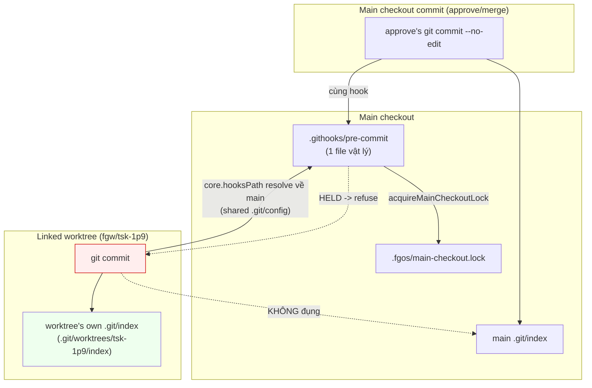

# main-checkout-lock-worktree-commit-scope — DISCUSSION

## 1. Trạng thái hiện tại

Distilled từ 1 report đã viết sẵn
(`plans/reports/internal-design-260805-1327-tsk-sir-worktree-commit-lock-scope-report.md`,
2026-08-05), không phải hội thoại sống. Report đã trả lời cả 3 câu hỏi gốc
của `tsk-sir` bằng đọc code + verify lệnh thật, và tự nhận diện 2 câu hỏi
còn mở (§3 dưới). Thiết kế (§6) đã đủ cụ thể để build — 1 mảnh việc duy
nhất, không tách con. Bước kế: `fgos-exploring` cho `tsk-sir`.

## 2. Mục tiêu & đề bài

`tsk-sir` bắt nguồn từ 1 lần commit thật trong worktree `fgw/tsk-1p9` bị
`.githooks/pre-commit` từ chối vì lock của main checkout đang bị 1 session
khác giữ — dù commit đó không đụng gì tới main. Mục tiêu của item này
không phải "sửa cho hết bị block" một cách mù quáng, mà trước hết là xác
định: cơ chế nào khiến 1 lock của main checkout áp lên commit trong
worktree, việc đó có phải chủ ý thiết kế hay là gap, và nếu là gap thì fix
tối thiểu, đúng chỗ là gì — mà không đụng tới các call site khác đang dùng
chung primitive `acquireMainCheckoutLock` (claim-port.mjs, merge.mjs) và
không mở rộng scope sang việc khác (vd: cô lập `.fgos` per-worktree, đã có
`tsk-45y` bàn và đóng riêng).

## 3. Vấn đề rõ / chưa rõ

| # | Vấn đề | Trạng thái | Ghi chú |
|---|--------|-----------|---------|
| 1 | Vì sao worktree commit resolve về lock của main checkout | Rõ | `core.hooksPath` dùng chung `.git/config`, resolve relative theo main working tree; `.githooks/pre-commit` là 1 file vật lý duy nhất, `__dirname` luôn = main checkout — verify bằng `git config --get core.hooksPath` chạy từ cả main lẫn worktree, ra cùng 1 đường tuyệt đối |
| 2 | Đây có phải thiết kế sai | Rõ (kết luận: nhiều khả năng là gap) | 3 bằng chứng: decision 0021 không hề bàn worktree; mỗi worktree có `.git/index` riêng nên hazard thật không áp dụng cơ học; guard 2 cùng file đã biết phân biệt worktree/main mà guard 1 (lock acquire) thì không |
| 3 | tsk-45y có giải bài này chưa | Rõ — KHÔNG | tsk-45y bàn lớp khác (fgOS state-write qua events.lock), đã đóng wontfix vì premise sai (worktree không có `.fgos` ghi được). Scout evidence của tsk-45y không hề grep `.githooks/` — blind spot thật, không phải đã xét rồi bác bỏ |
| 4 | Có bug thật nào từng bị ảnh hưởng bởi việc này trước tsk-sir chưa | Chưa rõ | Report chưa grep `.fgos/events.jsonl` cho case cụ thể; để `fgos-exploring` quyết có cần scout thêm hay không |
| 5 | Fix đúng có phải chỉ thêm `gitDir !== gitCommonDir` check vào hook, hay có race scenario ẩn nào đó vẫn cần lock áp cho worktree commit | Chưa rõ | Chưa tìm thấy bằng chứng nào cho race ẩn, nhưng chưa loại trừ hết — cần `fgos-planning` cân nhắc khi viết test plan |

## 4. Quyết định đã chốt

| D-ID | Quyết định |
|------|-----------|
| D1 | Root cause: `.githooks/pre-commit` là 1 file vật lý duy nhất do `core.hooksPath` (relative) dùng chung `.git/config` mọi worktree và resolve theo main working tree; `repoRoot`/lock check trong hook luôn là của main checkout, bất kể worktree nào gọi `git commit` |
| D2 | Đây là gap thiết kế, không phải quyết định cân nhắc — decision 0021 (lý do hook tồn tại) chỉ bàn race trên main's `.git/index`, không hề xét worktree; mỗi worktree có index riêng nên hazard đó không áp dụng cơ học cho worktree commit; guard 2 cùng file (`currentFgwBranchIfMainCheckout`) đã phân biệt worktree/main còn guard 1 (`acquireMainCheckoutLock`) thì không — bất đối xứng trong cùng 1 file |
| D3 | tsk-45y không giải bài này — khác lớp (fgOS state-write qua `events.lock` vs git-commit hook qua `main-checkout.lock`), và bằng chứng đóng của tsk-45y có blind spot thật (chưa grep `.githooks/`) |
| D4 | Hướng fix đề xuất: thêm check `gitDir !== gitCommonDir` (mirror guard 2's logic) NGAY TRƯỚC bước gọi `acquireMainCheckoutLock` trong hook's `main()` — skip lock check khi đang chạy từ linked worktree. Không sửa `acquireMainCheckoutLock` primitive chính nó, vì nó dùng chung cho claim-port.mjs/merge.mjs — chỉ call site trong hook mới cần phân biệt worktree |

Mỗi D-ID trên đã ghi qua `fgos decision --id tsk-sir` (xem log CLI, seq đính
kèm dưới mỗi lần chạy trong session này).

## 5. Q&A log

- **2026-08-05T06:4x — Distill extraction.** Nguồn:
  `plans/reports/internal-design-260805-1327-tsk-sir-worktree-commit-lock-scope-report.md`.
  Trích: §2 (mục tiêu, tổng hợp lại từ report's "Câu hỏi" + ngữ cảnh
  tsk-1p9 commit bị chặn), §3 (5 dòng — 3 đã rõ theo report §1-§3, 2 chưa
  rõ theo report's "Việc chưa rõ"), §4 (D1-D4, ánh xạ trực tiếp từ report's
  §1/§2/§3/"Việc chưa rõ" dòng đề xuất fix), §6 (viết mới, không copy
  nguyên văn report), §7 (1 task, vì thiết kế là 1 mảnh không tách). Không
  có hội thoại sống — report đã tự trả lời đủ 3 câu hỏi gốc, 2 điểm còn mở
  giữ nguyên trong §3, không đoán.

## 6. Thiết kế đã chốt {#design}

`.githooks/pre-commit` chặn `git commit` dựa trên `.fgos/main-checkout.lock`
để bảo vệ đúng 1 hazard cụ thể: 2 tiến trình cùng `git commit` vào **cùng
một `.git/index`** của main checkout (bug gốc `tsk-3w8`, decision 0021).
Vì `core.hooksPath` là setting dùng chung mọi worktree và git resolve
đường relative đó theo main working tree, hook chỉ tồn tại như MỘT file
vật lý ở main checkout — nên mọi `git commit`, kể cả từ 1 linked worktree
đang commit vào branch/index hoàn toàn riêng của nó, đều chạy qua đúng
file đó và check đúng lock của main.

Hazard thật (2 writer cùng đụng `MI`) chỉ xảy ra giữa 2 commit trên chính
main checkout (`MC` vs 1 `git commit` tay khác cũng lên main). Một
`git commit` trong worktree (`WC`) ghi vào `WI`, tách biệt hoàn toàn — bị
chặn bởi `H` là collateral, không phải bảo vệ đúng hazard mà decision 0021
nêu ra.

Fix đề xuất (D4): thêm check `gitDir !== gitCommonDir` — cùng logic
`currentFgwBranchIfMainCheckout` đã dùng — ngay trước dòng gọi
`acquireMainCheckoutLock` trong `main()`; nếu đang ở linked worktree, bỏ
qua bước acquire/check lock đó (guard 2 phía dưới vẫn giữ nguyên, nó vốn
đã skip worktree rồi). `acquireMainCheckoutLock` chính nó (primitive dùng
chung `claim-port.mjs`/`merge.mjs`) không đổi — chỉ đổi call site trong
hook.

## 7. Danh mục hạng mục / task {#tasks}

### {#task-worktree-commit-lock-skip}

- **Mục tiêu:** Sửa `.githooks/pre-commit`'s `main()` để bỏ qua
  `acquireMainCheckoutLock` khi commit đang chạy từ 1 linked worktree,
  không phải main checkout — đóng gap D2, theo hướng fix D4.
- **Trích §6:** toàn bộ — thiết kế là 1 mảnh, không tách.
- **D-ID áp dụng:** D1 (root cause), D2 (gap, không phải chủ ý), D4
  (hướng fix cụ thể).
- **Quan hệ sibling:** không — item độc lập, không phụ thuộc/chặn task
  nào khác đã biết. Không đụng `tsk-45y` (đã đóng, lớp khác) hay `tsk-1p9`
  (item khác, tình cờ cùng lúc phát hiện bug này).
- **Việc còn mở cho `fgos-planning` cân nhắc:** §3 dòng 4 (có bug thật nào
  từng bị ảnh hưởng chưa) và dòng 5 (có race ẩn nào cần giữ lock cho
  worktree không) — nếu không tìm thêm bằng chứng, `fgos-planning` nên tự
  quyết dựa trên D1-D4 đã đủ vững, không cần chặn lại vì 2 điểm này.
- **Draft verify:** mirror shape của `test/e2e/main-checkout-lock-hook.test.mjs`
  (dùng `git commit` subprocess thật) — thêm case: main checkout giữ lock
  (giả lập bằng tạo `.fgos/main-checkout.lock` trực tiếp hoặc claim thật),
  sau đó `git commit` từ 1 linked worktree phải **thành công** (không bị
  refuse), trong khi `git commit` trực tiếp trên main checkout vẫn bị
  refuse như cũ.
