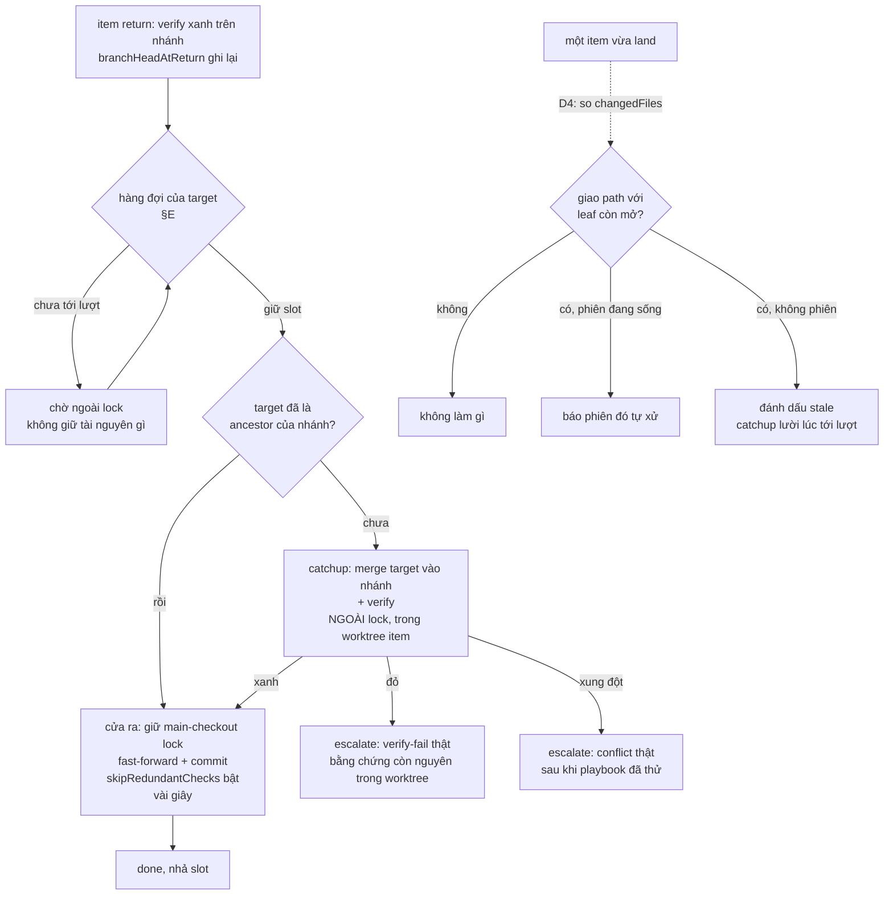

# Merge Conductor: gỡ nghẽn throughput + giải phóng người khỏi việc canh merge

## 1. Trạng thái hiện tại

Vòng 4 (2026-08-12). **D1–D6 đã mint** (§4), đã ghi vào state qua
`fgos decision` (seq 14590–14595). §6 giữ nguyên trục *"verify chạy đúng một
lần, ngoài lock; cửa ra chỉ fast-forward"* — vòng này không đổi hình dạng
thiết kế, chỉ đổi cách chia hạng mục nên §6 không cần regenerate.

Thứ tự đã chốt: **§E đi trước** (D5), hấp thụ luôn tsk-1zd (D6). tsk-kv3 và
tsk-60h chạy song song. tsk-280 đã kiểm: **không chặn** (D6).

**#17 đã đóng**: §H thành `task-escalation-playbooks`, phạm vi chính xác là ba
reason còn lại trong `CATCHUP_REASONS` chưa có playbook
(`verify-timeout-post-merge`, `integration-drift`,
`merge-failed-unclassified`) cộng việc thu hẹp stop rule chung.

§7 nay có **5 hạng mục**, mỗi cái đủ để tự vận hành: bối cảnh phải đọc, file
đụng, footprint khai báo, D-ID áp dụng, acceptance đánh số, verify, rủi ro/
rollback. `tsk-51m` là item chủ quản; tiến độ tổng đọc bằng
`fgos rollup tsk-51m`.

Thiết kế đã chín, sẵn sàng handoff sang `fgos-coding-exploring` →
`fgos-coding-planning`. **Dừng trước implement** theo yêu cầu của người.

## 2. Mục tiêu & đề bài

Merge của fgOS vừa chậm vừa buộc người ngồi canh. Nguồn chậm là vùng găng
quá rộng: `mergeRunnerItem` giữ `.fgos/main-checkout.lock` toàn repo suốt cả
merge lẫn verify (đo ~185s, trong khi `DEFAULT_TTL_MS` chỉ 180s nên phải chắp
heartbeat ở `merge.mjs:745` để lock khỏi tự hết hạn giữa chừng) — trong khi
phần thật sự cần độc quyền chỉ là git-merge-stage cộng commit, vài giây.
Verify bị kẹt bên trong lock vì không có chỗ cô lập nào để chạy nó sau khi đã
merge vào checkout dùng chung. Chồng lên đó là ba tầng nghẽn khác: `merge next`
chỉ tiêu thụ `ready[0]` nên một item kẹt làm đứng cả vòng merge của repo
(tsk-1zd đo được 13 lượt liên tiếp trả về cùng một item, 7 item sẵn sàng không
bao giờ tới lượt); cổng cây-sạch của `approve`/`sync-root` đòi cây chung sạch
tuyệt đối nên merge bị ghép cứng vào việc dang dở của session khác (tsk-kv3,
tái hiện live ngay trong phiên tạo item này); và người vẫn bị giữ lại ở những
điểm dừng mà máy đã đủ năng lực tự quyết — rõ nhất là `merge-conflict`, nơi
verb `catchup` đã tồn tại và nhận đúng reason nhưng skill chưa bao giờ được
bảo dùng nó (tsk-60h). Mục tiêu cuối: throughput merge không còn là hàm của
việc có ai đang ngồi canh hay không, và người chỉ bị gọi cho những phán đoán
thật sự cần người.

## 3. Vấn đề rõ / chưa rõ

| # | Vấn đề | Trạng thái | Ghi chú |
|---|---|---|---|
| 1 | Thiết kế Conductor đã có chưa | **rõ** | Có, từ 2026-08-01, §A–§I + thứ tự triển khai + 4 câu hỏi mở |
| 2 | Phần nào của Conductor đã ship | **rõ** | §B drift pre-flight, §C sync-root (tsk-3bn done); §D merge-set clustering (tsk-2u0 done); §A lock scope thật (tsk-2eq done); §F một phần (tsk-2vd done); §I audit trail (tsk-19j done) |
| 3 | Phần nào CHƯA ship | **rõ** | **§E — hàng đợi đơn cho mỗi target branch** và **§H — chính sách escalation thu hẹp** |
| 4 | "Pipeline 16 làn" có thật đang chạy không | **rõ — KHÔNG** | `capacity.dispatch` = 1 event trên ~14.500. Song song thật đến từ N phiên người/agent: 7–8 item vào `doing` mỗi giờ lúc cao điểm |
| 5 | Q1 (lock có chặn worktree không) | **rõ — đã giải** | tsk-45y `wontfix`, tsk-2eq `done` → chốt là CÓ |
| 6 | Q4 (chặn git op huỷ diệt trên main checkout) | **rõ — đã giải** | `fgos main-checkout-reset --sha --confirm` đã có |
| 7 | Q2: land từng phần vào `main`? | **D1** | |
| 8 | Q3: auto-rebase leaf? | **D2** | |
| 9 | tsk-280 có chặn gì không | **rõ** | Chặn §E, không chặn ba fix nhỏ. `todo`/`discovery`, dep `tsk-4on`, mang nhãn quét-lại-trước-khi-làm |
| 12 | Thời điểm refresh base cho nhánh đang mở | **rõ — 3 ứng viên, #2 giải bằng D4** | Cơ chế gây outdated: `createWorktree` bỏ qua `opts.baseRef` trên đường reuse (`worktree.mjs:438`), mà `fgw/<id>` thường đã tạo từ lúc decompose (`worktree.mjs:749`). #1 lúc `pick` → §7 task-refresh-at-pick. #3 trước `return` → gộp vào D3, không thành hạng mục riêng |
| 13 | Verify ở cửa vào hay cửa ra | **D3** | |
| 14 | Trigger refresh ở #2 | **D4** | |
| 15 | §E còn là hạng mục "để sau" không | **rõ — KHÔNG, đi trước** | Người quyết vòng 3: §E lên trước, ba fix nhỏ song song. Lý do kỹ thuật: §E là điều kiện để D3 đứng vững — target không được nhích giữa catchup-verify và land, nếu không bằng chứng vỡ và verify lại rơi vào lock |
| 16 | Cô lập footprint giữa §E và ba fix nhỏ | **D6** | tsk-1zd gộp vào §E. tsk-kv3 (`isWorkingTreeClean`, cùng file khác hàm) và tsk-60h (chỉ `merge-loop/SKILL.md`) chạy song song |
| 17 | §H (thu hẹp escalation) đứng riêng hay nằm trong §E | **rõ — đứng riêng** | Thành `task-escalation-playbooks`, làn song song. Phạm vi: 3 reason trong `CATCHUP_REASONS` (`bin/fgos.mjs:3814`) chưa có playbook — `verify-timeout-post-merge`, `integration-drift`, `merge-failed-unclassified` — cộng thu hẹp stop rule "kẹt hai lượt". tsk-60h là lát `merge-conflict` của cùng §H |
| 18 | tsk-280 có chặn §E không | **D6 — KHÔNG** | Bậc 8 của thiết kế 2026-08-01 giả định Conductor tin vào status. D3 khiến nó tin vào `branchHeadAtReturn`, mà `move` không cấp được trường đó. tsk-280 vẫn là vấn đề vệ sinh thật (item tới `awaiting-approval` chưa từng verify xanh) nhưng không làm merge land code chưa verify |

## 4. Quyết định đã chốt

| D-ID | Quyết định | Lý do |
|---|---|---|
| D1 | Không cho một root chưa gom đủ con land từng phần vào `main` | Root tồn tại để gom con; root thiếu con mà ra `main` có thể gây hỏng. Khớp đề xuất §H.4 của thiết kế 2026-08-01, nay xác nhận thay vì để treo |
| D2 | Không tự rebase nhánh đang có commit riêng; refresh chỉ bằng merge-target-vào-nhánh | fgOS có worktree sống gắn từng nhánh; rebase viết lại lịch sử nhánh đang checkout là kiểu tai nạn tsk-3au. Merge-in đạt cùng mục tiêu mà không rewrite, và đúng thứ `catchup` đang làm |
| D3 | Verify chạy đúng một lần ở cửa vào (ngoài lock); cửa ra chỉ fast-forward, không verify | `mergedTreeAlreadyVerified` (`merge.mjs:803`, tsk-516) đã cho phép bỏ verify cửa ra khi target là ancestor + tip = `branchHeadAtReturn`. Catchup verify là thứ cấp lại bằng chứng đó; bỏ nó thì verify rơi vào trong lock (~185s, vượt TTL 180s) |
| D4 | Sau-khi-root-sync là điểm **phát hiện**, không phải điểm catchup; trigger bằng giao đường dẫn thật | Trigger "root nhích" lấy topology làm proxy cho rủi ro: root 13 con ⇒ ~78 lượt verify (~4h) phần lớn vô ích. Dùng `changedFiles` (`merge.mjs:362`) cả hai phía, không dùng footprint khai báo |
| D5 | §E đi trước; ba fix nhỏ chạy song song | §E là điều kiện để D3 đứng vững — target không được nhích giữa catchup-verify và land. Ba fix nhỏ không nằm trên đường tới hạn đó |
| D6 | tsk-280 không chặn §E; tsk-1zd gộp vào §E | tsk-280: `mergedTreeAlreadyVerified` fail-closed khi thiếu/lệch `branchHeadAtReturn` (`merge.mjs:804`), mà `move` không cấp trường đó (`bin/fgos.mjs:1301`, không guard verify trong `store.mjs`) — item lách chỉ tự trả giá bằng verify đầy đủ ở cửa ra. tsk-1zd: "bỏ qua item không tiến được" chính là hành vi hàng đợi phải có, và cả hai cùng sửa picker ở `bin/fgos.mjs` nên tách ra chỉ tự tạo xung đột footprint |

> Ghi chú độ chín: nửa tsk-280 của D6 là **phát hiện có bằng chứng** (đọc
> code), không cần đứng qua vòng. Nửa tsk-1zd là **quyết định của người ở
> vòng 4**, mới một vòng — nếu vòng sau người đổi ý thì supersede D6 thay vì
> sửa tại chỗ.

## 5. Q&A log

- **2026-08-12T06:11Z — quét đội hình 4 agent** (`plans/reports/*260812-134*`):
  bug-clusters gom 54 item merge thành 7 nhóm nguyên nhân; engine-code trace
  đường thực thi `merge next`/`approve` kèm cost profile; contention kiểm kê
  tài nguyên chia sẻ + audit điểm dừng chờ người; prior-art trích luật khoá
  L9/L10/0005/0020.

- **2026-08-12T07:49Z — scout, phát hiện tái định vị**: thiết kế Merge
  Conductor đã đầy đủ từ 2026-08-01
  (`plans/reports/internal-research-260801-1823-merge-mechanism-grand-orchestrator-design-report.md`,
  refs của tsk-3bn). Đối chiếu trạng thái item → §E và §H là phần chưa xây.

- **2026-08-12T07:50Z — kiểm chứng tiền đề "16 làn"**: `capacity.dispatch`
  đếm theo `.type` thật = 1 (event duy nhất 04:55 hôm nay, capacity `gather`).
  Xác nhận D5 của `merge-list-tree-bottleneck-priority`. Khung "phễu 1 làn
  dưới pipeline 16 làn" bị bác bỏ, thay bằng "phễu 1 làn dưới N phiên song
  song, 7–8 claim/giờ".

- **2026-08-12T08:02Z — người trả lời 3 câu hỏi vòng 1**: (1) đồng ý ba fix
  nhỏ trước, hỏi trạng thái tsk-280; (2) Q2 → không land từng phần, "root là
  để gom con"; (3) Q3 → không auto-rebase, nhưng mở đề bài mới: "nhánh active
  nên có thời điểm rõ ràng để rebase, rebase sớm đỡ conflict sau. Tốc độ agent
  nhanh, work tạo ra đến khi được pick là outdated rồi."

- **2026-08-12T08:04Z — scout cơ chế outdated**: `worktree.mjs:438`
  `opts.baseRef` bị bỏ qua trên đường reuse; `worktree.mjs:749`
  `createBranchRef` tạo `fgw/<id>` từ `main` ngay lúc decompose. Item con giữ
  base cũ tới lúc được pick. `docs/decisions/0022` đã nêu, chưa sửa.

- **2026-08-12T08:25Z — người chất vấn verify của catchup**: "catchup đầu vào
  tại sao phải verify... verify đầu ra thôi chứ." Trả lời:
  `mergedTreeAlreadyVerified` đã cho phép bỏ verify cửa ra; catchup verify
  chính là thứ cấp bằng chứng cho nó. Bỏ đi ⇒ verify rơi vào lock. → D3. Ghi
  nhận vòng lặp tự siết: merge chậm → main nhích → verify vào lock → chậm hơn.

- **2026-08-12T08:31Z — người hỏi trigger cho #2**: "cái giá thật sự là ở số
  2, trigger nào để catchup ở số 2?" → D4.

- **2026-08-12T08:31Z — người đảo thứ tự**: "§E lên trước luôn, ba fix nhỏ làm
  song song." Ghi nhận #15 giải, #16 mở (footprint giữa §E và tsk-1zd/tsk-kv3).

- **2026-08-12T08:39Z — người chốt gộp + yêu cầu kiểm tsk-280**: "gộp tsk-1zd
  vào §E, kiểm tra tsk-280 luôn." Scout tsk-280: `move` vẫn gọi thẳng
  `moveWork` với `role: 'human'`, không tiền điều kiện ngoài FSM hợp lệ
  (`bin/fgos.mjs:1291-1303`); `store.mjs` không có guard verify trên đường
  status — mô tả tsk-280 còn đúng về cấu trúc. NHƯNG nó không chặn §E:
  `mergedTreeAlreadyVerified` fail-closed ngay dòng đầu khi thiếu/lệch
  `branchHeadAtReturn` (`merge.mjs:804`), mà `move` không bao giờ cấp trường
  đó. Ba ca đã soi: chưa từng return ⇒ không chứng chỉ ⇒ verify đầy đủ; từng
  return rồi có commit mới ⇒ tip lệch ⇒ verify đầy đủ; từng return, tip vẫn
  đúng SHA đã xanh ⇒ skip bật, và đúng như vậy. → D6.

## 6. Thiết kế đã chốt {#design}

### Vấn đề, phát biểu lại cho người chưa đọc gì

Hôm nay mỗi lần merge một item, fgOS giữ một lock **toàn repo** rồi làm ba
việc bên trong nó: merge nhánh vào target, chạy verify của item trên cây vừa
merge, rồi commit. Verify là phần đắt nhất (~185s). Vì lock chỉ có một và giữ
suốt cả ba việc, mọi merge khác trong repo phải xếp hàng — kể cả merge của
nhánh chẳng liên quan gì.

Tệ hơn, có một vòng lặp tự siết. fgOS **đã** có cơ chế bỏ qua verify ở cửa ra
(`mergedTreeAlreadyVerified`): nếu chứng minh được cây sắp merge đúng bằng cây
đã verify xanh lúc `return`, thì khỏi verify lại. Nhưng điều kiện của nó là
target **chưa nhích** kể từ lúc fork. Mà merge đang tuần tự và chậm nên luôn có
người land trước, target luôn nhích, điều kiện luôn vỡ, verify luôn phải chạy
lại **bên trong lock** — làm merge chậm thêm, làm target nhích nhiều hơn.

### Nguyên lý của thiết kế

Verify chạy **đúng một lần, ở cửa vào, ngoài lock**. Cửa ra chỉ còn fast-forward
và commit — vài giây, và không verify gì cả.

Đạt được bằng cách sắp xếp lại thời điểm, không viết engine mới:

- **Cửa vào** là `catchup`: merge target vào nhánh item, chạy verify ở đó. Việc
  này diễn ra **ngoài** main-checkout lock, trong worktree của chính item. Khi
  xong, nhánh item đã chứa target làm ancestor, và `branchHeadAtReturn` được
  cập nhật thành SHA vừa xanh. Đó chính xác là hai điều kiện
  `mergedTreeAlreadyVerified` cần.
- **Cửa ra** vì thế thoả điều kiện, `skipRedundantChecks` bật, merge chỉ còn
  thao tác git thuần. Lock giữ vài giây.
- **Điều kiện để chuỗi này đứng vững** là target không được nhích trong khoảng
  giữa "catchup verify xong" và "land". Nếu nhích, bằng chứng vỡ và quay lại
  vòng lặp cũ. Thứ đảm bảo điều đó là **§E — hàng đợi đơn theo từng target
  branch**: một item chỉ land khi đang giữ slot của target đó, và trong lúc nó
  giữ slot thì không ai khác chạm vào target ấy.

Đây là lý do §E không phải hạng mục xa xỉ mà là **điều kiện tiên quyết**: không
có hàng đợi thì D3 không đứng, verify lại rơi vào lock.

### Nhánh cũ thì refresh lúc nào

Nhánh `fgw/<id>` thường được tạo ngay lúc decompose và nằm chờ tới lúc có người
pick, nên base của nó đã cũ trước cả khi ai bắt đầu làm. Ba thời điểm refresh:

- **Lúc `pick`** — nếu nhánh **chưa có commit riêng nào**, refresh là thao tác
  rủi ro bằng không (không có việc gì để mất). Làm tự động, không hỏi. Đây trám
  đúng khoảng trống decompose→pick.
- **Sau khi một root sync** — **không** catchup hàng loạt. Đây là điểm *phát
  hiện* (D4): so `changedFiles` của cái vừa land với `changedFiles` của từng
  leaf còn mở. Không giao path ⇒ không làm gì. Có giao + có phiên đang sống ⇒
  báo phiên đó tự xử. Có giao + không phiên nào sống ⇒ chỉ đánh dấu stale.
- **Lúc tới lượt trong hàng đợi** — đây là catchup thật, và nó trùng luôn với
  "cửa vào" ở trên. Mọi nhánh chưa refresh đều hội tụ về đây.

Nhánh đã có commit riêng thì **không bao giờ bị tự động đụng vào** (D2) — chỉ
được báo, còn quyết định là của phiên đang sở hữu.

### Luồng

### Người bị gọi lúc nào

Sau thiết kế này, chỉ còn ba chỗ: **Iron Law** (phán đoán thật, giữ nguyên),
**conflict thật** sau khi playbook `catchup` đã thử và thất bại, và **verify đỏ
thật** sau khi playbook tự chẩn đoán đã thử. Mọi thứ khác — nhánh cũ, target
nhích, item kẹt đầu hàng, cây chung bẩn vì việc của người khác — máy tự xử.

## 7. Danh mục hạng mục / task {#tasks}

### Cấu trúc cha–con

`tsk-51m` là **item chủ quản**, giữ toàn bộ thiết kế và điều phối. Năm hạng
mục dưới đây là con trực tiếp của nó. Tiến độ tổng đọc bằng
`fgos rollup tsk-51m`; không dựng thêm file index nào cho bộ con này.

Hai làn thi công (D5, D6):

| Làn | Hạng mục | Chạy khi nào |
|---|---|---|
| 1 — tới hạn, tuần tự | `task-merge-queue` → `task-verify-at-inbound-gate` | nối đuôi, không đảo được |
| 2 — song song | `task-refresh-at-pick`, `task-post-sync-detection`, `task-escalation-playbooks`, tsk-kv3, tsk-60h | bung ngay, không giao file với làn 1 |

**Footprint phải khai ngay lúc tạo con** — đây là cơ chế duy nhất khiến
`mergeReadiness` tự serialize hai item đụng nhau thay vì để phát hiện lúc
merge. Mỗi hạng mục dưới đều có mục "Footprint khai báo"; copy nguyên vào
trường `footprint` của item con.

---

### task-merge-queue {#task-merge-queue}

**Mục tiêu**: §E — hàng đợi đơn cho mỗi target branch. Một item chỉ land khi
đang giữ slot của target đó; trong lúc nó giữ slot, không ai khác chạm target
ấy. **Hấp thụ luôn tsk-1zd** (D6): picker phải bỏ qua item không tiến được ở
lượt này thay vì trả về nó vô hạn, và phải tách tín hiệu "hết việc để merge"
khỏi "kẹt mãi một item".

**Vì sao cần** (§6): D3 chỉ đứng khi target không nhích giữa lúc catchup-verify
xong và lúc land. Nếu nhích, `mergedTreeAlreadyVerified` trả false, verify rơi
lại vào trong lock — quay về đúng vòng lặp tự siết đang có.

**Bối cảnh nền cần đọc trước**:
- `plans/reports/internal-research-260801-1823-merge-mechanism-grand-orchestrator-design-report.md` §E — thiết kế gốc, đọc nguyên mục
- `src/runner/main-checkout-lock.mjs` — lineage lock wx-atomic-create đã chứng minh 4 lần; §E **tái dùng** lineage này, khoá theo target branch, không phát minh primitive mới
- `src/state/graph-harness.mjs:109` `mergeReadiness` — đã tính sẵn `ready`/`mergeSets`; hàng đợi tiêu thụ nó, không tính lại
- tsk-1zd's own description — số đo 13 lượt lặp, item `tsk-2ej`

**File đụng**: `bin/fgos.mjs` (case `merge`, picker quanh dòng 2038; case
`approve`), `src/runner/main-checkout-lock.mjs` (mở rộng khoá theo target),
`src/runner/merge.mjs` (điểm gọi lock trong `mergeRunnerItem`, ~dòng 711).

**Footprint khai báo**: `bin/fgos.mjs`, `src/runner/main-checkout-lock.mjs`,
`src/runner/merge.mjs`

**D-ID áp dụng**: D3, D5, D6.

**Acceptance**:
1. Hai phiên cùng xin slot của một target: phiên thứ hai chờ có giới hạn, không
   crash, không fail-closed nhầm.
2. Trong lúc phiên A giữ slot của target T, tip của T không đổi bởi bất kỳ
   đường nào khác.
3. Merge vào **hai target khác nhau** chạy được đồng thời — không còn khoá
   toàn repo.
4. Item vướng Iron Law không được picker trả về ở lượt kế tiếp; các item ready
   khác tới lượt.
5. "Hết việc để merge" và "kẹt mãi một item" là hai tín hiệu phân biệt được ở
   tầng gọi (`merge-loop` dựa vào đó cho stop rule pool-cạn).

**Verify**: `npm test`

**Rủi ro / rollback**: đụng lineage lock — sai là chặn toàn bộ merge của repo.
Giữ đường cũ sau cờ tắt được cho tới khi acceptance 1–3 xanh trên thực địa.
Không đụng `catchup`'s lock gap trong hạng mục này (xem ghi chú cuối §7).

---

### task-verify-at-inbound-gate {#task-verify-at-inbound-gate}

**Mục tiêu**: D3 — đưa verify về cửa vào để cửa ra chỉ còn fast-forward. Gồm
hai nửa: (a) khi tới lượt land mà target chưa là ancestor của nhánh thì gọi
`catchup` như bước chuẩn, không phải chỉ khi đã kẹt; (b) bảo đảm
`mergedTreeAlreadyVerified` thực sự bật ở cửa ra sau đó.

**Vì sao cần** (§6): verify là khoản đắt nhất (~185s) và hiện nằm trong lock.
Đảo vị trí nó ra ngoài lock thu vùng găng xuống mức giây mà không viết engine
mới — cơ chế bỏ verify ở cửa ra đã tồn tại sẵn, chỉ chưa bao giờ đủ điều kiện
bật.

**Bối cảnh nền cần đọc trước**:
- `src/runner/merge.mjs:780-813` `mergedTreeAlreadyVerified` — đọc nguyên
  docblock, nó nêu rõ hai điều kiện và vì sao cố ý "sufficient, not necessary"
- `src/runner/merge.mjs:1046` `skipRedundantChecks` — điểm tiêu thụ
- `bin/fgos.mjs:3814` `CATCHUP_REASONS` — catchup hôm nay chỉ chạy khi item đã
  `blocked` vì 1 trong 6 reason; hạng mục này cần nó chạy được cả ở đường
  bình thường, chưa kẹt
- `docs/history/tsk-516-approve-reverify-scope/CONTEXT.md` D5 — nguồn gốc

**File đụng**: `src/runner/merge.mjs`, `bin/fgos.mjs` (case `catchup`, case
`approve`).

**Footprint khai báo**: `src/runner/merge.mjs`, `bin/fgos.mjs`

**D-ID áp dụng**: D3, D2.

**Acceptance**:
1. Item đi qua catchup rồi land: cửa ra **không** chạy verify
   (`skipRedundantChecks` bật), và chứng minh được bằng test chứ không bằng
   quan sát thời gian.
2. Item **không** đi qua catchup mà target đã nhích: cửa ra vẫn chạy verify đầy
   đủ — fail-closed giữ nguyên, không nới.
3. Item chưa từng `return` (không có `branchHeadAtReturn`): cửa ra chạy verify
   đầy đủ (D6 — chốt chặn của tsk-280).
4. Thời gian giữ `main-checkout.lock` trong một lần land giảm từ mức ~185s
   xuống mức giây; đo được, ghi lại con số thật.

**Verify**: `npm test`

**Rủi ro / rollback**: đây là chỗ **false-positive thì land code chưa verify**.
Tuyệt đối không nới hai điều kiện của `mergedTreeAlreadyVerified`; chỉ làm cho
chúng **có cơ hội đúng**, không bao giờ sửa để chúng dễ đúng hơn.

**Phụ thuộc**: `task-merge-queue` phải xong trước.

---

### task-refresh-at-pick {#task-refresh-at-pick}

**Mục tiêu**: refresh base lúc `pick` cho nhánh **chưa có commit riêng nào**,
đóng khoảng trống decompose→pick.

**Vì sao cần** (§6): `fgw/<id>` thường được tạo ngay lúc decompose và nằm chờ
tới lúc có người pick, nên base đã cũ trước cả khi ai bắt đầu làm. Người dùng
mô tả trực tiếp: *"tốc độ agent nhanh, work tạo ra mà đến khi được pick là
outdated rồi."*

**Bối cảnh nền cần đọc trước**:
- `src/runner/worktree.mjs:436-439` — docblock nói rõ `opts.baseRef` **bị bỏ
  qua trên đường reuse**; đây là gốc của vấn đề
- `src/runner/worktree.mjs:749` — `createBranchRef(..., baseRef:'main')` lúc
  decompose
- `docs/decisions/0022` mục "createWorktree 6 call site tự quyết baseRef/
  cleanup" — đã nhận diện, chưa sửa; hạng mục này đóng nó

**File đụng**: `src/runner/worktree.mjs`.

**Footprint khai báo**: `src/runner/worktree.mjs`

**D-ID áp dụng**: D2.

**Acceptance**:
1. Pick một item có nhánh **trắng** tạo từ lâu: worktree đứng trên tip hiện tại
   của target, không phải base cũ.
2. Pick một item có nhánh **đã có commit riêng**: nhánh KHÔNG bị đụng vào, chỉ
   báo độ lệch (ahead/behind) cho phiên.
3. Không có đường nào trong hạng mục này viết lại lịch sử nhánh (D2).

**Verify**: `npm test`

**Rủi ro / rollback**: nhầm "nhánh trắng" thành "có commit" (hoặc ngược lại)
là mất việc thật. Phép kiểm phải dựa trên so tip nhánh với base của chính nó,
không dựa vào việc worktree có tồn tại hay không.

---

### task-post-sync-detection {#task-post-sync-detection}

**Mục tiêu**: D4 — sau mỗi lần land, so `changedFiles` của cái vừa land với
`changedFiles` của từng leaf còn mở, rồi phân ba nhánh xử lý. **Không** catchup
hàng loạt.

**Vì sao cần** (§6): trigger "root vừa nhích" lấy sự kiện topology làm proxy
cho rủi ro thật — root 13 con land tuần tự cho ~78 lượt catchup+verify (~4h
verify thuần) mà phần lớn phát hiện ra không có gì đụng nhau.

**Bối cảnh nền cần đọc trước**:
- `src/runner/merge.mjs:362` `changedFiles` — nguồn sự thật, cả hai phía
- `src/state/graph-metrics.mjs:598` `footprintOverlapAmong` — **KHÔNG dùng** ở
  đây; nó so footprint *khai báo*, trường có thể thiếu/lệch. Đọc để biết vì sao
  không dùng
- `src/runner/claim-liveness.mjs` — cách xác định "phiên còn sống"

**File đụng**: mô-đun mới dưới `src/state/` hoặc `src/runner/` (ranh giới do
planning chốt), điểm gọi sau land trong `src/runner/merge.mjs`.

**Footprint khai báo**: `src/runner/merge.mjs`, `src/state/graph-harness.mjs`

**D-ID áp dụng**: D4, D2.

**Acceptance**:
1. Không giao path ⇒ **không sinh việc gì**, không thông báo, không đánh dấu.
2. Có giao path + leaf có phiên đang sống ⇒ sinh thông báo cho đúng phiên đó,
   không tự đụng nhánh.
3. Có giao path + không phiên nào sống ⇒ chỉ đánh dấu stale, không catchup.
4. Chi phí của bước phát hiện là O(số leaf mở), không kéo theo verify nào.

**Verify**: `npm test`

**Rủi ro / rollback**: nếu bước phát hiện tự nó gọi catchup ở bất kỳ nhánh nào
thì đã phá đúng lý do nó tồn tại. Test phải chứng minh **không có** verify nào
chạy trong đường này.

---

### task-escalation-playbooks {#task-escalation-playbooks}

**Mục tiêu**: §H — thu stop rule về đúng những chỗ thật sự cần người. Viết
playbook tự xử cho ba block reason còn lại trong `CATCHUP_REASONS` chưa có:
`verify-timeout-post-merge`, `integration-drift`, `merge-failed-unclassified`;
đồng thời thu hẹp stop rule chung "cùng id kẹt hai lượt liên tiếp" để nó không
còn nuốt chung mọi reason.

**Vì sao cần** (§6): sau thiết kế này chỉ còn ba chỗ cần người — Iron Law,
conflict thật sau khi playbook đã thử, verify đỏ thật sau khi playbook đã thử.
Hiện các reason còn lại dừng chờ người **vì chưa ai viết playbook**, không phải
vì máy không quyết được.

**Bối cảnh nền cần đọc trước**:
- `bin/fgos.mjs:3814` `CATCHUP_REASONS` — sáu reason catchup đã nhận; hai cái
  đã có playbook là `verify-fail-post-merge` và `merge-blocked-other-item`
- `plugins/fgOS/skills/merge-loop/SKILL.md` — bốn stop rule hiện tại, và chỗ
  `verify-fail-post-merge` tự chẩn đoán (khuôn mẫu để nhân bản)
- `plans/reports/internal-research-260801-1823-...-report.md` §H — danh sách
  escalation gốc, 5 mục
- tsk-3mv + hai con của nó — tiền lệ đã chứng minh hình dạng tự xử chạy được

**File đụng**: `plugins/fgOS/skills/merge-loop/SKILL.md` và các skill anh em
(`merge-next`, `cleanup-next`) nếu stop rule nằm rải.

**Footprint khai báo**: `plugins/fgOS/skills/merge-loop/SKILL.md`,
`plugins/fgOS/skills/merge-next/SKILL.md`

**D-ID áp dụng**: D1 (escalation cho ca root chưa gom đủ con giữ nguyên, không
được playbook hoá).

**Acceptance**:
1. Mỗi reason trong ba cái trên có một playbook viết rõ: dấu hiệu nhận biết,
   bước máy tự thử, điều kiện dừng, và cái gì được báo lên khi thử thất bại.
2. Stop rule "kẹt hai lượt" chỉ còn áp cho reason **chưa** có playbook, không
   nuốt chung.
3. Iron Law giữ nguyên là stop cần người, không bị playbook hoá.
4. Ca D1 (root chưa gom đủ con định land vào `main`) vẫn escalate, tuyệt đối
   không tự quyết.

**Verify**: `npm test`

**Rủi ro / rollback**: playbook quá hăng sẽ giấu lỗi thật thành "đã tự xử".
Mỗi playbook phải để lại dấu vết quyết định qua cơ chế `fgos decision` đã có
(§I), không im lặng.

**Quan hệ**: song song. tsk-60h là lát `merge-conflict` của chính §H — làm
trước hoặc cùng lúc, không trùng phạm vi.

---

### Item đã tồn tại, xử lý ra sao

- **tsk-1zd** — **hấp thụ vào `task-merge-queue`** (D6), không chạy riêng. Việc
  đổi state (`supersededBy`/`duplicates`) thuộc bước handoff sang planning, không
  phải việc của skill này.
- **tsk-kv3** — thu cổng cây-sạch về đúng footprint item đang merge. Song song
  với làn 1. Cùng file `merge.mjs` nhưng khác hàm (`isWorkingTreeClean`,
  `merge.mjs:109-124`) — khai `footprint` hẹp để `mergeReadiness` tự serialize
  nếu cần. Ghi chú: hạng mục này chồng lấn khái niệm với
  `task-verify-at-inbound-gate` (cả hai đều làm merge bớt phụ thuộc cây chung)
  — planning cần chốt ranh giới trước khi cả hai cùng chạy.
- **tsk-60h** — lát `merge-conflict` của §H. Song song an toàn thật (chỉ
  `merge-loop/SKILL.md`).
- **tsk-280** — **ngoài phạm vi** (D6). Vấn đề vệ sinh riêng, không chặn làn 1.

### Ghi chú kỹ thuật chưa gán chủ

Ba thứ scout phát hiện, chưa thuộc hạng mục nào — planning quyết gộp vào đâu
hay tách item mới:

1. **`catchup` không giữ `main-checkout` lock** và tự chép lại logic
   merge/verify/commit thay vì gọi `mergeRunnerItem`. Vì
   `task-verify-at-inbound-gate` biến catchup thành đường chính, lỗ này chuyển
   từ "hẹp" thành "trên đường nóng" — nhiều khả năng phải gộp vào hạng mục đó.
2. **`worktree.mjs:652` `git branch -f` không khoá** — gốc chung của cả tsk-46a
   lẫn tsk-2cd. Một fix CAS đóng cả hai.
3. **`provisionDependencies` chạy `npm ci` mới tinh trên mỗi ephemeral merge
   worktree**, không tái dùng cache lúc dispatch; và `driftStatus` tính lại 2
   lần trong một `merge next` khi sync-root nổ.
