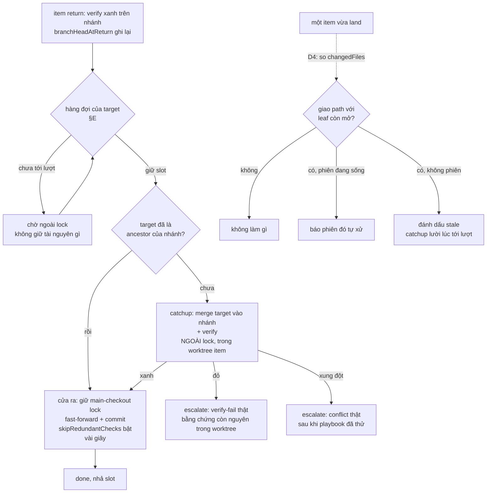

# Merge Conductor: gỡ nghẽn throughput + giải phóng người khỏi việc canh merge

## 1. Trạng thái hiện tại

Vòng 4 (2026-08-12). **D1–D6 đã mint** (§4), đã ghi vào state qua
`fgos decision` (seq 14590–14595). §6 giữ nguyên trục *"verify chạy đúng một
lần, ngoài lock; cửa ra chỉ fast-forward"* — vòng này không đổi hình dạng
thiết kế, chỉ đổi cách chia hạng mục nên §6 không cần regenerate.

Thứ tự đã chốt: **§E đi trước** (D5), hấp thụ luôn tsk-1zd (D6). tsk-kv3 và
tsk-60h chạy song song. tsk-280 đã kiểm: **không chặn** (D6).

Điểm mở còn lại: **#17** — phần còn lại của §H (playbook cho `verify-fail`,
`integration-drift`) chưa ai nhận, hiện chưa thành hạng mục.

Thiết kế đã đủ chín để handoff: §6 ổn định, §7 có 4 hạng mục với anchor +
verify nháp. Chờ người xác nhận để chuyển sang
`fgos-coding-exploring` → `fgos-coding-planning`.

## 2. Mục tiêu & đề bài

Merge của fgOS vừa chậm vừa buộc người ngồi canh. Nguồn chậm là vùng găng
quá rộng: `mergeRunnerItem` giữ `.fgos/main-checkout.lock` toàn repo suốt cả
merge lẫn verify (đo ~185s, trong khi `DEFAULT_TTL_MS` chỉ 180s nên phải chắp
heartbeat ở `merge.mjs:745` để lock khỏi tự hết hạn giữa chừng) — trong khi
phần thật sự cần độc quyền chỉ là git-merge-stage cộng commit, vài giây.
Verify bị kẹt bên trong lock vì không có chỗ cô lập nào để chạy nó sau khi đã
merge vào checkout dùng chung. Chồng lên đó là ba tầng nghẽn khác: `merge next`
chỉ tiêu thụ `ready[0]` nên một item kẹt làm đứng cả vòng merge của repo
(tsk-1zd đo được 13 lượt liên tiếp trả về cùng một item, 7 item sẵn sàng không
bao giờ tới lượt); cổng cây-sạch của `approve`/`sync-root` đòi cây chung sạch
tuyệt đối nên merge bị ghép cứng vào việc dang dở của session khác (tsk-kv3,
tái hiện live ngay trong phiên tạo item này); và người vẫn bị giữ lại ở những
điểm dừng mà máy đã đủ năng lực tự quyết — rõ nhất là `merge-conflict`, nơi
verb `catchup` đã tồn tại và nhận đúng reason nhưng skill chưa bao giờ được
bảo dùng nó (tsk-60h). Mục tiêu cuối: throughput merge không còn là hàm của
việc có ai đang ngồi canh hay không, và người chỉ bị gọi cho những phán đoán
thật sự cần người.

## 3. Vấn đề rõ / chưa rõ

| # | Vấn đề | Trạng thái | Ghi chú |
|---|---|---|---|
| 1 | Thiết kế Conductor đã có chưa | **rõ** | Có, từ 2026-08-01, §A–§I + thứ tự triển khai + 4 câu hỏi mở |
| 2 | Phần nào của Conductor đã ship | **rõ** | §B drift pre-flight, §C sync-root (tsk-3bn done); §D merge-set clustering (tsk-2u0 done); §A lock scope thật (tsk-2eq done); §F một phần (tsk-2vd done); §I audit trail (tsk-19j done) |
| 3 | Phần nào CHƯA ship | **rõ** | **§E — hàng đợi đơn cho mỗi target branch** và **§H — chính sách escalation thu hẹp** |
| 4 | "Pipeline 16 làn" có thật đang chạy không | **rõ — KHÔNG** | `capacity.dispatch` = 1 event trên ~14.500. Song song thật đến từ N phiên người/agent: 7–8 item vào `doing` mỗi giờ lúc cao điểm |
| 5 | Q1 (lock có chặn worktree không) | **rõ — đã giải** | tsk-45y `wontfix`, tsk-2eq `done` → chốt là CÓ |
| 6 | Q4 (chặn git op huỷ diệt trên main checkout) | **rõ — đã giải** | `fgos main-checkout-reset --sha --confirm` đã có |
| 7 | Q2: land từng phần vào `main`? | **D1** | |
| 8 | Q3: auto-rebase leaf? | **D2** | |
| 9 | tsk-280 có chặn gì không | **rõ** | Chặn §E, không chặn ba fix nhỏ. `todo`/`discovery`, dep `tsk-4on`, mang nhãn quét-lại-trước-khi-làm |
| 12 | Thời điểm refresh base cho nhánh đang mở | **rõ — 3 ứng viên, #2 giải bằng D4** | Cơ chế gây outdated: `createWorktree` bỏ qua `opts.baseRef` trên đường reuse (`worktree.mjs:438`), mà `fgw/<id>` thường đã tạo từ lúc decompose (`worktree.mjs:749`). #1 lúc `pick` → §7 task-refresh-at-pick. #3 trước `return` → gộp vào D3, không thành hạng mục riêng |
| 13 | Verify ở cửa vào hay cửa ra | **D3** | |
| 14 | Trigger refresh ở #2 | **D4** | |
| 15 | §E còn là hạng mục "để sau" không | **rõ — KHÔNG, đi trước** | Người quyết vòng 3: §E lên trước, ba fix nhỏ song song. Lý do kỹ thuật: §E là điều kiện để D3 đứng vững — target không được nhích giữa catchup-verify và land, nếu không bằng chứng vỡ và verify lại rơi vào lock |
| 16 | Cô lập footprint giữa §E và ba fix nhỏ | **D6** | tsk-1zd gộp vào §E. tsk-kv3 (`isWorkingTreeClean`, cùng file khác hàm) và tsk-60h (chỉ `merge-loop/SKILL.md`) chạy song song |
| 17 | §H (thu hẹp escalation) đứng riêng hay nằm trong §E | **CHƯA RÕ** | tsk-60h là một lát của §H. Phần còn lại (playbook cho `verify-fail`, `integration-drift`) chưa ai đụng |
| 18 | tsk-280 có chặn §E không | **D6 — KHÔNG** | Bậc 8 của thiết kế 2026-08-01 giả định Conductor tin vào status. D3 khiến nó tin vào `branchHeadAtReturn`, mà `move` không cấp được trường đó. tsk-280 vẫn là vấn đề vệ sinh thật (item tới `awaiting-approval` chưa từng verify xanh) nhưng không làm merge land code chưa verify |

## 4. Quyết định đã chốt

| D-ID | Quyết định | Lý do |
|---|---|---|
| D1 | Không cho một root chưa gom đủ con land từng phần vào `main` | Root tồn tại để gom con; root thiếu con mà ra `main` có thể gây hỏng. Khớp đề xuất §H.4 của thiết kế 2026-08-01, nay xác nhận thay vì để treo |
| D2 | Không tự rebase nhánh đang có commit riêng; refresh chỉ bằng merge-target-vào-nhánh | fgOS có worktree sống gắn từng nhánh; rebase viết lại lịch sử nhánh đang checkout là kiểu tai nạn tsk-3au. Merge-in đạt cùng mục tiêu mà không rewrite, và đúng thứ `catchup` đang làm |
| D3 | Verify chạy đúng một lần ở cửa vào (ngoài lock); cửa ra chỉ fast-forward, không verify | `mergedTreeAlreadyVerified` (`merge.mjs:803`, tsk-516) đã cho phép bỏ verify cửa ra khi target là ancestor + tip = `branchHeadAtReturn`. Catchup verify là thứ cấp lại bằng chứng đó; bỏ nó thì verify rơi vào trong lock (~185s, vượt TTL 180s) |
| D4 | Sau-khi-root-sync là điểm **phát hiện**, không phải điểm catchup; trigger bằng giao đường dẫn thật | Trigger "root nhích" lấy topology làm proxy cho rủi ro: root 13 con ⇒ ~78 lượt verify (~4h) phần lớn vô ích. Dùng `changedFiles` (`merge.mjs:362`) cả hai phía, không dùng footprint khai báo |
| D5 | §E đi trước; ba fix nhỏ chạy song song | §E là điều kiện để D3 đứng vững — target không được nhích giữa catchup-verify và land. Ba fix nhỏ không nằm trên đường tới hạn đó |
| D6 | tsk-280 không chặn §E; tsk-1zd gộp vào §E | tsk-280: `mergedTreeAlreadyVerified` fail-closed khi thiếu/lệch `branchHeadAtReturn` (`merge.mjs:804`), mà `move` không cấp trường đó (`bin/fgos.mjs:1301`, không guard verify trong `store.mjs`) — item lách chỉ tự trả giá bằng verify đầy đủ ở cửa ra. tsk-1zd: "bỏ qua item không tiến được" chính là hành vi hàng đợi phải có, và cả hai cùng sửa picker ở `bin/fgos.mjs` nên tách ra chỉ tự tạo xung đột footprint |

> Ghi chú độ chín: nửa tsk-280 của D6 là **phát hiện có bằng chứng** (đọc
> code), không cần đứng qua vòng. Nửa tsk-1zd là **quyết định của người ở
> vòng 4**, mới một vòng — nếu vòng sau người đổi ý thì supersede D6 thay vì
> sửa tại chỗ.

## 5. Q&A log

- **2026-08-12T06:11Z — quét đội hình 4 agent** (`plans/reports/*260812-134*`):
  bug-clusters gom 54 item merge thành 7 nhóm nguyên nhân; engine-code trace
  đường thực thi `merge next`/`approve` kèm cost profile; contention kiểm kê
  tài nguyên chia sẻ + audit điểm dừng chờ người; prior-art trích luật khoá
  L9/L10/0005/0020.

- **2026-08-12T07:49Z — scout, phát hiện tái định vị**: thiết kế Merge
  Conductor đã đầy đủ từ 2026-08-01
  (`plans/reports/internal-research-260801-1823-merge-mechanism-grand-orchestrator-design-report.md`,
  refs của tsk-3bn). Đối chiếu trạng thái item → §E và §H là phần chưa xây.

- **2026-08-12T07:50Z — kiểm chứng tiền đề "16 làn"**: `capacity.dispatch`
  đếm theo `.type` thật = 1 (event duy nhất 04:55 hôm nay, capacity `gather`).
  Xác nhận D5 của `merge-list-tree-bottleneck-priority`. Khung "phễu 1 làn
  dưới pipeline 16 làn" bị bác bỏ, thay bằng "phễu 1 làn dưới N phiên song
  song, 7–8 claim/giờ".

- **2026-08-12T08:02Z — người trả lời 3 câu hỏi vòng 1**: (1) đồng ý ba fix
  nhỏ trước, hỏi trạng thái tsk-280; (2) Q2 → không land từng phần, "root là
  để gom con"; (3) Q3 → không auto-rebase, nhưng mở đề bài mới: "nhánh active
  nên có thời điểm rõ ràng để rebase, rebase sớm đỡ conflict sau. Tốc độ agent
  nhanh, work tạo ra đến khi được pick là outdated rồi."

- **2026-08-12T08:04Z — scout cơ chế outdated**: `worktree.mjs:438`
  `opts.baseRef` bị bỏ qua trên đường reuse; `worktree.mjs:749`
  `createBranchRef` tạo `fgw/<id>` từ `main` ngay lúc decompose. Item con giữ
  base cũ tới lúc được pick. `docs/decisions/0022` đã nêu, chưa sửa.

- **2026-08-12T08:25Z — người chất vấn verify của catchup**: "catchup đầu vào
  tại sao phải verify... verify đầu ra thôi chứ." Trả lời:
  `mergedTreeAlreadyVerified` đã cho phép bỏ verify cửa ra; catchup verify
  chính là thứ cấp bằng chứng cho nó. Bỏ đi ⇒ verify rơi vào lock. → D3. Ghi
  nhận vòng lặp tự siết: merge chậm → main nhích → verify vào lock → chậm hơn.

- **2026-08-12T08:31Z — người hỏi trigger cho #2**: "cái giá thật sự là ở số
  2, trigger nào để catchup ở số 2?" → D4.

- **2026-08-12T08:31Z — người đảo thứ tự**: "§E lên trước luôn, ba fix nhỏ làm
  song song." Ghi nhận #15 giải, #16 mở (footprint giữa §E và tsk-1zd/tsk-kv3).

- **2026-08-12T08:39Z — người chốt gộp + yêu cầu kiểm tsk-280**: "gộp tsk-1zd
  vào §E, kiểm tra tsk-280 luôn." Scout tsk-280: `move` vẫn gọi thẳng
  `moveWork` với `role: 'human'`, không tiền điều kiện ngoài FSM hợp lệ
  (`bin/fgos.mjs:1291-1303`); `store.mjs` không có guard verify trên đường
  status — mô tả tsk-280 còn đúng về cấu trúc. NHƯNG nó không chặn §E:
  `mergedTreeAlreadyVerified` fail-closed ngay dòng đầu khi thiếu/lệch
  `branchHeadAtReturn` (`merge.mjs:804`), mà `move` không bao giờ cấp trường
  đó. Ba ca đã soi: chưa từng return ⇒ không chứng chỉ ⇒ verify đầy đủ; từng
  return rồi có commit mới ⇒ tip lệch ⇒ verify đầy đủ; từng return, tip vẫn
  đúng SHA đã xanh ⇒ skip bật, và đúng như vậy. → D6.

## 6. Thiết kế đã chốt {#design}

### Vấn đề, phát biểu lại cho người chưa đọc gì

Hôm nay mỗi lần merge một item, fgOS giữ một lock **toàn repo** rồi làm ba
việc bên trong nó: merge nhánh vào target, chạy verify của item trên cây vừa
merge, rồi commit. Verify là phần đắt nhất (~185s). Vì lock chỉ có một và giữ
suốt cả ba việc, mọi merge khác trong repo phải xếp hàng — kể cả merge của
nhánh chẳng liên quan gì.

Tệ hơn, có một vòng lặp tự siết. fgOS **đã** có cơ chế bỏ qua verify ở cửa ra
(`mergedTreeAlreadyVerified`): nếu chứng minh được cây sắp merge đúng bằng cây
đã verify xanh lúc `return`, thì khỏi verify lại. Nhưng điều kiện của nó là
target **chưa nhích** kể từ lúc fork. Mà merge đang tuần tự và chậm nên luôn có
người land trước, target luôn nhích, điều kiện luôn vỡ, verify luôn phải chạy
lại **bên trong lock** — làm merge chậm thêm, làm target nhích nhiều hơn.

### Nguyên lý của thiết kế

Verify chạy **đúng một lần, ở cửa vào, ngoài lock**. Cửa ra chỉ còn fast-forward
và commit — vài giây, và không verify gì cả.

Đạt được bằng cách sắp xếp lại thời điểm, không viết engine mới:

- **Cửa vào** là `catchup`: merge target vào nhánh item, chạy verify ở đó. Việc
  này diễn ra **ngoài** main-checkout lock, trong worktree của chính item. Khi
  xong, nhánh item đã chứa target làm ancestor, và `branchHeadAtReturn` được
  cập nhật thành SHA vừa xanh. Đó chính xác là hai điều kiện
  `mergedTreeAlreadyVerified` cần.
- **Cửa ra** vì thế thoả điều kiện, `skipRedundantChecks` bật, merge chỉ còn
  thao tác git thuần. Lock giữ vài giây.
- **Điều kiện để chuỗi này đứng vững** là target không được nhích trong khoảng
  giữa "catchup verify xong" và "land". Nếu nhích, bằng chứng vỡ và quay lại
  vòng lặp cũ. Thứ đảm bảo điều đó là **§E — hàng đợi đơn theo từng target
  branch**: một item chỉ land khi đang giữ slot của target đó, và trong lúc nó
  giữ slot thì không ai khác chạm vào target ấy.

Đây là lý do §E không phải hạng mục xa xỉ mà là **điều kiện tiên quyết**: không
có hàng đợi thì D3 không đứng, verify lại rơi vào lock.

### Nhánh cũ thì refresh lúc nào

Nhánh `fgw/<id>` thường được tạo ngay lúc decompose và nằm chờ tới lúc có người
pick, nên base của nó đã cũ trước cả khi ai bắt đầu làm. Ba thời điểm refresh:

- **Lúc `pick`** — nếu nhánh **chưa có commit riêng nào**, refresh là thao tác
  rủi ro bằng không (không có việc gì để mất). Làm tự động, không hỏi. Đây trám
  đúng khoảng trống decompose→pick.
- **Sau khi một root sync** — **không** catchup hàng loạt. Đây là điểm *phát
  hiện* (D4): so `changedFiles` của cái vừa land với `changedFiles` của từng
  leaf còn mở. Không giao path ⇒ không làm gì. Có giao + có phiên đang sống ⇒
  báo phiên đó tự xử. Có giao + không phiên nào sống ⇒ chỉ đánh dấu stale.
- **Lúc tới lượt trong hàng đợi** — đây là catchup thật, và nó trùng luôn với
  "cửa vào" ở trên. Mọi nhánh chưa refresh đều hội tụ về đây.

Nhánh đã có commit riêng thì **không bao giờ bị tự động đụng vào** (D2) — chỉ
được báo, còn quyết định là của phiên đang sở hữu.

### Luồng

### Người bị gọi lúc nào

Sau thiết kế này, chỉ còn ba chỗ: **Iron Law** (phán đoán thật, giữ nguyên),
**conflict thật** sau khi playbook `catchup` đã thử và thất bại, và **verify đỏ
thật** sau khi playbook tự chẩn đoán đã thử. Mọi thứ khác — nhánh cũ, target
nhích, item kẹt đầu hàng, cây chung bẩn vì việc của người khác — máy tự xử.

## 7. Danh mục hạng mục / task {#tasks}

### task-merge-queue {#task-merge-queue}

**Mục tiêu**: §E — hàng đợi đơn cho mỗi target branch. Một item chỉ land khi
giữ slot của target đó; trong lúc giữ slot, không ai khác chạm target ấy.
**Hấp thụ luôn tsk-1zd** (D6): picker phải bỏ qua item không tiến được ở lượt
này thay vì trả về nó vô hạn, và phải tách tín hiệu "hết việc để merge" khỏi
"kẹt mãi một item" — đây là hành vi hàng đợi vốn phải có, không phải fix rời.

**Trích §6**: *"Điều kiện để chuỗi này đứng vững là target không được nhích
trong khoảng giữa catchup verify xong và land... Thứ đảm bảo điều đó là §E."*

**D-ID áp dụng**: D3 (§E tồn tại để bảo vệ bằng chứng của D3), D5, D6.

**Quan hệ**: đi **trước**, là điều kiện của task-verify-at-inbound-gate.
**Không** bị tsk-280 chặn (D6). Sau khi hấp thụ tsk-1zd thì không còn giẫm
footprint với làn song song nào.

**Verify nháp**: `npm test` + test mới chứng minh (a) hai phiên cùng xin slot
của một target thì phiên thứ hai chờ, và target không đổi tip trong lúc phiên
đầu giữ slot; (b) một item vướng Iron Law không làm picker trả về nó lượt thứ
hai, các item ready khác vẫn tới lượt; (c) "hết việc" và "kẹt mãi" trả về hai
tín hiệu phân biệt được ở tầng gọi.

### task-verify-at-inbound-gate {#task-verify-at-inbound-gate}

**Mục tiêu**: D3 — đưa verify về cửa vào, để cửa ra chỉ fast-forward. Gồm: gọi
`catchup` như bước chuẩn khi tới lượt land nếu target chưa là ancestor, và bảo
đảm `mergedTreeAlreadyVerified` thực sự bật ở cửa ra sau đó.

**Trích §6**: *"Verify chạy đúng một lần, ở cửa vào, ngoài lock. Cửa ra chỉ còn
fast-forward và commit."*

**D-ID áp dụng**: D3, D2 (refresh bằng merge-in, không rebase).

**Quan hệ**: phụ thuộc task-merge-queue. Không tự đứng được nếu thiếu hàng đợi.

**Verify nháp**: `npm test` + test chứng minh sau catchup, `skipRedundantChecks`
bật và cửa ra không chạy verify; đo thời gian giữ lock giảm từ ~185s xuống
mức giây.

### task-refresh-at-pick {#task-refresh-at-pick}

**Mục tiêu**: refresh base lúc `pick` cho nhánh **chưa có commit riêng**, đóng
khoảng trống decompose→pick. Đụng `createWorktree`'s reuse path
(`worktree.mjs:438`) và `docs/decisions/0022`'s "6 call site tự quyết baseRef".

**Trích §6**: *"Lúc pick — nếu nhánh chưa có commit riêng nào, refresh là thao
tác rủi ro bằng không. Làm tự động, không hỏi."*

**D-ID áp dụng**: D2 (nhánh đã có commit riêng thì không tự đụng).

**Quan hệ**: độc lập với hàng đợi, chạy song song được.

**Verify nháp**: `npm test` + test chứng minh pick một item có nhánh trắng tạo
từ lâu thì worktree đứng trên tip hiện tại; còn nhánh đã có commit riêng thì
KHÔNG bị đụng, chỉ báo độ lệch.

### task-post-sync-detection {#task-post-sync-detection}

**Mục tiêu**: D4 — sau mỗi lần land, so `changedFiles` với từng leaf còn mở,
phân ba nhánh xử lý. Không catchup hàng loạt.

**Trích §6**: *"Đây là điểm phát hiện... Không giao path ⇒ không làm gì."*

**D-ID áp dụng**: D4, D2.

**Quan hệ**: độc lập, chạy song song được. Tiêu thụ output của
task-merge-queue nhưng không bị chặn bởi nó.

**Verify nháp**: `npm test` + test ba nhánh: không giao ⇒ không sinh việc gì;
có giao + phiên sống ⇒ sinh thông báo cho đúng phiên; có giao + không phiên ⇒
chỉ đánh dấu stale.

### Item đã tồn tại, không tạo mới

- **tsk-1zd** — **đã hấp thụ vào task-merge-queue** (D6). Không chạy riêng.
  Việc đổi state (đánh dấu `supersededBy`/`duplicates`) thuộc bước handoff
  sang planning, không phải việc của skill này.
- **tsk-kv3** — thu cổng cây-sạch về đúng footprint item đang merge. Song song
  với làn 1; cùng file `merge.mjs` nhưng khác hàm (`isWorkingTreeClean`), khai
  `footprint` hẹp để `mergeReadiness` tự serialize nếu cần.
- **tsk-60h** — playbook cho skill tự gọi `catchup` khi gặp `merge-conflict`.
  Song song an toàn thật (chỉ `merge-loop/SKILL.md`). Là một lát của §H.
- **tsk-280** — **không** thuộc phạm vi này (D6). Vẫn là vấn đề vệ sinh riêng,
  không chặn làn 1.
