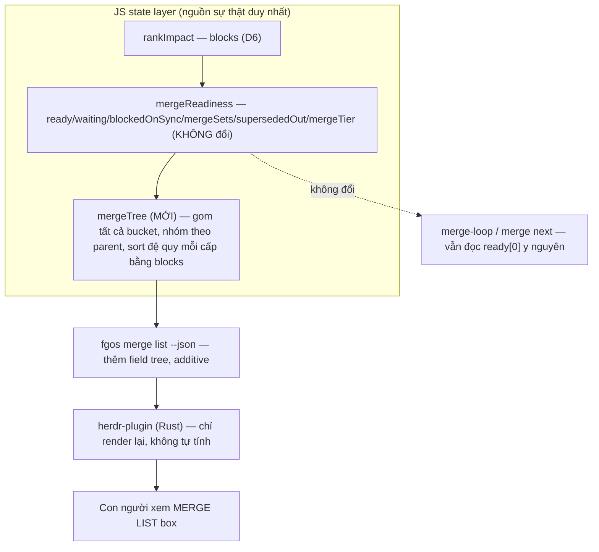

# Merge-list tree view + bottleneck-priority merge order

## 1. Trạng thái hiện tại

Vòng 6. D1-D6 đã chốt (§4) — không còn điểm mở nào. §6/§7 đã viết. Sẵn
sàng cho terminal handoff (`fgos-coding-exploring` → `fgos-coding-planning`) khi người
dùng xác nhận thiết kế ở §6 là đúng.

## 2. Mục tiêu & đề bài

herdr-plugin đang hiển thị MERGE LIST box dưới dạng ba danh sách phẳng
(`ready`/`waiting`/`blockedOnSync`, `herdr-plugin/src/fgos.rs:127-145` +
`app.rs`), một ánh xạ trực tiếp của `fgos merge list --json`. Mục tiêu của
task này gồm hai phần gắn liền nhau: (a) đổi cách hiển thị sang dạng tree
— cấp cao nhất là các root item merge thẳng vào `main`
(`mergeTier: 'root-to-main'`), các cấp sâu hơn là child-merge (nhánh con
merge vào nhánh cha, `mergeTier: 'leaf-to-root'`), mỗi cấp tự sort theo
cùng một luật; và (b) luật sort đó không chỉ đơn thuần là dependency-order
+ impact như `rankImpact` đang làm hôm nay, mà phải ưu tiên giải phóng
bottleneck trước — item nào đang khiến nhiều task khác kẹt đợi merge nhất
thì merge trước (vẫn tôn trọng ràng buộc dependency), rồi khi không còn
bottleneck mới quay lại luật tuần tự thông thường.

Động lực thật đứng sau: đây là bước chuẩn bị cho herdr-plugin tự động bật
pane chạy `merge-loop` tuần tự (kiến trúc đã chốt ở tsk-2xt, xem §5) —
thứ tự mà box này hiển thị PHẢI là thứ tự thật `merge next`/`merge-loop`
sẽ thực thi khi chạy không người giám sát, không phải một thứ tự trình
bày riêng ở lớp UI.

## 3. Vấn đề rõ / chưa rõ

| # | Vấn đề | Trạng thái | Ghi chú |
|---|---|---|---|
| 1 | Định nghĩa "bottleneck" dùng để sort | D6 | |
| 2 | Logic sort mới đặt ở đâu | D4 | |
| 3 | Tree hiển thị gồm những gì | D2 | |
| 4 | Bottleneck-priority áp dụng đệ quy ở mọi cấp child-merge, hay chỉ ở top-level? | D3 | |
| 5 | Quan hệ với tsk-2xt | rõ | Độc lập nhưng bổ trợ: tsk-2xt tự khai "logic pick giữ nguyên" (không đổi), nên cải thiện sort ở đây tự động nâng cấp hành vi automation của tsk-2xt mà không cần đổi gì bên tsk-2xt. Không cần dep giữa hai item. |
| 6 | AI (process nào) được phép thực thi merge thật xuyên suốt hệ thống | D1 + D5 | Model A xác nhận, model B không tồn tại. Nguyên nhân thật của tình trạng nhiều tiến trình cùng lúc vào merge KHÔNG phải xung đột tự động (fanout claim đã rút) mà là con người tự bấm approve thủ công ở nhiều terminal — nghĩa là "single-owner" hôm nay chưa tồn tại dưới dạng code, mà là VAI TRÒ con người đang tự làm thủ công. Việc TỰ ĐỘNG HOÁ vai trò đó (một pane `merge-loop` cố định) là phạm vi của tsk-2xt, không phải tsk-3cs — tsk-3cs chỉ cần đảm bảo thứ tự/tree mà pane đó (khi có) sẽ thực thi là đúng và quan sát được. |
| ~~7~~ | ~~fanout self-approve conflict~~ | RÚT LẠI (D5) | Không cần — không có bằng chứng fanout từng tự approve thật (0 `capacity.dispatch` event); nguyên nhân thật là thao tác thủ công của con người, không phải fanout. |

## 4. Quyết định đã chốt

| D-ID | Quyết định | Lý do |
|---|---|---|
| D1 | Chỉ có model A: một execution path duy nhất qua `approve`, không có cơ chế cha-tự-merge-con riêng biệt | `approve` (`bin/fgos.mjs:2689`) tự `resolveRoot`/`branchNameFor` động mỗi lần gọi, cùng verb cho cả leaf lẫn root; `cleanup-harness.mjs:115-116` xác nhận bằng lời |
| D2 | Tree hiển thị TẤT CẢ bucket (`ready`/`waiting`/`blockedOnSync`/`mergeSets`/`supersededOut`), không chỉ `ready` | Người dùng xác nhận: A/B dù đang kẹt ở trạng thái nào cuối cùng cũng phải merge vào X, ẩn đi mất đúng mục đích quan sát bottleneck |
| D3 | Bottleneck-priority áp dụng đệ quy ở mọi cấp child-merge, không chỉ top-level | Người dùng xác nhận rõ ràng ("recursive"), không bị revise qua các round sau |
| D4 | Sort/bottleneck-priority logic đặt ở JS engine (`graph-harness.mjs`/`impact.mjs`), Rust herdr-plugin chỉ đọc lại kết quả | `merge next`/`merge-loop` đọc thẳng `mergeReadiness(view).ready[0]` — sort chỉ ở Rust sẽ khiến tree hiển thị một thứ tự trong khi automation thật thực thi thứ tự khác |
| D5 | Nguyên nhân thật của "nhiều tiến trình cùng chạy vào merge" là con người tự bấm approve thủ công ở nhiều terminal, KHÔNG phải xung đột tự động (rút lại nghi ngờ fanout ban đầu) | Người dùng xác nhận trực tiếp round 5; số liệu thật: 0 sự kiện `capacity.dispatch` trong toàn bộ lịch sử repo |
| D6 | Định nghĩa "bottleneck" dùng để sort = tái dùng `rankImpact`'s `blocks` sẵn có (đếm mọi item mở phụ thuộc trực tiếp, mọi status) — không phát minh metric hẹp mới | `waiting` bucket rỗng thật lúc scout (0 item) nên một metric hẹp hơn (đếm riêng item trong `waiting`) hầu như luôn bằng 0, không tạo khác biệt thứ tự thật; `blocks` đã nhất quán với `priority-formula.mjs`/triage |

## 5. Q&A log

- 2026-08-10T03:40Z (scout, session): Scout ban đầu cho tsk-3cs (thực hiện
  trong `/fgOS:submit` + `/fgOS:pick` trước khi coding-shape mở):
  `herdr-plugin/src/fgos.rs:127-145` + `app.rs` — MERGE LIST box hôm nay
  là ánh xạ phẳng, trực tiếp của `fgos merge list --json`
  (`ready`/`waiting`/`blockedOnSync`), không tree, không đọc `parent`/
  `mergeTier`. `src/state/graph-harness.mjs:94` (`mergeReadiness`) đã có
  sẵn `mergeTier: {[id]: 'leaf-to-root'|'root-to-main'}` theo `item.parent`,
  và `ready` đã sort theo `rankImpact` (blocks desc, tie-break goalTier
  rồi id) — nhưng là một danh sách PHẲNG, không group theo parent.
- 2026-08-10T03:45Z (scout, session): `plugins/fgOS/skills/merge-loop/
  SKILL.md` + `merge-next/SKILL.md` — `merge-loop` = `/loop` quanh
  `/fgOS:merge-next`; mỗi vòng gọi `fgos merge next`, verb này đọc
  `mergeReadiness(view).ready[0]` MỚI mỗi lần (recompute sau mỗi merge),
  rồi `approve` nó. Xác nhận: cải thiện order ở `mergeReadiness` sẽ tự
  động thay đổi thứ tự automation thật thực thi, không cần đổi
  `merge-next`/`merge-loop`.
- 2026-08-10T03:46Z (scout, session): tsk-2xt (`doing`/`decompose`) —
  kiến trúc auto-launch pane đã chốt: khi setting `auto-merge` bật,
  herdr-orchestrator tự launch pane vào tab cố định `fg:operation` chạy
  `merge-loop`. tsk-2xt tự khai rõ "logic pick giữ nguyên (không đổi)" —
  tsk-2xt không sửa thuật toán chọn, chỉ launch pane. Nên tsk-3cs và
  tsk-2xt độc lập, không cần dep, nhưng bổ trợ trực tiếp.
- 2026-08-10T03:47Z (scout, session): `src/state/priority-formula.mjs:63`
  — `rankImpact`'s `blocks` cũng đã được `computeImpact` tái dùng cho
  `priority`/triage ranking nói chung (một consumer khác của cùng field)
  — đổi ý nghĩa `blocks` (nếu #1 trên chọn hướng đó) sẽ gợn sang cả
  triage, cần cân nhắc khi chốt #1.

- 2026-08-10T10:20Z (người dùng): Đặt câu hỏi vision trước khi thảo luận
  chi tiết — ai (process nào) thực hiện merge: (A) một process merge tổng
  (merge-loop/herdr-plugin) tự chọn item rồi merge vào đúng vị trí trong
  tree; (B) process cha điều phối các con, tự merge con vào mình sau khi
  con xong; (C) cả A và B. Nghiêng về A tự xử lý được hết. Trả lời Q1
  (bottleneck): "đợi merge để làm tiếp" — nghiêng hướng hẹp nhưng tự nhận
  "nghĩ đơn giản, cần tư vấn thêm". Q2 (đệ quy): "recursive". Q3 (tree
  scope): "không hiểu câu hỏi".
- 2026-08-10T10:35Z (scout, session): `bin/fgos.mjs:2689` (`approve`) —
  xác nhận `approve` tự resolve target branch động qua `resolveRoot`/
  `branchNameFor` MỖI LẦN gọi (leaf → `fgw/<root>`, root → `main`) — CÙNG
  một verb cho cả hai tier, không có cơ chế "cha tự merge con" riêng biệt.
  `src/state/cleanup-harness.mjs:115-116` xác nhận bằng lời: "decompose-
  into-children never itself merges `fgw/<id>` into anything -- its
  children's own branches merge directly into the same resolved root".
  → model B không tồn tại trong codebase; model A đã khớp thực tế.
  `fgos merge list --json` thật lúc scout: `ready: 11 item`, `waiting: 0`,
  `blockedOnSync: 1` — dữ liệu thật cho thấy §3 dòng 1's tín hiệu hẹp
  (đếm `waiting`) sẽ gần như luôn = 0, không có tác dụng phân biệt thứ tự
  thật hôm nay.
- 2026-08-10T10:38Z (session): Đề xuất Q1 = tái dùng `blocks` sẵn có
  (không phát minh metric mới), và làm rõ Q3 bằng ví dụ cụ thể (root X có
  2 con A/B, A bị footprint-conflict, B bị sync-drift — có hiện hai con
  này trong tree hay ẩn đi).
- 2026-08-10T11:23Z (người dùng): Xác nhận chỉ có model A, nhưng làm rõ
  câu hỏi thật của mình không phải "quy trình" mà là "process INSTANCE
  nào đang claim item+worktree để merge" — kể kinh nghiệm thực tế: có lúc
  một merge-loop chạy, có lúc nhiều tiến trình sau khi xong việc tự merge
  đồng thời, tranh lock, khiến người dùng phải hang-around đợi bấm
  approve. Yêu cầu: cần sự rõ ràng/rành mạch về AI (who) thực hiện merge
  xuyên suốt hệ thống để (a) smooth và (b) người dùng quan sát rõ cái gì
  đã/cần merge — giao việc tự giải quyết concrete design này cho session
  ("smart agent như em cần tự giải quyết"). Q3: xác nhận "show all" (A/B
  dù gì cũng phải merge vào X).
- 2026-08-10T11:30Z (scout, session): Grep mọi entry point gọi `approve`/
  `merge next` hôm nay (`grep -rl "fgos approve\|merge next" plugins/
  .claude/skills bin/ src/runner`) — tìm thấy `fgos-fanout` là caller thứ
  hai, độc lập với `merge-loop`, TỰ gọi `fgos approve` cho leaf auto-
  approve (`.claude/skills/fgos-fanout/SKILL.md:94-106`), với logic order
  riêng của nó. `cook`/`pick` xác nhận KHÔNG tự gọi approve (dừng ở
  `awaiting-approval`, "theirs to run next"). `bin/fgos.mjs:287` +
  `withLockRetry` xác nhận lock hiện có ngăn corruption khi nhiều approve
  chạy đồng thời (đã tự trải nghiệm lock-held khi claim tsk-2ec đầu
  session này) — nghĩa là vấn đề không phải correctness mà là
  coordination/observability. Đề xuất single-owner = `merge-loop` (dòng 6
  trong §3), hỏi người dùng có tách fanout-conflict thành item riêng
  ngay không.
- 2026-08-10T11:33Z (người dùng): Phản bác trực tiếp — "thật ra hiện tại
  đâu có ai tự merge nhỉ, tất cả đều dừng lại hỏi có merge hay không mà?"
- 2026-08-10T11:35Z (scout, session): Kiểm tra lại bằng số liệu thật thay
  vì tin mô tả trong SKILL.md — `grep -c capacity.dispatch .fgos/
  events.jsonl` = 0 trong TOÀN BỘ lịch sử repo. `pick/SKILL.md` (đọc lúc
  làm tsk-2ec) tự nói driver dừng ở `awaiting-approval` và trả quyền cho
  người, khớp đúng với điều người dùng mô tả. → rút lại kết luận round 3
  đổ lỗi cho `fgos-fanout`: SKILL.md của fanout CÓ viết "tự approve leaf"
  (sự thật văn bản), nhưng không có bằng chứng đường đó từng chạy thật.
  Chẩn đoán lại: không có cơ chế tự động nào merge hôm nay — "ai merge" =
  "bất kỳ ai/terminal nào chạy lệnh trước", không có tổ chức, không phải
  2 cơ chế tự động tranh nhau.
- 2026-08-10T11:37Z (người dùng): Xác nhận chẩn đoán lại là đúng — "đúng
  vậy, do anh tự đánh approve trong nhiều terminal nơi agent đang thực
  thi việc của nó và hỏi có muốn approve merge không." Chốt D5.

## 6. Thiết kế đã chốt {#design}

**Bối cảnh thật (D1, D5):** fgOS chỉ có MỘT execution path cho mọi merge,
leaf hay root — verb `approve` (`bin/fgos.mjs:2689`) tự resolve target
branch động qua `resolveRoot` mỗi lần gọi (leaf → `fgw/<root cha>`, root →
`main`). Không có, và không cần, một cơ chế "cha tự merge con" riêng biệt
— `cleanup-harness.mjs` tự nói rõ điều này. Cái đang thiếu KHÔNG phải là
code coordinate nhiều tiến trình tự động (không có tiến trình tự động
nào cạnh tranh cả — `capacity.dispatch` = 0 sự kiện trong lịch sử) — cái
đang thiếu là con người (hiện đang tự đóng vai "single owner" một cách
thủ công, bấm approve rải rác ở nhiều terminal) chưa có một quy trình rõ
ràng để nhìn và giao việc đó cho máy. Việc TỰ ĐỘNG HOÁ vai trò đó — một
pane `merge-loop` cố định, tự launch — là phạm vi của tsk-2xt, không phải
item này. Item này chỉ có một trách nhiệm: đảm bảo THỨ TỰ mà pane đó (khi
có) sẽ thực thi là đúng (ưu tiên giải phóng bottleneck), và làm cho thứ
tự đó QUAN SÁT ĐƯỢC bằng mắt thường trước khi tự động hoá thay con người.

**Nguyên tắc kiến trúc (D4):** logic tính "ai merge trước" phải sống ở
MỘT chỗ duy nhất — JS state layer (`src/state/`) — vì đó là nơi
`merge next`/`merge-loop` thật sự đọc để quyết định merge cái gì kế tiếp
(`mergeReadiness(view).ready[0]`). herdr-plugin (Rust) không được tự tính
lại thứ tự của riêng nó; nó chỉ đọc và vẽ lại đúng những gì JS engine đã
tính. Nếu vi phạm nguyên tắc này, tree hiển thị một thứ tự trong khi
automation thật thực thi thứ tự khác — đúng loại lỗi "UI nói dối" mà D3
(tsk-417) trong `fgos.rs` đã cẩn thận tránh cho ba box khác (map thẳng,
không filter tự chế).

**Thiết kế cụ thể:**

1. **Không đổi hành vi hiện có (an toàn cho automation).** `mergeReadiness`
   giữ NGUYÊN shape trả về hôm nay (`ready`/`waiting`/`conflicts`/
   `mergeSets`/`blockedOnSync`/`mergeTier`/`supersededOut`/`stageByItem`)
   — `merge next`/`merge-loop` không đổi một dòng nào. Tree là một view
   PHÁI SINH thêm vào, không phải một đường tính lại song song.

2. **Một hàm tree-builder mới trong JS state layer** (ví dụ
   `mergeTree(view, opts)`, cùng module `graph-harness.mjs` hoặc module
   liền kề), nhận view + kết quả `mergeReadiness` đã có, và:
   - Gom TẤT CẢ id xuất hiện ở bất kỳ bucket nào (`ready`, `waiting`,
     `blockedOnSync`, mọi id trong `mergeSets`, `supersededOut`) — D2:
     hiển thị toàn bộ, không chỉ `ready`.
   - Với mỗi id, gắn nhãn trạng thái (`ready`/`waiting`/`blocked-sync`/
     `conflicted`/`superseded`) từ đúng bucket nó thuộc về.
   - Nhóm theo `item.parent` (đã có sẵn trên mọi work item) thành cây
     lồng nhau: root-to-main (không có `parent`) ở top-level, mỗi con
     lồng dưới đúng cha của nó theo `mergeTier` (D1: `mergeTier` đã có
     sẵn, chỉ cần dùng để xác nhận, không cần tính lại).
   - Sort MỖI cấp (kể cả top-level lẫn từng nhóm con) bằng đúng
     `rankImpact`'s `blocks` giảm dần (D6: tái dùng tín hiệu sẵn có,
     không phát minh metric mới), tie-break `goalTier` rồi id — giống hệt
     `orderByRank` nội bộ `mergeReadiness` đang dùng cho `ready` hôm nay,
     áp dụng ĐỆ QUY cho từng cấp (D3).
   - Trả về qua `fgos merge list --json` dưới một field mới (vd. `tree`)
     bên cạnh các field cũ — additive, không phá vỡ contract cũ.

3. **herdr-plugin (Rust) đổi từ 3 danh sách phẳng sang render cây.**
   `MergeListSummary` (`herdr-plugin/src/fgos.rs:127-145`) cần thêm field
   đọc `tree` mới (giữ `ready`/`waiting`/`blocked_on_sync` cũ nếu còn chỗ
   dùng, hoặc thay hẳn nếu tree đã bao trùm đủ). `app.rs`'s merge_list
   rendering cần logic vẽ cây thật (thụt lề theo độ sâu, hoặc dùng ký hiệu
   phân cấp) + badge trạng thái mỗi node (ready/waiting/blocked-
   sync/conflicted/superseded) để người dùng thấy ngay cái gì merge trước,
   cái gì đang kẹt và vì sao.

**Sơ đồ luồng dữ liệu:**



**Ví dụ cụ thể (D2):** root X (`awaiting-approval`, `ready`, blocks=5) có
hai con A (`awaiting-approval`, footprint-conflict với item khác →
`mergeSets`) và B (root của B có sync drift → `blockedOnSync`). Tree hiển
thị:

```
X  [ready, blocks=5]
├─ A  [conflicted: footprint overlap với tsk-xxx]
└─ B  [blocked: root drift, cần sync-root trước]
```

X vẫn merge được ngay dù A/B đang kẹt — X là root-to-main, A/B là
leaf-to-root của MỘT cây con khác (hoặc của chính X nếu X là root của
chúng); hiển thị đủ cả ba giúp người xem hiểu ngay "cái gì merge trước,
cái gì phải tự xử lý trước khi merge được."

## 7. Danh mục hạng mục / task {#tasks}

### {#task-merge-tree-engine} Task 1 — Tree-builder trong JS state layer

**Mục tiêu:** thêm hàm `mergeTree(view, opts)` (hoặc tương đương) vào
`src/state/graph-harness.mjs`, dùng lại `mergeReadiness`'s buckets +
`rankImpact`'s `blocks` để tạo cấu trúc cây (root-to-main top-level,
leaf-to-root lồng theo `parent`, sort đệ quy mỗi cấp), phơi ra qua `fgos
merge list --json` dưới field mới, KHÔNG đổi shape cũ.

**Trích §6:** mục 1 (không đổi hành vi hiện có) + mục 2 (tree-builder) +
sơ đồ luồng dữ liệu.

**D-ID áp dụng:** D1 (dùng `mergeTier`/`resolveRoot` sẵn có, không tính
lại target), D2 (gom tất cả bucket), D3 (sort đệ quy mỗi cấp), D4 (logic
sống ở JS, không phải Rust), D6 (tái dùng `blocks`).

**Quan hệ với task khác:** Task 2 phụ thuộc trực tiếp vào field JSON mà
task này định nghĩa (cần chốt shape trước khi Task 2 viết parser Rust).

**Verify nháp:** `node --test test/state/graph-harness.test.mjs && npm
test` — test mới cho `mergeTree` (nhóm đúng theo parent, sort đúng theo
blocks ở mọi cấp, không bỏ sót bucket nào) cộng test hồi quy xác nhận
`mergeReadiness`'s shape cũ không đổi (bảo vệ `merge next`/`merge-loop`).

### {#task-merge-tree-render} Task 2 — Render cây trong herdr-plugin MERGE LIST box

**Mục tiêu:** đổi `MergeListSummary`/parser (`herdr-plugin/src/fgos.rs`)
để đọc field `tree` mới từ Task 1, và đổi `app.rs`'s merge_list rendering
từ ba danh sách phẳng sang vẽ cây thật (thụt lề theo độ sâu + badge trạng
thái mỗi node: ready/waiting/blocked-sync/conflicted/superseded).

**Trích §6:** mục 3 (herdr-plugin đổi sang render cây) + ví dụ cụ thể X/A/B.

**D-ID áp dụng:** D1 (mergeTier đã có, chỉ đọc), D2 (hiển thị tất cả
bucket, có badge lý do kẹt), D3 (thụt lề đúng độ sâu, giữ nguyên thứ tự
JS đã sort — Rust không tự sort lại), D4 (Rust chỉ render).

**Quan hệ với task khác:** phụ thuộc Task 1 (cần field `tree` tồn tại
trước). Độc lập với tsk-2xt (không cần đợi pane auto-launch tồn tại để
build/test phần render này — có thể test bằng `fgos merge list --json`
chạy tay).

**Verify nháp:** `cargo test --manifest-path herdr-plugin/Cargo.toml
merge_list && npm test`.
