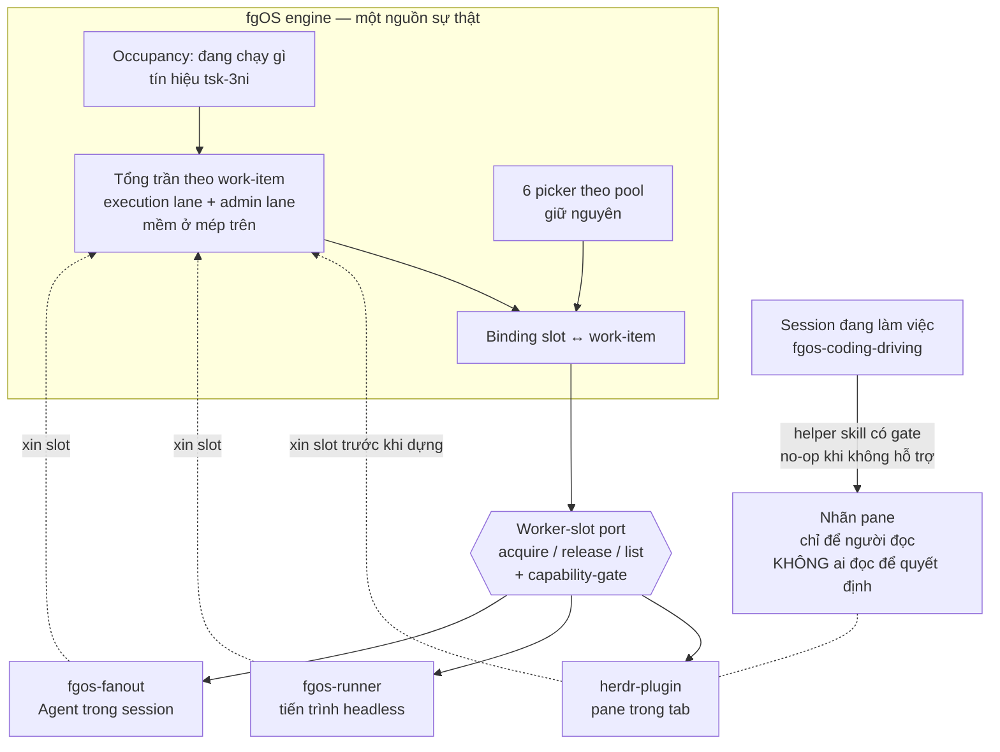

# orchestrator-worker-slots — DISCUSSION

> **DISAMBIGUATION (2026-08-26) — từ "orchestrator" trong tài liệu này được dùng theo nghĩa MỚI (ADR0029 D17, tầng hợp thành T0).**
> Cần phân biệt với nghĩa CŨ trong ADR0026 (đã retired; ADR0028 đổi tên nghĩa cũ thành "launcher").
> Chi tiết chuỗi quyết định 0026→0028→0029→0031 xem tại `docs/decisions/index.md` (dòng 28-32) và `docs/explanation/why-the-launcher-vocabulary-word-guard-was-retired-right-after-tsk-1s5-fixed-it.md`.

Item: `tsk-2sj`.

## 1. Trạng thái hiện tại

Hết vòng 9, sau khi `fgos-coding-validating` chạy và trả `NOT READY` một
lần rồi được gỡ. **Mười D-ID đã chốt** (§4); §3 không còn hàng "chưa rõ".

Bốn vòng cuối đều theo cùng một khuôn: phiên này gặp một chỗ hở thì đề
xuất **dựng cơ chế mới**, người dùng bác bằng cách chỉ ra **ràng buộc
hoặc dữ liệu vốn đã có**. Vòng 6 bịa ra "vòng đời worker" cho dữ liệu đã
nằm sẵn trong `payload.writer.id` (vòng 7 bác). Vòng 8 gỡ tiếp: mọi flow
đều có ceiling nên "xong" là quan sát được, và "kẹt `doing`" là **sự cố**
chứ không phải trạng thái thiết kế — bỏ luôn được yêu cầu lọc liveness
mỗi vòng poll. Vòng 9 chốt pane là đồ bỏ, bằng cách bỏ đi lý do phải giữ
pane thay vì ra chính sách giữ pane.

Kết quả ròng: thiết kế **gọn hơn** bản đầu — không ranker toàn cục, không
event type mới, không cơ chế khai báo mới, không lọc liveness định kỳ,
không cơ chế đóng pane.

## 2. Mục tiêu & đề bài

Tầng orchestrator của fgOS hôm nay là `herdr-plugin` (Rust, quản pane/tab
của herdr), nhưng không có gì đảm bảo mai sau vẫn là herdr — có thể là
cmux, tmux, hay một thứ khác chưa tồn tại. Đề bài là rút ra khái niệm
tổng quát nằm dưới nó: một *worker slot* là chỗ đứng cho đúng một đơn vị
công việc có vòng đời đầy đủ; hệ cần biết còn bao nhiêu chỗ trống, phân
việc vào đúng chỗ, và thu hồi chỗ khi việc xong hoặc chết — tất cả qua
một port trung lập để đổi tool không phải viết lại logic. Quan trọng
không kém: hôm nay ba launcher đang tự chế trần song song riêng, không ai
biết ai, nên trần thật ở mức máy là tổng của cả ba và không ai quản; đợt
này phải hướng cả ba về một tổng trần chung của engine. Gắn liền và không
tách được: cơ chế đặt tên/nhãn cho chỗ đứng đó, vì hôm nay nhãn đang gánh
state của orchestrator và đó chính là nguồn của một bug đang sống. Phạm
vi bao gồm cả việc đổi `fg:agents-N` thành `fg:workers-N`, vì đó là đổi
tên đúng khái niệm chứ không phải sơn phết.

## 3. Vấn đề rõ / chưa rõ

| # | Vấn đề | Trạng thái | Ghi chú |
|---|--------|-----------|---------|
| Q1 | Gọi khái niệm mới là gì | **rõ** | → D1: `worker slot` |
| Q2 | Phạm vi: một hay ba launcher | **rõ** | Cả ba tuân thủ tổng trần engine; cơ chế thực thi giữ riêng |
| Q3 | Nguồn chân lý cho occupancy | **rõ** | → D2: state fgOS, tái dùng tín hiệu `tsk-3ni` |
| Q4 | Nhãn có được gánh state không | **rõ** | → D2: không, tuyệt đối |
| Q5 | Rename đặt ở đâu | **rõ** | → D5: helper skill có capability-gate, gọi từ phía session. Đề xuất "adapter tự vẽ" đã bị bác, lý do ở §5 vòng 4 |
| Q6 | `fg:operation` 4 pane | **rõ** | 3 loại admin hôm nay + 1 thủ sẵn. Supersede `tsk-5lr` D2 |
| Q7 | "Du di phía trên" nghĩa gì | **rõ** | → D7: trần mềm ở mép trên |
| Q8 | Ranker toàn cục hay gác trần | **rõ** | → D6: gác trần. (a) để lại có chủ ý |
| Q9 | Trần đếm theo cái gì | **rõ** | → D7: theo **work-item** |
| Q10 | Biên du di cụ thể là bao nhiêu | **rõ** | → D8: không bao giờ bẻ một mẻ đã tính sẵn |
| Q11 | "Agent tự xử xung đột merge" có nằm trong đợt này không | **rõ** | Để ngoài. Đã mở item riêng `tsk-60h` |
| Q12 | Vòng đời worker: cần khái niệm mới không | **rõ — KHÔNG cần** | Vòng 7 bác vòng 6: `payload.writer.id` đã có sẵn trong event log (97,3% cạnh `→ doing`), đủ suy ra cả "list worker vừa xong xếp cũ→mới". Không field mới, không event type mới. Về lại tầm planning |
| Q13 | Phân biệt "session loop giữa hai item" với "session đã xong" | **rõ** | Vòng 8: không xảy ra trong lane workers — loop sống ở lane operation theo cấu trúc. Ràng buộc "chỉ tái dùng pane one-shot" vì vậy có lý do thật, không phải cách né |
| Q14 | **Thế nào là biết đã xong** | **rõ — quan sát được** | Vòng 8: flow luôn có ceiling nên chỉ kết thúc hai kiểu, cả hai ghi log (chạm ceiling; park → rời `doing`). "Claim rồi bỏ đi" là **sự cố**, không phải state — đường xử là `/fgOS:stale` + `tsk-3ni` ở nhánh ngoại lệ. Không cần cơ chế khai báo mới |
| Q15 | Tái dùng pane khi người còn đang đọc | **rõ** | Vòng 9 → D10: tái dùng không xin phép, trừ pane `focused`; bỏ delay-rồi-đóng; cho báo cáo driver một chỗ hạ cánh trên item |

## 4. Quyết định đã chốt

| D-ID | Quyết định |
|------|-----------|
| D1 | Khái niệm là **worker slot** — 1 worker slot = chỗ đứng của đúng 1 rootTask (đơn vị work item lớn nhất). Loại bỏ từ `capacity`, vì `docs/decisions/0026:73-87` đã khoá từ đó với nghĩa khác hẳn (đơn vị helper hẹp, không mang vòng đời rootTask) và nói rõ subTask với capacity không gộp làm một. `worker` giữ liên mạch với `fg:workers-N`, tách đúng *chỗ* khỏi *cái chiếm chỗ*. |
| D2 | **Engine sở hữu sự thật về "đang chạy gì"** — occupancy là state fgOS, không phải state của tool/launcher. Hệ quả bắt buộc: nhãn/label KHÔNG BAO GIỜ được gánh state của orchestrator; nhãn chỉ để cho người đọc. Khớp hard rule của `docs/operator-runbook-herdr-cockpit.md`. Cơ chế thay thế đã có sẵn: `tsk-3ni` D1/D4. |
| D3 | Cơ chế rename/label và khái niệm worker slot là **một feature**, không tách đôi; và **không vá tạm** bug `fgos-auto-discover` đang sống. |
| D4 | **Hai lane riêng biệt** — execution (discovery/plan/implement) và admin (merge/retro/cleanup). Lane admin có chỗ dành riêng, không bao giờ bị execution chiếm chỗ. Lý do cấu trúc: `claim-port.mjs:160-167` từ chối claim một lá có dep chưa `done`, nên merge nằm thượng nguồn của mọi claim execution mới; xếp chung pool sẽ tự khoá. Cấu trúc này đã tồn tại trong code (`fg:operation` không nằm trong cap của `fg:agents-N`), thiết kế chỉ tổng quát hoá. |
| D5 | Cơ chế đặt nhãn là một **helper skill có capability-gate, gọi từ phía session** (hướng `terminal`/`rename.sh` hôm nay), KHÔNG phải vòng poll của adapter tự vẽ. Đây chính là điểm hexagon để đổi orchestrator sau này. Hệ quả: bug `fgos-auto-discover` được sửa bằng cách herdr-plugin **hỏi engine** thay vì đọc nhãn, chứ không phải bằng cách cấm session đổi nhãn. |
| D6 | Hình dạng của "thống nhất" là **gác trần**, không phải ranker toàn cục. Giữ nguyên 6 picker theo pool — chúng phải trả lời đúng và không block; engine thêm đúng một lớp: gác tổng trần. Launcher **xin slot trước khi dựng** worker; hết chỗ thì bị từ chối, không tự quyết. Ranker toàn cục xuyên pool để lại có chủ ý. |
| D7 | Trần đếm theo **work-item** — một work-item đang chạy tốn đúng một slot, bất kể launcher nào dựng nó lên. Và trần **mềm ở mép trên**: launcher được phép vượt một biên nhỏ để khỏi bẻ một mẻ việc thành hai wave (biên cụ thể còn mở, Q10). Ship Faster thắng độ chính xác của con số, miễn biên nhỏ và biết trước. |
| D8 | Biên du di diễn đạt thành luật tự mô tả, không thêm nút chỉnh: **không bao giờ bẻ một mẻ đã tính sẵn — còn ít nhất 1 slot trống thì lấy trọn mẻ.** Ưu điểm quyết định: biên vượt **không cộng dồn được** — sau khi vượt, lần acquire kế tiếp thấy 0 chỗ nên bị từ chối ngay, nên biên vượt tối đa luôn bị chặn bởi kích thước mẻ lớn nhất một launcher có thể tạo (`fgos-fanout` cap 5 → vượt tối đa 4). Không cần con số ma thuật nào phải tinh chỉnh. |

| D9 | Lane hành chính **không bao giờ claim** một work-item, nên "đếm theo work-item" chỉ có đối tượng ở lane execution; lane admin là chỗ dành riêng kích thước cố định theo số loại loop (3 hôm nay + 1 thủ sẵn). Khớp D4, không mâu thuẫn. |
| D10 | **Pane đã xong là đồ bỏ** — tái dùng không xin phép, trừ pane đang `focused` (dữ liệu có sẵn trong `herdr pane list`/`pane layout`, là tín hiệu chrome hợp lệ chứ không phải `agent_status` bị cấm). **Bỏ hẳn** nhánh delay-rồi-đóng. Và cho **báo cáo cuối của driver** một chỗ hạ cánh trên item, để người đọc bằng `fgos show <id>` thay vì bằng terminal phải canh — đó là thứ duy nhất trong pane không có bản sao ở nơi khác. |

Đã ghi vào event log qua `fgos decision --id tsk-2sj` (seq 14352, 14353,
14354, 14362, 14373, 14374, 14375, 14376, 14401, 14597).

## 5. Q&A log

### 2026-08-12 — Vòng mở màn (người dùng nêu đề bài)

Hai mảng: (1) cơ chế rename pane phải thành hexagon có capability-gate,
đề xuất đặt ở `fgos-coding-driving`, mở để bàn chuyện tự rename và bỏ
rename; (2) khái niệm work-capacity tổng quát — bao nhiêu slot cho mỗi
loại việc và cách phân bổ, với quan sát rằng có 2 loại work-item (đơn vị
thực hiện và đơn vị quản trị hành chính), và mong muốn đổi `fg:agents-N`
thành `fg:workers-N`.

Ba trả lời nhanh cùng vòng: occupancy lấy chân lý từ state fgOS; gộp 2
mảng thành 1 feature; không vá tạm bug đang sống.

### 2026-08-12 — Vòng 1, scout

**F1 — `capacity` là thuật ngữ đã khoá, nghĩa khác hẳn.**
`docs/decisions/0026:73-87`. → thành D1.

**F2 — Đã có BA trần song song độc lập, không cái nào biết cái kia.**

| Launcher | Trần | Khai ở đâu | Thuật toán xếp |
|---|---|---|---|
| `fgos-runner` (headless) | `maxRoots × maxLeavesPerRoot`, mặc định 4×4 | `runner.parallel` trong config, validate lúc load (`loop.mjs:126-150`) | `selectWave`, FIFO theo root (`loop.mjs:158-170`) |
| `fgos-fanout` (Agent trong session) | 5 Agent/wave, hard cap | văn xuôi D7 trong SKILL.md (`fgos-fanout/SKILL.md:62-66`) | `computeSchedule`, tránh đụng footprint (`graph-metrics.mjs:736`) |
| `herdr-plugin` (pane) | 8 pane (4×2) | hằng số Rust (`layout.rs:10,14`) | `find_agents_tab_with_room` |

Ba nơi khai báo, ba thuật toán, không chung từ vựng — và chạy đồng thời
được, nên trần thật ở mức máy là tổng của cả ba, không ai quản.

**F3 — Cơ chế "engine là chân lý" đã thiết kế sẵn.** `tsk-3ni` D1/D4/D3:
tín hiệu sống = hoạt động sửa file thật trong worktree, công thức
`max(git log -1 %ct, mtime mới nhất trong git status --porcelain)`,
ngưỡng tái dùng `/fgOS:stale`. → thành D2.

**F4 — `fg:operation` 2 pane là quyết định đã khoá** (`tsk-5lr` D2, nhận
diện trái/phải bằng hình học) — muốn 4 pane là supersede, không sửa tại
chỗ.

### 2026-08-12 — Vòng 2 (người dùng trả lời)

- Khái niệm cần đặt tên là *tổng trần chỗ chứa* — slot cho đơn vị work
  item lớn nhất. Tên chốt: `worker slot`.
- Cả ba launcher dùng chung một đầu ra và thuật toán của engine/harness,
  đừng chế riêng. Ba cơ chế là ba *năng lực thực thi ở quy mô khác nhau*;
  còn "đang thực thi cái gì" và "tiếp theo nên là cái gì" phải thống nhất
  toàn engine. Cả ba tuân thủ tổng trần của engine.
- `fg:operation`: trước nghĩ 2, giờ 3, thủ sẵn 4 cho một việc hành chính
  mới phát sinh.
- Trần: thống nhất nhưng đừng cứng quá, du di mở phía trên cho linh hoạt,
  vì giới hạn tổng trần giúp máy chạy ổn định.

### 2026-08-12 — Vòng 2, scout

**F5 — Lane riêng cho admin đã tồn tại trong code, và có lý do cấu trúc
bắt buộc.** `tsk-5lr` CONTEXT.md:21 ghi `fg:operation` "never counted
against the `fg:agents-N` cap"; code khớp — `agents_tab_index`
(`layout.rs:170-172`) chỉ parse tiền tố `fg:agents-`.

Lý do bắt buộc: `src/runner/claim-port.mjs:160-167` từ chối claim một lá
có dep chưa `done` (`deps-not-merged`). Merge nằm thượng nguồn của mọi
claim execution mới → xếp chung pool sẽ tự khoá khi pool đầy. → thành D4.

### 2026-08-12 — Vòng 3 (người dùng trả lời)

- **Du di:** ý vượt hơn phần lane. Ví dụ còn 3 slot mà fanout muốn 4 —
  câu hỏi là fanout tự giảm xuống 2 wave, hay cho phép đẩy luôn 4. Ý
  người dùng: cho phép đẩy, chủ yếu để linh hoạt và **ship faster**.
- **Q8: (b).** Engine có 6 picker tool, phải trả đúng và không block;
  launcher xin slot trước khi dựng. (a) đồng ý để lại.
- **Góc nhìn hiện tại về hai điểm nghẽn thật** (bối cảnh cho (a) sau
  này, không phải phạm vi đợt này): (1) thông tin phải sẵn sàng và đầy đủ
  để hỏi người một lần, release con người, không tạo hiện tượng người
  phải ngồi canh — trả lời hết câu hỏi rồi thì máy túc tắc làm cả ngày
  cũng được; (2) nghẽn merge — không merge thì không xử lý tiếp được phía
  sau, mà agent xử lý xung đột merge rất tốt nhưng cứ hỏi người miết,
  nhất quyết không tự xử lý.
- **Q9:** trần đếm theo **work-item**.

### 2026-08-12 — Vòng 3, scout

**F6 — Nếu nhãn không gánh state (D2) thì không skill nào cần gọi rename
nữa.** Đây là hệ quả của chính D2, và nó trả lời Q5 khác với đề xuất ban
đầu.

Khi launcher phải xin slot trước khi dựng (Q8 b), engine biết cặp
`slot ↔ work-item`. Nhãn lúc đó chỉ còn là *phép chiếu* của cặp đó: mỗi
vòng poll, adapter đọc binding từ engine rồi vẽ lại nhãn. Không cần
`/fgOS:terminal` gọi `rename.sh` từ trong session, không cần nhét chrome
vào `fgos-coding-driving`, và không còn cửa cho session ghi đè nhãn của
orchestrator — tức bug `fgos-auto-discover` biến mất theo cấu trúc chứ
không phải bị vá.

"Bỏ rename" cũng thành tầm thường: binding được nhả thì vòng poll kế
tiếp vẽ lại nhãn rỗi, không cần cơ chế un-rename riêng.

Capability-gate vẫn cần: một tool khác (tmux) có thể không có khái niệm
nhãn pane. Nhưng gate đó nằm ở adapter, không phải ở skill.

**F7 — Điểm nghẽn merge: cơ chế đã có, cái thiếu là agent chịu dùng.**
`fgos catchup` (`bin/fgos.mjs:3747-3783`) nhận đúng `merge-conflict`
trong `CATCHUP_REASONS`, merge target vào nhánh item rồi verify lại và
land (`blocked → awaiting-approval`) hoặc báo lại. Nên lời phàn nàn "agent
cứ hỏi người miết" không phải thiếu verb — là vấn đề hành vi skill. Ghi
nhận là **liền kề, ngoài phạm vi** đợt này; xứng đáng item riêng.

### 2026-08-12 — Vòng 4 (người dùng phản biện F6)

Người dùng bác đề xuất F6(B): "thực chất cơ chế nhãn không phải
orchestrator nào cũng có, skill helper terminal là để support và là một
điểm hexagon để đổi sau này khi có dùng tool khác."

**Phiên này nhận sai.** F6(B) tổng quát hoá từ đúng một ca — ca
auto-launcher của herdr-plugin, nơi orchestrator có biết binding. Ca phổ
biến nhất thì ngược lại: một người tự mở session Claude Code trong pane
rồi gõ `/fgOS:pick`, lúc đó **không có orchestrator process nào đang
chạy** (dashboard herdr-plugin có thể còn chưa bật), và thứ duy nhất biết
"pane này đang làm item X" chính là session đó. Nếu chỉ vòng poll của
adapter vẽ nhãn thì pane ấy không bao giờ được đặt tên. Đây đúng là lý do
`/fgOS:terminal` tồn tại, `/fgOS:pick` bước 3 gọi nó, và `rename.sh`
thiết kế để exit 0 im lặng khi không ở trong pane herdr. → thành D5.

**Nhận thức đúng hơn về bug `fgos-auto-discover`:** lỗi chưa bao giờ nằm
ở việc session đổi nhãn. Nó nằm ở chỗ herdr-plugin *đọc nhãn như state*.
Dưới D2, herdr-plugin phải hỏi engine "còn worker auto-discover nào sống
không" thay vì "có pane nào mang nhãn X không". Sửa đúng chỗ đó thì
session tự do đổi nhãn tuỳ ý — hai thứ hết đụng nhau, giữ được cả helper
skill lẫn D2.

F6(A) — nhãn không mang state, không ai được ĐỌC nhãn để quyết định —
vẫn đứng nguyên, đó là D2.

### 2026-08-12 — Vòng 5 (hội tụ)

- **Q10:** đồng ý luật "không bao giờ bẻ một mẻ đã tính sẵn". → D8.
- **Q11:** để ngoài phạm vi và mở item riêng. → `tsk-60h` đã submit.

Không còn câu hỏi mở. `refs` của `tsk-2sj` trỏ về `#tasks`; bàn giao sang
`fgos-coding-exploring` → `fgos-coding-planning`.

### 2026-08-12 — Vòng 6 (validating trả NOT READY, người dùng đổi hướng vá)

**Bối cảnh.** `fgos-coding-validating` bác một assumption plan chưa hề
nêu: "chỗ pane vật lý luôn có khi engine nói còn slot". Bằng chứng:
`place_new_agent_pane` chỉ tạo pane mới, không đóng/không tái dùng, không
reaper (grep toàn `herdr-plugin/src` ra rỗng); còn `close.sh` thì 3 guard
đều pass trong session thật, nên lý do nó "chưa bao giờ thấy chạy" không
phải môi trường mà vì **nó là dòng cuối của một SKILL.md prose, không gì
cưỡng chế model thực thi**. Pane tích tụ tới cap 8 rồi herdr không mở nổi
worker dù engine báo còn chỗ.

Phiên này đề xuất 3 hướng vá (tái dùng pane / reaper cưỡng chế / lai).
**Người dùng bác cả ba và đổi hướng, đúng gốc hơn:**

> "không thể cưỡng chế mọi việc cần sự rõ ràng. luồng vận hành tại mỗi
> stage phải tường minh thông báo tôi xong và ngưng hoặc tôi xong và có
> move on sang stage tiếp theo hay không. khi đó các đơn vị điều phối
> khác mới thật sự rõ ràng. như vậy engine thậm chí sẽ có một list worker
> vừa xong, xếp cũ đến mới."

**Đóng khung lại vấn đề.** Cả ba hướng cũ đều là cách **suy đoán** worker
đã xong chưa — từ status item, từ nhãn pane, từ heuristic "idle". Mọi suy
đoán đều trượt. Thứ còn thiếu là một **lời khai báo**.

**Khoảng trống thật, lần đầu gọi đúng tên:** hệ hôm nay chỉ biết vòng đời
**item**, không biết vòng đời **worker**. `fgos return` nghĩa là "xong
*item* này", không nói worker còn sống hay không:

- session `discover-loop`: return xong → pick item kế → **item xong,
  worker chưa xong**;
- pane one-shot: return xong → thoát → **cả hai cùng xong**.

Hai ca này hôm nay không phân biệt được, và đó là lý do gốc khiến mọi cơ
chế thu hồi chỗ đều phải đoán.

**Hướng mới.** Mỗi luồng stage kết thúc bằng một khai báo tường minh, chọn
đúng một trong hai: *"xong và ngưng"* hoặc *"xong và đi tiếp stage sau"*.
Engine ghi nhận ở mức **worker**, nhờ đó giữ được **danh sách worker vừa
xong, xếp cũ→mới**. Orchestrator bất kỳ (herdr hôm nay, cmux/tmux sau
này) thu hồi chỗ tất định: đọc danh sách, lấy cái cũ nhất, dùng lại —
không heuristic, không reaper, không phụ thuộc dòng cuối một file prose.

**Ảnh hưởng (đánh giá ở vòng 6, ĐÃ BỊ VÒNG 7 BÁC — giữ lại để thấy đường
đi):** vòng 6 kết luận đây là thêm một *khái niệm* nên vượt tầm planning.
Sai. Xem vòng 7.

### 2026-08-12 — Vòng 7 (người dùng bác vòng 6: log đã đủ)

> "thật chất thì eventlog của chúng ta đã có rồi mà, chỉ cần thêm id của
> session là đếm được slot?"

**Người dùng đúng, và đúng hơn cả câu hỏi:** session id KHÔNG cần thêm —
nó đã có sẵn. Một `work.move` thật:

```json
{"seq":14543,"ts":"2026-08-12T07:49:02.010Z","type":"work.move",
 "payload":{"id":"tsk-51m","from":"todo","to":"doing","role":"session",
   "writer":{"id":"abc1ba04-...","source":"env"},
   "branchHeadAtTake":"79fead..."},"v":3}
```

Độ phủ đo trên log thật: `work.move` có `writer` 4083/4191 (97,4%); cạnh
`→ doing` có `writer.id` hợp lệ 1280/1315 (97,3%); `source` 100% là
`env`; **không có `unresolved` nào**. Phần ~3% thiếu gần chắc là event cũ
trước khi field ra đời.

**Suy được từ log hiện tại, không thêm field/event type nào:**

1. Đếm slot — item ở `doing`.
2. Session nào giữ item nào — `writer.id` trên cạnh `→ doing`.
3. **"List worker vừa xong, xếp cũ→mới"** — với mỗi `writer.id`, lấy `ts`
   của cạnh terminal gần nhất, sort tăng dần. Đúng thứ vòng 6 tưởng phải
   đẻ khái niệm mới mới có; nó là một phép fold thuần trên log.
4. Pane rỗi chưa — `writer.id` gắn với nó còn giữ item `doing` nào không.

**Vòng 6 sai ở đâu:** bịa ra một khái niệm ("vòng đời worker") cho dữ
liệu đã tồn tại. Bài học lặp lại đúng kiểu sai của cả buổi: thấy một chỗ
hở thì dựng cơ chế mới, thay vì hỏi trước "hệ đã ghi cái này chưa".

**Chỗ vênh còn lại, giải được không cần khái niệm mới (Q13):** "không giữ
item `doing`" ≠ "pane rỗi" với session dạng **loop** — `discover-loop`
vừa return xong và đang chuẩn bị pick item kế cũng không giữ item nào,
herdr sẽ tưởng pane rỗi và bắn worker đè lên. Giải bằng thông tin adapter
tự có: **herdr chỉ tái dùng pane do chính nó mở dạng one-shot**, không
đụng pane đang chạy loop. Không cần khai báo, không cần ngưỡng thời gian.

⇒ Vấn đề về lại tầm **planning**, không phải shaping.

### 2026-08-12 — Vòng 8 (người dùng: flow có ceiling ⇒ "xong" quan sát được)

Phiên này liệt kê 5 trạng thái worker và than rằng log chỉ tách được hai
nhóm, nên "đã xong chưa" là câu không trả lời được nếu thiếu cơ chế khai
báo. **Người dùng bác cách đặt vấn đề đó:**

> "claim rồi bỏ đi, phải cụ thể claim gì. chúng ta không thiết kế để luồng
> chạy phong long. launcher bật 1 luồng phải có chủ đích và ceiling. nên
> nó chỉ có thể dừng theo 2 kiểu: 1 là chạm ceiling, 2 là bị dừng hỏi
> người. với luồng non-interactive hoặc một vài loại luồng interactive có
> ceiling, dừng hỏi người đồng nghĩa với ngưng luồng luôn."

**Ba mắt xích, đều xác minh được:**

1. **Park thật sự nhả slot.** `doing → awaiting-human`
   (`status-fsm.mjs:138`) và `doing → blocked` (`:102`) là cạnh thật —
   "dừng hỏi người" khiến item rời `doing`, slot nhả, log ghi lại.
2. **Flow luôn có ceiling.** `fgos-coding-driving` nhận `ceiling`; mọi
   launcher hoặc truyền `stage:*` hoặc nhận mặc định
   `awaiting-approval`. Không có flow chạy vô định.
3. **Hai lane đã tách theo *đặc tính flow*, không phải loại việc.** Tab
   workers chỉ nhận one-shot (`PICK`/`DISCOVER`/`DISCOVER_NEXT` — đều qua
   `place_new_agent_pane`); loop (merge/retro/cleanup) chạy trong pane cố
   định của `ensure_operation_tab`, không bao giờ split hay reclaim.

**Hai trạng thái tự tan:**

- **"Claim rồi bỏ đi" không phải trạng thái thiết kế.** Flow kết thúc
  đúng hai kiểu, cả hai ghi log. Còn lại — tiến trình chết, người đóng
  terminal, model dừng câm — là **sự cố**, và sự cố đã có đường xử riêng
  (`/fgOS:stale` + tín hiệu `tsk-3ni`) ở nhánh ngoại lệ, không phải
  thiết kế chính.
- **"Loop giữa hai item" không xảy ra trong lane workers**, vì loop sống
  ở lane operation theo cấu trúc.

**⇒ Q1 đóng: "xong" QUAN SÁT ĐƯỢC** cho mọi đường đi có thiết kế. Không
cần cơ chế khai báo mới. Ràng buộc "herdr chỉ tái dùng pane one-shot"
(vòng 7) hoá ra đúng, nhưng vòng 7 đưa ra nó như một cách né; giờ nó có
lý do thật: **lane workers chỉ chứa flow one-shot có ceiling.**

**Hệ quả không lường, gỡ luôn A6:** nếu "kẹt `doing`" là sự cố chứ không
phải state, phép đếm **không cần lọc liveness mỗi vòng poll** — không
`git log`/`git status` cho từng item mỗi 5 giây. Đếm trở thành fold thuần
trên view: rẻ, tất định. Sự cố để `/fgOS:stale` lo ngoài luồng.

### 2026-08-12 — Vòng 9 (chốt chính sách tái dùng pane)

Câu còn lại: flow đã chạm ceiling, item đã rời `doing`, nhưng pane vẫn
còn với người đang ngồi đọc — herdr sắp ghi đè lên đó.

**Phiên này đặt sai trọng tâm** (hỏi "có được ghi đè không", như thể nội
dung pane là thứ quý). Đặt lại: *trong pane đã xong, cái gì là bản duy
nhất?* Code → commit `fgw/<id>`; quyết định → event log; câu hỏi lúc park
→ `fgos ask --text`; tài liệu → `docs/`. Đúng **một** thứ chỉ có trong
pane: **báo cáo cuối của driver**. Và đó chính là thứ người ta đang đọc.

⇒ Không ra chính sách về pane — **bỏ đi lý do phải giữ pane**. Chốt (D10):

1. Tái dùng, không xin phép — pane đã xong là đồ bỏ.
2. Trừ pane đang `focused` — dữ liệu đã có sẵn trong `herdr pane list` /
   `pane layout` (`focused_pane_id`), không tốn gọi thêm, và là tín hiệu
   chrome-level hợp lệ chứ không phải `agent_status` bị runbook cấm.
3. Cho báo cáo cuối của driver một chỗ hạ cánh trên item → người đọc bằng
   `fgos show <id>`, không phải bằng terminal phải canh.

**Bỏ hẳn nhánh delay-rồi-đóng.** Pane tái dùng được thì không cần đóng
pane nữa; cả nhánh biến mất thay vì phải sửa cho đáng tin.

**Điểm đáng ghi:** (3) chính là ý "stop reason thành bản ghi" của vòng 6,
nhưng hẹp hơn nhiều — chỉ **một chỗ ghi**, vì driver là vòng lặp duy nhất
mọi flow coding đi qua. Vòng 6 lo "chạm mọi luồng stage" nên đẩy nó lên
tầm shaping; đó là lo thừa.

## 6. Thiết kế đã chốt {#design}

*(Bản tổng hợp cho người đọc chưa từng dự buổi nào. Phần còn mở được
đánh dấu rõ.)*

### Khái niệm

Một **worker** là một chỗ thực thi đang chạy đúng một *rootTask* — đơn vị
công việc có vòng đời đầy đủ, theo từ vựng đã khoá ở
`docs/decisions/0026`. **Worker slot** là chỗ đứng đó, định cỡ theo đơn
vị work item lớn nhất, nên một slot luôn đủ cho một rootTask bất kể loại
việc (D1). Trần đếm theo **work-item**: một work-item đang chạy tiêu tốn
đúng một slot, bất kể launcher nào dựng nó lên.

Khái niệm này cố tình KHÔNG mang tên `capacity` — trong fgOS `capacity`
đã là một đơn vị helper hẹp (`judge-discovery`), khác bản chất.

### Ai sở hữu cái gì

**Cơ chế thực thi khác nhau; phần đếm và phần chọn thống nhất.**

- **Engine (fgOS) sở hữu** — đang chạy gì (occupancy), tổng trần bao
  nhiêu, còn chỗ hay không, và trả lời "tiếp theo là gì" cho từng pool.
- **Launcher/adapter sở hữu** — *cách* dựng một worker và *chỗ* đặt nó.
  Ba launcher là ba năng lực thực thi ở ba quy mô: pane tương tác
  (`herdr-plugin`), tiến trình headless (`fgos-runner`), Agent trong
  session (`fgos-fanout`). Chúng vẫn khác nhau, không bị ép gộp.

Tín hiệu occupancy tái dùng `tsk-3ni`: claim còn sống khi worktree
`fgw/<id>` còn hoạt động sửa file thật, so với ngưỡng sẵn có của
`/fgOS:stale`. Không PID, không heartbeat, không tuổi claim.

### Hình dạng của "thống nhất" — (b), không phải (a)

Sáu picker theo pool hiện có (`pickNextDiscoverItem`, `pickNextPlanItem`,
`pickNextRetrospectiveItem`, `pickNextCleanupItem`, `frontier`, ranking
của `merge`) **giữ nguyên**. Engine thêm đúng một lớp: gác tổng trần.
Launcher **xin slot trước khi dựng**; hết chỗ thì bị từ chối, không tự
quyết. Picker phải trả lời đúng và không block.

Một ranker toàn cục xuyên pool — (a) — được **để lại có chủ ý**, vì trục
ưu tiên chung giữa những thứ hôm nay không so sánh được (một item chờ
discovery so với một item chờ merge) cần dữ liệu occupancy thật mới thiết
kế đúng. Khi làm (a), hai điểm nghẽn đã được nêu làm trục: (1) gom đủ
thông tin để hỏi người một lần rồi release con người; (2) nghẽn merge.

### Hai lane, và vì sao phải hai

**Execution** (discovery/plan/implement — chạy theo `stage`) và **admin**
(merge/retro/cleanup — quét theo pool `status`). Lớp suy ra được từ dữ
liệu đã có, không cần field mới.

Hai lane là bắt buộc về cấu trúc, không phải cho gọn: merge nằm thượng
nguồn của mọi claim execution mới (`claim-port.mjs:160-167`). Nếu admin
xếp hàng chung với execution, pool đầy sẽ khoá chính thứ cần chạy để mở
khoá pool (D4).

### Trần mềm

Tổng trần siết lane execution; lane admin có chỗ dành riêng bên trên và
không bao giờ bị execution chiếm chỗ (D4). Ngoài ra, trần là **mềm ở mép
trên**: một launcher được phép vượt trần một biên nhỏ để khỏi phải bẻ một
mẻ việc thành hai wave — ví dụ còn 3 slot mà một mẻ fanout có 4 thành
viên thì cho đẩy cả 4, thay vì tách thành 2 wave. Ưu tiên ship faster
(`AGENTS.md` mục 1) thắng sự chính xác của con số, miễn biên vượt còn
nhỏ và biết trước.

Biên đó diễn đạt thành một luật tự mô tả, không thêm nút chỉnh (D8):
**không bao giờ bẻ một mẻ đã tính sẵn — còn ít nhất 1 slot trống thì lấy
trọn mẻ.** Biên vượt không cộng dồn được: sau khi vượt, lần acquire kế
tiếp thấy 0 chỗ nên bị từ chối ngay, nên mức vượt tối đa luôn bị chặn bởi
kích thước mẻ lớn nhất một launcher có thể tạo.

### Nhãn: session tự đặt qua helper skill có gate

Nhãn chỉ để cho người đọc — **không ai được đọc nhãn để quyết định bất cứ
điều gì** (D2). Nhưng việc *đặt* nhãn vẫn do chính session làm, qua một
helper skill có capability-gate (hướng `/fgOS:terminal` + `rename.sh` hôm
nay), không phải do vòng poll của adapter vẽ (D5).

Lý do là một ca không thể bỏ qua: khi một người tự mở session trong pane
rồi gõ `/fgOS:pick`, không có orchestrator process nào đang chạy — thứ
duy nhất biết pane này đang làm item nào là chính session đó. Adapter
không có mặt để vẽ hộ.

Đây cũng chính là điểm hexagon: không phải orchestrator nào cũng có khái
niệm nhãn pane, nên helper phải gate theo capability và no-op im lặng khi
môi trường không hỗ trợ — đúng như `rename.sh` đã làm (exit 0 khi ngoài
pane herdr). Đổi sang tmux/cmux chỉ cần thay adapter phía sau gate.

Bug `fgos-auto-discover` được sửa ở phía *đọc*, không phải phía *ghi*:
herdr-plugin hỏi engine "còn worker auto-discover nào sống không" thay vì
dò nhãn. Session đổi nhãn bao nhiêu tuỳ thích, không ảnh hưởng.

Phân công đặt nhãn theo lane:

- **Lane execution** — session tự đặt, qua helper. `fgos-coding-driving`
  là chỗ gọi hợp lý nhất vì nó biết id sớm nhất và biết mỗi lần stage
  đổi, làm một lần thay cho N launcher (ý ban đầu của người dùng, vẫn
  đứng). Gọi một helper có gate và no-op là thao tác cơ học, không phải
  phán đoán định tuyến, nên không phá hard rule "purely mechanical loop"
  của skill đó.
- **Lane admin** — nhãn cố định theo slot (`fg:operation`), do adapter
  đặt một lần khi dựng tab, không đổi theo item.

### Hình



### Ngoài phạm vi, ghi nhận không nuốt

- **Ranker toàn cục xuyên pool (a)** — để lại có chủ ý, xem trên.
- **Agent tự xử xung đột merge** — `fgos catchup` đã có và nhận đúng
  `merge-conflict`; cái thiếu là hành vi skill chịu dùng nó. Xứng đáng
  item riêng.
- **Gom câu hỏi để hỏi người một lần** — điểm nghẽn (1), thuộc `AGENTS.md`
  ưu tiên #2, không phải phạm vi slot.

## 7. Danh mục hạng mục / task {#tasks}

Thứ tự dưới đây là thứ tự phụ thuộc thật: T1 phải xong trước, T2-T4 song
song được sau đó (lưu ý T2/T3 cùng đụng `pick.rs`).

`tsk-2sj` là item ô dù trỏ về `#tasks`. Việc tách thành bốn item con, mỗi
con trỏ về anchor riêng, thuộc `fgos-coding-planning` — buổi thảo luận
này không tự thiết kế cách theo dõi task.

### T1 — Sổ worker slot + cổng gác trần trong engine {#task-slot-ledger}

**Mục tiêu.** Dựng lớp duy nhất mà cả ba launcher phải đi qua: engine
biết đang chạy gì, còn bao nhiêu chỗ, và cấp/nhả slot.

**Trích §6.** "Engine (fgOS) sở hữu — đang chạy gì (occupancy), tổng trần
bao nhiêu, còn chỗ hay không"; "Launcher xin slot trước khi dựng worker;
hết chỗ thì bị từ chối, không tự quyết."

**D-ID áp dụng.** D1 (đơn vị là worker slot), D2 (engine là chân lý,
occupancy tái dùng tín hiệu `tsk-3ni`), D4 (hai lane), D6 (chỉ gác trần,
không ranker), D7 (đếm theo work-item, mềm ở mép trên).

**Quan hệ.** Chặn T2/T3/T4 — cả ba đều gọi vào port này.

**Verify nháp.** `npm test` xanh, cộng test mới: cấp slot tới trần thì
bị từ chối; lane admin không bị execution chiếm; một claim `doing` mà
worktree im lặng quá ngưỡng `/fgOS:stale` thì được thu hồi slot; và
đường mềm ở mép trên cho lấy trọn mẻ khi còn ≥1 chỗ.

### T2 — herdr-plugin dùng port, bỏ nhãn-guard {#task-herdr-adapter}

**Mục tiêu.** Chuyển herdr-plugin từ tự đếm sang xin phép engine, và sửa
bug `fgos-auto-discover` ở đúng chỗ (phía đọc).

**Trích §6.** "Bug `fgos-auto-discover` được sửa ở phía *đọc*, không phải
phía *ghi*: herdr-plugin hỏi engine 'còn worker auto-discover nào sống
không' thay vì dò nhãn."

**D-ID áp dụng.** D2, D3, D5, D6, D7.

**Bao gồm.** Đổi `fg:agents-N` → `fg:workers-N` (pinned term của
`tsk-1q3`); `fg:operation` 2 → 4 pane, **supersede `tsk-5lr` D2** (nhận
diện trái/phải theo hình học biến mất); bỏ `MAX_PANES_PER_TAB`/
`MAX_AGENT_TABS` như nguồn trần, chuyển sang hỏi engine; `place_new_agent_pane`
đổi từ vựng pane sang slot.

**Quan hệ.** Phụ thuộc T1. Đụng cùng file với T3 (`pick.rs`) — cần xếp
tuần tự hoặc tách footprint rõ.

**Verify nháp.** `cargo test --manifest-path herdr-plugin/Cargo.toml` và
`cargo build --release` (đúng quy ước `tsk-19y`/`tsk-3t9`), cộng test:
không còn đường nào đọc nhãn để quyết định.

### T3 — Helper đặt nhãn có capability-gate {#task-labeling-port}

**Mục tiêu.** Đưa `terminal`/`rename.sh` thành điểm hexagon thật: khai
capability vào tool registry, gate theo `fgos tool query`, no-op im lặng
khi môi trường không hỗ trợ.

**Trích §6.** "Không phải orchestrator nào cũng có khái niệm nhãn pane,
nên helper phải gate theo capability và no-op im lặng khi môi trường
không hỗ trợ."

**D-ID áp dụng.** D5, D2.

**Bao gồm.** Chốt chỗ gọi cho lane execution (`fgos-coding-driving`), và
gỡ lời gọi rename rải rác ở các launcher hiện tại (`discover-next` bước 6
là ví dụ).

**Quan hệ.** Phụ thuộc T1 (cần binding để biết đặt nhãn gì). Đụng
`pick.rs` cùng T2.

**Verify nháp.** `npm test` xanh; đường gate trả "inactive" khi không có
provider và không skill nào vỡ.

### T4 — runner và fanout xin slot trước khi dispatch {#task-launcher-adoption}

**Mục tiêu.** Đóng lỗ F2: hai launcher còn lại thôi tự chế trần.

**Trích §6.** "Ba launcher là ba năng lực thực thi ở ba quy mô... Chúng
vẫn khác nhau, không bị ép gộp" — nhưng đều xin slot.

**D-ID áp dụng.** D6, D7, D4.

**Bao gồm.** `runner.parallel.{maxRoots,maxLeavesPerRoot}` trở thành đầu
vào của trần chung thay vì trần riêng; `fgos-fanout` D7 (cap 5) diễn đạt
lại theo trần chung cộng luật lấy trọn mẻ; đăng ký config mới vào
`fgos setup` config-merge và `fgos doctor` check registry
(`src/setup/checks.mjs`) theo install/setup/doctor gate của `AGENTS.md`.

**Quan hệ.** Phụ thuộc T1. Độc lập file với T2/T3.

**Verify nháp.** `npm test` xanh; `fgos doctor` báo được trần đang cấu
hình; test: runner và fanout đều bị từ chối khi engine hết chỗ.

### Ngoài phạm vi, không có task ở đây

- Ranker toàn cục xuyên pool (a) — để lại có chủ ý (D6).
- Agent tự xử xung đột merge — `fgos catchup` đã có, thiếu là hành vi
  skill (F7). **Đã mở item riêng: `tsk-60h`.**
- Gom câu hỏi để hỏi người một lần — `AGENTS.md` ưu tiên #2, không phải
  phạm vi slot.
