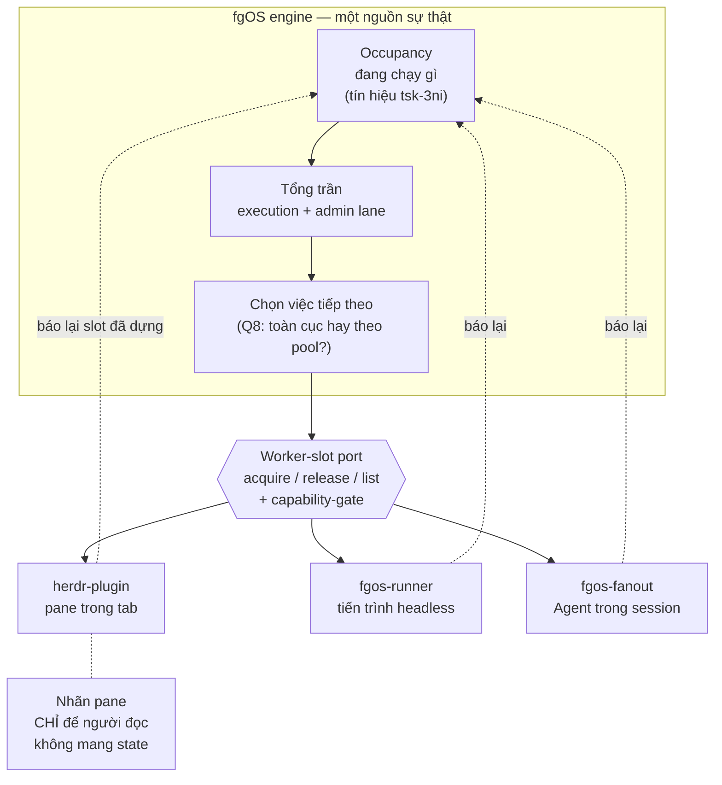

# orchestrator-worker-slots — DISCUSSION

Item: `tsk-2sj`.

## 1. Trạng thái hiện tại

Hết vòng 2. Ba D-ID đầu đã chốt (§4): tên khái niệm là **worker slot**,
engine sở hữu sự thật về "đang chạy gì" (nhãn không bao giờ gánh state),
và rename + slot là một feature không tách đôi.

Vòng 2 làm sắc lại ranh giới quan trọng nhất: **cơ chế thực thi giữ khác
nhau, phần đếm và phần chọn thì thống nhất**. Ba launcher là ba năng lực
thực thi ở quy mô khác nhau và vẫn khác nhau; nhưng "đang chạy cái gì" và
"tiếp theo nên là cái gì" phải là một câu trả lời duy nhất của engine, và
cả ba đều tuân thủ tổng trần của engine.

Còn mở, và là thứ quyết định phạm vi thật của đợt này: engine trả lời
"tiếp theo là gì" theo kiểu nào — một ranker toàn cục xuyên mọi pool, hay
mỗi launcher hỏi cho pool của mình còn engine chỉ gác tổng trần (§3 Q8).
Cùng với đó là cách hiểu cụ thể của "trần mềm, du di phía trên" (§3 Q7),
em đã có đề xuất kèm bằng chứng, chờ anh xác nhận.

## 2. Mục tiêu & đề bài

Tầng orchestrator của fgOS hôm nay là `herdr-plugin` (Rust, quản pane/tab
của herdr), nhưng không có gì đảm bảo mai sau vẫn là herdr — có thể là
cmux, tmux, hay một thứ khác chưa tồn tại. Đề bài là rút ra khái niệm
tổng quát nằm dưới nó: một *worker slot* là chỗ đứng cho đúng một đơn vị
công việc có vòng đời đầy đủ; hệ cần biết còn bao nhiêu chỗ trống, phân
việc vào đúng chỗ, và thu hồi chỗ khi việc xong hoặc chết — tất cả qua
một port trung lập để đổi tool không phải viết lại logic. Quan trọng
không kém: hôm nay ba launcher đang tự chế trần song song riêng, không ai
biết ai, nên trần thật ở mức máy là tổng của cả ba và không ai quản; đợt
này phải hướng cả ba về một tổng trần chung của engine. Gắn liền và không
tách được: cơ chế đặt tên/nhãn cho chỗ đứng đó, vì hôm nay nhãn đang gánh
state của orchestrator và đó chính là nguồn của một bug đang sống. Phạm
vi bao gồm cả việc đổi `fg:agents-N` thành `fg:workers-N`, vì đó là đổi
tên đúng khái niệm chứ không phải sơn phết.

## 3. Vấn đề rõ / chưa rõ

| # | Vấn đề | Trạng thái | Ghi chú |
|---|--------|-----------|---------|
| Q1 | Gọi khái niệm mới là gì | **rõ** | → D1: `worker slot`. `capacity` bị loại vì đụng `0026` |
| Q2 | Phạm vi: một hay ba launcher | **rõ** | Cả ba tuân thủ tổng trần engine. Cơ chế thực thi giữ riêng |
| Q3 | Nguồn chân lý cho occupancy | **rõ** | → D2: state fgOS. Tái dùng tín hiệu của `tsk-3ni` |
| Q4 | Nhãn/label có được gánh state không | **rõ** | → D2: không, tuyệt đối |
| Q5 | Rename ở `fgos-coding-driving` hay chỗ khác | **chưa rõ** | Căng thẳng với hard rule "purely mechanical loop" của chính skill đó. Chưa bàn lại từ vòng mở màn |
| Q6 | `fg:operation` 2 pane → 4 pane | **rõ về số** | 3 loại hành chính hôm nay (merge/retro/cleanup) + 1 thủ sẵn. Là supersede tsk-5lr D2, nhận diện theo hình học biến mất |
| Q7 | "Trần mềm, du di phía trên" nghĩa cụ thể là gì | **chưa rõ** | Em đề xuất: hai lane, admin là phần du di và không bao giờ bị execution chiếm chỗ. Bằng chứng ở §5 vòng 2 F5 |
| Q8 | "Tiếp theo là gì" — ranker toàn cục xuyên pool, hay mỗi launcher hỏi pool của mình | **chưa rõ** | Quyết định phạm vi thật của đợt này |
| Q9 | Trần đếm theo cái gì | **chưa rõ** | Slot (chỗ đứng) hay tiến trình `claude` thật? Ba launcher tốn tài nguyên rất khác nhau cho cùng "1 slot" |

## 4. Quyết định đã chốt

| D-ID | Quyết định |
|------|-----------|
| D1 | Khái niệm là **worker slot** — 1 worker slot = chỗ đứng của đúng 1 rootTask (đơn vị work item lớn nhất). Loại bỏ từ `capacity` cho khái niệm này, vì `docs/decisions/0026:73-87` đã khoá `capacity` với nghĩa khác hẳn (đơn vị helper hẹp như `judge-discovery`, không mang vòng đời rootTask đầy đủ) và nói rõ subTask với capacity không gộp làm một. `worker` giữ liên mạch với `fg:workers-N`, và tách đúng *chỗ* (slot) khỏi *cái chiếm chỗ* (worker). |
| D2 | **Engine sở hữu sự thật về "đang chạy gì"** — occupancy là state fgOS, không phải state của tool/launcher. Hệ quả bắt buộc: nhãn/label của pane KHÔNG BAO GIỜ được gánh state của orchestrator; nhãn chỉ để cho người đọc. Khớp hard rule của `docs/operator-runbook-herdr-cockpit.md` (sinh từ bug production thật "idle killed an agent"). Cơ chế thay thế đã có sẵn: `tsk-3ni` D1/D4. |
| D3 | Cơ chế rename/label và khái niệm worker slot là **một feature**, không tách đôi; và **không vá tạm** bug `fgos-auto-discover` đang sống — để thiết kế nuốt luôn. |

Cả ba đã ghi vào event log qua `fgos decision --id tsk-2sj` (seq 14352,
14353, 14354).

## 5. Q&A log

### 2026-08-12 — Vòng mở màn (người dùng nêu đề bài)

Người dùng nêu 2 mảng cần bàn:

1. Cơ chế rename pane phải thành hexagon (port/adapter + capability-gate
   qua tool registry), vì có thể đổi tool không dùng herdr. Đề xuất đặt ở
   `fgos-coding-driving` vì đó là driver tổng, biết id sớm nhất, làm một
   lần thay cho N launcher. Mở để bàn: có support tự rename và bỏ rename.
2. Khái niệm work-capacity tổng quát: bao nhiêu slot cho mỗi loại việc và
   cách phân bổ. Quan sát của người dùng: có 2 loại work-item — đơn vị
   thực hiện (discovery/plan/implement) và đơn vị quản trị hành chính
   (merge/retro/cleanup). Với herdr: hành chính mỗi loại 1 đơn vị chạy một
   lúc, chia ngẫu nhiên vào 1 trong 4 pane tab `fg:operation`; loại còn
   lại chia ngẫu nhiên vào pane thuộc `fg:agents-N`, muốn đổi thành
   `fg:workers-N`.

Ba trả lời nhanh của người dùng ở cùng vòng này:

- Occupancy lấy chân lý từ state fgOS; adapter chỉ xếp chỗ và báo id;
  lệch thì engine thắng, adapter reconcile.
- Gộp 2 mảng thành 1 feature, vì rename chỉ sạch khi nhãn hết gánh state.
- Không vá tạm bug đang sống, để thiết kế nuốt luôn.

### 2026-08-12 — Vòng 1, scout

**F1 — `capacity` là thuật ngữ đã khoá, nghĩa khác hẳn.**
`docs/decisions/0026:73-87` chốt `capacity` = "đơn vị functional/helper
hẹp (judge-discovery, submit-assist-classify) — không tự mang vòng đời 1
rootTask đầy đủ", và nói rõ subTask với capacity KHÔNG gộp làm một. Thứ
người dùng đang mô tả (chỗ đứng cho một việc có vòng đời đầy đủ) trong
vocabulary 0026 chính là chỗ chứa một **rootTask**. Cùng doc,
`0026:49-52` đã nêu đích danh `herdr-plugin` như một **launcher** tiềm
năng. → thành D1.

**F2 — Đã có BA trần song song độc lập, không cái nào biết cái kia.**

| Launcher | Trần | Khai ở đâu | Thuật toán xếp |
|---|---|---|---|
| `fgos-runner` (headless) | `maxRoots × maxLeavesPerRoot`, mặc định 4×4 | `runner.parallel` trong config, validate lúc load (`loop.mjs:126-150`) | `selectWave`, FIFO theo root (`loop.mjs:158-170`) |
| `fgos-fanout` (Agent trong session) | 5 Agent/wave, hard cap | văn xuôi D7 trong SKILL.md (`fgos-fanout/SKILL.md:62-66`) | `computeSchedule`, xếp wave tránh đụng footprint (`graph-metrics.mjs:736`) |
| `herdr-plugin` (pane) | 8 pane (4×2) | hằng số Rust (`layout.rs:10,14`) | `find_agents_tab_with_room`, tab nhỏ số nhất còn chỗ |

Ba nơi khai báo, ba thuật toán, không chung từ vựng. Và chúng chạy được
ĐỒNG THỜI: runner có lock riêng (`runner.lock`, `EXIT_BUSY`) nhưng
auto-launcher của herdr không hề tra lock đó, còn fanout chạy trong
session. Trần thật ở mức máy hôm nay là tổng của cả ba, không ai quản.

**F3 — Cơ chế "engine là chân lý" đã được thiết kế sẵn, tái dùng được.**
`session-claim-liveness` (`tsk-3ni`) đã chốt: D1 tín hiệu sống = hoạt
động sửa file thật trong worktree, KHÔNG phải PID/heartbeat, KHÔNG phải
tuổi claim; D4 công thức = `max(git log -1 %ct trên fgw/<id>, mtime mới
nhất trong danh sách git status --porcelain)`; D3 ngưỡng tái dùng thẳng
`/fgOS:stale` (`agentMs` 15 phút, `humanMs` 24 giờ). → thành D2.

**F4 — `fg:operation` 2 pane là quyết định đã khoá, không phải thiếu sót.**
`herdr-operation-tab-layout` (`tsk-5lr`) D2 chốt nhận diện trái/phải bằng
hình học (`x` nhỏ nhất = trái = merge-loop; còn lại = retro/cleanup), kèm
"pinned assumption": tab không đúng 2 pane là trạng thái lỗi/không hỗ
trợ, "revisit only if it's hit in practice". Muốn 4 pane là **supersede**
D2 đó.

### 2026-08-12 — Vòng 2 (người dùng trả lời)

- **F1 →** khái niệm cần đặt tên đúng là *tổng trần chỗ chứa* — slot cho
  đơn vị work item lớn nhất. Tên chốt: `worker slot` (→ D1).
- **F2 →** cả ba nên dùng chung một đầu ra và thuật toán chung của
  engine/harness, đừng chế riêng, hướng chúng lại. Ba cơ chế chạy là ba
  *năng lực thực thi ở mức độ và quy mô khác nhau*; còn "cái gì đang thực
  thi" và "tiếp theo nên là cái gì" phải thống nhất toàn engine. Cả ba
  launcher đều tuân thủ tổng trần của engine.
- **F4 →** trước nghĩ 2, giờ là 3 (merge/retro/cleanup), thủ sẵn 4 cho
  một việc hành chính mới phát sinh.
- **Trần mềm:** thống nhất tổng trần nhưng đừng cứng quá, có thể du di mở
  phía trên cho linh hoạt — vì giới hạn tổng trần giúp máy chạy ổn định.

### 2026-08-12 — Vòng 2, scout tiếp

**F5 — Lane riêng cho việc hành chính đã tồn tại trong code, và có lý do
cấu trúc bắt buộc phải giữ.** `tsk-5lr` CONTEXT.md:21 ghi `fg:operation`
"never counted against the `fg:agents-N` cap", và code khớp:
`agents_tab_index` (`layout.rs:170-172`) chỉ parse tiền tố `fg:agents-`,
nên tab operation không bao giờ vào phép đếm cap.

Lý do bắt buộc, xác minh được: `src/runner/claim-port.mjs:160-167` — một
lá có dep chưa `done` bị **từ chối claim** thẳng (`deps-not-merged`).
Nghĩa là merge nằm THƯỢNG NGUỒN của mọi claim execution mới. Nếu việc
hành chính phải xếp hàng sau việc execution trong cùng một pool, thì khi
pool đầy: không merge được → không lá nào mới claim được → execution lane
cạn dần rồi ngồi không trong khi backlog phình. Đây là đói tài nguyên
(starvation) có thật, không phải rủi ro lý thuyết — và nó là lập luận cấu
trúc cho việc admin phải có chỗ riêng, không tranh chỗ với execution.

## 6. Thiết kế đã chốt {#design}

*(Bản tổng hợp cho người đọc chưa từng dự buổi nào. Phần còn mở được
đánh dấu rõ — không viết như thể đã chốt.)*

### Khái niệm

Một **worker** là một chỗ thực thi đang chạy đúng một *rootTask* — đơn vị
công việc có vòng đời đầy đủ, theo từ vựng đã khoá ở
`docs/decisions/0026`. **Worker slot** là chỗ đứng đó, được định cỡ theo
đơn vị work item lớn nhất, nên một slot luôn đủ cho một rootTask bất kể
nó là việc loại nào (D1).

Khái niệm này cố tình KHÔNG mang tên `capacity`: trong fgOS, `capacity`
đã là một đơn vị helper hẹp (`judge-discovery`, `submit-assist-classify`)
không mang vòng đời rootTask. Hai thứ khác bản chất, không được dùng
chung tên.

### Ai sở hữu cái gì

Ranh giới cốt lõi, chốt ở vòng 2: **cơ chế thực thi khác nhau; phần đếm
và phần chọn thống nhất.**

- **Engine (fgOS) sở hữu** — đang chạy gì (occupancy), tổng trần bao
  nhiêu, và tiếp theo nên chạy gì. Đây là một câu trả lời duy nhất cho cả
  hệ (D2).
- **Launcher/adapter sở hữu** — *cách* dựng một worker lên và *chỗ* đặt
  nó. Ba launcher hôm nay là ba năng lực thực thi ở ba quy mô: pane
  tương tác (`herdr-plugin`), tiến trình headless (`fgos-runner`), Agent
  trong session (`fgos-fanout`). Chúng vẫn khác nhau và không bị ép gộp.

Hệ quả trực tiếp và tuyệt đối (D2): **nhãn/label không bao giờ được gánh
state.** Nhãn chỉ để người đọc. Mọi câu hỏi kiểu "chỗ này còn trống
không" phải hỏi engine, không được suy từ nhãn của tool.

Tín hiệu occupancy không phải phát minh mới — tái dùng `tsk-3ni`: một
claim còn sống khi worktree `fgw/<id>` còn hoạt động sửa file thật
(`max(git log -1 %ct, mtime mới nhất trong git status --porcelain)`), so
với ngưỡng sẵn có của `/fgOS:stale`. Không dùng PID, không dùng
heartbeat, không dùng tuổi claim.

### Hai lane, và vì sao phải hai

Công việc chia hai lớp: **execution** (discovery/plan/implement — chạy
theo `stage`) và **admin** (merge/retro/cleanup — quét theo pool
`status`). Lớp suy ra được từ dữ liệu đã có, không cần field mới.

Hai lane không phải để cho gọn mà là bắt buộc về cấu trúc: merge nằm
thượng nguồn của mọi claim execution mới (`claim-port.mjs:160-167` từ
chối lá có dep chưa `done`). Nếu admin xếp hàng chung với execution, pool
đầy sẽ khoá chính thứ cần chạy để mở khoá pool. Cấu trúc lane riêng này
đã tồn tại trong code hôm nay (`fg:operation` không nằm trong cap của
`fg:agents-N`) — thiết kế này giữ và tổng quát hoá nó, không phát minh
lại.

**Đề xuất chưa chốt (Q7):** đây cũng chính là chỗ đặt phần "du di phía
trên" — tổng trần siết lane execution, còn lane admin là phần dôi ra bên
trên và không bao giờ bị execution chiếm chỗ. Cần anh xác nhận đây có
đúng ý "đừng cứng quá" không.

### Hình

### Phần chưa chốt, ảnh hưởng phạm vi thật

- **Q8 — "tiếp theo là gì" hình dạng nào.** Hôm nay đã có ~6 picker theo
  pool (`pickNextDiscoverItem`, `pickNextPlanItem`,
  `pickNextRetrospectiveItem`, `pickNextCleanupItem`, `frontier`, ranking
  của `merge`), mỗi cái chọn độc lập trong pool của nó. "Thống nhất toàn
  engine" có thể nghĩa là (a) thêm một ranker toàn cục xuyên pool, hay
  (b) giữ các picker hiện có, engine chỉ thêm lớp gác tổng trần và mỗi
  launcher hỏi pool của mình. Khác biệt về khối lượng là lớn.
- **Q9 — trần đếm theo cái gì.** Một pane herdr, một tiến trình headless,
  và một Agent trong session tốn tài nguyên rất khác nhau, nhưng đều là
  "1 slot". Chưa chốt trần đếm slot trừu tượng hay quy về tài nguyên thật.
- **Q5 — rename đặt ở đâu.** Đề xuất ban đầu là `fgos-coding-driving`;
  chưa bàn lại kể từ vòng mở màn.
- **Supersede cần viết rõ:** `tsk-5lr` D2 (nhận diện trái/phải theo hình
  học trong `fg:operation` 2 pane) sẽ bị thay bởi mô hình 4 pane.

## 7. Danh mục hạng mục / task {#tasks}

Chưa có. Chờ Q8 chốt — nó quyết định đợt này là một task hay một chùm.
