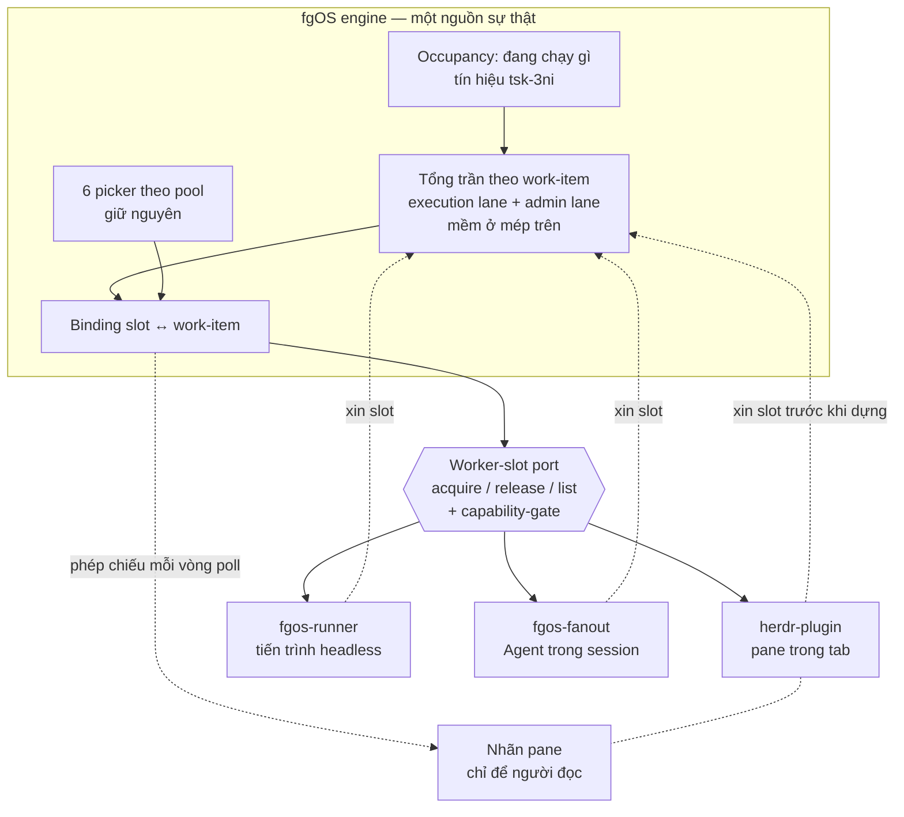

# orchestrator-worker-slots — DISCUSSION

Item: `tsk-2sj`.

## 1. Trạng thái hiện tại

Hết vòng 3. Bốn D-ID đã chốt (§4): tên khái niệm là **worker slot**;
engine sở hữu sự thật về "đang chạy gì" và nhãn không bao giờ gánh state;
rename + slot là một feature; và **hai lane riêng biệt**, lane admin có
chỗ dành riêng vì merge nằm thượng nguồn của mọi claim execution mới.

Vòng 3 chốt thêm ba điểm (chưa mint, chờ vòng sau xác nhận, nhưng coi như
đã ngã ngũ — sẽ không mở lại): hình dạng của "thống nhất" là **(b)** —
giữ nguyên 6 picker theo pool, engine thêm lớp gác trần, launcher xin
slot trước khi dựng; **trần đếm theo work-item**; và "du di" nghĩa là cho
phép vượt trần một biên nhỏ để khỏi phải bẻ một mẻ việc thành hai wave.

Còn mở: Q5 — cơ chế rename đặt ở đâu. Em có một đề xuất *khác* với ý ban
đầu của anh, suy ra trực tiếp từ chính D2 anh đã chốt: nhãn trở thành
phép chiếu thuần của state, không skill nào gọi rename nữa (§5 vòng 3,
F6). Cùng với đó là biên du di cụ thể (Q10).

## 2. Mục tiêu & đề bài

Tầng orchestrator của fgOS hôm nay là `herdr-plugin` (Rust, quản pane/tab
của herdr), nhưng không có gì đảm bảo mai sau vẫn là herdr — có thể là
cmux, tmux, hay một thứ khác chưa tồn tại. Đề bài là rút ra khái niệm
tổng quát nằm dưới nó: một *worker slot* là chỗ đứng cho đúng một đơn vị
công việc có vòng đời đầy đủ; hệ cần biết còn bao nhiêu chỗ trống, phân
việc vào đúng chỗ, và thu hồi chỗ khi việc xong hoặc chết — tất cả qua
một port trung lập để đổi tool không phải viết lại logic. Quan trọng
không kém: hôm nay ba launcher đang tự chế trần song song riêng, không ai
biết ai, nên trần thật ở mức máy là tổng của cả ba và không ai quản; đợt
này phải hướng cả ba về một tổng trần chung của engine. Gắn liền và không
tách được: cơ chế đặt tên/nhãn cho chỗ đứng đó, vì hôm nay nhãn đang gánh
state của orchestrator và đó chính là nguồn của một bug đang sống. Phạm
vi bao gồm cả việc đổi `fg:agents-N` thành `fg:workers-N`, vì đó là đổi
tên đúng khái niệm chứ không phải sơn phết.

## 3. Vấn đề rõ / chưa rõ

| # | Vấn đề | Trạng thái | Ghi chú |
|---|--------|-----------|---------|
| Q1 | Gọi khái niệm mới là gì | **rõ** | → D1: `worker slot` |
| Q2 | Phạm vi: một hay ba launcher | **rõ** | Cả ba tuân thủ tổng trần engine; cơ chế thực thi giữ riêng |
| Q3 | Nguồn chân lý cho occupancy | **rõ** | → D2: state fgOS, tái dùng tín hiệu `tsk-3ni` |
| Q4 | Nhãn có được gánh state không | **rõ** | → D2: không, tuyệt đối |
| Q5 | Rename đặt ở đâu | **chưa rõ** | Ý ban đầu: `fgos-coding-driving`. Đề xuất mới của em: không skill nào cả — nhãn là phép chiếu của state (F6) |
| Q6 | `fg:operation` 4 pane | **rõ** | 3 loại admin hôm nay + 1 thủ sẵn. Supersede `tsk-5lr` D2 |
| Q7 | "Du di phía trên" nghĩa gì | **rõ (chờ xác nhận)** | Cho phép vượt trần một biên nhỏ để khỏi bẻ mẻ việc thành 2 wave. Ưu tiên ship faster |
| Q8 | Ranker toàn cục hay gác trần | **rõ (chờ xác nhận)** | **(b)** — giữ 6 picker, engine gác trần, launcher xin slot trước khi dựng. (a) để lại |
| Q9 | Trần đếm theo cái gì | **rõ (chờ xác nhận)** | Theo **work-item** |
| Q10 | Biên du di cụ thể là bao nhiêu | **chưa rõ** | Mới phát sinh từ Q7. Cố định? Theo tỉ lệ? Chỉ cho phép trong một mẻ? |

## 4. Quyết định đã chốt

| D-ID | Quyết định |
|------|-----------|
| D1 | Khái niệm là **worker slot** — 1 worker slot = chỗ đứng của đúng 1 rootTask (đơn vị work item lớn nhất). Loại bỏ từ `capacity`, vì `docs/decisions/0026:73-87` đã khoá từ đó với nghĩa khác hẳn (đơn vị helper hẹp, không mang vòng đời rootTask) và nói rõ subTask với capacity không gộp làm một. `worker` giữ liên mạch với `fg:workers-N`, tách đúng *chỗ* khỏi *cái chiếm chỗ*. |
| D2 | **Engine sở hữu sự thật về "đang chạy gì"** — occupancy là state fgOS, không phải state của tool/launcher. Hệ quả bắt buộc: nhãn/label KHÔNG BAO GIỜ được gánh state của orchestrator; nhãn chỉ để cho người đọc. Khớp hard rule của `docs/operator-runbook-herdr-cockpit.md`. Cơ chế thay thế đã có sẵn: `tsk-3ni` D1/D4. |
| D3 | Cơ chế rename/label và khái niệm worker slot là **một feature**, không tách đôi; và **không vá tạm** bug `fgos-auto-discover` đang sống. |
| D4 | **Hai lane riêng biệt** — execution (discovery/plan/implement) và admin (merge/retro/cleanup). Lane admin có chỗ dành riêng, không bao giờ bị execution chiếm chỗ. Lý do cấu trúc: `claim-port.mjs:160-167` từ chối claim một lá có dep chưa `done`, nên merge nằm thượng nguồn của mọi claim execution mới; xếp chung pool sẽ tự khoá. Cấu trúc này đã tồn tại trong code (`fg:operation` không nằm trong cap của `fg:agents-N`), thiết kế chỉ tổng quát hoá. |

Đã ghi vào event log qua `fgos decision --id tsk-2sj` (seq 14352, 14353,
14354, 14362).

## 5. Q&A log

### 2026-08-12 — Vòng mở màn (người dùng nêu đề bài)

Hai mảng: (1) cơ chế rename pane phải thành hexagon có capability-gate,
đề xuất đặt ở `fgos-coding-driving`, mở để bàn chuyện tự rename và bỏ
rename; (2) khái niệm work-capacity tổng quát — bao nhiêu slot cho mỗi
loại việc và cách phân bổ, với quan sát rằng có 2 loại work-item (đơn vị
thực hiện và đơn vị quản trị hành chính), và mong muốn đổi `fg:agents-N`
thành `fg:workers-N`.

Ba trả lời nhanh cùng vòng: occupancy lấy chân lý từ state fgOS; gộp 2
mảng thành 1 feature; không vá tạm bug đang sống.

### 2026-08-12 — Vòng 1, scout

**F1 — `capacity` là thuật ngữ đã khoá, nghĩa khác hẳn.**
`docs/decisions/0026:73-87`. → thành D1.

**F2 — Đã có BA trần song song độc lập, không cái nào biết cái kia.**

| Launcher | Trần | Khai ở đâu | Thuật toán xếp |
|---|---|---|---|
| `fgos-runner` (headless) | `maxRoots × maxLeavesPerRoot`, mặc định 4×4 | `runner.parallel` trong config, validate lúc load (`loop.mjs:126-150`) | `selectWave`, FIFO theo root (`loop.mjs:158-170`) |
| `fgos-fanout` (Agent trong session) | 5 Agent/wave, hard cap | văn xuôi D7 trong SKILL.md (`fgos-fanout/SKILL.md:62-66`) | `computeSchedule`, tránh đụng footprint (`graph-metrics.mjs:736`) |
| `herdr-plugin` (pane) | 8 pane (4×2) | hằng số Rust (`layout.rs:10,14`) | `find_agents_tab_with_room` |

Ba nơi khai báo, ba thuật toán, không chung từ vựng — và chạy đồng thời
được, nên trần thật ở mức máy là tổng của cả ba, không ai quản.

**F3 — Cơ chế "engine là chân lý" đã thiết kế sẵn.** `tsk-3ni` D1/D4/D3:
tín hiệu sống = hoạt động sửa file thật trong worktree, công thức
`max(git log -1 %ct, mtime mới nhất trong git status --porcelain)`,
ngưỡng tái dùng `/fgOS:stale`. → thành D2.

**F4 — `fg:operation` 2 pane là quyết định đã khoá** (`tsk-5lr` D2, nhận
diện trái/phải bằng hình học) — muốn 4 pane là supersede, không sửa tại
chỗ.

### 2026-08-12 — Vòng 2 (người dùng trả lời)

- Khái niệm cần đặt tên là *tổng trần chỗ chứa* — slot cho đơn vị work
  item lớn nhất. Tên chốt: `worker slot`.
- Cả ba launcher dùng chung một đầu ra và thuật toán của engine/harness,
  đừng chế riêng. Ba cơ chế là ba *năng lực thực thi ở quy mô khác nhau*;
  còn "đang thực thi cái gì" và "tiếp theo nên là cái gì" phải thống nhất
  toàn engine. Cả ba tuân thủ tổng trần của engine.
- `fg:operation`: trước nghĩ 2, giờ 3, thủ sẵn 4 cho một việc hành chính
  mới phát sinh.
- Trần: thống nhất nhưng đừng cứng quá, du di mở phía trên cho linh hoạt,
  vì giới hạn tổng trần giúp máy chạy ổn định.

### 2026-08-12 — Vòng 2, scout

**F5 — Lane riêng cho admin đã tồn tại trong code, và có lý do cấu trúc
bắt buộc.** `tsk-5lr` CONTEXT.md:21 ghi `fg:operation` "never counted
against the `fg:agents-N` cap"; code khớp — `agents_tab_index`
(`layout.rs:170-172`) chỉ parse tiền tố `fg:agents-`.

Lý do bắt buộc: `src/runner/claim-port.mjs:160-167` từ chối claim một lá
có dep chưa `done` (`deps-not-merged`). Merge nằm thượng nguồn của mọi
claim execution mới → xếp chung pool sẽ tự khoá khi pool đầy. → thành D4.

### 2026-08-12 — Vòng 3 (người dùng trả lời)

- **Du di:** ý vượt hơn phần lane. Ví dụ còn 3 slot mà fanout muốn 4 —
  câu hỏi là fanout tự giảm xuống 2 wave, hay cho phép đẩy luôn 4. Ý
  người dùng: cho phép đẩy, chủ yếu để linh hoạt và **ship faster**.
- **Q8: (b).** Engine có 6 picker tool, phải trả đúng và không block;
  launcher xin slot trước khi dựng. (a) đồng ý để lại.
- **Góc nhìn hiện tại về hai điểm nghẽn thật** (bối cảnh cho (a) sau
  này, không phải phạm vi đợt này): (1) thông tin phải sẵn sàng và đầy đủ
  để hỏi người một lần, release con người, không tạo hiện tượng người
  phải ngồi canh — trả lời hết câu hỏi rồi thì máy túc tắc làm cả ngày
  cũng được; (2) nghẽn merge — không merge thì không xử lý tiếp được phía
  sau, mà agent xử lý xung đột merge rất tốt nhưng cứ hỏi người miết,
  nhất quyết không tự xử lý.
- **Q9:** trần đếm theo **work-item**.

### 2026-08-12 — Vòng 3, scout

**F6 — Nếu nhãn không gánh state (D2) thì không skill nào cần gọi rename
nữa.** Đây là hệ quả của chính D2, và nó trả lời Q5 khác với đề xuất ban
đầu.

Khi launcher phải xin slot trước khi dựng (Q8 b), engine biết cặp
`slot ↔ work-item`. Nhãn lúc đó chỉ còn là *phép chiếu* của cặp đó: mỗi
vòng poll, adapter đọc binding từ engine rồi vẽ lại nhãn. Không cần
`/fgOS:terminal` gọi `rename.sh` từ trong session, không cần nhét chrome
vào `fgos-coding-driving`, và không còn cửa cho session ghi đè nhãn của
orchestrator — tức bug `fgos-auto-discover` biến mất theo cấu trúc chứ
không phải bị vá.

"Bỏ rename" cũng thành tầm thường: binding được nhả thì vòng poll kế
tiếp vẽ lại nhãn rỗi, không cần cơ chế un-rename riêng.

Capability-gate vẫn cần: một tool khác (tmux) có thể không có khái niệm
nhãn pane. Nhưng gate đó nằm ở adapter, không phải ở skill.

**F7 — Điểm nghẽn merge: cơ chế đã có, cái thiếu là agent chịu dùng.**
`fgos catchup` (`bin/fgos.mjs:3747-3783`) nhận đúng `merge-conflict`
trong `CATCHUP_REASONS`, merge target vào nhánh item rồi verify lại và
land (`blocked → awaiting-approval`) hoặc báo lại. Nên lời phàn nàn "agent
cứ hỏi người miết" không phải thiếu verb — là vấn đề hành vi skill. Ghi
nhận là **liền kề, ngoài phạm vi** đợt này; xứng đáng item riêng.

## 6. Thiết kế đã chốt {#design}

*(Bản tổng hợp cho người đọc chưa từng dự buổi nào. Phần còn mở được
đánh dấu rõ.)*

### Khái niệm

Một **worker** là một chỗ thực thi đang chạy đúng một *rootTask* — đơn vị
công việc có vòng đời đầy đủ, theo từ vựng đã khoá ở
`docs/decisions/0026`. **Worker slot** là chỗ đứng đó, định cỡ theo đơn
vị work item lớn nhất, nên một slot luôn đủ cho một rootTask bất kể loại
việc (D1). Trần đếm theo **work-item**: một work-item đang chạy tiêu tốn
đúng một slot, bất kể launcher nào dựng nó lên.

Khái niệm này cố tình KHÔNG mang tên `capacity` — trong fgOS `capacity`
đã là một đơn vị helper hẹp (`judge-discovery`), khác bản chất.

### Ai sở hữu cái gì

**Cơ chế thực thi khác nhau; phần đếm và phần chọn thống nhất.**

- **Engine (fgOS) sở hữu** — đang chạy gì (occupancy), tổng trần bao
  nhiêu, còn chỗ hay không, và trả lời "tiếp theo là gì" cho từng pool.
- **Launcher/adapter sở hữu** — *cách* dựng một worker và *chỗ* đặt nó.
  Ba launcher là ba năng lực thực thi ở ba quy mô: pane tương tác
  (`herdr-plugin`), tiến trình headless (`fgos-runner`), Agent trong
  session (`fgos-fanout`). Chúng vẫn khác nhau, không bị ép gộp.

Tín hiệu occupancy tái dùng `tsk-3ni`: claim còn sống khi worktree
`fgw/<id>` còn hoạt động sửa file thật, so với ngưỡng sẵn có của
`/fgOS:stale`. Không PID, không heartbeat, không tuổi claim.

### Hình dạng của "thống nhất" — (b), không phải (a)

Sáu picker theo pool hiện có (`pickNextDiscoverItem`, `pickNextPlanItem`,
`pickNextRetrospectiveItem`, `pickNextCleanupItem`, `frontier`, ranking
của `merge`) **giữ nguyên**. Engine thêm đúng một lớp: gác tổng trần.
Launcher **xin slot trước khi dựng**; hết chỗ thì bị từ chối, không tự
quyết. Picker phải trả lời đúng và không block.

Một ranker toàn cục xuyên pool — (a) — được **để lại có chủ ý**, vì trục
ưu tiên chung giữa những thứ hôm nay không so sánh được (một item chờ
discovery so với một item chờ merge) cần dữ liệu occupancy thật mới thiết
kế đúng. Khi làm (a), hai điểm nghẽn đã được nêu làm trục: (1) gom đủ
thông tin để hỏi người một lần rồi release con người; (2) nghẽn merge.

### Hai lane, và vì sao phải hai

**Execution** (discovery/plan/implement — chạy theo `stage`) và **admin**
(merge/retro/cleanup — quét theo pool `status`). Lớp suy ra được từ dữ
liệu đã có, không cần field mới.

Hai lane là bắt buộc về cấu trúc, không phải cho gọn: merge nằm thượng
nguồn của mọi claim execution mới (`claim-port.mjs:160-167`). Nếu admin
xếp hàng chung với execution, pool đầy sẽ khoá chính thứ cần chạy để mở
khoá pool (D4).

### Trần mềm

Tổng trần siết lane execution; lane admin có chỗ dành riêng bên trên và
không bao giờ bị execution chiếm chỗ (D4). Ngoài ra, trần là **mềm ở mép
trên**: một launcher được phép vượt trần một biên nhỏ để khỏi phải bẻ một
mẻ việc thành hai wave — ví dụ còn 3 slot mà một mẻ fanout có 4 thành
viên thì cho đẩy cả 4, thay vì tách thành 2 wave. Ưu tiên ship faster
(`AGENTS.md` mục 1) thắng sự chính xác của con số, miễn biên vượt còn
nhỏ và biết trước.

**Chưa chốt (Q10):** biên đó là bao nhiêu và diễn đạt thế nào — một số cố
định, một tỉ lệ, hay chỉ cho phép trong phạm vi một mẻ đã tính sẵn.

### Nhãn là phép chiếu, không phải state

Vì engine giữ cặp `slot ↔ work-item` (hệ quả của "xin slot trước khi
dựng"), nhãn pane chỉ còn là *phép chiếu* của cặp đó: mỗi vòng poll,
adapter đọc binding rồi vẽ lại nhãn. Không session nào gọi rename, không
chrome nào chui vào `fgos-coding-driving`, và không còn cửa cho session
ghi đè nhãn của orchestrator — bug `fgos-auto-discover` biến mất theo cấu
trúc. "Bỏ rename" thành tầm thường: nhả binding thì vòng sau vẽ nhãn rỗi.

Capability-gate vẫn cần (tool khác có thể không có khái niệm nhãn), nhưng
đặt ở adapter, không ở skill.

**Chưa chốt (Q5):** đây là đề xuất khác với ý ban đầu (đặt rename ở
`fgos-coding-driving`) — chờ xác nhận.

### Hình

### Ngoài phạm vi, ghi nhận không nuốt

- **Ranker toàn cục xuyên pool (a)** — để lại có chủ ý, xem trên.
- **Agent tự xử xung đột merge** — `fgos catchup` đã có và nhận đúng
  `merge-conflict`; cái thiếu là hành vi skill chịu dùng nó. Xứng đáng
  item riêng.
- **Gom câu hỏi để hỏi người một lần** — điểm nghẽn (1), thuộc `AGENTS.md`
  ưu tiên #2, không phải phạm vi slot.

## 7. Danh mục hạng mục / task {#tasks}

Chưa viết. Chờ Q5 và Q10 chốt — Q5 quyết định có hay không một hạng mục
"port đặt nhãn" tách riêng, hay nó tan vào hạng mục adapter.
