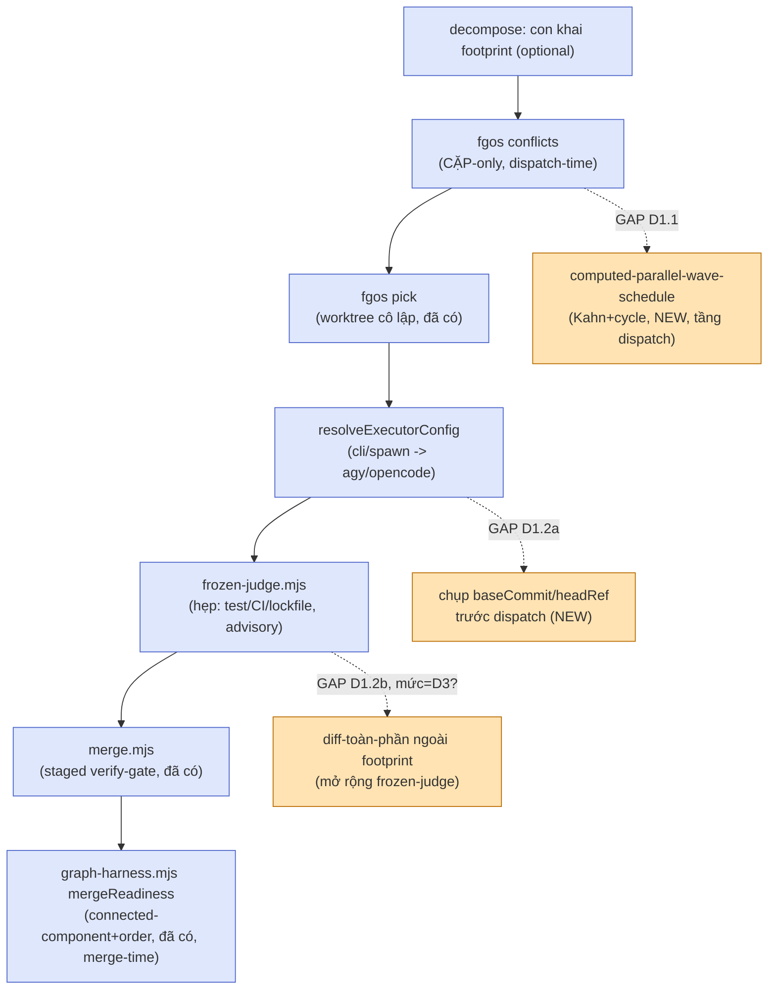

# Parallel decomposition + footprint avoidance — DISCUSSION

## 1. Trạng thái hiện tại

Distill xong (deep-dive + porting-log). Decision 0026 (native-first
dispatch) xác nhận cơ chế agy/opencode: luôn `cli/spawn` qua
`resolveExecutorConfig`, không cần quan tâm chi tiết spawn bên trong. Đã
chọn `tsk-66o` làm gốc (thay vì submit 2 item mới trùng câu hỏi), claim,
chạy `fgos-exploring` Socratic — 3/4 quyết định đã khoá thật (D1, D2, D4,
mỗi cái đã có `fgos decision --id tsk-66o` riêng, xem §4). Gap "bỏ sót"
(khác D4 đang nói — D4 chính là quyết định TÁCH gap đó ra) đã filed thành
`tsk-1gr`, sibling độc lập, không phải con của tsk-66o. **Còn mở duy
nhất: D3** — mức độ rộng/hẹp của `worktree-dispatch-attestation` (3 lựa
chọn ở §3), chưa được chốt vì phiên chuyển sang distill hội thoại này
trước khi user trả lời. CONTEXT.md của tsk-66o CHƯA viết (bước 3 của
`fgos-exploring` chưa chạy) — bước kế tiếp sau khi D3 chốt là quay lại
`fgos-exploring` để viết CONTEXT.md + gate, theo đúng terminal handoff của
skill này.

## 2. Mục tiêu & đề bài

forgentX muốn học từ upstream bee cách chia việc thành đơn vị chạy song
song được và tránh xung đột footprint giữa chúng, nhưng khác bee ở một
điểm kiến trúc cốt lõi: việc con ở khâu code-implement không chạy như
subagent Claude cùng phiên (bee's cell-swarm) mà bị đẩy ra cho agent
provider khác — agy/opencode — qua `resolveExecutorConfig`
(`src/runner/dispatch.mjs`), luôn `cli/spawn` theo decision 0026 vì luôn
khác provider với rootTask Claude. Câu hỏi gốc của `tsk-66o` — "Planning/
Validating có khai báo rõ footprint chưa? có dùng graph để phân chia task
để không đụng footprint?" — mở ra một phát hiện lớn hơn dự kiến: forgentX
đã hội tụ độc lập với phần lớn ý tưởng "cell" của bee rồi (footprint khai
báo, `acceptance`+evidence, merge dàn trận verify-trước-commit, worktree
cô lập per-item qua `fgos pick`), và một module đọc-only ít được biết tới
(`graph-harness.mjs`'s `mergeReadiness`) đã giải một nửa bài toán gom-
nhóm+xếp-thứ-tự bằng graph — chỉ chưa chạy ở đúng thời điểm (dispatch
thay vì merge). Đề bài thật của cụm việc này: đóng 2 khoảng trống còn lại
(wave-schedule ở tầng dispatch, và tin cậy dispatch cho executor NGOÀI
kém tin hơn subagent cùng nhà) mà không phá vỡ những gì đã hội tụ đúng.

## 3. Vấn đề rõ / chưa rõ

| # | Vấn đề | Trạng thái | Ghi chú |
|---|---|---|---|
| 1 | Footprint có khai báo được ở Planning/Validating không | **Rõ** | Có, `footprint` optional trên `add`/`edit`/judge-proposed lúc decompose (`work-state.md` ~1022), PHI-CHẶN — chỉ nuôi cố vấn `fgos conflicts`, không chặn gì |
| 2 | Có dùng graph để tránh xung đột footprint không | **Rõ, có 2 tầng khác nhau** | Dispatch-time: `footprintOverlap`/`footprintConflicts` (`graph-metrics.mjs`/`store.mjs`) — CẶP-only, chạy trên `frontier()`. Merge-time: `graph-harness.mjs`'s `mergeReadiness` — gom-nhóm connected-component + xếp-thứ-tự serialize (`footprintOverlapAmong`), chạy trên `proposed` items. Không cái nào SPLIT/re-slice tự động — cả hai đều advisory |
| 3 | Worktree có cô lập việc con không | **Rõ** | Có — `fgos pick` tạo worktree riêng cho mọi coding item claim ở stage `executing` (đã chạy thật, không phải tính năng tương lai) |
| 4 | agy/opencode dispatch qua cơ chế gì | **Rõ** | Luôn `cli/spawn` qua `resolveExecutorConfig` + `capacities.<id>` (decision 0026 quy tắc 3), gác nội dung riêng bằng `allowCrossProvider`. Cơ chế spawn cụ thể bên trong không ảnh hưởng thiết kế ở đây |
| 5 | Có gap "bỏ sót quyết định khỏi mọi footprint con" không | **Rõ, tách riêng** | Có, khác bản chất với chồng-lấn — filed `tsk-1gr`, không phải scope tsk-66o |
| 6 | **Mức độ rộng/hẹp của `worktree-dispatch-attestation`** | **CHƯA RÕ** | 3 mức: (a) advisory-only — chụp identity + mở rộng frozen-judge diff-toàn-phần, chỉ gắn cờ; (b) hard-refusal-tại-merge — lệch identity/base/diff NGOÀI footprint khai thì CHẶN merge thật (typed halt); (c) cô lập cấp OS — đây chính là scope `tsk-49o` đã file riêng (`EXECUTOR_ADAPTERS` sandboxed-cli-spawn), nếu chọn mức này thì item này nên `deps: [tsk-49o]` thay vì tự làm. User hỏi ngược "rộng hơn là cỡ nào" khi được hỏi hẹp/rộng, đã trình bày 3 mức nhưng chưa được chọn |
| 7 | Thuật toán wave-schedule có nên tái dùng `graph-harness.mjs` không | **Rõ** | Không — D2 chốt thuật toán RIÊNG (Kahn+cycle-detection), vì bài toán khác nhau: dispatch cần đếm song-song-được-mấy-cái NGAY BÂY GIỜ, merge chỉ cần thứ tự tuần tự |

## 4. Quyết định đã chốt

| D-ID | Tóm tắt | Nguồn / rationale |
|---|---|---|
| D1 | Children của tsk-66o = worktree-dispatch-attestation-shaped work + computed-parallel-wave-schedule-shaped work (2 candidate từ `docs/distillery/porting-log.md`, deep-dive `docs/distillery/deep-dives/parallel-decomposition-and-merge.md`) | User chốt sống trong phiên trước khi claim tsk-66o — dùng item có sẵn làm gốc thay vì submit trùng. Đã log `fgos decision --id tsk-66o` (seq 6165) |
| D2 | Thuật toán wave-schedule RIÊNG (Kahn+cycle-detection kiểu beegog), không tái dùng `graph-harness.mjs`'s connected-component+order logic — bài toán khác nhau thật (đếm song-song-ngay-bây-giờ vs thứ-tự-tuần-tự) | User trả lời "Riêng" khi được hỏi trực tiếp. Đã log `fgos decision --id tsk-66o` |
| D4 | Gap "bỏ sót" (decompose không phủ hết quyết định đã khoá vào footprint con) để NGOÀI scope tsk-66o, khác bản chất với chồng-lấn — filed thành `tsk-1gr` độc lập (không dep logic, chỉ liên hệ text) | User chốt: "file luôn thành task riêng đi, gap bỏ sót phải cover luôn". Đã log `fgos decision --id tsk-66o` (seq 6181), và `tsk-1gr` đã submit thật |

D1/D2/D4 đã có `fgos decision --id tsk-66o` thật từ chính phiên `fgos-
exploring` trước khi chuyển sang distill này — KHÔNG re-log lại ở đây để
tránh trùng lặp trong `view.decisions` (cùng D-ID, cùng nội dung, hai
timestamp không thêm tín hiệu gì). D3 chưa có D-ID vì chưa chốt — ở lại
§3 cho tới khi có câu trả lời.

## 5. Q&A log

- **2026-08-05** — Extraction từ `docs/history/parallel-decomposition-
  footprint-avoidance/session-source.md` (nguồn: tự viết lại nguyên trình
  tự phiên làm việc, từ yêu cầu distill bee gốc tới thời điểm chuyển sang
  `code-shape`). Trích §2 (mục tiêu), §3 (rõ/chưa rõ — 6/7 mục rõ, D3
  chưa), §4 (D1/D2/D4 đã log thật, không re-log), §6 (tổng hợp mới), §7
  (3 task: 2 candidate + tsk-1gr liên hệ). Không có trao đổi sống mới nào
  trong lượt distill này — D3 còn mở, chờ round tiếp theo.

## 6. Thiết kế đã chốt {#design}

**Bức tranh hiện tại (đã hội tụ, không đổi):** một item con khai
`footprint` optional lúc decompose → trước dispatch, `fgos conflicts`
báo CẶP xung đột giữa các item `todo` (advisory, không chặn) → `fgos
pick` cô lập item vào worktree riêng khi vào stage `executing` → việc
thật dispatch qua `resolveExecutorConfig`/`capacities.<id>` tới agy/
opencode (luôn `cli/spawn`, decision 0026) → sau khi trả về, `frozen-
judge.mjs` (STR63, port hẹp từ bee) gác riêng nhóm file test/CI/lockfile/
manifest NGOÀI footprint khai, advisory → merge về main qua
`merge.mjs`'s giao dịch dàn trận (`git merge --no-commit --no-ff` → verify
trên cây chưa commit → commit khi xanh, đỏ thì abort sạch) → ở tầng
`proposed` (trước merge thật), `graph-harness.mjs`'s `mergeReadiness` gom
các item chồng footprint thành connected-component, đề xuất thứ tự
serialize dựa trên `rankImpact`.

**Hai khoảng trống cần đóng (locked D1, chưa xong chi tiết D3):**

1. `computed-parallel-wave-schedule` — thêm một lớp TÍNH TOÁN ở tầng
   DISPATCH (trên `frontier()`, trước khi bất kỳ item nào bắt đầu chạy),
   trả lời "sóng nào chạy song song được NGAY BÂY GIỜ, sóng nào phải đợi
   vì chồng footprint" — thuật toán riêng (D2: Kahn layering + Tarjan
   cycle-detection, không tái dùng `mergeReadiness`'s connected-component
   logic vì khác bài toán: đếm-song-song vs thứ-tự-tuần-tự).
2. `worktree-dispatch-attestation` — thu hẹp so với đề xuất gốc trong
   deep-dive, vì `fgos pick` đã cô lập worktree sẵn: chỉ còn (a) chụp
   `baseCommit`/`headRef` quanh `resolveExecutorConfig` TRƯỚC dispatch,
   và (b) mở rộng `frozen-judge.mjs` gác diff-toàn-phần (không chỉ file
   dạng test/CI/lockfile). Mức độ NẶNG bao nhiêu (advisory-only / hard-
   refusal-tại-merge / cô-lập-OS-tsk-49o) là D3, chưa chốt.

## 7. Danh mục hạng mục / task {#tasks}

### `{#task-computed-parallel-wave-schedule}`

- **Goal:** hàm thuần mới trong `src/state/graph-metrics.mjs`
  (Kahn layering + Tarjan cycle-detection, tách biệt khỏi
  `graph-harness.mjs`) trả về sóng song-song-được TẠI DISPATCH-TIME, trên
  `frontier()` — cạnh `footprintOverlap`/`footprintConflicts` hiện có,
  không thay chúng. Verb đọc-only mới (vd `fgos schedule`).
- **Trích §6:** mục "1" ở §6.
- **D-ID áp dụng:** D1 (là 1 trong 2 children), D2 (thuật toán riêng).
- **Quan hệ sibling:** độc lập file hoàn toàn với
  `worktree-dispatch-attestation` (không chạm `runner/`) — footprint hai
  task này không chồng nhau, an toàn chạy song song thật khi đưa vào
  thực thi.
- **Draft verify:** unit test cho `computeSchedule`/`detectCycles` (input
  cố định gồm 1 cặp chồng footprint + 1 cặp không chồng + 1 chu trình
  dep giả) khẳng định đúng số sóng, đúng thành viên mỗi sóng, cycle bị từ
  chối tại cửa ghi deps.

### `{#task-worktree-dispatch-attestation}`

- **Goal:** (a) chụp `baseCommit`/`headRef` quanh `resolveExecutorConfig`
  (`src/runner/dispatch.mjs`) trước khi dispatch tới agy/opencode; (b) mở
  rộng `src/runner/frozen-judge.mjs` gác diff-toàn-phần so với footprint
  khai (không chỉ nhóm file test/CI/lockfile/manifest hiện có).
- **Trích §6:** mục "2" ở §6.
- **D-ID áp dụng:** D1 (là 1 trong 2 children). **D3 CHƯA CHỐT** — mức độ
  nặng (advisory-only / hard-refusal-tại-merge / dep vào `tsk-49o` cho
  cô-lập-OS) quyết định shape thật của task này; chưa sẵn sàng cho
  `fgos-planning` cho tới khi D3 có D-ID.
- **Quan hệ sibling:** độc lập file với
  `computed-parallel-wave-schedule` (§ trên). Liên hệ (không phải dep
  logic) với `tsk-49o` nếu D3 chọn mức (c).
- **Draft verify:** chưa chốt được — phụ thuộc D3 (advisory-only cần test
  "gắn cờ đúng, không chặn"; hard-refusal cần test "merge bị từ chối
  đúng case, main untouched" giống `merge.mjs`'s bộ test hiện có).

### `{#task-tsk-1gr-completeness-gap}` (sibling, không phải con)

- **Goal:** sau decompose, đối chiếu quyết định đã khoá trong CONTEXT.md
  của item cha với TẤT CẢ footprint con — gắn cờ nếu một quyết định đổi
  vị trí/tên file mà không con nào chạm tới. Đã submit thật thành
  `tsk-1gr` (todo, stage `clarify`), KHÔNG phải con của tsk-66o.
- **Trích §6:** không thuộc thiết kế ở §6 (khác bản chất lỗi — bỏ sót
  chứ không phải chồng-lấn) — liệt ở đây chỉ để traceability, vì cùng
  buổi khảo sát footprint/decompose sinh ra nó.
- **D-ID áp dụng:** D4 (quyết định TÁCH nó ra, không phải nội dung của
  nó).
- **Quan hệ sibling:** liên hệ text với tsk-66o, không dep logic.
- **Draft verify:** để `fgos-exploring`/`fgos-planning` riêng của
  `tsk-1gr` tự quyết — ngoài scope discussion này.
