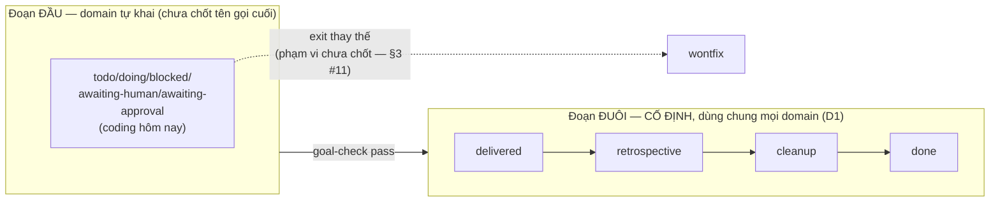

# DISCUSSION — Phase 2: status/statusCategory (multi-domain schema)

Item: `tsk-38t`. Nguồn gốc: `plans/reports/research-260730-0931-work-item-schema-multi-domain-upgrade-report.md`
(10+ vòng phân tích, chốt kiến trúc round 4). Item đang `stage: clarify`,
`status: awaiting-human`, gate hỏi bảng map 10 status → statusCategory.

## 1. Trạng thái hiện tại

Vòng 3. Đã chốt **D1**: domain-specific status vocabulary chỉ áp cho đoạn
TRƯỚC `delivered`; chuỗi `delivered→retrospective→cleanup→done` cố định,
dùng chung tên y hệt mọi domain — khác nhau ở SKILL chạy bước
`retrospective`/`cleanup`, không phải ở tên status. Đây là thu hẹp thật so
với kết luận round-4 của report gốc ("domain sở hữu TOÀN BỘ bảng
transition") — thu hẹp lại đúng phạm vi domain thật sự cần tự khai (đoạn
đầu vòng đời). Gap thật phát sinh từ D1: chưa có cơ chế nào ánh xạ
per-domain skill cho status `retrospective`/`cleanup` hôm nay (`fgos-
compounding` được gọi cứng, không tham số hoá theo domain) — xem §3 #10.
Câu hỏi kế tiếp: phạm vi chính xác của "đoạn trước delivered" — `wontfix`
(exit thay thế, không nằm trên đường `delivered`) và `blocked`/`awaiting-
human` (đã là từ chung chung, không mang mùi coding) có nằm trong phần
"domain tự khai" hay cũng nên cố định như đuôi?

## 2. Mục tiêu & đề bài

Tách `status` (nhãn hiển thị, domain tự sở hữu bảng transition riêng — coding
giữ nguyên 100% hành vi) khỏi `statusCategory` (field foundation mới, ~6 giá
trị cố định, đóng băng lúc ghi event `work.move`/`work.add`, KHÔNG derive-on-
read) — để mọi cơ chế domain-agnostic của fgOS (frontier dep-resolve, rollup,
compound-learn/retrospective trigger, outcome/friction, discovery-judge) đọc
category thay vì literal status, và domain khác (marketing...) có thể tự khai
label riêng mà không phải học/đụng vào 10 giá trị status của coding. Đây là
supersede thật quyết định base-workflow-model D1-D3 ("domain không bao giờ
chi phối bảng chuyển-status") — domain sẽ sở hữu bảng transition của chính
nó; `fsm.mjs`/`status-fsm.mjs` vẫn validate move dựa trên bảng đó (đầy đủ,
mịn), KHÔNG dựa trên category (category là bản nén có mất mát, đã chứng minh
lủng ở cạnh `blocked→awaiting-human`). Cùng pattern áp cho `kind`→`kindCategory`
nếu enum hóa `kind` sau này (ưu tiên thấp hơn, ngoài phạm vi bắt buộc của
lần chốt này) và `domainFields` nested per-domain (optional-additive).

## 3. Vấn đề rõ / chưa rõ

| # | Vấn đề | Trạng thái | Ghi chú |
|---|---|---|---|
| 1 | `tsk-3p1` (marker RUL12, acceptance clause 5 của tsk-38t nói "gộp chung 1 vòng explore với tsk-3p1") | **RÕ — đã đổi** | `fgos show tsk-3p1` xác nhận `status: wontfix`. Việc đó KHÔNG còn cần gộp — RUL12 dependent-open hôm nay đã đọc `frontier.mjs:186 RESOLVED_STATUSES = {'delivered','retrospective','cleanup','done','wontfix'}`, tức là code thật đã tự giải quyết đúng câu hỏi "done trả lời 2 nghĩa" theo hướng khác (thêm status `delivered` làm điểm mở-dependent, không phải marker cộng-thêm). Acceptance clause 5 của tsk-38t nên coi là lỗi thời, cần xoá/viết lại khi item quay lại `fgos-planning`. |
| 2 | Bảng map status → statusCategory trong report gốc (mục 6) chỉ liệt 7 status cũ | **RÕ — đã đổi, cần bảng mới** | FSM hôm nay có 10 status (`todo/doing/blocked/awaiting-approval/awaiting-human/delivered/retrospective/cleanup/done/wontfix`) — `delivered/retrospective/cleanup` được thêm SAU report bởi quyết định `work-item-status-delivered-retrospective-cleanup` D1/D2, thay `doing→done`/`awaiting-approval→done` trực tiếp bằng chuỗi `delivered→retrospective→cleanup→done`. Đây đúng là câu hỏi đang treo ở gate (`fgos show tsk-38t` — discovery Q2, impactScore 78) — mình sẽ bàn kỹ ở vòng tới, KHÔNG tự chốt ở đây. |
| 3 | `RESOLVED_STATUSES` (`frontier.mjs:186`) đã là 1 tập hợp "giống category" viết tay | **RÕ** | Đây chính là bằng chứng sống cho thấy code đã tự phát sinh nhu cầu category — `{delivered, retrospective, cleanup, done, wontfix}` dùng cho dep-resolve VÀ `hasOpenDescendant`. Khớp gần đúng với đề xuất gate Q2 của item (4 status đó → `completed`, `wontfix` → `canceled`). |
| 4 | `retro-pool.mjs:12` (`isRetrospectiveReady`) đọc `item.status === 'retrospective'` literal | **RÕ — xác nhận consumer thật** | Đây là ví dụ cụ thể, thật, của "cơ chế domain-agnostic đang đọc literal status" mà report mục 6 mô tả trừu tượng — object thật cần đổi sang đọc statusCategory (hoặc giữ nguyên nếu category `review`/`completed` không đủ mịn để phân biệt "vừa delivered" khỏi "sẵn sàng retrospective" — CẦN BÀN, vì nếu cả `delivered/retrospective/cleanup/done` đều → `completed` thì statusCategory KHÔNG đủ mịn để retro-pool tự phân biệt trạng thái nào trong chuỗi đó — xem #5). |
| 5 | Nếu `delivered/retrospective/cleanup/done` gộp chung `completed`, retro-pool/cleanup-harness cần phân biệt các bước TRONG category đó | **RÕ (D1)** | Không gộp — 4 status đuôi giữ nguyên tên, dùng chung mọi domain, không cần category compress. `retro-pool.mjs`'s literal `status === 'retrospective'` đúng mãi mãi, không cần đổi. |
| 6 | `triage-table-columns.md` liệt kê 7 status cũ, đã lệch code (10 status thật) | **RÕ — gap có thật, độc lập** | Xác nhận đúng lo ngại acceptance clause 8 của report/item. Là 1 phần việc cần làm dù statusCategory chốt kiểu gì (spec/doc lệch code, không phụ thuộc quyết định category). |
| 7 | `DOMAINS` registry runtime-addable hay code-only (acceptance clause 7) | **CHƯA RÕ, có thể ngoài phạm vi** | Câu hỏi kiến trúc riêng, không chặn việc thêm `statusLabels`/`statusCategory` vào registry hiện có (dù registry runtime hay code-only, format thêm field giống nhau). Đề xuất: KHÔNG quyết trong vòng discuss này trừ khi anh muốn gộp — nó không chặn Phase 2. |
| 8 | Backfill vs lazy-default cho event cũ thiếu `statusCategory` (acceptance clause 6, câu hỏi mở #10 report) | **CHƯA RÕ** | Cần quyết trước khi code — ảnh hưởng cách frontier/rollup đọc item cũ trong lúc chưa backfill. |
| 9 | Test chứng minh thiết kế (acceptance clause 9) — domain giả lập thứ 2 có `statusLabels` riêng, chạy qua take/return/compound | **RÕ là cần, CHƯA có kế hoạch cụ thể** | `test/e2e/synthetic-domain.test.mjs` đã tồn tại làm tiền lệ hình dạng, nhưng domain `synthetic` hôm nay KHÔNG có transition nào cả (`transitions: []`) — không đủ để chứng minh domain-transition-riêng hoạt động đúng. Cần domain giả lập MỚI có bảng transition thật khác coding. |
| 10 | Per-domain skill cho status `retrospective`/`cleanup` (phát sinh từ D1) | **CHƯA RÕ, gap thật** | Grep xác nhận `fgos-compounding` được gọi CỨNG cho mọi item tới `retrospective` (`retro-pool.mjs`, `bin/fgos.mjs:1012/1088`) — không tham số hoá theo domain. D1 giả định "khác nhau ở skill nào chạy retrospective/cleanup", nhưng cơ chế chọn skill đó theo domain CHƯA TỒN TẠI — cần thêm 1 map kiểu `skillMap` (đã có cho `stage`) nhưng cho status `retrospective`/`cleanup`, hoặc quyết định khác. Phạm vi việc này (bổ sung field mới trong `DOMAINS[domain]`) là 1 phần thật của Phase 2 nếu D1 đứng vững. |
| 11 | Phạm vi chính xác "đoạn trước delivered" — `wontfix`/`blocked`/`awaiting-human` có nằm trong phần domain tự khai hay cũng cố định như đuôi | **CHƯA RÕ** | D1 chỉ chốt rõ ràng phần đầu (todo/doing/awaiting-approval — nơi report gốc có ví dụ bias cụ thể) và phần đuôi (delivered/retrospective/cleanup/done). `wontfix` là exit thay thế (không nằm trên đường `delivered`), `blocked`/`awaiting-human` đã là từ chung chung — chưa rõ domain có được tự đặt tên khác cho 3 status này không, hay chúng cũng cố định như đuôi. |

## 4. Quyết định đã chốt

| D-ID | Tóm tắt | Ghi qua `fgos decision` |
|---|---|---|
| D1 | Domain-specific status vocabulary chỉ áp dụng cho đoạn TRƯỚC `delivered`. Chuỗi `delivered→retrospective→cleanup→done` cố định, dùng chung tên y hệt mọi domain, không domain nào relabel được. Khác biệt per-domain ở bước `retrospective`/`cleanup` nằm ở SKILL nào chạy, không phải tên status — mở rộng đúng pattern `skillMap` per-domain đã có (`workflow-stage-graphs.mjs`) sang 2 status này. | ✅ `tsk-38t` seq 5571 |

## 5. Q&A log

- **2026-08-04 (vòng 1, scout):** Đọc lại report 260730 + `status-fsm.mjs` +
  `frontier.mjs` + `retro-pool.mjs` + `workflow-stage-graphs.mjs` +
  `docs/specs/work-state.md` (dòng 61/1070 base-workflow-model D1-D3) +
  `docs/decisions/0024`. Kiểm `fgos show tsk-3p1` → `status: wontfix` (xác
  nhận vấn đề #1 ở §3). Chưa hỏi câu quyết định nào — vòng này là trình bày
  drift giữa report gốc và code thật trước khi bàn tiếp.
- **2026-08-04 (vòng 2, hỏi):** Nêu vấn đề #5 (retro-pool đọc literal status,
  category có thể không đủ mịn) — hỏi anh ranh giới category có áp cho toàn
  bộ 10 status hay chỉ đoạn thật sự domain-agnostic. **Trả lời:**
  "`delivered→retrospective→cleanup` đây là đang thiết kế cho domain
  agnostic. vì về bản chất loại hình việc nào cũng cần delivery, retro, và
  cleanup. chỉ có tổ chức nào quá hời hợt sẽ bỏ qua retro và cleanup, khi đó
  sẽ ko làm việc gì trong 2 status cuối."
- **2026-08-04 (vòng 3, xác nhận + chốt D1):** Tổng hợp lại thành giả thuyết
  cụ thể ("domain chỉ tự khai đoạn trước delivered; đuôi cố định dùng
  chung") và hỏi xác nhận. **Trả lời:** "đúng, mỗi phần domain sẽ có
  status/stage trước deliver là chắc chắn khác nhau. nhưng retro không có
  status khác nhưng sẽ có cách học khác (skill), cleanup cũng sẽ có cách
  dọn khác (skill)." — giữ nguyên không đổi qua 2 vòng → chốt **D1**. Scout
  thêm: grep xác nhận `fgos-compounding` gọi cứng không theo domain
  (`retro-pool.mjs`, `bin/fgos.mjs:1012/1088`) → mở vấn đề #10 (gap thật,
  chưa có cơ chế skill-per-domain cho `retrospective`/`cleanup`).

## 6. Thiết kế đã chốt {#design}

**Bức tranh hiện tại (sau D1), viết cho người/agent chưa đọc gì trước đó:**

fgOS's work item có 10 status hôm nay (`todo/doing/blocked/awaiting-approval/
awaiting-human/delivered/retrospective/cleanup/done/wontfix`), validate qua
1 bảng transition PHẲNG, DÙNG CHUNG cho mọi domain (`status-fsm.mjs`) — đúng
hành vi hôm nay, chưa đổi gì. Mục tiêu Phase 2: cho domain khác (marketing...)
tự khai nhãn/transition riêng mà không phải học 10 chữ coding-flavored, và
cho mọi cơ chế lõi của fgOS (frontier, rollup, outcome/friction,
discovery-judge) 1 cách đọc "item đang ở đâu" không phụ thuộc từ vựng domain.

**D1 chia vòng đời thành 2 đoạn khác bản chất:**

- **Đoạn đầu (trước `delivered`):** domain sở hữu nhãn + bảng transition
  riêng — đây MỚI thật sự là phạm vi supersede base-workflow-model D1-D3
  (report gốc round 4), thu hẹp hơn report gốc mô tả ("domain sở hữu TOÀN
  BỘ bảng"). `statusCategory` (field foundation, đóng băng lúc ghi event)
  chỉ thật sự cần thiết ở đoạn này — nơi domain khác CÓ THỂ đặt tên khác
  cho "sẵn sàng làm"/"đang làm"/"chờ duyệt".
- **Đoạn đuôi (`delivered→retrospective→cleanup→done`):** KHÔNG relabel
  được, mọi domain dùng chung đúng 4 tên này — vì đây là nghĩa vụ phổ quát
  của bất kỳ loại hình việc nào (delivery thật, nhìn lại, dọn dẹp), không
  phải từ vựng riêng của coding. Hệ quả: các cơ chế đọc literal status ở
  đoạn này (`retro-pool.mjs`'s `status === 'retrospective'`,
  `frontier.mjs`'s `RESOLVED_STATUSES`) KHÔNG cần đổi sang đọc category —
  chúng đã đúng, mãi mãi, không phụ thuộc domain. Khác biệt per-domain ở
  đoạn đuôi nằm ở **skill nào chạy** bước đó (mở rộng pattern `skillMap`
  per-domain đã có ở tầng `stage`, `workflow-stage-graphs.mjs`), không phải
  ở tên status — nhưng cơ chế chọn skill-theo-domain cho `retrospective`/
  `cleanup` CHƯA TỒN TẠI (gap thật, §3 #10).

**Còn treo, chưa đủ để viết task cụ thể (§7):** phạm vi chính xác của "đoạn
đầu" (`wontfix`/`blocked`/`awaiting-human` có domain-relabel được không —
§3 #11), bảng map status→category cho riêng đoạn đầu (câu hỏi gốc ở gate,
giờ phạm vi hẹp hơn), backfill vs lazy-default cho `statusCategory` (§3
#8), và thiết kế cơ chế skill-per-domain cho retrospective/cleanup (§3
#10) — mỗi cái cần ít nhất 1 vòng nữa trước khi §7 tách được task.

## 7. Danh mục hạng mục / task {#tasks}

*(chưa tách — thiết kế chưa đủ cụ thể để chia task)*
