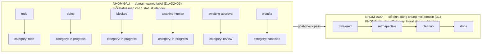

# DISCUSSION — Phase 2: status/statusCategory (multi-domain schema)

Item: `tsk-38t`. Nguồn gốc: `plans/reports/research-260730-0931-work-item-schema-multi-domain-upgrade-report.md`
(10+ vòng phân tích, chốt kiến trúc round 4). Item đang `stage: clarify`,
`status: awaiting-human`, gate hỏi bảng map 10 status → statusCategory.

## 1. Trạng thái hiện tại

Vòng 3. Đã chốt **D1**: domain-specific status vocabulary chỉ áp cho đoạn
TRƯỚC `delivered`; chuỗi `delivered→retrospective→cleanup→done` cố định,
dùng chung tên y hệt mọi domain — khác nhau ở SKILL chạy bước
`retrospective`/`cleanup`, không phải ở tên status. Đây là thu hẹp thật so
với kết luận round-4 của report gốc ("domain sở hữu TOÀN BỘ bảng
transition") — thu hẹp lại đúng phạm vi domain thật sự cần tự khai (đoạn
đầu vòng đời). Gap thật phát sinh từ D1: chưa có cơ chế nào ánh xạ
per-domain skill cho status `retrospective`/`cleanup` hôm nay (`fgos-
compounding` được gọi cứng, không tham số hoá theo domain) — xem §3 #10.
Câu hỏi kế tiếp: phạm vi chính xác của "đoạn trước delivered" — `wontfix`
(exit thay thế, không nằm trên đường `delivered`) và `blocked`/`awaiting-
human` (đã là từ chung chung, không mang mùi coding) có nằm trong phần
"domain tự khai" hay cũng nên cố định như đuôi?

## 2. Mục tiêu & đề bài

Tách `status` (nhãn hiển thị, domain tự sở hữu bảng transition riêng — coding
giữ nguyên 100% hành vi) khỏi `statusCategory` (field foundation mới, ~6 giá
trị cố định, đóng băng lúc ghi event `work.move`/`work.add`, KHÔNG derive-on-
read) — để mọi cơ chế domain-agnostic của fgOS (frontier dep-resolve, rollup,
compound-learn/retrospective trigger, outcome/friction, discovery-judge) đọc
category thay vì literal status, và domain khác (marketing...) có thể tự khai
label riêng mà không phải học/đụng vào 10 giá trị status của coding. Đây là
supersede thật quyết định base-workflow-model D1-D3 ("domain không bao giờ
chi phối bảng chuyển-status") — domain sẽ sở hữu bảng transition của chính
nó; `fsm.mjs`/`status-fsm.mjs` vẫn validate move dựa trên bảng đó (đầy đủ,
mịn), KHÔNG dựa trên category (category là bản nén có mất mát, đã chứng minh
lủng ở cạnh `blocked→awaiting-human`). Cùng pattern áp cho `kind`→`kindCategory`
nếu enum hóa `kind` sau này (ưu tiên thấp hơn, ngoài phạm vi bắt buộc của
lần chốt này) và `domainFields` nested per-domain (optional-additive).

## 3. Vấn đề rõ / chưa rõ

| # | Vấn đề | Trạng thái | Ghi chú |
|---|---|---|---|
| 1 | `tsk-3p1` (marker RUL12, acceptance clause 5 của tsk-38t nói "gộp chung 1 vòng explore với tsk-3p1") | **RÕ — đã đổi** | `fgos show tsk-3p1` xác nhận `status: wontfix`. Việc đó KHÔNG còn cần gộp — RUL12 dependent-open hôm nay đã đọc `frontier.mjs:186 RESOLVED_STATUSES = {'delivered','retrospective','cleanup','done','wontfix'}`, tức là code thật đã tự giải quyết đúng câu hỏi "done trả lời 2 nghĩa" theo hướng khác (thêm status `delivered` làm điểm mở-dependent, không phải marker cộng-thêm). Acceptance clause 5 của tsk-38t nên coi là lỗi thời, cần xoá/viết lại khi item quay lại `fgos-planning`. |
| 2 | Bảng map status → statusCategory trong report gốc (mục 6) chỉ liệt 7 status cũ | **RÕ — đã đổi, cần bảng mới** | FSM hôm nay có 10 status (`todo/doing/blocked/awaiting-approval/awaiting-human/delivered/retrospective/cleanup/done/wontfix`) — `delivered/retrospective/cleanup` được thêm SAU report bởi quyết định `work-item-status-delivered-retrospective-cleanup` D1/D2, thay `doing→done`/`awaiting-approval→done` trực tiếp bằng chuỗi `delivered→retrospective→cleanup→done`. Đây đúng là câu hỏi đang treo ở gate (`fgos show tsk-38t` — discovery Q2, impactScore 78) — mình sẽ bàn kỹ ở vòng tới, KHÔNG tự chốt ở đây. |
| 3 | `RESOLVED_STATUSES` (`frontier.mjs:186`) đã là 1 tập hợp "giống category" viết tay | **RÕ** | Đây chính là bằng chứng sống cho thấy code đã tự phát sinh nhu cầu category — `{delivered, retrospective, cleanup, done, wontfix}` dùng cho dep-resolve VÀ `hasOpenDescendant`. Khớp gần đúng với đề xuất gate Q2 của item (4 status đó → `completed`, `wontfix` → `canceled`). |
| 4 | `retro-pool.mjs:12` (`isRetrospectiveReady`) đọc `item.status === 'retrospective'` literal | **RÕ — xác nhận consumer thật** | Đây là ví dụ cụ thể, thật, của "cơ chế domain-agnostic đang đọc literal status" mà report mục 6 mô tả trừu tượng — object thật cần đổi sang đọc statusCategory (hoặc giữ nguyên nếu category `review`/`completed` không đủ mịn để phân biệt "vừa delivered" khỏi "sẵn sàng retrospective" — CẦN BÀN, vì nếu cả `delivered/retrospective/cleanup/done` đều → `completed` thì statusCategory KHÔNG đủ mịn để retro-pool tự phân biệt trạng thái nào trong chuỗi đó — xem #5). |
| 5 | Nếu `delivered/retrospective/cleanup/done` gộp chung `completed`, retro-pool/cleanup-harness cần phân biệt các bước TRONG category đó | **RÕ (D1)** | Không gộp — 4 status đuôi giữ nguyên tên, dùng chung mọi domain, không cần category compress. `retro-pool.mjs`'s literal `status === 'retrospective'` đúng mãi mãi, không cần đổi. |
| 6 | `triage-table-columns.md` liệt kê 7 status cũ, đã lệch code (10 status thật) | **RÕ — gap có thật, độc lập** | Xác nhận đúng lo ngại acceptance clause 8 của report/item. Là 1 phần việc cần làm dù statusCategory chốt kiểu gì (spec/doc lệch code, không phụ thuộc quyết định category). |
| 7 | `DOMAINS` registry runtime-addable hay code-only (acceptance clause 7) | **CHƯA RÕ, có thể ngoài phạm vi** | Câu hỏi kiến trúc riêng, không chặn việc thêm `statusLabels`/`statusCategory` vào registry hiện có (dù registry runtime hay code-only, format thêm field giống nhau). Đề xuất: KHÔNG quyết trong vòng discuss này trừ khi anh muốn gộp — nó không chặn Phase 2. |
| 8 | Backfill vs lazy-default cho event cũ thiếu `statusCategory` (acceptance clause 6, câu hỏi mở #10 report) | **RÕ (D4)** | Backfill qua migration script, theo khuôn 2 tiền lệ có sẵn — không lazy-default (rủi ro L3 thật, xem D4). |
| 9 | Test chứng minh thiết kế (acceptance clause 9) — domain giả lập thứ 2 có `statusLabels` riêng, chạy qua take/return/compound | **RÕ là cần, CHƯA có kế hoạch cụ thể** | `test/e2e/synthetic-domain.test.mjs` đã tồn tại làm tiền lệ hình dạng, nhưng domain `synthetic` hôm nay KHÔNG có transition nào cả (`transitions: []`) — không đủ để chứng minh domain-transition-riêng hoạt động đúng. Cần domain giả lập MỚI có bảng transition thật khác coding. |
| 10 | Per-domain skill cho status `retrospective`/`cleanup` (phát sinh từ D1) | **CHƯA RÕ, gap thật** | Grep xác nhận `fgos-compounding` được gọi CỨNG cho mọi item tới `retrospective` (`retro-pool.mjs`, `bin/fgos.mjs:1012/1088`) — không tham số hoá theo domain. D1 giả định "khác nhau ở skill nào chạy retrospective/cleanup", nhưng cơ chế chọn skill đó theo domain CHƯA TỒN TẠI — cần thêm 1 map kiểu `skillMap` (đã có cho `stage`) nhưng cho status `retrospective`/`cleanup`, hoặc quyết định khác. Phạm vi việc này (bổ sung field mới trong `DOMAINS[domain]`) là 1 phần thật của Phase 2 nếu D1 đứng vững. |
| 11 | Phạm vi chính xác "đoạn trước delivered" — `wontfix`/`blocked`/`awaiting-human` có nằm trong phần domain tự khai hay cũng cố định như đuôi | **RÕ (D2 + vòng 3 xác nhận)** | `blocked`/`awaiting-human`/`todo`/`doing`/`awaiting-approval` — domain sở hữu (per D1, xác nhận vòng 3: "trước deliver là chắc chắn khác nhau"). `wontfix` — domain sở hữu label (D2), map cố định category `canceled`. Toàn bộ 6 status đoạn đầu giờ đã xếp loại xong. |
| 12 | Bảng map 6 status đoạn đầu → statusCategory (câu hỏi gốc ở gate, thu hẹp lại) | **RÕ (D3)** | Toàn bộ 6 status đoạn đầu đã map xong: `todo→todo`, `doing/blocked/awaiting-human→in-progress`, `awaiting-approval→review`, `wontfix→canceled` (D2). Đây chính là câu hỏi gốc treo ở gate của item — coi như đã trả lời đầy đủ, khác với đề xuất gốc ở chỗ phạm vi hẹp hơn 10 status (chỉ 6, nhờ D1 loại 4 status đuôi ra khỏi nhu cầu category). |

## 4. Quyết định đã chốt

| D-ID | Tóm tắt | Ghi qua `fgos decision` |
|---|---|---|
| D1 | Domain-specific status vocabulary chỉ áp dụng cho đoạn TRƯỚC `delivered`. Chuỗi `delivered→retrospective→cleanup→done` cố định, dùng chung tên y hệt mọi domain, không domain nào relabel được. Khác biệt per-domain ở bước `retrospective`/`cleanup` nằm ở SKILL nào chạy, không phải tên status — mở rộng đúng pattern `skillMap` per-domain đã có (`workflow-stage-graphs.mjs`) sang 2 status này. | ✅ `tsk-38t` seq 5571 |
| D2 | `wontfix` ở lại đoạn ĐẦU (domain-owned label — coding giữ nguyên chữ `wontfix`, 0 migration) nhưng LUÔN map cố định vào `statusCategory: 'canceled'` — áp đúng cơ chế label/category đã có cho cả đoạn đầu, không phải luật riêng cho `wontfix`. Domain khác có thể tự đặt label khác (`declined`/`out-of-scope`) cùng map vào `canceled`. | ✅ `tsk-38t` seq 5585 |
| D3 | Bảng map 5 status đoạn đầu còn lại → `statusCategory`: `todo→todo`, `doing→in-progress`, `blocked→in-progress`, `awaiting-human→in-progress`, `awaiting-approval→review`. Căn cứ tiền lệ đã ghi thành luật: `docs/history/status-proposed-rename/CONTEXT.md` D3 — "1 status cấp cao mới CHỈ khi có hiệu ứng cấu trúc riêng trên frontier/dependency graph; nếu không, gộp vào `awaiting-human`, phân biệt mịn hơn nằm ở field `reason`/`ask`/`answer`, không phải enum mới." `doing`/`blocked`/`awaiting-human` có hiệu ứng cấu trúc GIỐNG HỆT nhau trên `frontier.mjs` hôm nay (không cái nào trong `ready`-filter, không cái nào trong `RESOLVED_STATUSES`) → đúng luật này, gộp `in-progress`. Category `backlog`/`completed` tạm không status nào map (dự phòng, đúng khung Linear-style). | ✅ `tsk-38t` seq 5586 |
| D4 | Backfill `statusCategory` cho event cũ qua 1 migration script (KHÔNG lazy-default derive-on-read), theo đúng khuôn 2 tiền lệ đã có (`migrate-status-proposed-to-awaiting-approval.mjs`, `migrate-actor-to-role.mjs`) — backup + dry-run report + khoá `withEventsLock` + phạm vi đúng 3 kho (live store, `dogfood-fixture/.fgos`, `fgos-test-drive/.fgos`). Áp bảng map D2/D3 cho ~1500+ `work.move` event sang 6 status đoạn đầu. Lý do: L3 (luật khoá) đòi hỏi replay-from-zero xác định tuyệt đối; lazy-default rủi ro thật vì `DOMAINS[domain].statusLabels` vẫn là code sửa được — sửa sau này sẽ làm 2 lần replay ra 2 kết quả khác nhau cho cùng 1 event cũ, vi phạm L3 rule 2. | ✅ `tsk-38t` seq 5589 |

## 5. Q&A log

- **2026-08-04 (vòng 1, scout):** Đọc lại report 260730 + `status-fsm.mjs` +
  `frontier.mjs` + `retro-pool.mjs` + `workflow-stage-graphs.mjs` +
  `docs/specs/work-state.md` (dòng 61/1070 base-workflow-model D1-D3) +
  `docs/decisions/0024`. Kiểm `fgos show tsk-3p1` → `status: wontfix` (xác
  nhận vấn đề #1 ở §3). Chưa hỏi câu quyết định nào — vòng này là trình bày
  drift giữa report gốc và code thật trước khi bàn tiếp.
- **2026-08-04 (vòng 2, hỏi):** Nêu vấn đề #5 (retro-pool đọc literal status,
  category có thể không đủ mịn) — hỏi anh ranh giới category có áp cho toàn
  bộ 10 status hay chỉ đoạn thật sự domain-agnostic. **Trả lời:**
  "`delivered→retrospective→cleanup` đây là đang thiết kế cho domain
  agnostic. vì về bản chất loại hình việc nào cũng cần delivery, retro, và
  cleanup. chỉ có tổ chức nào quá hời hợt sẽ bỏ qua retro và cleanup, khi đó
  sẽ ko làm việc gì trong 2 status cuối."
- **2026-08-04 (vòng 3, xác nhận + chốt D1):** Tổng hợp lại thành giả thuyết
  cụ thể ("domain chỉ tự khai đoạn trước delivered; đuôi cố định dùng
  chung") và hỏi xác nhận. **Trả lời:** "đúng, mỗi phần domain sẽ có
  status/stage trước deliver là chắc chắn khác nhau. nhưng retro không có
  status khác nhưng sẽ có cách học khác (skill), cleanup cũng sẽ có cách
  dọn khác (skill)." — giữ nguyên không đổi qua 2 vòng → chốt **D1**. Scout
  thêm: grep xác nhận `fgos-compounding` gọi cứng không theo domain
  (`retro-pool.mjs`, `bin/fgos.mjs:1012/1088`) → mở vấn đề #10 (gap thật,
  chưa có cơ chế skill-per-domain cho `retrospective`/`cleanup`).
- **2026-08-04 (vòng 4, tổng quan):** Anh hỏi tổng quan toàn bộ 10 status,
  status nào đang có vấn đề. Trình bày bảng 10 status × đoạn × bias tên gọi
  × vấn đề thật, tách 3 loại vấn đề khác nhau (tên status bias / giá trị
  `reason` phụ bias / cơ chế hạ tầng giả định git-worktree). Anh chọn quyết
  loại (1) trước.
- **2026-08-04 (vòng 5, hỏi wontfix):** Chỉ còn `wontfix` chưa xếp loại (5
  status còn lại coi như xong nhờ câu trả lời vòng 3). Hỏi (a) cố định như
  đuôi hay (b) domain tự khai như đầu. **Trả lời:** "wontfix = wontdo =
  cancel = decline = outofscope; (a) thì gần đúng ý nghĩa hơn. cả a và b
  bạn nói thì đều đúng. hãy tư vấn và suy nghĩ thêm. ultrathink."
- **2026-08-04 (vòng 6, đề xuất + chốt D2):** Scout: `wontfix` xuất hiện
  literal ở 49 file + 2 decision record — đổi tên tốn thật, trái nguyên tắc
  migration=0. Nhận ra (a)/(b) không đối lập — (a) đúng ở tầng category
  (`canceled`, đã có sẵn trong 6 category round-3), (b) đúng ở tầng label
  (domain tự đặt chữ). Đề xuất: `wontfix` ở đoạn đầu (label domain-owned,
  coding giữ nguyên chữ) + map cố định category `canceled`. **Trả lời:**
  "wontfix ở lại đoạn đầu (domain-owned label, coding giữ nguyên chữ, 0
  migration)." — xác nhận không đổi → chốt **D2**.
- **2026-08-04 (vòng 7, tổng hợp §6):** Anh yêu cầu trình bày chi tiết lại
  nhóm đầu/nhóm đuôi sau khi có D1+D2.
- **2026-08-04 (vòng 8, đề xuất map):** Đề xuất bảng map 5 status còn lại
  (khớp đề xuất gốc ở gate): `todo→todo`, `doing/blocked/awaiting-human→
  in-progress`, `awaiting-approval→review`.
- **2026-08-04 (vòng 9, hỏi advise + chốt D3):** Anh hỏi advise riêng cho hệ
  quả gộp `blocked`/`awaiting-human`/`doing` chung `in-progress` (mất phân
  biệt "nghẽn" vs "chờ người" ở tầng category), gợi ý bật advisor model
  khác nếu cần. Scout thêm: `docs/history/status-proposed-rename/CONTEXT.md`
  D3 — tiền lệ đã ghi thành luật "1 status cấp cao mới CHỈ khi có hiệu ứng
  cấu trúc riêng trên frontier/dependency graph; nếu không, gộp vào
  `awaiting-human`, phân biệt mịn hơn nằm ở field `reason`/`ask`/`answer`,
  không cần enum mới" — đối chiếu code thật, `doing`/`blocked`/
  `awaiting-human` có hiệu ứng cấu trúc giống hệt nhau trên `frontier.mjs`
  hôm nay → đúng luật, nên gộp. Không cần bật advisor riêng nhờ tìm được
  tiền lệ nội bộ dứt khoát. Đề xuất giữ nguyên bảng vòng 8. **Trả lời:**
  "Ok chốt. Nhớ ghi nhận lý do chi tiết" — xác nhận không đổi qua 2 vòng →
  chốt **D3**.
- **2026-08-04 (vòng 10, hỏi + chốt D4):** Bàn §3 #8 (backfill vs
  lazy-default). Scout: L3 (`docs/platform-foundations.md`, luật khoá) —
  "DB là materialized view, rebuild được từ zero bằng replay changeset";
  2 tiền lệ migration script có sẵn (`migrate-status-proposed-to-awaiting-
  approval.mjs`, `migrate-actor-to-role.mjs`); quy mô thật ~1500+
  `work.move` event cần backfill (đếm từ `.fgos/events.jsonl`, 5588 dòng).
  Đề xuất backfill (không lazy-default, vì lazy-default rủi ro vi phạm L3
  nếu `DOMAINS[coding].statusLabels` bị sửa sau này). **Trả lời:** "chấp
  nhận." — xác nhận không đổi qua 2 vòng → chốt **D4**.

## 6. Thiết kế đã chốt {#design}

**Bức tranh hiện tại (sau D1), viết cho người/agent chưa đọc gì trước đó:**

fgOS's work item có 10 status hôm nay (`todo/doing/blocked/awaiting-approval/
awaiting-human/delivered/retrospective/cleanup/done/wontfix`), validate qua
1 bảng transition PHẲNG, DÙNG CHUNG cho mọi domain (`status-fsm.mjs`) — đúng
hành vi hôm nay, chưa đổi gì. Mục tiêu Phase 2: cho domain khác (marketing...)
tự khai nhãn/transition riêng mà không phải học 10 chữ coding-flavored, và
cho mọi cơ chế lõi của fgOS (frontier, rollup, outcome/friction,
discovery-judge) 1 cách đọc "item đang ở đâu" không phụ thuộc từ vựng domain.

**D1 + D2 chia 10 status hôm nay thành 2 nhóm bản chất khác nhau — KHÔNG
phải chia theo "status nào đứng trước/sau trong chuỗi", mà theo "domain có
được tự đặt tên khác cho status này không":**

**NHÓM ĐẦU — 6 status: `todo`/`doing`/`blocked`/`awaiting-human`/
`awaiting-approval`/`wontfix`.** Domain sở hữu nhãn + bảng transition riêng
cho nhóm này — đây MỚI thật sự là phạm vi supersede base-workflow-model
D1-D3 (report gốc round 4), thu hẹp hơn report gốc mô tả ("domain sở hữu
TOÀN BỘ bảng"). Domain KHÔNG BẮT BUỘC phải đặt tên khác — coding có thể
giữ nguyên cả 6 chữ này, D1/D2 chỉ nói domain CÓ QUYỀN, không ép. Mỗi
status trong nhóm này map vào đúng 1 `statusCategory` cố định (field
foundation, đóng băng lúc ghi event `work.move`, KHÔNG derive-on-read —
luật L3), đã chốt đủ (D2+D3): `todo→todo`, `doing→in-progress`,
`blocked→in-progress`, `awaiting-human→in-progress`,
`awaiting-approval→review`, `wontfix→canceled`. Gộp 3 status
`doing`/`blocked`/`awaiting-human` chung `in-progress` là quyết định có
căn cứ nội bộ (D3): `docs/history/status-proposed-rename/CONTEXT.md` D3
đã ghi luật "1 status cấp cao mới CHỈ khi có hiệu ứng cấu trúc riêng trên
frontier/dependency graph; nếu không, gộp — phân biệt mịn hơn nằm ở field
`reason`/`ask`/`answer`, không cần enum mới" — 3 status này có hiệu ứng
cấu trúc GIỐNG HỆT nhau trên `frontier.mjs` hôm nay (không cái nào trong
`ready`-filter, không cái nào trong `RESOLVED_STATUSES`), nên gộp đúng
luật, không mất thông tin thật (chi tiết "vì sao đang chờ" vẫn còn nguyên
ở `reason`/`ask`/`answer`, cơ chế nào cần mịn hơn vẫn đọc `status`
literal). Mọi cơ chế domain-agnostic thật sự (frontier's `ready` filter,
rollup, outcome/friction, discovery-judge) phải đọc `statusCategory`,
không đọc literal status, cho 6 status này.

**NHÓM ĐUÔI — 4 status: `delivered`/`retrospective`/`cleanup`/`done`.**
KHÔNG relabel được, mọi domain dùng chung đúng 4 tên này — vì đây là nghĩa
vụ phổ quát của bất kỳ loại hình việc nào (delivery thật, nhìn lại, dọn
dẹp), không phải từ vựng riêng của coding (D1, xác nhận trực tiếp: "loại
hình việc nào cũng cần delivery, retro, và cleanup"). Hệ quả: các cơ chế
đọc literal status ở nhóm này (`retro-pool.mjs`'s
`status === 'retrospective'`, phần `delivered/retrospective/cleanup/done`
trong `frontier.mjs`'s `RESOLVED_STATUSES`) KHÔNG cần đổi sang đọc
category — chúng đã đúng, mãi mãi, không phụ thuộc domain; KHÔNG cần
`statusLabels` map cho 4 status này trong registry domain. Khác biệt
per-domain nằm ở **skill nào chạy** bước `retrospective`/`cleanup` (mở
rộng pattern `skillMap` per-domain đã có ở tầng `stage`,
`workflow-stage-graphs.mjs`), không phải ở tên status — nhưng cơ chế chọn
skill-theo-domain đó CHƯA TỒN TẠI (gap thật, §3 #10; `fgos-compounding`
đang gọi cứng, không tham số hoá theo domain).

**Hệ quả 1 chi tiết cần lưu ý cho `RESOLVED_STATUSES` (frontier.mjs:186):**
tập này hôm nay trộn CẢ 2 nhóm (`delivered/retrospective/cleanup/done` —
nhóm đuôi + `wontfix` — nhóm đầu). Khi hiện thực hoá, nơi này sẽ cần đọc
HỖN HỢP: literal status cho 4 tên đuôi + `statusCategory === 'canceled'`
cho phần thay `wontfix` (để bắt được cả label khác domain map vào cùng
category) — không phải 1 danh sách literal string thuần như hôm nay. Đây
là hệ quả suy ra trực tiếp từ D1+D2, không phải quyết định mới cần hỏi.

**Backfill event cũ (D4):** viết mới 1 migration script (khuôn `migrate-
status-proposed-to-awaiting-approval.mjs`) ghi cứng `statusCategory` vào
~1500+ `work.move` event cũ theo đúng bảng D2/D3 — không lazy-default, vì
`DOMAINS[coding].statusLabels` vẫn là code sửa được, derive-on-read sẽ vỡ
L3 (replay-from-zero xác định) nếu bảng đó bị sửa sau này.

**Còn treo, chưa đủ để viết task cụ thể (§7):** thiết kế cơ chế
skill-per-domain cho retrospective/cleanup (§3 #10) — cần ít nhất 1 vòng
nữa trước khi §7 tách được task đầy đủ. Bảng map status→category (§3 #12)
và backfill (§3 #8) đã xong (D2/D3/D4).

## 7. Danh mục hạng mục / task {#tasks}

*(chưa tách — thiết kế chưa đủ cụ thể để chia task)*
