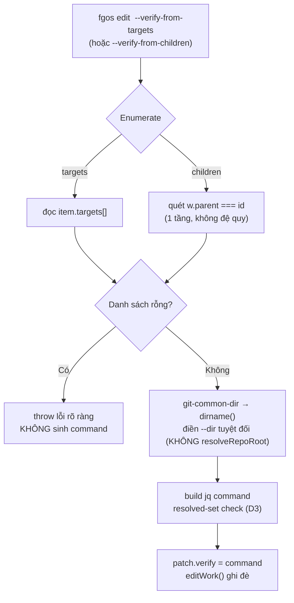

# Nên tự động rollup cha lên delivered khi con/target resolved, hay giữ close-out thủ công?

## 1. Trạng thái hiện tại

Round 3. Anh chọn (B): gộp thẳng vào `fgos edit <id> --verify-from-children`
/ `--verify-from-targets`. Đã scout xong implementation pattern thật trong
`bin/fgos.mjs` — khả thi, đi theo đúng pattern flag hiện có (xem §3 dòng
9-11). Còn 1 điểm chưa chốt trước khi viết §6/§7: default check nên là
strict `== "done"` (precedent tsk-u9k, đúng như 2 how-to doc hiện mô tả)
hay resolved-set `delivered/retrospective/cleanup/done` (precedent tsk-2jc,
đã được `gates.answer` chấp thuận thật) — 2 precedent thật đang khác nhau,
xem câu hỏi cuối §5.

## 2. Mục tiêu & đề bài

Anh quan sát 2 case: tsk-2jc (milestone, targets=[tsk-1qm]) và tsk-4y2 đều
delivered rồi tự chạy retrospective→cleanup→done bình thường (đây là pipeline
chuẩn cho item tự đứng, không liên quan gì cha/con). Ngược lại tsk-4bc (MVP,
goalTier, targets 4 milestone) vẫn `todo` dù cả 4 milestone nội dung đã xong
— và để đóng tsk-2jc trước đó, anh (qua audit 2026-08-03) đã phải chọn "nới
verify" (chấp nhận target ở bất kỳ status resolved thay vì đòi đúng `done`)
thay vì chờ TTL cleanup 7 ngày trôi qua. Câu hỏi anh đặt ra: có nên biến việc
"nới điều kiện" lặp đi lặp lại này thành một cơ chế rollup tự động (cha tự
delivered khi con/target resolved), thay vì cứ mỗi milestone lại tay sửa
`verify` một lần?

## 3. Vấn đề rõ / chưa rõ

| # | Điểm | Trạng thái | Ghi chú |
|---|------|-----------|---------|
| 1 | `fgos rollup` hiện là read-only, chỉ đọc `parent`, không đọc `targets`, không transition status | Rõ | bin/fgos.mjs:665; xác nhận bởi frontier.mjs:212-214 và distribution-vision.md:145-149 (tsk-4bc rollup ra 0/0) |
| 2 | Gate vào `delivered` (status-fsm.mjs ~L106-123) không có check con nào cả — chỉ `assertAcceptanceEvidence` (store.mjs:412) check evidence của chính item | Rõ | grep xác nhận zero child reference trong status-fsm.mjs |
| 3 | Cả 2 nhánh (decomposed root/`parent`, goalTier/`targets`) đều đã có how-to doc mô tả **quyết định chủ đích, không phải bug**: cha/milestone phải tự đi qua claim→verify→return→compound→approve, để có chỗ thật viết CONTEXT.md tổng hợp bằng chứng — không tự đóng khi con xong | Rõ | close-out-a-decomposed-root-item-....md §"Why this doesn't happen automatically"; close-out-a-goaltier-milestone-....md §"Why this doesn't happen automatically" |
| 4 | Case tsk-2jc thật: "nới điều kiện" không phải sửa status-fsm.mjs, mà là sửa **field `verify` của riêng item đó** (một câu jq check target ở resolved-set thay vì strict `done`) — quyết định này đã có `gates.ask`/`gates.answer` ghi lại đàng hoàng (audit 2026-08-03), không phải hack ngầm | Rõ | fgos show tsk-2jc → gates.ask/answer |
| 5 | Ma sát thật đang lặp lại là gì | **Chốt: (b) — giảm ma sát viết tay `verify`, giữ cha tự claim/return/approve** | Anh chọn round 2, giữ nguyên round 3 — chưa đủ 1 round nữa để mint D-ID nhưng đã ổn định |
| 6 | Bypass `assertAcceptanceEvidence`/cycle của cha? | **Không áp dụng** | Vì chọn (b) — cha vẫn tự claim/return/approve như cũ, không đổi gate nào ở status-fsm.mjs |
| 7 | Phạm vi: `parent` lẫn `targets`? | **Chốt: cả 2, qua 2 flag riêng** | Xem §3 dòng 10 — 2 cơ chế enumerate khác nhau, không gộp 1 flag được |
| 8 | "Con chưa cleanup thì cha không thể claim" | **Sai — đã verify code** | `TAIL_RESOLVED_STATUSES = {delivered, retrospective, cleanup, done}` (frontier.mjs:221); `isResolvedStatus` true ngay khi con = `delivered` (frontier.mjs:224-229); `hasOpenDescendant` (frontier.mjs:237-249) chỉ block khi con CHƯA vào tập này. `pick --id <id>` (bin/fgos.mjs:1962-1975) thậm chí không re-check lineage gì cả — đi thẳng `claimWork` (claim-port.mjs:88-278), chỉ CAS `expectedStatus`. `take --id` (bin/fgos.mjs:1888) có check `isDepsAndLineageReady` nhưng chỉ áp dụng khi `status==='todo'`. TTL 7 ngày (`DEFAULT_CLEANUP_TTL_DAYS`, cleanup-harness.mjs:131-146) chỉ gate con tự đi `cleanup→done`, không liên quan gì việc cha claim được hay không — đây là nguồn gây lẫn lộn thật |
| 9 | `edit` verb parse pattern: hand-rolled `parseArgs` (bin/fgos.mjs:266-285), field cùng tên qua loop chung (:1194-1198), field kebab→camel qua block riêng (:1226-1249) | Rõ | 1 flag boolean mới `--verify-from-targets`/`--verify-from-children` đi theo đúng pattern block riêng, tính `patch.verify` trước khi gọi `editWork` (:1341) |
| 10 | Enumerate con: `parent`-tree quét toàn bộ `w.parent === id` (collectRollupData, :671-686, không đệ quy — decompose chỉ 1 tầng theo comment :665-670); `targets`-tree đọc thẳng `item.targets` array (:2435-2438), không cần quét | Rõ | 2 cơ chế khác nhau thật — xác nhận cần 2 flag riêng như đã chọn, không gộp 1 |
| 11 | Sửa lại: `resolveRepoRoot` (paths.mjs:25-52, `--show-toplevel`) SAI cho việc này — trả về root worktree, không phải main checkout. Đúng: `git rev-parse --path-format=absolute --git-common-dir` + `dirname` (tiền lệ inline: invocation-fault-log.mjs:47-59, merge.mjs:230, registrations.mjs:189) | Rõ (đã sửa) | Phát hiện lúc `fgos discover` verify-disputed round 3 cho tsk-580 — loại bẫy "--dir trỏ sai" |
| 12 | `--verify` ở `edit` KHÔNG có validate shape (chỉ `requireNonEmptyString`, work.mjs:314) — prose vẫn ghi được, chỉ fail lúc `return` thật sự spawn (goal-check.mjs:20-92) | Rõ | Không phải lo chỗ này — nhưng helper mới generate command PHẢI tự guard: nếu list con/target rỗng, `jq ... | all(...)` trên mảng rỗng trả `true` (vacuous truth) → verify luôn pass sai — phải throw lỗi rõ ràng nếu không tìm thấy con/target nào, không sinh command rỗng |

## 4. Quyết định đã chốt

| D-ID | Quyết định | Giữ ổn định qua |
|------|-----------|-----------------|
| D1 | Không tự động chuyển status cha khi con/target resolved. Giữ nguyên 100% cycle claim→verify→return→compound→approve của cha (rationale 2 how-to doc: chỗ thật để viết CONTEXT.md tổng hợp bằng chứng). Chỉ giảm ma sát bước viết `verify` command tay | round 2 (chọn), round 3 (tái xác nhận), round 4 |
| D2 | Thêm 2 flag boolean mới trên `fgos edit <id>`: `--verify-from-children` (decomposed root, quét `w.parent === id`) và `--verify-from-targets` (goalTier, đọc thẳng `item.targets`) — 2 flag riêng vì cơ chế enumerate khác nhau, không gộp 1 | round 3 (chọn), round 4 |
| D3 | Check mặc định của command sinh ra là resolved-set (`delivered`/`retrospective`/`cleanup`/`done`), không phải strict `== "done"` — theo tiền lệ tsk-2jc đã qua `gates.answer` | round 3 (đề xuất), round 4 (đồng ý) |

*Ghi chú:* chưa có fgOS work item nào gắn với discussion này (bắt đầu từ
brainstorm thẳng, chưa qua `fgOS:submit`) nên 3 quyết định trên hiện chỉ
ghi ở bảng này — lệnh `fgos decision --id <item-id>` thật sẽ chạy khi có
item id (xem đề xuất cuối §5).

## 5. Q&A log

- **2026-08-05T10:38 (round 1, mở discussion):** Scout 4 nguồn (bin/fgos.mjs,
  status-fsm.mjs, frontier.mjs, 2 how-to doc trong docs/how-to/) + đọc audit
  decision thật của tsk-4bc/tsk-2jc qua `fgos show --json`. Phát hiện quan
  trọng: cả 2 how-to doc đã có sẵn, viết rõ đây là **quyết định chủ đích**
  (không phải gap chờ fix) — cha cần tự đi qua cycle riêng để có chỗ viết
  CONTEXT.md tổng hợp bằng chứng thật, tránh "milestone lặng lẽ biến mất
  thành 'vài target tình cờ xong rồi'". Câu hỏi đặt lại cho anh: mục tiêu
  thật của anh là muốn **bỏ hẳn** bước claim/verify/return/approve riêng của
  cha (tức đảo ngược rationale trên), hay chỉ muốn **giảm ma sát viết
  `verify` command tay mỗi lần** (ví dụ: 1 lệnh `fgos rollup --gen-verify` or
  template sẵn, để không phải tự viết jq mỗi milestone, không đổi gì về việc
  cha vẫn phải tự claim/return/approve)? Câu trả lời quyết định toàn bộ
  hướng thiết kế ở §6.

- **2026-08-05T10:45 (round 2):** Anh chọn hướng (b) — giảm ma sát, giữ cha
  tự claim/return/approve. Anh nêu thêm: "con chưa cleanup thì cha không
  claim được" là nguồn gây "cứ lẫn lộn", muốn 1 cách hợp lệ để đóng cha khi
  hết việc thật. Verify code (Agent Explore, xem §3 dòng 8): tiền đề này SAI
  — cha claim được ngay khi con `delivered`, không cần chờ `cleanup`/TTL 7
  ngày. `pick --id` thậm chí không check lineage. Vậy KHÔNG có code-gate
  nào cần sửa để "cho phép claim" — cái thật sự thiếu là (1) tài liệu/nhận
  thức đúng (anh tưởng phải chờ cleanup, không cần), và (2) helper sinh sẵn
  `verify` command đúng cú pháp (tránh 3 bẫy đã biết: prose không chạy
  được, thiếu `--dir` tuyệt đối, `--no-new-commits-ok` không cứu được lần
  retry sau khi đã blocked 1 lần).

  Câu hỏi tiếp: helper này nên là gì cụ thể — 3 lựa chọn nháp, anh chọn hoặc
  đề xuất khác:
  - (A) verb mới `fgos rollup --gen-verify <id>` — đọc `parent`/`targets`
    của item, in ra câu jq-check chuẩn (kèm `--dir` tuyệt đối), anh tự
    `fgos edit --verify` dán vào — không tự ghi, không tự claim/return gì.
  - (B) gộp thẳng vào `fgos edit <id> --verify-from-children` /
    `--verify-from-targets` — 1 flag tự tính rồi ghi luôn field `verify`,
    đỡ 1 bước copy-paste so với (A).
  - (C) không thêm code mới — chỉ viết rõ hơn 2 how-to doc hiện có (đặc
    biệt sửa lại phần khiến anh hiểu nhầm "chờ cleanup"), coi ma sát này
    chấp nhận được vì tần suất thấp (milestone/MVP không nhiều).

- **2026-08-05T10:52 (round 3):** Anh chọn (B). Scout implementation pattern
  thật (Agent Explore) — khả thi, đi đúng pattern flag hiện có của `edit`
  (xem §3 dòng 9-12). Nêu 1 fork còn lại: default check strict `done` hay
  resolved-set — 2 precedent thật khác nhau (tsk-u9k vs tsk-2jc). Đề xuất
  default resolved-set kèm lý do (tránh lặp lại đúng ma sát TTL-cleanup mà
  anh đang gặp với tsk-4bc).

- **2026-08-05T10:59 (round 4):** Anh đồng ý default resolved-set. D1-D3
  giờ đã ổn định qua ≥2 round, mint D-ID (xem §4). Chưa hỏi thêm về sub-flag
  `--strict-done` (anh không yêu cầu, giữ YAGNI — không thêm cho tới khi có
  nhu cầu thật). Thiết kế §6 giờ đủ cụ thể để viết task breakdown ở §7.
  Đề xuất còn lại: discussion này chưa gắn với fgOS work item nào (bắt đầu
  brainstorm thẳng, không qua submit trước) — cần `fgOS:submit` để có item
  id thật trước khi terminal handoff sang `fgos-coding-exploring`/`fgos-coding-planning`
  (2 skill đó cần item để gắn `refs`/chạy Socratic lock), và để 3 D-ID trên
  ghi được bằng lệnh `fgos decision --id` thật, không chỉ nằm trong file.

## 6. Thiết kế đã chốt {#design}

Mục tiêu (D1): giảm ma sát bước "viết tay `verify` command" cho item cha
kiểu decomposed-root (`parent`) hoặc goalTier milestone/MVP (`targets`) —
KHÔNG đổi bất cứ gate/status-FSM nào. Cha vẫn tự đi qua nguyên vẹn cycle
claim→verify→return→compound→approve, đúng như 2 how-to doc hiện có
(`docs/how-to/close-out-a-decomposed-root-item-after-all-children-are-done.md`,
`docs/how-to/close-out-a-goaltier-milestone-after-all-targets-are-done.md`)
đã mô tả và giải thích rõ lý do (chỗ thật để viết `CONTEXT.md` tổng hợp
bằng chứng, tránh milestone "lặng lẽ biến mất"). Helper chỉ tự động hoá
bước 2 (viết `verify`) của quy trình đó, không đụng bước nào khác.

**2 flag mới trên `fgos edit <id>`** (D2), theo đúng pattern flag riêng
hiện có trong `bin/fgos.mjs` (`--docs-ref`, `--goal-tier`, ... :1226-1249):

- `--verify-from-children` — cho decomposed root. Enumerate con bằng quét
  toàn bộ item có `parent === id` (giống `collectRollupData`,
  bin/fgos.mjs:671-686 — 1 tầng, không đệ quy, giữ nguyên giới hạn hiện có
  của `rollup`).
- `--verify-from-targets` — cho goalTier milestone/MVP. Đọc thẳng
  `item.targets` array (bin/fgos.mjs:2435-2438 pattern), không cần quét.

Cả 2 sinh cùng 1 dạng command, tự điền `--dir <repo-root>` tuyệt đối.

**[Sửa lại 2026-08-05, phát hiện lúc `fgos discover` dispute round 3]**:
KHÔNG dùng `resolveRepoRoot` (src/runner/paths.mjs:25-52) — hàm đó dùng
`git rev-parse --show-toplevel`, trả về root của chính WORKTREE hiện tại
khi gọi từ trong worktree, SAI mục đích (worktree không mang `.fgos/`
riêng, ADR0020). Phải dùng đúng pattern `git rev-parse --path-format=
absolute --git-common-dir` rồi lấy `path.dirname(...)` — cùng pattern mọi
skill markdown dùng, tiền lệ code thật (chưa export sẵn, chỉ inline):
`src/cli/invocation-fault-log.mjs:47-59`, `src/runner/merge.mjs:230`,
`src/setup/registrations.mjs:189` — flag mới nên inline tương tự (loại hẳn
bẫy "quên `--dir`"/"--dir sai" 2 how-to doc từng gặp):

```
node <repo-root>/bin/fgos.mjs list --json --all --dir <repo-root> \
  | jq -e '.data.work as $w | [<id-list>]
      | map($w[.].status)
      | all(["delivered","retrospective","cleanup","done"] | index(.) != null)' \
  > /dev/null
```

**Check mặc định = resolved-set** (D3): `delivered`/`retrospective`/
`cleanup`/`done` — không đòi strict `== "done"`. Theo tiền lệ tsk-2jc
(đã qua `gates.answer` thật), và đúng bản chất: `cleanup` chỉ là TTL sweep
cơ học (7 ngày, `DEFAULT_CLEANUP_TTL_DAYS`), không phải nội dung chưa
xong — chờ nó trôi qua không thêm giá trị thật nào.

**Guard bắt buộc** (implementation detail của D2, không phải fork riêng):
nếu danh sách con/target rỗng (quét `parent` ra 0 item, hoặc `targets`
rỗng/không tồn tại) → throw lỗi rõ ràng ngay tại `edit`, KHÔNG sinh command
— tránh vacuous truth của jq `all()` trên mảng rỗng (luôn `true`), tức
verify sẽ luôn pass sai nếu không guard.

**Ghi đè:** flag ghi thẳng đè `patch.verify` hiện có, giống mọi flag khác
của `edit` (last-write-wins) — không hỏi xác nhận, vì đây là hành động edit
tường minh do người gọi chủ động.

**Không đổi:** `status-fsm.mjs`, `assertAcceptanceEvidence`, và bất kỳ bước
nào trong cycle claim/return/compound/approve của cha — giữ nguyên 100%.



## 7. Danh mục hạng mục / task {#tasks}

### {#task-verify-from-flags} Thêm `--verify-from-children`/`--verify-from-targets` vào `fgos edit`

- **Mục tiêu:** implement 2 flag mới trong `edit` case của `bin/fgos.mjs`
  theo đúng thiết kế §6 — 1 mảnh việc duy nhất, không cần tách nhỏ hơn.
- **Excerpt §6 áp dụng:** toàn bộ nội dung §6 ở trên (enumerate, guard,
  git-common-dir root resolution — KHÔNG resolveRepoRoot, resolved-set
  default, không đổi FSM).
- **D-ID áp dụng:** D1, D2, D3.
- **Quan hệ sibling:** không có — single-piece design, 1 task duy nhất.
- **Draft verify:**
  ```
  node --test test/<phù hợp thư mục test hiện có>/edit-verify-from.test.mjs
  ```
  Kiểm: (a) `--verify-from-targets` trên item có `targets` hợp lệ sinh đúng
  command chứa đủ id + resolved-set + `--dir` tuyệt đối; (b)
  `--verify-from-children` quét đúng `parent===id`; (c) cả 2 throw lỗi rõ
  ràng khi danh sách rỗng; (d) test tay thật trên `tsk-4bc` (4 target đã
  resolved) — sinh command, dán, `fgos return` pass.
