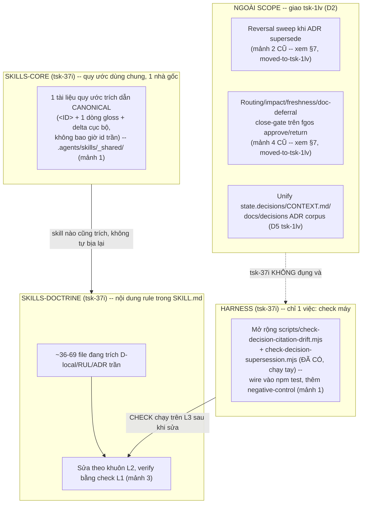

# DISCUSSION: Trích dẫn D-ID/RUL-ID/ADR không self-contained

Item: `tsk-37i`.

## 1. Trạng thái hiện tại

Round 7. Round 6 tìm thêm mảnh 4 (routing close-gate) từ dò từng phiên bản
beegog. Round 7: người dùng chỉ ra có 1 discussion song song, sâu hơn hẳn
— `tsk-1lv` (feature `canonical-decision-projection`, 8 round, D1-D6 đã
lock) — giải bài toán rộng hơn (decision/doc outdate/mâu thuẫn nói chung).
Agent đọc file đó trên `fgw/tsk-1lv`, xác nhận overlap thật: mảnh 4 trùng
"routing door" tsk-1lv đang tự thiết kế; mảnh 2 có nguy cơ bị D5 của
tsk-1lv (retire `docs/decisions/*.md` corpus) làm lỗi thời. Người dùng
đồng ý đề xuất thu hẹp — **D2 vừa chốt**: tsk-37i giữ lại đúng mảnh 1
(format trích dẫn) + mảnh 3 (dọn tài liệu cũ), bỏ mảnh 2 + mảnh 4 —
tsk-1lv đã xác nhận nhận 2 mảnh đó. §6/§7 vừa cập nhật theo D2: mảnh 2/4
đánh dấu moved-to-tsk-1lv (giữ lại làm lịch sử, không xoá), §6 regenerate
chỉ còn 2 tầng thật sự thuộc scope này. Discussion giờ đã hẹp, rõ, và
không còn trùng công với tsk-1lv — sẵn sàng hand-off sang
`fgos-coding-exploring`.

## 2. Mục tiêu & đề bài

Người dùng (chủ dự án) phản ánh: khi agent trao đổi hoặc viết tài liệu trong
fgOS, agent hay trích các định danh ngắn (D-ID cục bộ một work-item, RUL-ID
luật nền, ADR quyết định toàn dự án, tsk-id công việc khác) mà không kèm nội
dung hay phạm vi hiệu lực, khiến người đọc — không có lịch sử chat, không
thuộc lòng registry — không thể hiểu hay ra quyết định mà không bắt agent
diễn giải lại. Vấn đề nhân đôi khi các artifact vốn phải tồn tại lâu dài
(skills, specs, adhoc-task/subtask giao cho agent khác) bị nhiễm cùng lối
trích dẫn trần trụi này: chúng trở thành không tự-đọc-hiểu-được
(self-contained), tốn resource của agent đọc sau để dò ngược nguồn, và vỡ
hoàn toàn khi một skill/spec bị mang sang vận hành ở project khác (không còn
`docs/history/<feature>/` hay `docs/decisions/` gốc của fgOS để tra). Mục
tiêu của thảo luận này: quyết định một quy ước trích dẫn/viết-tài-liệu áp
dụng thống nhất cho cả giao tiếp hội thoại và tài liệu ghi lại, đủ để một
người/agent lạ đọc một trích dẫn đơn lẻ mà hiểu được nội dung cốt lõi VÀ biết
ngay phạm vi hiệu lực của nó (cục bộ 1 work-item hay toàn dự án) — không phải
bắt buộc phải mở file gốc trước khi hiểu được câu đang đọc.

**Cập nhật phạm vi sau D2 (round 7):** thảo luận này chỉ còn lo **HÌNH DẠNG
của một trích dẫn đơn lẻ** (id có kèm gloss/delta không, có trỏ đúng chỗ
không) — KHÔNG còn bàn tới nơi quyết định thật sự SỐNG hay cơ chế
close-gate ngăn quyết định rot (2 việc đó đã giao `tsk-1lv`,
`canonical-decision-projection`, xem D2 + §7 mảnh 2/4 moved-to-tsk-1lv).

## 3. Vấn đề rõ / chưa rõ

| # | Trạng thái | Nội dung |
|---|---|---|
| 1 | Rõ | fgOS đã có 3 hệ định danh trích dẫn liên quan, phạm vi hiệu lực khác nhau: **ADR`<n>`** (`docs/decisions/000N-slug.md`, unique toàn dự án, permanent), **RUL`<n>`** (`docs/specs/platform-foundations.md` RUL1-RUL10 + rải rác RUL11-RUL58+ trong từng spec khác — **KHÔNG unique toàn cục, scope theo spec gốc**), **D`<n>` local** (`docs/history/<feature>/CONTEXT.md`, scope đúng 1 work-item/feature, không phải số hex toàn xưởng). |
| 2 | Rõ | Quy ước hiện có cho ADR: viết `ADR<n>` thay vì số trần (`docs/decisions/0000-index.md` dòng 22-25). Quy ước hiện có cho RUL: **không unique toàn cục — khi trích ngoài spec gốc phải kèm tên area**, vd `RUL42 (runner)` (`docs/id-systems-audit.md` dòng 49, mục #5). Quy ước hiện có cho D-local: **khoá cứng — D-local KHÔNG BAO GIỜ được trích dẫn ngoài chính file `CONTEXT.md` gốc của nó** (quyết định `0017`, `docs/id-systems-audit.md` §5 dòng 152). Cả ba đều đã thành văn — vấn đề không phải "chưa có luật" mà là (a) luật chỉ sửa hình thức chữ, không đòi tóm tắt nội dung đi kèm, và (b) luật D-local đang bị phá ở diện rộng (xem #3). |
| 3 | Rõ — bằng chứng thật, không suy đoán | Vi phạm cụ thể quan sát trực tiếp: skill đang chạy phiên thảo luận NÀY (`.agents/skills/fgos-coding-shaping/SKILL.md`) trích trần `(D2)`, `(D4)`, `(D6)` nhiều lần trong "Hard rules" — các D-ID này chỉ tồn tại trong `docs/history/fgos-coding-shaping/CONTEXT.md` (đã đọc, xác nhận D1-D6 nằm ở đó, feature cục bộ của CHÍNH skill này). SKILL.md không phải CONTEXT.md, và SKILL.md được nạp vào MỌI phiên tương lai chạy skill này — vi phạm trực tiếp luật khoá của quyết định `0017`. Đây không phải lỗi ngẫu nhiên của 1 file: `grep RUL[1-9][0-9]` trên `docs/` trả ~559 match trong 147 file, phần lớn trích trần không kèm gloss (`RUL33/RUL34`, `RUL25`, `RUL50`, `RUL58 D4` — không tên area, không tóm tắt). Ví dụ người dùng nêu (`0026, 0028-0031, 0033`) cũng đúng dạng vi phạm quy ước ADR đã có (thiếu prefix `ADR`, thiếu tóm tắt) — không phải hiện tượng cá biệt của 1 lần trả lời. |
| 4 | Chưa rõ | Sửa ở tầng nào: (a) chỉ sửa **kỷ luật hội thoại** (agent tự nhắc mình gloss khi trích, không cần cơ chế enforce), (b) sửa **kỷ luật viết tài liệu** (skills/specs/CONTEXT.md phải tự chứa, không trích D-local/RUL/ADR trần), hay (c) cả hai — và nếu (c), có cần một cơ chế kiểm tra máy (lint/grep-check) hay thuần kỷ luật văn xuôi như `0000-index.md` dòng 30-36 đã chọn cho supersede-trỏ-ngược? |
| 5 | Chưa rõ | Mẫu gloss tối thiểu chấp nhận được là gì — 1 cụm từ ngắn ("D2: never write CONTEXT.md/plan.md directly") hay bắt buộc kèm cả phạm vi hiệu lực ("D2, cục bộ tsk-27y, không áp dụng ngoài feature này")? Có khác nhau giữa gloss-khi-nói-chuyện (ngắn, tự nhiên) và gloss-khi-viết-tài-liệu-bền (đầy đủ hơn, vì tài liệu sống lâu hơn hội thoại)? |
| 6 | Rõ | **Người dùng chốt hướng: cần quét sửa lại tài liệu CŨ, không chỉ áp luật cho tài liệu mới** — lý do nêu thẳng: "tài liệu quá dơ rồi." Quy mô thật đã đo (grep, round 3, xem §5): ~36 file (`.agents/skills/`, `docs/specs/`, `.claude/skills/` — phần lớn là bản sinh-tự-động từ `.agents/skills/` nên sửa nguồn là đủ, không sửa 2 lần) trích D-local trần ngoài CONTEXT.md gốc; ~62 file có ít nhất 1 trích RUL trần không kèm tên area; tới ~69 file khớp mẫu số 4 chữ số kiểu ADR trần ngoài `docs/decisions/`/`docs/history/` (số này CHƯA lọc false-positive, cần xác minh lại lúc lập kế hoạch thật). Đây là quy mô thật, không phải ước lượng — việc chia nhỏ/ưu tiên cụ thể (sửa hết 1 lần hay theo domain, ai làm) để `fgos-coding-planning` quyết khi item này hand-off. |
| 7 | Chưa rõ | Câu hỏi gốc của người dùng ("id của rule/decision là local hay global") — đã trả lời được ở mức khái niệm (#1 trên) nhưng CHƯA rõ nên hiển thị phân biệt này ở đâu cho người đọc thấy ngay khi gặp 1 trích dẫn, không phải phải nhớ luật riêng biệt (vd ký hiệu tiền tố khác nhau đã đủ phân biệt global/local, hay cần cách khác)? |

## 4. Quyết định đã chốt

| D-ID | Nội dung |
|---|---|
| D1 | Cấu trúc 3 tầng trích dẫn hiện có của fgOS (global-vĩnh viễn / scope-theo-file-reset-mỗi-file / cục bộ-1-feature) **đã được xác nhận đúng, không phải chỗ cần sửa** — beegog hội tụ độc lập về đúng 3 tầng này (short8 global ~ ADR, `R<n>` reset mỗi `docs/knowledge/areas/<x>.md` ~ RUL`<n>`, D-local ~ D-local). Phạm vi sửa của thảo luận này **không bao gồm** tái cấu trúc số tầng hay đổi id scheme hiện có — chỉ nhắm 2 chỗ: (a) format trích dẫn (bắt buộc kèm gloss, không còn id trần) và (b) cơ chế enforce (kiểm máy phần trích dẫn có trỏ đúng chỗ, kỷ luật văn xuôi phần nội dung gloss đúng/đủ). Ghi qua `fgos decision --id tsk-37i` (seq 18919). |
| D2 | **Scope tsk-37i thu hẹp còn mảnh 1 (format trích dẫn + pointer-check) + mảnh 3 (dọn tài liệu cũ) — bỏ mảnh 2 (reversal sweep ADR) và mảnh 4 (routing close-gate)**, cả hai giao lại cho `tsk-1lv` (`canonical-decision-projection`) đang thiết kế đúng lớp kiến trúc rộng hơn (D5 retire `docs/decisions/*.md` corpus, routing-door round 3-4 của chính nó). tsk-1lv đã xác nhận nhận 2 mảnh này (§5 round 7). Ghi qua `fgos decision --id tsk-37i` (seq 19034). |

## 5. Q&A log

- **2026-08-17T04:45Z — Scout ban đầu (agent).** Đọc `docs/decisions/0000-index.md`
  (quy ước `ADR<n>`), `docs/decisions/0017-dong-audit-he-id-ten-goi.md` (luật khoá
  D-local, hệ RUL không unique toàn cục), `docs/id-systems-audit.md` §5 (định
  nghĩa D-hex vs D-local + luật citation), `docs/specs/platform-foundations.md`
  dòng 64-79 (RUL1-RUL10), và grep `RUL[1-9][0-9]` trên toàn `docs/` (559 match,
  147 file). Xác nhận trực tiếp `.agents/skills/fgos-coding-shaping/SKILL.md`
  trích trần D2/D4/D6 ngoài `docs/history/fgos-coding-shaping/CONTEXT.md` —
  vi phạm quyết định `0017`. Kết luận: vấn đề không phải "chưa có luật" mà
  "luật có nhưng (a) không đòi tóm tắt nội dung, chỉ đòi đúng hình dạng chữ,
  và (b) đang bị phá ở diện rộng, kể cả trong chính skill vừa dùng để mở
  cuộc thảo luận này."

- **2026-08-17T~06:20Z — Scan bee/beegog upstream (agent, theo yêu cầu người
  dùng).** Version-check trước: `upstreams/bee/` (mô tả trong
  `docs/distillery/sources/bee.md`, cursor v1.18.3, 2026-07-28) lệch xa thực
  tế — bản clone làm việc `/home/vantt/projects/beegog` (remote
  `github.com/thanhsmind/beegog`) đứng sau `origin/main` **1213 commit**;
  tag thật mới nhất là `v2.7.0` (không có `v0.2.x` nào trong lịch sử —
  người dùng có thể đã nhớ nhầm số phiên bản). Đã `git pull --ff-only` cập
  nhật clone, rồi đọc 2 file trong `docs/knowledge/areas/` (state layer mới
  của bee, thay `docs/specs/` cũ) liên quan trực tiếp câu hỏi của phiên
  này — không phải re-scan toàn bộ 1213 commit. Đã ghi lại 2 phát hiện vào
  `docs/distillery/sources/bee.md` (mục `decision-citation-and-reversal-sweep`
  dưới domain `context-memory`, mục `one-line-cite-plus-local-delta` dưới
  domain `docs-style`), đã trình bày tóm tắt cho người dùng ở chat. Tóm tắt
  2 cơ chế:
  1. **Reversal-propagation sweep** (`docs/knowledge/areas/decision-memory/overview.md`
     R2+R8): mọi artifact trích 1 quyết định phải kèm `short8` (hash 8 ký
     tự, id toàn cục — không phải số nguyên nhỏ đơn thuần); khi 1 quyết
     định bị supersede, hệ thống tự quét `docs/**` tìm mọi nơi đã trích id
     cũ, bắt buộc sửa hoặc waive-có-lý-do NGAY trong cùng lượt trước khi
     ghi supersede — khác hẳn cách fgOS hiện tại (supersede xong, tự nguyện
     nhớ sửa chỗ trích cũ, không cơ chế bắt buộc).
  2. **"One rule, one home" + pointer-integrity check**
     (`docs/knowledge/areas/doctrine-layer/prompt-writing-standard.md` R3,
     `.../verify-pipeline/skill-reference-pointer-integrity.md`): 1 luật chỉ
     phát biểu đầy đủ đúng 1 lần ở nhà gốc; mọi nơi khác trích nó **bắt
     buộc kèm 1 dòng tóm tắt + phần khác biệt cục bộ**, không bao giờ chỉ
     trích id trần — đây chính là câu trả lời trực tiếp cho câu hỏi #5 ở
     §3. Phần này (nội dung gloss có đúng/đủ không) vẫn là kỷ luật văn
     xuôi, xét bởi review — nhưng phần *cấu trúc* (trích dẫn có trỏ tới 1
     file/heading thật không) được 1 test Rust (`pointer_integrity.rs`)
     kiểm máy trên mọi lần verify, có negative-control fixture để tự chứng
     minh test còn phát hiện được lỗi — bắt được 3 pointer gãy thật ngay
     lần đầu chạy, dù các file đó trước giờ vẫn "pass" mọi check khác. Đây
     là câu trả lời cho câu hỏi #4 ở §3 (cần cơ chế kiểm máy hay thuần kỷ
     luật): bee chọn **cả hai, chia theo đúng ranh giới máy-kiểm-được vs
     người-phán-được** — không phải một lựa chọn nhị phân.

- **2026-08-17T~08:55Z — Đăng ký 2 candidate vào porting-log (agent, theo
  yêu cầu "cập nhật tài liệu tìm được").** Thêm 2 dòng `candidate` vào
  `docs/distillery/porting-log.md` qua `addPorting()`
  (`src/state/porting-store.mjs`, đúng cửa ghi state layer, không tay-sửa
  `events.jsonl`): `decision-citation-and-reversal-sweep` (R3 E2 F3) và
  `one-line-cite-plus-local-delta` (R3 E2 F2) — cả hai nguồn `beegog`. Đây
  là bước chính thức hoá 2 phát hiện round 2 vào hệ thống porting của
  distillery, tách biệt với việc mô tả tính năng ở `sources/bee.md` (đã
  làm round 2) — porting-log là nơi TRACK quyết định có port vào fgOS hay
  không, còn `sources/bee.md` chỉ MÔ TẢ tính năng tồn tại ở nguồn. Người
  dùng hỏi thêm: "họ (beegog) có 3 tầng luật như fgOS hay mấy tầng?" — trả
  lời trong chat: beegog có CÙNG hình dạng 3 tầng (global decision /
  area-scoped rule numbering-lại-mỗi-file / feature-local D-label), khác ở
  chỗ tầng global rẻ hơn (một lệnh CLI thay vì viết tay 1 file ADR mới) và
  tầng feature-local ĐƯỢC PHÉP trích ra ngoài miễn kèm neo toàn cục
  (short8) — không cấm tuyệt đối như luật D-local của fgOS.

- **2026-08-17T~09:00Z — D1 chốt (agent, theo xác nhận người dùng).** Người
  dùng: "như vậy họ vẫn có 3 tầng" — đọc là xác nhận điểm agent đã nêu ở
  cuối round 2 (3 tầng của fgOS không sai, chỉ chi phí thăng hạng + luật
  trích D-local ra ngoài là khác). Điểm này đã ổn định qua ≥2 lượt (agent
  nêu round 2 → người dùng xác nhận round 3) nên mint D1, ghi qua `fgos
  decision --id tsk-37i` (seq 18919). §6 regenerate lần đầu theo D1 bên
  dưới.

- **2026-08-17T~09:30Z — Trả lời câu hỏi #6 (người dùng), đo quy mô (agent).**
  Người dùng: "cần quét sửa lại tài liệu, vì tài liệu quá dơ rồi" — chốt
  hướng bao gồm quét/sửa tài liệu CŨ, không chỉ luật cho tài liệu mới. Agent
  đo quy mô thật bằng grep trước khi ghi vào §3 (kỷ luật scout-trước-khi-ghi):
  `grep -rlE "\(D[0-9]+[a-z]?(,|\))" .agents/skills .claude/skills docs/specs
  plugins` (loại `/CONTEXT.md` gốc) → 36 file; `grep -rlE "RUL[0-9]+[^ ]"`
  (loại `docs/history`/`docs/decisions`) → 62 file; mẫu 4-chữ-số kiểu ADR
  trần ngoài `docs/decisions`/`docs/history` → 69 file (chưa lọc
  false-positive, cần xác minh lại lúc lập kế hoạch). Ghi chú quan trọng:
  `.claude/skills/*` phần lớn là bản sinh-tự-động từ `.agents/skills/*`
  (xem đầu file `fgos-coding-shaping/SKILL.md`: "generated thin wrapper...
  edit the source instead") — sửa nguồn `.agents/skills/` là đủ, không cần
  sửa 2 lần thủ công. Chưa mint D2 cho câu trả lời này (kỷ luật: không lock
  D-ID từ 1 câu trả lời duy nhất) — để `fgos-coding-planning` khoá chính
  thức lúc hand-off, cùng lúc chia nhỏ quy mô ~36-69 file thành task cụ
  thể.

- **2026-08-17T~09:35Z — Dò từng phiên bản beegog v1.18.3→v2.7.0 (agent,
  theo yêu cầu người dùng round 6).** Người dùng chỉ ra agent nhớ nhầm số
  phiên bản round 2 ("1.8.3" thay vì đúng **1.18.3** — đã sửa lại tại đây).
  Thay vì đọc lại state hiện tại (round 2 đã làm), lần này grep commit log
  có chủ đích: `git log --oneline v1.18.3..v2.7.0 --grep="citation|decision.
  mem|doctrine|pointer.integ|self-contain|gloss|reversal|supersed" -i` trên
  57 tag giữa 2 cursor — không replay hết 1213 commit, đúng "delta
  discipline" của distill (nhóm theo theme, không theo từng commit). Tìm
  được cụm feature `doc-impact-synthesis` + `knowledge-distill-trigger`,
  landed 2026-08-03→2026-08-16, đỉnh điểm là chính commit release `v2.7.0`
  ("doc-rot doors — impact, routing, doc-deferral, freshness") — TÊN
  release đã tự nói đúng chủ đề đang bàn. Đọc
  `docs/knowledge/areas/workflow-state/gates.md` (4 đoạn liên tiếp mô tả 4
  cửa cứng), ghi vào `docs/distillery/sources/bee.md` (entry
  `doc-rot-close-gate-bundle`, domain `quality-gates`) + đăng ký porting
  candidate cùng tên (R3 E2 F3). Phát hiện quan trọng nhất: **"routing
  door"** — chặn đóng feature khi 1 D-ID đã lock trong CONTEXT.md "không có
  area-spec citation VÀ không có feature-local record" — tức 1 quyết định
  cục bộ bị khoá rồi KHÔNG BAO GIỜ được route đi đâu bị REFUSE, không được
  phép rot. Đây đúng là nửa còn thiếu của `decision-citation-and-reversal-
  sweep` (round 2, chỉ chặn "supersede mà không sửa chỗ trích cũ") — và
  đúng tình huống thật fgOS đang có: D2/D4/D6 của `fgos-coding-shaping`
  chỉ tồn tại trong CONTEXT.md, chưa từng được route vào spec/ADR nào.

- **2026-08-17T~10:25Z — Phát hiện overlap thật với tsk-1lv (agent, theo yêu
  cầu người dùng).** Đọc `docs/history/canonical-decision-projection/
  DISCUSSION.md` trên branch `fgw/tsk-1lv` (7 round, D1-D6 đã lock — sâu
  hơn hẳn discussion này). tsk-1lv giải bài toán RỘNG HƠN: decision/doc bị
  outdate/mâu thuẫn (STR72 — bằng chứng thật 2026-07-21: supersede không
  lan về artifact nguồn), không chỉ format trích dẫn. Overlap cụ thể, không
  suy đoán:
  1. **Mảnh 4 của tsk-37i trùng với "routing door" của tsk-1lv round
     3-4** — cả hai độc lập tìm ra CÙNG cơ chế beegog v2.7.0 (4-door bundle)
     và cùng đề xuất gắn vào `fgos approve`/`return`. tsk-1lv đang thiết kế
     nó ở tầng harness chung cho cả 4 door, không chỉ routing — làm mảnh 4
     riêng ở đây có nguy cơ trùng công.
  2. **Mảnh 2 (reversal sweep cho ADR supersede) có thể bị tsk-1lv's D5 làm
     lỗi thời** — D5 đã CHỐT (round 7→8, ổn định qua 2 round): retire hẳn
     `docs/decisions/*.md` corpus, dồn narrative vào `docs/specs/<area>.md`,
     `state.decisions` (store event-log ĐÃ CÓ SẴN, port từ bee tsk-63c,
     1711 bản ghi, 0 skill đọc — agent CHƯA từng biết tồn tại trước round
     này) làm nguồn thật. Nếu D5 thi công, mục tiêu sweep của mảnh 2
     (`docs/decisions/0000-index.md`) không còn là nguồn quyền uy nữa.
  3. **fgOS đã có 2 script detection-only chưa từng biết tới**:
     `scripts/check-decision-citation-drift.mjs` (spec:
     `docs/specs/decision-citation-drift.md`, từ STR72) +
     `scripts/check-decision-supersession.mjs` (từ p-9fb81485) — bắt đúng
     lớp lỗi mảnh 1 định giải, nhưng CHẠY TAY, không wired CI/gate. Mảnh 1
     (pointer-integrity check) nên MỞ RỘNG 2 script này thay vì xây mới,
     và nên phối hợp với tsk-1lv thay vì làm song song.
  4. **Không trùng, vẫn khác biệt thật**: tsk-37i hẹp hơn nhiều — chỉ nhắm
     FORMAT đọc-hiểu-được của một trích dẫn đơn lẻ (id+gloss), bất kể nguồn
     thật nằm ở đâu (state.decisions hay docs/specs hay CONTEXT.md). tsk-1lv
     là kiến trúc tầng lưu trữ + đồng bộ, phạm vi rộng hơn nhiều (267+ file
     Diataxis, D5 retire cả corpus). Mảnh 1 (skills-core convention) và mảnh
     3 (dọn skill-doctrine cũ) của tsk-37i vẫn có giá trị RIÊNG, độc lập với
     kết quả kiến trúc của tsk-1lv.
  Đã trình bày cho người dùng trong chat, chờ quyết cách phối hợp (gộp, phụ
  thuộc, hay giữ tách biệt với scope thu hẹp).

- **2026-08-17T~11:06Z — D2 chốt: thu hẹp scope, giao mảnh 2+4 cho tsk-1lv
  (người dùng xác nhận).** Người dùng: "đồng ý như đề nghị, bên kia đã
  nhận 2 mảnh bạn nói" — vừa xác nhận hướng thu hẹp agent đề xuất cuối
  round trước, vừa xác nhận CHÉO từ phía session `tsk-1lv` đã chủ động
  nhận mảnh 2 (reversal sweep) + mảnh 4 (routing close-gate) vào scope của
  họ. Đủ điều kiện mint D-ID (đề xuất từ agent + xác nhận rõ ràng từ người
  dùng + xác nhận chéo liên-item, mạnh hơn hẳn 1 câu trả lời đơn thuần) —
  ghi D2 qua `fgos decision --id tsk-37i` (seq 19034). §6 regenerate lần 3
  theo D2: bỏ hẳn nội dung mảnh 2/4 khỏi thiết kế của tsk-37i, chỉ giữ
  pointer trỏ sang tsk-1lv. §7: mảnh 2/4 đánh dấu `moved-to-tsk-1lv`, giữ
  nguyên nội dung cũ làm lịch sử (không xoá — cùng nguyên tắc D3 "một
  quyết định bị supersede thì trỏ tới, không sửa đè" áp dụng luôn cho
  chính DISCUSSION.md này).

## 6. Thiết kế đã chốt {#design}

**Scope hẹp, 2 mảnh, không đụng tầng lưu trữ.** fgOS giữ nguyên 3 tầng
trích dẫn đã có (ADR toàn cục — RUL scope-theo-spec — D-local
scope-theo-feature), xác nhận đúng hình dạng qua hội tụ độc lập với beegog
(D1). Sau khi phát hiện overlap với `tsk-1lv` (round 7), scope thu hẹp còn
đúng 2 mảnh (D2) — **KHÔNG đụng tới nơi quyết định thật sự SỐNG** (đó là
việc của tsk-1lv: unify `state.decisions`/CONTEXT.md/ADR corpus, retire
`docs/decisions/*.md`, routing/impact/freshness/doc-deferral close-gate).
tsk-37i chỉ lo **HÌNH DẠNG một trích dẫn đơn lẻ đọc được không**, bất kể
trích dẫn đó cuối cùng trỏ vào đâu.

- **Harness (tsk-37i, chỉ 1 việc):** mở rộng 2 script detection-only ĐÃ CÓ
  SẴN trong repo (`scripts/check-decision-citation-drift.mjs`,
  `scripts/check-decision-supersession.mjs` — tìm ra ở round 7, chưa từng
  biết tới ở round 2-6) thay vì xây `pointer_integrity.rs`-kiểu-mới từ
  đầu như bản nháp trước — DRY thật, không phải chỉ noted. Wire vào `npm
  test`, thêm negative-control fixture theo mẫu beegog.
- **Skills-core:** giữ nguyên ý round 5 — quy ước `<ID> (<gloss>)` sống
  đúng 1 chỗ (`.agents/skills/_shared/`), mọi SKILL.md khác chỉ trích, tự
  áp nguyên tắc "one rule, one home" ngay ở tầng meta này.
- **Skills-doctrine:** giữ nguyên ý round 5 — dọn ~36-69 file vi phạm, kể
  cả chính `fgos-coding-shaping/SKILL.md` đang chạy phiên này (D2/D4/D6
  trần).
- **D-local vẫn KHÔNG được nới lỏng** (chưa có quyết định nào đảo luật khoá
  `0017`) — dọn ở skills-doctrine là sửa VI PHẠM luật cũ, không đổi luật.
- **Mảnh 2 + mảnh 4 (round 2, round 6) đã CHUYỂN sang `tsk-1lv`** — không
  còn là task của tsk-37i, xem §7 để biết nội dung gốc + lý do moved.

Câu hỏi #7 ở §3 (hiển thị phân biệt local/global) trả lời được ngay trong
khuôn skills-core (tiền tố `ADR`/`RUL(area)`/`D-local` đã đủ phân biệt),
không cần bàn riêng.

## 7. Danh mục hạng mục / task {#tasks}

### {#task-citation-format-and-pointer-check} Mảnh 1 — Format trích dẫn + mở rộng check drift đã có
- **Mục tiêu:** mọi trích ADR/RUL/D-local ngoài nhà gốc bắt buộc dạng
  `<ID> (<tóm tắt 1 dòng>)`, không bao giờ id trần. Cơ chế kiểm máy: **mở
  rộng 2 script đã có sẵn trong repo** — `scripts/check-decision-citation-
  drift.mjs` (spec `docs/specs/decision-citation-drift.md`, từ STR72) và
  `scripts/check-decision-supersession.mjs` (từ p-9fb81485) — hiện chỉ
  detection-only, chạy tay, không wired CI. Round 5 từng nháp xây
  `pointer_integrity.rs`-kiểu-mới; round 7 sửa lại: KHÔNG xây mới, mở rộng
  2 script này (DRY, tránh trùng công với chính hạ tầng fgOS đã có).
- **Tầng (round 5, sửa nguồn round 7):** nửa **harness** (wire 2 script
  trên vào `npm test`) + nửa **skills-core** (1 tài liệu quy ước canonical
  ở `.agents/skills/_shared/` — xem §6 sơ đồ round 7).
- **Trích §6:** "Harness (tsk-37i, chỉ 1 việc)".
- **D-ID áp dụng:** D1, D2.
- **Quan hệ với sibling:** mảnh 3 phụ thuộc mảnh này (cần format chốt trước
  khi dọn file cũ theo đúng khuôn). Phối hợp `tsk-1lv` round 4 cũng nhắc
  tới đúng 2 script này (round 4 của họ) — nên đồng bộ với họ trước khi
  sửa để không dẫm chân.
- **Verify nháp:** `npm test` xanh + 2 script mở rộng bắt được ≥1 lỗi thật
  đã biết (`fgos-coding-shaping/SKILL.md` D2/D4/D6 trần) trước khi sửa, và
  hết báo lỗi sau khi sửa.

### {#task-adr-reversal-sweep} Mảnh 2 — Reversal sweep cho ADR supersede (moved-to-tsk-1lv, round 7)
> **KHÔNG còn là task của tsk-37i (D2, round 7)** — nội dung gốc giữ lại
> làm lịch sử, không xoá. `tsk-1lv` đã nhận mảnh này vào scope kiến trúc
> lưu trữ quyết định rộng hơn của họ (liên quan D5 của tsk-1lv: retire
> `docs/decisions/*.md` corpus).
- **Mục tiêu (gốc):** khi 1 quyết định `docs/decisions/` bị supersede, quét
  `docs/**`+`.agents/skills/**` tìm chỗ trích id cũ, bắt xử lý (sửa hoặc
  waive-có-lý-do) trước khi ghi supersede — thay kỷ luật tay hiện tại
  (`0000-index.md` dòng 30-36).
- **Lý do moved:** trùng công với "impact door" beegog v2.7.0 mà `tsk-1lv`
  round 3-4 đã tự thiết kế; mục tiêu sweep (`docs/decisions/0000-index.md`)
  có thể không còn là nguồn quyền uy nếu D5 của tsk-1lv thi công.

### {#task-retroactive-citation-cleanup} Mảnh 3 — Dọn tài liệu cũ đang vi phạm
- **Mục tiêu:** sửa lại ~36 file trích D-local trần, ~62 file trích RUL
  trần không kèm area, tới ~69 file khớp mẫu ADR trần (số cần xác minh lại
  khi lập kế hoạch) theo đúng khuôn mảnh 1. Sửa `.agents/skills/` nguồn là
  đủ — không sửa `.claude/skills/*` (bản sinh tự động).
- **Tầng (round 5):** **skills-doctrine** toàn bộ (nội dung rule bên trong
  từng `SKILL.md`, không chạm harness/skills-core — chỉ ĐỌC khuôn từ đó).
- **Trích §6:** "Skills-doctrine" (round 7).
- **D-ID áp dụng:** §3 #6, D1, D2.
- **Quan hệ với sibling:** phụ thuộc mảnh 1 (cần khuôn format tồn tại
  trước).
- **Verify nháp:** check máy của mảnh 1 chạy sạch trên toàn `docs/`+
  `.agents/skills/` sau khi dọn.

### {#task-routing-close-gate} Mảnh 4 — Routing close-gate cho D-local (moved-to-tsk-1lv, round 7)
> **KHÔNG còn là task của tsk-37i (D2, round 7)** — nội dung gốc giữ lại
> làm lịch sử, không xoá. `tsk-1lv` đã nhận mảnh này vào scope 4-door
> harness chung của họ (freshness/impact/routing/doc-deferral).
- **Mục tiêu (gốc):** `fgos return`/`fgos approve` từ chối đóng 1 item khi
  CONTEXT.md của nó có D-ID đã lock nhưng KHÔNG có area-spec citation VÀ
  KHÔNG có feature-local record hợp lệ — chặn đúng lỗ hổng "lock rồi bỏ
  quên, không bao giờ route đi đâu" (khác mảnh 2, vốn chỉ chặn supersede
  mà không sửa chỗ trích cũ).
- **Nguồn:** porting candidate `doc-rot-close-gate-bundle` (R3 E2 F3,
  `docs/distillery/porting-log.md`), phần "routing door".
- **Lý do moved:** `tsk-1lv` round 3-4 đã tự thiết kế đúng cơ chế này —
  không chỉ routing door mà cả bundle 4 cửa (freshness/impact/routing/
  doc-deferral) gắn vào `fgos approve` — làm riêng ở tsk-37i sẽ trùng công.
