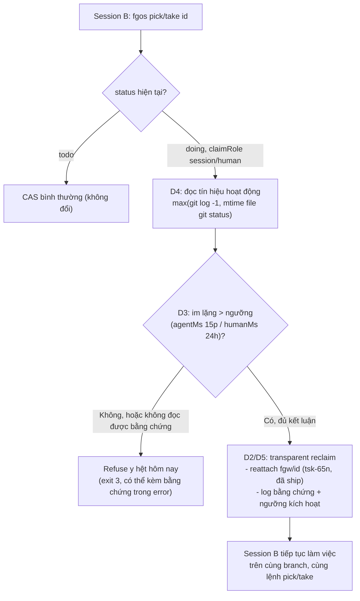

# session-claim-liveness — DISCUSSION.md

Item liên quan: `tsk-3ni`.

## 1. Trạng thái hiện tại

Cả 5 quyết định (D1-D5, §4) đã chốt — thiết kế đủ cụ thể để tách task
(§7). Không còn câu hỏi sản phẩm nào mở. Bước tiếp theo: terminal handoff
sang `fgos-coding-exploring` rồi `fgos-coding-planning` cho `tsk-3ni`.

## 2. Mục tiêu & đề bài

Khi một session claim một work item (`status: doing`, `claimRole: session`
hoặc `human`) và tạo worktree cho nó, rồi vì lý do gì đó (crash, đóng
terminal, bỏ ngang) không còn hoạt động nữa nhưng claim thì vẫn đứng
nguyên ở `doing` — hệ thống hiện tại không có cách nào phân biệt claim đó
với một claim đang thực sự sống. `fgos take`/`pick` từ chối cứng (CAS
conflict, exit 3) bất kể claim kia còn sống hay đã chết, và `/fgOS:stale`
chỉ báo cáo tư vấn theo tuổi claim chứ không bao giờ tự reclaim. Mục tiêu
của item này: xây một cơ chế để (a) một session có thể để lại dấu vết
"mình còn đang hoạt động ở work item này" và (b) khi một session khác thử
claim một item đang `doing`, có cách xác định độ tin cậy claim đó còn sống
hay đã chết, làm cơ sở cho một đường tái-claim an toàn (không nhất thiết
là auto-reclaim — xem câu hỏi mở ở §5).

## 3. Vấn đề rõ / chưa rõ

| # | Trạng thái | Điểm |
|---|-----------|------|
| 1 | Rõ | `claimRole` (`runner`/`human`/`session`/`system`) và `writer.source` (`registry`/`env`/`pid`/`unresolved`) là hai field khác nhau, không phải một object gộp — `src/runner/claim-port.mjs:211-219`, `src/state/replay.mjs:122-125`, `src/runner/session-identity.mjs:52-75,129-145`. |
| 2 | Rõ | Việc claim `todo -> doing` là CAS cứng ở tầng state (`transitionWork`, exit 3 khi `expectedStatus` không khớp) — không phải luật ở tầng skill/prose. `src/state/store.mjs:469`, `bin/fgos.mjs:2171-2174`, test `test/runner/claim-port.test.mjs`. |
| 3 | Rõ | Đã có 3 cơ chế "phát hiện sống/chết" khác nhau trong repo, không cái nào giải quyết đúng bài toán này: (a) `main-checkout-lock.mjs` dùng PID signal-0 + TTL — chỉ hoạt động cùng máy, cùng tiến trình còn tồn tại; (b) `startupReap` (`loop.mjs:357-407`) chỉ reap claim của **runner**, cố ý bỏ qua `human`/`session` (dòng 372); (c) `/fgOS:stale` chỉ báo tuổi claim (`agentMs: 15p`, `humanMs: 24h`) theo `claimRole`, không đọc worktree, không bao giờ tự reclaim (`graph-metrics.mjs:483-514`). |
| 4 | Rõ | Tạo worktree hiện không ghi bất kỳ metadata nào (timestamp/session-id/PID) — `createWorktree` chỉ `mkdtempSync` (`worktree.mjs:451-498`), không `writeFileSync` gì thêm. Nếu thiết kế cần một dấu hiệu "còn sống" gắn với worktree, hiện chưa có chỗ để đọc. |
| 5 | Rõ | Spec hiện hành (`docs/specs/work-state.md:459-467,1160-1164`) nói thẳng: cửa pull-door "không qua orchestration/registry/heartbeat/push/lease nào cả... lớp đó, nếu cần, được thêm sau trên cùng event log" — và liệt kê rõ trong Open Gaps: claim của người "deliberately... parks indefinitely (per D4, deferred)". Nghĩa là: đây KHÔNG phải bug, mà là một giới hạn đã biết, đang chờ ai đó lấp — đúng như án bạn đang đề xuất. |
| 6 | Rõ | Có 1 case liền kề dễ nhầm: `reclaim-refuse-live-session-worktree` (đã ship) chỉ kiểm tra "worktree này có phải chính process đang gọi đang đứng trong đó không" (so `process.cwd()`) — hoạt động được vì chạy CÙNG process với claim đang sống. Nó **không** và **không thể** phát hiện một session **khác** (process khác) còn sống hay đã chết — đúng là gap còn lại. |
| 7 | **Đã trả lời (D1)** | Tín hiệu "còn sống" = hoạt động chỉnh sửa file/worktree thực tế (không phải danh tính session/process, không phải tuổi-claim). Không cần biết NGUYÊN NHÂN dừng (xong/chết/bỏ lại) — chỉ cần biết còn đang động hay đã đứng yên. |
| 8 | **Đã trả lời (D4/D5)** | Tín hiệu chính (D4) là worktree-level nên vốn same-machine (trừ khi branch đã push); event-log không cần vai trò fallback riêng — D5 chốt: khi không đọc được bằng chứng (kể cả vì lý do cross-machine), refuse y hệt hôm nay, không cố gắng suy luận qua event-log thay thế. Chấp nhận giới hạn same-machine cho nhánh transparent-reclaim; cross-machine tự nhiên rơi về nhánh refuse-as-today, không phải lỗi. |
| 9 | **Đã trả lời (D2)** | Agent tự reclaim, không cần người xác nhận — miễn bằng chứng đủ chắc (ngưỡng bảo thủ), hành động không phá hủy (reattach, không force-remove), và có log lý do. Không đảo ngược "indefinite hold" của S2-pull D1 theo nghĩa tự động/không kiểm soát — chỉ mở thêm một cửa có điều kiện, giống cách `main-checkout-lock` đã tự reclaim khi PID xác nhận chết, chỉ fail-closed khi bằng chứng thật sự mơ hồ (AMBIGUOUS). |
| 10 | **Đã trả lời (D5)** | Không cần verb/flag riêng — tích hợp thẳng vào `pick`/`take`'s conflict path hiện có (transparent khi kết luận được, refuse y hệt hôm nay khi không). |
| 11 | **Đã trả lời (D4)** | `max(git log -1 --format=%ct trên fgw/<id>, mtime mới nhất trong file mà git status --porcelain liệt kê)`. |
| 12 | **Đã trả lời (D5)** | Transparent trong `pick`/`take`'s conflict path, không verb/flag riêng — xem D5. |

## 4. Quyết định đã chốt

| D-ID | Quyết định |
|------|-----------|
| D1 | Tín hiệu "còn sống" của một claim là hoạt động chỉnh sửa worktree/file thực tế — không phải danh tính session/process (PID/heartbeat), không phải tuổi-claim đơn thuần. Lý do: người dùng xác nhận framing này hai lần liên tiếp (vòng 1: "active modify... hay đã xong rồi, không cần biết lý do"; vòng 2: "thật ra muốn file edit activities"); event-log-only có lỗ hổng cấu trúc — không event nào bắn ra trong lúc `fgos-coding-implement` đang sửa code, nên không phân biệt được phiên đang sửa với phiên đã chết. Ghi qua `fgos decision --id tsk-3ni`. |
| D2 | Agent được tự reclaim một claim "đứng yên", không cần người xác nhận, MIỄN LÀ: (a) bằng chứng im lặng vượt một ngưỡng bảo thủ theo `claimRole`; (b) hành động reclaim không phá hủy — reattach vào `fgw/<id>` đã có (giống `pick-reattach-live-worktree` D1), không bao giờ force-remove; (c) quyết định được log kèm bằng chứng. Lý do: `main-checkout-lock.mjs` đã có đúng tiền lệ này — tự reclaim khi `isPidAlive(pid)` xác nhận chết, chỉ fail-closed (`AMBIGUOUS`) khi bằng chứng thật sự không kết luận được. File/worktree-quiet là heuristic (không phải bảo đảm cứng như PID), nên độ tin cậy phải đến từ ngưỡng bảo thủ + hành động không phá hủy + log, không phải từ việc luôn chờ người. Người dùng xác nhận "đồng ý". |
| D3 | Ngưỡng im lặng để đủ điều kiện reclaim dùng lại nguyên `agentMs: 15min` / `humanMs: 24h` đã có ở `/fgOS:stale` (`graph-metrics.mjs:483-485`) — không phải một cặp số bảo thủ hơn riêng cho reclaim. Chốt qua `AskUserQuestion` (3 lựa chọn), người dùng chọn "dùng lại 15p/24h". |
| D4 | Tín hiệu hoạt động = `max(git log -1 --format=%ct trên fgw/<id>, mtime mới nhất trong số các file mà git status --porcelain liệt kê trong worktree đó)` — không quét mtime toàn bộ cây file. Lý do: tái dùng danh sách file đã bẩn/chưa track mà git đã tính sẵn (tự động loại `node_modules` v.v qua `.gitignore`), rẻ hơn và đúng hơn `find -newermt` tự quản lý ignore-pattern. |
| D5 | Điểm tích hợp là chính `pick`/`take`'s claim-conflict path hiện có — transparent tự reclaim (reattach, theo D2) khi bằng chứng đủ kết luận (vượt ngưỡng D3 theo tín hiệu D4), refuse Y HỆT hôm nay khi không (còn hoạt động gần đây, HOẶC không đọc được bằng chứng). Không thêm verb/flag mới. Lý do: đúng hình dạng `main-checkout-lock`'s `tryAcquireOnce` đã dùng — case kết luận được xử lý ngay trong đường acquire bình thường, không cần công cụ riêng; công cụ riêng kiểu `fgos-unlock` chỉ dành cho case thật sự mơ hồ, mà ở đây vẫn refuse y hệt hôm nay, không cần xây thêm gì mới cho nhánh đó. |

## 5. Q&A log

### Vòng 1 — 2026-08-10

**Scout tóm tắt** (xem §3 để có citation đầy đủ):
- Claim hiện tại là CAS cứng ở tầng state, refuse không phân biệt sống/chết.
- Đã tồn tại 3 cơ chế sống/chết khác nhau trong repo (PID-signal cho lock file, runner-only reap, tuổi-claim advisory) — không cái nào bao phủ "một session khác, có thể khác máy, claim `human`/`session`, đã chết".
- Đây là gap đã được spec (`work-state.md`) và một quyết định trước đó (`startupReap` D3 trong `pick-worktree-claim-race`) đặt tên và cố ý để lại — không phải một thứ mới phát hiện ra.
- Worktree không mang theo metadata gì để soi.

**Câu hỏi mở (đang chờ trả lời):** "Session còn sống" nên được định nghĩa
theo cách nào cho bài toán này — bám theo PID/process (chỉ đúng same-
machine, tái dùng được `main-checkout-lock`'s pattern đã có), hay theo một
**heartbeat được ghi định kỳ** vào state (đúng cái spec đang nói "chưa
xây", nhưng hoạt động được cả cross-machine)? Và tương ứng: hệ thống của
bạn có cần lo trường hợp nhiều máy cùng thao tác trên cùng `.fgos/` không,
hay luôn là 1 máy?

**Trả lời:** không cần biết session còn sống theo nghĩa process/identity —
chỉ cần biết worktree/file của nó còn đang bị chỉnh sửa hay đã đứng yên,
bất kể lý do (xong việc, chết, hay để lại cho tiến trình khác). → D1.

### Vòng 2 — 2026-08-10

**Scout xác nhận cơ chế "any-event" đã có sẵn idiom trong repo:**
`staleDoingAdvisory` (`src/state/store.mjs:1050-1059`) đã dựng một
`Map` từ id -> timestamp bằng cách lặp `readRawEvents` theo thứ tự và ghi
đè (`in-order iteration -> latest wins`) — chỉ khác là nó lọc riêng
`work.move` với `to: 'doing'`. Bỏ bộ lọc loại event đi là có ngay một
`lastActivityAt(id)` tổng quát, không phải xây mới từ đầu.

**Câu hỏi:** giả sử chỉ dùng event-log, cơ chế khẳng định "còn hoạt động"
sẽ như thế nào?

**Trả lời:** trình bày cơ chế cụ thể (map any-event -> timestamp mới nhất,
so với ngưỡng) + chỉ ra lỗ hổng cấu trúc: không event nào bắn ra trong lúc
`fgos-coding-implement` đang sửa code — event-log không thể phân biệt "đang
sửa 40 phút" với "chết 40 phút trước". Người dùng xác nhận: đúng là muốn
file edit activity thật, không chỉ event-log. → D1 chốt (đã giữ vững qua
2 vòng, xem §4).

### Vòng 3 — 2026-08-10

**Câu hỏi từ người dùng:** "vậy không có cửa cho agent tự tin và trách
nhiệm tự claim lại à?" — phản đối option nghiêng hẳn về "luôn cần người
xác nhận" (option B đã trình bày ở vòng trước).

**Scout lại `main-checkout-lock.mjs` để trả lời chính xác** (không đoán):
xác nhận `tryAcquireOnce` đã tự reclaim (không cần người) ngay khi
`isPidAlive(pid)` trả về false với danh tính là PID số — đây là
"stale-and-reclaimable", tự động. `AMBIGUOUS`/fail-closed chỉ áp dụng khi
danh tính là string không có TTL — bằng chứng thật sự không kết luận
được, không phải "luôn cần người" như tôi mô tả sai ở vòng trước. Trình
bày lại: agent CÓ THỂ tự reclaim, miễn bằng chứng đủ chắc + hành động
không phá hủy (reattach, không destroy) + có log — đề xuất là "Option C".
Người dùng: "đồng ý" → D2 chốt.

### Vòng 4 — 2026-08-10

**Câu hỏi:** giải thích rõ "transparent-when-conclusive,
refuse-as-today-when-not" nghĩa là gì.

**Trả lời:** chỉ có MỘT nhánh kết quả mới được thêm vào, mọi thứ khác giữ
nguyên. Minh họa bằng chính số liệu `tsk-2ec`: (1) hoạt động gần đây (vụ
`tsk-2ec` thật — decompose verdict lúc 02:41:20, <1 phút trước lúc claim)
→ không đủ kết luận → refuse y hệt hôm nay; (2) đứng yên thật sự (vd:
claim 3h trước, chạm file lần cuối 2.5h trước, vượt xa ngưỡng) → đủ kết
luận → nhánh MỚI DUY NHẤT: `pick` tự reattach vào `fgw/<id>`, log bằng
chứng, B tiếp tục làm việc — không cần verb/flag riêng; (3) biên giới
hoặc không đọc được bằng chứng (vd 25p so với ngưỡng 30p, hoặc B không
thấy được worktree của A) → cũng không đủ kết luận → refuse y hệt hôm
nay, không có nhánh "hỏi người" mới nào được xây — fail-closed giống hệt
hiện tại, chỉ khác là error text có thể mang thêm bằng chứng.

### Vòng 5 — 2026-08-10

**Câu hỏi:** ngưỡng im lặng cụ thể là bao nhiêu?

**Trả lời:** hỏi qua `AskUserQuestion` (3 lựa chọn: dùng lại 15p/24h,
cùng tỉ lệ nhưng biên rộng hơn, hoặc số khác) — người dùng chọn dùng lại
nguyên `agentMs: 15min` / `humanMs: 24h` đã có ở `/fgOS:stale`. → D3.

Đồng thời chốt luôn cơ chế đọc hoạt động (D4: `git log -1` trên
`fgw/<id>` kết hợp mtime của file trong `git status --porcelain`, không
quét mtime toàn cây) và điểm tích hợp (D5: transparent trong
`pick`/`take`'s conflict path khi bằng chứng đủ kết luận, refuse y hệt
hôm nay khi không) — cả hai đã trình bày ở vòng 4/5, không bị phản đối,
hội thoại tiến thẳng tới xác nhận ngưỡng số xây trên đó.

**Scout xác nhận điều kiện tiên quyết đã có sẵn:** `tsk-65n`
(`pick-reattach-live-worktree`) — cơ chế reattach vào worktree/branch có
sẵn thay vì force-remove — đã `status: done`. D2/D5 không cần một item
tiền đề mới; chỉ tái dùng plumbing đã ship.

## 6. Thiết kế đã chốt {#design}

**Vấn đề:** khi session B thử `pick`/`take` một item đang `status:
doing` (session A đã claim), hệ thống hiện refuse cứng vô điều kiện (CAS
ở `transitionWork`, `status-fsm.mjs:204-208`, exit 3, không mang theo
bằng chứng gì) — kể cả khi A đã đứng yên từ lâu. `startupReap` chỉ tự
reap claim của runner, cố ý bỏ qua `human`/`session`
(`loop.mjs:364-372`) — một khoảng trống có chủ đích, đã được spec
(`docs/specs/work-state.md:459-467,1160-1164`) gọi tên nhưng chưa lấp.

**Thiết kế:** thêm một tín hiệu "hoạt động thực tế" vào chính đường claim-
conflict hiện có của `pick`/`take`, để phân biệt "A vẫn đang động" với "A
đã đứng yên" — và cho phép B tự đi tiếp khi đủ bằng chứng, không cần
người can thiệp.

- **Tín hiệu (D1, D4):** không dùng danh tính session/process (PID,
  heartbeat) — dùng hoạt động chỉnh sửa worktree thật:
  `max(git log -1 --format=%ct trên fgw/<id>, mtime mới nhất trong số
  file mà git status --porcelain liệt kê trong worktree đó)`. Tái dùng
  danh sách file bẩn/chưa-track mà git đã tính sẵn — không tự quét/loại
  trừ `node_modules` bằng tay.
- **Ngưỡng (D3):** dùng lại nguyên `agentMs: 15min` / `humanMs: 24h` đã
  có ở `/fgOS:stale` (`graph-metrics.mjs:483-485`), tách theo
  `claimRole` như hiện tại — không phải một cặp số riêng bảo thủ hơn.
- **Ai hành động, khi nào (D2):** khi bằng chứng vượt ngưỡng D3, B được
  tự reclaim — không cần người xác nhận — MIỄN LÀ hành động không phá
  hủy: reattach vào `fgw/<id>` đã có (tái dùng plumbing đã ship của
  `tsk-65n`/`pick-reattach-live-worktree`, không phải xây mới), và quyết
  định được log kèm bằng chứng (mốc hoạt động cuối, ngưỡng nào kích
  hoạt). Đây là mở MỘT cửa có điều kiện qua "indefinite hold" của
  `loop.mjs:364-372`, không phải xóa bỏ nó — không có tiến trình nền nào
  âm thầm reap; chỉ B, khi B chủ động thử claim lại, mới kích hoạt kiểm
  tra này.
- **Điểm tích hợp (D5):** ngay trong `pick`/`take`'s claim-conflict path
  hiện có — không verb/flag mới. Bằng chứng đủ kết luận (vượt ngưỡng) →
  transparent reclaim, B chỉ retry lệnh `pick`/`take` cũ là "tự nhiên
  hoạt động". Bằng chứng không đủ kết luận — còn hoạt động gần đây, HOẶC
  không đọc được (vd cross-machine, worktree đã mất — #8) → refuse Y HỆT
  hôm nay, không có nhánh "hỏi người" mới nào được xây; error text có
  thể mang thêm bằng chứng để một người đọc sau này hiểu vì sao.

Tiền đề đã có sẵn, không cần item mới: `tsk-65n` (reattach vào
worktree/branch có sẵn thay vì force-remove) đã `status: done`.

## 7. Danh mục hạng mục / task {#tasks}

### {#task-liveness-reclaim} Reclaim transparent cho claim đứng yên trong `pick`/`take`

- **Mục tiêu:** khi `pick`/`take` gặp CAS conflict trên một item
  `status: doing` (`claimRole: human`/`session`), tự động kiểm tra hoạt
  động thực tế của worktree hiện có trước khi refuse; reclaim transparent
  (reattach) khi bằng chứng đủ kết luận, refuse y hệt hôm nay khi không.
- **Trích §6:** toàn bộ §6 áp dụng — đây là mảnh thiết kế duy nhất, không
  tách nhỏ hơn (thiết kế một khối, không có ranh giới tự nhiên để chia).
- **D-ID áp dụng:** D1-D5 (toàn bộ).
- **Quan hệ với item khác:** không phụ thuộc item mới nào — tái dùng
  `tsk-65n` (đã `done`) cho phần reattach. Không đụng `startupReap`
  (`loop.mjs`, vẫn chỉ reap runner-claim, không đổi) hay
  `reclaim-refuse-live-session-worktree` (case khác: cùng-process, không
  phải khác-session).
- **Verify nháp:** `node --test test/runner/claim-port.test.mjs
  test/runner/worktree.test.mjs` (mở rộng với case: item `doing` >
  ngưỡng silence → `pick` tự reclaim, có event log mang bằng chứng; item
  `doing` < ngưỡng hoặc bằng chứng không đọc được → vẫn refuse exit 3
  y hệt hôm nay). Câu lệnh/tên test chính xác là việc của
  `fgos-coding-planning`.
