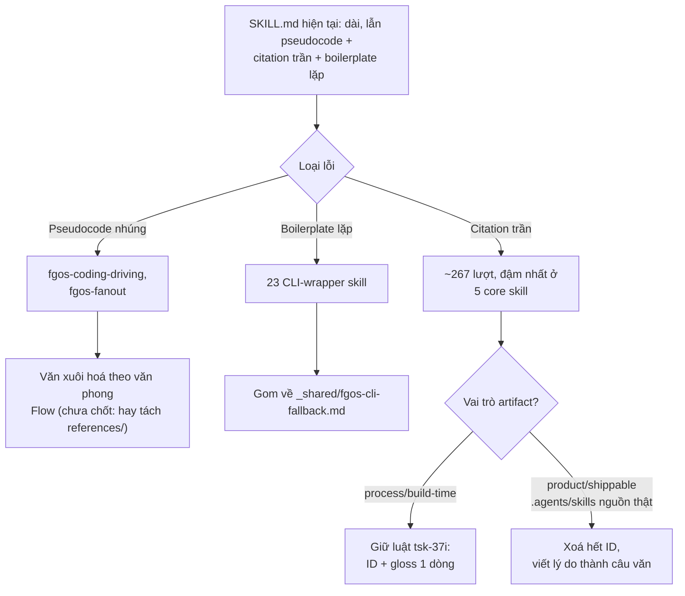

# Skill prose cleanup — DISCUSSION

Item: `tsk-56w`

## 1. Trạng thái hiện tại

Round 1 (quét thật kỹ, chưa hỏi câu nào cần chốt). Đã quét toàn bộ
`plugins/fgOS/skills/*/SKILL.md` (50 skill, không tính `_shared/`) bằng số
đo khách quan (số dòng, số block code nhúng >=3 dòng, số lần trích dẫn
`tsk-…`/`D-…`/`RUL…`/`STR…` không giải thích) cộng với đọc trực tiếp các
file nặng nhất. Đã xác minh lại kiến trúc mirror 3 tầng (xem §3) — hiểu sai
ban đầu (tưởng `plugins` và `.claude` phải byte-identical) đã được sửa
bằng cách đọc `test/skills/fgos-mirror.test.mjs`.

Ba pattern lỗi cụ thể, có bằng chứng, đã thấy rõ (chi tiết ở §7).

Round 2+ (nhiều lượt qua lại về cách dọn trích dẫn ID — xem §5): đã khoá
**D1** — ranh giới trích dẫn ID theo vai trò sản xuất artifact (process/
build-time giữ luật `tsk-37i`, product/shippable xoá sạch ID). Cũng đã
submit riêng `tsk-5zi` (độc lập, không phụ thuộc tsk-56w) để tự động hoá
đồng bộ `.agents/skills` → `plugins/fgOS/skills`, giải quyết §3 mục 13.

Còn mở: §3 mục 9 (tag version trước execute — yêu cầu người dùng, chưa
D-ID hoá), mục 10 (`ui-spec` có tính vào phạm vi không), mục 11 (cách văn
xuôi hoá pseudocode nhúng).

Việc tiếp theo: ngã ngũ mục 9/10/11, rồi hand-off `fgos-coding-exploring`/
`fgos-coding-planning` theo đúng terminal handoff của skill này.

## 2. Mục tiêu & đề bài

Skill của fgOS (`plugins/fgOS/skills/`, mirror qua `.agents/skills/` và
`.claude/skills/`) hiện dài và lẫn quá nhiều thứ không phải "prose thuần"
vào trong `SKILL.md`: có 2 skill nhúng hẳn một đoạn pseudocode dài (vòng
lặp có biến, điều kiện, nhãn `loop:`) ngay trong thân bài thay vì mô tả
bằng câu văn tự nhiên; có hàng chục skill lặp lại y hệt cùng một khối bash
9 dòng cho việc gọi `fgos` CLI; và gần như mọi skill dài đều rải các trích
dẫn kiểu `(tsk-2t9c D16)`, `(RUL45)` mà người đọc không tra cứu thì không
hiểu là cái gì, tại sao nó ở đó. Mục tiêu của tsk-56w: dọn ba loại này để
mỗi skill có mục tiêu rõ ràng ngay từ đầu, nội dung đủ chi tiết để làm đúng
nhưng không dài dòng, đọc được bằng mắt người (không phải bằng cách chạy
thử pseudocode), không có câu nào phải tra số quyết định mới hiểu nghĩa.
Việc này áp dụng cho toàn bộ tập skill fgOS — cả nhóm "core" (14 dev-skill
dùng chung 3 nơi) lẫn nhóm "coding"/CLI-wrapper (~35 skill chỉ có trong
`plugins/fgOS/skills`).

## 3. Vấn đề rõ / chưa rõ

| # | Trạng thái | Nội dung |
|---|---|---|
| 1 | Rõ | Kiến trúc mirror thật sự (không phải "3 bản phải giống hệt nhau"): `.agents/skills/<name>/SKILL.md` là **nguồn thật** cho 14 dev-skill (`fgos-clarifying`, `fgos-coding-*` [7 skill], `fgos-fanout`, `fgos-indexing`, `fgos-researching`, `fgos-routing`, `fgos-unlock`) + `distill`. `.claude/skills/<name>/SKILL.md` là **wrapper sinh tự động** (`npm run build:skills`, có test `test/skills/fgos-mirror.test.mjs` khoá) — chỉ 3 dòng "đọc file kia". `plugins/fgOS/skills/<name>/SKILL.md` (chỉ 14 dev-skill, không có `distill`) là **bản copy tay đầy đủ**, KHÔNG sinh tự động — test hiện tại chủ động bỏ qua việc so khớp nó (comment trong file test: "this leg is UNCHANGED... a full byte-identical copy... hand-maintained"). |
| 2 | Rõ | Vì #1, mọi lần sửa prose 1 trong 14 dev-skill phải sửa tay ở CẢ `.agents/skills` LẪN `plugins/fgOS/skills` — không có cơ chế tự đồng bộ, tự nó là rủi ro lệch khi làm cleanup này. |
| 3 | Rõ | `plugins/fgOS/skills` còn ~35 skill CLI-wrapper (answer/approve/ask/.../unlock) không tồn tại ở `.agents`/`.claude` — nhóm này không bị double-maintenance, chỉ sửa 1 chỗ. |
| 4 | Rõ | 2 skill nhúng pseudocode thật (không phải ví dụ lệnh CLI ngắn): `fgos-coding-driving` (khối "text" 133 dòng, có nhãn `loop:`, biến, điều kiện) và `fgos-fanout` (khối "text" 88 dòng, cùng dạng). Đây đúng là thứ tsk-56w mô tả là "embed script trực tiếp trong SKILL.md". |
| 5 | Rõ | 23/~35 skill CLI-wrapper lặp lại y hệt cùng 1 khối bash 9 dòng ("fgos CLI fallback (tsk-1no D3)") — danh sách đủ: answer, ask, approve, check, cleanup-next, conflicts, discover, goal, graph, list, merge-list, merge-next, move, pick, plan, ready, return, rollup, show, stale, submit, triage, unlock. `_shared/` đã có tiền lệ đúng kiểu cần (citation-format.md, coding-worker-contract.md, executor-dispatch-fallback.md — skill khác trỏ `../_shared/<file>.md` thay vì chép lại). |
| 6 | Rõ | Trích dẫn ID trần (không giải thích) rải khắp: `fgos-coding-exploring` 25 lần `tsk-…`, `fgos-coding-planning` 25, `fgos-coding-driving` 22, `fgos-coding-validating` 21, `fgos-coding-implement` 14, `pick` 11, `fgos-routing` 6 `tsk-…` + 5 `RUL…`, `approve` 4 `RUL…`. Ví dụ thật: "declares its relation, no default, tsk-1lv-1", "(RUL45)", "tsk-2t9c D16" — không câu nào tự giải thích ID đó nghĩa là gì, người đọc buộc phải tra `fgos show <id>` mới hiểu. Tổng cộng quét được ≥267 lần trích `tsk-…` toàn bộ 50 file. |
| 7 | Rõ | Skill dài KHÔNG đồng nghĩa với dở/dư thừa: đọc trực tiếp `fgos-coding-exploring` (558 dòng) cho thấy phần lớn nội dung là chi tiết cơ chế thật (reclaim-the-ball loop, quy tắc hỏi Socratic 3 điều kiện, gate-check capability) — không phải lặp/thừa. Nếu cắt độ dài một cách máy móc (theo số dòng) sẽ mất tác dụng skill, đúng như người dùng cảnh báo. Vấn đề thật ở đây là mật độ trích dẫn ID trần (#6) làm câu văn khó đọc hơn, không phải bản thân độ dài. |
| 8 | Rõ | Có tiền lệ nội bộ đã dùng đúng mô hình "SKILL.md ngắn + references/*.md" ngay trong repo này: `.agents/skills/distill/` có sẵn `references/` và `scripts/` riêng, không nhúng gì vào SKILL.md. 49/50 skill còn lại (kể cả 14 dev-skill "core") không có thư mục `references/` nào — mọi thứ dồn hết vào 1 file. |
| 9 | **Rõ — D2** | Xem D2 ở §4. |
| 10 | **Rõ — D3** | Xem D3 ở §4. |
| 11 | Chưa rõ | Giải pháp cho #4 (pseudocode 133/88 dòng): viết lại thành văn xuôi có đánh số bước (giống cách `fgos-coding-exploring`'s Flow đang làm) HAY tách nguyên khối pseudocode đó ra một `references/algorithm.md` riêng, SKILL.md chỉ tóm tắt + trỏ tới? Hai hướng khác nhau về việc "còn giữ pseudocode ở đâu đó hay bỏ hẳn". |
| 12 | **Rõ — D1** | Giải pháp cho #6: xem D1 ở §4. Ranh giới không phải "loại ID" mà là "vai trò sản xuất của artifact". Nhóm process/build-time (`docs/history`, `docs/decisions`, `docs/backlog.md`, text task/`CONTEXT.md`, `docs/specs`) giữ nguyên luật `tsk-37i` (ADR/RUL kèm gloss, D-local chỉ trong `CONTEXT.md` gốc). Nhóm product/shippable (`.agents/skills/*/SKILL.md` — nguồn thật, đã xác nhận byte-identical với `plugins/fgOS/skills/*` — + `references/*.md` của nó) **không giữ ID governance nào cả**, glossed hay không cũng không giữ — lý do viết thẳng thành câu văn, áp dụng ngay tại nguồn `.agents/skills`, không chờ tới bản copy. Căn cứ: `plugins/fgOS/.claude-plugin` chỉ có `plugin.json`+`skills/`, không mang `docs/` nào theo khi publish qua marketplace (xác minh bằng `ls`); đối chiếu bee upstream cho thấy bee giữ citation trong skill prose CHỈ KHI tài liệu bền đi kèm gói phân phối (gloss + pointer-integrity check + target durable) — điều kiện đó không thoả với kênh publish thật của fgOS nên mô hình bee không áp dụng được. `.claude/skills/*` (thin wrapper 3 dòng) không thuộc phạm vi vì không có thân bài. |
| 13 | **Rõ — giải quyết bởi item khác** | Đồng bộ `.agents/skills`+`plugins/fgOS/skills`: không cần quyết định thủ tục "sửa 2 lần cùng commit" nữa — đã submit `tsk-5zi` (độc lập, không phụ thuộc tsk-56w) để mở rộng `npm run build:skills` tự động copy `.agents/skills/<name>` → `plugins/fgOS/skills/<name>`, dùng lại `copyDirRecursive` sẵn có trong `materializeSkillsIntoProject`. Một khi `tsk-5zi` xong, mọi child task của tsk-56w chỉ cần sửa `.agents/skills`, chạy `npm run build:skills`, xong — không cần review diff 2 chỗ. |

## 4. Quyết định đã chốt

| D-ID | Nội dung |
|---|---|
| D2 | `git tag pre-skill-prose-cleanup-tsk-56w` trên `main` tại SHA hiện tại, bắt buộc trước khi item con đầu tiên của tsk-56w vào `executing`. Người dùng xác nhận 2 lần (yêu cầu ban đầu + nhắc lại kèm lý do lần này): thời điểm đổi skill có thể ảnh hưởng lớn toàn hệ thống (skill là thứ được dùng lại mỗi phiên), cần mốc để trace/so sánh/khôi phục nếu sửa làm hỏng tác dụng skill. Ghi qua `fgos decision --id tsk-56w` (seq 20229). |
| D3 | `ui-spec` (`.claude/skills/ui-spec`) không tính vào phạm vi tsk-56w — không phải skill fgOS (không nằm trong mirror set `.agents/skills`, không prefix `fgos-`, không dùng chung kiến trúc/luật citation đang bàn). Người dùng xác nhận loại hẳn. Ghi qua `fgos decision --id tsk-56w` (seq 20230). |
| D1 | Ranh giới trích dẫn ID governance (ADR/RUL/D-local/`tsk-…`) trong skill fgOS xác định theo **vai trò sản xuất của artifact**, không theo vị trí thư mục. Nhóm process/build-time (`docs/history/*`, `docs/decisions/*`, `docs/backlog.md`, text task/`CONTEXT.md`, `docs/specs/*`) giữ nguyên luật `tsk-37i` (ADR/RUL kèm gloss 1 dòng, D-local chỉ trong `CONTEXT.md` gốc). Nhóm product/shippable (`.agents/skills/*/SKILL.md` — nguồn thật, đã xác nhận byte-identical với `plugins/fgOS/skills/*` hôm nay — và mọi `references/*.md` của nó) không giữ ID governance nào cả; lý do viết thẳng vào câu văn; luật áp dụng ngay tại nguồn `.agents/skills`, không chờ tới bản copy. Căn cứ: `plugins/fgOS/.claude-plugin` chỉ có `plugin.json`+`skills/`, không mang `docs/` theo khi publish qua marketplace; bee upstream chỉ giữ citation trong skill prose khi tài liệu bền đi kèm gói phân phối (gloss + pointer-integrity check + target durable) — điều kiện này không thoả với kênh publish thật của fgOS. `.claude/skills/*` (thin wrapper 3 dòng) ngoài phạm vi. Ghi qua `fgos decision --id tsk-56w` (seq 20212). |

## 5. Q&A log

- **2026-08-18T16:43Z** — Quét mở đầu (không phải Q&A, không có câu hỏi
  nào được hỏi). Lệnh quét: đếm dòng + block code nhúng + trích dẫn ID
  trần trên toàn bộ `plugins/fgOS/skills/*/SKILL.md` (script scan, xem
  §7 nguồn số liệu), đọc trực tiếp `fgos-coding-driving`, `fgos-fanout`,
  `fgos-coding-exploring`, các skill CLI-wrapper nhỏ (answer/ask/conflicts/
  merge-list/move/pick/ready/return/rollup/show/stale/unlock), và
  `test/skills/fgos-mirror.test.mjs` để xác minh kiến trúc mirror thật.
- Người dùng, giữa phiên: nhắc phải ghi tài liệu ngay khi quét/tìm ra giải
  pháp, không dồn tới cuối — đã áp dụng (file này được viết ngay sau vòng
  quét đầu, chưa chờ hội tụ).
- Người dùng, giữa phiên: nhắc phải cẩn thận kỹ càng vì cắt sai sẽ mất tác
  dụng skill/prose, và trước khi execute phải tag version ở `main` đánh
  dấu mốc trước khi sửa — ghi nhận ở §3 mục 9.
- **Chuỗi thảo luận trích dẫn ID (§3 mục 12), nhiều vòng:**
  1. Agent hỏi: giữ trần hay xoá hẳn D-local (theo mẫu `_shared/citation-
     format.md`, `tsk-37i`)?
  2. Người dùng đề xuất footnote: trích trần tại chỗ dùng, cuối file có
     section liệt kê ID + nguồn gốc.
  3. Agent hỏi lại nguyên uỷ: tại sao sản phẩm cuối cùng cần giữ ID/
     footnote — sản phẩm thật khi release có giữ không? Agent trả lời
     bằng đối chiếu thực tế bên ngoài (RFC/README/code-comment
     anti-pattern) + fork research bee upstream.
  4. Fork báo về: bee THẬT SỰ giữ citation trong skill prose, nhưng chỉ
     khi (a) luôn kèm gloss, (b) có pointer-integrity check máy xác minh
     trỏ đúng file+heading, (c) đích là tài liệu bền đã "route", không
     phải file tạm theo task.
  5. Agent kiểm `plugins/fgOS/.claude-plugin/plugin.json` + cấu trúc thư
     mục: xác nhận gói publish thật của fgOS không mang `docs/` nào theo
     → mô hình bee không áp dụng được cho kênh phân phối thật của fgOS.
     Agent đề xuất ranh giới theo "kênh publish" (plugins/ vs .agents/).
  6. Người dùng sửa: `plugins/fgOS/skills/*` chỉ là BẢN COPY của
     `.agents/skills/*` — không phải `.agents/skills` "không publish".
     Ranh giới đúng phải là **vai trò sản xuất của artifact** (process/
     build-time vs. product/shippable), không phải "đang nằm ở thư mục
     nào" — vì `.agents/skills` chính là nội dung sẽ ra ngoài, chỉ tình
     cờ đang ở gần `docs/` trong monorepo này.
  7. Agent trình bày lại đúng theo sửa của người dùng → người dùng xác
     nhận "ok" → khoá D1.
- **Mục 9/10, cùng lượt.** Người dùng xác nhận cả 2: mục 9 nhắc lại yêu
  cầu tag kèm lý do (blast radius đổi skill lớn, cần trace) → khoá D2;
  mục 10 xác nhận loại `ui-spec` → khoá D3.
- **Mục 11, cùng lượt.** Người dùng: "file skill nên là một high-level
  picture để dễ đọc hiểu, sau từng cái chi tiết là gì thì dùng
  references, mix all in làm nó quá rối, quá phức tạp." — đọc như 1
  nguyên tắc CHUNG cho hình dạng skill, không chỉ riêng 2 skill có
  pseudocode. Agent hỏi lại phạm vi áp dụng trước khi khoá D-ID (chưa
  chốt, xem câu hỏi trong hội thoại).

## 6. Thiết kế đã chốt {#design}

tsk-56w dọn 3 loại lỗi cụ thể trong toàn bộ skill fgOS
(`.agents/skills`, `.claude/skills`, `plugins/fgOS/skills`), không sửa
cấu trúc mirror 3 tầng hiện có:

1. **Pseudocode nhúng trong SKILL.md** — 2 skill (`fgos-coding-driving`,
   `fgos-fanout`) có khối thuật toán thật (biến, `loop:`, if/else lồng
   nhau) thay vì mô tả bằng câu văn. Cách sửa còn mở (§3 mục 11): văn
   xuôi hoá theo đúng văn phong "Flow" số bước hiện `fgos-coding-
   exploring` đang dùng, hay tách ra `references/` riêng — chưa chốt.

2. **Boilerplate lặp máy móc** — 23 skill CLI-wrapper trong
   `plugins/fgOS/skills` chép y hệt cùng 1 khối bash 9 dòng gọi `fgos`
   CLI. Gom về `plugins/fgOS/skills/_shared/fgos-cli-fallback.md`, đúng
   tiền lệ `_shared/citation-format.md` đã dùng.

3. **Trích dẫn ID governance trần** — ≥267 lượt `tsk-…`/`RUL…`/`D…` rải
   khắp không giải thích. **Đã chốt (D1, §4):** ranh giới theo vai trò
   sản xuất artifact, không theo thư mục.
   - Process/build-time (`docs/history`, `docs/decisions`,
     `docs/backlog.md`, text task/`CONTEXT.md`, `docs/specs`): giữ
     nguyên luật `tsk-37i` — ADR/RUL kèm gloss 1 dòng tại chỗ trích,
     D-local không bao giờ ra khỏi `CONTEXT.md` gốc của nó.
   - Product/shippable (`.agents/skills/*/SKILL.md` — nguồn thật, sao y
     nguyên vào mọi bản phân phối — và `references/*.md` của nó): xoá
     sạch mọi ID governance, viết lý do thẳng vào câu văn thường. Áp
     dụng ngay tại nguồn `.agents/skills`, sửa 1 lần đủ cho mọi bản copy
     (một khi `tsk-5zi` tự động hoá đồng bộ `plugins/fgOS/skills` xong).
   - Lý do ranh giới này đúng, không phải "theo loại ID" hay "theo kênh
     publish": `.agents/skills` tuy nằm cạnh `docs/` trong monorepo
     nhưng ĐƯỢC SẢN XUẤT với vai trò là nội dung sẽ vận hành bên ngoài —
     bằng chứng là nó được sao y nguyên vào `plugins/fgOS/skills` (kênh
     publish thật, xác nhận không mang `docs/` nào theo khi cài ở
     project khác). Mô hình bee upstream (gloss + pointer-integrity
     check + đích tài liệu bền) chỉ đúng khi tài liệu bền đó CŨNG đi
     kèm gói phân phối — fgOS không có cơ chế đó nên không áp dụng
     được, phải xoá hẳn thay vì chỉ gloss.

Còn mở, chưa chốt: §3 mục 9 (tag version trên `main` trước khi execute —
yêu cầu người dùng, chưa D-ID hoá), mục 10 (`ui-spec` có tính vào phạm vi
không, nghiêng về loại), mục 11 (cách văn xuôi hoá pseudocode).

## 7. Danh mục hạng mục / task (nháp, chưa khoá)

### {#task-pseudocode-driving} fgos-coding-driving: bỏ pseudocode nhúng
- **Vấn đề**: `SKILL.md` có 1 khối fenced-code 133 dòng (gộp 2 block liền
  kề) viết dạng thuật toán thật (biến `shownItemOnce`, nhãn `loop:`, rẽ
  nhánh `if/else` lồng nhau) thay vì mô tả bằng câu văn. Trộn thêm trích
  dẫn trần `tsk-2t9c D16` ngay giữa dòng code.
- **Đề xuất**: viết lại toàn bộ đoạn này thành các bước đánh số trong
  "## Flow" — đúng văn phong "Flow" hiện `fgos-coding-exploring` đang dùng
  cho logic tương đương phức tạp (chọn skill theo stage, đọc state tươi,
  điều kiện dừng) mà không cần code fence. Không tạo `references/` riêng
  cho việc này trừ khi bước 4 (đo lại) cho thấy văn xuôi hoá vẫn còn dài
  quá ngưỡng đọc được.
- Phụ thuộc: #11 ngã ngũ trước (văn xuôi hoá hay tách references/).
- Verify nháp: `npm test -- test/skills/fgos-mirror.test.mjs` xanh (không
  đổi ứng xử máy đọc) + review thủ công không còn fenced code >=3 dòng
  trong file.

### {#task-pseudocode-fanout} fgos-fanout: bỏ pseudocode nhúng
- **Vấn đề**: giống hệt task trên, khối "text" 88 dòng, nhãn `loop:`,
  trích dẫn trần `(D4)`.
- **Đề xuất**: cùng cách tiếp cận với `fgos-coding-driving` — văn xuôi hoá
  theo đúng 1 khuôn để 2 skill không lệch văn phong sau khi sửa.
- Phụ thuộc: nên làm cùng lúc/ngay sau task driving để giữ nhất quán văn
  phong; không bắt buộc cùng 1 child task.

### {#task-cli-fallback-dedupe} Gom khối "fgos CLI fallback" về `_shared/`
- **Vấn đề**: 23 file lặp y hệt 1 khối bash 9 dòng, chỉ khác tên verb.
- **Đề xuất**: tạo `plugins/fgOS/skills/_shared/fgos-cli-fallback.md` chứa
  khối mẫu (tham số hoá bằng chỗ trống `<verb-cmd>`), 23 file wrapper chỉ
  còn 1 dòng trỏ `../_shared/fgos-cli-fallback.md` kèm verb cụ thể — đúng
  mô hình `_shared/citation-format.md` đang dùng.
- Verify nháp: diff trước/sau — mỗi wrapper vẫn còn đủ lệnh gọi đúng verb
  của nó (grep tên verb trong file sau khi sửa), tổng số dòng
  `plugins/fgOS/skills/*/SKILL.md` giảm ròng.

### {#task-bare-citation-cleanup} Dọn trích dẫn ID trần trong .agents/skills
- **Vấn đề**: xem §3 mục 6 — ID trần rải khắp, đậm nhất ở 5 skill core
  (exploring/planning/driving/validating/implement) + routing + approve +
  pick.
- **Đề xuất (D1, §4/§6)**: sửa tại nguồn `.agents/skills/*/SKILL.md` —
  xoá mọi `ADR<n>`/`RUL<n>`/`D<n>`/`tsk-…`, viết lý do thẳng vào câu văn
  (không giữ ID kèm gloss, không footnote cuối file — sản phẩm shippable
  không giữ ID nào). Có khả năng tách theo từng skill (mỗi core skill 1
  child) vì mỗi câu cần đọc hiểu ngữ cảnh riêng để viết lại đúng lý do
  thật, không thể làm bằng tìm/thay máy móc. Không đụng `plugins/fgOS/
  skills` trực tiếp — một khi `tsk-5zi` xong, `npm run build:skills` tự
  đồng bộ.
- Verify nháp: file sau khi sửa không còn khớp mẫu
  `\b(ADR|RUL|D)\d{1,4}\b` hay `\btsk-[0-9a-z-]+\b` nào (trừ khi chính
  câu đó đang MÔ TẢ cơ chế `fgos <verb>` liên quan tới id, ví dụ ví dụ
  lệnh CLI thật — cần review thủ công phân biệt, không chỉ grep-đếm).

### {#task-scope-decision} Xác nhận mốc trước-khi-sửa
- **Vấn đề**: #9 (yêu cầu tag version) chưa D-ID hoá. #13 (đồng bộ
  `.agents`+`plugins`) đã giải quyết — xem `tsk-5zi`, không cần quyết
  định thủ tục nữa.
- **Đề xuất**: `git tag` (tên gợi ý: `pre-skill-prose-cleanup-tsk-56w`)
  trên `main` tại SHA hiện tại trước khi item con đầu tiên của tsk-56w
  vào `executing`.
