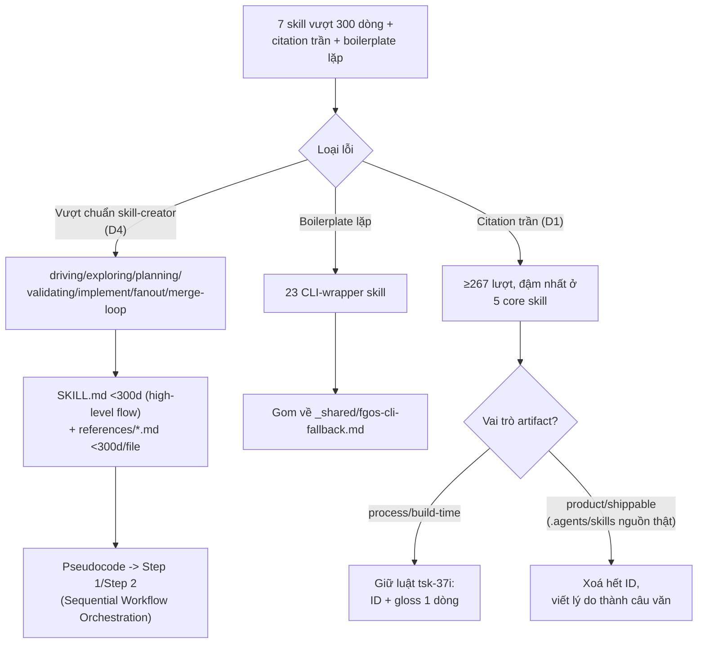

# Skill prose cleanup — DISCUSSION

Item: `tsk-56w`

## 1. Trạng thái hiện tại

Đã quét toàn bộ `plugins/fgOS/skills/*/SKILL.md` (50 skill, không tính
`_shared/`) bằng số đo khách quan (số dòng, số block code nhúng, số lần
trích dẫn ID không giải thích) cộng đọc trực tiếp các file nặng nhất, xác
minh kiến trúc mirror 3 tầng thật (§3 mục 1), đo lại toàn bộ theo chuẩn
`skill-creator` (§3 mục 14/15), và đối chiếu chéo với 2 item khác đang mở
(`tsk-397`, `tsk-2sp`) để tránh trùng việc.

**6 quyết định đã khoá — D1-D6 (§4):** D1 ranh giới trích dẫn ID theo vai
trò artifact; D2 tag `main` trước execute; D3 loại `ui-spec`; D4 áp chuẩn
skill-creator <300 dòng cho 7 skill vượt chuẩn; D5 quy trình QA (verify
POSITIVE/NEGATIVE + smoke-test thật); D6 thu hẹp phạm vi `tsk-2sp`, giao
660 violation citation trong 61 file skill cho `tsk-56w`. Đã submit riêng
`tsk-5zi` (đồng bộ tự động `.agents/skills`→`plugins/fgOS/skills`).

§7 có 9 task cụ thể, đủ số liệu thật (dòng, violation) cho từng skill.

Còn 2 điểm hở đang chờ người dùng xác nhận (tự-rà lại theo yêu cầu "còn
gì chưa rõ ràng"): (a) task tách skill core có cần kiểm
`plugins/fgOS/skills` đồng bộ byte-identical ngay trong verify của chính
nó hay không, không phụ thuộc `tsk-5zi` xong trước hay chưa; (b) audit
frontmatter `description` của 7 skill theo `metadata-quality-criteria.md`
— chưa làm, cần quyết định làm ở đâu (mỗi task tách skill, hay để
`fgos-coding-exploring` tự phát hiện).

Việc tiếp theo: ngã ngũ 2 điểm trên, rồi hand-off `fgos-coding-exploring`/
`fgos-coding-planning` theo đúng terminal handoff của skill này.

## 2. Mục tiêu & đề bài

Skill của fgOS (`plugins/fgOS/skills/`, mirror qua `.agents/skills/` và
`.claude/skills/`) hiện dài và lẫn quá nhiều thứ không phải "prose thuần"
vào trong `SKILL.md`: có 2 skill nhúng hẳn một đoạn pseudocode dài (vòng
lặp có biến, điều kiện, nhãn `loop:`) ngay trong thân bài thay vì mô tả
bằng câu văn tự nhiên; có hàng chục skill lặp lại y hệt cùng một khối bash
9 dòng cho việc gọi `fgos` CLI; và gần như mọi skill dài đều rải các trích
dẫn kiểu `(tsk-2t9c D16)`, `(RUL45)` mà người đọc không tra cứu thì không
hiểu là cái gì, tại sao nó ở đó. Mục tiêu của tsk-56w: dọn ba loại này để
mỗi skill có mục tiêu rõ ràng ngay từ đầu, nội dung đủ chi tiết để làm đúng
nhưng không dài dòng, đọc được bằng mắt người (không phải bằng cách chạy
thử pseudocode), không có câu nào phải tra số quyết định mới hiểu nghĩa.
Việc này áp dụng cho toàn bộ tập skill fgOS — cả nhóm "core" (14 dev-skill
dùng chung 3 nơi) lẫn nhóm "coding"/CLI-wrapper (~35 skill chỉ có trong
`plugins/fgOS/skills`).

## 3. Vấn đề rõ / chưa rõ

| # | Trạng thái | Nội dung |
|---|---|---|
| 1 | Rõ | Kiến trúc mirror thật sự (không phải "3 bản phải giống hệt nhau"): `.agents/skills/<name>/SKILL.md` là **nguồn thật** cho 14 dev-skill (`fgos-clarifying`, `fgos-coding-*` [7 skill], `fgos-fanout`, `fgos-indexing`, `fgos-researching`, `fgos-routing`, `fgos-unlock`) + `distill`. `.claude/skills/<name>/SKILL.md` là **wrapper sinh tự động** (`npm run build:skills`, có test `test/skills/fgos-mirror.test.mjs` khoá) — chỉ 3 dòng "đọc file kia". `plugins/fgOS/skills/<name>/SKILL.md` (chỉ 14 dev-skill, không có `distill`) là **bản copy tay đầy đủ**, KHÔNG sinh tự động — test hiện tại chủ động bỏ qua việc so khớp nó (comment trong file test: "this leg is UNCHANGED... a full byte-identical copy... hand-maintained"). |
| 2 | Rõ | Vì #1, mọi lần sửa prose 1 trong 14 dev-skill phải sửa tay ở CẢ `.agents/skills` LẪN `plugins/fgOS/skills` — không có cơ chế tự đồng bộ, tự nó là rủi ro lệch khi làm cleanup này. |
| 3 | Rõ | `plugins/fgOS/skills` còn ~35 skill CLI-wrapper (answer/approve/ask/.../unlock) không tồn tại ở `.agents`/`.claude` — nhóm này không bị double-maintenance, chỉ sửa 1 chỗ. |
| 4 | Rõ | 2 skill nhúng pseudocode thật (không phải ví dụ lệnh CLI ngắn): `fgos-coding-driving` (khối "text" 133 dòng, có nhãn `loop:`, biến, điều kiện) và `fgos-fanout` (khối "text" 88 dòng, cùng dạng). Đây đúng là thứ tsk-56w mô tả là "embed script trực tiếp trong SKILL.md". |
| 5 | Rõ | 23/~35 skill CLI-wrapper lặp lại y hệt cùng 1 khối bash 9 dòng ("fgos CLI fallback (tsk-1no D3)") — danh sách đủ: answer, ask, approve, check, cleanup-next, conflicts, discover, goal, graph, list, merge-list, merge-next, move, pick, plan, ready, return, rollup, show, stale, submit, triage, unlock. `_shared/` đã có tiền lệ đúng kiểu cần (citation-format.md, coding-worker-contract.md, executor-dispatch-fallback.md — skill khác trỏ `../_shared/<file>.md` thay vì chép lại). |
| 6 | Rõ | Trích dẫn ID trần (không giải thích) rải khắp: `fgos-coding-exploring` 25 lần `tsk-…`, `fgos-coding-planning` 25, `fgos-coding-driving` 22, `fgos-coding-validating` 21, `fgos-coding-implement` 14, `pick` 11, `fgos-routing` 6 `tsk-…` + 5 `RUL…`, `approve` 4 `RUL…`. Ví dụ thật: "declares its relation, no default, tsk-1lv-1", "(RUL45)", "tsk-2t9c D16" — không câu nào tự giải thích ID đó nghĩa là gì, người đọc buộc phải tra `fgos show <id>` mới hiểu. Tổng cộng quét được ≥267 lần trích `tsk-…` toàn bộ 50 file. |
| 7 | Rõ | Skill dài KHÔNG đồng nghĩa với dở/dư thừa: đọc trực tiếp `fgos-coding-exploring` (558 dòng) cho thấy phần lớn nội dung là chi tiết cơ chế thật (reclaim-the-ball loop, quy tắc hỏi Socratic 3 điều kiện, gate-check capability) — không phải lặp/thừa. Nếu cắt độ dài một cách máy móc (theo số dòng) sẽ mất tác dụng skill, đúng như người dùng cảnh báo. Vấn đề thật ở đây là mật độ trích dẫn ID trần (#6) làm câu văn khó đọc hơn, không phải bản thân độ dài. |
| 8 | Rõ | Có tiền lệ nội bộ đã dùng đúng mô hình "SKILL.md ngắn + references/*.md" ngay trong repo này: `.agents/skills/distill/` có sẵn `references/` và `scripts/` riêng, không nhúng gì vào SKILL.md. 49/50 skill còn lại (kể cả 14 dev-skill "core") không có thư mục `references/` nào — mọi thứ dồn hết vào 1 file. |
| 9 | **Rõ — D2** | Xem D2 ở §4. |
| 10 | **Rõ — D3** | Xem D3 ở §4. |
| 11 | **Rõ — D4** | Xem D4 ở §4. |
| 14 | Rõ | Nguồn chuẩn "viết skill tốt" đã có sẵn trong máy, không cần đoán: `~/.claude/skills/skill-creator/references/` (bộ doctrine chính thức của Anthropic cho skill-authoring) — `skill-anatomy-and-requirements.md`, `writing-effective-instructions.md`, `structure-organization-criteria.md`, `token-efficiency-criteria.md`, `skill-design-patterns.md`. Số đo cụ thể: SKILL.md <300 dòng, mỗi file `references/*.md` <300 dòng, "no duplication: info lives in ONE place", viết imperative form, pseudocode/thuật toán viết theo Pattern 1 "Sequential Workflow Orchestration" (Step 1/Step 2 đánh số, không biến/nhãn `loop:`). |
| 15 | Rõ | Đo lại theo chuẩn 300 dòng: **7 skill vượt chuẩn**, không chỉ 2 skill nhúng pseudocode — `fgos-coding-driving` 645 (2.15x), `fgos-coding-exploring` 557 (1.86x), `fgos-coding-planning` 532 (1.77x), `fgos-coding-validating` 513 (1.71x), `merge-loop` 437 (1.46x, CLI-wrapper, không thuộc 14 dev-skill core), `fgos-coding-implement` 436 (1.45x), `fgos-fanout` 358 (1.19x). |
| 12 | **Rõ — D1** | Giải pháp cho #6: xem D1 ở §4. Ranh giới không phải "loại ID" mà là "vai trò sản xuất của artifact". Nhóm process/build-time (`docs/history`, `docs/decisions`, `docs/backlog.md`, text task/`CONTEXT.md`, `docs/specs`) giữ nguyên luật `tsk-37i` (ADR/RUL kèm gloss, D-local chỉ trong `CONTEXT.md` gốc). Nhóm product/shippable (`.agents/skills/*/SKILL.md` — nguồn thật, đã xác nhận byte-identical với `plugins/fgOS/skills/*` — + `references/*.md` của nó) **không giữ ID governance nào cả**, glossed hay không cũng không giữ — lý do viết thẳng thành câu văn, áp dụng ngay tại nguồn `.agents/skills`, không chờ tới bản copy. Căn cứ: `plugins/fgOS/.claude-plugin` chỉ có `plugin.json`+`skills/`, không mang `docs/` nào theo khi publish qua marketplace (xác minh bằng `ls`); đối chiếu bee upstream cho thấy bee giữ citation trong skill prose CHỈ KHI tài liệu bền đi kèm gói phân phối (gloss + pointer-integrity check + target durable) — điều kiện đó không thoả với kênh publish thật của fgOS nên mô hình bee không áp dụng được. `.claude/skills/*` (thin wrapper 3 dòng) không thuộc phạm vi vì không có thân bài. |
| 16 | **Rõ — D5** | Xem D5 ở §4. |
| 17 | **Rõ — D6** | Xem D6 ở §4. `tsk-2sp` (không phải tsk-56w's con) từng định sửa citation cho đúng 61 file skill mà tsk-56w cũng đang sửa — đã tách phạm vi, không còn trùng. |
| 13 | **Rõ — giải quyết bởi item khác** | Đồng bộ `.agents/skills`+`plugins/fgOS/skills`: không cần quyết định thủ tục "sửa 2 lần cùng commit" nữa — đã submit `tsk-5zi` (độc lập, không phụ thuộc tsk-56w) để mở rộng `npm run build:skills` tự động copy `.agents/skills/<name>` → `plugins/fgOS/skills/<name>`, dùng lại `copyDirRecursive` sẵn có trong `materializeSkillsIntoProject`. Một khi `tsk-5zi` xong, mọi child task của tsk-56w chỉ cần sửa `.agents/skills`, chạy `npm run build:skills`, xong — không cần review diff 2 chỗ. |

## 4. Quyết định đã chốt

| D-ID | Nội dung |
|---|---|
| D6 | Thu hẹp phạm vi `tsk-2sp` ("fix remaining 1664 citation-format violations" từ baseline `tsk-2yu`), giao 61/73 file skill (660 violation) trong `scripts/check-decision-citation-drift.baseline.json` cho `tsk-56w` sở hữu — `tsk-2sp` chỉ còn 12 file không-phải-skill (`docs/specs/*.md` + `docs/backlog.md`, 1019 violation). Lý do: `tsk-2sp` định sửa theo luật `tsk-37i` GỐC (thêm gloss) cho toàn bộ 73 file, nhưng 61 file đó đúng là nhóm product/shippable mà D1 đã khoá luật chặt hơn (xoá hết ID, không gloss) — nếu `tsk-2sp` chạy trước sẽ thêm gloss sai chỗ, `tsk-56w` phải xoá lại, có thể đụng cùng 1 dòng (conflict merge thật). Đã sửa description `tsk-2sp` (`fgos edit`, seq 20280). Sau khi tách, 2 item không cần dependency, chạy song song được. Số liệu đo thật cho 6 skill vượt chuẩn của D4: `fgos-coding-driving` 32, `fgos-coding-exploring` 35, `fgos-coding-planning` 29, `fgos-coding-validating` 34, `fgos-coding-implement` 20, `fgos-fanout` 23 violation (cộng ~35 CLI-wrapper skill còn lại trong 660). Ghi qua `fgos decision --id tsk-56w` (seq 20281). |
| D5 | Quy trình đảm bảo chất lượng cho mọi child task sửa skill prose của tsk-56w — ghép 2 tài liệu chuẩn có sẵn (không bịa mới) + D2 làm lưới an toàn cuối: (1) `verify` field theo đúng khuôn `docs/how-to/write-verify-for-a-skill-prose-change.md` — `npm test && POSITIVE && NEGATIVE`, POSITIVE chứng minh nội dung mới tồn tại, NEGATIVE chứng minh pattern cũ biến mất, luôn `--hidden` khi `rg`/quét đường dẫn `.claude/skills`/`.agents/skills` (rg mặc định bỏ qua thư mục ẩn — bẫy #4 thật từ `tsk-f38`); verify KHÔNG được yêu cầu chứng minh "prose có mạch lạc/dùng đúng không nếu làm theo" — thuộc review người + `fgos-coding-validating`'s reality-check. (2) Sau khi sửa xong 1 skill, chạy smoke-test thật theo mẫu `docs/how-to/smoke-test-fgos-code-implement-with-a-trivial-item.md` (tổng quát hoá cho cả 7 skill, không chỉ `fgos-coding-implement`): item `chore` vứt đi, `verify: "true"`, claim để skill BẢN ĐÃ SỬA chạy thật, đọc `.fgos/events.jsonl`/`fgos check` kỳ vọng `attempts: 1`, `errorClass: null`, trước khi coi task xong. (3) D2 là lưới an toàn cuối nếu cả smoke-test lẫn review đều lọt mà production sau này lộ lỗi. Người dùng xác nhận. Ghi qua `fgos decision --id tsk-56w` (seq 20275). |
| D4 | Áp dụng chuẩn `skill-creator` (`SKILL.md` <300 dòng, mỗi `references/*.md` <300 dòng, không trùng lặp nội dung giữa 2 nơi, viết imperative form) cho **toàn bộ 7 skill fgOS đang vượt chuẩn** — không giới hạn riêng 2 skill nhúng pseudocode. Danh sách: `fgos-coding-driving` (645d), `fgos-coding-exploring` (557d), `fgos-coding-planning` (532d), `fgos-coding-validating` (513d), `merge-loop` (437d), `fgos-coding-implement` (436d), `fgos-fanout` (358d). Pseudocode/thuật toán viết lại theo Pattern 1 "Sequential Workflow Orchestration" (`skill-design-patterns.md`) — Step 1/Step 2 đánh số, không biến/nhãn `loop:`. Người dùng xác nhận trực tiếp: "áp dụng hết", và yêu cầu dựa trên nguồn chuẩn thật thay vì đoán — nguồn dùng: `~/.claude/skills/skill-creator/references/*` (Anthropic's own skill-authoring doctrine). Ghi qua `fgos decision --id tsk-56w` (seq 20258). |
| D2 | `git tag pre-skill-prose-cleanup-tsk-56w` trên `main` tại SHA hiện tại, bắt buộc trước khi item con đầu tiên của tsk-56w vào `executing`. Người dùng xác nhận 2 lần (yêu cầu ban đầu + nhắc lại kèm lý do lần này): thời điểm đổi skill có thể ảnh hưởng lớn toàn hệ thống (skill là thứ được dùng lại mỗi phiên), cần mốc để trace/so sánh/khôi phục nếu sửa làm hỏng tác dụng skill. Ghi qua `fgos decision --id tsk-56w` (seq 20229). |
| D3 | `ui-spec` (`.claude/skills/ui-spec`) không tính vào phạm vi tsk-56w — không phải skill fgOS (không nằm trong mirror set `.agents/skills`, không prefix `fgos-`, không dùng chung kiến trúc/luật citation đang bàn). Người dùng xác nhận loại hẳn. Ghi qua `fgos decision --id tsk-56w` (seq 20230). |
| D1 | Ranh giới trích dẫn ID governance (ADR/RUL/D-local/`tsk-…`) trong skill fgOS xác định theo **vai trò sản xuất của artifact**, không theo vị trí thư mục. Nhóm process/build-time (`docs/history/*`, `docs/decisions/*`, `docs/backlog.md`, text task/`CONTEXT.md`, `docs/specs/*`) giữ nguyên luật `tsk-37i` (ADR/RUL kèm gloss 1 dòng, D-local chỉ trong `CONTEXT.md` gốc). Nhóm product/shippable (`.agents/skills/*/SKILL.md` — nguồn thật, đã xác nhận byte-identical với `plugins/fgOS/skills/*` hôm nay — và mọi `references/*.md` của nó) không giữ ID governance nào cả; lý do viết thẳng vào câu văn; luật áp dụng ngay tại nguồn `.agents/skills`, không chờ tới bản copy. Căn cứ: `plugins/fgOS/.claude-plugin` chỉ có `plugin.json`+`skills/`, không mang `docs/` theo khi publish qua marketplace; bee upstream chỉ giữ citation trong skill prose khi tài liệu bền đi kèm gói phân phối (gloss + pointer-integrity check + target durable) — điều kiện này không thoả với kênh publish thật của fgOS. `.claude/skills/*` (thin wrapper 3 dòng) ngoài phạm vi. Ghi qua `fgos decision --id tsk-56w` (seq 20212). |

## 5. Q&A log

- **2026-08-18T16:43Z** — Quét mở đầu (không phải Q&A, không có câu hỏi
  nào được hỏi). Lệnh quét: đếm dòng + block code nhúng + trích dẫn ID
  trần trên toàn bộ `plugins/fgOS/skills/*/SKILL.md` (script scan, xem
  §7 nguồn số liệu), đọc trực tiếp `fgos-coding-driving`, `fgos-fanout`,
  `fgos-coding-exploring`, các skill CLI-wrapper nhỏ (answer/ask/conflicts/
  merge-list/move/pick/ready/return/rollup/show/stale/unlock), và
  `test/skills/fgos-mirror.test.mjs` để xác minh kiến trúc mirror thật.
- Người dùng, giữa phiên: nhắc phải ghi tài liệu ngay khi quét/tìm ra giải
  pháp, không dồn tới cuối — đã áp dụng (file này được viết ngay sau vòng
  quét đầu, chưa chờ hội tụ).
- Người dùng, giữa phiên: nhắc phải cẩn thận kỹ càng vì cắt sai sẽ mất tác
  dụng skill/prose, và trước khi execute phải tag version ở `main` đánh
  dấu mốc trước khi sửa — ghi nhận ở §3 mục 9.
- **Chuỗi thảo luận trích dẫn ID (§3 mục 12), nhiều vòng:**
  1. Agent hỏi: giữ trần hay xoá hẳn D-local (theo mẫu `_shared/citation-
     format.md`, `tsk-37i`)?
  2. Người dùng đề xuất footnote: trích trần tại chỗ dùng, cuối file có
     section liệt kê ID + nguồn gốc.
  3. Agent hỏi lại nguyên uỷ: tại sao sản phẩm cuối cùng cần giữ ID/
     footnote — sản phẩm thật khi release có giữ không? Agent trả lời
     bằng đối chiếu thực tế bên ngoài (RFC/README/code-comment
     anti-pattern) + fork research bee upstream.
  4. Fork báo về: bee THẬT SỰ giữ citation trong skill prose, nhưng chỉ
     khi (a) luôn kèm gloss, (b) có pointer-integrity check máy xác minh
     trỏ đúng file+heading, (c) đích là tài liệu bền đã "route", không
     phải file tạm theo task.
  5. Agent kiểm `plugins/fgOS/.claude-plugin/plugin.json` + cấu trúc thư
     mục: xác nhận gói publish thật của fgOS không mang `docs/` nào theo
     → mô hình bee không áp dụng được cho kênh phân phối thật của fgOS.
     Agent đề xuất ranh giới theo "kênh publish" (plugins/ vs .agents/).
  6. Người dùng sửa: `plugins/fgOS/skills/*` chỉ là BẢN COPY của
     `.agents/skills/*` — không phải `.agents/skills` "không publish".
     Ranh giới đúng phải là **vai trò sản xuất của artifact** (process/
     build-time vs. product/shippable), không phải "đang nằm ở thư mục
     nào" — vì `.agents/skills` chính là nội dung sẽ ra ngoài, chỉ tình
     cờ đang ở gần `docs/` trong monorepo này.
  7. Agent trình bày lại đúng theo sửa của người dùng → người dùng xác
     nhận "ok" → khoá D1.
- **Mục 9/10, cùng lượt.** Người dùng xác nhận cả 2: mục 9 nhắc lại yêu
  cầu tag kèm lý do (blast radius đổi skill lớn, cần trace) → khoá D2;
  mục 10 xác nhận loại `ui-spec` → khoá D3.
- **Mục 11, cùng lượt.** Người dùng: "file skill nên là một high-level
  picture để dễ đọc hiểu, sau từng cái chi tiết là gì thì dùng
  references, mix all in làm nó quá rối, quá phức tạp." — đọc như 1
  nguyên tắc CHUNG cho hình dạng skill, không chỉ riêng 2 skill có
  pseudocode. Agent hỏi lại phạm vi áp dụng trước khi khoá D-ID.
- **2026-08-19T~10:55 (giờ VN)** — Người dùng: "áp dụng hết. nếu có thể
  nên research và học cách viết skills tốt nhất mà học cách. chất lượng
  skill hiện tại quá kém quá messy." Agent tìm thấy nguồn chuẩn có sẵn
  trong máy: `~/.claude/skills/skill-creator/references/*` (đọc
  `skill-anatomy-and-requirements.md`, `writing-effective-instructions.md`,
  `structure-organization-criteria.md`, `token-efficiency-criteria.md`,
  `skill-design-patterns.md`, `metadata-quality-criteria.md`), đo lại
  toàn bộ skill fgOS theo chuẩn 300 dòng, ra 7 skill vượt chuẩn (§3 mục
  15) → khoá D4.
- Người dùng, cùng lượt: gợi ý học từ bee cho từng skill tương ứng,
  nhưng cảnh báo ranh giới skill của fgOS mịn hơn bee (bee hợp nhất
  18→9) — không ép fgOS gộp lại theo bee. Agent tra `docs/distillery/
  sources/beehive.md` lấy tên 9 skill bee thật, ghi ánh xạ tham khảo
  lỏng vào §6 "Nguồn tham khảo", có cảnh báo rõ.
- Người dùng, cùng lượt: chỉ định `fgos-coding-implement` học từ
  `ck:cook` (`~/.claude/skills/cook/`), `fgos-researching` học từ
  `ck:research` (`~/.claude/skills/research/`). Agent đọc trực tiếp cả
  2 (`cook`: 238d + 5 references/*.md + mục `## References`/`##
  Workflow Position`; `research`: 180d, không cần references) — ghi
  vào §6 làm mẫu cụ thể cho task tách SKILL.md/references.
- Người dùng chỉ ra mâu thuẫn: agent hedge task fanout ("chỉ tách
  references nếu sau khi sửa vẫn >300 dòng") trong khi mọi người đều
  muốn làm references. Agent nhận sai — đọc lại
  `token-efficiency-criteria.md`, tiêu chí tách là LOẠI nội dung
  (step-by-step guide → references), không phải ngưỡng độ dài; 300 dòng
  chỉ là trần cứng. Sửa task fanout bỏ điều kiện, nhất quán với 6 task
  kia.
- Người dùng hỏi: "có cách làm việc nào để đảm bảo chất lượng không bị
  ảnh hưởng?" Agent tìm 2 tài liệu chuẩn có sẵn (`docs/how-to/write-
  verify-for-a-skill-prose-change.md`, `docs/how-to/smoke-test-fgos-
  code-implement-with-a-trivial-item.md`) — cả 2 đều rút từ va chạm thật
  (`tsk-f38`, case study `str89`), ghép với D2 đã có → đề xuất D5, người
  dùng xác nhận "đồng ý".
- Người dùng hỏi thêm về `tsk-397` (đang "in discuss") — agent tra, kết
  luận song song được (tsk-397 còn discovery, chưa khoá gì, không đụng
  cấu trúc mirror tsk-56w giữ nguyên).
- Người dùng hỏi tiếp về `tsk-2sp` — agent tra ra trùng phạm vi THẬT (61/
  73 file trong baseline `check-decision-citation-drift.baseline.json`
  của tsk-2sp chính là các skill tsk-56w đang sửa, 660/1679 violation).
  Người dùng: "thu hẹp phạm vi tsk-2sp, nhớ cập nhật rõ chi tiết phân
  việc cho cả 2 bên." Agent sửa description `tsk-2sp` (`fgos edit`, seq
  20280) chỉ còn 12 file non-skill, khoá D6 ghi lại việc giao 660
  violation cho tsk-56w, gắn số liệu thật vào từng task §7.
- Người dùng hỏi: "còn gì chưa rõ ràng không?" Agent tự rà lại toàn bộ
  file, tìm 2 chỗ stale (§1 lỗi thời chưa cập nhật D5/D6; task
  `task-scope-decision` ghi sai "chưa D-ID hoá" dù D2 đã khoá) — tự sửa,
  không cần hỏi. Tìm 2 lỗ hổng thật: (a) thời điểm `tsk-5zi` xong so với
  lúc task tách skill chạy — chưa có bước verify đồng bộ
  `plugins/fgOS/skills`; (b) chưa audit frontmatter `description` theo
  `metadata-quality-criteria.md`. Agent tự quyết cả 2 (không phải quyết
  định tranh cãi, chỉ là chỗ đặt bước) và ghi vào §6: (a) thêm bước
  verify diff byte-identical vào mỗi task tách skill core, không tạo
  dependency chặn vào tsk-5zi; (b) gộp audit description vào bước Orient
  của `fgos-coding-exploring`.

## 6. Thiết kế đã chốt {#design}

tsk-56w dọn 4 loại lỗi cụ thể trong toàn bộ skill fgOS
(`.agents/skills`, `.claude/skills`, `plugins/fgOS/skills`), theo đúng
chuẩn skill-authoring có sẵn trong máy (`~/.claude/skills/skill-creator/
references/*`, xem §3 mục 14), không sửa cấu trúc mirror 3 tầng hiện có:

1. **7 skill vượt chuẩn <300 dòng (D4, §4)** — `fgos-coding-driving`
   (645d), `fgos-coding-exploring` (557d), `fgos-coding-planning` (532d),
   `fgos-coding-validating` (513d), `merge-loop` (437d),
   `fgos-coding-implement` (436d), `fgos-fanout` (358d). Sửa bằng cách
   tách mỗi skill thành `SKILL.md` (high-level flow, <300 dòng, quick
   reference) + `references/*.md` (chi tiết từng bước, mỗi file <300
   dòng, chia theo ranh giới logic — vd theo từng bước lớn của Flow).
   Không trùng lặp nội dung giữa 2 nơi (`token-efficiency-criteria.md`'s
   "No Duplication Rule"). Riêng phần pseudocode/thuật toán thật (2 skill
   `fgos-coding-driving`/`fgos-fanout`) viết lại theo Pattern 1
   "Sequential Workflow Orchestration" — `### Step 1: ... ### Step 2:
   ...` đánh số, không còn biến/nhãn `loop:`/if-else lồng nhau kiểu code.

2. **Boilerplate lặp máy móc** — 23 skill CLI-wrapper trong
   `plugins/fgOS/skills` chép y hệt cùng 1 khối bash 9 dòng gọi `fgos`
   CLI. Gom về `plugins/fgOS/skills/_shared/fgos-cli-fallback.md`, đúng
   tiền lệ `_shared/citation-format.md` đã dùng.

3. **Trích dẫn ID governance trần (D1, §4)** — ≥267 lượt `tsk-…`/`RUL…`/
   `D…` rải khắp không giải thích. Ranh giới theo vai trò sản xuất
   artifact, không theo thư mục:
   - Process/build-time (`docs/history`, `docs/decisions`,
     `docs/backlog.md`, text task/`CONTEXT.md`, `docs/specs`): giữ
     nguyên luật `tsk-37i` — ADR/RUL kèm gloss 1 dòng tại chỗ trích,
     D-local không bao giờ ra khỏi `CONTEXT.md` gốc của nó.
   - Product/shippable (`.agents/skills/*/SKILL.md` — nguồn thật, sao y
     nguyên vào mọi bản phân phối — và `references/*.md` của nó): xoá
     sạch mọi ID governance, viết lý do thẳng vào câu văn thường. Áp
     dụng ngay tại nguồn `.agents/skills`, sửa 1 lần đủ cho mọi bản copy
     (một khi `tsk-5zi` tự động hoá đồng bộ `plugins/fgOS/skills` xong).
   - Lý do: `.agents/skills` tuy nằm cạnh `docs/` trong monorepo nhưng
     ĐƯỢC SẢN XUẤT với vai trò là nội dung sẽ vận hành bên ngoài — bằng
     chứng là nó được sao y nguyên vào `plugins/fgOS/skills` (kênh
     publish thật, xác nhận không mang `docs/` nào theo khi cài ở
     project khác). Mô hình bee upstream (gloss + pointer-integrity
     check + đích tài liệu bền) chỉ đúng khi tài liệu bền đó CŨNG đi
     kèm gói phân phối — fgOS không có cơ chế đó nên phải xoá hẳn.

4. **Thủ tục an toàn trước khi sửa (D2/D3, §4)** — `git tag
   pre-skill-prose-cleanup-tsk-56w` trên `main` trước khi item con đầu
   tiên vào `executing`, để có mốc so sánh/khôi phục nếu sửa làm hỏng tác
   dụng skill. `ui-spec` loại khỏi phạm vi (không phải skill fgOS).

### Đảm bảo chất lượng khi sửa (D5, §4)

Không dựa vào "trông có vẻ đúng" — mỗi child task có 2 lớp chứng minh,
cả 2 đều đã có chuẩn sẵn trong repo (`docs/how-to/write-verify-for-a-
skill-prose-change.md`, `docs/how-to/smoke-test-fgos-code-implement-
with-a-trivial-item.md`), không phải quy trình bịa mới:

1. **`verify` field** chứng minh CẤU TRÚC đúng (nội dung mới có mặt,
   nội dung cũ biến mất) — không chứng minh skill còn CHẠY đúng.
2. **Smoke-test thật** (item `chore` vứt đi, `verify: "true"`, claim để
   skill bản đã sửa chạy thật, đọc `.fgos/events.jsonl`) chứng minh skill
   còn CHẠY đúng ít nhất 1 lần — trước khi coi task xong.
3. **D2** (tag trên `main`) là lưới cuối nếu cả 2 lớp trên đều lọt.

Ranh giới trung thực: verify + smoke-test chứng minh được đường thuận
(happy path chạy đúng), KHÔNG bắt được ca âm ("skill lẽ ra phải dừng mà
không dừng") và không gate được lúc merge — bù lại bằng review người tại
`fgos-coding-validating`'s reality-check, đúng vai trò nó vốn có, không
đổi gì thêm.

**Đồng bộ `plugins/fgOS/skills` không phụ thuộc thời điểm `tsk-5zi` xong.**
Mỗi task tách 1 trong 14 dev-skill core (driving/exploring/planning/
validating/implement/fanout, không tính `merge-loop` — CLI-wrapper,
không có bản mirror) thêm 1 bước POSITIVE bắt buộc: `diff .agents/skills/
<name>/SKILL.md plugins/fgOS/skills/<name>/SKILL.md` rỗng, cộng mọi
`references/*.md` mới cũng phải có mặt y hệt ở cả 2 nơi. Không quan trọng
đồng bộ bằng tay hay bằng `npm run build:skills` (nếu `tsk-5zi` đã merge
lúc đó) — chỉ cần bằng chứng cuối cùng khớp. Không tạo dependency chặn
vào `tsk-5zi`.

**Audit frontmatter `description`** theo `metadata-quality-criteria.md`
(trigger cụ thể, ngôi thứ 3, độ dài hợp lý) — CHƯA làm cho 7 skill, gộp
vào bước Orient của `fgos-coding-exploring` khi nó đọc từng skill (skill
đó vốn đã đọc `title`/nội dung item trước khi hỏi gì, tiện thể soát luôn
description, không cần thêm bước riêng).

### Nguồn tham khảo khi viết lại từng skill

Ngoài chuẩn chung `skill-creator` (mục 1), có ví dụ thật ngay trong máy
cho từng skill cụ thể — người dùng chỉ định trực tiếp 2 cặp, agent tra
thêm để xác nhận:

- **`fgos-coding-implement` học từ `ck:cook`**
  (`~/.claude/skills/cook/`): SKILL.md 238 dòng (dưới chuẩn), 5 file
  `references/*.md` chia theo mối quan tâm (`workflow-routing.md`,
  `intent-detection.md`, `subagent-patterns.md`, `review-cycle.md`,
  `workflow-steps.md`), có sẵn 2 mẫu section đáng chép: `## References`
  (liệt kê file + mô tả 1 dòng, không mô tả lại nội dung) và
  `## Workflow Position` (skill nào chạy trước/sau/liên quan — chính
  fgOS cũng cần cái này, hiện đang rải rác trong prose thay vì có mục
  riêng).
- **`fgos-researching` học từ `ck:research`**
  (`~/.claude/skills/research/`): SKILL.md 180 dòng, KHÔNG cần
  `references/` (đã tự đủ dưới 300 dòng) — ví dụ cho việc skill vẫn có
  thể giữ nguyên 1 file nếu nội dung thật sự không dài, không phải mọi
  skill đều bắt buộc phải tách.
- **Tham khảo thêm bee upstream** (`docs/distillery/sources/beehive.md`)
  cho từng skill tương ứng — **CẢNH BÁO ranh giới khác nhau** (người
  dùng nhắc trực tiếp): bee đã hợp nhất 18 → 9 skill (`bee-hive`,
  `bee-shaping`, `bee-planning`, `bee-swarming`, `bee-reviewing`,
  `bee-capturing`, `bee-researching`, `bee-grooming`, `bee-herding`),
  trong khi fgOS có thể đã chia MỊN HƠN (vd `fgos-coding-exploring` +
  `fgos-coding-planning` + `fgos-coding-validating` là 3 skill riêng,
  còn bee gộp phần tương đương vào 1 `bee-planning` — bản thân
  `bee-validating` đã bị bee xoá hẳn, review-wave gộp vào
  `bee-planning`). Kết luận: **học CÁCH VIẾT** (văn phong, cách chia
  SKILL.md/references, cách trình bày Step) từ skill bee tương ứng gần
  nhất — KHÔNG ép fgOS gộp skill lại theo đúng ranh giới bee. Ranh giới
  hiện tại của fgOS (D9/D10/D12, `fgos-coding-driving`) là quyết định
  riêng, tsk-56w không đổi. Ánh xạ tham khảo lỏng (theo tên/vai trò gần
  nhất, chưa xác minh dòng-đối-dòng): `fgos-coding-driving` ~
  `bee-herding`/`bee-hive` (vòng lặp driver); `fgos-coding-planning` +
  `fgos-coding-validating` ~ `bee-planning` (bee gộp 2 việc này làm 1);
  `fgos-fanout` ~ `bee-swarming` (parallel dispatch); `fgos-coding-
  implement` ~ phần thực thi trong `bee-hive`/`bee-swarming`.

## 7. Danh mục hạng mục / task {#tasks}

### {#task-split-driving} fgos-coding-driving: tách SKILL.md/references, bỏ pseudocode
- **Vấn đề**: 645 dòng (2.15x chuẩn), **32 violation citation** (D6, baseline `check-decision-citation-drift.baseline.json` — phần này giờ thuộc `tsk-56w`, không phải `tsk-2sp`). Có 1 khối fenced-code 133 dòng viết
  dạng thuật toán thật (biến `shownItemOnce`, nhãn `loop:`, if/else lồng
  nhau) thay vì mô tả bằng câu văn, trộn thêm trích dẫn trần `tsk-2t9c
  D16` giữa dòng code.
- **Đề xuất (D1+D4)**: `SKILL.md` giữ lại high-level flow <300 dòng (mục
  đích, khi nào dùng, tóm tắt các bước lớn, trỏ tới references). Đẩy chi
  tiết từng bước xuống `references/*.md` <300 dòng/file, chia theo ranh
  giới logic (vd `references/loop-mechanics.md` cho phần vòng lặp chọn
  skill theo stage, `references/reclaim-and-role-graph.md` cho phần xử
  lý holder/role). Khối pseudocode 133 dòng viết lại theo Pattern 1
  "Sequential Workflow Orchestration" (`### Step 1: ...`) — dù ở
  `SKILL.md` hay `references/`. Xoá mọi trích dẫn ID theo D1. Tham khảo
  cách chia `## References` + `## Workflow Position` của `ck:cook`.
- Verify nháp: `npm test -- test/skills/fgos-mirror.test.mjs` xanh; `wc
  -l` SKILL.md <300 và mỗi references/*.md <300; review thủ công không
  còn fenced code >=3 dòng kiểu thuật toán, không còn ID governance trần.

### {#task-split-fanout} fgos-fanout: tách SKILL.md/references, bỏ pseudocode
- **Vấn đề**: 358 dòng (1.19x chuẩn), **23 violation citation** (D6). Khối "text" 88 dòng, nhãn `loop:`,
  trích dẫn trần `(D4)` — cùng dạng lỗi với `fgos-coding-driving`.
- **Đề xuất**: cùng cách tiếp cận với task trên, KHÔNG điều kiện theo độ
  dài — tiêu chí tách xuống `references/` là LOẠI nội dung (step-by-step
  guide), không phải "còn dài hơn 300 dòng hay không" sau khi sửa (sửa
  hiểu sai ban đầu — `token-efficiency-criteria.md`'s "Move to
  references/: ... Step-by-step guides" không có điều kiện độ dài; 300
  dòng chỉ là trần cứng, không phải ngưỡng kích hoạt tách). Khối
  pseudocode 88 dòng luôn xuống `references/`, văn phong nhất quán với
  task driving.
- Verify nháp: cùng task trên.

### {#task-split-exploring} fgos-coding-exploring: tách SKILL.md/references
- **Vấn đề**: 557 dòng (1.86x chuẩn), **35 violation citation** (D6 — nhiều
  nhất trong 7 skill). Không có pseudocode kiểu code-fence
  (§3 mục 7 — nội dung thật, không dư thừa) nhưng mật độ trích dẫn ID
  trần cao nhất (25 lượt `tsk-…`).
- **Đề xuất**: giữ `SKILL.md` là flow cấp cao (Hard rules + tóm tắt 6
  bước của Flow), đẩy chi tiết từng bước (đặc biệt đoạn "Scope the gray
  areas" dài, có reclaim-loop + capability-gate-check) xuống
  `references/`. Xoá ID theo D1.
- Verify nháp: cùng khuôn với task driving.

### {#task-split-planning} fgos-coding-planning: tách SKILL.md/references
- **Vấn đề**: 532 dòng (1.77x chuẩn), 25 lượt `tsk-…` trần, **29 violation
  citation** (D6).
- **Đề xuất**: cùng khuôn — tham khảo thêm bee (`bee-planning`, xem §6
  "Nguồn tham khảo") cho cách trình bày phần review-wave/reality-check
  nếu có đoạn tương đương đang dài dòng trong `fgos-coding-planning`
  và/hoặc `fgos-coding-validating`.
- Verify nháp: cùng khuôn với task driving.

### {#task-split-validating} fgos-coding-validating: tách SKILL.md/references
- **Vấn đề**: 513 dòng (1.71x chuẩn), 21 lượt `tsk-…`, **34 violation
  citation** (D6).
- **Đề xuất**: cùng khuôn. Vì bee gộp validating vào planning (§6), khi
  viết lại có thể nhân tiện soát xem 2 skill này có đoạn trùng lặp thật
  (không phải chỉ trùng ý) đáng gộp về `_shared/` hay không — quan sát
  phụ, không bắt buộc phải gộp skill.
- Verify nháp: cùng khuôn với task driving.

### {#task-split-implement} fgos-coding-implement: tách SKILL.md/references
- **Vấn đề**: 436 dòng (1.45x chuẩn), 14 lượt `tsk-…`, **20 violation
  citation** (D6).
- **Đề xuất**: tham khảo trực tiếp `ck:cook` (§6) — copy đúng khuôn
  `SKILL.md` <300d + `references/*.md` theo mối quan tâm + mục
  `## References`/`## Workflow Position` ở cuối file.
- Verify nháp: cùng khuôn với task driving.

### {#task-split-merge-loop} merge-loop: tách SKILL.md/references
- **Vấn đề**: 437 dòng (1.46x chuẩn), **13 violation citation** (D6) —
  CLI-wrapper skill (chỉ có trong
  `plugins/fgOS/skills`, không thuộc 14 dev-skill core), không bị
  double-maintenance như nhóm core.
- **Đề xuất**: cùng khuôn tách SKILL.md/references. Không cần chờ
  `tsk-5zi` (không có bản mirror ở `.agents/skills`).
- Verify nháp: cùng khuôn, không cần check `fgos-mirror.test.mjs` (skill
  này ngoài phạm vi test đó).

### {#task-cli-fallback-dedupe} Gom khối "fgos CLI fallback" về `_shared/`
- **Vấn đề**: 23 file lặp y hệt 1 khối bash 9 dòng, chỉ khác tên verb.
- **Đề xuất**: tạo `plugins/fgOS/skills/_shared/fgos-cli-fallback.md` chứa
  khối mẫu (tham số hoá bằng chỗ trống `<verb-cmd>`), 23 file wrapper chỉ
  còn 1 dòng trỏ `../_shared/fgos-cli-fallback.md` kèm verb cụ thể — đúng
  mô hình `_shared/citation-format.md` đang dùng.
- Verify nháp: diff trước/sau — mỗi wrapper vẫn còn đủ lệnh gọi đúng verb
  của nó (grep tên verb trong file sau khi sửa), tổng số dòng
  `plugins/fgOS/skills/*/SKILL.md` giảm ròng.

### {#task-bare-citation-cleanup-rest} Dọn trích dẫn ID trần — các skill còn lại
- **Vấn đề**: xem §3 mục 6 — ID trần rải khắp. 5 skill core nặng nhất
  (exploring/planning/driving/validating/implement) đã gộp việc dọn
  citation vào chính task tách SKILL.md/references của chúng ở trên
  (§7, D1 áp dụng khi viết lại). Task này chỉ còn phần KHÔNG cần tách
  file — skill dưới 300 dòng nhưng vẫn có ID trần: `fgos-routing` (6
  `tsk-…` + 5 `RUL…`, **15 violation** theo D6), `approve` (4 `RUL…`,
  **12 violation**), `pick` (11 `tsk-…`, **4 violation**). Cộng
  `merge-loop` 13, 6 skill split ở trên (32+23+35+29+34+20=173) và phần
  còn lại rải trong ~30 CLI-wrapper skill nhỏ khác → tổng khớp 660
  violation D6 giao cho tsk-56w.
- **Đề xuất (D1)**: sửa tại nguồn — `fgos-routing` ở `.agents/skills`;
  `approve`/`pick` chỉ có ở `plugins/fgOS/skills` (CLI-wrapper, không
  mirror) nên sửa thẳng ở đó. Xoá mọi `ADR<n>`/`RUL<n>`/`D<n>`/`tsk-…`,
  viết lý do thẳng vào câu văn — không giữ ID kèm gloss, không footnote.
- Verify nháp: file sau khi sửa không còn khớp mẫu
  `\b(ADR|RUL|D)\d{1,4}\b` hay `\btsk-[0-9a-z-]+\b` nào (trừ khi chính
  câu đó đang MÔ TẢ cơ chế `fgos <verb>` liên quan tới id thật, ví dụ ví
  dụ lệnh CLI — cần review thủ công phân biệt, không chỉ grep-đếm).

### Mốc trước-khi-sửa — đã khoá, không còn là task riêng

D2 (§4) đã khoá đủ: `git tag pre-skill-prose-cleanup-tsk-56w` trên `main`
trước khi item con đầu tiên của tsk-56w vào `executing`. Đây là 1 bước
thủ tục của phiên chạy đầu tiên chuyển stage `executing`, không phải 1
child task riêng cần lên kế hoạch.
