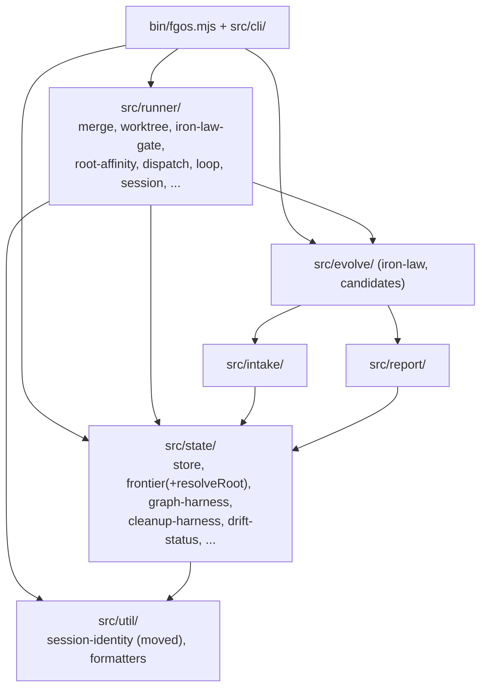

# Design acyclic module boundary for the state/runner merge cluster

## 1. Trạng thái hiện tại

Round 3 xong (2026-08-14, người xác nhận trực tiếp). Cả 2 câu hỏi mở của
round 2 đã được người quyết: (1) chốt scope đúng như fable đề xuất — làm
refactor JS ngay, không chờ quyết định Rust, không mở rộng ra ngoài
merge cluster; (2) `session-identity.mjs` dời vào `src/util/`. Cả 2 đã mint
D-ID (D1, D2, §4) và ghi qua `fgos decision --id tsk-49i`. §6/§7 đã viết đầy
đủ bên dưới. Discussion coi như hội tụ — bước kế tiếp là terminal handoff
sang `fgos-coding-exploring` rồi `fgos-coding-planning` (native-first, cùng
phiên) để ra plan implement thật.

## 2. Mục tiêu & đề bài

`src/state/` và `src/runner/` hiện phụ thuộc qua lại lẫn nhau (state → runner
ở 4 file, runner → state ở 7 file) thay vì là một layer một chiều sạch — nên
không thể tách thành 2 crate độc lập nếu port sang ngôn ngữ khác (Rust) sau
này. Mục tiêu discussion này: thiết kế lại boundary cho cụm module quanh
merge (`src/runner/merge.mjs`, `src/runner/worktree.mjs`,
`src/state/drift-status.mjs`, `src/state/graph-harness.mjs`,
`src/evolve/iron-law.mjs`, và phần orchestration trong `bin/fgos.mjs`'s case
`merge`/`approve`/`sync-root`) sao cho: (a) dependency graph giữa các module
trở thành acyclic thật sự, (b) ranh giới thật để port từng cụm sau này là
"pure logic, không shell git" vs "git I/O shim, có shell git thật" — không
phải theo tên thư mục hiện tại. Kết quả mong đợi: một thiết kế module/lớp cụ
thể (không phải chỉ nguyên tắc chung) đủ để `fgos-coding-planning` viết plan
refactor thật.

## 3. Vấn đề rõ / chưa rõ

| # | Vấn đề | Trạng thái | Ghi chú |
|---|---|---|---|
| 1 | `state/` ↔ `runner/` có cycle thật, không phải layer 1 chiều | Rõ | Bằng chứng: `grep -rl "from '../runner/" src/state/` → 4 file; `grep -rl "from '../state/" src/runner/` → 7 file |
| 2 | Iron Law check (`changedFiles`+`classifyIronLaw`) bị copy-paste 3 lần trong `bin/fgos.mjs` | Rõ | L2473-2478 (merge next), L3429-3436 (approve), L4036-4037 (sync-root) — chưa có helper chung |
| 3 | `isMainWorktree` nằm trong `merge.mjs` thay vì `worktree.mjs` | Rõ | Pure worktree-identity check, 0 semantics về nội dung merge — có vẻ là oversight từ STR44 |
| 4 | Ranh giới port-được thật sự là gì (pure vs I/O), map chi tiết | Rõ (đề xuất round 2, chờ người xác nhận) | 3 lớp: pure graph core (no fs/no shell), fs-only store, git-I/O shim — map từng file trong §5 Round 2 |
| 5 | Thứ tự refactor để cắt cycle mà không phá vỡ hành vi runtime | Rõ (đề xuất round 2, chờ người xác nhận) | 4 cạnh cắt bằng 3 động tác: parameterize `trunk` (drift-status), dời `session-identity.mjs` xuống layer thấp (store), dời `resolveRoot` về `state/frontier.mjs` (2 harness). Không đổi contract CLI nào — toàn bộ là internal signature/import path |
| 6 | Có nên gộp thêm các module liên quan khác (`session.mjs`, `main-checkout-lock.mjs`, `goal-check.mjs`, `github-adapter.mjs`) vào cùng thiết kế boundary này, hay để lại phạm vi khác | **Rõ — D1** | Người quyết: KHÔNG gộp. Chốt đúng scope 4 cạnh + helper + 2 move, làm ngay, không chờ Rust |
| 7 | `state → runner` có 4 cạnh, không phải 3 | Rõ | `cleanup-harness.mjs:41` import `resolveRoot` từ `runner/root-affinity.mjs`, y hệt `graph-harness.mjs:23` — cùng 1 cách cắt |
| 8 | `root-affinity.mjs` là file PURE (không fs, không child_process) dù nằm trong `runner/` | Rõ | Cycle là cycle cấp folder, không phải cấp purity — 2 harness import nó không kéo theo I/O nào |
| 9 | `src/state/tool-registry.mjs` cũng shell git (`git rev-parse HEAD`, L197) | Rõ (mới, round 1 sót) | Không tạo cạnh `state→runner` (tự shell trực tiếp), nhưng phải xếp vào nhóm git-I/O khi port — không nằm trong pure cluster |
| 10 | `session-identity.mjs` dời về đâu: `src/util/` (tái dùng, nhưng util hết còn all-pure) hay folder hạ tầng mới | **Rõ — D2** | Người quyết: `src/util/`. Contract thật của `util/` là leaf-module + không import nội bộ, không phải "100% pure" — session-identity khớp contract thật |

## 4. Quyết định đã chốt

| D-ID | Quyết định | Lý do |
|---|---|---|
| D1 | Land đúng 4-cạnh-cắt (drift-status nhận `trunk` qua tham số; dời `session-identity.mjs`; dời `resolveRoot` về `frontier.mjs`) + helper `iron-law-gate.mjs` mới + dời `isMainWorktree`/`detectTrunk` sang `worktree.mjs` — làm NGAY như 1 refactor JS thuần, không phụ thuộc thời điểm port Rust. Không mở rộng ra ngoài merge cluster trong item này. | Thay đổi nội bộ JS thuần, 0 đổi CLI contract, tự có giá trị (giết cycle + giết copy-paste) bất kể có/khi nào port Rust. Mở rộng scope không cần thiết để đạt acyclic (fable đã verify round 2) |
| D2 | `session-identity.mjs` dời vào `src/util/`, không tách `src/platform/` mới | Contract thật của `util/` là leaf + không import nội bộ + mọi layer import được — session-identity khớp sẵn. Việc 2 file hiện có tình cờ pure không phải contract đã ghi. Ranh giới port thật (pure/fs/git-I/O, §5) độc lập với tên folder — tách `platform/` chỉ để giữ vẻ sạch cho `util/` là quay lại đúng lối tư duy "boundary theo tên folder" vừa bỏ, không đổi acyclicity. 1 file không đáng 1 folder mới (YAGNI) |

## 5. Q&A log

**[Round 1 — phiên chat trước khi item này được submit, tsk-49i]**

Q: Vì sao logic merge cảm giác bị rải rác qua nhiều file?
A (scout thật, có bằng chứng):

- `bin/fgos.mjs` không chỉ dispatch — nó tự làm drift-check, Iron-Law
  pre-check, và đệ quy verb (`merge next` → `sync-root`/`approve`). Chỉ có
  phần merge git cấp thấp (merge/verify/commit/cleanup) mới nằm trong
  `src/runner/merge.mjs`.
- `driftStatus` (`src/state/drift-status.mjs`) dùng chung bởi CẢ `merge`
  (blockedOnSync ranking) LẪN `approve` (milestone target drift guard,
  L3348) — không phải merge-exclusive.
- `sync-root` là verb độc lập, tự invoke được (`fgos sync-root <root-id>`),
  postcondition khác `approve` (không đổi status/stage, không xoá
  `fgw/<id>`) — `merge next` chỉ mượn nó qua `runVerb('sync-root', ...)`.
- Iron Law check (`changedFiles` → `classifyIronLaw`) là thứ bị lặp nhiều
  nhất, không phải "dùng chung" sạch: 3 lần copy-paste inline trong
  `bin/fgos.mjs`, mỗi lần khác nhau ở `opts` truyền vào `changedFiles`
  (rootBranch/trunk/targetBranch).
- `merge.mjs` đã import trực tiếp từ `worktree.mjs`
  (`branchNameFor`/`branchExists`/`reclaimOrphanedCheckout`) — chiều phụ
  thuộc `merge → worktree` là MỘT CHIỀU, sạch.
- Nhưng ở mức folder rộng hơn, `state/` và `runner/` cross-import cả 2
  chiều — **đây là cycle thật**:
  - `state → runner`: `drift-status.mjs` → `runner/merge.mjs`
    (`detectTrunk`); `store.mjs` → `runner/session-identity.mjs`
    (`resolveWriterIdentity`); `graph-harness.mjs` →
    `runner/root-affinity.mjs` (`resolveRoot`); `cleanup-harness.mjs` cũng
    cross.
  - `runner → state`: `merge.mjs`, `dispatch.mjs`, `loop.mjs`,
    `claim-port.mjs`, `claim-liveness.mjs`, `anti-loop.mjs`,
    `prompt-templates.mjs`.
- Ranh giới port-được thật sự (kiểm bằng `grep -c "execFileSync\|spawn"`
  từng file):
  - **Pure, 0 shell-git**: `graph-harness.mjs`, `store.mjs`,
    `iron-law.mjs`, `frozen-judge.mjs` — ứng viên port Rust đầu tiên, an
    toàn, không cần crate git nào.
  - **Git I/O shim, có shell git thật**: `worktree.mjs`, `merge.mjs`,
    `goal-check.mjs`, `session.mjs`, `session-identity.mjs`,
    `main-checkout-lock.mjs`, `github-adapter.mjs`, `drift-status.mjs` —
    port sau, cần `git2` crate hoặc tiếp tục shell ra `git` CLI.

Kết luận phiên trước: cần cắt 3 cạnh `state → runner` trước (đảo hướng:
truyền `trunk`/`writerIdentity`/`root` vào như tham số) rồi mới port được
`state/` như một cụm acyclic độc lập.

**[Round 2 — fable design pass, 2026-08-14]**

Q: Re-verify bằng chứng round 1, rồi đề xuất thiết kế boundary cụ thể (cạnh
nào cắt bằng động tác gì, helper Iron-Law đặt đâu, target graph acyclic ra
sao)?

A (mọi số dòng dưới đây đọc trực tiếp từ worktree `fgw/tsk-49i`):

**1. Kết quả re-verify — round 1 đúng phần lớn, chỉnh 2 chỗ, thêm 1:**

- 4 cạnh `state → runner` xác nhận bằng
  `grep -rn "from '../runner/" src/state/`:
  - `src/state/drift-status.mjs:18` → `detectTrunk` (`runner/merge.mjs`)
  - `src/state/store.mjs:41` → `resolveWriterIdentity`
    (`runner/session-identity.mjs`)
  - `src/state/graph-harness.mjs:23` → `resolveRoot`
    (`runner/root-affinity.mjs`)
  - `src/state/cleanup-harness.mjs:41` → `resolveRoot` (cạnh thứ 4 round 1
    chưa xác định rõ — cùng hàm, cùng cách cắt với graph-harness)
- Chiều `runner → state` đúng như round 1 liệt kê (7 file), và các layer
  khác đã kiểm chiều: `evolve → intake + report`, `intake → state`
  (`classify.mjs:13` → `work.mjs`), `report → state` (`entropy.mjs:15-16`).
  Không đâu import ngược vào `runner/` ngoài `bin/` và `cli/` — tức là chỉ
  cần cắt 4 cạnh trên là toàn bộ đồ thị folder-level thành acyclic.
- **Chỉnh 1:** `root-affinity.mjs` là file THUẦN (không `fs`, không
  `child_process` — đọc toàn văn 130 dòng). Hai harness import nó không kéo
  I/O nào vào `state/`; vấn đề chỉ là cạnh folder. Điều này làm cách cắt rẻ
  hơn hẳn: chỉ cần dời 1 hàm pure, không phải đảo tham số qua call site.
- **Chỉnh 2:** `cleanup-harness.mjs` KHÔNG pure — nó có `git()` helper riêng
  shell git thật (`execFileSync` tại L66). Round 1 không claim nó pure,
  nhưng khi port phải xếp nó vào nhóm git-I/O, không phải pure cluster.
- **Thêm (round 1 sót):** `src/state/tool-registry.mjs:197` shell
  `git rev-parse HEAD` trực tiếp. Không tạo cạnh import nào sang `runner/`
  nên không ảnh hưởng acyclicity, nhưng là file git-chạm thứ 3 trong
  `state/` (cùng drift-status, cleanup-harness) khi vẽ ranh giới port.
- Iron-Law 3 call site xác nhận đúng vị trí: `bin/fgos.mjs` L2473-2478
  (`merge next`, dạng predicate `wouldTripIronLaw`), L3429-3447 (`approve`,
  throw `StoreError` + tái dùng `runnerOwnDiff` làm `ownFileSet`),
  L4036-4045 (`sync-root`, throw). Cả 3 cùng công thức
  `changedFiles(repoRoot, item, {trunk: <base>}) → classifyIronLaw(...)`,
  chỉ khác cách chọn `<base>`: approve/merge-next đi `resolveRoot` (leaf →
  root branch, fallback trunk khi root chưa có branch), sync-root đi thẳng
  `item.parent` (root → parent branch hoặc trunk).
- `isMainWorktree` (`merge.mjs` L274-286) xác nhận là pure worktree-identity
  check (so `--show-toplevel` với parent của `--git-common-dir`), và
  `merge.mjs` KHÔNG tự gọi nó ở đâu (chỉ xuất hiện trong doc comment) —
  consumer thật là `bin/fgos.mjs:50` và `promote-engine.mjs:16`.
- Một tiền lệ quan trọng cho cách cắt: `graph-harness.mjs` ĐÃ dùng đúng
  pattern đảo-tham-số rồi — nó nhận kết quả `driftStatus()` đã tính sẵn qua
  tham số thay vì tự gọi (comment L30-31: "This function stays PURE — it
  never calls driftStatus itself"). Cách cắt cạnh 1 dưới đây chỉ là lặp lại
  pattern có sẵn này.

**2. Đề xuất cắt 4 cạnh — 3 động tác:**

- **Cạnh 1, `drift-status → detectTrunk`: đảo thành tham số.**
  `driftStatus(repoRoot, view, { trunk })` và
  `unmergedDeliveries(repoRoot, view, { trunk })` nhận `trunk` là option
  BẮT BUỘC (throw nếu thiếu, không default-import lại — default sẽ tái tạo
  đúng cạnh vừa cắt). Caller thật chỉ có 2: `bin/fgos.mjs` (đã import
  `detectTrunk` sẵn ở L50, zero import mới) và `src/setup/registrations.mjs`
  (doctor check — thêm import `detectTrunk` từ runner; chiều `setup →
  runner` là chiều xuôi, không ai import ngược `setup/`). Không đổi contract
  CLI nào — signature này internal.
- **Cạnh 2, `store → resolveWriterIdentity`: dời nguyên module
  `session-identity.mjs` xuống layer đáy.** Không đảo tham số được một cách
  KISS: `payload.writer` được đóng ở 3 điểm trong `store.mjs` (L379, L541,
  L794) nhưng nằm sau hàng chục verb entry-point — luồn writer qua toàn bộ
  API store là đập cửa quá rộng. Trong khi đó `session-identity.mjs` (150
  dòng, đọc toàn văn) không import gì nội bộ cả — leaf module đúng nghĩa,
  và về ngữ nghĩa nó là hạ tầng "ai đang ghi" dùng chung cho CẢ state
  (stamp writer lên event) LẪN runner (STR65 main-checkout lock) LẪN cli
  (`invocation-fault-log.mjs:37`). Đề xuất: dời sang
  `src/util/session-identity.mjs` (contract de-facto của `util/`: leaf,
  không import nội bộ, mọi layer import được). Sửa 4 import site:
  `state/store.mjs:41`, `runner/merge.mjs:51`,
  `cli/invocation-fault-log.mjs:37`, `bin/fgos.mjs:71`. Không đổi signature.
  Lưu ý cho người quyết: `util/` hiện chỉ có 2 formatter pure; nhận
  `session-identity` nghĩa là `util/` chứa module có I/O (`ps` shellout +
  đọc `sessions.json`) — nếu thấy bẩn, alternative là folder mới
  (`src/platform/`), đắt hơn 1 folder nhưng giữ `util/` all-pure.
- **Cạnh 3+4, hai harness → `resolveRoot`: dời hàm `resolveRoot` về
  `src/state/frontier.mjs`.** `resolveRoot` (root-affinity L66-78) là pure
  walk theo `view.work[id].parent` — logic lineage trên work graph, không
  có gì "runner" trong đó; chính comment của nó tự nhận seen-set backstop
  "mirror frontier.mjs's hasOpenDescendant". Dời về `frontier.mjs` (đã là
  module pure-graph-walk của state, đang được store/drift-status/
  graph-harness import sẵn). Sửa 6 import site: `runner/root-affinity.mjs`
  (giữ `claimRoot`/`steerFrontier`/`createOwnershipStore` tại chỗ, tự import
  `resolveRoot` từ `../state/frontier.mjs` — chiều `runner → state` hợp lệ),
  `runner/claim-port.mjs:16`, `runner/loop.mjs:85`,
  `state/graph-harness.mjs:23`, `state/cleanup-harness.mjs:41`,
  `bin/fgos.mjs:73`. Không để re-export shim. Alternative nếu thấy
  `frontier.mjs` sai chỗ: file mới `src/state/lineage.mjs` — nhưng 1 hàm 12
  dòng chưa đáng 1 file riêng (YAGNI).

**3. Helper Iron-Law chung — giết 3 bản copy-paste:**

File mới `src/runner/iron-law-gate.mjs`:

```js
import { changedFiles } from './merge.mjs';
import { branchExists } from './worktree.mjs';
import { classifyIronLaw } from '../evolve/iron-law.mjs';

// -> { required, matchedFlags, matchedModules, filesChanged }
export function ironLawForItem(repoRoot, item, { baseBranch = null } = {}) {
  const filesChanged = changedFiles(
    repoRoot, item,
    baseBranch && branchExists(repoRoot, baseBranch) ? { trunk: baseBranch } : {},
  );
  return { ...classifyIronLaw({ filesChanged, description: item.description }), filesChanged };
}
```

- Helper chỉ hút phần trùng thật (diff + classify + fallback-khi-base-branch
  -không-tồn-tại); phần KHÁC NHAU có chủ đích giữ lại ở call site: cách chọn
  `baseBranch` (approve/merge-next: `resolveRoot`; sync-root: `item.parent`
  — hai target khác nhau thật, không phải trùng lặp), xử lý
  `--acknowledge-iron-law`, và message refuse mang tên verb. `approve` tái
  dùng `.filesChanged` trả về làm `runnerOwnDiff`/`ownFileSet` — không tính
  diff 2 lần, giữ đúng tối ưu tsk-598 hiện có.
- Vì sao KHÔNG đặt trong `src/evolve/iron-law.mjs`: header file đó tự tuyên
  bố pure ("no fs, no Date, no network, no store import") — helper này shell
  git, đặt vào là phá contract đã ghi. Vì sao không nhét vào `merge.mjs`:
  được về mặt cạnh (merge → evolve vẫn xuôi), nhưng merge.mjs đã 1338 dòng
  và helper này là composition 3 layer đáng nhìn thấy riêng.
- Cạnh mới `runner → evolve` là cạnh xuôi: `evolve/` chỉ import
  `intake/` + `report/` (kiểm ở mục 1), không bao giờ import `runner/` —
  không tạo cycle mới.
- Behavior không đổi: check `branchExists` trong helper là redundant-nhưng-
  vô-hại với sync-root (caller đã throw sớm ở L4028 nếu parent branch không
  tồn tại) và trùng khớp check sẵn có ở 2 site kia.

**4. `isMainWorktree` dời sang `worktree.mjs` — xác nhận, kèm `detectTrunk`:**

- Xác nhận đúng: `isMainWorktree` + helper riêng của nó `realpathOrSelf`
  (merge.mjs L244-250, không ai khác dùng) dời sang `runner/worktree.mjs`.
  `worktree.mjs` chỉ import node builtins (fs/os/path/child_process — kiểm
  L56-59) và có `git()` helper sẵn (L107) → move không tạo cạnh mới nào.
  Sửa 2 import site: `bin/fgos.mjs:50`, `runner/promote-engine.mjs:16`.
- Đề xuất kèm: `detectTrunk` cũng dời sang `worktree.mjs` cùng đợt — nó là
  repo-identity query (origin/HEAD → main/master fallback), zero semantics
  merge-content, đứng cạnh `branchNameFor`/`branchExists` là đúng chỗ.
  `merge.mjs` tự dùng nó 3 chỗ (L322 reviewDiff, L433 changedFiles, L821
  mergeRunnerItem) → merge import từ worktree, chiều `merge → worktree` MỘT
  CHIỀU sẵn có (round 1 đã xác nhận). Sau move, `worktree.mjs` = "git
  repo/branch/worktree identity shim", `merge.mjs` = thuần thao tác
  merge-content. Lưu ý: move này KHÔNG phải điều kiện của cạnh 1 (cạnh 1 cắt
  bằng parameterize) — nó là cohesion cleanup độc lập, bỏ được nếu muốn thu
  scope.

**5. Target graph sau khi cắt (một chiều, acyclic):**



`state/` sau cắt chỉ import `state/` nội bộ + `util/` + node builtins —
zero cạnh sang `runner/`. Ranh giới port Rust theo 3 lớp thật (không theo
tên folder):

- **Cụm port đầu tiên — pure logic, không child_process, không fs:**
  `state/{work, status-fsm, stage-fsm, workflow-stage-graphs, frontier
  (+resolveRoot mới dời về), dep-graph, graph-metrics, graph-harness,
  impact, priority-formula, envelope, *-pool}` + `evolve/iron-law` +
  `intake/{risk-keywords, classify}` + `runner/frozen-judge` +
  `runner/root-affinity` (phần còn lại sau khi resolveRoot dời đi — vẫn
  pure). Hai file pure còn kẹt trong `runner/` (frozen-judge,
  root-affinity) không cản acyclicity — dời chúng về đâu là câu hỏi
  cohesion cho scope round sau, không phải điều kiện của thiết kế này.
- **Lớp fs-only (std::fs port được, chưa cần git):** `state/{events, store,
  replay, events-jsonl-*}` + `util/session-identity` (fs + `ps` shellout).
- **Lớp git-I/O shim (port sau cùng, cần git2/shell):**
  `runner/{worktree, merge, iron-law-gate, goal-check, session,
  main-checkout-lock, github-adapter}` + `state/{drift-status,
  cleanup-harness}` + chỗ shell git đơn lẻ trong `state/tool-registry`
  (L197). Ba file `state/` này nằm đúng folder về data-model nhưng thuộc
  lớp git-I/O khi port — ranh giới crate đi theo lớp, không theo folder.

**6. Hai câu hỏi mở cần người quyết (không tự đoán):**

1. **Scope (§3 hàng 6):** thiết kế trên đạt acyclic mà KHÔNG cần đụng
   `session.mjs`/`main-checkout-lock.mjs`/`goal-check.mjs`/
   `github-adapter.mjs` (không file nào trong đó bị `state/` import). Có
   muốn round sau mở rộng sang cohesion cleanup toàn `runner/` (dời nốt
   frozen-judge/root-affinity ra khỏi runner, phân lớp lại các file git-I/O
   còn lại), hay chốt scope đúng 4 cạnh + helper + 2 move như trên?
2. **Chỗ ở của `session-identity.mjs` (§3 hàng 10):** `src/util/` (khuyến
   nghị — KISS, đúng contract leaf-module, nhưng util hết còn all-pure) hay
   folder hạ tầng mới kiểu `src/platform/`?

**[Round 3 — người xác nhận, 2026-08-14]**

Q: Có thể làm refactor JS trước, không chờ quyết định Rust không? Và
`session-identity.mjs` dời vào `src/util/` hay `src/platform/`?

A: Xác nhận cả 2 — làm refactor JS ngay (D1), `session-identity.mjs` vào
`src/util/` (D2). Lý do đầy đủ ghi trong §4. Discussion hội tụ.

## 6. Thiết kế đã chốt {#design}

**Vấn đề.** `src/state/` và `src/runner/` cross-import 2 chiều (4 cạnh
`state → runner`, 7 file `runner → state`) — không phải layer 1 chiều, nên
không tách được thành 2 cụm độc lập (điều kiện cần để port từng cụm sang
ngôn ngữ khác sau này). Đồng thời, logic "check Iron Law trước khi merge"
bị copy-paste 3 lần trong `bin/fgos.mjs`, và `isMainWorktree`/`detectTrunk`
(2 hàm thuần về danh tính worktree/repo, không có semantics nội dung merge)
nằm lạc trong `merge.mjs` thay vì `worktree.mjs`.

**Thiết kế (D1, D2).** Cắt đúng 4 cạnh `state → runner` bằng 3 động tác, đều
là thay đổi nội bộ, không đổi CLI contract:

1. `drift-status.mjs` nhận `trunk` qua tham số bắt buộc thay vì tự gọi
   `detectTrunk` (`runner/merge.mjs`) — 2 caller thật (`bin/fgos.mjs`,
   `src/setup/registrations.mjs`) đã có sẵn `detectTrunk` import, không tốn
   import mới.
2. `session-identity.mjs` dời nguyên module xuống `src/util/session-identity.mjs`
   (D2) — nó là leaf module thật (0 import nội bộ), dùng chung bởi
   state/runner/cli, đúng contract của `util/`. Sửa 4 import site:
   `state/store.mjs`, `runner/merge.mjs`, `cli/invocation-fault-log.mjs`,
   `bin/fgos.mjs`.
3. Hàm `resolveRoot` dời từ `runner/root-affinity.mjs` về
   `state/frontier.mjs` (đã là module pure-graph-walk sẵn có) — pure walk
   theo `parent`, không có gì "runner" trong logic. Sửa 6 import site:
   `root-affinity.mjs` tự import lại từ `state/frontier.mjs` (chiều
   `runner → state` hợp lệ), `claim-port.mjs`, `loop.mjs`,
   `graph-harness.mjs`, `cleanup-harness.mjs`, `bin/fgos.mjs`.

Song song, 2 cohesion move (thuộc D1, không phải điều kiện của việc cắt
cạnh, nhưng cùng scope đã chốt):

4. Gộp Iron Law check (hiện copy-paste 3 lần trong `bin/fgos.mjs`) vào 1
   helper mới `src/runner/iron-law-gate.mjs`:
   ```js
   import { changedFiles } from './merge.mjs';
   import { branchExists } from './worktree.mjs';
   import { classifyIronLaw } from '../evolve/iron-law.mjs';

   export function ironLawForItem(repoRoot, item, { baseBranch = null } = {}) {
     const filesChanged = changedFiles(
       repoRoot, item,
       baseBranch && branchExists(repoRoot, baseBranch) ? { trunk: baseBranch } : {},
     );
     return { ...classifyIronLaw({ filesChanged, description: item.description }), filesChanged };
   }
   ```
   Phần khác nhau thật giữa 3 call site (cách chọn `baseBranch`, xử lý
   `--acknowledge-iron-law`, message refuse) ở lại call site — helper chỉ
   hút phần trùng lặp thật.
5. `isMainWorktree` + `detectTrunk` dời từ `merge.mjs` sang `worktree.mjs`
   (identity/repo-shim, không phải merge-content). Sửa 2 import site:
   `bin/fgos.mjs`, `runner/promote-engine.mjs`.

**Đồ thị phụ thuộc sau khi cắt (acyclic, một chiều):**


`state/` sau khi cắt chỉ còn import nội bộ + `util/` + node builtins — zero
cạnh sang `runner/`.

**Ranh giới port-được thật (độc lập với tên folder) — dùng cho scope sau
này, không phải điều kiện của item này:**

| Lớp | File | Port khi nào |
|---|---|---|
| Pure logic (0 fs, 0 child_process) | `state/{work, status-fsm, stage-fsm, workflow-stage-graphs, frontier(+resolveRoot), dep-graph, graph-metrics, graph-harness, impact, priority-formula, envelope, *-pool}`, `evolve/iron-law`, `intake/{risk-keywords, classify}`, `runner/frozen-judge`, `runner/root-affinity` (phần còn lại) | Trước tiên, không cần crate git |
| fs-only | `state/{events, store, replay, events-jsonl-*}`, `util/session-identity` | Sau, `std::fs` là đủ |
| git-I/O shim | `runner/{worktree, merge, iron-law-gate, goal-check, session, main-checkout-lock, github-adapter}`, `state/{drift-status, cleanup-harness}`, chỗ shell trong `state/tool-registry.mjs:197` | Sau cùng, cần `git2` hoặc tiếp tục shell `git` |

## 7. Danh mục hạng mục / task {#tasks}

### {#task-cut-state-runner-cycle} Cắt cycle state/runner + gộp Iron Law + cohesion move

- **Mục tiêu:** thực hiện đúng D1/D2 — 4 cạnh cắt (3 động tác), helper
  `iron-law-gate.mjs`, 2 file move sang `worktree.mjs`. Kết quả: `state/`
  không còn cạnh import nào sang `runner/`; 3 call site Iron Law trong
  `bin/fgos.mjs` dùng chung 1 helper; `isMainWorktree`/`detectTrunk` sống ở
  `worktree.mjs`.
- **§6 excerpt áp dụng:** toàn bộ mục "Thiết kế (D1, D2)" ở trên — 5 bước,
  liệt kê đủ import site cần sửa.
- **D-ID áp dụng:** D1, D2.
- **Quan hệ với item khác:** không có child — single-piece design (D1 chốt
  scope không mở rộng), một task duy nhất.
- **Draft verify:**
  - `grep -rl "from '\.\./runner/" src/state/` → rỗng (0 kết quả)
  - `npm test` xanh (không đổi hành vi runtime/CLI contract nào)
  - `grep -c "classifyIronLaw" bin/fgos.mjs` → giảm từ 3 xuống 0 (chuyển
    hết vào `iron-law-gate.mjs`)
