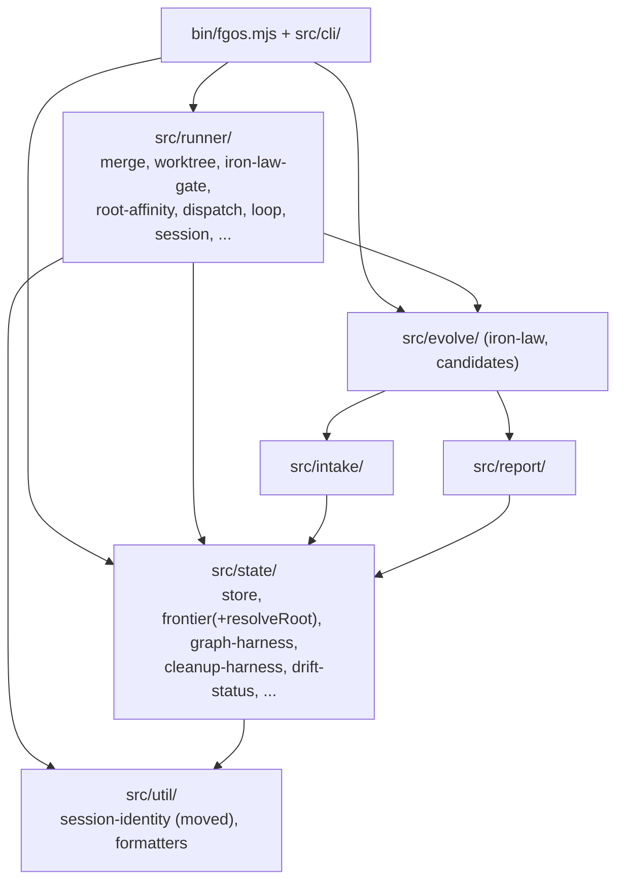

# Design acyclic module boundary for the state/runner merge cluster

## 1. Trạng thái hiện tại

Round 5 (fable brainstorm/advisory pass, 2026-08-14) đã chạy xong: soi lại
bằng chứng cho đúng 2 câu hỏi mở round 4 để lại (chỗ ở use-case layer, và
trace graze sang `check`). Kết quả chính: (a) framing "graze vào `check`"
của round 4 KHÔNG chính xác về cơ chế — 2 collector là helper module-level
trong bin dùng chung bởi 5 verb (review/check/show/doc-sources/evolve
--pick), move chúng ra không đổi 1 dòng logic nào trong bất kỳ case block
nào; lý lẽ "adapter-đắp-trace cũng không tránh được graze" của phiên điều
phối cũng sai thực tế, nhưng kết luận (chấp nhận move `item-trace.mjs`)
vẫn đứng vững trên căn cứ mạnh hơn; (b) cho câu hỏi chỗ ở, round 5 tìm
thấy 1 option thứ ba chưa ai xét (`src/verbs/` — đặt tên theo LOẠI, khớp
convention "folder theo area/kind, manifest theo layer" mà repo đang thật
sự dùng). Chi tiết + khuyến nghị riêng của round 5 ở §5. Cả 2 câu hỏi giờ
đủ bằng chứng cho người quyết. §6/§7 vẫn STALE (viết cho scope round-3) —
round 5 là advisory, không đụng; regenerate sau khi người chốt 2 câu này.

## 2. Mục tiêu & đề bài

`src/state/` và `src/runner/` hiện phụ thuộc qua lại lẫn nhau (state → runner
ở 4 file, runner → state ở 7 file) thay vì là một layer một chiều sạch — nên
không thể tách thành 2 crate độc lập nếu port sang ngôn ngữ khác (Rust) sau
này. Mục tiêu discussion này: thiết kế lại boundary cho cụm module quanh
merge (`src/runner/merge.mjs`, `src/runner/worktree.mjs`,
`src/state/drift-status.mjs`, `src/state/graph-harness.mjs`,
`src/evolve/iron-law.mjs`, và phần orchestration trong `bin/fgos.mjs`'s case
`merge`/`approve`/`sync-root`) sao cho: (a) dependency graph giữa các module
trở thành acyclic thật sự, (b) ranh giới thật để port từng cụm sau này là
"pure logic, không shell git" vs "git I/O shim, có shell git thật" — không
phải theo tên thư mục hiện tại. Kết quả mong đợi: một thiết kế module/lớp cụ
thể (không phải chỉ nguyên tắc chung) đủ để `fgos-coding-planning` viết plan
refactor thật.

## 3. Vấn đề rõ / chưa rõ

| # | Vấn đề | Trạng thái | Ghi chú |
|---|---|---|---|
| 1 | `state/` ↔ `runner/` có cycle thật, không phải layer 1 chiều | Rõ | Bằng chứng: `grep -rl "from '../runner/" src/state/` → 4 file; `grep -rl "from '../state/" src/runner/` → 7 file |
| 2 | Iron Law check (`changedFiles`+`classifyIronLaw`) bị copy-paste 3 lần trong `bin/fgos.mjs` | Rõ | L2473-2478 (merge next), L3429-3436 (approve), L4036-4037 (sync-root) — chưa có helper chung |
| 3 | `isMainWorktree` nằm trong `merge.mjs` thay vì `worktree.mjs` | Rõ | Pure worktree-identity check, 0 semantics về nội dung merge — có vẻ là oversight từ STR44 |
| 4 | Ranh giới port-được thật sự là gì (pure vs I/O), map chi tiết | Rõ (đề xuất round 2, chờ người xác nhận) | 3 lớp: pure graph core (no fs/no shell), fs-only store, git-I/O shim — map từng file trong §5 Round 2 |
| 5 | Thứ tự refactor để cắt cycle mà không phá vỡ hành vi runtime | Rõ (đề xuất round 2, chờ người xác nhận) | 4 cạnh cắt bằng 3 động tác: parameterize `trunk` (drift-status), dời `session-identity.mjs` xuống layer thấp (store), dời `resolveRoot` về `state/frontier.mjs` (2 harness). Không đổi contract CLI nào — toàn bộ là internal signature/import path |
| 6 | Có nên gộp thêm các module liên quan khác (`session.mjs`, `main-checkout-lock.mjs`, `goal-check.mjs`, `github-adapter.mjs`) vào cùng thiết kế boundary này, hay để lại phạm vi khác | **Rõ — D1** | Người quyết: KHÔNG gộp. Chốt đúng scope 4 cạnh + helper + 2 move, làm ngay, không chờ Rust |
| 7 | `state → runner` có 4 cạnh, không phải 3 | Rõ | `cleanup-harness.mjs:41` import `resolveRoot` từ `runner/root-affinity.mjs`, y hệt `graph-harness.mjs:23` — cùng 1 cách cắt |
| 8 | `root-affinity.mjs` là file PURE (không fs, không child_process) dù nằm trong `runner/` | Rõ | Cycle là cycle cấp folder, không phải cấp purity — 2 harness import nó không kéo theo I/O nào |
| 9 | `src/state/tool-registry.mjs` cũng shell git (`git rev-parse HEAD`, L197) | Rõ (mới, round 1 sót) | Không tạo cạnh `state→runner` (tự shell trực tiếp), nhưng phải xếp vào nhóm git-I/O khi port — không nằm trong pure cluster |
| 10 | `session-identity.mjs` dời về đâu: `src/util/` (tái dùng, nhưng util hết còn all-pure) hay folder hạ tầng mới | **Rõ — D2** | Người quyết: `src/util/`. Contract thật của `util/` là leaf-module + không import nội bộ, không phải "100% pure" — session-identity khớp contract thật |
| 11 | `bin/fgos.mjs` có phải thin adapter không, hay tự ôm business logic | **Rõ — D3 mở scope** | Có ôm thật, round 4 đã đọc trọn cả 7 case block và phân loại từng mảnh — xem §5 Round 4, mục 1 |
| 12 | Use-case layer đặt tên/vị trí file thế nào, verb nào cần 1 use-case function riêng, hàm nào giữ nguyên ở `bin/fgos.mjs` | **Rõ — D4** | Người quyết: `src/verbs/merge/<verb>.mjs` (tên `verbs/`, nest theo domain). 1 function/verb (riêng `merge.mjs` có 2: `mergeList`/`mergeNext`), ctx+options signature — chi tiết + line map ở §5 Round 4, mục 2-3 |
| 13 | Repo ĐÃ có tầng `use-case` khai báo chính thức | Rõ (mới, round 4) | `docs/architecture-manifest.json` layers `[entry, use-case, infra, domain, kernel]`, enforce một-chiều-xuống bằng `test/architecture.test.mjs`; 7 file đang ở tầng use-case sẵn (`runner/loop.mjs`, `intake/{discovery,plan,classify}.mjs`, `setup/{checks,registrations}.mjs`, `state/cursor.mjs`) — tầng theo manifest, không theo tên folder. File mới chỉ cần thêm row `use-case`; import same-rank (use-case → use-case) hợp lệ theo chính test đó |
| 14 | `performCatchUp` (bin/fgos.mjs L1063-1122) là git-mechanics infra trọn vẹn sống trong bin | Rõ (mới, round 4) | Merge target vào branch của item trong ephemeral worktree + verify + commit/abort — cùng contract với `mergeRunnerItem`. Đề xuất dời về `src/runner/merge.mjs` (infra), use-case gọi nó từ đó |
| 15 | `ensureBranchPushed` (bin L264-272) là git push op sống trong bin | Rõ (mới, round 4) | Chỉ `review --github` dùng. Đề xuất dời về `runner/worktree.mjs` (đúng vai "branch shim" mà D1 đã định cho file đó); `github-adapter.mjs` vẫn không bị đụng (D1) |
| 16 | `collectReviewTrace` (bin L593) kẹt chung 2 collector (`collectFrictionData`/`collectOutcomeEntry`) | **Rõ — D5** | Round 5 sửa lại khung round 4: KHÔNG phải "graze vào check" — 2 collector này vốn đã dùng chung bởi 5 verb (`review`/`check`/`show`/`doc-sources`/`evolve`), dời sang `src/report/item-trace.mjs` không đổi 1 dòng nào ở 4 case còn lại. Lý do dời đúng: 2 hàm pure view-reader đang nằm sai tầng `entry`, đáng lẽ ở tầng `domain` — cùng họ cleanup với D1's `isMainWorktree` move, không phải nhượng bộ phạm vi |
| 17 | `merge next` forward RAW `flags` vào `runVerb('approve'/'sync-root')` — sau khi tách, forwarding phải structural | Rõ (mới, round 4) | Hazard regression thật duy nhất của thiết kế: nếu adapter của `merge` parse thiếu 1 option mà `approve` hiểu, hành vi unattended merge-next đổi âm thầm. Giải pháp: 1 parser chung `parseMergeClusterOptions` trong bin, options object truyền nguyên khối — xem §5 mục 4 |
| 18 | `promote-to-component` đã half-extracted sẵn | Rõ (mới, round 4) | Per-member mechanics đã ở `runner/promote-engine.mjs` từ trước — tiền lệ nội bộ cho chính pattern đang đề xuất; bin chỉ còn ôm batch orchestration (validate + connectivity BFS + root resolve + loop + decision record) — phần đó dời vào use-case |
| 19 | `reject` đã gần-thin sẵn — extract chỉ vì uniformity | Rõ (mới, round 4) | Use-case function ~10 dòng (precondition + moveWork). Vẫn extract để cả 7 verb cùng shape (stranger tìm code của `fgos <verb>` tại đúng 1 chỗ), chi phí ~0 |
| 20 | Chính sách repoRoot KHÁC NHAU giữa các verb — adapter phải own per-verb | Rõ (mới, round 4) | `approve`/`sync-root`/`promote`: `--trust-dir` gate (mặc định `process.cwd()`); `catchup`: LUÔN `path.dirname(dir)` (tsk-5vl, không gate); `merge next`: trust-dir cho iron-law nhưng driftStatus đọc từ raw `process.cwd()` (L2433/L2499). Use-case không bao giờ tự đọc `process.cwd()`/env — nhận qua ctx/options |
| 21 | Refuse message trong guard mang từ vựng CLI (tên flag, tên verb) sẽ theo logic vào use-case layer | Rõ (mới, round 4) | Chấp nhận trade-off: giữ nguyên message + `StoreError` throw trong use-case (tiền lệ: `store.mjs` (infra) đã throw message user-facing sẵn — `assertAcceptanceEvidence`); alternative (error code + bảng message phía adapter cho ~25 refusal) đắt và risky hơn hẳn, 0 lợi hành vi |
| 22 | 55 verb có nên nhóm theo domain thay vì phẳng | **Rõ — D4** | Có, nhóm được thành ~5 domain thật (lifecycle/merge/worktree/query/setup). Item này chỉ làm đúng domain `merge` (7 verb); 48 verb còn lại ngoài scope, để item sau |

## 4. Quyết định đã chốt

| D-ID | Quyết định | Lý do |
|---|---|---|
| D1 | Land đúng 4-cạnh-cắt (drift-status nhận `trunk` qua tham số; dời `session-identity.mjs`; dời `resolveRoot` về `frontier.mjs`) + helper `iron-law-gate.mjs` mới + dời `isMainWorktree`/`detectTrunk` sang `worktree.mjs` — làm NGAY như 1 refactor JS thuần, không phụ thuộc thời điểm port Rust. **Phần "không mở rộng ra ngoài merge cluster" bị D3 supersede một phần** (xem D3) — vẫn đúng cho việc KHÔNG đụng module khác (`session.mjs`, `goal-check.mjs`...), nhưng scope CLI-layer trong đúng cluster này đã mở rộng thêm. | Thay đổi nội bộ JS thuần, 0 đổi CLI contract, tự có giá trị (giết cycle + giết copy-paste) bất kể có/khi nào port Rust. Mở rộng scope không cần thiết để đạt acyclic (fable đã verify round 2) |
| D2 | `session-identity.mjs` dời vào `src/util/`, không tách `src/platform/` mới | Contract thật của `util/` là leaf + không import nội bộ + mọi layer import được — session-identity khớp sẵn. Việc 2 file hiện có tình cờ pure không phải contract đã ghi. Ranh giới port thật (pure/fs/git-I/O, §5) độc lập với tên folder — tách `platform/` chỉ để giữ vẻ sạch cho `util/` là quay lại đúng lối tư duy "boundary theo tên folder" vừa bỏ, không đổi acyclicity. 1 file không đáng 1 folder mới (YAGNI) |
| D3 | Mở lại scope D1 (chỉ trên trục CLI-layer SRP): `tsk-49i` giờ cũng bao gồm tách logic nghiệp vụ đang nằm inline trong `bin/fgos.mjs`'s case `merge`/`approve`/`review`/`sync-root`/`catchup`/`reject`/`promote-to-component` ra 1 tầng application/use-case riêng, để `bin/fgos.mjs` chỉ còn parse args → gọi 1 use-case function → format JSON `fgos.v1`. Ranh giới "không đụng module khác ngoài cluster" của D1 vẫn giữ nguyên. | Người phát hiện `bin/fgos.mjs` tự tính `driftStatus`, tự định nghĩa predicate Iron Law, tự chứa business rule milestone-drift, tự quyết định orchestration — D1's cắt-cycle không sửa được gray-area SRP này. Gộp vào cùng item vì cùng đúng những case block D1 đã lên kế hoạch sửa, tránh phải quét lại lần 2 |
| D4 | Use-case layer sống ở `src/verbs/<domain>/<verb>.mjs`, nest theo domain ngay từ đầu. Cluster này land ở `src/verbs/merge/{list,next,approve,review,sync-root,catchup,reject,promote-to-component}.mjs`. Không ngụ ý migrate lại 7 file use-case-rank hiện có (`loop.mjs`, `intake/{discovery,plan,classify}.mjs`, `setup/{checks,registrations}.mjs`, `cursor.mjs`). | 10 folder hiện có của repo đều đặt tên theo area, không theo layer — `usecase/` sẽ là folder đầu tiên phá quy ước đó, nuôi câu hỏi "sao loop.mjs không ở đây" vĩnh viễn. `commands/` đụng nghĩa với chữ "command" đã dùng cho chuỗi lệnh shell (`ghCommandOpts`/`FGOS_GH_COMMAND`) ở nơi khác trong cùng file. `verb` là từ vựng sản phẩm repo đã dùng xuyên suốt AGENTS.md/architecture-map.md. Nest theo domain từ đầu tốn 0 thêm (chỉ đổi đường dẫn 7 file đã đồng ý), tránh phải dọn lại khi 1 trong ~4 domain còn lại (lifecycle/worktree/query/setup, tổng 48 verb) được extract sau này |
| D5 | Khung lại việc dời `collectOutcomeEntry`/`collectFrictionData` thành "dọn logic nằm sai tầng `entry`, dời đúng về tầng `domain`" (`src/report/item-trace.mjs`, đăng ký `domain` trong manifest) — không phải "graze ra ngoài cluster vào verb `check`". | Round 5 xác minh cả 2 khung cũ đều sai: 2 collector vốn đã dùng chung bởi 5 verb (không phải 2), dời chúng không đổi 1 dòng nào ở 4 case còn lại — không có "chạm vào check" ở mức code để mà xin phép. Lý lẽ trước đó cho việc chấp nhận graze ("alternative 0-touch không tránh được gì") cũng sai — alternative đó thật sự đạt 0 thay đổi, chỉ bị bác vì lý do khác (adapter phải soi `payload.mode` hoặc gọi `listWork` lần 2). Lý do đúng để dời: 2 hàm là pure view-reader, đúng chất liệu tầng `domain`, cùng họ cleanup với D1's `isMainWorktree` move |

## 5. Q&A log

**[Round 1 — phiên chat trước khi item này được submit, tsk-49i]**

Q: Vì sao logic merge cảm giác bị rải rác qua nhiều file?
A (scout thật, có bằng chứng):

- `bin/fgos.mjs` không chỉ dispatch — nó tự làm drift-check, Iron-Law
  pre-check, và đệ quy verb (`merge next` → `sync-root`/`approve`). Chỉ có
  phần merge git cấp thấp (merge/verify/commit/cleanup) mới nằm trong
  `src/runner/merge.mjs`.
- `driftStatus` (`src/state/drift-status.mjs`) dùng chung bởi CẢ `merge`
  (blockedOnSync ranking) LẪN `approve` (milestone target drift guard,
  L3348) — không phải merge-exclusive.
- `sync-root` là verb độc lập, tự invoke được (`fgos sync-root <root-id>`),
  postcondition khác `approve` (không đổi status/stage, không xoá
  `fgw/<id>`) — `merge next` chỉ mượn nó qua `runVerb('sync-root', ...)`.
- Iron Law check (`changedFiles` → `classifyIronLaw`) là thứ bị lặp nhiều
  nhất, không phải "dùng chung" sạch: 3 lần copy-paste inline trong
  `bin/fgos.mjs`, mỗi lần khác nhau ở `opts` truyền vào `changedFiles`
  (rootBranch/trunk/targetBranch).
- `merge.mjs` đã import trực tiếp từ `worktree.mjs`
  (`branchNameFor`/`branchExists`/`reclaimOrphanedCheckout`) — chiều phụ
  thuộc `merge → worktree` là MỘT CHIỀU, sạch.
- Nhưng ở mức folder rộng hơn, `state/` và `runner/` cross-import cả 2
  chiều — **đây là cycle thật**:
  - `state → runner`: `drift-status.mjs` → `runner/merge.mjs`
    (`detectTrunk`); `store.mjs` → `runner/session-identity.mjs`
    (`resolveWriterIdentity`); `graph-harness.mjs` →
    `runner/root-affinity.mjs` (`resolveRoot`); `cleanup-harness.mjs` cũng
    cross.
  - `runner → state`: `merge.mjs`, `dispatch.mjs`, `loop.mjs`,
    `claim-port.mjs`, `claim-liveness.mjs`, `anti-loop.mjs`,
    `prompt-templates.mjs`.
- Ranh giới port-được thật sự (kiểm bằng `grep -c "execFileSync\|spawn"`
  từng file):
  - **Pure, 0 shell-git**: `graph-harness.mjs`, `store.mjs`,
    `iron-law.mjs`, `frozen-judge.mjs` — ứng viên port Rust đầu tiên, an
    toàn, không cần crate git nào.
  - **Git I/O shim, có shell git thật**: `worktree.mjs`, `merge.mjs`,
    `goal-check.mjs`, `session.mjs`, `session-identity.mjs`,
    `main-checkout-lock.mjs`, `github-adapter.mjs`, `drift-status.mjs` —
    port sau, cần `git2` crate hoặc tiếp tục shell ra `git` CLI.

Kết luận phiên trước: cần cắt 3 cạnh `state → runner` trước (đảo hướng:
truyền `trunk`/`writerIdentity`/`root` vào như tham số) rồi mới port được
`state/` như một cụm acyclic độc lập.

**[Round 2 — fable design pass, 2026-08-14]**

Q: Re-verify bằng chứng round 1, rồi đề xuất thiết kế boundary cụ thể (cạnh
nào cắt bằng động tác gì, helper Iron-Law đặt đâu, target graph acyclic ra
sao)?

A (mọi số dòng dưới đây đọc trực tiếp từ worktree `fgw/tsk-49i`):

**1. Kết quả re-verify — round 1 đúng phần lớn, chỉnh 2 chỗ, thêm 1:**

- 4 cạnh `state → runner` xác nhận bằng
  `grep -rn "from '../runner/" src/state/`:
  - `src/state/drift-status.mjs:18` → `detectTrunk` (`runner/merge.mjs`)
  - `src/state/store.mjs:41` → `resolveWriterIdentity`
    (`runner/session-identity.mjs`)
  - `src/state/graph-harness.mjs:23` → `resolveRoot`
    (`runner/root-affinity.mjs`)
  - `src/state/cleanup-harness.mjs:41` → `resolveRoot` (cạnh thứ 4 round 1
    chưa xác định rõ — cùng hàm, cùng cách cắt với graph-harness)
- Chiều `runner → state` đúng như round 1 liệt kê (7 file), và các layer
  khác đã kiểm chiều: `evolve → intake + report`, `intake → state`
  (`classify.mjs:13` → `work.mjs`), `report → state` (`entropy.mjs:15-16`).
  Không đâu import ngược vào `runner/` ngoài `bin/` và `cli/` — tức là chỉ
  cần cắt 4 cạnh trên là toàn bộ đồ thị folder-level thành acyclic.
- **Chỉnh 1:** `root-affinity.mjs` là file THUẦN (không `fs`, không
  `child_process` — đọc toàn văn 130 dòng). Hai harness import nó không kéo
  I/O nào vào `state/`; vấn đề chỉ là cạnh folder. Điều này làm cách cắt rẻ
  hơn hẳn: chỉ cần dời 1 hàm pure, không phải đảo tham số qua call site.
- **Chỉnh 2:** `cleanup-harness.mjs` KHÔNG pure — nó có `git()` helper riêng
  shell git thật (`execFileSync` tại L66). Round 1 không claim nó pure,
  nhưng khi port phải xếp nó vào nhóm git-I/O, không phải pure cluster.
- **Thêm (round 1 sót):** `src/state/tool-registry.mjs:197` shell
  `git rev-parse HEAD` trực tiếp. Không tạo cạnh import nào sang `runner/`
  nên không ảnh hưởng acyclicity, nhưng là file git-chạm thứ 3 trong
  `state/` (cùng drift-status, cleanup-harness) khi vẽ ranh giới port.
- Iron-Law 3 call site xác nhận đúng vị trí: `bin/fgos.mjs` L2473-2478
  (`merge next`, dạng predicate `wouldTripIronLaw`), L3429-3447 (`approve`,
  throw `StoreError` + tái dùng `runnerOwnDiff` làm `ownFileSet`),
  L4036-4045 (`sync-root`, throw). Cả 3 cùng công thức
  `changedFiles(repoRoot, item, {trunk: <base>}) → classifyIronLaw(...)`,
  chỉ khác cách chọn `<base>`: approve/merge-next đi `resolveRoot` (leaf →
  root branch, fallback trunk khi root chưa có branch), sync-root đi thẳng
  `item.parent` (root → parent branch hoặc trunk).
- `isMainWorktree` (`merge.mjs` L274-286) xác nhận là pure worktree-identity
  check (so `--show-toplevel` với parent của `--git-common-dir`), và
  `merge.mjs` KHÔNG tự gọi nó ở đâu (chỉ xuất hiện trong doc comment) —
  consumer thật là `bin/fgos.mjs:50` và `promote-engine.mjs:16`.
- Một tiền lệ quan trọng cho cách cắt: `graph-harness.mjs` ĐÃ dùng đúng
  pattern đảo-tham-số rồi — nó nhận kết quả `driftStatus()` đã tính sẵn qua
  tham số thay vì tự gọi (comment L30-31: "This function stays PURE — it
  never calls driftStatus itself"). Cách cắt cạnh 1 dưới đây chỉ là lặp lại
  pattern có sẵn này.

**2. Đề xuất cắt 4 cạnh — 3 động tác:**

- **Cạnh 1, `drift-status → detectTrunk`: đảo thành tham số.**
  `driftStatus(repoRoot, view, { trunk })` và
  `unmergedDeliveries(repoRoot, view, { trunk })` nhận `trunk` là option
  BẮT BUỘC (throw nếu thiếu, không default-import lại — default sẽ tái tạo
  đúng cạnh vừa cắt). Caller thật chỉ có 2: `bin/fgos.mjs` (đã import
  `detectTrunk` sẵn ở L50, zero import mới) và `src/setup/registrations.mjs`
  (doctor check — thêm import `detectTrunk` từ runner; chiều `setup →
  runner` là chiều xuôi, không ai import ngược `setup/`). Không đổi contract
  CLI nào — signature này internal.
- **Cạnh 2, `store → resolveWriterIdentity`: dời nguyên module
  `session-identity.mjs` xuống layer đáy.** Không đảo tham số được một cách
  KISS: `payload.writer` được đóng ở 3 điểm trong `store.mjs` (L379, L541,
  L794) nhưng nằm sau hàng chục verb entry-point — luồn writer qua toàn bộ
  API store là đập cửa quá rộng. Trong khi đó `session-identity.mjs` (150
  dòng, đọc toàn văn) không import gì nội bộ cả — leaf module đúng nghĩa,
  và về ngữ nghĩa nó là hạ tầng "ai đang ghi" dùng chung cho CẢ state
  (stamp writer lên event) LẪN runner (STR65 main-checkout lock) LẪN cli
  (`invocation-fault-log.mjs:37`). Đề xuất: dời sang
  `src/util/session-identity.mjs` (contract de-facto của `util/`: leaf,
  không import nội bộ, mọi layer import được). Sửa 4 import site:
  `state/store.mjs:41`, `runner/merge.mjs:51`,
  `cli/invocation-fault-log.mjs:37`, `bin/fgos.mjs:71`. Không đổi signature.
  Lưu ý cho người quyết: `util/` hiện chỉ có 2 formatter pure; nhận
  `session-identity` nghĩa là `util/` chứa module có I/O (`ps` shellout +
  đọc `sessions.json`) — nếu thấy bẩn, alternative là folder mới
  (`src/platform/`), đắt hơn 1 folder nhưng giữ `util/` all-pure.
- **Cạnh 3+4, hai harness → `resolveRoot`: dời hàm `resolveRoot` về
  `src/state/frontier.mjs`.** `resolveRoot` (root-affinity L66-78) là pure
  walk theo `view.work[id].parent` — logic lineage trên work graph, không
  có gì "runner" trong đó; chính comment của nó tự nhận seen-set backstop
  "mirror frontier.mjs's hasOpenDescendant". Dời về `frontier.mjs` (đã là
  module pure-graph-walk của state, đang được store/drift-status/
  graph-harness import sẵn). Sửa 6 import site: `runner/root-affinity.mjs`
  (giữ `claimRoot`/`steerFrontier`/`createOwnershipStore` tại chỗ, tự import
  `resolveRoot` từ `../state/frontier.mjs` — chiều `runner → state` hợp lệ),
  `runner/claim-port.mjs:16`, `runner/loop.mjs:85`,
  `state/graph-harness.mjs:23`, `state/cleanup-harness.mjs:41`,
  `bin/fgos.mjs:73`. Không để re-export shim. Alternative nếu thấy
  `frontier.mjs` sai chỗ: file mới `src/state/lineage.mjs` — nhưng 1 hàm 12
  dòng chưa đáng 1 file riêng (YAGNI).

**3. Helper Iron-Law chung — giết 3 bản copy-paste:**

File mới `src/runner/iron-law-gate.mjs`:

```js
import { changedFiles } from './merge.mjs';
import { branchExists } from './worktree.mjs';
import { classifyIronLaw } from '../evolve/iron-law.mjs';

// -> { required, matchedFlags, matchedModules, filesChanged }
export function ironLawForItem(repoRoot, item, { baseBranch = null } = {}) {
  const filesChanged = changedFiles(
    repoRoot, item,
    baseBranch && branchExists(repoRoot, baseBranch) ? { trunk: baseBranch } : {},
  );
  return { ...classifyIronLaw({ filesChanged, description: item.description }), filesChanged };
}
```

- Helper chỉ hút phần trùng thật (diff + classify + fallback-khi-base-branch
  -không-tồn-tại); phần KHÁC NHAU có chủ đích giữ lại ở call site: cách chọn
  `baseBranch` (approve/merge-next: `resolveRoot`; sync-root: `item.parent`
  — hai target khác nhau thật, không phải trùng lặp), xử lý
  `--acknowledge-iron-law`, và message refuse mang tên verb. `approve` tái
  dùng `.filesChanged` trả về làm `runnerOwnDiff`/`ownFileSet` — không tính
  diff 2 lần, giữ đúng tối ưu tsk-598 hiện có.
- Vì sao KHÔNG đặt trong `src/evolve/iron-law.mjs`: header file đó tự tuyên
  bố pure ("no fs, no Date, no network, no store import") — helper này shell
  git, đặt vào là phá contract đã ghi. Vì sao không nhét vào `merge.mjs`:
  được về mặt cạnh (merge → evolve vẫn xuôi), nhưng merge.mjs đã 1338 dòng
  và helper này là composition 3 layer đáng nhìn thấy riêng.
- Cạnh mới `runner → evolve` là cạnh xuôi: `evolve/` chỉ import
  `intake/` + `report/` (kiểm ở mục 1), không bao giờ import `runner/` —
  không tạo cycle mới.
- Behavior không đổi: check `branchExists` trong helper là redundant-nhưng-
  vô-hại với sync-root (caller đã throw sớm ở L4028 nếu parent branch không
  tồn tại) và trùng khớp check sẵn có ở 2 site kia.

**4. `isMainWorktree` dời sang `worktree.mjs` — xác nhận, kèm `detectTrunk`:**

- Xác nhận đúng: `isMainWorktree` + helper riêng của nó `realpathOrSelf`
  (merge.mjs L244-250, không ai khác dùng) dời sang `runner/worktree.mjs`.
  `worktree.mjs` chỉ import node builtins (fs/os/path/child_process — kiểm
  L56-59) và có `git()` helper sẵn (L107) → move không tạo cạnh mới nào.
  Sửa 2 import site: `bin/fgos.mjs:50`, `runner/promote-engine.mjs:16`.
- Đề xuất kèm: `detectTrunk` cũng dời sang `worktree.mjs` cùng đợt — nó là
  repo-identity query (origin/HEAD → main/master fallback), zero semantics
  merge-content, đứng cạnh `branchNameFor`/`branchExists` là đúng chỗ.
  `merge.mjs` tự dùng nó 3 chỗ (L322 reviewDiff, L433 changedFiles, L821
  mergeRunnerItem) → merge import từ worktree, chiều `merge → worktree` MỘT
  CHIỀU sẵn có (round 1 đã xác nhận). Sau move, `worktree.mjs` = "git
  repo/branch/worktree identity shim", `merge.mjs` = thuần thao tác
  merge-content. Lưu ý: move này KHÔNG phải điều kiện của cạnh 1 (cạnh 1 cắt
  bằng parameterize) — nó là cohesion cleanup độc lập, bỏ được nếu muốn thu
  scope.

**5. Target graph sau khi cắt (một chiều, acyclic):**



`state/` sau cắt chỉ import `state/` nội bộ + `util/` + node builtins —
zero cạnh sang `runner/`. Ranh giới port Rust theo 3 lớp thật (không theo
tên folder):

- **Cụm port đầu tiên — pure logic, không child_process, không fs:**
  `state/{work, status-fsm, stage-fsm, workflow-stage-graphs, frontier
  (+resolveRoot mới dời về), dep-graph, graph-metrics, graph-harness,
  impact, priority-formula, envelope, *-pool}` + `evolve/iron-law` +
  `intake/{risk-keywords, classify}` + `runner/frozen-judge` +
  `runner/root-affinity` (phần còn lại sau khi resolveRoot dời đi — vẫn
  pure). Hai file pure còn kẹt trong `runner/` (frozen-judge,
  root-affinity) không cản acyclicity — dời chúng về đâu là câu hỏi
  cohesion cho scope round sau, không phải điều kiện của thiết kế này.
- **Lớp fs-only (std::fs port được, chưa cần git):** `state/{events, store,
  replay, events-jsonl-*}` + `util/session-identity` (fs + `ps` shellout).
- **Lớp git-I/O shim (port sau cùng, cần git2/shell):**
  `runner/{worktree, merge, iron-law-gate, goal-check, session,
  main-checkout-lock, github-adapter}` + `state/{drift-status,
  cleanup-harness}` + chỗ shell git đơn lẻ trong `state/tool-registry`
  (L197). Ba file `state/` này nằm đúng folder về data-model nhưng thuộc
  lớp git-I/O khi port — ranh giới crate đi theo lớp, không theo folder.

**6. Hai câu hỏi mở cần người quyết (không tự đoán):**

1. **Scope (§3 hàng 6):** thiết kế trên đạt acyclic mà KHÔNG cần đụng
   `session.mjs`/`main-checkout-lock.mjs`/`goal-check.mjs`/
   `github-adapter.mjs` (không file nào trong đó bị `state/` import). Có
   muốn round sau mở rộng sang cohesion cleanup toàn `runner/` (dời nốt
   frozen-judge/root-affinity ra khỏi runner, phân lớp lại các file git-I/O
   còn lại), hay chốt scope đúng 4 cạnh + helper + 2 move như trên?
2. **Chỗ ở của `session-identity.mjs` (§3 hàng 10):** `src/util/` (khuyến
   nghị — KISS, đúng contract leaf-module, nhưng util hết còn all-pure) hay
   folder hạ tầng mới kiểu `src/platform/`?

**[Round 3 — người xác nhận, 2026-08-14]**

Q: Có thể làm refactor JS trước, không chờ quyết định Rust không? Và
`session-identity.mjs` dời vào `src/util/` hay `src/platform/`?

A: Xác nhận cả 2 — làm refactor JS ngay (D1), `session-identity.mjs` vào
`src/util/` (D2). Lý do đầy đủ ghi trong §4. Discussion hội tụ.

**[Round 4 — mở lại scope, người xác nhận, 2026-08-14]**

Q: `bin/fgos.mjs` chỉ là verb wrapper (handle input, gọi module, format
output), hay tự ôm business logic luôn?

A (scout thật, có bằng chứng — xem §3 hàng 11):

- `bin/fgos.mjs` KHÔNG phải thin adapter cho cụm verb liên quan tới merge.
  Bằng chứng: `driftStatus` tính inline ở 2 case (`merge` L2433, `approve`
  L3348) thay vì gọi qua 1 use-case function; `wouldTripIronLaw` (L2467) là
  1 predicate business tự định nghĩa ngay trong case `merge`; milestone
  drift guard (L3347-3354, case `approve`) là 1 rule nghiệp vụ trọn vẹn
  sống thẳng trong file CLI, không nằm module nào; `merge next` tự quyết
  định đệ quy sang `sync-root` hay `approve` — orchestration logic, không
  phải input-handling.
- Đúng khung hexagonal, `bin/fgos.mjs` đáng lẽ chỉ là driving adapter: parse
  argv/flags → gọi 1 hàm application/use-case → format JSON `fgos.v1`.
  Repo hiện KHÔNG có tầng use-case — code nhảy thẳng CLI file xuống
  domain/infra module.
- Case `approve` là 741 dòng (L3254-3995) — chưa đọc hết trong round 1-3,
  cần fable round 4 đọc trọn trước khi thiết kế cụ thể.

Người xác nhận: mở lại scope (D3) để gộp use-case-layer design vào cùng
item này, đúng cluster verb (`merge`/`approve`/`review`/`sync-root`/
`catchup`/`reject`/`promote-to-component`), không mở sang module khác.
§6/§7 dưới đây đang STALE (viết cho scope round-3) — chờ fable round 4 đọc
trọn các case block còn lại rồi viết lại.

**[Round 4 — fable design pass, 2026-08-14]**

Q: Đọc trọn 7 case block, phân loại từng mảnh logic (adapter / use-case /
domain-infra), rồi đề xuất use-case layer cụ thể: file nào, function nào,
dòng nào dời, dòng nào ở lại?

A (mọi số dòng đọc trực tiếp từ worktree `fgw/tsk-49i`, cả 7 case block đọc
trọn vẹn, kể cả 741 dòng của `approve`):

**0. Phát hiện nền tảng trước khi thiết kế — repo đã có tầng use-case:**

`docs/architecture-manifest.json` khai 5 tầng `entry > use-case > infra >
domain > kernel` và gán TỪNG file src/+bin/ vào 1 tầng;
`test/architecture.test.mjs` enforce (a) mọi file có row, (b) import chỉ
same-rank hoặc xuống sâu hơn. 7 file đang ở tầng `use-case` sẵn:
`runner/loop.mjs`, `intake/{discovery,plan,classify}.mjs`,
`setup/{checks,registrations}.mjs`, `state/cursor.mjs` — tức tầng đi theo
manifest, không theo tên folder (đúng tinh thần D2). Thiết kế dưới đây vì
vậy KHÔNG phát minh khái niệm mới: nó chỉ tạo file mới, đăng ký row
`use-case`, và để chính architecture test canh một-chiều. Các file cluster
liên quan hiện xếp: `runner/{merge,worktree,promote-engine,root-affinity,
session,lock-wait}.mjs` + `state/{store,drift-status}.mjs` +
`cli/approve-fault-log.mjs` = infra; `state/{graph-harness,frontier,
cleanup-harness}.mjs` + `evolve/iron-law.mjs` = domain; `bin/fgos.mjs` =
entry. Use-case (rank 1) import infra (2)/domain (3) là chiều xuống hợp lệ;
use-case import use-case là same-rank, test cho qua (`rank(file) >
rank(target)` mới là violation) — cần cho `merge next` gọi approve/sync-root
use-case trực tiếp.

**1. Kết quả phân loại từng case block** (adapter = ở lại bin; use-case =
dời sang tầng mới; infra = dời xuống module infra có sẵn):

- **`merge` (L2423-2577):** adapter chỉ có L2424 (parse sub-verb) + L2576
  (unknown sub-verb throw) + L2466 (tính `mergeRepoRoot` từ `--trust-dir`).
  Use-case: TOÀN BỘ còn lại — `driftStatus` compose vào
  `mergeReadiness`/`mergeTree` (L2432-2440), predicate `wouldTripIronLaw`
  (L2467-2479), orchestration blockedOnSync → sync-root → re-check →
  approve (L2493-2534), skip-walk qua ranked list (L2547-2559), attempt
  approve + phân loại StoreError Iron-Law/dirty-tree thành payload blocked
  (L2560-2574). Đây là block use-case "sạch" nhất: gần như 100% orchestration.
  Lưu ý L2433/L2499: driftStatus đọc từ RAW `process.cwd()` trong khi
  iron-law đọc từ `mergeRepoRoot` — không đồng nhất nhưng là hành vi hiện
  tại, giữ nguyên (use-case nhận cả `cwd` lẫn `repoRoot` qua ctx, không tự
  đọc).
- **`review` (L3109-3194):** adapter: L3110 (parse id), parse
  `--github`/`--pr`, `ghCommandOpts()` (L255 — đọc env `FGOS_GH_COMMAND`,
  env là input của adapter). Use-case: precondition found/status
  (L3113-3118), nhánh github-status đọc PR (L3144-3157), nhánh
  github-create (L3159-3178, gồm leaf-vs-root base split), local diff với
  leaf-vs-root split + branchExists fallback (L3185-3193). Vướng thật:
  `collectReviewTrace` (bin L593) compose 2 collector
  (`collectOutcomeEntry`/`collectFrictionData`) mà verb `check` — NGOÀI
  cluster D3 — cũng dùng trực tiếp; use-case không import ngược bin được
  (test kiến trúc cấm entry←use-case). Đề xuất: dời 3 hàm thuần-đọc-view đó
  (+ 2 hằng CAP) sang file mới `src/report/item-trace.mjs`; `check` đổi
  đúng 1 dòng import, 0 đổi logic — graze import-only duy nhất ra ngoài
  cluster, ghi rõ ở §3 hàng 16. Alternative rẻ hơn nữa nếu người thấy graze
  đó vẫn quá tay: use-case trả payload không có `trace`, adapter đắp
  `trace` vào sau khi gọi (deepEqual của test không phụ thuộc key order,
  đã kiểm cách test parse JSON) — đổi lại use-case của review "gần thin
  nhưng không trọn".
- **`approve` (L3254-3985), block lớn nhất — đọc trọn:** adapter: L3255
  (parse id), L3256 (`resolveVerifyTimeoutMs` — đọc flags + runner config),
  L3257 (`parseWaitFlags`), L3282 (repoRoot theo `--trust-dir`), parse
  `--github`/`--pr`/`--acknowledge-iron-law`/`--acknowledge-drift` thành
  options. Use-case: found/status precondition (L3262-3267),
  session-worktree guard loop qua `listSessions` (L3306-3315), structural
  guard `isMainWorktree` (L3328-3333), milestone-targets drift guard
  (L3347-3368 — business rule trọn vẹn: driftStatus + resolveRoot +
  needsSync + refuse-hoặc-acknowledge), resolved-root guard (L3385-3397),
  Iron Law gate (L3421-3448 — thay bằng gọi `ironLawForItem` của D1),
  GitHub transport (L3467-3507: assertAcceptanceEvidence → mergeGitHubPR →
  moveWork delivered hoặc blocked+friction), nhánh runner local:
  leaf→root path (L3538-3791: seed root branch, `withMergeTargetSlot` →
  ancestor check → `performCatchUp` inbound gate → `withMergeEphemeralWorktree`
  → `mergeRunnerItem` → dispatch 6 outcome thành moveWork+friction+payload),
  clean-tree gate root path (L3799-3801), root→main path (L3811-3944, gồm
  `hadChildren`/integration-drift phân loại reason), pull/legacy verify-only
  path (L3950-3984). Helper `moveDeliveredOrRecordFault` (L3211-3242) dời
  cùng — nó là use-case bookkeeping (moveWork + approve-fault-log), cả 3
  success path dùng. Riêng env read `FGOS_TEST_FORCE_APPROVE_LOCK_TIMEOUT`
  (L3218, test seam tsk-480 D3): adapter đọc env rồi truyền
  `testForceLockTimeoutId` qua options — giữ nguyên seam, giữ nguyên rule
  "use-case không đọc env".
- **`sync-root` (L3996-4199):** adapter: L3997 (parse id), L4015
  (`--trust-dir`), L4047-4049 (timeout + wait flags). Use-case: found guard
  (L4000-4002), `isMainWorktree` guard (L4016-4021), branch/target-branch
  resolve + guards (L4023-4030), Iron Law gate (L4036-4045 → thay bằng
  `ironLawForItem` với `baseBranch: item.parent ? targetBranch : null`),
  closure `runAndReport` (L4051-4132: mergeRunnerItem outcome dispatch +
  friction + decision record `kind: 'engine'`), nhánh nested-root
  targetSlot + catchup inbound gate + ephemeral worktree (L4134-4185),
  clean-tree gate + merge thẳng repoRoot cho root không parent
  (L4194-4198).
- **`promote-to-component` (L4210-4346):** adapter: L4211-4214 (parse
  `--ids`), L4230 (`--trust-dir`), L4284/L4291 (parse
  `--root-id`/`--root-title`), L4305 (parse `--timeout` — lưu ý: raw
  `Number()`, KHÔNG qua `resolveVerifyTimeoutMs`, khác 4 verb kia — giữ
  nguyên khác biệt này). Use-case: `isMainWorktree` guard (L4231-4236),
  member validation (L4239-4247), connectivity BFS qua deps/mergeAfter
  (L4252-4279 — pure graph logic, ứng viên dời tiếp xuống domain
  `state/dep-graph` sau này nhưng YAGNI trong item này), root
  resolve-or-create (L4286-4301), `resolveIntegrationBranch` +
  retarget loop + merged-parent-rejected phân loại (L4303-4331), decision
  record tổng kết (L4333-4345). Verb này đã half-extracted sẵn:
  per-member mechanics nằm ở `runner/promote-engine.mjs` từ trước — tiền
  lệ nội bộ tốt nhất cho chính pattern này.
- **`reject` (L4353-4365):** gần thin sẵn. Use-case chỉ là precondition
  found/status + moveWork + payload (~10 dòng). Vẫn extract — cả 7 verb
  cùng shape, stranger tìm code của `fgos <verb>` ở đúng 1 chỗ; chi phí ~0.
- **`catchup` (L4383-4490):** adapter: L4384 (parse id), L4385
  (`resolveVerifyTimeoutMs`). Use-case: found/blocked precondition
  (L4388-4394), `CATCHUP_REASONS` set + live re-run
  `checkMergeStillResolves` eligibility (L4414-4454), branch-exists guard
  (L4461-4466), target resolve leaf-vs-root (L4472-4473), gọi
  `performCatchUp` + moveWork blocked→awaiting-approval bookkeeping
  (L4480-4489). Lưu ý repoRoot: catchup LUÔN lấy `path.dirname(dir)`
  (L4429, tsk-5vl) — không có trust-dir gate như approve/sync-root; chính
  sách repoRoot per-verb nằm ở adapter (§3 hàng 20).
- **Hai mảnh INFRA đang sống lạc trong bin (round 1-3 sót):**
  `performCatchUp` (L1063-1122) — merge-target-vào-branch + verify +
  commit/abort trong ephemeral worktree, cùng contract "never mutates
  .fgos/, never throws for defined outcomes" với `mergeRunnerItem` — dời về
  `src/runner/merge.mjs`; và `ensureBranchPushed` (L264-272) — probe
  upstream + `git push -u` — dời về `runner/worktree.mjs` (đúng vai
  branch-shim D1 đã định cho file đó; `github-adapter.mjs` vẫn không bị
  đụng). `realpathOr` (L244-250) chỉ approve's session guard dùng — dời kèm
  vào use-case approve.

**2. Đề xuất cụ thể — 7 file `src/usecase/<verb>.mjs`, 1 function/verb:**

Signature convention thống nhất: `<verb>UseCase(ctx, options)` trong đó
`ctx` là những gì adapter TÍNH từ môi trường (`{ dir, cwd?, repoRoot? }` —
use-case không bao giờ tự đọc `process.cwd()`/`process.env`/argv), `options`
là flags đã parse thành structured object; trả về ĐÚNG payload data
`fgos.v1` case block hiện trả (envelope wrap + exit-code map vẫn ở bin);
mọi refusal vẫn throw `StoreError` y nguyên message (§3 hàng 21).

- `src/usecase/merge.mjs` — `mergeList({ dir, cwd })`,
  `mergeNext({ dir, cwd, repoRoot }, options)`. `mergeNext` import
  `approveUseCase` + `syncRootUseCase` trực tiếp (same-rank, hợp lệ) thay
  cho `runVerb('approve'/'sync-root')` đệ quy — hết đệ quy xuyên tầng entry.
- `src/usecase/approve.mjs` — `approveUseCase({ dir, repoRoot }, { id,
  timeoutMs, noWait, waitMs, github, prNumber, ghCommand,
  acknowledgeIronLaw, acknowledgeDrift, testForceLockTimeoutId })` + helper
  nội bộ `moveDeliveredOrRecordFault`. File lớn nhất (~600 dòng) — đây là
  MOVE nguyên khối, không phải decompose (xem mục 5, risk 1).
- `src/usecase/review.mjs` — `reviewUseCase({ dir, cwd }, { id, github,
  prNumber, ghCommand })`.
- `src/usecase/sync-root.mjs` — `syncRootUseCase({ dir, repoRoot }, { id,
  timeoutMs, noWait, waitMs, acknowledgeIronLaw })`.
- `src/usecase/catchup.mjs` — `catchupUseCase({ dir, repoRoot }, { id,
  timeoutMs })`.
- `src/usecase/reject.mjs` — `rejectUseCase({ dir }, { id, reason })`.
- `src/usecase/promote-to-component.mjs` —
  `promoteToComponentUseCase({ dir, repoRoot }, { ids, rootId, rootTitle,
  timeoutMs })`.

Kèm theo: `src/report/item-trace.mjs` mới (3 collector + 2 CAP dời từ bin,
§3 hàng 16); `performCatchUp` vào `runner/merge.mjs`; `ensureBranchPushed`
vào `runner/worktree.mjs`; manifest thêm 8 row (7 use-case + 1 cho
item-trace). `bin/fgos.mjs` giảm ~1100 dòng; mỗi case block còn ~5-12 dòng
parse-gọi-trả.

**3. Cái gì Ở LẠI bin (adapter thật):** `parseArgs`, `requireField`/
`optionalField`, `parseWaitFlags`, `resolveVerifyTimeoutMs` (đọc flags +
runner config — config-read là input resolution của adapter, và nó cần verb
name chỉ cho error message), `parseListFlag`, `ghCommandOpts` (env read),
chính sách repoRoot per-verb (`--trust-dir` gate của approve/sync-root/
promote; `path.dirname(dir)` vô điều kiện của catchup; raw cwd cho drift
của merge), envelope wrap + exit-code mapping, và toàn bộ verb NGOÀI
cluster D3 (không đụng).

**4. Hazard forwarding — điểm regression thật duy nhất:** hôm nay `merge
next` forward RAW `flags` vào `runVerb('approve', flags, ...)` — approve
nhận nguyên mọi flag người gõ (timeout/wait/trust-dir/acknowledge-*,
kể cả github/pr nếu ai đó truyền). Sau khi tách, forwarding phải structural:
1 parser chung trong bin (dạng `parseMergeClusterOptions(verb, flags)`)
build options object MỘT lần, `merge` case truyền nguyên khối cho
`mergeNext`, `mergeNext` truyền tiếp nguyên khối cho approve/sync-root
use-case — không re-enumerate từng option ở từng chỗ (re-enumerate = chỗ
để quên 1 option và đổi hành vi unattended âm thầm). D7 ("never injects
acknowledge-iron-law itself") giữ nguyên: options chỉ mang giá trị người
đưa, mergeNext không bịa thêm.

**5. Risk / awkward cases (own thẳng, không ép elegance):**

1. **`approve` là move-nguyên-khối, không phải decompose.** 600 dòng
   use-case với closure lồng 3 tầng (`withMergeTargetSlot` → catchup gate →
   `withMergeEphemeralWorktree` → outcome dispatch) vẫn nguyên hình dạng đó
   sau move. Tách nhỏ hơn nữa (vd. leaf-path/root-path riêng) là refactor
   ĐẸP nhưng nhân risk hành vi lên nhiều lần với test suite 80KB đang exact-
   match payload — đề xuất: move trước, decompose (nếu bao giờ) là item
   khác. Test suite spawn CLI thật và parse JSON nên chính nó là safety
   net: xanh nguyên vẹn = hành vi giữ nguyên.
2. **Message CLI-vocabulary trong use-case** (§3 hàng 21) — chấp nhận, có
   tiền lệ (`store.mjs` infra đã throw "Re-run with --acknowledge..." style
   message qua `assertAcceptanceEvidence`).
3. **`review`'s trace graze lên `check`** (§3 hàng 16) — import-only, 1
   dòng, nhưng ĐÚNG là chạm 1 verb ngoài cluster; alternative đã ghi.
4. **Payload shape sống trong use-case, không phải adapter.** Hexagonal
   thuần túy sẽ bảo use-case trả result trung tính rồi adapter format —
   nhưng payload `fgos.v1` data chính LÀ product contract mà skill/agent
   tiêu thụ, không phải presentation; tách đôi nó ra chỉ tạo 1 lớp mapping
   ~40 shape với 0 lợi hành vi. Envelope + exit code (phần trình bày thật)
   vẫn ở bin.
5. **`resolveVerifyTimeoutMs` đọc runner config** — về lý có mùi use-case
   (đọc config resolve default), nhưng nó là input-resolution trước khi
   nghiệp vụ chạy và cần verb name cho message; giữ ở bin làm adapter
   work. Nếu sau này 1 caller không-CLI cần default đó, dời khi cần (YAGNI).

**6. Tương thích với D1 (kiểm từng điểm):**

- `iron-law-gate.mjs` (D1) GIỮ NGUYÊN thiết kế và chỗ ở `src/runner/`
  (infra) — use-case layer là tầng riêng phía trên, KHÔNG gộp chung file:
  gate helper là composition infra (shell git qua `changedFiles`), use-case
  là orchestration. Chỉ có VỊ TRÍ 3 call site đổi: từ bin xuống
  `usecase/{merge,approve,sync-root}.mjs` — vẫn đúng 3 chỗ, phần khác-nhau-
  có-chủ-đích (chọn baseBranch, acknowledge flag, verb-name trong message)
  vẫn ở call site như D1 định.
- Cạnh 1 của D1 (driftStatus nhận `trunk` param): "caller thật" cập nhật —
  bin không còn gọi driftStatus nữa; caller thành
  `usecase/{merge,approve}.mjs` + `setup/registrations.mjs`. Cơ chế cắt
  không đổi.
- 2 move của D1 (`isMainWorktree`/`detectTrunk` → `worktree.mjs`): không
  xung đột — sau D3, importer của chúng là use-case files thay vì bin.
  `ensureBranchPushed` (mục 1) dời cùng đợt vào đúng file đó, cùng vai.
- D2 (`session-identity.mjs` → `util/`): không giao cắt gì với tầng
  use-case (approve dùng `listSessions` từ `session.mjs` — chỉ import, file
  đó vẫn ngoài scope đúng D1).
- Thứ tự làm hợp lý: D1's 4-cạnh-cắt + helper + move TRƯỚC (nhỏ, đã chốt),
  rồi D3's use-case extraction SAU trên nền đã sạch — extraction khi đó
  gần như thuần chuyển-dòng.

**7. Câu hỏi mở cần người quyết (không tự đoán):**

1. **Chỗ ở `src/usecase/` (folder mới) hay `src/runner/` (folder có sẵn)?**
   Khuyến nghị rõ: `src/usecase/` — (a) tên verb trùng thẳng tên file
   (`usecase/merge.mjs`) mà không đụng `runner/merge.mjs` có sẵn (ở
   `runner/` sẽ phải đặt tên tránh né kiểu `merge-verb-usecase.mjs`), (b) 7
   file là 1 cluster thật, khác hẳn 1-file-1-folder mà D2 đã bác, (c) tầng
   `use-case` đã có tên chính thức trong manifest — folder cùng tên làm
   tầng nhìn thấy được. NHƯNG lý lẽ D2 ("boundary theo layer thật, không
   theo tên folder") bề mặt cắt ngược lại việc mở folder mới, và 7 file
   use-case hiện có (loop.mjs, intake/*...) vẫn nằm rải — folder mới tạo
   inconsistency "vì sao loop.mjs không ở usecase/?". Đây là taste call
   người nên chốt, không phải máy.
2. **Graze `check` qua `src/report/item-trace.mjs`** (mục 1, review): chấp
   nhận import-only graze, hay ép alternative adapter-đắp-trace để tuyệt
   đối 0 chạm ngoài cluster?

**[Round 5 — fable brainstorm/advisory pass, 2026-08-14]**

Q: Stress-test 2 câu hỏi mở round 4 để lại (chỗ ở use-case layer; trace
graze sang `check`) — không rubber-stamp, scout lại bằng chứng, tìm option
thứ ba nếu có, rồi đưa khuyến nghị riêng. Round này là advisory: không
sửa §3/§4/§6/§7, không mint D-ID — người quyết ở round sau.

A (mọi số dòng đọc trực tiếp từ worktree `fgw/tsk-49i`):

**Câu hỏi 2 trước (trace graze) — vì scout lật ngược cả 2 framing đang có:**

1. **Framing "graze vào `check`" của round 4 sai về cơ chế.** 2 collector
   (`collectOutcomeEntry` L549, `collectFrictionData` L569) + wrapper
   `collectReviewTrace` (L593) là hàm module-level của `bin/fgos.mjs`,
   không phải của riêng verb nào — và consumer thật là NĂM verb, không
   phải hai: `review` (L3193), `check` (L818-819 qua `collectCheckData`),
   `show` (L2229-2230), `doc-sources` (L2691), `evolve --pick` (L4533).
   Vì thế move chúng sang `src/report/item-trace.mjs` KHÔNG phải "check
   đổi 1 dòng import" (check không có file riêng để đổi import): nó là
   xoá ~50 dòng định nghĩa khỏi bin + thêm đúng 1 dòng import ở đầu bin —
   cả 5 case block giữ nguyên từng ký tự, gọi đúng tên hàm cũ. Không tồn
   tại "cú chạm vào verb ngoài cluster" ở mức code; chỉ có "khu helper
   dùng chung của bin co lại".
2. **Lý lẽ của phiên điều phối cho việc chấp nhận graze cũng sai thực
   tế.** Phiên điều phối lập luận "alternative adapter-đắp-trace không
   tránh được graze — `item-trace.mjs` vẫn phải ra đời và `check` vẫn
   import nó". Không đúng: dưới alternative đó, các collector Ở NGUYÊN
   trong bin, không có file mới nào, không import nào đổi — alternative
   ấy thật sự đạt "tuyệt đối 0 chạm". Nó yếu vì lý do khác, có bằng
   chứng:
   - `trace` chỉ đắp lên payload mode `'local'` (đọc trọn 3 return path
     của `review` L3144-3193: hai nhánh `github-status`/`github-create`
     không có `trace`) — adapter muốn đắp phải soi `payload.mode` của
     use-case, tức tầng trình bày phải hiểu cấu trúc trong của payload
     nghiệp vụ.
   - Use-case của review tự đọc view (`listWork(dir)`); adapter muốn tính
     trace phải gọi `listWork` LẦN HAI (replay trọn event log — đúng cái
     mùi double-computation mà chính discussion này đã từ chối ở approve,
     tiền lệ tsk-598 "không tính diff 2 lần"), hoặc luồn view/trace qua
     options một cách gượng ép.
3. **Căn cứ mạnh hơn để vẫn chọn move:** 2 collector là pure view-reader
   (0 fs, 0 shell — đọc toàn văn L549-598), tức là chất liệu tầng
   `domain` theo chính live invariant của repo (sibling cùng vai:
   `src/report/entropy.mjs`, đã đăng ký `domain`). Chúng đang NẰM SAI
   TẦNG (entry) từ trước — move ra là cohesion hygiene đúng hướng, cùng
   họ với các move D1 (`isMainWorktree` → worktree.mjs), không phải một
   "graze" cần xin lỗi. Khuyến nghị kèm: đăng ký `item-trace.mjs` row
   `domain` trong manifest (use-case rank 1 import domain rank 3 — hợp
   lệ; entry import domain — hợp lệ).
4. **Residual own thẳng:** họ collector còn lại (`collectSettlementData`
   L603+, `collectLearningData` L633+, nag/changelog) VẪN ở bin sau move
   — một family split thật. Chấp nhận (YAGNI): chúng chỉ phục vụ
   check/show, chưa verb nào trong cluster D3 cần; nếu check/show có
   ngày được extract thành use-case riêng thì migrate nốt khi đó.

**Khuyến nghị round 5 cho câu hỏi 2 (của riêng round này):** đồng ý với
KẾT LUẬN của round 4 + phiên điều phối (move sang `item-trace.mjs`),
nhưng dissent với LÝ LẼ của cả hai — đề nghị round chốt reframe nó thành
"relocate 2 pure collector đang nằm sai tầng entry về domain" (một
cohesion move cùng họ D1), thay vì "graze tối thiểu hoá vào check". Câu
chữ này ảnh hưởng thật đến plan: nó bỏ nhu cầu "xin phép chạm ngoài
cluster" và thay bằng 1 dòng manifest + 1 import line, phạm vi đo được.

**Câu hỏi 1 (chỗ ở use-case layer):**

1. **Convention thật của repo (scout, không phỏng đoán):** folder đặt
   tên theo AREA/chức năng, manifest đặt tên theo LAYER — hai trục độc
   lập. Bằng chứng: 10 folder hiện có (`state/ runner/ intake/ report/
   evolve/ setup/ cli/ util/ config/ install/`) đều là tên area, KHÔNG
   folder nào mang tên layer; `test/architecture.test.mjs` chỉ đọc
   manifest row, không nhìn đường dẫn; và chính
   `docs/architecture-map.md` L331 đã mô hình hoá đúng shape đang bàn:
   "`fgos submit` + auto-classify = verb (Entry) + use-case intake
   (Use-case)" — tức use-case logic của verb `submit` sống trong
   `src/intake/` (folder area), không trong folder tên tầng. 2 file
   use-case-rank hiện có tự mô tả bằng vai area ("context-discovery
   engine" — intake; "the sequential runner loop" — runner), rank
   use-case của chúng là thuộc tính manifest, không phải địa chỉ.
2. **Vậy `src/usecase/` là folder ĐẦU TIÊN mang tên layer** — mixing 2
   taxonomy. Nó chạy được (test không quan tâm), tránh collision, làm
   tầng nhìn thấy được; nhưng nó sẽ nuôi vĩnh viễn câu hỏi "vì sao
   loop.mjs/intake không ở usecase/?" mà round 4 đã tự flag, vì cái tên
   folder TỰ TUYÊN BỐ mình là tầng.
3. **Option thứ ba chưa ai xét: `src/verbs/<verb>.mjs`** — đặt tên theo
   LOẠI nội dung ("application logic của một CLI verb"), không theo
   layer. "Verb" là từ vựng sản phẩm lõi của repo (architecture-map
   L179/L271/L302/L331 nói "mỗi verb", "verbs ask/answer", "control
   thuộc use-case/domain đứng sau verb"; AGENTS.md nói "engine verb",
   "one-door-write verbs"). Được gì: (a) giữ nguyên convention
   folder-theo-area/kind; (b) hết collision (`verbs/merge.mjs` ≠
   `runner/merge.mjs`); (c) câu hỏi inconsistency gần như tan —
   `loop.mjs` không phải verb nên không ai hỏi vì sao nó không ở đây;
   (d) scale đúng hướng 1-2 năm: nếu pattern thành công, thứ được
   extract tiếp (check/show/list...) đều LÀ verb — chúng có nhà sẵn tên
   đúng. Điểm yếu thật, nói thẳng: `intake/discovery.mjs`/`plan.mjs`
   cũng là use-case đứng sau verb (`discover`/`plan`) mà vẫn ở
   `intake/` — câu hỏi "vì sao chúng không ở verbs/?" không biến mất
   hẳn, chỉ nhỏ đi và có câu trả lời nguyên tắc ("area folder có sẵn
   thì ở area folder; verbs/ cho verb logic chưa có area riêng").
4. **Áp lực migration 1-2 năm — nên chặn bằng chữ ngay trong quyết
   định.** Dù chọn tên nào, khuyến nghị quyết định chốt ghi RÕ "không
   ngụ ý retroactive migration cho 7 file use-case-rank hiện có
   (loop.mjs, intake/*, setup/*, cursor.mjs)" — không ghi thì áp lực
   consistency sẽ tự tích tụ âm thầm, và một item "dọn cho đều" sẽ tự
   mọc ra sau này với chi phí regression thật mà 0 lợi hành vi.

**Khuyến nghị round 5 cho câu hỏi 1 (của riêng round này):** xếp hạng
`src/verbs/` ≥ `src/usecase/` >> tên-né-collision trong `runner/`. Cả 2
option đầu đều đứng được — khác biệt là taste call thật giữa "tên khớp từ
vựng manifest, tầng nhìn thấy được" (usecase/) và "tên khớp convention
folder thật của repo, khớp từ vựng sản phẩm, tự nhiên hơn khi mở rộng"
(verbs/) — round 5 nghiêng verbs/ nhưng đây đúng là chỗ người chốt, máy
không tự quyết. Chọn `src/usecase/` theo lean của phiên điều phối KHÔNG
sai; option verbs/ được trình ở đây vì chưa round nào cân nó.

**Kết round 5:** cả 2 câu hỏi giờ đủ bằng chứng cho người quyết; không
câu hỏi thứ ba nào phát sinh cần người cân thêm (chi tiết layer-row
`domain` cho `item-trace.mjs` là việc của planning, không phải quyết định
sản phẩm). Sau khi người chốt: mint D-ID tương ứng rồi regenerate §6/§7
theo đúng scope D3.

**[Round 6 — người xác nhận, 2026-08-15]**

Q: (a) `src/verbs/` hay tên khác? (b) nest theo domain hay phẳng? (c) đồng ý
reframe D5 (trace-collector = dọn sai tầng, không phải graze) không?

A: Xác nhận cả 3 — `verbs/` (D4), nest theo domain ngay từ đầu (D4,
`src/verbs/merge/<verb>.mjs`), đồng ý reframe D5. Discussion hội tụ lại.
§6/§7 regenerate đầy đủ bên dưới, gồm D1-D5.

## 6. Thiết kế đã chốt {#design}

**Vấn đề.** `src/state/` và `src/runner/` cross-import 2 chiều (4 cạnh
`state → runner`, 7 file `runner → state`) — không phải layer 1 chiều, nên
không tách được thành 2 cụm độc lập (điều kiện cần để port từng cụm sang
ngôn ngữ khác sau này). Đồng thời, logic "check Iron Law trước khi merge"
bị copy-paste 3 lần trong `bin/fgos.mjs`, và `isMainWorktree`/`detectTrunk`
(2 hàm thuần về danh tính worktree/repo, không có semantics nội dung merge)
nằm lạc trong `merge.mjs` thay vì `worktree.mjs`.

**Thiết kế (D1, D2).** Cắt đúng 4 cạnh `state → runner` bằng 3 động tác, đều
là thay đổi nội bộ, không đổi CLI contract:

1. `drift-status.mjs` nhận `trunk` qua tham số bắt buộc thay vì tự gọi
   `detectTrunk` (`runner/merge.mjs`) — 2 caller thật (`bin/fgos.mjs`,
   `src/setup/registrations.mjs`) đã có sẵn `detectTrunk` import, không tốn
   import mới.
2. `session-identity.mjs` dời nguyên module xuống `src/util/session-identity.mjs`
   (D2) — nó là leaf module thật (0 import nội bộ), dùng chung bởi
   state/runner/cli, đúng contract của `util/`. Sửa 4 import site:
   `state/store.mjs`, `runner/merge.mjs`, `cli/invocation-fault-log.mjs`,
   `bin/fgos.mjs`.
3. Hàm `resolveRoot` dời từ `runner/root-affinity.mjs` về
   `state/frontier.mjs` (đã là module pure-graph-walk sẵn có) — pure walk
   theo `parent`, không có gì "runner" trong logic. Sửa 6 import site:
   `root-affinity.mjs` tự import lại từ `state/frontier.mjs` (chiều
   `runner → state` hợp lệ), `claim-port.mjs`, `loop.mjs`,
   `graph-harness.mjs`, `cleanup-harness.mjs`, `bin/fgos.mjs`.

Song song, 2 cohesion move (thuộc D1, không phải điều kiện của việc cắt
cạnh, nhưng cùng scope đã chốt):

4. Gộp Iron Law check (hiện copy-paste 3 lần trong `bin/fgos.mjs`) vào 1
   helper mới `src/runner/iron-law-gate.mjs`:
   ```js
   import { changedFiles } from './merge.mjs';
   import { branchExists } from './worktree.mjs';
   import { classifyIronLaw } from '../evolve/iron-law.mjs';

   export function ironLawForItem(repoRoot, item, { baseBranch = null } = {}) {
     const filesChanged = changedFiles(
       repoRoot, item,
       baseBranch && branchExists(repoRoot, baseBranch) ? { trunk: baseBranch } : {},
     );
     return { ...classifyIronLaw({ filesChanged, description: item.description }), filesChanged };
   }
   ```
   Phần khác nhau thật giữa 3 call site (cách chọn `baseBranch`, xử lý
   `--acknowledge-iron-law`, message refuse) ở lại call site — helper chỉ
   hút phần trùng lặp thật.
5. `isMainWorktree` + `detectTrunk` dời từ `merge.mjs` sang `worktree.mjs`
   (identity/repo-shim, không phải merge-content). Sửa 2 import site:
   `bin/fgos.mjs`, `runner/promote-engine.mjs`.

**Đồ thị phụ thuộc sau khi cắt (acyclic, một chiều):**


`state/` sau khi cắt chỉ còn import nội bộ + `util/` + node builtins — zero
cạnh sang `runner/`.

**Ranh giới port-được thật (độc lập với tên folder) — dùng cho scope sau
này, không phải điều kiện của item này:**

| Lớp | File | Port khi nào |
|---|---|---|
| Pure logic (0 fs, 0 child_process) | `state/{work, status-fsm, stage-fsm, workflow-stage-graphs, frontier(+resolveRoot), dep-graph, graph-metrics, graph-harness, impact, priority-formula, envelope, *-pool}`, `evolve/iron-law`, `intake/{risk-keywords, classify}`, `runner/frozen-judge`, `runner/root-affinity` (phần còn lại), `src/report/item-trace.mjs` (mới) | Trước tiên, không cần crate git |
| fs-only | `state/{events, store, replay, events-jsonl-*}`, `util/session-identity` | Sau, `std::fs` là đủ |
| git-I/O shim | `runner/{worktree, merge, iron-law-gate, goal-check, session, main-checkout-lock, github-adapter}`, `state/{drift-status, cleanup-harness}`, chỗ shell trong `state/tool-registry.mjs:197` | Sau cùng, cần `git2` hoặc tiếp tục shell `git` |

**Vấn đề thứ 2 (D3).** `bin/fgos.mjs` (5299 dòng) không phải thin CLI
adapter cho cụm verb merge — nó tự tính `driftStatus`, tự định nghĩa
predicate Iron Law, tự chứa 1 business rule trọn vẹn (milestone drift
guard), và tự quyết định orchestration (`merge next` đệ quy sang
`sync-root`/`approve`) ngay trong file CLI. Đọc trọn cả 7 case block
(`merge`/`review`/`approve`/`sync-root`/`promote-to-component`/`reject`/
`catchup`) xác nhận: đây là pattern lặp lại ở cả 7, không phải ngoại lệ.

**Thiết kế (D3, D4, D5) — tầng use-case, `src/verbs/merge/`:**

Chữ ký thống nhất `<verb>UseCase(ctx, options)` — `ctx` là những gì adapter
TÍNH từ môi trường (`{ dir, cwd?, repoRoot? }`, không bao giờ tự đọc
`process.cwd()`/`process.env`/argv trong use-case), `options` là flags đã
parse thành structured object; trả đúng payload `fgos.v1` hiện có (envelope
wrap + exit-code map vẫn ở bin); refusal vẫn `throw StoreError` message y
nguyên.

- `src/verbs/merge/merge.mjs` — `mergeList({ dir, cwd })`,
  `mergeNext({ dir, cwd, repoRoot }, options)`. `mergeNext` import
  `approveUseCase`/`syncRootUseCase` trực tiếp (same-rank, hợp lệ theo
  `test/architecture.test.mjs`) thay cho `runVerb('approve'/'sync-root')`
  đệ quy.
- `src/verbs/merge/approve.mjs` — `approveUseCase(...)` + helper nội bộ
  `moveDeliveredOrRecordFault`. Move NGUYÊN KHỐI (~600 dòng), không
  decompose thêm trong item này (risk 1 dưới).
- `src/verbs/merge/review.mjs` — `reviewUseCase(...)`.
- `src/verbs/merge/sync-root.mjs` — `syncRootUseCase(...)`.
- `src/verbs/merge/catchup.mjs` — `catchupUseCase(...)`.
- `src/verbs/merge/reject.mjs` — `rejectUseCase(...)` (gần thin sẵn, extract
  vì uniformity, chi phí ~0).
- `src/verbs/merge/promote-to-component.mjs` —
  `promoteToComponentUseCase(...)`.

Kèm theo (D5 + 2 phát hiện round 4 chưa từng ở round 1-3):

- `src/report/item-trace.mjs` mới — 2 collector pure view-reader
  (`collectOutcomeEntry`, `collectFrictionData`, hiện ở bin L549-598) dời
  về đây, đăng ký `domain` trong manifest (D5: dọn sai tầng, không phải
  graze — 5 verb dùng chung, dời không đổi 1 dòng ở 4 case ngoài `review`).
- `performCatchUp` (bin L1063-1122, git-mechanics infra trọn vẹn) dời vào
  `src/runner/merge.mjs`.
- `ensureBranchPushed` (bin L264-272) dời vào `src/runner/worktree.mjs`
  (đúng vai branch-shim D1 đã định).
- Registry: mỗi file mới thêm 1 row vào `docs/architecture-manifest.json`
  (7 row `use-case` cho `verbs/merge/*`, 1 row `domain` cho
  `item-trace.mjs`).

**Cái gì Ở LẠI `bin/fgos.mjs` (adapter thật):** parse argv/flags
(`requireField`, `parseWaitFlags`, `resolveVerifyTimeoutMs`,
`parseListFlag`, `ghCommandOpts`), chính sách `repoRoot` PER-VERB (khác
nhau thật giữa các verb — `--trust-dir` gate của approve/sync-root/promote
vs `path.dirname(dir)` vô điều kiện của catchup vs raw `cwd` cho drift của
merge — adapter own việc này, use-case chỉ nhận qua `ctx`), envelope wrap +
exit-code mapping, và mọi verb ngoài cluster D3 (48 verb khác, không đụng).

**Hazard forwarding (điểm regression thật duy nhất):** `merge next` hiện
forward RAW `flags` sang `approve`/`sync-root`. Sau khi tách, dùng 1 parser
chung `parseMergeClusterOptions(verb, flags)` build options object MỘT
lần, truyền nguyên khối xuyên suốt `merge → mergeNext → approve/sync-root`
use-case — không re-enumerate từng option ở từng chỗ (chỗ dễ quên 1 option
và đổi hành vi unattended âm thầm).

**Risk / awkward case, own thẳng:**

1. `approve` là move nguyên khối 600 dòng, không decompose — test suite
   (spawn CLI thật, so JSON) là safety net; tách sâu hơn là item khác.
2. Message refuse trong use-case vẫn mang từ vựng CLI (tên flag/verb) — có
   tiền lệ (`store.mjs` infra đã throw message user-facing sẵn).
3. Payload `fgos.v1` sống trong use-case (không tách ra thành "kết quả
   trung tính rồi adapter format") — vì payload data CHÍNH LÀ product
   contract, không phải presentation; tách đôi chỉ tạo 1 lớp mapping vô ích.

**Thứ tự thực thi bắt buộc:** D1/D2 (task 1, §7) TRƯỚC — nhỏ, đã chốt sớm
hơn, làm nền acyclic. D3/D4/D5 (task 2, §7) SAU, trên nền sạch — lúc đó
extraction gần như thuần chuyển-dòng, không phải vừa cắt cycle vừa tách
layer cùng lúc.

## 7. Danh mục hạng mục / task {#tasks}

### {#task-cut-state-runner-cycle} Task 1 — Cắt cycle state/runner + gộp Iron Law + cohesion move

- **Mục tiêu:** thực hiện đúng D1/D2 — 4 cạnh cắt (3 động tác), helper
  `iron-law-gate.mjs`, 2 file move sang `worktree.mjs`. Kết quả: `state/`
  không còn cạnh import nào sang `runner/`; 3 call site Iron Law trong
  `bin/fgos.mjs` dùng chung 1 helper; `isMainWorktree`/`detectTrunk` sống ở
  `worktree.mjs`.
- **§6 excerpt áp dụng:** mục "Thiết kế (D1, D2)" — 5 bước, liệt kê đủ
  import site cần sửa.
- **D-ID áp dụng:** D1, D2.
- **Quan hệ với task khác:** PHẢI xong trước task 2 (thứ tự thực thi bắt
  buộc, §6).
- **Draft verify:**
  - `grep -rl "from '\.\./runner/" src/state/` → rỗng (0 kết quả)
  - `npm test` xanh (không đổi hành vi runtime/CLI contract nào)
  - `grep -c "classifyIronLaw" bin/fgos.mjs` → giảm từ 3 xuống 0 (chuyển
    hết vào `iron-law-gate.mjs`)

### {#task-extract-merge-usecase-layer} Task 2 — Tách use-case layer cho cụm verb merge

- **Mục tiêu:** thực hiện đúng D3/D4/D5 — 7 file
  `src/verbs/merge/{merge,approve,review,sync-root,catchup,reject,
  promote-to-component}.mjs`, `src/report/item-trace.mjs` mới,
  `performCatchUp`/`ensureBranchPushed` dời vào infra đúng chỗ,
  `bin/fgos.mjs` giảm ~1100 dòng còn 5-12 dòng/case (adapter thật).
- **§6 excerpt áp dụng:** toàn bộ mục "Thiết kế (D3, D4, D5)" — danh sách 7
  file + 2 dời-infra + registry, "Cái gì Ở LẠI bin", "Hazard forwarding".
- **D-ID áp dụng:** D3, D4, D5.
- **Quan hệ với task khác:** phụ thuộc task 1 xong trước (§6 "Thứ tự thực
  thi bắt buộc"). Không có child ngoài 2 task này — 48 verb khác ngoài
  cluster (D3) là item riêng sau, không tạo index/placeholder cho chúng ở
  đây (tránh vi phạm "never invent an index file across a parent's eventual
  child tasks").
- **Draft verify:**
  - `npm test` xanh, đặc biệt `test/architecture.test.mjs` (import
    same-rank/xuống hợp lệ) và test suite CLI hiện có so JSON exact-match
    (behavior không đổi)
  - `wc -l bin/fgos.mjs` giảm rõ rệt (baseline 5299 dòng)
  - `grep -rn "driftStatus(process.cwd()\|driftStatus(repoRoot" bin/fgos.mjs` → rỗng (không còn tính inline trong bin)
  - `merge next` unattended chạy qua `/fgOS:merge-loop` với option
    `--acknowledge-iron-law`/`--trust-dir` vẫn forward đúng xuống
    approve/sync-root (kiểm hazard forwarding không hồi quy)
