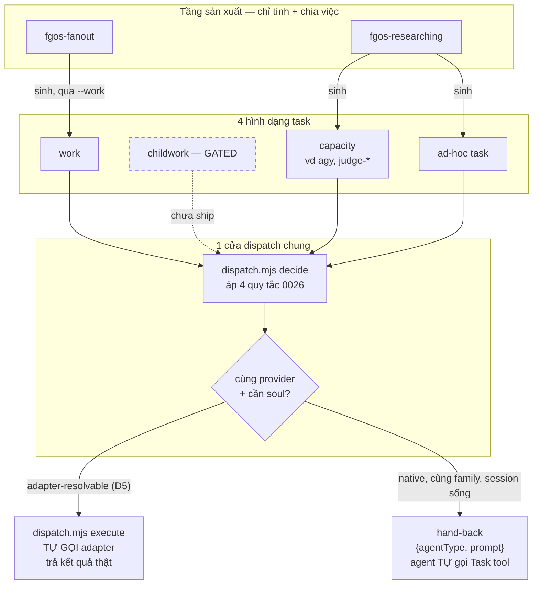

# DISCUSSION — Tổng quát hoá tầng capacity/executor dispatch quanh khái niệm "task"

Item: `tsk-5tm`. Distill từ 1 phiên thảo luận tương tác dài (2026-08-14, session
bắt đầu review report `plans/reports/capacity-dispatch-260813-1723-flow-a-skill-
vs-flow-b-runner-report.md`), không qua `/fgOS:submit`/`/fgOS:pick` cho tới khi
chuỗi kết luận đủ chín để ghi lại. Liên quan trực tiếp: `tsk-1o7` (needs/capability
binding), `tsk-2ie5`/`tsk-2c1` (gather-capacity-purpose-binding), `tsk-3ik`
(Native-First Dispatch Doctrine Phase 4, đã merge — nguồn gốc `mechanism:
in-process/out-of-process`), `docs/decisions/0026` (Native-First Dispatch
Doctrine, 4 quy tắc chọn native-vs-cli/spawn).

## 1. Trạng thái hiện tại

Vòng 6 (2026-08-14). **12 điểm đã CHỐT (D1-D12)** — chỉ còn ĐÚNG 1 điểm mở:
nội dung câu chữ cụ thể của đoạn `AGENTS.md` (§3 #1), cố ý hoãn tới khi D5
(`execute` subcommand) + `--work` CLI flag thật sự tồn tại (D7). Thiết kế
tổng thể (§6) đã ổn định qua nhiều vòng không bị đảo — sẵn sàng cho
`fgos-coding-exploring`/`fgos-coding-planning` một khi người dùng xác nhận hội
tụ.

Phát hiện định hình lại cả buổi: khung "1 cửa dispatch chung cho mọi hình dạng
task" **không phải ý tưởng mới** — nó là phần mở rộng đúng phạm vi đã khoá của
`tsk-3ik`'s D3 (`docs/history/native-first-dispatch-doctrine-phase-4-unify-
capacity-and-task-dispatch/CONTEXT.md`: *"the shared decision protocol must
govern BOTH `capacities.<id>` config-driven dispatch AND any skill's direct
Agent/Task-tool subTask calls"*) sang 1 loại target D3 lúc đó chưa phủ tới —
work-item, dispatch qua `fgos-fanout`. `tsk-3ik` tự ghi lúc đó "zero existing
direct Task/Agent-tool call sites" trong skill catalog; `fgos-fanout` ra đời
sau, hardcode thẳng Agent tool, chưa từng được wire vào decision protocol đã
khoá — đây là ca không tuân thủ 1 doctrine đã chốt, không phải lỗ hổng kiến
trúc chưa ai nghĩ tới.

## 2. Mục tiêu & đề bài

fgOS có 1 kernel dùng chung (`resolveExecutorConfig`, `dispatch.mjs:674`) để
resolve 1 capacity ra 1 backend thật, nhưng 2 caller đi vào nó theo 2 đường cấu
trúc khác hẳn nhau (Flow A — skill tự CLI round-trip; Flow B — `fgos-runner`
compiled, in-process) và có ít nhất 1 producer thật (`fgos-fanout`) hoàn toàn
không đi qua nó. Đối chiếu với `marketing-cockpit` (framework anh em, cùng gốc
`.fgOS/`, khác dòng máu code) lộ ra model của họ gọn hơn: MỌI đơn vị công việc
— dù là task đăng ký sẵn hay workflow stage — đều đi qua đúng 1 hàm `run_task()`
duy nhất, hàm này TỰ THỰC THI cho mọi case tự làm được (cli/api/task-khác-family)
và CHỈ hand-back cho agent đúng 1 case (native, cùng family, có session sống).
Đề bài của phiên này: xác định fgOS có nên tổng quát hoá dispatch theo đúng mô
hình đó không, những field/khái niệm nào đang cản trở việc đó (`needs`, tên gọi
"backend" vs "executor", ranh giới `for`/`needs`), và những capacity/producer cụ
thể nào cần sửa lại theo hướng này (`gather`, `fgos-fanout`, `fgos-researching`).

## 3. Vấn đề rõ / chưa rõ

| # | Vấn đề | Trạng thái |
|---|---|---|
| 1 | Hợp đồng "muốn chạy 1 task thì gọi dispatch" nên được tuyên bố Ở TẦNG HARNESS (`AGENTS.md`) — nội dung cụ thể của đoạn văn. | **TIMING đã chốt (D7: hoãn ĐƯA VÀO FILE tới khi D5/`--work` ship). CÂU CHỮ CUỐI đã soạn xong ở vòng 8**, format bulleted (rõ hơn hẳn bản paragraph dày đặc ở vòng 7), **0 ref doc nào** (kể cả `docs/decisions/0026` — người dùng: *"anh không hề muốn ref docs vào vì enduser không thể hiểu"*), sẵn sàng dán khi tới lúc:

  > **Muốn dispatch 1 task (work-item, capacity, hoặc ad-hoc task) ra khỏi lượt hiện tại thì gọi `node src/runner/dispatch.mjs decide` trước — không tự quyết cơ chế.**
  >
  > 3 cách gọi `decide` — 3 tình huống khác nhau:
  > - `decide <capacityId>` — đã biết chính xác tên capacity (vd `judge-discovery`).
  > - `decide --for <purpose>` — biết mình cần làm VIỆC gì (vd `judge`) nhưng không biết capacity nào phục vụ việc đó.
  > - `decide --work <id>` — có 1 work-item thật, muốn dispatch chạy nó.
  >
  > 3 kết quả trả về (`mechanism`) — mỗi cái phải làm khác nhau:
  > - **`"unavailable"`** — không có gì phục vụ việc này → KHÔNG PHẢI LỖI, tự làm inline, không cần báo cáo gì.
  > - **`"in-process"`** → dispatch trả về `agentType` — tự gọi Task/Agent tool của chính mình với `agentType` đó, dispatch không làm gì hộ (nó không có quyền gọi Task tool).
  > - **`"out-of-process"`** → gọi tiếp `node src/runner/dispatch.mjs execute` — KHÔNG tự đứng ra chạy lệnh qua Bash — dispatch tự thực thi và trả kết quả thật.

  2 lỗi bị bắt và sửa khi soạn bản cuối (không chỉ đổi format): (a) ví dụ `agentType: "researcher"` ở bản nháp trước là BỊA — grep thật xác nhận chưa có entry `capacities.<id>` nào khai `agentType` hôm nay, đã bỏ; (b) ví dụ `--for "gather"` SAI — D6's phạm vi B đã xoá `'gather'` khỏi `CAPACITY_PURPOSES` enum, không còn là giá trị hợp lệ — đổi sang `judge` (giá trị enum còn lại duy nhất, thật). |

## 4. Quyết định đã chốt

| D-ID | Quyết định |
|---|---|
| D1 | **Retire field `needs` khỏi `capacities.<id>`.** Bằng chứng: `resolveExecutorConfig` (dispatch.mjs:692) chỉ chạy gate `needs` khi `capacity.kind !== 'task'` — nhưng 2/3 entry thật trong `.fgos/config.json` (`judge-discovery`, `judge-decompose`) là `kind:"task"`, nên `needs:"llm-judgment"` trên cả 2 là data chết 100%, code không bao giờ đọc. Entry thứ 3 (`gather`, kind:"cli") có `needs` sống nhưng không thêm tín hiệu nào ngoài việc OS tự throw ENOENT nếu binary thiếu — chỉ đổi chỗ throw sớm hơn với message thân thiện hơn. Lý do gốc `needs` sinh ra (staleness gate kiểu GitNexus, `tsk-1o7`/US-027) chưa từng có executor thật nào dùng tới (GitNexus chưa bao giờ là 1 `capacities.<id>` entry — agent gọi MCP trực tiếp). Giữ nguyên tool-registry + `fgos tool query --status present/stale` làm nơi hỏi staleness trực tiếp tại điểm gọi — không cần dispatch.mjs tái tạo gate này. |
| D2 | **Đặt tên "executor", không "backend".** Đã khớp sẵn code (`resolveExecutorConfig`/`resolveExecutorCommand`/`EXECUTOR_ADAPTERS`), khớp ADR0042 gốc ("task-first-routing-and-executor-kinds"), khớp chính file thật của marketing-cockpit (`executor-registry.yaml`, key theo tên executor: agy/claude/codex). "backend" chỉ xuất hiện 1 lần trong report trước do tự trôi thuật ngữ giữa 2 đoạn, không phải quyết định thật — không cần sửa code (đã đúng sẵn), chỉ là kỷ luật đặt tên cho tài liệu/thảo luận về sau. |
| D3 | **`for`/`needs` là 2 trục trực giao: JOB vs MECHANISM**, không phải cùng 1 khái niệm. `for` = việc được giao (job, dùng để purpose-lookup, enum `gather`/`judge`). `needs` = cơ chế phải có mặt để chạy (mechanism, dependency gate — dù D1 đã quyết retire field này khỏi capacity, trục khái niệm vẫn đúng, chỉ nơi hỏi chuyển sang tool-registry trực tiếp). Executor càng chuyên biệt (gitnexus, nếu có entry) thì `for`==`needs` càng tự nhiên trùng; executor càng tổng quát (agy, có thể phục vụ nhiều job) thì càng tách xa. Phép thử: "executor này có thể bị giao việc KHÁC mà vẫn dùng đúng cơ chế này không?" — có thì `for` phải khác mechanism-gate, không thì trùng là đúng, không phải lỗi. |
| D4 | **Tổng quát hoá dispatch quanh khái niệm "task"** (mượn vocab marketing-cockpit), là MỞ RỘNG đúng phạm vi đã khoá của `tsk-3ik`'s D3, không phải ý tưởng mới. 4 hình dạng hiện có của fgOS (`work`-item đầy đủ lifecycle, `childwork`/exec-packet B2 còn gated chưa ship theo `two-layer-dispatch` D4, `capacity` đã đăng ký, `adhoc-packet` 6-field runtime-composed theo `two-layer-dispatch` D3/D6) đều là "task" theo nghĩa tổng quát. Tầng SẢN XUẤT (fgos-researching tính+chia việc research, fgos-fanout tính+chia wave/work-item) chỉ lo tính và chia — KHÔNG tự quyết cơ chế thực thi. Tầng DISPATCH (1 cơ chế dùng chung, đã tồn tại 1 phần qua `decideCapacityDispatchMechanism`/Native-First Dispatch Doctrine 4 quy tắc) nhận bất kỳ hình dạng task nào, quyết executor tại runtime — native subagent chỉ là 1 kết quả có thể của quyết định này (Quy tắc 2 của `docs/decisions/0026`: cùng provider + cần soul → ưu tiên native), không phải đường đi riêng nằm ngoài dispatch. Bằng chứng gap cụ thể: Flow B (`capacityIdForWork`, dispatch.mjs:1090) đã model hoá "thực thi 1 work-item" như capacity-dispatch qua domain+stage — nhưng `fgos-fanout` (Flow A, đồng bộ trong-session) hardcode thẳng Agent tool, chưa từng consult decision protocol này, dù đúng phạm vi `tsk-3ik`'s D3 đã tuyên bố phải làm. |
| D5 | **`dispatch.mjs` cần tự thực thi (self-execute) cho case adapter-resolvable, khớp `run_task()` của marketing-cockpit** (đã đọc `task-executor.py:550-611`: tự gọi adapter, trả kết quả thật, cho mọi case `via=cli/api/task-khác-family`; CHỈ hand-back đúng 1 case `via=task` cùng-family-có-session-sống). fgOS's Flow A (`resolveCapacityCli`) hôm nay LUÔN hand-back `{command,args}` cho agent tự chạy qua Bash — kể cả case `cli` lẽ ra tự thực thi được. `EXECUTOR_ADAPTERS['cli-spawn']` được validate (dispatch.mjs:895) nhưng KHÔNG BAO GIỜ được gọi trong Flow A, chỉ Flow B (`spawnWorker`) mới tự gọi. Cần 1 subcommand mới (`execute`/`dispatch`) tự gọi `EXECUTOR_ADAPTERS[adapter](...)` ngay trong CLI cho mọi case tự làm được, chỉ trả `spawn_instruction`-shaped result cho case in-process — đây là nền tảng D4 cần để có nơi thật cho nhánh "out-of-process" của mọi hình dạng task, không riêng capacity. |
| D12 | **Chốt shape "shared prose helper" — 3 sub-phần gộp chung, không tách D-ID riêng.** (i) Fragment rút còn 3 bước sau D5 landed — hệ quả tất yếu của D5, không có phương án khác. (ii) Purpose-based lookup (`--for`) đã hoạt động sẵn — fragment chỉ cần THÊM TÀI LIỆU, không cần code mới. (iii) work-item-shaped lookup qua `--work <id>` (hướng a: export `capacityIdForWork` + thêm cờ CLI) — đã qua đủ vòng (chọn ở vòng 3, các quyết định sau đó tiếp tục dựa trên hướng này không bị đảo). |
| D11 | **Schema executor-keyed-by-name GIỮ top-level key `capacities`, KHÔNG đổi thành `executors`.** Phát hiện qua điều tra `judge-decompose` (cùng vòng, D10): `dispatch.mjs:521-528` (từ `tsk-4eu`) đã validate `cfg.executors` CHỈ cho phép key là `TIERS` (`light/standard/heavy`) — thêm `executors.agy` sẽ bị `RunnerConfigError` từ chối ngay, schema đề xuất trước đó (dùng key `executors`) KHÔNG LOAD ĐƯỢC. `cfg.executors` là cơ chế khác hoàn toàn (per-TIER override, không phải per-capacity), từng gây bug thật (`tsk-4eu`/`tsk-5ge`) khi bị dùng nhầm làm key theo tên. Giữ tên field top-level `capacities` không đổi (0 va chạm, 0 chi phí migration thêm) — chỉ đổi HÌNH DẠNG bên trong (key theo tên executor thay vì purpose, `invocations[]` thay vì `command`/`args` phẳng). Từ "executor" (D2) vẫn dùng để GỌI TỪNG ENTRY, không phải tên field JSON. |
| D10 | **`judge-discovery`/`judge-decompose` `for:"judge"` collision là VÔ HẠI, không phải bug, không sửa `resolveCapacityIdForPurpose`.** Điều tra lịch sử thật (`tsk-4eu-executors-key-tier-validation`, `tsk-5ge-judge-decompose-config-fix`): bug thật của `judge-decompose` KHÔNG liên quan `for`/purpose-lookup — là lỗi khác hoàn toàn (ai đó đặt sai nội dung vào `runner.executors.judge`, nhầm với cơ chế `executors.<tier>`, khiến `judge-decompose` rơi qua global `executor` fallback thiếu tool `Read`). Đã fix bằng cách dời nội dung thẳng vào `capacities.judge-decompose`, không đụng gì tới purpose-lookup. Grep xác nhận: không skill nào (`fgos-coding-discovering`, `fgos-coding-planning`) gọi `--for judge` chung chung — cả 2 luôn gọi thẳng id. `for:"judge"` trên cả 2 entry chỉ là nhãn gom-nhóm/tài liệu hoá, không bao giờ được purpose-lookup thực sự dùng tới. |
| D9 | **Đổi model/tier resolution từ 1 map phẳng sang N-map theo provider, mở rộng tier vocab 3→5, thêm trục `rigorOverrides`.** Bug cụ thể: `modelForTier` (dispatch.mjs:577) chỉ đọc `cfg.models = {light,standard,heavy}`, toàn tên model Claude — 1 executor non-Claude (agy/Gemini) gọi qua tier sẽ nhận tên model Claude sai hoàn toàn, không throw, chỉ âm thầm sai. Entry `gather` cũ từng phải hardcode đè cả `tier`+`model` để né bug này — bug tái hiện ngay khi dựng executor `agy` thật. Lấy đúng "schema kết hợp v1" đã đề xuất đầu phiên: `cfg.modelPolicies` keyed theo provider (`claude`/`gemini`), mỗi provider tự có 5 tier (`lightweight/standard/creative/analytical/critical`) + `rigorOverrides` — khớp `tier_policy_path` model của marketing-cockpit. Người dùng chọn lấy CẢ HAI phần (đổi cardinality + mở rộng vocab), không tách riêng dù vocab-mở-rộng có blast radius rộng hơn (`work.tier` đang đọc ở nhiều nơi — cần rà kỹ ở planning, không chỉ thêm field). |
| D8 | **Đổi tên "ad-hoc packet" thành "ad-hoc task"** trong vocab D4. Mô tả người dùng (agent tự soạn prompt lúc chạy, cần dispatch prompt đó) khớp đúng định nghĩa gốc, không đổi nghĩa. "work" va chạm với work-item (có lifecycle, id claim được) ngay trong chính bảng taxonomy D4; "task" trung tính, khớp vốn từ tổng quát D4 đã dùng cho cả 4 hình dạng. KHÔNG đổi shape `id` (`<scope>#p<n>`, vẫn invalid với `ID_PATTERN`) — thuần tuý đổi tên, không đổi ngữ nghĩa lifecycle. |
| D7 | **Hoãn việc viết hợp đồng dispatch vào `AGENTS.md` cho tới khi D5 (`execute` subcommand) + `--work` CLI flag (item shared-helper hướng a) đã ship.** `AGENTS.md` là tài liệu luôn-nạp — viết trước khi `execute`/`--work` tồn tại sẽ trỏ vào lệnh không có thật, agent làm theo sẽ gãy. Đúng bài học đã rút ở item shared-helper: viết 1 lần đúng hình cuối, tránh sửa lại lần 2 như `fgos-researching` đã gặp với `capacity-dispatch-fallback.md`. Chỗ đặt đã xác định trước (không phải quyết định của D7, chỉ ghi lại grounding): đoạn bold-paragraph mới trong `## fgOS Workflow` (trước dòng `<!-- gitnexus:start -->`), theo đúng style 3 đoạn "Never X without Y" đã có sẵn — KHÔNG mô phỏng khối bảng GitNexus (đó là vùng auto-regen của tool ngoài, có sentinel riêng). |
| D6 | **Xoá capacity `gather` khỏi `.fgos/config.json`.** Con đường cross-provider DUY NHẤT trong hệ; không có quyết định kiến trúc nào ghi lại lý do cần cross-provider cụ thể (plan.md gốc `tsk-2ie5` tự ghi "provider... not decided in this plan, not guessed ahead of time"). Lý do thật duy nhất có ghi lại ("song song hoá, rút ngắn wall-clock") đã được native Task-tool đáp ứng đủ. `fgos-researching`'s SKILL.md đã tự coi "không có gather capacity" là "the common/default path today" — xoá an toàn, revert về hành vi trước `tsk-2ie5`. Qua ngưỡng ≥2 vòng: điều tra bằng chứng (vòng 1) → hỏi thẳng lý do cross-provider, không tìm thấy → chốt xoá (vòng 2). |

## 5. Q&A log

- **Vòng 1, đoạn a (2026-08-14 ~13:26).** Người dùng yêu cầu đọc lại report
  `capacity-dispatch-260813-1723...` và trình bày chi tiết data-structure của
  "capacity-registry". Scout: đọc report đầy đủ, tách rõ Tầng 1 (tool-registry,
  fact table) vs Tầng 2 (executor-registry/`runner.capacities`, config table),
  nối bằng `needs`→`capability` — không map theo `name`.
- **Vòng 1, đoạn b (~13:35).** Người dùng đề xuất framing "capacity = lời hứa,
  executor = hiện thực hoá lời hứa", muốn tư vấn Opus. Opus quá tải (529) 2 lần
  — chạy bằng Sonnet thay thế theo lựa chọn người dùng. Verdict: giữ 2 bảng
  tách riêng (không gộp) — capability-với-0-executor là bằng chứng thật
  (`impact-analysis`/GitNexus), khoá ngoại `needs→capability` chính là chỗ DRY.
- **Vòng 1, đoạn c (~13:51).** Người dùng hỏi "executor" hay "backend" hợp lý
  hơn cho tên gọi Tầng 2. Xác nhận "executor" đúng — khớp code/ADR0042/
  marketing-cockpit, "backend" chỉ là report tự trôi thuật ngữ → **D2**.
- **Vòng 1, đoạn d (~13:58–14:08).** Người dùng chưa rõ ranh giới `for`/`needs`,
  yêu cầu "step back" thảo luận lại. Đề xuất khung JOB vs MECHANISM. Người dùng
  phản hồi "for map vào capacity, needs không đâu dùng" — scout bằng
  `.fgos/config.json` thật + đọc `resolveExecutorConfig` dòng 692, xác nhận
  đúng 2/3, phát hiện phụ vụ collision `judge-discovery`/`judge-decompose` cùng
  `for` → **D3** + vấn đề mở #2.
- **Vòng 1, đoạn e (~14:20).** Người dùng chốt "needs cần retire bởi vì chính
  executor là đơn vị fulfillment rồi" → **D1**, kèm đánh đổi UX (mất message
  lỗi sớm) đã nêu rõ.
- **Vòng 1, đoạn f (~14:29).** Người dùng yêu cầu "ghi nhận vào tài liệu
  trước", rồi NGAY LẬP TỨC (giữa turn) đổi hướng: "lật lại vụ gather, sẽ không
  có executor gather, tìm các chỗ liên quan". Scout toàn bộ điểm chạm `gather`
  trong code/skill/docs/test → vấn đề mở #1.
- **Vòng 1, đoạn g (~14:53).** Người dùng hỏi thẳng "gather đẩy việc gì ra
  ngoài, tại sao cần provider khác". Đọc `plan.md` gốc `tsk-2ie5` +
  `why-fgos-dispatch-splits-into-gather-packets...md` — xác nhận: lý do
  "song song hoá" đã đủ với native, KHÔNG có lý do kiến trúc nào cho
  cross-provider cụ thể.
- **Vòng 1, đoạn h (~14:59).** Người dùng phát hiện `fgos-researching` VÀ
  `fgos-fanout` đều embed 1 phần logic dispatch, đề xuất tách 1 skill chung.
  Đọc `_shared/capacity-dispatch-fallback.md` (đã tồn tại, DRY-motivated từ
  `tsk-53h`) + `fgos-fanout` SKILL.md — xác nhận đúng 1 nửa (research diverge
  khỏi fragment vì fragment thiếu purpose-based support — DRY debt thật) và
  phản biện 1 nửa (fanout dispatch work-item, khác lớp gather-packet theo
  `two-layer-dispatch`'s "does it write a file" axis — không nên gộp LOGIC
  TÍNH-VIỆC, chỉ nên gộp ĐIỂM GỌI DISPATCH).
- **Vòng 1, đoạn i (ultrathink, ~14:53→15:0x).** Người dùng đưa khung: dispatch
  = dispatch task (mượn vocab marketing-cockpit, tổng quát 4 hình dạng
  work/childwork/capacity/adhoc-packet); tầng sản xuất (research/fanout) chỉ
  tính+chia việc, tầng dispatch quyết executor tại runtime, native subagent chỉ
  là 1 kết quả có thể. Xác nhận đúng, chỉ ra Flow B (`capacityIdForWork`) đã
  làm 1 nửa, `fgos-fanout` là ngoại lệ chưa tuân theo → **D4** (sau khi grounding
  thêm với `tsk-3ik`/`docs/decisions/0026` ở vòng ghi tài liệu).
- **Vòng 1, đoạn j.** Người dùng hỏi đã học cơ chế `run_task()` của
  marketing-cockpit chưa (tự thực thi case làm được, hand-back case native).
  Xác nhận đã học từ report gốc, đối chiếu ra gap cụ thể: Flow A của fgOS
  không bao giờ tự thực thi, `EXECUTOR_ADAPTERS` chỉ được Flow B gọi → **D5**.
- **Vòng 1, đoạn k.** Người dùng yêu cầu "ghi nhận chuỗi kết luận", thêm điểm
  mới: cần 1 prose/skill helper chung ở đầu agent làm ngõ vào dispatch cho MỌI
  producer, điểm kích hoạt gốc luôn từ agent → vấn đề mở #3. Bắt đầu quy trình
  `fgos-coding-shaping`: `fgos submit` → `tsk-5tm`, `fgos pick`, vào worktree.
- **Vòng 1, đoạn l (giữa lúc ghi tài liệu).** Người dùng bổ sung thêm: hợp đồng
  này nên tuyên bố Ở TẦNG HARNESS (`AGENTS.md`), giống khối MUST/NEVER của
  GitNexus trong `CLAUDE.md`, để agent ngoài luồng skill cụ thể cũng biết cửa
  vào → vấn đề mở #3. Đọc thêm `docs/decisions/0026` (4 quy tắc chọn dispatch)
  + `tsk-3ik` CONTEXT.md để grounding D4 đúng vị trí (mở rộng doctrine đã khoá,
  không phải phát minh mới).

- **Vòng 2, đoạn a.** Người dùng chốt "1. xoá gather" — vấn đề mở cũ #1
  (gather) chuyển thành **D6**. Ghi `fgos decision` D6.
- **Vòng 2, đoạn b.** Người dùng hỏi "chỗ nào cần thảo luận" trước khi chốt
  hẳn việc cần làm. Scout xác nhận `why-fgos-dispatch-splits-into-gather-
  packets...md` KHÔNG bị ảnh hưởng (dùng "gather" làm tên khái niệm packet,
  không nhắc capacity/config thật) — loại khỏi scope. Nêu 4 điểm thật sự cần
  quyết (không chỉ xoá cơ học): (A) giữ hay xoá tool-registry entry
  `gather`→`prompt-completion`; (B) giữ hay bỏ `'gather'` khỏi
  `CAPACITY_PURPOSES` enum; (C) 2 doc explanation dùng `gather`/`needs` làm ví
  dụ chính — sửa ví dụ/đánh dấu lỗi thời/để nguyên; (D) trim hay giữ đoạn
  "check gather-purpose capacity" trong `fgos-researching`'s SKILL.md.
- **Vòng 2, đoạn c.** Người dùng chốt cả 4: **A. xoá** (tool-registry entry đi
  cùng capacity, không giữ speculative); **B. bỏ cả `'gather'` khỏi enum**
  ("capacity đã là purpose rồi" — không cần giữ 1 enum value không ai dùng,
  purpose mới sau này tự thêm lại khi có nhu cầu thật) — hệ quả cụ thể: 11 chỗ
  trong `test/runner/dispatch.test.mjs` dùng `for: 'gather'` làm fixture, phải
  đổi sang `for: 'judge'` (giá trị enum còn lại) khi B thực thi; **C. sửa lỗi
  thời** (chủ động cập nhật nội dung, không chỉ đánh dấu lịch sử) — how-to đổi
  ví dụ sang entry thật còn sống (`judge-discovery`), doc `dispatch-binding-
  moves-from-name-keying...md` viết lại phần mô tả `needs` phản ánh đúng D1
  (đã retire); **D. bỏ** đoạn "check gather-purpose capacity" khỏi
  `fgos-researching`'s SKILL.md — không giữ bảo hiểm cho 1 nhánh không còn kỳ
  vọng quay lại. 4 quyết định này gộp vào scope thực thi của D6, không mint
  D-ID riêng (chi tiết thực thi, không phải quyết định kiến trúc mới).
- **Vòng 3, đoạn a.** Người dùng chọn đào tiếp item mở #2 (shared prose
  helper). Scout `decideCapacityCli`/`decideCapacityDispatchMechanism`
  (dispatch.mjs:800-825) — phát hiện `decide` đã tự gộp sẵn "config check"
  (Step A của fragment cũ dư thừa), nhưng KHÔNG check presence (Step B vẫn cần
  — presence chỉ nằm trong `resolve`). Trình bày phương án rút fragment còn 3
  bước 1 khi D5 landed, xác nhận purpose-based lookup đã có sẵn (chỉ thiếu tài
  liệu), và nêu lỗ hổng work-item-shaped lookup (`capacityIdForWork` module-
  private) — hỏi hướng (a) export+cờ CLI mới vs (b) fanout tự tính lại.
- **Vòng 3, đoạn b.** Người dùng chọn **(a)**. Vòng đầu của quyết định cụ thể
  này — chưa mint D-ID, cần giữ qua ≥1 vòng nữa theo đúng hard rule.
- **Vòng 4, đoạn a.** Người dùng chọn đào tiếp item mở #3 (AGENTS.md). Scout
  cấu trúc thật `AGENTS.md` — phát hiện khối GitNexus là vùng auto-regen
  (`<!-- gitnexus:start -->`), không nên bắt chước; mẫu đúng là 3 đoạn bold-
  paragraph sẵn có trong `## fgOS Workflow`. Nêu câu hỏi timing (viết ngay vs
  chờ D5/`--work` xong) — đề xuất chờ.
- **Vòng 4, đoạn b (chen ngang).** Người dùng đề xuất đổi "ad-hoc packet" →
  "ad-hoc work". Chỉ ra căng thẳng với thiết kế gốc (`id` cố tình invalid
  `ID_PATTERN` để KHÔNG bị nhầm với work-item có lifecycle) — hỏi rõ ý định
  (a/b/c).
- **Vòng 4, đoạn c.** Người dùng xác nhận lại hướng "chờ" cho câu hỏi timing
  AGENTS.md (đoạn a) — đủ vòng, chốt **D7**.
- **Vòng 4, đoạn d.** Người dùng giải thích ý định đổi tên: "adhoc work là
  agent tạo ra prompt và cần dispatch prompt này" — khớp đúng định nghĩa gốc,
  rơi vào nhánh (c) (mô tả cơ chế, không cố ý đổi lifecycle). Đề xuất "ad-hoc
  task" thay vì "ad-hoc work" — giữ đúng mô tả, tránh va chạm "work"-item,
  khớp vocab D4. Người dùng xác nhận "ổn" → **D8**.
- **Vòng 5, đoạn a.** Người dùng đề xuất thêm 1 executor `agy` thật, học cấu
  trúc marketing-cockpit — nêu 2 điểm cần rõ trước (cấu trúc `executors.<name>`
  chưa từng có D-ID; tension với D6 vừa xoá `gather`). Người dùng xác nhận
  (a): dựng ví dụ tham chiếu, không gắn purpose.
- **Vòng 5, đoạn b.** Người dùng nhắc `--dangerously-skip-permissions` (từ
  cmd_template thật của marketing-cockpit) — verify trực tiếp qua `agy --help`
  trên máy, xác nhận đúng, phát hiện phụ: entry `gather` cũ thiếu cờ này, khả
  năng chưa từng chạy đúng qua cli-spawn thật.
- **Vòng 5, đoạn c.** Người dùng hỏi "dispatch có copy cơ chế marketing-cockpit
  luôn không" — trình bày rõ 3 nhóm: đã/đang copy (resolver chung, self-
  execute/hand-back, MCP bypass, cardinality N-invocations), cố tình KHÔNG
  copy (allowCrossProvider gate, command_template string, workflow-level
  pause-resume — đã có tương đương ở stage FSM khác tầng), và 1 lỗ hổng cũ tái
  xuất hiện (tier/model policy, do dựng `agy` thật lộ ra).
- **Vòng 5, đoạn d.** Người dùng nhắc: tài liệu đã bàn cách trộn config từ đầu
  phiên rồi ("schema kết hợp v1", có `modelPolicies`). Lấy lại đúng bản gốc,
  tách 2 phần (đổi cardinality vs mở rộng vocab 3→5 tier), hỏi lấy phần nào —
  người dùng chọn **lấy cả 2** → **D9**.
- **Vòng 6.** Người dùng: "tiếp, cái gì chưa rõ thì trả lời luôn" — uỷ quyền
  tự quyết các điểm mở còn lại. Điều tra thật lịch sử `judge-discovery`/
  `judge-decompose` (`tsk-4eu-executors-key-tier-validation`, `tsk-5ge-judge-
  decompose-config-fix`) — phát hiện bug thật KHÔNG liên quan `for`/purpose
  (là nhầm lẫn `runner.executors.judge` với cơ chế `executors.<tier>` hoàn
  toàn khác) → **D10** (vô hại, không sửa gì). Cùng lúc phát hiện quan trọng:
  `cfg.executors` ĐÃ TỒN TẠI, tier-keyed, được validate chặt (`tsk-4eu`) — va
  chạm trực tiếp với đề xuất schema `executors.<name>` ở vấn đề mở #0 (schema
  đó KHÔNG LOAD ĐƯỢC nếu dùng đúng tên field `executors`) → **D11** (giữ field
  `capacities`, chỉ đổi hình dạng bên trong). Item #2 (shared prose helper) đủ
  điều kiện gộp chốt cả 3 sub-phần → **D12**.

## 6. Thiết kế đã chốt {#design}

### Bối cảnh: đây là phần còn thiếu của 1 doctrine đã khoá, không phải phát minh mới

fgOS đã có 1 doctrine dispatch khoá từ trước (`docs/decisions/0026`, Native-
First Dispatch Doctrine): với 1 target cần "soul" (suy luận, không thuần cơ
học), cùng provider với phiên đang chạy → ưu tiên native; khác provider → bắt
buộc cli/spawn; config có thể ép cli/spawn cho mục đích cách ly tài nguyên
(ngoại lệ hợp lệ, không phải bug). `tsk-3ik` (Phase 4) đã hiện thực hoá 1 lớp
quyết định tự động áp 4 quy tắc này cho `capacities.<id>`
(`decideCapacityDispatchMechanism`, trả `mechanism: in-process/out-of-
process`) — nhưng phạm vi D3 của chính `tsk-3ik` ("mọi call site Task/Agent-
tool trực tiếp phải qua cùng decision protocol") chưa từng được thực thi cho
`fgos-fanout`, vì skill đó chưa tồn tại lúc `tsk-3ik` viết. Toàn bộ thiết kế
dưới đây là ĐÓNG khoảng trống đó, cộng dọn sạch vài field/entry đã hết lý do
tồn tại được phát hiện dọc đường.

### 1. Producer layer — chỉ tính việc, chia việc, không tự quyết cơ chế

`fgos-researching` (tính research branch) và `fgos-fanout` (tính wave/work-
item) chỉ sinh ra TASK — không tự hardcode cơ chế thực thi. 4 hình dạng task
hiện có của fgOS, mượn vocab tổng quát "task" từ marketing-cockpit (D4):

| Hình dạng | Ý nghĩa | Trạng thái |
|---|---|---|
| `work` | work-item đầy đủ lifecycle (claim/stage/status) | sống, do `fgos-fanout` sinh |
| `childwork` | exec-packet B2 (ghi file, id ephemeral, không lifecycle đầy đủ) | GATED theo `two-layer-dispatch` D4 — chưa ship |
| `capacity` | đăng ký sẵn trong `capacities.<id>` | sống, do `fgos-researching`/`fgos-runner` dùng |
| `ad-hoc task` | 6-field runtime-composed (đổi tên từ "ad-hoc packet", D8) | sống — `id` cố tình `<scope>#p<n>`, invalid với `ID_PATTERN`, không lẫn work-item thật |

### 2. Dispatch layer — 1 cửa chung, tự thực thi hoặc hand-back tại runtime

Nhận bất kỳ hình dạng task nào ở trên, áp 4 quy tắc `0026` tại RUNTIME (không
phải build-time):

- **Case tự thực thi được (adapter-resolvable)** — dispatch TỰ GỌI
  `EXECUTOR_ADAPTERS[adapter](...)`, trả kết quả THẬT, khớp `run_task()` của
  marketing-cockpit (D5). Cần 1 subcommand mới, `execute`, thay cho hành vi
  hôm nay của Flow A (`resolve` chỉ trả `{command,args}` trần, bắt agent tự
  đứng ra làm thay adapter qua Bash — Flow B (`spawnWorker`) đã tự gọi đúng,
  chỉ Flow A cần sửa).
- **Case native, cùng family, có session sống** — CHỈ case này dispatch
  hand-back `{agentType, prompt}`, vì dispatch (1 CLI/thư viện thụ động)
  không có quyền tự gọi Task/Agent tool — agent tự gọi tool của chính nó.
- **`mechanism: "unavailable"`** — trạng thái HỢP LỆ (không phải lỗi) khi
  không có gì phục vụ task đó — rơi thẳng về tự làm inline.

3 cách 1 producer hỏi dispatch: theo id cố định (`decide <capacityId>`),
theo purpose (`decide --for <purpose>`, đã hoạt động sẵn), hoặc theo work-item
(`decide --work <id>`, MỚI — cần export `capacityIdForWork` + thêm cờ CLI,
đây là mảnh còn thiếu để `fgos-fanout` hết là ngoại lệ chưa tuân doctrine).

### 3. Registry shape — key theo tên executor, KHÔNG đổi field top-level

Muốn đổi cấu trúc bên trong (key theo TÊN EXECUTOR thay vì purpose, mảng
`invocations[]` thay vì `command`/`args` phẳng — khớp `executor-registry.yaml`
thật của marketing-cockpit) — nhưng **field top-level VẪN LÀ `capacities`**
(D11): `cfg.executors` đã tồn tại thật, key theo TIER (`light/standard/heavy`,
validate chặt từ `tsk-4eu`), đổi tên trùng sẽ khiến config không load được.
Ví dụ tham chiếu thật, verify kỹ thuật qua `agy --help` trên máy (D6/D11):

```jsonc
"capacities": {
  "agy": {
    "kind": "agent", "providerModel": "gemini", "allowCrossProvider": true,
    "invocations": [{ "via": "cli", "adapter": "cli-spawn", "command": "agy",
      "args": ["-p", "{prompt}", "--dangerously-skip-permissions", "--model", "{model}"] }]
    // không gắn "for" nào — chờ producer thật cần mới khai
  }
}
```

`judge-discovery`/`judge-decompose` (key theo id cụ thể, không theo purpose)
đã tương thích tự nhiên với shape mới — không cần migrate. `for:"judge"` trên
cả 2 entry chỉ là nhãn gom-nhóm, chưa từng được purpose-lookup thực sự dùng
tới — điều tra lịch sử thật (`tsk-4eu`/`tsk-5ge`) xác nhận đây vô hại, không
phải bug (D10).

### 4. Model/tier — N-map theo provider, vocab mở rộng

`modelForTier` cũ chỉ đọc 1 map phẳng, toàn tên model Claude — 1 executor
non-Claude (như `agy`) gọi qua tier sẽ nhận tên model SAI, không throw. Đổi
sang `cfg.modelPolicies`, key theo provider, mỗi provider tự có 5 tier
(`lightweight/standard/creative/analytical/critical`) + trục `rigorOverrides`
(D9) — khớp `tier_policy_path` của marketing-cockpit.

### 5. Đã dọn — 2 thứ hết lý do tồn tại

- **Field `needs`** (D1): retire khỏi `capacities.<id>` — chết 100% với mọi
  entry `kind:"task"`, không thêm tín hiệu gì với `kind:"cli"` ngoài việc OS
  tự throw ENOENT. Tool-registry + `fgos tool query --status present/stale`
  là nơi hỏi presence/staleness trực tiếp tại điểm gọi, không cần dispatch.mjs
  tái tạo gate này.
- **Capacity `gather`** (D6): xoá hoàn toàn — từng là con đường cross-provider
  DUY NHẤT, không có lý do kiến trúc nào ghi lại; lý do thật duy nhất có ghi
  (song song hoá) đã được native đáp ứng đủ. Xoá kèm: tool-registry entry,
  `'gather'` khỏi `CAPACITY_PURPOSES` enum, test cứng vào entry thật, và đoạn
  prose chết trong `fgos-researching`'s SKILL.md.

### 6. Điểm vào — prose helper nội bộ + hợp đồng tầng harness

Điểm kích hoạt gốc LUÔN LUÔN từ agent (dispatch.mjs thụ động). 2 tầng phủ
khác nhau, không trộn (D12):

- **Nội bộ, đã chủ động:** mở rộng `_shared/capacity-dispatch-fallback.md`
  (rút còn 3 bước sau `execute` landed, thêm tài liệu cho `--for`/`--work`) —
  MỌI producer trỏ vào ĐÚNG 1 fragment này, không tự viết lại logic gọi
  dispatch (đúng lỗi `fgos-researching` đã mắc khi fragment cũ chưa theo kịp
  purpose-based binding).
- **Phổ quát, cho agent ngoài luồng skill:** 1 đoạn ở `AGENTS.md` (bold-
  paragraph trong `## fgOS Workflow`, không mô phỏng khối auto-regen của
  GitNexus) — câu chữ đã soạn xong (D7's target-text, vòng 8), cố ý hoãn ĐƯA
  VÀO FILE tới khi `execute`/`--work` thật sự tồn tại, để không trỏ vào lệnh
  chưa có thật.



## 7. Danh mục hạng mục / task {#tasks}

Chỉ tạo task cho các quyết định đã CHỐT (D1/D4/D5/D6) — vấn đề mở (§3) chưa đủ
chín để shape thành task, và D2/D3 là kỷ luật đặt tên/khái niệm không cần code
mới (D2: code đã đúng sẵn; D3: đã áp dụng ngay trong quyết định retire D1).

### `#task-remove-gather` (D6, phạm vi A/B/C/D đã chốt vòng 2)

- **Mục tiêu:** Xoá hoàn toàn capacity `gather` và mọi thứ chỉ tồn tại để phục
  vụ nó — không để lại config chết, enum chết, hay doc trỏ vào ví dụ không còn
  tồn tại.
- **Việc cụ thể:**
  1. Xoá block `capacities.gather` khỏi `.fgos/config.json`.
  2. (A) Xoá tool-registry entry `{"name":"gather","kind":"cli",
     "capability":"prompt-completion","command":"agy"}` cùng lúc — không giữ
     speculative.
  3. (B) Bỏ `'gather'` khỏi `CAPACITY_PURPOSES` (`dispatch.mjs:406`) —
     `Object.freeze(['gather', 'judge'])` → `Object.freeze(['judge'])`. Kéo
     theo: 11 chỗ trong `test/runner/dispatch.test.mjs` dùng `for: 'gather'`
     làm fixture (không phải test entry thật, chỉ mượn tên) phải đổi sang
     `for: 'judge'` để không vỡ `validateCapacityShape`'s enum check.
  4. Sửa test `test/runner/dispatch.test.mjs:651-657` (assert cứng "committed
     .fgos/config.json declares the gather capacity") — xoá hẳn, không còn
     điều đó đúng.
  5. (C) `docs/how-to/wire-a-skill-to-a-capacity-by-purpose-not-name.md` —
     đổi ví dụ chính sang 1 entry thật còn sống (`judge-discovery`).
  6. (C) `docs/explanation/dispatch-binding-moves-from-name-keying-to-needs-
     for-capability-declaration.md` — viết lại phần mô tả `needs` phản ánh
     đúng D1 (field đã retire, tool-registry + `fgos tool query` là nơi hỏi
     staleness trực tiếp), không chỉ đổi ví dụ.
  7. (D) Trim đoạn "check gather-purpose capacity trước mỗi fan-out" (dòng
     58-78) khỏi `fgos-researching`'s SKILL.md (`.agents/skills/fgos-
     researching/SKILL.md`) — luôn native, không còn nhánh nào khác để mô tả.
- **Trích §4:** *"`fgos-researching`'s SKILL.md đã tự coi 'không có gather
  capacity' là 'the common/default path today' — xoá an toàn"*.
- **D-ID áp dụng:** D6.
- **Quan hệ:** độc lập với `#task-retire-needs`/`#task-dispatch-self-execute`/
  `#task-fanout-consult-dispatch` — không phụ thuộc chéo, có thể làm riêng.
  Lưu ý thứ tự nội bộ: bước 6 (sửa doc `needs`) nên làm SAU khi
  `#task-retire-needs` (D1) đã landed, để doc phản ánh đúng field đã thật sự
  bị xoá khỏi code, không chỉ dự đoán trước.
- **Verify nháp:** `npm test` xanh; `grep -rn "gather" .fgos/config.json`
  không còn khớp gì; `grep -n "'gather'" src/runner/dispatch.mjs` chỉ còn xuất
  hiện trong comment/lịch sử, không còn trong `CAPACITY_PURPOSES`; `fgos tool
  query --capability prompt-completion` trả rỗng (không còn provider nào đăng
  ký).

### `#task-retire-needs` (D1)

- **Mục tiêu:** Xoá field `needs` khỏi 3 entry `.fgos/config.json` +
  `validateCapacityShape` + khối gate `resolveExecutorConfig` dòng 692-707.
- **Trích §6:** *"CHỈ hand-back... cho agent tự gọi Task tool đúng 1 case"* —
  `needs` không thuộc quyết định đó, nó là gate độc lập đã xác nhận chết/thừa.
- **D-ID áp dụng:** D1.
- **Quan hệ:** độc lập, không phụ thuộc task nào khác trong danh sách này.
- **Verify nháp:** `npm test` xanh; `grep -n "needs" src/runner/dispatch.mjs`
  không còn xuất hiện trong khối gate của `resolveExecutorConfig`; `.fgos/
  config.json` không còn field `needs` ở cả 3 entry.

### `#task-dispatch-self-execute` (D5)

- **Mục tiêu:** Thêm subcommand `execute`/`dispatch` mới cho `dispatch.mjs` —
  tự gọi `EXECUTOR_ADAPTERS[adapter](...)` ngay trong CLI cho mọi case
  adapter-resolvable, chỉ trả `spawn_instruction`-shaped result cho case
  in-process — khớp hành vi `run_task()` của marketing-cockpit.
- **Trích §6:** *"TỰ THỰC THI... cho mọi case adapter-resolvable (D5) — CHỈ
  hand-back... đúng 1 case: native"*.
- **D-ID áp dụng:** D5.
- **Quan hệ:** NỀN TẢNG cho `#task-fanout-consult-dispatch` — case
  out-of-process của task work-item cần chỗ thật để dispatch tự chạy, không chỉ
  trả command cho agent tự đứng ra làm thay adapter như Flow A hôm nay.
- **Verify nháp:** test mới — gọi subcommand với 1 capacity `kind:"cli"` thật,
  xác nhận adapter được GỌI (không chỉ validate), kết quả trả về là output
  thật của subprocess, không phải `{command,args}` trần; case `kind` native
  vẫn trả `spawn_instruction` không tự thực thi.

### `#task-fanout-consult-dispatch` (D4)

- **Mục tiêu:** Wire `fgos-fanout` gọi dispatch decision protocol (tương tự
  `capacityIdForWork`-shaped resolution) TRƯỚC KHI fire batch Agent, thay vì
  hardcode thẳng Agent tool — đúng phạm vi D3 của `tsk-3ik` chưa từng thực thi
  cho producer này.
- **Trích §6:** *"`fgos-fanout` (Flow A, đồng bộ trong-session) hardcode thẳng
  Agent tool, chưa từng consult decision protocol này, dù đúng phạm vi
  `tsk-3ik`'s D3 đã tuyên bố phải làm"*.
- **D-ID áp dụng:** D4.
- **Quan hệ:** phụ thuộc `#task-dispatch-self-execute` landing trước (nhánh
  out-of-process cần chỗ thật để đi tới); quan hệ với vấn đề mở #3 (shared
  prose helper) — helper đó là nơi tự nhiên để đặt lời gọi consult này, nhưng
  #3 chưa chốt nên task này có thể tự đứng độc lập nếu #3 chưa sẵn sàng.
- **Rủi ro cần xử ở planning:** latency thêm — mỗi candidate trong batch cần 1
  lượt `decide` trước khi fire, có thể cộng dồn round-trip trước khi parallel
  dispatch thật sự bắt đầu; cần đo wall-clock, không giả định rẻ.
- **Verify nháp:** đo wall-clock 1 batch fanout trước/sau — vẫn chạy song song
  thật (không tuần tự hoá); test xác nhận `decide` được gọi 1 lần mỗi candidate
  trước khi Agent tool được fire.

### `#task-executor-registry-restructure` (D11, ví dụ tham chiếu theo D-scope vòng 5)

- **Mục tiêu:** Đổi HÌNH DẠNG bên trong `capacities.<id>` — key theo TÊN
  EXECUTOR thay vì purpose, mảng `invocations[]` thay vì `command`/`args`
  phẳng. **Field top-level VẪN LÀ `capacities`, KHÔNG đổi thành
  `executors`** (D11 — tránh va chạm `cfg.executors` tier-keyed đã có,
  đang được validate chặt bởi `tsk-4eu`'s fix).
- **Ví dụ tham chiếu (`agy`, không gắn `for` nào):**
  ```jsonc
  "capacities": {
    "agy": {
      "kind": "agent",
      "providerModel": "gemini",
      "allowCrossProvider": true,
      "invocations": [
        { "via": "cli", "adapter": "cli-spawn", "command": "agy",
          "args": ["-p", "{prompt}", "--dangerously-skip-permissions", "--model", "{model}"] }
      ]
    }
  }
  ```
  `--dangerously-skip-permissions` verify thật qua `agy --help` trên máy —
  KHÔNG có trong entry `gather` cũ (đã xoá theo D6), khả năng entry đó
  chưa từng chạy đúng qua cli-spawn thật (agy sẽ treo chờ approval không
  ai trả lời).
- **Trích §4:** *"`dispatch.mjs:521-528` (từ `tsk-4eu`) đã validate
  `cfg.executors` CHỈ cho phép key là `TIERS`... schema đề xuất trước đó
  KHÔNG LOAD ĐƯỢC"*.
- **D-ID áp dụng:** D11 (cấu trúc), D6 (agy không kế thừa `gather` cũ), D9
  (agy cần `providerModel` để `modelPolicies` biết đọc đúng bảng).
- **Quan hệ:** entry `judge-discovery`/`judge-decompose` hiện tại (key
  theo id cụ thể, không phải purpose) ĐÃ tương thích tự nhiên với shape
  mới — không cần migrate 2 entry đó, chỉ cần chuẩn hoá field mới cho
  entry non-Claude (như `agy`).
- **Verify nháp:** `npm test` xanh với `capacities.agy` mới; test mới xác
  nhận `validateCapacityShape` chấp nhận `invocations[]`, từ chối `kind`
  không hợp lệ; `resolveExecutorConfig`/`resolveExecutorCommand` resolve
  đúng `command`/`args` từ `invocations[0]` khi `via` khớp.

### `#task-provider-tier-policy` (D9)

- **Mục tiêu:** Đổi `cfg.models` (1 map phẳng `{light,standard,heavy}`, toàn
  tên model Claude) sang `cfg.modelPolicies` — N-map theo provider (`claude`/
  `gemini`), mỗi provider tự có 5 tier (`lightweight/standard/creative/
  analytical/critical`) + `rigorOverrides`. Executor tự khai `providerModel`
  để biết đọc đúng bảng nào.
- **Trích §4:** *"1 executor non-Claude gọi qua tier sẽ nhận tên model Claude
  sai hoàn toàn, không throw, chỉ âm thầm sai"*.
- **D-ID áp dụng:** D9.
- **Quan hệ:** liên quan tới nhưng KHÔNG phụ thuộc việc restructure
  `capacities`→`executors`+`invocations[]` (vấn đề mở #0, chưa chốt) — có thể
  build trước, độc lập.
- **Rủi ro cần xử ở planning:** `work.tier` đang được đọc ở NHIỀU nơi ngoài
  `modelForTier` — đổi vocab 3→5 không chỉ là thêm field, cần rà blast radius
  thật (`grep -rn "work.tier\|modelForTier\|cfg.models"`) trước khi viết plan,
  đúng cảnh báo đã có sẵn từ report gốc.
- **Verify nháp:** chưa xác định — phụ thuộc kết quả rà blast radius; tối
  thiểu cần test xác nhận `agy`-shaped executor resolve đúng tên model Gemini
  thật qua tier, không lẫn tên Claude.

## Outstanding questions

Chưa đủ chín để tạo task — cần quay lại hỏi người dùng trước khi shape:

- **Vấn đề mở #1 (`judge-discovery`/`judge-decompose` purpose collision):** cố
  ý hay gap? Cần điều tra lịch sử riêng trước khi quyết có sửa
  `resolveCapacityIdForPurpose` hay không.
- **Vấn đề mở #2 (shared prose helper cho producer nội bộ):** mở rộng
  `_shared/capacity-dispatch-fallback.md` support `<CAPACITY_ID>` cố định +
  `--for <purpose>` + input work-item-shaped — cần giữ qua ít nhất 1 vòng nữa
  trước khi mint D-ID, theo đúng hard rule của skill này.
- **Vấn đề mở #3 (tuyên bố ở `AGENTS.md` tầng harness):** đặt ở `AGENTS.md` hay
  `CLAUDE.md` gốc? Nội dung cụ thể của khối MUST/NEVER trông ra sao (tham chiếu
  `CLAUDE.md`'s GitNexus block làm mẫu)? Cũng cần giữ qua ≥1 vòng nữa.
- **Bundle hay tách item:** `#task-retire-needs` và `#task-remove-gather` độc
  lập hoàn toàn, có thể tách riêng ngay (lưu ý thứ tự nội bộ nhẹ giữa 2 task
  này — xem `#task-remove-gather`'s "Quan hệ"). `#task-dispatch-self-execute`
  + `#task-fanout-consult-dispatch` có phụ thuộc tuần tự thật — giữ chung 1
  mạch hay tách 2 item với `mergeAfter` là quyết định của `fgos-coding-
  planning`, chưa chốt ở đây.
