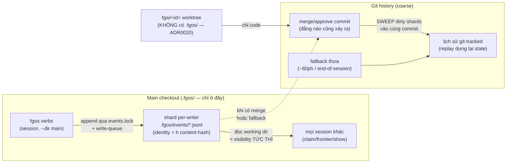

# Discussion — tsk-3tp: Tầng B (worker ghi `.fgos/events/` trong worktree)

## 1. Trạng thái hiện tại

Vòng 5 (24/8). **Đã hội tụ: D1 (in-repo), D2 (sweep), D3 (đóng Tầng B,
repurpose tsk-3tp tại chỗ) — anh chốt cả ba, đã mint qua `fgos decision`
(seq 23876-23878), item đã repurpose (title/description/refs, seq
23879-23880).** §6 regenerated toàn phần, §7 có 2 candidate task
(`#task-sweep-checkpoint` — chính tsk-3tp, `#task-legacy-deletion`).

Vòng 5 cũng trả lời 2 câu hỏi cuối của anh: vì sao harness né được merge
trên state (3 điều kiện: truth = file bất biến mới, projection ngoài git,
single-run — fgOS sau Tầng A đã có 2 điều kiện đầu, thay điều kiện 3 bằng
events.lock vì N-writer là yêu cầu), và audit cái-hay-hơn của upstream
(staged-verify: fgOS đã có trong `merge.mjs` — sửa lại ô sai trong bảng
vòng 4b; attestation: đã có một phần qua tsk-4hl; content-hash: Tầng A đã
có; món thật sự còn thiếu đáng học: **lock self-heal 2 tầng của bee** thay
cho `/fgOS:unlock` thủ công — item riêng nếu làm, ngoài scope này).

Trạng thái chờ: KHÔNG còn câu hỏi thiết kế mở trong scope này. Bước kế
tiếp là terminal handoff (`fgos-coding-exploring` → `fgos-coding-planning`)
cho `tsk-3tp`, nhưng dep cứng `tsk-3ve` (Tầng A T3-T6) chưa xong — handoff
chờ tsk-3ve land, hoặc anh ra lệnh chạy planning sớm (chấp nhận plan dựa
trên hình dạng Tầng A đã thiết kế nhưng chưa land).

## 2. Mục tiêu & đề bài

Tầng B, nếu làm, cho phép worker — tiến trình out-of-process chạy trong
worktree `fgw/<id>` qua `agy`/`dispatch.mjs execute`, không phải session gọi
`fgos` trực tiếp — ghi một file changeset events mới ngay trong worktree của
chính nó, thay vì mọi write dồn hết về main checkout như hiện tại; `merge.mjs`
guard `.fgos-write-rejected` sẽ cần một ngoại lệ hẹp — chấp nhận diff CHỈ
THÊM (không sửa/xoá) một file mới dưới `.fgos/events/` khi merge nhánh
`fgw/<id>`, mọi path khác trong `.fgos/` vẫn bị từ chối cứng như hiện tại.
Đây là item Tầng B trong chuỗi 2 tầng — Tầng A (`tsk-3ve`, đổi
`events.jsonl` sang content-hash identity + sharding theo session/burst) là
dep bắt buộc, đang `doing`/`executing`, CHƯA xong. Việc này đảo một phần hẹp
của D-ADR0020 (chặn `.fgos/` khỏi worktree worker) — một quyết định đã chốt
vì lý do bảo mật (worker's execution context có capability wall yếu, một
write lạc sẽ đập thẳng vào `events.jsonl` sống, không qua review), nên theo
rule "User Decisions", việc mở lại nó không phải phán đoán của phiên này.

**Mở rộng phạm vi (vòng 2, theo yêu cầu của anh):** đề bài không còn chỉ là
"làm hay không làm Tầng B" mà là: nhìn lại toàn bộ cụm vấn đề event-log
(mất data do va chạm, merge đè file live, tần suất commit lên main, và núi
cơ chế guard/vá chồng nhau), tìm kiến trúc đích giải rốt ráo — đúng nhất,
ổn định nhất, nhanh nhất, không ôm legacy — theo thứ tự ưu tiên Ship Faster
/ Release con người và tinh thần RUL11 (gom tùm lum tới khi hết).

## 3. Vấn đề rõ / chưa rõ

| # | Câu hỏi | Trạng thái | Ghi chú |
|---|---|---|---|
| 1 | Có nên tiếp tục shape Tầng B ngay bây giờ, hay dừng và ghi nhận "chưa cần"? | **Đã chốt — D3: đóng vĩnh viễn** | Xem §4. |
| 2 | `tsk-3ve` (Tầng A, dep bắt buộc) đã xong chưa? | **Rõ — CHƯA xong** | `fgos show tsk-3ve --json`: `status:todo`, `stage:executing`. Đề bài chính item này nói rõ: đọc mà dep chưa xong thì dừng, không shape code dựa trên cấu trúc file `.fgos/events/<session-id>-<ts>.jsonl` chưa tồn tại thật. Vòng này vì vậy chỉ thảo luận Ở MỨC CHÍNH SÁCH (có nên mở lại ADR0020 hay không), chưa động tới hình dạng file cụ thể. |
| 3 | Worker hôm nay có thật sự không đọc/ghi `.fgos/` từ trong worktree không (YAGNI-check cảnh báo #2)? | **Rõ — xác nhận lại bằng code thật, vẫn đúng** | `grep .fgos src/runner/dispatch/*.mjs`: chỉ có `dispatch/cli.mjs`'s `spawnWorker` nhận `opts.fgosDir` — dùng để launcher (không phải worker) gọi `fgos tool query` presence-check qua `resolveExecutorCommand`; comment tại dòng ~222-224 nói thẳng "fgosDir's root (always the main checkout)" và tách bạch với `attestRoot: cwd` (worktree của worker). Không có call site nào trong `dispatch/*.mjs` cho phép TIẾN TRÌNH WORKER tự đọc/ghi `.fgos/` từ bên trong worktree của nó — đúng như cảnh báo #2 nói, dispatch path 23/8 (đã có agy, fanout) vẫn giữ nguyên tính chất này so với lúc ADR0020 chốt (28/7). |
| 4 | Tầng B có giải được root cause #1 gốc (tần suất commit lên main quá nhanh, buộc `fgw/<id>` catchup thường xuyên) không? | **Rõ — không, hoặc chỉ một phần rất hẹp** | Theo report 21/8 đã dẫn trong đề bài: nguồn write gây áp lực chính là periodic checkpoint + session commit trực tiếp lên main — cả hai đường này KHÔNG đi qua vòng đời "worktree rồi merge" mà Tầng B nhắm tới. Tầng B chỉ có tác dụng cho write sinh ra từ WORKER — nhưng câu 3 vừa xác nhận worker hôm nay không sinh write `.fgos/` nào cả, nên chưa có khối lượng thật ở đúng chỗ Tầng B nhắm giảm. |
| 5 | Nếu quyết "chưa cần Tầng B", hướng nào giải đúng root cause #1 (giảm tần suất commit của SESSION lên main)? | **Đã scout + đề xuất (vòng 2) — chờ anh chốt** | Đề xuất chính: tách state plane — `.fgos/` thành nested git repo riêng, gitignored khỏi main; commit state không còn di chuyển HEAD main → root cause #1 biến mất về cấu trúc. Chi tiết + trade-off: §5 entry vòng 2. |
| 6 | Constraint kiến trúc: `.fgos` state phải sống cùng git history với code (in-repo), không cách ly? | **Đã chốt — D1** | Xem §4. |
| 7 | Sau khi Tầng A + checkpoint redesign: danh sách legacy nào được XÓA? | **Rõ (danh sách), chưa chốt (chờ dòng 9)** | XÓA: (1) `merge=union` + `events-jsonl-contiguity.mjs` (sau freeze events.jsonl); (2) checkpoint-commit chuyên dụng + tuning `checkpoint.eventThreshold`; (3) phần lớn truncation-guard surface (mark sidecar, warnings file, opt-out env `FGOS_DISABLE_OPPORTUNISTIC_CHECKS`); (4) `events.jsonl` 1-file + 2 backup → đông cứng baseline-0/archive; (5) `seq` làm identity → bỏ hẳn ở compaction đầu; (6) Tầng B — đóng vĩnh viễn. GIỮ: merge guard `.fgos-write-rejected` (nguyên trạng, không ngoại lệ), pre-commit hook (tsk-56u class). |
| 8 | tsk-3tp: repurpose tại chỗ thành item "checkpoint redesign: sweep-on-merge", hay đóng hẳn + submit item mới? | **Đã chốt — repurpose tại chỗ (trong D3)** | Đã thi hành: title/description/refs cập nhật (seq 23879-23880). Dep tsk-3ve giữ nguyên. |
| 9 | Cơ chế thay checkpoint chuyên dụng: sweep-dirty-shards vào merge/approve commit sẵn có + fallback thưa — hay Tầng B-cho-SESSION (narrative event sinh trong worktree của session đã claim, piggyback merge)? | **Đã chốt — D2: sweep** | Đo vòng 3: coordination ~40% (move 29% + stage 6.6% + add 4.3%) buộc ghi main tức thì dù chọn gì; narrative ~55-60%. Tầng-B-cho-session chỉ chở được phần narrative, đổi lấy: ngoại lệ merge guard, tách 2 class event khác luật, narrative vô hình từ main tới khi merge (mất nếu nhánh bỏ). Sweep: churn ~0 giữa các merge, visibility tức thì giữ nguyên, ADR0020 nguyên vẹn. Vòng 4: CẢ HAI upstream hội tụ cùng pattern — coordination không bao giờ đi qua git-commit mịn (beehive: gitignored + lockfile + ledger main-only; harness: SQLite gitignored + CAS), history commit ở cadence coarse do orchestrator quyết (harness: 1 changeset/run, code không tự commit) ≈ đúng hình dạng sweep; không upstream nào cho worktree chở coordination-write qua merge (phản chứng độc lập thêm cho Tầng B). Khác biệt fgOS giữ lại có chủ đích: work.move Ở TRONG log git-tracked để replay được (D-ADR0001) — sweep cho cả hai: sự thật trong git + churn 0. |

## 4. Quyết định đã chốt

| D-ID | Nội dung | Chốt | `fgos decision` seq |
|---|---|---|---|
| **D1** | `.fgos` state phải sống cùng một git history với code (in-repo) — bác nested-repo/separate-ref; mọi thiết kế write-path phải thỏa constraint này. | Anh nêu vòng 3, giữ ổn vòng 4, chốt vòng 5 (24/8) | 23876 |
| **D2** | Xóa checkpoint-commit chuyên dụng; thay bằng **sweep** — gom dirty `.fgos/events/` shard vào chính các merge/approve commit main đằng nào cũng tạo + fallback thưa. Visibility coordination vẫn là working-dir append tức thì, không đổi. | Đề xuất vòng 3, evidence hội tụ vòng 4 (đo volume + 2 upstream), anh chốt vòng 5 | 23877 |
| **D3** | Tầng B (worker/worktree ghi `.fgos/` từ trong worktree, ngoại lệ merge-guard) **đóng vĩnh viễn** — ADR0020 giữ nguyên không ngoại lệ; tsk-3tp repurpose tại chỗ thành item sweep checkpoint redesign. | 3 phản chứng độc lập vòng 1/3/4, anh chốt vòng 5 | 23878 |

## 5. Q&A log

- **[2026-08-23, vòng 1, scout]** Đọc `fgos show tsk-3tp --json` + `fgos show
  tsk-3ve --json`: xác nhận dep `tsk-3ve` status `todo`/stage `executing`,
  chưa xong. Đọc `docs/decisions/index.md` dòng D-ADR0020 (retired, narrative
  dời sang `docs/specs/runner.md` theo tsk-1lv-4) và
  `plans/reports/investigation-260821-1202-eventlog-branch-union-decision-history-report.md`
  mục "Step-by-step để đạt hướng harness" (dòng 152-180) — nguồn gốc trực
  tiếp của đề xuất Tầng A/Tầng B và câu hỏi mở "cần xác nhận của anh trước
  khi lên plan". Grep `src/runner/dispatch/*.mjs` cho mọi tham chiếu `.fgos`
  — xác nhận claim ở §3 dòng 3 (worker không tự đọc/ghi `.fgos/` từ
  worktree hôm nay, `fgosDir` chỉ phục vụ launcher's tool-presence check
  trên main checkout). Chưa hỏi gì mới cho người — câu hỏi mở là câu đã có
  sẵn trong chính đề bài item, chuyển tiếp nguyên văn xuống dưới.

- **[2026-08-23, vòng 2, anh hỏi]** Yêu cầu: đánh giá lại toàn bộ vấn đề cụm
  task này đang giải, cái làm được / chưa làm được, các hoài nghi; brainstorm
  hướng giải rốt ráo — không legacy, đúng nhất, ổn định nhất, nhanh nhất
  (ship faster, release human, RUL11).

- **[2026-08-23, vòng 2, scout + phân tích]** Nguồn đọc trực tiếp:
  `plans/reports/investigation-260821-1050-eventlog-loss-merge-speed-root-cause-report.md`
  (toàn bộ), `investigation-260821-1202-eventlog-branch-union-decision-history-report.md`
  (toàn bộ), `fgos rollup tsk-3ve` (T1/T2 delivered, T3-T6 todo),
  `fgos show` tsk-1i3/tsk-1vc/tsk-2lq/tsk-56u (đều delivered),
  `src/state/events-jsonl-truncation-guard.mjs` (checkpoint 900s/50-event
  threshold, opt-out env), git log hiện tại (5 commit "periodic events.jsonl
  checkpoint" liên tiếp trên đỉnh main — churn còn sống ngay lúc scout).

  **Tổng kết 4 vấn đề:** P1 va-chạm-mất-data → Tầng A T1/T2 đã giải đúng
  gốc (mỗi writer 1 file, content-hash identity), T3-T6 còn lại. P2 merge-đè
  → tsk-1i3/tsk-56u/tsk-2lq đã vá, delivered. P3 tần-suất-commit-lên-main
  (root cause #1, report 21/8) → CHƯA AI GIẢI — Tầng A không đổi tần suất,
  Tầng B không chạm được vì nguồn write chính là session (không đi qua vòng
  đời worktree→merge). P4 tùm-lum: ~9 cơ chế guard/vá chồng nhau, mỗi cái
  hợp lý lúc ra đời, cộng lại là legacy.

  **Insight lõi:** mọi legacy P4 + toàn bộ P2/P3 chung MỘT nguồn gốc — state
  (event log) và code chung một git HEAD trên main. Giải rốt ráo = tách 2
  plane: code plane (main + fgw, merge, verify) không bao giờ mang state;
  state plane (shard append-only + baseline, Tầng A) không bao giờ merge.

  **Đề xuất chính:** `.fgos/` thành nested git repo riêng (path giữ nguyên,
  mọi code đọc/ghi giữ nguyên; main gitignore toàn bộ `.fgos/`). Commit
  state thoải mái (per-append cũng được) vì HEAD repo state không ai theo
  dõi — P3 chết về cấu trúc. ADR0020 + D-ADR0005 giữ nguyên tuyệt đối.
  D-ADR0001 vẫn "git-committed" nguyên văn — git của chính nó. Migration:
  `git rm --cached` `.fgos/` khỏi main + gitignore + init repo state; lịch
  sử cũ nằm lại trong lịch sử main. `fgos setup`/`doctor` đăng ký repo
  state (đúng Install/setup/doctor gate, hưởng cho mọi project — mission #1).
  Chi phí thật: sửa test giả định `.fgos/` tracked; clone main không tự
  mang state (single-machine chưa cần); cần decision mới ghi nhận cách thi
  hành D-ADR0001.

  **Biến thể đã cân, xếp sau:** separate ref `refs/fgos/state` (1-repo-1-clone
  nhưng thêm plumbing tự viết); biến thể tối thiểu không tách plane (giãn
  checkpoint + verify skip diff chỉ-`.fgos/`) — rẻ nhưng giữ nguyên cả 9
  legacy, rớt tiêu chí "không cần legacy", không khuyến nghị làm thay.

  **Kết luận Tầng B:** đóng vĩnh viễn — worker không có write nào để dời
  (verify lại bằng code vòng 1), và nếu mai sau cần, đi qua cửa ghi của
  state repo, không đục tường ADR0020. Đã trình anh, chờ chốt §3 dòng 1/6/8.

- **[2026-08-23, vòng 3, anh trả lời]** Nguyên văn: "`.fgos` chính là
  project management state của chính project nó đang xây, không thể cách ly
  khỏi repo, đó là lý do của B." → Bác nested-repo (vòng 2). Constraint
  in-repo được nêu tường minh — ghi vào §3 dòng 6 làm điểm neo.

- **[2026-08-23, vòng 3, scout + đề xuất sửa]** Đo phân bố toàn bộ 23.847
  event trong `/home/vantt/projects/forgentX/.fgos/events.jsonl` (python,
  đếm theo `type`): work.move 29.0%, decision 19.4%, work.edit 15.4%,
  work.outcome 12.8%, work.stage 6.6%, work.add 4.3%, work.discovery 4.2%,
  work.gate-approve 4.2%, friction/handoff/call-summary ~4%, còn lại <1%.
  Phân loại: coordination (move/stage/add — claim, frontier, chống
  double-claim, cần visibility toàn cục TỨC THÌ) ~40%; narrative (chuyện
  của item đang làm) ~55-60%. Hệ quả: Tầng B nguyên bản (event sinh trong
  nhánh, piggyback merge) chỉ chở được phần narrative — coordination vẫn
  phải ghi main ngay, vẫn cần checkpoint, churn chỉ giảm khoảng một nửa.

  **Insight sửa lại:** trên single machine, visibility đến từ WORKING DIR
  của main checkout (mọi session đọc `--dir` main, thấy event ngay khi
  append, trước mọi commit) — commit chỉ phục vụ durability/history. Churn
  P3 không đến từ nơi ghi mà từ COMMIT CHUYÊN DỤNG (checkpoint 15ph/50
  event). Main đã có sẵn commit hợp pháp thường xuyên: mỗi lần approve
  merge một nhánh.

  **Đề xuất vòng 3 (thay cả nested-repo lẫn Tầng B):** (1) Tầng A T3-T6 làm
  nốt — shard per-writer + tsk-1i3/tsk-56u đã đóng các vector git-clobber
  vốn là lý do khai sinh checkpoint 15ph; (2) xóa checkpoint-commit chuyên
  dụng, thay bằng sweep dirty `.fgos/events/` shards vào chính các
  merge/approve commit main đằng nào cũng tạo + fallback thưa (~60ph hoặc
  end-of-session) cho khoảng lặng; (3) giữa 2 lần merge không còn commit
  metadata → HEAD main chỉ nhảy khi có code thật → catchup/re-verify churn
  từ metadata = 0; (4) ADR0020 không đụng, không ngoại lệ merge guard,
  không class split, Tầng B đóng vĩnh viễn kể cả cho mục tiêu churn; (5)
  danh sách xóa legacy: §3 dòng 7. Vì sao coarse giờ an toàn còn 20/8 thì
  không: checkpoint dày ra đời để thu hẹp cửa sổ mất-data do git-op clobber
  file tracked dirty — Tầng A đổi bài toán (file mới per-writer) + các vector
  đè/nuốt đã bị chặn, cửa sổ dài chỉ còn là độ trễ history, không phải rủi
  ro mất data. Nhượng bộ: merge commit chở kèm dirty event mọi writer —
  provenance vẫn nguyên trong nội dung event (`src`/`ts`/`h`). Chờ anh chốt
  §3 dòng 9 (sweep vs Tầng-B-cho-session) và dòng 8 (repurpose vs item mới).

- **[2026-08-23, vòng 4, anh yêu cầu]** Bật agent rẻ scout xem upstream
  (repository-harness, beehive) giải bài coordination thế nào.

- **[2026-08-23, vòng 4, scout 2 agent Haiku đọc source thật]** Nguồn:
  `upstreams/beehive`, `upstreams/repository-harness`, `upstreams/symphony`
  (clone local). Hai upstream HỘI TỤ ĐỘC LẬP về cùng một kiến trúc:
  **coordination sống là chuyện LIVE (filesystem/DB), không phải chuyện
  HISTORY (git) — không upstream nào commit coordination-write ở cadence
  mịn, và không upstream nào dùng git làm phương tiện coordination.**

  **beehive** (evidence: `lock.mjs:465-511` withStoreLock O_EXCL, stale
  takeover 2 tầng 30s+pid / trần 1h qua atomic rename;
  `worktree-holds.mjs:27-32,135-172` holds ledger; `.gitignore:4-24`;
  `.gitattributes:6-8`): coordination (claims, holds, reservations,
  state.json) hoàn toàn **gitignored** — visibility tức thì qua shared
  ledger `.bee/runtime/cross-worktree-holds.json` SỐNG DUY NHẤT Ở MAIN
  CHECKOUT (worktree không thể tự-claim bằng cách ghi store của chính nó
  — đúng tinh thần ADR0020) + named lockfile mutex; TTL 1h + heartbeat
  renew. Chỉ narrative logs (decisions/backlog/review-candidates jsonl)
  git-tracked, union-merge + dedup theo event id lúc replay. Merge-back =
  staged `--no-ff --no-commit` → verify cây chưa commit → đỏ abort (khớp
  tsk-1i3). Caveat scout tự khai: `worktree-store.mjs` header nói module
  merge này "NOT YET WIRED" — spike-proof, chưa production bên họ.

  **repository-harness + symphony** (evidence: `infrastructure.rs:1775-1837`
  update_story_cas; `interface.rs:940-945` CONFLICT→exit 3;
  `state.rs:232-258,629-641` single-active-run; `infrastructure.rs:834-895`
  changeset append cùng SQLite transaction; `state.rs:410-440` content-sha
  double-apply guard): coordination sống trong SQLite **gitignored**
  (`harness.db`, `.symphony/state.db`), ghi qua CAS (expected-status, thua
  race → exit 3 CONFLICT, caller tự re-query) + single-active-run lock.
  Chỉ changeset JSONL semantic (≈ narrative) git-tracked — MỘT file mỗi
  run, và code KHÔNG tự commit nó: orchestrator/CI quyết thời điểm
  `git add && git commit` — tức cadence commit history được tách hoàn
  toàn khỏi hot-path coordination, đúng hình dạng "sweep" vòng 3 đề xuất.
  Content-sha256 chống double-apply ≈ chính là `h` identity của Tầng A.

  **Suy ra cho fgOS:** (a) cả hai upstream XÁC NHẬN hướng vòng 3 — commit
  cadence của history phải tách khỏi visibility của coordination;
  visibility đến từ tầng live (fgOS: working-dir append trên main checkout
  + events.lock/write-queue — đã có sẵn), commit là chuyện coarse/sweep.
  (b) KHÔNG upstream nào cho nhánh/worktree chở coordination-write về qua
  merge — beehive còn thiết kế để worktree tự-claim là BẤT KHẢ THI — thêm
  một phản chứng độc lập nữa cho Tầng B. (c) Khác biệt duy nhất của fgOS
  so với beehive: fgOS giữ coordination event (work.move) BÊN TRONG event
  log git-tracked vì D-ADR0001 (log là sự thật, replay dựng lại state) —
  beehive tách hẳn ra ngoài git nhưng đổi lại claims không có history/
  không replay được. Giữ theo D-ADR0001 + sweep cadence được CẢ HAI: sự
  thật replay được trong git, churn = 0 giữa các merge.

- **[2026-08-24, vòng 4b, anh yêu cầu]** Bảng so sánh 3 hệ trên cùng một
  bộ trục (fgOS tách cột hiện-tại vs đích):

  | Trục | beehive | harness + symphony | fgOS hiện tại | fgOS đích (Tầng A + sweep) |
  |---|---|---|---|---|
  | Bài toán concurrency | N worktree đồng thời — đúng bài fgOS | 1 run active/thời điểm (bài dễ hơn) | N session/worktree | N session/worktree |
  | Coordination sống ở đâu | Runtime files gitignored | SQLite gitignored | Trong event log git-tracked trên main | Như hiện tại (D-ADR0001) |
  | Chống double-claim | Lockfile mutex O_EXCL + holds ledger | CAS expected-status → exit 3 | events.lock + write-queue | Không đổi |
  | Visibility | Shared ledger chỉ-main; worktree không tự-claim được | Re-query DB sau CONFLICT | Working-dir append, thấy trước mọi commit | Không đổi — visibility chưa bao giờ cần commit |
  | History git-tracked | Chỉ narrative logs, union+dedup | Chỉ changeset, 1 file/run, sha256 | Toàn bộ event, 1 file, seq | Toàn bộ event, shard/writer, `h` hash |
  | Cadence commit/churn | 0 từ coordination | Code không tự commit — orchestrator quyết | Checkpoint 15ph/50ev = nguồn churn #1 | 0 giữa các merge (sweep + fallback thưa) |
  | Replay từ git | ❌ claims không history | ⚠️ một phần (changeset có, run-lock không) | ✅ toàn bộ | ✅ toàn bộ — giữ hơn cả 2 upstream |
  | Worktree chở state qua merge | ❌ chủ đích bất khả thi | ❌ changeset độc lập khỏi merge | ❌ ADR0020 | ❌ giữ nguyên, Tầng B đóng |
  | Kỷ luật merge-back | Staged-verify (chưa wired production) | Né hẳn (không merge state) | Merge-trước-verify-sau, tsk-1i3 đã vá | tsk-1i3 đủ; staged-verify là nâng cấp ngoài scope |
  | Chống double-apply | Dedup id lúc replay | content_sha256 CAS | contiguity resequence (band-aid) | `h` từ gốc (T1 delivered) |
  | Độ chín | Prod nhiều mảnh, merge-module spike | Prod cho 1-writer | Đang chạy, vá từng miếng | Tầng A 2/6, sweep chưa build |

  Kết luận trục đánh đổi: beehive hy sinh history-của-coordination lấy
  zero-churn; harness hy sinh N-writer lấy CAS đơn giản; fgOS đòi cả ba
  (N-writer + replayable history + in-repo) — và cái giá đang trả sai chỗ
  là commit cadence mịn, thứ cả hai upstream chứng minh không cần cho
  visibility. Sweep = giữ hai đòi hỏi khó, bỏ đúng cái không ai cần.

- **[2026-08-24, vòng 5, anh chốt cả 3]** In-repo → D-ID, sweep, repurpose
  tsk-3tp tại chỗ. Kèm 2 câu hỏi: (a) đừng vì legacy mà bỏ qua cái thật
  sự hay hơn của upstream — họ có gì đáng đánh đổi? (b) tại sao harness
  "né hẳn" được bài toán merge trên state?

- **[2026-08-24, vòng 5, trả lời (b) — vì sao harness né được merge]** Ba
  điều kiện cùng lúc: (1) sự thật của họ là dãy **file changeset bất
  biến** — mỗi run đẻ ra 1 FILE MỚI chưa từng tồn tại; git chỉ conflict
  khi 2 bên sửa CÙNG một object, file mới thêm thì không bao giờ; "hợp
  nhất" của họ = cộng file mới + replay idempotent, không phải đối chiếu
  2 bản phân kỳ. (2) Object mutable duy nhất (`harness.db` projection)
  nằm NGOÀI git (gitignored) — thứ hay bị sửa thì không được git theo
  dõi, nên không bao giờ có 2 bản phân kỳ để merge. (3) Single-active-run
  lock — chỉ 1 run mutate tại 1 thời điểm, DB không có concurrent writer.
  **fgOS sau Tầng A đã có (1) và (2)**: shard per-writer = file mới
  single-writer; `state.json` đã gitignored từ trước (xác nhận
  `.gitignore` dòng 4-5, chú thích nguyên văn "events.jsonl is truth
  (committed); state.json is a derived view"). Điều kiện (3) fgOS không
  copy — N-writer đồng thời là yêu cầu sản phẩm — thay bằng
  `events.lock` + write-queue. fgOS không "né" bằng cách hy sinh N-writer
  như harness; nó đạt cùng tính chất không-còn-gì-để-merge bằng shard.

- **[2026-08-24, vòng 5, trả lời (a) — audit cái-hay-hơn của upstream]**
  Rà từng ứng viên, kèm sửa 1 lỗi trong bảng vòng 4b:
  - Staged-verify merge gate (bee): **fgOS ĐÃ CÓ trong code** —
    `merge.mjs` dòng 17/856/1217: `git merge --no-commit --no-ff` →
    check `.fgos-write` → verify → mới commit. Ô "merge trước verify sau"
    trong bảng vòng 4b là snapshot report 21/8, đã lỗi thời — sửa tại
    đây. Không cần adopt.
  - Worktree attestation (bee): đã adopt một phần qua tsk-4hl
    (`captureDispatchAttestation`, `attestRoot` trong `dispatch/cli.mjs`).
  - Content-sha double-apply guard (harness): Tầng A T1 (`h`) đã có.
  - Same-transaction append log+projection (harness): fgOS projection tự
    heal qua replay từ log — nhu cầu thấp, không adopt.
  - **Lock self-heal 2 tầng (bee `lock.mjs:172-352`): món thật sự hay hơn
    còn thiếu** — bee tự cướp lock kẹt cơ học (mtime 30s + pid-liveness,
    trần cứng 1h, atomic rename + post-rename verify), fgOS hiện xử lý
    lock kẹt bằng skill `/fgOS:unlock` THỦ CÔNG (exit 7, người phải can
    thiệp) — đúng priority #2 "Release con người" thì đây là chỗ đáng
    học. Nếu làm: chỉnh ngưỡng cho full-suite verify ~6ph (giới hạn bee
    tự khai), submit item riêng — ngoài scope discussion này.
  - Holds-ledger prevention-before-write (bee): fgOS có `/fgOS:conflicts`
    advisory đọc-sau; prevention hay hơn về nguyên tắc nhưng là cơ chế
    sống từng vỡ production bên chính bee, và fanout song song của fgOS
    đang sequential-fallback — YAGNI, để mở, chưa adopt.

- **[2026-08-24, vòng 5, thi hành]** Mint D1 (seq 23876), D2 (23877), D3
  (23878) qua `fgos decision --id tsk-3tp`. `fgos edit tsk-3tp`: title +
  description repurpose sang sweep redesign (seq 23879/23880), refs →
  `#task-sweep-checkpoint`. §6 regenerated toàn phần, §7 tách 2 candidate
  + 1 ghi nhận ngoài-scope. Handoff exploring/planning: chờ tsk-3ve
  T3-T6 land (dep cứng của điều kiện an toàn) hoặc anh ra lệnh sớm hơn.

## 6. Thiết kế đã chốt {#design}

*(Regenerated toàn phần 24/8, sau khi D1-D3 chốt.)*

**Một sự thật, hai cadence.** Toàn bộ PM-state của fgOS tiếp tục sống trong
event log git-tracked của chính repo nó quản (D1, khớp D-ADR0001): mọi
event — coordination (`work.move`/`stage`/`add`) lẫn narrative (decision,
discovery, outcome…) — được append vào shard per-writer dưới
`.fgos/events/` trên main checkout (cấu trúc Tầng A, tsk-3ve). Nhưng hai
tầng nhu cầu của log này chạy ở hai cadence khác nhau:

- **Tầng visibility (tức thì):** mọi session/process thấy event của nhau
  bằng cách đọc working dir của main checkout qua `--dir` — ngay khi
  append, trước mọi commit. Chống double-claim bằng `events.lock` +
  write-queue như hiện tại. Tầng này không đổi gì.
- **Tầng history (coarse, D2):** commit vào git không còn là hành động
  chuyên dụng. Cơ chế periodic-checkpoint (15ph/50-event) bị xóa; thay
  bằng **sweep**: mỗi merge/approve commit mà main đằng nào cũng tạo thì
  gom luôn các shard dirty vào chính commit đó, cộng một fallback thưa
  (~60ph hoặc end-of-session) cho khoảng lặng. Giữa hai lần merge, HEAD
  main đứng yên — churn catchup/re-verify từ metadata = 0.

**Worktree plane không đổi (D3):** nhánh `fgw/<id>` không bao giờ mang
`.fgos/` (ADR0020 nguyên vẹn, không ngoại lệ merge-guard). Cả beehive lẫn
repository-harness đều độc lập đi đến cùng kết luận: không cho worktree
chở coordination-write qua merge.

**Điều kiện an toàn của coarse cadence** (vì sao 20/8 chưa được phép mà giờ
được): checkpoint dày ra đời để thu hẹp cửa sổ mất-data do git-op clobber
file tracked dirty. Tầng A đổi bài toán (file mới per-writer, không còn
2 bên sửa cùng file) + tsk-1i3/tsk-56u đã đóng vector đè/nuốt + merge path
hiện tại đã là staged-verify (`merge.mjs`: `--no-commit --no-ff` → check →
verify → mới commit). Cửa sổ dài giờ chỉ là độ trễ history, không phải rủi
ro mất data. **Vì vậy item này phụ thuộc cứng tsk-3ve T3-T6 xong trước.**

**Legacy được xóa theo sau (D2):** `merge=union` + `events-jsonl-contiguity.mjs`
(sau freeze `events.jsonl` thành baseline-0), phần lớn truncation-guard
surface (mark sidecar, warnings file, opt-out env), 2 file backup, `seq`
làm identity (bỏ ở compaction đầu). **Giữ:** merge guard
`.fgos-write-rejected` nguyên trạng, pre-commit hook, `events.lock`/
write-queue.

**Nhượng bộ đã chấp nhận:** merge commit của một nhánh chở kèm dirty event
của mọi writer — provenance vẫn nguyên trong nội dung event
(`src`/`ts`/`h`), commit không cần "tự sự" theo item.

## 7. Danh mục hạng mục / task {#tasks}

### Sweep checkpoint mechanism {#task-sweep-checkpoint}

- **Item:** `tsk-3tp` (repurposed, D3) — refs đã trỏ anchor này.
- **Goal:** xóa periodic-checkpoint-commit chuyên dụng trong
  `src/state/events-jsonl-truncation-guard.mjs` (+ caller trong
  `merge.mjs`/`claim-port.mjs`); thêm sweep dirty-shards vào đường
  merge/approve commit sẵn có; thêm fallback thưa cho khoảng lặng.
- **§6 excerpt:** "Tầng history (coarse)" + "Điều kiện an toàn".
- **D-IDs:** D1, D2, D3.
- **Quan hệ:** dep cứng `tsk-3ve` (T3-T6 — replay đa-file/anchor/guard/
  compaction phải land trước); độc lập với mọi item merge-speed đã
  delivered (tsk-1i3/tsk-2lq).
- **Draft verify:** `npm test` + kiểm không còn commit
  `chore(.fgos): periodic events.jsonl checkpoint` sinh ra trong e2e; grep
  xác nhận cơ chế checkpoint chuyên dụng đã gỡ khỏi
  `events-jsonl-truncation-guard.mjs`.

### Legacy deletion sweep {#task-legacy-deletion}

- **Goal:** thi hành danh sách xóa của D2 (union driver, contiguity
  script, guard surface, backups, seq) sau khi sweep mechanism + Tầng A
  compaction (T6) đều đã land. Có thể là phase 2 của chính `tsk-3tp` hoặc
  item con — để `fgos-coding-planning` quyết mode, không ép split ở đây.
- **§6 excerpt:** "Legacy được xóa theo sau".
- **D-IDs:** D2.
- **Quan hệ:** sau `#task-sweep-checkpoint` và sau tsk-3ve T6.
- **Draft verify:** `npm test` + grep vắng mặt các cơ chế đã xóa
  (`merge=union` trong `.gitattributes`, `events-jsonl-contiguity.mjs`,
  `FGOS_DISABLE_OPPORTUNISTIC_CHECKS`).

*(Ngoài scope feature này, ghi nhận từ audit upstream vòng 5: lock
self-heal 2 tầng kiểu beehive thay cho flow `/fgOS:unlock` thủ công — nếu
làm, submit item riêng, không thuộc discussion này.)*
