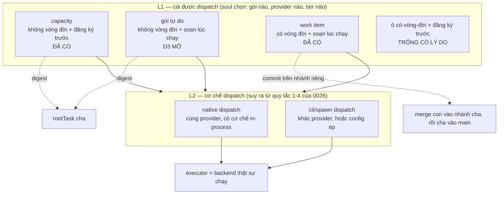

# DISCUSSION — Hai lớp dispatch cho fgOS

Item: `tsk-2t6`. Liên quan: `tsk-3xd` (bug thân-mệnh-lệnh rỗng ở decompose —
**đã merge main, `status: delivered` tính đến 2026-08-06**), `tsk-535` (thiếu
`description` nhìn từ góc mất dữ liệu — **đang làm, `doing/clarify`**,
`mergeAfter: ["tsk-3xd"]` theo D1), `tsk-66o` (đợt
computed-parallel-wave-schedule + worktree-dispatch-attestation, đã merge main).

## 1. Trạng thái hiện tại

Vòng 7 (2026-08-06). Đã đọc kỹ upstream bee và scout xong phía fgOS. Hai câu
hỏi mở đầu của người dùng đã có câu trả lời bằng bằng chứng source (§3, hàng
"rõ"). Phát hiện quan trọng nhất: **bee không có một mô hình cell duy nhất — bee
tách sẵn HAI lớp dispatch**, và ranh giới bee vạch là *"dispatch nào GHI file thì
phải có id, dispatch nào chỉ ĐỌC-tổng-hợp thì không cần gì cả"*.

Vòng 2 làm sâu hàng 10 của §3 (lỗ ba tầng, là lỗ hợp đồng chứ không phải lỗi
chất lượng model) và đẩy phần đó về `tsk-3xd`. Vòng 3 xử thứ tự `tsk-3xd` vs
`tsk-535` (§3 hàng 16-19, mint **D1**) và đính chính một lời sai của vòng 2.

**Vòng 4 đảo ngược khung của vòng 1:** B1 không phải thứ cần xây — nó là
`capacity`, khái niệm đã khoá ở `docs/decisions/0026`, và máy đã chạy tới Pha 4
(§3 hàng 20-21). Thiếu thật sự là hai chốt hình dạng: gói mệnh lệnh phải đăng ký
trước thay vì soạn động, và danh sách lý do hợp lệ để dispatch không có song
song hoá (hàng 22-23). Người dùng chốt cả ba ⇒ **D2** (thêm lý do thứ tư),
**D3** (capacity ad-hoc prompt động), **D4** (gác lớp helper-ghi-file). §6 đã
regenerate toàn phần, §7 viết lại theo hình dạng mới.

**Vòng 5** thêm khung refined của người dùng: dispatch tả bằng **hai tầng**
L1/L2, và trong L1 dùng **hai trục vuông góc** thay vì liệt kê loại rời rạc ⇒
**D5**. Cùng vòng, lộ ra chỗ hở thứ ba khoá chặt với D3: không ai phán model
tier lúc dispatch, vì model suy thẳng từ `work.tier` — mà field đó nghĩa là
lượng nghi thức quy trình (§3 hàng 30). Delta distillery đã viết xong.

**Vòng 6 đóng cả bốn câu mở** ⇒ **D6/D6b** (sáu ô bắt buộc + hình dạng id gói),
**D7** (ba item + `mergeAfter` chain), **D8** (không thêm `selfSufficient`),
**D9** (trigger hai điều kiện cho D4), **D10** (cam kết lớp chọn provider/tier +
chừa hai ô ngay). §3 hàng 12-15 đã cập nhật tại chỗ từ "chưa rõ" sang chốt.

**Vòng 7** tách ba hạng mục §7 thành item thật (`tsk-2sl` → `tsk-2k1` →
`tsk-503`, xâu `mergeAfter` theo D7) và chốt hai điểm thi hành còn lại: **D11**
(hình dạng `<scope>`, cấm file đếm) và **D12** (helper là fragment prose, không
subprocess). Cả hai đã gộp thẳng vào description hai item liên quan để chúng tự
đứng được.

**Nợ vòng 3 khép lại theo cách khác:** `tsk-3xd` đã merge **kèm** câu sai trong
description ("`tsk-535` hết lý do tồn tại và có thể superseded") — không sửa
được nữa vì item đã đóng. Đính chính sống ở đây: §3 hàng 18 và §5 vòng 3. Ai đọc
`tsk-3xd` sau này phải đọc kèm hàng 18.

## 2. Mục tiêu & đề bài

fgOS hiện chỉ có MỘT cách chia việc: mọi thứ tách ra từ `decompose` đều trở
thành work item đầy đủ vòng đời — có id thật trong backlog, có `stage` FSM, đi
qua pull door `/fgOS:pick`, nằm trong status pool, phải qua retro và cleanup khi
xong. Cách đó đúng cho việc cần quản lý hành chính, nhưng đắt và cứng cho phần
lớn việc chia nhỏ trong thực tế: rất nhiều lúc việc con chỉ cần là *một note
chia việc rõ ràng, kèm mệnh lệnh đóng gói đầy đủ, giữ ở task cha, đẩy xuống
agent/process con thực hiện, xong báo cáo kết quả về cha* — không cần trở thành
một đơn vị quản lý. Cách chia đó cho phép uyển chuyển đẩy việc xuống đúng
smart-tier, đúng provider mà không phải câu nệ process, và dùng được ngay trong
nội bộ các khâu: `discover` có thể tách ra scout / research web / fetch web /
tổng hợp; `planning`/`decompose` có thể chia việc thuần để chạy nhanh hơn chứ
không phải để quản lý. Câu hỏi của item này là: fgOS nên có lớp dispatch thứ hai
đó dưới hình dạng nào, ranh giới giữa nó và work item thật nằm ở đâu, và cái gì
buộc phải giữ lại (id, footprint, verify, merge) khi việc con thực sự ghi code.

## 3. Vấn đề rõ / chưa rõ

| # | Điểm | Trạng thái | Bằng chứng / ghi chú |
|---|---|---|---|
| 1 | Bee có HAI lớp dispatch, không phải một | **Rõ** | `upstreams/bee/AGENTS.md:77` rule 12: *"Fan out the gathering; keep the deciding... mechanical gather/render/mine steps dispatch down-tier as I/O workers that return digests"*; nhánh cli gather `upstreams/bee/skills/bee-swarming/references/swarming-reference.md:177`: *"no reservation, no cap, no `result.json` — stdout **is** the digest"* |
| 2 | Ranh giới bee vạch giữa hai lớp | **Rõ** | Dispatch GHI file/mutate git ⇒ cần id (claim/reserve/cap/commit/merge). Dispatch chỉ đọc-tổng-hợp-trả-về ⇒ không cần state gì. Rule 12 khoá thêm: decide-altitude không delegate — gates, synthesis, state writes, đối thoại với người ở lại session model |
| 3 | Cell của bee KHÔNG phải backlog item | **Rõ** | Hai sổ riêng: `.bee/cells/<feature>-<n>.json` (ephemeral, feature-scoped) vs `.bee/backlog.jsonl` PBI events (`upstreams/bee/AGENTS.md:93-95`). Cell chết khi feature đóng; `state worker prune` dọn transients (`swarming-reference.md:203`) |
| 4 | Schema cell của bee | **Rõ** | `upstreams/bee/skills/bee-planning/references/planning-reference.md:113`: `id, feature, title, lane, status, deps, decisions, files, read_first, action (prose mệnh lệnh cite D-ID), must_haves{truths,artifacts,key_links,prohibitions}, verify (lệnh chạy được), behavior_change, trace{}` |
| 5 | Với lane tiny/small, cell CHÍNH LÀ micro-plan | **Rõ** | `bee-planning/SKILL.md:90` — tiny bỏ hẳn `plan.md`; shape đầy đủ = request + một cell. Tức bee đã có sẵn đường "chia việc mà không sinh tài liệu hành chính" |
| 6 | Bee chống xung đột footprint bằng xếp sóng, không bằng từ chối | **Rõ** | `bee-swarming/SKILL.md:94` (`cells schedule`, Kahn); `planning-reference.md:105`: *"Cross-cell file overlap is legal, not a scoping error — it only costs a wave"* |
| 7 | Bee không tin worker | **Rõ** | `bee-swarming/SKILL.md:114-118`: orchestrator tự chạy lại verify + `cells judge`; worker chỉ trả đúng 1 token `[DONE]/[BLOCKED]/[HANDOFF]/[NOOP]` (`swarming-reference.md:246`) |
| 8 | fgOS có field per-item nào khẳng định "task con trọn vẹn, tự chạy hết stage" không? | **Rõ — KHÔNG có** | `src/state/store.mjs:238` `EDITABLE_FIELDS` 22 field, không có cờ nào dạng đó. Cái gần nhất là cấu hình toàn repo: `src/state/gate-bypass.mjs` — `level × tier` (`isTierCovered`) + kiểm cơ học trên ARTIFACT (`hasOpenItems`: `TODO/FIXME`, `## Outstanding questions` phải là "None") + sàn `HEAVY_KEYWORDS` luôn ghi đè |
| 9 | Con auto-decompose có bị GATE không? | **Rõ — không bị** | `src/intake/plan.mjs:940` đóng dấu thẳng `stage: stageForStep(domain,'Execute')` — con bỏ qua clarify + decompose, không chạm gate của exploring/planning/validating |
| 10 | Con auto-decompose có đủ chi tiết để chạy không? | **Rõ — KHÔNG, và lỗ nằm ở BA tầng** | Tầng 1: prompt hỏi LLM không xin prose (`decompose.mjs:227`, schema chỉ `{title, verify, kind...}`). Tầng 2: `normalizeChild` (`decompose.mjs:231-255`) chỉ giữ `title, verify, kind, risk, refs, footprint, rawDeps` — model có trả prose cũng bị vứt. Tầng 3: `addWork` (`decompose.mjs:929-944`) không truyền `description`, trong khi `src/runner/prompt-templates/worker-prompt-{default,skill-pointer}.txt` nội suy `{description}`. Đã tách ra item riêng `tsk-3xd` |
| 10b | Lỗ này có phải do chất lượng LLM judge không? | **Rõ — không, là lỗ hợp đồng** | `buildDecomposeChildrenVerdict` dùng CHUNG `normalizeChild` cho cả đường `fgos plan --children` (tsk-27y D1, native-first, session sống tự lý luận cách chia) ⇒ kể cả session có đủ context tự viết cách chia cũng không có đường truyền thân mệnh lệnh xuống con |
| 11 | Launcher tự pick con thì merge có tuần tự qua cha? | **Rõ — có** | `src/runner/worktree.mjs:30` leaf fork từ tip nhánh root (D3 "leaf fork-from-tip-of-parent"); `src/runner/merge.mjs:600` target là `main` cho root→main, `fgw/<root>` cho leaf→parent; `src/state/dep-graph.mjs:156` cạnh `parent-child` hướng parent→child ⇒ cha đợi con. Git log thực tế: `da2d382 Merge branch 'fgw/tsk-40t' into fgw/tsk-1d5` |
| 12 | Làm B1 trước rồi đánh giá lại, hay mở luôn B2? | **Chốt — D3 + D4** | Câu hỏi tự tan sau vòng 4: B1 đã tồn tại (là `capacity`), nên việc thật là mở gói động (D3); còn B2 gác (D4). Không còn là lựa chọn thứ tự nữa |
| 13 | Nếu làm B2: id ephemeral hình dạng nào | **Gác theo D4** — nhưng đừng lẫn với D6b | D6b đã định id dạng `<scope>#p<n>` cho **gói động**, và đó là id **tham chiếu** (khớp digest với gói khi chạy song song), KHÔNG phải id vòng đời. Id vòng-đời-rút-gọn mà B2 cần (claim/reserve/cap/merge, chỗ lưu sổ) vẫn chưa quyết và vẫn gác |
| 14 | Có thêm field per-item `selfSufficient` không | **Chốt — D8 (không)** | Cờ tự-khai sẽ là chỗ duy nhất agent tự phong, mà người viết cờ chính là agent muốn qua cổng. Thay bằng tín hiệu dẫn xuất: prose mệnh lệnh + `verify` chạy được + `footprint` |
| 15 | Vá `tsk-3xd` xong thì B2 còn cần không | **Chốt cách trả lời — D9** | Không trả lời bằng phán đoán mà bằng trigger hai điều kiện AND: (a) `tsk-3xd` merge — **đã thỏa 2026-08-06** (`status: delivered`); (b) ≥2 ca thật ghi bằng capture/friction. Thiếu (b) thì B2 giữ gác vô thời hạn |
| 16 | Nguy cơ mất dữ liệu của `tsk-535` đã sống chưa? | **Rõ — chưa, còn tiềm ẩn** | `deriveTitle` chỉ được gọi ở đúng một chỗ: `bin/fgos.mjs:748` (đường `submit`). Không có migration/verb re-derive nào trong source; `docs/history/work-item-title-contract/CONTEXT.md` để nguyên *"Whether D4's re-derive ships as a one-shot script or a CLI verb"* ở mục Deferred to planning ⇒ chỉ nổ khi ai đó ship D4 |
| 17 | `fgos add` có `--description` không? | **Rõ — không** | `bin/fgos.mjs` chỉ set `description` ở `:764` (nhánh `submit`); `--description` chỉ tồn tại cho `edit` và `tool register`. Xác nhận nửa thứ hai của `tsk-535` là thật |
| 18 | `tsk-3xd` có làm `tsk-535` thành thừa không? | **Rõ — KHÔNG** (đính chính lời nói ở vòng 2) | `tsk-3xd` chỉ vá tiến-về-trước: không đụng 53 item đã hỏng, không đụng đường `fgos add`. Nói `tsk-535` "có thể superseded" là sai |
| 19 | Thứ tự `tsk-3xd` vs `tsk-535` | **Chốt — D1** | `tsk-3xd` trước: nó vá 40/53 item (đường decompose) bằng prose thật, làm `tsk-535` teo lại còn `fgos add --description` + backfill. Làm ngược thì công vứt đi VÀ `description=title` che mất triệu chứng (nhìn như đã có description, với executor vẫn rỗng nghĩa). Ràng buộc cứng thật sự: cả hai xong trước khi D4 re-derive ship — item ship D4 chưa tồn tại |
| 20 | B1 có phải khái niệm mới không? | **Rõ — KHÔNG, nó là `capacity` đã khoá** | `docs/decisions/0026` dòng 67-74: **subTask** *"đúng bản chất chỉ là 1 rootTask khác, được kích hoạt đệ quy"*; **capacity** *"1 đơn vị functional/helper hẹp... không tự mang vòng đời 1 rootTask đầy đủ"*. Dòng 76-86 chốt hai cái **không gộp khái niệm**, chỉ gộp **cơ chế dispatch** (4 quy tắc, dòng 88-115). Trùng khít ranh giới bee ở hàng 2 |
| 21 | Máy của capacity đã chạy chưa? | **Rõ — đã xong tới Pha 4** | `.claude/skills/_shared/capacity-dispatch-fallback.md` (config check → presence check → native-vs-cli → prompt → fallback inline). Pha 1-4 của 0026 đều ở `cleanup`: `tsk-1ni`, `tsk-27y`, `tsk-53h`, `tsk-3ik`. Chỉ Pha 5 (`tsk-6db`, native detection cho agy) còn `todo`, deferred YAGNI |
| 22 | Hình dạng capacity có khớp cách chia việc người dùng cần không? | **Rõ — KHÔNG, lệch hai chốt** | Chốt 1: capacity là điểm dispatch **đăng ký trước** — đòi `capacities.<id>` trong config + `<PROMPT_TEMPLATE>` **cố định** hardcode trong skill (*"so every dispatch asks the exact same thing, never a paraphrase that drifts call to call"*). Chốt 2: danh sách lý do hợp lệ để dispatch chỉ có ba — *cheaper model, cross-provider, resource isolation* — **không có song song hoá** |
| 23 | Lệnh cấm ad-hoc Task dispatch nằm ở đâu? | **Rõ — ở skill, không ở 0026** | `fgos-coding-exploring/SKILL.md:32-49` và bản sao ở `fgos-coding-planning:46`, `fgos-coding-validating:55`, `fgos-coding-implement:48`. 0026 §Ranh giới quan sát được chỉ tách hai lý do của **native-vs-cli** (tránh soul mù re-derive; quan sát được) — chưa bao giờ phát biểu về **dispatch-vs-inline**. Sửa danh sách trong skill không đụng luật khoá |
| 23b | Danh sách ba lý do bị chép ở 4 skill | **Rõ — vấn đề DRY kèm theo** | Bốn bản sao gần như y hệt (`grep "cheaper model"`). Sửa D2 nên chuyển danh sách về `_shared/` rồi trỏ tới, không sửa bốn chỗ song song |
| 24 | Có thêm song-song-hoá thành lý do hợp lệ không? | **Chốt — D2 (có)** | `AGENTS.md` để Ship Faster ở ưu tiên #1 mà danh sách hiện tại loại trừ đúng lý do tốc độ |
| 25 | Prompt động hay nhân bản capacity id? | **Chốt — D3 (prompt động)** | Chấp nhận mất bảo đảm chống-drift của fixed template, đổi lấy chia việc uyển chuyển |
| 26 | B2 có va vào luật khoá không? | **Rõ — có, và đã gác (D4)** | 0026 chốt nhị phân rootTask/capacity. B2 là helper **CÓ ghi file** ⇒ loại thứ ba; muốn có phải mở rộng `capacity` cho ghi file hoặc supersede phần "subTask ≡ rootTask" của 0026 |
| 27 | Mô hình L1 (cái được dispatch) / L2 (cơ chế kích hoạt) có đúng không? | **Rõ — đúng, và 0026 đã tách sẵn** | 0026 dòng 76-86: *"subTask và capacity KHÔNG gộp thành 1 khái niệm... Cái GIỐNG NHAU, và là điều đáng nói, là **CƠ CHẾ DISPATCH/LAUNCH**... áp dụng Y HỆT cho cả 2"*. Đúng lát cắt L1/L2 |
| 28 | (A) capacity và (C) gói tự do có phải hai loại khác **bản chất** không? | **Chốt — D5** | Không — chúng khác **nguồn gói mệnh lệnh**, không khác bản chất. Hai trục vuông góc: *có mang vòng đời không* (0026's nhị phân) và *gói đăng ký trước hay soạn lúc chạy*. B nằm ở "có vòng đời + soạn động"; A ở "không vòng đời + đăng ký trước"; C ở "không vòng đời + soạn động". Ô thứ tư (có vòng đời + đăng ký trước) trống có lý: việc mang vòng đời là việc riêng từng lần, không thể có prompt cố định |
| 29 | Gọi L2 là gì? | **Rõ — đừng gọi "launcher"** | 0026 dòng 34-56 đã gán "launcher" cho vai trò **quyết định kích hoạt rootTask nào** (người mở session, `/fgOS:pick`, `fgos-runner`, herdr) — tầng CAO hơn, không phải transport. Thuật ngữ sẵn có cho L2 là **"cơ chế dispatch"** (native vs cli/spawn, 4 quy tắc); **"executor"** để dành cho backend đích mà `resolveExecutorConfig` trả về |
| 30 | Soul ở L1 có đang chọn được provider/tier không? | **Rõ — KHÔNG, và đây là chỗ hở thật** | `src/runner/dispatch.mjs:1053-1054`: `const tier = work.tier ?? DEFAULTS.tier; const model = modelForTier(cfg, tier)`. Một field mang hai nghĩa: `gate-bypass.mjs`'s `isTierCovered` cũng đọc chính nó để quyết bao nhiêu nghi thức. Không có bước phán tier per-dispatch ở đâu cả. bee tách hẳn: `lane` là nghi thức, model tier **phán tại lúc dispatch**, *"never fixed at planning — a planning tier is at most an overridable hint"* (decision 0016) |
| 30b | Trong hai nghĩa đó, nghĩa nào là kẻ đến sau? | **Rõ — GATE-BYPASS, không phải dispatch** (đính chính vòng 8) | `src/state/work.mjs:136-144` khai `work.tier` là *"the cost/cognitive weight a work item self-declares; the runner (Epic 3) maps tier -> model via a config table at dispatch time"*, đánh dấu **PROVISIONAL** kèm cảnh báo *"Do not let the two drift apart"*. Tức tier→model là mục đích **gốc** và `dispatch.mjs:1053-1054` làm **đúng** schema; `isTierCovered` mới là bên mượn field. Đảo chiều sửa của `tsk-503`: bên cần field riêng nhiều khả năng là gate-bypass |
| 31 | Quan hệ L1 → L2 | **Rõ — L1 chọn AI, L2 SUY RA CÁCH** | 0026 quy tắc 3: khác provider ⇒ bắt buộc cli/spawn, không ngoại lệ. Nên soul L1 không chọn cơ chế một cách độc lập — nó chọn provider + tier, còn cơ chế rơi ra từ quy tắc 1-4. Phát biểu đúng: **L1 chọn cái gì + ai; L2 suy ra bằng cách nào** |
| 32 | Gói soạn động ảnh hưởng governance ra sao? | **Rõ — cổng phải chuyển tầng** | `dispatch.mjs:691-693` chặn khi một capacity `kind:"cli"` resolve ra lệnh không-phải-Claude mà chưa bật `allowCrossProvider` — gác theo **capacity id**. Gói soạn động mang nội dung khác nhau mỗi lần ⇒ cổng phải thành **per-dispatch**. Phải vào plan của D3 |

## 4. Quyết định đã chốt

_(D-ID table, append-only. Trống có chủ đích: mọi điểm ở §3 mới đứng qua đúng
một vòng — quy tắc D4 của `fgos-coding-shaping` cấm mint D-ID từ một câu trả
lời duy nhất. Điểm nào giữ nguyên qua vòng sau sẽ được mint ở đây kèm một lời
gọi `fgos decision --id tsk-2t6` thật.)_

| D-ID | Nội dung | Lý do | Vòng chốt |
|---|---|---|---|
| **D1** | `tsk-3xd` làm **trước** `tsk-535`; ghi thứ tự bằng `mergeAfter`, không dep cứng | `tsk-3xd` vá 40/53 item thiếu description (đường decompose) bằng prose thật ⇒ `tsk-535` teo lại còn `fgos add --description` + backfill. Làm ngược thì `description=title` **che mất triệu chứng**: 40 item con nhìn như đã có description nhưng với executor vẫn rỗng nghĩa. `mergeAfter` (`src/state/work.mjs:256-273`) chỉ xếp thứ tự lúc merge ⇒ hai item vẫn chạy song song | Vòng 3 (người xác nhận trực tiếp). Đã thi hành: `fgos edit tsk-535 --merge-after tsk-3xd`, và `fgos decision --id tsk-2t6` seq 7857 |
| **D2** | Thêm **song-song-hoá / rút-ngắn-thời-gian** thành lý do hợp lệ **thứ tư** để dispatch một bước ra khỏi session thay vì làm inline | Ba lý do hiện tại nằm trong skill, không nằm trong 0026 — 0026 chỉ phát biểu về native-vs-cli, chưa bao giờ về dispatch-vs-inline (§3 hàng 23) ⇒ sửa skill không đụng luật khoá. `AGENTS.md` để Ship Faster ở ưu tiên #1 mà danh sách hiện tại loại trừ đúng lý do tốc độ | Vòng 4 (người xác nhận). `fgos decision` seq 7948 |
| **D3** | Mở lớp **capacity ad-hoc nhận prompt động** do cha soạn lúc chạy, thay vì chỉ `<PROMPT_TEMPLATE>` cố định đăng ký trước | Cách chia việc cần cha soạn gói mệnh lệnh mỗi lần một nội dung. Chấp nhận đánh đổi: mất bảo đảm chống-drift mà fixed template sinh ra để giữ | Vòng 4 (người xác nhận). `fgos decision` seq 7949 |
| **D4** | **Gác B2** (exec packet ghi file, id ephemeral) — không mở loại thứ ba giữa rootTask và capacity | 0026 chốt nhị phân; B2 là helper CÓ ghi file ⇒ phải mở rộng `capacity` cho ghi file hoặc supersede 0026, cả hai đụng luật khoá. Xét lại sau khi `tsk-3xd` xong: nếu con work-item thật đã mang được `action` prose thì B2 có thể thừa | Vòng 4 (người xác nhận). `fgos decision` seq 7950 |
| **D5** | Dispatch tả bằng **hai tầng L1/L2**, và trong L1 dùng **hai trục vuông góc** thay vì ba loại rời rạc. Kèm: (a) **không** gọi L2 là "launcher"; (b) **L1 chọn cái gì + ai, L2 suy ra bằng cách nào** | Trục (i) *có mang vòng đời không* là nhị phân sẵn có của 0026; trục (ii) *gói đăng ký trước hay soạn lúc chạy* là phần khung refined thêm vào. Ba ô có nghĩa, ô thứ tư trống **có lý do** — việc mang vòng đời là việc riêng từng lần nên không thể có prompt cố định. (a): 0026 dòng 34-56 đã gán "launcher" cho vai trò quyết định kích hoạt rootTask nào, cao hơn transport. (b): quy tắc 3 ép cross-provider luôn cli/spawn ⇒ cơ chế không phải lựa chọn độc lập của soul | Vòng 5 (người xác nhận). `fgos decision` seq 8020 |
| **D6** | Gói động phải đủ **SÁU ô bắt buộc**: id gói · mục tiêu một câu · đầu vào phải đọc (đường dẫn cụ thể) · ranh giới (không được chạm/ghi gì) · hình dạng kết quả mong đợi · hợp đồng trả về. Thiếu ô nào ⇒ skill **từ chối dispatch và làm inline** | Fixed template bảo đảm *"cùng một câu hỏi mỗi lần"*; gói động không giữ được nên thay bằng **"cùng một KHUNG câu hỏi"**. Năm ô nội dung là lõi chung của ba nguồn độc lập (`worker-prompt-default.txt` của fgOS, worker prompt template của bee, `RUN_CONTRACT.json` của symphony). Ô id cần vì D2 mở dispatch song song — nhiều gói bay cùng lúc thì cha phải khớp được digest với gói. Fail-safe tái dùng Step D đã có | Vòng 6 (người xác nhận). `fgos decision` seq 8090 |
| **D6b** | Id gói dạng **`<scope>#p<n>`** — scope là id item đang claim (hoặc token phiên khi không có), `n` tăng dần theo scope | Ký tự `#` làm id **không bao giờ** hợp lệ với `work.mjs:24` `ID_PATTERN` (`/^[a-z][a-z0-9]*(-[a-z0-9]+)*$/`) ⇒ một gói không thể bị nhầm thành work item, không `fgos add`/`pick` được — bảo đảm bằng **cấu trúc**, không bằng quy ước. **Đây là id THAM CHIẾU, không phải id VÒNG ĐỜI**: không claim, không reserve, không cap, không merge — D4 không bị mở lại | Vòng 6 (người xác nhận). `fgos decision` seq 8091 |
| **D7** | Ba hạng mục sống tách **ba item riêng**, xâu bằng `mergeAfter`: `parallelism-reason` → `adhoc-capacity` → `tier-judged-at-dispatch` | Cả ba sửa `_shared/capacity-dispatch-fallback.md` ⇒ chồng footprint. Gộp thì một item mang ba loại proof không liên quan — đúng thứ `fgos-coding-planning` gọi SPLIT RECOMMENDED. `mergeAfter` chỉ xếp thứ tự lúc merge nên vẫn clarify/plan song song. `parallelism-reason` đi đầu vì chỉ là prose, merge sớm thì hai cái sau rebase sạch | Vòng 6 (người xác nhận). `fgos decision` seq 8092 |
| **D8** | **Không** thêm field `selfSufficient`; cần biết thì tính **dẫn xuất** (có prose mệnh lệnh + `verify` chạy được + `footprint` ⇒ dispatch-ready) | Mọi tín hiệu gate hiện nay đều cơ học và **không do agent tự khai** (`hasOpenItems`, `isTierCovered`, `HEAVY_KEYWORDS`). Một cờ tự khai là chỗ **duy nhất** agent tự phong, mà người viết cờ chính là agent muốn qua cổng. Dẫn xuất đúng thói quen derived-never-stored sẵn có | Vòng 6 (người xác nhận). `fgos decision` seq 8093 |
| **D9** | D4 chỉ xét lại khi **đủ hai điều kiện AND**: (a) `tsk-3xd` đã merge — **ĐÃ THỎA 2026-08-06**; (b) ≥2 ca thật, ghi bằng capture/friction, cha cần con GHI file mà việc đó không đáng thành work item | "Xem lại sau" quá mơ hồ, dễ thành zombie. Thiếu (b) thì D4 giữ nguyên vô thời hạn — YAGNI có răng, đo bằng ca thật chứ không phải cảm giác | Vòng 6 (người xác nhận). `fgos decision` seq 8094 |
| **D10** | Lớp chọn provider/smart-tier là việc **PHẢI làm** (hoãn, không bỏ). Ràng buộc áp dụng **NGAY**: gói động chừa sẵn hai ô `provider`/`tier` (rỗng = để hệ tự quyết), và `resolve` nhận override từ caller | `dispatch.mjs:1139-1141` đã đọc `capacity?.tier`/`capacity?.model` và truyền xuống `resolveExecutorCommand(cfg, {prompt, model, tier, ...})` — plumbing xuyên suốt đã có. Thiếu đúng một thứ: CLI `resolve` chỉ nhận `<capacityId>` + `--prompt`. Không chừa ô ngay thì mọi dispatch đóng đinh vào `capacity.model ?? modelForTier(cfg, work.tier)` = **luôn rơi về default backend**, và sửa sau phải đụng lại mọi call site. Chừa bây giờ gần như miễn phí | Vòng 6 (người xác nhận). `fgos decision` seq 8095 |
| **D11** | `<scope>` = id item đang claim; không có thì `s<8 ký tự đầu writerId>` từ `resolveWriterIdentity`. Ghi kèm `scopeSource`. Counter `n` giữ **trong bộ nhớ**, **không** file state | Không phát minh token mới: `src/runner/session-identity.mjs:129` đã có thang bốn nấc `registry`/`env`/`pid`/`unresolved`, không throw không treo. Prefix `s` để scope không mở đầu bằng chữ số khi nguồn là pid. Ghi `scopeSource` vì scope nguồn `pid` **không ổn định** giữa tiến trình còn `registry` thì ổn định — dùng lại đúng hình dạng `writer:{id,source}` work item đã mang. **Cấm xây file đếm**: file đếm là state, và nó mở lại D4 bằng cửa sau | Vòng 7 (người xác nhận). `fgos decision` seq 8121 |
| **D12** | Logic chọn provider/tier là **fragment prose dùng chung** mà skill soạn gói include trước khi dùng — **không** subprocess judge; chỉ trả `provider`+`tier`; fail-safe **ngược** với D6; phải ghi lại lựa chọn | Precedent: `_shared/capacity-dispatch-fallback.md` chính là mẫu fragment-trỏ-tới-và-điền-tham-số. Prose vì 0026 §"Lớp còn thiếu" chỉ đích danh `judgeDiscovery`/`judgeDecompose` cli-spawn một `claude -p` **mù** trong khi caller đã là soul sống có context tốt hơn (bug `tsk-1ni`) — helper phán tier bằng subprocess lặp đúng sai lầm đó thấp hơn một tầng. Bằng chứng để phán chính là sáu ô của gói; rubric ba bậc của bee đọc đúng ba tín hiệu đó. Không trả cơ chế: `dispatch.mjs decide` vẫn suy theo quy tắc 1-4 — một lớp quyết định, không phải hai. Fail-safe ngược: thiếu ô ⇒ **không** dispatch (rủi ro đúng/sai); không phán được tier ⇒ **vẫn** dispatch với mặc định (rủi ro chi phí). Ghi lựa chọn để có vòng phản hồi hạ bậc khi bậc đắt khan hiếm | Vòng 7 (người xác nhận). `fgos decision` seq 8122 |

## 5. Q&A log

### 2026-08-06 — vòng 1

**Người dùng:** Kết quả đợt `tsk-66o` chưa đúng ý. Hai câu hỏi: (1) task con
được chia ra có đủ mọi chi tiết/mệnh lệnh để tự đi hết các stage không bị GATE
không, có field nào khẳng định điều đó không; và nếu launcher tự pick con
thì merge có tuần tự qua cha trước khi vào main không. (2) Thực tế không cần
chia thành work-item hoàn chỉnh có id — chỉ cần note chia việc rõ ràng kèm
hướng dẫn chi tiết, giữ ở cha, đẩy xuống con như mệnh lệnh đính kèm đóng gói
hoàn chỉnh, xong báo cáo về cha. Đọc kỹ cách bee chia và quản lý cell để tham
khảo.

**Trả lời (sau khi đọc `upstreams/bee/AGENTS.md`, `bee-planning/SKILL.md` +
`planning-reference.md`, `bee-swarming/SKILL.md` + `swarming-reference.md`,
`bee-executing/SKILL.md`, và scout phía fgOS):** phát hiện chính là bee tách
sẵn hai lớp dispatch (§3 hàng 1-2), cell không phải backlog item (hàng 3).
Câu (1a): không có field nào; nhưng thực tế con KHÔNG bị gate (hàng 9) mà lại
THIẾU thân mệnh lệnh (hàng 10) — hai chuyện ngược nhau. Câu (1b): có, đã có sẵn
(hàng 11). Câu (2): cái người dùng muốn không phải "không có id" mà là "không có
vòng đời hành chính" — bee vẫn cấp id cho cell vì id là thứ để claim/reserve/
cap/gắn commit; bỏ id là mất luôn cơ chế chống xung đột. Đề xuất tách B1/B2 và
khuyến nghị làm B1 trước, đồng thời vá lỗ `description` ở decompose trước khi
mở sổ thứ hai.

**Người dùng:** Ghi nhận thảo luận này thế nào để không mất chi tiết và không
ảnh hưởng luồng task khác?

**Trả lời:** tách ba loại — (a) gap cụ thể đã có bằng chứng ⇒ submit item
thường; (b) thiết kế mở ⇒ `/fgOS:coding-shape`, `DISCUSSION.md` trên nhánh
riêng, main checkout không bị chạm; (c) tri thức upstream mới ⇒ delta cho
distillery.

**Người dùng:** Submit (a) riêng, ghi rõ khác gì `tsk-535`. Gộp (c) vào branch
của (b).

**Kết quả vòng 1:** `tsk-3xd` (bug, todo/clarify, không deps) cho (a);
`tsk-2t6` (feature, tier light) cho (b)+(c); file này nằm trên `fgw/tsk-2t6`.

### 2026-08-06 — vòng 2

**Người dùng:** `tsk-3xd` có cần discuss gì nữa không hay đầy đủ rồi?

**Trả lời (sau khi scout `decompose.mjs` sâu hơn):** chưa đủ, nhưng phần thiếu
đúng việc của `clarify`, không phải của discussion này. Hai thứ scout mới ra và
đáng vá thẳng vào item: lỗ có **ba tầng** chứ không phải một (§3 hàng 10), và
đường `fgos plan --children` dùng chung `normalizeChild` nên đây là **lỗ
hợp đồng, không phải lỗi chất lượng model** (§3 hàng 10b). Bốn quyết định còn
mở của item đó (dùng `description` hay thêm field riêng; prose lấy từ verdict
hay từ `plan.md`/`CONTEXT.md` của cha; có phủ đường `fgos add --parent` thủ công
không; thứ tự với `tsk-535`) để `clarify` chốt.

**Quyết định về `tsk-535`:** không đặt dep cứng. Hai chiều đều an toàn —
`tsk-535` xong trước thì `tsk-3xd` ghi đè `description=title` bằng prose thật;
`tsk-3xd` xong trước thì `tsk-535` hết lý do tồn tại và có thể superseded. Dep
cứng chỉ làm chậm một trong hai.

**Kết quả vòng 2:** `fgos edit tsk-3xd --description` đã bổ sung ba tầng, đường
`--children`, bốn câu hỏi mở, và ghi chú không-dep-cứng vào item.

### 2026-08-06 — vòng 3

**Người dùng:** `tsk-535` nên làm trước hay sau `tsk-3xd`?

**Trả lời (sau khi scout `deriveTitle`, `bin/fgos.mjs` nhánh `add`, và
`docs/history/work-item-title-contract/CONTEXT.md`):** `tsk-3xd` trước — §3 hàng
16-19. Ba điểm scout mới: nguy cơ mất dữ liệu của `tsk-535` chưa sống (chưa có
đường re-derive nào trong source, D4 còn nằm ở Deferred to planning); `fgos add`
đúng là không có `--description`; và **đính chính**: `tsk-3xd` KHÔNG làm
`tsk-535` thành thừa — lời ở vòng 2 ("`tsk-535` hết lý do tồn tại và có thể
superseded") là sai, vì `tsk-3xd` chỉ vá tiến-về-trước, không đụng 53 item đã
hỏng và không đụng đường `fgos add`.

Lý do quan trọng nhất cho thứ tự này không phải tốc độ mà là **che triệu
chứng**: nếu `tsk-535` land trước với `description = title`, 40 item con sẽ
"nhìn như đã có description" trong khi với executor vẫn là prompt rỗng nghĩa —
`tsk-3xd` chưa xong mà không ai thấy.

**Đề xuất chưa được xác nhận:** ghi thứ tự bằng `fgos edit tsk-535 --merge-after
tsk-3xd` thay vì dep cứng — `mergeAfter` (`src/state/work.mjs:256-273`) chỉ xếp
thứ tự lúc merge, không chặn clarify/planning, nên hai item vẫn chạy song song.

**Còn nợ:** description của `tsk-3xd` đang mang câu sai từ vòng 2 ("`tsk-535`
hết lý do tồn tại và có thể superseded"). Phải sửa trước khi item đó vào
`clarify`, nếu không nó sẽ dẫn hướng sai ngay từ câu hỏi đầu tiên.

**Kết quả vòng 3:** người xác nhận thứ tự ⇒ mint **D1** ở §4, thi hành
`fgos edit tsk-535 --merge-after tsk-3xd` và `fgos decision --id tsk-2t6`
(seq 7857). Phần sửa description của `tsk-3xd` chuyển cho phiên đang giữ claim
item đó (item đã được pick ở phiên khác) — phiên này chỉ soạn đoạn thay thế,
không ghi chéo sang item của phiên khác.

### 2026-08-06 — vòng 4

**Người dùng:** bàn tiếp.

**Scout (trước khi hỏi bất cứ điều gì mới):** đọc `fgos-coding-exploring/SKILL.md`,
`.claude/skills/_shared/capacity-dispatch-fallback.md`,
`docs/decisions/0026`, `src/runner/dispatch.mjs`, và trạng thái 6 item của kế
hoạch 5 pha trong 0026. Kết quả đảo ngược khung của vòng 1: **B1 không phải thứ
cần xây — nó là `capacity`, khái niệm đã khoá ở 0026, và máy đã chạy tới Pha 4**
(§3 hàng 20-21). Cái thật sự thiếu là hai chốt hình dạng (§3 hàng 22-23), cộng
một vấn đề DRY kèm theo (hàng 23b: danh sách ba lý do bị chép ở 4 skill).

**Đính chính phương pháp:** lần scout đầu em gọi `fgos list --json` từ trong
worktree mà quên `--dir`, nó trả "not found" cho **mọi** id (worktree không mang
`.fgos/`, ADR0020) — suýt kết luận sai rằng cả 6 item của kế hoạch 5 pha đã
done+cleanup. Kiểm lại với `--dir` mới ra đúng: Pha 1-4 ở `cleanup`, Pha 5
(`tsk-6db`) vẫn `todo`. Đúng cái bẫy `CLAUDE.md` cảnh báo — một kết quả zero
đáng ngờ phải cross-check trước khi tin.

**Người dùng chốt ba điểm:** (1) thêm song song hoá; (2) prompt động; (3) gác
B2. ⇒ mint **D2/D3/D4** ở §4.

**Kết quả vòng 4:** ba `fgos decision --id tsk-2t6` (seq 7948/7949/7950); §6
regenerate toàn phần vì khung "B1 cần xây" của vòng 1 đã sai sự thật; §7 viết
lại theo hình dạng mới.

### 2026-08-06 — vòng 5

**Người dùng đưa khung refined:** dispatch có hai tầng. **L1 — task dispatch**,
hiện có ba thứ: (A) capacity, (B) task hành chính có id và quy trình, (C) task
tự do với mô tả mệnh lệnh bất kỳ. **L2** — cơ chế kích hoạt (agent native,
spawn...), lớp đã dày công xây. Và: soul ở L1 cần thông minh hơn để chọn (hoặc
fix qua config) provider và smart tier.

**Trả lời:** khung đúng, khớp thẳng 0026 (§3 hàng 27) — và liên quan trực tiếp,
vì nó là mảnh còn thiếu của chính D2/D3 vừa chốt. Ba điểm bổ sung sau khi scout:

1. **(A) và (C) không khác bản chất** (§3 hàng 28) — chúng khác *nguồn gói mệnh
   lệnh*. Hai trục vuông góc, ba ô có nghĩa, ô thứ tư trống có lý do. Đây là đề
   xuất chỉnh, chờ người xác nhận trước khi mint D-ID.
2. **Đừng gọi L2 là "launcher"** (§3 hàng 29) — 0026 đã gán từ đó cho vai
   trò cao hơn (quyết định kích hoạt rootTask nào). Dùng "cơ chế dispatch";
   "executor" để dành cho backend đích.
3. **"Soul L1 chọn provider + tier" là chỗ hở thật, có bằng chứng** (§3 hàng
   30-31): hôm nay model suy thẳng từ `work.tier`, mà `work.tier` là tier
   ceremony — một field làm hai việc. Và quan hệ đúng giữa hai tầng là **L1
   chọn cái gì + ai; L2 suy ra bằng cách nào** (0026 quy tắc 3 ép cross-provider
   luôn cli/spawn).

Kèm một rủi ro mới lộ ra (§3 hàng 32): cổng `allowCrossProvider` hiện gác theo
capacity id; gói soạn động buộc cổng phải chuyển thành gác per-dispatch.

**Kết quả vòng 5:** viết delta distillery (deep-dive
`parallel-decomposition-and-merge.md` + hàng porting-log mới
`dispatch-tier-judged-at-dispatch`), trong đó chỗ hở tier là phát hiện mới của
vòng này. Người dùng xác nhận điểm chỉnh (1) ⇒ mint **D5**; §6 regenerate lần
hai (nhị phân phẳng → hai trục, diagram vẽ lại theo L1/L2); §7 thêm hạng mục
`#task-tier-judged-at-dispatch`.

### 2026-08-06 — vòng 6

**Người dùng:** giải thích chi tiết từng câu hỏi mở để thảo luận và chốt luôn.
Kèm một ràng buộc đứng riêng: *"vẫn muốn giữ một cơ hội tạo ra logic, glue,
config giúp soul chọn được provider/smart-tier mà không bị luôn fallback về
default-backend — không cần giải quyết liền nhưng chắc chắn phải giải quyết."*

**Bốn câu, phân tích rồi chốt:**

1. *Hình dạng gói tối thiểu* — cái mất khi bỏ fixed template là bảo đảm "cùng
   một câu hỏi mỗi lần"; thay bằng "cùng một KHUNG câu hỏi". Năm ô nội dung là
   lõi chung của ba nguồn độc lập. ⇒ **D6**.
2. *Ba hạng mục chồng footprint* — gộp thì được một item mang ba loại proof
   không liên quan. ⇒ **D7**, ba item + `mergeAfter` chain.
3. *`selfSufficient`* — mọi tín hiệu gate hiện nay đều cơ học, không do agent
   tự khai; thêm cờ tự khai là mở đúng chỗ `gate-bypass.mjs` cố tránh. ⇒ **D8**,
   không thêm, dùng dẫn xuất.
4. *Điều kiện xét lại D4* — "xem lại sau" dễ thành zombie. ⇒ **D9**, trigger hai
   điều kiện AND, đo bằng ca thật.

**Ràng buộc của người dùng ⇒ D10, và nó rẻ hơn tưởng.** Scout ra plumbing đã có
gần hết: `dispatch.mjs:1139-1141` đọc `capacity?.tier`/`capacity?.model` rồi
truyền xuống `resolveExecutorCommand(cfg, {prompt, model, tier, capacityId,
fgosDir})`. Thiếu đúng một thứ: CLI `resolve` chỉ nhận `<capacityId>` +
`--prompt`, không có đường cho caller truyền model/tier của riêng lần dispatch.
Hệ quả nếu không chừa ô ngay: gói động đóng đinh vào
`capacity.model ?? modelForTier(cfg, work.tier)` — **luôn rơi về default
backend**, đúng thứ cần tránh, và sửa sau phải đụng lại mọi call site.

**Người dùng bổ sung:** D6 cần thêm **ID để dễ tham chiếu** ⇒ **D6b**. Chốt
dạng `<scope>#p<n>`; `#` làm id không bao giờ hợp lệ với `work.mjs:24`
`ID_PATTERN` nên một gói **không thể** bị nhầm thành work item — bảo đảm bằng
cấu trúc, không bằng quy ước. Ghi rõ trong D6b: đây là id **tham chiếu**, không
phải id **vòng đời** ⇒ D4 không bị mở lại.

**Cập nhật trạng thái từ người dùng, đã kiểm lại store:** `tsk-3xd` =
`delivered` (đã merge main), `tsk-535` = `doing/clarify` với
`mergeAfter: ["tsk-3xd"]`. D1 đã diễn ra đúng thứ tự, và điều kiện (a) của D9
**đã thỏa**.

**Kết quả vòng 6:** sáu `fgos decision --id tsk-2t6` (seq 8090-8095); §3 hàng
12-15 cập nhật tại chỗ; §7 viết lại theo D7/D10; §Outstanding questions rút gọn
còn phần thật sự chưa quyết.

### 2026-08-06 — vòng 7

**Người dùng:** (1) tách thành item thật; (2) `<scope>` cần tư vấn thêm; (3)
logic chọn provider/tier nên là **một helper mà skill soạn gói include vào
trước khi dùng**, để lúc cần thì nó đã có mặt trong lúc tính toán và nắm được
cốt lõi của gói đang soạn.

**(1) Đã tạo ba item thật**, `parent: tsk-2t6`, có `footprint`, xâu `mergeAfter`
theo D7: `tsk-2sl` (task/light, prose) → `tsk-2k1` (feature/standard, gói động +
hai ô chừa) → `tsk-503` (feature/standard, phán tier). Mỗi item được `fgos edit
--description` ngay sau `fgos add` — vì `fgos add` **không có** cờ
`--description` (đúng nửa còn lại của `tsk-535`), nên đây là workaround có ý
thức, không phải quên.

**Dogfood ngoài dự kiến:** `fgos conflicts` bắt đúng cặp chồng footprint đã dự
đoán ở §3 (`tsk-2sl`/`tsk-2k1` chia nhau `_shared/capacity-dispatch-fallback.md`
cả bản `.claude/` lẫn `.agents/`), và gợi ý đúng ba lựa chọn `sequence`/`hoist`/
`re-slice` — `mergeAfter` chính là `sequence`. Advisory hoạt động đúng như thiết
kế trên chính ca thật đầu tiên nó gặp.

**(2) `<scope>` ⇒ D11.** Không phát minh token mới — `resolveWriterIdentity`
(`src/runner/session-identity.mjs:129`) đã có sẵn thang bốn nấc và không bao giờ
throw. Ba tinh chỉnh kèm: ghi `scopeSource` (nguồn `pid` không ổn định giữa tiến
trình, nguồn `registry` thì ổn), counter `n` **trong bộ nhớ** — **cấm file
đếm**, vì file đếm là state và nó mở lại D4 bằng cửa sau — và cắt ngắn `s` + 8
ký tự cho đọc được trong log.

**(3) Helper ⇒ D12.** Hướng người dùng đề xuất (include fragment vào trước khi
dùng, để nó có mặt trong lúc soạn và nắm được cốt lõi của gói) đúng, và có lý do
kỹ thuật cứng chứ không chỉ tiện: một helper phán tier bằng **subprocess** sẽ
lặp lại đúng bug `tsk-1ni` mà 0026 §"Lớp còn thiếu" chỉ đích danh — soul mù
re-derive thứ soul sống đã biết. Bốn bổ sung: bằng chứng để phán chính là sáu ô
của gói (dùng lại rubric ba bậc của bee, không nghĩ rubric mới); helper chỉ trả
`provider`+`tier`, **không** trả cơ chế; fail-safe **ngược** với D6; và phải ghi
lại lựa chọn để có vòng phản hồi hạ bậc khi bậc đắt khan hiếm.

**Kết quả vòng 7:** ba item thật (`tsk-2sl`/`tsk-2k1`/`tsk-503`) + hai decision
(seq 8121/8122). D11 đã gộp vào description của `tsk-2k1`, D12 vào `tsk-503` —
để hai item đó tự đứng được mà không cần đọc lại file này.

### 2026-08-06 — vòng 8 (handoff)

**Người dùng:** làm handoff luôn. Sau khi thấy vướng: (A) cho `tsk-2sl`, (C) cho
`tsk-2k1`/`tsk-503`; và submit cải tiến cấu trúc/quy trình vì *"đây là vấn đề
nặng cho development-ux"*.

**Handoff làm được một nửa.** `refs` đã trỏ anchor cho cả ba item (seq
8128-8130). Nửa còn lại vướng cấu trúc, không phải thao tác: ba con tạo bằng
`fgos add` nằm ở `stage: executing` và **không có đường về `clarify`** —
`bin/fgos.mjs:805-822` cho thấy chỉ `submit` stamp stage entry (`add` *"deliberately
omits this (lazy default, D8)"*), `work.mjs:169` quy định stage vắng đọc là
`executing`, `workflow-stage-graphs.mjs:69-73` chỉ có ba cạnh **tiến**, và
`stage` không nằm trong `EDITABLE_FIELDS`. Nặng hơn: `fgos-coding-planning/SKILL.md`
step 4 **dạy** tách con bằng đúng `fgos add --parent` ⇒ mọi con do planning tách
ra đều mất reality check. Đã submit **`tsk-621`** (bug/standard).

**(C) chạy thật, và nó cứu được một tiền đề sai.** Checklist MODE FIT / REPO FIT
/ ASSUMPTIONS / SMALLER PATH / PROOF SURFACE chạy tay cho `tsk-2k1` và `tsk-503`,
ghi vào description hai item. Kết quả đáng giá nhất: **`tsk-503` đang đứng trên
tiền đề ngược chiều** — xem §3 hàng 30b. `work.mjs:136-144` khai `work.tier` là
*"the cost/cognitive weight... the runner maps tier -> model via a config table
at dispatch time"*, PROVISIONAL, kèm cảnh báo *"Do not let the two drift apart"*.
Tức tier→model là nghĩa **gốc**, `dispatch.mjs` làm **đúng** schema, và
`isTierCovered` mới là bên mượn field. Chiều tách phải đảo lại. Đã sửa ở bốn
chỗ: description `tsk-503`, §3 hàng 30/30b, §6, `porting-log.md`, deep-dive.

Reality check còn đẻ ra một **SMALLER PATH đáng cân nhắc nghiêm túc** cho
`tsk-503`: chỉ cho phép override tier/provider per-dispatch, **không** tách
field — né toàn bộ ~10 điểm đọc `work.tier` (đã liệt kê đích danh trong
description) mà vẫn đủ cho D10.

**Baseline proof:** `node --test test/runner/dispatch.test.mjs` xanh 133/133,
`test/state/gate-bypass.test.mjs` xanh 25/25 (2026-08-06).

**Hai cải tiến dev-ux đã submit:**
- **`tsk-4zj`** (feature/light) — read surface không bao giờ nói stage **hiệu
  dụng**; một quyết định lớn ("item này sẽ không đi qua reality check") được
  truyền đạt bằng **sự vắng mặt của một field**, tức không truyền đạt gì.
- **`tsk-3cb`** (bug/standard) — reality check khoá vào **stage** thay vì vào
  **rủi ro**; item risk standard vào nhầm làn thì không còn cách nào được kiểm.
  Chi phí thật đã đo được: chính lần chạy tay ngoài mọi cơ chế mới bắt được
  tiền đề sai ở trên.

### 2026-08-06 — vòng 8b (kiểm kê + bằng chứng thứ hai)

**Người dùng:** nguyên bộ sẽ là những task nào? — rồi: bổ sung cho chi tiết.

**Kiểm kê từ store (không kể từ trí nhớ): chín item, ba nhánh.** Nhánh thiết kế
(`tsk-2t6` + `tsk-2sl`/`tsk-2k1`/`tsk-503`); nhánh thân-mệnh-lệnh (`tsk-3xd`
delivered, `tsk-535` đã tiến sang `decompose` — có người đang làm); nhánh dev-ux
sinh ra từ chính lần handoff (`tsk-621`, `tsk-4zj`, `tsk-3cb`).

**Bổ sung `footprint` + thứ tự cho nhánh dev-ux:** `fgos submit` không nhận
`--footprint` nên ba item đó vào backlog trần. Đã khai đủ và xâu
`tsk-4zj`/`tsk-3cb` `mergeAfter tsk-621` — sửa cửa vào trước thì hai cái sau hẹp
lại; làm ngược thì có thể xây visibility cho một hành vi sắp bị thay.

**Bằng chứng thứ hai cho `tsk-3cb`, phát hiện ngay khi kiểm lại.** Khai footprint
xong, `fgos conflicts` **vẫn không thấy** ba item đó — nó chỉ ghép cặp trong
frontier, mà `src/state/frontier.mjs:16-27` ghi rõ *"an item still at stage
`clarify` is not [ready]"*. Nghĩa là **advisory xung đột footprint mù với mọi
item còn trong làn shaping**: footprint khai lúc đó không mua được gì cho tới khi
item tới `executing` — đúng lúc đã muộn, vì shaping mới là lúc còn re-slice được.

Cùng gốc với cơ chế 1 (reality check không gọi được), khác mặt: một bên **không
gọi được**, một bên **không nhìn thấy**. Ghi vào `tsk-3cb` làm bằng chứng thứ hai
thay vì mở item mới — cùng gốc, cùng chỗ sửa. Kèm một cảnh báo khi chốt hướng:
phương án (c) "chỉ sửa cửa vào" **không** xử được cơ chế 2.

### 2026-08-06 — vòng 8c (song song được tới đâu, và đóng phiên)

**Người dùng:** ba nhánh có chạy song song được không? — rồi: pick ở chat khác
có ổn không, đóng phiên này được chưa?

**Tính từ footprint thật, không đoán.** Chồng chéo **liên-nhánh**:
`tsk-2sl` ↔ `tsk-621` (`fgos-coding-planning/SKILL.md` + mirror + mirror-test) và
`tsk-2sl` ↔ `tsk-3cb` (`fgos-coding-validating/SKILL.md` + mirror + mirror-test). Nên
đáp án không phải "ba nhánh song song" mà là **một luồng prose-skill tuần tự +
hai luồng code song song**: `tsk-2k1`/`tsk-503` (chạm `dispatch.mjs`,
`gate-bypass.mjs`) chạy song song với N3 được vì không đụng `bin/fgos.mjs`.

**Chỗ mù đáng ghi:** `tsk-535` khai footprint **rỗng** ⇒ theo `work-state.md`
(~1023) *"item không khai footprint không bao giờ xung đột"*, nó im lặng đi qua
— trong khi nội dung của nó (thêm `--description` cho `fgos add`) chắc chắn đụng
`bin/fgos.mjs` mà cả ba item N3 đều khai. **N2 và N3 đang chồng thật mà máy
không thấy.** Đây đúng câu hỏi mở deep-dive từng đặt ("vắng khai = miễn kiểm, có
nên giữ không?") — giờ nó cắn thật, trên chính bộ item này. Không sửa được từ
phiên này vì `tsk-535` đang do phiên khác giữ claim.

**Đã sửa hai thiếu sót của chính bộ này:** `tsk-2sl` bổ sung
`test/skills/fgos-mirror.test.mjs` vào footprint (nó sửa 5 file skill + mirror
nên test parity chắc chắn dính), và `tsk-621` xâu `mergeAfter tsk-2sl` ⇒ chuỗi
đầy đủ `tsk-2sl → tsk-621 → {tsk-4zj, tsk-3cb}`. `tsk-3cb` không cần cạnh trực
tiếp tới `tsk-2sl` vì đã có thứ tự bắc cầu qua `tsk-621`.

**Đóng phiên an toàn, đã kiểm:** `claim-port.mjs:135-139` cho thấy leaf fork từ
nhánh root khi nhánh đó tồn tại ⇒ ba con pick ở phiên khác sẽ fork từ
`fgw/tsk-2t6` và **thấy được file này**, `refs` anchor resolve thật. Mọi quyết
định đã nằm trong `.fgos` events và trong description từng item, không kẹt trong
hội thoại. Lưu ý duy nhất: fork chụp **tip lúc claim** — commit thêm vào nhánh
này sau đó sẽ không có trong worktree của chúng.

## 6. Thiết kế đã chốt {#design}

_(Regenerate ở vòng 5 theo D5 — bản vòng 4 tả một nhị phân phẳng
rootTask/capacity, nay thay bằng hai trục vuông góc. Vòng 6 bổ sung mục "Hình
dạng gói động" bên dưới theo D6/D6b/D10; phần khung không đổi. Chống lưng:
D1-D10 ở §4, §3 hàng 20-32.)_

### Khung: hai tầng, và trong tầng trên là hai trục

Dispatch tả bằng **hai tầng**. **L1 — cái được dispatch**: gói việc và người
nhận. **L2 — cơ chế kích hoạt**: native hay cli/spawn, và backend nào thật sự
chạy. `docs/decisions/0026` đã tách sẵn đúng lát cắt này khi nói subTask và
capacity *"KHÔNG gộp thành 1 khái niệm"* nhưng **cơ chế dispatch** thì *"áp
dụng Y HỆT cho cả 2"*.

Trong L1, đừng liệt kê ba loại rời rạc — tả bằng **hai trục vuông góc**:

| | gói **đăng ký trước** | gói **soạn lúc chạy** |
|---|---|---|
| **không mang vòng đời** | **capacity** (`judge-discovery`, `submit-assist-classify`) | **gói tự do** (D3 mở) |
| **có mang vòng đời** | *(trống — xem dưới)* | **work item** (rootTask con) |

Ô thứ tư trống **có lý do, không phải thiếu sót**: việc mang vòng đời là việc
riêng của từng lần chạy, nên gói mệnh lệnh của nó không thể là một template cố
định đăng ký sẵn. Ba ô, không phải bốn — dấu hiệu khung này khép kín chứ không
phải cắt tuỳ tiện.

Hai tầng nối nhau theo đúng một chiều: **L1 chọn *cái gì* và *ai* (provider,
tier); L2 suy ra *bằng cách nào*.** Soul không chọn cơ chế một cách độc lập —
0026 quy tắc 3 ép cross-provider luôn cli/spawn, không ngoại lệ, nên khi L1 đã
chọn provider thì cơ chế rơi ra từ quy tắc 1-4. Và **không gọi L2 là
"launcher"**: 0026 đã gán từ đó cho vai trò cao hơn hẳn — bên quyết định
kích hoạt rootTask nào (người mở session, `/fgOS:pick`, `fgos-runner`, herdr).
Thuật ngữ đúng cho L2 là *cơ chế dispatch*; *executor* để dành cho backend đích
mà `resolveExecutorConfig` trả về.

### Đã có gì, thiếu gì

Điểm khởi đầu đúng không phải "fgOS cần lớp dispatch thứ hai" — **fgOS đã có
nó**, và nó tên là `capacity`. `docs/decisions/0026` chốt sẵn một nhị phân:
**rootTask** (đệ quy — thứ mà "subTask" chỉ là tên gọi tương đối của nó) mang
vòng đời đầy đủ; **capacity** là helper functional hẹp, cố ý *không* mang vòng
đời nào. Đúng hai lớp bee tách, chỉ khác tên. Máy cũng chạy rồi: bốn trong năm
pha triển khai của 0026 đã merge, và `_shared/capacity-dispatch-fallback.md` là
hợp đồng sống của lớp helper — kiểm config, kiểm backend có mặt, tự quyết
native-hay-cli, gửi prompt, và luôn có đường lui về "tự làm inline" khi bất cứ
bước nào hụt.

Cái thật sự lệch không nằm ở khái niệm mà ở **hình dạng của gói mệnh lệnh** và
ở **danh sách lý do được phép dispatch**. Capacity hôm nay là một điểm dispatch
*đăng ký trước*: mỗi cái đòi một khoá trong config và một prompt **cố định**
nhúng trong skill, cốt để mọi lần gọi hỏi đúng một câu và không trôi nghĩa. Cách
chia việc mà thảo luận này theo đuổi cần điều ngược lại — cha soạn gói mệnh lệnh
*lúc chạy*, mỗi lần một nội dung khác nhau, tuỳ việc nó vừa quyết định tách ra.
D3 chọn mở lớp ad-hoc đó và trả giá bằng chính bảo đảm chống-trôi mà fixed
template sinh ra để giữ. Song song, bốn skill hiện liệt kê ba lý do hợp lệ để
một bước được đẩy ra ngoài — model rẻ hơn, khác provider, cách ly tài nguyên —
và **không** có "để chạy song song cho nhanh", đúng lý do quan trọng nhất của
người dùng, trong một sản phẩm đặt Ship Faster ở ưu tiên số một. D2 thêm nó vào.
Điểm mấu chốt khiến D2 rẻ: lệnh cấm đó sống trong skill, không trong 0026 —
0026 chỉ từng phát biểu *native hay cli*, chưa bao giờ phát biểu *dispatch hay
làm tại chỗ*.

Chỗ hở thứ ba lộ ra ở vòng 5, và nó khoá chặt với gói động: **hôm nay không ai
phán tier lúc dispatch.** `src/runner/dispatch.mjs:1053-1054` suy model thẳng từ
`work.tier`, và `gate-bypass.mjs`'s `isTierCovered` cũng đọc chính field đó để
quyết bao nhiêu nghi thức quy trình — một field mang hai nghĩa. Vòng 8 đính chính
chiều: `work.mjs:136-144` khai `work.tier` là *"the cost/cognitive weight a work
item self-declares; the runner maps tier -> model via a config table at dispatch
time"*, PROVISIONAL, kèm cảnh báo *"Do not let the two drift apart"* — nên
tier→model là nghĩa **gốc**, còn nghi-thức mới là nghĩa mượn về sau. bee
tách hẳn — `lane` là nghi thức, còn model tier được phán tại lúc dispatch bởi
chính bên điều phối, *"never fixed at planning — a planning tier is at most an
overridable hint"*. Vì sao điều này khoá với D3: một gói soạn động **không có
`capacities.<id>` nào để giữ model/provider**, nên thiếu bước phán per-dispatch
thì nó buộc rơi về một backend mặc định — mất đúng nửa lý do mở nó.

Còn ô "có vòng đời nhưng bỏ phần hành chính" — helper mà **ghi file** — thì gác
(D4). Nó không phải ý tồi; nó là thứ đòi ngồi ở hàng có-vòng-đời trong khi tước
đi chính vòng đời: hễ cần reserve, attest, commit và merge thì đã là vòng đời,
mà vòng đời là thứ định nghĩa rootTask. Muốn có phải nới `capacity` cho phép ghi
file, hoặc supersede phần "subTask ≡ rootTask" — cả hai đều là sửa luật khoá,
quá đắt cho một nhu cầu chưa được chứng minh. Và có lý do thực tế hơn để chờ:
hôm nay ngay cả work item con thật cũng đang bị dispatch với phần mệnh lệnh rỗng
(`tsk-3xd`). Vá xong lỗ đó rồi mới biết ô này có còn lý do tồn tại hay không.

Bốn lý do hợp lệ để đẩy một bước ra khỏi session, sau D2: model rẻ hơn · khác
provider · cách ly tài nguyên · **chạy song song cho nhanh**.

### Hình dạng gói động (D6 / D6b / D10)

Bỏ template cố định là bỏ một bảo đảm thật, nên phải có cái thay thế trung
thực. Cái mất là *"cùng một câu hỏi mỗi lần"*; cái thay là **"cùng một khung câu
hỏi"** — sáu ô bắt buộc, thiếu ô nào thì skill **không dispatch**, nó làm inline,
tái dùng đúng đường lui vốn có chứ không phát minh cơ chế mới:

| Ô | Nội dung | Vì sao bắt buộc |
|---|---|---|
| `id` | `<scope>#p<n>` | D2 mở dispatch song song ⇒ nhiều gói bay cùng lúc, cha phải khớp digest với gói. `#` khiến id không bao giờ hợp lệ với `work.mjs:24` `ID_PATTERN` ⇒ **không thể** nhầm thành work item |
| `mục tiêu` | một câu | thứ duy nhất worker không suy ra được từ file |
| `đầu vào` | đường dẫn cụ thể phải đọc | *"read these; nothing else will be provided"* — không phải "tìm quanh repo" |
| `ranh giới` | không được chạm/ghi gì | tương đương `forbidden_paths` của symphony |
| `kết quả mong đợi` | hình dạng digest | không có nó thì worker tự chọn định dạng, cha phải đoán |
| `hợp đồng trả về` | một định dạng duy nhất | tương đương status-token của bee: *"exiting is not signaling"* |

Cộng **hai ô tuỳ chọn để trống được**: `provider` và `tier`. Chúng chưa có logic
chọn đứng sau — đó là việc của `#task-tier-judged-at-dispatch`, hoãn nhưng không
bỏ. Chừa ô ngay bây giờ là ràng buộc thiết kế của D10: plumbing đã nhận
`model`/`tier` xuyên suốt tới `resolveExecutorCommand`, chỉ CLI `resolve` là chưa
có đường truyền; gói động ra đời mà thiếu hai ô đó sẽ đóng đinh mọi dispatch vào
`capacity.model ?? modelForTier(cfg, work.tier)` — luôn rơi về default backend,
và sửa sau phải đụng lại mọi call site đã viết.

Một chỗ dễ lẫn, ghi rõ để khỏi tưởng D4 bị mở lại: `id` ở đây là id **tham
chiếu**, không phải id **vòng đời**. Nó không claim, không reserve, không cap,
không merge. Ô "có vòng đời nhưng bỏ hành chính" vẫn gác nguyên.

## 7. Danh mục hạng mục / task {#tasks}

### Lý do thứ tư: song song hoá {#task-parallelism-reason}

**Item thật: `tsk-2sl`** (task/light, `parent: tsk-2t6`, đầu chuỗi `mergeAfter`).

- **Mục tiêu:** thêm "chạy song song / rút ngắn thời gian" vào danh sách lý do
  hợp lệ để một bước được dispatch thay vì làm inline, và **gộp danh sách về
  một chỗ** thay vì bốn bản sao.
- **File đã biết:** `.claude/skills/fgos-coding-exploring/SKILL.md:32-49`,
  `fgos-coding-planning/SKILL.md:46`, `fgos-coding-validating/SKILL.md:55`,
  `fgos-coding-implement/SKILL.md:48` (bốn bản sao gần y hệt — §3 hàng 23b), đích
  gộp là `.claude/skills/_shared/capacity-dispatch-fallback.md`. Cả `.agents/`
  mirror cũng phải theo.
- **Trích §6:** *"bốn skill hiện liệt kê ba lý do hợp lệ... và không có 'để
  chạy song song cho nhanh', đúng lý do quan trọng nhất của người dùng, trong
  một sản phẩm đặt Ship Faster ở ưu tiên số một."*
- **D-ID áp dụng:** D2, D7.
- **Quan hệ (D7):** **đi đầu chuỗi** — `mergeAfter` chain là
  `parallelism-reason` → `adhoc-capacity` → `tier-judged-at-dispatch`. Đi đầu vì
  chỉ là prose; merge sớm thì hai cái sau rebase sạch. Vô nghĩa nếu đứng một
  mình: có lý do hợp lệ mà không có cơ chế gói động thì vẫn chỉ dispatch được
  các capacity đăng ký sẵn.
- **Không đụng:** `docs/decisions/0026` — sửa đây không phải sửa luật khoá
  (§3 hàng 23).
- **Verify nháp:** `grep -rc "song song" .claude/skills/_shared/capacity-dispatch-fallback.md`
  cộng một test đọc-file khẳng định bốn `SKILL.md` không còn giữ bản sao riêng.

### Capacity ad-hoc: prompt động do cha soạn {#task-adhoc-capacity}

**Item thật: `tsk-2k1`** (feature/standard, `parent: tsk-2t6`, `mergeAfter: [tsk-2sl]`).

- **Mục tiêu:** cho phép một lớp capacity nhận gói mệnh lệnh soạn lúc chạy
  (mục tiêu, đường dẫn phải đọc, ràng buộc, hình dạng digest mong đợi) thay vì
  chỉ `<PROMPT_TEMPLATE>` cố định đăng ký trước — vẫn đi qua đúng máy đã có
  (kiểm config → kiểm present → `dispatch.mjs decide` native-vs-cli → fallback
  inline), không mở đường dispatch thứ hai.
- **Trích §6:** *"cha soạn gói mệnh lệnh lúc chạy, mỗi lần một nội dung khác
  nhau, tuỳ việc nó vừa quyết định tách ra."*
- **D-ID áp dụng:** D3, D6, D6b, D7, D10.
- **Hình dạng gói đã chốt (D6/D6b):** sáu ô bắt buộc — `id` (`<scope>#p<n>`),
  mục tiêu, đầu vào phải đọc, ranh giới, kết quả mong đợi, hợp đồng trả về —
  cộng hai ô để-trống-được `provider`/`tier` (D10). Thiếu ô ⇒ không dispatch,
  làm inline. Bảng đầy đủ ở §6 mục *Hình dạng gói động*.
- **Rủi ro đã biết, ĐÃ có cách xử:** mất bảo đảm chống-trôi của fixed template;
  thay bằng khung sáu ô ở trên, không phải free-text hoàn toàn.
- **Quan hệ (D7):** **giữa chuỗi** — sau `#task-parallelism-reason`, trước
  `#task-tier-judged-at-dispatch`.
- **Verify nháp:** một test khẳng định gói thiếu bất kỳ ô nào trong sáu ô thì
  đường dispatch từ chối và rơi về nhánh inline.

### Phán tier tại lúc dispatch, tách khỏi tier ceremony {#task-tier-judged-at-dispatch}

**Item thật: `tsk-503`** (feature/standard, `parent: tsk-2t6`, `mergeAfter: [tsk-2k1]`).

- **Mục tiêu:** để soul ở L1 chọn được model tier (và provider) **cho từng lần
  dispatch**, thay vì suy mechanically từ `work.tier` — và tách nghĩa một field
  đang bị hai hệ đọc theo hai nghĩa khác nhau.
- **Bằng chứng chỗ hở:** `src/runner/dispatch.mjs:1053-1054`
  (`modelForTier(cfg, work.tier)`), trong khi `src/state/gate-bypass.mjs`'s
  `isTierCovered` đọc **cùng** `work.tier` như lượng nghi thức quy trình.
  Upstream tách hẳn hai thứ (`bee:three-tier-model-rubric-with-pinned-agent-types`,
  decision 0016) và còn ghi lại lựa chọn để đo độ khan hiếm tier đắt.
- **Trích §6:** *"một gói soạn động không có `capacities.<id>` nào để giữ
  model/provider, nên thiếu bước phán per-dispatch thì nó buộc rơi về một
  backend mặc định — mất đúng nửa lý do mở nó."*
- **D-ID áp dụng:** D5, D7, **D10** (cam kết: hoãn nhưng KHÔNG bỏ, và không gác
  chung với D4).
- **Quan hệ (D7):** **cuối chuỗi**. Khoá chặt với `#task-adhoc-capacity` — gói
  động không có `capacities.<id>` để giữ model/provider, nên thiếu bước phán này
  thì nó rơi về default backend. Hai ô `provider`/`tier` của D10 là chỗ hạng mục
  này sẽ ghi vào khi nó tới. Đã ghi làm candidate upstream:
  `dispatch-tier-judged-at-dispatch` trong `docs/distillery/porting-log.md`.
- **Rủi ro phải xử trong plan:** `work.tier` đang được nhiều nơi đọc; tách nghĩa
  là thay đổi lan rộng, không phải thêm field rồi thôi.
- **Verify nháp:** chưa xác định — phụ thuộc cách tách chốt ở planning.

### (Gác) Ô có-vòng-đời-nhưng-bỏ-hành-chính: helper mà ghi file {#task-exec-packet}

- **Trạng thái:** **gác theo D4**, không phải bác.
- **Lý do gác:** va vào nhị phân của `docs/decisions/0026` — hễ cần reserve /
  attest / commit / merge thì đã là vòng đời, mà vòng đời định nghĩa rootTask.
  Mở nó phải nới `capacity` cho ghi file hoặc supersede phần "subTask ≡
  rootTask", cả hai là sửa luật khoá.
- **Điều kiện xét lại (D9), hai điều kiện AND:** (a) `tsk-3xd` đã merge —
  **ĐÃ THỎA 2026-08-06**; (b) ≥2 ca thật, ghi bằng capture/friction, cha cần con
  GHI file mà việc đó không đáng thành work item. Thiếu (b) ⇒ gác vô thời hạn.
- **D-ID áp dụng:** D4, D9.

### Delta distillery: trục hai-lớp-dispatch {#task-distillery-delta}

- **Mục tiêu:** cập nhật `docs/distillery/deep-dives/parallel-decomposition-and-merge.md`
  với phát hiện §3 hàng 1-3 (deep-dive hiện chỉ so cell-swarm vs
  isolated-run-contract, chưa tách trục *ghi-file-cần-id vs chỉ-đọc-không-cần*,
  và chưa ghi nhận cell ≠ backlog item), kèm một hàng `porting-log.md` tương
  ứng.
- **Trạng thái: ĐÃ LÀM (vòng 5).** Deep-dive có section mới *"Cập nhật
  2026-08-06 — trục bị bỏ sót"*; `porting-log.md` có hàng mới
  `dispatch-tier-judged-at-dispatch` (candidate, R3 E2 F2); frontmatter
  deep-dive thêm hai entry nguồn (`bee:fan-out-cost-tiering-rubric`,
  `bee:three-tier-model-rubric-with-pinned-agent-types`) + `updated: 2026-08-06`.
- **Trích §6:** *"Điểm khởi đầu đúng không phải 'fgOS cần lớp dispatch thứ
  hai' — fgOS đã có nó, và nó tên là `capacity`."*
- **D-ID áp dụng:** chưa có.
- **Quan hệ:** thuần tài liệu; nằm cùng branch `fgw/tsk-2t6` theo quyết định
  của người dùng ở §5 vòng 1.
- **Verify:** `grep -q "HAI LỚP dispatch" docs/distillery/deep-dives/parallel-decomposition-and-merge.md && grep -q "dispatch-tier-judged-at-dispatch" docs/distillery/porting-log.md`

## Outstanding questions

Mọi câu mở của vòng 5 và vòng 6 đã đóng (D6-D12). Ba việc còn lại đều là thi
hành, không phải thiết kế:

- **Handoff.** `tsk-2sl`/`tsk-2k1`/`tsk-503` đã tồn tại và mang description
  action-prose; bước còn lại là `fgos edit <id> --refs "docs/history/
  two-layer-dispatch/DISCUSSION.md#task-<slug>"` rồi gọi `fgos-coding-exploring` →
  `fgos-coding-planning` cho từng cái (terminal handoff của skill này).
- **Chỗ ghi lựa chọn tier** (D12 vế e) — `appendWorkerLog` keyed theo `workId`
  mà gói không phải work item. Cố ý để `tsk-503` quyết ở planning, không chốt
  sẵn ở đây.
- **`tsk-2t6` tự nó** vẫn ở `doing`/`clarify`. Sau handoff, nó là item cha chờ
  ba con xong (`dep-graph.mjs:156`: cạnh `parent-child` hướng parent→child ⇒
  cha đợi con).
</content>
</invoke>
