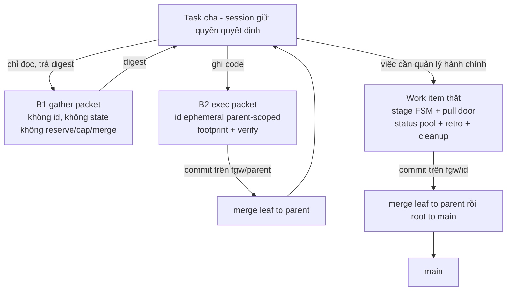

# DISCUSSION — Hai lớp dispatch cho fgOS

Item: `tsk-2t6`. Liên quan: `tsk-3xd` (bug thân-mệnh-lệnh rỗng ở decompose),
`tsk-535` (thiếu `description` nhìn từ góc mất dữ liệu), `tsk-66o` (đợt
computed-parallel-wave-schedule + worktree-dispatch-attestation, đã merge main).

## 1. Trạng thái hiện tại

Vòng 1 (2026-08-06). Đã đọc kỹ upstream bee và scout xong phía fgOS. Hai câu
hỏi mở đầu của người dùng đã có câu trả lời bằng bằng chứng source (§3, hàng
"rõ"). Phát hiện quan trọng nhất: **bee không có một mô hình cell duy nhất — bee
tách sẵn HAI lớp dispatch**, và ranh giới bee vạch là *"dispatch nào GHI file thì
phải có id, dispatch nào chỉ ĐỌC-tổng-hợp thì không cần gì cả"*.

Chưa có D-ID nào được mint: mọi điểm mới đứng qua đúng một vòng, chưa đủ điều
kiện ổn định (quy tắc D4 của `fgos-coding-shaping`). Còn mở: chọn B1 trước hay
mở luôn cả B2; hình dạng id ephemeral của B2; có thêm field per-item
`selfSufficient` không.

## 2. Mục tiêu & đề bài

fgOS hiện chỉ có MỘT cách chia việc: mọi thứ tách ra từ `decompose` đều trở
thành work item đầy đủ vòng đời — có id thật trong backlog, có `stage` FSM, đi
qua pull door `/fgOS:pick`, nằm trong status pool, phải qua retro và cleanup khi
xong. Cách đó đúng cho việc cần quản lý hành chính, nhưng đắt và cứng cho phần
lớn việc chia nhỏ trong thực tế: rất nhiều lúc việc con chỉ cần là *một note
chia việc rõ ràng, kèm mệnh lệnh đóng gói đầy đủ, giữ ở task cha, đẩy xuống
agent/process con thực hiện, xong báo cáo kết quả về cha* — không cần trở thành
một đơn vị quản lý. Cách chia đó cho phép uyển chuyển đẩy việc xuống đúng
smart-tier, đúng provider mà không phải câu nệ process, và dùng được ngay trong
nội bộ các khâu: `discover` có thể tách ra scout / research web / fetch web /
tổng hợp; `planning`/`decompose` có thể chia việc thuần để chạy nhanh hơn chứ
không phải để quản lý. Câu hỏi của item này là: fgOS nên có lớp dispatch thứ hai
đó dưới hình dạng nào, ranh giới giữa nó và work item thật nằm ở đâu, và cái gì
buộc phải giữ lại (id, footprint, verify, merge) khi việc con thực sự ghi code.

## 3. Vấn đề rõ / chưa rõ

| # | Điểm | Trạng thái | Bằng chứng / ghi chú |
|---|---|---|---|
| 1 | Bee có HAI lớp dispatch, không phải một | **Rõ** | `upstreams/bee/AGENTS.md:77` rule 12: *"Fan out the gathering; keep the deciding... mechanical gather/render/mine steps dispatch down-tier as I/O workers that return digests"*; nhánh cli gather `upstreams/bee/skills/bee-swarming/references/swarming-reference.md:177`: *"no reservation, no cap, no `result.json` — stdout **is** the digest"* |
| 2 | Ranh giới bee vạch giữa hai lớp | **Rõ** | Dispatch GHI file/mutate git ⇒ cần id (claim/reserve/cap/commit/merge). Dispatch chỉ đọc-tổng-hợp-trả-về ⇒ không cần state gì. Rule 12 khoá thêm: decide-altitude không delegate — gates, synthesis, state writes, đối thoại với người ở lại session model |
| 3 | Cell của bee KHÔNG phải backlog item | **Rõ** | Hai sổ riêng: `.bee/cells/<feature>-<n>.json` (ephemeral, feature-scoped) vs `.bee/backlog.jsonl` PBI events (`upstreams/bee/AGENTS.md:93-95`). Cell chết khi feature đóng; `state worker prune` dọn transients (`swarming-reference.md:203`) |
| 4 | Schema cell của bee | **Rõ** | `upstreams/bee/skills/bee-planning/references/planning-reference.md:113`: `id, feature, title, lane, status, deps, decisions, files, read_first, action (prose mệnh lệnh cite D-ID), must_haves{truths,artifacts,key_links,prohibitions}, verify (lệnh chạy được), behavior_change, trace{}` |
| 5 | Với lane tiny/small, cell CHÍNH LÀ micro-plan | **Rõ** | `bee-planning/SKILL.md:90` — tiny bỏ hẳn `plan.md`; shape đầy đủ = request + một cell. Tức bee đã có sẵn đường "chia việc mà không sinh tài liệu hành chính" |
| 6 | Bee chống xung đột footprint bằng xếp sóng, không bằng từ chối | **Rõ** | `bee-swarming/SKILL.md:94` (`cells schedule`, Kahn); `planning-reference.md:105`: *"Cross-cell file overlap is legal, not a scoping error — it only costs a wave"* |
| 7 | Bee không tin worker | **Rõ** | `bee-swarming/SKILL.md:114-118`: orchestrator tự chạy lại verify + `cells judge`; worker chỉ trả đúng 1 token `[DONE]/[BLOCKED]/[HANDOFF]/[NOOP]` (`swarming-reference.md:246`) |
| 8 | fgOS có field per-item nào khẳng định "task con trọn vẹn, tự chạy hết stage" không? | **Rõ — KHÔNG có** | `src/state/store.mjs:238` `EDITABLE_FIELDS` 22 field, không có cờ nào dạng đó. Cái gần nhất là cấu hình toàn repo: `src/state/gate-bypass.mjs` — `level × tier` (`isTierCovered`) + kiểm cơ học trên ARTIFACT (`hasOpenItems`: `TODO/FIXME`, `## Outstanding questions` phải là "None") + sàn `HEAVY_KEYWORDS` luôn ghi đè |
| 9 | Con auto-decompose có bị GATE không? | **Rõ — không bị** | `src/intake/decompose.mjs:940` đóng dấu thẳng `stage: stageForStep(domain,'Execute')` — con bỏ qua clarify + decompose, không chạm gate của exploring/planning/validating |
| 10 | Con auto-decompose có đủ chi tiết để chạy không? | **Rõ — KHÔNG** | Cùng khối `decompose.mjs:929-944` chỉ truyền `title, kind, deps, risk, refs, footprint, verify, stage, parent, tier, domain` — không `description`, không trường mệnh lệnh nào. Nhưng `src/runner/prompt-templates/worker-prompt-{default,skill-pointer}.txt` nội suy `{description}` ⇒ executor ngoài nhận prompt rỗng phần chỉ dẫn. Đã tách ra item riêng `tsk-3xd` |
| 11 | Orchestrator tự pick con thì merge có tuần tự qua cha? | **Rõ — có** | `src/runner/worktree.mjs:30` leaf fork từ tip nhánh root (D3 "leaf fork-from-tip-of-parent"); `src/runner/merge.mjs:600` target là `main` cho root→main, `fgw/<root>` cho leaf→parent; `src/state/dep-graph.mjs:156` cạnh `parent-child` hướng parent→child ⇒ cha đợi con. Git log thực tế: `da2d382 Merge branch 'fgw/tsk-40t' into fgw/tsk-1d5` |
| 12 | Làm B1 trước rồi đánh giá lại, hay mở luôn B2? | **Chưa rõ** | B1 không cần hạ tầng mới, chỉ cần skill dạy cách đóng gói. B2 là mở sổ ephemeral thứ hai trong state — quyết định kiến trúc thật |
| 13 | Nếu làm B2: id ephemeral hình dạng nào | **Chưa rõ** | Ví dụ `tsk-66o#c1` — phạm vi cha, không vào `list/ready/triage`, không stage, không retro, chết khi cha `done`. Chưa quyết chỗ lưu (file riêng như `.bee/cells/` hay nhánh phụ trong events log) |
| 14 | Có thêm field per-item `selfSufficient` không | **Chưa rõ** | Nghiêng về KHÔNG: thêm cờ tự-khai là mời agent tự phong "tôi đủ trọn vẹn", đúng thứ `gate-bypass.mjs` cố tình tránh bằng cách chỉ đọc dấu hiệu cơ học. Chưa qua vòng thứ hai |
| 15 | Vá `tsk-3xd` xong thì B2 còn cần không | **Chưa rõ** | Nếu con auto-decompose mang được `action` prose + `read_first` thật, "task con hoàn chỉnh" (cách chia thứ nhất) có thể đã đủ, B2 thành thừa |

## 4. Quyết định đã chốt

_(D-ID table, append-only. Trống có chủ đích: mọi điểm ở §3 mới đứng qua đúng
một vòng — quy tắc D4 của `fgos-coding-shaping` cấm mint D-ID từ một câu trả
lời duy nhất. Điểm nào giữ nguyên qua vòng sau sẽ được mint ở đây kèm một lời
gọi `fgos decision --id tsk-2t6` thật.)_

| D-ID | Nội dung | Lý do | Vòng chốt |
|---|---|---|---|
| — | — | — | — |

## 5. Q&A log

### 2026-08-06 — vòng 1

**Người dùng:** Kết quả đợt `tsk-66o` chưa đúng ý. Hai câu hỏi: (1) task con
được chia ra có đủ mọi chi tiết/mệnh lệnh để tự đi hết các stage không bị GATE
không, có field nào khẳng định điều đó không; và nếu orchestrator tự pick con
thì merge có tuần tự qua cha trước khi vào main không. (2) Thực tế không cần
chia thành work-item hoàn chỉnh có id — chỉ cần note chia việc rõ ràng kèm
hướng dẫn chi tiết, giữ ở cha, đẩy xuống con như mệnh lệnh đính kèm đóng gói
hoàn chỉnh, xong báo cáo về cha. Đọc kỹ cách bee chia và quản lý cell để tham
khảo.

**Trả lời (sau khi đọc `upstreams/bee/AGENTS.md`, `bee-planning/SKILL.md` +
`planning-reference.md`, `bee-swarming/SKILL.md` + `swarming-reference.md`,
`bee-executing/SKILL.md`, và scout phía fgOS):** phát hiện chính là bee tách
sẵn hai lớp dispatch (§3 hàng 1-2), cell không phải backlog item (hàng 3).
Câu (1a): không có field nào; nhưng thực tế con KHÔNG bị gate (hàng 9) mà lại
THIẾU thân mệnh lệnh (hàng 10) — hai chuyện ngược nhau. Câu (1b): có, đã có sẵn
(hàng 11). Câu (2): cái người dùng muốn không phải "không có id" mà là "không có
vòng đời hành chính" — bee vẫn cấp id cho cell vì id là thứ để claim/reserve/
cap/gắn commit; bỏ id là mất luôn cơ chế chống xung đột. Đề xuất tách B1/B2 và
khuyến nghị làm B1 trước, đồng thời vá lỗ `description` ở decompose trước khi
mở sổ thứ hai.

**Người dùng:** Ghi nhận thảo luận này thế nào để không mất chi tiết và không
ảnh hưởng luồng task khác?

**Trả lời:** tách ba loại — (a) gap cụ thể đã có bằng chứng ⇒ submit item
thường; (b) thiết kế mở ⇒ `/fgOS:coding-shape`, `DISCUSSION.md` trên nhánh
riêng, main checkout không bị chạm; (c) tri thức upstream mới ⇒ delta cho
distillery.

**Người dùng:** Submit (a) riêng, ghi rõ khác gì `tsk-535`. Gộp (c) vào branch
của (b).

**Kết quả vòng 1:** `tsk-3xd` (bug, todo/clarify, không deps) cho (a);
`tsk-2t6` (feature, tier light) cho (b)+(c); file này nằm trên `fgw/tsk-2t6`.

## 6. Thiết kế đã chốt {#design}

_(Trạng thái: bản phác thảo vòng 1, chưa có D-ID nào chống lưng. Regenerate
toàn phần khi có quyết định làm đổi hình dạng.)_

Ý tưởng trung tâm: fgOS phân biệt dispatch theo **hệ quả của nó lên cây git**,
không theo việc nó "lớn hay nhỏ". Một dispatch chỉ đọc và trả về chữ thì không
để lại gì cần hoà nhập, nên không cần danh tính, không cần state, không cần
verify — nó chỉ cần một gói mệnh lệnh đầy đủ và một digest trả về. Một dispatch
ghi file thì để lại commit phải merge, nên bắt buộc phải có danh tính để giữ
chỗ (reserve), để chứng thực điểm xuất phát (attestation), để gắn commit và để
merge đúng nhánh cha. Đây chính là ranh giới bee đã vạch, và nó giải thích vì
sao bee vừa có cell có id vừa có I/O worker không id mà không mâu thuẫn.

**B1 — gather packet (không id, không state).** Cha đóng gói toàn bộ mệnh lệnh
(mục tiêu, đường dẫn phải đọc, ràng buộc, hình dạng digest mong đợi), dispatch
xuống đúng tier/provider, con trả digest về cha. Không claim, không reserve,
không cap, không file kết quả bắt buộc — stdout/final message chính là digest.
Dùng cho: `discover` (scout, research web, fetch, tổng hợp), reality-check của
`validating`, mọi bước gather/render/mine cơ học. Không cần bất kỳ thay đổi
nào trong `.fgos/` — chỉ cần skill dạy cách đóng gói và cách nhận digest.

**B2 — exec packet (id ephemeral, phạm vi cha).** Dùng khi con GHI code. Giữ
lại đúng những thứ phục vụ hoà nhập: một id phạm vi cha (dạng `<parent>#cN`),
`footprint`, `verify` chạy được, và merge về `fgw/<parent>`. Bỏ đi toàn bộ phần
hành chính: không `stage` FSM, không pull door `/fgOS:pick`, không status pool,
không retro, không cleanup; chết khi cha `done`. Đây là port thẳng mô hình cell
của bee sang fgOS, kèm sổ ephemeral thứ hai — và đó là lý do B2 đắt hơn B1 rất
nhiều.

**Điều kiện tiên quyết cho cả hai:** thân mệnh lệnh phải thực sự được truyền
xuống. Hiện `decompose.mjs:940` không truyền `description`, nên ngay cả cách
chia thứ nhất (work item đầy đủ) cũng đang dispatch con với prompt rỗng phần
chỉ dẫn. Vá xong (`tsk-3xd`) mới đánh giá được B2 có còn cần hay không.

## 7. Danh mục hạng mục / task {#tasks}

### B1 — gather packet: hợp đồng đóng gói + digest {#task-gather-packet}

- **Mục tiêu:** cho phép mọi skill fgOS (đầu tiên là `fgos-exploring`, sau đó
  `fgos-validating`) tách một bước gather thuần-đọc thành dispatch riêng, đúng
  tier/provider, không sinh state.
- **Trích §6:** *"Một dispatch chỉ đọc và trả về chữ thì không để lại gì cần
  hoà nhập, nên không cần danh tính, không cần state, không cần verify."*
- **D-ID áp dụng:** chưa có.
- **Quan hệ:** độc lập với `#task-exec-packet`; nếu B1 đủ dùng thì B2 có thể
  không bao giờ cần tới.
- **Verify nháp:** `node --test test/skills/gather-packet.test.mjs` (chưa tồn
  tại — hợp đồng đóng gói phải được định nghĩa trước).

### B2 — exec packet: id ephemeral phạm vi cha {#task-exec-packet}

- **Mục tiêu:** sổ ephemeral thứ hai cho việc con GHI code: id phạm vi cha,
  `footprint`, `verify`, merge về `fgw/<parent>`; không stage/pull-door/pool/
  retro/cleanup.
- **Trích §6:** *"Giữ lại đúng những thứ phục vụ hoà nhập... Bỏ đi toàn bộ
  phần hành chính."*
- **D-ID áp dụng:** chưa có.
- **Quan hệ:** phụ thuộc kết quả của `tsk-3xd` — nếu con work-item thật đã
  mang được `action` prose thì hạng mục này có thể bị bác vì YAGNI.
- **Verify nháp:** chưa xác định — phụ thuộc chỗ lưu sổ (§3 hàng 13).

### Delta distillery: trục hai-lớp-dispatch {#task-distillery-delta}

- **Mục tiêu:** cập nhật `docs/distillery/deep-dives/parallel-decomposition-and-merge.md`
  với phát hiện §3 hàng 1-3 (deep-dive hiện chỉ so cell-swarm vs
  isolated-run-contract, chưa tách trục *ghi-file-cần-id vs chỉ-đọc-không-cần*,
  và chưa ghi nhận cell ≠ backlog item), kèm một hàng `porting-log.md` tương
  ứng.
- **Trích §6:** *"Đây chính là ranh giới bee đã vạch, và nó giải thích vì sao
  bee vừa có cell có id vừa có I/O worker không id mà không mâu thuẫn."*
- **D-ID áp dụng:** chưa có.
- **Quan hệ:** thuần tài liệu, không phụ thuộc B1/B2; nằm cùng branch
  `fgw/tsk-2t6` theo quyết định của người dùng ở §5 vòng 1.
- **Verify nháp:** `grep -q "hai lớp dispatch" docs/distillery/deep-dives/parallel-decomposition-and-merge.md`

## Outstanding questions

- Làm B1 trước rồi đánh giá lại, hay mở luôn cả B2? (§3 hàng 12)
- Nếu làm B2: id ephemeral lưu ở đâu, hình dạng nào? (§3 hàng 13)
- Có thêm field per-item `selfSufficient` không, hay giữ nguyên triết lý phán
  trên artifact qua `hasOpenItems`? (§3 hàng 14)
- Vá `tsk-3xd` xong thì B2 còn cần không? (§3 hàng 15)
</content>
</invoke>
