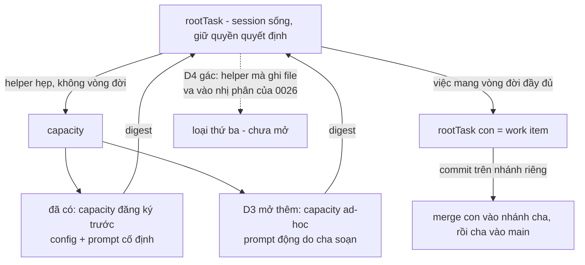

# DISCUSSION — Hai lớp dispatch cho fgOS

Item: `tsk-2t6`. Liên quan: `tsk-3xd` (bug thân-mệnh-lệnh rỗng ở decompose),
`tsk-535` (thiếu `description` nhìn từ góc mất dữ liệu), `tsk-66o` (đợt
computed-parallel-wave-schedule + worktree-dispatch-attestation, đã merge main).

## 1. Trạng thái hiện tại

Vòng 4 (2026-08-06). Đã đọc kỹ upstream bee và scout xong phía fgOS. Hai câu
hỏi mở đầu của người dùng đã có câu trả lời bằng bằng chứng source (§3, hàng
"rõ"). Phát hiện quan trọng nhất: **bee không có một mô hình cell duy nhất — bee
tách sẵn HAI lớp dispatch**, và ranh giới bee vạch là *"dispatch nào GHI file thì
phải có id, dispatch nào chỉ ĐỌC-tổng-hợp thì không cần gì cả"*.

Vòng 2 làm sâu hàng 10 của §3 (lỗ ba tầng, là lỗ hợp đồng chứ không phải lỗi
chất lượng model) và đẩy phần đó về `tsk-3xd`. Vòng 3 xử thứ tự `tsk-3xd` vs
`tsk-535` (§3 hàng 16-19, mint **D1**) và đính chính một lời sai của vòng 2.

**Vòng 4 đảo ngược khung của vòng 1:** B1 không phải thứ cần xây — nó là
`capacity`, khái niệm đã khoá ở `docs/decisions/0026`, và máy đã chạy tới Pha 4
(§3 hàng 20-21). Thiếu thật sự là hai chốt hình dạng: gói mệnh lệnh phải đăng ký
trước thay vì soạn động, và danh sách lý do hợp lệ để dispatch không có song
song hoá (hàng 22-23). Người dùng chốt cả ba ⇒ **D2** (thêm lý do thứ tư),
**D3** (capacity ad-hoc prompt động), **D4** (gác lớp helper-ghi-file). §6 đã
regenerate toàn phần, §7 viết lại theo hình dạng mới.

Còn nợ từ vòng 3: sửa câu sai trong description của `tsk-3xd` (đã giao cho phiên
đang giữ claim item đó). Còn mở: xem §Outstanding questions.

## 2. Mục tiêu & đề bài

fgOS hiện chỉ có MỘT cách chia việc: mọi thứ tách ra từ `decompose` đều trở
thành work item đầy đủ vòng đời — có id thật trong backlog, có `stage` FSM, đi
qua pull door `/fgOS:pick`, nằm trong status pool, phải qua retro và cleanup khi
xong. Cách đó đúng cho việc cần quản lý hành chính, nhưng đắt và cứng cho phần
lớn việc chia nhỏ trong thực tế: rất nhiều lúc việc con chỉ cần là *một note
chia việc rõ ràng, kèm mệnh lệnh đóng gói đầy đủ, giữ ở task cha, đẩy xuống
agent/process con thực hiện, xong báo cáo kết quả về cha* — không cần trở thành
một đơn vị quản lý. Cách chia đó cho phép uyển chuyển đẩy việc xuống đúng
smart-tier, đúng provider mà không phải câu nệ process, và dùng được ngay trong
nội bộ các khâu: `discover` có thể tách ra scout / research web / fetch web /
tổng hợp; `planning`/`decompose` có thể chia việc thuần để chạy nhanh hơn chứ
không phải để quản lý. Câu hỏi của item này là: fgOS nên có lớp dispatch thứ hai
đó dưới hình dạng nào, ranh giới giữa nó và work item thật nằm ở đâu, và cái gì
buộc phải giữ lại (id, footprint, verify, merge) khi việc con thực sự ghi code.

## 3. Vấn đề rõ / chưa rõ

| # | Điểm | Trạng thái | Bằng chứng / ghi chú |
|---|---|---|---|
| 1 | Bee có HAI lớp dispatch, không phải một | **Rõ** | `upstreams/bee/AGENTS.md:77` rule 12: *"Fan out the gathering; keep the deciding... mechanical gather/render/mine steps dispatch down-tier as I/O workers that return digests"*; nhánh cli gather `upstreams/bee/skills/bee-swarming/references/swarming-reference.md:177`: *"no reservation, no cap, no `result.json` — stdout **is** the digest"* |
| 2 | Ranh giới bee vạch giữa hai lớp | **Rõ** | Dispatch GHI file/mutate git ⇒ cần id (claim/reserve/cap/commit/merge). Dispatch chỉ đọc-tổng-hợp-trả-về ⇒ không cần state gì. Rule 12 khoá thêm: decide-altitude không delegate — gates, synthesis, state writes, đối thoại với người ở lại session model |
| 3 | Cell của bee KHÔNG phải backlog item | **Rõ** | Hai sổ riêng: `.bee/cells/<feature>-<n>.json` (ephemeral, feature-scoped) vs `.bee/backlog.jsonl` PBI events (`upstreams/bee/AGENTS.md:93-95`). Cell chết khi feature đóng; `state worker prune` dọn transients (`swarming-reference.md:203`) |
| 4 | Schema cell của bee | **Rõ** | `upstreams/bee/skills/bee-planning/references/planning-reference.md:113`: `id, feature, title, lane, status, deps, decisions, files, read_first, action (prose mệnh lệnh cite D-ID), must_haves{truths,artifacts,key_links,prohibitions}, verify (lệnh chạy được), behavior_change, trace{}` |
| 5 | Với lane tiny/small, cell CHÍNH LÀ micro-plan | **Rõ** | `bee-planning/SKILL.md:90` — tiny bỏ hẳn `plan.md`; shape đầy đủ = request + một cell. Tức bee đã có sẵn đường "chia việc mà không sinh tài liệu hành chính" |
| 6 | Bee chống xung đột footprint bằng xếp sóng, không bằng từ chối | **Rõ** | `bee-swarming/SKILL.md:94` (`cells schedule`, Kahn); `planning-reference.md:105`: *"Cross-cell file overlap is legal, not a scoping error — it only costs a wave"* |
| 7 | Bee không tin worker | **Rõ** | `bee-swarming/SKILL.md:114-118`: orchestrator tự chạy lại verify + `cells judge`; worker chỉ trả đúng 1 token `[DONE]/[BLOCKED]/[HANDOFF]/[NOOP]` (`swarming-reference.md:246`) |
| 8 | fgOS có field per-item nào khẳng định "task con trọn vẹn, tự chạy hết stage" không? | **Rõ — KHÔNG có** | `src/state/store.mjs:238` `EDITABLE_FIELDS` 22 field, không có cờ nào dạng đó. Cái gần nhất là cấu hình toàn repo: `src/state/gate-bypass.mjs` — `level × tier` (`isTierCovered`) + kiểm cơ học trên ARTIFACT (`hasOpenItems`: `TODO/FIXME`, `## Outstanding questions` phải là "None") + sàn `HEAVY_KEYWORDS` luôn ghi đè |
| 9 | Con auto-decompose có bị GATE không? | **Rõ — không bị** | `src/intake/decompose.mjs:940` đóng dấu thẳng `stage: stageForStep(domain,'Execute')` — con bỏ qua clarify + decompose, không chạm gate của exploring/planning/validating |
| 10 | Con auto-decompose có đủ chi tiết để chạy không? | **Rõ — KHÔNG, và lỗ nằm ở BA tầng** | Tầng 1: prompt hỏi LLM không xin prose (`decompose.mjs:227`, schema chỉ `{title, verify, kind...}`). Tầng 2: `normalizeChild` (`decompose.mjs:231-255`) chỉ giữ `title, verify, kind, risk, refs, footprint, rawDeps` — model có trả prose cũng bị vứt. Tầng 3: `addWork` (`decompose.mjs:929-944`) không truyền `description`, trong khi `src/runner/prompt-templates/worker-prompt-{default,skill-pointer}.txt` nội suy `{description}`. Đã tách ra item riêng `tsk-3xd` |
| 10b | Lỗ này có phải do chất lượng LLM judge không? | **Rõ — không, là lỗ hợp đồng** | `buildDecomposeChildrenVerdict` dùng CHUNG `normalizeChild` cho cả đường `fgos decompose --children` (tsk-27y D1, native-first, session sống tự lý luận cách chia) ⇒ kể cả session có đủ context tự viết cách chia cũng không có đường truyền thân mệnh lệnh xuống con |
| 11 | Orchestrator tự pick con thì merge có tuần tự qua cha? | **Rõ — có** | `src/runner/worktree.mjs:30` leaf fork từ tip nhánh root (D3 "leaf fork-from-tip-of-parent"); `src/runner/merge.mjs:600` target là `main` cho root→main, `fgw/<root>` cho leaf→parent; `src/state/dep-graph.mjs:156` cạnh `parent-child` hướng parent→child ⇒ cha đợi con. Git log thực tế: `da2d382 Merge branch 'fgw/tsk-40t' into fgw/tsk-1d5` |
| 12 | Làm B1 trước rồi đánh giá lại, hay mở luôn B2? | **Chưa rõ** | B1 không cần hạ tầng mới, chỉ cần skill dạy cách đóng gói. B2 là mở sổ ephemeral thứ hai trong state — quyết định kiến trúc thật |
| 13 | Nếu làm B2: id ephemeral hình dạng nào | **Chưa rõ** | Ví dụ `tsk-66o#c1` — phạm vi cha, không vào `list/ready/triage`, không stage, không retro, chết khi cha `done`. Chưa quyết chỗ lưu (file riêng như `.bee/cells/` hay nhánh phụ trong events log) |
| 14 | Có thêm field per-item `selfSufficient` không | **Chưa rõ** | Nghiêng về KHÔNG: thêm cờ tự-khai là mời agent tự phong "tôi đủ trọn vẹn", đúng thứ `gate-bypass.mjs` cố tình tránh bằng cách chỉ đọc dấu hiệu cơ học. Chưa qua vòng thứ hai |
| 15 | Vá `tsk-3xd` xong thì B2 còn cần không | **Chưa rõ** | Nếu con auto-decompose mang được `action` prose + `read_first` thật, "task con hoàn chỉnh" (cách chia thứ nhất) có thể đã đủ, B2 thành thừa |
| 16 | Nguy cơ mất dữ liệu của `tsk-535` đã sống chưa? | **Rõ — chưa, còn tiềm ẩn** | `deriveTitle` chỉ được gọi ở đúng một chỗ: `bin/fgos.mjs:748` (đường `submit`). Không có migration/verb re-derive nào trong source; `docs/history/work-item-title-contract/CONTEXT.md` để nguyên *"Whether D4's re-derive ships as a one-shot script or a CLI verb"* ở mục Deferred to planning ⇒ chỉ nổ khi ai đó ship D4 |
| 17 | `fgos add` có `--description` không? | **Rõ — không** | `bin/fgos.mjs` chỉ set `description` ở `:764` (nhánh `submit`); `--description` chỉ tồn tại cho `edit` và `tool register`. Xác nhận nửa thứ hai của `tsk-535` là thật |
| 18 | `tsk-3xd` có làm `tsk-535` thành thừa không? | **Rõ — KHÔNG** (đính chính lời nói ở vòng 2) | `tsk-3xd` chỉ vá tiến-về-trước: không đụng 53 item đã hỏng, không đụng đường `fgos add`. Nói `tsk-535` "có thể superseded" là sai |
| 19 | Thứ tự `tsk-3xd` vs `tsk-535` | **Chốt — D1** | `tsk-3xd` trước: nó vá 40/53 item (đường decompose) bằng prose thật, làm `tsk-535` teo lại còn `fgos add --description` + backfill. Làm ngược thì công vứt đi VÀ `description=title` che mất triệu chứng (nhìn như đã có description, với executor vẫn rỗng nghĩa). Ràng buộc cứng thật sự: cả hai xong trước khi D4 re-derive ship — item ship D4 chưa tồn tại |
| 20 | B1 có phải khái niệm mới không? | **Rõ — KHÔNG, nó là `capacity` đã khoá** | `docs/decisions/0026` dòng 67-74: **subTask** *"đúng bản chất chỉ là 1 rootTask khác, được kích hoạt đệ quy"*; **capacity** *"1 đơn vị functional/helper hẹp... không tự mang vòng đời 1 rootTask đầy đủ"*. Dòng 76-86 chốt hai cái **không gộp khái niệm**, chỉ gộp **cơ chế dispatch** (4 quy tắc, dòng 88-115). Trùng khít ranh giới bee ở hàng 2 |
| 21 | Máy của capacity đã chạy chưa? | **Rõ — đã xong tới Pha 4** | `.claude/skills/_shared/capacity-dispatch-fallback.md` (config check → presence check → native-vs-cli → prompt → fallback inline). Pha 1-4 của 0026 đều ở `cleanup`: `tsk-1ni`, `tsk-27y`, `tsk-53h`, `tsk-3ik`. Chỉ Pha 5 (`tsk-6db`, native detection cho agy) còn `todo`, deferred YAGNI |
| 22 | Hình dạng capacity có khớp cách chia việc người dùng cần không? | **Rõ — KHÔNG, lệch hai chốt** | Chốt 1: capacity là điểm dispatch **đăng ký trước** — đòi `capacities.<id>` trong config + `<PROMPT_TEMPLATE>` **cố định** hardcode trong skill (*"so every dispatch asks the exact same thing, never a paraphrase that drifts call to call"*). Chốt 2: danh sách lý do hợp lệ để dispatch chỉ có ba — *cheaper model, cross-provider, resource isolation* — **không có song song hoá** |
| 23 | Lệnh cấm ad-hoc Task dispatch nằm ở đâu? | **Rõ — ở skill, không ở 0026** | `fgos-exploring/SKILL.md:32-49` và bản sao ở `fgos-planning:46`, `fgos-validating:55`, `fgos-code-implement:48`. 0026 §Ranh giới quan sát được chỉ tách hai lý do của **native-vs-cli** (tránh soul mù re-derive; quan sát được) — chưa bao giờ phát biểu về **dispatch-vs-inline**. Sửa danh sách trong skill không đụng luật khoá |
| 23b | Danh sách ba lý do bị chép ở 4 skill | **Rõ — vấn đề DRY kèm theo** | Bốn bản sao gần như y hệt (`grep "cheaper model"`). Sửa D2 nên chuyển danh sách về `_shared/` rồi trỏ tới, không sửa bốn chỗ song song |
| 24 | Có thêm song-song-hoá thành lý do hợp lệ không? | **Chốt — D2 (có)** | `AGENTS.md` để Ship Faster ở ưu tiên #1 mà danh sách hiện tại loại trừ đúng lý do tốc độ |
| 25 | Prompt động hay nhân bản capacity id? | **Chốt — D3 (prompt động)** | Chấp nhận mất bảo đảm chống-drift của fixed template, đổi lấy chia việc uyển chuyển |
| 26 | B2 có va vào luật khoá không? | **Rõ — có, và đã gác (D4)** | 0026 chốt nhị phân rootTask/capacity. B2 là helper **CÓ ghi file** ⇒ loại thứ ba; muốn có phải mở rộng `capacity` cho ghi file hoặc supersede phần "subTask ≡ rootTask" của 0026 |

## 4. Quyết định đã chốt

_(D-ID table, append-only. Trống có chủ đích: mọi điểm ở §3 mới đứng qua đúng
một vòng — quy tắc D4 của `fgos-coding-shaping` cấm mint D-ID từ một câu trả
lời duy nhất. Điểm nào giữ nguyên qua vòng sau sẽ được mint ở đây kèm một lời
gọi `fgos decision --id tsk-2t6` thật.)_

| D-ID | Nội dung | Lý do | Vòng chốt |
|---|---|---|---|
| **D1** | `tsk-3xd` làm **trước** `tsk-535`; ghi thứ tự bằng `mergeAfter`, không dep cứng | `tsk-3xd` vá 40/53 item thiếu description (đường decompose) bằng prose thật ⇒ `tsk-535` teo lại còn `fgos add --description` + backfill. Làm ngược thì `description=title` **che mất triệu chứng**: 40 item con nhìn như đã có description nhưng với executor vẫn rỗng nghĩa. `mergeAfter` (`src/state/work.mjs:256-273`) chỉ xếp thứ tự lúc merge ⇒ hai item vẫn chạy song song | Vòng 3 (người xác nhận trực tiếp). Đã thi hành: `fgos edit tsk-535 --merge-after tsk-3xd`, và `fgos decision --id tsk-2t6` seq 7857 |
| **D2** | Thêm **song-song-hoá / rút-ngắn-thời-gian** thành lý do hợp lệ **thứ tư** để dispatch một bước ra khỏi session thay vì làm inline | Ba lý do hiện tại nằm trong skill, không nằm trong 0026 — 0026 chỉ phát biểu về native-vs-cli, chưa bao giờ về dispatch-vs-inline (§3 hàng 23) ⇒ sửa skill không đụng luật khoá. `AGENTS.md` để Ship Faster ở ưu tiên #1 mà danh sách hiện tại loại trừ đúng lý do tốc độ | Vòng 4 (người xác nhận). `fgos decision` seq 7948 |
| **D3** | Mở lớp **capacity ad-hoc nhận prompt động** do cha soạn lúc chạy, thay vì chỉ `<PROMPT_TEMPLATE>` cố định đăng ký trước | Cách chia việc cần cha soạn gói mệnh lệnh mỗi lần một nội dung. Chấp nhận đánh đổi: mất bảo đảm chống-drift mà fixed template sinh ra để giữ | Vòng 4 (người xác nhận). `fgos decision` seq 7949 |
| **D4** | **Gác B2** (exec packet ghi file, id ephemeral) — không mở loại thứ ba giữa rootTask và capacity | 0026 chốt nhị phân; B2 là helper CÓ ghi file ⇒ phải mở rộng `capacity` cho ghi file hoặc supersede 0026, cả hai đụng luật khoá. Xét lại sau khi `tsk-3xd` xong: nếu con work-item thật đã mang được `action` prose thì B2 có thể thừa | Vòng 4 (người xác nhận). `fgos decision` seq 7950 |

## 5. Q&A log

### 2026-08-06 — vòng 1

**Người dùng:** Kết quả đợt `tsk-66o` chưa đúng ý. Hai câu hỏi: (1) task con
được chia ra có đủ mọi chi tiết/mệnh lệnh để tự đi hết các stage không bị GATE
không, có field nào khẳng định điều đó không; và nếu orchestrator tự pick con
thì merge có tuần tự qua cha trước khi vào main không. (2) Thực tế không cần
chia thành work-item hoàn chỉnh có id — chỉ cần note chia việc rõ ràng kèm
hướng dẫn chi tiết, giữ ở cha, đẩy xuống con như mệnh lệnh đính kèm đóng gói
hoàn chỉnh, xong báo cáo về cha. Đọc kỹ cách bee chia và quản lý cell để tham
khảo.

**Trả lời (sau khi đọc `upstreams/bee/AGENTS.md`, `bee-planning/SKILL.md` +
`planning-reference.md`, `bee-swarming/SKILL.md` + `swarming-reference.md`,
`bee-executing/SKILL.md`, và scout phía fgOS):** phát hiện chính là bee tách
sẵn hai lớp dispatch (§3 hàng 1-2), cell không phải backlog item (hàng 3).
Câu (1a): không có field nào; nhưng thực tế con KHÔNG bị gate (hàng 9) mà lại
THIẾU thân mệnh lệnh (hàng 10) — hai chuyện ngược nhau. Câu (1b): có, đã có sẵn
(hàng 11). Câu (2): cái người dùng muốn không phải "không có id" mà là "không có
vòng đời hành chính" — bee vẫn cấp id cho cell vì id là thứ để claim/reserve/
cap/gắn commit; bỏ id là mất luôn cơ chế chống xung đột. Đề xuất tách B1/B2 và
khuyến nghị làm B1 trước, đồng thời vá lỗ `description` ở decompose trước khi
mở sổ thứ hai.

**Người dùng:** Ghi nhận thảo luận này thế nào để không mất chi tiết và không
ảnh hưởng luồng task khác?

**Trả lời:** tách ba loại — (a) gap cụ thể đã có bằng chứng ⇒ submit item
thường; (b) thiết kế mở ⇒ `/fgOS:coding-shape`, `DISCUSSION.md` trên nhánh
riêng, main checkout không bị chạm; (c) tri thức upstream mới ⇒ delta cho
distillery.

**Người dùng:** Submit (a) riêng, ghi rõ khác gì `tsk-535`. Gộp (c) vào branch
của (b).

**Kết quả vòng 1:** `tsk-3xd` (bug, todo/clarify, không deps) cho (a);
`tsk-2t6` (feature, tier light) cho (b)+(c); file này nằm trên `fgw/tsk-2t6`.

### 2026-08-06 — vòng 2

**Người dùng:** `tsk-3xd` có cần discuss gì nữa không hay đầy đủ rồi?

**Trả lời (sau khi scout `decompose.mjs` sâu hơn):** chưa đủ, nhưng phần thiếu
đúng việc của `clarify`, không phải của discussion này. Hai thứ scout mới ra và
đáng vá thẳng vào item: lỗ có **ba tầng** chứ không phải một (§3 hàng 10), và
đường `fgos decompose --children` dùng chung `normalizeChild` nên đây là **lỗ
hợp đồng, không phải lỗi chất lượng model** (§3 hàng 10b). Bốn quyết định còn
mở của item đó (dùng `description` hay thêm field riêng; prose lấy từ verdict
hay từ `plan.md`/`CONTEXT.md` của cha; có phủ đường `fgos add --parent` thủ công
không; thứ tự với `tsk-535`) để `clarify` chốt.

**Quyết định về `tsk-535`:** không đặt dep cứng. Hai chiều đều an toàn —
`tsk-535` xong trước thì `tsk-3xd` ghi đè `description=title` bằng prose thật;
`tsk-3xd` xong trước thì `tsk-535` hết lý do tồn tại và có thể superseded. Dep
cứng chỉ làm chậm một trong hai.

**Kết quả vòng 2:** `fgos edit tsk-3xd --description` đã bổ sung ba tầng, đường
`--children`, bốn câu hỏi mở, và ghi chú không-dep-cứng vào item.

### 2026-08-06 — vòng 3

**Người dùng:** `tsk-535` nên làm trước hay sau `tsk-3xd`?

**Trả lời (sau khi scout `deriveTitle`, `bin/fgos.mjs` nhánh `add`, và
`docs/history/work-item-title-contract/CONTEXT.md`):** `tsk-3xd` trước — §3 hàng
16-19. Ba điểm scout mới: nguy cơ mất dữ liệu của `tsk-535` chưa sống (chưa có
đường re-derive nào trong source, D4 còn nằm ở Deferred to planning); `fgos add`
đúng là không có `--description`; và **đính chính**: `tsk-3xd` KHÔNG làm
`tsk-535` thành thừa — lời ở vòng 2 ("`tsk-535` hết lý do tồn tại và có thể
superseded") là sai, vì `tsk-3xd` chỉ vá tiến-về-trước, không đụng 53 item đã
hỏng và không đụng đường `fgos add`.

Lý do quan trọng nhất cho thứ tự này không phải tốc độ mà là **che triệu
chứng**: nếu `tsk-535` land trước với `description = title`, 40 item con sẽ
"nhìn như đã có description" trong khi với executor vẫn là prompt rỗng nghĩa —
`tsk-3xd` chưa xong mà không ai thấy.

**Đề xuất chưa được xác nhận:** ghi thứ tự bằng `fgos edit tsk-535 --merge-after
tsk-3xd` thay vì dep cứng — `mergeAfter` (`src/state/work.mjs:256-273`) chỉ xếp
thứ tự lúc merge, không chặn clarify/planning, nên hai item vẫn chạy song song.

**Còn nợ:** description của `tsk-3xd` đang mang câu sai từ vòng 2 ("`tsk-535`
hết lý do tồn tại và có thể superseded"). Phải sửa trước khi item đó vào
`clarify`, nếu không nó sẽ dẫn hướng sai ngay từ câu hỏi đầu tiên.

**Kết quả vòng 3:** người xác nhận thứ tự ⇒ mint **D1** ở §4, thi hành
`fgos edit tsk-535 --merge-after tsk-3xd` và `fgos decision --id tsk-2t6`
(seq 7857). Phần sửa description của `tsk-3xd` chuyển cho phiên đang giữ claim
item đó (item đã được pick ở phiên khác) — phiên này chỉ soạn đoạn thay thế,
không ghi chéo sang item của phiên khác.

### 2026-08-06 — vòng 4

**Người dùng:** bàn tiếp.

**Scout (trước khi hỏi bất cứ điều gì mới):** đọc `fgos-exploring/SKILL.md`,
`.claude/skills/_shared/capacity-dispatch-fallback.md`,
`docs/decisions/0026`, `src/runner/dispatch.mjs`, và trạng thái 6 item của kế
hoạch 5 pha trong 0026. Kết quả đảo ngược khung của vòng 1: **B1 không phải thứ
cần xây — nó là `capacity`, khái niệm đã khoá ở 0026, và máy đã chạy tới Pha 4**
(§3 hàng 20-21). Cái thật sự thiếu là hai chốt hình dạng (§3 hàng 22-23), cộng
một vấn đề DRY kèm theo (hàng 23b: danh sách ba lý do bị chép ở 4 skill).

**Đính chính phương pháp:** lần scout đầu em gọi `fgos list --json` từ trong
worktree mà quên `--dir`, nó trả "not found" cho **mọi** id (worktree không mang
`.fgos/`, ADR0020) — suýt kết luận sai rằng cả 6 item của kế hoạch 5 pha đã
done+cleanup. Kiểm lại với `--dir` mới ra đúng: Pha 1-4 ở `cleanup`, Pha 5
(`tsk-6db`) vẫn `todo`. Đúng cái bẫy `CLAUDE.md` cảnh báo — một kết quả zero
đáng ngờ phải cross-check trước khi tin.

**Người dùng chốt ba điểm:** (1) thêm song song hoá; (2) prompt động; (3) gác
B2. ⇒ mint **D2/D3/D4** ở §4.

**Kết quả vòng 4:** ba `fgos decision --id tsk-2t6` (seq 7948/7949/7950); §6
regenerate toàn phần vì khung "B1 cần xây" của vòng 1 đã sai sự thật; §7 viết
lại theo hình dạng mới.

## 6. Thiết kế đã chốt {#design}

_(Regenerate toàn phần ở vòng 4, thay bản phác thảo vòng 1. Bản cũ mô tả B1/B2
như hai thứ cần xây mới — sai sự thật: B1 đã tồn tại dưới tên `capacity`.
Chống lưng: D1-D4 ở §4, và §3 hàng 20-26.)_

Điểm khởi đầu đúng không phải "fgOS cần lớp dispatch thứ hai" — **fgOS đã có
nó**, và nó tên là `capacity`. `docs/decisions/0026` chốt sẵn một nhị phân:
**rootTask** (đệ quy — thứ mà "subTask" chỉ là tên gọi tương đối của nó) mang
vòng đời đầy đủ; **capacity** là helper functional hẹp, cố ý *không* mang vòng
đời nào. Đúng hai lớp bee tách, chỉ khác tên. Máy cũng chạy rồi: bốn trong năm
pha triển khai của 0026 đã merge, và `_shared/capacity-dispatch-fallback.md` là
hợp đồng sống của lớp helper — kiểm config, kiểm backend có mặt, tự quyết
native-hay-cli, gửi prompt, và luôn có đường lui về "tự làm inline" khi bất cứ
bước nào hụt.

Cái thật sự lệch không nằm ở khái niệm mà ở **hình dạng của gói mệnh lệnh** và
ở **danh sách lý do được phép dispatch**. Capacity hôm nay là một điểm dispatch
*đăng ký trước*: mỗi cái đòi một khoá trong config và một prompt **cố định**
nhúng trong skill, cốt để mọi lần gọi hỏi đúng một câu và không trôi nghĩa. Cách
chia việc mà thảo luận này theo đuổi cần điều ngược lại — cha soạn gói mệnh lệnh
*lúc chạy*, mỗi lần một nội dung khác nhau, tuỳ việc nó vừa quyết định tách ra.
D3 chọn mở lớp ad-hoc đó và trả giá bằng chính bảo đảm chống-trôi mà fixed
template sinh ra để giữ. Song song, bốn skill hiện liệt kê ba lý do hợp lệ để
một bước được đẩy ra ngoài — model rẻ hơn, khác provider, cách ly tài nguyên —
và **không** có "để chạy song song cho nhanh", đúng lý do quan trọng nhất của
người dùng, trong một sản phẩm đặt Ship Faster ở ưu tiên số một. D2 thêm nó vào.
Điểm mấu chốt khiến D2 rẻ: lệnh cấm đó sống trong skill, không trong 0026 —
0026 chỉ từng phát biểu *native hay cli*, chưa bao giờ phát biểu *dispatch hay
làm tại chỗ*.

Còn lớp thứ ba — helper mà **ghi file** — thì gác (D4). Nó không phải ý tồi, nó
là thứ va thẳng vào nhị phân của 0026: hễ cần reserve, attest, commit và merge
thì đã là vòng đời, mà vòng đời là thứ định nghĩa rootTask. Muốn có nó phải
hoặc nới `capacity` cho phép ghi file, hoặc supersede phần "subTask ≡ rootTask"
— cả hai đều là sửa luật khoá, quá đắt cho một nhu cầu chưa được chứng minh.
Và có một lý do thực tế hơn để chờ: hôm nay ngay cả work item con thật cũng
đang bị dispatch với phần mệnh lệnh rỗng (`tsk-3xd`). Vá xong lỗ đó rồi mới
biết lớp thứ ba có còn lý do tồn tại hay không.

Bốn lý do hợp lệ để đẩy một bước ra khỏi session, sau D2: model rẻ hơn · khác
provider · cách ly tài nguyên · **chạy song song cho nhanh**.

## 7. Danh mục hạng mục / task {#tasks}

### Lý do thứ tư: song song hoá {#task-parallelism-reason}

- **Mục tiêu:** thêm "chạy song song / rút ngắn thời gian" vào danh sách lý do
  hợp lệ để một bước được dispatch thay vì làm inline, và **gộp danh sách về
  một chỗ** thay vì bốn bản sao.
- **File đã biết:** `.claude/skills/fgos-exploring/SKILL.md:32-49`,
  `fgos-planning/SKILL.md:46`, `fgos-validating/SKILL.md:55`,
  `fgos-code-implement/SKILL.md:48` (bốn bản sao gần y hệt — §3 hàng 23b), đích
  gộp là `.claude/skills/_shared/capacity-dispatch-fallback.md`. Cả `.agents/`
  mirror cũng phải theo.
- **Trích §6:** *"bốn skill hiện liệt kê ba lý do hợp lệ... và không có 'để
  chạy song song cho nhanh', đúng lý do quan trọng nhất của người dùng, trong
  một sản phẩm đặt Ship Faster ở ưu tiên số một."*
- **D-ID áp dụng:** D2.
- **Quan hệ:** độc lập với `#task-adhoc-capacity` về file, nhưng vô nghĩa nếu
  đứng một mình — có lý do hợp lệ mà không có cơ chế gói động thì vẫn chỉ
  dispatch được các capacity đăng ký sẵn.
- **Không đụng:** `docs/decisions/0026` — sửa đây không phải sửa luật khoá
  (§3 hàng 23).
- **Verify nháp:** `grep -rc "song song" .claude/skills/_shared/capacity-dispatch-fallback.md`
  cộng một test đọc-file khẳng định bốn `SKILL.md` không còn giữ bản sao riêng.

### Capacity ad-hoc: prompt động do cha soạn {#task-adhoc-capacity}

- **Mục tiêu:** cho phép một lớp capacity nhận gói mệnh lệnh soạn lúc chạy
  (mục tiêu, đường dẫn phải đọc, ràng buộc, hình dạng digest mong đợi) thay vì
  chỉ `<PROMPT_TEMPLATE>` cố định đăng ký trước — vẫn đi qua đúng máy đã có
  (kiểm config → kiểm present → `dispatch.mjs decide` native-vs-cli → fallback
  inline), không mở đường dispatch thứ hai.
- **Trích §6:** *"cha soạn gói mệnh lệnh lúc chạy, mỗi lần một nội dung khác
  nhau, tuỳ việc nó vừa quyết định tách ra."*
- **D-ID áp dụng:** D3.
- **Rủi ro đã biết, phải xử trong plan:** mất bảo đảm chống-trôi mà fixed
  template sinh ra để giữ (`_shared/capacity-dispatch-fallback.md` nói thẳng
  lý do template cố định tồn tại). Cần một hình dạng gói tối thiểu bắt buộc để
  thay thế, không phải free-text hoàn toàn.
- **Quan hệ:** cùng chạm `_shared/capacity-dispatch-fallback.md` với
  `#task-parallelism-reason` ⇒ footprint chồng, phải xếp tuần tự hoặc gộp.
- **Verify nháp:** chưa xác định — phụ thuộc hình dạng gói tối thiểu chốt ở
  planning.

### (Gác) Lớp thứ ba: helper mà ghi file {#task-exec-packet}

- **Trạng thái:** **gác theo D4**, không phải bác.
- **Lý do gác:** va vào nhị phân của `docs/decisions/0026` — hễ cần reserve /
  attest / commit / merge thì đã là vòng đời, mà vòng đời định nghĩa rootTask.
  Mở nó phải nới `capacity` cho ghi file hoặc supersede phần "subTask ≡
  rootTask", cả hai là sửa luật khoá.
- **Điều kiện xét lại:** sau khi `tsk-3xd` xong. Nếu work item con thật đã mang
  được `action` prose, lớp này có thể không còn lý do tồn tại.
- **D-ID áp dụng:** D4.

### Delta distillery: trục hai-lớp-dispatch {#task-distillery-delta}

- **Mục tiêu:** cập nhật `docs/distillery/deep-dives/parallel-decomposition-and-merge.md`
  với phát hiện §3 hàng 1-3 (deep-dive hiện chỉ so cell-swarm vs
  isolated-run-contract, chưa tách trục *ghi-file-cần-id vs chỉ-đọc-không-cần*,
  và chưa ghi nhận cell ≠ backlog item), kèm một hàng `porting-log.md` tương
  ứng.
- **Bổ sung sau vòng 4:** ghi luôn phát hiện quan trọng hơn — fgOS đã hội tụ
  độc lập với bee ở chính ranh giới này từ trước, qua `docs/decisions/0026`
  (rootTask đệ quy vs capacity không-vòng-đời). Deep-dive hiện chưa nối hai
  nguồn đó với nhau.
- **Trích §6:** *"Điểm khởi đầu đúng không phải 'fgOS cần lớp dispatch thứ
  hai' — fgOS đã có nó, và nó tên là `capacity`."*
- **D-ID áp dụng:** chưa có.
- **Quan hệ:** thuần tài liệu, không phụ thuộc hai hạng mục trên; nằm cùng
  branch `fgw/tsk-2t6` theo quyết định của người dùng ở §5 vòng 1.
- **Verify nháp:** `grep -q "hai lớp dispatch" docs/distillery/deep-dives/parallel-decomposition-and-merge.md`

## Outstanding questions

- Hình dạng gói tối thiểu cho capacity ad-hoc (D3) là gì — cần bắt buộc những
  trường nào để không rơi về free-text và mất luôn bảo đảm chống-trôi?
- Có thêm field per-item `selfSufficient` không, hay giữ nguyên triết lý phán
  trên artifact qua `hasOpenItems`? (§3 hàng 14 — chưa bàn tới)
- Vá `tsk-3xd` xong thì lớp thứ ba còn cần không? (§3 hàng 15, điều kiện xét
  lại của D4)
- Hai hạng mục `#task-parallelism-reason` và `#task-adhoc-capacity` chồng
  footprint ở `_shared/capacity-dispatch-fallback.md` — tách hai item xếp tuần
  tự, hay gộp làm một?
</content>
</invoke>
