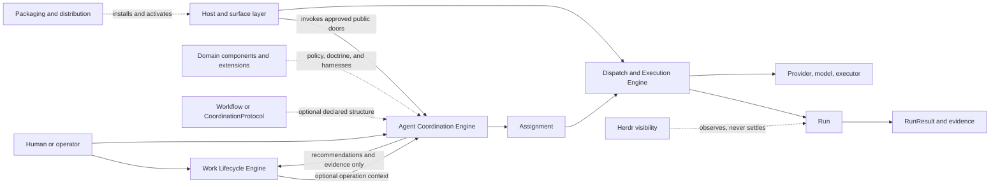

# Agent Coordination

```txt
Document type: Area portal
Audience: Human reviewer, architect, maintainer, documentation agent
Purpose: Route readers through the Agent Coordination platform area during migration
Design status: Accepted
Implementation: Partial
Provenance: Promoted from docs/architect/agent-coordination/README.md during documentation standardization
Writer type: Human + agent coauthor
Canonical for: Agent Coordination navigation and migration status
Use this when: You need to understand accepted, proposed, implemented, partial, or deferred-preserved Agent Coordination material
Do not use this for: Exact runtime schemas, accepted contracts, or proof artifacts by itself
Last reviewed: 2026-09-18
Related:
- docs/doc-governance.md
- docs/platform/README.md
- docs/platform/component-boundary.md
- docs/architect/agent-coordination/documentation-standardization-plan.md
```

This is the target platform portal for Agent Coordination. During migration,
legacy docs under [docs/architect/agent-coordination/](../../architect/agent-coordination/)
remain current unless a target document explicitly supersedes or redirects them.

Agent Coordination is the domain-neutral foundation for governed, evidence-aware
agent activity across agents, capabilities, providers, models, tiers, execution
mechanisms, and optional Work integration.

## Component Relationship



Solid arrows show a control or data path. Dashed arrows show optional
augmentation, activation, or observation. In particular, Work remains the only
delivery-lifecycle authority, and Herdr never establishes Run truth.

## Read First

| Order | Read | Why |
|---|---|---|
| 1 | [vision.md](vision.md) | Highest area authority for identity, boundaries, optional structure, and domain augmentation. |
| 2 | [intent-preservation-ledger.md](intent-preservation-ledger.md) | Required second read before narrowing or deferring a capability. |
| 3 | [history/documentation-migration/source-inventory.md](history/documentation-migration/source-inventory.md) | Migration ledger for old source paths, target disposition, and status. |
| 4 | [history/documentation-migration/migration-status.md](history/documentation-migration/migration-status.md) | Phase-by-phase migration progress and remaining work. |
| 5 | [subcomponents/README.md](subcomponents/README.md) | Map of child components and current status. |
| 6 | [../../architect/agent-coordination/README.md](../../architect/agent-coordination/README.md) | Legacy/current portal while architecture, contracts, ADRs, verification, playbooks, proposals, roadmap, and history are promoted. |

## Current Accepted Baseline

The accepted Step 00-08 foundation remains in the legacy architecture package
until later migration phases promote the detailed docs:

- Work owns delivery lifecycle when present.
- Workflow Stage Operation compatibility governs legal operation selection.
- Assignment, Run, and RunResult are distinct.
- Dispatch governs execution infrastructure.
- RunResult and evidence boundaries prevent false success.
- Herdr is visibility, not evidence or Run truth.
- CoordinationSession is the V1 executable/recovery root.
- FlowDefinition is shared graph/operation/policy IR with typed profiles.

## Status Summary

| Area | Status | Current authority |
|---|---|---|
| Vision and intent ledger | promoted | [vision.md](vision.md), [intent-preservation-ledger.md](intent-preservation-ledger.md) |
| Spec | promoted summary / partial | [spec.md](spec.md), [verification/implementation-alignment.md](verification/implementation-alignment.md), [../../specs/runner.md](../../specs/runner.md) plus accepted legacy contracts |
| Architecture | promoted target; legacy documents carry redirect notes | [architecture/README.md](architecture/README.md) |
| Contracts | promoted target; legacy documents carry redirect notes | [contracts/README.md](contracts/README.md) |
| Decisions | promoted target; legacy documents carry redirect notes | [decisions/README.md](decisions/README.md) |
| Verification | target index; legacy proof artifacts retained link-only | [verification/README.md](verification/README.md) |
| Proposals | non-canonical target; legacy documents carry redirect notes | [proposals/README.md](proposals/README.md) |
| Playbooks | operational/bootstrap target; legacy documents carry redirect notes | [playbooks/README.md](playbooks/README.md) |
| Roadmap | implementation-sequence target; legacy documents carry redirect notes | [roadmap/README.md](roadmap/README.md) |

## Cross-Area Boundaries

| Boundary | Owner | Agent Coordination stance |
|---|---|---|
| Host invocation and provider process routing | [host-invocation-routing](../host-invocation-routing/README.md) | Link-only authority; Agent Coordination consumes this boundary through dispatch/executor integration. |
| Packaging, install, activation, release manifest, setup/doctor, runtime identity | [packaging-distribution](../packaging-distribution/README.md) | Link-only authority; do not duplicate setup or runtime activation rules here. |
| Platform component boundary | [component-boundary.md](../component-boundary.md) | No component-boundary change: these diagrams expose existing ownership and flows only. |

## Related Files

| Relationship | File |
|---|---|
| documentation governance | [../../doc-governance.md](../../doc-governance.md) |
| platform portal | [../README.md](../README.md) |
| platform intent ledger | [../intent-preservation-ledger.md](../intent-preservation-ledger.md) |
| component boundary | [../component-boundary.md](../component-boundary.md) |
| migration plan | [../../architect/agent-coordination/documentation-standardization-plan.md](../../architect/agent-coordination/documentation-standardization-plan.md) |
| legacy portal | [../../architect/agent-coordination/README.md](../../architect/agent-coordination/README.md) |
| current state summary | [spec.md](spec.md) |
| implementation alignment | [verification/implementation-alignment.md](verification/implementation-alignment.md) |
