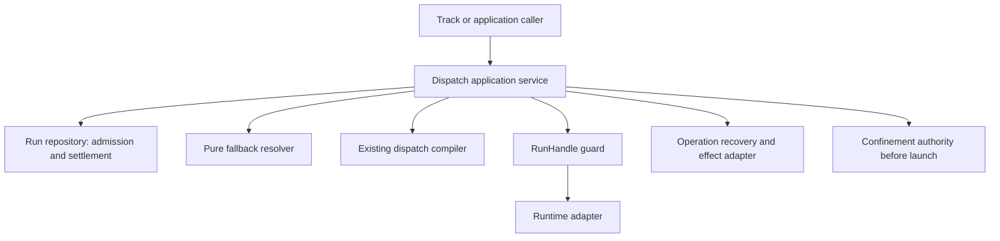

# Runtime Recovery And Work Continuity

```txt
Document type: Architecture
Audience: Maintainer, implementation agent and independent reviewer
Purpose: Preserve current contracts and explicitly distinguish unimplemented design from retired engine history
Design status: Candidate
Implementation: Section-specific; proposal schemas and dated findings are not blanket implementation claims
Provenance: Restored from 7880fbc74b07c3667ebaa61f2b0561b5d80471b5 after independent liveness review
Writer type: Human + agent coauthor
Canonical for: The current subject and design boundaries stated in this file; not retired engine authority
Use this when: Reading the surviving contract, its implementation limits or current proposals
Do not use this for: Reinstating the retired coordination engine or treating proposal details as shipped behavior
Last reviewed: Pending independent liveness re-review
Related:
- docs/platform/agent-coordination/README.md
- docs/specs/runner.md
Supersedes: Incorrect whole-file retirement or over-removal only
Superseded by: None for the surviving current subject
Added in candidate: Liveness evidence and explicit implementation/proposal distinction
```

Complete pre-rework input: [historical snapshot](../history/retired-engine/files/architecture/runtime-recovery-design.md#literal-snapshot). This is preservation evidence, not a replacement for the current contract below.

## Implementation And Design Status

The implementation column below bounds the retained text. Proposed typed interfaces, acceptance scenarios and target-state rules are design obligations, not claims that those interfaces already exist. Historical names in examples are not revived APIs.

| Section | Status | Evidence / limit |
|---|---|---|
| 1. Scope And Reading Order | Retired content remains only in history | Reading order links coordination-continuation-recovery.md (retired engine) and plans/reports; no code behaviour |
| 2. Identity And Existing Reality | Mixed implementation and proposal; no blanket implementation claim | Assignment/Run rows live: src/runner/dispatch/assignment-runner.mjs:697 (admitRunAttempt), :1563 (assignment-run.v2), run-derived herdr agent name confinement/authority.mjs:1595; CoordinationSession/Actor rows and workUnits[] proposal engine-only (git grep workUnits src = none) |
| 3. Ownership And Dependencies | Mixed implementation and proposal; no blanket implementation claim | Run admission, recovery planner, fallback resolver, run-lock guard live: recovery-planner.mjs:243-316, recovery.mjs resolveFallback, run-lock.mjs:306-412, evidence-attribution.mjs; coordination service/planner/store rows retired |
| 4. Recovery Choice | Mixed implementation and proposal; no blanket implementation claim | Rows 1-3 + result-first paragraph: recovery-planner.mjs:92-102 (settled run -> nothing to recover), :195-214; src/verbs/dispatch/recover.mjs:304-322; rows 4-6 (actor replacement, continuation transfer, track transition) are retired |
| 5. Arbitrary Interruption Is Not A Checkpoint | Unimplemented design proposal | evidence-attribution.mjs:25-59 handles only dirtyBeforeHashes; no 'inherited' attribution or lineage evaluator in code; writable partial-edit takeover still parks |
| 6. Local Concurrency And Durability | Mixed implementation and proposal; no blanket implementation claim | src/runner/dispatch/run-lock.mjs:1-15 (append-only generation ledger, fsynced temp + exclusive hard link, release markers), :47-79 (holder {id,pid,bootId,processStartTime,host}, resolveHolderLiveness), :306-412 (acquire/settle fenced by epoch+token); publishMutableProjection/publishMarkerOnce assignment-runner.mjs:1016,2024; only the session-lock-order clause is engine-only |
| 7. Agent-Facing Contract | Mixed implementation and proposal; no blanket implementation claim | Proposed 'coordination run intent: recover' not in code (git grep 'intent: recover' src = none). Live analogue: src/verbs/dispatch/recover.mjs:116 recoverObserveUseCase, :266 recoverApplyUseCase, repeat actionKey returns recorded outcome :304-306, command-registry.mjs:831 |
| 8. Compatibility And Rollout | Mixed implementation and proposal; no blanket implementation claim | assignment-run.v2 writer assignment-runner.mjs:1563; Rust readers apps/fgos/src/legacy_exec.rs, packages/run-result/rust/src/lib.rs; setup/doctor obligation also in AGENTS.md; session schema 2 / FlowDefinition continuation profile retired; 'owner-runtime-unavailable' not in code |
| 9. Implementation Slices And Gates | Mixed implementation and proposal; no blanket implementation claim | S0-S4 shipped: run-lock.mjs, recovery.mjs, recovery-planner.mjs, src/verbs/dispatch/recover.mjs, herdr-reconcile.mjs; S5 coordination continuation retired; S6/S7 unimplemented, not engine-dependent |
| 10. Proof Matrix | Mixed implementation and proposal; no blanket implementation claim | F-a..F-g, E-a..E-f, X01-X07 map to live behaviour: stale-handle refusal detached-run-supervisor.mjs:1103-1110, incarnation herdr-reconcile.mjs:38, pane keep liveness.mjs:89-98, fallback recovery.mjs, run-lock.mjs; C-a..C-g, X08, X09, X11 are session/continuation scenarios (retired) |
| 11. Review Finding Resolution And Limits | Mixed implementation and proposal; no blanket implementation claim | R03 and R07-R09 map to run-lock.mjs:306-412 and recovery.mjs; R04-R06, terminal-parent transfer refusal retired; limits paragraph (no distributed lease, no force-release in Node, release in finally) matches run-lock.mjs |

## 1. Scope And Reading Order

Current Run control/recovery responsibilities belong to the dispatch modules cited by each section. Session continuation is retired and retained only in historical snapshots. RunHandle, RecoveryMaterial and effect-grant schemas not implemented by those modules remain explicit proposals, not shipped interfaces.

## 2. Identity And Existing Reality

| Identity | Owner | Current evidence and design consequence |
|---|---|---|
| Track/cell | Consuming track/domain harness | A manual-harness convention, not a universal core entity or current session-chain API. See the owner-retained operating harness and its trace contract. |
| Assignment | Assignment builder/store | Immutable semantic task; execution attempts are separate Run records. |
| Run | Dispatch runtime | One attempt, deterministic identity, eligibility and settlement; retry retains Assignment. |

The former session-owned workUnits/chain correlation proposal is preserved in the complete historical snapshot. It is not a current execution identity or acceptance owner. Current Run admission and recovery retain the Assignment/Run identities above.

## 3. Ownership And Dependencies



| Responsibility | Sole owner | Excluded responsibility |
|---|---|---|
| Next-action recommendation | Pure planner | No store import, I/O, executor selection or authority. |
| Attempt admission and result eligibility | Run repository/runtime | No separate attempt-admission service. |
| Runtime control | Guard over repository + runtime adapter | No graph policy or result acceptance. |
| Effect/recovery-material interpretation | Operation recovery adapter | Runtime observations never certify external effects. |
| Run evidence and lineage evaluation | Run Result Evaluator | Must distinguish inherited artifacts from current-Run delta; no runtime adapter or planner may perform acceptance. |
| Workspace grant/identity | Workspace-grant repository or Work-runner claim (profile-specific) | No implicit "existing owner"; absent issuer means writable takeover parks. |
| Executor candidate order | Fallback resolver | Compiler and confinement retain governance. |

Two persistence ports plus one guard service in RunHandle are enough. Do not
create crates per method or a shared mutable recovery manager. Data schemas
below specify persisted/exchanged boundaries; in-process APIs can use native types.

## 4. Recovery Choice

| Situation | Action | Identity retained |
|---|---|---|
| Worker result available | Normalize/store, publish only if eligible | Original Run. |
| Observer lost, worker still working | Inspect/reattach/wait | Same Run and Assignment. |
| Worker cannot continue | Reconcile effects and writers, then eligible replacement Run | Same Assignment and unit objective. |
| Cell accepted, next cell begins | Existing track transition | Track acceptance history. |

Result scanning wins before any new execution, including after budget exhaustion
or cancellation. Read/collect is not admission. Cancellation bars retry and
automatic continuation of the cancelled intent, but does not discard late results.
An explicit new user intent is a new request, not an escape through continuation.

## 5. Arbitrary Interruption Is Not A Checkpoint

Default recovery preserves recoverable state. The old worker need not publish a
progress report, commit, or recognize an internal milestone. A half-edited file
is permitted input to a replacement, not completion evidence.

| Recovery level | Required interpretation |
|---|---|
| Baseline | Immutable Assignment and original inputs; no claim partial work survived. |
| Recoverable state | Workspace/artifact capture plus explicit completeness/unknowns; replacement inspects before using. |
| Declared checkpoint | Operation-specific checkpoint schema, version and resume validator; optional capability. |

Task notes are untrusted advisory context. Never restore claimed worker reasoning
as authority. Preserve prior acceptance criteria and validate the final state.
Failed-attempt edits inherited by the next Run must be attributed as inherited;
they must not masquerade as newly produced changes under dirty-before checks.
The evaluator may assess the cumulative Assignment outcome only with an explicit
lineage of admitted Runs and artifacts; otherwise it reports insufficient proof.
This requires a named Run Result Evaluator owner only for profiles that accept
inherited edits as part of acceptance. Read-only replacement or a new isolated
workspace can continue to use the current per-Run delta evaluator. The
cumulative-Assignment view and `inherited` attribution are dependencies of the
same-workspace writable profile; X05 remains a proof gate for that profile, not
for all S2 recovery.

## 6. Local Concurrency And Durability

Control acquisition must not reclaim a live process merely because TTL expired.
Holder identity is `{hostId, bootId, pid, processStartTime}` of the process doing
control, not a guessed Rust parent. Unknown liveness is not dead. A dead holder
may leave a remotely queued command: successor first reconciles pending control.

Implemented (Phase 02 H1, `src/runner/dispatch/run-lock.mjs`): holder identity
is `{id, pid, bootId, processStartTime, host}` (`buildRunControlHolder`,
`host` in place of this section's `hostId`), and `resolveHolderLiveness`
encodes the reclaim decision above as a table — a live pid, a pid whose
liveness cannot be disproven (unreadable `/proc/<pid>/stat`), or a pre-H1
holder record with no `processStartTime` to cross-check all resolve to
`held`, never `dead`; only a genuinely dead pid, a pid reused by a different
process (`processStartTime` mismatch), or a `bootId` predating the current
boot resolve to `dead`.

Recommended local implementation for safe reclaim without unlink races:
one per-scope lock directory containing immutable generation records and
token-specific release markers. Contenders publish generation `g+1` only after
`g` is released or its exact process identity is proven dead. Exactly one wins
exclusive publication. Never unlink/overwrite an earlier generation during
acquire/release, so a delayed release cannot delete its successor. A live holder
never self-recognizes a second concurrent acquisition as reentrant. Generation
records are retained with the runtime/session artifacts; compaction is offline
only after the scope is quiescent.

Publication uses a fully written/fsynced temp file in the same directory,
followed by atomic non-overwriting publication (local filesystem hard-link on
the initial Linux adapter), then directory fsync. State replacement uses
temp+rename+directory fsync under the owning lock. This retains exclusive-create
semantics while avoiding empty-lock and conditional-unlink races seen in P12.
Implemented (Phase 02 H3) for the mutable Run/Assignment artifacts named in
the contract doc (`result.json`, `run.json`, the effective-execution-contract
projection, and the per-attempt dispatch-bookkeeping marker) via
`publishMutableProjection`/`publishMarkerOnce`; a resume that finds an
existing `result.json` which fails to parse refuses rather than relaunching
over unreadable evidence. Unsupported filesystem guarantees refuse mutation
with a named diagnostic;
doctor must probe them before this writer profile is enabled. No distributed
lease, background renew service or TTL-only takeover is required by default.

## 7. Agent-Facing Contract

Extend the existing `coordination run` request door with a proposed recovery
request variant: `{contract, coordinationId, writerId, intent: recover,
target?: {assignmentId}, budgetGrantRef?: string}`. Omitted target scans the
session; engine chooses one eligible action and returns progress. `show --json`
exposes the same typed recommendation without refreshing/writing runtime facts.
The headless adapter calls the same use case. These are proposed request fields,
not commands/features available in the current release. A fresh controller may
omit `writerId` only when the session manifest supplies a replacement-driver
grant; otherwise the request returns `needs-input` with the exact identity
requirement. Recovery executes exactly the planner's selected action. It does
not unconditionally call close-after-steps; close is invoked only when the
selected action is `close-session`.

Return `{outcome: applied | already-applied | waiting | needs-input | refused,
action, subjectRefs, reasonCode, evidenceRefs, nextCheckAt?}`. A repeated recover
call recomputes facts and resumes a durable pending action. It never uses a
worker-supplied child ID, task key, supersession boolean or ownership assertion.
`needs-input` names the exact missing semantic decision/grant; it is not the
default for ordinary concurrency, a slow observer or already-applied action.
Blocked targets remain individually visible; another eligible independent target
may progress. Stable ordering prevents one parked target monopolizing the scan.

## 8. Compatibility And Rollout

One runtime owns a scope's writes. A Node-launched Run keeps its Node writer;
Rust readers may inspect a supported version or return version-unsupported.
Rust control of a Node-owned Run must route to the owning implementation, or
refuse `owner-runtime-unavailable`. A new CLI process of the same owning runtime
may recover a dead controller; spawn ownership is not controller PID identity.
Move the complete writer boundary only after parity, quiescence and rollback
compatibility proof; never dual-run writers for shadow testing.

`bin/fgos.mjs` remains the legacy payload entry. No file relocation or new host
composition root. Setup/doctor must register filesystem publication checks,
adapter reconcile/control capabilities, workspace-preservation support and any
new config defaults. Project-over-global precedence remains unchanged.

## 9. Implementation Slices And Gates

| Slice | Scope | Exit evidence; dependency | Status (2026-09-14) |
|---|---|---|---|
| S0 | Freeze fixtures for existing ladder, budgets, retry/recheck, context and close behavior | Existing Node suites green; capture known deficiencies without marking them solved. | **Implemented** — P00 |
| S1 | Versioned Run admission, strict publish fencing and local lock/reclaim | Concurrent admission and every pre-launch crash window; no two winners. Node first. | **Implemented** — P01 (`run-lock.mjs`) |
| S2 | Herdr launch reconciliation, handle guard, pending-control reconciliation, material capture | Reattach/observe/reconcile through public door; isolated or read-only takeover only. The first Node adapter uses a deterministic Herdr agent name derived from `runId`; exit proof includes duplicate-name refusal and no resurrection after close. Writable partial-edit takeover parks until workspace-grant and evaluator owners exist; depends on S1. | **Implemented** for cli-spawn (P02L) and herdr-spawn including real bwrap-confined launch (P02H, hardened in the P02H reopen); **writable partial-edit takeover correctly still parks** (P06, deferred, unchanged) |
| S3 | Eligible fallback through compiler and confinement | Same Assignment, bounded attempts, unknown effects park; depends on S1/S2 for takeover. | **Implemented** — P03 (`recovery.mjs`) |
| S4 | Pure snapshot/planner + show | Can develop beside S1-S3 using recorded facts; no claim of automatic repair. | **Implemented** — P04 (pure evaluators) + P05 (standalone `dispatch recover`) |
| S5 | Retired coordination-session recovery/continuation | Full dated record remains in the historical snapshot; no current coordination recover door is claimed. | Retired in 2180b4e72 |
| S6 | Additional runtime/operation adapters and optional checkpoint support | Capability-specific proof before enabling; no promise all adapters ship with S2. | **Not implemented** — out of this track's scope |
| S7 | Rust writer port | Same fixtures for all supported Node semantics, sole writer and recovery compatibility. | **Not implemented** — separate track (see the `rust-host-r1-kernel` track) |

## 10. Proof Matrix

These are required executable scenarios, not tests claimed to have passed.
Initial implementation places them in the existing runner/verbs test families;
fixtures record inputs, injected interruption, durable state and expected result.

| ID | One primary verifiable scenario |
|---|---|
| F-a | Reused pane locator with stale handle/incarnation: destructive control refused; unrelated pane unchanged. |
| F-b | Coordinator dies after bind; recovery finds live worker, same Run, zero new spawn. |
| F-c | Caller timeout while worker present/working: stale observation, no failure settlement or new Run. |
| F-d | Provider pause through automated cleanup and retryAfter: preserve pane, inspect only. |
| F-e | Worker-liveness branch is explicit: live/working writer yields partial or deferred capture; dead writer after quiescence yields preserved capture; unknown liveness parks. Zero stdout never infers launch failure or completion. |
| F-f | Two callers race admission through launch/bind, including injected crash: one admitted launch identity and no duplicate resource. |
| F-g | In-flight refusal identifies Run/handle when known, explicit pre-bind/ambiguous cause otherwise. |
| E-a | Real zero-output ceiling shape: reconcile workspace/effects; fallback only after proven eligibility, not by stdout heuristic. |
| E-b | Handshake unknown: reconcile or park; proven not-delivered branch uses next candidate within the same Assignment cap. |
| E-c | Quota line with/without parseable reset: park same Run, preserve line, no timed relaunch. |
| E-d | Observer timeout with nonterminal ladder and live worker: wait, no fallback/cooldown. |
| E-e | Candidate rejected by capability/governance/confinement cannot launch; next eligible candidate retains original constraints. |
| E-f | Table-driven config failure, launch failure and semantic rejection remain distinct; semantic rejection does not trigger infra fallback. |
| X01 | Pause live lock holder past TTL, race acquire/release: no successor until release; dead generation takeover cannot delete successor. |
| X02 | Crash after control send but before ack: reconcile the pending command; Herdr may resend only while the adapter reports ready and no ack, and must not resend after ack/working. Unknown delivery remains unknown. |
| X03 | Delayed superseded result before/after new link: retained per Run, never becomes current authoritative link. |
| X04 | Capture half-edited file and untracked artifact after writer quiescence: replacement sees exact manifest or explicit incomplete coverage. |
| X05 | Writable/inherited-acceptance profile: Run Result Evaluator attributes preserved failed-attempt edits as inherited and independently verifies final acceptance. Read-only/isolated profiles use per-Run delta evaluation and do not claim X05. |
| X06 | Cancel during admission/control/transfer: ordering documented, no later unauthorized attempt; late result retained. |
| X07 | Crash at each transfer step: resume through public request; no manual claim-file deletion or second child. |
| X10 | Unknown state version or foreign owning runtime: explicit refusal; unchanged schema-1 requests retain behavior. |

## 11. Review Finding Resolution And Limits

| Findings | Design response |
|---|---|
| R01/R02 | Run amendment specifies exact supersession identity, serialized admit/publish, pending declaration recovery and launch reconciliation. |
| R03 | Section 6 and RunHandle specify no TTL theft, immutable lock generation and pending remote-control handling. |
| R04/R05/R06 | Retired session continuation design; preserved in the complete historical snapshot, not a current contract. |
| R07/R08/R09 | Fallback defines one default, ceiling/spawn mapping, budget arithmetic and typed effect eligibility. |
| R10 | Historical session-policy proof correction; not a current engine implementation claim. |
| R11/R12/R13 | RunHandle separates liveness/progress, defines transitions/control coverage and one visibility binding source. |
| R14/R15 | Ownership table, shared mutation door, versioned rollout and dependency gates. |

Distributed leases, live partial session transfer, shared chain-budget allocation,
health store/scoring and generic effect ledger are unsupported in the first writer
profile. Their absence returns typed unsupported/unknown, never silently widens
authority. No temporal estimate or successful live proof is asserted here.

Profile decisions are now fixed: a terminal parent refuses transfer; the first
Herdr adapter uses deterministic `runId` naming while retaining registry-lookup
semantics; repeat mode is explicit in the operation/protocol contract; driver
replacement requires a `driver-replaced` door; and live-process force-release is
not available in Node/R1-R2. Operation-specific grants or business effect
policies must be supplied by that operation's owner; a runtime adapter cannot
infer permission to duplicate an external effect from this design.

R3 may add an audited force-release door. Until then every control critical
section must release its token in `finally` and append a release marker, even
when the controlled process remains alive.

