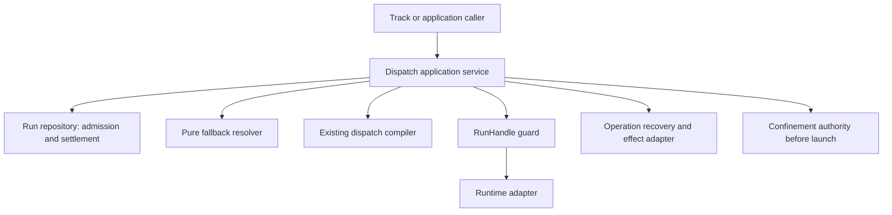

# Runtime Recovery And Work Continuity

```txt
Document type: Architecture
Audience: Maintainer, implementation agent and independent reviewer
Purpose: Preserve current contracts and explicitly distinguish unimplemented design from retired engine history
Design status: Candidate
Implementation: Section-specific; proposal schemas and dated findings are not blanket implementation claims
Provenance: Restored from 7880fbc74b07c3667ebaa61f2b0561b5d80471b5 after independent liveness review
Writer type: Human + agent coauthor
Canonical for: The current subject and design boundaries stated in this file; not retired engine authority
Use this when: Reading the surviving contract, its implementation limits or current proposals
Do not use this for: Reinstating the retired coordination engine or treating proposal details as shipped behavior
Last reviewed: Pending independent liveness re-review
Related:
- docs/platform/agent-coordination/README.md
- docs/specs/runner.md
Supersedes: Incorrect whole-file retirement or over-removal only
Superseded by: None for the surviving current subject
Added in candidate: Liveness evidence and explicit implementation/proposal distinction
```

Complete pre-rework input: [historical snapshot](../history/retired-engine/files/architecture/runtime-recovery-design.md#literal-snapshot). This is preservation evidence, not a replacement for the current contract below.

## Implementation And Design Status

The implementation column below bounds the retained text. Proposed typed interfaces, acceptance scenarios and target-state rules are design obligations, not claims that those interfaces already exist. Historical names in examples are not revived APIs.

| Section | Status | Evidence / limit |
|---|---|---|
| 1. Scope And Reading Order | Current Run owners; session continuation is history | Dispatch recovery is the live door; historical reading pointers do not create runtime support |
| 2. Identity And Existing Reality | Current Run/Assignment identities and explicit proposals | assignment-runner.mjs:697,1563; launch name includes runId and launchCommandId at confinement/authority.mjs:1595 |
| 3. Ownership And Dependencies | Current admission, recovery planner, fallback and local fencing | recovery-planner.mjs:243-316, recovery.mjs and run-lock.mjs:306-412; no live coordination-session owner |
| 4. Recovery Choice | Current standalone Run recovery; manual track progression stays outside dispatch | recovery-planner.mjs:92-102; recover.mjs:304-322; no session transfer is implemented here |
| 5. Arbitrary Interruption Is Not A Checkpoint | Explicit deferred inherited-edit design | evidence-attribution.mjs:25-59 is per-Run dirty-before attribution, not a generic lineage evaluator |
| 6. Local Concurrency And Durability | Current local fencing; no distributed lease | run-lock.mjs:47-79,306-412; append-only local generations and release markers |
| 7. Agent-Facing Contract | Implemented standalone dispatch recovery | src/verbs/dispatch/recover.mjs:116-132,266-408; recovery-planner.mjs:118-173,243-316. Observation is read-only; apply records a checked recovery action, not a session transition or automatic worker launch. |
| 8. Compatibility And Rollout | Current writer version; additional ownership refusal is design | assignment-run.v2 writer at assignment-runner.mjs:1563; owner-runtime-unavailable is not a current error enum |
| 9. Implementation Slices And Gates | Dated slice status, not freshly rerun proof | Current modules are cited locally; S5 retired; S6/S7 remain unimplemented designs |
| 10. Proof Matrix | Required scenarios, not passing-test claims | X03, X05, X06, X07 and X10 require additional link/lineage/transfer/runtime-version ownership; standalone recover does not claim them |
| 11. Review Finding Resolution And Limits | Current local limits distinguished from retired/deferred design | run-lock.mjs:306-412; naming includes launchCommandId; generic inherited-edit/effect ownership remains unsupported |

## 1. Scope And Reading Order

Current Run control/recovery responsibilities belong to the dispatch modules cited by each section. Session continuation is retired and retained only in historical snapshots. RunHandle, RecoveryMaterial and effect-grant schemas not implemented by those modules remain explicit proposals, not shipped interfaces.

## 2. Identity And Existing Reality

| Identity | Owner | Current evidence and design consequence |
|---|---|---|
| Track/cell | Consuming track/domain harness | A manual-harness convention, not a universal core entity or current session-chain API. See the owner-retained operating harness and its trace contract. |
| Assignment | Assignment builder/store | Immutable semantic task; execution attempts are separate Run records. |
| Run | Dispatch runtime | One attempt, deterministic identity, eligibility and settlement; retry retains Assignment. |

The former session-owned workUnits/chain correlation proposal is preserved in the complete historical snapshot. It is not a current execution identity or acceptance owner. Current Run admission and recovery retain the Assignment/Run identities above.

## 3. Ownership And Dependencies



| Responsibility | Sole owner | Excluded responsibility |
|---|---|---|
| Next-action recommendation | Pure planner | No store import, I/O, executor selection or authority. |
| Attempt admission and result eligibility | Run repository/runtime | No separate attempt-admission service. |
| Runtime control | Guard over repository + runtime adapter | No graph policy or result acceptance. |
| Effect/recovery-material interpretation | Operation recovery adapter | Runtime observations never certify external effects. |
| Run evidence and lineage evaluation | Run Result Evaluator | Must distinguish inherited artifacts from current-Run delta; no runtime adapter or planner may perform acceptance. |
| Workspace grant/identity | Workspace-grant repository or Work-runner claim (profile-specific) | No implicit "existing owner"; absent issuer means writable takeover parks. |
| Executor candidate order | Fallback resolver | Compiler and confinement retain governance. |

Two persistence ports plus one guard service in RunHandle are enough. Do not
create crates per method or a shared mutable recovery manager. Data schemas
below specify persisted/exchanged boundaries; in-process APIs can use native types.

## 4. Recovery Choice

| Situation | Action | Identity retained |
|---|---|---|
| Worker result available | Normalize/store, publish only if eligible | Original Run. |
| Observer lost, worker still working | Inspect/reattach/wait | Same Run and Assignment. |
| Worker cannot continue | Reconcile effects and writers, then eligible replacement Run | Same Assignment and unit objective. |
| Cell accepted, next cell begins | Consuming track/domain transition; outside dispatch recovery | Track acceptance history, if the consuming harness records it. |

Proposed cancellation/budget rule: result collection would remain available after
budget exhaustion or cancellation, without admitting another execution; a new
intent would require a new request. This is not implemented cancellation precedence:
current Herdr/cli reconciliation returns `cancel-unsupported` before scanning
results (`herdr-reconcile.mjs:351-355`, `reconcile-cli-spawn.mjs:38-47`).

## 5. Arbitrary Interruption Is Not A Checkpoint

Default recovery preserves recoverable state. The old worker need not publish a
progress report, commit, or recognize an internal milestone. A half-edited file
is permitted input to a replacement, not completion evidence.

| Recovery level | Required interpretation |
|---|---|
| Baseline | Immutable Assignment and original inputs; no claim partial work survived. |
| Recoverable state | Workspace/artifact capture plus explicit completeness/unknowns; replacement inspects before using. |
| Declared checkpoint | Operation-specific checkpoint schema, version and resume validator; optional capability. |

Task notes are untrusted advisory context. Never restore claimed worker reasoning
as authority. Preserve prior acceptance criteria and validate the final state.
Failed-attempt edits inherited by the next Run must be attributed as inherited;
they must not masquerade as newly produced changes under dirty-before checks.
The evaluator may assess the cumulative Assignment outcome only with an explicit
lineage of admitted Runs and artifacts; otherwise it reports insufficient proof.
This requires a named Run Result Evaluator owner only for profiles that accept
inherited edits as part of acceptance. Read-only replacement or a new isolated
workspace can continue to use the current per-Run delta evaluator. The
cumulative-Assignment view and `inherited` attribution are dependencies of the
same-workspace writable profile; X05 remains a proof gate for that profile, not
for all S2 recovery.

## 6. Local Concurrency And Durability

Control acquisition must not reclaim a live process merely because TTL expired.
Holder identity is `{hostId, bootId, pid, processStartTime}` of the process doing
control, not a guessed Rust parent. Unknown liveness is not dead. A dead holder
may leave a remotely queued command: successor first reconciles pending control.

Implemented (Phase 02 H1, `src/runner/dispatch/run-lock.mjs`): holder identity
is `{id, pid, bootId, processStartTime, host}` (`buildRunControlHolder`,
`host` in place of this section's `hostId`), and `resolveHolderLiveness`
encodes the reclaim decision above as a table — a live pid, a pid whose
liveness cannot be disproven (unreadable `/proc/<pid>/stat`), or a pre-H1
holder record with no `processStartTime` to cross-check all resolve to
`held`, never `dead`; only a genuinely dead pid, a pid reused by a different
process (`processStartTime` mismatch), or a `bootId` predating the current
boot resolve to `dead`.

Recommended local implementation for safe reclaim without unlink races:
one per-scope lock directory containing immutable generation records and
token-specific release markers. Contenders publish generation `g+1` only after
`g` is released or its exact process identity is proven dead. Exactly one wins
exclusive publication. Never unlink/overwrite an earlier generation during
acquire/release, so a delayed release cannot delete its successor. A live holder
never self-recognizes a second concurrent acquisition as reentrant. Generation
records are retained with the runtime/session artifacts; compaction is offline
only after the scope is quiescent.

The proposed durability profile requires a fully written/fsynced temp file in
the same directory, atomic non-overwriting publication and directory fsync.
It calls for temp+rename+directory fsync under the owning lock for replacement.
Those are design requirements; the implementation's best-effort directory
fsync and other limits are stated below, not silently promoted to guarantees.
Current terminal `result.json` is published by `publishImmutableProof`
(`settlement.mjs:434`), not the mutable writer. `run.json` updates, the
effective-execution-contract projection and bookkeeping markers use their
mutable/marker writers. An unreadable existing result refuses relaunch rather
than overwriting evidence. The proof helper fsyncs the file, hard-links it
without overwrite, treats `EEXIST` as an existing proof and rethrows other link
errors; directory fsync is best-effort (`proof-helpers.mjs:73-125`).
A dedicated unsupported-filesystem diagnostic/doctor probe is a design
requirement, not an implemented check. No distributed lease, background
renewal service or TTL-only takeover is required by this local design.

## 7. Agent-Facing Contract

The current door is `fgos dispatch recover <runId>`, without `--action` for
read-only observation. It builds a snapshot of the Run, visibility, outbox,
controller evidence, real control epoch and settled signal, then returns a
recommendation, `needs-input` or `park`. The intent is `resume` or `reassign`;
the default is defined by the CLI/use case, not by a coordination-session scan.

Resume requires explicit non-fresh driver-liveness evidence; fresh or unknown
freshness parks. Reassignment requires replacement-authority evidence naming a
driver, read from controller-owned state, never worker-writable outbox claims.
Unknown evidence parks; a settled Run has nothing to recover. A recommendation
contains `snapshotHash`, `expectedControlEpoch`, `actionKey`, `evidenceIds`,
`action`, `expiresAt` and `reason`; the default lifetime is five minutes.

Apply uses the same door with `--action`, `--expected-snapshot`,
`--expected-control-epoch`, `--expected-expires-at` and `--action-key`.
It re-reads facts, checks action-key binding, snapshot, epoch, expiry and
present legality, then acquires real Run control and checks settlement again.
Stale/expired plans, missing authority and held live control are refused or
parked rather than overridden. Repeating a consumed action key returns the
recorded `already-applied` outcome.

Successful apply records the recovery command, updates the control-epoch
projection and attempts the applicable dispatch-claim clear. It does not itself
launch a replacement worker, close a session or advance a Workflow. Dormant
session-ownership checks still refuse `resume-driver` for old session-owned
Assignments; this is not a claim that the retired coordination door exists.

Implementation evidence: `src/runner/dispatch/recovery-planner.mjs:118-173,
243-316,319-361` and `src/verbs/dispatch/recover.mjs:95-132,266-408`.
Read the [area portal](../README.md) and [runner spec](../../../specs/runner.md)
for the wider execution boundary; recovery here does not own Work lifecycle.

## 8. Compatibility And Rollout

Single-writer compatibility is an invariant. Cross-runtime control/version
negotiation and the proposed `owner-runtime-unavailable` refusal below are
rollout design obligations, not implemented generic error handling.

One runtime owns a scope's writes. A Node-launched Run keeps its Node writer;
Rust readers may inspect a supported version or return version-unsupported.
Rust control of a Node-owned Run must route to the owning implementation, or
refuse `owner-runtime-unavailable`. A new CLI process of the same owning runtime
may recover a dead controller; spawn ownership is not controller PID identity.
Move the complete writer boundary only after parity, quiescence and rollback
compatibility proof; never dual-run writers for shadow testing.

`bin/fgos.mjs` remains the legacy payload entry. No file relocation or new host
composition root. Setup/doctor must register filesystem publication checks,
adapter reconcile/control capabilities, workspace-preservation support and any
new config defaults. Project-over-global precedence remains unchanged.

## 9. Implementation Slices And Gates

| Slice | Scope | Exit evidence; dependency | Status (2026-09-14) |
|---|---|---|---|
| S0 | Freeze fixtures for existing ladder, budgets, retry/recheck, context and close behavior | Existing Node suites green; capture known deficiencies without marking them solved. | **Implemented** — P00 |
| S1 | Versioned Run admission, strict publish fencing and local lock/reclaim | Concurrent admission and every pre-launch crash window; no two winners. Node first. | **Implemented** — P01 (`run-lock.mjs`) |
| S2 | Herdr launch reconciliation, handle guard, pending-control reconciliation, material capture | Reattach/observe/reconcile through the public door; isolated or read-only takeover only. Launch identity uses `runId` plus persisted `launchCommandId` (`fgos-<runId>-<launchCommandId>`); duplicate-name refusal and no resurrection after close require adapter proof. | **Partial** — Herdr launch reconciliation exists in `herdr-reconcile.mjs`; the proposed RunHandle/scope guard, pending-control reconciliation and RecoveryMaterial capture are not implemented as that contract. Writable partial-edit takeover remains deferred (`herdr-reconcile.mjs:356-357`). |
| S3 | Eligible fallback through compiler and confinement | Same Assignment, bounded attempts, unknown effects park; depends on S1/S2 for takeover. | **Implemented** — P03 (`recovery.mjs`) |
| S4 | Pure snapshot/planner + show | Can develop beside S1-S3 using recorded facts; no claim of automatic repair. | **Implemented** — P04 (pure evaluators) + P05 (standalone `dispatch recover`) |
| S5 | Retired coordination-session recovery/continuation | Full dated record remains in the historical snapshot; no current coordination recover door is claimed. | Retired in 2180b4e72 |
| S6 | Additional runtime/operation adapters and optional checkpoint support | Capability-specific proof before enabling; no promise all adapters ship with S2. | **Not implemented** — out of this track's scope |
| S7 | Rust writer port | Same fixtures for all supported Node semantics, sole writer and recovery compatibility. | **Not implemented** — separate track (see the `rust-host-r1-kernel` track) |

## 10. Proof Matrix

These are required design scenarios, not tests claimed to have passed.
Run/control scenarios have current owners, but X03/X05/X06/X07/X10 require
additional result-link, inherited-edit, transfer or runtime-version guarantees.
They do not describe a shipped session-recovery contract.

| ID | One primary verifiable scenario |
|---|---|
| F-a | Reused pane locator with stale handle/incarnation: destructive control refused; unrelated pane unchanged. |
| F-b | Coordinator dies after bind; recovery finds live worker, same Run, zero new spawn. |
| F-c | Caller timeout while worker present/working: stale observation, no failure settlement or new Run. |
| F-d | Provider pause through automated cleanup and retryAfter: preserve pane, inspect only. |
| F-e | Worker-liveness branch is explicit: live/working writer yields partial or deferred capture; dead writer after quiescence yields preserved capture; unknown liveness parks. Zero stdout never infers launch failure or completion. |
| F-f | Two callers race admission through launch/bind, including injected crash: one admitted launch identity and no duplicate resource. |
| F-g | In-flight refusal identifies Run/handle when known, explicit pre-bind/ambiguous cause otherwise. |
| E-a | Real zero-output ceiling shape: reconcile workspace/effects; fallback only after proven eligibility, not by stdout heuristic. |
| E-b | Handshake unknown: reconcile or park; proven not-delivered branch uses next candidate within the same Assignment cap. |
| E-c | Quota line with/without parseable reset: park same Run, preserve line, no timed relaunch. |
| E-d | Observer timeout with nonterminal ladder and live worker: wait, no fallback/cooldown. |
| E-e | Candidate rejected by capability/governance/confinement cannot launch; next eligible candidate retains original constraints. |
| E-f | Table-driven config failure, launch failure and semantic rejection remain distinct; semantic rejection does not trigger infra fallback. |
| X01 | Pause live lock holder past TTL, race acquire/release: no successor until release; dead generation takeover cannot delete successor. |
| X02 | Crash after control send but before ack: reconcile the pending command; Herdr may resend only while the adapter reports ready and no ack, and must not resend after ack/working. Unknown delivery remains unknown. |
| X03 | Delayed superseded result before/after new link: retained per Run, never becomes current authoritative link. |
| X04 | Capture half-edited file and untracked artifact after writer quiescence: replacement sees exact manifest or explicit incomplete coverage. |
| X05 | Writable/inherited-acceptance profile: Run Result Evaluator attributes preserved failed-attempt edits as inherited and independently verifies final acceptance. Read-only/isolated profiles use per-Run delta evaluation and do not claim X05. |
| X06 | Cancel during admission/control/transfer: ordering documented, no later unauthorized attempt; late result retained. |
| X07 | Crash at each transfer step: resume through public request; no manual claim-file deletion or second child. |
| X10 | Unknown state version or foreign owning runtime: explicit refusal; unchanged schema-1 requests retain behavior. |

## 11. Review Finding Resolution And Limits

| Findings | Design response |
|---|---|
| R01/R02 | Run amendment specifies exact supersession identity, serialized admit/publish, pending declaration recovery and launch reconciliation. |
| R03 | Section 6 and RunHandle specify no TTL theft, immutable lock generation and pending remote-control handling. |
| R04/R05/R06 | Retired session continuation design; preserved in the complete historical snapshot, not a current contract. |
| R07/R08/R09 | Fallback defines one default, ceiling/spawn mapping, budget arithmetic and typed effect eligibility. |
| R10 | Historical session-policy proof correction; not a current engine implementation claim. |
| R11/R12/R13 | RunHandle separates liveness/progress, defines transitions/control coverage and one visibility binding source. |
| R14/R15 | Ownership table, shared mutation door, versioned rollout and dependency gates. |

No distributed lease, live session transfer, shared chain-budget allocator,
health scoring store or generic business-effect ledger is implemented here.
Current recovery plans park or request authority for unsafe/unknown cases;
do not infer a universal typed unsupported enum from this design.

The current Herdr launch identity uses normalized
`fgos-<runId>-<launchCommandId>`, with a persisted random launch command, not
runId alone. The standalone reassign action is a fenced controller-epoch
record with a checked authority input; it does not launch a replacement
worker or execute the retired session `driver-replaced` continuation door.

Operation-specific grants/effect policies must be supplied by their owner;
no adapter may infer permission to duplicate external effects. Live-process
force-release is not a current local-lock capability.

R3 may add an audited force-release door. Until then every control critical
section must release its token in `finally` and append a release marker, even
when the controlled process remains alive.

