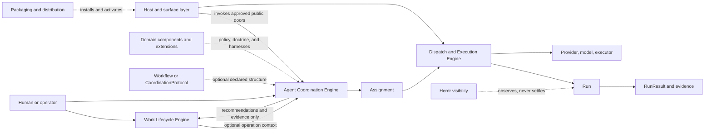

# Retired engine snapshot: README.md

```txt
Document type: History
Audience: Independent reviewer and maintainer
Purpose: Preserve the complete pre-reframe document verbatim after engine retirement
Design status: Candidate
Implementation: Historical snapshot; not current implementation or authority
Provenance: docs/platform/agent-coordination/README.md at 54c2698ee8c5b8f1baeac7244e946c793a637d29
Writer type: Agent
Canonical for: Historical evidence only; no current authority
Use this when: Auditing preserved retired-engine claims
Do not use this for: Current runtime behaviour or proposal acceptance
Last reviewed: Pending independent review
Related:
- docs/platform/agent-coordination/README.md
Supersedes: None; no legacy source is edited
Superseded by: Current execution owners in docs/specs/runner.md
Added in candidate: Snapshot framing only; the literal body is unchanged
```

The coordination engine was retired in `2180b4e72701bb090288af8fe8021008d9d42079`. The complete source below is retained verbatim as non-authority history; its original statuses, paths and proposals are dated evidence, not current claims.

## Literal Snapshot

~~~~text
# Agent Coordination

```txt
Document type: Area portal
Audience: Human reviewer, architect, maintainer, documentation agent
Purpose: Route readers through the Agent Coordination platform area during migration
Design status: Accepted
Implementation: Partial
Provenance: Promoted from docs/architect/agent-coordination/README.md during documentation standardization
Writer type: Human + agent coauthor
Canonical for: Agent Coordination navigation and migration status
Use this when: You need to understand accepted, proposed, implemented, partial, or deferred-preserved Agent Coordination material
Do not use this for: Exact runtime schemas, accepted contracts, or proof artifacts by itself
Last reviewed: 2026-09-18
Related:
- docs/doc-governance.md
- docs/platform/README.md
- docs/platform/component-boundary.md
- docs/platform/agent-coordination/history/documentation-migration/documentation-standardization-plan.md
Supersedes: None; retained source authority is unchanged
Superseded by: None
Added in candidate: Promotion metadata only; source claims and implementation are not re-decided here
```

> **Ghi chú chuyển tiếp (2026-10-02):** Engine coordination và các khái niệm `CoordinationSession`/`CoordinationProtocol`/`FlowDefinition` đã được thu hồi ở P4 của track Request-to-Run (D-0050). Hệ thống đã chuyển sang mô hình gọn: **Unit run** qua **CollaborationPattern** (`solo`, `reviewed`, `panel` + preset) và **Workflow run** (`src/workflow/**`). Các tài liệu trong thư mục này lưu giữ thiết kế lịch sử của Step 00–09.

This is the target platform portal for Agent Coordination. During migration,
legacy docs under [docs/architect/agent-coordination/](../../architect/agent-coordination/)
remain current unless a target document explicitly supersedes or redirects them.
Agent Coordination is the domain-neutral foundation for governed, evidence-aware
agent activity across agents, capabilities, providers, models, tiers, execution
mechanisms, and optional Work integration.

## Component Relationship



Solid arrows show a control or data path. Dashed arrows show optional
augmentation, activation, or observation. In particular, Work remains the only
delivery-lifecycle authority, and Herdr never establishes Run truth.

## Read First

| Order | Read | Why |
|---|---|---|
| 1 | [vision.md](vision.md) | Highest area authority for identity, boundaries, optional structure, and domain augmentation. |
| 2 | [intent-preservation-ledger.md](intent-preservation-ledger.md) | Required second read before narrowing or deferring a capability. |
| 3 | [history/documentation-migration/source-inventory.md](history/documentation-migration/source-inventory.md) | Migration ledger for old source paths, target disposition, and status. |
| 4 | [history/documentation-migration/migration-status.md](history/documentation-migration/migration-status.md) | Phase-by-phase migration progress and remaining work. |
| 5 | [subcomponents/README.md](subcomponents/README.md) | Map of child components and current status. |
| 6 | [../../architect/agent-coordination/README.md](../../architect/agent-coordination/README.md) | Legacy/current portal while architecture, contracts, ADRs, verification, playbooks, proposals, roadmap, and history are promoted. |

## Current Accepted Baseline

The accepted Step 00-08 foundation remains in the legacy architecture package
until later migration phases promote the detailed docs:

- Work owns delivery lifecycle when present.
- Workflow Stage Operation compatibility governs legal operation selection.
- Assignment, Run, and RunResult are distinct.
- Dispatch governs execution infrastructure.
- RunResult and evidence boundaries prevent false success.
- Herdr is visibility, not evidence or Run truth.
- CoordinationSession is the V1 executable/recovery root.
- FlowDefinition is shared graph/operation/policy IR with typed profiles.

## Status Summary

| Area | Status | Current authority |
|---|---|---|
| Vision and intent ledger | promoted | [vision.md](vision.md), [intent-preservation-ledger.md](intent-preservation-ledger.md) |
| Spec | promoted summary / partial | [spec.md](spec.md), [verification/implementation-alignment.md](verification/implementation-alignment.md), [../../specs/runner.md](../../specs/runner.md) plus accepted legacy contracts |
| Architecture | promoted target; legacy documents carry redirect notes | [architecture/README.md](architecture/README.md) |
| Contracts | promoted target; legacy documents carry redirect notes | [contracts/README.md](contracts/README.md) |
| Decisions | promoted target; legacy documents carry redirect notes | [decisions/README.md](decisions/README.md) |
| Verification | target index; legacy proof artifacts retained link-only | [verification/README.md](verification/README.md) |
| Proposals | non-canonical target; legacy documents carry redirect notes | [proposals/README.md](proposals/README.md) |
| Playbooks | operational/bootstrap target; legacy documents carry redirect notes | [playbooks/README.md](playbooks/README.md) |
| Roadmap | implementation-sequence target; legacy documents carry redirect notes | [roadmap/README.md](roadmap/README.md) |

## Cross-Area Boundaries

| Boundary | Owner | Agent Coordination stance |
|---|---|---|
| Host invocation and provider process routing | [host-invocation-routing](../host-invocation-routing/README.md) | Link-only authority; Agent Coordination consumes this boundary through dispatch/executor integration. |
| Packaging, install, activation, release manifest, setup/doctor, runtime identity | [packaging-distribution](../packaging-distribution/README.md) | Link-only authority; do not duplicate setup or runtime activation rules here. |
| Platform component boundary | [component-boundary.md](../component-boundary.md) | No component-boundary change: these diagrams expose existing ownership and flows only. |

## Related Files

| Relationship | File |
|---|---|
| documentation governance | [../../doc-governance.md](../../doc-governance.md) |
| platform portal | [../README.md](../README.md) |
| platform intent ledger | [../intent-preservation-ledger.md](../intent-preservation-ledger.md) |
| component boundary | [../component-boundary.md](../component-boundary.md) |
| migration plan (retired; non-authority history) | [history/documentation-migration/documentation-standardization-plan.md](history/documentation-migration/documentation-standardization-plan.md) |
| legacy portal | [../../architect/agent-coordination/README.md](../../architect/agent-coordination/README.md) |
| current state summary | [spec.md](spec.md) |
| implementation alignment | [verification/implementation-alignment.md](verification/implementation-alignment.md) |
| retired area policy (non-authority history) | [history/documentation-migration/documentation-governance.md](history/documentation-migration/documentation-governance.md) |

Added in candidate: The retired area policy and completed migration plan are retained verbatim as literal history snapshots, not current authority. The source-guidance section below retains their older references and status claims in historical context.

## Agent Coordination Documentation

Added in candidate: Preserved source portal guidance from the batch pin. Its dated retirement note and historical foundation status are retained, not a new acceptance of retired runtime concepts. References outside this area are recorded as plain paths; source authority is unchanged.

Document type: Portal
Design status: Accepted
Implementation: Partial
Last reviewed: 2026-09-01
Canonical for: navigation only

> **Ghi chú chuyển tiếp (2026-10-02):** Engine coordination và các khái niệm `CoordinationSession`/`CoordinationProtocol`/`FlowDefinition` đã được thu hồi ở P4 của track Request-to-Run (D-0050). Hệ thống đã chuyển sang mô hình gọn: **Unit run** qua **CollaborationPattern** (`solo`, `reviewed`, `panel` + preset) và **Workflow run** (`src/workflow/**`). Các tài liệu trong thư mục này lưu giữ thiết kế lịch sử của Step 00–09.

This documentation describes how fgOS coordinates agents across providers,
models, tiers, roles, capabilities, and execution mechanisms while preserving
Work lifecycle authority and evidence integrity.

Read [Agent Coordination Foundation Vision](vision.md) first. It is the highest
authority for system identity, foundation boundaries, optional coordination
structure, and domain augmentation. Then read the
[Intent Preservation Ledger](intent-preservation-ledger.md) before narrowing or
deferring an Agent Coordination capability.

The documentation is organized by authority. Canonical vocabulary and accepted
architecture are separated from proposals, implementation roadmaps,
verification evidence, playbooks, and history.

Read Documentation Governance (`docs/architect/agent-coordination/documentation-governance.md`; retained source reference, not a candidate navigation link) before changing
definitions, statuses, or document placement.

### Start Here

#### Understand The System

1. [Agent Coordination Foundation Vision](vision.md)
2. [Intent Preservation Ledger](intent-preservation-ledger.md)
3. Documentation Governance (`docs/architect/agent-coordination/documentation-governance.md`; retained source reference, not a candidate navigation link)
4. [Vocabulary](vocabulary/README.md)
5. [System Context](architecture/system-context.md)
6. [Coordination Foundation Baseline](architecture/coordination-foundation-baseline.md)
7. [Protocol Model](architecture/protocol-model.md)
8. [Runtime Model](architecture/runtime-model.md)
9. [Work Integration](architecture/work-integration.md)
10. [Dispatch Control Plane](architecture/dispatch-control-plane.md)
11. [Evidence And Results](architecture/evidence-and-results.md)
12. [Visibility And Herdr](architecture/visibility-and-herdr.md)

#### Implement Or Review Current Contracts

1. [Workflow Stage Operation Contract](contracts/workflow-stage-operation.md)
2. [Assignment, Run, And RunResult Contract](contracts/assignment-run-runresult.md)
3. [Architecture Decisions](decisions/README.md)
4. [Team Dispatch V1 Verification](verification/team-dispatch-v1/index.md)

#### Continue The Design Discussion

Read Coordination Capability Envelope (`docs/architect/proposals/coordination-capability-envelope.md`; retained source reference, not a candidate navigation link)
for the 2026-09-06 conceptual response to the independent review: FlowDefinition,
coordinator-owned deliberation, and programmable-master alternatives. Its
recommendation remains Discussion and does not supersede accepted contracts.

1. Step 09: Group Thinking Substrate (`docs/architect/proposals/step-09-group-thinking-substrate.md`; retained source reference, not a candidate navigation link)
2. Architecture Advisory Panel (`docs/architect/proposals/architecture-advisory-panel.md`; retained source reference, not a candidate navigation link)
   extends the implemented Group Thinking substrate with the next natural use
   case after `fgos-code-panel`: problem discovery, architecture deliberation,
   evidence-linked advice, and a bounded human decision dialogue.
3. [Team Communication Protocol V1](proposals/team-communication-protocol-v1.md)
4. [Dispatch Control Plane Redesign](proposals/dispatch-control-plane-redesign.md)
5. Step 10: Coding Domain Adoption Of The Coordination Foundation (`docs/architect/proposals/step-10-coding-domain-adoption.md`; retained source reference, not a candidate navigation link)
6. Component Authority Boundary Map (`docs/architect/proposals/component-authority-boundary-map.md`; retained source reference, not a candidate navigation link)
7. Architecture Intent (`docs/architect/architecture-intent.md`; retained source reference, not a candidate navigation link)
   preserves broader architecture intent across deferred capabilities. Its
   first active thread covers group-thinking/problem-solving capability across
   Agent Coordination, Work Driver, Dispatch/Run, Run Result Evaluation, and
   Coding Domain adoption.

### Documentation Areas

| Area | Authority | Contents |
|---|---|---|
| [`vision.md`](vision.md) | Highest product authority | System identity, foundation/domain boundary, accepted direction, and rejected interpretations. |
| [`intent-preservation-ledger.md`](intent-preservation-ledger.md) | Traceability register | Original intentions, deliberate deferrals, non-preclusion constraints, and revisit triggers. |
| [`vocabulary/`](vocabulary/README.md) | Canonical terminology | Terms, relationships, aliases, reserved/deprecated vocabulary. |
| [`architecture/`](architecture/README.md) | Accepted design | System boundaries, responsibilities, trust model, and invariants. |
| [`contracts/`](contracts/README.md) | Accepted behavior | Machine-visible schemas, normalization, validation, state, and evidence rules. |
| [`decisions/`](decisions/README.md) | Accepted decisions | ADRs with context, decision, and consequences. |
| [`proposals/`](proposals/README.md) | Non-canonical | Discussion drafts and target designs awaiting approval. |
| [`roadmap/`](roadmap/README.md) | Implementation sequence | Numbered Steps, files, tests, rollout, and acceptance plans. |
| [`verification/`](verification/README.md) | Conformance evidence | Traceability, tests, negative cases, review, red-team, and live proof. |
| [`playbooks/`](playbooks/README.md) | Engineering bootstrap only | Manual coordinator/doer/reviewer workflows and fallback procedures; never a runtime dependency. |
| [`history/`](history/README.md) | Non-canonical history | Brainstorms, superseded plans, and pre-migration source material. |

### Current Accepted Baseline

Team Dispatch V1 currently establishes:

- Work as the sole delivery lifecycle authority;
- Workflow Stage Operations with `stage.skill`/`stage.taskSpec` primary
  compatibility;
- operation normalization, lookup, and setup/doctor validation;
- Assignment as semantic request;
- governed dispatch and CLI-spawn execution;
- Run as one attempt and RunResult as normalized outcome/evidence;
- driver selection of bounded legal Stage Operations;
- Work-attached adoption for selected planning/executing operations;
- Herdr as visibility rather than truth;
- Job reserved for a future scheduler.

The accepted Vision additionally establishes that:

- Work is an optional integration profile rather than coordination identity;
- a predeclared Workflow or Coordination Protocol is optional;
- every executable request still requires a validated semantic contract;
- agent-led, protocol-led, and domain-assisted planning are composable;
- dispatch, evidence, authority, and execution bounds remain foundation rules;
- domain and organization augmentation provide differentiated experience.

Step 08 Phase 00 additionally establishes, per
[ADR-008](decisions/ADR-008-coordination-session-and-mission-deferral.md),
[ADR-009](decisions/ADR-009-flow-definition-shared-ir-and-typed-profiles.md),
and [ADR-010](decisions/ADR-010-interactive-headless-parity-and-work-isolation.md):

- CoordinationSession is the V1 executable/recovery root, with one-way
  session-to-Assignment membership and no `missionId` anywhere in V1 schemas;
- `FlowDefinition` is the shared graph/operation/policy IR beneath typed
  `Workflow` (Stage) and `CoordinationProtocol` (Phase) profiles, additive to
  existing Workflow consumers;
- interactive ships first with headless capability parity as an intended
  future property, and domain-owned Work isolation stays out of coordination
  code until a coding-domain live proof authorizes Work-attached mutation.

### Active Design Frontier

The accepted Step 00-08 foundation is summarized in
[Coordination Foundation Baseline](architecture/coordination-foundation-baseline.md).
The next design frontier remains intentionally non-canonical:

```txt
Step 09
  standalone group-thinking substrate
  Master Coordination style loop as first proof fixture
  bounded adaptive declared rounds without Work dependency

Step 10
  coding domain as the second unlike consumer
  duplicate-mechanism inventory and seams
  Work-attached adoption after substrate/boundary guardrails
  mutating live proof gated on ADR-010 §5

Component Authority Boundary Map
  parallel architect-level guardrail for Agent Coordination, Dispatch/Run,
  RunResult Evaluation, Work Core, Coding Domain Core, and Host/Support surfaces
```

Step 09, Step 10, and the Component Authority Boundary Map are discussion
drafts. Their proposed entities and schemas must not be treated as accepted
contracts until promoted according to
Documentation Governance (`docs/architect/agent-coordination/documentation-governance.md`; retained source reference, not a candidate navigation link).

They must, however, preserve the accepted direction in the
[Vision](vision.md); the proposals may choose implementation shape but cannot
make Work or a predeclared protocol universally mandatory.

### Core Invariants

```txt
Work owns delivery lifecycle.
Declared protocol definition constrains legal operations when selected.
Every dynamic or declared execution has a validated semantic contract.
Assignment carries semantic intent.
Dispatch governs execution infrastructure.
Run records one attempt.
RunResult records normalized outcome and evidence.
Herdr provides visibility only.
```

### Maintenance Rules

- Update vocabulary before introducing a new canonical term.
- Reconcile `vision.md` first when changing system identity or the
  foundation/domain boundary.
- Audit the Intent Preservation Ledger before approving a narrower phase or
  closing a deferred capability.
- Record durable boundary decisions with an ADR.
- Keep numbered Steps in roadmap/proposals, not canonical architecture.
- Keep prompts out of architecture and contracts.
- Keep test/live-run output in verification.
- Mark historical sources as non-canonical instead of deleting rationale.
- Check all local links after moving documents.

~~~~
