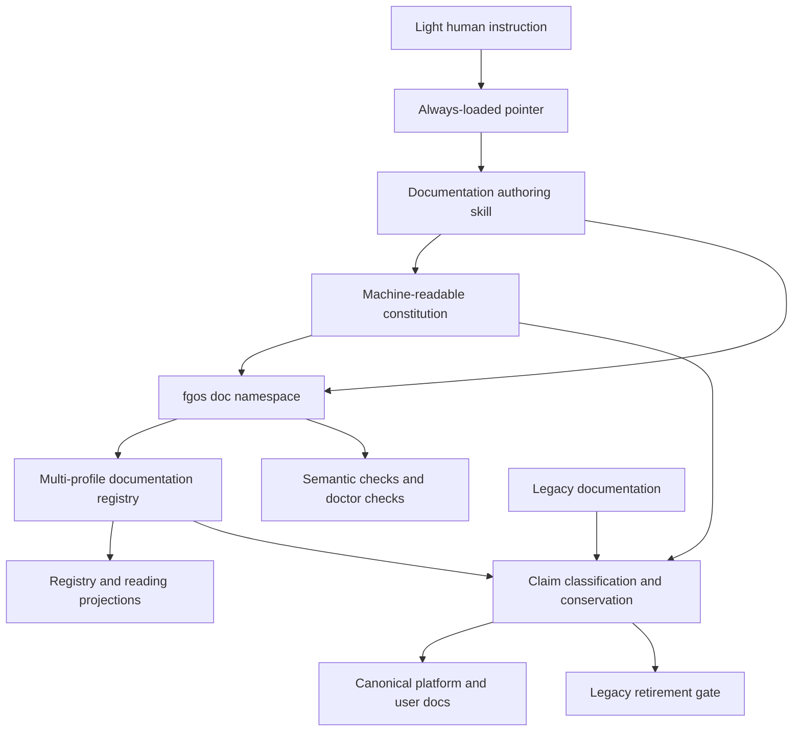
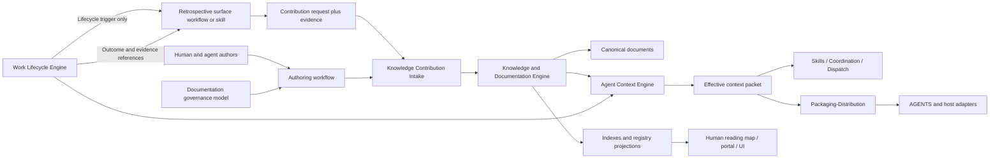

# Proposal: Unified Documentation Operating System

```txt
Document type: Proposal
Audience: Human reviewer, platform architect, maintainer, documentation agent
Purpose: Preserve the proposed unification of fgOS documentation governance, authoring, registry, migration, and retirement
Design status: Proposed
Implementation: Existing registry foundation; unification not implemented
Provenance: Human + agent coauthor
Writer type: Human + agent coauthor
Canonical for: nothing until accepted and promoted
Use this when: Continuing the documentation-system discussion or evaluating its implementation shape
Do not use this for: Current documentation authority or current product behavior
Last reviewed: 2026-09-20
Related:
- `../../doc-governance.md`
- `../../reading-map.md`
- `../README.md`
- `../../architect/documentation-system-design.md`
- `../../architect/knowledge-registry-redesign.md`
```

This proposal preserves the complete discussion so it can continue without chat
history. It is deliberately non-canonical. Current authority remains with the
existing governance and current source documents until this proposal is accepted,
implemented, verified, and promoted.

## 1. Problem

fgOS already has substantial documentation doctrine and tooling, but the system
is split across canonical targets, legacy-current trees, end-user knowledge
machinery, templates, instructions, and generated projections. An agent asked to
“write the architecture doc” must still reconstruct the workflow: classify the
claim, find its owner, choose a type and path, locate a template, update related
links and proof, regenerate projections, and determine which checks apply.

The intended improvement must do more than make new documents easier to author.
Every retained detail in `docs/specs/**` and `docs/architect/**` must be migrated
to the new system. Those legacy trees must then be retired and removed; they must
not remain indefinitely as compatibility or “legacy-current” sources. Legacy
root-level user-documentation directories must likewise converge on one final
layout.

## 2. Existing Foundations

### 2.1. Governance and templates

The repository already defines:

- human presence: a reader can understand and challenge the system without chat;
- one claim, one owner;
- provenance is not authority;
- generated output never outranks its source;
- separate authority for vision, spec, architecture, contract, decision,
  verification, proposal, discussion, history, and generated documents;
- discussion promotion and drainage;
- intent preservation when implementation narrows a larger design;
- one H1, numbered sections for maintained canonical documents, and deliberate
  links forming a reading graph;
- eleven templates for the main maintained document types.

The primary current sources are `docs/doc-governance.md`,
`docs/reading-map.md`, `docs/platform/README.md`, and `docs/templates/**`.

### 2.2. Existing CLI and registry

The current implementation is more than a simple index. It includes:

- an event-sourced topic/document registry;
- stable document identity;
- lifecycle `reserved -> provisional -> active -> superseded|retired`;
- one active document per `(topicId, role)` slot;
- current paths, aliases, supersession chains, topic lineage, and capture links;
- safe path validation;
- current/old-path resolution;
- machine and human registry projections;
- classifier, bootstrap, canary, migration dry-run/apply, and conservation tools;
- doctor checks for stale projections, duplicate active slots, broken aliases,
  missing current paths, source reachability, conservation, provisional age,
  topic size, and role usage.

Existing public surfaces include:

```sh
fgos topic register|split|merge|rename|retire
fgos doc reserve|register|mark-rendered|move-path|promote|demote|supersede|retire
fgos knowledge status|attest
fgos doc-registry
fgos docs-index
fgos doc-sources
```

Existing implementation anchors include:

- `src/state/knowledge-registry.mjs`;
- `src/report/knowledge-resolver.mjs`;
- `src/report/knowledge-projection.mjs`;
- `scripts/knowledge-classifier.mjs`;
- `scripts/knowledge-bootstrap.mjs`;
- `scripts/knowledge-migration.mjs`;
- `scripts/knowledge-canary.mjs`;
- knowledge/doc checks in `src/setup/registrations.mjs`.

### 2.3. Where the current implementation does not fit

The current registry is designed around end-user knowledge:

- only the `diataxis` framework is registered;
- modes are tutorial, how-to, reference, and explanation;
- the classifier scans only user-facing quadrant roots and decisions;
- target paths are shaped as `docs/knowledge/<purpose>/<role>.md`;
- identity emphasizes topic and role;
- it does not model platform area, subcomponent, document type, authority kind,
  singleton versus collection cardinality, required sections, templates, or
  typed relationships;
- its migration assumes a much narrower source-to-target relationship than the
  mixed claims found in `docs/specs/**` and `docs/architect/**`.

Therefore the existing subsystem is the correct lifecycle and migration
foundation, but it cannot be applied unchanged to platform documentation.

## 3. Proposed End State

### 3.1. One canonical documentation topology

```text
docs/
├── README.md
├── doc-governance.md
├── reading-map.md
├── templates/
├── platform/
│   ├── README.md
│   ├── vision.md
│   ├── platform-foundations.md
│   ├── architecture-map.md
│   ├── component-boundary.md
│   ├── intent-preservation-ledger.md
│   ├── contracts/
│   ├── decisions/
│   ├── verification/
│   ├── history/
│   └── <area>/
│       ├── README.md
│       ├── vision.md
│       ├── intent-preservation-ledger.md
│       ├── spec.md
│       ├── subcomponents/
│       ├── architecture/
│       ├── contracts/
│       ├── decisions/
│       ├── verification/
│       ├── operations/
│       ├── proposals/
│       └── history/
├── user/
│   ├── README.md
│   ├── tutorials/
│   ├── how-to/
│   ├── reference/
│   └── explanation/
├── generated/
├── knowledge/
└── history/
```

The continuing roles of top-level `knowledge/` and `history/` require a final
decision. The non-negotiable outcome is that `docs/specs/**`,
`docs/architect/**`, and legacy root-level user quadrants do not remain active
documentation systems after cutover.

### 3.2. Authority by claim kind

Authority should be determined by the claim being sought, not a single linear
precedence list:

| Question | Canonical owner |
|---|---|
| What direction is intended? | Vision |
| What is currently true? | Spec |
| What exact obligation applies? | Contract |
| Why does the system have this shape? | Architecture |
| What choice was made or superseded? | Decision / ADR |
| What proves the claim? | Verification |
| Where should a reader go next? | Portal / reading map |
| What is a derived view? | Generated projection |
| What is preserved old context? | History |

Area-local governance may add stricter constraints through a declared extension
mechanism, but must not silently redefine global precedence.

### 3.3. Independent classification axes

The constitution must not collapse every concern into one `type` enum. A
maintained document needs four independent classification axes:

| Axis | Question answered |
|---|---|
| `documentType` | What kind of governed artifact is this? |
| `purpose` | What job does it help a reader perform? |
| `audience` | Who is expected to use it? |
| `authorityKind` | What kind of claim may it establish? |

`documentType` is singular. `purpose`, `audience`, and `authorityKind` may be
plural within combinations allowed by the constitution.

How content was created is not a stable classification axis. A living spec can
start in human-agent discussion, later receive evidence-based agent synthesis,
then be corrected manually or migrated. Reducing that history to one mutable
`creationProcess` field would become false; accumulating values would lose which
change came from which workflow and evidence.

Production history is therefore modeled separately:

| Concern | Model |
|---|---|
| How the document first appeared | Stable `originKind` provenance |
| How each later change happened | Append-only contribution event |
| What makes the resulting claim canonical | `authorityPolicy` plus evidence and approval gates |

Initial `originKind` values may include `human-authored`,
`collaborative-shaped`, `work-synthesized`, `migrated`, and `generated`.
`originKind` never grants authority and does not change when the document is
later updated through another workflow.

Contribution events should record at least the document, contribution kind,
actor, source/evidence, changed claims, timestamp, and approval when required.
Candidate contribution kinds include `direct-curation`, `discussion-promotion`,
`post-work-synthesis`, `retrospective-learning`, `migration`,
`generated-projection`, and `corrective-maintenance`.

```yaml
eventType: doc.claims-promoted
docId: agent-coordination:architecture:runtime-model
contributionKind: discussion-promotion
sourceDocs: [docs/platform/agent-coordination/history/runtime-redesign.md]
decisionIds: [AC-D014]
changedClaims: [runtime-ownership-boundary]
approvedBy: {kind: human}
```

```yaml
eventType: doc.content-contributed
docId: runner:spec
contributionKind: post-work-synthesis
sourceIds: [tsk-123]
evidence: [src/runner/dispatch.mjs, test/runner/dispatch.test.mjs]
changedClaims: [runner-dispatch-fallback]
actor: {kind: agent}
```

The Markdown header should remain compact. It may expose `Origin`, current
authority policy, provenance, and last review, while full contribution history
stays in the event-sourced registry and is projected through read commands.

## 4. Proposed Operating Architecture



### 4.1. Canonical prose governance

`docs/doc-governance.md` remains the human-readable authority explaining the
rules and rationale. The proposal must not create a second prose constitution.

### 4.2. Machine-readable documentation constitution

A manifest such as `docs/doc-types.yaml` should define, per profile and type:

- authority kind;
- canonical placement;
- singleton or collection cardinality;
- required metadata and sections;
- allowed lifecycle states and transitions;
- required typed relationships;
- promotion and retirement rules;
- template;
- applicable semantic checks;
- generator and freshness rules for derived artifacts.

It should also register valid `purpose`, `audience`, and `authorityKind`
vocabularies and their allowed combinations. Per document type and claim kind,
it defines `authorityPolicy`: the evidence, compatibility review, human approval,
or source-derived regeneration required before a contribution becomes canonical.

This manifest is the shared contract for the authoring skill, CLI, validator,
migration tooling, and projections. It complements rather than replaces the
human-readable governance.

### 4.3. Existing registry generalized by profile

The existing registry should evolve into a multi-profile documentation registry,
not be replaced by a parallel registry.

```text
knowledge profile:
  framework = diataxis
  modes = tutorial | how-to | reference | explanation
  identity emphasizes topic + role

platform-docs profile:
  types = portal | vision | intent-ledger | spec | architecture |
          contract | decision | verification | proposal | discussion |
          operations | history | generated
  identity emphasizes platform/area/subcomponent + type + scope
  authorityKind and cardinality are explicit
```

Existing lifecycle, event sourcing, aliases, supersession, capture linkage,
resolver, projections, and conservation mechanisms should be reused. Fields such
as `framework` and `mode` become profile-specific rather than mandatory for all
documents.

An illustrative platform registry row is:

```yaml
docId: runner:spec
profile: platform-docs
area: runner
subcomponent: null
docType: spec
authorityKind: current-state
cardinality: singleton
currentPath: docs/platform/runner/spec.md
aliases:
  - docs/specs/runner.md
docLifecycle: active
sourcePaths:
  - docs/specs/runner.md
```

### 4.4. One authoring door

The always-loaded instruction should contain only a stable pointer:

> When creating, changing, moving, or retiring maintained documentation, use the
> documentation authoring skill; do not choose a type, path, template, or skip
> documentation checks independently.

The detailed rules remain in governance, constitution, and skill resources so
they do not drift inside every generated AGENTS file.

The skill performs:

```text
classify intent and claims
→ resolve profile, area, type, and canonical owner
→ find the existing document slot
→ choose grow/create/discuss/promote/supersede/retire
→ scaffold or edit
→ update links, evidence, and intent implications
→ run semantic checks
→ regenerate projections
→ preview when required
→ report disposition and proof
```

The authoring door routes by intended contribution workflow as well as document
type. A request to discuss and shape architecture opens a non-canonical
discussion and later promotes stable claims. Completion of real work may trigger
post-work synthesis from actual diff, decisions, tests, captures, and outcomes.
Both paths share classification, registry, validation, and promotion
infrastructure, but canonicality is decided by `authorityPolicy`, not by whether
a human or agent produced the prose.

It should refuse free-form canonical paths, duplicate owners, direct edits to
generated files, accepted claims written only into discussion, and current-state
claims stored only as architectural rationale.

### 4.5. Extend the existing CLI namespace

Keep all existing lifecycle verbs. Add authoring and migration behavior under
the existing `fgos doc` namespace:

```sh
fgos doc classify <path-or-intent>
fgos doc new --type <type> --area <area> [--subcomponent <name>]
fgos doc check [--changed | <paths...>]
fgos doc inventory
fgos doc migrate --inventory <path> [--dry-run | --apply]
fgos doc retirement-check
```

`fgos docs-index` remains the discovery index for user-facing Diataxis docs.
`fgos doc-registry` remains the whole registry projection. `fgos doctor` checks
environment/configuration/projection health; `fgos doc check` checks document
semantics and changed content.

The semantic checker should understand file classes and validate only applicable
rules. Candidate checks include:

- one H1 and numbered maintained sections;
- required metadata and sections;
- allowed placement and cardinality;
- broken or missing typed links;
- duplicate claim ownership;
- generated-file immutability and freshness;
- decision supersession consistency;
- component-boundary declaration;
- intent-ledger impact;
- registry and index freshness;
- preview requirement for long, tabular, Mermaid, or multi-file documents.

Raw proof logs, requests, and result payloads must not be linted as maintained
canonical prose.

### 4.6. Distilled agent read surface

The canonical documentation graph is too large to load for every agent action.
Requiring every agent to read the full governance, platform, area, contract,
decision, and history corpus would waste tokens and wall time while increasing
the chance that obsolete context is mistaken for current instruction. The system
therefore needs a generated, progressively disclosed agent read surface.

This is not a new authority layer. It is a projection compiled from canonical
instruction sources, active rules, effective decisions, and documentation
registry relationships. Every projected statement retains a source pointer and
freshness digest; missing or ambiguous authority fails projection rather than
being summarized by guesswork.

The repository already has part of this foundation:

- `src/setup/instruction-registry.mjs` discovers canonical instruction units;
- `src/setup/instruction-composition.mjs` composes laws, boundaries, procedures,
  preferences, host adapters, refinement, override, conflict, and supersession;
- `src/setup/instruction-projections.mjs` materializes an effective-set JSON and
  a managed `AGENTS.md` block with a projection ledger;
- setup/doctor detects and repairs stale instruction projections;
- `fgos decision-index` generates a deterministic decision history projection;
- skills carry detailed procedures that can be loaded only when triggered.

This foundation is implemented but not yet sufficient as the complete agent read
surface. The current repo effective set contains only the platform-laws unit;
domain instructions are not a repo-scoped task packet; the decision index is a
chronological history that still displays superseded and partially superseded
decisions; and there is no generated, area/task-scoped packet with an explicit
token budget.

The target should use progressive disclosure:

| Level | Content | Default loading |
|---|---|---|
| L0 — Trigger | Tiny standing directives telling the agent which skill/door to use | Always loaded |
| L1 — Effective brief | Applicable prose instructions, RULES, boundaries, and active decision conclusions | Loaded for the selected repo/domain/area/task scope |
| L2 — Scoped context packet | Relevant current spec/contract summaries, ownership, verification expectations, and exact deep links | Loaded when a task is classified or claimed |
| L3 — Canonical source | Full specs, architecture, contracts, decisions, and guides | Read on demand when detail is required |
| L4 — History and evidence | Superseded ADRs, discussions, migrations, raw proof, and audit trail | Read only for rationale, dispute, or forensic work |

L1 must distinguish three compiled sections rather than flattening them into one
summary:

1. **Prose instructions** — concise operating guidance and routing pointers.
2. **RULES** — enforceable laws, boundaries, procedures, and prohibitions with
   their force and owner preserved.
3. **Effective decisions** — the current conclusion for each decision scope after
   supersession, with a pointer to the full decision chain.

The effective-decision view must not delete decision history. It hides inactive
ancestors from the default brief while retaining a trace such as:

```text
current decision → supersedes/partially supersedes → prior decisions → evidence
```

Partial supersession requires claim- or clause-level modeling. A document-level
“latest ADR wins” rule is unsafe when a newer decision replaces only terminology
or one constraint while leaving the rest of an older decision active.

The projection compiler should select content using registry metadata and real
task context: target repo/domain/component/area/subcomponent, document authority,
changed paths or declared footprint, skill/command, and host. Selection must be
deterministic and inspectable: an agent or maintainer can ask why a rule or
decision was included, excluded, or considered superseded.

Each effective brief or context packet should declare:

- target scope and host;
- source document/decision/instruction IDs;
- source and effective-set digests;
- generated time and freshness check;
- token or byte budget;
- omitted sections with links for deeper reading;
- conflicts or unresolved supersession, which fail closed rather than silently
  choosing one text.

The desired outcome is not “the agent never reads detailed docs.” It is that the
agent starts with a small, current, unambiguous execution surface and follows
typed links into canonical detail or history only when the task requires it.

#### 4.6.1. Static human map versus dynamic agent reading plan

`docs/reading-map.md` should remain a small human portal: it answers where a
person starts and how the documentation system is organized. It should not be
the payload every agent receives, and it should not attempt to enumerate every
area, contract, decision, proof, or source path. A large static map duplicates
the registry, becomes stale, and spends agent context before the task is known.

For agents, replace “read the reading map” with a dynamic reading-plan compiler.
Given real task context, it returns the smallest sufficient ordered set of
instruction fragments, current claims, source sections, and deeper links.

```text
Task intent + operation + stage + domain/area + affected paths + audience
    -> scope resolver
    -> applicable instruction/rule composition
    -> active decision reduction
    -> document-graph traversal
    -> budgeted reading plan
```

The reading plan is a manifest, not another prose document. A candidate surface
is:

```sh
fgos doc context \
  --for implement \
  --area runner \
  --paths src/runner/dispatch.mjs,test/runner/dispatch.test.mjs \
  --stage executing \
  --budget 6000
```

Its result separates:

| Bucket | Meaning |
|---|---|
| `mustRead` | Sources required before the requested operation is safe or valid |
| `inlineBrief` | Small current instruction/rule/decision content injected directly |
| `readOnDemand` | Canonical detail linked for a likely branch of the work |
| `historyOnDemand` | Superseded decisions and evidence needed only for rationale or dispute |
| `excluded` | Candidates omitted because they are irrelevant, superseded, lower authority, or outside budget, with reasons |

Selection should be deterministic before semantic ranking. Hard inclusion comes
from authority and declared relationships: applicable laws/boundaries,
document-authoring rules when docs are touched, the owning area and current spec,
contracts whose owned/consumed edges intersect the change, active decisions for
those scopes, and declared verification obligations. Semantic similarity may
rank optional material but must not decide whether a normative rule applies.

The graph needs typed edges such as `owns`, `constrains`, `implements`,
`consumes`, `evidencedBy`, `supersedes`, `refines`, `routesTo`, and
`appliesToPath`. The registry and constitution provide nodes and policy; the
dynamic resolver walks only the edges relevant to the requested operation.

Budgeting must degrade by depth, not by arbitrary truncation:

1. Never omit applicable laws, authority boundaries, or exact contracts solely
   to meet a budget; fail and request a larger budget if the mandatory set is too
   large.
2. Inline conclusions and precise section anchors before full documents.
3. Drop optional explanation and history before current spec or contract detail.
4. Report every omitted candidate and the link by which it can be loaded later.

The plan should be expandable during execution. When an agent encounters a new
component, contract, decision ID, or ambiguity, it asks for a delta packet rather
than recompiling or rereading the whole corpus:

```sh
fgos doc context --continue <context-id> --add-scope <scope-or-path>
```

Each packet records its input fingerprint, selected source digests, effective
decision revision, budget, and selection reasons. This makes context use
reproducible and lets doctor/CI detect a stale packet or a rule that was wrongly
omitted.

### 4.7. Proposed component and authority map

The system should not become one oversized “Documentation Registry” component.
Two enduring runtime authorities are materially different and should remain
separate: the authority that records governed knowledge and documentation, and
the authority that compiles the minimum applicable context for an agent action.

#### 4.7.1. Knowledge and Documentation Engine

Recommended top-level name: **Knowledge and Documentation Engine**. Remove
“Learning” from the existing component name: learning workflows produce
knowledge contributions, but they must not own document identity, canonicality,
or publication state.

This component owns durable documentation knowledge:

- document identity and lifecycle;
- claim identity and canonical owner;
- document type, purpose, audience, and authority-kind vocabulary;
- typed documentation graph relationships;
- contribution provenance and evidence links;
- decision records and claim/clause-level supersession graph;
- aliases and legacy-path lineage;
- generated registry and index read models.

Its subcomponents are:

| Subcomponent | Owns | Must not own |
|---|---|---|
| Documentation Governance Model | Constitution, valid vocabularies, authority and cardinality policies, placement rules | Runtime task selection or host rendering |
| Documentation Registry | Document slots, lifecycle, paths, aliases, contribution events, source reachability | Prose content or workflow decisions |
| Claim and Decision Registry | Claim identity, decision provenance, full/partial supersession, effective/inactive status | Agent prompt assembly |
| Documentation Graph | Typed relationships between documents, claims, areas, contracts, evidence, code scopes, and decisions | Semantic authority inferred only from similarity |
| Documentation Read Models | Human/machine registry projections, discovery indexes, source/history lookup | New authority or hand-authored policy |

The existing `src/state/knowledge-registry.mjs`, knowledge resolver/projection,
decision state/projection, end-user index, and future constitution belong on this
side of the boundary after consolidation.

#### 4.7.2. Agent Context Engine

Recommended top-level name: **Agent Context Engine**. “Instruction Projection”
is too narrow because the target combines instructions, enforceable rules,
effective decisions, document ownership, current specs/contracts, and budgeted
reading plans.

This component owns derived, task-scoped context selection:

- instruction source registry and semantic composition;
- applicable law/boundary/procedure resolution;
- effective-decision reduction for a requested scope;
- deterministic document-graph traversal;
- mandatory versus optional reading classification;
- context budgeting and progressive disclosure;
- delta expansion of a prior context packet;
- inclusion/exclusion explanations and source digests;
- immutable context-packet manifests.

It never owns canonical documentation, decisions, claims, or work state. It reads
those authorities and emits a derived packet. It must fail closed on unresolved
authority conflicts or an over-budget mandatory set.

Suggested subcomponents:

| Subcomponent | Owns |
|---|---|
| Instruction Composer | Laws, boundaries, procedures, preferences, refinement, conflict, supersession |
| Effective Decision Reducer | Current claim conclusions plus trace pointers into decision history |
| Reading Plan Compiler | Scope/path/operation traversal over the documentation graph |
| Context Budgeter | Mandatory-set protection, inline/deep-link choices, staged/delta packets |
| Context Explainability | Why-included, why-excluded, source/freshness fingerprint |

The existing instruction registry/composition code is the seed of this engine.
Its current location under `src/setup/` reflects the implemented projection path,
not the final semantic owner.

#### 4.7.3. Components and surfaces that consume these authorities

| Existing component/surface | Correct responsibility |
|---|---|
| Work Lifecycle Engine | Own work state and lifecycle transitions. At the configured lifecycle point it emits a trigger/eligibility signal for retrospective; it does not know how retrospective is performed or what knowledge it produces |
| Retrospective workflow/skill | A surface-level orchestrator that reacts to the lifecycle trigger, reads work outcomes and evidence through public contracts, synthesizes candidate learning, and submits a knowledge-contribution request |
| Knowledge Contribution Intake | A use-case boundary inside the Knowledge and Documentation Engine: validate, deduplicate, classify, route, and gate contribution requests before the canonical owner is changed |
| Documentation Registry | Record append-only contribution events and provenance such as `post-work-synthesis`, `retrospective-learning`, and `corrective-maintenance` |
| Agent Context Engine | Project only accepted, effective knowledge into agent briefs and context packets; pending retrospective material is excluded by default |
| Domain skills | Orchestrate authoring/review workflows using public documentation and context contracts |
| Host and Surface Layer | Expose `fgos doc *`, context-query, registry-query, and preview commands; contains no documentation policy |
| Packaging-Distribution | Discover/install canonical instruction sources, render effective packets into host-specific files, own projection ledger and repair; does not decide semantic composition |
| Setup/Doctor | Aggregate component-provided health checks and fixes; does not reimplement validation logic |
| Agent Coordination / Dispatch | Consumes bounded context packets; does not select or silently broaden their authority scope |
| UI / documentation portal | Presents registry/read-model data; never becomes a source of truth |

The existing **Learning / Retrospective** component is therefore retired as a
top-level authority, but its capability is not removed. Its responsibilities are
split by the truth each responsibility changes:

- the Work Lifecycle Engine exposes only the lifecycle point and trigger;
- retrospective orchestration remains a replaceable surface workflow/skill,
  outside the Work Engine;
- contribution intake, provenance, promotion, and canonical routing move to the
  Knowledge and Documentation Engine;
- delivery of accepted learning to agents moves to the Agent Context Engine;
- end-user documentation synthesis remains an authoring workflow/skill rather
  than becoming another knowledge store.

There must be no independent `learning docs` corpus. Before promotion, a learning
is a candidate plus evidence in the work/contribution log. After promotion, its
durable claim lives only in the correct canonical owner: spec, architecture,
contract, rule, decision, verification, or user documentation.

The Work Engine must not import retrospective policy, prompt logic, document
taxonomy, or contribution semantics. Its contract ends after exposing the work
identity, lifecycle state, outcome/evidence references, and trigger. The
retrospective workflow may evolve, be replaced, or be disabled without changing
the Work Engine's state model.

#### 4.7.4. Capabilities, not permanent components

The following should not become new top-level components:

- **Documentation authoring** is a use-case/orchestration capability over the
  Knowledge and Documentation Engine, not a separate truth owner.
- **Semantic linting** is conformance logic owned by the governance model and
  exposed through CLI/doctor/CI, not a standalone platform authority.
- **Migration and retirement** is a temporary program/tooling capability. It
  reads legacy sources, writes through registry/document contracts, produces
  conservation evidence, then is retired or reduced to generic import tooling.
- **Reading map** is a human-facing portal/read model, not an engine.
- **Templates** are governed assets selected by constitution, not a component.
- **CLI commands** and **skills** are adapters/workflows, not owners of truth.

#### 4.7.5. Authority flow



Write authority remains one-directional:

- authoring and retrospective workflows request documented mutations through
  Knowledge Contribution Intake;
- retrospective output remains non-canonical until the applicable authority
  policy and evidence/approval gates pass;
- only that engine records document/claim/decision lifecycle truth;
- Agent Context reads those truths and writes only derived context packets;
- Packaging-Distribution materializes packets but cannot change their semantics;
- consumers never write back into either authority through a generated view.

## 5. Migration and Retirement

### 5.1. Migrate claims, not merely files

A legacy file may mix current behavior, rationale, normative obligations,
decisions, proposals, proof, and obsolete material. Each retained claim needs one
canonical owner. Each source file needs one file-level disposition.

Allowed dispositions include:

```text
moved
merged
extracted
superseded
archived-with-reason
deleted-as-duplicate
deleted-as-obsolete
```

`copied` is not a valid disposition because it creates two authorities.

The platform migration must support one source yielding multiple claims and
multiple sources feeding one canonical target. This requires a richer
conservation model than the existing knowledge migration's largely
one-source/one-target shape.

### 5.2. Legacy mapping principles

Content from `docs/specs/**` is generally routed by claim:

- current behavior to an area or subcomponent `spec.md`;
- cross-area overview to platform architecture and boundary maps;
- exact obligations to contracts;
- rationale to architecture;
- decisions to the appropriate decision surface;
- proof to verification;
- obsolete or duplicate material to deletion with recorded reason.

Content from `docs/architect/**` must first be classified because the tree mixes
accepted architecture, discussion, proposal, roadmap, migration plans,
implementation records, and proof. It must not be bulk-moved into a new
`architecture/` directory.

History is not a dumping ground. Archive only rationale, proof, or discussion
with durable audit or diagnostic value. Delete redundant drafts, obsolete
checklists, and generated noise after their dispositions are proven.

### 5.3. One-system migration sequence

This repository has already attempted a documentation migration that left two
documentation systems operating together. That outcome is explicit negative
evidence for this design. A reorganized tree is not a successful migration if
agents, people, instructions, tooling, or links must still choose between old
and new authorities.

The migration therefore uses one repository-wide authority cutover:

1. Define the complete constitution, target topology, and quality standard.
2. Inventory all legacy sources and claims without changing their current
   authority.
3. Build the target corpus in a dedicated migration change set. During this
   preparation it is candidate material, not a second canonical system.
4. Pilot the transformation and review method on one representative area, then
   apply the corrected method to every area.
5. Complete claim conservation, cross-area consistency review, fresh-reader
   review, links, entry points, and consumer rewrites for the whole corpus.
6. In one atomic cutover, promote the target corpus, switch every reader and
   writer, and delete `docs/specs/**`, `docs/architect/**`, old user-doc roots,
   and superseded compatibility paths.
7. Enable the minimum enforcement that prevents any legacy path or competing
   authority from returning.
8. Develop richer registry, authoring, linting, and context harnesses
   incrementally against the one live documentation system.

Content preparation may proceed area by area for tractability. Authority
cutover may not. Until the repository-wide gate passes, the legacy corpus is
the live authority and the target corpus is explicitly a migration candidate.
After the gate passes, only the target corpus is live and the legacy physical
roots no longer exist.

The same cutover applies to the old Learning / Retrospective component:

1. Inventory every trigger, capture, skill, command, registry field, projection,
   and document path currently owned by it.
2. Reduce Work ownership to lifecycle state plus a retrospective trigger;
   implement retrospective orchestration as a surface workflow/skill, move
   contribution state and promotion behavior to Knowledge and Documentation,
   and move effective delivery to Agent Context.
3. Preserve useful historical provenance through contribution events and
   aliases.
4. Update callers and generated instructions to use the new contracts.
5. Delete the old component, compatibility paths, and any parallel learning-doc
   store after the migration gate passes.

Compatibility may exist only as a bounded migration adapter. For example,
`fgos-coding-knowledge` may temporarily invoke the new contribution contract,
but it must not remain a second authority. Its eventual name should describe
the action, such as `knowledge-contribution` or
`retrospective-contribution`.

No area is declared migrated independently. There must be no phase in which old
and new documents are co-equal current authorities, nor a stable branch in
which different areas use different documentation systems.

The harness is allowed to mature after cutover; canonical documentation quality
is not. Moving a file into the new topology never makes it authoritative by
itself. Every promoted document must already meet the constitution, preserve or
explicitly dispose of legacy claims, resolve conflicts, and be understandable
without chat history.

### 5.4. Final retirement gate

Completion requires:

- no maintained files under `docs/specs/**` or `docs/architect/**`;
- no legacy root-level user quadrant directories;
- no inbound links, instructions, comments, generators, fixtures, or tests that
  treat legacy paths as authority;
- every legacy source and every retained claim accounted for;
- all live registry paths committed and resolvable;
- old physical files removed while registry aliases preserve lookup lineage;
- projections and indexes fresh;
- `docRegistry.enforce` enabled;
- semantic checks and the complete test suite green;
- a stranger agent able to author and navigate documentation without reading a
  legacy path or relying on chat history.

The gate must also search for semantic remnants, not only physical paths:

- old names and concepts still presented as current architecture;
- generated indexes or cached projections that continue to surface legacy
  authority;
- skills or prompts that tell agents to consult both systems;
- aliases that resolve lookup lineage but accidentally serve old content as
  current;
- archive/history pages that remain in normal reading routes;
- fallback behavior that silently recreates files under retired topology.

Any such remnant means the migration is incomplete. “Legacy but still usable”
is a second system and fails the gate.

## 6. Inventory Classification

The documentation inventory should expose three classes rather than one flat
list:

1. Maintained authority: portals, vision, specs, architecture, contracts,
   decisions, verification summaries, and operational guidance.
2. Generated projections: registries, indexes, manifests, and generated reports.
3. Evidence/history payloads: raw logs, requests, results, traces, and archived
   discussion.

The reading map routes maintained authority. Generated and evidence artifacts
are reached through explicit relationships when needed. This prevents hundreds
of proof files from becoming an agent's default reading set.

## 7. Non-goals and Failure Modes

- Do not build a second registry beside the existing event-sourced registry.
- Do not force platform documents into Diataxis modes.
- Do not place the complete governance manual in always-loaded instructions.
- Do not call migration complete while registry enforcement is disabled.
- Do not turn `history/` into a physical copy of the legacy trees.
- Do not preserve aliases as duplicate files; aliases are registry lookup keys.
- Do not blindly move whole legacy files when their claims have different owners.
- Do not make formatting checks indiscriminately scan raw proof artifacts.
- Do not retain `docs/specs/**` or `docs/architect/**` as compatibility sources
  after final cutover.

## 8. Open Questions

1. Should the implementation rename `knowledge-registry` internals or preserve
   internal names while exposing a generalized documentation-registry contract?
2. What exact registry identity represents area, subcomponent, type, scope, and
   role without making document IDs path-derived?
3. What is the final authority/conflict algorithm when Vision, Decision, Contract,
   and Spec appear to disagree?
4. Which local governance extensions are permitted, and how are they validated?
5. What exact types remain singleton at platform, area, and subcomponent levels?
6. What is the final role of top-level `docs/knowledge/` and `docs/history/`?
7. Where do platform-wide proposals live before acceptance?
8. Which historical artifacts are required for audit, and which should be
   deleted after migration?
9. Should one authoring skill own the whole flow or route to smaller specialized
   skills?
10. When is mdview preview mandatory, and what preview evidence is retained?
11. How should claim-level migration review be represented so humans can approve
    large but mechanically generated disposition sets efficiently?
12. At what migration boundary can `docRegistry.enforce` safely switch from false
    to true without allowing new legacy paths or blocking unmigrated areas?
13. Which claim kinds may an evidence-complete `post-work-synthesis`
    contribution activate automatically, and which require human approval or a
    decision record regardless of document type?
14. What minimum event schema lets the registry attribute changed claims,
    evidence, actor, approval, and source workflow without turning every prose
    document into an embedded audit log?
15. What is the smallest useful L1 effective brief, and what token/byte budget
    should be enforced per repo, domain, area, and task packet?
16. How should partial decision supersession identify surviving versus retired
    claims without requiring an agent to reread the whole ADR chain?
17. Which task-context signals are trustworthy inputs to projection selection:
    area, subcomponent, changed paths, declared footprint, skill, command, or a
    combination?
18. Which typed document-graph edges are mandatory for deterministic routing,
    and which optional semantic-ranking signals are useful without becoming an
    authority oracle?
19. What happens when the mandatory reading set exceeds the caller's context
    budget: refuse, split the operation, or provide a staged mandatory packet?

## 9. Candidate Work Breakdown

This is a design decomposition, not an active work plan:

1. Documentation constitution and authority model.
2. Target topology, document templates, and production-quality review gates.
3. Platform legacy classifier and claim-disposition format.
4. Repository-wide inventory and conservation ledger.
5. Area-by-area content transformation and cross-area quality review, without
   independent authority cutovers.
6. User-doc consolidation and complete consumer/link rewrite.
7. Atomic authority cutover, legacy-root deletion, and minimum enforcement.
8. Multi-profile registry generalization.
9. Authoring skill, scaffold, semantic checks, and instruction integration.
10. Effective-decision reducer and distilled agent read-surface design.
11. Typed documentation graph and dynamic reading-plan compiler.
12. Richer doctor/CI enforcement and retirement of temporary migration tooling.

## 10. Acceptance Standard for the Eventual Design

The eventual system is successful when a person can say “write or update the
documentation for this change” and an agent, without prior chat context, can:

1. discover the mandatory authoring door;
2. identify the claim type and canonical owner;
3. grow an existing document instead of creating a duplicate;
4. choose the correct path and template;
5. preserve vision, contracts, decisions, evidence, and source lineage;
6. validate semantics and structure with one documented command;
7. regenerate projections and preview when required;
8. complete the work without reading `docs/specs/**` or `docs/architect/**`;
9. begin from a bounded effective brief containing only applicable current
   instructions, rules, and decision conclusions;
10. trace any projected conclusion into canonical detail and, when needed, its
    complete decision or evidence history;
11. prove that no legacy authority or dependency remains.
