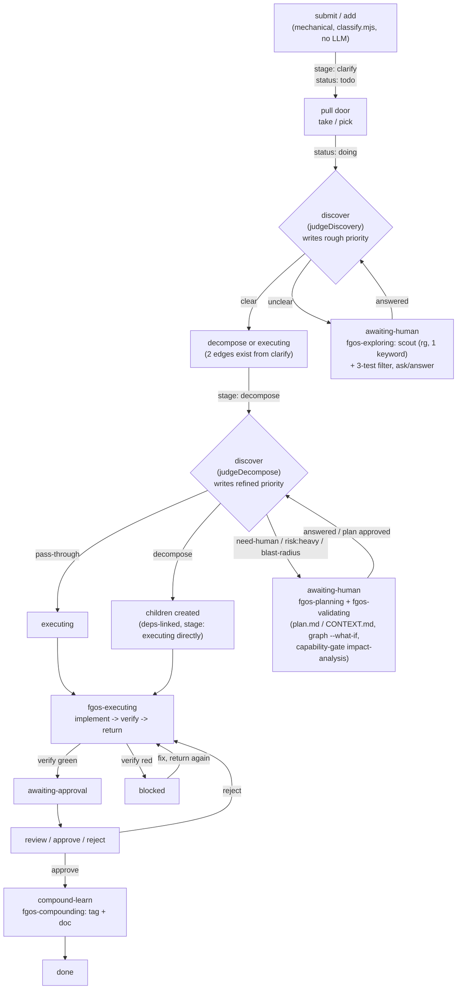

# Work-item pipeline: stages, verbs, actors, handoffs

Hand-authored reference, verified 2026-07-31 by reading the real source
(not generated via `fgos-compounding`/`fgos-indexing` — no captured work
item backs this doc, so it carries no `docType`/`docPath` linkage). Scope:
what happens between `fgos submit` and `done`, who does each step
(mechanical engine verb vs skill-guided session), and what each step
consumes from the step before it / produces for the step after it.

**Updated 2026-07-31 (`tsk-4y5`, work-item-priority-matrix):** `priority`
is now a calculated field (rough pass at `clarify`, refined pass at
`decompose`); `intent` is retired in place (stops being written, field/flag
untouched). See `docs/history/work-item-priority-matrix/CONTEXT.md`/
`plan.md` for the full design. `tsk-2b0` (verb split `discover`/
`decompose`) is filed but not yet shipped — this doc still describes the
one overloaded `discover` verb.

## Stage/status flow

## Step-by-step: responsibility, consumes, produces

| Step | Actor | Responsibility | Consumes (from before) | Produces (for after) |
|---|---|---|---|---|
| `submit`/`add` | Mechanical (`classify.mjs`, no LLM) | Classify tier/kind/risk from free text, generate id | Free-text description | Work item, `stage: clarify`, `status: todo` |
| pull door (`take`/`pick`) | Human/agent | Claim exactly one item | Frontier order (`priority` ASC → `intent` DESC → FIFO — v2 contract unchanged; `intent` now silently vacuous for every new item, per `tsk-4y5` D7) | `status: doing`; `pick` also creates `fgw/<id>` worktree |
| `discover` @ `clarify` (`judgeDiscovery`) | Mechanical, nested `claude -p`, **zero tool access** (`--allowedTools` limited to `git add`/`git commit`, `src/runner/dispatch.mjs:207-220`) | Verdict clear/unclear + `impactScore` (0-100 semantic-relatedness estimate, renamed from `intentScore` by `tsk-4y5` D3) | Item text + `graphMetrics`/`rankImpact` (work-graph metadata only, no code/docs read) | `clear` → next edge fires; `unclear` → `awaiting-human` + question; **rough `priority`** computed+written regardless of outcome (`impact` = `blocks` + `impactScore`, `effort` defaulted to floor, `urgent`/`risk` read from the item — `src/state/priority-formula.mjs`) |
| `fgos-exploring` (only when parked) | Skill session, real tool access | Lock product decisions Socratically, filtered by material/grounded/answerable | Prior `judgeDiscovery` verdict, **one keyword `rg` scout pass** | `CONTEXT.md`, `fgos decision` log entries, `docsRef` pointer |
| `discover` @ `decompose` (`judgeDecompose`) | Mechanical, same zero-tool-access executor | Verdict pass-through / decompose (auto children) / need-human | `docsRef` → `CONTEXT.md`/`plan.md` (post `tsk-1wd` fix — used to run blind, now grounded); also reads `plan.md`'s recorded mode + any real blast-radius figure (`tsk-4y5` D5/D8) | pass-through → `executing`; decompose → children (`deps`-linked, `stage: executing` directly — no separate clarify/decompose for auto-children, since D2 already forces each a real `verify`); need-human/`risk:heavy`/**blast-radius-over-threshold** → `awaiting-human`; **refined `priority`** recomputed on every non-invalid outcome (real `effort` from `plan.md`'s mode, real blast-radius when present) |
| `fgos-planning` (session, first half of `decompose`) | Skill session, real tool access | Mode-size the item (mechanical flag count), write approach + risk map, decide split if any, **query `impact-analysis` capability** (`fgos tool query --capability impact-analysis --status present`, wired by `tsk-1e4`) | `CONTEXT.md`, `fgos graph --json`/`--what-if` | `plan.md` (mode, approach, risk map, capability posture) |
| `fgos-validating` (session, second half of `decompose`) | Skill session, real tool access | Prove `plan.md` against real evidence, re-check `impact-analysis` posture live (never trust plan.md's stale note) | `plan.md`, live `fgos tool query` | READY / READY WITH CONSTRAINTS / NOT READY (hands back to `fgos-planning` on fail) |
| `fgos-executing` (stage `executing`) | Skill session (or runner auto-dispatch) | Implement, run item's own `verify`, check Iron Law evidence need, **query `impact-analysis` capability** before editing a symbol | `plan.md`/`CONTEXT.md` (when present), item's `verify` | Real diff, one commit; `fgos return` |
| `return` | Mechanical | Re-verify (never trusts caller), check clean tree + advanced commit history | Worktree diff | `awaiting-approval` (verify green) or `blocked` (verify red) |
| `review`/`approve`/`reject` | Human/agent + main-checkout lock | Gate the diff before merge | `awaiting-approval` item | Merge (approve) opens `executing→compound-learn` edge; reject sends back, never automatic |
| `fgos-compounding` (`compound-learn`) | Skill session | Classify capture into one Diataxis quadrant, write/grow the end-user doc | `fgos check <id>` outcome/friction capture | Tagged capture (`docType`/`docPath`), doc under `docs/<quadrant>/` |
| `fgos-indexing` | Mechanical | Regenerate machine-readable doc index | Doc tree + capture tags | `docs/enduser-docs-index.json` |

## Two-layer pattern: mechanical engine judge vs skill session

The same shape repeats at both `clarify` and `decompose`: a **mechanical
judge** (`judgeDiscovery`/`judgeDecompose`, nested `claude -p`, verified
zero tool access) is the only thing allowed to actually fire a stage edge
(RUL42/RUL46 — picker stays mechanical forever); a **skill session**
(`fgos-exploring`, `fgos-planning`+`fgos-validating`) does the real
grounded work (scout, graph queries, capability checks, feasibility
proof) but only ever writes *input* — `CONTEXT.md`/`plan.md`/decision
log — never applies the stage move itself.

| | Mechanical judge (fires the edge) | Skill session (grounds the decision) |
|---|---|---|
| `clarify` | `judgeDiscovery` — zero scout | `fgos-exploring` — 1-keyword `rg` scout, 3-test question filter |
| `decompose` | `judgeDecompose` — reads `docsRef` (post `tsk-1wd` fix), still zero tool access itself | `fgos-planning`+`fgos-validating` — `fgos graph --what-if`, **`impact-analysis` capability gate (wired, `tsk-1e4`)** |

`impact-analysis` capability gate (`fgos tool query --capability
impact-analysis --status present`, `src/state/tool-registry.mjs`) is wired
at `decompose` (planning+validating) and `executing` — **not yet at
`clarify`** (`fgos-exploring` has no such step as of this writing).

## Known gaps (verified against source, not inferred)

1. **`parent` field has no CLI writer.** `parent` is load-bearing
   (`frontier.mjs`, `dep-graph.mjs`'s `buildUnifiedEdges`, `impact.mjs`'s
   blocking-fan-out, `decompose.mjs`'s re-entrancy check), but neither
   `add` (`bin/fgos.mjs:726-816`, fixed object literal, no `parent` key)
   nor `edit` (`src/cli/command-registry.mjs` field list) exposes a
   `--parent` flag. The only writer in the whole repo is
   `decompose.mjs`'s own internal `addWork()` call inside
   `judgeDecompose`'s auto-split path (`src/intake/decompose.mjs:382-397`,
   `deps`-linked, not `parent`-only — it sets both). `fgos-planning`
   SKILL.md's step 5 ("each item created this way carries this item's own
   id as its parent") describes a capability that does not exist on the
   CLI surface today — a session following that skill under
   one-door-write discipline cannot actually execute it. The repo's own
   `STR92` audit (`docs/backlog.md:132`, 2026-07-23) caught an adjacent
   gap (missing `--footprint`) on the same step but missed this one.
2. **`clarify` has no capability-gate for `impact-analysis`.**
   `fgos-planning`/`fgos-validating`/`fgos-executing` all query it
   (`tsk-1e4`, merged 2026-07-31); `fgos-exploring` does not. Since
   `judgeDiscovery` itself has zero tool access (verified —
   `DEFAULT_RUNNER_CONFIG.executor.args`'s `--allowedTools` only permits
   `git add`/`git commit`), any scouting or capability query at `clarify`
   can only happen in the `fgos-exploring` skill session, not the
   mechanical judge.

## Sources (file:line, read directly 2026-07-31)

`src/state/work.mjs`, `src/state/workflow-stage-graphs.mjs`,
`src/intake/classify.mjs`, `src/intake/discovery.mjs`,
`src/intake/decompose.mjs`, `src/intake/judge-executor.mjs`,
`src/runner/dispatch.mjs`, `src/cli/command-registry.mjs`,
`bin/fgos.mjs`, `src/state/impact.mjs`, `src/state/graph-metrics.mjs`,
`src/state/tool-registry.mjs`, `.claude/skills/fgos-routing/SKILL.md`,
`.claude/skills/fgos-exploring/SKILL.md`,
`.claude/skills/fgos-planning/SKILL.md`,
`.claude/skills/fgos-validating/SKILL.md`,
`.claude/skills/fgos-executing/SKILL.md`,
`.claude/skills/fgos-compounding/SKILL.md`, `docs/specs/runner.md`,
`docs/specs/work-state.md`, `docs/backlog.md` (STR7/STR8/STR14/STR40/
STR67/STR68/STR92/STR93, `tsk-1wd`, `tsk-1e4`).

Updated 2026-07-31 for `tsk-4y5`: `src/state/priority-formula.mjs`,
`docs/history/work-item-priority-matrix/CONTEXT.md`/`plan.md`.
