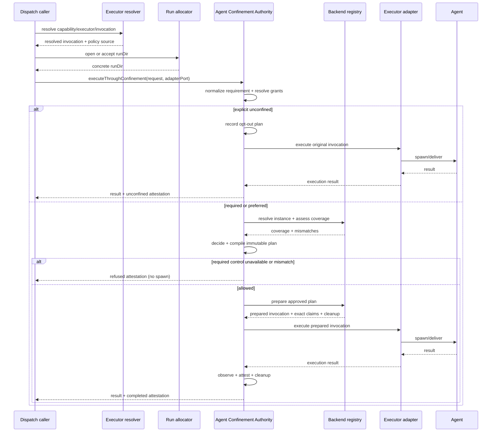

# Spec: Agent Confinement Authority

> **Trạng thái:** DESIGN PROPOSAL. Contract đích được thiết kế đủ để mở rộng;
> default implementation chỉ cần phủ ba executor `claude-bwrap`, `agy-bwrap`
> và `codex-bwrap`. Tài liệu này chưa tự nó bật enforcement.
>
> **Nguồn:** RUN1
> `plans/reports/architecture-advisory-panel-260909-2107-confinement-authority-fgos-dispatch-report.md`,
> RUN2
> `plans/reports/architecture-advisory-panel-260910-0216-confinement-authority-run2-decision-and-run1-comparison-report.md`,
> và source được đối chiếu ngày 2026-09-10.

## 1. Quyết định kiến trúc

fgOS sẽ có **một cửa runtime duy nhất** cho mỗi lần đưa agent ra ngoài process:

```text
executeThroughConfinement(request, adapterPort) -> result + attestation
```

Mọi đường dispatch phải đi qua cửa này sau khi đã có đầy đủ `cwd`,
`repoRoot`, `runDir`, executor, invocation và adapter, nhưng trước khi adapter
được phép spawn hoặc giao việc cho agent. Agent Confinement Authority là thành phần
duy nhất được gọi executor adapter.

Bên trong cửa có nhiều bước: resolve policy, compile plan, prepare backend,
execute, attest và cleanup. Đó là **nhiều phase trong một authority**, không
phải hai cửa. Config validation cũng không phải cửa runtime; nó chỉ từ chối
cấu hình sai trước khi có dispatch.

Kết luận “không thể một cửa vì `runDir` sinh muộn” của RUN2 chỉ đúng nếu vẫn
đặt cửa ở `resolveExecutorConfig`. Nó không phải ràng buộc kiến trúc. Điểm kích
hoạt đúng là seam chung ngay trước adapter, sau `openDispatchRun`. Ở seam này,
cả hai đường hiện tại trong `dispatch/cli.mjs` đều đã có invocation đã resolve
và `runDir` cụ thể.

### 1.1 Vì sao một cửa quan trọng

- Không adapter nào có thể quên đọc `confinement`, như `cliSpawnAdapter` hôm nay.
- Attestation và hành vi được sinh bởi cùng một authority; không còn đường
  “khai một nơi, spawn một nơi khác”.
- Thêm adapter hoặc backend mới không tạo thêm enforcement point.
- Policy dùng được dữ kiện runtime mà không đẩy logic confinement ngược vào resolver.
- Audit call graph chỉ cần chứng minh không có production call site nào gọi
  executor adapter ngoài Agent Confinement Authority.

## 2. Vấn đề hiện tại

Hôm nay có hai cơ chế không nối với nhau:

| Cơ chế | Khai báo | Enforcement | Hiện trạng |
|---|---|---|---|
| Session hygiene | `confinement: {privateHome, isolatedSession, ownWorktree}` | `herdr-round.mjs` | Có schema và enforcement, nhưng 0/17 executor dùng |
| OS filesystem | argv `bwrap` viết tay | `spawn()` chạy nguyên argv | 3/17 executor dùng, dispatch không hiểu đây là confinement |

Bốn đường fail-open đã được xác nhận:

| ID | Đường hở |
|---|---|
| F-a | `cliSpawnAdapter` bỏ field `confinement` |
| F-b | `invocations[].confinement` không validate nhưng lại ưu tiên hơn field đã validate |
| F-c | capability không có `prefer` có thể rơi về global executor không confinement |
| F-d | `establishConfinement` không có khai báo vẫn trả về kết quả có hình dạng thành công |

Mẫu chung: hệ có thể trông như đang enforce trong khi invocation thực tế không
được bảo vệ.

## 3. Mục tiêu và phi mục tiêu

### 3.1 Mục tiêu

1. Mỗi dispatch có một kết quả rõ ràng: `enforced`, `unconfined`,
   `degraded`, `refused` hoặc `unknown`.
2. Policy được so với năng lực backend và hành vi thực tế; mismatch không bao
   giờ bị nuốt im.
3. Dispatch `required` phải fail closed trước khi agent chạy.
4. Vùng ghi được cấp theo tài nguyên runtime của chính dispatch, đặc biệt
   `runDir`, không bằng absolute path machine-specific trong config.
5. Contract diễn tả đúng từng trục bảo vệ, không dùng nhãn mơ hồ như
   `read-only` để overclaim.
6. Hỗ trợ nhiều loại backend và nhiều backend instance mà không đổi contract
   của caller; mỗi dispatch vẫn chỉ dùng đúng một backend instance.
7. Một implementation đầu tiên nhỏ vẫn là tập con hợp lệ của contract đích.

### 3.2 Phi mục tiêu

- Không chọn executor thay `resolve.mjs`.
- Không biến worktree hay main-checkout lock thành security boundary.
- Không đưa policy theo role/tier vào `assignment-policy.mjs`.
- Không thay contract CLI `decide`/`execute`.
- Không tuyên bố bwrap hiện tại ngăn đọc secret hay network egress.
- Không buộc mọi backend driver phải có cùng một schema cấu hình hay cách
  prepare invocation.

### 3.3 Use case đích và cách dùng mặc định

Contract này cần bao phủ ba nhóm use case: agent phân tích/review chỉ được ghi
artifact của dispatch; agent thực hiện thay đổi trong workspace được cấp quyền;
và các executor chạy trên container, máy khác hoặc policy network/secret chặt
hơn. Các use case sau dùng cùng policy, grant và attestation contract; backend
và support matrix quyết định phần nào đã chạy được.

Default implementation phục vụ hai nhóm đầu qua hai policy: workspace read-only
với `host-write-denied`, writable với `workspace-write` theo grant cụ thể;
`run-output` là vùng ghi riêng của dispatch, và private home là vùng tạm do
backend quản lý. Người dùng không cần biết argv hay backend primitive để dùng
default. Setup/doctor phải làm lộ trạng thái registry, prerequisite và probe
freshness theo các registry hiện có; tài liệu này không tự tạo thêm command hay
quy tắc precedence ngoài distribution spec.

## 4. Threat model

Contract diễn tả riêng từng trục. Không có một boolean `confined` chung cho mọi
ý nghĩa.

| Trục | Giá trị chuẩn | Default đầu tiên |
|---|---|---|
| `hostWrite` | `deny` / `allow` | `deny`, trừ các grant được cấp |
| `hostRead` | `deny` / `allow` | `allow` |
| `networkEgress` | `deny` / `allow` / `filtered` | `allow` |
| `process` | `isolated` / `host` | `host` |
| `home` | `private` / `host` | `host`; `private` khi policy yêu cầu |
| `session` | `isolated` / `shared` | `shared`; `isolated` khi policy yêu cầu |
| `workspace` | `own` / `shared` | derive từ dispatch context |

session/workspace là context requirement trong policy chung, không phải OS
protection. Authority assess từ trusted dispatch/provisioning evidence rồi hợp
coverage driver. workspace own không tự cấp write grant hay thành sandbox.

Default bwrap đầu tiên chỉ đảm bảo trong cây process được Authority khởi chạy:
**agent không ghi filesystem trực tiếp lên host ngoài các write grant được liệt
kê**, bao gồm ghi qua file descriptor kế thừa. Backend phải đóng hoặc giới hạn
descriptor có thể ghi ngoài grant; không chứng minh được thì coverage hostWrite
là unknown và required refuse. Stdio chỉ được nối tới kênh output do Authority
quản lý, không truyền descriptor ghi file host tùy ý. Tác động gián tiếp qua daemon/service host,
socket của host, credential broker, network peer, hoặc một process được spawn
ngoài sandbox nằm ngoài cam kết `hostWrite` cho đến khi có control riêng và
probe chứng minh. Attestation phải nói rõ các kênh đã được cover và các kênh
ngoài phạm vi. Nó không đảm bảo bí mật không bị đọc, network bị chặn, hay
process namespace được cô lập.

Backend-private scratch (ví dụ tmpfs /tmp) không ghi persistent host filesystem,
không cần host resource grant. Driver phải công bố scratch trong proof profile;
probe được phép ghi ở đó, nhưng phải chứng minh không alias sang host path.
Private home trên host disk vẫn cần grant, khác với scratch tmpfs.

Contract có thể thêm control về secret, network, syscall, CPU/memory và remote
execution sau này mà không đổi nghĩa các control đã có.

## 5. Component boundary

### 5.1 Vị trí và parent

Component dự kiến sống tại `src/runner/dispatch/confinement/`, là component con
của dispatch Infra. Facade `src/runner/dispatch.mjs` công bố cửa runtime; caller
không import backend hay adapter execute function trực tiếp.

Agent Confinement Authority sở hữu:

- normalize và validate confinement policy;
- so minimum requirement với năng lực backend, không cho phép hạ policy;
- resolve resource grant thành path/runtime handle cụ thể;
- resolve backend instance mà executor đã chọn qua registry cấu hình;
- compile một `ConfinementPlan` bất biến;
- prepare invocation/context cho adapter;
- validate resource binding rồi giao resolved binding cho backend driver; driver
  materialize sandbox invocation từ binding đã được duyệt;
- gọi đúng một adapter qua `adapterPort`;
- phát attestation trước/sau execution và cleanup resource tạm;
- từ chối trước spawn khi requirement không thể đáp ứng.

Agent Confinement Authority không sở hữu:

- chọn capability, executor hoặc model;
- tạo worktree hay quyết định assignment;
- nội dung prompt;
- lifecycle state của work item;
- implementation của từng executor adapter;
- probe độc lập dùng để falsify backend.

### 5.2 Quy tắc dependency

1. Hai đường trong `dispatch/cli.mjs` resolve executor như hiện tại.
2. Mỗi đường tạo hoặc nhận `runDir` trước.
3. Mỗi đường gọi cùng `executeThroughConfinement`.
4. Chỉ Agent Confinement Authority tra adapter execute function từ registry và gọi nó.
5. Config validator chỉ đọc metadata registry, không nắm execute handle.
6. Backend không được tự spawn agent. Backend chỉ prepare guarded invocation và
   lifecycle cleanup; Authority vẫn giữ quyền execute.

Quy tắc 4 và 6 làm cho “một cửa” kiểm được bằng code, không chỉ là cách gọi tên.
`adapterPort` là execute handle do Authority nhận từ registry tin cậy của
process dispatch; caller không được tự truyền implementation hoặc đổi handle
sau khi plan đã compile.

Adapter metadata có `locus: local-process | remote`. cli-spawn/herdr-spawn là
local-process; http là remote dù request được gửi từ host. Bwrap chỉ nhận
local-process, không coi việc bọc HTTP client là confine remote agent.
In-process Agent/Task tool nằm ngoài execution authority này: dispatch ghi
`authorityScope: external-harness`, attestation null, không gọi đó là unconfined.
Capability required không được dispatch in-process khi chưa có trusted harness
attestation contract đáp ứng policy; phải refuse thay vì bỏ requirement.

## 6. Canonical contracts

Đây là contract đích. Default implementation có thể chỉ chấp nhận tập con ghi
tại §9, nhưng mỗi field đã ship phải giữ đúng nghĩa dưới đây.

### 6.1 `ConfinementPolicy`

Policy nói **cần bảo vệ gì**, không nói dùng argv nào.

```ts
type ConfinementMode = 'required' | 'preferred' | 'unconfined';

interface ConfinementPolicyV1 {
  contract: 'confinement-policy.v1';
  controls: {
    hostWrite: 'deny' | 'allow';
    hostRead: 'deny' | 'allow';
    networkEgress: 'deny' | 'allow' | 'filtered';
    process: 'isolated' | 'host';
    home: 'private' | 'host';
    session: 'isolated' | 'shared';
    workspace: 'own' | 'shared';
  };
  grants: ResourceGrantV1[];
  networkFilter?: NetworkFilterV1;
}

interface NetworkFilterV1 {
  defaultAction: 'deny';
  allow: Array<{
    protocol: 'tcp' | 'udp';
    destination: { kind: 'dns' | 'cidr'; value: string };
    ports: number[];
  }>;
}

type CapabilityConfinementConfigV1 =
  | {
      mode: 'required' | 'preferred';
      policy: string;
      allowInvocationOverride?: boolean;
    }
  | {
      mode: 'unconfined';
      allowInvocationOverride?: false;
    };

interface ResolvedConfinementRequirementV1 {
  mode: ConfinementMode;
  policyId: string | null;
  policy: ConfinementPolicyV1 | null;
}

interface InvocationConfinementOverrideV1 {
  // Chỉ capability công bố cho phép override mới được nhận shape này.
  controls?: Partial<ConfinementPolicyV1['controls']>;
  networkFilter?: NetworkFilterV1;
  // Chỉ bỏ grant hoặc thu hẹp access của capability policy.
  grants?: ResourceGrantV1[];
  mode?: 'required' | 'preferred';
}

type CoverageStatus = 'satisfied' | 'unsatisfied' | 'unknown';

interface ResourceGrantV1 {
  resource: string;
  access: 'read' | 'write' | 'read-write';
  scope: 'dispatch';
}
```

Thứ tự mức bảo vệ cố định theo từng control: `hostWrite deny > allow`,
`hostRead deny > allow`, `networkEgress deny > filtered > allow`,
`process isolated > host`, `home private > host`, `session isolated > shared`,
và `workspace own > shared`. Override chỉ hợp lệ khi mỗi control bằng hoặc
mạnh hơn minimum. `allow`, `host`, `shared` là không đòi hạn chế trên trục đó,
không phải yêu cầu backend phải mở quyền; effective controls ghi hành vi thật.
Grant là giới hạn quyền tối đa: có thể bỏ grant hoặc thu `read-write` thành
`read`/`write`, không được thêm quyền. Binding phụ thuộc grant đã bỏ phải được
bỏ cùng; resource bắt buộc để đáp ứng control (như private home) vẫn phải tồn
tại, nếu không Authority refuse. Field override vắng thì giữ minimum.
`allowInvocationOverride` mặc định false; mode chỉ được giữ nguyên hoặc nâng
`preferred` thành `required`. Authority validate trước backend assessment.

`networkFilter` bắt buộc đúng khi networkEgress là filtered; các mode khác
không nhận field này. DNS là tên chính xác đã normalize, không wildcard; CIDR
phải canonical, port là số 1–65535, danh sách không có phần tử trùng. Rule là
allowlist, phần còn lại deny. Override filtered chỉ được giữ hoặc bỏ rule và
thu tập port; đổi destination phải refuse dù người gọi cho rằng tương đương.
Nâng filtered thành deny bỏ filter; nâng allow thành filtered phải cấp filter.
Driver phải công bố cách enforce DNS resolution và chặn kết nối ngoài rule;
không có proof tương ứng thì unsupported. V1 không ngầm hỗ trợ L7/URL filtering.

`resource` là tên ngữ nghĩa, ví dụ `workspace`, `run-output`,
`executor-credentials` hay `private-home`. Policy không chứa absolute path hay
tên provider.
Resource resolver của dispatch mới được đổi `run-output` thành `runDir` cụ thể,
sau khi canonicalize và kiểm tra ownership.

`policy` trong capability là ID của policy chuẩn hoặc custom policy, không phải
backend ID. `unconfined` là quyết định tường minh và không nhận `policy`; nó
không phải giá trị mặc định do thiếu config và vẫn sinh attestation.
Sau resolution, `required|preferred` bắt buộc có cả `policyId` và full `policy`;
`unconfined` bắt buộc cả hai là `null`.

### 6.2 Nơi đặt policy

- Capability khai minimum policy nó cần.
- Executor tham chiếu đúng một backend instance, không khai minimum policy.
- Machine registry khai các backend instance có trên machine và cấu hình riêng
  của chúng. Nó không chọn backend mặc định thay executor.
- Invocation override có shape `InvocationConfinementOverrideV1`; chỉ capability
  nào công bố cho phép override mới được nhận nó. Override chỉ thu hẹp grant,
  hoặc chọn control bảo vệ hơn; nó không được thêm grant, hạ control, đổi policy
  ID hay chuyển `required` thành `preferred`/`unconfined`. `preferred` cũng không
  được chuyển thành `unconfined`. Không có override thì dùng nguyên minimum.
- Khi strict mode đã bật, capability thiếu policy tường minh là config error,
  không rơi về global executor với posture không biết.

Capability anchor là key resolver tra trong runner.capabilities, gồm purpose
và tên stage-skill do skillForStage trả về, không chỉ nhãn decide --for.
Resolver phải mang key gốc tới Authority kể cả fallback executor. Gọi trực tiếp
executor ID phải cung cấp capability anchor hoặc explicit requirement từ caller
tin cậy; không suy minimum từ executor.for có thể chứa nhiều capability.

Config đích `runner.confinement.strict: boolean` mặc định false trong migration
S1–S2; S4 chỉ được kích hoạt sau khi chuyển true và mọi anchor đã khai báo.
False chỉ cho phép omission legacy với outcome unknown và warning, không thay
nghĩa required. Setup đăng ký default; doctor check
`confinement-policies-declared` liệt kê anchor thiếu, và kiểm tra migration
readiness trước strict flip. Đây là config mới cần đăng ký distribution trước
implementation, không phải cờ đã tồn tại trong code hiện tại.

Bất biến cấu hình:

```text
Một capability -> một minimum policy
Một executor -> không quá một backend instance
Một dispatch -> một executor -> không quá một backend instance
Backend không đủ -> refuse/degrade theo policy, không tự fallback
```

Executor được phép không khai backend để phục vụ capability `unconfined`. Nếu
mode là `required`, thiếu backend luôn dẫn tới refusal trước spawn; nếu là
`preferred`, kết quả chỉ có thể là `degraded` với mismatch tường minh.
`unconfined` luôn đặt runtime `backendId: null`, kể cả executor có backend; đây
là opt-out có chủ ý và attestation phải ghi lại. Với `required|preferred`,
`backendId` luôn được copy từ executor đã resolve, không lấy từ machine default.

Ví dụ đích:

```yaml
capabilities:
  code:review:
    prefer: codex-bwrap
    confinement:
      mode: required
      policy: host-write-denied

executors:
  codex-bwrap:
    providerModel: openai-codex
    confinement:
      backend: bwrap
```

`host-write-denied` là policy chuẩn do fgOS cung cấp. Common case không cần khai
toàn bộ threat axes. Khi cần policy riêng, user thêm một entry có full
`ConfinementPolicyV1` vào `confinementPolicies` và vẫn tham chiếu bằng cùng
field `policy`; không có syntax thứ hai ở capability.

Built-in `host-write-denied` có definition versioned do fgOS sở hữu:

```yaml
contract: confinement-policy.v1
controls:
  hostWrite: deny
  hostRead: allow
  networkEgress: allow
  process: host
  home: host
  session: shared
  workspace: shared
grants:
  - { resource: run-output, access: write, scope: dispatch }
  - { resource: private-home, access: read-write, scope: dispatch }
  - { resource: executor-credentials, access: read, scope: dispatch }
```

Đổi nghĩa một built-in policy là breaking contract; muốn posture khác phải thêm
policy ID mới. Full definition luôn được ghi vào request/attestation, vì vậy
evidence không phụ thuộc catalog hiện tại khi được đọc lại sau này.

Built-in `workspace-write` có cùng controls và grants như host-write-denied,
thêm `workspace: read-write` và `workspace-git-metadata: read-write` (scope
dispatch). hostWrite vẫn deny ngoài grant, không đổi thành allow. Grant là
quyền tối đa; chỉ resolve/cấp tài nguyên thực sự cần theo resourceNeeds.
Hai built-in cho phép private-home nhưng không bắt dùng: provider normalizer
khai need/binding khi CLI cần home ghi được. home host không có nghĩa cấp quyền
ghi host home. Credential/plugin/config đọc từ host qua hostRead allow; provider
phải chứng minh cách load khi dùng private home, không tự copy toàn bộ home.

Machine registry tương ứng:

```yaml
confinementBackends:
  bwrap:
    type: bwrap
    executable: /usr/bin/bwrap
    tempRoot: /var/tmp/fgos
```

`bwrap` ở đây vừa là backend instance ID người vận hành thấy, vừa là driver type
cho common case. Nếu cần hai instance cùng type, dùng ID rõ nghĩa như
`workstation-bwrap` và `ci-bwrap`; mỗi entry vẫn khai `type: bwrap`.

`confinementBackends` không chỉ bật/tắt backend. Mỗi entry chứa custom deployment
config và được validate bằng schema của `type` tương ứng. Ví dụ `bwrap` có thể
nhận `executable`, `tempRoot`, `privateHomeRoot`; backend container có thể nhận
`runtime`, `image`, `pullPolicy`. Secret chỉ xuất hiện dưới dạng reference,
không chứa credential value trực tiếp.

Không đặt policy, capability hay executor routing trong backend config. Không
đặt backend default ở cấp machine. Một field `enabled: false` có thể chủ động
vô hiệu hóa instance, nhưng trạng thái thực sự dùng được phải do `fgos doctor`
kiểm tra, không do `enabled: true` tự khẳng định.

Built-in driver config dùng discriminated schema; đây là config deployment,
không phải lời tự khai về security capability:

```ts
interface MachineConfinementRegistryV1 {
  contract: 'confinement-backend-registry.v1';
  confinementBackends: Record<string, ConfinementBackendInstanceConfigV1>;
}

type ConfinementBackendInstanceConfigV1 =
  | {
      type: 'bwrap';
      enabled?: boolean;
      executable?: string;
      tempRoot?: string;
      privateHomeRoot?: string;
    }
  | {
      type: 'container';
      enabled?: boolean;
      runtime: 'docker' | 'podman';
      image: string;
      pullPolicy?: 'never' | 'if-missing' | 'always';
    }
  | {
      type: 'remote';
      enabled?: boolean;
      endpoint: string;
      credentialRef: string;
    };
```

Contract cho phép đăng ký driver type mới cùng schema riêng mà không đổi
`ConfinementPolicyV1`. Mỗi registry entry phải validate theo driver schema trước
khi executor được dùng. Năng lực thực tế như network isolation hay writable
mount support do driver implementation và doctor probe xác nhận, không phải
field boolean do người dùng tự khai.

#### 6.2.1 Trust boundary của backend registry

`confinementBackends` là machine state do `fgos setup`/`fgos doctor` quản lý,
không nằm trong project-over-global config merge. Project config được phép khai
policy, executor và tham chiếu backend instance ID, nhưng không được định nghĩa
hoặc ghi đè `type`, `executable`, runtime endpoint hay credential source của
backend instance.

Ranh giới này không thay đổi luật project config thắng global config: luật đó
vẫn áp dụng nguyên vẹn cho shared config schema. Backend registry là security
trust store riêng, tương tự machine capability state, không phải cấp config thứ
ba tham gia precedence. Đường dẫn lưu trữ là chi tiết của distribution/state
resolver; caller không được tự dựng path hay truyền registry document vào
Authority.

Project policy được coi là policy của người vận hành project đã tin cậy; nó có
thể yêu cầu bảo vệ cao hơn hoặc chọn `unconfined` một cách tường minh. Một repo
không tin cậy không được trở thành nguồn để giảm requirement của capability hoặc
thay machine registry. Nếu sản phẩm cần bảo vệ cả machine khỏi project config
độc hại, đó là trust profile riêng phải được thêm vào contract và backend.

Registry loader phải đọc và validate trọn document trước khi publish snapshot;
không dùng một phần registry khi một entry lỗi. Mỗi dispatch giữ một immutable
snapshot đến hết cleanup để config thay đổi giữa chừng không đổi backend đang
chạy. Default persistence có thể là file machine-local được setup quản lý;
contract không gắn caller với path của file đó.

Resolution có thứ tự cố định:

1. Merge shared global/project config theo distribution contract.
2. Resolver chọn executor theo contract dispatch hiện có.
3. Đọc singular `executor.confinement.backend`.
4. Authority lookup đúng instance ID đó trong machine registry đã validate.
5. Registry nội bộ lookup driver bằng `instance.type`; đây là lookup type đã
   công bố trong schema, không phải routing key mà user phải đoán.
6. Driver kiểm tra host + instance config + request có cover policy hay không.
7. Authority execute hoặc refuse/degrade theo mode; không thử instance thứ hai.

`enabled` mặc định là `true` khi entry tồn tại. Setup có thể tạo instance
`bwrap` thuận tiện trên machine hỗ trợ, nhưng đó chỉ là một entry có tên để
executor tham chiếu, không phải fallback/default selection rule.

Ba boolean `privateHome`, `isolatedSession`, `ownWorktree` hiện tại được
migrate thành các control tương ứng, không bị xóa nghĩa. Trong giai đoạn chuyển
tiếp, loader chấp nhận shape cũ, normalize thành policy v1 và cảnh báo nếu shape
cũ và mới mâu thuẫn.

Legacy permissionMode bypass vẫn yêu cầu privateHome, isolatedSession,
ownWorktree như validator hiện tại: normalize thành home private, session
isolated, workspace own và verify đầy đủ trước execute. hostWrite deny không
thay thế ba điều kiện này; default chưa hỗ trợ đủ thì refuse. Không suy bypass
từ argv provider để tự nới invariant. Mâu thuẫn legacy/new policy là config
error, warning không đủ nếu chọn một phía làm mất bảo vệ.

### 6.3 `ConfinementRequest`

Request là snapshot đầy đủ tại cửa runtime:

```ts
interface RuntimeResourceBindingV1 {
  resource: string;
  target:
    | { kind: 'env'; name: string }
    | { kind: 'argument'; token: string };
}

interface RuntimeResourceNeedV1 {
  resource: string;
  access: 'read' | 'write' | 'read-write';
}

interface ResourceResolverV1 {
  resolve(
    resource: string,
    context: ConfinementRequestV1['context'],
    providerSources: Readonly<Record<string, string>>,
  ): { identity: string; hostTargets: string[]; allocation: 'existing' | 'temporary' };
}

interface ResolvedResourceV1 {
  resource: string;
  identity: string;
  hostTarget: string | null;
  executionTarget: { location: 'host' | 'container' | 'remote'; path: string };
  delivery: 'direct' | 'mount' | 'copy';
  collect: 'none' | 'artifact' | 'workspace-change';
}

interface ConfinementRequestV1 {
  contract: 'confinement-request.v1';
  dispatchId: string;
  capability: string;
  executorId: string;
  invocation: {
    command: string;
    args: string[];
    env: Record<string, string>;
    adapter: string;
    resourceBindings: RuntimeResourceBindingV1[];
    // Remote adapter dùng transport, không spawn command/args.
    transport?: { kind: 'http'; method: string; url: string;
      headers: Record<string, string>; body?: string };
  };
  context: {
    cwd: string;
    repoRoot?: string;
    runDir: string;
    fgosDir?: string;
  };
  requirement: ResolvedConfinementRequirementV1;
  override?: InvocationConfinementOverrideV1;
  resourceNeeds: RuntimeResourceNeedV1[];
  backendId: string | null;
}
```

Mọi path phải absolute sau normalize. `runDir` bắt buộc với dispatch agent;
không backend nào được tự suy nó từ `.fgos/assignments` hay current working
directory. Request không chứa backend type hay raw backend config. Authority là
bên duy nhất resolve `backendId` từ machine registry, tránh để caller tiêm một
deployment config khác vào đúng cửa enforcement.

Mỗi binding phải tham chiếu resource được policy cho phép. `token` là placeholder
opaque đã có trong argv, không phải path. Authority/backend thay binding bằng
resolved target trong phase prepare; binding thừa, trùng target hoặc không có
grant tương ứng là `confinement-grant-invalid`.
`override` chỉ xuất hiện sau khi resolver đã kiểm tra
`allowInvocationOverride`; Authority vẫn validate lại partial order tại cửa
runtime.

`context` chứa path phía host. Authority resolve resource identity/host target;
driver đề xuất execution target và delivery bằng bước assessment không side
effect, Authority validate rồi đóng băng vào plan. Binding được materialize
bằng execution target, không dùng host path trên máy remote. Với copy, prepare
stage input trước spawn; sau execution phải collect output trước cleanup.
Workspace-change chỉ thu về artifact/patch, không tự ghi đè workspace host.
Collect thất bại là failed và giữ resource để recovery; backend không hỗ trợ
delivery/collect cần thiết phải refuse. Namespace và target phải thuộc dispatch,
không chấp nhận path/handle do agent tự khai là bằng chứng ownership.

`resourceNeeds` do provider normalizer diễn tả nhu cầu vận hành, không cấp quyền.
Mỗi need phải nằm trong grant tương ứng; mỗi binding phải có need tương ứng.
Run-output write là need bắt buộc của dispatch; private-home read-write là need
khi home private. Needs thiếu tài nguyên hoặc quyền thì refuse ở mọi mode.
Unconfined không so needs với policy null, nhưng vẫn validate target và delivery.

Authority sở hữu ResourceResolverV1 và validate output. run-output lấy từ runDir;
workspace lấy root workspace đã được dispatch xác nhận (không mặc định mọi cwd
là root); private-home nhận allocation identity từ backend temp-root config;
executor-credentials lấy path/reference từ provider normalizer tin cậy dùng
distribution resolver, không hardcode home hay nhận path do prompt cấp. Một
resource có nhiều hostTargets được expand thành nhiều ResolvedResourceV1 cùng
resource, khác identity; coverage resource là tổng hợp tất cả target.

Workspace worktree phải resolve .git bằng Git metadata, không đoán path bằng
chuỗi. workspace-git-metadata gồm per-worktree gitdir đã kiểm ownership;
common gitdir objects/refs có thể cần cho commit và là shared state, không tự
grant toàn common dir hoặc parent checkout. Readiness cho nhu cầu Git write
chỉ đạt khi backend có mapping hẹp đã probe, hoặc dùng isolated git storage.
Nếu chưa có, sửa file vẫn được nhưng nhu cầu commit phải refuse. Default test
phải chứng minh không sửa metadata worktree khác; hỗ trợ workspace-write không
đồng nghĩa mọi thao tác git/merge đều được cấp quyền.

### 6.4 `ConfinementPlan`

Compile plan là pure trên request và assessment snapshot đã resolve; kết quả
serializable, audit được trước side effect prepare (không phủ nhận I/O resolve):

```ts
interface ConfinementPlanV1 {
  contract: 'confinement-plan.v1';
  dispatchId: string;
  decision: 'execute' | 'refuse' | 'degrade';
  requested: ResolvedConfinementRequirementV1;
  coverage: Record<string, CoverageStatus>;
  resources: ResolvedResourceV1[];
  readiness: Record<string, CoverageStatus>;
  grants: Array<{
    resource: string;
    access: string;
    resolvedTarget: string;
  }>;
  backend: {
    id: string;
    type: string;
    version: string;
    configDigest: string;
  } | null;
  mismatches: Array<{ code: string; detail: string }>;
}
```

Plan không chứa credential value. `resolvedTarget` có thể bị redact trong event
public, nhưng run record cục bộ phải đủ thông tin để audit grant.
`grants[].resolvedTarget` là executionTarget.path của entry cùng resource trong
resources; identity/location nằm ở resources, không suy từ string path.

`required` cộng bất kỳ control nào `unsatisfied|unknown` dẫn tới
`refuse`. `preferred` có thể dẫn tới `degrade`, nhưng phải có mismatch và
attestation. `coverage` phải có entry cho toàn bộ control và grant trong
`requested.policy`; thiếu entry là `unknown` và bị từ chối trong `required`.
Không có degrade âm thầm.

Coverage dùng key `control:<name>` và `grant:<resource>`, mỗi resource chỉ có
một grant. Grant coverage satisfied nghĩa là quyền thực tế không vượt giới hạn,
không có nghĩa đủ quyền chạy việc. Readiness dùng key resource từ resourceNeeds:
satisfied khi nhu cầu thực thi được cấp đủ. Readiness unsatisfied/unknown luôn
refuse, kể cả preferred. Backend cấp read cho grant read-write vẫn có thể đạt
coverage, nhưng need write sẽ không đạt readiness. Grant là exception của deny;
khi trục hostRead/hostWrite là allow, grant không tạo deny ngầm trên trục đó.

### 6.5 Backend port

Driver chỉ assess control/grant thuộc backend; Authority điền context coverage
session/workspace và readiness chung trước compile. Thiếu entry => unknown áp
dụng sau bước hợp này, không bắt driver tự xác nhận context.

```ts
interface ResolvedBackendInstanceV1 {
  id: string;
  type: string;
  config: Readonly<Record<string, unknown>>;
}

interface BackendAssessmentV1 {
  coverage: Record<string, CoverageStatus>;
  resources: ResolvedResourceV1[];
  readiness: Record<string, CoverageStatus>;
  mismatches: Array<{ code: string; detail: string }>;
}

interface ConfinementBackendRegistryV1 {
  resolve(instanceId: string): ResolvedBackendInstanceV1 | null;
}

interface ConfinementBackendDriverV1 {
  type: string;
  version: string;
  validateConfig(config: unknown): BackendConfigValidation;
  assess(
    request: ConfinementRequestV1,
    backend: ResolvedBackendInstanceV1,
  ): BackendAssessmentV1;
  prepare(
    plan: ConfinementPlanV1,
    request: ConfinementRequestV1,
    backend: ResolvedBackendInstanceV1,
  ):
    Promise<PreparedConfinementV1>;
}

interface PreparedConfinementV1 {
  invocation: ConfinementRequestV1['invocation'];
  contextPatch?: Record<string, unknown>;
  claims: Record<string, CoverageStatus>;
  cleanup(): Promise<void>;
}

```

Nếu `prepare` tạo được resource rồi thất bại, driver phải throw lỗi typed có
`cleanup` handle; Authority gọi handle đó trong `finally`. Cancel, timeout,
spawn failure và process crash đều đi qua cùng đường cleanup. Mismatch phát hiện
sau spawn là `confinement-violation`/`confinement-execution-failed` và không thể
đổi thành refusal hồi tố. Authority ghi attestation `failed` cùng execution
error và cleanup result. Đây là đường xử lý khi process Authority còn sống;
Authority crash được phục hồi theo recovery profile ở §8.6.

Chỉ backend driver `type` đăng ký qua allowlist trong code. Backend instance ID
và config nằm trong machine registry, vì vậy người vận hành có thể đọc và tham
chiếu nó trực tiếp nhưng project caller không thể thay thế nội dung. Driver
schema phải từ chối key lạ. `assess` chỉ báo coverage và mismatch; Authority mới
sở hữu quyết định `execute|refuse|degrade` và compile `ConfinementPlanV1`.
`prepare` không được spawn agent. Authority so claims của kết quả prepare với
plan trước khi gọi adapter.

Mỗi dispatch dùng đúng một backend instance. Một driver có thể phối hợp nhiều
primitive nội bộ để thực hiện filesystem, home, process hoặc network control,
nhưng không phơi composition đó thành array/strategy trong executor config.
Nếu backend đã chọn không cover policy, `required` phải refuse; Authority không
tự đổi sang backend khác.

Backend driver không được branch theo `executorId`, `providerModel`, Codex,
Claude hay agent type khác. Nó chỉ nhận invocation, resolved semantic grants và
control chuẩn. Provider adapter/normalizer chịu trách nhiệm diễn tả nhu cầu đặc
thù thành binding chuẩn trước cửa, ví dụ bind resource `private-home` vào env
`CODEX_HOME`; Authority resolve resource, còn backend chỉ áp dụng binding đã
được duyệt. Nhờ vậy bỏ provider recipe mà không giấu recipe thành `if` trong
driver.

### 6.6 `ConfinementAttestation`

```ts
interface ProbeFingerprintV1 {
  policyDigest: string;
  driverVersion: string;
  backendConfigDigest: string;
  platformDigest: string;
  providerCliDigest?: string;
  credentialLoadingDigest?: string;
  invocationTemplateDigest?: string;
  proofProfile: string;
}

interface AdapterReceiptV1 {
  contract: 'confinement-adapter-receipt.v1';
  dispatchId: string;
  preparedInvocationDigest: string;
  executionId: string;
  state: 'started' | 'stopped' | 'unknown';
}

interface ConfinementAttestationV1 {
  contract: 'confinement-attestation.v1';
  dispatchId: string;
  phase: 'prepared' | 'completed' | 'failed' | 'refused';
  outcome: 'enforced' | 'unconfined' | 'degraded' | 'refused' | 'unknown';
  requested: ResolvedConfinementRequirementV1;
  coverage: Record<string, CoverageStatus>;
  effectiveControls: Partial<ConfinementPolicyV1['controls']>;
  resources: ResolvedResourceV1[];
  readiness: Record<string, CoverageStatus>;
  channels: Array<{
    name: 'filesystem' | 'inherited-fd' | 'stdio' | 'host-ipc' | 'network';
    coverage: 'covered' | 'out-of-scope' | 'unknown';
    detail: string;
  }>;
  receipt: AdapterReceiptV1 | null;
  backend: {
    id: string;
    type: string;
    version: string;
    configDigest: string;
  } | null;
  grants: Array<{ resource: string; access: string; target: string }>;
  mismatches: Array<{ code: string; detail: string }>;
  evidence: Array<{
    kind: 'falsification-probe' | 'structural-observation' | 'post-check';
    ref: string;
    freshness: 'current' | 'stale' | 'not-run';
    fingerprint?: ProbeFingerprintV1;
  }>;
  cleanup: { status: 'not-needed' | 'pending' | 'completed' | 'failed'; error?: string };
}
```

`prepared` chỉ nói invocation đã được Authority dựng; không được đổi tên thành
`verified`. `completed` ghi execution outcome và post-check nếu có. `failed`
ghi execution hoặc cleanup failure sau khi đã prepare; `refused` ghi quyết định
không spawn. `enforced` chỉ hợp lệ khi mọi control/grant yêu cầu có coverage
`satisfied`, claims khớp plan, adapter đã chạy invocation đã prepare, và evidence
cần thiết là `current`. Nếu một phần không thể xác định thì outcome là
`unknown`; `required` trong trạng thái đó phải refuse nếu trạng thái được biết
trước spawn. Nếu unknown chỉ xuất hiện sau spawn, đó là execution failure và
không thể đổi thành refusal hồi tố. Chỉ probe độc lập mới
được ghi evidence `falsification-probe`; đọc lại argv chỉ là
`structural-observation` và không thể một mình nâng outcome lên `enforced`.

Trước spawn, `required` cần assessment đủ coverage, prepare claims khớp plan
và chứng nhận probe độc lập còn hiệu lực; chưa cần bằng chứng agent đã chạy.
Sau spawn, adapter receipt gắn dispatch id và digest prepared invocation là
structural evidence bổ sung để kết luận `enforced`, không thay thế probe.
`prepared` với mode required ghi outcome `unknown` vì execution chưa xảy ra;
điều này không đồng nghĩa assessment coverage là unknown.

Proof profile đăng ký trong code quyết định fingerprint component bắt buộc.
`local-bwrap-v1` yêu cầu policy, driver version, backend config, platform digest
(kernel/bwrap); readiness recipe dùng provider CLI/credential-loading/invocation
digest khi kết quả phụ thuộc chúng. Không được bỏ dependency thực sự để tránh
stale. Path runtime chuẩn hóa theo resource identity. Component bắt buộc đổi
thì proof tương ứng stale; component không áp dụng không cần giá trị giả.
Authority tự chạy lại probe đã đăng ký khi stale trước required spawn, dùng
single-flight/cache theo fingerprint, timeout hữu hạn, và ghi evidence mới.
Probe fail/timeout thì refuse có lý do; không cần người chạy doctor để đi tiếp
khi probe có thể tự thành công. Doctor dùng cùng harness và giải thích lỗi.
Tính độc lập là test input/assertion không lấy kết quả mong đợi từ claims của
driver; không phụ thuộc ai khởi chạy probe. Backend không tự chứng nhận mình.

Falsification-probe evidence bắt buộc có fingerprint; receipt do trusted adapter
phát, không lấy từ stdout của agent. Platform digest gồm kernel/runtime và
sandbox binary/image theo proofProfile. Evidence ref trỏ tới record versioned
do Authority kiểm tra; thiếu component bắt buộc theo proofProfile không được current.
Channels luôn có đủ năm entry trên; out-of-scope không được dùng để miễn
filesystem hay inherited-fd khi hostWrite deny. Violation đã xác nhận ghi
phase failed, outcome degraded và mismatch; unknown dành cho thiếu bằng chứng.

Authority lưu plan, prepared record và terminal attestation vào store do host
quản lý ngoài mọi write grant của agent. Run-output chỉ chứa artifact của agent
và có thể chứa bản sao attestation, không phải durable truth. Event committed
chỉ chứa dispatch id, outcome, mismatch code và reference/digest tới record đã
redact; không chứa credential, raw env hay absolute sensitive path. Recovery
giữ record prepared chưa có terminal ở trạng thái unknown, không suy thành công.

### 6.7 Detector port

Detector là detective control độc lập với khai báo. Nó có thể nhận ra argv
`bwrap`, provider-native sandbox, writable mount bất thường hoặc adapter bỏ qua
prepared invocation. Detector:

- không được chọn backend;
- không được nâng `unknown` thành `satisfied`;
- không lấy expected result từ chính plan rồi tự xác nhận plan;
- chỉ phát observation/mismatch cho attestation và doctor.

### 6.8 Error taxonomy

| Code | Ý nghĩa | Xử lý |
|---|---|---|
| `confinement-policy-missing` | capability không có quyết định tường minh | refuse trong strict mode |
| `confinement-backend-registry-forbidden` | project config cố định nghĩa/override machine backend | config error |
| `confinement-backend-unknown` | backend instance không có trong machine registry hoặc driver type không ở allowlist | config error |
| `confinement-unsupported` | host/backend không đáp ứng required control | refuse trước spawn |
| `confinement-grant-invalid` | resource không tồn tại, path thoát boundary, access sai | refuse trước spawn |
| `confinement-plan-mismatch` | prepared claims khác plan | refuse trước spawn |
| `confinement-observed-mismatch` | detector thấy thực tế khác khai báo | trước spawn: required refuse; sau spawn: failed và giữ evidence; observe chỉ ghi observation |
| `confinement-violation` | post-check/probe thấy vi phạm | execution failed, giữ evidence |
| `confinement-cleanup-failed` | resource tạm không dọn được | lỗi có tên; không nuốt |
| `confinement-execution-failed` | adapter/process thất bại sau prepare | failed, giữ execution error và attestation |

### 6.9 Kết quả của cửa Authority

Caller luôn nhận một shape duy nhất, kể cả khi agent không được phép chạy:

```ts
type ConfinementExecutionV1 =
  | {
      contract: 'confinement-execution.v1';
      status: 'completed';
      result: ExecutorResult;
      attestation: ConfinementAttestationV1;
    }
  | {
      contract: 'confinement-execution.v1';
      status: 'failed';
      result?: ExecutorResult;
      error: { code: string; message: string };
      cleanup: ConfinementAttestationV1['cleanup'];
      attestation: ConfinementAttestationV1;
    }
  | {
      contract: 'confinement-execution.v1';
      status: 'refused';
      error: { code: string; message: string };
      attestation: ConfinementAttestationV1;
    };
```

Lỗi lập trình hoặc hỏng hạ tầng ngoài taxonomy vẫn có thể throw, nhưng phải mang
`dispatchId`; nếu đã qua bước compile thì run record phải giữ được attestation
cuối cùng đã biết. Một refusal theo policy là kết quả có cấu trúc, không phải
stderr text để caller tự parse.
`result` của agent và trạng thái cleanup là hai giá trị độc lập: cleanup failure
không được xóa result, và result chưa rõ không được biến thành thành công chỉ vì
cleanup đã xong.

Union trên là contract nội bộ Authority, không bắt caller cũ đổi result shape.
Facade cho spawnWorker/executeExecutorCli giữ ExecutorResult và thêm attestation
khi thành công; refused/failed được chuyển thành DispatchError với code
confinement-* và details chứa dispatchId, attestation, result nếu có, cleanup.
CLI tiếp tục dùng error-envelope hiện hành; không tạo exit/error channel thứ hai.
Agent exit code khác zero vẫn là ExecutorResult theo adapter contract hiện tại,
không tự biến thành lỗi infrastructure của confinement.

### 6.10 Version và evolution

- Mỗi contract có version token riêng; consumer từ chối major version không biết.
- Schema runtime là closed shape: key lạ bị từ chối, không bị bỏ qua âm thầm.
- Thêm giá trị control hoặc đổi nghĩa field cần version mới. Thêm field optional
  chỉ được phép khi vắng field giữ nguyên nghĩa cũ.
- Backend driver version độc lập với contract version; đổi cách prepare
  invocation không bắt caller đổi policy, nhưng bắt chạy lại golden test, probe
  và doctor.
- Attestation lưu cả policy version, backend instance/config digest và driver
  version để evidence cũ không bị diễn giải bằng semantics mới.
- Shape legacy chỉ sống ở config-normalization boundary. Sau normalization, mọi
  module runtime chỉ thấy v1 canonical shape.

## 7. Luồng runtime một cửa



Không có mũi tên `C -> X`. Đây là bất biến kiến trúc cốt lõi.

## 8. Policy resolution và edge cases

### 8.1 Quy tắc hợp nhất

1. Capability policy là minimum.
2. Invocation override chỉ được tăng bảo vệ hoặc thu hẹp grant.
3. Executor phải tham chiếu tối đa một backend instance. Backend đó phải cover
   minimum policy; không thành phần nào được tự hạ policy.
4. Project config ghi đè global theo contract distribution, sau đó toàn bộ kết
   quả được validate lại như một config duy nhất.
5. Backend instance không tồn tại, bị disable, có config sai hoặc dùng driver
   type không đăng ký là config error trước dispatch.
6. Không có strategy, priority list hay automatic backend fallback.
7. Project-over-global merge không nhận định nghĩa `confinementBackends`; backend
   ID chỉ được resolve từ machine registry.

### 8.2 `required`, `preferred`, `unconfined`

- `required`: backend/host không đủ thì refuse, không fallback spawn trần.
- `preferred`: chỉ được chạy degraded khi caller đã chọn mode này; outcome phải
  là `degraded`, có lý do và exact coverage.
- `unconfined`: opt-out tường minh, có audit record. Omission không đồng nghĩa
  `unconfined`.

Preferred đạt đầy đủ yêu cầu vẫn ghi enforced. Khi thiếu protection coverage
hoặc proof freshness, Authority có thể compile degrade với exact effective
controls, nhưng readiness, path validation, trusted registry, prepared-plan
consistency và durable record vẫn bắt buộc. Backend đã chọn phải prepare đúng
phần protection đã assess; không được chạy invocation gốc khi prepare throw.
Không có backend thì Authority dùng đường direct không sandbox, backend null,
coverage ghi protection thiếu, chỉ resolve được host resources sẵn có; không
tạo private home hay giả lập remote delivery. Need/binding không thể đáp ứng
dẫn tới refuse. Sau spawn có mismatch ngoài kế hoạch degrade thì failed;
preferred không cho phép nuốt vi phạm ngoài mức giảm đã ghi trước spawn.

Vì vậy “host không hỗ trợ thì sao” không cần một global answer gây cứng. Nghĩa
nằm trong mode của requirement và giữ ổn định qua Linux, macOS, container,
remote.

### 8.3 Resource grant

- `run-output` luôn resolve thành run directory của chính dispatch.
- Path được canonicalize; symlink escape hoặc prefix-string match không hợp lệ.
- Grant write vào assignment store rộng hơn `run-output` không nằm trong default.
- Credential grant mặc định read-only và không lộ secret value vào plan/event.
- Backend không biểu diễn được grant phải trả `unsupported`, không bỏ qua grant.
- Hai dispatch không được có cùng writable `run-output` identity.

### 8.4 Fallback executor

Policy gắn với capability, không gắn với tên command. Nếu resolver chọn global
executor hoặc executor khác, Authority vẫn nhận cùng minimum policy và từ chối
nếu backend của executor mới không cover. F-c vì thế bị đóng mà không cần đoán
`command === 'bwrap'`.

Authority không đổi backend để cứu một executor không tương thích. Nếu cùng một
agent cần chạy được trên hai hạ tầng, config khai hai execution profile rõ ràng,
ví dụ `codex-bwrap` và `codex-container`; mỗi profile tham chiếu một backend
instance và capability chọn executor phù hợp. Đây vẫn là lựa chọn executor bình
thường, không phải backend fallback ẩn.

### 8.5 Adapter mới

Adapter mới chỉ chạy khi đã đăng ký metadata và được Authority gọi qua
`adapterPort`. Adapter không hiểu confinement policy; nó chỉ nhận prepared
invocation/context. Provider normalizer tạo `resourceBindings` chuẩn trước cửa;
Authority resolve và validate chúng, còn backend driver chỉ materialize và áp
dụng các binding đã được Authority duyệt.

### 8.6 Crash và cleanup

Nghĩa vụ chung của Authority là giữ evidence/ownership identity và chỉ cho phép
dọn sau khi execution đã dừng; recovery mechanics được chọn theo driver profile.
Local-bwrap-v1 dùng thư mục tạm theo dispatchId tạo dưới trusted root, ownership
marker trước allocation, finally và startup reaper idempotent. Reaper kiểm tra
process identity/liveness (không chỉ PID trần) trước khi dọn; host-disk private
home không tự biến mất khi process exit. Không cần remote lease/journal engine
cho default local. Phần journal/lease dưới đây áp dụng profile có resource sống
ngoài process local (remote/container detached), không phải gate chung của S4.

Attestation `prepared` được ghi trước adapter call. Cleanup chạy trong
`finally`; partial prepare cũng phải cung cấp cleanup handle như quy định ở
§6.5. Startup reaper nhận diện resource tạm qua dispatch id và dọn phần còn
lại. Cleanup failure không được biến execution chưa rõ thành thành công, và
không được che mất execution result đã có. Nếu Authority crash sau khi prepare,
run record giữ phase cuối cùng và reaper xử lý resource chưa dọn.

Với profile remote/container detached, Authority cấp resource identity và ghi allocation intent bền vững trước mỗi
side effect prepare; driver tạo theo identity đó một cách idempotent. Journal
ghi dispatch id, backend snapshot reference, resource locator, lease/execution
identity và trạng thái allocation/collection/cleanup, không chứa credential.
Callback cleanup chỉ là tối ưu trong process; recovery không phụ thuộc callback.
Reaper phải lấy recovery lease độc quyền, kiểm tra liveness bằng execution
identity chống PID reuse, dừng và xác nhận cả execution tree trước khi collect
và cleanup idempotent. Timeout/cancel cũng tuân cùng thứ tự. Không liên lạc được
remote thì giữ unknown và cleanup pending, không suy agent đã dừng; reconnect
hoặc backend lease-expiry có proof mới cho phép dọn. Resource chưa collect được
giữ cho recovery, không xóa vì agent đã exit. Startup reaper dùng cùng registry
setup/doctor; backend không có recovery contract này chưa được nhận required.

Local profile chỉ phải đáp ứng invariants ownership/liveness/idempotence nêu
trên, không phải triển khai journal/lease schema của remote.

### 8.7 Bảng tình huống chuẩn

| Tình huống | Trước spawn | Kết quả cuối |
|---|---|---|
| Required, đủ coverage/readiness/proof | prepare rồi execute | enforced khi receipt/evidence khớp |
| Required, proof stale | tự refresh probe trước spawn | pass thì execute; fail/timeout thì refused |
| Preferred, thiếu network protection nhưng đủ needs | ghi degrade rồi execute phần đã assess | degraded |
| Preferred không backend, need private home chưa có | refuse, zero spawn | refused |
| Grant read-write, backend chỉ read, need read | coverage/readiness satisfied | có thể enforced |
| Grant read-write, backend chỉ read, need write | readiness unsatisfied, zero spawn | refused ở mọi mode |
| Prepare tạo resource rồi Authority crash | phục hồi theo profile (local marker hoặc journal) | unknown tới khi recovery có bằng chứng |
| Remote mất kết nối sau started | không suy đã dừng | failed/unknown, cleanup pending |
| Collect artifact thất bại | agent đã chạy, không refusal hồi tố | failed, giữ resource để thu lại |

## 9. Default implementation đầu tiên

Default nhỏ nhất có ích:

1. Một backend driver `bwrap` và một backend instance `bwrap` trong machine
   registry.
2. Hai built-in policy `host-write-denied` và `workspace-write` (§6.2):
   `hostWrite: deny`; host-write-denied cấp `run-output` và backend-managed
   `private-home`; read grant `executor-credentials`;
   `hostRead/networkEgress/process` lần lượt cho phép `allow/allow/host` và
   không được trình bày như restriction;
   workspace-write thêm workspace/git-metadata grant theo ownership/readiness;
   private home tùy nhu cầu provider, không là control bắt buộc của built-in;
   private home cho Codex được provider normalizer diễn tả bằng resource binding
   chuẩn, backend không biết đó là Codex.
3. Migration ba executor bwrap khỏi argv hardcode; mỗi executor tham chiếu
   singular backend instance `bwrap`.
4. Giữ tên `claude-bwrap`, `agy-bwrap`, `codex-bwrap` để không phá evidence
   trail và capability binding.
5. Shape cũ của herdr được normalize và đi qua cùng Authority. Việc di dời
   provisioning khỏi `herdr-round.mjs` có thể ship sau, nhưng chưa di dời xong
   thì maturity một cửa chỉ được ghi là `partial`.
6. Mọi capability committed phải khai policy ID hoặc `unconfined` trước khi bật
   strict mode.

Trong default, host-write-denied giữ workspace read-only; workspace-write cho
sửa workspace đã cấp. Capability execute/stage implement phải được migrate sang
profile có backend phù hợp trước strict flip; không đổi sang unconfined chỉ để
qua gate. Git commit readiness là kiểm tra riêng như §6.3.

Default chưa cần network firewall, secret filtering, macOS/container/remote
backend, generic composition cho mọi tổ hợp control, hoặc đổi tên executor.

### 9.1 Support matrix của default

| Contract surface | Default v1 |
|---|---|
| Mode | `required`, `unconfined`; `preferred` có trong contract nhưng default chưa nhận config này |
| Invocation override | Contract đích giữ shape/partial-order; default v1 từ chối config override, dùng policy ID/capability khác |
| `hostWrite` | `deny` qua bwrap, hoặc `allow` khi explicit `unconfined` |
| Write grant | run-output, private-home khi cần; workspace/git-metadata cho workspace-write theo readiness |
| Read grant | `executor-credentials` khi policy của dispatch yêu cầu |
| `home` | host mặc định; private resource khi provider cần; home private nếu policy thực sự yêu cầu và đã prove |
| `session`, `workspace` | effective value là `shared`; legacy `isolated/own` được normalize nhưng chưa di dời enforcement ở slice đầu |
| `hostRead`, `networkEgress`, `process` | effective value là `allow`, `allow`, `host`; request `deny/filtered/isolated` bị `unsupported` |
| Resource delivery/collect | host direct/mount; copy/remote/workspace-change chưa hỗ trợ |
| Backend | Linux bwrap; backend khác trả `unsupported` có lý do |

Việc parser hiểu một field không có nghĩa backend đã support field đó. Default
phải từ chối requirement ngoài matrix thay vì nhận rồi bỏ qua.

## 10. Lộ trình rollout

| Phase | Kết quả | Gate để qua phase |
|---|---|---|
| S0 - Contract | Spec, schema names, error taxonomy, one-door invariant | Review kiến trúc |
| S1 - One-door observe | Hai call site chỉ gọi Authority; adapter execute handle bị ẩn; detector + attestation mô tả cả 17 executor; chưa đổi enforcement | Static/import test + golden posture + mismatch falsifier |
| S2 - Declare | Mọi capability explicit policy ID/`unconfined`; ba bwrap executor tham chiếu backend instance `bwrap` | Config không còn `unknown` |
| S3 - Prove | Probe harness committed + owner + doctor checks | Own run-output ghi được; các đích khác bị chặn |
| S4 - Enforce | `required` fail closed; ba bwrap route chạy qua backend | Full suite + live probe |
| S5 - Complete migration | Session/home/workspace legacy enforcement vào backend lifecycle | Adapter không tự establish confinement |
| S6 - Extend | macOS/container/remote/network/secret backend khi có nhu cầu | Backend có probe + doctor registration |

Observe-first là thứ tự rollout, không phải kiến trúc đích và không thay đổi
nghĩa của mode. `required` luôn có quy tắc fail-closed: trong lúc S1 chỉ ghi
observation, một invocation required chưa có đường enforce hợp lệ vẫn phải bị
refuse (legacy invocation chưa khai required có thể được quan sát theo support
matrix). S2 chỉ cho phép bật required trên capability đã có backend; S3 là gate
chứng minh các control/grant đó bằng probe trước khi S4 mở route enforcement
rộng. S3 chặn S4 và S5, không chặn việc chốt contract hay làm S1-S2.

## 11. Proof và Definition of Done

### 11.1 Contract tests

- Schema từ chối key lạ, backend instance/driver type lạ, driver config sai,
  policy thiếu và override hạ policy.
- Project-over-global merge được validate lại.
- Project config không thể định nghĩa hoặc override machine backend instance.
- Mọi capability resolve thành policy ID hoặc explicit `unconfined`.
- Backend không cover required control/grant phải refuse.
- Network filter/override, grant coverage và resource readiness tuân bảng §8.7.
- Fingerprint/receipt/channels đúng closed schema; stale proof phải refresh pass
  trước required spawn, refresh fail/timeout thì refuse.

### 11.2 One-door tests

- Import/static test chứng minh production caller không gọi executor adapter
  execute function trực tiếp.
- Cả `spawnWorker` và `executeExecutorCli` đi qua cùng facade.
- Adapter fake chỉ nhận prepared invocation.
- Throw trong resolve/assess/compile/prepare tạo zero spawn.
- Preferred thiếu backend/needs và partial coverage tuân §8.2, không fallback
  invocation gốc sau prepare failure.
- Crash giữa allocation intent và prepare completion được replay/reap
  idempotent; không cleanup execution còn sống hoặc remote chưa rõ liveness.
- Collect failure giữ artifact/resource; cleanup failure không xóa agent result.

### 11.3 Behavior probes

Probe phải nằm trong repo và chạy lại được. Với default bwrap, probe chứng minh:

- ghi vào `run-output` của chính dispatch thành công;
- host-write-denied: ghi vào cwd/repo root bị chặn;
- workspace-write: workspace được cấp ghi được, ngoài grant vẫn bị chặn;
  probe riêng Git metadata ownership và commit readiness;
- ghi vào run directory của dispatch khác bị chặn;
- private home ghi được nhưng real host home bị chặn;
- descriptor ghi ngoài grant không được kế thừa; stdio chỉ qua output channel
  được quản lý; attestation công bố host IPC/network ngoài phạm vi đúng §4;
- `executor-credentials` grant đọc được nhưng không ghi được;
- host read và network vẫn khả dụng, để chứng minh attestation không overclaim.

Probe input/assertion độc lập với declarative claims. Thay đổi dependency trong
proof profile bắt buộc refresh probe tương ứng theo §6.6; readiness recipe
provider thay đổi không invalidate backend proof không liên quan.

### 11.4 Observability

- Pin posture của cả 17 executor hiện tại.
- Pin exact write grant của ba executor bwrap.
- Có falsifier đỏ khi thêm executor bwrap thứ tư mà không khai báo.
- Event/run record lưu `confinement-attestation.v1` và mismatch.
- Log stdout/stderr không chứa credential value.

### 11.5 Doctor/setup

Mỗi backend driver đăng ký check schema/capability và mỗi machine-registry
instance được `fgos doctor` kiểm tra: binary hoặc runtime khả dụng, platform
support, namespace/mount prerequisite, runDir writable, credential source
readable và probe freshness. `fgos setup` tạo/fill missing backend instance
trong machine registry mà không ghi đè custom value; shared project/global
config vẫn giữ precedence hiện hành. Doctor report phân biệt rõ `configured`,
`disabled`, `unavailable` và `ready`.

## 12. Quyết định của proposal

| Quyết định | Lý do |
|---|---|
| Một runtime authority door, sau khi có `runDir`, trước adapter | Đủ runtime data và adapter không bypass |
| Nhiều phase nội bộ không phải nhiều cửa | Tách pure logic/side effect nhưng chỉ một quyền execute |
| Policy diễn tả từng threat axis, không có boolean tổng quát | Chống overclaim và mở rộng không phá nghĩa cũ |
| Write exception là resource `run-output`, resolve runtime | Portable và hẹp đúng dispatch |
| `required` refuse; `preferred` mới degrade; `unconfined` explicit | Một contract đủ cho secure và portable workflow |
| Capability đặt minimum; executor tham chiếu một backend instance | Trách nhiệm rõ, không có thuật toán chọn backend ẩn |
| Machine registry khai instance + driver-specific deployment config, không chọn default | Customizable nhưng không tạo nguồn routing thứ hai |
| Backend không cover thì refuse/degrade theo mode, không auto-fallback | Không âm thầm đổi filesystem, credential hay network semantics |
| Driver assess; Authority decide/compile; driver prepare; Authority execute | Mỗi quyết định chỉ có một owner |
| Provider normalizer phát resource binding chuẩn; backend provider-agnostic | Không giấu recipe thành nhánh provider trong driver |
| Observe-first khi rollout, enforcement là đích | Có evidence trước breaking change, không hạ mục tiêu |
| Detector độc lập và không tự nâng assurance | Tránh tự xác nhận vòng tròn |

## 13. Rủi ro cần chứng minh khi planning

1. `herdr-spawn` hiện establish session/home bên trong adapter lifecycle. Cần
   spike để đưa preparation ra trước adapter mà không mất round keywords,
   visibility và error reporting. Chưa chuyển xong thì một-cửa là `partial`.
2. Phải tìm mọi call site/import của `EXECUTOR_ADAPTERS`; one-door chỉ hoàn tất
   khi execute handle không còn public cho production caller.
3. `runDir` tạo trước Authority là internal write của fgOS, không phải write
   grant của agent; cleanup/reaper phải giữ được ranh giới này.
4. Chọn persistence và retention cho authority-owned evidence theo §6.6;
   chứng minh agent không sửa được durable record và event được redact.
5. Probe gốc `scratch/run_probes.mjs` không tồn tại. Enforcement không được ship
   dựa trên báo cáo cũ; phải có probe mới và owner rõ ràng.
6. Machine backend registry là state surface mới. Trước implementation phải bổ
   sung nó vào distribution spec/registry, setup, doctor và migration; không
   nhét `confinementBackends` vào shared config để tận dụng merge hiện có.
7. Khi tạo code component, phải thêm component/slice row, contract row và machine
   manifest theo `docs/architecture-map.md`. Spec chưa tự sửa bản đồ chuẩn khi
   proposal chưa được chấp nhận.

## 14. Pointers hiện tại

- `src/runner/dispatch/cli.mjs`: hai seam trước adapter; `runDir` có tại đây.
- `src/runner/dispatch/transport.mjs`: `resolveExecutorCommand`, adapter registry
  và `cliSpawnAdapter` hiện bỏ `confinement`.
- `src/runner/dispatch/resolve.mjs`: resolve executor và fallback path.
- `src/runner/dispatch/config.mjs`: validation của shape confinement cũ.
- `src/runner/dispatch/herdr-round.mjs`: enforcement session/home hiện tại.
- `src/setup/registrations.mjs`: doctor checks liên quan.
- `.fgos/config.json`: ba executor bwrap đang mang invocation hardcode.
- `docs/routing-handoff-contract.md`: worktree containment không phải sandbox.
