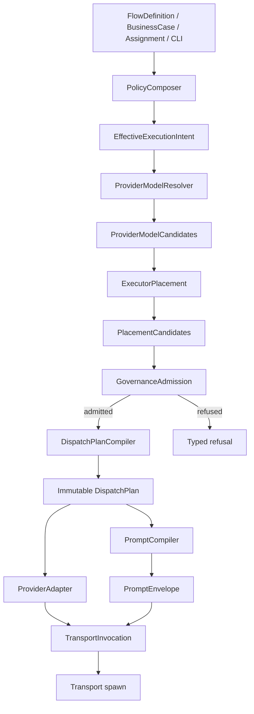

# Executor policy dispatch seams — detailed design

This design is the implementation contract for
`plans/260915-executor-policy-dispatch-seams/`. It is intentionally narrower
than the long-term architecture: each new concept enters in shadow/additive mode
before any legacy executor id or config field is removed.

## 1. Current problem

Current dispatch has the right high-level policy stack shape, but its vocabulary
is too small. `PolicyPatch` currently has `minTier`, `preferPersona`,
`preferExecutor`, `fallbackExecutors`, `visibility`, and `repeatMode`. There is
no first-class runtime effort, prompt/persona delivery, permission contract,
tool intent, provider preference, or placement policy.

Because the policy vocabulary cannot express those choices, `.fgos/config.json`
stores them in places that are easier to pass to a process:

- executor args encode model, effort, allowed tools, approval/sandbox mode;
- executor ids encode role and adapter, e.g. `claude-reviewer`,
  `claude-reviewer-herdr`, `codex-readonly`;
- executor `rigorOverrides` calibrate model strength per executor;
- capability overrides encode provider/model/tier choices and rationale.

This track adds the missing seams so later migration can shrink the executor
registry without changing behavior silently.

## 2. Target pipeline

The target pipeline is staged. Each stage owns one kind of decision and emits an
auditable value.



This track does not have to implement the full target pipeline in one pass. The
phase order deliberately starts with snapshot tests, ProviderAdapter shadow
rendering, PromptEnvelope, and alias/effort seams before moving to quality and
placement.

## 3. Object contracts

### 3.1 EffectiveExecutionIntent

Semantic requirements after policy composition, before placement.

```jsonc
{
  "businessCaseRef": "code.review@1",
  "personaRef": {
    "value": "code-reviewer@2",
    "source": {"scope": "actor", "id": "reviewer"}
  },
  "quality": {
    "minRigor": {"value": "high", "source": {"scope": "operation", "id": "review-candidate"}},
    "mode": {
      "value": "analytical",
      "source": {"scope": "persona", "id": "code-reviewer@2"},
      "sourceKind": "implied-by-persona"
    }
  },
  "reasoningEffort": {
    "value": "high",
    "source": {"scope": "derived", "id": "quality.minRigor.high"}
  },
  "toolIntent": {
    "value": ["read-code", "run-tests", "git-read"],
    "source": {"scope": "persona", "id": "code-reviewer@2"}
  },
  "permissionContract": {
    "value": "read-only",
    "source": {"scope": "operation", "id": "review-candidate"}
  },
  "visibility": {"value": "headless", "source": {"scope": "default"}}
}
```

Phase 00–03 do not need to construct this entire object. They should add
fields/provenance only where needed for snapshots, adapters, PromptEnvelope, and
alias expansion.

### 3.2 Quality

Quality replaces the mixed legacy policy-tier axis.

```text
minRigor: low | standard | high | critical
mode: balanced | creative | analytical | adversarial
```

Legacy bridge:

| legacy tier | canonical quality |
|---|---|
| lightweight | `{minRigor: low, mode: balanced}` |
| standard | `{minRigor: standard, mode: balanced}` |
| creative | `{minRigor: standard, mode: creative}` |
| analytical | `{minRigor: high, mode: analytical}` |
| critical | `{minRigor: critical, mode: analytical}` |

`minRigor` is ordinal. `mode` is nominal. Raise-only applies only to
`minRigor`.

Mode source precedence:

```text
explicit > implied-by-persona > implied-by-tier-bridge
```

Scope precedence is used only inside the same source kind.

### 3.3 reasoningEffort

Canonical runtime effort:

```text
low | medium | high | max
```

Default:

| minRigor | default reasoningEffort |
|---|---|
| low | low |
| standard | medium |
| high | high |
| critical | max |

Mode does not raise effort. Business cases/personas may set effort explicitly.

Unsupported effort handling uses:

```text
unsupportedOptionPolicy: omit-with-audit | reject | fallback
```

System default is `omit-with-audit` until a business case requires stricter
behavior.

### 3.4 PromptEnvelope

PromptEnvelope is the worker-visible prompt payload after persona/context/output
contract compilation.

```jsonc
{
  "delivery": "inline|file-pointer|system-and-user",
  "persona": {
    "ref": "code-reviewer@2",
    "digest": "sha256:...",
    "delivery": "system|section",
    "applied": true
  },
  "system": "optional system prompt",
  "sections": [
    {"id": "role", "title": "Role", "body": "..."},
    {"id": "objective", "title": "Objective", "body": "..."}
  ],
  "briefPath": ".fgos/assignments/.../brief-01.md"
}
```

Invariant: if resolved persona is non-null, PromptEnvelope must either include a
persona system payload or a persona/role section. The plan must record delivery
mode because system-slot and brief-section delivery are behaviorally different.

### 3.5 ProviderAdapter

ProviderAdapter translates canonical runtime options into provider-specific
invocation facts. It must be pure: no spawn, no file writes, no config mutation.

```ts
renderProviderInvocation({
  providerFamily,
  command,
  baseArgs,
  promptPlaceholder,
  model,
  promptEnvelope,
  runtimeOptions,
  executorFacts
}) -> {
  command,
  args,
  envPatch,
  applied,
  warnings
}
```

`applied` records whether each canonical option was applied, unsupported,
omitted, or degraded with audit:

```jsonc
{
  "model": "applied",
  "reasoningEffort": "applied|unsupported|omitted-with-audit",
  "toolIntent": "applied-via-allowedTools|unsupported",
  "readOnly": "applied-via-tool-gating|enforced-by-sandbox|unsupported",
  "persona": "system|section|unsupported"
}
```

Adapters also expose `policyShapedFlags[]`, e.g. `--model`, `--effort`,
`--allowedTools`, Codex `-s`, approval/sandbox flags, and provider-specific
dangerous bypass flags. Doctor/config validation uses this to warn when
executor identity hardcodes policy-shaped runtime behavior.

### 3.6 PlacementPolicy

PlacementPolicy owns provider/model/executor ranking and must replace, not add
to, these legacy sources:

- `capabilities.*.prefer`
- `capabilities.*.overrides.providerModel`
- `capabilities.*.overrides.rigorOverrides`
- executor `rigorOverrides` when used as model calibration

PlacementPolicy does not own same-provider account rotation. Provider Capacity
Rotator (`plans/260916-account-rotator/`) owns account inventory, leases,
quarantine, and credential provisioning. PlacementPolicy may consume its
structured capacity refusal as one signal for fallback, but it must not
configure account pools or choose provider accounts.

Target shape:

```jsonc
{
  "id": "code-review-placement@1",
  "match": {"businessCase": "code.review"},
  "providerPreference": {
    "prefer": ["claude", "openai-codex"],
    "allow": ["claude", "openai-codex"]
  },
  "modelCalibrationRef": "default-model-policies@1",
  "executorRanking": [
    {"profile": "claude-primary", "invocation": "headless"},
    {"profile": "codex-primary", "invocation": "bwrap"}
  ],
  "fallback": {"on": ["provider-capacity-refusal", "transient"], "maxAttempts": 2}
}
```

Phase 05 implements this in shadow mode only.

Fallback admission must re-check governance for every candidate: disallowed
providers, runtime class, confinement, tool/mutation policy, and cross-provider
permission must be admitted before launch. A provider lacking the required
runtime/invocation class is skipped, never silently downgraded.

### 3.7 ExecutorProfile and Invocation

ExecutorProfile answers “which principal/backend/trust boundary is this?”

```jsonc
{
  "id": "claude-primary",
  "identity": {
    "principalRef": "principal://claude-primary",
    "runtimeBackendRef": "backend://claude-cli",
    "trustDomain": "local-operator",
    "egressClass": "provider-only"
  },
  "supports": {
    "providerFamilies": ["claude"],
    "reasoningEffort": ["low", "medium", "high"],
    "systemPrompt": true,
    "toolGating": "allowedTools"
  },
  "invocations": [
    {
      "id": "headless",
      "adapter": "cli-spawn",
      "promptDelivery": "argv",
      "confinement": {"backend": "none"}
    },
    {
      "id": "visible",
      "adapter": "herdr-spawn",
      "promptDelivery": "file-pointer",
      "confinement": {"backend": "none"}
    },
    {
      "id": "bwrap",
      "adapter": "cli-spawn",
      "promptDelivery": "argv",
      "confinement": {"backend": "bwrap", "guarantees": ["host-write-denied"]}
    }
  ]
}
```

Identity must not be created from model, tier, effort, persona, role, business
case, visibility, prompt delivery, or argv flags. Confinement is normally an
invocation envelope; it becomes identity only if it changes principal, backend
trust, or egress boundary materially.

## 4. Scope precedence and field rules

Recommended precedence order:

```text
builtin defaults
< runner semantic defaults
< businessCase semantic defaults
< definition
< node
< operation
< role
< actor
< assignment
< cli/human
< operatorPin with authority
< governance admission/veto
```

Field rules:

| Field | Rule |
|---|---|
| `quality.minRigor` | raise-only |
| `quality.mode` | sourceKind precedence, then most-specific-wins |
| `reasoningEffort` | most-specific-wins, then governance may refuse above max |
| `personaRef` | most-specific-wins |
| `toolIntent[]` | union, then permission/confinement filtering |
| `permissionContract` | operation/business-case contract, validate conflict; not a normal alias payload |
| `provider/model/executor ranking` | PlacementPolicy, assignment/session/human/operator override where authorized |
| `model literal` | assignment/session/human/operator only, never portable FlowDefinition |
| `governance` | deny/refuse/require approval; never silent downgrade |

## 5. Legacy compatibility

### 5.1 Alias expansion

Legacy executor aliases expand at the caller’s original scope:

```jsonc
{
  "requestedExecutor": "claude-reviewer",
  "expandedAtScope": "cli",
  "viaAlias": "claude-reviewer",
  "patch": {
    "personaRef": "code-reviewer",
    "toolIntent": ["read-code", "run-tests", "git-read"],
    "reasoningEffort": "high"
  }
}
```

No separate `alias` precedence scope exists. Alias patches must not carry
permission contracts.

### 5.2 work.size → minRigor

Current `work.tier` should become `work.size` over time. The mapping from work
size to `minRigor` is a runner-scope semantic default, not a model catalog
concern and not placement.

Initial semantic compatibility:

```text
light -> low
standard -> standard
heavy -> critical
```

The exact compatibility result must be verified against Phase 00 snapshots
before changing catalog behavior.

### 5.3 Creative-column trap

The semantic tier and the model-calibration lookup tier are separate. Current
raw `agy-cli` and `agy-herdr` heavy work uses:

```text
semantic heavy -> critical
lookupPolicyTier creative -> gemini-3.8-flash-high
```

Current `fgos-coding-implement` calibration overrides the lookup tier to:

```text
lookupPolicyTier standard -> gemini-3.8-flash-medium
```

Therefore Phase 04 must retain both values in provenance. It must not derive
semantic `minRigor` from the calibration tier, and it must not re-key the live
catalog by `minRigor`. Any later change to the selected model is a PlacementPolicy
or calibration decision and must be named as an intentional behavior delta.

## 6. DispatchPlan evidence

The eventual DispatchPlan should snapshot the admitted result:

```jsonc
{
  "selector": {"type": "assignment", "value": "asgn_..."},
  "policy": {
    "persona": {"value": "code-reviewer@2", "source": "..."},
    "semanticTier": {"value": "heavy", "source": "..."},
    "quality": {
      "minRigor": {"value": "critical", "source": "..."},
      "mode": {"value": "...", "source": "..."}
    },
    "lookupPolicyTier": {
      "value": "creative",
      "source": {"kind": "calibration", "scope": "..."}
    },
    "reasoningEffort": {"value": "high", "source": "..."},
    "permissionContract": {"value": "read-only", "source": "..."}
  },
  "placement": {
    "provider": "claude",
    "model": {
      "value": "opus",
      "source": {"provider": "claude", "lookupPolicyTier": "..."}
    },
    "executorProfile": "claude-primary",
    "invocation": "visible",
    "confinement": {"backend": "none"},
    "reasonCodes": ["visibility=visible", "supports.effort.high"],
    "providerCapacity": {
      "status": "not-applicable|selected|refused",
      "refusalReason": "provider-capacity.exhausted-or-quarantined"
    }
  },
  "prompt": {
    "persona": {"ref": "code-reviewer@2", "delivery": "system", "digest": "sha256:..."}
  },
  "runtime": {
    "command": "claude",
    "args": ["...", "--effort", "high"],
    "envKeys": ["HOME"],
    "applied": {"reasoningEffort": "applied", "persona": "system"}
  }
}
```

Phase 00–03 may use a smaller runtime snapshot as long as it records enough to
prove behavior equivalence.

## 7. Migration sequencing

1. Baseline snapshots first.
2. ProviderAdapter shadow render, no production behavior change.
3. PromptEnvelope/persona propagation.
4. reasoningEffort and same-scope legacy aliases.
5. Quality split bridge.
6. PlacementPolicy shadow mode; consume Provider Capacity Rotator structured
   refusals, but do not change production binding.
7. ExecutorProfile/invocation vocabulary and doctor warnings.
8. PlacementPolicy production binder after shadow proof.
9. Retire `readOnlyExecutorRedirects` only after production PlacementPolicy
   proof.
10. Later migration: config entries, executor ids, and six-tier modelTier if
   still wanted.

No phase may claim “no behavior change” without comparing against the Phase 00
snapshot.

## 8. Tests expected across the track

- Snapshot test: executor/purpose × work-size → provider/model/argv/env/prompt
  delivery/confinement/read-only mechanism.
- ProviderAdapter unit tests: pure rendering and `applied` statuses.
- PromptEnvelope tests: resolved persona must reach prompt with delivery mode.
- Alias tests: alias patch applies at original scope with `viaAlias`.
- Quality tests: semantic-tier-derived minRigor raise-only; explicit
  minRigor-above-derived rejection; mode sourceKind precedence; separate
  `semanticTier` and `lookupPolicyTier` provenance.
- Placement shadow tests: legacy binding and shadow placement divergence are
  reported but not applied.
- Doctor/config tests: policy-shaped flags and executor `rigorOverrides` warn
  in the legacy window.

## 9. Out of scope until a later track

- Removing legacy executor ids.
- Rewriting `.fgos/config.json` to the final ExecutorProfile schema.
- Making PlacementPolicy the only production binder before Phase 07 proof.
- Hard-failing policy-shaped flags in executor args.
- Changing real provider/model choices without an intentional-delta decision.
- Moving account inventory or credential provisioning into PlacementPolicy.
