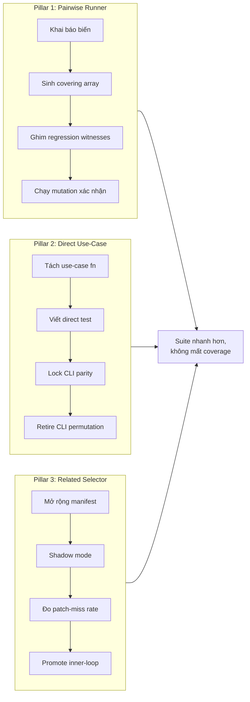
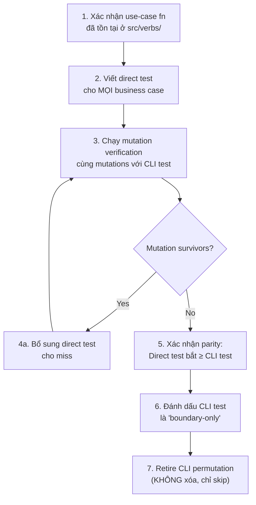
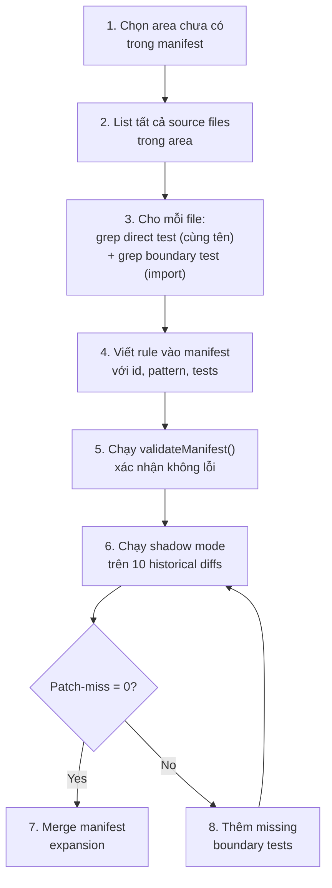

# Test Suite Optimization Plan — 3 Pillars

**Date:** 2026-09-22
**Branch:** `plan/test-suite-optimization-260922`
**Prerequisite reads:** `plans/reports/test-suite-cost-brainstorm-260920.md` (sections 3.8, 3.10, 9.3–9.7), `plans/reports/investigation-260922-duplication-combinatorial-git-boundary-audit.md`

> [!IMPORTANT]
> Đây là plan thiết kế, KHÔNG phải implementation. Mọi con số đều dựa trên
> bằng chứng đo thật từ investigation report. Plan này cần được duyệt trước
> khi bất kỳ code nào được viết.

---

## Tổng quan 3 trụ cột



---

## Pillar 1: Pairwise / Covering-Array Test Runner

### 1.1 Vấn đề

Investigation audit (batch 2) xác nhận: chi phí test phình to không phải vì
trùng lặp mà vì **bùng nổ tổ hợp (Combinatorial Explosion)**.

| Cụm | Biến × giá trị | Cartesian | Pairwise | Nén |
|-----|----------------|-----------|----------|-----|
| `read` (list view) | 6×3×3×4 | 216 | 24 | 89% |
| `stage` (plan verb) | 4×3×2×3 | 72 | 12 | 83% |
| `merge` (merge next) | 3×3×4×3×3 | 324 | 12 | 96% |

### 1.2 Thiết kế

#### 1.2.1 Schema khai báo (`test/covering/schema.mjs`)

Mỗi cụm khai báo biến, giá trị, và ràng buộc:

```js
export const MERGE_NEXT_SCHEMA = {
  id: 'merge-next',
  prodFile: 'src/verbs/merge/merge.mjs',
  variables: [
    { name: 'readyPool',    values: ['empty', '1', 'n'] },
    { name: 'blockedPool',  values: ['empty', '1', 'n'] },
    { name: 'ironLawGate',  values: ['pass', 'fail', 'ack', 'warn'] },
    { name: 'syncOutcome',  values: ['synced', 'conflict', 'dirty'] },
    { name: 'source',       values: ['runner', 'pull', 'legacy'] },
  ],
  // Pinned regression witnesses: NEVER removed by the generator.
  // Each entry maps to a specific historical bug with its own ticket ID.
  pinnedCombinations: [
    { readyPool: 'n', blockedPool: '1', ironLawGate: 'fail', syncOutcome: 'dirty', source: 'runner',
      witness: 'M2-sync-root-fallback', ticket: 'tsk-49i' },
    { readyPool: '1', blockedPool: 'n', ironLawGate: 'ack', syncOutcome: 'synced', source: 'pull',
      witness: 'M1-iron-law-bypass', ticket: 'approve-review-20260717' },
  ],
  // Constraints: impossible combinations to exclude
  constraints: [
    // sync-root fallback only triggers when ready pool is empty
    { if: { readyPool: ['1', 'n'] }, then: { syncOutcome: { not: ['dirty'] } } },
  ],
};
```

#### 1.2.2 Bộ sinh Covering Array (`src/test-infra/covering-array.mjs`)

Thuật toán: **IPOG (In-Parameter-Order General)** cho t-wise (t=2 mặc
định, có thể nâng lên 3 cho cụm rủi ro cao).

```js
/**
 * @param {Schema} schema - khai báo biến, giá trị, pinned, constraints
 * @param {number} strength - t-wise coverage level (default 2)
 * @returns {Array<Record<string, string>>} - mảng tổ hợp cần test
 */
export function generateCoveringArray(schema, strength = 2) {
  // 1. Validate pinnedCombinations against schema & constraints
  // 2. Sinh bảng IPOG cho `strength`-wise (tuân thủ constraints)
  // 3. Inject/merge valid pinnedCombinations vào mảng
  // 4. Trả về mảng tổ hợp cuối cùng
}
```

**Đặc tính quan trọng:**
- `pinnedCombinations` luôn được giữ nguyên, NHƯNG phải hợp lệ (không chứa data khiến test đi sai nhánh invariant như `readyPool: 'n'` cho nhánh sync-root).
- Mỗi test case sinh ra mang metadata: `{ combination, isPinned, witnessId }`.
- Output của generator là **deterministic** (cùng schema → cùng array) — không dùng random.

#### 1.2.3 Independent Coverage Verifier

Không kiểm tra IPOG bằng chính nó. Bắt buộc xây dựng một verifier độc lập:
1. Liệt kê toàn bộ các valid `t`-tuple theo schema và constraints.
2. Với mỗi tuple, assert có ít nhất một dòng trong array sinh ra chứa nó.
3. Validate pinned combinations hợp lệ trước. Phải sửa schema/pinned nếu chúng mâu thuẫn nhau.
4. KHÔNG dùng PICT. Dùng thuật toán vét cạn (brute-force tuple generator) độc lập để chứng minh array của IPOG bao phủ đủ các pair hợp lệ.
5. Phải có property/fuzz test trên nhiều schema nhỏ đối chiếu với brute-force verifier.

#### 1.2.4 Runner tích hợp (`test/covering/runner.mjs`)

```js
import { generateCoveringArray } from '../../src/test-infra/covering-array.mjs';
import { MERGE_NEXT_SCHEMA } from './schema.mjs';
// D-OPT-08: Golden snapshot chứa expected outcomes đã được review bằng mắt
import EXPECTED_OUTCOMES from './snapshots/merge-next-outcomes.json';

const combos = generateCoveringArray(MERGE_NEXT_SCHEMA);
// combos = [{ readyPool: 'empty', blockedPool: '1', ... }, ...]

for (const combo of combos) {
  // Test identity (stability): Generated cases dùng hash, pinned dùng witness ID
  const testName = combo._isPinned ? `witness/${combo._witnessId}` : `gen/${hash(combo)}`;
  test(`merge next: ${testName}`, async (t) => {
    const fixture = buildFixtureForCombo(combo); // deterministic factory
    const result = await mergeNext(fixture.ctx, fixture.opts);
    
    // Assert expected outcome từ snapshot, tránh mất context khi generate
    const expected = EXPECTED_OUTCOMES[testName];
    assertExpectedOutcome(t, expected, result);
  });
}
```

#### 1.2.5 Xác nhận bằng Mutation

Mutation-test chính generator/verifier. Khi đánh giá các production mutations, chạy covering tests riêng rẽ, không để old suite chạy chung bắt lỗi che lấp điểm mù của generator.

### 1.3 Phạm vi Phase 1

| Cụm ưu tiên | File sản xuất | Lý do |
|--|--|--|
| `merge next` | `src/verbs/merge/merge.mjs` | Nén cao nhất (324→12), rủi ro cao |
| `stage` (plan) | `src/verbs/state/stage.mjs` | Nén 83%, logic FSM nhiều tổ hợp |
| `read` (list) | `src/verbs/state/read.mjs` | Nén 89%, test/LOC ratio cao nhất |

**KHÔNG LÀM ngay:** `approve` (966 LOC, quá lớn để pilot đầu tiên).

### 1.4 Rủi ro & Mitigation

| Rủi ro | Mức | Mitigation |
|--------|-----|-----------|
| IPOG implementation bug | Cao | Bắt buộc có **Independent Coverage Verifier** (brute-force mọi valid tuple) |
| Pairwise bỏ lọt 3-way interaction bug | Trung bình | Mutation verification cô lập; ghim regression witness |
| Mất regression witness | Cao | Validate pinned cases trước khi gen; track bằng `ticket` ID |
| Test identity stability (tên đổi) | Trung bình | Pinned có ID cố định. Generated cases là ephemeral (CI track theo schema/invariant, không per-test) hoặc snapshot. |

### 1.5 Definition of Done — Pillar 1

- [ ] `covering-array.mjs` xuất hàm `generateCoveringArray()` với test riêng.
- [ ] Independent Verifier hoàn chỉnh.
- [ ] Ít nhất 1 cụm (`merge next`) có schema + runner hoàn chỉnh.
- [ ] Mutation verification qua 4 mutation, 0 survivor (chạy riêng biệt).
- [ ] Pinned regression witnesses có ticket ID tracing.
- [ ] Test cũ chưa bị xóa — chỉ có thêm covering-array tests chạy song song.
*(Lưu ý: Chạy song song chỉ là bước độ đo. DoD cuối cùng của retirement phase là phải gỡ test cũ, không chạy song song mãi).*

### 1.6 Ước tính effort

| Task | Effort |
|------|--------|
| `covering-array.mjs` (IPOG) + unit tests | 2-3 ngày |
| Independent Verifier | 1-2 ngày |
| Schema cho 3 cụm | 1 ngày |
| Fixture factory / Mutation verification | 1 ngày |
| **Tổng Phase 1** | **~9-11 ngày** |

---

## 1.5 (MỚI) IMMEDIATE WAVE 0: Xoá Copy-Paste Duplicates

Đo đạc độc lập phát hiện **4 file test là bản copy nguyên văn** do catch-up merge lỗi ngày 2026-08-24 (commit 0a604617):
- `test/cli/fgos-merge-2.test.mjs` (30 test copy)
- `test/cli/fgos-return-2.test.mjs` (14 test copy)
- `test/cli/fgos-return-3.test.mjs` (14 test copy)
- `test/cli/fgos-return-4.test.mjs` (11 test copy)

Tổng cộng 69 test đang chạy 2 lần, chiếm ≈45s wall clock, rủi ro xoá bằng 0. (Lưu ý: Tiền đề "investigation xác nhận không trùng lặp" đã sai do script audit có thể chỉ chạy 1 trong 2 file).

**Action:** Xoá 4 file này NGAY LẬP TỨC trước khi làm Pillar nào.

---

## Pillar 2: Direct Use-Case Extraction (Giảm thời gian chạy 99%)

### 2.1 Vấn đề

Hiện tại có 1,483 call site tĩnh gọi `run(cwd, ['verb', ...])` trong `test/cli/`.
Mỗi lần spawn Node process tốn overhead khởi tạo.

**Số liệu đo thực tế (Hypothesis bounds):**
- **CLI subprocess median:** ~150ms/process.
- **Spawn multiplier:** Mỗi CLI test thường gọi addOk, move → spawn ~3.1 process/test trung bình.
- Tức là 1 test case tốn 3.1 × 150ms = ~465ms wall clock.
- **Direct use-case median:** 69ms–126ms (trừ case fail nhanh). 
- Direct test setup (addWork in-process) không spawn process nào, tiết kiệm toàn bộ ~300ms setup overhead.

=> **Hypothesis:** Cắt giảm 160 CLI tests có thể loại bỏ 160 × 3.1 ≈ 500 subprocess, tiết kiệm ~40-45s wall clock.
Cần instrument toàn bộ suite (runtime invocation count, elapsed/user/sys per subprocess) để xác định saving thật sự. Không extrapolating tuyến tính.

### 2.2 Thiết kế

#### 2.2.1 Kiến trúc 2 tầng test

```
┌─────────────────────────────────────────────┐
│  Tầng 1: Direct Use-Case Tests              │
│  (test/direct/*.test.mjs)                    │
│  • Import trực tiếp: editUseCase, planUseCase│
│  • Fixture: tmpDir + addWork (in-process)    │
│  • Speed: Tiết kiệm ~50ms/test               │
│  • Chứa: MỌI business permutation           │
└─────────────────┬───────────────────────────┘
                  │ Parity lock
┌─────────────────▼───────────────────────────┐
│  Tầng 2: CLI Boundary Witness Tests          │
│  (test/cli/*.test.mjs — giữ nguyên)         │
│  • Gọi: run(cwd, ['verb', ...])              │
│  • Chứa: CLI-specific concerns ONLY          │
│    - Argument parsing (bad flags, --help)     │
│    - Exit code mapping                        │
│    - Envelope serialization                   │
│    - Cwd/env resolution                       │
│    - Git worktree interaction                  │
└─────────────────────────────────────────────┘
```

#### 2.2.2 Phân tách trách nhiệm (Responsibility Matrix)

Thay vì phân loại nhị phân, dùng **Responsibility Matrix**. MỘT test case có thể mang nhiều trách nhiệm. Nếu test bị "mixed" (vd: parse argv xong assert business domain), BẮT BUỘC split làm hai trước khi migrate, hoặc giữ nguyên làm boundary.

| Trách nhiệm | Xử lý bằng Direct Test | Giữ CLI Witness |
|---|---|---|
| **Domain/store invariant** | Đầy đủ | 1-K representative cases |
| **Argv coercion / empty / conflicting** | Không | Bắt buộc giữ CLI test |
| **Error category → exit code / stderr** | Không | Bắt buộc giữ CLI test |
| **Cwd/Env/Git root resolution** | Không | Bắt buộc giữ CLI test |
| **Adapter-generated semantic value** | Extract hẹp lại, hoặc Không | Bắt buộc giữ CLI test |

Ví dụ: `edit --parent closing a cycle`. CLI bắt message lỗi user-facing và exit code. Direct bắt domain invariant (FSM block cycle). Phải split thành 2 test riêng.

##### 2.2.3 Quy trình migrate 1 verb (Vượt rào cản `bin/fgos.mjs`)

**Cảnh báo:** Hiện tại rất nhiều logic (vd: arg parsing thành list decision, `verify-from-children`, validations) đang nằm **inline** trong `bin/fgos.mjs`. `AGENTS.md` **chỉ cấm rename/relocate file này**, KHÔNG cấm sửa nội dung.

1. **Extract Inline Logic (Bắt buộc):** Chuyển logic từ `bin/fgos.mjs` vào các function hẹp trong `src/verbs/<area>/<verb>.mjs`. 
2. **Xác định Use-Case:** Đảm bảo `src/verbs/<area>/<verb>.mjs` đã export function nhận `(ctx, opts)`. Chú ý `addWork` direct hiện không nhận shape y hệt CLI `add`, cần cẩn thận khi setup fixture.
3. **Tạo Direct Test File:** Tạo `test/direct/fgos-<verb>.test.mjs`.
4. **Clone & Split:** Copy test từ CLI sang, đổi thành import trực tiếp. Nếu test mixed (parse + business), BẮT BUỘC split làm 2 test theo ma trận trên.
5. **Retire (t.todo):** Các CLI test cũ (phần business) sẽ chuyển thành `test.todo()`.



**Ràng buộc cứng từ brainstorm (ITR-D10, RUL37):**
- KHÔNG tạo global `runCli(argv, ctx)` core.
- KHÔNG thay đổi `bin/fgos.mjs`.
- CLI test bị retire phải được mark `{ skip: true, reason: 'migrated-to-direct' }`,
  KHÔNG xóa — để có thể bật lại bất cứ lúc nào.

#### 2.2.4 Direct test factory pattern

```js
// test/direct/helpers/use-case-harness.mjs
import { tmpCwd } from '../../cli/helpers/fgos-cli-harness.mjs';
import { addWork } from '../../../src/state/store.mjs';

/**
 * Tạo môi trường in-process cho direct use-case test.
 * Dùng cùng tmpCwd() đã có sẵn (không git, chỉ fs).
 */
export function directFixture({ items = [] } = {}) {
  const cwd = tmpCwd();
  const dir = path.join(cwd, '.fgos');
  fs.mkdirSync(dir, { recursive: true });
  // Bootstrap items in-process (no subprocess)
  for (const item of items) {
    addWork(dir, item);
  }
  return { cwd, dir };
}
```

### 2.3 Phạm vi Phase 1

| Verb | Use-case fn | CLI tests hiện tại | Ước tính direct tests | CLI tests giữ |
|------|-------------|---------------------|----------------------|---------------|
| `edit` | `editUseCase` | 58 | ~40 business | ~18 CLI-boundary |
| `read` (list/graph/stale) | `graphUseCase`, `workflowUseCase`, `gateCheckUseCase`, `staleUseCase` | 103 | ~70 business | ~33 CLI-boundary |
| `stage` (discover/plan) | `discoverUseCase`, `planUseCase` | 71 | ~50 business | ~21 CLI-boundary |

**KHÔNG LÀM ngay:** `approve`, `merge`, `return` (cần git thật, ranh giới
phức tạp hơn nhiều).

### 2.4 Parity Lock Mechanism

Sau khi migrate xong 1 verb, thêm 1 parity test:

```js
// test/parity/edit-parity.test.mjs
test('parity: editUseCase result matches CLI edit output for representative inputs', () => {
  const cwd = tmpCwd();
  addOk(cwd, 'parity-item');

  // Direct
  const directResult = editUseCase(
    { dir: path.join(cwd, '.fgos') },
    { id: 'parity-item', patch: { risk: 'heavy' } }
  );

  // CLI
  const cliResult = run(cwd, ['edit', 'parity-item', '--risk', 'heavy']);
  const cliData = envelopeData(cliResult.stdout);

  // Same semantic result
  assert.equal(cliResult.status, 0);
  assert.equal(directResult.id, cliData.id);
  assert.deepEqual(directResult.fields, cliData.fields);
});
```

### 2.5 Rủi ro & Mitigation

| Rủi ro | Mức | Mitigation |
|--------|-----|-----------|
| Direct test bỏ lọt CLI-specific bug | Trung bình | Parity lock test bắt buộc cho mỗi verb |
| Factory fixture drift từ harness fixture | Thấp | Dùng cùng `tmpCwd()`, `addWork()` đã có |
| Scope creep — migrate quá nhiều verb cùng lúc | Trung bình | Phase 1 chỉ 3 verb (edit, read, stage) |

### 2.6 Definition of Done — Pillar 2

- [ ] `test/direct/` directory với helpers và ít nhất 1 verb (edit) hoàn chỉnh.
- [ ] Parity lock test cho verb đó.
- [ ] Mutation verification: direct tests bắt ≥ CLI tests trên cùng mutations.
- [ ] CLI permutation tests mark `skip` (không xóa), full suite vẫn green.
- [ ] Đo thời gian chạy trước/sau cho cụm đã migrate.

### 2.7 Ước tính effort

| Task | Effort |
|------|--------|
| `test/direct/helpers/` harness | 1 ngày |
| Migrate `edit` (40 direct tests + parity + mutation) | 2-3 ngày |
| Migrate `read` (70 direct tests + parity) | 3-4 ngày |
| Migrate `stage` (50 direct tests + parity) | 2-3 ngày |
| **Tổng Phase 1** | **~9-11 ngày** |

---

## Pillar 3: Related Selector Expansion + Promotion

### 3.1 Hiện trạng

Đã có `scripts/test-select.mjs` (P04) hoạt động ở **shadow mode** với:
- Ownership manifest: 51 rules trong `test/test-ownership.mjs`
- Full triggers: 18 prefix/exact rules
- Shadow runner: `npm run test:related:shadow` chạy related rồi full, so sánh

**Nhưng manifest chỉ cover ~51/359 file** (~14%). Mọi file ngoài manifest →
unknown → escalate → full suite. Selector hầu như luôn escalate.

### 3.2 Thiết kế mở rộng

#### 3.2.1 Mở rộng manifest — 4 area mới

| Area | Files | Pattern | Direct Tests | Boundary Tests |
|------|-------|---------|-------------|----------------|
| `src/verbs/state/*` | 4 files | exact | `test/cli/fgos-edit*.test.mjs`, `test/cli/fgos-read*.test.mjs`, `test/cli/fgos-stage*.test.mjs`, `test/cli/fgos-move.test.mjs` | `test/state/store.test.mjs` |
| `src/verbs/merge/*` | 8 files | exact | `test/cli/fgos-approve*.test.mjs`, `test/cli/fgos-merge*.test.mjs` | `test/evolve/iron-law.test.mjs` |
| `src/runner/dispatch/*` | 39 files | prefix | `test/runner/dispatch.test.mjs` | `test/runner/dispatch-*.test.mjs` |
| `src/state/*` (đã có 1 phần) | thêm ~20 files | exact | mapping 1:1 đã audit | boundary từ CLI tests |

**Target:** Từ 51 rules lên ~120 rules, covering ~60% source files.

#### 3.2.2 Quy trình mở rộng manifest



#### 3.2.3 Shadow evaluation pipeline
 
 Trước khi promote selector ra inner-loop, phải chạy đánh giá trên lịch sử
 commit thật:
 
 ```bash
 # Lấy 50 commit gần nhất có thay đổi src/
 git log --oneline -50 --diff-filter=M -- 'src/**' > /tmp/commits.txt
 
 # Cho mỗi commit: checkout, chạy related, chạy full, so sánh
 for sha in $(cat /tmp/commits.txt | awk '{print $1}'); do
   git checkout $sha
   npm run test:related:shadow -- --base $sha~1 --explain 2>&1 | \
     grep "patchRelatedMiss"
 done
 ```
 
 **Ngưỡng promote:** 0 patch-related miss trên ≥50 historical diffs liên tục.
 
+**Circuit Breaker Vận Hành:**
+Sau promotion, CI BẮT BUỘC phải chạy một job có semantics của `runShadow()` (chạy related -> bắt result -> chạy full -> compare). Nếu related green mà full red, bắn alert và tự động demote về shadow mode (sửa package.json). Mọi pipeline CI cuối cùng (DoD) luôn chạy full suite.
+
 #### 3.2.4 Promotion path
 
 ```
-Shadow mode (hiện tại)
+Shadow mode (hiện tại, CI chạy thử)
   ↓ 0 miss trên 50 diffs
 Inner-loop mode (npm run test:related)
   ↓ 0 miss trên 200 diffs + 2 tuần production
 DoD supplement (chạy related trước, full sau — giảm wait time)
   ↓ (Không bao giờ)
 Full replacement (KHÔNG BAO GIỜ — ITR-D01: npm test = full suite)
 ```
 
 ### 3.3 Phạm vi Phase 1
 
 1. **Mở rộng manifest** thêm `src/verbs/state/*` và `src/verbs/merge/*` (2 area, ~20 rules mới).
 2. **Shadow evaluation** trên 50 historical diffs.
 3. **Nếu 0 miss:** promote `src/verbs/state/*` ra inner-loop (chỉ area này).
 
 ### 3.4 Rủi ro & Mitigation
 
 | Rủi ro | Mức | Mitigation |
 |--------|-----|-----------|
 | Manifest miss → false green | Cao | Shadow mode bắt buộc, full suite vẫn là DoD |
 | Manifest maintenance burden | Trung bình | Lint CI check: file mới phải có rule |
 | Over-escalation (luôn chạy full) | Thấp | Đo escalation rate, target ≤30% |
 
 ### 3.5 Definition of Done — Pillar 3
 
 - [ ] Manifest mở rộng lên ≥80 rules, `validateManifest()` green.
 - [ ] Shadow evaluation trên ≥50 diffs, 0 patch-related miss.
 - [ ] Escalation rate ≤50% trên 50 diffs (≥50% related decisions).
 - [ ] Tài liệu hướng dẫn: cách thêm rule khi viết module mới.
 
 ### 3.6 Ước tính effort
 
 | Task | Effort |
 |------|--------|
 | Mở rộng manifest (+30 rules) | 2 ngày |
 | Shadow evaluation script + run | 1 ngày |
 | Historical diff replay (50 commits) | 1 ngày chạy |
 | Lint CI cho manifest completeness | 1 ngày |
 | **Tổng Phase 1** | **~5-6 ngày** |
 
 ---
 
 ## Appendix A: Hạ tầng hiện có mà plan tái sử dụng
 
 ### A.1 Fixture infrastructure cho Pillar 2 (đã tồn tại, không cần viết mới)
 
 | Helper | File | Mô tả | Dùng cho |
 |--------|------|-------|---------|
 | `tmpCwdFast()` | `fgos-cli-harness.mjs` | Tạo dir + init `.fgos/` **in-process** (không subprocess) | Direct test fixture — thay thế `tmpCwd()` |
 | `tmpCwdFromTemplate()` | `fgos-cli-harness.mjs` | Cache pre-init `.fgos/` template, copy bằng `fs.cpSync` | Nhanh nhất cho batch test |
 | `initFgosFixtureInProcess(cwd)` | `fgos-cli-harness.mjs` | Gọi `initStore()` + `writeCoexistenceManifest()` trực tiếp | Building block cho các helper khác |
 | `moveToDurableDoingForTest(cwd, id)` | `fgos-cli-harness.mjs` | Append raw `work.move` event + `rebuild()` — bypass FSM | Giả lập trạng thái `doing` không cần `take` |
 | `releaseClaimFor(cwd, id)` | `fgos-cli-harness.mjs` | Gọi `releaseClaim()` in-process | Giả lập claim release không cần git |
 | `addOk(cwd, id)` | `fgos-cli-harness.mjs` | Shortcut `run(['add', ...])` với defaults | Vẫn dùng cho cả CLI lẫn direct tests |
 
 **Kết luận:** Pillar 2 KHÔNG cần viết `test/direct/helpers/use-case-harness.mjs`
 từ đầu. Đã có sẵn `tmpCwdFast()` + `moveToDurableDoingForTest()` + các store
 imports (`addWork`, `editWork`, `moveWork` từ `src/state/store.mjs`). Pattern
 hoàn chỉnh đã được chứng minh ở `test/state/store.test.mjs` (67 tests, tất cả
 in-process, dùng `tmpDir()` + direct imports).
 
 ### A.2 Tiền lệ: `fgos-read-5.test.mjs` đã gọi use-case trực tiếp
 
 ```js
 // Đã tồn tại trong codebase — KHÔNG phải đề xuất mới
 import { graphUseCase, staleUseCase } from '../../src/verbs/state/read.mjs';
 ```
 
 File `test/cli/fgos-read-5.test.mjs` đã import và gọi `graphUseCase()`,
 `staleUseCase()` trực tiếp bên cạnh các `run(cwd, ['graph', ...])` tests.
 Đây là bằng chứng sống rằng mô hình 2-tầng (Pillar 2) đã hoạt động trong
 production test suite, chỉ cần mở rộng ra các verb khác.
 
 ### A.3 Constraint quan trọng cho Pillar 3: `FULL_TRIGGERS`
 
 Selector hiện tại có các prefix escalation rules cứng:
 
 ```js
 // test/test-ownership.mjs — FULL_TRIGGERS (excerpt)
 { id: 'verbs-merge', prefix: 'src/verbs/merge/',
   reason: 'excluded from this pilot — boundary-test mapping for the
   approve/merge gate was not completed with confidence' },
 { id: 'setup-registry', prefix: 'src/setup/', ... },
 { id: 'bin-entry', prefix: 'bin/', ... },
 ```
 
 **Hệ quả:** Bất kỳ thay đổi nào trong `src/verbs/merge/` (approve, merge,
 sync-root, review, reject...) sẽ **luôn chạy full suite** bất kể manifest
 có rule hay không. Pillar 3 Phase 1 chỉ có thể tránh escalation cho
 `src/verbs/state/` và `src/state/` — merge area phải đợi Phase 2 khi
 boundary-test mapping đủ tin cậy để gỡ FULL_TRIGGER.
 
 **Impact lên effort estimate:** Pillar 3 Phase 1 sẽ chỉ cải thiện inner-loop
 cho ~40% source changes (state/report/intake areas). Merge/approve area (~20%
 changes) vẫn chạy full. Cần đo escalation rate thực tế trên 50 diffs trước
 khi quyết định có đáng promote hay không.
 
 ### A.4 `approveUseCase` — guard sequence phức tạp nhất
 
 `approveUseCase` (966 LOC, 12 guard layers) hiện KHÔNG được test nào gọi
 trực tiếp — tất cả 68+ approve tests đều qua `run(cwd, ['approve', ...])`.
 Đây là cơ hội lớn nhất cho Pillar 2 nhưng cũng rủi ro cao nhất:
 
 - 12 guards theo thứ tự nghiêm ngặt (option resolution → item existence →
   status check → session worktree → main worktree → drift → resolved-root →
   iron law → github transport → runner merge → pull/legacy verify →
   post-success fault).
 - Nhiều guard cần git thật (branch exists, merge, clean tree check).
 - **Khuyến nghị:** Để `approve` ở Phase 2 của Pillar 2, sau khi pattern đã
   được chứng minh trên `edit`/`read`/`stage`.
 
 ---
 
-## Thứ tự triển khai (D-OPT-05)
+## Thứ tự triển khai (Độc Lập)
 
 ```mermaid
 flowchart LR
-  P2P1["① Pillar 2\n(Direct Use-Case)\n9-11d"] --> P3P1["② Pillar 3\n(Selector Expansion)\n5-6d"]
-  P3P1 --> P1P1["③ Pillar 1\n(Pairwise Runner)\n8-10d"]
+  P2P1["Pillar 2\n(Direct Use-Case)\n9-11d"]
+  P3P1["Pillar 3\n(Selector Expansion)\n5-6d"]
+  P1P1["Pillar 1\n(Pairwise Runner)\n9-11d"]
 
-  style P2P1 fill:#26d,stroke:#000,color:#fff
-  style P3P1 fill:#2d6,stroke:#000,color:#fff
-  style P1P1 fill:#d62,stroke:#000,color:#fff
 ```
 
-1. **Pillar 2 trước** (9-11 ngày) — giảm CPU thật, hạ tầng sẵn sàng, nền
-   móng cho Pillar 1.
-2. **Pillar 3 tiếp** (5-6 ngày) — cải thiện inner-loop, manifest cập nhật
-   cho `test/direct/` vừa tạo ở Pillar 2.
-3. **Pillar 1 cuối** (8-10 ngày) — nén tổ hợp, cần business tests đã ở
-   in-process (Pillar 2) để covering-array runner có ý nghĩa.
+Ba Pillar có thể chạy **ĐỘC LẬP** (Decoupled), không block nhau:
+1. **Pillar 2** (9-11 ngày) — ROI cao. Instrument toàn suite trước (Wave 0) để đo baseline.
+2. **Pillar 3** (5-6 ngày) — Cải thiện inner-loop.
+3. **Pillar 1** (9-11 ngày) — Nén tổ hợp. CÓ THỂ pilot bằng real Git fixture hoặc narrow subprocess nếu Pillar 2 chưa xong. Không đợi Pillar 2.
 
-**Tổng Phase 1: ~22-27 ngày. Chỉ 2 pillar: Pillar 2 + 3 = ~15-17 ngày.**
+**Tổng Phase 1: ~23-28 ngày.** Ưu tiên triển khai Pillar 2 và 3 trước để đạt ROI về CPU và wait time.
 
 ---
 
 ## Ràng buộc bất biến (không thể đổi)
 
 1. **ITR-D01:** `npm test` luôn là full suite, không bao giờ bị thay thế.
 2. **ITR-D13:** Số lượng test không phải signal để xóa. Xóa test cần mutation proof.
 3. **ITR-D14:** Framework là `node:test`, không chuyển sang Vitest/Jest.
 4. **RUL37 (AGENTS.md):** Không tạo global `runCli`. `bin/fgos.mjs` không đổi.
 5. **Brainstorm §2:** Một test chỉ dư thừa khi cùng invariant, cùng production
    guard, cùng boundary, cùng failure mode — không bao giờ dựa trên tên hay đếm.
 6. **Investigation finding:** Ranh giới git/non-git đã đúng (2% "ăn theo"), không
    cần thay đổi.
 
 ---
 
 ## Quyết định đã khóa
 
 ### D-OPT-01: IPOG viết tay (không dùng thư viện ngoài)
 
 **Quyết định:** Viết IPOG generator bằng JS thuần (~150-200 LOC) trong
 `src/test-infra/covering-array.mjs`.
 
 **Lý do:**
 - `pinnedCombinations` là yêu cầu cứng — không thư viện nào hỗ trợ native.
 - Thêm binary (`pict`) hoặc npm package tạo infra dependency phải register
   vào `fgos doctor` (AGENTS.md install/setup/doctor gate). (Lưu ý: PICT thực tế cũng không có trên môi trường này).
 - Xây dựng **Independent Coverage Verifier** vét cạn thay vì dùng PICT làm oracle so sánh, vì so sánh string 2 mảng output khác nhau là sai bản chất coverage.
 
 ### D-OPT-02: Retire CLI test bằng `test.todo()` (không `skip`, không comment)
 
 **Quyết định:** CLI permutation test đã migrate sang direct sẽ được chuyển
 thành `test.todo('tên — migrated to test/direct/....')`.
 
 **Lý do:**
 - `test.todo()` xuất 1 dòng `ℹ todo` trong output, đếm riêng (`todo: N`)
   trong summary — không noise như `skip`, không mất track như comment out.
 - Ngữ nghĩa đúng: "test này tồn tại, đã xử lý ở chỗ khác, giữ làm tham
   chiếu" — khác `skip` ("đáng chạy nhưng tạm bỏ qua").
 - `todo` count là progress metric tự nhiên cho migration (giảm `todo` =
   migration tiến triển).
 
 ### D-OPT-03: Không Replay Lịch Sử, Chạy Shadow CI trên Active PRs
 
 **Quyết định:** Bỏ phương án historical diff replay. Circuit breaker hoạt động thông qua CI trên các Active PRs. CI chạy `runShadow()` trên PR, nếu sinh ra `patchRelatedMiss`, báo lỗi và cấm promote.
 
 **Lý do:**
 - Commit lịch sử (đã merge) luôn có full suite green, nên `patchRelatedMiss (related green && full red)` là điều không thể xảy ra trên lịch sử. Đo trên lịch sử = 100% false safety.
 - Historical replay phá hỏng `~/.fgos/config.json`.
 - Commit rate thực tế 68-117/tuần, không phải 15-20. 2-3 tuần chạy shadow CI trên PR là đủ statistical confidence.
 
 ### D-OPT-04: Manifest do tác giả module maintain, enforced bằng CI lint warning
 
 **Quyết định:** Tác giả file sản xuất mới chịu trách nhiệm thêm rule vào
 `test/test-ownership.mjs`. CI lint **warn** (không block) nếu diff chứa
 `src/**/*.mjs` mới mà không có rule tương ứng.
 
 **Lý do:**
 - Warning-only (giống ITR-D15) — giai đoạn đầu, block CI vì manifest
   thiếu sẽ khiến contributor ghét selector trước khi nó kịp prove value.
 - Đo compliance rate trong 1 tháng → ratchet lên block sau khi đã ổn
   định.
 - Không dùng auto-discovery (ITR-D07): static graph chỉ được ADD, không
   được là nguồn sự thật duy nhất.
 
 ### D-OPT-05: Budget — Pillar hoạt động Độc Lập, Ưu tiên 2 & 3
 
 **Quyết định:** Decouple các Pillar, loại bỏ dependency cứng.
 - Pillar 1 có thể thí điểm trên các Pure cluster hoặc dùng Real Git fixture/subprocess nếu cần, không bị block bởi Pillar 2.
 - Về mức độ ưu tiên resource: Ưu tiên Pillar 2 (Instrument Wave 0 + Migrate) và Pillar 3 (Shadow CI).
 
 **Lý do:**
 - Priority #1 "Ship Faster" (D-ADR0030): giảm thời gian chạy test = giảm
   thời gian mỗi cycle cho MỌI người, MỌI lúc.
 - Rủi ro từ delay/revert của một dự án (như behavioral drift trong P2) không được phép cản trở tiến độ của dự án kia (P1 generator logic).
 
 **Tổng Phase 1 cả 3 pillar: ~23-28 ngày.**
 Nếu resource giới hạn: tập trung Pillar 2 + 3 (~14-17 ngày).

 ### D-OPT-06: Phân tách Responsibility Matrix (thay vì Binary CLI/Business)
 
 **Quyết định:** Các test hiện tại thường mix trách nhiệm (parsing + business logic). Bắt buộc phải TÁCH (split) test mixed thành 2 test rời trước khi migrate: một direct test check invariant, một CLI test check parsing/exit code. Nếu không split được, test giữ nguyên tính chất boundary.
 
 ### D-OPT-07: Independent Coverage Verifier cho IPOG
 
 **Quyết định:** Không lấy PICT so từng dòng với IPOG. Sẽ xây dựng Verifier độc lập duyệt toàn bộ t-tuple hợp lệ để quét output của generator. Validate pinned constraints ngay từ đầu.
 
 ### D-OPT-08: Test Identity Stability qua Golden Snapshots (Nặng)
 
 **Quyết định:** Generating tests on the fly phá vỡ identity khi schema thay đổi. Khắc phục bằng cách commit một Golden Snapshot JSON lưu mảng tổ hợp + Expected Outcomes. Tên test sẽ là `gen/<hash>` (content-addressed) hoặc `witness/<id>`.
 
 **Lý do:**
 - Tránh gãy history CI khi IPOG tái phân bổ test rows. Giải quyết triệt để bài toán Expected Outcome.
