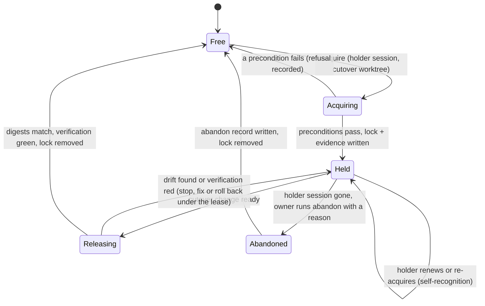

# Documentation-Cutover Write Lease Design

```txt
Document type: Design (not implemented)
Audience: Plan executor, reviewer, owner
Purpose: Design the migration-specific write lease that makes the atomic documentation cutover a real write freeze instead of a drift check
Design status: Draft (for owner review; no code, config, hook, check or changelog entry is added by this document)
Last reviewed: 2026-10-06
Related:
- plan.md section 3, section 5, section 11 (risk row "A drift check is mistaken for a write freeze")
- phase-09-atomic-platform-authority-cutover.md (cutover sequence step 1)
- minimum-constitution.json (retirementGate check write-lease, currently marked planned)
```

Related files: [plan.md](plan.md), [phase 9](phase-09-atomic-platform-authority-cutover.md), [phase 4](phase-04-freeze-the-minimum-constitution-and-migration-method.md), [minimum-constitution.json](minimum-constitution.json), [evidence payload relocation policy](evidence-payload-relocation-policy.md), [main checkout lock](../../src/runner/main-checkout-lock.mjs), [pre-commit hook](../../.githooks/pre-commit), [dispatch binder](../../src/runner/execution/bind.mjs), [dispatch decide hook](../../scripts/dispatch-decide-hook.mjs), [merge runner](../../src/runner/merge.mjs), [lock retry wrapper](../../src/runner/lock-wait.mjs), [doctor registry](../../src/setup/registrations.mjs), [distribution spec](../../docs/specs/distribution.md), [switchboard](../../docs/transitional-switchboard.md).

## 1. Problem and scope

Cutover step 1 says: acquire a migration-specific exclusive lease; while it is held, registered doc writers, dispatch admission and merge gates refuse mutations to in-scope roots. Today nothing does that. The drift checks (inventory rerun, ratchet) detect a change after the fact; they do not stop one.

**In-scope roots** (writes refused to everyone except the registered writer): `docs/**` (this includes `docs/platform/**`, `docs/specs/**` and `docs/architect/**`), `AGENTS.md`, `CLAUDE.md`, and the switchboard (`docs/transitional-switchboard.md` and `.json`, already under `docs/`). The cutover branch's own plan files under `plans/**` are not in scope: the registered writer needs them for evidence. The consumer rewrites of Phase 8 and 9 outside these roots (`core/skills`, `.agents`, `plugins`, `src`, `test`) are made by the registered writer in the same cutover change, and are not frozen for others by this lease, because freezing all code would block unrelated work for no documentation benefit. UNPROVEN: whether the owner wants those roots frozen too (decision 4).

**What the lease can and cannot do.** Git cannot stop a person from editing a file in another worktree. The lease stops everything that goes through a gate: commits (hook), dispatches, merges, registered doc writers. Raw edits in other worktrees are caught by the clean-worktree and digest checks at acquire and before ref movement; a raw edit that is never committed cannot corrupt the cutover, and one that is committed is refused by the hook. This is the combination plan section 11 asks for.

## 2. Prior art (reuse first)

Method: read `src/runner/main-checkout-lock.mjs`, `.githooks/pre-commit`, `bin/fgos.mjs` (verbs `unlock`, `lock-status`), `src/runner/merge.mjs`, `src/runner/execution/bind.mjs`, `scripts/dispatch-decide-hook.mjs`, `src/setup/registrations.mjs`; `git log -S` for the symbols; `git grep -i` for `lease` and `main-checkout.lock` under `src bin scripts`.

| Existing mechanism | What it gives | Fit |
|---|---|---|
| `acquireMainCheckoutLock(dir, { identity, ttlMs, lockFile })`, `inspectMainCheckoutLock`, `renewMainCheckoutLockIfOwn`, `releaseMainCheckoutLock*`, `forceReclaimAmbiguousLock` (since 2026-07-23, commit `08c91b885`) | exclusive create-or-refuse lock file with identity, timestamp, self-recognition (the holder re-acquiring its own lock succeeds), fail-closed `AMBIGUOUS` for a foreign string identity when no TTL is supplied, an explicit clear path | **Reuse as the lock primitive.** It is already parameterized by `lockFile`: the per-target merge slot (`mergeSlotLockFile`, 2026-08-12) and the per-cwd dispatch lock (`dispatchLockFile`, 2026-08-19) are two prior reuses of the same code with a different file name |
| `.fgos/*.lock` | already in `.gitignore` (line 41), so a new `.fgos/documentation-cutover.lock` is ignored with no change | reuse |
| `.githooks/pre-commit` | refuses any commit from any actor; already contains a guard that runs in every worktree regardless of home checkout (the staged `.fgos/` deletion guard) and reads staged paths with `git diff --cached --name-only` | **Reuse as the raw-writer gate**; the new guard follows the "never gated by home checkout" shape |
| `fgos unlock` / `lock-status` | operator door that never force-deletes a live holder; reports holder, age, TTL | **Pattern to copy** for clearing a stuck lease |
| `bind()` in `execution/bind.mjs` with `refusalReason` / `refusalDetail` (for example `governance`) and `scripts/dispatch-decide-hook.mjs` (blocks any Agent/Task call whose `decide` answer is not `in-process`) | single dispatch admission point; a new refusal reason reaches every caller, including the live hook | **Reuse as the dispatch gate** |
| `mergeRunnerItem` / `mergeRunnerItemLocked`, `changedFiles(repoRoot, item)`, merge readiness at `merge.mjs` (reads `inspectMainCheckoutLock`), `isWorkingTreeClean` | one merge door, already computes an item's changed file set and cleanliness | **Reuse as the merge gate** |
| `withLockRetry` in `lock-wait.mjs` | bounded retry with backoff for lock contention | gives "queued" behavior without a queue |
| `registerCheck` in `src/setup/registrations.mjs` (`src/setup/checks.mjs` is only a re-export shim) | doctor registry; existing check `main-checkout-hook-wired` already verifies the hook is installed | register the lease checks here |
| `acquireProviderAccountLease` in `provider-capacity.mjs` | a different "lease": provider account rotation state | **Not reusable** (different domain and storage) |
| `git log -S` for `cutover-lease`, `write-lease`, `writeLease` | only the plan commit `0c38df980` and the constitution commit `737a267e3` mention them; no earlier implementation existed or was removed | nothing to restore |

Prior art does **not** cover: a path-scoped refusal (the main checkout lock guards the whole checkout, not roots), a lease that must survive hours without self-expiring, and a holder record carrying scope and digests.

## 3. Design

### 3.1. Lock object

A lock file `documentation-cutover.lock` in the main checkout's `.fgos/` directory, created and read only through the existing primitive with `lockFile: 'documentation-cutover.lock'`. Resolved from any worktree by the git common directory (the same main-checkout resolution `registrations.mjs` already exports as `resolveMainCheckout`); UNPROVEN until built: the hook runs with the worktree as its cwd, so the resolution must be tested from a linked worktree.

- **Identity**: the registered writer's session identity string from `resolveWriterIdentity`. The registered writer is exactly one session, running in the dedicated cutover worktree. Self-recognition lets it re-acquire and renew freely.
- **No TTL at acquire.** With no `ttlMs`, the existing primitive answers `AMBIGUOUS` to every foreign identity, and every gate treats `AMBIGUOUS` as refuse. That is the fail-closed behavior this lease wants, and it is existing, tested behavior (decision D5 recorded in the module).
- **Evidence sidecar**, committed on the cutover branch, never under `.fgos/` (workers must not commit under `.fgos/`): `plans/260925-documentation-authority-unification/reports/cutover-lease-<timestamp>.json`, written at acquire and appended at release or abandon.

### 3.2. Registered writers

Exactly one lease holder (the cutover session) may write in-scope roots. In code, "registered" means: the gate compares the caller's `resolveWriterIdentity` against the lock record's identity. The writers that must call the shared check (`assertDocWriteAllowed(paths, identity)`, one helper, not built now):

Candidates found by scanning `src`, `scripts`, `bin`, `.githooks` for files that both write and name `docs/`, `AGENTS.md` or `CLAUDE.md` (method: node scan, 25 candidates of 284 JavaScript files; the real in-scope writers still have to be confirmed one by one at authorization, UNPROVEN): `src/setup/instruction-projections.mjs` (projects `AGENTS.md`), `src/install/coexist.mjs`, `src/report/decision-index.mjs` (the generated decision index), `scripts/knowledge-migration.mjs`, `scripts/knowledge-classifier.mjs`, `scripts/generate-shipped-path-inventory.mjs`, `scripts/generate-doc-inventory.mjs`, `bin/fgos.mjs` verbs that write docs. The documentation skills that write docs through the agent's own file tools (for example the knowledge and indexing skills) are reached by the hook, not by the helper.

### 3.3. Gates that consult the lease

| Gate | Seam | Behavior while the lease is held |
|---|---|---|
| Commit (all actors, all worktrees) | `.githooks/pre-commit`, new guard next to the staged-`.fgos/` guards, not gated by the home-checkout test | refuse when staged paths intersect scope and the committer identity is not the holder; message names holder, age and the clear door |
| Dispatch admission | `bind()` refusal reason `documentation-cutover-lease`, which reaches `scripts/dispatch-decide-hook.mjs` and `fgos dispatch decide/execute` | refuse every dispatch not requested by the holder. Dispatch cannot know the footprint of free-form work, so the rule is "all non-holder dispatch" for the duration (a short window) |
| Merge | `mergeRunnerItem` / `mergeRunnerItemLocked` and the merge readiness listing | refuse an item whose `changedFiles` intersect scope; items that touch only code merge as usual |
| Registered doc writers | the shared helper in 3.2 | refuse writes to scope for non-holders |
| Claim (`fgos take` / `pick`) | `claim-port.mjs` | not gated (a claim only creates a worktree and records state); the claimed item's later commit and merge are refused if they touch scope |
| In-session file edits by agents | optional `PreToolUse` hook on `Edit|Write` | not part of the design: covers one runtime only and the commit gate already catches the result |

"Queued" is implemented as refuse-with-reason plus the caller's own retry (`withLockRetry` already does this for the main checkout lock). No queue storage is added.

### 3.4. Preconditions before acquire

All must pass; any failure refuses the acquire and records nothing but the refusal:

1. The caller runs in the dedicated cutover worktree on the plan branch (plan section 5).
2. `git worktree list --porcelain` is enumerated; in every worktree `git status --porcelain` shows no change to a path in scope (reuse `isWorkingTreeClean` with a scope filter). A dirty in-scope path in any worktree blocks, including the main checkout.
3. No unmerged branch (item branches ahead of the cutover base) touches scope; each is listed, and acquire is refused until it is merged or dropped. Without this, a branch merged during the lease would be refused and would wait indefinitely.
4. Source digests match the reviewed state: for the cutover base commit and for each scope root, record the git tree or blob id (`git rev-parse <commit>:docs`, `<commit>:AGENTS.md`, `<commit>:CLAUDE.md`) and compare with the digests in the last inventory and ledger (the same digest list Phase 9 step 2 reruns). Git object ids are the digest; no extra hashing script is needed.
5. The ratchet, inventory gates and evidence relocation verifier (`--before`, see the [policy](evidence-payload-relocation-policy.md)) pass.
6. `core.hooksPath` is wired to `.githooks` (existing doctor check `main-checkout-hook-wired`); without the hook the commit gate does not exist, so acquire refuses.

Acquire writes the lock, then writes the evidence sidecar with: holder identity, worktree path, branch, base commit, scope list, tree/blob ids per root, the worktree enumeration with clean flags, the list of branches checked, and the timestamps.

### 3.5. Release

Release is two-phase and also checks digests:

1. **Before ref movement** (immediately before the cutover commit is merged to the target): re-enumerate worktrees (all still clean in scope), re-read the scope tree ids of the **target branch** and require them equal to the acquire-time ids. Any difference is drift: the cutover stops, nothing is overwritten (Phase 9 step 2), and the lease stays held until the owner decides.
2. **After the verification suite passes** on the cutover result: record the final scope tree ids and the target commit in the sidecar, remove the lock through the primitive's release, and run `fgos doctor` for the lease check. The lease is not released on a red verification; rollback (git revert, snapshot restore per plan section 11) runs under the lease, then release.

### 3.6. State diagram



| State | Lock file | Gates behave as | Who leaves it |
|---|---|---|---|
| Free | absent | normal | anyone starts Acquiring |
| Acquiring | being created | normal | the holder only |
| Held | present, holder identity, no TTL | non-holder commits, dispatches, doc writes and scope-touching merges refused | the holder (Releasing) or the owner (Abandoned) |
| Releasing | present | same as Held | the holder |
| Abandoned | present, owner-cleared | same as Held until the record is written | the owner |

### 3.7. Failure and abandon path

A crashed or lost holder leaves the lock in place. This is deliberate: with no TTL a stale lease cannot silently reopen the freeze window. Clearing follows `fgos unlock`: a dedicated door (name to be chosen when built, not a hand edit of `.fgos`) that

- refuses while the recorded holder session is demonstrably alive (liveness is only decidable for numeric identities, as the `unlock` comments note for string identities; for a string identity the door refuses without an owner confirmation flag and a written reason);
- writes the abandon record (who cleared, reason, timestamp, holder identity, age) to the evidence sidecar;
- removes the lock; the next acquire must pass every precondition again, including a new digest comparison, so work done under the abandoned lease is re-verified rather than trusted.

`fgos doctor` reports a held lease with its age as a failing check, so a forgotten lease surfaces at the next health check.

## 4. What the lease records

In the committed sidecar: holder identity, worktree, branch, base commit; scope list; per-root tree or blob ids at acquire, before ref movement and at release; the worktree and branch enumeration with clean flags; refusals counted by gate and path (from the gates' stderr messages, recorded by the holder, not a new log); abandon records. The lock file itself carries only identity and timestamp (its existing format). Nothing is appended to the event log: plan section 11 requires the cutover append no registry or event-log events.

## 5. Persistent dependencies and registration

**Yes, the design adds infrastructure.** Honest list:

1. A runtime lock file `.fgos/documentation-cutover.lock`, present only during the cutover (already git-ignored by `.fgos/*.lock`).
2. A new `fgos` door to acquire, inspect, release and abandon, wired in `bin/fgos.mjs` and `src/cli/command-registry.mjs`.
3. Consultation code in `.githooks/pre-commit`, `bind()`, the merge runner and the registered doc writers.
4. A committed evidence sidecar under the plan reports directory (no new config).
5. A dependency on the existing hook wiring.

Per the AGENTS.md install/setup/doctor gate, when this is built (not now):

- register at least one doctor check through `registerCheck` in `src/setup/registrations.mjs` (not stand-alone and undiscoverable): lease absent or held with age and holder, plus the existing hook-wired check as a precondition. `src/setup/checks.mjs` is a re-export shim; the entries go in `registrations.mjs`;
- `fgos setup` config merge: none needed if the scope list lives in the lease record and code; add a `registerConfigDefault` only if the owner wants the scope configurable (decision 4);
- a spec entry (data dictionary row in `docs/specs/distribution.md`, next to the other runtime-state rows, or the area spec that owns dispatch and merge) before code, as the gate requires for a new module;
- a line under `## [Unreleased]` in `CHANGELOG.md`, because the door and the refusals are visible to anyone who commits or dispatches during the cutover;
- removal: the door, guards and checks are migration-specific and are deleted after the cutover is verified (the repository keeps no compatibility aliases for a single user), with the removal recorded in the same spec and changelog entries.

None of this is added by this document.

## 6. Open decisions for the owner

1. **No TTL or TTL with heartbeat.** Recommendation: no TTL, fail closed, explicit abandon. A TTL would silently end the freeze if the holder dies; the release-time digest check would still catch drift, but only after wasted work. The cost of no TTL is one owner action when a session dies.
2. **Dispatch strictness.** Recommendation: refuse all non-holder dispatch during the lease (window is short, footprint is unknowable for free-form work). Alternative: refuse only dispatches whose declared footprint touches scope.
3. **Merge strictness.** Recommendation: refuse merges whose changed files intersect scope; allow code-only merges. Alternative: refuse every merge into the target branch (simpler, blocks unrelated work).
4. **Scope list.** Recommendation: `docs/**`, `AGENTS.md`, `CLAUDE.md`, the switchboard, fixed in code, not configurable. Open: add `core/skills`, `.agents/skills`, `plugins/fgOS/skills` (the consumer rewrite targets), which would freeze skill edits by others for the window.
5. **Reuse versus new mechanism.** Recommendation: reuse the main-checkout lock primitive with its own file (decided above on the evidence in section 2). Alternative: a bespoke JSON lease with scope and digests inside the lock; rejected for now because it duplicates liveness and clear logic that exists and is tested.
6. **Pre-cutover rehearsal.** Recommendation: rehearse acquire, a refused commit, a refused dispatch, a refused merge, abandon and release on a throwaway worktree before the real cutover, as the acceptance test of the lease.
7. **When to build.** Recommendation: build in Phase 4 or 8 of this plan only after the owner accepts decisions 1 to 4; it is on the critical path of Phase 9 but nothing earlier depends on it.

## 7. Unproven

- Main-checkout resolution of the lock directory from inside the hook running in a linked worktree (the existing hook has an "away from home" path; the new guard must be shown to find the main `.fgos`).
- The complete list of in-scope doc writers (the node scan found 25 candidates; confirmation file by file is part of building).
- That every dispatch route passes `bind()`: the live hook covers Agent/Task calls and `fgos dispatch execute`; other executors started by hand outside `fgos` are only caught at commit time.
- Behavior of in-flight dispatches already running when the lease is acquired: this design refuses new work only; the clean-worktree precondition catches their uncommitted in-scope edits, but a run that edits and commits after acquire is refused at commit.
