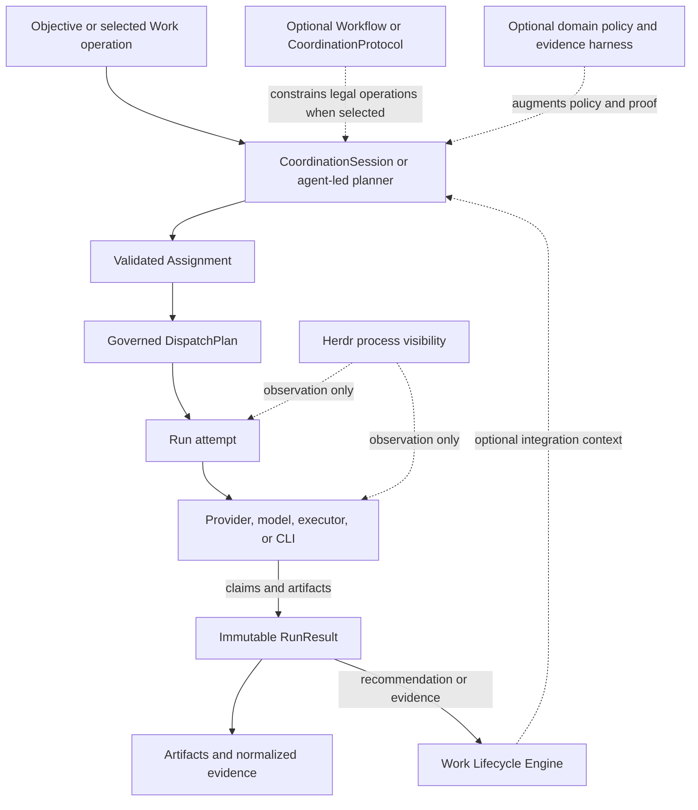

# Targeted candidate classification check

Author session: codex-session:1@2026-10-08
Receipt commit: a7d561538a9ec6192ce5a513b3cc7f006f995fb7
Review mode: ordinary

Read every shown unit below. These are proposed receipts, not approvals. The 54 content units plus the withdrawn substantive receipt account for the original 55. Seven bookkeeping relabels, the corrected Proof Preservation pointer and the migration-status unit uncovered by the withdrawn binding make 63 current receipts.

Twenty-one content receipts deliberately say `finding: stale`; they cannot close the gate and require rework. The other 33 proposed findings are **UNPROVEN** until independent semantic review: current CLI absence alone does not establish a scope, design, historical-status or ownership claim. Check all sentences against current code and, for historical material, its explicit non-authority/date framing and preserved source. Do not accept only because a digest matches. If evidence is insufficient, return rework; never relax the gate or treat a historical proof as current runtime proof.

## Report format

Use `reports/phase-06/review-2final-classifications.md`, with Reviewer, Author session, Review mode: ordinary and Receipt commit headers. The three original classes use six columns: Claim | Class | Verdict | Unit digest | Shown text digest | Note. Candidate-native-content uses the same columns plus Evidence digest (sha256 of JSON.stringify(currentEvidence)). Every note must be the reviewer’s own. Accept only true/current, fully evidenced content. No seed or red-team is requested at this point.

## claim_57cc129eeedc6624d9e0f94e0419b1ec

Path: `docs/platform/agent-coordination/architecture/system-context.md#component-and-runtime-flow`

Class: `candidate-native-content`  
Unit digest: `dfc433aa7e8f71fe401ecb8539ceea0f7ea48d8b62ce94e82cfb288d65b69e87`  
Shown text digest: `be44e6dbb3d1acdfe3117fdb956b40c7a2a538eca1156df75af989cf97613c87`
Evidence digest: `f8b0643a908ea6bee1c0bea5fd2ffbe7ba8a4fbfdd9810e7f402d2b588ae04ee`  
Proposed finding: `true-and-current`  
Evidence: `ledger/candidate-classifications-agent-coordination.json` at the receipt commit; executable current-code proof is in `reports/phase-06/candidate-content-final-evidence.json`.

Rationale: Proposed candidate-native-content classification, not author approval. The current CLI evidence distinguishes retained history/design/scope from a shipped coordination engine. The independent reviewer must read every sentence, check its historical/design qualifier and cited current-code evidence, and reject any unsupported claim. The proposed true-and-current finding is UNPROVEN until that independent semantic check; digest equality alone is not sufficient.

~~~~text
## Component And Runtime Flow



The diagram separates execution from delivery lifecycle: a result can inform a
Work driver, but cannot move Work lifecycle state by itself. Dashed paths are
optional structure, augmentation, integration context, or visibility; they do
not create execution authority or terminal truth.
~~~~

## claim_2d663f66649fd2758f3d44e4a947b4a3

Path: `docs/platform/agent-coordination/architecture/system-context.md#unheaded-block-4`

Class: `candidate-native-content`  
Unit digest: `d9aa9975e7a7e7fd8eb83bfade4faca1ed15556b2de8b0d6263ace6c199a90d1`  
Shown text digest: `d9aa9975e7a7e7fd8eb83bfade4faca1ed15556b2de8b0d6263ace6c199a90d1`
Evidence digest: `f8b0643a908ea6bee1c0bea5fd2ffbe7ba8a4fbfdd9810e7f402d2b588ae04ee`  
Proposed finding: `true-and-current`  
Evidence: `ledger/candidate-classifications-agent-coordination.json` at the receipt commit; executable current-code proof is in `reports/phase-06/candidate-content-final-evidence.json`.

Rationale: Proposed candidate-native-content classification, not author approval. The current CLI evidence distinguishes retained history/design/scope from a shipped coordination engine. The independent reviewer must read every sentence, check its historical/design qualifier and cited current-code evidence, and reject any unsupported claim. The proposed true-and-current finding is UNPROVEN until that independent semantic check; digest equality alone is not sufficient.

~~~~text

~~~~

## claim_a70a115136cadba4cacc52197e9436c5

Path: `docs/platform/agent-coordination/architecture/system-context.md#unheaded-block-5`

Class: `candidate-native-content`  
Unit digest: `016e54429b645e450dafc1fcb957976819543e16afad4c0713a18de49ec73436`  
Shown text digest: `016e54429b645e450dafc1fcb957976819543e16afad4c0713a18de49ec73436`
Evidence digest: `f8b0643a908ea6bee1c0bea5fd2ffbe7ba8a4fbfdd9810e7f402d2b588ae04ee`  
Proposed finding: `true-and-current`  
Evidence: `ledger/candidate-classifications-agent-coordination.json` at the receipt commit; executable current-code proof is in `reports/phase-06/candidate-content-final-evidence.json`.

Rationale: Proposed candidate-native-content classification, not author approval. The current CLI evidence distinguishes retained history/design/scope from a shipped coordination engine. The independent reviewer must read every sentence, check its historical/design qualifier and cited current-code evidence, and reject any unsupported claim. The proposed true-and-current finding is UNPROVEN until that independent semantic check; digest equality alone is not sufficient.

~~~~text
The diagram separates execution from delivery lifecycle: a result can inform a
Work driver, but cannot move Work lifecycle state by itself. Dashed paths are
optional structure, augmentation, integration context, or visibility; they do
not create execution authority or terminal truth.
~~~~

## claim_52f4171b7ac9f5564387abedae33fc32

Path: `docs/platform/agent-coordination/history/documentation-migration/claim-preservation.md#agent-coordination-claim-preservation`

Class: `candidate-native-content`  
Unit digest: `335baeef42e83237bb1cfbcbe2d0cfbb4b4e269a25e4a0bbb0fc6feb59dec82f`  
Shown text digest: `7c3196e6bee174982a344f4bb899e9a7889462fdabe37e295634e0883568813f`
Evidence digest: `62d649efe8f80952f48b084d6c164eb1a71d55ed44b1abfee5758a55660ba489`  
Proposed finding: `stale`  
Evidence: `ledger/candidate-classifications-agent-coordination.json` at the receipt commit; executable current-code proof is in `reports/phase-06/candidate-content-final-evidence.json`.

Rationale: Current behaviour contradicts the live coordination-engine claim: the current machine-readable CLI has no coordination verb and the engine directories were removed by 2180b4e72701bb090288af8fe8021008d9d42079. Proposed receipt is deliberately non-closable. Independent reviewer must return rework; stale text remains reverse-open until corrected.

~~~~text
# Agent Coordination Claim Preservation

```txt
Document type: Claim preservation table
Audience: Human reviewer, architect, maintainer, documentation agent
Purpose: Preserve accepted, deferred, proposed, and current Agent Coordination claims during migration
Design status: Draft
Implementation: Partial
Provenance: Created from Phase 0 source inventory and documentation-standardization plan
Writer type: Human + agent coauthor
Canonical for: Migration claim tracking only
Use this when: Promoting spec, architecture, contracts, or verification links
Do not use this for: Runtime behavior by itself
Last reviewed: 2026-09-18
Related:
- docs/platform/agent-coordination/README.md
- docs/platform/agent-coordination/history/documentation-migration/source-inventory.md
```

Use `unknown` or `track-complete / verify current checkout` instead of
guessing. A target doc may mark a claim `implemented` only when the linked
current-checkout code, test, contract, or proof supports it.

| Claim ID | Claim | Source | Authority | Status | Target anchor | Must not lose | Proof / gap |
|---|---|---|---|---|---|---|---|
| `AC-CLAIM-001` | Agent Coordination is a foundation layer. | [vision](../../../../architect/agent-coordination/vision.md), [system context](../../../../architect/agent-coordination/architecture/system-context.md) | vision / architecture | partial | [README](../../README.md) | Domain-neutral foundation, not only coding workflow glue. | Evidence through Step 08 coordination implementation and current runner spec; Phase 2 needs alignment table. |
| `AC-CLAIM-002` | Work is optional integration, not system identity. | [vision](../../../../architect/agent-coordination/vision.md), [work integration](../../../../architect/agent-coordination/architecture/work-integration.md), [ADR-001](../../../../architect/agent-coordination/decisions/ADR-001-work-lifecycle-authority.md) | vision / ADR / architecture | implemented / partial | future `spec.md#work-integration` | No universal Work requirement for coordination. | `src/runner/coordination/**`, `test/runner/coordination-*.test.mjs`; Work-attached mutation remains gated. |
| `AC-CLAIM-003` | A predeclared Workflow or CoordinationProtocol is optional. | [vision](../../../../architect/agent-coordination/vision.md), [protocol model](../../../../architect/agent-coordination/architecture/protocol-model.md) | vision / architecture | implemented / partial | future `spec.md#coordination-structure` | Agent-led coordination remains legal. | `src/verbs/coordination/schema.mjs`, `src/runner/coordination/session-engine.mjs`; richer runtime graphs deferred. |
| `AC-CLAIM-004` | Runtime execution contracts are mandatory. | [assignment/run/runresult contract](../../../../architect/agent-coordination/contracts/assignment-run-runresult.md), [ADR-006](../../../../architect/agent-coordination/decisions/ADR-006-assignment-provenance-and-contract-snapshot.md) | contract / ADR | implemented / partial | future `contracts/assignment-run-runresult.md` | Free-form prose must not become execution authority. | Dispatch execution-contract code and assignment/runresult tests; Phase 2 should cite exact code anchors. |
| `AC-CLAIM-005` | CoordinationSession is the V1 executable/recovery root. | [coordination-session contract](../../../../architect/agent-coordination/contracts/coordination-session.md), [ADR-008](../../../../architect/agent-coordination/decisions/ADR-008-coordination-session-and-mission-deferral.md) | contract / ADR | implemented / partial | future `contracts/coordination-session.md` | No `missionId` resurrection or second session root. | `src/runner/coordination/{schema,store,replay,session-engine}.mjs`, `test/runner/coordination-*.test.mjs`. |
| `AC-CLAIM-006` | FlowDefinition is shared graph/operation/policy IR with typed profiles. | [flow-definition contract](../../../../architect/agent-coordination/contracts/flow-definition.md), [ADR-009](../../../../architect/agent-coordination/decisions/ADR-009-flow-definition-shared-ir-and-typed-profiles.md) | contract / ADR | implemented / partial | future `contracts/flow-definition.md` | Shared IR beneath Workflow and CoordinationProtocol profiles. | `src/runner/definitions/**`, coordination tests; Phase 2 needs exact file scan. |
| `AC-CLAIM-007` | Assignment, Run, and RunResult are separate. | [assignment/run/runresult contract](../../../../architect/agent-coordination/contracts/assignment-run-runresult.md), [ADR-003](../../../../architect/agent-coordination/decisions/ADR-003-assignment-run-runresult-separation.md) | contract / ADR | implemented | future `contracts/assignment-run-runresult.md` | Do not collapse request, attempt, and outcome. | `test/runner/assignment-runresult.test.mjs`, dispatch operability proof. |
| `AC-CLAIM-008` | Dispatch governs execution infrastructure. | [dispatch control plane](../../../../architect/agent-coordination/architecture/dispatch-control-plane.md), [ADR-011](../../../../architect/agent-coordination/decisions/ADR-011-dispatch-owns-lifecycle-receiver-writes-receipt.md) | architecture / ADR | implemented / partial | future `architecture/dispatch-control-plane.md` | Semantic operation choice stays separate from executor mechanics. | `src/runner/dispatch/**`, `src/verbs/dispatch/**`, runner spec dispatch sections. |
| `AC-CLAIM-009` | Evidence and RunResult prevent false success. | [evidence and results](../../../../architect/agent-coordination/architecture/evidence-and-results.md), ADR-005/006/007 | architecture / ADR | implemented / partial | future `architecture/evidence-and-results.md` | Worker self-report is not normalized proof by itself. | RunResult v2 tests and dispatch-operability I03 proof; aggregation proof remains mixed by protocol. |
| `AC-CLAIM-010` | Herdr is visibility, not evidence/truth. | [visibility and Herdr](../../../../architect/agent-coordination/architecture/visibility-and-herdr.md), [ADR-005](../../../../architect/agent-coordination/decisions/ADR-005-herdr-visibility-only.md) | architecture / ADR | partial | future `architecture/visibility-and-herdr.md` | Herdr must not settle Runs or replace evidence. | Visibility proof exists; writable takeover remains parked/deferred. |
| `AC-CLAIM-011` | Domain-owned Work isolation remains outside coordination code until proven. | [ADR-010](../../../../architect/agent-coordination/decisions/ADR-010-interactive-headless-parity-and-work-isolation.md), [work integration](../../../../architect/agent-coordination/architecture/work-integration.md) | ADR / architecture | deferred-preserved / partial | future `architecture/work-integration.md` | Coordination code must not gain hidden Work lifecycle writes. | Needs Step 10 mutating live proof before promotion beyond current status. |
| `AC-CLAIM-012` | Group-thinking and heterogeneous cohorts preserve dissent/evidence. | [group-thinking trigger surface](../../../../architect/agent-coordination/architecture/group-thinking-trigger-surface.md), [ledger AC-I004](../../../../architect/agent-coordination/intent-preservation-ledger.md#ac-i004-group-cognition-and-heterogeneous-cohorts) | architecture / intent ledger | implemented mechanism / quality proof mixed | future `subcomponents/group-thinking/` or architecture doc | Do not hide failed actors, stale artifacts, or dissent in synthesis. | Step 09 proof roots; quality/advisory proof has known gaps. |
| `AC-CLAIM-013` | Runtime recovery guarantees are distinct: control fencing, result fencing, effect protection. | [runtime recovery design](../../../../architect/agent-coordination/architecture/runtime-recovery-design.md), runtime recovery proofs | architecture / proposal / evidence | partial / proposed split | future runtime-recovery architecture doc | Do not describe unimplemented recovery slices as current. | P01-P05S proofs; S0-S4 and session-recovery half of S5 implemented, S5 transfer/import/budget/apply, S6, S7 not implemented. |
| `AC-CLAIM-014` | Herdr-spawn bwrap launch reconciliation uses the P02H reopen launcher-script mechanism, not falsified direct-command pseudocode. | [P02H reopen](../../../../architect/agent-coordination/verification/runtime-recovery/p02h-reopen.md), runtime-recovery plan launch design | evidence / plan | implemented with residual gap | future runtime-recovery verification index | Do not promote `herdr agent start ... -- <prepared-command>` as current design. | P02H reopen is authoritative shipped proof; residual accepted gap must stay visible. |
| `AC-CLAIM-015` | `agent-result-claim.v2` is worker claim contract, not normalized proof. | [I01](../../../../architect/agent-coordination/verification/dispatch-operability-implementation/I01.md), dispatch operability plan | evidence / contract-adjacent | implemented | future assignment/runresult contract or verification alignment | Worker claim remains untrusted input. | `test/runner/assignment-runresult.test.mjs`, `test/runner/assignment.test.mjs`. |
| `AC-CLAIM-016` | Effective execution contract is persisted pre-launch and must stay inspectable where implemented. | [I02](../../../../architect/agent-coordination/verification/dispatch-operability-implementation/I02.md) | evidence | implemented | future dispatch operability section | Preserve pre-launch snapshot and inspection. | Current checkout evidence in dispatch execution-contract and tests. |
| `AC-CLAIM-017` | `RunResult` v2 is immutable terminal Run truth; `RunObservation` is mutable read-only projection and never settles a Run. | [I03](../../../../architect/agent-coordination/verification/dispatch-operability-implementation/I03.md), runner spec | evidence / spec | implemented | future `spec.md#run-results` | Do not let observation settle a Run. | `test/runner/assignment-runresult.test.mjs`. |
| `AC-CLAIM-018` | `dispatch.runtime.inspect` is read-only. | [I04](../../../../architect/agent-coordination/verification/dispatch-operability-implementation/I04.md), [inspect verb](../../../../../src/verbs/dispatch/inspect.mjs) | evidence / implementation truth | implemented | future `spec.md#dispatch-runtime-inspect` | Inspect cannot repair or mutate. | `test/runner/dispatch-operability-production-door.test.mjs`. |
| `AC-CLAIM-019` | `dispatch.runtime.reconcile` is limited to guard/projection repair and must not kill, signal, retry, relaunch, resume, reattach, reassign, admit, cancel, or take over execution. | [I05](../../../../architect/agent-coordination/verification/dispatch-operability-implementation/I05.md), [reconcile verb](../../../../../src/verbs/dispatch/reconcile.mjs) | evidence / implementation truth | implemented / partial | future `spec.md#dispatch-runtime-reconcile` | Reconcile is not recovery. | `test/runner/dispatch-reconcile-operation.test.mjs`; preserve residual findings. |
| `AC-CLAIM-020` | Executor identity is not execution policy. | executor-policy seams plan and design | plan / architecture | implemented / partial / verify current checkout | future dispatch-control subcomponent | Do not encode persona/model/account policy in executor identity. | Current warnings and placement-policy tests exist; Phase 2 needs focused scan. |
| `AC-CLAIM-021` | `PlacementPolicy` owns provider/model/executor ranking/binding only where the self-verifying production binder has shipped; it does not own same-provider account rotation or lifecycle settlement. | executor-policy seams plan | plan / implementation evidence | implemented / partial / verify current checkout | future placement-policy section | Keep account rotation and lifecycle settlement out of PlacementPolicy. | `src/runner/dispatch/placement-policy.mjs`, placement-policy matrix tests; Phase 08 pending status must stay visible. |
| `AC-CLAIM-022` | Provider Capacity Rotator is same-provider account/capacity rotation with global/operator config; not cross-provider fallback or project-local credential inventory. | rotator plan (`../../../../../plans/260916-account-rotator/plan.md`; Added in candidate: historical path absent at the batch pin), runner spec | plan / spec | partial / verify current checkout | future provider-capacity section | No project-local account inventory and no fallback ownership. | `src/runner/provider-capacity.mjs`, provider-capacity tests where present. |
| `AC-CLAIM-023` | Work-independent code implementation tracks use targeted proof per cell plus full proof at gates; no `trackKind`/`executionPolicy` YAML or policy validator was accepted. | policy plan (`../../../../../plans/260915-code-implementation-track-policy/plan.md`; Added in candidate: historical path absent at the batch pin), policy verification | operational / evidence | done / operational | future playbook or verification policy | Do not invent policy YAML as accepted runtime behavior. | Policy proof p01-p05 and track closeout. |
| `AC-CLAIM-024` | Test feedback/cost work improved proof trust and feedback cost; P05 related-test selector remains deferred. | test feedback plan (`../../../../../plans/260915-0455-test-suite-feedback-cost/plan.md`; Added in candidate: historical path absent at the batch pin), decision lock | plan / evidence | partial; P05 deferred | future verification/history | Do not describe related-test selector as shipped. | Decision lock and Phase 08 handoff. |
| `AC-CLAIM-025` | Cold-resumable coordination DAG scheduling is proposal/frontier; it must not add mutation nodes, daemon, new lifecycle authority, or Work replacement. | [DAG proposal](../../../../architect/agent-coordination/proposals/dag-request-scheduler.md), DAG plan (`../../../../../plans/260917-cold-resumable-coordination-dag/plan.md`; Added in candidate: historical path absent at the batch pin) | proposal / plan | proposed / ready for implementation | future proposals index | Keep read-only immutable DAG limits. | Needs acceptance and code/proof before current-truth promotion. |
| `AC-CLAIM-026` | Host-invocation-routing owns host command/provider process routing; Agent Coordination owns only dispatch/executor integration boundary. | [host portal](../../../host-invocation-routing/README.md) | external authority | partial | [README cross-area boundaries](../../README.md#cross-area-boundaries) | Do not duplicate host authority here. | Link-only boundary. |
| `AC-CLAIM-027` | Packaging-distribution owns installation, activation, release manifest, setup/doctor, and runtime identity. | [packaging portal](../../../packaging-distribution/README.md) | external authority | partial | [README cross-area boundaries](../../README.md#cross-area-boundaries) | Do not duplicate install/setup/doctor authority here. | Link-only boundary. |
~~~~

## claim_75f9a993ffc8cbff63f08200959c1ffb

Path: `docs/platform/agent-coordination/history/documentation-migration/claim-preservation.md#unheaded-block-2`

Class: `bookkeeping`  
Unit digest: `a9934bdb7e664b6019b9bbccc19c59a26f8cfdc43e847e57d9ae8693ace1627b`  
Shown text digest: `a9934bdb7e664b6019b9bbccc19c59a26f8cfdc43e847e57d9ae8693ace1627b`

Rationale: Pure documentation-migration bookkeeping note or rule, not a heading or structural lead-in; classification corrected following the committed independent re-review.

~~~~text
Use `unknown` or `track-complete / verify current checkout` instead of
guessing. A target doc may mark a claim `implemented` only when the linked
current-checkout code, test, contract, or proof supports it.
~~~~

## claim_2db60db20f1add588148186e717afe91

Path: `docs/platform/agent-coordination/history/documentation-migration/claim-preservation.md#unheaded-block-3`

Class: `candidate-native-content`  
Unit digest: `bd1db6e9232f57939b16fb5effa1dd5e69d21363f6248a2fe4ff424562e2d5ed`  
Shown text digest: `bd1db6e9232f57939b16fb5effa1dd5e69d21363f6248a2fe4ff424562e2d5ed`
Evidence digest: `62d649efe8f80952f48b084d6c164eb1a71d55ed44b1abfee5758a55660ba489`  
Proposed finding: `stale`  
Evidence: `ledger/candidate-classifications-agent-coordination.json` at the receipt commit; executable current-code proof is in `reports/phase-06/candidate-content-final-evidence.json`.

Rationale: Current behaviour contradicts the live coordination-engine claim: the current machine-readable CLI has no coordination verb and the engine directories were removed by 2180b4e72701bb090288af8fe8021008d9d42079. Proposed receipt is deliberately non-closable. Independent reviewer must return rework; stale text remains reverse-open until corrected.

~~~~text
| Claim ID | Claim | Source | Authority | Status | Target anchor | Must not lose | Proof / gap |
|---|---|---|---|---|---|---|---|
| `AC-CLAIM-001` | Agent Coordination is a foundation layer. | [vision](../../../../architect/agent-coordination/vision.md), [system context](../../../../architect/agent-coordination/architecture/system-context.md) | vision / architecture | partial | [README](../../README.md) | Domain-neutral foundation, not only coding workflow glue. | Evidence through Step 08 coordination implementation and current runner spec; Phase 2 needs alignment table. |
| `AC-CLAIM-002` | Work is optional integration, not system identity. | [vision](../../../../architect/agent-coordination/vision.md), [work integration](../../../../architect/agent-coordination/architecture/work-integration.md), [ADR-001](../../../../architect/agent-coordination/decisions/ADR-001-work-lifecycle-authority.md) | vision / ADR / architecture | implemented / partial | future `spec.md#work-integration` | No universal Work requirement for coordination. | `src/runner/coordination/**`, `test/runner/coordination-*.test.mjs`; Work-attached mutation remains gated. |
| `AC-CLAIM-003` | A predeclared Workflow or CoordinationProtocol is optional. | [vision](../../../../architect/agent-coordination/vision.md), [protocol model](../../../../architect/agent-coordination/architecture/protocol-model.md) | vision / architecture | implemented / partial | future `spec.md#coordination-structure` | Agent-led coordination remains legal. | `src/verbs/coordination/schema.mjs`, `src/runner/coordination/session-engine.mjs`; richer runtime graphs deferred. |
| `AC-CLAIM-004` | Runtime execution contracts are mandatory. | [assignment/run/runresult contract](../../../../architect/agent-coordination/contracts/assignment-run-runresult.md), [ADR-006](../../../../architect/agent-coordination/decisions/ADR-006-assignment-provenance-and-contract-snapshot.md) | contract / ADR | implemented / partial | future `contracts/assignment-run-runresult.md` | Free-form prose must not become execution authority. | Dispatch execution-contract code and assignment/runresult tests; Phase 2 should cite exact code anchors. |
| `AC-CLAIM-005` | CoordinationSession is the V1 executable/recovery root. | [coordination-session contract](../../../../architect/agent-coordination/contracts/coordination-session.md), [ADR-008](../../../../architect/agent-coordination/decisions/ADR-008-coordination-session-and-mission-deferral.md) | contract / ADR | implemented / partial | future `contracts/coordination-session.md` | No `missionId` resurrection or second session root. | `src/runner/coordination/{schema,store,replay,session-engine}.mjs`, `test/runner/coordination-*.test.mjs`. |
| `AC-CLAIM-006` | FlowDefinition is shared graph/operation/policy IR with typed profiles. | [flow-definition contract](../../../../architect/agent-coordination/contracts/flow-definition.md), [ADR-009](../../../../architect/agent-coordination/decisions/ADR-009-flow-definition-shared-ir-and-typed-profiles.md) | contract / ADR | implemented / partial | future `contracts/flow-definition.md` | Shared IR beneath Workflow and CoordinationProtocol profiles. | `src/runner/definitions/**`, coordination tests; Phase 2 needs exact file scan. |
| `AC-CLAIM-007` | Assignment, Run, and RunResult are separate. | [assignment/run/runresult contract](../../../../architect/agent-coordination/contracts/assignment-run-runresult.md), [ADR-003](../../../../architect/agent-coordination/decisions/ADR-003-assignment-run-runresult-separation.md) | contract / ADR | implemented | future `contracts/assignment-run-runresult.md` | Do not collapse request, attempt, and outcome. | `test/runner/assignment-runresult.test.mjs`, dispatch operability proof. |
| `AC-CLAIM-008` | Dispatch governs execution infrastructure. | [dispatch control plane](../../../../architect/agent-coordination/architecture/dispatch-control-plane.md), [ADR-011](../../../../architect/agent-coordination/decisions/ADR-011-dispatch-owns-lifecycle-receiver-writes-receipt.md) | architecture / ADR | implemented / partial | future `architecture/dispatch-control-plane.md` | Semantic operation choice stays separate from executor mechanics. | `src/runner/dispatch/**`, `src/verbs/dispatch/**`, runner spec dispatch sections. |
| `AC-CLAIM-009` | Evidence and RunResult prevent false success. | [evidence and results](../../../../architect/agent-coordination/architecture/evidence-and-results.md), ADR-005/006/007 | architecture / ADR | implemented / partial | future `architecture/evidence-and-results.md` | Worker self-report is not normalized proof by itself. | RunResult v2 tests and dispatch-operability I03 proof; aggregation proof remains mixed by protocol. |
| `AC-CLAIM-010` | Herdr is visibility, not evidence/truth. | [visibility and Herdr](../../../../architect/agent-coordination/architecture/visibility-and-herdr.md), [ADR-005](../../../../architect/agent-coordination/decisions/ADR-005-herdr-visibility-only.md) | architecture / ADR | partial | future `architecture/visibility-and-herdr.md` | Herdr must not settle Runs or replace evidence. | Visibility proof exists; writable takeover remains parked/deferred. |
| `AC-CLAIM-011` | Domain-owned Work isolation remains outside coordination code until proven. | [ADR-010](../../../../architect/agent-coordination/decisions/ADR-010-interactive-headless-parity-and-work-isolation.md), [work integration](../../../../architect/agent-coordination/architecture/work-integration.md) | ADR / architecture | deferred-preserved / partial | future `architecture/work-integration.md` | Coordination code must not gain hidden Work lifecycle writes. | Needs Step 10 mutating live proof before promotion beyond current status. |
| `AC-CLAIM-012` | Group-thinking and heterogeneous cohorts preserve dissent/evidence. | [group-thinking trigger surface](../../../../architect/agent-coordination/architecture/group-thinking-trigger-surface.md), [ledger AC-I004](../../../../architect/agent-coordination/intent-preservation-ledger.md#ac-i004-group-cognition-and-heterogeneous-cohorts) | architecture / intent ledger | implemented mechanism / quality proof mixed | future `subcomponents/group-thinking/` or architecture doc | Do not hide failed actors, stale artifacts, or dissent in synthesis. | Step 09 proof roots; quality/advisory proof has known gaps. |
| `AC-CLAIM-013` | Runtime recovery guarantees are distinct: control fencing, result fencing, effect protection. | [runtime recovery design](../../../../architect/agent-coordination/architecture/runtime-recovery-design.md), runtime recovery proofs | architecture / proposal / evidence | partial / proposed split | future runtime-recovery architecture doc | Do not describe unimplemented recovery slices as current. | P01-P05S proofs; S0-S4 and session-recovery half of S5 implemented, S5 transfer/import/budget/apply, S6, S7 not implemented. |
| `AC-CLAIM-014` | Herdr-spawn bwrap launch reconciliation uses the P02H reopen launcher-script mechanism, not falsified direct-command pseudocode. | [P02H reopen](../../../../architect/agent-coordination/verification/runtime-recovery/p02h-reopen.md), runtime-recovery plan launch design | evidence / plan | implemented with residual gap | future runtime-recovery verification index | Do not promote `herdr agent start ... -- <prepared-command>` as current design. | P02H reopen is authoritative shipped proof; residual accepted gap must stay visible. |
| `AC-CLAIM-015` | `agent-result-claim.v2` is worker claim contract, not normalized proof. | [I01](../../../../architect/agent-coordination/verification/dispatch-operability-implementation/I01.md), dispatch operability plan | evidence / contract-adjacent | implemented | future assignment/runresult contract or verification alignment | Worker claim remains untrusted input. | `test/runner/assignment-runresult.test.mjs`, `test/runner/assignment.test.mjs`. |
| `AC-CLAIM-016` | Effective execution contract is persisted pre-launch and must stay inspectable where implemented. | [I02](../../../../architect/agent-coordination/verification/dispatch-operability-implementation/I02.md) | evidence | implemented | future dispatch operability section | Preserve pre-launch snapshot and inspection. | Current checkout evidence in dispatch execution-contract and tests. |
| `AC-CLAIM-017` | `RunResult` v2 is immutable terminal Run truth; `RunObservation` is mutable read-only projection and never settles a Run. | [I03](../../../../architect/agent-coordination/verification/dispatch-operability-implementation/I03.md), runner spec | evidence / spec | implemented | future `spec.md#run-results` | Do not let observation settle a Run. | `test/runner/assignment-runresult.test.mjs`. |
| `AC-CLAIM-018` | `dispatch.runtime.inspect` is read-only. | [I04](../../../../architect/agent-coordination/verification/dispatch-operability-implementation/I04.md), [inspect verb](../../../../../src/verbs/dispatch/inspect.mjs) | evidence / implementation truth | implemented | future `spec.md#dispatch-runtime-inspect` | Inspect cannot repair or mutate. | `test/runner/dispatch-operability-production-door.test.mjs`. |
| `AC-CLAIM-019` | `dispatch.runtime.reconcile` is limited to guard/projection repair and must not kill, signal, retry, relaunch, resume, reattach, reassign, admit, cancel, or take over execution. | [I05](../../../../architect/agent-coordination/verification/dispatch-operability-implementation/I05.md), [reconcile verb](../../../../../src/verbs/dispatch/reconcile.mjs) | evidence / implementation truth | implemented / partial | future `spec.md#dispatch-runtime-reconcile` | Reconcile is not recovery. | `test/runner/dispatch-reconcile-operation.test.mjs`; preserve residual findings. |
| `AC-CLAIM-020` | Executor identity is not execution policy. | executor-policy seams plan and design | plan / architecture | implemented / partial / verify current checkout | future dispatch-control subcomponent | Do not encode persona/model/account policy in executor identity. | Current warnings and placement-policy tests exist; Phase 2 needs focused scan. |
| `AC-CLAIM-021` | `PlacementPolicy` owns provider/model/executor ranking/binding only where the self-verifying production binder has shipped; it does not own same-provider account rotation or lifecycle settlement. | executor-policy seams plan | plan / implementation evidence | implemented / partial / verify current checkout | future placement-policy section | Keep account rotation and lifecycle settlement out of PlacementPolicy. | `src/runner/dispatch/placement-policy.mjs`, placement-policy matrix tests; Phase 08 pending status must stay visible. |
| `AC-CLAIM-022` | Provider Capacity Rotator is same-provider account/capacity rotation with global/operator config; not cross-provider fallback or project-local credential inventory. | rotator plan (`../../../../../plans/260916-account-rotator/plan.md`; Added in candidate: historical path absent at the batch pin), runner spec | plan / spec | partial / verify current checkout | future provider-capacity section | No project-local account inventory and no fallback ownership. | `src/runner/provider-capacity.mjs`, provider-capacity tests where present. |
| `AC-CLAIM-023` | Work-independent code implementation tracks use targeted proof per cell plus full proof at gates; no `trackKind`/`executionPolicy` YAML or policy validator was accepted. | policy plan (`../../../../../plans/260915-code-implementation-track-policy/plan.md`; Added in candidate: historical path absent at the batch pin), policy verification | operational / evidence | done / operational | future playbook or verification policy | Do not invent policy YAML as accepted runtime behavior. | Policy proof p01-p05 and track closeout. |
| `AC-CLAIM-024` | Test feedback/cost work improved proof trust and feedback cost; P05 related-test selector remains deferred. | test feedback plan (`../../../../../plans/260915-0455-test-suite-feedback-cost/plan.md`; Added in candidate: historical path absent at the batch pin), decision lock | plan / evidence | partial; P05 deferred | future verification/history | Do not describe related-test selector as shipped. | Decision lock and Phase 08 handoff. |
| `AC-CLAIM-025` | Cold-resumable coordination DAG scheduling is proposal/frontier; it must not add mutation nodes, daemon, new lifecycle authority, or Work replacement. | [DAG proposal](../../../../architect/agent-coordination/proposals/dag-request-scheduler.md), DAG plan (`../../../../../plans/260917-cold-resumable-coordination-dag/plan.md`; Added in candidate: historical path absent at the batch pin) | proposal / plan | proposed / ready for implementation | future proposals index | Keep read-only immutable DAG limits. | Needs acceptance and code/proof before current-truth promotion. |
| `AC-CLAIM-026` | Host-invocation-routing owns host command/provider process routing; Agent Coordination owns only dispatch/executor integration boundary. | [host portal](../../../host-invocation-routing/README.md) | external authority | partial | [README cross-area boundaries](../../README.md#cross-area-boundaries) | Do not duplicate host authority here. | Link-only boundary. |
| `AC-CLAIM-027` | Packaging-distribution owns installation, activation, release manifest, setup/doctor, and runtime identity. | [packaging portal](../../../packaging-distribution/README.md) | external authority | partial | [README cross-area boundaries](../../README.md#cross-area-boundaries) | Do not duplicate install/setup/doctor authority here. | Link-only boundary. |
~~~~

## claim_e85e6a1bc650842a19a2fb94032a37a8

Path: `docs/platform/agent-coordination/history/documentation-migration/documentation-governance.md#agent-coordination-documentation-governance`

Class: `candidate-native-content`  
Unit digest: `f218e3addfb039ce41426ab72f33835e0a11e11fb666ef90e2ac23202f26eef1`  
Shown text digest: `1d276607415a71313fcd2642bb17657bdb5e593082242ec8d43b09b163845de2`
Evidence digest: `f8b0643a908ea6bee1c0bea5fd2ffbe7ba8a4fbfdd9810e7f402d2b588ae04ee`  
Proposed finding: `true-and-current`  
Evidence: `ledger/candidate-classifications-agent-coordination.json` at the receipt commit; executable current-code proof is in `reports/phase-06/candidate-content-final-evidence.json`.

Rationale: Proposed candidate-native-content classification, not author approval. The current CLI evidence distinguishes retained history/design/scope from a shipped coordination engine. The independent reviewer must read every sentence, check its historical/design qualifier and cited current-code evidence, and reject any unsupported claim. The proposed true-and-current finding is UNPROVEN until that independent semantic check; digest equality alone is not sufficient.

~~~~text
# Agent Coordination Documentation Governance

```txt
Document type: History
Audience: Human reviewer, maintainer, documentation agent
Purpose: Preserve the retired area policy and migration plan verbatim as non-authority history
Design status: Candidate
Implementation: Historical record; not a live runtime or documentation policy
Provenance: Verbatim source snapshot from docs/architect/agent-coordination/documentation-governance.md
Writer type: Human + agent coauthor
Canonical for: Historical evidence only; no current authority
Use this when: Auditing the former area documentation policy or migration plan
Do not use this for: Current authority, current runtime behavior, or new migration instructions
Last reviewed: Not independently reviewed
Related:
- docs/platform/agent-coordination/README.md
- docs/platform/agent-coordination/history/documentation-migration/source-inventory.md
Supersedes: None; legacy source is unchanged
Superseded by: None
Added in candidate: Wrapper H1 and promotion metadata for the literal historical snapshot; not part of the retired source policy
```

Added in candidate: Retired area policy and migration plan, retained verbatim as non-authority history. The literal source snapshot below preserves original status fields and file-relative references as historical text, not active authority or navigation.

```text
# Agent Coordination Documentation Governance

Document type: Policy
Design status: Accepted
Implementation: Active
Last reviewed: 2026-08-31
Canonical for: document taxonomy, authority, metadata, and maintenance rules

## Purpose

This policy keeps design truth separate from proposals, delivery plans,
verification evidence, operating instructions, and historical records.

## Document Types

| Type | Purpose | Normative |
|---|---|---|
| Vision | Highest-level product identity, foundation boundaries, and direction. | Yes. |
| Portal | Top-level navigation and reading paths. | No. |
| Policy | Documentation authority and maintenance rules. | Yes, for documentation. |
| Index | Navigation within one documentation area. | No. |
| Vocabulary | Canonical names, definitions, aliases, and concept relationships. | Yes, for terminology. |
| Architecture | Accepted system boundaries, responsibilities, and invariants. | Yes. |
| Contract | Accepted machine-facing or behavioral interface. | Yes. |
| Proposal | Design under discussion or review. | No. |
| ADR | Durable record of one accepted or rejected architecture decision. | Yes for accepted decisions. |
| Roadmap | Time-ordered implementation sequence and acceptance plan. | No new architecture authority. |
| Verification | Tests, live proof, traceability, and conformance evidence. | Evidence, not design authority. |
| Playbook | Engineering bootstrap, maintenance, or manual fallback procedure. | Operational only; never product runtime authority. |
| History | Superseded, exploratory, or implementation-era source material. | No. |

## Required Metadata

Every maintained Markdown design document should identify:

```
```txt
Document type: <type>
Design status: Discussion | Proposed | Accepted | Superseded | N/A
Implementation: Not started | Partial | Implemented | Verified | Drifted | Active | N/A
Last reviewed: YYYY-MM-DD
Canonical for: <subject or "nothing">
```
```text

Optional metadata:

```
```txt
Supersedes: <document links>
Superseded by: <document links>
Related: <document links>
```
```text

Design status and implementation state are independent. An accepted contract
may be only partially implemented; an implemented prototype may still embody a
discussion-stage design.

## Authority Order

When documents disagree, use this order:

1. accepted Vision for product identity, foundation boundaries, and direction;
2. accepted ADR for a specific decision within the Vision;
3. accepted contract for machine-visible behavior;
4. accepted architecture document;
5. canonical vocabulary for term meaning;
6. proposal;
7. roadmap;
8. playbook;
9. verification or history as evidence of what happened.

The Vision is not a substitute for exact schemas or state rules. ADRs and
contracts refine it, but they cannot silently make a Vision capability
mandatory, optional, or impossible in the opposite direction.

An implementation mismatch does not silently rewrite the design. Mark the
implementation state `Drifted`, then reconcile code or amend the accepted
decision explicitly.

## Source-Of-Truth Rules

- Define a term only in `vocabulary/`; other documents link to it.
- Put product identity and foundation-versus-domain boundaries in `vision.md`.
- Put durable system boundaries in `architecture/`, not numbered steps.
- Put exact schemas and state/evidence rules in `contracts/`.
- Keep unresolved alternatives in `proposals/` until accepted.
- Record accepted choices and rejected alternatives in `decisions/`.
- Roadmaps may reference architecture and contracts but must not redefine them.
- Test output and live proof belong in `verification/`.
- Prompt templates and team execution procedures belong in `playbooks/`.
- Runtime Skills/prose belong in `core/skills/` or `domains/<domain>/skills/`,
  with TaskSpecs and protocol/workflow configuration beside their runtime
  ownership layer; they must not depend on documentation playbooks.
- Historical documents must state that they are non-canonical.

## Change Rules

- A canonical term change that affects boundaries requires an ADR or an update
  to the ADR that owns the decision.
- A change to product identity or the foundation/domain boundary updates the
  Vision first, then reconciles every affected downstream document.
- An accepted contract change requires compatibility and migration notes.
- Proposal approval requires extracting accepted content into canonical docs;
  do not merely relabel the entire proposal as accepted.
- Superseded files remain searchable in `history/` when they contain useful
  rationale or implementation evidence.
- Cross-links must be checked after every move or rename.
```
~~~~

## claim_ac50db5d5bcefe61f0d4b4773b7ae29c

Path: `docs/platform/agent-coordination/history/documentation-migration/documentation-standardization-plan.md#agent-coordination-documentation-standardization-plan`

Class: `candidate-native-content`  
Unit digest: `b11eff289671f3513c50d8a465cd1af3d600188e4ad25a550da0f770ede1706a`  
Shown text digest: `c8a9883e20ecc1be3f40b220437b5ded5edacb351ee0ae64dbca851d0511a465`
Evidence digest: `f8b0643a908ea6bee1c0bea5fd2ffbe7ba8a4fbfdd9810e7f402d2b588ae04ee`  
Proposed finding: `true-and-current`  
Evidence: `ledger/candidate-classifications-agent-coordination.json` at the receipt commit; executable current-code proof is in `reports/phase-06/candidate-content-final-evidence.json`.

Rationale: Proposed candidate-native-content classification, not author approval. The current CLI evidence distinguishes retained history/design/scope from a shipped coordination engine. The independent reviewer must read every sentence, check its historical/design qualifier and cited current-code evidence, and reject any unsupported claim. The proposed true-and-current finding is UNPROVEN until that independent semantic check; digest equality alone is not sufficient.

~~~~text
# Agent Coordination Documentation Standardization Plan

```txt
Document type: History
Audience: Human reviewer, maintainer, documentation agent
Purpose: Preserve the retired area policy and migration plan verbatim as non-authority history
Design status: Candidate
Implementation: Historical record; not a live runtime or documentation policy
Provenance: Verbatim source snapshot from docs/architect/agent-coordination/documentation-standardization-plan.md
Writer type: Human + agent coauthor
Canonical for: Historical evidence only; no current authority
Use this when: Auditing the former area documentation policy or migration plan
Do not use this for: Current authority, current runtime behavior, or new migration instructions
Last reviewed: Not independently reviewed
Related:
- docs/platform/agent-coordination/README.md
- docs/platform/agent-coordination/history/documentation-migration/source-inventory.md
Supersedes: None; legacy source is unchanged
Superseded by: None
Added in candidate: Wrapper H1 and promotion metadata for the literal historical snapshot; not part of the retired source plan
```

Added in candidate: Retired area policy and migration plan, retained verbatim as non-authority history. The literal source snapshot below preserves original status fields and file-relative references as historical text, not active authority or navigation.

```text
# Agent Coordination Documentation Standardization Plan

```
```txt
Document type: Migration plan
Audience: Human reviewer, architect, maintainer, documentation agent
Purpose: Plan the migration of agent-coordination docs into the new platform documentation system without losing accepted intent, contracts, ADRs, or proof trees
Design status: Draft
Implementation: Complete; Phase 0-7 completed, with legacy proof artifacts retained as link-only evidence
Provenance: Created from documentation-system discussion and scan of existing agent-coordination docs
Writer type: Human + agent coauthor
Canonical for: Planning the agent-coordination documentation migration only
Use this when: Standardizing, migrating, or reviewing agent-coordination documentation
Do not use this for: Current runtime behavior, accepted architecture authority, or implementation truth
Last reviewed: 2026-09-18
Related:
- docs/doc-governance.md
- docs/platform/intent-preservation-ledger.md
- docs/platform/component-boundary.md
- docs/architect/agent-coordination/README.md
- docs/architect/agent-coordination/intent-preservation-ledger.md
```
```text

Agent Coordination is a critical foundation component. It is not a small docs
cleanup target. It covers multiple important subcomponents: coordination
session identity, flow definition, workflow/stage operation compatibility,
assignment/run/run-result, dispatch control, evidence and result evaluation,
visibility/Herdr, work integration, group-thinking protocols, runtime recovery,
and domain adoption.

The migration goal is to preserve and clarify this body of work, not simplify
it into a smaller idea.

Since this plan was first drafted, several adjacent and agent-coordination
tracks have changed the design surface: host-invocation-routing,
packaging-distribution, runtime-recovery, dispatch-operability,
executor-policy/dispatch seams, provider-capacity/account rotation,
code-implementation-track policy, test-suite feedback cost, and
cold-resumable coordination DAG scheduling. The migration must therefore be
source-first and code-verified: scan old docs/specs/history/plans first, then
verify current truth against code, tests, contracts, and proof files before
marking anything current.

## 1. Goal

Move agent-coordination toward the new `docs/platform/<area>/` documentation
model while preserving:

- the accepted vision and foundation/domain boundary;
- the intent preservation ledger and every preserved/deferred intent;
- all accepted ADRs and their implementation notes;
- current contracts and schema authority;
- accepted architecture boundaries;
- proposal status for Step 09 / Step 10 and other frontier work;
- verification proof trees and live evidence;
- playbook status as engineering bootstrap, not product runtime authority;
- history and implementation records as non-canonical but valuable source
  material.

The result must let a human or stranger agent answer what is accepted, what is
implemented, what is deferred-preserved, what is only proposed, and what proof
backs each claim.

## 2. Non-Goals

- Do not rewrite agent-coordination runtime code.
- Do not promote proposals into accepted architecture.
- Do not demote accepted contracts or ADRs into history.
- Do not flatten verification proof trees into prose summaries.
- Do not merge playbooks into architecture or contracts.
- Do not collapse agent-coordination into host-invocation, runner, work-state,
  or coding-domain docs.
- Do not delete old paths until the migration ledger proves they are drained.

## 3. Hard Rules

| Rule | Meaning |
|---|---|
| Critical component posture | Treat this migration as high-risk documentation work because it affects foundation authority and many subcomponents. |
| Vision first | [vision.md](vision.md) remains the highest area authority until explicitly superseded. |
| Ledger preserved | [intent-preservation-ledger.md](intent-preservation-ledger.md) must be migrated intact before any simplification. |
| ADRs stay authoritative | Accepted ADRs keep decision authority; do not replace them with prose summaries. |
| Contracts stay normative | Contract docs define exact behavior and cannot be weakened by portal or architecture wording. |
| Proposals remain proposals | Step 09, Step 10, runtime recovery proposals, and frontier docs remain non-canonical unless explicitly accepted. |
| Proof trees stay linkable | Verification evidence remains navigable; summaries must link to proof roots. |
| Implementation status explicit | Every major claim is marked current, implemented, partial, accepted-not-implemented, deferred-preserved, proposed, superseded, or unknown. |
| Source-first, code-verified | Scan legacy docs, old specs, architecture docs, history, proposals, and plan tracks before writing target docs; then verify implementation claims against current code/tests/proof. |
| Track-complete is not current-truth | A plan marked complete on a branch is only `track-complete` until the relevant code/docs/proof are visible in the current checkout or canonical target docs. |
| Component boundary check | Update [component-boundary.md](../../platform/component-boundary.md) if ownership or parent/child shape changes; otherwise record `No component-boundary change`. |
| New doc system invariants | Related files are linkable in body; one H1 title per file; sections begin at H2. |

## 4. Source Inventory

### 4.1. Existing Area Control Docs

| Source | Current role | Migration treatment |
|---|---|---|
| [README.md](README.md) | Portal and accepted baseline summary | Promote to `docs/platform/agent-coordination/README.md` after preserving read paths and status distinctions. |
| [documentation-governance.md](documentation-governance.md) | Local documentation authority | Reconcile with [../../doc-governance.md](../../doc-governance.md); preserve stricter local rules that protect this area. |
| [vision.md](vision.md) | Highest area authority | Move/promote as `vision.md`; preserve authority and second-read rule for the ledger. |
| [intent-preservation-ledger.md](intent-preservation-ledger.md) | Intent traceability authority | Move/promote as `intent-preservation-ledger.md`; do not summarize away entries. |
| [vocabulary/README.md](vocabulary/README.md) | Vocabulary navigation | Preserve as area vocabulary or contract-adjacent reference. |

### 4.2. Accepted Architecture Sources

| Source | Current role |
|---|---|
| [architecture/README.md](architecture/README.md) | Accepted architecture index plus runtime recovery proposal status. |
| [architecture/system-context.md](architecture/system-context.md) | System purpose and authority boundaries. |
| [architecture/coordination-foundation-baseline.md](architecture/coordination-foundation-baseline.md) | Accepted Step 00-08 baseline. |
| [architecture/protocol-model.md](architecture/protocol-model.md) | Workflow, CoordinationProtocol, agent-led planning, hard/soft coordination model. |
| [architecture/runtime-model.md](architecture/runtime-model.md) | Assignment, dispatch, Run, RunResult, evidence flow. |
| [architecture/work-integration.md](architecture/work-integration.md) | Work integration without becoming second lifecycle authority. |
| [architecture/dispatch-control-plane.md](architecture/dispatch-control-plane.md) | Semantic operation choice vs execution infrastructure. |
| [architecture/evidence-and-results.md](architecture/evidence-and-results.md) | Outcome confidence and false-success boundaries. |
| [architecture/visibility-and-herdr.md](architecture/visibility-and-herdr.md) | Herdr visibility boundary. |
| [architecture/run-handle.md](architecture/run-handle.md) | Runtime-layer handle proposal. |
| [architecture/coordination-continuation-recovery.md](architecture/coordination-continuation-recovery.md) | Continuation/recovery proposal. |
| [architecture/executor-health-and-fallback.md](architecture/executor-health-and-fallback.md) | Executor health/fallback proposal. |
| [architecture/runtime-recovery-design.md](architecture/runtime-recovery-design.md) | Detailed runtime recovery design entry. |
| [architecture/group-thinking-trigger-surface.md](architecture/group-thinking-trigger-surface.md) | Group-thinking trigger surface. |

### 4.2.1. Recently Updated Runtime-Recovery Sources

These sources were updated during runtime-recovery work and must be read
directly before migrating runtime recovery, RunHandle, Herdr visibility, or
launch reconciliation material.

| Source | Current role | Migration warning |
|---|---|---|
| [architecture/runtime-recovery-design.md](architecture/runtime-recovery-design.md) | Runtime recovery entry point and proof/status map | Header says S0-S4 and the session-recovery half of S5 are implemented; S5 transfer/import/budget/apply half, S6, and S7 remain not implemented. Preserve this split. |
| [architecture/run-handle.md](architecture/run-handle.md) | RunHandle and recovery material reasoning | Treat as accepted reasoning and proposed vocabulary; per-cell verification docs are authoritative for exact shipped field names/shapes. |
| [architecture/visibility-and-herdr.md](architecture/visibility-and-herdr.md) | Visibility versus runtime truth | Implementation is now substantial; Herdr remains visibility, not Run truth. Writable takeover remains parked/deferred. |
| [../../../plans/260911-2305-runtime-recovery/phase-designs/launch-reconciliation.md](../../../plans/260911-2305-runtime-recovery/phase-designs/launch-reconciliation.md) | Historical design plus implemented P02H reopen warning | The original `herdr agent start ... -- <prepared-command>` pseudocode was falsified. The shipped mechanism is documented in [verification/runtime-recovery/p02h-reopen.md](verification/runtime-recovery/p02h-reopen.md). Do not promote the falsified invocation as current design. |
| [verification/runtime-recovery/p02h-reopen.md](verification/runtime-recovery/p02h-reopen.md) | Authoritative shipped proof for herdr-spawn bwrap launch reconciliation | Use this for what actually shipped and the residual accepted gap. |

### 4.3. Accepted Contracts

| Source | Current role |
|---|---|
| [contracts/README.md](contracts/README.md) | Contract index and proposal exclusion. |
| [contracts/workflow-stage-operation.md](contracts/workflow-stage-operation.md) | Stage operation normalization, lookup, validation, compatibility. |
| [contracts/assignment-run-runresult.md](contracts/assignment-run-runresult.md) | Assignment, Run, RunResult, evidence boundaries. |
| [contracts/coordination-session.md](contracts/coordination-session.md) | CoordinationSession schema, storage, membership, recovery. |
| [contracts/flow-definition.md](contracts/flow-definition.md) | Shared graph/operation/policy IR and typed profiles. |

### 4.4. Accepted Decisions

| Source | Current role |
|---|---|
| [decisions/README.md](decisions/README.md) | ADR index and implementation notes. |
| [decisions/ADR-001-work-lifecycle-authority.md](decisions/ADR-001-work-lifecycle-authority.md) | Work owns delivery lifecycle. |
| [decisions/ADR-002-stage-operation-compatibility.md](decisions/ADR-002-stage-operation-compatibility.md) | Stage primary operation compatibility. |
| [decisions/ADR-003-assignment-run-runresult-separation.md](decisions/ADR-003-assignment-run-runresult-separation.md) | Assignment/Run/RunResult separation. |
| [decisions/ADR-004-reserve-job.md](decisions/ADR-004-reserve-job.md) | Job reserved for future scheduler. |
| [decisions/ADR-005-herdr-visibility-only.md](decisions/ADR-005-herdr-visibility-only.md) | Herdr is visibility, not evidence/truth. |
| [decisions/ADR-006-assignment-provenance-and-contract-snapshot.md](decisions/ADR-006-assignment-provenance-and-contract-snapshot.md) | Assignment provenance and normalized execution-contract snapshot. |
| [decisions/ADR-007-domain-harness-seam-and-non-driving-inline-evidence.md](decisions/ADR-007-domain-harness-seam-and-non-driving-inline-evidence.md) | Domain harness seam and non-driving inline evidence. |
| [decisions/ADR-008-coordination-session-and-mission-deferral.md](decisions/ADR-008-coordination-session-and-mission-deferral.md) | CoordinationSession recovery root and mission deferral. |
| [decisions/ADR-009-flow-definition-shared-ir-and-typed-profiles.md](decisions/ADR-009-flow-definition-shared-ir-and-typed-profiles.md) | FlowDefinition shared IR and typed profiles. |
| [decisions/ADR-010-interactive-headless-parity-and-work-isolation.md](decisions/ADR-010-interactive-headless-parity-and-work-isolation.md) | Interactive/headless parity and domain-owned Work isolation. |
| [decisions/ADR-011-dispatch-owns-lifecycle-receiver-writes-receipt.md](decisions/ADR-011-dispatch-owns-lifecycle-receiver-writes-receipt.md) | Dispatch owns lifecycle receiver writes receipt. |

### 4.5. Proposals, Roadmap, Playbooks, Verification, History

| Source group | Treatment |
|---|---|
| [proposals/](proposals/) | Keep non-canonical unless promoted by explicit decision. Preserve frontier status and unresolved questions. |
| [roadmap/](roadmap/) | Preserve implementation sequencing; do not let roadmap redefine architecture. |
| [playbooks/](playbooks/) | Preserve as engineering bootstrap and prompt material; never runtime authority. |
| [verification/](verification/) | Preserve proof roots, indexes, proof artifacts, review/red-team records, live evidence, known gaps. |
| [history/](history/) | Preserve historical context and implementation records as non-canonical source material. |

### 4.6. Recent Plan, Code, And Cross-Area Sources

These sources were created or changed after the first documentation-system
rounds. They must be included in Phase 0 inventory. Do not migrate
agent-coordination from `docs/architect/agent-coordination/**` alone.

| Source | Current status | Must preserve | Target treatment |
|---|---|---|---|
| [../../../plans/260911-2305-runtime-recovery/](../../../plans/260911-2305-runtime-recovery/) | Track with implemented and unimplemented slices | Runtime recovery S0-S4 and session-recovery half of S5 are implemented; S5 transfer/import/budget/apply half, S6, S7, and writable partial-edit takeover are not implemented. | Split between architecture, contracts/status, verification, and history. |
| [../../../plans/260915-dispatch-operability-implementation/](../../../plans/260915-dispatch-operability-implementation/) | Track-complete on implementation branch; verify current checkout before claiming current | `agent-result-claim.v2`, effective execution contract persistence, `RunResult` v2, `RunObservation`, `dispatch.runtime.inspect`, CAS-guarded `dispatch.runtime.reconcile`, and negative-route proof that reconcile is not recovery. | Feed dispatch-control, assignment/run/runresult, evidence/results, verification, and operator how-to links. |
| [../../../plans/260915-executor-policy-dispatch-seams/](../../../plans/260915-executor-policy-dispatch-seams/) | Implemented/partial track with production behavior changes | Executor identity must be separated from execution policy; `PlacementPolicy` becomes provider/model/executor binder only after self-verifying proof; `readOnlyExecutorRedirects` remains a legacy pool source until fully retired. | Feed dispatch-control and executor-policy subcomponent rows; verify code before marking implemented. |
| [../../../plans/260916-account-rotator/](../../../plans/260916-account-rotator/) | Proposed implementation contract; slice status needs code verification | Provider Capacity Rotator is same-provider account/capacity rotation, not provider/model/executor selection; global/operator config only; no project-local account inventory. | Keep as proposal or accepted-not-implemented until code/proof confirms a shipped slice. |
| [../../../plans/260915-code-implementation-track-policy/](../../../plans/260915-code-implementation-track-policy/) | Done track affecting plan-loop/code-panel proof policy | Work-independent implementation tracks use targeted proof per cell plus full proof at gates; no `trackKind`/`executionPolicy` YAML; no policy validator; P05 became a real engine fix. | Feed playbooks, verification policy, and plan-loop operational docs. |
| [../../../plans/260915-0455-test-suite-feedback-cost/plan.md](../../../plans/260915-0455-test-suite-feedback-cost/plan.md) | High-risk proof-harness track, mostly complete with P05 deferred | Restores trustworthy cross-env tests and feedback-cost evidence; P05 related-test selector is deferred and must not be described as accepted/shipped. | Feed verification policy and history; do not promote deferred selector behavior. |
| [../../../plans/260917-cold-resumable-coordination-dag/plan.md](../../../plans/260917-cold-resumable-coordination-dag/plan.md) | Ready for implementation; design authority points to proposal | Cold-resumable DAG scheduling is read-only, immutable, and reconstructable from request plus session events; no mutation nodes, daemon, new lifecycle, or Work replacement. | Keep proposal/frontier until accepted and implemented proof exists. |
| [proposals/dag-request-scheduler.md](proposals/dag-request-scheduler.md) | Proposal/discussion/partial implementation; canonical for nothing | Candidate `dependsOn` operation DAG, scheduler reconstruction, existing Assignment/DispatchPlan/Run/RunResult path, and unresolved acceptance questions. | Keep in proposals and link from any DAG roadmap row. |
| [../../../plans/260915-host-invocation-r2-external-process/](../../../plans/260915-host-invocation-r2-external-process/) | Cross-area host-invocation rollout source | External-provider process routing affects agent-coordination only at dispatch/executor/provider boundaries. | Link to host-invocation-routing docs; do not duplicate host authority. |
| [../../platform/host-invocation-routing/README.md](../../platform/host-invocation-routing/README.md) | New platform area docs | Host invocation owns command routing, operation catalog, provider process protocol, release boundaries, and legacy CLI transition. | Agent-coordination consumes/link-only for host boundary claims. |
| [../../platform/packaging-distribution/README.md](../../platform/packaging-distribution/README.md) | New platform area docs | Packaging/distribution owns install, activation, release manifest, setup/doctor, and runtime identity. | Agent-coordination consumes/link-only for install/runtime activation claims. |

### 4.7. Code And Test Surfaces To Verify

Phase 0 must include a code/test scan for implementation truth. Minimum
surfaces:

| Surface | Why scan it |
|---|---|
| `src/runner/coordination/**` and `src/verbs/coordination/**` | CoordinationSession, FlowDefinition, protocol execution, continuation, and session recovery truth. |
| `src/runner/dispatch/**` and `src/verbs/dispatch/**` | Assignment, Run, RunResult, dispatch inspection, reconciliation, recovery, execution policy, placement, and worker evidence truth. |
| `src/runner/assignment*`, `src/runner/coordination/*recovery*`, `src/runner/dispatch/*recovery*` | Recovery and assignment/run boundaries often straddle module names. |
| `src/runner/provider*`, `src/runner/*placement*`, `src/runner/*capacity*`, `src/runner/executor*` | Provider capacity, account rotation, executor policy, and placement truth. |
| `src/cli/command-registry.mjs`, `bin/fgos.mjs`, `src/host/**`, `rust/**` where present | CLI/host doors prove which public operations are actually exposed. |
| `test/runner/**`, `test/verbs/**`, `test/cli/**`, `test/setup/**` | Proof of shipped behavior and known non-shipped gaps. |
| `docs/specs/**`, especially [../../../docs/specs/runner.md](../../../docs/specs/runner.md) | Existing state-layer facts that may still be canonical until replaced. |

## 5. Target Structure

Target shape:

```
```txt
docs/platform/agent-coordination/
  README.md
  vision.md
  intent-preservation-ledger.md
  spec.md
  subcomponents/
  vocabulary/
  architecture/
  contracts/
  decisions/
  verification/
  playbooks/
  proposals/
  roadmap/
  history/
```
```text

This area should not be compressed into fewer buckets just to look simpler.
Its current separation is meaningful and should mostly survive the move.

Because agent-coordination covers many child components, the target portal must
include a subcomponent map. Create `subcomponents/<name>/` directories only
after the source inventory proves the child needs local navigation; otherwise
keep the child in the map and link to the owning architecture/contract docs.

## 6. Subcomponent Map To Preserve

The migration must keep these subcomponents visible:

| Subcomponent | Current source | Migration note |
|---|---|---|
| Foundation identity and boundaries | [vision.md](vision.md), [architecture/system-context.md](architecture/system-context.md) | Preserve as top-level area direction and architecture. |
| Intent preservation | [intent-preservation-ledger.md](intent-preservation-ledger.md) | Keep near vision, separate file. |
| Vocabulary and concept relationships | [vocabulary/README.md](vocabulary/README.md) | Preserve canonical terminology. |
| Workflow / Stage Operation compatibility | [contracts/workflow-stage-operation.md](contracts/workflow-stage-operation.md), ADR-002 | Keep contract authority explicit. |
| CoordinationSession | [contracts/coordination-session.md](contracts/coordination-session.md), ADR-008 | Preserve recovery-root status and mission deferral. |
| FlowDefinition | [contracts/flow-definition.md](contracts/flow-definition.md), ADR-009 | Preserve shared IR and typed profile distinction. |
| Assignment / Run / RunResult | [contracts/assignment-run-runresult.md](contracts/assignment-run-runresult.md), ADR-003 | Preserve separation and evidence boundary. |
| Dispatch control | [architecture/dispatch-control-plane.md](architecture/dispatch-control-plane.md), ADR-011 | Keep semantic choice separate from execution infrastructure. |
| Dispatch operability | [../../../plans/260915-dispatch-operability-implementation/](../../../plans/260915-dispatch-operability-implementation/), [contracts/assignment-run-runresult.md](contracts/assignment-run-runresult.md) | Preserve `agent-result-claim.v2`, effective execution contract, `RunResult` v2, `RunObservation`, inspect/reconcile boundaries, and negative-route proof. |
| Executor policy / placement | [../../../plans/260915-executor-policy-dispatch-seams/](../../../plans/260915-executor-policy-dispatch-seams/) | Preserve `PlacementPolicy` as provider/model/executor binder, not account rotator or lifecycle owner; verify shipped status in code. |
| Provider capacity / account rotation | [../../../plans/260916-account-rotator/](../../../plans/260916-account-rotator/) | Preserve as same-provider account/capacity concern; do not describe as cross-provider fallback or model selection. |
| Evidence and results | [architecture/evidence-and-results.md](architecture/evidence-and-results.md), ADR-005/006/007 | Preserve false-success and evidence integrity boundaries. |
| Track execution / code implementation policy | [../../../plans/260915-code-implementation-track-policy/](../../../plans/260915-code-implementation-track-policy/) | Preserve targeted proof per cell, full proof at gates, and plan-loop/code-panel operational constraints. |
| Verification feedback cost | [../../../plans/260915-0455-test-suite-feedback-cost/plan.md](../../../plans/260915-0455-test-suite-feedback-cost/plan.md) | Preserve proof-harness lessons while keeping P05 related-test selector deferred. |
| Work integration | [architecture/work-integration.md](architecture/work-integration.md), ADR-001/010 | Preserve Work as optional integration and sole lifecycle authority. |
| Visibility / Herdr | [architecture/visibility-and-herdr.md](architecture/visibility-and-herdr.md), ADR-005 | Keep visibility separate from truth/evidence. |
| Runtime recovery | [architecture/runtime-recovery-design.md](architecture/runtime-recovery-design.md) and related docs | Preserve proposal/accepted status accurately. |
| Launch reconciliation | [../../../plans/260911-2305-runtime-recovery/phase-designs/launch-reconciliation.md](../../../plans/260911-2305-runtime-recovery/phase-designs/launch-reconciliation.md), [verification/runtime-recovery/p02h-reopen.md](verification/runtime-recovery/p02h-reopen.md) | Preserve the implemented launcher-script mechanism and the warning that the earlier `herdr agent start ... -- <prepared-command>` shape is false. |
| Cold-resumable DAG scheduling | [proposals/dag-request-scheduler.md](proposals/dag-request-scheduler.md), [../../../plans/260917-cold-resumable-coordination-dag/plan.md](../../../plans/260917-cold-resumable-coordination-dag/plan.md) | Keep as proposal/frontier until accepted; preserve read-only immutable DAG limits and no-new-lifecycle constraint. |
| Group thinking and advisory panels | [architecture/group-thinking-trigger-surface.md](architecture/group-thinking-trigger-surface.md), [verification/architecture-advisory-panel/index.md](verification/architecture-advisory-panel/index.md) | Preserve protocol and proof status without hiding known gaps. |
| Host invocation boundary | [../../platform/host-invocation-routing/README.md](../../platform/host-invocation-routing/README.md), [../../../plans/260915-host-invocation-r2-external-process/](../../../plans/260915-host-invocation-r2-external-process/) | Link to host authority for command/provider process routing; agent-coordination owns only its dispatch/executor integration contract. |
| Packaging/distribution boundary | [../../platform/packaging-distribution/README.md](../../platform/packaging-distribution/README.md) | Link to install/runtime activation authority; do not duplicate distribution docs here. |

## 7. Migration Phases

### 7.1. Phase 0: Protect The Current Authority Graph

1. Read [../../doc-governance.md](../../doc-governance.md), [../../platform/intent-preservation-ledger.md](../../platform/intent-preservation-ledger.md), and [../../platform/component-boundary.md](../../platform/component-boundary.md).
2. Read all source groups in §4, including legacy docs, old specs, history,
   proposals, verification roots, and every listed plan track.
3. Scan current code and tests for every claim that may be marked
   `implemented`, `partial`, or `track-complete`.
4. Produce a source inventory with document type, authority, implementation
   state, target location, and disposition.
5. Identify docs that already satisfy the new documentation rules and should be
   moved with minimal rewrite.
6. Identify docs that require status notes because proposal/accepted/current
   boundaries are ambiguous.

Exit gate:

- No source group is unclassified.
- Every implemented/current claim has code, test, contract, or proof evidence
  in the current checkout; otherwise mark it `unknown`, `partial`, or
  `track-complete`.
- Accepted, proposed, verification, playbook, and history materials are not
  mixed.
- Component-boundary impact is either updated or recorded as
  `No component-boundary change`.

### 7.2. Phase 1: Create Target Portal And Preserve Vision/Ledger Pair

1. Create `docs/platform/agent-coordination/README.md`.
2. Promote `vision.md` and `intent-preservation-ledger.md` first.
3. Preserve the existing authority rule: Vision first, ledger second.
4. Add linkable related files and status notes.
5. Link from [../../platform/README.md](../../platform/README.md) only when the
   new portal honestly routes readers.

Exit gate:

- A human can enter the new area and immediately tell what is accepted,
  proposed, implemented, partial, and deferred-preserved.

### 7.3. Phase 2: Promote Spec Without Shrinking The Vision

Create `spec.md` from current implemented behavior and accepted contracts.

The spec must separate:

| Status | Meaning |
|---|---|
| `implemented` | Current code/proof supports it. |
| `partial` | Some implementation exists, but not the full accepted claim. |
| `accepted-not-implemented` | Accepted direction with no proof yet. |
| `deferred-preserved` | Preserved in ledger but intentionally outside current slice. |
| `proposed` | Design exists but is not accepted authority. |
| `unknown` | Needs fresh code/proof scan. |

Exit gate:

- The spec does not make deferred-preserved capabilities disappear.
- The spec does not imply proposals are current behavior.

### 7.4. Phase 3: Move Accepted Architecture

Promote accepted architecture before frontier proposals.

Order:

1. system context;
2. coordination foundation baseline;
3. protocol model;
4. runtime model;
5. work integration;
6. dispatch control plane;
7. evidence and results;
8. visibility and Herdr;
9. runtime recovery documents with explicit accepted/proposed labels;
10. group-thinking trigger surface with explicit status.

Exit gate:

- Architecture docs link to relevant contracts, ADRs, verification, and ledger
  entries.
- Proposal status is visible in the body, not only implied by path.

### 7.5. Phase 4: Move Contracts And ADRs

Contracts and ADRs should move with minimal semantic rewrite.

Rules:

- Keep exact schema/contract language intact unless an accepted decision changes
  it.
- Preserve ADR IDs, titles, dates, context, consequences, implementation notes,
  and supersession relationships.
- Add metadata, H1/H2 normalization, linkable related files, and implementation
  alignment where missing.
- Do not merge multiple ADRs into one summary.

Exit gate:

- Every accepted contract and ADR has a new target path or explicit reason to
  remain in legacy path during migration.

### 7.6. Phase 5: Preserve Verification Trees

Verification is large and must not be flattened.

1. Move or mirror indexes first.
2. Preserve proof directories as evidence artifacts.
3. Keep `current-cell.md`, review reports, red-team reports, live proof logs,
   request JSON, and known-failure notes linkable.
4. Create summary pages only as navigation, never as replacement evidence.
5. Keep dated proof context and configuration where present.

Exit gate:

- Every claim in spec/architecture/contracts that says `implemented` links to
  evidence or a named proof gap.
- Large proof trees remain reachable from stable indexes.

### 7.7. Phase 6: Preserve Playbooks, Proposals, Roadmap, And History

Rules:

- Playbooks stay operational/bootstrap docs.
- Proposals stay non-canonical until accepted.
- Roadmap stays implementation sequence, not design authority.
- History stays non-canonical source/evidence.
- Add status notes instead of rewriting history as current truth.

Exit gate:

- A reader cannot mistake a prompt/playbook/proposal for a binding contract.

### 7.8. Phase 7: Redirect Legacy Paths

Only after target docs are reviewed:

1. Add status notes to old files.
2. Redirect portal/index docs where safe.
3. Keep old detailed docs live if not fully drained.
4. Mark the source inventory row as `drained` only when every important claim is
   represented in target docs or explicitly retired.

Exit gate:

- Opening any old path tells the reader whether it is current, migration source,
  historical, or redirected.

## 8. Required Migration Ledgers

Because agent-coordination already has a mature intent ledger, do not create a
replacement ledger. Preserve and extend it.

Additional temporary migration tables may be used:

| Ledger | Purpose | Delete/archive when |
|---|---|---|
| Source inventory | Tracks old file -> target disposition. | Every row is promoted, redirected, retained, or archived. |
| Claim preservation table | Tracks accepted claims and target anchors. | All accepted claims have stable anchors. |
| Proof preservation table | Tracks verification roots and consuming claims. | Every proof root has an index and consumer link. |
| Proposal status table | Tracks proposal/frontier docs and acceptance state. | Proposal paths are clearly labeled in target docs. |

## 9. Execution Packet

This section is the handoff packet for an agent implementing the migration.
Follow it in order. Do not skip Phase 0 to start writing polished docs.

### 9.1. First Commands

Run these before editing:

```
```sh
pwd
git status --short
find docs/architect/agent-coordination -maxdepth 3 -type f | sort
find docs/architect/agent-coordination/verification -maxdepth 2 -type f | sort
find docs/specs -maxdepth 2 -type f | sort
find plans/260911-2305-runtime-recovery plans/260915-dispatch-operability-implementation plans/260915-executor-policy-dispatch-seams plans/260916-account-rotator plans/260915-code-implementation-track-policy plans/260915-0455-test-suite-feedback-cost plans/260917-cold-resumable-coordination-dag plans/260915-host-invocation-r2-external-process -maxdepth 2 -type f | sort
find docs/platform/host-invocation-routing docs/platform/packaging-distribution -maxdepth 3 -type f | sort
rg -n "agent-result-claim|RunResult v2|RunObservation|dispatch.runtime|PlacementPolicy|Provider Capacity Rotator|account rotator|cold-resumable|DAG|runtime recovery|RunHandle|test-suite feedback|related-test selector" docs/specs docs/architect/agent-coordination docs/platform/host-invocation-routing docs/platform/packaging-distribution plans src test
```
```text

Then read, in this order:

1. [../../doc-governance.md](../../doc-governance.md)
2. [../../platform/README.md](../../platform/README.md)
3. [../../platform/component-boundary.md](../../platform/component-boundary.md)
4. This plan.
5. [README.md](README.md)
6. [documentation-governance.md](documentation-governance.md)
7. [vision.md](vision.md)
8. [intent-preservation-ledger.md](intent-preservation-ledger.md)
9. [architecture/README.md](architecture/README.md)
10. [contracts/README.md](contracts/README.md)
11. [decisions/README.md](decisions/README.md)
12. [verification/README.md](verification/README.md)
13. Every source listed in §4.6.

Before any claim is marked `implemented` or `partial`, run a focused code/test
scan for that claim. At minimum, inspect the relevant files under
`src/runner/coordination/**`, `src/verbs/coordination/**`,
`src/runner/dispatch/**`, `src/verbs/dispatch/**`, `src/cli/**`, `bin/`,
`test/runner/**`, `test/verbs/**`, and `test/cli/**`. If the code/proof is only
mentioned in a plan branch or closeout report but is not visible in the current
checkout, record `track-complete / needs current-checkout verification`.

### 9.2. Phase 0 Deliverables

Create these files first under a migration working directory:

```
```txt
docs/platform/agent-coordination/history/documentation-migration/
  source-inventory.md
  claim-preservation.md
  proof-preservation.md
  proposal-status.md
```
```text

These files are temporary migration aids. They may later be drained into
canonical docs or retained as history.

`source-inventory.md` must use this table:

| Source path | Existing type | Authority | Implementation status | Target path | Disposition | Notes |
|---|---|---|---|---|---|---|
| `docs/architect/agent-coordination/...` / `docs/specs/...` / `plans/...` / `src/...` / `test/...` | vision / spec / contract / architecture / proposal / verification / playbook / history / plan / code / test | accepted / proposed / evidence / operational / non-canonical / implementation truth | implemented / partial / accepted-not-implemented / proposed / track-complete / unknown / N/A | `docs/platform/agent-coordination/...` | promote / split / keep-legacy-current / link-only / archive / redirect / needs-human / evidence-only |  |

Allowed `Disposition` values:

| Disposition | Meaning |
|---|---|
| `promote` | Move or copy the source into the target docs with preserved meaning. |
| `split` | Source contains multiple authority types and must be split into target docs. |
| `keep-legacy-current` | Source remains current during migration; target links to it. |
| `link-only` | Target index links to source, but content is not moved yet. |
| `archive` | Source becomes history after canonical content is promoted. |
| `redirect` | Source gets a status note pointing to the new canonical target. |
| `needs-human` | Agent cannot decide without reviewer input. |
| `evidence-only` | Code/test/proof file is not migrated, but is cited as evidence for a target claim. |

`source-inventory.md` must include rows for:

- every file under `docs/architect/agent-coordination/**` that is not generated
  noise;
- relevant legacy state-layer files under `docs/specs/**`, especially
  `docs/specs/runner.md`;
- every plan/source listed in §4.6;
- target docs under `docs/platform/host-invocation-routing/**` and
  `docs/platform/packaging-distribution/**` that define cross-area authority;
- code/test evidence files for each implemented/partial claim.

`claim-preservation.md` must use this table:

| Claim ID | Claim | Source | Authority | Status | Target anchor | Must not lose | Proof / gap |
|---|---|---|---|---|---|---|---|
| `AC-CLAIM-001` |  |  | vision / ADR / contract / architecture | implemented / partial / accepted-not-implemented / deferred-preserved / proposed / unknown |  |  |  |

Minimum claim buckets:

- Agent Coordination is a foundation layer.
- Work is optional integration, not system identity.
- A predeclared Workflow or CoordinationProtocol is optional.
- Runtime execution contracts are mandatory.
- Work owns delivery lifecycle when present.
- CoordinationSession is the V1 executable/recovery root.
- FlowDefinition is shared graph/operation/policy IR with typed profiles.
- Assignment, Run, and RunResult are separate.
- Dispatch governs execution infrastructure.
- Evidence and RunResult prevent false success.
- Herdr is visibility, not evidence/truth.
- Domain-owned Work isolation remains outside coordination code until proven.
- Group-thinking and heterogeneous cohorts preserve dissent/evidence.
- Runtime recovery guarantees are distinct: control fencing, result fencing,
  effect protection.
- Herdr is transport/visibility and failure detector, never Run truth.
- Herdr-spawn bwrap launch reconciliation uses the P02H reopen shipped
  launcher-script mechanism, not the falsified `herdr agent start ... --
  <prepared-command>` pseudocode.
- Runtime recovery status split: S0-S4 and session-recovery half of S5 are
  implemented; S5 transfer/import/budget/apply, S6, and S7 remain not
  implemented.
- Writable partial-edit takeover remains parked/deferred until workspace-grant
  and evaluator owners exist.
- `agent-result-claim.v2` is a worker claim contract, not normalized proof.
- Effective execution contract is persisted pre-launch and must stay
  inspectable where implemented.
- `RunResult` v2 is immutable terminal Run truth; `RunObservation` is mutable
  read-only projection and never settles a Run.
- `dispatch.runtime.inspect` is read-only.
- `dispatch.runtime.reconcile` is limited to guard/projection repair and must
  not kill, signal, retry, relaunch, resume, reattach, reassign, admit, cancel,
  or take over execution.
- Executor identity is not execution policy.
- `PlacementPolicy` owns provider/model/executor ranking/binding only where the
  self-verifying production binder has shipped; it does not own same-provider
  account rotation or lifecycle settlement.
- Provider Capacity Rotator, if present, is same-provider account/capacity
  rotation with global/operator config; it is not cross-provider fallback and
  not project-local credential inventory.
- Work-independent code implementation tracks use targeted proof per cell and
  full proof at gates; no `trackKind`/`executionPolicy` YAML or policy
  validator was accepted by the policy track.
- Test feedback/cost work improved proof trust and feedback cost; P05
  related-test selector remains deferred and must not be described as shipped.
- Cold-resumable coordination DAG scheduling is read-only proposal/frontier
  work unless code/proof says otherwise; it must not add mutation nodes, daemon,
  new lifecycle authority, or Work replacement.
- Host-invocation-routing owns host command/provider process routing; this area
  owns only the coordination/dispatch integration boundary.
- Packaging-distribution owns installation, activation, release manifest, and
  setup/doctor/runtime identity; this area links to it instead of duplicating
  that authority.

`proof-preservation.md` must use this table:

| Proof root | Proves / supports | Consumed by target doc | Move policy | Known gaps | Notes |
|---|---|---|---|---|---|
| `docs/architect/agent-coordination/verification/...` |  |  | move / link-only / keep-legacy-current |  |  |

Required runtime-recovery proof rows:

| Proof root | Must preserve |
|---|---|
| `docs/architect/agent-coordination/verification/runtime-recovery/p01.md` | Run admission/control-epoch fencing. |
| `docs/architect/agent-coordination/verification/runtime-recovery/p02l.md` | cli-spawn launch reconciliation. |
| `docs/architect/agent-coordination/verification/runtime-recovery/p02h.md` | Original herdr-spawn proof attempt and falsified direct-command typing context. |
| `docs/architect/agent-coordination/verification/runtime-recovery/p02h-reopen.md` | Authoritative shipped herdr-spawn bwrap launcher-script mechanism and residual accepted gap. |
| `docs/architect/agent-coordination/verification/runtime-recovery/p03.md` | Governed fallback. |
| `docs/architect/agent-coordination/verification/runtime-recovery/p04.md` | Pure evaluators. |
| `docs/architect/agent-coordination/verification/runtime-recovery/p05.md` | Standalone `dispatch recover`. |
| `docs/architect/agent-coordination/verification/runtime-recovery/p05s.md` | Session-owned recovery read/apply door. |

Required recent-track proof/source rows:

| Proof or source root | Must preserve |
|---|---|
| `docs/architect/agent-coordination/verification/dispatch-operability-implementation/I01.md` | `agent-result-claim.v2` prompt/validation contract proof. |
| `docs/architect/agent-coordination/verification/dispatch-operability-implementation/I02.md` | Effective execution contract persisted pre-launch and inspectable. |
| `docs/architect/agent-coordination/verification/dispatch-operability-implementation/I03.md` | `RunResult` v2, legacy-v1 interpretation, and attribution dimensions; preserve documented residuals. |
| `docs/architect/agent-coordination/verification/dispatch-operability-implementation/I04.md` | `dispatch.runtime.inspect` read model and public CLI projection; preserve deferred label-consistency residual. |
| `docs/architect/agent-coordination/verification/dispatch-operability-implementation/I05.md` | `dispatch.runtime.reconcile` CAS guard/projection repair; preserve negative-route and residual findings. |
| `plans/260915-dispatch-operability-implementation/reports/track-closeout.md` | Production-door proof summary, full-suite result, and deferred non-capabilities. |
| `docs/architect/agent-coordination/verification/executor-policy-dispatch-seams/p00.md` | Existing executor-policy verification root; inventory must find whether later phase proof lives in plans/reports/code/tests. |
| `plans/260915-executor-policy-dispatch-seams/plan.md` | Phase status for `PlacementPolicy`, self-verifying production binder, and redirect retirement status. |
| `plans/260916-account-rotator/design.md` and `plans/260916-account-rotator/plan.md` | Provider Capacity Rotator design and proposed implementation contract; preserve same-provider/global-config limits. |
| `docs/architect/agent-coordination/verification/code-implementation-track-policy/p01.md` through `p05.md` | Proof policy implementation track evidence and known gaps. |
| `plans/260915-code-implementation-track-policy/reports/track-closeout.md` | Final policy-track closeout and proof status. |
| `plans/260915-0455-test-suite-feedback-cost/decision-lock.md` and `phase-08-evidence-decision-and-handoff.md` | Decisions and handoff for test-suite feedback cost; preserve P05 deferred status. |
| `plans/260917-cold-resumable-coordination-dag/plan.md` | DAG implementation plan and non-goals; not accepted runtime truth by itself. |
| `docs/architect/agent-coordination/proposals/dag-request-scheduler.md` | Proposal authority for DAG shape; canonical for nothing until accepted. |

`proposal-status.md` must use this table:

| Proposal / frontier source | Topic | Current status | Accepted pieces | Deferred / rejected pieces | Target treatment |
|---|---|---|---|---|---|
|  |  | proposed / partially-accepted / superseded / unknown |  |  | keep-proposal / split-accepted / archive / needs-human |

### 9.3. Target Tree Decision

Use this exact initial target tree for Phase 1:

```
```txt
docs/platform/agent-coordination/
  README.md
  vision.md
  intent-preservation-ledger.md
  spec.md
  subcomponents/
    README.md
  architecture/
    README.md
  contracts/
    README.md
  decisions/
    README.md
  verification/
    README.md
  proposals/
    README.md
  playbooks/
    README.md
  roadmap/
    README.md
  history/
    README.md
    documentation-migration/
      source-inventory.md
      claim-preservation.md
      proof-preservation.md
      proposal-status.md
```
```text

Do not create `subcomponents/<name>/` directories in Phase 1 unless the source
inventory proves a child component has at least two of:

- its own contract;
- its own implementation/proof set;
- its own accepted ADR;
- its own lifecycle/status distinct from the parent area;
- enough docs that a local portal reduces reader confusion.

If unsure, keep the child in `subcomponents/README.md` as a row and link to the
owning architecture/contract docs.

### 9.4. Initial Subcomponent Map

Create `subcomponents/README.md` with this initial map. The `Target directory`
column is a decision, not assumed.

| Subcomponent | Owns | Primary sources | Target directory | Status |
|---|---|---|---|---|
| Foundation identity | Foundation/domain boundary and optional structure | `vision.md`, `architecture/system-context.md` | map-only initially | accepted / partial |
| CoordinationSession | Session manifest, event schema, storage, recovery root | `contracts/coordination-session.md`, ADR-008 | likely `subcomponents/coordination-session/` | implemented / partial |
| FlowDefinition | Shared graph/operation/policy IR and typed profiles | `contracts/flow-definition.md`, ADR-009 | likely `subcomponents/flow-definition/` | implemented / partial |
| Workflow Stage Operation | Stage operation normalization and compatibility | `contracts/workflow-stage-operation.md`, ADR-002 | decide after inventory | accepted / partial |
| Assignment / Run / RunResult | Semantic request, attempt, result, evidence boundary | `contracts/assignment-run-runresult.md`, ADR-003 | likely `subcomponents/assignment-run-result/` | implemented / partial |
| Dispatch Control | Execution infrastructure and operation dispatch boundary | `architecture/dispatch-control-plane.md`, ADR-011 | likely `subcomponents/dispatch-control/` | implemented / partial |
| Dispatch Operability | RunResult v2, RunObservation, inspect/reconcile, worker result claim attribution | `plans/260915-dispatch-operability-implementation/`, `verification/dispatch-operability-implementation/` | likely under `subcomponents/dispatch-control/` or `subcomponents/assignment-run-result/` after inventory | track-complete / verify current checkout |
| Executor Policy / Placement | Provider/model/executor selection and self-verifying production binder | `plans/260915-executor-policy-dispatch-seams/` | likely `subcomponents/dispatch-control/placement-policy/` only if inventory proves enough local mass | implemented / partial / verify current checkout |
| Provider Capacity Rotator | Same-provider account/capacity rotation and refusal facts | `plans/260916-account-rotator/` | likely proposal row under dispatch-control unless shipped code proves a component | proposed / verify |
| Evidence And Results | Confidence, false-success, proof boundary | `architecture/evidence-and-results.md`, ADR-005/006/007 | likely `subcomponents/evidence-results/` | accepted / partial |
| Code Implementation Track Policy | Proof policy for work-independent implementation tracks | `plans/260915-code-implementation-track-policy/`, `verification/code-implementation-track-policy/` | likely playbook/verification policy, not runtime subcomponent | done / operational |
| Test Feedback Cost | Test/proof harness reliability and feedback-cost decisions | `plans/260915-0455-test-suite-feedback-cost/` | likely verification/history, not runtime subcomponent | partial; P05 deferred |
| Work Integration | Work-attached coordination without second lifecycle authority | `architecture/work-integration.md`, ADR-001/010 | decide after inventory | accepted / partial |
| Visibility / Herdr | Visibility-only boundary | `architecture/visibility-and-herdr.md`, ADR-005 | decide after inventory | accepted / partial |
| Runtime Recovery | RunHandle, continuation/recovery, fallback, health | runtime recovery architecture docs | likely `subcomponents/runtime-recovery/` only if status is clear | proposed / partial / unknown |
| Launch Reconciliation | Herdr/cli spawn launch reconciliation and confinement authority handoff | runtime recovery phase designs and P02H verification | likely under `subcomponents/runtime-recovery/` | substantially implemented with residual gap |
| Cold-Resumable DAG Scheduler | Read-only DAG scheduling of protocol operation nodes | `proposals/dag-request-scheduler.md`, `plans/260917-cold-resumable-coordination-dag/` | proposal row only until accepted/implemented | proposed / ready for implementation |
| Group Thinking | Group-thinking protocols, advisory panels, cohort planning | group-thinking docs and verification | likely `subcomponents/group-thinking/` | implemented mechanism / quality proof mixed |
| Host Boundary | Host invocation and provider process ownership consumed by coordination | `docs/platform/host-invocation-routing/` | link-only cross-area boundary | external authority |
| Packaging Boundary | Install, activation, release manifest, setup/doctor consumed by runtime docs | `docs/platform/packaging-distribution/` | link-only cross-area boundary | external authority |

### 9.5. Phase 1 Files To Create

After Phase 0 tables exist, create only these target files:

```
```txt
docs/platform/agent-coordination/README.md
docs/platform/agent-coordination/vision.md
docs/platform/agent-coordination/intent-preservation-ledger.md
docs/platform/agent-coordination/subcomponents/README.md
docs/platform/agent-coordination/history/README.md
```
```text

Minimum content:

- `README.md`: area purpose, read-first table, current accepted baseline,
  subcomponent map link, status summary, related files.
- `vision.md`: preserve existing Vision authority and wording as much as
  possible; add metadata, linkable related files, H1/H2 normalization.
- `intent-preservation-ledger.md`: preserve existing ledger entries; do not
  rewrite into a short summary.
- `subcomponents/README.md`: use §9.4 table, with status and source links.
- `history/README.md`: explain migration aids and legacy source status.

Do not create `spec.md` in Phase 1 unless Phase 0 has enough implemented/current
evidence to avoid guessing.

### 9.6. Phase 2 Files To Create

Create:

```
```txt
docs/platform/agent-coordination/spec.md
docs/platform/agent-coordination/verification/implementation-alignment.md
```
```text

`spec.md` must include:

- current summary;
- scope / non-scope;
- actors and surfaces;
- core entities;
- operations and flows;
- contracts owned;
- contracts consumed;
- implementation status table;
- known gaps.

`implementation-alignment.md` must include:

| Design claim | Implementation status | Evidence | Gap / next action |
|---|---|---|---|

Populate it from `claim-preservation.md` and `proof-preservation.md`; use
`unknown` rather than guessing.

### 9.7. Phase 3 Files To Create Or Promote

Create target architecture index and promote accepted architecture docs:

```
```txt
docs/platform/agent-coordination/architecture/README.md
docs/platform/agent-coordination/architecture/system-context.md
docs/platform/agent-coordination/architecture/coordination-foundation-baseline.md
docs/platform/agent-coordination/architecture/protocol-model.md
docs/platform/agent-coordination/architecture/runtime-model.md
docs/platform/agent-coordination/architecture/work-integration.md
docs/platform/agent-coordination/architecture/dispatch-control-plane.md
docs/platform/agent-coordination/architecture/evidence-and-results.md
docs/platform/agent-coordination/architecture/visibility-and-herdr.md
```
```text

Runtime recovery and group-thinking docs may be promoted in this phase only if
their status is clear. Otherwise create index rows pointing back to legacy
sources and mark them `proposed`, `partial`, or `unknown`.

For runtime recovery, status is no longer simply `proposed`. Preserve the
2026-09-14 split from [architecture/runtime-recovery-design.md](architecture/runtime-recovery-design.md):

| Slice | Migration status |
|---|---|
| S0-S4 | implemented; link to runtime-recovery verification docs. |
| S5 session-recovery half | implemented; link to P05/P05S evidence. |
| S5 transfer/import/budget/apply half | not implemented; preserve as proposed/deferred. |
| S6 additional adapters/checkpoint support | not implemented. |
| S7 Rust writer port | not implemented; separate track. |
| Writable partial-edit takeover | deliberately parked/deferred. |

For launch reconciliation, use [verification/runtime-recovery/p02h-reopen.md](verification/runtime-recovery/p02h-reopen.md)
as the shipped source. Keep
[../../../plans/260911-2305-runtime-recovery/phase-designs/launch-reconciliation.md](../../../plans/260911-2305-runtime-recovery/phase-designs/launch-reconciliation.md)
as historical reasoning plus warning, not as current invocation syntax.

For dispatch-operability, do not rely on the plan closeout alone. Verify
whether the current checkout contains the relevant code/tests before writing
`implemented` into target docs. If current checkout verification passes, promote
the accepted pieces into `assignment-run-runresult`, `dispatch-control`, and
`evidence-and-results` docs with proof links. If not, mark them
`track-complete / needs current-checkout verification`.

For executor-policy/dispatch seams, preserve the separation between executor
identity, execution policy, placement policy, and provider capacity. Do not
collapse `PlacementPolicy` and Provider Capacity Rotator into one concept.

For cold-resumable DAG scheduling, keep the proposal visible but non-canonical
until an acceptance decision and implementation proof exist. The migration may
add an architecture roadmap row, but it must not rewrite the proposal as
current runtime behavior.

### 9.8. Phase 4 Files To Create Or Promote

Create target contract and decision indexes first:

```
```txt
docs/platform/agent-coordination/contracts/README.md
docs/platform/agent-coordination/decisions/README.md
```
```text

Then promote accepted contract docs and ADRs one by one. Keep original IDs and
titles. Do not combine ADRs.

### 9.9. Phase 5 Files To Create Or Promote

Create:

```
```txt
docs/platform/agent-coordination/verification/README.md
```
```text

Then decide per proof root:

- `link-only` for large proof artifact directories during first migration;
- `move` only for compact proof docs that do not risk breaking historical
  evidence paths;
- `keep-legacy-current` for active verification tracks that are still being
  appended to.

The default for large proof trees is `link-only`.

### 9.10. Platform Portal Update Gate

Update [../../platform/README.md](../../platform/README.md) only after Phase 1
files exist and links resolve.

The platform portal row should point to
`docs/platform/agent-coordination/README.md` as the target area portal and list
`docs/architect/agent-coordination/` as legacy/current source during migration.

### 9.11. Legacy Status Notes

Do not add status notes to old docs until the target doc exists.

Use this exact status-note shape at the top of old docs when redirecting:

```
```md
> Migration status: This document is a legacy/current source for
> `docs/platform/agent-coordination/<target>`. Do not edit divergent design
> claims here without also updating the target doc or migration inventory.
```
```text

Use `legacy/current source` when the old doc still has authority during
migration. Use `historical source` only after the target doc owns the claim.

### 9.12. Stop Conditions

Stop and ask a human reviewer when:

- a source document mixes accepted contract and proposal in a way the agent
  cannot separate confidently;
- moving a proof tree would break references from active plans;
- a proposal appears to have been partially accepted but no ADR/decision is
  found;
- a claim conflicts with the intent preservation ledger;
- a component boundary would change and the correct parent/child relationship is
  unclear;
- code scan is needed to mark a major claim as implemented but the relevant code
  ownership is unclear.
- a plan says a track is complete, but the current checkout does not visibly
  contain the code/docs/proof needed to support the target claim;
- legacy docs/specs/history/plans disagree with current code and no ADR,
  contract, or proof root explains the supersession.

### 9.13. Validation Commands

After each phase, run:

```
```sh
rg -n '^# [0-9]+\\.' docs/platform/agent-coordination docs/architect/agent-coordination/documentation-standardization-plan.md
```
```text

Run a local link check for production docs touched in that phase. Templates may
contain future relative links and should be checked separately.

Render long Markdown files with `mdview open <absolute-path>`.

### 9.14. Phase Completion Report

Each phase report must include:

| Field | Required content |
|---|---|
| Files created/updated | Exact paths. |
| Source rows completed | Count and notable paths. |
| Claims preserved | IDs and target anchors. |
| Proof links preserved | Proof roots and target consumers. |
| Legacy docs still authoritative | Paths and why. |
| Unknowns / human questions | Explicit list, or `none`. |
| Component-boundary impact | Updated path or `No component-boundary change`. |
| Validation | Commands run and result. |
| Preview URLs | MDView URLs for long docs. |

## 10. Review Checklist

Before accepting the migration, answer:

1. Is [vision.md](vision.md) preserved as highest area authority?
2. Is [intent-preservation-ledger.md](intent-preservation-ledger.md) preserved
   without losing entries?
3. Can a reader distinguish accepted architecture from proposals?
4. Can a reader distinguish contracts from playbooks/prompts?
5. Are all ADRs preserved with their IDs and consequences?
6. Are all contracts preserved with exact normative meaning?
7. Are large verification proof trees still linkable and indexed?
8. Are implementation statuses explicit for every major claim?
9. Are Work, Dispatch, RunResult, Herdr, Host, and Coding Domain boundaries
   still clear?
10. Has [component-boundary.md](../../platform/component-boundary.md) been
    updated or explicitly marked `No component-boundary change`?
11. Are related files linkable in body sections?
12. Does every new/updated Markdown file have one H1 title and H2+ sections?
13. Were legacy docs, old specs, history, proposals, and relevant plans scanned
    before target docs were written?
14. Were implemented/partial claims verified against current code, tests,
    contracts, or proof roots?
15. Are track-complete branch claims distinguished from current-checkout truth?

## 11. Open Questions

| Question | Needed before |
|---|---|
| Should all proof artifact directories move physically, or should target docs link back to legacy proof roots during migration? | Phase 5. |
| Should `documentation-governance.md` remain as an area-local policy after global governance exists? | Phase 1. |
| Which runtime recovery docs are accepted architecture versus proposed detailed design? | Phase 3. |
| Should vocabulary remain inside this area or move to a platform-wide vocabulary later? | Phase 4. |
| What exact target path should host/dispatch overlap use to avoid duplicate authority? | Phase 3. |
| Does dispatch-operability code/proof from the implementation branch exist in the current checkout, or must target docs mark it `track-complete / needs current-checkout verification`? | Phase 2 and Phase 3. |
| Should `dispatch.runtime.inspect` / `dispatch.runtime.reconcile` live under dispatch-control, assignment-run-result, or a dedicated dispatch-operability subcomponent? | Phase 3. |
| Does Provider Capacity Rotator belong as an agent-coordination subcomponent, a dispatch-control child, or a cross-area provider/runtime concern? | Phase 0 and Phase 3. |
| Has cold-resumable DAG scheduling been accepted by ADR, or is it still proposal/frontier only? | Phase 3. |
| Should code-implementation-track policy be documented under agent-coordination playbooks, verification policy, coding-domain docs, or all three with one canonical owner? | Phase 6. |
| How should test-suite feedback-cost decisions be linked from verification docs without turning deferred related-test selection into accepted behavior? | Phase 5. |
| Are host-invocation-routing and packaging-distribution already canonical enough that agent-coordination should only consume them by link, or are bridge contracts still needed? | Phase 3 and Phase 4. |

## 12. Related Files

| Relationship | File |
|---|---|
| global documentation governance | [../../doc-governance.md](../../doc-governance.md) |
| platform intent ledger | [../../platform/intent-preservation-ledger.md](../../platform/intent-preservation-ledger.md) |
| component-boundary anchor | [../../platform/component-boundary.md](../../platform/component-boundary.md) |
| current area portal | [README.md](README.md) |
| current area vision | [vision.md](vision.md) |
| current area intent ledger | [intent-preservation-ledger.md](intent-preservation-ledger.md) |
| current architecture index | [architecture/README.md](architecture/README.md) |
| current contracts index | [contracts/README.md](contracts/README.md) |
| current decisions index | [decisions/README.md](decisions/README.md) |
| current verification index | [verification/README.md](verification/README.md) |
| runtime recovery plan source | [../../../plans/260911-2305-runtime-recovery/](../../../plans/260911-2305-runtime-recovery/) |
| dispatch operability plan source | [../../../plans/260915-dispatch-operability-implementation/](../../../plans/260915-dispatch-operability-implementation/) |
| executor policy dispatch seams source | [../../../plans/260915-executor-policy-dispatch-seams/](../../../plans/260915-executor-policy-dispatch-seams/) |
| provider capacity/account rotator source | [../../../plans/260916-account-rotator/](../../../plans/260916-account-rotator/) |
| code implementation track policy source | [../../../plans/260915-code-implementation-track-policy/](../../../plans/260915-code-implementation-track-policy/) |
| test-suite feedback cost source | [../../../plans/260915-0455-test-suite-feedback-cost/plan.md](../../../plans/260915-0455-test-suite-feedback-cost/plan.md) |
| cold-resumable DAG source | [../../../plans/260917-cold-resumable-coordination-dag/plan.md](../../../plans/260917-cold-resumable-coordination-dag/plan.md) |
| DAG scheduler proposal | [proposals/dag-request-scheduler.md](proposals/dag-request-scheduler.md) |
| host-invocation-routing authority | [../../platform/host-invocation-routing/README.md](../../platform/host-invocation-routing/README.md) |
| packaging-distribution authority | [../../platform/packaging-distribution/README.md](../../platform/packaging-distribution/README.md) |
```
~~~~

## claim_0c3e7ed818f9688e17bf5f12cfde51a7

Path: `docs/platform/agent-coordination/history/documentation-migration/proof-preservation.md#agent-coordination-proof-preservation`

Class: `candidate-native-content`  
Unit digest: `9364e56ebcb837e79e0a2ee19f8d040d13feac4407c5986f429b359e4720f8de`  
Shown text digest: `47afb003a253506d6d4031d9bfb572c2bc06827aa6d5b5813706f4c9d7a49e0b`
Evidence digest: `f8b0643a908ea6bee1c0bea5fd2ffbe7ba8a4fbfdd9810e7f402d2b588ae04ee`  
Proposed finding: `true-and-current`  
Evidence: `ledger/candidate-classifications-agent-coordination.json` at the receipt commit; executable current-code proof is in `reports/phase-06/candidate-content-final-evidence.json`.

Rationale: Proposed candidate-native-content classification, not author approval. The current CLI evidence distinguishes retained history/design/scope from a shipped coordination engine. The independent reviewer must read every sentence, check its historical/design qualifier and cited current-code evidence, and reject any unsupported claim. The proposed true-and-current finding is UNPROVEN until that independent semantic check; digest equality alone is not sufficient.

~~~~text
# Agent Coordination Proof Preservation

```txt
Document type: Proof preservation table
Audience: Human reviewer, architect, maintainer, documentation agent
Purpose: Preserve Agent Coordination proof roots and consuming claims during migration
Design status: Draft
Implementation: Partial
Provenance: Created from Phase 0 source inventory and documentation-standardization plan
Writer type: Human + agent coauthor
Canonical for: Migration proof tracking only
Use this when: Linking implemented claims from target docs to evidence
Do not use this for: Replacing proof artifacts or verification logs
Last reviewed: 2026-09-18
Related:
- docs/platform/agent-coordination/history/documentation-migration/claim-preservation.md
- docs/architect/agent-coordination/verification/README.md
```

Proof trees must remain linkable. Summary rows here do not replace the proof
roots, logs, current-cell files, reviews, red-team reports, or known gaps.

| Proof root | Proves / supports | Consumed by target doc | Move policy | Known gaps | Notes |
|---|---|---|---|---|---|
| `docs/architect/agent-coordination/verification/runtime-recovery/p01.md` | Run admission/control-epoch fencing. | runtime-recovery architecture / implementation alignment | link-only | Later recovery slices still split. | Required runtime-recovery row. |
| `docs/architect/agent-coordination/verification/runtime-recovery/p02l.md` | cli-spawn launch reconciliation. | runtime-recovery verification index | link-only | Preserve exact scope. | Required runtime-recovery row. |
| `docs/architect/agent-coordination/verification/runtime-recovery/p02h.md` | Original herdr-spawn proof attempt and falsified direct-command typing context. | runtime-recovery verification index | link-only | Do not promote falsified invocation. | Historical/evidence context. |
| `docs/architect/agent-coordination/verification/runtime-recovery/p02h-reopen.md` | Authoritative shipped herdr-spawn bwrap launcher-script mechanism and residual accepted gap. | runtime-recovery architecture / implementation alignment | link-only | Residual accepted gap remains. | Must override earlier pseudocode when describing shipped behavior. |
| `docs/architect/agent-coordination/verification/runtime-recovery/p03.md` | Governed fallback. | runtime-recovery verification index | link-only | Split status must stay explicit. | Required runtime-recovery row. |
| `docs/architect/agent-coordination/verification/runtime-recovery/p04.md` | Pure evaluators. | runtime-recovery verification index | link-only | Split status must stay explicit. | Required runtime-recovery row. |
| `docs/architect/agent-coordination/verification/runtime-recovery/p05.md` | Standalone `dispatch recover`. | runtime-recovery verification index | link-only | S5 transfer/import/budget/apply not implemented. | Required runtime-recovery row. |
| `docs/architect/agent-coordination/verification/runtime-recovery/p05s.md` | Session-owned recovery read/apply door. | runtime-recovery architecture / implementation alignment | link-only | Only session-recovery half of S5 implemented. | Required runtime-recovery row. |
| `docs/architect/agent-coordination/verification/dispatch-operability-implementation/I01.md` | `agent-result-claim.v2` prompt/validation contract proof. | assignment/run/runresult contract and implementation alignment | link-only | Worker claim is not normalized proof. | Required recent-track row. |
| `docs/architect/agent-coordination/verification/dispatch-operability-implementation/I02.md` | Effective execution contract persisted pre-launch and inspectable. | dispatch-control and implementation alignment | link-only | Preserve inspectability status. | Required recent-track row. |
| `docs/architect/agent-coordination/verification/dispatch-operability-implementation/I03.md` | `RunResult` v2, legacy-v1 interpretation, attribution dimensions. | assignment/run/runresult and evidence/results | link-only | Preserve documented residuals. | Required recent-track row. |
| `docs/architect/agent-coordination/verification/dispatch-operability-implementation/I04.md` | `dispatch.runtime.inspect` read model and public CLI projection. | spec / dispatch-control | link-only | Deferred label-consistency residual. | Required recent-track row. |
| `docs/architect/agent-coordination/verification/dispatch-operability-implementation/I05.md` | `dispatch.runtime.reconcile` CAS guard/projection repair and negative routes. | spec / dispatch-control | link-only | Residual findings must stay visible. | Required recent-track row. |
| `plans/260915-dispatch-operability-implementation/reports/track-closeout.md` | Production-door proof summary, full-suite result, and deferred non-capabilities. | implementation alignment | evidence-only | Track-complete until current checkout verified. | Keep as plan evidence. |
| `docs/architect/agent-coordination/verification/executor-policy-dispatch-seams/p00.md` | Executor-policy baseline verification root. | dispatch-control placement-policy notes | link-only | Later phase proof lives across plan/code/tests. | Inventory must keep later status split. |
| `plans/260915-executor-policy-dispatch-seams/plan.md` | Phase status for PlacementPolicy, self-verifying binder, redirect retirement. | dispatch-control / proposal-status | evidence-only | Phase 08 pending status must not be erased. | Required recent-track row. |
| `plans/260916-account-rotator/design.md` | Provider Capacity Rotator design and same-provider/global-config limits. | provider-capacity proposal/status | link-only | Current shipped slice needs focused verification. | Required recent-track row. |
| `plans/260916-account-rotator/plan.md` | Provider Capacity Rotator implementation contract. | provider-capacity proposal/status | link-only | Not cross-provider fallback; not project-local credential inventory. | Required recent-track row. |
| `docs/architect/agent-coordination/verification/code-implementation-track-policy/p01.md` | Policy-track proof slice P01. | playbook / verification policy | link-only | See p05 for remaining policy proof. | Required recent-track row. |
| `docs/architect/agent-coordination/verification/code-implementation-track-policy/p02.md` | Policy-track proof slice P02. | playbook / verification policy | link-only | None recorded here. | Required recent-track row. |
| `docs/architect/agent-coordination/verification/code-implementation-track-policy/p03.md` | Policy-track proof slice P03. | playbook / verification policy | link-only | None recorded here. | Required recent-track row. |
| `docs/architect/agent-coordination/verification/code-implementation-track-policy/p04.md` | Policy-track proof slice P04. | playbook / verification policy | link-only | None recorded here. | Required recent-track row. |
| `docs/architect/agent-coordination/verification/code-implementation-track-policy/p05.md` | Policy-track proof slice P05 and known gaps. | playbook / verification policy | link-only | Preserve final policy scope. | Required recent-track row. |
| `plans/260915-code-implementation-track-policy/reports/track-closeout.md` | Final policy-track closeout and proof status. | playbook / verification policy | evidence-only | No policy YAML/validator was accepted. | Required recent-track row. |
| `plans/260915-0455-test-suite-feedback-cost/decision-lock.md` | Test feedback/cost decisions. | verification/history | link-only | P05 related-test selector deferred. | Required recent-track row. |
| `plans/260915-0455-test-suite-feedback-cost/phase-08-evidence-decision-and-handoff.md` | Test feedback/cost handoff and deferred status. | verification/history | link-only | Preserve P05 deferred status. | Required recent-track row. |
| `plans/260917-cold-resumable-coordination-dag/plan.md` | DAG implementation plan and non-goals. | proposals / proposal-status | link-only | Not accepted runtime truth by itself. | Required recent-track row. |
| `docs/architect/agent-coordination/proposals/dag-request-scheduler.md` | Candidate DAG shape and unresolved questions. | proposals / proposal-status | link-only | Canonical for nothing until accepted. | Required recent-track row. |
| `docs/architect/agent-coordination/verification/step-08-standalone-coordination/index.md` | CoordinationSession/FlowDefinition foundation implementation proof index. | future spec and contracts | link-only | Verify exact per-cell status before quoting. | Supports core implemented claims. |
| `docs/architect/agent-coordination/verification/step-09-group-thinking-mvp1-mvp2/index.md` | Early group-thinking substrate proof. | group-thinking status | link-only | Quality proof mixed. | Keep mechanism vs product-quality distinction. |
| `docs/architect/agent-coordination/verification/step-09-mvp6-to-mvp9/index.md` | Later group-thinking/advisory proof tree. | group-thinking status | link-only | Known reports and rechecks must remain reachable. | Large proof tree remains legacy-current. |
| `docs/architect/agent-coordination/verification/visibility-herdr/v0-live-proof-2026-09-07.md` | Herdr visibility proof. | visibility/Herdr architecture | link-only | Visibility only; not Run truth. | Supports AC-CLAIM-010. |
~~~~

## claim_2dc89f0f9de15746e118fba37b267e3b

Path: `docs/platform/agent-coordination/history/documentation-migration/proof-preservation.md#unheaded-block-2`

Class: `bookkeeping`  
Unit digest: `c5c09ab025fb7e305ed471e757effd5fbfec278182e03136facf81004a21ed98`  
Shown text digest: `c5c09ab025fb7e305ed471e757effd5fbfec278182e03136facf81004a21ed98`

Rationale: Pure documentation-migration bookkeeping note or rule, not a heading or structural lead-in; classification corrected following the committed independent re-review.

~~~~text
Proof trees must remain linkable. Summary rows here do not replace the proof
roots, logs, current-cell files, reviews, red-team reports, or known gaps.
~~~~

## claim_e6f5d79f58c2cffd6a636d0e28eaed92

Path: `docs/platform/agent-coordination/history/documentation-migration/proof-preservation.md#unheaded-block-3`

Class: `candidate-native-content`  
Unit digest: `2f2d7a46d4e2ebf5b82c75c675e95f19261522611b45bd14d766fdb14cd1c018`  
Shown text digest: `2f2d7a46d4e2ebf5b82c75c675e95f19261522611b45bd14d766fdb14cd1c018`
Evidence digest: `f8b0643a908ea6bee1c0bea5fd2ffbe7ba8a4fbfdd9810e7f402d2b588ae04ee`  
Proposed finding: `true-and-current`  
Evidence: `ledger/candidate-classifications-agent-coordination.json` at the receipt commit; executable current-code proof is in `reports/phase-06/candidate-content-final-evidence.json`.

Rationale: Proposed candidate-native-content classification, not author approval. The current CLI evidence distinguishes retained history/design/scope from a shipped coordination engine. The independent reviewer must read every sentence, check its historical/design qualifier and cited current-code evidence, and reject any unsupported claim. The proposed true-and-current finding is UNPROVEN until that independent semantic check; digest equality alone is not sufficient.

~~~~text
| Proof root | Proves / supports | Consumed by target doc | Move policy | Known gaps | Notes |
|---|---|---|---|---|---|
| `docs/architect/agent-coordination/verification/runtime-recovery/p01.md` | Run admission/control-epoch fencing. | runtime-recovery architecture / implementation alignment | link-only | Later recovery slices still split. | Required runtime-recovery row. |
| `docs/architect/agent-coordination/verification/runtime-recovery/p02l.md` | cli-spawn launch reconciliation. | runtime-recovery verification index | link-only | Preserve exact scope. | Required runtime-recovery row. |
| `docs/architect/agent-coordination/verification/runtime-recovery/p02h.md` | Original herdr-spawn proof attempt and falsified direct-command typing context. | runtime-recovery verification index | link-only | Do not promote falsified invocation. | Historical/evidence context. |
| `docs/architect/agent-coordination/verification/runtime-recovery/p02h-reopen.md` | Authoritative shipped herdr-spawn bwrap launcher-script mechanism and residual accepted gap. | runtime-recovery architecture / implementation alignment | link-only | Residual accepted gap remains. | Must override earlier pseudocode when describing shipped behavior. |
| `docs/architect/agent-coordination/verification/runtime-recovery/p03.md` | Governed fallback. | runtime-recovery verification index | link-only | Split status must stay explicit. | Required runtime-recovery row. |
| `docs/architect/agent-coordination/verification/runtime-recovery/p04.md` | Pure evaluators. | runtime-recovery verification index | link-only | Split status must stay explicit. | Required runtime-recovery row. |
| `docs/architect/agent-coordination/verification/runtime-recovery/p05.md` | Standalone `dispatch recover`. | runtime-recovery verification index | link-only | S5 transfer/import/budget/apply not implemented. | Required runtime-recovery row. |
| `docs/architect/agent-coordination/verification/runtime-recovery/p05s.md` | Session-owned recovery read/apply door. | runtime-recovery architecture / implementation alignment | link-only | Only session-recovery half of S5 implemented. | Required runtime-recovery row. |
| `docs/architect/agent-coordination/verification/dispatch-operability-implementation/I01.md` | `agent-result-claim.v2` prompt/validation contract proof. | assignment/run/runresult contract and implementation alignment | link-only | Worker claim is not normalized proof. | Required recent-track row. |
| `docs/architect/agent-coordination/verification/dispatch-operability-implementation/I02.md` | Effective execution contract persisted pre-launch and inspectable. | dispatch-control and implementation alignment | link-only | Preserve inspectability status. | Required recent-track row. |
| `docs/architect/agent-coordination/verification/dispatch-operability-implementation/I03.md` | `RunResult` v2, legacy-v1 interpretation, attribution dimensions. | assignment/run/runresult and evidence/results | link-only | Preserve documented residuals. | Required recent-track row. |
| `docs/architect/agent-coordination/verification/dispatch-operability-implementation/I04.md` | `dispatch.runtime.inspect` read model and public CLI projection. | spec / dispatch-control | link-only | Deferred label-consistency residual. | Required recent-track row. |
| `docs/architect/agent-coordination/verification/dispatch-operability-implementation/I05.md` | `dispatch.runtime.reconcile` CAS guard/projection repair and negative routes. | spec / dispatch-control | link-only | Residual findings must stay visible. | Required recent-track row. |
| `plans/260915-dispatch-operability-implementation/reports/track-closeout.md` | Production-door proof summary, full-suite result, and deferred non-capabilities. | implementation alignment | evidence-only | Track-complete until current checkout verified. | Keep as plan evidence. |
| `docs/architect/agent-coordination/verification/executor-policy-dispatch-seams/p00.md` | Executor-policy baseline verification root. | dispatch-control placement-policy notes | link-only | Later phase proof lives across plan/code/tests. | Inventory must keep later status split. |
| `plans/260915-executor-policy-dispatch-seams/plan.md` | Phase status for PlacementPolicy, self-verifying binder, redirect retirement. | dispatch-control / proposal-status | evidence-only | Phase 08 pending status must not be erased. | Required recent-track row. |
| `plans/260916-account-rotator/design.md` | Provider Capacity Rotator design and same-provider/global-config limits. | provider-capacity proposal/status | link-only | Current shipped slice needs focused verification. | Required recent-track row. |
| `plans/260916-account-rotator/plan.md` | Provider Capacity Rotator implementation contract. | provider-capacity proposal/status | link-only | Not cross-provider fallback; not project-local credential inventory. | Required recent-track row. |
| `docs/architect/agent-coordination/verification/code-implementation-track-policy/p01.md` | Policy-track proof slice P01. | playbook / verification policy | link-only | See p05 for remaining policy proof. | Required recent-track row. |
| `docs/architect/agent-coordination/verification/code-implementation-track-policy/p02.md` | Policy-track proof slice P02. | playbook / verification policy | link-only | None recorded here. | Required recent-track row. |
| `docs/architect/agent-coordination/verification/code-implementation-track-policy/p03.md` | Policy-track proof slice P03. | playbook / verification policy | link-only | None recorded here. | Required recent-track row. |
| `docs/architect/agent-coordination/verification/code-implementation-track-policy/p04.md` | Policy-track proof slice P04. | playbook / verification policy | link-only | None recorded here. | Required recent-track row. |
| `docs/architect/agent-coordination/verification/code-implementation-track-policy/p05.md` | Policy-track proof slice P05 and known gaps. | playbook / verification policy | link-only | Preserve final policy scope. | Required recent-track row. |
| `plans/260915-code-implementation-track-policy/reports/track-closeout.md` | Final policy-track closeout and proof status. | playbook / verification policy | evidence-only | No policy YAML/validator was accepted. | Required recent-track row. |
| `plans/260915-0455-test-suite-feedback-cost/decision-lock.md` | Test feedback/cost decisions. | verification/history | link-only | P05 related-test selector deferred. | Required recent-track row. |
| `plans/260915-0455-test-suite-feedback-cost/phase-08-evidence-decision-and-handoff.md` | Test feedback/cost handoff and deferred status. | verification/history | link-only | Preserve P05 deferred status. | Required recent-track row. |
| `plans/260917-cold-resumable-coordination-dag/plan.md` | DAG implementation plan and non-goals. | proposals / proposal-status | link-only | Not accepted runtime truth by itself. | Required recent-track row. |
| `docs/architect/agent-coordination/proposals/dag-request-scheduler.md` | Candidate DAG shape and unresolved questions. | proposals / proposal-status | link-only | Canonical for nothing until accepted. | Required recent-track row. |
| `docs/architect/agent-coordination/verification/step-08-standalone-coordination/index.md` | CoordinationSession/FlowDefinition foundation implementation proof index. | future spec and contracts | link-only | Verify exact per-cell status before quoting. | Supports core implemented claims. |
| `docs/architect/agent-coordination/verification/step-09-group-thinking-mvp1-mvp2/index.md` | Early group-thinking substrate proof. | group-thinking status | link-only | Quality proof mixed. | Keep mechanism vs product-quality distinction. |
| `docs/architect/agent-coordination/verification/step-09-mvp6-to-mvp9/index.md` | Later group-thinking/advisory proof tree. | group-thinking status | link-only | Known reports and rechecks must remain reachable. | Large proof tree remains legacy-current. |
| `docs/architect/agent-coordination/verification/visibility-herdr/v0-live-proof-2026-09-07.md` | Herdr visibility proof. | visibility/Herdr architecture | link-only | Visibility only; not Run truth. | Supports AC-CLAIM-010. |
~~~~

## claim_6271a36fcf399262c449faa29fcacda3

Path: `docs/platform/agent-coordination/history/documentation-migration/proposal-status.md#agent-coordination-proposal-status`

Class: `candidate-native-content`  
Unit digest: `3c5c2379e2be5e99e0119476921286de646c7a5a9ed20b8cbe1feebbf8672d9d`  
Shown text digest: `09e25b4da8cab6f7e91c153844505391179a636f99ffd651d1a677f833a4fc0e`
Evidence digest: `f8b0643a908ea6bee1c0bea5fd2ffbe7ba8a4fbfdd9810e7f402d2b588ae04ee`  
Proposed finding: `true-and-current`  
Evidence: `ledger/candidate-classifications-agent-coordination.json` at the receipt commit; executable current-code proof is in `reports/phase-06/candidate-content-final-evidence.json`.

Rationale: Proposed candidate-native-content classification, not author approval. The current CLI evidence distinguishes retained history/design/scope from a shipped coordination engine. The independent reviewer must read every sentence, check its historical/design qualifier and cited current-code evidence, and reject any unsupported claim. The proposed true-and-current finding is UNPROVEN until that independent semantic check; digest equality alone is not sufficient.

~~~~text
# Agent Coordination Proposal Status

```txt
Document type: Proposal status table
Audience: Human reviewer, architect, maintainer, documentation agent
Purpose: Preserve Agent Coordination proposal/frontier status during migration
Design status: Draft
Implementation: Partial
Provenance: Created from Phase 0 source inventory and documentation-standardization plan
Writer type: Human + agent coauthor
Canonical for: Migration proposal tracking only
Use this when: Moving proposals or preventing accidental promotion
Do not use this for: Accepted architecture or runtime truth
Last reviewed: 2026-09-18
Related:
- docs/platform/agent-coordination/history/documentation-migration/source-inventory.md
- docs/platform/agent-coordination/history/documentation-migration/claim-preservation.md
```

Proposal status is conservative. A proposal can contain accepted pieces, but
the accepted content must be extracted into the proper architecture, contract,
decision, or spec target before it becomes current authority.

| Proposal / frontier source | Topic | Current status | Accepted pieces | Deferred / rejected pieces | Target treatment |
|---|---|---|---|---|---|
| `docs/architect/agent-coordination/proposals/dag-request-scheduler.md` | Cold-resumable operation DAG scheduler. | proposed / frontier | Candidate read-only DAG vocabulary and constraints for discussion. | No mutation nodes, daemon, new lifecycle authority, or Work replacement accepted. | keep-proposal |
| `plans/260917-cold-resumable-coordination-dag/plan.md` | Implementation plan for cold-resumable coordination DAG. | ready for implementation / not runtime truth | Non-goals and migration locks are useful status constraints. | Not implemented/accepted as current behavior by the plan alone. | keep-proposal / link-only |
| `docs/architect/agent-coordination/proposals/dispatch-control-plane-redesign.md` | Earlier dispatch control redesign. | partially-accepted / superseded by accepted dispatch-control docs and ADR-011 where promoted | Dispatch-control ownership themes survive in accepted architecture. | Any unpromoted redesign details remain non-canonical. | split-accepted / archive later |
| `docs/architect/agent-coordination/proposals/step-07-coordination-session-adhoc-task.md` | Step 07 ad-hoc task precursor. | promoted history / proposal | Some ideas flow into CoordinationSession and assignment separation. | Proposal path is not current contract. | archive after preservation |
| `docs/architect/agent-coordination/proposals/step-08-standalone-coordination-protocols.md` | Standalone CoordinationProtocol foundation. | largely promoted / history with source value | CoordinationSession, FlowDefinition, protocol loader, and public CLI were accepted through ADRs/contracts/proofs. | Frontier content not extracted remains non-canonical. | split-accepted / archive later |
| `docs/architect/agent-coordination/proposals/team-communication-protocol-v1.md` | Team communication protocol. | proposed / unknown | Preserve if referenced by future group-thinking protocol docs. | No current runtime authority. | keep-proposal |
| `docs/architect/agent-coordination/architecture/run-handle.md` | RunHandle and recovery material reasoning. | proposed vocabulary / accepted reasoning split | Accepted reasoning informs runtime recovery status and proof mapping. | Exact shipped fields/shapes must come from verification docs and code. | split-accepted / keep-proposal |
| `docs/architect/agent-coordination/architecture/coordination-continuation-recovery.md` | Continuation/recovery proposal. | proposed / partial | Normalized-but-unlinked state and transfer concepts remain preserved. | Not all apply/import/budget/transfer slices are implemented. | split-accepted / keep-proposal |
| `docs/architect/agent-coordination/architecture/executor-health-and-fallback.md` | Executor health and fallback proposal. | proposed / partial | Fallback boundaries inform dispatch-control migration. | Health store/scoring deferred. | keep-proposal |
| `docs/architect/agent-coordination/architecture/runtime-recovery-design.md` | Detailed runtime recovery design. | partial / proposed split | S0-S4 and session-recovery half of S5 implemented; proof map is useful. | S5 transfer/import/budget/apply, S6, S7, writable partial-edit takeover not implemented. | split-accepted / keep-proposal |
| `plans/260916-account-rotator/design.md` | Provider Capacity Rotator design. | proposed / partial / verify | Same-provider/global-config/account-capacity limits are preserved. | Cross-provider fallback and project-local credential inventory are not accepted here. | keep-proposal until verification |
| `plans/260916-account-rotator/plan.md` | Provider Capacity Rotator implementation plan. | proposed / partial / verify | Slice boundaries and refusal facts preserve useful constraints. | Current shipped status needs focused scan before spec promotion. | keep-proposal / link-only |
| `plans/260915-executor-policy-dispatch-seams/phase-05-placement-policy-shadow.md` | PlacementPolicy shadow mode. | partially implemented / verify | PlacementPolicy provider/model/executor ownership survives. | Same-provider account rotation and lifecycle settlement excluded. | split-accepted |
| `plans/260915-executor-policy-dispatch-seams/phase-08-legacy-placement-retirement.md` | Legacy redirect retirement. | pending / unknown | Self-verifying redirect-selection direction may survive if proof lands. | Do not claim retirement shipped without evidence. | keep-proposal / needs verification |
~~~~

## claim_2ca0795aef5b17299adc20b0792f7c3f

Path: `docs/platform/agent-coordination/history/documentation-migration/proposal-status.md#unheaded-block-2`

Class: `bookkeeping`  
Unit digest: `ea12cceacc982c67fd77289115189670f004d4bd9c2bac0eccea2d5da3f9d408`  
Shown text digest: `ea12cceacc982c67fd77289115189670f004d4bd9c2bac0eccea2d5da3f9d408`

Rationale: Pure documentation-migration bookkeeping note or rule, not a heading or structural lead-in; classification corrected following the committed independent re-review.

~~~~text
Proposal status is conservative. A proposal can contain accepted pieces, but
the accepted content must be extracted into the proper architecture, contract,
decision, or spec target before it becomes current authority.
~~~~

## claim_c72016c6ceb4f84343b61c0118b2b359

Path: `docs/platform/agent-coordination/history/documentation-migration/proposal-status.md#unheaded-block-3`

Class: `candidate-native-content`  
Unit digest: `d49fc868340267893e0cacd257900ecb5859dd141da220c64d97eff3bb581dad`  
Shown text digest: `d49fc868340267893e0cacd257900ecb5859dd141da220c64d97eff3bb581dad`
Evidence digest: `f8b0643a908ea6bee1c0bea5fd2ffbe7ba8a4fbfdd9810e7f402d2b588ae04ee`  
Proposed finding: `true-and-current`  
Evidence: `ledger/candidate-classifications-agent-coordination.json` at the receipt commit; executable current-code proof is in `reports/phase-06/candidate-content-final-evidence.json`.

Rationale: Proposed candidate-native-content classification, not author approval. The current CLI evidence distinguishes retained history/design/scope from a shipped coordination engine. The independent reviewer must read every sentence, check its historical/design qualifier and cited current-code evidence, and reject any unsupported claim. The proposed true-and-current finding is UNPROVEN until that independent semantic check; digest equality alone is not sufficient.

~~~~text
| Proposal / frontier source | Topic | Current status | Accepted pieces | Deferred / rejected pieces | Target treatment |
|---|---|---|---|---|---|
| `docs/architect/agent-coordination/proposals/dag-request-scheduler.md` | Cold-resumable operation DAG scheduler. | proposed / frontier | Candidate read-only DAG vocabulary and constraints for discussion. | No mutation nodes, daemon, new lifecycle authority, or Work replacement accepted. | keep-proposal |
| `plans/260917-cold-resumable-coordination-dag/plan.md` | Implementation plan for cold-resumable coordination DAG. | ready for implementation / not runtime truth | Non-goals and migration locks are useful status constraints. | Not implemented/accepted as current behavior by the plan alone. | keep-proposal / link-only |
| `docs/architect/agent-coordination/proposals/dispatch-control-plane-redesign.md` | Earlier dispatch control redesign. | partially-accepted / superseded by accepted dispatch-control docs and ADR-011 where promoted | Dispatch-control ownership themes survive in accepted architecture. | Any unpromoted redesign details remain non-canonical. | split-accepted / archive later |
| `docs/architect/agent-coordination/proposals/step-07-coordination-session-adhoc-task.md` | Step 07 ad-hoc task precursor. | promoted history / proposal | Some ideas flow into CoordinationSession and assignment separation. | Proposal path is not current contract. | archive after preservation |
| `docs/architect/agent-coordination/proposals/step-08-standalone-coordination-protocols.md` | Standalone CoordinationProtocol foundation. | largely promoted / history with source value | CoordinationSession, FlowDefinition, protocol loader, and public CLI were accepted through ADRs/contracts/proofs. | Frontier content not extracted remains non-canonical. | split-accepted / archive later |
| `docs/architect/agent-coordination/proposals/team-communication-protocol-v1.md` | Team communication protocol. | proposed / unknown | Preserve if referenced by future group-thinking protocol docs. | No current runtime authority. | keep-proposal |
| `docs/architect/agent-coordination/architecture/run-handle.md` | RunHandle and recovery material reasoning. | proposed vocabulary / accepted reasoning split | Accepted reasoning informs runtime recovery status and proof mapping. | Exact shipped fields/shapes must come from verification docs and code. | split-accepted / keep-proposal |
| `docs/architect/agent-coordination/architecture/coordination-continuation-recovery.md` | Continuation/recovery proposal. | proposed / partial | Normalized-but-unlinked state and transfer concepts remain preserved. | Not all apply/import/budget/transfer slices are implemented. | split-accepted / keep-proposal |
| `docs/architect/agent-coordination/architecture/executor-health-and-fallback.md` | Executor health and fallback proposal. | proposed / partial | Fallback boundaries inform dispatch-control migration. | Health store/scoring deferred. | keep-proposal |
| `docs/architect/agent-coordination/architecture/runtime-recovery-design.md` | Detailed runtime recovery design. | partial / proposed split | S0-S4 and session-recovery half of S5 implemented; proof map is useful. | S5 transfer/import/budget/apply, S6, S7, writable partial-edit takeover not implemented. | split-accepted / keep-proposal |
| `plans/260916-account-rotator/design.md` | Provider Capacity Rotator design. | proposed / partial / verify | Same-provider/global-config/account-capacity limits are preserved. | Cross-provider fallback and project-local credential inventory are not accepted here. | keep-proposal until verification |
| `plans/260916-account-rotator/plan.md` | Provider Capacity Rotator implementation plan. | proposed / partial / verify | Slice boundaries and refusal facts preserve useful constraints. | Current shipped status needs focused scan before spec promotion. | keep-proposal / link-only |
| `plans/260915-executor-policy-dispatch-seams/phase-05-placement-policy-shadow.md` | PlacementPolicy shadow mode. | partially implemented / verify | PlacementPolicy provider/model/executor ownership survives. | Same-provider account rotation and lifecycle settlement excluded. | split-accepted |
| `plans/260915-executor-policy-dispatch-seams/phase-08-legacy-placement-retirement.md` | Legacy redirect retirement. | pending / unknown | Self-verifying redirect-selection direction may survive if proof lands. | Do not claim retirement shipped without evidence. | keep-proposal / needs verification |
~~~~

## claim_5de78c1fd792873d0e980291add1c433

Path: `docs/platform/agent-coordination/history/documentation-migration/source-inventory.md#unheaded-block-7`

Class: `bookkeeping`  
Unit digest: `07369f7b32fa6f2939379493ed28dda4a38459287fbae86d1d9a2f1898399e42`  
Shown text digest: `07369f7b32fa6f2939379493ed28dda4a38459287fbae86d1d9a2f1898399e42`

Rationale: Pure documentation-migration bookkeeping note or rule, not a heading or structural lead-in; classification corrected following the committed independent re-review.

~~~~text
No component-boundary change in Phase 7.
~~~~

## claim_9c354eeb6f4a61966d0d015575eb331f

Path: `docs/platform/agent-coordination/intent-preservation-ledger.md#ac-i010-one-shared-driver-discipline-across-coordination-facades`

Class: `candidate-native-content`  
Unit digest: `314debc51c2c5c8a373dc16c8868eddd39c7cccfc01cc366950e13bf24bb8282`  
Shown text digest: `5b7a8f7f041c49aa4ba347f5ee580697e9fed3c8ca2c018623fbde7a197d8d40`
Evidence digest: `f8b0643a908ea6bee1c0bea5fd2ffbe7ba8a4fbfdd9810e7f402d2b588ae04ee`  
Proposed finding: `true-and-current`  
Evidence: `ledger/candidate-classifications-agent-coordination.json` at the receipt commit; executable current-code proof is in `reports/phase-06/candidate-content-final-evidence.json`.

Rationale: Proposed candidate-native-content classification, not author approval. The current CLI evidence distinguishes retained history/design/scope from a shipped coordination engine. The independent reviewer must read every sentence, check its historical/design qualifier and cited current-code evidence, and reject any unsupported claim. The proposed true-and-current finding is UNPROVEN until that independent semantic check; digest equality alone is not sufficient.

~~~~text
### AC-I010: One Shared Driver Discipline Across Coordination Facades

- **Original intent:** the judgment loop a coordination driver runs (observe
  status, choose one legal action, dispatch, verify evidence independently,
  disposition, revise/recheck/retry/ask a person, explicit close, cold resume)
  is written once and shared by every coordination facade -- coding,
  architecture advisory, generic panels, and future research/business loops --
  instead of being fused into one coding facade or copied per skill.
- **Source:** owner decision recorded on 2026-09-26 in
  the coordination skill/harness simplification plan (`../../../plans/260919-coordination-skill-harness-simplification/plan.md`; Added in candidate: historical path absent at the batch pin)
  ("Layering above the control layer"), consistent with
  [V-005](vision.md#v-005-agents-own-adaptive-reasoning-the-foundation-owns-authority),
  [V-008](vision.md#v-008-domain-and-organization-augmentation-creates-differentiation),
  [V-011](vision.md#v-011-the-foundation-core-stays-small), and
  [V-012](vision.md#v-012-generalization-requires-two-unlike-consumers).
- **Status:** `deferred-preserved` -- decided, not yet built.
- **Current slice:** Phase 4 extracted the discipline as a shared doctrine
  fragment (`_shared/coordination-driver.md`, no code, no state) with
  plan-loop as the first consumer; Phase 5 proved it with
  `fgos-architecture-panel` as the second, unlike consumer. Phase 6 has now
  merged the coding facades: `fgos-plan-loop` and `fgos-code-panel` are
  deprecated stubs (Phase 7 compatibility window), and `fgos-code-change`
  is the live consumer of the shared fragment plus coding-cell policy.
- **Deferred:** moving any deterministic part of the discipline into the
  control layer (for example, as action-view blockers) until at least two
  unlike consumers need the identical mechanic.
- **Must not preclude:** a non-coding facade can drive a protocol with the
  same discipline without loading coding rules; interaction protocols never
  encode driver judgment; no loop engine, track entity, scheduler, or second
  ledger is introduced to hold the discipline; explicit close remains the sole
  close action.
- **Revisit when:** Phase 5 cannot consume the fragment unchanged, a third
  facade (research/business loop) is proposed, or the same deterministic step
  is duplicated across facades after Phase 6.
- **Abandonment rule:** explicit owner decision only.
~~~~

## claim_e6e7562209436621ff85518d0ad18fd5

Path: `docs/platform/agent-coordination/intent-preservation-ledger.md#unheaded-block-20`

Class: `candidate-native-content`  
Unit digest: `0d8ff388231df802a716dd228c6038db8e0e98887b457d25c71ad059d408bf6a`  
Shown text digest: `0d8ff388231df802a716dd228c6038db8e0e98887b457d25c71ad059d408bf6a`
Evidence digest: `f8b0643a908ea6bee1c0bea5fd2ffbe7ba8a4fbfdd9810e7f402d2b588ae04ee`  
Proposed finding: `true-and-current`  
Evidence: `ledger/candidate-classifications-agent-coordination.json` at the receipt commit; executable current-code proof is in `reports/phase-06/candidate-content-final-evidence.json`.

Rationale: Proposed candidate-native-content classification, not author approval. The current CLI evidence distinguishes retained history/design/scope from a shipped coordination engine. The independent reviewer must read every sentence, check its historical/design qualifier and cited current-code evidence, and reject any unsupported claim. The proposed true-and-current finding is UNPROVEN until that independent semantic check; digest equality alone is not sufficient.

~~~~text
- **Original intent:** the judgment loop a coordination driver runs (observe
  status, choose one legal action, dispatch, verify evidence independently,
  disposition, revise/recheck/retry/ask a person, explicit close, cold resume)
  is written once and shared by every coordination facade -- coding,
  architecture advisory, generic panels, and future research/business loops --
  instead of being fused into one coding facade or copied per skill.
- **Source:** owner decision recorded on 2026-09-26 in
  the coordination skill/harness simplification plan (`../../../plans/260919-coordination-skill-harness-simplification/plan.md`; Added in candidate: historical path absent at the batch pin)
  ("Layering above the control layer"), consistent with
  [V-005](vision.md#v-005-agents-own-adaptive-reasoning-the-foundation-owns-authority),
  [V-008](vision.md#v-008-domain-and-organization-augmentation-creates-differentiation),
  [V-011](vision.md#v-011-the-foundation-core-stays-small), and
  [V-012](vision.md#v-012-generalization-requires-two-unlike-consumers).
- **Status:** `deferred-preserved` -- decided, not yet built.
- **Current slice:** Phase 4 extracted the discipline as a shared doctrine
  fragment (`_shared/coordination-driver.md`, no code, no state) with
  plan-loop as the first consumer; Phase 5 proved it with
  `fgos-architecture-panel` as the second, unlike consumer. Phase 6 has now
  merged the coding facades: `fgos-plan-loop` and `fgos-code-panel` are
  deprecated stubs (Phase 7 compatibility window), and `fgos-code-change`
  is the live consumer of the shared fragment plus coding-cell policy.
- **Deferred:** moving any deterministic part of the discipline into the
  control layer (for example, as action-view blockers) until at least two
  unlike consumers need the identical mechanic.
- **Must not preclude:** a non-coding facade can drive a protocol with the
  same discipline without loading coding rules; interaction protocols never
  encode driver judgment; no loop engine, track entity, scheduler, or second
  ledger is introduced to hold the discipline; explicit close remains the sole
  close action.
- **Revisit when:** Phase 5 cannot consume the fragment unchanged, a third
  facade (research/business loop) is proposed, or the same deterministic step
  is duplicated across facades after Phase 6.
- **Abandonment rule:** explicit owner decision only.
~~~~

## claim_1ccdc1ea2272f773cca540a31f19bf9f

Path: `docs/platform/agent-coordination/playbooks/README.md#unheaded-block-2`

Class: `bookkeeping`  
Unit digest: `b922571489b0f00ea110f7584547508cdb156186f4727c28ccb96726f1a7c6f0`  
Shown text digest: `b922571489b0f00ea110f7584547508cdb156186f4727c28ccb96726f1a7c6f0`

Rationale: Pure documentation-migration bookkeeping note or rule, not a heading or structural lead-in; classification corrected following the committed independent re-review.

~~~~text
This target directory preserves operational and bootstrap material from
`docs/architect/agent-coordination/playbooks/`. It is navigationally promoted,
but remains non-normative: contracts, architecture, decisions, and runtime
code own their respective claims.
~~~~

## claim_7fae909de31694f1b661ac18211cad57

Path: `docs/platform/agent-coordination/proposals/semantic-cli-surface.md#1-vấn-đề-the-problem`

Class: `candidate-native-content`  
Unit digest: `06c734826c49daf6acdc59723ab00ce6fb4aedf0c90c2f0457dbaf68daaf9f22`  
Shown text digest: `65ee71d774face9f2f7dae5e2df7a34eb9e3f0b0f393b171a93576e09f15bf7e`
Evidence digest: `62d649efe8f80952f48b084d6c164eb1a71d55ed44b1abfee5758a55660ba489`  
Proposed finding: `stale`  
Evidence: `ledger/candidate-classifications-agent-coordination.json` at the receipt commit; executable current-code proof is in `reports/phase-06/candidate-content-final-evidence.json`.

Rationale: Current behaviour contradicts the live coordination-engine claim: the current machine-readable CLI has no coordination verb and the engine directories were removed by 2180b4e72701bb090288af8fe8021008d9d42079. Proposed receipt is deliberately non-closable. Independent reviewer must return rework; stale text remains reverse-open until corrected.

~~~~text
## 1. Vấn đề (The Problem)

Hiện tại, bề mặt giao tiếp của Agent Coordination chỉ có một lệnh duy nhất: `fgos coordination run --file <request.json>`.
Việc bắt Agent (LLM) hoặc Human phải tương tác qua JSON gây ra 2 vấn đề lớn:

1. **Generation Fragility & Sequencing:** Việc LLM phải giữ đúng thứ tự các bước `authorize` -> `dispatch` -> `disposition` qua nhiều turn và bọc trong một file JSON lớn là điểm yếu kinh điển. Lỗi JSON thường dẫn đến việc phải gen lại toàn bộ từ đầu. (Lưu ý: JSON plumbing chiếm ~2-20% số dòng của SKILL, không phải context).
2. **Đánh đổi Failure Mode:** Việc gom batch qua `$ref` tạo ra lỗi ồn ào (sai nhãn = refuse). Interactive CLI đổi lỗi đó lấy lỗi im lặng (truyền sai ID thật = ghi nhầm chỗ = exit 0). Rủi ro này chỉ được triệt tiêu khi lỗi F5 (dischargeOn) được vá ở dưới, vì bắn nhầm ID sẽ không mở khóa gate.
~~~~

## claim_4d2603d2448b20475b2a89ca2ea1ad6f

Path: `docs/platform/agent-coordination/proposals/semantic-cli-surface.md#unheaded-block-2`

Class: `candidate-native-content`  
Unit digest: `70b7d78dd9dc8e482d6ab7620785c06246f08d32df107530a136d7b96b52cbde`  
Shown text digest: `70b7d78dd9dc8e482d6ab7620785c06246f08d32df107530a136d7b96b52cbde`
Evidence digest: `62d649efe8f80952f48b084d6c164eb1a71d55ed44b1abfee5758a55660ba489`  
Proposed finding: `stale`  
Evidence: `ledger/candidate-classifications-agent-coordination.json` at the receipt commit; executable current-code proof is in `reports/phase-06/candidate-content-final-evidence.json`.

Rationale: Current behaviour contradicts the live coordination-engine claim: the current machine-readable CLI has no coordination verb and the engine directories were removed by 2180b4e72701bb090288af8fe8021008d9d42079. Proposed receipt is deliberately non-closable. Independent reviewer must return rework; stale text remains reverse-open until corrected.

~~~~text
Hiện tại, bề mặt giao tiếp của Agent Coordination chỉ có một lệnh duy nhất: `fgos coordination run --file <request.json>`.
Việc bắt Agent (LLM) hoặc Human phải tương tác qua JSON gây ra 2 vấn đề lớn:
~~~~

## claim_c3bfb7cedbf63ea5a56ea1ee0f922bf9

Path: `docs/platform/agent-coordination/proposals/semantic-cli-surface.md#unheaded-block-3`

Class: `candidate-native-content`  
Unit digest: `c193308a3bd4014028b5d1f7e2e5ebc4651143f85bdf48293b17e6686b0959e9`  
Shown text digest: `c193308a3bd4014028b5d1f7e2e5ebc4651143f85bdf48293b17e6686b0959e9`
Evidence digest: `f8b0643a908ea6bee1c0bea5fd2ffbe7ba8a4fbfdd9810e7f402d2b588ae04ee`  
Proposed finding: `true-and-current`  
Evidence: `ledger/candidate-classifications-agent-coordination.json` at the receipt commit; executable current-code proof is in `reports/phase-06/candidate-content-final-evidence.json`.

Rationale: Proposed candidate-native-content classification, not author approval. The current CLI evidence distinguishes retained history/design/scope from a shipped coordination engine. The independent reviewer must read every sentence, check its historical/design qualifier and cited current-code evidence, and reject any unsupported claim. The proposed true-and-current finding is UNPROVEN until that independent semantic check; digest equality alone is not sufficient.

~~~~text
1. **Generation Fragility & Sequencing:** Việc LLM phải giữ đúng thứ tự các bước `authorize` -> `dispatch` -> `disposition` qua nhiều turn và bọc trong một file JSON lớn là điểm yếu kinh điển. Lỗi JSON thường dẫn đến việc phải gen lại toàn bộ từ đầu. (Lưu ý: JSON plumbing chiếm ~2-20% số dòng của SKILL, không phải context).
2. **Đánh đổi Failure Mode:** Việc gom batch qua `$ref` tạo ra lỗi ồn ào (sai nhãn = refuse). Interactive CLI đổi lỗi đó lấy lỗi im lặng (truyền sai ID thật = ghi nhầm chỗ = exit 0). Rủi ro này chỉ được triệt tiêu khi lỗi F5 (dischargeOn) được vá ở dưới, vì bắn nhầm ID sẽ không mở khóa gate.
~~~~

## claim_1ec34eb7139574fbbcaac476ee82a51a

Path: `docs/platform/agent-coordination/proposals/semantic-cli-surface.md#2-giải-pháp-kiến-trúc-the-solution`

Class: `candidate-native-content`  
Unit digest: `997cb669d34aca8434cb895a823c5a904262144654865aabc6dce2408f522dac`  
Shown text digest: `c08c40007b43c6dd723f648b433178ed4be1029264b8f1206b17a6219134779b`
Evidence digest: `f8b0643a908ea6bee1c0bea5fd2ffbe7ba8a4fbfdd9810e7f402d2b588ae04ee`  
Proposed finding: `true-and-current`  
Evidence: `ledger/candidate-classifications-agent-coordination.json` at the receipt commit; executable current-code proof is in `reports/phase-06/candidate-content-final-evidence.json`.

Rationale: Proposed candidate-native-content classification, not author approval. The current CLI evidence distinguishes retained history/design/scope from a shipped coordination engine. The independent reviewer must read every sentence, check its historical/design qualifier and cited current-code evidence, and reject any unsupported claim. The proposed true-and-current finding is UNPROVEN until that independent semantic check; digest equality alone is not sufficient.

~~~~text
## 2. Giải pháp Kiến trúc (The Solution)

Triển khai một lớp **Semantic Verbs as Request Generators**. CLI sẽ không bypass Engine, mà đóng vai trò là "Máy sinh JSON Request", bọc các hành vi an toàn rồi đẩy vào chung một cửa `runCoordinationUseCase`.

**Nguyên lý cốt lõi:**
- **Human-Agent Parity:** Cả người và máy đều gọi chung lệnh CLI. Giữ `--json` ở output (`status`) làm contract chuẩn cho máy đọc.
- **Không có MCP Wrapper mới:** Cấm đẻ thêm MCP Tools bọc ngoài cho riêng Agent Coordination (tránh mâu thuẫn với `dispatch.mjs`). CLI là cửa duy nhất.
- **Tính Deterministic:** CLI tự sinh Key an toàn, tuyệt đối không dùng Random UUID.
- **An toàn đột biến (Mutation Safety):** Mọi verb có khả năng ghi/chạy mã đều BẮT BUỘC có cờ `--cwd` tường minh, cấm dùng ambient cwd của shell.
~~~~

## claim_b14e1fac0d2b3e70231806099e41a6e8

Path: `docs/platform/agent-coordination/proposals/semantic-cli-surface.md#unheaded-block-4`

Class: `candidate-native-content`  
Unit digest: `2a1a3dc98841d36b8b13603a532482486a26e96162ac5b4100bfca375c531742`  
Shown text digest: `2a1a3dc98841d36b8b13603a532482486a26e96162ac5b4100bfca375c531742`
Evidence digest: `f8b0643a908ea6bee1c0bea5fd2ffbe7ba8a4fbfdd9810e7f402d2b588ae04ee`  
Proposed finding: `true-and-current`  
Evidence: `ledger/candidate-classifications-agent-coordination.json` at the receipt commit; executable current-code proof is in `reports/phase-06/candidate-content-final-evidence.json`.

Rationale: Proposed candidate-native-content classification, not author approval. The current CLI evidence distinguishes retained history/design/scope from a shipped coordination engine. The independent reviewer must read every sentence, check its historical/design qualifier and cited current-code evidence, and reject any unsupported claim. The proposed true-and-current finding is UNPROVEN until that independent semantic check; digest equality alone is not sufficient.

~~~~text
Triển khai một lớp **Semantic Verbs as Request Generators**. CLI sẽ không bypass Engine, mà đóng vai trò là "Máy sinh JSON Request", bọc các hành vi an toàn rồi đẩy vào chung một cửa `runCoordinationUseCase`.
~~~~

## claim_02537525d046da73f1d54b948df6a567

Path: `docs/platform/agent-coordination/proposals/semantic-cli-surface.md#unheaded-block-5`

Class: `candidate-native-content`  
Unit digest: `222cfb8b1db9127fc2a4792873473f1e78a42f8512df2f975d4e5440ae83a656`  
Shown text digest: `222cfb8b1db9127fc2a4792873473f1e78a42f8512df2f975d4e5440ae83a656`
Evidence digest: `f8b0643a908ea6bee1c0bea5fd2ffbe7ba8a4fbfdd9810e7f402d2b588ae04ee`  
Proposed finding: `true-and-current`  
Evidence: `ledger/candidate-classifications-agent-coordination.json` at the receipt commit; executable current-code proof is in `reports/phase-06/candidate-content-final-evidence.json`.

Rationale: Proposed candidate-native-content classification, not author approval. The current CLI evidence distinguishes retained history/design/scope from a shipped coordination engine. The independent reviewer must read every sentence, check its historical/design qualifier and cited current-code evidence, and reject any unsupported claim. The proposed true-and-current finding is UNPROVEN until that independent semantic check; digest equality alone is not sufficient.

~~~~text
**Nguyên lý cốt lõi:**
- **Human-Agent Parity:** Cả người và máy đều gọi chung lệnh CLI. Giữ `--json` ở output (`status`) làm contract chuẩn cho máy đọc.
- **Không có MCP Wrapper mới:** Cấm đẻ thêm MCP Tools bọc ngoài cho riêng Agent Coordination (tránh mâu thuẫn với `dispatch.mjs`). CLI là cửa duy nhất.
- **Tính Deterministic:** CLI tự sinh Key an toàn, tuyệt đối không dùng Random UUID.
- **An toàn đột biến (Mutation Safety):** Mọi verb có khả năng ghi/chạy mã đều BẮT BUỘC có cờ `--cwd` tường minh, cấm dùng ambient cwd của shell.
~~~~

## claim_9d6ab3d626cdbbc2272d2de3a04ac0b4

Path: `docs/platform/agent-coordination/proposals/semantic-cli-surface.md#3-các-sửa-đổi-tầng-engine-core-fixes`

Class: `candidate-native-content`  
Unit digest: `237d30965047a8e9a8127dafc74b240fe18323a4967b6e8c93e724b9ff7bbcf0`  
Shown text digest: `9c1c5e03d990aeecd369b9e813f31148c424a7d64ecf534d0b620f77ec383172`
Evidence digest: `62d649efe8f80952f48b084d6c164eb1a71d55ed44b1abfee5758a55660ba489`  
Proposed finding: `stale`  
Evidence: `ledger/candidate-classifications-agent-coordination.json` at the receipt commit; executable current-code proof is in `reports/phase-06/candidate-content-final-evidence.json`.

Rationale: Current behaviour contradicts the live coordination-engine claim: the current machine-readable CLI has no coordination verb and the engine directories were removed by 2180b4e72701bb090288af8fe8021008d9d42079. Proposed receipt is deliberately non-closable. Independent reviewer must return rework; stale text remains reverse-open until corrected.

~~~~text
## 3. Các Sửa Đổi Tầng Engine (Core Fixes)

Để lớp CLI này hoạt động đúng, Engine phải được sửa 3 lỗi kiến trúc đang tồn tại:

1. **Bóc tách Auto-close (F3):** Hàm `run.mjs` hiện tại auto-close session ở cuối. Phải tách logic này ra, chặn hành vi tự đóng ngầm định để bảo vệ các lệnh lẻ.
2. **Idempotency của Disposition (F4):** Tránh TOCTOU khi CLI ghi phán quyết. Sửa `store.mjs` để nhận thêm tham số `dispositionKey` (hoặc thu hẹp hàm `canonicalize` loại bỏ `rationale`) nhằm cho phép retry cùng quyết định mà không sinh bản ghi rác.
3. **Từ vựng & Gating của Disposition (F5):** Đẩy luật vào YAML (FlowDefinition) thay vì hardcode trong Engine.
   - Thêm `dispositionValues: [accepted, rejected, cell-closed, deferred]` làm từ vựng cho phép (Vocabulary).
   - Thêm `dischargeOn: [accepted]` làm mảng xác định việc mở khóa.
   - LUẬT LOADER: `dischargeOn` bắt buộc phải là tập con của `dispositionValues` (nếu vi phạm, từ chối load YAML).
   - CLI validate giá trị đầu vào dựa theo `dispositionValues`. Engine quyết định discharge dựa theo `dischargeOn`.
   - **LUẬT BACKWARD-COMPATIBILITY:** Nếu YAML vắng mặt cả hai field này, Engine phải giữ nguyên hành vi cũ (Mọi value hợp lệ đều được discharge). Đây là cơ chế bảo vệ sự toàn vẹn cho các replay session cũ.
~~~~

## claim_86b6325d4e0e524b97f2a9f028ba6795

Path: `docs/platform/agent-coordination/proposals/semantic-cli-surface.md#unheaded-block-6`

Class: `candidate-native-content`  
Unit digest: `af63a8a596d7e8a7863c8ce6c858e75816aca25b953b4ffce595ae9d4c969110`  
Shown text digest: `af63a8a596d7e8a7863c8ce6c858e75816aca25b953b4ffce595ae9d4c969110`
Evidence digest: `62d649efe8f80952f48b084d6c164eb1a71d55ed44b1abfee5758a55660ba489`  
Proposed finding: `stale`  
Evidence: `ledger/candidate-classifications-agent-coordination.json` at the receipt commit; executable current-code proof is in `reports/phase-06/candidate-content-final-evidence.json`.

Rationale: Current behaviour contradicts the live coordination-engine claim: the current machine-readable CLI has no coordination verb and the engine directories were removed by 2180b4e72701bb090288af8fe8021008d9d42079. Proposed receipt is deliberately non-closable. Independent reviewer must return rework; stale text remains reverse-open until corrected.

~~~~text
Để lớp CLI này hoạt động đúng, Engine phải được sửa 3 lỗi kiến trúc đang tồn tại:
~~~~

## claim_09fafb51d4b29cf1109cd0c9404b610b

Path: `docs/platform/agent-coordination/proposals/semantic-cli-surface.md#unheaded-block-7`

Class: `candidate-native-content`  
Unit digest: `e9e58fc019a2b0ed9f7539666b99fdfd9f4d0cfa5c892869101fa587f37627b4`  
Shown text digest: `e9e58fc019a2b0ed9f7539666b99fdfd9f4d0cfa5c892869101fa587f37627b4`
Evidence digest: `62d649efe8f80952f48b084d6c164eb1a71d55ed44b1abfee5758a55660ba489`  
Proposed finding: `stale`  
Evidence: `ledger/candidate-classifications-agent-coordination.json` at the receipt commit; executable current-code proof is in `reports/phase-06/candidate-content-final-evidence.json`.

Rationale: Current behaviour contradicts the live coordination-engine claim: the current machine-readable CLI has no coordination verb and the engine directories were removed by 2180b4e72701bb090288af8fe8021008d9d42079. Proposed receipt is deliberately non-closable. Independent reviewer must return rework; stale text remains reverse-open until corrected.

~~~~text
1. **Bóc tách Auto-close (F3):** Hàm `run.mjs` hiện tại auto-close session ở cuối. Phải tách logic này ra, chặn hành vi tự đóng ngầm định để bảo vệ các lệnh lẻ.
2. **Idempotency của Disposition (F4):** Tránh TOCTOU khi CLI ghi phán quyết. Sửa `store.mjs` để nhận thêm tham số `dispositionKey` (hoặc thu hẹp hàm `canonicalize` loại bỏ `rationale`) nhằm cho phép retry cùng quyết định mà không sinh bản ghi rác.
3. **Từ vựng & Gating của Disposition (F5):** Đẩy luật vào YAML (FlowDefinition) thay vì hardcode trong Engine.
   - Thêm `dispositionValues: [accepted, rejected, cell-closed, deferred]` làm từ vựng cho phép (Vocabulary).
   - Thêm `dischargeOn: [accepted]` làm mảng xác định việc mở khóa.
   - LUẬT LOADER: `dischargeOn` bắt buộc phải là tập con của `dispositionValues` (nếu vi phạm, từ chối load YAML).
   - CLI validate giá trị đầu vào dựa theo `dispositionValues`. Engine quyết định discharge dựa theo `dischargeOn`.
   - **LUẬT BACKWARD-COMPATIBILITY:** Nếu YAML vắng mặt cả hai field này, Engine phải giữ nguyên hành vi cũ (Mọi value hợp lệ đều được discharge). Đây là cơ chế bảo vệ sự toàn vẹn cho các replay session cũ.
~~~~

## claim_ed22864a98055aea6246f39fbf5fd690

Path: `docs/platform/agent-coordination/proposals/semantic-cli-surface.md#4-bề-mặt-cli-mới-10-verbs-1-view`

Class: `candidate-native-content`  
Unit digest: `e5b929b76fb55e7bbed61f2e2910c5201d1489a887c0a10f3a73985edca425df`  
Shown text digest: `dee1b88e625106f78b995c41aca0958dc3375da17cf13ca5ea0c21ad3790020d`
Evidence digest: `f8b0643a908ea6bee1c0bea5fd2ffbe7ba8a4fbfdd9810e7f402d2b588ae04ee`  
Proposed finding: `true-and-current`  
Evidence: `ledger/candidate-classifications-agent-coordination.json` at the receipt commit; executable current-code proof is in `reports/phase-06/candidate-content-final-evidence.json`.

Rationale: Proposed candidate-native-content classification, not author approval. The current CLI evidence distinguishes retained history/design/scope from a shipped coordination engine. The independent reviewer must read every sentence, check its historical/design qualifier and cited current-code evidence, and reject any unsupported claim. The proposed true-and-current finding is UNPROVEN until that independent semantic check; digest equality alone is not sufficient.

~~~~text
## 4. Bề Mặt CLI Mới (10 Verbs + 1 View)

Hệ thống sẽ cung cấp 10 verb cấp cao (Các lệnh thay đổi state bắt buộc có `--cwd`):

1. `start` (Mở session thuần túy)
2. `authorize-and-dispatch` (Gộp 2 bước thành 1 transaction JSON an toàn)
3. `operation` (Thực thi node)
4. `fan-out` (Thực thi song song)
5. `contribution` (Link kết quả)
6. `human-turn` (Ghi nhận input người)
7. `reveal` (Mở khóa Visibility Window)
8. `disposition` (Ghi nhận phán quyết - Phụ thuộc từ vựng YAML)
9. `close` (Đóng tường minh)
10. `recover` (Cứu kẹt session)

Và 1 View: `status` (Trả về `--json` chuẩn cho LLM).
~~~~

## claim_a47a993b15a1e33eaa33ca65335d5328

Path: `docs/platform/agent-coordination/proposals/semantic-cli-surface.md#unheaded-block-8`

Class: `candidate-native-content`  
Unit digest: `2b3f5b4cf2e0adb864e785cd2a0e764de42ed743f7de2e0dbfbabeaeb6a35245`  
Shown text digest: `2b3f5b4cf2e0adb864e785cd2a0e764de42ed743f7de2e0dbfbabeaeb6a35245`
Evidence digest: `f8b0643a908ea6bee1c0bea5fd2ffbe7ba8a4fbfdd9810e7f402d2b588ae04ee`  
Proposed finding: `true-and-current`  
Evidence: `ledger/candidate-classifications-agent-coordination.json` at the receipt commit; executable current-code proof is in `reports/phase-06/candidate-content-final-evidence.json`.

Rationale: Proposed candidate-native-content classification, not author approval. The current CLI evidence distinguishes retained history/design/scope from a shipped coordination engine. The independent reviewer must read every sentence, check its historical/design qualifier and cited current-code evidence, and reject any unsupported claim. The proposed true-and-current finding is UNPROVEN until that independent semantic check; digest equality alone is not sufficient.

~~~~text
Hệ thống sẽ cung cấp 10 verb cấp cao (Các lệnh thay đổi state bắt buộc có `--cwd`):
~~~~

## claim_ae5516781ff44fff8a98d70c53612ffd

Path: `docs/platform/agent-coordination/proposals/semantic-cli-surface.md#unheaded-block-9`

Class: `candidate-native-content`  
Unit digest: `217f5acfc09baab45923f87dde80ed35bbabba1bb3f0d3d7bc1907aab9fe4c74`  
Shown text digest: `217f5acfc09baab45923f87dde80ed35bbabba1bb3f0d3d7bc1907aab9fe4c74`
Evidence digest: `f8b0643a908ea6bee1c0bea5fd2ffbe7ba8a4fbfdd9810e7f402d2b588ae04ee`  
Proposed finding: `true-and-current`  
Evidence: `ledger/candidate-classifications-agent-coordination.json` at the receipt commit; executable current-code proof is in `reports/phase-06/candidate-content-final-evidence.json`.

Rationale: Proposed candidate-native-content classification, not author approval. The current CLI evidence distinguishes retained history/design/scope from a shipped coordination engine. The independent reviewer must read every sentence, check its historical/design qualifier and cited current-code evidence, and reject any unsupported claim. The proposed true-and-current finding is UNPROVEN until that independent semantic check; digest equality alone is not sufficient.

~~~~text
1. `start` (Mở session thuần túy)
2. `authorize-and-dispatch` (Gộp 2 bước thành 1 transaction JSON an toàn)
3. `operation` (Thực thi node)
4. `fan-out` (Thực thi song song)
5. `contribution` (Link kết quả)
6. `human-turn` (Ghi nhận input người)
7. `reveal` (Mở khóa Visibility Window)
8. `disposition` (Ghi nhận phán quyết - Phụ thuộc từ vựng YAML)
9. `close` (Đóng tường minh)
10. `recover` (Cứu kẹt session)
~~~~

## claim_0dff379203820718ecc15bb86854ccdc

Path: `docs/platform/agent-coordination/proposals/semantic-cli-surface.md#unheaded-block-10`

Class: `candidate-native-content`  
Unit digest: `c5498ea438b2534a19a52dede74e3d5f1d053f1c83516d95a04c4b276f76479c`  
Shown text digest: `c5498ea438b2534a19a52dede74e3d5f1d053f1c83516d95a04c4b276f76479c`
Evidence digest: `f8b0643a908ea6bee1c0bea5fd2ffbe7ba8a4fbfdd9810e7f402d2b588ae04ee`  
Proposed finding: `true-and-current`  
Evidence: `ledger/candidate-classifications-agent-coordination.json` at the receipt commit; executable current-code proof is in `reports/phase-06/candidate-content-final-evidence.json`.

Rationale: Proposed candidate-native-content classification, not author approval. The current CLI evidence distinguishes retained history/design/scope from a shipped coordination engine. The independent reviewer must read every sentence, check its historical/design qualifier and cited current-code evidence, and reject any unsupported claim. The proposed true-and-current finding is UNPROVEN until that independent semantic check; digest equality alone is not sufficient.

~~~~text
Và 1 View: `status` (Trả về `--json` chuẩn cho LLM).
~~~~

## claim_b926a2b6954443f07915268fba55e008

Path: `docs/platform/agent-coordination/proposals/semantic-cli-surface.md#5-lộ-trình-triển-khai-execution-order`

Class: `candidate-native-content`  
Unit digest: `0232a3a7c3eeabb703bb099c1cbed718aacac6bda672305539190ee5f6c1a115`  
Shown text digest: `46aff428dbaf91ee34f0b0bf42ecbf16cfa5054092f7f1b6f31b5775c7f57924`
Evidence digest: `f8b0643a908ea6bee1c0bea5fd2ffbe7ba8a4fbfdd9810e7f402d2b588ae04ee`  
Proposed finding: `true-and-current`  
Evidence: `ledger/candidate-classifications-agent-coordination.json` at the receipt commit; executable current-code proof is in `reports/phase-06/candidate-content-final-evidence.json`.

Rationale: Proposed candidate-native-content classification, not author approval. The current CLI evidence distinguishes retained history/design/scope from a shipped coordination engine. The independent reviewer must read every sentence, check its historical/design qualifier and cited current-code evidence, and reject any unsupported claim. The proposed true-and-current finding is UNPROVEN until that independent semantic check; digest equality alone is not sufficient.

~~~~text
## 5. Lộ trình Triển khai (Execution Order)

| # | Việc | Phụ thuộc | Ghi chú |
|---|---|---|---|
| **0** | **Chốt Proposal V2 này** | — | Hướng dẫn triển khai (Đã hoàn tất). |
| **1** | **Bật Fault-log đếm JSON refuse** | — | Bật đếm lỗi JSON trong 2 tuần (Đếm bằng logger chuyên dụng, không dùng invocation-fault-log). |
| **2a**| **Migration Script (Local)** | — | Viết script chạy 1 lần replay 583 local sessions trước/sau, diff derived state làm bằng chứng migration. |
| **2b**| **CI Test Corpus & YAML Load**| — | Rút gọn corpus từ 43 session có disposition commit vào `test/fixtures/`. Code logic `dischargeOn` vào YAML Loader và Engine. |
| **3** | **Tách Auto-close khỏi run (F3)** | — | Bổ sung verb `close`. |
| **4** | **Sửa F4 engine fix (dispositionKey)** | — | Chống duplicate disposition an toàn. |
| **5** | **Phát triển 10 Verb CLI** | Chờ #1 (Có số liệu) | Việc code bị chặn cho tới khi có số liệu từ Bước 1. |
~~~~

## claim_3e99c9ba0ea20c44649583632fef547f

Path: `docs/platform/agent-coordination/proposals/semantic-cli-surface.md#unheaded-block-11`

Class: `candidate-native-content`  
Unit digest: `139e7d6c9a1aee5db7ada78c939e4a7cfdbf3ee3627ede6436c67b2b6cd41ce3`  
Shown text digest: `139e7d6c9a1aee5db7ada78c939e4a7cfdbf3ee3627ede6436c67b2b6cd41ce3`
Evidence digest: `f8b0643a908ea6bee1c0bea5fd2ffbe7ba8a4fbfdd9810e7f402d2b588ae04ee`  
Proposed finding: `true-and-current`  
Evidence: `ledger/candidate-classifications-agent-coordination.json` at the receipt commit; executable current-code proof is in `reports/phase-06/candidate-content-final-evidence.json`.

Rationale: Proposed candidate-native-content classification, not author approval. The current CLI evidence distinguishes retained history/design/scope from a shipped coordination engine. The independent reviewer must read every sentence, check its historical/design qualifier and cited current-code evidence, and reject any unsupported claim. The proposed true-and-current finding is UNPROVEN until that independent semantic check; digest equality alone is not sufficient.

~~~~text
| # | Việc | Phụ thuộc | Ghi chú |
|---|---|---|---|
| **0** | **Chốt Proposal V2 này** | — | Hướng dẫn triển khai (Đã hoàn tất). |
| **1** | **Bật Fault-log đếm JSON refuse** | — | Bật đếm lỗi JSON trong 2 tuần (Đếm bằng logger chuyên dụng, không dùng invocation-fault-log). |
| **2a**| **Migration Script (Local)** | — | Viết script chạy 1 lần replay 583 local sessions trước/sau, diff derived state làm bằng chứng migration. |
| **2b**| **CI Test Corpus & YAML Load**| — | Rút gọn corpus từ 43 session có disposition commit vào `test/fixtures/`. Code logic `dischargeOn` vào YAML Loader và Engine. |
| **3** | **Tách Auto-close khỏi run (F3)** | — | Bổ sung verb `close`. |
| **4** | **Sửa F4 engine fix (dispositionKey)** | — | Chống duplicate disposition an toàn. |
| **5** | **Phát triển 10 Verb CLI** | Chờ #1 (Có số liệu) | Việc code bị chặn cho tới khi có số liệu từ Bước 1. |
~~~~

## claim_0d0a49d39a15a6b9a4150e859cfe0f9d

Path: `docs/platform/agent-coordination/roadmap/README.md#unheaded-block-2`

Class: `bookkeeping`  
Unit digest: `51ad1bd7afe2901ef060445e734bd236cbb7fd9b6fa97d88854106b772410a7b`  
Shown text digest: `51ad1bd7afe2901ef060445e734bd236cbb7fd9b6fa97d88854106b772410a7b`

Rationale: Pure documentation-migration bookkeeping note or rule, not a heading or structural lead-in; classification corrected following the committed independent re-review.

~~~~text
This target directory preserves rollout and implementation sequencing from
`docs/architect/agent-coordination/roadmap/`. It remains non-normative: a
roadmap cannot establish current architecture, contracts, or decisions.
~~~~

## claim_1b9e2ea95285bcf3db525a371492b405

Path: `docs/platform/agent-coordination/spec.md#current-summary`

Class: `candidate-native-content`  
Unit digest: `243485da79e8d82e1a005278effce41f94b8eb321be99a5e3eb6af27f35781fc`  
Shown text digest: `cd100abbd9ed14984dcddeff6227dae0323e3717966465d9af07f39793e99083`
Evidence digest: `62d649efe8f80952f48b084d6c164eb1a71d55ed44b1abfee5758a55660ba489`  
Proposed finding: `stale`  
Evidence: `ledger/candidate-classifications-agent-coordination.json` at the receipt commit; executable current-code proof is in `reports/phase-06/candidate-content-final-evidence.json`.

Rationale: Current behaviour contradicts the live coordination-engine claim: the current machine-readable CLI has no coordination verb and the engine directories were removed by 2180b4e72701bb090288af8fe8021008d9d42079. Proposed receipt is deliberately non-closable. Independent reviewer must return rework; stale text remains reverse-open until corrected.

~~~~text
## Current Summary

Agent Coordination is the foundation layer for governed, evidence-aware agent
activity. It can run without Work and without a predeclared Workflow or
CoordinationProtocol, while still requiring runtime execution contracts for any
dispatch that triggers work by an agent.

Current implemented behavior centers on:

- `CoordinationSession` as the V1 executable/recovery root;
- `FlowDefinition` as shared graph/operation/policy IR with typed profiles;
- `Assignment -> DispatchPlan -> Run -> RunResult` as the execution/evidence
  path;
- dispatch as the owner of execution infrastructure;
- Herdr as visibility/transport, not Run truth;
- Work as optional integration and sole delivery lifecycle authority when
  present.
~~~~

## claim_3e2f14324bce265fe7fdc776f88c6eae

Path: `docs/platform/agent-coordination/spec.md#unheaded-block-3`

Class: `candidate-native-content`  
Unit digest: `574e4dfab034e6c87838a168d4d5277e8b4681e85a90ff1b14b99dc0c3de8693`  
Shown text digest: `574e4dfab034e6c87838a168d4d5277e8b4681e85a90ff1b14b99dc0c3de8693`
Evidence digest: `f8b0643a908ea6bee1c0bea5fd2ffbe7ba8a4fbfdd9810e7f402d2b588ae04ee`  
Proposed finding: `true-and-current`  
Evidence: `ledger/candidate-classifications-agent-coordination.json` at the receipt commit; executable current-code proof is in `reports/phase-06/candidate-content-final-evidence.json`.

Rationale: Proposed candidate-native-content classification, not author approval. The current CLI evidence distinguishes retained history/design/scope from a shipped coordination engine. The independent reviewer must read every sentence, check its historical/design qualifier and cited current-code evidence, and reject any unsupported claim. The proposed true-and-current finding is UNPROVEN until that independent semantic check; digest equality alone is not sufficient.

~~~~text
Agent Coordination is the foundation layer for governed, evidence-aware agent
activity. It can run without Work and without a predeclared Workflow or
CoordinationProtocol, while still requiring runtime execution contracts for any
dispatch that triggers work by an agent.
~~~~

## claim_de43346a8b673d9ea0272947c5c752dc

Path: `docs/platform/agent-coordination/spec.md#unheaded-block-5`

Class: `candidate-native-content`  
Unit digest: `41301a9368f32dbecb14a15713c7aa7977d3a33237a44b0fb3134993856dd288`  
Shown text digest: `41301a9368f32dbecb14a15713c7aa7977d3a33237a44b0fb3134993856dd288`
Evidence digest: `62d649efe8f80952f48b084d6c164eb1a71d55ed44b1abfee5758a55660ba489`  
Proposed finding: `stale`  
Evidence: `ledger/candidate-classifications-agent-coordination.json` at the receipt commit; executable current-code proof is in `reports/phase-06/candidate-content-final-evidence.json`.

Rationale: Current behaviour contradicts the live coordination-engine claim: the current machine-readable CLI has no coordination verb and the engine directories were removed by 2180b4e72701bb090288af8fe8021008d9d42079. Proposed receipt is deliberately non-closable. Independent reviewer must return rework; stale text remains reverse-open until corrected.

~~~~text
- `CoordinationSession` as the V1 executable/recovery root;
- `FlowDefinition` as shared graph/operation/policy IR with typed profiles;
- `Assignment -> DispatchPlan -> Run -> RunResult` as the execution/evidence
  path;
- dispatch as the owner of execution infrastructure;
- Herdr as visibility/transport, not Run truth;
- Work as optional integration and sole delivery lifecycle authority when
  present.
~~~~

## claim_6c4f618a99c27c8d995e5ae4ea838c31

Path: `docs/platform/agent-coordination/spec.md#scope`

Class: `candidate-native-content`  
Unit digest: `28e7ac5ff01167310835c3f9b2a227aaa8fd1077906b2a8bb188ee7ec1d8f036`  
Shown text digest: `81e115b5fc61bbdb606c9ac19677f9599d2e1c20b66aea95ea11dbfd0f59319d`
Evidence digest: `f8b0643a908ea6bee1c0bea5fd2ffbe7ba8a4fbfdd9810e7f402d2b588ae04ee`  
Proposed finding: `true-and-current`  
Evidence: `ledger/candidate-classifications-agent-coordination.json` at the receipt commit; executable current-code proof is in `reports/phase-06/candidate-content-final-evidence.json`.

Rationale: Proposed candidate-native-content classification, not author approval. The current CLI evidence distinguishes retained history/design/scope from a shipped coordination engine. The independent reviewer must read every sentence, check its historical/design qualifier and cited current-code evidence, and reject any unsupported claim. The proposed true-and-current finding is UNPROVEN until that independent semantic check; digest equality alone is not sufficient.

~~~~text
## Scope

This area owns:

- coordination session identity, local storage, replay, and recovery-root
  behavior;
- declared and agent-led coordination execution through the shared dispatch
  core;
- FlowDefinition and typed profile semantics for Workflow and
  CoordinationProtocol consumers;
- Assignment, Run, RunResult, evidence, observation, and inspection boundaries;
- dispatch integration contracts used by coordination;
- visibility/evidence boundaries for Herdr and result evaluation;
- group-thinking/advisory protocol surfaces where they are built on
  CoordinationSession/FlowDefinition/Dispatch.
~~~~

## claim_bff3a2cc2c15603593f120c3671296a9

Path: `docs/platform/agent-coordination/spec.md#unheaded-block-6`

Class: `candidate-native-content`  
Unit digest: `1dae68a93babbe019b1a6f85b9f909b81dc1b854338365099868c2568992d139`  
Shown text digest: `1dae68a93babbe019b1a6f85b9f909b81dc1b854338365099868c2568992d139`
Evidence digest: `f8b0643a908ea6bee1c0bea5fd2ffbe7ba8a4fbfdd9810e7f402d2b588ae04ee`  
Proposed finding: `true-and-current`  
Evidence: `ledger/candidate-classifications-agent-coordination.json` at the receipt commit; executable current-code proof is in `reports/phase-06/candidate-content-final-evidence.json`.

Rationale: Proposed candidate-native-content classification, not author approval. The current CLI evidence distinguishes retained history/design/scope from a shipped coordination engine. The independent reviewer must read every sentence, check its historical/design qualifier and cited current-code evidence, and reject any unsupported claim. The proposed true-and-current finding is UNPROVEN until that independent semantic check; digest equality alone is not sufficient.

~~~~text
This area owns:

- coordination session identity, local storage, replay, and recovery-root
  behavior;
- declared and agent-led coordination execution through the shared dispatch
  core;
- FlowDefinition and typed profile semantics for Workflow and
  CoordinationProtocol consumers;
- Assignment, Run, RunResult, evidence, observation, and inspection boundaries;
- dispatch integration contracts used by coordination;
- visibility/evidence boundaries for Herdr and result evaluation;
- group-thinking/advisory protocol surfaces where they are built on
  CoordinationSession/FlowDefinition/Dispatch.
~~~~

## claim_7c7e5b0cd65941649f09dccaccc3fcb8

Path: `docs/platform/agent-coordination/spec.md#non-scope`

Class: `candidate-native-content`  
Unit digest: `3f1ec225afa6433d22c0f73618c80e364ea4bb5549a9975efa550e145785cb88`  
Shown text digest: `9be84ecb8995f8af04a3e80086d7d38246bd0ca8c5003d923d7a219cce32cfe7`
Evidence digest: `f8b0643a908ea6bee1c0bea5fd2ffbe7ba8a4fbfdd9810e7f402d2b588ae04ee`  
Proposed finding: `true-and-current`  
Evidence: `ledger/candidate-classifications-agent-coordination.json` at the receipt commit; executable current-code proof is in `reports/phase-06/candidate-content-final-evidence.json`.

Rationale: Proposed candidate-native-content classification, not author approval. The current CLI evidence distinguishes retained history/design/scope from a shipped coordination engine. The independent reviewer must read every sentence, check its historical/design qualifier and cited current-code evidence, and reject any unsupported claim. The proposed true-and-current finding is UNPROVEN until that independent semantic check; digest equality alone is not sufficient.

~~~~text
## Non-Scope

This area does not own:

- Work lifecycle authority, state transitions, merge, or branch lifecycle;
- host command/provider process routing, owned by
  [host-invocation-routing](../host-invocation-routing/README.md);
- installation, activation, release manifest, setup/doctor, or runtime identity,
  owned by [packaging-distribution](../packaging-distribution/README.md);
- project-local account inventory for provider capacity;
- proposal approval by path rename alone.
~~~~

## claim_74b00b519bc6b0b62131eef05e5e7061

Path: `docs/platform/agent-coordination/spec.md#unheaded-block-7`

Class: `candidate-native-content`  
Unit digest: `4c8e935895facbb1f259c6edb468f9dd1db54862a636775f8d239e1176361a96`  
Shown text digest: `4c8e935895facbb1f259c6edb468f9dd1db54862a636775f8d239e1176361a96`
Evidence digest: `f8b0643a908ea6bee1c0bea5fd2ffbe7ba8a4fbfdd9810e7f402d2b588ae04ee`  
Proposed finding: `true-and-current`  
Evidence: `ledger/candidate-classifications-agent-coordination.json` at the receipt commit; executable current-code proof is in `reports/phase-06/candidate-content-final-evidence.json`.

Rationale: Proposed candidate-native-content classification, not author approval. The current CLI evidence distinguishes retained history/design/scope from a shipped coordination engine. The independent reviewer must read every sentence, check its historical/design qualifier and cited current-code evidence, and reject any unsupported claim. The proposed true-and-current finding is UNPROVEN until that independent semantic check; digest equality alone is not sufficient.

~~~~text
This area does not own:

- Work lifecycle authority, state transitions, merge, or branch lifecycle;
- host command/provider process routing, owned by
  [host-invocation-routing](../host-invocation-routing/README.md);
- installation, activation, release manifest, setup/doctor, or runtime identity,
  owned by [packaging-distribution](../packaging-distribution/README.md);
- project-local account inventory for provider capacity;
- proposal approval by path rename alone.
~~~~

## claim_bc2a036bfb370b61dfc459ae5a77cd8c

Path: `docs/platform/agent-coordination/spec.md#actors-and-surfaces`

Class: `candidate-native-content`  
Unit digest: `97d92e28b8ae380028bbc7bbe547a7907dacc450819e13f5f02ac2b79d8f6d3a`  
Shown text digest: `7e6ac52312158bb81b23614151b5d2bdea2854beb54817d9dd121c0cf3d1eb78`
Evidence digest: `62d649efe8f80952f48b084d6c164eb1a71d55ed44b1abfee5758a55660ba489`  
Proposed finding: `stale`  
Evidence: `ledger/candidate-classifications-agent-coordination.json` at the receipt commit; executable current-code proof is in `reports/phase-06/candidate-content-final-evidence.json`.

Rationale: Current behaviour contradicts the live coordination-engine claim: the current machine-readable CLI has no coordination verb and the engine directories were removed by 2180b4e72701bb090288af8fe8021008d9d42079. Proposed receipt is deliberately non-closable. Independent reviewer must return rework; stale text remains reverse-open until corrected.

~~~~text
## Actors And Surfaces

| Surface | Current status | Notes |
|---|---|---|
| `fgos coordination run --file <request>` | implemented | Public CLI door for synchronous session execution. |
| `fgos coordination show <id> --json` | implemented | Read-only session projection. |
| Headless adapter | implemented | Uses the same engine entry as CLI, with invocation-lifecycle differences only. |
| Declared protocol definitions | implemented / partial | Definitions live in project/domain/core loaders and use `FlowDefinition`. |
| Agent-led sessions | implemented / partial | V1 supports bounded agent-led primary plus consult shape; richer dynamic graphs remain deferred-preserved. |
| Work-attached mutation | partial / gated | Read-only and selected mutating operation paths exist; domain-owned Work isolation remains the gating boundary. |
| Herdr visibility | partial | Visibility/transport only; not evidence or Run truth. |
~~~~

## claim_3273f8bddcca9ea46c529152326ad314

Path: `docs/platform/agent-coordination/spec.md#unheaded-block-8`

Class: `candidate-native-content`  
Unit digest: `9ebd99dc0abbabfe3b2c0402e35413162af1ad38cbd3946fc7ebc5953ea1e87a`  
Shown text digest: `9ebd99dc0abbabfe3b2c0402e35413162af1ad38cbd3946fc7ebc5953ea1e87a`
Evidence digest: `62d649efe8f80952f48b084d6c164eb1a71d55ed44b1abfee5758a55660ba489`  
Proposed finding: `stale`  
Evidence: `ledger/candidate-classifications-agent-coordination.json` at the receipt commit; executable current-code proof is in `reports/phase-06/candidate-content-final-evidence.json`.

Rationale: Current behaviour contradicts the live coordination-engine claim: the current machine-readable CLI has no coordination verb and the engine directories were removed by 2180b4e72701bb090288af8fe8021008d9d42079. Proposed receipt is deliberately non-closable. Independent reviewer must return rework; stale text remains reverse-open until corrected.

~~~~text
| Surface | Current status | Notes |
|---|---|---|
| `fgos coordination run --file <request>` | implemented | Public CLI door for synchronous session execution. |
| `fgos coordination show <id> --json` | implemented | Read-only session projection. |
| Headless adapter | implemented | Uses the same engine entry as CLI, with invocation-lifecycle differences only. |
| Declared protocol definitions | implemented / partial | Definitions live in project/domain/core loaders and use `FlowDefinition`. |
| Agent-led sessions | implemented / partial | V1 supports bounded agent-led primary plus consult shape; richer dynamic graphs remain deferred-preserved. |
| Work-attached mutation | partial / gated | Read-only and selected mutating operation paths exist; domain-owned Work isolation remains the gating boundary. |
| Herdr visibility | partial | Visibility/transport only; not evidence or Run truth. |
~~~~

## claim_e55374f22025f86c63d8706a582e280d

Path: `docs/platform/agent-coordination/spec.md#core-entities`

Class: `candidate-native-content`  
Unit digest: `75f686a4102d2f01a3fe622ff70b5d3f105f51c8443c10c496a41d78291f10a2`  
Shown text digest: `b0db64514210078ff669979019fef0388130fa37df637b620d1311f899a20cde`
Evidence digest: `62d649efe8f80952f48b084d6c164eb1a71d55ed44b1abfee5758a55660ba489`  
Proposed finding: `stale`  
Evidence: `ledger/candidate-classifications-agent-coordination.json` at the receipt commit; executable current-code proof is in `reports/phase-06/candidate-content-final-evidence.json`.

Rationale: Current behaviour contradicts the live coordination-engine claim: the current machine-readable CLI has no coordination verb and the engine directories were removed by 2180b4e72701bb090288af8fe8021008d9d42079. Proposed receipt is deliberately non-closable. Independent reviewer must return rework; stale text remains reverse-open until corrected.

~~~~text
## Core Entities

| Entity | Current state | Source |
|---|---|---|
| CoordinationSession | Implemented V1 executable/recovery root with manifest/event store/replay. | [legacy contract](../../architect/agent-coordination/contracts/coordination-session.md), `src/runner/coordination/**` |
| FlowDefinition | Implemented shared graph/operation/policy IR with typed profiles. | [legacy contract](../../architect/agent-coordination/contracts/flow-definition.md), `src/runner/definitions/**` |
| Workflow Stage Operation | Accepted compatibility model; used where Work/Workflow integration is selected. | [legacy contract](../../architect/agent-coordination/contracts/workflow-stage-operation.md) |
| Assignment | Semantic execution request. | [legacy contract](../../architect/agent-coordination/contracts/assignment-run-runresult.md) |
| Run | One concrete execution attempt for an Assignment. | [legacy contract](../../architect/agent-coordination/contracts/assignment-run-runresult.md) |
| RunResult | Immutable terminal Run truth and normalized evidence boundary. | [legacy contract](../../architect/agent-coordination/contracts/assignment-run-runresult.md), dispatch operability proof |
| RunObservation | Mutable read-only projection; never settles a Run. | [dispatch-operability proof](../../architect/agent-coordination/verification/dispatch-operability-implementation/I03.md) |
| DispatchPlan | Execution infrastructure plan under Dispatch authority. | [dispatch control plane](../../architect/agent-coordination/architecture/dispatch-control-plane.md) |
~~~~

## claim_9d18f68c54b13d881dc32c17f0524337

Path: `docs/platform/agent-coordination/spec.md#unheaded-block-9`

Class: `candidate-native-content`  
Unit digest: `c9feb3366a7e81196f07297be694114441c586d4b7fe15a9b640e57f8ef866e8`  
Shown text digest: `c9feb3366a7e81196f07297be694114441c586d4b7fe15a9b640e57f8ef866e8`
Evidence digest: `62d649efe8f80952f48b084d6c164eb1a71d55ed44b1abfee5758a55660ba489`  
Proposed finding: `stale`  
Evidence: `ledger/candidate-classifications-agent-coordination.json` at the receipt commit; executable current-code proof is in `reports/phase-06/candidate-content-final-evidence.json`.

Rationale: Current behaviour contradicts the live coordination-engine claim: the current machine-readable CLI has no coordination verb and the engine directories were removed by 2180b4e72701bb090288af8fe8021008d9d42079. Proposed receipt is deliberately non-closable. Independent reviewer must return rework; stale text remains reverse-open until corrected.

~~~~text
| Entity | Current state | Source |
|---|---|---|
| CoordinationSession | Implemented V1 executable/recovery root with manifest/event store/replay. | [legacy contract](../../architect/agent-coordination/contracts/coordination-session.md), `src/runner/coordination/**` |
| FlowDefinition | Implemented shared graph/operation/policy IR with typed profiles. | [legacy contract](../../architect/agent-coordination/contracts/flow-definition.md), `src/runner/definitions/**` |
| Workflow Stage Operation | Accepted compatibility model; used where Work/Workflow integration is selected. | [legacy contract](../../architect/agent-coordination/contracts/workflow-stage-operation.md) |
| Assignment | Semantic execution request. | [legacy contract](../../architect/agent-coordination/contracts/assignment-run-runresult.md) |
| Run | One concrete execution attempt for an Assignment. | [legacy contract](../../architect/agent-coordination/contracts/assignment-run-runresult.md) |
| RunResult | Immutable terminal Run truth and normalized evidence boundary. | [legacy contract](../../architect/agent-coordination/contracts/assignment-run-runresult.md), dispatch operability proof |
| RunObservation | Mutable read-only projection; never settles a Run. | [dispatch-operability proof](../../architect/agent-coordination/verification/dispatch-operability-implementation/I03.md) |
| DispatchPlan | Execution infrastructure plan under Dispatch authority. | [dispatch control plane](../../architect/agent-coordination/architecture/dispatch-control-plane.md) |
~~~~

## claim_1c3292ad19c922c586854d5d126e6f3b

Path: `docs/platform/agent-coordination/spec.md#operations-and-flows`

Class: `candidate-native-content`  
Unit digest: `4d8c7816a117d1520a26dc152ec28ae1ae52d68f95abd6e72f11580c242ba16d`  
Shown text digest: `05fb5c470db33a04062e9f094885eda4834910b5cb0b5b24403dd1abb2f94b96`
Evidence digest: `62d649efe8f80952f48b084d6c164eb1a71d55ed44b1abfee5758a55660ba489`  
Proposed finding: `stale`  
Evidence: `ledger/candidate-classifications-agent-coordination.json` at the receipt commit; executable current-code proof is in `reports/phase-06/candidate-content-final-evidence.json`.

Rationale: Current behaviour contradicts the live coordination-engine claim: the current machine-readable CLI has no coordination verb and the engine directories were removed by 2180b4e72701bb090288af8fe8021008d9d42079. Proposed receipt is deliberately non-closable. Independent reviewer must return rework; stale text remains reverse-open until corrected.

~~~~text
## Operations And Flows

| Flow | Status | Summary |
|---|---|---|
| Agent-led coordination | implemented / partial | A session can open without Work/protocol identity and dispatch bounded requests through the same Assignment/Run/RunResult path. |
| Declared coordination protocol | implemented / partial | FlowDefinition-backed protocol operations dispatch through the shared execution core. |
| Inspect dispatch runtime | implemented | `dispatch.runtime.inspect` is read-only and exposes typed selectors. |
| Reconcile dispatch runtime | implemented / partial | `dispatch.runtime.reconcile` repairs guard/projection state only; it is not recovery/takeover. |
| Runtime recovery | partial / proposed split | S0-S4 and the session-recovery half of S5 are implemented; S5 transfer/import/budget/apply, S6, and S7 remain not implemented. |
| Herdr-spawn launch reconciliation | implemented with residual gap | Current shipped path uses the P02H reopen launcher-script mechanism; earlier direct-command pseudocode is false. |
| PlacementPolicy | implemented / partial / verify current checkout | Self-verifying provider/model/executor binder exists where proven; same-provider account rotation and lifecycle settlement stay outside it. |
| Provider Capacity Rotator | partial / verify current checkout | Same-provider account/capacity rotation with global/operator config; not cross-provider fallback. |
| Cold-resumable DAG scheduler | proposed | Read-only frontier; no mutation nodes, daemon, lifecycle replacement, or Work replacement accepted. |
~~~~

## claim_4e688aaf38cb9b831a4bdd80ea2f499d

Path: `docs/platform/agent-coordination/spec.md#unheaded-block-10`

Class: `candidate-native-content`  
Unit digest: `eab945ffbde3d8ae87c15f4b2642f6b92823b36be08bd28f17b128af6e473f49`  
Shown text digest: `eab945ffbde3d8ae87c15f4b2642f6b92823b36be08bd28f17b128af6e473f49`
Evidence digest: `62d649efe8f80952f48b084d6c164eb1a71d55ed44b1abfee5758a55660ba489`  
Proposed finding: `stale`  
Evidence: `ledger/candidate-classifications-agent-coordination.json` at the receipt commit; executable current-code proof is in `reports/phase-06/candidate-content-final-evidence.json`.

Rationale: Current behaviour contradicts the live coordination-engine claim: the current machine-readable CLI has no coordination verb and the engine directories were removed by 2180b4e72701bb090288af8fe8021008d9d42079. Proposed receipt is deliberately non-closable. Independent reviewer must return rework; stale text remains reverse-open until corrected.

~~~~text
| Flow | Status | Summary |
|---|---|---|
| Agent-led coordination | implemented / partial | A session can open without Work/protocol identity and dispatch bounded requests through the same Assignment/Run/RunResult path. |
| Declared coordination protocol | implemented / partial | FlowDefinition-backed protocol operations dispatch through the shared execution core. |
| Inspect dispatch runtime | implemented | `dispatch.runtime.inspect` is read-only and exposes typed selectors. |
| Reconcile dispatch runtime | implemented / partial | `dispatch.runtime.reconcile` repairs guard/projection state only; it is not recovery/takeover. |
| Runtime recovery | partial / proposed split | S0-S4 and the session-recovery half of S5 are implemented; S5 transfer/import/budget/apply, S6, and S7 remain not implemented. |
| Herdr-spawn launch reconciliation | implemented with residual gap | Current shipped path uses the P02H reopen launcher-script mechanism; earlier direct-command pseudocode is false. |
| PlacementPolicy | implemented / partial / verify current checkout | Self-verifying provider/model/executor binder exists where proven; same-provider account rotation and lifecycle settlement stay outside it. |
| Provider Capacity Rotator | partial / verify current checkout | Same-provider account/capacity rotation with global/operator config; not cross-provider fallback. |
| Cold-resumable DAG scheduler | proposed | Read-only frontier; no mutation nodes, daemon, lifecycle replacement, or Work replacement accepted. |
~~~~

## claim_bdc686550bc36d7563154fd33098741d

Path: `docs/platform/agent-coordination/spec.md#contracts-owned`

Class: `candidate-native-content`  
Unit digest: `b6ec7e6b2c4ab46b0c1efdd78aa38d574f56ea5b5e1124dd50d207ca742cc589`  
Shown text digest: `3825641e76409b358634b46cb5b9ad540abcf1ed950c0dd0fab3ea13cc19a0b0`
Evidence digest: `f8b0643a908ea6bee1c0bea5fd2ffbe7ba8a4fbfdd9810e7f402d2b588ae04ee`  
Proposed finding: `true-and-current`  
Evidence: `ledger/candidate-classifications-agent-coordination.json` at the receipt commit; executable current-code proof is in `reports/phase-06/candidate-content-final-evidence.json`.

Rationale: Proposed candidate-native-content classification, not author approval. The current CLI evidence distinguishes retained history/design/scope from a shipped coordination engine. The independent reviewer must read every sentence, check its historical/design qualifier and cited current-code evidence, and reject any unsupported claim. The proposed true-and-current finding is UNPROVEN until that independent semantic check; digest equality alone is not sufficient.

~~~~text
## Contracts Owned

Detailed contract text remains legacy-current until Phase 4 promotion:

| Contract | Current source | Status |
|---|---|---|
| Workflow Stage Operation | [workflow-stage-operation.md](../../architect/agent-coordination/contracts/workflow-stage-operation.md) | accepted / partial |
| Assignment, Run, RunResult | [assignment-run-runresult.md](../../architect/agent-coordination/contracts/assignment-run-runresult.md) | accepted / implemented / partial |
| CoordinationSession | [coordination-session.md](../../architect/agent-coordination/contracts/coordination-session.md) | accepted / implemented / partial |
| FlowDefinition | [flow-definition.md](../../architect/agent-coordination/contracts/flow-definition.md) | accepted / implemented / partial |
~~~~

## claim_5020e11c44b6b053c400adc46cda95a1

Path: `docs/platform/agent-coordination/spec.md#unheaded-block-12`

Class: `candidate-native-content`  
Unit digest: `b3acf3b5f1931511c0a2610dd8879a52abbbca7b5adfae155209ef9d8eeb5110`  
Shown text digest: `b3acf3b5f1931511c0a2610dd8879a52abbbca7b5adfae155209ef9d8eeb5110`
Evidence digest: `f8b0643a908ea6bee1c0bea5fd2ffbe7ba8a4fbfdd9810e7f402d2b588ae04ee`  
Proposed finding: `true-and-current`  
Evidence: `ledger/candidate-classifications-agent-coordination.json` at the receipt commit; executable current-code proof is in `reports/phase-06/candidate-content-final-evidence.json`.

Rationale: Proposed candidate-native-content classification, not author approval. The current CLI evidence distinguishes retained history/design/scope from a shipped coordination engine. The independent reviewer must read every sentence, check its historical/design qualifier and cited current-code evidence, and reject any unsupported claim. The proposed true-and-current finding is UNPROVEN until that independent semantic check; digest equality alone is not sufficient.

~~~~text
| Contract | Current source | Status |
|---|---|---|
| Workflow Stage Operation | [workflow-stage-operation.md](../../architect/agent-coordination/contracts/workflow-stage-operation.md) | accepted / partial |
| Assignment, Run, RunResult | [assignment-run-runresult.md](../../architect/agent-coordination/contracts/assignment-run-runresult.md) | accepted / implemented / partial |
| CoordinationSession | [coordination-session.md](../../architect/agent-coordination/contracts/coordination-session.md) | accepted / implemented / partial |
| FlowDefinition | [flow-definition.md](../../architect/agent-coordination/contracts/flow-definition.md) | accepted / implemented / partial |
~~~~

## claim_021a84c1334927bc8bba62ec12584496

Path: `docs/platform/agent-coordination/spec.md#contracts-consumed`

Class: `candidate-native-content`  
Unit digest: `fd489432e02ca2a2c1d097327a760a14ca503a032f340ea92de6104237105961`  
Shown text digest: `4fcf91c719d1cc2a30bf5cbacf01323760b9a1c48fbe33a67c3d1996a39d9406`
Evidence digest: `f8b0643a908ea6bee1c0bea5fd2ffbe7ba8a4fbfdd9810e7f402d2b588ae04ee`  
Proposed finding: `true-and-current`  
Evidence: `ledger/candidate-classifications-agent-coordination.json` at the receipt commit; executable current-code proof is in `reports/phase-06/candidate-content-final-evidence.json`.

Rationale: Proposed candidate-native-content classification, not author approval. The current CLI evidence distinguishes retained history/design/scope from a shipped coordination engine. The independent reviewer must read every sentence, check its historical/design qualifier and cited current-code evidence, and reject any unsupported claim. The proposed true-and-current finding is UNPROVEN until that independent semantic check; digest equality alone is not sufficient.

~~~~text
## Contracts Consumed

| Contract area | Owner | Agent Coordination use |
|---|---|---|
| Work lifecycle and state | Work-state / runner specs | Optional Work integration; Work remains lifecycle authority. |
| Host invocation and provider routing | [host-invocation-routing](../host-invocation-routing/README.md) | Dispatch/executor integration consumes host-owned process routing. |
| Packaging/distribution | [packaging-distribution](../packaging-distribution/README.md) | Runtime identity, activation, setup/doctor, and release packaging are link-only external authority. |
| Confinement Authority | [confinement-authority spec](../../specs/confinement-authority.md) | Execution confinement evidence and attestation may be consumed by dispatch paths. |
~~~~

## claim_cc3d4a2db8370a93c4a7a6e8aba18e0c

Path: `docs/platform/agent-coordination/spec.md#unheaded-block-13`

Class: `candidate-native-content`  
Unit digest: `de32833c4792dca40f9cbb619d396f8431aa46f2e7781560575c9fdae4e5be18`  
Shown text digest: `de32833c4792dca40f9cbb619d396f8431aa46f2e7781560575c9fdae4e5be18`
Evidence digest: `f8b0643a908ea6bee1c0bea5fd2ffbe7ba8a4fbfdd9810e7f402d2b588ae04ee`  
Proposed finding: `true-and-current`  
Evidence: `ledger/candidate-classifications-agent-coordination.json` at the receipt commit; executable current-code proof is in `reports/phase-06/candidate-content-final-evidence.json`.

Rationale: Proposed candidate-native-content classification, not author approval. The current CLI evidence distinguishes retained history/design/scope from a shipped coordination engine. The independent reviewer must read every sentence, check its historical/design qualifier and cited current-code evidence, and reject any unsupported claim. The proposed true-and-current finding is UNPROVEN until that independent semantic check; digest equality alone is not sufficient.

~~~~text
| Contract area | Owner | Agent Coordination use |
|---|---|---|
| Work lifecycle and state | Work-state / runner specs | Optional Work integration; Work remains lifecycle authority. |
| Host invocation and provider routing | [host-invocation-routing](../host-invocation-routing/README.md) | Dispatch/executor integration consumes host-owned process routing. |
| Packaging/distribution | [packaging-distribution](../packaging-distribution/README.md) | Runtime identity, activation, setup/doctor, and release packaging are link-only external authority. |
| Confinement Authority | [confinement-authority spec](../../specs/confinement-authority.md) | Execution confinement evidence and attestation may be consumed by dispatch paths. |
~~~~

## claim_1289fd071fae40e82e7dba2d1b9bcbb2

Path: `docs/platform/agent-coordination/spec.md#implementation-status`

Class: `candidate-native-content`  
Unit digest: `24dd8b125905d627d20319647844f99037139cfa324fd490a849c6dd087e3163`  
Shown text digest: `ddc0f6d74c06dbec48a7806ff953ef1c672255b627dc9bf02b2af054858514a6`
Evidence digest: `62d649efe8f80952f48b084d6c164eb1a71d55ed44b1abfee5758a55660ba489`  
Proposed finding: `stale`  
Evidence: `ledger/candidate-classifications-agent-coordination.json` at the receipt commit; executable current-code proof is in `reports/phase-06/candidate-content-final-evidence.json`.

Rationale: Current behaviour contradicts the live coordination-engine claim: the current machine-readable CLI has no coordination verb and the engine directories were removed by 2180b4e72701bb090288af8fe8021008d9d42079. Proposed receipt is deliberately non-closable. Independent reviewer must return rework; stale text remains reverse-open until corrected.

~~~~text
## Implementation Status

| Claim | Status | Evidence |
|---|---|---|
| Foundation layer, not coding-only glue | partial | [vision](vision.md), [system context](../../architect/agent-coordination/architecture/system-context.md) |
| Work optional integration | implemented / partial | `src/runner/coordination/**`, coordination tests, [work integration](../../architect/agent-coordination/architecture/work-integration.md) |
| Protocol optional | implemented / partial | `src/verbs/coordination/schema.mjs`, `src/runner/coordination/session-engine.mjs` |
| Runtime execution contract required | implemented / partial | dispatch execution contract code, assignment/runresult tests |
| CoordinationSession V1 root | implemented / partial | `src/runner/coordination/{schema,store,replay,session-engine}.mjs` |
| FlowDefinition shared IR | implemented / partial | `src/runner/definitions/**`, coordination tests |
| Assignment / Run / RunResult separation | implemented | `test/runner/assignment-runresult.test.mjs` |
| Dispatch owns execution infrastructure | implemented / partial | `src/runner/dispatch/**`, dispatch tests |
| Herdr visibility only | partial | [visibility proof](../../architect/agent-coordination/verification/visibility-herdr/v0-live-proof-2026-09-07.md) |
| Runtime recovery | partial / proposed split | [runtime-recovery proofs](../../architect/agent-coordination/verification/runtime-recovery/p01.md) through P05S |
| Dispatch operability inspect/reconcile | implemented / partial | [I01-I05 proofs](../../architect/agent-coordination/verification/dispatch-operability-implementation/I01.md) |
| Cold-resumable DAG scheduler | proposed | [DAG proposal](../../architect/agent-coordination/proposals/dag-request-scheduler.md) |

See [implementation-alignment.md](verification/implementation-alignment.md) for
the claim-by-claim evidence table.
~~~~

## claim_2a0f67663daf206e2883bd79216cd084

Path: `docs/platform/agent-coordination/spec.md#unheaded-block-14`

Class: `candidate-native-content`  
Unit digest: `40ff194821508a0153c385265bbefe51e56ffdc843c70a3b889afc441259a19d`  
Shown text digest: `40ff194821508a0153c385265bbefe51e56ffdc843c70a3b889afc441259a19d`
Evidence digest: `62d649efe8f80952f48b084d6c164eb1a71d55ed44b1abfee5758a55660ba489`  
Proposed finding: `stale`  
Evidence: `ledger/candidate-classifications-agent-coordination.json` at the receipt commit; executable current-code proof is in `reports/phase-06/candidate-content-final-evidence.json`.

Rationale: Current behaviour contradicts the live coordination-engine claim: the current machine-readable CLI has no coordination verb and the engine directories were removed by 2180b4e72701bb090288af8fe8021008d9d42079. Proposed receipt is deliberately non-closable. Independent reviewer must return rework; stale text remains reverse-open until corrected.

~~~~text
| Claim | Status | Evidence |
|---|---|---|
| Foundation layer, not coding-only glue | partial | [vision](vision.md), [system context](../../architect/agent-coordination/architecture/system-context.md) |
| Work optional integration | implemented / partial | `src/runner/coordination/**`, coordination tests, [work integration](../../architect/agent-coordination/architecture/work-integration.md) |
| Protocol optional | implemented / partial | `src/verbs/coordination/schema.mjs`, `src/runner/coordination/session-engine.mjs` |
| Runtime execution contract required | implemented / partial | dispatch execution contract code, assignment/runresult tests |
| CoordinationSession V1 root | implemented / partial | `src/runner/coordination/{schema,store,replay,session-engine}.mjs` |
| FlowDefinition shared IR | implemented / partial | `src/runner/definitions/**`, coordination tests |
| Assignment / Run / RunResult separation | implemented | `test/runner/assignment-runresult.test.mjs` |
| Dispatch owns execution infrastructure | implemented / partial | `src/runner/dispatch/**`, dispatch tests |
| Herdr visibility only | partial | [visibility proof](../../architect/agent-coordination/verification/visibility-herdr/v0-live-proof-2026-09-07.md) |
| Runtime recovery | partial / proposed split | [runtime-recovery proofs](../../architect/agent-coordination/verification/runtime-recovery/p01.md) through P05S |
| Dispatch operability inspect/reconcile | implemented / partial | [I01-I05 proofs](../../architect/agent-coordination/verification/dispatch-operability-implementation/I01.md) |
| Cold-resumable DAG scheduler | proposed | [DAG proposal](../../architect/agent-coordination/proposals/dag-request-scheduler.md) |
~~~~

## claim_abd1a1964d80a8d3e5635ba17cd386cf

Path: `docs/platform/agent-coordination/spec.md#known-gaps`

Class: `candidate-native-content`  
Unit digest: `2125e01c1974f2633eccec213edb7865e6031c1337c77aeb9cf3e653880c98b9`  
Shown text digest: `87d48f6e8e7f9aa6d92f61a2c4d945dccb43abdfe6590843949d0ee7340a018f`
Evidence digest: `f8b0643a908ea6bee1c0bea5fd2ffbe7ba8a4fbfdd9810e7f402d2b588ae04ee`  
Proposed finding: `true-and-current`  
Evidence: `ledger/candidate-classifications-agent-coordination.json` at the receipt commit; executable current-code proof is in `reports/phase-06/candidate-content-final-evidence.json`.

Rationale: Proposed candidate-native-content classification, not author approval. The current CLI evidence distinguishes retained history/design/scope from a shipped coordination engine. The independent reviewer must read every sentence, check its historical/design qualifier and cited current-code evidence, and reject any unsupported claim. The proposed true-and-current finding is UNPROVEN until that independent semantic check; digest equality alone is not sufficient.

~~~~text
## Known Gaps

| Gap | Status | Next action |
|---|---|---|
| Full architecture/contract/ADR promotion | pending Phase 3/4 | Promote accepted docs with link normalization and status notes. |
| Full verification tree preservation | pending Phase 5 | Move/mirror indexes and keep proof trees linkable. |
| Runtime recovery S5 transfer/import/budget/apply, S6, S7 | not implemented | Keep proposed/partial labels until proof exists. |
| Writable partial-edit takeover | deferred-preserved | Requires workspace-grant and evaluator owners. |
| Richer dynamic agent-authored runtime graphs | deferred-preserved | Reopen when real consumers outgrow V1 primary-plus-consult shape. |
| Provider Capacity Rotator current shipped slice | partial / verify | Focused code/proof scan before marking fully implemented. |
| PlacementPolicy redirect retirement | pending / unknown | Preserve Phase 08 pending status until proof lands. |
| Test feedback related-test selector | deferred | Do not describe P05 selector as shipped. |
| Cold-resumable DAG scheduler | proposed | Needs explicit acceptance and implementation proof. |
~~~~

## claim_c4d21a728479825bedb7f7eedf6e15c9

Path: `docs/platform/agent-coordination/spec.md#unheaded-block-16`

Class: `candidate-native-content`  
Unit digest: `f9618758d29a3b89d8858509cf4aa242d0e05bb2386615d021ccd48835a24f0a`  
Shown text digest: `f9618758d29a3b89d8858509cf4aa242d0e05bb2386615d021ccd48835a24f0a`
Evidence digest: `f8b0643a908ea6bee1c0bea5fd2ffbe7ba8a4fbfdd9810e7f402d2b588ae04ee`  
Proposed finding: `true-and-current`  
Evidence: `ledger/candidate-classifications-agent-coordination.json` at the receipt commit; executable current-code proof is in `reports/phase-06/candidate-content-final-evidence.json`.

Rationale: Proposed candidate-native-content classification, not author approval. The current CLI evidence distinguishes retained history/design/scope from a shipped coordination engine. The independent reviewer must read every sentence, check its historical/design qualifier and cited current-code evidence, and reject any unsupported claim. The proposed true-and-current finding is UNPROVEN until that independent semantic check; digest equality alone is not sufficient.

~~~~text
| Gap | Status | Next action |
|---|---|---|
| Full architecture/contract/ADR promotion | pending Phase 3/4 | Promote accepted docs with link normalization and status notes. |
| Full verification tree preservation | pending Phase 5 | Move/mirror indexes and keep proof trees linkable. |
| Runtime recovery S5 transfer/import/budget/apply, S6, S7 | not implemented | Keep proposed/partial labels until proof exists. |
| Writable partial-edit takeover | deferred-preserved | Requires workspace-grant and evaluator owners. |
| Richer dynamic agent-authored runtime graphs | deferred-preserved | Reopen when real consumers outgrow V1 primary-plus-consult shape. |
| Provider Capacity Rotator current shipped slice | partial / verify | Focused code/proof scan before marking fully implemented. |
| PlacementPolicy redirect retirement | pending / unknown | Preserve Phase 08 pending status until proof lands. |
| Test feedback related-test selector | deferred | Do not describe P05 selector as shipped. |
| Cold-resumable DAG scheduler | proposed | Needs explicit acceptance and implementation proof. |
~~~~

## claim_2361d048c1d9443043e89eb5fb31a6d9

Path: `docs/platform/agent-coordination/subcomponents/README.md#agent-coordination-subcomponents`

Class: `candidate-native-content`  
Unit digest: `b199b15dd14e50071109017bfd12eabd06644a0ee0744ce44697379f654bb7da`  
Shown text digest: `646e4a41735b7606d70498eac6930b2b0303a1a2f0b85ef1708e90f6b62eeaaa`
Evidence digest: `62d649efe8f80952f48b084d6c164eb1a71d55ed44b1abfee5758a55660ba489`  
Proposed finding: `stale`  
Evidence: `ledger/candidate-classifications-agent-coordination.json` at the receipt commit; executable current-code proof is in `reports/phase-06/candidate-content-final-evidence.json`.

Rationale: Current behaviour contradicts the live coordination-engine claim: the current machine-readable CLI has no coordination verb and the engine directories were removed by 2180b4e72701bb090288af8fe8021008d9d42079. Proposed receipt is deliberately non-closable. Independent reviewer must return rework; stale text remains reverse-open until corrected.

~~~~text
# Agent Coordination Subcomponents

```txt
Document type: Subcomponent portal
Audience: Human reviewer, architect, maintainer, documentation agent
Purpose: Preserve the Agent Coordination child-component map during documentation migration
Design status: Draft
Implementation: Partial
Provenance: Created from docs/architect/agent-coordination/documentation-standardization-plan.md §9.4
Writer type: Human + agent coauthor
Canonical for: Initial Agent Coordination subcomponent navigation during migration
Use this when: Deciding where a child component belongs before creating local subcomponent directories
Do not use this for: Exact contracts, schemas, or implementation proof
Last reviewed: 2026-09-18
Related:
- docs/platform/agent-coordination/README.md
- docs/platform/agent-coordination/history/documentation-migration/source-inventory.md
```

Create `subcomponents/<name>/` directories only after the source inventory
proves that a child needs local navigation. Until then, this map preserves the
component vocabulary and points to owning sources.

| Subcomponent | Owns | Primary sources | Target directory | Status |
|---|---|---|---|---|
| Foundation identity | Foundation/domain boundary and optional structure | [legacy vision](../../../architect/agent-coordination/vision.md), [system context](../../../architect/agent-coordination/architecture/system-context.md) | map-only initially | accepted / partial |
| CoordinationSession | Session manifest, event schema, storage, recovery root | [contract](../../../architect/agent-coordination/contracts/coordination-session.md), [ADR-008](../../../architect/agent-coordination/decisions/ADR-008-coordination-session-and-mission-deferral.md) | likely `subcomponents/coordination-session/` | implemented / partial |
| FlowDefinition | Shared graph/operation/policy IR and typed profiles | [contract](../../../architect/agent-coordination/contracts/flow-definition.md), [ADR-009](../../../architect/agent-coordination/decisions/ADR-009-flow-definition-shared-ir-and-typed-profiles.md) | likely `subcomponents/flow-definition/` | implemented / partial |
| Workflow Stage Operation | Stage operation normalization and compatibility | [contract](../../../architect/agent-coordination/contracts/workflow-stage-operation.md), [ADR-002](../../../architect/agent-coordination/decisions/ADR-002-stage-operation-compatibility.md) | decide after inventory | accepted / partial |
| Assignment / Run / RunResult | Semantic request, attempt, result, evidence boundary | [contract](../../../architect/agent-coordination/contracts/assignment-run-runresult.md), [ADR-003](../../../architect/agent-coordination/decisions/ADR-003-assignment-run-runresult-separation.md) | likely `subcomponents/assignment-run-result/` | implemented / partial |
| Dispatch Control | Execution infrastructure and operation dispatch boundary | [dispatch control plane](../../../architect/agent-coordination/architecture/dispatch-control-plane.md), [ADR-011](../../../architect/agent-coordination/decisions/ADR-011-dispatch-owns-lifecycle-receiver-writes-receipt.md) | likely `subcomponents/dispatch-control/` | implemented / partial |
| Dispatch Operability | RunResult v2, RunObservation, inspect/reconcile, worker result claim attribution | implementation plan (`../../../../plans/260915-dispatch-operability-implementation/plan.md`; Added in candidate: historical path absent at the batch pin), [verification](../../../architect/agent-coordination/verification/dispatch-operability-implementation/I01.md) | likely under dispatch-control or assignment-run-result after inventory | track-complete / verify current checkout |
| Executor Policy / Placement | Provider/model/executor selection and self-verifying production binder | seams plan (`../../../../plans/260915-executor-policy-dispatch-seams/plan.md`; Added in candidate: historical path absent at the batch pin) | likely `subcomponents/dispatch-control/placement-policy/` only if inventory proves enough local mass | implemented / partial / verify current checkout |
| Provider Capacity Rotator | Same-provider account/capacity rotation and refusal facts | rotator plan (`../../../../plans/260916-account-rotator/plan.md`; Added in candidate: historical path absent at the batch pin) | likely proposal row under dispatch-control unless shipped code proves a component | proposed / verify |
| Evidence And Results | Confidence, false-success, proof boundary | [evidence and results](../../../architect/agent-coordination/architecture/evidence-and-results.md), ADR-005/006/007 | likely `subcomponents/evidence-results/` | accepted / partial |
| Code Implementation Track Policy | Proof policy for work-independent implementation tracks | policy plan (`../../../../plans/260915-code-implementation-track-policy/plan.md`; Added in candidate: historical path absent at the batch pin), [verification](../../../architect/agent-coordination/verification/code-implementation-track-policy/p01.md) | playbook/verification policy, not runtime subcomponent | done / operational |
| Test Feedback Cost | Test/proof harness reliability and feedback-cost decisions | test-suite feedback plan (`../../../../plans/260915-0455-test-suite-feedback-cost/plan.md`; Added in candidate: historical path absent at the batch pin) | verification/history, not runtime subcomponent | partial; P05 deferred |
| Work Integration | Work-attached coordination without second lifecycle authority | [work integration](../../../architect/agent-coordination/architecture/work-integration.md), ADR-001/010 | decide after inventory | accepted / partial |
| Visibility / Herdr | Visibility-only boundary | [visibility and Herdr](../../../architect/agent-coordination/architecture/visibility-and-herdr.md), ADR-005 | decide after inventory | accepted / partial |
| Runtime Recovery | RunHandle, continuation/recovery, fallback, health | runtime recovery architecture docs | likely `subcomponents/runtime-recovery/` only if status is clear | proposed / partial / unknown |
| Launch Reconciliation | Herdr/cli spawn launch reconciliation and confinement authority handoff | runtime recovery phase designs and P02H verification | likely under runtime-recovery | substantially implemented with residual gap |
| Cold-Resumable DAG Scheduler | Read-only DAG scheduling of protocol operation nodes | [proposal](../../../architect/agent-coordination/proposals/dag-request-scheduler.md), plan (`../../../../plans/260917-cold-resumable-coordination-dag/plan.md`; Added in candidate: historical path absent at the batch pin) | proposal row only until accepted/implemented | proposed / ready for implementation |
| Group Thinking | Group-thinking protocols, advisory panels, cohort planning | group-thinking docs and verification | likely `subcomponents/group-thinking/` | implemented mechanism / quality proof mixed |
| Host Boundary | Host invocation and provider process ownership consumed by coordination | [host-invocation-routing](../../host-invocation-routing/README.md) | link-only cross-area boundary | external authority |
| Packaging Boundary | Install, activation, release manifest, setup/doctor consumed by runtime docs | [packaging-distribution](../../packaging-distribution/README.md) | link-only cross-area boundary | external authority |
~~~~

## claim_3a9d27a1c16851e02c5952da2ae1db86

Path: `docs/platform/agent-coordination/subcomponents/README.md#unheaded-block-2`

Class: `bookkeeping`  
Unit digest: `977594297c84c63480f6bc311a702f3e9f695082bfcc529b1b5399c29ec9aa53`  
Shown text digest: `977594297c84c63480f6bc311a702f3e9f695082bfcc529b1b5399c29ec9aa53`

Rationale: Pure documentation-migration bookkeeping note or rule, not a heading or structural lead-in; classification corrected following the committed independent re-review.

~~~~text
Create `subcomponents/<name>/` directories only after the source inventory
proves that a child needs local navigation. Until then, this map preserves the
component vocabulary and points to owning sources.
~~~~

## claim_c908b3b595d16211e94263026e278842

Path: `docs/platform/agent-coordination/subcomponents/README.md#unheaded-block-3`

Class: `candidate-native-content`  
Unit digest: `1bbf496db96ec2f6f7b8e2c7e096a52163ea253a91842d8f4df6a7495aee193b`  
Shown text digest: `1bbf496db96ec2f6f7b8e2c7e096a52163ea253a91842d8f4df6a7495aee193b`
Evidence digest: `62d649efe8f80952f48b084d6c164eb1a71d55ed44b1abfee5758a55660ba489`  
Proposed finding: `stale`  
Evidence: `ledger/candidate-classifications-agent-coordination.json` at the receipt commit; executable current-code proof is in `reports/phase-06/candidate-content-final-evidence.json`.

Rationale: Current behaviour contradicts the live coordination-engine claim: the current machine-readable CLI has no coordination verb and the engine directories were removed by 2180b4e72701bb090288af8fe8021008d9d42079. Proposed receipt is deliberately non-closable. Independent reviewer must return rework; stale text remains reverse-open until corrected.

~~~~text
| Subcomponent | Owns | Primary sources | Target directory | Status |
|---|---|---|---|---|
| Foundation identity | Foundation/domain boundary and optional structure | [legacy vision](../../../architect/agent-coordination/vision.md), [system context](../../../architect/agent-coordination/architecture/system-context.md) | map-only initially | accepted / partial |
| CoordinationSession | Session manifest, event schema, storage, recovery root | [contract](../../../architect/agent-coordination/contracts/coordination-session.md), [ADR-008](../../../architect/agent-coordination/decisions/ADR-008-coordination-session-and-mission-deferral.md) | likely `subcomponents/coordination-session/` | implemented / partial |
| FlowDefinition | Shared graph/operation/policy IR and typed profiles | [contract](../../../architect/agent-coordination/contracts/flow-definition.md), [ADR-009](../../../architect/agent-coordination/decisions/ADR-009-flow-definition-shared-ir-and-typed-profiles.md) | likely `subcomponents/flow-definition/` | implemented / partial |
| Workflow Stage Operation | Stage operation normalization and compatibility | [contract](../../../architect/agent-coordination/contracts/workflow-stage-operation.md), [ADR-002](../../../architect/agent-coordination/decisions/ADR-002-stage-operation-compatibility.md) | decide after inventory | accepted / partial |
| Assignment / Run / RunResult | Semantic request, attempt, result, evidence boundary | [contract](../../../architect/agent-coordination/contracts/assignment-run-runresult.md), [ADR-003](../../../architect/agent-coordination/decisions/ADR-003-assignment-run-runresult-separation.md) | likely `subcomponents/assignment-run-result/` | implemented / partial |
| Dispatch Control | Execution infrastructure and operation dispatch boundary | [dispatch control plane](../../../architect/agent-coordination/architecture/dispatch-control-plane.md), [ADR-011](../../../architect/agent-coordination/decisions/ADR-011-dispatch-owns-lifecycle-receiver-writes-receipt.md) | likely `subcomponents/dispatch-control/` | implemented / partial |
| Dispatch Operability | RunResult v2, RunObservation, inspect/reconcile, worker result claim attribution | implementation plan (`../../../../plans/260915-dispatch-operability-implementation/plan.md`; Added in candidate: historical path absent at the batch pin), [verification](../../../architect/agent-coordination/verification/dispatch-operability-implementation/I01.md) | likely under dispatch-control or assignment-run-result after inventory | track-complete / verify current checkout |
| Executor Policy / Placement | Provider/model/executor selection and self-verifying production binder | seams plan (`../../../../plans/260915-executor-policy-dispatch-seams/plan.md`; Added in candidate: historical path absent at the batch pin) | likely `subcomponents/dispatch-control/placement-policy/` only if inventory proves enough local mass | implemented / partial / verify current checkout |
| Provider Capacity Rotator | Same-provider account/capacity rotation and refusal facts | rotator plan (`../../../../plans/260916-account-rotator/plan.md`; Added in candidate: historical path absent at the batch pin) | likely proposal row under dispatch-control unless shipped code proves a component | proposed / verify |
| Evidence And Results | Confidence, false-success, proof boundary | [evidence and results](../../../architect/agent-coordination/architecture/evidence-and-results.md), ADR-005/006/007 | likely `subcomponents/evidence-results/` | accepted / partial |
| Code Implementation Track Policy | Proof policy for work-independent implementation tracks | policy plan (`../../../../plans/260915-code-implementation-track-policy/plan.md`; Added in candidate: historical path absent at the batch pin), [verification](../../../architect/agent-coordination/verification/code-implementation-track-policy/p01.md) | playbook/verification policy, not runtime subcomponent | done / operational |
| Test Feedback Cost | Test/proof harness reliability and feedback-cost decisions | test-suite feedback plan (`../../../../plans/260915-0455-test-suite-feedback-cost/plan.md`; Added in candidate: historical path absent at the batch pin) | verification/history, not runtime subcomponent | partial; P05 deferred |
| Work Integration | Work-attached coordination without second lifecycle authority | [work integration](../../../architect/agent-coordination/architecture/work-integration.md), ADR-001/010 | decide after inventory | accepted / partial |
| Visibility / Herdr | Visibility-only boundary | [visibility and Herdr](../../../architect/agent-coordination/architecture/visibility-and-herdr.md), ADR-005 | decide after inventory | accepted / partial |
| Runtime Recovery | RunHandle, continuation/recovery, fallback, health | runtime recovery architecture docs | likely `subcomponents/runtime-recovery/` only if status is clear | proposed / partial / unknown |
| Launch Reconciliation | Herdr/cli spawn launch reconciliation and confinement authority handoff | runtime recovery phase designs and P02H verification | likely under runtime-recovery | substantially implemented with residual gap |
| Cold-Resumable DAG Scheduler | Read-only DAG scheduling of protocol operation nodes | [proposal](../../../architect/agent-coordination/proposals/dag-request-scheduler.md), plan (`../../../../plans/260917-cold-resumable-coordination-dag/plan.md`; Added in candidate: historical path absent at the batch pin) | proposal row only until accepted/implemented | proposed / ready for implementation |
| Group Thinking | Group-thinking protocols, advisory panels, cohort planning | group-thinking docs and verification | likely `subcomponents/group-thinking/` | implemented mechanism / quality proof mixed |
| Host Boundary | Host invocation and provider process ownership consumed by coordination | [host-invocation-routing](../../host-invocation-routing/README.md) | link-only cross-area boundary | external authority |
| Packaging Boundary | Install, activation, release manifest, setup/doctor consumed by runtime docs | [packaging-distribution](../../packaging-distribution/README.md) | link-only cross-area boundary | external authority |
~~~~

## claim_b27d445f9ef1a6c7e7d87ae491066f93

Path: `docs/platform/agent-coordination/verification/implementation-alignment.md#agent-coordination-implementation-alignment`

Class: `candidate-native-content`  
Unit digest: `b6dd4b2f575748c0f5378ad1cd71e7a28ee7308b71d19d2ab1466597d36ad537`  
Shown text digest: `38f1a3469a429f9331e33e7583efe01f49b6b2c956c35b402a8d658f829e4ce8`
Evidence digest: `62d649efe8f80952f48b084d6c164eb1a71d55ed44b1abfee5758a55660ba489`  
Proposed finding: `stale`  
Evidence: `ledger/candidate-classifications-agent-coordination.json` at the receipt commit; executable current-code proof is in `reports/phase-06/candidate-content-final-evidence.json`.

Rationale: Current behaviour contradicts the live coordination-engine claim: the current machine-readable CLI has no coordination verb and the engine directories were removed by 2180b4e72701bb090288af8fe8021008d9d42079. Proposed receipt is deliberately non-closable. Independent reviewer must return rework; stale text remains reverse-open until corrected.

~~~~text
# Agent Coordination Implementation Alignment

```txt
Document type: Verification
Audience: Human reviewer, architect, maintainer, implementation agent
Purpose: Map Agent Coordination design claims to implementation status, evidence, and migration gaps
Design status: Draft
Implementation: Partial
Provenance: Created from Phase 0 claim/proof preservation ledgers and current-checkout test evidence
Writer type: Human + agent coauthor
Canonical for: Agent Coordination implementation alignment during migration
Use this when: Deciding whether a target spec/architecture claim may say implemented
Do not use this for: Replacing detailed proof artifacts
Last reviewed: 2026-09-18
Related:
- docs/platform/agent-coordination/spec.md
- docs/platform/agent-coordination/history/documentation-migration/claim-preservation.md
- docs/platform/agent-coordination/history/documentation-migration/proof-preservation.md
```

This table is deliberately conservative. `implemented` means current checkout
code/test/proof supports the claim. `partial` and `track-complete / verify`
must not be silently upgraded during doc promotion.

| Design claim | Implementation status | Evidence | Gap / next action |
|---|---|---|---|
| Agent Coordination is a foundation layer, not coding-only workflow glue. | partial | [vision](../vision.md), [system context](../../../architect/agent-coordination/architecture/system-context.md), Step 08 proof indexes. | Promote accepted architecture and keep cross-domain mission fit explicit. |
| Work is optional integration, not system identity. | implemented / partial | `src/runner/coordination/**`, `test/runner/coordination-*.test.mjs`, [work integration](../../../architect/agent-coordination/architecture/work-integration.md). | Work-attached mutating coordination remains gated by domain-owned isolation proof. |
| A predeclared Workflow or CoordinationProtocol is optional. | implemented / partial | `src/verbs/coordination/schema.mjs`, `src/runner/coordination/session-engine.mjs`, Step 08 standalone coordination proofs. | Richer agent-authored dynamic graphs remain deferred-preserved. |
| Runtime execution contracts are mandatory. | implemented / partial | `src/runner/dispatch/execution-contract.mjs`, assignment/runresult tests, ADR-006. | Phase 4 should preserve exact contract wording. |
| Work owns delivery lifecycle when present. | implemented / partial | ADR-001, ADR-010, Work integration architecture, no Work-transition exports in coordination code. | Keep Work lifecycle authority out of coordination code until explicitly proven. |
| CoordinationSession is the V1 executable/recovery root. | implemented / partial | `src/runner/coordination/{schema,store,replay,session-engine}.mjs`, coordination tests, ADR-008. | Promote CoordinationSession contract and preserve no-`missionId` rule. |
| FlowDefinition is shared graph/operation/policy IR with typed profiles. | implemented / partial | `src/runner/definitions/**`, coordination protocol tests, ADR-009. | Promote FlowDefinition contract and typed profile distinction. |
| Assignment, Run, and RunResult are separate. | implemented | `test/runner/assignment-runresult.test.mjs`, legacy contract, ADR-003. | Promote contract with minimal semantic rewrite. |
| Dispatch governs execution infrastructure. | implemented / partial | `src/runner/dispatch/**`, `src/verbs/dispatch/**`, dispatch control architecture, ADR-011. | Preserve semantic choice versus execution infrastructure boundary. |
| Evidence and RunResult prevent false success. | implemented / partial | Dispatch operability I03 proof, assignment/runresult tests. | Preserve residuals around aggregation/product-quality proof. |
| Herdr is visibility, not evidence/truth. | partial | ADR-005, [visibility live proof](../../../architect/agent-coordination/verification/visibility-herdr/v0-live-proof-2026-09-07.md). | Writable takeover remains parked/deferred. |
| Domain-owned Work isolation remains outside coordination code until proven. | deferred-preserved / partial | ADR-010, coordination static tests, Work integration architecture. | Requires coding-domain mutating live proof before widening. |
| Group-thinking and heterogeneous cohorts preserve dissent/evidence. | implemented mechanism / quality proof mixed | Step 09 proof indexes and group-thinking trigger surface. | Keep mechanism status distinct from quality/advisory confidence. |
| Runtime recovery guarantees are distinct: control fencing, result fencing, effect protection. | partial / proposed split | Runtime recovery P01-P05S proofs and runtime-recovery design. | S5 transfer/import/budget/apply, S6, S7 remain not implemented. |
| Herdr-spawn bwrap launch reconciliation uses P02H reopen launcher-script mechanism. | implemented with residual gap | [P02H reopen](../../../architect/agent-coordination/verification/runtime-recovery/p02h-reopen.md). | Do not promote falsified `herdr agent start ... -- <prepared-command>` pseudocode. |
| `agent-result-claim.v2` is a worker claim contract, not normalized proof. | implemented | [I01](../../../architect/agent-coordination/verification/dispatch-operability-implementation/I01.md), `test/runner/assignment-runresult.test.mjs`. | Preserve untrusted-input wording in contract promotion. |
| Effective execution contract is persisted pre-launch and inspectable where implemented. | implemented | [I02](../../../architect/agent-coordination/verification/dispatch-operability-implementation/I02.md), dispatch execution-contract tests. | Preserve inspectability notes. |
| `RunResult` v2 is immutable terminal Run truth; `RunObservation` is mutable projection. | implemented | [I03](../../../architect/agent-coordination/verification/dispatch-operability-implementation/I03.md), assignment/runresult tests. | Keep observation from settling Runs. |
| `dispatch.runtime.inspect` is read-only. | implemented | [I04](../../../architect/agent-coordination/verification/dispatch-operability-implementation/I04.md), `src/verbs/dispatch/inspect.mjs`. | Preserve deferred label-consistency residual. |
| `dispatch.runtime.reconcile` is limited to guard/projection repair and is not recovery. | implemented / partial | [I05](../../../architect/agent-coordination/verification/dispatch-operability-implementation/I05.md), `test/runner/dispatch-reconcile-operation.test.mjs`. | Preserve forbidden-action list. |
| Executor identity is not execution policy. | implemented / partial / verify current checkout | Executor-policy seams plan, setup warnings, placement-policy tests. | Phase 3/4 should avoid promoting pending redirect retirement. |
| `PlacementPolicy` owns provider/model/executor ranking/binding only where self-verifying proof shipped. | implemented / partial / verify current checkout | `src/runner/dispatch/placement-policy.mjs`, placement-policy matrix tests, executor-policy seams plan. | Phase 08 redirect retirement remains pending/unknown. |
| Provider Capacity Rotator is same-provider account/capacity rotation with global/operator config. | partial / verify current checkout | `src/runner/provider-capacity.mjs`, provider-capacity tests where present, rotator plan. | Do not claim cross-provider fallback or project-local credential inventory. |
| Work-independent code implementation tracks use targeted proof per cell and full proof at gates. | done / operational | Code implementation track policy proofs p01-p05 and track closeout. | Put in playbook/verification policy, not runtime spec. |
| Test feedback/cost work improved proof trust; P05 related-test selector remains deferred. | partial; P05 deferred | Test feedback cost decision lock and Phase 08 handoff. | Do not describe related-test selector as shipped. |
| Cold-resumable coordination DAG scheduling is read-only proposal/frontier. | proposed | DAG proposal and 260917 plan. | Needs explicit acceptance and implementation proof. |
| Host invocation routing owns host command/provider process routing. | external authority | [host-invocation-routing](../../host-invocation-routing/README.md). | Link-only from this area. |
| Packaging-distribution owns install/activation/setup/doctor/runtime identity. | external authority | [packaging-distribution](../../packaging-distribution/README.md). | Link-only from this area. |
~~~~

## claim_0addbf1edb5e3a5c36c84d1febb9e2d6

Path: `docs/platform/agent-coordination/verification/implementation-alignment.md#unheaded-block-2`

Class: `candidate-native-content`  
Unit digest: `1f2df29fba3d3c07c0645d1bb81d0c2302ae41e051c8ca1e1800899ef368a880`  
Shown text digest: `1f2df29fba3d3c07c0645d1bb81d0c2302ae41e051c8ca1e1800899ef368a880`
Evidence digest: `f8b0643a908ea6bee1c0bea5fd2ffbe7ba8a4fbfdd9810e7f402d2b588ae04ee`  
Proposed finding: `true-and-current`  
Evidence: `ledger/candidate-classifications-agent-coordination.json` at the receipt commit; executable current-code proof is in `reports/phase-06/candidate-content-final-evidence.json`.

Rationale: Proposed candidate-native-content classification, not author approval. The current CLI evidence distinguishes retained history/design/scope from a shipped coordination engine. The independent reviewer must read every sentence, check its historical/design qualifier and cited current-code evidence, and reject any unsupported claim. The proposed true-and-current finding is UNPROVEN until that independent semantic check; digest equality alone is not sufficient.

~~~~text
This table is deliberately conservative. `implemented` means current checkout
code/test/proof supports the claim. `partial` and `track-complete / verify`
must not be silently upgraded during doc promotion.
~~~~

## claim_d1a817c37e5972f83310d2c7ca022f3d

Path: `docs/platform/agent-coordination/verification/implementation-alignment.md#unheaded-block-3`

Class: `candidate-native-content`  
Unit digest: `68a20f3a858320cd01857afa7ecdec632ac2f11ec699122e03668688ed5f21e0`  
Shown text digest: `68a20f3a858320cd01857afa7ecdec632ac2f11ec699122e03668688ed5f21e0`
Evidence digest: `62d649efe8f80952f48b084d6c164eb1a71d55ed44b1abfee5758a55660ba489`  
Proposed finding: `stale`  
Evidence: `ledger/candidate-classifications-agent-coordination.json` at the receipt commit; executable current-code proof is in `reports/phase-06/candidate-content-final-evidence.json`.

Rationale: Current behaviour contradicts the live coordination-engine claim: the current machine-readable CLI has no coordination verb and the engine directories were removed by 2180b4e72701bb090288af8fe8021008d9d42079. Proposed receipt is deliberately non-closable. Independent reviewer must return rework; stale text remains reverse-open until corrected.

~~~~text
| Design claim | Implementation status | Evidence | Gap / next action |
|---|---|---|---|
| Agent Coordination is a foundation layer, not coding-only workflow glue. | partial | [vision](../vision.md), [system context](../../../architect/agent-coordination/architecture/system-context.md), Step 08 proof indexes. | Promote accepted architecture and keep cross-domain mission fit explicit. |
| Work is optional integration, not system identity. | implemented / partial | `src/runner/coordination/**`, `test/runner/coordination-*.test.mjs`, [work integration](../../../architect/agent-coordination/architecture/work-integration.md). | Work-attached mutating coordination remains gated by domain-owned isolation proof. |
| A predeclared Workflow or CoordinationProtocol is optional. | implemented / partial | `src/verbs/coordination/schema.mjs`, `src/runner/coordination/session-engine.mjs`, Step 08 standalone coordination proofs. | Richer agent-authored dynamic graphs remain deferred-preserved. |
| Runtime execution contracts are mandatory. | implemented / partial | `src/runner/dispatch/execution-contract.mjs`, assignment/runresult tests, ADR-006. | Phase 4 should preserve exact contract wording. |
| Work owns delivery lifecycle when present. | implemented / partial | ADR-001, ADR-010, Work integration architecture, no Work-transition exports in coordination code. | Keep Work lifecycle authority out of coordination code until explicitly proven. |
| CoordinationSession is the V1 executable/recovery root. | implemented / partial | `src/runner/coordination/{schema,store,replay,session-engine}.mjs`, coordination tests, ADR-008. | Promote CoordinationSession contract and preserve no-`missionId` rule. |
| FlowDefinition is shared graph/operation/policy IR with typed profiles. | implemented / partial | `src/runner/definitions/**`, coordination protocol tests, ADR-009. | Promote FlowDefinition contract and typed profile distinction. |
| Assignment, Run, and RunResult are separate. | implemented | `test/runner/assignment-runresult.test.mjs`, legacy contract, ADR-003. | Promote contract with minimal semantic rewrite. |
| Dispatch governs execution infrastructure. | implemented / partial | `src/runner/dispatch/**`, `src/verbs/dispatch/**`, dispatch control architecture, ADR-011. | Preserve semantic choice versus execution infrastructure boundary. |
| Evidence and RunResult prevent false success. | implemented / partial | Dispatch operability I03 proof, assignment/runresult tests. | Preserve residuals around aggregation/product-quality proof. |
| Herdr is visibility, not evidence/truth. | partial | ADR-005, [visibility live proof](../../../architect/agent-coordination/verification/visibility-herdr/v0-live-proof-2026-09-07.md). | Writable takeover remains parked/deferred. |
| Domain-owned Work isolation remains outside coordination code until proven. | deferred-preserved / partial | ADR-010, coordination static tests, Work integration architecture. | Requires coding-domain mutating live proof before widening. |
| Group-thinking and heterogeneous cohorts preserve dissent/evidence. | implemented mechanism / quality proof mixed | Step 09 proof indexes and group-thinking trigger surface. | Keep mechanism status distinct from quality/advisory confidence. |
| Runtime recovery guarantees are distinct: control fencing, result fencing, effect protection. | partial / proposed split | Runtime recovery P01-P05S proofs and runtime-recovery design. | S5 transfer/import/budget/apply, S6, S7 remain not implemented. |
| Herdr-spawn bwrap launch reconciliation uses P02H reopen launcher-script mechanism. | implemented with residual gap | [P02H reopen](../../../architect/agent-coordination/verification/runtime-recovery/p02h-reopen.md). | Do not promote falsified `herdr agent start ... -- <prepared-command>` pseudocode. |
| `agent-result-claim.v2` is a worker claim contract, not normalized proof. | implemented | [I01](../../../architect/agent-coordination/verification/dispatch-operability-implementation/I01.md), `test/runner/assignment-runresult.test.mjs`. | Preserve untrusted-input wording in contract promotion. |
| Effective execution contract is persisted pre-launch and inspectable where implemented. | implemented | [I02](../../../architect/agent-coordination/verification/dispatch-operability-implementation/I02.md), dispatch execution-contract tests. | Preserve inspectability notes. |
| `RunResult` v2 is immutable terminal Run truth; `RunObservation` is mutable projection. | implemented | [I03](../../../architect/agent-coordination/verification/dispatch-operability-implementation/I03.md), assignment/runresult tests. | Keep observation from settling Runs. |
| `dispatch.runtime.inspect` is read-only. | implemented | [I04](../../../architect/agent-coordination/verification/dispatch-operability-implementation/I04.md), `src/verbs/dispatch/inspect.mjs`. | Preserve deferred label-consistency residual. |
| `dispatch.runtime.reconcile` is limited to guard/projection repair and is not recovery. | implemented / partial | [I05](../../../architect/agent-coordination/verification/dispatch-operability-implementation/I05.md), `test/runner/dispatch-reconcile-operation.test.mjs`. | Preserve forbidden-action list. |
| Executor identity is not execution policy. | implemented / partial / verify current checkout | Executor-policy seams plan, setup warnings, placement-policy tests. | Phase 3/4 should avoid promoting pending redirect retirement. |
| `PlacementPolicy` owns provider/model/executor ranking/binding only where self-verifying proof shipped. | implemented / partial / verify current checkout | `src/runner/dispatch/placement-policy.mjs`, placement-policy matrix tests, executor-policy seams plan. | Phase 08 redirect retirement remains pending/unknown. |
| Provider Capacity Rotator is same-provider account/capacity rotation with global/operator config. | partial / verify current checkout | `src/runner/provider-capacity.mjs`, provider-capacity tests where present, rotator plan. | Do not claim cross-provider fallback or project-local credential inventory. |
| Work-independent code implementation tracks use targeted proof per cell and full proof at gates. | done / operational | Code implementation track policy proofs p01-p05 and track closeout. | Put in playbook/verification policy, not runtime spec. |
| Test feedback/cost work improved proof trust; P05 related-test selector remains deferred. | partial; P05 deferred | Test feedback cost decision lock and Phase 08 handoff. | Do not describe related-test selector as shipped. |
| Cold-resumable coordination DAG scheduling is read-only proposal/frontier. | proposed | DAG proposal and 260917 plan. | Needs explicit acceptance and implementation proof. |
| Host invocation routing owns host command/provider process routing. | external authority | [host-invocation-routing](../../host-invocation-routing/README.md). | Link-only from this area. |
| Packaging-distribution owns install/activation/setup/doctor/runtime identity. | external authority | [packaging-distribution](../../packaging-distribution/README.md). | Link-only from this area. |
~~~~

## claim_f4550fe2cf13770d34cfa8e2929fbe41

Path: `docs/platform/agent-coordination/verification/README.md#unheaded-block-2`

Class: `bookkeeping`  
Unit digest: `26527da2d4b0094f17ee1875d34aecf8eaae8abeb1535a2d99bd2fffead767c4`  
Shown text digest: `26527da2d4b0094f17ee1875d34aecf8eaae8abeb1535a2d99bd2fffead767c4`

Rationale: Candidate migration, metadata or operational bookkeeping; no legacy authority is invented.

~~~~text
Added in candidate: The migration navigation paragraph, evidence-root table and Proof Preservation pointer below predate this batch (`fcfe78cb8`); they are candidate navigation, not newly verified conformance. During migration, target docs link to retained legacy proof roots. The mirrored
target directories remain navigable copies, but do not replace the dated
evidence artifacts or their recorded environments.
~~~~

## claim_90a0972f21543efcdb889d72b7c3f125

Path: `docs/platform/agent-coordination/proposals/README.md#unheaded-block-3`

Class: `bookkeeping`  
Unit digest: `5ad40f6336f4614dfd06456436faadc681e17caed5b9ecfc96c80e186562d13c`  
Shown text digest: `5ad40f6336f4614dfd06456436faadc681e17caed5b9ecfc96c80e186562d13c`

Rationale: Migration-status note newly uncovered by the A11 corrected source binding; no runtime truth is claimed.

~~~~text
This target directory preserves the proposal frontier from
`docs/architect/agent-coordination/proposals/`. A target-path copy does not
promote its design: the status of every frontier source remains governed by
[Proposal Status](../history/documentation-migration/proposal-status.md).
~~~~

## Withdrawn substantive receipt

`claim_8e9fe8f689ee7544cd727803b9d951c0` is intentionally absent from the current receipt artifact and references. Verify that source judgment `claim_144fa27b…` now binds the retained transition/subordination unit rather than the migration-status paragraph. This substantive unit is accounted by that source row, not by a second classification receipt. The migration-status paragraph formerly obscured by the stale source binding now has its own pending bookkeeping receipt.
