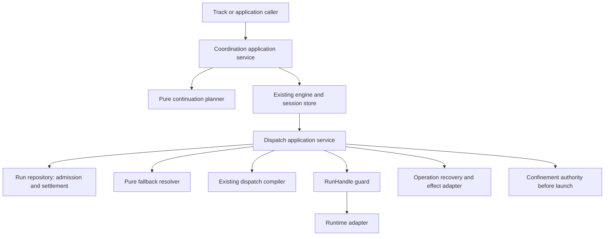
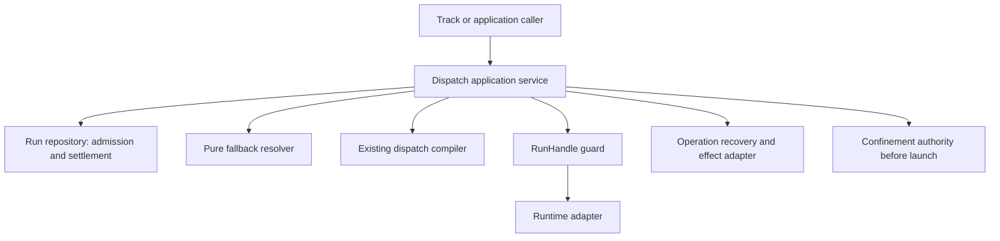

# Review pack: s2-agent-coordination-exact-01

Pack commit: ebb68bbf6d4e703f974456e2d4a51d630870f7ec

Pack id: aba118e253f4462ce564c7047b29ae11a6142d32276abc344ba3a83eca9d6d06

Author session: codex-session:1@2026-10-08

## claim_40dfef97c565b72db27a61e12c72c93a

Source: docs/architect/agent-coordination/architecture/dispatch-control-plane.md#unheaded-block-3

Target: docs/platform/agent-coordination/architecture/dispatch-control-plane.md#unheaded-block-5

### Proposed decision

| Field | Value |
|---|---|
| claimId | claim\_40dfef97c565b72db27a61e12c72c93a |
| sourceUnitDigest | 63c1310d18cd39932d325fa64e5903abf88a5ced61b48613bab65c5562c302be |
| claimKind | architecture |
| disposition | move |
| rationale | The complete primitive conservation unit at docs/architect/agent-coordination/architecture/dispatch-control-plane.md#unheaded-block-3 is retained in docs/platform/agent-coordination/architecture/dispatch-control-plane.md#unheaded-block-5. Its frozen unit digest is identical. The full surrounding section is shown in the native pack and requires an independent semantic/current-code check; digest equality does not approve that context. The rejected whole-file retirement does not retire this surviving subject. The complete dated prior file remains in history, and no previous approval carries to this binding. |
| targetOwner | docs/platform/agent-coordination/architecture/dispatch-control-plane.md |
| targetAnchor | unheaded-block-5 |
| authoredBy | codex-session:1@2026-10-10 |
| reviewStatus | pending |
| targetUnitDigest | 63c1310d18cd39932d325fa64e5903abf88a5ced61b48613bab65c5562c302be |
| targetAncestry | \["Dispatch Control Plane","Responsibility"\] |

### Source unit

```text
The dispatch control plane converts one semantic Assignment into one governed
execution attempt. It resolves target, capability, provider/model/tier,
soul/profile, mechanism, adapter, policy checks, result channel, and runtime
metadata.
```

### Target unit

```text
The dispatch control plane converts one semantic Assignment into one governed
execution attempt. It resolves target, capability, provider/model/tier,
soul/profile, mechanism, adapter, policy checks, result channel, and runtime
metadata.
```

### Unified diff

```diff
No text difference.
```

## claim_87435ecfb237daa74759168b5b3ee843

Source: docs/architect/agent-coordination/architecture/dispatch-control-plane.md#unheaded-block-4

Target: docs/platform/agent-coordination/architecture/dispatch-control-plane.md#unheaded-block-6

### Proposed decision

| Field | Value |
|---|---|
| claimId | claim\_87435ecfb237daa74759168b5b3ee843 |
| sourceUnitDigest | e59f48bd3265d6955688fc6c24bd330d1d43b8dafd659400f15dfdb56379d037 |
| claimKind | architecture |
| disposition | move |
| rationale | The complete primitive conservation unit at docs/architect/agent-coordination/architecture/dispatch-control-plane.md#unheaded-block-4 is retained in docs/platform/agent-coordination/architecture/dispatch-control-plane.md#unheaded-block-6. Its frozen unit digest is identical. The full surrounding section is shown in the native pack and requires an independent semantic/current-code check; digest equality does not approve that context. The rejected whole-file retirement does not retire this surviving subject. The complete dated prior file remains in history, and no previous approval carries to this binding. |
| targetOwner | docs/platform/agent-coordination/architecture/dispatch-control-plane.md |
| targetAnchor | unheaded-block-6 |
| authoredBy | codex-session:1@2026-10-10 |
| reviewStatus | pending |
| targetUnitDigest | e59f48bd3265d6955688fc6c24bd330d1d43b8dafd659400f15dfdb56379d037 |
| targetAncestry | \["Dispatch Control Plane","Responsibility"\] |

### Source unit

```text
It does not choose the Work lifecycle transition or invent a semantic operation.
```

### Target unit

```text
It does not choose the Work lifecycle transition or invent a semantic operation.
```

### Unified diff

```diff
No text difference.
```

## claim_cfc067c000fb23a0d2ead4596299aa5a

Source: docs/architect/agent-coordination/architecture/dispatch-control-plane.md#unheaded-block-5

Target: docs/platform/agent-coordination/architecture/dispatch-control-plane.md#unheaded-block-7

### Proposed decision

| Field | Value |
|---|---|
| claimId | claim\_cfc067c000fb23a0d2ead4596299aa5a |
| sourceUnitDigest | 020d5e2216883f329afe6bc8d7ad6dc7aa502a586e948f65f0e4aaeebeffa1bd |
| claimKind | architecture |
| disposition | move |
| rationale | The complete primitive conservation unit at docs/architect/agent-coordination/architecture/dispatch-control-plane.md#unheaded-block-5 is retained in docs/platform/agent-coordination/architecture/dispatch-control-plane.md#unheaded-block-7. Its frozen unit digest is identical. The full surrounding section is shown in the native pack and requires an independent semantic/current-code check; digest equality does not approve that context. The rejected whole-file retirement does not retire this surviving subject. The complete dated prior file remains in history, and no previous approval carries to this binding. |
| targetOwner | docs/platform/agent-coordination/architecture/dispatch-control-plane.md |
| targetAnchor | unheaded-block-7 |
| authoredBy | codex-session:1@2026-10-10 |
| reviewStatus | pending |
| targetUnitDigest | 020d5e2216883f329afe6bc8d7ad6dc7aa502a586e948f65f0e4aaeebeffa1bd |
| targetAncestry | \["Dispatch Control Plane","Flow"\] |

### Source unit

````text
```txt
Assignment
  -> policy resolver
  -> executor/target resolution
  -> governance and egress checks
  -> mechanism/adapter selection
  -> execution capability set
  -> Run creation and launch
  -> settlement/result collection
  -> RunResult normalization
```
````

### Target unit

````text
```txt
Assignment
  -> policy resolver
  -> executor/target resolution
  -> governance and egress checks
  -> mechanism/adapter selection
  -> execution capability set
  -> Run creation and launch
  -> settlement/result collection
  -> RunResult normalization
```
````

### Unified diff

```diff
No text difference.
```

## claim_682c6fe1822ee94db41d02a613e3d451

Source: docs/architect/agent-coordination/architecture/dispatch-control-plane.md#unheaded-block-6

Target: docs/platform/agent-coordination/architecture/dispatch-control-plane.md#unheaded-block-8

### Proposed decision

| Field | Value |
|---|---|
| claimId | claim\_682c6fe1822ee94db41d02a613e3d451 |
| sourceUnitDigest | ad6b4456e0c1badb32b3d189e5b8a8206e95da6ea7bb204c60ea64e483d34ce2 |
| claimKind | architecture |
| disposition | move |
| rationale | The complete primitive conservation unit at docs/architect/agent-coordination/architecture/dispatch-control-plane.md#unheaded-block-6 is retained in docs/platform/agent-coordination/architecture/dispatch-control-plane.md#unheaded-block-8. Its frozen unit digest is identical. The full surrounding section is shown in the native pack and requires an independent semantic/current-code check; digest equality does not approve that context. The rejected whole-file retirement does not retire this surviving subject. The complete dated prior file remains in history, and no previous approval carries to this binding. |
| targetOwner | docs/platform/agent-coordination/architecture/dispatch-control-plane.md |
| targetAnchor | unheaded-block-8 |
| authoredBy | codex-session:1@2026-10-10 |
| reviewStatus | pending |
| targetUnitDigest | ad6b4456e0c1badb32b3d189e5b8a8206e95da6ea7bb204c60ea64e483d34ce2 |
| targetAncestry | \["Dispatch Control Plane","Flow"\] |

### Source unit

```text
`execution capability set` is a declared step, not a derived one. A mechanism
having been selected does not tell the Run what that mechanism can and cannot
do, so an executor declares it: how the prompt reaches the worker, what
permission posture it runs under and what confinement that posture requires,
what counts as a receipt, and whether the mechanism can be observed or
contacted at all. A capability the mechanism does not have is refused by name
rather than silently degraded, and a capability reachable in one execution
mode but not the other has to say so (ADR-010 §3).
```

### Target unit

```text
`execution capability set` is a declared step, not a derived one. A mechanism
having been selected does not tell the Run what that mechanism can and cannot
do, so an executor declares it: how the prompt reaches the worker, what
permission posture it runs under and what confinement that posture requires,
what counts as a receipt, and whether the mechanism can be observed or
contacted at all. A capability the mechanism does not have is refused by name
rather than silently degraded, and a capability reachable in one execution
mode but not the other has to say so (ADR-010 §3).
```

### Unified diff

```diff
No text difference.
```

## claim_0e4a5a251bfd44ef24cba6498ba146da

Source: docs/architect/agent-coordination/architecture/dispatch-control-plane.md#unheaded-block-7

Target: docs/platform/agent-coordination/architecture/dispatch-control-plane.md#unheaded-block-9

### Proposed decision

| Field | Value |
|---|---|
| claimId | claim\_0e4a5a251bfd44ef24cba6498ba146da |
| sourceUnitDigest | d2314434187178f9d2649ed75ca946408c144840f05524bf9e3b85ece0ba0dce |
| claimKind | architecture |
| disposition | move |
| rationale | The complete primitive conservation unit at docs/architect/agent-coordination/architecture/dispatch-control-plane.md#unheaded-block-7 is retained in docs/platform/agent-coordination/architecture/dispatch-control-plane.md#unheaded-block-9. Its frozen unit digest is identical. The full surrounding section is shown in the native pack and requires an independent semantic/current-code check; digest equality does not approve that context. The rejected whole-file retirement does not retire this surviving subject. The complete dated prior file remains in history, and no previous approval carries to this binding. |
| targetOwner | docs/platform/agent-coordination/architecture/dispatch-control-plane.md |
| targetAnchor | unheaded-block-9 |
| authoredBy | codex-session:1@2026-10-10 |
| reviewStatus | pending |
| targetUnitDigest | d2314434187178f9d2649ed75ca946408c144840f05524bf9e3b85ece0ba0dce |
| targetAncestry | \["Dispatch Control Plane","Routing Identities"\] |

### Source unit

```text
The dispatch core recognizes exactly two target identities. No other name
resolves a Run target.
```

### Target unit

```text
The dispatch core recognizes exactly two target identities. No other name
resolves a Run target.
```

### Unified diff

```diff
No text difference.
```

## claim_f5567f4d0486c29fd719218e8a37d4ad

Source: docs/architect/agent-coordination/architecture/dispatch-control-plane.md#unheaded-block-8

Target: docs/platform/agent-coordination/architecture/dispatch-control-plane.md#unheaded-block-10

### Proposed decision

| Field | Value |
|---|---|
| claimId | claim\_f5567f4d0486c29fd719218e8a37d4ad |
| sourceUnitDigest | 58d62d1e2fb7ced0af3003179e67762eda8bb0b99d37ed17185eb92dafb80d52 |
| claimKind | architecture |
| disposition | move |
| rationale | The complete primitive conservation unit at docs/architect/agent-coordination/architecture/dispatch-control-plane.md#unheaded-block-8 is retained in docs/platform/agent-coordination/architecture/dispatch-control-plane.md#unheaded-block-10. Its frozen unit digest is identical. The full surrounding section is shown in the native pack and requires an independent semantic/current-code check; digest equality does not approve that context. The rejected whole-file retirement does not retire this surviving subject. The complete dated prior file remains in history, and no previous approval carries to this binding. |
| targetOwner | docs/platform/agent-coordination/architecture/dispatch-control-plane.md |
| targetAnchor | unheaded-block-10 |
| authoredBy | codex-session:1@2026-10-10 |
| reviewStatus | pending |
| targetUnitDigest | 58d62d1e2fb7ced0af3003179e67762eda8bb0b99d37ed17185eb92dafb80d52 |
| targetAncestry | \["Dispatch Control Plane","Routing Identities"\] |

### Source unit

````text
```txt
capability   — abstract behavior promise, resolved through
               runner.capabilities.<capability> (prefer/overrides), then
               runner.executors.<id>.for[]
executor-id  — explicit concrete implementation override, naming a
               runner.executors.<id> entry directly
```
````

### Target unit

````text
```txt
capability   — abstract behavior promise, resolved through
               runner.capabilities.<capability> (prefer/overrides), then
               runner.executors.<id>.for[]
executor-id  — explicit concrete implementation override, naming a
               runner.executors.<id> entry directly
```
````

### Unified diff

```diff
No text difference.
```

## claim_ab182560a5142f22e010e35a97b115dc

Source: docs/architect/agent-coordination/architecture/dispatch-control-plane.md#unheaded-block-9

Target: docs/platform/agent-coordination/architecture/dispatch-control-plane.md#unheaded-block-11

### Proposed decision

| Field | Value |
|---|---|
| claimId | claim\_ab182560a5142f22e010e35a97b115dc |
| sourceUnitDigest | 212ffb52fe719fef01a51f585286aedd6792e48d063ada3a2663933e7c2593ec |
| claimKind | architecture |
| disposition | move |
| rationale | The complete primitive conservation unit at docs/architect/agent-coordination/architecture/dispatch-control-plane.md#unheaded-block-9 is retained in docs/platform/agent-coordination/architecture/dispatch-control-plane.md#unheaded-block-11. Its frozen unit digest is identical. The full surrounding section is shown in the native pack and requires an independent semantic/current-code check; digest equality does not approve that context. The rejected whole-file retirement does not retire this surviving subject. The complete dated prior file remains in history, and no previous approval carries to this binding. |
| targetOwner | docs/platform/agent-coordination/architecture/dispatch-control-plane.md |
| targetAnchor | unheaded-block-11 |
| authoredBy | codex-session:1@2026-10-10 |
| reviewStatus | pending |
| targetUnitDigest | 212ffb52fe719fef01a51f585286aedd6792e48d063ada3a2663933e7c2593ec |
| targetAncestry | \["Dispatch Control Plane","Routing Identities"\] |

### Source unit

```text
`purpose` is not a third identity. It is compatibility terminology for
capability. The `--for <purpose>` CLI flag and the `purpose`/`for` parameter
names threaded through `src/runner/dispatch/plan.mjs` and
`src/runner/dispatch/resolve.mjs` (`resolveExecutorIdForPurpose`,
`resolveExecutorAndOverrides(cfg, executorIdOrPurpose)`) all name a capability
value, resolved against the same `runner.capabilities` catalog an explicit
capability selector would use. `compileDispatchPlan()`'s
`selector.type: 'purpose'` denotes a capability-shaped request, not a separate
ontology; nothing downstream branches on `purpose` as a concept distinct from
capability. Renaming these call sites internally is compatibility work
(tracked as Slice D/E in the normalization plan above), not a semantic
change — `--for`, `--work`, and `--assignment` stay supported at the CLI/API
adapter layer.
```

### Target unit

```text
`purpose` is not a third identity. It is compatibility terminology for
capability. The `--for <purpose>` CLI flag and the `purpose`/`for` parameter
names threaded through `src/runner/dispatch/plan.mjs` and
`src/runner/dispatch/resolve.mjs` (`resolveExecutorIdForPurpose`,
`resolveExecutorAndOverrides(cfg, executorIdOrPurpose)`) all name a capability
value, resolved against the same `runner.capabilities` catalog an explicit
capability selector would use. `compileDispatchPlan()`'s
`selector.type: 'purpose'` denotes a capability-shaped request, not a separate
ontology; nothing downstream branches on `purpose` as a concept distinct from
capability. Renaming these call sites internally is compatibility work
(tracked as Slice D/E in the normalization plan above), not a semantic
change — `--for`, `--work`, and `--assignment` stay supported at the CLI/API
adapter layer.
```

### Unified diff

```diff
No text difference.
```

## claim_b97839944d944e5f0f938409b67eb303

Source: docs/architect/agent-coordination/architecture/dispatch-control-plane.md#unheaded-block-10

Target: docs/platform/agent-coordination/architecture/dispatch-control-plane.md#unheaded-block-12

### Proposed decision

| Field | Value |
|---|---|
| claimId | claim\_b97839944d944e5f0f938409b67eb303 |
| sourceUnitDigest | 3906106d5ac34ecce2f2f0cf5b30daf3f1192927aced27527ecb0fcaf5ef76b2 |
| claimKind | decision |
| disposition | move |
| rationale | The complete primitive conservation unit at docs/architect/agent-coordination/architecture/dispatch-control-plane.md#unheaded-block-10 is retained in docs/platform/agent-coordination/architecture/dispatch-control-plane.md#unheaded-block-12. Its frozen unit digest is identical. The full surrounding section is shown in the native pack and requires an independent semantic/current-code check; digest equality does not approve that context. The rejected whole-file retirement does not retire this surviving subject. The complete dated prior file remains in history, and no previous approval carries to this binding. |
| targetOwner | docs/platform/agent-coordination/architecture/dispatch-control-plane.md |
| targetAnchor | unheaded-block-12 |
| authoredBy | codex-session:1@2026-10-10 |
| reviewStatus | pending |
| targetUnitDigest | 3906106d5ac34ecce2f2f0cf5b30daf3f1192927aced27527ecb0fcaf5ef76b2 |
| targetAncestry | \["Dispatch Control Plane","Routing Identities"\] |

### Source unit

```text
`job` is not a routing identity. ADR-004 reserves the term for a possible
future scheduler; where it appears (e.g. in logs), it names a caller's
execution-request label, never a target this control plane resolves against.
A `Run` (see the [Assignment/Run/RunResult Contract](../contracts/assignment-run-runresult.md))
is one concrete execution attempt for an Assignment — it is not a job or
operation identity either.
```

### Target unit

```text
`job` is not a routing identity. ADR-004 reserves the term for a possible
future scheduler; where it appears (e.g. in logs), it names a caller's
execution-request label, never a target this control plane resolves against.
A `Run` (see the [Assignment/Run/RunResult Contract](../contracts/assignment-run-runresult.md))
is one concrete execution attempt for an Assignment — it is not a job or
operation identity either.
```

### Unified diff

```diff
No text difference.
```

## claim_ad2493c325d75127139698ed4a34592b

Source: docs/architect/agent-coordination/architecture/dispatch-control-plane.md#unheaded-block-11

Target: docs/platform/agent-coordination/architecture/dispatch-control-plane.md#unheaded-block-13

### Proposed decision

| Field | Value |
|---|---|
| claimId | claim\_ad2493c325d75127139698ed4a34592b |
| sourceUnitDigest | 7e87c99c9a073e73b1281b51433e46d2a791c3cb617df86a55498fa14b2d5ac3 |
| claimKind | contract |
| disposition | move |
| rationale | The complete primitive conservation unit at docs/architect/agent-coordination/architecture/dispatch-control-plane.md#unheaded-block-11 is retained in docs/platform/agent-coordination/architecture/dispatch-control-plane.md#unheaded-block-13. Its frozen unit digest is identical. The full surrounding section is shown in the native pack and requires an independent semantic/current-code check; digest equality does not approve that context. The rejected whole-file retirement does not retire this surviving subject. The complete dated prior file remains in history, and no previous approval carries to this binding. |
| targetOwner | docs/platform/agent-coordination/architecture/dispatch-control-plane.md |
| targetAnchor | unheaded-block-13 |
| authoredBy | codex-session:1@2026-10-10 |
| reviewStatus | pending |
| targetUnitDigest | 7e87c99c9a073e73b1281b51433e46d2a791c3cb617df86a55498fa14b2d5ac3 |
| targetAncestry | \["Dispatch Control Plane","Routing Identities"\] |

### Source unit

```text
Work, workflow, stage, operation, taskSpec, skill, and protocol context are
component-outer. A caller in that layer may derive a capability or an
explicit executor-id from them before entering this control plane; none of
them becomes a third resolvable identity inside dispatch core. See
Component-Outer Boundary Note below.
```

### Target unit

```text
Work, workflow, stage, operation, taskSpec, skill, and protocol context are
component-outer. A caller in that layer may derive a capability or an
explicit executor-id from them before entering this control plane; none of
them becomes a third resolvable identity inside dispatch core. See
Component-Outer Boundary Note below.
```

### Unified diff

```diff
No text difference.
```

## claim_976c9258480b6a6549a86ce7f22c593e

Source: docs/architect/agent-coordination/architecture/dispatch-control-plane.md#unheaded-block-12

Target: docs/platform/agent-coordination/architecture/dispatch-control-plane.md#unheaded-block-14

### Proposed decision

| Field | Value |
|---|---|
| claimId | claim\_976c9258480b6a6549a86ce7f22c593e |
| sourceUnitDigest | 79cd1e06fa13094d10975bb96137f73a4cf5ad8205777c9ce7e6cb83e162d515 |
| claimKind | architecture |
| disposition | move |
| rationale | The complete primitive conservation unit at docs/architect/agent-coordination/architecture/dispatch-control-plane.md#unheaded-block-12 is retained in docs/platform/agent-coordination/architecture/dispatch-control-plane.md#unheaded-block-14. Its frozen unit digest is identical. The full surrounding section is shown in the native pack and requires an independent semantic/current-code check; digest equality does not approve that context. The rejected whole-file retirement does not retire this surviving subject. The complete dated prior file remains in history, and no previous approval carries to this binding. |
| targetOwner | docs/platform/agent-coordination/architecture/dispatch-control-plane.md |
| targetAnchor | unheaded-block-14 |
| authoredBy | codex-session:1@2026-10-10 |
| reviewStatus | pending |
| targetUnitDigest | 79cd1e06fa13094d10975bb96137f73a4cf5ad8205777c9ce7e6cb83e162d515 |
| targetAncestry | \["Dispatch Control Plane","Contracts"\] |

### Source unit

```text
These three contracts are canonical for this control plane. They are
additive over the current implementation, not a replacement of it — see the
Implementation Status line under each for what is real today versus still
Slice D/E scope in the normalization plan.
```

### Target unit

```text
These three contracts are canonical for this control plane. They are
additive over the current implementation, not a replacement of it — see the
Implementation Status line under each for what is real today versus still
Slice D/E scope in the normalization plan.
```

### Unified diff

```diff
No text difference.
```

## claim_88d68c4bcfd5253c805d3f898f3faa4f

Source: docs/architect/agent-coordination/architecture/dispatch-control-plane.md#unheaded-block-13

Target: docs/platform/agent-coordination/architecture/dispatch-control-plane.md#unheaded-block-15

### Proposed decision

| Field | Value |
|---|---|
| claimId | claim\_88d68c4bcfd5253c805d3f898f3faa4f |
| sourceUnitDigest | 660379a03ef45ee4294296fa6c6457a0c39aecaa2f43b4a9da3a8428ca859ba4 |
| claimKind | architecture |
| disposition | move |
| rationale | The complete primitive conservation unit at docs/architect/agent-coordination/architecture/dispatch-control-plane.md#unheaded-block-13 is retained in docs/platform/agent-coordination/architecture/dispatch-control-plane.md#unheaded-block-15. Its frozen unit digest is identical. The full surrounding section is shown in the native pack and requires an independent semantic/current-code check; digest equality does not approve that context. The rejected whole-file retirement does not retire this surviving subject. The complete dated prior file remains in history, and no previous approval carries to this binding. |
| targetOwner | docs/platform/agent-coordination/architecture/dispatch-control-plane.md |
| targetAnchor | unheaded-block-15 |
| authoredBy | codex-session:1@2026-10-10 |
| reviewStatus | pending |
| targetUnitDigest | 660379a03ef45ee4294296fa6c6457a0c39aecaa2f43b4a9da3a8428ca859ba4 |
| targetAncestry | \["Dispatch Control Plane","Contracts","DispatchRequest (outer → core)"\] |

### Source unit

````text
```json
{
  "target": { "kind": "capability | executor", "value": "code:implement" },
  "policy": {
    "minTier": "standard",
    "preferExecutor": "agy-herdr",
    "fallbackExecutors": ["codex-herdr"],
    "preferPersona": "code-reviewer",
    "visibility": "headless"
  },
  "provenance": {
    "source": "workflow-operation",
    "domain": "coding",
    "workflow": "feature",
    "stage": "executing",
    "operation": "implement-item",
    "taskSpec": "implement-item",
    "skill": "fgos-coding-implement"
  }
}
```
````

### Target unit

````text
```json
{
  "target": { "kind": "capability | executor", "value": "code:implement" },
  "policy": {
    "minTier": "standard",
    "preferExecutor": "agy-herdr",
    "fallbackExecutors": ["codex-herdr"],
    "preferPersona": "code-reviewer",
    "visibility": "headless"
  },
  "provenance": {
    "source": "workflow-operation",
    "domain": "coding",
    "workflow": "feature",
    "stage": "executing",
    "operation": "implement-item",
    "taskSpec": "implement-item",
    "skill": "fgos-coding-implement"
  }
}
```
````

### Unified diff

```diff
No text difference.
```

## claim_30f527420e02587ba71b69c406ed753a

Source: docs/architect/agent-coordination/architecture/dispatch-control-plane.md#unheaded-block-14

Target: docs/platform/agent-coordination/architecture/dispatch-control-plane.md#unheaded-block-16

### Proposed decision

| Field | Value |
|---|---|
| claimId | claim\_30f527420e02587ba71b69c406ed753a |
| sourceUnitDigest | 8d862463d399b0a381f71aec2e2a690f58e869c758c1d2ffe1199ce9712a91bb |
| claimKind | architecture |
| disposition | move |
| rationale | The complete primitive conservation unit at docs/architect/agent-coordination/architecture/dispatch-control-plane.md#unheaded-block-14 is retained in docs/platform/agent-coordination/architecture/dispatch-control-plane.md#unheaded-block-16. Its frozen unit digest is identical. The full surrounding section is shown in the native pack and requires an independent semantic/current-code check; digest equality does not approve that context. The rejected whole-file retirement does not retire this surviving subject. The complete dated prior file remains in history, and no previous approval carries to this binding. |
| targetOwner | docs/platform/agent-coordination/architecture/dispatch-control-plane.md |
| targetAnchor | unheaded-block-16 |
| authoredBy | codex-session:1@2026-10-10 |
| reviewStatus | pending |
| targetUnitDigest | 8d862463d399b0a381f71aec2e2a690f58e869c758c1d2ffe1199ce9712a91bb |
| targetAncestry | \["Dispatch Control Plane","Contracts","DispatchRequest (outer → core)"\] |

### Source unit

```text
Rules:

- `target.kind: capability` resolves through `runner.capabilities` and
  executor `for[]` bindings.
- `target.kind: executor` is an explicit concrete override and remains
  visible as an override — it must not silently discard a requested
  capability's provenance.
- `provenance` is explanatory/audit metadata, not an extra route key.
- Work/workflow/task/skill objects never cross this boundary as semantic
  resolver input; they are read by the component-outer caller only, before
  a DispatchRequest is built.
- An unavailable capability is a valid resolution result (`mechanism:
  "unavailable"`), not malformed config.
```

### Target unit

```text
Rules:

- `target.kind: capability` resolves through `runner.capabilities` and
  executor `for[]` bindings.
- `target.kind: executor` is an explicit concrete override and remains
  visible as an override — it must not silently discard a requested
  capability's provenance.
- `provenance` is explanatory/audit metadata, not an extra route key.
- Work/workflow/task/skill objects never cross this boundary as semantic
  resolver input; they are read by the component-outer caller only, before
  a DispatchRequest is built.
- An unavailable capability is a valid resolution result (`mechanism:
  "unavailable"`), not malformed config.
```

### Unified diff

```diff
No text difference.
```

## claim_f90925846cf63161875b4657557bdf4f

Source: docs/architect/agent-coordination/architecture/dispatch-control-plane.md#unheaded-block-15

Target: docs/platform/agent-coordination/architecture/dispatch-control-plane.md#unheaded-block-17

### Proposed decision

| Field | Value |
|---|---|
| claimId | claim\_f90925846cf63161875b4657557bdf4f |
| sourceUnitDigest | a5f0746c52639a115b4cc3c46edf9c430b1c809223e2bb7e7d64e4d8081a0f21 |
| claimKind | architecture |
| disposition | move |
| rationale | The complete primitive conservation unit at docs/architect/agent-coordination/architecture/dispatch-control-plane.md#unheaded-block-15 is retained in docs/platform/agent-coordination/architecture/dispatch-control-plane.md#unheaded-block-17. Its frozen unit digest is identical. The full surrounding section is shown in the native pack and requires an independent semantic/current-code check; digest equality does not approve that context. The rejected whole-file retirement does not retire this surviving subject. The complete dated prior file remains in history, and no previous approval carries to this binding. |
| targetOwner | docs/platform/agent-coordination/architecture/dispatch-control-plane.md |
| targetAnchor | unheaded-block-17 |
| authoredBy | codex-session:1@2026-10-10 |
| reviewStatus | pending |
| targetUnitDigest | a5f0746c52639a115b4cc3c46edf9c430b1c809223e2bb7e7d64e4d8081a0f21 |
| targetAncestry | \["Dispatch Control Plane","Contracts","DispatchRequest (outer → core)"\] |

### Source unit

```text
**Implementation status.** No single typed `DispatchRequest` object exists
yet. `compileDispatchPlan()`'s options bag
(`executorId | for | work | assignment | stage | needsSoul |
hasLiveTaskAccess | caller | cliOverride | options`) is the de facto request
shape today — untyped, and `work`/`assignment` are resolved to a
capability/executor-id *inside* `plan.mjs` rather than by the caller before
the boundary. Introducing a normalized `DispatchRequest` helper near
`plan.mjs` without changing `compileDispatchPlan`'s role as the sole
execution chooser is Slice D scope.
```

### Target unit

```text
**Implementation status.** No single typed `DispatchRequest` object exists
yet. `compileDispatchPlan()`'s options bag
(`executorId | for | work | assignment | stage | needsSoul |
hasLiveTaskAccess | caller | cliOverride | options`) is the de facto request
shape today — untyped, and `work`/`assignment` are resolved to a
capability/executor-id *inside* `plan.mjs` rather than by the caller before
the boundary. Introducing a normalized `DispatchRequest` helper near
`plan.mjs` without changing `compileDispatchPlan`'s role as the sole
execution chooser is Slice D scope.
```

### Unified diff

```diff
No text difference.
```

## claim_e81aaa3f9c83d22d13567d50efd6f492

Source: docs/architect/agent-coordination/architecture/dispatch-control-plane.md#unheaded-block-16

Target: docs/platform/agent-coordination/history/retired-engine/files/architecture/dispatch-control-plane.md#literal-snapshot

### Proposed decision

| Field | Value |
|---|---|
| claimId | claim\_e81aaa3f9c83d22d13567d50efd6f492 |
| sourceUnitDigest | d1c36df300bfc3c689f62b99a4f491fd02cb8488c47a608b273f25cb142d1407 |
| claimKind | contract |
| disposition | move |
| rationale | This particular legacy unit docs/architect/agent-coordination/architecture/dispatch-control-plane.md#unheaded-block-16 is retained verbatim inside docs/platform/agent-coordination/history/retired-engine/files/architecture/dispatch-control-plane.md#literal-snapshot as the dated pre-rework statement, not as an assertion that the whole surviving file is retired. The current version of docs/platform/agent-coordination/architecture/dispatch-control-plane.md distinguishes present runtime behaviour/design obligations from the original session-only, obsolete interface or dated implementation wording. Retirement 2180b4e72 applies only to session-engine portions; live guidance is restored at its current path and receives a separate independent check. No old approval carries to this corrected unit-specific explanation. |
| targetOwner | docs/platform/agent-coordination/history/retired-engine/files/architecture/dispatch-control-plane.md |
| targetAnchor | literal-snapshot |
| authoredBy | codex-session:1@2026-10-10 |
| reviewStatus | pending |
| targetUnitDigest | 17ecc00c3ce536698978b4d73be4c5f3a4bf6d3c3055779fb65103314712f96a |
| targetAncestry | \["Historical File: surviving dispatch runtime, mixed obsolete resolver contract"\] |

### Source unit

```text
One validated shape at every declared scope (runner/default, definition,
node, operation, role, actor, Work, Assignment, human/CLI, governance) — see
the [FlowDefinition Contract](../contracts/flow-definition.md#policypatch)
for the accepted schema. Dispatch does not define a second policy shape; it
consumes the same one.
```

### Target unit

````text
## Literal Snapshot

~~~~text
# Dispatch Control Plane

```txt
Document type: Architecture
Audience: Human reviewers, maintainers, documentation agents
Purpose: Preserve source material for Dispatch Control Plane
Design status: Candidate
Implementation: Not re-verified; source implementation statements remain in the body
Provenance: Retained from docs/architect/agent-coordination/architecture/dispatch-control-plane.md at fcfe78cb89585bc9ab23f11bab67d41458834fc4
Writer type: Documentation maintainer
Canonical for: Preserved architecture material for Dispatch Control Plane; no authority cutover
Use this when: Comparing this candidate with its pinned legacy source
Do not use this for: Inferring current implementation or supersession of retained sources
Last reviewed: UNPROVEN; independent content review pending
Related:
- docs/architect/component-boundary/component-boundary-advisory.md
- docs/architect/proposals/component-authority-boundary-map.md
- docs/platform/agent-coordination/contracts/flow-definition.md
Supersedes: None; retained source authority is unchanged
Superseded by: None
Added in candidate: Promotion metadata only; source claims and implementation are not re-decided here
```
Document type: Architecture
Design status: Accepted
Implementation: Partial
Last reviewed: 2026-09-09
Canonical for: dispatch responsibility and governance boundaries; the
DispatchRequest, PolicyPatch, and DispatchPlan contracts; component-internal
ownership and forbidden dependencies for the Dispatch And Execution Engine.
Related: [Component Boundary Advisory](../../../architect/component-boundary/component-boundary-advisory.md)
(discussion-only), [Component Authority Boundary Map](../../../architect/proposals/component-authority-boundary-map.md)
(draft), [FlowDefinition Contract](../contracts/flow-definition.md),
[Workflow Stage Operation Contract](../contracts/workflow-stage-operation.md),
[Assignment/Run/RunResult Contract](../contracts/assignment-run-runresult.md),
[Dispatch Core Contract Normalization plan](../../../history/dispatch-core-contract-normalization/plan.md)

## Responsibility

The dispatch control plane converts one semantic Assignment into one governed
execution attempt. It resolves target, capability, provider/model/tier,
soul/profile, mechanism, adapter, policy checks, result channel, and runtime
metadata.

It does not choose the Work lifecycle transition or invent a semantic operation.

## Flow

```txt
Assignment
  -> policy resolver
  -> executor/target resolution
  -> governance and egress checks
  -> mechanism/adapter selection
  -> execution capability set
  -> Run creation and launch
  -> settlement/result collection
  -> RunResult normalization
```

`execution capability set` is a declared step, not a derived one. A mechanism
having been selected does not tell the Run what that mechanism can and cannot
do, so an executor declares it: how the prompt reaches the worker, what
permission posture it runs under and what confinement that posture requires,
what counts as a receipt, and whether the mechanism can be observed or
contacted at all. A capability the mechanism does not have is refused by name
rather than silently degraded, and a capability reachable in one execution
mode but not the other has to say so (ADR-010 §3).

## Routing Identities

The dispatch core recognizes exactly two target identities. No other name
resolves a Run target.

```txt
capability   — abstract behavior promise, resolved through
               runner.capabilities.<capability> (prefer/overrides), then
               runner.executors.<id>.for[]
executor-id  — explicit concrete implementation override, naming a
               runner.executors.<id> entry directly
```

`purpose` is not a third identity. It is compatibility terminology for
capability. The `--for <purpose>` CLI flag and the `purpose`/`for` parameter
names threaded through `src/runner/dispatch/plan.mjs` and
`src/runner/dispatch/resolve.mjs` (`resolveExecutorIdForPurpose`,
`resolveExecutorAndOverrides(cfg, executorIdOrPurpose)`) all name a capability
value, resolved against the same `runner.capabilities` catalog an explicit
capability selector would use. `compileDispatchPlan()`'s
`selector.type: 'purpose'` denotes a capability-shaped request, not a separate
ontology; nothing downstream branches on `purpose` as a concept distinct from
capability. Renaming these call sites internally is compatibility work
(tracked as Slice D/E in the normalization plan above), not a semantic
change — `--for`, `--work`, and `--assignment` stay supported at the CLI/API
adapter layer.

`job` is not a routing identity. ADR-004 reserves the term for a possible
future scheduler; where it appears (e.g. in logs), it names a caller's
execution-request label, never a target this control plane resolves against.
A `Run` (see the [Assignment/Run/RunResult Contract](../contracts/assignment-run-runresult.md))
is one concrete execution attempt for an Assignment — it is not a job or
operation identity either.

Work, workflow, stage, operation, taskSpec, skill, and protocol context are
component-outer. A caller in that layer may derive a capability or an
explicit executor-id from them before entering this control plane; none of
them becomes a third resolvable identity inside dispatch core. See
Component-Outer Boundary Note below.

## Contracts

These three contracts are canonical for this control plane. They are
additive over the current implementation, not a replacement of it — see the
Implementation Status line under each for what is real today versus still
Slice D/E scope in the normalization plan.

### DispatchRequest (outer → core)

```json
{
  "target": { "kind": "capability | executor", "value": "code:implement" },
  "policy": {
    "minTier": "standard",
    "preferExecutor": "agy-herdr",
    "fallbackExecutors": ["codex-herdr"],
    "preferPersona": "code-reviewer",
    "visibility": "headless"
  },
  "provenance": {
    "source": "workflow-operation",
    "domain": "coding",
    "workflow": "feature",
    "stage": "executing",
    "operation": "implement-item",
    "taskSpec": "implement-item",
    "skill": "fgos-coding-implement"
  }
}
```

Rules:

- `target.kind: capability` resolves through `runner.capabilities` and
  executor `for[]` bindings.
- `target.kind: executor` is an explicit concrete override and remains
  visible as an override — it must not silently discard a requested
  capability's provenance.
- `provenance` is explanatory/audit metadata, not an extra route key.
- Work/workflow/task/skill objects never cross this boundary as semantic
  resolver input; they are read by the component-outer caller only, before
  a DispatchRequest is built.
- An unavailable capability is a valid resolution result (`mechanism:
  "unavailable"`), not malformed config.

**Implementation status.** No single typed `DispatchRequest` object exists
yet. `compileDispatchPlan()`'s options bag
(`executorId | for | work | assignment | stage | needsSoul |
hasLiveTaskAccess | caller | cliOverride | options`) is the de facto request
shape today — untyped, and `work`/`assignment` are resolved to a
capability/executor-id *inside* `plan.mjs` rather than by the caller before
the boundary. Introducing a normalized `DispatchRequest` helper near
`plan.mjs` without changing `compileDispatchPlan`'s role as the sole
execution chooser is Slice D scope.

### PolicyPatch

One validated shape at every declared scope (runner/default, definition,
node, operation, role, actor, Work, Assignment, human/CLI, governance) — see
the [FlowDefinition Contract](../contracts/flow-definition.md#policypatch)
for the accepted schema. Dispatch does not define a second policy shape; it
consumes the same one.

```txt
runner/default
→ definition/protocol
→ operation/taskSpec
→ role
→ actor/persona
→ Work constraints
→ Assignment
→ trusted human/CLI override
→ governance
```

Merge rules (already accepted and enforced):

- tier constraints accumulate monotonically — a weaker layer cannot lower a
  stronger required tier;
- executor preference is most-specific-wins, subject to registration and
  governance;
- provider family derives from the selected registered executor, never from
  a raw selector string;
- literal model/executor names are not portable workflow/protocol data — a
  *portable* definition expresses `minTier`/`capabilities` only;
- provenance records the winning scope for every resolved field, as
  `{field: {value, source: {scope, id}}}`.

**Implementation status.** Implemented. `resolveAssignmentDispatchPolicy()`
(`src/runner/dispatch/assignment-policy.mjs`) implements this exact
precedence and provenance shape. `assertNoPortableExecutorPin()`
(`src/runner/coordination/session-engine.mjs`) already rejects a literal
`preferExecutor` declared at a portable definition/role/actor/operation
scope. `fallbackExecutors` remains `reserved-not-executed`: recorded and
validated, never automatically dispatched as failover.

### DispatchPlan (core → runtime)

```json
{
  "requestedTarget": { "kind": "capability", "value": "code:implement" },
  "requestedCapability": "code:implement",
  "selectedExecutor": "agy-herdr",
  "bindingSource": "capability.prefer",
  "providerModel": "gemini",
  "tier": "standard",
  "model": "<resolved-from-policy>",
  "mechanism": "out-of-process",
  "invocation": { "via": "cli", "adapter": "herdr-spawn" },
  "governance": {},
  "provenance": {}
}
```

An explicit executor override remains visible as an override; it must not
silently replace the requested capability's own provenance.

**Implementation status.** Implemented for dispatchable plans.
`compileDispatchPlan()` (`src/runner/dispatch/plan.mjs`) returns the legacy
selector/mechanism fields plus `bindingSource`, `tier`, `model`,
`providerModel`, structured field-level `provenance`, and the complete
merged `policy`. It delegates those policy fields to
`resolveAssignmentDispatchPolicy()` rather than re-deriving them, and
`assignment-runner.mjs` now reads `compiledPlan.policy` directly instead of
calling the policy resolver a second time.

For a real Assignment, policy resolution failure or a
decided-executor-versus-policy-executor mismatch remains a hard
`RunnerConfigError`. For a non-Assignment compatibility request
(`decide --for`, `decide <executor-id>`, `decide --work`), `plan.mjs`
synthesizes the smallest policy object needed for observability:
`preferExecutor` is the already-selected executor, and capability
`overrides.providerModel`/`overrides.model`/`overrides.tier`/
`overrides.rigorOverrides` are folded into the synthesized policy so the
reported model/tier matches the same capability-default path used by
execution. If that synthesized policy would disagree with an explicit caller
override, the plan stays dispatchable and records
`policy.executor-mismatch-ignored`; the optional policy fields are left
unset rather than turning a legacy `decide` probe into a thrown error.

Governance-blocked and genuinely unavailable plans also leave
`tier`/`model`/`providerModel`/`provenance`/`policy` unset so they never
publish a partial policy for a Run that will not launch.

`selector.type: 'purpose'` in the current implementation corresponds to
`requestedTarget.kind: 'capability'` in the target contract above (see
Routing Identities). It is a compatibility label on the public shape, not a
semantic third identity.

## Executor Kinds

An executor is not assumed to be an agent. `runner.executors.<id>.kind` is
one of `agent | tool` (`src/runner/dispatch/config.mjs`,
`EXECUTOR_KINDS`) — orthogonal to the invocation mechanism
(`invocations[].via`, one of `cli | task | mcp | api`). A `tool`/MCP-only
executor (e.g. `gitnexus`, `invocations: [{via: "mcp"}]`) is never spawned
as a subprocess: `resolveExecutorConfig()`'s own Gate B3 throws rather than
silently falling through to the global CLI executor when a caller asks an
MCP-only executor to resolve for CLI dispatch. This is how impact-analysis
tools like GitNexus participate in dispatch as executors without pretending
to be agents — the same control plane, the same capability/executor-id
routing, a different declared mechanism.

## Component-Internal Ownership

The Dispatch And Execution Engine owns exactly these authorities. No other
component performs any of them; this control plane performs none of the
Component-Outer Boundary Note's responsibilities.

1. **Request normalizer** — accepts only a normalized capability/executor
   target plus PolicyPatch/provenance; performs no Work graph traversal.
2. **Capability binding resolver** — resolves capability aliases, `prefer`,
   and executor `for[]` declarations (`resolveExecutorAndOverrides`).
3. **Executor registry resolver** — resolves a literal executor-id to its
   concrete invocation/tool/agent shape (`resolveExecutorConfig`).
4. **Policy resolver** — `resolveAssignmentDispatchPolicy`/
   `mergePolicyStack`; owns provider/model/tier derivation and provenance.
5. **Governance resolver** — checks egress/provider/executor/content
   constraints (cross-provider gate, `allowCrossProvider`, `carries`).
6. **Mechanism resolver** — decides in-process/out-of-process/unavailable
   and MCP/tool handback (`decideDispatchMechanism`,
   `decideExecutorDispatchMechanism`).
7. **DispatchPlan compiler** — `compileDispatchPlan()`; joins the prior
   decisions into one plan. Remains the sole execution chooser.
8. **Run runtime/adapters** — creates, launches, observes, settles, and
   retries a Run without choosing semantic operation
   (`assignment-runner.mjs`, `transport.mjs`, `herdr-round.mjs`).

Forbidden dependencies for all eight:

- no `Work` lifecycle mutation (`pick`, `return`, `claim`, `take`): enforced by boundary grep tests (`test/runner/dispatch-reconciliation-import-graph.test.mjs`). Work driving orchestration lives exclusively in Work Driver (`src/runner/loop.mjs`, `src/runner/fanout-batch.mjs`);
- no event store append (`appendEvent`): audit dispatch logging is isolated to `src/runner/dispatch-log.mjs` outside dispatch core;
- no workflow/stage/task/skill lookup: dispatch core contains no Work lookup implementations. Work capability lookups (`executorIdForWork`, `resolveCapabilityIdentityDetails`, `resolveCapabilityIdentity`, `buildPrompt`) are housed in dedicated leaf compatibility module `src/runner/work-compat.mjs` (registered as `infra` in architecture manifest) with zero imports into dispatch core; `src/runner/dispatch/resolve.mjs` and `prepare.mjs` provide backward-compatible re-exports without importing `workflow-stage-graphs` or `operation-choice.mjs`, consumed by pre-existing callers (`plan.mjs` for `compileDispatchPlan({work})` and `cli.mjs` for `spawnWorker`). All 13 strictly decoupled dispatch core modules contain zero `workflow-stage-graphs` imports, and boundary tests enforce that strict core modules cannot import Work lookup symbols or `work-compat.mjs` (verified by `test/runner/dispatch-reconciliation-import-graph.test.mjs`);
- no semantic operation choice;
- no direct protocol/skill/domain executor launch;
- no RunResult confidence decision (owned by the Run Result Evaluator);
- no provider/model selection outside the policy resolver (item 4);
- no second private dispatch path for a coordination or domain harness —
  `cohort-planner.mjs` is the one confirmed exception, and it only *re-reads*
  `resolveExecutorConfig`/`resolveAssignmentDispatchPolicy` for a
  pre-dispatch feasibility check; it never spawns and never bypasses them.

## Component-Outer Boundary Note

Work Driver, Coordination Engine/FlowDefinition, Domain Harness, and
Host/CLI/API callers derive a capability or explicit executor-id plus a
PolicyPatch and provenance, then hand a DispatchRequest to this control
plane. None of them calls `resolveExecutorConfig` or launches an executor
directly. `dispatchDeclaredOperation()`
(`src/runner/coordination/session-engine.mjs`) is the concrete example
today: it composes a full scoped policy stack (runner → definition →
operation → role → actor) and passes the winning provenance to
`resolveAssignmentDispatchPolicy` via `cliOverride.policyProvenance`, rather
than re-deriving policy itself. Full component-outer ownership (Work Driver,
FlowDefinition/operation, domain harness, host CLI/API selector
compatibility) is documented in the normalization plan's Slice C scope, not
duplicated here.

## Governance

- Executor identifiers must resolve through configured/approved targets.
- Cross-provider/model/tier dispatch must remain explicit and auditable.
- Capability, role, soul/profile, privacy, and context-egress requirements must
  be resolved through policy rather than hard-wired to a Workflow.
- CLI spawn is an execution mechanism, not a governance bypass.
- Read-only/mutating policy must be checked before launch.
- Result and artifact locations must be bounded and attributable to the Run.
- Direct executor calls from protocol, Skill, coordinator, or domain-harness
  prose are invalid.

## Separation Of Concerns

```txt
planner     proposes a declared or dynamic semantic action
policy      validates legality, authority, bounds, and selected domain rules
builder     creates Assignment
resolver    produces governed DispatchPlan
dispatcher  launches and observes Run
normalizer  creates RunResult
caller      consumes evidence and invokes authorized lifecycle behavior, if any
```

Planning may be agent-led, declared, or domain-assisted. Dispatch does not care
which source proposed the validated Assignment and must not create separate
runtime paths for them. A CoordinationSession or a declared
`CoordinationProtocol` FlowDefinition (see
[ADR-008](../decisions/ADR-008-coordination-session-and-mission-deferral.md),
[ADR-009](../decisions/ADR-009-flow-definition-shared-ir-and-typed-profiles.md))
is one more caller of this same flow: a Cohort Planner may emit actor policy
inputs, but it resolves and dispatches exactly one Assignment at a time
through this control plane — it may not spawn an executor directly or read
sibling Assignment state.

The detailed redesign source remains a
[proposal](../proposals/dispatch-control-plane-redesign.md) until its unresolved
target-state sections are reconciled with implementation.

## Source Inventory

| Layer | Modules | Responsibilities & Boundaries |
| --- | --- | --- |
| Dispatch Core | `src/runner/dispatch/**` (`cli.mjs`, `plan.mjs`, `resolve.mjs`, `prepare.mjs`, `settlement.mjs`, `reconcile-cli-spawn.mjs`, `herdr-reconcile.mjs`, `proof-helpers.mjs`, `assignment-runner.mjs`, `confinement/**`, `transport.mjs`, `herdr-round.mjs`, `brief.mjs`, `assignment.mjs`, `runtime-inspection.mjs`) | Execution allocation, plan compilation, executor commands, confinement, and adapter execution. Strictly zero references to `pick`, `return`, `claim`, or `appendEvent`. |
| Work Driver Compatibility | `src/runner/work-compat.mjs` | Leaf compatibility module (registered as "infra" in architecture manifest) housing Work Driver compatibility lookup implementations (`executorIdForWork`, `resolveCapabilityIdentityDetails`, `resolveCapabilityIdentity`, `buildPrompt`) with zero imports into dispatch core; consumed by `plan.mjs`/`cli.mjs` via compatibility re-export. |
| Stage Operation Selection | `src/runner/dispatch/operation-choice.mjs` | Bridge for stage operation selection (`chooseStageOperation`, `executeDriverOperationChoice`) consuming hardened RunResult. |
| Work Driver | `src/runner/loop.mjs`, `src/runner/fanout-batch.mjs` | Work item lifecycle orchestration, batch fan-out driving (`pick -> executeExecutorCli -> return`), fail-safe settlement (`fgos return --to blocked`), and worker slots occupancy (`OccupancyPort`). |
| Audit Seam | `src/runner/dispatch-log.mjs` | Audit event logging (`logExecutorDispatch`) isolated from dispatch core. |
~~~~
````

### Unified diff

````diff
--- "docs/architect/agent-coordination/architecture/dispatch-control-plane.md#unheaded-block-16"
+++ "docs/platform/agent-coordination/history/retired-engine/files/architecture/dispatch-control-plane.md#literal-snapshot"
@@ -1,5 +1,378 @@
+## Literal Snapshot
+
+~~~~text
+# Dispatch Control Plane
+
+```txt
+Document type: Architecture
+Audience: Human reviewers, maintainers, documentation agents
+Purpose: Preserve source material for Dispatch Control Plane
+Design status: Candidate
+Implementation: Not re-verified; source implementation statements remain in the body
+Provenance: Retained from docs/architect/agent-coordination/architecture/dispatch-control-plane.md at fcfe78cb89585bc9ab23f11bab67d41458834fc4
+Writer type: Documentation maintainer
+Canonical for: Preserved architecture material for Dispatch Control Plane; no authority cutover
+Use this when: Comparing this candidate with its pinned legacy source
+Do not use this for: Inferring current implementation or supersession of retained sources
+Last reviewed: UNPROVEN; independent content review pending
+Related:
+- docs/architect/component-boundary/component-boundary-advisory.md
+- docs/architect/proposals/component-authority-boundary-map.md
+- docs/platform/agent-coordination/contracts/flow-definition.md
+Supersedes: None; retained source authority is unchanged
+Superseded by: None
+Added in candidate: Promotion metadata only; source claims and implementation are not re-decided here
+```
+Document type: Architecture
+Design status: Accepted
+Implementation: Partial
+Last reviewed: 2026-09-09
+Canonical for: dispatch responsibility and governance boundaries; the
+DispatchRequest, PolicyPatch, and DispatchPlan contracts; component-internal
+ownership and forbidden dependencies for the Dispatch And Execution Engine.
+Related: [Component Boundary Advisory](../../../architect/component-boundary/component-boundary-advisory.md)
+(discussion-only), [Component Authority Boundary Map](../../../architect/proposals/component-authority-boundary-map.md)
+(draft), [FlowDefinition Contract](../contracts/flow-definition.md),
+[Workflow Stage Operation Contract](../contracts/workflow-stage-operation.md),
+[Assignment/Run/RunResult Contract](../contracts/assignment-run-runresult.md),
+[Dispatch Core Contract Normalization plan](../../../history/dispatch-core-contract-normalization/plan.md)
+
+## Responsibility
+
+The dispatch control plane converts one semantic Assignment into one governed
+execution attempt. It resolves target, capability, provider/model/tier,
+soul/profile, mechanism, adapter, policy checks, result channel, and runtime
+metadata.
+
+It does not choose the Work lifecycle transition or invent a semantic operation.
+
+## Flow
+
+```txt
+Assignment
+  -> policy resolver
+  -> executor/target resolution
+  -> governance and egress checks
+  -> mechanism/adapter selection
+  -> execution capability set
+  -> Run creation and launch
+  -> settlement/result collection
+  -> RunResult normalization
+```
+
+`execution capability set` is a declared step, not a derived one. A mechanism
+having been selected does not tell the Run what that mechanism can and cannot
+do, so an executor declares it: how the prompt reaches the worker, what
+permission posture it runs under and what confinement that posture requires,
+what counts as a receipt, and whether the mechanism can be observed or
+contacted at all. A capability the mechanism does not have is refused by name
+rather than silently degraded, and a capability reachable in one execution
+mode but not the other has to say so (ADR-010 §3).
+
+## Routing Identities
+
+The dispatch core recognizes exactly two target identities. No other name
+resolves a Run target.
+
+```txt
+capability   — abstract behavior promise, resolved through
+               runner.capabilities.<capability> (prefer/overrides), then
+               runner.executors.<id>.for[]
+executor-id  — explicit concrete implementation override, naming a
+               runner.executors.<id> entry directly
+```
+
+`purpose` is not a third identity. It is compatibility terminology for
+capability. The `--for <purpose>` CLI flag and the `purpose`/`for` parameter
+names threaded through `src/runner/dispatch/plan.mjs` and
+`src/runner/dispatch/resolve.mjs` (`resolveExecutorIdForPurpose`,
+`resolveExecutorAndOverrides(cfg, executorIdOrPurpose)`) all name a capability
+value, resolved against the same `runner.capabilities` catalog an explicit
+capability selector would use. `compileDispatchPlan()`'s
+`selector.type: 'purpose'` denotes a capability-shaped request, not a separate
+ontology; nothing downstream branches on `purpose` as a concept distinct from
+capability. Renaming these call sites internally is compatibility work
+(tracked as Slice D/E in the normalization plan above), not a semantic
+change — `--for`, `--work`, and `--assignment` stay supported at the CLI/API
+adapter layer.
+
+`job` is not a routing identity. ADR-004 reserves the term for a possible
+future scheduler; where it appears (e.g. in logs), it names a caller's
+execution-request label, never a target this control plane resolves against.
+A `Run` (see the [Assignment/Run/RunResult Contract](../contracts/assignment-run-runresult.md))
+is one concrete execution attempt for an Assignment — it is not a job or
+operation identity either.
+
+Work, workflow, stage, operation, taskSpec, skill, and protocol context are
+component-outer. A caller in that layer may derive a capability or an
+explicit executor-id from them before entering this control plane; none of
+them becomes a third resolvable identity inside dispatch core. See
+Component-Outer Boundary Note below.
+
+## Contracts
+
+These three contracts are canonical for this control plane. They are
+additive over the current implementation, not a replacement of it — see the
+Implementation Status line under each for what is real today versus still
+Slice D/E scope in the normalization plan.
+
+### DispatchRequest (outer → core)
+
+```json
+{
+  "target": { "kind": "capability | executor", "value": "code:implement" },
+  "policy": {
+    "minTier": "standard",
+    "preferExecutor": "agy-herdr",
+    "fallbackExecutors": ["codex-herdr"],
+    "preferPersona": "code-reviewer",
+    "visibility": "headless"
+  },
+  "provenance": {
+    "source": "workflow-operation",
+    "domain": "coding",
+    "workflow": "feature",
+    "stage": "executing",
+    "operation": "implement-item",
+    "taskSpec": "implement-item",
+    "skill": "fgos-coding-implement"
+  }
+}
+```
+
+Rules:
+
+- `target.kind: capability` resolves through `runner.capabilities` and
+  executor `for[]` bindings.
+- `target.kind: executor` is an explicit concrete override and remains
+  visible as an override — it must not silently discard a requested
+  capability's provenance.
+- `provenance` is explanatory/audit metadata, not an extra route key.
+- Work/workflow/task/skill objects never cross this boundary as semantic
+  resolver input; they are read by the component-outer caller only, before
+  a DispatchRequest is built.
+- An unavailable capability is a valid resolution result (`mechanism:
+  "unavailable"`), not malformed config.
+
+**Implementation status.** No single typed `DispatchRequest` object exists
+yet. `compileDispatchPlan()`'s options bag
+(`executorId | for | work | assignment | stage | needsSoul |
+hasLiveTaskAccess | caller | cliOverride | options`) is the de facto request
+shape today — untyped, and `work`/`assignment` are resolved to a
+capability/executor-id *inside* `plan.mjs` rather than by the caller before
+the boundary. Introducing a normalized `DispatchRequest` helper near
+`plan.mjs` without changing `compileDispatchPlan`'s role as the sole
+execution chooser is Slice D scope.
+
+### PolicyPatch
+
 One validated shape at every declared scope (runner/default, definition,
 node, operation, role, actor, Work, Assignment, human/CLI, governance) — see
 the [FlowDefinition Contract](../contracts/flow-definition.md#policypatch)
 for the accepted schema. Dispatch does not define a second policy shape; it
-consumes the same one.
\ No newline at end of file
+consumes the same one.
+
+```txt
+runner/default
+→ definition/protocol
+→ operation/taskSpec
+→ role
+→ actor/persona
+→ Work constraints
+→ Assignment
+→ trusted human/CLI override
+→ governance
+```
+
+Merge rules (already accepted and enforced):
+
+- tier constraints accumulate monotonically — a weaker layer cannot lower a
+  stronger required tier;
+- executor preference is most-specific-wins, subject to registration and
+  governance;
+- provider family derives from the selected registered executor, never from
+  a raw selector string;
+- literal model/executor names are not portable workflow/protocol data — a
+  *portable* definition expresses `minTier`/`capabilities` only;
+- provenance records the winning scope for every resolved field, as
+  `{field: {value, source: {scope, id}}}`.
+
+**Implementation status.** Implemented. `resolveAssignmentDispatchPolicy()`
+(`src/runner/dispatch/assignment-policy.mjs`) implements this exact
+precedence and provenance shape. `assertNoPortableExecutorPin()`
+(`src/runner/coordination/session-engine.mjs`) already rejects a literal
+`preferExecutor` declared at a portable definition/role/actor/operation
+scope. `fallbackExecutors` remains `reserved-not-executed`: recorded and
+validated, never automatically dispatched as failover.
+
+### DispatchPlan (core → runtime)
+
+```json
+{
+  "requestedTarget": { "kind": "capability", "value": "code:implement" },
+  "requestedCapability": "code:implement",
+  "selectedExecutor": "agy-herdr",
+  "bindingSource": "capability.prefer",
+  "providerModel": "gemini",
+  "tier": "standard",
+  "model": "<resolved-from-policy>",
+  "mechanism": "out-of-process",
+  "invocation": { "via": "cli", "adapter": "herdr-spawn" },
+  "governance": {},
+  "provenance": {}
+}
+```
+
+An explicit executor override remains visible as an override; it must not
+silently replace the requested capability's own provenance.
+
+**Implementation status.** Implemented for dispatchable plans.
+`compileDispatchPlan()` (`src/runner/dispatch/plan.mjs`) returns the legacy
+selector/mechanism fields plus `bindingSource`, `tier`, `model`,
+`providerModel`, structured field-level `provenance`, and the complete
+merged `policy`. It delegates those policy fields to
+`resolveAssignmentDispatchPolicy()` rather than re-deriving them, and
+`assignment-runner.mjs` now reads `compiledPlan.policy` directly instead of
+calling the policy resolver a second time.
+
+For a real Assignment, policy resolution failure or a
+decided-executor-versus-policy-executor mismatch remains a hard
+`RunnerConfigError`. For a non-Assignment compatibility request
+(`decide --for`, `decide <executor-id>`, `decide --work`), `plan.mjs`
+synthesizes the smallest policy object needed for observability:
+`preferExecutor` is the already-selected executor, and capability
+`overrides.providerModel`/`overrides.model`/`overrides.tier`/
+`overrides.rigorOverrides` are folded into the synthesized policy so the
+reported model/tier matches the same capability-default path used by
+execution. If that synthesized policy would disagree with an explicit caller
+override, the plan stays dispatchable and records
+`policy.executor-mismatch-ignored`; the optional policy fields are left
+unset rather than turning a legacy `decide` probe into a thrown error.
+
+Governance-blocked and genuinely unavailable plans also leave
+`tier`/`model`/`providerModel`/`provenance`/`policy` unset so they never
+publish a partial policy for a Run that will not launch.
+
+`selector.type: 'purpose'` in the current implementation corresponds to
+`requestedTarget.kind: 'capability'` in the target contract above (see
+Routing Identities). It is a compatibility label on the public shape, not a
+semantic third identity.
+
+## Executor Kinds
+
+An executor is not assumed to be an agent. `runner.executors.<id>.kind` is
+one of `agent | tool` (`src/runner/dispatch/config.mjs`,
+`EXECUTOR_KINDS`) — orthogonal to the invocation mechanism
+(`invocations[].via`, one of `cli | task | mcp | api`). A `tool`/MCP-only
+executor (e.g. `gitnexus`, `invocations: [{via: "mcp"}]`) is never spawned
+as a subprocess: `resolveExecutorConfig()`'s own Gate B3 throws rather than
+silently falling through to the global CLI executor when a caller asks an
+MCP-only executor to resolve for CLI dispatch. This is how impact-analysis
+tools like GitNexus participate in dispatch as executors without pretending
+to be agents — the same control plane, the same capability/executor-id
+routing, a different declared mechanism.
+
+## Component-Internal Ownership
+
+The Dispatch And Execution Engine owns exactly these authorities. No other
+component performs any of them; this control plane performs none of the
+Component-Outer Boundary Note's responsibilities.
+
+1. **Request normalizer** — accepts only a normalized capability/executor
+   target plus PolicyPatch/provenance; performs no Work graph traversal.
+2. **Capability binding resolver** — resolves capability aliases, `prefer`,
+   and executor `for[]` declarations (`resolveExecutorAndOverrides`).
+3. **Executor registry resolver** — resolves a literal executor-id to its
+   concrete invocation/tool/agent shape (`resolveExecutorConfig`).
+4. **Policy resolver** — `resolveAssignmentDispatchPolicy`/
+   `mergePolicyStack`; owns provider/model/tier derivation and provenance.
+5. **Governance resolver** — checks egress/provider/executor/content
+   constraints (cross-provider gate, `allowCrossProvider`, `carries`).
+6. **Mechanism resolver** — decides in-process/out-of-process/unavailable
+   and MCP/tool handback (`decideDispatchMechanism`,
+   `decideExecutorDispatchMechanism`).
+7. **DispatchPlan compiler** — `compileDispatchPlan()`; joins the prior
+   decisions into one plan. Remains the sole execution chooser.
+8. **Run runtime/adapters** — creates, launches, observes, settles, and
+   retries a Run without choosing semantic operation
+   (`assignment-runner.mjs`, `transport.mjs`, `herdr-round.mjs`).
+
+Forbidden dependencies for all eight:
+
+- no `Work` lifecycle mutation (`pick`, `return`, `claim`, `take`): enforced by boundary grep tests (`test/runner/dispatch-reconciliation-import-graph.test.mjs`). Work driving orchestration lives exclusively in Work Driver (`src/runner/loop.mjs`, `src/runner/fanout-batch.mjs`);
+- no event store append (`appendEvent`): audit dispatch logging is isolated to `src/runner/dispatch-log.mjs` outside dispatch core;
+- no workflow/stage/task/skill lookup: dispatch core contains no Work lookup implementations. Work capability lookups (`executorIdForWork`, `resolveCapabilityIdentityDetails`, `resolveCapabilityIdentity`, `buildPrompt`) are housed in dedicated leaf compatibility module `src/runner/work-compat.mjs` (registered as `infra` in architecture manifest) with zero imports into dispatch core; `src/runner/dispatch/resolve.mjs` and `prepare.mjs` provide backward-compatible re-exports without importing `workflow-stage-graphs` or `operation-choice.mjs`, consumed by pre-existing callers (`plan.mjs` for `compileDispatchPlan({work})` and `cli.mjs` for `spawnWorker`). All 13 strictly decoupled dispatch core modules contain zero `workflow-stage-graphs` imports, and boundary tests enforce that strict core modules cannot import Work lookup symbols or `work-compat.mjs` (verified by `test/runner/dispatch-reconciliation-import-graph.test.mjs`);
+- no semantic operation choice;
+- no direct protocol/skill/domain executor launch;
+- no RunResult confidence decision (owned by the Run Result Evaluator);
+- no provider/model selection outside the policy resolver (item 4);
+- no second private dispatch path for a coordination or domain harness —
+  `cohort-planner.mjs` is the one confirmed exception, and it only *re-reads*
+  `resolveExecutorConfig`/`resolveAssignmentDispatchPolicy` for a
+  pre-dispatch feasibility check; it never spawns and never bypasses them.
+
+## Component-Outer Boundary Note
+
+Work Driver, Coordination Engine/FlowDefinition, Domain Harness, and
+Host/CLI/API callers derive a capability or explicit executor-id plus a
+PolicyPatch and provenance, then hand a DispatchRequest to this control
+plane. None of them calls `resolveExecutorConfig` or launches an executor
+directly. `dispatchDeclaredOperation()`
+(`src/runner/coordination/session-engine.mjs`) is the concrete example
+today: it composes a full scoped policy stack (runner → definition →
+operation → role → actor) and passes the winning provenance to
+`resolveAssignmentDispatchPolicy` via `cliOverride.policyProvenance`, rather
+than re-deriving policy itself. Full component-outer ownership (Work Driver,
+FlowDefinition/operation, domain harness, host CLI/API selector
+compatibility) is documented in the normalization plan's Slice C scope, not
+duplicated here.
+
+## Governance
+
+- Executor identifiers must resolve through configured/approved targets.
+- Cross-provider/model/tier dispatch must remain explicit and auditable.
+- Capability, role, soul/profile, privacy, and context-egress requirements must
+  be resolved through policy rather than hard-wired to a Workflow.
+- CLI spawn is an execution mechanism, not a governance bypass.
+- Read-only/mutating policy must be checked before launch.
+- Result and artifact locations must be bounded and attributable to the Run.
+- Direct executor calls from protocol, Skill, coordinator, or domain-harness
+  prose are invalid.
+
+## Separation Of Concerns
+
+```txt
+planner     proposes a declared or dynamic semantic action
+policy      validates legality, authority, bounds, and selected domain rules
+builder     creates Assignment
+resolver    produces governed DispatchPlan
+dispatcher  launches and observes Run
+normalizer  creates RunResult
+caller      consumes evidence and invokes authorized lifecycle behavior, if any
+```
+
+Planning may be agent-led, declared, or domain-assisted. Dispatch does not care
+which source proposed the validated Assignment and must not create separate
+runtime paths for them. A CoordinationSession or a declared
+`CoordinationProtocol` FlowDefinition (see
+[ADR-008](../decisions/ADR-008-coordination-session-and-mission-deferral.md),
+[ADR-009](../decisions/ADR-009-flow-definition-shared-ir-and-typed-profiles.md))
+is one more caller of this same flow: a Cohort Planner may emit actor policy
+inputs, but it resolves and dispatches exactly one Assignment at a time
+through this control plane — it may not spawn an executor directly or read
+sibling Assignment state.
+
+The detailed redesign source remains a
+[proposal](../proposals/dispatch-control-plane-redesign.md) until its unresolved
+target-state sections are reconciled with implementation.
+
+## Source Inventory
+
+| Layer | Modules | Responsibilities & Boundaries |
+| --- | --- | --- |
+| Dispatch Core | `src/runner/dispatch/**` (`cli.mjs`, `plan.mjs`, `resolve.mjs`, `prepare.mjs`, `settlement.mjs`, `reconcile-cli-spawn.mjs`, `herdr-reconcile.mjs`, `proof-helpers.mjs`, `assignment-runner.mjs`, `confinement/**`, `transport.mjs`, `herdr-round.mjs`, `brief.mjs`, `assignment.mjs`, `runtime-inspection.mjs`) | Execution allocation, plan compilation, executor commands, confinement, and adapter execution. Strictly zero references to `pick`, `return`, `claim`, or `appendEvent`. |
+| Work Driver Compatibility | `src/runner/work-compat.mjs` | Leaf compatibility module (registered as "infra" in architecture manifest) housing Work Driver compatibility lookup implementations (`executorIdForWork`, `resolveCapabilityIdentityDetails`, `resolveCapabilityIdentity`, `buildPrompt`) with zero imports into dispatch core; consumed by `plan.mjs`/`cli.mjs` via compatibility re-export. |
+| Stage Operation Selection | `src/runner/dispatch/operation-choice.mjs` | Bridge for stage operation selection (`chooseStageOperation`, `executeDriverOperationChoice`) consuming hardened RunResult. |
+| Work Driver | `src/runner/loop.mjs`, `src/runner/fanout-batch.mjs` | Work item lifecycle orchestration, batch fan-out driving (`pick -> executeExecutorCli -> return`), fail-safe settlement (`fgos return --to blocked`), and worker slots occupancy (`OccupancyPort`). |
+| Audit Seam | `src/runner/dispatch-log.mjs` | Audit event logging (`logExecutorDispatch`) isolated from dispatch core. |
+~~~~
\ No newline at end of file
````

## claim_6d348715644da34b65032ea70555a2c5

Source: docs/architect/agent-coordination/architecture/dispatch-control-plane.md#unheaded-block-17

Target: docs/platform/agent-coordination/architecture/dispatch-control-plane.md#unheaded-block-18

### Proposed decision

| Field | Value |
|---|---|
| claimId | claim\_6d348715644da34b65032ea70555a2c5 |
| sourceUnitDigest | 250ec2e00a19da1f8b1d5e457e45fc375c7d2cd648dc3ee53d9b08ff1e6716e2 |
| claimKind | contract |
| disposition | move |
| rationale | The complete primitive conservation unit at docs/architect/agent-coordination/architecture/dispatch-control-plane.md#unheaded-block-17 is retained in docs/platform/agent-coordination/architecture/dispatch-control-plane.md#unheaded-block-18. Its frozen unit digest is identical. The full surrounding section is shown in the native pack and requires an independent semantic/current-code check; digest equality does not approve that context. The rejected whole-file retirement does not retire this surviving subject. The complete dated prior file remains in history, and no previous approval carries to this binding. |
| targetOwner | docs/platform/agent-coordination/architecture/dispatch-control-plane.md |
| targetAnchor | unheaded-block-18 |
| authoredBy | codex-session:1@2026-10-10 |
| reviewStatus | pending |
| targetUnitDigest | 250ec2e00a19da1f8b1d5e457e45fc375c7d2cd648dc3ee53d9b08ff1e6716e2 |
| targetAncestry | \["Dispatch Control Plane","Contracts","PolicyPatch"\] |

### Source unit

````text
```txt
runner/default
→ definition/protocol
→ operation/taskSpec
→ role
→ actor/persona
→ Work constraints
→ Assignment
→ trusted human/CLI override
→ governance
```
````

### Target unit

````text
```txt
runner/default
→ definition/protocol
→ operation/taskSpec
→ role
→ actor/persona
→ Work constraints
→ Assignment
→ trusted human/CLI override
→ governance
```
````

### Unified diff

```diff
No text difference.
```

## claim_1da19454b145196be8e6880ee621fc16

Source: docs/architect/agent-coordination/architecture/dispatch-control-plane.md#unheaded-block-18

Target: docs/platform/agent-coordination/architecture/dispatch-control-plane.md#unheaded-block-19

### Proposed decision

| Field | Value |
|---|---|
| claimId | claim\_1da19454b145196be8e6880ee621fc16 |
| sourceUnitDigest | fcd98567b2d5218f8f72e677335a5a8a73ee4ed19bfe73947a05b59b9a80fcce |
| claimKind | architecture |
| disposition | move |
| rationale | The complete primitive conservation unit at docs/architect/agent-coordination/architecture/dispatch-control-plane.md#unheaded-block-18 is retained in docs/platform/agent-coordination/architecture/dispatch-control-plane.md#unheaded-block-19. Its frozen unit digest is identical. The full surrounding section is shown in the native pack and requires an independent semantic/current-code check; digest equality does not approve that context. The rejected whole-file retirement does not retire this surviving subject. The complete dated prior file remains in history, and no previous approval carries to this binding. |
| targetOwner | docs/platform/agent-coordination/architecture/dispatch-control-plane.md |
| targetAnchor | unheaded-block-19 |
| authoredBy | codex-session:1@2026-10-10 |
| reviewStatus | pending |
| targetUnitDigest | fcd98567b2d5218f8f72e677335a5a8a73ee4ed19bfe73947a05b59b9a80fcce |
| targetAncestry | \["Dispatch Control Plane","Contracts","PolicyPatch"\] |

### Source unit

```text
Merge rules (already accepted and enforced):
```

### Target unit

```text
Merge rules (already accepted and enforced):
```

### Unified diff

```diff
No text difference.
```

## claim_0548f4c5eada0527c365b6d10bc62b65

Source: docs/architect/agent-coordination/architecture/dispatch-control-plane.md#unheaded-block-19

Target: docs/platform/agent-coordination/architecture/dispatch-control-plane.md#unheaded-block-20

### Proposed decision

| Field | Value |
|---|---|
| claimId | claim\_0548f4c5eada0527c365b6d10bc62b65 |
| sourceUnitDigest | 3583305de78b7cdc72b5867540aaa0a18573358477c8db746e6c36ef1aa3d05d |
| claimKind | architecture |
| disposition | move |
| rationale | The complete primitive conservation unit at docs/architect/agent-coordination/architecture/dispatch-control-plane.md#unheaded-block-19 is retained in docs/platform/agent-coordination/architecture/dispatch-control-plane.md#unheaded-block-20. Its frozen unit digest is identical. The full surrounding section is shown in the native pack and requires an independent semantic/current-code check; digest equality does not approve that context. The rejected whole-file retirement does not retire this surviving subject. The complete dated prior file remains in history, and no previous approval carries to this binding. |
| targetOwner | docs/platform/agent-coordination/architecture/dispatch-control-plane.md |
| targetAnchor | unheaded-block-20 |
| authoredBy | codex-session:1@2026-10-10 |
| reviewStatus | pending |
| targetUnitDigest | 3583305de78b7cdc72b5867540aaa0a18573358477c8db746e6c36ef1aa3d05d |
| targetAncestry | \["Dispatch Control Plane","Contracts","PolicyPatch"\] |

### Source unit

```text
- tier constraints accumulate monotonically — a weaker layer cannot lower a
  stronger required tier;
- executor preference is most-specific-wins, subject to registration and
  governance;
- provider family derives from the selected registered executor, never from
  a raw selector string;
- literal model/executor names are not portable workflow/protocol data — a
  *portable* definition expresses `minTier`/`capabilities` only;
- provenance records the winning scope for every resolved field, as
  `{field: {value, source: {scope, id}}}`.
```

### Target unit

```text
- tier constraints accumulate monotonically — a weaker layer cannot lower a
  stronger required tier;
- executor preference is most-specific-wins, subject to registration and
  governance;
- provider family derives from the selected registered executor, never from
  a raw selector string;
- literal model/executor names are not portable workflow/protocol data — a
  *portable* definition expresses `minTier`/`capabilities` only;
- provenance records the winning scope for every resolved field, as
  `{field: {value, source: {scope, id}}}`.
```

### Unified diff

```diff
No text difference.
```

## claim_434b244307040a7560fe9e29aca0c41b

Source: docs/architect/agent-coordination/architecture/dispatch-control-plane.md#unheaded-block-20

Target: docs/platform/agent-coordination/history/retired-engine/files/architecture/dispatch-control-plane.md#literal-snapshot

### Proposed decision

| Field | Value |
|---|---|
| claimId | claim\_434b244307040a7560fe9e29aca0c41b |
| sourceUnitDigest | 5ff38e0c413ccc98afc2eaa67108000823f3e06cd8244088ba94964c0421413e |
| claimKind | architecture |
| disposition | move |
| rationale | This particular legacy unit docs/architect/agent-coordination/architecture/dispatch-control-plane.md#unheaded-block-20 is retained verbatim inside docs/platform/agent-coordination/history/retired-engine/files/architecture/dispatch-control-plane.md#literal-snapshot as the dated pre-rework statement, not as an assertion that the whole surviving file is retired. The current version of docs/platform/agent-coordination/architecture/dispatch-control-plane.md distinguishes present runtime behaviour/design obligations from the original session-only, obsolete interface or dated implementation wording. Retirement 2180b4e72 applies only to session-engine portions; live guidance is restored at its current path and receives a separate independent check. No old approval carries to this corrected unit-specific explanation. |
| targetOwner | docs/platform/agent-coordination/history/retired-engine/files/architecture/dispatch-control-plane.md |
| targetAnchor | literal-snapshot |
| authoredBy | codex-session:1@2026-10-10 |
| reviewStatus | pending |
| targetUnitDigest | 17ecc00c3ce536698978b4d73be4c5f3a4bf6d3c3055779fb65103314712f96a |
| targetAncestry | \["Historical File: surviving dispatch runtime, mixed obsolete resolver contract"\] |

### Source unit

```text
**Implementation status.** Implemented. `resolveAssignmentDispatchPolicy()`
(`src/runner/dispatch/assignment-policy.mjs`) implements this exact
precedence and provenance shape. `assertNoPortableExecutorPin()`
(`src/runner/coordination/session-engine.mjs`) already rejects a literal
`preferExecutor` declared at a portable definition/role/actor/operation
scope. `fallbackExecutors` remains `reserved-not-executed`: recorded and
validated, never automatically dispatched as failover.
```

### Target unit

````text
## Literal Snapshot

~~~~text
# Dispatch Control Plane

```txt
Document type: Architecture
Audience: Human reviewers, maintainers, documentation agents
Purpose: Preserve source material for Dispatch Control Plane
Design status: Candidate
Implementation: Not re-verified; source implementation statements remain in the body
Provenance: Retained from docs/architect/agent-coordination/architecture/dispatch-control-plane.md at fcfe78cb89585bc9ab23f11bab67d41458834fc4
Writer type: Documentation maintainer
Canonical for: Preserved architecture material for Dispatch Control Plane; no authority cutover
Use this when: Comparing this candidate with its pinned legacy source
Do not use this for: Inferring current implementation or supersession of retained sources
Last reviewed: UNPROVEN; independent content review pending
Related:
- docs/architect/component-boundary/component-boundary-advisory.md
- docs/architect/proposals/component-authority-boundary-map.md
- docs/platform/agent-coordination/contracts/flow-definition.md
Supersedes: None; retained source authority is unchanged
Superseded by: None
Added in candidate: Promotion metadata only; source claims and implementation are not re-decided here
```
Document type: Architecture
Design status: Accepted
Implementation: Partial
Last reviewed: 2026-09-09
Canonical for: dispatch responsibility and governance boundaries; the
DispatchRequest, PolicyPatch, and DispatchPlan contracts; component-internal
ownership and forbidden dependencies for the Dispatch And Execution Engine.
Related: [Component Boundary Advisory](../../../architect/component-boundary/component-boundary-advisory.md)
(discussion-only), [Component Authority Boundary Map](../../../architect/proposals/component-authority-boundary-map.md)
(draft), [FlowDefinition Contract](../contracts/flow-definition.md),
[Workflow Stage Operation Contract](../contracts/workflow-stage-operation.md),
[Assignment/Run/RunResult Contract](../contracts/assignment-run-runresult.md),
[Dispatch Core Contract Normalization plan](../../../history/dispatch-core-contract-normalization/plan.md)

## Responsibility

The dispatch control plane converts one semantic Assignment into one governed
execution attempt. It resolves target, capability, provider/model/tier,
soul/profile, mechanism, adapter, policy checks, result channel, and runtime
metadata.

It does not choose the Work lifecycle transition or invent a semantic operation.

## Flow

```txt
Assignment
  -> policy resolver
  -> executor/target resolution
  -> governance and egress checks
  -> mechanism/adapter selection
  -> execution capability set
  -> Run creation and launch
  -> settlement/result collection
  -> RunResult normalization
```

`execution capability set` is a declared step, not a derived one. A mechanism
having been selected does not tell the Run what that mechanism can and cannot
do, so an executor declares it: how the prompt reaches the worker, what
permission posture it runs under and what confinement that posture requires,
what counts as a receipt, and whether the mechanism can be observed or
contacted at all. A capability the mechanism does not have is refused by name
rather than silently degraded, and a capability reachable in one execution
mode but not the other has to say so (ADR-010 §3).

## Routing Identities

The dispatch core recognizes exactly two target identities. No other name
resolves a Run target.

```txt
capability   — abstract behavior promise, resolved through
               runner.capabilities.<capability> (prefer/overrides), then
               runner.executors.<id>.for[]
executor-id  — explicit concrete implementation override, naming a
               runner.executors.<id> entry directly
```

`purpose` is not a third identity. It is compatibility terminology for
capability. The `--for <purpose>` CLI flag and the `purpose`/`for` parameter
names threaded through `src/runner/dispatch/plan.mjs` and
`src/runner/dispatch/resolve.mjs` (`resolveExecutorIdForPurpose`,
`resolveExecutorAndOverrides(cfg, executorIdOrPurpose)`) all name a capability
value, resolved against the same `runner.capabilities` catalog an explicit
capability selector would use. `compileDispatchPlan()`'s
`selector.type: 'purpose'` denotes a capability-shaped request, not a separate
ontology; nothing downstream branches on `purpose` as a concept distinct from
capability. Renaming these call sites internally is compatibility work
(tracked as Slice D/E in the normalization plan above), not a semantic
change — `--for`, `--work`, and `--assignment` stay supported at the CLI/API
adapter layer.

`job` is not a routing identity. ADR-004 reserves the term for a possible
future scheduler; where it appears (e.g. in logs), it names a caller's
execution-request label, never a target this control plane resolves against.
A `Run` (see the [Assignment/Run/RunResult Contract](../contracts/assignment-run-runresult.md))
is one concrete execution attempt for an Assignment — it is not a job or
operation identity either.

Work, workflow, stage, operation, taskSpec, skill, and protocol context are
component-outer. A caller in that layer may derive a capability or an
explicit executor-id from them before entering this control plane; none of
them becomes a third resolvable identity inside dispatch core. See
Component-Outer Boundary Note below.

## Contracts

These three contracts are canonical for this control plane. They are
additive over the current implementation, not a replacement of it — see the
Implementation Status line under each for what is real today versus still
Slice D/E scope in the normalization plan.

### DispatchRequest (outer → core)

```json
{
  "target": { "kind": "capability | executor", "value": "code:implement" },
  "policy": {
    "minTier": "standard",
    "preferExecutor": "agy-herdr",
    "fallbackExecutors": ["codex-herdr"],
    "preferPersona": "code-reviewer",
    "visibility": "headless"
  },
  "provenance": {
    "source": "workflow-operation",
    "domain": "coding",
    "workflow": "feature",
    "stage": "executing",
    "operation": "implement-item",
    "taskSpec": "implement-item",
    "skill": "fgos-coding-implement"
  }
}
```

Rules:

- `target.kind: capability` resolves through `runner.capabilities` and
  executor `for[]` bindings.
- `target.kind: executor` is an explicit concrete override and remains
  visible as an override — it must not silently discard a requested
  capability's provenance.
- `provenance` is explanatory/audit metadata, not an extra route key.
- Work/workflow/task/skill objects never cross this boundary as semantic
  resolver input; they are read by the component-outer caller only, before
  a DispatchRequest is built.
- An unavailable capability is a valid resolution result (`mechanism:
  "unavailable"`), not malformed config.

**Implementation status.** No single typed `DispatchRequest` object exists
yet. `compileDispatchPlan()`'s options bag
(`executorId | for | work | assignment | stage | needsSoul |
hasLiveTaskAccess | caller | cliOverride | options`) is the de facto request
shape today — untyped, and `work`/`assignment` are resolved to a
capability/executor-id *inside* `plan.mjs` rather than by the caller before
the boundary. Introducing a normalized `DispatchRequest` helper near
`plan.mjs` without changing `compileDispatchPlan`'s role as the sole
execution chooser is Slice D scope.

### PolicyPatch

One validated shape at every declared scope (runner/default, definition,
node, operation, role, actor, Work, Assignment, human/CLI, governance) — see
the [FlowDefinition Contract](../contracts/flow-definition.md#policypatch)
for the accepted schema. Dispatch does not define a second policy shape; it
consumes the same one.

```txt
runner/default
→ definition/protocol
→ operation/taskSpec
→ role
→ actor/persona
→ Work constraints
→ Assignment
→ trusted human/CLI override
→ governance
```

Merge rules (already accepted and enforced):

- tier constraints accumulate monotonically — a weaker layer cannot lower a
  stronger required tier;
- executor preference is most-specific-wins, subject to registration and
  governance;
- provider family derives from the selected registered executor, never from
  a raw selector string;
- literal model/executor names are not portable workflow/protocol data — a
  *portable* definition expresses `minTier`/`capabilities` only;
- provenance records the winning scope for every resolved field, as
  `{field: {value, source: {scope, id}}}`.

**Implementation status.** Implemented. `resolveAssignmentDispatchPolicy()`
(`src/runner/dispatch/assignment-policy.mjs`) implements this exact
precedence and provenance shape. `assertNoPortableExecutorPin()`
(`src/runner/coordination/session-engine.mjs`) already rejects a literal
`preferExecutor` declared at a portable definition/role/actor/operation
scope. `fallbackExecutors` remains `reserved-not-executed`: recorded and
validated, never automatically dispatched as failover.

### DispatchPlan (core → runtime)

```json
{
  "requestedTarget": { "kind": "capability", "value": "code:implement" },
  "requestedCapability": "code:implement",
  "selectedExecutor": "agy-herdr",
  "bindingSource": "capability.prefer",
  "providerModel": "gemini",
  "tier": "standard",
  "model": "<resolved-from-policy>",
  "mechanism": "out-of-process",
  "invocation": { "via": "cli", "adapter": "herdr-spawn" },
  "governance": {},
  "provenance": {}
}
```

An explicit executor override remains visible as an override; it must not
silently replace the requested capability's own provenance.

**Implementation status.** Implemented for dispatchable plans.
`compileDispatchPlan()` (`src/runner/dispatch/plan.mjs`) returns the legacy
selector/mechanism fields plus `bindingSource`, `tier`, `model`,
`providerModel`, structured field-level `provenance`, and the complete
merged `policy`. It delegates those policy fields to
`resolveAssignmentDispatchPolicy()` rather than re-deriving them, and
`assignment-runner.mjs` now reads `compiledPlan.policy` directly instead of
calling the policy resolver a second time.

For a real Assignment, policy resolution failure or a
decided-executor-versus-policy-executor mismatch remains a hard
`RunnerConfigError`. For a non-Assignment compatibility request
(`decide --for`, `decide <executor-id>`, `decide --work`), `plan.mjs`
synthesizes the smallest policy object needed for observability:
`preferExecutor` is the already-selected executor, and capability
`overrides.providerModel`/`overrides.model`/`overrides.tier`/
`overrides.rigorOverrides` are folded into the synthesized policy so the
reported model/tier matches the same capability-default path used by
execution. If that synthesized policy would disagree with an explicit caller
override, the plan stays dispatchable and records
`policy.executor-mismatch-ignored`; the optional policy fields are left
unset rather than turning a legacy `decide` probe into a thrown error.

Governance-blocked and genuinely unavailable plans also leave
`tier`/`model`/`providerModel`/`provenance`/`policy` unset so they never
publish a partial policy for a Run that will not launch.

`selector.type: 'purpose'` in the current implementation corresponds to
`requestedTarget.kind: 'capability'` in the target contract above (see
Routing Identities). It is a compatibility label on the public shape, not a
semantic third identity.

## Executor Kinds

An executor is not assumed to be an agent. `runner.executors.<id>.kind` is
one of `agent | tool` (`src/runner/dispatch/config.mjs`,
`EXECUTOR_KINDS`) — orthogonal to the invocation mechanism
(`invocations[].via`, one of `cli | task | mcp | api`). A `tool`/MCP-only
executor (e.g. `gitnexus`, `invocations: [{via: "mcp"}]`) is never spawned
as a subprocess: `resolveExecutorConfig()`'s own Gate B3 throws rather than
silently falling through to the global CLI executor when a caller asks an
MCP-only executor to resolve for CLI dispatch. This is how impact-analysis
tools like GitNexus participate in dispatch as executors without pretending
to be agents — the same control plane, the same capability/executor-id
routing, a different declared mechanism.

## Component-Internal Ownership

The Dispatch And Execution Engine owns exactly these authorities. No other
component performs any of them; this control plane performs none of the
Component-Outer Boundary Note's responsibilities.

1. **Request normalizer** — accepts only a normalized capability/executor
   target plus PolicyPatch/provenance; performs no Work graph traversal.
2. **Capability binding resolver** — resolves capability aliases, `prefer`,
   and executor `for[]` declarations (`resolveExecutorAndOverrides`).
3. **Executor registry resolver** — resolves a literal executor-id to its
   concrete invocation/tool/agent shape (`resolveExecutorConfig`).
4. **Policy resolver** — `resolveAssignmentDispatchPolicy`/
   `mergePolicyStack`; owns provider/model/tier derivation and provenance.
5. **Governance resolver** — checks egress/provider/executor/content
   constraints (cross-provider gate, `allowCrossProvider`, `carries`).
6. **Mechanism resolver** — decides in-process/out-of-process/unavailable
   and MCP/tool handback (`decideDispatchMechanism`,
   `decideExecutorDispatchMechanism`).
7. **DispatchPlan compiler** — `compileDispatchPlan()`; joins the prior
   decisions into one plan. Remains the sole execution chooser.
8. **Run runtime/adapters** — creates, launches, observes, settles, and
   retries a Run without choosing semantic operation
   (`assignment-runner.mjs`, `transport.mjs`, `herdr-round.mjs`).

Forbidden dependencies for all eight:

- no `Work` lifecycle mutation (`pick`, `return`, `claim`, `take`): enforced by boundary grep tests (`test/runner/dispatch-reconciliation-import-graph.test.mjs`). Work driving orchestration lives exclusively in Work Driver (`src/runner/loop.mjs`, `src/runner/fanout-batch.mjs`);
- no event store append (`appendEvent`): audit dispatch logging is isolated to `src/runner/dispatch-log.mjs` outside dispatch core;
- no workflow/stage/task/skill lookup: dispatch core contains no Work lookup implementations. Work capability lookups (`executorIdForWork`, `resolveCapabilityIdentityDetails`, `resolveCapabilityIdentity`, `buildPrompt`) are housed in dedicated leaf compatibility module `src/runner/work-compat.mjs` (registered as `infra` in architecture manifest) with zero imports into dispatch core; `src/runner/dispatch/resolve.mjs` and `prepare.mjs` provide backward-compatible re-exports without importing `workflow-stage-graphs` or `operation-choice.mjs`, consumed by pre-existing callers (`plan.mjs` for `compileDispatchPlan({work})` and `cli.mjs` for `spawnWorker`). All 13 strictly decoupled dispatch core modules contain zero `workflow-stage-graphs` imports, and boundary tests enforce that strict core modules cannot import Work lookup symbols or `work-compat.mjs` (verified by `test/runner/dispatch-reconciliation-import-graph.test.mjs`);
- no semantic operation choice;
- no direct protocol/skill/domain executor launch;
- no RunResult confidence decision (owned by the Run Result Evaluator);
- no provider/model selection outside the policy resolver (item 4);
- no second private dispatch path for a coordination or domain harness —
  `cohort-planner.mjs` is the one confirmed exception, and it only *re-reads*
  `resolveExecutorConfig`/`resolveAssignmentDispatchPolicy` for a
  pre-dispatch feasibility check; it never spawns and never bypasses them.

## Component-Outer Boundary Note

Work Driver, Coordination Engine/FlowDefinition, Domain Harness, and
Host/CLI/API callers derive a capability or explicit executor-id plus a
PolicyPatch and provenance, then hand a DispatchRequest to this control
plane. None of them calls `resolveExecutorConfig` or launches an executor
directly. `dispatchDeclaredOperation()`
(`src/runner/coordination/session-engine.mjs`) is the concrete example
today: it composes a full scoped policy stack (runner → definition →
operation → role → actor) and passes the winning provenance to
`resolveAssignmentDispatchPolicy` via `cliOverride.policyProvenance`, rather
than re-deriving policy itself. Full component-outer ownership (Work Driver,
FlowDefinition/operation, domain harness, host CLI/API selector
compatibility) is documented in the normalization plan's Slice C scope, not
duplicated here.

## Governance

- Executor identifiers must resolve through configured/approved targets.
- Cross-provider/model/tier dispatch must remain explicit and auditable.
- Capability, role, soul/profile, privacy, and context-egress requirements must
  be resolved through policy rather than hard-wired to a Workflow.
- CLI spawn is an execution mechanism, not a governance bypass.
- Read-only/mutating policy must be checked before launch.
- Result and artifact locations must be bounded and attributable to the Run.
- Direct executor calls from protocol, Skill, coordinator, or domain-harness
  prose are invalid.

## Separation Of Concerns

```txt
planner     proposes a declared or dynamic semantic action
policy      validates legality, authority, bounds, and selected domain rules
builder     creates Assignment
resolver    produces governed DispatchPlan
dispatcher  launches and observes Run
normalizer  creates RunResult
caller      consumes evidence and invokes authorized lifecycle behavior, if any
```

Planning may be agent-led, declared, or domain-assisted. Dispatch does not care
which source proposed the validated Assignment and must not create separate
runtime paths for them. A CoordinationSession or a declared
`CoordinationProtocol` FlowDefinition (see
[ADR-008](../decisions/ADR-008-coordination-session-and-mission-deferral.md),
[ADR-009](../decisions/ADR-009-flow-definition-shared-ir-and-typed-profiles.md))
is one more caller of this same flow: a Cohort Planner may emit actor policy
inputs, but it resolves and dispatches exactly one Assignment at a time
through this control plane — it may not spawn an executor directly or read
sibling Assignment state.

The detailed redesign source remains a
[proposal](../proposals/dispatch-control-plane-redesign.md) until its unresolved
target-state sections are reconciled with implementation.

## Source Inventory

| Layer | Modules | Responsibilities & Boundaries |
| --- | --- | --- |
| Dispatch Core | `src/runner/dispatch/**` (`cli.mjs`, `plan.mjs`, `resolve.mjs`, `prepare.mjs`, `settlement.mjs`, `reconcile-cli-spawn.mjs`, `herdr-reconcile.mjs`, `proof-helpers.mjs`, `assignment-runner.mjs`, `confinement/**`, `transport.mjs`, `herdr-round.mjs`, `brief.mjs`, `assignment.mjs`, `runtime-inspection.mjs`) | Execution allocation, plan compilation, executor commands, confinement, and adapter execution. Strictly zero references to `pick`, `return`, `claim`, or `appendEvent`. |
| Work Driver Compatibility | `src/runner/work-compat.mjs` | Leaf compatibility module (registered as "infra" in architecture manifest) housing Work Driver compatibility lookup implementations (`executorIdForWork`, `resolveCapabilityIdentityDetails`, `resolveCapabilityIdentity`, `buildPrompt`) with zero imports into dispatch core; consumed by `plan.mjs`/`cli.mjs` via compatibility re-export. |
| Stage Operation Selection | `src/runner/dispatch/operation-choice.mjs` | Bridge for stage operation selection (`chooseStageOperation`, `executeDriverOperationChoice`) consuming hardened RunResult. |
| Work Driver | `src/runner/loop.mjs`, `src/runner/fanout-batch.mjs` | Work item lifecycle orchestration, batch fan-out driving (`pick -> executeExecutorCli -> return`), fail-safe settlement (`fgos return --to blocked`), and worker slots occupancy (`OccupancyPort`). |
| Audit Seam | `src/runner/dispatch-log.mjs` | Audit event logging (`logExecutorDispatch`) isolated from dispatch core. |
~~~~
````

### Unified diff

````diff
--- "docs/architect/agent-coordination/architecture/dispatch-control-plane.md#unheaded-block-20"
+++ "docs/platform/agent-coordination/history/retired-engine/files/architecture/dispatch-control-plane.md#literal-snapshot"
@@ -1,7 +1,378 @@
+## Literal Snapshot
+
+~~~~text
+# Dispatch Control Plane
+
+```txt
+Document type: Architecture
+Audience: Human reviewers, maintainers, documentation agents
+Purpose: Preserve source material for Dispatch Control Plane
+Design status: Candidate
+Implementation: Not re-verified; source implementation statements remain in the body
+Provenance: Retained from docs/architect/agent-coordination/architecture/dispatch-control-plane.md at fcfe78cb89585bc9ab23f11bab67d41458834fc4
+Writer type: Documentation maintainer
+Canonical for: Preserved architecture material for Dispatch Control Plane; no authority cutover
+Use this when: Comparing this candidate with its pinned legacy source
+Do not use this for: Inferring current implementation or supersession of retained sources
+Last reviewed: UNPROVEN; independent content review pending
+Related:
+- docs/architect/component-boundary/component-boundary-advisory.md
+- docs/architect/proposals/component-authority-boundary-map.md
+- docs/platform/agent-coordination/contracts/flow-definition.md
+Supersedes: None; retained source authority is unchanged
+Superseded by: None
+Added in candidate: Promotion metadata only; source claims and implementation are not re-decided here
+```
+Document type: Architecture
+Design status: Accepted
+Implementation: Partial
+Last reviewed: 2026-09-09
+Canonical for: dispatch responsibility and governance boundaries; the
+DispatchRequest, PolicyPatch, and DispatchPlan contracts; component-internal
+ownership and forbidden dependencies for the Dispatch And Execution Engine.
+Related: [Component Boundary Advisory](../../../architect/component-boundary/component-boundary-advisory.md)
+(discussion-only), [Component Authority Boundary Map](../../../architect/proposals/component-authority-boundary-map.md)
+(draft), [FlowDefinition Contract](../contracts/flow-definition.md),
+[Workflow Stage Operation Contract](../contracts/workflow-stage-operation.md),
+[Assignment/Run/RunResult Contract](../contracts/assignment-run-runresult.md),
+[Dispatch Core Contract Normalization plan](../../../history/dispatch-core-contract-normalization/plan.md)
+
+## Responsibility
+
+The dispatch control plane converts one semantic Assignment into one governed
+execution attempt. It resolves target, capability, provider/model/tier,
+soul/profile, mechanism, adapter, policy checks, result channel, and runtime
+metadata.
+
+It does not choose the Work lifecycle transition or invent a semantic operation.
+
+## Flow
+
+```txt
+Assignment
+  -> policy resolver
+  -> executor/target resolution
+  -> governance and egress checks
+  -> mechanism/adapter selection
+  -> execution capability set
+  -> Run creation and launch
+  -> settlement/result collection
+  -> RunResult normalization
+```
+
+`execution capability set` is a declared step, not a derived one. A mechanism
+having been selected does not tell the Run what that mechanism can and cannot
+do, so an executor declares it: how the prompt reaches the worker, what
+permission posture it runs under and what confinement that posture requires,
+what counts as a receipt, and whether the mechanism can be observed or
+contacted at all. A capability the mechanism does not have is refused by name
+rather than silently degraded, and a capability reachable in one execution
+mode but not the other has to say so (ADR-010 §3).
+
+## Routing Identities
+
+The dispatch core recognizes exactly two target identities. No other name
+resolves a Run target.
+
+```txt
+capability   — abstract behavior promise, resolved through
+               runner.capabilities.<capability> (prefer/overrides), then
+               runner.executors.<id>.for[]
+executor-id  — explicit concrete implementation override, naming a
+               runner.executors.<id> entry directly
+```
+
+`purpose` is not a third identity. It is compatibility terminology for
+capability. The `--for <purpose>` CLI flag and the `purpose`/`for` parameter
+names threaded through `src/runner/dispatch/plan.mjs` and
+`src/runner/dispatch/resolve.mjs` (`resolveExecutorIdForPurpose`,
+`resolveExecutorAndOverrides(cfg, executorIdOrPurpose)`) all name a capability
+value, resolved against the same `runner.capabilities` catalog an explicit
+capability selector would use. `compileDispatchPlan()`'s
+`selector.type: 'purpose'` denotes a capability-shaped request, not a separate
+ontology; nothing downstream branches on `purpose` as a concept distinct from
+capability. Renaming these call sites internally is compatibility work
+(tracked as Slice D/E in the normalization plan above), not a semantic
+change — `--for`, `--work`, and `--assignment` stay supported at the CLI/API
+adapter layer.
+
+`job` is not a routing identity. ADR-004 reserves the term for a possible
+future scheduler; where it appears (e.g. in logs), it names a caller's
+execution-request label, never a target this control plane resolves against.
+A `Run` (see the [Assignment/Run/RunResult Contract](../contracts/assignment-run-runresult.md))
+is one concrete execution attempt for an Assignment — it is not a job or
+operation identity either.
+
+Work, workflow, stage, operation, taskSpec, skill, and protocol context are
+component-outer. A caller in that layer may derive a capability or an
+explicit executor-id from them before entering this control plane; none of
+them becomes a third resolvable identity inside dispatch core. See
+Component-Outer Boundary Note below.
+
+## Contracts
+
+These three contracts are canonical for this control plane. They are
+additive over the current implementation, not a replacement of it — see the
+Implementation Status line under each for what is real today versus still
+Slice D/E scope in the normalization plan.
+
+### DispatchRequest (outer → core)
+
+```json
+{
+  "target": { "kind": "capability | executor", "value": "code:implement" },
+  "policy": {
+    "minTier": "standard",
+    "preferExecutor": "agy-herdr",
+    "fallbackExecutors": ["codex-herdr"],
+    "preferPersona": "code-reviewer",
+    "visibility": "headless"
+  },
+  "provenance": {
+    "source": "workflow-operation",
+    "domain": "coding",
+    "workflow": "feature",
+    "stage": "executing",
+    "operation": "implement-item",
+    "taskSpec": "implement-item",
+    "skill": "fgos-coding-implement"
+  }
+}
+```
+
+Rules:
+
+- `target.kind: capability` resolves through `runner.capabilities` and
+  executor `for[]` bindings.
+- `target.kind: executor` is an explicit concrete override and remains
+  visible as an override — it must not silently discard a requested
+  capability's provenance.
+- `provenance` is explanatory/audit metadata, not an extra route key.
+- Work/workflow/task/skill objects never cross this boundary as semantic
+  resolver input; they are read by the component-outer caller only, before
+  a DispatchRequest is built.
+- An unavailable capability is a valid resolution result (`mechanism:
+  "unavailable"`), not malformed config.
+
+**Implementation status.** No single typed `DispatchRequest` object exists
+yet. `compileDispatchPlan()`'s options bag
+(`executorId | for | work | assignment | stage | needsSoul |
+hasLiveTaskAccess | caller | cliOverride | options`) is the de facto request
+shape today — untyped, and `work`/`assignment` are resolved to a
+capability/executor-id *inside* `plan.mjs` rather than by the caller before
+the boundary. Introducing a normalized `DispatchRequest` helper near
+`plan.mjs` without changing `compileDispatchPlan`'s role as the sole
+execution chooser is Slice D scope.
+
+### PolicyPatch
+
+One validated shape at every declared scope (runner/default, definition,
+node, operation, role, actor, Work, Assignment, human/CLI, governance) — see
+the [FlowDefinition Contract](../contracts/flow-definition.md#policypatch)
+for the accepted schema. Dispatch does not define a second policy shape; it
+consumes the same one.
+
+```txt
+runner/default
+→ definition/protocol
+→ operation/taskSpec
+→ role
+→ actor/persona
+→ Work constraints
+→ Assignment
+→ trusted human/CLI override
+→ governance
+```
+
+Merge rules (already accepted and enforced):
+
+- tier constraints accumulate monotonically — a weaker layer cannot lower a
+  stronger required tier;
+- executor preference is most-specific-wins, subject to registration and
+  governance;
+- provider family derives from the selected registered executor, never from
+  a raw selector string;
+- literal model/executor names are not portable workflow/protocol data — a
+  *portable* definition expresses `minTier`/`capabilities` only;
+- provenance records the winning scope for every resolved field, as
+  `{field: {value, source: {scope, id}}}`.
+
 **Implementation status.** Implemented. `resolveAssignmentDispatchPolicy()`
 (`src/runner/dispatch/assignment-policy.mjs`) implements this exact
 precedence and provenance shape. `assertNoPortableExecutorPin()`
 (`src/runner/coordination/session-engine.mjs`) already rejects a literal
 `preferExecutor` declared at a portable definition/role/actor/operation
 scope. `fallbackExecutors` remains `reserved-not-executed`: recorded and
-validated, never automatically dispatched as failover.
\ No newline at end of file
+validated, never automatically dispatched as failover.
+
+### DispatchPlan (core → runtime)
+
+```json
+{
+  "requestedTarget": { "kind": "capability", "value": "code:implement" },
+  "requestedCapability": "code:implement",
+  "selectedExecutor": "agy-herdr",
+  "bindingSource": "capability.prefer",
+  "providerModel": "gemini",
+  "tier": "standard",
+  "model": "<resolved-from-policy>",
+  "mechanism": "out-of-process",
+  "invocation": { "via": "cli", "adapter": "herdr-spawn" },
+  "governance": {},
+  "provenance": {}
+}
+```
+
+An explicit executor override remains visible as an override; it must not
+silently replace the requested capability's own provenance.
+
+**Implementation status.** Implemented for dispatchable plans.
+`compileDispatchPlan()` (`src/runner/dispatch/plan.mjs`) returns the legacy
+selector/mechanism fields plus `bindingSource`, `tier`, `model`,
+`providerModel`, structured field-level `provenance`, and the complete
+merged `policy`. It delegates those policy fields to
+`resolveAssignmentDispatchPolicy()` rather than re-deriving them, and
+`assignment-runner.mjs` now reads `compiledPlan.policy` directly instead of
+calling the policy resolver a second time.
+
+For a real Assignment, policy resolution failure or a
+decided-executor-versus-policy-executor mismatch remains a hard
+`RunnerConfigError`. For a non-Assignment compatibility request
+(`decide --for`, `decide <executor-id>`, `decide --work`), `plan.mjs`
+synthesizes the smallest policy object needed for observability:
+`preferExecutor` is the already-selected executor, and capability
+`overrides.providerModel`/`overrides.model`/`overrides.tier`/
+`overrides.rigorOverrides` are folded into the synthesized policy so the
+reported model/tier matches the same capability-default path used by
+execution. If that synthesized policy would disagree with an explicit caller
+override, the plan stays dispatchable and records
+`policy.executor-mismatch-ignored`; the optional policy fields are left
+unset rather than turning a legacy `decide` probe into a thrown error.
+
+Governance-blocked and genuinely unavailable plans also leave
+`tier`/`model`/`providerModel`/`provenance`/`policy` unset so they never
+publish a partial policy for a Run that will not launch.
+
+`selector.type: 'purpose'` in the current implementation corresponds to
+`requestedTarget.kind: 'capability'` in the target contract above (see
+Routing Identities). It is a compatibility label on the public shape, not a
+semantic third identity.
+
+## Executor Kinds
+
+An executor is not assumed to be an agent. `runner.executors.<id>.kind` is
+one of `agent | tool` (`src/runner/dispatch/config.mjs`,
+`EXECUTOR_KINDS`) — orthogonal to the invocation mechanism
+(`invocations[].via`, one of `cli | task | mcp | api`). A `tool`/MCP-only
+executor (e.g. `gitnexus`, `invocations: [{via: "mcp"}]`) is never spawned
+as a subprocess: `resolveExecutorConfig()`'s own Gate B3 throws rather than
+silently falling through to the global CLI executor when a caller asks an
+MCP-only executor to resolve for CLI dispatch. This is how impact-analysis
+tools like GitNexus participate in dispatch as executors without pretending
+to be agents — the same control plane, the same capability/executor-id
+routing, a different declared mechanism.
+
+## Component-Internal Ownership
+
+The Dispatch And Execution Engine owns exactly these authorities. No other
+component performs any of them; this control plane performs none of the
+Component-Outer Boundary Note's responsibilities.
+
+1. **Request normalizer** — accepts only a normalized capability/executor
+   target plus PolicyPatch/provenance; performs no Work graph traversal.
+2. **Capability binding resolver** — resolves capability aliases, `prefer`,
+   and executor `for[]` declarations (`resolveExecutorAndOverrides`).
+3. **Executor registry resolver** — resolves a literal executor-id to its
+   concrete invocation/tool/agent shape (`resolveExecutorConfig`).
+4. **Policy resolver** — `resolveAssignmentDispatchPolicy`/
+   `mergePolicyStack`; owns provider/model/tier derivation and provenance.
+5. **Governance resolver** — checks egress/provider/executor/content
+   constraints (cross-provider gate, `allowCrossProvider`, `carries`).
+6. **Mechanism resolver** — decides in-process/out-of-process/unavailable
+   and MCP/tool handback (`decideDispatchMechanism`,
+   `decideExecutorDispatchMechanism`).
+7. **DispatchPlan compiler** — `compileDispatchPlan()`; joins the prior
+   decisions into one plan. Remains the sole execution chooser.
+8. **Run runtime/adapters** — creates, launches, observes, settles, and
+   retries a Run without choosing semantic operation
+   (`assignment-runner.mjs`, `transport.mjs`, `herdr-round.mjs`).
+
+Forbidden dependencies for all eight:
+
+- no `Work` lifecycle mutation (`pick`, `return`, `claim`, `take`): enforced by boundary grep tests (`test/runner/dispatch-reconciliation-import-graph.test.mjs`). Work driving orchestration lives exclusively in Work Driver (`src/runner/loop.mjs`, `src/runner/fanout-batch.mjs`);
+- no event store append (`appendEvent`): audit dispatch logging is isolated to `src/runner/dispatch-log.mjs` outside dispatch core;
+- no workflow/stage/task/skill lookup: dispatch core contains no Work lookup implementations. Work capability lookups (`executorIdForWork`, `resolveCapabilityIdentityDetails`, `resolveCapabilityIdentity`, `buildPrompt`) are housed in dedicated leaf compatibility module `src/runner/work-compat.mjs` (registered as `infra` in architecture manifest) with zero imports into dispatch core; `src/runner/dispatch/resolve.mjs` and `prepare.mjs` provide backward-compatible re-exports without importing `workflow-stage-graphs` or `operation-choice.mjs`, consumed by pre-existing callers (`plan.mjs` for `compileDispatchPlan({work})` and `cli.mjs` for `spawnWorker`). All 13 strictly decoupled dispatch core modules contain zero `workflow-stage-graphs` imports, and boundary tests enforce that strict core modules cannot import Work lookup symbols or `work-compat.mjs` (verified by `test/runner/dispatch-reconciliation-import-graph.test.mjs`);
+- no semantic operation choice;
+- no direct protocol/skill/domain executor launch;
+- no RunResult confidence decision (owned by the Run Result Evaluator);
+- no provider/model selection outside the policy resolver (item 4);
+- no second private dispatch path for a coordination or domain harness —
+  `cohort-planner.mjs` is the one confirmed exception, and it only *re-reads*
+  `resolveExecutorConfig`/`resolveAssignmentDispatchPolicy` for a
+  pre-dispatch feasibility check; it never spawns and never bypasses them.
+
+## Component-Outer Boundary Note
+
+Work Driver, Coordination Engine/FlowDefinition, Domain Harness, and
+Host/CLI/API callers derive a capability or explicit executor-id plus a
+PolicyPatch and provenance, then hand a DispatchRequest to this control
+plane. None of them calls `resolveExecutorConfig` or launches an executor
+directly. `dispatchDeclaredOperation()`
+(`src/runner/coordination/session-engine.mjs`) is the concrete example
+today: it composes a full scoped policy stack (runner → definition →
+operation → role → actor) and passes the winning provenance to
+`resolveAssignmentDispatchPolicy` via `cliOverride.policyProvenance`, rather
+than re-deriving policy itself. Full component-outer ownership (Work Driver,
+FlowDefinition/operation, domain harness, host CLI/API selector
+compatibility) is documented in the normalization plan's Slice C scope, not
+duplicated here.
+
+## Governance
+
+- Executor identifiers must resolve through configured/approved targets.
+- Cross-provider/model/tier dispatch must remain explicit and auditable.
+- Capability, role, soul/profile, privacy, and context-egress requirements must
+  be resolved through policy rather than hard-wired to a Workflow.
+- CLI spawn is an execution mechanism, not a governance bypass.
+- Read-only/mutating policy must be checked before launch.
+- Result and artifact locations must be bounded and attributable to the Run.
+- Direct executor calls from protocol, Skill, coordinator, or domain-harness
+  prose are invalid.
+
+## Separation Of Concerns
+
+```txt
+planner     proposes a declared or dynamic semantic action
+policy      validates legality, authority, bounds, and selected domain rules
+builder     creates Assignment
+resolver    produces governed DispatchPlan
+dispatcher  launches and observes Run
+normalizer  creates RunResult
+caller      consumes evidence and invokes authorized lifecycle behavior, if any
+```
+
+Planning may be agent-led, declared, or domain-assisted. Dispatch does not care
+which source proposed the validated Assignment and must not create separate
+runtime paths for them. A CoordinationSession or a declared
+`CoordinationProtocol` FlowDefinition (see
+[ADR-008](../decisions/ADR-008-coordination-session-and-mission-deferral.md),
+[ADR-009](../decisions/ADR-009-flow-definition-shared-ir-and-typed-profiles.md))
+is one more caller of this same flow: a Cohort Planner may emit actor policy
+inputs, but it resolves and dispatches exactly one Assignment at a time
+through this control plane — it may not spawn an executor directly or read
+sibling Assignment state.
+
+The detailed redesign source remains a
+[proposal](../proposals/dispatch-control-plane-redesign.md) until its unresolved
+target-state sections are reconciled with implementation.
+
+## Source Inventory
+
+| Layer | Modules | Responsibilities & Boundaries |
+| --- | --- | --- |
+| Dispatch Core | `src/runner/dispatch/**` (`cli.mjs`, `plan.mjs`, `resolve.mjs`, `prepare.mjs`, `settlement.mjs`, `reconcile-cli-spawn.mjs`, `herdr-reconcile.mjs`, `proof-helpers.mjs`, `assignment-runner.mjs`, `confinement/**`, `transport.mjs`, `herdr-round.mjs`, `brief.mjs`, `assignment.mjs`, `runtime-inspection.mjs`) | Execution allocation, plan compilation, executor commands, confinement, and adapter execution. Strictly zero references to `pick`, `return`, `claim`, or `appendEvent`. |
+| Work Driver Compatibility | `src/runner/work-compat.mjs` | Leaf compatibility module (registered as "infra" in architecture manifest) housing Work Driver compatibility lookup implementations (`executorIdForWork`, `resolveCapabilityIdentityDetails`, `resolveCapabilityIdentity`, `buildPrompt`) with zero imports into dispatch core; consumed by `plan.mjs`/`cli.mjs` via compatibility re-export. |
+| Stage Operation Selection | `src/runner/dispatch/operation-choice.mjs` | Bridge for stage operation selection (`chooseStageOperation`, `executeDriverOperationChoice`) consuming hardened RunResult. |
+| Work Driver | `src/runner/loop.mjs`, `src/runner/fanout-batch.mjs` | Work item lifecycle orchestration, batch fan-out driving (`pick -> executeExecutorCli -> return`), fail-safe settlement (`fgos return --to blocked`), and worker slots occupancy (`OccupancyPort`). |
+| Audit Seam | `src/runner/dispatch-log.mjs` | Audit event logging (`logExecutorDispatch`) isolated from dispatch core. |
+~~~~
\ No newline at end of file
````

## claim_4df7cecf02d8fd90c656cbeef4199da3

Source: docs/architect/agent-coordination/architecture/dispatch-control-plane.md#unheaded-block-21

Target: docs/platform/agent-coordination/architecture/dispatch-control-plane.md#unheaded-block-21

### Proposed decision

| Field | Value |
|---|---|
| claimId | claim\_4df7cecf02d8fd90c656cbeef4199da3 |
| sourceUnitDigest | 59c7473f25506ec30d7145c4f77001f0f95ff79f35c814b7e83eb24fe7000ed0 |
| claimKind | architecture |
| disposition | move |
| rationale | The complete primitive conservation unit at docs/architect/agent-coordination/architecture/dispatch-control-plane.md#unheaded-block-21 is retained in docs/platform/agent-coordination/architecture/dispatch-control-plane.md#unheaded-block-21. Its frozen unit digest is identical. The full surrounding section is shown in the native pack and requires an independent semantic/current-code check; digest equality does not approve that context. The rejected whole-file retirement does not retire this surviving subject. The complete dated prior file remains in history, and no previous approval carries to this binding. |
| targetOwner | docs/platform/agent-coordination/architecture/dispatch-control-plane.md |
| targetAnchor | unheaded-block-21 |
| authoredBy | codex-session:1@2026-10-10 |
| reviewStatus | pending |
| targetUnitDigest | 59c7473f25506ec30d7145c4f77001f0f95ff79f35c814b7e83eb24fe7000ed0 |
| targetAncestry | \["Dispatch Control Plane","Contracts","DispatchPlan (core → runtime)"\] |

### Source unit

````text
```json
{
  "requestedTarget": { "kind": "capability", "value": "code:implement" },
  "requestedCapability": "code:implement",
  "selectedExecutor": "agy-herdr",
  "bindingSource": "capability.prefer",
  "providerModel": "gemini",
  "tier": "standard",
  "model": "<resolved-from-policy>",
  "mechanism": "out-of-process",
  "invocation": { "via": "cli", "adapter": "herdr-spawn" },
  "governance": {},
  "provenance": {}
}
```
````

### Target unit

````text
```json
{
  "requestedTarget": { "kind": "capability", "value": "code:implement" },
  "requestedCapability": "code:implement",
  "selectedExecutor": "agy-herdr",
  "bindingSource": "capability.prefer",
  "providerModel": "gemini",
  "tier": "standard",
  "model": "<resolved-from-policy>",
  "mechanism": "out-of-process",
  "invocation": { "via": "cli", "adapter": "herdr-spawn" },
  "governance": {},
  "provenance": {}
}
```
````

### Unified diff

```diff
No text difference.
```

## claim_ed3eb83a27eb51395e7286c334117b43

Source: docs/architect/agent-coordination/architecture/dispatch-control-plane.md#unheaded-block-22

Target: docs/platform/agent-coordination/architecture/dispatch-control-plane.md#unheaded-block-22

### Proposed decision

| Field | Value |
|---|---|
| claimId | claim\_ed3eb83a27eb51395e7286c334117b43 |
| sourceUnitDigest | 8eabdfd0a96ec760753feb8abe9b29fd8a92e6c60ca43399c99f73adf1498de9 |
| claimKind | architecture |
| disposition | move |
| rationale | The complete primitive conservation unit at docs/architect/agent-coordination/architecture/dispatch-control-plane.md#unheaded-block-22 is retained in docs/platform/agent-coordination/architecture/dispatch-control-plane.md#unheaded-block-22. Its frozen unit digest is identical. The full surrounding section is shown in the native pack and requires an independent semantic/current-code check; digest equality does not approve that context. The rejected whole-file retirement does not retire this surviving subject. The complete dated prior file remains in history, and no previous approval carries to this binding. |
| targetOwner | docs/platform/agent-coordination/architecture/dispatch-control-plane.md |
| targetAnchor | unheaded-block-22 |
| authoredBy | codex-session:1@2026-10-10 |
| reviewStatus | pending |
| targetUnitDigest | 8eabdfd0a96ec760753feb8abe9b29fd8a92e6c60ca43399c99f73adf1498de9 |
| targetAncestry | \["Dispatch Control Plane","Contracts","DispatchPlan (core → runtime)"\] |

### Source unit

```text
An explicit executor override remains visible as an override; it must not
silently replace the requested capability's own provenance.
```

### Target unit

```text
An explicit executor override remains visible as an override; it must not
silently replace the requested capability's own provenance.
```

### Unified diff

```diff
No text difference.
```

## claim_6ac14c8dfb68eb863ccd6513576a1b9a

Source: docs/architect/agent-coordination/architecture/dispatch-control-plane.md#unheaded-block-23

Target: docs/platform/agent-coordination/architecture/dispatch-control-plane.md#unheaded-block-23

### Proposed decision

| Field | Value |
|---|---|
| claimId | claim\_6ac14c8dfb68eb863ccd6513576a1b9a |
| sourceUnitDigest | 63a4fbd17351a5c00639252f11e139f33cbb60bbef50e0975fc2336029db422a |
| claimKind | architecture |
| disposition | move |
| rationale | The complete primitive conservation unit at docs/architect/agent-coordination/architecture/dispatch-control-plane.md#unheaded-block-23 is retained in docs/platform/agent-coordination/architecture/dispatch-control-plane.md#unheaded-block-23. Its frozen unit digest is identical. The full surrounding section is shown in the native pack and requires an independent semantic/current-code check; digest equality does not approve that context. The rejected whole-file retirement does not retire this surviving subject. The complete dated prior file remains in history, and no previous approval carries to this binding. |
| targetOwner | docs/platform/agent-coordination/architecture/dispatch-control-plane.md |
| targetAnchor | unheaded-block-23 |
| authoredBy | codex-session:1@2026-10-10 |
| reviewStatus | pending |
| targetUnitDigest | 63a4fbd17351a5c00639252f11e139f33cbb60bbef50e0975fc2336029db422a |
| targetAncestry | \["Dispatch Control Plane","Contracts","DispatchPlan (core → runtime)"\] |

### Source unit

```text
**Implementation status.** Implemented for dispatchable plans.
`compileDispatchPlan()` (`src/runner/dispatch/plan.mjs`) returns the legacy
selector/mechanism fields plus `bindingSource`, `tier`, `model`,
`providerModel`, structured field-level `provenance`, and the complete
merged `policy`. It delegates those policy fields to
`resolveAssignmentDispatchPolicy()` rather than re-deriving them, and
`assignment-runner.mjs` now reads `compiledPlan.policy` directly instead of
calling the policy resolver a second time.
```

### Target unit

```text
**Implementation status.** Implemented for dispatchable plans.
`compileDispatchPlan()` (`src/runner/dispatch/plan.mjs`) returns the legacy
selector/mechanism fields plus `bindingSource`, `tier`, `model`,
`providerModel`, structured field-level `provenance`, and the complete
merged `policy`. It delegates those policy fields to
`resolveAssignmentDispatchPolicy()` rather than re-deriving them, and
`assignment-runner.mjs` now reads `compiledPlan.policy` directly instead of
calling the policy resolver a second time.
```

### Unified diff

```diff
No text difference.
```

## claim_317581a1ee7c63342e2015d6ef43ec99

Source: docs/architect/agent-coordination/architecture/dispatch-control-plane.md#unheaded-block-24

Target: docs/platform/agent-coordination/architecture/dispatch-control-plane.md#unheaded-block-24

### Proposed decision

| Field | Value |
|---|---|
| claimId | claim\_317581a1ee7c63342e2015d6ef43ec99 |
| sourceUnitDigest | 2686eec825341d5a13dae16a78affdf85f050be78ac38a4b3fc62c3d39001171 |
| claimKind | decision |
| disposition | move |
| rationale | The complete primitive conservation unit at docs/architect/agent-coordination/architecture/dispatch-control-plane.md#unheaded-block-24 is retained in docs/platform/agent-coordination/architecture/dispatch-control-plane.md#unheaded-block-24. Its frozen unit digest is identical. The full surrounding section is shown in the native pack and requires an independent semantic/current-code check; digest equality does not approve that context. The rejected whole-file retirement does not retire this surviving subject. The complete dated prior file remains in history, and no previous approval carries to this binding. |
| targetOwner | docs/platform/agent-coordination/architecture/dispatch-control-plane.md |
| targetAnchor | unheaded-block-24 |
| authoredBy | codex-session:1@2026-10-10 |
| reviewStatus | pending |
| targetUnitDigest | 2686eec825341d5a13dae16a78affdf85f050be78ac38a4b3fc62c3d39001171 |
| targetAncestry | \["Dispatch Control Plane","Contracts","DispatchPlan (core → runtime)"\] |

### Source unit

```text
For a real Assignment, policy resolution failure or a
decided-executor-versus-policy-executor mismatch remains a hard
`RunnerConfigError`. For a non-Assignment compatibility request
(`decide --for`, `decide <executor-id>`, `decide --work`), `plan.mjs`
synthesizes the smallest policy object needed for observability:
`preferExecutor` is the already-selected executor, and capability
`overrides.providerModel`/`overrides.model`/`overrides.tier`/
`overrides.rigorOverrides` are folded into the synthesized policy so the
reported model/tier matches the same capability-default path used by
execution. If that synthesized policy would disagree with an explicit caller
override, the plan stays dispatchable and records
`policy.executor-mismatch-ignored`; the optional policy fields are left
unset rather than turning a legacy `decide` probe into a thrown error.
```

### Target unit

```text
For a real Assignment, policy resolution failure or a
decided-executor-versus-policy-executor mismatch remains a hard
`RunnerConfigError`. For a non-Assignment compatibility request
(`decide --for`, `decide <executor-id>`, `decide --work`), `plan.mjs`
synthesizes the smallest policy object needed for observability:
`preferExecutor` is the already-selected executor, and capability
`overrides.providerModel`/`overrides.model`/`overrides.tier`/
`overrides.rigorOverrides` are folded into the synthesized policy so the
reported model/tier matches the same capability-default path used by
execution. If that synthesized policy would disagree with an explicit caller
override, the plan stays dispatchable and records
`policy.executor-mismatch-ignored`; the optional policy fields are left
unset rather than turning a legacy `decide` probe into a thrown error.
```

### Unified diff

```diff
No text difference.
```

## claim_eb967981211ac2da480f671215f30961

Source: docs/architect/agent-coordination/architecture/dispatch-control-plane.md#unheaded-block-25

Target: docs/platform/agent-coordination/architecture/dispatch-control-plane.md#unheaded-block-25

### Proposed decision

| Field | Value |
|---|---|
| claimId | claim\_eb967981211ac2da480f671215f30961 |
| sourceUnitDigest | 55b4ade1b30b6b9427365988219b77c5ccca5226236b01413d827e8072164127 |
| claimKind | architecture |
| disposition | move |
| rationale | The complete primitive conservation unit at docs/architect/agent-coordination/architecture/dispatch-control-plane.md#unheaded-block-25 is retained in docs/platform/agent-coordination/architecture/dispatch-control-plane.md#unheaded-block-25. Its frozen unit digest is identical. The full surrounding section is shown in the native pack and requires an independent semantic/current-code check; digest equality does not approve that context. The rejected whole-file retirement does not retire this surviving subject. The complete dated prior file remains in history, and no previous approval carries to this binding. |
| targetOwner | docs/platform/agent-coordination/architecture/dispatch-control-plane.md |
| targetAnchor | unheaded-block-25 |
| authoredBy | codex-session:1@2026-10-10 |
| reviewStatus | pending |
| targetUnitDigest | 55b4ade1b30b6b9427365988219b77c5ccca5226236b01413d827e8072164127 |
| targetAncestry | \["Dispatch Control Plane","Contracts","DispatchPlan (core → runtime)"\] |

### Source unit

```text
Governance-blocked and genuinely unavailable plans also leave
`tier`/`model`/`providerModel`/`provenance`/`policy` unset so they never
publish a partial policy for a Run that will not launch.
```

### Target unit

```text
Governance-blocked and genuinely unavailable plans also leave
`tier`/`model`/`providerModel`/`provenance`/`policy` unset so they never
publish a partial policy for a Run that will not launch.
```

### Unified diff

```diff
No text difference.
```

## claim_3cdcf665eaed0c32f41d98ff514017aa

Source: docs/architect/agent-coordination/architecture/dispatch-control-plane.md#unheaded-block-26

Target: docs/platform/agent-coordination/architecture/dispatch-control-plane.md#unheaded-block-26

### Proposed decision

| Field | Value |
|---|---|
| claimId | claim\_3cdcf665eaed0c32f41d98ff514017aa |
| sourceUnitDigest | b5360e14f205548bb976941ae10fb636c3a9126780799b35674d9a705d17c0c7 |
| claimKind | contract |
| disposition | move |
| rationale | The complete primitive conservation unit at docs/architect/agent-coordination/architecture/dispatch-control-plane.md#unheaded-block-26 is retained in docs/platform/agent-coordination/architecture/dispatch-control-plane.md#unheaded-block-26. Its frozen unit digest is identical. The full surrounding section is shown in the native pack and requires an independent semantic/current-code check; digest equality does not approve that context. The rejected whole-file retirement does not retire this surviving subject. The complete dated prior file remains in history, and no previous approval carries to this binding. |
| targetOwner | docs/platform/agent-coordination/architecture/dispatch-control-plane.md |
| targetAnchor | unheaded-block-26 |
| authoredBy | codex-session:1@2026-10-10 |
| reviewStatus | pending |
| targetUnitDigest | b5360e14f205548bb976941ae10fb636c3a9126780799b35674d9a705d17c0c7 |
| targetAncestry | \["Dispatch Control Plane","Contracts","DispatchPlan (core → runtime)"\] |

### Source unit

```text
`selector.type: 'purpose'` in the current implementation corresponds to
`requestedTarget.kind: 'capability'` in the target contract above (see
Routing Identities). It is a compatibility label on the public shape, not a
semantic third identity.
```

### Target unit

```text
`selector.type: 'purpose'` in the current implementation corresponds to
`requestedTarget.kind: 'capability'` in the target contract above (see
Routing Identities). It is a compatibility label on the public shape, not a
semantic third identity.
```

### Unified diff

```diff
No text difference.
```

## claim_5ecf93f999c50d68d0406726fbc11be0

Source: docs/architect/agent-coordination/architecture/dispatch-control-plane.md#unheaded-block-27

Target: docs/platform/agent-coordination/architecture/dispatch-control-plane.md#unheaded-block-27

### Proposed decision

| Field | Value |
|---|---|
| claimId | claim\_5ecf93f999c50d68d0406726fbc11be0 |
| sourceUnitDigest | 9450d3a3e45da7bf42d6bf5d29b5f768837b889ed836cc85f831dd351a99b36f |
| claimKind | architecture |
| disposition | move |
| rationale | The complete primitive conservation unit at docs/architect/agent-coordination/architecture/dispatch-control-plane.md#unheaded-block-27 is retained in docs/platform/agent-coordination/architecture/dispatch-control-plane.md#unheaded-block-27. Its frozen unit digest is identical. The full surrounding section is shown in the native pack and requires an independent semantic/current-code check; digest equality does not approve that context. The rejected whole-file retirement does not retire this surviving subject. The complete dated prior file remains in history, and no previous approval carries to this binding. |
| targetOwner | docs/platform/agent-coordination/architecture/dispatch-control-plane.md |
| targetAnchor | unheaded-block-27 |
| authoredBy | codex-session:1@2026-10-10 |
| reviewStatus | pending |
| targetUnitDigest | 9450d3a3e45da7bf42d6bf5d29b5f768837b889ed836cc85f831dd351a99b36f |
| targetAncestry | \["Dispatch Control Plane","Executor Kinds"\] |

### Source unit

```text
An executor is not assumed to be an agent. `runner.executors.<id>.kind` is
one of `agent | tool` (`src/runner/dispatch/config.mjs`,
`EXECUTOR_KINDS`) — orthogonal to the invocation mechanism
(`invocations[].via`, one of `cli | task | mcp | api`). A `tool`/MCP-only
executor (e.g. `gitnexus`, `invocations: [{via: "mcp"}]`) is never spawned
as a subprocess: `resolveExecutorConfig()`'s own Gate B3 throws rather than
silently falling through to the global CLI executor when a caller asks an
MCP-only executor to resolve for CLI dispatch. This is how impact-analysis
tools like GitNexus participate in dispatch as executors without pretending
to be agents — the same control plane, the same capability/executor-id
routing, a different declared mechanism.
```

### Target unit

```text
An executor is not assumed to be an agent. `runner.executors.<id>.kind` is
one of `agent | tool` (`src/runner/dispatch/config.mjs`,
`EXECUTOR_KINDS`) — orthogonal to the invocation mechanism
(`invocations[].via`, one of `cli | task | mcp | api`). A `tool`/MCP-only
executor (e.g. `gitnexus`, `invocations: [{via: "mcp"}]`) is never spawned
as a subprocess: `resolveExecutorConfig()`'s own Gate B3 throws rather than
silently falling through to the global CLI executor when a caller asks an
MCP-only executor to resolve for CLI dispatch. This is how impact-analysis
tools like GitNexus participate in dispatch as executors without pretending
to be agents — the same control plane, the same capability/executor-id
routing, a different declared mechanism.
```

### Unified diff

```diff
No text difference.
```

## claim_458c17a0810adaa7bfa194847aeba34c

Source: docs/architect/agent-coordination/architecture/dispatch-control-plane.md#unheaded-block-28

Target: docs/platform/agent-coordination/architecture/dispatch-control-plane.md#unheaded-block-28

### Proposed decision

| Field | Value |
|---|---|
| claimId | claim\_458c17a0810adaa7bfa194847aeba34c |
| sourceUnitDigest | 3b679d56a623f2ef917bf60c93eaaaae5a8add63e36f20b4dced82b1340fec98 |
| claimKind | contract |
| disposition | move |
| rationale | The complete primitive conservation unit at docs/architect/agent-coordination/architecture/dispatch-control-plane.md#unheaded-block-28 is retained in docs/platform/agent-coordination/architecture/dispatch-control-plane.md#unheaded-block-28. Its frozen unit digest is identical. The full surrounding section is shown in the native pack and requires an independent semantic/current-code check; digest equality does not approve that context. The rejected whole-file retirement does not retire this surviving subject. The complete dated prior file remains in history, and no previous approval carries to this binding. |
| targetOwner | docs/platform/agent-coordination/architecture/dispatch-control-plane.md |
| targetAnchor | unheaded-block-28 |
| authoredBy | codex-session:1@2026-10-10 |
| reviewStatus | pending |
| targetUnitDigest | 3b679d56a623f2ef917bf60c93eaaaae5a8add63e36f20b4dced82b1340fec98 |
| targetAncestry | \["Dispatch Control Plane","Component-Internal Ownership"\] |

### Source unit

```text
The Dispatch And Execution Engine owns exactly these authorities. No other
component performs any of them; this control plane performs none of the
Component-Outer Boundary Note's responsibilities.
```

### Target unit

```text
The Dispatch And Execution Engine owns exactly these authorities. No other
component performs any of them; this control plane performs none of the
Component-Outer Boundary Note's responsibilities.
```

### Unified diff

```diff
No text difference.
```

## claim_d277029b4e3a80bc6eb3c33a7990b182

Source: docs/architect/agent-coordination/architecture/dispatch-control-plane.md#unheaded-block-29

Target: docs/platform/agent-coordination/architecture/dispatch-control-plane.md#unheaded-block-29

### Proposed decision

| Field | Value |
|---|---|
| claimId | claim\_d277029b4e3a80bc6eb3c33a7990b182 |
| sourceUnitDigest | 95a2b7c5b5d00e917f2c042d1d49d3829b707933cfea28a3d65f1887744d1c08 |
| claimKind | architecture |
| disposition | move |
| rationale | The complete primitive conservation unit at docs/architect/agent-coordination/architecture/dispatch-control-plane.md#unheaded-block-29 is retained in docs/platform/agent-coordination/architecture/dispatch-control-plane.md#unheaded-block-29. Its frozen unit digest is identical. The full surrounding section is shown in the native pack and requires an independent semantic/current-code check; digest equality does not approve that context. The rejected whole-file retirement does not retire this surviving subject. The complete dated prior file remains in history, and no previous approval carries to this binding. |
| targetOwner | docs/platform/agent-coordination/architecture/dispatch-control-plane.md |
| targetAnchor | unheaded-block-29 |
| authoredBy | codex-session:1@2026-10-10 |
| reviewStatus | pending |
| targetUnitDigest | 95a2b7c5b5d00e917f2c042d1d49d3829b707933cfea28a3d65f1887744d1c08 |
| targetAncestry | \["Dispatch Control Plane","Component-Internal Ownership"\] |

### Source unit

```text
1. **Request normalizer** — accepts only a normalized capability/executor
   target plus PolicyPatch/provenance; performs no Work graph traversal.
2. **Capability binding resolver** — resolves capability aliases, `prefer`,
   and executor `for[]` declarations (`resolveExecutorAndOverrides`).
3. **Executor registry resolver** — resolves a literal executor-id to its
   concrete invocation/tool/agent shape (`resolveExecutorConfig`).
4. **Policy resolver** — `resolveAssignmentDispatchPolicy`/
   `mergePolicyStack`; owns provider/model/tier derivation and provenance.
5. **Governance resolver** — checks egress/provider/executor/content
   constraints (cross-provider gate, `allowCrossProvider`, `carries`).
6. **Mechanism resolver** — decides in-process/out-of-process/unavailable
   and MCP/tool handback (`decideDispatchMechanism`,
   `decideExecutorDispatchMechanism`).
7. **DispatchPlan compiler** — `compileDispatchPlan()`; joins the prior
   decisions into one plan. Remains the sole execution chooser.
8. **Run runtime/adapters** — creates, launches, observes, settles, and
   retries a Run without choosing semantic operation
   (`assignment-runner.mjs`, `transport.mjs`, `herdr-round.mjs`).
```

### Target unit

```text
1. **Request normalizer** — accepts only a normalized capability/executor
   target plus PolicyPatch/provenance; performs no Work graph traversal.
2. **Capability binding resolver** — resolves capability aliases, `prefer`,
   and executor `for[]` declarations (`resolveExecutorAndOverrides`).
3. **Executor registry resolver** — resolves a literal executor-id to its
   concrete invocation/tool/agent shape (`resolveExecutorConfig`).
4. **Policy resolver** — `resolveAssignmentDispatchPolicy`/
   `mergePolicyStack`; owns provider/model/tier derivation and provenance.
5. **Governance resolver** — checks egress/provider/executor/content
   constraints (cross-provider gate, `allowCrossProvider`, `carries`).
6. **Mechanism resolver** — decides in-process/out-of-process/unavailable
   and MCP/tool handback (`decideDispatchMechanism`,
   `decideExecutorDispatchMechanism`).
7. **DispatchPlan compiler** — `compileDispatchPlan()`; joins the prior
   decisions into one plan. Remains the sole execution chooser.
8. **Run runtime/adapters** — creates, launches, observes, settles, and
   retries a Run without choosing semantic operation
   (`assignment-runner.mjs`, `transport.mjs`, `herdr-round.mjs`).
```

### Unified diff

```diff
No text difference.
```

## claim_194da7d0a9b40e6ba93d40df2b58eaec

Source: docs/architect/agent-coordination/architecture/dispatch-control-plane.md#unheaded-block-31

Target: docs/platform/agent-coordination/architecture/dispatch-control-plane.md#unheaded-block-31

### Proposed decision

| Field | Value |
|---|---|
| claimId | claim\_194da7d0a9b40e6ba93d40df2b58eaec |
| sourceUnitDigest | e9b40512995229674223f2e51e2cf80e9bc9f95814714f443178d73d8bcece52 |
| claimKind | contract |
| disposition | move |
| rationale | The complete primitive conservation unit at docs/architect/agent-coordination/architecture/dispatch-control-plane.md#unheaded-block-31 is retained in docs/platform/agent-coordination/architecture/dispatch-control-plane.md#unheaded-block-31. Its frozen unit digest is identical. The full surrounding section is shown in the native pack and requires an independent semantic/current-code check; digest equality does not approve that context. The rejected whole-file retirement does not retire this surviving subject. The complete dated prior file remains in history, and no previous approval carries to this binding. |
| targetOwner | docs/platform/agent-coordination/architecture/dispatch-control-plane.md |
| targetAnchor | unheaded-block-31 |
| authoredBy | codex-session:1@2026-10-10 |
| reviewStatus | pending |
| targetUnitDigest | e9b40512995229674223f2e51e2cf80e9bc9f95814714f443178d73d8bcece52 |
| targetAncestry | \["Dispatch Control Plane","Component-Internal Ownership"\] |

### Source unit

```text
- no `Work` lifecycle mutation (`pick`, `return`, `claim`, `take`): enforced by boundary grep tests (`test/runner/dispatch-reconciliation-import-graph.test.mjs`). Work driving orchestration lives exclusively in Work Driver (`src/runner/loop.mjs`, `src/runner/fanout-batch.mjs`);
- no event store append (`appendEvent`): audit dispatch logging is isolated to `src/runner/dispatch-log.mjs` outside dispatch core;
- no workflow/stage/task/skill lookup: dispatch core contains no Work lookup implementations. Work capability lookups (`executorIdForWork`, `resolveCapabilityIdentityDetails`, `resolveCapabilityIdentity`, `buildPrompt`) are housed in dedicated leaf compatibility module `src/runner/work-compat.mjs` (registered as `infra` in architecture manifest) with zero imports into dispatch core; `src/runner/dispatch/resolve.mjs` and `prepare.mjs` provide backward-compatible re-exports without importing `workflow-stage-graphs` or `operation-choice.mjs`, consumed by pre-existing callers (`plan.mjs` for `compileDispatchPlan({work})` and `cli.mjs` for `spawnWorker`). All 13 strictly decoupled dispatch core modules contain zero `workflow-stage-graphs` imports, and boundary tests enforce that strict core modules cannot import Work lookup symbols or `work-compat.mjs` (verified by `test/runner/dispatch-reconciliation-import-graph.test.mjs`);
- no semantic operation choice;
- no direct protocol/skill/domain executor launch;
- no RunResult confidence decision (owned by the Run Result Evaluator);
- no provider/model selection outside the policy resolver (item 4);
- no second private dispatch path for a coordination or domain harness —
  `cohort-planner.mjs` is the one confirmed exception, and it only *re-reads*
  `resolveExecutorConfig`/`resolveAssignmentDispatchPolicy` for a
  pre-dispatch feasibility check; it never spawns and never bypasses them.
```

### Target unit

```text
- no `Work` lifecycle mutation (`pick`, `return`, `claim`, `take`): enforced by boundary grep tests (`test/runner/dispatch-reconciliation-import-graph.test.mjs`). Work driving orchestration lives exclusively in Work Driver (`src/runner/loop.mjs`, `src/runner/fanout-batch.mjs`);
- no event store append (`appendEvent`): audit dispatch logging is isolated to `src/runner/dispatch-log.mjs` outside dispatch core;
- no workflow/stage/task/skill lookup: dispatch core contains no Work lookup implementations. Work capability lookups (`executorIdForWork`, `resolveCapabilityIdentityDetails`, `resolveCapabilityIdentity`, `buildPrompt`) are housed in dedicated leaf compatibility module `src/runner/work-compat.mjs` (registered as `infra` in architecture manifest) with zero imports into dispatch core; `src/runner/dispatch/resolve.mjs` and `prepare.mjs` provide backward-compatible re-exports without importing `workflow-stage-graphs` or `operation-choice.mjs`, consumed by pre-existing callers (`plan.mjs` for `compileDispatchPlan({work})` and `cli.mjs` for `spawnWorker`). All 13 strictly decoupled dispatch core modules contain zero `workflow-stage-graphs` imports, and boundary tests enforce that strict core modules cannot import Work lookup symbols or `work-compat.mjs` (verified by `test/runner/dispatch-reconciliation-import-graph.test.mjs`);
- no semantic operation choice;
- no direct protocol/skill/domain executor launch;
- no RunResult confidence decision (owned by the Run Result Evaluator);
- no provider/model selection outside the policy resolver (item 4);
- no second private dispatch path for a coordination or domain harness —
  `cohort-planner.mjs` is the one confirmed exception, and it only *re-reads*
  `resolveExecutorConfig`/`resolveAssignmentDispatchPolicy` for a
  pre-dispatch feasibility check; it never spawns and never bypasses them.
```

### Unified diff

```diff
No text difference.
```

## claim_c80e24787a57aedd0631d6a970f15f51

Source: docs/architect/agent-coordination/architecture/dispatch-control-plane.md#unheaded-block-32

Target: docs/platform/agent-coordination/history/retired-engine/files/architecture/dispatch-control-plane.md#literal-snapshot

### Proposed decision

| Field | Value |
|---|---|
| claimId | claim\_c80e24787a57aedd0631d6a970f15f51 |
| sourceUnitDigest | 96066c7753b0c24ef63ccd4e1534d22cbff0776179f930029a56e13773fa03f4 |
| claimKind | architecture |
| disposition | move |
| rationale | This particular legacy unit docs/architect/agent-coordination/architecture/dispatch-control-plane.md#unheaded-block-32 is retained verbatim inside docs/platform/agent-coordination/history/retired-engine/files/architecture/dispatch-control-plane.md#literal-snapshot as the dated pre-rework statement, not as an assertion that the whole surviving file is retired. The current version of docs/platform/agent-coordination/architecture/dispatch-control-plane.md distinguishes present runtime behaviour/design obligations from the original session-only, obsolete interface or dated implementation wording. Retirement 2180b4e72 applies only to session-engine portions; live guidance is restored at its current path and receives a separate independent check. No old approval carries to this corrected unit-specific explanation. |
| targetOwner | docs/platform/agent-coordination/history/retired-engine/files/architecture/dispatch-control-plane.md |
| targetAnchor | literal-snapshot |
| authoredBy | codex-session:1@2026-10-10 |
| reviewStatus | pending |
| targetUnitDigest | 17ecc00c3ce536698978b4d73be4c5f3a4bf6d3c3055779fb65103314712f96a |
| targetAncestry | \["Historical File: surviving dispatch runtime, mixed obsolete resolver contract"\] |

### Source unit

```text
Work Driver, Coordination Engine/FlowDefinition, Domain Harness, and
Host/CLI/API callers derive a capability or explicit executor-id plus a
PolicyPatch and provenance, then hand a DispatchRequest to this control
plane. None of them calls `resolveExecutorConfig` or launches an executor
directly. `dispatchDeclaredOperation()`
(`src/runner/coordination/session-engine.mjs`) is the concrete example
today: it composes a full scoped policy stack (runner → definition →
operation → role → actor) and passes the winning provenance to
`resolveAssignmentDispatchPolicy` via `cliOverride.policyProvenance`, rather
than re-deriving policy itself. Full component-outer ownership (Work Driver,
FlowDefinition/operation, domain harness, host CLI/API selector
compatibility) is documented in the normalization plan's Slice C scope, not
duplicated here.
```

### Target unit

````text
## Literal Snapshot

~~~~text
# Dispatch Control Plane

```txt
Document type: Architecture
Audience: Human reviewers, maintainers, documentation agents
Purpose: Preserve source material for Dispatch Control Plane
Design status: Candidate
Implementation: Not re-verified; source implementation statements remain in the body
Provenance: Retained from docs/architect/agent-coordination/architecture/dispatch-control-plane.md at fcfe78cb89585bc9ab23f11bab67d41458834fc4
Writer type: Documentation maintainer
Canonical for: Preserved architecture material for Dispatch Control Plane; no authority cutover
Use this when: Comparing this candidate with its pinned legacy source
Do not use this for: Inferring current implementation or supersession of retained sources
Last reviewed: UNPROVEN; independent content review pending
Related:
- docs/architect/component-boundary/component-boundary-advisory.md
- docs/architect/proposals/component-authority-boundary-map.md
- docs/platform/agent-coordination/contracts/flow-definition.md
Supersedes: None; retained source authority is unchanged
Superseded by: None
Added in candidate: Promotion metadata only; source claims and implementation are not re-decided here
```
Document type: Architecture
Design status: Accepted
Implementation: Partial
Last reviewed: 2026-09-09
Canonical for: dispatch responsibility and governance boundaries; the
DispatchRequest, PolicyPatch, and DispatchPlan contracts; component-internal
ownership and forbidden dependencies for the Dispatch And Execution Engine.
Related: [Component Boundary Advisory](../../../architect/component-boundary/component-boundary-advisory.md)
(discussion-only), [Component Authority Boundary Map](../../../architect/proposals/component-authority-boundary-map.md)
(draft), [FlowDefinition Contract](../contracts/flow-definition.md),
[Workflow Stage Operation Contract](../contracts/workflow-stage-operation.md),
[Assignment/Run/RunResult Contract](../contracts/assignment-run-runresult.md),
[Dispatch Core Contract Normalization plan](../../../history/dispatch-core-contract-normalization/plan.md)

## Responsibility

The dispatch control plane converts one semantic Assignment into one governed
execution attempt. It resolves target, capability, provider/model/tier,
soul/profile, mechanism, adapter, policy checks, result channel, and runtime
metadata.

It does not choose the Work lifecycle transition or invent a semantic operation.

## Flow

```txt
Assignment
  -> policy resolver
  -> executor/target resolution
  -> governance and egress checks
  -> mechanism/adapter selection
  -> execution capability set
  -> Run creation and launch
  -> settlement/result collection
  -> RunResult normalization
```

`execution capability set` is a declared step, not a derived one. A mechanism
having been selected does not tell the Run what that mechanism can and cannot
do, so an executor declares it: how the prompt reaches the worker, what
permission posture it runs under and what confinement that posture requires,
what counts as a receipt, and whether the mechanism can be observed or
contacted at all. A capability the mechanism does not have is refused by name
rather than silently degraded, and a capability reachable in one execution
mode but not the other has to say so (ADR-010 §3).

## Routing Identities

The dispatch core recognizes exactly two target identities. No other name
resolves a Run target.

```txt
capability   — abstract behavior promise, resolved through
               runner.capabilities.<capability> (prefer/overrides), then
               runner.executors.<id>.for[]
executor-id  — explicit concrete implementation override, naming a
               runner.executors.<id> entry directly
```

`purpose` is not a third identity. It is compatibility terminology for
capability. The `--for <purpose>` CLI flag and the `purpose`/`for` parameter
names threaded through `src/runner/dispatch/plan.mjs` and
`src/runner/dispatch/resolve.mjs` (`resolveExecutorIdForPurpose`,
`resolveExecutorAndOverrides(cfg, executorIdOrPurpose)`) all name a capability
value, resolved against the same `runner.capabilities` catalog an explicit
capability selector would use. `compileDispatchPlan()`'s
`selector.type: 'purpose'` denotes a capability-shaped request, not a separate
ontology; nothing downstream branches on `purpose` as a concept distinct from
capability. Renaming these call sites internally is compatibility work
(tracked as Slice D/E in the normalization plan above), not a semantic
change — `--for`, `--work`, and `--assignment` stay supported at the CLI/API
adapter layer.

`job` is not a routing identity. ADR-004 reserves the term for a possible
future scheduler; where it appears (e.g. in logs), it names a caller's
execution-request label, never a target this control plane resolves against.
A `Run` (see the [Assignment/Run/RunResult Contract](../contracts/assignment-run-runresult.md))
is one concrete execution attempt for an Assignment — it is not a job or
operation identity either.

Work, workflow, stage, operation, taskSpec, skill, and protocol context are
component-outer. A caller in that layer may derive a capability or an
explicit executor-id from them before entering this control plane; none of
them becomes a third resolvable identity inside dispatch core. See
Component-Outer Boundary Note below.

## Contracts

These three contracts are canonical for this control plane. They are
additive over the current implementation, not a replacement of it — see the
Implementation Status line under each for what is real today versus still
Slice D/E scope in the normalization plan.

### DispatchRequest (outer → core)

```json
{
  "target": { "kind": "capability | executor", "value": "code:implement" },
  "policy": {
    "minTier": "standard",
    "preferExecutor": "agy-herdr",
    "fallbackExecutors": ["codex-herdr"],
    "preferPersona": "code-reviewer",
    "visibility": "headless"
  },
  "provenance": {
    "source": "workflow-operation",
    "domain": "coding",
    "workflow": "feature",
    "stage": "executing",
    "operation": "implement-item",
    "taskSpec": "implement-item",
    "skill": "fgos-coding-implement"
  }
}
```

Rules:

- `target.kind: capability` resolves through `runner.capabilities` and
  executor `for[]` bindings.
- `target.kind: executor` is an explicit concrete override and remains
  visible as an override — it must not silently discard a requested
  capability's provenance.
- `provenance` is explanatory/audit metadata, not an extra route key.
- Work/workflow/task/skill objects never cross this boundary as semantic
  resolver input; they are read by the component-outer caller only, before
  a DispatchRequest is built.
- An unavailable capability is a valid resolution result (`mechanism:
  "unavailable"`), not malformed config.

**Implementation status.** No single typed `DispatchRequest` object exists
yet. `compileDispatchPlan()`'s options bag
(`executorId | for | work | assignment | stage | needsSoul |
hasLiveTaskAccess | caller | cliOverride | options`) is the de facto request
shape today — untyped, and `work`/`assignment` are resolved to a
capability/executor-id *inside* `plan.mjs` rather than by the caller before
the boundary. Introducing a normalized `DispatchRequest` helper near
`plan.mjs` without changing `compileDispatchPlan`'s role as the sole
execution chooser is Slice D scope.

### PolicyPatch

One validated shape at every declared scope (runner/default, definition,
node, operation, role, actor, Work, Assignment, human/CLI, governance) — see
the [FlowDefinition Contract](../contracts/flow-definition.md#policypatch)
for the accepted schema. Dispatch does not define a second policy shape; it
consumes the same one.

```txt
runner/default
→ definition/protocol
→ operation/taskSpec
→ role
→ actor/persona
→ Work constraints
→ Assignment
→ trusted human/CLI override
→ governance
```

Merge rules (already accepted and enforced):

- tier constraints accumulate monotonically — a weaker layer cannot lower a
  stronger required tier;
- executor preference is most-specific-wins, subject to registration and
  governance;
- provider family derives from the selected registered executor, never from
  a raw selector string;
- literal model/executor names are not portable workflow/protocol data — a
  *portable* definition expresses `minTier`/`capabilities` only;
- provenance records the winning scope for every resolved field, as
  `{field: {value, source: {scope, id}}}`.

**Implementation status.** Implemented. `resolveAssignmentDispatchPolicy()`
(`src/runner/dispatch/assignment-policy.mjs`) implements this exact
precedence and provenance shape. `assertNoPortableExecutorPin()`
(`src/runner/coordination/session-engine.mjs`) already rejects a literal
`preferExecutor` declared at a portable definition/role/actor/operation
scope. `fallbackExecutors` remains `reserved-not-executed`: recorded and
validated, never automatically dispatched as failover.

### DispatchPlan (core → runtime)

```json
{
  "requestedTarget": { "kind": "capability", "value": "code:implement" },
  "requestedCapability": "code:implement",
  "selectedExecutor": "agy-herdr",
  "bindingSource": "capability.prefer",
  "providerModel": "gemini",
  "tier": "standard",
  "model": "<resolved-from-policy>",
  "mechanism": "out-of-process",
  "invocation": { "via": "cli", "adapter": "herdr-spawn" },
  "governance": {},
  "provenance": {}
}
```

An explicit executor override remains visible as an override; it must not
silently replace the requested capability's own provenance.

**Implementation status.** Implemented for dispatchable plans.
`compileDispatchPlan()` (`src/runner/dispatch/plan.mjs`) returns the legacy
selector/mechanism fields plus `bindingSource`, `tier`, `model`,
`providerModel`, structured field-level `provenance`, and the complete
merged `policy`. It delegates those policy fields to
`resolveAssignmentDispatchPolicy()` rather than re-deriving them, and
`assignment-runner.mjs` now reads `compiledPlan.policy` directly instead of
calling the policy resolver a second time.

For a real Assignment, policy resolution failure or a
decided-executor-versus-policy-executor mismatch remains a hard
`RunnerConfigError`. For a non-Assignment compatibility request
(`decide --for`, `decide <executor-id>`, `decide --work`), `plan.mjs`
synthesizes the smallest policy object needed for observability:
`preferExecutor` is the already-selected executor, and capability
`overrides.providerModel`/`overrides.model`/`overrides.tier`/
`overrides.rigorOverrides` are folded into the synthesized policy so the
reported model/tier matches the same capability-default path used by
execution. If that synthesized policy would disagree with an explicit caller
override, the plan stays dispatchable and records
`policy.executor-mismatch-ignored`; the optional policy fields are left
unset rather than turning a legacy `decide` probe into a thrown error.

Governance-blocked and genuinely unavailable plans also leave
`tier`/`model`/`providerModel`/`provenance`/`policy` unset so they never
publish a partial policy for a Run that will not launch.

`selector.type: 'purpose'` in the current implementation corresponds to
`requestedTarget.kind: 'capability'` in the target contract above (see
Routing Identities). It is a compatibility label on the public shape, not a
semantic third identity.

## Executor Kinds

An executor is not assumed to be an agent. `runner.executors.<id>.kind` is
one of `agent | tool` (`src/runner/dispatch/config.mjs`,
`EXECUTOR_KINDS`) — orthogonal to the invocation mechanism
(`invocations[].via`, one of `cli | task | mcp | api`). A `tool`/MCP-only
executor (e.g. `gitnexus`, `invocations: [{via: "mcp"}]`) is never spawned
as a subprocess: `resolveExecutorConfig()`'s own Gate B3 throws rather than
silently falling through to the global CLI executor when a caller asks an
MCP-only executor to resolve for CLI dispatch. This is how impact-analysis
tools like GitNexus participate in dispatch as executors without pretending
to be agents — the same control plane, the same capability/executor-id
routing, a different declared mechanism.

## Component-Internal Ownership

The Dispatch And Execution Engine owns exactly these authorities. No other
component performs any of them; this control plane performs none of the
Component-Outer Boundary Note's responsibilities.

1. **Request normalizer** — accepts only a normalized capability/executor
   target plus PolicyPatch/provenance; performs no Work graph traversal.
2. **Capability binding resolver** — resolves capability aliases, `prefer`,
   and executor `for[]` declarations (`resolveExecutorAndOverrides`).
3. **Executor registry resolver** — resolves a literal executor-id to its
   concrete invocation/tool/agent shape (`resolveExecutorConfig`).
4. **Policy resolver** — `resolveAssignmentDispatchPolicy`/
   `mergePolicyStack`; owns provider/model/tier derivation and provenance.
5. **Governance resolver** — checks egress/provider/executor/content
   constraints (cross-provider gate, `allowCrossProvider`, `carries`).
6. **Mechanism resolver** — decides in-process/out-of-process/unavailable
   and MCP/tool handback (`decideDispatchMechanism`,
   `decideExecutorDispatchMechanism`).
7. **DispatchPlan compiler** — `compileDispatchPlan()`; joins the prior
   decisions into one plan. Remains the sole execution chooser.
8. **Run runtime/adapters** — creates, launches, observes, settles, and
   retries a Run without choosing semantic operation
   (`assignment-runner.mjs`, `transport.mjs`, `herdr-round.mjs`).

Forbidden dependencies for all eight:

- no `Work` lifecycle mutation (`pick`, `return`, `claim`, `take`): enforced by boundary grep tests (`test/runner/dispatch-reconciliation-import-graph.test.mjs`). Work driving orchestration lives exclusively in Work Driver (`src/runner/loop.mjs`, `src/runner/fanout-batch.mjs`);
- no event store append (`appendEvent`): audit dispatch logging is isolated to `src/runner/dispatch-log.mjs` outside dispatch core;
- no workflow/stage/task/skill lookup: dispatch core contains no Work lookup implementations. Work capability lookups (`executorIdForWork`, `resolveCapabilityIdentityDetails`, `resolveCapabilityIdentity`, `buildPrompt`) are housed in dedicated leaf compatibility module `src/runner/work-compat.mjs` (registered as `infra` in architecture manifest) with zero imports into dispatch core; `src/runner/dispatch/resolve.mjs` and `prepare.mjs` provide backward-compatible re-exports without importing `workflow-stage-graphs` or `operation-choice.mjs`, consumed by pre-existing callers (`plan.mjs` for `compileDispatchPlan({work})` and `cli.mjs` for `spawnWorker`). All 13 strictly decoupled dispatch core modules contain zero `workflow-stage-graphs` imports, and boundary tests enforce that strict core modules cannot import Work lookup symbols or `work-compat.mjs` (verified by `test/runner/dispatch-reconciliation-import-graph.test.mjs`);
- no semantic operation choice;
- no direct protocol/skill/domain executor launch;
- no RunResult confidence decision (owned by the Run Result Evaluator);
- no provider/model selection outside the policy resolver (item 4);
- no second private dispatch path for a coordination or domain harness —
  `cohort-planner.mjs` is the one confirmed exception, and it only *re-reads*
  `resolveExecutorConfig`/`resolveAssignmentDispatchPolicy` for a
  pre-dispatch feasibility check; it never spawns and never bypasses them.

## Component-Outer Boundary Note

Work Driver, Coordination Engine/FlowDefinition, Domain Harness, and
Host/CLI/API callers derive a capability or explicit executor-id plus a
PolicyPatch and provenance, then hand a DispatchRequest to this control
plane. None of them calls `resolveExecutorConfig` or launches an executor
directly. `dispatchDeclaredOperation()`
(`src/runner/coordination/session-engine.mjs`) is the concrete example
today: it composes a full scoped policy stack (runner → definition →
operation → role → actor) and passes the winning provenance to
`resolveAssignmentDispatchPolicy` via `cliOverride.policyProvenance`, rather
than re-deriving policy itself. Full component-outer ownership (Work Driver,
FlowDefinition/operation, domain harness, host CLI/API selector
compatibility) is documented in the normalization plan's Slice C scope, not
duplicated here.

## Governance

- Executor identifiers must resolve through configured/approved targets.
- Cross-provider/model/tier dispatch must remain explicit and auditable.
- Capability, role, soul/profile, privacy, and context-egress requirements must
  be resolved through policy rather than hard-wired to a Workflow.
- CLI spawn is an execution mechanism, not a governance bypass.
- Read-only/mutating policy must be checked before launch.
- Result and artifact locations must be bounded and attributable to the Run.
- Direct executor calls from protocol, Skill, coordinator, or domain-harness
  prose are invalid.

## Separation Of Concerns

```txt
planner     proposes a declared or dynamic semantic action
policy      validates legality, authority, bounds, and selected domain rules
builder     creates Assignment
resolver    produces governed DispatchPlan
dispatcher  launches and observes Run
normalizer  creates RunResult
caller      consumes evidence and invokes authorized lifecycle behavior, if any
```

Planning may be agent-led, declared, or domain-assisted. Dispatch does not care
which source proposed the validated Assignment and must not create separate
runtime paths for them. A CoordinationSession or a declared
`CoordinationProtocol` FlowDefinition (see
[ADR-008](../decisions/ADR-008-coordination-session-and-mission-deferral.md),
[ADR-009](../decisions/ADR-009-flow-definition-shared-ir-and-typed-profiles.md))
is one more caller of this same flow: a Cohort Planner may emit actor policy
inputs, but it resolves and dispatches exactly one Assignment at a time
through this control plane — it may not spawn an executor directly or read
sibling Assignment state.

The detailed redesign source remains a
[proposal](../proposals/dispatch-control-plane-redesign.md) until its unresolved
target-state sections are reconciled with implementation.

## Source Inventory

| Layer | Modules | Responsibilities & Boundaries |
| --- | --- | --- |
| Dispatch Core | `src/runner/dispatch/**` (`cli.mjs`, `plan.mjs`, `resolve.mjs`, `prepare.mjs`, `settlement.mjs`, `reconcile-cli-spawn.mjs`, `herdr-reconcile.mjs`, `proof-helpers.mjs`, `assignment-runner.mjs`, `confinement/**`, `transport.mjs`, `herdr-round.mjs`, `brief.mjs`, `assignment.mjs`, `runtime-inspection.mjs`) | Execution allocation, plan compilation, executor commands, confinement, and adapter execution. Strictly zero references to `pick`, `return`, `claim`, or `appendEvent`. |
| Work Driver Compatibility | `src/runner/work-compat.mjs` | Leaf compatibility module (registered as "infra" in architecture manifest) housing Work Driver compatibility lookup implementations (`executorIdForWork`, `resolveCapabilityIdentityDetails`, `resolveCapabilityIdentity`, `buildPrompt`) with zero imports into dispatch core; consumed by `plan.mjs`/`cli.mjs` via compatibility re-export. |
| Stage Operation Selection | `src/runner/dispatch/operation-choice.mjs` | Bridge for stage operation selection (`chooseStageOperation`, `executeDriverOperationChoice`) consuming hardened RunResult. |
| Work Driver | `src/runner/loop.mjs`, `src/runner/fanout-batch.mjs` | Work item lifecycle orchestration, batch fan-out driving (`pick -> executeExecutorCli -> return`), fail-safe settlement (`fgos return --to blocked`), and worker slots occupancy (`OccupancyPort`). |
| Audit Seam | `src/runner/dispatch-log.mjs` | Audit event logging (`logExecutorDispatch`) isolated from dispatch core. |
~~~~
````

### Unified diff

````diff
--- "docs/architect/agent-coordination/architecture/dispatch-control-plane.md#unheaded-block-32"
+++ "docs/platform/agent-coordination/history/retired-engine/files/architecture/dispatch-control-plane.md#literal-snapshot"
@@ -1,3 +1,318 @@
+## Literal Snapshot
+
+~~~~text
+# Dispatch Control Plane
+
+```txt
+Document type: Architecture
+Audience: Human reviewers, maintainers, documentation agents
+Purpose: Preserve source material for Dispatch Control Plane
+Design status: Candidate
+Implementation: Not re-verified; source implementation statements remain in the body
+Provenance: Retained from docs/architect/agent-coordination/architecture/dispatch-control-plane.md at fcfe78cb89585bc9ab23f11bab67d41458834fc4
+Writer type: Documentation maintainer
+Canonical for: Preserved architecture material for Dispatch Control Plane; no authority cutover
+Use this when: Comparing this candidate with its pinned legacy source
+Do not use this for: Inferring current implementation or supersession of retained sources
+Last reviewed: UNPROVEN; independent content review pending
+Related:
+- docs/architect/component-boundary/component-boundary-advisory.md
+- docs/architect/proposals/component-authority-boundary-map.md
+- docs/platform/agent-coordination/contracts/flow-definition.md
+Supersedes: None; retained source authority is unchanged
+Superseded by: None
+Added in candidate: Promotion metadata only; source claims and implementation are not re-decided here
+```
+Document type: Architecture
+Design status: Accepted
+Implementation: Partial
+Last reviewed: 2026-09-09
+Canonical for: dispatch responsibility and governance boundaries; the
+DispatchRequest, PolicyPatch, and DispatchPlan contracts; component-internal
+ownership and forbidden dependencies for the Dispatch And Execution Engine.
+Related: [Component Boundary Advisory](../../../architect/component-boundary/component-boundary-advisory.md)
+(discussion-only), [Component Authority Boundary Map](../../../architect/proposals/component-authority-boundary-map.md)
+(draft), [FlowDefinition Contract](../contracts/flow-definition.md),
+[Workflow Stage Operation Contract](../contracts/workflow-stage-operation.md),
+[Assignment/Run/RunResult Contract](../contracts/assignment-run-runresult.md),
+[Dispatch Core Contract Normalization plan](../../../history/dispatch-core-contract-normalization/plan.md)
+
+## Responsibility
+
+The dispatch control plane converts one semantic Assignment into one governed
+execution attempt. It resolves target, capability, provider/model/tier,
+soul/profile, mechanism, adapter, policy checks, result channel, and runtime
+metadata.
+
+It does not choose the Work lifecycle transition or invent a semantic operation.
+
+## Flow
+
+```txt
+Assignment
+  -> policy resolver
+  -> executor/target resolution
+  -> governance and egress checks
+  -> mechanism/adapter selection
+  -> execution capability set
+  -> Run creation and launch
+  -> settlement/result collection
+  -> RunResult normalization
+```
+
+`execution capability set` is a declared step, not a derived one. A mechanism
+having been selected does not tell the Run what that mechanism can and cannot
+do, so an executor declares it: how the prompt reaches the worker, what
+permission posture it runs under and what confinement that posture requires,
+what counts as a receipt, and whether the mechanism can be observed or
+contacted at all. A capability the mechanism does not have is refused by name
+rather than silently degraded, and a capability reachable in one execution
+mode but not the other has to say so (ADR-010 §3).
+
+## Routing Identities
+
+The dispatch core recognizes exactly two target identities. No other name
+resolves a Run target.
+
+```txt
+capability   — abstract behavior promise, resolved through
+               runner.capabilities.<capability> (prefer/overrides), then
+               runner.executors.<id>.for[]
+executor-id  — explicit concrete implementation override, naming a
+               runner.executors.<id> entry directly
+```
+
+`purpose` is not a third identity. It is compatibility terminology for
+capability. The `--for <purpose>` CLI flag and the `purpose`/`for` parameter
+names threaded through `src/runner/dispatch/plan.mjs` and
+`src/runner/dispatch/resolve.mjs` (`resolveExecutorIdForPurpose`,
+`resolveExecutorAndOverrides(cfg, executorIdOrPurpose)`) all name a capability
+value, resolved against the same `runner.capabilities` catalog an explicit
+capability selector would use. `compileDispatchPlan()`'s
+`selector.type: 'purpose'` denotes a capability-shaped request, not a separate
+ontology; nothing downstream branches on `purpose` as a concept distinct from
+capability. Renaming these call sites internally is compatibility work
+(tracked as Slice D/E in the normalization plan above), not a semantic
+change — `--for`, `--work`, and `--assignment` stay supported at the CLI/API
+adapter layer.
+
+`job` is not a routing identity. ADR-004 reserves the term for a possible
+future scheduler; where it appears (e.g. in logs), it names a caller's
+execution-request label, never a target this control plane resolves against.
+A `Run` (see the [Assignment/Run/RunResult Contract](../contracts/assignment-run-runresult.md))
+is one concrete execution attempt for an Assignment — it is not a job or
+operation identity either.
+
+Work, workflow, stage, operation, taskSpec, skill, and protocol context are
+component-outer. A caller in that layer may derive a capability or an
+explicit executor-id from them before entering this control plane; none of
+them becomes a third resolvable identity inside dispatch core. See
+Component-Outer Boundary Note below.
+
+## Contracts
+
+These three contracts are canonical for this control plane. They are
+additive over the current implementation, not a replacement of it — see the
+Implementation Status line under each for what is real today versus still
+Slice D/E scope in the normalization plan.
+
+### DispatchRequest (outer → core)
+
+```json
+{
+  "target": { "kind": "capability | executor", "value": "code:implement" },
+  "policy": {
+    "minTier": "standard",
+    "preferExecutor": "agy-herdr",
+    "fallbackExecutors": ["codex-herdr"],
+    "preferPersona": "code-reviewer",
+    "visibility": "headless"
+  },
+  "provenance": {
+    "source": "workflow-operation",
+    "domain": "coding",
+    "workflow": "feature",
+    "stage": "executing",
+    "operation": "implement-item",
+    "taskSpec": "implement-item",
+    "skill": "fgos-coding-implement"
+  }
+}
+```
+
+Rules:
+
+- `target.kind: capability` resolves through `runner.capabilities` and
+  executor `for[]` bindings.
+- `target.kind: executor` is an explicit concrete override and remains
+  visible as an override — it must not silently discard a requested
+  capability's provenance.
+- `provenance` is explanatory/audit metadata, not an extra route key.
+- Work/workflow/task/skill objects never cross this boundary as semantic
+  resolver input; they are read by the component-outer caller only, before
+  a DispatchRequest is built.
+- An unavailable capability is a valid resolution result (`mechanism:
+  "unavailable"`), not malformed config.
+
+**Implementation status.** No single typed `DispatchRequest` object exists
+yet. `compileDispatchPlan()`'s options bag
+(`executorId | for | work | assignment | stage | needsSoul |
+hasLiveTaskAccess | caller | cliOverride | options`) is the de facto request
+shape today — untyped, and `work`/`assignment` are resolved to a
+capability/executor-id *inside* `plan.mjs` rather than by the caller before
+the boundary. Introducing a normalized `DispatchRequest` helper near
+`plan.mjs` without changing `compileDispatchPlan`'s role as the sole
+execution chooser is Slice D scope.
+
+### PolicyPatch
+
+One validated shape at every declared scope (runner/default, definition,
+node, operation, role, actor, Work, Assignment, human/CLI, governance) — see
+the [FlowDefinition Contract](../contracts/flow-definition.md#policypatch)
+for the accepted schema. Dispatch does not define a second policy shape; it
+consumes the same one.
+
+```txt
+runner/default
+→ definition/protocol
+→ operation/taskSpec
+→ role
+→ actor/persona
+→ Work constraints
+→ Assignment
+→ trusted human/CLI override
+→ governance
+```
+
+Merge rules (already accepted and enforced):
+
+- tier constraints accumulate monotonically — a weaker layer cannot lower a
+  stronger required tier;
+- executor preference is most-specific-wins, subject to registration and
+  governance;
+- provider family derives from the selected registered executor, never from
+  a raw selector string;
+- literal model/executor names are not portable workflow/protocol data — a
+  *portable* definition expresses `minTier`/`capabilities` only;
+- provenance records the winning scope for every resolved field, as
+  `{field: {value, source: {scope, id}}}`.
+
+**Implementation status.** Implemented. `resolveAssignmentDispatchPolicy()`
+(`src/runner/dispatch/assignment-policy.mjs`) implements this exact
+precedence and provenance shape. `assertNoPortableExecutorPin()`
+(`src/runner/coordination/session-engine.mjs`) already rejects a literal
+`preferExecutor` declared at a portable definition/role/actor/operation
+scope. `fallbackExecutors` remains `reserved-not-executed`: recorded and
+validated, never automatically dispatched as failover.
+
+### DispatchPlan (core → runtime)
+
+```json
+{
+  "requestedTarget": { "kind": "capability", "value": "code:implement" },
+  "requestedCapability": "code:implement",
+  "selectedExecutor": "agy-herdr",
+  "bindingSource": "capability.prefer",
+  "providerModel": "gemini",
+  "tier": "standard",
+  "model": "<resolved-from-policy>",
+  "mechanism": "out-of-process",
+  "invocation": { "via": "cli", "adapter": "herdr-spawn" },
+  "governance": {},
+  "provenance": {}
+}
+```
+
+An explicit executor override remains visible as an override; it must not
+silently replace the requested capability's own provenance.
+
+**Implementation status.** Implemented for dispatchable plans.
+`compileDispatchPlan()` (`src/runner/dispatch/plan.mjs`) returns the legacy
+selector/mechanism fields plus `bindingSource`, `tier`, `model`,
+`providerModel`, structured field-level `provenance`, and the complete
+merged `policy`. It delegates those policy fields to
+`resolveAssignmentDispatchPolicy()` rather than re-deriving them, and
+`assignment-runner.mjs` now reads `compiledPlan.policy` directly instead of
+calling the policy resolver a second time.
+
+For a real Assignment, policy resolution failure or a
+decided-executor-versus-policy-executor mismatch remains a hard
+`RunnerConfigError`. For a non-Assignment compatibility request
+(`decide --for`, `decide <executor-id>`, `decide --work`), `plan.mjs`
+synthesizes the smallest policy object needed for observability:
+`preferExecutor` is the already-selected executor, and capability
+`overrides.providerModel`/`overrides.model`/`overrides.tier`/
+`overrides.rigorOverrides` are folded into the synthesized policy so the
+reported model/tier matches the same capability-default path used by
+execution. If that synthesized policy would disagree with an explicit caller
+override, the plan stays dispatchable and records
+`policy.executor-mismatch-ignored`; the optional policy fields are left
+unset rather than turning a legacy `decide` probe into a thrown error.
+
+Governance-blocked and genuinely unavailable plans also leave
+`tier`/`model`/`providerModel`/`provenance`/`policy` unset so they never
+publish a partial policy for a Run that will not launch.
+
+`selector.type: 'purpose'` in the current implementation corresponds to
+`requestedTarget.kind: 'capability'` in the target contract above (see
+Routing Identities). It is a compatibility label on the public shape, not a
+semantic third identity.
+
+## Executor Kinds
+
+An executor is not assumed to be an agent. `runner.executors.<id>.kind` is
+one of `agent | tool` (`src/runner/dispatch/config.mjs`,
+`EXECUTOR_KINDS`) — orthogonal to the invocation mechanism
+(`invocations[].via`, one of `cli | task | mcp | api`). A `tool`/MCP-only
+executor (e.g. `gitnexus`, `invocations: [{via: "mcp"}]`) is never spawned
+as a subprocess: `resolveExecutorConfig()`'s own Gate B3 throws rather than
+silently falling through to the global CLI executor when a caller asks an
+MCP-only executor to resolve for CLI dispatch. This is how impact-analysis
+tools like GitNexus participate in dispatch as executors without pretending
+to be agents — the same control plane, the same capability/executor-id
+routing, a different declared mechanism.
+
+## Component-Internal Ownership
+
+The Dispatch And Execution Engine owns exactly these authorities. No other
+component performs any of them; this control plane performs none of the
+Component-Outer Boundary Note's responsibilities.
+
+1. **Request normalizer** — accepts only a normalized capability/executor
+   target plus PolicyPatch/provenance; performs no Work graph traversal.
+2. **Capability binding resolver** — resolves capability aliases, `prefer`,
+   and executor `for[]` declarations (`resolveExecutorAndOverrides`).
+3. **Executor registry resolver** — resolves a literal executor-id to its
+   concrete invocation/tool/agent shape (`resolveExecutorConfig`).
+4. **Policy resolver** — `resolveAssignmentDispatchPolicy`/
+   `mergePolicyStack`; owns provider/model/tier derivation and provenance.
+5. **Governance resolver** — checks egress/provider/executor/content
+   constraints (cross-provider gate, `allowCrossProvider`, `carries`).
+6. **Mechanism resolver** — decides in-process/out-of-process/unavailable
+   and MCP/tool handback (`decideDispatchMechanism`,
+   `decideExecutorDispatchMechanism`).
+7. **DispatchPlan compiler** — `compileDispatchPlan()`; joins the prior
+   decisions into one plan. Remains the sole execution chooser.
+8. **Run runtime/adapters** — creates, launches, observes, settles, and
+   retries a Run without choosing semantic operation
+   (`assignment-runner.mjs`, `transport.mjs`, `herdr-round.mjs`).
+
+Forbidden dependencies for all eight:
+
+- no `Work` lifecycle mutation (`pick`, `return`, `claim`, `take`): enforced by boundary grep tests (`test/runner/dispatch-reconciliation-import-graph.test.mjs`). Work driving orchestration lives exclusively in Work Driver (`src/runner/loop.mjs`, `src/runner/fanout-batch.mjs`);
+- no event store append (`appendEvent`): audit dispatch logging is isolated to `src/runner/dispatch-log.mjs` outside dispatch core;
+- no workflow/stage/task/skill lookup: dispatch core contains no Work lookup implementations. Work capability lookups (`executorIdForWork`, `resolveCapabilityIdentityDetails`, `resolveCapabilityIdentity`, `buildPrompt`) are housed in dedicated leaf compatibility module `src/runner/work-compat.mjs` (registered as `infra` in architecture manifest) with zero imports into dispatch core; `src/runner/dispatch/resolve.mjs` and `prepare.mjs` provide backward-compatible re-exports without importing `workflow-stage-graphs` or `operation-choice.mjs`, consumed by pre-existing callers (`plan.mjs` for `compileDispatchPlan({work})` and `cli.mjs` for `spawnWorker`). All 13 strictly decoupled dispatch core modules contain zero `workflow-stage-graphs` imports, and boundary tests enforce that strict core modules cannot import Work lookup symbols or `work-compat.mjs` (verified by `test/runner/dispatch-reconciliation-import-graph.test.mjs`);
+- no semantic operation choice;
+- no direct protocol/skill/domain executor launch;
+- no RunResult confidence decision (owned by the Run Result Evaluator);
+- no provider/model selection outside the policy resolver (item 4);
+- no second private dispatch path for a coordination or domain harness —
+  `cohort-planner.mjs` is the one confirmed exception, and it only *re-reads*
+  `resolveExecutorConfig`/`resolveAssignmentDispatchPolicy` for a
+  pre-dispatch feasibility check; it never spawns and never bypasses them.
+
+## Component-Outer Boundary Note
+
 Work Driver, Coordination Engine/FlowDefinition, Domain Harness, and
 Host/CLI/API callers derive a capability or explicit executor-id plus a
 PolicyPatch and provenance, then hand a DispatchRequest to this control
@@ -10,4 +325,54 @@ operation → role → actor) and passes the winning provenance to
 than re-deriving policy itself. Full component-outer ownership (Work Driver,
 FlowDefinition/operation, domain harness, host CLI/API selector
 compatibility) is documented in the normalization plan's Slice C scope, not
-duplicated here.
\ No newline at end of file
+duplicated here.
+
+## Governance
+
+- Executor identifiers must resolve through configured/approved targets.
+- Cross-provider/model/tier dispatch must remain explicit and auditable.
+- Capability, role, soul/profile, privacy, and context-egress requirements must
+  be resolved through policy rather than hard-wired to a Workflow.
+- CLI spawn is an execution mechanism, not a governance bypass.
+- Read-only/mutating policy must be checked before launch.
+- Result and artifact locations must be bounded and attributable to the Run.
+- Direct executor calls from protocol, Skill, coordinator, or domain-harness
+  prose are invalid.
+
+## Separation Of Concerns
+
+```txt
+planner     proposes a declared or dynamic semantic action
+policy      validates legality, authority, bounds, and selected domain rules
+builder     creates Assignment
+resolver    produces governed DispatchPlan
+dispatcher  launches and observes Run
+normalizer  creates RunResult
+caller      consumes evidence and invokes authorized lifecycle behavior, if any
+```
+
+Planning may be agent-led, declared, or domain-assisted. Dispatch does not care
+which source proposed the validated Assignment and must not create separate
+runtime paths for them. A CoordinationSession or a declared
+`CoordinationProtocol` FlowDefinition (see
+[ADR-008](../decisions/ADR-008-coordination-session-and-mission-deferral.md),
+[ADR-009](../decisions/ADR-009-flow-definition-shared-ir-and-typed-profiles.md))
+is one more caller of this same flow: a Cohort Planner may emit actor policy
+inputs, but it resolves and dispatches exactly one Assignment at a time
+through this control plane — it may not spawn an executor directly or read
+sibling Assignment state.
+
+The detailed redesign source remains a
+[proposal](../proposals/dispatch-control-plane-redesign.md) until its unresolved
+target-state sections are reconciled with implementation.
+
+## Source Inventory
+
+| Layer | Modules | Responsibilities & Boundaries |
+| --- | --- | --- |
+| Dispatch Core | `src/runner/dispatch/**` (`cli.mjs`, `plan.mjs`, `resolve.mjs`, `prepare.mjs`, `settlement.mjs`, `reconcile-cli-spawn.mjs`, `herdr-reconcile.mjs`, `proof-helpers.mjs`, `assignment-runner.mjs`, `confinement/**`, `transport.mjs`, `herdr-round.mjs`, `brief.mjs`, `assignment.mjs`, `runtime-inspection.mjs`) | Execution allocation, plan compilation, executor commands, confinement, and adapter execution. Strictly zero references to `pick`, `return`, `claim`, or `appendEvent`. |
+| Work Driver Compatibility | `src/runner/work-compat.mjs` | Leaf compatibility module (registered as "infra" in architecture manifest) housing Work Driver compatibility lookup implementations (`executorIdForWork`, `resolveCapabilityIdentityDetails`, `resolveCapabilityIdentity`, `buildPrompt`) with zero imports into dispatch core; consumed by `plan.mjs`/`cli.mjs` via compatibility re-export. |
+| Stage Operation Selection | `src/runner/dispatch/operation-choice.mjs` | Bridge for stage operation selection (`chooseStageOperation`, `executeDriverOperationChoice`) consuming hardened RunResult. |
+| Work Driver | `src/runner/loop.mjs`, `src/runner/fanout-batch.mjs` | Work item lifecycle orchestration, batch fan-out driving (`pick -> executeExecutorCli -> return`), fail-safe settlement (`fgos return --to blocked`), and worker slots occupancy (`OccupancyPort`). |
+| Audit Seam | `src/runner/dispatch-log.mjs` | Audit event logging (`logExecutorDispatch`) isolated from dispatch core. |
+~~~~
\ No newline at end of file
````

## claim_2668b04d02367d6019d87a54a7ce3f1d

Source: docs/architect/agent-coordination/architecture/dispatch-control-plane.md#unheaded-block-33

Target: docs/platform/agent-coordination/architecture/dispatch-control-plane.md#unheaded-block-32

### Proposed decision

| Field | Value |
|---|---|
| claimId | claim\_2668b04d02367d6019d87a54a7ce3f1d |
| sourceUnitDigest | 0df18fd195e2299bd4e643da6074605de1b56d3f5f3e551c73102b12c1469f80 |
| claimKind | architecture |
| disposition | move |
| rationale | The complete primitive conservation unit at docs/architect/agent-coordination/architecture/dispatch-control-plane.md#unheaded-block-33 is retained in docs/platform/agent-coordination/architecture/dispatch-control-plane.md#unheaded-block-32. Its frozen unit digest is identical. The full surrounding section is shown in the native pack and requires an independent semantic/current-code check; digest equality does not approve that context. The rejected whole-file retirement does not retire this surviving subject. The complete dated prior file remains in history, and no previous approval carries to this binding. |
| targetOwner | docs/platform/agent-coordination/architecture/dispatch-control-plane.md |
| targetAnchor | unheaded-block-32 |
| authoredBy | codex-session:1@2026-10-10 |
| reviewStatus | pending |
| targetUnitDigest | 0df18fd195e2299bd4e643da6074605de1b56d3f5f3e551c73102b12c1469f80 |
| targetAncestry | \["Dispatch Control Plane","Governance"\] |

### Source unit

```text
- Executor identifiers must resolve through configured/approved targets.
- Cross-provider/model/tier dispatch must remain explicit and auditable.
- Capability, role, soul/profile, privacy, and context-egress requirements must
  be resolved through policy rather than hard-wired to a Workflow.
- CLI spawn is an execution mechanism, not a governance bypass.
- Read-only/mutating policy must be checked before launch.
- Result and artifact locations must be bounded and attributable to the Run.
- Direct executor calls from protocol, Skill, coordinator, or domain-harness
  prose are invalid.
```

### Target unit

```text
- Executor identifiers must resolve through configured/approved targets.
- Cross-provider/model/tier dispatch must remain explicit and auditable.
- Capability, role, soul/profile, privacy, and context-egress requirements must
  be resolved through policy rather than hard-wired to a Workflow.
- CLI spawn is an execution mechanism, not a governance bypass.
- Read-only/mutating policy must be checked before launch.
- Result and artifact locations must be bounded and attributable to the Run.
- Direct executor calls from protocol, Skill, coordinator, or domain-harness
  prose are invalid.
```

### Unified diff

```diff
No text difference.
```

## claim_a17f5abca4885a507c7c2af621f4c191

Source: docs/architect/agent-coordination/architecture/dispatch-control-plane.md#unheaded-block-34

Target: docs/platform/agent-coordination/architecture/dispatch-control-plane.md#unheaded-block-33

### Proposed decision

| Field | Value |
|---|---|
| claimId | claim\_a17f5abca4885a507c7c2af621f4c191 |
| sourceUnitDigest | b7270cef2f9930aa8c91bcc2c486d2f46c896e3c86304ab529bdd9d8ddd87a4f |
| claimKind | architecture |
| disposition | move |
| rationale | The complete primitive conservation unit at docs/architect/agent-coordination/architecture/dispatch-control-plane.md#unheaded-block-34 is retained in docs/platform/agent-coordination/architecture/dispatch-control-plane.md#unheaded-block-33. Its frozen unit digest is identical. The full surrounding section is shown in the native pack and requires an independent semantic/current-code check; digest equality does not approve that context. The rejected whole-file retirement does not retire this surviving subject. The complete dated prior file remains in history, and no previous approval carries to this binding. |
| targetOwner | docs/platform/agent-coordination/architecture/dispatch-control-plane.md |
| targetAnchor | unheaded-block-33 |
| authoredBy | codex-session:1@2026-10-10 |
| reviewStatus | pending |
| targetUnitDigest | b7270cef2f9930aa8c91bcc2c486d2f46c896e3c86304ab529bdd9d8ddd87a4f |
| targetAncestry | \["Dispatch Control Plane","Separation Of Concerns"\] |

### Source unit

````text
```txt
planner     proposes a declared or dynamic semantic action
policy      validates legality, authority, bounds, and selected domain rules
builder     creates Assignment
resolver    produces governed DispatchPlan
dispatcher  launches and observes Run
normalizer  creates RunResult
caller      consumes evidence and invokes authorized lifecycle behavior, if any
```
````

### Target unit

````text
```txt
planner     proposes a declared or dynamic semantic action
policy      validates legality, authority, bounds, and selected domain rules
builder     creates Assignment
resolver    produces governed DispatchPlan
dispatcher  launches and observes Run
normalizer  creates RunResult
caller      consumes evidence and invokes authorized lifecycle behavior, if any
```
````

### Unified diff

```diff
No text difference.
```

## claim_0048419ea3512ca74c2fd495ac685c56

Source: docs/architect/agent-coordination/architecture/dispatch-control-plane.md#unheaded-block-35

Target: docs/platform/agent-coordination/history/retired-engine/files/architecture/dispatch-control-plane.md#literal-snapshot

### Proposed decision

| Field | Value |
|---|---|
| claimId | claim\_0048419ea3512ca74c2fd495ac685c56 |
| sourceUnitDigest | 9051b8c3f5c8c52ef248a38691c00e68a7372ba4ad1ba9fd35010aacf46dbc56 |
| claimKind | architecture |
| disposition | move |
| rationale | This particular legacy unit docs/architect/agent-coordination/architecture/dispatch-control-plane.md#unheaded-block-35 is retained verbatim inside docs/platform/agent-coordination/history/retired-engine/files/architecture/dispatch-control-plane.md#literal-snapshot as the dated pre-rework statement, not as an assertion that the whole surviving file is retired. The current version of docs/platform/agent-coordination/architecture/dispatch-control-plane.md distinguishes present runtime behaviour/design obligations from the original session-only, obsolete interface or dated implementation wording. Retirement 2180b4e72 applies only to session-engine portions; live guidance is restored at its current path and receives a separate independent check. No old approval carries to this corrected unit-specific explanation. |
| targetOwner | docs/platform/agent-coordination/history/retired-engine/files/architecture/dispatch-control-plane.md |
| targetAnchor | literal-snapshot |
| authoredBy | codex-session:1@2026-10-10 |
| reviewStatus | pending |
| targetUnitDigest | 17ecc00c3ce536698978b4d73be4c5f3a4bf6d3c3055779fb65103314712f96a |
| targetAncestry | \["Historical File: surviving dispatch runtime, mixed obsolete resolver contract"\] |

### Source unit

```text
Planning may be agent-led, declared, or domain-assisted. Dispatch does not care
which source proposed the validated Assignment and must not create separate
runtime paths for them. A CoordinationSession or a declared
`CoordinationProtocol` FlowDefinition (see
[ADR-008](../decisions/ADR-008-coordination-session-and-mission-deferral.md),
[ADR-009](../decisions/ADR-009-flow-definition-shared-ir-and-typed-profiles.md))
is one more caller of this same flow: a Cohort Planner may emit actor policy
inputs, but it resolves and dispatches exactly one Assignment at a time
through this control plane — it may not spawn an executor directly or read
sibling Assignment state.
```

### Target unit

````text
## Literal Snapshot

~~~~text
# Dispatch Control Plane

```txt
Document type: Architecture
Audience: Human reviewers, maintainers, documentation agents
Purpose: Preserve source material for Dispatch Control Plane
Design status: Candidate
Implementation: Not re-verified; source implementation statements remain in the body
Provenance: Retained from docs/architect/agent-coordination/architecture/dispatch-control-plane.md at fcfe78cb89585bc9ab23f11bab67d41458834fc4
Writer type: Documentation maintainer
Canonical for: Preserved architecture material for Dispatch Control Plane; no authority cutover
Use this when: Comparing this candidate with its pinned legacy source
Do not use this for: Inferring current implementation or supersession of retained sources
Last reviewed: UNPROVEN; independent content review pending
Related:
- docs/architect/component-boundary/component-boundary-advisory.md
- docs/architect/proposals/component-authority-boundary-map.md
- docs/platform/agent-coordination/contracts/flow-definition.md
Supersedes: None; retained source authority is unchanged
Superseded by: None
Added in candidate: Promotion metadata only; source claims and implementation are not re-decided here
```
Document type: Architecture
Design status: Accepted
Implementation: Partial
Last reviewed: 2026-09-09
Canonical for: dispatch responsibility and governance boundaries; the
DispatchRequest, PolicyPatch, and DispatchPlan contracts; component-internal
ownership and forbidden dependencies for the Dispatch And Execution Engine.
Related: [Component Boundary Advisory](../../../architect/component-boundary/component-boundary-advisory.md)
(discussion-only), [Component Authority Boundary Map](../../../architect/proposals/component-authority-boundary-map.md)
(draft), [FlowDefinition Contract](../contracts/flow-definition.md),
[Workflow Stage Operation Contract](../contracts/workflow-stage-operation.md),
[Assignment/Run/RunResult Contract](../contracts/assignment-run-runresult.md),
[Dispatch Core Contract Normalization plan](../../../history/dispatch-core-contract-normalization/plan.md)

## Responsibility

The dispatch control plane converts one semantic Assignment into one governed
execution attempt. It resolves target, capability, provider/model/tier,
soul/profile, mechanism, adapter, policy checks, result channel, and runtime
metadata.

It does not choose the Work lifecycle transition or invent a semantic operation.

## Flow

```txt
Assignment
  -> policy resolver
  -> executor/target resolution
  -> governance and egress checks
  -> mechanism/adapter selection
  -> execution capability set
  -> Run creation and launch
  -> settlement/result collection
  -> RunResult normalization
```

`execution capability set` is a declared step, not a derived one. A mechanism
having been selected does not tell the Run what that mechanism can and cannot
do, so an executor declares it: how the prompt reaches the worker, what
permission posture it runs under and what confinement that posture requires,
what counts as a receipt, and whether the mechanism can be observed or
contacted at all. A capability the mechanism does not have is refused by name
rather than silently degraded, and a capability reachable in one execution
mode but not the other has to say so (ADR-010 §3).

## Routing Identities

The dispatch core recognizes exactly two target identities. No other name
resolves a Run target.

```txt
capability   — abstract behavior promise, resolved through
               runner.capabilities.<capability> (prefer/overrides), then
               runner.executors.<id>.for[]
executor-id  — explicit concrete implementation override, naming a
               runner.executors.<id> entry directly
```

`purpose` is not a third identity. It is compatibility terminology for
capability. The `--for <purpose>` CLI flag and the `purpose`/`for` parameter
names threaded through `src/runner/dispatch/plan.mjs` and
`src/runner/dispatch/resolve.mjs` (`resolveExecutorIdForPurpose`,
`resolveExecutorAndOverrides(cfg, executorIdOrPurpose)`) all name a capability
value, resolved against the same `runner.capabilities` catalog an explicit
capability selector would use. `compileDispatchPlan()`'s
`selector.type: 'purpose'` denotes a capability-shaped request, not a separate
ontology; nothing downstream branches on `purpose` as a concept distinct from
capability. Renaming these call sites internally is compatibility work
(tracked as Slice D/E in the normalization plan above), not a semantic
change — `--for`, `--work`, and `--assignment` stay supported at the CLI/API
adapter layer.

`job` is not a routing identity. ADR-004 reserves the term for a possible
future scheduler; where it appears (e.g. in logs), it names a caller's
execution-request label, never a target this control plane resolves against.
A `Run` (see the [Assignment/Run/RunResult Contract](../contracts/assignment-run-runresult.md))
is one concrete execution attempt for an Assignment — it is not a job or
operation identity either.

Work, workflow, stage, operation, taskSpec, skill, and protocol context are
component-outer. A caller in that layer may derive a capability or an
explicit executor-id from them before entering this control plane; none of
them becomes a third resolvable identity inside dispatch core. See
Component-Outer Boundary Note below.

## Contracts

These three contracts are canonical for this control plane. They are
additive over the current implementation, not a replacement of it — see the
Implementation Status line under each for what is real today versus still
Slice D/E scope in the normalization plan.

### DispatchRequest (outer → core)

```json
{
  "target": { "kind": "capability | executor", "value": "code:implement" },
  "policy": {
    "minTier": "standard",
    "preferExecutor": "agy-herdr",
    "fallbackExecutors": ["codex-herdr"],
    "preferPersona": "code-reviewer",
    "visibility": "headless"
  },
  "provenance": {
    "source": "workflow-operation",
    "domain": "coding",
    "workflow": "feature",
    "stage": "executing",
    "operation": "implement-item",
    "taskSpec": "implement-item",
    "skill": "fgos-coding-implement"
  }
}
```

Rules:

- `target.kind: capability` resolves through `runner.capabilities` and
  executor `for[]` bindings.
- `target.kind: executor` is an explicit concrete override and remains
  visible as an override — it must not silently discard a requested
  capability's provenance.
- `provenance` is explanatory/audit metadata, not an extra route key.
- Work/workflow/task/skill objects never cross this boundary as semantic
  resolver input; they are read by the component-outer caller only, before
  a DispatchRequest is built.
- An unavailable capability is a valid resolution result (`mechanism:
  "unavailable"`), not malformed config.

**Implementation status.** No single typed `DispatchRequest` object exists
yet. `compileDispatchPlan()`'s options bag
(`executorId | for | work | assignment | stage | needsSoul |
hasLiveTaskAccess | caller | cliOverride | options`) is the de facto request
shape today — untyped, and `work`/`assignment` are resolved to a
capability/executor-id *inside* `plan.mjs` rather than by the caller before
the boundary. Introducing a normalized `DispatchRequest` helper near
`plan.mjs` without changing `compileDispatchPlan`'s role as the sole
execution chooser is Slice D scope.

### PolicyPatch

One validated shape at every declared scope (runner/default, definition,
node, operation, role, actor, Work, Assignment, human/CLI, governance) — see
the [FlowDefinition Contract](../contracts/flow-definition.md#policypatch)
for the accepted schema. Dispatch does not define a second policy shape; it
consumes the same one.

```txt
runner/default
→ definition/protocol
→ operation/taskSpec
→ role
→ actor/persona
→ Work constraints
→ Assignment
→ trusted human/CLI override
→ governance
```

Merge rules (already accepted and enforced):

- tier constraints accumulate monotonically — a weaker layer cannot lower a
  stronger required tier;
- executor preference is most-specific-wins, subject to registration and
  governance;
- provider family derives from the selected registered executor, never from
  a raw selector string;
- literal model/executor names are not portable workflow/protocol data — a
  *portable* definition expresses `minTier`/`capabilities` only;
- provenance records the winning scope for every resolved field, as
  `{field: {value, source: {scope, id}}}`.

**Implementation status.** Implemented. `resolveAssignmentDispatchPolicy()`
(`src/runner/dispatch/assignment-policy.mjs`) implements this exact
precedence and provenance shape. `assertNoPortableExecutorPin()`
(`src/runner/coordination/session-engine.mjs`) already rejects a literal
`preferExecutor` declared at a portable definition/role/actor/operation
scope. `fallbackExecutors` remains `reserved-not-executed`: recorded and
validated, never automatically dispatched as failover.

### DispatchPlan (core → runtime)

```json
{
  "requestedTarget": { "kind": "capability", "value": "code:implement" },
  "requestedCapability": "code:implement",
  "selectedExecutor": "agy-herdr",
  "bindingSource": "capability.prefer",
  "providerModel": "gemini",
  "tier": "standard",
  "model": "<resolved-from-policy>",
  "mechanism": "out-of-process",
  "invocation": { "via": "cli", "adapter": "herdr-spawn" },
  "governance": {},
  "provenance": {}
}
```

An explicit executor override remains visible as an override; it must not
silently replace the requested capability's own provenance.

**Implementation status.** Implemented for dispatchable plans.
`compileDispatchPlan()` (`src/runner/dispatch/plan.mjs`) returns the legacy
selector/mechanism fields plus `bindingSource`, `tier`, `model`,
`providerModel`, structured field-level `provenance`, and the complete
merged `policy`. It delegates those policy fields to
`resolveAssignmentDispatchPolicy()` rather than re-deriving them, and
`assignment-runner.mjs` now reads `compiledPlan.policy` directly instead of
calling the policy resolver a second time.

For a real Assignment, policy resolution failure or a
decided-executor-versus-policy-executor mismatch remains a hard
`RunnerConfigError`. For a non-Assignment compatibility request
(`decide --for`, `decide <executor-id>`, `decide --work`), `plan.mjs`
synthesizes the smallest policy object needed for observability:
`preferExecutor` is the already-selected executor, and capability
`overrides.providerModel`/`overrides.model`/`overrides.tier`/
`overrides.rigorOverrides` are folded into the synthesized policy so the
reported model/tier matches the same capability-default path used by
execution. If that synthesized policy would disagree with an explicit caller
override, the plan stays dispatchable and records
`policy.executor-mismatch-ignored`; the optional policy fields are left
unset rather than turning a legacy `decide` probe into a thrown error.

Governance-blocked and genuinely unavailable plans also leave
`tier`/`model`/`providerModel`/`provenance`/`policy` unset so they never
publish a partial policy for a Run that will not launch.

`selector.type: 'purpose'` in the current implementation corresponds to
`requestedTarget.kind: 'capability'` in the target contract above (see
Routing Identities). It is a compatibility label on the public shape, not a
semantic third identity.

## Executor Kinds

An executor is not assumed to be an agent. `runner.executors.<id>.kind` is
one of `agent | tool` (`src/runner/dispatch/config.mjs`,
`EXECUTOR_KINDS`) — orthogonal to the invocation mechanism
(`invocations[].via`, one of `cli | task | mcp | api`). A `tool`/MCP-only
executor (e.g. `gitnexus`, `invocations: [{via: "mcp"}]`) is never spawned
as a subprocess: `resolveExecutorConfig()`'s own Gate B3 throws rather than
silently falling through to the global CLI executor when a caller asks an
MCP-only executor to resolve for CLI dispatch. This is how impact-analysis
tools like GitNexus participate in dispatch as executors without pretending
to be agents — the same control plane, the same capability/executor-id
routing, a different declared mechanism.

## Component-Internal Ownership

The Dispatch And Execution Engine owns exactly these authorities. No other
component performs any of them; this control plane performs none of the
Component-Outer Boundary Note's responsibilities.

1. **Request normalizer** — accepts only a normalized capability/executor
   target plus PolicyPatch/provenance; performs no Work graph traversal.
2. **Capability binding resolver** — resolves capability aliases, `prefer`,
   and executor `for[]` declarations (`resolveExecutorAndOverrides`).
3. **Executor registry resolver** — resolves a literal executor-id to its
   concrete invocation/tool/agent shape (`resolveExecutorConfig`).
4. **Policy resolver** — `resolveAssignmentDispatchPolicy`/
   `mergePolicyStack`; owns provider/model/tier derivation and provenance.
5. **Governance resolver** — checks egress/provider/executor/content
   constraints (cross-provider gate, `allowCrossProvider`, `carries`).
6. **Mechanism resolver** — decides in-process/out-of-process/unavailable
   and MCP/tool handback (`decideDispatchMechanism`,
   `decideExecutorDispatchMechanism`).
7. **DispatchPlan compiler** — `compileDispatchPlan()`; joins the prior
   decisions into one plan. Remains the sole execution chooser.
8. **Run runtime/adapters** — creates, launches, observes, settles, and
   retries a Run without choosing semantic operation
   (`assignment-runner.mjs`, `transport.mjs`, `herdr-round.mjs`).

Forbidden dependencies for all eight:

- no `Work` lifecycle mutation (`pick`, `return`, `claim`, `take`): enforced by boundary grep tests (`test/runner/dispatch-reconciliation-import-graph.test.mjs`). Work driving orchestration lives exclusively in Work Driver (`src/runner/loop.mjs`, `src/runner/fanout-batch.mjs`);
- no event store append (`appendEvent`): audit dispatch logging is isolated to `src/runner/dispatch-log.mjs` outside dispatch core;
- no workflow/stage/task/skill lookup: dispatch core contains no Work lookup implementations. Work capability lookups (`executorIdForWork`, `resolveCapabilityIdentityDetails`, `resolveCapabilityIdentity`, `buildPrompt`) are housed in dedicated leaf compatibility module `src/runner/work-compat.mjs` (registered as `infra` in architecture manifest) with zero imports into dispatch core; `src/runner/dispatch/resolve.mjs` and `prepare.mjs` provide backward-compatible re-exports without importing `workflow-stage-graphs` or `operation-choice.mjs`, consumed by pre-existing callers (`plan.mjs` for `compileDispatchPlan({work})` and `cli.mjs` for `spawnWorker`). All 13 strictly decoupled dispatch core modules contain zero `workflow-stage-graphs` imports, and boundary tests enforce that strict core modules cannot import Work lookup symbols or `work-compat.mjs` (verified by `test/runner/dispatch-reconciliation-import-graph.test.mjs`);
- no semantic operation choice;
- no direct protocol/skill/domain executor launch;
- no RunResult confidence decision (owned by the Run Result Evaluator);
- no provider/model selection outside the policy resolver (item 4);
- no second private dispatch path for a coordination or domain harness —
  `cohort-planner.mjs` is the one confirmed exception, and it only *re-reads*
  `resolveExecutorConfig`/`resolveAssignmentDispatchPolicy` for a
  pre-dispatch feasibility check; it never spawns and never bypasses them.

## Component-Outer Boundary Note

Work Driver, Coordination Engine/FlowDefinition, Domain Harness, and
Host/CLI/API callers derive a capability or explicit executor-id plus a
PolicyPatch and provenance, then hand a DispatchRequest to this control
plane. None of them calls `resolveExecutorConfig` or launches an executor
directly. `dispatchDeclaredOperation()`
(`src/runner/coordination/session-engine.mjs`) is the concrete example
today: it composes a full scoped policy stack (runner → definition →
operation → role → actor) and passes the winning provenance to
`resolveAssignmentDispatchPolicy` via `cliOverride.policyProvenance`, rather
than re-deriving policy itself. Full component-outer ownership (Work Driver,
FlowDefinition/operation, domain harness, host CLI/API selector
compatibility) is documented in the normalization plan's Slice C scope, not
duplicated here.

## Governance

- Executor identifiers must resolve through configured/approved targets.
- Cross-provider/model/tier dispatch must remain explicit and auditable.
- Capability, role, soul/profile, privacy, and context-egress requirements must
  be resolved through policy rather than hard-wired to a Workflow.
- CLI spawn is an execution mechanism, not a governance bypass.
- Read-only/mutating policy must be checked before launch.
- Result and artifact locations must be bounded and attributable to the Run.
- Direct executor calls from protocol, Skill, coordinator, or domain-harness
  prose are invalid.

## Separation Of Concerns

```txt
planner     proposes a declared or dynamic semantic action
policy      validates legality, authority, bounds, and selected domain rules
builder     creates Assignment
resolver    produces governed DispatchPlan
dispatcher  launches and observes Run
normalizer  creates RunResult
caller      consumes evidence and invokes authorized lifecycle behavior, if any
```

Planning may be agent-led, declared, or domain-assisted. Dispatch does not care
which source proposed the validated Assignment and must not create separate
runtime paths for them. A CoordinationSession or a declared
`CoordinationProtocol` FlowDefinition (see
[ADR-008](../decisions/ADR-008-coordination-session-and-mission-deferral.md),
[ADR-009](../decisions/ADR-009-flow-definition-shared-ir-and-typed-profiles.md))
is one more caller of this same flow: a Cohort Planner may emit actor policy
inputs, but it resolves and dispatches exactly one Assignment at a time
through this control plane — it may not spawn an executor directly or read
sibling Assignment state.

The detailed redesign source remains a
[proposal](../proposals/dispatch-control-plane-redesign.md) until its unresolved
target-state sections are reconciled with implementation.

## Source Inventory

| Layer | Modules | Responsibilities & Boundaries |
| --- | --- | --- |
| Dispatch Core | `src/runner/dispatch/**` (`cli.mjs`, `plan.mjs`, `resolve.mjs`, `prepare.mjs`, `settlement.mjs`, `reconcile-cli-spawn.mjs`, `herdr-reconcile.mjs`, `proof-helpers.mjs`, `assignment-runner.mjs`, `confinement/**`, `transport.mjs`, `herdr-round.mjs`, `brief.mjs`, `assignment.mjs`, `runtime-inspection.mjs`) | Execution allocation, plan compilation, executor commands, confinement, and adapter execution. Strictly zero references to `pick`, `return`, `claim`, or `appendEvent`. |
| Work Driver Compatibility | `src/runner/work-compat.mjs` | Leaf compatibility module (registered as "infra" in architecture manifest) housing Work Driver compatibility lookup implementations (`executorIdForWork`, `resolveCapabilityIdentityDetails`, `resolveCapabilityIdentity`, `buildPrompt`) with zero imports into dispatch core; consumed by `plan.mjs`/`cli.mjs` via compatibility re-export. |
| Stage Operation Selection | `src/runner/dispatch/operation-choice.mjs` | Bridge for stage operation selection (`chooseStageOperation`, `executeDriverOperationChoice`) consuming hardened RunResult. |
| Work Driver | `src/runner/loop.mjs`, `src/runner/fanout-batch.mjs` | Work item lifecycle orchestration, batch fan-out driving (`pick -> executeExecutorCli -> return`), fail-safe settlement (`fgos return --to blocked`), and worker slots occupancy (`OccupancyPort`). |
| Audit Seam | `src/runner/dispatch-log.mjs` | Audit event logging (`logExecutorDispatch`) isolated from dispatch core. |
~~~~
````

### Unified diff

````diff
--- "docs/architect/agent-coordination/architecture/dispatch-control-plane.md#unheaded-block-35"
+++ "docs/platform/agent-coordination/history/retired-engine/files/architecture/dispatch-control-plane.md#literal-snapshot"
@@ -1,3 +1,356 @@
+## Literal Snapshot
+
+~~~~text
+# Dispatch Control Plane
+
+```txt
+Document type: Architecture
+Audience: Human reviewers, maintainers, documentation agents
+Purpose: Preserve source material for Dispatch Control Plane
+Design status: Candidate
+Implementation: Not re-verified; source implementation statements remain in the body
+Provenance: Retained from docs/architect/agent-coordination/architecture/dispatch-control-plane.md at fcfe78cb89585bc9ab23f11bab67d41458834fc4
+Writer type: Documentation maintainer
+Canonical for: Preserved architecture material for Dispatch Control Plane; no authority cutover
+Use this when: Comparing this candidate with its pinned legacy source
+Do not use this for: Inferring current implementation or supersession of retained sources
+Last reviewed: UNPROVEN; independent content review pending
+Related:
+- docs/architect/component-boundary/component-boundary-advisory.md
+- docs/architect/proposals/component-authority-boundary-map.md
+- docs/platform/agent-coordination/contracts/flow-definition.md
+Supersedes: None; retained source authority is unchanged
+Superseded by: None
+Added in candidate: Promotion metadata only; source claims and implementation are not re-decided here
+```
+Document type: Architecture
+Design status: Accepted
+Implementation: Partial
+Last reviewed: 2026-09-09
+Canonical for: dispatch responsibility and governance boundaries; the
+DispatchRequest, PolicyPatch, and DispatchPlan contracts; component-internal
+ownership and forbidden dependencies for the Dispatch And Execution Engine.
+Related: [Component Boundary Advisory](../../../architect/component-boundary/component-boundary-advisory.md)
+(discussion-only), [Component Authority Boundary Map](../../../architect/proposals/component-authority-boundary-map.md)
+(draft), [FlowDefinition Contract](../contracts/flow-definition.md),
+[Workflow Stage Operation Contract](../contracts/workflow-stage-operation.md),
+[Assignment/Run/RunResult Contract](../contracts/assignment-run-runresult.md),
+[Dispatch Core Contract Normalization plan](../../../history/dispatch-core-contract-normalization/plan.md)
+
+## Responsibility
+
+The dispatch control plane converts one semantic Assignment into one governed
+execution attempt. It resolves target, capability, provider/model/tier,
+soul/profile, mechanism, adapter, policy checks, result channel, and runtime
+metadata.
+
+It does not choose the Work lifecycle transition or invent a semantic operation.
+
+## Flow
+
+```txt
+Assignment
+  -> policy resolver
+  -> executor/target resolution
+  -> governance and egress checks
+  -> mechanism/adapter selection
+  -> execution capability set
+  -> Run creation and launch
+  -> settlement/result collection
+  -> RunResult normalization
+```
+
+`execution capability set` is a declared step, not a derived one. A mechanism
+having been selected does not tell the Run what that mechanism can and cannot
+do, so an executor declares it: how the prompt reaches the worker, what
+permission posture it runs under and what confinement that posture requires,
+what counts as a receipt, and whether the mechanism can be observed or
+contacted at all. A capability the mechanism does not have is refused by name
+rather than silently degraded, and a capability reachable in one execution
+mode but not the other has to say so (ADR-010 §3).
+
+## Routing Identities
+
+The dispatch core recognizes exactly two target identities. No other name
+resolves a Run target.
+
+```txt
+capability   — abstract behavior promise, resolved through
+               runner.capabilities.<capability> (prefer/overrides), then
+               runner.executors.<id>.for[]
+executor-id  — explicit concrete implementation override, naming a
+               runner.executors.<id> entry directly
+```
+
+`purpose` is not a third identity. It is compatibility terminology for
+capability. The `--for <purpose>` CLI flag and the `purpose`/`for` parameter
+names threaded through `src/runner/dispatch/plan.mjs` and
+`src/runner/dispatch/resolve.mjs` (`resolveExecutorIdForPurpose`,
+`resolveExecutorAndOverrides(cfg, executorIdOrPurpose)`) all name a capability
+value, resolved against the same `runner.capabilities` catalog an explicit
+capability selector would use. `compileDispatchPlan()`'s
+`selector.type: 'purpose'` denotes a capability-shaped request, not a separate
+ontology; nothing downstream branches on `purpose` as a concept distinct from
+capability. Renaming these call sites internally is compatibility work
+(tracked as Slice D/E in the normalization plan above), not a semantic
+change — `--for`, `--work`, and `--assignment` stay supported at the CLI/API
+adapter layer.
+
+`job` is not a routing identity. ADR-004 reserves the term for a possible
+future scheduler; where it appears (e.g. in logs), it names a caller's
+execution-request label, never a target this control plane resolves against.
+A `Run` (see the [Assignment/Run/RunResult Contract](../contracts/assignment-run-runresult.md))
+is one concrete execution attempt for an Assignment — it is not a job or
+operation identity either.
+
+Work, workflow, stage, operation, taskSpec, skill, and protocol context are
+component-outer. A caller in that layer may derive a capability or an
+explicit executor-id from them before entering this control plane; none of
+them becomes a third resolvable identity inside dispatch core. See
+Component-Outer Boundary Note below.
+
+## Contracts
+
+These three contracts are canonical for this control plane. They are
+additive over the current implementation, not a replacement of it — see the
+Implementation Status line under each for what is real today versus still
+Slice D/E scope in the normalization plan.
+
+### DispatchRequest (outer → core)
+
+```json
+{
+  "target": { "kind": "capability | executor", "value": "code:implement" },
+  "policy": {
+    "minTier": "standard",
+    "preferExecutor": "agy-herdr",
+    "fallbackExecutors": ["codex-herdr"],
+    "preferPersona": "code-reviewer",
+    "visibility": "headless"
+  },
+  "provenance": {
+    "source": "workflow-operation",
+    "domain": "coding",
+    "workflow": "feature",
+    "stage": "executing",
+    "operation": "implement-item",
+    "taskSpec": "implement-item",
+    "skill": "fgos-coding-implement"
+  }
+}
+```
+
+Rules:
+
+- `target.kind: capability` resolves through `runner.capabilities` and
+  executor `for[]` bindings.
+- `target.kind: executor` is an explicit concrete override and remains
+  visible as an override — it must not silently discard a requested
+  capability's provenance.
+- `provenance` is explanatory/audit metadata, not an extra route key.
+- Work/workflow/task/skill objects never cross this boundary as semantic
+  resolver input; they are read by the component-outer caller only, before
+  a DispatchRequest is built.
+- An unavailable capability is a valid resolution result (`mechanism:
+  "unavailable"`), not malformed config.
+
+**Implementation status.** No single typed `DispatchRequest` object exists
+yet. `compileDispatchPlan()`'s options bag
+(`executorId | for | work | assignment | stage | needsSoul |
+hasLiveTaskAccess | caller | cliOverride | options`) is the de facto request
+shape today — untyped, and `work`/`assignment` are resolved to a
+capability/executor-id *inside* `plan.mjs` rather than by the caller before
+the boundary. Introducing a normalized `DispatchRequest` helper near
+`plan.mjs` without changing `compileDispatchPlan`'s role as the sole
+execution chooser is Slice D scope.
+
+### PolicyPatch
+
+One validated shape at every declared scope (runner/default, definition,
+node, operation, role, actor, Work, Assignment, human/CLI, governance) — see
+the [FlowDefinition Contract](../contracts/flow-definition.md#policypatch)
+for the accepted schema. Dispatch does not define a second policy shape; it
+consumes the same one.
+
+```txt
+runner/default
+→ definition/protocol
+→ operation/taskSpec
+→ role
+→ actor/persona
+→ Work constraints
+→ Assignment
+→ trusted human/CLI override
+→ governance
+```
+
+Merge rules (already accepted and enforced):
+
+- tier constraints accumulate monotonically — a weaker layer cannot lower a
+  stronger required tier;
+- executor preference is most-specific-wins, subject to registration and
+  governance;
+- provider family derives from the selected registered executor, never from
+  a raw selector string;
+- literal model/executor names are not portable workflow/protocol data — a
+  *portable* definition expresses `minTier`/`capabilities` only;
+- provenance records the winning scope for every resolved field, as
+  `{field: {value, source: {scope, id}}}`.
+
+**Implementation status.** Implemented. `resolveAssignmentDispatchPolicy()`
+(`src/runner/dispatch/assignment-policy.mjs`) implements this exact
+precedence and provenance shape. `assertNoPortableExecutorPin()`
+(`src/runner/coordination/session-engine.mjs`) already rejects a literal
+`preferExecutor` declared at a portable definition/role/actor/operation
+scope. `fallbackExecutors` remains `reserved-not-executed`: recorded and
+validated, never automatically dispatched as failover.
+
+### DispatchPlan (core → runtime)
+
+```json
+{
+  "requestedTarget": { "kind": "capability", "value": "code:implement" },
+  "requestedCapability": "code:implement",
+  "selectedExecutor": "agy-herdr",
+  "bindingSource": "capability.prefer",
+  "providerModel": "gemini",
+  "tier": "standard",
+  "model": "<resolved-from-policy>",
+  "mechanism": "out-of-process",
+  "invocation": { "via": "cli", "adapter": "herdr-spawn" },
+  "governance": {},
+  "provenance": {}
+}
+```
+
+An explicit executor override remains visible as an override; it must not
+silently replace the requested capability's own provenance.
+
+**Implementation status.** Implemented for dispatchable plans.
+`compileDispatchPlan()` (`src/runner/dispatch/plan.mjs`) returns the legacy
+selector/mechanism fields plus `bindingSource`, `tier`, `model`,
+`providerModel`, structured field-level `provenance`, and the complete
+merged `policy`. It delegates those policy fields to
+`resolveAssignmentDispatchPolicy()` rather than re-deriving them, and
+`assignment-runner.mjs` now reads `compiledPlan.policy` directly instead of
+calling the policy resolver a second time.
+
+For a real Assignment, policy resolution failure or a
+decided-executor-versus-policy-executor mismatch remains a hard
+`RunnerConfigError`. For a non-Assignment compatibility request
+(`decide --for`, `decide <executor-id>`, `decide --work`), `plan.mjs`
+synthesizes the smallest policy object needed for observability:
+`preferExecutor` is the already-selected executor, and capability
+`overrides.providerModel`/`overrides.model`/`overrides.tier`/
+`overrides.rigorOverrides` are folded into the synthesized policy so the
+reported model/tier matches the same capability-default path used by
+execution. If that synthesized policy would disagree with an explicit caller
+override, the plan stays dispatchable and records
+`policy.executor-mismatch-ignored`; the optional policy fields are left
+unset rather than turning a legacy `decide` probe into a thrown error.
+
+Governance-blocked and genuinely unavailable plans also leave
+`tier`/`model`/`providerModel`/`provenance`/`policy` unset so they never
+publish a partial policy for a Run that will not launch.
+
+`selector.type: 'purpose'` in the current implementation corresponds to
+`requestedTarget.kind: 'capability'` in the target contract above (see
+Routing Identities). It is a compatibility label on the public shape, not a
+semantic third identity.
+
+## Executor Kinds
+
+An executor is not assumed to be an agent. `runner.executors.<id>.kind` is
+one of `agent | tool` (`src/runner/dispatch/config.mjs`,
+`EXECUTOR_KINDS`) — orthogonal to the invocation mechanism
+(`invocations[].via`, one of `cli | task | mcp | api`). A `tool`/MCP-only
+executor (e.g. `gitnexus`, `invocations: [{via: "mcp"}]`) is never spawned
+as a subprocess: `resolveExecutorConfig()`'s own Gate B3 throws rather than
+silently falling through to the global CLI executor when a caller asks an
+MCP-only executor to resolve for CLI dispatch. This is how impact-analysis
+tools like GitNexus participate in dispatch as executors without pretending
+to be agents — the same control plane, the same capability/executor-id
+routing, a different declared mechanism.
+
+## Component-Internal Ownership
+
+The Dispatch And Execution Engine owns exactly these authorities. No other
+component performs any of them; this control plane performs none of the
+Component-Outer Boundary Note's responsibilities.
+
+1. **Request normalizer** — accepts only a normalized capability/executor
+   target plus PolicyPatch/provenance; performs no Work graph traversal.
+2. **Capability binding resolver** — resolves capability aliases, `prefer`,
+   and executor `for[]` declarations (`resolveExecutorAndOverrides`).
+3. **Executor registry resolver** — resolves a literal executor-id to its
+   concrete invocation/tool/agent shape (`resolveExecutorConfig`).
+4. **Policy resolver** — `resolveAssignmentDispatchPolicy`/
+   `mergePolicyStack`; owns provider/model/tier derivation and provenance.
+5. **Governance resolver** — checks egress/provider/executor/content
+   constraints (cross-provider gate, `allowCrossProvider`, `carries`).
+6. **Mechanism resolver** — decides in-process/out-of-process/unavailable
+   and MCP/tool handback (`decideDispatchMechanism`,
+   `decideExecutorDispatchMechanism`).
+7. **DispatchPlan compiler** — `compileDispatchPlan()`; joins the prior
+   decisions into one plan. Remains the sole execution chooser.
+8. **Run runtime/adapters** — creates, launches, observes, settles, and
+   retries a Run without choosing semantic operation
+   (`assignment-runner.mjs`, `transport.mjs`, `herdr-round.mjs`).
+
+Forbidden dependencies for all eight:
+
+- no `Work` lifecycle mutation (`pick`, `return`, `claim`, `take`): enforced by boundary grep tests (`test/runner/dispatch-reconciliation-import-graph.test.mjs`). Work driving orchestration lives exclusively in Work Driver (`src/runner/loop.mjs`, `src/runner/fanout-batch.mjs`);
+- no event store append (`appendEvent`): audit dispatch logging is isolated to `src/runner/dispatch-log.mjs` outside dispatch core;
+- no workflow/stage/task/skill lookup: dispatch core contains no Work lookup implementations. Work capability lookups (`executorIdForWork`, `resolveCapabilityIdentityDetails`, `resolveCapabilityIdentity`, `buildPrompt`) are housed in dedicated leaf compatibility module `src/runner/work-compat.mjs` (registered as `infra` in architecture manifest) with zero imports into dispatch core; `src/runner/dispatch/resolve.mjs` and `prepare.mjs` provide backward-compatible re-exports without importing `workflow-stage-graphs` or `operation-choice.mjs`, consumed by pre-existing callers (`plan.mjs` for `compileDispatchPlan({work})` and `cli.mjs` for `spawnWorker`). All 13 strictly decoupled dispatch core modules contain zero `workflow-stage-graphs` imports, and boundary tests enforce that strict core modules cannot import Work lookup symbols or `work-compat.mjs` (verified by `test/runner/dispatch-reconciliation-import-graph.test.mjs`);
+- no semantic operation choice;
+- no direct protocol/skill/domain executor launch;
+- no RunResult confidence decision (owned by the Run Result Evaluator);
+- no provider/model selection outside the policy resolver (item 4);
+- no second private dispatch path for a coordination or domain harness —
+  `cohort-planner.mjs` is the one confirmed exception, and it only *re-reads*
+  `resolveExecutorConfig`/`resolveAssignmentDispatchPolicy` for a
+  pre-dispatch feasibility check; it never spawns and never bypasses them.
+
+## Component-Outer Boundary Note
+
+Work Driver, Coordination Engine/FlowDefinition, Domain Harness, and
+Host/CLI/API callers derive a capability or explicit executor-id plus a
+PolicyPatch and provenance, then hand a DispatchRequest to this control
+plane. None of them calls `resolveExecutorConfig` or launches an executor
+directly. `dispatchDeclaredOperation()`
+(`src/runner/coordination/session-engine.mjs`) is the concrete example
+today: it composes a full scoped policy stack (runner → definition →
+operation → role → actor) and passes the winning provenance to
+`resolveAssignmentDispatchPolicy` via `cliOverride.policyProvenance`, rather
+than re-deriving policy itself. Full component-outer ownership (Work Driver,
+FlowDefinition/operation, domain harness, host CLI/API selector
+compatibility) is documented in the normalization plan's Slice C scope, not
+duplicated here.
+
+## Governance
+
+- Executor identifiers must resolve through configured/approved targets.
+- Cross-provider/model/tier dispatch must remain explicit and auditable.
+- Capability, role, soul/profile, privacy, and context-egress requirements must
+  be resolved through policy rather than hard-wired to a Workflow.
+- CLI spawn is an execution mechanism, not a governance bypass.
+- Read-only/mutating policy must be checked before launch.
+- Result and artifact locations must be bounded and attributable to the Run.
+- Direct executor calls from protocol, Skill, coordinator, or domain-harness
+  prose are invalid.
+
+## Separation Of Concerns
+
+```txt
+planner     proposes a declared or dynamic semantic action
+policy      validates legality, authority, bounds, and selected domain rules
+builder     creates Assignment
+resolver    produces governed DispatchPlan
+dispatcher  launches and observes Run
+normalizer  creates RunResult
+caller      consumes evidence and invokes authorized lifecycle behavior, if any
+```
+
 Planning may be agent-led, declared, or domain-assisted. Dispatch does not care
 which source proposed the validated Assignment and must not create separate
 runtime paths for them. A CoordinationSession or a declared
@@ -7,4 +360,19 @@ runtime paths for them. A CoordinationSession or a declared
 is one more caller of this same flow: a Cohort Planner may emit actor policy
 inputs, but it resolves and dispatches exactly one Assignment at a time
 through this control plane — it may not spawn an executor directly or read
-sibling Assignment state.
\ No newline at end of file
+sibling Assignment state.
+
+The detailed redesign source remains a
+[proposal](../proposals/dispatch-control-plane-redesign.md) until its unresolved
+target-state sections are reconciled with implementation.
+
+## Source Inventory
+
+| Layer | Modules | Responsibilities & Boundaries |
+| --- | --- | --- |
+| Dispatch Core | `src/runner/dispatch/**` (`cli.mjs`, `plan.mjs`, `resolve.mjs`, `prepare.mjs`, `settlement.mjs`, `reconcile-cli-spawn.mjs`, `herdr-reconcile.mjs`, `proof-helpers.mjs`, `assignment-runner.mjs`, `confinement/**`, `transport.mjs`, `herdr-round.mjs`, `brief.mjs`, `assignment.mjs`, `runtime-inspection.mjs`) | Execution allocation, plan compilation, executor commands, confinement, and adapter execution. Strictly zero references to `pick`, `return`, `claim`, or `appendEvent`. |
+| Work Driver Compatibility | `src/runner/work-compat.mjs` | Leaf compatibility module (registered as "infra" in architecture manifest) housing Work Driver compatibility lookup implementations (`executorIdForWork`, `resolveCapabilityIdentityDetails`, `resolveCapabilityIdentity`, `buildPrompt`) with zero imports into dispatch core; consumed by `plan.mjs`/`cli.mjs` via compatibility re-export. |
+| Stage Operation Selection | `src/runner/dispatch/operation-choice.mjs` | Bridge for stage operation selection (`chooseStageOperation`, `executeDriverOperationChoice`) consuming hardened RunResult. |
+| Work Driver | `src/runner/loop.mjs`, `src/runner/fanout-batch.mjs` | Work item lifecycle orchestration, batch fan-out driving (`pick -> executeExecutorCli -> return`), fail-safe settlement (`fgos return --to blocked`), and worker slots occupancy (`OccupancyPort`). |
+| Audit Seam | `src/runner/dispatch-log.mjs` | Audit event logging (`logExecutorDispatch`) isolated from dispatch core. |
+~~~~
\ No newline at end of file
````

## claim_eb513de9dd1f55fd74ba8a7e2edede13

Source: docs/architect/agent-coordination/architecture/dispatch-control-plane.md#unheaded-block-36

Target: docs/platform/agent-coordination/architecture/dispatch-control-plane.md#unheaded-block-34

### Proposed decision

| Field | Value |
|---|---|
| claimId | claim\_eb513de9dd1f55fd74ba8a7e2edede13 |
| sourceUnitDigest | a1e2b01e35173c2caf1d2076d7d17d1fc38e6b434572485d1e2161cf1b9ac7a5 |
| claimKind | architecture |
| disposition | move |
| rationale | The complete primitive conservation unit at docs/architect/agent-coordination/architecture/dispatch-control-plane.md#unheaded-block-36 is retained in docs/platform/agent-coordination/architecture/dispatch-control-plane.md#unheaded-block-34. Its frozen unit digest is identical. The full surrounding section is shown in the native pack and requires an independent semantic/current-code check; digest equality does not approve that context. The rejected whole-file retirement does not retire this surviving subject. The complete dated prior file remains in history, and no previous approval carries to this binding. |
| targetOwner | docs/platform/agent-coordination/architecture/dispatch-control-plane.md |
| targetAnchor | unheaded-block-34 |
| authoredBy | codex-session:1@2026-10-10 |
| reviewStatus | pending |
| targetUnitDigest | a1e2b01e35173c2caf1d2076d7d17d1fc38e6b434572485d1e2161cf1b9ac7a5 |
| targetAncestry | \["Dispatch Control Plane","Separation Of Concerns"\] |

### Source unit

```text
The detailed redesign source remains a
[proposal](../proposals/dispatch-control-plane-redesign.md) until its unresolved
target-state sections are reconciled with implementation.
```

### Target unit

```text
The detailed redesign source remains a
[proposal](../proposals/dispatch-control-plane-redesign.md) until its unresolved
target-state sections are reconciled with implementation.
```

### Unified diff

```diff
No text difference.
```

## claim_bbeafe6e3e5396a33b48f77c3dec9756

Source: docs/architect/agent-coordination/architecture/dispatch-control-plane.md#unheaded-block-37

Target: docs/platform/agent-coordination/history/retired-engine/files/architecture/dispatch-control-plane.md#literal-snapshot

### Proposed decision

| Field | Value |
|---|---|
| claimId | claim\_bbeafe6e3e5396a33b48f77c3dec9756 |
| sourceUnitDigest | e85c20fa4cd173ba6280e23a2b0f0e3cef4459064886c3f1bddf52995759d66d |
| claimKind | architecture |
| disposition | move |
| rationale | This particular legacy unit docs/architect/agent-coordination/architecture/dispatch-control-plane.md#unheaded-block-37 is retained verbatim inside docs/platform/agent-coordination/history/retired-engine/files/architecture/dispatch-control-plane.md#literal-snapshot as the dated pre-rework statement, not as an assertion that the whole surviving file is retired. The current version of docs/platform/agent-coordination/architecture/dispatch-control-plane.md distinguishes present runtime behaviour/design obligations from the original session-only, obsolete interface or dated implementation wording. Retirement 2180b4e72 applies only to session-engine portions; live guidance is restored at its current path and receives a separate independent check. No old approval carries to this corrected unit-specific explanation. |
| targetOwner | docs/platform/agent-coordination/history/retired-engine/files/architecture/dispatch-control-plane.md |
| targetAnchor | literal-snapshot |
| authoredBy | codex-session:1@2026-10-10 |
| reviewStatus | pending |
| targetUnitDigest | 17ecc00c3ce536698978b4d73be4c5f3a4bf6d3c3055779fb65103314712f96a |
| targetAncestry | \["Historical File: surviving dispatch runtime, mixed obsolete resolver contract"\] |

### Source unit

```text
| Layer | Modules | Responsibilities & Boundaries |
| --- | --- | --- |
| Dispatch Core | `src/runner/dispatch/**` (`cli.mjs`, `plan.mjs`, `resolve.mjs`, `prepare.mjs`, `settlement.mjs`, `reconcile-cli-spawn.mjs`, `herdr-reconcile.mjs`, `proof-helpers.mjs`, `assignment-runner.mjs`, `confinement/**`, `transport.mjs`, `herdr-round.mjs`, `brief.mjs`, `assignment.mjs`, `runtime-inspection.mjs`) | Execution allocation, plan compilation, executor commands, confinement, and adapter execution. Strictly zero references to `pick`, `return`, `claim`, or `appendEvent`. |
| Work Driver Compatibility | `src/runner/work-compat.mjs` | Leaf compatibility module (registered as "infra" in architecture manifest) housing Work Driver compatibility lookup implementations (`executorIdForWork`, `resolveCapabilityIdentityDetails`, `resolveCapabilityIdentity`, `buildPrompt`) with zero imports into dispatch core; consumed by `plan.mjs`/`cli.mjs` via compatibility re-export. |
| Stage Operation Selection | `src/runner/dispatch/operation-choice.mjs` | Bridge for stage operation selection (`chooseStageOperation`, `executeDriverOperationChoice`) consuming hardened RunResult. |
| Work Driver | `src/runner/loop.mjs`, `src/runner/fanout-batch.mjs` | Work item lifecycle orchestration, batch fan-out driving (`pick -> executeExecutorCli -> return`), fail-safe settlement (`fgos return --to blocked`), and worker slots occupancy (`OccupancyPort`). |
| Audit Seam | `src/runner/dispatch-log.mjs` | Audit event logging (`logExecutorDispatch`) isolated from dispatch core. |
```

### Target unit

````text
## Literal Snapshot

~~~~text
# Dispatch Control Plane

```txt
Document type: Architecture
Audience: Human reviewers, maintainers, documentation agents
Purpose: Preserve source material for Dispatch Control Plane
Design status: Candidate
Implementation: Not re-verified; source implementation statements remain in the body
Provenance: Retained from docs/architect/agent-coordination/architecture/dispatch-control-plane.md at fcfe78cb89585bc9ab23f11bab67d41458834fc4
Writer type: Documentation maintainer
Canonical for: Preserved architecture material for Dispatch Control Plane; no authority cutover
Use this when: Comparing this candidate with its pinned legacy source
Do not use this for: Inferring current implementation or supersession of retained sources
Last reviewed: UNPROVEN; independent content review pending
Related:
- docs/architect/component-boundary/component-boundary-advisory.md
- docs/architect/proposals/component-authority-boundary-map.md
- docs/platform/agent-coordination/contracts/flow-definition.md
Supersedes: None; retained source authority is unchanged
Superseded by: None
Added in candidate: Promotion metadata only; source claims and implementation are not re-decided here
```
Document type: Architecture
Design status: Accepted
Implementation: Partial
Last reviewed: 2026-09-09
Canonical for: dispatch responsibility and governance boundaries; the
DispatchRequest, PolicyPatch, and DispatchPlan contracts; component-internal
ownership and forbidden dependencies for the Dispatch And Execution Engine.
Related: [Component Boundary Advisory](../../../architect/component-boundary/component-boundary-advisory.md)
(discussion-only), [Component Authority Boundary Map](../../../architect/proposals/component-authority-boundary-map.md)
(draft), [FlowDefinition Contract](../contracts/flow-definition.md),
[Workflow Stage Operation Contract](../contracts/workflow-stage-operation.md),
[Assignment/Run/RunResult Contract](../contracts/assignment-run-runresult.md),
[Dispatch Core Contract Normalization plan](../../../history/dispatch-core-contract-normalization/plan.md)

## Responsibility

The dispatch control plane converts one semantic Assignment into one governed
execution attempt. It resolves target, capability, provider/model/tier,
soul/profile, mechanism, adapter, policy checks, result channel, and runtime
metadata.

It does not choose the Work lifecycle transition or invent a semantic operation.

## Flow

```txt
Assignment
  -> policy resolver
  -> executor/target resolution
  -> governance and egress checks
  -> mechanism/adapter selection
  -> execution capability set
  -> Run creation and launch
  -> settlement/result collection
  -> RunResult normalization
```

`execution capability set` is a declared step, not a derived one. A mechanism
having been selected does not tell the Run what that mechanism can and cannot
do, so an executor declares it: how the prompt reaches the worker, what
permission posture it runs under and what confinement that posture requires,
what counts as a receipt, and whether the mechanism can be observed or
contacted at all. A capability the mechanism does not have is refused by name
rather than silently degraded, and a capability reachable in one execution
mode but not the other has to say so (ADR-010 §3).

## Routing Identities

The dispatch core recognizes exactly two target identities. No other name
resolves a Run target.

```txt
capability   — abstract behavior promise, resolved through
               runner.capabilities.<capability> (prefer/overrides), then
               runner.executors.<id>.for[]
executor-id  — explicit concrete implementation override, naming a
               runner.executors.<id> entry directly
```

`purpose` is not a third identity. It is compatibility terminology for
capability. The `--for <purpose>` CLI flag and the `purpose`/`for` parameter
names threaded through `src/runner/dispatch/plan.mjs` and
`src/runner/dispatch/resolve.mjs` (`resolveExecutorIdForPurpose`,
`resolveExecutorAndOverrides(cfg, executorIdOrPurpose)`) all name a capability
value, resolved against the same `runner.capabilities` catalog an explicit
capability selector would use. `compileDispatchPlan()`'s
`selector.type: 'purpose'` denotes a capability-shaped request, not a separate
ontology; nothing downstream branches on `purpose` as a concept distinct from
capability. Renaming these call sites internally is compatibility work
(tracked as Slice D/E in the normalization plan above), not a semantic
change — `--for`, `--work`, and `--assignment` stay supported at the CLI/API
adapter layer.

`job` is not a routing identity. ADR-004 reserves the term for a possible
future scheduler; where it appears (e.g. in logs), it names a caller's
execution-request label, never a target this control plane resolves against.
A `Run` (see the [Assignment/Run/RunResult Contract](../contracts/assignment-run-runresult.md))
is one concrete execution attempt for an Assignment — it is not a job or
operation identity either.

Work, workflow, stage, operation, taskSpec, skill, and protocol context are
component-outer. A caller in that layer may derive a capability or an
explicit executor-id from them before entering this control plane; none of
them becomes a third resolvable identity inside dispatch core. See
Component-Outer Boundary Note below.

## Contracts

These three contracts are canonical for this control plane. They are
additive over the current implementation, not a replacement of it — see the
Implementation Status line under each for what is real today versus still
Slice D/E scope in the normalization plan.

### DispatchRequest (outer → core)

```json
{
  "target": { "kind": "capability | executor", "value": "code:implement" },
  "policy": {
    "minTier": "standard",
    "preferExecutor": "agy-herdr",
    "fallbackExecutors": ["codex-herdr"],
    "preferPersona": "code-reviewer",
    "visibility": "headless"
  },
  "provenance": {
    "source": "workflow-operation",
    "domain": "coding",
    "workflow": "feature",
    "stage": "executing",
    "operation": "implement-item",
    "taskSpec": "implement-item",
    "skill": "fgos-coding-implement"
  }
}
```

Rules:

- `target.kind: capability` resolves through `runner.capabilities` and
  executor `for[]` bindings.
- `target.kind: executor` is an explicit concrete override and remains
  visible as an override — it must not silently discard a requested
  capability's provenance.
- `provenance` is explanatory/audit metadata, not an extra route key.
- Work/workflow/task/skill objects never cross this boundary as semantic
  resolver input; they are read by the component-outer caller only, before
  a DispatchRequest is built.
- An unavailable capability is a valid resolution result (`mechanism:
  "unavailable"`), not malformed config.

**Implementation status.** No single typed `DispatchRequest` object exists
yet. `compileDispatchPlan()`'s options bag
(`executorId | for | work | assignment | stage | needsSoul |
hasLiveTaskAccess | caller | cliOverride | options`) is the de facto request
shape today — untyped, and `work`/`assignment` are resolved to a
capability/executor-id *inside* `plan.mjs` rather than by the caller before
the boundary. Introducing a normalized `DispatchRequest` helper near
`plan.mjs` without changing `compileDispatchPlan`'s role as the sole
execution chooser is Slice D scope.

### PolicyPatch

One validated shape at every declared scope (runner/default, definition,
node, operation, role, actor, Work, Assignment, human/CLI, governance) — see
the [FlowDefinition Contract](../contracts/flow-definition.md#policypatch)
for the accepted schema. Dispatch does not define a second policy shape; it
consumes the same one.

```txt
runner/default
→ definition/protocol
→ operation/taskSpec
→ role
→ actor/persona
→ Work constraints
→ Assignment
→ trusted human/CLI override
→ governance
```

Merge rules (already accepted and enforced):

- tier constraints accumulate monotonically — a weaker layer cannot lower a
  stronger required tier;
- executor preference is most-specific-wins, subject to registration and
  governance;
- provider family derives from the selected registered executor, never from
  a raw selector string;
- literal model/executor names are not portable workflow/protocol data — a
  *portable* definition expresses `minTier`/`capabilities` only;
- provenance records the winning scope for every resolved field, as
  `{field: {value, source: {scope, id}}}`.

**Implementation status.** Implemented. `resolveAssignmentDispatchPolicy()`
(`src/runner/dispatch/assignment-policy.mjs`) implements this exact
precedence and provenance shape. `assertNoPortableExecutorPin()`
(`src/runner/coordination/session-engine.mjs`) already rejects a literal
`preferExecutor` declared at a portable definition/role/actor/operation
scope. `fallbackExecutors` remains `reserved-not-executed`: recorded and
validated, never automatically dispatched as failover.

### DispatchPlan (core → runtime)

```json
{
  "requestedTarget": { "kind": "capability", "value": "code:implement" },
  "requestedCapability": "code:implement",
  "selectedExecutor": "agy-herdr",
  "bindingSource": "capability.prefer",
  "providerModel": "gemini",
  "tier": "standard",
  "model": "<resolved-from-policy>",
  "mechanism": "out-of-process",
  "invocation": { "via": "cli", "adapter": "herdr-spawn" },
  "governance": {},
  "provenance": {}
}
```

An explicit executor override remains visible as an override; it must not
silently replace the requested capability's own provenance.

**Implementation status.** Implemented for dispatchable plans.
`compileDispatchPlan()` (`src/runner/dispatch/plan.mjs`) returns the legacy
selector/mechanism fields plus `bindingSource`, `tier`, `model`,
`providerModel`, structured field-level `provenance`, and the complete
merged `policy`. It delegates those policy fields to
`resolveAssignmentDispatchPolicy()` rather than re-deriving them, and
`assignment-runner.mjs` now reads `compiledPlan.policy` directly instead of
calling the policy resolver a second time.

For a real Assignment, policy resolution failure or a
decided-executor-versus-policy-executor mismatch remains a hard
`RunnerConfigError`. For a non-Assignment compatibility request
(`decide --for`, `decide <executor-id>`, `decide --work`), `plan.mjs`
synthesizes the smallest policy object needed for observability:
`preferExecutor` is the already-selected executor, and capability
`overrides.providerModel`/`overrides.model`/`overrides.tier`/
`overrides.rigorOverrides` are folded into the synthesized policy so the
reported model/tier matches the same capability-default path used by
execution. If that synthesized policy would disagree with an explicit caller
override, the plan stays dispatchable and records
`policy.executor-mismatch-ignored`; the optional policy fields are left
unset rather than turning a legacy `decide` probe into a thrown error.

Governance-blocked and genuinely unavailable plans also leave
`tier`/`model`/`providerModel`/`provenance`/`policy` unset so they never
publish a partial policy for a Run that will not launch.

`selector.type: 'purpose'` in the current implementation corresponds to
`requestedTarget.kind: 'capability'` in the target contract above (see
Routing Identities). It is a compatibility label on the public shape, not a
semantic third identity.

## Executor Kinds

An executor is not assumed to be an agent. `runner.executors.<id>.kind` is
one of `agent | tool` (`src/runner/dispatch/config.mjs`,
`EXECUTOR_KINDS`) — orthogonal to the invocation mechanism
(`invocations[].via`, one of `cli | task | mcp | api`). A `tool`/MCP-only
executor (e.g. `gitnexus`, `invocations: [{via: "mcp"}]`) is never spawned
as a subprocess: `resolveExecutorConfig()`'s own Gate B3 throws rather than
silently falling through to the global CLI executor when a caller asks an
MCP-only executor to resolve for CLI dispatch. This is how impact-analysis
tools like GitNexus participate in dispatch as executors without pretending
to be agents — the same control plane, the same capability/executor-id
routing, a different declared mechanism.

## Component-Internal Ownership

The Dispatch And Execution Engine owns exactly these authorities. No other
component performs any of them; this control plane performs none of the
Component-Outer Boundary Note's responsibilities.

1. **Request normalizer** — accepts only a normalized capability/executor
   target plus PolicyPatch/provenance; performs no Work graph traversal.
2. **Capability binding resolver** — resolves capability aliases, `prefer`,
   and executor `for[]` declarations (`resolveExecutorAndOverrides`).
3. **Executor registry resolver** — resolves a literal executor-id to its
   concrete invocation/tool/agent shape (`resolveExecutorConfig`).
4. **Policy resolver** — `resolveAssignmentDispatchPolicy`/
   `mergePolicyStack`; owns provider/model/tier derivation and provenance.
5. **Governance resolver** — checks egress/provider/executor/content
   constraints (cross-provider gate, `allowCrossProvider`, `carries`).
6. **Mechanism resolver** — decides in-process/out-of-process/unavailable
   and MCP/tool handback (`decideDispatchMechanism`,
   `decideExecutorDispatchMechanism`).
7. **DispatchPlan compiler** — `compileDispatchPlan()`; joins the prior
   decisions into one plan. Remains the sole execution chooser.
8. **Run runtime/adapters** — creates, launches, observes, settles, and
   retries a Run without choosing semantic operation
   (`assignment-runner.mjs`, `transport.mjs`, `herdr-round.mjs`).

Forbidden dependencies for all eight:

- no `Work` lifecycle mutation (`pick`, `return`, `claim`, `take`): enforced by boundary grep tests (`test/runner/dispatch-reconciliation-import-graph.test.mjs`). Work driving orchestration lives exclusively in Work Driver (`src/runner/loop.mjs`, `src/runner/fanout-batch.mjs`);
- no event store append (`appendEvent`): audit dispatch logging is isolated to `src/runner/dispatch-log.mjs` outside dispatch core;
- no workflow/stage/task/skill lookup: dispatch core contains no Work lookup implementations. Work capability lookups (`executorIdForWork`, `resolveCapabilityIdentityDetails`, `resolveCapabilityIdentity`, `buildPrompt`) are housed in dedicated leaf compatibility module `src/runner/work-compat.mjs` (registered as `infra` in architecture manifest) with zero imports into dispatch core; `src/runner/dispatch/resolve.mjs` and `prepare.mjs` provide backward-compatible re-exports without importing `workflow-stage-graphs` or `operation-choice.mjs`, consumed by pre-existing callers (`plan.mjs` for `compileDispatchPlan({work})` and `cli.mjs` for `spawnWorker`). All 13 strictly decoupled dispatch core modules contain zero `workflow-stage-graphs` imports, and boundary tests enforce that strict core modules cannot import Work lookup symbols or `work-compat.mjs` (verified by `test/runner/dispatch-reconciliation-import-graph.test.mjs`);
- no semantic operation choice;
- no direct protocol/skill/domain executor launch;
- no RunResult confidence decision (owned by the Run Result Evaluator);
- no provider/model selection outside the policy resolver (item 4);
- no second private dispatch path for a coordination or domain harness —
  `cohort-planner.mjs` is the one confirmed exception, and it only *re-reads*
  `resolveExecutorConfig`/`resolveAssignmentDispatchPolicy` for a
  pre-dispatch feasibility check; it never spawns and never bypasses them.

## Component-Outer Boundary Note

Work Driver, Coordination Engine/FlowDefinition, Domain Harness, and
Host/CLI/API callers derive a capability or explicit executor-id plus a
PolicyPatch and provenance, then hand a DispatchRequest to this control
plane. None of them calls `resolveExecutorConfig` or launches an executor
directly. `dispatchDeclaredOperation()`
(`src/runner/coordination/session-engine.mjs`) is the concrete example
today: it composes a full scoped policy stack (runner → definition →
operation → role → actor) and passes the winning provenance to
`resolveAssignmentDispatchPolicy` via `cliOverride.policyProvenance`, rather
than re-deriving policy itself. Full component-outer ownership (Work Driver,
FlowDefinition/operation, domain harness, host CLI/API selector
compatibility) is documented in the normalization plan's Slice C scope, not
duplicated here.

## Governance

- Executor identifiers must resolve through configured/approved targets.
- Cross-provider/model/tier dispatch must remain explicit and auditable.
- Capability, role, soul/profile, privacy, and context-egress requirements must
  be resolved through policy rather than hard-wired to a Workflow.
- CLI spawn is an execution mechanism, not a governance bypass.
- Read-only/mutating policy must be checked before launch.
- Result and artifact locations must be bounded and attributable to the Run.
- Direct executor calls from protocol, Skill, coordinator, or domain-harness
  prose are invalid.

## Separation Of Concerns

```txt
planner     proposes a declared or dynamic semantic action
policy      validates legality, authority, bounds, and selected domain rules
builder     creates Assignment
resolver    produces governed DispatchPlan
dispatcher  launches and observes Run
normalizer  creates RunResult
caller      consumes evidence and invokes authorized lifecycle behavior, if any
```

Planning may be agent-led, declared, or domain-assisted. Dispatch does not care
which source proposed the validated Assignment and must not create separate
runtime paths for them. A CoordinationSession or a declared
`CoordinationProtocol` FlowDefinition (see
[ADR-008](../decisions/ADR-008-coordination-session-and-mission-deferral.md),
[ADR-009](../decisions/ADR-009-flow-definition-shared-ir-and-typed-profiles.md))
is one more caller of this same flow: a Cohort Planner may emit actor policy
inputs, but it resolves and dispatches exactly one Assignment at a time
through this control plane — it may not spawn an executor directly or read
sibling Assignment state.

The detailed redesign source remains a
[proposal](../proposals/dispatch-control-plane-redesign.md) until its unresolved
target-state sections are reconciled with implementation.

## Source Inventory

| Layer | Modules | Responsibilities & Boundaries |
| --- | --- | --- |
| Dispatch Core | `src/runner/dispatch/**` (`cli.mjs`, `plan.mjs`, `resolve.mjs`, `prepare.mjs`, `settlement.mjs`, `reconcile-cli-spawn.mjs`, `herdr-reconcile.mjs`, `proof-helpers.mjs`, `assignment-runner.mjs`, `confinement/**`, `transport.mjs`, `herdr-round.mjs`, `brief.mjs`, `assignment.mjs`, `runtime-inspection.mjs`) | Execution allocation, plan compilation, executor commands, confinement, and adapter execution. Strictly zero references to `pick`, `return`, `claim`, or `appendEvent`. |
| Work Driver Compatibility | `src/runner/work-compat.mjs` | Leaf compatibility module (registered as "infra" in architecture manifest) housing Work Driver compatibility lookup implementations (`executorIdForWork`, `resolveCapabilityIdentityDetails`, `resolveCapabilityIdentity`, `buildPrompt`) with zero imports into dispatch core; consumed by `plan.mjs`/`cli.mjs` via compatibility re-export. |
| Stage Operation Selection | `src/runner/dispatch/operation-choice.mjs` | Bridge for stage operation selection (`chooseStageOperation`, `executeDriverOperationChoice`) consuming hardened RunResult. |
| Work Driver | `src/runner/loop.mjs`, `src/runner/fanout-batch.mjs` | Work item lifecycle orchestration, batch fan-out driving (`pick -> executeExecutorCli -> return`), fail-safe settlement (`fgos return --to blocked`), and worker slots occupancy (`OccupancyPort`). |
| Audit Seam | `src/runner/dispatch-log.mjs` | Audit event logging (`logExecutorDispatch`) isolated from dispatch core. |
~~~~
````

### Unified diff

````diff
--- "docs/architect/agent-coordination/architecture/dispatch-control-plane.md#unheaded-block-37"
+++ "docs/platform/agent-coordination/history/retired-engine/files/architecture/dispatch-control-plane.md#literal-snapshot"
@@ -1,7 +1,378 @@
+## Literal Snapshot
+
+~~~~text
+# Dispatch Control Plane
+
+```txt
+Document type: Architecture
+Audience: Human reviewers, maintainers, documentation agents
+Purpose: Preserve source material for Dispatch Control Plane
+Design status: Candidate
+Implementation: Not re-verified; source implementation statements remain in the body
+Provenance: Retained from docs/architect/agent-coordination/architecture/dispatch-control-plane.md at fcfe78cb89585bc9ab23f11bab67d41458834fc4
+Writer type: Documentation maintainer
+Canonical for: Preserved architecture material for Dispatch Control Plane; no authority cutover
+Use this when: Comparing this candidate with its pinned legacy source
+Do not use this for: Inferring current implementation or supersession of retained sources
+Last reviewed: UNPROVEN; independent content review pending
+Related:
+- docs/architect/component-boundary/component-boundary-advisory.md
+- docs/architect/proposals/component-authority-boundary-map.md
+- docs/platform/agent-coordination/contracts/flow-definition.md
+Supersedes: None; retained source authority is unchanged
+Superseded by: None
+Added in candidate: Promotion metadata only; source claims and implementation are not re-decided here
+```
+Document type: Architecture
+Design status: Accepted
+Implementation: Partial
+Last reviewed: 2026-09-09
+Canonical for: dispatch responsibility and governance boundaries; the
+DispatchRequest, PolicyPatch, and DispatchPlan contracts; component-internal
+ownership and forbidden dependencies for the Dispatch And Execution Engine.
+Related: [Component Boundary Advisory](../../../architect/component-boundary/component-boundary-advisory.md)
+(discussion-only), [Component Authority Boundary Map](../../../architect/proposals/component-authority-boundary-map.md)
+(draft), [FlowDefinition Contract](../contracts/flow-definition.md),
+[Workflow Stage Operation Contract](../contracts/workflow-stage-operation.md),
+[Assignment/Run/RunResult Contract](../contracts/assignment-run-runresult.md),
+[Dispatch Core Contract Normalization plan](../../../history/dispatch-core-contract-normalization/plan.md)
+
+## Responsibility
+
+The dispatch control plane converts one semantic Assignment into one governed
+execution attempt. It resolves target, capability, provider/model/tier,
+soul/profile, mechanism, adapter, policy checks, result channel, and runtime
+metadata.
+
+It does not choose the Work lifecycle transition or invent a semantic operation.
+
+## Flow
+
+```txt
+Assignment
+  -> policy resolver
+  -> executor/target resolution
+  -> governance and egress checks
+  -> mechanism/adapter selection
+  -> execution capability set
+  -> Run creation and launch
+  -> settlement/result collection
+  -> RunResult normalization
+```
+
+`execution capability set` is a declared step, not a derived one. A mechanism
+having been selected does not tell the Run what that mechanism can and cannot
+do, so an executor declares it: how the prompt reaches the worker, what
+permission posture it runs under and what confinement that posture requires,
+what counts as a receipt, and whether the mechanism can be observed or
+contacted at all. A capability the mechanism does not have is refused by name
+rather than silently degraded, and a capability reachable in one execution
+mode but not the other has to say so (ADR-010 §3).
+
+## Routing Identities
+
+The dispatch core recognizes exactly two target identities. No other name
+resolves a Run target.
+
+```txt
+capability   — abstract behavior promise, resolved through
+               runner.capabilities.<capability> (prefer/overrides), then
+               runner.executors.<id>.for[]
+executor-id  — explicit concrete implementation override, naming a
+               runner.executors.<id> entry directly
+```
+
+`purpose` is not a third identity. It is compatibility terminology for
+capability. The `--for <purpose>` CLI flag and the `purpose`/`for` parameter
+names threaded through `src/runner/dispatch/plan.mjs` and
+`src/runner/dispatch/resolve.mjs` (`resolveExecutorIdForPurpose`,
+`resolveExecutorAndOverrides(cfg, executorIdOrPurpose)`) all name a capability
+value, resolved against the same `runner.capabilities` catalog an explicit
+capability selector would use. `compileDispatchPlan()`'s
+`selector.type: 'purpose'` denotes a capability-shaped request, not a separate
+ontology; nothing downstream branches on `purpose` as a concept distinct from
+capability. Renaming these call sites internally is compatibility work
+(tracked as Slice D/E in the normalization plan above), not a semantic
+change — `--for`, `--work`, and `--assignment` stay supported at the CLI/API
+adapter layer.
+
+`job` is not a routing identity. ADR-004 reserves the term for a possible
+future scheduler; where it appears (e.g. in logs), it names a caller's
+execution-request label, never a target this control plane resolves against.
+A `Run` (see the [Assignment/Run/RunResult Contract](../contracts/assignment-run-runresult.md))
+is one concrete execution attempt for an Assignment — it is not a job or
+operation identity either.
+
+Work, workflow, stage, operation, taskSpec, skill, and protocol context are
+component-outer. A caller in that layer may derive a capability or an
+explicit executor-id from them before entering this control plane; none of
+them becomes a third resolvable identity inside dispatch core. See
+Component-Outer Boundary Note below.
+
+## Contracts
+
+These three contracts are canonical for this control plane. They are
+additive over the current implementation, not a replacement of it — see the
+Implementation Status line under each for what is real today versus still
+Slice D/E scope in the normalization plan.
+
+### DispatchRequest (outer → core)
+
+```json
+{
+  "target": { "kind": "capability | executor", "value": "code:implement" },
+  "policy": {
+    "minTier": "standard",
+    "preferExecutor": "agy-herdr",
+    "fallbackExecutors": ["codex-herdr"],
+    "preferPersona": "code-reviewer",
+    "visibility": "headless"
+  },
+  "provenance": {
+    "source": "workflow-operation",
+    "domain": "coding",
+    "workflow": "feature",
+    "stage": "executing",
+    "operation": "implement-item",
+    "taskSpec": "implement-item",
+    "skill": "fgos-coding-implement"
+  }
+}
+```
+
+Rules:
+
+- `target.kind: capability` resolves through `runner.capabilities` and
+  executor `for[]` bindings.
+- `target.kind: executor` is an explicit concrete override and remains
+  visible as an override — it must not silently discard a requested
+  capability's provenance.
+- `provenance` is explanatory/audit metadata, not an extra route key.
+- Work/workflow/task/skill objects never cross this boundary as semantic
+  resolver input; they are read by the component-outer caller only, before
+  a DispatchRequest is built.
+- An unavailable capability is a valid resolution result (`mechanism:
+  "unavailable"`), not malformed config.
+
+**Implementation status.** No single typed `DispatchRequest` object exists
+yet. `compileDispatchPlan()`'s options bag
+(`executorId | for | work | assignment | stage | needsSoul |
+hasLiveTaskAccess | caller | cliOverride | options`) is the de facto request
+shape today — untyped, and `work`/`assignment` are resolved to a
+capability/executor-id *inside* `plan.mjs` rather than by the caller before
+the boundary. Introducing a normalized `DispatchRequest` helper near
+`plan.mjs` without changing `compileDispatchPlan`'s role as the sole
+execution chooser is Slice D scope.
+
+### PolicyPatch
+
+One validated shape at every declared scope (runner/default, definition,
+node, operation, role, actor, Work, Assignment, human/CLI, governance) — see
+the [FlowDefinition Contract](../contracts/flow-definition.md#policypatch)
+for the accepted schema. Dispatch does not define a second policy shape; it
+consumes the same one.
+
+```txt
+runner/default
+→ definition/protocol
+→ operation/taskSpec
+→ role
+→ actor/persona
+→ Work constraints
+→ Assignment
+→ trusted human/CLI override
+→ governance
+```
+
+Merge rules (already accepted and enforced):
+
+- tier constraints accumulate monotonically — a weaker layer cannot lower a
+  stronger required tier;
+- executor preference is most-specific-wins, subject to registration and
+  governance;
+- provider family derives from the selected registered executor, never from
+  a raw selector string;
+- literal model/executor names are not portable workflow/protocol data — a
+  *portable* definition expresses `minTier`/`capabilities` only;
+- provenance records the winning scope for every resolved field, as
+  `{field: {value, source: {scope, id}}}`.
+
+**Implementation status.** Implemented. `resolveAssignmentDispatchPolicy()`
+(`src/runner/dispatch/assignment-policy.mjs`) implements this exact
+precedence and provenance shape. `assertNoPortableExecutorPin()`
+(`src/runner/coordination/session-engine.mjs`) already rejects a literal
+`preferExecutor` declared at a portable definition/role/actor/operation
+scope. `fallbackExecutors` remains `reserved-not-executed`: recorded and
+validated, never automatically dispatched as failover.
+
+### DispatchPlan (core → runtime)
+
+```json
+{
+  "requestedTarget": { "kind": "capability", "value": "code:implement" },
+  "requestedCapability": "code:implement",
+  "selectedExecutor": "agy-herdr",
+  "bindingSource": "capability.prefer",
+  "providerModel": "gemini",
+  "tier": "standard",
+  "model": "<resolved-from-policy>",
+  "mechanism": "out-of-process",
+  "invocation": { "via": "cli", "adapter": "herdr-spawn" },
+  "governance": {},
+  "provenance": {}
+}
+```
+
+An explicit executor override remains visible as an override; it must not
+silently replace the requested capability's own provenance.
+
+**Implementation status.** Implemented for dispatchable plans.
+`compileDispatchPlan()` (`src/runner/dispatch/plan.mjs`) returns the legacy
+selector/mechanism fields plus `bindingSource`, `tier`, `model`,
+`providerModel`, structured field-level `provenance`, and the complete
+merged `policy`. It delegates those policy fields to
+`resolveAssignmentDispatchPolicy()` rather than re-deriving them, and
+`assignment-runner.mjs` now reads `compiledPlan.policy` directly instead of
+calling the policy resolver a second time.
+
+For a real Assignment, policy resolution failure or a
+decided-executor-versus-policy-executor mismatch remains a hard
+`RunnerConfigError`. For a non-Assignment compatibility request
+(`decide --for`, `decide <executor-id>`, `decide --work`), `plan.mjs`
+synthesizes the smallest policy object needed for observability:
+`preferExecutor` is the already-selected executor, and capability
+`overrides.providerModel`/`overrides.model`/`overrides.tier`/
+`overrides.rigorOverrides` are folded into the synthesized policy so the
+reported model/tier matches the same capability-default path used by
+execution. If that synthesized policy would disagree with an explicit caller
+override, the plan stays dispatchable and records
+`policy.executor-mismatch-ignored`; the optional policy fields are left
+unset rather than turning a legacy `decide` probe into a thrown error.
+
+Governance-blocked and genuinely unavailable plans also leave
+`tier`/`model`/`providerModel`/`provenance`/`policy` unset so they never
+publish a partial policy for a Run that will not launch.
+
+`selector.type: 'purpose'` in the current implementation corresponds to
+`requestedTarget.kind: 'capability'` in the target contract above (see
+Routing Identities). It is a compatibility label on the public shape, not a
+semantic third identity.
+
+## Executor Kinds
+
+An executor is not assumed to be an agent. `runner.executors.<id>.kind` is
+one of `agent | tool` (`src/runner/dispatch/config.mjs`,
+`EXECUTOR_KINDS`) — orthogonal to the invocation mechanism
+(`invocations[].via`, one of `cli | task | mcp | api`). A `tool`/MCP-only
+executor (e.g. `gitnexus`, `invocations: [{via: "mcp"}]`) is never spawned
+as a subprocess: `resolveExecutorConfig()`'s own Gate B3 throws rather than
+silently falling through to the global CLI executor when a caller asks an
+MCP-only executor to resolve for CLI dispatch. This is how impact-analysis
+tools like GitNexus participate in dispatch as executors without pretending
+to be agents — the same control plane, the same capability/executor-id
+routing, a different declared mechanism.
+
+## Component-Internal Ownership
+
+The Dispatch And Execution Engine owns exactly these authorities. No other
+component performs any of them; this control plane performs none of the
+Component-Outer Boundary Note's responsibilities.
+
+1. **Request normalizer** — accepts only a normalized capability/executor
+   target plus PolicyPatch/provenance; performs no Work graph traversal.
+2. **Capability binding resolver** — resolves capability aliases, `prefer`,
+   and executor `for[]` declarations (`resolveExecutorAndOverrides`).
+3. **Executor registry resolver** — resolves a literal executor-id to its
+   concrete invocation/tool/agent shape (`resolveExecutorConfig`).
+4. **Policy resolver** — `resolveAssignmentDispatchPolicy`/
+   `mergePolicyStack`; owns provider/model/tier derivation and provenance.
+5. **Governance resolver** — checks egress/provider/executor/content
+   constraints (cross-provider gate, `allowCrossProvider`, `carries`).
+6. **Mechanism resolver** — decides in-process/out-of-process/unavailable
+   and MCP/tool handback (`decideDispatchMechanism`,
+   `decideExecutorDispatchMechanism`).
+7. **DispatchPlan compiler** — `compileDispatchPlan()`; joins the prior
+   decisions into one plan. Remains the sole execution chooser.
+8. **Run runtime/adapters** — creates, launches, observes, settles, and
+   retries a Run without choosing semantic operation
+   (`assignment-runner.mjs`, `transport.mjs`, `herdr-round.mjs`).
+
+Forbidden dependencies for all eight:
+
+- no `Work` lifecycle mutation (`pick`, `return`, `claim`, `take`): enforced by boundary grep tests (`test/runner/dispatch-reconciliation-import-graph.test.mjs`). Work driving orchestration lives exclusively in Work Driver (`src/runner/loop.mjs`, `src/runner/fanout-batch.mjs`);
+- no event store append (`appendEvent`): audit dispatch logging is isolated to `src/runner/dispatch-log.mjs` outside dispatch core;
+- no workflow/stage/task/skill lookup: dispatch core contains no Work lookup implementations. Work capability lookups (`executorIdForWork`, `resolveCapabilityIdentityDetails`, `resolveCapabilityIdentity`, `buildPrompt`) are housed in dedicated leaf compatibility module `src/runner/work-compat.mjs` (registered as `infra` in architecture manifest) with zero imports into dispatch core; `src/runner/dispatch/resolve.mjs` and `prepare.mjs` provide backward-compatible re-exports without importing `workflow-stage-graphs` or `operation-choice.mjs`, consumed by pre-existing callers (`plan.mjs` for `compileDispatchPlan({work})` and `cli.mjs` for `spawnWorker`). All 13 strictly decoupled dispatch core modules contain zero `workflow-stage-graphs` imports, and boundary tests enforce that strict core modules cannot import Work lookup symbols or `work-compat.mjs` (verified by `test/runner/dispatch-reconciliation-import-graph.test.mjs`);
+- no semantic operation choice;
+- no direct protocol/skill/domain executor launch;
+- no RunResult confidence decision (owned by the Run Result Evaluator);
+- no provider/model selection outside the policy resolver (item 4);
+- no second private dispatch path for a coordination or domain harness —
+  `cohort-planner.mjs` is the one confirmed exception, and it only *re-reads*
+  `resolveExecutorConfig`/`resolveAssignmentDispatchPolicy` for a
+  pre-dispatch feasibility check; it never spawns and never bypasses them.
+
+## Component-Outer Boundary Note
+
+Work Driver, Coordination Engine/FlowDefinition, Domain Harness, and
+Host/CLI/API callers derive a capability or explicit executor-id plus a
+PolicyPatch and provenance, then hand a DispatchRequest to this control
+plane. None of them calls `resolveExecutorConfig` or launches an executor
+directly. `dispatchDeclaredOperation()`
+(`src/runner/coordination/session-engine.mjs`) is the concrete example
+today: it composes a full scoped policy stack (runner → definition →
+operation → role → actor) and passes the winning provenance to
+`resolveAssignmentDispatchPolicy` via `cliOverride.policyProvenance`, rather
+than re-deriving policy itself. Full component-outer ownership (Work Driver,
+FlowDefinition/operation, domain harness, host CLI/API selector
+compatibility) is documented in the normalization plan's Slice C scope, not
+duplicated here.
+
+## Governance
+
+- Executor identifiers must resolve through configured/approved targets.
+- Cross-provider/model/tier dispatch must remain explicit and auditable.
+- Capability, role, soul/profile, privacy, and context-egress requirements must
+  be resolved through policy rather than hard-wired to a Workflow.
+- CLI spawn is an execution mechanism, not a governance bypass.
+- Read-only/mutating policy must be checked before launch.
+- Result and artifact locations must be bounded and attributable to the Run.
+- Direct executor calls from protocol, Skill, coordinator, or domain-harness
+  prose are invalid.
+
+## Separation Of Concerns
+
+```txt
+planner     proposes a declared or dynamic semantic action
+policy      validates legality, authority, bounds, and selected domain rules
+builder     creates Assignment
+resolver    produces governed DispatchPlan
+dispatcher  launches and observes Run
+normalizer  creates RunResult
+caller      consumes evidence and invokes authorized lifecycle behavior, if any
+```
+
+Planning may be agent-led, declared, or domain-assisted. Dispatch does not care
+which source proposed the validated Assignment and must not create separate
+runtime paths for them. A CoordinationSession or a declared
+`CoordinationProtocol` FlowDefinition (see
+[ADR-008](../decisions/ADR-008-coordination-session-and-mission-deferral.md),
+[ADR-009](../decisions/ADR-009-flow-definition-shared-ir-and-typed-profiles.md))
+is one more caller of this same flow: a Cohort Planner may emit actor policy
+inputs, but it resolves and dispatches exactly one Assignment at a time
+through this control plane — it may not spawn an executor directly or read
+sibling Assignment state.
+
+The detailed redesign source remains a
+[proposal](../proposals/dispatch-control-plane-redesign.md) until its unresolved
+target-state sections are reconciled with implementation.
+
+## Source Inventory
+
 | Layer | Modules | Responsibilities & Boundaries |
 | --- | --- | --- |
 | Dispatch Core | `src/runner/dispatch/**` (`cli.mjs`, `plan.mjs`, `resolve.mjs`, `prepare.mjs`, `settlement.mjs`, `reconcile-cli-spawn.mjs`, `herdr-reconcile.mjs`, `proof-helpers.mjs`, `assignment-runner.mjs`, `confinement/**`, `transport.mjs`, `herdr-round.mjs`, `brief.mjs`, `assignment.mjs`, `runtime-inspection.mjs`) | Execution allocation, plan compilation, executor commands, confinement, and adapter execution. Strictly zero references to `pick`, `return`, `claim`, or `appendEvent`. |
 | Work Driver Compatibility | `src/runner/work-compat.mjs` | Leaf compatibility module (registered as "infra" in architecture manifest) housing Work Driver compatibility lookup implementations (`executorIdForWork`, `resolveCapabilityIdentityDetails`, `resolveCapabilityIdentity`, `buildPrompt`) with zero imports into dispatch core; consumed by `plan.mjs`/`cli.mjs` via compatibility re-export. |
 | Stage Operation Selection | `src/runner/dispatch/operation-choice.mjs` | Bridge for stage operation selection (`chooseStageOperation`, `executeDriverOperationChoice`) consuming hardened RunResult. |
 | Work Driver | `src/runner/loop.mjs`, `src/runner/fanout-batch.mjs` | Work item lifecycle orchestration, batch fan-out driving (`pick -> executeExecutorCli -> return`), fail-safe settlement (`fgos return --to blocked`), and worker slots occupancy (`OccupancyPort`). |
-| Audit Seam | `src/runner/dispatch-log.mjs` | Audit event logging (`logExecutorDispatch`) isolated from dispatch core. |
\ No newline at end of file
+| Audit Seam | `src/runner/dispatch-log.mjs` | Audit event logging (`logExecutorDispatch`) isolated from dispatch core. |
+~~~~
\ No newline at end of file
````

## claim_a2dcdcb4d3218225b3ec1e218dcd395c

Source: docs/architect/agent-coordination/architecture/evidence-and-results.md#unheaded-block-3

Target: docs/platform/agent-coordination/architecture/evidence-and-results.md#unheaded-block-5

### Proposed decision

| Field | Value |
|---|---|
| claimId | claim\_a2dcdcb4d3218225b3ec1e218dcd395c |
| sourceUnitDigest | 6f1c8658843c75ae871f2e0eec3ef34cb48a6c5ea011da686db5ac2a56f35467 |
| claimKind | architecture |
| disposition | move |
| rationale | The complete primitive conservation unit at docs/architect/agent-coordination/architecture/evidence-and-results.md#unheaded-block-3 is retained in docs/platform/agent-coordination/architecture/evidence-and-results.md#unheaded-block-5. Its frozen unit digest is identical. The full surrounding section is shown in the native pack and requires an independent semantic/current-code check; digest equality does not approve that context. The rejected whole-file retirement does not retire this surviving subject. The complete dated prior file remains in history, and no previous approval carries to this binding. |
| targetOwner | docs/platform/agent-coordination/architecture/evidence-and-results.md |
| targetAnchor | unheaded-block-5 |
| authoredBy | codex-session:1@2026-10-10 |
| reviewStatus | pending |
| targetUnitDigest | 6f1c8658843c75ae871f2e0eec3ef34cb48a6c5ea011da686db5ac2a56f35467 |
| targetAncestry | \["Evidence And Result Architecture","Principle"\] |

### Source unit

````text
```txt
Executors claim outcomes.
RunResult normalizes claims.
Evidence supports confidence.
Drivers decide what the evidence permits.
```
````

### Target unit

````text
```txt
Executors claim outcomes.
RunResult normalizes claims.
Evidence supports confidence.
Drivers decide what the evidence permits.
```
````

### Unified diff

```diff
No text difference.
```

## claim_d132f2961af01bb1773ac2f4ef88d2db

Source: docs/architect/agent-coordination/architecture/evidence-and-results.md#unheaded-block-4

Target: docs/platform/agent-coordination/architecture/evidence-and-results.md#unheaded-block-6

### Proposed decision

| Field | Value |
|---|---|
| claimId | claim\_d132f2961af01bb1773ac2f4ef88d2db |
| sourceUnitDigest | 32605f52892690de8aef7751ba8d0e0849b58a2de2c87d9e93f6d2dc4ca86235 |
| claimKind | contract |
| disposition | move |
| rationale | The complete primitive conservation unit at docs/architect/agent-coordination/architecture/evidence-and-results.md#unheaded-block-4 is retained in docs/platform/agent-coordination/architecture/evidence-and-results.md#unheaded-block-6. Its frozen unit digest is identical. The full surrounding section is shown in the native pack and requires an independent semantic/current-code check; digest equality does not approve that context. The rejected whole-file retirement does not retire this surviving subject. The complete dated prior file remains in history, and no previous approval carries to this binding. |
| targetOwner | docs/platform/agent-coordination/architecture/evidence-and-results.md |
| targetAnchor | unheaded-block-6 |
| authoredBy | codex-session:1@2026-10-10 |
| reviewStatus | pending |
| targetUnitDigest | 32605f52892690de8aef7751ba8d0e0849b58a2de2c87d9e93f6d2dc4ca86235 |
| targetAncestry | \["Evidence And Result Architecture","Evidence Sources"\] |

### Source unit

```text
Depending on the selected TaskSpec or validated inline execution contract,
evidence may include:
```

### Target unit

```text
Depending on the selected TaskSpec or validated inline execution contract,
evidence may include:
```

### Unified diff

```diff
No text difference.
```

## claim_fea56575585c81a7dcd8fa78764304d6

Source: docs/architect/agent-coordination/architecture/evidence-and-results.md#unheaded-block-5

Target: docs/platform/agent-coordination/architecture/evidence-and-results.md#unheaded-block-7

### Proposed decision

| Field | Value |
|---|---|
| claimId | claim\_fea56575585c81a7dcd8fa78764304d6 |
| sourceUnitDigest | 305a3616365812e151ce2c5233d0cd2d7ed84b4fc0254be5a6a12249f7213cd3 |
| claimKind | architecture |
| disposition | move |
| rationale | The complete primitive conservation unit at docs/architect/agent-coordination/architecture/evidence-and-results.md#unheaded-block-5 is retained in docs/platform/agent-coordination/architecture/evidence-and-results.md#unheaded-block-7. Its frozen unit digest is identical. The full surrounding section is shown in the native pack and requires an independent semantic/current-code check; digest equality does not approve that context. The rejected whole-file retirement does not retire this surviving subject. The complete dated prior file remains in history, and no previous approval carries to this binding. |
| targetOwner | docs/platform/agent-coordination/architecture/evidence-and-results.md |
| targetAnchor | unheaded-block-7 |
| authoredBy | codex-session:1@2026-10-10 |
| reviewStatus | pending |
| targetUnitDigest | 305a3616365812e151ce2c5233d0cd2d7ed84b4fc0254be5a6a12249f7213cd3 |
| targetAncestry | \["Evidence And Result Architecture","Evidence Sources"\] |

### Source unit

```text
- structured worker result artifact;
- process settlement and exit metadata;
- post-run file snapshots and expected-file checks;
- git delta scoped to the Run;
- command/test output captured after execution;
- artifact paths, hashes, timestamps, and provenance;
- independent reviewer or verifier result.
```

### Target unit

```text
- structured worker result artifact;
- process settlement and exit metadata;
- post-run file snapshots and expected-file checks;
- git delta scoped to the Run;
- command/test output captured after execution;
- artifact paths, hashes, timestamps, and provenance;
- independent reviewer or verifier result.
```

### Unified diff

```diff
No text difference.
```

## claim_5f7e6c3cba237448c335108321947dc4

Source: docs/architect/agent-coordination/architecture/evidence-and-results.md#unheaded-block-6

Target: docs/platform/agent-coordination/architecture/evidence-and-results.md#unheaded-block-8

### Proposed decision

| Field | Value |
|---|---|
| claimId | claim\_5f7e6c3cba237448c335108321947dc4 |
| sourceUnitDigest | 8dcf02beceff58baff7fa1b4f86f6ad2a537b9cab9d19da13d1ba9d773a9951c |
| claimKind | architecture |
| disposition | move |
| rationale | The complete primitive conservation unit at docs/architect/agent-coordination/architecture/evidence-and-results.md#unheaded-block-6 is retained in docs/platform/agent-coordination/architecture/evidence-and-results.md#unheaded-block-8. Its frozen unit digest is identical. The full surrounding section is shown in the native pack and requires an independent semantic/current-code check; digest equality does not approve that context. The rejected whole-file retirement does not retire this surviving subject. The complete dated prior file remains in history, and no previous approval carries to this binding. |
| targetOwner | docs/platform/agent-coordination/architecture/evidence-and-results.md |
| targetAnchor | unheaded-block-8 |
| authoredBy | codex-session:1@2026-10-10 |
| reviewStatus | pending |
| targetUnitDigest | 8dcf02beceff58baff7fa1b4f86f6ad2a537b9cab9d19da13d1ba9d773a9951c |
| targetAncestry | \["Evidence And Result Architecture","Evidence Sources"\] |

### Source unit

```text
No one source proves every operation type.
```

### Target unit

```text
No one source proves every operation type.
```

### Unified diff

```diff
No text difference.
```

## claim_ceb32038cf16f8044ea11701c0e9ebac

Source: docs/architect/agent-coordination/architecture/evidence-and-results.md#unheaded-block-7

Target: docs/platform/agent-coordination/history/retired-engine/files/architecture/evidence-and-results.md#literal-snapshot

### Proposed decision

| Field | Value |
|---|---|
| claimId | claim\_ceb32038cf16f8044ea11701c0e9ebac |
| sourceUnitDigest | baed5547bf606fbd7d93a6742101f7c04e30d1bded1dda8179df3c97b7ee0e11 |
| claimKind | architecture |
| disposition | move |
| rationale | This particular legacy unit docs/architect/agent-coordination/architecture/evidence-and-results.md#unheaded-block-7 is retained verbatim inside docs/platform/agent-coordination/history/retired-engine/files/architecture/evidence-and-results.md#literal-snapshot as the dated pre-rework statement, not as an assertion that the whole surviving file is retired. The current version of docs/platform/agent-coordination/architecture/evidence-and-results.md distinguishes present runtime behaviour/design obligations from the original session-only, obsolete interface or dated implementation wording. Retirement 2180b4e72 applies only to session-engine portions; live guidance is restored at its current path and receives a separate independent check. No old approval carries to this corrected unit-specific explanation. |
| targetOwner | docs/platform/agent-coordination/history/retired-engine/files/architecture/evidence-and-results.md |
| targetAnchor | literal-snapshot |
| authoredBy | codex-session:1@2026-10-10 |
| reviewStatus | pending |
| targetUnitDigest | 53cd5b5aeef7b0270a56c9e89e4e33983702c01049de84f1be1ddbdb2416b629 |
| targetAncestry | \["Historical File: surviving normalized evidence trust boundary"\] |

### Source unit

```text
- Worker self-report alone cannot produce externally verified confidence.
- Exit code zero cannot satisfy missing semantic outputs.
- Pre-existing dirty files cannot count as changes produced by the Run.
- Stale or cross-Assignment evidence must be rejected.
- Read-only analytical output may remain `reported` when the TaskSpec or inline
  execution contract permits it.
- Mutating success requires post-run external evidence appropriate to the claim.
- Missing/malformed required evidence must not false-pass.
```

### Target unit

````text
## Literal Snapshot

~~~~text
# Evidence And Result Architecture

```txt
Document type: Architecture
Audience: Human reviewers, maintainers, documentation agents
Purpose: Preserve source material for Evidence And Result Architecture
Design status: Candidate
Implementation: Not re-verified; source implementation statements remain in the body
Provenance: Retained from docs/architect/agent-coordination/architecture/evidence-and-results.md at fcfe78cb89585bc9ab23f11bab67d41458834fc4
Writer type: Documentation maintainer
Canonical for: Preserved architecture material for Evidence And Result Architecture; no authority cutover
Use this when: Comparing this candidate with its pinned legacy source
Do not use this for: Inferring current implementation or supersession of retained sources
Last reviewed: UNPROVEN; independent content review pending
Related:
- None
Supersedes: None; retained source authority is unchanged
Superseded by: None
Added in candidate: Promotion metadata only; source claims and implementation are not re-decided here
```
Document type: Architecture
Design status: Accepted
Implementation: Implemented
Last reviewed: 2026-08-31
Canonical for: evidence trust, result confidence, and false-success boundaries

## Principle

```txt
Executors claim outcomes.
RunResult normalizes claims.
Evidence supports confidence.
Drivers decide what the evidence permits.
```

## Evidence Sources

Depending on the selected TaskSpec or validated inline execution contract,
evidence may include:

- structured worker result artifact;
- process settlement and exit metadata;
- post-run file snapshots and expected-file checks;
- git delta scoped to the Run;
- command/test output captured after execution;
- artifact paths, hashes, timestamps, and provenance;
- independent reviewer or verifier result.

No one source proves every operation type.

## Confidence Boundaries

- Worker self-report alone cannot produce externally verified confidence.
- Exit code zero cannot satisfy missing semantic outputs.
- Pre-existing dirty files cannot count as changes produced by the Run.
- Stale or cross-Assignment evidence must be rejected.
- Read-only analytical output may remain `reported` when the TaskSpec or inline
  execution contract permits it.
- Mutating success requires post-run external evidence appropriate to the claim.
- Missing/malformed required evidence must not false-pass.

## Aggregation

Task or synthesis aggregation cannot raise evidence quality by majority. Failed,
missing, unsupported, or excluded branches remain visible in aggregate output.

## Visibility Boundary

Herdr pane state, terminal text, quietness, and process appearance are useful
diagnostics only. They cannot replace structured runtime and evidence records.
~~~~
````

### Unified diff

````diff
--- "docs/architect/agent-coordination/architecture/evidence-and-results.md#unheaded-block-7"
+++ "docs/platform/agent-coordination/history/retired-engine/files/architecture/evidence-and-results.md#literal-snapshot"
@@ -1,3 +1,58 @@
+## Literal Snapshot
+
+~~~~text
+# Evidence And Result Architecture
+
+```txt
+Document type: Architecture
+Audience: Human reviewers, maintainers, documentation agents
+Purpose: Preserve source material for Evidence And Result Architecture
+Design status: Candidate
+Implementation: Not re-verified; source implementation statements remain in the body
+Provenance: Retained from docs/architect/agent-coordination/architecture/evidence-and-results.md at fcfe78cb89585bc9ab23f11bab67d41458834fc4
+Writer type: Documentation maintainer
+Canonical for: Preserved architecture material for Evidence And Result Architecture; no authority cutover
+Use this when: Comparing this candidate with its pinned legacy source
+Do not use this for: Inferring current implementation or supersession of retained sources
+Last reviewed: UNPROVEN; independent content review pending
+Related:
+- None
+Supersedes: None; retained source authority is unchanged
+Superseded by: None
+Added in candidate: Promotion metadata only; source claims and implementation are not re-decided here
+```
+Document type: Architecture
+Design status: Accepted
+Implementation: Implemented
+Last reviewed: 2026-08-31
+Canonical for: evidence trust, result confidence, and false-success boundaries
+
+## Principle
+
+```txt
+Executors claim outcomes.
+RunResult normalizes claims.
+Evidence supports confidence.
+Drivers decide what the evidence permits.
+```
+
+## Evidence Sources
+
+Depending on the selected TaskSpec or validated inline execution contract,
+evidence may include:
+
+- structured worker result artifact;
+- process settlement and exit metadata;
+- post-run file snapshots and expected-file checks;
+- git delta scoped to the Run;
+- command/test output captured after execution;
+- artifact paths, hashes, timestamps, and provenance;
+- independent reviewer or verifier result.
+
+No one source proves every operation type.
+
+## Confidence Boundaries
+
 - Worker self-report alone cannot produce externally verified confidence.
 - Exit code zero cannot satisfy missing semantic outputs.
 - Pre-existing dirty files cannot count as changes produced by the Run.
@@ -5,4 +60,15 @@
 - Read-only analytical output may remain `reported` when the TaskSpec or inline
   execution contract permits it.
 - Mutating success requires post-run external evidence appropriate to the claim.
-- Missing/malformed required evidence must not false-pass.
\ No newline at end of file
+- Missing/malformed required evidence must not false-pass.
+
+## Aggregation
+
+Task or synthesis aggregation cannot raise evidence quality by majority. Failed,
+missing, unsupported, or excluded branches remain visible in aggregate output.
+
+## Visibility Boundary
+
+Herdr pane state, terminal text, quietness, and process appearance are useful
+diagnostics only. They cannot replace structured runtime and evidence records.
+~~~~
\ No newline at end of file
````

## claim_67cc8e2d74dafcc76be6f641925a5563

Source: docs/architect/agent-coordination/architecture/evidence-and-results.md#unheaded-block-8

Target: docs/platform/agent-coordination/architecture/evidence-and-results.md#unheaded-block-10

### Proposed decision

| Field | Value |
|---|---|
| claimId | claim\_67cc8e2d74dafcc76be6f641925a5563 |
| sourceUnitDigest | 9d4f9a0994659c5f23323a85150ffec327f5fe32750cfd6796c5fc0b3e3bf07a |
| claimKind | architecture |
| disposition | move |
| rationale | The complete primitive conservation unit at docs/architect/agent-coordination/architecture/evidence-and-results.md#unheaded-block-8 is retained in docs/platform/agent-coordination/architecture/evidence-and-results.md#unheaded-block-10. Its frozen unit digest is identical. The full surrounding section is shown in the native pack and requires an independent semantic/current-code check; digest equality does not approve that context. The rejected whole-file retirement does not retire this surviving subject. The complete dated prior file remains in history, and no previous approval carries to this binding. |
| targetOwner | docs/platform/agent-coordination/architecture/evidence-and-results.md |
| targetAnchor | unheaded-block-10 |
| authoredBy | codex-session:1@2026-10-10 |
| reviewStatus | pending |
| targetUnitDigest | 9d4f9a0994659c5f23323a85150ffec327f5fe32750cfd6796c5fc0b3e3bf07a |
| targetAncestry | \["Evidence And Result Architecture","Aggregation"\] |

### Source unit

```text
Task or synthesis aggregation cannot raise evidence quality by majority. Failed,
missing, unsupported, or excluded branches remain visible in aggregate output.
```

### Target unit

```text
Task or synthesis aggregation cannot raise evidence quality by majority. Failed,
missing, unsupported, or excluded branches remain visible in aggregate output.
```

### Unified diff

```diff
No text difference.
```

## claim_602d5e5117b193c3d81f201acfe80c13

Source: docs/architect/agent-coordination/architecture/evidence-and-results.md#unheaded-block-9

Target: docs/platform/agent-coordination/architecture/evidence-and-results.md#unheaded-block-11

### Proposed decision

| Field | Value |
|---|---|
| claimId | claim\_602d5e5117b193c3d81f201acfe80c13 |
| sourceUnitDigest | 208e75132fe946d028499340f14b866cfccb9bc8929bc94d35b8ad4e56b9289f |
| claimKind | architecture |
| disposition | move |
| rationale | The complete primitive conservation unit at docs/architect/agent-coordination/architecture/evidence-and-results.md#unheaded-block-9 is retained in docs/platform/agent-coordination/architecture/evidence-and-results.md#unheaded-block-11. Its frozen unit digest is identical. The full surrounding section is shown in the native pack and requires an independent semantic/current-code check; digest equality does not approve that context. The rejected whole-file retirement does not retire this surviving subject. The complete dated prior file remains in history, and no previous approval carries to this binding. |
| targetOwner | docs/platform/agent-coordination/architecture/evidence-and-results.md |
| targetAnchor | unheaded-block-11 |
| authoredBy | codex-session:1@2026-10-10 |
| reviewStatus | pending |
| targetUnitDigest | 208e75132fe946d028499340f14b866cfccb9bc8929bc94d35b8ad4e56b9289f |
| targetAncestry | \["Evidence And Result Architecture","Visibility Boundary"\] |

### Source unit

```text
Herdr pane state, terminal text, quietness, and process appearance are useful
diagnostics only. They cannot replace structured runtime and evidence records.
```

### Target unit

```text
Herdr pane state, terminal text, quietness, and process appearance are useful
diagnostics only. They cannot replace structured runtime and evidence records.
```

### Unified diff

```diff
No text difference.
```

## claim_7cf1b3903d58cb29790d5e9a214a22c5

Source: docs/architect/agent-coordination/architecture/executor-health-and-fallback.md#unheaded-block-1

Target: docs/platform/agent-coordination/history/retired-engine/files/architecture/executor-health-and-fallback.md#literal-snapshot

### Proposed decision

| Field | Value |
|---|---|
| claimId | claim\_7cf1b3903d58cb29790d5e9a214a22c5 |
| sourceUnitDigest | f5fb0158a975dffe0ed409f2fdf22f6ee0be0a5061f775197799d3a50f8975c1 |
| claimKind | architecture |
| disposition | move |
| rationale | This particular legacy unit docs/architect/agent-coordination/architecture/executor-health-and-fallback.md#unheaded-block-1 is retained verbatim inside docs/platform/agent-coordination/history/retired-engine/files/architecture/executor-health-and-fallback.md#literal-snapshot as the dated pre-rework statement, not as an assertion that the whole surviving file is retired. The current version of docs/platform/agent-coordination/architecture/executor-health-and-fallback.md distinguishes present runtime behaviour/design obligations from the original session-only, obsolete interface or dated implementation wording. Retirement 2180b4e72 applies only to session-engine portions; live guidance is restored at its current path and receives a separate independent check. No old approval carries to this corrected unit-specific explanation. |
| targetOwner | docs/platform/agent-coordination/history/retired-engine/files/architecture/executor-health-and-fallback.md |
| targetAnchor | literal-snapshot |
| authoredBy | codex-session:1@2026-10-10 |
| reviewStatus | pending |
| targetUnitDigest | cf7fdadd2d7dbde80b95f2b0fb42da4d90ddc3d558b68087ff18a7265b494608 |
| targetAncestry | \["Historical File: surviving fallback/recovery design; old proposal details mixed"\] |

### Source unit

```text
---
area: dispatch-control-plane
updated: 2026-09-11
coverage: proposed
---
```

### Target unit

````text
## Literal Snapshot

~~~~text
---
area: dispatch-control-plane
updated: 2026-09-11
coverage: proposed
---

# Executor Fallback And Effect Eligibility

```txt
Document type: Architecture
Audience: Human reviewers, maintainers, documentation agents
Purpose: Preserve source material for Executor Fallback And Effect Eligibility
Design status: Candidate
Implementation: Not re-verified; source implementation statements remain in the body
Provenance: Retained from docs/architect/agent-coordination/architecture/executor-health-and-fallback.md at fcfe78cb89585bc9ab23f11bab67d41458834fc4
Writer type: Documentation maintainer
Canonical for: Preserved architecture material for Executor Fallback And Effect Eligibility; no authority cutover
Use this when: Comparing this candidate with its pinned legacy source
Do not use this for: Inferring current implementation or supersession of retained sources
Last reviewed: UNPROVEN; independent content review pending
Related:
- docs/platform/agent-coordination/architecture/runtime-recovery-design.md
Supersedes: None; retained source authority is unchanged
Superseded by: None
Added in candidate: Promotion metadata only; source claims and implementation are not re-decided here
```
Design status: PROPOSED detailed contract. Implementation: not implemented.
Read [Runtime Recovery Design](runtime-recovery-design.md) first.
This activates existing fallbackExecutors through the existing recovery matrix,
compiler and runtime admission. No second health classifier or policy store.

## 1. Responsibility And Inputs

| Stage | Owner | Output |
|---|---|---|
| Worker result interpretation | Existing normalizer/evaluator | Per-Run result; not an executor-health judgment. |
| Liveness classification | Existing signal ladder | Nonterminal or settled/blocked/died/ceiling/paused-limit/idle outcome. |
| Effect and workspace retry eligibility | Operation recovery adapter plus runtime facts | Eligible/reconcile/forbidden verdict. |
| Retry/park/halt and bounds | Existing recovery matrix, extended with an explicit runtime projection | Coarse decision and cap reasons. |
| Candidate ordering | Pure fallback resolver | Ordered selection/rejections. |
| Governance | Existing compileDispatchPlan and Confinement Authority | Governed plan, then runtime enforcement before launch. |
| Admission | Run repository | One durable current attempt under authority. |

The application service composes these stages. Fallback receives values, never
calls herdr, traverses session graphs, moves Work or normalizes evidence.

FailureObservationV1:
`{contract: executor-failure-observation.v1, observationId,
assignmentId, runId, attempt, executorId, capability,
resourceScope, outcome, evidenceRefs, observedAt}`.
ResourceScope is optional provider/account/model identifiers without credentials.
Outcome is a discriminated union:
- infra-ok;
- ladder with `outcome` nullable while nonterminal, delivery, outputBytes,
  rawLimitLineRef?, retryAfter?;
- launch-failed with phase and creation/delivery certainty;
- config-invalid with typed code;
- confinement-refused with attestation/refusal ref.
Success/config/launch outcomes do not require fabricated ladder values.

## 2. Production Ladder Semantics

The order and behavior in `src/runner/dispatch/liveness.mjs` are ported:
1. Worker result file beats all runtime readings; it still requires normalization.
2. Blocked beats timeout: answer the existing question, do not retry.
3. Death requires consecutive absent readings (default 3); unknown/present reset.
4. Absolute ceiling follows truth/blocked/death and is not reduced by blind time.
5. Only stale evaluation reads screen; working itself is progress even with zero
   stdout, and blind intervals are subtracted from idle duration.

A screen request is a second stage of the same sample, not another death reading.
Keep all failure panes by default. Paused-limit survives automated closeAlways;
operator destructive intent is separate and guarded. Never infer Run completion
from agent_status or pane idleness.

Zero output is a fact orthogonal to outcome. A 35-minute zero-output incident can
be timed-out-ceiling, as dogfood P08 records; it is not renamed timed-out-idle.
Handshake timeout with unknown delivery is not proof of launch failure.
The ladder supplies the matching screen line, not a parsed retryAfter timestamp.
An adapter may parse a known provider reset format, preserving the original line;
otherwise retryAfter is absent. RetryAfter only schedules inspection.

## 3. Coarse Matrix Mapping

Extend the existing recovery module's runtime-facing pure entry rather than
creating a parallel matrix. Preserve `resolveAction(errorClass, claimAttempt)`
for its current Work-runner callers and `resolveStaleDoing` semantics.

| Observation | Existing class / composed action |
|---|---|
| Creation failure proven before delivery | worker-spawn-fail; retry eligibility and bounds still required. |
| timed-out-idle or timed-out-ceiling | worker-timeout; never proof the worker is dead. |
| died without result | worker-spawn-fail for coarse retry class, with original died outcome retained; effect/quiescence gate remains mandatory. |
| paused-limit / blocked | **Proposed behavior change:** park current Run, before retry matrix. Existing callers currently classify these through the retry matrix; S0 must freeze that behavior and this mapping cannot ship as a silent port. |
| Nonterminal/present worker | wait; no failure classification or candidate selection. |
| Unknown delivery or effects | reconcile then park if unresolved. |
| Config-invalid / confinement-refused | refuse current dispatch; do not try another candidate to bypass policy. |
| Semantic RunResult rejection | No infrastructure fallback; caller decides a new semantic operation/recheck if authorized. |
| Unmapped internal error class | Preserve recovery matrix halt, scope reported to caller. |
| dispatch-in-flight | Admission contention, not health; wait/re-read without consuming a Run attempt. |

`verify-miss`, `verify-timeout`, `worktree-fail`, `reject-returned`,
`stale-doing` and `state-conflict` keep their Work-runner meaning. Do not route
them into executor fallback simply because some coarse entries say retry.
For timed-out-ceiling, original session/Run bounds remain binding; an expired
session cannot dispatch a fallback. An eligible retry under still-valid session
authority gets its own bounded Run; it does not extend the old Run ceiling.

## 4. One Attempt History, Explicit Caps

Canonical count A = number of committed admissions for the Assignment, including
admitted attempts that failed before launch. It never resets on restart, changed
executor, changed error class or a new observer. Repeating an admissionKey does
not increment A. Pure refusal before admission consumes no attempt.

For executor e, E(e) counts those same admissions selecting e.
Retry count R = max(0, A - 1). Session retry declarations may reserve the next
attempt before it is admitted; a pending declaration is resumed, not counted as
a completed extra Run. Reservation checks include any outstanding declaration.

Default policy is a derived view of effective DispatchRequest/PolicyPatch:
- candidates = unique `[selected primary, ...fallbackExecutors]`, preserving order;
- maxAttemptsPerExecutor = 1;
- maxAttemptsPerAssignment = 2 (the existing recovery default's total-attempt
  threshold for a retryable runtime failure);
- no automatic retry-same; no fallback if explicitly pinned no-fallback;
- no observation store, cooldown or scoring;
- retry backoff remains the caller's existing bounded scheduling policy; no new
  configurable exponential-backoff subsystem in the default.

A candidate can be admitted only if A < maxAttemptsPerAssignment and
E(candidate) < maxAttemptsPerExecutor. With maxAttempts=2, initial Run 1 fails,
Run 2 may use the next candidate; no third admission. The Session's existing
maxRetries counts retry declarations after the initial attempt: its allowance is
`1 + maxRetries` total attempts, not a number directly passed to the old
per-class claim resolver. The stricter effective cap always wins. Other session
assignment/concurrency/wall-time bounds remain independent predicates.

The runtime projection consumes the SAME recovery table's action/default limit,
using Assignment admission history as its counter input; it does not reset on
class changes. Existing claim-scoped callers of resolveAction keep their current
counter semantics. Name both scopes in APIs/tests so one integer is not silently
reinterpreted. Future policy can permit retry-same with the same history and caps,
but that is not today's default E-b proof.

## 5. EffectGuaranteePort

`assess({operationContractRef, assignmentRef, sourceRunId,
recoveryMaterialRef, destinationExecutorFacts, now})` returns a typed verdict:
- eligible with guarantee;
- reconcile with required fact refs/reason;
- forbidden with reason.

The operation contract declares repeat mode explicitly: before-delivery-only,
read-only, idempotent, dedup-keyed or never. The first protocol profile declares
`repeatMode: read-only` in its review/red-team YAML operation contracts. The
read-only effect boundary is derived from the selected executor's DispatchPlan
(`providerModel` and executor facts): provider endpoints may be allowed, while
unlisted external sinks are denied. Operations declare only sinks whose repeated
write is part of their contract; a sink that can change outcome needs its own
dedup identity. The runtime never infers this from `Assignment.mutation`.
Missing/unknown mode cannot authorize automatic
retry after possible delivery. The adapter verifies facts appropriate to that
mode, rather than demanding every idempotent operation have a dedup service.

| Guarantee | Required evidence |
|---|---|
| no-delivery | Proof original launch/input was never delivered and no pending command can later deliver it. |
| read-only | Actual permitted effect scope; writable output artifacts isolated per Run and no unaccounted external mutation. |
| idempotent | Operation contract version, same logical input/effect identity, and evidence that repetition satisfies its operation-specific invariant. |
| deduplicated | Stable effect key, input digest, effect-boundary namespace, verified dedup capability, validity window and destination compatibility. |

All eligible outcomes carry source Run, operation contract digest, input/effect
identity, evidence refs and assessedAt; window end is explicit when relevant.
The effect identity stays stable across attempts, unlike runId. Destination
selection revalidates that the same guarantee holds for that candidate.
`Assignment.mutation` remains descriptive and is not an effect guarantee.
`effectsObserved: false` is not proof of no effects; boolean labels cannot replace
typed unknown/reconcile outcomes. A generic effect ledger is not required.

For writable takeover, eligibility additionally requires proof all old writers
are stopped or deprived of access, and a held exclusive workspace grant. A dead
main PID or a closed pane is insufficient for surviving descendants. New isolated
workspaces can retain read-only snapshots of prior work, but cannot bypass
unknown external effects. Material and grants are passed through the existing
confinement/runtime boundary, not written into immutable Assignment semantics.

## 6. Resolver Output And Apply

FallbackDecisionV1:
`{contract: executor-fallback-decision.v1, assignmentId, sourceRunId,
historyRevision, policyProvenance, observationRef, decision,
rejectedCandidates[]}`.

Decision variants:
- collect-result with resultRef;
- wait with runId and optional nextCheckAt;
- reconcile with requiredFacts[];
- fallback with executorId and compiledPlanRef;
- park/refuse/halt with typed reasonCode and remedy;
- retry-same exists only when a non-default policy explicitly permits it.

Remedy is a typed union: inspect-run, reconcile-effect, repair-config,
request-budget, await-driver-input, none. Human display text is supplementary.
Reasons include run-live, delivery-unknown, effect-unknown, writer-not-quiescent,
candidate-unregistered, capability-mismatch, compile-refused, confinement-refused,
assignment-budget-exhausted, executor-budget-exhausted, candidates-exhausted,
deadline-exceeded, no-fallback-pinned, cancelled, unknown-error-class.

Candidate resolution rejects duplicates/previously exhausted executors, preserves
original capability, tier, provider/egress constraints, persona and provenance,
then calls the existing compiler. A fallback candidate is passed as an explicit
`cliOverride.preferExecutor` with
`policyProvenance.executor: {scope: fallback, id}`; the policy resolver must
recognize that scoped candidate as valid. If the current compiler still hard-
errors on this mismatch, fallback remains parked until that compiler contract is
amended. Its output is advice, not a permission token.
Apply re-reads admission history, budget, late results, cancellation and effect
window before Run admission. Compiling does not replace final confinement checks.

No fallback candidate does not imply a failed semantic task. Return parked/refused
with the precise reason; the caller can continue independent work. A quota pause
does not consume another attempt. Admission contention is neither a quota event
nor evidence an executor is unhealthy.

## 7. Proof, Rollout And Future Work

E-a..E-f and X01..X06 in
[the common proof matrix](runtime-recovery-design.md#10-proof-matrix)
are the acceptance scenarios. In particular E-b is reconcile then eligible
fallback, not unknown-delivery retry-same followed by an impossible third attempt.
Pair pure resolver tests with real admission/confinement integration.

Node changes extend recovery/assignment-policy/assignment-runner and runtime
interfaces; do not rename/rebuild dispatch core. Doctor validates referenced
executors, supported recovery guarantees and any introduced policy defaults.
Configuration still merges project over global through existing setup.

Future observation history is scoped by actual provider/account/model resource;
cooldown/scoring is not needed for correctness. Distributed effect ledgers,
cross-project health and additional repeat strategies remain explicitly unsupported
until their adapters and proof exist.
~~~~
````

### Unified diff

````diff
--- "docs/architect/agent-coordination/architecture/executor-health-and-fallback.md#unheaded-block-1"
+++ "docs/platform/agent-coordination/history/retired-engine/files/architecture/executor-health-and-fallback.md#literal-snapshot"
@@ -1,5 +1,246 @@
+## Literal Snapshot
+
+~~~~text
 ---
 area: dispatch-control-plane
 updated: 2026-09-11
 coverage: proposed
----
\ No newline at end of file
+---
+
+# Executor Fallback And Effect Eligibility
+
+```txt
+Document type: Architecture
+Audience: Human reviewers, maintainers, documentation agents
+Purpose: Preserve source material for Executor Fallback And Effect Eligibility
+Design status: Candidate
+Implementation: Not re-verified; source implementation statements remain in the body
+Provenance: Retained from docs/architect/agent-coordination/architecture/executor-health-and-fallback.md at fcfe78cb89585bc9ab23f11bab67d41458834fc4
+Writer type: Documentation maintainer
+Canonical for: Preserved architecture material for Executor Fallback And Effect Eligibility; no authority cutover
+Use this when: Comparing this candidate with its pinned legacy source
+Do not use this for: Inferring current implementation or supersession of retained sources
+Last reviewed: UNPROVEN; independent content review pending
+Related:
+- docs/platform/agent-coordination/architecture/runtime-recovery-design.md
+Supersedes: None; retained source authority is unchanged
+Superseded by: None
+Added in candidate: Promotion metadata only; source claims and implementation are not re-decided here
+```
+Design status: PROPOSED detailed contract. Implementation: not implemented.
+Read [Runtime Recovery Design](runtime-recovery-design.md) first.
+This activates existing fallbackExecutors through the existing recovery matrix,
+compiler and runtime admission. No second health classifier or policy store.
+
+## 1. Responsibility And Inputs
+
+| Stage | Owner | Output |
+|---|---|---|
+| Worker result interpretation | Existing normalizer/evaluator | Per-Run result; not an executor-health judgment. |
+| Liveness classification | Existing signal ladder | Nonterminal or settled/blocked/died/ceiling/paused-limit/idle outcome. |
+| Effect and workspace retry eligibility | Operation recovery adapter plus runtime facts | Eligible/reconcile/forbidden verdict. |
+| Retry/park/halt and bounds | Existing recovery matrix, extended with an explicit runtime projection | Coarse decision and cap reasons. |
+| Candidate ordering | Pure fallback resolver | Ordered selection/rejections. |
+| Governance | Existing compileDispatchPlan and Confinement Authority | Governed plan, then runtime enforcement before launch. |
+| Admission | Run repository | One durable current attempt under authority. |
+
+The application service composes these stages. Fallback receives values, never
+calls herdr, traverses session graphs, moves Work or normalizes evidence.
+
+FailureObservationV1:
+`{contract: executor-failure-observation.v1, observationId,
+assignmentId, runId, attempt, executorId, capability,
+resourceScope, outcome, evidenceRefs, observedAt}`.
+ResourceScope is optional provider/account/model identifiers without credentials.
+Outcome is a discriminated union:
+- infra-ok;
+- ladder with `outcome` nullable while nonterminal, delivery, outputBytes,
+  rawLimitLineRef?, retryAfter?;
+- launch-failed with phase and creation/delivery certainty;
+- config-invalid with typed code;
+- confinement-refused with attestation/refusal ref.
+Success/config/launch outcomes do not require fabricated ladder values.
+
+## 2. Production Ladder Semantics
+
+The order and behavior in `src/runner/dispatch/liveness.mjs` are ported:
+1. Worker result file beats all runtime readings; it still requires normalization.
+2. Blocked beats timeout: answer the existing question, do not retry.
+3. Death requires consecutive absent readings (default 3); unknown/present reset.
+4. Absolute ceiling follows truth/blocked/death and is not reduced by blind time.
+5. Only stale evaluation reads screen; working itself is progress even with zero
+   stdout, and blind intervals are subtracted from idle duration.
+
+A screen request is a second stage of the same sample, not another death reading.
+Keep all failure panes by default. Paused-limit survives automated closeAlways;
+operator destructive intent is separate and guarded. Never infer Run completion
+from agent_status or pane idleness.
+
+Zero output is a fact orthogonal to outcome. A 35-minute zero-output incident can
+be timed-out-ceiling, as dogfood P08 records; it is not renamed timed-out-idle.
+Handshake timeout with unknown delivery is not proof of launch failure.
+The ladder supplies the matching screen line, not a parsed retryAfter timestamp.
+An adapter may parse a known provider reset format, preserving the original line;
+otherwise retryAfter is absent. RetryAfter only schedules inspection.
+
+## 3. Coarse Matrix Mapping
+
+Extend the existing recovery module's runtime-facing pure entry rather than
+creating a parallel matrix. Preserve `resolveAction(errorClass, claimAttempt)`
+for its current Work-runner callers and `resolveStaleDoing` semantics.
+
+| Observation | Existing class / composed action |
+|---|---|
+| Creation failure proven before delivery | worker-spawn-fail; retry eligibility and bounds still required. |
+| timed-out-idle or timed-out-ceiling | worker-timeout; never proof the worker is dead. |
+| died without result | worker-spawn-fail for coarse retry class, with original died outcome retained; effect/quiescence gate remains mandatory. |
+| paused-limit / blocked | **Proposed behavior change:** park current Run, before retry matrix. Existing callers currently classify these through the retry matrix; S0 must freeze that behavior and this mapping cannot ship as a silent port. |
+| Nonterminal/present worker | wait; no failure classification or candidate selection. |
+| Unknown delivery or effects | reconcile then park if unresolved. |
+| Config-invalid / confinement-refused | refuse current dispatch; do not try another candidate to bypass policy. |
+| Semantic RunResult rejection | No infrastructure fallback; caller decides a new semantic operation/recheck if authorized. |
+| Unmapped internal error class | Preserve recovery matrix halt, scope reported to caller. |
+| dispatch-in-flight | Admission contention, not health; wait/re-read without consuming a Run attempt. |
+
+`verify-miss`, `verify-timeout`, `worktree-fail`, `reject-returned`,
+`stale-doing` and `state-conflict` keep their Work-runner meaning. Do not route
+them into executor fallback simply because some coarse entries say retry.
+For timed-out-ceiling, original session/Run bounds remain binding; an expired
+session cannot dispatch a fallback. An eligible retry under still-valid session
+authority gets its own bounded Run; it does not extend the old Run ceiling.
+
+## 4. One Attempt History, Explicit Caps
+
+Canonical count A = number of committed admissions for the Assignment, including
+admitted attempts that failed before launch. It never resets on restart, changed
+executor, changed error class or a new observer. Repeating an admissionKey does
+not increment A. Pure refusal before admission consumes no attempt.
+
+For executor e, E(e) counts those same admissions selecting e.
+Retry count R = max(0, A - 1). Session retry declarations may reserve the next
+attempt before it is admitted; a pending declaration is resumed, not counted as
+a completed extra Run. Reservation checks include any outstanding declaration.
+
+Default policy is a derived view of effective DispatchRequest/PolicyPatch:
+- candidates = unique `[selected primary, ...fallbackExecutors]`, preserving order;
+- maxAttemptsPerExecutor = 1;
+- maxAttemptsPerAssignment = 2 (the existing recovery default's total-attempt
+  threshold for a retryable runtime failure);
+- no automatic retry-same; no fallback if explicitly pinned no-fallback;
+- no observation store, cooldown or scoring;
+- retry backoff remains the caller's existing bounded scheduling policy; no new
+  configurable exponential-backoff subsystem in the default.
+
+A candidate can be admitted only if A < maxAttemptsPerAssignment and
+E(candidate) < maxAttemptsPerExecutor. With maxAttempts=2, initial Run 1 fails,
+Run 2 may use the next candidate; no third admission. The Session's existing
+maxRetries counts retry declarations after the initial attempt: its allowance is
+`1 + maxRetries` total attempts, not a number directly passed to the old
+per-class claim resolver. The stricter effective cap always wins. Other session
+assignment/concurrency/wall-time bounds remain independent predicates.
+
+The runtime projection consumes the SAME recovery table's action/default limit,
+using Assignment admission history as its counter input; it does not reset on
+class changes. Existing claim-scoped callers of resolveAction keep their current
+counter semantics. Name both scopes in APIs/tests so one integer is not silently
+reinterpreted. Future policy can permit retry-same with the same history and caps,
+but that is not today's default E-b proof.
+
+## 5. EffectGuaranteePort
+
+`assess({operationContractRef, assignmentRef, sourceRunId,
+recoveryMaterialRef, destinationExecutorFacts, now})` returns a typed verdict:
+- eligible with guarantee;
+- reconcile with required fact refs/reason;
+- forbidden with reason.
+
+The operation contract declares repeat mode explicitly: before-delivery-only,
+read-only, idempotent, dedup-keyed or never. The first protocol profile declares
+`repeatMode: read-only` in its review/red-team YAML operation contracts. The
+read-only effect boundary is derived from the selected executor's DispatchPlan
+(`providerModel` and executor facts): provider endpoints may be allowed, while
+unlisted external sinks are denied. Operations declare only sinks whose repeated
+write is part of their contract; a sink that can change outcome needs its own
+dedup identity. The runtime never infers this from `Assignment.mutation`.
+Missing/unknown mode cannot authorize automatic
+retry after possible delivery. The adapter verifies facts appropriate to that
+mode, rather than demanding every idempotent operation have a dedup service.
+
+| Guarantee | Required evidence |
+|---|---|
+| no-delivery | Proof original launch/input was never delivered and no pending command can later deliver it. |
+| read-only | Actual permitted effect scope; writable output artifacts isolated per Run and no unaccounted external mutation. |
+| idempotent | Operation contract version, same logical input/effect identity, and evidence that repetition satisfies its operation-specific invariant. |
+| deduplicated | Stable effect key, input digest, effect-boundary namespace, verified dedup capability, validity window and destination compatibility. |
+
+All eligible outcomes carry source Run, operation contract digest, input/effect
+identity, evidence refs and assessedAt; window end is explicit when relevant.
+The effect identity stays stable across attempts, unlike runId. Destination
+selection revalidates that the same guarantee holds for that candidate.
+`Assignment.mutation` remains descriptive and is not an effect guarantee.
+`effectsObserved: false` is not proof of no effects; boolean labels cannot replace
+typed unknown/reconcile outcomes. A generic effect ledger is not required.
+
+For writable takeover, eligibility additionally requires proof all old writers
+are stopped or deprived of access, and a held exclusive workspace grant. A dead
+main PID or a closed pane is insufficient for surviving descendants. New isolated
+workspaces can retain read-only snapshots of prior work, but cannot bypass
+unknown external effects. Material and grants are passed through the existing
+confinement/runtime boundary, not written into immutable Assignment semantics.
+
+## 6. Resolver Output And Apply
+
+FallbackDecisionV1:
+`{contract: executor-fallback-decision.v1, assignmentId, sourceRunId,
+historyRevision, policyProvenance, observationRef, decision,
+rejectedCandidates[]}`.
+
+Decision variants:
+- collect-result with resultRef;
+- wait with runId and optional nextCheckAt;
+- reconcile with requiredFacts[];
+- fallback with executorId and compiledPlanRef;
+- park/refuse/halt with typed reasonCode and remedy;
+- retry-same exists only when a non-default policy explicitly permits it.
+
+Remedy is a typed union: inspect-run, reconcile-effect, repair-config,
+request-budget, await-driver-input, none. Human display text is supplementary.
+Reasons include run-live, delivery-unknown, effect-unknown, writer-not-quiescent,
+candidate-unregistered, capability-mismatch, compile-refused, confinement-refused,
+assignment-budget-exhausted, executor-budget-exhausted, candidates-exhausted,
+deadline-exceeded, no-fallback-pinned, cancelled, unknown-error-class.
+
+Candidate resolution rejects duplicates/previously exhausted executors, preserves
+original capability, tier, provider/egress constraints, persona and provenance,
+then calls the existing compiler. A fallback candidate is passed as an explicit
+`cliOverride.preferExecutor` with
+`policyProvenance.executor: {scope: fallback, id}`; the policy resolver must
+recognize that scoped candidate as valid. If the current compiler still hard-
+errors on this mismatch, fallback remains parked until that compiler contract is
+amended. Its output is advice, not a permission token.
+Apply re-reads admission history, budget, late results, cancellation and effect
+window before Run admission. Compiling does not replace final confinement checks.
+
+No fallback candidate does not imply a failed semantic task. Return parked/refused
+with the precise reason; the caller can continue independent work. A quota pause
+does not consume another attempt. Admission contention is neither a quota event
+nor evidence an executor is unhealthy.
+
+## 7. Proof, Rollout And Future Work
+
+E-a..E-f and X01..X06 in
+[the common proof matrix](runtime-recovery-design.md#10-proof-matrix)
+are the acceptance scenarios. In particular E-b is reconcile then eligible
+fallback, not unknown-delivery retry-same followed by an impossible third attempt.
+Pair pure resolver tests with real admission/confinement integration.
+
+Node changes extend recovery/assignment-policy/assignment-runner and runtime
+interfaces; do not rename/rebuild dispatch core. Doctor validates referenced
+executors, supported recovery guarantees and any introduced policy defaults.
+Configuration still merges project over global through existing setup.
+
+Future observation history is scoped by actual provider/account/model resource;
+cooldown/scoring is not needed for correctness. Distributed effect ledgers,
+cross-project health and additional repeat strategies remain explicitly unsupported
+until their adapters and proof exist.
+~~~~
\ No newline at end of file
````

## claim_3eb1d76cbee05b14310c7bf9188db06d

Source: docs/architect/agent-coordination/architecture/executor-health-and-fallback.md#unheaded-block-4

Target: docs/platform/agent-coordination/architecture/executor-health-and-fallback.md#unheaded-block-5

### Proposed decision

| Field | Value |
|---|---|
| claimId | claim\_3eb1d76cbee05b14310c7bf9188db06d |
| sourceUnitDigest | 554e6357c8a41fbf5f65e9ff2e5534e6dfb594c24c27a9e55c229e8081c5ca2c |
| claimKind | architecture |
| disposition | move |
| rationale | The complete primitive conservation unit at docs/architect/agent-coordination/architecture/executor-health-and-fallback.md#unheaded-block-4 is retained in docs/platform/agent-coordination/architecture/executor-health-and-fallback.md#unheaded-block-5. Its frozen unit digest is identical. The full surrounding section is shown in the native pack and requires an independent semantic/current-code check; digest equality does not approve that context. The rejected whole-file retirement does not retire this surviving subject. The complete dated prior file remains in history, and no previous approval carries to this binding. |
| targetOwner | docs/platform/agent-coordination/architecture/executor-health-and-fallback.md |
| targetAnchor | unheaded-block-5 |
| authoredBy | codex-session:1@2026-10-10 |
| reviewStatus | pending |
| targetUnitDigest | 554e6357c8a41fbf5f65e9ff2e5534e6dfb594c24c27a9e55c229e8081c5ca2c |
| targetAncestry | \["Executor Fallback And Effect Eligibility","1. Responsibility And Inputs"\] |

### Source unit

```text
| Stage | Owner | Output |
|---|---|---|
| Worker result interpretation | Existing normalizer/evaluator | Per-Run result; not an executor-health judgment. |
| Liveness classification | Existing signal ladder | Nonterminal or settled/blocked/died/ceiling/paused-limit/idle outcome. |
| Effect and workspace retry eligibility | Operation recovery adapter plus runtime facts | Eligible/reconcile/forbidden verdict. |
| Retry/park/halt and bounds | Existing recovery matrix, extended with an explicit runtime projection | Coarse decision and cap reasons. |
| Candidate ordering | Pure fallback resolver | Ordered selection/rejections. |
| Governance | Existing compileDispatchPlan and Confinement Authority | Governed plan, then runtime enforcement before launch. |
| Admission | Run repository | One durable current attempt under authority. |
```

### Target unit

```text
| Stage | Owner | Output |
|---|---|---|
| Worker result interpretation | Existing normalizer/evaluator | Per-Run result; not an executor-health judgment. |
| Liveness classification | Existing signal ladder | Nonterminal or settled/blocked/died/ceiling/paused-limit/idle outcome. |
| Effect and workspace retry eligibility | Operation recovery adapter plus runtime facts | Eligible/reconcile/forbidden verdict. |
| Retry/park/halt and bounds | Existing recovery matrix, extended with an explicit runtime projection | Coarse decision and cap reasons. |
| Candidate ordering | Pure fallback resolver | Ordered selection/rejections. |
| Governance | Existing compileDispatchPlan and Confinement Authority | Governed plan, then runtime enforcement before launch. |
| Admission | Run repository | One durable current attempt under authority. |
```

### Unified diff

```diff
No text difference.
```

## claim_16a7d4bfde7c41a2192b743cc158de2e

Source: docs/architect/agent-coordination/architecture/executor-health-and-fallback.md#unheaded-block-5

Target: docs/platform/agent-coordination/architecture/executor-health-and-fallback.md#unheaded-block-6

### Proposed decision

| Field | Value |
|---|---|
| claimId | claim\_16a7d4bfde7c41a2192b743cc158de2e |
| sourceUnitDigest | 795e8f032133413e23bb924cf7648a1f6958db79de8157cdb59315f7f9f8cf9a |
| claimKind | architecture |
| disposition | move |
| rationale | The complete primitive conservation unit at docs/architect/agent-coordination/architecture/executor-health-and-fallback.md#unheaded-block-5 is retained in docs/platform/agent-coordination/architecture/executor-health-and-fallback.md#unheaded-block-6. Its frozen unit digest is identical. The full surrounding section is shown in the native pack and requires an independent semantic/current-code check; digest equality does not approve that context. The rejected whole-file retirement does not retire this surviving subject. The complete dated prior file remains in history, and no previous approval carries to this binding. |
| targetOwner | docs/platform/agent-coordination/architecture/executor-health-and-fallback.md |
| targetAnchor | unheaded-block-6 |
| authoredBy | codex-session:1@2026-10-10 |
| reviewStatus | pending |
| targetUnitDigest | 795e8f032133413e23bb924cf7648a1f6958db79de8157cdb59315f7f9f8cf9a |
| targetAncestry | \["Executor Fallback And Effect Eligibility","1. Responsibility And Inputs"\] |

### Source unit

```text
The application service composes these stages. Fallback receives values, never
calls herdr, traverses session graphs, moves Work or normalizes evidence.
```

### Target unit

```text
The application service composes these stages. Fallback receives values, never
calls herdr, traverses session graphs, moves Work or normalizes evidence.
```

### Unified diff

```diff
No text difference.
```

## claim_659fbb4ea17b9117b77809b56cf45bc6

Source: docs/architect/agent-coordination/architecture/executor-health-and-fallback.md#unheaded-block-6

Target: docs/platform/agent-coordination/architecture/executor-health-and-fallback.md#unheaded-block-7

### Proposed decision

| Field | Value |
|---|---|
| claimId | claim\_659fbb4ea17b9117b77809b56cf45bc6 |
| sourceUnitDigest | 69547ec4e2e92802a33fd8f6517bb121f1860d799e22b2de61e52ed61cbf559a |
| claimKind | contract |
| disposition | move |
| rationale | The complete primitive conservation unit at docs/architect/agent-coordination/architecture/executor-health-and-fallback.md#unheaded-block-6 is retained in docs/platform/agent-coordination/architecture/executor-health-and-fallback.md#unheaded-block-7. Its frozen unit digest is identical. The full surrounding section is shown in the native pack and requires an independent semantic/current-code check; digest equality does not approve that context. The rejected whole-file retirement does not retire this surviving subject. The complete dated prior file remains in history, and no previous approval carries to this binding. |
| targetOwner | docs/platform/agent-coordination/architecture/executor-health-and-fallback.md |
| targetAnchor | unheaded-block-7 |
| authoredBy | codex-session:1@2026-10-10 |
| reviewStatus | pending |
| targetUnitDigest | 69547ec4e2e92802a33fd8f6517bb121f1860d799e22b2de61e52ed61cbf559a |
| targetAncestry | \["Executor Fallback And Effect Eligibility","1. Responsibility And Inputs"\] |

### Source unit

```text
FailureObservationV1:
`{contract: executor-failure-observation.v1, observationId,
assignmentId, runId, attempt, executorId, capability,
resourceScope, outcome, evidenceRefs, observedAt}`.
ResourceScope is optional provider/account/model identifiers without credentials.
Outcome is a discriminated union:
- infra-ok;
- ladder with `outcome` nullable while nonterminal, delivery, outputBytes,
  rawLimitLineRef?, retryAfter?;
- launch-failed with phase and creation/delivery certainty;
- config-invalid with typed code;
- confinement-refused with attestation/refusal ref.
Success/config/launch outcomes do not require fabricated ladder values.
```

### Target unit

```text
FailureObservationV1:
`{contract: executor-failure-observation.v1, observationId,
assignmentId, runId, attempt, executorId, capability,
resourceScope, outcome, evidenceRefs, observedAt}`.
ResourceScope is optional provider/account/model identifiers without credentials.
Outcome is a discriminated union:
- infra-ok;
- ladder with `outcome` nullable while nonterminal, delivery, outputBytes,
  rawLimitLineRef?, retryAfter?;
- launch-failed with phase and creation/delivery certainty;
- config-invalid with typed code;
- confinement-refused with attestation/refusal ref.
Success/config/launch outcomes do not require fabricated ladder values.
```

### Unified diff

```diff
No text difference.
```

## claim_f35f68bb3feae40702d02c97d02cea0b

Source: docs/architect/agent-coordination/architecture/executor-health-and-fallback.md#unheaded-block-7

Target: docs/platform/agent-coordination/architecture/executor-health-and-fallback.md#unheaded-block-8

### Proposed decision

| Field | Value |
|---|---|
| claimId | claim\_f35f68bb3feae40702d02c97d02cea0b |
| sourceUnitDigest | 3cf3dc60ee31fd5df6ab2864b92ed1f3bdc96982df814f65c4afb545b4458957 |
| claimKind | architecture |
| disposition | move |
| rationale | The complete primitive conservation unit at docs/architect/agent-coordination/architecture/executor-health-and-fallback.md#unheaded-block-7 is retained in docs/platform/agent-coordination/architecture/executor-health-and-fallback.md#unheaded-block-8. Its frozen unit digest is identical. The full surrounding section is shown in the native pack and requires an independent semantic/current-code check; digest equality does not approve that context. The rejected whole-file retirement does not retire this surviving subject. The complete dated prior file remains in history, and no previous approval carries to this binding. |
| targetOwner | docs/platform/agent-coordination/architecture/executor-health-and-fallback.md |
| targetAnchor | unheaded-block-8 |
| authoredBy | codex-session:1@2026-10-10 |
| reviewStatus | pending |
| targetUnitDigest | 3cf3dc60ee31fd5df6ab2864b92ed1f3bdc96982df814f65c4afb545b4458957 |
| targetAncestry | \["Executor Fallback And Effect Eligibility","2. Production Ladder Semantics"\] |

### Source unit

```text
The order and behavior in `src/runner/dispatch/liveness.mjs` are ported:
1. Worker result file beats all runtime readings; it still requires normalization.
2. Blocked beats timeout: answer the existing question, do not retry.
3. Death requires consecutive absent readings (default 3); unknown/present reset.
4. Absolute ceiling follows truth/blocked/death and is not reduced by blind time.
5. Only stale evaluation reads screen; working itself is progress even with zero
   stdout, and blind intervals are subtracted from idle duration.
```

### Target unit

```text
The order and behavior in `src/runner/dispatch/liveness.mjs` are ported:
1. Worker result file beats all runtime readings; it still requires normalization.
2. Blocked beats timeout: answer the existing question, do not retry.
3. Death requires consecutive absent readings (default 3); unknown/present reset.
4. Absolute ceiling follows truth/blocked/death and is not reduced by blind time.
5. Only stale evaluation reads screen; working itself is progress even with zero
   stdout, and blind intervals are subtracted from idle duration.
```

### Unified diff

```diff
No text difference.
```

## claim_06019161f3eadb87a1a6fe714da0d8e6

Source: docs/architect/agent-coordination/architecture/executor-health-and-fallback.md#unheaded-block-8

Target: docs/platform/agent-coordination/architecture/executor-health-and-fallback.md#unheaded-block-9

### Proposed decision

| Field | Value |
|---|---|
| claimId | claim\_06019161f3eadb87a1a6fe714da0d8e6 |
| sourceUnitDigest | 16a6a7ab095e99754b130605651b5c88ba99d377a3a22f140b254077ba6733fb |
| claimKind | architecture |
| disposition | move |
| rationale | The complete primitive conservation unit at docs/architect/agent-coordination/architecture/executor-health-and-fallback.md#unheaded-block-8 is retained in docs/platform/agent-coordination/architecture/executor-health-and-fallback.md#unheaded-block-9. Its frozen unit digest is identical. The full surrounding section is shown in the native pack and requires an independent semantic/current-code check; digest equality does not approve that context. The rejected whole-file retirement does not retire this surviving subject. The complete dated prior file remains in history, and no previous approval carries to this binding. |
| targetOwner | docs/platform/agent-coordination/architecture/executor-health-and-fallback.md |
| targetAnchor | unheaded-block-9 |
| authoredBy | codex-session:1@2026-10-10 |
| reviewStatus | pending |
| targetUnitDigest | 16a6a7ab095e99754b130605651b5c88ba99d377a3a22f140b254077ba6733fb |
| targetAncestry | \["Executor Fallback And Effect Eligibility","2. Production Ladder Semantics"\] |

### Source unit

```text
A screen request is a second stage of the same sample, not another death reading.
Keep all failure panes by default. Paused-limit survives automated closeAlways;
operator destructive intent is separate and guarded. Never infer Run completion
from agent_status or pane idleness.
```

### Target unit

```text
A screen request is a second stage of the same sample, not another death reading.
Keep all failure panes by default. Paused-limit survives automated closeAlways;
operator destructive intent is separate and guarded. Never infer Run completion
from agent_status or pane idleness.
```

### Unified diff

```diff
No text difference.
```

## claim_e7941dfc9fb2d198ef233bc90e8061b1

Source: docs/architect/agent-coordination/architecture/executor-health-and-fallback.md#unheaded-block-9

Target: docs/platform/agent-coordination/architecture/executor-health-and-fallback.md#unheaded-block-10

### Proposed decision

| Field | Value |
|---|---|
| claimId | claim\_e7941dfc9fb2d198ef233bc90e8061b1 |
| sourceUnitDigest | c59b671c5a1b2c7303eccf09bd7c84c85bb4c3c7c3fc7b65f0fd83d9d9311198 |
| claimKind | architecture |
| disposition | move |
| rationale | The complete primitive conservation unit at docs/architect/agent-coordination/architecture/executor-health-and-fallback.md#unheaded-block-9 is retained in docs/platform/agent-coordination/architecture/executor-health-and-fallback.md#unheaded-block-10. Its frozen unit digest is identical. The full surrounding section is shown in the native pack and requires an independent semantic/current-code check; digest equality does not approve that context. The rejected whole-file retirement does not retire this surviving subject. The complete dated prior file remains in history, and no previous approval carries to this binding. |
| targetOwner | docs/platform/agent-coordination/architecture/executor-health-and-fallback.md |
| targetAnchor | unheaded-block-10 |
| authoredBy | codex-session:1@2026-10-10 |
| reviewStatus | pending |
| targetUnitDigest | c59b671c5a1b2c7303eccf09bd7c84c85bb4c3c7c3fc7b65f0fd83d9d9311198 |
| targetAncestry | \["Executor Fallback And Effect Eligibility","2. Production Ladder Semantics"\] |

### Source unit

```text
Zero output is a fact orthogonal to outcome. A 35-minute zero-output incident can
be timed-out-ceiling, as dogfood P08 records; it is not renamed timed-out-idle.
Handshake timeout with unknown delivery is not proof of launch failure.
The ladder supplies the matching screen line, not a parsed retryAfter timestamp.
An adapter may parse a known provider reset format, preserving the original line;
otherwise retryAfter is absent. RetryAfter only schedules inspection.
```

### Target unit

```text
Zero output is a fact orthogonal to outcome. A 35-minute zero-output incident can
be timed-out-ceiling, as dogfood P08 records; it is not renamed timed-out-idle.
Handshake timeout with unknown delivery is not proof of launch failure.
The ladder supplies the matching screen line, not a parsed retryAfter timestamp.
An adapter may parse a known provider reset format, preserving the original line;
otherwise retryAfter is absent. RetryAfter only schedules inspection.
```

### Unified diff

```diff
No text difference.
```

## claim_76cfc56a74221326847a426a199b476e

Source: docs/architect/agent-coordination/architecture/executor-health-and-fallback.md#unheaded-block-10

Target: docs/platform/agent-coordination/architecture/executor-health-and-fallback.md#unheaded-block-11

### Proposed decision

| Field | Value |
|---|---|
| claimId | claim\_76cfc56a74221326847a426a199b476e |
| sourceUnitDigest | dea58dbee7081504a7127e15c1ba947913bf7bf2950b32169e2e29e5ab804749 |
| claimKind | architecture |
| disposition | move |
| rationale | The complete primitive conservation unit at docs/architect/agent-coordination/architecture/executor-health-and-fallback.md#unheaded-block-10 is retained in docs/platform/agent-coordination/architecture/executor-health-and-fallback.md#unheaded-block-11. Its frozen unit digest is identical. The full surrounding section is shown in the native pack and requires an independent semantic/current-code check; digest equality does not approve that context. The rejected whole-file retirement does not retire this surviving subject. The complete dated prior file remains in history, and no previous approval carries to this binding. |
| targetOwner | docs/platform/agent-coordination/architecture/executor-health-and-fallback.md |
| targetAnchor | unheaded-block-11 |
| authoredBy | codex-session:1@2026-10-10 |
| reviewStatus | pending |
| targetUnitDigest | dea58dbee7081504a7127e15c1ba947913bf7bf2950b32169e2e29e5ab804749 |
| targetAncestry | \["Executor Fallback And Effect Eligibility","3. Coarse Matrix Mapping"\] |

### Source unit

```text
Extend the existing recovery module's runtime-facing pure entry rather than
creating a parallel matrix. Preserve `resolveAction(errorClass, claimAttempt)`
for its current Work-runner callers and `resolveStaleDoing` semantics.
```

### Target unit

```text
Extend the existing recovery module's runtime-facing pure entry rather than
creating a parallel matrix. Preserve `resolveAction(errorClass, claimAttempt)`
for its current Work-runner callers and `resolveStaleDoing` semantics.
```

### Unified diff

```diff
No text difference.
```

## claim_9930ba705b8e19528d6907ff7e9714ef

Source: docs/architect/agent-coordination/architecture/executor-health-and-fallback.md#unheaded-block-11

Target: docs/platform/agent-coordination/architecture/executor-health-and-fallback.md#unheaded-block-12

### Proposed decision

| Field | Value |
|---|---|
| claimId | claim\_9930ba705b8e19528d6907ff7e9714ef |
| sourceUnitDigest | 765f8589c8a1ed851fc13d1e38b9f7b2dfbedd2e79bf246b74a7966031b03540 |
| claimKind | architecture |
| disposition | move |
| rationale | The complete primitive conservation unit at docs/architect/agent-coordination/architecture/executor-health-and-fallback.md#unheaded-block-11 is retained in docs/platform/agent-coordination/architecture/executor-health-and-fallback.md#unheaded-block-12. Its frozen unit digest is identical. The full surrounding section is shown in the native pack and requires an independent semantic/current-code check; digest equality does not approve that context. The rejected whole-file retirement does not retire this surviving subject. The complete dated prior file remains in history, and no previous approval carries to this binding. |
| targetOwner | docs/platform/agent-coordination/architecture/executor-health-and-fallback.md |
| targetAnchor | unheaded-block-12 |
| authoredBy | codex-session:1@2026-10-10 |
| reviewStatus | pending |
| targetUnitDigest | 765f8589c8a1ed851fc13d1e38b9f7b2dfbedd2e79bf246b74a7966031b03540 |
| targetAncestry | \["Executor Fallback And Effect Eligibility","3. Coarse Matrix Mapping"\] |

### Source unit

```text
| Observation | Existing class / composed action |
|---|---|
| Creation failure proven before delivery | worker-spawn-fail; retry eligibility and bounds still required. |
| timed-out-idle or timed-out-ceiling | worker-timeout; never proof the worker is dead. |
| died without result | worker-spawn-fail for coarse retry class, with original died outcome retained; effect/quiescence gate remains mandatory. |
| paused-limit / blocked | **Proposed behavior change:** park current Run, before retry matrix. Existing callers currently classify these through the retry matrix; S0 must freeze that behavior and this mapping cannot ship as a silent port. |
| Nonterminal/present worker | wait; no failure classification or candidate selection. |
| Unknown delivery or effects | reconcile then park if unresolved. |
| Config-invalid / confinement-refused | refuse current dispatch; do not try another candidate to bypass policy. |
| Semantic RunResult rejection | No infrastructure fallback; caller decides a new semantic operation/recheck if authorized. |
| Unmapped internal error class | Preserve recovery matrix halt, scope reported to caller. |
| dispatch-in-flight | Admission contention, not health; wait/re-read without consuming a Run attempt. |
```

### Target unit

```text
| Observation | Existing class / composed action |
|---|---|
| Creation failure proven before delivery | worker-spawn-fail; retry eligibility and bounds still required. |
| timed-out-idle or timed-out-ceiling | worker-timeout; never proof the worker is dead. |
| died without result | worker-spawn-fail for coarse retry class, with original died outcome retained; effect/quiescence gate remains mandatory. |
| paused-limit / blocked | **Proposed behavior change:** park current Run, before retry matrix. Existing callers currently classify these through the retry matrix; S0 must freeze that behavior and this mapping cannot ship as a silent port. |
| Nonterminal/present worker | wait; no failure classification or candidate selection. |
| Unknown delivery or effects | reconcile then park if unresolved. |
| Config-invalid / confinement-refused | refuse current dispatch; do not try another candidate to bypass policy. |
| Semantic RunResult rejection | No infrastructure fallback; caller decides a new semantic operation/recheck if authorized. |
| Unmapped internal error class | Preserve recovery matrix halt, scope reported to caller. |
| dispatch-in-flight | Admission contention, not health; wait/re-read without consuming a Run attempt. |
```

### Unified diff

```diff
No text difference.
```

## claim_d8053a7159526a29d5e92f20793b07d5

Source: docs/architect/agent-coordination/architecture/executor-health-and-fallback.md#unheaded-block-12

Target: docs/platform/agent-coordination/architecture/executor-health-and-fallback.md#unheaded-block-13

### Proposed decision

| Field | Value |
|---|---|
| claimId | claim\_d8053a7159526a29d5e92f20793b07d5 |
| sourceUnitDigest | d53bfd97c7c9bb4662d383886334ce53d28e853d76e8d7c50d0913a2ed431269 |
| claimKind | architecture |
| disposition | move |
| rationale | The complete primitive conservation unit at docs/architect/agent-coordination/architecture/executor-health-and-fallback.md#unheaded-block-12 is retained in docs/platform/agent-coordination/architecture/executor-health-and-fallback.md#unheaded-block-13. Its frozen unit digest is identical. The full surrounding section is shown in the native pack and requires an independent semantic/current-code check; digest equality does not approve that context. The rejected whole-file retirement does not retire this surviving subject. The complete dated prior file remains in history, and no previous approval carries to this binding. |
| targetOwner | docs/platform/agent-coordination/architecture/executor-health-and-fallback.md |
| targetAnchor | unheaded-block-13 |
| authoredBy | codex-session:1@2026-10-10 |
| reviewStatus | pending |
| targetUnitDigest | d53bfd97c7c9bb4662d383886334ce53d28e853d76e8d7c50d0913a2ed431269 |
| targetAncestry | \["Executor Fallback And Effect Eligibility","3. Coarse Matrix Mapping"\] |

### Source unit

```text
`verify-miss`, `verify-timeout`, `worktree-fail`, `reject-returned`,
`stale-doing` and `state-conflict` keep their Work-runner meaning. Do not route
them into executor fallback simply because some coarse entries say retry.
For timed-out-ceiling, original session/Run bounds remain binding; an expired
session cannot dispatch a fallback. An eligible retry under still-valid session
authority gets its own bounded Run; it does not extend the old Run ceiling.
```

### Target unit

```text
`verify-miss`, `verify-timeout`, `worktree-fail`, `reject-returned`,
`stale-doing` and `state-conflict` keep their Work-runner meaning. Do not route
them into executor fallback simply because some coarse entries say retry.
For timed-out-ceiling, original session/Run bounds remain binding; an expired
session cannot dispatch a fallback. An eligible retry under still-valid session
authority gets its own bounded Run; it does not extend the old Run ceiling.
```

### Unified diff

```diff
No text difference.
```

## claim_4d29f492f091bbc01285ae59d7894333

Source: docs/architect/agent-coordination/architecture/executor-health-and-fallback.md#4-one-attempt-history-explicit-caps

Target: docs/platform/agent-coordination/architecture/executor-health-and-fallback.md#4-one-attempt-history-explicit-caps

### Proposed decision

| Field | Value |
|---|---|
| claimId | claim\_4d29f492f091bbc01285ae59d7894333 |
| sourceUnitDigest | 96cda438ce7e6fc77e434e10cae074538b8e2062c3f9e05b4a759c7aab8b0b30 |
| claimKind | architecture |
| disposition | move |
| rationale | The complete primitive conservation unit at docs/architect/agent-coordination/architecture/executor-health-and-fallback.md#4-one-attempt-history-explicit-caps is retained in docs/platform/agent-coordination/architecture/executor-health-and-fallback.md#4-one-attempt-history-explicit-caps. Its frozen unit digest is identical. The full surrounding section is shown in the native pack and requires an independent semantic/current-code check; digest equality does not approve that context. The rejected whole-file retirement does not retire this surviving subject. The complete dated prior file remains in history, and no previous approval carries to this binding. |
| targetOwner | docs/platform/agent-coordination/architecture/executor-health-and-fallback.md |
| targetAnchor | 4-one-attempt-history-explicit-caps |
| authoredBy | codex-session:1@2026-10-10 |
| reviewStatus | pending |
| targetUnitDigest | 96cda438ce7e6fc77e434e10cae074538b8e2062c3f9e05b4a759c7aab8b0b30 |
| targetAncestry | \["Executor Fallback And Effect Eligibility"\] |

### Source unit

```text
## 4. One Attempt History, Explicit Caps

Canonical count A = number of committed admissions for the Assignment, including
admitted attempts that failed before launch. It never resets on restart, changed
executor, changed error class or a new observer. Repeating an admissionKey does
not increment A. Pure refusal before admission consumes no attempt.

For executor e, E(e) counts those same admissions selecting e.
Retry count R = max(0, A - 1). Session retry declarations may reserve the next
attempt before it is admitted; a pending declaration is resumed, not counted as
a completed extra Run. Reservation checks include any outstanding declaration.

Default policy is a derived view of effective DispatchRequest/PolicyPatch:
- candidates = unique `[selected primary, ...fallbackExecutors]`, preserving order;
- maxAttemptsPerExecutor = 1;
- maxAttemptsPerAssignment = 2 (the existing recovery default's total-attempt
  threshold for a retryable runtime failure);
- no automatic retry-same; no fallback if explicitly pinned no-fallback;
- no observation store, cooldown or scoring;
- retry backoff remains the caller's existing bounded scheduling policy; no new
  configurable exponential-backoff subsystem in the default.

A candidate can be admitted only if A < maxAttemptsPerAssignment and
E(candidate) < maxAttemptsPerExecutor. With maxAttempts=2, initial Run 1 fails,
Run 2 may use the next candidate; no third admission. The Session's existing
maxRetries counts retry declarations after the initial attempt: its allowance is
`1 + maxRetries` total attempts, not a number directly passed to the old
per-class claim resolver. The stricter effective cap always wins. Other session
assignment/concurrency/wall-time bounds remain independent predicates.

The runtime projection consumes the SAME recovery table's action/default limit,
using Assignment admission history as its counter input; it does not reset on
class changes. Existing claim-scoped callers of resolveAction keep their current
counter semantics. Name both scopes in APIs/tests so one integer is not silently
reinterpreted. Future policy can permit retry-same with the same history and caps,
but that is not today's default E-b proof.
```

### Target unit

```text
## 4. One Attempt History, Explicit Caps

Canonical count A = number of committed admissions for the Assignment, including
admitted attempts that failed before launch. It never resets on restart, changed
executor, changed error class or a new observer. Repeating an admissionKey does
not increment A. Pure refusal before admission consumes no attempt.

For executor e, E(e) counts those same admissions selecting e.
Retry count R = max(0, A - 1). Session retry declarations may reserve the next
attempt before it is admitted; a pending declaration is resumed, not counted as
a completed extra Run. Reservation checks include any outstanding declaration.

Default policy is a derived view of effective DispatchRequest/PolicyPatch:
- candidates = unique `[selected primary, ...fallbackExecutors]`, preserving order;
- maxAttemptsPerExecutor = 1;
- maxAttemptsPerAssignment = 2 (the existing recovery default's total-attempt
  threshold for a retryable runtime failure);
- no automatic retry-same; no fallback if explicitly pinned no-fallback;
- no observation store, cooldown or scoring;
- retry backoff remains the caller's existing bounded scheduling policy; no new
  configurable exponential-backoff subsystem in the default.

A candidate can be admitted only if A < maxAttemptsPerAssignment and
E(candidate) < maxAttemptsPerExecutor. With maxAttempts=2, initial Run 1 fails,
Run 2 may use the next candidate; no third admission. The Session's existing
maxRetries counts retry declarations after the initial attempt: its allowance is
`1 + maxRetries` total attempts, not a number directly passed to the old
per-class claim resolver. The stricter effective cap always wins. Other session
assignment/concurrency/wall-time bounds remain independent predicates.

The runtime projection consumes the SAME recovery table's action/default limit,
using Assignment admission history as its counter input; it does not reset on
class changes. Existing claim-scoped callers of resolveAction keep their current
counter semantics. Name both scopes in APIs/tests so one integer is not silently
reinterpreted. Future policy can permit retry-same with the same history and caps,
but that is not today's default E-b proof.
```

### Unified diff

```diff
No text difference.
```

## claim_e373744fe1410b7c47de06bd6a90b6be

Source: docs/architect/agent-coordination/architecture/executor-health-and-fallback.md#unheaded-block-13

Target: docs/platform/agent-coordination/architecture/executor-health-and-fallback.md#unheaded-block-14

### Proposed decision

| Field | Value |
|---|---|
| claimId | claim\_e373744fe1410b7c47de06bd6a90b6be |
| sourceUnitDigest | 4f5b345592d0f6896a7498c30cf5ad5c2646819c56a4c14073fea0f4e649b9a6 |
| claimKind | architecture |
| disposition | move |
| rationale | The complete primitive conservation unit at docs/architect/agent-coordination/architecture/executor-health-and-fallback.md#unheaded-block-13 is retained in docs/platform/agent-coordination/architecture/executor-health-and-fallback.md#unheaded-block-14. Its frozen unit digest is identical. The full surrounding section is shown in the native pack and requires an independent semantic/current-code check; digest equality does not approve that context. The rejected whole-file retirement does not retire this surviving subject. The complete dated prior file remains in history, and no previous approval carries to this binding. |
| targetOwner | docs/platform/agent-coordination/architecture/executor-health-and-fallback.md |
| targetAnchor | unheaded-block-14 |
| authoredBy | codex-session:1@2026-10-10 |
| reviewStatus | pending |
| targetUnitDigest | 4f5b345592d0f6896a7498c30cf5ad5c2646819c56a4c14073fea0f4e649b9a6 |
| targetAncestry | \["Executor Fallback And Effect Eligibility","4. One Attempt History, Explicit Caps"\] |

### Source unit

```text
Canonical count A = number of committed admissions for the Assignment, including
admitted attempts that failed before launch. It never resets on restart, changed
executor, changed error class or a new observer. Repeating an admissionKey does
not increment A. Pure refusal before admission consumes no attempt.
```

### Target unit

```text
Canonical count A = number of committed admissions for the Assignment, including
admitted attempts that failed before launch. It never resets on restart, changed
executor, changed error class or a new observer. Repeating an admissionKey does
not increment A. Pure refusal before admission consumes no attempt.
```

### Unified diff

```diff
No text difference.
```

## claim_f5bffd709d33a00b0aa159f55fbb1a8b

Source: docs/architect/agent-coordination/architecture/executor-health-and-fallback.md#unheaded-block-14

Target: docs/platform/agent-coordination/architecture/executor-health-and-fallback.md#unheaded-block-15

### Proposed decision

| Field | Value |
|---|---|
| claimId | claim\_f5bffd709d33a00b0aa159f55fbb1a8b |
| sourceUnitDigest | c06867e1d5ad0eafdb6e2cc1dbbf368b1d229e4604c31ea33eb287de111198a3 |
| claimKind | architecture |
| disposition | move |
| rationale | The complete primitive conservation unit at docs/architect/agent-coordination/architecture/executor-health-and-fallback.md#unheaded-block-14 is retained in docs/platform/agent-coordination/architecture/executor-health-and-fallback.md#unheaded-block-15. Its frozen unit digest is identical. The full surrounding section is shown in the native pack and requires an independent semantic/current-code check; digest equality does not approve that context. The rejected whole-file retirement does not retire this surviving subject. The complete dated prior file remains in history, and no previous approval carries to this binding. |
| targetOwner | docs/platform/agent-coordination/architecture/executor-health-and-fallback.md |
| targetAnchor | unheaded-block-15 |
| authoredBy | codex-session:1@2026-10-10 |
| reviewStatus | pending |
| targetUnitDigest | c06867e1d5ad0eafdb6e2cc1dbbf368b1d229e4604c31ea33eb287de111198a3 |
| targetAncestry | \["Executor Fallback And Effect Eligibility","4. One Attempt History, Explicit Caps"\] |

### Source unit

```text
For executor e, E(e) counts those same admissions selecting e.
Retry count R = max(0, A - 1). Session retry declarations may reserve the next
attempt before it is admitted; a pending declaration is resumed, not counted as
a completed extra Run. Reservation checks include any outstanding declaration.
```

### Target unit

```text
For executor e, E(e) counts those same admissions selecting e.
Retry count R = max(0, A - 1). Session retry declarations may reserve the next
attempt before it is admitted; a pending declaration is resumed, not counted as
a completed extra Run. Reservation checks include any outstanding declaration.
```

### Unified diff

```diff
No text difference.
```

## claim_07dad543c4bb6b7ce874e8466f2a09c6

Source: docs/architect/agent-coordination/architecture/executor-health-and-fallback.md#unheaded-block-15

Target: docs/platform/agent-coordination/architecture/executor-health-and-fallback.md#unheaded-block-16

### Proposed decision

| Field | Value |
|---|---|
| claimId | claim\_07dad543c4bb6b7ce874e8466f2a09c6 |
| sourceUnitDigest | ceebada3611071e2438d0b4edb36ff1b583f1ab012e449e5891243d8a9fd682b |
| claimKind | architecture |
| disposition | move |
| rationale | The complete primitive conservation unit at docs/architect/agent-coordination/architecture/executor-health-and-fallback.md#unheaded-block-15 is retained in docs/platform/agent-coordination/architecture/executor-health-and-fallback.md#unheaded-block-16. Its frozen unit digest is identical. The full surrounding section is shown in the native pack and requires an independent semantic/current-code check; digest equality does not approve that context. The rejected whole-file retirement does not retire this surviving subject. The complete dated prior file remains in history, and no previous approval carries to this binding. |
| targetOwner | docs/platform/agent-coordination/architecture/executor-health-and-fallback.md |
| targetAnchor | unheaded-block-16 |
| authoredBy | codex-session:1@2026-10-10 |
| reviewStatus | pending |
| targetUnitDigest | ceebada3611071e2438d0b4edb36ff1b583f1ab012e449e5891243d8a9fd682b |
| targetAncestry | \["Executor Fallback And Effect Eligibility","4. One Attempt History, Explicit Caps"\] |

### Source unit

```text
Default policy is a derived view of effective DispatchRequest/PolicyPatch:
- candidates = unique `[selected primary, ...fallbackExecutors]`, preserving order;
- maxAttemptsPerExecutor = 1;
- maxAttemptsPerAssignment = 2 (the existing recovery default's total-attempt
  threshold for a retryable runtime failure);
- no automatic retry-same; no fallback if explicitly pinned no-fallback;
- no observation store, cooldown or scoring;
- retry backoff remains the caller's existing bounded scheduling policy; no new
  configurable exponential-backoff subsystem in the default.
```

### Target unit

```text
Default policy is a derived view of effective DispatchRequest/PolicyPatch:
- candidates = unique `[selected primary, ...fallbackExecutors]`, preserving order;
- maxAttemptsPerExecutor = 1;
- maxAttemptsPerAssignment = 2 (the existing recovery default's total-attempt
  threshold for a retryable runtime failure);
- no automatic retry-same; no fallback if explicitly pinned no-fallback;
- no observation store, cooldown or scoring;
- retry backoff remains the caller's existing bounded scheduling policy; no new
  configurable exponential-backoff subsystem in the default.
```

### Unified diff

```diff
No text difference.
```

## claim_6d43b086d10f2df86b53ddcec381df1a

Source: docs/architect/agent-coordination/architecture/executor-health-and-fallback.md#unheaded-block-16

Target: docs/platform/agent-coordination/architecture/executor-health-and-fallback.md#unheaded-block-17

### Proposed decision

| Field | Value |
|---|---|
| claimId | claim\_6d43b086d10f2df86b53ddcec381df1a |
| sourceUnitDigest | 8351d265484b0dd81108f0aa35df62589eb3292ab052cf6dffe7fa9a2d14214c |
| claimKind | architecture |
| disposition | move |
| rationale | The complete primitive conservation unit at docs/architect/agent-coordination/architecture/executor-health-and-fallback.md#unheaded-block-16 is retained in docs/platform/agent-coordination/architecture/executor-health-and-fallback.md#unheaded-block-17. Its frozen unit digest is identical. The full surrounding section is shown in the native pack and requires an independent semantic/current-code check; digest equality does not approve that context. The rejected whole-file retirement does not retire this surviving subject. The complete dated prior file remains in history, and no previous approval carries to this binding. |
| targetOwner | docs/platform/agent-coordination/architecture/executor-health-and-fallback.md |
| targetAnchor | unheaded-block-17 |
| authoredBy | codex-session:1@2026-10-10 |
| reviewStatus | pending |
| targetUnitDigest | 8351d265484b0dd81108f0aa35df62589eb3292ab052cf6dffe7fa9a2d14214c |
| targetAncestry | \["Executor Fallback And Effect Eligibility","4. One Attempt History, Explicit Caps"\] |

### Source unit

```text
A candidate can be admitted only if A < maxAttemptsPerAssignment and
E(candidate) < maxAttemptsPerExecutor. With maxAttempts=2, initial Run 1 fails,
Run 2 may use the next candidate; no third admission. The Session's existing
maxRetries counts retry declarations after the initial attempt: its allowance is
`1 + maxRetries` total attempts, not a number directly passed to the old
per-class claim resolver. The stricter effective cap always wins. Other session
assignment/concurrency/wall-time bounds remain independent predicates.
```

### Target unit

```text
A candidate can be admitted only if A < maxAttemptsPerAssignment and
E(candidate) < maxAttemptsPerExecutor. With maxAttempts=2, initial Run 1 fails,
Run 2 may use the next candidate; no third admission. The Session's existing
maxRetries counts retry declarations after the initial attempt: its allowance is
`1 + maxRetries` total attempts, not a number directly passed to the old
per-class claim resolver. The stricter effective cap always wins. Other session
assignment/concurrency/wall-time bounds remain independent predicates.
```

### Unified diff

```diff
No text difference.
```

## claim_dfe4002bbb3b81c40896dc2d7647c0bc

Source: docs/architect/agent-coordination/architecture/executor-health-and-fallback.md#unheaded-block-17

Target: docs/platform/agent-coordination/architecture/executor-health-and-fallback.md#unheaded-block-18

### Proposed decision

| Field | Value |
|---|---|
| claimId | claim\_dfe4002bbb3b81c40896dc2d7647c0bc |
| sourceUnitDigest | 2591a85c59e7bd2ddc86f8251405aba66e1fc9dcb6f5bd99f8666180c20a82a1 |
| claimKind | architecture |
| disposition | move |
| rationale | The complete primitive conservation unit at docs/architect/agent-coordination/architecture/executor-health-and-fallback.md#unheaded-block-17 is retained in docs/platform/agent-coordination/architecture/executor-health-and-fallback.md#unheaded-block-18. Its frozen unit digest is identical. The full surrounding section is shown in the native pack and requires an independent semantic/current-code check; digest equality does not approve that context. The rejected whole-file retirement does not retire this surviving subject. The complete dated prior file remains in history, and no previous approval carries to this binding. |
| targetOwner | docs/platform/agent-coordination/architecture/executor-health-and-fallback.md |
| targetAnchor | unheaded-block-18 |
| authoredBy | codex-session:1@2026-10-10 |
| reviewStatus | pending |
| targetUnitDigest | 2591a85c59e7bd2ddc86f8251405aba66e1fc9dcb6f5bd99f8666180c20a82a1 |
| targetAncestry | \["Executor Fallback And Effect Eligibility","4. One Attempt History, Explicit Caps"\] |

### Source unit

```text
The runtime projection consumes the SAME recovery table's action/default limit,
using Assignment admission history as its counter input; it does not reset on
class changes. Existing claim-scoped callers of resolveAction keep their current
counter semantics. Name both scopes in APIs/tests so one integer is not silently
reinterpreted. Future policy can permit retry-same with the same history and caps,
but that is not today's default E-b proof.
```

### Target unit

```text
The runtime projection consumes the SAME recovery table's action/default limit,
using Assignment admission history as its counter input; it does not reset on
class changes. Existing claim-scoped callers of resolveAction keep their current
counter semantics. Name both scopes in APIs/tests so one integer is not silently
reinterpreted. Future policy can permit retry-same with the same history and caps,
but that is not today's default E-b proof.
```

### Unified diff

```diff
No text difference.
```

## claim_b16cbd63cee728eec475bdc81b74ff96

Source: docs/architect/agent-coordination/architecture/executor-health-and-fallback.md#unheaded-block-18

Target: docs/platform/agent-coordination/architecture/executor-health-and-fallback.md#unheaded-block-19

### Proposed decision

| Field | Value |
|---|---|
| claimId | claim\_b16cbd63cee728eec475bdc81b74ff96 |
| sourceUnitDigest | 85ff8118e32844c2d7229b9b6762994b3003eadb8ccd8c042075546d12d6ccb6 |
| claimKind | architecture |
| disposition | move |
| rationale | The complete primitive conservation unit at docs/architect/agent-coordination/architecture/executor-health-and-fallback.md#unheaded-block-18 is retained in docs/platform/agent-coordination/architecture/executor-health-and-fallback.md#unheaded-block-19. Its frozen unit digest is identical. The full surrounding section is shown in the native pack and requires an independent semantic/current-code check; digest equality does not approve that context. The rejected whole-file retirement does not retire this surviving subject. The complete dated prior file remains in history, and no previous approval carries to this binding. |
| targetOwner | docs/platform/agent-coordination/architecture/executor-health-and-fallback.md |
| targetAnchor | unheaded-block-19 |
| authoredBy | codex-session:1@2026-10-10 |
| reviewStatus | pending |
| targetUnitDigest | 85ff8118e32844c2d7229b9b6762994b3003eadb8ccd8c042075546d12d6ccb6 |
| targetAncestry | \["Executor Fallback And Effect Eligibility","5. EffectGuaranteePort"\] |

### Source unit

```text
`assess({operationContractRef, assignmentRef, sourceRunId,
recoveryMaterialRef, destinationExecutorFacts, now})` returns a typed verdict:
- eligible with guarantee;
- reconcile with required fact refs/reason;
- forbidden with reason.
```

### Target unit

```text
`assess({operationContractRef, assignmentRef, sourceRunId,
recoveryMaterialRef, destinationExecutorFacts, now})` returns a typed verdict:
- eligible with guarantee;
- reconcile with required fact refs/reason;
- forbidden with reason.
```

### Unified diff

```diff
No text difference.
```

## claim_c89663c837918676821535861c41b485

Source: docs/architect/agent-coordination/architecture/executor-health-and-fallback.md#unheaded-block-19

Target: docs/platform/agent-coordination/architecture/executor-health-and-fallback.md#unheaded-block-20

### Proposed decision

| Field | Value |
|---|---|
| claimId | claim\_c89663c837918676821535861c41b485 |
| sourceUnitDigest | 971881e56230e867df9e3128911645fdea0daf5002ef793a8a77efd91a1df36c |
| claimKind | contract |
| disposition | move |
| rationale | The complete primitive conservation unit at docs/architect/agent-coordination/architecture/executor-health-and-fallback.md#unheaded-block-19 is retained in docs/platform/agent-coordination/architecture/executor-health-and-fallback.md#unheaded-block-20. Its frozen unit digest is identical. The full surrounding section is shown in the native pack and requires an independent semantic/current-code check; digest equality does not approve that context. The rejected whole-file retirement does not retire this surviving subject. The complete dated prior file remains in history, and no previous approval carries to this binding. |
| targetOwner | docs/platform/agent-coordination/architecture/executor-health-and-fallback.md |
| targetAnchor | unheaded-block-20 |
| authoredBy | codex-session:1@2026-10-10 |
| reviewStatus | pending |
| targetUnitDigest | 971881e56230e867df9e3128911645fdea0daf5002ef793a8a77efd91a1df36c |
| targetAncestry | \["Executor Fallback And Effect Eligibility","5. EffectGuaranteePort"\] |

### Source unit

```text
The operation contract declares repeat mode explicitly: before-delivery-only,
read-only, idempotent, dedup-keyed or never. The first protocol profile declares
`repeatMode: read-only` in its review/red-team YAML operation contracts. The
read-only effect boundary is derived from the selected executor's DispatchPlan
(`providerModel` and executor facts): provider endpoints may be allowed, while
unlisted external sinks are denied. Operations declare only sinks whose repeated
write is part of their contract; a sink that can change outcome needs its own
dedup identity. The runtime never infers this from `Assignment.mutation`.
Missing/unknown mode cannot authorize automatic
retry after possible delivery. The adapter verifies facts appropriate to that
mode, rather than demanding every idempotent operation have a dedup service.
```

### Target unit

```text
The operation contract declares repeat mode explicitly: before-delivery-only,
read-only, idempotent, dedup-keyed or never. The first protocol profile declares
`repeatMode: read-only` in its review/red-team YAML operation contracts. The
read-only effect boundary is derived from the selected executor's DispatchPlan
(`providerModel` and executor facts): provider endpoints may be allowed, while
unlisted external sinks are denied. Operations declare only sinks whose repeated
write is part of their contract; a sink that can change outcome needs its own
dedup identity. The runtime never infers this from `Assignment.mutation`.
Missing/unknown mode cannot authorize automatic
retry after possible delivery. The adapter verifies facts appropriate to that
mode, rather than demanding every idempotent operation have a dedup service.
```

### Unified diff

```diff
No text difference.
```

## claim_0b15ec00f173b9ada776c29c4487f3f8

Source: docs/architect/agent-coordination/architecture/executor-health-and-fallback.md#unheaded-block-20

Target: docs/platform/agent-coordination/architecture/executor-health-and-fallback.md#unheaded-block-21

### Proposed decision

| Field | Value |
|---|---|
| claimId | claim\_0b15ec00f173b9ada776c29c4487f3f8 |
| sourceUnitDigest | 4f61c5b80f02e0e569279cba67350c29c64031d6b25bb3ca430e6e9c4a16dfac |
| claimKind | architecture |
| disposition | move |
| rationale | The complete primitive conservation unit at docs/architect/agent-coordination/architecture/executor-health-and-fallback.md#unheaded-block-20 is retained in docs/platform/agent-coordination/architecture/executor-health-and-fallback.md#unheaded-block-21. Its frozen unit digest is identical. The full surrounding section is shown in the native pack and requires an independent semantic/current-code check; digest equality does not approve that context. The rejected whole-file retirement does not retire this surviving subject. The complete dated prior file remains in history, and no previous approval carries to this binding. |
| targetOwner | docs/platform/agent-coordination/architecture/executor-health-and-fallback.md |
| targetAnchor | unheaded-block-21 |
| authoredBy | codex-session:1@2026-10-10 |
| reviewStatus | pending |
| targetUnitDigest | 4f61c5b80f02e0e569279cba67350c29c64031d6b25bb3ca430e6e9c4a16dfac |
| targetAncestry | \["Executor Fallback And Effect Eligibility","5. EffectGuaranteePort"\] |

### Source unit

```text
| Guarantee | Required evidence |
|---|---|
| no-delivery | Proof original launch/input was never delivered and no pending command can later deliver it. |
| read-only | Actual permitted effect scope; writable output artifacts isolated per Run and no unaccounted external mutation. |
| idempotent | Operation contract version, same logical input/effect identity, and evidence that repetition satisfies its operation-specific invariant. |
| deduplicated | Stable effect key, input digest, effect-boundary namespace, verified dedup capability, validity window and destination compatibility. |
```

### Target unit

```text
| Guarantee | Required evidence |
|---|---|
| no-delivery | Proof original launch/input was never delivered and no pending command can later deliver it. |
| read-only | Actual permitted effect scope; writable output artifacts isolated per Run and no unaccounted external mutation. |
| idempotent | Operation contract version, same logical input/effect identity, and evidence that repetition satisfies its operation-specific invariant. |
| deduplicated | Stable effect key, input digest, effect-boundary namespace, verified dedup capability, validity window and destination compatibility. |
```

### Unified diff

```diff
No text difference.
```

## claim_e1cc6ff064a054bea0d7b597d6c275b1

Source: docs/architect/agent-coordination/architecture/executor-health-and-fallback.md#unheaded-block-21

Target: docs/platform/agent-coordination/architecture/executor-health-and-fallback.md#unheaded-block-22

### Proposed decision

| Field | Value |
|---|---|
| claimId | claim\_e1cc6ff064a054bea0d7b597d6c275b1 |
| sourceUnitDigest | 3d8864064844c9919eddade28c3ec1bf1c5d6d9b4483e324330b95443436ea2f |
| claimKind | contract |
| disposition | move |
| rationale | The complete primitive conservation unit at docs/architect/agent-coordination/architecture/executor-health-and-fallback.md#unheaded-block-21 is retained in docs/platform/agent-coordination/architecture/executor-health-and-fallback.md#unheaded-block-22. Its frozen unit digest is identical. The full surrounding section is shown in the native pack and requires an independent semantic/current-code check; digest equality does not approve that context. The rejected whole-file retirement does not retire this surviving subject. The complete dated prior file remains in history, and no previous approval carries to this binding. |
| targetOwner | docs/platform/agent-coordination/architecture/executor-health-and-fallback.md |
| targetAnchor | unheaded-block-22 |
| authoredBy | codex-session:1@2026-10-10 |
| reviewStatus | pending |
| targetUnitDigest | 3d8864064844c9919eddade28c3ec1bf1c5d6d9b4483e324330b95443436ea2f |
| targetAncestry | \["Executor Fallback And Effect Eligibility","5. EffectGuaranteePort"\] |

### Source unit

```text
All eligible outcomes carry source Run, operation contract digest, input/effect
identity, evidence refs and assessedAt; window end is explicit when relevant.
The effect identity stays stable across attempts, unlike runId. Destination
selection revalidates that the same guarantee holds for that candidate.
`Assignment.mutation` remains descriptive and is not an effect guarantee.
`effectsObserved: false` is not proof of no effects; boolean labels cannot replace
typed unknown/reconcile outcomes. A generic effect ledger is not required.
```

### Target unit

```text
All eligible outcomes carry source Run, operation contract digest, input/effect
identity, evidence refs and assessedAt; window end is explicit when relevant.
The effect identity stays stable across attempts, unlike runId. Destination
selection revalidates that the same guarantee holds for that candidate.
`Assignment.mutation` remains descriptive and is not an effect guarantee.
`effectsObserved: false` is not proof of no effects; boolean labels cannot replace
typed unknown/reconcile outcomes. A generic effect ledger is not required.
```

### Unified diff

```diff
No text difference.
```

## claim_88a1634f5e97fd711f10d84e9c5a6e50

Source: docs/architect/agent-coordination/architecture/executor-health-and-fallback.md#unheaded-block-22

Target: docs/platform/agent-coordination/architecture/executor-health-and-fallback.md#unheaded-block-23

### Proposed decision

| Field | Value |
|---|---|
| claimId | claim\_88a1634f5e97fd711f10d84e9c5a6e50 |
| sourceUnitDigest | 2b91009494501afdfbfe76120401fb6c04e42b3b3c87dd26cdcd03be89118008 |
| claimKind | architecture |
| disposition | move |
| rationale | The complete primitive conservation unit at docs/architect/agent-coordination/architecture/executor-health-and-fallback.md#unheaded-block-22 is retained in docs/platform/agent-coordination/architecture/executor-health-and-fallback.md#unheaded-block-23. Its frozen unit digest is identical. The full surrounding section is shown in the native pack and requires an independent semantic/current-code check; digest equality does not approve that context. The rejected whole-file retirement does not retire this surviving subject. The complete dated prior file remains in history, and no previous approval carries to this binding. |
| targetOwner | docs/platform/agent-coordination/architecture/executor-health-and-fallback.md |
| targetAnchor | unheaded-block-23 |
| authoredBy | codex-session:1@2026-10-10 |
| reviewStatus | pending |
| targetUnitDigest | 2b91009494501afdfbfe76120401fb6c04e42b3b3c87dd26cdcd03be89118008 |
| targetAncestry | \["Executor Fallback And Effect Eligibility","5. EffectGuaranteePort"\] |

### Source unit

```text
For writable takeover, eligibility additionally requires proof all old writers
are stopped or deprived of access, and a held exclusive workspace grant. A dead
main PID or a closed pane is insufficient for surviving descendants. New isolated
workspaces can retain read-only snapshots of prior work, but cannot bypass
unknown external effects. Material and grants are passed through the existing
confinement/runtime boundary, not written into immutable Assignment semantics.
```

### Target unit

```text
For writable takeover, eligibility additionally requires proof all old writers
are stopped or deprived of access, and a held exclusive workspace grant. A dead
main PID or a closed pane is insufficient for surviving descendants. New isolated
workspaces can retain read-only snapshots of prior work, but cannot bypass
unknown external effects. Material and grants are passed through the existing
confinement/runtime boundary, not written into immutable Assignment semantics.
```

### Unified diff

```diff
No text difference.
```

## claim_088413e61dc49e553d7e4128fc33b5f6

Source: docs/architect/agent-coordination/architecture/executor-health-and-fallback.md#unheaded-block-23

Target: docs/platform/agent-coordination/architecture/executor-health-and-fallback.md#unheaded-block-24

### Proposed decision

| Field | Value |
|---|---|
| claimId | claim\_088413e61dc49e553d7e4128fc33b5f6 |
| sourceUnitDigest | fd79f4e8f5f2a443934ccc478957453e78196670412abe2b612964cdfe8addc3 |
| claimKind | decision |
| disposition | move |
| rationale | The complete primitive conservation unit at docs/architect/agent-coordination/architecture/executor-health-and-fallback.md#unheaded-block-23 is retained in docs/platform/agent-coordination/architecture/executor-health-and-fallback.md#unheaded-block-24. Its frozen unit digest is identical. The full surrounding section is shown in the native pack and requires an independent semantic/current-code check; digest equality does not approve that context. The rejected whole-file retirement does not retire this surviving subject. The complete dated prior file remains in history, and no previous approval carries to this binding. |
| targetOwner | docs/platform/agent-coordination/architecture/executor-health-and-fallback.md |
| targetAnchor | unheaded-block-24 |
| authoredBy | codex-session:1@2026-10-10 |
| reviewStatus | pending |
| targetUnitDigest | fd79f4e8f5f2a443934ccc478957453e78196670412abe2b612964cdfe8addc3 |
| targetAncestry | \["Executor Fallback And Effect Eligibility","6. Resolver Output And Apply"\] |

### Source unit

```text
FallbackDecisionV1:
`{contract: executor-fallback-decision.v1, assignmentId, sourceRunId,
historyRevision, policyProvenance, observationRef, decision,
rejectedCandidates[]}`.
```

### Target unit

```text
FallbackDecisionV1:
`{contract: executor-fallback-decision.v1, assignmentId, sourceRunId,
historyRevision, policyProvenance, observationRef, decision,
rejectedCandidates[]}`.
```

### Unified diff

```diff
No text difference.
```

## claim_63e10e9a33aab8d24e7df3ee29480a49

Source: docs/architect/agent-coordination/architecture/executor-health-and-fallback.md#unheaded-block-24

Target: docs/platform/agent-coordination/architecture/executor-health-and-fallback.md#unheaded-block-25

### Proposed decision

| Field | Value |
|---|---|
| claimId | claim\_63e10e9a33aab8d24e7df3ee29480a49 |
| sourceUnitDigest | 7e5b1c8940ecfb6c26c86c2199b0d9672e7518fda0206a2384cce6caa15d3c94 |
| claimKind | decision |
| disposition | move |
| rationale | The complete primitive conservation unit at docs/architect/agent-coordination/architecture/executor-health-and-fallback.md#unheaded-block-24 is retained in docs/platform/agent-coordination/architecture/executor-health-and-fallback.md#unheaded-block-25. Its frozen unit digest is identical. The full surrounding section is shown in the native pack and requires an independent semantic/current-code check; digest equality does not approve that context. The rejected whole-file retirement does not retire this surviving subject. The complete dated prior file remains in history, and no previous approval carries to this binding. |
| targetOwner | docs/platform/agent-coordination/architecture/executor-health-and-fallback.md |
| targetAnchor | unheaded-block-25 |
| authoredBy | codex-session:1@2026-10-10 |
| reviewStatus | pending |
| targetUnitDigest | 7e5b1c8940ecfb6c26c86c2199b0d9672e7518fda0206a2384cce6caa15d3c94 |
| targetAncestry | \["Executor Fallback And Effect Eligibility","6. Resolver Output And Apply"\] |

### Source unit

```text
Decision variants:
- collect-result with resultRef;
- wait with runId and optional nextCheckAt;
- reconcile with requiredFacts[];
- fallback with executorId and compiledPlanRef;
- park/refuse/halt with typed reasonCode and remedy;
- retry-same exists only when a non-default policy explicitly permits it.
```

### Target unit

```text
Decision variants:
- collect-result with resultRef;
- wait with runId and optional nextCheckAt;
- reconcile with requiredFacts[];
- fallback with executorId and compiledPlanRef;
- park/refuse/halt with typed reasonCode and remedy;
- retry-same exists only when a non-default policy explicitly permits it.
```

### Unified diff

```diff
No text difference.
```

## claim_1ef7f0a84b06c34e2a1338fa99980264

Source: docs/architect/agent-coordination/architecture/executor-health-and-fallback.md#unheaded-block-25

Target: docs/platform/agent-coordination/architecture/executor-health-and-fallback.md#unheaded-block-26

### Proposed decision

| Field | Value |
|---|---|
| claimId | claim\_1ef7f0a84b06c34e2a1338fa99980264 |
| sourceUnitDigest | ef0b9a210af20fe472bf6f0aa4a5f0bbbcf8583a14025c14228ea212d8cc1a4d |
| claimKind | architecture |
| disposition | move |
| rationale | The complete primitive conservation unit at docs/architect/agent-coordination/architecture/executor-health-and-fallback.md#unheaded-block-25 is retained in docs/platform/agent-coordination/architecture/executor-health-and-fallback.md#unheaded-block-26. Its frozen unit digest is identical. The full surrounding section is shown in the native pack and requires an independent semantic/current-code check; digest equality does not approve that context. The rejected whole-file retirement does not retire this surviving subject. The complete dated prior file remains in history, and no previous approval carries to this binding. |
| targetOwner | docs/platform/agent-coordination/architecture/executor-health-and-fallback.md |
| targetAnchor | unheaded-block-26 |
| authoredBy | codex-session:1@2026-10-10 |
| reviewStatus | pending |
| targetUnitDigest | ef0b9a210af20fe472bf6f0aa4a5f0bbbcf8583a14025c14228ea212d8cc1a4d |
| targetAncestry | \["Executor Fallback And Effect Eligibility","6. Resolver Output And Apply"\] |

### Source unit

```text
Remedy is a typed union: inspect-run, reconcile-effect, repair-config,
request-budget, await-driver-input, none. Human display text is supplementary.
Reasons include run-live, delivery-unknown, effect-unknown, writer-not-quiescent,
candidate-unregistered, capability-mismatch, compile-refused, confinement-refused,
assignment-budget-exhausted, executor-budget-exhausted, candidates-exhausted,
deadline-exceeded, no-fallback-pinned, cancelled, unknown-error-class.
```

### Target unit

```text
Remedy is a typed union: inspect-run, reconcile-effect, repair-config,
request-budget, await-driver-input, none. Human display text is supplementary.
Reasons include run-live, delivery-unknown, effect-unknown, writer-not-quiescent,
candidate-unregistered, capability-mismatch, compile-refused, confinement-refused,
assignment-budget-exhausted, executor-budget-exhausted, candidates-exhausted,
deadline-exceeded, no-fallback-pinned, cancelled, unknown-error-class.
```

### Unified diff

```diff
No text difference.
```

## claim_1bea6370179597459d8e2f0cb42684d2

Source: docs/architect/agent-coordination/architecture/executor-health-and-fallback.md#unheaded-block-26

Target: docs/platform/agent-coordination/architecture/executor-health-and-fallback.md#unheaded-block-27

### Proposed decision

| Field | Value |
|---|---|
| claimId | claim\_1bea6370179597459d8e2f0cb42684d2 |
| sourceUnitDigest | a5517c2391ad5a762d50ab713548f3e6650777d31ad70131f8cae03b54cf9bb1 |
| claimKind | architecture |
| disposition | move |
| rationale | The complete primitive conservation unit at docs/architect/agent-coordination/architecture/executor-health-and-fallback.md#unheaded-block-26 is retained in docs/platform/agent-coordination/architecture/executor-health-and-fallback.md#unheaded-block-27. Its frozen unit digest is identical. The full surrounding section is shown in the native pack and requires an independent semantic/current-code check; digest equality does not approve that context. The rejected whole-file retirement does not retire this surviving subject. The complete dated prior file remains in history, and no previous approval carries to this binding. |
| targetOwner | docs/platform/agent-coordination/architecture/executor-health-and-fallback.md |
| targetAnchor | unheaded-block-27 |
| authoredBy | codex-session:1@2026-10-10 |
| reviewStatus | pending |
| targetUnitDigest | a5517c2391ad5a762d50ab713548f3e6650777d31ad70131f8cae03b54cf9bb1 |
| targetAncestry | \["Executor Fallback And Effect Eligibility","6. Resolver Output And Apply"\] |

### Source unit

```text
Candidate resolution rejects duplicates/previously exhausted executors, preserves
original capability, tier, provider/egress constraints, persona and provenance,
then calls the existing compiler. A fallback candidate is passed as an explicit
`cliOverride.preferExecutor` with
`policyProvenance.executor: {scope: fallback, id}`; the policy resolver must
recognize that scoped candidate as valid. If the current compiler still hard-
errors on this mismatch, fallback remains parked until that compiler contract is
amended. Its output is advice, not a permission token.
Apply re-reads admission history, budget, late results, cancellation and effect
window before Run admission. Compiling does not replace final confinement checks.
```

### Target unit

```text
Candidate resolution rejects duplicates/previously exhausted executors, preserves
original capability, tier, provider/egress constraints, persona and provenance,
then calls the existing compiler. A fallback candidate is passed as an explicit
`cliOverride.preferExecutor` with
`policyProvenance.executor: {scope: fallback, id}`; the policy resolver must
recognize that scoped candidate as valid. If the current compiler still hard-
errors on this mismatch, fallback remains parked until that compiler contract is
amended. Its output is advice, not a permission token.
Apply re-reads admission history, budget, late results, cancellation and effect
window before Run admission. Compiling does not replace final confinement checks.
```

### Unified diff

```diff
No text difference.
```

## claim_cc010c644a8e5d8a266e412e464d2e66

Source: docs/architect/agent-coordination/architecture/executor-health-and-fallback.md#unheaded-block-27

Target: docs/platform/agent-coordination/architecture/executor-health-and-fallback.md#unheaded-block-28

### Proposed decision

| Field | Value |
|---|---|
| claimId | claim\_cc010c644a8e5d8a266e412e464d2e66 |
| sourceUnitDigest | 3cc0e38ff5138ddb4fbbd6530699c7088cd9e5a53d1db3e7ac2cdad02a5323ef |
| claimKind | architecture |
| disposition | move |
| rationale | The complete primitive conservation unit at docs/architect/agent-coordination/architecture/executor-health-and-fallback.md#unheaded-block-27 is retained in docs/platform/agent-coordination/architecture/executor-health-and-fallback.md#unheaded-block-28. Its frozen unit digest is identical. The full surrounding section is shown in the native pack and requires an independent semantic/current-code check; digest equality does not approve that context. The rejected whole-file retirement does not retire this surviving subject. The complete dated prior file remains in history, and no previous approval carries to this binding. |
| targetOwner | docs/platform/agent-coordination/architecture/executor-health-and-fallback.md |
| targetAnchor | unheaded-block-28 |
| authoredBy | codex-session:1@2026-10-10 |
| reviewStatus | pending |
| targetUnitDigest | 3cc0e38ff5138ddb4fbbd6530699c7088cd9e5a53d1db3e7ac2cdad02a5323ef |
| targetAncestry | \["Executor Fallback And Effect Eligibility","6. Resolver Output And Apply"\] |

### Source unit

```text
No fallback candidate does not imply a failed semantic task. Return parked/refused
with the precise reason; the caller can continue independent work. A quota pause
does not consume another attempt. Admission contention is neither a quota event
nor evidence an executor is unhealthy.
```

### Target unit

```text
No fallback candidate does not imply a failed semantic task. Return parked/refused
with the precise reason; the caller can continue independent work. A quota pause
does not consume another attempt. Admission contention is neither a quota event
nor evidence an executor is unhealthy.
```

### Unified diff

```diff
No text difference.
```

## claim_ff18fc48b731e03361d31e2726e9eff1

Source: docs/architect/agent-coordination/architecture/executor-health-and-fallback.md#unheaded-block-28

Target: docs/platform/agent-coordination/architecture/executor-health-and-fallback.md#unheaded-block-29

### Proposed decision

| Field | Value |
|---|---|
| claimId | claim\_ff18fc48b731e03361d31e2726e9eff1 |
| sourceUnitDigest | fbd02dcb27df71abf5abff5bea3ea3a1d1194be33bedd4696d159e34baf80166 |
| claimKind | architecture |
| disposition | move |
| rationale | The complete primitive conservation unit at docs/architect/agent-coordination/architecture/executor-health-and-fallback.md#unheaded-block-28 is retained in docs/platform/agent-coordination/architecture/executor-health-and-fallback.md#unheaded-block-29. Its frozen unit digest is identical. The full surrounding section is shown in the native pack and requires an independent semantic/current-code check; digest equality does not approve that context. The rejected whole-file retirement does not retire this surviving subject. The complete dated prior file remains in history, and no previous approval carries to this binding. |
| targetOwner | docs/platform/agent-coordination/architecture/executor-health-and-fallback.md |
| targetAnchor | unheaded-block-29 |
| authoredBy | codex-session:1@2026-10-10 |
| reviewStatus | pending |
| targetUnitDigest | fbd02dcb27df71abf5abff5bea3ea3a1d1194be33bedd4696d159e34baf80166 |
| targetAncestry | \["Executor Fallback And Effect Eligibility","7. Proof, Rollout And Future Work"\] |

### Source unit

```text
E-a..E-f and X01..X06 in
[the common proof matrix](runtime-recovery-design.md#10-proof-matrix)
are the acceptance scenarios. In particular E-b is reconcile then eligible
fallback, not unknown-delivery retry-same followed by an impossible third attempt.
Pair pure resolver tests with real admission/confinement integration.
```

### Target unit

```text
E-a..E-f and X01..X06 in
[the common proof matrix](runtime-recovery-design.md#10-proof-matrix)
are the acceptance scenarios. In particular E-b is reconcile then eligible
fallback, not unknown-delivery retry-same followed by an impossible third attempt.
Pair pure resolver tests with real admission/confinement integration.
```

### Unified diff

```diff
No text difference.
```

## claim_5b141c15363f76d67a0201a4a94748d9

Source: docs/architect/agent-coordination/architecture/executor-health-and-fallback.md#unheaded-block-29

Target: docs/platform/agent-coordination/architecture/executor-health-and-fallback.md#unheaded-block-30

### Proposed decision

| Field | Value |
|---|---|
| claimId | claim\_5b141c15363f76d67a0201a4a94748d9 |
| sourceUnitDigest | 5751793498ff520fb2defa29e90db7f0725e2cdeeb9e74ecb9a954f0f99a6f0a |
| claimKind | architecture |
| disposition | move |
| rationale | The complete primitive conservation unit at docs/architect/agent-coordination/architecture/executor-health-and-fallback.md#unheaded-block-29 is retained in docs/platform/agent-coordination/architecture/executor-health-and-fallback.md#unheaded-block-30. Its frozen unit digest is identical. The full surrounding section is shown in the native pack and requires an independent semantic/current-code check; digest equality does not approve that context. The rejected whole-file retirement does not retire this surviving subject. The complete dated prior file remains in history, and no previous approval carries to this binding. |
| targetOwner | docs/platform/agent-coordination/architecture/executor-health-and-fallback.md |
| targetAnchor | unheaded-block-30 |
| authoredBy | codex-session:1@2026-10-10 |
| reviewStatus | pending |
| targetUnitDigest | 5751793498ff520fb2defa29e90db7f0725e2cdeeb9e74ecb9a954f0f99a6f0a |
| targetAncestry | \["Executor Fallback And Effect Eligibility","7. Proof, Rollout And Future Work"\] |

### Source unit

```text
Node changes extend recovery/assignment-policy/assignment-runner and runtime
interfaces; do not rename/rebuild dispatch core. Doctor validates referenced
executors, supported recovery guarantees and any introduced policy defaults.
Configuration still merges project over global through existing setup.
```

### Target unit

```text
Node changes extend recovery/assignment-policy/assignment-runner and runtime
interfaces; do not rename/rebuild dispatch core. Doctor validates referenced
executors, supported recovery guarantees and any introduced policy defaults.
Configuration still merges project over global through existing setup.
```

### Unified diff

```diff
No text difference.
```

## claim_af7b555031dc8c26d67a0ca8eb091320

Source: docs/architect/agent-coordination/architecture/executor-health-and-fallback.md#unheaded-block-30

Target: docs/platform/agent-coordination/architecture/executor-health-and-fallback.md#unheaded-block-31

### Proposed decision

| Field | Value |
|---|---|
| claimId | claim\_af7b555031dc8c26d67a0ca8eb091320 |
| sourceUnitDigest | a71d9abb20ca333bd21aed9406eb7a7e366b964e4245c32ebf77e0eb774d131f |
| claimKind | architecture |
| disposition | move |
| rationale | The complete primitive conservation unit at docs/architect/agent-coordination/architecture/executor-health-and-fallback.md#unheaded-block-30 is retained in docs/platform/agent-coordination/architecture/executor-health-and-fallback.md#unheaded-block-31. Its frozen unit digest is identical. The full surrounding section is shown in the native pack and requires an independent semantic/current-code check; digest equality does not approve that context. The rejected whole-file retirement does not retire this surviving subject. The complete dated prior file remains in history, and no previous approval carries to this binding. |
| targetOwner | docs/platform/agent-coordination/architecture/executor-health-and-fallback.md |
| targetAnchor | unheaded-block-31 |
| authoredBy | codex-session:1@2026-10-10 |
| reviewStatus | pending |
| targetUnitDigest | a71d9abb20ca333bd21aed9406eb7a7e366b964e4245c32ebf77e0eb774d131f |
| targetAncestry | \["Executor Fallback And Effect Eligibility","7. Proof, Rollout And Future Work"\] |

### Source unit

```text
Future observation history is scoped by actual provider/account/model resource;
cooldown/scoring is not needed for correctness. Distributed effect ledgers,
cross-project health and additional repeat strategies remain explicitly unsupported
until their adapters and proof exist.
```

### Target unit

```text
Future observation history is scoped by actual provider/account/model resource;
cooldown/scoring is not needed for correctness. Distributed effect ledgers,
cross-project health and additional repeat strategies remain explicitly unsupported
until their adapters and proof exist.
```

### Unified diff

```diff
No text difference.
```

## claim_a6826249928624f0fe70f9124f92ebe7

Source: docs/architect/agent-coordination/architecture/group-thinking-trigger-surface.md#unheaded-block-3

Target: docs/platform/agent-coordination/architecture/group-thinking-trigger-surface.md#unheaded-block-3

### Proposed decision

| Field | Value |
|---|---|
| claimId | claim\_a6826249928624f0fe70f9124f92ebe7 |
| sourceUnitDigest | 67b32b46942ecd399e9d6150e4ae3b722347fd2a4264506a58db676dcbba3587 |
| claimKind | architecture |
| disposition | move |
| rationale | The complete primitive conservation unit at docs/architect/agent-coordination/architecture/group-thinking-trigger-surface.md#unheaded-block-3 is retained in docs/platform/agent-coordination/architecture/group-thinking-trigger-surface.md#unheaded-block-3. Its frozen unit digest is identical. The full surrounding section is shown in the native pack and requires an independent semantic/current-code check; digest equality does not approve that context. The rejected whole-file retirement does not retire this surviving subject. The complete dated prior file remains in history, and no previous approval carries to this binding. |
| targetOwner | docs/platform/agent-coordination/architecture/group-thinking-trigger-surface.md |
| targetAnchor | unheaded-block-3 |
| authoredBy | codex-session:1@2026-10-10 |
| reviewStatus | pending |
| targetUnitDigest | 67b32b46942ecd399e9d6150e4ae3b722347fd2a4264506a58db676dcbba3587 |
| targetAncestry | \["Group Thinking Trigger Surface","Decision"\] |

### Source unit

```text
`panel` is the canonical end-user noun for asking several agents to think
together. A person describes the outcome they want, such as review, compare,
debate, red-team, or independent opinions. They do not select a protocol.
```

### Target unit

```text
`panel` is the canonical end-user noun for asking several agents to think
together. A person describes the outcome they want, such as review, compare,
debate, red-team, or independent opinions. They do not select a protocol.
```

### Unified diff

```diff
No text difference.
```

## claim_fa748a54bc379a2394a5a019d60e0dd8

Source: docs/architect/agent-coordination/architecture/group-thinking-trigger-surface.md#unheaded-block-4

Target: docs/platform/agent-coordination/architecture/group-thinking-trigger-surface.md#unheaded-block-4

### Proposed decision

| Field | Value |
|---|---|
| claimId | claim\_fa748a54bc379a2394a5a019d60e0dd8 |
| sourceUnitDigest | 39cb102a2b3342b49245148eceeb2b939aa4b7348676d552535b2379a88e9dd1 |
| claimKind | contract |
| disposition | move |
| rationale | The complete primitive conservation unit at docs/architect/agent-coordination/architecture/group-thinking-trigger-surface.md#unheaded-block-4 is retained in docs/platform/agent-coordination/architecture/group-thinking-trigger-surface.md#unheaded-block-4. Its frozen unit digest is identical. The full surrounding section is shown in the native pack and requires an independent semantic/current-code check; digest equality does not approve that context. The rejected whole-file retirement does not retire this surviving subject. The complete dated prior file remains in history, and no previous approval carries to this binding. |
| targetOwner | docs/platform/agent-coordination/architecture/group-thinking-trigger-surface.md |
| targetAnchor | unheaded-block-4 |
| authoredBy | codex-session:1@2026-10-10 |
| reviewStatus | pending |
| targetUnitDigest | 39cb102a2b3342b49245148eceeb2b939aa4b7348676d552535b2379a88e9dd1 |
| targetAncestry | \["Group Thinking Trigger Surface","Decision"\] |

### Source unit

```text
`fgos-panel` owns this surface routing. It selects one use-case preset and then
hands an explicit registered protocol id to `fgos-group-thinking`, which remains
the thin pack gate. No CLI verb, protocol, capability, or execution path is
added by this surface.
```

### Target unit

```text
`fgos-panel` owns this surface routing. It selects one use-case preset and then
hands an explicit registered protocol id to `fgos-group-thinking`, which remains
the thin pack gate. No CLI verb, protocol, capability, or execution path is
added by this surface.
```

### Unified diff

```diff
No text difference.
```

## claim_74a136f7f6f4ebc88c335b6d44786d34

Source: docs/architect/agent-coordination/architecture/group-thinking-trigger-surface.md#unheaded-block-5

Target: docs/platform/agent-coordination/architecture/group-thinking-trigger-surface.md#unheaded-block-5

### Proposed decision

| Field | Value |
|---|---|
| claimId | claim\_74a136f7f6f4ebc88c335b6d44786d34 |
| sourceUnitDigest | dd83b82fc221b6803b108dc3fe64f88d7fc786114728a1ff2a7d21d674f2ec05 |
| claimKind | architecture |
| disposition | move |
| rationale | The complete primitive conservation unit at docs/architect/agent-coordination/architecture/group-thinking-trigger-surface.md#unheaded-block-5 is retained in docs/platform/agent-coordination/architecture/group-thinking-trigger-surface.md#unheaded-block-5. Its frozen unit digest is identical. The full surrounding section is shown in the native pack and requires an independent semantic/current-code check; digest equality does not approve that context. The rejected whole-file retirement does not retire this surviving subject. The complete dated prior file remains in history, and no previous approval carries to this binding. |
| targetOwner | docs/platform/agent-coordination/architecture/group-thinking-trigger-surface.md |
| targetAnchor | unheaded-block-5 |
| authoredBy | codex-session:1@2026-10-10 |
| reviewStatus | pending |
| targetUnitDigest | dd83b82fc221b6803b108dc3fe64f88d7fc786114728a1ff2a7d21d674f2ec05 |
| targetAncestry | \["Group Thinking Trigger Surface","Baseline UX Audit"\] |

### Source unit

```text
This table records the surface before `fgos-panel` was introduced.
```

### Target unit

```text
This table records the surface before `fgos-panel` was introduced.
```

### Unified diff

```diff
No text difference.
```

## claim_f272abad5422b88dacc19dc8e2629ce4

Source: docs/architect/agent-coordination/architecture/group-thinking-trigger-surface.md#unheaded-block-6

Target: docs/platform/agent-coordination/history/retired-engine/files/architecture/group-thinking-trigger-surface.md#literal-snapshot

### Proposed decision

| Field | Value |
|---|---|
| claimId | claim\_f272abad5422b88dacc19dc8e2629ce4 |
| sourceUnitDigest | 8ef818d62e66b90e6bccb1a9dc41bd527a7b279d3eaca0547b5d21a8c0a5ae9a |
| claimKind | architecture |
| disposition | move |
| rationale | This particular legacy unit docs/architect/agent-coordination/architecture/group-thinking-trigger-surface.md#unheaded-block-6 is retained verbatim inside docs/platform/agent-coordination/history/retired-engine/files/architecture/group-thinking-trigger-surface.md#literal-snapshot as the dated pre-rework statement, not as an assertion that the whole surviving file is retired. The current version of docs/platform/agent-coordination/architecture/group-thinking-trigger-surface.md distinguishes present runtime behaviour/design obligations from the original session-only, obsolete interface or dated implementation wording. Retirement 2180b4e72 applies only to session-engine portions; live guidance is restored at its current path and receives a separate independent check. No old approval carries to this corrected unit-specific explanation. |
| targetOwner | docs/platform/agent-coordination/history/retired-engine/files/architecture/group-thinking-trigger-surface.md |
| targetAnchor | literal-snapshot |
| authoredBy | codex-session:1@2026-10-10 |
| reviewStatus | pending |
| targetUnitDigest | db94cf7b2b9b21d5eb2371632789a49359037830e65e86442fb922d756d859f4 |
| targetAncestry | \["Historical File: Group Thinking Trigger Surface"\] |

### Source unit

```text
| Current trigger | User mental model | Required knowledge | Problem | Proposed surface |
|---|---|---|---|---|
| `fgos-group-thinking` | "Ask several agents" | Exact pack member id and request shape | Internal selection gate leaked protocol identity to the person and its description missed natural requests | `fgos-panel` selects a preset; `fgos-group-thinking` remains the internal pack gate |
| `fgos-architecture-panel` | Architecture advisory board | Only the architecture question | Good entrypoint, but intentionally limited to software architecture | Keep it; route architecture intents here from `fgos-panel` |
| `fgos-code-panel` | Usually "several agents discuss code" | Must know it actually implements, reviews, and red-teams a change | Name can capture advisory coding-decision requests even though it is a mutating implementation workflow | Keep for explicit implementation; route advisory coding decisions to `fgos-architecture-panel` or a non-mutating preset |
| Raw protocol id | Runtime implementation identity | Registry id/version | Precise for machines, hostile to recall and discovery | Hide behind preset selection |
| RFC-Review-Lite | Structured proposal critique | RFC vocabulary and protocol behavior | "RFC" sounds coding-specific although the protocol can review any concrete proposal | Surface name `proposal-review` |
| Nominal-Group-Lite | Independent ideation and ranking | NGT method and its no-winner limitation | Method name is unfamiliar to most users | Surface names `option-comparison` and `strategy-options` |
| Delphi-Feedback-Lite | Iterative, mediated feedback | Delphi method and its bounded-round limitation | Method name implies expertise and stronger consensus/anonymity than the lite protocol claims | Surface names `independent-feedback` and `reflection-review` |
| Direct `fgos coordination run/show` | Low-level session control | Request JSON, operation ids, actors, grants, resume ids | Correct power-user door, too low-level as a first contact | Surface launches through `run`; replay remains `show` |
| "Get independent opinions" | Fresh views before commitment | Nothing beyond the question | Previously had no reliable skill trigger and could collapse to one-agent advice | `independent-feedback` or `option-comparison`, based on whether options exist |
| "Red-team this decision" | Attack assumptions and failure modes | Nothing beyond the decision/proposal | Could misroute to code implementation red-team | `architecture-panel` for architecture; otherwise `proposal-review` |
| "Coding decision panel" | Advisory design choice | Nothing beyond the choice | Could misroute to mutating `fgos-code-panel` | Non-mutating `architecture-panel` or `option-comparison`; use `fgos-code-panel` only when implementation is explicitly requested |
| "Business panel" | Multi-perspective business decision | Nothing beyond the business question | Existing named skills look coding-specific | Generic `option-comparison`, `proposal-review`, or `independent-feedback` preset |
```

### Target unit

````text
## Literal Snapshot

~~~~text
# Group Thinking Trigger Surface

```txt
Document type: Architecture
Audience: Human reviewers, maintainers, documentation agents
Purpose: Preserve source material for Group Thinking Trigger Surface
Design status: Candidate
Implementation: Not re-verified; source implementation statements remain in the body
Provenance: Retained from docs/architect/agent-coordination/architecture/group-thinking-trigger-surface.md at fcfe78cb89585bc9ab23f11bab67d41458834fc4
Writer type: Documentation maintainer
Canonical for: Preserved architecture material for Group Thinking Trigger Surface; no authority cutover
Use this when: Comparing this candidate with its pinned legacy source
Do not use this for: Inferring current implementation or supersession of retained sources
Last reviewed: UNPROVEN; independent content review pending
Related:
- docs/platform/agent-coordination/architecture/protocol-model.md
- docs/platform/agent-coordination/architecture/dispatch-control-plane.md
- docs/platform/agent-coordination/contracts/flow-definition.md
Supersedes: None; retained source authority is unchanged
Superseded by: None
Added in candidate: Promotion metadata only; source claims and implementation are not re-decided here
```
Document type: Architecture
Design status: Accepted
Implementation: Implemented as skill and documentation routing
Last reviewed: 2026-09-09
Canonical for: end-user vocabulary, use-case presets, and the boundary between
the group-thinking UX surface and coordination protocol core
Related: [Protocol Model](protocol-model.md),
[Dispatch Control Plane](dispatch-control-plane.md),
[FlowDefinition Contract](../contracts/flow-definition.md), and
Group Thinking Protocol Pack (`../../../../core/protocol-packs/group-thinking.json`; Added in candidate: historical path absent at the batch pin)

## Decision

`panel` is the canonical end-user noun for asking several agents to think
together. A person describes the outcome they want, such as review, compare,
debate, red-team, or independent opinions. They do not select a protocol.

`fgos-panel` owns this surface routing. It selects one use-case preset and then
hands an explicit registered protocol id to `fgos-group-thinking`, which remains
the thin pack gate. No CLI verb, protocol, capability, or execution path is
added by this surface.

## Baseline UX Audit

This table records the surface before `fgos-panel` was introduced.

| Current trigger | User mental model | Required knowledge | Problem | Proposed surface |
|---|---|---|---|---|
| `fgos-group-thinking` | "Ask several agents" | Exact pack member id and request shape | Internal selection gate leaked protocol identity to the person and its description missed natural requests | `fgos-panel` selects a preset; `fgos-group-thinking` remains the internal pack gate |
| `fgos-architecture-panel` | Architecture advisory board | Only the architecture question | Good entrypoint, but intentionally limited to software architecture | Keep it; route architecture intents here from `fgos-panel` |
| `fgos-code-panel` | Usually "several agents discuss code" | Must know it actually implements, reviews, and red-teams a change | Name can capture advisory coding-decision requests even though it is a mutating implementation workflow | Keep for explicit implementation; route advisory coding decisions to `fgos-architecture-panel` or a non-mutating preset |
| Raw protocol id | Runtime implementation identity | Registry id/version | Precise for machines, hostile to recall and discovery | Hide behind preset selection |
| RFC-Review-Lite | Structured proposal critique | RFC vocabulary and protocol behavior | "RFC" sounds coding-specific although the protocol can review any concrete proposal | Surface name `proposal-review` |
| Nominal-Group-Lite | Independent ideation and ranking | NGT method and its no-winner limitation | Method name is unfamiliar to most users | Surface names `option-comparison` and `strategy-options` |
| Delphi-Feedback-Lite | Iterative, mediated feedback | Delphi method and its bounded-round limitation | Method name implies expertise and stronger consensus/anonymity than the lite protocol claims | Surface names `independent-feedback` and `reflection-review` |
| Direct `fgos coordination run/show` | Low-level session control | Request JSON, operation ids, actors, grants, resume ids | Correct power-user door, too low-level as a first contact | Surface launches through `run`; replay remains `show` |
| "Get independent opinions" | Fresh views before commitment | Nothing beyond the question | Previously had no reliable skill trigger and could collapse to one-agent advice | `independent-feedback` or `option-comparison`, based on whether options exist |
| "Red-team this decision" | Attack assumptions and failure modes | Nothing beyond the decision/proposal | Could misroute to code implementation red-team | `architecture-panel` for architecture; otherwise `proposal-review` |
| "Coding decision panel" | Advisory design choice | Nothing beyond the choice | Could misroute to mutating `fgos-code-panel` | Non-mutating `architecture-panel` or `option-comparison`; use `fgos-code-panel` only when implementation is explicitly requested |
| "Business panel" | Multi-perspective business decision | Nothing beyond the business question | Existing named skills look coding-specific | Generic `option-comparison`, `proposal-review`, or `independent-feedback` preset |

## Vocabulary Evaluation

| Term | Recall | Ambiguity | Cross-domain fit | Scale across protocols | Decision |
|---|---|---|---|---|---|
| `panel` | High | Low: clearly several viewpoints | Strong | Strong | Canonical noun and skill name |
| `review` | High | Medium: may mean single reviewer | Strong | Strong | Intent verb; selects proposal review when group thinking is explicit |
| `compare` | High | Low when options are supplied | Strong | Strong | Intent verb for option comparison |
| `red-team` | High | Medium: attack only, not always synthesis | Strong | Strong | Intent verb, never a separate protocol identity |
| `debate` | High | Medium: can imply unbounded argument | Strong | Medium | Alias for competing claims; chosen preset still supplies bounds |
| `advisory` | Medium | Low | Strong | Strong | Artifact/authority qualifier, not the primary trigger |
| `council` | Medium | High: can imply decision authority | Strong | Medium | Accepted natural-language alias, not canonical naming |
| `decision` | High | Very high and overlaps product ontology | Strong | Weak | Context word only, never a route identity |
| `workshop` | High | High: implies synchronous facilitation and creation | Strong | Medium | Use only for strategy brainstorming language, not canonical naming |
| `consult` | Medium | Medium: often sounds single-expert | Strong | Medium | Not selected as the skill name |

## Surface Taxonomy

This is the one canonical preset map. It describes selection only. The linked
FlowDefinition remains authoritative for actors, legal operations, visibility,
authorization, bounds, completion, and contribution types.

| Surface intent | Use-case preset | Core protocol id | Roster/policy default | Dispatch capability | Expected artifact |
|---|---|---|---|---|---|
| Software architecture decision with competing alternatives | `architecture-panel` | `core.coordination-protocol.architecture-advisory-panel-v1` | Protocol roles plus the architecture skill's governed roster selection | `advise` | Recommendation, alternatives, constraints, dissent, red-team findings, replay id |
| Explicit, low-materiality architecture request that names the standard/no-red-team preset directly (never a default or implicit fallback from `architecture-panel`) | `architecture-panel-standard` | `core.coordination-protocol.architecture-advisory-panel-standard-v1` | Same protocol roles minus `red-team`; no skill currently routes here (Unit I26 scope excluded adding this routing to `fgos-architecture-panel`/`fgos-panel`) | `advise` (direct `fgos coordination pack run`/`coordination run` door only) | Recommendation, alternatives, constraints, dissent, replay id -- no red-team findings |
| Concrete proposal review or general decision red-team | `proposal-review` | `core.coordination-protocol.group-thinking-rfc-review-lite` | Proposer, two isolated objectors, coordinator; configured dispatch policy | `advise` | Proposal, independent objections, response/disposition, replay id |
| Compare supplied options or generate and rank strategy choices | `option-comparison` | `core.coordination-protocol.group-thinking-nominal-group-lite` | Facilitator and three isolated participants; configured dispatch policy | `advise` | Independent proposals, clarification, private ranks, replay id; no automatic winner |
| Independent opinions followed by mediated reconsideration | `independent-feedback` | `core.coordination-protocol.group-thinking-delphi-feedback-lite` | Facilitator and two isolated panelists; configured dispatch policy | `advise` | Round-one views, mediated aggregate, round-two revisions, replay id |
| Business pricing, policy, or process proposal review | `business-review` | `core.coordination-protocol.group-thinking-rfc-review-lite` | Same protocol-declared roster; business context only changes request content | `advise` | Proposal critique and response/disposition, replay id |
| Business or product options comparison / strategy brainstorm | `strategy-options` | `core.coordination-protocol.group-thinking-nominal-group-lite` | Same protocol-declared roster; domain-neutral execution policy | `advise` | Options, clarification, ranks, replay id |
| Incident or postmortem reflection needing independent first takes and a second round | `reflection-review` | `core.coordination-protocol.group-thinking-delphi-feedback-lite` | Same protocol-declared roster; evidence references supplied in the request | `advise` | Independent analyses, mediated aggregate, revised conclusions, replay id |
| Advisory coding design decision | `coding-design-panel` | `core.coordination-protocol.architecture-advisory-panel-v1` when architectural; otherwise the relevant review/compare preset above | Advisory only; no doer/fixer and no mutating Assignment | `advise` | Design recommendation or comparison, dissent, replay id |
| Implement one code change and independently review/red-team it | `code-change-panel` | `core.coordination-protocol.standalone-master-coordination-loop` | `fgos-code-change` roster and mutation gates | `code:implement`, then `code:review` at the workflow boundary | Committed candidate, findings/dispositions, test evidence, replay id |
| General group-thinking request without a discernible review/compare/feedback shape | unresolved | none until clarified | none | none | One concise clarification question |

The `code-change-panel` row is a compatibility route to `fgos-code-change`, not
a generic `fgos-panel` advisory preset. A phrase containing "coding panel" does
not authorize implementation. Mutation requires an explicit implement/change/
fix request and still follows decide-before-execute.

## Happy Path Routing

| User phrase | Expected route |
|---|---|
| "run a panel on whether we should split this service" | `architecture-panel` -> `fgos-architecture-panel` -> architecture advisory protocol -> `advise` |
| "compare these 3 implementation options" | `option-comparison` when the options are concrete; upgrade to `architecture-panel` if repository investigation and a full architecture recommendation are requested |
| "red-team this architecture decision" | `architecture-panel`; red-team remains a declared phase inside that protocol |
| "get independent opinions before I commit" | `independent-feedback`; ask only for the subject if it is absent |
| "review this proposal with group thinking" | `proposal-review`; use the proposal text or artifact already in scope |
| "business panel: should we change pricing?" | `strategy-options` if alternatives must be generated/compared; `business-review` if a concrete pricing proposal exists |
| "coding panel: should this be a plugin or core feature?" | `coding-design-panel` -> `architecture-panel` -> `advise`; never `fgos-code-panel` because no implementation was requested |

## Clarification Rules

Infer the preset from the person's wording and available context. Never ask for
a protocol id, protocol method name, role roster, provider, model, executor, or
request JSON.

Ask one concise question only when progress truly lacks one of these:

- The subject/question is absent: "What question should the panel examine?"
- Review is requested but the proposal/artifact is absent and cannot be read
  from the current context: "Which proposal or artifact should the panel review?"
- Comparison is explicitly requested but no options are supplied or discoverable:
  "Which options should the panel compare?"
- A chosen preset needs a material scope/risk constraint that cannot be obtained
  from available evidence: ask for that constraint, not for protocol mechanics.

If two presets are both plausible but would produce materially equivalent
advisory coverage, choose the narrower preset and proceed. If the choice would
change mutation authority, ask whether the person wants advice only or actual
implementation.

## Core / Surface Boundary

### Core owns

- Protocol registry membership and protocol id/version.
- FlowDefinition validation and protocol semantics.
- CoordinationSession state, actors and role binding.
- Visibility windows, authorization, reopen, completion, and close rules.
- Dispatch-plan resolution and governed execution.
- Evidence, RunResult, contribution ledger, result artifact, and replay shape.

### Surface owns

- Natural-language triggers and aliases.
- Selection of exactly one use-case preset from the table above.
- Filling objective, context, proposal/options, and expected-output request data.
- Passing the preset's explicit registered protocol id to the existing
  `fgos-group-thinking` gate.
- Returning the result and coordination id in terms the person used.

### Forbidden coupling

- Core protocols must not contain end-user synonym lists or business/coding
  marketing labels.
- A surface skill must not define protocol actors, transitions, visibility,
  authorization, reopen, quorum, or close semantics. It reads the registered
  FlowDefinition for those facts.
- A surface must not invent a protocol or accept an unregistered id.
- Protocol registry remains the source of truth; this table cannot make a
  protocol executable.
- Replay always uses `fgos coordination show <coordinationId> --json`.
- Dispatch always crosses the Dispatch Control Plane. Surface docs never pin a
  provider, model, executor, or tier.
- `purpose`/job/use-case preset is not a new dispatch ontology. Every advisory
  preset uses the existing `advise` capability.

## Entry Point Choice

| Need | Use |
|---|---|
| Natural-language group review, comparison, red-team, or independent views | `fgos-panel` |
| Deep software-architecture recommendation and dialogue | `fgos-architecture-panel` (also selected by `fgos-panel`) |
| Actual single code change plus independent review and red-team | `fgos-code-panel` |
| A known protocol id and low-level request/session operation | `fgos-group-thinking` or `fgos coordination run` |
| Replay/status for any of the above | `fgos coordination show <coordinationId> --json` |

## Alternatives Considered

### A. Keep only `fgos-group-thinking`

Smallest file change, but preserves the central failure: its pack gate correctly
requires an explicit id from its caller. Teaching protocol ids in examples would
make the person learn core vocabulary rather than fixing the surface.

### B. Add `fgos-panel`

Selected. It gives natural requests one memorable entrypoint, keeps all mapping
in this canonical table, and delegates unchanged execution to the pack gate and
registered protocol. Existing specialist skills remain available.

### C. Rename or deprecate the existing skills

Rejected for now. `fgos-group-thinking` is an accurate internal gate name,
`fgos-architecture-panel` is already a strong specialist surface, and
`fgos-code-panel` has a distinct mutating contract. Renaming creates migration
cost without improving the new happy path. Their descriptions instead state the
boundary and preserve backward compatibility.
~~~~
````

### Unified diff

````diff
--- "docs/architect/agent-coordination/architecture/group-thinking-trigger-surface.md#unheaded-block-6"
+++ "docs/platform/agent-coordination/history/retired-engine/files/architecture/group-thinking-trigger-surface.md#literal-snapshot"
@@ -1,3 +1,54 @@
+## Literal Snapshot
+
+~~~~text
+# Group Thinking Trigger Surface
+
+```txt
+Document type: Architecture
+Audience: Human reviewers, maintainers, documentation agents
+Purpose: Preserve source material for Group Thinking Trigger Surface
+Design status: Candidate
+Implementation: Not re-verified; source implementation statements remain in the body
+Provenance: Retained from docs/architect/agent-coordination/architecture/group-thinking-trigger-surface.md at fcfe78cb89585bc9ab23f11bab67d41458834fc4
+Writer type: Documentation maintainer
+Canonical for: Preserved architecture material for Group Thinking Trigger Surface; no authority cutover
+Use this when: Comparing this candidate with its pinned legacy source
+Do not use this for: Inferring current implementation or supersession of retained sources
+Last reviewed: UNPROVEN; independent content review pending
+Related:
+- docs/platform/agent-coordination/architecture/protocol-model.md
+- docs/platform/agent-coordination/architecture/dispatch-control-plane.md
+- docs/platform/agent-coordination/contracts/flow-definition.md
+Supersedes: None; retained source authority is unchanged
+Superseded by: None
+Added in candidate: Promotion metadata only; source claims and implementation are not re-decided here
+```
+Document type: Architecture
+Design status: Accepted
+Implementation: Implemented as skill and documentation routing
+Last reviewed: 2026-09-09
+Canonical for: end-user vocabulary, use-case presets, and the boundary between
+the group-thinking UX surface and coordination protocol core
+Related: [Protocol Model](protocol-model.md),
+[Dispatch Control Plane](dispatch-control-plane.md),
+[FlowDefinition Contract](../contracts/flow-definition.md), and
+Group Thinking Protocol Pack (`../../../../core/protocol-packs/group-thinking.json`; Added in candidate: historical path absent at the batch pin)
+
+## Decision
+
+`panel` is the canonical end-user noun for asking several agents to think
+together. A person describes the outcome they want, such as review, compare,
+debate, red-team, or independent opinions. They do not select a protocol.
+
+`fgos-panel` owns this surface routing. It selects one use-case preset and then
+hands an explicit registered protocol id to `fgos-group-thinking`, which remains
+the thin pack gate. No CLI verb, protocol, capability, or execution path is
+added by this surface.
+
+## Baseline UX Audit
+
+This table records the surface before `fgos-panel` was introduced.
+
 | Current trigger | User mental model | Required knowledge | Problem | Proposed surface |
 |---|---|---|---|---|
 | `fgos-group-thinking` | "Ask several agents" | Exact pack member id and request shape | Internal selection gate leaked protocol identity to the person and its description missed natural requests | `fgos-panel` selects a preset; `fgos-group-thinking` remains the internal pack gate |
@@ -11,4 +62,146 @@
 | "Get independent opinions" | Fresh views before commitment | Nothing beyond the question | Previously had no reliable skill trigger and could collapse to one-agent advice | `independent-feedback` or `option-comparison`, based on whether options exist |
 | "Red-team this decision" | Attack assumptions and failure modes | Nothing beyond the decision/proposal | Could misroute to code implementation red-team | `architecture-panel` for architecture; otherwise `proposal-review` |
 | "Coding decision panel" | Advisory design choice | Nothing beyond the choice | Could misroute to mutating `fgos-code-panel` | Non-mutating `architecture-panel` or `option-comparison`; use `fgos-code-panel` only when implementation is explicitly requested |
-| "Business panel" | Multi-perspective business decision | Nothing beyond the business question | Existing named skills look coding-specific | Generic `option-comparison`, `proposal-review`, or `independent-feedback` preset |
\ No newline at end of file
+| "Business panel" | Multi-perspective business decision | Nothing beyond the business question | Existing named skills look coding-specific | Generic `option-comparison`, `proposal-review`, or `independent-feedback` preset |
+
+## Vocabulary Evaluation
+
+| Term | Recall | Ambiguity | Cross-domain fit | Scale across protocols | Decision |
+|---|---|---|---|---|---|
+| `panel` | High | Low: clearly several viewpoints | Strong | Strong | Canonical noun and skill name |
+| `review` | High | Medium: may mean single reviewer | Strong | Strong | Intent verb; selects proposal review when group thinking is explicit |
+| `compare` | High | Low when options are supplied | Strong | Strong | Intent verb for option comparison |
+| `red-team` | High | Medium: attack only, not always synthesis | Strong | Strong | Intent verb, never a separate protocol identity |
+| `debate` | High | Medium: can imply unbounded argument | Strong | Medium | Alias for competing claims; chosen preset still supplies bounds |
+| `advisory` | Medium | Low | Strong | Strong | Artifact/authority qualifier, not the primary trigger |
+| `council` | Medium | High: can imply decision authority | Strong | Medium | Accepted natural-language alias, not canonical naming |
+| `decision` | High | Very high and overlaps product ontology | Strong | Weak | Context word only, never a route identity |
+| `workshop` | High | High: implies synchronous facilitation and creation | Strong | Medium | Use only for strategy brainstorming language, not canonical naming |
+| `consult` | Medium | Medium: often sounds single-expert | Strong | Medium | Not selected as the skill name |
+
+## Surface Taxonomy
+
+This is the one canonical preset map. It describes selection only. The linked
+FlowDefinition remains authoritative for actors, legal operations, visibility,
+authorization, bounds, completion, and contribution types.
+
+| Surface intent | Use-case preset | Core protocol id | Roster/policy default | Dispatch capability | Expected artifact |
+|---|---|---|---|---|---|
+| Software architecture decision with competing alternatives | `architecture-panel` | `core.coordination-protocol.architecture-advisory-panel-v1` | Protocol roles plus the architecture skill's governed roster selection | `advise` | Recommendation, alternatives, constraints, dissent, red-team findings, replay id |
+| Explicit, low-materiality architecture request that names the standard/no-red-team preset directly (never a default or implicit fallback from `architecture-panel`) | `architecture-panel-standard` | `core.coordination-protocol.architecture-advisory-panel-standard-v1` | Same protocol roles minus `red-team`; no skill currently routes here (Unit I26 scope excluded adding this routing to `fgos-architecture-panel`/`fgos-panel`) | `advise` (direct `fgos coordination pack run`/`coordination run` door only) | Recommendation, alternatives, constraints, dissent, replay id -- no red-team findings |
+| Concrete proposal review or general decision red-team | `proposal-review` | `core.coordination-protocol.group-thinking-rfc-review-lite` | Proposer, two isolated objectors, coordinator; configured dispatch policy | `advise` | Proposal, independent objections, response/disposition, replay id |
+| Compare supplied options or generate and rank strategy choices | `option-comparison` | `core.coordination-protocol.group-thinking-nominal-group-lite` | Facilitator and three isolated participants; configured dispatch policy | `advise` | Independent proposals, clarification, private ranks, replay id; no automatic winner |
+| Independent opinions followed by mediated reconsideration | `independent-feedback` | `core.coordination-protocol.group-thinking-delphi-feedback-lite` | Facilitator and two isolated panelists; configured dispatch policy | `advise` | Round-one views, mediated aggregate, round-two revisions, replay id |
+| Business pricing, policy, or process proposal review | `business-review` | `core.coordination-protocol.group-thinking-rfc-review-lite` | Same protocol-declared roster; business context only changes request content | `advise` | Proposal critique and response/disposition, replay id |
+| Business or product options comparison / strategy brainstorm | `strategy-options` | `core.coordination-protocol.group-thinking-nominal-group-lite` | Same protocol-declared roster; domain-neutral execution policy | `advise` | Options, clarification, ranks, replay id |
+| Incident or postmortem reflection needing independent first takes and a second round | `reflection-review` | `core.coordination-protocol.group-thinking-delphi-feedback-lite` | Same protocol-declared roster; evidence references supplied in the request | `advise` | Independent analyses, mediated aggregate, revised conclusions, replay id |
+| Advisory coding design decision | `coding-design-panel` | `core.coordination-protocol.architecture-advisory-panel-v1` when architectural; otherwise the relevant review/compare preset above | Advisory only; no doer/fixer and no mutating Assignment | `advise` | Design recommendation or comparison, dissent, replay id |
+| Implement one code change and independently review/red-team it | `code-change-panel` | `core.coordination-protocol.standalone-master-coordination-loop` | `fgos-code-change` roster and mutation gates | `code:implement`, then `code:review` at the workflow boundary | Committed candidate, findings/dispositions, test evidence, replay id |
+| General group-thinking request without a discernible review/compare/feedback shape | unresolved | none until clarified | none | none | One concise clarification question |
+
+The `code-change-panel` row is a compatibility route to `fgos-code-change`, not
+a generic `fgos-panel` advisory preset. A phrase containing "coding panel" does
+not authorize implementation. Mutation requires an explicit implement/change/
+fix request and still follows decide-before-execute.
+
+## Happy Path Routing
+
+| User phrase | Expected route |
+|---|---|
+| "run a panel on whether we should split this service" | `architecture-panel` -> `fgos-architecture-panel` -> architecture advisory protocol -> `advise` |
+| "compare these 3 implementation options" | `option-comparison` when the options are concrete; upgrade to `architecture-panel` if repository investigation and a full architecture recommendation are requested |
+| "red-team this architecture decision" | `architecture-panel`; red-team remains a declared phase inside that protocol |
+| "get independent opinions before I commit" | `independent-feedback`; ask only for the subject if it is absent |
+| "review this proposal with group thinking" | `proposal-review`; use the proposal text or artifact already in scope |
+| "business panel: should we change pricing?" | `strategy-options` if alternatives must be generated/compared; `business-review` if a concrete pricing proposal exists |
+| "coding panel: should this be a plugin or core feature?" | `coding-design-panel` -> `architecture-panel` -> `advise`; never `fgos-code-panel` because no implementation was requested |
+
+## Clarification Rules
+
+Infer the preset from the person's wording and available context. Never ask for
+a protocol id, protocol method name, role roster, provider, model, executor, or
+request JSON.
+
+Ask one concise question only when progress truly lacks one of these:
+
+- The subject/question is absent: "What question should the panel examine?"
+- Review is requested but the proposal/artifact is absent and cannot be read
+  from the current context: "Which proposal or artifact should the panel review?"
+- Comparison is explicitly requested but no options are supplied or discoverable:
+  "Which options should the panel compare?"
+- A chosen preset needs a material scope/risk constraint that cannot be obtained
+  from available evidence: ask for that constraint, not for protocol mechanics.
+
+If two presets are both plausible but would produce materially equivalent
+advisory coverage, choose the narrower preset and proceed. If the choice would
+change mutation authority, ask whether the person wants advice only or actual
+implementation.
+
+## Core / Surface Boundary
+
+### Core owns
+
+- Protocol registry membership and protocol id/version.
+- FlowDefinition validation and protocol semantics.
+- CoordinationSession state, actors and role binding.
+- Visibility windows, authorization, reopen, completion, and close rules.
+- Dispatch-plan resolution and governed execution.
+- Evidence, RunResult, contribution ledger, result artifact, and replay shape.
+
+### Surface owns
+
+- Natural-language triggers and aliases.
+- Selection of exactly one use-case preset from the table above.
+- Filling objective, context, proposal/options, and expected-output request data.
+- Passing the preset's explicit registered protocol id to the existing
+  `fgos-group-thinking` gate.
+- Returning the result and coordination id in terms the person used.
+
+### Forbidden coupling
+
+- Core protocols must not contain end-user synonym lists or business/coding
+  marketing labels.
+- A surface skill must not define protocol actors, transitions, visibility,
+  authorization, reopen, quorum, or close semantics. It reads the registered
+  FlowDefinition for those facts.
+- A surface must not invent a protocol or accept an unregistered id.
+- Protocol registry remains the source of truth; this table cannot make a
+  protocol executable.
+- Replay always uses `fgos coordination show <coordinationId> --json`.
+- Dispatch always crosses the Dispatch Control Plane. Surface docs never pin a
+  provider, model, executor, or tier.
+- `purpose`/job/use-case preset is not a new dispatch ontology. Every advisory
+  preset uses the existing `advise` capability.
+
+## Entry Point Choice
+
+| Need | Use |
+|---|---|
+| Natural-language group review, comparison, red-team, or independent views | `fgos-panel` |
+| Deep software-architecture recommendation and dialogue | `fgos-architecture-panel` (also selected by `fgos-panel`) |
+| Actual single code change plus independent review and red-team | `fgos-code-panel` |
+| A known protocol id and low-level request/session operation | `fgos-group-thinking` or `fgos coordination run` |
+| Replay/status for any of the above | `fgos coordination show <coordinationId> --json` |
+
+## Alternatives Considered
+
+### A. Keep only `fgos-group-thinking`
+
+Smallest file change, but preserves the central failure: its pack gate correctly
+requires an explicit id from its caller. Teaching protocol ids in examples would
+make the person learn core vocabulary rather than fixing the surface.
+
+### B. Add `fgos-panel`
+
+Selected. It gives natural requests one memorable entrypoint, keeps all mapping
+in this canonical table, and delegates unchanged execution to the pack gate and
+registered protocol. Existing specialist skills remain available.
+
+### C. Rename or deprecate the existing skills
+
+Rejected for now. `fgos-group-thinking` is an accurate internal gate name,
+`fgos-architecture-panel` is already a strong specialist surface, and
+`fgos-code-panel` has a distinct mutating contract. Renaming creates migration
+cost without improving the new happy path. Their descriptions instead state the
+boundary and preserve backward compatibility.
+~~~~
\ No newline at end of file
````

## claim_57b67c9364390269990ca42f6f4defe2

Source: docs/architect/agent-coordination/architecture/group-thinking-trigger-surface.md#unheaded-block-7

Target: docs/platform/agent-coordination/architecture/group-thinking-trigger-surface.md#unheaded-block-7

### Proposed decision

| Field | Value |
|---|---|
| claimId | claim\_57b67c9364390269990ca42f6f4defe2 |
| sourceUnitDigest | 4bc1d6741856eb8b907fa1a7cae61a9941cc4f665a112da1a1ab2fb09ddc617a |
| claimKind | decision |
| disposition | move |
| rationale | The complete primitive conservation unit at docs/architect/agent-coordination/architecture/group-thinking-trigger-surface.md#unheaded-block-7 is retained in docs/platform/agent-coordination/architecture/group-thinking-trigger-surface.md#unheaded-block-7. Its frozen unit digest is identical. The full surrounding section is shown in the native pack and requires an independent semantic/current-code check; digest equality does not approve that context. The rejected whole-file retirement does not retire this surviving subject. The complete dated prior file remains in history, and no previous approval carries to this binding. |
| targetOwner | docs/platform/agent-coordination/architecture/group-thinking-trigger-surface.md |
| targetAnchor | unheaded-block-7 |
| authoredBy | codex-session:1@2026-10-10 |
| reviewStatus | pending |
| targetUnitDigest | 4bc1d6741856eb8b907fa1a7cae61a9941cc4f665a112da1a1ab2fb09ddc617a |
| targetAncestry | \["Group Thinking Trigger Surface","Vocabulary Evaluation"\] |

### Source unit

```text
| Term | Recall | Ambiguity | Cross-domain fit | Scale across protocols | Decision |
|---|---|---|---|---|---|
| `panel` | High | Low: clearly several viewpoints | Strong | Strong | Canonical noun and skill name |
| `review` | High | Medium: may mean single reviewer | Strong | Strong | Intent verb; selects proposal review when group thinking is explicit |
| `compare` | High | Low when options are supplied | Strong | Strong | Intent verb for option comparison |
| `red-team` | High | Medium: attack only, not always synthesis | Strong | Strong | Intent verb, never a separate protocol identity |
| `debate` | High | Medium: can imply unbounded argument | Strong | Medium | Alias for competing claims; chosen preset still supplies bounds |
| `advisory` | Medium | Low | Strong | Strong | Artifact/authority qualifier, not the primary trigger |
| `council` | Medium | High: can imply decision authority | Strong | Medium | Accepted natural-language alias, not canonical naming |
| `decision` | High | Very high and overlaps product ontology | Strong | Weak | Context word only, never a route identity |
| `workshop` | High | High: implies synchronous facilitation and creation | Strong | Medium | Use only for strategy brainstorming language, not canonical naming |
| `consult` | Medium | Medium: often sounds single-expert | Strong | Medium | Not selected as the skill name |
```

### Target unit

```text
| Term | Recall | Ambiguity | Cross-domain fit | Scale across protocols | Decision |
|---|---|---|---|---|---|
| `panel` | High | Low: clearly several viewpoints | Strong | Strong | Canonical noun and skill name |
| `review` | High | Medium: may mean single reviewer | Strong | Strong | Intent verb; selects proposal review when group thinking is explicit |
| `compare` | High | Low when options are supplied | Strong | Strong | Intent verb for option comparison |
| `red-team` | High | Medium: attack only, not always synthesis | Strong | Strong | Intent verb, never a separate protocol identity |
| `debate` | High | Medium: can imply unbounded argument | Strong | Medium | Alias for competing claims; chosen preset still supplies bounds |
| `advisory` | Medium | Low | Strong | Strong | Artifact/authority qualifier, not the primary trigger |
| `council` | Medium | High: can imply decision authority | Strong | Medium | Accepted natural-language alias, not canonical naming |
| `decision` | High | Very high and overlaps product ontology | Strong | Weak | Context word only, never a route identity |
| `workshop` | High | High: implies synchronous facilitation and creation | Strong | Medium | Use only for strategy brainstorming language, not canonical naming |
| `consult` | Medium | Medium: often sounds single-expert | Strong | Medium | Not selected as the skill name |
```

### Unified diff

```diff
No text difference.
```

## claim_99fb88ca569d3eb804dea26f4426814d

Source: docs/architect/agent-coordination/architecture/group-thinking-trigger-surface.md#unheaded-block-8

Target: docs/platform/agent-coordination/history/retired-engine/files/architecture/group-thinking-trigger-surface.md#literal-snapshot

### Proposed decision

| Field | Value |
|---|---|
| claimId | claim\_99fb88ca569d3eb804dea26f4426814d |
| sourceUnitDigest | ef943f0a7a6bf974c0ff02d80429ffd1c12b9a1b887b25e574609ae2ec3f207d |
| claimKind | architecture |
| disposition | move |
| rationale | This particular legacy unit docs/architect/agent-coordination/architecture/group-thinking-trigger-surface.md#unheaded-block-8 is retained verbatim inside docs/platform/agent-coordination/history/retired-engine/files/architecture/group-thinking-trigger-surface.md#literal-snapshot as the dated pre-rework statement, not as an assertion that the whole surviving file is retired. The current version of docs/platform/agent-coordination/architecture/group-thinking-trigger-surface.md distinguishes present runtime behaviour/design obligations from the original session-only, obsolete interface or dated implementation wording. Retirement 2180b4e72 applies only to session-engine portions; live guidance is restored at its current path and receives a separate independent check. No old approval carries to this corrected unit-specific explanation. |
| targetOwner | docs/platform/agent-coordination/history/retired-engine/files/architecture/group-thinking-trigger-surface.md |
| targetAnchor | literal-snapshot |
| authoredBy | codex-session:1@2026-10-10 |
| reviewStatus | pending |
| targetUnitDigest | db94cf7b2b9b21d5eb2371632789a49359037830e65e86442fb922d756d859f4 |
| targetAncestry | \["Historical File: Group Thinking Trigger Surface"\] |

### Source unit

```text
This is the one canonical preset map. It describes selection only. The linked
FlowDefinition remains authoritative for actors, legal operations, visibility,
authorization, bounds, completion, and contribution types.
```

### Target unit

````text
## Literal Snapshot

~~~~text
# Group Thinking Trigger Surface

```txt
Document type: Architecture
Audience: Human reviewers, maintainers, documentation agents
Purpose: Preserve source material for Group Thinking Trigger Surface
Design status: Candidate
Implementation: Not re-verified; source implementation statements remain in the body
Provenance: Retained from docs/architect/agent-coordination/architecture/group-thinking-trigger-surface.md at fcfe78cb89585bc9ab23f11bab67d41458834fc4
Writer type: Documentation maintainer
Canonical for: Preserved architecture material for Group Thinking Trigger Surface; no authority cutover
Use this when: Comparing this candidate with its pinned legacy source
Do not use this for: Inferring current implementation or supersession of retained sources
Last reviewed: UNPROVEN; independent content review pending
Related:
- docs/platform/agent-coordination/architecture/protocol-model.md
- docs/platform/agent-coordination/architecture/dispatch-control-plane.md
- docs/platform/agent-coordination/contracts/flow-definition.md
Supersedes: None; retained source authority is unchanged
Superseded by: None
Added in candidate: Promotion metadata only; source claims and implementation are not re-decided here
```
Document type: Architecture
Design status: Accepted
Implementation: Implemented as skill and documentation routing
Last reviewed: 2026-09-09
Canonical for: end-user vocabulary, use-case presets, and the boundary between
the group-thinking UX surface and coordination protocol core
Related: [Protocol Model](protocol-model.md),
[Dispatch Control Plane](dispatch-control-plane.md),
[FlowDefinition Contract](../contracts/flow-definition.md), and
Group Thinking Protocol Pack (`../../../../core/protocol-packs/group-thinking.json`; Added in candidate: historical path absent at the batch pin)

## Decision

`panel` is the canonical end-user noun for asking several agents to think
together. A person describes the outcome they want, such as review, compare,
debate, red-team, or independent opinions. They do not select a protocol.

`fgos-panel` owns this surface routing. It selects one use-case preset and then
hands an explicit registered protocol id to `fgos-group-thinking`, which remains
the thin pack gate. No CLI verb, protocol, capability, or execution path is
added by this surface.

## Baseline UX Audit

This table records the surface before `fgos-panel` was introduced.

| Current trigger | User mental model | Required knowledge | Problem | Proposed surface |
|---|---|---|---|---|
| `fgos-group-thinking` | "Ask several agents" | Exact pack member id and request shape | Internal selection gate leaked protocol identity to the person and its description missed natural requests | `fgos-panel` selects a preset; `fgos-group-thinking` remains the internal pack gate |
| `fgos-architecture-panel` | Architecture advisory board | Only the architecture question | Good entrypoint, but intentionally limited to software architecture | Keep it; route architecture intents here from `fgos-panel` |
| `fgos-code-panel` | Usually "several agents discuss code" | Must know it actually implements, reviews, and red-teams a change | Name can capture advisory coding-decision requests even though it is a mutating implementation workflow | Keep for explicit implementation; route advisory coding decisions to `fgos-architecture-panel` or a non-mutating preset |
| Raw protocol id | Runtime implementation identity | Registry id/version | Precise for machines, hostile to recall and discovery | Hide behind preset selection |
| RFC-Review-Lite | Structured proposal critique | RFC vocabulary and protocol behavior | "RFC" sounds coding-specific although the protocol can review any concrete proposal | Surface name `proposal-review` |
| Nominal-Group-Lite | Independent ideation and ranking | NGT method and its no-winner limitation | Method name is unfamiliar to most users | Surface names `option-comparison` and `strategy-options` |
| Delphi-Feedback-Lite | Iterative, mediated feedback | Delphi method and its bounded-round limitation | Method name implies expertise and stronger consensus/anonymity than the lite protocol claims | Surface names `independent-feedback` and `reflection-review` |
| Direct `fgos coordination run/show` | Low-level session control | Request JSON, operation ids, actors, grants, resume ids | Correct power-user door, too low-level as a first contact | Surface launches through `run`; replay remains `show` |
| "Get independent opinions" | Fresh views before commitment | Nothing beyond the question | Previously had no reliable skill trigger and could collapse to one-agent advice | `independent-feedback` or `option-comparison`, based on whether options exist |
| "Red-team this decision" | Attack assumptions and failure modes | Nothing beyond the decision/proposal | Could misroute to code implementation red-team | `architecture-panel` for architecture; otherwise `proposal-review` |
| "Coding decision panel" | Advisory design choice | Nothing beyond the choice | Could misroute to mutating `fgos-code-panel` | Non-mutating `architecture-panel` or `option-comparison`; use `fgos-code-panel` only when implementation is explicitly requested |
| "Business panel" | Multi-perspective business decision | Nothing beyond the business question | Existing named skills look coding-specific | Generic `option-comparison`, `proposal-review`, or `independent-feedback` preset |

## Vocabulary Evaluation

| Term | Recall | Ambiguity | Cross-domain fit | Scale across protocols | Decision |
|---|---|---|---|---|---|
| `panel` | High | Low: clearly several viewpoints | Strong | Strong | Canonical noun and skill name |
| `review` | High | Medium: may mean single reviewer | Strong | Strong | Intent verb; selects proposal review when group thinking is explicit |
| `compare` | High | Low when options are supplied | Strong | Strong | Intent verb for option comparison |
| `red-team` | High | Medium: attack only, not always synthesis | Strong | Strong | Intent verb, never a separate protocol identity |
| `debate` | High | Medium: can imply unbounded argument | Strong | Medium | Alias for competing claims; chosen preset still supplies bounds |
| `advisory` | Medium | Low | Strong | Strong | Artifact/authority qualifier, not the primary trigger |
| `council` | Medium | High: can imply decision authority | Strong | Medium | Accepted natural-language alias, not canonical naming |
| `decision` | High | Very high and overlaps product ontology | Strong | Weak | Context word only, never a route identity |
| `workshop` | High | High: implies synchronous facilitation and creation | Strong | Medium | Use only for strategy brainstorming language, not canonical naming |
| `consult` | Medium | Medium: often sounds single-expert | Strong | Medium | Not selected as the skill name |

## Surface Taxonomy

This is the one canonical preset map. It describes selection only. The linked
FlowDefinition remains authoritative for actors, legal operations, visibility,
authorization, bounds, completion, and contribution types.

| Surface intent | Use-case preset | Core protocol id | Roster/policy default | Dispatch capability | Expected artifact |
|---|---|---|---|---|---|
| Software architecture decision with competing alternatives | `architecture-panel` | `core.coordination-protocol.architecture-advisory-panel-v1` | Protocol roles plus the architecture skill's governed roster selection | `advise` | Recommendation, alternatives, constraints, dissent, red-team findings, replay id |
| Explicit, low-materiality architecture request that names the standard/no-red-team preset directly (never a default or implicit fallback from `architecture-panel`) | `architecture-panel-standard` | `core.coordination-protocol.architecture-advisory-panel-standard-v1` | Same protocol roles minus `red-team`; no skill currently routes here (Unit I26 scope excluded adding this routing to `fgos-architecture-panel`/`fgos-panel`) | `advise` (direct `fgos coordination pack run`/`coordination run` door only) | Recommendation, alternatives, constraints, dissent, replay id -- no red-team findings |
| Concrete proposal review or general decision red-team | `proposal-review` | `core.coordination-protocol.group-thinking-rfc-review-lite` | Proposer, two isolated objectors, coordinator; configured dispatch policy | `advise` | Proposal, independent objections, response/disposition, replay id |
| Compare supplied options or generate and rank strategy choices | `option-comparison` | `core.coordination-protocol.group-thinking-nominal-group-lite` | Facilitator and three isolated participants; configured dispatch policy | `advise` | Independent proposals, clarification, private ranks, replay id; no automatic winner |
| Independent opinions followed by mediated reconsideration | `independent-feedback` | `core.coordination-protocol.group-thinking-delphi-feedback-lite` | Facilitator and two isolated panelists; configured dispatch policy | `advise` | Round-one views, mediated aggregate, round-two revisions, replay id |
| Business pricing, policy, or process proposal review | `business-review` | `core.coordination-protocol.group-thinking-rfc-review-lite` | Same protocol-declared roster; business context only changes request content | `advise` | Proposal critique and response/disposition, replay id |
| Business or product options comparison / strategy brainstorm | `strategy-options` | `core.coordination-protocol.group-thinking-nominal-group-lite` | Same protocol-declared roster; domain-neutral execution policy | `advise` | Options, clarification, ranks, replay id |
| Incident or postmortem reflection needing independent first takes and a second round | `reflection-review` | `core.coordination-protocol.group-thinking-delphi-feedback-lite` | Same protocol-declared roster; evidence references supplied in the request | `advise` | Independent analyses, mediated aggregate, revised conclusions, replay id |
| Advisory coding design decision | `coding-design-panel` | `core.coordination-protocol.architecture-advisory-panel-v1` when architectural; otherwise the relevant review/compare preset above | Advisory only; no doer/fixer and no mutating Assignment | `advise` | Design recommendation or comparison, dissent, replay id |
| Implement one code change and independently review/red-team it | `code-change-panel` | `core.coordination-protocol.standalone-master-coordination-loop` | `fgos-code-change` roster and mutation gates | `code:implement`, then `code:review` at the workflow boundary | Committed candidate, findings/dispositions, test evidence, replay id |
| General group-thinking request without a discernible review/compare/feedback shape | unresolved | none until clarified | none | none | One concise clarification question |

The `code-change-panel` row is a compatibility route to `fgos-code-change`, not
a generic `fgos-panel` advisory preset. A phrase containing "coding panel" does
not authorize implementation. Mutation requires an explicit implement/change/
fix request and still follows decide-before-execute.

## Happy Path Routing

| User phrase | Expected route |
|---|---|
| "run a panel on whether we should split this service" | `architecture-panel` -> `fgos-architecture-panel` -> architecture advisory protocol -> `advise` |
| "compare these 3 implementation options" | `option-comparison` when the options are concrete; upgrade to `architecture-panel` if repository investigation and a full architecture recommendation are requested |
| "red-team this architecture decision" | `architecture-panel`; red-team remains a declared phase inside that protocol |
| "get independent opinions before I commit" | `independent-feedback`; ask only for the subject if it is absent |
| "review this proposal with group thinking" | `proposal-review`; use the proposal text or artifact already in scope |
| "business panel: should we change pricing?" | `strategy-options` if alternatives must be generated/compared; `business-review` if a concrete pricing proposal exists |
| "coding panel: should this be a plugin or core feature?" | `coding-design-panel` -> `architecture-panel` -> `advise`; never `fgos-code-panel` because no implementation was requested |

## Clarification Rules

Infer the preset from the person's wording and available context. Never ask for
a protocol id, protocol method name, role roster, provider, model, executor, or
request JSON.

Ask one concise question only when progress truly lacks one of these:

- The subject/question is absent: "What question should the panel examine?"
- Review is requested but the proposal/artifact is absent and cannot be read
  from the current context: "Which proposal or artifact should the panel review?"
- Comparison is explicitly requested but no options are supplied or discoverable:
  "Which options should the panel compare?"
- A chosen preset needs a material scope/risk constraint that cannot be obtained
  from available evidence: ask for that constraint, not for protocol mechanics.

If two presets are both plausible but would produce materially equivalent
advisory coverage, choose the narrower preset and proceed. If the choice would
change mutation authority, ask whether the person wants advice only or actual
implementation.

## Core / Surface Boundary

### Core owns

- Protocol registry membership and protocol id/version.
- FlowDefinition validation and protocol semantics.
- CoordinationSession state, actors and role binding.
- Visibility windows, authorization, reopen, completion, and close rules.
- Dispatch-plan resolution and governed execution.
- Evidence, RunResult, contribution ledger, result artifact, and replay shape.

### Surface owns

- Natural-language triggers and aliases.
- Selection of exactly one use-case preset from the table above.
- Filling objective, context, proposal/options, and expected-output request data.
- Passing the preset's explicit registered protocol id to the existing
  `fgos-group-thinking` gate.
- Returning the result and coordination id in terms the person used.

### Forbidden coupling

- Core protocols must not contain end-user synonym lists or business/coding
  marketing labels.
- A surface skill must not define protocol actors, transitions, visibility,
  authorization, reopen, quorum, or close semantics. It reads the registered
  FlowDefinition for those facts.
- A surface must not invent a protocol or accept an unregistered id.
- Protocol registry remains the source of truth; this table cannot make a
  protocol executable.
- Replay always uses `fgos coordination show <coordinationId> --json`.
- Dispatch always crosses the Dispatch Control Plane. Surface docs never pin a
  provider, model, executor, or tier.
- `purpose`/job/use-case preset is not a new dispatch ontology. Every advisory
  preset uses the existing `advise` capability.

## Entry Point Choice

| Need | Use |
|---|---|
| Natural-language group review, comparison, red-team, or independent views | `fgos-panel` |
| Deep software-architecture recommendation and dialogue | `fgos-architecture-panel` (also selected by `fgos-panel`) |
| Actual single code change plus independent review and red-team | `fgos-code-panel` |
| A known protocol id and low-level request/session operation | `fgos-group-thinking` or `fgos coordination run` |
| Replay/status for any of the above | `fgos coordination show <coordinationId> --json` |

## Alternatives Considered

### A. Keep only `fgos-group-thinking`

Smallest file change, but preserves the central failure: its pack gate correctly
requires an explicit id from its caller. Teaching protocol ids in examples would
make the person learn core vocabulary rather than fixing the surface.

### B. Add `fgos-panel`

Selected. It gives natural requests one memorable entrypoint, keeps all mapping
in this canonical table, and delegates unchanged execution to the pack gate and
registered protocol. Existing specialist skills remain available.

### C. Rename or deprecate the existing skills

Rejected for now. `fgos-group-thinking` is an accurate internal gate name,
`fgos-architecture-panel` is already a strong specialist surface, and
`fgos-code-panel` has a distinct mutating contract. Renaming creates migration
cost without improving the new happy path. Their descriptions instead state the
boundary and preserve backward compatibility.
~~~~
````

### Unified diff

````diff
--- "docs/architect/agent-coordination/architecture/group-thinking-trigger-surface.md#unheaded-block-8"
+++ "docs/platform/agent-coordination/history/retired-engine/files/architecture/group-thinking-trigger-surface.md#literal-snapshot"
@@ -1,3 +1,207 @@
+## Literal Snapshot
+
+~~~~text
+# Group Thinking Trigger Surface
+
+```txt
+Document type: Architecture
+Audience: Human reviewers, maintainers, documentation agents
+Purpose: Preserve source material for Group Thinking Trigger Surface
+Design status: Candidate
+Implementation: Not re-verified; source implementation statements remain in the body
+Provenance: Retained from docs/architect/agent-coordination/architecture/group-thinking-trigger-surface.md at fcfe78cb89585bc9ab23f11bab67d41458834fc4
+Writer type: Documentation maintainer
+Canonical for: Preserved architecture material for Group Thinking Trigger Surface; no authority cutover
+Use this when: Comparing this candidate with its pinned legacy source
+Do not use this for: Inferring current implementation or supersession of retained sources
+Last reviewed: UNPROVEN; independent content review pending
+Related:
+- docs/platform/agent-coordination/architecture/protocol-model.md
+- docs/platform/agent-coordination/architecture/dispatch-control-plane.md
+- docs/platform/agent-coordination/contracts/flow-definition.md
+Supersedes: None; retained source authority is unchanged
+Superseded by: None
+Added in candidate: Promotion metadata only; source claims and implementation are not re-decided here
+```
+Document type: Architecture
+Design status: Accepted
+Implementation: Implemented as skill and documentation routing
+Last reviewed: 2026-09-09
+Canonical for: end-user vocabulary, use-case presets, and the boundary between
+the group-thinking UX surface and coordination protocol core
+Related: [Protocol Model](protocol-model.md),
+[Dispatch Control Plane](dispatch-control-plane.md),
+[FlowDefinition Contract](../contracts/flow-definition.md), and
+Group Thinking Protocol Pack (`../../../../core/protocol-packs/group-thinking.json`; Added in candidate: historical path absent at the batch pin)
+
+## Decision
+
+`panel` is the canonical end-user noun for asking several agents to think
+together. A person describes the outcome they want, such as review, compare,
+debate, red-team, or independent opinions. They do not select a protocol.
+
+`fgos-panel` owns this surface routing. It selects one use-case preset and then
+hands an explicit registered protocol id to `fgos-group-thinking`, which remains
+the thin pack gate. No CLI verb, protocol, capability, or execution path is
+added by this surface.
+
+## Baseline UX Audit
+
+This table records the surface before `fgos-panel` was introduced.
+
+| Current trigger | User mental model | Required knowledge | Problem | Proposed surface |
+|---|---|---|---|---|
+| `fgos-group-thinking` | "Ask several agents" | Exact pack member id and request shape | Internal selection gate leaked protocol identity to the person and its description missed natural requests | `fgos-panel` selects a preset; `fgos-group-thinking` remains the internal pack gate |
+| `fgos-architecture-panel` | Architecture advisory board | Only the architecture question | Good entrypoint, but intentionally limited to software architecture | Keep it; route architecture intents here from `fgos-panel` |
+| `fgos-code-panel` | Usually "several agents discuss code" | Must know it actually implements, reviews, and red-teams a change | Name can capture advisory coding-decision requests even though it is a mutating implementation workflow | Keep for explicit implementation; route advisory coding decisions to `fgos-architecture-panel` or a non-mutating preset |
+| Raw protocol id | Runtime implementation identity | Registry id/version | Precise for machines, hostile to recall and discovery | Hide behind preset selection |
+| RFC-Review-Lite | Structured proposal critique | RFC vocabulary and protocol behavior | "RFC" sounds coding-specific although the protocol can review any concrete proposal | Surface name `proposal-review` |
+| Nominal-Group-Lite | Independent ideation and ranking | NGT method and its no-winner limitation | Method name is unfamiliar to most users | Surface names `option-comparison` and `strategy-options` |
+| Delphi-Feedback-Lite | Iterative, mediated feedback | Delphi method and its bounded-round limitation | Method name implies expertise and stronger consensus/anonymity than the lite protocol claims | Surface names `independent-feedback` and `reflection-review` |
+| Direct `fgos coordination run/show` | Low-level session control | Request JSON, operation ids, actors, grants, resume ids | Correct power-user door, too low-level as a first contact | Surface launches through `run`; replay remains `show` |
+| "Get independent opinions" | Fresh views before commitment | Nothing beyond the question | Previously had no reliable skill trigger and could collapse to one-agent advice | `independent-feedback` or `option-comparison`, based on whether options exist |
+| "Red-team this decision" | Attack assumptions and failure modes | Nothing beyond the decision/proposal | Could misroute to code implementation red-team | `architecture-panel` for architecture; otherwise `proposal-review` |
+| "Coding decision panel" | Advisory design choice | Nothing beyond the choice | Could misroute to mutating `fgos-code-panel` | Non-mutating `architecture-panel` or `option-comparison`; use `fgos-code-panel` only when implementation is explicitly requested |
+| "Business panel" | Multi-perspective business decision | Nothing beyond the business question | Existing named skills look coding-specific | Generic `option-comparison`, `proposal-review`, or `independent-feedback` preset |
+
+## Vocabulary Evaluation
+
+| Term | Recall | Ambiguity | Cross-domain fit | Scale across protocols | Decision |
+|---|---|---|---|---|---|
+| `panel` | High | Low: clearly several viewpoints | Strong | Strong | Canonical noun and skill name |
+| `review` | High | Medium: may mean single reviewer | Strong | Strong | Intent verb; selects proposal review when group thinking is explicit |
+| `compare` | High | Low when options are supplied | Strong | Strong | Intent verb for option comparison |
+| `red-team` | High | Medium: attack only, not always synthesis | Strong | Strong | Intent verb, never a separate protocol identity |
+| `debate` | High | Medium: can imply unbounded argument | Strong | Medium | Alias for competing claims; chosen preset still supplies bounds |
+| `advisory` | Medium | Low | Strong | Strong | Artifact/authority qualifier, not the primary trigger |
+| `council` | Medium | High: can imply decision authority | Strong | Medium | Accepted natural-language alias, not canonical naming |
+| `decision` | High | Very high and overlaps product ontology | Strong | Weak | Context word only, never a route identity |
+| `workshop` | High | High: implies synchronous facilitation and creation | Strong | Medium | Use only for strategy brainstorming language, not canonical naming |
+| `consult` | Medium | Medium: often sounds single-expert | Strong | Medium | Not selected as the skill name |
+
+## Surface Taxonomy
+
 This is the one canonical preset map. It describes selection only. The linked
 FlowDefinition remains authoritative for actors, legal operations, visibility,
-authorization, bounds, completion, and contribution types.
\ No newline at end of file
+authorization, bounds, completion, and contribution types.
+
+| Surface intent | Use-case preset | Core protocol id | Roster/policy default | Dispatch capability | Expected artifact |
+|---|---|---|---|---|---|
+| Software architecture decision with competing alternatives | `architecture-panel` | `core.coordination-protocol.architecture-advisory-panel-v1` | Protocol roles plus the architecture skill's governed roster selection | `advise` | Recommendation, alternatives, constraints, dissent, red-team findings, replay id |
+| Explicit, low-materiality architecture request that names the standard/no-red-team preset directly (never a default or implicit fallback from `architecture-panel`) | `architecture-panel-standard` | `core.coordination-protocol.architecture-advisory-panel-standard-v1` | Same protocol roles minus `red-team`; no skill currently routes here (Unit I26 scope excluded adding this routing to `fgos-architecture-panel`/`fgos-panel`) | `advise` (direct `fgos coordination pack run`/`coordination run` door only) | Recommendation, alternatives, constraints, dissent, replay id -- no red-team findings |
+| Concrete proposal review or general decision red-team | `proposal-review` | `core.coordination-protocol.group-thinking-rfc-review-lite` | Proposer, two isolated objectors, coordinator; configured dispatch policy | `advise` | Proposal, independent objections, response/disposition, replay id |
+| Compare supplied options or generate and rank strategy choices | `option-comparison` | `core.coordination-protocol.group-thinking-nominal-group-lite` | Facilitator and three isolated participants; configured dispatch policy | `advise` | Independent proposals, clarification, private ranks, replay id; no automatic winner |
+| Independent opinions followed by mediated reconsideration | `independent-feedback` | `core.coordination-protocol.group-thinking-delphi-feedback-lite` | Facilitator and two isolated panelists; configured dispatch policy | `advise` | Round-one views, mediated aggregate, round-two revisions, replay id |
+| Business pricing, policy, or process proposal review | `business-review` | `core.coordination-protocol.group-thinking-rfc-review-lite` | Same protocol-declared roster; business context only changes request content | `advise` | Proposal critique and response/disposition, replay id |
+| Business or product options comparison / strategy brainstorm | `strategy-options` | `core.coordination-protocol.group-thinking-nominal-group-lite` | Same protocol-declared roster; domain-neutral execution policy | `advise` | Options, clarification, ranks, replay id |
+| Incident or postmortem reflection needing independent first takes and a second round | `reflection-review` | `core.coordination-protocol.group-thinking-delphi-feedback-lite` | Same protocol-declared roster; evidence references supplied in the request | `advise` | Independent analyses, mediated aggregate, revised conclusions, replay id |
+| Advisory coding design decision | `coding-design-panel` | `core.coordination-protocol.architecture-advisory-panel-v1` when architectural; otherwise the relevant review/compare preset above | Advisory only; no doer/fixer and no mutating Assignment | `advise` | Design recommendation or comparison, dissent, replay id |
+| Implement one code change and independently review/red-team it | `code-change-panel` | `core.coordination-protocol.standalone-master-coordination-loop` | `fgos-code-change` roster and mutation gates | `code:implement`, then `code:review` at the workflow boundary | Committed candidate, findings/dispositions, test evidence, replay id |
+| General group-thinking request without a discernible review/compare/feedback shape | unresolved | none until clarified | none | none | One concise clarification question |
+
+The `code-change-panel` row is a compatibility route to `fgos-code-change`, not
+a generic `fgos-panel` advisory preset. A phrase containing "coding panel" does
+not authorize implementation. Mutation requires an explicit implement/change/
+fix request and still follows decide-before-execute.
+
+## Happy Path Routing
+
+| User phrase | Expected route |
+|---|---|
+| "run a panel on whether we should split this service" | `architecture-panel` -> `fgos-architecture-panel` -> architecture advisory protocol -> `advise` |
+| "compare these 3 implementation options" | `option-comparison` when the options are concrete; upgrade to `architecture-panel` if repository investigation and a full architecture recommendation are requested |
+| "red-team this architecture decision" | `architecture-panel`; red-team remains a declared phase inside that protocol |
+| "get independent opinions before I commit" | `independent-feedback`; ask only for the subject if it is absent |
+| "review this proposal with group thinking" | `proposal-review`; use the proposal text or artifact already in scope |
+| "business panel: should we change pricing?" | `strategy-options` if alternatives must be generated/compared; `business-review` if a concrete pricing proposal exists |
+| "coding panel: should this be a plugin or core feature?" | `coding-design-panel` -> `architecture-panel` -> `advise`; never `fgos-code-panel` because no implementation was requested |
+
+## Clarification Rules
+
+Infer the preset from the person's wording and available context. Never ask for
+a protocol id, protocol method name, role roster, provider, model, executor, or
+request JSON.
+
+Ask one concise question only when progress truly lacks one of these:
+
+- The subject/question is absent: "What question should the panel examine?"
+- Review is requested but the proposal/artifact is absent and cannot be read
+  from the current context: "Which proposal or artifact should the panel review?"
+- Comparison is explicitly requested but no options are supplied or discoverable:
+  "Which options should the panel compare?"
+- A chosen preset needs a material scope/risk constraint that cannot be obtained
+  from available evidence: ask for that constraint, not for protocol mechanics.
+
+If two presets are both plausible but would produce materially equivalent
+advisory coverage, choose the narrower preset and proceed. If the choice would
+change mutation authority, ask whether the person wants advice only or actual
+implementation.
+
+## Core / Surface Boundary
+
+### Core owns
+
+- Protocol registry membership and protocol id/version.
+- FlowDefinition validation and protocol semantics.
+- CoordinationSession state, actors and role binding.
+- Visibility windows, authorization, reopen, completion, and close rules.
+- Dispatch-plan resolution and governed execution.
+- Evidence, RunResult, contribution ledger, result artifact, and replay shape.
+
+### Surface owns
+
+- Natural-language triggers and aliases.
+- Selection of exactly one use-case preset from the table above.
+- Filling objective, context, proposal/options, and expected-output request data.
+- Passing the preset's explicit registered protocol id to the existing
+  `fgos-group-thinking` gate.
+- Returning the result and coordination id in terms the person used.
+
+### Forbidden coupling
+
+- Core protocols must not contain end-user synonym lists or business/coding
+  marketing labels.
+- A surface skill must not define protocol actors, transitions, visibility,
+  authorization, reopen, quorum, or close semantics. It reads the registered
+  FlowDefinition for those facts.
+- A surface must not invent a protocol or accept an unregistered id.
+- Protocol registry remains the source of truth; this table cannot make a
+  protocol executable.
+- Replay always uses `fgos coordination show <coordinationId> --json`.
+- Dispatch always crosses the Dispatch Control Plane. Surface docs never pin a
+  provider, model, executor, or tier.
+- `purpose`/job/use-case preset is not a new dispatch ontology. Every advisory
+  preset uses the existing `advise` capability.
+
+## Entry Point Choice
+
+| Need | Use |
+|---|---|
+| Natural-language group review, comparison, red-team, or independent views | `fgos-panel` |
+| Deep software-architecture recommendation and dialogue | `fgos-architecture-panel` (also selected by `fgos-panel`) |
+| Actual single code change plus independent review and red-team | `fgos-code-panel` |
+| A known protocol id and low-level request/session operation | `fgos-group-thinking` or `fgos coordination run` |
+| Replay/status for any of the above | `fgos coordination show <coordinationId> --json` |
+
+## Alternatives Considered
+
+### A. Keep only `fgos-group-thinking`
+
+Smallest file change, but preserves the central failure: its pack gate correctly
+requires an explicit id from its caller. Teaching protocol ids in examples would
+make the person learn core vocabulary rather than fixing the surface.
+
+### B. Add `fgos-panel`
+
+Selected. It gives natural requests one memorable entrypoint, keeps all mapping
+in this canonical table, and delegates unchanged execution to the pack gate and
+registered protocol. Existing specialist skills remain available.
+
+### C. Rename or deprecate the existing skills
+
+Rejected for now. `fgos-group-thinking` is an accurate internal gate name,
+`fgos-architecture-panel` is already a strong specialist surface, and
+`fgos-code-panel` has a distinct mutating contract. Renaming creates migration
+cost without improving the new happy path. Their descriptions instead state the
+boundary and preserve backward compatibility.
+~~~~
\ No newline at end of file
````

## claim_f085b18c0861c861e646ef576fa79a4d

Source: docs/architect/agent-coordination/architecture/group-thinking-trigger-surface.md#unheaded-block-9

Target: docs/platform/agent-coordination/history/retired-engine/files/architecture/group-thinking-trigger-surface.md#literal-snapshot

### Proposed decision

| Field | Value |
|---|---|
| claimId | claim\_f085b18c0861c861e646ef576fa79a4d |
| sourceUnitDigest | e5e38edabbfeb7e906608c32a658f84fffd1ebb4a9ebea6ed814f2eb8034db0a |
| claimKind | decision |
| disposition | move |
| rationale | This particular legacy unit docs/architect/agent-coordination/architecture/group-thinking-trigger-surface.md#unheaded-block-9 is retained verbatim inside docs/platform/agent-coordination/history/retired-engine/files/architecture/group-thinking-trigger-surface.md#literal-snapshot as the dated pre-rework statement, not as an assertion that the whole surviving file is retired. The current version of docs/platform/agent-coordination/architecture/group-thinking-trigger-surface.md distinguishes present runtime behaviour/design obligations from the original session-only, obsolete interface or dated implementation wording. Retirement 2180b4e72 applies only to session-engine portions; live guidance is restored at its current path and receives a separate independent check. No old approval carries to this corrected unit-specific explanation. |
| targetOwner | docs/platform/agent-coordination/history/retired-engine/files/architecture/group-thinking-trigger-surface.md |
| targetAnchor | literal-snapshot |
| authoredBy | codex-session:1@2026-10-10 |
| reviewStatus | pending |
| targetUnitDigest | db94cf7b2b9b21d5eb2371632789a49359037830e65e86442fb922d756d859f4 |
| targetAncestry | \["Historical File: Group Thinking Trigger Surface"\] |

### Source unit

```text
| Surface intent | Use-case preset | Core protocol id | Roster/policy default | Dispatch capability | Expected artifact |
|---|---|---|---|---|---|
| Software architecture decision with competing alternatives | `architecture-panel` | `core.coordination-protocol.architecture-advisory-panel-v1` | Protocol roles plus the architecture skill's governed roster selection | `advise` | Recommendation, alternatives, constraints, dissent, red-team findings, replay id |
| Explicit, low-materiality architecture request that names the standard/no-red-team preset directly (never a default or implicit fallback from `architecture-panel`) | `architecture-panel-standard` | `core.coordination-protocol.architecture-advisory-panel-standard-v1` | Same protocol roles minus `red-team`; no skill currently routes here (Unit I26 scope excluded adding this routing to `fgos-architecture-panel`/`fgos-panel`) | `advise` (direct `fgos coordination pack run`/`coordination run` door only) | Recommendation, alternatives, constraints, dissent, replay id -- no red-team findings |
| Concrete proposal review or general decision red-team | `proposal-review` | `core.coordination-protocol.group-thinking-rfc-review-lite` | Proposer, two isolated objectors, coordinator; configured dispatch policy | `advise` | Proposal, independent objections, response/disposition, replay id |
| Compare supplied options or generate and rank strategy choices | `option-comparison` | `core.coordination-protocol.group-thinking-nominal-group-lite` | Facilitator and three isolated participants; configured dispatch policy | `advise` | Independent proposals, clarification, private ranks, replay id; no automatic winner |
| Independent opinions followed by mediated reconsideration | `independent-feedback` | `core.coordination-protocol.group-thinking-delphi-feedback-lite` | Facilitator and two isolated panelists; configured dispatch policy | `advise` | Round-one views, mediated aggregate, round-two revisions, replay id |
| Business pricing, policy, or process proposal review | `business-review` | `core.coordination-protocol.group-thinking-rfc-review-lite` | Same protocol-declared roster; business context only changes request content | `advise` | Proposal critique and response/disposition, replay id |
| Business or product options comparison / strategy brainstorm | `strategy-options` | `core.coordination-protocol.group-thinking-nominal-group-lite` | Same protocol-declared roster; domain-neutral execution policy | `advise` | Options, clarification, ranks, replay id |
| Incident or postmortem reflection needing independent first takes and a second round | `reflection-review` | `core.coordination-protocol.group-thinking-delphi-feedback-lite` | Same protocol-declared roster; evidence references supplied in the request | `advise` | Independent analyses, mediated aggregate, revised conclusions, replay id |
| Advisory coding design decision | `coding-design-panel` | `core.coordination-protocol.architecture-advisory-panel-v1` when architectural; otherwise the relevant review/compare preset above | Advisory only; no doer/fixer and no mutating Assignment | `advise` | Design recommendation or comparison, dissent, replay id |
| Implement one code change and independently review/red-team it | `code-change-panel` | `core.coordination-protocol.standalone-master-coordination-loop` | `fgos-code-change` roster and mutation gates | `code:implement`, then `code:review` at the workflow boundary | Committed candidate, findings/dispositions, test evidence, replay id |
| General group-thinking request without a discernible review/compare/feedback shape | unresolved | none until clarified | none | none | One concise clarification question |
```

### Target unit

````text
## Literal Snapshot

~~~~text
# Group Thinking Trigger Surface

```txt
Document type: Architecture
Audience: Human reviewers, maintainers, documentation agents
Purpose: Preserve source material for Group Thinking Trigger Surface
Design status: Candidate
Implementation: Not re-verified; source implementation statements remain in the body
Provenance: Retained from docs/architect/agent-coordination/architecture/group-thinking-trigger-surface.md at fcfe78cb89585bc9ab23f11bab67d41458834fc4
Writer type: Documentation maintainer
Canonical for: Preserved architecture material for Group Thinking Trigger Surface; no authority cutover
Use this when: Comparing this candidate with its pinned legacy source
Do not use this for: Inferring current implementation or supersession of retained sources
Last reviewed: UNPROVEN; independent content review pending
Related:
- docs/platform/agent-coordination/architecture/protocol-model.md
- docs/platform/agent-coordination/architecture/dispatch-control-plane.md
- docs/platform/agent-coordination/contracts/flow-definition.md
Supersedes: None; retained source authority is unchanged
Superseded by: None
Added in candidate: Promotion metadata only; source claims and implementation are not re-decided here
```
Document type: Architecture
Design status: Accepted
Implementation: Implemented as skill and documentation routing
Last reviewed: 2026-09-09
Canonical for: end-user vocabulary, use-case presets, and the boundary between
the group-thinking UX surface and coordination protocol core
Related: [Protocol Model](protocol-model.md),
[Dispatch Control Plane](dispatch-control-plane.md),
[FlowDefinition Contract](../contracts/flow-definition.md), and
Group Thinking Protocol Pack (`../../../../core/protocol-packs/group-thinking.json`; Added in candidate: historical path absent at the batch pin)

## Decision

`panel` is the canonical end-user noun for asking several agents to think
together. A person describes the outcome they want, such as review, compare,
debate, red-team, or independent opinions. They do not select a protocol.

`fgos-panel` owns this surface routing. It selects one use-case preset and then
hands an explicit registered protocol id to `fgos-group-thinking`, which remains
the thin pack gate. No CLI verb, protocol, capability, or execution path is
added by this surface.

## Baseline UX Audit

This table records the surface before `fgos-panel` was introduced.

| Current trigger | User mental model | Required knowledge | Problem | Proposed surface |
|---|---|---|---|---|
| `fgos-group-thinking` | "Ask several agents" | Exact pack member id and request shape | Internal selection gate leaked protocol identity to the person and its description missed natural requests | `fgos-panel` selects a preset; `fgos-group-thinking` remains the internal pack gate |
| `fgos-architecture-panel` | Architecture advisory board | Only the architecture question | Good entrypoint, but intentionally limited to software architecture | Keep it; route architecture intents here from `fgos-panel` |
| `fgos-code-panel` | Usually "several agents discuss code" | Must know it actually implements, reviews, and red-teams a change | Name can capture advisory coding-decision requests even though it is a mutating implementation workflow | Keep for explicit implementation; route advisory coding decisions to `fgos-architecture-panel` or a non-mutating preset |
| Raw protocol id | Runtime implementation identity | Registry id/version | Precise for machines, hostile to recall and discovery | Hide behind preset selection |
| RFC-Review-Lite | Structured proposal critique | RFC vocabulary and protocol behavior | "RFC" sounds coding-specific although the protocol can review any concrete proposal | Surface name `proposal-review` |
| Nominal-Group-Lite | Independent ideation and ranking | NGT method and its no-winner limitation | Method name is unfamiliar to most users | Surface names `option-comparison` and `strategy-options` |
| Delphi-Feedback-Lite | Iterative, mediated feedback | Delphi method and its bounded-round limitation | Method name implies expertise and stronger consensus/anonymity than the lite protocol claims | Surface names `independent-feedback` and `reflection-review` |
| Direct `fgos coordination run/show` | Low-level session control | Request JSON, operation ids, actors, grants, resume ids | Correct power-user door, too low-level as a first contact | Surface launches through `run`; replay remains `show` |
| "Get independent opinions" | Fresh views before commitment | Nothing beyond the question | Previously had no reliable skill trigger and could collapse to one-agent advice | `independent-feedback` or `option-comparison`, based on whether options exist |
| "Red-team this decision" | Attack assumptions and failure modes | Nothing beyond the decision/proposal | Could misroute to code implementation red-team | `architecture-panel` for architecture; otherwise `proposal-review` |
| "Coding decision panel" | Advisory design choice | Nothing beyond the choice | Could misroute to mutating `fgos-code-panel` | Non-mutating `architecture-panel` or `option-comparison`; use `fgos-code-panel` only when implementation is explicitly requested |
| "Business panel" | Multi-perspective business decision | Nothing beyond the business question | Existing named skills look coding-specific | Generic `option-comparison`, `proposal-review`, or `independent-feedback` preset |

## Vocabulary Evaluation

| Term | Recall | Ambiguity | Cross-domain fit | Scale across protocols | Decision |
|---|---|---|---|---|---|
| `panel` | High | Low: clearly several viewpoints | Strong | Strong | Canonical noun and skill name |
| `review` | High | Medium: may mean single reviewer | Strong | Strong | Intent verb; selects proposal review when group thinking is explicit |
| `compare` | High | Low when options are supplied | Strong | Strong | Intent verb for option comparison |
| `red-team` | High | Medium: attack only, not always synthesis | Strong | Strong | Intent verb, never a separate protocol identity |
| `debate` | High | Medium: can imply unbounded argument | Strong | Medium | Alias for competing claims; chosen preset still supplies bounds |
| `advisory` | Medium | Low | Strong | Strong | Artifact/authority qualifier, not the primary trigger |
| `council` | Medium | High: can imply decision authority | Strong | Medium | Accepted natural-language alias, not canonical naming |
| `decision` | High | Very high and overlaps product ontology | Strong | Weak | Context word only, never a route identity |
| `workshop` | High | High: implies synchronous facilitation and creation | Strong | Medium | Use only for strategy brainstorming language, not canonical naming |
| `consult` | Medium | Medium: often sounds single-expert | Strong | Medium | Not selected as the skill name |

## Surface Taxonomy

This is the one canonical preset map. It describes selection only. The linked
FlowDefinition remains authoritative for actors, legal operations, visibility,
authorization, bounds, completion, and contribution types.

| Surface intent | Use-case preset | Core protocol id | Roster/policy default | Dispatch capability | Expected artifact |
|---|---|---|---|---|---|
| Software architecture decision with competing alternatives | `architecture-panel` | `core.coordination-protocol.architecture-advisory-panel-v1` | Protocol roles plus the architecture skill's governed roster selection | `advise` | Recommendation, alternatives, constraints, dissent, red-team findings, replay id |
| Explicit, low-materiality architecture request that names the standard/no-red-team preset directly (never a default or implicit fallback from `architecture-panel`) | `architecture-panel-standard` | `core.coordination-protocol.architecture-advisory-panel-standard-v1` | Same protocol roles minus `red-team`; no skill currently routes here (Unit I26 scope excluded adding this routing to `fgos-architecture-panel`/`fgos-panel`) | `advise` (direct `fgos coordination pack run`/`coordination run` door only) | Recommendation, alternatives, constraints, dissent, replay id -- no red-team findings |
| Concrete proposal review or general decision red-team | `proposal-review` | `core.coordination-protocol.group-thinking-rfc-review-lite` | Proposer, two isolated objectors, coordinator; configured dispatch policy | `advise` | Proposal, independent objections, response/disposition, replay id |
| Compare supplied options or generate and rank strategy choices | `option-comparison` | `core.coordination-protocol.group-thinking-nominal-group-lite` | Facilitator and three isolated participants; configured dispatch policy | `advise` | Independent proposals, clarification, private ranks, replay id; no automatic winner |
| Independent opinions followed by mediated reconsideration | `independent-feedback` | `core.coordination-protocol.group-thinking-delphi-feedback-lite` | Facilitator and two isolated panelists; configured dispatch policy | `advise` | Round-one views, mediated aggregate, round-two revisions, replay id |
| Business pricing, policy, or process proposal review | `business-review` | `core.coordination-protocol.group-thinking-rfc-review-lite` | Same protocol-declared roster; business context only changes request content | `advise` | Proposal critique and response/disposition, replay id |
| Business or product options comparison / strategy brainstorm | `strategy-options` | `core.coordination-protocol.group-thinking-nominal-group-lite` | Same protocol-declared roster; domain-neutral execution policy | `advise` | Options, clarification, ranks, replay id |
| Incident or postmortem reflection needing independent first takes and a second round | `reflection-review` | `core.coordination-protocol.group-thinking-delphi-feedback-lite` | Same protocol-declared roster; evidence references supplied in the request | `advise` | Independent analyses, mediated aggregate, revised conclusions, replay id |
| Advisory coding design decision | `coding-design-panel` | `core.coordination-protocol.architecture-advisory-panel-v1` when architectural; otherwise the relevant review/compare preset above | Advisory only; no doer/fixer and no mutating Assignment | `advise` | Design recommendation or comparison, dissent, replay id |
| Implement one code change and independently review/red-team it | `code-change-panel` | `core.coordination-protocol.standalone-master-coordination-loop` | `fgos-code-change` roster and mutation gates | `code:implement`, then `code:review` at the workflow boundary | Committed candidate, findings/dispositions, test evidence, replay id |
| General group-thinking request without a discernible review/compare/feedback shape | unresolved | none until clarified | none | none | One concise clarification question |

The `code-change-panel` row is a compatibility route to `fgos-code-change`, not
a generic `fgos-panel` advisory preset. A phrase containing "coding panel" does
not authorize implementation. Mutation requires an explicit implement/change/
fix request and still follows decide-before-execute.

## Happy Path Routing

| User phrase | Expected route |
|---|---|
| "run a panel on whether we should split this service" | `architecture-panel` -> `fgos-architecture-panel` -> architecture advisory protocol -> `advise` |
| "compare these 3 implementation options" | `option-comparison` when the options are concrete; upgrade to `architecture-panel` if repository investigation and a full architecture recommendation are requested |
| "red-team this architecture decision" | `architecture-panel`; red-team remains a declared phase inside that protocol |
| "get independent opinions before I commit" | `independent-feedback`; ask only for the subject if it is absent |
| "review this proposal with group thinking" | `proposal-review`; use the proposal text or artifact already in scope |
| "business panel: should we change pricing?" | `strategy-options` if alternatives must be generated/compared; `business-review` if a concrete pricing proposal exists |
| "coding panel: should this be a plugin or core feature?" | `coding-design-panel` -> `architecture-panel` -> `advise`; never `fgos-code-panel` because no implementation was requested |

## Clarification Rules

Infer the preset from the person's wording and available context. Never ask for
a protocol id, protocol method name, role roster, provider, model, executor, or
request JSON.

Ask one concise question only when progress truly lacks one of these:

- The subject/question is absent: "What question should the panel examine?"
- Review is requested but the proposal/artifact is absent and cannot be read
  from the current context: "Which proposal or artifact should the panel review?"
- Comparison is explicitly requested but no options are supplied or discoverable:
  "Which options should the panel compare?"
- A chosen preset needs a material scope/risk constraint that cannot be obtained
  from available evidence: ask for that constraint, not for protocol mechanics.

If two presets are both plausible but would produce materially equivalent
advisory coverage, choose the narrower preset and proceed. If the choice would
change mutation authority, ask whether the person wants advice only or actual
implementation.

## Core / Surface Boundary

### Core owns

- Protocol registry membership and protocol id/version.
- FlowDefinition validation and protocol semantics.
- CoordinationSession state, actors and role binding.
- Visibility windows, authorization, reopen, completion, and close rules.
- Dispatch-plan resolution and governed execution.
- Evidence, RunResult, contribution ledger, result artifact, and replay shape.

### Surface owns

- Natural-language triggers and aliases.
- Selection of exactly one use-case preset from the table above.
- Filling objective, context, proposal/options, and expected-output request data.
- Passing the preset's explicit registered protocol id to the existing
  `fgos-group-thinking` gate.
- Returning the result and coordination id in terms the person used.

### Forbidden coupling

- Core protocols must not contain end-user synonym lists or business/coding
  marketing labels.
- A surface skill must not define protocol actors, transitions, visibility,
  authorization, reopen, quorum, or close semantics. It reads the registered
  FlowDefinition for those facts.
- A surface must not invent a protocol or accept an unregistered id.
- Protocol registry remains the source of truth; this table cannot make a
  protocol executable.
- Replay always uses `fgos coordination show <coordinationId> --json`.
- Dispatch always crosses the Dispatch Control Plane. Surface docs never pin a
  provider, model, executor, or tier.
- `purpose`/job/use-case preset is not a new dispatch ontology. Every advisory
  preset uses the existing `advise` capability.

## Entry Point Choice

| Need | Use |
|---|---|
| Natural-language group review, comparison, red-team, or independent views | `fgos-panel` |
| Deep software-architecture recommendation and dialogue | `fgos-architecture-panel` (also selected by `fgos-panel`) |
| Actual single code change plus independent review and red-team | `fgos-code-panel` |
| A known protocol id and low-level request/session operation | `fgos-group-thinking` or `fgos coordination run` |
| Replay/status for any of the above | `fgos coordination show <coordinationId> --json` |

## Alternatives Considered

### A. Keep only `fgos-group-thinking`

Smallest file change, but preserves the central failure: its pack gate correctly
requires an explicit id from its caller. Teaching protocol ids in examples would
make the person learn core vocabulary rather than fixing the surface.

### B. Add `fgos-panel`

Selected. It gives natural requests one memorable entrypoint, keeps all mapping
in this canonical table, and delegates unchanged execution to the pack gate and
registered protocol. Existing specialist skills remain available.

### C. Rename or deprecate the existing skills

Rejected for now. `fgos-group-thinking` is an accurate internal gate name,
`fgos-architecture-panel` is already a strong specialist surface, and
`fgos-code-panel` has a distinct mutating contract. Renaming creates migration
cost without improving the new happy path. Their descriptions instead state the
boundary and preserve backward compatibility.
~~~~
````

### Unified diff

````diff
--- "docs/architect/agent-coordination/architecture/group-thinking-trigger-surface.md#unheaded-block-9"
+++ "docs/platform/agent-coordination/history/retired-engine/files/architecture/group-thinking-trigger-surface.md#literal-snapshot"
@@ -1,3 +1,90 @@
+## Literal Snapshot
+
+~~~~text
+# Group Thinking Trigger Surface
+
+```txt
+Document type: Architecture
+Audience: Human reviewers, maintainers, documentation agents
+Purpose: Preserve source material for Group Thinking Trigger Surface
+Design status: Candidate
+Implementation: Not re-verified; source implementation statements remain in the body
+Provenance: Retained from docs/architect/agent-coordination/architecture/group-thinking-trigger-surface.md at fcfe78cb89585bc9ab23f11bab67d41458834fc4
+Writer type: Documentation maintainer
+Canonical for: Preserved architecture material for Group Thinking Trigger Surface; no authority cutover
+Use this when: Comparing this candidate with its pinned legacy source
+Do not use this for: Inferring current implementation or supersession of retained sources
+Last reviewed: UNPROVEN; independent content review pending
+Related:
+- docs/platform/agent-coordination/architecture/protocol-model.md
+- docs/platform/agent-coordination/architecture/dispatch-control-plane.md
+- docs/platform/agent-coordination/contracts/flow-definition.md
+Supersedes: None; retained source authority is unchanged
+Superseded by: None
+Added in candidate: Promotion metadata only; source claims and implementation are not re-decided here
+```
+Document type: Architecture
+Design status: Accepted
+Implementation: Implemented as skill and documentation routing
+Last reviewed: 2026-09-09
+Canonical for: end-user vocabulary, use-case presets, and the boundary between
+the group-thinking UX surface and coordination protocol core
+Related: [Protocol Model](protocol-model.md),
+[Dispatch Control Plane](dispatch-control-plane.md),
+[FlowDefinition Contract](../contracts/flow-definition.md), and
+Group Thinking Protocol Pack (`../../../../core/protocol-packs/group-thinking.json`; Added in candidate: historical path absent at the batch pin)
+
+## Decision
+
+`panel` is the canonical end-user noun for asking several agents to think
+together. A person describes the outcome they want, such as review, compare,
+debate, red-team, or independent opinions. They do not select a protocol.
+
+`fgos-panel` owns this surface routing. It selects one use-case preset and then
+hands an explicit registered protocol id to `fgos-group-thinking`, which remains
+the thin pack gate. No CLI verb, protocol, capability, or execution path is
+added by this surface.
+
+## Baseline UX Audit
+
+This table records the surface before `fgos-panel` was introduced.
+
+| Current trigger | User mental model | Required knowledge | Problem | Proposed surface |
+|---|---|---|---|---|
+| `fgos-group-thinking` | "Ask several agents" | Exact pack member id and request shape | Internal selection gate leaked protocol identity to the person and its description missed natural requests | `fgos-panel` selects a preset; `fgos-group-thinking` remains the internal pack gate |
+| `fgos-architecture-panel` | Architecture advisory board | Only the architecture question | Good entrypoint, but intentionally limited to software architecture | Keep it; route architecture intents here from `fgos-panel` |
+| `fgos-code-panel` | Usually "several agents discuss code" | Must know it actually implements, reviews, and red-teams a change | Name can capture advisory coding-decision requests even though it is a mutating implementation workflow | Keep for explicit implementation; route advisory coding decisions to `fgos-architecture-panel` or a non-mutating preset |
+| Raw protocol id | Runtime implementation identity | Registry id/version | Precise for machines, hostile to recall and discovery | Hide behind preset selection |
+| RFC-Review-Lite | Structured proposal critique | RFC vocabulary and protocol behavior | "RFC" sounds coding-specific although the protocol can review any concrete proposal | Surface name `proposal-review` |
+| Nominal-Group-Lite | Independent ideation and ranking | NGT method and its no-winner limitation | Method name is unfamiliar to most users | Surface names `option-comparison` and `strategy-options` |
+| Delphi-Feedback-Lite | Iterative, mediated feedback | Delphi method and its bounded-round limitation | Method name implies expertise and stronger consensus/anonymity than the lite protocol claims | Surface names `independent-feedback` and `reflection-review` |
+| Direct `fgos coordination run/show` | Low-level session control | Request JSON, operation ids, actors, grants, resume ids | Correct power-user door, too low-level as a first contact | Surface launches through `run`; replay remains `show` |
+| "Get independent opinions" | Fresh views before commitment | Nothing beyond the question | Previously had no reliable skill trigger and could collapse to one-agent advice | `independent-feedback` or `option-comparison`, based on whether options exist |
+| "Red-team this decision" | Attack assumptions and failure modes | Nothing beyond the decision/proposal | Could misroute to code implementation red-team | `architecture-panel` for architecture; otherwise `proposal-review` |
+| "Coding decision panel" | Advisory design choice | Nothing beyond the choice | Could misroute to mutating `fgos-code-panel` | Non-mutating `architecture-panel` or `option-comparison`; use `fgos-code-panel` only when implementation is explicitly requested |
+| "Business panel" | Multi-perspective business decision | Nothing beyond the business question | Existing named skills look coding-specific | Generic `option-comparison`, `proposal-review`, or `independent-feedback` preset |
+
+## Vocabulary Evaluation
+
+| Term | Recall | Ambiguity | Cross-domain fit | Scale across protocols | Decision |
+|---|---|---|---|---|---|
+| `panel` | High | Low: clearly several viewpoints | Strong | Strong | Canonical noun and skill name |
+| `review` | High | Medium: may mean single reviewer | Strong | Strong | Intent verb; selects proposal review when group thinking is explicit |
+| `compare` | High | Low when options are supplied | Strong | Strong | Intent verb for option comparison |
+| `red-team` | High | Medium: attack only, not always synthesis | Strong | Strong | Intent verb, never a separate protocol identity |
+| `debate` | High | Medium: can imply unbounded argument | Strong | Medium | Alias for competing claims; chosen preset still supplies bounds |
+| `advisory` | Medium | Low | Strong | Strong | Artifact/authority qualifier, not the primary trigger |
+| `council` | Medium | High: can imply decision authority | Strong | Medium | Accepted natural-language alias, not canonical naming |
+| `decision` | High | Very high and overlaps product ontology | Strong | Weak | Context word only, never a route identity |
+| `workshop` | High | High: implies synchronous facilitation and creation | Strong | Medium | Use only for strategy brainstorming language, not canonical naming |
+| `consult` | Medium | Medium: often sounds single-expert | Strong | Medium | Not selected as the skill name |
+
+## Surface Taxonomy
+
+This is the one canonical preset map. It describes selection only. The linked
+FlowDefinition remains authoritative for actors, legal operations, visibility,
+authorization, bounds, completion, and contribution types.
+
 | Surface intent | Use-case preset | Core protocol id | Roster/policy default | Dispatch capability | Expected artifact |
 |---|---|---|---|---|---|
 | Software architecture decision with competing alternatives | `architecture-panel` | `core.coordination-protocol.architecture-advisory-panel-v1` | Protocol roles plus the architecture skill's governed roster selection | `advise` | Recommendation, alternatives, constraints, dissent, red-team findings, replay id |
@@ -10,4 +97,111 @@
 | Incident or postmortem reflection needing independent first takes and a second round | `reflection-review` | `core.coordination-protocol.group-thinking-delphi-feedback-lite` | Same protocol-declared roster; evidence references supplied in the request | `advise` | Independent analyses, mediated aggregate, revised conclusions, replay id |
 | Advisory coding design decision | `coding-design-panel` | `core.coordination-protocol.architecture-advisory-panel-v1` when architectural; otherwise the relevant review/compare preset above | Advisory only; no doer/fixer and no mutating Assignment | `advise` | Design recommendation or comparison, dissent, replay id |
 | Implement one code change and independently review/red-team it | `code-change-panel` | `core.coordination-protocol.standalone-master-coordination-loop` | `fgos-code-change` roster and mutation gates | `code:implement`, then `code:review` at the workflow boundary | Committed candidate, findings/dispositions, test evidence, replay id |
-| General group-thinking request without a discernible review/compare/feedback shape | unresolved | none until clarified | none | none | One concise clarification question |
\ No newline at end of file
+| General group-thinking request without a discernible review/compare/feedback shape | unresolved | none until clarified | none | none | One concise clarification question |
+
+The `code-change-panel` row is a compatibility route to `fgos-code-change`, not
+a generic `fgos-panel` advisory preset. A phrase containing "coding panel" does
+not authorize implementation. Mutation requires an explicit implement/change/
+fix request and still follows decide-before-execute.
+
+## Happy Path Routing
+
+| User phrase | Expected route |
+|---|---|
+| "run a panel on whether we should split this service" | `architecture-panel` -> `fgos-architecture-panel` -> architecture advisory protocol -> `advise` |
+| "compare these 3 implementation options" | `option-comparison` when the options are concrete; upgrade to `architecture-panel` if repository investigation and a full architecture recommendation are requested |
+| "red-team this architecture decision" | `architecture-panel`; red-team remains a declared phase inside that protocol |
+| "get independent opinions before I commit" | `independent-feedback`; ask only for the subject if it is absent |
+| "review this proposal with group thinking" | `proposal-review`; use the proposal text or artifact already in scope |
+| "business panel: should we change pricing?" | `strategy-options` if alternatives must be generated/compared; `business-review` if a concrete pricing proposal exists |
+| "coding panel: should this be a plugin or core feature?" | `coding-design-panel` -> `architecture-panel` -> `advise`; never `fgos-code-panel` because no implementation was requested |
+
+## Clarification Rules
+
+Infer the preset from the person's wording and available context. Never ask for
+a protocol id, protocol method name, role roster, provider, model, executor, or
+request JSON.
+
+Ask one concise question only when progress truly lacks one of these:
+
+- The subject/question is absent: "What question should the panel examine?"
+- Review is requested but the proposal/artifact is absent and cannot be read
+  from the current context: "Which proposal or artifact should the panel review?"
+- Comparison is explicitly requested but no options are supplied or discoverable:
+  "Which options should the panel compare?"
+- A chosen preset needs a material scope/risk constraint that cannot be obtained
+  from available evidence: ask for that constraint, not for protocol mechanics.
+
+If two presets are both plausible but would produce materially equivalent
+advisory coverage, choose the narrower preset and proceed. If the choice would
+change mutation authority, ask whether the person wants advice only or actual
+implementation.
+
+## Core / Surface Boundary
+
+### Core owns
+
+- Protocol registry membership and protocol id/version.
+- FlowDefinition validation and protocol semantics.
+- CoordinationSession state, actors and role binding.
+- Visibility windows, authorization, reopen, completion, and close rules.
+- Dispatch-plan resolution and governed execution.
+- Evidence, RunResult, contribution ledger, result artifact, and replay shape.
+
+### Surface owns
+
+- Natural-language triggers and aliases.
+- Selection of exactly one use-case preset from the table above.
+- Filling objective, context, proposal/options, and expected-output request data.
+- Passing the preset's explicit registered protocol id to the existing
+  `fgos-group-thinking` gate.
+- Returning the result and coordination id in terms the person used.
+
+### Forbidden coupling
+
+- Core protocols must not contain end-user synonym lists or business/coding
+  marketing labels.
+- A surface skill must not define protocol actors, transitions, visibility,
+  authorization, reopen, quorum, or close semantics. It reads the registered
+  FlowDefinition for those facts.
+- A surface must not invent a protocol or accept an unregistered id.
+- Protocol registry remains the source of truth; this table cannot make a
+  protocol executable.
+- Replay always uses `fgos coordination show <coordinationId> --json`.
+- Dispatch always crosses the Dispatch Control Plane. Surface docs never pin a
+  provider, model, executor, or tier.
+- `purpose`/job/use-case preset is not a new dispatch ontology. Every advisory
+  preset uses the existing `advise` capability.
+
+## Entry Point Choice
+
+| Need | Use |
+|---|---|
+| Natural-language group review, comparison, red-team, or independent views | `fgos-panel` |
+| Deep software-architecture recommendation and dialogue | `fgos-architecture-panel` (also selected by `fgos-panel`) |
+| Actual single code change plus independent review and red-team | `fgos-code-panel` |
+| A known protocol id and low-level request/session operation | `fgos-group-thinking` or `fgos coordination run` |
+| Replay/status for any of the above | `fgos coordination show <coordinationId> --json` |
+
+## Alternatives Considered
+
+### A. Keep only `fgos-group-thinking`
+
+Smallest file change, but preserves the central failure: its pack gate correctly
+requires an explicit id from its caller. Teaching protocol ids in examples would
+make the person learn core vocabulary rather than fixing the surface.
+
+### B. Add `fgos-panel`
+
+Selected. It gives natural requests one memorable entrypoint, keeps all mapping
+in this canonical table, and delegates unchanged execution to the pack gate and
+registered protocol. Existing specialist skills remain available.
+
+### C. Rename or deprecate the existing skills
+
+Rejected for now. `fgos-group-thinking` is an accurate internal gate name,
+`fgos-architecture-panel` is already a strong specialist surface, and
+`fgos-code-panel` has a distinct mutating contract. Renaming creates migration
+cost without improving the new happy path. Their descriptions instead state the
+boundary and preserve backward compatibility.
+~~~~
\ No newline at end of file
````

## claim_ad440d4cdecb835496a05743236e5143

Source: docs/architect/agent-coordination/architecture/group-thinking-trigger-surface.md#unheaded-block-10

Target: docs/platform/agent-coordination/history/retired-engine/files/architecture/group-thinking-trigger-surface.md#literal-snapshot

### Proposed decision

| Field | Value |
|---|---|
| claimId | claim\_ad440d4cdecb835496a05743236e5143 |
| sourceUnitDigest | 6fcea1f37976314118ab2f26187ec49c6a1d7f412aa2cbe00cf651082828526c |
| claimKind | architecture |
| disposition | move |
| rationale | This particular legacy unit docs/architect/agent-coordination/architecture/group-thinking-trigger-surface.md#unheaded-block-10 is retained verbatim inside docs/platform/agent-coordination/history/retired-engine/files/architecture/group-thinking-trigger-surface.md#literal-snapshot as the dated pre-rework statement, not as an assertion that the whole surviving file is retired. The current version of docs/platform/agent-coordination/architecture/group-thinking-trigger-surface.md distinguishes present runtime behaviour/design obligations from the original session-only, obsolete interface or dated implementation wording. Retirement 2180b4e72 applies only to session-engine portions; live guidance is restored at its current path and receives a separate independent check. No old approval carries to this corrected unit-specific explanation. |
| targetOwner | docs/platform/agent-coordination/history/retired-engine/files/architecture/group-thinking-trigger-surface.md |
| targetAnchor | literal-snapshot |
| authoredBy | codex-session:1@2026-10-10 |
| reviewStatus | pending |
| targetUnitDigest | db94cf7b2b9b21d5eb2371632789a49359037830e65e86442fb922d756d859f4 |
| targetAncestry | \["Historical File: Group Thinking Trigger Surface"\] |

### Source unit

```text
The `code-change-panel` row is a compatibility route to `fgos-code-change`, not
a generic `fgos-panel` advisory preset. A phrase containing "coding panel" does
not authorize implementation. Mutation requires an explicit implement/change/
fix request and still follows decide-before-execute.
```

### Target unit

````text
## Literal Snapshot

~~~~text
# Group Thinking Trigger Surface

```txt
Document type: Architecture
Audience: Human reviewers, maintainers, documentation agents
Purpose: Preserve source material for Group Thinking Trigger Surface
Design status: Candidate
Implementation: Not re-verified; source implementation statements remain in the body
Provenance: Retained from docs/architect/agent-coordination/architecture/group-thinking-trigger-surface.md at fcfe78cb89585bc9ab23f11bab67d41458834fc4
Writer type: Documentation maintainer
Canonical for: Preserved architecture material for Group Thinking Trigger Surface; no authority cutover
Use this when: Comparing this candidate with its pinned legacy source
Do not use this for: Inferring current implementation or supersession of retained sources
Last reviewed: UNPROVEN; independent content review pending
Related:
- docs/platform/agent-coordination/architecture/protocol-model.md
- docs/platform/agent-coordination/architecture/dispatch-control-plane.md
- docs/platform/agent-coordination/contracts/flow-definition.md
Supersedes: None; retained source authority is unchanged
Superseded by: None
Added in candidate: Promotion metadata only; source claims and implementation are not re-decided here
```
Document type: Architecture
Design status: Accepted
Implementation: Implemented as skill and documentation routing
Last reviewed: 2026-09-09
Canonical for: end-user vocabulary, use-case presets, and the boundary between
the group-thinking UX surface and coordination protocol core
Related: [Protocol Model](protocol-model.md),
[Dispatch Control Plane](dispatch-control-plane.md),
[FlowDefinition Contract](../contracts/flow-definition.md), and
Group Thinking Protocol Pack (`../../../../core/protocol-packs/group-thinking.json`; Added in candidate: historical path absent at the batch pin)

## Decision

`panel` is the canonical end-user noun for asking several agents to think
together. A person describes the outcome they want, such as review, compare,
debate, red-team, or independent opinions. They do not select a protocol.

`fgos-panel` owns this surface routing. It selects one use-case preset and then
hands an explicit registered protocol id to `fgos-group-thinking`, which remains
the thin pack gate. No CLI verb, protocol, capability, or execution path is
added by this surface.

## Baseline UX Audit

This table records the surface before `fgos-panel` was introduced.

| Current trigger | User mental model | Required knowledge | Problem | Proposed surface |
|---|---|---|---|---|
| `fgos-group-thinking` | "Ask several agents" | Exact pack member id and request shape | Internal selection gate leaked protocol identity to the person and its description missed natural requests | `fgos-panel` selects a preset; `fgos-group-thinking` remains the internal pack gate |
| `fgos-architecture-panel` | Architecture advisory board | Only the architecture question | Good entrypoint, but intentionally limited to software architecture | Keep it; route architecture intents here from `fgos-panel` |
| `fgos-code-panel` | Usually "several agents discuss code" | Must know it actually implements, reviews, and red-teams a change | Name can capture advisory coding-decision requests even though it is a mutating implementation workflow | Keep for explicit implementation; route advisory coding decisions to `fgos-architecture-panel` or a non-mutating preset |
| Raw protocol id | Runtime implementation identity | Registry id/version | Precise for machines, hostile to recall and discovery | Hide behind preset selection |
| RFC-Review-Lite | Structured proposal critique | RFC vocabulary and protocol behavior | "RFC" sounds coding-specific although the protocol can review any concrete proposal | Surface name `proposal-review` |
| Nominal-Group-Lite | Independent ideation and ranking | NGT method and its no-winner limitation | Method name is unfamiliar to most users | Surface names `option-comparison` and `strategy-options` |
| Delphi-Feedback-Lite | Iterative, mediated feedback | Delphi method and its bounded-round limitation | Method name implies expertise and stronger consensus/anonymity than the lite protocol claims | Surface names `independent-feedback` and `reflection-review` |
| Direct `fgos coordination run/show` | Low-level session control | Request JSON, operation ids, actors, grants, resume ids | Correct power-user door, too low-level as a first contact | Surface launches through `run`; replay remains `show` |
| "Get independent opinions" | Fresh views before commitment | Nothing beyond the question | Previously had no reliable skill trigger and could collapse to one-agent advice | `independent-feedback` or `option-comparison`, based on whether options exist |
| "Red-team this decision" | Attack assumptions and failure modes | Nothing beyond the decision/proposal | Could misroute to code implementation red-team | `architecture-panel` for architecture; otherwise `proposal-review` |
| "Coding decision panel" | Advisory design choice | Nothing beyond the choice | Could misroute to mutating `fgos-code-panel` | Non-mutating `architecture-panel` or `option-comparison`; use `fgos-code-panel` only when implementation is explicitly requested |
| "Business panel" | Multi-perspective business decision | Nothing beyond the business question | Existing named skills look coding-specific | Generic `option-comparison`, `proposal-review`, or `independent-feedback` preset |

## Vocabulary Evaluation

| Term | Recall | Ambiguity | Cross-domain fit | Scale across protocols | Decision |
|---|---|---|---|---|---|
| `panel` | High | Low: clearly several viewpoints | Strong | Strong | Canonical noun and skill name |
| `review` | High | Medium: may mean single reviewer | Strong | Strong | Intent verb; selects proposal review when group thinking is explicit |
| `compare` | High | Low when options are supplied | Strong | Strong | Intent verb for option comparison |
| `red-team` | High | Medium: attack only, not always synthesis | Strong | Strong | Intent verb, never a separate protocol identity |
| `debate` | High | Medium: can imply unbounded argument | Strong | Medium | Alias for competing claims; chosen preset still supplies bounds |
| `advisory` | Medium | Low | Strong | Strong | Artifact/authority qualifier, not the primary trigger |
| `council` | Medium | High: can imply decision authority | Strong | Medium | Accepted natural-language alias, not canonical naming |
| `decision` | High | Very high and overlaps product ontology | Strong | Weak | Context word only, never a route identity |
| `workshop` | High | High: implies synchronous facilitation and creation | Strong | Medium | Use only for strategy brainstorming language, not canonical naming |
| `consult` | Medium | Medium: often sounds single-expert | Strong | Medium | Not selected as the skill name |

## Surface Taxonomy

This is the one canonical preset map. It describes selection only. The linked
FlowDefinition remains authoritative for actors, legal operations, visibility,
authorization, bounds, completion, and contribution types.

| Surface intent | Use-case preset | Core protocol id | Roster/policy default | Dispatch capability | Expected artifact |
|---|---|---|---|---|---|
| Software architecture decision with competing alternatives | `architecture-panel` | `core.coordination-protocol.architecture-advisory-panel-v1` | Protocol roles plus the architecture skill's governed roster selection | `advise` | Recommendation, alternatives, constraints, dissent, red-team findings, replay id |
| Explicit, low-materiality architecture request that names the standard/no-red-team preset directly (never a default or implicit fallback from `architecture-panel`) | `architecture-panel-standard` | `core.coordination-protocol.architecture-advisory-panel-standard-v1` | Same protocol roles minus `red-team`; no skill currently routes here (Unit I26 scope excluded adding this routing to `fgos-architecture-panel`/`fgos-panel`) | `advise` (direct `fgos coordination pack run`/`coordination run` door only) | Recommendation, alternatives, constraints, dissent, replay id -- no red-team findings |
| Concrete proposal review or general decision red-team | `proposal-review` | `core.coordination-protocol.group-thinking-rfc-review-lite` | Proposer, two isolated objectors, coordinator; configured dispatch policy | `advise` | Proposal, independent objections, response/disposition, replay id |
| Compare supplied options or generate and rank strategy choices | `option-comparison` | `core.coordination-protocol.group-thinking-nominal-group-lite` | Facilitator and three isolated participants; configured dispatch policy | `advise` | Independent proposals, clarification, private ranks, replay id; no automatic winner |
| Independent opinions followed by mediated reconsideration | `independent-feedback` | `core.coordination-protocol.group-thinking-delphi-feedback-lite` | Facilitator and two isolated panelists; configured dispatch policy | `advise` | Round-one views, mediated aggregate, round-two revisions, replay id |
| Business pricing, policy, or process proposal review | `business-review` | `core.coordination-protocol.group-thinking-rfc-review-lite` | Same protocol-declared roster; business context only changes request content | `advise` | Proposal critique and response/disposition, replay id |
| Business or product options comparison / strategy brainstorm | `strategy-options` | `core.coordination-protocol.group-thinking-nominal-group-lite` | Same protocol-declared roster; domain-neutral execution policy | `advise` | Options, clarification, ranks, replay id |
| Incident or postmortem reflection needing independent first takes and a second round | `reflection-review` | `core.coordination-protocol.group-thinking-delphi-feedback-lite` | Same protocol-declared roster; evidence references supplied in the request | `advise` | Independent analyses, mediated aggregate, revised conclusions, replay id |
| Advisory coding design decision | `coding-design-panel` | `core.coordination-protocol.architecture-advisory-panel-v1` when architectural; otherwise the relevant review/compare preset above | Advisory only; no doer/fixer and no mutating Assignment | `advise` | Design recommendation or comparison, dissent, replay id |
| Implement one code change and independently review/red-team it | `code-change-panel` | `core.coordination-protocol.standalone-master-coordination-loop` | `fgos-code-change` roster and mutation gates | `code:implement`, then `code:review` at the workflow boundary | Committed candidate, findings/dispositions, test evidence, replay id |
| General group-thinking request without a discernible review/compare/feedback shape | unresolved | none until clarified | none | none | One concise clarification question |

The `code-change-panel` row is a compatibility route to `fgos-code-change`, not
a generic `fgos-panel` advisory preset. A phrase containing "coding panel" does
not authorize implementation. Mutation requires an explicit implement/change/
fix request and still follows decide-before-execute.

## Happy Path Routing

| User phrase | Expected route |
|---|---|
| "run a panel on whether we should split this service" | `architecture-panel` -> `fgos-architecture-panel` -> architecture advisory protocol -> `advise` |
| "compare these 3 implementation options" | `option-comparison` when the options are concrete; upgrade to `architecture-panel` if repository investigation and a full architecture recommendation are requested |
| "red-team this architecture decision" | `architecture-panel`; red-team remains a declared phase inside that protocol |
| "get independent opinions before I commit" | `independent-feedback`; ask only for the subject if it is absent |
| "review this proposal with group thinking" | `proposal-review`; use the proposal text or artifact already in scope |
| "business panel: should we change pricing?" | `strategy-options` if alternatives must be generated/compared; `business-review` if a concrete pricing proposal exists |
| "coding panel: should this be a plugin or core feature?" | `coding-design-panel` -> `architecture-panel` -> `advise`; never `fgos-code-panel` because no implementation was requested |

## Clarification Rules

Infer the preset from the person's wording and available context. Never ask for
a protocol id, protocol method name, role roster, provider, model, executor, or
request JSON.

Ask one concise question only when progress truly lacks one of these:

- The subject/question is absent: "What question should the panel examine?"
- Review is requested but the proposal/artifact is absent and cannot be read
  from the current context: "Which proposal or artifact should the panel review?"
- Comparison is explicitly requested but no options are supplied or discoverable:
  "Which options should the panel compare?"
- A chosen preset needs a material scope/risk constraint that cannot be obtained
  from available evidence: ask for that constraint, not for protocol mechanics.

If two presets are both plausible but would produce materially equivalent
advisory coverage, choose the narrower preset and proceed. If the choice would
change mutation authority, ask whether the person wants advice only or actual
implementation.

## Core / Surface Boundary

### Core owns

- Protocol registry membership and protocol id/version.
- FlowDefinition validation and protocol semantics.
- CoordinationSession state, actors and role binding.
- Visibility windows, authorization, reopen, completion, and close rules.
- Dispatch-plan resolution and governed execution.
- Evidence, RunResult, contribution ledger, result artifact, and replay shape.

### Surface owns

- Natural-language triggers and aliases.
- Selection of exactly one use-case preset from the table above.
- Filling objective, context, proposal/options, and expected-output request data.
- Passing the preset's explicit registered protocol id to the existing
  `fgos-group-thinking` gate.
- Returning the result and coordination id in terms the person used.

### Forbidden coupling

- Core protocols must not contain end-user synonym lists or business/coding
  marketing labels.
- A surface skill must not define protocol actors, transitions, visibility,
  authorization, reopen, quorum, or close semantics. It reads the registered
  FlowDefinition for those facts.
- A surface must not invent a protocol or accept an unregistered id.
- Protocol registry remains the source of truth; this table cannot make a
  protocol executable.
- Replay always uses `fgos coordination show <coordinationId> --json`.
- Dispatch always crosses the Dispatch Control Plane. Surface docs never pin a
  provider, model, executor, or tier.
- `purpose`/job/use-case preset is not a new dispatch ontology. Every advisory
  preset uses the existing `advise` capability.

## Entry Point Choice

| Need | Use |
|---|---|
| Natural-language group review, comparison, red-team, or independent views | `fgos-panel` |
| Deep software-architecture recommendation and dialogue | `fgos-architecture-panel` (also selected by `fgos-panel`) |
| Actual single code change plus independent review and red-team | `fgos-code-panel` |
| A known protocol id and low-level request/session operation | `fgos-group-thinking` or `fgos coordination run` |
| Replay/status for any of the above | `fgos coordination show <coordinationId> --json` |

## Alternatives Considered

### A. Keep only `fgos-group-thinking`

Smallest file change, but preserves the central failure: its pack gate correctly
requires an explicit id from its caller. Teaching protocol ids in examples would
make the person learn core vocabulary rather than fixing the surface.

### B. Add `fgos-panel`

Selected. It gives natural requests one memorable entrypoint, keeps all mapping
in this canonical table, and delegates unchanged execution to the pack gate and
registered protocol. Existing specialist skills remain available.

### C. Rename or deprecate the existing skills

Rejected for now. `fgos-group-thinking` is an accurate internal gate name,
`fgos-architecture-panel` is already a strong specialist surface, and
`fgos-code-panel` has a distinct mutating contract. Renaming creates migration
cost without improving the new happy path. Their descriptions instead state the
boundary and preserve backward compatibility.
~~~~
````

### Unified diff

````diff
--- "docs/architect/agent-coordination/architecture/group-thinking-trigger-surface.md#unheaded-block-10"
+++ "docs/platform/agent-coordination/history/retired-engine/files/architecture/group-thinking-trigger-surface.md#literal-snapshot"
@@ -1,4 +1,207 @@
+## Literal Snapshot
+
+~~~~text
+# Group Thinking Trigger Surface
+
+```txt
+Document type: Architecture
+Audience: Human reviewers, maintainers, documentation agents
+Purpose: Preserve source material for Group Thinking Trigger Surface
+Design status: Candidate
+Implementation: Not re-verified; source implementation statements remain in the body
+Provenance: Retained from docs/architect/agent-coordination/architecture/group-thinking-trigger-surface.md at fcfe78cb89585bc9ab23f11bab67d41458834fc4
+Writer type: Documentation maintainer
+Canonical for: Preserved architecture material for Group Thinking Trigger Surface; no authority cutover
+Use this when: Comparing this candidate with its pinned legacy source
+Do not use this for: Inferring current implementation or supersession of retained sources
+Last reviewed: UNPROVEN; independent content review pending
+Related:
+- docs/platform/agent-coordination/architecture/protocol-model.md
+- docs/platform/agent-coordination/architecture/dispatch-control-plane.md
+- docs/platform/agent-coordination/contracts/flow-definition.md
+Supersedes: None; retained source authority is unchanged
+Superseded by: None
+Added in candidate: Promotion metadata only; source claims and implementation are not re-decided here
+```
+Document type: Architecture
+Design status: Accepted
+Implementation: Implemented as skill and documentation routing
+Last reviewed: 2026-09-09
+Canonical for: end-user vocabulary, use-case presets, and the boundary between
+the group-thinking UX surface and coordination protocol core
+Related: [Protocol Model](protocol-model.md),
+[Dispatch Control Plane](dispatch-control-plane.md),
+[FlowDefinition Contract](../contracts/flow-definition.md), and
+Group Thinking Protocol Pack (`../../../../core/protocol-packs/group-thinking.json`; Added in candidate: historical path absent at the batch pin)
+
+## Decision
+
+`panel` is the canonical end-user noun for asking several agents to think
+together. A person describes the outcome they want, such as review, compare,
+debate, red-team, or independent opinions. They do not select a protocol.
+
+`fgos-panel` owns this surface routing. It selects one use-case preset and then
+hands an explicit registered protocol id to `fgos-group-thinking`, which remains
+the thin pack gate. No CLI verb, protocol, capability, or execution path is
+added by this surface.
+
+## Baseline UX Audit
+
+This table records the surface before `fgos-panel` was introduced.
+
+| Current trigger | User mental model | Required knowledge | Problem | Proposed surface |
+|---|---|---|---|---|
+| `fgos-group-thinking` | "Ask several agents" | Exact pack member id and request shape | Internal selection gate leaked protocol identity to the person and its description missed natural requests | `fgos-panel` selects a preset; `fgos-group-thinking` remains the internal pack gate |
+| `fgos-architecture-panel` | Architecture advisory board | Only the architecture question | Good entrypoint, but intentionally limited to software architecture | Keep it; route architecture intents here from `fgos-panel` |
+| `fgos-code-panel` | Usually "several agents discuss code" | Must know it actually implements, reviews, and red-teams a change | Name can capture advisory coding-decision requests even though it is a mutating implementation workflow | Keep for explicit implementation; route advisory coding decisions to `fgos-architecture-panel` or a non-mutating preset |
+| Raw protocol id | Runtime implementation identity | Registry id/version | Precise for machines, hostile to recall and discovery | Hide behind preset selection |
+| RFC-Review-Lite | Structured proposal critique | RFC vocabulary and protocol behavior | "RFC" sounds coding-specific although the protocol can review any concrete proposal | Surface name `proposal-review` |
+| Nominal-Group-Lite | Independent ideation and ranking | NGT method and its no-winner limitation | Method name is unfamiliar to most users | Surface names `option-comparison` and `strategy-options` |
+| Delphi-Feedback-Lite | Iterative, mediated feedback | Delphi method and its bounded-round limitation | Method name implies expertise and stronger consensus/anonymity than the lite protocol claims | Surface names `independent-feedback` and `reflection-review` |
+| Direct `fgos coordination run/show` | Low-level session control | Request JSON, operation ids, actors, grants, resume ids | Correct power-user door, too low-level as a first contact | Surface launches through `run`; replay remains `show` |
+| "Get independent opinions" | Fresh views before commitment | Nothing beyond the question | Previously had no reliable skill trigger and could collapse to one-agent advice | `independent-feedback` or `option-comparison`, based on whether options exist |
+| "Red-team this decision" | Attack assumptions and failure modes | Nothing beyond the decision/proposal | Could misroute to code implementation red-team | `architecture-panel` for architecture; otherwise `proposal-review` |
+| "Coding decision panel" | Advisory design choice | Nothing beyond the choice | Could misroute to mutating `fgos-code-panel` | Non-mutating `architecture-panel` or `option-comparison`; use `fgos-code-panel` only when implementation is explicitly requested |
+| "Business panel" | Multi-perspective business decision | Nothing beyond the business question | Existing named skills look coding-specific | Generic `option-comparison`, `proposal-review`, or `independent-feedback` preset |
+
+## Vocabulary Evaluation
+
+| Term | Recall | Ambiguity | Cross-domain fit | Scale across protocols | Decision |
+|---|---|---|---|---|---|
+| `panel` | High | Low: clearly several viewpoints | Strong | Strong | Canonical noun and skill name |
+| `review` | High | Medium: may mean single reviewer | Strong | Strong | Intent verb; selects proposal review when group thinking is explicit |
+| `compare` | High | Low when options are supplied | Strong | Strong | Intent verb for option comparison |
+| `red-team` | High | Medium: attack only, not always synthesis | Strong | Strong | Intent verb, never a separate protocol identity |
+| `debate` | High | Medium: can imply unbounded argument | Strong | Medium | Alias for competing claims; chosen preset still supplies bounds |
+| `advisory` | Medium | Low | Strong | Strong | Artifact/authority qualifier, not the primary trigger |
+| `council` | Medium | High: can imply decision authority | Strong | Medium | Accepted natural-language alias, not canonical naming |
+| `decision` | High | Very high and overlaps product ontology | Strong | Weak | Context word only, never a route identity |
+| `workshop` | High | High: implies synchronous facilitation and creation | Strong | Medium | Use only for strategy brainstorming language, not canonical naming |
+| `consult` | Medium | Medium: often sounds single-expert | Strong | Medium | Not selected as the skill name |
+
+## Surface Taxonomy
+
+This is the one canonical preset map. It describes selection only. The linked
+FlowDefinition remains authoritative for actors, legal operations, visibility,
+authorization, bounds, completion, and contribution types.
+
+| Surface intent | Use-case preset | Core protocol id | Roster/policy default | Dispatch capability | Expected artifact |
+|---|---|---|---|---|---|
+| Software architecture decision with competing alternatives | `architecture-panel` | `core.coordination-protocol.architecture-advisory-panel-v1` | Protocol roles plus the architecture skill's governed roster selection | `advise` | Recommendation, alternatives, constraints, dissent, red-team findings, replay id |
+| Explicit, low-materiality architecture request that names the standard/no-red-team preset directly (never a default or implicit fallback from `architecture-panel`) | `architecture-panel-standard` | `core.coordination-protocol.architecture-advisory-panel-standard-v1` | Same protocol roles minus `red-team`; no skill currently routes here (Unit I26 scope excluded adding this routing to `fgos-architecture-panel`/`fgos-panel`) | `advise` (direct `fgos coordination pack run`/`coordination run` door only) | Recommendation, alternatives, constraints, dissent, replay id -- no red-team findings |
+| Concrete proposal review or general decision red-team | `proposal-review` | `core.coordination-protocol.group-thinking-rfc-review-lite` | Proposer, two isolated objectors, coordinator; configured dispatch policy | `advise` | Proposal, independent objections, response/disposition, replay id |
+| Compare supplied options or generate and rank strategy choices | `option-comparison` | `core.coordination-protocol.group-thinking-nominal-group-lite` | Facilitator and three isolated participants; configured dispatch policy | `advise` | Independent proposals, clarification, private ranks, replay id; no automatic winner |
+| Independent opinions followed by mediated reconsideration | `independent-feedback` | `core.coordination-protocol.group-thinking-delphi-feedback-lite` | Facilitator and two isolated panelists; configured dispatch policy | `advise` | Round-one views, mediated aggregate, round-two revisions, replay id |
+| Business pricing, policy, or process proposal review | `business-review` | `core.coordination-protocol.group-thinking-rfc-review-lite` | Same protocol-declared roster; business context only changes request content | `advise` | Proposal critique and response/disposition, replay id |
+| Business or product options comparison / strategy brainstorm | `strategy-options` | `core.coordination-protocol.group-thinking-nominal-group-lite` | Same protocol-declared roster; domain-neutral execution policy | `advise` | Options, clarification, ranks, replay id |
+| Incident or postmortem reflection needing independent first takes and a second round | `reflection-review` | `core.coordination-protocol.group-thinking-delphi-feedback-lite` | Same protocol-declared roster; evidence references supplied in the request | `advise` | Independent analyses, mediated aggregate, revised conclusions, replay id |
+| Advisory coding design decision | `coding-design-panel` | `core.coordination-protocol.architecture-advisory-panel-v1` when architectural; otherwise the relevant review/compare preset above | Advisory only; no doer/fixer and no mutating Assignment | `advise` | Design recommendation or comparison, dissent, replay id |
+| Implement one code change and independently review/red-team it | `code-change-panel` | `core.coordination-protocol.standalone-master-coordination-loop` | `fgos-code-change` roster and mutation gates | `code:implement`, then `code:review` at the workflow boundary | Committed candidate, findings/dispositions, test evidence, replay id |
+| General group-thinking request without a discernible review/compare/feedback shape | unresolved | none until clarified | none | none | One concise clarification question |
+
 The `code-change-panel` row is a compatibility route to `fgos-code-change`, not
 a generic `fgos-panel` advisory preset. A phrase containing "coding panel" does
 not authorize implementation. Mutation requires an explicit implement/change/
-fix request and still follows decide-before-execute.
\ No newline at end of file
+fix request and still follows decide-before-execute.
+
+## Happy Path Routing
+
+| User phrase | Expected route |
+|---|---|
+| "run a panel on whether we should split this service" | `architecture-panel` -> `fgos-architecture-panel` -> architecture advisory protocol -> `advise` |
+| "compare these 3 implementation options" | `option-comparison` when the options are concrete; upgrade to `architecture-panel` if repository investigation and a full architecture recommendation are requested |
+| "red-team this architecture decision" | `architecture-panel`; red-team remains a declared phase inside that protocol |
+| "get independent opinions before I commit" | `independent-feedback`; ask only for the subject if it is absent |
+| "review this proposal with group thinking" | `proposal-review`; use the proposal text or artifact already in scope |
+| "business panel: should we change pricing?" | `strategy-options` if alternatives must be generated/compared; `business-review` if a concrete pricing proposal exists |
+| "coding panel: should this be a plugin or core feature?" | `coding-design-panel` -> `architecture-panel` -> `advise`; never `fgos-code-panel` because no implementation was requested |
+
+## Clarification Rules
+
+Infer the preset from the person's wording and available context. Never ask for
+a protocol id, protocol method name, role roster, provider, model, executor, or
+request JSON.
+
+Ask one concise question only when progress truly lacks one of these:
+
+- The subject/question is absent: "What question should the panel examine?"
+- Review is requested but the proposal/artifact is absent and cannot be read
+  from the current context: "Which proposal or artifact should the panel review?"
+- Comparison is explicitly requested but no options are supplied or discoverable:
+  "Which options should the panel compare?"
+- A chosen preset needs a material scope/risk constraint that cannot be obtained
+  from available evidence: ask for that constraint, not for protocol mechanics.
+
+If two presets are both plausible but would produce materially equivalent
+advisory coverage, choose the narrower preset and proceed. If the choice would
+change mutation authority, ask whether the person wants advice only or actual
+implementation.
+
+## Core / Surface Boundary
+
+### Core owns
+
+- Protocol registry membership and protocol id/version.
+- FlowDefinition validation and protocol semantics.
+- CoordinationSession state, actors and role binding.
+- Visibility windows, authorization, reopen, completion, and close rules.
+- Dispatch-plan resolution and governed execution.
+- Evidence, RunResult, contribution ledger, result artifact, and replay shape.
+
+### Surface owns
+
+- Natural-language triggers and aliases.
+- Selection of exactly one use-case preset from the table above.
+- Filling objective, context, proposal/options, and expected-output request data.
+- Passing the preset's explicit registered protocol id to the existing
+  `fgos-group-thinking` gate.
+- Returning the result and coordination id in terms the person used.
+
+### Forbidden coupling
+
+- Core protocols must not contain end-user synonym lists or business/coding
+  marketing labels.
+- A surface skill must not define protocol actors, transitions, visibility,
+  authorization, reopen, quorum, or close semantics. It reads the registered
+  FlowDefinition for those facts.
+- A surface must not invent a protocol or accept an unregistered id.
+- Protocol registry remains the source of truth; this table cannot make a
+  protocol executable.
+- Replay always uses `fgos coordination show <coordinationId> --json`.
+- Dispatch always crosses the Dispatch Control Plane. Surface docs never pin a
+  provider, model, executor, or tier.
+- `purpose`/job/use-case preset is not a new dispatch ontology. Every advisory
+  preset uses the existing `advise` capability.
+
+## Entry Point Choice
+
+| Need | Use |
+|---|---|
+| Natural-language group review, comparison, red-team, or independent views | `fgos-panel` |
+| Deep software-architecture recommendation and dialogue | `fgos-architecture-panel` (also selected by `fgos-panel`) |
+| Actual single code change plus independent review and red-team | `fgos-code-panel` |
+| A known protocol id and low-level request/session operation | `fgos-group-thinking` or `fgos coordination run` |
+| Replay/status for any of the above | `fgos coordination show <coordinationId> --json` |
+
+## Alternatives Considered
+
+### A. Keep only `fgos-group-thinking`
+
+Smallest file change, but preserves the central failure: its pack gate correctly
+requires an explicit id from its caller. Teaching protocol ids in examples would
+make the person learn core vocabulary rather than fixing the surface.
+
+### B. Add `fgos-panel`
+
+Selected. It gives natural requests one memorable entrypoint, keeps all mapping
+in this canonical table, and delegates unchanged execution to the pack gate and
+registered protocol. Existing specialist skills remain available.
+
+### C. Rename or deprecate the existing skills
+
+Rejected for now. `fgos-group-thinking` is an accurate internal gate name,
+`fgos-architecture-panel` is already a strong specialist surface, and
+`fgos-code-panel` has a distinct mutating contract. Renaming creates migration
+cost without improving the new happy path. Their descriptions instead state the
+boundary and preserve backward compatibility.
+~~~~
\ No newline at end of file
````

## claim_cca91dc76231ef2ebdcf3e5a78abd275

Source: docs/architect/agent-coordination/architecture/group-thinking-trigger-surface.md#unheaded-block-11

Target: docs/platform/agent-coordination/architecture/group-thinking-trigger-surface.md#unheaded-block-10

### Proposed decision

| Field | Value |
|---|---|
| claimId | claim\_cca91dc76231ef2ebdcf3e5a78abd275 |
| sourceUnitDigest | 1162040b79db2beccc2fe163e3f008e931b8f6ce13d15113a3f2838abb9df2a5 |
| claimKind | architecture |
| disposition | move |
| rationale | The complete primitive conservation unit at docs/architect/agent-coordination/architecture/group-thinking-trigger-surface.md#unheaded-block-11 is retained in docs/platform/agent-coordination/architecture/group-thinking-trigger-surface.md#unheaded-block-10. Its frozen unit digest is identical. The full surrounding section is shown in the native pack and requires an independent semantic/current-code check; digest equality does not approve that context. The rejected whole-file retirement does not retire this surviving subject. The complete dated prior file remains in history, and no previous approval carries to this binding. |
| targetOwner | docs/platform/agent-coordination/architecture/group-thinking-trigger-surface.md |
| targetAnchor | unheaded-block-10 |
| authoredBy | codex-session:1@2026-10-10 |
| reviewStatus | pending |
| targetUnitDigest | 1162040b79db2beccc2fe163e3f008e931b8f6ce13d15113a3f2838abb9df2a5 |
| targetAncestry | \["Group Thinking Trigger Surface","Happy Path Routing"\] |

### Source unit

```text
| User phrase | Expected route |
|---|---|
| "run a panel on whether we should split this service" | `architecture-panel` -> `fgos-architecture-panel` -> architecture advisory protocol -> `advise` |
| "compare these 3 implementation options" | `option-comparison` when the options are concrete; upgrade to `architecture-panel` if repository investigation and a full architecture recommendation are requested |
| "red-team this architecture decision" | `architecture-panel`; red-team remains a declared phase inside that protocol |
| "get independent opinions before I commit" | `independent-feedback`; ask only for the subject if it is absent |
| "review this proposal with group thinking" | `proposal-review`; use the proposal text or artifact already in scope |
| "business panel: should we change pricing?" | `strategy-options` if alternatives must be generated/compared; `business-review` if a concrete pricing proposal exists |
| "coding panel: should this be a plugin or core feature?" | `coding-design-panel` -> `architecture-panel` -> `advise`; never `fgos-code-panel` because no implementation was requested |
```

### Target unit

```text
| User phrase | Expected route |
|---|---|
| "run a panel on whether we should split this service" | `architecture-panel` -> `fgos-architecture-panel` -> architecture advisory protocol -> `advise` |
| "compare these 3 implementation options" | `option-comparison` when the options are concrete; upgrade to `architecture-panel` if repository investigation and a full architecture recommendation are requested |
| "red-team this architecture decision" | `architecture-panel`; red-team remains a declared phase inside that protocol |
| "get independent opinions before I commit" | `independent-feedback`; ask only for the subject if it is absent |
| "review this proposal with group thinking" | `proposal-review`; use the proposal text or artifact already in scope |
| "business panel: should we change pricing?" | `strategy-options` if alternatives must be generated/compared; `business-review` if a concrete pricing proposal exists |
| "coding panel: should this be a plugin or core feature?" | `coding-design-panel` -> `architecture-panel` -> `advise`; never `fgos-code-panel` because no implementation was requested |
```

### Unified diff

```diff
No text difference.
```

## claim_014f0a1be5c823ca15a3e1d3a097c3c4

Source: docs/architect/agent-coordination/architecture/group-thinking-trigger-surface.md#unheaded-block-12

Target: docs/platform/agent-coordination/architecture/group-thinking-trigger-surface.md#unheaded-block-11

### Proposed decision

| Field | Value |
|---|---|
| claimId | claim\_014f0a1be5c823ca15a3e1d3a097c3c4 |
| sourceUnitDigest | 644f9caba7b366600f0b4d7db4f963a289fdd0d7b9871f3799922413e94d8b2e |
| claimKind | contract |
| disposition | move |
| rationale | The complete primitive conservation unit at docs/architect/agent-coordination/architecture/group-thinking-trigger-surface.md#unheaded-block-12 is retained in docs/platform/agent-coordination/architecture/group-thinking-trigger-surface.md#unheaded-block-11. Its frozen unit digest is identical. The full surrounding section is shown in the native pack and requires an independent semantic/current-code check; digest equality does not approve that context. The rejected whole-file retirement does not retire this surviving subject. The complete dated prior file remains in history, and no previous approval carries to this binding. |
| targetOwner | docs/platform/agent-coordination/architecture/group-thinking-trigger-surface.md |
| targetAnchor | unheaded-block-11 |
| authoredBy | codex-session:1@2026-10-10 |
| reviewStatus | pending |
| targetUnitDigest | 644f9caba7b366600f0b4d7db4f963a289fdd0d7b9871f3799922413e94d8b2e |
| targetAncestry | \["Group Thinking Trigger Surface","Clarification Rules"\] |

### Source unit

```text
Infer the preset from the person's wording and available context. Never ask for
a protocol id, protocol method name, role roster, provider, model, executor, or
request JSON.
```

### Target unit

```text
Infer the preset from the person's wording and available context. Never ask for
a protocol id, protocol method name, role roster, provider, model, executor, or
request JSON.
```

### Unified diff

```diff
No text difference.
```

## claim_18e8ea8f02a61e1406cf4017733bd0c0

Source: docs/architect/agent-coordination/architecture/group-thinking-trigger-surface.md#unheaded-block-13

Target: docs/platform/agent-coordination/architecture/group-thinking-trigger-surface.md#unheaded-block-12

### Proposed decision

| Field | Value |
|---|---|
| claimId | claim\_18e8ea8f02a61e1406cf4017733bd0c0 |
| sourceUnitDigest | c7cefec2d7f233e5846d2d89f030c53e795008129eac8830b42418a8d72ee0a7 |
| claimKind | architecture |
| disposition | move |
| rationale | The complete primitive conservation unit at docs/architect/agent-coordination/architecture/group-thinking-trigger-surface.md#unheaded-block-13 is retained in docs/platform/agent-coordination/architecture/group-thinking-trigger-surface.md#unheaded-block-12. Its frozen unit digest is identical. The full surrounding section is shown in the native pack and requires an independent semantic/current-code check; digest equality does not approve that context. The rejected whole-file retirement does not retire this surviving subject. The complete dated prior file remains in history, and no previous approval carries to this binding. |
| targetOwner | docs/platform/agent-coordination/architecture/group-thinking-trigger-surface.md |
| targetAnchor | unheaded-block-12 |
| authoredBy | codex-session:1@2026-10-10 |
| reviewStatus | pending |
| targetUnitDigest | c7cefec2d7f233e5846d2d89f030c53e795008129eac8830b42418a8d72ee0a7 |
| targetAncestry | \["Group Thinking Trigger Surface","Clarification Rules"\] |

### Source unit

```text
Ask one concise question only when progress truly lacks one of these:
```

### Target unit

```text
Ask one concise question only when progress truly lacks one of these:
```

### Unified diff

```diff
No text difference.
```

## claim_18fb16d85bf883f7f18a1b2f55f28c50

Source: docs/architect/agent-coordination/architecture/group-thinking-trigger-surface.md#unheaded-block-14

Target: docs/platform/agent-coordination/architecture/group-thinking-trigger-surface.md#unheaded-block-13

### Proposed decision

| Field | Value |
|---|---|
| claimId | claim\_18fb16d85bf883f7f18a1b2f55f28c50 |
| sourceUnitDigest | a01d8d42f0fac27a0cb98619f0beb74b4c66393f8464d31cb93dc2e97fab9e41 |
| claimKind | architecture |
| disposition | move |
| rationale | The complete primitive conservation unit at docs/architect/agent-coordination/architecture/group-thinking-trigger-surface.md#unheaded-block-14 is retained in docs/platform/agent-coordination/architecture/group-thinking-trigger-surface.md#unheaded-block-13. Its frozen unit digest is identical. The full surrounding section is shown in the native pack and requires an independent semantic/current-code check; digest equality does not approve that context. The rejected whole-file retirement does not retire this surviving subject. The complete dated prior file remains in history, and no previous approval carries to this binding. |
| targetOwner | docs/platform/agent-coordination/architecture/group-thinking-trigger-surface.md |
| targetAnchor | unheaded-block-13 |
| authoredBy | codex-session:1@2026-10-10 |
| reviewStatus | pending |
| targetUnitDigest | a01d8d42f0fac27a0cb98619f0beb74b4c66393f8464d31cb93dc2e97fab9e41 |
| targetAncestry | \["Group Thinking Trigger Surface","Clarification Rules"\] |

### Source unit

```text
- The subject/question is absent: "What question should the panel examine?"
- Review is requested but the proposal/artifact is absent and cannot be read
  from the current context: "Which proposal or artifact should the panel review?"
- Comparison is explicitly requested but no options are supplied or discoverable:
  "Which options should the panel compare?"
- A chosen preset needs a material scope/risk constraint that cannot be obtained
  from available evidence: ask for that constraint, not for protocol mechanics.
```

### Target unit

```text
- The subject/question is absent: "What question should the panel examine?"
- Review is requested but the proposal/artifact is absent and cannot be read
  from the current context: "Which proposal or artifact should the panel review?"
- Comparison is explicitly requested but no options are supplied or discoverable:
  "Which options should the panel compare?"
- A chosen preset needs a material scope/risk constraint that cannot be obtained
  from available evidence: ask for that constraint, not for protocol mechanics.
```

### Unified diff

```diff
No text difference.
```

## claim_49355bf7a0675fc3526ffa2f3624bde3

Source: docs/architect/agent-coordination/architecture/group-thinking-trigger-surface.md#unheaded-block-15

Target: docs/platform/agent-coordination/architecture/group-thinking-trigger-surface.md#unheaded-block-14

### Proposed decision

| Field | Value |
|---|---|
| claimId | claim\_49355bf7a0675fc3526ffa2f3624bde3 |
| sourceUnitDigest | bef4e1da9be75d6406660ba5f13dfe5a98efc5cd1f83590895b432281b749b5b |
| claimKind | architecture |
| disposition | move |
| rationale | The complete primitive conservation unit at docs/architect/agent-coordination/architecture/group-thinking-trigger-surface.md#unheaded-block-15 is retained in docs/platform/agent-coordination/architecture/group-thinking-trigger-surface.md#unheaded-block-14. Its frozen unit digest is identical. The full surrounding section is shown in the native pack and requires an independent semantic/current-code check; digest equality does not approve that context. The rejected whole-file retirement does not retire this surviving subject. The complete dated prior file remains in history, and no previous approval carries to this binding. |
| targetOwner | docs/platform/agent-coordination/architecture/group-thinking-trigger-surface.md |
| targetAnchor | unheaded-block-14 |
| authoredBy | codex-session:1@2026-10-10 |
| reviewStatus | pending |
| targetUnitDigest | bef4e1da9be75d6406660ba5f13dfe5a98efc5cd1f83590895b432281b749b5b |
| targetAncestry | \["Group Thinking Trigger Surface","Clarification Rules"\] |

### Source unit

```text
If two presets are both plausible but would produce materially equivalent
advisory coverage, choose the narrower preset and proceed. If the choice would
change mutation authority, ask whether the person wants advice only or actual
implementation.
```

### Target unit

```text
If two presets are both plausible but would produce materially equivalent
advisory coverage, choose the narrower preset and proceed. If the choice would
change mutation authority, ask whether the person wants advice only or actual
implementation.
```

### Unified diff

```diff
No text difference.
```

## claim_1040427a6a529876c2c6c0804a2d4f69

Source: docs/architect/agent-coordination/architecture/group-thinking-trigger-surface.md#unheaded-block-16

Target: docs/platform/agent-coordination/history/retired-engine/files/architecture/group-thinking-trigger-surface.md#literal-snapshot

### Proposed decision

| Field | Value |
|---|---|
| claimId | claim\_1040427a6a529876c2c6c0804a2d4f69 |
| sourceUnitDigest | 0a23c312cb146771ef301813d0e6cd0d88a984d6e38599df884ffd99b16dc2f9 |
| claimKind | contract |
| disposition | move |
| rationale | This particular legacy unit docs/architect/agent-coordination/architecture/group-thinking-trigger-surface.md#unheaded-block-16 is retained verbatim inside docs/platform/agent-coordination/history/retired-engine/files/architecture/group-thinking-trigger-surface.md#literal-snapshot as the dated pre-rework statement, not as an assertion that the whole surviving file is retired. The current version of docs/platform/agent-coordination/architecture/group-thinking-trigger-surface.md distinguishes present runtime behaviour/design obligations from the original session-only, obsolete interface or dated implementation wording. Retirement 2180b4e72 applies only to session-engine portions; live guidance is restored at its current path and receives a separate independent check. No old approval carries to this corrected unit-specific explanation. |
| targetOwner | docs/platform/agent-coordination/history/retired-engine/files/architecture/group-thinking-trigger-surface.md |
| targetAnchor | literal-snapshot |
| authoredBy | codex-session:1@2026-10-10 |
| reviewStatus | pending |
| targetUnitDigest | db94cf7b2b9b21d5eb2371632789a49359037830e65e86442fb922d756d859f4 |
| targetAncestry | \["Historical File: Group Thinking Trigger Surface"\] |

### Source unit

```text
- Protocol registry membership and protocol id/version.
- FlowDefinition validation and protocol semantics.
- CoordinationSession state, actors and role binding.
- Visibility windows, authorization, reopen, completion, and close rules.
- Dispatch-plan resolution and governed execution.
- Evidence, RunResult, contribution ledger, result artifact, and replay shape.
```

### Target unit

````text
## Literal Snapshot

~~~~text
# Group Thinking Trigger Surface

```txt
Document type: Architecture
Audience: Human reviewers, maintainers, documentation agents
Purpose: Preserve source material for Group Thinking Trigger Surface
Design status: Candidate
Implementation: Not re-verified; source implementation statements remain in the body
Provenance: Retained from docs/architect/agent-coordination/architecture/group-thinking-trigger-surface.md at fcfe78cb89585bc9ab23f11bab67d41458834fc4
Writer type: Documentation maintainer
Canonical for: Preserved architecture material for Group Thinking Trigger Surface; no authority cutover
Use this when: Comparing this candidate with its pinned legacy source
Do not use this for: Inferring current implementation or supersession of retained sources
Last reviewed: UNPROVEN; independent content review pending
Related:
- docs/platform/agent-coordination/architecture/protocol-model.md
- docs/platform/agent-coordination/architecture/dispatch-control-plane.md
- docs/platform/agent-coordination/contracts/flow-definition.md
Supersedes: None; retained source authority is unchanged
Superseded by: None
Added in candidate: Promotion metadata only; source claims and implementation are not re-decided here
```
Document type: Architecture
Design status: Accepted
Implementation: Implemented as skill and documentation routing
Last reviewed: 2026-09-09
Canonical for: end-user vocabulary, use-case presets, and the boundary between
the group-thinking UX surface and coordination protocol core
Related: [Protocol Model](protocol-model.md),
[Dispatch Control Plane](dispatch-control-plane.md),
[FlowDefinition Contract](../contracts/flow-definition.md), and
Group Thinking Protocol Pack (`../../../../core/protocol-packs/group-thinking.json`; Added in candidate: historical path absent at the batch pin)

## Decision

`panel` is the canonical end-user noun for asking several agents to think
together. A person describes the outcome they want, such as review, compare,
debate, red-team, or independent opinions. They do not select a protocol.

`fgos-panel` owns this surface routing. It selects one use-case preset and then
hands an explicit registered protocol id to `fgos-group-thinking`, which remains
the thin pack gate. No CLI verb, protocol, capability, or execution path is
added by this surface.

## Baseline UX Audit

This table records the surface before `fgos-panel` was introduced.

| Current trigger | User mental model | Required knowledge | Problem | Proposed surface |
|---|---|---|---|---|
| `fgos-group-thinking` | "Ask several agents" | Exact pack member id and request shape | Internal selection gate leaked protocol identity to the person and its description missed natural requests | `fgos-panel` selects a preset; `fgos-group-thinking` remains the internal pack gate |
| `fgos-architecture-panel` | Architecture advisory board | Only the architecture question | Good entrypoint, but intentionally limited to software architecture | Keep it; route architecture intents here from `fgos-panel` |
| `fgos-code-panel` | Usually "several agents discuss code" | Must know it actually implements, reviews, and red-teams a change | Name can capture advisory coding-decision requests even though it is a mutating implementation workflow | Keep for explicit implementation; route advisory coding decisions to `fgos-architecture-panel` or a non-mutating preset |
| Raw protocol id | Runtime implementation identity | Registry id/version | Precise for machines, hostile to recall and discovery | Hide behind preset selection |
| RFC-Review-Lite | Structured proposal critique | RFC vocabulary and protocol behavior | "RFC" sounds coding-specific although the protocol can review any concrete proposal | Surface name `proposal-review` |
| Nominal-Group-Lite | Independent ideation and ranking | NGT method and its no-winner limitation | Method name is unfamiliar to most users | Surface names `option-comparison` and `strategy-options` |
| Delphi-Feedback-Lite | Iterative, mediated feedback | Delphi method and its bounded-round limitation | Method name implies expertise and stronger consensus/anonymity than the lite protocol claims | Surface names `independent-feedback` and `reflection-review` |
| Direct `fgos coordination run/show` | Low-level session control | Request JSON, operation ids, actors, grants, resume ids | Correct power-user door, too low-level as a first contact | Surface launches through `run`; replay remains `show` |
| "Get independent opinions" | Fresh views before commitment | Nothing beyond the question | Previously had no reliable skill trigger and could collapse to one-agent advice | `independent-feedback` or `option-comparison`, based on whether options exist |
| "Red-team this decision" | Attack assumptions and failure modes | Nothing beyond the decision/proposal | Could misroute to code implementation red-team | `architecture-panel` for architecture; otherwise `proposal-review` |
| "Coding decision panel" | Advisory design choice | Nothing beyond the choice | Could misroute to mutating `fgos-code-panel` | Non-mutating `architecture-panel` or `option-comparison`; use `fgos-code-panel` only when implementation is explicitly requested |
| "Business panel" | Multi-perspective business decision | Nothing beyond the business question | Existing named skills look coding-specific | Generic `option-comparison`, `proposal-review`, or `independent-feedback` preset |

## Vocabulary Evaluation

| Term | Recall | Ambiguity | Cross-domain fit | Scale across protocols | Decision |
|---|---|---|---|---|---|
| `panel` | High | Low: clearly several viewpoints | Strong | Strong | Canonical noun and skill name |
| `review` | High | Medium: may mean single reviewer | Strong | Strong | Intent verb; selects proposal review when group thinking is explicit |
| `compare` | High | Low when options are supplied | Strong | Strong | Intent verb for option comparison |
| `red-team` | High | Medium: attack only, not always synthesis | Strong | Strong | Intent verb, never a separate protocol identity |
| `debate` | High | Medium: can imply unbounded argument | Strong | Medium | Alias for competing claims; chosen preset still supplies bounds |
| `advisory` | Medium | Low | Strong | Strong | Artifact/authority qualifier, not the primary trigger |
| `council` | Medium | High: can imply decision authority | Strong | Medium | Accepted natural-language alias, not canonical naming |
| `decision` | High | Very high and overlaps product ontology | Strong | Weak | Context word only, never a route identity |
| `workshop` | High | High: implies synchronous facilitation and creation | Strong | Medium | Use only for strategy brainstorming language, not canonical naming |
| `consult` | Medium | Medium: often sounds single-expert | Strong | Medium | Not selected as the skill name |

## Surface Taxonomy

This is the one canonical preset map. It describes selection only. The linked
FlowDefinition remains authoritative for actors, legal operations, visibility,
authorization, bounds, completion, and contribution types.

| Surface intent | Use-case preset | Core protocol id | Roster/policy default | Dispatch capability | Expected artifact |
|---|---|---|---|---|---|
| Software architecture decision with competing alternatives | `architecture-panel` | `core.coordination-protocol.architecture-advisory-panel-v1` | Protocol roles plus the architecture skill's governed roster selection | `advise` | Recommendation, alternatives, constraints, dissent, red-team findings, replay id |
| Explicit, low-materiality architecture request that names the standard/no-red-team preset directly (never a default or implicit fallback from `architecture-panel`) | `architecture-panel-standard` | `core.coordination-protocol.architecture-advisory-panel-standard-v1` | Same protocol roles minus `red-team`; no skill currently routes here (Unit I26 scope excluded adding this routing to `fgos-architecture-panel`/`fgos-panel`) | `advise` (direct `fgos coordination pack run`/`coordination run` door only) | Recommendation, alternatives, constraints, dissent, replay id -- no red-team findings |
| Concrete proposal review or general decision red-team | `proposal-review` | `core.coordination-protocol.group-thinking-rfc-review-lite` | Proposer, two isolated objectors, coordinator; configured dispatch policy | `advise` | Proposal, independent objections, response/disposition, replay id |
| Compare supplied options or generate and rank strategy choices | `option-comparison` | `core.coordination-protocol.group-thinking-nominal-group-lite` | Facilitator and three isolated participants; configured dispatch policy | `advise` | Independent proposals, clarification, private ranks, replay id; no automatic winner |
| Independent opinions followed by mediated reconsideration | `independent-feedback` | `core.coordination-protocol.group-thinking-delphi-feedback-lite` | Facilitator and two isolated panelists; configured dispatch policy | `advise` | Round-one views, mediated aggregate, round-two revisions, replay id |
| Business pricing, policy, or process proposal review | `business-review` | `core.coordination-protocol.group-thinking-rfc-review-lite` | Same protocol-declared roster; business context only changes request content | `advise` | Proposal critique and response/disposition, replay id |
| Business or product options comparison / strategy brainstorm | `strategy-options` | `core.coordination-protocol.group-thinking-nominal-group-lite` | Same protocol-declared roster; domain-neutral execution policy | `advise` | Options, clarification, ranks, replay id |
| Incident or postmortem reflection needing independent first takes and a second round | `reflection-review` | `core.coordination-protocol.group-thinking-delphi-feedback-lite` | Same protocol-declared roster; evidence references supplied in the request | `advise` | Independent analyses, mediated aggregate, revised conclusions, replay id |
| Advisory coding design decision | `coding-design-panel` | `core.coordination-protocol.architecture-advisory-panel-v1` when architectural; otherwise the relevant review/compare preset above | Advisory only; no doer/fixer and no mutating Assignment | `advise` | Design recommendation or comparison, dissent, replay id |
| Implement one code change and independently review/red-team it | `code-change-panel` | `core.coordination-protocol.standalone-master-coordination-loop` | `fgos-code-change` roster and mutation gates | `code:implement`, then `code:review` at the workflow boundary | Committed candidate, findings/dispositions, test evidence, replay id |
| General group-thinking request without a discernible review/compare/feedback shape | unresolved | none until clarified | none | none | One concise clarification question |

The `code-change-panel` row is a compatibility route to `fgos-code-change`, not
a generic `fgos-panel` advisory preset. A phrase containing "coding panel" does
not authorize implementation. Mutation requires an explicit implement/change/
fix request and still follows decide-before-execute.

## Happy Path Routing

| User phrase | Expected route |
|---|---|
| "run a panel on whether we should split this service" | `architecture-panel` -> `fgos-architecture-panel` -> architecture advisory protocol -> `advise` |
| "compare these 3 implementation options" | `option-comparison` when the options are concrete; upgrade to `architecture-panel` if repository investigation and a full architecture recommendation are requested |
| "red-team this architecture decision" | `architecture-panel`; red-team remains a declared phase inside that protocol |
| "get independent opinions before I commit" | `independent-feedback`; ask only for the subject if it is absent |
| "review this proposal with group thinking" | `proposal-review`; use the proposal text or artifact already in scope |
| "business panel: should we change pricing?" | `strategy-options` if alternatives must be generated/compared; `business-review` if a concrete pricing proposal exists |
| "coding panel: should this be a plugin or core feature?" | `coding-design-panel` -> `architecture-panel` -> `advise`; never `fgos-code-panel` because no implementation was requested |

## Clarification Rules

Infer the preset from the person's wording and available context. Never ask for
a protocol id, protocol method name, role roster, provider, model, executor, or
request JSON.

Ask one concise question only when progress truly lacks one of these:

- The subject/question is absent: "What question should the panel examine?"
- Review is requested but the proposal/artifact is absent and cannot be read
  from the current context: "Which proposal or artifact should the panel review?"
- Comparison is explicitly requested but no options are supplied or discoverable:
  "Which options should the panel compare?"
- A chosen preset needs a material scope/risk constraint that cannot be obtained
  from available evidence: ask for that constraint, not for protocol mechanics.

If two presets are both plausible but would produce materially equivalent
advisory coverage, choose the narrower preset and proceed. If the choice would
change mutation authority, ask whether the person wants advice only or actual
implementation.

## Core / Surface Boundary

### Core owns

- Protocol registry membership and protocol id/version.
- FlowDefinition validation and protocol semantics.
- CoordinationSession state, actors and role binding.
- Visibility windows, authorization, reopen, completion, and close rules.
- Dispatch-plan resolution and governed execution.
- Evidence, RunResult, contribution ledger, result artifact, and replay shape.

### Surface owns

- Natural-language triggers and aliases.
- Selection of exactly one use-case preset from the table above.
- Filling objective, context, proposal/options, and expected-output request data.
- Passing the preset's explicit registered protocol id to the existing
  `fgos-group-thinking` gate.
- Returning the result and coordination id in terms the person used.

### Forbidden coupling

- Core protocols must not contain end-user synonym lists or business/coding
  marketing labels.
- A surface skill must not define protocol actors, transitions, visibility,
  authorization, reopen, quorum, or close semantics. It reads the registered
  FlowDefinition for those facts.
- A surface must not invent a protocol or accept an unregistered id.
- Protocol registry remains the source of truth; this table cannot make a
  protocol executable.
- Replay always uses `fgos coordination show <coordinationId> --json`.
- Dispatch always crosses the Dispatch Control Plane. Surface docs never pin a
  provider, model, executor, or tier.
- `purpose`/job/use-case preset is not a new dispatch ontology. Every advisory
  preset uses the existing `advise` capability.

## Entry Point Choice

| Need | Use |
|---|---|
| Natural-language group review, comparison, red-team, or independent views | `fgos-panel` |
| Deep software-architecture recommendation and dialogue | `fgos-architecture-panel` (also selected by `fgos-panel`) |
| Actual single code change plus independent review and red-team | `fgos-code-panel` |
| A known protocol id and low-level request/session operation | `fgos-group-thinking` or `fgos coordination run` |
| Replay/status for any of the above | `fgos coordination show <coordinationId> --json` |

## Alternatives Considered

### A. Keep only `fgos-group-thinking`

Smallest file change, but preserves the central failure: its pack gate correctly
requires an explicit id from its caller. Teaching protocol ids in examples would
make the person learn core vocabulary rather than fixing the surface.

### B. Add `fgos-panel`

Selected. It gives natural requests one memorable entrypoint, keeps all mapping
in this canonical table, and delegates unchanged execution to the pack gate and
registered protocol. Existing specialist skills remain available.

### C. Rename or deprecate the existing skills

Rejected for now. `fgos-group-thinking` is an accurate internal gate name,
`fgos-architecture-panel` is already a strong specialist surface, and
`fgos-code-panel` has a distinct mutating contract. Renaming creates migration
cost without improving the new happy path. Their descriptions instead state the
boundary and preserve backward compatibility.
~~~~
````

### Unified diff

````diff
--- "docs/architect/agent-coordination/architecture/group-thinking-trigger-surface.md#unheaded-block-16"
+++ "docs/platform/agent-coordination/history/retired-engine/files/architecture/group-thinking-trigger-surface.md#literal-snapshot"
@@ -1,6 +1,207 @@
+## Literal Snapshot
+
+~~~~text
+# Group Thinking Trigger Surface
+
+```txt
+Document type: Architecture
+Audience: Human reviewers, maintainers, documentation agents
+Purpose: Preserve source material for Group Thinking Trigger Surface
+Design status: Candidate
+Implementation: Not re-verified; source implementation statements remain in the body
+Provenance: Retained from docs/architect/agent-coordination/architecture/group-thinking-trigger-surface.md at fcfe78cb89585bc9ab23f11bab67d41458834fc4
+Writer type: Documentation maintainer
+Canonical for: Preserved architecture material for Group Thinking Trigger Surface; no authority cutover
+Use this when: Comparing this candidate with its pinned legacy source
+Do not use this for: Inferring current implementation or supersession of retained sources
+Last reviewed: UNPROVEN; independent content review pending
+Related:
+- docs/platform/agent-coordination/architecture/protocol-model.md
+- docs/platform/agent-coordination/architecture/dispatch-control-plane.md
+- docs/platform/agent-coordination/contracts/flow-definition.md
+Supersedes: None; retained source authority is unchanged
+Superseded by: None
+Added in candidate: Promotion metadata only; source claims and implementation are not re-decided here
+```
+Document type: Architecture
+Design status: Accepted
+Implementation: Implemented as skill and documentation routing
+Last reviewed: 2026-09-09
+Canonical for: end-user vocabulary, use-case presets, and the boundary between
+the group-thinking UX surface and coordination protocol core
+Related: [Protocol Model](protocol-model.md),
+[Dispatch Control Plane](dispatch-control-plane.md),
+[FlowDefinition Contract](../contracts/flow-definition.md), and
+Group Thinking Protocol Pack (`../../../../core/protocol-packs/group-thinking.json`; Added in candidate: historical path absent at the batch pin)
+
+## Decision
+
+`panel` is the canonical end-user noun for asking several agents to think
+together. A person describes the outcome they want, such as review, compare,
+debate, red-team, or independent opinions. They do not select a protocol.
+
+`fgos-panel` owns this surface routing. It selects one use-case preset and then
+hands an explicit registered protocol id to `fgos-group-thinking`, which remains
+the thin pack gate. No CLI verb, protocol, capability, or execution path is
+added by this surface.
+
+## Baseline UX Audit
+
+This table records the surface before `fgos-panel` was introduced.
+
+| Current trigger | User mental model | Required knowledge | Problem | Proposed surface |
+|---|---|---|---|---|
+| `fgos-group-thinking` | "Ask several agents" | Exact pack member id and request shape | Internal selection gate leaked protocol identity to the person and its description missed natural requests | `fgos-panel` selects a preset; `fgos-group-thinking` remains the internal pack gate |
+| `fgos-architecture-panel` | Architecture advisory board | Only the architecture question | Good entrypoint, but intentionally limited to software architecture | Keep it; route architecture intents here from `fgos-panel` |
+| `fgos-code-panel` | Usually "several agents discuss code" | Must know it actually implements, reviews, and red-teams a change | Name can capture advisory coding-decision requests even though it is a mutating implementation workflow | Keep for explicit implementation; route advisory coding decisions to `fgos-architecture-panel` or a non-mutating preset |
+| Raw protocol id | Runtime implementation identity | Registry id/version | Precise for machines, hostile to recall and discovery | Hide behind preset selection |
+| RFC-Review-Lite | Structured proposal critique | RFC vocabulary and protocol behavior | "RFC" sounds coding-specific although the protocol can review any concrete proposal | Surface name `proposal-review` |
+| Nominal-Group-Lite | Independent ideation and ranking | NGT method and its no-winner limitation | Method name is unfamiliar to most users | Surface names `option-comparison` and `strategy-options` |
+| Delphi-Feedback-Lite | Iterative, mediated feedback | Delphi method and its bounded-round limitation | Method name implies expertise and stronger consensus/anonymity than the lite protocol claims | Surface names `independent-feedback` and `reflection-review` |
+| Direct `fgos coordination run/show` | Low-level session control | Request JSON, operation ids, actors, grants, resume ids | Correct power-user door, too low-level as a first contact | Surface launches through `run`; replay remains `show` |
+| "Get independent opinions" | Fresh views before commitment | Nothing beyond the question | Previously had no reliable skill trigger and could collapse to one-agent advice | `independent-feedback` or `option-comparison`, based on whether options exist |
+| "Red-team this decision" | Attack assumptions and failure modes | Nothing beyond the decision/proposal | Could misroute to code implementation red-team | `architecture-panel` for architecture; otherwise `proposal-review` |
+| "Coding decision panel" | Advisory design choice | Nothing beyond the choice | Could misroute to mutating `fgos-code-panel` | Non-mutating `architecture-panel` or `option-comparison`; use `fgos-code-panel` only when implementation is explicitly requested |
+| "Business panel" | Multi-perspective business decision | Nothing beyond the business question | Existing named skills look coding-specific | Generic `option-comparison`, `proposal-review`, or `independent-feedback` preset |
+
+## Vocabulary Evaluation
+
+| Term | Recall | Ambiguity | Cross-domain fit | Scale across protocols | Decision |
+|---|---|---|---|---|---|
+| `panel` | High | Low: clearly several viewpoints | Strong | Strong | Canonical noun and skill name |
+| `review` | High | Medium: may mean single reviewer | Strong | Strong | Intent verb; selects proposal review when group thinking is explicit |
+| `compare` | High | Low when options are supplied | Strong | Strong | Intent verb for option comparison |
+| `red-team` | High | Medium: attack only, not always synthesis | Strong | Strong | Intent verb, never a separate protocol identity |
+| `debate` | High | Medium: can imply unbounded argument | Strong | Medium | Alias for competing claims; chosen preset still supplies bounds |
+| `advisory` | Medium | Low | Strong | Strong | Artifact/authority qualifier, not the primary trigger |
+| `council` | Medium | High: can imply decision authority | Strong | Medium | Accepted natural-language alias, not canonical naming |
+| `decision` | High | Very high and overlaps product ontology | Strong | Weak | Context word only, never a route identity |
+| `workshop` | High | High: implies synchronous facilitation and creation | Strong | Medium | Use only for strategy brainstorming language, not canonical naming |
+| `consult` | Medium | Medium: often sounds single-expert | Strong | Medium | Not selected as the skill name |
+
+## Surface Taxonomy
+
+This is the one canonical preset map. It describes selection only. The linked
+FlowDefinition remains authoritative for actors, legal operations, visibility,
+authorization, bounds, completion, and contribution types.
+
+| Surface intent | Use-case preset | Core protocol id | Roster/policy default | Dispatch capability | Expected artifact |
+|---|---|---|---|---|---|
+| Software architecture decision with competing alternatives | `architecture-panel` | `core.coordination-protocol.architecture-advisory-panel-v1` | Protocol roles plus the architecture skill's governed roster selection | `advise` | Recommendation, alternatives, constraints, dissent, red-team findings, replay id |
+| Explicit, low-materiality architecture request that names the standard/no-red-team preset directly (never a default or implicit fallback from `architecture-panel`) | `architecture-panel-standard` | `core.coordination-protocol.architecture-advisory-panel-standard-v1` | Same protocol roles minus `red-team`; no skill currently routes here (Unit I26 scope excluded adding this routing to `fgos-architecture-panel`/`fgos-panel`) | `advise` (direct `fgos coordination pack run`/`coordination run` door only) | Recommendation, alternatives, constraints, dissent, replay id -- no red-team findings |
+| Concrete proposal review or general decision red-team | `proposal-review` | `core.coordination-protocol.group-thinking-rfc-review-lite` | Proposer, two isolated objectors, coordinator; configured dispatch policy | `advise` | Proposal, independent objections, response/disposition, replay id |
+| Compare supplied options or generate and rank strategy choices | `option-comparison` | `core.coordination-protocol.group-thinking-nominal-group-lite` | Facilitator and three isolated participants; configured dispatch policy | `advise` | Independent proposals, clarification, private ranks, replay id; no automatic winner |
+| Independent opinions followed by mediated reconsideration | `independent-feedback` | `core.coordination-protocol.group-thinking-delphi-feedback-lite` | Facilitator and two isolated panelists; configured dispatch policy | `advise` | Round-one views, mediated aggregate, round-two revisions, replay id |
+| Business pricing, policy, or process proposal review | `business-review` | `core.coordination-protocol.group-thinking-rfc-review-lite` | Same protocol-declared roster; business context only changes request content | `advise` | Proposal critique and response/disposition, replay id |
+| Business or product options comparison / strategy brainstorm | `strategy-options` | `core.coordination-protocol.group-thinking-nominal-group-lite` | Same protocol-declared roster; domain-neutral execution policy | `advise` | Options, clarification, ranks, replay id |
+| Incident or postmortem reflection needing independent first takes and a second round | `reflection-review` | `core.coordination-protocol.group-thinking-delphi-feedback-lite` | Same protocol-declared roster; evidence references supplied in the request | `advise` | Independent analyses, mediated aggregate, revised conclusions, replay id |
+| Advisory coding design decision | `coding-design-panel` | `core.coordination-protocol.architecture-advisory-panel-v1` when architectural; otherwise the relevant review/compare preset above | Advisory only; no doer/fixer and no mutating Assignment | `advise` | Design recommendation or comparison, dissent, replay id |
+| Implement one code change and independently review/red-team it | `code-change-panel` | `core.coordination-protocol.standalone-master-coordination-loop` | `fgos-code-change` roster and mutation gates | `code:implement`, then `code:review` at the workflow boundary | Committed candidate, findings/dispositions, test evidence, replay id |
+| General group-thinking request without a discernible review/compare/feedback shape | unresolved | none until clarified | none | none | One concise clarification question |
+
+The `code-change-panel` row is a compatibility route to `fgos-code-change`, not
+a generic `fgos-panel` advisory preset. A phrase containing "coding panel" does
+not authorize implementation. Mutation requires an explicit implement/change/
+fix request and still follows decide-before-execute.
+
+## Happy Path Routing
+
+| User phrase | Expected route |
+|---|---|
+| "run a panel on whether we should split this service" | `architecture-panel` -> `fgos-architecture-panel` -> architecture advisory protocol -> `advise` |
+| "compare these 3 implementation options" | `option-comparison` when the options are concrete; upgrade to `architecture-panel` if repository investigation and a full architecture recommendation are requested |
+| "red-team this architecture decision" | `architecture-panel`; red-team remains a declared phase inside that protocol |
+| "get independent opinions before I commit" | `independent-feedback`; ask only for the subject if it is absent |
+| "review this proposal with group thinking" | `proposal-review`; use the proposal text or artifact already in scope |
+| "business panel: should we change pricing?" | `strategy-options` if alternatives must be generated/compared; `business-review` if a concrete pricing proposal exists |
+| "coding panel: should this be a plugin or core feature?" | `coding-design-panel` -> `architecture-panel` -> `advise`; never `fgos-code-panel` because no implementation was requested |
+
+## Clarification Rules
+
+Infer the preset from the person's wording and available context. Never ask for
+a protocol id, protocol method name, role roster, provider, model, executor, or
+request JSON.
+
+Ask one concise question only when progress truly lacks one of these:
+
+- The subject/question is absent: "What question should the panel examine?"
+- Review is requested but the proposal/artifact is absent and cannot be read
+  from the current context: "Which proposal or artifact should the panel review?"
+- Comparison is explicitly requested but no options are supplied or discoverable:
+  "Which options should the panel compare?"
+- A chosen preset needs a material scope/risk constraint that cannot be obtained
+  from available evidence: ask for that constraint, not for protocol mechanics.
+
+If two presets are both plausible but would produce materially equivalent
+advisory coverage, choose the narrower preset and proceed. If the choice would
+change mutation authority, ask whether the person wants advice only or actual
+implementation.
+
+## Core / Surface Boundary
+
+### Core owns
+
 - Protocol registry membership and protocol id/version.
 - FlowDefinition validation and protocol semantics.
 - CoordinationSession state, actors and role binding.
 - Visibility windows, authorization, reopen, completion, and close rules.
 - Dispatch-plan resolution and governed execution.
-- Evidence, RunResult, contribution ledger, result artifact, and replay shape.
\ No newline at end of file
+- Evidence, RunResult, contribution ledger, result artifact, and replay shape.
+
+### Surface owns
+
+- Natural-language triggers and aliases.
+- Selection of exactly one use-case preset from the table above.
+- Filling objective, context, proposal/options, and expected-output request data.
+- Passing the preset's explicit registered protocol id to the existing
+  `fgos-group-thinking` gate.
+- Returning the result and coordination id in terms the person used.
+
+### Forbidden coupling
+
+- Core protocols must not contain end-user synonym lists or business/coding
+  marketing labels.
+- A surface skill must not define protocol actors, transitions, visibility,
+  authorization, reopen, quorum, or close semantics. It reads the registered
+  FlowDefinition for those facts.
+- A surface must not invent a protocol or accept an unregistered id.
+- Protocol registry remains the source of truth; this table cannot make a
+  protocol executable.
+- Replay always uses `fgos coordination show <coordinationId> --json`.
+- Dispatch always crosses the Dispatch Control Plane. Surface docs never pin a
+  provider, model, executor, or tier.
+- `purpose`/job/use-case preset is not a new dispatch ontology. Every advisory
+  preset uses the existing `advise` capability.
+
+## Entry Point Choice
+
+| Need | Use |
+|---|---|
+| Natural-language group review, comparison, red-team, or independent views | `fgos-panel` |
+| Deep software-architecture recommendation and dialogue | `fgos-architecture-panel` (also selected by `fgos-panel`) |
+| Actual single code change plus independent review and red-team | `fgos-code-panel` |
+| A known protocol id and low-level request/session operation | `fgos-group-thinking` or `fgos coordination run` |
+| Replay/status for any of the above | `fgos coordination show <coordinationId> --json` |
+
+## Alternatives Considered
+
+### A. Keep only `fgos-group-thinking`
+
+Smallest file change, but preserves the central failure: its pack gate correctly
+requires an explicit id from its caller. Teaching protocol ids in examples would
+make the person learn core vocabulary rather than fixing the surface.
+
+### B. Add `fgos-panel`
+
+Selected. It gives natural requests one memorable entrypoint, keeps all mapping
+in this canonical table, and delegates unchanged execution to the pack gate and
+registered protocol. Existing specialist skills remain available.
+
+### C. Rename or deprecate the existing skills
+
+Rejected for now. `fgos-group-thinking` is an accurate internal gate name,
+`fgos-architecture-panel` is already a strong specialist surface, and
+`fgos-code-panel` has a distinct mutating contract. Renaming creates migration
+cost without improving the new happy path. Their descriptions instead state the
+boundary and preserve backward compatibility.
+~~~~
\ No newline at end of file
````

## claim_12746c423e60cdb38d2b80fad595e4cd

Source: docs/architect/agent-coordination/architecture/group-thinking-trigger-surface.md#unheaded-block-17

Target: docs/platform/agent-coordination/history/retired-engine/files/architecture/group-thinking-trigger-surface.md#literal-snapshot

### Proposed decision

| Field | Value |
|---|---|
| claimId | claim\_12746c423e60cdb38d2b80fad595e4cd |
| sourceUnitDigest | e159ad78df9f5fe826408583510527df49b44042d52d00b91aab1f7a32b21607 |
| claimKind | architecture |
| disposition | move |
| rationale | This particular legacy unit docs/architect/agent-coordination/architecture/group-thinking-trigger-surface.md#unheaded-block-17 is retained verbatim inside docs/platform/agent-coordination/history/retired-engine/files/architecture/group-thinking-trigger-surface.md#literal-snapshot as the dated pre-rework statement, not as an assertion that the whole surviving file is retired. The current version of docs/platform/agent-coordination/architecture/group-thinking-trigger-surface.md distinguishes present runtime behaviour/design obligations from the original session-only, obsolete interface or dated implementation wording. Retirement 2180b4e72 applies only to session-engine portions; live guidance is restored at its current path and receives a separate independent check. No old approval carries to this corrected unit-specific explanation. |
| targetOwner | docs/platform/agent-coordination/history/retired-engine/files/architecture/group-thinking-trigger-surface.md |
| targetAnchor | literal-snapshot |
| authoredBy | codex-session:1@2026-10-10 |
| reviewStatus | pending |
| targetUnitDigest | db94cf7b2b9b21d5eb2371632789a49359037830e65e86442fb922d756d859f4 |
| targetAncestry | \["Historical File: Group Thinking Trigger Surface"\] |

### Source unit

```text
- Natural-language triggers and aliases.
- Selection of exactly one use-case preset from the table above.
- Filling objective, context, proposal/options, and expected-output request data.
- Passing the preset's explicit registered protocol id to the existing
  `fgos-group-thinking` gate.
- Returning the result and coordination id in terms the person used.
```

### Target unit

````text
## Literal Snapshot

~~~~text
# Group Thinking Trigger Surface

```txt
Document type: Architecture
Audience: Human reviewers, maintainers, documentation agents
Purpose: Preserve source material for Group Thinking Trigger Surface
Design status: Candidate
Implementation: Not re-verified; source implementation statements remain in the body
Provenance: Retained from docs/architect/agent-coordination/architecture/group-thinking-trigger-surface.md at fcfe78cb89585bc9ab23f11bab67d41458834fc4
Writer type: Documentation maintainer
Canonical for: Preserved architecture material for Group Thinking Trigger Surface; no authority cutover
Use this when: Comparing this candidate with its pinned legacy source
Do not use this for: Inferring current implementation or supersession of retained sources
Last reviewed: UNPROVEN; independent content review pending
Related:
- docs/platform/agent-coordination/architecture/protocol-model.md
- docs/platform/agent-coordination/architecture/dispatch-control-plane.md
- docs/platform/agent-coordination/contracts/flow-definition.md
Supersedes: None; retained source authority is unchanged
Superseded by: None
Added in candidate: Promotion metadata only; source claims and implementation are not re-decided here
```
Document type: Architecture
Design status: Accepted
Implementation: Implemented as skill and documentation routing
Last reviewed: 2026-09-09
Canonical for: end-user vocabulary, use-case presets, and the boundary between
the group-thinking UX surface and coordination protocol core
Related: [Protocol Model](protocol-model.md),
[Dispatch Control Plane](dispatch-control-plane.md),
[FlowDefinition Contract](../contracts/flow-definition.md), and
Group Thinking Protocol Pack (`../../../../core/protocol-packs/group-thinking.json`; Added in candidate: historical path absent at the batch pin)

## Decision

`panel` is the canonical end-user noun for asking several agents to think
together. A person describes the outcome they want, such as review, compare,
debate, red-team, or independent opinions. They do not select a protocol.

`fgos-panel` owns this surface routing. It selects one use-case preset and then
hands an explicit registered protocol id to `fgos-group-thinking`, which remains
the thin pack gate. No CLI verb, protocol, capability, or execution path is
added by this surface.

## Baseline UX Audit

This table records the surface before `fgos-panel` was introduced.

| Current trigger | User mental model | Required knowledge | Problem | Proposed surface |
|---|---|---|---|---|
| `fgos-group-thinking` | "Ask several agents" | Exact pack member id and request shape | Internal selection gate leaked protocol identity to the person and its description missed natural requests | `fgos-panel` selects a preset; `fgos-group-thinking` remains the internal pack gate |
| `fgos-architecture-panel` | Architecture advisory board | Only the architecture question | Good entrypoint, but intentionally limited to software architecture | Keep it; route architecture intents here from `fgos-panel` |
| `fgos-code-panel` | Usually "several agents discuss code" | Must know it actually implements, reviews, and red-teams a change | Name can capture advisory coding-decision requests even though it is a mutating implementation workflow | Keep for explicit implementation; route advisory coding decisions to `fgos-architecture-panel` or a non-mutating preset |
| Raw protocol id | Runtime implementation identity | Registry id/version | Precise for machines, hostile to recall and discovery | Hide behind preset selection |
| RFC-Review-Lite | Structured proposal critique | RFC vocabulary and protocol behavior | "RFC" sounds coding-specific although the protocol can review any concrete proposal | Surface name `proposal-review` |
| Nominal-Group-Lite | Independent ideation and ranking | NGT method and its no-winner limitation | Method name is unfamiliar to most users | Surface names `option-comparison` and `strategy-options` |
| Delphi-Feedback-Lite | Iterative, mediated feedback | Delphi method and its bounded-round limitation | Method name implies expertise and stronger consensus/anonymity than the lite protocol claims | Surface names `independent-feedback` and `reflection-review` |
| Direct `fgos coordination run/show` | Low-level session control | Request JSON, operation ids, actors, grants, resume ids | Correct power-user door, too low-level as a first contact | Surface launches through `run`; replay remains `show` |
| "Get independent opinions" | Fresh views before commitment | Nothing beyond the question | Previously had no reliable skill trigger and could collapse to one-agent advice | `independent-feedback` or `option-comparison`, based on whether options exist |
| "Red-team this decision" | Attack assumptions and failure modes | Nothing beyond the decision/proposal | Could misroute to code implementation red-team | `architecture-panel` for architecture; otherwise `proposal-review` |
| "Coding decision panel" | Advisory design choice | Nothing beyond the choice | Could misroute to mutating `fgos-code-panel` | Non-mutating `architecture-panel` or `option-comparison`; use `fgos-code-panel` only when implementation is explicitly requested |
| "Business panel" | Multi-perspective business decision | Nothing beyond the business question | Existing named skills look coding-specific | Generic `option-comparison`, `proposal-review`, or `independent-feedback` preset |

## Vocabulary Evaluation

| Term | Recall | Ambiguity | Cross-domain fit | Scale across protocols | Decision |
|---|---|---|---|---|---|
| `panel` | High | Low: clearly several viewpoints | Strong | Strong | Canonical noun and skill name |
| `review` | High | Medium: may mean single reviewer | Strong | Strong | Intent verb; selects proposal review when group thinking is explicit |
| `compare` | High | Low when options are supplied | Strong | Strong | Intent verb for option comparison |
| `red-team` | High | Medium: attack only, not always synthesis | Strong | Strong | Intent verb, never a separate protocol identity |
| `debate` | High | Medium: can imply unbounded argument | Strong | Medium | Alias for competing claims; chosen preset still supplies bounds |
| `advisory` | Medium | Low | Strong | Strong | Artifact/authority qualifier, not the primary trigger |
| `council` | Medium | High: can imply decision authority | Strong | Medium | Accepted natural-language alias, not canonical naming |
| `decision` | High | Very high and overlaps product ontology | Strong | Weak | Context word only, never a route identity |
| `workshop` | High | High: implies synchronous facilitation and creation | Strong | Medium | Use only for strategy brainstorming language, not canonical naming |
| `consult` | Medium | Medium: often sounds single-expert | Strong | Medium | Not selected as the skill name |

## Surface Taxonomy

This is the one canonical preset map. It describes selection only. The linked
FlowDefinition remains authoritative for actors, legal operations, visibility,
authorization, bounds, completion, and contribution types.

| Surface intent | Use-case preset | Core protocol id | Roster/policy default | Dispatch capability | Expected artifact |
|---|---|---|---|---|---|
| Software architecture decision with competing alternatives | `architecture-panel` | `core.coordination-protocol.architecture-advisory-panel-v1` | Protocol roles plus the architecture skill's governed roster selection | `advise` | Recommendation, alternatives, constraints, dissent, red-team findings, replay id |
| Explicit, low-materiality architecture request that names the standard/no-red-team preset directly (never a default or implicit fallback from `architecture-panel`) | `architecture-panel-standard` | `core.coordination-protocol.architecture-advisory-panel-standard-v1` | Same protocol roles minus `red-team`; no skill currently routes here (Unit I26 scope excluded adding this routing to `fgos-architecture-panel`/`fgos-panel`) | `advise` (direct `fgos coordination pack run`/`coordination run` door only) | Recommendation, alternatives, constraints, dissent, replay id -- no red-team findings |
| Concrete proposal review or general decision red-team | `proposal-review` | `core.coordination-protocol.group-thinking-rfc-review-lite` | Proposer, two isolated objectors, coordinator; configured dispatch policy | `advise` | Proposal, independent objections, response/disposition, replay id |
| Compare supplied options or generate and rank strategy choices | `option-comparison` | `core.coordination-protocol.group-thinking-nominal-group-lite` | Facilitator and three isolated participants; configured dispatch policy | `advise` | Independent proposals, clarification, private ranks, replay id; no automatic winner |
| Independent opinions followed by mediated reconsideration | `independent-feedback` | `core.coordination-protocol.group-thinking-delphi-feedback-lite` | Facilitator and two isolated panelists; configured dispatch policy | `advise` | Round-one views, mediated aggregate, round-two revisions, replay id |
| Business pricing, policy, or process proposal review | `business-review` | `core.coordination-protocol.group-thinking-rfc-review-lite` | Same protocol-declared roster; business context only changes request content | `advise` | Proposal critique and response/disposition, replay id |
| Business or product options comparison / strategy brainstorm | `strategy-options` | `core.coordination-protocol.group-thinking-nominal-group-lite` | Same protocol-declared roster; domain-neutral execution policy | `advise` | Options, clarification, ranks, replay id |
| Incident or postmortem reflection needing independent first takes and a second round | `reflection-review` | `core.coordination-protocol.group-thinking-delphi-feedback-lite` | Same protocol-declared roster; evidence references supplied in the request | `advise` | Independent analyses, mediated aggregate, revised conclusions, replay id |
| Advisory coding design decision | `coding-design-panel` | `core.coordination-protocol.architecture-advisory-panel-v1` when architectural; otherwise the relevant review/compare preset above | Advisory only; no doer/fixer and no mutating Assignment | `advise` | Design recommendation or comparison, dissent, replay id |
| Implement one code change and independently review/red-team it | `code-change-panel` | `core.coordination-protocol.standalone-master-coordination-loop` | `fgos-code-change` roster and mutation gates | `code:implement`, then `code:review` at the workflow boundary | Committed candidate, findings/dispositions, test evidence, replay id |
| General group-thinking request without a discernible review/compare/feedback shape | unresolved | none until clarified | none | none | One concise clarification question |

The `code-change-panel` row is a compatibility route to `fgos-code-change`, not
a generic `fgos-panel` advisory preset. A phrase containing "coding panel" does
not authorize implementation. Mutation requires an explicit implement/change/
fix request and still follows decide-before-execute.

## Happy Path Routing

| User phrase | Expected route |
|---|---|
| "run a panel on whether we should split this service" | `architecture-panel` -> `fgos-architecture-panel` -> architecture advisory protocol -> `advise` |
| "compare these 3 implementation options" | `option-comparison` when the options are concrete; upgrade to `architecture-panel` if repository investigation and a full architecture recommendation are requested |
| "red-team this architecture decision" | `architecture-panel`; red-team remains a declared phase inside that protocol |
| "get independent opinions before I commit" | `independent-feedback`; ask only for the subject if it is absent |
| "review this proposal with group thinking" | `proposal-review`; use the proposal text or artifact already in scope |
| "business panel: should we change pricing?" | `strategy-options` if alternatives must be generated/compared; `business-review` if a concrete pricing proposal exists |
| "coding panel: should this be a plugin or core feature?" | `coding-design-panel` -> `architecture-panel` -> `advise`; never `fgos-code-panel` because no implementation was requested |

## Clarification Rules

Infer the preset from the person's wording and available context. Never ask for
a protocol id, protocol method name, role roster, provider, model, executor, or
request JSON.

Ask one concise question only when progress truly lacks one of these:

- The subject/question is absent: "What question should the panel examine?"
- Review is requested but the proposal/artifact is absent and cannot be read
  from the current context: "Which proposal or artifact should the panel review?"
- Comparison is explicitly requested but no options are supplied or discoverable:
  "Which options should the panel compare?"
- A chosen preset needs a material scope/risk constraint that cannot be obtained
  from available evidence: ask for that constraint, not for protocol mechanics.

If two presets are both plausible but would produce materially equivalent
advisory coverage, choose the narrower preset and proceed. If the choice would
change mutation authority, ask whether the person wants advice only or actual
implementation.

## Core / Surface Boundary

### Core owns

- Protocol registry membership and protocol id/version.
- FlowDefinition validation and protocol semantics.
- CoordinationSession state, actors and role binding.
- Visibility windows, authorization, reopen, completion, and close rules.
- Dispatch-plan resolution and governed execution.
- Evidence, RunResult, contribution ledger, result artifact, and replay shape.

### Surface owns

- Natural-language triggers and aliases.
- Selection of exactly one use-case preset from the table above.
- Filling objective, context, proposal/options, and expected-output request data.
- Passing the preset's explicit registered protocol id to the existing
  `fgos-group-thinking` gate.
- Returning the result and coordination id in terms the person used.

### Forbidden coupling

- Core protocols must not contain end-user synonym lists or business/coding
  marketing labels.
- A surface skill must not define protocol actors, transitions, visibility,
  authorization, reopen, quorum, or close semantics. It reads the registered
  FlowDefinition for those facts.
- A surface must not invent a protocol or accept an unregistered id.
- Protocol registry remains the source of truth; this table cannot make a
  protocol executable.
- Replay always uses `fgos coordination show <coordinationId> --json`.
- Dispatch always crosses the Dispatch Control Plane. Surface docs never pin a
  provider, model, executor, or tier.
- `purpose`/job/use-case preset is not a new dispatch ontology. Every advisory
  preset uses the existing `advise` capability.

## Entry Point Choice

| Need | Use |
|---|---|
| Natural-language group review, comparison, red-team, or independent views | `fgos-panel` |
| Deep software-architecture recommendation and dialogue | `fgos-architecture-panel` (also selected by `fgos-panel`) |
| Actual single code change plus independent review and red-team | `fgos-code-panel` |
| A known protocol id and low-level request/session operation | `fgos-group-thinking` or `fgos coordination run` |
| Replay/status for any of the above | `fgos coordination show <coordinationId> --json` |

## Alternatives Considered

### A. Keep only `fgos-group-thinking`

Smallest file change, but preserves the central failure: its pack gate correctly
requires an explicit id from its caller. Teaching protocol ids in examples would
make the person learn core vocabulary rather than fixing the surface.

### B. Add `fgos-panel`

Selected. It gives natural requests one memorable entrypoint, keeps all mapping
in this canonical table, and delegates unchanged execution to the pack gate and
registered protocol. Existing specialist skills remain available.

### C. Rename or deprecate the existing skills

Rejected for now. `fgos-group-thinking` is an accurate internal gate name,
`fgos-architecture-panel` is already a strong specialist surface, and
`fgos-code-panel` has a distinct mutating contract. Renaming creates migration
cost without improving the new happy path. Their descriptions instead state the
boundary and preserve backward compatibility.
~~~~
````

### Unified diff

````diff
--- "docs/architect/agent-coordination/architecture/group-thinking-trigger-surface.md#unheaded-block-17"
+++ "docs/platform/agent-coordination/history/retired-engine/files/architecture/group-thinking-trigger-surface.md#literal-snapshot"
@@ -1,6 +1,207 @@
+## Literal Snapshot
+
+~~~~text
+# Group Thinking Trigger Surface
+
+```txt
+Document type: Architecture
+Audience: Human reviewers, maintainers, documentation agents
+Purpose: Preserve source material for Group Thinking Trigger Surface
+Design status: Candidate
+Implementation: Not re-verified; source implementation statements remain in the body
+Provenance: Retained from docs/architect/agent-coordination/architecture/group-thinking-trigger-surface.md at fcfe78cb89585bc9ab23f11bab67d41458834fc4
+Writer type: Documentation maintainer
+Canonical for: Preserved architecture material for Group Thinking Trigger Surface; no authority cutover
+Use this when: Comparing this candidate with its pinned legacy source
+Do not use this for: Inferring current implementation or supersession of retained sources
+Last reviewed: UNPROVEN; independent content review pending
+Related:
+- docs/platform/agent-coordination/architecture/protocol-model.md
+- docs/platform/agent-coordination/architecture/dispatch-control-plane.md
+- docs/platform/agent-coordination/contracts/flow-definition.md
+Supersedes: None; retained source authority is unchanged
+Superseded by: None
+Added in candidate: Promotion metadata only; source claims and implementation are not re-decided here
+```
+Document type: Architecture
+Design status: Accepted
+Implementation: Implemented as skill and documentation routing
+Last reviewed: 2026-09-09
+Canonical for: end-user vocabulary, use-case presets, and the boundary between
+the group-thinking UX surface and coordination protocol core
+Related: [Protocol Model](protocol-model.md),
+[Dispatch Control Plane](dispatch-control-plane.md),
+[FlowDefinition Contract](../contracts/flow-definition.md), and
+Group Thinking Protocol Pack (`../../../../core/protocol-packs/group-thinking.json`; Added in candidate: historical path absent at the batch pin)
+
+## Decision
+
+`panel` is the canonical end-user noun for asking several agents to think
+together. A person describes the outcome they want, such as review, compare,
+debate, red-team, or independent opinions. They do not select a protocol.
+
+`fgos-panel` owns this surface routing. It selects one use-case preset and then
+hands an explicit registered protocol id to `fgos-group-thinking`, which remains
+the thin pack gate. No CLI verb, protocol, capability, or execution path is
+added by this surface.
+
+## Baseline UX Audit
+
+This table records the surface before `fgos-panel` was introduced.
+
+| Current trigger | User mental model | Required knowledge | Problem | Proposed surface |
+|---|---|---|---|---|
+| `fgos-group-thinking` | "Ask several agents" | Exact pack member id and request shape | Internal selection gate leaked protocol identity to the person and its description missed natural requests | `fgos-panel` selects a preset; `fgos-group-thinking` remains the internal pack gate |
+| `fgos-architecture-panel` | Architecture advisory board | Only the architecture question | Good entrypoint, but intentionally limited to software architecture | Keep it; route architecture intents here from `fgos-panel` |
+| `fgos-code-panel` | Usually "several agents discuss code" | Must know it actually implements, reviews, and red-teams a change | Name can capture advisory coding-decision requests even though it is a mutating implementation workflow | Keep for explicit implementation; route advisory coding decisions to `fgos-architecture-panel` or a non-mutating preset |
+| Raw protocol id | Runtime implementation identity | Registry id/version | Precise for machines, hostile to recall and discovery | Hide behind preset selection |
+| RFC-Review-Lite | Structured proposal critique | RFC vocabulary and protocol behavior | "RFC" sounds coding-specific although the protocol can review any concrete proposal | Surface name `proposal-review` |
+| Nominal-Group-Lite | Independent ideation and ranking | NGT method and its no-winner limitation | Method name is unfamiliar to most users | Surface names `option-comparison` and `strategy-options` |
+| Delphi-Feedback-Lite | Iterative, mediated feedback | Delphi method and its bounded-round limitation | Method name implies expertise and stronger consensus/anonymity than the lite protocol claims | Surface names `independent-feedback` and `reflection-review` |
+| Direct `fgos coordination run/show` | Low-level session control | Request JSON, operation ids, actors, grants, resume ids | Correct power-user door, too low-level as a first contact | Surface launches through `run`; replay remains `show` |
+| "Get independent opinions" | Fresh views before commitment | Nothing beyond the question | Previously had no reliable skill trigger and could collapse to one-agent advice | `independent-feedback` or `option-comparison`, based on whether options exist |
+| "Red-team this decision" | Attack assumptions and failure modes | Nothing beyond the decision/proposal | Could misroute to code implementation red-team | `architecture-panel` for architecture; otherwise `proposal-review` |
+| "Coding decision panel" | Advisory design choice | Nothing beyond the choice | Could misroute to mutating `fgos-code-panel` | Non-mutating `architecture-panel` or `option-comparison`; use `fgos-code-panel` only when implementation is explicitly requested |
+| "Business panel" | Multi-perspective business decision | Nothing beyond the business question | Existing named skills look coding-specific | Generic `option-comparison`, `proposal-review`, or `independent-feedback` preset |
+
+## Vocabulary Evaluation
+
+| Term | Recall | Ambiguity | Cross-domain fit | Scale across protocols | Decision |
+|---|---|---|---|---|---|
+| `panel` | High | Low: clearly several viewpoints | Strong | Strong | Canonical noun and skill name |
+| `review` | High | Medium: may mean single reviewer | Strong | Strong | Intent verb; selects proposal review when group thinking is explicit |
+| `compare` | High | Low when options are supplied | Strong | Strong | Intent verb for option comparison |
+| `red-team` | High | Medium: attack only, not always synthesis | Strong | Strong | Intent verb, never a separate protocol identity |
+| `debate` | High | Medium: can imply unbounded argument | Strong | Medium | Alias for competing claims; chosen preset still supplies bounds |
+| `advisory` | Medium | Low | Strong | Strong | Artifact/authority qualifier, not the primary trigger |
+| `council` | Medium | High: can imply decision authority | Strong | Medium | Accepted natural-language alias, not canonical naming |
+| `decision` | High | Very high and overlaps product ontology | Strong | Weak | Context word only, never a route identity |
+| `workshop` | High | High: implies synchronous facilitation and creation | Strong | Medium | Use only for strategy brainstorming language, not canonical naming |
+| `consult` | Medium | Medium: often sounds single-expert | Strong | Medium | Not selected as the skill name |
+
+## Surface Taxonomy
+
+This is the one canonical preset map. It describes selection only. The linked
+FlowDefinition remains authoritative for actors, legal operations, visibility,
+authorization, bounds, completion, and contribution types.
+
+| Surface intent | Use-case preset | Core protocol id | Roster/policy default | Dispatch capability | Expected artifact |
+|---|---|---|---|---|---|
+| Software architecture decision with competing alternatives | `architecture-panel` | `core.coordination-protocol.architecture-advisory-panel-v1` | Protocol roles plus the architecture skill's governed roster selection | `advise` | Recommendation, alternatives, constraints, dissent, red-team findings, replay id |
+| Explicit, low-materiality architecture request that names the standard/no-red-team preset directly (never a default or implicit fallback from `architecture-panel`) | `architecture-panel-standard` | `core.coordination-protocol.architecture-advisory-panel-standard-v1` | Same protocol roles minus `red-team`; no skill currently routes here (Unit I26 scope excluded adding this routing to `fgos-architecture-panel`/`fgos-panel`) | `advise` (direct `fgos coordination pack run`/`coordination run` door only) | Recommendation, alternatives, constraints, dissent, replay id -- no red-team findings |
+| Concrete proposal review or general decision red-team | `proposal-review` | `core.coordination-protocol.group-thinking-rfc-review-lite` | Proposer, two isolated objectors, coordinator; configured dispatch policy | `advise` | Proposal, independent objections, response/disposition, replay id |
+| Compare supplied options or generate and rank strategy choices | `option-comparison` | `core.coordination-protocol.group-thinking-nominal-group-lite` | Facilitator and three isolated participants; configured dispatch policy | `advise` | Independent proposals, clarification, private ranks, replay id; no automatic winner |
+| Independent opinions followed by mediated reconsideration | `independent-feedback` | `core.coordination-protocol.group-thinking-delphi-feedback-lite` | Facilitator and two isolated panelists; configured dispatch policy | `advise` | Round-one views, mediated aggregate, round-two revisions, replay id |
+| Business pricing, policy, or process proposal review | `business-review` | `core.coordination-protocol.group-thinking-rfc-review-lite` | Same protocol-declared roster; business context only changes request content | `advise` | Proposal critique and response/disposition, replay id |
+| Business or product options comparison / strategy brainstorm | `strategy-options` | `core.coordination-protocol.group-thinking-nominal-group-lite` | Same protocol-declared roster; domain-neutral execution policy | `advise` | Options, clarification, ranks, replay id |
+| Incident or postmortem reflection needing independent first takes and a second round | `reflection-review` | `core.coordination-protocol.group-thinking-delphi-feedback-lite` | Same protocol-declared roster; evidence references supplied in the request | `advise` | Independent analyses, mediated aggregate, revised conclusions, replay id |
+| Advisory coding design decision | `coding-design-panel` | `core.coordination-protocol.architecture-advisory-panel-v1` when architectural; otherwise the relevant review/compare preset above | Advisory only; no doer/fixer and no mutating Assignment | `advise` | Design recommendation or comparison, dissent, replay id |
+| Implement one code change and independently review/red-team it | `code-change-panel` | `core.coordination-protocol.standalone-master-coordination-loop` | `fgos-code-change` roster and mutation gates | `code:implement`, then `code:review` at the workflow boundary | Committed candidate, findings/dispositions, test evidence, replay id |
+| General group-thinking request without a discernible review/compare/feedback shape | unresolved | none until clarified | none | none | One concise clarification question |
+
+The `code-change-panel` row is a compatibility route to `fgos-code-change`, not
+a generic `fgos-panel` advisory preset. A phrase containing "coding panel" does
+not authorize implementation. Mutation requires an explicit implement/change/
+fix request and still follows decide-before-execute.
+
+## Happy Path Routing
+
+| User phrase | Expected route |
+|---|---|
+| "run a panel on whether we should split this service" | `architecture-panel` -> `fgos-architecture-panel` -> architecture advisory protocol -> `advise` |
+| "compare these 3 implementation options" | `option-comparison` when the options are concrete; upgrade to `architecture-panel` if repository investigation and a full architecture recommendation are requested |
+| "red-team this architecture decision" | `architecture-panel`; red-team remains a declared phase inside that protocol |
+| "get independent opinions before I commit" | `independent-feedback`; ask only for the subject if it is absent |
+| "review this proposal with group thinking" | `proposal-review`; use the proposal text or artifact already in scope |
+| "business panel: should we change pricing?" | `strategy-options` if alternatives must be generated/compared; `business-review` if a concrete pricing proposal exists |
+| "coding panel: should this be a plugin or core feature?" | `coding-design-panel` -> `architecture-panel` -> `advise`; never `fgos-code-panel` because no implementation was requested |
+
+## Clarification Rules
+
+Infer the preset from the person's wording and available context. Never ask for
+a protocol id, protocol method name, role roster, provider, model, executor, or
+request JSON.
+
+Ask one concise question only when progress truly lacks one of these:
+
+- The subject/question is absent: "What question should the panel examine?"
+- Review is requested but the proposal/artifact is absent and cannot be read
+  from the current context: "Which proposal or artifact should the panel review?"
+- Comparison is explicitly requested but no options are supplied or discoverable:
+  "Which options should the panel compare?"
+- A chosen preset needs a material scope/risk constraint that cannot be obtained
+  from available evidence: ask for that constraint, not for protocol mechanics.
+
+If two presets are both plausible but would produce materially equivalent
+advisory coverage, choose the narrower preset and proceed. If the choice would
+change mutation authority, ask whether the person wants advice only or actual
+implementation.
+
+## Core / Surface Boundary
+
+### Core owns
+
+- Protocol registry membership and protocol id/version.
+- FlowDefinition validation and protocol semantics.
+- CoordinationSession state, actors and role binding.
+- Visibility windows, authorization, reopen, completion, and close rules.
+- Dispatch-plan resolution and governed execution.
+- Evidence, RunResult, contribution ledger, result artifact, and replay shape.
+
+### Surface owns
+
 - Natural-language triggers and aliases.
 - Selection of exactly one use-case preset from the table above.
 - Filling objective, context, proposal/options, and expected-output request data.
 - Passing the preset's explicit registered protocol id to the existing
   `fgos-group-thinking` gate.
-- Returning the result and coordination id in terms the person used.
\ No newline at end of file
+- Returning the result and coordination id in terms the person used.
+
+### Forbidden coupling
+
+- Core protocols must not contain end-user synonym lists or business/coding
+  marketing labels.
+- A surface skill must not define protocol actors, transitions, visibility,
+  authorization, reopen, quorum, or close semantics. It reads the registered
+  FlowDefinition for those facts.
+- A surface must not invent a protocol or accept an unregistered id.
+- Protocol registry remains the source of truth; this table cannot make a
+  protocol executable.
+- Replay always uses `fgos coordination show <coordinationId> --json`.
+- Dispatch always crosses the Dispatch Control Plane. Surface docs never pin a
+  provider, model, executor, or tier.
+- `purpose`/job/use-case preset is not a new dispatch ontology. Every advisory
+  preset uses the existing `advise` capability.
+
+## Entry Point Choice
+
+| Need | Use |
+|---|---|
+| Natural-language group review, comparison, red-team, or independent views | `fgos-panel` |
+| Deep software-architecture recommendation and dialogue | `fgos-architecture-panel` (also selected by `fgos-panel`) |
+| Actual single code change plus independent review and red-team | `fgos-code-panel` |
+| A known protocol id and low-level request/session operation | `fgos-group-thinking` or `fgos coordination run` |
+| Replay/status for any of the above | `fgos coordination show <coordinationId> --json` |
+
+## Alternatives Considered
+
+### A. Keep only `fgos-group-thinking`
+
+Smallest file change, but preserves the central failure: its pack gate correctly
+requires an explicit id from its caller. Teaching protocol ids in examples would
+make the person learn core vocabulary rather than fixing the surface.
+
+### B. Add `fgos-panel`
+
+Selected. It gives natural requests one memorable entrypoint, keeps all mapping
+in this canonical table, and delegates unchanged execution to the pack gate and
+registered protocol. Existing specialist skills remain available.
+
+### C. Rename or deprecate the existing skills
+
+Rejected for now. `fgos-group-thinking` is an accurate internal gate name,
+`fgos-architecture-panel` is already a strong specialist surface, and
+`fgos-code-panel` has a distinct mutating contract. Renaming creates migration
+cost without improving the new happy path. Their descriptions instead state the
+boundary and preserve backward compatibility.
+~~~~
\ No newline at end of file
````

## claim_898ee653f5ee715980c7d4d6f6225c93

Source: docs/architect/agent-coordination/architecture/group-thinking-trigger-surface.md#unheaded-block-18

Target: docs/platform/agent-coordination/history/retired-engine/files/architecture/group-thinking-trigger-surface.md#literal-snapshot

### Proposed decision

| Field | Value |
|---|---|
| claimId | claim\_898ee653f5ee715980c7d4d6f6225c93 |
| sourceUnitDigest | d30d9e41674b27c1056bff1f4922d56e22ba0319285d0ca396bd64181f368fb6 |
| claimKind | contract |
| disposition | move |
| rationale | This particular legacy unit docs/architect/agent-coordination/architecture/group-thinking-trigger-surface.md#unheaded-block-18 is retained verbatim inside docs/platform/agent-coordination/history/retired-engine/files/architecture/group-thinking-trigger-surface.md#literal-snapshot as the dated pre-rework statement, not as an assertion that the whole surviving file is retired. The current version of docs/platform/agent-coordination/architecture/group-thinking-trigger-surface.md distinguishes present runtime behaviour/design obligations from the original session-only, obsolete interface or dated implementation wording. Retirement 2180b4e72 applies only to session-engine portions; live guidance is restored at its current path and receives a separate independent check. No old approval carries to this corrected unit-specific explanation. |
| targetOwner | docs/platform/agent-coordination/history/retired-engine/files/architecture/group-thinking-trigger-surface.md |
| targetAnchor | literal-snapshot |
| authoredBy | codex-session:1@2026-10-10 |
| reviewStatus | pending |
| targetUnitDigest | db94cf7b2b9b21d5eb2371632789a49359037830e65e86442fb922d756d859f4 |
| targetAncestry | \["Historical File: Group Thinking Trigger Surface"\] |

### Source unit

```text
- Core protocols must not contain end-user synonym lists or business/coding
  marketing labels.
- A surface skill must not define protocol actors, transitions, visibility,
  authorization, reopen, quorum, or close semantics. It reads the registered
  FlowDefinition for those facts.
- A surface must not invent a protocol or accept an unregistered id.
- Protocol registry remains the source of truth; this table cannot make a
  protocol executable.
- Replay always uses `fgos coordination show <coordinationId> --json`.
- Dispatch always crosses the Dispatch Control Plane. Surface docs never pin a
  provider, model, executor, or tier.
- `purpose`/job/use-case preset is not a new dispatch ontology. Every advisory
  preset uses the existing `advise` capability.
```

### Target unit

````text
## Literal Snapshot

~~~~text
# Group Thinking Trigger Surface

```txt
Document type: Architecture
Audience: Human reviewers, maintainers, documentation agents
Purpose: Preserve source material for Group Thinking Trigger Surface
Design status: Candidate
Implementation: Not re-verified; source implementation statements remain in the body
Provenance: Retained from docs/architect/agent-coordination/architecture/group-thinking-trigger-surface.md at fcfe78cb89585bc9ab23f11bab67d41458834fc4
Writer type: Documentation maintainer
Canonical for: Preserved architecture material for Group Thinking Trigger Surface; no authority cutover
Use this when: Comparing this candidate with its pinned legacy source
Do not use this for: Inferring current implementation or supersession of retained sources
Last reviewed: UNPROVEN; independent content review pending
Related:
- docs/platform/agent-coordination/architecture/protocol-model.md
- docs/platform/agent-coordination/architecture/dispatch-control-plane.md
- docs/platform/agent-coordination/contracts/flow-definition.md
Supersedes: None; retained source authority is unchanged
Superseded by: None
Added in candidate: Promotion metadata only; source claims and implementation are not re-decided here
```
Document type: Architecture
Design status: Accepted
Implementation: Implemented as skill and documentation routing
Last reviewed: 2026-09-09
Canonical for: end-user vocabulary, use-case presets, and the boundary between
the group-thinking UX surface and coordination protocol core
Related: [Protocol Model](protocol-model.md),
[Dispatch Control Plane](dispatch-control-plane.md),
[FlowDefinition Contract](../contracts/flow-definition.md), and
Group Thinking Protocol Pack (`../../../../core/protocol-packs/group-thinking.json`; Added in candidate: historical path absent at the batch pin)

## Decision

`panel` is the canonical end-user noun for asking several agents to think
together. A person describes the outcome they want, such as review, compare,
debate, red-team, or independent opinions. They do not select a protocol.

`fgos-panel` owns this surface routing. It selects one use-case preset and then
hands an explicit registered protocol id to `fgos-group-thinking`, which remains
the thin pack gate. No CLI verb, protocol, capability, or execution path is
added by this surface.

## Baseline UX Audit

This table records the surface before `fgos-panel` was introduced.

| Current trigger | User mental model | Required knowledge | Problem | Proposed surface |
|---|---|---|---|---|
| `fgos-group-thinking` | "Ask several agents" | Exact pack member id and request shape | Internal selection gate leaked protocol identity to the person and its description missed natural requests | `fgos-panel` selects a preset; `fgos-group-thinking` remains the internal pack gate |
| `fgos-architecture-panel` | Architecture advisory board | Only the architecture question | Good entrypoint, but intentionally limited to software architecture | Keep it; route architecture intents here from `fgos-panel` |
| `fgos-code-panel` | Usually "several agents discuss code" | Must know it actually implements, reviews, and red-teams a change | Name can capture advisory coding-decision requests even though it is a mutating implementation workflow | Keep for explicit implementation; route advisory coding decisions to `fgos-architecture-panel` or a non-mutating preset |
| Raw protocol id | Runtime implementation identity | Registry id/version | Precise for machines, hostile to recall and discovery | Hide behind preset selection |
| RFC-Review-Lite | Structured proposal critique | RFC vocabulary and protocol behavior | "RFC" sounds coding-specific although the protocol can review any concrete proposal | Surface name `proposal-review` |
| Nominal-Group-Lite | Independent ideation and ranking | NGT method and its no-winner limitation | Method name is unfamiliar to most users | Surface names `option-comparison` and `strategy-options` |
| Delphi-Feedback-Lite | Iterative, mediated feedback | Delphi method and its bounded-round limitation | Method name implies expertise and stronger consensus/anonymity than the lite protocol claims | Surface names `independent-feedback` and `reflection-review` |
| Direct `fgos coordination run/show` | Low-level session control | Request JSON, operation ids, actors, grants, resume ids | Correct power-user door, too low-level as a first contact | Surface launches through `run`; replay remains `show` |
| "Get independent opinions" | Fresh views before commitment | Nothing beyond the question | Previously had no reliable skill trigger and could collapse to one-agent advice | `independent-feedback` or `option-comparison`, based on whether options exist |
| "Red-team this decision" | Attack assumptions and failure modes | Nothing beyond the decision/proposal | Could misroute to code implementation red-team | `architecture-panel` for architecture; otherwise `proposal-review` |
| "Coding decision panel" | Advisory design choice | Nothing beyond the choice | Could misroute to mutating `fgos-code-panel` | Non-mutating `architecture-panel` or `option-comparison`; use `fgos-code-panel` only when implementation is explicitly requested |
| "Business panel" | Multi-perspective business decision | Nothing beyond the business question | Existing named skills look coding-specific | Generic `option-comparison`, `proposal-review`, or `independent-feedback` preset |

## Vocabulary Evaluation

| Term | Recall | Ambiguity | Cross-domain fit | Scale across protocols | Decision |
|---|---|---|---|---|---|
| `panel` | High | Low: clearly several viewpoints | Strong | Strong | Canonical noun and skill name |
| `review` | High | Medium: may mean single reviewer | Strong | Strong | Intent verb; selects proposal review when group thinking is explicit |
| `compare` | High | Low when options are supplied | Strong | Strong | Intent verb for option comparison |
| `red-team` | High | Medium: attack only, not always synthesis | Strong | Strong | Intent verb, never a separate protocol identity |
| `debate` | High | Medium: can imply unbounded argument | Strong | Medium | Alias for competing claims; chosen preset still supplies bounds |
| `advisory` | Medium | Low | Strong | Strong | Artifact/authority qualifier, not the primary trigger |
| `council` | Medium | High: can imply decision authority | Strong | Medium | Accepted natural-language alias, not canonical naming |
| `decision` | High | Very high and overlaps product ontology | Strong | Weak | Context word only, never a route identity |
| `workshop` | High | High: implies synchronous facilitation and creation | Strong | Medium | Use only for strategy brainstorming language, not canonical naming |
| `consult` | Medium | Medium: often sounds single-expert | Strong | Medium | Not selected as the skill name |

## Surface Taxonomy

This is the one canonical preset map. It describes selection only. The linked
FlowDefinition remains authoritative for actors, legal operations, visibility,
authorization, bounds, completion, and contribution types.

| Surface intent | Use-case preset | Core protocol id | Roster/policy default | Dispatch capability | Expected artifact |
|---|---|---|---|---|---|
| Software architecture decision with competing alternatives | `architecture-panel` | `core.coordination-protocol.architecture-advisory-panel-v1` | Protocol roles plus the architecture skill's governed roster selection | `advise` | Recommendation, alternatives, constraints, dissent, red-team findings, replay id |
| Explicit, low-materiality architecture request that names the standard/no-red-team preset directly (never a default or implicit fallback from `architecture-panel`) | `architecture-panel-standard` | `core.coordination-protocol.architecture-advisory-panel-standard-v1` | Same protocol roles minus `red-team`; no skill currently routes here (Unit I26 scope excluded adding this routing to `fgos-architecture-panel`/`fgos-panel`) | `advise` (direct `fgos coordination pack run`/`coordination run` door only) | Recommendation, alternatives, constraints, dissent, replay id -- no red-team findings |
| Concrete proposal review or general decision red-team | `proposal-review` | `core.coordination-protocol.group-thinking-rfc-review-lite` | Proposer, two isolated objectors, coordinator; configured dispatch policy | `advise` | Proposal, independent objections, response/disposition, replay id |
| Compare supplied options or generate and rank strategy choices | `option-comparison` | `core.coordination-protocol.group-thinking-nominal-group-lite` | Facilitator and three isolated participants; configured dispatch policy | `advise` | Independent proposals, clarification, private ranks, replay id; no automatic winner |
| Independent opinions followed by mediated reconsideration | `independent-feedback` | `core.coordination-protocol.group-thinking-delphi-feedback-lite` | Facilitator and two isolated panelists; configured dispatch policy | `advise` | Round-one views, mediated aggregate, round-two revisions, replay id |
| Business pricing, policy, or process proposal review | `business-review` | `core.coordination-protocol.group-thinking-rfc-review-lite` | Same protocol-declared roster; business context only changes request content | `advise` | Proposal critique and response/disposition, replay id |
| Business or product options comparison / strategy brainstorm | `strategy-options` | `core.coordination-protocol.group-thinking-nominal-group-lite` | Same protocol-declared roster; domain-neutral execution policy | `advise` | Options, clarification, ranks, replay id |
| Incident or postmortem reflection needing independent first takes and a second round | `reflection-review` | `core.coordination-protocol.group-thinking-delphi-feedback-lite` | Same protocol-declared roster; evidence references supplied in the request | `advise` | Independent analyses, mediated aggregate, revised conclusions, replay id |
| Advisory coding design decision | `coding-design-panel` | `core.coordination-protocol.architecture-advisory-panel-v1` when architectural; otherwise the relevant review/compare preset above | Advisory only; no doer/fixer and no mutating Assignment | `advise` | Design recommendation or comparison, dissent, replay id |
| Implement one code change and independently review/red-team it | `code-change-panel` | `core.coordination-protocol.standalone-master-coordination-loop` | `fgos-code-change` roster and mutation gates | `code:implement`, then `code:review` at the workflow boundary | Committed candidate, findings/dispositions, test evidence, replay id |
| General group-thinking request without a discernible review/compare/feedback shape | unresolved | none until clarified | none | none | One concise clarification question |

The `code-change-panel` row is a compatibility route to `fgos-code-change`, not
a generic `fgos-panel` advisory preset. A phrase containing "coding panel" does
not authorize implementation. Mutation requires an explicit implement/change/
fix request and still follows decide-before-execute.

## Happy Path Routing

| User phrase | Expected route |
|---|---|
| "run a panel on whether we should split this service" | `architecture-panel` -> `fgos-architecture-panel` -> architecture advisory protocol -> `advise` |
| "compare these 3 implementation options" | `option-comparison` when the options are concrete; upgrade to `architecture-panel` if repository investigation and a full architecture recommendation are requested |
| "red-team this architecture decision" | `architecture-panel`; red-team remains a declared phase inside that protocol |
| "get independent opinions before I commit" | `independent-feedback`; ask only for the subject if it is absent |
| "review this proposal with group thinking" | `proposal-review`; use the proposal text or artifact already in scope |
| "business panel: should we change pricing?" | `strategy-options` if alternatives must be generated/compared; `business-review` if a concrete pricing proposal exists |
| "coding panel: should this be a plugin or core feature?" | `coding-design-panel` -> `architecture-panel` -> `advise`; never `fgos-code-panel` because no implementation was requested |

## Clarification Rules

Infer the preset from the person's wording and available context. Never ask for
a protocol id, protocol method name, role roster, provider, model, executor, or
request JSON.

Ask one concise question only when progress truly lacks one of these:

- The subject/question is absent: "What question should the panel examine?"
- Review is requested but the proposal/artifact is absent and cannot be read
  from the current context: "Which proposal or artifact should the panel review?"
- Comparison is explicitly requested but no options are supplied or discoverable:
  "Which options should the panel compare?"
- A chosen preset needs a material scope/risk constraint that cannot be obtained
  from available evidence: ask for that constraint, not for protocol mechanics.

If two presets are both plausible but would produce materially equivalent
advisory coverage, choose the narrower preset and proceed. If the choice would
change mutation authority, ask whether the person wants advice only or actual
implementation.

## Core / Surface Boundary

### Core owns

- Protocol registry membership and protocol id/version.
- FlowDefinition validation and protocol semantics.
- CoordinationSession state, actors and role binding.
- Visibility windows, authorization, reopen, completion, and close rules.
- Dispatch-plan resolution and governed execution.
- Evidence, RunResult, contribution ledger, result artifact, and replay shape.

### Surface owns

- Natural-language triggers and aliases.
- Selection of exactly one use-case preset from the table above.
- Filling objective, context, proposal/options, and expected-output request data.
- Passing the preset's explicit registered protocol id to the existing
  `fgos-group-thinking` gate.
- Returning the result and coordination id in terms the person used.

### Forbidden coupling

- Core protocols must not contain end-user synonym lists or business/coding
  marketing labels.
- A surface skill must not define protocol actors, transitions, visibility,
  authorization, reopen, quorum, or close semantics. It reads the registered
  FlowDefinition for those facts.
- A surface must not invent a protocol or accept an unregistered id.
- Protocol registry remains the source of truth; this table cannot make a
  protocol executable.
- Replay always uses `fgos coordination show <coordinationId> --json`.
- Dispatch always crosses the Dispatch Control Plane. Surface docs never pin a
  provider, model, executor, or tier.
- `purpose`/job/use-case preset is not a new dispatch ontology. Every advisory
  preset uses the existing `advise` capability.

## Entry Point Choice

| Need | Use |
|---|---|
| Natural-language group review, comparison, red-team, or independent views | `fgos-panel` |
| Deep software-architecture recommendation and dialogue | `fgos-architecture-panel` (also selected by `fgos-panel`) |
| Actual single code change plus independent review and red-team | `fgos-code-panel` |
| A known protocol id and low-level request/session operation | `fgos-group-thinking` or `fgos coordination run` |
| Replay/status for any of the above | `fgos coordination show <coordinationId> --json` |

## Alternatives Considered

### A. Keep only `fgos-group-thinking`

Smallest file change, but preserves the central failure: its pack gate correctly
requires an explicit id from its caller. Teaching protocol ids in examples would
make the person learn core vocabulary rather than fixing the surface.

### B. Add `fgos-panel`

Selected. It gives natural requests one memorable entrypoint, keeps all mapping
in this canonical table, and delegates unchanged execution to the pack gate and
registered protocol. Existing specialist skills remain available.

### C. Rename or deprecate the existing skills

Rejected for now. `fgos-group-thinking` is an accurate internal gate name,
`fgos-architecture-panel` is already a strong specialist surface, and
`fgos-code-panel` has a distinct mutating contract. Renaming creates migration
cost without improving the new happy path. Their descriptions instead state the
boundary and preserve backward compatibility.
~~~~
````

### Unified diff

````diff
--- "docs/architect/agent-coordination/architecture/group-thinking-trigger-surface.md#unheaded-block-18"
+++ "docs/platform/agent-coordination/history/retired-engine/files/architecture/group-thinking-trigger-surface.md#literal-snapshot"
@@ -1,3 +1,164 @@
+## Literal Snapshot
+
+~~~~text
+# Group Thinking Trigger Surface
+
+```txt
+Document type: Architecture
+Audience: Human reviewers, maintainers, documentation agents
+Purpose: Preserve source material for Group Thinking Trigger Surface
+Design status: Candidate
+Implementation: Not re-verified; source implementation statements remain in the body
+Provenance: Retained from docs/architect/agent-coordination/architecture/group-thinking-trigger-surface.md at fcfe78cb89585bc9ab23f11bab67d41458834fc4
+Writer type: Documentation maintainer
+Canonical for: Preserved architecture material for Group Thinking Trigger Surface; no authority cutover
+Use this when: Comparing this candidate with its pinned legacy source
+Do not use this for: Inferring current implementation or supersession of retained sources
+Last reviewed: UNPROVEN; independent content review pending
+Related:
+- docs/platform/agent-coordination/architecture/protocol-model.md
+- docs/platform/agent-coordination/architecture/dispatch-control-plane.md
+- docs/platform/agent-coordination/contracts/flow-definition.md
+Supersedes: None; retained source authority is unchanged
+Superseded by: None
+Added in candidate: Promotion metadata only; source claims and implementation are not re-decided here
+```
+Document type: Architecture
+Design status: Accepted
+Implementation: Implemented as skill and documentation routing
+Last reviewed: 2026-09-09
+Canonical for: end-user vocabulary, use-case presets, and the boundary between
+the group-thinking UX surface and coordination protocol core
+Related: [Protocol Model](protocol-model.md),
+[Dispatch Control Plane](dispatch-control-plane.md),
+[FlowDefinition Contract](../contracts/flow-definition.md), and
+Group Thinking Protocol Pack (`../../../../core/protocol-packs/group-thinking.json`; Added in candidate: historical path absent at the batch pin)
+
+## Decision
+
+`panel` is the canonical end-user noun for asking several agents to think
+together. A person describes the outcome they want, such as review, compare,
+debate, red-team, or independent opinions. They do not select a protocol.
+
+`fgos-panel` owns this surface routing. It selects one use-case preset and then
+hands an explicit registered protocol id to `fgos-group-thinking`, which remains
+the thin pack gate. No CLI verb, protocol, capability, or execution path is
+added by this surface.
+
+## Baseline UX Audit
+
+This table records the surface before `fgos-panel` was introduced.
+
+| Current trigger | User mental model | Required knowledge | Problem | Proposed surface |
+|---|---|---|---|---|
+| `fgos-group-thinking` | "Ask several agents" | Exact pack member id and request shape | Internal selection gate leaked protocol identity to the person and its description missed natural requests | `fgos-panel` selects a preset; `fgos-group-thinking` remains the internal pack gate |
+| `fgos-architecture-panel` | Architecture advisory board | Only the architecture question | Good entrypoint, but intentionally limited to software architecture | Keep it; route architecture intents here from `fgos-panel` |
+| `fgos-code-panel` | Usually "several agents discuss code" | Must know it actually implements, reviews, and red-teams a change | Name can capture advisory coding-decision requests even though it is a mutating implementation workflow | Keep for explicit implementation; route advisory coding decisions to `fgos-architecture-panel` or a non-mutating preset |
+| Raw protocol id | Runtime implementation identity | Registry id/version | Precise for machines, hostile to recall and discovery | Hide behind preset selection |
+| RFC-Review-Lite | Structured proposal critique | RFC vocabulary and protocol behavior | "RFC" sounds coding-specific although the protocol can review any concrete proposal | Surface name `proposal-review` |
+| Nominal-Group-Lite | Independent ideation and ranking | NGT method and its no-winner limitation | Method name is unfamiliar to most users | Surface names `option-comparison` and `strategy-options` |
+| Delphi-Feedback-Lite | Iterative, mediated feedback | Delphi method and its bounded-round limitation | Method name implies expertise and stronger consensus/anonymity than the lite protocol claims | Surface names `independent-feedback` and `reflection-review` |
+| Direct `fgos coordination run/show` | Low-level session control | Request JSON, operation ids, actors, grants, resume ids | Correct power-user door, too low-level as a first contact | Surface launches through `run`; replay remains `show` |
+| "Get independent opinions" | Fresh views before commitment | Nothing beyond the question | Previously had no reliable skill trigger and could collapse to one-agent advice | `independent-feedback` or `option-comparison`, based on whether options exist |
+| "Red-team this decision" | Attack assumptions and failure modes | Nothing beyond the decision/proposal | Could misroute to code implementation red-team | `architecture-panel` for architecture; otherwise `proposal-review` |
+| "Coding decision panel" | Advisory design choice | Nothing beyond the choice | Could misroute to mutating `fgos-code-panel` | Non-mutating `architecture-panel` or `option-comparison`; use `fgos-code-panel` only when implementation is explicitly requested |
+| "Business panel" | Multi-perspective business decision | Nothing beyond the business question | Existing named skills look coding-specific | Generic `option-comparison`, `proposal-review`, or `independent-feedback` preset |
+
+## Vocabulary Evaluation
+
+| Term | Recall | Ambiguity | Cross-domain fit | Scale across protocols | Decision |
+|---|---|---|---|---|---|
+| `panel` | High | Low: clearly several viewpoints | Strong | Strong | Canonical noun and skill name |
+| `review` | High | Medium: may mean single reviewer | Strong | Strong | Intent verb; selects proposal review when group thinking is explicit |
+| `compare` | High | Low when options are supplied | Strong | Strong | Intent verb for option comparison |
+| `red-team` | High | Medium: attack only, not always synthesis | Strong | Strong | Intent verb, never a separate protocol identity |
+| `debate` | High | Medium: can imply unbounded argument | Strong | Medium | Alias for competing claims; chosen preset still supplies bounds |
+| `advisory` | Medium | Low | Strong | Strong | Artifact/authority qualifier, not the primary trigger |
+| `council` | Medium | High: can imply decision authority | Strong | Medium | Accepted natural-language alias, not canonical naming |
+| `decision` | High | Very high and overlaps product ontology | Strong | Weak | Context word only, never a route identity |
+| `workshop` | High | High: implies synchronous facilitation and creation | Strong | Medium | Use only for strategy brainstorming language, not canonical naming |
+| `consult` | Medium | Medium: often sounds single-expert | Strong | Medium | Not selected as the skill name |
+
+## Surface Taxonomy
+
+This is the one canonical preset map. It describes selection only. The linked
+FlowDefinition remains authoritative for actors, legal operations, visibility,
+authorization, bounds, completion, and contribution types.
+
+| Surface intent | Use-case preset | Core protocol id | Roster/policy default | Dispatch capability | Expected artifact |
+|---|---|---|---|---|---|
+| Software architecture decision with competing alternatives | `architecture-panel` | `core.coordination-protocol.architecture-advisory-panel-v1` | Protocol roles plus the architecture skill's governed roster selection | `advise` | Recommendation, alternatives, constraints, dissent, red-team findings, replay id |
+| Explicit, low-materiality architecture request that names the standard/no-red-team preset directly (never a default or implicit fallback from `architecture-panel`) | `architecture-panel-standard` | `core.coordination-protocol.architecture-advisory-panel-standard-v1` | Same protocol roles minus `red-team`; no skill currently routes here (Unit I26 scope excluded adding this routing to `fgos-architecture-panel`/`fgos-panel`) | `advise` (direct `fgos coordination pack run`/`coordination run` door only) | Recommendation, alternatives, constraints, dissent, replay id -- no red-team findings |
+| Concrete proposal review or general decision red-team | `proposal-review` | `core.coordination-protocol.group-thinking-rfc-review-lite` | Proposer, two isolated objectors, coordinator; configured dispatch policy | `advise` | Proposal, independent objections, response/disposition, replay id |
+| Compare supplied options or generate and rank strategy choices | `option-comparison` | `core.coordination-protocol.group-thinking-nominal-group-lite` | Facilitator and three isolated participants; configured dispatch policy | `advise` | Independent proposals, clarification, private ranks, replay id; no automatic winner |
+| Independent opinions followed by mediated reconsideration | `independent-feedback` | `core.coordination-protocol.group-thinking-delphi-feedback-lite` | Facilitator and two isolated panelists; configured dispatch policy | `advise` | Round-one views, mediated aggregate, round-two revisions, replay id |
+| Business pricing, policy, or process proposal review | `business-review` | `core.coordination-protocol.group-thinking-rfc-review-lite` | Same protocol-declared roster; business context only changes request content | `advise` | Proposal critique and response/disposition, replay id |
+| Business or product options comparison / strategy brainstorm | `strategy-options` | `core.coordination-protocol.group-thinking-nominal-group-lite` | Same protocol-declared roster; domain-neutral execution policy | `advise` | Options, clarification, ranks, replay id |
+| Incident or postmortem reflection needing independent first takes and a second round | `reflection-review` | `core.coordination-protocol.group-thinking-delphi-feedback-lite` | Same protocol-declared roster; evidence references supplied in the request | `advise` | Independent analyses, mediated aggregate, revised conclusions, replay id |
+| Advisory coding design decision | `coding-design-panel` | `core.coordination-protocol.architecture-advisory-panel-v1` when architectural; otherwise the relevant review/compare preset above | Advisory only; no doer/fixer and no mutating Assignment | `advise` | Design recommendation or comparison, dissent, replay id |
+| Implement one code change and independently review/red-team it | `code-change-panel` | `core.coordination-protocol.standalone-master-coordination-loop` | `fgos-code-change` roster and mutation gates | `code:implement`, then `code:review` at the workflow boundary | Committed candidate, findings/dispositions, test evidence, replay id |
+| General group-thinking request without a discernible review/compare/feedback shape | unresolved | none until clarified | none | none | One concise clarification question |
+
+The `code-change-panel` row is a compatibility route to `fgos-code-change`, not
+a generic `fgos-panel` advisory preset. A phrase containing "coding panel" does
+not authorize implementation. Mutation requires an explicit implement/change/
+fix request and still follows decide-before-execute.
+
+## Happy Path Routing
+
+| User phrase | Expected route |
+|---|---|
+| "run a panel on whether we should split this service" | `architecture-panel` -> `fgos-architecture-panel` -> architecture advisory protocol -> `advise` |
+| "compare these 3 implementation options" | `option-comparison` when the options are concrete; upgrade to `architecture-panel` if repository investigation and a full architecture recommendation are requested |
+| "red-team this architecture decision" | `architecture-panel`; red-team remains a declared phase inside that protocol |
+| "get independent opinions before I commit" | `independent-feedback`; ask only for the subject if it is absent |
+| "review this proposal with group thinking" | `proposal-review`; use the proposal text or artifact already in scope |
+| "business panel: should we change pricing?" | `strategy-options` if alternatives must be generated/compared; `business-review` if a concrete pricing proposal exists |
+| "coding panel: should this be a plugin or core feature?" | `coding-design-panel` -> `architecture-panel` -> `advise`; never `fgos-code-panel` because no implementation was requested |
+
+## Clarification Rules
+
+Infer the preset from the person's wording and available context. Never ask for
+a protocol id, protocol method name, role roster, provider, model, executor, or
+request JSON.
+
+Ask one concise question only when progress truly lacks one of these:
+
+- The subject/question is absent: "What question should the panel examine?"
+- Review is requested but the proposal/artifact is absent and cannot be read
+  from the current context: "Which proposal or artifact should the panel review?"
+- Comparison is explicitly requested but no options are supplied or discoverable:
+  "Which options should the panel compare?"
+- A chosen preset needs a material scope/risk constraint that cannot be obtained
+  from available evidence: ask for that constraint, not for protocol mechanics.
+
+If two presets are both plausible but would produce materially equivalent
+advisory coverage, choose the narrower preset and proceed. If the choice would
+change mutation authority, ask whether the person wants advice only or actual
+implementation.
+
+## Core / Surface Boundary
+
+### Core owns
+
+- Protocol registry membership and protocol id/version.
+- FlowDefinition validation and protocol semantics.
+- CoordinationSession state, actors and role binding.
+- Visibility windows, authorization, reopen, completion, and close rules.
+- Dispatch-plan resolution and governed execution.
+- Evidence, RunResult, contribution ledger, result artifact, and replay shape.
+
+### Surface owns
+
+- Natural-language triggers and aliases.
+- Selection of exactly one use-case preset from the table above.
+- Filling objective, context, proposal/options, and expected-output request data.
+- Passing the preset's explicit registered protocol id to the existing
+  `fgos-group-thinking` gate.
+- Returning the result and coordination id in terms the person used.
+
+### Forbidden coupling
+
 - Core protocols must not contain end-user synonym lists or business/coding
   marketing labels.
 - A surface skill must not define protocol actors, transitions, visibility,
@@ -10,4 +171,37 @@
 - Dispatch always crosses the Dispatch Control Plane. Surface docs never pin a
   provider, model, executor, or tier.
 - `purpose`/job/use-case preset is not a new dispatch ontology. Every advisory
-  preset uses the existing `advise` capability.
\ No newline at end of file
+  preset uses the existing `advise` capability.
+
+## Entry Point Choice
+
+| Need | Use |
+|---|---|
+| Natural-language group review, comparison, red-team, or independent views | `fgos-panel` |
+| Deep software-architecture recommendation and dialogue | `fgos-architecture-panel` (also selected by `fgos-panel`) |
+| Actual single code change plus independent review and red-team | `fgos-code-panel` |
+| A known protocol id and low-level request/session operation | `fgos-group-thinking` or `fgos coordination run` |
+| Replay/status for any of the above | `fgos coordination show <coordinationId> --json` |
+
+## Alternatives Considered
+
+### A. Keep only `fgos-group-thinking`
+
+Smallest file change, but preserves the central failure: its pack gate correctly
+requires an explicit id from its caller. Teaching protocol ids in examples would
+make the person learn core vocabulary rather than fixing the surface.
+
+### B. Add `fgos-panel`
+
+Selected. It gives natural requests one memorable entrypoint, keeps all mapping
+in this canonical table, and delegates unchanged execution to the pack gate and
+registered protocol. Existing specialist skills remain available.
+
+### C. Rename or deprecate the existing skills
+
+Rejected for now. `fgos-group-thinking` is an accurate internal gate name,
+`fgos-architecture-panel` is already a strong specialist surface, and
+`fgos-code-panel` has a distinct mutating contract. Renaming creates migration
+cost without improving the new happy path. Their descriptions instead state the
+boundary and preserve backward compatibility.
+~~~~
\ No newline at end of file
````

## claim_45596965a6aa5091b674d0c716d7a967

Source: docs/architect/agent-coordination/architecture/group-thinking-trigger-surface.md#unheaded-block-19

Target: docs/platform/agent-coordination/history/retired-engine/files/architecture/group-thinking-trigger-surface.md#literal-snapshot

### Proposed decision

| Field | Value |
|---|---|
| claimId | claim\_45596965a6aa5091b674d0c716d7a967 |
| sourceUnitDigest | 909a45d0caa19a2e4ff415faad8e7347ad47e54e57a26296a5441a8a2e08e0eb |
| claimKind | architecture |
| disposition | move |
| rationale | This particular legacy unit docs/architect/agent-coordination/architecture/group-thinking-trigger-surface.md#unheaded-block-19 is retained verbatim inside docs/platform/agent-coordination/history/retired-engine/files/architecture/group-thinking-trigger-surface.md#literal-snapshot as the dated pre-rework statement, not as an assertion that the whole surviving file is retired. The current version of docs/platform/agent-coordination/architecture/group-thinking-trigger-surface.md distinguishes present runtime behaviour/design obligations from the original session-only, obsolete interface or dated implementation wording. Retirement 2180b4e72 applies only to session-engine portions; live guidance is restored at its current path and receives a separate independent check. No old approval carries to this corrected unit-specific explanation. |
| targetOwner | docs/platform/agent-coordination/history/retired-engine/files/architecture/group-thinking-trigger-surface.md |
| targetAnchor | literal-snapshot |
| authoredBy | codex-session:1@2026-10-10 |
| reviewStatus | pending |
| targetUnitDigest | db94cf7b2b9b21d5eb2371632789a49359037830e65e86442fb922d756d859f4 |
| targetAncestry | \["Historical File: Group Thinking Trigger Surface"\] |

### Source unit

```text
| Need | Use |
|---|---|
| Natural-language group review, comparison, red-team, or independent views | `fgos-panel` |
| Deep software-architecture recommendation and dialogue | `fgos-architecture-panel` (also selected by `fgos-panel`) |
| Actual single code change plus independent review and red-team | `fgos-code-panel` |
| A known protocol id and low-level request/session operation | `fgos-group-thinking` or `fgos coordination run` |
| Replay/status for any of the above | `fgos coordination show <coordinationId> --json` |
```

### Target unit

````text
## Literal Snapshot

~~~~text
# Group Thinking Trigger Surface

```txt
Document type: Architecture
Audience: Human reviewers, maintainers, documentation agents
Purpose: Preserve source material for Group Thinking Trigger Surface
Design status: Candidate
Implementation: Not re-verified; source implementation statements remain in the body
Provenance: Retained from docs/architect/agent-coordination/architecture/group-thinking-trigger-surface.md at fcfe78cb89585bc9ab23f11bab67d41458834fc4
Writer type: Documentation maintainer
Canonical for: Preserved architecture material for Group Thinking Trigger Surface; no authority cutover
Use this when: Comparing this candidate with its pinned legacy source
Do not use this for: Inferring current implementation or supersession of retained sources
Last reviewed: UNPROVEN; independent content review pending
Related:
- docs/platform/agent-coordination/architecture/protocol-model.md
- docs/platform/agent-coordination/architecture/dispatch-control-plane.md
- docs/platform/agent-coordination/contracts/flow-definition.md
Supersedes: None; retained source authority is unchanged
Superseded by: None
Added in candidate: Promotion metadata only; source claims and implementation are not re-decided here
```
Document type: Architecture
Design status: Accepted
Implementation: Implemented as skill and documentation routing
Last reviewed: 2026-09-09
Canonical for: end-user vocabulary, use-case presets, and the boundary between
the group-thinking UX surface and coordination protocol core
Related: [Protocol Model](protocol-model.md),
[Dispatch Control Plane](dispatch-control-plane.md),
[FlowDefinition Contract](../contracts/flow-definition.md), and
Group Thinking Protocol Pack (`../../../../core/protocol-packs/group-thinking.json`; Added in candidate: historical path absent at the batch pin)

## Decision

`panel` is the canonical end-user noun for asking several agents to think
together. A person describes the outcome they want, such as review, compare,
debate, red-team, or independent opinions. They do not select a protocol.

`fgos-panel` owns this surface routing. It selects one use-case preset and then
hands an explicit registered protocol id to `fgos-group-thinking`, which remains
the thin pack gate. No CLI verb, protocol, capability, or execution path is
added by this surface.

## Baseline UX Audit

This table records the surface before `fgos-panel` was introduced.

| Current trigger | User mental model | Required knowledge | Problem | Proposed surface |
|---|---|---|---|---|
| `fgos-group-thinking` | "Ask several agents" | Exact pack member id and request shape | Internal selection gate leaked protocol identity to the person and its description missed natural requests | `fgos-panel` selects a preset; `fgos-group-thinking` remains the internal pack gate |
| `fgos-architecture-panel` | Architecture advisory board | Only the architecture question | Good entrypoint, but intentionally limited to software architecture | Keep it; route architecture intents here from `fgos-panel` |
| `fgos-code-panel` | Usually "several agents discuss code" | Must know it actually implements, reviews, and red-teams a change | Name can capture advisory coding-decision requests even though it is a mutating implementation workflow | Keep for explicit implementation; route advisory coding decisions to `fgos-architecture-panel` or a non-mutating preset |
| Raw protocol id | Runtime implementation identity | Registry id/version | Precise for machines, hostile to recall and discovery | Hide behind preset selection |
| RFC-Review-Lite | Structured proposal critique | RFC vocabulary and protocol behavior | "RFC" sounds coding-specific although the protocol can review any concrete proposal | Surface name `proposal-review` |
| Nominal-Group-Lite | Independent ideation and ranking | NGT method and its no-winner limitation | Method name is unfamiliar to most users | Surface names `option-comparison` and `strategy-options` |
| Delphi-Feedback-Lite | Iterative, mediated feedback | Delphi method and its bounded-round limitation | Method name implies expertise and stronger consensus/anonymity than the lite protocol claims | Surface names `independent-feedback` and `reflection-review` |
| Direct `fgos coordination run/show` | Low-level session control | Request JSON, operation ids, actors, grants, resume ids | Correct power-user door, too low-level as a first contact | Surface launches through `run`; replay remains `show` |
| "Get independent opinions" | Fresh views before commitment | Nothing beyond the question | Previously had no reliable skill trigger and could collapse to one-agent advice | `independent-feedback` or `option-comparison`, based on whether options exist |
| "Red-team this decision" | Attack assumptions and failure modes | Nothing beyond the decision/proposal | Could misroute to code implementation red-team | `architecture-panel` for architecture; otherwise `proposal-review` |
| "Coding decision panel" | Advisory design choice | Nothing beyond the choice | Could misroute to mutating `fgos-code-panel` | Non-mutating `architecture-panel` or `option-comparison`; use `fgos-code-panel` only when implementation is explicitly requested |
| "Business panel" | Multi-perspective business decision | Nothing beyond the business question | Existing named skills look coding-specific | Generic `option-comparison`, `proposal-review`, or `independent-feedback` preset |

## Vocabulary Evaluation

| Term | Recall | Ambiguity | Cross-domain fit | Scale across protocols | Decision |
|---|---|---|---|---|---|
| `panel` | High | Low: clearly several viewpoints | Strong | Strong | Canonical noun and skill name |
| `review` | High | Medium: may mean single reviewer | Strong | Strong | Intent verb; selects proposal review when group thinking is explicit |
| `compare` | High | Low when options are supplied | Strong | Strong | Intent verb for option comparison |
| `red-team` | High | Medium: attack only, not always synthesis | Strong | Strong | Intent verb, never a separate protocol identity |
| `debate` | High | Medium: can imply unbounded argument | Strong | Medium | Alias for competing claims; chosen preset still supplies bounds |
| `advisory` | Medium | Low | Strong | Strong | Artifact/authority qualifier, not the primary trigger |
| `council` | Medium | High: can imply decision authority | Strong | Medium | Accepted natural-language alias, not canonical naming |
| `decision` | High | Very high and overlaps product ontology | Strong | Weak | Context word only, never a route identity |
| `workshop` | High | High: implies synchronous facilitation and creation | Strong | Medium | Use only for strategy brainstorming language, not canonical naming |
| `consult` | Medium | Medium: often sounds single-expert | Strong | Medium | Not selected as the skill name |

## Surface Taxonomy

This is the one canonical preset map. It describes selection only. The linked
FlowDefinition remains authoritative for actors, legal operations, visibility,
authorization, bounds, completion, and contribution types.

| Surface intent | Use-case preset | Core protocol id | Roster/policy default | Dispatch capability | Expected artifact |
|---|---|---|---|---|---|
| Software architecture decision with competing alternatives | `architecture-panel` | `core.coordination-protocol.architecture-advisory-panel-v1` | Protocol roles plus the architecture skill's governed roster selection | `advise` | Recommendation, alternatives, constraints, dissent, red-team findings, replay id |
| Explicit, low-materiality architecture request that names the standard/no-red-team preset directly (never a default or implicit fallback from `architecture-panel`) | `architecture-panel-standard` | `core.coordination-protocol.architecture-advisory-panel-standard-v1` | Same protocol roles minus `red-team`; no skill currently routes here (Unit I26 scope excluded adding this routing to `fgos-architecture-panel`/`fgos-panel`) | `advise` (direct `fgos coordination pack run`/`coordination run` door only) | Recommendation, alternatives, constraints, dissent, replay id -- no red-team findings |
| Concrete proposal review or general decision red-team | `proposal-review` | `core.coordination-protocol.group-thinking-rfc-review-lite` | Proposer, two isolated objectors, coordinator; configured dispatch policy | `advise` | Proposal, independent objections, response/disposition, replay id |
| Compare supplied options or generate and rank strategy choices | `option-comparison` | `core.coordination-protocol.group-thinking-nominal-group-lite` | Facilitator and three isolated participants; configured dispatch policy | `advise` | Independent proposals, clarification, private ranks, replay id; no automatic winner |
| Independent opinions followed by mediated reconsideration | `independent-feedback` | `core.coordination-protocol.group-thinking-delphi-feedback-lite` | Facilitator and two isolated panelists; configured dispatch policy | `advise` | Round-one views, mediated aggregate, round-two revisions, replay id |
| Business pricing, policy, or process proposal review | `business-review` | `core.coordination-protocol.group-thinking-rfc-review-lite` | Same protocol-declared roster; business context only changes request content | `advise` | Proposal critique and response/disposition, replay id |
| Business or product options comparison / strategy brainstorm | `strategy-options` | `core.coordination-protocol.group-thinking-nominal-group-lite` | Same protocol-declared roster; domain-neutral execution policy | `advise` | Options, clarification, ranks, replay id |
| Incident or postmortem reflection needing independent first takes and a second round | `reflection-review` | `core.coordination-protocol.group-thinking-delphi-feedback-lite` | Same protocol-declared roster; evidence references supplied in the request | `advise` | Independent analyses, mediated aggregate, revised conclusions, replay id |
| Advisory coding design decision | `coding-design-panel` | `core.coordination-protocol.architecture-advisory-panel-v1` when architectural; otherwise the relevant review/compare preset above | Advisory only; no doer/fixer and no mutating Assignment | `advise` | Design recommendation or comparison, dissent, replay id |
| Implement one code change and independently review/red-team it | `code-change-panel` | `core.coordination-protocol.standalone-master-coordination-loop` | `fgos-code-change` roster and mutation gates | `code:implement`, then `code:review` at the workflow boundary | Committed candidate, findings/dispositions, test evidence, replay id |
| General group-thinking request without a discernible review/compare/feedback shape | unresolved | none until clarified | none | none | One concise clarification question |

The `code-change-panel` row is a compatibility route to `fgos-code-change`, not
a generic `fgos-panel` advisory preset. A phrase containing "coding panel" does
not authorize implementation. Mutation requires an explicit implement/change/
fix request and still follows decide-before-execute.

## Happy Path Routing

| User phrase | Expected route |
|---|---|
| "run a panel on whether we should split this service" | `architecture-panel` -> `fgos-architecture-panel` -> architecture advisory protocol -> `advise` |
| "compare these 3 implementation options" | `option-comparison` when the options are concrete; upgrade to `architecture-panel` if repository investigation and a full architecture recommendation are requested |
| "red-team this architecture decision" | `architecture-panel`; red-team remains a declared phase inside that protocol |
| "get independent opinions before I commit" | `independent-feedback`; ask only for the subject if it is absent |
| "review this proposal with group thinking" | `proposal-review`; use the proposal text or artifact already in scope |
| "business panel: should we change pricing?" | `strategy-options` if alternatives must be generated/compared; `business-review` if a concrete pricing proposal exists |
| "coding panel: should this be a plugin or core feature?" | `coding-design-panel` -> `architecture-panel` -> `advise`; never `fgos-code-panel` because no implementation was requested |

## Clarification Rules

Infer the preset from the person's wording and available context. Never ask for
a protocol id, protocol method name, role roster, provider, model, executor, or
request JSON.

Ask one concise question only when progress truly lacks one of these:

- The subject/question is absent: "What question should the panel examine?"
- Review is requested but the proposal/artifact is absent and cannot be read
  from the current context: "Which proposal or artifact should the panel review?"
- Comparison is explicitly requested but no options are supplied or discoverable:
  "Which options should the panel compare?"
- A chosen preset needs a material scope/risk constraint that cannot be obtained
  from available evidence: ask for that constraint, not for protocol mechanics.

If two presets are both plausible but would produce materially equivalent
advisory coverage, choose the narrower preset and proceed. If the choice would
change mutation authority, ask whether the person wants advice only or actual
implementation.

## Core / Surface Boundary

### Core owns

- Protocol registry membership and protocol id/version.
- FlowDefinition validation and protocol semantics.
- CoordinationSession state, actors and role binding.
- Visibility windows, authorization, reopen, completion, and close rules.
- Dispatch-plan resolution and governed execution.
- Evidence, RunResult, contribution ledger, result artifact, and replay shape.

### Surface owns

- Natural-language triggers and aliases.
- Selection of exactly one use-case preset from the table above.
- Filling objective, context, proposal/options, and expected-output request data.
- Passing the preset's explicit registered protocol id to the existing
  `fgos-group-thinking` gate.
- Returning the result and coordination id in terms the person used.

### Forbidden coupling

- Core protocols must not contain end-user synonym lists or business/coding
  marketing labels.
- A surface skill must not define protocol actors, transitions, visibility,
  authorization, reopen, quorum, or close semantics. It reads the registered
  FlowDefinition for those facts.
- A surface must not invent a protocol or accept an unregistered id.
- Protocol registry remains the source of truth; this table cannot make a
  protocol executable.
- Replay always uses `fgos coordination show <coordinationId> --json`.
- Dispatch always crosses the Dispatch Control Plane. Surface docs never pin a
  provider, model, executor, or tier.
- `purpose`/job/use-case preset is not a new dispatch ontology. Every advisory
  preset uses the existing `advise` capability.

## Entry Point Choice

| Need | Use |
|---|---|
| Natural-language group review, comparison, red-team, or independent views | `fgos-panel` |
| Deep software-architecture recommendation and dialogue | `fgos-architecture-panel` (also selected by `fgos-panel`) |
| Actual single code change plus independent review and red-team | `fgos-code-panel` |
| A known protocol id and low-level request/session operation | `fgos-group-thinking` or `fgos coordination run` |
| Replay/status for any of the above | `fgos coordination show <coordinationId> --json` |

## Alternatives Considered

### A. Keep only `fgos-group-thinking`

Smallest file change, but preserves the central failure: its pack gate correctly
requires an explicit id from its caller. Teaching protocol ids in examples would
make the person learn core vocabulary rather than fixing the surface.

### B. Add `fgos-panel`

Selected. It gives natural requests one memorable entrypoint, keeps all mapping
in this canonical table, and delegates unchanged execution to the pack gate and
registered protocol. Existing specialist skills remain available.

### C. Rename or deprecate the existing skills

Rejected for now. `fgos-group-thinking` is an accurate internal gate name,
`fgos-architecture-panel` is already a strong specialist surface, and
`fgos-code-panel` has a distinct mutating contract. Renaming creates migration
cost without improving the new happy path. Their descriptions instead state the
boundary and preserve backward compatibility.
~~~~
````

### Unified diff

````diff
--- "docs/architect/agent-coordination/architecture/group-thinking-trigger-surface.md#unheaded-block-19"
+++ "docs/platform/agent-coordination/history/retired-engine/files/architecture/group-thinking-trigger-surface.md#literal-snapshot"
@@ -1,7 +1,207 @@
+## Literal Snapshot
+
+~~~~text
+# Group Thinking Trigger Surface
+
+```txt
+Document type: Architecture
+Audience: Human reviewers, maintainers, documentation agents
+Purpose: Preserve source material for Group Thinking Trigger Surface
+Design status: Candidate
+Implementation: Not re-verified; source implementation statements remain in the body
+Provenance: Retained from docs/architect/agent-coordination/architecture/group-thinking-trigger-surface.md at fcfe78cb89585bc9ab23f11bab67d41458834fc4
+Writer type: Documentation maintainer
+Canonical for: Preserved architecture material for Group Thinking Trigger Surface; no authority cutover
+Use this when: Comparing this candidate with its pinned legacy source
+Do not use this for: Inferring current implementation or supersession of retained sources
+Last reviewed: UNPROVEN; independent content review pending
+Related:
+- docs/platform/agent-coordination/architecture/protocol-model.md
+- docs/platform/agent-coordination/architecture/dispatch-control-plane.md
+- docs/platform/agent-coordination/contracts/flow-definition.md
+Supersedes: None; retained source authority is unchanged
+Superseded by: None
+Added in candidate: Promotion metadata only; source claims and implementation are not re-decided here
+```
+Document type: Architecture
+Design status: Accepted
+Implementation: Implemented as skill and documentation routing
+Last reviewed: 2026-09-09
+Canonical for: end-user vocabulary, use-case presets, and the boundary between
+the group-thinking UX surface and coordination protocol core
+Related: [Protocol Model](protocol-model.md),
+[Dispatch Control Plane](dispatch-control-plane.md),
+[FlowDefinition Contract](../contracts/flow-definition.md), and
+Group Thinking Protocol Pack (`../../../../core/protocol-packs/group-thinking.json`; Added in candidate: historical path absent at the batch pin)
+
+## Decision
+
+`panel` is the canonical end-user noun for asking several agents to think
+together. A person describes the outcome they want, such as review, compare,
+debate, red-team, or independent opinions. They do not select a protocol.
+
+`fgos-panel` owns this surface routing. It selects one use-case preset and then
+hands an explicit registered protocol id to `fgos-group-thinking`, which remains
+the thin pack gate. No CLI verb, protocol, capability, or execution path is
+added by this surface.
+
+## Baseline UX Audit
+
+This table records the surface before `fgos-panel` was introduced.
+
+| Current trigger | User mental model | Required knowledge | Problem | Proposed surface |
+|---|---|---|---|---|
+| `fgos-group-thinking` | "Ask several agents" | Exact pack member id and request shape | Internal selection gate leaked protocol identity to the person and its description missed natural requests | `fgos-panel` selects a preset; `fgos-group-thinking` remains the internal pack gate |
+| `fgos-architecture-panel` | Architecture advisory board | Only the architecture question | Good entrypoint, but intentionally limited to software architecture | Keep it; route architecture intents here from `fgos-panel` |
+| `fgos-code-panel` | Usually "several agents discuss code" | Must know it actually implements, reviews, and red-teams a change | Name can capture advisory coding-decision requests even though it is a mutating implementation workflow | Keep for explicit implementation; route advisory coding decisions to `fgos-architecture-panel` or a non-mutating preset |
+| Raw protocol id | Runtime implementation identity | Registry id/version | Precise for machines, hostile to recall and discovery | Hide behind preset selection |
+| RFC-Review-Lite | Structured proposal critique | RFC vocabulary and protocol behavior | "RFC" sounds coding-specific although the protocol can review any concrete proposal | Surface name `proposal-review` |
+| Nominal-Group-Lite | Independent ideation and ranking | NGT method and its no-winner limitation | Method name is unfamiliar to most users | Surface names `option-comparison` and `strategy-options` |
+| Delphi-Feedback-Lite | Iterative, mediated feedback | Delphi method and its bounded-round limitation | Method name implies expertise and stronger consensus/anonymity than the lite protocol claims | Surface names `independent-feedback` and `reflection-review` |
+| Direct `fgos coordination run/show` | Low-level session control | Request JSON, operation ids, actors, grants, resume ids | Correct power-user door, too low-level as a first contact | Surface launches through `run`; replay remains `show` |
+| "Get independent opinions" | Fresh views before commitment | Nothing beyond the question | Previously had no reliable skill trigger and could collapse to one-agent advice | `independent-feedback` or `option-comparison`, based on whether options exist |
+| "Red-team this decision" | Attack assumptions and failure modes | Nothing beyond the decision/proposal | Could misroute to code implementation red-team | `architecture-panel` for architecture; otherwise `proposal-review` |
+| "Coding decision panel" | Advisory design choice | Nothing beyond the choice | Could misroute to mutating `fgos-code-panel` | Non-mutating `architecture-panel` or `option-comparison`; use `fgos-code-panel` only when implementation is explicitly requested |
+| "Business panel" | Multi-perspective business decision | Nothing beyond the business question | Existing named skills look coding-specific | Generic `option-comparison`, `proposal-review`, or `independent-feedback` preset |
+
+## Vocabulary Evaluation
+
+| Term | Recall | Ambiguity | Cross-domain fit | Scale across protocols | Decision |
+|---|---|---|---|---|---|
+| `panel` | High | Low: clearly several viewpoints | Strong | Strong | Canonical noun and skill name |
+| `review` | High | Medium: may mean single reviewer | Strong | Strong | Intent verb; selects proposal review when group thinking is explicit |
+| `compare` | High | Low when options are supplied | Strong | Strong | Intent verb for option comparison |
+| `red-team` | High | Medium: attack only, not always synthesis | Strong | Strong | Intent verb, never a separate protocol identity |
+| `debate` | High | Medium: can imply unbounded argument | Strong | Medium | Alias for competing claims; chosen preset still supplies bounds |
+| `advisory` | Medium | Low | Strong | Strong | Artifact/authority qualifier, not the primary trigger |
+| `council` | Medium | High: can imply decision authority | Strong | Medium | Accepted natural-language alias, not canonical naming |
+| `decision` | High | Very high and overlaps product ontology | Strong | Weak | Context word only, never a route identity |
+| `workshop` | High | High: implies synchronous facilitation and creation | Strong | Medium | Use only for strategy brainstorming language, not canonical naming |
+| `consult` | Medium | Medium: often sounds single-expert | Strong | Medium | Not selected as the skill name |
+
+## Surface Taxonomy
+
+This is the one canonical preset map. It describes selection only. The linked
+FlowDefinition remains authoritative for actors, legal operations, visibility,
+authorization, bounds, completion, and contribution types.
+
+| Surface intent | Use-case preset | Core protocol id | Roster/policy default | Dispatch capability | Expected artifact |
+|---|---|---|---|---|---|
+| Software architecture decision with competing alternatives | `architecture-panel` | `core.coordination-protocol.architecture-advisory-panel-v1` | Protocol roles plus the architecture skill's governed roster selection | `advise` | Recommendation, alternatives, constraints, dissent, red-team findings, replay id |
+| Explicit, low-materiality architecture request that names the standard/no-red-team preset directly (never a default or implicit fallback from `architecture-panel`) | `architecture-panel-standard` | `core.coordination-protocol.architecture-advisory-panel-standard-v1` | Same protocol roles minus `red-team`; no skill currently routes here (Unit I26 scope excluded adding this routing to `fgos-architecture-panel`/`fgos-panel`) | `advise` (direct `fgos coordination pack run`/`coordination run` door only) | Recommendation, alternatives, constraints, dissent, replay id -- no red-team findings |
+| Concrete proposal review or general decision red-team | `proposal-review` | `core.coordination-protocol.group-thinking-rfc-review-lite` | Proposer, two isolated objectors, coordinator; configured dispatch policy | `advise` | Proposal, independent objections, response/disposition, replay id |
+| Compare supplied options or generate and rank strategy choices | `option-comparison` | `core.coordination-protocol.group-thinking-nominal-group-lite` | Facilitator and three isolated participants; configured dispatch policy | `advise` | Independent proposals, clarification, private ranks, replay id; no automatic winner |
+| Independent opinions followed by mediated reconsideration | `independent-feedback` | `core.coordination-protocol.group-thinking-delphi-feedback-lite` | Facilitator and two isolated panelists; configured dispatch policy | `advise` | Round-one views, mediated aggregate, round-two revisions, replay id |
+| Business pricing, policy, or process proposal review | `business-review` | `core.coordination-protocol.group-thinking-rfc-review-lite` | Same protocol-declared roster; business context only changes request content | `advise` | Proposal critique and response/disposition, replay id |
+| Business or product options comparison / strategy brainstorm | `strategy-options` | `core.coordination-protocol.group-thinking-nominal-group-lite` | Same protocol-declared roster; domain-neutral execution policy | `advise` | Options, clarification, ranks, replay id |
+| Incident or postmortem reflection needing independent first takes and a second round | `reflection-review` | `core.coordination-protocol.group-thinking-delphi-feedback-lite` | Same protocol-declared roster; evidence references supplied in the request | `advise` | Independent analyses, mediated aggregate, revised conclusions, replay id |
+| Advisory coding design decision | `coding-design-panel` | `core.coordination-protocol.architecture-advisory-panel-v1` when architectural; otherwise the relevant review/compare preset above | Advisory only; no doer/fixer and no mutating Assignment | `advise` | Design recommendation or comparison, dissent, replay id |
+| Implement one code change and independently review/red-team it | `code-change-panel` | `core.coordination-protocol.standalone-master-coordination-loop` | `fgos-code-change` roster and mutation gates | `code:implement`, then `code:review` at the workflow boundary | Committed candidate, findings/dispositions, test evidence, replay id |
+| General group-thinking request without a discernible review/compare/feedback shape | unresolved | none until clarified | none | none | One concise clarification question |
+
+The `code-change-panel` row is a compatibility route to `fgos-code-change`, not
+a generic `fgos-panel` advisory preset. A phrase containing "coding panel" does
+not authorize implementation. Mutation requires an explicit implement/change/
+fix request and still follows decide-before-execute.
+
+## Happy Path Routing
+
+| User phrase | Expected route |
+|---|---|
+| "run a panel on whether we should split this service" | `architecture-panel` -> `fgos-architecture-panel` -> architecture advisory protocol -> `advise` |
+| "compare these 3 implementation options" | `option-comparison` when the options are concrete; upgrade to `architecture-panel` if repository investigation and a full architecture recommendation are requested |
+| "red-team this architecture decision" | `architecture-panel`; red-team remains a declared phase inside that protocol |
+| "get independent opinions before I commit" | `independent-feedback`; ask only for the subject if it is absent |
+| "review this proposal with group thinking" | `proposal-review`; use the proposal text or artifact already in scope |
+| "business panel: should we change pricing?" | `strategy-options` if alternatives must be generated/compared; `business-review` if a concrete pricing proposal exists |
+| "coding panel: should this be a plugin or core feature?" | `coding-design-panel` -> `architecture-panel` -> `advise`; never `fgos-code-panel` because no implementation was requested |
+
+## Clarification Rules
+
+Infer the preset from the person's wording and available context. Never ask for
+a protocol id, protocol method name, role roster, provider, model, executor, or
+request JSON.
+
+Ask one concise question only when progress truly lacks one of these:
+
+- The subject/question is absent: "What question should the panel examine?"
+- Review is requested but the proposal/artifact is absent and cannot be read
+  from the current context: "Which proposal or artifact should the panel review?"
+- Comparison is explicitly requested but no options are supplied or discoverable:
+  "Which options should the panel compare?"
+- A chosen preset needs a material scope/risk constraint that cannot be obtained
+  from available evidence: ask for that constraint, not for protocol mechanics.
+
+If two presets are both plausible but would produce materially equivalent
+advisory coverage, choose the narrower preset and proceed. If the choice would
+change mutation authority, ask whether the person wants advice only or actual
+implementation.
+
+## Core / Surface Boundary
+
+### Core owns
+
+- Protocol registry membership and protocol id/version.
+- FlowDefinition validation and protocol semantics.
+- CoordinationSession state, actors and role binding.
+- Visibility windows, authorization, reopen, completion, and close rules.
+- Dispatch-plan resolution and governed execution.
+- Evidence, RunResult, contribution ledger, result artifact, and replay shape.
+
+### Surface owns
+
+- Natural-language triggers and aliases.
+- Selection of exactly one use-case preset from the table above.
+- Filling objective, context, proposal/options, and expected-output request data.
+- Passing the preset's explicit registered protocol id to the existing
+  `fgos-group-thinking` gate.
+- Returning the result and coordination id in terms the person used.
+
+### Forbidden coupling
+
+- Core protocols must not contain end-user synonym lists or business/coding
+  marketing labels.
+- A surface skill must not define protocol actors, transitions, visibility,
+  authorization, reopen, quorum, or close semantics. It reads the registered
+  FlowDefinition for those facts.
+- A surface must not invent a protocol or accept an unregistered id.
+- Protocol registry remains the source of truth; this table cannot make a
+  protocol executable.
+- Replay always uses `fgos coordination show <coordinationId> --json`.
+- Dispatch always crosses the Dispatch Control Plane. Surface docs never pin a
+  provider, model, executor, or tier.
+- `purpose`/job/use-case preset is not a new dispatch ontology. Every advisory
+  preset uses the existing `advise` capability.
+
+## Entry Point Choice
+
 | Need | Use |
 |---|---|
 | Natural-language group review, comparison, red-team, or independent views | `fgos-panel` |
 | Deep software-architecture recommendation and dialogue | `fgos-architecture-panel` (also selected by `fgos-panel`) |
 | Actual single code change plus independent review and red-team | `fgos-code-panel` |
 | A known protocol id and low-level request/session operation | `fgos-group-thinking` or `fgos coordination run` |
-| Replay/status for any of the above | `fgos coordination show <coordinationId> --json` |
\ No newline at end of file
+| Replay/status for any of the above | `fgos coordination show <coordinationId> --json` |
+
+## Alternatives Considered
+
+### A. Keep only `fgos-group-thinking`
+
+Smallest file change, but preserves the central failure: its pack gate correctly
+requires an explicit id from its caller. Teaching protocol ids in examples would
+make the person learn core vocabulary rather than fixing the surface.
+
+### B. Add `fgos-panel`
+
+Selected. It gives natural requests one memorable entrypoint, keeps all mapping
+in this canonical table, and delegates unchanged execution to the pack gate and
+registered protocol. Existing specialist skills remain available.
+
+### C. Rename or deprecate the existing skills
+
+Rejected for now. `fgos-group-thinking` is an accurate internal gate name,
+`fgos-architecture-panel` is already a strong specialist surface, and
+`fgos-code-panel` has a distinct mutating contract. Renaming creates migration
+cost without improving the new happy path. Their descriptions instead state the
+boundary and preserve backward compatibility.
+~~~~
\ No newline at end of file
````

## claim_92b8f4c6b79700a469ef0a7194d216b2

Source: docs/architect/agent-coordination/architecture/group-thinking-trigger-surface.md#unheaded-block-20

Target: docs/platform/agent-coordination/architecture/group-thinking-trigger-surface.md#unheaded-block-19

### Proposed decision

| Field | Value |
|---|---|
| claimId | claim\_92b8f4c6b79700a469ef0a7194d216b2 |
| sourceUnitDigest | 27030b44550e90c380e68d859f65041ca081f66b7b4f999cafc2e0969d8b5ca9 |
| claimKind | contract |
| disposition | move |
| rationale | The complete primitive conservation unit at docs/architect/agent-coordination/architecture/group-thinking-trigger-surface.md#unheaded-block-20 is retained in docs/platform/agent-coordination/architecture/group-thinking-trigger-surface.md#unheaded-block-19. Its frozen unit digest is identical. The full surrounding section is shown in the native pack and requires an independent semantic/current-code check; digest equality does not approve that context. The rejected whole-file retirement does not retire this surviving subject. The complete dated prior file remains in history, and no previous approval carries to this binding. |
| targetOwner | docs/platform/agent-coordination/architecture/group-thinking-trigger-surface.md |
| targetAnchor | unheaded-block-19 |
| authoredBy | codex-session:1@2026-10-10 |
| reviewStatus | pending |
| targetUnitDigest | 27030b44550e90c380e68d859f65041ca081f66b7b4f999cafc2e0969d8b5ca9 |
| targetAncestry | \["Group Thinking Trigger Surface","Alternatives Considered","A. Keep only \`fgos-group-thinking\`"\] |

### Source unit

```text
Smallest file change, but preserves the central failure: its pack gate correctly
requires an explicit id from its caller. Teaching protocol ids in examples would
make the person learn core vocabulary rather than fixing the surface.
```

### Target unit

```text
Smallest file change, but preserves the central failure: its pack gate correctly
requires an explicit id from its caller. Teaching protocol ids in examples would
make the person learn core vocabulary rather than fixing the surface.
```

### Unified diff

```diff
No text difference.
```

## claim_119c0b4692416fe71932029c5de677f4

Source: docs/architect/agent-coordination/architecture/group-thinking-trigger-surface.md#unheaded-block-21

Target: docs/platform/agent-coordination/architecture/group-thinking-trigger-surface.md#unheaded-block-20

### Proposed decision

| Field | Value |
|---|---|
| claimId | claim\_119c0b4692416fe71932029c5de677f4 |
| sourceUnitDigest | 6bea20cb9a1aa9d19c5c6e9ef6e1ccf1f7ec636b964c2aaa50521ba3c14d73d5 |
| claimKind | contract |
| disposition | move |
| rationale | The complete primitive conservation unit at docs/architect/agent-coordination/architecture/group-thinking-trigger-surface.md#unheaded-block-21 is retained in docs/platform/agent-coordination/architecture/group-thinking-trigger-surface.md#unheaded-block-20. Its frozen unit digest is identical. The full surrounding section is shown in the native pack and requires an independent semantic/current-code check; digest equality does not approve that context. The rejected whole-file retirement does not retire this surviving subject. The complete dated prior file remains in history, and no previous approval carries to this binding. |
| targetOwner | docs/platform/agent-coordination/architecture/group-thinking-trigger-surface.md |
| targetAnchor | unheaded-block-20 |
| authoredBy | codex-session:1@2026-10-10 |
| reviewStatus | pending |
| targetUnitDigest | 6bea20cb9a1aa9d19c5c6e9ef6e1ccf1f7ec636b964c2aaa50521ba3c14d73d5 |
| targetAncestry | \["Group Thinking Trigger Surface","Alternatives Considered","B. Add \`fgos-panel\`"\] |

### Source unit

```text
Selected. It gives natural requests one memorable entrypoint, keeps all mapping
in this canonical table, and delegates unchanged execution to the pack gate and
registered protocol. Existing specialist skills remain available.
```

### Target unit

```text
Selected. It gives natural requests one memorable entrypoint, keeps all mapping
in this canonical table, and delegates unchanged execution to the pack gate and
registered protocol. Existing specialist skills remain available.
```

### Unified diff

```diff
No text difference.
```

## claim_44fc3d2fcb46a3fea7f2f254824a84f4

Source: docs/architect/agent-coordination/architecture/group-thinking-trigger-surface.md#c-rename-or-deprecate-the-existing-skills

Target: docs/platform/agent-coordination/architecture/group-thinking-trigger-surface.md#c-rename-or-deprecate-the-existing-skills

### Proposed decision

| Field | Value |
|---|---|
| claimId | claim\_44fc3d2fcb46a3fea7f2f254824a84f4 |
| sourceUnitDigest | e01f42c970c2de699d7257917d0285c5573bf5c308f89a5639dc0c7cc1b42285 |
| claimKind | architecture |
| disposition | move |
| rationale | The complete primitive conservation unit at docs/architect/agent-coordination/architecture/group-thinking-trigger-surface.md#c-rename-or-deprecate-the-existing-skills is retained in docs/platform/agent-coordination/architecture/group-thinking-trigger-surface.md#c-rename-or-deprecate-the-existing-skills. Its frozen unit digest is identical. The full surrounding section is shown in the native pack and requires an independent semantic/current-code check; digest equality does not approve that context. The rejected whole-file retirement does not retire this surviving subject. The complete dated prior file remains in history, and no previous approval carries to this binding. |
| targetOwner | docs/platform/agent-coordination/architecture/group-thinking-trigger-surface.md |
| targetAnchor | c-rename-or-deprecate-the-existing-skills |
| authoredBy | codex-session:1@2026-10-10 |
| reviewStatus | pending |
| targetUnitDigest | e01f42c970c2de699d7257917d0285c5573bf5c308f89a5639dc0c7cc1b42285 |
| targetAncestry | \["Group Thinking Trigger Surface","Alternatives Considered"\] |

### Source unit

```text
### C. Rename or deprecate the existing skills

Rejected for now. `fgos-group-thinking` is an accurate internal gate name,
`fgos-architecture-panel` is already a strong specialist surface, and
`fgos-code-panel` has a distinct mutating contract. Renaming creates migration
cost without improving the new happy path. Their descriptions instead state the
boundary and preserve backward compatibility.
```

### Target unit

```text
### C. Rename or deprecate the existing skills

Rejected for now. `fgos-group-thinking` is an accurate internal gate name,
`fgos-architecture-panel` is already a strong specialist surface, and
`fgos-code-panel` has a distinct mutating contract. Renaming creates migration
cost without improving the new happy path. Their descriptions instead state the
boundary and preserve backward compatibility.
```

### Unified diff

```diff
No text difference.
```

## claim_6ccb120b3660788aa96def3f9c9488f0

Source: docs/architect/agent-coordination/architecture/group-thinking-trigger-surface.md#unheaded-block-22

Target: docs/platform/agent-coordination/architecture/group-thinking-trigger-surface.md#unheaded-block-21

### Proposed decision

| Field | Value |
|---|---|
| claimId | claim\_6ccb120b3660788aa96def3f9c9488f0 |
| sourceUnitDigest | 0e1f77c31747156af1b8f026abfb2b1f6d86862ee268fa77ca7f0b9c181f7072 |
| claimKind | architecture |
| disposition | move |
| rationale | The complete primitive conservation unit at docs/architect/agent-coordination/architecture/group-thinking-trigger-surface.md#unheaded-block-22 is retained in docs/platform/agent-coordination/architecture/group-thinking-trigger-surface.md#unheaded-block-21. Its frozen unit digest is identical. The full surrounding section is shown in the native pack and requires an independent semantic/current-code check; digest equality does not approve that context. The rejected whole-file retirement does not retire this surviving subject. The complete dated prior file remains in history, and no previous approval carries to this binding. |
| targetOwner | docs/platform/agent-coordination/architecture/group-thinking-trigger-surface.md |
| targetAnchor | unheaded-block-21 |
| authoredBy | codex-session:1@2026-10-10 |
| reviewStatus | pending |
| targetUnitDigest | 0e1f77c31747156af1b8f026abfb2b1f6d86862ee268fa77ca7f0b9c181f7072 |
| targetAncestry | \["Group Thinking Trigger Surface","Alternatives Considered","C. Rename or deprecate the existing skills"\] |

### Source unit

```text
Rejected for now. `fgos-group-thinking` is an accurate internal gate name,
`fgos-architecture-panel` is already a strong specialist surface, and
`fgos-code-panel` has a distinct mutating contract. Renaming creates migration
cost without improving the new happy path. Their descriptions instead state the
boundary and preserve backward compatibility.
```

### Target unit

```text
Rejected for now. `fgos-group-thinking` is an accurate internal gate name,
`fgos-architecture-panel` is already a strong specialist surface, and
`fgos-code-panel` has a distinct mutating contract. Renaming creates migration
cost without improving the new happy path. Their descriptions instead state the
boundary and preserve backward compatibility.
```

### Unified diff

```diff
No text difference.
```

## claim_d025ea86a4c37a1d545a30405c95c10e

Source: docs/architect/agent-coordination/architecture/protocol-model.md#unheaded-block-3

Target: docs/platform/agent-coordination/architecture/protocol-model.md#unheaded-block-3

### Proposed decision

| Field | Value |
|---|---|
| claimId | claim\_d025ea86a4c37a1d545a30405c95c10e |
| sourceUnitDigest | 4de01935c05e1015b7a52cba8cea0f52b31e6637adbfcd97ec6185e84ca3e0be |
| claimKind | contract |
| disposition | move |
| rationale | The complete primitive conservation unit at docs/architect/agent-coordination/architecture/protocol-model.md#unheaded-block-3 is retained in docs/platform/agent-coordination/architecture/protocol-model.md#unheaded-block-3. Its frozen unit digest is identical. The full surrounding section is shown in the native pack and requires an independent semantic/current-code check; digest equality does not approve that context. The rejected whole-file retirement does not retire this surviving subject. The complete dated prior file remains in history, and no previous approval carries to this binding. |
| targetOwner | docs/platform/agent-coordination/architecture/protocol-model.md |
| targetAnchor | unheaded-block-3 |
| authoredBy | codex-session:1@2026-10-10 |
| reviewStatus | pending |
| targetUnitDigest | 4de01935c05e1015b7a52cba8cea0f52b31e6637adbfcd97ec6185e84ca3e0be |
| targetAncestry | \["Coordination Protocol Model","Planning Sources"\] |

### Source unit

```text
Per the [Agent Coordination Foundation Vision](../vision.md), a predeclared
Workflow or Coordination Protocol is optional. Coordination may obtain planning
and constraints from one or more composable sources:
```

### Target unit

```text
Per the [Agent Coordination Foundation Vision](../vision.md), a predeclared
Workflow or Coordination Protocol is optional. Coordination may obtain planning
and constraints from one or more composable sources:
```

### Unified diff

```diff
No text difference.
```

## claim_3baa17b96efa5b2e4471ab115b0d7c17

Source: docs/architect/agent-coordination/architecture/protocol-model.md#unheaded-block-4

Target: docs/platform/agent-coordination/architecture/protocol-model.md#unheaded-block-4

### Proposed decision

| Field | Value |
|---|---|
| claimId | claim\_3baa17b96efa5b2e4471ab115b0d7c17 |
| sourceUnitDigest | e7573044163f4c72029fe7924af03aeeb083e5932f03761a1c858406ffa339ae |
| claimKind | contract |
| disposition | move |
| rationale | The complete primitive conservation unit at docs/architect/agent-coordination/architecture/protocol-model.md#unheaded-block-4 is retained in docs/platform/agent-coordination/architecture/protocol-model.md#unheaded-block-4. Its frozen unit digest is identical. The full surrounding section is shown in the native pack and requires an independent semantic/current-code check; digest equality does not approve that context. The rejected whole-file retirement does not retire this surviving subject. The complete dated prior file remains in history, and no previous approval carries to this binding. |
| targetOwner | docs/platform/agent-coordination/architecture/protocol-model.md |
| targetAnchor | unheaded-block-4 |
| authoredBy | codex-session:1@2026-10-10 |
| reviewStatus | pending |
| targetUnitDigest | e7573044163f4c72029fe7924af03aeeb083e5932f03761a1c858406ffa339ae |
| targetAncestry | \["Coordination Protocol Model","Planning Sources"\] |

### Source unit

````text
```txt
Agent-led
  objective -> coordinator reasoning -> dynamic semantic task/Assignment

Declared
  Workflow / Coordination Protocol -> legal graph and operations

Domain-assisted
  agent or declared plan -> domain enrichment / validation / resource policy
```
````

### Target unit

````text
```txt
Agent-led
  objective -> coordinator reasoning -> dynamic semantic task/Assignment

Declared
  Workflow / Coordination Protocol -> legal graph and operations

Domain-assisted
  agent or declared plan -> domain enrichment / validation / resource policy
```
````

### Unified diff

```diff
No text difference.
```

## claim_c7cca1cdeb6ef62b78ffb0c78cae1c2e

Source: docs/architect/agent-coordination/architecture/protocol-model.md#unheaded-block-5

Target: docs/platform/agent-coordination/architecture/protocol-model.md#unheaded-block-5

### Proposed decision

| Field | Value |
|---|---|
| claimId | claim\_c7cca1cdeb6ef62b78ffb0c78cae1c2e |
| sourceUnitDigest | 85a8bc0237eaacf64f7b7d826af4b6cb5d01aed20d9e20fe2131aaaa715cd363 |
| claimKind | contract |
| disposition | move |
| rationale | The complete primitive conservation unit at docs/architect/agent-coordination/architecture/protocol-model.md#unheaded-block-5 is retained in docs/platform/agent-coordination/architecture/protocol-model.md#unheaded-block-5. Its frozen unit digest is identical. The full surrounding section is shown in the native pack and requires an independent semantic/current-code check; digest equality does not approve that context. The rejected whole-file retirement does not retire this surviving subject. The complete dated prior file remains in history, and no previous approval carries to this binding. |
| targetOwner | docs/platform/agent-coordination/architecture/protocol-model.md |
| targetAnchor | unheaded-block-5 |
| authoredBy | codex-session:1@2026-10-10 |
| reviewStatus | pending |
| targetUnitDigest | 85a8bc0237eaacf64f7b7d826af4b6cb5d01aed20d9e20fe2131aaaa715cd363 |
| targetAncestry | \["Coordination Protocol Model","Planning Sources"\] |

### Source unit

```text
All sources lower executable intent into the same governed
Assignment/dispatch/Run/RunResult runtime. No planning source is allowed to
create a private execution path.
```

### Target unit

```text
All sources lower executable intent into the same governed
Assignment/dispatch/Run/RunResult runtime. No planning source is allowed to
create a private execution path.
```

### Unified diff

```diff
No text difference.
```

## claim_41f39b5ae50c28f205b44cedf2042c53

Source: docs/architect/agent-coordination/architecture/protocol-model.md#unheaded-block-6

Target: docs/platform/agent-coordination/architecture/protocol-model.md#unheaded-block-6

### Proposed decision

| Field | Value |
|---|---|
| claimId | claim\_41f39b5ae50c28f205b44cedf2042c53 |
| sourceUnitDigest | f3122a52ffc80c8160aa2a51efbecd8948873d2da3be559bf551f1991cecbc14 |
| claimKind | contract |
| disposition | move |
| rationale | The complete primitive conservation unit at docs/architect/agent-coordination/architecture/protocol-model.md#unheaded-block-6 is retained in docs/platform/agent-coordination/architecture/protocol-model.md#unheaded-block-6. Its frozen unit digest is identical. The full surrounding section is shown in the native pack and requires an independent semantic/current-code check; digest equality does not approve that context. The rejected whole-file retirement does not retire this surviving subject. The complete dated prior file remains in history, and no previous approval carries to this binding. |
| targetOwner | docs/platform/agent-coordination/architecture/protocol-model.md |
| targetAnchor | unheaded-block-6 |
| authoredBy | codex-session:1@2026-10-10 |
| reviewStatus | pending |
| targetUnitDigest | f3122a52ffc80c8160aa2a51efbecd8948873d2da3be559bf551f1991cecbc14 |
| targetAncestry | \["Coordination Protocol Model","Declared Model"\] |

### Source unit

````text
```txt
Workflow
  -> Stage graph
    -> Stage Protocol
      -> Stage Operation
        -> TaskSpec
        -> Skill(s)
        -> Role
        -> policy hints
```
````

### Target unit

````text
```txt
Workflow
  -> Stage graph
    -> Stage Protocol
      -> Stage Operation
        -> TaskSpec
        -> Skill(s)
        -> Role
        -> policy hints
```
````

### Unified diff

```diff
No text difference.
```

## claim_9ff39ce2352aa1a1450c05755bcb4b4b

Source: docs/architect/agent-coordination/architecture/protocol-model.md#unheaded-block-7

Target: docs/platform/agent-coordination/architecture/protocol-model.md#unheaded-block-7

### Proposed decision

| Field | Value |
|---|---|
| claimId | claim\_9ff39ce2352aa1a1450c05755bcb4b4b |
| sourceUnitDigest | 1571c801405554789b25bc8a8d2bc3fda183369bf53165399b302af5fa69f459 |
| claimKind | contract |
| disposition | move |
| rationale | The complete primitive conservation unit at docs/architect/agent-coordination/architecture/protocol-model.md#unheaded-block-7 is retained in docs/platform/agent-coordination/architecture/protocol-model.md#unheaded-block-7. Its frozen unit digest is identical. The full surrounding section is shown in the native pack and requires an independent semantic/current-code check; digest equality does not approve that context. The rejected whole-file retirement does not retire this surviving subject. The complete dated prior file remains in history, and no previous approval carries to this binding. |
| targetOwner | docs/platform/agent-coordination/architecture/protocol-model.md |
| targetAnchor | unheaded-block-7 |
| authoredBy | codex-session:1@2026-10-10 |
| reviewStatus | pending |
| targetUnitDigest | 1571c801405554789b25bc8a8d2bc3fda183369bf53165399b302af5fa69f459 |
| targetAncestry | \["Coordination Protocol Model","Declared Model"\] |

### Source unit

```text
The same hard-and-soft shape may be used by a standalone Coordination Protocol
when repeatability, auditability, or reusable doctrine justifies a predeclared
graph. A session is not required to select this model.
```

### Target unit

```text
The same hard-and-soft shape may be used by a standalone Coordination Protocol
when repeatability, auditability, or reusable doctrine justifies a predeclared
graph. A session is not required to select this model.
```

### Unified diff

```diff
No text difference.
```

## claim_7d36c00eba15b11cc07b5583187a1e8e

Source: docs/architect/agent-coordination/architecture/protocol-model.md#unheaded-block-8

Target: docs/platform/agent-coordination/architecture/protocol-model.md#unheaded-block-8

### Proposed decision

| Field | Value |
|---|---|
| claimId | claim\_7d36c00eba15b11cc07b5583187a1e8e |
| sourceUnitDigest | abc22b88ed9d6c86a2f5efec953fbb9486c18cc849ed8a99a085ef10a5779a97 |
| claimKind | contract |
| disposition | move |
| rationale | The complete primitive conservation unit at docs/architect/agent-coordination/architecture/protocol-model.md#unheaded-block-8 is retained in docs/platform/agent-coordination/architecture/protocol-model.md#unheaded-block-8. Its frozen unit digest is identical. The full surrounding section is shown in the native pack and requires an independent semantic/current-code check; digest equality does not approve that context. The rejected whole-file retirement does not retire this surviving subject. The complete dated prior file remains in history, and no previous approval carries to this binding. |
| targetOwner | docs/platform/agent-coordination/architecture/protocol-model.md |
| targetAnchor | unheaded-block-8 |
| authoredBy | codex-session:1@2026-10-10 |
| reviewStatus | pending |
| targetUnitDigest | abc22b88ed9d6c86a2f5efec953fbb9486c18cc849ed8a99a085ef10a5779a97 |
| targetAncestry | \["Coordination Protocol Model","Responsibility Split"\] |

### Source unit

```text
| Element | Responsibility |
|---|---|
| Workflow/graph | Legal stage transitions and structural boundaries. |
| Stage Protocol | Coordination doctrine active in one stage. |
| Stage Operation | Legal semantic action selectable by the driver. |
| TaskSpec | Machine-readable inputs, outputs, gates, mutation, and evidence contract. |
| Skill | Adaptive judgment and procedural guidance. |
| Role | Semantic responsibility and capability expectation. |
| Policy hints | Inputs to governed provider/model/tier/mechanism resolution. |
```

### Target unit

```text
| Element | Responsibility |
|---|---|
| Workflow/graph | Legal stage transitions and structural boundaries. |
| Stage Protocol | Coordination doctrine active in one stage. |
| Stage Operation | Legal semantic action selectable by the driver. |
| TaskSpec | Machine-readable inputs, outputs, gates, mutation, and evidence contract. |
| Skill | Adaptive judgment and procedural guidance. |
| Role | Semantic responsibility and capability expectation. |
| Policy hints | Inputs to governed provider/model/tier/mechanism resolution. |
```

### Unified diff

```diff
No text difference.
```

## claim_906538d95e180ed10d9fdc235eea846f

Source: docs/architect/agent-coordination/architecture/protocol-model.md#unheaded-block-9

Target: docs/platform/agent-coordination/architecture/protocol-model.md#unheaded-block-9

### Proposed decision

| Field | Value |
|---|---|
| claimId | claim\_906538d95e180ed10d9fdc235eea846f |
| sourceUnitDigest | 0d894dbefdac385fc550b8f1f161ec3f3e9335813dc1dcbbdd74c963e69129cb |
| claimKind | contract |
| disposition | move |
| rationale | The complete primitive conservation unit at docs/architect/agent-coordination/architecture/protocol-model.md#unheaded-block-9 is retained in docs/platform/agent-coordination/architecture/protocol-model.md#unheaded-block-9. Its frozen unit digest is identical. The full surrounding section is shown in the native pack and requires an independent semantic/current-code check; digest equality does not approve that context. The rejected whole-file retirement does not retire this surviving subject. The complete dated prior file remains in history, and no previous approval carries to this binding. |
| targetOwner | docs/platform/agent-coordination/architecture/protocol-model.md |
| targetAnchor | unheaded-block-9 |
| authoredBy | codex-session:1@2026-10-10 |
| reviewStatus | pending |
| targetUnitDigest | 0d894dbefdac385fc550b8f1f161ec3f3e9335813dc1dcbbdd74c963e69129cb |
| targetAncestry | \["Coordination Protocol Model","Responsibility Split"\] |

### Source unit

```text
For agent-led planning, the coordinator supplies adaptive planning and proposes
a dynamic execution contract. Foundation policy and any selected domain harness
validate its objective, bounds, mutation, evidence, capability, privacy, and
budget fields before Assignment construction. The exact inline contract schema
remains an open contract-design question.
```

### Target unit

```text
For agent-led planning, the coordinator supplies adaptive planning and proposes
a dynamic execution contract. Foundation policy and any selected domain harness
validate its objective, bounds, mutation, evidence, capability, privacy, and
budget fields before Assignment construction. The exact inline contract schema
remains an open contract-design question.
```

### Unified diff

```diff
No text difference.
```

## claim_1f5a12850b9ffaec68c7f11c1edeb684

Source: docs/architect/agent-coordination/architecture/protocol-model.md#unheaded-block-10

Target: docs/platform/agent-coordination/architecture/protocol-model.md#unheaded-block-10

### Proposed decision

| Field | Value |
|---|---|
| claimId | claim\_1f5a12850b9ffaec68c7f11c1edeb684 |
| sourceUnitDigest | be0570f2483da39f7db85de164308ab652518bbee94f631864d6c746533d6dc3 |
| claimKind | contract |
| disposition | move |
| rationale | The complete primitive conservation unit at docs/architect/agent-coordination/architecture/protocol-model.md#unheaded-block-10 is retained in docs/platform/agent-coordination/architecture/protocol-model.md#unheaded-block-10. Its frozen unit digest is identical. The full surrounding section is shown in the native pack and requires an independent semantic/current-code check; digest equality does not approve that context. The rejected whole-file retirement does not retire this surviving subject. The complete dated prior file remains in history, and no previous approval carries to this binding. |
| targetOwner | docs/platform/agent-coordination/architecture/protocol-model.md |
| targetAnchor | unheaded-block-10 |
| authoredBy | codex-session:1@2026-10-10 |
| reviewStatus | pending |
| targetUnitDigest | be0570f2483da39f7db85de164308ab652518bbee94f631864d6c746533d6dc3 |
| targetAncestry | \["Coordination Protocol Model","Hard And Soft Coordination"\] |

### Source unit

```text
When a declared model is selected, its graph and TaskSpec are hard constraints.
Skill prose supplies flexibility inside those constraints. The driver chooses a
legal operation using current state and doctrine; the dispatcher chooses
execution infrastructure.
```

### Target unit

```text
When a declared model is selected, its graph and TaskSpec are hard constraints.
Skill prose supplies flexibility inside those constraints. The driver chooses a
legal operation using current state and doctrine; the dispatcher chooses
execution infrastructure.
```

### Unified diff

```diff
No text difference.
```

## claim_d54f98f64756df6a243ef863c4815c11

Source: docs/architect/agent-coordination/architecture/protocol-model.md#unheaded-block-11

Target: docs/platform/agent-coordination/architecture/protocol-model.md#unheaded-block-11

### Proposed decision

| Field | Value |
|---|---|
| claimId | claim\_d54f98f64756df6a243ef863c4815c11 |
| sourceUnitDigest | c2f79cd6b60b8e8dc107f6bdcaf53223c5cbd8fb4a675b514639367d7e60e273 |
| claimKind | contract |
| disposition | move |
| rationale | The complete primitive conservation unit at docs/architect/agent-coordination/architecture/protocol-model.md#unheaded-block-11 is retained in docs/platform/agent-coordination/architecture/protocol-model.md#unheaded-block-11. Its frozen unit digest is identical. The full surrounding section is shown in the native pack and requires an independent semantic/current-code check; digest equality does not approve that context. The rejected whole-file retirement does not retire this surviving subject. The complete dated prior file remains in history, and no previous approval carries to this binding. |
| targetOwner | docs/platform/agent-coordination/architecture/protocol-model.md |
| targetAnchor | unheaded-block-11 |
| authoredBy | codex-session:1@2026-10-10 |
| reviewStatus | pending |
| targetUnitDigest | c2f79cd6b60b8e8dc107f6bdcaf53223c5cbd8fb4a675b514639367d7e60e273 |
| targetAncestry | \["Coordination Protocol Model","Hard And Soft Coordination"\] |

### Source unit

```text
When agent-led planning is selected, the validated runtime execution contract,
foundation policy, budgets, authority, mutation rules, and evidence expectations
are the hard constraints. The task graph may be trivial or created dynamically.
Absence of a predeclared graph never means absence of hard runtime boundaries.
```

### Target unit

```text
When agent-led planning is selected, the validated runtime execution contract,
foundation policy, budgets, authority, mutation rules, and evidence expectations
are the hard constraints. The task graph may be trivial or created dynamically.
Absence of a predeclared graph never means absence of hard runtime boundaries.
```

### Unified diff

```diff
No text difference.
```

## claim_f248a43ee9522965f56b3ce6175cea4e

Source: docs/architect/agent-coordination/architecture/protocol-model.md#unheaded-block-12

Target: docs/platform/agent-coordination/architecture/protocol-model.md#unheaded-block-12

### Proposed decision

| Field | Value |
|---|---|
| claimId | claim\_f248a43ee9522965f56b3ce6175cea4e |
| sourceUnitDigest | a09e740f6c891275dd96c494f0bcfe565e072f707685cd59c8f7f6eceb1a34de |
| claimKind | contract |
| disposition | move |
| rationale | The complete primitive conservation unit at docs/architect/agent-coordination/architecture/protocol-model.md#unheaded-block-12 is retained in docs/platform/agent-coordination/architecture/protocol-model.md#unheaded-block-12. Its frozen unit digest is identical. The full surrounding section is shown in the native pack and requires an independent semantic/current-code check; digest equality does not approve that context. The rejected whole-file retirement does not retire this surviving subject. The complete dated prior file remains in history, and no previous approval carries to this binding. |
| targetOwner | docs/platform/agent-coordination/architecture/protocol-model.md |
| targetAnchor | unheaded-block-12 |
| authoredBy | codex-session:1@2026-10-10 |
| reviewStatus | pending |
| targetUnitDigest | a09e740f6c891275dd96c494f0bcfe565e072f707685cd59c8f7f6eceb1a34de |
| targetAncestry | \["Coordination Protocol Model","Hard And Soft Coordination"\] |

### Source unit

```text
No layer may absorb all responsibilities:
```

### Target unit

```text
No layer may absorb all responsibilities:
```

### Unified diff

```diff
No text difference.
```

## claim_1d708fb90a64da0a6d3cb4aea7ac604c

Source: docs/architect/agent-coordination/architecture/protocol-model.md#unheaded-block-13

Target: docs/platform/agent-coordination/architecture/protocol-model.md#unheaded-block-13

### Proposed decision

| Field | Value |
|---|---|
| claimId | claim\_1d708fb90a64da0a6d3cb4aea7ac604c |
| sourceUnitDigest | ed179c3fcb559e22a87416541b22b0b2bb75c6edc61b5bd5cbee1ec86d42fcd7 |
| claimKind | contract |
| disposition | move |
| rationale | The complete primitive conservation unit at docs/architect/agent-coordination/architecture/protocol-model.md#unheaded-block-13 is retained in docs/platform/agent-coordination/architecture/protocol-model.md#unheaded-block-13. Its frozen unit digest is identical. The full surrounding section is shown in the native pack and requires an independent semantic/current-code check; digest equality does not approve that context. The rejected whole-file retirement does not retire this surviving subject. The complete dated prior file remains in history, and no previous approval carries to this binding. |
| targetOwner | docs/platform/agent-coordination/architecture/protocol-model.md |
| targetAnchor | unheaded-block-13 |
| authoredBy | codex-session:1@2026-10-10 |
| reviewStatus | pending |
| targetUnitDigest | ed179c3fcb559e22a87416541b22b0b2bb75c6edc61b5bd5cbee1ec86d42fcd7 |
| targetAncestry | \["Coordination Protocol Model","Hard And Soft Coordination"\] |

### Source unit

```text
- Skill prose cannot authorize illegal transitions or evidence-free success.
- Coordinator prose cannot bypass dispatch or grant its own authority/budget.
- TaskSpec should not encode every reasoning move.
- Dispatcher must not select business operations.
- Driver must not bypass dispatch governance.
- Domain harnesses may validate or enrich a plan but must not fork the execution
  runtime or become hidden lifecycle authorities.
```

### Target unit

```text
- Skill prose cannot authorize illegal transitions or evidence-free success.
- Coordinator prose cannot bypass dispatch or grant its own authority/budget.
- TaskSpec should not encode every reasoning move.
- Dispatcher must not select business operations.
- Driver must not bypass dispatch governance.
- Domain harnesses may validate or enrich a plan but must not fork the execution
  runtime or become hidden lifecycle authorities.
```

### Unified diff

```diff
No text difference.
```

## claim_cb9042b5ca47efc601c023a38b901208

Source: docs/architect/agent-coordination/architecture/protocol-model.md#unheaded-block-14

Target: docs/platform/agent-coordination/history/retired-engine/files/architecture/protocol-model.md#literal-snapshot

### Proposed decision

| Field | Value |
|---|---|
| claimId | claim\_cb9042b5ca47efc601c023a38b901208 |
| sourceUnitDigest | b96e97ea878129e03e333f950f75b1755926505cb744457335e499ffa9fed30f |
| claimKind | contract |
| disposition | move |
| rationale | This particular legacy unit docs/architect/agent-coordination/architecture/protocol-model.md#unheaded-block-14 is retained verbatim inside docs/platform/agent-coordination/history/retired-engine/files/architecture/protocol-model.md#literal-snapshot as the dated pre-rework statement, not as an assertion that the whole surviving file is retired. The current version of docs/platform/agent-coordination/architecture/protocol-model.md distinguishes present runtime behaviour/design obligations from the original session-only, obsolete interface or dated implementation wording. Retirement 2180b4e72 applies only to session-engine portions; live guidance is restored at its current path and receives a separate independent check. No old approval carries to this corrected unit-specific explanation. |
| targetOwner | docs/platform/agent-coordination/history/retired-engine/files/architecture/protocol-model.md |
| targetAnchor | literal-snapshot |
| authoredBy | codex-session:1@2026-10-10 |
| reviewStatus | pending |
| targetUnitDigest | aa4ab5ae17e887bfdb20cde4386478ec92b7915b8de9e106c955be3d52754bdd |
| targetAncestry | \["Historical File: Coordination Protocol Model"\] |

### Source unit

```text
`stage.skill` and `stage.taskSpec` remain the primary-operation compatibility
path. Multiple `stage.operations` extend the stage without regressing consumers
that only understand the primary operation.
```

### Target unit

````text
## Literal Snapshot

~~~~text
# Coordination Protocol Model

```txt
Document type: Architecture
Audience: Human reviewers, maintainers, documentation agents
Purpose: Preserve source material for Coordination Protocol Model
Design status: Candidate
Implementation: Not re-verified; source implementation statements remain in the body
Provenance: Retained from docs/architect/agent-coordination/architecture/protocol-model.md at fcfe78cb89585bc9ab23f11bab67d41458834fc4
Writer type: Documentation maintainer
Canonical for: Preserved architecture material for Coordination Protocol Model; no authority cutover
Use this when: Comparing this candidate with its pinned legacy source
Do not use this for: Inferring current implementation or supersession of retained sources
Last reviewed: UNPROVEN; independent content review pending
Related:
- docs/platform/agent-coordination/architecture/dispatch-control-plane.md
- docs/platform/agent-coordination/vision.md
- docs/platform/agent-coordination/contracts/workflow-stage-operation.md
Supersedes: None; retained source authority is unchanged
Superseded by: None
Added in candidate: Promotion metadata only; source claims and implementation are not re-decided here
```
Document type: Architecture
Design status: Accepted
Implementation: Implemented
Last reviewed: 2026-09-01
Canonical for: planning sources and graph, protocol, operation, TaskSpec, Skill, and Role responsibilities
Related: [Dispatch Control Plane](dispatch-control-plane.md) — declared policy
hints (`policy` on an operation, see the [FlowDefinition
Contract](../contracts/flow-definition.md#policypatch)) become PolicyPatch
input to a DispatchRequest; they never pin literal provider/model, and
resolution stays dispatch-core authority

## Planning Sources

Per the [Agent Coordination Foundation Vision](../vision.md), a predeclared
Workflow or Coordination Protocol is optional. Coordination may obtain planning
and constraints from one or more composable sources:

```txt
Agent-led
  objective -> coordinator reasoning -> dynamic semantic task/Assignment

Declared
  Workflow / Coordination Protocol -> legal graph and operations

Domain-assisted
  agent or declared plan -> domain enrichment / validation / resource policy
```

All sources lower executable intent into the same governed
Assignment/dispatch/Run/RunResult runtime. No planning source is allowed to
create a private execution path.

## Declared Model

```txt
Workflow
  -> Stage graph
    -> Stage Protocol
      -> Stage Operation
        -> TaskSpec
        -> Skill(s)
        -> Role
        -> policy hints
```

The same hard-and-soft shape may be used by a standalone Coordination Protocol
when repeatability, auditability, or reusable doctrine justifies a predeclared
graph. A session is not required to select this model.

## Responsibility Split

| Element | Responsibility |
|---|---|
| Workflow/graph | Legal stage transitions and structural boundaries. |
| Stage Protocol | Coordination doctrine active in one stage. |
| Stage Operation | Legal semantic action selectable by the driver. |
| TaskSpec | Machine-readable inputs, outputs, gates, mutation, and evidence contract. |
| Skill | Adaptive judgment and procedural guidance. |
| Role | Semantic responsibility and capability expectation. |
| Policy hints | Inputs to governed provider/model/tier/mechanism resolution. |

For agent-led planning, the coordinator supplies adaptive planning and proposes
a dynamic execution contract. Foundation policy and any selected domain harness
validate its objective, bounds, mutation, evidence, capability, privacy, and
budget fields before Assignment construction. The exact inline contract schema
remains an open contract-design question.

## Hard And Soft Coordination

When a declared model is selected, its graph and TaskSpec are hard constraints.
Skill prose supplies flexibility inside those constraints. The driver chooses a
legal operation using current state and doctrine; the dispatcher chooses
execution infrastructure.

When agent-led planning is selected, the validated runtime execution contract,
foundation policy, budgets, authority, mutation rules, and evidence expectations
are the hard constraints. The task graph may be trivial or created dynamically.
Absence of a predeclared graph never means absence of hard runtime boundaries.

No layer may absorb all responsibilities:

- Skill prose cannot authorize illegal transitions or evidence-free success.
- Coordinator prose cannot bypass dispatch or grant its own authority/budget.
- TaskSpec should not encode every reasoning move.
- Dispatcher must not select business operations.
- Driver must not bypass dispatch governance.
- Domain harnesses may validate or enrich a plan but must not fork the execution
  runtime or become hidden lifecycle authorities.

## Compatibility

`stage.skill` and `stage.taskSpec` remain the primary-operation compatibility
path. Multiple `stage.operations` extend the stage without regressing consumers
that only understand the primary operation.

This compatibility path remains mandatory for Work-attached declared workflows.
Adding an agent-led path must not weaken or reinterpret it.

The exact normalized contract is defined in
[Workflow Stage Operation Contract](../contracts/workflow-stage-operation.md).

## Standalone Coordination

Standalone coordination may run agent-led without a protocol definition or may
select an optional reusable Coordination Protocol. When a declared standalone
protocol uses a graph, it uses the shared, versioned `FlowDefinition`
intermediate representation typed with the `CoordinationProtocol` profile,
whose graph nodes are Phases — a neutral primitive shared with, but distinct
from, Stage. `Workflow` and `CoordinationProtocol` are typed profiles of the
same `FlowDefinition` kernel (graph, roles, actors, operations, policy); they
do not share Stage/Phase identity itself. This resolves the representation
question in favor of option 2 from the discussion record: extract a common
graph/operation definition and keep Work Stage and Session Phase as distinct,
profile-typed public names. See
[ADR-009](../decisions/ADR-009-flow-definition-shared-ir-and-typed-profiles.md)
and the [FlowDefinition Contract](../contracts/flow-definition.md) for the
exact schema.

That representation decision applies only to declared protocols. It does not
make Stage or Phase mandatory for an agent-led session — agent-led sessions
still build validated inline execution contracts without selecting a
FlowDefinition — and it does not import Work lifecycle semantics into
standalone coordination: a `CoordinationProtocol` FlowDefinition is rejected
at validation if it declares `profile.work`, `baseStepMap`, a mandatory
`taskSpec`, or `result.kind: gate-verdict`.

## Domain Augmentation

Domains and organizations may add knowledge, doctrine, Skills, declared
protocols, planning validators, resource/isolation analysis, evidence policy,
roles, souls, and quality criteria. The foundation introduces a shared extension
seam only after at least two unlike consumers prove the common responsibility.
~~~~
````

### Unified diff

````diff
--- "docs/architect/agent-coordination/architecture/protocol-model.md#unheaded-block-14"
+++ "docs/platform/agent-coordination/history/retired-engine/files/architecture/protocol-model.md#literal-snapshot"
@@ -1,3 +1,158 @@
+## Literal Snapshot
+
+~~~~text
+# Coordination Protocol Model
+
+```txt
+Document type: Architecture
+Audience: Human reviewers, maintainers, documentation agents
+Purpose: Preserve source material for Coordination Protocol Model
+Design status: Candidate
+Implementation: Not re-verified; source implementation statements remain in the body
+Provenance: Retained from docs/architect/agent-coordination/architecture/protocol-model.md at fcfe78cb89585bc9ab23f11bab67d41458834fc4
+Writer type: Documentation maintainer
+Canonical for: Preserved architecture material for Coordination Protocol Model; no authority cutover
+Use this when: Comparing this candidate with its pinned legacy source
+Do not use this for: Inferring current implementation or supersession of retained sources
+Last reviewed: UNPROVEN; independent content review pending
+Related:
+- docs/platform/agent-coordination/architecture/dispatch-control-plane.md
+- docs/platform/agent-coordination/vision.md
+- docs/platform/agent-coordination/contracts/workflow-stage-operation.md
+Supersedes: None; retained source authority is unchanged
+Superseded by: None
+Added in candidate: Promotion metadata only; source claims and implementation are not re-decided here
+```
+Document type: Architecture
+Design status: Accepted
+Implementation: Implemented
+Last reviewed: 2026-09-01
+Canonical for: planning sources and graph, protocol, operation, TaskSpec, Skill, and Role responsibilities
+Related: [Dispatch Control Plane](dispatch-control-plane.md) — declared policy
+hints (`policy` on an operation, see the [FlowDefinition
+Contract](../contracts/flow-definition.md#policypatch)) become PolicyPatch
+input to a DispatchRequest; they never pin literal provider/model, and
+resolution stays dispatch-core authority
+
+## Planning Sources
+
+Per the [Agent Coordination Foundation Vision](../vision.md), a predeclared
+Workflow or Coordination Protocol is optional. Coordination may obtain planning
+and constraints from one or more composable sources:
+
+```txt
+Agent-led
+  objective -> coordinator reasoning -> dynamic semantic task/Assignment
+
+Declared
+  Workflow / Coordination Protocol -> legal graph and operations
+
+Domain-assisted
+  agent or declared plan -> domain enrichment / validation / resource policy
+```
+
+All sources lower executable intent into the same governed
+Assignment/dispatch/Run/RunResult runtime. No planning source is allowed to
+create a private execution path.
+
+## Declared Model
+
+```txt
+Workflow
+  -> Stage graph
+    -> Stage Protocol
+      -> Stage Operation
+        -> TaskSpec
+        -> Skill(s)
+        -> Role
+        -> policy hints
+```
+
+The same hard-and-soft shape may be used by a standalone Coordination Protocol
+when repeatability, auditability, or reusable doctrine justifies a predeclared
+graph. A session is not required to select this model.
+
+## Responsibility Split
+
+| Element | Responsibility |
+|---|---|
+| Workflow/graph | Legal stage transitions and structural boundaries. |
+| Stage Protocol | Coordination doctrine active in one stage. |
+| Stage Operation | Legal semantic action selectable by the driver. |
+| TaskSpec | Machine-readable inputs, outputs, gates, mutation, and evidence contract. |
+| Skill | Adaptive judgment and procedural guidance. |
+| Role | Semantic responsibility and capability expectation. |
+| Policy hints | Inputs to governed provider/model/tier/mechanism resolution. |
+
+For agent-led planning, the coordinator supplies adaptive planning and proposes
+a dynamic execution contract. Foundation policy and any selected domain harness
+validate its objective, bounds, mutation, evidence, capability, privacy, and
+budget fields before Assignment construction. The exact inline contract schema
+remains an open contract-design question.
+
+## Hard And Soft Coordination
+
+When a declared model is selected, its graph and TaskSpec are hard constraints.
+Skill prose supplies flexibility inside those constraints. The driver chooses a
+legal operation using current state and doctrine; the dispatcher chooses
+execution infrastructure.
+
+When agent-led planning is selected, the validated runtime execution contract,
+foundation policy, budgets, authority, mutation rules, and evidence expectations
+are the hard constraints. The task graph may be trivial or created dynamically.
+Absence of a predeclared graph never means absence of hard runtime boundaries.
+
+No layer may absorb all responsibilities:
+
+- Skill prose cannot authorize illegal transitions or evidence-free success.
+- Coordinator prose cannot bypass dispatch or grant its own authority/budget.
+- TaskSpec should not encode every reasoning move.
+- Dispatcher must not select business operations.
+- Driver must not bypass dispatch governance.
+- Domain harnesses may validate or enrich a plan but must not fork the execution
+  runtime or become hidden lifecycle authorities.
+
+## Compatibility
+
 `stage.skill` and `stage.taskSpec` remain the primary-operation compatibility
 path. Multiple `stage.operations` extend the stage without regressing consumers
-that only understand the primary operation.
\ No newline at end of file
+that only understand the primary operation.
+
+This compatibility path remains mandatory for Work-attached declared workflows.
+Adding an agent-led path must not weaken or reinterpret it.
+
+The exact normalized contract is defined in
+[Workflow Stage Operation Contract](../contracts/workflow-stage-operation.md).
+
+## Standalone Coordination
+
+Standalone coordination may run agent-led without a protocol definition or may
+select an optional reusable Coordination Protocol. When a declared standalone
+protocol uses a graph, it uses the shared, versioned `FlowDefinition`
+intermediate representation typed with the `CoordinationProtocol` profile,
+whose graph nodes are Phases — a neutral primitive shared with, but distinct
+from, Stage. `Workflow` and `CoordinationProtocol` are typed profiles of the
+same `FlowDefinition` kernel (graph, roles, actors, operations, policy); they
+do not share Stage/Phase identity itself. This resolves the representation
+question in favor of option 2 from the discussion record: extract a common
+graph/operation definition and keep Work Stage and Session Phase as distinct,
+profile-typed public names. See
+[ADR-009](../decisions/ADR-009-flow-definition-shared-ir-and-typed-profiles.md)
+and the [FlowDefinition Contract](../contracts/flow-definition.md) for the
+exact schema.
+
+That representation decision applies only to declared protocols. It does not
+make Stage or Phase mandatory for an agent-led session — agent-led sessions
+still build validated inline execution contracts without selecting a
+FlowDefinition — and it does not import Work lifecycle semantics into
+standalone coordination: a `CoordinationProtocol` FlowDefinition is rejected
+at validation if it declares `profile.work`, `baseStepMap`, a mandatory
+`taskSpec`, or `result.kind: gate-verdict`.
+
+## Domain Augmentation
+
+Domains and organizations may add knowledge, doctrine, Skills, declared
+protocols, planning validators, resource/isolation analysis, evidence policy,
+roles, souls, and quality criteria. The foundation introduces a shared extension
+seam only after at least two unlike consumers prove the common responsibility.
+~~~~
\ No newline at end of file
````

## claim_9e039b5f6acdd3eb0fa002d35c2a3f54

Source: docs/architect/agent-coordination/architecture/protocol-model.md#unheaded-block-15

Target: docs/platform/agent-coordination/architecture/protocol-model.md#unheaded-block-15

### Proposed decision

| Field | Value |
|---|---|
| claimId | claim\_9e039b5f6acdd3eb0fa002d35c2a3f54 |
| sourceUnitDigest | 4173ec263ab82dbec1cc0138083b9a13debc8821030f94a08e26c81680068e0c |
| claimKind | contract |
| disposition | move |
| rationale | The complete primitive conservation unit at docs/architect/agent-coordination/architecture/protocol-model.md#unheaded-block-15 is retained in docs/platform/agent-coordination/architecture/protocol-model.md#unheaded-block-15. Its frozen unit digest is identical. The full surrounding section is shown in the native pack and requires an independent semantic/current-code check; digest equality does not approve that context. The rejected whole-file retirement does not retire this surviving subject. The complete dated prior file remains in history, and no previous approval carries to this binding. |
| targetOwner | docs/platform/agent-coordination/architecture/protocol-model.md |
| targetAnchor | unheaded-block-15 |
| authoredBy | codex-session:1@2026-10-10 |
| reviewStatus | pending |
| targetUnitDigest | 4173ec263ab82dbec1cc0138083b9a13debc8821030f94a08e26c81680068e0c |
| targetAncestry | \["Coordination Protocol Model","Compatibility"\] |

### Source unit

```text
This compatibility path remains mandatory for Work-attached declared workflows.
Adding an agent-led path must not weaken or reinterpret it.
```

### Target unit

```text
This compatibility path remains mandatory for Work-attached declared workflows.
Adding an agent-led path must not weaken or reinterpret it.
```

### Unified diff

```diff
No text difference.
```

## claim_312c758a5236381993df5c20d5827ec8

Source: docs/architect/agent-coordination/architecture/protocol-model.md#unheaded-block-16

Target: docs/platform/agent-coordination/architecture/protocol-model.md#unheaded-block-16

### Proposed decision

| Field | Value |
|---|---|
| claimId | claim\_312c758a5236381993df5c20d5827ec8 |
| sourceUnitDigest | 1336340eee4a4baf5590bfd842f9ba0d8c3bd0c08e501ed16e6742ede9b06088 |
| claimKind | contract |
| disposition | move |
| rationale | The complete primitive conservation unit at docs/architect/agent-coordination/architecture/protocol-model.md#unheaded-block-16 is retained in docs/platform/agent-coordination/architecture/protocol-model.md#unheaded-block-16. Its frozen unit digest is identical. The full surrounding section is shown in the native pack and requires an independent semantic/current-code check; digest equality does not approve that context. The rejected whole-file retirement does not retire this surviving subject. The complete dated prior file remains in history, and no previous approval carries to this binding. |
| targetOwner | docs/platform/agent-coordination/architecture/protocol-model.md |
| targetAnchor | unheaded-block-16 |
| authoredBy | codex-session:1@2026-10-10 |
| reviewStatus | pending |
| targetUnitDigest | 1336340eee4a4baf5590bfd842f9ba0d8c3bd0c08e501ed16e6742ede9b06088 |
| targetAncestry | \["Coordination Protocol Model","Compatibility"\] |

### Source unit

```text
The exact normalized contract is defined in
[Workflow Stage Operation Contract](../contracts/workflow-stage-operation.md).
```

### Target unit

```text
The exact normalized contract is defined in
[Workflow Stage Operation Contract](../contracts/workflow-stage-operation.md).
```

### Unified diff

```diff
No text difference.
```

## claim_1c0b0de71c204a2b67b11243119764a1

Source: docs/architect/agent-coordination/architecture/protocol-model.md#unheaded-block-17

Target: docs/platform/agent-coordination/history/retired-engine/files/architecture/protocol-model.md#literal-snapshot

### Proposed decision

| Field | Value |
|---|---|
| claimId | claim\_1c0b0de71c204a2b67b11243119764a1 |
| sourceUnitDigest | a2f58d4b76b26c3f37908cbe95b677d921ff99e4024deb5b01f11620e4a3e220 |
| claimKind | contract |
| disposition | move |
| rationale | This particular legacy unit docs/architect/agent-coordination/architecture/protocol-model.md#unheaded-block-17 is retained verbatim inside docs/platform/agent-coordination/history/retired-engine/files/architecture/protocol-model.md#literal-snapshot as the dated pre-rework statement, not as an assertion that the whole surviving file is retired. The current version of docs/platform/agent-coordination/architecture/protocol-model.md distinguishes present runtime behaviour/design obligations from the original session-only, obsolete interface or dated implementation wording. Retirement 2180b4e72 applies only to session-engine portions; live guidance is restored at its current path and receives a separate independent check. No old approval carries to this corrected unit-specific explanation. |
| targetOwner | docs/platform/agent-coordination/history/retired-engine/files/architecture/protocol-model.md |
| targetAnchor | literal-snapshot |
| authoredBy | codex-session:1@2026-10-10 |
| reviewStatus | pending |
| targetUnitDigest | aa4ab5ae17e887bfdb20cde4386478ec92b7915b8de9e106c955be3d52754bdd |
| targetAncestry | \["Historical File: Coordination Protocol Model"\] |

### Source unit

```text
Standalone coordination may run agent-led without a protocol definition or may
select an optional reusable Coordination Protocol. When a declared standalone
protocol uses a graph, it uses the shared, versioned `FlowDefinition`
intermediate representation typed with the `CoordinationProtocol` profile,
whose graph nodes are Phases — a neutral primitive shared with, but distinct
from, Stage. `Workflow` and `CoordinationProtocol` are typed profiles of the
same `FlowDefinition` kernel (graph, roles, actors, operations, policy); they
do not share Stage/Phase identity itself. This resolves the representation
question in favor of option 2 from the discussion record: extract a common
graph/operation definition and keep Work Stage and Session Phase as distinct,
profile-typed public names. See
[ADR-009](../decisions/ADR-009-flow-definition-shared-ir-and-typed-profiles.md)
and the [FlowDefinition Contract](../contracts/flow-definition.md) for the
exact schema.
```

### Target unit

````text
## Literal Snapshot

~~~~text
# Coordination Protocol Model

```txt
Document type: Architecture
Audience: Human reviewers, maintainers, documentation agents
Purpose: Preserve source material for Coordination Protocol Model
Design status: Candidate
Implementation: Not re-verified; source implementation statements remain in the body
Provenance: Retained from docs/architect/agent-coordination/architecture/protocol-model.md at fcfe78cb89585bc9ab23f11bab67d41458834fc4
Writer type: Documentation maintainer
Canonical for: Preserved architecture material for Coordination Protocol Model; no authority cutover
Use this when: Comparing this candidate with its pinned legacy source
Do not use this for: Inferring current implementation or supersession of retained sources
Last reviewed: UNPROVEN; independent content review pending
Related:
- docs/platform/agent-coordination/architecture/dispatch-control-plane.md
- docs/platform/agent-coordination/vision.md
- docs/platform/agent-coordination/contracts/workflow-stage-operation.md
Supersedes: None; retained source authority is unchanged
Superseded by: None
Added in candidate: Promotion metadata only; source claims and implementation are not re-decided here
```
Document type: Architecture
Design status: Accepted
Implementation: Implemented
Last reviewed: 2026-09-01
Canonical for: planning sources and graph, protocol, operation, TaskSpec, Skill, and Role responsibilities
Related: [Dispatch Control Plane](dispatch-control-plane.md) — declared policy
hints (`policy` on an operation, see the [FlowDefinition
Contract](../contracts/flow-definition.md#policypatch)) become PolicyPatch
input to a DispatchRequest; they never pin literal provider/model, and
resolution stays dispatch-core authority

## Planning Sources

Per the [Agent Coordination Foundation Vision](../vision.md), a predeclared
Workflow or Coordination Protocol is optional. Coordination may obtain planning
and constraints from one or more composable sources:

```txt
Agent-led
  objective -> coordinator reasoning -> dynamic semantic task/Assignment

Declared
  Workflow / Coordination Protocol -> legal graph and operations

Domain-assisted
  agent or declared plan -> domain enrichment / validation / resource policy
```

All sources lower executable intent into the same governed
Assignment/dispatch/Run/RunResult runtime. No planning source is allowed to
create a private execution path.

## Declared Model

```txt
Workflow
  -> Stage graph
    -> Stage Protocol
      -> Stage Operation
        -> TaskSpec
        -> Skill(s)
        -> Role
        -> policy hints
```

The same hard-and-soft shape may be used by a standalone Coordination Protocol
when repeatability, auditability, or reusable doctrine justifies a predeclared
graph. A session is not required to select this model.

## Responsibility Split

| Element | Responsibility |
|---|---|
| Workflow/graph | Legal stage transitions and structural boundaries. |
| Stage Protocol | Coordination doctrine active in one stage. |
| Stage Operation | Legal semantic action selectable by the driver. |
| TaskSpec | Machine-readable inputs, outputs, gates, mutation, and evidence contract. |
| Skill | Adaptive judgment and procedural guidance. |
| Role | Semantic responsibility and capability expectation. |
| Policy hints | Inputs to governed provider/model/tier/mechanism resolution. |

For agent-led planning, the coordinator supplies adaptive planning and proposes
a dynamic execution contract. Foundation policy and any selected domain harness
validate its objective, bounds, mutation, evidence, capability, privacy, and
budget fields before Assignment construction. The exact inline contract schema
remains an open contract-design question.

## Hard And Soft Coordination

When a declared model is selected, its graph and TaskSpec are hard constraints.
Skill prose supplies flexibility inside those constraints. The driver chooses a
legal operation using current state and doctrine; the dispatcher chooses
execution infrastructure.

When agent-led planning is selected, the validated runtime execution contract,
foundation policy, budgets, authority, mutation rules, and evidence expectations
are the hard constraints. The task graph may be trivial or created dynamically.
Absence of a predeclared graph never means absence of hard runtime boundaries.

No layer may absorb all responsibilities:

- Skill prose cannot authorize illegal transitions or evidence-free success.
- Coordinator prose cannot bypass dispatch or grant its own authority/budget.
- TaskSpec should not encode every reasoning move.
- Dispatcher must not select business operations.
- Driver must not bypass dispatch governance.
- Domain harnesses may validate or enrich a plan but must not fork the execution
  runtime or become hidden lifecycle authorities.

## Compatibility

`stage.skill` and `stage.taskSpec` remain the primary-operation compatibility
path. Multiple `stage.operations` extend the stage without regressing consumers
that only understand the primary operation.

This compatibility path remains mandatory for Work-attached declared workflows.
Adding an agent-led path must not weaken or reinterpret it.

The exact normalized contract is defined in
[Workflow Stage Operation Contract](../contracts/workflow-stage-operation.md).

## Standalone Coordination

Standalone coordination may run agent-led without a protocol definition or may
select an optional reusable Coordination Protocol. When a declared standalone
protocol uses a graph, it uses the shared, versioned `FlowDefinition`
intermediate representation typed with the `CoordinationProtocol` profile,
whose graph nodes are Phases — a neutral primitive shared with, but distinct
from, Stage. `Workflow` and `CoordinationProtocol` are typed profiles of the
same `FlowDefinition` kernel (graph, roles, actors, operations, policy); they
do not share Stage/Phase identity itself. This resolves the representation
question in favor of option 2 from the discussion record: extract a common
graph/operation definition and keep Work Stage and Session Phase as distinct,
profile-typed public names. See
[ADR-009](../decisions/ADR-009-flow-definition-shared-ir-and-typed-profiles.md)
and the [FlowDefinition Contract](../contracts/flow-definition.md) for the
exact schema.

That representation decision applies only to declared protocols. It does not
make Stage or Phase mandatory for an agent-led session — agent-led sessions
still build validated inline execution contracts without selecting a
FlowDefinition — and it does not import Work lifecycle semantics into
standalone coordination: a `CoordinationProtocol` FlowDefinition is rejected
at validation if it declares `profile.work`, `baseStepMap`, a mandatory
`taskSpec`, or `result.kind: gate-verdict`.

## Domain Augmentation

Domains and organizations may add knowledge, doctrine, Skills, declared
protocols, planning validators, resource/isolation analysis, evidence policy,
roles, souls, and quality criteria. The foundation introduces a shared extension
seam only after at least two unlike consumers prove the common responsibility.
~~~~
````

### Unified diff

````diff
--- "docs/architect/agent-coordination/architecture/protocol-model.md#unheaded-block-17"
+++ "docs/platform/agent-coordination/history/retired-engine/files/architecture/protocol-model.md#literal-snapshot"
@@ -1,3 +1,131 @@
+## Literal Snapshot
+
+~~~~text
+# Coordination Protocol Model
+
+```txt
+Document type: Architecture
+Audience: Human reviewers, maintainers, documentation agents
+Purpose: Preserve source material for Coordination Protocol Model
+Design status: Candidate
+Implementation: Not re-verified; source implementation statements remain in the body
+Provenance: Retained from docs/architect/agent-coordination/architecture/protocol-model.md at fcfe78cb89585bc9ab23f11bab67d41458834fc4
+Writer type: Documentation maintainer
+Canonical for: Preserved architecture material for Coordination Protocol Model; no authority cutover
+Use this when: Comparing this candidate with its pinned legacy source
+Do not use this for: Inferring current implementation or supersession of retained sources
+Last reviewed: UNPROVEN; independent content review pending
+Related:
+- docs/platform/agent-coordination/architecture/dispatch-control-plane.md
+- docs/platform/agent-coordination/vision.md
+- docs/platform/agent-coordination/contracts/workflow-stage-operation.md
+Supersedes: None; retained source authority is unchanged
+Superseded by: None
+Added in candidate: Promotion metadata only; source claims and implementation are not re-decided here
+```
+Document type: Architecture
+Design status: Accepted
+Implementation: Implemented
+Last reviewed: 2026-09-01
+Canonical for: planning sources and graph, protocol, operation, TaskSpec, Skill, and Role responsibilities
+Related: [Dispatch Control Plane](dispatch-control-plane.md) — declared policy
+hints (`policy` on an operation, see the [FlowDefinition
+Contract](../contracts/flow-definition.md#policypatch)) become PolicyPatch
+input to a DispatchRequest; they never pin literal provider/model, and
+resolution stays dispatch-core authority
+
+## Planning Sources
+
+Per the [Agent Coordination Foundation Vision](../vision.md), a predeclared
+Workflow or Coordination Protocol is optional. Coordination may obtain planning
+and constraints from one or more composable sources:
+
+```txt
+Agent-led
+  objective -> coordinator reasoning -> dynamic semantic task/Assignment
+
+Declared
+  Workflow / Coordination Protocol -> legal graph and operations
+
+Domain-assisted
+  agent or declared plan -> domain enrichment / validation / resource policy
+```
+
+All sources lower executable intent into the same governed
+Assignment/dispatch/Run/RunResult runtime. No planning source is allowed to
+create a private execution path.
+
+## Declared Model
+
+```txt
+Workflow
+  -> Stage graph
+    -> Stage Protocol
+      -> Stage Operation
+        -> TaskSpec
+        -> Skill(s)
+        -> Role
+        -> policy hints
+```
+
+The same hard-and-soft shape may be used by a standalone Coordination Protocol
+when repeatability, auditability, or reusable doctrine justifies a predeclared
+graph. A session is not required to select this model.
+
+## Responsibility Split
+
+| Element | Responsibility |
+|---|---|
+| Workflow/graph | Legal stage transitions and structural boundaries. |
+| Stage Protocol | Coordination doctrine active in one stage. |
+| Stage Operation | Legal semantic action selectable by the driver. |
+| TaskSpec | Machine-readable inputs, outputs, gates, mutation, and evidence contract. |
+| Skill | Adaptive judgment and procedural guidance. |
+| Role | Semantic responsibility and capability expectation. |
+| Policy hints | Inputs to governed provider/model/tier/mechanism resolution. |
+
+For agent-led planning, the coordinator supplies adaptive planning and proposes
+a dynamic execution contract. Foundation policy and any selected domain harness
+validate its objective, bounds, mutation, evidence, capability, privacy, and
+budget fields before Assignment construction. The exact inline contract schema
+remains an open contract-design question.
+
+## Hard And Soft Coordination
+
+When a declared model is selected, its graph and TaskSpec are hard constraints.
+Skill prose supplies flexibility inside those constraints. The driver chooses a
+legal operation using current state and doctrine; the dispatcher chooses
+execution infrastructure.
+
+When agent-led planning is selected, the validated runtime execution contract,
+foundation policy, budgets, authority, mutation rules, and evidence expectations
+are the hard constraints. The task graph may be trivial or created dynamically.
+Absence of a predeclared graph never means absence of hard runtime boundaries.
+
+No layer may absorb all responsibilities:
+
+- Skill prose cannot authorize illegal transitions or evidence-free success.
+- Coordinator prose cannot bypass dispatch or grant its own authority/budget.
+- TaskSpec should not encode every reasoning move.
+- Dispatcher must not select business operations.
+- Driver must not bypass dispatch governance.
+- Domain harnesses may validate or enrich a plan but must not fork the execution
+  runtime or become hidden lifecycle authorities.
+
+## Compatibility
+
+`stage.skill` and `stage.taskSpec` remain the primary-operation compatibility
+path. Multiple `stage.operations` extend the stage without regressing consumers
+that only understand the primary operation.
+
+This compatibility path remains mandatory for Work-attached declared workflows.
+Adding an agent-led path must not weaken or reinterpret it.
+
+The exact normalized contract is defined in
+[Workflow Stage Operation Contract](../contracts/workflow-stage-operation.md).
+
+## Standalone Coordination
+
 Standalone coordination may run agent-led without a protocol definition or may
 select an optional reusable Coordination Protocol. When a declared standalone
 protocol uses a graph, it uses the shared, versioned `FlowDefinition`
@@ -11,4 +139,20 @@ graph/operation definition and keep Work Stage and Session Phase as distinct,
 profile-typed public names. See
 [ADR-009](../decisions/ADR-009-flow-definition-shared-ir-and-typed-profiles.md)
 and the [FlowDefinition Contract](../contracts/flow-definition.md) for the
-exact schema.
\ No newline at end of file
+exact schema.
+
+That representation decision applies only to declared protocols. It does not
+make Stage or Phase mandatory for an agent-led session — agent-led sessions
+still build validated inline execution contracts without selecting a
+FlowDefinition — and it does not import Work lifecycle semantics into
+standalone coordination: a `CoordinationProtocol` FlowDefinition is rejected
+at validation if it declares `profile.work`, `baseStepMap`, a mandatory
+`taskSpec`, or `result.kind: gate-verdict`.
+
+## Domain Augmentation
+
+Domains and organizations may add knowledge, doctrine, Skills, declared
+protocols, planning validators, resource/isolation analysis, evidence policy,
+roles, souls, and quality criteria. The foundation introduces a shared extension
+seam only after at least two unlike consumers prove the common responsibility.
+~~~~
\ No newline at end of file
````

## claim_7a4f7dd3a50ab50005945e91e53afe84

Source: docs/architect/agent-coordination/architecture/protocol-model.md#unheaded-block-18

Target: docs/platform/agent-coordination/history/retired-engine/files/architecture/protocol-model.md#literal-snapshot

### Proposed decision

| Field | Value |
|---|---|
| claimId | claim\_7a4f7dd3a50ab50005945e91e53afe84 |
| sourceUnitDigest | 16ef63f7921c279c4b2f5e69c4288577690693bf7e1c3dce4808a0775716da3e |
| claimKind | decision |
| disposition | move |
| rationale | This particular legacy unit docs/architect/agent-coordination/architecture/protocol-model.md#unheaded-block-18 is retained verbatim inside docs/platform/agent-coordination/history/retired-engine/files/architecture/protocol-model.md#literal-snapshot as the dated pre-rework statement, not as an assertion that the whole surviving file is retired. The current version of docs/platform/agent-coordination/architecture/protocol-model.md distinguishes present runtime behaviour/design obligations from the original session-only, obsolete interface or dated implementation wording. Retirement 2180b4e72 applies only to session-engine portions; live guidance is restored at its current path and receives a separate independent check. No old approval carries to this corrected unit-specific explanation. |
| targetOwner | docs/platform/agent-coordination/history/retired-engine/files/architecture/protocol-model.md |
| targetAnchor | literal-snapshot |
| authoredBy | codex-session:1@2026-10-10 |
| reviewStatus | pending |
| targetUnitDigest | aa4ab5ae17e887bfdb20cde4386478ec92b7915b8de9e106c955be3d52754bdd |
| targetAncestry | \["Historical File: Coordination Protocol Model"\] |

### Source unit

```text
That representation decision applies only to declared protocols. It does not
make Stage or Phase mandatory for an agent-led session — agent-led sessions
still build validated inline execution contracts without selecting a
FlowDefinition — and it does not import Work lifecycle semantics into
standalone coordination: a `CoordinationProtocol` FlowDefinition is rejected
at validation if it declares `profile.work`, `baseStepMap`, a mandatory
`taskSpec`, or `result.kind: gate-verdict`.
```

### Target unit

````text
## Literal Snapshot

~~~~text
# Coordination Protocol Model

```txt
Document type: Architecture
Audience: Human reviewers, maintainers, documentation agents
Purpose: Preserve source material for Coordination Protocol Model
Design status: Candidate
Implementation: Not re-verified; source implementation statements remain in the body
Provenance: Retained from docs/architect/agent-coordination/architecture/protocol-model.md at fcfe78cb89585bc9ab23f11bab67d41458834fc4
Writer type: Documentation maintainer
Canonical for: Preserved architecture material for Coordination Protocol Model; no authority cutover
Use this when: Comparing this candidate with its pinned legacy source
Do not use this for: Inferring current implementation or supersession of retained sources
Last reviewed: UNPROVEN; independent content review pending
Related:
- docs/platform/agent-coordination/architecture/dispatch-control-plane.md
- docs/platform/agent-coordination/vision.md
- docs/platform/agent-coordination/contracts/workflow-stage-operation.md
Supersedes: None; retained source authority is unchanged
Superseded by: None
Added in candidate: Promotion metadata only; source claims and implementation are not re-decided here
```
Document type: Architecture
Design status: Accepted
Implementation: Implemented
Last reviewed: 2026-09-01
Canonical for: planning sources and graph, protocol, operation, TaskSpec, Skill, and Role responsibilities
Related: [Dispatch Control Plane](dispatch-control-plane.md) — declared policy
hints (`policy` on an operation, see the [FlowDefinition
Contract](../contracts/flow-definition.md#policypatch)) become PolicyPatch
input to a DispatchRequest; they never pin literal provider/model, and
resolution stays dispatch-core authority

## Planning Sources

Per the [Agent Coordination Foundation Vision](../vision.md), a predeclared
Workflow or Coordination Protocol is optional. Coordination may obtain planning
and constraints from one or more composable sources:

```txt
Agent-led
  objective -> coordinator reasoning -> dynamic semantic task/Assignment

Declared
  Workflow / Coordination Protocol -> legal graph and operations

Domain-assisted
  agent or declared plan -> domain enrichment / validation / resource policy
```

All sources lower executable intent into the same governed
Assignment/dispatch/Run/RunResult runtime. No planning source is allowed to
create a private execution path.

## Declared Model

```txt
Workflow
  -> Stage graph
    -> Stage Protocol
      -> Stage Operation
        -> TaskSpec
        -> Skill(s)
        -> Role
        -> policy hints
```

The same hard-and-soft shape may be used by a standalone Coordination Protocol
when repeatability, auditability, or reusable doctrine justifies a predeclared
graph. A session is not required to select this model.

## Responsibility Split

| Element | Responsibility |
|---|---|
| Workflow/graph | Legal stage transitions and structural boundaries. |
| Stage Protocol | Coordination doctrine active in one stage. |
| Stage Operation | Legal semantic action selectable by the driver. |
| TaskSpec | Machine-readable inputs, outputs, gates, mutation, and evidence contract. |
| Skill | Adaptive judgment and procedural guidance. |
| Role | Semantic responsibility and capability expectation. |
| Policy hints | Inputs to governed provider/model/tier/mechanism resolution. |

For agent-led planning, the coordinator supplies adaptive planning and proposes
a dynamic execution contract. Foundation policy and any selected domain harness
validate its objective, bounds, mutation, evidence, capability, privacy, and
budget fields before Assignment construction. The exact inline contract schema
remains an open contract-design question.

## Hard And Soft Coordination

When a declared model is selected, its graph and TaskSpec are hard constraints.
Skill prose supplies flexibility inside those constraints. The driver chooses a
legal operation using current state and doctrine; the dispatcher chooses
execution infrastructure.

When agent-led planning is selected, the validated runtime execution contract,
foundation policy, budgets, authority, mutation rules, and evidence expectations
are the hard constraints. The task graph may be trivial or created dynamically.
Absence of a predeclared graph never means absence of hard runtime boundaries.

No layer may absorb all responsibilities:

- Skill prose cannot authorize illegal transitions or evidence-free success.
- Coordinator prose cannot bypass dispatch or grant its own authority/budget.
- TaskSpec should not encode every reasoning move.
- Dispatcher must not select business operations.
- Driver must not bypass dispatch governance.
- Domain harnesses may validate or enrich a plan but must not fork the execution
  runtime or become hidden lifecycle authorities.

## Compatibility

`stage.skill` and `stage.taskSpec` remain the primary-operation compatibility
path. Multiple `stage.operations` extend the stage without regressing consumers
that only understand the primary operation.

This compatibility path remains mandatory for Work-attached declared workflows.
Adding an agent-led path must not weaken or reinterpret it.

The exact normalized contract is defined in
[Workflow Stage Operation Contract](../contracts/workflow-stage-operation.md).

## Standalone Coordination

Standalone coordination may run agent-led without a protocol definition or may
select an optional reusable Coordination Protocol. When a declared standalone
protocol uses a graph, it uses the shared, versioned `FlowDefinition`
intermediate representation typed with the `CoordinationProtocol` profile,
whose graph nodes are Phases — a neutral primitive shared with, but distinct
from, Stage. `Workflow` and `CoordinationProtocol` are typed profiles of the
same `FlowDefinition` kernel (graph, roles, actors, operations, policy); they
do not share Stage/Phase identity itself. This resolves the representation
question in favor of option 2 from the discussion record: extract a common
graph/operation definition and keep Work Stage and Session Phase as distinct,
profile-typed public names. See
[ADR-009](../decisions/ADR-009-flow-definition-shared-ir-and-typed-profiles.md)
and the [FlowDefinition Contract](../contracts/flow-definition.md) for the
exact schema.

That representation decision applies only to declared protocols. It does not
make Stage or Phase mandatory for an agent-led session — agent-led sessions
still build validated inline execution contracts without selecting a
FlowDefinition — and it does not import Work lifecycle semantics into
standalone coordination: a `CoordinationProtocol` FlowDefinition is rejected
at validation if it declares `profile.work`, `baseStepMap`, a mandatory
`taskSpec`, or `result.kind: gate-verdict`.

## Domain Augmentation

Domains and organizations may add knowledge, doctrine, Skills, declared
protocols, planning validators, resource/isolation analysis, evidence policy,
roles, souls, and quality criteria. The foundation introduces a shared extension
seam only after at least two unlike consumers prove the common responsibility.
~~~~
````

### Unified diff

````diff
--- "docs/architect/agent-coordination/architecture/protocol-model.md#unheaded-block-18"
+++ "docs/platform/agent-coordination/history/retired-engine/files/architecture/protocol-model.md#literal-snapshot"
@@ -1,7 +1,158 @@
+## Literal Snapshot
+
+~~~~text
+# Coordination Protocol Model
+
+```txt
+Document type: Architecture
+Audience: Human reviewers, maintainers, documentation agents
+Purpose: Preserve source material for Coordination Protocol Model
+Design status: Candidate
+Implementation: Not re-verified; source implementation statements remain in the body
+Provenance: Retained from docs/architect/agent-coordination/architecture/protocol-model.md at fcfe78cb89585bc9ab23f11bab67d41458834fc4
+Writer type: Documentation maintainer
+Canonical for: Preserved architecture material for Coordination Protocol Model; no authority cutover
+Use this when: Comparing this candidate with its pinned legacy source
+Do not use this for: Inferring current implementation or supersession of retained sources
+Last reviewed: UNPROVEN; independent content review pending
+Related:
+- docs/platform/agent-coordination/architecture/dispatch-control-plane.md
+- docs/platform/agent-coordination/vision.md
+- docs/platform/agent-coordination/contracts/workflow-stage-operation.md
+Supersedes: None; retained source authority is unchanged
+Superseded by: None
+Added in candidate: Promotion metadata only; source claims and implementation are not re-decided here
+```
+Document type: Architecture
+Design status: Accepted
+Implementation: Implemented
+Last reviewed: 2026-09-01
+Canonical for: planning sources and graph, protocol, operation, TaskSpec, Skill, and Role responsibilities
+Related: [Dispatch Control Plane](dispatch-control-plane.md) — declared policy
+hints (`policy` on an operation, see the [FlowDefinition
+Contract](../contracts/flow-definition.md#policypatch)) become PolicyPatch
+input to a DispatchRequest; they never pin literal provider/model, and
+resolution stays dispatch-core authority
+
+## Planning Sources
+
+Per the [Agent Coordination Foundation Vision](../vision.md), a predeclared
+Workflow or Coordination Protocol is optional. Coordination may obtain planning
+and constraints from one or more composable sources:
+
+```txt
+Agent-led
+  objective -> coordinator reasoning -> dynamic semantic task/Assignment
+
+Declared
+  Workflow / Coordination Protocol -> legal graph and operations
+
+Domain-assisted
+  agent or declared plan -> domain enrichment / validation / resource policy
+```
+
+All sources lower executable intent into the same governed
+Assignment/dispatch/Run/RunResult runtime. No planning source is allowed to
+create a private execution path.
+
+## Declared Model
+
+```txt
+Workflow
+  -> Stage graph
+    -> Stage Protocol
+      -> Stage Operation
+        -> TaskSpec
+        -> Skill(s)
+        -> Role
+        -> policy hints
+```
+
+The same hard-and-soft shape may be used by a standalone Coordination Protocol
+when repeatability, auditability, or reusable doctrine justifies a predeclared
+graph. A session is not required to select this model.
+
+## Responsibility Split
+
+| Element | Responsibility |
+|---|---|
+| Workflow/graph | Legal stage transitions and structural boundaries. |
+| Stage Protocol | Coordination doctrine active in one stage. |
+| Stage Operation | Legal semantic action selectable by the driver. |
+| TaskSpec | Machine-readable inputs, outputs, gates, mutation, and evidence contract. |
+| Skill | Adaptive judgment and procedural guidance. |
+| Role | Semantic responsibility and capability expectation. |
+| Policy hints | Inputs to governed provider/model/tier/mechanism resolution. |
+
+For agent-led planning, the coordinator supplies adaptive planning and proposes
+a dynamic execution contract. Foundation policy and any selected domain harness
+validate its objective, bounds, mutation, evidence, capability, privacy, and
+budget fields before Assignment construction. The exact inline contract schema
+remains an open contract-design question.
+
+## Hard And Soft Coordination
+
+When a declared model is selected, its graph and TaskSpec are hard constraints.
+Skill prose supplies flexibility inside those constraints. The driver chooses a
+legal operation using current state and doctrine; the dispatcher chooses
+execution infrastructure.
+
+When agent-led planning is selected, the validated runtime execution contract,
+foundation policy, budgets, authority, mutation rules, and evidence expectations
+are the hard constraints. The task graph may be trivial or created dynamically.
+Absence of a predeclared graph never means absence of hard runtime boundaries.
+
+No layer may absorb all responsibilities:
+
+- Skill prose cannot authorize illegal transitions or evidence-free success.
+- Coordinator prose cannot bypass dispatch or grant its own authority/budget.
+- TaskSpec should not encode every reasoning move.
+- Dispatcher must not select business operations.
+- Driver must not bypass dispatch governance.
+- Domain harnesses may validate or enrich a plan but must not fork the execution
+  runtime or become hidden lifecycle authorities.
+
+## Compatibility
+
+`stage.skill` and `stage.taskSpec` remain the primary-operation compatibility
+path. Multiple `stage.operations` extend the stage without regressing consumers
+that only understand the primary operation.
+
+This compatibility path remains mandatory for Work-attached declared workflows.
+Adding an agent-led path must not weaken or reinterpret it.
+
+The exact normalized contract is defined in
+[Workflow Stage Operation Contract](../contracts/workflow-stage-operation.md).
+
+## Standalone Coordination
+
+Standalone coordination may run agent-led without a protocol definition or may
+select an optional reusable Coordination Protocol. When a declared standalone
+protocol uses a graph, it uses the shared, versioned `FlowDefinition`
+intermediate representation typed with the `CoordinationProtocol` profile,
+whose graph nodes are Phases — a neutral primitive shared with, but distinct
+from, Stage. `Workflow` and `CoordinationProtocol` are typed profiles of the
+same `FlowDefinition` kernel (graph, roles, actors, operations, policy); they
+do not share Stage/Phase identity itself. This resolves the representation
+question in favor of option 2 from the discussion record: extract a common
+graph/operation definition and keep Work Stage and Session Phase as distinct,
+profile-typed public names. See
+[ADR-009](../decisions/ADR-009-flow-definition-shared-ir-and-typed-profiles.md)
+and the [FlowDefinition Contract](../contracts/flow-definition.md) for the
+exact schema.
+
 That representation decision applies only to declared protocols. It does not
 make Stage or Phase mandatory for an agent-led session — agent-led sessions
 still build validated inline execution contracts without selecting a
 FlowDefinition — and it does not import Work lifecycle semantics into
 standalone coordination: a `CoordinationProtocol` FlowDefinition is rejected
 at validation if it declares `profile.work`, `baseStepMap`, a mandatory
-`taskSpec`, or `result.kind: gate-verdict`.
\ No newline at end of file
+`taskSpec`, or `result.kind: gate-verdict`.
+
+## Domain Augmentation
+
+Domains and organizations may add knowledge, doctrine, Skills, declared
+protocols, planning validators, resource/isolation analysis, evidence policy,
+roles, souls, and quality criteria. The foundation introduces a shared extension
+seam only after at least two unlike consumers prove the common responsibility.
+~~~~
\ No newline at end of file
````

## claim_9431e63ec3fc3f89927e22abc8f14a91

Source: docs/architect/agent-coordination/architecture/protocol-model.md#unheaded-block-19

Target: docs/platform/agent-coordination/architecture/protocol-model.md#unheaded-block-18

### Proposed decision

| Field | Value |
|---|---|
| claimId | claim\_9431e63ec3fc3f89927e22abc8f14a91 |
| sourceUnitDigest | 7e89be501e0db9edb0e49a5712a6e5d9f169db353ec4b9560e30b3d09410cb6e |
| claimKind | contract |
| disposition | move |
| rationale | The complete primitive conservation unit at docs/architect/agent-coordination/architecture/protocol-model.md#unheaded-block-19 is retained in docs/platform/agent-coordination/architecture/protocol-model.md#unheaded-block-18. Its frozen unit digest is identical. The full surrounding section is shown in the native pack and requires an independent semantic/current-code check; digest equality does not approve that context. The rejected whole-file retirement does not retire this surviving subject. The complete dated prior file remains in history, and no previous approval carries to this binding. |
| targetOwner | docs/platform/agent-coordination/architecture/protocol-model.md |
| targetAnchor | unheaded-block-18 |
| authoredBy | codex-session:1@2026-10-10 |
| reviewStatus | pending |
| targetUnitDigest | 7e89be501e0db9edb0e49a5712a6e5d9f169db353ec4b9560e30b3d09410cb6e |
| targetAncestry | \["Coordination Protocol Model","Domain Augmentation"\] |

### Source unit

```text
Domains and organizations may add knowledge, doctrine, Skills, declared
protocols, planning validators, resource/isolation analysis, evidence policy,
roles, souls, and quality criteria. The foundation introduces a shared extension
seam only after at least two unlike consumers prove the common responsibility.
```

### Target unit

```text
Domains and organizations may add knowledge, doctrine, Skills, declared
protocols, planning validators, resource/isolation analysis, evidence policy,
roles, souls, and quality criteria. The foundation introduces a shared extension
seam only after at least two unlike consumers prove the common responsibility.
```

### Unified diff

```diff
No text difference.
```

## claim_bbfec57ec238fde3f31a05dce2a811f1

Source: docs/architect/agent-coordination/architecture/README.md#unheaded-block-3

Target: docs/platform/agent-coordination/architecture/README.md#unheaded-block-5

### Proposed decision

| Field | Value |
|---|---|
| claimId | claim\_bbfec57ec238fde3f31a05dce2a811f1 |
| sourceUnitDigest | 3947f7af996a98f40b0df4c778f1bc122fe742cce6b8dde7cc743105b33c4468 |
| claimKind | architecture |
| disposition | move |
| rationale | The complete primitive conservation unit at docs/architect/agent-coordination/architecture/README.md#unheaded-block-3 is retained in docs/platform/agent-coordination/architecture/README.md#unheaded-block-5. Its frozen unit digest is identical. The full surrounding section is shown in the native pack and requires an independent semantic/current-code check; digest equality does not approve that context. The rejected whole-file retirement does not retire this surviving subject. The complete dated prior file remains in history, and no previous approval carries to this binding. |
| targetOwner | docs/platform/agent-coordination/architecture/README.md |
| targetAnchor | unheaded-block-5 |
| authoredBy | codex-session:1@2026-10-10 |
| reviewStatus | pending |
| targetUnitDigest | 3947f7af996a98f40b0df4c778f1bc122fe742cce6b8dde7cc743105b33c4468 |
| targetAncestry | \["Agent Coordination Architecture","Documents"\] |

### Source unit

```text
Read the [Agent Coordination Foundation Vision](../vision.md) before this
directory. Architecture refines that direction into accepted system boundaries.
```

### Target unit

```text
Read the [Agent Coordination Foundation Vision](../vision.md) before this
directory. Architecture refines that direction into accepted system boundaries.
```

### Unified diff

```diff
No text difference.
```

## claim_0e9e0ab53bbc4bdfb7b06b60033e2cc0

Source: docs/architect/agent-coordination/architecture/README.md#unheaded-block-4

Target: docs/platform/agent-coordination/architecture/README.md#unheaded-block-6

### Proposed decision

| Field | Value |
|---|---|
| claimId | claim\_0e9e0ab53bbc4bdfb7b06b60033e2cc0 |
| sourceUnitDigest | 672b4eb44591d3566f6019f9ac30e09eb818a3f4ef39b61915d1286d1b98fb24 |
| claimKind | architecture |
| disposition | move |
| rationale | The complete primitive conservation unit at docs/architect/agent-coordination/architecture/README.md#unheaded-block-4 is retained in docs/platform/agent-coordination/architecture/README.md#unheaded-block-6. Only Markdown reference locations differ in the full shown section. The full surrounding section is shown in the native pack and requires an independent semantic/current-code check; digest equality does not approve that context. The rejected whole-file retirement does not retire this surviving subject. The complete dated prior file remains in history, and no previous approval carries to this binding. |
| targetOwner | docs/platform/agent-coordination/architecture/README.md |
| targetAnchor | unheaded-block-6 |
| authoredBy | codex-session:1@2026-10-10 |
| reviewStatus | pending |
| targetUnitDigest | 3f36962ea02dc26218d47dade1363e1dcae0bb0f2d5cad7a370830fd4205422b |
| targetAncestry | \["Agent Coordination Architecture","Documents"\] |

### Source unit

```text
1. [System Context](system-context.md) defines system purpose and major
   authority boundaries.
2. [Coordination Foundation Baseline](coordination-foundation-baseline.md)
   summarizes the accepted Step 00-08 shape promoted out of roadmap/proposal
   history.
3. [Protocol Model](protocol-model.md) defines declared and agent-led planning
   sources plus the hard/soft coordination model around Workflow, Stage,
   Operation, TaskSpec, Skill, and Role.
4. [Runtime Model](runtime-model.md) defines Assignment, dispatch, Run,
   RunResult, and evidence flow.
5. [Work Integration](work-integration.md) defines how coordination may attach
   to Work without becoming a second lifecycle authority.
6. [Dispatch Control Plane](dispatch-control-plane.md) defines the separation
   between semantic operation choice and execution infrastructure.
7. [Evidence And Results](evidence-and-results.md) defines outcome confidence
   and false-success boundaries.
8. [Visibility And Herdr](visibility-and-herdr.md) defines the observability
   boundary.
9. [RunHandle](run-handle.md) proposes the runtime-layer handle and recoverable
   work material: repository/runtime ports, a guard service, independent
   execution/attachment/observation facts, pending-command reconciliation and
   adapter-owned incarnation. In-cell takeover needs no worker checkpoint.
10. [Coordination Continuation And Recovery](coordination-continuation-recovery.md)
    proposes evaluator-backed snapshots, a pure typed planner, idempotent apply
    and protocol-declared parent/child transfer through existing engine doors.
11. [Executor Fallback Activation And Health](executor-health-and-fallback.md)
    proposes activating the reserved `fallbackExecutors` on signal-ladder
    outcomes through the existing compiler; health observation store is the
    future of the same contract.
12. [Runtime Recovery And Work Continuity](runtime-recovery-design.md) is the
    proposed detailed-design entry point for documents 9-11: current identity
    mapping, ownership, local concurrency, long-horizon scope, rollout and the
    shared bug/proof matrix. It is not a fourth runtime component. Read it first
    when implementing or reviewing these proposals.
```

### Target unit

```text
1. [System Context](../history/retired-engine/files/architecture/system-context.md#literal-snapshot) defines system purpose and major
   authority boundaries.
2. [Coordination Foundation Baseline](../history/retired-engine/files/architecture/coordination-foundation-baseline.md#literal-snapshot)
   summarizes the accepted Step 00-08 shape promoted out of roadmap/proposal
   history.
3. [Protocol Model](protocol-model.md) defines declared and agent-led planning
   sources plus the hard/soft coordination model around Workflow, Stage,
   Operation, TaskSpec, Skill, and Role.
4. [Runtime Model](runtime-model.md) defines Assignment, dispatch, Run,
   RunResult, and evidence flow.
5. [Work Integration](work-integration.md) defines how coordination may attach
   to Work without becoming a second lifecycle authority.
6. [Dispatch Control Plane](dispatch-control-plane.md) defines the separation
   between semantic operation choice and execution infrastructure.
7. [Evidence And Results](evidence-and-results.md) defines outcome confidence
   and false-success boundaries.
8. [Visibility And Herdr](visibility-and-herdr.md) defines the observability
   boundary.
9. [RunHandle](run-handle.md) proposes the runtime-layer handle and recoverable
   work material: repository/runtime ports, a guard service, independent
   execution/attachment/observation facts, pending-command reconciliation and
   adapter-owned incarnation. In-cell takeover needs no worker checkpoint.
10. [Coordination Continuation And Recovery](../history/retired-engine/files/architecture/coordination-continuation-recovery.md#literal-snapshot)
    proposes evaluator-backed snapshots, a pure typed planner, idempotent apply
    and protocol-declared parent/child transfer through existing engine doors.
11. [Executor Fallback Activation And Health](executor-health-and-fallback.md)
    proposes activating the reserved `fallbackExecutors` on signal-ladder
    outcomes through the existing compiler; health observation store is the
    future of the same contract.
12. [Runtime Recovery And Work Continuity](runtime-recovery-design.md) is the
    proposed detailed-design entry point for documents 9-11: current identity
    mapping, ownership, local concurrency, long-horizon scope, rollout and the
    shared bug/proof matrix. It is not a fourth runtime component. Read it first
    when implementing or reviewing these proposals.
```

### Unified diff

```diff
--- "docs/architect/agent-coordination/architecture/README.md#unheaded-block-4"
+++ "docs/platform/agent-coordination/architecture/README.md#unheaded-block-6"
@@ -1,6 +1,6 @@
-1. [System Context](system-context.md) defines system purpose and major
+1. [System Context](../history/retired-engine/files/architecture/system-context.md#literal-snapshot) defines system purpose and major
    authority boundaries.
-2. [Coordination Foundation Baseline](coordination-foundation-baseline.md)
+2. [Coordination Foundation Baseline](../history/retired-engine/files/architecture/coordination-foundation-baseline.md#literal-snapshot)
    summarizes the accepted Step 00-08 shape promoted out of roadmap/proposal
    history.
 3. [Protocol Model](protocol-model.md) defines declared and agent-led planning
@@ -20,7 +20,7 @@
    work material: repository/runtime ports, a guard service, independent
    execution/attachment/observation facts, pending-command reconciliation and
    adapter-owned incarnation. In-cell takeover needs no worker checkpoint.
-10. [Coordination Continuation And Recovery](coordination-continuation-recovery.md)
+10. [Coordination Continuation And Recovery](../history/retired-engine/files/architecture/coordination-continuation-recovery.md#literal-snapshot)
     proposes evaluator-backed snapshots, a pure typed planner, idempotent apply
     and protocol-declared parent/child transfer through existing engine doors.
 11. [Executor Fallback Activation And Health](executor-health-and-fallback.md)
```

## claim_8d89225efe994eb0138c9e2c86f17d7c

Source: docs/architect/agent-coordination/architecture/README.md#unheaded-block-5

Target: docs/platform/agent-coordination/architecture/README.md#unheaded-block-7

### Proposed decision

| Field | Value |
|---|---|
| claimId | claim\_8d89225efe994eb0138c9e2c86f17d7c |
| sourceUnitDigest | 48dea983f2b4dc269350b40e7c240966defd58b676f0118d032b192d6beb98bd |
| claimKind | contract |
| disposition | move |
| rationale | The complete primitive conservation unit at docs/architect/agent-coordination/architecture/README.md#unheaded-block-5 is retained in docs/platform/agent-coordination/architecture/README.md#unheaded-block-7. Its frozen unit digest is identical. The full surrounding section is shown in the native pack and requires an independent semantic/current-code check; digest equality does not approve that context. The rejected whole-file retirement does not retire this surviving subject. The complete dated prior file remains in history, and no previous approval carries to this binding. |
| targetOwner | docs/platform/agent-coordination/architecture/README.md |
| targetAnchor | unheaded-block-7 |
| authoredBy | codex-session:1@2026-10-10 |
| reviewStatus | pending |
| targetUnitDigest | 48dea983f2b4dc269350b40e7c240966defd58b676f0118d032b192d6beb98bd |
| targetAncestry | \["Agent Coordination Architecture","Documents"\] |

### Source unit

```text
Documents 9–11 share one admission authority: the Run contract's
[Run Phases And Admission](../contracts/assignment-run-runresult.md#run-phases-and-admission).
```

### Target unit

```text
Documents 9–11 share one admission authority: the Run contract's
[Run Phases And Admission](../contracts/assignment-run-runresult.md#run-phases-and-admission).
```

### Unified diff

```diff
No text difference.
```

## claim_093883f1f7b078b457ea90267c05c566

Source: docs/architect/agent-coordination/architecture/README.md#unheaded-block-6

Target: docs/platform/agent-coordination/architecture/README.md#unheaded-block-8

### Proposed decision

| Field | Value |
|---|---|
| claimId | claim\_093883f1f7b078b457ea90267c05c566 |
| sourceUnitDigest | 190dffc2ae0b62a9178968e03ec952e7680c7dad46534dd92f023f1b05cdc56f |
| claimKind | architecture |
| disposition | move |
| rationale | The complete primitive conservation unit at docs/architect/agent-coordination/architecture/README.md#unheaded-block-6 is retained in docs/platform/agent-coordination/architecture/README.md#unheaded-block-8. Its frozen unit digest is identical. The full surrounding section is shown in the native pack and requires an independent semantic/current-code check; digest equality does not approve that context. The rejected whole-file retirement does not retire this surviving subject. The complete dated prior file remains in history, and no previous approval carries to this binding. |
| targetOwner | docs/platform/agent-coordination/architecture/README.md |
| targetAnchor | unheaded-block-8 |
| authoredBy | codex-session:1@2026-10-10 |
| reviewStatus | pending |
| targetUnitDigest | 190dffc2ae0b62a9178968e03ec952e7680c7dad46534dd92f023f1b05cdc56f |
| targetAncestry | \["Agent Coordination Architecture","Runtime Recovery Principles"\] |

### Source unit

```text
Shared by documents 9–11; each applies them without restating them.
```

### Target unit

```text
Shared by documents 9–11; each applies them without restating them.
```

### Unified diff

```diff
No text difference.
```

## claim_572b05980d7185a97d83e9167978cfc1

Source: docs/architect/agent-coordination/architecture/README.md#unheaded-block-7

Target: docs/platform/agent-coordination/architecture/README.md#unheaded-block-9

### Proposed decision

| Field | Value |
|---|---|
| claimId | claim\_572b05980d7185a97d83e9167978cfc1 |
| sourceUnitDigest | 8280357eb2640fa59bf6e606f3347228be1fa52bebd3908f03ae9c75d125dd80 |
| claimKind | contract |
| disposition | move |
| rationale | The complete primitive conservation unit at docs/architect/agent-coordination/architecture/README.md#unheaded-block-7 is retained in docs/platform/agent-coordination/architecture/README.md#unheaded-block-9. Its frozen unit digest is identical. The full surrounding section is shown in the native pack and requires an independent semantic/current-code check; digest equality does not approve that context. The rejected whole-file retirement does not retire this surviving subject. The complete dated prior file remains in history, and no previous approval carries to this binding. |
| targetOwner | docs/platform/agent-coordination/architecture/README.md |
| targetAnchor | unheaded-block-9 |
| authoredBy | codex-session:1@2026-10-10 |
| reviewStatus | pending |
| targetUnitDigest | 8280357eb2640fa59bf6e606f3347228be1fa52bebd3908f03ae9c75d125dd80 |
| targetAncestry | \["Agent Coordination Architecture","Runtime Recovery Principles"\] |

### Source unit

```text
- An observed incident never creates execution authority. Every new attempt
  needs a valid admission through the Run contract; a missing RunHandle,
  an expired retry-after, or a timeout grants nothing.
- Three guarantees stay distinct: control fencing (one controller per
  un-settled Run), result fencing (a superseded Run cannot publish the
  authoritative result), effect protection (owned by the operation adapter;
  no exactly-once promise).
- Facts before conclusions: worker result beats every runtime signal; a
  failed liveness read is `unknown`, never `absent`; delivery without
  acknowledgment is `unknown`, never "launch failed"; cancel requested is
  not worker stopped.
- Domain semantics and application ports first; wire/persistence schemas
  only at boundaries that are stored or exchanged. Existing semantic
  contracts (`liveness.mjs` ladder, `recovery.mjs` matrix, `run-retried`
  supersession, exclusive-create lock) are ported, not re-derived.
- Node/Rust coexistence: the runtime that spawned owns the state it wrote;
  the other reads; a reader that does not understand a `contract` version
  refuses explicitly.
- Default implementations are minimal and reuse repository primitives;
  unsupported future capabilities refuse explicitly; optional fields alone do
  not provide distributed leases, generic checkpoints or effect guarantees.
- Recoverable work does not require a worker-authored checkpoint. Deliberate
  protocol handoff and arbitrary crash takeover have different preconditions.
- Cell/session correlation belongs to the consuming track; neither replacing a
  worker nor opening a child session constitutes cell acceptance.
```

### Target unit

```text
- An observed incident never creates execution authority. Every new attempt
  needs a valid admission through the Run contract; a missing RunHandle,
  an expired retry-after, or a timeout grants nothing.
- Three guarantees stay distinct: control fencing (one controller per
  un-settled Run), result fencing (a superseded Run cannot publish the
  authoritative result), effect protection (owned by the operation adapter;
  no exactly-once promise).
- Facts before conclusions: worker result beats every runtime signal; a
  failed liveness read is `unknown`, never `absent`; delivery without
  acknowledgment is `unknown`, never "launch failed"; cancel requested is
  not worker stopped.
- Domain semantics and application ports first; wire/persistence schemas
  only at boundaries that are stored or exchanged. Existing semantic
  contracts (`liveness.mjs` ladder, `recovery.mjs` matrix, `run-retried`
  supersession, exclusive-create lock) are ported, not re-derived.
- Node/Rust coexistence: the runtime that spawned owns the state it wrote;
  the other reads; a reader that does not understand a `contract` version
  refuses explicitly.
- Default implementations are minimal and reuse repository primitives;
  unsupported future capabilities refuse explicitly; optional fields alone do
  not provide distributed leases, generic checkpoints or effect guarantees.
- Recoverable work does not require a worker-authored checkpoint. Deliberate
  protocol handoff and arbitrary crash takeover have different preconditions.
- Cell/session correlation belongs to the consuming track; neither replacing a
  worker nor opening a child session constitutes cell acceptance.
```

### Unified diff

```diff
No text difference.
```

## claim_7f7eea3837a5a141729c012e44d43903

Source: docs/architect/agent-coordination/architecture/README.md#unheaded-block-8

Target: docs/platform/agent-coordination/architecture/README.md#unheaded-block-10

### Proposed decision

| Field | Value |
|---|---|
| claimId | claim\_7f7eea3837a5a141729c012e44d43903 |
| sourceUnitDigest | 8b61857ecd1c833898fa45e8ba0ff7aaf8a1eed9e773058c4a180115f6d81fca |
| claimKind | decision |
| disposition | move |
| rationale | The complete primitive conservation unit at docs/architect/agent-coordination/architecture/README.md#unheaded-block-8 is retained in docs/platform/agent-coordination/architecture/README.md#unheaded-block-10. Only Markdown reference locations differ in the full shown section. The full surrounding section is shown in the native pack and requires an independent semantic/current-code check; digest equality does not approve that context. The rejected whole-file retirement does not retire this surviving subject. The complete dated prior file remains in history, and no previous approval carries to this binding. |
| targetOwner | docs/platform/agent-coordination/architecture/README.md |
| targetAnchor | unheaded-block-10 |
| authoredBy | codex-session:1@2026-10-10 |
| reviewStatus | pending |
| targetUnitDigest | 3243c0eb8c61d93b5bf70d207f2e44883bcc14b2d89dbdca05543fded12b7673 |
| targetAncestry | \["Agent Coordination Architecture","Runtime Recovery Principles"\] |

### Source unit

```text
CoordinationSession's identity/persistence boundary and the shared
FlowDefinition graph/operation/policy IR are accepted per
[ADR-008](../decisions/ADR-008-coordination-session-and-mission-deferral.md)
and [ADR-009](../decisions/ADR-009-flow-definition-shared-ir-and-typed-profiles.md)
(schemas in [contracts/](../contracts/README.md)). The promoted Step 00-08
baseline is summarized in
[Coordination Foundation Baseline](coordination-foundation-baseline.md).
Unaccepted extensions, including AdhocTask, AgentMessage, runtime topology
deviation, and broader group-cognitive protocol expansion, remain proposals or
architecture-wide intent until separately accepted.
```

### Target unit

```text
CoordinationSession's identity/persistence boundary and the shared
FlowDefinition graph/operation/policy IR are accepted per
[ADR-008](../history/retired-engine/files/decisions/ADR-008-coordination-session-and-mission-deferral.md#literal-snapshot)
and [ADR-009](../history/retired-engine/files/decisions/ADR-009-flow-definition-shared-ir-and-typed-profiles.md#literal-snapshot)
(schemas in [contracts/](../history/retired-engine/files/contracts/README.md#literal-snapshot)). The promoted Step 00-08
baseline is summarized in
[Coordination Foundation Baseline](../history/retired-engine/files/architecture/coordination-foundation-baseline.md#literal-snapshot).
Unaccepted extensions, including AdhocTask, AgentMessage, runtime topology
deviation, and broader group-cognitive protocol expansion, remain proposals or
architecture-wide intent until separately accepted.
```

### Unified diff

```diff
--- "docs/architect/agent-coordination/architecture/README.md#unheaded-block-8"
+++ "docs/platform/agent-coordination/architecture/README.md#unheaded-block-10"
@@ -1,10 +1,10 @@
 CoordinationSession's identity/persistence boundary and the shared
 FlowDefinition graph/operation/policy IR are accepted per
-[ADR-008](../decisions/ADR-008-coordination-session-and-mission-deferral.md)
-and [ADR-009](../decisions/ADR-009-flow-definition-shared-ir-and-typed-profiles.md)
-(schemas in [contracts/](../contracts/README.md)). The promoted Step 00-08
+[ADR-008](../history/retired-engine/files/decisions/ADR-008-coordination-session-and-mission-deferral.md#literal-snapshot)
+and [ADR-009](../history/retired-engine/files/decisions/ADR-009-flow-definition-shared-ir-and-typed-profiles.md#literal-snapshot)
+(schemas in [contracts/](../history/retired-engine/files/contracts/README.md#literal-snapshot)). The promoted Step 00-08
 baseline is summarized in
-[Coordination Foundation Baseline](coordination-foundation-baseline.md).
+[Coordination Foundation Baseline](../history/retired-engine/files/architecture/coordination-foundation-baseline.md#literal-snapshot).
 Unaccepted extensions, including AdhocTask, AgentMessage, runtime topology
 deviation, and broader group-cognitive protocol expansion, remain proposals or
 architecture-wide intent until separately accepted.
\ No newline at end of file
```

## claim_01a9d5e31d0f795931b8288588fb71ee

Source: docs/architect/agent-coordination/architecture/run-handle.md#unheaded-block-1

Target: docs/platform/agent-coordination/history/retired-engine/files/architecture/run-handle.md#literal-snapshot

### Proposed decision

| Field | Value |
|---|---|
| claimId | claim\_01a9d5e31d0f795931b8288588fb71ee |
| sourceUnitDigest | 03d85305b958b2aac36862cab01a17e4495008170818ab553885106b45dc0146 |
| claimKind | architecture |
| disposition | move |
| rationale | This particular legacy unit docs/architect/agent-coordination/architecture/run-handle.md#unheaded-block-1 is retained verbatim inside docs/platform/agent-coordination/history/retired-engine/files/architecture/run-handle.md#literal-snapshot as the dated pre-rework statement, not as an assertion that the whole surviving file is retired. The current version of docs/platform/agent-coordination/architecture/run-handle.md distinguishes present runtime behaviour/design obligations from the original session-only, obsolete interface or dated implementation wording. Retirement 2180b4e72 applies only to session-engine portions; live guidance is restored at its current path and receives a separate independent check. No old approval carries to this corrected unit-specific explanation. |
| targetOwner | docs/platform/agent-coordination/history/retired-engine/files/architecture/run-handle.md |
| targetAnchor | literal-snapshot |
| authoredBy | codex-session:1@2026-10-10 |
| reviewStatus | pending |
| targetUnitDigest | 385193dfc5ee87dd8f24e8c125cd621ef8421887aacf83f5cc17bfe677dfcfa9 |
| targetAncestry | \["Historical File: surviving run-control/recovery design; mixed old contract details"\] |

### Source unit

```text
---
area: agent-coordination-runtime
updated: 2026-09-14
coverage: substantially-implemented
---
```

### Target unit

````text
## Literal Snapshot

~~~~text
---
area: agent-coordination-runtime
updated: 2026-09-14
coverage: substantially-implemented
---

# RunHandle And Recovery Material

```txt
Document type: Architecture
Audience: Human reviewers, maintainers, documentation agents
Purpose: Preserve source material for RunHandle And Recovery Material
Design status: Candidate
Implementation: Not re-verified; source implementation statements remain in the body
Provenance: Retained from docs/architect/agent-coordination/architecture/run-handle.md at fcfe78cb89585bc9ab23f11bab67d41458834fc4
Writer type: Documentation maintainer
Canonical for: Preserved architecture material for RunHandle And Recovery Material; no authority cutover
Use this when: Comparing this candidate with its pinned legacy source
Do not use this for: Inferring current implementation or supersession of retained sources
Last reviewed: UNPROVEN; independent content review pending
Related:
- docs/platform/agent-coordination/architecture/runtime-recovery-design.md
Supersedes: None; retained source authority is unchanged
Superseded by: None
Added in candidate: Promotion metadata only; source claims and implementation are not re-decided here
```
Design status: PROPOSED detailed contract; the runtime-recovery track
(closed 2026-09-14) implemented the recoverable-observation/control
contract this file proposes — `run-lock.mjs` (control-epoch fencing),
`visibility-session.mjs` (binding/reconcile), and the herdr-round.mjs launch
reconciliation for herdr-spawn (P01/P02L/P02H, hardened further in the P02H
reopen). Field names and exact schemas below are this proposal's own
vocabulary; where the shipped code used different names or a simplified
shape for the same guarantee, the per-cell trace docs under
`docs/architect/agent-coordination/verification/runtime-recovery/` are the
authoritative record of what is real — treat this file as the accepted
reasoning behind those decisions, not as a byte-exact schema reference.
Read [Runtime Recovery Design](runtime-recovery-design.md) first for ownership,
local locking, version rollout, proof IDs and the long-horizon scope. This file
owns runtime observation/control and recoverable-state capture, not Run admission
or session policy. Two ports (repository/runtime) and one guard application service.

## 1. Identity And Facts

RunHandle identifies a runtime resource for one admitted Run. Losing it does not
authorize another Run. Assignment identity and acceptance remain immutable;
runtime locator is opaque outside its adapter.

| RunHandleV1 field | Type / semantics |
|---|---|
| contract, id, revision | `run-handle.v1`, opaque stable id, nonnegative integer CAS revision. |
| subject | `{assignmentId, runId, attempt}`; validated against committed Run admission. |
| ownerRuntime | `{kind: node or rust, releaseRef}`; immutable spawning implementation, not PID. |
| controller | Optional current lock-token reference; diagnostic projection of lock store, never lock authority. |
| runtime | `{adapter, locator}`; adapter name versioned/namespaced; locator adapter-validated. |
| role | driver / observer / replacement. |
| capabilities | Supported operations: inspect, snapshot, send-input, rename, terminate, reconcile-command. |
| execution | launching / running / paused / unknown / terminated. No success/done state. |
| attachment | attached / detached; observer connection, independent of execution. |
| observation | ObservationV1 below, nullable until first observation. |
| delivery | not-sent / sent / unknown; mirrors Run fact via the runtime writer, not a second authority. |
| pause | Optional `{reason, retryAfter?, rawMessageRef?}`; reasons provider-limit, awaiting-operator, transport-backpressure, unknown. |
| diagnosticRefs | DiagnosticRefV1 array; empty allowed. |
| createdAt, updatedAt | UTC timestamps; not identity inputs. |
| displayName, labels | Optional presentation metadata; never lookup/permission keys. |

ObservationV1: `{sequence, observedAt, source, liveness, agentState,
lastProgressAt, outputBytes, lastOutputAt, freshness}`.
Liveness is present/absent/unknown; agentState is working/idle/blocked/unknown.
Nullable progress/output timestamps mean unavailable. Freshness is fresh/stale.
Sequence belongs to this observer and allows its classifier to avoid counting
one probe twice when a subsequent screen read completes that same observation.

The signal ladder owns classification. Caller threads absentStreak, lastProgressAt
and blindMs, not the session graph or Guard. Restart resets absence streak and
treats unobserved elapsed time as blind for idle; absolute ceiling still uses
the original Run start time. Worker result is normalized before any runtime
reading is used to admit replacement. Receipt is delivery evidence, not result.

## 2. State Transitions

| From | To | Required fact |
|---|---|---|
| launching | running | Worker receipt/progress identified by adapter; transport ack alone need not mean execution started. |
| launching/running | paused | Explicit pause/provider-limit observation. |
| launching/running/paused | unknown | Runtime cannot currently establish execution; preserve last pause metadata. |
| unknown | paused | Inspection confirms pause; do not convert a limit screen into running. |
| unknown | running | Positive progress and matching incarnation; not merely a successful gateway request. |
| paused | running | Positive progress/resume confirmation; expiry of retryAfter is only an inspect trigger. |
| any nonterminal | terminated | Confirmed worker stop under declared coverage, or ladder death under matching identity. |
| terminated | terminated | Terminal resource fact; reattach cannot revive this incarnation. |

A paused worker proven dead can become terminated without a user kill request.
This differs from initiating termination of a paused worker, which is guarded.
The Run may be settled while its pane remains open. Observation freshness can
be stale while execution remains running. A transient caller timeout changes
freshness, not automatically execution.

DiagnosticRefV1: `{kind, ref, sha256?, capturedAt}`. Kinds: stdout-log,
stderr-log, pane-snapshot, process-info, worker-result, confinement-attestation.
Worker-result refs still pass the normalizer. A diagnostic is not quorum evidence.

## 3. Ports And Control Outcomes

RunHandleRepository supplies:
- `get(handleId)`, `list({runId?, assignmentId?, adapter?})`;
- `put(handle, expectedRevision)` with atomic CAS;
- `acquireControl(runId, holderIdentity, purpose)` returning a unique lock token;
- `releaseControl(token)`, idempotent for that token only;
- `readPending(runId)`, `recordPending(command, token)`,
  `recordOutcome(commandId, result, token)`.

Lock semantics and physical publication are defined once in
[Local Concurrency And Durability](runtime-recovery-design.md#6-local-concurrency-and-durability).
Purpose is bind/drive/terminate/recover. Observers doing pure reads take no lock;
an explicit refresh that writes observations takes the writer guard. Every handle
of a Run resolves to the same control lock. Owner runtime and holder process
are different identities. Cross-runtime control routes to the owner or refuses.

RuntimeAdapterPort supplies:
- `launch(runId, preparedInvocation, commandContext)`;
- `reconcileLaunch(runId, launchCommandId, commandContext)`;
- `inspect(locator, commandContext)`;
- `sendInput(locator, input, commandContext)`;
- `snapshot(locator, commandContext)`;
- `rename(locator, displayName, commandContext)`;
- `terminate(locator, {graceMs, force}, commandContext)`;
- `reconcileCommand(commandId, locator?, commandContext)`.

All are asynchronous typed results; none writes a Run/handle or chooses policy.
CommandContext is `{commandId, payloadHash, cancellation, deadlineAt}`.
Mutating commandId is stable per logical command, not per CLI invocation.
Same commandId/different payloadHash refuses. Read IDs are diagnostic, not dedup
claims. An unsupported operation fails by code before attempting its effect.

| Operation | Typed result variants |
|---|---|
| launch/reconcileLaunch | found(locator, incarnation) / absent-proven / pending / unknown. Launch failure also carries not-created proof or unknown. |
| inspect | observed(ObservationV1, incarnation match/mismatch/unknown). |
| sendInput | delivered(receiptRef) / not-delivered(proofRef) / unknown(commandId). Sent-without-ack is unknown. |
| snapshot | captured(refs, coverage complete/partial, omissions[]) / unavailable(reason). |
| rename | applied / already-applied / unknown(commandId). |
| terminate | stopped(coverage, proofRef) / still-live / unknown(commandId). |
| reconcileCommand | applied(originalResult) / not-applied(proofRef) / pending / unknown. |

Errors: `{code, message, handleId?, runId?, retry: never | reconcile | later}`.
Codes: handle-not-found, subject-mismatch, revision-conflict, control-held,
incarnation-mismatch, incarnation-unknown, capability-unsupported, active-close-refused,
locator-invalid, adapter-failed, version-unsupported, owner-runtime-unavailable,
command-payload-conflict, pending-command-unknown, run-handle-missing.
CLI prefixes these with `run-handle-` in its public error namespace. Cancellation
before submission returns not-applied; after possible submission it returns
unknown unless an outcome is reconciled. No promise that aborting a Promise stops
a remote command.

## 4. Guard Sequence

Bind checks committed Run identity and owner, reconciles launch, validates locator
incarnation and persists the handle before work input. Missing binding after a
crash invokes reconcileLaunch; it never reruns launch merely because a handle
file is absent. The Run contract defines crash admission behavior.

Deliver/rename/terminate:
1. Acquire per-Run control; re-read Run and handle revision.
2. Reconcile pending command before a new mutation. Unknown leaves the Run parked.
3. Verify caller authority, current admission where required, exact target and
   adapter incarnation. Capability is not permission.
4. Persist pending command with stable key/hash before submission.
5. Submit once; persist typed result and corresponding facts. Crash before step 5
   leaves a command that the next controller must reconcile.

Every control critical section releases its token in `finally` and appends a
release marker, including cancellation and adapter-error paths. This invariant
is required for Node/R1-R2. An operator force-release door for a live process is
deferred to R3; if introduced, it must carry explicit attestation and audit
evidence and is never a TTL-only steal.

The pending record is stored even when delivery was never acknowledged. Adapter
launch/control must supply either idempotent command execution or authoritative
reconciliation before safe repetition. An adapter with neither cannot advertise
automatic takeover for this scenario. This protects correctness without pretending
local filesystem locks fence remotely queued input.

Termination requires exact handle identity for an active/unknown Run, separate
operator authority and diagnostic snapshot where obtainable. Automated cleanup
cannot force-close paused-limit. A user's explicit force intent may do so, but
stopped must name coverage: resource-only / worker-tree / write-access-revoked.
Closing a pane proves only resource-only; setsid descendants may remain. Only
worker-tree or proven write-access-revoked satisfies writable takeover. Snapshot
failure is recorded; it must not prevent urgent explicitly authorized cancellation.

Herdr launch identity is a durable run-scoped key. The gateway-side adapter must
be able to look up a resource by that key before locator persistence completes.
For the current Herdr client, a deterministic agent/resource name derived from
`runId` is one possible strategy (and the only currently exposed `agentGet`
strategy); a gateway registry or idempotent launch record is preferable when
available. Gateway identity + agentSessionId + pane coordinates are then checked
against the gateway at each control. Process locator: host/boot + pid/startTime,
and process-tree or confinement ownership when required. `agent_session` is
correlation, not proof an old gateway command cannot affect a new resource.
Mismatch/unknown refuses destructive control. If a crash occurs before the
locator is persisted, reconciliation is possible only through this deterministic
run-scoped identity; adapters without that primitive remain observe/park only.
Unknown adapter permits metadata reads but no control.

## 5. RecoveryMaterialV1

Recovery material is optional to task correctness but necessary to claim partial
work was preserved. It is not a required worker-written checkpoint.

| Field | Meaning |
|---|---|
| contract, materialId | `run-recovery-material.v1`, digest of canonical manifest. |
| assignmentId, sourceRunIds | Immutable task and admitted contributing attempts. |
| level | baseline / recoverable-state / declared-checkpoint. |
| base | Original input/baseline refs with digests. |
| workspace | Resource identity and captured manifest ref; never an arbitrary worker-supplied path. |
| artifacts | `{ref, sha256, originRunId?, attribution: observed or verified}` array. |
| verification | `{resultRef, testedSnapshotDigest}` array; stale results remain labeled stale. |
| notes | Optional untrusted note refs, timestamped; absence allowed. |
| effects | Operation-specific reconciliation refs; no generic false=no-effect assumption. |
| writerQuiescence | `{status: confirmed or unknown, coverage, proofRef?}`. |
| capture | `{coverage: complete or partial, omissions[], capturedAt}`. |
| checkpoint | Only for declared-checkpoint: `{adapter, version, payloadRef, inputDigest}`. |

The operation recovery adapter implements `capture(inputs)` and
`validateMaterial(material, currentInputs)`. The coding adapter captures tracked,
staged and untracked permitted artifacts, file deletions/modes and baseline
identity; a git diff alone is not a complete workspace manifest. Capture occurs
after writer quiescence and under workspace ownership coordination. Unknown
external writers or concurrent changes make the capture partial/invalid, never
a consistent checkpoint. Private/ungranted paths and credentials are excluded;
omissions are explicit. Large artifacts can remain content-addressed refs with
retention pins rather than copied bytes.

Takeover passes an envelope `{assignmentRef, sourceRunIds, materialRef,
workspaceGrantRef}` into the replacement invocation; it does not mutate Assignment.
The replacement gets original objective/constraints, current verified facts and
explicit uncertainty. It must inspect partial edits before continuing. The runtime
holds the exclusive writable-resource grant across replacement; concurrency checks
use workspace identity, not just Assignment identity. Different Assignments sharing
a workspace are not currently serialized by a workspace owner. `workspaceGrantRef`
is valid only when issued by a named workspace-grant repository, or by the
Work-runner's existing worktree claim in that profile. Until that issuer and lock
scope exist, shared writable takeover returns `workspace-authority-unavailable`
and parks; read-only or isolated snapshots may proceed.

Material is evidence input, not acceptance. Current-run output and inherited work
are labeled separately. Missing capture permits baseline restart only when operation
effect policy and workspace handling authorize it; never silently discard user
edits. General external-effect protection is defined in the fallback contract.

## 6. Persistence And Supported Profile

Default: `runDir/run-handle.json` stores
`{contract: run-handle-store.v1, revision, currentHandleId, handles[], commands[]}`.
Retired handles stay in this small per-Run envelope, detached and not selectable
as current; exact-ID reads still resolve them. New binding changes currentHandleId
under CAS. Commands are append-preserved records with reconciled outcome; no
independent control ledger/database. Run owns admission/delivery truth; the envelope
is an operational projection repaired from Run and adapter facts.

Recovery manifests live under `runDir/recovery/<materialId>.json`, immutable
with referenced snapshots pinned while any active attempt/transfer needs them.
Retention compaction cannot delete active dependencies. These are local runtime
artifacts, not committed Work truth. Corrupt authoritative state fails closed;
missing diagnostic projection is repairable.

RunHandle replaces `visibility.json` as binding authority for the new writer
profile. During transition, legacy visibility is a one-way projection; no dual
writer and no silent adoption of an unknown legacy live binding. Old schema-1 Runs
remain on their legacy path. Existing `show` reads do not refresh or write files.

First adapter: herdr with explicit capability proof for launch discovery,
incarnation and command reconciliation. Process/remote adapters implement the same
ports later. Until supported, they return a named unsupported recovery outcome
and remain on their declared legacy execution profile, not universal RunHandle
guarantees. S2 cannot ship automatic writable takeover solely on pane-close proof.

Setup/doctor: local atomic publication/fsync support, handle/material directory
writability, adapter capabilities, quiescence coverage and retained pending-command
diagnostics. No new config precedence. All runtime paths are resolver-owned.

## 7. Proof And Deferred Scope

Primary proofs F-a..F-g and X01..X05/X10 are specified once in
[the proof matrix](runtime-recovery-design.md#10-proof-matrix).
Also exercise every state transition and cancellation before/after submission.
Default needs no distributed lease, generic checkpoint framework, full worker
memory snapshot, health store or dashboard. Future adapters must explicitly
advertise checkpoint/remote-control support rather than accepting arbitrary blobs.
~~~~
````

### Unified diff

````diff
--- "docs/architect/agent-coordination/architecture/run-handle.md#unheaded-block-1"
+++ "docs/platform/agent-coordination/history/retired-engine/files/architecture/run-handle.md#literal-snapshot"
@@ -1,5 +1,295 @@
+## Literal Snapshot
+
+~~~~text
 ---
 area: agent-coordination-runtime
 updated: 2026-09-14
 coverage: substantially-implemented
----
\ No newline at end of file
+---
+
+# RunHandle And Recovery Material
+
+```txt
+Document type: Architecture
+Audience: Human reviewers, maintainers, documentation agents
+Purpose: Preserve source material for RunHandle And Recovery Material
+Design status: Candidate
+Implementation: Not re-verified; source implementation statements remain in the body
+Provenance: Retained from docs/architect/agent-coordination/architecture/run-handle.md at fcfe78cb89585bc9ab23f11bab67d41458834fc4
+Writer type: Documentation maintainer
+Canonical for: Preserved architecture material for RunHandle And Recovery Material; no authority cutover
+Use this when: Comparing this candidate with its pinned legacy source
+Do not use this for: Inferring current implementation or supersession of retained sources
+Last reviewed: UNPROVEN; independent content review pending
+Related:
+- docs/platform/agent-coordination/architecture/runtime-recovery-design.md
+Supersedes: None; retained source authority is unchanged
+Superseded by: None
+Added in candidate: Promotion metadata only; source claims and implementation are not re-decided here
+```
+Design status: PROPOSED detailed contract; the runtime-recovery track
+(closed 2026-09-14) implemented the recoverable-observation/control
+contract this file proposes — `run-lock.mjs` (control-epoch fencing),
+`visibility-session.mjs` (binding/reconcile), and the herdr-round.mjs launch
+reconciliation for herdr-spawn (P01/P02L/P02H, hardened further in the P02H
+reopen). Field names and exact schemas below are this proposal's own
+vocabulary; where the shipped code used different names or a simplified
+shape for the same guarantee, the per-cell trace docs under
+`docs/architect/agent-coordination/verification/runtime-recovery/` are the
+authoritative record of what is real — treat this file as the accepted
+reasoning behind those decisions, not as a byte-exact schema reference.
+Read [Runtime Recovery Design](runtime-recovery-design.md) first for ownership,
+local locking, version rollout, proof IDs and the long-horizon scope. This file
+owns runtime observation/control and recoverable-state capture, not Run admission
+or session policy. Two ports (repository/runtime) and one guard application service.
+
+## 1. Identity And Facts
+
+RunHandle identifies a runtime resource for one admitted Run. Losing it does not
+authorize another Run. Assignment identity and acceptance remain immutable;
+runtime locator is opaque outside its adapter.
+
+| RunHandleV1 field | Type / semantics |
+|---|---|
+| contract, id, revision | `run-handle.v1`, opaque stable id, nonnegative integer CAS revision. |
+| subject | `{assignmentId, runId, attempt}`; validated against committed Run admission. |
+| ownerRuntime | `{kind: node or rust, releaseRef}`; immutable spawning implementation, not PID. |
+| controller | Optional current lock-token reference; diagnostic projection of lock store, never lock authority. |
+| runtime | `{adapter, locator}`; adapter name versioned/namespaced; locator adapter-validated. |
+| role | driver / observer / replacement. |
+| capabilities | Supported operations: inspect, snapshot, send-input, rename, terminate, reconcile-command. |
+| execution | launching / running / paused / unknown / terminated. No success/done state. |
+| attachment | attached / detached; observer connection, independent of execution. |
+| observation | ObservationV1 below, nullable until first observation. |
+| delivery | not-sent / sent / unknown; mirrors Run fact via the runtime writer, not a second authority. |
+| pause | Optional `{reason, retryAfter?, rawMessageRef?}`; reasons provider-limit, awaiting-operator, transport-backpressure, unknown. |
+| diagnosticRefs | DiagnosticRefV1 array; empty allowed. |
+| createdAt, updatedAt | UTC timestamps; not identity inputs. |
+| displayName, labels | Optional presentation metadata; never lookup/permission keys. |
+
+ObservationV1: `{sequence, observedAt, source, liveness, agentState,
+lastProgressAt, outputBytes, lastOutputAt, freshness}`.
+Liveness is present/absent/unknown; agentState is working/idle/blocked/unknown.
+Nullable progress/output timestamps mean unavailable. Freshness is fresh/stale.
+Sequence belongs to this observer and allows its classifier to avoid counting
+one probe twice when a subsequent screen read completes that same observation.
+
+The signal ladder owns classification. Caller threads absentStreak, lastProgressAt
+and blindMs, not the session graph or Guard. Restart resets absence streak and
+treats unobserved elapsed time as blind for idle; absolute ceiling still uses
+the original Run start time. Worker result is normalized before any runtime
+reading is used to admit replacement. Receipt is delivery evidence, not result.
+
+## 2. State Transitions
+
+| From | To | Required fact |
+|---|---|---|
+| launching | running | Worker receipt/progress identified by adapter; transport ack alone need not mean execution started. |
+| launching/running | paused | Explicit pause/provider-limit observation. |
+| launching/running/paused | unknown | Runtime cannot currently establish execution; preserve last pause metadata. |
+| unknown | paused | Inspection confirms pause; do not convert a limit screen into running. |
+| unknown | running | Positive progress and matching incarnation; not merely a successful gateway request. |
+| paused | running | Positive progress/resume confirmation; expiry of retryAfter is only an inspect trigger. |
+| any nonterminal | terminated | Confirmed worker stop under declared coverage, or ladder death under matching identity. |
+| terminated | terminated | Terminal resource fact; reattach cannot revive this incarnation. |
+
+A paused worker proven dead can become terminated without a user kill request.
+This differs from initiating termination of a paused worker, which is guarded.
+The Run may be settled while its pane remains open. Observation freshness can
+be stale while execution remains running. A transient caller timeout changes
+freshness, not automatically execution.
+
+DiagnosticRefV1: `{kind, ref, sha256?, capturedAt}`. Kinds: stdout-log,
+stderr-log, pane-snapshot, process-info, worker-result, confinement-attestation.
+Worker-result refs still pass the normalizer. A diagnostic is not quorum evidence.
+
+## 3. Ports And Control Outcomes
+
+RunHandleRepository supplies:
+- `get(handleId)`, `list({runId?, assignmentId?, adapter?})`;
+- `put(handle, expectedRevision)` with atomic CAS;
+- `acquireControl(runId, holderIdentity, purpose)` returning a unique lock token;
+- `releaseControl(token)`, idempotent for that token only;
+- `readPending(runId)`, `recordPending(command, token)`,
+  `recordOutcome(commandId, result, token)`.
+
+Lock semantics and physical publication are defined once in
+[Local Concurrency And Durability](runtime-recovery-design.md#6-local-concurrency-and-durability).
+Purpose is bind/drive/terminate/recover. Observers doing pure reads take no lock;
+an explicit refresh that writes observations takes the writer guard. Every handle
+of a Run resolves to the same control lock. Owner runtime and holder process
+are different identities. Cross-runtime control routes to the owner or refuses.
+
+RuntimeAdapterPort supplies:
+- `launch(runId, preparedInvocation, commandContext)`;
+- `reconcileLaunch(runId, launchCommandId, commandContext)`;
+- `inspect(locator, commandContext)`;
+- `sendInput(locator, input, commandContext)`;
+- `snapshot(locator, commandContext)`;
+- `rename(locator, displayName, commandContext)`;
+- `terminate(locator, {graceMs, force}, commandContext)`;
+- `reconcileCommand(commandId, locator?, commandContext)`.
+
+All are asynchronous typed results; none writes a Run/handle or chooses policy.
+CommandContext is `{commandId, payloadHash, cancellation, deadlineAt}`.
+Mutating commandId is stable per logical command, not per CLI invocation.
+Same commandId/different payloadHash refuses. Read IDs are diagnostic, not dedup
+claims. An unsupported operation fails by code before attempting its effect.
+
+| Operation | Typed result variants |
+|---|---|
+| launch/reconcileLaunch | found(locator, incarnation) / absent-proven / pending / unknown. Launch failure also carries not-created proof or unknown. |
+| inspect | observed(ObservationV1, incarnation match/mismatch/unknown). |
+| sendInput | delivered(receiptRef) / not-delivered(proofRef) / unknown(commandId). Sent-without-ack is unknown. |
+| snapshot | captured(refs, coverage complete/partial, omissions[]) / unavailable(reason). |
+| rename | applied / already-applied / unknown(commandId). |
+| terminate | stopped(coverage, proofRef) / still-live / unknown(commandId). |
+| reconcileCommand | applied(originalResult) / not-applied(proofRef) / pending / unknown. |
+
+Errors: `{code, message, handleId?, runId?, retry: never | reconcile | later}`.
+Codes: handle-not-found, subject-mismatch, revision-conflict, control-held,
+incarnation-mismatch, incarnation-unknown, capability-unsupported, active-close-refused,
+locator-invalid, adapter-failed, version-unsupported, owner-runtime-unavailable,
+command-payload-conflict, pending-command-unknown, run-handle-missing.
+CLI prefixes these with `run-handle-` in its public error namespace. Cancellation
+before submission returns not-applied; after possible submission it returns
+unknown unless an outcome is reconciled. No promise that aborting a Promise stops
+a remote command.
+
+## 4. Guard Sequence
+
+Bind checks committed Run identity and owner, reconciles launch, validates locator
+incarnation and persists the handle before work input. Missing binding after a
+crash invokes reconcileLaunch; it never reruns launch merely because a handle
+file is absent. The Run contract defines crash admission behavior.
+
+Deliver/rename/terminate:
+1. Acquire per-Run control; re-read Run and handle revision.
+2. Reconcile pending command before a new mutation. Unknown leaves the Run parked.
+3. Verify caller authority, current admission where required, exact target and
+   adapter incarnation. Capability is not permission.
+4. Persist pending command with stable key/hash before submission.
+5. Submit once; persist typed result and corresponding facts. Crash before step 5
+   leaves a command that the next controller must reconcile.
+
+Every control critical section releases its token in `finally` and appends a
+release marker, including cancellation and adapter-error paths. This invariant
+is required for Node/R1-R2. An operator force-release door for a live process is
+deferred to R3; if introduced, it must carry explicit attestation and audit
+evidence and is never a TTL-only steal.
+
+The pending record is stored even when delivery was never acknowledged. Adapter
+launch/control must supply either idempotent command execution or authoritative
+reconciliation before safe repetition. An adapter with neither cannot advertise
+automatic takeover for this scenario. This protects correctness without pretending
+local filesystem locks fence remotely queued input.
+
+Termination requires exact handle identity for an active/unknown Run, separate
+operator authority and diagnostic snapshot where obtainable. Automated cleanup
+cannot force-close paused-limit. A user's explicit force intent may do so, but
+stopped must name coverage: resource-only / worker-tree / write-access-revoked.
+Closing a pane proves only resource-only; setsid descendants may remain. Only
+worker-tree or proven write-access-revoked satisfies writable takeover. Snapshot
+failure is recorded; it must not prevent urgent explicitly authorized cancellation.
+
+Herdr launch identity is a durable run-scoped key. The gateway-side adapter must
+be able to look up a resource by that key before locator persistence completes.
+For the current Herdr client, a deterministic agent/resource name derived from
+`runId` is one possible strategy (and the only currently exposed `agentGet`
+strategy); a gateway registry or idempotent launch record is preferable when
+available. Gateway identity + agentSessionId + pane coordinates are then checked
+against the gateway at each control. Process locator: host/boot + pid/startTime,
+and process-tree or confinement ownership when required. `agent_session` is
+correlation, not proof an old gateway command cannot affect a new resource.
+Mismatch/unknown refuses destructive control. If a crash occurs before the
+locator is persisted, reconciliation is possible only through this deterministic
+run-scoped identity; adapters without that primitive remain observe/park only.
+Unknown adapter permits metadata reads but no control.
+
+## 5. RecoveryMaterialV1
+
+Recovery material is optional to task correctness but necessary to claim partial
+work was preserved. It is not a required worker-written checkpoint.
+
+| Field | Meaning |
+|---|---|
+| contract, materialId | `run-recovery-material.v1`, digest of canonical manifest. |
+| assignmentId, sourceRunIds | Immutable task and admitted contributing attempts. |
+| level | baseline / recoverable-state / declared-checkpoint. |
+| base | Original input/baseline refs with digests. |
+| workspace | Resource identity and captured manifest ref; never an arbitrary worker-supplied path. |
+| artifacts | `{ref, sha256, originRunId?, attribution: observed or verified}` array. |
+| verification | `{resultRef, testedSnapshotDigest}` array; stale results remain labeled stale. |
+| notes | Optional untrusted note refs, timestamped; absence allowed. |
+| effects | Operation-specific reconciliation refs; no generic false=no-effect assumption. |
+| writerQuiescence | `{status: confirmed or unknown, coverage, proofRef?}`. |
+| capture | `{coverage: complete or partial, omissions[], capturedAt}`. |
+| checkpoint | Only for declared-checkpoint: `{adapter, version, payloadRef, inputDigest}`. |
+
+The operation recovery adapter implements `capture(inputs)` and
+`validateMaterial(material, currentInputs)`. The coding adapter captures tracked,
+staged and untracked permitted artifacts, file deletions/modes and baseline
+identity; a git diff alone is not a complete workspace manifest. Capture occurs
+after writer quiescence and under workspace ownership coordination. Unknown
+external writers or concurrent changes make the capture partial/invalid, never
+a consistent checkpoint. Private/ungranted paths and credentials are excluded;
+omissions are explicit. Large artifacts can remain content-addressed refs with
+retention pins rather than copied bytes.
+
+Takeover passes an envelope `{assignmentRef, sourceRunIds, materialRef,
+workspaceGrantRef}` into the replacement invocation; it does not mutate Assignment.
+The replacement gets original objective/constraints, current verified facts and
+explicit uncertainty. It must inspect partial edits before continuing. The runtime
+holds the exclusive writable-resource grant across replacement; concurrency checks
+use workspace identity, not just Assignment identity. Different Assignments sharing
+a workspace are not currently serialized by a workspace owner. `workspaceGrantRef`
+is valid only when issued by a named workspace-grant repository, or by the
+Work-runner's existing worktree claim in that profile. Until that issuer and lock
+scope exist, shared writable takeover returns `workspace-authority-unavailable`
+and parks; read-only or isolated snapshots may proceed.
+
+Material is evidence input, not acceptance. Current-run output and inherited work
+are labeled separately. Missing capture permits baseline restart only when operation
+effect policy and workspace handling authorize it; never silently discard user
+edits. General external-effect protection is defined in the fallback contract.
+
+## 6. Persistence And Supported Profile
+
+Default: `runDir/run-handle.json` stores
+`{contract: run-handle-store.v1, revision, currentHandleId, handles[], commands[]}`.
+Retired handles stay in this small per-Run envelope, detached and not selectable
+as current; exact-ID reads still resolve them. New binding changes currentHandleId
+under CAS. Commands are append-preserved records with reconciled outcome; no
+independent control ledger/database. Run owns admission/delivery truth; the envelope
+is an operational projection repaired from Run and adapter facts.
+
+Recovery manifests live under `runDir/recovery/<materialId>.json`, immutable
+with referenced snapshots pinned while any active attempt/transfer needs them.
+Retention compaction cannot delete active dependencies. These are local runtime
+artifacts, not committed Work truth. Corrupt authoritative state fails closed;
+missing diagnostic projection is repairable.
+
+RunHandle replaces `visibility.json` as binding authority for the new writer
+profile. During transition, legacy visibility is a one-way projection; no dual
+writer and no silent adoption of an unknown legacy live binding. Old schema-1 Runs
+remain on their legacy path. Existing `show` reads do not refresh or write files.
+
+First adapter: herdr with explicit capability proof for launch discovery,
+incarnation and command reconciliation. Process/remote adapters implement the same
+ports later. Until supported, they return a named unsupported recovery outcome
+and remain on their declared legacy execution profile, not universal RunHandle
+guarantees. S2 cannot ship automatic writable takeover solely on pane-close proof.
+
+Setup/doctor: local atomic publication/fsync support, handle/material directory
+writability, adapter capabilities, quiescence coverage and retained pending-command
+diagnostics. No new config precedence. All runtime paths are resolver-owned.
+
+## 7. Proof And Deferred Scope
+
+Primary proofs F-a..F-g and X01..X05/X10 are specified once in
+[the proof matrix](runtime-recovery-design.md#10-proof-matrix).
+Also exercise every state transition and cancellation before/after submission.
+Default needs no distributed lease, generic checkpoint framework, full worker
+memory snapshot, health store or dashboard. Future adapters must explicitly
+advertise checkpoint/remote-control support rather than accepting arbitrary blobs.
+~~~~
\ No newline at end of file
````

## claim_4e14858932ac324ba012840aa5f9a5ee

Source: docs/architect/agent-coordination/architecture/run-handle.md#unheaded-block-4

Target: docs/platform/agent-coordination/architecture/run-handle.md#unheaded-block-5

### Proposed decision

| Field | Value |
|---|---|
| claimId | claim\_4e14858932ac324ba012840aa5f9a5ee |
| sourceUnitDigest | 65232ac723e233aba75e104ece8b574cfff99a896b368221ccf4b94c8060248f |
| claimKind | architecture |
| disposition | move |
| rationale | The complete primitive conservation unit at docs/architect/agent-coordination/architecture/run-handle.md#unheaded-block-4 is retained in docs/platform/agent-coordination/architecture/run-handle.md#unheaded-block-5. Its frozen unit digest is identical. The full surrounding section is shown in the native pack and requires an independent semantic/current-code check; digest equality does not approve that context. The rejected whole-file retirement does not retire this surviving subject. The complete dated prior file remains in history, and no previous approval carries to this binding. |
| targetOwner | docs/platform/agent-coordination/architecture/run-handle.md |
| targetAnchor | unheaded-block-5 |
| authoredBy | codex-session:1@2026-10-10 |
| reviewStatus | pending |
| targetUnitDigest | 65232ac723e233aba75e104ece8b574cfff99a896b368221ccf4b94c8060248f |
| targetAncestry | \["RunHandle And Recovery Material","1. Identity And Facts"\] |

### Source unit

```text
RunHandle identifies a runtime resource for one admitted Run. Losing it does not
authorize another Run. Assignment identity and acceptance remain immutable;
runtime locator is opaque outside its adapter.
```

### Target unit

```text
RunHandle identifies a runtime resource for one admitted Run. Losing it does not
authorize another Run. Assignment identity and acceptance remain immutable;
runtime locator is opaque outside its adapter.
```

### Unified diff

```diff
No text difference.
```

## claim_d9779006e67622721418a65bbb705625

Source: docs/architect/agent-coordination/architecture/run-handle.md#unheaded-block-5

Target: docs/platform/agent-coordination/architecture/run-handle.md#unheaded-block-6

### Proposed decision

| Field | Value |
|---|---|
| claimId | claim\_d9779006e67622721418a65bbb705625 |
| sourceUnitDigest | 8783773ef56cb45f15f61fa81756049c91e2f296b1dacaec6579ef65ddd7fada |
| claimKind | contract |
| disposition | move |
| rationale | The complete primitive conservation unit at docs/architect/agent-coordination/architecture/run-handle.md#unheaded-block-5 is retained in docs/platform/agent-coordination/architecture/run-handle.md#unheaded-block-6. Its frozen unit digest is identical. The full surrounding section is shown in the native pack and requires an independent semantic/current-code check; digest equality does not approve that context. The rejected whole-file retirement does not retire this surviving subject. The complete dated prior file remains in history, and no previous approval carries to this binding. |
| targetOwner | docs/platform/agent-coordination/architecture/run-handle.md |
| targetAnchor | unheaded-block-6 |
| authoredBy | codex-session:1@2026-10-10 |
| reviewStatus | pending |
| targetUnitDigest | 8783773ef56cb45f15f61fa81756049c91e2f296b1dacaec6579ef65ddd7fada |
| targetAncestry | \["RunHandle And Recovery Material","1. Identity And Facts"\] |

### Source unit

```text
| RunHandleV1 field | Type / semantics |
|---|---|
| contract, id, revision | `run-handle.v1`, opaque stable id, nonnegative integer CAS revision. |
| subject | `{assignmentId, runId, attempt}`; validated against committed Run admission. |
| ownerRuntime | `{kind: node or rust, releaseRef}`; immutable spawning implementation, not PID. |
| controller | Optional current lock-token reference; diagnostic projection of lock store, never lock authority. |
| runtime | `{adapter, locator}`; adapter name versioned/namespaced; locator adapter-validated. |
| role | driver / observer / replacement. |
| capabilities | Supported operations: inspect, snapshot, send-input, rename, terminate, reconcile-command. |
| execution | launching / running / paused / unknown / terminated. No success/done state. |
| attachment | attached / detached; observer connection, independent of execution. |
| observation | ObservationV1 below, nullable until first observation. |
| delivery | not-sent / sent / unknown; mirrors Run fact via the runtime writer, not a second authority. |
| pause | Optional `{reason, retryAfter?, rawMessageRef?}`; reasons provider-limit, awaiting-operator, transport-backpressure, unknown. |
| diagnosticRefs | DiagnosticRefV1 array; empty allowed. |
| createdAt, updatedAt | UTC timestamps; not identity inputs. |
| displayName, labels | Optional presentation metadata; never lookup/permission keys. |
```

### Target unit

```text
| RunHandleV1 field | Type / semantics |
|---|---|
| contract, id, revision | `run-handle.v1`, opaque stable id, nonnegative integer CAS revision. |
| subject | `{assignmentId, runId, attempt}`; validated against committed Run admission. |
| ownerRuntime | `{kind: node or rust, releaseRef}`; immutable spawning implementation, not PID. |
| controller | Optional current lock-token reference; diagnostic projection of lock store, never lock authority. |
| runtime | `{adapter, locator}`; adapter name versioned/namespaced; locator adapter-validated. |
| role | driver / observer / replacement. |
| capabilities | Supported operations: inspect, snapshot, send-input, rename, terminate, reconcile-command. |
| execution | launching / running / paused / unknown / terminated. No success/done state. |
| attachment | attached / detached; observer connection, independent of execution. |
| observation | ObservationV1 below, nullable until first observation. |
| delivery | not-sent / sent / unknown; mirrors Run fact via the runtime writer, not a second authority. |
| pause | Optional `{reason, retryAfter?, rawMessageRef?}`; reasons provider-limit, awaiting-operator, transport-backpressure, unknown. |
| diagnosticRefs | DiagnosticRefV1 array; empty allowed. |
| createdAt, updatedAt | UTC timestamps; not identity inputs. |
| displayName, labels | Optional presentation metadata; never lookup/permission keys. |
```

### Unified diff

```diff
No text difference.
```

## claim_c2287762ad9e13e80b591e3359e622d1

Source: docs/architect/agent-coordination/architecture/run-handle.md#unheaded-block-6

Target: docs/platform/agent-coordination/architecture/run-handle.md#unheaded-block-7

### Proposed decision

| Field | Value |
|---|---|
| claimId | claim\_c2287762ad9e13e80b591e3359e622d1 |
| sourceUnitDigest | 562064309d6be43b55ddf12cdbaa821a20e36cccbd97f81b87a19882835d247d |
| claimKind | architecture |
| disposition | move |
| rationale | The complete primitive conservation unit at docs/architect/agent-coordination/architecture/run-handle.md#unheaded-block-6 is retained in docs/platform/agent-coordination/architecture/run-handle.md#unheaded-block-7. Its frozen unit digest is identical. The full surrounding section is shown in the native pack and requires an independent semantic/current-code check; digest equality does not approve that context. The rejected whole-file retirement does not retire this surviving subject. The complete dated prior file remains in history, and no previous approval carries to this binding. |
| targetOwner | docs/platform/agent-coordination/architecture/run-handle.md |
| targetAnchor | unheaded-block-7 |
| authoredBy | codex-session:1@2026-10-10 |
| reviewStatus | pending |
| targetUnitDigest | 562064309d6be43b55ddf12cdbaa821a20e36cccbd97f81b87a19882835d247d |
| targetAncestry | \["RunHandle And Recovery Material","1. Identity And Facts"\] |

### Source unit

```text
ObservationV1: `{sequence, observedAt, source, liveness, agentState,
lastProgressAt, outputBytes, lastOutputAt, freshness}`.
Liveness is present/absent/unknown; agentState is working/idle/blocked/unknown.
Nullable progress/output timestamps mean unavailable. Freshness is fresh/stale.
Sequence belongs to this observer and allows its classifier to avoid counting
one probe twice when a subsequent screen read completes that same observation.
```

### Target unit

```text
ObservationV1: `{sequence, observedAt, source, liveness, agentState,
lastProgressAt, outputBytes, lastOutputAt, freshness}`.
Liveness is present/absent/unknown; agentState is working/idle/blocked/unknown.
Nullable progress/output timestamps mean unavailable. Freshness is fresh/stale.
Sequence belongs to this observer and allows its classifier to avoid counting
one probe twice when a subsequent screen read completes that same observation.
```

### Unified diff

```diff
No text difference.
```

## claim_4b5437db9b599bafe4d1028147f380ff

Source: docs/architect/agent-coordination/architecture/run-handle.md#unheaded-block-7

Target: docs/platform/agent-coordination/architecture/run-handle.md#unheaded-block-8

### Proposed decision

| Field | Value |
|---|---|
| claimId | claim\_4b5437db9b599bafe4d1028147f380ff |
| sourceUnitDigest | 6c4288a0339f13539c09c24af46f7bd022b779000bf301515216eb0d5d70f363 |
| claimKind | architecture |
| disposition | move |
| rationale | The complete primitive conservation unit at docs/architect/agent-coordination/architecture/run-handle.md#unheaded-block-7 is retained in docs/platform/agent-coordination/architecture/run-handle.md#unheaded-block-8. Its frozen unit digest is identical. The full surrounding section is shown in the native pack and requires an independent semantic/current-code check; digest equality does not approve that context. The rejected whole-file retirement does not retire this surviving subject. The complete dated prior file remains in history, and no previous approval carries to this binding. |
| targetOwner | docs/platform/agent-coordination/architecture/run-handle.md |
| targetAnchor | unheaded-block-8 |
| authoredBy | codex-session:1@2026-10-10 |
| reviewStatus | pending |
| targetUnitDigest | 6c4288a0339f13539c09c24af46f7bd022b779000bf301515216eb0d5d70f363 |
| targetAncestry | \["RunHandle And Recovery Material","1. Identity And Facts"\] |

### Source unit

```text
The signal ladder owns classification. Caller threads absentStreak, lastProgressAt
and blindMs, not the session graph or Guard. Restart resets absence streak and
treats unobserved elapsed time as blind for idle; absolute ceiling still uses
the original Run start time. Worker result is normalized before any runtime
reading is used to admit replacement. Receipt is delivery evidence, not result.
```

### Target unit

```text
The signal ladder owns classification. Caller threads absentStreak, lastProgressAt
and blindMs, not the session graph or Guard. Restart resets absence streak and
treats unobserved elapsed time as blind for idle; absolute ceiling still uses
the original Run start time. Worker result is normalized before any runtime
reading is used to admit replacement. Receipt is delivery evidence, not result.
```

### Unified diff

```diff
No text difference.
```

## claim_d42473187108598b4ecc359cab8dc230

Source: docs/architect/agent-coordination/architecture/run-handle.md#unheaded-block-8

Target: docs/platform/agent-coordination/architecture/run-handle.md#unheaded-block-9

### Proposed decision

| Field | Value |
|---|---|
| claimId | claim\_d42473187108598b4ecc359cab8dc230 |
| sourceUnitDigest | 18f00212dc200b079089aaf31c8494057484a0a02fb64463d8a225b7ec27e071 |
| claimKind | architecture |
| disposition | move |
| rationale | The complete primitive conservation unit at docs/architect/agent-coordination/architecture/run-handle.md#unheaded-block-8 is retained in docs/platform/agent-coordination/architecture/run-handle.md#unheaded-block-9. Its frozen unit digest is identical. The full surrounding section is shown in the native pack and requires an independent semantic/current-code check; digest equality does not approve that context. The rejected whole-file retirement does not retire this surviving subject. The complete dated prior file remains in history, and no previous approval carries to this binding. |
| targetOwner | docs/platform/agent-coordination/architecture/run-handle.md |
| targetAnchor | unheaded-block-9 |
| authoredBy | codex-session:1@2026-10-10 |
| reviewStatus | pending |
| targetUnitDigest | 18f00212dc200b079089aaf31c8494057484a0a02fb64463d8a225b7ec27e071 |
| targetAncestry | \["RunHandle And Recovery Material","2. State Transitions"\] |

### Source unit

```text
| From | To | Required fact |
|---|---|---|
| launching | running | Worker receipt/progress identified by adapter; transport ack alone need not mean execution started. |
| launching/running | paused | Explicit pause/provider-limit observation. |
| launching/running/paused | unknown | Runtime cannot currently establish execution; preserve last pause metadata. |
| unknown | paused | Inspection confirms pause; do not convert a limit screen into running. |
| unknown | running | Positive progress and matching incarnation; not merely a successful gateway request. |
| paused | running | Positive progress/resume confirmation; expiry of retryAfter is only an inspect trigger. |
| any nonterminal | terminated | Confirmed worker stop under declared coverage, or ladder death under matching identity. |
| terminated | terminated | Terminal resource fact; reattach cannot revive this incarnation. |
```

### Target unit

```text
| From | To | Required fact |
|---|---|---|
| launching | running | Worker receipt/progress identified by adapter; transport ack alone need not mean execution started. |
| launching/running | paused | Explicit pause/provider-limit observation. |
| launching/running/paused | unknown | Runtime cannot currently establish execution; preserve last pause metadata. |
| unknown | paused | Inspection confirms pause; do not convert a limit screen into running. |
| unknown | running | Positive progress and matching incarnation; not merely a successful gateway request. |
| paused | running | Positive progress/resume confirmation; expiry of retryAfter is only an inspect trigger. |
| any nonterminal | terminated | Confirmed worker stop under declared coverage, or ladder death under matching identity. |
| terminated | terminated | Terminal resource fact; reattach cannot revive this incarnation. |
```

### Unified diff

```diff
No text difference.
```

## claim_bdabef3a21924f96da956437b57dd0a4

Source: docs/architect/agent-coordination/architecture/run-handle.md#unheaded-block-9

Target: docs/platform/agent-coordination/architecture/run-handle.md#unheaded-block-10

### Proposed decision

| Field | Value |
|---|---|
| claimId | claim\_bdabef3a21924f96da956437b57dd0a4 |
| sourceUnitDigest | 40731298f3d62dbed4cba10c38720edb6f9116fdd3ac3a8edf7a0b757987e945 |
| claimKind | architecture |
| disposition | move |
| rationale | The complete primitive conservation unit at docs/architect/agent-coordination/architecture/run-handle.md#unheaded-block-9 is retained in docs/platform/agent-coordination/architecture/run-handle.md#unheaded-block-10. Its frozen unit digest is identical. The full surrounding section is shown in the native pack and requires an independent semantic/current-code check; digest equality does not approve that context. The rejected whole-file retirement does not retire this surviving subject. The complete dated prior file remains in history, and no previous approval carries to this binding. |
| targetOwner | docs/platform/agent-coordination/architecture/run-handle.md |
| targetAnchor | unheaded-block-10 |
| authoredBy | codex-session:1@2026-10-10 |
| reviewStatus | pending |
| targetUnitDigest | 40731298f3d62dbed4cba10c38720edb6f9116fdd3ac3a8edf7a0b757987e945 |
| targetAncestry | \["RunHandle And Recovery Material","2. State Transitions"\] |

### Source unit

```text
A paused worker proven dead can become terminated without a user kill request.
This differs from initiating termination of a paused worker, which is guarded.
The Run may be settled while its pane remains open. Observation freshness can
be stale while execution remains running. A transient caller timeout changes
freshness, not automatically execution.
```

### Target unit

```text
A paused worker proven dead can become terminated without a user kill request.
This differs from initiating termination of a paused worker, which is guarded.
The Run may be settled while its pane remains open. Observation freshness can
be stale while execution remains running. A transient caller timeout changes
freshness, not automatically execution.
```

### Unified diff

```diff
No text difference.
```

## claim_50911d97799e1b0cd798f38008af3d67

Source: docs/architect/agent-coordination/architecture/run-handle.md#unheaded-block-10

Target: docs/platform/agent-coordination/architecture/run-handle.md#unheaded-block-11

### Proposed decision

| Field | Value |
|---|---|
| claimId | claim\_50911d97799e1b0cd798f38008af3d67 |
| sourceUnitDigest | 73fe9385b27f289bccc9eb36245178f96b3d26bb005bbb42b6754cba6f816786 |
| claimKind | architecture |
| disposition | move |
| rationale | The complete primitive conservation unit at docs/architect/agent-coordination/architecture/run-handle.md#unheaded-block-10 is retained in docs/platform/agent-coordination/architecture/run-handle.md#unheaded-block-11. Its frozen unit digest is identical. The full surrounding section is shown in the native pack and requires an independent semantic/current-code check; digest equality does not approve that context. The rejected whole-file retirement does not retire this surviving subject. The complete dated prior file remains in history, and no previous approval carries to this binding. |
| targetOwner | docs/platform/agent-coordination/architecture/run-handle.md |
| targetAnchor | unheaded-block-11 |
| authoredBy | codex-session:1@2026-10-10 |
| reviewStatus | pending |
| targetUnitDigest | 73fe9385b27f289bccc9eb36245178f96b3d26bb005bbb42b6754cba6f816786 |
| targetAncestry | \["RunHandle And Recovery Material","2. State Transitions"\] |

### Source unit

```text
DiagnosticRefV1: `{kind, ref, sha256?, capturedAt}`. Kinds: stdout-log,
stderr-log, pane-snapshot, process-info, worker-result, confinement-attestation.
Worker-result refs still pass the normalizer. A diagnostic is not quorum evidence.
```

### Target unit

```text
DiagnosticRefV1: `{kind, ref, sha256?, capturedAt}`. Kinds: stdout-log,
stderr-log, pane-snapshot, process-info, worker-result, confinement-attestation.
Worker-result refs still pass the normalizer. A diagnostic is not quorum evidence.
```

### Unified diff

```diff
No text difference.
```

## claim_f13fa9b340578568953e47a239035969

Source: docs/architect/agent-coordination/architecture/run-handle.md#unheaded-block-11

Target: docs/platform/agent-coordination/architecture/run-handle.md#unheaded-block-12

### Proposed decision

| Field | Value |
|---|---|
| claimId | claim\_f13fa9b340578568953e47a239035969 |
| sourceUnitDigest | 9fdda3f35b636e17fe5779c0a69d1c150ad8aa88fd977dc8e4fa6c40569c8b95 |
| claimKind | architecture |
| disposition | move |
| rationale | The complete primitive conservation unit at docs/architect/agent-coordination/architecture/run-handle.md#unheaded-block-11 is retained in docs/platform/agent-coordination/architecture/run-handle.md#unheaded-block-12. Its frozen unit digest is identical. The full surrounding section is shown in the native pack and requires an independent semantic/current-code check; digest equality does not approve that context. The rejected whole-file retirement does not retire this surviving subject. The complete dated prior file remains in history, and no previous approval carries to this binding. |
| targetOwner | docs/platform/agent-coordination/architecture/run-handle.md |
| targetAnchor | unheaded-block-12 |
| authoredBy | codex-session:1@2026-10-10 |
| reviewStatus | pending |
| targetUnitDigest | 9fdda3f35b636e17fe5779c0a69d1c150ad8aa88fd977dc8e4fa6c40569c8b95 |
| targetAncestry | \["RunHandle And Recovery Material","3. Ports And Control Outcomes"\] |

### Source unit

```text
RunHandleRepository supplies:
- `get(handleId)`, `list({runId?, assignmentId?, adapter?})`;
- `put(handle, expectedRevision)` with atomic CAS;
- `acquireControl(runId, holderIdentity, purpose)` returning a unique lock token;
- `releaseControl(token)`, idempotent for that token only;
- `readPending(runId)`, `recordPending(command, token)`,
  `recordOutcome(commandId, result, token)`.
```

### Target unit

```text
RunHandleRepository supplies:
- `get(handleId)`, `list({runId?, assignmentId?, adapter?})`;
- `put(handle, expectedRevision)` with atomic CAS;
- `acquireControl(runId, holderIdentity, purpose)` returning a unique lock token;
- `releaseControl(token)`, idempotent for that token only;
- `readPending(runId)`, `recordPending(command, token)`,
  `recordOutcome(commandId, result, token)`.
```

### Unified diff

```diff
No text difference.
```

## claim_6139e8d451c65e346077f60074a52256

Source: docs/architect/agent-coordination/architecture/run-handle.md#unheaded-block-12

Target: docs/platform/agent-coordination/architecture/run-handle.md#unheaded-block-13

### Proposed decision

| Field | Value |
|---|---|
| claimId | claim\_6139e8d451c65e346077f60074a52256 |
| sourceUnitDigest | 5f8319217db870dda2c59558246ef2482b7082003c312613183b3f48d9969544 |
| claimKind | architecture |
| disposition | move |
| rationale | The complete primitive conservation unit at docs/architect/agent-coordination/architecture/run-handle.md#unheaded-block-12 is retained in docs/platform/agent-coordination/architecture/run-handle.md#unheaded-block-13. Its frozen unit digest is identical. The full surrounding section is shown in the native pack and requires an independent semantic/current-code check; digest equality does not approve that context. The rejected whole-file retirement does not retire this surviving subject. The complete dated prior file remains in history, and no previous approval carries to this binding. |
| targetOwner | docs/platform/agent-coordination/architecture/run-handle.md |
| targetAnchor | unheaded-block-13 |
| authoredBy | codex-session:1@2026-10-10 |
| reviewStatus | pending |
| targetUnitDigest | 5f8319217db870dda2c59558246ef2482b7082003c312613183b3f48d9969544 |
| targetAncestry | \["RunHandle And Recovery Material","3. Ports And Control Outcomes"\] |

### Source unit

```text
Lock semantics and physical publication are defined once in
[Local Concurrency And Durability](runtime-recovery-design.md#6-local-concurrency-and-durability).
Purpose is bind/drive/terminate/recover. Observers doing pure reads take no lock;
an explicit refresh that writes observations takes the writer guard. Every handle
of a Run resolves to the same control lock. Owner runtime and holder process
are different identities. Cross-runtime control routes to the owner or refuses.
```

### Target unit

```text
Lock semantics and physical publication are defined once in
[Local Concurrency And Durability](runtime-recovery-design.md#6-local-concurrency-and-durability).
Purpose is bind/drive/terminate/recover. Observers doing pure reads take no lock;
an explicit refresh that writes observations takes the writer guard. Every handle
of a Run resolves to the same control lock. Owner runtime and holder process
are different identities. Cross-runtime control routes to the owner or refuses.
```

### Unified diff

```diff
No text difference.
```

## claim_9e008f2f8e5bebce2de5ea0c19866796

Source: docs/architect/agent-coordination/architecture/run-handle.md#unheaded-block-13

Target: docs/platform/agent-coordination/architecture/run-handle.md#unheaded-block-14

### Proposed decision

| Field | Value |
|---|---|
| claimId | claim\_9e008f2f8e5bebce2de5ea0c19866796 |
| sourceUnitDigest | 32495388b9fbb182a0ebe282102b4e1c627a3937404d99159f1f70984eac3037 |
| claimKind | architecture |
| disposition | move |
| rationale | The complete primitive conservation unit at docs/architect/agent-coordination/architecture/run-handle.md#unheaded-block-13 is retained in docs/platform/agent-coordination/architecture/run-handle.md#unheaded-block-14. Its frozen unit digest is identical. The full surrounding section is shown in the native pack and requires an independent semantic/current-code check; digest equality does not approve that context. The rejected whole-file retirement does not retire this surviving subject. The complete dated prior file remains in history, and no previous approval carries to this binding. |
| targetOwner | docs/platform/agent-coordination/architecture/run-handle.md |
| targetAnchor | unheaded-block-14 |
| authoredBy | codex-session:1@2026-10-10 |
| reviewStatus | pending |
| targetUnitDigest | 32495388b9fbb182a0ebe282102b4e1c627a3937404d99159f1f70984eac3037 |
| targetAncestry | \["RunHandle And Recovery Material","3. Ports And Control Outcomes"\] |

### Source unit

```text
RuntimeAdapterPort supplies:
- `launch(runId, preparedInvocation, commandContext)`;
- `reconcileLaunch(runId, launchCommandId, commandContext)`;
- `inspect(locator, commandContext)`;
- `sendInput(locator, input, commandContext)`;
- `snapshot(locator, commandContext)`;
- `rename(locator, displayName, commandContext)`;
- `terminate(locator, {graceMs, force}, commandContext)`;
- `reconcileCommand(commandId, locator?, commandContext)`.
```

### Target unit

```text
RuntimeAdapterPort supplies:
- `launch(runId, preparedInvocation, commandContext)`;
- `reconcileLaunch(runId, launchCommandId, commandContext)`;
- `inspect(locator, commandContext)`;
- `sendInput(locator, input, commandContext)`;
- `snapshot(locator, commandContext)`;
- `rename(locator, displayName, commandContext)`;
- `terminate(locator, {graceMs, force}, commandContext)`;
- `reconcileCommand(commandId, locator?, commandContext)`.
```

### Unified diff

```diff
No text difference.
```

## claim_fe2ac373baef9e2d5dfae2bb16a05270

Source: docs/architect/agent-coordination/architecture/run-handle.md#unheaded-block-14

Target: docs/platform/agent-coordination/architecture/run-handle.md#unheaded-block-15

### Proposed decision

| Field | Value |
|---|---|
| claimId | claim\_fe2ac373baef9e2d5dfae2bb16a05270 |
| sourceUnitDigest | 2207ba49af7cfb16e5da0e484181ffd7c0c1eaa2a6c9f16a615130fda9343123 |
| claimKind | architecture |
| disposition | move |
| rationale | The complete primitive conservation unit at docs/architect/agent-coordination/architecture/run-handle.md#unheaded-block-14 is retained in docs/platform/agent-coordination/architecture/run-handle.md#unheaded-block-15. Its frozen unit digest is identical. The full surrounding section is shown in the native pack and requires an independent semantic/current-code check; digest equality does not approve that context. The rejected whole-file retirement does not retire this surviving subject. The complete dated prior file remains in history, and no previous approval carries to this binding. |
| targetOwner | docs/platform/agent-coordination/architecture/run-handle.md |
| targetAnchor | unheaded-block-15 |
| authoredBy | codex-session:1@2026-10-10 |
| reviewStatus | pending |
| targetUnitDigest | 2207ba49af7cfb16e5da0e484181ffd7c0c1eaa2a6c9f16a615130fda9343123 |
| targetAncestry | \["RunHandle And Recovery Material","3. Ports And Control Outcomes"\] |

### Source unit

```text
All are asynchronous typed results; none writes a Run/handle or chooses policy.
CommandContext is `{commandId, payloadHash, cancellation, deadlineAt}`.
Mutating commandId is stable per logical command, not per CLI invocation.
Same commandId/different payloadHash refuses. Read IDs are diagnostic, not dedup
claims. An unsupported operation fails by code before attempting its effect.
```

### Target unit

```text
All are asynchronous typed results; none writes a Run/handle or chooses policy.
CommandContext is `{commandId, payloadHash, cancellation, deadlineAt}`.
Mutating commandId is stable per logical command, not per CLI invocation.
Same commandId/different payloadHash refuses. Read IDs are diagnostic, not dedup
claims. An unsupported operation fails by code before attempting its effect.
```

### Unified diff

```diff
No text difference.
```

## claim_da67c0d77b67c2c4951d71fb6bda8d29

Source: docs/architect/agent-coordination/architecture/run-handle.md#unheaded-block-15

Target: docs/platform/agent-coordination/architecture/run-handle.md#unheaded-block-16

### Proposed decision

| Field | Value |
|---|---|
| claimId | claim\_da67c0d77b67c2c4951d71fb6bda8d29 |
| sourceUnitDigest | 3a8554c0fa9190e829f138a905bd29a3335887cec527cb847265d97aa1ac7ed4 |
| claimKind | architecture |
| disposition | move |
| rationale | The complete primitive conservation unit at docs/architect/agent-coordination/architecture/run-handle.md#unheaded-block-15 is retained in docs/platform/agent-coordination/architecture/run-handle.md#unheaded-block-16. Its frozen unit digest is identical. The full surrounding section is shown in the native pack and requires an independent semantic/current-code check; digest equality does not approve that context. The rejected whole-file retirement does not retire this surviving subject. The complete dated prior file remains in history, and no previous approval carries to this binding. |
| targetOwner | docs/platform/agent-coordination/architecture/run-handle.md |
| targetAnchor | unheaded-block-16 |
| authoredBy | codex-session:1@2026-10-10 |
| reviewStatus | pending |
| targetUnitDigest | 3a8554c0fa9190e829f138a905bd29a3335887cec527cb847265d97aa1ac7ed4 |
| targetAncestry | \["RunHandle And Recovery Material","3. Ports And Control Outcomes"\] |

### Source unit

```text
| Operation | Typed result variants |
|---|---|
| launch/reconcileLaunch | found(locator, incarnation) / absent-proven / pending / unknown. Launch failure also carries not-created proof or unknown. |
| inspect | observed(ObservationV1, incarnation match/mismatch/unknown). |
| sendInput | delivered(receiptRef) / not-delivered(proofRef) / unknown(commandId). Sent-without-ack is unknown. |
| snapshot | captured(refs, coverage complete/partial, omissions[]) / unavailable(reason). |
| rename | applied / already-applied / unknown(commandId). |
| terminate | stopped(coverage, proofRef) / still-live / unknown(commandId). |
| reconcileCommand | applied(originalResult) / not-applied(proofRef) / pending / unknown. |
```

### Target unit

```text
| Operation | Typed result variants |
|---|---|
| launch/reconcileLaunch | found(locator, incarnation) / absent-proven / pending / unknown. Launch failure also carries not-created proof or unknown. |
| inspect | observed(ObservationV1, incarnation match/mismatch/unknown). |
| sendInput | delivered(receiptRef) / not-delivered(proofRef) / unknown(commandId). Sent-without-ack is unknown. |
| snapshot | captured(refs, coverage complete/partial, omissions[]) / unavailable(reason). |
| rename | applied / already-applied / unknown(commandId). |
| terminate | stopped(coverage, proofRef) / still-live / unknown(commandId). |
| reconcileCommand | applied(originalResult) / not-applied(proofRef) / pending / unknown. |
```

### Unified diff

```diff
No text difference.
```

## claim_2b7ae95f77f1af27802e6c2a5568cf5c

Source: docs/architect/agent-coordination/architecture/run-handle.md#unheaded-block-16

Target: docs/platform/agent-coordination/architecture/run-handle.md#unheaded-block-17

### Proposed decision

| Field | Value |
|---|---|
| claimId | claim\_2b7ae95f77f1af27802e6c2a5568cf5c |
| sourceUnitDigest | 3a6fae37fc8969c48359cd647c0865dbd3af8f920f199f2f9d727ebd265fc9dc |
| claimKind | architecture |
| disposition | move |
| rationale | The complete primitive conservation unit at docs/architect/agent-coordination/architecture/run-handle.md#unheaded-block-16 is retained in docs/platform/agent-coordination/architecture/run-handle.md#unheaded-block-17. Its frozen unit digest is identical. The full surrounding section is shown in the native pack and requires an independent semantic/current-code check; digest equality does not approve that context. The rejected whole-file retirement does not retire this surviving subject. The complete dated prior file remains in history, and no previous approval carries to this binding. |
| targetOwner | docs/platform/agent-coordination/architecture/run-handle.md |
| targetAnchor | unheaded-block-17 |
| authoredBy | codex-session:1@2026-10-10 |
| reviewStatus | pending |
| targetUnitDigest | 3a6fae37fc8969c48359cd647c0865dbd3af8f920f199f2f9d727ebd265fc9dc |
| targetAncestry | \["RunHandle And Recovery Material","3. Ports And Control Outcomes"\] |

### Source unit

```text
Errors: `{code, message, handleId?, runId?, retry: never | reconcile | later}`.
Codes: handle-not-found, subject-mismatch, revision-conflict, control-held,
incarnation-mismatch, incarnation-unknown, capability-unsupported, active-close-refused,
locator-invalid, adapter-failed, version-unsupported, owner-runtime-unavailable,
command-payload-conflict, pending-command-unknown, run-handle-missing.
CLI prefixes these with `run-handle-` in its public error namespace. Cancellation
before submission returns not-applied; after possible submission it returns
unknown unless an outcome is reconciled. No promise that aborting a Promise stops
a remote command.
```

### Target unit

```text
Errors: `{code, message, handleId?, runId?, retry: never | reconcile | later}`.
Codes: handle-not-found, subject-mismatch, revision-conflict, control-held,
incarnation-mismatch, incarnation-unknown, capability-unsupported, active-close-refused,
locator-invalid, adapter-failed, version-unsupported, owner-runtime-unavailable,
command-payload-conflict, pending-command-unknown, run-handle-missing.
CLI prefixes these with `run-handle-` in its public error namespace. Cancellation
before submission returns not-applied; after possible submission it returns
unknown unless an outcome is reconciled. No promise that aborting a Promise stops
a remote command.
```

### Unified diff

```diff
No text difference.
```

## claim_eaa4a6a5cd7c25bc9ecf88ecf1a23e42

Source: docs/architect/agent-coordination/architecture/run-handle.md#unheaded-block-17

Target: docs/platform/agent-coordination/architecture/run-handle.md#unheaded-block-18

### Proposed decision

| Field | Value |
|---|---|
| claimId | claim\_eaa4a6a5cd7c25bc9ecf88ecf1a23e42 |
| sourceUnitDigest | 6afad63affb9ace21e294d40ccc05b6106b2e70a4116690330e3c058038fe69b |
| claimKind | architecture |
| disposition | move |
| rationale | The complete primitive conservation unit at docs/architect/agent-coordination/architecture/run-handle.md#unheaded-block-17 is retained in docs/platform/agent-coordination/architecture/run-handle.md#unheaded-block-18. Its frozen unit digest is identical. The full surrounding section is shown in the native pack and requires an independent semantic/current-code check; digest equality does not approve that context. The rejected whole-file retirement does not retire this surviving subject. The complete dated prior file remains in history, and no previous approval carries to this binding. |
| targetOwner | docs/platform/agent-coordination/architecture/run-handle.md |
| targetAnchor | unheaded-block-18 |
| authoredBy | codex-session:1@2026-10-10 |
| reviewStatus | pending |
| targetUnitDigest | 6afad63affb9ace21e294d40ccc05b6106b2e70a4116690330e3c058038fe69b |
| targetAncestry | \["RunHandle And Recovery Material","4. Guard Sequence"\] |

### Source unit

```text
Bind checks committed Run identity and owner, reconciles launch, validates locator
incarnation and persists the handle before work input. Missing binding after a
crash invokes reconcileLaunch; it never reruns launch merely because a handle
file is absent. The Run contract defines crash admission behavior.
```

### Target unit

```text
Bind checks committed Run identity and owner, reconciles launch, validates locator
incarnation and persists the handle before work input. Missing binding after a
crash invokes reconcileLaunch; it never reruns launch merely because a handle
file is absent. The Run contract defines crash admission behavior.
```

### Unified diff

```diff
No text difference.
```

## claim_22e5f39b2f618aa02554a1b0a363fba2

Source: docs/architect/agent-coordination/architecture/run-handle.md#unheaded-block-18

Target: docs/platform/agent-coordination/architecture/run-handle.md#unheaded-block-19

### Proposed decision

| Field | Value |
|---|---|
| claimId | claim\_22e5f39b2f618aa02554a1b0a363fba2 |
| sourceUnitDigest | 5f87a196466675cdd757e789e7ab0036c5d8fcd0dddbc5c5a92d89abf976d776 |
| claimKind | architecture |
| disposition | move |
| rationale | The complete primitive conservation unit at docs/architect/agent-coordination/architecture/run-handle.md#unheaded-block-18 is retained in docs/platform/agent-coordination/architecture/run-handle.md#unheaded-block-19. Its frozen unit digest is identical. The full surrounding section is shown in the native pack and requires an independent semantic/current-code check; digest equality does not approve that context. The rejected whole-file retirement does not retire this surviving subject. The complete dated prior file remains in history, and no previous approval carries to this binding. |
| targetOwner | docs/platform/agent-coordination/architecture/run-handle.md |
| targetAnchor | unheaded-block-19 |
| authoredBy | codex-session:1@2026-10-10 |
| reviewStatus | pending |
| targetUnitDigest | 5f87a196466675cdd757e789e7ab0036c5d8fcd0dddbc5c5a92d89abf976d776 |
| targetAncestry | \["RunHandle And Recovery Material","4. Guard Sequence"\] |

### Source unit

```text
Deliver/rename/terminate:
1. Acquire per-Run control; re-read Run and handle revision.
2. Reconcile pending command before a new mutation. Unknown leaves the Run parked.
3. Verify caller authority, current admission where required, exact target and
   adapter incarnation. Capability is not permission.
4. Persist pending command with stable key/hash before submission.
5. Submit once; persist typed result and corresponding facts. Crash before step 5
   leaves a command that the next controller must reconcile.
```

### Target unit

```text
Deliver/rename/terminate:
1. Acquire per-Run control; re-read Run and handle revision.
2. Reconcile pending command before a new mutation. Unknown leaves the Run parked.
3. Verify caller authority, current admission where required, exact target and
   adapter incarnation. Capability is not permission.
4. Persist pending command with stable key/hash before submission.
5. Submit once; persist typed result and corresponding facts. Crash before step 5
   leaves a command that the next controller must reconcile.
```

### Unified diff

```diff
No text difference.
```

## claim_db085eb946cce0a8b36bc090bbb7b9dd

Source: docs/architect/agent-coordination/architecture/run-handle.md#unheaded-block-19

Target: docs/platform/agent-coordination/architecture/run-handle.md#unheaded-block-20

### Proposed decision

| Field | Value |
|---|---|
| claimId | claim\_db085eb946cce0a8b36bc090bbb7b9dd |
| sourceUnitDigest | 4a76f710bb7698068fdbe0020ba0831e08408a088409daef51cb4e57c5a72744 |
| claimKind | contract |
| disposition | move |
| rationale | The complete primitive conservation unit at docs/architect/agent-coordination/architecture/run-handle.md#unheaded-block-19 is retained in docs/platform/agent-coordination/architecture/run-handle.md#unheaded-block-20. Its frozen unit digest is identical. The full surrounding section is shown in the native pack and requires an independent semantic/current-code check; digest equality does not approve that context. The rejected whole-file retirement does not retire this surviving subject. The complete dated prior file remains in history, and no previous approval carries to this binding. |
| targetOwner | docs/platform/agent-coordination/architecture/run-handle.md |
| targetAnchor | unheaded-block-20 |
| authoredBy | codex-session:1@2026-10-10 |
| reviewStatus | pending |
| targetUnitDigest | 4a76f710bb7698068fdbe0020ba0831e08408a088409daef51cb4e57c5a72744 |
| targetAncestry | \["RunHandle And Recovery Material","4. Guard Sequence"\] |

### Source unit

```text
Every control critical section releases its token in `finally` and appends a
release marker, including cancellation and adapter-error paths. This invariant
is required for Node/R1-R2. An operator force-release door for a live process is
deferred to R3; if introduced, it must carry explicit attestation and audit
evidence and is never a TTL-only steal.
```

### Target unit

```text
Every control critical section releases its token in `finally` and appends a
release marker, including cancellation and adapter-error paths. This invariant
is required for Node/R1-R2. An operator force-release door for a live process is
deferred to R3; if introduced, it must carry explicit attestation and audit
evidence and is never a TTL-only steal.
```

### Unified diff

```diff
No text difference.
```

## claim_fe5f019885796ac6f0097fb631c1764d

Source: docs/architect/agent-coordination/architecture/run-handle.md#unheaded-block-20

Target: docs/platform/agent-coordination/architecture/run-handle.md#unheaded-block-21

### Proposed decision

| Field | Value |
|---|---|
| claimId | claim\_fe5f019885796ac6f0097fb631c1764d |
| sourceUnitDigest | 59e7afaf5d0817b8e7e0b12fe74a93ed1a044058c481a9150c875239bda10bf3 |
| claimKind | architecture |
| disposition | move |
| rationale | The complete primitive conservation unit at docs/architect/agent-coordination/architecture/run-handle.md#unheaded-block-20 is retained in docs/platform/agent-coordination/architecture/run-handle.md#unheaded-block-21. Its frozen unit digest is identical. The full surrounding section is shown in the native pack and requires an independent semantic/current-code check; digest equality does not approve that context. The rejected whole-file retirement does not retire this surviving subject. The complete dated prior file remains in history, and no previous approval carries to this binding. |
| targetOwner | docs/platform/agent-coordination/architecture/run-handle.md |
| targetAnchor | unheaded-block-21 |
| authoredBy | codex-session:1@2026-10-10 |
| reviewStatus | pending |
| targetUnitDigest | 59e7afaf5d0817b8e7e0b12fe74a93ed1a044058c481a9150c875239bda10bf3 |
| targetAncestry | \["RunHandle And Recovery Material","4. Guard Sequence"\] |

### Source unit

```text
The pending record is stored even when delivery was never acknowledged. Adapter
launch/control must supply either idempotent command execution or authoritative
reconciliation before safe repetition. An adapter with neither cannot advertise
automatic takeover for this scenario. This protects correctness without pretending
local filesystem locks fence remotely queued input.
```

### Target unit

```text
The pending record is stored even when delivery was never acknowledged. Adapter
launch/control must supply either idempotent command execution or authoritative
reconciliation before safe repetition. An adapter with neither cannot advertise
automatic takeover for this scenario. This protects correctness without pretending
local filesystem locks fence remotely queued input.
```

### Unified diff

```diff
No text difference.
```

## claim_281476b794727cdf1a53d426c9f08d46

Source: docs/architect/agent-coordination/architecture/run-handle.md#unheaded-block-21

Target: docs/platform/agent-coordination/architecture/run-handle.md#unheaded-block-22

### Proposed decision

| Field | Value |
|---|---|
| claimId | claim\_281476b794727cdf1a53d426c9f08d46 |
| sourceUnitDigest | eadae50dc392cad41a4bc1d1d4ed7e41c68deec3846fdb9643994cdca1072466 |
| claimKind | architecture |
| disposition | move |
| rationale | The complete primitive conservation unit at docs/architect/agent-coordination/architecture/run-handle.md#unheaded-block-21 is retained in docs/platform/agent-coordination/architecture/run-handle.md#unheaded-block-22. Its frozen unit digest is identical. The full surrounding section is shown in the native pack and requires an independent semantic/current-code check; digest equality does not approve that context. The rejected whole-file retirement does not retire this surviving subject. The complete dated prior file remains in history, and no previous approval carries to this binding. |
| targetOwner | docs/platform/agent-coordination/architecture/run-handle.md |
| targetAnchor | unheaded-block-22 |
| authoredBy | codex-session:1@2026-10-10 |
| reviewStatus | pending |
| targetUnitDigest | eadae50dc392cad41a4bc1d1d4ed7e41c68deec3846fdb9643994cdca1072466 |
| targetAncestry | \["RunHandle And Recovery Material","4. Guard Sequence"\] |

### Source unit

```text
Termination requires exact handle identity for an active/unknown Run, separate
operator authority and diagnostic snapshot where obtainable. Automated cleanup
cannot force-close paused-limit. A user's explicit force intent may do so, but
stopped must name coverage: resource-only / worker-tree / write-access-revoked.
Closing a pane proves only resource-only; setsid descendants may remain. Only
worker-tree or proven write-access-revoked satisfies writable takeover. Snapshot
failure is recorded; it must not prevent urgent explicitly authorized cancellation.
```

### Target unit

```text
Termination requires exact handle identity for an active/unknown Run, separate
operator authority and diagnostic snapshot where obtainable. Automated cleanup
cannot force-close paused-limit. A user's explicit force intent may do so, but
stopped must name coverage: resource-only / worker-tree / write-access-revoked.
Closing a pane proves only resource-only; setsid descendants may remain. Only
worker-tree or proven write-access-revoked satisfies writable takeover. Snapshot
failure is recorded; it must not prevent urgent explicitly authorized cancellation.
```

### Unified diff

```diff
No text difference.
```

## claim_1c6106a0d07f7f4ca05a8a940269d5f3

Source: docs/architect/agent-coordination/architecture/run-handle.md#unheaded-block-22

Target: docs/platform/agent-coordination/architecture/run-handle.md#unheaded-block-23

### Proposed decision

| Field | Value |
|---|---|
| claimId | claim\_1c6106a0d07f7f4ca05a8a940269d5f3 |
| sourceUnitDigest | bcb7c6db698dbf76520e72910520c4255242ee81881f69f7fd3e55723315fd4c |
| claimKind | architecture |
| disposition | move |
| rationale | The complete primitive conservation unit at docs/architect/agent-coordination/architecture/run-handle.md#unheaded-block-22 is retained in docs/platform/agent-coordination/architecture/run-handle.md#unheaded-block-23. Its frozen unit digest is identical. The full surrounding section is shown in the native pack and requires an independent semantic/current-code check; digest equality does not approve that context. The rejected whole-file retirement does not retire this surviving subject. The complete dated prior file remains in history, and no previous approval carries to this binding. |
| targetOwner | docs/platform/agent-coordination/architecture/run-handle.md |
| targetAnchor | unheaded-block-23 |
| authoredBy | codex-session:1@2026-10-10 |
| reviewStatus | pending |
| targetUnitDigest | bcb7c6db698dbf76520e72910520c4255242ee81881f69f7fd3e55723315fd4c |
| targetAncestry | \["RunHandle And Recovery Material","4. Guard Sequence"\] |

### Source unit

```text
Herdr launch identity is a durable run-scoped key. The gateway-side adapter must
be able to look up a resource by that key before locator persistence completes.
For the current Herdr client, a deterministic agent/resource name derived from
`runId` is one possible strategy (and the only currently exposed `agentGet`
strategy); a gateway registry or idempotent launch record is preferable when
available. Gateway identity + agentSessionId + pane coordinates are then checked
against the gateway at each control. Process locator: host/boot + pid/startTime,
and process-tree or confinement ownership when required. `agent_session` is
correlation, not proof an old gateway command cannot affect a new resource.
Mismatch/unknown refuses destructive control. If a crash occurs before the
locator is persisted, reconciliation is possible only through this deterministic
run-scoped identity; adapters without that primitive remain observe/park only.
Unknown adapter permits metadata reads but no control.
```

### Target unit

```text
Herdr launch identity is a durable run-scoped key. The gateway-side adapter must
be able to look up a resource by that key before locator persistence completes.
For the current Herdr client, a deterministic agent/resource name derived from
`runId` is one possible strategy (and the only currently exposed `agentGet`
strategy); a gateway registry or idempotent launch record is preferable when
available. Gateway identity + agentSessionId + pane coordinates are then checked
against the gateway at each control. Process locator: host/boot + pid/startTime,
and process-tree or confinement ownership when required. `agent_session` is
correlation, not proof an old gateway command cannot affect a new resource.
Mismatch/unknown refuses destructive control. If a crash occurs before the
locator is persisted, reconciliation is possible only through this deterministic
run-scoped identity; adapters without that primitive remain observe/park only.
Unknown adapter permits metadata reads but no control.
```

### Unified diff

```diff
No text difference.
```

## claim_756f6454926c30db84dc03cc4f563bcd

Source: docs/architect/agent-coordination/architecture/run-handle.md#unheaded-block-23

Target: docs/platform/agent-coordination/architecture/run-handle.md#unheaded-block-24

### Proposed decision

| Field | Value |
|---|---|
| claimId | claim\_756f6454926c30db84dc03cc4f563bcd |
| sourceUnitDigest | eaf1bbbe2eafdbdbd1d35fec4fc6fe123a1b15aaff803f06246674a828e43eab |
| claimKind | architecture |
| disposition | move |
| rationale | The complete primitive conservation unit at docs/architect/agent-coordination/architecture/run-handle.md#unheaded-block-23 is retained in docs/platform/agent-coordination/architecture/run-handle.md#unheaded-block-24. Its frozen unit digest is identical. The full surrounding section is shown in the native pack and requires an independent semantic/current-code check; digest equality does not approve that context. The rejected whole-file retirement does not retire this surviving subject. The complete dated prior file remains in history, and no previous approval carries to this binding. |
| targetOwner | docs/platform/agent-coordination/architecture/run-handle.md |
| targetAnchor | unheaded-block-24 |
| authoredBy | codex-session:1@2026-10-10 |
| reviewStatus | pending |
| targetUnitDigest | eaf1bbbe2eafdbdbd1d35fec4fc6fe123a1b15aaff803f06246674a828e43eab |
| targetAncestry | \["RunHandle And Recovery Material","5. RecoveryMaterialV1"\] |

### Source unit

```text
Recovery material is optional to task correctness but necessary to claim partial
work was preserved. It is not a required worker-written checkpoint.
```

### Target unit

```text
Recovery material is optional to task correctness but necessary to claim partial
work was preserved. It is not a required worker-written checkpoint.
```

### Unified diff

```diff
No text difference.
```

## claim_2f1903332f020c65e6bfe9582ab61643

Source: docs/architect/agent-coordination/architecture/run-handle.md#unheaded-block-24

Target: docs/platform/agent-coordination/architecture/run-handle.md#unheaded-block-25

### Proposed decision

| Field | Value |
|---|---|
| claimId | claim\_2f1903332f020c65e6bfe9582ab61643 |
| sourceUnitDigest | 4fd1bb0127c206064fe8a81db50d9b64acbf88ebaa0f8842ccd1106b917bea8e |
| claimKind | contract |
| disposition | move |
| rationale | The complete primitive conservation unit at docs/architect/agent-coordination/architecture/run-handle.md#unheaded-block-24 is retained in docs/platform/agent-coordination/architecture/run-handle.md#unheaded-block-25. Its frozen unit digest is identical. The full surrounding section is shown in the native pack and requires an independent semantic/current-code check; digest equality does not approve that context. The rejected whole-file retirement does not retire this surviving subject. The complete dated prior file remains in history, and no previous approval carries to this binding. |
| targetOwner | docs/platform/agent-coordination/architecture/run-handle.md |
| targetAnchor | unheaded-block-25 |
| authoredBy | codex-session:1@2026-10-10 |
| reviewStatus | pending |
| targetUnitDigest | 4fd1bb0127c206064fe8a81db50d9b64acbf88ebaa0f8842ccd1106b917bea8e |
| targetAncestry | \["RunHandle And Recovery Material","5. RecoveryMaterialV1"\] |

### Source unit

```text
| Field | Meaning |
|---|---|
| contract, materialId | `run-recovery-material.v1`, digest of canonical manifest. |
| assignmentId, sourceRunIds | Immutable task and admitted contributing attempts. |
| level | baseline / recoverable-state / declared-checkpoint. |
| base | Original input/baseline refs with digests. |
| workspace | Resource identity and captured manifest ref; never an arbitrary worker-supplied path. |
| artifacts | `{ref, sha256, originRunId?, attribution: observed or verified}` array. |
| verification | `{resultRef, testedSnapshotDigest}` array; stale results remain labeled stale. |
| notes | Optional untrusted note refs, timestamped; absence allowed. |
| effects | Operation-specific reconciliation refs; no generic false=no-effect assumption. |
| writerQuiescence | `{status: confirmed or unknown, coverage, proofRef?}`. |
| capture | `{coverage: complete or partial, omissions[], capturedAt}`. |
| checkpoint | Only for declared-checkpoint: `{adapter, version, payloadRef, inputDigest}`. |
```

### Target unit

```text
| Field | Meaning |
|---|---|
| contract, materialId | `run-recovery-material.v1`, digest of canonical manifest. |
| assignmentId, sourceRunIds | Immutable task and admitted contributing attempts. |
| level | baseline / recoverable-state / declared-checkpoint. |
| base | Original input/baseline refs with digests. |
| workspace | Resource identity and captured manifest ref; never an arbitrary worker-supplied path. |
| artifacts | `{ref, sha256, originRunId?, attribution: observed or verified}` array. |
| verification | `{resultRef, testedSnapshotDigest}` array; stale results remain labeled stale. |
| notes | Optional untrusted note refs, timestamped; absence allowed. |
| effects | Operation-specific reconciliation refs; no generic false=no-effect assumption. |
| writerQuiescence | `{status: confirmed or unknown, coverage, proofRef?}`. |
| capture | `{coverage: complete or partial, omissions[], capturedAt}`. |
| checkpoint | Only for declared-checkpoint: `{adapter, version, payloadRef, inputDigest}`. |
```

### Unified diff

```diff
No text difference.
```

## claim_a73b79a0190cedbd5da416f5a15ea168

Source: docs/architect/agent-coordination/architecture/run-handle.md#unheaded-block-25

Target: docs/platform/agent-coordination/architecture/run-handle.md#unheaded-block-26

### Proposed decision

| Field | Value |
|---|---|
| claimId | claim\_a73b79a0190cedbd5da416f5a15ea168 |
| sourceUnitDigest | da976c031a49fe1b8e0be2f52dc2832aefbd1a0a3cfb917e93cef679044a3e6b |
| claimKind | architecture |
| disposition | move |
| rationale | The complete primitive conservation unit at docs/architect/agent-coordination/architecture/run-handle.md#unheaded-block-25 is retained in docs/platform/agent-coordination/architecture/run-handle.md#unheaded-block-26. Its frozen unit digest is identical. The full surrounding section is shown in the native pack and requires an independent semantic/current-code check; digest equality does not approve that context. The rejected whole-file retirement does not retire this surviving subject. The complete dated prior file remains in history, and no previous approval carries to this binding. |
| targetOwner | docs/platform/agent-coordination/architecture/run-handle.md |
| targetAnchor | unheaded-block-26 |
| authoredBy | codex-session:1@2026-10-10 |
| reviewStatus | pending |
| targetUnitDigest | da976c031a49fe1b8e0be2f52dc2832aefbd1a0a3cfb917e93cef679044a3e6b |
| targetAncestry | \["RunHandle And Recovery Material","5. RecoveryMaterialV1"\] |

### Source unit

```text
The operation recovery adapter implements `capture(inputs)` and
`validateMaterial(material, currentInputs)`. The coding adapter captures tracked,
staged and untracked permitted artifacts, file deletions/modes and baseline
identity; a git diff alone is not a complete workspace manifest. Capture occurs
after writer quiescence and under workspace ownership coordination. Unknown
external writers or concurrent changes make the capture partial/invalid, never
a consistent checkpoint. Private/ungranted paths and credentials are excluded;
omissions are explicit. Large artifacts can remain content-addressed refs with
retention pins rather than copied bytes.
```

### Target unit

```text
The operation recovery adapter implements `capture(inputs)` and
`validateMaterial(material, currentInputs)`. The coding adapter captures tracked,
staged and untracked permitted artifacts, file deletions/modes and baseline
identity; a git diff alone is not a complete workspace manifest. Capture occurs
after writer quiescence and under workspace ownership coordination. Unknown
external writers or concurrent changes make the capture partial/invalid, never
a consistent checkpoint. Private/ungranted paths and credentials are excluded;
omissions are explicit. Large artifacts can remain content-addressed refs with
retention pins rather than copied bytes.
```

### Unified diff

```diff
No text difference.
```

## claim_4a3ca2bd9acbe6178354366fa4af7ca2

Source: docs/architect/agent-coordination/architecture/run-handle.md#unheaded-block-26

Target: docs/platform/agent-coordination/architecture/run-handle.md#unheaded-block-27

### Proposed decision

| Field | Value |
|---|---|
| claimId | claim\_4a3ca2bd9acbe6178354366fa4af7ca2 |
| sourceUnitDigest | 1a704316b2d8a964bd8be6a556fdd05ed46edb07c1c98083f481688ff381b57b |
| claimKind | architecture |
| disposition | move |
| rationale | The complete primitive conservation unit at docs/architect/agent-coordination/architecture/run-handle.md#unheaded-block-26 is retained in docs/platform/agent-coordination/architecture/run-handle.md#unheaded-block-27. Its frozen unit digest is identical. The full surrounding section is shown in the native pack and requires an independent semantic/current-code check; digest equality does not approve that context. The rejected whole-file retirement does not retire this surviving subject. The complete dated prior file remains in history, and no previous approval carries to this binding. |
| targetOwner | docs/platform/agent-coordination/architecture/run-handle.md |
| targetAnchor | unheaded-block-27 |
| authoredBy | codex-session:1@2026-10-10 |
| reviewStatus | pending |
| targetUnitDigest | 1a704316b2d8a964bd8be6a556fdd05ed46edb07c1c98083f481688ff381b57b |
| targetAncestry | \["RunHandle And Recovery Material","5. RecoveryMaterialV1"\] |

### Source unit

```text
Takeover passes an envelope `{assignmentRef, sourceRunIds, materialRef,
workspaceGrantRef}` into the replacement invocation; it does not mutate Assignment.
The replacement gets original objective/constraints, current verified facts and
explicit uncertainty. It must inspect partial edits before continuing. The runtime
holds the exclusive writable-resource grant across replacement; concurrency checks
use workspace identity, not just Assignment identity. Different Assignments sharing
a workspace are not currently serialized by a workspace owner. `workspaceGrantRef`
is valid only when issued by a named workspace-grant repository, or by the
Work-runner's existing worktree claim in that profile. Until that issuer and lock
scope exist, shared writable takeover returns `workspace-authority-unavailable`
and parks; read-only or isolated snapshots may proceed.
```

### Target unit

```text
Takeover passes an envelope `{assignmentRef, sourceRunIds, materialRef,
workspaceGrantRef}` into the replacement invocation; it does not mutate Assignment.
The replacement gets original objective/constraints, current verified facts and
explicit uncertainty. It must inspect partial edits before continuing. The runtime
holds the exclusive writable-resource grant across replacement; concurrency checks
use workspace identity, not just Assignment identity. Different Assignments sharing
a workspace are not currently serialized by a workspace owner. `workspaceGrantRef`
is valid only when issued by a named workspace-grant repository, or by the
Work-runner's existing worktree claim in that profile. Until that issuer and lock
scope exist, shared writable takeover returns `workspace-authority-unavailable`
and parks; read-only or isolated snapshots may proceed.
```

### Unified diff

```diff
No text difference.
```

## claim_21d6562fc35c90457afb477a23a94c67

Source: docs/architect/agent-coordination/architecture/run-handle.md#unheaded-block-27

Target: docs/platform/agent-coordination/architecture/run-handle.md#unheaded-block-28

### Proposed decision

| Field | Value |
|---|---|
| claimId | claim\_21d6562fc35c90457afb477a23a94c67 |
| sourceUnitDigest | 93a7df425097598cfdb557a2f075e597e9efaf123047307d945df768f7bf44d0 |
| claimKind | architecture |
| disposition | move |
| rationale | The complete primitive conservation unit at docs/architect/agent-coordination/architecture/run-handle.md#unheaded-block-27 is retained in docs/platform/agent-coordination/architecture/run-handle.md#unheaded-block-28. Its frozen unit digest is identical. The full surrounding section is shown in the native pack and requires an independent semantic/current-code check; digest equality does not approve that context. The rejected whole-file retirement does not retire this surviving subject. The complete dated prior file remains in history, and no previous approval carries to this binding. |
| targetOwner | docs/platform/agent-coordination/architecture/run-handle.md |
| targetAnchor | unheaded-block-28 |
| authoredBy | codex-session:1@2026-10-10 |
| reviewStatus | pending |
| targetUnitDigest | 93a7df425097598cfdb557a2f075e597e9efaf123047307d945df768f7bf44d0 |
| targetAncestry | \["RunHandle And Recovery Material","5. RecoveryMaterialV1"\] |

### Source unit

```text
Material is evidence input, not acceptance. Current-run output and inherited work
are labeled separately. Missing capture permits baseline restart only when operation
effect policy and workspace handling authorize it; never silently discard user
edits. General external-effect protection is defined in the fallback contract.
```

### Target unit

```text
Material is evidence input, not acceptance. Current-run output and inherited work
are labeled separately. Missing capture permits baseline restart only when operation
effect policy and workspace handling authorize it; never silently discard user
edits. General external-effect protection is defined in the fallback contract.
```

### Unified diff

```diff
No text difference.
```

## claim_1835b2ca58488f211d9f270132c67f2c

Source: docs/architect/agent-coordination/architecture/run-handle.md#unheaded-block-28

Target: docs/platform/agent-coordination/architecture/run-handle.md#unheaded-block-29

### Proposed decision

| Field | Value |
|---|---|
| claimId | claim\_1835b2ca58488f211d9f270132c67f2c |
| sourceUnitDigest | 43c8c9ee9b9546fb341f49d7b9d0a0ff29e68669a0478f0e06f2e5d0934256e9 |
| claimKind | contract |
| disposition | move |
| rationale | The complete primitive conservation unit at docs/architect/agent-coordination/architecture/run-handle.md#unheaded-block-28 is retained in docs/platform/agent-coordination/architecture/run-handle.md#unheaded-block-29. Its frozen unit digest is identical. The full surrounding section is shown in the native pack and requires an independent semantic/current-code check; digest equality does not approve that context. The rejected whole-file retirement does not retire this surviving subject. The complete dated prior file remains in history, and no previous approval carries to this binding. |
| targetOwner | docs/platform/agent-coordination/architecture/run-handle.md |
| targetAnchor | unheaded-block-29 |
| authoredBy | codex-session:1@2026-10-10 |
| reviewStatus | pending |
| targetUnitDigest | 43c8c9ee9b9546fb341f49d7b9d0a0ff29e68669a0478f0e06f2e5d0934256e9 |
| targetAncestry | \["RunHandle And Recovery Material","6. Persistence And Supported Profile"\] |

### Source unit

```text
Default: `runDir/run-handle.json` stores
`{contract: run-handle-store.v1, revision, currentHandleId, handles[], commands[]}`.
Retired handles stay in this small per-Run envelope, detached and not selectable
as current; exact-ID reads still resolve them. New binding changes currentHandleId
under CAS. Commands are append-preserved records with reconciled outcome; no
independent control ledger/database. Run owns admission/delivery truth; the envelope
is an operational projection repaired from Run and adapter facts.
```

### Target unit

```text
Default: `runDir/run-handle.json` stores
`{contract: run-handle-store.v1, revision, currentHandleId, handles[], commands[]}`.
Retired handles stay in this small per-Run envelope, detached and not selectable
as current; exact-ID reads still resolve them. New binding changes currentHandleId
under CAS. Commands are append-preserved records with reconciled outcome; no
independent control ledger/database. Run owns admission/delivery truth; the envelope
is an operational projection repaired from Run and adapter facts.
```

### Unified diff

```diff
No text difference.
```

## claim_26db62a650ea78757ecc0755dd72eb2e

Source: docs/architect/agent-coordination/architecture/run-handle.md#unheaded-block-29

Target: docs/platform/agent-coordination/architecture/run-handle.md#unheaded-block-30

### Proposed decision

| Field | Value |
|---|---|
| claimId | claim\_26db62a650ea78757ecc0755dd72eb2e |
| sourceUnitDigest | d69adabf770c3225839ec5d697b4114d15607b4e865cbf310ad9de5b01192d5b |
| claimKind | architecture |
| disposition | move |
| rationale | The complete primitive conservation unit at docs/architect/agent-coordination/architecture/run-handle.md#unheaded-block-29 is retained in docs/platform/agent-coordination/architecture/run-handle.md#unheaded-block-30. Its frozen unit digest is identical. The full surrounding section is shown in the native pack and requires an independent semantic/current-code check; digest equality does not approve that context. The rejected whole-file retirement does not retire this surviving subject. The complete dated prior file remains in history, and no previous approval carries to this binding. |
| targetOwner | docs/platform/agent-coordination/architecture/run-handle.md |
| targetAnchor | unheaded-block-30 |
| authoredBy | codex-session:1@2026-10-10 |
| reviewStatus | pending |
| targetUnitDigest | d69adabf770c3225839ec5d697b4114d15607b4e865cbf310ad9de5b01192d5b |
| targetAncestry | \["RunHandle And Recovery Material","6. Persistence And Supported Profile"\] |

### Source unit

```text
Recovery manifests live under `runDir/recovery/<materialId>.json`, immutable
with referenced snapshots pinned while any active attempt/transfer needs them.
Retention compaction cannot delete active dependencies. These are local runtime
artifacts, not committed Work truth. Corrupt authoritative state fails closed;
missing diagnostic projection is repairable.
```

### Target unit

```text
Recovery manifests live under `runDir/recovery/<materialId>.json`, immutable
with referenced snapshots pinned while any active attempt/transfer needs them.
Retention compaction cannot delete active dependencies. These are local runtime
artifacts, not committed Work truth. Corrupt authoritative state fails closed;
missing diagnostic projection is repairable.
```

### Unified diff

```diff
No text difference.
```

## claim_9536ea5edd69d5d36d80cd1364d58ed9

Source: docs/architect/agent-coordination/architecture/run-handle.md#unheaded-block-30

Target: docs/platform/agent-coordination/architecture/run-handle.md#unheaded-block-31

### Proposed decision

| Field | Value |
|---|---|
| claimId | claim\_9536ea5edd69d5d36d80cd1364d58ed9 |
| sourceUnitDigest | 2c4fa0ddf4e4ec1fe6b974fc4a77872d14fa13f4f1b282a2591bce7e19ab42bc |
| claimKind | architecture |
| disposition | move |
| rationale | The complete primitive conservation unit at docs/architect/agent-coordination/architecture/run-handle.md#unheaded-block-30 is retained in docs/platform/agent-coordination/architecture/run-handle.md#unheaded-block-31. Its frozen unit digest is identical. The full surrounding section is shown in the native pack and requires an independent semantic/current-code check; digest equality does not approve that context. The rejected whole-file retirement does not retire this surviving subject. The complete dated prior file remains in history, and no previous approval carries to this binding. |
| targetOwner | docs/platform/agent-coordination/architecture/run-handle.md |
| targetAnchor | unheaded-block-31 |
| authoredBy | codex-session:1@2026-10-10 |
| reviewStatus | pending |
| targetUnitDigest | 2c4fa0ddf4e4ec1fe6b974fc4a77872d14fa13f4f1b282a2591bce7e19ab42bc |
| targetAncestry | \["RunHandle And Recovery Material","6. Persistence And Supported Profile"\] |

### Source unit

```text
RunHandle replaces `visibility.json` as binding authority for the new writer
profile. During transition, legacy visibility is a one-way projection; no dual
writer and no silent adoption of an unknown legacy live binding. Old schema-1 Runs
remain on their legacy path. Existing `show` reads do not refresh or write files.
```

### Target unit

```text
RunHandle replaces `visibility.json` as binding authority for the new writer
profile. During transition, legacy visibility is a one-way projection; no dual
writer and no silent adoption of an unknown legacy live binding. Old schema-1 Runs
remain on their legacy path. Existing `show` reads do not refresh or write files.
```

### Unified diff

```diff
No text difference.
```

## claim_bbfe0e1870e714ade31b5276d16e7b09

Source: docs/architect/agent-coordination/architecture/run-handle.md#unheaded-block-31

Target: docs/platform/agent-coordination/architecture/run-handle.md#unheaded-block-32

### Proposed decision

| Field | Value |
|---|---|
| claimId | claim\_bbfe0e1870e714ade31b5276d16e7b09 |
| sourceUnitDigest | af483654fe711617cc2c6dc9c777d9e963009e9829344fb68004c3090961617c |
| claimKind | architecture |
| disposition | move |
| rationale | The complete primitive conservation unit at docs/architect/agent-coordination/architecture/run-handle.md#unheaded-block-31 is retained in docs/platform/agent-coordination/architecture/run-handle.md#unheaded-block-32. Its frozen unit digest is identical. The full surrounding section is shown in the native pack and requires an independent semantic/current-code check; digest equality does not approve that context. The rejected whole-file retirement does not retire this surviving subject. The complete dated prior file remains in history, and no previous approval carries to this binding. |
| targetOwner | docs/platform/agent-coordination/architecture/run-handle.md |
| targetAnchor | unheaded-block-32 |
| authoredBy | codex-session:1@2026-10-10 |
| reviewStatus | pending |
| targetUnitDigest | af483654fe711617cc2c6dc9c777d9e963009e9829344fb68004c3090961617c |
| targetAncestry | \["RunHandle And Recovery Material","6. Persistence And Supported Profile"\] |

### Source unit

```text
First adapter: herdr with explicit capability proof for launch discovery,
incarnation and command reconciliation. Process/remote adapters implement the same
ports later. Until supported, they return a named unsupported recovery outcome
and remain on their declared legacy execution profile, not universal RunHandle
guarantees. S2 cannot ship automatic writable takeover solely on pane-close proof.
```

### Target unit

```text
First adapter: herdr with explicit capability proof for launch discovery,
incarnation and command reconciliation. Process/remote adapters implement the same
ports later. Until supported, they return a named unsupported recovery outcome
and remain on their declared legacy execution profile, not universal RunHandle
guarantees. S2 cannot ship automatic writable takeover solely on pane-close proof.
```

### Unified diff

```diff
No text difference.
```

## claim_3f99a7cb9068e216628e913c4c61b648

Source: docs/architect/agent-coordination/architecture/run-handle.md#unheaded-block-32

Target: docs/platform/agent-coordination/architecture/run-handle.md#unheaded-block-33

### Proposed decision

| Field | Value |
|---|---|
| claimId | claim\_3f99a7cb9068e216628e913c4c61b648 |
| sourceUnitDigest | 6946cbc6065ebca593a77d11b5baf03976f87b2efeda12c51006e84367b90bcd |
| claimKind | architecture |
| disposition | move |
| rationale | The complete primitive conservation unit at docs/architect/agent-coordination/architecture/run-handle.md#unheaded-block-32 is retained in docs/platform/agent-coordination/architecture/run-handle.md#unheaded-block-33. Its frozen unit digest is identical. The full surrounding section is shown in the native pack and requires an independent semantic/current-code check; digest equality does not approve that context. The rejected whole-file retirement does not retire this surviving subject. The complete dated prior file remains in history, and no previous approval carries to this binding. |
| targetOwner | docs/platform/agent-coordination/architecture/run-handle.md |
| targetAnchor | unheaded-block-33 |
| authoredBy | codex-session:1@2026-10-10 |
| reviewStatus | pending |
| targetUnitDigest | 6946cbc6065ebca593a77d11b5baf03976f87b2efeda12c51006e84367b90bcd |
| targetAncestry | \["RunHandle And Recovery Material","6. Persistence And Supported Profile"\] |

### Source unit

```text
Setup/doctor: local atomic publication/fsync support, handle/material directory
writability, adapter capabilities, quiescence coverage and retained pending-command
diagnostics. No new config precedence. All runtime paths are resolver-owned.
```

### Target unit

```text
Setup/doctor: local atomic publication/fsync support, handle/material directory
writability, adapter capabilities, quiescence coverage and retained pending-command
diagnostics. No new config precedence. All runtime paths are resolver-owned.
```

### Unified diff

```diff
No text difference.
```

## claim_2e054a7859a7fd11789fff46e407462e

Source: docs/architect/agent-coordination/architecture/run-handle.md#unheaded-block-33

Target: docs/platform/agent-coordination/architecture/run-handle.md#unheaded-block-34

### Proposed decision

| Field | Value |
|---|---|
| claimId | claim\_2e054a7859a7fd11789fff46e407462e |
| sourceUnitDigest | 6edb5bee43ca00d3d572388caec9d9d5070811a842695249ccd2190bbdf131f5 |
| claimKind | architecture |
| disposition | move |
| rationale | The complete primitive conservation unit at docs/architect/agent-coordination/architecture/run-handle.md#unheaded-block-33 is retained in docs/platform/agent-coordination/architecture/run-handle.md#unheaded-block-34. Its frozen unit digest is identical. The full surrounding section is shown in the native pack and requires an independent semantic/current-code check; digest equality does not approve that context. The rejected whole-file retirement does not retire this surviving subject. The complete dated prior file remains in history, and no previous approval carries to this binding. |
| targetOwner | docs/platform/agent-coordination/architecture/run-handle.md |
| targetAnchor | unheaded-block-34 |
| authoredBy | codex-session:1@2026-10-10 |
| reviewStatus | pending |
| targetUnitDigest | 6edb5bee43ca00d3d572388caec9d9d5070811a842695249ccd2190bbdf131f5 |
| targetAncestry | \["RunHandle And Recovery Material","7. Proof And Deferred Scope"\] |

### Source unit

```text
Primary proofs F-a..F-g and X01..X05/X10 are specified once in
[the proof matrix](runtime-recovery-design.md#10-proof-matrix).
Also exercise every state transition and cancellation before/after submission.
Default needs no distributed lease, generic checkpoint framework, full worker
memory snapshot, health store or dashboard. Future adapters must explicitly
advertise checkpoint/remote-control support rather than accepting arbitrary blobs.
```

### Target unit

```text
Primary proofs F-a..F-g and X01..X05/X10 are specified once in
[the proof matrix](runtime-recovery-design.md#10-proof-matrix).
Also exercise every state transition and cancellation before/after submission.
Default needs no distributed lease, generic checkpoint framework, full worker
memory snapshot, health store or dashboard. Future adapters must explicitly
advertise checkpoint/remote-control support rather than accepting arbitrary blobs.
```

### Unified diff

```diff
No text difference.
```

## claim_1f899e73a0fa664d4b37acc195cc8665

Source: docs/architect/agent-coordination/architecture/runtime-model.md#unheaded-block-3

Target: docs/platform/agent-coordination/architecture/runtime-model.md#unheaded-block-5

### Proposed decision

| Field | Value |
|---|---|
| claimId | claim\_1f899e73a0fa664d4b37acc195cc8665 |
| sourceUnitDigest | cae64bc6614b60ff807d9334f8d32703b69ccf62b9e1c79256d12101c3c2a9d0 |
| claimKind | contract |
| disposition | move |
| rationale | The complete primitive conservation unit at docs/architect/agent-coordination/architecture/runtime-model.md#unheaded-block-3 is retained in docs/platform/agent-coordination/architecture/runtime-model.md#unheaded-block-5. Its frozen unit digest is identical. The full surrounding section is shown in the native pack and requires an independent semantic/current-code check; digest equality does not approve that context. The rejected whole-file retirement does not retire this surviving subject. The complete dated prior file remains in history, and no previous approval carries to this binding. |
| targetOwner | docs/platform/agent-coordination/architecture/runtime-model.md |
| targetAnchor | unheaded-block-5 |
| authoredBy | codex-session:1@2026-10-10 |
| reviewStatus | pending |
| targetUnitDigest | cae64bc6614b60ff807d9334f8d32703b69ccf62b9e1c79256d12101c3c2a9d0 |
| targetAncestry | \["Assignment Execution Runtime Model","Execution Chain"\] |

### Source unit

````text
```txt
declared legal Stage Operation
  or validated inline execution contract
  -> Assignment
    -> dispatch policy resolution
      -> DispatchPlan
        -> Run
          -> worker result / runtime settlement / artifacts
            -> RunResult
              -> evidence-aware driver decision
```
````

### Target unit

````text
```txt
declared legal Stage Operation
  or validated inline execution contract
  -> Assignment
    -> dispatch policy resolution
      -> DispatchPlan
        -> Run
          -> worker result / runtime settlement / artifacts
            -> RunResult
              -> evidence-aware driver decision
```
````

### Unified diff

```diff
No text difference.
```

## claim_43b0e4e1c01958532e40faf929216cc2

Source: docs/architect/agent-coordination/architecture/runtime-model.md#unheaded-block-4

Target: docs/platform/agent-coordination/architecture/runtime-model.md#unheaded-block-6

### Proposed decision

| Field | Value |
|---|---|
| claimId | claim\_43b0e4e1c01958532e40faf929216cc2 |
| sourceUnitDigest | 5ea28e27aa9e665342b9622cfb1694c7fe99dc3aff27b2dfb8ce9f98437760d4 |
| claimKind | contract |
| disposition | move |
| rationale | The complete primitive conservation unit at docs/architect/agent-coordination/architecture/runtime-model.md#unheaded-block-4 is retained in docs/platform/agent-coordination/architecture/runtime-model.md#unheaded-block-6. Its frozen unit digest is identical. The full surrounding section is shown in the native pack and requires an independent semantic/current-code check; digest equality does not approve that context. The rejected whole-file retirement does not retire this surviving subject. The complete dated prior file remains in history, and no previous approval carries to this binding. |
| targetOwner | docs/platform/agent-coordination/architecture/runtime-model.md |
| targetAnchor | unheaded-block-6 |
| authoredBy | codex-session:1@2026-10-10 |
| reviewStatus | pending |
| targetUnitDigest | 5ea28e27aa9e665342b9622cfb1694c7fe99dc3aff27b2dfb8ce9f98437760d4 |
| targetAncestry | \["Assignment Execution Runtime Model","Invariants"\] |

### Source unit

```text
- Assignment is immutable semantic intent, not an execution attempt.
- Assignment provenance identifies whether its contract came from a declared
  operation/TaskSpec or validated agent-led planning.
- The inline path must satisfy foundation authority, budget, mutation, privacy,
  evidence, and dispatch validation; it is not a compatibility bypass.
- Each dispatch attempt creates a distinct Run.
- Retry creates another Run for the same Assignment.
- Each settled Run produces a normalized RunResult or explicit failure record.
- Prior Runs and evidence remain available after retry.
- Result confidence is derived from evidence policy, not worker self-report.
- Driver consumption of RunResult does not grant direct Work mutation authority.
```

### Target unit

```text
- Assignment is immutable semantic intent, not an execution attempt.
- Assignment provenance identifies whether its contract came from a declared
  operation/TaskSpec or validated agent-led planning.
- The inline path must satisfy foundation authority, budget, mutation, privacy,
  evidence, and dispatch validation; it is not a compatibility bypass.
- Each dispatch attempt creates a distinct Run.
- Retry creates another Run for the same Assignment.
- Each settled Run produces a normalized RunResult or explicit failure record.
- Prior Runs and evidence remain available after retry.
- Result confidence is derived from evidence policy, not worker self-report.
- Driver consumption of RunResult does not grant direct Work mutation authority.
```

### Unified diff

```diff
No text difference.
```

## claim_6fdae4664caac95f55f6f02c1494887d

Source: docs/architect/agent-coordination/architecture/runtime-model.md#unheaded-block-6

Target: docs/platform/agent-coordination/history/retired-engine/files/architecture/runtime-model.md#literal-snapshot

### Proposed decision

| Field | Value |
|---|---|
| claimId | claim\_6fdae4664caac95f55f6f02c1494887d |
| sourceUnitDigest | 89f4338c554db38a6e9896ef5d800ea3ff61b964453f5efbeda0e4ed1cbb2b6e |
| claimKind | architecture |
| disposition | move |
| rationale | This particular legacy unit docs/architect/agent-coordination/architecture/runtime-model.md#unheaded-block-6 is retained verbatim inside docs/platform/agent-coordination/history/retired-engine/files/architecture/runtime-model.md#literal-snapshot as the dated pre-rework statement, not as an assertion that the whole surviving file is retired. The current version of docs/platform/agent-coordination/architecture/runtime-model.md distinguishes present runtime behaviour/design obligations from the original session-only, obsolete interface or dated implementation wording. Retirement 2180b4e72 applies only to session-engine portions; live guidance is restored at its current path and receives a separate independent check. No old approval carries to this corrected unit-specific explanation. |
| targetOwner | docs/platform/agent-coordination/history/retired-engine/files/architecture/runtime-model.md |
| targetAnchor | literal-snapshot |
| authoredBy | codex-session:1@2026-10-10 |
| reviewStatus | pending |
| targetUnitDigest | b961c2df263ebe2f461b4d4c3a0e93337314f9699f372c02a5c10fbeedb6ad8b |
| targetAncestry | \["Historical File: surviving Assignment/Run execution chain; old session membership mixed"\] |

### Source unit

```text
- assignment construction/validation failure;
- dispatch policy rejection;
- launch/transport failure;
- process timeout or non-zero exit;
- malformed or missing worker result;
- evidence mismatch or staleness;
- semantic task failure;
- persistence/recovery failure.
```

### Target unit

````text
## Literal Snapshot

~~~~text
# Assignment Execution Runtime Model

```txt
Document type: Architecture
Audience: Human reviewers, maintainers, documentation agents
Purpose: Preserve source material for Assignment Execution Runtime Model
Design status: Candidate
Implementation: Not re-verified; source implementation statements remain in the body
Provenance: Retained from docs/architect/agent-coordination/architecture/runtime-model.md at fcfe78cb89585bc9ab23f11bab67d41458834fc4
Writer type: Documentation maintainer
Canonical for: Preserved architecture material for Assignment Execution Runtime Model; no authority cutover
Use this when: Comparing this candidate with its pinned legacy source
Do not use this for: Inferring current implementation or supersession of retained sources
Last reviewed: UNPROVEN; independent content review pending
Related:
- docs/platform/agent-coordination/contracts/assignment-run-runresult.md
- docs/platform/agent-coordination/decisions/ADR-008-coordination-session-and-mission-deferral.md
- docs/platform/agent-coordination/contracts/coordination-session.md
Supersedes: None; retained source authority is unchanged
Superseded by: None
Added in candidate: Promotion metadata only; source claims and implementation are not re-decided here
```
Document type: Architecture
Design status: Accepted
Implementation: Implemented
Last reviewed: 2026-09-01
Canonical for: semantic request, dispatch, runtime attempt, and normalized result flow

## Execution Chain

```txt
declared legal Stage Operation
  or validated inline execution contract
  -> Assignment
    -> dispatch policy resolution
      -> DispatchPlan
        -> Run
          -> worker result / runtime settlement / artifacts
            -> RunResult
              -> evidence-aware driver decision
```

## Invariants

- Assignment is immutable semantic intent, not an execution attempt.
- Assignment provenance identifies whether its contract came from a declared
  operation/TaskSpec or validated agent-led planning.
- The inline path must satisfy foundation authority, budget, mutation, privacy,
  evidence, and dispatch validation; it is not a compatibility bypass.
- Each dispatch attempt creates a distinct Run.
- Retry creates another Run for the same Assignment.
- Each settled Run produces a normalized RunResult or explicit failure record.
- Prior Runs and evidence remain available after retry.
- Result confidence is derived from evidence policy, not worker self-report.
- Driver consumption of RunResult does not grant direct Work mutation authority.

## Failure Domains

The runtime distinguishes:

- assignment construction/validation failure;
- dispatch policy rejection;
- launch/transport failure;
- process timeout or non-zero exit;
- malformed or missing worker result;
- evidence mismatch or staleness;
- semantic task failure;
- persistence/recovery failure.

These outcomes must not collapse into a generic successful process exit.

## Storage

Assignment, Run, RunResult, artifacts, and evidence require canonical records
with IDs and references. Session or Mission storage must reference these records
rather than create conflicting copies.

The field-level baseline is defined in
[Assignment, Run, And RunResult Contract](../contracts/assignment-run-runresult.md).

CoordinationSession persists membership as a one-way reference to these
canonical records (session references Assignment; Assignment never carries a
session/coordination field) per
[ADR-008](../decisions/ADR-008-coordination-session-and-mission-deferral.md)
and the [CoordinationSession Contract](../contracts/coordination-session.md).
A declared `CoordinationProtocol` lowers into this same execution chain
through the shared `FlowDefinition` IR
([ADR-009](../decisions/ADR-009-flow-definition-shared-ir-and-typed-profiles.md);
[FlowDefinition Contract](../contracts/flow-definition.md)) exactly like a
declared Workflow Stage Operation does; neither gains a private Run/RunResult
path.
~~~~
````

### Unified diff

````diff
--- "docs/architect/agent-coordination/architecture/runtime-model.md#unheaded-block-6"
+++ "docs/platform/agent-coordination/history/retired-engine/files/architecture/runtime-model.md#literal-snapshot"
@@ -1,3 +1,66 @@
+## Literal Snapshot
+
+~~~~text
+# Assignment Execution Runtime Model
+
+```txt
+Document type: Architecture
+Audience: Human reviewers, maintainers, documentation agents
+Purpose: Preserve source material for Assignment Execution Runtime Model
+Design status: Candidate
+Implementation: Not re-verified; source implementation statements remain in the body
+Provenance: Retained from docs/architect/agent-coordination/architecture/runtime-model.md at fcfe78cb89585bc9ab23f11bab67d41458834fc4
+Writer type: Documentation maintainer
+Canonical for: Preserved architecture material for Assignment Execution Runtime Model; no authority cutover
+Use this when: Comparing this candidate with its pinned legacy source
+Do not use this for: Inferring current implementation or supersession of retained sources
+Last reviewed: UNPROVEN; independent content review pending
+Related:
+- docs/platform/agent-coordination/contracts/assignment-run-runresult.md
+- docs/platform/agent-coordination/decisions/ADR-008-coordination-session-and-mission-deferral.md
+- docs/platform/agent-coordination/contracts/coordination-session.md
+Supersedes: None; retained source authority is unchanged
+Superseded by: None
+Added in candidate: Promotion metadata only; source claims and implementation are not re-decided here
+```
+Document type: Architecture
+Design status: Accepted
+Implementation: Implemented
+Last reviewed: 2026-09-01
+Canonical for: semantic request, dispatch, runtime attempt, and normalized result flow
+
+## Execution Chain
+
+```txt
+declared legal Stage Operation
+  or validated inline execution contract
+  -> Assignment
+    -> dispatch policy resolution
+      -> DispatchPlan
+        -> Run
+          -> worker result / runtime settlement / artifacts
+            -> RunResult
+              -> evidence-aware driver decision
+```
+
+## Invariants
+
+- Assignment is immutable semantic intent, not an execution attempt.
+- Assignment provenance identifies whether its contract came from a declared
+  operation/TaskSpec or validated agent-led planning.
+- The inline path must satisfy foundation authority, budget, mutation, privacy,
+  evidence, and dispatch validation; it is not a compatibility bypass.
+- Each dispatch attempt creates a distinct Run.
+- Retry creates another Run for the same Assignment.
+- Each settled Run produces a normalized RunResult or explicit failure record.
+- Prior Runs and evidence remain available after retry.
+- Result confidence is derived from evidence policy, not worker self-report.
+- Driver consumption of RunResult does not grant direct Work mutation authority.
+
+## Failure Domains
+
+The runtime distinguishes:
+
 - assignment construction/validation failure;
 - dispatch policy rejection;
 - launch/transport failure;
@@ -5,4 +68,28 @@
 - malformed or missing worker result;
 - evidence mismatch or staleness;
 - semantic task failure;
-- persistence/recovery failure.
\ No newline at end of file
+- persistence/recovery failure.
+
+These outcomes must not collapse into a generic successful process exit.
+
+## Storage
+
+Assignment, Run, RunResult, artifacts, and evidence require canonical records
+with IDs and references. Session or Mission storage must reference these records
+rather than create conflicting copies.
+
+The field-level baseline is defined in
+[Assignment, Run, And RunResult Contract](../contracts/assignment-run-runresult.md).
+
+CoordinationSession persists membership as a one-way reference to these
+canonical records (session references Assignment; Assignment never carries a
+session/coordination field) per
+[ADR-008](../decisions/ADR-008-coordination-session-and-mission-deferral.md)
+and the [CoordinationSession Contract](../contracts/coordination-session.md).
+A declared `CoordinationProtocol` lowers into this same execution chain
+through the shared `FlowDefinition` IR
+([ADR-009](../decisions/ADR-009-flow-definition-shared-ir-and-typed-profiles.md);
+[FlowDefinition Contract](../contracts/flow-definition.md)) exactly like a
+declared Workflow Stage Operation does; neither gains a private Run/RunResult
+path.
+~~~~
\ No newline at end of file
````

## claim_5eccdd31a29c5c5bd47a4f12e56edbb7

Source: docs/architect/agent-coordination/architecture/runtime-model.md#unheaded-block-7

Target: docs/platform/agent-coordination/history/retired-engine/files/architecture/runtime-model.md#literal-snapshot

### Proposed decision

| Field | Value |
|---|---|
| claimId | claim\_5eccdd31a29c5c5bd47a4f12e56edbb7 |
| sourceUnitDigest | 7211180fd7ea3f32dedc757da93c56e03201dab1fce11e464969ad4074a7d747 |
| claimKind | architecture |
| disposition | move |
| rationale | This particular legacy unit docs/architect/agent-coordination/architecture/runtime-model.md#unheaded-block-7 is retained verbatim inside docs/platform/agent-coordination/history/retired-engine/files/architecture/runtime-model.md#literal-snapshot as the dated pre-rework statement, not as an assertion that the whole surviving file is retired. The current version of docs/platform/agent-coordination/architecture/runtime-model.md distinguishes present runtime behaviour/design obligations from the original session-only, obsolete interface or dated implementation wording. Retirement 2180b4e72 applies only to session-engine portions; live guidance is restored at its current path and receives a separate independent check. No old approval carries to this corrected unit-specific explanation. |
| targetOwner | docs/platform/agent-coordination/history/retired-engine/files/architecture/runtime-model.md |
| targetAnchor | literal-snapshot |
| authoredBy | codex-session:1@2026-10-10 |
| reviewStatus | pending |
| targetUnitDigest | b961c2df263ebe2f461b4d4c3a0e93337314f9699f372c02a5c10fbeedb6ad8b |
| targetAncestry | \["Historical File: surviving Assignment/Run execution chain; old session membership mixed"\] |

### Source unit

```text
These outcomes must not collapse into a generic successful process exit.
```

### Target unit

````text
## Literal Snapshot

~~~~text
# Assignment Execution Runtime Model

```txt
Document type: Architecture
Audience: Human reviewers, maintainers, documentation agents
Purpose: Preserve source material for Assignment Execution Runtime Model
Design status: Candidate
Implementation: Not re-verified; source implementation statements remain in the body
Provenance: Retained from docs/architect/agent-coordination/architecture/runtime-model.md at fcfe78cb89585bc9ab23f11bab67d41458834fc4
Writer type: Documentation maintainer
Canonical for: Preserved architecture material for Assignment Execution Runtime Model; no authority cutover
Use this when: Comparing this candidate with its pinned legacy source
Do not use this for: Inferring current implementation or supersession of retained sources
Last reviewed: UNPROVEN; independent content review pending
Related:
- docs/platform/agent-coordination/contracts/assignment-run-runresult.md
- docs/platform/agent-coordination/decisions/ADR-008-coordination-session-and-mission-deferral.md
- docs/platform/agent-coordination/contracts/coordination-session.md
Supersedes: None; retained source authority is unchanged
Superseded by: None
Added in candidate: Promotion metadata only; source claims and implementation are not re-decided here
```
Document type: Architecture
Design status: Accepted
Implementation: Implemented
Last reviewed: 2026-09-01
Canonical for: semantic request, dispatch, runtime attempt, and normalized result flow

## Execution Chain

```txt
declared legal Stage Operation
  or validated inline execution contract
  -> Assignment
    -> dispatch policy resolution
      -> DispatchPlan
        -> Run
          -> worker result / runtime settlement / artifacts
            -> RunResult
              -> evidence-aware driver decision
```

## Invariants

- Assignment is immutable semantic intent, not an execution attempt.
- Assignment provenance identifies whether its contract came from a declared
  operation/TaskSpec or validated agent-led planning.
- The inline path must satisfy foundation authority, budget, mutation, privacy,
  evidence, and dispatch validation; it is not a compatibility bypass.
- Each dispatch attempt creates a distinct Run.
- Retry creates another Run for the same Assignment.
- Each settled Run produces a normalized RunResult or explicit failure record.
- Prior Runs and evidence remain available after retry.
- Result confidence is derived from evidence policy, not worker self-report.
- Driver consumption of RunResult does not grant direct Work mutation authority.

## Failure Domains

The runtime distinguishes:

- assignment construction/validation failure;
- dispatch policy rejection;
- launch/transport failure;
- process timeout or non-zero exit;
- malformed or missing worker result;
- evidence mismatch or staleness;
- semantic task failure;
- persistence/recovery failure.

These outcomes must not collapse into a generic successful process exit.

## Storage

Assignment, Run, RunResult, artifacts, and evidence require canonical records
with IDs and references. Session or Mission storage must reference these records
rather than create conflicting copies.

The field-level baseline is defined in
[Assignment, Run, And RunResult Contract](../contracts/assignment-run-runresult.md).

CoordinationSession persists membership as a one-way reference to these
canonical records (session references Assignment; Assignment never carries a
session/coordination field) per
[ADR-008](../decisions/ADR-008-coordination-session-and-mission-deferral.md)
and the [CoordinationSession Contract](../contracts/coordination-session.md).
A declared `CoordinationProtocol` lowers into this same execution chain
through the shared `FlowDefinition` IR
([ADR-009](../decisions/ADR-009-flow-definition-shared-ir-and-typed-profiles.md);
[FlowDefinition Contract](../contracts/flow-definition.md)) exactly like a
declared Workflow Stage Operation does; neither gains a private Run/RunResult
path.
~~~~
````

### Unified diff

````diff
--- "docs/architect/agent-coordination/architecture/runtime-model.md#unheaded-block-7"
+++ "docs/platform/agent-coordination/history/retired-engine/files/architecture/runtime-model.md#literal-snapshot"
@@ -1 +1,95 @@
-These outcomes must not collapse into a generic successful process exit.
\ No newline at end of file
+## Literal Snapshot
+
+~~~~text
+# Assignment Execution Runtime Model
+
+```txt
+Document type: Architecture
+Audience: Human reviewers, maintainers, documentation agents
+Purpose: Preserve source material for Assignment Execution Runtime Model
+Design status: Candidate
+Implementation: Not re-verified; source implementation statements remain in the body
+Provenance: Retained from docs/architect/agent-coordination/architecture/runtime-model.md at fcfe78cb89585bc9ab23f11bab67d41458834fc4
+Writer type: Documentation maintainer
+Canonical for: Preserved architecture material for Assignment Execution Runtime Model; no authority cutover
+Use this when: Comparing this candidate with its pinned legacy source
+Do not use this for: Inferring current implementation or supersession of retained sources
+Last reviewed: UNPROVEN; independent content review pending
+Related:
+- docs/platform/agent-coordination/contracts/assignment-run-runresult.md
+- docs/platform/agent-coordination/decisions/ADR-008-coordination-session-and-mission-deferral.md
+- docs/platform/agent-coordination/contracts/coordination-session.md
+Supersedes: None; retained source authority is unchanged
+Superseded by: None
+Added in candidate: Promotion metadata only; source claims and implementation are not re-decided here
+```
+Document type: Architecture
+Design status: Accepted
+Implementation: Implemented
+Last reviewed: 2026-09-01
+Canonical for: semantic request, dispatch, runtime attempt, and normalized result flow
+
+## Execution Chain
+
+```txt
+declared legal Stage Operation
+  or validated inline execution contract
+  -> Assignment
+    -> dispatch policy resolution
+      -> DispatchPlan
+        -> Run
+          -> worker result / runtime settlement / artifacts
+            -> RunResult
+              -> evidence-aware driver decision
+```
+
+## Invariants
+
+- Assignment is immutable semantic intent, not an execution attempt.
+- Assignment provenance identifies whether its contract came from a declared
+  operation/TaskSpec or validated agent-led planning.
+- The inline path must satisfy foundation authority, budget, mutation, privacy,
+  evidence, and dispatch validation; it is not a compatibility bypass.
+- Each dispatch attempt creates a distinct Run.
+- Retry creates another Run for the same Assignment.
+- Each settled Run produces a normalized RunResult or explicit failure record.
+- Prior Runs and evidence remain available after retry.
+- Result confidence is derived from evidence policy, not worker self-report.
+- Driver consumption of RunResult does not grant direct Work mutation authority.
+
+## Failure Domains
+
+The runtime distinguishes:
+
+- assignment construction/validation failure;
+- dispatch policy rejection;
+- launch/transport failure;
+- process timeout or non-zero exit;
+- malformed or missing worker result;
+- evidence mismatch or staleness;
+- semantic task failure;
+- persistence/recovery failure.
+
+These outcomes must not collapse into a generic successful process exit.
+
+## Storage
+
+Assignment, Run, RunResult, artifacts, and evidence require canonical records
+with IDs and references. Session or Mission storage must reference these records
+rather than create conflicting copies.
+
+The field-level baseline is defined in
+[Assignment, Run, And RunResult Contract](../contracts/assignment-run-runresult.md).
+
+CoordinationSession persists membership as a one-way reference to these
+canonical records (session references Assignment; Assignment never carries a
+session/coordination field) per
+[ADR-008](../decisions/ADR-008-coordination-session-and-mission-deferral.md)
+and the [CoordinationSession Contract](../contracts/coordination-session.md).
+A declared `CoordinationProtocol` lowers into this same execution chain
+through the shared `FlowDefinition` IR
+([ADR-009](../decisions/ADR-009-flow-definition-shared-ir-and-typed-profiles.md);
+[FlowDefinition Contract](../contracts/flow-definition.md)) exactly like a
+declared Workflow Stage Operation does; neither gains a private Run/RunResult
+path.
+~~~~
\ No newline at end of file
````

## claim_08212faeacb116349aa624137e55fa3e

Source: docs/architect/agent-coordination/architecture/runtime-model.md#unheaded-block-8

Target: docs/platform/agent-coordination/architecture/runtime-model.md#unheaded-block-8

### Proposed decision

| Field | Value |
|---|---|
| claimId | claim\_08212faeacb116349aa624137e55fa3e |
| sourceUnitDigest | f1e30c8712e50a6b0d361d52fbbf0861fc6e343eaf507a24758beed1438c1037 |
| claimKind | architecture |
| disposition | move |
| rationale | The complete primitive conservation unit at docs/architect/agent-coordination/architecture/runtime-model.md#unheaded-block-8 is retained in docs/platform/agent-coordination/architecture/runtime-model.md#unheaded-block-8. Its frozen unit digest is identical. The full surrounding section is shown in the native pack and requires an independent semantic/current-code check; digest equality does not approve that context. The rejected whole-file retirement does not retire this surviving subject. The complete dated prior file remains in history, and no previous approval carries to this binding. |
| targetOwner | docs/platform/agent-coordination/architecture/runtime-model.md |
| targetAnchor | unheaded-block-8 |
| authoredBy | codex-session:1@2026-10-10 |
| reviewStatus | pending |
| targetUnitDigest | f1e30c8712e50a6b0d361d52fbbf0861fc6e343eaf507a24758beed1438c1037 |
| targetAncestry | \["Assignment Execution Runtime Model","Storage"\] |

### Source unit

```text
Assignment, Run, RunResult, artifacts, and evidence require canonical records
with IDs and references. Session or Mission storage must reference these records
rather than create conflicting copies.
```

### Target unit

```text
Assignment, Run, RunResult, artifacts, and evidence require canonical records
with IDs and references. Session or Mission storage must reference these records
rather than create conflicting copies.
```

### Unified diff

```diff
No text difference.
```

## claim_b633ef2e2ec3ce083e944ba670f3f900

Source: docs/architect/agent-coordination/architecture/runtime-model.md#unheaded-block-9

Target: docs/platform/agent-coordination/architecture/runtime-model.md#unheaded-block-9

### Proposed decision

| Field | Value |
|---|---|
| claimId | claim\_b633ef2e2ec3ce083e944ba670f3f900 |
| sourceUnitDigest | 0cb529cd17090f465a7779fb953ebc3f7edf0d7cdeef31d3c6dbea2538c6d0e4 |
| claimKind | contract |
| disposition | move |
| rationale | The complete primitive conservation unit at docs/architect/agent-coordination/architecture/runtime-model.md#unheaded-block-9 is retained in docs/platform/agent-coordination/architecture/runtime-model.md#unheaded-block-9. Its frozen unit digest is identical. The full surrounding section is shown in the native pack and requires an independent semantic/current-code check; digest equality does not approve that context. The rejected whole-file retirement does not retire this surviving subject. The complete dated prior file remains in history, and no previous approval carries to this binding. |
| targetOwner | docs/platform/agent-coordination/architecture/runtime-model.md |
| targetAnchor | unheaded-block-9 |
| authoredBy | codex-session:1@2026-10-10 |
| reviewStatus | pending |
| targetUnitDigest | 0cb529cd17090f465a7779fb953ebc3f7edf0d7cdeef31d3c6dbea2538c6d0e4 |
| targetAncestry | \["Assignment Execution Runtime Model","Storage"\] |

### Source unit

```text
The field-level baseline is defined in
[Assignment, Run, And RunResult Contract](../contracts/assignment-run-runresult.md).
```

### Target unit

```text
The field-level baseline is defined in
[Assignment, Run, And RunResult Contract](../contracts/assignment-run-runresult.md).
```

### Unified diff

```diff
No text difference.
```

## claim_9ecaa0c2955f0ec0c95abcef9b99e237

Source: docs/architect/agent-coordination/architecture/runtime-model.md#unheaded-block-10

Target: docs/platform/agent-coordination/history/retired-engine/files/architecture/runtime-model.md#literal-snapshot

### Proposed decision

| Field | Value |
|---|---|
| claimId | claim\_9ecaa0c2955f0ec0c95abcef9b99e237 |
| sourceUnitDigest | 5ca8705915501a819045fd72a0b4c44dde21e063784c57418e83014d6505a547 |
| claimKind | architecture |
| disposition | move |
| rationale | This particular legacy unit docs/architect/agent-coordination/architecture/runtime-model.md#unheaded-block-10 is retained verbatim inside docs/platform/agent-coordination/history/retired-engine/files/architecture/runtime-model.md#literal-snapshot as the dated pre-rework statement, not as an assertion that the whole surviving file is retired. The current version of docs/platform/agent-coordination/architecture/runtime-model.md distinguishes present runtime behaviour/design obligations from the original session-only, obsolete interface or dated implementation wording. Retirement 2180b4e72 applies only to session-engine portions; live guidance is restored at its current path and receives a separate independent check. No old approval carries to this corrected unit-specific explanation. |
| targetOwner | docs/platform/agent-coordination/history/retired-engine/files/architecture/runtime-model.md |
| targetAnchor | literal-snapshot |
| authoredBy | codex-session:1@2026-10-10 |
| reviewStatus | pending |
| targetUnitDigest | b961c2df263ebe2f461b4d4c3a0e93337314f9699f372c02a5c10fbeedb6ad8b |
| targetAncestry | \["Historical File: surviving Assignment/Run execution chain; old session membership mixed"\] |

### Source unit

```text
CoordinationSession persists membership as a one-way reference to these
canonical records (session references Assignment; Assignment never carries a
session/coordination field) per
[ADR-008](../decisions/ADR-008-coordination-session-and-mission-deferral.md)
and the [CoordinationSession Contract](../contracts/coordination-session.md).
A declared `CoordinationProtocol` lowers into this same execution chain
through the shared `FlowDefinition` IR
([ADR-009](../decisions/ADR-009-flow-definition-shared-ir-and-typed-profiles.md);
[FlowDefinition Contract](../contracts/flow-definition.md)) exactly like a
declared Workflow Stage Operation does; neither gains a private Run/RunResult
path.
```

### Target unit

````text
## Literal Snapshot

~~~~text
# Assignment Execution Runtime Model

```txt
Document type: Architecture
Audience: Human reviewers, maintainers, documentation agents
Purpose: Preserve source material for Assignment Execution Runtime Model
Design status: Candidate
Implementation: Not re-verified; source implementation statements remain in the body
Provenance: Retained from docs/architect/agent-coordination/architecture/runtime-model.md at fcfe78cb89585bc9ab23f11bab67d41458834fc4
Writer type: Documentation maintainer
Canonical for: Preserved architecture material for Assignment Execution Runtime Model; no authority cutover
Use this when: Comparing this candidate with its pinned legacy source
Do not use this for: Inferring current implementation or supersession of retained sources
Last reviewed: UNPROVEN; independent content review pending
Related:
- docs/platform/agent-coordination/contracts/assignment-run-runresult.md
- docs/platform/agent-coordination/decisions/ADR-008-coordination-session-and-mission-deferral.md
- docs/platform/agent-coordination/contracts/coordination-session.md
Supersedes: None; retained source authority is unchanged
Superseded by: None
Added in candidate: Promotion metadata only; source claims and implementation are not re-decided here
```
Document type: Architecture
Design status: Accepted
Implementation: Implemented
Last reviewed: 2026-09-01
Canonical for: semantic request, dispatch, runtime attempt, and normalized result flow

## Execution Chain

```txt
declared legal Stage Operation
  or validated inline execution contract
  -> Assignment
    -> dispatch policy resolution
      -> DispatchPlan
        -> Run
          -> worker result / runtime settlement / artifacts
            -> RunResult
              -> evidence-aware driver decision
```

## Invariants

- Assignment is immutable semantic intent, not an execution attempt.
- Assignment provenance identifies whether its contract came from a declared
  operation/TaskSpec or validated agent-led planning.
- The inline path must satisfy foundation authority, budget, mutation, privacy,
  evidence, and dispatch validation; it is not a compatibility bypass.
- Each dispatch attempt creates a distinct Run.
- Retry creates another Run for the same Assignment.
- Each settled Run produces a normalized RunResult or explicit failure record.
- Prior Runs and evidence remain available after retry.
- Result confidence is derived from evidence policy, not worker self-report.
- Driver consumption of RunResult does not grant direct Work mutation authority.

## Failure Domains

The runtime distinguishes:

- assignment construction/validation failure;
- dispatch policy rejection;
- launch/transport failure;
- process timeout or non-zero exit;
- malformed or missing worker result;
- evidence mismatch or staleness;
- semantic task failure;
- persistence/recovery failure.

These outcomes must not collapse into a generic successful process exit.

## Storage

Assignment, Run, RunResult, artifacts, and evidence require canonical records
with IDs and references. Session or Mission storage must reference these records
rather than create conflicting copies.

The field-level baseline is defined in
[Assignment, Run, And RunResult Contract](../contracts/assignment-run-runresult.md).

CoordinationSession persists membership as a one-way reference to these
canonical records (session references Assignment; Assignment never carries a
session/coordination field) per
[ADR-008](../decisions/ADR-008-coordination-session-and-mission-deferral.md)
and the [CoordinationSession Contract](../contracts/coordination-session.md).
A declared `CoordinationProtocol` lowers into this same execution chain
through the shared `FlowDefinition` IR
([ADR-009](../decisions/ADR-009-flow-definition-shared-ir-and-typed-profiles.md);
[FlowDefinition Contract](../contracts/flow-definition.md)) exactly like a
declared Workflow Stage Operation does; neither gains a private Run/RunResult
path.
~~~~
````

### Unified diff

````diff
--- "docs/architect/agent-coordination/architecture/runtime-model.md#unheaded-block-10"
+++ "docs/platform/agent-coordination/history/retired-engine/files/architecture/runtime-model.md#literal-snapshot"
@@ -1,3 +1,86 @@
+## Literal Snapshot
+
+~~~~text
+# Assignment Execution Runtime Model
+
+```txt
+Document type: Architecture
+Audience: Human reviewers, maintainers, documentation agents
+Purpose: Preserve source material for Assignment Execution Runtime Model
+Design status: Candidate
+Implementation: Not re-verified; source implementation statements remain in the body
+Provenance: Retained from docs/architect/agent-coordination/architecture/runtime-model.md at fcfe78cb89585bc9ab23f11bab67d41458834fc4
+Writer type: Documentation maintainer
+Canonical for: Preserved architecture material for Assignment Execution Runtime Model; no authority cutover
+Use this when: Comparing this candidate with its pinned legacy source
+Do not use this for: Inferring current implementation or supersession of retained sources
+Last reviewed: UNPROVEN; independent content review pending
+Related:
+- docs/platform/agent-coordination/contracts/assignment-run-runresult.md
+- docs/platform/agent-coordination/decisions/ADR-008-coordination-session-and-mission-deferral.md
+- docs/platform/agent-coordination/contracts/coordination-session.md
+Supersedes: None; retained source authority is unchanged
+Superseded by: None
+Added in candidate: Promotion metadata only; source claims and implementation are not re-decided here
+```
+Document type: Architecture
+Design status: Accepted
+Implementation: Implemented
+Last reviewed: 2026-09-01
+Canonical for: semantic request, dispatch, runtime attempt, and normalized result flow
+
+## Execution Chain
+
+```txt
+declared legal Stage Operation
+  or validated inline execution contract
+  -> Assignment
+    -> dispatch policy resolution
+      -> DispatchPlan
+        -> Run
+          -> worker result / runtime settlement / artifacts
+            -> RunResult
+              -> evidence-aware driver decision
+```
+
+## Invariants
+
+- Assignment is immutable semantic intent, not an execution attempt.
+- Assignment provenance identifies whether its contract came from a declared
+  operation/TaskSpec or validated agent-led planning.
+- The inline path must satisfy foundation authority, budget, mutation, privacy,
+  evidence, and dispatch validation; it is not a compatibility bypass.
+- Each dispatch attempt creates a distinct Run.
+- Retry creates another Run for the same Assignment.
+- Each settled Run produces a normalized RunResult or explicit failure record.
+- Prior Runs and evidence remain available after retry.
+- Result confidence is derived from evidence policy, not worker self-report.
+- Driver consumption of RunResult does not grant direct Work mutation authority.
+
+## Failure Domains
+
+The runtime distinguishes:
+
+- assignment construction/validation failure;
+- dispatch policy rejection;
+- launch/transport failure;
+- process timeout or non-zero exit;
+- malformed or missing worker result;
+- evidence mismatch or staleness;
+- semantic task failure;
+- persistence/recovery failure.
+
+These outcomes must not collapse into a generic successful process exit.
+
+## Storage
+
+Assignment, Run, RunResult, artifacts, and evidence require canonical records
+with IDs and references. Session or Mission storage must reference these records
+rather than create conflicting copies.
+
+The field-level baseline is defined in
+[Assignment, Run, And RunResult Contract](../contracts/assignment-run-runresult.md).
+
 CoordinationSession persists membership as a one-way reference to these
 canonical records (session references Assignment; Assignment never carries a
 session/coordination field) per
@@ -8,4 +91,5 @@ through the shared `FlowDefinition` IR
 ([ADR-009](../decisions/ADR-009-flow-definition-shared-ir-and-typed-profiles.md);
 [FlowDefinition Contract](../contracts/flow-definition.md)) exactly like a
 declared Workflow Stage Operation does; neither gains a private Run/RunResult
-path.
\ No newline at end of file
+path.
+~~~~
\ No newline at end of file
````

## claim_10efd807d18076b78b932cfa85a6e68a

Source: docs/architect/agent-coordination/architecture/runtime-recovery-design.md#unheaded-block-1

Target: docs/platform/agent-coordination/history/retired-engine/files/architecture/runtime-recovery-design.md#literal-snapshot

### Proposed decision

| Field | Value |
|---|---|
| claimId | claim\_10efd807d18076b78b932cfa85a6e68a |
| sourceUnitDigest | 03d85305b958b2aac36862cab01a17e4495008170818ab553885106b45dc0146 |
| claimKind | architecture |
| disposition | move |
| rationale | This particular legacy unit docs/architect/agent-coordination/architecture/runtime-recovery-design.md#unheaded-block-1 is retained verbatim inside docs/platform/agent-coordination/history/retired-engine/files/architecture/runtime-recovery-design.md#literal-snapshot as the dated pre-rework statement, not as an assertion that the whole surviving file is retired. The current version of docs/platform/agent-coordination/architecture/runtime-recovery-design.md distinguishes present runtime behaviour/design obligations from the original session-only, obsolete interface or dated implementation wording. Retirement 2180b4e72 applies only to session-engine portions; live guidance is restored at its current path and receives a separate independent check. No old approval carries to this corrected unit-specific explanation. |
| targetOwner | docs/platform/agent-coordination/history/retired-engine/files/architecture/runtime-recovery-design.md |
| targetAnchor | literal-snapshot |
| authoredBy | codex-session:1@2026-10-10 |
| reviewStatus | pending |
| targetUnitDigest | 580dfc2f724fe297a7443197c18203de2548e150e639376f8853f5cbf255a843 |
| targetAncestry | \["Historical File: surviving dispatch recovery; old session continuation mixed"\] |

### Source unit

```text
---
area: agent-coordination-runtime
updated: 2026-09-14
coverage: substantially-implemented
---
```

### Target unit

````text
## Literal Snapshot

~~~~text
---
area: agent-coordination-runtime
updated: 2026-09-14
coverage: substantially-implemented
---

# Runtime Recovery And Work Continuity

```txt
Document type: Architecture
Audience: Human reviewers, maintainers, documentation agents
Purpose: Preserve source material for Runtime Recovery And Work Continuity
Design status: Candidate
Implementation: Not re-verified; source implementation statements remain in the body
Provenance: Retained from docs/architect/agent-coordination/architecture/runtime-recovery-design.md at fcfe78cb89585bc9ab23f11bab67d41458834fc4
Writer type: Documentation maintainer
Canonical for: Preserved architecture material for Runtime Recovery And Work Continuity; no authority cutover
Use this when: Comparing this candidate with its pinned legacy source
Do not use this for: Inferring current implementation or supersession of retained sources
Last reviewed: UNPROVEN; independent content review pending
Related:
- docs/platform/agent-coordination/contracts/assignment-run-runresult.md
- docs/platform/agent-coordination/architecture/run-handle.md
- docs/platform/agent-coordination/architecture/executor-health-and-fallback.md
Supersedes: None; retained source authority is unchanged
Superseded by: None
Added in candidate: Promotion metadata only; source claims and implementation are not re-decided here
```
Design status: PROPOSED detailed design; Slices S0-S4 and the session-recovery
half of S5 are now IMPLEMENTED (runtime-recovery track, closed 2026-09-14 —
see `plans/260911-2305-runtime-recovery/plan.md`'s Product Gates table and the
per-cell trace docs under
`docs/architect/agent-coordination/verification/runtime-recovery/` for what
actually shipped, including where the real implementation diverged from a
specific field name or CLI invocation proposed below). The continuation/
transfer half of S5, S6 and S7 remain NOT IMPLEMENTED — see §9's slice table,
now annotated with real status. Product direction agreed; technical choices
below are recommendations for review where not yet implemented, historical
record of accepted reasoning where they are. This is the entry point and proof
map, not a fourth runtime component. Contract owners remain Run, runtime
adapters and Coordination.

## 1. Scope And Reading Order

Read `docs/specs/reading-map.md`, `docs/specs/runner.md`, this document, then:

1. [Run admission amendment](../contracts/assignment-run-runresult.md#proposed-runtime-recovery-amendment).
2. [RunHandle and recovery material](run-handle.md).
3. [Fallback eligibility and selection](executor-health-and-fallback.md).
4. [Session planning and continuation](coordination-continuation-recovery.md).

Source of product agreements:
`plans/reports/runtime-recovery-design-discussion-260911-1754.md`.
Independent findings: `plans/reports/design-review-second-opinion-260911-1709-runtime-recovery.md`.
Earlier settled constraints: `plans/reports/design-review-260911-1617-run-handle-continuation-health.md` sections 6-8.

Keep long-horizon continuity without making every worker understand checkpoints.
The first release may cover a subset, but must identify unsupported operations
explicitly. No Work claim, merge, approval or status authority is added here.

## 2. Identity And Existing Reality

| Identity | Owner | Current evidence and design consequence |
|---|---|---|
| Lead conversation/session | Agent harness outside Coordination | May drive many cells; not a persisted CoordinationSession identity. |
| Track/cell | Consuming track/domain harness | `fgos-code-change`'s plan mode (`references/plan-mode.md`, formerly `fgos-plan-loop` sections 0/1/5) uses plan/phase documents and one `<track>--<cell>` session convention. `chain.mjs:24` derives membership from that name. No universal core Cell entity exists. |
| CoordinationSession | Coordination engine/store | Bounded ledger, actors, authority, graph and budget; not a cell acceptance authority. |
| Actor | Session | `replaceSessionActor` preserves role and old Assignment provenance; replacing one executor is not actor replacement. |
| Assignment | Assignment builder/store | Immutable semantic task, session-blind; session owns membership refs. |
| Run | Dispatch runtime | One attempt, deterministic identity, eligibility and settlement; retry retains Assignment. |

A consumer may map multiple cells to nodes/bindings in one CoordinationSession,
or map a cell to several replacement sessions. This proposal permits both, but
does not claim the current `chain` implementation already supports both.
Represent correlation as optional session-owned `workUnits[]`:
`{owner, trackId, unitId, contractRef, bindingRefs[]}`. `contractRef` pins the
external acceptance document revision/digest. `bindingRefs` identify the subset
of this session participating in that unit; empty means the whole session only
when explicitly declared `scope: session` by the consumer schema.

The tracking adapter validates that owner namespace and membership; core stores
the correlation but never treats it as authorization or quorum. Legacy name
inference remains labeled legacy-derived, used only when explicit correlation is
absent. A continuation copies only transferred unit correlations. `chain` groups
by explicit unit identity and lists all associated sessions; it does not select
the newest active session as the sole authority when several are active. Mixed
or conflicting mappings are surfaced, not silently merged. Track acceptance
still comes from the consuming harness, never the child session's existence.

## 3. Ownership And Dependencies



| Responsibility | Sole owner | Excluded responsibility |
|---|---|---|
| Legal bindings, visibility, quorum and disposition | Existing Coordination evaluators | Planner does not reimplement them. |
| Next-action recommendation | Pure planner | No store import, I/O, executor selection or authority. |
| Session/transfer mutation | Existing engine/store doors | CLI/request builder cannot enforce policy on their behalf. |
| Attempt admission and result eligibility | Run repository/runtime | No separate attempt-admission service. |
| Runtime control | Guard over repository + runtime adapter | No graph policy or result acceptance. |
| Effect/recovery-material interpretation | Operation recovery adapter | Runtime observations never certify external effects. |
| Run evidence and lineage evaluation | Run Result Evaluator | Must distinguish inherited artifacts from current-Run delta; no runtime adapter or planner may perform acceptance. |
| Workspace grant/identity | Workspace-grant repository or Work-runner claim (profile-specific) | No implicit "existing owner"; absent issuer means writable takeover parks. |
| Executor candidate order | Fallback resolver | Compiler and confinement retain governance. |

Two persistence ports plus one guard service in RunHandle are enough. Do not
create crates per method or a shared mutable recovery manager. Data schemas
below specify persisted/exchanged boundaries; in-process APIs can use native types.

## 4. Recovery Choice

| Situation | Action | Identity retained |
|---|---|---|
| Worker result available | Normalize/store, publish only if eligible | Original Run. |
| Observer lost, worker still working | Inspect/reattach/wait | Same Run and Assignment. |
| Worker cannot continue | Reconcile effects and writers, then eligible replacement Run | Same Assignment and unit objective. |
| Participant must be replaced across tasks | Existing actor replacement and governed future dispatch | Role, old membership and evidence. |
| Session no longer executable | Legal continuation transfer, new ledger | Objective/provenance, not authority/quorum credit. |
| Cell accepted, next cell begins | Existing track transition | Track acceptance history. |

Result scanning wins before any new execution, including after budget exhaustion
or cancellation. Read/collect is not admission. Cancellation bars retry and
automatic continuation of the cancelled intent, but does not discard late results.
An explicit new user intent is a new request, not an escape through continuation.

## 5. Arbitrary Interruption Is Not A Checkpoint

Default recovery preserves recoverable state. The old worker need not publish a
progress report, commit, or recognize an internal milestone. A half-edited file
is permitted input to a replacement, not completion evidence.

| Recovery level | Required interpretation |
|---|---|
| Baseline | Immutable Assignment and original inputs; no claim partial work survived. |
| Recoverable state | Workspace/artifact capture plus explicit completeness/unknowns; replacement inspects before using. |
| Declared checkpoint | Operation-specific checkpoint schema, version and resume validator; optional capability. |

Task notes are untrusted advisory context. Never restore claimed worker reasoning
as authority. Preserve prior acceptance criteria and validate the final state.
Failed-attempt edits inherited by the next Run must be attributed as inherited;
they must not masquerade as newly produced changes under dirty-before checks.
The evaluator may assess the cumulative Assignment outcome only with an explicit
lineage of admitted Runs and artifacts; otherwise it reports insufficient proof.
This requires a named Run Result Evaluator owner only for profiles that accept
inherited edits as part of acceptance. Read-only replacement or a new isolated
workspace can continue to use the current per-Run delta evaluator. The
cumulative-Assignment view and `inherited` attribution are dependencies of the
same-workspace writable profile; X05 remains a proof gate for that profile, not
for all S2 recovery.

## 6. Local Concurrency And Durability

Lock order for mutation: session lock(s), sorted by coordinationId when more
than one is needed; Assignment locks sorted by assignmentId; Run control lock.
Standalone runtime takes only the latter locks. No code holding an Assignment
or Run lock may call upward to acquire a session lock. Normalization may persist
a per-Run result first; linking later reacquires locks in the prescribed order.
No session/Assignment lock spans provider I/O. Their sections only validate and
write durable intent/commit facts. Launch/control rechecks admitted permission
under a short gate, records a pending command, then performs adapter I/O under
the Run control lock. Cancellation ordered after that gate is an in-flight
cancellation, not a retroactive claim that dispatch never began.

Control acquisition must not reclaim a live process merely because TTL expired.
Holder identity is `{hostId, bootId, pid, processStartTime}` of the process doing
control, not a guessed Rust parent. Unknown liveness is not dead. A dead holder
may leave a remotely queued command: successor first reconciles pending control.

Implemented (Phase 02 H1, `src/runner/dispatch/run-lock.mjs`): holder identity
is `{id, pid, bootId, processStartTime, host}` (`buildRunControlHolder`,
`host` in place of this section's `hostId`), and `resolveHolderLiveness`
encodes the reclaim decision above as a table — a live pid, a pid whose
liveness cannot be disproven (unreadable `/proc/<pid>/stat`), or a pre-H1
holder record with no `processStartTime` to cross-check all resolve to
`held`, never `dead`; only a genuinely dead pid, a pid reused by a different
process (`processStartTime` mismatch), or a `bootId` predating the current
boot resolve to `dead`.

Recommended local implementation for safe reclaim without unlink races:
one per-scope lock directory containing immutable generation records and
token-specific release markers. Contenders publish generation `g+1` only after
`g` is released or its exact process identity is proven dead. Exactly one wins
exclusive publication. Never unlink/overwrite an earlier generation during
acquire/release, so a delayed release cannot delete its successor. A live holder
never self-recognizes a second concurrent acquisition as reentrant. Generation
records are retained with the runtime/session artifacts; compaction is offline
only after the scope is quiescent.

Publication uses a fully written/fsynced temp file in the same directory,
followed by atomic non-overwriting publication (local filesystem hard-link on
the initial Linux adapter), then directory fsync. State replacement uses
temp+rename+directory fsync under the owning lock. This retains exclusive-create
semantics while avoiding empty-lock and conditional-unlink races seen in P12.
Implemented (Phase 02 H3) for the mutable Run/Assignment artifacts named in
the contract doc (`result.json`, `run.json`, the effective-execution-contract
projection, and the per-attempt dispatch-bookkeeping marker) via
`publishMutableProjection`/`publishMarkerOnce`; a resume that finds an
existing `result.json` which fails to parse refuses rather than relaunching
over unreadable evidence. Unsupported filesystem guarantees refuse mutation
with a named diagnostic;
doctor must probe them before this writer profile is enabled. No distributed
lease, background renew service or TTL-only takeover is required by default.

## 7. Agent-Facing Contract

Extend the existing `coordination run` request door with a proposed recovery
request variant: `{contract, coordinationId, writerId, intent: recover,
target?: {assignmentId}, budgetGrantRef?: string}`. Omitted target scans the
session; engine chooses one eligible action and returns progress. `show --json`
exposes the same typed recommendation without refreshing/writing runtime facts.
The headless adapter calls the same use case. These are proposed request fields,
not commands/features available in the current release. A fresh controller may
omit `writerId` only when the session manifest supplies a replacement-driver
grant; otherwise the request returns `needs-input` with the exact identity
requirement. Recovery executes exactly the planner's selected action. It does
not unconditionally call close-after-steps; close is invoked only when the
selected action is `close-session`.

Return `{outcome: applied | already-applied | waiting | needs-input | refused,
action, subjectRefs, reasonCode, evidenceRefs, nextCheckAt?}`. A repeated recover
call recomputes facts and resumes a durable pending action. It never uses a
worker-supplied child ID, task key, supersession boolean or ownership assertion.
`needs-input` names the exact missing semantic decision/grant; it is not the
default for ordinary concurrency, a slow observer or already-applied action.
Blocked targets remain individually visible; another eligible independent target
may progress. Stable ordering prevents one parked target monopolizing the scan.

## 8. Compatibility And Rollout

New semantics are opt-in by version, not unknown fields silently added to v1.
Proposed Run writer format is `assignment-run.v2`; handle and material are new
v1 formats. Continuation uses proposed CoordinationSession schema `2` and a
FlowDefinition version supporting its optional continuation profile. Existing
schema `1` sessions retain their existing engine path until a quiescent upgrade
is explicitly supported. No old reader is allowed to execute against new state.

One runtime owns a scope's writes. A Node-launched Run keeps its Node writer;
Rust readers may inspect a supported version or return version-unsupported.
Rust control of a Node-owned Run must route to the owning implementation, or
refuse `owner-runtime-unavailable`. A new CLI process of the same owning runtime
may recover a dead controller; spawn ownership is not controller PID identity.
Move the complete writer boundary only after parity, quiescence and rollback
compatibility proof; never dual-run writers for shadow testing.

`bin/fgos.mjs` remains the legacy payload entry. No file relocation or new host
composition root. Setup/doctor must register filesystem publication checks,
adapter reconcile/control capabilities, workspace-preservation support and any
new config defaults. Project-over-global precedence remains unchanged.

## 9. Implementation Slices And Gates

| Slice | Scope | Exit evidence; dependency | Status (2026-09-14) |
|---|---|---|---|
| S0 | Freeze fixtures for existing ladder, budgets, retry/recheck, context and close behavior | Existing Node suites green; capture known deficiencies without marking them solved. | **Implemented** — P00 |
| S1 | Versioned Run admission, strict publish fencing and local lock/reclaim | Concurrent admission and every pre-launch crash window; no two winners. Node first. | **Implemented** — P01 (`run-lock.mjs`) |
| S2 | Herdr launch reconciliation, handle guard, pending-control reconciliation, material capture | Reattach/observe/reconcile through public door; isolated or read-only takeover only. The first Node adapter uses a deterministic Herdr agent name derived from `runId`; exit proof includes duplicate-name refusal and no resurrection after close. Writable partial-edit takeover parks until workspace-grant and evaluator owners exist; depends on S1. | **Implemented** for cli-spawn (P02L) and herdr-spawn including real bwrap-confined launch (P02H, hardened in the P02H reopen); **writable partial-edit takeover correctly still parks** (P06, deferred, unchanged) |
| S3 | Eligible fallback through compiler and confinement | Same Assignment, bounded attempts, unknown effects park; depends on S1/S2 for takeover. | **Implemented** — P03 (`recovery.mjs`) |
| S4 | Pure snapshot/planner + show | Can develop beside S1-S3 using recorded facts; no claim of automatic repair. | **Implemented** — P04 (pure evaluators) + P05 (standalone `dispatch recover`) |
| S5 | One protocol continuation, transfer/import/budget/apply + chain read model | Parent-child crash/concurrency, fresh agent proof; needs runtime safety and relevant open/close fixes. | **Session-recovery half implemented** — P05S (`coordination recover`, a session-owned recovery read/apply door through the existing write door). **Transfer/import/budget/apply half NOT implemented** — P07, deferred, unchanged; terminal-parent transfer stays refused as designed. |
| S6 | Additional runtime/operation adapters and optional checkpoint support | Capability-specific proof before enabling; no promise all adapters ship with S2. | **Not implemented** — out of this track's scope |
| S7 | Rust writer port | Same fixtures for all supported Node semantics, sole writer and recovery compatibility. | **Not implemented** — separate track (see the `rust-host-r1-kernel` track) |

S5's first protocol is a coding repair-and-recheck entry consuming a candidate
and findings. It validates inputs, authorizes repair freshly, performs fresh
independent review/red-team and disposition. It does not jump into the original
protocol's revise node or borrow the parent's quorum. Exact operation schemas
use the current FlowDefinition primitives, not a second graph language.

## 10. Proof Matrix

These are required executable scenarios, not tests claimed to have passed.
Initial implementation places them in the existing runner/verbs test families;
fixtures record inputs, injected interruption, durable state and expected result.

| ID | One primary verifiable scenario |
|---|---|
| F-a | Reused pane locator with stale handle/incarnation: destructive control refused; unrelated pane unchanged. |
| F-b | Coordinator dies after bind; recovery finds live worker, same Run, zero new spawn. |
| F-c | Caller timeout while worker present/working: stale observation, no failure settlement or new Run. |
| F-d | Provider pause through automated cleanup and retryAfter: preserve pane, inspect only. |
| F-e | Worker-liveness branch is explicit: live/working writer yields partial or deferred capture; dead writer after quiescence yields preserved capture; unknown liveness parks. Zero stdout never infers launch failure or completion. |
| F-f | Two callers race admission through launch/bind, including injected crash: one admitted launch identity and no duplicate resource. |
| F-g | In-flight refusal identifies Run/handle when known, explicit pre-bind/ambiguous cause otherwise. |
| C-a | Review-only request with omitted roster obligations refuses before open; valid restricted roster still opens. |
| C-b | Valid partial escape hatch with pending fix: first pass does not close prematurely; authorized fix and eventual valid close succeed. |
| C-c | Fresher existing authorization consumed with identity-derived distinct taskKey; no redundant authorize or reuse of old result. |
| C-d | Parent-owned but unreleased artifact cannot be imported/granted to child; valid scoped import passes. |
| C-e | Clock exceeds parent wall bound: collecting late results allowed, new parent dispatch refused. |
| C-f | Crash after normalization before link: eligible result linked once, receipt alone never linked. |
| C-g | Two callers continue exhausted parent: one child, one grant reservation; missing authority yields needs-input. |
| E-a | Real zero-output ceiling shape: reconcile workspace/effects; fallback only after proven eligibility, not by stdout heuristic. |
| E-b | Handshake unknown: reconcile or park; proven not-delivered branch uses next candidate within the same Assignment cap. |
| E-c | Quota line with/without parseable reset: park same Run, preserve line, no timed relaunch. |
| E-d | Observer timeout with nonterminal ladder and live worker: wait, no fallback/cooldown. |
| E-e | Candidate rejected by capability/governance/confinement cannot launch; next eligible candidate retains original constraints. |
| E-f | Table-driven config failure, launch failure and semantic rejection remain distinct; semantic rejection does not trigger infra fallback. |
| X01 | Pause live lock holder past TTL, race acquire/release: no successor until release; dead generation takeover cannot delete successor. |
| X02 | Crash after control send but before ack: reconcile the pending command; Herdr may resend only while the adapter reports ready and no ack, and must not resend after ack/working. Unknown delivery remains unknown. |
| X03 | Delayed superseded result before/after new link: retained per Run, never becomes current authoritative link. |
| X04 | Capture half-edited file and untracked artifact after writer quiescence: replacement sees exact manifest or explicit incomplete coverage. |
| X05 | Writable/inherited-acceptance profile: Run Result Evaluator attributes preserved failed-attempt edits as inherited and independently verifies final acceptance. Read-only/isolated profiles use per-Run delta evaluation and do not claim X05. |
| X06 | Cancel during admission/control/transfer: ordering documented, no later unauthorized attempt; late result retained. |
| X07 | Crash at each transfer step: resume through public request; no manual claim-file deletion or second child. |
| X08 | Parent terminal/flow drift/destination entry invalid: transfer refuses; no post-terminal bookkeeping, synthetic quorum or reopening terminal session. |
| X09 | Session with two external work-unit correlations and one unit across two sessions: chain renders both without conflating acceptance. |
| X10 | Unknown state version or foreign owning runtime: explicit refusal; unchanged schema-1 requests retain behavior. |
| X11 | Fresh agent follows short public instructions; runtime derives identity from the session manifest or returns typed needs-input; no manual IDs/state fixes; record intervention count and blocked independent-work progress. |

## 11. Review Finding Resolution And Limits

| Findings | Design response |
|---|---|
| R01/R02 | Run amendment specifies exact supersession identity, serialized admit/publish, pending declaration recovery and launch reconciliation. |
| R03 | Section 6 and RunHandle specify no TTL theft, immutable lock generation and pending remote-control handling. |
| R04/R05/R06 | Continuation contract defines evaluator projections, typed action identities, idempotent apply and transfer transaction/grants. |
| R07/R08/R09 | Fallback defines one default, ceiling/spawn mapping, budget arithmetic and typed effect eligibility. |
| R10 | C-b/C-c proof corrected; no blanket refusal of valid partial policy or extra authorization. |
| R11/R12/R13 | RunHandle separates liveness/progress, defines transitions/control coverage and one visibility binding source. |
| R14/R15 | Ownership table, shared mutation door, versioned rollout and dependency gates. |

Distributed leases, live partial session transfer, shared chain-budget allocation,
health store/scoring and generic effect ledger are unsupported in the first writer
profile. Their absence returns typed unsupported/unknown, never silently widens
authority. No temporal estimate or successful live proof is asserted here.

Profile decisions are now fixed: a terminal parent refuses transfer; the first
Herdr adapter uses deterministic `runId` naming while retaining registry-lookup
semantics; repeat mode is explicit in the operation/protocol contract; driver
replacement requires a `driver-replaced` door; and live-process force-release is
not available in Node/R1-R2. Operation-specific grants or business effect
policies must be supplied by that operation's owner; a runtime adapter cannot
infer permission to duplicate an external effect from this design.

R3 may add an audited force-release door. Until then every control critical
section must release its token in `finally` and append a release marker, even
when the controlled process remains alive.
~~~~
````

### Unified diff

````diff
--- "docs/architect/agent-coordination/architecture/runtime-recovery-design.md#unheaded-block-1"
+++ "docs/platform/agent-coordination/history/retired-engine/files/architecture/runtime-recovery-design.md#literal-snapshot"
@@ -1,5 +1,353 @@
+## Literal Snapshot
+
+~~~~text
 ---
 area: agent-coordination-runtime
 updated: 2026-09-14
 coverage: substantially-implemented
----
\ No newline at end of file
+---
+
+# Runtime Recovery And Work Continuity
+
+```txt
+Document type: Architecture
+Audience: Human reviewers, maintainers, documentation agents
+Purpose: Preserve source material for Runtime Recovery And Work Continuity
+Design status: Candidate
+Implementation: Not re-verified; source implementation statements remain in the body
+Provenance: Retained from docs/architect/agent-coordination/architecture/runtime-recovery-design.md at fcfe78cb89585bc9ab23f11bab67d41458834fc4
+Writer type: Documentation maintainer
+Canonical for: Preserved architecture material for Runtime Recovery And Work Continuity; no authority cutover
+Use this when: Comparing this candidate with its pinned legacy source
+Do not use this for: Inferring current implementation or supersession of retained sources
+Last reviewed: UNPROVEN; independent content review pending
+Related:
+- docs/platform/agent-coordination/contracts/assignment-run-runresult.md
+- docs/platform/agent-coordination/architecture/run-handle.md
+- docs/platform/agent-coordination/architecture/executor-health-and-fallback.md
+Supersedes: None; retained source authority is unchanged
+Superseded by: None
+Added in candidate: Promotion metadata only; source claims and implementation are not re-decided here
+```
+Design status: PROPOSED detailed design; Slices S0-S4 and the session-recovery
+half of S5 are now IMPLEMENTED (runtime-recovery track, closed 2026-09-14 —
+see `plans/260911-2305-runtime-recovery/plan.md`'s Product Gates table and the
+per-cell trace docs under
+`docs/architect/agent-coordination/verification/runtime-recovery/` for what
+actually shipped, including where the real implementation diverged from a
+specific field name or CLI invocation proposed below). The continuation/
+transfer half of S5, S6 and S7 remain NOT IMPLEMENTED — see §9's slice table,
+now annotated with real status. Product direction agreed; technical choices
+below are recommendations for review where not yet implemented, historical
+record of accepted reasoning where they are. This is the entry point and proof
+map, not a fourth runtime component. Contract owners remain Run, runtime
+adapters and Coordination.
+
+## 1. Scope And Reading Order
+
+Read `docs/specs/reading-map.md`, `docs/specs/runner.md`, this document, then:
+
+1. [Run admission amendment](../contracts/assignment-run-runresult.md#proposed-runtime-recovery-amendment).
+2. [RunHandle and recovery material](run-handle.md).
+3. [Fallback eligibility and selection](executor-health-and-fallback.md).
+4. [Session planning and continuation](coordination-continuation-recovery.md).
+
+Source of product agreements:
+`plans/reports/runtime-recovery-design-discussion-260911-1754.md`.
+Independent findings: `plans/reports/design-review-second-opinion-260911-1709-runtime-recovery.md`.
+Earlier settled constraints: `plans/reports/design-review-260911-1617-run-handle-continuation-health.md` sections 6-8.
+
+Keep long-horizon continuity without making every worker understand checkpoints.
+The first release may cover a subset, but must identify unsupported operations
+explicitly. No Work claim, merge, approval or status authority is added here.
+
+## 2. Identity And Existing Reality
+
+| Identity | Owner | Current evidence and design consequence |
+|---|---|---|
+| Lead conversation/session | Agent harness outside Coordination | May drive many cells; not a persisted CoordinationSession identity. |
+| Track/cell | Consuming track/domain harness | `fgos-code-change`'s plan mode (`references/plan-mode.md`, formerly `fgos-plan-loop` sections 0/1/5) uses plan/phase documents and one `<track>--<cell>` session convention. `chain.mjs:24` derives membership from that name. No universal core Cell entity exists. |
+| CoordinationSession | Coordination engine/store | Bounded ledger, actors, authority, graph and budget; not a cell acceptance authority. |
+| Actor | Session | `replaceSessionActor` preserves role and old Assignment provenance; replacing one executor is not actor replacement. |
+| Assignment | Assignment builder/store | Immutable semantic task, session-blind; session owns membership refs. |
+| Run | Dispatch runtime | One attempt, deterministic identity, eligibility and settlement; retry retains Assignment. |
+
+A consumer may map multiple cells to nodes/bindings in one CoordinationSession,
+or map a cell to several replacement sessions. This proposal permits both, but
+does not claim the current `chain` implementation already supports both.
+Represent correlation as optional session-owned `workUnits[]`:
+`{owner, trackId, unitId, contractRef, bindingRefs[]}`. `contractRef` pins the
+external acceptance document revision/digest. `bindingRefs` identify the subset
+of this session participating in that unit; empty means the whole session only
+when explicitly declared `scope: session` by the consumer schema.
+
+The tracking adapter validates that owner namespace and membership; core stores
+the correlation but never treats it as authorization or quorum. Legacy name
+inference remains labeled legacy-derived, used only when explicit correlation is
+absent. A continuation copies only transferred unit correlations. `chain` groups
+by explicit unit identity and lists all associated sessions; it does not select
+the newest active session as the sole authority when several are active. Mixed
+or conflicting mappings are surfaced, not silently merged. Track acceptance
+still comes from the consuming harness, never the child session's existence.
+
+## 3. Ownership And Dependencies
+
+```mermaid
+flowchart TD
+    T[Track or application caller] --> S[Coordination application service]
+    S --> P[Pure continuation planner]
+    S --> E[Existing engine and session store]
+    E --> D[Dispatch application service]
+    D --> R[Run repository: admission and settlement]
+    D --> F[Pure fallback resolver]
+    D --> C[Existing dispatch compiler]
+    D --> G[RunHandle guard]
+    G --> A[Runtime adapter]
+    D --> O[Operation recovery and effect adapter]
+    D --> X[Confinement authority before launch]
+```
+
+| Responsibility | Sole owner | Excluded responsibility |
+|---|---|---|
+| Legal bindings, visibility, quorum and disposition | Existing Coordination evaluators | Planner does not reimplement them. |
+| Next-action recommendation | Pure planner | No store import, I/O, executor selection or authority. |
+| Session/transfer mutation | Existing engine/store doors | CLI/request builder cannot enforce policy on their behalf. |
+| Attempt admission and result eligibility | Run repository/runtime | No separate attempt-admission service. |
+| Runtime control | Guard over repository + runtime adapter | No graph policy or result acceptance. |
+| Effect/recovery-material interpretation | Operation recovery adapter | Runtime observations never certify external effects. |
+| Run evidence and lineage evaluation | Run Result Evaluator | Must distinguish inherited artifacts from current-Run delta; no runtime adapter or planner may perform acceptance. |
+| Workspace grant/identity | Workspace-grant repository or Work-runner claim (profile-specific) | No implicit "existing owner"; absent issuer means writable takeover parks. |
+| Executor candidate order | Fallback resolver | Compiler and confinement retain governance. |
+
+Two persistence ports plus one guard service in RunHandle are enough. Do not
+create crates per method or a shared mutable recovery manager. Data schemas
+below specify persisted/exchanged boundaries; in-process APIs can use native types.
+
+## 4. Recovery Choice
+
+| Situation | Action | Identity retained |
+|---|---|---|
+| Worker result available | Normalize/store, publish only if eligible | Original Run. |
+| Observer lost, worker still working | Inspect/reattach/wait | Same Run and Assignment. |
+| Worker cannot continue | Reconcile effects and writers, then eligible replacement Run | Same Assignment and unit objective. |
+| Participant must be replaced across tasks | Existing actor replacement and governed future dispatch | Role, old membership and evidence. |
+| Session no longer executable | Legal continuation transfer, new ledger | Objective/provenance, not authority/quorum credit. |
+| Cell accepted, next cell begins | Existing track transition | Track acceptance history. |
+
+Result scanning wins before any new execution, including after budget exhaustion
+or cancellation. Read/collect is not admission. Cancellation bars retry and
+automatic continuation of the cancelled intent, but does not discard late results.
+An explicit new user intent is a new request, not an escape through continuation.
+
+## 5. Arbitrary Interruption Is Not A Checkpoint
+
+Default recovery preserves recoverable state. The old worker need not publish a
+progress report, commit, or recognize an internal milestone. A half-edited file
+is permitted input to a replacement, not completion evidence.
+
+| Recovery level | Required interpretation |
+|---|---|
+| Baseline | Immutable Assignment and original inputs; no claim partial work survived. |
+| Recoverable state | Workspace/artifact capture plus explicit completeness/unknowns; replacement inspects before using. |
+| Declared checkpoint | Operation-specific checkpoint schema, version and resume validator; optional capability. |
+
+Task notes are untrusted advisory context. Never restore claimed worker reasoning
+as authority. Preserve prior acceptance criteria and validate the final state.
+Failed-attempt edits inherited by the next Run must be attributed as inherited;
+they must not masquerade as newly produced changes under dirty-before checks.
+The evaluator may assess the cumulative Assignment outcome only with an explicit
+lineage of admitted Runs and artifacts; otherwise it reports insufficient proof.
+This requires a named Run Result Evaluator owner only for profiles that accept
+inherited edits as part of acceptance. Read-only replacement or a new isolated
+workspace can continue to use the current per-Run delta evaluator. The
+cumulative-Assignment view and `inherited` attribution are dependencies of the
+same-workspace writable profile; X05 remains a proof gate for that profile, not
+for all S2 recovery.
+
+## 6. Local Concurrency And Durability
+
+Lock order for mutation: session lock(s), sorted by coordinationId when more
+than one is needed; Assignment locks sorted by assignmentId; Run control lock.
+Standalone runtime takes only the latter locks. No code holding an Assignment
+or Run lock may call upward to acquire a session lock. Normalization may persist
+a per-Run result first; linking later reacquires locks in the prescribed order.
+No session/Assignment lock spans provider I/O. Their sections only validate and
+write durable intent/commit facts. Launch/control rechecks admitted permission
+under a short gate, records a pending command, then performs adapter I/O under
+the Run control lock. Cancellation ordered after that gate is an in-flight
+cancellation, not a retroactive claim that dispatch never began.
+
+Control acquisition must not reclaim a live process merely because TTL expired.
+Holder identity is `{hostId, bootId, pid, processStartTime}` of the process doing
+control, not a guessed Rust parent. Unknown liveness is not dead. A dead holder
+may leave a remotely queued command: successor first reconciles pending control.
+
+Implemented (Phase 02 H1, `src/runner/dispatch/run-lock.mjs`): holder identity
+is `{id, pid, bootId, processStartTime, host}` (`buildRunControlHolder`,
+`host` in place of this section's `hostId`), and `resolveHolderLiveness`
+encodes the reclaim decision above as a table — a live pid, a pid whose
+liveness cannot be disproven (unreadable `/proc/<pid>/stat`), or a pre-H1
+holder record with no `processStartTime` to cross-check all resolve to
+`held`, never `dead`; only a genuinely dead pid, a pid reused by a different
+process (`processStartTime` mismatch), or a `bootId` predating the current
+boot resolve to `dead`.
+
+Recommended local implementation for safe reclaim without unlink races:
+one per-scope lock directory containing immutable generation records and
+token-specific release markers. Contenders publish generation `g+1` only after
+`g` is released or its exact process identity is proven dead. Exactly one wins
+exclusive publication. Never unlink/overwrite an earlier generation during
+acquire/release, so a delayed release cannot delete its successor. A live holder
+never self-recognizes a second concurrent acquisition as reentrant. Generation
+records are retained with the runtime/session artifacts; compaction is offline
+only after the scope is quiescent.
+
+Publication uses a fully written/fsynced temp file in the same directory,
+followed by atomic non-overwriting publication (local filesystem hard-link on
+the initial Linux adapter), then directory fsync. State replacement uses
+temp+rename+directory fsync under the owning lock. This retains exclusive-create
+semantics while avoiding empty-lock and conditional-unlink races seen in P12.
+Implemented (Phase 02 H3) for the mutable Run/Assignment artifacts named in
+the contract doc (`result.json`, `run.json`, the effective-execution-contract
+projection, and the per-attempt dispatch-bookkeeping marker) via
+`publishMutableProjection`/`publishMarkerOnce`; a resume that finds an
+existing `result.json` which fails to parse refuses rather than relaunching
+over unreadable evidence. Unsupported filesystem guarantees refuse mutation
+with a named diagnostic;
+doctor must probe them before this writer profile is enabled. No distributed
+lease, background renew service or TTL-only takeover is required by default.
+
+## 7. Agent-Facing Contract
+
+Extend the existing `coordination run` request door with a proposed recovery
+request variant: `{contract, coordinationId, writerId, intent: recover,
+target?: {assignmentId}, budgetGrantRef?: string}`. Omitted target scans the
+session; engine chooses one eligible action and returns progress. `show --json`
+exposes the same typed recommendation without refreshing/writing runtime facts.
+The headless adapter calls the same use case. These are proposed request fields,
+not commands/features available in the current release. A fresh controller may
+omit `writerId` only when the session manifest supplies a replacement-driver
+grant; otherwise the request returns `needs-input` with the exact identity
+requirement. Recovery executes exactly the planner's selected action. It does
+not unconditionally call close-after-steps; close is invoked only when the
+selected action is `close-session`.
+
+Return `{outcome: applied | already-applied | waiting | needs-input | refused,
+action, subjectRefs, reasonCode, evidenceRefs, nextCheckAt?}`. A repeated recover
+call recomputes facts and resumes a durable pending action. It never uses a
+worker-supplied child ID, task key, supersession boolean or ownership assertion.
+`needs-input` names the exact missing semantic decision/grant; it is not the
+default for ordinary concurrency, a slow observer or already-applied action.
+Blocked targets remain individually visible; another eligible independent target
+may progress. Stable ordering prevents one parked target monopolizing the scan.
+
+## 8. Compatibility And Rollout
+
+New semantics are opt-in by version, not unknown fields silently added to v1.
+Proposed Run writer format is `assignment-run.v2`; handle and material are new
+v1 formats. Continuation uses proposed CoordinationSession schema `2` and a
+FlowDefinition version supporting its optional continuation profile. Existing
+schema `1` sessions retain their existing engine path until a quiescent upgrade
+is explicitly supported. No old reader is allowed to execute against new state.
+
+One runtime owns a scope's writes. A Node-launched Run keeps its Node writer;
+Rust readers may inspect a supported version or return version-unsupported.
+Rust control of a Node-owned Run must route to the owning implementation, or
+refuse `owner-runtime-unavailable`. A new CLI process of the same owning runtime
+may recover a dead controller; spawn ownership is not controller PID identity.
+Move the complete writer boundary only after parity, quiescence and rollback
+compatibility proof; never dual-run writers for shadow testing.
+
+`bin/fgos.mjs` remains the legacy payload entry. No file relocation or new host
+composition root. Setup/doctor must register filesystem publication checks,
+adapter reconcile/control capabilities, workspace-preservation support and any
+new config defaults. Project-over-global precedence remains unchanged.
+
+## 9. Implementation Slices And Gates
+
+| Slice | Scope | Exit evidence; dependency | Status (2026-09-14) |
+|---|---|---|---|
+| S0 | Freeze fixtures for existing ladder, budgets, retry/recheck, context and close behavior | Existing Node suites green; capture known deficiencies without marking them solved. | **Implemented** — P00 |
+| S1 | Versioned Run admission, strict publish fencing and local lock/reclaim | Concurrent admission and every pre-launch crash window; no two winners. Node first. | **Implemented** — P01 (`run-lock.mjs`) |
+| S2 | Herdr launch reconciliation, handle guard, pending-control reconciliation, material capture | Reattach/observe/reconcile through public door; isolated or read-only takeover only. The first Node adapter uses a deterministic Herdr agent name derived from `runId`; exit proof includes duplicate-name refusal and no resurrection after close. Writable partial-edit takeover parks until workspace-grant and evaluator owners exist; depends on S1. | **Implemented** for cli-spawn (P02L) and herdr-spawn including real bwrap-confined launch (P02H, hardened in the P02H reopen); **writable partial-edit takeover correctly still parks** (P06, deferred, unchanged) |
+| S3 | Eligible fallback through compiler and confinement | Same Assignment, bounded attempts, unknown effects park; depends on S1/S2 for takeover. | **Implemented** — P03 (`recovery.mjs`) |
+| S4 | Pure snapshot/planner + show | Can develop beside S1-S3 using recorded facts; no claim of automatic repair. | **Implemented** — P04 (pure evaluators) + P05 (standalone `dispatch recover`) |
+| S5 | One protocol continuation, transfer/import/budget/apply + chain read model | Parent-child crash/concurrency, fresh agent proof; needs runtime safety and relevant open/close fixes. | **Session-recovery half implemented** — P05S (`coordination recover`, a session-owned recovery read/apply door through the existing write door). **Transfer/import/budget/apply half NOT implemented** — P07, deferred, unchanged; terminal-parent transfer stays refused as designed. |
+| S6 | Additional runtime/operation adapters and optional checkpoint support | Capability-specific proof before enabling; no promise all adapters ship with S2. | **Not implemented** — out of this track's scope |
+| S7 | Rust writer port | Same fixtures for all supported Node semantics, sole writer and recovery compatibility. | **Not implemented** — separate track (see the `rust-host-r1-kernel` track) |
+
+S5's first protocol is a coding repair-and-recheck entry consuming a candidate
+and findings. It validates inputs, authorizes repair freshly, performs fresh
+independent review/red-team and disposition. It does not jump into the original
+protocol's revise node or borrow the parent's quorum. Exact operation schemas
+use the current FlowDefinition primitives, not a second graph language.
+
+## 10. Proof Matrix
+
+These are required executable scenarios, not tests claimed to have passed.
+Initial implementation places them in the existing runner/verbs test families;
+fixtures record inputs, injected interruption, durable state and expected result.
+
+| ID | One primary verifiable scenario |
+|---|---|
+| F-a | Reused pane locator with stale handle/incarnation: destructive control refused; unrelated pane unchanged. |
+| F-b | Coordinator dies after bind; recovery finds live worker, same Run, zero new spawn. |
+| F-c | Caller timeout while worker present/working: stale observation, no failure settlement or new Run. |
+| F-d | Provider pause through automated cleanup and retryAfter: preserve pane, inspect only. |
+| F-e | Worker-liveness branch is explicit: live/working writer yields partial or deferred capture; dead writer after quiescence yields preserved capture; unknown liveness parks. Zero stdout never infers launch failure or completion. |
+| F-f | Two callers race admission through launch/bind, including injected crash: one admitted launch identity and no duplicate resource. |
+| F-g | In-flight refusal identifies Run/handle when known, explicit pre-bind/ambiguous cause otherwise. |
+| C-a | Review-only request with omitted roster obligations refuses before open; valid restricted roster still opens. |
+| C-b | Valid partial escape hatch with pending fix: first pass does not close prematurely; authorized fix and eventual valid close succeed. |
+| C-c | Fresher existing authorization consumed with identity-derived distinct taskKey; no redundant authorize or reuse of old result. |
+| C-d | Parent-owned but unreleased artifact cannot be imported/granted to child; valid scoped import passes. |
+| C-e | Clock exceeds parent wall bound: collecting late results allowed, new parent dispatch refused. |
+| C-f | Crash after normalization before link: eligible result linked once, receipt alone never linked. |
+| C-g | Two callers continue exhausted parent: one child, one grant reservation; missing authority yields needs-input. |
+| E-a | Real zero-output ceiling shape: reconcile workspace/effects; fallback only after proven eligibility, not by stdout heuristic. |
+| E-b | Handshake unknown: reconcile or park; proven not-delivered branch uses next candidate within the same Assignment cap. |
+| E-c | Quota line with/without parseable reset: park same Run, preserve line, no timed relaunch. |
+| E-d | Observer timeout with nonterminal ladder and live worker: wait, no fallback/cooldown. |
+| E-e | Candidate rejected by capability/governance/confinement cannot launch; next eligible candidate retains original constraints. |
+| E-f | Table-driven config failure, launch failure and semantic rejection remain distinct; semantic rejection does not trigger infra fallback. |
+| X01 | Pause live lock holder past TTL, race acquire/release: no successor until release; dead generation takeover cannot delete successor. |
+| X02 | Crash after control send but before ack: reconcile the pending command; Herdr may resend only while the adapter reports ready and no ack, and must not resend after ack/working. Unknown delivery remains unknown. |
+| X03 | Delayed superseded result before/after new link: retained per Run, never becomes current authoritative link. |
+| X04 | Capture half-edited file and untracked artifact after writer quiescence: replacement sees exact manifest or explicit incomplete coverage. |
+| X05 | Writable/inherited-acceptance profile: Run Result Evaluator attributes preserved failed-attempt edits as inherited and independently verifies final acceptance. Read-only/isolated profiles use per-Run delta evaluation and do not claim X05. |
+| X06 | Cancel during admission/control/transfer: ordering documented, no later unauthorized attempt; late result retained. |
+| X07 | Crash at each transfer step: resume through public request; no manual claim-file deletion or second child. |
+| X08 | Parent terminal/flow drift/destination entry invalid: transfer refuses; no post-terminal bookkeeping, synthetic quorum or reopening terminal session. |
+| X09 | Session with two external work-unit correlations and one unit across two sessions: chain renders both without conflating acceptance. |
+| X10 | Unknown state version or foreign owning runtime: explicit refusal; unchanged schema-1 requests retain behavior. |
+| X11 | Fresh agent follows short public instructions; runtime derives identity from the session manifest or returns typed needs-input; no manual IDs/state fixes; record intervention count and blocked independent-work progress. |
+
+## 11. Review Finding Resolution And Limits
+
+| Findings | Design response |
+|---|---|
+| R01/R02 | Run amendment specifies exact supersession identity, serialized admit/publish, pending declaration recovery and launch reconciliation. |
+| R03 | Section 6 and RunHandle specify no TTL theft, immutable lock generation and pending remote-control handling. |
+| R04/R05/R06 | Continuation contract defines evaluator projections, typed action identities, idempotent apply and transfer transaction/grants. |
+| R07/R08/R09 | Fallback defines one default, ceiling/spawn mapping, budget arithmetic and typed effect eligibility. |
+| R10 | C-b/C-c proof corrected; no blanket refusal of valid partial policy or extra authorization. |
+| R11/R12/R13 | RunHandle separates liveness/progress, defines transitions/control coverage and one visibility binding source. |
+| R14/R15 | Ownership table, shared mutation door, versioned rollout and dependency gates. |
+
+Distributed leases, live partial session transfer, shared chain-budget allocation,
+health store/scoring and generic effect ledger are unsupported in the first writer
+profile. Their absence returns typed unsupported/unknown, never silently widens
+authority. No temporal estimate or successful live proof is asserted here.
+
+Profile decisions are now fixed: a terminal parent refuses transfer; the first
+Herdr adapter uses deterministic `runId` naming while retaining registry-lookup
+semantics; repeat mode is explicit in the operation/protocol contract; driver
+replacement requires a `driver-replaced` door; and live-process force-release is
+not available in Node/R1-R2. Operation-specific grants or business effect
+policies must be supplied by that operation's owner; a runtime adapter cannot
+infer permission to duplicate an external effect from this design.
+
+R3 may add an audited force-release door. Until then every control critical
+section must release its token in `finally` and append a release marker, even
+when the controlled process remains alive.
+~~~~
\ No newline at end of file
````

## claim_3bc096d088c7d337de12096bd03c1135

Source: docs/architect/agent-coordination/architecture/runtime-recovery-design.md#unheaded-block-4

Target: docs/platform/agent-coordination/history/retired-engine/files/architecture/runtime-recovery-design.md#literal-snapshot

### Proposed decision

| Field | Value |
|---|---|
| claimId | claim\_3bc096d088c7d337de12096bd03c1135 |
| sourceUnitDigest | a9f89662ca2fcbff4c53f0bfc8bc622fe55d330947288d541492706890815d26 |
| claimKind | architecture |
| disposition | move |
| rationale | This particular legacy unit docs/architect/agent-coordination/architecture/runtime-recovery-design.md#unheaded-block-4 is retained verbatim inside docs/platform/agent-coordination/history/retired-engine/files/architecture/runtime-recovery-design.md#literal-snapshot as the dated pre-rework statement, not as an assertion that the whole surviving file is retired. The current version of docs/platform/agent-coordination/architecture/runtime-recovery-design.md distinguishes present runtime behaviour/design obligations from the original session-only, obsolete interface or dated implementation wording. Retirement 2180b4e72 applies only to session-engine portions; live guidance is restored at its current path and receives a separate independent check. No old approval carries to this corrected unit-specific explanation. |
| targetOwner | docs/platform/agent-coordination/history/retired-engine/files/architecture/runtime-recovery-design.md |
| targetAnchor | literal-snapshot |
| authoredBy | codex-session:1@2026-10-10 |
| reviewStatus | pending |
| targetUnitDigest | 580dfc2f724fe297a7443197c18203de2548e150e639376f8853f5cbf255a843 |
| targetAncestry | \["Historical File: surviving dispatch recovery; old session continuation mixed"\] |

### Source unit

```text
Read `docs/specs/reading-map.md`, `docs/specs/runner.md`, this document, then:
```

### Target unit

````text
## Literal Snapshot

~~~~text
---
area: agent-coordination-runtime
updated: 2026-09-14
coverage: substantially-implemented
---

# Runtime Recovery And Work Continuity

```txt
Document type: Architecture
Audience: Human reviewers, maintainers, documentation agents
Purpose: Preserve source material for Runtime Recovery And Work Continuity
Design status: Candidate
Implementation: Not re-verified; source implementation statements remain in the body
Provenance: Retained from docs/architect/agent-coordination/architecture/runtime-recovery-design.md at fcfe78cb89585bc9ab23f11bab67d41458834fc4
Writer type: Documentation maintainer
Canonical for: Preserved architecture material for Runtime Recovery And Work Continuity; no authority cutover
Use this when: Comparing this candidate with its pinned legacy source
Do not use this for: Inferring current implementation or supersession of retained sources
Last reviewed: UNPROVEN; independent content review pending
Related:
- docs/platform/agent-coordination/contracts/assignment-run-runresult.md
- docs/platform/agent-coordination/architecture/run-handle.md
- docs/platform/agent-coordination/architecture/executor-health-and-fallback.md
Supersedes: None; retained source authority is unchanged
Superseded by: None
Added in candidate: Promotion metadata only; source claims and implementation are not re-decided here
```
Design status: PROPOSED detailed design; Slices S0-S4 and the session-recovery
half of S5 are now IMPLEMENTED (runtime-recovery track, closed 2026-09-14 —
see `plans/260911-2305-runtime-recovery/plan.md`'s Product Gates table and the
per-cell trace docs under
`docs/architect/agent-coordination/verification/runtime-recovery/` for what
actually shipped, including where the real implementation diverged from a
specific field name or CLI invocation proposed below). The continuation/
transfer half of S5, S6 and S7 remain NOT IMPLEMENTED — see §9's slice table,
now annotated with real status. Product direction agreed; technical choices
below are recommendations for review where not yet implemented, historical
record of accepted reasoning where they are. This is the entry point and proof
map, not a fourth runtime component. Contract owners remain Run, runtime
adapters and Coordination.

## 1. Scope And Reading Order

Read `docs/specs/reading-map.md`, `docs/specs/runner.md`, this document, then:

1. [Run admission amendment](../contracts/assignment-run-runresult.md#proposed-runtime-recovery-amendment).
2. [RunHandle and recovery material](run-handle.md).
3. [Fallback eligibility and selection](executor-health-and-fallback.md).
4. [Session planning and continuation](coordination-continuation-recovery.md).

Source of product agreements:
`plans/reports/runtime-recovery-design-discussion-260911-1754.md`.
Independent findings: `plans/reports/design-review-second-opinion-260911-1709-runtime-recovery.md`.
Earlier settled constraints: `plans/reports/design-review-260911-1617-run-handle-continuation-health.md` sections 6-8.

Keep long-horizon continuity without making every worker understand checkpoints.
The first release may cover a subset, but must identify unsupported operations
explicitly. No Work claim, merge, approval or status authority is added here.

## 2. Identity And Existing Reality

| Identity | Owner | Current evidence and design consequence |
|---|---|---|
| Lead conversation/session | Agent harness outside Coordination | May drive many cells; not a persisted CoordinationSession identity. |
| Track/cell | Consuming track/domain harness | `fgos-code-change`'s plan mode (`references/plan-mode.md`, formerly `fgos-plan-loop` sections 0/1/5) uses plan/phase documents and one `<track>--<cell>` session convention. `chain.mjs:24` derives membership from that name. No universal core Cell entity exists. |
| CoordinationSession | Coordination engine/store | Bounded ledger, actors, authority, graph and budget; not a cell acceptance authority. |
| Actor | Session | `replaceSessionActor` preserves role and old Assignment provenance; replacing one executor is not actor replacement. |
| Assignment | Assignment builder/store | Immutable semantic task, session-blind; session owns membership refs. |
| Run | Dispatch runtime | One attempt, deterministic identity, eligibility and settlement; retry retains Assignment. |

A consumer may map multiple cells to nodes/bindings in one CoordinationSession,
or map a cell to several replacement sessions. This proposal permits both, but
does not claim the current `chain` implementation already supports both.
Represent correlation as optional session-owned `workUnits[]`:
`{owner, trackId, unitId, contractRef, bindingRefs[]}`. `contractRef` pins the
external acceptance document revision/digest. `bindingRefs` identify the subset
of this session participating in that unit; empty means the whole session only
when explicitly declared `scope: session` by the consumer schema.

The tracking adapter validates that owner namespace and membership; core stores
the correlation but never treats it as authorization or quorum. Legacy name
inference remains labeled legacy-derived, used only when explicit correlation is
absent. A continuation copies only transferred unit correlations. `chain` groups
by explicit unit identity and lists all associated sessions; it does not select
the newest active session as the sole authority when several are active. Mixed
or conflicting mappings are surfaced, not silently merged. Track acceptance
still comes from the consuming harness, never the child session's existence.

## 3. Ownership And Dependencies


| Responsibility | Sole owner | Excluded responsibility |
|---|---|---|
| Legal bindings, visibility, quorum and disposition | Existing Coordination evaluators | Planner does not reimplement them. |
| Next-action recommendation | Pure planner | No store import, I/O, executor selection or authority. |
| Session/transfer mutation | Existing engine/store doors | CLI/request builder cannot enforce policy on their behalf. |
| Attempt admission and result eligibility | Run repository/runtime | No separate attempt-admission service. |
| Runtime control | Guard over repository + runtime adapter | No graph policy or result acceptance. |
| Effect/recovery-material interpretation | Operation recovery adapter | Runtime observations never certify external effects. |
| Run evidence and lineage evaluation | Run Result Evaluator | Must distinguish inherited artifacts from current-Run delta; no runtime adapter or planner may perform acceptance. |
| Workspace grant/identity | Workspace-grant repository or Work-runner claim (profile-specific) | No implicit "existing owner"; absent issuer means writable takeover parks. |
| Executor candidate order | Fallback resolver | Compiler and confinement retain governance. |

Two persistence ports plus one guard service in RunHandle are enough. Do not
create crates per method or a shared mutable recovery manager. Data schemas
below specify persisted/exchanged boundaries; in-process APIs can use native types.

## 4. Recovery Choice

| Situation | Action | Identity retained |
|---|---|---|
| Worker result available | Normalize/store, publish only if eligible | Original Run. |
| Observer lost, worker still working | Inspect/reattach/wait | Same Run and Assignment. |
| Worker cannot continue | Reconcile effects and writers, then eligible replacement Run | Same Assignment and unit objective. |
| Participant must be replaced across tasks | Existing actor replacement and governed future dispatch | Role, old membership and evidence. |
| Session no longer executable | Legal continuation transfer, new ledger | Objective/provenance, not authority/quorum credit. |
| Cell accepted, next cell begins | Existing track transition | Track acceptance history. |

Result scanning wins before any new execution, including after budget exhaustion
or cancellation. Read/collect is not admission. Cancellation bars retry and
automatic continuation of the cancelled intent, but does not discard late results.
An explicit new user intent is a new request, not an escape through continuation.

## 5. Arbitrary Interruption Is Not A Checkpoint

Default recovery preserves recoverable state. The old worker need not publish a
progress report, commit, or recognize an internal milestone. A half-edited file
is permitted input to a replacement, not completion evidence.

| Recovery level | Required interpretation |
|---|---|
| Baseline | Immutable Assignment and original inputs; no claim partial work survived. |
| Recoverable state | Workspace/artifact capture plus explicit completeness/unknowns; replacement inspects before using. |
| Declared checkpoint | Operation-specific checkpoint schema, version and resume validator; optional capability. |

Task notes are untrusted advisory context. Never restore claimed worker reasoning
as authority. Preserve prior acceptance criteria and validate the final state.
Failed-attempt edits inherited by the next Run must be attributed as inherited;
they must not masquerade as newly produced changes under dirty-before checks.
The evaluator may assess the cumulative Assignment outcome only with an explicit
lineage of admitted Runs and artifacts; otherwise it reports insufficient proof.
This requires a named Run Result Evaluator owner only for profiles that accept
inherited edits as part of acceptance. Read-only replacement or a new isolated
workspace can continue to use the current per-Run delta evaluator. The
cumulative-Assignment view and `inherited` attribution are dependencies of the
same-workspace writable profile; X05 remains a proof gate for that profile, not
for all S2 recovery.

## 6. Local Concurrency And Durability

Lock order for mutation: session lock(s), sorted by coordinationId when more
than one is needed; Assignment locks sorted by assignmentId; Run control lock.
Standalone runtime takes only the latter locks. No code holding an Assignment
or Run lock may call upward to acquire a session lock. Normalization may persist
a per-Run result first; linking later reacquires locks in the prescribed order.
No session/Assignment lock spans provider I/O. Their sections only validate and
write durable intent/commit facts. Launch/control rechecks admitted permission
under a short gate, records a pending command, then performs adapter I/O under
the Run control lock. Cancellation ordered after that gate is an in-flight
cancellation, not a retroactive claim that dispatch never began.

Control acquisition must not reclaim a live process merely because TTL expired.
Holder identity is `{hostId, bootId, pid, processStartTime}` of the process doing
control, not a guessed Rust parent. Unknown liveness is not dead. A dead holder
may leave a remotely queued command: successor first reconciles pending control.

Implemented (Phase 02 H1, `src/runner/dispatch/run-lock.mjs`): holder identity
is `{id, pid, bootId, processStartTime, host}` (`buildRunControlHolder`,
`host` in place of this section's `hostId`), and `resolveHolderLiveness`
encodes the reclaim decision above as a table — a live pid, a pid whose
liveness cannot be disproven (unreadable `/proc/<pid>/stat`), or a pre-H1
holder record with no `processStartTime` to cross-check all resolve to
`held`, never `dead`; only a genuinely dead pid, a pid reused by a different
process (`processStartTime` mismatch), or a `bootId` predating the current
boot resolve to `dead`.

Recommended local implementation for safe reclaim without unlink races:
one per-scope lock directory containing immutable generation records and
token-specific release markers. Contenders publish generation `g+1` only after
`g` is released or its exact process identity is proven dead. Exactly one wins
exclusive publication. Never unlink/overwrite an earlier generation during
acquire/release, so a delayed release cannot delete its successor. A live holder
never self-recognizes a second concurrent acquisition as reentrant. Generation
records are retained with the runtime/session artifacts; compaction is offline
only after the scope is quiescent.

Publication uses a fully written/fsynced temp file in the same directory,
followed by atomic non-overwriting publication (local filesystem hard-link on
the initial Linux adapter), then directory fsync. State replacement uses
temp+rename+directory fsync under the owning lock. This retains exclusive-create
semantics while avoiding empty-lock and conditional-unlink races seen in P12.
Implemented (Phase 02 H3) for the mutable Run/Assignment artifacts named in
the contract doc (`result.json`, `run.json`, the effective-execution-contract
projection, and the per-attempt dispatch-bookkeeping marker) via
`publishMutableProjection`/`publishMarkerOnce`; a resume that finds an
existing `result.json` which fails to parse refuses rather than relaunching
over unreadable evidence. Unsupported filesystem guarantees refuse mutation
with a named diagnostic;
doctor must probe them before this writer profile is enabled. No distributed
lease, background renew service or TTL-only takeover is required by default.

## 7. Agent-Facing Contract

Extend the existing `coordination run` request door with a proposed recovery
request variant: `{contract, coordinationId, writerId, intent: recover,
target?: {assignmentId}, budgetGrantRef?: string}`. Omitted target scans the
session; engine chooses one eligible action and returns progress. `show --json`
exposes the same typed recommendation without refreshing/writing runtime facts.
The headless adapter calls the same use case. These are proposed request fields,
not commands/features available in the current release. A fresh controller may
omit `writerId` only when the session manifest supplies a replacement-driver
grant; otherwise the request returns `needs-input` with the exact identity
requirement. Recovery executes exactly the planner's selected action. It does
not unconditionally call close-after-steps; close is invoked only when the
selected action is `close-session`.

Return `{outcome: applied | already-applied | waiting | needs-input | refused,
action, subjectRefs, reasonCode, evidenceRefs, nextCheckAt?}`. A repeated recover
call recomputes facts and resumes a durable pending action. It never uses a
worker-supplied child ID, task key, supersession boolean or ownership assertion.
`needs-input` names the exact missing semantic decision/grant; it is not the
default for ordinary concurrency, a slow observer or already-applied action.
Blocked targets remain individually visible; another eligible independent target
may progress. Stable ordering prevents one parked target monopolizing the scan.

## 8. Compatibility And Rollout

New semantics are opt-in by version, not unknown fields silently added to v1.
Proposed Run writer format is `assignment-run.v2`; handle and material are new
v1 formats. Continuation uses proposed CoordinationSession schema `2` and a
FlowDefinition version supporting its optional continuation profile. Existing
schema `1` sessions retain their existing engine path until a quiescent upgrade
is explicitly supported. No old reader is allowed to execute against new state.

One runtime owns a scope's writes. A Node-launched Run keeps its Node writer;
Rust readers may inspect a supported version or return version-unsupported.
Rust control of a Node-owned Run must route to the owning implementation, or
refuse `owner-runtime-unavailable`. A new CLI process of the same owning runtime
may recover a dead controller; spawn ownership is not controller PID identity.
Move the complete writer boundary only after parity, quiescence and rollback
compatibility proof; never dual-run writers for shadow testing.

`bin/fgos.mjs` remains the legacy payload entry. No file relocation or new host
composition root. Setup/doctor must register filesystem publication checks,
adapter reconcile/control capabilities, workspace-preservation support and any
new config defaults. Project-over-global precedence remains unchanged.

## 9. Implementation Slices And Gates

| Slice | Scope | Exit evidence; dependency | Status (2026-09-14) |
|---|---|---|---|
| S0 | Freeze fixtures for existing ladder, budgets, retry/recheck, context and close behavior | Existing Node suites green; capture known deficiencies without marking them solved. | **Implemented** — P00 |
| S1 | Versioned Run admission, strict publish fencing and local lock/reclaim | Concurrent admission and every pre-launch crash window; no two winners. Node first. | **Implemented** — P01 (`run-lock.mjs`) |
| S2 | Herdr launch reconciliation, handle guard, pending-control reconciliation, material capture | Reattach/observe/reconcile through public door; isolated or read-only takeover only. The first Node adapter uses a deterministic Herdr agent name derived from `runId`; exit proof includes duplicate-name refusal and no resurrection after close. Writable partial-edit takeover parks until workspace-grant and evaluator owners exist; depends on S1. | **Implemented** for cli-spawn (P02L) and herdr-spawn including real bwrap-confined launch (P02H, hardened in the P02H reopen); **writable partial-edit takeover correctly still parks** (P06, deferred, unchanged) |
| S3 | Eligible fallback through compiler and confinement | Same Assignment, bounded attempts, unknown effects park; depends on S1/S2 for takeover. | **Implemented** — P03 (`recovery.mjs`) |
| S4 | Pure snapshot/planner + show | Can develop beside S1-S3 using recorded facts; no claim of automatic repair. | **Implemented** — P04 (pure evaluators) + P05 (standalone `dispatch recover`) |
| S5 | One protocol continuation, transfer/import/budget/apply + chain read model | Parent-child crash/concurrency, fresh agent proof; needs runtime safety and relevant open/close fixes. | **Session-recovery half implemented** — P05S (`coordination recover`, a session-owned recovery read/apply door through the existing write door). **Transfer/import/budget/apply half NOT implemented** — P07, deferred, unchanged; terminal-parent transfer stays refused as designed. |
| S6 | Additional runtime/operation adapters and optional checkpoint support | Capability-specific proof before enabling; no promise all adapters ship with S2. | **Not implemented** — out of this track's scope |
| S7 | Rust writer port | Same fixtures for all supported Node semantics, sole writer and recovery compatibility. | **Not implemented** — separate track (see the `rust-host-r1-kernel` track) |

S5's first protocol is a coding repair-and-recheck entry consuming a candidate
and findings. It validates inputs, authorizes repair freshly, performs fresh
independent review/red-team and disposition. It does not jump into the original
protocol's revise node or borrow the parent's quorum. Exact operation schemas
use the current FlowDefinition primitives, not a second graph language.

## 10. Proof Matrix

These are required executable scenarios, not tests claimed to have passed.
Initial implementation places them in the existing runner/verbs test families;
fixtures record inputs, injected interruption, durable state and expected result.

| ID | One primary verifiable scenario |
|---|---|
| F-a | Reused pane locator with stale handle/incarnation: destructive control refused; unrelated pane unchanged. |
| F-b | Coordinator dies after bind; recovery finds live worker, same Run, zero new spawn. |
| F-c | Caller timeout while worker present/working: stale observation, no failure settlement or new Run. |
| F-d | Provider pause through automated cleanup and retryAfter: preserve pane, inspect only. |
| F-e | Worker-liveness branch is explicit: live/working writer yields partial or deferred capture; dead writer after quiescence yields preserved capture; unknown liveness parks. Zero stdout never infers launch failure or completion. |
| F-f | Two callers race admission through launch/bind, including injected crash: one admitted launch identity and no duplicate resource. |
| F-g | In-flight refusal identifies Run/handle when known, explicit pre-bind/ambiguous cause otherwise. |
| C-a | Review-only request with omitted roster obligations refuses before open; valid restricted roster still opens. |
| C-b | Valid partial escape hatch with pending fix: first pass does not close prematurely; authorized fix and eventual valid close succeed. |
| C-c | Fresher existing authorization consumed with identity-derived distinct taskKey; no redundant authorize or reuse of old result. |
| C-d | Parent-owned but unreleased artifact cannot be imported/granted to child; valid scoped import passes. |
| C-e | Clock exceeds parent wall bound: collecting late results allowed, new parent dispatch refused. |
| C-f | Crash after normalization before link: eligible result linked once, receipt alone never linked. |
| C-g | Two callers continue exhausted parent: one child, one grant reservation; missing authority yields needs-input. |
| E-a | Real zero-output ceiling shape: reconcile workspace/effects; fallback only after proven eligibility, not by stdout heuristic. |
| E-b | Handshake unknown: reconcile or park; proven not-delivered branch uses next candidate within the same Assignment cap. |
| E-c | Quota line with/without parseable reset: park same Run, preserve line, no timed relaunch. |
| E-d | Observer timeout with nonterminal ladder and live worker: wait, no fallback/cooldown. |
| E-e | Candidate rejected by capability/governance/confinement cannot launch; next eligible candidate retains original constraints. |
| E-f | Table-driven config failure, launch failure and semantic rejection remain distinct; semantic rejection does not trigger infra fallback. |
| X01 | Pause live lock holder past TTL, race acquire/release: no successor until release; dead generation takeover cannot delete successor. |
| X02 | Crash after control send but before ack: reconcile the pending command; Herdr may resend only while the adapter reports ready and no ack, and must not resend after ack/working. Unknown delivery remains unknown. |
| X03 | Delayed superseded result before/after new link: retained per Run, never becomes current authoritative link. |
| X04 | Capture half-edited file and untracked artifact after writer quiescence: replacement sees exact manifest or explicit incomplete coverage. |
| X05 | Writable/inherited-acceptance profile: Run Result Evaluator attributes preserved failed-attempt edits as inherited and independently verifies final acceptance. Read-only/isolated profiles use per-Run delta evaluation and do not claim X05. |
| X06 | Cancel during admission/control/transfer: ordering documented, no later unauthorized attempt; late result retained. |
| X07 | Crash at each transfer step: resume through public request; no manual claim-file deletion or second child. |
| X08 | Parent terminal/flow drift/destination entry invalid: transfer refuses; no post-terminal bookkeeping, synthetic quorum or reopening terminal session. |
| X09 | Session with two external work-unit correlations and one unit across two sessions: chain renders both without conflating acceptance. |
| X10 | Unknown state version or foreign owning runtime: explicit refusal; unchanged schema-1 requests retain behavior. |
| X11 | Fresh agent follows short public instructions; runtime derives identity from the session manifest or returns typed needs-input; no manual IDs/state fixes; record intervention count and blocked independent-work progress. |

## 11. Review Finding Resolution And Limits

| Findings | Design response |
|---|---|
| R01/R02 | Run amendment specifies exact supersession identity, serialized admit/publish, pending declaration recovery and launch reconciliation. |
| R03 | Section 6 and RunHandle specify no TTL theft, immutable lock generation and pending remote-control handling. |
| R04/R05/R06 | Continuation contract defines evaluator projections, typed action identities, idempotent apply and transfer transaction/grants. |
| R07/R08/R09 | Fallback defines one default, ceiling/spawn mapping, budget arithmetic and typed effect eligibility. |
| R10 | C-b/C-c proof corrected; no blanket refusal of valid partial policy or extra authorization. |
| R11/R12/R13 | RunHandle separates liveness/progress, defines transitions/control coverage and one visibility binding source. |
| R14/R15 | Ownership table, shared mutation door, versioned rollout and dependency gates. |

Distributed leases, live partial session transfer, shared chain-budget allocation,
health store/scoring and generic effect ledger are unsupported in the first writer
profile. Their absence returns typed unsupported/unknown, never silently widens
authority. No temporal estimate or successful live proof is asserted here.

Profile decisions are now fixed: a terminal parent refuses transfer; the first
Herdr adapter uses deterministic `runId` naming while retaining registry-lookup
semantics; repeat mode is explicit in the operation/protocol contract; driver
replacement requires a `driver-replaced` door; and live-process force-release is
not available in Node/R1-R2. Operation-specific grants or business effect
policies must be supplied by that operation's owner; a runtime adapter cannot
infer permission to duplicate an external effect from this design.

R3 may add an audited force-release door. Until then every control critical
section must release its token in `finally` and append a release marker, even
when the controlled process remains alive.
~~~~
````

### Unified diff

````diff
--- "docs/architect/agent-coordination/architecture/runtime-recovery-design.md#unheaded-block-4"
+++ "docs/platform/agent-coordination/history/retired-engine/files/architecture/runtime-recovery-design.md#literal-snapshot"
@@ -1 +1,353 @@
-Read `docs/specs/reading-map.md`, `docs/specs/runner.md`, this document, then:
\ No newline at end of file
+## Literal Snapshot
+
+~~~~text
+---
+area: agent-coordination-runtime
+updated: 2026-09-14
+coverage: substantially-implemented
+---
+
+# Runtime Recovery And Work Continuity
+
+```txt
+Document type: Architecture
+Audience: Human reviewers, maintainers, documentation agents
+Purpose: Preserve source material for Runtime Recovery And Work Continuity
+Design status: Candidate
+Implementation: Not re-verified; source implementation statements remain in the body
+Provenance: Retained from docs/architect/agent-coordination/architecture/runtime-recovery-design.md at fcfe78cb89585bc9ab23f11bab67d41458834fc4
+Writer type: Documentation maintainer
+Canonical for: Preserved architecture material for Runtime Recovery And Work Continuity; no authority cutover
+Use this when: Comparing this candidate with its pinned legacy source
+Do not use this for: Inferring current implementation or supersession of retained sources
+Last reviewed: UNPROVEN; independent content review pending
+Related:
+- docs/platform/agent-coordination/contracts/assignment-run-runresult.md
+- docs/platform/agent-coordination/architecture/run-handle.md
+- docs/platform/agent-coordination/architecture/executor-health-and-fallback.md
+Supersedes: None; retained source authority is unchanged
+Superseded by: None
+Added in candidate: Promotion metadata only; source claims and implementation are not re-decided here
+```
+Design status: PROPOSED detailed design; Slices S0-S4 and the session-recovery
+half of S5 are now IMPLEMENTED (runtime-recovery track, closed 2026-09-14 —
+see `plans/260911-2305-runtime-recovery/plan.md`'s Product Gates table and the
+per-cell trace docs under
+`docs/architect/agent-coordination/verification/runtime-recovery/` for what
+actually shipped, including where the real implementation diverged from a
+specific field name or CLI invocation proposed below). The continuation/
+transfer half of S5, S6 and S7 remain NOT IMPLEMENTED — see §9's slice table,
+now annotated with real status. Product direction agreed; technical choices
+below are recommendations for review where not yet implemented, historical
+record of accepted reasoning where they are. This is the entry point and proof
+map, not a fourth runtime component. Contract owners remain Run, runtime
+adapters and Coordination.
+
+## 1. Scope And Reading Order
+
+Read `docs/specs/reading-map.md`, `docs/specs/runner.md`, this document, then:
+
+1. [Run admission amendment](../contracts/assignment-run-runresult.md#proposed-runtime-recovery-amendment).
+2. [RunHandle and recovery material](run-handle.md).
+3. [Fallback eligibility and selection](executor-health-and-fallback.md).
+4. [Session planning and continuation](coordination-continuation-recovery.md).
+
+Source of product agreements:
+`plans/reports/runtime-recovery-design-discussion-260911-1754.md`.
+Independent findings: `plans/reports/design-review-second-opinion-260911-1709-runtime-recovery.md`.
+Earlier settled constraints: `plans/reports/design-review-260911-1617-run-handle-continuation-health.md` sections 6-8.
+
+Keep long-horizon continuity without making every worker understand checkpoints.
+The first release may cover a subset, but must identify unsupported operations
+explicitly. No Work claim, merge, approval or status authority is added here.
+
+## 2. Identity And Existing Reality
+
+| Identity | Owner | Current evidence and design consequence |
+|---|---|---|
+| Lead conversation/session | Agent harness outside Coordination | May drive many cells; not a persisted CoordinationSession identity. |
+| Track/cell | Consuming track/domain harness | `fgos-code-change`'s plan mode (`references/plan-mode.md`, formerly `fgos-plan-loop` sections 0/1/5) uses plan/phase documents and one `<track>--<cell>` session convention. `chain.mjs:24` derives membership from that name. No universal core Cell entity exists. |
+| CoordinationSession | Coordination engine/store | Bounded ledger, actors, authority, graph and budget; not a cell acceptance authority. |
+| Actor | Session | `replaceSessionActor` preserves role and old Assignment provenance; replacing one executor is not actor replacement. |
+| Assignment | Assignment builder/store | Immutable semantic task, session-blind; session owns membership refs. |
+| Run | Dispatch runtime | One attempt, deterministic identity, eligibility and settlement; retry retains Assignment. |
+
+A consumer may map multiple cells to nodes/bindings in one CoordinationSession,
+or map a cell to several replacement sessions. This proposal permits both, but
+does not claim the current `chain` implementation already supports both.
+Represent correlation as optional session-owned `workUnits[]`:
+`{owner, trackId, unitId, contractRef, bindingRefs[]}`. `contractRef` pins the
+external acceptance document revision/digest. `bindingRefs` identify the subset
+of this session participating in that unit; empty means the whole session only
+when explicitly declared `scope: session` by the consumer schema.
+
+The tracking adapter validates that owner namespace and membership; core stores
+the correlation but never treats it as authorization or quorum. Legacy name
+inference remains labeled legacy-derived, used only when explicit correlation is
+absent. A continuation copies only transferred unit correlations. `chain` groups
+by explicit unit identity and lists all associated sessions; it does not select
+the newest active session as the sole authority when several are active. Mixed
+or conflicting mappings are surfaced, not silently merged. Track acceptance
+still comes from the consuming harness, never the child session's existence.
+
+## 3. Ownership And Dependencies
+
+```mermaid
+flowchart TD
+    T[Track or application caller] --> S[Coordination application service]
+    S --> P[Pure continuation planner]
+    S --> E[Existing engine and session store]
+    E --> D[Dispatch application service]
+    D --> R[Run repository: admission and settlement]
+    D --> F[Pure fallback resolver]
+    D --> C[Existing dispatch compiler]
+    D --> G[RunHandle guard]
+    G --> A[Runtime adapter]
+    D --> O[Operation recovery and effect adapter]
+    D --> X[Confinement authority before launch]
+```
+
+| Responsibility | Sole owner | Excluded responsibility |
+|---|---|---|
+| Legal bindings, visibility, quorum and disposition | Existing Coordination evaluators | Planner does not reimplement them. |
+| Next-action recommendation | Pure planner | No store import, I/O, executor selection or authority. |
+| Session/transfer mutation | Existing engine/store doors | CLI/request builder cannot enforce policy on their behalf. |
+| Attempt admission and result eligibility | Run repository/runtime | No separate attempt-admission service. |
+| Runtime control | Guard over repository + runtime adapter | No graph policy or result acceptance. |
+| Effect/recovery-material interpretation | Operation recovery adapter | Runtime observations never certify external effects. |
+| Run evidence and lineage evaluation | Run Result Evaluator | Must distinguish inherited artifacts from current-Run delta; no runtime adapter or planner may perform acceptance. |
+| Workspace grant/identity | Workspace-grant repository or Work-runner claim (profile-specific) | No implicit "existing owner"; absent issuer means writable takeover parks. |
+| Executor candidate order | Fallback resolver | Compiler and confinement retain governance. |
+
+Two persistence ports plus one guard service in RunHandle are enough. Do not
+create crates per method or a shared mutable recovery manager. Data schemas
+below specify persisted/exchanged boundaries; in-process APIs can use native types.
+
+## 4. Recovery Choice
+
+| Situation | Action | Identity retained |
+|---|---|---|
+| Worker result available | Normalize/store, publish only if eligible | Original Run. |
+| Observer lost, worker still working | Inspect/reattach/wait | Same Run and Assignment. |
+| Worker cannot continue | Reconcile effects and writers, then eligible replacement Run | Same Assignment and unit objective. |
+| Participant must be replaced across tasks | Existing actor replacement and governed future dispatch | Role, old membership and evidence. |
+| Session no longer executable | Legal continuation transfer, new ledger | Objective/provenance, not authority/quorum credit. |
+| Cell accepted, next cell begins | Existing track transition | Track acceptance history. |
+
+Result scanning wins before any new execution, including after budget exhaustion
+or cancellation. Read/collect is not admission. Cancellation bars retry and
+automatic continuation of the cancelled intent, but does not discard late results.
+An explicit new user intent is a new request, not an escape through continuation.
+
+## 5. Arbitrary Interruption Is Not A Checkpoint
+
+Default recovery preserves recoverable state. The old worker need not publish a
+progress report, commit, or recognize an internal milestone. A half-edited file
+is permitted input to a replacement, not completion evidence.
+
+| Recovery level | Required interpretation |
+|---|---|
+| Baseline | Immutable Assignment and original inputs; no claim partial work survived. |
+| Recoverable state | Workspace/artifact capture plus explicit completeness/unknowns; replacement inspects before using. |
+| Declared checkpoint | Operation-specific checkpoint schema, version and resume validator; optional capability. |
+
+Task notes are untrusted advisory context. Never restore claimed worker reasoning
+as authority. Preserve prior acceptance criteria and validate the final state.
+Failed-attempt edits inherited by the next Run must be attributed as inherited;
+they must not masquerade as newly produced changes under dirty-before checks.
+The evaluator may assess the cumulative Assignment outcome only with an explicit
+lineage of admitted Runs and artifacts; otherwise it reports insufficient proof.
+This requires a named Run Result Evaluator owner only for profiles that accept
+inherited edits as part of acceptance. Read-only replacement or a new isolated
+workspace can continue to use the current per-Run delta evaluator. The
+cumulative-Assignment view and `inherited` attribution are dependencies of the
+same-workspace writable profile; X05 remains a proof gate for that profile, not
+for all S2 recovery.
+
+## 6. Local Concurrency And Durability
+
+Lock order for mutation: session lock(s), sorted by coordinationId when more
+than one is needed; Assignment locks sorted by assignmentId; Run control lock.
+Standalone runtime takes only the latter locks. No code holding an Assignment
+or Run lock may call upward to acquire a session lock. Normalization may persist
+a per-Run result first; linking later reacquires locks in the prescribed order.
+No session/Assignment lock spans provider I/O. Their sections only validate and
+write durable intent/commit facts. Launch/control rechecks admitted permission
+under a short gate, records a pending command, then performs adapter I/O under
+the Run control lock. Cancellation ordered after that gate is an in-flight
+cancellation, not a retroactive claim that dispatch never began.
+
+Control acquisition must not reclaim a live process merely because TTL expired.
+Holder identity is `{hostId, bootId, pid, processStartTime}` of the process doing
+control, not a guessed Rust parent. Unknown liveness is not dead. A dead holder
+may leave a remotely queued command: successor first reconciles pending control.
+
+Implemented (Phase 02 H1, `src/runner/dispatch/run-lock.mjs`): holder identity
+is `{id, pid, bootId, processStartTime, host}` (`buildRunControlHolder`,
+`host` in place of this section's `hostId`), and `resolveHolderLiveness`
+encodes the reclaim decision above as a table — a live pid, a pid whose
+liveness cannot be disproven (unreadable `/proc/<pid>/stat`), or a pre-H1
+holder record with no `processStartTime` to cross-check all resolve to
+`held`, never `dead`; only a genuinely dead pid, a pid reused by a different
+process (`processStartTime` mismatch), or a `bootId` predating the current
+boot resolve to `dead`.
+
+Recommended local implementation for safe reclaim without unlink races:
+one per-scope lock directory containing immutable generation records and
+token-specific release markers. Contenders publish generation `g+1` only after
+`g` is released or its exact process identity is proven dead. Exactly one wins
+exclusive publication. Never unlink/overwrite an earlier generation during
+acquire/release, so a delayed release cannot delete its successor. A live holder
+never self-recognizes a second concurrent acquisition as reentrant. Generation
+records are retained with the runtime/session artifacts; compaction is offline
+only after the scope is quiescent.
+
+Publication uses a fully written/fsynced temp file in the same directory,
+followed by atomic non-overwriting publication (local filesystem hard-link on
+the initial Linux adapter), then directory fsync. State replacement uses
+temp+rename+directory fsync under the owning lock. This retains exclusive-create
+semantics while avoiding empty-lock and conditional-unlink races seen in P12.
+Implemented (Phase 02 H3) for the mutable Run/Assignment artifacts named in
+the contract doc (`result.json`, `run.json`, the effective-execution-contract
+projection, and the per-attempt dispatch-bookkeeping marker) via
+`publishMutableProjection`/`publishMarkerOnce`; a resume that finds an
+existing `result.json` which fails to parse refuses rather than relaunching
+over unreadable evidence. Unsupported filesystem guarantees refuse mutation
+with a named diagnostic;
+doctor must probe them before this writer profile is enabled. No distributed
+lease, background renew service or TTL-only takeover is required by default.
+
+## 7. Agent-Facing Contract
+
+Extend the existing `coordination run` request door with a proposed recovery
+request variant: `{contract, coordinationId, writerId, intent: recover,
+target?: {assignmentId}, budgetGrantRef?: string}`. Omitted target scans the
+session; engine chooses one eligible action and returns progress. `show --json`
+exposes the same typed recommendation without refreshing/writing runtime facts.
+The headless adapter calls the same use case. These are proposed request fields,
+not commands/features available in the current release. A fresh controller may
+omit `writerId` only when the session manifest supplies a replacement-driver
+grant; otherwise the request returns `needs-input` with the exact identity
+requirement. Recovery executes exactly the planner's selected action. It does
+not unconditionally call close-after-steps; close is invoked only when the
+selected action is `close-session`.
+
+Return `{outcome: applied | already-applied | waiting | needs-input | refused,
+action, subjectRefs, reasonCode, evidenceRefs, nextCheckAt?}`. A repeated recover
+call recomputes facts and resumes a durable pending action. It never uses a
+worker-supplied child ID, task key, supersession boolean or ownership assertion.
+`needs-input` names the exact missing semantic decision/grant; it is not the
+default for ordinary concurrency, a slow observer or already-applied action.
+Blocked targets remain individually visible; another eligible independent target
+may progress. Stable ordering prevents one parked target monopolizing the scan.
+
+## 8. Compatibility And Rollout
+
+New semantics are opt-in by version, not unknown fields silently added to v1.
+Proposed Run writer format is `assignment-run.v2`; handle and material are new
+v1 formats. Continuation uses proposed CoordinationSession schema `2` and a
+FlowDefinition version supporting its optional continuation profile. Existing
+schema `1` sessions retain their existing engine path until a quiescent upgrade
+is explicitly supported. No old reader is allowed to execute against new state.
+
+One runtime owns a scope's writes. A Node-launched Run keeps its Node writer;
+Rust readers may inspect a supported version or return version-unsupported.
+Rust control of a Node-owned Run must route to the owning implementation, or
+refuse `owner-runtime-unavailable`. A new CLI process of the same owning runtime
+may recover a dead controller; spawn ownership is not controller PID identity.
+Move the complete writer boundary only after parity, quiescence and rollback
+compatibility proof; never dual-run writers for shadow testing.
+
+`bin/fgos.mjs` remains the legacy payload entry. No file relocation or new host
+composition root. Setup/doctor must register filesystem publication checks,
+adapter reconcile/control capabilities, workspace-preservation support and any
+new config defaults. Project-over-global precedence remains unchanged.
+
+## 9. Implementation Slices And Gates
+
+| Slice | Scope | Exit evidence; dependency | Status (2026-09-14) |
+|---|---|---|---|
+| S0 | Freeze fixtures for existing ladder, budgets, retry/recheck, context and close behavior | Existing Node suites green; capture known deficiencies without marking them solved. | **Implemented** — P00 |
+| S1 | Versioned Run admission, strict publish fencing and local lock/reclaim | Concurrent admission and every pre-launch crash window; no two winners. Node first. | **Implemented** — P01 (`run-lock.mjs`) |
+| S2 | Herdr launch reconciliation, handle guard, pending-control reconciliation, material capture | Reattach/observe/reconcile through public door; isolated or read-only takeover only. The first Node adapter uses a deterministic Herdr agent name derived from `runId`; exit proof includes duplicate-name refusal and no resurrection after close. Writable partial-edit takeover parks until workspace-grant and evaluator owners exist; depends on S1. | **Implemented** for cli-spawn (P02L) and herdr-spawn including real bwrap-confined launch (P02H, hardened in the P02H reopen); **writable partial-edit takeover correctly still parks** (P06, deferred, unchanged) |
+| S3 | Eligible fallback through compiler and confinement | Same Assignment, bounded attempts, unknown effects park; depends on S1/S2 for takeover. | **Implemented** — P03 (`recovery.mjs`) |
+| S4 | Pure snapshot/planner + show | Can develop beside S1-S3 using recorded facts; no claim of automatic repair. | **Implemented** — P04 (pure evaluators) + P05 (standalone `dispatch recover`) |
+| S5 | One protocol continuation, transfer/import/budget/apply + chain read model | Parent-child crash/concurrency, fresh agent proof; needs runtime safety and relevant open/close fixes. | **Session-recovery half implemented** — P05S (`coordination recover`, a session-owned recovery read/apply door through the existing write door). **Transfer/import/budget/apply half NOT implemented** — P07, deferred, unchanged; terminal-parent transfer stays refused as designed. |
+| S6 | Additional runtime/operation adapters and optional checkpoint support | Capability-specific proof before enabling; no promise all adapters ship with S2. | **Not implemented** — out of this track's scope |
+| S7 | Rust writer port | Same fixtures for all supported Node semantics, sole writer and recovery compatibility. | **Not implemented** — separate track (see the `rust-host-r1-kernel` track) |
+
+S5's first protocol is a coding repair-and-recheck entry consuming a candidate
+and findings. It validates inputs, authorizes repair freshly, performs fresh
+independent review/red-team and disposition. It does not jump into the original
+protocol's revise node or borrow the parent's quorum. Exact operation schemas
+use the current FlowDefinition primitives, not a second graph language.
+
+## 10. Proof Matrix
+
+These are required executable scenarios, not tests claimed to have passed.
+Initial implementation places them in the existing runner/verbs test families;
+fixtures record inputs, injected interruption, durable state and expected result.
+
+| ID | One primary verifiable scenario |
+|---|---|
+| F-a | Reused pane locator with stale handle/incarnation: destructive control refused; unrelated pane unchanged. |
+| F-b | Coordinator dies after bind; recovery finds live worker, same Run, zero new spawn. |
+| F-c | Caller timeout while worker present/working: stale observation, no failure settlement or new Run. |
+| F-d | Provider pause through automated cleanup and retryAfter: preserve pane, inspect only. |
+| F-e | Worker-liveness branch is explicit: live/working writer yields partial or deferred capture; dead writer after quiescence yields preserved capture; unknown liveness parks. Zero stdout never infers launch failure or completion. |
+| F-f | Two callers race admission through launch/bind, including injected crash: one admitted launch identity and no duplicate resource. |
+| F-g | In-flight refusal identifies Run/handle when known, explicit pre-bind/ambiguous cause otherwise. |
+| C-a | Review-only request with omitted roster obligations refuses before open; valid restricted roster still opens. |
+| C-b | Valid partial escape hatch with pending fix: first pass does not close prematurely; authorized fix and eventual valid close succeed. |
+| C-c | Fresher existing authorization consumed with identity-derived distinct taskKey; no redundant authorize or reuse of old result. |
+| C-d | Parent-owned but unreleased artifact cannot be imported/granted to child; valid scoped import passes. |
+| C-e | Clock exceeds parent wall bound: collecting late results allowed, new parent dispatch refused. |
+| C-f | Crash after normalization before link: eligible result linked once, receipt alone never linked. |
+| C-g | Two callers continue exhausted parent: one child, one grant reservation; missing authority yields needs-input. |
+| E-a | Real zero-output ceiling shape: reconcile workspace/effects; fallback only after proven eligibility, not by stdout heuristic. |
+| E-b | Handshake unknown: reconcile or park; proven not-delivered branch uses next candidate within the same Assignment cap. |
+| E-c | Quota line with/without parseable reset: park same Run, preserve line, no timed relaunch. |
+| E-d | Observer timeout with nonterminal ladder and live worker: wait, no fallback/cooldown. |
+| E-e | Candidate rejected by capability/governance/confinement cannot launch; next eligible candidate retains original constraints. |
+| E-f | Table-driven config failure, launch failure and semantic rejection remain distinct; semantic rejection does not trigger infra fallback. |
+| X01 | Pause live lock holder past TTL, race acquire/release: no successor until release; dead generation takeover cannot delete successor. |
+| X02 | Crash after control send but before ack: reconcile the pending command; Herdr may resend only while the adapter reports ready and no ack, and must not resend after ack/working. Unknown delivery remains unknown. |
+| X03 | Delayed superseded result before/after new link: retained per Run, never becomes current authoritative link. |
+| X04 | Capture half-edited file and untracked artifact after writer quiescence: replacement sees exact manifest or explicit incomplete coverage. |
+| X05 | Writable/inherited-acceptance profile: Run Result Evaluator attributes preserved failed-attempt edits as inherited and independently verifies final acceptance. Read-only/isolated profiles use per-Run delta evaluation and do not claim X05. |
+| X06 | Cancel during admission/control/transfer: ordering documented, no later unauthorized attempt; late result retained. |
+| X07 | Crash at each transfer step: resume through public request; no manual claim-file deletion or second child. |
+| X08 | Parent terminal/flow drift/destination entry invalid: transfer refuses; no post-terminal bookkeeping, synthetic quorum or reopening terminal session. |
+| X09 | Session with two external work-unit correlations and one unit across two sessions: chain renders both without conflating acceptance. |
+| X10 | Unknown state version or foreign owning runtime: explicit refusal; unchanged schema-1 requests retain behavior. |
+| X11 | Fresh agent follows short public instructions; runtime derives identity from the session manifest or returns typed needs-input; no manual IDs/state fixes; record intervention count and blocked independent-work progress. |
+
+## 11. Review Finding Resolution And Limits
+
+| Findings | Design response |
+|---|---|
+| R01/R02 | Run amendment specifies exact supersession identity, serialized admit/publish, pending declaration recovery and launch reconciliation. |
+| R03 | Section 6 and RunHandle specify no TTL theft, immutable lock generation and pending remote-control handling. |
+| R04/R05/R06 | Continuation contract defines evaluator projections, typed action identities, idempotent apply and transfer transaction/grants. |
+| R07/R08/R09 | Fallback defines one default, ceiling/spawn mapping, budget arithmetic and typed effect eligibility. |
+| R10 | C-b/C-c proof corrected; no blanket refusal of valid partial policy or extra authorization. |
+| R11/R12/R13 | RunHandle separates liveness/progress, defines transitions/control coverage and one visibility binding source. |
+| R14/R15 | Ownership table, shared mutation door, versioned rollout and dependency gates. |
+
+Distributed leases, live partial session transfer, shared chain-budget allocation,
+health store/scoring and generic effect ledger are unsupported in the first writer
+profile. Their absence returns typed unsupported/unknown, never silently widens
+authority. No temporal estimate or successful live proof is asserted here.
+
+Profile decisions are now fixed: a terminal parent refuses transfer; the first
+Herdr adapter uses deterministic `runId` naming while retaining registry-lookup
+semantics; repeat mode is explicit in the operation/protocol contract; driver
+replacement requires a `driver-replaced` door; and live-process force-release is
+not available in Node/R1-R2. Operation-specific grants or business effect
+policies must be supplied by that operation's owner; a runtime adapter cannot
+infer permission to duplicate an external effect from this design.
+
+R3 may add an audited force-release door. Until then every control critical
+section must release its token in `finally` and append a release marker, even
+when the controlled process remains alive.
+~~~~
\ No newline at end of file
````

## claim_484e0b4629dd27e3ca4619d785abd2f3

Source: docs/architect/agent-coordination/architecture/runtime-recovery-design.md#unheaded-block-5

Target: docs/platform/agent-coordination/history/retired-engine/files/architecture/runtime-recovery-design.md#literal-snapshot

### Proposed decision

| Field | Value |
|---|---|
| claimId | claim\_484e0b4629dd27e3ca4619d785abd2f3 |
| sourceUnitDigest | 38dd5b797a99fce8825013449e98c0cb4f3e673c25c7fc7dd21acba3a492589f |
| claimKind | architecture |
| disposition | move |
| rationale | This particular legacy unit docs/architect/agent-coordination/architecture/runtime-recovery-design.md#unheaded-block-5 is retained verbatim inside docs/platform/agent-coordination/history/retired-engine/files/architecture/runtime-recovery-design.md#literal-snapshot as the dated pre-rework statement, not as an assertion that the whole surviving file is retired. The current version of docs/platform/agent-coordination/architecture/runtime-recovery-design.md distinguishes present runtime behaviour/design obligations from the original session-only, obsolete interface or dated implementation wording. Retirement 2180b4e72 applies only to session-engine portions; live guidance is restored at its current path and receives a separate independent check. No old approval carries to this corrected unit-specific explanation. |
| targetOwner | docs/platform/agent-coordination/history/retired-engine/files/architecture/runtime-recovery-design.md |
| targetAnchor | literal-snapshot |
| authoredBy | codex-session:1@2026-10-10 |
| reviewStatus | pending |
| targetUnitDigest | 580dfc2f724fe297a7443197c18203de2548e150e639376f8853f5cbf255a843 |
| targetAncestry | \["Historical File: surviving dispatch recovery; old session continuation mixed"\] |

### Source unit

```text
1. [Run admission amendment](../contracts/assignment-run-runresult.md#proposed-runtime-recovery-amendment).
2. [RunHandle and recovery material](run-handle.md).
3. [Fallback eligibility and selection](executor-health-and-fallback.md).
4. [Session planning and continuation](coordination-continuation-recovery.md).
```

### Target unit

````text
## Literal Snapshot

~~~~text
---
area: agent-coordination-runtime
updated: 2026-09-14
coverage: substantially-implemented
---

# Runtime Recovery And Work Continuity

```txt
Document type: Architecture
Audience: Human reviewers, maintainers, documentation agents
Purpose: Preserve source material for Runtime Recovery And Work Continuity
Design status: Candidate
Implementation: Not re-verified; source implementation statements remain in the body
Provenance: Retained from docs/architect/agent-coordination/architecture/runtime-recovery-design.md at fcfe78cb89585bc9ab23f11bab67d41458834fc4
Writer type: Documentation maintainer
Canonical for: Preserved architecture material for Runtime Recovery And Work Continuity; no authority cutover
Use this when: Comparing this candidate with its pinned legacy source
Do not use this for: Inferring current implementation or supersession of retained sources
Last reviewed: UNPROVEN; independent content review pending
Related:
- docs/platform/agent-coordination/contracts/assignment-run-runresult.md
- docs/platform/agent-coordination/architecture/run-handle.md
- docs/platform/agent-coordination/architecture/executor-health-and-fallback.md
Supersedes: None; retained source authority is unchanged
Superseded by: None
Added in candidate: Promotion metadata only; source claims and implementation are not re-decided here
```
Design status: PROPOSED detailed design; Slices S0-S4 and the session-recovery
half of S5 are now IMPLEMENTED (runtime-recovery track, closed 2026-09-14 —
see `plans/260911-2305-runtime-recovery/plan.md`'s Product Gates table and the
per-cell trace docs under
`docs/architect/agent-coordination/verification/runtime-recovery/` for what
actually shipped, including where the real implementation diverged from a
specific field name or CLI invocation proposed below). The continuation/
transfer half of S5, S6 and S7 remain NOT IMPLEMENTED — see §9's slice table,
now annotated with real status. Product direction agreed; technical choices
below are recommendations for review where not yet implemented, historical
record of accepted reasoning where they are. This is the entry point and proof
map, not a fourth runtime component. Contract owners remain Run, runtime
adapters and Coordination.

## 1. Scope And Reading Order

Read `docs/specs/reading-map.md`, `docs/specs/runner.md`, this document, then:

1. [Run admission amendment](../contracts/assignment-run-runresult.md#proposed-runtime-recovery-amendment).
2. [RunHandle and recovery material](run-handle.md).
3. [Fallback eligibility and selection](executor-health-and-fallback.md).
4. [Session planning and continuation](coordination-continuation-recovery.md).

Source of product agreements:
`plans/reports/runtime-recovery-design-discussion-260911-1754.md`.
Independent findings: `plans/reports/design-review-second-opinion-260911-1709-runtime-recovery.md`.
Earlier settled constraints: `plans/reports/design-review-260911-1617-run-handle-continuation-health.md` sections 6-8.

Keep long-horizon continuity without making every worker understand checkpoints.
The first release may cover a subset, but must identify unsupported operations
explicitly. No Work claim, merge, approval or status authority is added here.

## 2. Identity And Existing Reality

| Identity | Owner | Current evidence and design consequence |
|---|---|---|
| Lead conversation/session | Agent harness outside Coordination | May drive many cells; not a persisted CoordinationSession identity. |
| Track/cell | Consuming track/domain harness | `fgos-code-change`'s plan mode (`references/plan-mode.md`, formerly `fgos-plan-loop` sections 0/1/5) uses plan/phase documents and one `<track>--<cell>` session convention. `chain.mjs:24` derives membership from that name. No universal core Cell entity exists. |
| CoordinationSession | Coordination engine/store | Bounded ledger, actors, authority, graph and budget; not a cell acceptance authority. |
| Actor | Session | `replaceSessionActor` preserves role and old Assignment provenance; replacing one executor is not actor replacement. |
| Assignment | Assignment builder/store | Immutable semantic task, session-blind; session owns membership refs. |
| Run | Dispatch runtime | One attempt, deterministic identity, eligibility and settlement; retry retains Assignment. |

A consumer may map multiple cells to nodes/bindings in one CoordinationSession,
or map a cell to several replacement sessions. This proposal permits both, but
does not claim the current `chain` implementation already supports both.
Represent correlation as optional session-owned `workUnits[]`:
`{owner, trackId, unitId, contractRef, bindingRefs[]}`. `contractRef` pins the
external acceptance document revision/digest. `bindingRefs` identify the subset
of this session participating in that unit; empty means the whole session only
when explicitly declared `scope: session` by the consumer schema.

The tracking adapter validates that owner namespace and membership; core stores
the correlation but never treats it as authorization or quorum. Legacy name
inference remains labeled legacy-derived, used only when explicit correlation is
absent. A continuation copies only transferred unit correlations. `chain` groups
by explicit unit identity and lists all associated sessions; it does not select
the newest active session as the sole authority when several are active. Mixed
or conflicting mappings are surfaced, not silently merged. Track acceptance
still comes from the consuming harness, never the child session's existence.

## 3. Ownership And Dependencies


| Responsibility | Sole owner | Excluded responsibility |
|---|---|---|
| Legal bindings, visibility, quorum and disposition | Existing Coordination evaluators | Planner does not reimplement them. |
| Next-action recommendation | Pure planner | No store import, I/O, executor selection or authority. |
| Session/transfer mutation | Existing engine/store doors | CLI/request builder cannot enforce policy on their behalf. |
| Attempt admission and result eligibility | Run repository/runtime | No separate attempt-admission service. |
| Runtime control | Guard over repository + runtime adapter | No graph policy or result acceptance. |
| Effect/recovery-material interpretation | Operation recovery adapter | Runtime observations never certify external effects. |
| Run evidence and lineage evaluation | Run Result Evaluator | Must distinguish inherited artifacts from current-Run delta; no runtime adapter or planner may perform acceptance. |
| Workspace grant/identity | Workspace-grant repository or Work-runner claim (profile-specific) | No implicit "existing owner"; absent issuer means writable takeover parks. |
| Executor candidate order | Fallback resolver | Compiler and confinement retain governance. |

Two persistence ports plus one guard service in RunHandle are enough. Do not
create crates per method or a shared mutable recovery manager. Data schemas
below specify persisted/exchanged boundaries; in-process APIs can use native types.

## 4. Recovery Choice

| Situation | Action | Identity retained |
|---|---|---|
| Worker result available | Normalize/store, publish only if eligible | Original Run. |
| Observer lost, worker still working | Inspect/reattach/wait | Same Run and Assignment. |
| Worker cannot continue | Reconcile effects and writers, then eligible replacement Run | Same Assignment and unit objective. |
| Participant must be replaced across tasks | Existing actor replacement and governed future dispatch | Role, old membership and evidence. |
| Session no longer executable | Legal continuation transfer, new ledger | Objective/provenance, not authority/quorum credit. |
| Cell accepted, next cell begins | Existing track transition | Track acceptance history. |

Result scanning wins before any new execution, including after budget exhaustion
or cancellation. Read/collect is not admission. Cancellation bars retry and
automatic continuation of the cancelled intent, but does not discard late results.
An explicit new user intent is a new request, not an escape through continuation.

## 5. Arbitrary Interruption Is Not A Checkpoint

Default recovery preserves recoverable state. The old worker need not publish a
progress report, commit, or recognize an internal milestone. A half-edited file
is permitted input to a replacement, not completion evidence.

| Recovery level | Required interpretation |
|---|---|
| Baseline | Immutable Assignment and original inputs; no claim partial work survived. |
| Recoverable state | Workspace/artifact capture plus explicit completeness/unknowns; replacement inspects before using. |
| Declared checkpoint | Operation-specific checkpoint schema, version and resume validator; optional capability. |

Task notes are untrusted advisory context. Never restore claimed worker reasoning
as authority. Preserve prior acceptance criteria and validate the final state.
Failed-attempt edits inherited by the next Run must be attributed as inherited;
they must not masquerade as newly produced changes under dirty-before checks.
The evaluator may assess the cumulative Assignment outcome only with an explicit
lineage of admitted Runs and artifacts; otherwise it reports insufficient proof.
This requires a named Run Result Evaluator owner only for profiles that accept
inherited edits as part of acceptance. Read-only replacement or a new isolated
workspace can continue to use the current per-Run delta evaluator. The
cumulative-Assignment view and `inherited` attribution are dependencies of the
same-workspace writable profile; X05 remains a proof gate for that profile, not
for all S2 recovery.

## 6. Local Concurrency And Durability

Lock order for mutation: session lock(s), sorted by coordinationId when more
than one is needed; Assignment locks sorted by assignmentId; Run control lock.
Standalone runtime takes only the latter locks. No code holding an Assignment
or Run lock may call upward to acquire a session lock. Normalization may persist
a per-Run result first; linking later reacquires locks in the prescribed order.
No session/Assignment lock spans provider I/O. Their sections only validate and
write durable intent/commit facts. Launch/control rechecks admitted permission
under a short gate, records a pending command, then performs adapter I/O under
the Run control lock. Cancellation ordered after that gate is an in-flight
cancellation, not a retroactive claim that dispatch never began.

Control acquisition must not reclaim a live process merely because TTL expired.
Holder identity is `{hostId, bootId, pid, processStartTime}` of the process doing
control, not a guessed Rust parent. Unknown liveness is not dead. A dead holder
may leave a remotely queued command: successor first reconciles pending control.

Implemented (Phase 02 H1, `src/runner/dispatch/run-lock.mjs`): holder identity
is `{id, pid, bootId, processStartTime, host}` (`buildRunControlHolder`,
`host` in place of this section's `hostId`), and `resolveHolderLiveness`
encodes the reclaim decision above as a table — a live pid, a pid whose
liveness cannot be disproven (unreadable `/proc/<pid>/stat`), or a pre-H1
holder record with no `processStartTime` to cross-check all resolve to
`held`, never `dead`; only a genuinely dead pid, a pid reused by a different
process (`processStartTime` mismatch), or a `bootId` predating the current
boot resolve to `dead`.

Recommended local implementation for safe reclaim without unlink races:
one per-scope lock directory containing immutable generation records and
token-specific release markers. Contenders publish generation `g+1` only after
`g` is released or its exact process identity is proven dead. Exactly one wins
exclusive publication. Never unlink/overwrite an earlier generation during
acquire/release, so a delayed release cannot delete its successor. A live holder
never self-recognizes a second concurrent acquisition as reentrant. Generation
records are retained with the runtime/session artifacts; compaction is offline
only after the scope is quiescent.

Publication uses a fully written/fsynced temp file in the same directory,
followed by atomic non-overwriting publication (local filesystem hard-link on
the initial Linux adapter), then directory fsync. State replacement uses
temp+rename+directory fsync under the owning lock. This retains exclusive-create
semantics while avoiding empty-lock and conditional-unlink races seen in P12.
Implemented (Phase 02 H3) for the mutable Run/Assignment artifacts named in
the contract doc (`result.json`, `run.json`, the effective-execution-contract
projection, and the per-attempt dispatch-bookkeeping marker) via
`publishMutableProjection`/`publishMarkerOnce`; a resume that finds an
existing `result.json` which fails to parse refuses rather than relaunching
over unreadable evidence. Unsupported filesystem guarantees refuse mutation
with a named diagnostic;
doctor must probe them before this writer profile is enabled. No distributed
lease, background renew service or TTL-only takeover is required by default.

## 7. Agent-Facing Contract

Extend the existing `coordination run` request door with a proposed recovery
request variant: `{contract, coordinationId, writerId, intent: recover,
target?: {assignmentId}, budgetGrantRef?: string}`. Omitted target scans the
session; engine chooses one eligible action and returns progress. `show --json`
exposes the same typed recommendation without refreshing/writing runtime facts.
The headless adapter calls the same use case. These are proposed request fields,
not commands/features available in the current release. A fresh controller may
omit `writerId` only when the session manifest supplies a replacement-driver
grant; otherwise the request returns `needs-input` with the exact identity
requirement. Recovery executes exactly the planner's selected action. It does
not unconditionally call close-after-steps; close is invoked only when the
selected action is `close-session`.

Return `{outcome: applied | already-applied | waiting | needs-input | refused,
action, subjectRefs, reasonCode, evidenceRefs, nextCheckAt?}`. A repeated recover
call recomputes facts and resumes a durable pending action. It never uses a
worker-supplied child ID, task key, supersession boolean or ownership assertion.
`needs-input` names the exact missing semantic decision/grant; it is not the
default for ordinary concurrency, a slow observer or already-applied action.
Blocked targets remain individually visible; another eligible independent target
may progress. Stable ordering prevents one parked target monopolizing the scan.

## 8. Compatibility And Rollout

New semantics are opt-in by version, not unknown fields silently added to v1.
Proposed Run writer format is `assignment-run.v2`; handle and material are new
v1 formats. Continuation uses proposed CoordinationSession schema `2` and a
FlowDefinition version supporting its optional continuation profile. Existing
schema `1` sessions retain their existing engine path until a quiescent upgrade
is explicitly supported. No old reader is allowed to execute against new state.

One runtime owns a scope's writes. A Node-launched Run keeps its Node writer;
Rust readers may inspect a supported version or return version-unsupported.
Rust control of a Node-owned Run must route to the owning implementation, or
refuse `owner-runtime-unavailable`. A new CLI process of the same owning runtime
may recover a dead controller; spawn ownership is not controller PID identity.
Move the complete writer boundary only after parity, quiescence and rollback
compatibility proof; never dual-run writers for shadow testing.

`bin/fgos.mjs` remains the legacy payload entry. No file relocation or new host
composition root. Setup/doctor must register filesystem publication checks,
adapter reconcile/control capabilities, workspace-preservation support and any
new config defaults. Project-over-global precedence remains unchanged.

## 9. Implementation Slices And Gates

| Slice | Scope | Exit evidence; dependency | Status (2026-09-14) |
|---|---|---|---|
| S0 | Freeze fixtures for existing ladder, budgets, retry/recheck, context and close behavior | Existing Node suites green; capture known deficiencies without marking them solved. | **Implemented** — P00 |
| S1 | Versioned Run admission, strict publish fencing and local lock/reclaim | Concurrent admission and every pre-launch crash window; no two winners. Node first. | **Implemented** — P01 (`run-lock.mjs`) |
| S2 | Herdr launch reconciliation, handle guard, pending-control reconciliation, material capture | Reattach/observe/reconcile through public door; isolated or read-only takeover only. The first Node adapter uses a deterministic Herdr agent name derived from `runId`; exit proof includes duplicate-name refusal and no resurrection after close. Writable partial-edit takeover parks until workspace-grant and evaluator owners exist; depends on S1. | **Implemented** for cli-spawn (P02L) and herdr-spawn including real bwrap-confined launch (P02H, hardened in the P02H reopen); **writable partial-edit takeover correctly still parks** (P06, deferred, unchanged) |
| S3 | Eligible fallback through compiler and confinement | Same Assignment, bounded attempts, unknown effects park; depends on S1/S2 for takeover. | **Implemented** — P03 (`recovery.mjs`) |
| S4 | Pure snapshot/planner + show | Can develop beside S1-S3 using recorded facts; no claim of automatic repair. | **Implemented** — P04 (pure evaluators) + P05 (standalone `dispatch recover`) |
| S5 | One protocol continuation, transfer/import/budget/apply + chain read model | Parent-child crash/concurrency, fresh agent proof; needs runtime safety and relevant open/close fixes. | **Session-recovery half implemented** — P05S (`coordination recover`, a session-owned recovery read/apply door through the existing write door). **Transfer/import/budget/apply half NOT implemented** — P07, deferred, unchanged; terminal-parent transfer stays refused as designed. |
| S6 | Additional runtime/operation adapters and optional checkpoint support | Capability-specific proof before enabling; no promise all adapters ship with S2. | **Not implemented** — out of this track's scope |
| S7 | Rust writer port | Same fixtures for all supported Node semantics, sole writer and recovery compatibility. | **Not implemented** — separate track (see the `rust-host-r1-kernel` track) |

S5's first protocol is a coding repair-and-recheck entry consuming a candidate
and findings. It validates inputs, authorizes repair freshly, performs fresh
independent review/red-team and disposition. It does not jump into the original
protocol's revise node or borrow the parent's quorum. Exact operation schemas
use the current FlowDefinition primitives, not a second graph language.

## 10. Proof Matrix

These are required executable scenarios, not tests claimed to have passed.
Initial implementation places them in the existing runner/verbs test families;
fixtures record inputs, injected interruption, durable state and expected result.

| ID | One primary verifiable scenario |
|---|---|
| F-a | Reused pane locator with stale handle/incarnation: destructive control refused; unrelated pane unchanged. |
| F-b | Coordinator dies after bind; recovery finds live worker, same Run, zero new spawn. |
| F-c | Caller timeout while worker present/working: stale observation, no failure settlement or new Run. |
| F-d | Provider pause through automated cleanup and retryAfter: preserve pane, inspect only. |
| F-e | Worker-liveness branch is explicit: live/working writer yields partial or deferred capture; dead writer after quiescence yields preserved capture; unknown liveness parks. Zero stdout never infers launch failure or completion. |
| F-f | Two callers race admission through launch/bind, including injected crash: one admitted launch identity and no duplicate resource. |
| F-g | In-flight refusal identifies Run/handle when known, explicit pre-bind/ambiguous cause otherwise. |
| C-a | Review-only request with omitted roster obligations refuses before open; valid restricted roster still opens. |
| C-b | Valid partial escape hatch with pending fix: first pass does not close prematurely; authorized fix and eventual valid close succeed. |
| C-c | Fresher existing authorization consumed with identity-derived distinct taskKey; no redundant authorize or reuse of old result. |
| C-d | Parent-owned but unreleased artifact cannot be imported/granted to child; valid scoped import passes. |
| C-e | Clock exceeds parent wall bound: collecting late results allowed, new parent dispatch refused. |
| C-f | Crash after normalization before link: eligible result linked once, receipt alone never linked. |
| C-g | Two callers continue exhausted parent: one child, one grant reservation; missing authority yields needs-input. |
| E-a | Real zero-output ceiling shape: reconcile workspace/effects; fallback only after proven eligibility, not by stdout heuristic. |
| E-b | Handshake unknown: reconcile or park; proven not-delivered branch uses next candidate within the same Assignment cap. |
| E-c | Quota line with/without parseable reset: park same Run, preserve line, no timed relaunch. |
| E-d | Observer timeout with nonterminal ladder and live worker: wait, no fallback/cooldown. |
| E-e | Candidate rejected by capability/governance/confinement cannot launch; next eligible candidate retains original constraints. |
| E-f | Table-driven config failure, launch failure and semantic rejection remain distinct; semantic rejection does not trigger infra fallback. |
| X01 | Pause live lock holder past TTL, race acquire/release: no successor until release; dead generation takeover cannot delete successor. |
| X02 | Crash after control send but before ack: reconcile the pending command; Herdr may resend only while the adapter reports ready and no ack, and must not resend after ack/working. Unknown delivery remains unknown. |
| X03 | Delayed superseded result before/after new link: retained per Run, never becomes current authoritative link. |
| X04 | Capture half-edited file and untracked artifact after writer quiescence: replacement sees exact manifest or explicit incomplete coverage. |
| X05 | Writable/inherited-acceptance profile: Run Result Evaluator attributes preserved failed-attempt edits as inherited and independently verifies final acceptance. Read-only/isolated profiles use per-Run delta evaluation and do not claim X05. |
| X06 | Cancel during admission/control/transfer: ordering documented, no later unauthorized attempt; late result retained. |
| X07 | Crash at each transfer step: resume through public request; no manual claim-file deletion or second child. |
| X08 | Parent terminal/flow drift/destination entry invalid: transfer refuses; no post-terminal bookkeeping, synthetic quorum or reopening terminal session. |
| X09 | Session with two external work-unit correlations and one unit across two sessions: chain renders both without conflating acceptance. |
| X10 | Unknown state version or foreign owning runtime: explicit refusal; unchanged schema-1 requests retain behavior. |
| X11 | Fresh agent follows short public instructions; runtime derives identity from the session manifest or returns typed needs-input; no manual IDs/state fixes; record intervention count and blocked independent-work progress. |

## 11. Review Finding Resolution And Limits

| Findings | Design response |
|---|---|
| R01/R02 | Run amendment specifies exact supersession identity, serialized admit/publish, pending declaration recovery and launch reconciliation. |
| R03 | Section 6 and RunHandle specify no TTL theft, immutable lock generation and pending remote-control handling. |
| R04/R05/R06 | Continuation contract defines evaluator projections, typed action identities, idempotent apply and transfer transaction/grants. |
| R07/R08/R09 | Fallback defines one default, ceiling/spawn mapping, budget arithmetic and typed effect eligibility. |
| R10 | C-b/C-c proof corrected; no blanket refusal of valid partial policy or extra authorization. |
| R11/R12/R13 | RunHandle separates liveness/progress, defines transitions/control coverage and one visibility binding source. |
| R14/R15 | Ownership table, shared mutation door, versioned rollout and dependency gates. |

Distributed leases, live partial session transfer, shared chain-budget allocation,
health store/scoring and generic effect ledger are unsupported in the first writer
profile. Their absence returns typed unsupported/unknown, never silently widens
authority. No temporal estimate or successful live proof is asserted here.

Profile decisions are now fixed: a terminal parent refuses transfer; the first
Herdr adapter uses deterministic `runId` naming while retaining registry-lookup
semantics; repeat mode is explicit in the operation/protocol contract; driver
replacement requires a `driver-replaced` door; and live-process force-release is
not available in Node/R1-R2. Operation-specific grants or business effect
policies must be supplied by that operation's owner; a runtime adapter cannot
infer permission to duplicate an external effect from this design.

R3 may add an audited force-release door. Until then every control critical
section must release its token in `finally` and append a release marker, even
when the controlled process remains alive.
~~~~
````

### Unified diff

````diff
--- "docs/architect/agent-coordination/architecture/runtime-recovery-design.md#unheaded-block-5"
+++ "docs/platform/agent-coordination/history/retired-engine/files/architecture/runtime-recovery-design.md#literal-snapshot"
@@ -1,4 +1,353 @@
+## Literal Snapshot
+
+~~~~text
+---
+area: agent-coordination-runtime
+updated: 2026-09-14
+coverage: substantially-implemented
+---
+
+# Runtime Recovery And Work Continuity
+
+```txt
+Document type: Architecture
+Audience: Human reviewers, maintainers, documentation agents
+Purpose: Preserve source material for Runtime Recovery And Work Continuity
+Design status: Candidate
+Implementation: Not re-verified; source implementation statements remain in the body
+Provenance: Retained from docs/architect/agent-coordination/architecture/runtime-recovery-design.md at fcfe78cb89585bc9ab23f11bab67d41458834fc4
+Writer type: Documentation maintainer
+Canonical for: Preserved architecture material for Runtime Recovery And Work Continuity; no authority cutover
+Use this when: Comparing this candidate with its pinned legacy source
+Do not use this for: Inferring current implementation or supersession of retained sources
+Last reviewed: UNPROVEN; independent content review pending
+Related:
+- docs/platform/agent-coordination/contracts/assignment-run-runresult.md
+- docs/platform/agent-coordination/architecture/run-handle.md
+- docs/platform/agent-coordination/architecture/executor-health-and-fallback.md
+Supersedes: None; retained source authority is unchanged
+Superseded by: None
+Added in candidate: Promotion metadata only; source claims and implementation are not re-decided here
+```
+Design status: PROPOSED detailed design; Slices S0-S4 and the session-recovery
+half of S5 are now IMPLEMENTED (runtime-recovery track, closed 2026-09-14 —
+see `plans/260911-2305-runtime-recovery/plan.md`'s Product Gates table and the
+per-cell trace docs under
+`docs/architect/agent-coordination/verification/runtime-recovery/` for what
+actually shipped, including where the real implementation diverged from a
+specific field name or CLI invocation proposed below). The continuation/
+transfer half of S5, S6 and S7 remain NOT IMPLEMENTED — see §9's slice table,
+now annotated with real status. Product direction agreed; technical choices
+below are recommendations for review where not yet implemented, historical
+record of accepted reasoning where they are. This is the entry point and proof
+map, not a fourth runtime component. Contract owners remain Run, runtime
+adapters and Coordination.
+
+## 1. Scope And Reading Order
+
+Read `docs/specs/reading-map.md`, `docs/specs/runner.md`, this document, then:
+
 1. [Run admission amendment](../contracts/assignment-run-runresult.md#proposed-runtime-recovery-amendment).
 2. [RunHandle and recovery material](run-handle.md).
 3. [Fallback eligibility and selection](executor-health-and-fallback.md).
-4. [Session planning and continuation](coordination-continuation-recovery.md).
\ No newline at end of file
+4. [Session planning and continuation](coordination-continuation-recovery.md).
+
+Source of product agreements:
+`plans/reports/runtime-recovery-design-discussion-260911-1754.md`.
+Independent findings: `plans/reports/design-review-second-opinion-260911-1709-runtime-recovery.md`.
+Earlier settled constraints: `plans/reports/design-review-260911-1617-run-handle-continuation-health.md` sections 6-8.
+
+Keep long-horizon continuity without making every worker understand checkpoints.
+The first release may cover a subset, but must identify unsupported operations
+explicitly. No Work claim, merge, approval or status authority is added here.
+
+## 2. Identity And Existing Reality
+
+| Identity | Owner | Current evidence and design consequence |
+|---|---|---|
+| Lead conversation/session | Agent harness outside Coordination | May drive many cells; not a persisted CoordinationSession identity. |
+| Track/cell | Consuming track/domain harness | `fgos-code-change`'s plan mode (`references/plan-mode.md`, formerly `fgos-plan-loop` sections 0/1/5) uses plan/phase documents and one `<track>--<cell>` session convention. `chain.mjs:24` derives membership from that name. No universal core Cell entity exists. |
+| CoordinationSession | Coordination engine/store | Bounded ledger, actors, authority, graph and budget; not a cell acceptance authority. |
+| Actor | Session | `replaceSessionActor` preserves role and old Assignment provenance; replacing one executor is not actor replacement. |
+| Assignment | Assignment builder/store | Immutable semantic task, session-blind; session owns membership refs. |
+| Run | Dispatch runtime | One attempt, deterministic identity, eligibility and settlement; retry retains Assignment. |
+
+A consumer may map multiple cells to nodes/bindings in one CoordinationSession,
+or map a cell to several replacement sessions. This proposal permits both, but
+does not claim the current `chain` implementation already supports both.
+Represent correlation as optional session-owned `workUnits[]`:
+`{owner, trackId, unitId, contractRef, bindingRefs[]}`. `contractRef` pins the
+external acceptance document revision/digest. `bindingRefs` identify the subset
+of this session participating in that unit; empty means the whole session only
+when explicitly declared `scope: session` by the consumer schema.
+
+The tracking adapter validates that owner namespace and membership; core stores
+the correlation but never treats it as authorization or quorum. Legacy name
+inference remains labeled legacy-derived, used only when explicit correlation is
+absent. A continuation copies only transferred unit correlations. `chain` groups
+by explicit unit identity and lists all associated sessions; it does not select
+the newest active session as the sole authority when several are active. Mixed
+or conflicting mappings are surfaced, not silently merged. Track acceptance
+still comes from the consuming harness, never the child session's existence.
+
+## 3. Ownership And Dependencies
+
+```mermaid
+flowchart TD
+    T[Track or application caller] --> S[Coordination application service]
+    S --> P[Pure continuation planner]
+    S --> E[Existing engine and session store]
+    E --> D[Dispatch application service]
+    D --> R[Run repository: admission and settlement]
+    D --> F[Pure fallback resolver]
+    D --> C[Existing dispatch compiler]
+    D --> G[RunHandle guard]
+    G --> A[Runtime adapter]
+    D --> O[Operation recovery and effect adapter]
+    D --> X[Confinement authority before launch]
+```
+
+| Responsibility | Sole owner | Excluded responsibility |
+|---|---|---|
+| Legal bindings, visibility, quorum and disposition | Existing Coordination evaluators | Planner does not reimplement them. |
+| Next-action recommendation | Pure planner | No store import, I/O, executor selection or authority. |
+| Session/transfer mutation | Existing engine/store doors | CLI/request builder cannot enforce policy on their behalf. |
+| Attempt admission and result eligibility | Run repository/runtime | No separate attempt-admission service. |
+| Runtime control | Guard over repository + runtime adapter | No graph policy or result acceptance. |
+| Effect/recovery-material interpretation | Operation recovery adapter | Runtime observations never certify external effects. |
+| Run evidence and lineage evaluation | Run Result Evaluator | Must distinguish inherited artifacts from current-Run delta; no runtime adapter or planner may perform acceptance. |
+| Workspace grant/identity | Workspace-grant repository or Work-runner claim (profile-specific) | No implicit "existing owner"; absent issuer means writable takeover parks. |
+| Executor candidate order | Fallback resolver | Compiler and confinement retain governance. |
+
+Two persistence ports plus one guard service in RunHandle are enough. Do not
+create crates per method or a shared mutable recovery manager. Data schemas
+below specify persisted/exchanged boundaries; in-process APIs can use native types.
+
+## 4. Recovery Choice
+
+| Situation | Action | Identity retained |
+|---|---|---|
+| Worker result available | Normalize/store, publish only if eligible | Original Run. |
+| Observer lost, worker still working | Inspect/reattach/wait | Same Run and Assignment. |
+| Worker cannot continue | Reconcile effects and writers, then eligible replacement Run | Same Assignment and unit objective. |
+| Participant must be replaced across tasks | Existing actor replacement and governed future dispatch | Role, old membership and evidence. |
+| Session no longer executable | Legal continuation transfer, new ledger | Objective/provenance, not authority/quorum credit. |
+| Cell accepted, next cell begins | Existing track transition | Track acceptance history. |
+
+Result scanning wins before any new execution, including after budget exhaustion
+or cancellation. Read/collect is not admission. Cancellation bars retry and
+automatic continuation of the cancelled intent, but does not discard late results.
+An explicit new user intent is a new request, not an escape through continuation.
+
+## 5. Arbitrary Interruption Is Not A Checkpoint
+
+Default recovery preserves recoverable state. The old worker need not publish a
+progress report, commit, or recognize an internal milestone. A half-edited file
+is permitted input to a replacement, not completion evidence.
+
+| Recovery level | Required interpretation |
+|---|---|
+| Baseline | Immutable Assignment and original inputs; no claim partial work survived. |
+| Recoverable state | Workspace/artifact capture plus explicit completeness/unknowns; replacement inspects before using. |
+| Declared checkpoint | Operation-specific checkpoint schema, version and resume validator; optional capability. |
+
+Task notes are untrusted advisory context. Never restore claimed worker reasoning
+as authority. Preserve prior acceptance criteria and validate the final state.
+Failed-attempt edits inherited by the next Run must be attributed as inherited;
+they must not masquerade as newly produced changes under dirty-before checks.
+The evaluator may assess the cumulative Assignment outcome only with an explicit
+lineage of admitted Runs and artifacts; otherwise it reports insufficient proof.
+This requires a named Run Result Evaluator owner only for profiles that accept
+inherited edits as part of acceptance. Read-only replacement or a new isolated
+workspace can continue to use the current per-Run delta evaluator. The
+cumulative-Assignment view and `inherited` attribution are dependencies of the
+same-workspace writable profile; X05 remains a proof gate for that profile, not
+for all S2 recovery.
+
+## 6. Local Concurrency And Durability
+
+Lock order for mutation: session lock(s), sorted by coordinationId when more
+than one is needed; Assignment locks sorted by assignmentId; Run control lock.
+Standalone runtime takes only the latter locks. No code holding an Assignment
+or Run lock may call upward to acquire a session lock. Normalization may persist
+a per-Run result first; linking later reacquires locks in the prescribed order.
+No session/Assignment lock spans provider I/O. Their sections only validate and
+write durable intent/commit facts. Launch/control rechecks admitted permission
+under a short gate, records a pending command, then performs adapter I/O under
+the Run control lock. Cancellation ordered after that gate is an in-flight
+cancellation, not a retroactive claim that dispatch never began.
+
+Control acquisition must not reclaim a live process merely because TTL expired.
+Holder identity is `{hostId, bootId, pid, processStartTime}` of the process doing
+control, not a guessed Rust parent. Unknown liveness is not dead. A dead holder
+may leave a remotely queued command: successor first reconciles pending control.
+
+Implemented (Phase 02 H1, `src/runner/dispatch/run-lock.mjs`): holder identity
+is `{id, pid, bootId, processStartTime, host}` (`buildRunControlHolder`,
+`host` in place of this section's `hostId`), and `resolveHolderLiveness`
+encodes the reclaim decision above as a table — a live pid, a pid whose
+liveness cannot be disproven (unreadable `/proc/<pid>/stat`), or a pre-H1
+holder record with no `processStartTime` to cross-check all resolve to
+`held`, never `dead`; only a genuinely dead pid, a pid reused by a different
+process (`processStartTime` mismatch), or a `bootId` predating the current
+boot resolve to `dead`.
+
+Recommended local implementation for safe reclaim without unlink races:
+one per-scope lock directory containing immutable generation records and
+token-specific release markers. Contenders publish generation `g+1` only after
+`g` is released or its exact process identity is proven dead. Exactly one wins
+exclusive publication. Never unlink/overwrite an earlier generation during
+acquire/release, so a delayed release cannot delete its successor. A live holder
+never self-recognizes a second concurrent acquisition as reentrant. Generation
+records are retained with the runtime/session artifacts; compaction is offline
+only after the scope is quiescent.
+
+Publication uses a fully written/fsynced temp file in the same directory,
+followed by atomic non-overwriting publication (local filesystem hard-link on
+the initial Linux adapter), then directory fsync. State replacement uses
+temp+rename+directory fsync under the owning lock. This retains exclusive-create
+semantics while avoiding empty-lock and conditional-unlink races seen in P12.
+Implemented (Phase 02 H3) for the mutable Run/Assignment artifacts named in
+the contract doc (`result.json`, `run.json`, the effective-execution-contract
+projection, and the per-attempt dispatch-bookkeeping marker) via
+`publishMutableProjection`/`publishMarkerOnce`; a resume that finds an
+existing `result.json` which fails to parse refuses rather than relaunching
+over unreadable evidence. Unsupported filesystem guarantees refuse mutation
+with a named diagnostic;
+doctor must probe them before this writer profile is enabled. No distributed
+lease, background renew service or TTL-only takeover is required by default.
+
+## 7. Agent-Facing Contract
+
+Extend the existing `coordination run` request door with a proposed recovery
+request variant: `{contract, coordinationId, writerId, intent: recover,
+target?: {assignmentId}, budgetGrantRef?: string}`. Omitted target scans the
+session; engine chooses one eligible action and returns progress. `show --json`
+exposes the same typed recommendation without refreshing/writing runtime facts.
+The headless adapter calls the same use case. These are proposed request fields,
+not commands/features available in the current release. A fresh controller may
+omit `writerId` only when the session manifest supplies a replacement-driver
+grant; otherwise the request returns `needs-input` with the exact identity
+requirement. Recovery executes exactly the planner's selected action. It does
+not unconditionally call close-after-steps; close is invoked only when the
+selected action is `close-session`.
+
+Return `{outcome: applied | already-applied | waiting | needs-input | refused,
+action, subjectRefs, reasonCode, evidenceRefs, nextCheckAt?}`. A repeated recover
+call recomputes facts and resumes a durable pending action. It never uses a
+worker-supplied child ID, task key, supersession boolean or ownership assertion.
+`needs-input` names the exact missing semantic decision/grant; it is not the
+default for ordinary concurrency, a slow observer or already-applied action.
+Blocked targets remain individually visible; another eligible independent target
+may progress. Stable ordering prevents one parked target monopolizing the scan.
+
+## 8. Compatibility And Rollout
+
+New semantics are opt-in by version, not unknown fields silently added to v1.
+Proposed Run writer format is `assignment-run.v2`; handle and material are new
+v1 formats. Continuation uses proposed CoordinationSession schema `2` and a
+FlowDefinition version supporting its optional continuation profile. Existing
+schema `1` sessions retain their existing engine path until a quiescent upgrade
+is explicitly supported. No old reader is allowed to execute against new state.
+
+One runtime owns a scope's writes. A Node-launched Run keeps its Node writer;
+Rust readers may inspect a supported version or return version-unsupported.
+Rust control of a Node-owned Run must route to the owning implementation, or
+refuse `owner-runtime-unavailable`. A new CLI process of the same owning runtime
+may recover a dead controller; spawn ownership is not controller PID identity.
+Move the complete writer boundary only after parity, quiescence and rollback
+compatibility proof; never dual-run writers for shadow testing.
+
+`bin/fgos.mjs` remains the legacy payload entry. No file relocation or new host
+composition root. Setup/doctor must register filesystem publication checks,
+adapter reconcile/control capabilities, workspace-preservation support and any
+new config defaults. Project-over-global precedence remains unchanged.
+
+## 9. Implementation Slices And Gates
+
+| Slice | Scope | Exit evidence; dependency | Status (2026-09-14) |
+|---|---|---|---|
+| S0 | Freeze fixtures for existing ladder, budgets, retry/recheck, context and close behavior | Existing Node suites green; capture known deficiencies without marking them solved. | **Implemented** — P00 |
+| S1 | Versioned Run admission, strict publish fencing and local lock/reclaim | Concurrent admission and every pre-launch crash window; no two winners. Node first. | **Implemented** — P01 (`run-lock.mjs`) |
+| S2 | Herdr launch reconciliation, handle guard, pending-control reconciliation, material capture | Reattach/observe/reconcile through public door; isolated or read-only takeover only. The first Node adapter uses a deterministic Herdr agent name derived from `runId`; exit proof includes duplicate-name refusal and no resurrection after close. Writable partial-edit takeover parks until workspace-grant and evaluator owners exist; depends on S1. | **Implemented** for cli-spawn (P02L) and herdr-spawn including real bwrap-confined launch (P02H, hardened in the P02H reopen); **writable partial-edit takeover correctly still parks** (P06, deferred, unchanged) |
+| S3 | Eligible fallback through compiler and confinement | Same Assignment, bounded attempts, unknown effects park; depends on S1/S2 for takeover. | **Implemented** — P03 (`recovery.mjs`) |
+| S4 | Pure snapshot/planner + show | Can develop beside S1-S3 using recorded facts; no claim of automatic repair. | **Implemented** — P04 (pure evaluators) + P05 (standalone `dispatch recover`) |
+| S5 | One protocol continuation, transfer/import/budget/apply + chain read model | Parent-child crash/concurrency, fresh agent proof; needs runtime safety and relevant open/close fixes. | **Session-recovery half implemented** — P05S (`coordination recover`, a session-owned recovery read/apply door through the existing write door). **Transfer/import/budget/apply half NOT implemented** — P07, deferred, unchanged; terminal-parent transfer stays refused as designed. |
+| S6 | Additional runtime/operation adapters and optional checkpoint support | Capability-specific proof before enabling; no promise all adapters ship with S2. | **Not implemented** — out of this track's scope |
+| S7 | Rust writer port | Same fixtures for all supported Node semantics, sole writer and recovery compatibility. | **Not implemented** — separate track (see the `rust-host-r1-kernel` track) |
+
+S5's first protocol is a coding repair-and-recheck entry consuming a candidate
+and findings. It validates inputs, authorizes repair freshly, performs fresh
+independent review/red-team and disposition. It does not jump into the original
+protocol's revise node or borrow the parent's quorum. Exact operation schemas
+use the current FlowDefinition primitives, not a second graph language.
+
+## 10. Proof Matrix
+
+These are required executable scenarios, not tests claimed to have passed.
+Initial implementation places them in the existing runner/verbs test families;
+fixtures record inputs, injected interruption, durable state and expected result.
+
+| ID | One primary verifiable scenario |
+|---|---|
+| F-a | Reused pane locator with stale handle/incarnation: destructive control refused; unrelated pane unchanged. |
+| F-b | Coordinator dies after bind; recovery finds live worker, same Run, zero new spawn. |
+| F-c | Caller timeout while worker present/working: stale observation, no failure settlement or new Run. |
+| F-d | Provider pause through automated cleanup and retryAfter: preserve pane, inspect only. |
+| F-e | Worker-liveness branch is explicit: live/working writer yields partial or deferred capture; dead writer after quiescence yields preserved capture; unknown liveness parks. Zero stdout never infers launch failure or completion. |
+| F-f | Two callers race admission through launch/bind, including injected crash: one admitted launch identity and no duplicate resource. |
+| F-g | In-flight refusal identifies Run/handle when known, explicit pre-bind/ambiguous cause otherwise. |
+| C-a | Review-only request with omitted roster obligations refuses before open; valid restricted roster still opens. |
+| C-b | Valid partial escape hatch with pending fix: first pass does not close prematurely; authorized fix and eventual valid close succeed. |
+| C-c | Fresher existing authorization consumed with identity-derived distinct taskKey; no redundant authorize or reuse of old result. |
+| C-d | Parent-owned but unreleased artifact cannot be imported/granted to child; valid scoped import passes. |
+| C-e | Clock exceeds parent wall bound: collecting late results allowed, new parent dispatch refused. |
+| C-f | Crash after normalization before link: eligible result linked once, receipt alone never linked. |
+| C-g | Two callers continue exhausted parent: one child, one grant reservation; missing authority yields needs-input. |
+| E-a | Real zero-output ceiling shape: reconcile workspace/effects; fallback only after proven eligibility, not by stdout heuristic. |
+| E-b | Handshake unknown: reconcile or park; proven not-delivered branch uses next candidate within the same Assignment cap. |
+| E-c | Quota line with/without parseable reset: park same Run, preserve line, no timed relaunch. |
+| E-d | Observer timeout with nonterminal ladder and live worker: wait, no fallback/cooldown. |
+| E-e | Candidate rejected by capability/governance/confinement cannot launch; next eligible candidate retains original constraints. |
+| E-f | Table-driven config failure, launch failure and semantic rejection remain distinct; semantic rejection does not trigger infra fallback. |
+| X01 | Pause live lock holder past TTL, race acquire/release: no successor until release; dead generation takeover cannot delete successor. |
+| X02 | Crash after control send but before ack: reconcile the pending command; Herdr may resend only while the adapter reports ready and no ack, and must not resend after ack/working. Unknown delivery remains unknown. |
+| X03 | Delayed superseded result before/after new link: retained per Run, never becomes current authoritative link. |
+| X04 | Capture half-edited file and untracked artifact after writer quiescence: replacement sees exact manifest or explicit incomplete coverage. |
+| X05 | Writable/inherited-acceptance profile: Run Result Evaluator attributes preserved failed-attempt edits as inherited and independently verifies final acceptance. Read-only/isolated profiles use per-Run delta evaluation and do not claim X05. |
+| X06 | Cancel during admission/control/transfer: ordering documented, no later unauthorized attempt; late result retained. |
+| X07 | Crash at each transfer step: resume through public request; no manual claim-file deletion or second child. |
+| X08 | Parent terminal/flow drift/destination entry invalid: transfer refuses; no post-terminal bookkeeping, synthetic quorum or reopening terminal session. |
+| X09 | Session with two external work-unit correlations and one unit across two sessions: chain renders both without conflating acceptance. |
+| X10 | Unknown state version or foreign owning runtime: explicit refusal; unchanged schema-1 requests retain behavior. |
+| X11 | Fresh agent follows short public instructions; runtime derives identity from the session manifest or returns typed needs-input; no manual IDs/state fixes; record intervention count and blocked independent-work progress. |
+
+## 11. Review Finding Resolution And Limits
+
+| Findings | Design response |
+|---|---|
+| R01/R02 | Run amendment specifies exact supersession identity, serialized admit/publish, pending declaration recovery and launch reconciliation. |
+| R03 | Section 6 and RunHandle specify no TTL theft, immutable lock generation and pending remote-control handling. |
+| R04/R05/R06 | Continuation contract defines evaluator projections, typed action identities, idempotent apply and transfer transaction/grants. |
+| R07/R08/R09 | Fallback defines one default, ceiling/spawn mapping, budget arithmetic and typed effect eligibility. |
+| R10 | C-b/C-c proof corrected; no blanket refusal of valid partial policy or extra authorization. |
+| R11/R12/R13 | RunHandle separates liveness/progress, defines transitions/control coverage and one visibility binding source. |
+| R14/R15 | Ownership table, shared mutation door, versioned rollout and dependency gates. |
+
+Distributed leases, live partial session transfer, shared chain-budget allocation,
+health store/scoring and generic effect ledger are unsupported in the first writer
+profile. Their absence returns typed unsupported/unknown, never silently widens
+authority. No temporal estimate or successful live proof is asserted here.
+
+Profile decisions are now fixed: a terminal parent refuses transfer; the first
+Herdr adapter uses deterministic `runId` naming while retaining registry-lookup
+semantics; repeat mode is explicit in the operation/protocol contract; driver
+replacement requires a `driver-replaced` door; and live-process force-release is
+not available in Node/R1-R2. Operation-specific grants or business effect
+policies must be supplied by that operation's owner; a runtime adapter cannot
+infer permission to duplicate an external effect from this design.
+
+R3 may add an audited force-release door. Until then every control critical
+section must release its token in `finally` and append a release marker, even
+when the controlled process remains alive.
+~~~~
\ No newline at end of file
````

## claim_cbe23b31361629602aaf67328cfa47da

Source: docs/architect/agent-coordination/architecture/runtime-recovery-design.md#unheaded-block-6

Target: docs/platform/agent-coordination/history/retired-engine/files/architecture/runtime-recovery-design.md#literal-snapshot

### Proposed decision

| Field | Value |
|---|---|
| claimId | claim\_cbe23b31361629602aaf67328cfa47da |
| sourceUnitDigest | af568195851f31f6912f22c1e3937ceb268f70fc1ba95acb09fd09124fa96637 |
| claimKind | architecture |
| disposition | move |
| rationale | This particular legacy unit docs/architect/agent-coordination/architecture/runtime-recovery-design.md#unheaded-block-6 is retained verbatim inside docs/platform/agent-coordination/history/retired-engine/files/architecture/runtime-recovery-design.md#literal-snapshot as the dated pre-rework statement, not as an assertion that the whole surviving file is retired. The current version of docs/platform/agent-coordination/architecture/runtime-recovery-design.md distinguishes present runtime behaviour/design obligations from the original session-only, obsolete interface or dated implementation wording. Retirement 2180b4e72 applies only to session-engine portions; live guidance is restored at its current path and receives a separate independent check. No old approval carries to this corrected unit-specific explanation. |
| targetOwner | docs/platform/agent-coordination/history/retired-engine/files/architecture/runtime-recovery-design.md |
| targetAnchor | literal-snapshot |
| authoredBy | codex-session:1@2026-10-10 |
| reviewStatus | pending |
| targetUnitDigest | 580dfc2f724fe297a7443197c18203de2548e150e639376f8853f5cbf255a843 |
| targetAncestry | \["Historical File: surviving dispatch recovery; old session continuation mixed"\] |

### Source unit

```text
Source of product agreements:
`plans/reports/runtime-recovery-design-discussion-260911-1754.md`.
Independent findings: `plans/reports/design-review-second-opinion-260911-1709-runtime-recovery.md`.
Earlier settled constraints: `plans/reports/design-review-260911-1617-run-handle-continuation-health.md` sections 6-8.
```

### Target unit

````text
## Literal Snapshot

~~~~text
---
area: agent-coordination-runtime
updated: 2026-09-14
coverage: substantially-implemented
---

# Runtime Recovery And Work Continuity

```txt
Document type: Architecture
Audience: Human reviewers, maintainers, documentation agents
Purpose: Preserve source material for Runtime Recovery And Work Continuity
Design status: Candidate
Implementation: Not re-verified; source implementation statements remain in the body
Provenance: Retained from docs/architect/agent-coordination/architecture/runtime-recovery-design.md at fcfe78cb89585bc9ab23f11bab67d41458834fc4
Writer type: Documentation maintainer
Canonical for: Preserved architecture material for Runtime Recovery And Work Continuity; no authority cutover
Use this when: Comparing this candidate with its pinned legacy source
Do not use this for: Inferring current implementation or supersession of retained sources
Last reviewed: UNPROVEN; independent content review pending
Related:
- docs/platform/agent-coordination/contracts/assignment-run-runresult.md
- docs/platform/agent-coordination/architecture/run-handle.md
- docs/platform/agent-coordination/architecture/executor-health-and-fallback.md
Supersedes: None; retained source authority is unchanged
Superseded by: None
Added in candidate: Promotion metadata only; source claims and implementation are not re-decided here
```
Design status: PROPOSED detailed design; Slices S0-S4 and the session-recovery
half of S5 are now IMPLEMENTED (runtime-recovery track, closed 2026-09-14 —
see `plans/260911-2305-runtime-recovery/plan.md`'s Product Gates table and the
per-cell trace docs under
`docs/architect/agent-coordination/verification/runtime-recovery/` for what
actually shipped, including where the real implementation diverged from a
specific field name or CLI invocation proposed below). The continuation/
transfer half of S5, S6 and S7 remain NOT IMPLEMENTED — see §9's slice table,
now annotated with real status. Product direction agreed; technical choices
below are recommendations for review where not yet implemented, historical
record of accepted reasoning where they are. This is the entry point and proof
map, not a fourth runtime component. Contract owners remain Run, runtime
adapters and Coordination.

## 1. Scope And Reading Order

Read `docs/specs/reading-map.md`, `docs/specs/runner.md`, this document, then:

1. [Run admission amendment](../contracts/assignment-run-runresult.md#proposed-runtime-recovery-amendment).
2. [RunHandle and recovery material](run-handle.md).
3. [Fallback eligibility and selection](executor-health-and-fallback.md).
4. [Session planning and continuation](coordination-continuation-recovery.md).

Source of product agreements:
`plans/reports/runtime-recovery-design-discussion-260911-1754.md`.
Independent findings: `plans/reports/design-review-second-opinion-260911-1709-runtime-recovery.md`.
Earlier settled constraints: `plans/reports/design-review-260911-1617-run-handle-continuation-health.md` sections 6-8.

Keep long-horizon continuity without making every worker understand checkpoints.
The first release may cover a subset, but must identify unsupported operations
explicitly. No Work claim, merge, approval or status authority is added here.

## 2. Identity And Existing Reality

| Identity | Owner | Current evidence and design consequence |
|---|---|---|
| Lead conversation/session | Agent harness outside Coordination | May drive many cells; not a persisted CoordinationSession identity. |
| Track/cell | Consuming track/domain harness | `fgos-code-change`'s plan mode (`references/plan-mode.md`, formerly `fgos-plan-loop` sections 0/1/5) uses plan/phase documents and one `<track>--<cell>` session convention. `chain.mjs:24` derives membership from that name. No universal core Cell entity exists. |
| CoordinationSession | Coordination engine/store | Bounded ledger, actors, authority, graph and budget; not a cell acceptance authority. |
| Actor | Session | `replaceSessionActor` preserves role and old Assignment provenance; replacing one executor is not actor replacement. |
| Assignment | Assignment builder/store | Immutable semantic task, session-blind; session owns membership refs. |
| Run | Dispatch runtime | One attempt, deterministic identity, eligibility and settlement; retry retains Assignment. |

A consumer may map multiple cells to nodes/bindings in one CoordinationSession,
or map a cell to several replacement sessions. This proposal permits both, but
does not claim the current `chain` implementation already supports both.
Represent correlation as optional session-owned `workUnits[]`:
`{owner, trackId, unitId, contractRef, bindingRefs[]}`. `contractRef` pins the
external acceptance document revision/digest. `bindingRefs` identify the subset
of this session participating in that unit; empty means the whole session only
when explicitly declared `scope: session` by the consumer schema.

The tracking adapter validates that owner namespace and membership; core stores
the correlation but never treats it as authorization or quorum. Legacy name
inference remains labeled legacy-derived, used only when explicit correlation is
absent. A continuation copies only transferred unit correlations. `chain` groups
by explicit unit identity and lists all associated sessions; it does not select
the newest active session as the sole authority when several are active. Mixed
or conflicting mappings are surfaced, not silently merged. Track acceptance
still comes from the consuming harness, never the child session's existence.

## 3. Ownership And Dependencies


| Responsibility | Sole owner | Excluded responsibility |
|---|---|---|
| Legal bindings, visibility, quorum and disposition | Existing Coordination evaluators | Planner does not reimplement them. |
| Next-action recommendation | Pure planner | No store import, I/O, executor selection or authority. |
| Session/transfer mutation | Existing engine/store doors | CLI/request builder cannot enforce policy on their behalf. |
| Attempt admission and result eligibility | Run repository/runtime | No separate attempt-admission service. |
| Runtime control | Guard over repository + runtime adapter | No graph policy or result acceptance. |
| Effect/recovery-material interpretation | Operation recovery adapter | Runtime observations never certify external effects. |
| Run evidence and lineage evaluation | Run Result Evaluator | Must distinguish inherited artifacts from current-Run delta; no runtime adapter or planner may perform acceptance. |
| Workspace grant/identity | Workspace-grant repository or Work-runner claim (profile-specific) | No implicit "existing owner"; absent issuer means writable takeover parks. |
| Executor candidate order | Fallback resolver | Compiler and confinement retain governance. |

Two persistence ports plus one guard service in RunHandle are enough. Do not
create crates per method or a shared mutable recovery manager. Data schemas
below specify persisted/exchanged boundaries; in-process APIs can use native types.

## 4. Recovery Choice

| Situation | Action | Identity retained |
|---|---|---|
| Worker result available | Normalize/store, publish only if eligible | Original Run. |
| Observer lost, worker still working | Inspect/reattach/wait | Same Run and Assignment. |
| Worker cannot continue | Reconcile effects and writers, then eligible replacement Run | Same Assignment and unit objective. |
| Participant must be replaced across tasks | Existing actor replacement and governed future dispatch | Role, old membership and evidence. |
| Session no longer executable | Legal continuation transfer, new ledger | Objective/provenance, not authority/quorum credit. |
| Cell accepted, next cell begins | Existing track transition | Track acceptance history. |

Result scanning wins before any new execution, including after budget exhaustion
or cancellation. Read/collect is not admission. Cancellation bars retry and
automatic continuation of the cancelled intent, but does not discard late results.
An explicit new user intent is a new request, not an escape through continuation.

## 5. Arbitrary Interruption Is Not A Checkpoint

Default recovery preserves recoverable state. The old worker need not publish a
progress report, commit, or recognize an internal milestone. A half-edited file
is permitted input to a replacement, not completion evidence.

| Recovery level | Required interpretation |
|---|---|
| Baseline | Immutable Assignment and original inputs; no claim partial work survived. |
| Recoverable state | Workspace/artifact capture plus explicit completeness/unknowns; replacement inspects before using. |
| Declared checkpoint | Operation-specific checkpoint schema, version and resume validator; optional capability. |

Task notes are untrusted advisory context. Never restore claimed worker reasoning
as authority. Preserve prior acceptance criteria and validate the final state.
Failed-attempt edits inherited by the next Run must be attributed as inherited;
they must not masquerade as newly produced changes under dirty-before checks.
The evaluator may assess the cumulative Assignment outcome only with an explicit
lineage of admitted Runs and artifacts; otherwise it reports insufficient proof.
This requires a named Run Result Evaluator owner only for profiles that accept
inherited edits as part of acceptance. Read-only replacement or a new isolated
workspace can continue to use the current per-Run delta evaluator. The
cumulative-Assignment view and `inherited` attribution are dependencies of the
same-workspace writable profile; X05 remains a proof gate for that profile, not
for all S2 recovery.

## 6. Local Concurrency And Durability

Lock order for mutation: session lock(s), sorted by coordinationId when more
than one is needed; Assignment locks sorted by assignmentId; Run control lock.
Standalone runtime takes only the latter locks. No code holding an Assignment
or Run lock may call upward to acquire a session lock. Normalization may persist
a per-Run result first; linking later reacquires locks in the prescribed order.
No session/Assignment lock spans provider I/O. Their sections only validate and
write durable intent/commit facts. Launch/control rechecks admitted permission
under a short gate, records a pending command, then performs adapter I/O under
the Run control lock. Cancellation ordered after that gate is an in-flight
cancellation, not a retroactive claim that dispatch never began.

Control acquisition must not reclaim a live process merely because TTL expired.
Holder identity is `{hostId, bootId, pid, processStartTime}` of the process doing
control, not a guessed Rust parent. Unknown liveness is not dead. A dead holder
may leave a remotely queued command: successor first reconciles pending control.

Implemented (Phase 02 H1, `src/runner/dispatch/run-lock.mjs`): holder identity
is `{id, pid, bootId, processStartTime, host}` (`buildRunControlHolder`,
`host` in place of this section's `hostId`), and `resolveHolderLiveness`
encodes the reclaim decision above as a table — a live pid, a pid whose
liveness cannot be disproven (unreadable `/proc/<pid>/stat`), or a pre-H1
holder record with no `processStartTime` to cross-check all resolve to
`held`, never `dead`; only a genuinely dead pid, a pid reused by a different
process (`processStartTime` mismatch), or a `bootId` predating the current
boot resolve to `dead`.

Recommended local implementation for safe reclaim without unlink races:
one per-scope lock directory containing immutable generation records and
token-specific release markers. Contenders publish generation `g+1` only after
`g` is released or its exact process identity is proven dead. Exactly one wins
exclusive publication. Never unlink/overwrite an earlier generation during
acquire/release, so a delayed release cannot delete its successor. A live holder
never self-recognizes a second concurrent acquisition as reentrant. Generation
records are retained with the runtime/session artifacts; compaction is offline
only after the scope is quiescent.

Publication uses a fully written/fsynced temp file in the same directory,
followed by atomic non-overwriting publication (local filesystem hard-link on
the initial Linux adapter), then directory fsync. State replacement uses
temp+rename+directory fsync under the owning lock. This retains exclusive-create
semantics while avoiding empty-lock and conditional-unlink races seen in P12.
Implemented (Phase 02 H3) for the mutable Run/Assignment artifacts named in
the contract doc (`result.json`, `run.json`, the effective-execution-contract
projection, and the per-attempt dispatch-bookkeeping marker) via
`publishMutableProjection`/`publishMarkerOnce`; a resume that finds an
existing `result.json` which fails to parse refuses rather than relaunching
over unreadable evidence. Unsupported filesystem guarantees refuse mutation
with a named diagnostic;
doctor must probe them before this writer profile is enabled. No distributed
lease, background renew service or TTL-only takeover is required by default.

## 7. Agent-Facing Contract

Extend the existing `coordination run` request door with a proposed recovery
request variant: `{contract, coordinationId, writerId, intent: recover,
target?: {assignmentId}, budgetGrantRef?: string}`. Omitted target scans the
session; engine chooses one eligible action and returns progress. `show --json`
exposes the same typed recommendation without refreshing/writing runtime facts.
The headless adapter calls the same use case. These are proposed request fields,
not commands/features available in the current release. A fresh controller may
omit `writerId` only when the session manifest supplies a replacement-driver
grant; otherwise the request returns `needs-input` with the exact identity
requirement. Recovery executes exactly the planner's selected action. It does
not unconditionally call close-after-steps; close is invoked only when the
selected action is `close-session`.

Return `{outcome: applied | already-applied | waiting | needs-input | refused,
action, subjectRefs, reasonCode, evidenceRefs, nextCheckAt?}`. A repeated recover
call recomputes facts and resumes a durable pending action. It never uses a
worker-supplied child ID, task key, supersession boolean or ownership assertion.
`needs-input` names the exact missing semantic decision/grant; it is not the
default for ordinary concurrency, a slow observer or already-applied action.
Blocked targets remain individually visible; another eligible independent target
may progress. Stable ordering prevents one parked target monopolizing the scan.

## 8. Compatibility And Rollout

New semantics are opt-in by version, not unknown fields silently added to v1.
Proposed Run writer format is `assignment-run.v2`; handle and material are new
v1 formats. Continuation uses proposed CoordinationSession schema `2` and a
FlowDefinition version supporting its optional continuation profile. Existing
schema `1` sessions retain their existing engine path until a quiescent upgrade
is explicitly supported. No old reader is allowed to execute against new state.

One runtime owns a scope's writes. A Node-launched Run keeps its Node writer;
Rust readers may inspect a supported version or return version-unsupported.
Rust control of a Node-owned Run must route to the owning implementation, or
refuse `owner-runtime-unavailable`. A new CLI process of the same owning runtime
may recover a dead controller; spawn ownership is not controller PID identity.
Move the complete writer boundary only after parity, quiescence and rollback
compatibility proof; never dual-run writers for shadow testing.

`bin/fgos.mjs` remains the legacy payload entry. No file relocation or new host
composition root. Setup/doctor must register filesystem publication checks,
adapter reconcile/control capabilities, workspace-preservation support and any
new config defaults. Project-over-global precedence remains unchanged.

## 9. Implementation Slices And Gates

| Slice | Scope | Exit evidence; dependency | Status (2026-09-14) |
|---|---|---|---|
| S0 | Freeze fixtures for existing ladder, budgets, retry/recheck, context and close behavior | Existing Node suites green; capture known deficiencies without marking them solved. | **Implemented** — P00 |
| S1 | Versioned Run admission, strict publish fencing and local lock/reclaim | Concurrent admission and every pre-launch crash window; no two winners. Node first. | **Implemented** — P01 (`run-lock.mjs`) |
| S2 | Herdr launch reconciliation, handle guard, pending-control reconciliation, material capture | Reattach/observe/reconcile through public door; isolated or read-only takeover only. The first Node adapter uses a deterministic Herdr agent name derived from `runId`; exit proof includes duplicate-name refusal and no resurrection after close. Writable partial-edit takeover parks until workspace-grant and evaluator owners exist; depends on S1. | **Implemented** for cli-spawn (P02L) and herdr-spawn including real bwrap-confined launch (P02H, hardened in the P02H reopen); **writable partial-edit takeover correctly still parks** (P06, deferred, unchanged) |
| S3 | Eligible fallback through compiler and confinement | Same Assignment, bounded attempts, unknown effects park; depends on S1/S2 for takeover. | **Implemented** — P03 (`recovery.mjs`) |
| S4 | Pure snapshot/planner + show | Can develop beside S1-S3 using recorded facts; no claim of automatic repair. | **Implemented** — P04 (pure evaluators) + P05 (standalone `dispatch recover`) |
| S5 | One protocol continuation, transfer/import/budget/apply + chain read model | Parent-child crash/concurrency, fresh agent proof; needs runtime safety and relevant open/close fixes. | **Session-recovery half implemented** — P05S (`coordination recover`, a session-owned recovery read/apply door through the existing write door). **Transfer/import/budget/apply half NOT implemented** — P07, deferred, unchanged; terminal-parent transfer stays refused as designed. |
| S6 | Additional runtime/operation adapters and optional checkpoint support | Capability-specific proof before enabling; no promise all adapters ship with S2. | **Not implemented** — out of this track's scope |
| S7 | Rust writer port | Same fixtures for all supported Node semantics, sole writer and recovery compatibility. | **Not implemented** — separate track (see the `rust-host-r1-kernel` track) |

S5's first protocol is a coding repair-and-recheck entry consuming a candidate
and findings. It validates inputs, authorizes repair freshly, performs fresh
independent review/red-team and disposition. It does not jump into the original
protocol's revise node or borrow the parent's quorum. Exact operation schemas
use the current FlowDefinition primitives, not a second graph language.

## 10. Proof Matrix

These are required executable scenarios, not tests claimed to have passed.
Initial implementation places them in the existing runner/verbs test families;
fixtures record inputs, injected interruption, durable state and expected result.

| ID | One primary verifiable scenario |
|---|---|
| F-a | Reused pane locator with stale handle/incarnation: destructive control refused; unrelated pane unchanged. |
| F-b | Coordinator dies after bind; recovery finds live worker, same Run, zero new spawn. |
| F-c | Caller timeout while worker present/working: stale observation, no failure settlement or new Run. |
| F-d | Provider pause through automated cleanup and retryAfter: preserve pane, inspect only. |
| F-e | Worker-liveness branch is explicit: live/working writer yields partial or deferred capture; dead writer after quiescence yields preserved capture; unknown liveness parks. Zero stdout never infers launch failure or completion. |
| F-f | Two callers race admission through launch/bind, including injected crash: one admitted launch identity and no duplicate resource. |
| F-g | In-flight refusal identifies Run/handle when known, explicit pre-bind/ambiguous cause otherwise. |
| C-a | Review-only request with omitted roster obligations refuses before open; valid restricted roster still opens. |
| C-b | Valid partial escape hatch with pending fix: first pass does not close prematurely; authorized fix and eventual valid close succeed. |
| C-c | Fresher existing authorization consumed with identity-derived distinct taskKey; no redundant authorize or reuse of old result. |
| C-d | Parent-owned but unreleased artifact cannot be imported/granted to child; valid scoped import passes. |
| C-e | Clock exceeds parent wall bound: collecting late results allowed, new parent dispatch refused. |
| C-f | Crash after normalization before link: eligible result linked once, receipt alone never linked. |
| C-g | Two callers continue exhausted parent: one child, one grant reservation; missing authority yields needs-input. |
| E-a | Real zero-output ceiling shape: reconcile workspace/effects; fallback only after proven eligibility, not by stdout heuristic. |
| E-b | Handshake unknown: reconcile or park; proven not-delivered branch uses next candidate within the same Assignment cap. |
| E-c | Quota line with/without parseable reset: park same Run, preserve line, no timed relaunch. |
| E-d | Observer timeout with nonterminal ladder and live worker: wait, no fallback/cooldown. |
| E-e | Candidate rejected by capability/governance/confinement cannot launch; next eligible candidate retains original constraints. |
| E-f | Table-driven config failure, launch failure and semantic rejection remain distinct; semantic rejection does not trigger infra fallback. |
| X01 | Pause live lock holder past TTL, race acquire/release: no successor until release; dead generation takeover cannot delete successor. |
| X02 | Crash after control send but before ack: reconcile the pending command; Herdr may resend only while the adapter reports ready and no ack, and must not resend after ack/working. Unknown delivery remains unknown. |
| X03 | Delayed superseded result before/after new link: retained per Run, never becomes current authoritative link. |
| X04 | Capture half-edited file and untracked artifact after writer quiescence: replacement sees exact manifest or explicit incomplete coverage. |
| X05 | Writable/inherited-acceptance profile: Run Result Evaluator attributes preserved failed-attempt edits as inherited and independently verifies final acceptance. Read-only/isolated profiles use per-Run delta evaluation and do not claim X05. |
| X06 | Cancel during admission/control/transfer: ordering documented, no later unauthorized attempt; late result retained. |
| X07 | Crash at each transfer step: resume through public request; no manual claim-file deletion or second child. |
| X08 | Parent terminal/flow drift/destination entry invalid: transfer refuses; no post-terminal bookkeeping, synthetic quorum or reopening terminal session. |
| X09 | Session with two external work-unit correlations and one unit across two sessions: chain renders both without conflating acceptance. |
| X10 | Unknown state version or foreign owning runtime: explicit refusal; unchanged schema-1 requests retain behavior. |
| X11 | Fresh agent follows short public instructions; runtime derives identity from the session manifest or returns typed needs-input; no manual IDs/state fixes; record intervention count and blocked independent-work progress. |

## 11. Review Finding Resolution And Limits

| Findings | Design response |
|---|---|
| R01/R02 | Run amendment specifies exact supersession identity, serialized admit/publish, pending declaration recovery and launch reconciliation. |
| R03 | Section 6 and RunHandle specify no TTL theft, immutable lock generation and pending remote-control handling. |
| R04/R05/R06 | Continuation contract defines evaluator projections, typed action identities, idempotent apply and transfer transaction/grants. |
| R07/R08/R09 | Fallback defines one default, ceiling/spawn mapping, budget arithmetic and typed effect eligibility. |
| R10 | C-b/C-c proof corrected; no blanket refusal of valid partial policy or extra authorization. |
| R11/R12/R13 | RunHandle separates liveness/progress, defines transitions/control coverage and one visibility binding source. |
| R14/R15 | Ownership table, shared mutation door, versioned rollout and dependency gates. |

Distributed leases, live partial session transfer, shared chain-budget allocation,
health store/scoring and generic effect ledger are unsupported in the first writer
profile. Their absence returns typed unsupported/unknown, never silently widens
authority. No temporal estimate or successful live proof is asserted here.

Profile decisions are now fixed: a terminal parent refuses transfer; the first
Herdr adapter uses deterministic `runId` naming while retaining registry-lookup
semantics; repeat mode is explicit in the operation/protocol contract; driver
replacement requires a `driver-replaced` door; and live-process force-release is
not available in Node/R1-R2. Operation-specific grants or business effect
policies must be supplied by that operation's owner; a runtime adapter cannot
infer permission to duplicate an external effect from this design.

R3 may add an audited force-release door. Until then every control critical
section must release its token in `finally` and append a release marker, even
when the controlled process remains alive.
~~~~
````

### Unified diff

````diff
--- "docs/architect/agent-coordination/architecture/runtime-recovery-design.md#unheaded-block-6"
+++ "docs/platform/agent-coordination/history/retired-engine/files/architecture/runtime-recovery-design.md#literal-snapshot"
@@ -1,4 +1,353 @@
+## Literal Snapshot
+
+~~~~text
+---
+area: agent-coordination-runtime
+updated: 2026-09-14
+coverage: substantially-implemented
+---
+
+# Runtime Recovery And Work Continuity
+
+```txt
+Document type: Architecture
+Audience: Human reviewers, maintainers, documentation agents
+Purpose: Preserve source material for Runtime Recovery And Work Continuity
+Design status: Candidate
+Implementation: Not re-verified; source implementation statements remain in the body
+Provenance: Retained from docs/architect/agent-coordination/architecture/runtime-recovery-design.md at fcfe78cb89585bc9ab23f11bab67d41458834fc4
+Writer type: Documentation maintainer
+Canonical for: Preserved architecture material for Runtime Recovery And Work Continuity; no authority cutover
+Use this when: Comparing this candidate with its pinned legacy source
+Do not use this for: Inferring current implementation or supersession of retained sources
+Last reviewed: UNPROVEN; independent content review pending
+Related:
+- docs/platform/agent-coordination/contracts/assignment-run-runresult.md
+- docs/platform/agent-coordination/architecture/run-handle.md
+- docs/platform/agent-coordination/architecture/executor-health-and-fallback.md
+Supersedes: None; retained source authority is unchanged
+Superseded by: None
+Added in candidate: Promotion metadata only; source claims and implementation are not re-decided here
+```
+Design status: PROPOSED detailed design; Slices S0-S4 and the session-recovery
+half of S5 are now IMPLEMENTED (runtime-recovery track, closed 2026-09-14 —
+see `plans/260911-2305-runtime-recovery/plan.md`'s Product Gates table and the
+per-cell trace docs under
+`docs/architect/agent-coordination/verification/runtime-recovery/` for what
+actually shipped, including where the real implementation diverged from a
+specific field name or CLI invocation proposed below). The continuation/
+transfer half of S5, S6 and S7 remain NOT IMPLEMENTED — see §9's slice table,
+now annotated with real status. Product direction agreed; technical choices
+below are recommendations for review where not yet implemented, historical
+record of accepted reasoning where they are. This is the entry point and proof
+map, not a fourth runtime component. Contract owners remain Run, runtime
+adapters and Coordination.
+
+## 1. Scope And Reading Order
+
+Read `docs/specs/reading-map.md`, `docs/specs/runner.md`, this document, then:
+
+1. [Run admission amendment](../contracts/assignment-run-runresult.md#proposed-runtime-recovery-amendment).
+2. [RunHandle and recovery material](run-handle.md).
+3. [Fallback eligibility and selection](executor-health-and-fallback.md).
+4. [Session planning and continuation](coordination-continuation-recovery.md).
+
 Source of product agreements:
 `plans/reports/runtime-recovery-design-discussion-260911-1754.md`.
 Independent findings: `plans/reports/design-review-second-opinion-260911-1709-runtime-recovery.md`.
-Earlier settled constraints: `plans/reports/design-review-260911-1617-run-handle-continuation-health.md` sections 6-8.
\ No newline at end of file
+Earlier settled constraints: `plans/reports/design-review-260911-1617-run-handle-continuation-health.md` sections 6-8.
+
+Keep long-horizon continuity without making every worker understand checkpoints.
+The first release may cover a subset, but must identify unsupported operations
+explicitly. No Work claim, merge, approval or status authority is added here.
+
+## 2. Identity And Existing Reality
+
+| Identity | Owner | Current evidence and design consequence |
+|---|---|---|
+| Lead conversation/session | Agent harness outside Coordination | May drive many cells; not a persisted CoordinationSession identity. |
+| Track/cell | Consuming track/domain harness | `fgos-code-change`'s plan mode (`references/plan-mode.md`, formerly `fgos-plan-loop` sections 0/1/5) uses plan/phase documents and one `<track>--<cell>` session convention. `chain.mjs:24` derives membership from that name. No universal core Cell entity exists. |
+| CoordinationSession | Coordination engine/store | Bounded ledger, actors, authority, graph and budget; not a cell acceptance authority. |
+| Actor | Session | `replaceSessionActor` preserves role and old Assignment provenance; replacing one executor is not actor replacement. |
+| Assignment | Assignment builder/store | Immutable semantic task, session-blind; session owns membership refs. |
+| Run | Dispatch runtime | One attempt, deterministic identity, eligibility and settlement; retry retains Assignment. |
+
+A consumer may map multiple cells to nodes/bindings in one CoordinationSession,
+or map a cell to several replacement sessions. This proposal permits both, but
+does not claim the current `chain` implementation already supports both.
+Represent correlation as optional session-owned `workUnits[]`:
+`{owner, trackId, unitId, contractRef, bindingRefs[]}`. `contractRef` pins the
+external acceptance document revision/digest. `bindingRefs` identify the subset
+of this session participating in that unit; empty means the whole session only
+when explicitly declared `scope: session` by the consumer schema.
+
+The tracking adapter validates that owner namespace and membership; core stores
+the correlation but never treats it as authorization or quorum. Legacy name
+inference remains labeled legacy-derived, used only when explicit correlation is
+absent. A continuation copies only transferred unit correlations. `chain` groups
+by explicit unit identity and lists all associated sessions; it does not select
+the newest active session as the sole authority when several are active. Mixed
+or conflicting mappings are surfaced, not silently merged. Track acceptance
+still comes from the consuming harness, never the child session's existence.
+
+## 3. Ownership And Dependencies
+
+```mermaid
+flowchart TD
+    T[Track or application caller] --> S[Coordination application service]
+    S --> P[Pure continuation planner]
+    S --> E[Existing engine and session store]
+    E --> D[Dispatch application service]
+    D --> R[Run repository: admission and settlement]
+    D --> F[Pure fallback resolver]
+    D --> C[Existing dispatch compiler]
+    D --> G[RunHandle guard]
+    G --> A[Runtime adapter]
+    D --> O[Operation recovery and effect adapter]
+    D --> X[Confinement authority before launch]
+```
+
+| Responsibility | Sole owner | Excluded responsibility |
+|---|---|---|
+| Legal bindings, visibility, quorum and disposition | Existing Coordination evaluators | Planner does not reimplement them. |
+| Next-action recommendation | Pure planner | No store import, I/O, executor selection or authority. |
+| Session/transfer mutation | Existing engine/store doors | CLI/request builder cannot enforce policy on their behalf. |
+| Attempt admission and result eligibility | Run repository/runtime | No separate attempt-admission service. |
+| Runtime control | Guard over repository + runtime adapter | No graph policy or result acceptance. |
+| Effect/recovery-material interpretation | Operation recovery adapter | Runtime observations never certify external effects. |
+| Run evidence and lineage evaluation | Run Result Evaluator | Must distinguish inherited artifacts from current-Run delta; no runtime adapter or planner may perform acceptance. |
+| Workspace grant/identity | Workspace-grant repository or Work-runner claim (profile-specific) | No implicit "existing owner"; absent issuer means writable takeover parks. |
+| Executor candidate order | Fallback resolver | Compiler and confinement retain governance. |
+
+Two persistence ports plus one guard service in RunHandle are enough. Do not
+create crates per method or a shared mutable recovery manager. Data schemas
+below specify persisted/exchanged boundaries; in-process APIs can use native types.
+
+## 4. Recovery Choice
+
+| Situation | Action | Identity retained |
+|---|---|---|
+| Worker result available | Normalize/store, publish only if eligible | Original Run. |
+| Observer lost, worker still working | Inspect/reattach/wait | Same Run and Assignment. |
+| Worker cannot continue | Reconcile effects and writers, then eligible replacement Run | Same Assignment and unit objective. |
+| Participant must be replaced across tasks | Existing actor replacement and governed future dispatch | Role, old membership and evidence. |
+| Session no longer executable | Legal continuation transfer, new ledger | Objective/provenance, not authority/quorum credit. |
+| Cell accepted, next cell begins | Existing track transition | Track acceptance history. |
+
+Result scanning wins before any new execution, including after budget exhaustion
+or cancellation. Read/collect is not admission. Cancellation bars retry and
+automatic continuation of the cancelled intent, but does not discard late results.
+An explicit new user intent is a new request, not an escape through continuation.
+
+## 5. Arbitrary Interruption Is Not A Checkpoint
+
+Default recovery preserves recoverable state. The old worker need not publish a
+progress report, commit, or recognize an internal milestone. A half-edited file
+is permitted input to a replacement, not completion evidence.
+
+| Recovery level | Required interpretation |
+|---|---|
+| Baseline | Immutable Assignment and original inputs; no claim partial work survived. |
+| Recoverable state | Workspace/artifact capture plus explicit completeness/unknowns; replacement inspects before using. |
+| Declared checkpoint | Operation-specific checkpoint schema, version and resume validator; optional capability. |
+
+Task notes are untrusted advisory context. Never restore claimed worker reasoning
+as authority. Preserve prior acceptance criteria and validate the final state.
+Failed-attempt edits inherited by the next Run must be attributed as inherited;
+they must not masquerade as newly produced changes under dirty-before checks.
+The evaluator may assess the cumulative Assignment outcome only with an explicit
+lineage of admitted Runs and artifacts; otherwise it reports insufficient proof.
+This requires a named Run Result Evaluator owner only for profiles that accept
+inherited edits as part of acceptance. Read-only replacement or a new isolated
+workspace can continue to use the current per-Run delta evaluator. The
+cumulative-Assignment view and `inherited` attribution are dependencies of the
+same-workspace writable profile; X05 remains a proof gate for that profile, not
+for all S2 recovery.
+
+## 6. Local Concurrency And Durability
+
+Lock order for mutation: session lock(s), sorted by coordinationId when more
+than one is needed; Assignment locks sorted by assignmentId; Run control lock.
+Standalone runtime takes only the latter locks. No code holding an Assignment
+or Run lock may call upward to acquire a session lock. Normalization may persist
+a per-Run result first; linking later reacquires locks in the prescribed order.
+No session/Assignment lock spans provider I/O. Their sections only validate and
+write durable intent/commit facts. Launch/control rechecks admitted permission
+under a short gate, records a pending command, then performs adapter I/O under
+the Run control lock. Cancellation ordered after that gate is an in-flight
+cancellation, not a retroactive claim that dispatch never began.
+
+Control acquisition must not reclaim a live process merely because TTL expired.
+Holder identity is `{hostId, bootId, pid, processStartTime}` of the process doing
+control, not a guessed Rust parent. Unknown liveness is not dead. A dead holder
+may leave a remotely queued command: successor first reconciles pending control.
+
+Implemented (Phase 02 H1, `src/runner/dispatch/run-lock.mjs`): holder identity
+is `{id, pid, bootId, processStartTime, host}` (`buildRunControlHolder`,
+`host` in place of this section's `hostId`), and `resolveHolderLiveness`
+encodes the reclaim decision above as a table — a live pid, a pid whose
+liveness cannot be disproven (unreadable `/proc/<pid>/stat`), or a pre-H1
+holder record with no `processStartTime` to cross-check all resolve to
+`held`, never `dead`; only a genuinely dead pid, a pid reused by a different
+process (`processStartTime` mismatch), or a `bootId` predating the current
+boot resolve to `dead`.
+
+Recommended local implementation for safe reclaim without unlink races:
+one per-scope lock directory containing immutable generation records and
+token-specific release markers. Contenders publish generation `g+1` only after
+`g` is released or its exact process identity is proven dead. Exactly one wins
+exclusive publication. Never unlink/overwrite an earlier generation during
+acquire/release, so a delayed release cannot delete its successor. A live holder
+never self-recognizes a second concurrent acquisition as reentrant. Generation
+records are retained with the runtime/session artifacts; compaction is offline
+only after the scope is quiescent.
+
+Publication uses a fully written/fsynced temp file in the same directory,
+followed by atomic non-overwriting publication (local filesystem hard-link on
+the initial Linux adapter), then directory fsync. State replacement uses
+temp+rename+directory fsync under the owning lock. This retains exclusive-create
+semantics while avoiding empty-lock and conditional-unlink races seen in P12.
+Implemented (Phase 02 H3) for the mutable Run/Assignment artifacts named in
+the contract doc (`result.json`, `run.json`, the effective-execution-contract
+projection, and the per-attempt dispatch-bookkeeping marker) via
+`publishMutableProjection`/`publishMarkerOnce`; a resume that finds an
+existing `result.json` which fails to parse refuses rather than relaunching
+over unreadable evidence. Unsupported filesystem guarantees refuse mutation
+with a named diagnostic;
+doctor must probe them before this writer profile is enabled. No distributed
+lease, background renew service or TTL-only takeover is required by default.
+
+## 7. Agent-Facing Contract
+
+Extend the existing `coordination run` request door with a proposed recovery
+request variant: `{contract, coordinationId, writerId, intent: recover,
+target?: {assignmentId}, budgetGrantRef?: string}`. Omitted target scans the
+session; engine chooses one eligible action and returns progress. `show --json`
+exposes the same typed recommendation without refreshing/writing runtime facts.
+The headless adapter calls the same use case. These are proposed request fields,
+not commands/features available in the current release. A fresh controller may
+omit `writerId` only when the session manifest supplies a replacement-driver
+grant; otherwise the request returns `needs-input` with the exact identity
+requirement. Recovery executes exactly the planner's selected action. It does
+not unconditionally call close-after-steps; close is invoked only when the
+selected action is `close-session`.
+
+Return `{outcome: applied | already-applied | waiting | needs-input | refused,
+action, subjectRefs, reasonCode, evidenceRefs, nextCheckAt?}`. A repeated recover
+call recomputes facts and resumes a durable pending action. It never uses a
+worker-supplied child ID, task key, supersession boolean or ownership assertion.
+`needs-input` names the exact missing semantic decision/grant; it is not the
+default for ordinary concurrency, a slow observer or already-applied action.
+Blocked targets remain individually visible; another eligible independent target
+may progress. Stable ordering prevents one parked target monopolizing the scan.
+
+## 8. Compatibility And Rollout
+
+New semantics are opt-in by version, not unknown fields silently added to v1.
+Proposed Run writer format is `assignment-run.v2`; handle and material are new
+v1 formats. Continuation uses proposed CoordinationSession schema `2` and a
+FlowDefinition version supporting its optional continuation profile. Existing
+schema `1` sessions retain their existing engine path until a quiescent upgrade
+is explicitly supported. No old reader is allowed to execute against new state.
+
+One runtime owns a scope's writes. A Node-launched Run keeps its Node writer;
+Rust readers may inspect a supported version or return version-unsupported.
+Rust control of a Node-owned Run must route to the owning implementation, or
+refuse `owner-runtime-unavailable`. A new CLI process of the same owning runtime
+may recover a dead controller; spawn ownership is not controller PID identity.
+Move the complete writer boundary only after parity, quiescence and rollback
+compatibility proof; never dual-run writers for shadow testing.
+
+`bin/fgos.mjs` remains the legacy payload entry. No file relocation or new host
+composition root. Setup/doctor must register filesystem publication checks,
+adapter reconcile/control capabilities, workspace-preservation support and any
+new config defaults. Project-over-global precedence remains unchanged.
+
+## 9. Implementation Slices And Gates
+
+| Slice | Scope | Exit evidence; dependency | Status (2026-09-14) |
+|---|---|---|---|
+| S0 | Freeze fixtures for existing ladder, budgets, retry/recheck, context and close behavior | Existing Node suites green; capture known deficiencies without marking them solved. | **Implemented** — P00 |
+| S1 | Versioned Run admission, strict publish fencing and local lock/reclaim | Concurrent admission and every pre-launch crash window; no two winners. Node first. | **Implemented** — P01 (`run-lock.mjs`) |
+| S2 | Herdr launch reconciliation, handle guard, pending-control reconciliation, material capture | Reattach/observe/reconcile through public door; isolated or read-only takeover only. The first Node adapter uses a deterministic Herdr agent name derived from `runId`; exit proof includes duplicate-name refusal and no resurrection after close. Writable partial-edit takeover parks until workspace-grant and evaluator owners exist; depends on S1. | **Implemented** for cli-spawn (P02L) and herdr-spawn including real bwrap-confined launch (P02H, hardened in the P02H reopen); **writable partial-edit takeover correctly still parks** (P06, deferred, unchanged) |
+| S3 | Eligible fallback through compiler and confinement | Same Assignment, bounded attempts, unknown effects park; depends on S1/S2 for takeover. | **Implemented** — P03 (`recovery.mjs`) |
+| S4 | Pure snapshot/planner + show | Can develop beside S1-S3 using recorded facts; no claim of automatic repair. | **Implemented** — P04 (pure evaluators) + P05 (standalone `dispatch recover`) |
+| S5 | One protocol continuation, transfer/import/budget/apply + chain read model | Parent-child crash/concurrency, fresh agent proof; needs runtime safety and relevant open/close fixes. | **Session-recovery half implemented** — P05S (`coordination recover`, a session-owned recovery read/apply door through the existing write door). **Transfer/import/budget/apply half NOT implemented** — P07, deferred, unchanged; terminal-parent transfer stays refused as designed. |
+| S6 | Additional runtime/operation adapters and optional checkpoint support | Capability-specific proof before enabling; no promise all adapters ship with S2. | **Not implemented** — out of this track's scope |
+| S7 | Rust writer port | Same fixtures for all supported Node semantics, sole writer and recovery compatibility. | **Not implemented** — separate track (see the `rust-host-r1-kernel` track) |
+
+S5's first protocol is a coding repair-and-recheck entry consuming a candidate
+and findings. It validates inputs, authorizes repair freshly, performs fresh
+independent review/red-team and disposition. It does not jump into the original
+protocol's revise node or borrow the parent's quorum. Exact operation schemas
+use the current FlowDefinition primitives, not a second graph language.
+
+## 10. Proof Matrix
+
+These are required executable scenarios, not tests claimed to have passed.
+Initial implementation places them in the existing runner/verbs test families;
+fixtures record inputs, injected interruption, durable state and expected result.
+
+| ID | One primary verifiable scenario |
+|---|---|
+| F-a | Reused pane locator with stale handle/incarnation: destructive control refused; unrelated pane unchanged. |
+| F-b | Coordinator dies after bind; recovery finds live worker, same Run, zero new spawn. |
+| F-c | Caller timeout while worker present/working: stale observation, no failure settlement or new Run. |
+| F-d | Provider pause through automated cleanup and retryAfter: preserve pane, inspect only. |
+| F-e | Worker-liveness branch is explicit: live/working writer yields partial or deferred capture; dead writer after quiescence yields preserved capture; unknown liveness parks. Zero stdout never infers launch failure or completion. |
+| F-f | Two callers race admission through launch/bind, including injected crash: one admitted launch identity and no duplicate resource. |
+| F-g | In-flight refusal identifies Run/handle when known, explicit pre-bind/ambiguous cause otherwise. |
+| C-a | Review-only request with omitted roster obligations refuses before open; valid restricted roster still opens. |
+| C-b | Valid partial escape hatch with pending fix: first pass does not close prematurely; authorized fix and eventual valid close succeed. |
+| C-c | Fresher existing authorization consumed with identity-derived distinct taskKey; no redundant authorize or reuse of old result. |
+| C-d | Parent-owned but unreleased artifact cannot be imported/granted to child; valid scoped import passes. |
+| C-e | Clock exceeds parent wall bound: collecting late results allowed, new parent dispatch refused. |
+| C-f | Crash after normalization before link: eligible result linked once, receipt alone never linked. |
+| C-g | Two callers continue exhausted parent: one child, one grant reservation; missing authority yields needs-input. |
+| E-a | Real zero-output ceiling shape: reconcile workspace/effects; fallback only after proven eligibility, not by stdout heuristic. |
+| E-b | Handshake unknown: reconcile or park; proven not-delivered branch uses next candidate within the same Assignment cap. |
+| E-c | Quota line with/without parseable reset: park same Run, preserve line, no timed relaunch. |
+| E-d | Observer timeout with nonterminal ladder and live worker: wait, no fallback/cooldown. |
+| E-e | Candidate rejected by capability/governance/confinement cannot launch; next eligible candidate retains original constraints. |
+| E-f | Table-driven config failure, launch failure and semantic rejection remain distinct; semantic rejection does not trigger infra fallback. |
+| X01 | Pause live lock holder past TTL, race acquire/release: no successor until release; dead generation takeover cannot delete successor. |
+| X02 | Crash after control send but before ack: reconcile the pending command; Herdr may resend only while the adapter reports ready and no ack, and must not resend after ack/working. Unknown delivery remains unknown. |
+| X03 | Delayed superseded result before/after new link: retained per Run, never becomes current authoritative link. |
+| X04 | Capture half-edited file and untracked artifact after writer quiescence: replacement sees exact manifest or explicit incomplete coverage. |
+| X05 | Writable/inherited-acceptance profile: Run Result Evaluator attributes preserved failed-attempt edits as inherited and independently verifies final acceptance. Read-only/isolated profiles use per-Run delta evaluation and do not claim X05. |
+| X06 | Cancel during admission/control/transfer: ordering documented, no later unauthorized attempt; late result retained. |
+| X07 | Crash at each transfer step: resume through public request; no manual claim-file deletion or second child. |
+| X08 | Parent terminal/flow drift/destination entry invalid: transfer refuses; no post-terminal bookkeeping, synthetic quorum or reopening terminal session. |
+| X09 | Session with two external work-unit correlations and one unit across two sessions: chain renders both without conflating acceptance. |
+| X10 | Unknown state version or foreign owning runtime: explicit refusal; unchanged schema-1 requests retain behavior. |
+| X11 | Fresh agent follows short public instructions; runtime derives identity from the session manifest or returns typed needs-input; no manual IDs/state fixes; record intervention count and blocked independent-work progress. |
+
+## 11. Review Finding Resolution And Limits
+
+| Findings | Design response |
+|---|---|
+| R01/R02 | Run amendment specifies exact supersession identity, serialized admit/publish, pending declaration recovery and launch reconciliation. |
+| R03 | Section 6 and RunHandle specify no TTL theft, immutable lock generation and pending remote-control handling. |
+| R04/R05/R06 | Continuation contract defines evaluator projections, typed action identities, idempotent apply and transfer transaction/grants. |
+| R07/R08/R09 | Fallback defines one default, ceiling/spawn mapping, budget arithmetic and typed effect eligibility. |
+| R10 | C-b/C-c proof corrected; no blanket refusal of valid partial policy or extra authorization. |
+| R11/R12/R13 | RunHandle separates liveness/progress, defines transitions/control coverage and one visibility binding source. |
+| R14/R15 | Ownership table, shared mutation door, versioned rollout and dependency gates. |
+
+Distributed leases, live partial session transfer, shared chain-budget allocation,
+health store/scoring and generic effect ledger are unsupported in the first writer
+profile. Their absence returns typed unsupported/unknown, never silently widens
+authority. No temporal estimate or successful live proof is asserted here.
+
+Profile decisions are now fixed: a terminal parent refuses transfer; the first
+Herdr adapter uses deterministic `runId` naming while retaining registry-lookup
+semantics; repeat mode is explicit in the operation/protocol contract; driver
+replacement requires a `driver-replaced` door; and live-process force-release is
+not available in Node/R1-R2. Operation-specific grants or business effect
+policies must be supplied by that operation's owner; a runtime adapter cannot
+infer permission to duplicate an external effect from this design.
+
+R3 may add an audited force-release door. Until then every control critical
+section must release its token in `finally` and append a release marker, even
+when the controlled process remains alive.
+~~~~
\ No newline at end of file
````

## claim_0dfbff1e47b7e9375061b8118589dca8

Source: docs/architect/agent-coordination/architecture/runtime-recovery-design.md#unheaded-block-7

Target: docs/platform/agent-coordination/history/retired-engine/files/architecture/runtime-recovery-design.md#literal-snapshot

### Proposed decision

| Field | Value |
|---|---|
| claimId | claim\_0dfbff1e47b7e9375061b8118589dca8 |
| sourceUnitDigest | 38bc4c17af4db49a0a5c53472d64a12565b48ab3d9d551098532d932784aeec1 |
| claimKind | architecture |
| disposition | move |
| rationale | This particular legacy unit docs/architect/agent-coordination/architecture/runtime-recovery-design.md#unheaded-block-7 is retained verbatim inside docs/platform/agent-coordination/history/retired-engine/files/architecture/runtime-recovery-design.md#literal-snapshot as the dated pre-rework statement, not as an assertion that the whole surviving file is retired. The current version of docs/platform/agent-coordination/architecture/runtime-recovery-design.md distinguishes present runtime behaviour/design obligations from the original session-only, obsolete interface or dated implementation wording. Retirement 2180b4e72 applies only to session-engine portions; live guidance is restored at its current path and receives a separate independent check. No old approval carries to this corrected unit-specific explanation. |
| targetOwner | docs/platform/agent-coordination/history/retired-engine/files/architecture/runtime-recovery-design.md |
| targetAnchor | literal-snapshot |
| authoredBy | codex-session:1@2026-10-10 |
| reviewStatus | pending |
| targetUnitDigest | 580dfc2f724fe297a7443197c18203de2548e150e639376f8853f5cbf255a843 |
| targetAncestry | \["Historical File: surviving dispatch recovery; old session continuation mixed"\] |

### Source unit

```text
Keep long-horizon continuity without making every worker understand checkpoints.
The first release may cover a subset, but must identify unsupported operations
explicitly. No Work claim, merge, approval or status authority is added here.
```

### Target unit

````text
## Literal Snapshot

~~~~text
---
area: agent-coordination-runtime
updated: 2026-09-14
coverage: substantially-implemented
---

# Runtime Recovery And Work Continuity

```txt
Document type: Architecture
Audience: Human reviewers, maintainers, documentation agents
Purpose: Preserve source material for Runtime Recovery And Work Continuity
Design status: Candidate
Implementation: Not re-verified; source implementation statements remain in the body
Provenance: Retained from docs/architect/agent-coordination/architecture/runtime-recovery-design.md at fcfe78cb89585bc9ab23f11bab67d41458834fc4
Writer type: Documentation maintainer
Canonical for: Preserved architecture material for Runtime Recovery And Work Continuity; no authority cutover
Use this when: Comparing this candidate with its pinned legacy source
Do not use this for: Inferring current implementation or supersession of retained sources
Last reviewed: UNPROVEN; independent content review pending
Related:
- docs/platform/agent-coordination/contracts/assignment-run-runresult.md
- docs/platform/agent-coordination/architecture/run-handle.md
- docs/platform/agent-coordination/architecture/executor-health-and-fallback.md
Supersedes: None; retained source authority is unchanged
Superseded by: None
Added in candidate: Promotion metadata only; source claims and implementation are not re-decided here
```
Design status: PROPOSED detailed design; Slices S0-S4 and the session-recovery
half of S5 are now IMPLEMENTED (runtime-recovery track, closed 2026-09-14 —
see `plans/260911-2305-runtime-recovery/plan.md`'s Product Gates table and the
per-cell trace docs under
`docs/architect/agent-coordination/verification/runtime-recovery/` for what
actually shipped, including where the real implementation diverged from a
specific field name or CLI invocation proposed below). The continuation/
transfer half of S5, S6 and S7 remain NOT IMPLEMENTED — see §9's slice table,
now annotated with real status. Product direction agreed; technical choices
below are recommendations for review where not yet implemented, historical
record of accepted reasoning where they are. This is the entry point and proof
map, not a fourth runtime component. Contract owners remain Run, runtime
adapters and Coordination.

## 1. Scope And Reading Order

Read `docs/specs/reading-map.md`, `docs/specs/runner.md`, this document, then:

1. [Run admission amendment](../contracts/assignment-run-runresult.md#proposed-runtime-recovery-amendment).
2. [RunHandle and recovery material](run-handle.md).
3. [Fallback eligibility and selection](executor-health-and-fallback.md).
4. [Session planning and continuation](coordination-continuation-recovery.md).

Source of product agreements:
`plans/reports/runtime-recovery-design-discussion-260911-1754.md`.
Independent findings: `plans/reports/design-review-second-opinion-260911-1709-runtime-recovery.md`.
Earlier settled constraints: `plans/reports/design-review-260911-1617-run-handle-continuation-health.md` sections 6-8.

Keep long-horizon continuity without making every worker understand checkpoints.
The first release may cover a subset, but must identify unsupported operations
explicitly. No Work claim, merge, approval or status authority is added here.

## 2. Identity And Existing Reality

| Identity | Owner | Current evidence and design consequence |
|---|---|---|
| Lead conversation/session | Agent harness outside Coordination | May drive many cells; not a persisted CoordinationSession identity. |
| Track/cell | Consuming track/domain harness | `fgos-code-change`'s plan mode (`references/plan-mode.md`, formerly `fgos-plan-loop` sections 0/1/5) uses plan/phase documents and one `<track>--<cell>` session convention. `chain.mjs:24` derives membership from that name. No universal core Cell entity exists. |
| CoordinationSession | Coordination engine/store | Bounded ledger, actors, authority, graph and budget; not a cell acceptance authority. |
| Actor | Session | `replaceSessionActor` preserves role and old Assignment provenance; replacing one executor is not actor replacement. |
| Assignment | Assignment builder/store | Immutable semantic task, session-blind; session owns membership refs. |
| Run | Dispatch runtime | One attempt, deterministic identity, eligibility and settlement; retry retains Assignment. |

A consumer may map multiple cells to nodes/bindings in one CoordinationSession,
or map a cell to several replacement sessions. This proposal permits both, but
does not claim the current `chain` implementation already supports both.
Represent correlation as optional session-owned `workUnits[]`:
`{owner, trackId, unitId, contractRef, bindingRefs[]}`. `contractRef` pins the
external acceptance document revision/digest. `bindingRefs` identify the subset
of this session participating in that unit; empty means the whole session only
when explicitly declared `scope: session` by the consumer schema.

The tracking adapter validates that owner namespace and membership; core stores
the correlation but never treats it as authorization or quorum. Legacy name
inference remains labeled legacy-derived, used only when explicit correlation is
absent. A continuation copies only transferred unit correlations. `chain` groups
by explicit unit identity and lists all associated sessions; it does not select
the newest active session as the sole authority when several are active. Mixed
or conflicting mappings are surfaced, not silently merged. Track acceptance
still comes from the consuming harness, never the child session's existence.

## 3. Ownership And Dependencies


| Responsibility | Sole owner | Excluded responsibility |
|---|---|---|
| Legal bindings, visibility, quorum and disposition | Existing Coordination evaluators | Planner does not reimplement them. |
| Next-action recommendation | Pure planner | No store import, I/O, executor selection or authority. |
| Session/transfer mutation | Existing engine/store doors | CLI/request builder cannot enforce policy on their behalf. |
| Attempt admission and result eligibility | Run repository/runtime | No separate attempt-admission service. |
| Runtime control | Guard over repository + runtime adapter | No graph policy or result acceptance. |
| Effect/recovery-material interpretation | Operation recovery adapter | Runtime observations never certify external effects. |
| Run evidence and lineage evaluation | Run Result Evaluator | Must distinguish inherited artifacts from current-Run delta; no runtime adapter or planner may perform acceptance. |
| Workspace grant/identity | Workspace-grant repository or Work-runner claim (profile-specific) | No implicit "existing owner"; absent issuer means writable takeover parks. |
| Executor candidate order | Fallback resolver | Compiler and confinement retain governance. |

Two persistence ports plus one guard service in RunHandle are enough. Do not
create crates per method or a shared mutable recovery manager. Data schemas
below specify persisted/exchanged boundaries; in-process APIs can use native types.

## 4. Recovery Choice

| Situation | Action | Identity retained |
|---|---|---|
| Worker result available | Normalize/store, publish only if eligible | Original Run. |
| Observer lost, worker still working | Inspect/reattach/wait | Same Run and Assignment. |
| Worker cannot continue | Reconcile effects and writers, then eligible replacement Run | Same Assignment and unit objective. |
| Participant must be replaced across tasks | Existing actor replacement and governed future dispatch | Role, old membership and evidence. |
| Session no longer executable | Legal continuation transfer, new ledger | Objective/provenance, not authority/quorum credit. |
| Cell accepted, next cell begins | Existing track transition | Track acceptance history. |

Result scanning wins before any new execution, including after budget exhaustion
or cancellation. Read/collect is not admission. Cancellation bars retry and
automatic continuation of the cancelled intent, but does not discard late results.
An explicit new user intent is a new request, not an escape through continuation.

## 5. Arbitrary Interruption Is Not A Checkpoint

Default recovery preserves recoverable state. The old worker need not publish a
progress report, commit, or recognize an internal milestone. A half-edited file
is permitted input to a replacement, not completion evidence.

| Recovery level | Required interpretation |
|---|---|
| Baseline | Immutable Assignment and original inputs; no claim partial work survived. |
| Recoverable state | Workspace/artifact capture plus explicit completeness/unknowns; replacement inspects before using. |
| Declared checkpoint | Operation-specific checkpoint schema, version and resume validator; optional capability. |

Task notes are untrusted advisory context. Never restore claimed worker reasoning
as authority. Preserve prior acceptance criteria and validate the final state.
Failed-attempt edits inherited by the next Run must be attributed as inherited;
they must not masquerade as newly produced changes under dirty-before checks.
The evaluator may assess the cumulative Assignment outcome only with an explicit
lineage of admitted Runs and artifacts; otherwise it reports insufficient proof.
This requires a named Run Result Evaluator owner only for profiles that accept
inherited edits as part of acceptance. Read-only replacement or a new isolated
workspace can continue to use the current per-Run delta evaluator. The
cumulative-Assignment view and `inherited` attribution are dependencies of the
same-workspace writable profile; X05 remains a proof gate for that profile, not
for all S2 recovery.

## 6. Local Concurrency And Durability

Lock order for mutation: session lock(s), sorted by coordinationId when more
than one is needed; Assignment locks sorted by assignmentId; Run control lock.
Standalone runtime takes only the latter locks. No code holding an Assignment
or Run lock may call upward to acquire a session lock. Normalization may persist
a per-Run result first; linking later reacquires locks in the prescribed order.
No session/Assignment lock spans provider I/O. Their sections only validate and
write durable intent/commit facts. Launch/control rechecks admitted permission
under a short gate, records a pending command, then performs adapter I/O under
the Run control lock. Cancellation ordered after that gate is an in-flight
cancellation, not a retroactive claim that dispatch never began.

Control acquisition must not reclaim a live process merely because TTL expired.
Holder identity is `{hostId, bootId, pid, processStartTime}` of the process doing
control, not a guessed Rust parent. Unknown liveness is not dead. A dead holder
may leave a remotely queued command: successor first reconciles pending control.

Implemented (Phase 02 H1, `src/runner/dispatch/run-lock.mjs`): holder identity
is `{id, pid, bootId, processStartTime, host}` (`buildRunControlHolder`,
`host` in place of this section's `hostId`), and `resolveHolderLiveness`
encodes the reclaim decision above as a table — a live pid, a pid whose
liveness cannot be disproven (unreadable `/proc/<pid>/stat`), or a pre-H1
holder record with no `processStartTime` to cross-check all resolve to
`held`, never `dead`; only a genuinely dead pid, a pid reused by a different
process (`processStartTime` mismatch), or a `bootId` predating the current
boot resolve to `dead`.

Recommended local implementation for safe reclaim without unlink races:
one per-scope lock directory containing immutable generation records and
token-specific release markers. Contenders publish generation `g+1` only after
`g` is released or its exact process identity is proven dead. Exactly one wins
exclusive publication. Never unlink/overwrite an earlier generation during
acquire/release, so a delayed release cannot delete its successor. A live holder
never self-recognizes a second concurrent acquisition as reentrant. Generation
records are retained with the runtime/session artifacts; compaction is offline
only after the scope is quiescent.

Publication uses a fully written/fsynced temp file in the same directory,
followed by atomic non-overwriting publication (local filesystem hard-link on
the initial Linux adapter), then directory fsync. State replacement uses
temp+rename+directory fsync under the owning lock. This retains exclusive-create
semantics while avoiding empty-lock and conditional-unlink races seen in P12.
Implemented (Phase 02 H3) for the mutable Run/Assignment artifacts named in
the contract doc (`result.json`, `run.json`, the effective-execution-contract
projection, and the per-attempt dispatch-bookkeeping marker) via
`publishMutableProjection`/`publishMarkerOnce`; a resume that finds an
existing `result.json` which fails to parse refuses rather than relaunching
over unreadable evidence. Unsupported filesystem guarantees refuse mutation
with a named diagnostic;
doctor must probe them before this writer profile is enabled. No distributed
lease, background renew service or TTL-only takeover is required by default.

## 7. Agent-Facing Contract

Extend the existing `coordination run` request door with a proposed recovery
request variant: `{contract, coordinationId, writerId, intent: recover,
target?: {assignmentId}, budgetGrantRef?: string}`. Omitted target scans the
session; engine chooses one eligible action and returns progress. `show --json`
exposes the same typed recommendation without refreshing/writing runtime facts.
The headless adapter calls the same use case. These are proposed request fields,
not commands/features available in the current release. A fresh controller may
omit `writerId` only when the session manifest supplies a replacement-driver
grant; otherwise the request returns `needs-input` with the exact identity
requirement. Recovery executes exactly the planner's selected action. It does
not unconditionally call close-after-steps; close is invoked only when the
selected action is `close-session`.

Return `{outcome: applied | already-applied | waiting | needs-input | refused,
action, subjectRefs, reasonCode, evidenceRefs, nextCheckAt?}`. A repeated recover
call recomputes facts and resumes a durable pending action. It never uses a
worker-supplied child ID, task key, supersession boolean or ownership assertion.
`needs-input` names the exact missing semantic decision/grant; it is not the
default for ordinary concurrency, a slow observer or already-applied action.
Blocked targets remain individually visible; another eligible independent target
may progress. Stable ordering prevents one parked target monopolizing the scan.

## 8. Compatibility And Rollout

New semantics are opt-in by version, not unknown fields silently added to v1.
Proposed Run writer format is `assignment-run.v2`; handle and material are new
v1 formats. Continuation uses proposed CoordinationSession schema `2` and a
FlowDefinition version supporting its optional continuation profile. Existing
schema `1` sessions retain their existing engine path until a quiescent upgrade
is explicitly supported. No old reader is allowed to execute against new state.

One runtime owns a scope's writes. A Node-launched Run keeps its Node writer;
Rust readers may inspect a supported version or return version-unsupported.
Rust control of a Node-owned Run must route to the owning implementation, or
refuse `owner-runtime-unavailable`. A new CLI process of the same owning runtime
may recover a dead controller; spawn ownership is not controller PID identity.
Move the complete writer boundary only after parity, quiescence and rollback
compatibility proof; never dual-run writers for shadow testing.

`bin/fgos.mjs` remains the legacy payload entry. No file relocation or new host
composition root. Setup/doctor must register filesystem publication checks,
adapter reconcile/control capabilities, workspace-preservation support and any
new config defaults. Project-over-global precedence remains unchanged.

## 9. Implementation Slices And Gates

| Slice | Scope | Exit evidence; dependency | Status (2026-09-14) |
|---|---|---|---|
| S0 | Freeze fixtures for existing ladder, budgets, retry/recheck, context and close behavior | Existing Node suites green; capture known deficiencies without marking them solved. | **Implemented** — P00 |
| S1 | Versioned Run admission, strict publish fencing and local lock/reclaim | Concurrent admission and every pre-launch crash window; no two winners. Node first. | **Implemented** — P01 (`run-lock.mjs`) |
| S2 | Herdr launch reconciliation, handle guard, pending-control reconciliation, material capture | Reattach/observe/reconcile through public door; isolated or read-only takeover only. The first Node adapter uses a deterministic Herdr agent name derived from `runId`; exit proof includes duplicate-name refusal and no resurrection after close. Writable partial-edit takeover parks until workspace-grant and evaluator owners exist; depends on S1. | **Implemented** for cli-spawn (P02L) and herdr-spawn including real bwrap-confined launch (P02H, hardened in the P02H reopen); **writable partial-edit takeover correctly still parks** (P06, deferred, unchanged) |
| S3 | Eligible fallback through compiler and confinement | Same Assignment, bounded attempts, unknown effects park; depends on S1/S2 for takeover. | **Implemented** — P03 (`recovery.mjs`) |
| S4 | Pure snapshot/planner + show | Can develop beside S1-S3 using recorded facts; no claim of automatic repair. | **Implemented** — P04 (pure evaluators) + P05 (standalone `dispatch recover`) |
| S5 | One protocol continuation, transfer/import/budget/apply + chain read model | Parent-child crash/concurrency, fresh agent proof; needs runtime safety and relevant open/close fixes. | **Session-recovery half implemented** — P05S (`coordination recover`, a session-owned recovery read/apply door through the existing write door). **Transfer/import/budget/apply half NOT implemented** — P07, deferred, unchanged; terminal-parent transfer stays refused as designed. |
| S6 | Additional runtime/operation adapters and optional checkpoint support | Capability-specific proof before enabling; no promise all adapters ship with S2. | **Not implemented** — out of this track's scope |
| S7 | Rust writer port | Same fixtures for all supported Node semantics, sole writer and recovery compatibility. | **Not implemented** — separate track (see the `rust-host-r1-kernel` track) |

S5's first protocol is a coding repair-and-recheck entry consuming a candidate
and findings. It validates inputs, authorizes repair freshly, performs fresh
independent review/red-team and disposition. It does not jump into the original
protocol's revise node or borrow the parent's quorum. Exact operation schemas
use the current FlowDefinition primitives, not a second graph language.

## 10. Proof Matrix

These are required executable scenarios, not tests claimed to have passed.
Initial implementation places them in the existing runner/verbs test families;
fixtures record inputs, injected interruption, durable state and expected result.

| ID | One primary verifiable scenario |
|---|---|
| F-a | Reused pane locator with stale handle/incarnation: destructive control refused; unrelated pane unchanged. |
| F-b | Coordinator dies after bind; recovery finds live worker, same Run, zero new spawn. |
| F-c | Caller timeout while worker present/working: stale observation, no failure settlement or new Run. |
| F-d | Provider pause through automated cleanup and retryAfter: preserve pane, inspect only. |
| F-e | Worker-liveness branch is explicit: live/working writer yields partial or deferred capture; dead writer after quiescence yields preserved capture; unknown liveness parks. Zero stdout never infers launch failure or completion. |
| F-f | Two callers race admission through launch/bind, including injected crash: one admitted launch identity and no duplicate resource. |
| F-g | In-flight refusal identifies Run/handle when known, explicit pre-bind/ambiguous cause otherwise. |
| C-a | Review-only request with omitted roster obligations refuses before open; valid restricted roster still opens. |
| C-b | Valid partial escape hatch with pending fix: first pass does not close prematurely; authorized fix and eventual valid close succeed. |
| C-c | Fresher existing authorization consumed with identity-derived distinct taskKey; no redundant authorize or reuse of old result. |
| C-d | Parent-owned but unreleased artifact cannot be imported/granted to child; valid scoped import passes. |
| C-e | Clock exceeds parent wall bound: collecting late results allowed, new parent dispatch refused. |
| C-f | Crash after normalization before link: eligible result linked once, receipt alone never linked. |
| C-g | Two callers continue exhausted parent: one child, one grant reservation; missing authority yields needs-input. |
| E-a | Real zero-output ceiling shape: reconcile workspace/effects; fallback only after proven eligibility, not by stdout heuristic. |
| E-b | Handshake unknown: reconcile or park; proven not-delivered branch uses next candidate within the same Assignment cap. |
| E-c | Quota line with/without parseable reset: park same Run, preserve line, no timed relaunch. |
| E-d | Observer timeout with nonterminal ladder and live worker: wait, no fallback/cooldown. |
| E-e | Candidate rejected by capability/governance/confinement cannot launch; next eligible candidate retains original constraints. |
| E-f | Table-driven config failure, launch failure and semantic rejection remain distinct; semantic rejection does not trigger infra fallback. |
| X01 | Pause live lock holder past TTL, race acquire/release: no successor until release; dead generation takeover cannot delete successor. |
| X02 | Crash after control send but before ack: reconcile the pending command; Herdr may resend only while the adapter reports ready and no ack, and must not resend after ack/working. Unknown delivery remains unknown. |
| X03 | Delayed superseded result before/after new link: retained per Run, never becomes current authoritative link. |
| X04 | Capture half-edited file and untracked artifact after writer quiescence: replacement sees exact manifest or explicit incomplete coverage. |
| X05 | Writable/inherited-acceptance profile: Run Result Evaluator attributes preserved failed-attempt edits as inherited and independently verifies final acceptance. Read-only/isolated profiles use per-Run delta evaluation and do not claim X05. |
| X06 | Cancel during admission/control/transfer: ordering documented, no later unauthorized attempt; late result retained. |
| X07 | Crash at each transfer step: resume through public request; no manual claim-file deletion or second child. |
| X08 | Parent terminal/flow drift/destination entry invalid: transfer refuses; no post-terminal bookkeeping, synthetic quorum or reopening terminal session. |
| X09 | Session with two external work-unit correlations and one unit across two sessions: chain renders both without conflating acceptance. |
| X10 | Unknown state version or foreign owning runtime: explicit refusal; unchanged schema-1 requests retain behavior. |
| X11 | Fresh agent follows short public instructions; runtime derives identity from the session manifest or returns typed needs-input; no manual IDs/state fixes; record intervention count and blocked independent-work progress. |

## 11. Review Finding Resolution And Limits

| Findings | Design response |
|---|---|
| R01/R02 | Run amendment specifies exact supersession identity, serialized admit/publish, pending declaration recovery and launch reconciliation. |
| R03 | Section 6 and RunHandle specify no TTL theft, immutable lock generation and pending remote-control handling. |
| R04/R05/R06 | Continuation contract defines evaluator projections, typed action identities, idempotent apply and transfer transaction/grants. |
| R07/R08/R09 | Fallback defines one default, ceiling/spawn mapping, budget arithmetic and typed effect eligibility. |
| R10 | C-b/C-c proof corrected; no blanket refusal of valid partial policy or extra authorization. |
| R11/R12/R13 | RunHandle separates liveness/progress, defines transitions/control coverage and one visibility binding source. |
| R14/R15 | Ownership table, shared mutation door, versioned rollout and dependency gates. |

Distributed leases, live partial session transfer, shared chain-budget allocation,
health store/scoring and generic effect ledger are unsupported in the first writer
profile. Their absence returns typed unsupported/unknown, never silently widens
authority. No temporal estimate or successful live proof is asserted here.

Profile decisions are now fixed: a terminal parent refuses transfer; the first
Herdr adapter uses deterministic `runId` naming while retaining registry-lookup
semantics; repeat mode is explicit in the operation/protocol contract; driver
replacement requires a `driver-replaced` door; and live-process force-release is
not available in Node/R1-R2. Operation-specific grants or business effect
policies must be supplied by that operation's owner; a runtime adapter cannot
infer permission to duplicate an external effect from this design.

R3 may add an audited force-release door. Until then every control critical
section must release its token in `finally` and append a release marker, even
when the controlled process remains alive.
~~~~
````

### Unified diff

````diff
--- "docs/architect/agent-coordination/architecture/runtime-recovery-design.md#unheaded-block-7"
+++ "docs/platform/agent-coordination/history/retired-engine/files/architecture/runtime-recovery-design.md#literal-snapshot"
@@ -1,3 +1,353 @@
+## Literal Snapshot
+
+~~~~text
+---
+area: agent-coordination-runtime
+updated: 2026-09-14
+coverage: substantially-implemented
+---
+
+# Runtime Recovery And Work Continuity
+
+```txt
+Document type: Architecture
+Audience: Human reviewers, maintainers, documentation agents
+Purpose: Preserve source material for Runtime Recovery And Work Continuity
+Design status: Candidate
+Implementation: Not re-verified; source implementation statements remain in the body
+Provenance: Retained from docs/architect/agent-coordination/architecture/runtime-recovery-design.md at fcfe78cb89585bc9ab23f11bab67d41458834fc4
+Writer type: Documentation maintainer
+Canonical for: Preserved architecture material for Runtime Recovery And Work Continuity; no authority cutover
+Use this when: Comparing this candidate with its pinned legacy source
+Do not use this for: Inferring current implementation or supersession of retained sources
+Last reviewed: UNPROVEN; independent content review pending
+Related:
+- docs/platform/agent-coordination/contracts/assignment-run-runresult.md
+- docs/platform/agent-coordination/architecture/run-handle.md
+- docs/platform/agent-coordination/architecture/executor-health-and-fallback.md
+Supersedes: None; retained source authority is unchanged
+Superseded by: None
+Added in candidate: Promotion metadata only; source claims and implementation are not re-decided here
+```
+Design status: PROPOSED detailed design; Slices S0-S4 and the session-recovery
+half of S5 are now IMPLEMENTED (runtime-recovery track, closed 2026-09-14 —
+see `plans/260911-2305-runtime-recovery/plan.md`'s Product Gates table and the
+per-cell trace docs under
+`docs/architect/agent-coordination/verification/runtime-recovery/` for what
+actually shipped, including where the real implementation diverged from a
+specific field name or CLI invocation proposed below). The continuation/
+transfer half of S5, S6 and S7 remain NOT IMPLEMENTED — see §9's slice table,
+now annotated with real status. Product direction agreed; technical choices
+below are recommendations for review where not yet implemented, historical
+record of accepted reasoning where they are. This is the entry point and proof
+map, not a fourth runtime component. Contract owners remain Run, runtime
+adapters and Coordination.
+
+## 1. Scope And Reading Order
+
+Read `docs/specs/reading-map.md`, `docs/specs/runner.md`, this document, then:
+
+1. [Run admission amendment](../contracts/assignment-run-runresult.md#proposed-runtime-recovery-amendment).
+2. [RunHandle and recovery material](run-handle.md).
+3. [Fallback eligibility and selection](executor-health-and-fallback.md).
+4. [Session planning and continuation](coordination-continuation-recovery.md).
+
+Source of product agreements:
+`plans/reports/runtime-recovery-design-discussion-260911-1754.md`.
+Independent findings: `plans/reports/design-review-second-opinion-260911-1709-runtime-recovery.md`.
+Earlier settled constraints: `plans/reports/design-review-260911-1617-run-handle-continuation-health.md` sections 6-8.
+
 Keep long-horizon continuity without making every worker understand checkpoints.
 The first release may cover a subset, but must identify unsupported operations
-explicitly. No Work claim, merge, approval or status authority is added here.
\ No newline at end of file
+explicitly. No Work claim, merge, approval or status authority is added here.
+
+## 2. Identity And Existing Reality
+
+| Identity | Owner | Current evidence and design consequence |
+|---|---|---|
+| Lead conversation/session | Agent harness outside Coordination | May drive many cells; not a persisted CoordinationSession identity. |
+| Track/cell | Consuming track/domain harness | `fgos-code-change`'s plan mode (`references/plan-mode.md`, formerly `fgos-plan-loop` sections 0/1/5) uses plan/phase documents and one `<track>--<cell>` session convention. `chain.mjs:24` derives membership from that name. No universal core Cell entity exists. |
+| CoordinationSession | Coordination engine/store | Bounded ledger, actors, authority, graph and budget; not a cell acceptance authority. |
+| Actor | Session | `replaceSessionActor` preserves role and old Assignment provenance; replacing one executor is not actor replacement. |
+| Assignment | Assignment builder/store | Immutable semantic task, session-blind; session owns membership refs. |
+| Run | Dispatch runtime | One attempt, deterministic identity, eligibility and settlement; retry retains Assignment. |
+
+A consumer may map multiple cells to nodes/bindings in one CoordinationSession,
+or map a cell to several replacement sessions. This proposal permits both, but
+does not claim the current `chain` implementation already supports both.
+Represent correlation as optional session-owned `workUnits[]`:
+`{owner, trackId, unitId, contractRef, bindingRefs[]}`. `contractRef` pins the
+external acceptance document revision/digest. `bindingRefs` identify the subset
+of this session participating in that unit; empty means the whole session only
+when explicitly declared `scope: session` by the consumer schema.
+
+The tracking adapter validates that owner namespace and membership; core stores
+the correlation but never treats it as authorization or quorum. Legacy name
+inference remains labeled legacy-derived, used only when explicit correlation is
+absent. A continuation copies only transferred unit correlations. `chain` groups
+by explicit unit identity and lists all associated sessions; it does not select
+the newest active session as the sole authority when several are active. Mixed
+or conflicting mappings are surfaced, not silently merged. Track acceptance
+still comes from the consuming harness, never the child session's existence.
+
+## 3. Ownership And Dependencies
+
+```mermaid
+flowchart TD
+    T[Track or application caller] --> S[Coordination application service]
+    S --> P[Pure continuation planner]
+    S --> E[Existing engine and session store]
+    E --> D[Dispatch application service]
+    D --> R[Run repository: admission and settlement]
+    D --> F[Pure fallback resolver]
+    D --> C[Existing dispatch compiler]
+    D --> G[RunHandle guard]
+    G --> A[Runtime adapter]
+    D --> O[Operation recovery and effect adapter]
+    D --> X[Confinement authority before launch]
+```
+
+| Responsibility | Sole owner | Excluded responsibility |
+|---|---|---|
+| Legal bindings, visibility, quorum and disposition | Existing Coordination evaluators | Planner does not reimplement them. |
+| Next-action recommendation | Pure planner | No store import, I/O, executor selection or authority. |
+| Session/transfer mutation | Existing engine/store doors | CLI/request builder cannot enforce policy on their behalf. |
+| Attempt admission and result eligibility | Run repository/runtime | No separate attempt-admission service. |
+| Runtime control | Guard over repository + runtime adapter | No graph policy or result acceptance. |
+| Effect/recovery-material interpretation | Operation recovery adapter | Runtime observations never certify external effects. |
+| Run evidence and lineage evaluation | Run Result Evaluator | Must distinguish inherited artifacts from current-Run delta; no runtime adapter or planner may perform acceptance. |
+| Workspace grant/identity | Workspace-grant repository or Work-runner claim (profile-specific) | No implicit "existing owner"; absent issuer means writable takeover parks. |
+| Executor candidate order | Fallback resolver | Compiler and confinement retain governance. |
+
+Two persistence ports plus one guard service in RunHandle are enough. Do not
+create crates per method or a shared mutable recovery manager. Data schemas
+below specify persisted/exchanged boundaries; in-process APIs can use native types.
+
+## 4. Recovery Choice
+
+| Situation | Action | Identity retained |
+|---|---|---|
+| Worker result available | Normalize/store, publish only if eligible | Original Run. |
+| Observer lost, worker still working | Inspect/reattach/wait | Same Run and Assignment. |
+| Worker cannot continue | Reconcile effects and writers, then eligible replacement Run | Same Assignment and unit objective. |
+| Participant must be replaced across tasks | Existing actor replacement and governed future dispatch | Role, old membership and evidence. |
+| Session no longer executable | Legal continuation transfer, new ledger | Objective/provenance, not authority/quorum credit. |
+| Cell accepted, next cell begins | Existing track transition | Track acceptance history. |
+
+Result scanning wins before any new execution, including after budget exhaustion
+or cancellation. Read/collect is not admission. Cancellation bars retry and
+automatic continuation of the cancelled intent, but does not discard late results.
+An explicit new user intent is a new request, not an escape through continuation.
+
+## 5. Arbitrary Interruption Is Not A Checkpoint
+
+Default recovery preserves recoverable state. The old worker need not publish a
+progress report, commit, or recognize an internal milestone. A half-edited file
+is permitted input to a replacement, not completion evidence.
+
+| Recovery level | Required interpretation |
+|---|---|
+| Baseline | Immutable Assignment and original inputs; no claim partial work survived. |
+| Recoverable state | Workspace/artifact capture plus explicit completeness/unknowns; replacement inspects before using. |
+| Declared checkpoint | Operation-specific checkpoint schema, version and resume validator; optional capability. |
+
+Task notes are untrusted advisory context. Never restore claimed worker reasoning
+as authority. Preserve prior acceptance criteria and validate the final state.
+Failed-attempt edits inherited by the next Run must be attributed as inherited;
+they must not masquerade as newly produced changes under dirty-before checks.
+The evaluator may assess the cumulative Assignment outcome only with an explicit
+lineage of admitted Runs and artifacts; otherwise it reports insufficient proof.
+This requires a named Run Result Evaluator owner only for profiles that accept
+inherited edits as part of acceptance. Read-only replacement or a new isolated
+workspace can continue to use the current per-Run delta evaluator. The
+cumulative-Assignment view and `inherited` attribution are dependencies of the
+same-workspace writable profile; X05 remains a proof gate for that profile, not
+for all S2 recovery.
+
+## 6. Local Concurrency And Durability
+
+Lock order for mutation: session lock(s), sorted by coordinationId when more
+than one is needed; Assignment locks sorted by assignmentId; Run control lock.
+Standalone runtime takes only the latter locks. No code holding an Assignment
+or Run lock may call upward to acquire a session lock. Normalization may persist
+a per-Run result first; linking later reacquires locks in the prescribed order.
+No session/Assignment lock spans provider I/O. Their sections only validate and
+write durable intent/commit facts. Launch/control rechecks admitted permission
+under a short gate, records a pending command, then performs adapter I/O under
+the Run control lock. Cancellation ordered after that gate is an in-flight
+cancellation, not a retroactive claim that dispatch never began.
+
+Control acquisition must not reclaim a live process merely because TTL expired.
+Holder identity is `{hostId, bootId, pid, processStartTime}` of the process doing
+control, not a guessed Rust parent. Unknown liveness is not dead. A dead holder
+may leave a remotely queued command: successor first reconciles pending control.
+
+Implemented (Phase 02 H1, `src/runner/dispatch/run-lock.mjs`): holder identity
+is `{id, pid, bootId, processStartTime, host}` (`buildRunControlHolder`,
+`host` in place of this section's `hostId`), and `resolveHolderLiveness`
+encodes the reclaim decision above as a table — a live pid, a pid whose
+liveness cannot be disproven (unreadable `/proc/<pid>/stat`), or a pre-H1
+holder record with no `processStartTime` to cross-check all resolve to
+`held`, never `dead`; only a genuinely dead pid, a pid reused by a different
+process (`processStartTime` mismatch), or a `bootId` predating the current
+boot resolve to `dead`.
+
+Recommended local implementation for safe reclaim without unlink races:
+one per-scope lock directory containing immutable generation records and
+token-specific release markers. Contenders publish generation `g+1` only after
+`g` is released or its exact process identity is proven dead. Exactly one wins
+exclusive publication. Never unlink/overwrite an earlier generation during
+acquire/release, so a delayed release cannot delete its successor. A live holder
+never self-recognizes a second concurrent acquisition as reentrant. Generation
+records are retained with the runtime/session artifacts; compaction is offline
+only after the scope is quiescent.
+
+Publication uses a fully written/fsynced temp file in the same directory,
+followed by atomic non-overwriting publication (local filesystem hard-link on
+the initial Linux adapter), then directory fsync. State replacement uses
+temp+rename+directory fsync under the owning lock. This retains exclusive-create
+semantics while avoiding empty-lock and conditional-unlink races seen in P12.
+Implemented (Phase 02 H3) for the mutable Run/Assignment artifacts named in
+the contract doc (`result.json`, `run.json`, the effective-execution-contract
+projection, and the per-attempt dispatch-bookkeeping marker) via
+`publishMutableProjection`/`publishMarkerOnce`; a resume that finds an
+existing `result.json` which fails to parse refuses rather than relaunching
+over unreadable evidence. Unsupported filesystem guarantees refuse mutation
+with a named diagnostic;
+doctor must probe them before this writer profile is enabled. No distributed
+lease, background renew service or TTL-only takeover is required by default.
+
+## 7. Agent-Facing Contract
+
+Extend the existing `coordination run` request door with a proposed recovery
+request variant: `{contract, coordinationId, writerId, intent: recover,
+target?: {assignmentId}, budgetGrantRef?: string}`. Omitted target scans the
+session; engine chooses one eligible action and returns progress. `show --json`
+exposes the same typed recommendation without refreshing/writing runtime facts.
+The headless adapter calls the same use case. These are proposed request fields,
+not commands/features available in the current release. A fresh controller may
+omit `writerId` only when the session manifest supplies a replacement-driver
+grant; otherwise the request returns `needs-input` with the exact identity
+requirement. Recovery executes exactly the planner's selected action. It does
+not unconditionally call close-after-steps; close is invoked only when the
+selected action is `close-session`.
+
+Return `{outcome: applied | already-applied | waiting | needs-input | refused,
+action, subjectRefs, reasonCode, evidenceRefs, nextCheckAt?}`. A repeated recover
+call recomputes facts and resumes a durable pending action. It never uses a
+worker-supplied child ID, task key, supersession boolean or ownership assertion.
+`needs-input` names the exact missing semantic decision/grant; it is not the
+default for ordinary concurrency, a slow observer or already-applied action.
+Blocked targets remain individually visible; another eligible independent target
+may progress. Stable ordering prevents one parked target monopolizing the scan.
+
+## 8. Compatibility And Rollout
+
+New semantics are opt-in by version, not unknown fields silently added to v1.
+Proposed Run writer format is `assignment-run.v2`; handle and material are new
+v1 formats. Continuation uses proposed CoordinationSession schema `2` and a
+FlowDefinition version supporting its optional continuation profile. Existing
+schema `1` sessions retain their existing engine path until a quiescent upgrade
+is explicitly supported. No old reader is allowed to execute against new state.
+
+One runtime owns a scope's writes. A Node-launched Run keeps its Node writer;
+Rust readers may inspect a supported version or return version-unsupported.
+Rust control of a Node-owned Run must route to the owning implementation, or
+refuse `owner-runtime-unavailable`. A new CLI process of the same owning runtime
+may recover a dead controller; spawn ownership is not controller PID identity.
+Move the complete writer boundary only after parity, quiescence and rollback
+compatibility proof; never dual-run writers for shadow testing.
+
+`bin/fgos.mjs` remains the legacy payload entry. No file relocation or new host
+composition root. Setup/doctor must register filesystem publication checks,
+adapter reconcile/control capabilities, workspace-preservation support and any
+new config defaults. Project-over-global precedence remains unchanged.
+
+## 9. Implementation Slices And Gates
+
+| Slice | Scope | Exit evidence; dependency | Status (2026-09-14) |
+|---|---|---|---|
+| S0 | Freeze fixtures for existing ladder, budgets, retry/recheck, context and close behavior | Existing Node suites green; capture known deficiencies without marking them solved. | **Implemented** — P00 |
+| S1 | Versioned Run admission, strict publish fencing and local lock/reclaim | Concurrent admission and every pre-launch crash window; no two winners. Node first. | **Implemented** — P01 (`run-lock.mjs`) |
+| S2 | Herdr launch reconciliation, handle guard, pending-control reconciliation, material capture | Reattach/observe/reconcile through public door; isolated or read-only takeover only. The first Node adapter uses a deterministic Herdr agent name derived from `runId`; exit proof includes duplicate-name refusal and no resurrection after close. Writable partial-edit takeover parks until workspace-grant and evaluator owners exist; depends on S1. | **Implemented** for cli-spawn (P02L) and herdr-spawn including real bwrap-confined launch (P02H, hardened in the P02H reopen); **writable partial-edit takeover correctly still parks** (P06, deferred, unchanged) |
+| S3 | Eligible fallback through compiler and confinement | Same Assignment, bounded attempts, unknown effects park; depends on S1/S2 for takeover. | **Implemented** — P03 (`recovery.mjs`) |
+| S4 | Pure snapshot/planner + show | Can develop beside S1-S3 using recorded facts; no claim of automatic repair. | **Implemented** — P04 (pure evaluators) + P05 (standalone `dispatch recover`) |
+| S5 | One protocol continuation, transfer/import/budget/apply + chain read model | Parent-child crash/concurrency, fresh agent proof; needs runtime safety and relevant open/close fixes. | **Session-recovery half implemented** — P05S (`coordination recover`, a session-owned recovery read/apply door through the existing write door). **Transfer/import/budget/apply half NOT implemented** — P07, deferred, unchanged; terminal-parent transfer stays refused as designed. |
+| S6 | Additional runtime/operation adapters and optional checkpoint support | Capability-specific proof before enabling; no promise all adapters ship with S2. | **Not implemented** — out of this track's scope |
+| S7 | Rust writer port | Same fixtures for all supported Node semantics, sole writer and recovery compatibility. | **Not implemented** — separate track (see the `rust-host-r1-kernel` track) |
+
+S5's first protocol is a coding repair-and-recheck entry consuming a candidate
+and findings. It validates inputs, authorizes repair freshly, performs fresh
+independent review/red-team and disposition. It does not jump into the original
+protocol's revise node or borrow the parent's quorum. Exact operation schemas
+use the current FlowDefinition primitives, not a second graph language.
+
+## 10. Proof Matrix
+
+These are required executable scenarios, not tests claimed to have passed.
+Initial implementation places them in the existing runner/verbs test families;
+fixtures record inputs, injected interruption, durable state and expected result.
+
+| ID | One primary verifiable scenario |
+|---|---|
+| F-a | Reused pane locator with stale handle/incarnation: destructive control refused; unrelated pane unchanged. |
+| F-b | Coordinator dies after bind; recovery finds live worker, same Run, zero new spawn. |
+| F-c | Caller timeout while worker present/working: stale observation, no failure settlement or new Run. |
+| F-d | Provider pause through automated cleanup and retryAfter: preserve pane, inspect only. |
+| F-e | Worker-liveness branch is explicit: live/working writer yields partial or deferred capture; dead writer after quiescence yields preserved capture; unknown liveness parks. Zero stdout never infers launch failure or completion. |
+| F-f | Two callers race admission through launch/bind, including injected crash: one admitted launch identity and no duplicate resource. |
+| F-g | In-flight refusal identifies Run/handle when known, explicit pre-bind/ambiguous cause otherwise. |
+| C-a | Review-only request with omitted roster obligations refuses before open; valid restricted roster still opens. |
+| C-b | Valid partial escape hatch with pending fix: first pass does not close prematurely; authorized fix and eventual valid close succeed. |
+| C-c | Fresher existing authorization consumed with identity-derived distinct taskKey; no redundant authorize or reuse of old result. |
+| C-d | Parent-owned but unreleased artifact cannot be imported/granted to child; valid scoped import passes. |
+| C-e | Clock exceeds parent wall bound: collecting late results allowed, new parent dispatch refused. |
+| C-f | Crash after normalization before link: eligible result linked once, receipt alone never linked. |
+| C-g | Two callers continue exhausted parent: one child, one grant reservation; missing authority yields needs-input. |
+| E-a | Real zero-output ceiling shape: reconcile workspace/effects; fallback only after proven eligibility, not by stdout heuristic. |
+| E-b | Handshake unknown: reconcile or park; proven not-delivered branch uses next candidate within the same Assignment cap. |
+| E-c | Quota line with/without parseable reset: park same Run, preserve line, no timed relaunch. |
+| E-d | Observer timeout with nonterminal ladder and live worker: wait, no fallback/cooldown. |
+| E-e | Candidate rejected by capability/governance/confinement cannot launch; next eligible candidate retains original constraints. |
+| E-f | Table-driven config failure, launch failure and semantic rejection remain distinct; semantic rejection does not trigger infra fallback. |
+| X01 | Pause live lock holder past TTL, race acquire/release: no successor until release; dead generation takeover cannot delete successor. |
+| X02 | Crash after control send but before ack: reconcile the pending command; Herdr may resend only while the adapter reports ready and no ack, and must not resend after ack/working. Unknown delivery remains unknown. |
+| X03 | Delayed superseded result before/after new link: retained per Run, never becomes current authoritative link. |
+| X04 | Capture half-edited file and untracked artifact after writer quiescence: replacement sees exact manifest or explicit incomplete coverage. |
+| X05 | Writable/inherited-acceptance profile: Run Result Evaluator attributes preserved failed-attempt edits as inherited and independently verifies final acceptance. Read-only/isolated profiles use per-Run delta evaluation and do not claim X05. |
+| X06 | Cancel during admission/control/transfer: ordering documented, no later unauthorized attempt; late result retained. |
+| X07 | Crash at each transfer step: resume through public request; no manual claim-file deletion or second child. |
+| X08 | Parent terminal/flow drift/destination entry invalid: transfer refuses; no post-terminal bookkeeping, synthetic quorum or reopening terminal session. |
+| X09 | Session with two external work-unit correlations and one unit across two sessions: chain renders both without conflating acceptance. |
+| X10 | Unknown state version or foreign owning runtime: explicit refusal; unchanged schema-1 requests retain behavior. |
+| X11 | Fresh agent follows short public instructions; runtime derives identity from the session manifest or returns typed needs-input; no manual IDs/state fixes; record intervention count and blocked independent-work progress. |
+
+## 11. Review Finding Resolution And Limits
+
+| Findings | Design response |
+|---|---|
+| R01/R02 | Run amendment specifies exact supersession identity, serialized admit/publish, pending declaration recovery and launch reconciliation. |
+| R03 | Section 6 and RunHandle specify no TTL theft, immutable lock generation and pending remote-control handling. |
+| R04/R05/R06 | Continuation contract defines evaluator projections, typed action identities, idempotent apply and transfer transaction/grants. |
+| R07/R08/R09 | Fallback defines one default, ceiling/spawn mapping, budget arithmetic and typed effect eligibility. |
+| R10 | C-b/C-c proof corrected; no blanket refusal of valid partial policy or extra authorization. |
+| R11/R12/R13 | RunHandle separates liveness/progress, defines transitions/control coverage and one visibility binding source. |
+| R14/R15 | Ownership table, shared mutation door, versioned rollout and dependency gates. |
+
+Distributed leases, live partial session transfer, shared chain-budget allocation,
+health store/scoring and generic effect ledger are unsupported in the first writer
+profile. Their absence returns typed unsupported/unknown, never silently widens
+authority. No temporal estimate or successful live proof is asserted here.
+
+Profile decisions are now fixed: a terminal parent refuses transfer; the first
+Herdr adapter uses deterministic `runId` naming while retaining registry-lookup
+semantics; repeat mode is explicit in the operation/protocol contract; driver
+replacement requires a `driver-replaced` door; and live-process force-release is
+not available in Node/R1-R2. Operation-specific grants or business effect
+policies must be supplied by that operation's owner; a runtime adapter cannot
+infer permission to duplicate an external effect from this design.
+
+R3 may add an audited force-release door. Until then every control critical
+section must release its token in `finally` and append a release marker, even
+when the controlled process remains alive.
+~~~~
\ No newline at end of file
````

## claim_8374a26e8ad4d16ed75660d76708b33c

Source: docs/architect/agent-coordination/architecture/runtime-recovery-design.md#unheaded-block-8

Target: docs/platform/agent-coordination/history/retired-engine/files/architecture/runtime-recovery-design.md#literal-snapshot

### Proposed decision

| Field | Value |
|---|---|
| claimId | claim\_8374a26e8ad4d16ed75660d76708b33c |
| sourceUnitDigest | 32a9386fc7eb970f57e1e05e63bbc0d6a288cc6a8f3184affb46495a4e1d9c71 |
| claimKind | architecture |
| disposition | move |
| rationale | This particular legacy unit docs/architect/agent-coordination/architecture/runtime-recovery-design.md#unheaded-block-8 is retained verbatim inside docs/platform/agent-coordination/history/retired-engine/files/architecture/runtime-recovery-design.md#literal-snapshot as the dated pre-rework statement, not as an assertion that the whole surviving file is retired. The current version of docs/platform/agent-coordination/architecture/runtime-recovery-design.md distinguishes present runtime behaviour/design obligations from the original session-only, obsolete interface or dated implementation wording. Retirement 2180b4e72 applies only to session-engine portions; live guidance is restored at its current path and receives a separate independent check. No old approval carries to this corrected unit-specific explanation. |
| targetOwner | docs/platform/agent-coordination/history/retired-engine/files/architecture/runtime-recovery-design.md |
| targetAnchor | literal-snapshot |
| authoredBy | codex-session:1@2026-10-10 |
| reviewStatus | pending |
| targetUnitDigest | 580dfc2f724fe297a7443197c18203de2548e150e639376f8853f5cbf255a843 |
| targetAncestry | \["Historical File: surviving dispatch recovery; old session continuation mixed"\] |

### Source unit

```text
| Identity | Owner | Current evidence and design consequence |
|---|---|---|
| Lead conversation/session | Agent harness outside Coordination | May drive many cells; not a persisted CoordinationSession identity. |
| Track/cell | Consuming track/domain harness | `fgos-code-change`'s plan mode (`references/plan-mode.md`, formerly `fgos-plan-loop` sections 0/1/5) uses plan/phase documents and one `<track>--<cell>` session convention. `chain.mjs:24` derives membership from that name. No universal core Cell entity exists. |
| CoordinationSession | Coordination engine/store | Bounded ledger, actors, authority, graph and budget; not a cell acceptance authority. |
| Actor | Session | `replaceSessionActor` preserves role and old Assignment provenance; replacing one executor is not actor replacement. |
| Assignment | Assignment builder/store | Immutable semantic task, session-blind; session owns membership refs. |
| Run | Dispatch runtime | One attempt, deterministic identity, eligibility and settlement; retry retains Assignment. |
```

### Target unit

````text
## Literal Snapshot

~~~~text
---
area: agent-coordination-runtime
updated: 2026-09-14
coverage: substantially-implemented
---

# Runtime Recovery And Work Continuity

```txt
Document type: Architecture
Audience: Human reviewers, maintainers, documentation agents
Purpose: Preserve source material for Runtime Recovery And Work Continuity
Design status: Candidate
Implementation: Not re-verified; source implementation statements remain in the body
Provenance: Retained from docs/architect/agent-coordination/architecture/runtime-recovery-design.md at fcfe78cb89585bc9ab23f11bab67d41458834fc4
Writer type: Documentation maintainer
Canonical for: Preserved architecture material for Runtime Recovery And Work Continuity; no authority cutover
Use this when: Comparing this candidate with its pinned legacy source
Do not use this for: Inferring current implementation or supersession of retained sources
Last reviewed: UNPROVEN; independent content review pending
Related:
- docs/platform/agent-coordination/contracts/assignment-run-runresult.md
- docs/platform/agent-coordination/architecture/run-handle.md
- docs/platform/agent-coordination/architecture/executor-health-and-fallback.md
Supersedes: None; retained source authority is unchanged
Superseded by: None
Added in candidate: Promotion metadata only; source claims and implementation are not re-decided here
```
Design status: PROPOSED detailed design; Slices S0-S4 and the session-recovery
half of S5 are now IMPLEMENTED (runtime-recovery track, closed 2026-09-14 —
see `plans/260911-2305-runtime-recovery/plan.md`'s Product Gates table and the
per-cell trace docs under
`docs/architect/agent-coordination/verification/runtime-recovery/` for what
actually shipped, including where the real implementation diverged from a
specific field name or CLI invocation proposed below). The continuation/
transfer half of S5, S6 and S7 remain NOT IMPLEMENTED — see §9's slice table,
now annotated with real status. Product direction agreed; technical choices
below are recommendations for review where not yet implemented, historical
record of accepted reasoning where they are. This is the entry point and proof
map, not a fourth runtime component. Contract owners remain Run, runtime
adapters and Coordination.

## 1. Scope And Reading Order

Read `docs/specs/reading-map.md`, `docs/specs/runner.md`, this document, then:

1. [Run admission amendment](../contracts/assignment-run-runresult.md#proposed-runtime-recovery-amendment).
2. [RunHandle and recovery material](run-handle.md).
3. [Fallback eligibility and selection](executor-health-and-fallback.md).
4. [Session planning and continuation](coordination-continuation-recovery.md).

Source of product agreements:
`plans/reports/runtime-recovery-design-discussion-260911-1754.md`.
Independent findings: `plans/reports/design-review-second-opinion-260911-1709-runtime-recovery.md`.
Earlier settled constraints: `plans/reports/design-review-260911-1617-run-handle-continuation-health.md` sections 6-8.

Keep long-horizon continuity without making every worker understand checkpoints.
The first release may cover a subset, but must identify unsupported operations
explicitly. No Work claim, merge, approval or status authority is added here.

## 2. Identity And Existing Reality

| Identity | Owner | Current evidence and design consequence |
|---|---|---|
| Lead conversation/session | Agent harness outside Coordination | May drive many cells; not a persisted CoordinationSession identity. |
| Track/cell | Consuming track/domain harness | `fgos-code-change`'s plan mode (`references/plan-mode.md`, formerly `fgos-plan-loop` sections 0/1/5) uses plan/phase documents and one `<track>--<cell>` session convention. `chain.mjs:24` derives membership from that name. No universal core Cell entity exists. |
| CoordinationSession | Coordination engine/store | Bounded ledger, actors, authority, graph and budget; not a cell acceptance authority. |
| Actor | Session | `replaceSessionActor` preserves role and old Assignment provenance; replacing one executor is not actor replacement. |
| Assignment | Assignment builder/store | Immutable semantic task, session-blind; session owns membership refs. |
| Run | Dispatch runtime | One attempt, deterministic identity, eligibility and settlement; retry retains Assignment. |

A consumer may map multiple cells to nodes/bindings in one CoordinationSession,
or map a cell to several replacement sessions. This proposal permits both, but
does not claim the current `chain` implementation already supports both.
Represent correlation as optional session-owned `workUnits[]`:
`{owner, trackId, unitId, contractRef, bindingRefs[]}`. `contractRef` pins the
external acceptance document revision/digest. `bindingRefs` identify the subset
of this session participating in that unit; empty means the whole session only
when explicitly declared `scope: session` by the consumer schema.

The tracking adapter validates that owner namespace and membership; core stores
the correlation but never treats it as authorization or quorum. Legacy name
inference remains labeled legacy-derived, used only when explicit correlation is
absent. A continuation copies only transferred unit correlations. `chain` groups
by explicit unit identity and lists all associated sessions; it does not select
the newest active session as the sole authority when several are active. Mixed
or conflicting mappings are surfaced, not silently merged. Track acceptance
still comes from the consuming harness, never the child session's existence.

## 3. Ownership And Dependencies


| Responsibility | Sole owner | Excluded responsibility |
|---|---|---|
| Legal bindings, visibility, quorum and disposition | Existing Coordination evaluators | Planner does not reimplement them. |
| Next-action recommendation | Pure planner | No store import, I/O, executor selection or authority. |
| Session/transfer mutation | Existing engine/store doors | CLI/request builder cannot enforce policy on their behalf. |
| Attempt admission and result eligibility | Run repository/runtime | No separate attempt-admission service. |
| Runtime control | Guard over repository + runtime adapter | No graph policy or result acceptance. |
| Effect/recovery-material interpretation | Operation recovery adapter | Runtime observations never certify external effects. |
| Run evidence and lineage evaluation | Run Result Evaluator | Must distinguish inherited artifacts from current-Run delta; no runtime adapter or planner may perform acceptance. |
| Workspace grant/identity | Workspace-grant repository or Work-runner claim (profile-specific) | No implicit "existing owner"; absent issuer means writable takeover parks. |
| Executor candidate order | Fallback resolver | Compiler and confinement retain governance. |

Two persistence ports plus one guard service in RunHandle are enough. Do not
create crates per method or a shared mutable recovery manager. Data schemas
below specify persisted/exchanged boundaries; in-process APIs can use native types.

## 4. Recovery Choice

| Situation | Action | Identity retained |
|---|---|---|
| Worker result available | Normalize/store, publish only if eligible | Original Run. |
| Observer lost, worker still working | Inspect/reattach/wait | Same Run and Assignment. |
| Worker cannot continue | Reconcile effects and writers, then eligible replacement Run | Same Assignment and unit objective. |
| Participant must be replaced across tasks | Existing actor replacement and governed future dispatch | Role, old membership and evidence. |
| Session no longer executable | Legal continuation transfer, new ledger | Objective/provenance, not authority/quorum credit. |
| Cell accepted, next cell begins | Existing track transition | Track acceptance history. |

Result scanning wins before any new execution, including after budget exhaustion
or cancellation. Read/collect is not admission. Cancellation bars retry and
automatic continuation of the cancelled intent, but does not discard late results.
An explicit new user intent is a new request, not an escape through continuation.

## 5. Arbitrary Interruption Is Not A Checkpoint

Default recovery preserves recoverable state. The old worker need not publish a
progress report, commit, or recognize an internal milestone. A half-edited file
is permitted input to a replacement, not completion evidence.

| Recovery level | Required interpretation |
|---|---|
| Baseline | Immutable Assignment and original inputs; no claim partial work survived. |
| Recoverable state | Workspace/artifact capture plus explicit completeness/unknowns; replacement inspects before using. |
| Declared checkpoint | Operation-specific checkpoint schema, version and resume validator; optional capability. |

Task notes are untrusted advisory context. Never restore claimed worker reasoning
as authority. Preserve prior acceptance criteria and validate the final state.
Failed-attempt edits inherited by the next Run must be attributed as inherited;
they must not masquerade as newly produced changes under dirty-before checks.
The evaluator may assess the cumulative Assignment outcome only with an explicit
lineage of admitted Runs and artifacts; otherwise it reports insufficient proof.
This requires a named Run Result Evaluator owner only for profiles that accept
inherited edits as part of acceptance. Read-only replacement or a new isolated
workspace can continue to use the current per-Run delta evaluator. The
cumulative-Assignment view and `inherited` attribution are dependencies of the
same-workspace writable profile; X05 remains a proof gate for that profile, not
for all S2 recovery.

## 6. Local Concurrency And Durability

Lock order for mutation: session lock(s), sorted by coordinationId when more
than one is needed; Assignment locks sorted by assignmentId; Run control lock.
Standalone runtime takes only the latter locks. No code holding an Assignment
or Run lock may call upward to acquire a session lock. Normalization may persist
a per-Run result first; linking later reacquires locks in the prescribed order.
No session/Assignment lock spans provider I/O. Their sections only validate and
write durable intent/commit facts. Launch/control rechecks admitted permission
under a short gate, records a pending command, then performs adapter I/O under
the Run control lock. Cancellation ordered after that gate is an in-flight
cancellation, not a retroactive claim that dispatch never began.

Control acquisition must not reclaim a live process merely because TTL expired.
Holder identity is `{hostId, bootId, pid, processStartTime}` of the process doing
control, not a guessed Rust parent. Unknown liveness is not dead. A dead holder
may leave a remotely queued command: successor first reconciles pending control.

Implemented (Phase 02 H1, `src/runner/dispatch/run-lock.mjs`): holder identity
is `{id, pid, bootId, processStartTime, host}` (`buildRunControlHolder`,
`host` in place of this section's `hostId`), and `resolveHolderLiveness`
encodes the reclaim decision above as a table — a live pid, a pid whose
liveness cannot be disproven (unreadable `/proc/<pid>/stat`), or a pre-H1
holder record with no `processStartTime` to cross-check all resolve to
`held`, never `dead`; only a genuinely dead pid, a pid reused by a different
process (`processStartTime` mismatch), or a `bootId` predating the current
boot resolve to `dead`.

Recommended local implementation for safe reclaim without unlink races:
one per-scope lock directory containing immutable generation records and
token-specific release markers. Contenders publish generation `g+1` only after
`g` is released or its exact process identity is proven dead. Exactly one wins
exclusive publication. Never unlink/overwrite an earlier generation during
acquire/release, so a delayed release cannot delete its successor. A live holder
never self-recognizes a second concurrent acquisition as reentrant. Generation
records are retained with the runtime/session artifacts; compaction is offline
only after the scope is quiescent.

Publication uses a fully written/fsynced temp file in the same directory,
followed by atomic non-overwriting publication (local filesystem hard-link on
the initial Linux adapter), then directory fsync. State replacement uses
temp+rename+directory fsync under the owning lock. This retains exclusive-create
semantics while avoiding empty-lock and conditional-unlink races seen in P12.
Implemented (Phase 02 H3) for the mutable Run/Assignment artifacts named in
the contract doc (`result.json`, `run.json`, the effective-execution-contract
projection, and the per-attempt dispatch-bookkeeping marker) via
`publishMutableProjection`/`publishMarkerOnce`; a resume that finds an
existing `result.json` which fails to parse refuses rather than relaunching
over unreadable evidence. Unsupported filesystem guarantees refuse mutation
with a named diagnostic;
doctor must probe them before this writer profile is enabled. No distributed
lease, background renew service or TTL-only takeover is required by default.

## 7. Agent-Facing Contract

Extend the existing `coordination run` request door with a proposed recovery
request variant: `{contract, coordinationId, writerId, intent: recover,
target?: {assignmentId}, budgetGrantRef?: string}`. Omitted target scans the
session; engine chooses one eligible action and returns progress. `show --json`
exposes the same typed recommendation without refreshing/writing runtime facts.
The headless adapter calls the same use case. These are proposed request fields,
not commands/features available in the current release. A fresh controller may
omit `writerId` only when the session manifest supplies a replacement-driver
grant; otherwise the request returns `needs-input` with the exact identity
requirement. Recovery executes exactly the planner's selected action. It does
not unconditionally call close-after-steps; close is invoked only when the
selected action is `close-session`.

Return `{outcome: applied | already-applied | waiting | needs-input | refused,
action, subjectRefs, reasonCode, evidenceRefs, nextCheckAt?}`. A repeated recover
call recomputes facts and resumes a durable pending action. It never uses a
worker-supplied child ID, task key, supersession boolean or ownership assertion.
`needs-input` names the exact missing semantic decision/grant; it is not the
default for ordinary concurrency, a slow observer or already-applied action.
Blocked targets remain individually visible; another eligible independent target
may progress. Stable ordering prevents one parked target monopolizing the scan.

## 8. Compatibility And Rollout

New semantics are opt-in by version, not unknown fields silently added to v1.
Proposed Run writer format is `assignment-run.v2`; handle and material are new
v1 formats. Continuation uses proposed CoordinationSession schema `2` and a
FlowDefinition version supporting its optional continuation profile. Existing
schema `1` sessions retain their existing engine path until a quiescent upgrade
is explicitly supported. No old reader is allowed to execute against new state.

One runtime owns a scope's writes. A Node-launched Run keeps its Node writer;
Rust readers may inspect a supported version or return version-unsupported.
Rust control of a Node-owned Run must route to the owning implementation, or
refuse `owner-runtime-unavailable`. A new CLI process of the same owning runtime
may recover a dead controller; spawn ownership is not controller PID identity.
Move the complete writer boundary only after parity, quiescence and rollback
compatibility proof; never dual-run writers for shadow testing.

`bin/fgos.mjs` remains the legacy payload entry. No file relocation or new host
composition root. Setup/doctor must register filesystem publication checks,
adapter reconcile/control capabilities, workspace-preservation support and any
new config defaults. Project-over-global precedence remains unchanged.

## 9. Implementation Slices And Gates

| Slice | Scope | Exit evidence; dependency | Status (2026-09-14) |
|---|---|---|---|
| S0 | Freeze fixtures for existing ladder, budgets, retry/recheck, context and close behavior | Existing Node suites green; capture known deficiencies without marking them solved. | **Implemented** — P00 |
| S1 | Versioned Run admission, strict publish fencing and local lock/reclaim | Concurrent admission and every pre-launch crash window; no two winners. Node first. | **Implemented** — P01 (`run-lock.mjs`) |
| S2 | Herdr launch reconciliation, handle guard, pending-control reconciliation, material capture | Reattach/observe/reconcile through public door; isolated or read-only takeover only. The first Node adapter uses a deterministic Herdr agent name derived from `runId`; exit proof includes duplicate-name refusal and no resurrection after close. Writable partial-edit takeover parks until workspace-grant and evaluator owners exist; depends on S1. | **Implemented** for cli-spawn (P02L) and herdr-spawn including real bwrap-confined launch (P02H, hardened in the P02H reopen); **writable partial-edit takeover correctly still parks** (P06, deferred, unchanged) |
| S3 | Eligible fallback through compiler and confinement | Same Assignment, bounded attempts, unknown effects park; depends on S1/S2 for takeover. | **Implemented** — P03 (`recovery.mjs`) |
| S4 | Pure snapshot/planner + show | Can develop beside S1-S3 using recorded facts; no claim of automatic repair. | **Implemented** — P04 (pure evaluators) + P05 (standalone `dispatch recover`) |
| S5 | One protocol continuation, transfer/import/budget/apply + chain read model | Parent-child crash/concurrency, fresh agent proof; needs runtime safety and relevant open/close fixes. | **Session-recovery half implemented** — P05S (`coordination recover`, a session-owned recovery read/apply door through the existing write door). **Transfer/import/budget/apply half NOT implemented** — P07, deferred, unchanged; terminal-parent transfer stays refused as designed. |
| S6 | Additional runtime/operation adapters and optional checkpoint support | Capability-specific proof before enabling; no promise all adapters ship with S2. | **Not implemented** — out of this track's scope |
| S7 | Rust writer port | Same fixtures for all supported Node semantics, sole writer and recovery compatibility. | **Not implemented** — separate track (see the `rust-host-r1-kernel` track) |

S5's first protocol is a coding repair-and-recheck entry consuming a candidate
and findings. It validates inputs, authorizes repair freshly, performs fresh
independent review/red-team and disposition. It does not jump into the original
protocol's revise node or borrow the parent's quorum. Exact operation schemas
use the current FlowDefinition primitives, not a second graph language.

## 10. Proof Matrix

These are required executable scenarios, not tests claimed to have passed.
Initial implementation places them in the existing runner/verbs test families;
fixtures record inputs, injected interruption, durable state and expected result.

| ID | One primary verifiable scenario |
|---|---|
| F-a | Reused pane locator with stale handle/incarnation: destructive control refused; unrelated pane unchanged. |
| F-b | Coordinator dies after bind; recovery finds live worker, same Run, zero new spawn. |
| F-c | Caller timeout while worker present/working: stale observation, no failure settlement or new Run. |
| F-d | Provider pause through automated cleanup and retryAfter: preserve pane, inspect only. |
| F-e | Worker-liveness branch is explicit: live/working writer yields partial or deferred capture; dead writer after quiescence yields preserved capture; unknown liveness parks. Zero stdout never infers launch failure or completion. |
| F-f | Two callers race admission through launch/bind, including injected crash: one admitted launch identity and no duplicate resource. |
| F-g | In-flight refusal identifies Run/handle when known, explicit pre-bind/ambiguous cause otherwise. |
| C-a | Review-only request with omitted roster obligations refuses before open; valid restricted roster still opens. |
| C-b | Valid partial escape hatch with pending fix: first pass does not close prematurely; authorized fix and eventual valid close succeed. |
| C-c | Fresher existing authorization consumed with identity-derived distinct taskKey; no redundant authorize or reuse of old result. |
| C-d | Parent-owned but unreleased artifact cannot be imported/granted to child; valid scoped import passes. |
| C-e | Clock exceeds parent wall bound: collecting late results allowed, new parent dispatch refused. |
| C-f | Crash after normalization before link: eligible result linked once, receipt alone never linked. |
| C-g | Two callers continue exhausted parent: one child, one grant reservation; missing authority yields needs-input. |
| E-a | Real zero-output ceiling shape: reconcile workspace/effects; fallback only after proven eligibility, not by stdout heuristic. |
| E-b | Handshake unknown: reconcile or park; proven not-delivered branch uses next candidate within the same Assignment cap. |
| E-c | Quota line with/without parseable reset: park same Run, preserve line, no timed relaunch. |
| E-d | Observer timeout with nonterminal ladder and live worker: wait, no fallback/cooldown. |
| E-e | Candidate rejected by capability/governance/confinement cannot launch; next eligible candidate retains original constraints. |
| E-f | Table-driven config failure, launch failure and semantic rejection remain distinct; semantic rejection does not trigger infra fallback. |
| X01 | Pause live lock holder past TTL, race acquire/release: no successor until release; dead generation takeover cannot delete successor. |
| X02 | Crash after control send but before ack: reconcile the pending command; Herdr may resend only while the adapter reports ready and no ack, and must not resend after ack/working. Unknown delivery remains unknown. |
| X03 | Delayed superseded result before/after new link: retained per Run, never becomes current authoritative link. |
| X04 | Capture half-edited file and untracked artifact after writer quiescence: replacement sees exact manifest or explicit incomplete coverage. |
| X05 | Writable/inherited-acceptance profile: Run Result Evaluator attributes preserved failed-attempt edits as inherited and independently verifies final acceptance. Read-only/isolated profiles use per-Run delta evaluation and do not claim X05. |
| X06 | Cancel during admission/control/transfer: ordering documented, no later unauthorized attempt; late result retained. |
| X07 | Crash at each transfer step: resume through public request; no manual claim-file deletion or second child. |
| X08 | Parent terminal/flow drift/destination entry invalid: transfer refuses; no post-terminal bookkeeping, synthetic quorum or reopening terminal session. |
| X09 | Session with two external work-unit correlations and one unit across two sessions: chain renders both without conflating acceptance. |
| X10 | Unknown state version or foreign owning runtime: explicit refusal; unchanged schema-1 requests retain behavior. |
| X11 | Fresh agent follows short public instructions; runtime derives identity from the session manifest or returns typed needs-input; no manual IDs/state fixes; record intervention count and blocked independent-work progress. |

## 11. Review Finding Resolution And Limits

| Findings | Design response |
|---|---|
| R01/R02 | Run amendment specifies exact supersession identity, serialized admit/publish, pending declaration recovery and launch reconciliation. |
| R03 | Section 6 and RunHandle specify no TTL theft, immutable lock generation and pending remote-control handling. |
| R04/R05/R06 | Continuation contract defines evaluator projections, typed action identities, idempotent apply and transfer transaction/grants. |
| R07/R08/R09 | Fallback defines one default, ceiling/spawn mapping, budget arithmetic and typed effect eligibility. |
| R10 | C-b/C-c proof corrected; no blanket refusal of valid partial policy or extra authorization. |
| R11/R12/R13 | RunHandle separates liveness/progress, defines transitions/control coverage and one visibility binding source. |
| R14/R15 | Ownership table, shared mutation door, versioned rollout and dependency gates. |

Distributed leases, live partial session transfer, shared chain-budget allocation,
health store/scoring and generic effect ledger are unsupported in the first writer
profile. Their absence returns typed unsupported/unknown, never silently widens
authority. No temporal estimate or successful live proof is asserted here.

Profile decisions are now fixed: a terminal parent refuses transfer; the first
Herdr adapter uses deterministic `runId` naming while retaining registry-lookup
semantics; repeat mode is explicit in the operation/protocol contract; driver
replacement requires a `driver-replaced` door; and live-process force-release is
not available in Node/R1-R2. Operation-specific grants or business effect
policies must be supplied by that operation's owner; a runtime adapter cannot
infer permission to duplicate an external effect from this design.

R3 may add an audited force-release door. Until then every control critical
section must release its token in `finally` and append a release marker, even
when the controlled process remains alive.
~~~~
````

### Unified diff

````diff
--- "docs/architect/agent-coordination/architecture/runtime-recovery-design.md#unheaded-block-8"
+++ "docs/platform/agent-coordination/history/retired-engine/files/architecture/runtime-recovery-design.md#literal-snapshot"
@@ -1,3 +1,68 @@
+## Literal Snapshot
+
+~~~~text
+---
+area: agent-coordination-runtime
+updated: 2026-09-14
+coverage: substantially-implemented
+---
+
+# Runtime Recovery And Work Continuity
+
+```txt
+Document type: Architecture
+Audience: Human reviewers, maintainers, documentation agents
+Purpose: Preserve source material for Runtime Recovery And Work Continuity
+Design status: Candidate
+Implementation: Not re-verified; source implementation statements remain in the body
+Provenance: Retained from docs/architect/agent-coordination/architecture/runtime-recovery-design.md at fcfe78cb89585bc9ab23f11bab67d41458834fc4
+Writer type: Documentation maintainer
+Canonical for: Preserved architecture material for Runtime Recovery And Work Continuity; no authority cutover
+Use this when: Comparing this candidate with its pinned legacy source
+Do not use this for: Inferring current implementation or supersession of retained sources
+Last reviewed: UNPROVEN; independent content review pending
+Related:
+- docs/platform/agent-coordination/contracts/assignment-run-runresult.md
+- docs/platform/agent-coordination/architecture/run-handle.md
+- docs/platform/agent-coordination/architecture/executor-health-and-fallback.md
+Supersedes: None; retained source authority is unchanged
+Superseded by: None
+Added in candidate: Promotion metadata only; source claims and implementation are not re-decided here
+```
+Design status: PROPOSED detailed design; Slices S0-S4 and the session-recovery
+half of S5 are now IMPLEMENTED (runtime-recovery track, closed 2026-09-14 —
+see `plans/260911-2305-runtime-recovery/plan.md`'s Product Gates table and the
+per-cell trace docs under
+`docs/architect/agent-coordination/verification/runtime-recovery/` for what
+actually shipped, including where the real implementation diverged from a
+specific field name or CLI invocation proposed below). The continuation/
+transfer half of S5, S6 and S7 remain NOT IMPLEMENTED — see §9's slice table,
+now annotated with real status. Product direction agreed; technical choices
+below are recommendations for review where not yet implemented, historical
+record of accepted reasoning where they are. This is the entry point and proof
+map, not a fourth runtime component. Contract owners remain Run, runtime
+adapters and Coordination.
+
+## 1. Scope And Reading Order
+
+Read `docs/specs/reading-map.md`, `docs/specs/runner.md`, this document, then:
+
+1. [Run admission amendment](../contracts/assignment-run-runresult.md#proposed-runtime-recovery-amendment).
+2. [RunHandle and recovery material](run-handle.md).
+3. [Fallback eligibility and selection](executor-health-and-fallback.md).
+4. [Session planning and continuation](coordination-continuation-recovery.md).
+
+Source of product agreements:
+`plans/reports/runtime-recovery-design-discussion-260911-1754.md`.
+Independent findings: `plans/reports/design-review-second-opinion-260911-1709-runtime-recovery.md`.
+Earlier settled constraints: `plans/reports/design-review-260911-1617-run-handle-continuation-health.md` sections 6-8.
+
+Keep long-horizon continuity without making every worker understand checkpoints.
+The first release may cover a subset, but must identify unsupported operations
+explicitly. No Work claim, merge, approval or status authority is added here.
+
+## 2. Identity And Existing Reality
+
 | Identity | Owner | Current evidence and design consequence |
 |---|---|---|
 | Lead conversation/session | Agent harness outside Coordination | May drive many cells; not a persisted CoordinationSession identity. |
@@ -5,4 +70,284 @@
 | CoordinationSession | Coordination engine/store | Bounded ledger, actors, authority, graph and budget; not a cell acceptance authority. |
 | Actor | Session | `replaceSessionActor` preserves role and old Assignment provenance; replacing one executor is not actor replacement. |
 | Assignment | Assignment builder/store | Immutable semantic task, session-blind; session owns membership refs. |
-| Run | Dispatch runtime | One attempt, deterministic identity, eligibility and settlement; retry retains Assignment. |
\ No newline at end of file
+| Run | Dispatch runtime | One attempt, deterministic identity, eligibility and settlement; retry retains Assignment. |
+
+A consumer may map multiple cells to nodes/bindings in one CoordinationSession,
+or map a cell to several replacement sessions. This proposal permits both, but
+does not claim the current `chain` implementation already supports both.
+Represent correlation as optional session-owned `workUnits[]`:
+`{owner, trackId, unitId, contractRef, bindingRefs[]}`. `contractRef` pins the
+external acceptance document revision/digest. `bindingRefs` identify the subset
+of this session participating in that unit; empty means the whole session only
+when explicitly declared `scope: session` by the consumer schema.
+
+The tracking adapter validates that owner namespace and membership; core stores
+the correlation but never treats it as authorization or quorum. Legacy name
+inference remains labeled legacy-derived, used only when explicit correlation is
+absent. A continuation copies only transferred unit correlations. `chain` groups
+by explicit unit identity and lists all associated sessions; it does not select
+the newest active session as the sole authority when several are active. Mixed
+or conflicting mappings are surfaced, not silently merged. Track acceptance
+still comes from the consuming harness, never the child session's existence.
+
+## 3. Ownership And Dependencies
+
+```mermaid
+flowchart TD
+    T[Track or application caller] --> S[Coordination application service]
+    S --> P[Pure continuation planner]
+    S --> E[Existing engine and session store]
+    E --> D[Dispatch application service]
+    D --> R[Run repository: admission and settlement]
+    D --> F[Pure fallback resolver]
+    D --> C[Existing dispatch compiler]
+    D --> G[RunHandle guard]
+    G --> A[Runtime adapter]
+    D --> O[Operation recovery and effect adapter]
+    D --> X[Confinement authority before launch]
+```
+
+| Responsibility | Sole owner | Excluded responsibility |
+|---|---|---|
+| Legal bindings, visibility, quorum and disposition | Existing Coordination evaluators | Planner does not reimplement them. |
+| Next-action recommendation | Pure planner | No store import, I/O, executor selection or authority. |
+| Session/transfer mutation | Existing engine/store doors | CLI/request builder cannot enforce policy on their behalf. |
+| Attempt admission and result eligibility | Run repository/runtime | No separate attempt-admission service. |
+| Runtime control | Guard over repository + runtime adapter | No graph policy or result acceptance. |
+| Effect/recovery-material interpretation | Operation recovery adapter | Runtime observations never certify external effects. |
+| Run evidence and lineage evaluation | Run Result Evaluator | Must distinguish inherited artifacts from current-Run delta; no runtime adapter or planner may perform acceptance. |
+| Workspace grant/identity | Workspace-grant repository or Work-runner claim (profile-specific) | No implicit "existing owner"; absent issuer means writable takeover parks. |
+| Executor candidate order | Fallback resolver | Compiler and confinement retain governance. |
+
+Two persistence ports plus one guard service in RunHandle are enough. Do not
+create crates per method or a shared mutable recovery manager. Data schemas
+below specify persisted/exchanged boundaries; in-process APIs can use native types.
+
+## 4. Recovery Choice
+
+| Situation | Action | Identity retained |
+|---|---|---|
+| Worker result available | Normalize/store, publish only if eligible | Original Run. |
+| Observer lost, worker still working | Inspect/reattach/wait | Same Run and Assignment. |
+| Worker cannot continue | Reconcile effects and writers, then eligible replacement Run | Same Assignment and unit objective. |
+| Participant must be replaced across tasks | Existing actor replacement and governed future dispatch | Role, old membership and evidence. |
+| Session no longer executable | Legal continuation transfer, new ledger | Objective/provenance, not authority/quorum credit. |
+| Cell accepted, next cell begins | Existing track transition | Track acceptance history. |
+
+Result scanning wins before any new execution, including after budget exhaustion
+or cancellation. Read/collect is not admission. Cancellation bars retry and
+automatic continuation of the cancelled intent, but does not discard late results.
+An explicit new user intent is a new request, not an escape through continuation.
+
+## 5. Arbitrary Interruption Is Not A Checkpoint
+
+Default recovery preserves recoverable state. The old worker need not publish a
+progress report, commit, or recognize an internal milestone. A half-edited file
+is permitted input to a replacement, not completion evidence.
+
+| Recovery level | Required interpretation |
+|---|---|
+| Baseline | Immutable Assignment and original inputs; no claim partial work survived. |
+| Recoverable state | Workspace/artifact capture plus explicit completeness/unknowns; replacement inspects before using. |
+| Declared checkpoint | Operation-specific checkpoint schema, version and resume validator; optional capability. |
+
+Task notes are untrusted advisory context. Never restore claimed worker reasoning
+as authority. Preserve prior acceptance criteria and validate the final state.
+Failed-attempt edits inherited by the next Run must be attributed as inherited;
+they must not masquerade as newly produced changes under dirty-before checks.
+The evaluator may assess the cumulative Assignment outcome only with an explicit
+lineage of admitted Runs and artifacts; otherwise it reports insufficient proof.
+This requires a named Run Result Evaluator owner only for profiles that accept
+inherited edits as part of acceptance. Read-only replacement or a new isolated
+workspace can continue to use the current per-Run delta evaluator. The
+cumulative-Assignment view and `inherited` attribution are dependencies of the
+same-workspace writable profile; X05 remains a proof gate for that profile, not
+for all S2 recovery.
+
+## 6. Local Concurrency And Durability
+
+Lock order for mutation: session lock(s), sorted by coordinationId when more
+than one is needed; Assignment locks sorted by assignmentId; Run control lock.
+Standalone runtime takes only the latter locks. No code holding an Assignment
+or Run lock may call upward to acquire a session lock. Normalization may persist
+a per-Run result first; linking later reacquires locks in the prescribed order.
+No session/Assignment lock spans provider I/O. Their sections only validate and
+write durable intent/commit facts. Launch/control rechecks admitted permission
+under a short gate, records a pending command, then performs adapter I/O under
+the Run control lock. Cancellation ordered after that gate is an in-flight
+cancellation, not a retroactive claim that dispatch never began.
+
+Control acquisition must not reclaim a live process merely because TTL expired.
+Holder identity is `{hostId, bootId, pid, processStartTime}` of the process doing
+control, not a guessed Rust parent. Unknown liveness is not dead. A dead holder
+may leave a remotely queued command: successor first reconciles pending control.
+
+Implemented (Phase 02 H1, `src/runner/dispatch/run-lock.mjs`): holder identity
+is `{id, pid, bootId, processStartTime, host}` (`buildRunControlHolder`,
+`host` in place of this section's `hostId`), and `resolveHolderLiveness`
+encodes the reclaim decision above as a table — a live pid, a pid whose
+liveness cannot be disproven (unreadable `/proc/<pid>/stat`), or a pre-H1
+holder record with no `processStartTime` to cross-check all resolve to
+`held`, never `dead`; only a genuinely dead pid, a pid reused by a different
+process (`processStartTime` mismatch), or a `bootId` predating the current
+boot resolve to `dead`.
+
+Recommended local implementation for safe reclaim without unlink races:
+one per-scope lock directory containing immutable generation records and
+token-specific release markers. Contenders publish generation `g+1` only after
+`g` is released or its exact process identity is proven dead. Exactly one wins
+exclusive publication. Never unlink/overwrite an earlier generation during
+acquire/release, so a delayed release cannot delete its successor. A live holder
+never self-recognizes a second concurrent acquisition as reentrant. Generation
+records are retained with the runtime/session artifacts; compaction is offline
+only after the scope is quiescent.
+
+Publication uses a fully written/fsynced temp file in the same directory,
+followed by atomic non-overwriting publication (local filesystem hard-link on
+the initial Linux adapter), then directory fsync. State replacement uses
+temp+rename+directory fsync under the owning lock. This retains exclusive-create
+semantics while avoiding empty-lock and conditional-unlink races seen in P12.
+Implemented (Phase 02 H3) for the mutable Run/Assignment artifacts named in
+the contract doc (`result.json`, `run.json`, the effective-execution-contract
+projection, and the per-attempt dispatch-bookkeeping marker) via
+`publishMutableProjection`/`publishMarkerOnce`; a resume that finds an
+existing `result.json` which fails to parse refuses rather than relaunching
+over unreadable evidence. Unsupported filesystem guarantees refuse mutation
+with a named diagnostic;
+doctor must probe them before this writer profile is enabled. No distributed
+lease, background renew service or TTL-only takeover is required by default.
+
+## 7. Agent-Facing Contract
+
+Extend the existing `coordination run` request door with a proposed recovery
+request variant: `{contract, coordinationId, writerId, intent: recover,
+target?: {assignmentId}, budgetGrantRef?: string}`. Omitted target scans the
+session; engine chooses one eligible action and returns progress. `show --json`
+exposes the same typed recommendation without refreshing/writing runtime facts.
+The headless adapter calls the same use case. These are proposed request fields,
+not commands/features available in the current release. A fresh controller may
+omit `writerId` only when the session manifest supplies a replacement-driver
+grant; otherwise the request returns `needs-input` with the exact identity
+requirement. Recovery executes exactly the planner's selected action. It does
+not unconditionally call close-after-steps; close is invoked only when the
+selected action is `close-session`.
+
+Return `{outcome: applied | already-applied | waiting | needs-input | refused,
+action, subjectRefs, reasonCode, evidenceRefs, nextCheckAt?}`. A repeated recover
+call recomputes facts and resumes a durable pending action. It never uses a
+worker-supplied child ID, task key, supersession boolean or ownership assertion.
+`needs-input` names the exact missing semantic decision/grant; it is not the
+default for ordinary concurrency, a slow observer or already-applied action.
+Blocked targets remain individually visible; another eligible independent target
+may progress. Stable ordering prevents one parked target monopolizing the scan.
+
+## 8. Compatibility And Rollout
+
+New semantics are opt-in by version, not unknown fields silently added to v1.
+Proposed Run writer format is `assignment-run.v2`; handle and material are new
+v1 formats. Continuation uses proposed CoordinationSession schema `2` and a
+FlowDefinition version supporting its optional continuation profile. Existing
+schema `1` sessions retain their existing engine path until a quiescent upgrade
+is explicitly supported. No old reader is allowed to execute against new state.
+
+One runtime owns a scope's writes. A Node-launched Run keeps its Node writer;
+Rust readers may inspect a supported version or return version-unsupported.
+Rust control of a Node-owned Run must route to the owning implementation, or
+refuse `owner-runtime-unavailable`. A new CLI process of the same owning runtime
+may recover a dead controller; spawn ownership is not controller PID identity.
+Move the complete writer boundary only after parity, quiescence and rollback
+compatibility proof; never dual-run writers for shadow testing.
+
+`bin/fgos.mjs` remains the legacy payload entry. No file relocation or new host
+composition root. Setup/doctor must register filesystem publication checks,
+adapter reconcile/control capabilities, workspace-preservation support and any
+new config defaults. Project-over-global precedence remains unchanged.
+
+## 9. Implementation Slices And Gates
+
+| Slice | Scope | Exit evidence; dependency | Status (2026-09-14) |
+|---|---|---|---|
+| S0 | Freeze fixtures for existing ladder, budgets, retry/recheck, context and close behavior | Existing Node suites green; capture known deficiencies without marking them solved. | **Implemented** — P00 |
+| S1 | Versioned Run admission, strict publish fencing and local lock/reclaim | Concurrent admission and every pre-launch crash window; no two winners. Node first. | **Implemented** — P01 (`run-lock.mjs`) |
+| S2 | Herdr launch reconciliation, handle guard, pending-control reconciliation, material capture | Reattach/observe/reconcile through public door; isolated or read-only takeover only. The first Node adapter uses a deterministic Herdr agent name derived from `runId`; exit proof includes duplicate-name refusal and no resurrection after close. Writable partial-edit takeover parks until workspace-grant and evaluator owners exist; depends on S1. | **Implemented** for cli-spawn (P02L) and herdr-spawn including real bwrap-confined launch (P02H, hardened in the P02H reopen); **writable partial-edit takeover correctly still parks** (P06, deferred, unchanged) |
+| S3 | Eligible fallback through compiler and confinement | Same Assignment, bounded attempts, unknown effects park; depends on S1/S2 for takeover. | **Implemented** — P03 (`recovery.mjs`) |
+| S4 | Pure snapshot/planner + show | Can develop beside S1-S3 using recorded facts; no claim of automatic repair. | **Implemented** — P04 (pure evaluators) + P05 (standalone `dispatch recover`) |
+| S5 | One protocol continuation, transfer/import/budget/apply + chain read model | Parent-child crash/concurrency, fresh agent proof; needs runtime safety and relevant open/close fixes. | **Session-recovery half implemented** — P05S (`coordination recover`, a session-owned recovery read/apply door through the existing write door). **Transfer/import/budget/apply half NOT implemented** — P07, deferred, unchanged; terminal-parent transfer stays refused as designed. |
+| S6 | Additional runtime/operation adapters and optional checkpoint support | Capability-specific proof before enabling; no promise all adapters ship with S2. | **Not implemented** — out of this track's scope |
+| S7 | Rust writer port | Same fixtures for all supported Node semantics, sole writer and recovery compatibility. | **Not implemented** — separate track (see the `rust-host-r1-kernel` track) |
+
+S5's first protocol is a coding repair-and-recheck entry consuming a candidate
+and findings. It validates inputs, authorizes repair freshly, performs fresh
+independent review/red-team and disposition. It does not jump into the original
+protocol's revise node or borrow the parent's quorum. Exact operation schemas
+use the current FlowDefinition primitives, not a second graph language.
+
+## 10. Proof Matrix
+
+These are required executable scenarios, not tests claimed to have passed.
+Initial implementation places them in the existing runner/verbs test families;
+fixtures record inputs, injected interruption, durable state and expected result.
+
+| ID | One primary verifiable scenario |
+|---|---|
+| F-a | Reused pane locator with stale handle/incarnation: destructive control refused; unrelated pane unchanged. |
+| F-b | Coordinator dies after bind; recovery finds live worker, same Run, zero new spawn. |
+| F-c | Caller timeout while worker present/working: stale observation, no failure settlement or new Run. |
+| F-d | Provider pause through automated cleanup and retryAfter: preserve pane, inspect only. |
+| F-e | Worker-liveness branch is explicit: live/working writer yields partial or deferred capture; dead writer after quiescence yields preserved capture; unknown liveness parks. Zero stdout never infers launch failure or completion. |
+| F-f | Two callers race admission through launch/bind, including injected crash: one admitted launch identity and no duplicate resource. |
+| F-g | In-flight refusal identifies Run/handle when known, explicit pre-bind/ambiguous cause otherwise. |
+| C-a | Review-only request with omitted roster obligations refuses before open; valid restricted roster still opens. |
+| C-b | Valid partial escape hatch with pending fix: first pass does not close prematurely; authorized fix and eventual valid close succeed. |
+| C-c | Fresher existing authorization consumed with identity-derived distinct taskKey; no redundant authorize or reuse of old result. |
+| C-d | Parent-owned but unreleased artifact cannot be imported/granted to child; valid scoped import passes. |
+| C-e | Clock exceeds parent wall bound: collecting late results allowed, new parent dispatch refused. |
+| C-f | Crash after normalization before link: eligible result linked once, receipt alone never linked. |
+| C-g | Two callers continue exhausted parent: one child, one grant reservation; missing authority yields needs-input. |
+| E-a | Real zero-output ceiling shape: reconcile workspace/effects; fallback only after proven eligibility, not by stdout heuristic. |
+| E-b | Handshake unknown: reconcile or park; proven not-delivered branch uses next candidate within the same Assignment cap. |
+| E-c | Quota line with/without parseable reset: park same Run, preserve line, no timed relaunch. |
+| E-d | Observer timeout with nonterminal ladder and live worker: wait, no fallback/cooldown. |
+| E-e | Candidate rejected by capability/governance/confinement cannot launch; next eligible candidate retains original constraints. |
+| E-f | Table-driven config failure, launch failure and semantic rejection remain distinct; semantic rejection does not trigger infra fallback. |
+| X01 | Pause live lock holder past TTL, race acquire/release: no successor until release; dead generation takeover cannot delete successor. |
+| X02 | Crash after control send but before ack: reconcile the pending command; Herdr may resend only while the adapter reports ready and no ack, and must not resend after ack/working. Unknown delivery remains unknown. |
+| X03 | Delayed superseded result before/after new link: retained per Run, never becomes current authoritative link. |
+| X04 | Capture half-edited file and untracked artifact after writer quiescence: replacement sees exact manifest or explicit incomplete coverage. |
+| X05 | Writable/inherited-acceptance profile: Run Result Evaluator attributes preserved failed-attempt edits as inherited and independently verifies final acceptance. Read-only/isolated profiles use per-Run delta evaluation and do not claim X05. |
+| X06 | Cancel during admission/control/transfer: ordering documented, no later unauthorized attempt; late result retained. |
+| X07 | Crash at each transfer step: resume through public request; no manual claim-file deletion or second child. |
+| X08 | Parent terminal/flow drift/destination entry invalid: transfer refuses; no post-terminal bookkeeping, synthetic quorum or reopening terminal session. |
+| X09 | Session with two external work-unit correlations and one unit across two sessions: chain renders both without conflating acceptance. |
+| X10 | Unknown state version or foreign owning runtime: explicit refusal; unchanged schema-1 requests retain behavior. |
+| X11 | Fresh agent follows short public instructions; runtime derives identity from the session manifest or returns typed needs-input; no manual IDs/state fixes; record intervention count and blocked independent-work progress. |
+
+## 11. Review Finding Resolution And Limits
+
+| Findings | Design response |
+|---|---|
+| R01/R02 | Run amendment specifies exact supersession identity, serialized admit/publish, pending declaration recovery and launch reconciliation. |
+| R03 | Section 6 and RunHandle specify no TTL theft, immutable lock generation and pending remote-control handling. |
+| R04/R05/R06 | Continuation contract defines evaluator projections, typed action identities, idempotent apply and transfer transaction/grants. |
+| R07/R08/R09 | Fallback defines one default, ceiling/spawn mapping, budget arithmetic and typed effect eligibility. |
+| R10 | C-b/C-c proof corrected; no blanket refusal of valid partial policy or extra authorization. |
+| R11/R12/R13 | RunHandle separates liveness/progress, defines transitions/control coverage and one visibility binding source. |
+| R14/R15 | Ownership table, shared mutation door, versioned rollout and dependency gates. |
+
+Distributed leases, live partial session transfer, shared chain-budget allocation,
+health store/scoring and generic effect ledger are unsupported in the first writer
+profile. Their absence returns typed unsupported/unknown, never silently widens
+authority. No temporal estimate or successful live proof is asserted here.
+
+Profile decisions are now fixed: a terminal parent refuses transfer; the first
+Herdr adapter uses deterministic `runId` naming while retaining registry-lookup
+semantics; repeat mode is explicit in the operation/protocol contract; driver
+replacement requires a `driver-replaced` door; and live-process force-release is
+not available in Node/R1-R2. Operation-specific grants or business effect
+policies must be supplied by that operation's owner; a runtime adapter cannot
+infer permission to duplicate an external effect from this design.
+
+R3 may add an audited force-release door. Until then every control critical
+section must release its token in `finally` and append a release marker, even
+when the controlled process remains alive.
+~~~~
\ No newline at end of file
````

## claim_55d0254813a00791d9400e1f7e363191

Source: docs/architect/agent-coordination/architecture/runtime-recovery-design.md#unheaded-block-9

Target: docs/platform/agent-coordination/history/retired-engine/files/architecture/runtime-recovery-design.md#literal-snapshot

### Proposed decision

| Field | Value |
|---|---|
| claimId | claim\_55d0254813a00791d9400e1f7e363191 |
| sourceUnitDigest | da97d2e927bbe153c997863473ccd379ce3c41086a87e2962a2448583b5debfb |
| claimKind | architecture |
| disposition | move |
| rationale | This particular legacy unit docs/architect/agent-coordination/architecture/runtime-recovery-design.md#unheaded-block-9 is retained verbatim inside docs/platform/agent-coordination/history/retired-engine/files/architecture/runtime-recovery-design.md#literal-snapshot as the dated pre-rework statement, not as an assertion that the whole surviving file is retired. The current version of docs/platform/agent-coordination/architecture/runtime-recovery-design.md distinguishes present runtime behaviour/design obligations from the original session-only, obsolete interface or dated implementation wording. Retirement 2180b4e72 applies only to session-engine portions; live guidance is restored at its current path and receives a separate independent check. No old approval carries to this corrected unit-specific explanation. |
| targetOwner | docs/platform/agent-coordination/history/retired-engine/files/architecture/runtime-recovery-design.md |
| targetAnchor | literal-snapshot |
| authoredBy | codex-session:1@2026-10-10 |
| reviewStatus | pending |
| targetUnitDigest | 580dfc2f724fe297a7443197c18203de2548e150e639376f8853f5cbf255a843 |
| targetAncestry | \["Historical File: surviving dispatch recovery; old session continuation mixed"\] |

### Source unit

```text
A consumer may map multiple cells to nodes/bindings in one CoordinationSession,
or map a cell to several replacement sessions. This proposal permits both, but
does not claim the current `chain` implementation already supports both.
Represent correlation as optional session-owned `workUnits[]`:
`{owner, trackId, unitId, contractRef, bindingRefs[]}`. `contractRef` pins the
external acceptance document revision/digest. `bindingRefs` identify the subset
of this session participating in that unit; empty means the whole session only
when explicitly declared `scope: session` by the consumer schema.
```

### Target unit

````text
## Literal Snapshot

~~~~text
---
area: agent-coordination-runtime
updated: 2026-09-14
coverage: substantially-implemented
---

# Runtime Recovery And Work Continuity

```txt
Document type: Architecture
Audience: Human reviewers, maintainers, documentation agents
Purpose: Preserve source material for Runtime Recovery And Work Continuity
Design status: Candidate
Implementation: Not re-verified; source implementation statements remain in the body
Provenance: Retained from docs/architect/agent-coordination/architecture/runtime-recovery-design.md at fcfe78cb89585bc9ab23f11bab67d41458834fc4
Writer type: Documentation maintainer
Canonical for: Preserved architecture material for Runtime Recovery And Work Continuity; no authority cutover
Use this when: Comparing this candidate with its pinned legacy source
Do not use this for: Inferring current implementation or supersession of retained sources
Last reviewed: UNPROVEN; independent content review pending
Related:
- docs/platform/agent-coordination/contracts/assignment-run-runresult.md
- docs/platform/agent-coordination/architecture/run-handle.md
- docs/platform/agent-coordination/architecture/executor-health-and-fallback.md
Supersedes: None; retained source authority is unchanged
Superseded by: None
Added in candidate: Promotion metadata only; source claims and implementation are not re-decided here
```
Design status: PROPOSED detailed design; Slices S0-S4 and the session-recovery
half of S5 are now IMPLEMENTED (runtime-recovery track, closed 2026-09-14 —
see `plans/260911-2305-runtime-recovery/plan.md`'s Product Gates table and the
per-cell trace docs under
`docs/architect/agent-coordination/verification/runtime-recovery/` for what
actually shipped, including where the real implementation diverged from a
specific field name or CLI invocation proposed below). The continuation/
transfer half of S5, S6 and S7 remain NOT IMPLEMENTED — see §9's slice table,
now annotated with real status. Product direction agreed; technical choices
below are recommendations for review where not yet implemented, historical
record of accepted reasoning where they are. This is the entry point and proof
map, not a fourth runtime component. Contract owners remain Run, runtime
adapters and Coordination.

## 1. Scope And Reading Order

Read `docs/specs/reading-map.md`, `docs/specs/runner.md`, this document, then:

1. [Run admission amendment](../contracts/assignment-run-runresult.md#proposed-runtime-recovery-amendment).
2. [RunHandle and recovery material](run-handle.md).
3. [Fallback eligibility and selection](executor-health-and-fallback.md).
4. [Session planning and continuation](coordination-continuation-recovery.md).

Source of product agreements:
`plans/reports/runtime-recovery-design-discussion-260911-1754.md`.
Independent findings: `plans/reports/design-review-second-opinion-260911-1709-runtime-recovery.md`.
Earlier settled constraints: `plans/reports/design-review-260911-1617-run-handle-continuation-health.md` sections 6-8.

Keep long-horizon continuity without making every worker understand checkpoints.
The first release may cover a subset, but must identify unsupported operations
explicitly. No Work claim, merge, approval or status authority is added here.

## 2. Identity And Existing Reality

| Identity | Owner | Current evidence and design consequence |
|---|---|---|
| Lead conversation/session | Agent harness outside Coordination | May drive many cells; not a persisted CoordinationSession identity. |
| Track/cell | Consuming track/domain harness | `fgos-code-change`'s plan mode (`references/plan-mode.md`, formerly `fgos-plan-loop` sections 0/1/5) uses plan/phase documents and one `<track>--<cell>` session convention. `chain.mjs:24` derives membership from that name. No universal core Cell entity exists. |
| CoordinationSession | Coordination engine/store | Bounded ledger, actors, authority, graph and budget; not a cell acceptance authority. |
| Actor | Session | `replaceSessionActor` preserves role and old Assignment provenance; replacing one executor is not actor replacement. |
| Assignment | Assignment builder/store | Immutable semantic task, session-blind; session owns membership refs. |
| Run | Dispatch runtime | One attempt, deterministic identity, eligibility and settlement; retry retains Assignment. |

A consumer may map multiple cells to nodes/bindings in one CoordinationSession,
or map a cell to several replacement sessions. This proposal permits both, but
does not claim the current `chain` implementation already supports both.
Represent correlation as optional session-owned `workUnits[]`:
`{owner, trackId, unitId, contractRef, bindingRefs[]}`. `contractRef` pins the
external acceptance document revision/digest. `bindingRefs` identify the subset
of this session participating in that unit; empty means the whole session only
when explicitly declared `scope: session` by the consumer schema.

The tracking adapter validates that owner namespace and membership; core stores
the correlation but never treats it as authorization or quorum. Legacy name
inference remains labeled legacy-derived, used only when explicit correlation is
absent. A continuation copies only transferred unit correlations. `chain` groups
by explicit unit identity and lists all associated sessions; it does not select
the newest active session as the sole authority when several are active. Mixed
or conflicting mappings are surfaced, not silently merged. Track acceptance
still comes from the consuming harness, never the child session's existence.

## 3. Ownership And Dependencies


| Responsibility | Sole owner | Excluded responsibility |
|---|---|---|
| Legal bindings, visibility, quorum and disposition | Existing Coordination evaluators | Planner does not reimplement them. |
| Next-action recommendation | Pure planner | No store import, I/O, executor selection or authority. |
| Session/transfer mutation | Existing engine/store doors | CLI/request builder cannot enforce policy on their behalf. |
| Attempt admission and result eligibility | Run repository/runtime | No separate attempt-admission service. |
| Runtime control | Guard over repository + runtime adapter | No graph policy or result acceptance. |
| Effect/recovery-material interpretation | Operation recovery adapter | Runtime observations never certify external effects. |
| Run evidence and lineage evaluation | Run Result Evaluator | Must distinguish inherited artifacts from current-Run delta; no runtime adapter or planner may perform acceptance. |
| Workspace grant/identity | Workspace-grant repository or Work-runner claim (profile-specific) | No implicit "existing owner"; absent issuer means writable takeover parks. |
| Executor candidate order | Fallback resolver | Compiler and confinement retain governance. |

Two persistence ports plus one guard service in RunHandle are enough. Do not
create crates per method or a shared mutable recovery manager. Data schemas
below specify persisted/exchanged boundaries; in-process APIs can use native types.

## 4. Recovery Choice

| Situation | Action | Identity retained |
|---|---|---|
| Worker result available | Normalize/store, publish only if eligible | Original Run. |
| Observer lost, worker still working | Inspect/reattach/wait | Same Run and Assignment. |
| Worker cannot continue | Reconcile effects and writers, then eligible replacement Run | Same Assignment and unit objective. |
| Participant must be replaced across tasks | Existing actor replacement and governed future dispatch | Role, old membership and evidence. |
| Session no longer executable | Legal continuation transfer, new ledger | Objective/provenance, not authority/quorum credit. |
| Cell accepted, next cell begins | Existing track transition | Track acceptance history. |

Result scanning wins before any new execution, including after budget exhaustion
or cancellation. Read/collect is not admission. Cancellation bars retry and
automatic continuation of the cancelled intent, but does not discard late results.
An explicit new user intent is a new request, not an escape through continuation.

## 5. Arbitrary Interruption Is Not A Checkpoint

Default recovery preserves recoverable state. The old worker need not publish a
progress report, commit, or recognize an internal milestone. A half-edited file
is permitted input to a replacement, not completion evidence.

| Recovery level | Required interpretation |
|---|---|
| Baseline | Immutable Assignment and original inputs; no claim partial work survived. |
| Recoverable state | Workspace/artifact capture plus explicit completeness/unknowns; replacement inspects before using. |
| Declared checkpoint | Operation-specific checkpoint schema, version and resume validator; optional capability. |

Task notes are untrusted advisory context. Never restore claimed worker reasoning
as authority. Preserve prior acceptance criteria and validate the final state.
Failed-attempt edits inherited by the next Run must be attributed as inherited;
they must not masquerade as newly produced changes under dirty-before checks.
The evaluator may assess the cumulative Assignment outcome only with an explicit
lineage of admitted Runs and artifacts; otherwise it reports insufficient proof.
This requires a named Run Result Evaluator owner only for profiles that accept
inherited edits as part of acceptance. Read-only replacement or a new isolated
workspace can continue to use the current per-Run delta evaluator. The
cumulative-Assignment view and `inherited` attribution are dependencies of the
same-workspace writable profile; X05 remains a proof gate for that profile, not
for all S2 recovery.

## 6. Local Concurrency And Durability

Lock order for mutation: session lock(s), sorted by coordinationId when more
than one is needed; Assignment locks sorted by assignmentId; Run control lock.
Standalone runtime takes only the latter locks. No code holding an Assignment
or Run lock may call upward to acquire a session lock. Normalization may persist
a per-Run result first; linking later reacquires locks in the prescribed order.
No session/Assignment lock spans provider I/O. Their sections only validate and
write durable intent/commit facts. Launch/control rechecks admitted permission
under a short gate, records a pending command, then performs adapter I/O under
the Run control lock. Cancellation ordered after that gate is an in-flight
cancellation, not a retroactive claim that dispatch never began.

Control acquisition must not reclaim a live process merely because TTL expired.
Holder identity is `{hostId, bootId, pid, processStartTime}` of the process doing
control, not a guessed Rust parent. Unknown liveness is not dead. A dead holder
may leave a remotely queued command: successor first reconciles pending control.

Implemented (Phase 02 H1, `src/runner/dispatch/run-lock.mjs`): holder identity
is `{id, pid, bootId, processStartTime, host}` (`buildRunControlHolder`,
`host` in place of this section's `hostId`), and `resolveHolderLiveness`
encodes the reclaim decision above as a table — a live pid, a pid whose
liveness cannot be disproven (unreadable `/proc/<pid>/stat`), or a pre-H1
holder record with no `processStartTime` to cross-check all resolve to
`held`, never `dead`; only a genuinely dead pid, a pid reused by a different
process (`processStartTime` mismatch), or a `bootId` predating the current
boot resolve to `dead`.

Recommended local implementation for safe reclaim without unlink races:
one per-scope lock directory containing immutable generation records and
token-specific release markers. Contenders publish generation `g+1` only after
`g` is released or its exact process identity is proven dead. Exactly one wins
exclusive publication. Never unlink/overwrite an earlier generation during
acquire/release, so a delayed release cannot delete its successor. A live holder
never self-recognizes a second concurrent acquisition as reentrant. Generation
records are retained with the runtime/session artifacts; compaction is offline
only after the scope is quiescent.

Publication uses a fully written/fsynced temp file in the same directory,
followed by atomic non-overwriting publication (local filesystem hard-link on
the initial Linux adapter), then directory fsync. State replacement uses
temp+rename+directory fsync under the owning lock. This retains exclusive-create
semantics while avoiding empty-lock and conditional-unlink races seen in P12.
Implemented (Phase 02 H3) for the mutable Run/Assignment artifacts named in
the contract doc (`result.json`, `run.json`, the effective-execution-contract
projection, and the per-attempt dispatch-bookkeeping marker) via
`publishMutableProjection`/`publishMarkerOnce`; a resume that finds an
existing `result.json` which fails to parse refuses rather than relaunching
over unreadable evidence. Unsupported filesystem guarantees refuse mutation
with a named diagnostic;
doctor must probe them before this writer profile is enabled. No distributed
lease, background renew service or TTL-only takeover is required by default.

## 7. Agent-Facing Contract

Extend the existing `coordination run` request door with a proposed recovery
request variant: `{contract, coordinationId, writerId, intent: recover,
target?: {assignmentId}, budgetGrantRef?: string}`. Omitted target scans the
session; engine chooses one eligible action and returns progress. `show --json`
exposes the same typed recommendation without refreshing/writing runtime facts.
The headless adapter calls the same use case. These are proposed request fields,
not commands/features available in the current release. A fresh controller may
omit `writerId` only when the session manifest supplies a replacement-driver
grant; otherwise the request returns `needs-input` with the exact identity
requirement. Recovery executes exactly the planner's selected action. It does
not unconditionally call close-after-steps; close is invoked only when the
selected action is `close-session`.

Return `{outcome: applied | already-applied | waiting | needs-input | refused,
action, subjectRefs, reasonCode, evidenceRefs, nextCheckAt?}`. A repeated recover
call recomputes facts and resumes a durable pending action. It never uses a
worker-supplied child ID, task key, supersession boolean or ownership assertion.
`needs-input` names the exact missing semantic decision/grant; it is not the
default for ordinary concurrency, a slow observer or already-applied action.
Blocked targets remain individually visible; another eligible independent target
may progress. Stable ordering prevents one parked target monopolizing the scan.

## 8. Compatibility And Rollout

New semantics are opt-in by version, not unknown fields silently added to v1.
Proposed Run writer format is `assignment-run.v2`; handle and material are new
v1 formats. Continuation uses proposed CoordinationSession schema `2` and a
FlowDefinition version supporting its optional continuation profile. Existing
schema `1` sessions retain their existing engine path until a quiescent upgrade
is explicitly supported. No old reader is allowed to execute against new state.

One runtime owns a scope's writes. A Node-launched Run keeps its Node writer;
Rust readers may inspect a supported version or return version-unsupported.
Rust control of a Node-owned Run must route to the owning implementation, or
refuse `owner-runtime-unavailable`. A new CLI process of the same owning runtime
may recover a dead controller; spawn ownership is not controller PID identity.
Move the complete writer boundary only after parity, quiescence and rollback
compatibility proof; never dual-run writers for shadow testing.

`bin/fgos.mjs` remains the legacy payload entry. No file relocation or new host
composition root. Setup/doctor must register filesystem publication checks,
adapter reconcile/control capabilities, workspace-preservation support and any
new config defaults. Project-over-global precedence remains unchanged.

## 9. Implementation Slices And Gates

| Slice | Scope | Exit evidence; dependency | Status (2026-09-14) |
|---|---|---|---|
| S0 | Freeze fixtures for existing ladder, budgets, retry/recheck, context and close behavior | Existing Node suites green; capture known deficiencies without marking them solved. | **Implemented** — P00 |
| S1 | Versioned Run admission, strict publish fencing and local lock/reclaim | Concurrent admission and every pre-launch crash window; no two winners. Node first. | **Implemented** — P01 (`run-lock.mjs`) |
| S2 | Herdr launch reconciliation, handle guard, pending-control reconciliation, material capture | Reattach/observe/reconcile through public door; isolated or read-only takeover only. The first Node adapter uses a deterministic Herdr agent name derived from `runId`; exit proof includes duplicate-name refusal and no resurrection after close. Writable partial-edit takeover parks until workspace-grant and evaluator owners exist; depends on S1. | **Implemented** for cli-spawn (P02L) and herdr-spawn including real bwrap-confined launch (P02H, hardened in the P02H reopen); **writable partial-edit takeover correctly still parks** (P06, deferred, unchanged) |
| S3 | Eligible fallback through compiler and confinement | Same Assignment, bounded attempts, unknown effects park; depends on S1/S2 for takeover. | **Implemented** — P03 (`recovery.mjs`) |
| S4 | Pure snapshot/planner + show | Can develop beside S1-S3 using recorded facts; no claim of automatic repair. | **Implemented** — P04 (pure evaluators) + P05 (standalone `dispatch recover`) |
| S5 | One protocol continuation, transfer/import/budget/apply + chain read model | Parent-child crash/concurrency, fresh agent proof; needs runtime safety and relevant open/close fixes. | **Session-recovery half implemented** — P05S (`coordination recover`, a session-owned recovery read/apply door through the existing write door). **Transfer/import/budget/apply half NOT implemented** — P07, deferred, unchanged; terminal-parent transfer stays refused as designed. |
| S6 | Additional runtime/operation adapters and optional checkpoint support | Capability-specific proof before enabling; no promise all adapters ship with S2. | **Not implemented** — out of this track's scope |
| S7 | Rust writer port | Same fixtures for all supported Node semantics, sole writer and recovery compatibility. | **Not implemented** — separate track (see the `rust-host-r1-kernel` track) |

S5's first protocol is a coding repair-and-recheck entry consuming a candidate
and findings. It validates inputs, authorizes repair freshly, performs fresh
independent review/red-team and disposition. It does not jump into the original
protocol's revise node or borrow the parent's quorum. Exact operation schemas
use the current FlowDefinition primitives, not a second graph language.

## 10. Proof Matrix

These are required executable scenarios, not tests claimed to have passed.
Initial implementation places them in the existing runner/verbs test families;
fixtures record inputs, injected interruption, durable state and expected result.

| ID | One primary verifiable scenario |
|---|---|
| F-a | Reused pane locator with stale handle/incarnation: destructive control refused; unrelated pane unchanged. |
| F-b | Coordinator dies after bind; recovery finds live worker, same Run, zero new spawn. |
| F-c | Caller timeout while worker present/working: stale observation, no failure settlement or new Run. |
| F-d | Provider pause through automated cleanup and retryAfter: preserve pane, inspect only. |
| F-e | Worker-liveness branch is explicit: live/working writer yields partial or deferred capture; dead writer after quiescence yields preserved capture; unknown liveness parks. Zero stdout never infers launch failure or completion. |
| F-f | Two callers race admission through launch/bind, including injected crash: one admitted launch identity and no duplicate resource. |
| F-g | In-flight refusal identifies Run/handle when known, explicit pre-bind/ambiguous cause otherwise. |
| C-a | Review-only request with omitted roster obligations refuses before open; valid restricted roster still opens. |
| C-b | Valid partial escape hatch with pending fix: first pass does not close prematurely; authorized fix and eventual valid close succeed. |
| C-c | Fresher existing authorization consumed with identity-derived distinct taskKey; no redundant authorize or reuse of old result. |
| C-d | Parent-owned but unreleased artifact cannot be imported/granted to child; valid scoped import passes. |
| C-e | Clock exceeds parent wall bound: collecting late results allowed, new parent dispatch refused. |
| C-f | Crash after normalization before link: eligible result linked once, receipt alone never linked. |
| C-g | Two callers continue exhausted parent: one child, one grant reservation; missing authority yields needs-input. |
| E-a | Real zero-output ceiling shape: reconcile workspace/effects; fallback only after proven eligibility, not by stdout heuristic. |
| E-b | Handshake unknown: reconcile or park; proven not-delivered branch uses next candidate within the same Assignment cap. |
| E-c | Quota line with/without parseable reset: park same Run, preserve line, no timed relaunch. |
| E-d | Observer timeout with nonterminal ladder and live worker: wait, no fallback/cooldown. |
| E-e | Candidate rejected by capability/governance/confinement cannot launch; next eligible candidate retains original constraints. |
| E-f | Table-driven config failure, launch failure and semantic rejection remain distinct; semantic rejection does not trigger infra fallback. |
| X01 | Pause live lock holder past TTL, race acquire/release: no successor until release; dead generation takeover cannot delete successor. |
| X02 | Crash after control send but before ack: reconcile the pending command; Herdr may resend only while the adapter reports ready and no ack, and must not resend after ack/working. Unknown delivery remains unknown. |
| X03 | Delayed superseded result before/after new link: retained per Run, never becomes current authoritative link. |
| X04 | Capture half-edited file and untracked artifact after writer quiescence: replacement sees exact manifest or explicit incomplete coverage. |
| X05 | Writable/inherited-acceptance profile: Run Result Evaluator attributes preserved failed-attempt edits as inherited and independently verifies final acceptance. Read-only/isolated profiles use per-Run delta evaluation and do not claim X05. |
| X06 | Cancel during admission/control/transfer: ordering documented, no later unauthorized attempt; late result retained. |
| X07 | Crash at each transfer step: resume through public request; no manual claim-file deletion or second child. |
| X08 | Parent terminal/flow drift/destination entry invalid: transfer refuses; no post-terminal bookkeeping, synthetic quorum or reopening terminal session. |
| X09 | Session with two external work-unit correlations and one unit across two sessions: chain renders both without conflating acceptance. |
| X10 | Unknown state version or foreign owning runtime: explicit refusal; unchanged schema-1 requests retain behavior. |
| X11 | Fresh agent follows short public instructions; runtime derives identity from the session manifest or returns typed needs-input; no manual IDs/state fixes; record intervention count and blocked independent-work progress. |

## 11. Review Finding Resolution And Limits

| Findings | Design response |
|---|---|
| R01/R02 | Run amendment specifies exact supersession identity, serialized admit/publish, pending declaration recovery and launch reconciliation. |
| R03 | Section 6 and RunHandle specify no TTL theft, immutable lock generation and pending remote-control handling. |
| R04/R05/R06 | Continuation contract defines evaluator projections, typed action identities, idempotent apply and transfer transaction/grants. |
| R07/R08/R09 | Fallback defines one default, ceiling/spawn mapping, budget arithmetic and typed effect eligibility. |
| R10 | C-b/C-c proof corrected; no blanket refusal of valid partial policy or extra authorization. |
| R11/R12/R13 | RunHandle separates liveness/progress, defines transitions/control coverage and one visibility binding source. |
| R14/R15 | Ownership table, shared mutation door, versioned rollout and dependency gates. |

Distributed leases, live partial session transfer, shared chain-budget allocation,
health store/scoring and generic effect ledger are unsupported in the first writer
profile. Their absence returns typed unsupported/unknown, never silently widens
authority. No temporal estimate or successful live proof is asserted here.

Profile decisions are now fixed: a terminal parent refuses transfer; the first
Herdr adapter uses deterministic `runId` naming while retaining registry-lookup
semantics; repeat mode is explicit in the operation/protocol contract; driver
replacement requires a `driver-replaced` door; and live-process force-release is
not available in Node/R1-R2. Operation-specific grants or business effect
policies must be supplied by that operation's owner; a runtime adapter cannot
infer permission to duplicate an external effect from this design.

R3 may add an audited force-release door. Until then every control critical
section must release its token in `finally` and append a release marker, even
when the controlled process remains alive.
~~~~
````

### Unified diff

````diff
--- "docs/architect/agent-coordination/architecture/runtime-recovery-design.md#unheaded-block-9"
+++ "docs/platform/agent-coordination/history/retired-engine/files/architecture/runtime-recovery-design.md#literal-snapshot"
@@ -1,3 +1,77 @@
+## Literal Snapshot
+
+~~~~text
+---
+area: agent-coordination-runtime
+updated: 2026-09-14
+coverage: substantially-implemented
+---
+
+# Runtime Recovery And Work Continuity
+
+```txt
+Document type: Architecture
+Audience: Human reviewers, maintainers, documentation agents
+Purpose: Preserve source material for Runtime Recovery And Work Continuity
+Design status: Candidate
+Implementation: Not re-verified; source implementation statements remain in the body
+Provenance: Retained from docs/architect/agent-coordination/architecture/runtime-recovery-design.md at fcfe78cb89585bc9ab23f11bab67d41458834fc4
+Writer type: Documentation maintainer
+Canonical for: Preserved architecture material for Runtime Recovery And Work Continuity; no authority cutover
+Use this when: Comparing this candidate with its pinned legacy source
+Do not use this for: Inferring current implementation or supersession of retained sources
+Last reviewed: UNPROVEN; independent content review pending
+Related:
+- docs/platform/agent-coordination/contracts/assignment-run-runresult.md
+- docs/platform/agent-coordination/architecture/run-handle.md
+- docs/platform/agent-coordination/architecture/executor-health-and-fallback.md
+Supersedes: None; retained source authority is unchanged
+Superseded by: None
+Added in candidate: Promotion metadata only; source claims and implementation are not re-decided here
+```
+Design status: PROPOSED detailed design; Slices S0-S4 and the session-recovery
+half of S5 are now IMPLEMENTED (runtime-recovery track, closed 2026-09-14 —
+see `plans/260911-2305-runtime-recovery/plan.md`'s Product Gates table and the
+per-cell trace docs under
+`docs/architect/agent-coordination/verification/runtime-recovery/` for what
+actually shipped, including where the real implementation diverged from a
+specific field name or CLI invocation proposed below). The continuation/
+transfer half of S5, S6 and S7 remain NOT IMPLEMENTED — see §9's slice table,
+now annotated with real status. Product direction agreed; technical choices
+below are recommendations for review where not yet implemented, historical
+record of accepted reasoning where they are. This is the entry point and proof
+map, not a fourth runtime component. Contract owners remain Run, runtime
+adapters and Coordination.
+
+## 1. Scope And Reading Order
+
+Read `docs/specs/reading-map.md`, `docs/specs/runner.md`, this document, then:
+
+1. [Run admission amendment](../contracts/assignment-run-runresult.md#proposed-runtime-recovery-amendment).
+2. [RunHandle and recovery material](run-handle.md).
+3. [Fallback eligibility and selection](executor-health-and-fallback.md).
+4. [Session planning and continuation](coordination-continuation-recovery.md).
+
+Source of product agreements:
+`plans/reports/runtime-recovery-design-discussion-260911-1754.md`.
+Independent findings: `plans/reports/design-review-second-opinion-260911-1709-runtime-recovery.md`.
+Earlier settled constraints: `plans/reports/design-review-260911-1617-run-handle-continuation-health.md` sections 6-8.
+
+Keep long-horizon continuity without making every worker understand checkpoints.
+The first release may cover a subset, but must identify unsupported operations
+explicitly. No Work claim, merge, approval or status authority is added here.
+
+## 2. Identity And Existing Reality
+
+| Identity | Owner | Current evidence and design consequence |
+|---|---|---|
+| Lead conversation/session | Agent harness outside Coordination | May drive many cells; not a persisted CoordinationSession identity. |
+| Track/cell | Consuming track/domain harness | `fgos-code-change`'s plan mode (`references/plan-mode.md`, formerly `fgos-plan-loop` sections 0/1/5) uses plan/phase documents and one `<track>--<cell>` session convention. `chain.mjs:24` derives membership from that name. No universal core Cell entity exists. |
+| CoordinationSession | Coordination engine/store | Bounded ledger, actors, authority, graph and budget; not a cell acceptance authority. |
+| Actor | Session | `replaceSessionActor` preserves role and old Assignment provenance; replacing one executor is not actor replacement. |
+| Assignment | Assignment builder/store | Immutable semantic task, session-blind; session owns membership refs. |
+| Run | Dispatch runtime | One attempt, deterministic identity, eligibility and settlement; retry retains Assignment. |
+
 A consumer may map multiple cells to nodes/bindings in one CoordinationSession,
 or map a cell to several replacement sessions. This proposal permits both, but
 does not claim the current `chain` implementation already supports both.
@@ -5,4 +79,275 @@ Represent correlation as optional session-owned `workUnits[]`:
 `{owner, trackId, unitId, contractRef, bindingRefs[]}`. `contractRef` pins the
 external acceptance document revision/digest. `bindingRefs` identify the subset
 of this session participating in that unit; empty means the whole session only
-when explicitly declared `scope: session` by the consumer schema.
\ No newline at end of file
+when explicitly declared `scope: session` by the consumer schema.
+
+The tracking adapter validates that owner namespace and membership; core stores
+the correlation but never treats it as authorization or quorum. Legacy name
+inference remains labeled legacy-derived, used only when explicit correlation is
+absent. A continuation copies only transferred unit correlations. `chain` groups
+by explicit unit identity and lists all associated sessions; it does not select
+the newest active session as the sole authority when several are active. Mixed
+or conflicting mappings are surfaced, not silently merged. Track acceptance
+still comes from the consuming harness, never the child session's existence.
+
+## 3. Ownership And Dependencies
+
+```mermaid
+flowchart TD
+    T[Track or application caller] --> S[Coordination application service]
+    S --> P[Pure continuation planner]
+    S --> E[Existing engine and session store]
+    E --> D[Dispatch application service]
+    D --> R[Run repository: admission and settlement]
+    D --> F[Pure fallback resolver]
+    D --> C[Existing dispatch compiler]
+    D --> G[RunHandle guard]
+    G --> A[Runtime adapter]
+    D --> O[Operation recovery and effect adapter]
+    D --> X[Confinement authority before launch]
+```
+
+| Responsibility | Sole owner | Excluded responsibility |
+|---|---|---|
+| Legal bindings, visibility, quorum and disposition | Existing Coordination evaluators | Planner does not reimplement them. |
+| Next-action recommendation | Pure planner | No store import, I/O, executor selection or authority. |
+| Session/transfer mutation | Existing engine/store doors | CLI/request builder cannot enforce policy on their behalf. |
+| Attempt admission and result eligibility | Run repository/runtime | No separate attempt-admission service. |
+| Runtime control | Guard over repository + runtime adapter | No graph policy or result acceptance. |
+| Effect/recovery-material interpretation | Operation recovery adapter | Runtime observations never certify external effects. |
+| Run evidence and lineage evaluation | Run Result Evaluator | Must distinguish inherited artifacts from current-Run delta; no runtime adapter or planner may perform acceptance. |
+| Workspace grant/identity | Workspace-grant repository or Work-runner claim (profile-specific) | No implicit "existing owner"; absent issuer means writable takeover parks. |
+| Executor candidate order | Fallback resolver | Compiler and confinement retain governance. |
+
+Two persistence ports plus one guard service in RunHandle are enough. Do not
+create crates per method or a shared mutable recovery manager. Data schemas
+below specify persisted/exchanged boundaries; in-process APIs can use native types.
+
+## 4. Recovery Choice
+
+| Situation | Action | Identity retained |
+|---|---|---|
+| Worker result available | Normalize/store, publish only if eligible | Original Run. |
+| Observer lost, worker still working | Inspect/reattach/wait | Same Run and Assignment. |
+| Worker cannot continue | Reconcile effects and writers, then eligible replacement Run | Same Assignment and unit objective. |
+| Participant must be replaced across tasks | Existing actor replacement and governed future dispatch | Role, old membership and evidence. |
+| Session no longer executable | Legal continuation transfer, new ledger | Objective/provenance, not authority/quorum credit. |
+| Cell accepted, next cell begins | Existing track transition | Track acceptance history. |
+
+Result scanning wins before any new execution, including after budget exhaustion
+or cancellation. Read/collect is not admission. Cancellation bars retry and
+automatic continuation of the cancelled intent, but does not discard late results.
+An explicit new user intent is a new request, not an escape through continuation.
+
+## 5. Arbitrary Interruption Is Not A Checkpoint
+
+Default recovery preserves recoverable state. The old worker need not publish a
+progress report, commit, or recognize an internal milestone. A half-edited file
+is permitted input to a replacement, not completion evidence.
+
+| Recovery level | Required interpretation |
+|---|---|
+| Baseline | Immutable Assignment and original inputs; no claim partial work survived. |
+| Recoverable state | Workspace/artifact capture plus explicit completeness/unknowns; replacement inspects before using. |
+| Declared checkpoint | Operation-specific checkpoint schema, version and resume validator; optional capability. |
+
+Task notes are untrusted advisory context. Never restore claimed worker reasoning
+as authority. Preserve prior acceptance criteria and validate the final state.
+Failed-attempt edits inherited by the next Run must be attributed as inherited;
+they must not masquerade as newly produced changes under dirty-before checks.
+The evaluator may assess the cumulative Assignment outcome only with an explicit
+lineage of admitted Runs and artifacts; otherwise it reports insufficient proof.
+This requires a named Run Result Evaluator owner only for profiles that accept
+inherited edits as part of acceptance. Read-only replacement or a new isolated
+workspace can continue to use the current per-Run delta evaluator. The
+cumulative-Assignment view and `inherited` attribution are dependencies of the
+same-workspace writable profile; X05 remains a proof gate for that profile, not
+for all S2 recovery.
+
+## 6. Local Concurrency And Durability
+
+Lock order for mutation: session lock(s), sorted by coordinationId when more
+than one is needed; Assignment locks sorted by assignmentId; Run control lock.
+Standalone runtime takes only the latter locks. No code holding an Assignment
+or Run lock may call upward to acquire a session lock. Normalization may persist
+a per-Run result first; linking later reacquires locks in the prescribed order.
+No session/Assignment lock spans provider I/O. Their sections only validate and
+write durable intent/commit facts. Launch/control rechecks admitted permission
+under a short gate, records a pending command, then performs adapter I/O under
+the Run control lock. Cancellation ordered after that gate is an in-flight
+cancellation, not a retroactive claim that dispatch never began.
+
+Control acquisition must not reclaim a live process merely because TTL expired.
+Holder identity is `{hostId, bootId, pid, processStartTime}` of the process doing
+control, not a guessed Rust parent. Unknown liveness is not dead. A dead holder
+may leave a remotely queued command: successor first reconciles pending control.
+
+Implemented (Phase 02 H1, `src/runner/dispatch/run-lock.mjs`): holder identity
+is `{id, pid, bootId, processStartTime, host}` (`buildRunControlHolder`,
+`host` in place of this section's `hostId`), and `resolveHolderLiveness`
+encodes the reclaim decision above as a table — a live pid, a pid whose
+liveness cannot be disproven (unreadable `/proc/<pid>/stat`), or a pre-H1
+holder record with no `processStartTime` to cross-check all resolve to
+`held`, never `dead`; only a genuinely dead pid, a pid reused by a different
+process (`processStartTime` mismatch), or a `bootId` predating the current
+boot resolve to `dead`.
+
+Recommended local implementation for safe reclaim without unlink races:
+one per-scope lock directory containing immutable generation records and
+token-specific release markers. Contenders publish generation `g+1` only after
+`g` is released or its exact process identity is proven dead. Exactly one wins
+exclusive publication. Never unlink/overwrite an earlier generation during
+acquire/release, so a delayed release cannot delete its successor. A live holder
+never self-recognizes a second concurrent acquisition as reentrant. Generation
+records are retained with the runtime/session artifacts; compaction is offline
+only after the scope is quiescent.
+
+Publication uses a fully written/fsynced temp file in the same directory,
+followed by atomic non-overwriting publication (local filesystem hard-link on
+the initial Linux adapter), then directory fsync. State replacement uses
+temp+rename+directory fsync under the owning lock. This retains exclusive-create
+semantics while avoiding empty-lock and conditional-unlink races seen in P12.
+Implemented (Phase 02 H3) for the mutable Run/Assignment artifacts named in
+the contract doc (`result.json`, `run.json`, the effective-execution-contract
+projection, and the per-attempt dispatch-bookkeeping marker) via
+`publishMutableProjection`/`publishMarkerOnce`; a resume that finds an
+existing `result.json` which fails to parse refuses rather than relaunching
+over unreadable evidence. Unsupported filesystem guarantees refuse mutation
+with a named diagnostic;
+doctor must probe them before this writer profile is enabled. No distributed
+lease, background renew service or TTL-only takeover is required by default.
+
+## 7. Agent-Facing Contract
+
+Extend the existing `coordination run` request door with a proposed recovery
+request variant: `{contract, coordinationId, writerId, intent: recover,
+target?: {assignmentId}, budgetGrantRef?: string}`. Omitted target scans the
+session; engine chooses one eligible action and returns progress. `show --json`
+exposes the same typed recommendation without refreshing/writing runtime facts.
+The headless adapter calls the same use case. These are proposed request fields,
+not commands/features available in the current release. A fresh controller may
+omit `writerId` only when the session manifest supplies a replacement-driver
+grant; otherwise the request returns `needs-input` with the exact identity
+requirement. Recovery executes exactly the planner's selected action. It does
+not unconditionally call close-after-steps; close is invoked only when the
+selected action is `close-session`.
+
+Return `{outcome: applied | already-applied | waiting | needs-input | refused,
+action, subjectRefs, reasonCode, evidenceRefs, nextCheckAt?}`. A repeated recover
+call recomputes facts and resumes a durable pending action. It never uses a
+worker-supplied child ID, task key, supersession boolean or ownership assertion.
+`needs-input` names the exact missing semantic decision/grant; it is not the
+default for ordinary concurrency, a slow observer or already-applied action.
+Blocked targets remain individually visible; another eligible independent target
+may progress. Stable ordering prevents one parked target monopolizing the scan.
+
+## 8. Compatibility And Rollout
+
+New semantics are opt-in by version, not unknown fields silently added to v1.
+Proposed Run writer format is `assignment-run.v2`; handle and material are new
+v1 formats. Continuation uses proposed CoordinationSession schema `2` and a
+FlowDefinition version supporting its optional continuation profile. Existing
+schema `1` sessions retain their existing engine path until a quiescent upgrade
+is explicitly supported. No old reader is allowed to execute against new state.
+
+One runtime owns a scope's writes. A Node-launched Run keeps its Node writer;
+Rust readers may inspect a supported version or return version-unsupported.
+Rust control of a Node-owned Run must route to the owning implementation, or
+refuse `owner-runtime-unavailable`. A new CLI process of the same owning runtime
+may recover a dead controller; spawn ownership is not controller PID identity.
+Move the complete writer boundary only after parity, quiescence and rollback
+compatibility proof; never dual-run writers for shadow testing.
+
+`bin/fgos.mjs` remains the legacy payload entry. No file relocation or new host
+composition root. Setup/doctor must register filesystem publication checks,
+adapter reconcile/control capabilities, workspace-preservation support and any
+new config defaults. Project-over-global precedence remains unchanged.
+
+## 9. Implementation Slices And Gates
+
+| Slice | Scope | Exit evidence; dependency | Status (2026-09-14) |
+|---|---|---|---|
+| S0 | Freeze fixtures for existing ladder, budgets, retry/recheck, context and close behavior | Existing Node suites green; capture known deficiencies without marking them solved. | **Implemented** — P00 |
+| S1 | Versioned Run admission, strict publish fencing and local lock/reclaim | Concurrent admission and every pre-launch crash window; no two winners. Node first. | **Implemented** — P01 (`run-lock.mjs`) |
+| S2 | Herdr launch reconciliation, handle guard, pending-control reconciliation, material capture | Reattach/observe/reconcile through public door; isolated or read-only takeover only. The first Node adapter uses a deterministic Herdr agent name derived from `runId`; exit proof includes duplicate-name refusal and no resurrection after close. Writable partial-edit takeover parks until workspace-grant and evaluator owners exist; depends on S1. | **Implemented** for cli-spawn (P02L) and herdr-spawn including real bwrap-confined launch (P02H, hardened in the P02H reopen); **writable partial-edit takeover correctly still parks** (P06, deferred, unchanged) |
+| S3 | Eligible fallback through compiler and confinement | Same Assignment, bounded attempts, unknown effects park; depends on S1/S2 for takeover. | **Implemented** — P03 (`recovery.mjs`) |
+| S4 | Pure snapshot/planner + show | Can develop beside S1-S3 using recorded facts; no claim of automatic repair. | **Implemented** — P04 (pure evaluators) + P05 (standalone `dispatch recover`) |
+| S5 | One protocol continuation, transfer/import/budget/apply + chain read model | Parent-child crash/concurrency, fresh agent proof; needs runtime safety and relevant open/close fixes. | **Session-recovery half implemented** — P05S (`coordination recover`, a session-owned recovery read/apply door through the existing write door). **Transfer/import/budget/apply half NOT implemented** — P07, deferred, unchanged; terminal-parent transfer stays refused as designed. |
+| S6 | Additional runtime/operation adapters and optional checkpoint support | Capability-specific proof before enabling; no promise all adapters ship with S2. | **Not implemented** — out of this track's scope |
+| S7 | Rust writer port | Same fixtures for all supported Node semantics, sole writer and recovery compatibility. | **Not implemented** — separate track (see the `rust-host-r1-kernel` track) |
+
+S5's first protocol is a coding repair-and-recheck entry consuming a candidate
+and findings. It validates inputs, authorizes repair freshly, performs fresh
+independent review/red-team and disposition. It does not jump into the original
+protocol's revise node or borrow the parent's quorum. Exact operation schemas
+use the current FlowDefinition primitives, not a second graph language.
+
+## 10. Proof Matrix
+
+These are required executable scenarios, not tests claimed to have passed.
+Initial implementation places them in the existing runner/verbs test families;
+fixtures record inputs, injected interruption, durable state and expected result.
+
+| ID | One primary verifiable scenario |
+|---|---|
+| F-a | Reused pane locator with stale handle/incarnation: destructive control refused; unrelated pane unchanged. |
+| F-b | Coordinator dies after bind; recovery finds live worker, same Run, zero new spawn. |
+| F-c | Caller timeout while worker present/working: stale observation, no failure settlement or new Run. |
+| F-d | Provider pause through automated cleanup and retryAfter: preserve pane, inspect only. |
+| F-e | Worker-liveness branch is explicit: live/working writer yields partial or deferred capture; dead writer after quiescence yields preserved capture; unknown liveness parks. Zero stdout never infers launch failure or completion. |
+| F-f | Two callers race admission through launch/bind, including injected crash: one admitted launch identity and no duplicate resource. |
+| F-g | In-flight refusal identifies Run/handle when known, explicit pre-bind/ambiguous cause otherwise. |
+| C-a | Review-only request with omitted roster obligations refuses before open; valid restricted roster still opens. |
+| C-b | Valid partial escape hatch with pending fix: first pass does not close prematurely; authorized fix and eventual valid close succeed. |
+| C-c | Fresher existing authorization consumed with identity-derived distinct taskKey; no redundant authorize or reuse of old result. |
+| C-d | Parent-owned but unreleased artifact cannot be imported/granted to child; valid scoped import passes. |
+| C-e | Clock exceeds parent wall bound: collecting late results allowed, new parent dispatch refused. |
+| C-f | Crash after normalization before link: eligible result linked once, receipt alone never linked. |
+| C-g | Two callers continue exhausted parent: one child, one grant reservation; missing authority yields needs-input. |
+| E-a | Real zero-output ceiling shape: reconcile workspace/effects; fallback only after proven eligibility, not by stdout heuristic. |
+| E-b | Handshake unknown: reconcile or park; proven not-delivered branch uses next candidate within the same Assignment cap. |
+| E-c | Quota line with/without parseable reset: park same Run, preserve line, no timed relaunch. |
+| E-d | Observer timeout with nonterminal ladder and live worker: wait, no fallback/cooldown. |
+| E-e | Candidate rejected by capability/governance/confinement cannot launch; next eligible candidate retains original constraints. |
+| E-f | Table-driven config failure, launch failure and semantic rejection remain distinct; semantic rejection does not trigger infra fallback. |
+| X01 | Pause live lock holder past TTL, race acquire/release: no successor until release; dead generation takeover cannot delete successor. |
+| X02 | Crash after control send but before ack: reconcile the pending command; Herdr may resend only while the adapter reports ready and no ack, and must not resend after ack/working. Unknown delivery remains unknown. |
+| X03 | Delayed superseded result before/after new link: retained per Run, never becomes current authoritative link. |
+| X04 | Capture half-edited file and untracked artifact after writer quiescence: replacement sees exact manifest or explicit incomplete coverage. |
+| X05 | Writable/inherited-acceptance profile: Run Result Evaluator attributes preserved failed-attempt edits as inherited and independently verifies final acceptance. Read-only/isolated profiles use per-Run delta evaluation and do not claim X05. |
+| X06 | Cancel during admission/control/transfer: ordering documented, no later unauthorized attempt; late result retained. |
+| X07 | Crash at each transfer step: resume through public request; no manual claim-file deletion or second child. |
+| X08 | Parent terminal/flow drift/destination entry invalid: transfer refuses; no post-terminal bookkeeping, synthetic quorum or reopening terminal session. |
+| X09 | Session with two external work-unit correlations and one unit across two sessions: chain renders both without conflating acceptance. |
+| X10 | Unknown state version or foreign owning runtime: explicit refusal; unchanged schema-1 requests retain behavior. |
+| X11 | Fresh agent follows short public instructions; runtime derives identity from the session manifest or returns typed needs-input; no manual IDs/state fixes; record intervention count and blocked independent-work progress. |
+
+## 11. Review Finding Resolution And Limits
+
+| Findings | Design response |
+|---|---|
+| R01/R02 | Run amendment specifies exact supersession identity, serialized admit/publish, pending declaration recovery and launch reconciliation. |
+| R03 | Section 6 and RunHandle specify no TTL theft, immutable lock generation and pending remote-control handling. |
+| R04/R05/R06 | Continuation contract defines evaluator projections, typed action identities, idempotent apply and transfer transaction/grants. |
+| R07/R08/R09 | Fallback defines one default, ceiling/spawn mapping, budget arithmetic and typed effect eligibility. |
+| R10 | C-b/C-c proof corrected; no blanket refusal of valid partial policy or extra authorization. |
+| R11/R12/R13 | RunHandle separates liveness/progress, defines transitions/control coverage and one visibility binding source. |
+| R14/R15 | Ownership table, shared mutation door, versioned rollout and dependency gates. |
+
+Distributed leases, live partial session transfer, shared chain-budget allocation,
+health store/scoring and generic effect ledger are unsupported in the first writer
+profile. Their absence returns typed unsupported/unknown, never silently widens
+authority. No temporal estimate or successful live proof is asserted here.
+
+Profile decisions are now fixed: a terminal parent refuses transfer; the first
+Herdr adapter uses deterministic `runId` naming while retaining registry-lookup
+semantics; repeat mode is explicit in the operation/protocol contract; driver
+replacement requires a `driver-replaced` door; and live-process force-release is
+not available in Node/R1-R2. Operation-specific grants or business effect
+policies must be supplied by that operation's owner; a runtime adapter cannot
+infer permission to duplicate an external effect from this design.
+
+R3 may add an audited force-release door. Until then every control critical
+section must release its token in `finally` and append a release marker, even
+when the controlled process remains alive.
+~~~~
\ No newline at end of file
````

## claim_00e7ca5d0185af6c5b55d3a82e916d57

Source: docs/architect/agent-coordination/architecture/runtime-recovery-design.md#unheaded-block-10

Target: docs/platform/agent-coordination/history/retired-engine/files/architecture/runtime-recovery-design.md#literal-snapshot

### Proposed decision

| Field | Value |
|---|---|
| claimId | claim\_00e7ca5d0185af6c5b55d3a82e916d57 |
| sourceUnitDigest | cc4ccf6d082206f922203341daffcbbac26663d05d09f40c9633f665b7173456 |
| claimKind | architecture |
| disposition | move |
| rationale | This particular legacy unit docs/architect/agent-coordination/architecture/runtime-recovery-design.md#unheaded-block-10 is retained verbatim inside docs/platform/agent-coordination/history/retired-engine/files/architecture/runtime-recovery-design.md#literal-snapshot as the dated pre-rework statement, not as an assertion that the whole surviving file is retired. The current version of docs/platform/agent-coordination/architecture/runtime-recovery-design.md distinguishes present runtime behaviour/design obligations from the original session-only, obsolete interface or dated implementation wording. Retirement 2180b4e72 applies only to session-engine portions; live guidance is restored at its current path and receives a separate independent check. No old approval carries to this corrected unit-specific explanation. |
| targetOwner | docs/platform/agent-coordination/history/retired-engine/files/architecture/runtime-recovery-design.md |
| targetAnchor | literal-snapshot |
| authoredBy | codex-session:1@2026-10-10 |
| reviewStatus | pending |
| targetUnitDigest | 580dfc2f724fe297a7443197c18203de2548e150e639376f8853f5cbf255a843 |
| targetAncestry | \["Historical File: surviving dispatch recovery; old session continuation mixed"\] |

### Source unit

```text
The tracking adapter validates that owner namespace and membership; core stores
the correlation but never treats it as authorization or quorum. Legacy name
inference remains labeled legacy-derived, used only when explicit correlation is
absent. A continuation copies only transferred unit correlations. `chain` groups
by explicit unit identity and lists all associated sessions; it does not select
the newest active session as the sole authority when several are active. Mixed
or conflicting mappings are surfaced, not silently merged. Track acceptance
still comes from the consuming harness, never the child session's existence.
```

### Target unit

````text
## Literal Snapshot

~~~~text
---
area: agent-coordination-runtime
updated: 2026-09-14
coverage: substantially-implemented
---

# Runtime Recovery And Work Continuity

```txt
Document type: Architecture
Audience: Human reviewers, maintainers, documentation agents
Purpose: Preserve source material for Runtime Recovery And Work Continuity
Design status: Candidate
Implementation: Not re-verified; source implementation statements remain in the body
Provenance: Retained from docs/architect/agent-coordination/architecture/runtime-recovery-design.md at fcfe78cb89585bc9ab23f11bab67d41458834fc4
Writer type: Documentation maintainer
Canonical for: Preserved architecture material for Runtime Recovery And Work Continuity; no authority cutover
Use this when: Comparing this candidate with its pinned legacy source
Do not use this for: Inferring current implementation or supersession of retained sources
Last reviewed: UNPROVEN; independent content review pending
Related:
- docs/platform/agent-coordination/contracts/assignment-run-runresult.md
- docs/platform/agent-coordination/architecture/run-handle.md
- docs/platform/agent-coordination/architecture/executor-health-and-fallback.md
Supersedes: None; retained source authority is unchanged
Superseded by: None
Added in candidate: Promotion metadata only; source claims and implementation are not re-decided here
```
Design status: PROPOSED detailed design; Slices S0-S4 and the session-recovery
half of S5 are now IMPLEMENTED (runtime-recovery track, closed 2026-09-14 —
see `plans/260911-2305-runtime-recovery/plan.md`'s Product Gates table and the
per-cell trace docs under
`docs/architect/agent-coordination/verification/runtime-recovery/` for what
actually shipped, including where the real implementation diverged from a
specific field name or CLI invocation proposed below). The continuation/
transfer half of S5, S6 and S7 remain NOT IMPLEMENTED — see §9's slice table,
now annotated with real status. Product direction agreed; technical choices
below are recommendations for review where not yet implemented, historical
record of accepted reasoning where they are. This is the entry point and proof
map, not a fourth runtime component. Contract owners remain Run, runtime
adapters and Coordination.

## 1. Scope And Reading Order

Read `docs/specs/reading-map.md`, `docs/specs/runner.md`, this document, then:

1. [Run admission amendment](../contracts/assignment-run-runresult.md#proposed-runtime-recovery-amendment).
2. [RunHandle and recovery material](run-handle.md).
3. [Fallback eligibility and selection](executor-health-and-fallback.md).
4. [Session planning and continuation](coordination-continuation-recovery.md).

Source of product agreements:
`plans/reports/runtime-recovery-design-discussion-260911-1754.md`.
Independent findings: `plans/reports/design-review-second-opinion-260911-1709-runtime-recovery.md`.
Earlier settled constraints: `plans/reports/design-review-260911-1617-run-handle-continuation-health.md` sections 6-8.

Keep long-horizon continuity without making every worker understand checkpoints.
The first release may cover a subset, but must identify unsupported operations
explicitly. No Work claim, merge, approval or status authority is added here.

## 2. Identity And Existing Reality

| Identity | Owner | Current evidence and design consequence |
|---|---|---|
| Lead conversation/session | Agent harness outside Coordination | May drive many cells; not a persisted CoordinationSession identity. |
| Track/cell | Consuming track/domain harness | `fgos-code-change`'s plan mode (`references/plan-mode.md`, formerly `fgos-plan-loop` sections 0/1/5) uses plan/phase documents and one `<track>--<cell>` session convention. `chain.mjs:24` derives membership from that name. No universal core Cell entity exists. |
| CoordinationSession | Coordination engine/store | Bounded ledger, actors, authority, graph and budget; not a cell acceptance authority. |
| Actor | Session | `replaceSessionActor` preserves role and old Assignment provenance; replacing one executor is not actor replacement. |
| Assignment | Assignment builder/store | Immutable semantic task, session-blind; session owns membership refs. |
| Run | Dispatch runtime | One attempt, deterministic identity, eligibility and settlement; retry retains Assignment. |

A consumer may map multiple cells to nodes/bindings in one CoordinationSession,
or map a cell to several replacement sessions. This proposal permits both, but
does not claim the current `chain` implementation already supports both.
Represent correlation as optional session-owned `workUnits[]`:
`{owner, trackId, unitId, contractRef, bindingRefs[]}`. `contractRef` pins the
external acceptance document revision/digest. `bindingRefs` identify the subset
of this session participating in that unit; empty means the whole session only
when explicitly declared `scope: session` by the consumer schema.

The tracking adapter validates that owner namespace and membership; core stores
the correlation but never treats it as authorization or quorum. Legacy name
inference remains labeled legacy-derived, used only when explicit correlation is
absent. A continuation copies only transferred unit correlations. `chain` groups
by explicit unit identity and lists all associated sessions; it does not select
the newest active session as the sole authority when several are active. Mixed
or conflicting mappings are surfaced, not silently merged. Track acceptance
still comes from the consuming harness, never the child session's existence.

## 3. Ownership And Dependencies


| Responsibility | Sole owner | Excluded responsibility |
|---|---|---|
| Legal bindings, visibility, quorum and disposition | Existing Coordination evaluators | Planner does not reimplement them. |
| Next-action recommendation | Pure planner | No store import, I/O, executor selection or authority. |
| Session/transfer mutation | Existing engine/store doors | CLI/request builder cannot enforce policy on their behalf. |
| Attempt admission and result eligibility | Run repository/runtime | No separate attempt-admission service. |
| Runtime control | Guard over repository + runtime adapter | No graph policy or result acceptance. |
| Effect/recovery-material interpretation | Operation recovery adapter | Runtime observations never certify external effects. |
| Run evidence and lineage evaluation | Run Result Evaluator | Must distinguish inherited artifacts from current-Run delta; no runtime adapter or planner may perform acceptance. |
| Workspace grant/identity | Workspace-grant repository or Work-runner claim (profile-specific) | No implicit "existing owner"; absent issuer means writable takeover parks. |
| Executor candidate order | Fallback resolver | Compiler and confinement retain governance. |

Two persistence ports plus one guard service in RunHandle are enough. Do not
create crates per method or a shared mutable recovery manager. Data schemas
below specify persisted/exchanged boundaries; in-process APIs can use native types.

## 4. Recovery Choice

| Situation | Action | Identity retained |
|---|---|---|
| Worker result available | Normalize/store, publish only if eligible | Original Run. |
| Observer lost, worker still working | Inspect/reattach/wait | Same Run and Assignment. |
| Worker cannot continue | Reconcile effects and writers, then eligible replacement Run | Same Assignment and unit objective. |
| Participant must be replaced across tasks | Existing actor replacement and governed future dispatch | Role, old membership and evidence. |
| Session no longer executable | Legal continuation transfer, new ledger | Objective/provenance, not authority/quorum credit. |
| Cell accepted, next cell begins | Existing track transition | Track acceptance history. |

Result scanning wins before any new execution, including after budget exhaustion
or cancellation. Read/collect is not admission. Cancellation bars retry and
automatic continuation of the cancelled intent, but does not discard late results.
An explicit new user intent is a new request, not an escape through continuation.

## 5. Arbitrary Interruption Is Not A Checkpoint

Default recovery preserves recoverable state. The old worker need not publish a
progress report, commit, or recognize an internal milestone. A half-edited file
is permitted input to a replacement, not completion evidence.

| Recovery level | Required interpretation |
|---|---|
| Baseline | Immutable Assignment and original inputs; no claim partial work survived. |
| Recoverable state | Workspace/artifact capture plus explicit completeness/unknowns; replacement inspects before using. |
| Declared checkpoint | Operation-specific checkpoint schema, version and resume validator; optional capability. |

Task notes are untrusted advisory context. Never restore claimed worker reasoning
as authority. Preserve prior acceptance criteria and validate the final state.
Failed-attempt edits inherited by the next Run must be attributed as inherited;
they must not masquerade as newly produced changes under dirty-before checks.
The evaluator may assess the cumulative Assignment outcome only with an explicit
lineage of admitted Runs and artifacts; otherwise it reports insufficient proof.
This requires a named Run Result Evaluator owner only for profiles that accept
inherited edits as part of acceptance. Read-only replacement or a new isolated
workspace can continue to use the current per-Run delta evaluator. The
cumulative-Assignment view and `inherited` attribution are dependencies of the
same-workspace writable profile; X05 remains a proof gate for that profile, not
for all S2 recovery.

## 6. Local Concurrency And Durability

Lock order for mutation: session lock(s), sorted by coordinationId when more
than one is needed; Assignment locks sorted by assignmentId; Run control lock.
Standalone runtime takes only the latter locks. No code holding an Assignment
or Run lock may call upward to acquire a session lock. Normalization may persist
a per-Run result first; linking later reacquires locks in the prescribed order.
No session/Assignment lock spans provider I/O. Their sections only validate and
write durable intent/commit facts. Launch/control rechecks admitted permission
under a short gate, records a pending command, then performs adapter I/O under
the Run control lock. Cancellation ordered after that gate is an in-flight
cancellation, not a retroactive claim that dispatch never began.

Control acquisition must not reclaim a live process merely because TTL expired.
Holder identity is `{hostId, bootId, pid, processStartTime}` of the process doing
control, not a guessed Rust parent. Unknown liveness is not dead. A dead holder
may leave a remotely queued command: successor first reconciles pending control.

Implemented (Phase 02 H1, `src/runner/dispatch/run-lock.mjs`): holder identity
is `{id, pid, bootId, processStartTime, host}` (`buildRunControlHolder`,
`host` in place of this section's `hostId`), and `resolveHolderLiveness`
encodes the reclaim decision above as a table — a live pid, a pid whose
liveness cannot be disproven (unreadable `/proc/<pid>/stat`), or a pre-H1
holder record with no `processStartTime` to cross-check all resolve to
`held`, never `dead`; only a genuinely dead pid, a pid reused by a different
process (`processStartTime` mismatch), or a `bootId` predating the current
boot resolve to `dead`.

Recommended local implementation for safe reclaim without unlink races:
one per-scope lock directory containing immutable generation records and
token-specific release markers. Contenders publish generation `g+1` only after
`g` is released or its exact process identity is proven dead. Exactly one wins
exclusive publication. Never unlink/overwrite an earlier generation during
acquire/release, so a delayed release cannot delete its successor. A live holder
never self-recognizes a second concurrent acquisition as reentrant. Generation
records are retained with the runtime/session artifacts; compaction is offline
only after the scope is quiescent.

Publication uses a fully written/fsynced temp file in the same directory,
followed by atomic non-overwriting publication (local filesystem hard-link on
the initial Linux adapter), then directory fsync. State replacement uses
temp+rename+directory fsync under the owning lock. This retains exclusive-create
semantics while avoiding empty-lock and conditional-unlink races seen in P12.
Implemented (Phase 02 H3) for the mutable Run/Assignment artifacts named in
the contract doc (`result.json`, `run.json`, the effective-execution-contract
projection, and the per-attempt dispatch-bookkeeping marker) via
`publishMutableProjection`/`publishMarkerOnce`; a resume that finds an
existing `result.json` which fails to parse refuses rather than relaunching
over unreadable evidence. Unsupported filesystem guarantees refuse mutation
with a named diagnostic;
doctor must probe them before this writer profile is enabled. No distributed
lease, background renew service or TTL-only takeover is required by default.

## 7. Agent-Facing Contract

Extend the existing `coordination run` request door with a proposed recovery
request variant: `{contract, coordinationId, writerId, intent: recover,
target?: {assignmentId}, budgetGrantRef?: string}`. Omitted target scans the
session; engine chooses one eligible action and returns progress. `show --json`
exposes the same typed recommendation without refreshing/writing runtime facts.
The headless adapter calls the same use case. These are proposed request fields,
not commands/features available in the current release. A fresh controller may
omit `writerId` only when the session manifest supplies a replacement-driver
grant; otherwise the request returns `needs-input` with the exact identity
requirement. Recovery executes exactly the planner's selected action. It does
not unconditionally call close-after-steps; close is invoked only when the
selected action is `close-session`.

Return `{outcome: applied | already-applied | waiting | needs-input | refused,
action, subjectRefs, reasonCode, evidenceRefs, nextCheckAt?}`. A repeated recover
call recomputes facts and resumes a durable pending action. It never uses a
worker-supplied child ID, task key, supersession boolean or ownership assertion.
`needs-input` names the exact missing semantic decision/grant; it is not the
default for ordinary concurrency, a slow observer or already-applied action.
Blocked targets remain individually visible; another eligible independent target
may progress. Stable ordering prevents one parked target monopolizing the scan.

## 8. Compatibility And Rollout

New semantics are opt-in by version, not unknown fields silently added to v1.
Proposed Run writer format is `assignment-run.v2`; handle and material are new
v1 formats. Continuation uses proposed CoordinationSession schema `2` and a
FlowDefinition version supporting its optional continuation profile. Existing
schema `1` sessions retain their existing engine path until a quiescent upgrade
is explicitly supported. No old reader is allowed to execute against new state.

One runtime owns a scope's writes. A Node-launched Run keeps its Node writer;
Rust readers may inspect a supported version or return version-unsupported.
Rust control of a Node-owned Run must route to the owning implementation, or
refuse `owner-runtime-unavailable`. A new CLI process of the same owning runtime
may recover a dead controller; spawn ownership is not controller PID identity.
Move the complete writer boundary only after parity, quiescence and rollback
compatibility proof; never dual-run writers for shadow testing.

`bin/fgos.mjs` remains the legacy payload entry. No file relocation or new host
composition root. Setup/doctor must register filesystem publication checks,
adapter reconcile/control capabilities, workspace-preservation support and any
new config defaults. Project-over-global precedence remains unchanged.

## 9. Implementation Slices And Gates

| Slice | Scope | Exit evidence; dependency | Status (2026-09-14) |
|---|---|---|---|
| S0 | Freeze fixtures for existing ladder, budgets, retry/recheck, context and close behavior | Existing Node suites green; capture known deficiencies without marking them solved. | **Implemented** — P00 |
| S1 | Versioned Run admission, strict publish fencing and local lock/reclaim | Concurrent admission and every pre-launch crash window; no two winners. Node first. | **Implemented** — P01 (`run-lock.mjs`) |
| S2 | Herdr launch reconciliation, handle guard, pending-control reconciliation, material capture | Reattach/observe/reconcile through public door; isolated or read-only takeover only. The first Node adapter uses a deterministic Herdr agent name derived from `runId`; exit proof includes duplicate-name refusal and no resurrection after close. Writable partial-edit takeover parks until workspace-grant and evaluator owners exist; depends on S1. | **Implemented** for cli-spawn (P02L) and herdr-spawn including real bwrap-confined launch (P02H, hardened in the P02H reopen); **writable partial-edit takeover correctly still parks** (P06, deferred, unchanged) |
| S3 | Eligible fallback through compiler and confinement | Same Assignment, bounded attempts, unknown effects park; depends on S1/S2 for takeover. | **Implemented** — P03 (`recovery.mjs`) |
| S4 | Pure snapshot/planner + show | Can develop beside S1-S3 using recorded facts; no claim of automatic repair. | **Implemented** — P04 (pure evaluators) + P05 (standalone `dispatch recover`) |
| S5 | One protocol continuation, transfer/import/budget/apply + chain read model | Parent-child crash/concurrency, fresh agent proof; needs runtime safety and relevant open/close fixes. | **Session-recovery half implemented** — P05S (`coordination recover`, a session-owned recovery read/apply door through the existing write door). **Transfer/import/budget/apply half NOT implemented** — P07, deferred, unchanged; terminal-parent transfer stays refused as designed. |
| S6 | Additional runtime/operation adapters and optional checkpoint support | Capability-specific proof before enabling; no promise all adapters ship with S2. | **Not implemented** — out of this track's scope |
| S7 | Rust writer port | Same fixtures for all supported Node semantics, sole writer and recovery compatibility. | **Not implemented** — separate track (see the `rust-host-r1-kernel` track) |

S5's first protocol is a coding repair-and-recheck entry consuming a candidate
and findings. It validates inputs, authorizes repair freshly, performs fresh
independent review/red-team and disposition. It does not jump into the original
protocol's revise node or borrow the parent's quorum. Exact operation schemas
use the current FlowDefinition primitives, not a second graph language.

## 10. Proof Matrix

These are required executable scenarios, not tests claimed to have passed.
Initial implementation places them in the existing runner/verbs test families;
fixtures record inputs, injected interruption, durable state and expected result.

| ID | One primary verifiable scenario |
|---|---|
| F-a | Reused pane locator with stale handle/incarnation: destructive control refused; unrelated pane unchanged. |
| F-b | Coordinator dies after bind; recovery finds live worker, same Run, zero new spawn. |
| F-c | Caller timeout while worker present/working: stale observation, no failure settlement or new Run. |
| F-d | Provider pause through automated cleanup and retryAfter: preserve pane, inspect only. |
| F-e | Worker-liveness branch is explicit: live/working writer yields partial or deferred capture; dead writer after quiescence yields preserved capture; unknown liveness parks. Zero stdout never infers launch failure or completion. |
| F-f | Two callers race admission through launch/bind, including injected crash: one admitted launch identity and no duplicate resource. |
| F-g | In-flight refusal identifies Run/handle when known, explicit pre-bind/ambiguous cause otherwise. |
| C-a | Review-only request with omitted roster obligations refuses before open; valid restricted roster still opens. |
| C-b | Valid partial escape hatch with pending fix: first pass does not close prematurely; authorized fix and eventual valid close succeed. |
| C-c | Fresher existing authorization consumed with identity-derived distinct taskKey; no redundant authorize or reuse of old result. |
| C-d | Parent-owned but unreleased artifact cannot be imported/granted to child; valid scoped import passes. |
| C-e | Clock exceeds parent wall bound: collecting late results allowed, new parent dispatch refused. |
| C-f | Crash after normalization before link: eligible result linked once, receipt alone never linked. |
| C-g | Two callers continue exhausted parent: one child, one grant reservation; missing authority yields needs-input. |
| E-a | Real zero-output ceiling shape: reconcile workspace/effects; fallback only after proven eligibility, not by stdout heuristic. |
| E-b | Handshake unknown: reconcile or park; proven not-delivered branch uses next candidate within the same Assignment cap. |
| E-c | Quota line with/without parseable reset: park same Run, preserve line, no timed relaunch. |
| E-d | Observer timeout with nonterminal ladder and live worker: wait, no fallback/cooldown. |
| E-e | Candidate rejected by capability/governance/confinement cannot launch; next eligible candidate retains original constraints. |
| E-f | Table-driven config failure, launch failure and semantic rejection remain distinct; semantic rejection does not trigger infra fallback. |
| X01 | Pause live lock holder past TTL, race acquire/release: no successor until release; dead generation takeover cannot delete successor. |
| X02 | Crash after control send but before ack: reconcile the pending command; Herdr may resend only while the adapter reports ready and no ack, and must not resend after ack/working. Unknown delivery remains unknown. |
| X03 | Delayed superseded result before/after new link: retained per Run, never becomes current authoritative link. |
| X04 | Capture half-edited file and untracked artifact after writer quiescence: replacement sees exact manifest or explicit incomplete coverage. |
| X05 | Writable/inherited-acceptance profile: Run Result Evaluator attributes preserved failed-attempt edits as inherited and independently verifies final acceptance. Read-only/isolated profiles use per-Run delta evaluation and do not claim X05. |
| X06 | Cancel during admission/control/transfer: ordering documented, no later unauthorized attempt; late result retained. |
| X07 | Crash at each transfer step: resume through public request; no manual claim-file deletion or second child. |
| X08 | Parent terminal/flow drift/destination entry invalid: transfer refuses; no post-terminal bookkeeping, synthetic quorum or reopening terminal session. |
| X09 | Session with two external work-unit correlations and one unit across two sessions: chain renders both without conflating acceptance. |
| X10 | Unknown state version or foreign owning runtime: explicit refusal; unchanged schema-1 requests retain behavior. |
| X11 | Fresh agent follows short public instructions; runtime derives identity from the session manifest or returns typed needs-input; no manual IDs/state fixes; record intervention count and blocked independent-work progress. |

## 11. Review Finding Resolution And Limits

| Findings | Design response |
|---|---|
| R01/R02 | Run amendment specifies exact supersession identity, serialized admit/publish, pending declaration recovery and launch reconciliation. |
| R03 | Section 6 and RunHandle specify no TTL theft, immutable lock generation and pending remote-control handling. |
| R04/R05/R06 | Continuation contract defines evaluator projections, typed action identities, idempotent apply and transfer transaction/grants. |
| R07/R08/R09 | Fallback defines one default, ceiling/spawn mapping, budget arithmetic and typed effect eligibility. |
| R10 | C-b/C-c proof corrected; no blanket refusal of valid partial policy or extra authorization. |
| R11/R12/R13 | RunHandle separates liveness/progress, defines transitions/control coverage and one visibility binding source. |
| R14/R15 | Ownership table, shared mutation door, versioned rollout and dependency gates. |

Distributed leases, live partial session transfer, shared chain-budget allocation,
health store/scoring and generic effect ledger are unsupported in the first writer
profile. Their absence returns typed unsupported/unknown, never silently widens
authority. No temporal estimate or successful live proof is asserted here.

Profile decisions are now fixed: a terminal parent refuses transfer; the first
Herdr adapter uses deterministic `runId` naming while retaining registry-lookup
semantics; repeat mode is explicit in the operation/protocol contract; driver
replacement requires a `driver-replaced` door; and live-process force-release is
not available in Node/R1-R2. Operation-specific grants or business effect
policies must be supplied by that operation's owner; a runtime adapter cannot
infer permission to duplicate an external effect from this design.

R3 may add an audited force-release door. Until then every control critical
section must release its token in `finally` and append a release marker, even
when the controlled process remains alive.
~~~~
````

### Unified diff

````diff
--- "docs/architect/agent-coordination/architecture/runtime-recovery-design.md#unheaded-block-10"
+++ "docs/platform/agent-coordination/history/retired-engine/files/architecture/runtime-recovery-design.md#literal-snapshot"
@@ -1,3 +1,86 @@
+## Literal Snapshot
+
+~~~~text
+---
+area: agent-coordination-runtime
+updated: 2026-09-14
+coverage: substantially-implemented
+---
+
+# Runtime Recovery And Work Continuity
+
+```txt
+Document type: Architecture
+Audience: Human reviewers, maintainers, documentation agents
+Purpose: Preserve source material for Runtime Recovery And Work Continuity
+Design status: Candidate
+Implementation: Not re-verified; source implementation statements remain in the body
+Provenance: Retained from docs/architect/agent-coordination/architecture/runtime-recovery-design.md at fcfe78cb89585bc9ab23f11bab67d41458834fc4
+Writer type: Documentation maintainer
+Canonical for: Preserved architecture material for Runtime Recovery And Work Continuity; no authority cutover
+Use this when: Comparing this candidate with its pinned legacy source
+Do not use this for: Inferring current implementation or supersession of retained sources
+Last reviewed: UNPROVEN; independent content review pending
+Related:
+- docs/platform/agent-coordination/contracts/assignment-run-runresult.md
+- docs/platform/agent-coordination/architecture/run-handle.md
+- docs/platform/agent-coordination/architecture/executor-health-and-fallback.md
+Supersedes: None; retained source authority is unchanged
+Superseded by: None
+Added in candidate: Promotion metadata only; source claims and implementation are not re-decided here
+```
+Design status: PROPOSED detailed design; Slices S0-S4 and the session-recovery
+half of S5 are now IMPLEMENTED (runtime-recovery track, closed 2026-09-14 —
+see `plans/260911-2305-runtime-recovery/plan.md`'s Product Gates table and the
+per-cell trace docs under
+`docs/architect/agent-coordination/verification/runtime-recovery/` for what
+actually shipped, including where the real implementation diverged from a
+specific field name or CLI invocation proposed below). The continuation/
+transfer half of S5, S6 and S7 remain NOT IMPLEMENTED — see §9's slice table,
+now annotated with real status. Product direction agreed; technical choices
+below are recommendations for review where not yet implemented, historical
+record of accepted reasoning where they are. This is the entry point and proof
+map, not a fourth runtime component. Contract owners remain Run, runtime
+adapters and Coordination.
+
+## 1. Scope And Reading Order
+
+Read `docs/specs/reading-map.md`, `docs/specs/runner.md`, this document, then:
+
+1. [Run admission amendment](../contracts/assignment-run-runresult.md#proposed-runtime-recovery-amendment).
+2. [RunHandle and recovery material](run-handle.md).
+3. [Fallback eligibility and selection](executor-health-and-fallback.md).
+4. [Session planning and continuation](coordination-continuation-recovery.md).
+
+Source of product agreements:
+`plans/reports/runtime-recovery-design-discussion-260911-1754.md`.
+Independent findings: `plans/reports/design-review-second-opinion-260911-1709-runtime-recovery.md`.
+Earlier settled constraints: `plans/reports/design-review-260911-1617-run-handle-continuation-health.md` sections 6-8.
+
+Keep long-horizon continuity without making every worker understand checkpoints.
+The first release may cover a subset, but must identify unsupported operations
+explicitly. No Work claim, merge, approval or status authority is added here.
+
+## 2. Identity And Existing Reality
+
+| Identity | Owner | Current evidence and design consequence |
+|---|---|---|
+| Lead conversation/session | Agent harness outside Coordination | May drive many cells; not a persisted CoordinationSession identity. |
+| Track/cell | Consuming track/domain harness | `fgos-code-change`'s plan mode (`references/plan-mode.md`, formerly `fgos-plan-loop` sections 0/1/5) uses plan/phase documents and one `<track>--<cell>` session convention. `chain.mjs:24` derives membership from that name. No universal core Cell entity exists. |
+| CoordinationSession | Coordination engine/store | Bounded ledger, actors, authority, graph and budget; not a cell acceptance authority. |
+| Actor | Session | `replaceSessionActor` preserves role and old Assignment provenance; replacing one executor is not actor replacement. |
+| Assignment | Assignment builder/store | Immutable semantic task, session-blind; session owns membership refs. |
+| Run | Dispatch runtime | One attempt, deterministic identity, eligibility and settlement; retry retains Assignment. |
+
+A consumer may map multiple cells to nodes/bindings in one CoordinationSession,
+or map a cell to several replacement sessions. This proposal permits both, but
+does not claim the current `chain` implementation already supports both.
+Represent correlation as optional session-owned `workUnits[]`:
+`{owner, trackId, unitId, contractRef, bindingRefs[]}`. `contractRef` pins the
+external acceptance document revision/digest. `bindingRefs` identify the subset
+of this session participating in that unit; empty means the whole session only
+when explicitly declared `scope: session` by the consumer schema.
+
 The tracking adapter validates that owner namespace and membership; core stores
 the correlation but never treats it as authorization or quorum. Legacy name
 inference remains labeled legacy-derived, used only when explicit correlation is
@@ -5,4 +88,266 @@ absent. A continuation copies only transferred unit correlations. `chain` groups
 by explicit unit identity and lists all associated sessions; it does not select
 the newest active session as the sole authority when several are active. Mixed
 or conflicting mappings are surfaced, not silently merged. Track acceptance
-still comes from the consuming harness, never the child session's existence.
\ No newline at end of file
+still comes from the consuming harness, never the child session's existence.
+
+## 3. Ownership And Dependencies
+
+```mermaid
+flowchart TD
+    T[Track or application caller] --> S[Coordination application service]
+    S --> P[Pure continuation planner]
+    S --> E[Existing engine and session store]
+    E --> D[Dispatch application service]
+    D --> R[Run repository: admission and settlement]
+    D --> F[Pure fallback resolver]
+    D --> C[Existing dispatch compiler]
+    D --> G[RunHandle guard]
+    G --> A[Runtime adapter]
+    D --> O[Operation recovery and effect adapter]
+    D --> X[Confinement authority before launch]
+```
+
+| Responsibility | Sole owner | Excluded responsibility |
+|---|---|---|
+| Legal bindings, visibility, quorum and disposition | Existing Coordination evaluators | Planner does not reimplement them. |
+| Next-action recommendation | Pure planner | No store import, I/O, executor selection or authority. |
+| Session/transfer mutation | Existing engine/store doors | CLI/request builder cannot enforce policy on their behalf. |
+| Attempt admission and result eligibility | Run repository/runtime | No separate attempt-admission service. |
+| Runtime control | Guard over repository + runtime adapter | No graph policy or result acceptance. |
+| Effect/recovery-material interpretation | Operation recovery adapter | Runtime observations never certify external effects. |
+| Run evidence and lineage evaluation | Run Result Evaluator | Must distinguish inherited artifacts from current-Run delta; no runtime adapter or planner may perform acceptance. |
+| Workspace grant/identity | Workspace-grant repository or Work-runner claim (profile-specific) | No implicit "existing owner"; absent issuer means writable takeover parks. |
+| Executor candidate order | Fallback resolver | Compiler and confinement retain governance. |
+
+Two persistence ports plus one guard service in RunHandle are enough. Do not
+create crates per method or a shared mutable recovery manager. Data schemas
+below specify persisted/exchanged boundaries; in-process APIs can use native types.
+
+## 4. Recovery Choice
+
+| Situation | Action | Identity retained |
+|---|---|---|
+| Worker result available | Normalize/store, publish only if eligible | Original Run. |
+| Observer lost, worker still working | Inspect/reattach/wait | Same Run and Assignment. |
+| Worker cannot continue | Reconcile effects and writers, then eligible replacement Run | Same Assignment and unit objective. |
+| Participant must be replaced across tasks | Existing actor replacement and governed future dispatch | Role, old membership and evidence. |
+| Session no longer executable | Legal continuation transfer, new ledger | Objective/provenance, not authority/quorum credit. |
+| Cell accepted, next cell begins | Existing track transition | Track acceptance history. |
+
+Result scanning wins before any new execution, including after budget exhaustion
+or cancellation. Read/collect is not admission. Cancellation bars retry and
+automatic continuation of the cancelled intent, but does not discard late results.
+An explicit new user intent is a new request, not an escape through continuation.
+
+## 5. Arbitrary Interruption Is Not A Checkpoint
+
+Default recovery preserves recoverable state. The old worker need not publish a
+progress report, commit, or recognize an internal milestone. A half-edited file
+is permitted input to a replacement, not completion evidence.
+
+| Recovery level | Required interpretation |
+|---|---|
+| Baseline | Immutable Assignment and original inputs; no claim partial work survived. |
+| Recoverable state | Workspace/artifact capture plus explicit completeness/unknowns; replacement inspects before using. |
+| Declared checkpoint | Operation-specific checkpoint schema, version and resume validator; optional capability. |
+
+Task notes are untrusted advisory context. Never restore claimed worker reasoning
+as authority. Preserve prior acceptance criteria and validate the final state.
+Failed-attempt edits inherited by the next Run must be attributed as inherited;
+they must not masquerade as newly produced changes under dirty-before checks.
+The evaluator may assess the cumulative Assignment outcome only with an explicit
+lineage of admitted Runs and artifacts; otherwise it reports insufficient proof.
+This requires a named Run Result Evaluator owner only for profiles that accept
+inherited edits as part of acceptance. Read-only replacement or a new isolated
+workspace can continue to use the current per-Run delta evaluator. The
+cumulative-Assignment view and `inherited` attribution are dependencies of the
+same-workspace writable profile; X05 remains a proof gate for that profile, not
+for all S2 recovery.
+
+## 6. Local Concurrency And Durability
+
+Lock order for mutation: session lock(s), sorted by coordinationId when more
+than one is needed; Assignment locks sorted by assignmentId; Run control lock.
+Standalone runtime takes only the latter locks. No code holding an Assignment
+or Run lock may call upward to acquire a session lock. Normalization may persist
+a per-Run result first; linking later reacquires locks in the prescribed order.
+No session/Assignment lock spans provider I/O. Their sections only validate and
+write durable intent/commit facts. Launch/control rechecks admitted permission
+under a short gate, records a pending command, then performs adapter I/O under
+the Run control lock. Cancellation ordered after that gate is an in-flight
+cancellation, not a retroactive claim that dispatch never began.
+
+Control acquisition must not reclaim a live process merely because TTL expired.
+Holder identity is `{hostId, bootId, pid, processStartTime}` of the process doing
+control, not a guessed Rust parent. Unknown liveness is not dead. A dead holder
+may leave a remotely queued command: successor first reconciles pending control.
+
+Implemented (Phase 02 H1, `src/runner/dispatch/run-lock.mjs`): holder identity
+is `{id, pid, bootId, processStartTime, host}` (`buildRunControlHolder`,
+`host` in place of this section's `hostId`), and `resolveHolderLiveness`
+encodes the reclaim decision above as a table — a live pid, a pid whose
+liveness cannot be disproven (unreadable `/proc/<pid>/stat`), or a pre-H1
+holder record with no `processStartTime` to cross-check all resolve to
+`held`, never `dead`; only a genuinely dead pid, a pid reused by a different
+process (`processStartTime` mismatch), or a `bootId` predating the current
+boot resolve to `dead`.
+
+Recommended local implementation for safe reclaim without unlink races:
+one per-scope lock directory containing immutable generation records and
+token-specific release markers. Contenders publish generation `g+1` only after
+`g` is released or its exact process identity is proven dead. Exactly one wins
+exclusive publication. Never unlink/overwrite an earlier generation during
+acquire/release, so a delayed release cannot delete its successor. A live holder
+never self-recognizes a second concurrent acquisition as reentrant. Generation
+records are retained with the runtime/session artifacts; compaction is offline
+only after the scope is quiescent.
+
+Publication uses a fully written/fsynced temp file in the same directory,
+followed by atomic non-overwriting publication (local filesystem hard-link on
+the initial Linux adapter), then directory fsync. State replacement uses
+temp+rename+directory fsync under the owning lock. This retains exclusive-create
+semantics while avoiding empty-lock and conditional-unlink races seen in P12.
+Implemented (Phase 02 H3) for the mutable Run/Assignment artifacts named in
+the contract doc (`result.json`, `run.json`, the effective-execution-contract
+projection, and the per-attempt dispatch-bookkeeping marker) via
+`publishMutableProjection`/`publishMarkerOnce`; a resume that finds an
+existing `result.json` which fails to parse refuses rather than relaunching
+over unreadable evidence. Unsupported filesystem guarantees refuse mutation
+with a named diagnostic;
+doctor must probe them before this writer profile is enabled. No distributed
+lease, background renew service or TTL-only takeover is required by default.
+
+## 7. Agent-Facing Contract
+
+Extend the existing `coordination run` request door with a proposed recovery
+request variant: `{contract, coordinationId, writerId, intent: recover,
+target?: {assignmentId}, budgetGrantRef?: string}`. Omitted target scans the
+session; engine chooses one eligible action and returns progress. `show --json`
+exposes the same typed recommendation without refreshing/writing runtime facts.
+The headless adapter calls the same use case. These are proposed request fields,
+not commands/features available in the current release. A fresh controller may
+omit `writerId` only when the session manifest supplies a replacement-driver
+grant; otherwise the request returns `needs-input` with the exact identity
+requirement. Recovery executes exactly the planner's selected action. It does
+not unconditionally call close-after-steps; close is invoked only when the
+selected action is `close-session`.
+
+Return `{outcome: applied | already-applied | waiting | needs-input | refused,
+action, subjectRefs, reasonCode, evidenceRefs, nextCheckAt?}`. A repeated recover
+call recomputes facts and resumes a durable pending action. It never uses a
+worker-supplied child ID, task key, supersession boolean or ownership assertion.
+`needs-input` names the exact missing semantic decision/grant; it is not the
+default for ordinary concurrency, a slow observer or already-applied action.
+Blocked targets remain individually visible; another eligible independent target
+may progress. Stable ordering prevents one parked target monopolizing the scan.
+
+## 8. Compatibility And Rollout
+
+New semantics are opt-in by version, not unknown fields silently added to v1.
+Proposed Run writer format is `assignment-run.v2`; handle and material are new
+v1 formats. Continuation uses proposed CoordinationSession schema `2` and a
+FlowDefinition version supporting its optional continuation profile. Existing
+schema `1` sessions retain their existing engine path until a quiescent upgrade
+is explicitly supported. No old reader is allowed to execute against new state.
+
+One runtime owns a scope's writes. A Node-launched Run keeps its Node writer;
+Rust readers may inspect a supported version or return version-unsupported.
+Rust control of a Node-owned Run must route to the owning implementation, or
+refuse `owner-runtime-unavailable`. A new CLI process of the same owning runtime
+may recover a dead controller; spawn ownership is not controller PID identity.
+Move the complete writer boundary only after parity, quiescence and rollback
+compatibility proof; never dual-run writers for shadow testing.
+
+`bin/fgos.mjs` remains the legacy payload entry. No file relocation or new host
+composition root. Setup/doctor must register filesystem publication checks,
+adapter reconcile/control capabilities, workspace-preservation support and any
+new config defaults. Project-over-global precedence remains unchanged.
+
+## 9. Implementation Slices And Gates
+
+| Slice | Scope | Exit evidence; dependency | Status (2026-09-14) |
+|---|---|---|---|
+| S0 | Freeze fixtures for existing ladder, budgets, retry/recheck, context and close behavior | Existing Node suites green; capture known deficiencies without marking them solved. | **Implemented** — P00 |
+| S1 | Versioned Run admission, strict publish fencing and local lock/reclaim | Concurrent admission and every pre-launch crash window; no two winners. Node first. | **Implemented** — P01 (`run-lock.mjs`) |
+| S2 | Herdr launch reconciliation, handle guard, pending-control reconciliation, material capture | Reattach/observe/reconcile through public door; isolated or read-only takeover only. The first Node adapter uses a deterministic Herdr agent name derived from `runId`; exit proof includes duplicate-name refusal and no resurrection after close. Writable partial-edit takeover parks until workspace-grant and evaluator owners exist; depends on S1. | **Implemented** for cli-spawn (P02L) and herdr-spawn including real bwrap-confined launch (P02H, hardened in the P02H reopen); **writable partial-edit takeover correctly still parks** (P06, deferred, unchanged) |
+| S3 | Eligible fallback through compiler and confinement | Same Assignment, bounded attempts, unknown effects park; depends on S1/S2 for takeover. | **Implemented** — P03 (`recovery.mjs`) |
+| S4 | Pure snapshot/planner + show | Can develop beside S1-S3 using recorded facts; no claim of automatic repair. | **Implemented** — P04 (pure evaluators) + P05 (standalone `dispatch recover`) |
+| S5 | One protocol continuation, transfer/import/budget/apply + chain read model | Parent-child crash/concurrency, fresh agent proof; needs runtime safety and relevant open/close fixes. | **Session-recovery half implemented** — P05S (`coordination recover`, a session-owned recovery read/apply door through the existing write door). **Transfer/import/budget/apply half NOT implemented** — P07, deferred, unchanged; terminal-parent transfer stays refused as designed. |
+| S6 | Additional runtime/operation adapters and optional checkpoint support | Capability-specific proof before enabling; no promise all adapters ship with S2. | **Not implemented** — out of this track's scope |
+| S7 | Rust writer port | Same fixtures for all supported Node semantics, sole writer and recovery compatibility. | **Not implemented** — separate track (see the `rust-host-r1-kernel` track) |
+
+S5's first protocol is a coding repair-and-recheck entry consuming a candidate
+and findings. It validates inputs, authorizes repair freshly, performs fresh
+independent review/red-team and disposition. It does not jump into the original
+protocol's revise node or borrow the parent's quorum. Exact operation schemas
+use the current FlowDefinition primitives, not a second graph language.
+
+## 10. Proof Matrix
+
+These are required executable scenarios, not tests claimed to have passed.
+Initial implementation places them in the existing runner/verbs test families;
+fixtures record inputs, injected interruption, durable state and expected result.
+
+| ID | One primary verifiable scenario |
+|---|---|
+| F-a | Reused pane locator with stale handle/incarnation: destructive control refused; unrelated pane unchanged. |
+| F-b | Coordinator dies after bind; recovery finds live worker, same Run, zero new spawn. |
+| F-c | Caller timeout while worker present/working: stale observation, no failure settlement or new Run. |
+| F-d | Provider pause through automated cleanup and retryAfter: preserve pane, inspect only. |
+| F-e | Worker-liveness branch is explicit: live/working writer yields partial or deferred capture; dead writer after quiescence yields preserved capture; unknown liveness parks. Zero stdout never infers launch failure or completion. |
+| F-f | Two callers race admission through launch/bind, including injected crash: one admitted launch identity and no duplicate resource. |
+| F-g | In-flight refusal identifies Run/handle when known, explicit pre-bind/ambiguous cause otherwise. |
+| C-a | Review-only request with omitted roster obligations refuses before open; valid restricted roster still opens. |
+| C-b | Valid partial escape hatch with pending fix: first pass does not close prematurely; authorized fix and eventual valid close succeed. |
+| C-c | Fresher existing authorization consumed with identity-derived distinct taskKey; no redundant authorize or reuse of old result. |
+| C-d | Parent-owned but unreleased artifact cannot be imported/granted to child; valid scoped import passes. |
+| C-e | Clock exceeds parent wall bound: collecting late results allowed, new parent dispatch refused. |
+| C-f | Crash after normalization before link: eligible result linked once, receipt alone never linked. |
+| C-g | Two callers continue exhausted parent: one child, one grant reservation; missing authority yields needs-input. |
+| E-a | Real zero-output ceiling shape: reconcile workspace/effects; fallback only after proven eligibility, not by stdout heuristic. |
+| E-b | Handshake unknown: reconcile or park; proven not-delivered branch uses next candidate within the same Assignment cap. |
+| E-c | Quota line with/without parseable reset: park same Run, preserve line, no timed relaunch. |
+| E-d | Observer timeout with nonterminal ladder and live worker: wait, no fallback/cooldown. |
+| E-e | Candidate rejected by capability/governance/confinement cannot launch; next eligible candidate retains original constraints. |
+| E-f | Table-driven config failure, launch failure and semantic rejection remain distinct; semantic rejection does not trigger infra fallback. |
+| X01 | Pause live lock holder past TTL, race acquire/release: no successor until release; dead generation takeover cannot delete successor. |
+| X02 | Crash after control send but before ack: reconcile the pending command; Herdr may resend only while the adapter reports ready and no ack, and must not resend after ack/working. Unknown delivery remains unknown. |
+| X03 | Delayed superseded result before/after new link: retained per Run, never becomes current authoritative link. |
+| X04 | Capture half-edited file and untracked artifact after writer quiescence: replacement sees exact manifest or explicit incomplete coverage. |
+| X05 | Writable/inherited-acceptance profile: Run Result Evaluator attributes preserved failed-attempt edits as inherited and independently verifies final acceptance. Read-only/isolated profiles use per-Run delta evaluation and do not claim X05. |
+| X06 | Cancel during admission/control/transfer: ordering documented, no later unauthorized attempt; late result retained. |
+| X07 | Crash at each transfer step: resume through public request; no manual claim-file deletion or second child. |
+| X08 | Parent terminal/flow drift/destination entry invalid: transfer refuses; no post-terminal bookkeeping, synthetic quorum or reopening terminal session. |
+| X09 | Session with two external work-unit correlations and one unit across two sessions: chain renders both without conflating acceptance. |
+| X10 | Unknown state version or foreign owning runtime: explicit refusal; unchanged schema-1 requests retain behavior. |
+| X11 | Fresh agent follows short public instructions; runtime derives identity from the session manifest or returns typed needs-input; no manual IDs/state fixes; record intervention count and blocked independent-work progress. |
+
+## 11. Review Finding Resolution And Limits
+
+| Findings | Design response |
+|---|---|
+| R01/R02 | Run amendment specifies exact supersession identity, serialized admit/publish, pending declaration recovery and launch reconciliation. |
+| R03 | Section 6 and RunHandle specify no TTL theft, immutable lock generation and pending remote-control handling. |
+| R04/R05/R06 | Continuation contract defines evaluator projections, typed action identities, idempotent apply and transfer transaction/grants. |
+| R07/R08/R09 | Fallback defines one default, ceiling/spawn mapping, budget arithmetic and typed effect eligibility. |
+| R10 | C-b/C-c proof corrected; no blanket refusal of valid partial policy or extra authorization. |
+| R11/R12/R13 | RunHandle separates liveness/progress, defines transitions/control coverage and one visibility binding source. |
+| R14/R15 | Ownership table, shared mutation door, versioned rollout and dependency gates. |
+
+Distributed leases, live partial session transfer, shared chain-budget allocation,
+health store/scoring and generic effect ledger are unsupported in the first writer
+profile. Their absence returns typed unsupported/unknown, never silently widens
+authority. No temporal estimate or successful live proof is asserted here.
+
+Profile decisions are now fixed: a terminal parent refuses transfer; the first
+Herdr adapter uses deterministic `runId` naming while retaining registry-lookup
+semantics; repeat mode is explicit in the operation/protocol contract; driver
+replacement requires a `driver-replaced` door; and live-process force-release is
+not available in Node/R1-R2. Operation-specific grants or business effect
+policies must be supplied by that operation's owner; a runtime adapter cannot
+infer permission to duplicate an external effect from this design.
+
+R3 may add an audited force-release door. Until then every control critical
+section must release its token in `finally` and append a release marker, even
+when the controlled process remains alive.
+~~~~
\ No newline at end of file
````

## claim_a12808f524bd0e9f03eb94082778e04f

Source: docs/architect/agent-coordination/architecture/runtime-recovery-design.md#unheaded-block-11

Target: docs/platform/agent-coordination/history/retired-engine/files/architecture/runtime-recovery-design.md#literal-snapshot

### Proposed decision

| Field | Value |
|---|---|
| claimId | claim\_a12808f524bd0e9f03eb94082778e04f |
| sourceUnitDigest | 514a3c876007456c78e6ffde7be2144f204ce4ab3d58f430cd38eb2f1504100e |
| claimKind | architecture |
| disposition | move |
| rationale | This particular legacy unit docs/architect/agent-coordination/architecture/runtime-recovery-design.md#unheaded-block-11 is retained verbatim inside docs/platform/agent-coordination/history/retired-engine/files/architecture/runtime-recovery-design.md#literal-snapshot as the dated pre-rework statement, not as an assertion that the whole surviving file is retired. The current version of docs/platform/agent-coordination/architecture/runtime-recovery-design.md distinguishes present runtime behaviour/design obligations from the original session-only, obsolete interface or dated implementation wording. Retirement 2180b4e72 applies only to session-engine portions; live guidance is restored at its current path and receives a separate independent check. No old approval carries to this corrected unit-specific explanation. |
| targetOwner | docs/platform/agent-coordination/history/retired-engine/files/architecture/runtime-recovery-design.md |
| targetAnchor | literal-snapshot |
| authoredBy | codex-session:1@2026-10-10 |
| reviewStatus | pending |
| targetUnitDigest | 580dfc2f724fe297a7443197c18203de2548e150e639376f8853f5cbf255a843 |
| targetAncestry | \["Historical File: surviving dispatch recovery; old session continuation mixed"\] |

### Source unit

````text

````

### Target unit

````text
## Literal Snapshot

~~~~text
---
area: agent-coordination-runtime
updated: 2026-09-14
coverage: substantially-implemented
---

# Runtime Recovery And Work Continuity

```txt
Document type: Architecture
Audience: Human reviewers, maintainers, documentation agents
Purpose: Preserve source material for Runtime Recovery And Work Continuity
Design status: Candidate
Implementation: Not re-verified; source implementation statements remain in the body
Provenance: Retained from docs/architect/agent-coordination/architecture/runtime-recovery-design.md at fcfe78cb89585bc9ab23f11bab67d41458834fc4
Writer type: Documentation maintainer
Canonical for: Preserved architecture material for Runtime Recovery And Work Continuity; no authority cutover
Use this when: Comparing this candidate with its pinned legacy source
Do not use this for: Inferring current implementation or supersession of retained sources
Last reviewed: UNPROVEN; independent content review pending
Related:
- docs/platform/agent-coordination/contracts/assignment-run-runresult.md
- docs/platform/agent-coordination/architecture/run-handle.md
- docs/platform/agent-coordination/architecture/executor-health-and-fallback.md
Supersedes: None; retained source authority is unchanged
Superseded by: None
Added in candidate: Promotion metadata only; source claims and implementation are not re-decided here
```
Design status: PROPOSED detailed design; Slices S0-S4 and the session-recovery
half of S5 are now IMPLEMENTED (runtime-recovery track, closed 2026-09-14 —
see `plans/260911-2305-runtime-recovery/plan.md`'s Product Gates table and the
per-cell trace docs under
`docs/architect/agent-coordination/verification/runtime-recovery/` for what
actually shipped, including where the real implementation diverged from a
specific field name or CLI invocation proposed below). The continuation/
transfer half of S5, S6 and S7 remain NOT IMPLEMENTED — see §9's slice table,
now annotated with real status. Product direction agreed; technical choices
below are recommendations for review where not yet implemented, historical
record of accepted reasoning where they are. This is the entry point and proof
map, not a fourth runtime component. Contract owners remain Run, runtime
adapters and Coordination.

## 1. Scope And Reading Order

Read `docs/specs/reading-map.md`, `docs/specs/runner.md`, this document, then:

1. [Run admission amendment](../contracts/assignment-run-runresult.md#proposed-runtime-recovery-amendment).
2. [RunHandle and recovery material](run-handle.md).
3. [Fallback eligibility and selection](executor-health-and-fallback.md).
4. [Session planning and continuation](coordination-continuation-recovery.md).

Source of product agreements:
`plans/reports/runtime-recovery-design-discussion-260911-1754.md`.
Independent findings: `plans/reports/design-review-second-opinion-260911-1709-runtime-recovery.md`.
Earlier settled constraints: `plans/reports/design-review-260911-1617-run-handle-continuation-health.md` sections 6-8.

Keep long-horizon continuity without making every worker understand checkpoints.
The first release may cover a subset, but must identify unsupported operations
explicitly. No Work claim, merge, approval or status authority is added here.

## 2. Identity And Existing Reality

| Identity | Owner | Current evidence and design consequence |
|---|---|---|
| Lead conversation/session | Agent harness outside Coordination | May drive many cells; not a persisted CoordinationSession identity. |
| Track/cell | Consuming track/domain harness | `fgos-code-change`'s plan mode (`references/plan-mode.md`, formerly `fgos-plan-loop` sections 0/1/5) uses plan/phase documents and one `<track>--<cell>` session convention. `chain.mjs:24` derives membership from that name. No universal core Cell entity exists. |
| CoordinationSession | Coordination engine/store | Bounded ledger, actors, authority, graph and budget; not a cell acceptance authority. |
| Actor | Session | `replaceSessionActor` preserves role and old Assignment provenance; replacing one executor is not actor replacement. |
| Assignment | Assignment builder/store | Immutable semantic task, session-blind; session owns membership refs. |
| Run | Dispatch runtime | One attempt, deterministic identity, eligibility and settlement; retry retains Assignment. |

A consumer may map multiple cells to nodes/bindings in one CoordinationSession,
or map a cell to several replacement sessions. This proposal permits both, but
does not claim the current `chain` implementation already supports both.
Represent correlation as optional session-owned `workUnits[]`:
`{owner, trackId, unitId, contractRef, bindingRefs[]}`. `contractRef` pins the
external acceptance document revision/digest. `bindingRefs` identify the subset
of this session participating in that unit; empty means the whole session only
when explicitly declared `scope: session` by the consumer schema.

The tracking adapter validates that owner namespace and membership; core stores
the correlation but never treats it as authorization or quorum. Legacy name
inference remains labeled legacy-derived, used only when explicit correlation is
absent. A continuation copies only transferred unit correlations. `chain` groups
by explicit unit identity and lists all associated sessions; it does not select
the newest active session as the sole authority when several are active. Mixed
or conflicting mappings are surfaced, not silently merged. Track acceptance
still comes from the consuming harness, never the child session's existence.

## 3. Ownership And Dependencies


| Responsibility | Sole owner | Excluded responsibility |
|---|---|---|
| Legal bindings, visibility, quorum and disposition | Existing Coordination evaluators | Planner does not reimplement them. |
| Next-action recommendation | Pure planner | No store import, I/O, executor selection or authority. |
| Session/transfer mutation | Existing engine/store doors | CLI/request builder cannot enforce policy on their behalf. |
| Attempt admission and result eligibility | Run repository/runtime | No separate attempt-admission service. |
| Runtime control | Guard over repository + runtime adapter | No graph policy or result acceptance. |
| Effect/recovery-material interpretation | Operation recovery adapter | Runtime observations never certify external effects. |
| Run evidence and lineage evaluation | Run Result Evaluator | Must distinguish inherited artifacts from current-Run delta; no runtime adapter or planner may perform acceptance. |
| Workspace grant/identity | Workspace-grant repository or Work-runner claim (profile-specific) | No implicit "existing owner"; absent issuer means writable takeover parks. |
| Executor candidate order | Fallback resolver | Compiler and confinement retain governance. |

Two persistence ports plus one guard service in RunHandle are enough. Do not
create crates per method or a shared mutable recovery manager. Data schemas
below specify persisted/exchanged boundaries; in-process APIs can use native types.

## 4. Recovery Choice

| Situation | Action | Identity retained |
|---|---|---|
| Worker result available | Normalize/store, publish only if eligible | Original Run. |
| Observer lost, worker still working | Inspect/reattach/wait | Same Run and Assignment. |
| Worker cannot continue | Reconcile effects and writers, then eligible replacement Run | Same Assignment and unit objective. |
| Participant must be replaced across tasks | Existing actor replacement and governed future dispatch | Role, old membership and evidence. |
| Session no longer executable | Legal continuation transfer, new ledger | Objective/provenance, not authority/quorum credit. |
| Cell accepted, next cell begins | Existing track transition | Track acceptance history. |

Result scanning wins before any new execution, including after budget exhaustion
or cancellation. Read/collect is not admission. Cancellation bars retry and
automatic continuation of the cancelled intent, but does not discard late results.
An explicit new user intent is a new request, not an escape through continuation.

## 5. Arbitrary Interruption Is Not A Checkpoint

Default recovery preserves recoverable state. The old worker need not publish a
progress report, commit, or recognize an internal milestone. A half-edited file
is permitted input to a replacement, not completion evidence.

| Recovery level | Required interpretation |
|---|---|
| Baseline | Immutable Assignment and original inputs; no claim partial work survived. |
| Recoverable state | Workspace/artifact capture plus explicit completeness/unknowns; replacement inspects before using. |
| Declared checkpoint | Operation-specific checkpoint schema, version and resume validator; optional capability. |

Task notes are untrusted advisory context. Never restore claimed worker reasoning
as authority. Preserve prior acceptance criteria and validate the final state.
Failed-attempt edits inherited by the next Run must be attributed as inherited;
they must not masquerade as newly produced changes under dirty-before checks.
The evaluator may assess the cumulative Assignment outcome only with an explicit
lineage of admitted Runs and artifacts; otherwise it reports insufficient proof.
This requires a named Run Result Evaluator owner only for profiles that accept
inherited edits as part of acceptance. Read-only replacement or a new isolated
workspace can continue to use the current per-Run delta evaluator. The
cumulative-Assignment view and `inherited` attribution are dependencies of the
same-workspace writable profile; X05 remains a proof gate for that profile, not
for all S2 recovery.

## 6. Local Concurrency And Durability

Lock order for mutation: session lock(s), sorted by coordinationId when more
than one is needed; Assignment locks sorted by assignmentId; Run control lock.
Standalone runtime takes only the latter locks. No code holding an Assignment
or Run lock may call upward to acquire a session lock. Normalization may persist
a per-Run result first; linking later reacquires locks in the prescribed order.
No session/Assignment lock spans provider I/O. Their sections only validate and
write durable intent/commit facts. Launch/control rechecks admitted permission
under a short gate, records a pending command, then performs adapter I/O under
the Run control lock. Cancellation ordered after that gate is an in-flight
cancellation, not a retroactive claim that dispatch never began.

Control acquisition must not reclaim a live process merely because TTL expired.
Holder identity is `{hostId, bootId, pid, processStartTime}` of the process doing
control, not a guessed Rust parent. Unknown liveness is not dead. A dead holder
may leave a remotely queued command: successor first reconciles pending control.

Implemented (Phase 02 H1, `src/runner/dispatch/run-lock.mjs`): holder identity
is `{id, pid, bootId, processStartTime, host}` (`buildRunControlHolder`,
`host` in place of this section's `hostId`), and `resolveHolderLiveness`
encodes the reclaim decision above as a table — a live pid, a pid whose
liveness cannot be disproven (unreadable `/proc/<pid>/stat`), or a pre-H1
holder record with no `processStartTime` to cross-check all resolve to
`held`, never `dead`; only a genuinely dead pid, a pid reused by a different
process (`processStartTime` mismatch), or a `bootId` predating the current
boot resolve to `dead`.

Recommended local implementation for safe reclaim without unlink races:
one per-scope lock directory containing immutable generation records and
token-specific release markers. Contenders publish generation `g+1` only after
`g` is released or its exact process identity is proven dead. Exactly one wins
exclusive publication. Never unlink/overwrite an earlier generation during
acquire/release, so a delayed release cannot delete its successor. A live holder
never self-recognizes a second concurrent acquisition as reentrant. Generation
records are retained with the runtime/session artifacts; compaction is offline
only after the scope is quiescent.

Publication uses a fully written/fsynced temp file in the same directory,
followed by atomic non-overwriting publication (local filesystem hard-link on
the initial Linux adapter), then directory fsync. State replacement uses
temp+rename+directory fsync under the owning lock. This retains exclusive-create
semantics while avoiding empty-lock and conditional-unlink races seen in P12.
Implemented (Phase 02 H3) for the mutable Run/Assignment artifacts named in
the contract doc (`result.json`, `run.json`, the effective-execution-contract
projection, and the per-attempt dispatch-bookkeeping marker) via
`publishMutableProjection`/`publishMarkerOnce`; a resume that finds an
existing `result.json` which fails to parse refuses rather than relaunching
over unreadable evidence. Unsupported filesystem guarantees refuse mutation
with a named diagnostic;
doctor must probe them before this writer profile is enabled. No distributed
lease, background renew service or TTL-only takeover is required by default.

## 7. Agent-Facing Contract

Extend the existing `coordination run` request door with a proposed recovery
request variant: `{contract, coordinationId, writerId, intent: recover,
target?: {assignmentId}, budgetGrantRef?: string}`. Omitted target scans the
session; engine chooses one eligible action and returns progress. `show --json`
exposes the same typed recommendation without refreshing/writing runtime facts.
The headless adapter calls the same use case. These are proposed request fields,
not commands/features available in the current release. A fresh controller may
omit `writerId` only when the session manifest supplies a replacement-driver
grant; otherwise the request returns `needs-input` with the exact identity
requirement. Recovery executes exactly the planner's selected action. It does
not unconditionally call close-after-steps; close is invoked only when the
selected action is `close-session`.

Return `{outcome: applied | already-applied | waiting | needs-input | refused,
action, subjectRefs, reasonCode, evidenceRefs, nextCheckAt?}`. A repeated recover
call recomputes facts and resumes a durable pending action. It never uses a
worker-supplied child ID, task key, supersession boolean or ownership assertion.
`needs-input` names the exact missing semantic decision/grant; it is not the
default for ordinary concurrency, a slow observer or already-applied action.
Blocked targets remain individually visible; another eligible independent target
may progress. Stable ordering prevents one parked target monopolizing the scan.

## 8. Compatibility And Rollout

New semantics are opt-in by version, not unknown fields silently added to v1.
Proposed Run writer format is `assignment-run.v2`; handle and material are new
v1 formats. Continuation uses proposed CoordinationSession schema `2` and a
FlowDefinition version supporting its optional continuation profile. Existing
schema `1` sessions retain their existing engine path until a quiescent upgrade
is explicitly supported. No old reader is allowed to execute against new state.

One runtime owns a scope's writes. A Node-launched Run keeps its Node writer;
Rust readers may inspect a supported version or return version-unsupported.
Rust control of a Node-owned Run must route to the owning implementation, or
refuse `owner-runtime-unavailable`. A new CLI process of the same owning runtime
may recover a dead controller; spawn ownership is not controller PID identity.
Move the complete writer boundary only after parity, quiescence and rollback
compatibility proof; never dual-run writers for shadow testing.

`bin/fgos.mjs` remains the legacy payload entry. No file relocation or new host
composition root. Setup/doctor must register filesystem publication checks,
adapter reconcile/control capabilities, workspace-preservation support and any
new config defaults. Project-over-global precedence remains unchanged.

## 9. Implementation Slices And Gates

| Slice | Scope | Exit evidence; dependency | Status (2026-09-14) |
|---|---|---|---|
| S0 | Freeze fixtures for existing ladder, budgets, retry/recheck, context and close behavior | Existing Node suites green; capture known deficiencies without marking them solved. | **Implemented** — P00 |
| S1 | Versioned Run admission, strict publish fencing and local lock/reclaim | Concurrent admission and every pre-launch crash window; no two winners. Node first. | **Implemented** — P01 (`run-lock.mjs`) |
| S2 | Herdr launch reconciliation, handle guard, pending-control reconciliation, material capture | Reattach/observe/reconcile through public door; isolated or read-only takeover only. The first Node adapter uses a deterministic Herdr agent name derived from `runId`; exit proof includes duplicate-name refusal and no resurrection after close. Writable partial-edit takeover parks until workspace-grant and evaluator owners exist; depends on S1. | **Implemented** for cli-spawn (P02L) and herdr-spawn including real bwrap-confined launch (P02H, hardened in the P02H reopen); **writable partial-edit takeover correctly still parks** (P06, deferred, unchanged) |
| S3 | Eligible fallback through compiler and confinement | Same Assignment, bounded attempts, unknown effects park; depends on S1/S2 for takeover. | **Implemented** — P03 (`recovery.mjs`) |
| S4 | Pure snapshot/planner + show | Can develop beside S1-S3 using recorded facts; no claim of automatic repair. | **Implemented** — P04 (pure evaluators) + P05 (standalone `dispatch recover`) |
| S5 | One protocol continuation, transfer/import/budget/apply + chain read model | Parent-child crash/concurrency, fresh agent proof; needs runtime safety and relevant open/close fixes. | **Session-recovery half implemented** — P05S (`coordination recover`, a session-owned recovery read/apply door through the existing write door). **Transfer/import/budget/apply half NOT implemented** — P07, deferred, unchanged; terminal-parent transfer stays refused as designed. |
| S6 | Additional runtime/operation adapters and optional checkpoint support | Capability-specific proof before enabling; no promise all adapters ship with S2. | **Not implemented** — out of this track's scope |
| S7 | Rust writer port | Same fixtures for all supported Node semantics, sole writer and recovery compatibility. | **Not implemented** — separate track (see the `rust-host-r1-kernel` track) |

S5's first protocol is a coding repair-and-recheck entry consuming a candidate
and findings. It validates inputs, authorizes repair freshly, performs fresh
independent review/red-team and disposition. It does not jump into the original
protocol's revise node or borrow the parent's quorum. Exact operation schemas
use the current FlowDefinition primitives, not a second graph language.

## 10. Proof Matrix

These are required executable scenarios, not tests claimed to have passed.
Initial implementation places them in the existing runner/verbs test families;
fixtures record inputs, injected interruption, durable state and expected result.

| ID | One primary verifiable scenario |
|---|---|
| F-a | Reused pane locator with stale handle/incarnation: destructive control refused; unrelated pane unchanged. |
| F-b | Coordinator dies after bind; recovery finds live worker, same Run, zero new spawn. |
| F-c | Caller timeout while worker present/working: stale observation, no failure settlement or new Run. |
| F-d | Provider pause through automated cleanup and retryAfter: preserve pane, inspect only. |
| F-e | Worker-liveness branch is explicit: live/working writer yields partial or deferred capture; dead writer after quiescence yields preserved capture; unknown liveness parks. Zero stdout never infers launch failure or completion. |
| F-f | Two callers race admission through launch/bind, including injected crash: one admitted launch identity and no duplicate resource. |
| F-g | In-flight refusal identifies Run/handle when known, explicit pre-bind/ambiguous cause otherwise. |
| C-a | Review-only request with omitted roster obligations refuses before open; valid restricted roster still opens. |
| C-b | Valid partial escape hatch with pending fix: first pass does not close prematurely; authorized fix and eventual valid close succeed. |
| C-c | Fresher existing authorization consumed with identity-derived distinct taskKey; no redundant authorize or reuse of old result. |
| C-d | Parent-owned but unreleased artifact cannot be imported/granted to child; valid scoped import passes. |
| C-e | Clock exceeds parent wall bound: collecting late results allowed, new parent dispatch refused. |
| C-f | Crash after normalization before link: eligible result linked once, receipt alone never linked. |
| C-g | Two callers continue exhausted parent: one child, one grant reservation; missing authority yields needs-input. |
| E-a | Real zero-output ceiling shape: reconcile workspace/effects; fallback only after proven eligibility, not by stdout heuristic. |
| E-b | Handshake unknown: reconcile or park; proven not-delivered branch uses next candidate within the same Assignment cap. |
| E-c | Quota line with/without parseable reset: park same Run, preserve line, no timed relaunch. |
| E-d | Observer timeout with nonterminal ladder and live worker: wait, no fallback/cooldown. |
| E-e | Candidate rejected by capability/governance/confinement cannot launch; next eligible candidate retains original constraints. |
| E-f | Table-driven config failure, launch failure and semantic rejection remain distinct; semantic rejection does not trigger infra fallback. |
| X01 | Pause live lock holder past TTL, race acquire/release: no successor until release; dead generation takeover cannot delete successor. |
| X02 | Crash after control send but before ack: reconcile the pending command; Herdr may resend only while the adapter reports ready and no ack, and must not resend after ack/working. Unknown delivery remains unknown. |
| X03 | Delayed superseded result before/after new link: retained per Run, never becomes current authoritative link. |
| X04 | Capture half-edited file and untracked artifact after writer quiescence: replacement sees exact manifest or explicit incomplete coverage. |
| X05 | Writable/inherited-acceptance profile: Run Result Evaluator attributes preserved failed-attempt edits as inherited and independently verifies final acceptance. Read-only/isolated profiles use per-Run delta evaluation and do not claim X05. |
| X06 | Cancel during admission/control/transfer: ordering documented, no later unauthorized attempt; late result retained. |
| X07 | Crash at each transfer step: resume through public request; no manual claim-file deletion or second child. |
| X08 | Parent terminal/flow drift/destination entry invalid: transfer refuses; no post-terminal bookkeeping, synthetic quorum or reopening terminal session. |
| X09 | Session with two external work-unit correlations and one unit across two sessions: chain renders both without conflating acceptance. |
| X10 | Unknown state version or foreign owning runtime: explicit refusal; unchanged schema-1 requests retain behavior. |
| X11 | Fresh agent follows short public instructions; runtime derives identity from the session manifest or returns typed needs-input; no manual IDs/state fixes; record intervention count and blocked independent-work progress. |

## 11. Review Finding Resolution And Limits

| Findings | Design response |
|---|---|
| R01/R02 | Run amendment specifies exact supersession identity, serialized admit/publish, pending declaration recovery and launch reconciliation. |
| R03 | Section 6 and RunHandle specify no TTL theft, immutable lock generation and pending remote-control handling. |
| R04/R05/R06 | Continuation contract defines evaluator projections, typed action identities, idempotent apply and transfer transaction/grants. |
| R07/R08/R09 | Fallback defines one default, ceiling/spawn mapping, budget arithmetic and typed effect eligibility. |
| R10 | C-b/C-c proof corrected; no blanket refusal of valid partial policy or extra authorization. |
| R11/R12/R13 | RunHandle separates liveness/progress, defines transitions/control coverage and one visibility binding source. |
| R14/R15 | Ownership table, shared mutation door, versioned rollout and dependency gates. |

Distributed leases, live partial session transfer, shared chain-budget allocation,
health store/scoring and generic effect ledger are unsupported in the first writer
profile. Their absence returns typed unsupported/unknown, never silently widens
authority. No temporal estimate or successful live proof is asserted here.

Profile decisions are now fixed: a terminal parent refuses transfer; the first
Herdr adapter uses deterministic `runId` naming while retaining registry-lookup
semantics; repeat mode is explicit in the operation/protocol contract; driver
replacement requires a `driver-replaced` door; and live-process force-release is
not available in Node/R1-R2. Operation-specific grants or business effect
policies must be supplied by that operation's owner; a runtime adapter cannot
infer permission to duplicate an external effect from this design.

R3 may add an audited force-release door. Until then every control critical
section must release its token in `finally` and append a release marker, even
when the controlled process remains alive.
~~~~
````

### Unified diff

````diff
--- "docs/architect/agent-coordination/architecture/runtime-recovery-design.md#unheaded-block-11"
+++ "docs/platform/agent-coordination/history/retired-engine/files/architecture/runtime-recovery-design.md#literal-snapshot"
@@ -1,3 +1,97 @@
+## Literal Snapshot
+
+~~~~text
+---
+area: agent-coordination-runtime
+updated: 2026-09-14
+coverage: substantially-implemented
+---
+
+# Runtime Recovery And Work Continuity
+
+```txt
+Document type: Architecture
+Audience: Human reviewers, maintainers, documentation agents
+Purpose: Preserve source material for Runtime Recovery And Work Continuity
+Design status: Candidate
+Implementation: Not re-verified; source implementation statements remain in the body
+Provenance: Retained from docs/architect/agent-coordination/architecture/runtime-recovery-design.md at fcfe78cb89585bc9ab23f11bab67d41458834fc4
+Writer type: Documentation maintainer
+Canonical for: Preserved architecture material for Runtime Recovery And Work Continuity; no authority cutover
+Use this when: Comparing this candidate with its pinned legacy source
+Do not use this for: Inferring current implementation or supersession of retained sources
+Last reviewed: UNPROVEN; independent content review pending
+Related:
+- docs/platform/agent-coordination/contracts/assignment-run-runresult.md
+- docs/platform/agent-coordination/architecture/run-handle.md
+- docs/platform/agent-coordination/architecture/executor-health-and-fallback.md
+Supersedes: None; retained source authority is unchanged
+Superseded by: None
+Added in candidate: Promotion metadata only; source claims and implementation are not re-decided here
+```
+Design status: PROPOSED detailed design; Slices S0-S4 and the session-recovery
+half of S5 are now IMPLEMENTED (runtime-recovery track, closed 2026-09-14 —
+see `plans/260911-2305-runtime-recovery/plan.md`'s Product Gates table and the
+per-cell trace docs under
+`docs/architect/agent-coordination/verification/runtime-recovery/` for what
+actually shipped, including where the real implementation diverged from a
+specific field name or CLI invocation proposed below). The continuation/
+transfer half of S5, S6 and S7 remain NOT IMPLEMENTED — see §9's slice table,
+now annotated with real status. Product direction agreed; technical choices
+below are recommendations for review where not yet implemented, historical
+record of accepted reasoning where they are. This is the entry point and proof
+map, not a fourth runtime component. Contract owners remain Run, runtime
+adapters and Coordination.
+
+## 1. Scope And Reading Order
+
+Read `docs/specs/reading-map.md`, `docs/specs/runner.md`, this document, then:
+
+1. [Run admission amendment](../contracts/assignment-run-runresult.md#proposed-runtime-recovery-amendment).
+2. [RunHandle and recovery material](run-handle.md).
+3. [Fallback eligibility and selection](executor-health-and-fallback.md).
+4. [Session planning and continuation](coordination-continuation-recovery.md).
+
+Source of product agreements:
+`plans/reports/runtime-recovery-design-discussion-260911-1754.md`.
+Independent findings: `plans/reports/design-review-second-opinion-260911-1709-runtime-recovery.md`.
+Earlier settled constraints: `plans/reports/design-review-260911-1617-run-handle-continuation-health.md` sections 6-8.
+
+Keep long-horizon continuity without making every worker understand checkpoints.
+The first release may cover a subset, but must identify unsupported operations
+explicitly. No Work claim, merge, approval or status authority is added here.
+
+## 2. Identity And Existing Reality
+
+| Identity | Owner | Current evidence and design consequence |
+|---|---|---|
+| Lead conversation/session | Agent harness outside Coordination | May drive many cells; not a persisted CoordinationSession identity. |
+| Track/cell | Consuming track/domain harness | `fgos-code-change`'s plan mode (`references/plan-mode.md`, formerly `fgos-plan-loop` sections 0/1/5) uses plan/phase documents and one `<track>--<cell>` session convention. `chain.mjs:24` derives membership from that name. No universal core Cell entity exists. |
+| CoordinationSession | Coordination engine/store | Bounded ledger, actors, authority, graph and budget; not a cell acceptance authority. |
+| Actor | Session | `replaceSessionActor` preserves role and old Assignment provenance; replacing one executor is not actor replacement. |
+| Assignment | Assignment builder/store | Immutable semantic task, session-blind; session owns membership refs. |
+| Run | Dispatch runtime | One attempt, deterministic identity, eligibility and settlement; retry retains Assignment. |
+
+A consumer may map multiple cells to nodes/bindings in one CoordinationSession,
+or map a cell to several replacement sessions. This proposal permits both, but
+does not claim the current `chain` implementation already supports both.
+Represent correlation as optional session-owned `workUnits[]`:
+`{owner, trackId, unitId, contractRef, bindingRefs[]}`. `contractRef` pins the
+external acceptance document revision/digest. `bindingRefs` identify the subset
+of this session participating in that unit; empty means the whole session only
+when explicitly declared `scope: session` by the consumer schema.
+
+The tracking adapter validates that owner namespace and membership; core stores
+the correlation but never treats it as authorization or quorum. Legacy name
+inference remains labeled legacy-derived, used only when explicit correlation is
+absent. A continuation copies only transferred unit correlations. `chain` groups
+by explicit unit identity and lists all associated sessions; it does not select
+the newest active session as the sole authority when several are active. Mixed
+or conflicting mappings are surfaced, not silently merged. Track acceptance
+still comes from the consuming harness, never the child session's existence.
+
+## 3. Ownership And Dependencies
+
 ```mermaid
 flowchart TD
     T[Track or application caller] --> S[Coordination application service]
@@ -11,4 +105,249 @@ flowchart TD
     G --> A[Runtime adapter]
     D --> O[Operation recovery and effect adapter]
     D --> X[Confinement authority before launch]
-```
\ No newline at end of file
+```
+
+| Responsibility | Sole owner | Excluded responsibility |
+|---|---|---|
+| Legal bindings, visibility, quorum and disposition | Existing Coordination evaluators | Planner does not reimplement them. |
+| Next-action recommendation | Pure planner | No store import, I/O, executor selection or authority. |
+| Session/transfer mutation | Existing engine/store doors | CLI/request builder cannot enforce policy on their behalf. |
+| Attempt admission and result eligibility | Run repository/runtime | No separate attempt-admission service. |
+| Runtime control | Guard over repository + runtime adapter | No graph policy or result acceptance. |
+| Effect/recovery-material interpretation | Operation recovery adapter | Runtime observations never certify external effects. |
+| Run evidence and lineage evaluation | Run Result Evaluator | Must distinguish inherited artifacts from current-Run delta; no runtime adapter or planner may perform acceptance. |
+| Workspace grant/identity | Workspace-grant repository or Work-runner claim (profile-specific) | No implicit "existing owner"; absent issuer means writable takeover parks. |
+| Executor candidate order | Fallback resolver | Compiler and confinement retain governance. |
+
+Two persistence ports plus one guard service in RunHandle are enough. Do not
+create crates per method or a shared mutable recovery manager. Data schemas
+below specify persisted/exchanged boundaries; in-process APIs can use native types.
+
+## 4. Recovery Choice
+
+| Situation | Action | Identity retained |
+|---|---|---|
+| Worker result available | Normalize/store, publish only if eligible | Original Run. |
+| Observer lost, worker still working | Inspect/reattach/wait | Same Run and Assignment. |
+| Worker cannot continue | Reconcile effects and writers, then eligible replacement Run | Same Assignment and unit objective. |
+| Participant must be replaced across tasks | Existing actor replacement and governed future dispatch | Role, old membership and evidence. |
+| Session no longer executable | Legal continuation transfer, new ledger | Objective/provenance, not authority/quorum credit. |
+| Cell accepted, next cell begins | Existing track transition | Track acceptance history. |
+
+Result scanning wins before any new execution, including after budget exhaustion
+or cancellation. Read/collect is not admission. Cancellation bars retry and
+automatic continuation of the cancelled intent, but does not discard late results.
+An explicit new user intent is a new request, not an escape through continuation.
+
+## 5. Arbitrary Interruption Is Not A Checkpoint
+
+Default recovery preserves recoverable state. The old worker need not publish a
+progress report, commit, or recognize an internal milestone. A half-edited file
+is permitted input to a replacement, not completion evidence.
+
+| Recovery level | Required interpretation |
+|---|---|
+| Baseline | Immutable Assignment and original inputs; no claim partial work survived. |
+| Recoverable state | Workspace/artifact capture plus explicit completeness/unknowns; replacement inspects before using. |
+| Declared checkpoint | Operation-specific checkpoint schema, version and resume validator; optional capability. |
+
+Task notes are untrusted advisory context. Never restore claimed worker reasoning
+as authority. Preserve prior acceptance criteria and validate the final state.
+Failed-attempt edits inherited by the next Run must be attributed as inherited;
+they must not masquerade as newly produced changes under dirty-before checks.
+The evaluator may assess the cumulative Assignment outcome only with an explicit
+lineage of admitted Runs and artifacts; otherwise it reports insufficient proof.
+This requires a named Run Result Evaluator owner only for profiles that accept
+inherited edits as part of acceptance. Read-only replacement or a new isolated
+workspace can continue to use the current per-Run delta evaluator. The
+cumulative-Assignment view and `inherited` attribution are dependencies of the
+same-workspace writable profile; X05 remains a proof gate for that profile, not
+for all S2 recovery.
+
+## 6. Local Concurrency And Durability
+
+Lock order for mutation: session lock(s), sorted by coordinationId when more
+than one is needed; Assignment locks sorted by assignmentId; Run control lock.
+Standalone runtime takes only the latter locks. No code holding an Assignment
+or Run lock may call upward to acquire a session lock. Normalization may persist
+a per-Run result first; linking later reacquires locks in the prescribed order.
+No session/Assignment lock spans provider I/O. Their sections only validate and
+write durable intent/commit facts. Launch/control rechecks admitted permission
+under a short gate, records a pending command, then performs adapter I/O under
+the Run control lock. Cancellation ordered after that gate is an in-flight
+cancellation, not a retroactive claim that dispatch never began.
+
+Control acquisition must not reclaim a live process merely because TTL expired.
+Holder identity is `{hostId, bootId, pid, processStartTime}` of the process doing
+control, not a guessed Rust parent. Unknown liveness is not dead. A dead holder
+may leave a remotely queued command: successor first reconciles pending control.
+
+Implemented (Phase 02 H1, `src/runner/dispatch/run-lock.mjs`): holder identity
+is `{id, pid, bootId, processStartTime, host}` (`buildRunControlHolder`,
+`host` in place of this section's `hostId`), and `resolveHolderLiveness`
+encodes the reclaim decision above as a table — a live pid, a pid whose
+liveness cannot be disproven (unreadable `/proc/<pid>/stat`), or a pre-H1
+holder record with no `processStartTime` to cross-check all resolve to
+`held`, never `dead`; only a genuinely dead pid, a pid reused by a different
+process (`processStartTime` mismatch), or a `bootId` predating the current
+boot resolve to `dead`.
+
+Recommended local implementation for safe reclaim without unlink races:
+one per-scope lock directory containing immutable generation records and
+token-specific release markers. Contenders publish generation `g+1` only after
+`g` is released or its exact process identity is proven dead. Exactly one wins
+exclusive publication. Never unlink/overwrite an earlier generation during
+acquire/release, so a delayed release cannot delete its successor. A live holder
+never self-recognizes a second concurrent acquisition as reentrant. Generation
+records are retained with the runtime/session artifacts; compaction is offline
+only after the scope is quiescent.
+
+Publication uses a fully written/fsynced temp file in the same directory,
+followed by atomic non-overwriting publication (local filesystem hard-link on
+the initial Linux adapter), then directory fsync. State replacement uses
+temp+rename+directory fsync under the owning lock. This retains exclusive-create
+semantics while avoiding empty-lock and conditional-unlink races seen in P12.
+Implemented (Phase 02 H3) for the mutable Run/Assignment artifacts named in
+the contract doc (`result.json`, `run.json`, the effective-execution-contract
+projection, and the per-attempt dispatch-bookkeeping marker) via
+`publishMutableProjection`/`publishMarkerOnce`; a resume that finds an
+existing `result.json` which fails to parse refuses rather than relaunching
+over unreadable evidence. Unsupported filesystem guarantees refuse mutation
+with a named diagnostic;
+doctor must probe them before this writer profile is enabled. No distributed
+lease, background renew service or TTL-only takeover is required by default.
+
+## 7. Agent-Facing Contract
+
+Extend the existing `coordination run` request door with a proposed recovery
+request variant: `{contract, coordinationId, writerId, intent: recover,
+target?: {assignmentId}, budgetGrantRef?: string}`. Omitted target scans the
+session; engine chooses one eligible action and returns progress. `show --json`
+exposes the same typed recommendation without refreshing/writing runtime facts.
+The headless adapter calls the same use case. These are proposed request fields,
+not commands/features available in the current release. A fresh controller may
+omit `writerId` only when the session manifest supplies a replacement-driver
+grant; otherwise the request returns `needs-input` with the exact identity
+requirement. Recovery executes exactly the planner's selected action. It does
+not unconditionally call close-after-steps; close is invoked only when the
+selected action is `close-session`.
+
+Return `{outcome: applied | already-applied | waiting | needs-input | refused,
+action, subjectRefs, reasonCode, evidenceRefs, nextCheckAt?}`. A repeated recover
+call recomputes facts and resumes a durable pending action. It never uses a
+worker-supplied child ID, task key, supersession boolean or ownership assertion.
+`needs-input` names the exact missing semantic decision/grant; it is not the
+default for ordinary concurrency, a slow observer or already-applied action.
+Blocked targets remain individually visible; another eligible independent target
+may progress. Stable ordering prevents one parked target monopolizing the scan.
+
+## 8. Compatibility And Rollout
+
+New semantics are opt-in by version, not unknown fields silently added to v1.
+Proposed Run writer format is `assignment-run.v2`; handle and material are new
+v1 formats. Continuation uses proposed CoordinationSession schema `2` and a
+FlowDefinition version supporting its optional continuation profile. Existing
+schema `1` sessions retain their existing engine path until a quiescent upgrade
+is explicitly supported. No old reader is allowed to execute against new state.
+
+One runtime owns a scope's writes. A Node-launched Run keeps its Node writer;
+Rust readers may inspect a supported version or return version-unsupported.
+Rust control of a Node-owned Run must route to the owning implementation, or
+refuse `owner-runtime-unavailable`. A new CLI process of the same owning runtime
+may recover a dead controller; spawn ownership is not controller PID identity.
+Move the complete writer boundary only after parity, quiescence and rollback
+compatibility proof; never dual-run writers for shadow testing.
+
+`bin/fgos.mjs` remains the legacy payload entry. No file relocation or new host
+composition root. Setup/doctor must register filesystem publication checks,
+adapter reconcile/control capabilities, workspace-preservation support and any
+new config defaults. Project-over-global precedence remains unchanged.
+
+## 9. Implementation Slices And Gates
+
+| Slice | Scope | Exit evidence; dependency | Status (2026-09-14) |
+|---|---|---|---|
+| S0 | Freeze fixtures for existing ladder, budgets, retry/recheck, context and close behavior | Existing Node suites green; capture known deficiencies without marking them solved. | **Implemented** — P00 |
+| S1 | Versioned Run admission, strict publish fencing and local lock/reclaim | Concurrent admission and every pre-launch crash window; no two winners. Node first. | **Implemented** — P01 (`run-lock.mjs`) |
+| S2 | Herdr launch reconciliation, handle guard, pending-control reconciliation, material capture | Reattach/observe/reconcile through public door; isolated or read-only takeover only. The first Node adapter uses a deterministic Herdr agent name derived from `runId`; exit proof includes duplicate-name refusal and no resurrection after close. Writable partial-edit takeover parks until workspace-grant and evaluator owners exist; depends on S1. | **Implemented** for cli-spawn (P02L) and herdr-spawn including real bwrap-confined launch (P02H, hardened in the P02H reopen); **writable partial-edit takeover correctly still parks** (P06, deferred, unchanged) |
+| S3 | Eligible fallback through compiler and confinement | Same Assignment, bounded attempts, unknown effects park; depends on S1/S2 for takeover. | **Implemented** — P03 (`recovery.mjs`) |
+| S4 | Pure snapshot/planner + show | Can develop beside S1-S3 using recorded facts; no claim of automatic repair. | **Implemented** — P04 (pure evaluators) + P05 (standalone `dispatch recover`) |
+| S5 | One protocol continuation, transfer/import/budget/apply + chain read model | Parent-child crash/concurrency, fresh agent proof; needs runtime safety and relevant open/close fixes. | **Session-recovery half implemented** — P05S (`coordination recover`, a session-owned recovery read/apply door through the existing write door). **Transfer/import/budget/apply half NOT implemented** — P07, deferred, unchanged; terminal-parent transfer stays refused as designed. |
+| S6 | Additional runtime/operation adapters and optional checkpoint support | Capability-specific proof before enabling; no promise all adapters ship with S2. | **Not implemented** — out of this track's scope |
+| S7 | Rust writer port | Same fixtures for all supported Node semantics, sole writer and recovery compatibility. | **Not implemented** — separate track (see the `rust-host-r1-kernel` track) |
+
+S5's first protocol is a coding repair-and-recheck entry consuming a candidate
+and findings. It validates inputs, authorizes repair freshly, performs fresh
+independent review/red-team and disposition. It does not jump into the original
+protocol's revise node or borrow the parent's quorum. Exact operation schemas
+use the current FlowDefinition primitives, not a second graph language.
+
+## 10. Proof Matrix
+
+These are required executable scenarios, not tests claimed to have passed.
+Initial implementation places them in the existing runner/verbs test families;
+fixtures record inputs, injected interruption, durable state and expected result.
+
+| ID | One primary verifiable scenario |
+|---|---|
+| F-a | Reused pane locator with stale handle/incarnation: destructive control refused; unrelated pane unchanged. |
+| F-b | Coordinator dies after bind; recovery finds live worker, same Run, zero new spawn. |
+| F-c | Caller timeout while worker present/working: stale observation, no failure settlement or new Run. |
+| F-d | Provider pause through automated cleanup and retryAfter: preserve pane, inspect only. |
+| F-e | Worker-liveness branch is explicit: live/working writer yields partial or deferred capture; dead writer after quiescence yields preserved capture; unknown liveness parks. Zero stdout never infers launch failure or completion. |
+| F-f | Two callers race admission through launch/bind, including injected crash: one admitted launch identity and no duplicate resource. |
+| F-g | In-flight refusal identifies Run/handle when known, explicit pre-bind/ambiguous cause otherwise. |
+| C-a | Review-only request with omitted roster obligations refuses before open; valid restricted roster still opens. |
+| C-b | Valid partial escape hatch with pending fix: first pass does not close prematurely; authorized fix and eventual valid close succeed. |
+| C-c | Fresher existing authorization consumed with identity-derived distinct taskKey; no redundant authorize or reuse of old result. |
+| C-d | Parent-owned but unreleased artifact cannot be imported/granted to child; valid scoped import passes. |
+| C-e | Clock exceeds parent wall bound: collecting late results allowed, new parent dispatch refused. |
+| C-f | Crash after normalization before link: eligible result linked once, receipt alone never linked. |
+| C-g | Two callers continue exhausted parent: one child, one grant reservation; missing authority yields needs-input. |
+| E-a | Real zero-output ceiling shape: reconcile workspace/effects; fallback only after proven eligibility, not by stdout heuristic. |
+| E-b | Handshake unknown: reconcile or park; proven not-delivered branch uses next candidate within the same Assignment cap. |
+| E-c | Quota line with/without parseable reset: park same Run, preserve line, no timed relaunch. |
+| E-d | Observer timeout with nonterminal ladder and live worker: wait, no fallback/cooldown. |
+| E-e | Candidate rejected by capability/governance/confinement cannot launch; next eligible candidate retains original constraints. |
+| E-f | Table-driven config failure, launch failure and semantic rejection remain distinct; semantic rejection does not trigger infra fallback. |
+| X01 | Pause live lock holder past TTL, race acquire/release: no successor until release; dead generation takeover cannot delete successor. |
+| X02 | Crash after control send but before ack: reconcile the pending command; Herdr may resend only while the adapter reports ready and no ack, and must not resend after ack/working. Unknown delivery remains unknown. |
+| X03 | Delayed superseded result before/after new link: retained per Run, never becomes current authoritative link. |
+| X04 | Capture half-edited file and untracked artifact after writer quiescence: replacement sees exact manifest or explicit incomplete coverage. |
+| X05 | Writable/inherited-acceptance profile: Run Result Evaluator attributes preserved failed-attempt edits as inherited and independently verifies final acceptance. Read-only/isolated profiles use per-Run delta evaluation and do not claim X05. |
+| X06 | Cancel during admission/control/transfer: ordering documented, no later unauthorized attempt; late result retained. |
+| X07 | Crash at each transfer step: resume through public request; no manual claim-file deletion or second child. |
+| X08 | Parent terminal/flow drift/destination entry invalid: transfer refuses; no post-terminal bookkeeping, synthetic quorum or reopening terminal session. |
+| X09 | Session with two external work-unit correlations and one unit across two sessions: chain renders both without conflating acceptance. |
+| X10 | Unknown state version or foreign owning runtime: explicit refusal; unchanged schema-1 requests retain behavior. |
+| X11 | Fresh agent follows short public instructions; runtime derives identity from the session manifest or returns typed needs-input; no manual IDs/state fixes; record intervention count and blocked independent-work progress. |
+
+## 11. Review Finding Resolution And Limits
+
+| Findings | Design response |
+|---|---|
+| R01/R02 | Run amendment specifies exact supersession identity, serialized admit/publish, pending declaration recovery and launch reconciliation. |
+| R03 | Section 6 and RunHandle specify no TTL theft, immutable lock generation and pending remote-control handling. |
+| R04/R05/R06 | Continuation contract defines evaluator projections, typed action identities, idempotent apply and transfer transaction/grants. |
+| R07/R08/R09 | Fallback defines one default, ceiling/spawn mapping, budget arithmetic and typed effect eligibility. |
+| R10 | C-b/C-c proof corrected; no blanket refusal of valid partial policy or extra authorization. |
+| R11/R12/R13 | RunHandle separates liveness/progress, defines transitions/control coverage and one visibility binding source. |
+| R14/R15 | Ownership table, shared mutation door, versioned rollout and dependency gates. |
+
+Distributed leases, live partial session transfer, shared chain-budget allocation,
+health store/scoring and generic effect ledger are unsupported in the first writer
+profile. Their absence returns typed unsupported/unknown, never silently widens
+authority. No temporal estimate or successful live proof is asserted here.
+
+Profile decisions are now fixed: a terminal parent refuses transfer; the first
+Herdr adapter uses deterministic `runId` naming while retaining registry-lookup
+semantics; repeat mode is explicit in the operation/protocol contract; driver
+replacement requires a `driver-replaced` door; and live-process force-release is
+not available in Node/R1-R2. Operation-specific grants or business effect
+policies must be supplied by that operation's owner; a runtime adapter cannot
+infer permission to duplicate an external effect from this design.
+
+R3 may add an audited force-release door. Until then every control critical
+section must release its token in `finally` and append a release marker, even
+when the controlled process remains alive.
+~~~~
\ No newline at end of file
````

## claim_e03e5df6aa80e9368d1da12c47b2160c

Source: docs/architect/agent-coordination/architecture/runtime-recovery-design.md#unheaded-block-12

Target: docs/platform/agent-coordination/history/retired-engine/files/architecture/runtime-recovery-design.md#literal-snapshot

### Proposed decision

| Field | Value |
|---|---|
| claimId | claim\_e03e5df6aa80e9368d1da12c47b2160c |
| sourceUnitDigest | 68fa68b97d5f7cf7af3beb1e85cde2f0870ff98b9a5d73c4f15d623f2e227213 |
| claimKind | architecture |
| disposition | move |
| rationale | This particular legacy unit docs/architect/agent-coordination/architecture/runtime-recovery-design.md#unheaded-block-12 is retained verbatim inside docs/platform/agent-coordination/history/retired-engine/files/architecture/runtime-recovery-design.md#literal-snapshot as the dated pre-rework statement, not as an assertion that the whole surviving file is retired. The current version of docs/platform/agent-coordination/architecture/runtime-recovery-design.md distinguishes present runtime behaviour/design obligations from the original session-only, obsolete interface or dated implementation wording. Retirement 2180b4e72 applies only to session-engine portions; live guidance is restored at its current path and receives a separate independent check. No old approval carries to this corrected unit-specific explanation. |
| targetOwner | docs/platform/agent-coordination/history/retired-engine/files/architecture/runtime-recovery-design.md |
| targetAnchor | literal-snapshot |
| authoredBy | codex-session:1@2026-10-10 |
| reviewStatus | pending |
| targetUnitDigest | 580dfc2f724fe297a7443197c18203de2548e150e639376f8853f5cbf255a843 |
| targetAncestry | \["Historical File: surviving dispatch recovery; old session continuation mixed"\] |

### Source unit

```text
| Responsibility | Sole owner | Excluded responsibility |
|---|---|---|
| Legal bindings, visibility, quorum and disposition | Existing Coordination evaluators | Planner does not reimplement them. |
| Next-action recommendation | Pure planner | No store import, I/O, executor selection or authority. |
| Session/transfer mutation | Existing engine/store doors | CLI/request builder cannot enforce policy on their behalf. |
| Attempt admission and result eligibility | Run repository/runtime | No separate attempt-admission service. |
| Runtime control | Guard over repository + runtime adapter | No graph policy or result acceptance. |
| Effect/recovery-material interpretation | Operation recovery adapter | Runtime observations never certify external effects. |
| Run evidence and lineage evaluation | Run Result Evaluator | Must distinguish inherited artifacts from current-Run delta; no runtime adapter or planner may perform acceptance. |
| Workspace grant/identity | Workspace-grant repository or Work-runner claim (profile-specific) | No implicit "existing owner"; absent issuer means writable takeover parks. |
| Executor candidate order | Fallback resolver | Compiler and confinement retain governance. |
```

### Target unit

````text
## Literal Snapshot

~~~~text
---
area: agent-coordination-runtime
updated: 2026-09-14
coverage: substantially-implemented
---

# Runtime Recovery And Work Continuity

```txt
Document type: Architecture
Audience: Human reviewers, maintainers, documentation agents
Purpose: Preserve source material for Runtime Recovery And Work Continuity
Design status: Candidate
Implementation: Not re-verified; source implementation statements remain in the body
Provenance: Retained from docs/architect/agent-coordination/architecture/runtime-recovery-design.md at fcfe78cb89585bc9ab23f11bab67d41458834fc4
Writer type: Documentation maintainer
Canonical for: Preserved architecture material for Runtime Recovery And Work Continuity; no authority cutover
Use this when: Comparing this candidate with its pinned legacy source
Do not use this for: Inferring current implementation or supersession of retained sources
Last reviewed: UNPROVEN; independent content review pending
Related:
- docs/platform/agent-coordination/contracts/assignment-run-runresult.md
- docs/platform/agent-coordination/architecture/run-handle.md
- docs/platform/agent-coordination/architecture/executor-health-and-fallback.md
Supersedes: None; retained source authority is unchanged
Superseded by: None
Added in candidate: Promotion metadata only; source claims and implementation are not re-decided here
```
Design status: PROPOSED detailed design; Slices S0-S4 and the session-recovery
half of S5 are now IMPLEMENTED (runtime-recovery track, closed 2026-09-14 —
see `plans/260911-2305-runtime-recovery/plan.md`'s Product Gates table and the
per-cell trace docs under
`docs/architect/agent-coordination/verification/runtime-recovery/` for what
actually shipped, including where the real implementation diverged from a
specific field name or CLI invocation proposed below). The continuation/
transfer half of S5, S6 and S7 remain NOT IMPLEMENTED — see §9's slice table,
now annotated with real status. Product direction agreed; technical choices
below are recommendations for review where not yet implemented, historical
record of accepted reasoning where they are. This is the entry point and proof
map, not a fourth runtime component. Contract owners remain Run, runtime
adapters and Coordination.

## 1. Scope And Reading Order

Read `docs/specs/reading-map.md`, `docs/specs/runner.md`, this document, then:

1. [Run admission amendment](../contracts/assignment-run-runresult.md#proposed-runtime-recovery-amendment).
2. [RunHandle and recovery material](run-handle.md).
3. [Fallback eligibility and selection](executor-health-and-fallback.md).
4. [Session planning and continuation](coordination-continuation-recovery.md).

Source of product agreements:
`plans/reports/runtime-recovery-design-discussion-260911-1754.md`.
Independent findings: `plans/reports/design-review-second-opinion-260911-1709-runtime-recovery.md`.
Earlier settled constraints: `plans/reports/design-review-260911-1617-run-handle-continuation-health.md` sections 6-8.

Keep long-horizon continuity without making every worker understand checkpoints.
The first release may cover a subset, but must identify unsupported operations
explicitly. No Work claim, merge, approval or status authority is added here.

## 2. Identity And Existing Reality

| Identity | Owner | Current evidence and design consequence |
|---|---|---|
| Lead conversation/session | Agent harness outside Coordination | May drive many cells; not a persisted CoordinationSession identity. |
| Track/cell | Consuming track/domain harness | `fgos-code-change`'s plan mode (`references/plan-mode.md`, formerly `fgos-plan-loop` sections 0/1/5) uses plan/phase documents and one `<track>--<cell>` session convention. `chain.mjs:24` derives membership from that name. No universal core Cell entity exists. |
| CoordinationSession | Coordination engine/store | Bounded ledger, actors, authority, graph and budget; not a cell acceptance authority. |
| Actor | Session | `replaceSessionActor` preserves role and old Assignment provenance; replacing one executor is not actor replacement. |
| Assignment | Assignment builder/store | Immutable semantic task, session-blind; session owns membership refs. |
| Run | Dispatch runtime | One attempt, deterministic identity, eligibility and settlement; retry retains Assignment. |

A consumer may map multiple cells to nodes/bindings in one CoordinationSession,
or map a cell to several replacement sessions. This proposal permits both, but
does not claim the current `chain` implementation already supports both.
Represent correlation as optional session-owned `workUnits[]`:
`{owner, trackId, unitId, contractRef, bindingRefs[]}`. `contractRef` pins the
external acceptance document revision/digest. `bindingRefs` identify the subset
of this session participating in that unit; empty means the whole session only
when explicitly declared `scope: session` by the consumer schema.

The tracking adapter validates that owner namespace and membership; core stores
the correlation but never treats it as authorization or quorum. Legacy name
inference remains labeled legacy-derived, used only when explicit correlation is
absent. A continuation copies only transferred unit correlations. `chain` groups
by explicit unit identity and lists all associated sessions; it does not select
the newest active session as the sole authority when several are active. Mixed
or conflicting mappings are surfaced, not silently merged. Track acceptance
still comes from the consuming harness, never the child session's existence.

## 3. Ownership And Dependencies


| Responsibility | Sole owner | Excluded responsibility |
|---|---|---|
| Legal bindings, visibility, quorum and disposition | Existing Coordination evaluators | Planner does not reimplement them. |
| Next-action recommendation | Pure planner | No store import, I/O, executor selection or authority. |
| Session/transfer mutation | Existing engine/store doors | CLI/request builder cannot enforce policy on their behalf. |
| Attempt admission and result eligibility | Run repository/runtime | No separate attempt-admission service. |
| Runtime control | Guard over repository + runtime adapter | No graph policy or result acceptance. |
| Effect/recovery-material interpretation | Operation recovery adapter | Runtime observations never certify external effects. |
| Run evidence and lineage evaluation | Run Result Evaluator | Must distinguish inherited artifacts from current-Run delta; no runtime adapter or planner may perform acceptance. |
| Workspace grant/identity | Workspace-grant repository or Work-runner claim (profile-specific) | No implicit "existing owner"; absent issuer means writable takeover parks. |
| Executor candidate order | Fallback resolver | Compiler and confinement retain governance. |

Two persistence ports plus one guard service in RunHandle are enough. Do not
create crates per method or a shared mutable recovery manager. Data schemas
below specify persisted/exchanged boundaries; in-process APIs can use native types.

## 4. Recovery Choice

| Situation | Action | Identity retained |
|---|---|---|
| Worker result available | Normalize/store, publish only if eligible | Original Run. |
| Observer lost, worker still working | Inspect/reattach/wait | Same Run and Assignment. |
| Worker cannot continue | Reconcile effects and writers, then eligible replacement Run | Same Assignment and unit objective. |
| Participant must be replaced across tasks | Existing actor replacement and governed future dispatch | Role, old membership and evidence. |
| Session no longer executable | Legal continuation transfer, new ledger | Objective/provenance, not authority/quorum credit. |
| Cell accepted, next cell begins | Existing track transition | Track acceptance history. |

Result scanning wins before any new execution, including after budget exhaustion
or cancellation. Read/collect is not admission. Cancellation bars retry and
automatic continuation of the cancelled intent, but does not discard late results.
An explicit new user intent is a new request, not an escape through continuation.

## 5. Arbitrary Interruption Is Not A Checkpoint

Default recovery preserves recoverable state. The old worker need not publish a
progress report, commit, or recognize an internal milestone. A half-edited file
is permitted input to a replacement, not completion evidence.

| Recovery level | Required interpretation |
|---|---|
| Baseline | Immutable Assignment and original inputs; no claim partial work survived. |
| Recoverable state | Workspace/artifact capture plus explicit completeness/unknowns; replacement inspects before using. |
| Declared checkpoint | Operation-specific checkpoint schema, version and resume validator; optional capability. |

Task notes are untrusted advisory context. Never restore claimed worker reasoning
as authority. Preserve prior acceptance criteria and validate the final state.
Failed-attempt edits inherited by the next Run must be attributed as inherited;
they must not masquerade as newly produced changes under dirty-before checks.
The evaluator may assess the cumulative Assignment outcome only with an explicit
lineage of admitted Runs and artifacts; otherwise it reports insufficient proof.
This requires a named Run Result Evaluator owner only for profiles that accept
inherited edits as part of acceptance. Read-only replacement or a new isolated
workspace can continue to use the current per-Run delta evaluator. The
cumulative-Assignment view and `inherited` attribution are dependencies of the
same-workspace writable profile; X05 remains a proof gate for that profile, not
for all S2 recovery.

## 6. Local Concurrency And Durability

Lock order for mutation: session lock(s), sorted by coordinationId when more
than one is needed; Assignment locks sorted by assignmentId; Run control lock.
Standalone runtime takes only the latter locks. No code holding an Assignment
or Run lock may call upward to acquire a session lock. Normalization may persist
a per-Run result first; linking later reacquires locks in the prescribed order.
No session/Assignment lock spans provider I/O. Their sections only validate and
write durable intent/commit facts. Launch/control rechecks admitted permission
under a short gate, records a pending command, then performs adapter I/O under
the Run control lock. Cancellation ordered after that gate is an in-flight
cancellation, not a retroactive claim that dispatch never began.

Control acquisition must not reclaim a live process merely because TTL expired.
Holder identity is `{hostId, bootId, pid, processStartTime}` of the process doing
control, not a guessed Rust parent. Unknown liveness is not dead. A dead holder
may leave a remotely queued command: successor first reconciles pending control.

Implemented (Phase 02 H1, `src/runner/dispatch/run-lock.mjs`): holder identity
is `{id, pid, bootId, processStartTime, host}` (`buildRunControlHolder`,
`host` in place of this section's `hostId`), and `resolveHolderLiveness`
encodes the reclaim decision above as a table — a live pid, a pid whose
liveness cannot be disproven (unreadable `/proc/<pid>/stat`), or a pre-H1
holder record with no `processStartTime` to cross-check all resolve to
`held`, never `dead`; only a genuinely dead pid, a pid reused by a different
process (`processStartTime` mismatch), or a `bootId` predating the current
boot resolve to `dead`.

Recommended local implementation for safe reclaim without unlink races:
one per-scope lock directory containing immutable generation records and
token-specific release markers. Contenders publish generation `g+1` only after
`g` is released or its exact process identity is proven dead. Exactly one wins
exclusive publication. Never unlink/overwrite an earlier generation during
acquire/release, so a delayed release cannot delete its successor. A live holder
never self-recognizes a second concurrent acquisition as reentrant. Generation
records are retained with the runtime/session artifacts; compaction is offline
only after the scope is quiescent.

Publication uses a fully written/fsynced temp file in the same directory,
followed by atomic non-overwriting publication (local filesystem hard-link on
the initial Linux adapter), then directory fsync. State replacement uses
temp+rename+directory fsync under the owning lock. This retains exclusive-create
semantics while avoiding empty-lock and conditional-unlink races seen in P12.
Implemented (Phase 02 H3) for the mutable Run/Assignment artifacts named in
the contract doc (`result.json`, `run.json`, the effective-execution-contract
projection, and the per-attempt dispatch-bookkeeping marker) via
`publishMutableProjection`/`publishMarkerOnce`; a resume that finds an
existing `result.json` which fails to parse refuses rather than relaunching
over unreadable evidence. Unsupported filesystem guarantees refuse mutation
with a named diagnostic;
doctor must probe them before this writer profile is enabled. No distributed
lease, background renew service or TTL-only takeover is required by default.

## 7. Agent-Facing Contract

Extend the existing `coordination run` request door with a proposed recovery
request variant: `{contract, coordinationId, writerId, intent: recover,
target?: {assignmentId}, budgetGrantRef?: string}`. Omitted target scans the
session; engine chooses one eligible action and returns progress. `show --json`
exposes the same typed recommendation without refreshing/writing runtime facts.
The headless adapter calls the same use case. These are proposed request fields,
not commands/features available in the current release. A fresh controller may
omit `writerId` only when the session manifest supplies a replacement-driver
grant; otherwise the request returns `needs-input` with the exact identity
requirement. Recovery executes exactly the planner's selected action. It does
not unconditionally call close-after-steps; close is invoked only when the
selected action is `close-session`.

Return `{outcome: applied | already-applied | waiting | needs-input | refused,
action, subjectRefs, reasonCode, evidenceRefs, nextCheckAt?}`. A repeated recover
call recomputes facts and resumes a durable pending action. It never uses a
worker-supplied child ID, task key, supersession boolean or ownership assertion.
`needs-input` names the exact missing semantic decision/grant; it is not the
default for ordinary concurrency, a slow observer or already-applied action.
Blocked targets remain individually visible; another eligible independent target
may progress. Stable ordering prevents one parked target monopolizing the scan.

## 8. Compatibility And Rollout

New semantics are opt-in by version, not unknown fields silently added to v1.
Proposed Run writer format is `assignment-run.v2`; handle and material are new
v1 formats. Continuation uses proposed CoordinationSession schema `2` and a
FlowDefinition version supporting its optional continuation profile. Existing
schema `1` sessions retain their existing engine path until a quiescent upgrade
is explicitly supported. No old reader is allowed to execute against new state.

One runtime owns a scope's writes. A Node-launched Run keeps its Node writer;
Rust readers may inspect a supported version or return version-unsupported.
Rust control of a Node-owned Run must route to the owning implementation, or
refuse `owner-runtime-unavailable`. A new CLI process of the same owning runtime
may recover a dead controller; spawn ownership is not controller PID identity.
Move the complete writer boundary only after parity, quiescence and rollback
compatibility proof; never dual-run writers for shadow testing.

`bin/fgos.mjs` remains the legacy payload entry. No file relocation or new host
composition root. Setup/doctor must register filesystem publication checks,
adapter reconcile/control capabilities, workspace-preservation support and any
new config defaults. Project-over-global precedence remains unchanged.

## 9. Implementation Slices And Gates

| Slice | Scope | Exit evidence; dependency | Status (2026-09-14) |
|---|---|---|---|
| S0 | Freeze fixtures for existing ladder, budgets, retry/recheck, context and close behavior | Existing Node suites green; capture known deficiencies without marking them solved. | **Implemented** — P00 |
| S1 | Versioned Run admission, strict publish fencing and local lock/reclaim | Concurrent admission and every pre-launch crash window; no two winners. Node first. | **Implemented** — P01 (`run-lock.mjs`) |
| S2 | Herdr launch reconciliation, handle guard, pending-control reconciliation, material capture | Reattach/observe/reconcile through public door; isolated or read-only takeover only. The first Node adapter uses a deterministic Herdr agent name derived from `runId`; exit proof includes duplicate-name refusal and no resurrection after close. Writable partial-edit takeover parks until workspace-grant and evaluator owners exist; depends on S1. | **Implemented** for cli-spawn (P02L) and herdr-spawn including real bwrap-confined launch (P02H, hardened in the P02H reopen); **writable partial-edit takeover correctly still parks** (P06, deferred, unchanged) |
| S3 | Eligible fallback through compiler and confinement | Same Assignment, bounded attempts, unknown effects park; depends on S1/S2 for takeover. | **Implemented** — P03 (`recovery.mjs`) |
| S4 | Pure snapshot/planner + show | Can develop beside S1-S3 using recorded facts; no claim of automatic repair. | **Implemented** — P04 (pure evaluators) + P05 (standalone `dispatch recover`) |
| S5 | One protocol continuation, transfer/import/budget/apply + chain read model | Parent-child crash/concurrency, fresh agent proof; needs runtime safety and relevant open/close fixes. | **Session-recovery half implemented** — P05S (`coordination recover`, a session-owned recovery read/apply door through the existing write door). **Transfer/import/budget/apply half NOT implemented** — P07, deferred, unchanged; terminal-parent transfer stays refused as designed. |
| S6 | Additional runtime/operation adapters and optional checkpoint support | Capability-specific proof before enabling; no promise all adapters ship with S2. | **Not implemented** — out of this track's scope |
| S7 | Rust writer port | Same fixtures for all supported Node semantics, sole writer and recovery compatibility. | **Not implemented** — separate track (see the `rust-host-r1-kernel` track) |

S5's first protocol is a coding repair-and-recheck entry consuming a candidate
and findings. It validates inputs, authorizes repair freshly, performs fresh
independent review/red-team and disposition. It does not jump into the original
protocol's revise node or borrow the parent's quorum. Exact operation schemas
use the current FlowDefinition primitives, not a second graph language.

## 10. Proof Matrix

These are required executable scenarios, not tests claimed to have passed.
Initial implementation places them in the existing runner/verbs test families;
fixtures record inputs, injected interruption, durable state and expected result.

| ID | One primary verifiable scenario |
|---|---|
| F-a | Reused pane locator with stale handle/incarnation: destructive control refused; unrelated pane unchanged. |
| F-b | Coordinator dies after bind; recovery finds live worker, same Run, zero new spawn. |
| F-c | Caller timeout while worker present/working: stale observation, no failure settlement or new Run. |
| F-d | Provider pause through automated cleanup and retryAfter: preserve pane, inspect only. |
| F-e | Worker-liveness branch is explicit: live/working writer yields partial or deferred capture; dead writer after quiescence yields preserved capture; unknown liveness parks. Zero stdout never infers launch failure or completion. |
| F-f | Two callers race admission through launch/bind, including injected crash: one admitted launch identity and no duplicate resource. |
| F-g | In-flight refusal identifies Run/handle when known, explicit pre-bind/ambiguous cause otherwise. |
| C-a | Review-only request with omitted roster obligations refuses before open; valid restricted roster still opens. |
| C-b | Valid partial escape hatch with pending fix: first pass does not close prematurely; authorized fix and eventual valid close succeed. |
| C-c | Fresher existing authorization consumed with identity-derived distinct taskKey; no redundant authorize or reuse of old result. |
| C-d | Parent-owned but unreleased artifact cannot be imported/granted to child; valid scoped import passes. |
| C-e | Clock exceeds parent wall bound: collecting late results allowed, new parent dispatch refused. |
| C-f | Crash after normalization before link: eligible result linked once, receipt alone never linked. |
| C-g | Two callers continue exhausted parent: one child, one grant reservation; missing authority yields needs-input. |
| E-a | Real zero-output ceiling shape: reconcile workspace/effects; fallback only after proven eligibility, not by stdout heuristic. |
| E-b | Handshake unknown: reconcile or park; proven not-delivered branch uses next candidate within the same Assignment cap. |
| E-c | Quota line with/without parseable reset: park same Run, preserve line, no timed relaunch. |
| E-d | Observer timeout with nonterminal ladder and live worker: wait, no fallback/cooldown. |
| E-e | Candidate rejected by capability/governance/confinement cannot launch; next eligible candidate retains original constraints. |
| E-f | Table-driven config failure, launch failure and semantic rejection remain distinct; semantic rejection does not trigger infra fallback. |
| X01 | Pause live lock holder past TTL, race acquire/release: no successor until release; dead generation takeover cannot delete successor. |
| X02 | Crash after control send but before ack: reconcile the pending command; Herdr may resend only while the adapter reports ready and no ack, and must not resend after ack/working. Unknown delivery remains unknown. |
| X03 | Delayed superseded result before/after new link: retained per Run, never becomes current authoritative link. |
| X04 | Capture half-edited file and untracked artifact after writer quiescence: replacement sees exact manifest or explicit incomplete coverage. |
| X05 | Writable/inherited-acceptance profile: Run Result Evaluator attributes preserved failed-attempt edits as inherited and independently verifies final acceptance. Read-only/isolated profiles use per-Run delta evaluation and do not claim X05. |
| X06 | Cancel during admission/control/transfer: ordering documented, no later unauthorized attempt; late result retained. |
| X07 | Crash at each transfer step: resume through public request; no manual claim-file deletion or second child. |
| X08 | Parent terminal/flow drift/destination entry invalid: transfer refuses; no post-terminal bookkeeping, synthetic quorum or reopening terminal session. |
| X09 | Session with two external work-unit correlations and one unit across two sessions: chain renders both without conflating acceptance. |
| X10 | Unknown state version or foreign owning runtime: explicit refusal; unchanged schema-1 requests retain behavior. |
| X11 | Fresh agent follows short public instructions; runtime derives identity from the session manifest or returns typed needs-input; no manual IDs/state fixes; record intervention count and blocked independent-work progress. |

## 11. Review Finding Resolution And Limits

| Findings | Design response |
|---|---|
| R01/R02 | Run amendment specifies exact supersession identity, serialized admit/publish, pending declaration recovery and launch reconciliation. |
| R03 | Section 6 and RunHandle specify no TTL theft, immutable lock generation and pending remote-control handling. |
| R04/R05/R06 | Continuation contract defines evaluator projections, typed action identities, idempotent apply and transfer transaction/grants. |
| R07/R08/R09 | Fallback defines one default, ceiling/spawn mapping, budget arithmetic and typed effect eligibility. |
| R10 | C-b/C-c proof corrected; no blanket refusal of valid partial policy or extra authorization. |
| R11/R12/R13 | RunHandle separates liveness/progress, defines transitions/control coverage and one visibility binding source. |
| R14/R15 | Ownership table, shared mutation door, versioned rollout and dependency gates. |

Distributed leases, live partial session transfer, shared chain-budget allocation,
health store/scoring and generic effect ledger are unsupported in the first writer
profile. Their absence returns typed unsupported/unknown, never silently widens
authority. No temporal estimate or successful live proof is asserted here.

Profile decisions are now fixed: a terminal parent refuses transfer; the first
Herdr adapter uses deterministic `runId` naming while retaining registry-lookup
semantics; repeat mode is explicit in the operation/protocol contract; driver
replacement requires a `driver-replaced` door; and live-process force-release is
not available in Node/R1-R2. Operation-specific grants or business effect
policies must be supplied by that operation's owner; a runtime adapter cannot
infer permission to duplicate an external effect from this design.

R3 may add an audited force-release door. Until then every control critical
section must release its token in `finally` and append a release marker, even
when the controlled process remains alive.
~~~~
````

### Unified diff

````diff
--- "docs/architect/agent-coordination/architecture/runtime-recovery-design.md#unheaded-block-12"
+++ "docs/platform/agent-coordination/history/retired-engine/files/architecture/runtime-recovery-design.md#literal-snapshot"
@@ -1,3 +1,112 @@
+## Literal Snapshot
+
+~~~~text
+---
+area: agent-coordination-runtime
+updated: 2026-09-14
+coverage: substantially-implemented
+---
+
+# Runtime Recovery And Work Continuity
+
+```txt
+Document type: Architecture
+Audience: Human reviewers, maintainers, documentation agents
+Purpose: Preserve source material for Runtime Recovery And Work Continuity
+Design status: Candidate
+Implementation: Not re-verified; source implementation statements remain in the body
+Provenance: Retained from docs/architect/agent-coordination/architecture/runtime-recovery-design.md at fcfe78cb89585bc9ab23f11bab67d41458834fc4
+Writer type: Documentation maintainer
+Canonical for: Preserved architecture material for Runtime Recovery And Work Continuity; no authority cutover
+Use this when: Comparing this candidate with its pinned legacy source
+Do not use this for: Inferring current implementation or supersession of retained sources
+Last reviewed: UNPROVEN; independent content review pending
+Related:
+- docs/platform/agent-coordination/contracts/assignment-run-runresult.md
+- docs/platform/agent-coordination/architecture/run-handle.md
+- docs/platform/agent-coordination/architecture/executor-health-and-fallback.md
+Supersedes: None; retained source authority is unchanged
+Superseded by: None
+Added in candidate: Promotion metadata only; source claims and implementation are not re-decided here
+```
+Design status: PROPOSED detailed design; Slices S0-S4 and the session-recovery
+half of S5 are now IMPLEMENTED (runtime-recovery track, closed 2026-09-14 —
+see `plans/260911-2305-runtime-recovery/plan.md`'s Product Gates table and the
+per-cell trace docs under
+`docs/architect/agent-coordination/verification/runtime-recovery/` for what
+actually shipped, including where the real implementation diverged from a
+specific field name or CLI invocation proposed below). The continuation/
+transfer half of S5, S6 and S7 remain NOT IMPLEMENTED — see §9's slice table,
+now annotated with real status. Product direction agreed; technical choices
+below are recommendations for review where not yet implemented, historical
+record of accepted reasoning where they are. This is the entry point and proof
+map, not a fourth runtime component. Contract owners remain Run, runtime
+adapters and Coordination.
+
+## 1. Scope And Reading Order
+
+Read `docs/specs/reading-map.md`, `docs/specs/runner.md`, this document, then:
+
+1. [Run admission amendment](../contracts/assignment-run-runresult.md#proposed-runtime-recovery-amendment).
+2. [RunHandle and recovery material](run-handle.md).
+3. [Fallback eligibility and selection](executor-health-and-fallback.md).
+4. [Session planning and continuation](coordination-continuation-recovery.md).
+
+Source of product agreements:
+`plans/reports/runtime-recovery-design-discussion-260911-1754.md`.
+Independent findings: `plans/reports/design-review-second-opinion-260911-1709-runtime-recovery.md`.
+Earlier settled constraints: `plans/reports/design-review-260911-1617-run-handle-continuation-health.md` sections 6-8.
+
+Keep long-horizon continuity without making every worker understand checkpoints.
+The first release may cover a subset, but must identify unsupported operations
+explicitly. No Work claim, merge, approval or status authority is added here.
+
+## 2. Identity And Existing Reality
+
+| Identity | Owner | Current evidence and design consequence |
+|---|---|---|
+| Lead conversation/session | Agent harness outside Coordination | May drive many cells; not a persisted CoordinationSession identity. |
+| Track/cell | Consuming track/domain harness | `fgos-code-change`'s plan mode (`references/plan-mode.md`, formerly `fgos-plan-loop` sections 0/1/5) uses plan/phase documents and one `<track>--<cell>` session convention. `chain.mjs:24` derives membership from that name. No universal core Cell entity exists. |
+| CoordinationSession | Coordination engine/store | Bounded ledger, actors, authority, graph and budget; not a cell acceptance authority. |
+| Actor | Session | `replaceSessionActor` preserves role and old Assignment provenance; replacing one executor is not actor replacement. |
+| Assignment | Assignment builder/store | Immutable semantic task, session-blind; session owns membership refs. |
+| Run | Dispatch runtime | One attempt, deterministic identity, eligibility and settlement; retry retains Assignment. |
+
+A consumer may map multiple cells to nodes/bindings in one CoordinationSession,
+or map a cell to several replacement sessions. This proposal permits both, but
+does not claim the current `chain` implementation already supports both.
+Represent correlation as optional session-owned `workUnits[]`:
+`{owner, trackId, unitId, contractRef, bindingRefs[]}`. `contractRef` pins the
+external acceptance document revision/digest. `bindingRefs` identify the subset
+of this session participating in that unit; empty means the whole session only
+when explicitly declared `scope: session` by the consumer schema.
+
+The tracking adapter validates that owner namespace and membership; core stores
+the correlation but never treats it as authorization or quorum. Legacy name
+inference remains labeled legacy-derived, used only when explicit correlation is
+absent. A continuation copies only transferred unit correlations. `chain` groups
+by explicit unit identity and lists all associated sessions; it does not select
+the newest active session as the sole authority when several are active. Mixed
+or conflicting mappings are surfaced, not silently merged. Track acceptance
+still comes from the consuming harness, never the child session's existence.
+
+## 3. Ownership And Dependencies
+
+```mermaid
+flowchart TD
+    T[Track or application caller] --> S[Coordination application service]
+    S --> P[Pure continuation planner]
+    S --> E[Existing engine and session store]
+    E --> D[Dispatch application service]
+    D --> R[Run repository: admission and settlement]
+    D --> F[Pure fallback resolver]
+    D --> C[Existing dispatch compiler]
+    D --> G[RunHandle guard]
+    G --> A[Runtime adapter]
+    D --> O[Operation recovery and effect adapter]
+    D --> X[Confinement authority before launch]
+```
+
 | Responsibility | Sole owner | Excluded responsibility |
 |---|---|---|
 | Legal bindings, visibility, quorum and disposition | Existing Coordination evaluators | Planner does not reimplement them. |
@@ -8,4 +117,237 @@
 | Effect/recovery-material interpretation | Operation recovery adapter | Runtime observations never certify external effects. |
 | Run evidence and lineage evaluation | Run Result Evaluator | Must distinguish inherited artifacts from current-Run delta; no runtime adapter or planner may perform acceptance. |
 | Workspace grant/identity | Workspace-grant repository or Work-runner claim (profile-specific) | No implicit "existing owner"; absent issuer means writable takeover parks. |
-| Executor candidate order | Fallback resolver | Compiler and confinement retain governance. |
\ No newline at end of file
+| Executor candidate order | Fallback resolver | Compiler and confinement retain governance. |
+
+Two persistence ports plus one guard service in RunHandle are enough. Do not
+create crates per method or a shared mutable recovery manager. Data schemas
+below specify persisted/exchanged boundaries; in-process APIs can use native types.
+
+## 4. Recovery Choice
+
+| Situation | Action | Identity retained |
+|---|---|---|
+| Worker result available | Normalize/store, publish only if eligible | Original Run. |
+| Observer lost, worker still working | Inspect/reattach/wait | Same Run and Assignment. |
+| Worker cannot continue | Reconcile effects and writers, then eligible replacement Run | Same Assignment and unit objective. |
+| Participant must be replaced across tasks | Existing actor replacement and governed future dispatch | Role, old membership and evidence. |
+| Session no longer executable | Legal continuation transfer, new ledger | Objective/provenance, not authority/quorum credit. |
+| Cell accepted, next cell begins | Existing track transition | Track acceptance history. |
+
+Result scanning wins before any new execution, including after budget exhaustion
+or cancellation. Read/collect is not admission. Cancellation bars retry and
+automatic continuation of the cancelled intent, but does not discard late results.
+An explicit new user intent is a new request, not an escape through continuation.
+
+## 5. Arbitrary Interruption Is Not A Checkpoint
+
+Default recovery preserves recoverable state. The old worker need not publish a
+progress report, commit, or recognize an internal milestone. A half-edited file
+is permitted input to a replacement, not completion evidence.
+
+| Recovery level | Required interpretation |
+|---|---|
+| Baseline | Immutable Assignment and original inputs; no claim partial work survived. |
+| Recoverable state | Workspace/artifact capture plus explicit completeness/unknowns; replacement inspects before using. |
+| Declared checkpoint | Operation-specific checkpoint schema, version and resume validator; optional capability. |
+
+Task notes are untrusted advisory context. Never restore claimed worker reasoning
+as authority. Preserve prior acceptance criteria and validate the final state.
+Failed-attempt edits inherited by the next Run must be attributed as inherited;
+they must not masquerade as newly produced changes under dirty-before checks.
+The evaluator may assess the cumulative Assignment outcome only with an explicit
+lineage of admitted Runs and artifacts; otherwise it reports insufficient proof.
+This requires a named Run Result Evaluator owner only for profiles that accept
+inherited edits as part of acceptance. Read-only replacement or a new isolated
+workspace can continue to use the current per-Run delta evaluator. The
+cumulative-Assignment view and `inherited` attribution are dependencies of the
+same-workspace writable profile; X05 remains a proof gate for that profile, not
+for all S2 recovery.
+
+## 6. Local Concurrency And Durability
+
+Lock order for mutation: session lock(s), sorted by coordinationId when more
+than one is needed; Assignment locks sorted by assignmentId; Run control lock.
+Standalone runtime takes only the latter locks. No code holding an Assignment
+or Run lock may call upward to acquire a session lock. Normalization may persist
+a per-Run result first; linking later reacquires locks in the prescribed order.
+No session/Assignment lock spans provider I/O. Their sections only validate and
+write durable intent/commit facts. Launch/control rechecks admitted permission
+under a short gate, records a pending command, then performs adapter I/O under
+the Run control lock. Cancellation ordered after that gate is an in-flight
+cancellation, not a retroactive claim that dispatch never began.
+
+Control acquisition must not reclaim a live process merely because TTL expired.
+Holder identity is `{hostId, bootId, pid, processStartTime}` of the process doing
+control, not a guessed Rust parent. Unknown liveness is not dead. A dead holder
+may leave a remotely queued command: successor first reconciles pending control.
+
+Implemented (Phase 02 H1, `src/runner/dispatch/run-lock.mjs`): holder identity
+is `{id, pid, bootId, processStartTime, host}` (`buildRunControlHolder`,
+`host` in place of this section's `hostId`), and `resolveHolderLiveness`
+encodes the reclaim decision above as a table — a live pid, a pid whose
+liveness cannot be disproven (unreadable `/proc/<pid>/stat`), or a pre-H1
+holder record with no `processStartTime` to cross-check all resolve to
+`held`, never `dead`; only a genuinely dead pid, a pid reused by a different
+process (`processStartTime` mismatch), or a `bootId` predating the current
+boot resolve to `dead`.
+
+Recommended local implementation for safe reclaim without unlink races:
+one per-scope lock directory containing immutable generation records and
+token-specific release markers. Contenders publish generation `g+1` only after
+`g` is released or its exact process identity is proven dead. Exactly one wins
+exclusive publication. Never unlink/overwrite an earlier generation during
+acquire/release, so a delayed release cannot delete its successor. A live holder
+never self-recognizes a second concurrent acquisition as reentrant. Generation
+records are retained with the runtime/session artifacts; compaction is offline
+only after the scope is quiescent.
+
+Publication uses a fully written/fsynced temp file in the same directory,
+followed by atomic non-overwriting publication (local filesystem hard-link on
+the initial Linux adapter), then directory fsync. State replacement uses
+temp+rename+directory fsync under the owning lock. This retains exclusive-create
+semantics while avoiding empty-lock and conditional-unlink races seen in P12.
+Implemented (Phase 02 H3) for the mutable Run/Assignment artifacts named in
+the contract doc (`result.json`, `run.json`, the effective-execution-contract
+projection, and the per-attempt dispatch-bookkeeping marker) via
+`publishMutableProjection`/`publishMarkerOnce`; a resume that finds an
+existing `result.json` which fails to parse refuses rather than relaunching
+over unreadable evidence. Unsupported filesystem guarantees refuse mutation
+with a named diagnostic;
+doctor must probe them before this writer profile is enabled. No distributed
+lease, background renew service or TTL-only takeover is required by default.
+
+## 7. Agent-Facing Contract
+
+Extend the existing `coordination run` request door with a proposed recovery
+request variant: `{contract, coordinationId, writerId, intent: recover,
+target?: {assignmentId}, budgetGrantRef?: string}`. Omitted target scans the
+session; engine chooses one eligible action and returns progress. `show --json`
+exposes the same typed recommendation without refreshing/writing runtime facts.
+The headless adapter calls the same use case. These are proposed request fields,
+not commands/features available in the current release. A fresh controller may
+omit `writerId` only when the session manifest supplies a replacement-driver
+grant; otherwise the request returns `needs-input` with the exact identity
+requirement. Recovery executes exactly the planner's selected action. It does
+not unconditionally call close-after-steps; close is invoked only when the
+selected action is `close-session`.
+
+Return `{outcome: applied | already-applied | waiting | needs-input | refused,
+action, subjectRefs, reasonCode, evidenceRefs, nextCheckAt?}`. A repeated recover
+call recomputes facts and resumes a durable pending action. It never uses a
+worker-supplied child ID, task key, supersession boolean or ownership assertion.
+`needs-input` names the exact missing semantic decision/grant; it is not the
+default for ordinary concurrency, a slow observer or already-applied action.
+Blocked targets remain individually visible; another eligible independent target
+may progress. Stable ordering prevents one parked target monopolizing the scan.
+
+## 8. Compatibility And Rollout
+
+New semantics are opt-in by version, not unknown fields silently added to v1.
+Proposed Run writer format is `assignment-run.v2`; handle and material are new
+v1 formats. Continuation uses proposed CoordinationSession schema `2` and a
+FlowDefinition version supporting its optional continuation profile. Existing
+schema `1` sessions retain their existing engine path until a quiescent upgrade
+is explicitly supported. No old reader is allowed to execute against new state.
+
+One runtime owns a scope's writes. A Node-launched Run keeps its Node writer;
+Rust readers may inspect a supported version or return version-unsupported.
+Rust control of a Node-owned Run must route to the owning implementation, or
+refuse `owner-runtime-unavailable`. A new CLI process of the same owning runtime
+may recover a dead controller; spawn ownership is not controller PID identity.
+Move the complete writer boundary only after parity, quiescence and rollback
+compatibility proof; never dual-run writers for shadow testing.
+
+`bin/fgos.mjs` remains the legacy payload entry. No file relocation or new host
+composition root. Setup/doctor must register filesystem publication checks,
+adapter reconcile/control capabilities, workspace-preservation support and any
+new config defaults. Project-over-global precedence remains unchanged.
+
+## 9. Implementation Slices And Gates
+
+| Slice | Scope | Exit evidence; dependency | Status (2026-09-14) |
+|---|---|---|---|
+| S0 | Freeze fixtures for existing ladder, budgets, retry/recheck, context and close behavior | Existing Node suites green; capture known deficiencies without marking them solved. | **Implemented** — P00 |
+| S1 | Versioned Run admission, strict publish fencing and local lock/reclaim | Concurrent admission and every pre-launch crash window; no two winners. Node first. | **Implemented** — P01 (`run-lock.mjs`) |
+| S2 | Herdr launch reconciliation, handle guard, pending-control reconciliation, material capture | Reattach/observe/reconcile through public door; isolated or read-only takeover only. The first Node adapter uses a deterministic Herdr agent name derived from `runId`; exit proof includes duplicate-name refusal and no resurrection after close. Writable partial-edit takeover parks until workspace-grant and evaluator owners exist; depends on S1. | **Implemented** for cli-spawn (P02L) and herdr-spawn including real bwrap-confined launch (P02H, hardened in the P02H reopen); **writable partial-edit takeover correctly still parks** (P06, deferred, unchanged) |
+| S3 | Eligible fallback through compiler and confinement | Same Assignment, bounded attempts, unknown effects park; depends on S1/S2 for takeover. | **Implemented** — P03 (`recovery.mjs`) |
+| S4 | Pure snapshot/planner + show | Can develop beside S1-S3 using recorded facts; no claim of automatic repair. | **Implemented** — P04 (pure evaluators) + P05 (standalone `dispatch recover`) |
+| S5 | One protocol continuation, transfer/import/budget/apply + chain read model | Parent-child crash/concurrency, fresh agent proof; needs runtime safety and relevant open/close fixes. | **Session-recovery half implemented** — P05S (`coordination recover`, a session-owned recovery read/apply door through the existing write door). **Transfer/import/budget/apply half NOT implemented** — P07, deferred, unchanged; terminal-parent transfer stays refused as designed. |
+| S6 | Additional runtime/operation adapters and optional checkpoint support | Capability-specific proof before enabling; no promise all adapters ship with S2. | **Not implemented** — out of this track's scope |
+| S7 | Rust writer port | Same fixtures for all supported Node semantics, sole writer and recovery compatibility. | **Not implemented** — separate track (see the `rust-host-r1-kernel` track) |
+
+S5's first protocol is a coding repair-and-recheck entry consuming a candidate
+and findings. It validates inputs, authorizes repair freshly, performs fresh
+independent review/red-team and disposition. It does not jump into the original
+protocol's revise node or borrow the parent's quorum. Exact operation schemas
+use the current FlowDefinition primitives, not a second graph language.
+
+## 10. Proof Matrix
+
+These are required executable scenarios, not tests claimed to have passed.
+Initial implementation places them in the existing runner/verbs test families;
+fixtures record inputs, injected interruption, durable state and expected result.
+
+| ID | One primary verifiable scenario |
+|---|---|
+| F-a | Reused pane locator with stale handle/incarnation: destructive control refused; unrelated pane unchanged. |
+| F-b | Coordinator dies after bind; recovery finds live worker, same Run, zero new spawn. |
+| F-c | Caller timeout while worker present/working: stale observation, no failure settlement or new Run. |
+| F-d | Provider pause through automated cleanup and retryAfter: preserve pane, inspect only. |
+| F-e | Worker-liveness branch is explicit: live/working writer yields partial or deferred capture; dead writer after quiescence yields preserved capture; unknown liveness parks. Zero stdout never infers launch failure or completion. |
+| F-f | Two callers race admission through launch/bind, including injected crash: one admitted launch identity and no duplicate resource. |
+| F-g | In-flight refusal identifies Run/handle when known, explicit pre-bind/ambiguous cause otherwise. |
+| C-a | Review-only request with omitted roster obligations refuses before open; valid restricted roster still opens. |
+| C-b | Valid partial escape hatch with pending fix: first pass does not close prematurely; authorized fix and eventual valid close succeed. |
+| C-c | Fresher existing authorization consumed with identity-derived distinct taskKey; no redundant authorize or reuse of old result. |
+| C-d | Parent-owned but unreleased artifact cannot be imported/granted to child; valid scoped import passes. |
+| C-e | Clock exceeds parent wall bound: collecting late results allowed, new parent dispatch refused. |
+| C-f | Crash after normalization before link: eligible result linked once, receipt alone never linked. |
+| C-g | Two callers continue exhausted parent: one child, one grant reservation; missing authority yields needs-input. |
+| E-a | Real zero-output ceiling shape: reconcile workspace/effects; fallback only after proven eligibility, not by stdout heuristic. |
+| E-b | Handshake unknown: reconcile or park; proven not-delivered branch uses next candidate within the same Assignment cap. |
+| E-c | Quota line with/without parseable reset: park same Run, preserve line, no timed relaunch. |
+| E-d | Observer timeout with nonterminal ladder and live worker: wait, no fallback/cooldown. |
+| E-e | Candidate rejected by capability/governance/confinement cannot launch; next eligible candidate retains original constraints. |
+| E-f | Table-driven config failure, launch failure and semantic rejection remain distinct; semantic rejection does not trigger infra fallback. |
+| X01 | Pause live lock holder past TTL, race acquire/release: no successor until release; dead generation takeover cannot delete successor. |
+| X02 | Crash after control send but before ack: reconcile the pending command; Herdr may resend only while the adapter reports ready and no ack, and must not resend after ack/working. Unknown delivery remains unknown. |
+| X03 | Delayed superseded result before/after new link: retained per Run, never becomes current authoritative link. |
+| X04 | Capture half-edited file and untracked artifact after writer quiescence: replacement sees exact manifest or explicit incomplete coverage. |
+| X05 | Writable/inherited-acceptance profile: Run Result Evaluator attributes preserved failed-attempt edits as inherited and independently verifies final acceptance. Read-only/isolated profiles use per-Run delta evaluation and do not claim X05. |
+| X06 | Cancel during admission/control/transfer: ordering documented, no later unauthorized attempt; late result retained. |
+| X07 | Crash at each transfer step: resume through public request; no manual claim-file deletion or second child. |
+| X08 | Parent terminal/flow drift/destination entry invalid: transfer refuses; no post-terminal bookkeeping, synthetic quorum or reopening terminal session. |
+| X09 | Session with two external work-unit correlations and one unit across two sessions: chain renders both without conflating acceptance. |
+| X10 | Unknown state version or foreign owning runtime: explicit refusal; unchanged schema-1 requests retain behavior. |
+| X11 | Fresh agent follows short public instructions; runtime derives identity from the session manifest or returns typed needs-input; no manual IDs/state fixes; record intervention count and blocked independent-work progress. |
+
+## 11. Review Finding Resolution And Limits
+
+| Findings | Design response |
+|---|---|
+| R01/R02 | Run amendment specifies exact supersession identity, serialized admit/publish, pending declaration recovery and launch reconciliation. |
+| R03 | Section 6 and RunHandle specify no TTL theft, immutable lock generation and pending remote-control handling. |
+| R04/R05/R06 | Continuation contract defines evaluator projections, typed action identities, idempotent apply and transfer transaction/grants. |
+| R07/R08/R09 | Fallback defines one default, ceiling/spawn mapping, budget arithmetic and typed effect eligibility. |
+| R10 | C-b/C-c proof corrected; no blanket refusal of valid partial policy or extra authorization. |
+| R11/R12/R13 | RunHandle separates liveness/progress, defines transitions/control coverage and one visibility binding source. |
+| R14/R15 | Ownership table, shared mutation door, versioned rollout and dependency gates. |
+
+Distributed leases, live partial session transfer, shared chain-budget allocation,
+health store/scoring and generic effect ledger are unsupported in the first writer
+profile. Their absence returns typed unsupported/unknown, never silently widens
+authority. No temporal estimate or successful live proof is asserted here.
+
+Profile decisions are now fixed: a terminal parent refuses transfer; the first
+Herdr adapter uses deterministic `runId` naming while retaining registry-lookup
+semantics; repeat mode is explicit in the operation/protocol contract; driver
+replacement requires a `driver-replaced` door; and live-process force-release is
+not available in Node/R1-R2. Operation-specific grants or business effect
+policies must be supplied by that operation's owner; a runtime adapter cannot
+infer permission to duplicate an external effect from this design.
+
+R3 may add an audited force-release door. Until then every control critical
+section must release its token in `finally` and append a release marker, even
+when the controlled process remains alive.
+~~~~
\ No newline at end of file
````

## claim_e45d90e36c3389aa9d9e1c76fc755c29

Source: docs/architect/agent-coordination/architecture/runtime-recovery-design.md#unheaded-block-13

Target: docs/platform/agent-coordination/architecture/runtime-recovery-design.md#unheaded-block-10

### Proposed decision

| Field | Value |
|---|---|
| claimId | claim\_e45d90e36c3389aa9d9e1c76fc755c29 |
| sourceUnitDigest | 9984a38b9394f539e76aa8b862a273c9ef3597c0d452853ffadd3ed716c87354 |
| claimKind | architecture |
| disposition | move |
| rationale | The complete primitive conservation unit at docs/architect/agent-coordination/architecture/runtime-recovery-design.md#unheaded-block-13 is retained in docs/platform/agent-coordination/architecture/runtime-recovery-design.md#unheaded-block-10. Its frozen unit digest is identical. The full surrounding section is shown in the native pack and requires an independent semantic/current-code check; digest equality does not approve that context. The rejected whole-file retirement does not retire this surviving subject. The complete dated prior file remains in history, and no previous approval carries to this binding. |
| targetOwner | docs/platform/agent-coordination/architecture/runtime-recovery-design.md |
| targetAnchor | unheaded-block-10 |
| authoredBy | codex-session:1@2026-10-10 |
| reviewStatus | pending |
| targetUnitDigest | 9984a38b9394f539e76aa8b862a273c9ef3597c0d452853ffadd3ed716c87354 |
| targetAncestry | \["Runtime Recovery And Work Continuity","3. Ownership And Dependencies"\] |

### Source unit

```text
Two persistence ports plus one guard service in RunHandle are enough. Do not
create crates per method or a shared mutable recovery manager. Data schemas
below specify persisted/exchanged boundaries; in-process APIs can use native types.
```

### Target unit

```text
Two persistence ports plus one guard service in RunHandle are enough. Do not
create crates per method or a shared mutable recovery manager. Data schemas
below specify persisted/exchanged boundaries; in-process APIs can use native types.
```

### Unified diff

```diff
No text difference.
```

## claim_d27dd4139c49027dcca135ba2a346a68

Source: docs/architect/agent-coordination/architecture/runtime-recovery-design.md#unheaded-block-14

Target: docs/platform/agent-coordination/history/retired-engine/files/architecture/runtime-recovery-design.md#literal-snapshot

### Proposed decision

| Field | Value |
|---|---|
| claimId | claim\_d27dd4139c49027dcca135ba2a346a68 |
| sourceUnitDigest | 2e1aba9cad0014e5065994cb8e2b6699bc7876e62690668e5e472663f993bc26 |
| claimKind | architecture |
| disposition | move |
| rationale | This particular legacy unit docs/architect/agent-coordination/architecture/runtime-recovery-design.md#unheaded-block-14 is retained verbatim inside docs/platform/agent-coordination/history/retired-engine/files/architecture/runtime-recovery-design.md#literal-snapshot as the dated pre-rework statement, not as an assertion that the whole surviving file is retired. The current version of docs/platform/agent-coordination/architecture/runtime-recovery-design.md distinguishes present runtime behaviour/design obligations from the original session-only, obsolete interface or dated implementation wording. Retirement 2180b4e72 applies only to session-engine portions; live guidance is restored at its current path and receives a separate independent check. No old approval carries to this corrected unit-specific explanation. |
| targetOwner | docs/platform/agent-coordination/history/retired-engine/files/architecture/runtime-recovery-design.md |
| targetAnchor | literal-snapshot |
| authoredBy | codex-session:1@2026-10-10 |
| reviewStatus | pending |
| targetUnitDigest | 580dfc2f724fe297a7443197c18203de2548e150e639376f8853f5cbf255a843 |
| targetAncestry | \["Historical File: surviving dispatch recovery; old session continuation mixed"\] |

### Source unit

```text
| Situation | Action | Identity retained |
|---|---|---|
| Worker result available | Normalize/store, publish only if eligible | Original Run. |
| Observer lost, worker still working | Inspect/reattach/wait | Same Run and Assignment. |
| Worker cannot continue | Reconcile effects and writers, then eligible replacement Run | Same Assignment and unit objective. |
| Participant must be replaced across tasks | Existing actor replacement and governed future dispatch | Role, old membership and evidence. |
| Session no longer executable | Legal continuation transfer, new ledger | Objective/provenance, not authority/quorum credit. |
| Cell accepted, next cell begins | Existing track transition | Track acceptance history. |
```

### Target unit

````text
## Literal Snapshot

~~~~text
---
area: agent-coordination-runtime
updated: 2026-09-14
coverage: substantially-implemented
---

# Runtime Recovery And Work Continuity

```txt
Document type: Architecture
Audience: Human reviewers, maintainers, documentation agents
Purpose: Preserve source material for Runtime Recovery And Work Continuity
Design status: Candidate
Implementation: Not re-verified; source implementation statements remain in the body
Provenance: Retained from docs/architect/agent-coordination/architecture/runtime-recovery-design.md at fcfe78cb89585bc9ab23f11bab67d41458834fc4
Writer type: Documentation maintainer
Canonical for: Preserved architecture material for Runtime Recovery And Work Continuity; no authority cutover
Use this when: Comparing this candidate with its pinned legacy source
Do not use this for: Inferring current implementation or supersession of retained sources
Last reviewed: UNPROVEN; independent content review pending
Related:
- docs/platform/agent-coordination/contracts/assignment-run-runresult.md
- docs/platform/agent-coordination/architecture/run-handle.md
- docs/platform/agent-coordination/architecture/executor-health-and-fallback.md
Supersedes: None; retained source authority is unchanged
Superseded by: None
Added in candidate: Promotion metadata only; source claims and implementation are not re-decided here
```
Design status: PROPOSED detailed design; Slices S0-S4 and the session-recovery
half of S5 are now IMPLEMENTED (runtime-recovery track, closed 2026-09-14 —
see `plans/260911-2305-runtime-recovery/plan.md`'s Product Gates table and the
per-cell trace docs under
`docs/architect/agent-coordination/verification/runtime-recovery/` for what
actually shipped, including where the real implementation diverged from a
specific field name or CLI invocation proposed below). The continuation/
transfer half of S5, S6 and S7 remain NOT IMPLEMENTED — see §9's slice table,
now annotated with real status. Product direction agreed; technical choices
below are recommendations for review where not yet implemented, historical
record of accepted reasoning where they are. This is the entry point and proof
map, not a fourth runtime component. Contract owners remain Run, runtime
adapters and Coordination.

## 1. Scope And Reading Order

Read `docs/specs/reading-map.md`, `docs/specs/runner.md`, this document, then:

1. [Run admission amendment](../contracts/assignment-run-runresult.md#proposed-runtime-recovery-amendment).
2. [RunHandle and recovery material](run-handle.md).
3. [Fallback eligibility and selection](executor-health-and-fallback.md).
4. [Session planning and continuation](coordination-continuation-recovery.md).

Source of product agreements:
`plans/reports/runtime-recovery-design-discussion-260911-1754.md`.
Independent findings: `plans/reports/design-review-second-opinion-260911-1709-runtime-recovery.md`.
Earlier settled constraints: `plans/reports/design-review-260911-1617-run-handle-continuation-health.md` sections 6-8.

Keep long-horizon continuity without making every worker understand checkpoints.
The first release may cover a subset, but must identify unsupported operations
explicitly. No Work claim, merge, approval or status authority is added here.

## 2. Identity And Existing Reality

| Identity | Owner | Current evidence and design consequence |
|---|---|---|
| Lead conversation/session | Agent harness outside Coordination | May drive many cells; not a persisted CoordinationSession identity. |
| Track/cell | Consuming track/domain harness | `fgos-code-change`'s plan mode (`references/plan-mode.md`, formerly `fgos-plan-loop` sections 0/1/5) uses plan/phase documents and one `<track>--<cell>` session convention. `chain.mjs:24` derives membership from that name. No universal core Cell entity exists. |
| CoordinationSession | Coordination engine/store | Bounded ledger, actors, authority, graph and budget; not a cell acceptance authority. |
| Actor | Session | `replaceSessionActor` preserves role and old Assignment provenance; replacing one executor is not actor replacement. |
| Assignment | Assignment builder/store | Immutable semantic task, session-blind; session owns membership refs. |
| Run | Dispatch runtime | One attempt, deterministic identity, eligibility and settlement; retry retains Assignment. |

A consumer may map multiple cells to nodes/bindings in one CoordinationSession,
or map a cell to several replacement sessions. This proposal permits both, but
does not claim the current `chain` implementation already supports both.
Represent correlation as optional session-owned `workUnits[]`:
`{owner, trackId, unitId, contractRef, bindingRefs[]}`. `contractRef` pins the
external acceptance document revision/digest. `bindingRefs` identify the subset
of this session participating in that unit; empty means the whole session only
when explicitly declared `scope: session` by the consumer schema.

The tracking adapter validates that owner namespace and membership; core stores
the correlation but never treats it as authorization or quorum. Legacy name
inference remains labeled legacy-derived, used only when explicit correlation is
absent. A continuation copies only transferred unit correlations. `chain` groups
by explicit unit identity and lists all associated sessions; it does not select
the newest active session as the sole authority when several are active. Mixed
or conflicting mappings are surfaced, not silently merged. Track acceptance
still comes from the consuming harness, never the child session's existence.

## 3. Ownership And Dependencies


| Responsibility | Sole owner | Excluded responsibility |
|---|---|---|
| Legal bindings, visibility, quorum and disposition | Existing Coordination evaluators | Planner does not reimplement them. |
| Next-action recommendation | Pure planner | No store import, I/O, executor selection or authority. |
| Session/transfer mutation | Existing engine/store doors | CLI/request builder cannot enforce policy on their behalf. |
| Attempt admission and result eligibility | Run repository/runtime | No separate attempt-admission service. |
| Runtime control | Guard over repository + runtime adapter | No graph policy or result acceptance. |
| Effect/recovery-material interpretation | Operation recovery adapter | Runtime observations never certify external effects. |
| Run evidence and lineage evaluation | Run Result Evaluator | Must distinguish inherited artifacts from current-Run delta; no runtime adapter or planner may perform acceptance. |
| Workspace grant/identity | Workspace-grant repository or Work-runner claim (profile-specific) | No implicit "existing owner"; absent issuer means writable takeover parks. |
| Executor candidate order | Fallback resolver | Compiler and confinement retain governance. |

Two persistence ports plus one guard service in RunHandle are enough. Do not
create crates per method or a shared mutable recovery manager. Data schemas
below specify persisted/exchanged boundaries; in-process APIs can use native types.

## 4. Recovery Choice

| Situation | Action | Identity retained |
|---|---|---|
| Worker result available | Normalize/store, publish only if eligible | Original Run. |
| Observer lost, worker still working | Inspect/reattach/wait | Same Run and Assignment. |
| Worker cannot continue | Reconcile effects and writers, then eligible replacement Run | Same Assignment and unit objective. |
| Participant must be replaced across tasks | Existing actor replacement and governed future dispatch | Role, old membership and evidence. |
| Session no longer executable | Legal continuation transfer, new ledger | Objective/provenance, not authority/quorum credit. |
| Cell accepted, next cell begins | Existing track transition | Track acceptance history. |

Result scanning wins before any new execution, including after budget exhaustion
or cancellation. Read/collect is not admission. Cancellation bars retry and
automatic continuation of the cancelled intent, but does not discard late results.
An explicit new user intent is a new request, not an escape through continuation.

## 5. Arbitrary Interruption Is Not A Checkpoint

Default recovery preserves recoverable state. The old worker need not publish a
progress report, commit, or recognize an internal milestone. A half-edited file
is permitted input to a replacement, not completion evidence.

| Recovery level | Required interpretation |
|---|---|
| Baseline | Immutable Assignment and original inputs; no claim partial work survived. |
| Recoverable state | Workspace/artifact capture plus explicit completeness/unknowns; replacement inspects before using. |
| Declared checkpoint | Operation-specific checkpoint schema, version and resume validator; optional capability. |

Task notes are untrusted advisory context. Never restore claimed worker reasoning
as authority. Preserve prior acceptance criteria and validate the final state.
Failed-attempt edits inherited by the next Run must be attributed as inherited;
they must not masquerade as newly produced changes under dirty-before checks.
The evaluator may assess the cumulative Assignment outcome only with an explicit
lineage of admitted Runs and artifacts; otherwise it reports insufficient proof.
This requires a named Run Result Evaluator owner only for profiles that accept
inherited edits as part of acceptance. Read-only replacement or a new isolated
workspace can continue to use the current per-Run delta evaluator. The
cumulative-Assignment view and `inherited` attribution are dependencies of the
same-workspace writable profile; X05 remains a proof gate for that profile, not
for all S2 recovery.

## 6. Local Concurrency And Durability

Lock order for mutation: session lock(s), sorted by coordinationId when more
than one is needed; Assignment locks sorted by assignmentId; Run control lock.
Standalone runtime takes only the latter locks. No code holding an Assignment
or Run lock may call upward to acquire a session lock. Normalization may persist
a per-Run result first; linking later reacquires locks in the prescribed order.
No session/Assignment lock spans provider I/O. Their sections only validate and
write durable intent/commit facts. Launch/control rechecks admitted permission
under a short gate, records a pending command, then performs adapter I/O under
the Run control lock. Cancellation ordered after that gate is an in-flight
cancellation, not a retroactive claim that dispatch never began.

Control acquisition must not reclaim a live process merely because TTL expired.
Holder identity is `{hostId, bootId, pid, processStartTime}` of the process doing
control, not a guessed Rust parent. Unknown liveness is not dead. A dead holder
may leave a remotely queued command: successor first reconciles pending control.

Implemented (Phase 02 H1, `src/runner/dispatch/run-lock.mjs`): holder identity
is `{id, pid, bootId, processStartTime, host}` (`buildRunControlHolder`,
`host` in place of this section's `hostId`), and `resolveHolderLiveness`
encodes the reclaim decision above as a table — a live pid, a pid whose
liveness cannot be disproven (unreadable `/proc/<pid>/stat`), or a pre-H1
holder record with no `processStartTime` to cross-check all resolve to
`held`, never `dead`; only a genuinely dead pid, a pid reused by a different
process (`processStartTime` mismatch), or a `bootId` predating the current
boot resolve to `dead`.

Recommended local implementation for safe reclaim without unlink races:
one per-scope lock directory containing immutable generation records and
token-specific release markers. Contenders publish generation `g+1` only after
`g` is released or its exact process identity is proven dead. Exactly one wins
exclusive publication. Never unlink/overwrite an earlier generation during
acquire/release, so a delayed release cannot delete its successor. A live holder
never self-recognizes a second concurrent acquisition as reentrant. Generation
records are retained with the runtime/session artifacts; compaction is offline
only after the scope is quiescent.

Publication uses a fully written/fsynced temp file in the same directory,
followed by atomic non-overwriting publication (local filesystem hard-link on
the initial Linux adapter), then directory fsync. State replacement uses
temp+rename+directory fsync under the owning lock. This retains exclusive-create
semantics while avoiding empty-lock and conditional-unlink races seen in P12.
Implemented (Phase 02 H3) for the mutable Run/Assignment artifacts named in
the contract doc (`result.json`, `run.json`, the effective-execution-contract
projection, and the per-attempt dispatch-bookkeeping marker) via
`publishMutableProjection`/`publishMarkerOnce`; a resume that finds an
existing `result.json` which fails to parse refuses rather than relaunching
over unreadable evidence. Unsupported filesystem guarantees refuse mutation
with a named diagnostic;
doctor must probe them before this writer profile is enabled. No distributed
lease, background renew service or TTL-only takeover is required by default.

## 7. Agent-Facing Contract

Extend the existing `coordination run` request door with a proposed recovery
request variant: `{contract, coordinationId, writerId, intent: recover,
target?: {assignmentId}, budgetGrantRef?: string}`. Omitted target scans the
session; engine chooses one eligible action and returns progress. `show --json`
exposes the same typed recommendation without refreshing/writing runtime facts.
The headless adapter calls the same use case. These are proposed request fields,
not commands/features available in the current release. A fresh controller may
omit `writerId` only when the session manifest supplies a replacement-driver
grant; otherwise the request returns `needs-input` with the exact identity
requirement. Recovery executes exactly the planner's selected action. It does
not unconditionally call close-after-steps; close is invoked only when the
selected action is `close-session`.

Return `{outcome: applied | already-applied | waiting | needs-input | refused,
action, subjectRefs, reasonCode, evidenceRefs, nextCheckAt?}`. A repeated recover
call recomputes facts and resumes a durable pending action. It never uses a
worker-supplied child ID, task key, supersession boolean or ownership assertion.
`needs-input` names the exact missing semantic decision/grant; it is not the
default for ordinary concurrency, a slow observer or already-applied action.
Blocked targets remain individually visible; another eligible independent target
may progress. Stable ordering prevents one parked target monopolizing the scan.

## 8. Compatibility And Rollout

New semantics are opt-in by version, not unknown fields silently added to v1.
Proposed Run writer format is `assignment-run.v2`; handle and material are new
v1 formats. Continuation uses proposed CoordinationSession schema `2` and a
FlowDefinition version supporting its optional continuation profile. Existing
schema `1` sessions retain their existing engine path until a quiescent upgrade
is explicitly supported. No old reader is allowed to execute against new state.

One runtime owns a scope's writes. A Node-launched Run keeps its Node writer;
Rust readers may inspect a supported version or return version-unsupported.
Rust control of a Node-owned Run must route to the owning implementation, or
refuse `owner-runtime-unavailable`. A new CLI process of the same owning runtime
may recover a dead controller; spawn ownership is not controller PID identity.
Move the complete writer boundary only after parity, quiescence and rollback
compatibility proof; never dual-run writers for shadow testing.

`bin/fgos.mjs` remains the legacy payload entry. No file relocation or new host
composition root. Setup/doctor must register filesystem publication checks,
adapter reconcile/control capabilities, workspace-preservation support and any
new config defaults. Project-over-global precedence remains unchanged.

## 9. Implementation Slices And Gates

| Slice | Scope | Exit evidence; dependency | Status (2026-09-14) |
|---|---|---|---|
| S0 | Freeze fixtures for existing ladder, budgets, retry/recheck, context and close behavior | Existing Node suites green; capture known deficiencies without marking them solved. | **Implemented** — P00 |
| S1 | Versioned Run admission, strict publish fencing and local lock/reclaim | Concurrent admission and every pre-launch crash window; no two winners. Node first. | **Implemented** — P01 (`run-lock.mjs`) |
| S2 | Herdr launch reconciliation, handle guard, pending-control reconciliation, material capture | Reattach/observe/reconcile through public door; isolated or read-only takeover only. The first Node adapter uses a deterministic Herdr agent name derived from `runId`; exit proof includes duplicate-name refusal and no resurrection after close. Writable partial-edit takeover parks until workspace-grant and evaluator owners exist; depends on S1. | **Implemented** for cli-spawn (P02L) and herdr-spawn including real bwrap-confined launch (P02H, hardened in the P02H reopen); **writable partial-edit takeover correctly still parks** (P06, deferred, unchanged) |
| S3 | Eligible fallback through compiler and confinement | Same Assignment, bounded attempts, unknown effects park; depends on S1/S2 for takeover. | **Implemented** — P03 (`recovery.mjs`) |
| S4 | Pure snapshot/planner + show | Can develop beside S1-S3 using recorded facts; no claim of automatic repair. | **Implemented** — P04 (pure evaluators) + P05 (standalone `dispatch recover`) |
| S5 | One protocol continuation, transfer/import/budget/apply + chain read model | Parent-child crash/concurrency, fresh agent proof; needs runtime safety and relevant open/close fixes. | **Session-recovery half implemented** — P05S (`coordination recover`, a session-owned recovery read/apply door through the existing write door). **Transfer/import/budget/apply half NOT implemented** — P07, deferred, unchanged; terminal-parent transfer stays refused as designed. |
| S6 | Additional runtime/operation adapters and optional checkpoint support | Capability-specific proof before enabling; no promise all adapters ship with S2. | **Not implemented** — out of this track's scope |
| S7 | Rust writer port | Same fixtures for all supported Node semantics, sole writer and recovery compatibility. | **Not implemented** — separate track (see the `rust-host-r1-kernel` track) |

S5's first protocol is a coding repair-and-recheck entry consuming a candidate
and findings. It validates inputs, authorizes repair freshly, performs fresh
independent review/red-team and disposition. It does not jump into the original
protocol's revise node or borrow the parent's quorum. Exact operation schemas
use the current FlowDefinition primitives, not a second graph language.

## 10. Proof Matrix

These are required executable scenarios, not tests claimed to have passed.
Initial implementation places them in the existing runner/verbs test families;
fixtures record inputs, injected interruption, durable state and expected result.

| ID | One primary verifiable scenario |
|---|---|
| F-a | Reused pane locator with stale handle/incarnation: destructive control refused; unrelated pane unchanged. |
| F-b | Coordinator dies after bind; recovery finds live worker, same Run, zero new spawn. |
| F-c | Caller timeout while worker present/working: stale observation, no failure settlement or new Run. |
| F-d | Provider pause through automated cleanup and retryAfter: preserve pane, inspect only. |
| F-e | Worker-liveness branch is explicit: live/working writer yields partial or deferred capture; dead writer after quiescence yields preserved capture; unknown liveness parks. Zero stdout never infers launch failure or completion. |
| F-f | Two callers race admission through launch/bind, including injected crash: one admitted launch identity and no duplicate resource. |
| F-g | In-flight refusal identifies Run/handle when known, explicit pre-bind/ambiguous cause otherwise. |
| C-a | Review-only request with omitted roster obligations refuses before open; valid restricted roster still opens. |
| C-b | Valid partial escape hatch with pending fix: first pass does not close prematurely; authorized fix and eventual valid close succeed. |
| C-c | Fresher existing authorization consumed with identity-derived distinct taskKey; no redundant authorize or reuse of old result. |
| C-d | Parent-owned but unreleased artifact cannot be imported/granted to child; valid scoped import passes. |
| C-e | Clock exceeds parent wall bound: collecting late results allowed, new parent dispatch refused. |
| C-f | Crash after normalization before link: eligible result linked once, receipt alone never linked. |
| C-g | Two callers continue exhausted parent: one child, one grant reservation; missing authority yields needs-input. |
| E-a | Real zero-output ceiling shape: reconcile workspace/effects; fallback only after proven eligibility, not by stdout heuristic. |
| E-b | Handshake unknown: reconcile or park; proven not-delivered branch uses next candidate within the same Assignment cap. |
| E-c | Quota line with/without parseable reset: park same Run, preserve line, no timed relaunch. |
| E-d | Observer timeout with nonterminal ladder and live worker: wait, no fallback/cooldown. |
| E-e | Candidate rejected by capability/governance/confinement cannot launch; next eligible candidate retains original constraints. |
| E-f | Table-driven config failure, launch failure and semantic rejection remain distinct; semantic rejection does not trigger infra fallback. |
| X01 | Pause live lock holder past TTL, race acquire/release: no successor until release; dead generation takeover cannot delete successor. |
| X02 | Crash after control send but before ack: reconcile the pending command; Herdr may resend only while the adapter reports ready and no ack, and must not resend after ack/working. Unknown delivery remains unknown. |
| X03 | Delayed superseded result before/after new link: retained per Run, never becomes current authoritative link. |
| X04 | Capture half-edited file and untracked artifact after writer quiescence: replacement sees exact manifest or explicit incomplete coverage. |
| X05 | Writable/inherited-acceptance profile: Run Result Evaluator attributes preserved failed-attempt edits as inherited and independently verifies final acceptance. Read-only/isolated profiles use per-Run delta evaluation and do not claim X05. |
| X06 | Cancel during admission/control/transfer: ordering documented, no later unauthorized attempt; late result retained. |
| X07 | Crash at each transfer step: resume through public request; no manual claim-file deletion or second child. |
| X08 | Parent terminal/flow drift/destination entry invalid: transfer refuses; no post-terminal bookkeeping, synthetic quorum or reopening terminal session. |
| X09 | Session with two external work-unit correlations and one unit across two sessions: chain renders both without conflating acceptance. |
| X10 | Unknown state version or foreign owning runtime: explicit refusal; unchanged schema-1 requests retain behavior. |
| X11 | Fresh agent follows short public instructions; runtime derives identity from the session manifest or returns typed needs-input; no manual IDs/state fixes; record intervention count and blocked independent-work progress. |

## 11. Review Finding Resolution And Limits

| Findings | Design response |
|---|---|
| R01/R02 | Run amendment specifies exact supersession identity, serialized admit/publish, pending declaration recovery and launch reconciliation. |
| R03 | Section 6 and RunHandle specify no TTL theft, immutable lock generation and pending remote-control handling. |
| R04/R05/R06 | Continuation contract defines evaluator projections, typed action identities, idempotent apply and transfer transaction/grants. |
| R07/R08/R09 | Fallback defines one default, ceiling/spawn mapping, budget arithmetic and typed effect eligibility. |
| R10 | C-b/C-c proof corrected; no blanket refusal of valid partial policy or extra authorization. |
| R11/R12/R13 | RunHandle separates liveness/progress, defines transitions/control coverage and one visibility binding source. |
| R14/R15 | Ownership table, shared mutation door, versioned rollout and dependency gates. |

Distributed leases, live partial session transfer, shared chain-budget allocation,
health store/scoring and generic effect ledger are unsupported in the first writer
profile. Their absence returns typed unsupported/unknown, never silently widens
authority. No temporal estimate or successful live proof is asserted here.

Profile decisions are now fixed: a terminal parent refuses transfer; the first
Herdr adapter uses deterministic `runId` naming while retaining registry-lookup
semantics; repeat mode is explicit in the operation/protocol contract; driver
replacement requires a `driver-replaced` door; and live-process force-release is
not available in Node/R1-R2. Operation-specific grants or business effect
policies must be supplied by that operation's owner; a runtime adapter cannot
infer permission to duplicate an external effect from this design.

R3 may add an audited force-release door. Until then every control critical
section must release its token in `finally` and append a release marker, even
when the controlled process remains alive.
~~~~
````

### Unified diff

````diff
--- "docs/architect/agent-coordination/architecture/runtime-recovery-design.md#unheaded-block-14"
+++ "docs/platform/agent-coordination/history/retired-engine/files/architecture/runtime-recovery-design.md#literal-snapshot"
@@ -1,3 +1,130 @@
+## Literal Snapshot
+
+~~~~text
+---
+area: agent-coordination-runtime
+updated: 2026-09-14
+coverage: substantially-implemented
+---
+
+# Runtime Recovery And Work Continuity
+
+```txt
+Document type: Architecture
+Audience: Human reviewers, maintainers, documentation agents
+Purpose: Preserve source material for Runtime Recovery And Work Continuity
+Design status: Candidate
+Implementation: Not re-verified; source implementation statements remain in the body
+Provenance: Retained from docs/architect/agent-coordination/architecture/runtime-recovery-design.md at fcfe78cb89585bc9ab23f11bab67d41458834fc4
+Writer type: Documentation maintainer
+Canonical for: Preserved architecture material for Runtime Recovery And Work Continuity; no authority cutover
+Use this when: Comparing this candidate with its pinned legacy source
+Do not use this for: Inferring current implementation or supersession of retained sources
+Last reviewed: UNPROVEN; independent content review pending
+Related:
+- docs/platform/agent-coordination/contracts/assignment-run-runresult.md
+- docs/platform/agent-coordination/architecture/run-handle.md
+- docs/platform/agent-coordination/architecture/executor-health-and-fallback.md
+Supersedes: None; retained source authority is unchanged
+Superseded by: None
+Added in candidate: Promotion metadata only; source claims and implementation are not re-decided here
+```
+Design status: PROPOSED detailed design; Slices S0-S4 and the session-recovery
+half of S5 are now IMPLEMENTED (runtime-recovery track, closed 2026-09-14 —
+see `plans/260911-2305-runtime-recovery/plan.md`'s Product Gates table and the
+per-cell trace docs under
+`docs/architect/agent-coordination/verification/runtime-recovery/` for what
+actually shipped, including where the real implementation diverged from a
+specific field name or CLI invocation proposed below). The continuation/
+transfer half of S5, S6 and S7 remain NOT IMPLEMENTED — see §9's slice table,
+now annotated with real status. Product direction agreed; technical choices
+below are recommendations for review where not yet implemented, historical
+record of accepted reasoning where they are. This is the entry point and proof
+map, not a fourth runtime component. Contract owners remain Run, runtime
+adapters and Coordination.
+
+## 1. Scope And Reading Order
+
+Read `docs/specs/reading-map.md`, `docs/specs/runner.md`, this document, then:
+
+1. [Run admission amendment](../contracts/assignment-run-runresult.md#proposed-runtime-recovery-amendment).
+2. [RunHandle and recovery material](run-handle.md).
+3. [Fallback eligibility and selection](executor-health-and-fallback.md).
+4. [Session planning and continuation](coordination-continuation-recovery.md).
+
+Source of product agreements:
+`plans/reports/runtime-recovery-design-discussion-260911-1754.md`.
+Independent findings: `plans/reports/design-review-second-opinion-260911-1709-runtime-recovery.md`.
+Earlier settled constraints: `plans/reports/design-review-260911-1617-run-handle-continuation-health.md` sections 6-8.
+
+Keep long-horizon continuity without making every worker understand checkpoints.
+The first release may cover a subset, but must identify unsupported operations
+explicitly. No Work claim, merge, approval or status authority is added here.
+
+## 2. Identity And Existing Reality
+
+| Identity | Owner | Current evidence and design consequence |
+|---|---|---|
+| Lead conversation/session | Agent harness outside Coordination | May drive many cells; not a persisted CoordinationSession identity. |
+| Track/cell | Consuming track/domain harness | `fgos-code-change`'s plan mode (`references/plan-mode.md`, formerly `fgos-plan-loop` sections 0/1/5) uses plan/phase documents and one `<track>--<cell>` session convention. `chain.mjs:24` derives membership from that name. No universal core Cell entity exists. |
+| CoordinationSession | Coordination engine/store | Bounded ledger, actors, authority, graph and budget; not a cell acceptance authority. |
+| Actor | Session | `replaceSessionActor` preserves role and old Assignment provenance; replacing one executor is not actor replacement. |
+| Assignment | Assignment builder/store | Immutable semantic task, session-blind; session owns membership refs. |
+| Run | Dispatch runtime | One attempt, deterministic identity, eligibility and settlement; retry retains Assignment. |
+
+A consumer may map multiple cells to nodes/bindings in one CoordinationSession,
+or map a cell to several replacement sessions. This proposal permits both, but
+does not claim the current `chain` implementation already supports both.
+Represent correlation as optional session-owned `workUnits[]`:
+`{owner, trackId, unitId, contractRef, bindingRefs[]}`. `contractRef` pins the
+external acceptance document revision/digest. `bindingRefs` identify the subset
+of this session participating in that unit; empty means the whole session only
+when explicitly declared `scope: session` by the consumer schema.
+
+The tracking adapter validates that owner namespace and membership; core stores
+the correlation but never treats it as authorization or quorum. Legacy name
+inference remains labeled legacy-derived, used only when explicit correlation is
+absent. A continuation copies only transferred unit correlations. `chain` groups
+by explicit unit identity and lists all associated sessions; it does not select
+the newest active session as the sole authority when several are active. Mixed
+or conflicting mappings are surfaced, not silently merged. Track acceptance
+still comes from the consuming harness, never the child session's existence.
+
+## 3. Ownership And Dependencies
+
+```mermaid
+flowchart TD
+    T[Track or application caller] --> S[Coordination application service]
+    S --> P[Pure continuation planner]
+    S --> E[Existing engine and session store]
+    E --> D[Dispatch application service]
+    D --> R[Run repository: admission and settlement]
+    D --> F[Pure fallback resolver]
+    D --> C[Existing dispatch compiler]
+    D --> G[RunHandle guard]
+    G --> A[Runtime adapter]
+    D --> O[Operation recovery and effect adapter]
+    D --> X[Confinement authority before launch]
+```
+
+| Responsibility | Sole owner | Excluded responsibility |
+|---|---|---|
+| Legal bindings, visibility, quorum and disposition | Existing Coordination evaluators | Planner does not reimplement them. |
+| Next-action recommendation | Pure planner | No store import, I/O, executor selection or authority. |
+| Session/transfer mutation | Existing engine/store doors | CLI/request builder cannot enforce policy on their behalf. |
+| Attempt admission and result eligibility | Run repository/runtime | No separate attempt-admission service. |
+| Runtime control | Guard over repository + runtime adapter | No graph policy or result acceptance. |
+| Effect/recovery-material interpretation | Operation recovery adapter | Runtime observations never certify external effects. |
+| Run evidence and lineage evaluation | Run Result Evaluator | Must distinguish inherited artifacts from current-Run delta; no runtime adapter or planner may perform acceptance. |
+| Workspace grant/identity | Workspace-grant repository or Work-runner claim (profile-specific) | No implicit "existing owner"; absent issuer means writable takeover parks. |
+| Executor candidate order | Fallback resolver | Compiler and confinement retain governance. |
+
+Two persistence ports plus one guard service in RunHandle are enough. Do not
+create crates per method or a shared mutable recovery manager. Data schemas
+below specify persisted/exchanged boundaries; in-process APIs can use native types.
+
+## 4. Recovery Choice
+
 | Situation | Action | Identity retained |
 |---|---|---|
 | Worker result available | Normalize/store, publish only if eligible | Original Run. |
@@ -5,4 +132,222 @@
 | Worker cannot continue | Reconcile effects and writers, then eligible replacement Run | Same Assignment and unit objective. |
 | Participant must be replaced across tasks | Existing actor replacement and governed future dispatch | Role, old membership and evidence. |
 | Session no longer executable | Legal continuation transfer, new ledger | Objective/provenance, not authority/quorum credit. |
-| Cell accepted, next cell begins | Existing track transition | Track acceptance history. |
\ No newline at end of file
+| Cell accepted, next cell begins | Existing track transition | Track acceptance history. |
+
+Result scanning wins before any new execution, including after budget exhaustion
+or cancellation. Read/collect is not admission. Cancellation bars retry and
+automatic continuation of the cancelled intent, but does not discard late results.
+An explicit new user intent is a new request, not an escape through continuation.
+
+## 5. Arbitrary Interruption Is Not A Checkpoint
+
+Default recovery preserves recoverable state. The old worker need not publish a
+progress report, commit, or recognize an internal milestone. A half-edited file
+is permitted input to a replacement, not completion evidence.
+
+| Recovery level | Required interpretation |
+|---|---|
+| Baseline | Immutable Assignment and original inputs; no claim partial work survived. |
+| Recoverable state | Workspace/artifact capture plus explicit completeness/unknowns; replacement inspects before using. |
+| Declared checkpoint | Operation-specific checkpoint schema, version and resume validator; optional capability. |
+
+Task notes are untrusted advisory context. Never restore claimed worker reasoning
+as authority. Preserve prior acceptance criteria and validate the final state.
+Failed-attempt edits inherited by the next Run must be attributed as inherited;
+they must not masquerade as newly produced changes under dirty-before checks.
+The evaluator may assess the cumulative Assignment outcome only with an explicit
+lineage of admitted Runs and artifacts; otherwise it reports insufficient proof.
+This requires a named Run Result Evaluator owner only for profiles that accept
+inherited edits as part of acceptance. Read-only replacement or a new isolated
+workspace can continue to use the current per-Run delta evaluator. The
+cumulative-Assignment view and `inherited` attribution are dependencies of the
+same-workspace writable profile; X05 remains a proof gate for that profile, not
+for all S2 recovery.
+
+## 6. Local Concurrency And Durability
+
+Lock order for mutation: session lock(s), sorted by coordinationId when more
+than one is needed; Assignment locks sorted by assignmentId; Run control lock.
+Standalone runtime takes only the latter locks. No code holding an Assignment
+or Run lock may call upward to acquire a session lock. Normalization may persist
+a per-Run result first; linking later reacquires locks in the prescribed order.
+No session/Assignment lock spans provider I/O. Their sections only validate and
+write durable intent/commit facts. Launch/control rechecks admitted permission
+under a short gate, records a pending command, then performs adapter I/O under
+the Run control lock. Cancellation ordered after that gate is an in-flight
+cancellation, not a retroactive claim that dispatch never began.
+
+Control acquisition must not reclaim a live process merely because TTL expired.
+Holder identity is `{hostId, bootId, pid, processStartTime}` of the process doing
+control, not a guessed Rust parent. Unknown liveness is not dead. A dead holder
+may leave a remotely queued command: successor first reconciles pending control.
+
+Implemented (Phase 02 H1, `src/runner/dispatch/run-lock.mjs`): holder identity
+is `{id, pid, bootId, processStartTime, host}` (`buildRunControlHolder`,
+`host` in place of this section's `hostId`), and `resolveHolderLiveness`
+encodes the reclaim decision above as a table — a live pid, a pid whose
+liveness cannot be disproven (unreadable `/proc/<pid>/stat`), or a pre-H1
+holder record with no `processStartTime` to cross-check all resolve to
+`held`, never `dead`; only a genuinely dead pid, a pid reused by a different
+process (`processStartTime` mismatch), or a `bootId` predating the current
+boot resolve to `dead`.
+
+Recommended local implementation for safe reclaim without unlink races:
+one per-scope lock directory containing immutable generation records and
+token-specific release markers. Contenders publish generation `g+1` only after
+`g` is released or its exact process identity is proven dead. Exactly one wins
+exclusive publication. Never unlink/overwrite an earlier generation during
+acquire/release, so a delayed release cannot delete its successor. A live holder
+never self-recognizes a second concurrent acquisition as reentrant. Generation
+records are retained with the runtime/session artifacts; compaction is offline
+only after the scope is quiescent.
+
+Publication uses a fully written/fsynced temp file in the same directory,
+followed by atomic non-overwriting publication (local filesystem hard-link on
+the initial Linux adapter), then directory fsync. State replacement uses
+temp+rename+directory fsync under the owning lock. This retains exclusive-create
+semantics while avoiding empty-lock and conditional-unlink races seen in P12.
+Implemented (Phase 02 H3) for the mutable Run/Assignment artifacts named in
+the contract doc (`result.json`, `run.json`, the effective-execution-contract
+projection, and the per-attempt dispatch-bookkeeping marker) via
+`publishMutableProjection`/`publishMarkerOnce`; a resume that finds an
+existing `result.json` which fails to parse refuses rather than relaunching
+over unreadable evidence. Unsupported filesystem guarantees refuse mutation
+with a named diagnostic;
+doctor must probe them before this writer profile is enabled. No distributed
+lease, background renew service or TTL-only takeover is required by default.
+
+## 7. Agent-Facing Contract
+
+Extend the existing `coordination run` request door with a proposed recovery
+request variant: `{contract, coordinationId, writerId, intent: recover,
+target?: {assignmentId}, budgetGrantRef?: string}`. Omitted target scans the
+session; engine chooses one eligible action and returns progress. `show --json`
+exposes the same typed recommendation without refreshing/writing runtime facts.
+The headless adapter calls the same use case. These are proposed request fields,
+not commands/features available in the current release. A fresh controller may
+omit `writerId` only when the session manifest supplies a replacement-driver
+grant; otherwise the request returns `needs-input` with the exact identity
+requirement. Recovery executes exactly the planner's selected action. It does
+not unconditionally call close-after-steps; close is invoked only when the
+selected action is `close-session`.
+
+Return `{outcome: applied | already-applied | waiting | needs-input | refused,
+action, subjectRefs, reasonCode, evidenceRefs, nextCheckAt?}`. A repeated recover
+call recomputes facts and resumes a durable pending action. It never uses a
+worker-supplied child ID, task key, supersession boolean or ownership assertion.
+`needs-input` names the exact missing semantic decision/grant; it is not the
+default for ordinary concurrency, a slow observer or already-applied action.
+Blocked targets remain individually visible; another eligible independent target
+may progress. Stable ordering prevents one parked target monopolizing the scan.
+
+## 8. Compatibility And Rollout
+
+New semantics are opt-in by version, not unknown fields silently added to v1.
+Proposed Run writer format is `assignment-run.v2`; handle and material are new
+v1 formats. Continuation uses proposed CoordinationSession schema `2` and a
+FlowDefinition version supporting its optional continuation profile. Existing
+schema `1` sessions retain their existing engine path until a quiescent upgrade
+is explicitly supported. No old reader is allowed to execute against new state.
+
+One runtime owns a scope's writes. A Node-launched Run keeps its Node writer;
+Rust readers may inspect a supported version or return version-unsupported.
+Rust control of a Node-owned Run must route to the owning implementation, or
+refuse `owner-runtime-unavailable`. A new CLI process of the same owning runtime
+may recover a dead controller; spawn ownership is not controller PID identity.
+Move the complete writer boundary only after parity, quiescence and rollback
+compatibility proof; never dual-run writers for shadow testing.
+
+`bin/fgos.mjs` remains the legacy payload entry. No file relocation or new host
+composition root. Setup/doctor must register filesystem publication checks,
+adapter reconcile/control capabilities, workspace-preservation support and any
+new config defaults. Project-over-global precedence remains unchanged.
+
+## 9. Implementation Slices And Gates
+
+| Slice | Scope | Exit evidence; dependency | Status (2026-09-14) |
+|---|---|---|---|
+| S0 | Freeze fixtures for existing ladder, budgets, retry/recheck, context and close behavior | Existing Node suites green; capture known deficiencies without marking them solved. | **Implemented** — P00 |
+| S1 | Versioned Run admission, strict publish fencing and local lock/reclaim | Concurrent admission and every pre-launch crash window; no two winners. Node first. | **Implemented** — P01 (`run-lock.mjs`) |
+| S2 | Herdr launch reconciliation, handle guard, pending-control reconciliation, material capture | Reattach/observe/reconcile through public door; isolated or read-only takeover only. The first Node adapter uses a deterministic Herdr agent name derived from `runId`; exit proof includes duplicate-name refusal and no resurrection after close. Writable partial-edit takeover parks until workspace-grant and evaluator owners exist; depends on S1. | **Implemented** for cli-spawn (P02L) and herdr-spawn including real bwrap-confined launch (P02H, hardened in the P02H reopen); **writable partial-edit takeover correctly still parks** (P06, deferred, unchanged) |
+| S3 | Eligible fallback through compiler and confinement | Same Assignment, bounded attempts, unknown effects park; depends on S1/S2 for takeover. | **Implemented** — P03 (`recovery.mjs`) |
+| S4 | Pure snapshot/planner + show | Can develop beside S1-S3 using recorded facts; no claim of automatic repair. | **Implemented** — P04 (pure evaluators) + P05 (standalone `dispatch recover`) |
+| S5 | One protocol continuation, transfer/import/budget/apply + chain read model | Parent-child crash/concurrency, fresh agent proof; needs runtime safety and relevant open/close fixes. | **Session-recovery half implemented** — P05S (`coordination recover`, a session-owned recovery read/apply door through the existing write door). **Transfer/import/budget/apply half NOT implemented** — P07, deferred, unchanged; terminal-parent transfer stays refused as designed. |
+| S6 | Additional runtime/operation adapters and optional checkpoint support | Capability-specific proof before enabling; no promise all adapters ship with S2. | **Not implemented** — out of this track's scope |
+| S7 | Rust writer port | Same fixtures for all supported Node semantics, sole writer and recovery compatibility. | **Not implemented** — separate track (see the `rust-host-r1-kernel` track) |
+
+S5's first protocol is a coding repair-and-recheck entry consuming a candidate
+and findings. It validates inputs, authorizes repair freshly, performs fresh
+independent review/red-team and disposition. It does not jump into the original
+protocol's revise node or borrow the parent's quorum. Exact operation schemas
+use the current FlowDefinition primitives, not a second graph language.
+
+## 10. Proof Matrix
+
+These are required executable scenarios, not tests claimed to have passed.
+Initial implementation places them in the existing runner/verbs test families;
+fixtures record inputs, injected interruption, durable state and expected result.
+
+| ID | One primary verifiable scenario |
+|---|---|
+| F-a | Reused pane locator with stale handle/incarnation: destructive control refused; unrelated pane unchanged. |
+| F-b | Coordinator dies after bind; recovery finds live worker, same Run, zero new spawn. |
+| F-c | Caller timeout while worker present/working: stale observation, no failure settlement or new Run. |
+| F-d | Provider pause through automated cleanup and retryAfter: preserve pane, inspect only. |
+| F-e | Worker-liveness branch is explicit: live/working writer yields partial or deferred capture; dead writer after quiescence yields preserved capture; unknown liveness parks. Zero stdout never infers launch failure or completion. |
+| F-f | Two callers race admission through launch/bind, including injected crash: one admitted launch identity and no duplicate resource. |
+| F-g | In-flight refusal identifies Run/handle when known, explicit pre-bind/ambiguous cause otherwise. |
+| C-a | Review-only request with omitted roster obligations refuses before open; valid restricted roster still opens. |
+| C-b | Valid partial escape hatch with pending fix: first pass does not close prematurely; authorized fix and eventual valid close succeed. |
+| C-c | Fresher existing authorization consumed with identity-derived distinct taskKey; no redundant authorize or reuse of old result. |
+| C-d | Parent-owned but unreleased artifact cannot be imported/granted to child; valid scoped import passes. |
+| C-e | Clock exceeds parent wall bound: collecting late results allowed, new parent dispatch refused. |
+| C-f | Crash after normalization before link: eligible result linked once, receipt alone never linked. |
+| C-g | Two callers continue exhausted parent: one child, one grant reservation; missing authority yields needs-input. |
+| E-a | Real zero-output ceiling shape: reconcile workspace/effects; fallback only after proven eligibility, not by stdout heuristic. |
+| E-b | Handshake unknown: reconcile or park; proven not-delivered branch uses next candidate within the same Assignment cap. |
+| E-c | Quota line with/without parseable reset: park same Run, preserve line, no timed relaunch. |
+| E-d | Observer timeout with nonterminal ladder and live worker: wait, no fallback/cooldown. |
+| E-e | Candidate rejected by capability/governance/confinement cannot launch; next eligible candidate retains original constraints. |
+| E-f | Table-driven config failure, launch failure and semantic rejection remain distinct; semantic rejection does not trigger infra fallback. |
+| X01 | Pause live lock holder past TTL, race acquire/release: no successor until release; dead generation takeover cannot delete successor. |
+| X02 | Crash after control send but before ack: reconcile the pending command; Herdr may resend only while the adapter reports ready and no ack, and must not resend after ack/working. Unknown delivery remains unknown. |
+| X03 | Delayed superseded result before/after new link: retained per Run, never becomes current authoritative link. |
+| X04 | Capture half-edited file and untracked artifact after writer quiescence: replacement sees exact manifest or explicit incomplete coverage. |
+| X05 | Writable/inherited-acceptance profile: Run Result Evaluator attributes preserved failed-attempt edits as inherited and independently verifies final acceptance. Read-only/isolated profiles use per-Run delta evaluation and do not claim X05. |
+| X06 | Cancel during admission/control/transfer: ordering documented, no later unauthorized attempt; late result retained. |
+| X07 | Crash at each transfer step: resume through public request; no manual claim-file deletion or second child. |
+| X08 | Parent terminal/flow drift/destination entry invalid: transfer refuses; no post-terminal bookkeeping, synthetic quorum or reopening terminal session. |
+| X09 | Session with two external work-unit correlations and one unit across two sessions: chain renders both without conflating acceptance. |
+| X10 | Unknown state version or foreign owning runtime: explicit refusal; unchanged schema-1 requests retain behavior. |
+| X11 | Fresh agent follows short public instructions; runtime derives identity from the session manifest or returns typed needs-input; no manual IDs/state fixes; record intervention count and blocked independent-work progress. |
+
+## 11. Review Finding Resolution And Limits
+
+| Findings | Design response |
+|---|---|
+| R01/R02 | Run amendment specifies exact supersession identity, serialized admit/publish, pending declaration recovery and launch reconciliation. |
+| R03 | Section 6 and RunHandle specify no TTL theft, immutable lock generation and pending remote-control handling. |
+| R04/R05/R06 | Continuation contract defines evaluator projections, typed action identities, idempotent apply and transfer transaction/grants. |
+| R07/R08/R09 | Fallback defines one default, ceiling/spawn mapping, budget arithmetic and typed effect eligibility. |
+| R10 | C-b/C-c proof corrected; no blanket refusal of valid partial policy or extra authorization. |
+| R11/R12/R13 | RunHandle separates liveness/progress, defines transitions/control coverage and one visibility binding source. |
+| R14/R15 | Ownership table, shared mutation door, versioned rollout and dependency gates. |
+
+Distributed leases, live partial session transfer, shared chain-budget allocation,
+health store/scoring and generic effect ledger are unsupported in the first writer
+profile. Their absence returns typed unsupported/unknown, never silently widens
+authority. No temporal estimate or successful live proof is asserted here.
+
+Profile decisions are now fixed: a terminal parent refuses transfer; the first
+Herdr adapter uses deterministic `runId` naming while retaining registry-lookup
+semantics; repeat mode is explicit in the operation/protocol contract; driver
+replacement requires a `driver-replaced` door; and live-process force-release is
+not available in Node/R1-R2. Operation-specific grants or business effect
+policies must be supplied by that operation's owner; a runtime adapter cannot
+infer permission to duplicate an external effect from this design.
+
+R3 may add an audited force-release door. Until then every control critical
+section must release its token in `finally` and append a release marker, even
+when the controlled process remains alive.
+~~~~
\ No newline at end of file
````

## claim_c0ec44efc62ae8bbbf2c114f387739f5

Source: docs/architect/agent-coordination/architecture/runtime-recovery-design.md#unheaded-block-15

Target: docs/platform/agent-coordination/architecture/runtime-recovery-design.md#unheaded-block-12

### Proposed decision

| Field | Value |
|---|---|
| claimId | claim\_c0ec44efc62ae8bbbf2c114f387739f5 |
| sourceUnitDigest | bf271555e5896946f4460a8c4f0b5606bc316c4d4385dd44095744ffecc579e4 |
| claimKind | architecture |
| disposition | move |
| rationale | The complete primitive conservation unit at docs/architect/agent-coordination/architecture/runtime-recovery-design.md#unheaded-block-15 is retained in docs/platform/agent-coordination/architecture/runtime-recovery-design.md#unheaded-block-12. Its frozen unit digest is identical. The full surrounding section is shown in the native pack and requires an independent semantic/current-code check; digest equality does not approve that context. The rejected whole-file retirement does not retire this surviving subject. The complete dated prior file remains in history, and no previous approval carries to this binding. |
| targetOwner | docs/platform/agent-coordination/architecture/runtime-recovery-design.md |
| targetAnchor | unheaded-block-12 |
| authoredBy | codex-session:1@2026-10-10 |
| reviewStatus | pending |
| targetUnitDigest | bf271555e5896946f4460a8c4f0b5606bc316c4d4385dd44095744ffecc579e4 |
| targetAncestry | \["Runtime Recovery And Work Continuity","4. Recovery Choice"\] |

### Source unit

```text
Result scanning wins before any new execution, including after budget exhaustion
or cancellation. Read/collect is not admission. Cancellation bars retry and
automatic continuation of the cancelled intent, but does not discard late results.
An explicit new user intent is a new request, not an escape through continuation.
```

### Target unit

```text
Result scanning wins before any new execution, including after budget exhaustion
or cancellation. Read/collect is not admission. Cancellation bars retry and
automatic continuation of the cancelled intent, but does not discard late results.
An explicit new user intent is a new request, not an escape through continuation.
```

### Unified diff

```diff
No text difference.
```

## claim_c1e8b4748fe7936ad09f5b92cd914640

Source: docs/architect/agent-coordination/architecture/runtime-recovery-design.md#5-arbitrary-interruption-is-not-a-checkpoint

Target: docs/platform/agent-coordination/architecture/runtime-recovery-design.md#5-arbitrary-interruption-is-not-a-checkpoint

### Proposed decision

| Field | Value |
|---|---|
| claimId | claim\_c1e8b4748fe7936ad09f5b92cd914640 |
| sourceUnitDigest | 87714fe90a85bca3849ac1c2d0237156837ecce3b6a13fe0bc8ddd640d3ab48e |
| claimKind | architecture |
| disposition | move |
| rationale | The complete primitive conservation unit at docs/architect/agent-coordination/architecture/runtime-recovery-design.md#5-arbitrary-interruption-is-not-a-checkpoint is retained in docs/platform/agent-coordination/architecture/runtime-recovery-design.md#5-arbitrary-interruption-is-not-a-checkpoint. Its frozen unit digest is identical. The full surrounding section is shown in the native pack and requires an independent semantic/current-code check; digest equality does not approve that context. The rejected whole-file retirement does not retire this surviving subject. The complete dated prior file remains in history, and no previous approval carries to this binding. |
| targetOwner | docs/platform/agent-coordination/architecture/runtime-recovery-design.md |
| targetAnchor | 5-arbitrary-interruption-is-not-a-checkpoint |
| authoredBy | codex-session:1@2026-10-10 |
| reviewStatus | pending |
| targetUnitDigest | 87714fe90a85bca3849ac1c2d0237156837ecce3b6a13fe0bc8ddd640d3ab48e |
| targetAncestry | \["Runtime Recovery And Work Continuity"\] |

### Source unit

```text
## 5. Arbitrary Interruption Is Not A Checkpoint

Default recovery preserves recoverable state. The old worker need not publish a
progress report, commit, or recognize an internal milestone. A half-edited file
is permitted input to a replacement, not completion evidence.

| Recovery level | Required interpretation |
|---|---|
| Baseline | Immutable Assignment and original inputs; no claim partial work survived. |
| Recoverable state | Workspace/artifact capture plus explicit completeness/unknowns; replacement inspects before using. |
| Declared checkpoint | Operation-specific checkpoint schema, version and resume validator; optional capability. |

Task notes are untrusted advisory context. Never restore claimed worker reasoning
as authority. Preserve prior acceptance criteria and validate the final state.
Failed-attempt edits inherited by the next Run must be attributed as inherited;
they must not masquerade as newly produced changes under dirty-before checks.
The evaluator may assess the cumulative Assignment outcome only with an explicit
lineage of admitted Runs and artifacts; otherwise it reports insufficient proof.
This requires a named Run Result Evaluator owner only for profiles that accept
inherited edits as part of acceptance. Read-only replacement or a new isolated
workspace can continue to use the current per-Run delta evaluator. The
cumulative-Assignment view and `inherited` attribution are dependencies of the
same-workspace writable profile; X05 remains a proof gate for that profile, not
for all S2 recovery.
```

### Target unit

```text
## 5. Arbitrary Interruption Is Not A Checkpoint

Default recovery preserves recoverable state. The old worker need not publish a
progress report, commit, or recognize an internal milestone. A half-edited file
is permitted input to a replacement, not completion evidence.

| Recovery level | Required interpretation |
|---|---|
| Baseline | Immutable Assignment and original inputs; no claim partial work survived. |
| Recoverable state | Workspace/artifact capture plus explicit completeness/unknowns; replacement inspects before using. |
| Declared checkpoint | Operation-specific checkpoint schema, version and resume validator; optional capability. |

Task notes are untrusted advisory context. Never restore claimed worker reasoning
as authority. Preserve prior acceptance criteria and validate the final state.
Failed-attempt edits inherited by the next Run must be attributed as inherited;
they must not masquerade as newly produced changes under dirty-before checks.
The evaluator may assess the cumulative Assignment outcome only with an explicit
lineage of admitted Runs and artifacts; otherwise it reports insufficient proof.
This requires a named Run Result Evaluator owner only for profiles that accept
inherited edits as part of acceptance. Read-only replacement or a new isolated
workspace can continue to use the current per-Run delta evaluator. The
cumulative-Assignment view and `inherited` attribution are dependencies of the
same-workspace writable profile; X05 remains a proof gate for that profile, not
for all S2 recovery.
```

### Unified diff

```diff
No text difference.
```

## claim_5b919b3120794dd3107096f4d970b67a

Source: docs/architect/agent-coordination/architecture/runtime-recovery-design.md#unheaded-block-16

Target: docs/platform/agent-coordination/architecture/runtime-recovery-design.md#unheaded-block-13

### Proposed decision

| Field | Value |
|---|---|
| claimId | claim\_5b919b3120794dd3107096f4d970b67a |
| sourceUnitDigest | f999cef1b519b52ad47679d2de22ea7e4f73aef3c2beecad3f8cd81fe41aba6f |
| claimKind | architecture |
| disposition | move |
| rationale | The complete primitive conservation unit at docs/architect/agent-coordination/architecture/runtime-recovery-design.md#unheaded-block-16 is retained in docs/platform/agent-coordination/architecture/runtime-recovery-design.md#unheaded-block-13. Its frozen unit digest is identical. The full surrounding section is shown in the native pack and requires an independent semantic/current-code check; digest equality does not approve that context. The rejected whole-file retirement does not retire this surviving subject. The complete dated prior file remains in history, and no previous approval carries to this binding. |
| targetOwner | docs/platform/agent-coordination/architecture/runtime-recovery-design.md |
| targetAnchor | unheaded-block-13 |
| authoredBy | codex-session:1@2026-10-10 |
| reviewStatus | pending |
| targetUnitDigest | f999cef1b519b52ad47679d2de22ea7e4f73aef3c2beecad3f8cd81fe41aba6f |
| targetAncestry | \["Runtime Recovery And Work Continuity","5. Arbitrary Interruption Is Not A Checkpoint"\] |

### Source unit

```text
Default recovery preserves recoverable state. The old worker need not publish a
progress report, commit, or recognize an internal milestone. A half-edited file
is permitted input to a replacement, not completion evidence.
```

### Target unit

```text
Default recovery preserves recoverable state. The old worker need not publish a
progress report, commit, or recognize an internal milestone. A half-edited file
is permitted input to a replacement, not completion evidence.
```

### Unified diff

```diff
No text difference.
```

## claim_a5ebff0c4f25956f6c054fb399f5bb70

Source: docs/architect/agent-coordination/architecture/runtime-recovery-design.md#unheaded-block-17

Target: docs/platform/agent-coordination/architecture/runtime-recovery-design.md#unheaded-block-14

### Proposed decision

| Field | Value |
|---|---|
| claimId | claim\_a5ebff0c4f25956f6c054fb399f5bb70 |
| sourceUnitDigest | a0d68f99eaa8c8d1c7ff9e032609aabcb0fd764bdc64cf6acb15d98393440d1e |
| claimKind | architecture |
| disposition | move |
| rationale | The complete primitive conservation unit at docs/architect/agent-coordination/architecture/runtime-recovery-design.md#unheaded-block-17 is retained in docs/platform/agent-coordination/architecture/runtime-recovery-design.md#unheaded-block-14. Its frozen unit digest is identical. The full surrounding section is shown in the native pack and requires an independent semantic/current-code check; digest equality does not approve that context. The rejected whole-file retirement does not retire this surviving subject. The complete dated prior file remains in history, and no previous approval carries to this binding. |
| targetOwner | docs/platform/agent-coordination/architecture/runtime-recovery-design.md |
| targetAnchor | unheaded-block-14 |
| authoredBy | codex-session:1@2026-10-10 |
| reviewStatus | pending |
| targetUnitDigest | a0d68f99eaa8c8d1c7ff9e032609aabcb0fd764bdc64cf6acb15d98393440d1e |
| targetAncestry | \["Runtime Recovery And Work Continuity","5. Arbitrary Interruption Is Not A Checkpoint"\] |

### Source unit

```text
| Recovery level | Required interpretation |
|---|---|
| Baseline | Immutable Assignment and original inputs; no claim partial work survived. |
| Recoverable state | Workspace/artifact capture plus explicit completeness/unknowns; replacement inspects before using. |
| Declared checkpoint | Operation-specific checkpoint schema, version and resume validator; optional capability. |
```

### Target unit

```text
| Recovery level | Required interpretation |
|---|---|
| Baseline | Immutable Assignment and original inputs; no claim partial work survived. |
| Recoverable state | Workspace/artifact capture plus explicit completeness/unknowns; replacement inspects before using. |
| Declared checkpoint | Operation-specific checkpoint schema, version and resume validator; optional capability. |
```

### Unified diff

```diff
No text difference.
```

## claim_db87f2b564ffa5cd7400d26fc74ab94c

Source: docs/architect/agent-coordination/architecture/runtime-recovery-design.md#unheaded-block-18

Target: docs/platform/agent-coordination/architecture/runtime-recovery-design.md#unheaded-block-15

### Proposed decision

| Field | Value |
|---|---|
| claimId | claim\_db87f2b564ffa5cd7400d26fc74ab94c |
| sourceUnitDigest | a07979ad32a00c9702b4aa01db88f3e49ece8f28b2e597e24630bb6af11c3e7c |
| claimKind | architecture |
| disposition | move |
| rationale | The complete primitive conservation unit at docs/architect/agent-coordination/architecture/runtime-recovery-design.md#unheaded-block-18 is retained in docs/platform/agent-coordination/architecture/runtime-recovery-design.md#unheaded-block-15. Its frozen unit digest is identical. The full surrounding section is shown in the native pack and requires an independent semantic/current-code check; digest equality does not approve that context. The rejected whole-file retirement does not retire this surviving subject. The complete dated prior file remains in history, and no previous approval carries to this binding. |
| targetOwner | docs/platform/agent-coordination/architecture/runtime-recovery-design.md |
| targetAnchor | unheaded-block-15 |
| authoredBy | codex-session:1@2026-10-10 |
| reviewStatus | pending |
| targetUnitDigest | a07979ad32a00c9702b4aa01db88f3e49ece8f28b2e597e24630bb6af11c3e7c |
| targetAncestry | \["Runtime Recovery And Work Continuity","5. Arbitrary Interruption Is Not A Checkpoint"\] |

### Source unit

```text
Task notes are untrusted advisory context. Never restore claimed worker reasoning
as authority. Preserve prior acceptance criteria and validate the final state.
Failed-attempt edits inherited by the next Run must be attributed as inherited;
they must not masquerade as newly produced changes under dirty-before checks.
The evaluator may assess the cumulative Assignment outcome only with an explicit
lineage of admitted Runs and artifacts; otherwise it reports insufficient proof.
This requires a named Run Result Evaluator owner only for profiles that accept
inherited edits as part of acceptance. Read-only replacement or a new isolated
workspace can continue to use the current per-Run delta evaluator. The
cumulative-Assignment view and `inherited` attribution are dependencies of the
same-workspace writable profile; X05 remains a proof gate for that profile, not
for all S2 recovery.
```

### Target unit

```text
Task notes are untrusted advisory context. Never restore claimed worker reasoning
as authority. Preserve prior acceptance criteria and validate the final state.
Failed-attempt edits inherited by the next Run must be attributed as inherited;
they must not masquerade as newly produced changes under dirty-before checks.
The evaluator may assess the cumulative Assignment outcome only with an explicit
lineage of admitted Runs and artifacts; otherwise it reports insufficient proof.
This requires a named Run Result Evaluator owner only for profiles that accept
inherited edits as part of acceptance. Read-only replacement or a new isolated
workspace can continue to use the current per-Run delta evaluator. The
cumulative-Assignment view and `inherited` attribution are dependencies of the
same-workspace writable profile; X05 remains a proof gate for that profile, not
for all S2 recovery.
```

### Unified diff

```diff
No text difference.
```

## claim_d101d902c58262ae446fc00943af755f

Source: docs/architect/agent-coordination/architecture/runtime-recovery-design.md#unheaded-block-19

Target: docs/platform/agent-coordination/history/retired-engine/files/architecture/runtime-recovery-design.md#literal-snapshot

### Proposed decision

| Field | Value |
|---|---|
| claimId | claim\_d101d902c58262ae446fc00943af755f |
| sourceUnitDigest | 8e390e659e6e6b43ecded5d2429a3953280fc360727015f2d87894231e95813f |
| claimKind | architecture |
| disposition | move |
| rationale | This particular legacy unit docs/architect/agent-coordination/architecture/runtime-recovery-design.md#unheaded-block-19 is retained verbatim inside docs/platform/agent-coordination/history/retired-engine/files/architecture/runtime-recovery-design.md#literal-snapshot as the dated pre-rework statement, not as an assertion that the whole surviving file is retired. The current version of docs/platform/agent-coordination/architecture/runtime-recovery-design.md distinguishes present runtime behaviour/design obligations from the original session-only, obsolete interface or dated implementation wording. Retirement 2180b4e72 applies only to session-engine portions; live guidance is restored at its current path and receives a separate independent check. No old approval carries to this corrected unit-specific explanation. |
| targetOwner | docs/platform/agent-coordination/history/retired-engine/files/architecture/runtime-recovery-design.md |
| targetAnchor | literal-snapshot |
| authoredBy | codex-session:1@2026-10-10 |
| reviewStatus | pending |
| targetUnitDigest | 580dfc2f724fe297a7443197c18203de2548e150e639376f8853f5cbf255a843 |
| targetAncestry | \["Historical File: surviving dispatch recovery; old session continuation mixed"\] |

### Source unit

```text
Lock order for mutation: session lock(s), sorted by coordinationId when more
than one is needed; Assignment locks sorted by assignmentId; Run control lock.
Standalone runtime takes only the latter locks. No code holding an Assignment
or Run lock may call upward to acquire a session lock. Normalization may persist
a per-Run result first; linking later reacquires locks in the prescribed order.
No session/Assignment lock spans provider I/O. Their sections only validate and
write durable intent/commit facts. Launch/control rechecks admitted permission
under a short gate, records a pending command, then performs adapter I/O under
the Run control lock. Cancellation ordered after that gate is an in-flight
cancellation, not a retroactive claim that dispatch never began.
```

### Target unit

````text
## Literal Snapshot

~~~~text
---
area: agent-coordination-runtime
updated: 2026-09-14
coverage: substantially-implemented
---

# Runtime Recovery And Work Continuity

```txt
Document type: Architecture
Audience: Human reviewers, maintainers, documentation agents
Purpose: Preserve source material for Runtime Recovery And Work Continuity
Design status: Candidate
Implementation: Not re-verified; source implementation statements remain in the body
Provenance: Retained from docs/architect/agent-coordination/architecture/runtime-recovery-design.md at fcfe78cb89585bc9ab23f11bab67d41458834fc4
Writer type: Documentation maintainer
Canonical for: Preserved architecture material for Runtime Recovery And Work Continuity; no authority cutover
Use this when: Comparing this candidate with its pinned legacy source
Do not use this for: Inferring current implementation or supersession of retained sources
Last reviewed: UNPROVEN; independent content review pending
Related:
- docs/platform/agent-coordination/contracts/assignment-run-runresult.md
- docs/platform/agent-coordination/architecture/run-handle.md
- docs/platform/agent-coordination/architecture/executor-health-and-fallback.md
Supersedes: None; retained source authority is unchanged
Superseded by: None
Added in candidate: Promotion metadata only; source claims and implementation are not re-decided here
```
Design status: PROPOSED detailed design; Slices S0-S4 and the session-recovery
half of S5 are now IMPLEMENTED (runtime-recovery track, closed 2026-09-14 —
see `plans/260911-2305-runtime-recovery/plan.md`'s Product Gates table and the
per-cell trace docs under
`docs/architect/agent-coordination/verification/runtime-recovery/` for what
actually shipped, including where the real implementation diverged from a
specific field name or CLI invocation proposed below). The continuation/
transfer half of S5, S6 and S7 remain NOT IMPLEMENTED — see §9's slice table,
now annotated with real status. Product direction agreed; technical choices
below are recommendations for review where not yet implemented, historical
record of accepted reasoning where they are. This is the entry point and proof
map, not a fourth runtime component. Contract owners remain Run, runtime
adapters and Coordination.

## 1. Scope And Reading Order

Read `docs/specs/reading-map.md`, `docs/specs/runner.md`, this document, then:

1. [Run admission amendment](../contracts/assignment-run-runresult.md#proposed-runtime-recovery-amendment).
2. [RunHandle and recovery material](run-handle.md).
3. [Fallback eligibility and selection](executor-health-and-fallback.md).
4. [Session planning and continuation](coordination-continuation-recovery.md).

Source of product agreements:
`plans/reports/runtime-recovery-design-discussion-260911-1754.md`.
Independent findings: `plans/reports/design-review-second-opinion-260911-1709-runtime-recovery.md`.
Earlier settled constraints: `plans/reports/design-review-260911-1617-run-handle-continuation-health.md` sections 6-8.

Keep long-horizon continuity without making every worker understand checkpoints.
The first release may cover a subset, but must identify unsupported operations
explicitly. No Work claim, merge, approval or status authority is added here.

## 2. Identity And Existing Reality

| Identity | Owner | Current evidence and design consequence |
|---|---|---|
| Lead conversation/session | Agent harness outside Coordination | May drive many cells; not a persisted CoordinationSession identity. |
| Track/cell | Consuming track/domain harness | `fgos-code-change`'s plan mode (`references/plan-mode.md`, formerly `fgos-plan-loop` sections 0/1/5) uses plan/phase documents and one `<track>--<cell>` session convention. `chain.mjs:24` derives membership from that name. No universal core Cell entity exists. |
| CoordinationSession | Coordination engine/store | Bounded ledger, actors, authority, graph and budget; not a cell acceptance authority. |
| Actor | Session | `replaceSessionActor` preserves role and old Assignment provenance; replacing one executor is not actor replacement. |
| Assignment | Assignment builder/store | Immutable semantic task, session-blind; session owns membership refs. |
| Run | Dispatch runtime | One attempt, deterministic identity, eligibility and settlement; retry retains Assignment. |

A consumer may map multiple cells to nodes/bindings in one CoordinationSession,
or map a cell to several replacement sessions. This proposal permits both, but
does not claim the current `chain` implementation already supports both.
Represent correlation as optional session-owned `workUnits[]`:
`{owner, trackId, unitId, contractRef, bindingRefs[]}`. `contractRef` pins the
external acceptance document revision/digest. `bindingRefs` identify the subset
of this session participating in that unit; empty means the whole session only
when explicitly declared `scope: session` by the consumer schema.

The tracking adapter validates that owner namespace and membership; core stores
the correlation but never treats it as authorization or quorum. Legacy name
inference remains labeled legacy-derived, used only when explicit correlation is
absent. A continuation copies only transferred unit correlations. `chain` groups
by explicit unit identity and lists all associated sessions; it does not select
the newest active session as the sole authority when several are active. Mixed
or conflicting mappings are surfaced, not silently merged. Track acceptance
still comes from the consuming harness, never the child session's existence.

## 3. Ownership And Dependencies


| Responsibility | Sole owner | Excluded responsibility |
|---|---|---|
| Legal bindings, visibility, quorum and disposition | Existing Coordination evaluators | Planner does not reimplement them. |
| Next-action recommendation | Pure planner | No store import, I/O, executor selection or authority. |
| Session/transfer mutation | Existing engine/store doors | CLI/request builder cannot enforce policy on their behalf. |
| Attempt admission and result eligibility | Run repository/runtime | No separate attempt-admission service. |
| Runtime control | Guard over repository + runtime adapter | No graph policy or result acceptance. |
| Effect/recovery-material interpretation | Operation recovery adapter | Runtime observations never certify external effects. |
| Run evidence and lineage evaluation | Run Result Evaluator | Must distinguish inherited artifacts from current-Run delta; no runtime adapter or planner may perform acceptance. |
| Workspace grant/identity | Workspace-grant repository or Work-runner claim (profile-specific) | No implicit "existing owner"; absent issuer means writable takeover parks. |
| Executor candidate order | Fallback resolver | Compiler and confinement retain governance. |

Two persistence ports plus one guard service in RunHandle are enough. Do not
create crates per method or a shared mutable recovery manager. Data schemas
below specify persisted/exchanged boundaries; in-process APIs can use native types.

## 4. Recovery Choice

| Situation | Action | Identity retained |
|---|---|---|
| Worker result available | Normalize/store, publish only if eligible | Original Run. |
| Observer lost, worker still working | Inspect/reattach/wait | Same Run and Assignment. |
| Worker cannot continue | Reconcile effects and writers, then eligible replacement Run | Same Assignment and unit objective. |
| Participant must be replaced across tasks | Existing actor replacement and governed future dispatch | Role, old membership and evidence. |
| Session no longer executable | Legal continuation transfer, new ledger | Objective/provenance, not authority/quorum credit. |
| Cell accepted, next cell begins | Existing track transition | Track acceptance history. |

Result scanning wins before any new execution, including after budget exhaustion
or cancellation. Read/collect is not admission. Cancellation bars retry and
automatic continuation of the cancelled intent, but does not discard late results.
An explicit new user intent is a new request, not an escape through continuation.

## 5. Arbitrary Interruption Is Not A Checkpoint

Default recovery preserves recoverable state. The old worker need not publish a
progress report, commit, or recognize an internal milestone. A half-edited file
is permitted input to a replacement, not completion evidence.

| Recovery level | Required interpretation |
|---|---|
| Baseline | Immutable Assignment and original inputs; no claim partial work survived. |
| Recoverable state | Workspace/artifact capture plus explicit completeness/unknowns; replacement inspects before using. |
| Declared checkpoint | Operation-specific checkpoint schema, version and resume validator; optional capability. |

Task notes are untrusted advisory context. Never restore claimed worker reasoning
as authority. Preserve prior acceptance criteria and validate the final state.
Failed-attempt edits inherited by the next Run must be attributed as inherited;
they must not masquerade as newly produced changes under dirty-before checks.
The evaluator may assess the cumulative Assignment outcome only with an explicit
lineage of admitted Runs and artifacts; otherwise it reports insufficient proof.
This requires a named Run Result Evaluator owner only for profiles that accept
inherited edits as part of acceptance. Read-only replacement or a new isolated
workspace can continue to use the current per-Run delta evaluator. The
cumulative-Assignment view and `inherited` attribution are dependencies of the
same-workspace writable profile; X05 remains a proof gate for that profile, not
for all S2 recovery.

## 6. Local Concurrency And Durability

Lock order for mutation: session lock(s), sorted by coordinationId when more
than one is needed; Assignment locks sorted by assignmentId; Run control lock.
Standalone runtime takes only the latter locks. No code holding an Assignment
or Run lock may call upward to acquire a session lock. Normalization may persist
a per-Run result first; linking later reacquires locks in the prescribed order.
No session/Assignment lock spans provider I/O. Their sections only validate and
write durable intent/commit facts. Launch/control rechecks admitted permission
under a short gate, records a pending command, then performs adapter I/O under
the Run control lock. Cancellation ordered after that gate is an in-flight
cancellation, not a retroactive claim that dispatch never began.

Control acquisition must not reclaim a live process merely because TTL expired.
Holder identity is `{hostId, bootId, pid, processStartTime}` of the process doing
control, not a guessed Rust parent. Unknown liveness is not dead. A dead holder
may leave a remotely queued command: successor first reconciles pending control.

Implemented (Phase 02 H1, `src/runner/dispatch/run-lock.mjs`): holder identity
is `{id, pid, bootId, processStartTime, host}` (`buildRunControlHolder`,
`host` in place of this section's `hostId`), and `resolveHolderLiveness`
encodes the reclaim decision above as a table — a live pid, a pid whose
liveness cannot be disproven (unreadable `/proc/<pid>/stat`), or a pre-H1
holder record with no `processStartTime` to cross-check all resolve to
`held`, never `dead`; only a genuinely dead pid, a pid reused by a different
process (`processStartTime` mismatch), or a `bootId` predating the current
boot resolve to `dead`.

Recommended local implementation for safe reclaim without unlink races:
one per-scope lock directory containing immutable generation records and
token-specific release markers. Contenders publish generation `g+1` only after
`g` is released or its exact process identity is proven dead. Exactly one wins
exclusive publication. Never unlink/overwrite an earlier generation during
acquire/release, so a delayed release cannot delete its successor. A live holder
never self-recognizes a second concurrent acquisition as reentrant. Generation
records are retained with the runtime/session artifacts; compaction is offline
only after the scope is quiescent.

Publication uses a fully written/fsynced temp file in the same directory,
followed by atomic non-overwriting publication (local filesystem hard-link on
the initial Linux adapter), then directory fsync. State replacement uses
temp+rename+directory fsync under the owning lock. This retains exclusive-create
semantics while avoiding empty-lock and conditional-unlink races seen in P12.
Implemented (Phase 02 H3) for the mutable Run/Assignment artifacts named in
the contract doc (`result.json`, `run.json`, the effective-execution-contract
projection, and the per-attempt dispatch-bookkeeping marker) via
`publishMutableProjection`/`publishMarkerOnce`; a resume that finds an
existing `result.json` which fails to parse refuses rather than relaunching
over unreadable evidence. Unsupported filesystem guarantees refuse mutation
with a named diagnostic;
doctor must probe them before this writer profile is enabled. No distributed
lease, background renew service or TTL-only takeover is required by default.

## 7. Agent-Facing Contract

Extend the existing `coordination run` request door with a proposed recovery
request variant: `{contract, coordinationId, writerId, intent: recover,
target?: {assignmentId}, budgetGrantRef?: string}`. Omitted target scans the
session; engine chooses one eligible action and returns progress. `show --json`
exposes the same typed recommendation without refreshing/writing runtime facts.
The headless adapter calls the same use case. These are proposed request fields,
not commands/features available in the current release. A fresh controller may
omit `writerId` only when the session manifest supplies a replacement-driver
grant; otherwise the request returns `needs-input` with the exact identity
requirement. Recovery executes exactly the planner's selected action. It does
not unconditionally call close-after-steps; close is invoked only when the
selected action is `close-session`.

Return `{outcome: applied | already-applied | waiting | needs-input | refused,
action, subjectRefs, reasonCode, evidenceRefs, nextCheckAt?}`. A repeated recover
call recomputes facts and resumes a durable pending action. It never uses a
worker-supplied child ID, task key, supersession boolean or ownership assertion.
`needs-input` names the exact missing semantic decision/grant; it is not the
default for ordinary concurrency, a slow observer or already-applied action.
Blocked targets remain individually visible; another eligible independent target
may progress. Stable ordering prevents one parked target monopolizing the scan.

## 8. Compatibility And Rollout

New semantics are opt-in by version, not unknown fields silently added to v1.
Proposed Run writer format is `assignment-run.v2`; handle and material are new
v1 formats. Continuation uses proposed CoordinationSession schema `2` and a
FlowDefinition version supporting its optional continuation profile. Existing
schema `1` sessions retain their existing engine path until a quiescent upgrade
is explicitly supported. No old reader is allowed to execute against new state.

One runtime owns a scope's writes. A Node-launched Run keeps its Node writer;
Rust readers may inspect a supported version or return version-unsupported.
Rust control of a Node-owned Run must route to the owning implementation, or
refuse `owner-runtime-unavailable`. A new CLI process of the same owning runtime
may recover a dead controller; spawn ownership is not controller PID identity.
Move the complete writer boundary only after parity, quiescence and rollback
compatibility proof; never dual-run writers for shadow testing.

`bin/fgos.mjs` remains the legacy payload entry. No file relocation or new host
composition root. Setup/doctor must register filesystem publication checks,
adapter reconcile/control capabilities, workspace-preservation support and any
new config defaults. Project-over-global precedence remains unchanged.

## 9. Implementation Slices And Gates

| Slice | Scope | Exit evidence; dependency | Status (2026-09-14) |
|---|---|---|---|
| S0 | Freeze fixtures for existing ladder, budgets, retry/recheck, context and close behavior | Existing Node suites green; capture known deficiencies without marking them solved. | **Implemented** — P00 |
| S1 | Versioned Run admission, strict publish fencing and local lock/reclaim | Concurrent admission and every pre-launch crash window; no two winners. Node first. | **Implemented** — P01 (`run-lock.mjs`) |
| S2 | Herdr launch reconciliation, handle guard, pending-control reconciliation, material capture | Reattach/observe/reconcile through public door; isolated or read-only takeover only. The first Node adapter uses a deterministic Herdr agent name derived from `runId`; exit proof includes duplicate-name refusal and no resurrection after close. Writable partial-edit takeover parks until workspace-grant and evaluator owners exist; depends on S1. | **Implemented** for cli-spawn (P02L) and herdr-spawn including real bwrap-confined launch (P02H, hardened in the P02H reopen); **writable partial-edit takeover correctly still parks** (P06, deferred, unchanged) |
| S3 | Eligible fallback through compiler and confinement | Same Assignment, bounded attempts, unknown effects park; depends on S1/S2 for takeover. | **Implemented** — P03 (`recovery.mjs`) |
| S4 | Pure snapshot/planner + show | Can develop beside S1-S3 using recorded facts; no claim of automatic repair. | **Implemented** — P04 (pure evaluators) + P05 (standalone `dispatch recover`) |
| S5 | One protocol continuation, transfer/import/budget/apply + chain read model | Parent-child crash/concurrency, fresh agent proof; needs runtime safety and relevant open/close fixes. | **Session-recovery half implemented** — P05S (`coordination recover`, a session-owned recovery read/apply door through the existing write door). **Transfer/import/budget/apply half NOT implemented** — P07, deferred, unchanged; terminal-parent transfer stays refused as designed. |
| S6 | Additional runtime/operation adapters and optional checkpoint support | Capability-specific proof before enabling; no promise all adapters ship with S2. | **Not implemented** — out of this track's scope |
| S7 | Rust writer port | Same fixtures for all supported Node semantics, sole writer and recovery compatibility. | **Not implemented** — separate track (see the `rust-host-r1-kernel` track) |

S5's first protocol is a coding repair-and-recheck entry consuming a candidate
and findings. It validates inputs, authorizes repair freshly, performs fresh
independent review/red-team and disposition. It does not jump into the original
protocol's revise node or borrow the parent's quorum. Exact operation schemas
use the current FlowDefinition primitives, not a second graph language.

## 10. Proof Matrix

These are required executable scenarios, not tests claimed to have passed.
Initial implementation places them in the existing runner/verbs test families;
fixtures record inputs, injected interruption, durable state and expected result.

| ID | One primary verifiable scenario |
|---|---|
| F-a | Reused pane locator with stale handle/incarnation: destructive control refused; unrelated pane unchanged. |
| F-b | Coordinator dies after bind; recovery finds live worker, same Run, zero new spawn. |
| F-c | Caller timeout while worker present/working: stale observation, no failure settlement or new Run. |
| F-d | Provider pause through automated cleanup and retryAfter: preserve pane, inspect only. |
| F-e | Worker-liveness branch is explicit: live/working writer yields partial or deferred capture; dead writer after quiescence yields preserved capture; unknown liveness parks. Zero stdout never infers launch failure or completion. |
| F-f | Two callers race admission through launch/bind, including injected crash: one admitted launch identity and no duplicate resource. |
| F-g | In-flight refusal identifies Run/handle when known, explicit pre-bind/ambiguous cause otherwise. |
| C-a | Review-only request with omitted roster obligations refuses before open; valid restricted roster still opens. |
| C-b | Valid partial escape hatch with pending fix: first pass does not close prematurely; authorized fix and eventual valid close succeed. |
| C-c | Fresher existing authorization consumed with identity-derived distinct taskKey; no redundant authorize or reuse of old result. |
| C-d | Parent-owned but unreleased artifact cannot be imported/granted to child; valid scoped import passes. |
| C-e | Clock exceeds parent wall bound: collecting late results allowed, new parent dispatch refused. |
| C-f | Crash after normalization before link: eligible result linked once, receipt alone never linked. |
| C-g | Two callers continue exhausted parent: one child, one grant reservation; missing authority yields needs-input. |
| E-a | Real zero-output ceiling shape: reconcile workspace/effects; fallback only after proven eligibility, not by stdout heuristic. |
| E-b | Handshake unknown: reconcile or park; proven not-delivered branch uses next candidate within the same Assignment cap. |
| E-c | Quota line with/without parseable reset: park same Run, preserve line, no timed relaunch. |
| E-d | Observer timeout with nonterminal ladder and live worker: wait, no fallback/cooldown. |
| E-e | Candidate rejected by capability/governance/confinement cannot launch; next eligible candidate retains original constraints. |
| E-f | Table-driven config failure, launch failure and semantic rejection remain distinct; semantic rejection does not trigger infra fallback. |
| X01 | Pause live lock holder past TTL, race acquire/release: no successor until release; dead generation takeover cannot delete successor. |
| X02 | Crash after control send but before ack: reconcile the pending command; Herdr may resend only while the adapter reports ready and no ack, and must not resend after ack/working. Unknown delivery remains unknown. |
| X03 | Delayed superseded result before/after new link: retained per Run, never becomes current authoritative link. |
| X04 | Capture half-edited file and untracked artifact after writer quiescence: replacement sees exact manifest or explicit incomplete coverage. |
| X05 | Writable/inherited-acceptance profile: Run Result Evaluator attributes preserved failed-attempt edits as inherited and independently verifies final acceptance. Read-only/isolated profiles use per-Run delta evaluation and do not claim X05. |
| X06 | Cancel during admission/control/transfer: ordering documented, no later unauthorized attempt; late result retained. |
| X07 | Crash at each transfer step: resume through public request; no manual claim-file deletion or second child. |
| X08 | Parent terminal/flow drift/destination entry invalid: transfer refuses; no post-terminal bookkeeping, synthetic quorum or reopening terminal session. |
| X09 | Session with two external work-unit correlations and one unit across two sessions: chain renders both without conflating acceptance. |
| X10 | Unknown state version or foreign owning runtime: explicit refusal; unchanged schema-1 requests retain behavior. |
| X11 | Fresh agent follows short public instructions; runtime derives identity from the session manifest or returns typed needs-input; no manual IDs/state fixes; record intervention count and blocked independent-work progress. |

## 11. Review Finding Resolution And Limits

| Findings | Design response |
|---|---|
| R01/R02 | Run amendment specifies exact supersession identity, serialized admit/publish, pending declaration recovery and launch reconciliation. |
| R03 | Section 6 and RunHandle specify no TTL theft, immutable lock generation and pending remote-control handling. |
| R04/R05/R06 | Continuation contract defines evaluator projections, typed action identities, idempotent apply and transfer transaction/grants. |
| R07/R08/R09 | Fallback defines one default, ceiling/spawn mapping, budget arithmetic and typed effect eligibility. |
| R10 | C-b/C-c proof corrected; no blanket refusal of valid partial policy or extra authorization. |
| R11/R12/R13 | RunHandle separates liveness/progress, defines transitions/control coverage and one visibility binding source. |
| R14/R15 | Ownership table, shared mutation door, versioned rollout and dependency gates. |

Distributed leases, live partial session transfer, shared chain-budget allocation,
health store/scoring and generic effect ledger are unsupported in the first writer
profile. Their absence returns typed unsupported/unknown, never silently widens
authority. No temporal estimate or successful live proof is asserted here.

Profile decisions are now fixed: a terminal parent refuses transfer; the first
Herdr adapter uses deterministic `runId` naming while retaining registry-lookup
semantics; repeat mode is explicit in the operation/protocol contract; driver
replacement requires a `driver-replaced` door; and live-process force-release is
not available in Node/R1-R2. Operation-specific grants or business effect
policies must be supplied by that operation's owner; a runtime adapter cannot
infer permission to duplicate an external effect from this design.

R3 may add an audited force-release door. Until then every control critical
section must release its token in `finally` and append a release marker, even
when the controlled process remains alive.
~~~~
````

### Unified diff

````diff
--- "docs/architect/agent-coordination/architecture/runtime-recovery-design.md#unheaded-block-19"
+++ "docs/platform/agent-coordination/history/retired-engine/files/architecture/runtime-recovery-design.md#literal-snapshot"
@@ -1,3 +1,171 @@
+## Literal Snapshot
+
+~~~~text
+---
+area: agent-coordination-runtime
+updated: 2026-09-14
+coverage: substantially-implemented
+---
+
+# Runtime Recovery And Work Continuity
+
+```txt
+Document type: Architecture
+Audience: Human reviewers, maintainers, documentation agents
+Purpose: Preserve source material for Runtime Recovery And Work Continuity
+Design status: Candidate
+Implementation: Not re-verified; source implementation statements remain in the body
+Provenance: Retained from docs/architect/agent-coordination/architecture/runtime-recovery-design.md at fcfe78cb89585bc9ab23f11bab67d41458834fc4
+Writer type: Documentation maintainer
+Canonical for: Preserved architecture material for Runtime Recovery And Work Continuity; no authority cutover
+Use this when: Comparing this candidate with its pinned legacy source
+Do not use this for: Inferring current implementation or supersession of retained sources
+Last reviewed: UNPROVEN; independent content review pending
+Related:
+- docs/platform/agent-coordination/contracts/assignment-run-runresult.md
+- docs/platform/agent-coordination/architecture/run-handle.md
+- docs/platform/agent-coordination/architecture/executor-health-and-fallback.md
+Supersedes: None; retained source authority is unchanged
+Superseded by: None
+Added in candidate: Promotion metadata only; source claims and implementation are not re-decided here
+```
+Design status: PROPOSED detailed design; Slices S0-S4 and the session-recovery
+half of S5 are now IMPLEMENTED (runtime-recovery track, closed 2026-09-14 —
+see `plans/260911-2305-runtime-recovery/plan.md`'s Product Gates table and the
+per-cell trace docs under
+`docs/architect/agent-coordination/verification/runtime-recovery/` for what
+actually shipped, including where the real implementation diverged from a
+specific field name or CLI invocation proposed below). The continuation/
+transfer half of S5, S6 and S7 remain NOT IMPLEMENTED — see §9's slice table,
+now annotated with real status. Product direction agreed; technical choices
+below are recommendations for review where not yet implemented, historical
+record of accepted reasoning where they are. This is the entry point and proof
+map, not a fourth runtime component. Contract owners remain Run, runtime
+adapters and Coordination.
+
+## 1. Scope And Reading Order
+
+Read `docs/specs/reading-map.md`, `docs/specs/runner.md`, this document, then:
+
+1. [Run admission amendment](../contracts/assignment-run-runresult.md#proposed-runtime-recovery-amendment).
+2. [RunHandle and recovery material](run-handle.md).
+3. [Fallback eligibility and selection](executor-health-and-fallback.md).
+4. [Session planning and continuation](coordination-continuation-recovery.md).
+
+Source of product agreements:
+`plans/reports/runtime-recovery-design-discussion-260911-1754.md`.
+Independent findings: `plans/reports/design-review-second-opinion-260911-1709-runtime-recovery.md`.
+Earlier settled constraints: `plans/reports/design-review-260911-1617-run-handle-continuation-health.md` sections 6-8.
+
+Keep long-horizon continuity without making every worker understand checkpoints.
+The first release may cover a subset, but must identify unsupported operations
+explicitly. No Work claim, merge, approval or status authority is added here.
+
+## 2. Identity And Existing Reality
+
+| Identity | Owner | Current evidence and design consequence |
+|---|---|---|
+| Lead conversation/session | Agent harness outside Coordination | May drive many cells; not a persisted CoordinationSession identity. |
+| Track/cell | Consuming track/domain harness | `fgos-code-change`'s plan mode (`references/plan-mode.md`, formerly `fgos-plan-loop` sections 0/1/5) uses plan/phase documents and one `<track>--<cell>` session convention. `chain.mjs:24` derives membership from that name. No universal core Cell entity exists. |
+| CoordinationSession | Coordination engine/store | Bounded ledger, actors, authority, graph and budget; not a cell acceptance authority. |
+| Actor | Session | `replaceSessionActor` preserves role and old Assignment provenance; replacing one executor is not actor replacement. |
+| Assignment | Assignment builder/store | Immutable semantic task, session-blind; session owns membership refs. |
+| Run | Dispatch runtime | One attempt, deterministic identity, eligibility and settlement; retry retains Assignment. |
+
+A consumer may map multiple cells to nodes/bindings in one CoordinationSession,
+or map a cell to several replacement sessions. This proposal permits both, but
+does not claim the current `chain` implementation already supports both.
+Represent correlation as optional session-owned `workUnits[]`:
+`{owner, trackId, unitId, contractRef, bindingRefs[]}`. `contractRef` pins the
+external acceptance document revision/digest. `bindingRefs` identify the subset
+of this session participating in that unit; empty means the whole session only
+when explicitly declared `scope: session` by the consumer schema.
+
+The tracking adapter validates that owner namespace and membership; core stores
+the correlation but never treats it as authorization or quorum. Legacy name
+inference remains labeled legacy-derived, used only when explicit correlation is
+absent. A continuation copies only transferred unit correlations. `chain` groups
+by explicit unit identity and lists all associated sessions; it does not select
+the newest active session as the sole authority when several are active. Mixed
+or conflicting mappings are surfaced, not silently merged. Track acceptance
+still comes from the consuming harness, never the child session's existence.
+
+## 3. Ownership And Dependencies
+
+```mermaid
+flowchart TD
+    T[Track or application caller] --> S[Coordination application service]
+    S --> P[Pure continuation planner]
+    S --> E[Existing engine and session store]
+    E --> D[Dispatch application service]
+    D --> R[Run repository: admission and settlement]
+    D --> F[Pure fallback resolver]
+    D --> C[Existing dispatch compiler]
+    D --> G[RunHandle guard]
+    G --> A[Runtime adapter]
+    D --> O[Operation recovery and effect adapter]
+    D --> X[Confinement authority before launch]
+```
+
+| Responsibility | Sole owner | Excluded responsibility |
+|---|---|---|
+| Legal bindings, visibility, quorum and disposition | Existing Coordination evaluators | Planner does not reimplement them. |
+| Next-action recommendation | Pure planner | No store import, I/O, executor selection or authority. |
+| Session/transfer mutation | Existing engine/store doors | CLI/request builder cannot enforce policy on their behalf. |
+| Attempt admission and result eligibility | Run repository/runtime | No separate attempt-admission service. |
+| Runtime control | Guard over repository + runtime adapter | No graph policy or result acceptance. |
+| Effect/recovery-material interpretation | Operation recovery adapter | Runtime observations never certify external effects. |
+| Run evidence and lineage evaluation | Run Result Evaluator | Must distinguish inherited artifacts from current-Run delta; no runtime adapter or planner may perform acceptance. |
+| Workspace grant/identity | Workspace-grant repository or Work-runner claim (profile-specific) | No implicit "existing owner"; absent issuer means writable takeover parks. |
+| Executor candidate order | Fallback resolver | Compiler and confinement retain governance. |
+
+Two persistence ports plus one guard service in RunHandle are enough. Do not
+create crates per method or a shared mutable recovery manager. Data schemas
+below specify persisted/exchanged boundaries; in-process APIs can use native types.
+
+## 4. Recovery Choice
+
+| Situation | Action | Identity retained |
+|---|---|---|
+| Worker result available | Normalize/store, publish only if eligible | Original Run. |
+| Observer lost, worker still working | Inspect/reattach/wait | Same Run and Assignment. |
+| Worker cannot continue | Reconcile effects and writers, then eligible replacement Run | Same Assignment and unit objective. |
+| Participant must be replaced across tasks | Existing actor replacement and governed future dispatch | Role, old membership and evidence. |
+| Session no longer executable | Legal continuation transfer, new ledger | Objective/provenance, not authority/quorum credit. |
+| Cell accepted, next cell begins | Existing track transition | Track acceptance history. |
+
+Result scanning wins before any new execution, including after budget exhaustion
+or cancellation. Read/collect is not admission. Cancellation bars retry and
+automatic continuation of the cancelled intent, but does not discard late results.
+An explicit new user intent is a new request, not an escape through continuation.
+
+## 5. Arbitrary Interruption Is Not A Checkpoint
+
+Default recovery preserves recoverable state. The old worker need not publish a
+progress report, commit, or recognize an internal milestone. A half-edited file
+is permitted input to a replacement, not completion evidence.
+
+| Recovery level | Required interpretation |
+|---|---|
+| Baseline | Immutable Assignment and original inputs; no claim partial work survived. |
+| Recoverable state | Workspace/artifact capture plus explicit completeness/unknowns; replacement inspects before using. |
+| Declared checkpoint | Operation-specific checkpoint schema, version and resume validator; optional capability. |
+
+Task notes are untrusted advisory context. Never restore claimed worker reasoning
+as authority. Preserve prior acceptance criteria and validate the final state.
+Failed-attempt edits inherited by the next Run must be attributed as inherited;
+they must not masquerade as newly produced changes under dirty-before checks.
+The evaluator may assess the cumulative Assignment outcome only with an explicit
+lineage of admitted Runs and artifacts; otherwise it reports insufficient proof.
+This requires a named Run Result Evaluator owner only for profiles that accept
+inherited edits as part of acceptance. Read-only replacement or a new isolated
+workspace can continue to use the current per-Run delta evaluator. The
+cumulative-Assignment view and `inherited` attribution are dependencies of the
+same-workspace writable profile; X05 remains a proof gate for that profile, not
+for all S2 recovery.
+
+## 6. Local Concurrency And Durability
+
 Lock order for mutation: session lock(s), sorted by coordinationId when more
 than one is needed; Assignment locks sorted by assignmentId; Run control lock.
 Standalone runtime takes only the latter locks. No code holding an Assignment
@@ -7,4 +175,179 @@ No session/Assignment lock spans provider I/O. Their sections only validate and
 write durable intent/commit facts. Launch/control rechecks admitted permission
 under a short gate, records a pending command, then performs adapter I/O under
 the Run control lock. Cancellation ordered after that gate is an in-flight
-cancellation, not a retroactive claim that dispatch never began.
\ No newline at end of file
+cancellation, not a retroactive claim that dispatch never began.
+
+Control acquisition must not reclaim a live process merely because TTL expired.
+Holder identity is `{hostId, bootId, pid, processStartTime}` of the process doing
+control, not a guessed Rust parent. Unknown liveness is not dead. A dead holder
+may leave a remotely queued command: successor first reconciles pending control.
+
+Implemented (Phase 02 H1, `src/runner/dispatch/run-lock.mjs`): holder identity
+is `{id, pid, bootId, processStartTime, host}` (`buildRunControlHolder`,
+`host` in place of this section's `hostId`), and `resolveHolderLiveness`
+encodes the reclaim decision above as a table — a live pid, a pid whose
+liveness cannot be disproven (unreadable `/proc/<pid>/stat`), or a pre-H1
+holder record with no `processStartTime` to cross-check all resolve to
+`held`, never `dead`; only a genuinely dead pid, a pid reused by a different
+process (`processStartTime` mismatch), or a `bootId` predating the current
+boot resolve to `dead`.
+
+Recommended local implementation for safe reclaim without unlink races:
+one per-scope lock directory containing immutable generation records and
+token-specific release markers. Contenders publish generation `g+1` only after
+`g` is released or its exact process identity is proven dead. Exactly one wins
+exclusive publication. Never unlink/overwrite an earlier generation during
+acquire/release, so a delayed release cannot delete its successor. A live holder
+never self-recognizes a second concurrent acquisition as reentrant. Generation
+records are retained with the runtime/session artifacts; compaction is offline
+only after the scope is quiescent.
+
+Publication uses a fully written/fsynced temp file in the same directory,
+followed by atomic non-overwriting publication (local filesystem hard-link on
+the initial Linux adapter), then directory fsync. State replacement uses
+temp+rename+directory fsync under the owning lock. This retains exclusive-create
+semantics while avoiding empty-lock and conditional-unlink races seen in P12.
+Implemented (Phase 02 H3) for the mutable Run/Assignment artifacts named in
+the contract doc (`result.json`, `run.json`, the effective-execution-contract
+projection, and the per-attempt dispatch-bookkeeping marker) via
+`publishMutableProjection`/`publishMarkerOnce`; a resume that finds an
+existing `result.json` which fails to parse refuses rather than relaunching
+over unreadable evidence. Unsupported filesystem guarantees refuse mutation
+with a named diagnostic;
+doctor must probe them before this writer profile is enabled. No distributed
+lease, background renew service or TTL-only takeover is required by default.
+
+## 7. Agent-Facing Contract
+
+Extend the existing `coordination run` request door with a proposed recovery
+request variant: `{contract, coordinationId, writerId, intent: recover,
+target?: {assignmentId}, budgetGrantRef?: string}`. Omitted target scans the
+session; engine chooses one eligible action and returns progress. `show --json`
+exposes the same typed recommendation without refreshing/writing runtime facts.
+The headless adapter calls the same use case. These are proposed request fields,
+not commands/features available in the current release. A fresh controller may
+omit `writerId` only when the session manifest supplies a replacement-driver
+grant; otherwise the request returns `needs-input` with the exact identity
+requirement. Recovery executes exactly the planner's selected action. It does
+not unconditionally call close-after-steps; close is invoked only when the
+selected action is `close-session`.
+
+Return `{outcome: applied | already-applied | waiting | needs-input | refused,
+action, subjectRefs, reasonCode, evidenceRefs, nextCheckAt?}`. A repeated recover
+call recomputes facts and resumes a durable pending action. It never uses a
+worker-supplied child ID, task key, supersession boolean or ownership assertion.
+`needs-input` names the exact missing semantic decision/grant; it is not the
+default for ordinary concurrency, a slow observer or already-applied action.
+Blocked targets remain individually visible; another eligible independent target
+may progress. Stable ordering prevents one parked target monopolizing the scan.
+
+## 8. Compatibility And Rollout
+
+New semantics are opt-in by version, not unknown fields silently added to v1.
+Proposed Run writer format is `assignment-run.v2`; handle and material are new
+v1 formats. Continuation uses proposed CoordinationSession schema `2` and a
+FlowDefinition version supporting its optional continuation profile. Existing
+schema `1` sessions retain their existing engine path until a quiescent upgrade
+is explicitly supported. No old reader is allowed to execute against new state.
+
+One runtime owns a scope's writes. A Node-launched Run keeps its Node writer;
+Rust readers may inspect a supported version or return version-unsupported.
+Rust control of a Node-owned Run must route to the owning implementation, or
+refuse `owner-runtime-unavailable`. A new CLI process of the same owning runtime
+may recover a dead controller; spawn ownership is not controller PID identity.
+Move the complete writer boundary only after parity, quiescence and rollback
+compatibility proof; never dual-run writers for shadow testing.
+
+`bin/fgos.mjs` remains the legacy payload entry. No file relocation or new host
+composition root. Setup/doctor must register filesystem publication checks,
+adapter reconcile/control capabilities, workspace-preservation support and any
+new config defaults. Project-over-global precedence remains unchanged.
+
+## 9. Implementation Slices And Gates
+
+| Slice | Scope | Exit evidence; dependency | Status (2026-09-14) |
+|---|---|---|---|
+| S0 | Freeze fixtures for existing ladder, budgets, retry/recheck, context and close behavior | Existing Node suites green; capture known deficiencies without marking them solved. | **Implemented** — P00 |
+| S1 | Versioned Run admission, strict publish fencing and local lock/reclaim | Concurrent admission and every pre-launch crash window; no two winners. Node first. | **Implemented** — P01 (`run-lock.mjs`) |
+| S2 | Herdr launch reconciliation, handle guard, pending-control reconciliation, material capture | Reattach/observe/reconcile through public door; isolated or read-only takeover only. The first Node adapter uses a deterministic Herdr agent name derived from `runId`; exit proof includes duplicate-name refusal and no resurrection after close. Writable partial-edit takeover parks until workspace-grant and evaluator owners exist; depends on S1. | **Implemented** for cli-spawn (P02L) and herdr-spawn including real bwrap-confined launch (P02H, hardened in the P02H reopen); **writable partial-edit takeover correctly still parks** (P06, deferred, unchanged) |
+| S3 | Eligible fallback through compiler and confinement | Same Assignment, bounded attempts, unknown effects park; depends on S1/S2 for takeover. | **Implemented** — P03 (`recovery.mjs`) |
+| S4 | Pure snapshot/planner + show | Can develop beside S1-S3 using recorded facts; no claim of automatic repair. | **Implemented** — P04 (pure evaluators) + P05 (standalone `dispatch recover`) |
+| S5 | One protocol continuation, transfer/import/budget/apply + chain read model | Parent-child crash/concurrency, fresh agent proof; needs runtime safety and relevant open/close fixes. | **Session-recovery half implemented** — P05S (`coordination recover`, a session-owned recovery read/apply door through the existing write door). **Transfer/import/budget/apply half NOT implemented** — P07, deferred, unchanged; terminal-parent transfer stays refused as designed. |
+| S6 | Additional runtime/operation adapters and optional checkpoint support | Capability-specific proof before enabling; no promise all adapters ship with S2. | **Not implemented** — out of this track's scope |
+| S7 | Rust writer port | Same fixtures for all supported Node semantics, sole writer and recovery compatibility. | **Not implemented** — separate track (see the `rust-host-r1-kernel` track) |
+
+S5's first protocol is a coding repair-and-recheck entry consuming a candidate
+and findings. It validates inputs, authorizes repair freshly, performs fresh
+independent review/red-team and disposition. It does not jump into the original
+protocol's revise node or borrow the parent's quorum. Exact operation schemas
+use the current FlowDefinition primitives, not a second graph language.
+
+## 10. Proof Matrix
+
+These are required executable scenarios, not tests claimed to have passed.
+Initial implementation places them in the existing runner/verbs test families;
+fixtures record inputs, injected interruption, durable state and expected result.
+
+| ID | One primary verifiable scenario |
+|---|---|
+| F-a | Reused pane locator with stale handle/incarnation: destructive control refused; unrelated pane unchanged. |
+| F-b | Coordinator dies after bind; recovery finds live worker, same Run, zero new spawn. |
+| F-c | Caller timeout while worker present/working: stale observation, no failure settlement or new Run. |
+| F-d | Provider pause through automated cleanup and retryAfter: preserve pane, inspect only. |
+| F-e | Worker-liveness branch is explicit: live/working writer yields partial or deferred capture; dead writer after quiescence yields preserved capture; unknown liveness parks. Zero stdout never infers launch failure or completion. |
+| F-f | Two callers race admission through launch/bind, including injected crash: one admitted launch identity and no duplicate resource. |
+| F-g | In-flight refusal identifies Run/handle when known, explicit pre-bind/ambiguous cause otherwise. |
+| C-a | Review-only request with omitted roster obligations refuses before open; valid restricted roster still opens. |
+| C-b | Valid partial escape hatch with pending fix: first pass does not close prematurely; authorized fix and eventual valid close succeed. |
+| C-c | Fresher existing authorization consumed with identity-derived distinct taskKey; no redundant authorize or reuse of old result. |
+| C-d | Parent-owned but unreleased artifact cannot be imported/granted to child; valid scoped import passes. |
+| C-e | Clock exceeds parent wall bound: collecting late results allowed, new parent dispatch refused. |
+| C-f | Crash after normalization before link: eligible result linked once, receipt alone never linked. |
+| C-g | Two callers continue exhausted parent: one child, one grant reservation; missing authority yields needs-input. |
+| E-a | Real zero-output ceiling shape: reconcile workspace/effects; fallback only after proven eligibility, not by stdout heuristic. |
+| E-b | Handshake unknown: reconcile or park; proven not-delivered branch uses next candidate within the same Assignment cap. |
+| E-c | Quota line with/without parseable reset: park same Run, preserve line, no timed relaunch. |
+| E-d | Observer timeout with nonterminal ladder and live worker: wait, no fallback/cooldown. |
+| E-e | Candidate rejected by capability/governance/confinement cannot launch; next eligible candidate retains original constraints. |
+| E-f | Table-driven config failure, launch failure and semantic rejection remain distinct; semantic rejection does not trigger infra fallback. |
+| X01 | Pause live lock holder past TTL, race acquire/release: no successor until release; dead generation takeover cannot delete successor. |
+| X02 | Crash after control send but before ack: reconcile the pending command; Herdr may resend only while the adapter reports ready and no ack, and must not resend after ack/working. Unknown delivery remains unknown. |
+| X03 | Delayed superseded result before/after new link: retained per Run, never becomes current authoritative link. |
+| X04 | Capture half-edited file and untracked artifact after writer quiescence: replacement sees exact manifest or explicit incomplete coverage. |
+| X05 | Writable/inherited-acceptance profile: Run Result Evaluator attributes preserved failed-attempt edits as inherited and independently verifies final acceptance. Read-only/isolated profiles use per-Run delta evaluation and do not claim X05. |
+| X06 | Cancel during admission/control/transfer: ordering documented, no later unauthorized attempt; late result retained. |
+| X07 | Crash at each transfer step: resume through public request; no manual claim-file deletion or second child. |
+| X08 | Parent terminal/flow drift/destination entry invalid: transfer refuses; no post-terminal bookkeeping, synthetic quorum or reopening terminal session. |
+| X09 | Session with two external work-unit correlations and one unit across two sessions: chain renders both without conflating acceptance. |
+| X10 | Unknown state version or foreign owning runtime: explicit refusal; unchanged schema-1 requests retain behavior. |
+| X11 | Fresh agent follows short public instructions; runtime derives identity from the session manifest or returns typed needs-input; no manual IDs/state fixes; record intervention count and blocked independent-work progress. |
+
+## 11. Review Finding Resolution And Limits
+
+| Findings | Design response |
+|---|---|
+| R01/R02 | Run amendment specifies exact supersession identity, serialized admit/publish, pending declaration recovery and launch reconciliation. |
+| R03 | Section 6 and RunHandle specify no TTL theft, immutable lock generation and pending remote-control handling. |
+| R04/R05/R06 | Continuation contract defines evaluator projections, typed action identities, idempotent apply and transfer transaction/grants. |
+| R07/R08/R09 | Fallback defines one default, ceiling/spawn mapping, budget arithmetic and typed effect eligibility. |
+| R10 | C-b/C-c proof corrected; no blanket refusal of valid partial policy or extra authorization. |
+| R11/R12/R13 | RunHandle separates liveness/progress, defines transitions/control coverage and one visibility binding source. |
+| R14/R15 | Ownership table, shared mutation door, versioned rollout and dependency gates. |
+
+Distributed leases, live partial session transfer, shared chain-budget allocation,
+health store/scoring and generic effect ledger are unsupported in the first writer
+profile. Their absence returns typed unsupported/unknown, never silently widens
+authority. No temporal estimate or successful live proof is asserted here.
+
+Profile decisions are now fixed: a terminal parent refuses transfer; the first
+Herdr adapter uses deterministic `runId` naming while retaining registry-lookup
+semantics; repeat mode is explicit in the operation/protocol contract; driver
+replacement requires a `driver-replaced` door; and live-process force-release is
+not available in Node/R1-R2. Operation-specific grants or business effect
+policies must be supplied by that operation's owner; a runtime adapter cannot
+infer permission to duplicate an external effect from this design.
+
+R3 may add an audited force-release door. Until then every control critical
+section must release its token in `finally` and append a release marker, even
+when the controlled process remains alive.
+~~~~
\ No newline at end of file
````

## claim_d19fe1e123f4f6d73771dcee4ee53ad2

Source: docs/architect/agent-coordination/architecture/runtime-recovery-design.md#unheaded-block-20

Target: docs/platform/agent-coordination/architecture/runtime-recovery-design.md#unheaded-block-16

### Proposed decision

| Field | Value |
|---|---|
| claimId | claim\_d19fe1e123f4f6d73771dcee4ee53ad2 |
| sourceUnitDigest | 369f380baebb5c9e2bb37846e68bfa4adeb51e32606eefdc710c58af6b72b557 |
| claimKind | architecture |
| disposition | move |
| rationale | The complete primitive conservation unit at docs/architect/agent-coordination/architecture/runtime-recovery-design.md#unheaded-block-20 is retained in docs/platform/agent-coordination/architecture/runtime-recovery-design.md#unheaded-block-16. Its frozen unit digest is identical. The full surrounding section is shown in the native pack and requires an independent semantic/current-code check; digest equality does not approve that context. The rejected whole-file retirement does not retire this surviving subject. The complete dated prior file remains in history, and no previous approval carries to this binding. |
| targetOwner | docs/platform/agent-coordination/architecture/runtime-recovery-design.md |
| targetAnchor | unheaded-block-16 |
| authoredBy | codex-session:1@2026-10-10 |
| reviewStatus | pending |
| targetUnitDigest | 369f380baebb5c9e2bb37846e68bfa4adeb51e32606eefdc710c58af6b72b557 |
| targetAncestry | \["Runtime Recovery And Work Continuity","6. Local Concurrency And Durability"\] |

### Source unit

```text
Control acquisition must not reclaim a live process merely because TTL expired.
Holder identity is `{hostId, bootId, pid, processStartTime}` of the process doing
control, not a guessed Rust parent. Unknown liveness is not dead. A dead holder
may leave a remotely queued command: successor first reconciles pending control.
```

### Target unit

```text
Control acquisition must not reclaim a live process merely because TTL expired.
Holder identity is `{hostId, bootId, pid, processStartTime}` of the process doing
control, not a guessed Rust parent. Unknown liveness is not dead. A dead holder
may leave a remotely queued command: successor first reconciles pending control.
```

### Unified diff

```diff
No text difference.
```

## claim_b592fac32c6d0e4b37de87daf3b6010a

Source: docs/architect/agent-coordination/architecture/runtime-recovery-design.md#unheaded-block-21

Target: docs/platform/agent-coordination/architecture/runtime-recovery-design.md#unheaded-block-17

### Proposed decision

| Field | Value |
|---|---|
| claimId | claim\_b592fac32c6d0e4b37de87daf3b6010a |
| sourceUnitDigest | 09dff3f6d3d68b4e4323646d13f725e9ef7aab5875acc5aabbdf2f403efc47a8 |
| claimKind | architecture |
| disposition | move |
| rationale | The complete primitive conservation unit at docs/architect/agent-coordination/architecture/runtime-recovery-design.md#unheaded-block-21 is retained in docs/platform/agent-coordination/architecture/runtime-recovery-design.md#unheaded-block-17. Its frozen unit digest is identical. The full surrounding section is shown in the native pack and requires an independent semantic/current-code check; digest equality does not approve that context. The rejected whole-file retirement does not retire this surviving subject. The complete dated prior file remains in history, and no previous approval carries to this binding. |
| targetOwner | docs/platform/agent-coordination/architecture/runtime-recovery-design.md |
| targetAnchor | unheaded-block-17 |
| authoredBy | codex-session:1@2026-10-10 |
| reviewStatus | pending |
| targetUnitDigest | 09dff3f6d3d68b4e4323646d13f725e9ef7aab5875acc5aabbdf2f403efc47a8 |
| targetAncestry | \["Runtime Recovery And Work Continuity","6. Local Concurrency And Durability"\] |

### Source unit

```text
Implemented (Phase 02 H1, `src/runner/dispatch/run-lock.mjs`): holder identity
is `{id, pid, bootId, processStartTime, host}` (`buildRunControlHolder`,
`host` in place of this section's `hostId`), and `resolveHolderLiveness`
encodes the reclaim decision above as a table — a live pid, a pid whose
liveness cannot be disproven (unreadable `/proc/<pid>/stat`), or a pre-H1
holder record with no `processStartTime` to cross-check all resolve to
`held`, never `dead`; only a genuinely dead pid, a pid reused by a different
process (`processStartTime` mismatch), or a `bootId` predating the current
boot resolve to `dead`.
```

### Target unit

```text
Implemented (Phase 02 H1, `src/runner/dispatch/run-lock.mjs`): holder identity
is `{id, pid, bootId, processStartTime, host}` (`buildRunControlHolder`,
`host` in place of this section's `hostId`), and `resolveHolderLiveness`
encodes the reclaim decision above as a table — a live pid, a pid whose
liveness cannot be disproven (unreadable `/proc/<pid>/stat`), or a pre-H1
holder record with no `processStartTime` to cross-check all resolve to
`held`, never `dead`; only a genuinely dead pid, a pid reused by a different
process (`processStartTime` mismatch), or a `bootId` predating the current
boot resolve to `dead`.
```

### Unified diff

```diff
No text difference.
```

## claim_ed1f7695329a46e7781b30ec176f9d65

Source: docs/architect/agent-coordination/architecture/runtime-recovery-design.md#unheaded-block-22

Target: docs/platform/agent-coordination/architecture/runtime-recovery-design.md#unheaded-block-18

### Proposed decision

| Field | Value |
|---|---|
| claimId | claim\_ed1f7695329a46e7781b30ec176f9d65 |
| sourceUnitDigest | 53fc8eadb515bfccd52956036facb57f1b9c133638eefa7f99c084318b9d1be2 |
| claimKind | architecture |
| disposition | move |
| rationale | The complete primitive conservation unit at docs/architect/agent-coordination/architecture/runtime-recovery-design.md#unheaded-block-22 is retained in docs/platform/agent-coordination/architecture/runtime-recovery-design.md#unheaded-block-18. Its frozen unit digest is identical. The full surrounding section is shown in the native pack and requires an independent semantic/current-code check; digest equality does not approve that context. The rejected whole-file retirement does not retire this surviving subject. The complete dated prior file remains in history, and no previous approval carries to this binding. |
| targetOwner | docs/platform/agent-coordination/architecture/runtime-recovery-design.md |
| targetAnchor | unheaded-block-18 |
| authoredBy | codex-session:1@2026-10-10 |
| reviewStatus | pending |
| targetUnitDigest | 53fc8eadb515bfccd52956036facb57f1b9c133638eefa7f99c084318b9d1be2 |
| targetAncestry | \["Runtime Recovery And Work Continuity","6. Local Concurrency And Durability"\] |

### Source unit

```text
Recommended local implementation for safe reclaim without unlink races:
one per-scope lock directory containing immutable generation records and
token-specific release markers. Contenders publish generation `g+1` only after
`g` is released or its exact process identity is proven dead. Exactly one wins
exclusive publication. Never unlink/overwrite an earlier generation during
acquire/release, so a delayed release cannot delete its successor. A live holder
never self-recognizes a second concurrent acquisition as reentrant. Generation
records are retained with the runtime/session artifacts; compaction is offline
only after the scope is quiescent.
```

### Target unit

```text
Recommended local implementation for safe reclaim without unlink races:
one per-scope lock directory containing immutable generation records and
token-specific release markers. Contenders publish generation `g+1` only after
`g` is released or its exact process identity is proven dead. Exactly one wins
exclusive publication. Never unlink/overwrite an earlier generation during
acquire/release, so a delayed release cannot delete its successor. A live holder
never self-recognizes a second concurrent acquisition as reentrant. Generation
records are retained with the runtime/session artifacts; compaction is offline
only after the scope is quiescent.
```

### Unified diff

```diff
No text difference.
```

## claim_db593c2dbf2dbde00be1110c70e94583

Source: docs/architect/agent-coordination/architecture/runtime-recovery-design.md#unheaded-block-24

Target: docs/platform/agent-coordination/architecture/runtime-recovery-design.md#unheaded-block-20

### Proposed decision

| Field | Value |
|---|---|
| claimId | claim\_db593c2dbf2dbde00be1110c70e94583 |
| sourceUnitDigest | 1289cb23be8c139e2279838f8575e142606646e62b2c1afce03b40de10749017 |
| claimKind | contract |
| disposition | move |
| rationale | The complete primitive conservation unit at docs/architect/agent-coordination/architecture/runtime-recovery-design.md#unheaded-block-24 is retained in docs/platform/agent-coordination/architecture/runtime-recovery-design.md#unheaded-block-20. Its frozen unit digest is identical. The full surrounding section is shown in the native pack and requires an independent semantic/current-code check; digest equality does not approve that context. The rejected whole-file retirement does not retire this surviving subject. The complete dated prior file remains in history, and no previous approval carries to this binding. |
| targetOwner | docs/platform/agent-coordination/architecture/runtime-recovery-design.md |
| targetAnchor | unheaded-block-20 |
| authoredBy | codex-session:1@2026-10-10 |
| reviewStatus | pending |
| targetUnitDigest | 1289cb23be8c139e2279838f8575e142606646e62b2c1afce03b40de10749017 |
| targetAncestry | \["Runtime Recovery And Work Continuity","7. Agent-Facing Contract"\] |

### Source unit

```text
Extend the existing `coordination run` request door with a proposed recovery
request variant: `{contract, coordinationId, writerId, intent: recover,
target?: {assignmentId}, budgetGrantRef?: string}`. Omitted target scans the
session; engine chooses one eligible action and returns progress. `show --json`
exposes the same typed recommendation without refreshing/writing runtime facts.
The headless adapter calls the same use case. These are proposed request fields,
not commands/features available in the current release. A fresh controller may
omit `writerId` only when the session manifest supplies a replacement-driver
grant; otherwise the request returns `needs-input` with the exact identity
requirement. Recovery executes exactly the planner's selected action. It does
not unconditionally call close-after-steps; close is invoked only when the
selected action is `close-session`.
```

### Target unit

```text
Extend the existing `coordination run` request door with a proposed recovery
request variant: `{contract, coordinationId, writerId, intent: recover,
target?: {assignmentId}, budgetGrantRef?: string}`. Omitted target scans the
session; engine chooses one eligible action and returns progress. `show --json`
exposes the same typed recommendation without refreshing/writing runtime facts.
The headless adapter calls the same use case. These are proposed request fields,
not commands/features available in the current release. A fresh controller may
omit `writerId` only when the session manifest supplies a replacement-driver
grant; otherwise the request returns `needs-input` with the exact identity
requirement. Recovery executes exactly the planner's selected action. It does
not unconditionally call close-after-steps; close is invoked only when the
selected action is `close-session`.
```

### Unified diff

```diff
No text difference.
```

## claim_e79e40a9ee21a51be2d37ee413a5b903

Source: docs/architect/agent-coordination/architecture/runtime-recovery-design.md#unheaded-block-25

Target: docs/platform/agent-coordination/architecture/runtime-recovery-design.md#unheaded-block-21

### Proposed decision

| Field | Value |
|---|---|
| claimId | claim\_e79e40a9ee21a51be2d37ee413a5b903 |
| sourceUnitDigest | b5104854e5852006e0a118ab4bd69bbfbcdef9750c437c95c8173fd29f02a612 |
| claimKind | architecture |
| disposition | move |
| rationale | The complete primitive conservation unit at docs/architect/agent-coordination/architecture/runtime-recovery-design.md#unheaded-block-25 is retained in docs/platform/agent-coordination/architecture/runtime-recovery-design.md#unheaded-block-21. Its frozen unit digest is identical. The full surrounding section is shown in the native pack and requires an independent semantic/current-code check; digest equality does not approve that context. The rejected whole-file retirement does not retire this surviving subject. The complete dated prior file remains in history, and no previous approval carries to this binding. |
| targetOwner | docs/platform/agent-coordination/architecture/runtime-recovery-design.md |
| targetAnchor | unheaded-block-21 |
| authoredBy | codex-session:1@2026-10-10 |
| reviewStatus | pending |
| targetUnitDigest | b5104854e5852006e0a118ab4bd69bbfbcdef9750c437c95c8173fd29f02a612 |
| targetAncestry | \["Runtime Recovery And Work Continuity","7. Agent-Facing Contract"\] |

### Source unit

```text
Return `{outcome: applied | already-applied | waiting | needs-input | refused,
action, subjectRefs, reasonCode, evidenceRefs, nextCheckAt?}`. A repeated recover
call recomputes facts and resumes a durable pending action. It never uses a
worker-supplied child ID, task key, supersession boolean or ownership assertion.
`needs-input` names the exact missing semantic decision/grant; it is not the
default for ordinary concurrency, a slow observer or already-applied action.
Blocked targets remain individually visible; another eligible independent target
may progress. Stable ordering prevents one parked target monopolizing the scan.
```

### Target unit

```text
Return `{outcome: applied | already-applied | waiting | needs-input | refused,
action, subjectRefs, reasonCode, evidenceRefs, nextCheckAt?}`. A repeated recover
call recomputes facts and resumes a durable pending action. It never uses a
worker-supplied child ID, task key, supersession boolean or ownership assertion.
`needs-input` names the exact missing semantic decision/grant; it is not the
default for ordinary concurrency, a slow observer or already-applied action.
Blocked targets remain individually visible; another eligible independent target
may progress. Stable ordering prevents one parked target monopolizing the scan.
```

### Unified diff

```diff
No text difference.
```

## claim_23552d92b2ac7fba3602f03a6054140e

Source: docs/architect/agent-coordination/architecture/runtime-recovery-design.md#unheaded-block-26

Target: docs/platform/agent-coordination/history/retired-engine/files/architecture/runtime-recovery-design.md#literal-snapshot

### Proposed decision

| Field | Value |
|---|---|
| claimId | claim\_23552d92b2ac7fba3602f03a6054140e |
| sourceUnitDigest | 4f8a96a6d7b5bcdedf4fc6b9180b53b93bfe9d90511c25fac25bbc04133af15f |
| claimKind | architecture |
| disposition | move |
| rationale | This particular legacy unit docs/architect/agent-coordination/architecture/runtime-recovery-design.md#unheaded-block-26 is retained verbatim inside docs/platform/agent-coordination/history/retired-engine/files/architecture/runtime-recovery-design.md#literal-snapshot as the dated pre-rework statement, not as an assertion that the whole surviving file is retired. The current version of docs/platform/agent-coordination/architecture/runtime-recovery-design.md distinguishes present runtime behaviour/design obligations from the original session-only, obsolete interface or dated implementation wording. Retirement 2180b4e72 applies only to session-engine portions; live guidance is restored at its current path and receives a separate independent check. No old approval carries to this corrected unit-specific explanation. |
| targetOwner | docs/platform/agent-coordination/history/retired-engine/files/architecture/runtime-recovery-design.md |
| targetAnchor | literal-snapshot |
| authoredBy | codex-session:1@2026-10-10 |
| reviewStatus | pending |
| targetUnitDigest | 580dfc2f724fe297a7443197c18203de2548e150e639376f8853f5cbf255a843 |
| targetAncestry | \["Historical File: surviving dispatch recovery; old session continuation mixed"\] |

### Source unit

```text
New semantics are opt-in by version, not unknown fields silently added to v1.
Proposed Run writer format is `assignment-run.v2`; handle and material are new
v1 formats. Continuation uses proposed CoordinationSession schema `2` and a
FlowDefinition version supporting its optional continuation profile. Existing
schema `1` sessions retain their existing engine path until a quiescent upgrade
is explicitly supported. No old reader is allowed to execute against new state.
```

### Target unit

````text
## Literal Snapshot

~~~~text
---
area: agent-coordination-runtime
updated: 2026-09-14
coverage: substantially-implemented
---

# Runtime Recovery And Work Continuity

```txt
Document type: Architecture
Audience: Human reviewers, maintainers, documentation agents
Purpose: Preserve source material for Runtime Recovery And Work Continuity
Design status: Candidate
Implementation: Not re-verified; source implementation statements remain in the body
Provenance: Retained from docs/architect/agent-coordination/architecture/runtime-recovery-design.md at fcfe78cb89585bc9ab23f11bab67d41458834fc4
Writer type: Documentation maintainer
Canonical for: Preserved architecture material for Runtime Recovery And Work Continuity; no authority cutover
Use this when: Comparing this candidate with its pinned legacy source
Do not use this for: Inferring current implementation or supersession of retained sources
Last reviewed: UNPROVEN; independent content review pending
Related:
- docs/platform/agent-coordination/contracts/assignment-run-runresult.md
- docs/platform/agent-coordination/architecture/run-handle.md
- docs/platform/agent-coordination/architecture/executor-health-and-fallback.md
Supersedes: None; retained source authority is unchanged
Superseded by: None
Added in candidate: Promotion metadata only; source claims and implementation are not re-decided here
```
Design status: PROPOSED detailed design; Slices S0-S4 and the session-recovery
half of S5 are now IMPLEMENTED (runtime-recovery track, closed 2026-09-14 —
see `plans/260911-2305-runtime-recovery/plan.md`'s Product Gates table and the
per-cell trace docs under
`docs/architect/agent-coordination/verification/runtime-recovery/` for what
actually shipped, including where the real implementation diverged from a
specific field name or CLI invocation proposed below). The continuation/
transfer half of S5, S6 and S7 remain NOT IMPLEMENTED — see §9's slice table,
now annotated with real status. Product direction agreed; technical choices
below are recommendations for review where not yet implemented, historical
record of accepted reasoning where they are. This is the entry point and proof
map, not a fourth runtime component. Contract owners remain Run, runtime
adapters and Coordination.

## 1. Scope And Reading Order

Read `docs/specs/reading-map.md`, `docs/specs/runner.md`, this document, then:

1. [Run admission amendment](../contracts/assignment-run-runresult.md#proposed-runtime-recovery-amendment).
2. [RunHandle and recovery material](run-handle.md).
3. [Fallback eligibility and selection](executor-health-and-fallback.md).
4. [Session planning and continuation](coordination-continuation-recovery.md).

Source of product agreements:
`plans/reports/runtime-recovery-design-discussion-260911-1754.md`.
Independent findings: `plans/reports/design-review-second-opinion-260911-1709-runtime-recovery.md`.
Earlier settled constraints: `plans/reports/design-review-260911-1617-run-handle-continuation-health.md` sections 6-8.

Keep long-horizon continuity without making every worker understand checkpoints.
The first release may cover a subset, but must identify unsupported operations
explicitly. No Work claim, merge, approval or status authority is added here.

## 2. Identity And Existing Reality

| Identity | Owner | Current evidence and design consequence |
|---|---|---|
| Lead conversation/session | Agent harness outside Coordination | May drive many cells; not a persisted CoordinationSession identity. |
| Track/cell | Consuming track/domain harness | `fgos-code-change`'s plan mode (`references/plan-mode.md`, formerly `fgos-plan-loop` sections 0/1/5) uses plan/phase documents and one `<track>--<cell>` session convention. `chain.mjs:24` derives membership from that name. No universal core Cell entity exists. |
| CoordinationSession | Coordination engine/store | Bounded ledger, actors, authority, graph and budget; not a cell acceptance authority. |
| Actor | Session | `replaceSessionActor` preserves role and old Assignment provenance; replacing one executor is not actor replacement. |
| Assignment | Assignment builder/store | Immutable semantic task, session-blind; session owns membership refs. |
| Run | Dispatch runtime | One attempt, deterministic identity, eligibility and settlement; retry retains Assignment. |

A consumer may map multiple cells to nodes/bindings in one CoordinationSession,
or map a cell to several replacement sessions. This proposal permits both, but
does not claim the current `chain` implementation already supports both.
Represent correlation as optional session-owned `workUnits[]`:
`{owner, trackId, unitId, contractRef, bindingRefs[]}`. `contractRef` pins the
external acceptance document revision/digest. `bindingRefs` identify the subset
of this session participating in that unit; empty means the whole session only
when explicitly declared `scope: session` by the consumer schema.

The tracking adapter validates that owner namespace and membership; core stores
the correlation but never treats it as authorization or quorum. Legacy name
inference remains labeled legacy-derived, used only when explicit correlation is
absent. A continuation copies only transferred unit correlations. `chain` groups
by explicit unit identity and lists all associated sessions; it does not select
the newest active session as the sole authority when several are active. Mixed
or conflicting mappings are surfaced, not silently merged. Track acceptance
still comes from the consuming harness, never the child session's existence.

## 3. Ownership And Dependencies


| Responsibility | Sole owner | Excluded responsibility |
|---|---|---|
| Legal bindings, visibility, quorum and disposition | Existing Coordination evaluators | Planner does not reimplement them. |
| Next-action recommendation | Pure planner | No store import, I/O, executor selection or authority. |
| Session/transfer mutation | Existing engine/store doors | CLI/request builder cannot enforce policy on their behalf. |
| Attempt admission and result eligibility | Run repository/runtime | No separate attempt-admission service. |
| Runtime control | Guard over repository + runtime adapter | No graph policy or result acceptance. |
| Effect/recovery-material interpretation | Operation recovery adapter | Runtime observations never certify external effects. |
| Run evidence and lineage evaluation | Run Result Evaluator | Must distinguish inherited artifacts from current-Run delta; no runtime adapter or planner may perform acceptance. |
| Workspace grant/identity | Workspace-grant repository or Work-runner claim (profile-specific) | No implicit "existing owner"; absent issuer means writable takeover parks. |
| Executor candidate order | Fallback resolver | Compiler and confinement retain governance. |

Two persistence ports plus one guard service in RunHandle are enough. Do not
create crates per method or a shared mutable recovery manager. Data schemas
below specify persisted/exchanged boundaries; in-process APIs can use native types.

## 4. Recovery Choice

| Situation | Action | Identity retained |
|---|---|---|
| Worker result available | Normalize/store, publish only if eligible | Original Run. |
| Observer lost, worker still working | Inspect/reattach/wait | Same Run and Assignment. |
| Worker cannot continue | Reconcile effects and writers, then eligible replacement Run | Same Assignment and unit objective. |
| Participant must be replaced across tasks | Existing actor replacement and governed future dispatch | Role, old membership and evidence. |
| Session no longer executable | Legal continuation transfer, new ledger | Objective/provenance, not authority/quorum credit. |
| Cell accepted, next cell begins | Existing track transition | Track acceptance history. |

Result scanning wins before any new execution, including after budget exhaustion
or cancellation. Read/collect is not admission. Cancellation bars retry and
automatic continuation of the cancelled intent, but does not discard late results.
An explicit new user intent is a new request, not an escape through continuation.

## 5. Arbitrary Interruption Is Not A Checkpoint

Default recovery preserves recoverable state. The old worker need not publish a
progress report, commit, or recognize an internal milestone. A half-edited file
is permitted input to a replacement, not completion evidence.

| Recovery level | Required interpretation |
|---|---|
| Baseline | Immutable Assignment and original inputs; no claim partial work survived. |
| Recoverable state | Workspace/artifact capture plus explicit completeness/unknowns; replacement inspects before using. |
| Declared checkpoint | Operation-specific checkpoint schema, version and resume validator; optional capability. |

Task notes are untrusted advisory context. Never restore claimed worker reasoning
as authority. Preserve prior acceptance criteria and validate the final state.
Failed-attempt edits inherited by the next Run must be attributed as inherited;
they must not masquerade as newly produced changes under dirty-before checks.
The evaluator may assess the cumulative Assignment outcome only with an explicit
lineage of admitted Runs and artifacts; otherwise it reports insufficient proof.
This requires a named Run Result Evaluator owner only for profiles that accept
inherited edits as part of acceptance. Read-only replacement or a new isolated
workspace can continue to use the current per-Run delta evaluator. The
cumulative-Assignment view and `inherited` attribution are dependencies of the
same-workspace writable profile; X05 remains a proof gate for that profile, not
for all S2 recovery.

## 6. Local Concurrency And Durability

Lock order for mutation: session lock(s), sorted by coordinationId when more
than one is needed; Assignment locks sorted by assignmentId; Run control lock.
Standalone runtime takes only the latter locks. No code holding an Assignment
or Run lock may call upward to acquire a session lock. Normalization may persist
a per-Run result first; linking later reacquires locks in the prescribed order.
No session/Assignment lock spans provider I/O. Their sections only validate and
write durable intent/commit facts. Launch/control rechecks admitted permission
under a short gate, records a pending command, then performs adapter I/O under
the Run control lock. Cancellation ordered after that gate is an in-flight
cancellation, not a retroactive claim that dispatch never began.

Control acquisition must not reclaim a live process merely because TTL expired.
Holder identity is `{hostId, bootId, pid, processStartTime}` of the process doing
control, not a guessed Rust parent. Unknown liveness is not dead. A dead holder
may leave a remotely queued command: successor first reconciles pending control.

Implemented (Phase 02 H1, `src/runner/dispatch/run-lock.mjs`): holder identity
is `{id, pid, bootId, processStartTime, host}` (`buildRunControlHolder`,
`host` in place of this section's `hostId`), and `resolveHolderLiveness`
encodes the reclaim decision above as a table — a live pid, a pid whose
liveness cannot be disproven (unreadable `/proc/<pid>/stat`), or a pre-H1
holder record with no `processStartTime` to cross-check all resolve to
`held`, never `dead`; only a genuinely dead pid, a pid reused by a different
process (`processStartTime` mismatch), or a `bootId` predating the current
boot resolve to `dead`.

Recommended local implementation for safe reclaim without unlink races:
one per-scope lock directory containing immutable generation records and
token-specific release markers. Contenders publish generation `g+1` only after
`g` is released or its exact process identity is proven dead. Exactly one wins
exclusive publication. Never unlink/overwrite an earlier generation during
acquire/release, so a delayed release cannot delete its successor. A live holder
never self-recognizes a second concurrent acquisition as reentrant. Generation
records are retained with the runtime/session artifacts; compaction is offline
only after the scope is quiescent.

Publication uses a fully written/fsynced temp file in the same directory,
followed by atomic non-overwriting publication (local filesystem hard-link on
the initial Linux adapter), then directory fsync. State replacement uses
temp+rename+directory fsync under the owning lock. This retains exclusive-create
semantics while avoiding empty-lock and conditional-unlink races seen in P12.
Implemented (Phase 02 H3) for the mutable Run/Assignment artifacts named in
the contract doc (`result.json`, `run.json`, the effective-execution-contract
projection, and the per-attempt dispatch-bookkeeping marker) via
`publishMutableProjection`/`publishMarkerOnce`; a resume that finds an
existing `result.json` which fails to parse refuses rather than relaunching
over unreadable evidence. Unsupported filesystem guarantees refuse mutation
with a named diagnostic;
doctor must probe them before this writer profile is enabled. No distributed
lease, background renew service or TTL-only takeover is required by default.

## 7. Agent-Facing Contract

Extend the existing `coordination run` request door with a proposed recovery
request variant: `{contract, coordinationId, writerId, intent: recover,
target?: {assignmentId}, budgetGrantRef?: string}`. Omitted target scans the
session; engine chooses one eligible action and returns progress. `show --json`
exposes the same typed recommendation without refreshing/writing runtime facts.
The headless adapter calls the same use case. These are proposed request fields,
not commands/features available in the current release. A fresh controller may
omit `writerId` only when the session manifest supplies a replacement-driver
grant; otherwise the request returns `needs-input` with the exact identity
requirement. Recovery executes exactly the planner's selected action. It does
not unconditionally call close-after-steps; close is invoked only when the
selected action is `close-session`.

Return `{outcome: applied | already-applied | waiting | needs-input | refused,
action, subjectRefs, reasonCode, evidenceRefs, nextCheckAt?}`. A repeated recover
call recomputes facts and resumes a durable pending action. It never uses a
worker-supplied child ID, task key, supersession boolean or ownership assertion.
`needs-input` names the exact missing semantic decision/grant; it is not the
default for ordinary concurrency, a slow observer or already-applied action.
Blocked targets remain individually visible; another eligible independent target
may progress. Stable ordering prevents one parked target monopolizing the scan.

## 8. Compatibility And Rollout

New semantics are opt-in by version, not unknown fields silently added to v1.
Proposed Run writer format is `assignment-run.v2`; handle and material are new
v1 formats. Continuation uses proposed CoordinationSession schema `2` and a
FlowDefinition version supporting its optional continuation profile. Existing
schema `1` sessions retain their existing engine path until a quiescent upgrade
is explicitly supported. No old reader is allowed to execute against new state.

One runtime owns a scope's writes. A Node-launched Run keeps its Node writer;
Rust readers may inspect a supported version or return version-unsupported.
Rust control of a Node-owned Run must route to the owning implementation, or
refuse `owner-runtime-unavailable`. A new CLI process of the same owning runtime
may recover a dead controller; spawn ownership is not controller PID identity.
Move the complete writer boundary only after parity, quiescence and rollback
compatibility proof; never dual-run writers for shadow testing.

`bin/fgos.mjs` remains the legacy payload entry. No file relocation or new host
composition root. Setup/doctor must register filesystem publication checks,
adapter reconcile/control capabilities, workspace-preservation support and any
new config defaults. Project-over-global precedence remains unchanged.

## 9. Implementation Slices And Gates

| Slice | Scope | Exit evidence; dependency | Status (2026-09-14) |
|---|---|---|---|
| S0 | Freeze fixtures for existing ladder, budgets, retry/recheck, context and close behavior | Existing Node suites green; capture known deficiencies without marking them solved. | **Implemented** — P00 |
| S1 | Versioned Run admission, strict publish fencing and local lock/reclaim | Concurrent admission and every pre-launch crash window; no two winners. Node first. | **Implemented** — P01 (`run-lock.mjs`) |
| S2 | Herdr launch reconciliation, handle guard, pending-control reconciliation, material capture | Reattach/observe/reconcile through public door; isolated or read-only takeover only. The first Node adapter uses a deterministic Herdr agent name derived from `runId`; exit proof includes duplicate-name refusal and no resurrection after close. Writable partial-edit takeover parks until workspace-grant and evaluator owners exist; depends on S1. | **Implemented** for cli-spawn (P02L) and herdr-spawn including real bwrap-confined launch (P02H, hardened in the P02H reopen); **writable partial-edit takeover correctly still parks** (P06, deferred, unchanged) |
| S3 | Eligible fallback through compiler and confinement | Same Assignment, bounded attempts, unknown effects park; depends on S1/S2 for takeover. | **Implemented** — P03 (`recovery.mjs`) |
| S4 | Pure snapshot/planner + show | Can develop beside S1-S3 using recorded facts; no claim of automatic repair. | **Implemented** — P04 (pure evaluators) + P05 (standalone `dispatch recover`) |
| S5 | One protocol continuation, transfer/import/budget/apply + chain read model | Parent-child crash/concurrency, fresh agent proof; needs runtime safety and relevant open/close fixes. | **Session-recovery half implemented** — P05S (`coordination recover`, a session-owned recovery read/apply door through the existing write door). **Transfer/import/budget/apply half NOT implemented** — P07, deferred, unchanged; terminal-parent transfer stays refused as designed. |
| S6 | Additional runtime/operation adapters and optional checkpoint support | Capability-specific proof before enabling; no promise all adapters ship with S2. | **Not implemented** — out of this track's scope |
| S7 | Rust writer port | Same fixtures for all supported Node semantics, sole writer and recovery compatibility. | **Not implemented** — separate track (see the `rust-host-r1-kernel` track) |

S5's first protocol is a coding repair-and-recheck entry consuming a candidate
and findings. It validates inputs, authorizes repair freshly, performs fresh
independent review/red-team and disposition. It does not jump into the original
protocol's revise node or borrow the parent's quorum. Exact operation schemas
use the current FlowDefinition primitives, not a second graph language.

## 10. Proof Matrix

These are required executable scenarios, not tests claimed to have passed.
Initial implementation places them in the existing runner/verbs test families;
fixtures record inputs, injected interruption, durable state and expected result.

| ID | One primary verifiable scenario |
|---|---|
| F-a | Reused pane locator with stale handle/incarnation: destructive control refused; unrelated pane unchanged. |
| F-b | Coordinator dies after bind; recovery finds live worker, same Run, zero new spawn. |
| F-c | Caller timeout while worker present/working: stale observation, no failure settlement or new Run. |
| F-d | Provider pause through automated cleanup and retryAfter: preserve pane, inspect only. |
| F-e | Worker-liveness branch is explicit: live/working writer yields partial or deferred capture; dead writer after quiescence yields preserved capture; unknown liveness parks. Zero stdout never infers launch failure or completion. |
| F-f | Two callers race admission through launch/bind, including injected crash: one admitted launch identity and no duplicate resource. |
| F-g | In-flight refusal identifies Run/handle when known, explicit pre-bind/ambiguous cause otherwise. |
| C-a | Review-only request with omitted roster obligations refuses before open; valid restricted roster still opens. |
| C-b | Valid partial escape hatch with pending fix: first pass does not close prematurely; authorized fix and eventual valid close succeed. |
| C-c | Fresher existing authorization consumed with identity-derived distinct taskKey; no redundant authorize or reuse of old result. |
| C-d | Parent-owned but unreleased artifact cannot be imported/granted to child; valid scoped import passes. |
| C-e | Clock exceeds parent wall bound: collecting late results allowed, new parent dispatch refused. |
| C-f | Crash after normalization before link: eligible result linked once, receipt alone never linked. |
| C-g | Two callers continue exhausted parent: one child, one grant reservation; missing authority yields needs-input. |
| E-a | Real zero-output ceiling shape: reconcile workspace/effects; fallback only after proven eligibility, not by stdout heuristic. |
| E-b | Handshake unknown: reconcile or park; proven not-delivered branch uses next candidate within the same Assignment cap. |
| E-c | Quota line with/without parseable reset: park same Run, preserve line, no timed relaunch. |
| E-d | Observer timeout with nonterminal ladder and live worker: wait, no fallback/cooldown. |
| E-e | Candidate rejected by capability/governance/confinement cannot launch; next eligible candidate retains original constraints. |
| E-f | Table-driven config failure, launch failure and semantic rejection remain distinct; semantic rejection does not trigger infra fallback. |
| X01 | Pause live lock holder past TTL, race acquire/release: no successor until release; dead generation takeover cannot delete successor. |
| X02 | Crash after control send but before ack: reconcile the pending command; Herdr may resend only while the adapter reports ready and no ack, and must not resend after ack/working. Unknown delivery remains unknown. |
| X03 | Delayed superseded result before/after new link: retained per Run, never becomes current authoritative link. |
| X04 | Capture half-edited file and untracked artifact after writer quiescence: replacement sees exact manifest or explicit incomplete coverage. |
| X05 | Writable/inherited-acceptance profile: Run Result Evaluator attributes preserved failed-attempt edits as inherited and independently verifies final acceptance. Read-only/isolated profiles use per-Run delta evaluation and do not claim X05. |
| X06 | Cancel during admission/control/transfer: ordering documented, no later unauthorized attempt; late result retained. |
| X07 | Crash at each transfer step: resume through public request; no manual claim-file deletion or second child. |
| X08 | Parent terminal/flow drift/destination entry invalid: transfer refuses; no post-terminal bookkeeping, synthetic quorum or reopening terminal session. |
| X09 | Session with two external work-unit correlations and one unit across two sessions: chain renders both without conflating acceptance. |
| X10 | Unknown state version or foreign owning runtime: explicit refusal; unchanged schema-1 requests retain behavior. |
| X11 | Fresh agent follows short public instructions; runtime derives identity from the session manifest or returns typed needs-input; no manual IDs/state fixes; record intervention count and blocked independent-work progress. |

## 11. Review Finding Resolution And Limits

| Findings | Design response |
|---|---|
| R01/R02 | Run amendment specifies exact supersession identity, serialized admit/publish, pending declaration recovery and launch reconciliation. |
| R03 | Section 6 and RunHandle specify no TTL theft, immutable lock generation and pending remote-control handling. |
| R04/R05/R06 | Continuation contract defines evaluator projections, typed action identities, idempotent apply and transfer transaction/grants. |
| R07/R08/R09 | Fallback defines one default, ceiling/spawn mapping, budget arithmetic and typed effect eligibility. |
| R10 | C-b/C-c proof corrected; no blanket refusal of valid partial policy or extra authorization. |
| R11/R12/R13 | RunHandle separates liveness/progress, defines transitions/control coverage and one visibility binding source. |
| R14/R15 | Ownership table, shared mutation door, versioned rollout and dependency gates. |

Distributed leases, live partial session transfer, shared chain-budget allocation,
health store/scoring and generic effect ledger are unsupported in the first writer
profile. Their absence returns typed unsupported/unknown, never silently widens
authority. No temporal estimate or successful live proof is asserted here.

Profile decisions are now fixed: a terminal parent refuses transfer; the first
Herdr adapter uses deterministic `runId` naming while retaining registry-lookup
semantics; repeat mode is explicit in the operation/protocol contract; driver
replacement requires a `driver-replaced` door; and live-process force-release is
not available in Node/R1-R2. Operation-specific grants or business effect
policies must be supplied by that operation's owner; a runtime adapter cannot
infer permission to duplicate an external effect from this design.

R3 may add an audited force-release door. Until then every control critical
section must release its token in `finally` and append a release marker, even
when the controlled process remains alive.
~~~~
````

### Unified diff

````diff
--- "docs/architect/agent-coordination/architecture/runtime-recovery-design.md#unheaded-block-26"
+++ "docs/platform/agent-coordination/history/retired-engine/files/architecture/runtime-recovery-design.md#literal-snapshot"
@@ -1,6 +1,353 @@
+## Literal Snapshot
+
+~~~~text
+---
+area: agent-coordination-runtime
+updated: 2026-09-14
+coverage: substantially-implemented
+---
+
+# Runtime Recovery And Work Continuity
+
+```txt
+Document type: Architecture
+Audience: Human reviewers, maintainers, documentation agents
+Purpose: Preserve source material for Runtime Recovery And Work Continuity
+Design status: Candidate
+Implementation: Not re-verified; source implementation statements remain in the body
+Provenance: Retained from docs/architect/agent-coordination/architecture/runtime-recovery-design.md at fcfe78cb89585bc9ab23f11bab67d41458834fc4
+Writer type: Documentation maintainer
+Canonical for: Preserved architecture material for Runtime Recovery And Work Continuity; no authority cutover
+Use this when: Comparing this candidate with its pinned legacy source
+Do not use this for: Inferring current implementation or supersession of retained sources
+Last reviewed: UNPROVEN; independent content review pending
+Related:
+- docs/platform/agent-coordination/contracts/assignment-run-runresult.md
+- docs/platform/agent-coordination/architecture/run-handle.md
+- docs/platform/agent-coordination/architecture/executor-health-and-fallback.md
+Supersedes: None; retained source authority is unchanged
+Superseded by: None
+Added in candidate: Promotion metadata only; source claims and implementation are not re-decided here
+```
+Design status: PROPOSED detailed design; Slices S0-S4 and the session-recovery
+half of S5 are now IMPLEMENTED (runtime-recovery track, closed 2026-09-14 —
+see `plans/260911-2305-runtime-recovery/plan.md`'s Product Gates table and the
+per-cell trace docs under
+`docs/architect/agent-coordination/verification/runtime-recovery/` for what
+actually shipped, including where the real implementation diverged from a
+specific field name or CLI invocation proposed below). The continuation/
+transfer half of S5, S6 and S7 remain NOT IMPLEMENTED — see §9's slice table,
+now annotated with real status. Product direction agreed; technical choices
+below are recommendations for review where not yet implemented, historical
+record of accepted reasoning where they are. This is the entry point and proof
+map, not a fourth runtime component. Contract owners remain Run, runtime
+adapters and Coordination.
+
+## 1. Scope And Reading Order
+
+Read `docs/specs/reading-map.md`, `docs/specs/runner.md`, this document, then:
+
+1. [Run admission amendment](../contracts/assignment-run-runresult.md#proposed-runtime-recovery-amendment).
+2. [RunHandle and recovery material](run-handle.md).
+3. [Fallback eligibility and selection](executor-health-and-fallback.md).
+4. [Session planning and continuation](coordination-continuation-recovery.md).
+
+Source of product agreements:
+`plans/reports/runtime-recovery-design-discussion-260911-1754.md`.
+Independent findings: `plans/reports/design-review-second-opinion-260911-1709-runtime-recovery.md`.
+Earlier settled constraints: `plans/reports/design-review-260911-1617-run-handle-continuation-health.md` sections 6-8.
+
+Keep long-horizon continuity without making every worker understand checkpoints.
+The first release may cover a subset, but must identify unsupported operations
+explicitly. No Work claim, merge, approval or status authority is added here.
+
+## 2. Identity And Existing Reality
+
+| Identity | Owner | Current evidence and design consequence |
+|---|---|---|
+| Lead conversation/session | Agent harness outside Coordination | May drive many cells; not a persisted CoordinationSession identity. |
+| Track/cell | Consuming track/domain harness | `fgos-code-change`'s plan mode (`references/plan-mode.md`, formerly `fgos-plan-loop` sections 0/1/5) uses plan/phase documents and one `<track>--<cell>` session convention. `chain.mjs:24` derives membership from that name. No universal core Cell entity exists. |
+| CoordinationSession | Coordination engine/store | Bounded ledger, actors, authority, graph and budget; not a cell acceptance authority. |
+| Actor | Session | `replaceSessionActor` preserves role and old Assignment provenance; replacing one executor is not actor replacement. |
+| Assignment | Assignment builder/store | Immutable semantic task, session-blind; session owns membership refs. |
+| Run | Dispatch runtime | One attempt, deterministic identity, eligibility and settlement; retry retains Assignment. |
+
+A consumer may map multiple cells to nodes/bindings in one CoordinationSession,
+or map a cell to several replacement sessions. This proposal permits both, but
+does not claim the current `chain` implementation already supports both.
+Represent correlation as optional session-owned `workUnits[]`:
+`{owner, trackId, unitId, contractRef, bindingRefs[]}`. `contractRef` pins the
+external acceptance document revision/digest. `bindingRefs` identify the subset
+of this session participating in that unit; empty means the whole session only
+when explicitly declared `scope: session` by the consumer schema.
+
+The tracking adapter validates that owner namespace and membership; core stores
+the correlation but never treats it as authorization or quorum. Legacy name
+inference remains labeled legacy-derived, used only when explicit correlation is
+absent. A continuation copies only transferred unit correlations. `chain` groups
+by explicit unit identity and lists all associated sessions; it does not select
+the newest active session as the sole authority when several are active. Mixed
+or conflicting mappings are surfaced, not silently merged. Track acceptance
+still comes from the consuming harness, never the child session's existence.
+
+## 3. Ownership And Dependencies
+
+```mermaid
+flowchart TD
+    T[Track or application caller] --> S[Coordination application service]
+    S --> P[Pure continuation planner]
+    S --> E[Existing engine and session store]
+    E --> D[Dispatch application service]
+    D --> R[Run repository: admission and settlement]
+    D --> F[Pure fallback resolver]
+    D --> C[Existing dispatch compiler]
+    D --> G[RunHandle guard]
+    G --> A[Runtime adapter]
+    D --> O[Operation recovery and effect adapter]
+    D --> X[Confinement authority before launch]
+```
+
+| Responsibility | Sole owner | Excluded responsibility |
+|---|---|---|
+| Legal bindings, visibility, quorum and disposition | Existing Coordination evaluators | Planner does not reimplement them. |
+| Next-action recommendation | Pure planner | No store import, I/O, executor selection or authority. |
+| Session/transfer mutation | Existing engine/store doors | CLI/request builder cannot enforce policy on their behalf. |
+| Attempt admission and result eligibility | Run repository/runtime | No separate attempt-admission service. |
+| Runtime control | Guard over repository + runtime adapter | No graph policy or result acceptance. |
+| Effect/recovery-material interpretation | Operation recovery adapter | Runtime observations never certify external effects. |
+| Run evidence and lineage evaluation | Run Result Evaluator | Must distinguish inherited artifacts from current-Run delta; no runtime adapter or planner may perform acceptance. |
+| Workspace grant/identity | Workspace-grant repository or Work-runner claim (profile-specific) | No implicit "existing owner"; absent issuer means writable takeover parks. |
+| Executor candidate order | Fallback resolver | Compiler and confinement retain governance. |
+
+Two persistence ports plus one guard service in RunHandle are enough. Do not
+create crates per method or a shared mutable recovery manager. Data schemas
+below specify persisted/exchanged boundaries; in-process APIs can use native types.
+
+## 4. Recovery Choice
+
+| Situation | Action | Identity retained |
+|---|---|---|
+| Worker result available | Normalize/store, publish only if eligible | Original Run. |
+| Observer lost, worker still working | Inspect/reattach/wait | Same Run and Assignment. |
+| Worker cannot continue | Reconcile effects and writers, then eligible replacement Run | Same Assignment and unit objective. |
+| Participant must be replaced across tasks | Existing actor replacement and governed future dispatch | Role, old membership and evidence. |
+| Session no longer executable | Legal continuation transfer, new ledger | Objective/provenance, not authority/quorum credit. |
+| Cell accepted, next cell begins | Existing track transition | Track acceptance history. |
+
+Result scanning wins before any new execution, including after budget exhaustion
+or cancellation. Read/collect is not admission. Cancellation bars retry and
+automatic continuation of the cancelled intent, but does not discard late results.
+An explicit new user intent is a new request, not an escape through continuation.
+
+## 5. Arbitrary Interruption Is Not A Checkpoint
+
+Default recovery preserves recoverable state. The old worker need not publish a
+progress report, commit, or recognize an internal milestone. A half-edited file
+is permitted input to a replacement, not completion evidence.
+
+| Recovery level | Required interpretation |
+|---|---|
+| Baseline | Immutable Assignment and original inputs; no claim partial work survived. |
+| Recoverable state | Workspace/artifact capture plus explicit completeness/unknowns; replacement inspects before using. |
+| Declared checkpoint | Operation-specific checkpoint schema, version and resume validator; optional capability. |
+
+Task notes are untrusted advisory context. Never restore claimed worker reasoning
+as authority. Preserve prior acceptance criteria and validate the final state.
+Failed-attempt edits inherited by the next Run must be attributed as inherited;
+they must not masquerade as newly produced changes under dirty-before checks.
+The evaluator may assess the cumulative Assignment outcome only with an explicit
+lineage of admitted Runs and artifacts; otherwise it reports insufficient proof.
+This requires a named Run Result Evaluator owner only for profiles that accept
+inherited edits as part of acceptance. Read-only replacement or a new isolated
+workspace can continue to use the current per-Run delta evaluator. The
+cumulative-Assignment view and `inherited` attribution are dependencies of the
+same-workspace writable profile; X05 remains a proof gate for that profile, not
+for all S2 recovery.
+
+## 6. Local Concurrency And Durability
+
+Lock order for mutation: session lock(s), sorted by coordinationId when more
+than one is needed; Assignment locks sorted by assignmentId; Run control lock.
+Standalone runtime takes only the latter locks. No code holding an Assignment
+or Run lock may call upward to acquire a session lock. Normalization may persist
+a per-Run result first; linking later reacquires locks in the prescribed order.
+No session/Assignment lock spans provider I/O. Their sections only validate and
+write durable intent/commit facts. Launch/control rechecks admitted permission
+under a short gate, records a pending command, then performs adapter I/O under
+the Run control lock. Cancellation ordered after that gate is an in-flight
+cancellation, not a retroactive claim that dispatch never began.
+
+Control acquisition must not reclaim a live process merely because TTL expired.
+Holder identity is `{hostId, bootId, pid, processStartTime}` of the process doing
+control, not a guessed Rust parent. Unknown liveness is not dead. A dead holder
+may leave a remotely queued command: successor first reconciles pending control.
+
+Implemented (Phase 02 H1, `src/runner/dispatch/run-lock.mjs`): holder identity
+is `{id, pid, bootId, processStartTime, host}` (`buildRunControlHolder`,
+`host` in place of this section's `hostId`), and `resolveHolderLiveness`
+encodes the reclaim decision above as a table — a live pid, a pid whose
+liveness cannot be disproven (unreadable `/proc/<pid>/stat`), or a pre-H1
+holder record with no `processStartTime` to cross-check all resolve to
+`held`, never `dead`; only a genuinely dead pid, a pid reused by a different
+process (`processStartTime` mismatch), or a `bootId` predating the current
+boot resolve to `dead`.
+
+Recommended local implementation for safe reclaim without unlink races:
+one per-scope lock directory containing immutable generation records and
+token-specific release markers. Contenders publish generation `g+1` only after
+`g` is released or its exact process identity is proven dead. Exactly one wins
+exclusive publication. Never unlink/overwrite an earlier generation during
+acquire/release, so a delayed release cannot delete its successor. A live holder
+never self-recognizes a second concurrent acquisition as reentrant. Generation
+records are retained with the runtime/session artifacts; compaction is offline
+only after the scope is quiescent.
+
+Publication uses a fully written/fsynced temp file in the same directory,
+followed by atomic non-overwriting publication (local filesystem hard-link on
+the initial Linux adapter), then directory fsync. State replacement uses
+temp+rename+directory fsync under the owning lock. This retains exclusive-create
+semantics while avoiding empty-lock and conditional-unlink races seen in P12.
+Implemented (Phase 02 H3) for the mutable Run/Assignment artifacts named in
+the contract doc (`result.json`, `run.json`, the effective-execution-contract
+projection, and the per-attempt dispatch-bookkeeping marker) via
+`publishMutableProjection`/`publishMarkerOnce`; a resume that finds an
+existing `result.json` which fails to parse refuses rather than relaunching
+over unreadable evidence. Unsupported filesystem guarantees refuse mutation
+with a named diagnostic;
+doctor must probe them before this writer profile is enabled. No distributed
+lease, background renew service or TTL-only takeover is required by default.
+
+## 7. Agent-Facing Contract
+
+Extend the existing `coordination run` request door with a proposed recovery
+request variant: `{contract, coordinationId, writerId, intent: recover,
+target?: {assignmentId}, budgetGrantRef?: string}`. Omitted target scans the
+session; engine chooses one eligible action and returns progress. `show --json`
+exposes the same typed recommendation without refreshing/writing runtime facts.
+The headless adapter calls the same use case. These are proposed request fields,
+not commands/features available in the current release. A fresh controller may
+omit `writerId` only when the session manifest supplies a replacement-driver
+grant; otherwise the request returns `needs-input` with the exact identity
+requirement. Recovery executes exactly the planner's selected action. It does
+not unconditionally call close-after-steps; close is invoked only when the
+selected action is `close-session`.
+
+Return `{outcome: applied | already-applied | waiting | needs-input | refused,
+action, subjectRefs, reasonCode, evidenceRefs, nextCheckAt?}`. A repeated recover
+call recomputes facts and resumes a durable pending action. It never uses a
+worker-supplied child ID, task key, supersession boolean or ownership assertion.
+`needs-input` names the exact missing semantic decision/grant; it is not the
+default for ordinary concurrency, a slow observer or already-applied action.
+Blocked targets remain individually visible; another eligible independent target
+may progress. Stable ordering prevents one parked target monopolizing the scan.
+
+## 8. Compatibility And Rollout
+
 New semantics are opt-in by version, not unknown fields silently added to v1.
 Proposed Run writer format is `assignment-run.v2`; handle and material are new
 v1 formats. Continuation uses proposed CoordinationSession schema `2` and a
 FlowDefinition version supporting its optional continuation profile. Existing
 schema `1` sessions retain their existing engine path until a quiescent upgrade
-is explicitly supported. No old reader is allowed to execute against new state.
\ No newline at end of file
+is explicitly supported. No old reader is allowed to execute against new state.
+
+One runtime owns a scope's writes. A Node-launched Run keeps its Node writer;
+Rust readers may inspect a supported version or return version-unsupported.
+Rust control of a Node-owned Run must route to the owning implementation, or
+refuse `owner-runtime-unavailable`. A new CLI process of the same owning runtime
+may recover a dead controller; spawn ownership is not controller PID identity.
+Move the complete writer boundary only after parity, quiescence and rollback
+compatibility proof; never dual-run writers for shadow testing.
+
+`bin/fgos.mjs` remains the legacy payload entry. No file relocation or new host
+composition root. Setup/doctor must register filesystem publication checks,
+adapter reconcile/control capabilities, workspace-preservation support and any
+new config defaults. Project-over-global precedence remains unchanged.
+
+## 9. Implementation Slices And Gates
+
+| Slice | Scope | Exit evidence; dependency | Status (2026-09-14) |
+|---|---|---|---|
+| S0 | Freeze fixtures for existing ladder, budgets, retry/recheck, context and close behavior | Existing Node suites green; capture known deficiencies without marking them solved. | **Implemented** — P00 |
+| S1 | Versioned Run admission, strict publish fencing and local lock/reclaim | Concurrent admission and every pre-launch crash window; no two winners. Node first. | **Implemented** — P01 (`run-lock.mjs`) |
+| S2 | Herdr launch reconciliation, handle guard, pending-control reconciliation, material capture | Reattach/observe/reconcile through public door; isolated or read-only takeover only. The first Node adapter uses a deterministic Herdr agent name derived from `runId`; exit proof includes duplicate-name refusal and no resurrection after close. Writable partial-edit takeover parks until workspace-grant and evaluator owners exist; depends on S1. | **Implemented** for cli-spawn (P02L) and herdr-spawn including real bwrap-confined launch (P02H, hardened in the P02H reopen); **writable partial-edit takeover correctly still parks** (P06, deferred, unchanged) |
+| S3 | Eligible fallback through compiler and confinement | Same Assignment, bounded attempts, unknown effects park; depends on S1/S2 for takeover. | **Implemented** — P03 (`recovery.mjs`) |
+| S4 | Pure snapshot/planner + show | Can develop beside S1-S3 using recorded facts; no claim of automatic repair. | **Implemented** — P04 (pure evaluators) + P05 (standalone `dispatch recover`) |
+| S5 | One protocol continuation, transfer/import/budget/apply + chain read model | Parent-child crash/concurrency, fresh agent proof; needs runtime safety and relevant open/close fixes. | **Session-recovery half implemented** — P05S (`coordination recover`, a session-owned recovery read/apply door through the existing write door). **Transfer/import/budget/apply half NOT implemented** — P07, deferred, unchanged; terminal-parent transfer stays refused as designed. |
+| S6 | Additional runtime/operation adapters and optional checkpoint support | Capability-specific proof before enabling; no promise all adapters ship with S2. | **Not implemented** — out of this track's scope |
+| S7 | Rust writer port | Same fixtures for all supported Node semantics, sole writer and recovery compatibility. | **Not implemented** — separate track (see the `rust-host-r1-kernel` track) |
+
+S5's first protocol is a coding repair-and-recheck entry consuming a candidate
+and findings. It validates inputs, authorizes repair freshly, performs fresh
+independent review/red-team and disposition. It does not jump into the original
+protocol's revise node or borrow the parent's quorum. Exact operation schemas
+use the current FlowDefinition primitives, not a second graph language.
+
+## 10. Proof Matrix
+
+These are required executable scenarios, not tests claimed to have passed.
+Initial implementation places them in the existing runner/verbs test families;
+fixtures record inputs, injected interruption, durable state and expected result.
+
+| ID | One primary verifiable scenario |
+|---|---|
+| F-a | Reused pane locator with stale handle/incarnation: destructive control refused; unrelated pane unchanged. |
+| F-b | Coordinator dies after bind; recovery finds live worker, same Run, zero new spawn. |
+| F-c | Caller timeout while worker present/working: stale observation, no failure settlement or new Run. |
+| F-d | Provider pause through automated cleanup and retryAfter: preserve pane, inspect only. |
+| F-e | Worker-liveness branch is explicit: live/working writer yields partial or deferred capture; dead writer after quiescence yields preserved capture; unknown liveness parks. Zero stdout never infers launch failure or completion. |
+| F-f | Two callers race admission through launch/bind, including injected crash: one admitted launch identity and no duplicate resource. |
+| F-g | In-flight refusal identifies Run/handle when known, explicit pre-bind/ambiguous cause otherwise. |
+| C-a | Review-only request with omitted roster obligations refuses before open; valid restricted roster still opens. |
+| C-b | Valid partial escape hatch with pending fix: first pass does not close prematurely; authorized fix and eventual valid close succeed. |
+| C-c | Fresher existing authorization consumed with identity-derived distinct taskKey; no redundant authorize or reuse of old result. |
+| C-d | Parent-owned but unreleased artifact cannot be imported/granted to child; valid scoped import passes. |
+| C-e | Clock exceeds parent wall bound: collecting late results allowed, new parent dispatch refused. |
+| C-f | Crash after normalization before link: eligible result linked once, receipt alone never linked. |
+| C-g | Two callers continue exhausted parent: one child, one grant reservation; missing authority yields needs-input. |
+| E-a | Real zero-output ceiling shape: reconcile workspace/effects; fallback only after proven eligibility, not by stdout heuristic. |
+| E-b | Handshake unknown: reconcile or park; proven not-delivered branch uses next candidate within the same Assignment cap. |
+| E-c | Quota line with/without parseable reset: park same Run, preserve line, no timed relaunch. |
+| E-d | Observer timeout with nonterminal ladder and live worker: wait, no fallback/cooldown. |
+| E-e | Candidate rejected by capability/governance/confinement cannot launch; next eligible candidate retains original constraints. |
+| E-f | Table-driven config failure, launch failure and semantic rejection remain distinct; semantic rejection does not trigger infra fallback. |
+| X01 | Pause live lock holder past TTL, race acquire/release: no successor until release; dead generation takeover cannot delete successor. |
+| X02 | Crash after control send but before ack: reconcile the pending command; Herdr may resend only while the adapter reports ready and no ack, and must not resend after ack/working. Unknown delivery remains unknown. |
+| X03 | Delayed superseded result before/after new link: retained per Run, never becomes current authoritative link. |
+| X04 | Capture half-edited file and untracked artifact after writer quiescence: replacement sees exact manifest or explicit incomplete coverage. |
+| X05 | Writable/inherited-acceptance profile: Run Result Evaluator attributes preserved failed-attempt edits as inherited and independently verifies final acceptance. Read-only/isolated profiles use per-Run delta evaluation and do not claim X05. |
+| X06 | Cancel during admission/control/transfer: ordering documented, no later unauthorized attempt; late result retained. |
+| X07 | Crash at each transfer step: resume through public request; no manual claim-file deletion or second child. |
+| X08 | Parent terminal/flow drift/destination entry invalid: transfer refuses; no post-terminal bookkeeping, synthetic quorum or reopening terminal session. |
+| X09 | Session with two external work-unit correlations and one unit across two sessions: chain renders both without conflating acceptance. |
+| X10 | Unknown state version or foreign owning runtime: explicit refusal; unchanged schema-1 requests retain behavior. |
+| X11 | Fresh agent follows short public instructions; runtime derives identity from the session manifest or returns typed needs-input; no manual IDs/state fixes; record intervention count and blocked independent-work progress. |
+
+## 11. Review Finding Resolution And Limits
+
+| Findings | Design response |
+|---|---|
+| R01/R02 | Run amendment specifies exact supersession identity, serialized admit/publish, pending declaration recovery and launch reconciliation. |
+| R03 | Section 6 and RunHandle specify no TTL theft, immutable lock generation and pending remote-control handling. |
+| R04/R05/R06 | Continuation contract defines evaluator projections, typed action identities, idempotent apply and transfer transaction/grants. |
+| R07/R08/R09 | Fallback defines one default, ceiling/spawn mapping, budget arithmetic and typed effect eligibility. |
+| R10 | C-b/C-c proof corrected; no blanket refusal of valid partial policy or extra authorization. |
+| R11/R12/R13 | RunHandle separates liveness/progress, defines transitions/control coverage and one visibility binding source. |
+| R14/R15 | Ownership table, shared mutation door, versioned rollout and dependency gates. |
+
+Distributed leases, live partial session transfer, shared chain-budget allocation,
+health store/scoring and generic effect ledger are unsupported in the first writer
+profile. Their absence returns typed unsupported/unknown, never silently widens
+authority. No temporal estimate or successful live proof is asserted here.
+
+Profile decisions are now fixed: a terminal parent refuses transfer; the first
+Herdr adapter uses deterministic `runId` naming while retaining registry-lookup
+semantics; repeat mode is explicit in the operation/protocol contract; driver
+replacement requires a `driver-replaced` door; and live-process force-release is
+not available in Node/R1-R2. Operation-specific grants or business effect
+policies must be supplied by that operation's owner; a runtime adapter cannot
+infer permission to duplicate an external effect from this design.
+
+R3 may add an audited force-release door. Until then every control critical
+section must release its token in `finally` and append a release marker, even
+when the controlled process remains alive.
+~~~~
\ No newline at end of file
````

## claim_a718209070ead83b35c89432cd4f8f93

Source: docs/architect/agent-coordination/architecture/runtime-recovery-design.md#unheaded-block-27

Target: docs/platform/agent-coordination/architecture/runtime-recovery-design.md#unheaded-block-22

### Proposed decision

| Field | Value |
|---|---|
| claimId | claim\_a718209070ead83b35c89432cd4f8f93 |
| sourceUnitDigest | eb975a6c9000060c0237717d885baae09865bdf84f71ef743caa1e9826dbce26 |
| claimKind | architecture |
| disposition | move |
| rationale | The complete primitive conservation unit at docs/architect/agent-coordination/architecture/runtime-recovery-design.md#unheaded-block-27 is retained in docs/platform/agent-coordination/architecture/runtime-recovery-design.md#unheaded-block-22. Its frozen unit digest is identical. The full surrounding section is shown in the native pack and requires an independent semantic/current-code check; digest equality does not approve that context. The rejected whole-file retirement does not retire this surviving subject. The complete dated prior file remains in history, and no previous approval carries to this binding. |
| targetOwner | docs/platform/agent-coordination/architecture/runtime-recovery-design.md |
| targetAnchor | unheaded-block-22 |
| authoredBy | codex-session:1@2026-10-10 |
| reviewStatus | pending |
| targetUnitDigest | eb975a6c9000060c0237717d885baae09865bdf84f71ef743caa1e9826dbce26 |
| targetAncestry | \["Runtime Recovery And Work Continuity","8. Compatibility And Rollout"\] |

### Source unit

```text
One runtime owns a scope's writes. A Node-launched Run keeps its Node writer;
Rust readers may inspect a supported version or return version-unsupported.
Rust control of a Node-owned Run must route to the owning implementation, or
refuse `owner-runtime-unavailable`. A new CLI process of the same owning runtime
may recover a dead controller; spawn ownership is not controller PID identity.
Move the complete writer boundary only after parity, quiescence and rollback
compatibility proof; never dual-run writers for shadow testing.
```

### Target unit

```text
One runtime owns a scope's writes. A Node-launched Run keeps its Node writer;
Rust readers may inspect a supported version or return version-unsupported.
Rust control of a Node-owned Run must route to the owning implementation, or
refuse `owner-runtime-unavailable`. A new CLI process of the same owning runtime
may recover a dead controller; spawn ownership is not controller PID identity.
Move the complete writer boundary only after parity, quiescence and rollback
compatibility proof; never dual-run writers for shadow testing.
```

### Unified diff

```diff
No text difference.
```

## claim_4308153c9756b0d9071e0d50e0753515

Source: docs/architect/agent-coordination/architecture/runtime-recovery-design.md#unheaded-block-28

Target: docs/platform/agent-coordination/architecture/runtime-recovery-design.md#unheaded-block-23

### Proposed decision

| Field | Value |
|---|---|
| claimId | claim\_4308153c9756b0d9071e0d50e0753515 |
| sourceUnitDigest | 0e2c410323e0f2e72719d8f568f8a5cfd0eb397fa44903c7ade2b31fc27a4951 |
| claimKind | architecture |
| disposition | move |
| rationale | The complete primitive conservation unit at docs/architect/agent-coordination/architecture/runtime-recovery-design.md#unheaded-block-28 is retained in docs/platform/agent-coordination/architecture/runtime-recovery-design.md#unheaded-block-23. Its frozen unit digest is identical. The full surrounding section is shown in the native pack and requires an independent semantic/current-code check; digest equality does not approve that context. The rejected whole-file retirement does not retire this surviving subject. The complete dated prior file remains in history, and no previous approval carries to this binding. |
| targetOwner | docs/platform/agent-coordination/architecture/runtime-recovery-design.md |
| targetAnchor | unheaded-block-23 |
| authoredBy | codex-session:1@2026-10-10 |
| reviewStatus | pending |
| targetUnitDigest | 0e2c410323e0f2e72719d8f568f8a5cfd0eb397fa44903c7ade2b31fc27a4951 |
| targetAncestry | \["Runtime Recovery And Work Continuity","8. Compatibility And Rollout"\] |

### Source unit

```text
`bin/fgos.mjs` remains the legacy payload entry. No file relocation or new host
composition root. Setup/doctor must register filesystem publication checks,
adapter reconcile/control capabilities, workspace-preservation support and any
new config defaults. Project-over-global precedence remains unchanged.
```

### Target unit

```text
`bin/fgos.mjs` remains the legacy payload entry. No file relocation or new host
composition root. Setup/doctor must register filesystem publication checks,
adapter reconcile/control capabilities, workspace-preservation support and any
new config defaults. Project-over-global precedence remains unchanged.
```

### Unified diff

```diff
No text difference.
```

## claim_5b2b5055770385f1fed06df3a229bbe8

Source: docs/architect/agent-coordination/architecture/runtime-recovery-design.md#unheaded-block-29

Target: docs/platform/agent-coordination/history/retired-engine/files/architecture/runtime-recovery-design.md#literal-snapshot

### Proposed decision

| Field | Value |
|---|---|
| claimId | claim\_5b2b5055770385f1fed06df3a229bbe8 |
| sourceUnitDigest | 1d8635a2cc366afb6aecce1425bc621e7c8f7a30ad04c0dadaa0ac96d25064e3 |
| claimKind | architecture |
| disposition | move |
| rationale | This particular legacy unit docs/architect/agent-coordination/architecture/runtime-recovery-design.md#unheaded-block-29 is retained verbatim inside docs/platform/agent-coordination/history/retired-engine/files/architecture/runtime-recovery-design.md#literal-snapshot as the dated pre-rework statement, not as an assertion that the whole surviving file is retired. The current version of docs/platform/agent-coordination/architecture/runtime-recovery-design.md distinguishes present runtime behaviour/design obligations from the original session-only, obsolete interface or dated implementation wording. Retirement 2180b4e72 applies only to session-engine portions; live guidance is restored at its current path and receives a separate independent check. No old approval carries to this corrected unit-specific explanation. |
| targetOwner | docs/platform/agent-coordination/history/retired-engine/files/architecture/runtime-recovery-design.md |
| targetAnchor | literal-snapshot |
| authoredBy | codex-session:1@2026-10-10 |
| reviewStatus | pending |
| targetUnitDigest | 580dfc2f724fe297a7443197c18203de2548e150e639376f8853f5cbf255a843 |
| targetAncestry | \["Historical File: surviving dispatch recovery; old session continuation mixed"\] |

### Source unit

```text
| Slice | Scope | Exit evidence; dependency | Status (2026-09-14) |
|---|---|---|---|
| S0 | Freeze fixtures for existing ladder, budgets, retry/recheck, context and close behavior | Existing Node suites green; capture known deficiencies without marking them solved. | **Implemented** — P00 |
| S1 | Versioned Run admission, strict publish fencing and local lock/reclaim | Concurrent admission and every pre-launch crash window; no two winners. Node first. | **Implemented** — P01 (`run-lock.mjs`) |
| S2 | Herdr launch reconciliation, handle guard, pending-control reconciliation, material capture | Reattach/observe/reconcile through public door; isolated or read-only takeover only. The first Node adapter uses a deterministic Herdr agent name derived from `runId`; exit proof includes duplicate-name refusal and no resurrection after close. Writable partial-edit takeover parks until workspace-grant and evaluator owners exist; depends on S1. | **Implemented** for cli-spawn (P02L) and herdr-spawn including real bwrap-confined launch (P02H, hardened in the P02H reopen); **writable partial-edit takeover correctly still parks** (P06, deferred, unchanged) |
| S3 | Eligible fallback through compiler and confinement | Same Assignment, bounded attempts, unknown effects park; depends on S1/S2 for takeover. | **Implemented** — P03 (`recovery.mjs`) |
| S4 | Pure snapshot/planner + show | Can develop beside S1-S3 using recorded facts; no claim of automatic repair. | **Implemented** — P04 (pure evaluators) + P05 (standalone `dispatch recover`) |
| S5 | One protocol continuation, transfer/import/budget/apply + chain read model | Parent-child crash/concurrency, fresh agent proof; needs runtime safety and relevant open/close fixes. | **Session-recovery half implemented** — P05S (`coordination recover`, a session-owned recovery read/apply door through the existing write door). **Transfer/import/budget/apply half NOT implemented** — P07, deferred, unchanged; terminal-parent transfer stays refused as designed. |
| S6 | Additional runtime/operation adapters and optional checkpoint support | Capability-specific proof before enabling; no promise all adapters ship with S2. | **Not implemented** — out of this track's scope |
| S7 | Rust writer port | Same fixtures for all supported Node semantics, sole writer and recovery compatibility. | **Not implemented** — separate track (see the `rust-host-r1-kernel` track) |
```

### Target unit

````text
## Literal Snapshot

~~~~text
---
area: agent-coordination-runtime
updated: 2026-09-14
coverage: substantially-implemented
---

# Runtime Recovery And Work Continuity

```txt
Document type: Architecture
Audience: Human reviewers, maintainers, documentation agents
Purpose: Preserve source material for Runtime Recovery And Work Continuity
Design status: Candidate
Implementation: Not re-verified; source implementation statements remain in the body
Provenance: Retained from docs/architect/agent-coordination/architecture/runtime-recovery-design.md at fcfe78cb89585bc9ab23f11bab67d41458834fc4
Writer type: Documentation maintainer
Canonical for: Preserved architecture material for Runtime Recovery And Work Continuity; no authority cutover
Use this when: Comparing this candidate with its pinned legacy source
Do not use this for: Inferring current implementation or supersession of retained sources
Last reviewed: UNPROVEN; independent content review pending
Related:
- docs/platform/agent-coordination/contracts/assignment-run-runresult.md
- docs/platform/agent-coordination/architecture/run-handle.md
- docs/platform/agent-coordination/architecture/executor-health-and-fallback.md
Supersedes: None; retained source authority is unchanged
Superseded by: None
Added in candidate: Promotion metadata only; source claims and implementation are not re-decided here
```
Design status: PROPOSED detailed design; Slices S0-S4 and the session-recovery
half of S5 are now IMPLEMENTED (runtime-recovery track, closed 2026-09-14 —
see `plans/260911-2305-runtime-recovery/plan.md`'s Product Gates table and the
per-cell trace docs under
`docs/architect/agent-coordination/verification/runtime-recovery/` for what
actually shipped, including where the real implementation diverged from a
specific field name or CLI invocation proposed below). The continuation/
transfer half of S5, S6 and S7 remain NOT IMPLEMENTED — see §9's slice table,
now annotated with real status. Product direction agreed; technical choices
below are recommendations for review where not yet implemented, historical
record of accepted reasoning where they are. This is the entry point and proof
map, not a fourth runtime component. Contract owners remain Run, runtime
adapters and Coordination.

## 1. Scope And Reading Order

Read `docs/specs/reading-map.md`, `docs/specs/runner.md`, this document, then:

1. [Run admission amendment](../contracts/assignment-run-runresult.md#proposed-runtime-recovery-amendment).
2. [RunHandle and recovery material](run-handle.md).
3. [Fallback eligibility and selection](executor-health-and-fallback.md).
4. [Session planning and continuation](coordination-continuation-recovery.md).

Source of product agreements:
`plans/reports/runtime-recovery-design-discussion-260911-1754.md`.
Independent findings: `plans/reports/design-review-second-opinion-260911-1709-runtime-recovery.md`.
Earlier settled constraints: `plans/reports/design-review-260911-1617-run-handle-continuation-health.md` sections 6-8.

Keep long-horizon continuity without making every worker understand checkpoints.
The first release may cover a subset, but must identify unsupported operations
explicitly. No Work claim, merge, approval or status authority is added here.

## 2. Identity And Existing Reality

| Identity | Owner | Current evidence and design consequence |
|---|---|---|
| Lead conversation/session | Agent harness outside Coordination | May drive many cells; not a persisted CoordinationSession identity. |
| Track/cell | Consuming track/domain harness | `fgos-code-change`'s plan mode (`references/plan-mode.md`, formerly `fgos-plan-loop` sections 0/1/5) uses plan/phase documents and one `<track>--<cell>` session convention. `chain.mjs:24` derives membership from that name. No universal core Cell entity exists. |
| CoordinationSession | Coordination engine/store | Bounded ledger, actors, authority, graph and budget; not a cell acceptance authority. |
| Actor | Session | `replaceSessionActor` preserves role and old Assignment provenance; replacing one executor is not actor replacement. |
| Assignment | Assignment builder/store | Immutable semantic task, session-blind; session owns membership refs. |
| Run | Dispatch runtime | One attempt, deterministic identity, eligibility and settlement; retry retains Assignment. |

A consumer may map multiple cells to nodes/bindings in one CoordinationSession,
or map a cell to several replacement sessions. This proposal permits both, but
does not claim the current `chain` implementation already supports both.
Represent correlation as optional session-owned `workUnits[]`:
`{owner, trackId, unitId, contractRef, bindingRefs[]}`. `contractRef` pins the
external acceptance document revision/digest. `bindingRefs` identify the subset
of this session participating in that unit; empty means the whole session only
when explicitly declared `scope: session` by the consumer schema.

The tracking adapter validates that owner namespace and membership; core stores
the correlation but never treats it as authorization or quorum. Legacy name
inference remains labeled legacy-derived, used only when explicit correlation is
absent. A continuation copies only transferred unit correlations. `chain` groups
by explicit unit identity and lists all associated sessions; it does not select
the newest active session as the sole authority when several are active. Mixed
or conflicting mappings are surfaced, not silently merged. Track acceptance
still comes from the consuming harness, never the child session's existence.

## 3. Ownership And Dependencies


| Responsibility | Sole owner | Excluded responsibility |
|---|---|---|
| Legal bindings, visibility, quorum and disposition | Existing Coordination evaluators | Planner does not reimplement them. |
| Next-action recommendation | Pure planner | No store import, I/O, executor selection or authority. |
| Session/transfer mutation | Existing engine/store doors | CLI/request builder cannot enforce policy on their behalf. |
| Attempt admission and result eligibility | Run repository/runtime | No separate attempt-admission service. |
| Runtime control | Guard over repository + runtime adapter | No graph policy or result acceptance. |
| Effect/recovery-material interpretation | Operation recovery adapter | Runtime observations never certify external effects. |
| Run evidence and lineage evaluation | Run Result Evaluator | Must distinguish inherited artifacts from current-Run delta; no runtime adapter or planner may perform acceptance. |
| Workspace grant/identity | Workspace-grant repository or Work-runner claim (profile-specific) | No implicit "existing owner"; absent issuer means writable takeover parks. |
| Executor candidate order | Fallback resolver | Compiler and confinement retain governance. |

Two persistence ports plus one guard service in RunHandle are enough. Do not
create crates per method or a shared mutable recovery manager. Data schemas
below specify persisted/exchanged boundaries; in-process APIs can use native types.

## 4. Recovery Choice

| Situation | Action | Identity retained |
|---|---|---|
| Worker result available | Normalize/store, publish only if eligible | Original Run. |
| Observer lost, worker still working | Inspect/reattach/wait | Same Run and Assignment. |
| Worker cannot continue | Reconcile effects and writers, then eligible replacement Run | Same Assignment and unit objective. |
| Participant must be replaced across tasks | Existing actor replacement and governed future dispatch | Role, old membership and evidence. |
| Session no longer executable | Legal continuation transfer, new ledger | Objective/provenance, not authority/quorum credit. |
| Cell accepted, next cell begins | Existing track transition | Track acceptance history. |

Result scanning wins before any new execution, including after budget exhaustion
or cancellation. Read/collect is not admission. Cancellation bars retry and
automatic continuation of the cancelled intent, but does not discard late results.
An explicit new user intent is a new request, not an escape through continuation.

## 5. Arbitrary Interruption Is Not A Checkpoint

Default recovery preserves recoverable state. The old worker need not publish a
progress report, commit, or recognize an internal milestone. A half-edited file
is permitted input to a replacement, not completion evidence.

| Recovery level | Required interpretation |
|---|---|
| Baseline | Immutable Assignment and original inputs; no claim partial work survived. |
| Recoverable state | Workspace/artifact capture plus explicit completeness/unknowns; replacement inspects before using. |
| Declared checkpoint | Operation-specific checkpoint schema, version and resume validator; optional capability. |

Task notes are untrusted advisory context. Never restore claimed worker reasoning
as authority. Preserve prior acceptance criteria and validate the final state.
Failed-attempt edits inherited by the next Run must be attributed as inherited;
they must not masquerade as newly produced changes under dirty-before checks.
The evaluator may assess the cumulative Assignment outcome only with an explicit
lineage of admitted Runs and artifacts; otherwise it reports insufficient proof.
This requires a named Run Result Evaluator owner only for profiles that accept
inherited edits as part of acceptance. Read-only replacement or a new isolated
workspace can continue to use the current per-Run delta evaluator. The
cumulative-Assignment view and `inherited` attribution are dependencies of the
same-workspace writable profile; X05 remains a proof gate for that profile, not
for all S2 recovery.

## 6. Local Concurrency And Durability

Lock order for mutation: session lock(s), sorted by coordinationId when more
than one is needed; Assignment locks sorted by assignmentId; Run control lock.
Standalone runtime takes only the latter locks. No code holding an Assignment
or Run lock may call upward to acquire a session lock. Normalization may persist
a per-Run result first; linking later reacquires locks in the prescribed order.
No session/Assignment lock spans provider I/O. Their sections only validate and
write durable intent/commit facts. Launch/control rechecks admitted permission
under a short gate, records a pending command, then performs adapter I/O under
the Run control lock. Cancellation ordered after that gate is an in-flight
cancellation, not a retroactive claim that dispatch never began.

Control acquisition must not reclaim a live process merely because TTL expired.
Holder identity is `{hostId, bootId, pid, processStartTime}` of the process doing
control, not a guessed Rust parent. Unknown liveness is not dead. A dead holder
may leave a remotely queued command: successor first reconciles pending control.

Implemented (Phase 02 H1, `src/runner/dispatch/run-lock.mjs`): holder identity
is `{id, pid, bootId, processStartTime, host}` (`buildRunControlHolder`,
`host` in place of this section's `hostId`), and `resolveHolderLiveness`
encodes the reclaim decision above as a table — a live pid, a pid whose
liveness cannot be disproven (unreadable `/proc/<pid>/stat`), or a pre-H1
holder record with no `processStartTime` to cross-check all resolve to
`held`, never `dead`; only a genuinely dead pid, a pid reused by a different
process (`processStartTime` mismatch), or a `bootId` predating the current
boot resolve to `dead`.

Recommended local implementation for safe reclaim without unlink races:
one per-scope lock directory containing immutable generation records and
token-specific release markers. Contenders publish generation `g+1` only after
`g` is released or its exact process identity is proven dead. Exactly one wins
exclusive publication. Never unlink/overwrite an earlier generation during
acquire/release, so a delayed release cannot delete its successor. A live holder
never self-recognizes a second concurrent acquisition as reentrant. Generation
records are retained with the runtime/session artifacts; compaction is offline
only after the scope is quiescent.

Publication uses a fully written/fsynced temp file in the same directory,
followed by atomic non-overwriting publication (local filesystem hard-link on
the initial Linux adapter), then directory fsync. State replacement uses
temp+rename+directory fsync under the owning lock. This retains exclusive-create
semantics while avoiding empty-lock and conditional-unlink races seen in P12.
Implemented (Phase 02 H3) for the mutable Run/Assignment artifacts named in
the contract doc (`result.json`, `run.json`, the effective-execution-contract
projection, and the per-attempt dispatch-bookkeeping marker) via
`publishMutableProjection`/`publishMarkerOnce`; a resume that finds an
existing `result.json` which fails to parse refuses rather than relaunching
over unreadable evidence. Unsupported filesystem guarantees refuse mutation
with a named diagnostic;
doctor must probe them before this writer profile is enabled. No distributed
lease, background renew service or TTL-only takeover is required by default.

## 7. Agent-Facing Contract

Extend the existing `coordination run` request door with a proposed recovery
request variant: `{contract, coordinationId, writerId, intent: recover,
target?: {assignmentId}, budgetGrantRef?: string}`. Omitted target scans the
session; engine chooses one eligible action and returns progress. `show --json`
exposes the same typed recommendation without refreshing/writing runtime facts.
The headless adapter calls the same use case. These are proposed request fields,
not commands/features available in the current release. A fresh controller may
omit `writerId` only when the session manifest supplies a replacement-driver
grant; otherwise the request returns `needs-input` with the exact identity
requirement. Recovery executes exactly the planner's selected action. It does
not unconditionally call close-after-steps; close is invoked only when the
selected action is `close-session`.

Return `{outcome: applied | already-applied | waiting | needs-input | refused,
action, subjectRefs, reasonCode, evidenceRefs, nextCheckAt?}`. A repeated recover
call recomputes facts and resumes a durable pending action. It never uses a
worker-supplied child ID, task key, supersession boolean or ownership assertion.
`needs-input` names the exact missing semantic decision/grant; it is not the
default for ordinary concurrency, a slow observer or already-applied action.
Blocked targets remain individually visible; another eligible independent target
may progress. Stable ordering prevents one parked target monopolizing the scan.

## 8. Compatibility And Rollout

New semantics are opt-in by version, not unknown fields silently added to v1.
Proposed Run writer format is `assignment-run.v2`; handle and material are new
v1 formats. Continuation uses proposed CoordinationSession schema `2` and a
FlowDefinition version supporting its optional continuation profile. Existing
schema `1` sessions retain their existing engine path until a quiescent upgrade
is explicitly supported. No old reader is allowed to execute against new state.

One runtime owns a scope's writes. A Node-launched Run keeps its Node writer;
Rust readers may inspect a supported version or return version-unsupported.
Rust control of a Node-owned Run must route to the owning implementation, or
refuse `owner-runtime-unavailable`. A new CLI process of the same owning runtime
may recover a dead controller; spawn ownership is not controller PID identity.
Move the complete writer boundary only after parity, quiescence and rollback
compatibility proof; never dual-run writers for shadow testing.

`bin/fgos.mjs` remains the legacy payload entry. No file relocation or new host
composition root. Setup/doctor must register filesystem publication checks,
adapter reconcile/control capabilities, workspace-preservation support and any
new config defaults. Project-over-global precedence remains unchanged.

## 9. Implementation Slices And Gates

| Slice | Scope | Exit evidence; dependency | Status (2026-09-14) |
|---|---|---|---|
| S0 | Freeze fixtures for existing ladder, budgets, retry/recheck, context and close behavior | Existing Node suites green; capture known deficiencies without marking them solved. | **Implemented** — P00 |
| S1 | Versioned Run admission, strict publish fencing and local lock/reclaim | Concurrent admission and every pre-launch crash window; no two winners. Node first. | **Implemented** — P01 (`run-lock.mjs`) |
| S2 | Herdr launch reconciliation, handle guard, pending-control reconciliation, material capture | Reattach/observe/reconcile through public door; isolated or read-only takeover only. The first Node adapter uses a deterministic Herdr agent name derived from `runId`; exit proof includes duplicate-name refusal and no resurrection after close. Writable partial-edit takeover parks until workspace-grant and evaluator owners exist; depends on S1. | **Implemented** for cli-spawn (P02L) and herdr-spawn including real bwrap-confined launch (P02H, hardened in the P02H reopen); **writable partial-edit takeover correctly still parks** (P06, deferred, unchanged) |
| S3 | Eligible fallback through compiler and confinement | Same Assignment, bounded attempts, unknown effects park; depends on S1/S2 for takeover. | **Implemented** — P03 (`recovery.mjs`) |
| S4 | Pure snapshot/planner + show | Can develop beside S1-S3 using recorded facts; no claim of automatic repair. | **Implemented** — P04 (pure evaluators) + P05 (standalone `dispatch recover`) |
| S5 | One protocol continuation, transfer/import/budget/apply + chain read model | Parent-child crash/concurrency, fresh agent proof; needs runtime safety and relevant open/close fixes. | **Session-recovery half implemented** — P05S (`coordination recover`, a session-owned recovery read/apply door through the existing write door). **Transfer/import/budget/apply half NOT implemented** — P07, deferred, unchanged; terminal-parent transfer stays refused as designed. |
| S6 | Additional runtime/operation adapters and optional checkpoint support | Capability-specific proof before enabling; no promise all adapters ship with S2. | **Not implemented** — out of this track's scope |
| S7 | Rust writer port | Same fixtures for all supported Node semantics, sole writer and recovery compatibility. | **Not implemented** — separate track (see the `rust-host-r1-kernel` track) |

S5's first protocol is a coding repair-and-recheck entry consuming a candidate
and findings. It validates inputs, authorizes repair freshly, performs fresh
independent review/red-team and disposition. It does not jump into the original
protocol's revise node or borrow the parent's quorum. Exact operation schemas
use the current FlowDefinition primitives, not a second graph language.

## 10. Proof Matrix

These are required executable scenarios, not tests claimed to have passed.
Initial implementation places them in the existing runner/verbs test families;
fixtures record inputs, injected interruption, durable state and expected result.

| ID | One primary verifiable scenario |
|---|---|
| F-a | Reused pane locator with stale handle/incarnation: destructive control refused; unrelated pane unchanged. |
| F-b | Coordinator dies after bind; recovery finds live worker, same Run, zero new spawn. |
| F-c | Caller timeout while worker present/working: stale observation, no failure settlement or new Run. |
| F-d | Provider pause through automated cleanup and retryAfter: preserve pane, inspect only. |
| F-e | Worker-liveness branch is explicit: live/working writer yields partial or deferred capture; dead writer after quiescence yields preserved capture; unknown liveness parks. Zero stdout never infers launch failure or completion. |
| F-f | Two callers race admission through launch/bind, including injected crash: one admitted launch identity and no duplicate resource. |
| F-g | In-flight refusal identifies Run/handle when known, explicit pre-bind/ambiguous cause otherwise. |
| C-a | Review-only request with omitted roster obligations refuses before open; valid restricted roster still opens. |
| C-b | Valid partial escape hatch with pending fix: first pass does not close prematurely; authorized fix and eventual valid close succeed. |
| C-c | Fresher existing authorization consumed with identity-derived distinct taskKey; no redundant authorize or reuse of old result. |
| C-d | Parent-owned but unreleased artifact cannot be imported/granted to child; valid scoped import passes. |
| C-e | Clock exceeds parent wall bound: collecting late results allowed, new parent dispatch refused. |
| C-f | Crash after normalization before link: eligible result linked once, receipt alone never linked. |
| C-g | Two callers continue exhausted parent: one child, one grant reservation; missing authority yields needs-input. |
| E-a | Real zero-output ceiling shape: reconcile workspace/effects; fallback only after proven eligibility, not by stdout heuristic. |
| E-b | Handshake unknown: reconcile or park; proven not-delivered branch uses next candidate within the same Assignment cap. |
| E-c | Quota line with/without parseable reset: park same Run, preserve line, no timed relaunch. |
| E-d | Observer timeout with nonterminal ladder and live worker: wait, no fallback/cooldown. |
| E-e | Candidate rejected by capability/governance/confinement cannot launch; next eligible candidate retains original constraints. |
| E-f | Table-driven config failure, launch failure and semantic rejection remain distinct; semantic rejection does not trigger infra fallback. |
| X01 | Pause live lock holder past TTL, race acquire/release: no successor until release; dead generation takeover cannot delete successor. |
| X02 | Crash after control send but before ack: reconcile the pending command; Herdr may resend only while the adapter reports ready and no ack, and must not resend after ack/working. Unknown delivery remains unknown. |
| X03 | Delayed superseded result before/after new link: retained per Run, never becomes current authoritative link. |
| X04 | Capture half-edited file and untracked artifact after writer quiescence: replacement sees exact manifest or explicit incomplete coverage. |
| X05 | Writable/inherited-acceptance profile: Run Result Evaluator attributes preserved failed-attempt edits as inherited and independently verifies final acceptance. Read-only/isolated profiles use per-Run delta evaluation and do not claim X05. |
| X06 | Cancel during admission/control/transfer: ordering documented, no later unauthorized attempt; late result retained. |
| X07 | Crash at each transfer step: resume through public request; no manual claim-file deletion or second child. |
| X08 | Parent terminal/flow drift/destination entry invalid: transfer refuses; no post-terminal bookkeeping, synthetic quorum or reopening terminal session. |
| X09 | Session with two external work-unit correlations and one unit across two sessions: chain renders both without conflating acceptance. |
| X10 | Unknown state version or foreign owning runtime: explicit refusal; unchanged schema-1 requests retain behavior. |
| X11 | Fresh agent follows short public instructions; runtime derives identity from the session manifest or returns typed needs-input; no manual IDs/state fixes; record intervention count and blocked independent-work progress. |

## 11. Review Finding Resolution And Limits

| Findings | Design response |
|---|---|
| R01/R02 | Run amendment specifies exact supersession identity, serialized admit/publish, pending declaration recovery and launch reconciliation. |
| R03 | Section 6 and RunHandle specify no TTL theft, immutable lock generation and pending remote-control handling. |
| R04/R05/R06 | Continuation contract defines evaluator projections, typed action identities, idempotent apply and transfer transaction/grants. |
| R07/R08/R09 | Fallback defines one default, ceiling/spawn mapping, budget arithmetic and typed effect eligibility. |
| R10 | C-b/C-c proof corrected; no blanket refusal of valid partial policy or extra authorization. |
| R11/R12/R13 | RunHandle separates liveness/progress, defines transitions/control coverage and one visibility binding source. |
| R14/R15 | Ownership table, shared mutation door, versioned rollout and dependency gates. |

Distributed leases, live partial session transfer, shared chain-budget allocation,
health store/scoring and generic effect ledger are unsupported in the first writer
profile. Their absence returns typed unsupported/unknown, never silently widens
authority. No temporal estimate or successful live proof is asserted here.

Profile decisions are now fixed: a terminal parent refuses transfer; the first
Herdr adapter uses deterministic `runId` naming while retaining registry-lookup
semantics; repeat mode is explicit in the operation/protocol contract; driver
replacement requires a `driver-replaced` door; and live-process force-release is
not available in Node/R1-R2. Operation-specific grants or business effect
policies must be supplied by that operation's owner; a runtime adapter cannot
infer permission to duplicate an external effect from this design.

R3 may add an audited force-release door. Until then every control critical
section must release its token in `finally` and append a release marker, even
when the controlled process remains alive.
~~~~
````

### Unified diff

````diff
--- "docs/architect/agent-coordination/architecture/runtime-recovery-design.md#unheaded-block-29"
+++ "docs/platform/agent-coordination/history/retired-engine/files/architecture/runtime-recovery-design.md#literal-snapshot"
@@ -1,3 +1,270 @@
+## Literal Snapshot
+
+~~~~text
+---
+area: agent-coordination-runtime
+updated: 2026-09-14
+coverage: substantially-implemented
+---
+
+# Runtime Recovery And Work Continuity
+
+```txt
+Document type: Architecture
+Audience: Human reviewers, maintainers, documentation agents
+Purpose: Preserve source material for Runtime Recovery And Work Continuity
+Design status: Candidate
+Implementation: Not re-verified; source implementation statements remain in the body
+Provenance: Retained from docs/architect/agent-coordination/architecture/runtime-recovery-design.md at fcfe78cb89585bc9ab23f11bab67d41458834fc4
+Writer type: Documentation maintainer
+Canonical for: Preserved architecture material for Runtime Recovery And Work Continuity; no authority cutover
+Use this when: Comparing this candidate with its pinned legacy source
+Do not use this for: Inferring current implementation or supersession of retained sources
+Last reviewed: UNPROVEN; independent content review pending
+Related:
+- docs/platform/agent-coordination/contracts/assignment-run-runresult.md
+- docs/platform/agent-coordination/architecture/run-handle.md
+- docs/platform/agent-coordination/architecture/executor-health-and-fallback.md
+Supersedes: None; retained source authority is unchanged
+Superseded by: None
+Added in candidate: Promotion metadata only; source claims and implementation are not re-decided here
+```
+Design status: PROPOSED detailed design; Slices S0-S4 and the session-recovery
+half of S5 are now IMPLEMENTED (runtime-recovery track, closed 2026-09-14 —
+see `plans/260911-2305-runtime-recovery/plan.md`'s Product Gates table and the
+per-cell trace docs under
+`docs/architect/agent-coordination/verification/runtime-recovery/` for what
+actually shipped, including where the real implementation diverged from a
+specific field name or CLI invocation proposed below). The continuation/
+transfer half of S5, S6 and S7 remain NOT IMPLEMENTED — see §9's slice table,
+now annotated with real status. Product direction agreed; technical choices
+below are recommendations for review where not yet implemented, historical
+record of accepted reasoning where they are. This is the entry point and proof
+map, not a fourth runtime component. Contract owners remain Run, runtime
+adapters and Coordination.
+
+## 1. Scope And Reading Order
+
+Read `docs/specs/reading-map.md`, `docs/specs/runner.md`, this document, then:
+
+1. [Run admission amendment](../contracts/assignment-run-runresult.md#proposed-runtime-recovery-amendment).
+2. [RunHandle and recovery material](run-handle.md).
+3. [Fallback eligibility and selection](executor-health-and-fallback.md).
+4. [Session planning and continuation](coordination-continuation-recovery.md).
+
+Source of product agreements:
+`plans/reports/runtime-recovery-design-discussion-260911-1754.md`.
+Independent findings: `plans/reports/design-review-second-opinion-260911-1709-runtime-recovery.md`.
+Earlier settled constraints: `plans/reports/design-review-260911-1617-run-handle-continuation-health.md` sections 6-8.
+
+Keep long-horizon continuity without making every worker understand checkpoints.
+The first release may cover a subset, but must identify unsupported operations
+explicitly. No Work claim, merge, approval or status authority is added here.
+
+## 2. Identity And Existing Reality
+
+| Identity | Owner | Current evidence and design consequence |
+|---|---|---|
+| Lead conversation/session | Agent harness outside Coordination | May drive many cells; not a persisted CoordinationSession identity. |
+| Track/cell | Consuming track/domain harness | `fgos-code-change`'s plan mode (`references/plan-mode.md`, formerly `fgos-plan-loop` sections 0/1/5) uses plan/phase documents and one `<track>--<cell>` session convention. `chain.mjs:24` derives membership from that name. No universal core Cell entity exists. |
+| CoordinationSession | Coordination engine/store | Bounded ledger, actors, authority, graph and budget; not a cell acceptance authority. |
+| Actor | Session | `replaceSessionActor` preserves role and old Assignment provenance; replacing one executor is not actor replacement. |
+| Assignment | Assignment builder/store | Immutable semantic task, session-blind; session owns membership refs. |
+| Run | Dispatch runtime | One attempt, deterministic identity, eligibility and settlement; retry retains Assignment. |
+
+A consumer may map multiple cells to nodes/bindings in one CoordinationSession,
+or map a cell to several replacement sessions. This proposal permits both, but
+does not claim the current `chain` implementation already supports both.
+Represent correlation as optional session-owned `workUnits[]`:
+`{owner, trackId, unitId, contractRef, bindingRefs[]}`. `contractRef` pins the
+external acceptance document revision/digest. `bindingRefs` identify the subset
+of this session participating in that unit; empty means the whole session only
+when explicitly declared `scope: session` by the consumer schema.
+
+The tracking adapter validates that owner namespace and membership; core stores
+the correlation but never treats it as authorization or quorum. Legacy name
+inference remains labeled legacy-derived, used only when explicit correlation is
+absent. A continuation copies only transferred unit correlations. `chain` groups
+by explicit unit identity and lists all associated sessions; it does not select
+the newest active session as the sole authority when several are active. Mixed
+or conflicting mappings are surfaced, not silently merged. Track acceptance
+still comes from the consuming harness, never the child session's existence.
+
+## 3. Ownership And Dependencies
+
+```mermaid
+flowchart TD
+    T[Track or application caller] --> S[Coordination application service]
+    S --> P[Pure continuation planner]
+    S --> E[Existing engine and session store]
+    E --> D[Dispatch application service]
+    D --> R[Run repository: admission and settlement]
+    D --> F[Pure fallback resolver]
+    D --> C[Existing dispatch compiler]
+    D --> G[RunHandle guard]
+    G --> A[Runtime adapter]
+    D --> O[Operation recovery and effect adapter]
+    D --> X[Confinement authority before launch]
+```
+
+| Responsibility | Sole owner | Excluded responsibility |
+|---|---|---|
+| Legal bindings, visibility, quorum and disposition | Existing Coordination evaluators | Planner does not reimplement them. |
+| Next-action recommendation | Pure planner | No store import, I/O, executor selection or authority. |
+| Session/transfer mutation | Existing engine/store doors | CLI/request builder cannot enforce policy on their behalf. |
+| Attempt admission and result eligibility | Run repository/runtime | No separate attempt-admission service. |
+| Runtime control | Guard over repository + runtime adapter | No graph policy or result acceptance. |
+| Effect/recovery-material interpretation | Operation recovery adapter | Runtime observations never certify external effects. |
+| Run evidence and lineage evaluation | Run Result Evaluator | Must distinguish inherited artifacts from current-Run delta; no runtime adapter or planner may perform acceptance. |
+| Workspace grant/identity | Workspace-grant repository or Work-runner claim (profile-specific) | No implicit "existing owner"; absent issuer means writable takeover parks. |
+| Executor candidate order | Fallback resolver | Compiler and confinement retain governance. |
+
+Two persistence ports plus one guard service in RunHandle are enough. Do not
+create crates per method or a shared mutable recovery manager. Data schemas
+below specify persisted/exchanged boundaries; in-process APIs can use native types.
+
+## 4. Recovery Choice
+
+| Situation | Action | Identity retained |
+|---|---|---|
+| Worker result available | Normalize/store, publish only if eligible | Original Run. |
+| Observer lost, worker still working | Inspect/reattach/wait | Same Run and Assignment. |
+| Worker cannot continue | Reconcile effects and writers, then eligible replacement Run | Same Assignment and unit objective. |
+| Participant must be replaced across tasks | Existing actor replacement and governed future dispatch | Role, old membership and evidence. |
+| Session no longer executable | Legal continuation transfer, new ledger | Objective/provenance, not authority/quorum credit. |
+| Cell accepted, next cell begins | Existing track transition | Track acceptance history. |
+
+Result scanning wins before any new execution, including after budget exhaustion
+or cancellation. Read/collect is not admission. Cancellation bars retry and
+automatic continuation of the cancelled intent, but does not discard late results.
+An explicit new user intent is a new request, not an escape through continuation.
+
+## 5. Arbitrary Interruption Is Not A Checkpoint
+
+Default recovery preserves recoverable state. The old worker need not publish a
+progress report, commit, or recognize an internal milestone. A half-edited file
+is permitted input to a replacement, not completion evidence.
+
+| Recovery level | Required interpretation |
+|---|---|
+| Baseline | Immutable Assignment and original inputs; no claim partial work survived. |
+| Recoverable state | Workspace/artifact capture plus explicit completeness/unknowns; replacement inspects before using. |
+| Declared checkpoint | Operation-specific checkpoint schema, version and resume validator; optional capability. |
+
+Task notes are untrusted advisory context. Never restore claimed worker reasoning
+as authority. Preserve prior acceptance criteria and validate the final state.
+Failed-attempt edits inherited by the next Run must be attributed as inherited;
+they must not masquerade as newly produced changes under dirty-before checks.
+The evaluator may assess the cumulative Assignment outcome only with an explicit
+lineage of admitted Runs and artifacts; otherwise it reports insufficient proof.
+This requires a named Run Result Evaluator owner only for profiles that accept
+inherited edits as part of acceptance. Read-only replacement or a new isolated
+workspace can continue to use the current per-Run delta evaluator. The
+cumulative-Assignment view and `inherited` attribution are dependencies of the
+same-workspace writable profile; X05 remains a proof gate for that profile, not
+for all S2 recovery.
+
+## 6. Local Concurrency And Durability
+
+Lock order for mutation: session lock(s), sorted by coordinationId when more
+than one is needed; Assignment locks sorted by assignmentId; Run control lock.
+Standalone runtime takes only the latter locks. No code holding an Assignment
+or Run lock may call upward to acquire a session lock. Normalization may persist
+a per-Run result first; linking later reacquires locks in the prescribed order.
+No session/Assignment lock spans provider I/O. Their sections only validate and
+write durable intent/commit facts. Launch/control rechecks admitted permission
+under a short gate, records a pending command, then performs adapter I/O under
+the Run control lock. Cancellation ordered after that gate is an in-flight
+cancellation, not a retroactive claim that dispatch never began.
+
+Control acquisition must not reclaim a live process merely because TTL expired.
+Holder identity is `{hostId, bootId, pid, processStartTime}` of the process doing
+control, not a guessed Rust parent. Unknown liveness is not dead. A dead holder
+may leave a remotely queued command: successor first reconciles pending control.
+
+Implemented (Phase 02 H1, `src/runner/dispatch/run-lock.mjs`): holder identity
+is `{id, pid, bootId, processStartTime, host}` (`buildRunControlHolder`,
+`host` in place of this section's `hostId`), and `resolveHolderLiveness`
+encodes the reclaim decision above as a table — a live pid, a pid whose
+liveness cannot be disproven (unreadable `/proc/<pid>/stat`), or a pre-H1
+holder record with no `processStartTime` to cross-check all resolve to
+`held`, never `dead`; only a genuinely dead pid, a pid reused by a different
+process (`processStartTime` mismatch), or a `bootId` predating the current
+boot resolve to `dead`.
+
+Recommended local implementation for safe reclaim without unlink races:
+one per-scope lock directory containing immutable generation records and
+token-specific release markers. Contenders publish generation `g+1` only after
+`g` is released or its exact process identity is proven dead. Exactly one wins
+exclusive publication. Never unlink/overwrite an earlier generation during
+acquire/release, so a delayed release cannot delete its successor. A live holder
+never self-recognizes a second concurrent acquisition as reentrant. Generation
+records are retained with the runtime/session artifacts; compaction is offline
+only after the scope is quiescent.
+
+Publication uses a fully written/fsynced temp file in the same directory,
+followed by atomic non-overwriting publication (local filesystem hard-link on
+the initial Linux adapter), then directory fsync. State replacement uses
+temp+rename+directory fsync under the owning lock. This retains exclusive-create
+semantics while avoiding empty-lock and conditional-unlink races seen in P12.
+Implemented (Phase 02 H3) for the mutable Run/Assignment artifacts named in
+the contract doc (`result.json`, `run.json`, the effective-execution-contract
+projection, and the per-attempt dispatch-bookkeeping marker) via
+`publishMutableProjection`/`publishMarkerOnce`; a resume that finds an
+existing `result.json` which fails to parse refuses rather than relaunching
+over unreadable evidence. Unsupported filesystem guarantees refuse mutation
+with a named diagnostic;
+doctor must probe them before this writer profile is enabled. No distributed
+lease, background renew service or TTL-only takeover is required by default.
+
+## 7. Agent-Facing Contract
+
+Extend the existing `coordination run` request door with a proposed recovery
+request variant: `{contract, coordinationId, writerId, intent: recover,
+target?: {assignmentId}, budgetGrantRef?: string}`. Omitted target scans the
+session; engine chooses one eligible action and returns progress. `show --json`
+exposes the same typed recommendation without refreshing/writing runtime facts.
+The headless adapter calls the same use case. These are proposed request fields,
+not commands/features available in the current release. A fresh controller may
+omit `writerId` only when the session manifest supplies a replacement-driver
+grant; otherwise the request returns `needs-input` with the exact identity
+requirement. Recovery executes exactly the planner's selected action. It does
+not unconditionally call close-after-steps; close is invoked only when the
+selected action is `close-session`.
+
+Return `{outcome: applied | already-applied | waiting | needs-input | refused,
+action, subjectRefs, reasonCode, evidenceRefs, nextCheckAt?}`. A repeated recover
+call recomputes facts and resumes a durable pending action. It never uses a
+worker-supplied child ID, task key, supersession boolean or ownership assertion.
+`needs-input` names the exact missing semantic decision/grant; it is not the
+default for ordinary concurrency, a slow observer or already-applied action.
+Blocked targets remain individually visible; another eligible independent target
+may progress. Stable ordering prevents one parked target monopolizing the scan.
+
+## 8. Compatibility And Rollout
+
+New semantics are opt-in by version, not unknown fields silently added to v1.
+Proposed Run writer format is `assignment-run.v2`; handle and material are new
+v1 formats. Continuation uses proposed CoordinationSession schema `2` and a
+FlowDefinition version supporting its optional continuation profile. Existing
+schema `1` sessions retain their existing engine path until a quiescent upgrade
+is explicitly supported. No old reader is allowed to execute against new state.
+
+One runtime owns a scope's writes. A Node-launched Run keeps its Node writer;
+Rust readers may inspect a supported version or return version-unsupported.
+Rust control of a Node-owned Run must route to the owning implementation, or
+refuse `owner-runtime-unavailable`. A new CLI process of the same owning runtime
+may recover a dead controller; spawn ownership is not controller PID identity.
+Move the complete writer boundary only after parity, quiescence and rollback
+compatibility proof; never dual-run writers for shadow testing.
+
+`bin/fgos.mjs` remains the legacy payload entry. No file relocation or new host
+composition root. Setup/doctor must register filesystem publication checks,
+adapter reconcile/control capabilities, workspace-preservation support and any
+new config defaults. Project-over-global precedence remains unchanged.
+
+## 9. Implementation Slices And Gates
+
 | Slice | Scope | Exit evidence; dependency | Status (2026-09-14) |
 |---|---|---|---|
 | S0 | Freeze fixtures for existing ladder, budgets, retry/recheck, context and close behavior | Existing Node suites green; capture known deficiencies without marking them solved. | **Implemented** — P00 |
@@ -7,4 +274,80 @@
 | S4 | Pure snapshot/planner + show | Can develop beside S1-S3 using recorded facts; no claim of automatic repair. | **Implemented** — P04 (pure evaluators) + P05 (standalone `dispatch recover`) |
 | S5 | One protocol continuation, transfer/import/budget/apply + chain read model | Parent-child crash/concurrency, fresh agent proof; needs runtime safety and relevant open/close fixes. | **Session-recovery half implemented** — P05S (`coordination recover`, a session-owned recovery read/apply door through the existing write door). **Transfer/import/budget/apply half NOT implemented** — P07, deferred, unchanged; terminal-parent transfer stays refused as designed. |
 | S6 | Additional runtime/operation adapters and optional checkpoint support | Capability-specific proof before enabling; no promise all adapters ship with S2. | **Not implemented** — out of this track's scope |
-| S7 | Rust writer port | Same fixtures for all supported Node semantics, sole writer and recovery compatibility. | **Not implemented** — separate track (see the `rust-host-r1-kernel` track) |
\ No newline at end of file
+| S7 | Rust writer port | Same fixtures for all supported Node semantics, sole writer and recovery compatibility. | **Not implemented** — separate track (see the `rust-host-r1-kernel` track) |
+
+S5's first protocol is a coding repair-and-recheck entry consuming a candidate
+and findings. It validates inputs, authorizes repair freshly, performs fresh
+independent review/red-team and disposition. It does not jump into the original
+protocol's revise node or borrow the parent's quorum. Exact operation schemas
+use the current FlowDefinition primitives, not a second graph language.
+
+## 10. Proof Matrix
+
+These are required executable scenarios, not tests claimed to have passed.
+Initial implementation places them in the existing runner/verbs test families;
+fixtures record inputs, injected interruption, durable state and expected result.
+
+| ID | One primary verifiable scenario |
+|---|---|
+| F-a | Reused pane locator with stale handle/incarnation: destructive control refused; unrelated pane unchanged. |
+| F-b | Coordinator dies after bind; recovery finds live worker, same Run, zero new spawn. |
+| F-c | Caller timeout while worker present/working: stale observation, no failure settlement or new Run. |
+| F-d | Provider pause through automated cleanup and retryAfter: preserve pane, inspect only. |
+| F-e | Worker-liveness branch is explicit: live/working writer yields partial or deferred capture; dead writer after quiescence yields preserved capture; unknown liveness parks. Zero stdout never infers launch failure or completion. |
+| F-f | Two callers race admission through launch/bind, including injected crash: one admitted launch identity and no duplicate resource. |
+| F-g | In-flight refusal identifies Run/handle when known, explicit pre-bind/ambiguous cause otherwise. |
+| C-a | Review-only request with omitted roster obligations refuses before open; valid restricted roster still opens. |
+| C-b | Valid partial escape hatch with pending fix: first pass does not close prematurely; authorized fix and eventual valid close succeed. |
+| C-c | Fresher existing authorization consumed with identity-derived distinct taskKey; no redundant authorize or reuse of old result. |
+| C-d | Parent-owned but unreleased artifact cannot be imported/granted to child; valid scoped import passes. |
+| C-e | Clock exceeds parent wall bound: collecting late results allowed, new parent dispatch refused. |
+| C-f | Crash after normalization before link: eligible result linked once, receipt alone never linked. |
+| C-g | Two callers continue exhausted parent: one child, one grant reservation; missing authority yields needs-input. |
+| E-a | Real zero-output ceiling shape: reconcile workspace/effects; fallback only after proven eligibility, not by stdout heuristic. |
+| E-b | Handshake unknown: reconcile or park; proven not-delivered branch uses next candidate within the same Assignment cap. |
+| E-c | Quota line with/without parseable reset: park same Run, preserve line, no timed relaunch. |
+| E-d | Observer timeout with nonterminal ladder and live worker: wait, no fallback/cooldown. |
+| E-e | Candidate rejected by capability/governance/confinement cannot launch; next eligible candidate retains original constraints. |
+| E-f | Table-driven config failure, launch failure and semantic rejection remain distinct; semantic rejection does not trigger infra fallback. |
+| X01 | Pause live lock holder past TTL, race acquire/release: no successor until release; dead generation takeover cannot delete successor. |
+| X02 | Crash after control send but before ack: reconcile the pending command; Herdr may resend only while the adapter reports ready and no ack, and must not resend after ack/working. Unknown delivery remains unknown. |
+| X03 | Delayed superseded result before/after new link: retained per Run, never becomes current authoritative link. |
+| X04 | Capture half-edited file and untracked artifact after writer quiescence: replacement sees exact manifest or explicit incomplete coverage. |
+| X05 | Writable/inherited-acceptance profile: Run Result Evaluator attributes preserved failed-attempt edits as inherited and independently verifies final acceptance. Read-only/isolated profiles use per-Run delta evaluation and do not claim X05. |
+| X06 | Cancel during admission/control/transfer: ordering documented, no later unauthorized attempt; late result retained. |
+| X07 | Crash at each transfer step: resume through public request; no manual claim-file deletion or second child. |
+| X08 | Parent terminal/flow drift/destination entry invalid: transfer refuses; no post-terminal bookkeeping, synthetic quorum or reopening terminal session. |
+| X09 | Session with two external work-unit correlations and one unit across two sessions: chain renders both without conflating acceptance. |
+| X10 | Unknown state version or foreign owning runtime: explicit refusal; unchanged schema-1 requests retain behavior. |
+| X11 | Fresh agent follows short public instructions; runtime derives identity from the session manifest or returns typed needs-input; no manual IDs/state fixes; record intervention count and blocked independent-work progress. |
+
+## 11. Review Finding Resolution And Limits
+
+| Findings | Design response |
+|---|---|
+| R01/R02 | Run amendment specifies exact supersession identity, serialized admit/publish, pending declaration recovery and launch reconciliation. |
+| R03 | Section 6 and RunHandle specify no TTL theft, immutable lock generation and pending remote-control handling. |
+| R04/R05/R06 | Continuation contract defines evaluator projections, typed action identities, idempotent apply and transfer transaction/grants. |
+| R07/R08/R09 | Fallback defines one default, ceiling/spawn mapping, budget arithmetic and typed effect eligibility. |
+| R10 | C-b/C-c proof corrected; no blanket refusal of valid partial policy or extra authorization. |
+| R11/R12/R13 | RunHandle separates liveness/progress, defines transitions/control coverage and one visibility binding source. |
+| R14/R15 | Ownership table, shared mutation door, versioned rollout and dependency gates. |
+
+Distributed leases, live partial session transfer, shared chain-budget allocation,
+health store/scoring and generic effect ledger are unsupported in the first writer
+profile. Their absence returns typed unsupported/unknown, never silently widens
+authority. No temporal estimate or successful live proof is asserted here.
+
+Profile decisions are now fixed: a terminal parent refuses transfer; the first
+Herdr adapter uses deterministic `runId` naming while retaining registry-lookup
+semantics; repeat mode is explicit in the operation/protocol contract; driver
+replacement requires a `driver-replaced` door; and live-process force-release is
+not available in Node/R1-R2. Operation-specific grants or business effect
+policies must be supplied by that operation's owner; a runtime adapter cannot
+infer permission to duplicate an external effect from this design.
+
+R3 may add an audited force-release door. Until then every control critical
+section must release its token in `finally` and append a release marker, even
+when the controlled process remains alive.
+~~~~
\ No newline at end of file
````

## claim_fdccfddacac493a0ba29fdf986fe9499

Source: docs/architect/agent-coordination/architecture/runtime-recovery-design.md#unheaded-block-30

Target: docs/platform/agent-coordination/history/retired-engine/files/architecture/runtime-recovery-design.md#literal-snapshot

### Proposed decision

| Field | Value |
|---|---|
| claimId | claim\_fdccfddacac493a0ba29fdf986fe9499 |
| sourceUnitDigest | 49ef5702bbb7036ffdc4a193e93871ec95955e3981358ec8601300afa80b746c |
| claimKind | contract |
| disposition | move |
| rationale | This particular legacy unit docs/architect/agent-coordination/architecture/runtime-recovery-design.md#unheaded-block-30 is retained verbatim inside docs/platform/agent-coordination/history/retired-engine/files/architecture/runtime-recovery-design.md#literal-snapshot as the dated pre-rework statement, not as an assertion that the whole surviving file is retired. The current version of docs/platform/agent-coordination/architecture/runtime-recovery-design.md distinguishes present runtime behaviour/design obligations from the original session-only, obsolete interface or dated implementation wording. Retirement 2180b4e72 applies only to session-engine portions; live guidance is restored at its current path and receives a separate independent check. No old approval carries to this corrected unit-specific explanation. |
| targetOwner | docs/platform/agent-coordination/history/retired-engine/files/architecture/runtime-recovery-design.md |
| targetAnchor | literal-snapshot |
| authoredBy | codex-session:1@2026-10-10 |
| reviewStatus | pending |
| targetUnitDigest | 580dfc2f724fe297a7443197c18203de2548e150e639376f8853f5cbf255a843 |
| targetAncestry | \["Historical File: surviving dispatch recovery; old session continuation mixed"\] |

### Source unit

```text
S5's first protocol is a coding repair-and-recheck entry consuming a candidate
and findings. It validates inputs, authorizes repair freshly, performs fresh
independent review/red-team and disposition. It does not jump into the original
protocol's revise node or borrow the parent's quorum. Exact operation schemas
use the current FlowDefinition primitives, not a second graph language.
```

### Target unit

````text
## Literal Snapshot

~~~~text
---
area: agent-coordination-runtime
updated: 2026-09-14
coverage: substantially-implemented
---

# Runtime Recovery And Work Continuity

```txt
Document type: Architecture
Audience: Human reviewers, maintainers, documentation agents
Purpose: Preserve source material for Runtime Recovery And Work Continuity
Design status: Candidate
Implementation: Not re-verified; source implementation statements remain in the body
Provenance: Retained from docs/architect/agent-coordination/architecture/runtime-recovery-design.md at fcfe78cb89585bc9ab23f11bab67d41458834fc4
Writer type: Documentation maintainer
Canonical for: Preserved architecture material for Runtime Recovery And Work Continuity; no authority cutover
Use this when: Comparing this candidate with its pinned legacy source
Do not use this for: Inferring current implementation or supersession of retained sources
Last reviewed: UNPROVEN; independent content review pending
Related:
- docs/platform/agent-coordination/contracts/assignment-run-runresult.md
- docs/platform/agent-coordination/architecture/run-handle.md
- docs/platform/agent-coordination/architecture/executor-health-and-fallback.md
Supersedes: None; retained source authority is unchanged
Superseded by: None
Added in candidate: Promotion metadata only; source claims and implementation are not re-decided here
```
Design status: PROPOSED detailed design; Slices S0-S4 and the session-recovery
half of S5 are now IMPLEMENTED (runtime-recovery track, closed 2026-09-14 —
see `plans/260911-2305-runtime-recovery/plan.md`'s Product Gates table and the
per-cell trace docs under
`docs/architect/agent-coordination/verification/runtime-recovery/` for what
actually shipped, including where the real implementation diverged from a
specific field name or CLI invocation proposed below). The continuation/
transfer half of S5, S6 and S7 remain NOT IMPLEMENTED — see §9's slice table,
now annotated with real status. Product direction agreed; technical choices
below are recommendations for review where not yet implemented, historical
record of accepted reasoning where they are. This is the entry point and proof
map, not a fourth runtime component. Contract owners remain Run, runtime
adapters and Coordination.

## 1. Scope And Reading Order

Read `docs/specs/reading-map.md`, `docs/specs/runner.md`, this document, then:

1. [Run admission amendment](../contracts/assignment-run-runresult.md#proposed-runtime-recovery-amendment).
2. [RunHandle and recovery material](run-handle.md).
3. [Fallback eligibility and selection](executor-health-and-fallback.md).
4. [Session planning and continuation](coordination-continuation-recovery.md).

Source of product agreements:
`plans/reports/runtime-recovery-design-discussion-260911-1754.md`.
Independent findings: `plans/reports/design-review-second-opinion-260911-1709-runtime-recovery.md`.
Earlier settled constraints: `plans/reports/design-review-260911-1617-run-handle-continuation-health.md` sections 6-8.

Keep long-horizon continuity without making every worker understand checkpoints.
The first release may cover a subset, but must identify unsupported operations
explicitly. No Work claim, merge, approval or status authority is added here.

## 2. Identity And Existing Reality

| Identity | Owner | Current evidence and design consequence |
|---|---|---|
| Lead conversation/session | Agent harness outside Coordination | May drive many cells; not a persisted CoordinationSession identity. |
| Track/cell | Consuming track/domain harness | `fgos-code-change`'s plan mode (`references/plan-mode.md`, formerly `fgos-plan-loop` sections 0/1/5) uses plan/phase documents and one `<track>--<cell>` session convention. `chain.mjs:24` derives membership from that name. No universal core Cell entity exists. |
| CoordinationSession | Coordination engine/store | Bounded ledger, actors, authority, graph and budget; not a cell acceptance authority. |
| Actor | Session | `replaceSessionActor` preserves role and old Assignment provenance; replacing one executor is not actor replacement. |
| Assignment | Assignment builder/store | Immutable semantic task, session-blind; session owns membership refs. |
| Run | Dispatch runtime | One attempt, deterministic identity, eligibility and settlement; retry retains Assignment. |

A consumer may map multiple cells to nodes/bindings in one CoordinationSession,
or map a cell to several replacement sessions. This proposal permits both, but
does not claim the current `chain` implementation already supports both.
Represent correlation as optional session-owned `workUnits[]`:
`{owner, trackId, unitId, contractRef, bindingRefs[]}`. `contractRef` pins the
external acceptance document revision/digest. `bindingRefs` identify the subset
of this session participating in that unit; empty means the whole session only
when explicitly declared `scope: session` by the consumer schema.

The tracking adapter validates that owner namespace and membership; core stores
the correlation but never treats it as authorization or quorum. Legacy name
inference remains labeled legacy-derived, used only when explicit correlation is
absent. A continuation copies only transferred unit correlations. `chain` groups
by explicit unit identity and lists all associated sessions; it does not select
the newest active session as the sole authority when several are active. Mixed
or conflicting mappings are surfaced, not silently merged. Track acceptance
still comes from the consuming harness, never the child session's existence.

## 3. Ownership And Dependencies


| Responsibility | Sole owner | Excluded responsibility |
|---|---|---|
| Legal bindings, visibility, quorum and disposition | Existing Coordination evaluators | Planner does not reimplement them. |
| Next-action recommendation | Pure planner | No store import, I/O, executor selection or authority. |
| Session/transfer mutation | Existing engine/store doors | CLI/request builder cannot enforce policy on their behalf. |
| Attempt admission and result eligibility | Run repository/runtime | No separate attempt-admission service. |
| Runtime control | Guard over repository + runtime adapter | No graph policy or result acceptance. |
| Effect/recovery-material interpretation | Operation recovery adapter | Runtime observations never certify external effects. |
| Run evidence and lineage evaluation | Run Result Evaluator | Must distinguish inherited artifacts from current-Run delta; no runtime adapter or planner may perform acceptance. |
| Workspace grant/identity | Workspace-grant repository or Work-runner claim (profile-specific) | No implicit "existing owner"; absent issuer means writable takeover parks. |
| Executor candidate order | Fallback resolver | Compiler and confinement retain governance. |

Two persistence ports plus one guard service in RunHandle are enough. Do not
create crates per method or a shared mutable recovery manager. Data schemas
below specify persisted/exchanged boundaries; in-process APIs can use native types.

## 4. Recovery Choice

| Situation | Action | Identity retained |
|---|---|---|
| Worker result available | Normalize/store, publish only if eligible | Original Run. |
| Observer lost, worker still working | Inspect/reattach/wait | Same Run and Assignment. |
| Worker cannot continue | Reconcile effects and writers, then eligible replacement Run | Same Assignment and unit objective. |
| Participant must be replaced across tasks | Existing actor replacement and governed future dispatch | Role, old membership and evidence. |
| Session no longer executable | Legal continuation transfer, new ledger | Objective/provenance, not authority/quorum credit. |
| Cell accepted, next cell begins | Existing track transition | Track acceptance history. |

Result scanning wins before any new execution, including after budget exhaustion
or cancellation. Read/collect is not admission. Cancellation bars retry and
automatic continuation of the cancelled intent, but does not discard late results.
An explicit new user intent is a new request, not an escape through continuation.

## 5. Arbitrary Interruption Is Not A Checkpoint

Default recovery preserves recoverable state. The old worker need not publish a
progress report, commit, or recognize an internal milestone. A half-edited file
is permitted input to a replacement, not completion evidence.

| Recovery level | Required interpretation |
|---|---|
| Baseline | Immutable Assignment and original inputs; no claim partial work survived. |
| Recoverable state | Workspace/artifact capture plus explicit completeness/unknowns; replacement inspects before using. |
| Declared checkpoint | Operation-specific checkpoint schema, version and resume validator; optional capability. |

Task notes are untrusted advisory context. Never restore claimed worker reasoning
as authority. Preserve prior acceptance criteria and validate the final state.
Failed-attempt edits inherited by the next Run must be attributed as inherited;
they must not masquerade as newly produced changes under dirty-before checks.
The evaluator may assess the cumulative Assignment outcome only with an explicit
lineage of admitted Runs and artifacts; otherwise it reports insufficient proof.
This requires a named Run Result Evaluator owner only for profiles that accept
inherited edits as part of acceptance. Read-only replacement or a new isolated
workspace can continue to use the current per-Run delta evaluator. The
cumulative-Assignment view and `inherited` attribution are dependencies of the
same-workspace writable profile; X05 remains a proof gate for that profile, not
for all S2 recovery.

## 6. Local Concurrency And Durability

Lock order for mutation: session lock(s), sorted by coordinationId when more
than one is needed; Assignment locks sorted by assignmentId; Run control lock.
Standalone runtime takes only the latter locks. No code holding an Assignment
or Run lock may call upward to acquire a session lock. Normalization may persist
a per-Run result first; linking later reacquires locks in the prescribed order.
No session/Assignment lock spans provider I/O. Their sections only validate and
write durable intent/commit facts. Launch/control rechecks admitted permission
under a short gate, records a pending command, then performs adapter I/O under
the Run control lock. Cancellation ordered after that gate is an in-flight
cancellation, not a retroactive claim that dispatch never began.

Control acquisition must not reclaim a live process merely because TTL expired.
Holder identity is `{hostId, bootId, pid, processStartTime}` of the process doing
control, not a guessed Rust parent. Unknown liveness is not dead. A dead holder
may leave a remotely queued command: successor first reconciles pending control.

Implemented (Phase 02 H1, `src/runner/dispatch/run-lock.mjs`): holder identity
is `{id, pid, bootId, processStartTime, host}` (`buildRunControlHolder`,
`host` in place of this section's `hostId`), and `resolveHolderLiveness`
encodes the reclaim decision above as a table — a live pid, a pid whose
liveness cannot be disproven (unreadable `/proc/<pid>/stat`), or a pre-H1
holder record with no `processStartTime` to cross-check all resolve to
`held`, never `dead`; only a genuinely dead pid, a pid reused by a different
process (`processStartTime` mismatch), or a `bootId` predating the current
boot resolve to `dead`.

Recommended local implementation for safe reclaim without unlink races:
one per-scope lock directory containing immutable generation records and
token-specific release markers. Contenders publish generation `g+1` only after
`g` is released or its exact process identity is proven dead. Exactly one wins
exclusive publication. Never unlink/overwrite an earlier generation during
acquire/release, so a delayed release cannot delete its successor. A live holder
never self-recognizes a second concurrent acquisition as reentrant. Generation
records are retained with the runtime/session artifacts; compaction is offline
only after the scope is quiescent.

Publication uses a fully written/fsynced temp file in the same directory,
followed by atomic non-overwriting publication (local filesystem hard-link on
the initial Linux adapter), then directory fsync. State replacement uses
temp+rename+directory fsync under the owning lock. This retains exclusive-create
semantics while avoiding empty-lock and conditional-unlink races seen in P12.
Implemented (Phase 02 H3) for the mutable Run/Assignment artifacts named in
the contract doc (`result.json`, `run.json`, the effective-execution-contract
projection, and the per-attempt dispatch-bookkeeping marker) via
`publishMutableProjection`/`publishMarkerOnce`; a resume that finds an
existing `result.json` which fails to parse refuses rather than relaunching
over unreadable evidence. Unsupported filesystem guarantees refuse mutation
with a named diagnostic;
doctor must probe them before this writer profile is enabled. No distributed
lease, background renew service or TTL-only takeover is required by default.

## 7. Agent-Facing Contract

Extend the existing `coordination run` request door with a proposed recovery
request variant: `{contract, coordinationId, writerId, intent: recover,
target?: {assignmentId}, budgetGrantRef?: string}`. Omitted target scans the
session; engine chooses one eligible action and returns progress. `show --json`
exposes the same typed recommendation without refreshing/writing runtime facts.
The headless adapter calls the same use case. These are proposed request fields,
not commands/features available in the current release. A fresh controller may
omit `writerId` only when the session manifest supplies a replacement-driver
grant; otherwise the request returns `needs-input` with the exact identity
requirement. Recovery executes exactly the planner's selected action. It does
not unconditionally call close-after-steps; close is invoked only when the
selected action is `close-session`.

Return `{outcome: applied | already-applied | waiting | needs-input | refused,
action, subjectRefs, reasonCode, evidenceRefs, nextCheckAt?}`. A repeated recover
call recomputes facts and resumes a durable pending action. It never uses a
worker-supplied child ID, task key, supersession boolean or ownership assertion.
`needs-input` names the exact missing semantic decision/grant; it is not the
default for ordinary concurrency, a slow observer or already-applied action.
Blocked targets remain individually visible; another eligible independent target
may progress. Stable ordering prevents one parked target monopolizing the scan.

## 8. Compatibility And Rollout

New semantics are opt-in by version, not unknown fields silently added to v1.
Proposed Run writer format is `assignment-run.v2`; handle and material are new
v1 formats. Continuation uses proposed CoordinationSession schema `2` and a
FlowDefinition version supporting its optional continuation profile. Existing
schema `1` sessions retain their existing engine path until a quiescent upgrade
is explicitly supported. No old reader is allowed to execute against new state.

One runtime owns a scope's writes. A Node-launched Run keeps its Node writer;
Rust readers may inspect a supported version or return version-unsupported.
Rust control of a Node-owned Run must route to the owning implementation, or
refuse `owner-runtime-unavailable`. A new CLI process of the same owning runtime
may recover a dead controller; spawn ownership is not controller PID identity.
Move the complete writer boundary only after parity, quiescence and rollback
compatibility proof; never dual-run writers for shadow testing.

`bin/fgos.mjs` remains the legacy payload entry. No file relocation or new host
composition root. Setup/doctor must register filesystem publication checks,
adapter reconcile/control capabilities, workspace-preservation support and any
new config defaults. Project-over-global precedence remains unchanged.

## 9. Implementation Slices And Gates

| Slice | Scope | Exit evidence; dependency | Status (2026-09-14) |
|---|---|---|---|
| S0 | Freeze fixtures for existing ladder, budgets, retry/recheck, context and close behavior | Existing Node suites green; capture known deficiencies without marking them solved. | **Implemented** — P00 |
| S1 | Versioned Run admission, strict publish fencing and local lock/reclaim | Concurrent admission and every pre-launch crash window; no two winners. Node first. | **Implemented** — P01 (`run-lock.mjs`) |
| S2 | Herdr launch reconciliation, handle guard, pending-control reconciliation, material capture | Reattach/observe/reconcile through public door; isolated or read-only takeover only. The first Node adapter uses a deterministic Herdr agent name derived from `runId`; exit proof includes duplicate-name refusal and no resurrection after close. Writable partial-edit takeover parks until workspace-grant and evaluator owners exist; depends on S1. | **Implemented** for cli-spawn (P02L) and herdr-spawn including real bwrap-confined launch (P02H, hardened in the P02H reopen); **writable partial-edit takeover correctly still parks** (P06, deferred, unchanged) |
| S3 | Eligible fallback through compiler and confinement | Same Assignment, bounded attempts, unknown effects park; depends on S1/S2 for takeover. | **Implemented** — P03 (`recovery.mjs`) |
| S4 | Pure snapshot/planner + show | Can develop beside S1-S3 using recorded facts; no claim of automatic repair. | **Implemented** — P04 (pure evaluators) + P05 (standalone `dispatch recover`) |
| S5 | One protocol continuation, transfer/import/budget/apply + chain read model | Parent-child crash/concurrency, fresh agent proof; needs runtime safety and relevant open/close fixes. | **Session-recovery half implemented** — P05S (`coordination recover`, a session-owned recovery read/apply door through the existing write door). **Transfer/import/budget/apply half NOT implemented** — P07, deferred, unchanged; terminal-parent transfer stays refused as designed. |
| S6 | Additional runtime/operation adapters and optional checkpoint support | Capability-specific proof before enabling; no promise all adapters ship with S2. | **Not implemented** — out of this track's scope |
| S7 | Rust writer port | Same fixtures for all supported Node semantics, sole writer and recovery compatibility. | **Not implemented** — separate track (see the `rust-host-r1-kernel` track) |

S5's first protocol is a coding repair-and-recheck entry consuming a candidate
and findings. It validates inputs, authorizes repair freshly, performs fresh
independent review/red-team and disposition. It does not jump into the original
protocol's revise node or borrow the parent's quorum. Exact operation schemas
use the current FlowDefinition primitives, not a second graph language.

## 10. Proof Matrix

These are required executable scenarios, not tests claimed to have passed.
Initial implementation places them in the existing runner/verbs test families;
fixtures record inputs, injected interruption, durable state and expected result.

| ID | One primary verifiable scenario |
|---|---|
| F-a | Reused pane locator with stale handle/incarnation: destructive control refused; unrelated pane unchanged. |
| F-b | Coordinator dies after bind; recovery finds live worker, same Run, zero new spawn. |
| F-c | Caller timeout while worker present/working: stale observation, no failure settlement or new Run. |
| F-d | Provider pause through automated cleanup and retryAfter: preserve pane, inspect only. |
| F-e | Worker-liveness branch is explicit: live/working writer yields partial or deferred capture; dead writer after quiescence yields preserved capture; unknown liveness parks. Zero stdout never infers launch failure or completion. |
| F-f | Two callers race admission through launch/bind, including injected crash: one admitted launch identity and no duplicate resource. |
| F-g | In-flight refusal identifies Run/handle when known, explicit pre-bind/ambiguous cause otherwise. |
| C-a | Review-only request with omitted roster obligations refuses before open; valid restricted roster still opens. |
| C-b | Valid partial escape hatch with pending fix: first pass does not close prematurely; authorized fix and eventual valid close succeed. |
| C-c | Fresher existing authorization consumed with identity-derived distinct taskKey; no redundant authorize or reuse of old result. |
| C-d | Parent-owned but unreleased artifact cannot be imported/granted to child; valid scoped import passes. |
| C-e | Clock exceeds parent wall bound: collecting late results allowed, new parent dispatch refused. |
| C-f | Crash after normalization before link: eligible result linked once, receipt alone never linked. |
| C-g | Two callers continue exhausted parent: one child, one grant reservation; missing authority yields needs-input. |
| E-a | Real zero-output ceiling shape: reconcile workspace/effects; fallback only after proven eligibility, not by stdout heuristic. |
| E-b | Handshake unknown: reconcile or park; proven not-delivered branch uses next candidate within the same Assignment cap. |
| E-c | Quota line with/without parseable reset: park same Run, preserve line, no timed relaunch. |
| E-d | Observer timeout with nonterminal ladder and live worker: wait, no fallback/cooldown. |
| E-e | Candidate rejected by capability/governance/confinement cannot launch; next eligible candidate retains original constraints. |
| E-f | Table-driven config failure, launch failure and semantic rejection remain distinct; semantic rejection does not trigger infra fallback. |
| X01 | Pause live lock holder past TTL, race acquire/release: no successor until release; dead generation takeover cannot delete successor. |
| X02 | Crash after control send but before ack: reconcile the pending command; Herdr may resend only while the adapter reports ready and no ack, and must not resend after ack/working. Unknown delivery remains unknown. |
| X03 | Delayed superseded result before/after new link: retained per Run, never becomes current authoritative link. |
| X04 | Capture half-edited file and untracked artifact after writer quiescence: replacement sees exact manifest or explicit incomplete coverage. |
| X05 | Writable/inherited-acceptance profile: Run Result Evaluator attributes preserved failed-attempt edits as inherited and independently verifies final acceptance. Read-only/isolated profiles use per-Run delta evaluation and do not claim X05. |
| X06 | Cancel during admission/control/transfer: ordering documented, no later unauthorized attempt; late result retained. |
| X07 | Crash at each transfer step: resume through public request; no manual claim-file deletion or second child. |
| X08 | Parent terminal/flow drift/destination entry invalid: transfer refuses; no post-terminal bookkeeping, synthetic quorum or reopening terminal session. |
| X09 | Session with two external work-unit correlations and one unit across two sessions: chain renders both without conflating acceptance. |
| X10 | Unknown state version or foreign owning runtime: explicit refusal; unchanged schema-1 requests retain behavior. |
| X11 | Fresh agent follows short public instructions; runtime derives identity from the session manifest or returns typed needs-input; no manual IDs/state fixes; record intervention count and blocked independent-work progress. |

## 11. Review Finding Resolution And Limits

| Findings | Design response |
|---|---|
| R01/R02 | Run amendment specifies exact supersession identity, serialized admit/publish, pending declaration recovery and launch reconciliation. |
| R03 | Section 6 and RunHandle specify no TTL theft, immutable lock generation and pending remote-control handling. |
| R04/R05/R06 | Continuation contract defines evaluator projections, typed action identities, idempotent apply and transfer transaction/grants. |
| R07/R08/R09 | Fallback defines one default, ceiling/spawn mapping, budget arithmetic and typed effect eligibility. |
| R10 | C-b/C-c proof corrected; no blanket refusal of valid partial policy or extra authorization. |
| R11/R12/R13 | RunHandle separates liveness/progress, defines transitions/control coverage and one visibility binding source. |
| R14/R15 | Ownership table, shared mutation door, versioned rollout and dependency gates. |

Distributed leases, live partial session transfer, shared chain-budget allocation,
health store/scoring and generic effect ledger are unsupported in the first writer
profile. Their absence returns typed unsupported/unknown, never silently widens
authority. No temporal estimate or successful live proof is asserted here.

Profile decisions are now fixed: a terminal parent refuses transfer; the first
Herdr adapter uses deterministic `runId` naming while retaining registry-lookup
semantics; repeat mode is explicit in the operation/protocol contract; driver
replacement requires a `driver-replaced` door; and live-process force-release is
not available in Node/R1-R2. Operation-specific grants or business effect
policies must be supplied by that operation's owner; a runtime adapter cannot
infer permission to duplicate an external effect from this design.

R3 may add an audited force-release door. Until then every control critical
section must release its token in `finally` and append a release marker, even
when the controlled process remains alive.
~~~~
````

### Unified diff

````diff
--- "docs/architect/agent-coordination/architecture/runtime-recovery-design.md#unheaded-block-30"
+++ "docs/platform/agent-coordination/history/retired-engine/files/architecture/runtime-recovery-design.md#literal-snapshot"
@@ -1,5 +1,353 @@
+## Literal Snapshot
+
+~~~~text
+---
+area: agent-coordination-runtime
+updated: 2026-09-14
+coverage: substantially-implemented
+---
+
+# Runtime Recovery And Work Continuity
+
+```txt
+Document type: Architecture
+Audience: Human reviewers, maintainers, documentation agents
+Purpose: Preserve source material for Runtime Recovery And Work Continuity
+Design status: Candidate
+Implementation: Not re-verified; source implementation statements remain in the body
+Provenance: Retained from docs/architect/agent-coordination/architecture/runtime-recovery-design.md at fcfe78cb89585bc9ab23f11bab67d41458834fc4
+Writer type: Documentation maintainer
+Canonical for: Preserved architecture material for Runtime Recovery And Work Continuity; no authority cutover
+Use this when: Comparing this candidate with its pinned legacy source
+Do not use this for: Inferring current implementation or supersession of retained sources
+Last reviewed: UNPROVEN; independent content review pending
+Related:
+- docs/platform/agent-coordination/contracts/assignment-run-runresult.md
+- docs/platform/agent-coordination/architecture/run-handle.md
+- docs/platform/agent-coordination/architecture/executor-health-and-fallback.md
+Supersedes: None; retained source authority is unchanged
+Superseded by: None
+Added in candidate: Promotion metadata only; source claims and implementation are not re-decided here
+```
+Design status: PROPOSED detailed design; Slices S0-S4 and the session-recovery
+half of S5 are now IMPLEMENTED (runtime-recovery track, closed 2026-09-14 —
+see `plans/260911-2305-runtime-recovery/plan.md`'s Product Gates table and the
+per-cell trace docs under
+`docs/architect/agent-coordination/verification/runtime-recovery/` for what
+actually shipped, including where the real implementation diverged from a
+specific field name or CLI invocation proposed below). The continuation/
+transfer half of S5, S6 and S7 remain NOT IMPLEMENTED — see §9's slice table,
+now annotated with real status. Product direction agreed; technical choices
+below are recommendations for review where not yet implemented, historical
+record of accepted reasoning where they are. This is the entry point and proof
+map, not a fourth runtime component. Contract owners remain Run, runtime
+adapters and Coordination.
+
+## 1. Scope And Reading Order
+
+Read `docs/specs/reading-map.md`, `docs/specs/runner.md`, this document, then:
+
+1. [Run admission amendment](../contracts/assignment-run-runresult.md#proposed-runtime-recovery-amendment).
+2. [RunHandle and recovery material](run-handle.md).
+3. [Fallback eligibility and selection](executor-health-and-fallback.md).
+4. [Session planning and continuation](coordination-continuation-recovery.md).
+
+Source of product agreements:
+`plans/reports/runtime-recovery-design-discussion-260911-1754.md`.
+Independent findings: `plans/reports/design-review-second-opinion-260911-1709-runtime-recovery.md`.
+Earlier settled constraints: `plans/reports/design-review-260911-1617-run-handle-continuation-health.md` sections 6-8.
+
+Keep long-horizon continuity without making every worker understand checkpoints.
+The first release may cover a subset, but must identify unsupported operations
+explicitly. No Work claim, merge, approval or status authority is added here.
+
+## 2. Identity And Existing Reality
+
+| Identity | Owner | Current evidence and design consequence |
+|---|---|---|
+| Lead conversation/session | Agent harness outside Coordination | May drive many cells; not a persisted CoordinationSession identity. |
+| Track/cell | Consuming track/domain harness | `fgos-code-change`'s plan mode (`references/plan-mode.md`, formerly `fgos-plan-loop` sections 0/1/5) uses plan/phase documents and one `<track>--<cell>` session convention. `chain.mjs:24` derives membership from that name. No universal core Cell entity exists. |
+| CoordinationSession | Coordination engine/store | Bounded ledger, actors, authority, graph and budget; not a cell acceptance authority. |
+| Actor | Session | `replaceSessionActor` preserves role and old Assignment provenance; replacing one executor is not actor replacement. |
+| Assignment | Assignment builder/store | Immutable semantic task, session-blind; session owns membership refs. |
+| Run | Dispatch runtime | One attempt, deterministic identity, eligibility and settlement; retry retains Assignment. |
+
+A consumer may map multiple cells to nodes/bindings in one CoordinationSession,
+or map a cell to several replacement sessions. This proposal permits both, but
+does not claim the current `chain` implementation already supports both.
+Represent correlation as optional session-owned `workUnits[]`:
+`{owner, trackId, unitId, contractRef, bindingRefs[]}`. `contractRef` pins the
+external acceptance document revision/digest. `bindingRefs` identify the subset
+of this session participating in that unit; empty means the whole session only
+when explicitly declared `scope: session` by the consumer schema.
+
+The tracking adapter validates that owner namespace and membership; core stores
+the correlation but never treats it as authorization or quorum. Legacy name
+inference remains labeled legacy-derived, used only when explicit correlation is
+absent. A continuation copies only transferred unit correlations. `chain` groups
+by explicit unit identity and lists all associated sessions; it does not select
+the newest active session as the sole authority when several are active. Mixed
+or conflicting mappings are surfaced, not silently merged. Track acceptance
+still comes from the consuming harness, never the child session's existence.
+
+## 3. Ownership And Dependencies
+
+```mermaid
+flowchart TD
+    T[Track or application caller] --> S[Coordination application service]
+    S --> P[Pure continuation planner]
+    S --> E[Existing engine and session store]
+    E --> D[Dispatch application service]
+    D --> R[Run repository: admission and settlement]
+    D --> F[Pure fallback resolver]
+    D --> C[Existing dispatch compiler]
+    D --> G[RunHandle guard]
+    G --> A[Runtime adapter]
+    D --> O[Operation recovery and effect adapter]
+    D --> X[Confinement authority before launch]
+```
+
+| Responsibility | Sole owner | Excluded responsibility |
+|---|---|---|
+| Legal bindings, visibility, quorum and disposition | Existing Coordination evaluators | Planner does not reimplement them. |
+| Next-action recommendation | Pure planner | No store import, I/O, executor selection or authority. |
+| Session/transfer mutation | Existing engine/store doors | CLI/request builder cannot enforce policy on their behalf. |
+| Attempt admission and result eligibility | Run repository/runtime | No separate attempt-admission service. |
+| Runtime control | Guard over repository + runtime adapter | No graph policy or result acceptance. |
+| Effect/recovery-material interpretation | Operation recovery adapter | Runtime observations never certify external effects. |
+| Run evidence and lineage evaluation | Run Result Evaluator | Must distinguish inherited artifacts from current-Run delta; no runtime adapter or planner may perform acceptance. |
+| Workspace grant/identity | Workspace-grant repository or Work-runner claim (profile-specific) | No implicit "existing owner"; absent issuer means writable takeover parks. |
+| Executor candidate order | Fallback resolver | Compiler and confinement retain governance. |
+
+Two persistence ports plus one guard service in RunHandle are enough. Do not
+create crates per method or a shared mutable recovery manager. Data schemas
+below specify persisted/exchanged boundaries; in-process APIs can use native types.
+
+## 4. Recovery Choice
+
+| Situation | Action | Identity retained |
+|---|---|---|
+| Worker result available | Normalize/store, publish only if eligible | Original Run. |
+| Observer lost, worker still working | Inspect/reattach/wait | Same Run and Assignment. |
+| Worker cannot continue | Reconcile effects and writers, then eligible replacement Run | Same Assignment and unit objective. |
+| Participant must be replaced across tasks | Existing actor replacement and governed future dispatch | Role, old membership and evidence. |
+| Session no longer executable | Legal continuation transfer, new ledger | Objective/provenance, not authority/quorum credit. |
+| Cell accepted, next cell begins | Existing track transition | Track acceptance history. |
+
+Result scanning wins before any new execution, including after budget exhaustion
+or cancellation. Read/collect is not admission. Cancellation bars retry and
+automatic continuation of the cancelled intent, but does not discard late results.
+An explicit new user intent is a new request, not an escape through continuation.
+
+## 5. Arbitrary Interruption Is Not A Checkpoint
+
+Default recovery preserves recoverable state. The old worker need not publish a
+progress report, commit, or recognize an internal milestone. A half-edited file
+is permitted input to a replacement, not completion evidence.
+
+| Recovery level | Required interpretation |
+|---|---|
+| Baseline | Immutable Assignment and original inputs; no claim partial work survived. |
+| Recoverable state | Workspace/artifact capture plus explicit completeness/unknowns; replacement inspects before using. |
+| Declared checkpoint | Operation-specific checkpoint schema, version and resume validator; optional capability. |
+
+Task notes are untrusted advisory context. Never restore claimed worker reasoning
+as authority. Preserve prior acceptance criteria and validate the final state.
+Failed-attempt edits inherited by the next Run must be attributed as inherited;
+they must not masquerade as newly produced changes under dirty-before checks.
+The evaluator may assess the cumulative Assignment outcome only with an explicit
+lineage of admitted Runs and artifacts; otherwise it reports insufficient proof.
+This requires a named Run Result Evaluator owner only for profiles that accept
+inherited edits as part of acceptance. Read-only replacement or a new isolated
+workspace can continue to use the current per-Run delta evaluator. The
+cumulative-Assignment view and `inherited` attribution are dependencies of the
+same-workspace writable profile; X05 remains a proof gate for that profile, not
+for all S2 recovery.
+
+## 6. Local Concurrency And Durability
+
+Lock order for mutation: session lock(s), sorted by coordinationId when more
+than one is needed; Assignment locks sorted by assignmentId; Run control lock.
+Standalone runtime takes only the latter locks. No code holding an Assignment
+or Run lock may call upward to acquire a session lock. Normalization may persist
+a per-Run result first; linking later reacquires locks in the prescribed order.
+No session/Assignment lock spans provider I/O. Their sections only validate and
+write durable intent/commit facts. Launch/control rechecks admitted permission
+under a short gate, records a pending command, then performs adapter I/O under
+the Run control lock. Cancellation ordered after that gate is an in-flight
+cancellation, not a retroactive claim that dispatch never began.
+
+Control acquisition must not reclaim a live process merely because TTL expired.
+Holder identity is `{hostId, bootId, pid, processStartTime}` of the process doing
+control, not a guessed Rust parent. Unknown liveness is not dead. A dead holder
+may leave a remotely queued command: successor first reconciles pending control.
+
+Implemented (Phase 02 H1, `src/runner/dispatch/run-lock.mjs`): holder identity
+is `{id, pid, bootId, processStartTime, host}` (`buildRunControlHolder`,
+`host` in place of this section's `hostId`), and `resolveHolderLiveness`
+encodes the reclaim decision above as a table — a live pid, a pid whose
+liveness cannot be disproven (unreadable `/proc/<pid>/stat`), or a pre-H1
+holder record with no `processStartTime` to cross-check all resolve to
+`held`, never `dead`; only a genuinely dead pid, a pid reused by a different
+process (`processStartTime` mismatch), or a `bootId` predating the current
+boot resolve to `dead`.
+
+Recommended local implementation for safe reclaim without unlink races:
+one per-scope lock directory containing immutable generation records and
+token-specific release markers. Contenders publish generation `g+1` only after
+`g` is released or its exact process identity is proven dead. Exactly one wins
+exclusive publication. Never unlink/overwrite an earlier generation during
+acquire/release, so a delayed release cannot delete its successor. A live holder
+never self-recognizes a second concurrent acquisition as reentrant. Generation
+records are retained with the runtime/session artifacts; compaction is offline
+only after the scope is quiescent.
+
+Publication uses a fully written/fsynced temp file in the same directory,
+followed by atomic non-overwriting publication (local filesystem hard-link on
+the initial Linux adapter), then directory fsync. State replacement uses
+temp+rename+directory fsync under the owning lock. This retains exclusive-create
+semantics while avoiding empty-lock and conditional-unlink races seen in P12.
+Implemented (Phase 02 H3) for the mutable Run/Assignment artifacts named in
+the contract doc (`result.json`, `run.json`, the effective-execution-contract
+projection, and the per-attempt dispatch-bookkeeping marker) via
+`publishMutableProjection`/`publishMarkerOnce`; a resume that finds an
+existing `result.json` which fails to parse refuses rather than relaunching
+over unreadable evidence. Unsupported filesystem guarantees refuse mutation
+with a named diagnostic;
+doctor must probe them before this writer profile is enabled. No distributed
+lease, background renew service or TTL-only takeover is required by default.
+
+## 7. Agent-Facing Contract
+
+Extend the existing `coordination run` request door with a proposed recovery
+request variant: `{contract, coordinationId, writerId, intent: recover,
+target?: {assignmentId}, budgetGrantRef?: string}`. Omitted target scans the
+session; engine chooses one eligible action and returns progress. `show --json`
+exposes the same typed recommendation without refreshing/writing runtime facts.
+The headless adapter calls the same use case. These are proposed request fields,
+not commands/features available in the current release. A fresh controller may
+omit `writerId` only when the session manifest supplies a replacement-driver
+grant; otherwise the request returns `needs-input` with the exact identity
+requirement. Recovery executes exactly the planner's selected action. It does
+not unconditionally call close-after-steps; close is invoked only when the
+selected action is `close-session`.
+
+Return `{outcome: applied | already-applied | waiting | needs-input | refused,
+action, subjectRefs, reasonCode, evidenceRefs, nextCheckAt?}`. A repeated recover
+call recomputes facts and resumes a durable pending action. It never uses a
+worker-supplied child ID, task key, supersession boolean or ownership assertion.
+`needs-input` names the exact missing semantic decision/grant; it is not the
+default for ordinary concurrency, a slow observer or already-applied action.
+Blocked targets remain individually visible; another eligible independent target
+may progress. Stable ordering prevents one parked target monopolizing the scan.
+
+## 8. Compatibility And Rollout
+
+New semantics are opt-in by version, not unknown fields silently added to v1.
+Proposed Run writer format is `assignment-run.v2`; handle and material are new
+v1 formats. Continuation uses proposed CoordinationSession schema `2` and a
+FlowDefinition version supporting its optional continuation profile. Existing
+schema `1` sessions retain their existing engine path until a quiescent upgrade
+is explicitly supported. No old reader is allowed to execute against new state.
+
+One runtime owns a scope's writes. A Node-launched Run keeps its Node writer;
+Rust readers may inspect a supported version or return version-unsupported.
+Rust control of a Node-owned Run must route to the owning implementation, or
+refuse `owner-runtime-unavailable`. A new CLI process of the same owning runtime
+may recover a dead controller; spawn ownership is not controller PID identity.
+Move the complete writer boundary only after parity, quiescence and rollback
+compatibility proof; never dual-run writers for shadow testing.
+
+`bin/fgos.mjs` remains the legacy payload entry. No file relocation or new host
+composition root. Setup/doctor must register filesystem publication checks,
+adapter reconcile/control capabilities, workspace-preservation support and any
+new config defaults. Project-over-global precedence remains unchanged.
+
+## 9. Implementation Slices And Gates
+
+| Slice | Scope | Exit evidence; dependency | Status (2026-09-14) |
+|---|---|---|---|
+| S0 | Freeze fixtures for existing ladder, budgets, retry/recheck, context and close behavior | Existing Node suites green; capture known deficiencies without marking them solved. | **Implemented** — P00 |
+| S1 | Versioned Run admission, strict publish fencing and local lock/reclaim | Concurrent admission and every pre-launch crash window; no two winners. Node first. | **Implemented** — P01 (`run-lock.mjs`) |
+| S2 | Herdr launch reconciliation, handle guard, pending-control reconciliation, material capture | Reattach/observe/reconcile through public door; isolated or read-only takeover only. The first Node adapter uses a deterministic Herdr agent name derived from `runId`; exit proof includes duplicate-name refusal and no resurrection after close. Writable partial-edit takeover parks until workspace-grant and evaluator owners exist; depends on S1. | **Implemented** for cli-spawn (P02L) and herdr-spawn including real bwrap-confined launch (P02H, hardened in the P02H reopen); **writable partial-edit takeover correctly still parks** (P06, deferred, unchanged) |
+| S3 | Eligible fallback through compiler and confinement | Same Assignment, bounded attempts, unknown effects park; depends on S1/S2 for takeover. | **Implemented** — P03 (`recovery.mjs`) |
+| S4 | Pure snapshot/planner + show | Can develop beside S1-S3 using recorded facts; no claim of automatic repair. | **Implemented** — P04 (pure evaluators) + P05 (standalone `dispatch recover`) |
+| S5 | One protocol continuation, transfer/import/budget/apply + chain read model | Parent-child crash/concurrency, fresh agent proof; needs runtime safety and relevant open/close fixes. | **Session-recovery half implemented** — P05S (`coordination recover`, a session-owned recovery read/apply door through the existing write door). **Transfer/import/budget/apply half NOT implemented** — P07, deferred, unchanged; terminal-parent transfer stays refused as designed. |
+| S6 | Additional runtime/operation adapters and optional checkpoint support | Capability-specific proof before enabling; no promise all adapters ship with S2. | **Not implemented** — out of this track's scope |
+| S7 | Rust writer port | Same fixtures for all supported Node semantics, sole writer and recovery compatibility. | **Not implemented** — separate track (see the `rust-host-r1-kernel` track) |
+
 S5's first protocol is a coding repair-and-recheck entry consuming a candidate
 and findings. It validates inputs, authorizes repair freshly, performs fresh
 independent review/red-team and disposition. It does not jump into the original
 protocol's revise node or borrow the parent's quorum. Exact operation schemas
-use the current FlowDefinition primitives, not a second graph language.
\ No newline at end of file
+use the current FlowDefinition primitives, not a second graph language.
+
+## 10. Proof Matrix
+
+These are required executable scenarios, not tests claimed to have passed.
+Initial implementation places them in the existing runner/verbs test families;
+fixtures record inputs, injected interruption, durable state and expected result.
+
+| ID | One primary verifiable scenario |
+|---|---|
+| F-a | Reused pane locator with stale handle/incarnation: destructive control refused; unrelated pane unchanged. |
+| F-b | Coordinator dies after bind; recovery finds live worker, same Run, zero new spawn. |
+| F-c | Caller timeout while worker present/working: stale observation, no failure settlement or new Run. |
+| F-d | Provider pause through automated cleanup and retryAfter: preserve pane, inspect only. |
+| F-e | Worker-liveness branch is explicit: live/working writer yields partial or deferred capture; dead writer after quiescence yields preserved capture; unknown liveness parks. Zero stdout never infers launch failure or completion. |
+| F-f | Two callers race admission through launch/bind, including injected crash: one admitted launch identity and no duplicate resource. |
+| F-g | In-flight refusal identifies Run/handle when known, explicit pre-bind/ambiguous cause otherwise. |
+| C-a | Review-only request with omitted roster obligations refuses before open; valid restricted roster still opens. |
+| C-b | Valid partial escape hatch with pending fix: first pass does not close prematurely; authorized fix and eventual valid close succeed. |
+| C-c | Fresher existing authorization consumed with identity-derived distinct taskKey; no redundant authorize or reuse of old result. |
+| C-d | Parent-owned but unreleased artifact cannot be imported/granted to child; valid scoped import passes. |
+| C-e | Clock exceeds parent wall bound: collecting late results allowed, new parent dispatch refused. |
+| C-f | Crash after normalization before link: eligible result linked once, receipt alone never linked. |
+| C-g | Two callers continue exhausted parent: one child, one grant reservation; missing authority yields needs-input. |
+| E-a | Real zero-output ceiling shape: reconcile workspace/effects; fallback only after proven eligibility, not by stdout heuristic. |
+| E-b | Handshake unknown: reconcile or park; proven not-delivered branch uses next candidate within the same Assignment cap. |
+| E-c | Quota line with/without parseable reset: park same Run, preserve line, no timed relaunch. |
+| E-d | Observer timeout with nonterminal ladder and live worker: wait, no fallback/cooldown. |
+| E-e | Candidate rejected by capability/governance/confinement cannot launch; next eligible candidate retains original constraints. |
+| E-f | Table-driven config failure, launch failure and semantic rejection remain distinct; semantic rejection does not trigger infra fallback. |
+| X01 | Pause live lock holder past TTL, race acquire/release: no successor until release; dead generation takeover cannot delete successor. |
+| X02 | Crash after control send but before ack: reconcile the pending command; Herdr may resend only while the adapter reports ready and no ack, and must not resend after ack/working. Unknown delivery remains unknown. |
+| X03 | Delayed superseded result before/after new link: retained per Run, never becomes current authoritative link. |
+| X04 | Capture half-edited file and untracked artifact after writer quiescence: replacement sees exact manifest or explicit incomplete coverage. |
+| X05 | Writable/inherited-acceptance profile: Run Result Evaluator attributes preserved failed-attempt edits as inherited and independently verifies final acceptance. Read-only/isolated profiles use per-Run delta evaluation and do not claim X05. |
+| X06 | Cancel during admission/control/transfer: ordering documented, no later unauthorized attempt; late result retained. |
+| X07 | Crash at each transfer step: resume through public request; no manual claim-file deletion or second child. |
+| X08 | Parent terminal/flow drift/destination entry invalid: transfer refuses; no post-terminal bookkeeping, synthetic quorum or reopening terminal session. |
+| X09 | Session with two external work-unit correlations and one unit across two sessions: chain renders both without conflating acceptance. |
+| X10 | Unknown state version or foreign owning runtime: explicit refusal; unchanged schema-1 requests retain behavior. |
+| X11 | Fresh agent follows short public instructions; runtime derives identity from the session manifest or returns typed needs-input; no manual IDs/state fixes; record intervention count and blocked independent-work progress. |
+
+## 11. Review Finding Resolution And Limits
+
+| Findings | Design response |
+|---|---|
+| R01/R02 | Run amendment specifies exact supersession identity, serialized admit/publish, pending declaration recovery and launch reconciliation. |
+| R03 | Section 6 and RunHandle specify no TTL theft, immutable lock generation and pending remote-control handling. |
+| R04/R05/R06 | Continuation contract defines evaluator projections, typed action identities, idempotent apply and transfer transaction/grants. |
+| R07/R08/R09 | Fallback defines one default, ceiling/spawn mapping, budget arithmetic and typed effect eligibility. |
+| R10 | C-b/C-c proof corrected; no blanket refusal of valid partial policy or extra authorization. |
+| R11/R12/R13 | RunHandle separates liveness/progress, defines transitions/control coverage and one visibility binding source. |
+| R14/R15 | Ownership table, shared mutation door, versioned rollout and dependency gates. |
+
+Distributed leases, live partial session transfer, shared chain-budget allocation,
+health store/scoring and generic effect ledger are unsupported in the first writer
+profile. Their absence returns typed unsupported/unknown, never silently widens
+authority. No temporal estimate or successful live proof is asserted here.
+
+Profile decisions are now fixed: a terminal parent refuses transfer; the first
+Herdr adapter uses deterministic `runId` naming while retaining registry-lookup
+semantics; repeat mode is explicit in the operation/protocol contract; driver
+replacement requires a `driver-replaced` door; and live-process force-release is
+not available in Node/R1-R2. Operation-specific grants or business effect
+policies must be supplied by that operation's owner; a runtime adapter cannot
+infer permission to duplicate an external effect from this design.
+
+R3 may add an audited force-release door. Until then every control critical
+section must release its token in `finally` and append a release marker, even
+when the controlled process remains alive.
+~~~~
\ No newline at end of file
````

## claim_bb98dd8d67f6de65de2b005722ade1fd

Source: docs/architect/agent-coordination/architecture/runtime-recovery-design.md#unheaded-block-31

Target: docs/platform/agent-coordination/architecture/runtime-recovery-design.md#unheaded-block-25

### Proposed decision

| Field | Value |
|---|---|
| claimId | claim\_bb98dd8d67f6de65de2b005722ade1fd |
| sourceUnitDigest | 157e984f508d4ca3863cb3f03edd4d73ed28ef731058eb503058f7489ab564fc |
| claimKind | architecture |
| disposition | move |
| rationale | The complete primitive conservation unit at docs/architect/agent-coordination/architecture/runtime-recovery-design.md#unheaded-block-31 is retained in docs/platform/agent-coordination/architecture/runtime-recovery-design.md#unheaded-block-25. Its frozen unit digest is identical. The full surrounding section is shown in the native pack and requires an independent semantic/current-code check; digest equality does not approve that context. The rejected whole-file retirement does not retire this surviving subject. The complete dated prior file remains in history, and no previous approval carries to this binding. |
| targetOwner | docs/platform/agent-coordination/architecture/runtime-recovery-design.md |
| targetAnchor | unheaded-block-25 |
| authoredBy | codex-session:1@2026-10-10 |
| reviewStatus | pending |
| targetUnitDigest | 157e984f508d4ca3863cb3f03edd4d73ed28ef731058eb503058f7489ab564fc |
| targetAncestry | \["Runtime Recovery And Work Continuity","10. Proof Matrix"\] |

### Source unit

```text
These are required executable scenarios, not tests claimed to have passed.
Initial implementation places them in the existing runner/verbs test families;
fixtures record inputs, injected interruption, durable state and expected result.
```

### Target unit

```text
These are required executable scenarios, not tests claimed to have passed.
Initial implementation places them in the existing runner/verbs test families;
fixtures record inputs, injected interruption, durable state and expected result.
```

### Unified diff

```diff
No text difference.
```

## claim_77e647b99d45864bdcea2aa154dded52

Source: docs/architect/agent-coordination/architecture/runtime-recovery-design.md#unheaded-block-32

Target: docs/platform/agent-coordination/history/retired-engine/files/architecture/runtime-recovery-design.md#literal-snapshot

### Proposed decision

| Field | Value |
|---|---|
| claimId | claim\_77e647b99d45864bdcea2aa154dded52 |
| sourceUnitDigest | 1d04d0660ebaaa527531e31f6a4521591e074722233bc5d5b9eb64d0d739ba08 |
| claimKind | architecture |
| disposition | move |
| rationale | This particular legacy unit docs/architect/agent-coordination/architecture/runtime-recovery-design.md#unheaded-block-32 is retained verbatim inside docs/platform/agent-coordination/history/retired-engine/files/architecture/runtime-recovery-design.md#literal-snapshot as the dated pre-rework statement, not as an assertion that the whole surviving file is retired. The current version of docs/platform/agent-coordination/architecture/runtime-recovery-design.md distinguishes present runtime behaviour/design obligations from the original session-only, obsolete interface or dated implementation wording. Retirement 2180b4e72 applies only to session-engine portions; live guidance is restored at its current path and receives a separate independent check. No old approval carries to this corrected unit-specific explanation. |
| targetOwner | docs/platform/agent-coordination/history/retired-engine/files/architecture/runtime-recovery-design.md |
| targetAnchor | literal-snapshot |
| authoredBy | codex-session:1@2026-10-10 |
| reviewStatus | pending |
| targetUnitDigest | 580dfc2f724fe297a7443197c18203de2548e150e639376f8853f5cbf255a843 |
| targetAncestry | \["Historical File: surviving dispatch recovery; old session continuation mixed"\] |

### Source unit

```text
| ID | One primary verifiable scenario |
|---|---|
| F-a | Reused pane locator with stale handle/incarnation: destructive control refused; unrelated pane unchanged. |
| F-b | Coordinator dies after bind; recovery finds live worker, same Run, zero new spawn. |
| F-c | Caller timeout while worker present/working: stale observation, no failure settlement or new Run. |
| F-d | Provider pause through automated cleanup and retryAfter: preserve pane, inspect only. |
| F-e | Worker-liveness branch is explicit: live/working writer yields partial or deferred capture; dead writer after quiescence yields preserved capture; unknown liveness parks. Zero stdout never infers launch failure or completion. |
| F-f | Two callers race admission through launch/bind, including injected crash: one admitted launch identity and no duplicate resource. |
| F-g | In-flight refusal identifies Run/handle when known, explicit pre-bind/ambiguous cause otherwise. |
| C-a | Review-only request with omitted roster obligations refuses before open; valid restricted roster still opens. |
| C-b | Valid partial escape hatch with pending fix: first pass does not close prematurely; authorized fix and eventual valid close succeed. |
| C-c | Fresher existing authorization consumed with identity-derived distinct taskKey; no redundant authorize or reuse of old result. |
| C-d | Parent-owned but unreleased artifact cannot be imported/granted to child; valid scoped import passes. |
| C-e | Clock exceeds parent wall bound: collecting late results allowed, new parent dispatch refused. |
| C-f | Crash after normalization before link: eligible result linked once, receipt alone never linked. |
| C-g | Two callers continue exhausted parent: one child, one grant reservation; missing authority yields needs-input. |
| E-a | Real zero-output ceiling shape: reconcile workspace/effects; fallback only after proven eligibility, not by stdout heuristic. |
| E-b | Handshake unknown: reconcile or park; proven not-delivered branch uses next candidate within the same Assignment cap. |
| E-c | Quota line with/without parseable reset: park same Run, preserve line, no timed relaunch. |
| E-d | Observer timeout with nonterminal ladder and live worker: wait, no fallback/cooldown. |
| E-e | Candidate rejected by capability/governance/confinement cannot launch; next eligible candidate retains original constraints. |
| E-f | Table-driven config failure, launch failure and semantic rejection remain distinct; semantic rejection does not trigger infra fallback. |
| X01 | Pause live lock holder past TTL, race acquire/release: no successor until release; dead generation takeover cannot delete successor. |
| X02 | Crash after control send but before ack: reconcile the pending command; Herdr may resend only while the adapter reports ready and no ack, and must not resend after ack/working. Unknown delivery remains unknown. |
| X03 | Delayed superseded result before/after new link: retained per Run, never becomes current authoritative link. |
| X04 | Capture half-edited file and untracked artifact after writer quiescence: replacement sees exact manifest or explicit incomplete coverage. |
| X05 | Writable/inherited-acceptance profile: Run Result Evaluator attributes preserved failed-attempt edits as inherited and independently verifies final acceptance. Read-only/isolated profiles use per-Run delta evaluation and do not claim X05. |
| X06 | Cancel during admission/control/transfer: ordering documented, no later unauthorized attempt; late result retained. |
| X07 | Crash at each transfer step: resume through public request; no manual claim-file deletion or second child. |
| X08 | Parent terminal/flow drift/destination entry invalid: transfer refuses; no post-terminal bookkeeping, synthetic quorum or reopening terminal session. |
| X09 | Session with two external work-unit correlations and one unit across two sessions: chain renders both without conflating acceptance. |
| X10 | Unknown state version or foreign owning runtime: explicit refusal; unchanged schema-1 requests retain behavior. |
| X11 | Fresh agent follows short public instructions; runtime derives identity from the session manifest or returns typed needs-input; no manual IDs/state fixes; record intervention count and blocked independent-work progress. |
```

### Target unit

````text
## Literal Snapshot

~~~~text
---
area: agent-coordination-runtime
updated: 2026-09-14
coverage: substantially-implemented
---

# Runtime Recovery And Work Continuity

```txt
Document type: Architecture
Audience: Human reviewers, maintainers, documentation agents
Purpose: Preserve source material for Runtime Recovery And Work Continuity
Design status: Candidate
Implementation: Not re-verified; source implementation statements remain in the body
Provenance: Retained from docs/architect/agent-coordination/architecture/runtime-recovery-design.md at fcfe78cb89585bc9ab23f11bab67d41458834fc4
Writer type: Documentation maintainer
Canonical for: Preserved architecture material for Runtime Recovery And Work Continuity; no authority cutover
Use this when: Comparing this candidate with its pinned legacy source
Do not use this for: Inferring current implementation or supersession of retained sources
Last reviewed: UNPROVEN; independent content review pending
Related:
- docs/platform/agent-coordination/contracts/assignment-run-runresult.md
- docs/platform/agent-coordination/architecture/run-handle.md
- docs/platform/agent-coordination/architecture/executor-health-and-fallback.md
Supersedes: None; retained source authority is unchanged
Superseded by: None
Added in candidate: Promotion metadata only; source claims and implementation are not re-decided here
```
Design status: PROPOSED detailed design; Slices S0-S4 and the session-recovery
half of S5 are now IMPLEMENTED (runtime-recovery track, closed 2026-09-14 —
see `plans/260911-2305-runtime-recovery/plan.md`'s Product Gates table and the
per-cell trace docs under
`docs/architect/agent-coordination/verification/runtime-recovery/` for what
actually shipped, including where the real implementation diverged from a
specific field name or CLI invocation proposed below). The continuation/
transfer half of S5, S6 and S7 remain NOT IMPLEMENTED — see §9's slice table,
now annotated with real status. Product direction agreed; technical choices
below are recommendations for review where not yet implemented, historical
record of accepted reasoning where they are. This is the entry point and proof
map, not a fourth runtime component. Contract owners remain Run, runtime
adapters and Coordination.

## 1. Scope And Reading Order

Read `docs/specs/reading-map.md`, `docs/specs/runner.md`, this document, then:

1. [Run admission amendment](../contracts/assignment-run-runresult.md#proposed-runtime-recovery-amendment).
2. [RunHandle and recovery material](run-handle.md).
3. [Fallback eligibility and selection](executor-health-and-fallback.md).
4. [Session planning and continuation](coordination-continuation-recovery.md).

Source of product agreements:
`plans/reports/runtime-recovery-design-discussion-260911-1754.md`.
Independent findings: `plans/reports/design-review-second-opinion-260911-1709-runtime-recovery.md`.
Earlier settled constraints: `plans/reports/design-review-260911-1617-run-handle-continuation-health.md` sections 6-8.

Keep long-horizon continuity without making every worker understand checkpoints.
The first release may cover a subset, but must identify unsupported operations
explicitly. No Work claim, merge, approval or status authority is added here.

## 2. Identity And Existing Reality

| Identity | Owner | Current evidence and design consequence |
|---|---|---|
| Lead conversation/session | Agent harness outside Coordination | May drive many cells; not a persisted CoordinationSession identity. |
| Track/cell | Consuming track/domain harness | `fgos-code-change`'s plan mode (`references/plan-mode.md`, formerly `fgos-plan-loop` sections 0/1/5) uses plan/phase documents and one `<track>--<cell>` session convention. `chain.mjs:24` derives membership from that name. No universal core Cell entity exists. |
| CoordinationSession | Coordination engine/store | Bounded ledger, actors, authority, graph and budget; not a cell acceptance authority. |
| Actor | Session | `replaceSessionActor` preserves role and old Assignment provenance; replacing one executor is not actor replacement. |
| Assignment | Assignment builder/store | Immutable semantic task, session-blind; session owns membership refs. |
| Run | Dispatch runtime | One attempt, deterministic identity, eligibility and settlement; retry retains Assignment. |

A consumer may map multiple cells to nodes/bindings in one CoordinationSession,
or map a cell to several replacement sessions. This proposal permits both, but
does not claim the current `chain` implementation already supports both.
Represent correlation as optional session-owned `workUnits[]`:
`{owner, trackId, unitId, contractRef, bindingRefs[]}`. `contractRef` pins the
external acceptance document revision/digest. `bindingRefs` identify the subset
of this session participating in that unit; empty means the whole session only
when explicitly declared `scope: session` by the consumer schema.

The tracking adapter validates that owner namespace and membership; core stores
the correlation but never treats it as authorization or quorum. Legacy name
inference remains labeled legacy-derived, used only when explicit correlation is
absent. A continuation copies only transferred unit correlations. `chain` groups
by explicit unit identity and lists all associated sessions; it does not select
the newest active session as the sole authority when several are active. Mixed
or conflicting mappings are surfaced, not silently merged. Track acceptance
still comes from the consuming harness, never the child session's existence.

## 3. Ownership And Dependencies


| Responsibility | Sole owner | Excluded responsibility |
|---|---|---|
| Legal bindings, visibility, quorum and disposition | Existing Coordination evaluators | Planner does not reimplement them. |
| Next-action recommendation | Pure planner | No store import, I/O, executor selection or authority. |
| Session/transfer mutation | Existing engine/store doors | CLI/request builder cannot enforce policy on their behalf. |
| Attempt admission and result eligibility | Run repository/runtime | No separate attempt-admission service. |
| Runtime control | Guard over repository + runtime adapter | No graph policy or result acceptance. |
| Effect/recovery-material interpretation | Operation recovery adapter | Runtime observations never certify external effects. |
| Run evidence and lineage evaluation | Run Result Evaluator | Must distinguish inherited artifacts from current-Run delta; no runtime adapter or planner may perform acceptance. |
| Workspace grant/identity | Workspace-grant repository or Work-runner claim (profile-specific) | No implicit "existing owner"; absent issuer means writable takeover parks. |
| Executor candidate order | Fallback resolver | Compiler and confinement retain governance. |

Two persistence ports plus one guard service in RunHandle are enough. Do not
create crates per method or a shared mutable recovery manager. Data schemas
below specify persisted/exchanged boundaries; in-process APIs can use native types.

## 4. Recovery Choice

| Situation | Action | Identity retained |
|---|---|---|
| Worker result available | Normalize/store, publish only if eligible | Original Run. |
| Observer lost, worker still working | Inspect/reattach/wait | Same Run and Assignment. |
| Worker cannot continue | Reconcile effects and writers, then eligible replacement Run | Same Assignment and unit objective. |
| Participant must be replaced across tasks | Existing actor replacement and governed future dispatch | Role, old membership and evidence. |
| Session no longer executable | Legal continuation transfer, new ledger | Objective/provenance, not authority/quorum credit. |
| Cell accepted, next cell begins | Existing track transition | Track acceptance history. |

Result scanning wins before any new execution, including after budget exhaustion
or cancellation. Read/collect is not admission. Cancellation bars retry and
automatic continuation of the cancelled intent, but does not discard late results.
An explicit new user intent is a new request, not an escape through continuation.

## 5. Arbitrary Interruption Is Not A Checkpoint

Default recovery preserves recoverable state. The old worker need not publish a
progress report, commit, or recognize an internal milestone. A half-edited file
is permitted input to a replacement, not completion evidence.

| Recovery level | Required interpretation |
|---|---|
| Baseline | Immutable Assignment and original inputs; no claim partial work survived. |
| Recoverable state | Workspace/artifact capture plus explicit completeness/unknowns; replacement inspects before using. |
| Declared checkpoint | Operation-specific checkpoint schema, version and resume validator; optional capability. |

Task notes are untrusted advisory context. Never restore claimed worker reasoning
as authority. Preserve prior acceptance criteria and validate the final state.
Failed-attempt edits inherited by the next Run must be attributed as inherited;
they must not masquerade as newly produced changes under dirty-before checks.
The evaluator may assess the cumulative Assignment outcome only with an explicit
lineage of admitted Runs and artifacts; otherwise it reports insufficient proof.
This requires a named Run Result Evaluator owner only for profiles that accept
inherited edits as part of acceptance. Read-only replacement or a new isolated
workspace can continue to use the current per-Run delta evaluator. The
cumulative-Assignment view and `inherited` attribution are dependencies of the
same-workspace writable profile; X05 remains a proof gate for that profile, not
for all S2 recovery.

## 6. Local Concurrency And Durability

Lock order for mutation: session lock(s), sorted by coordinationId when more
than one is needed; Assignment locks sorted by assignmentId; Run control lock.
Standalone runtime takes only the latter locks. No code holding an Assignment
or Run lock may call upward to acquire a session lock. Normalization may persist
a per-Run result first; linking later reacquires locks in the prescribed order.
No session/Assignment lock spans provider I/O. Their sections only validate and
write durable intent/commit facts. Launch/control rechecks admitted permission
under a short gate, records a pending command, then performs adapter I/O under
the Run control lock. Cancellation ordered after that gate is an in-flight
cancellation, not a retroactive claim that dispatch never began.

Control acquisition must not reclaim a live process merely because TTL expired.
Holder identity is `{hostId, bootId, pid, processStartTime}` of the process doing
control, not a guessed Rust parent. Unknown liveness is not dead. A dead holder
may leave a remotely queued command: successor first reconciles pending control.

Implemented (Phase 02 H1, `src/runner/dispatch/run-lock.mjs`): holder identity
is `{id, pid, bootId, processStartTime, host}` (`buildRunControlHolder`,
`host` in place of this section's `hostId`), and `resolveHolderLiveness`
encodes the reclaim decision above as a table — a live pid, a pid whose
liveness cannot be disproven (unreadable `/proc/<pid>/stat`), or a pre-H1
holder record with no `processStartTime` to cross-check all resolve to
`held`, never `dead`; only a genuinely dead pid, a pid reused by a different
process (`processStartTime` mismatch), or a `bootId` predating the current
boot resolve to `dead`.

Recommended local implementation for safe reclaim without unlink races:
one per-scope lock directory containing immutable generation records and
token-specific release markers. Contenders publish generation `g+1` only after
`g` is released or its exact process identity is proven dead. Exactly one wins
exclusive publication. Never unlink/overwrite an earlier generation during
acquire/release, so a delayed release cannot delete its successor. A live holder
never self-recognizes a second concurrent acquisition as reentrant. Generation
records are retained with the runtime/session artifacts; compaction is offline
only after the scope is quiescent.

Publication uses a fully written/fsynced temp file in the same directory,
followed by atomic non-overwriting publication (local filesystem hard-link on
the initial Linux adapter), then directory fsync. State replacement uses
temp+rename+directory fsync under the owning lock. This retains exclusive-create
semantics while avoiding empty-lock and conditional-unlink races seen in P12.
Implemented (Phase 02 H3) for the mutable Run/Assignment artifacts named in
the contract doc (`result.json`, `run.json`, the effective-execution-contract
projection, and the per-attempt dispatch-bookkeeping marker) via
`publishMutableProjection`/`publishMarkerOnce`; a resume that finds an
existing `result.json` which fails to parse refuses rather than relaunching
over unreadable evidence. Unsupported filesystem guarantees refuse mutation
with a named diagnostic;
doctor must probe them before this writer profile is enabled. No distributed
lease, background renew service or TTL-only takeover is required by default.

## 7. Agent-Facing Contract

Extend the existing `coordination run` request door with a proposed recovery
request variant: `{contract, coordinationId, writerId, intent: recover,
target?: {assignmentId}, budgetGrantRef?: string}`. Omitted target scans the
session; engine chooses one eligible action and returns progress. `show --json`
exposes the same typed recommendation without refreshing/writing runtime facts.
The headless adapter calls the same use case. These are proposed request fields,
not commands/features available in the current release. A fresh controller may
omit `writerId` only when the session manifest supplies a replacement-driver
grant; otherwise the request returns `needs-input` with the exact identity
requirement. Recovery executes exactly the planner's selected action. It does
not unconditionally call close-after-steps; close is invoked only when the
selected action is `close-session`.

Return `{outcome: applied | already-applied | waiting | needs-input | refused,
action, subjectRefs, reasonCode, evidenceRefs, nextCheckAt?}`. A repeated recover
call recomputes facts and resumes a durable pending action. It never uses a
worker-supplied child ID, task key, supersession boolean or ownership assertion.
`needs-input` names the exact missing semantic decision/grant; it is not the
default for ordinary concurrency, a slow observer or already-applied action.
Blocked targets remain individually visible; another eligible independent target
may progress. Stable ordering prevents one parked target monopolizing the scan.

## 8. Compatibility And Rollout

New semantics are opt-in by version, not unknown fields silently added to v1.
Proposed Run writer format is `assignment-run.v2`; handle and material are new
v1 formats. Continuation uses proposed CoordinationSession schema `2` and a
FlowDefinition version supporting its optional continuation profile. Existing
schema `1` sessions retain their existing engine path until a quiescent upgrade
is explicitly supported. No old reader is allowed to execute against new state.

One runtime owns a scope's writes. A Node-launched Run keeps its Node writer;
Rust readers may inspect a supported version or return version-unsupported.
Rust control of a Node-owned Run must route to the owning implementation, or
refuse `owner-runtime-unavailable`. A new CLI process of the same owning runtime
may recover a dead controller; spawn ownership is not controller PID identity.
Move the complete writer boundary only after parity, quiescence and rollback
compatibility proof; never dual-run writers for shadow testing.

`bin/fgos.mjs` remains the legacy payload entry. No file relocation or new host
composition root. Setup/doctor must register filesystem publication checks,
adapter reconcile/control capabilities, workspace-preservation support and any
new config defaults. Project-over-global precedence remains unchanged.

## 9. Implementation Slices And Gates

| Slice | Scope | Exit evidence; dependency | Status (2026-09-14) |
|---|---|---|---|
| S0 | Freeze fixtures for existing ladder, budgets, retry/recheck, context and close behavior | Existing Node suites green; capture known deficiencies without marking them solved. | **Implemented** — P00 |
| S1 | Versioned Run admission, strict publish fencing and local lock/reclaim | Concurrent admission and every pre-launch crash window; no two winners. Node first. | **Implemented** — P01 (`run-lock.mjs`) |
| S2 | Herdr launch reconciliation, handle guard, pending-control reconciliation, material capture | Reattach/observe/reconcile through public door; isolated or read-only takeover only. The first Node adapter uses a deterministic Herdr agent name derived from `runId`; exit proof includes duplicate-name refusal and no resurrection after close. Writable partial-edit takeover parks until workspace-grant and evaluator owners exist; depends on S1. | **Implemented** for cli-spawn (P02L) and herdr-spawn including real bwrap-confined launch (P02H, hardened in the P02H reopen); **writable partial-edit takeover correctly still parks** (P06, deferred, unchanged) |
| S3 | Eligible fallback through compiler and confinement | Same Assignment, bounded attempts, unknown effects park; depends on S1/S2 for takeover. | **Implemented** — P03 (`recovery.mjs`) |
| S4 | Pure snapshot/planner + show | Can develop beside S1-S3 using recorded facts; no claim of automatic repair. | **Implemented** — P04 (pure evaluators) + P05 (standalone `dispatch recover`) |
| S5 | One protocol continuation, transfer/import/budget/apply + chain read model | Parent-child crash/concurrency, fresh agent proof; needs runtime safety and relevant open/close fixes. | **Session-recovery half implemented** — P05S (`coordination recover`, a session-owned recovery read/apply door through the existing write door). **Transfer/import/budget/apply half NOT implemented** — P07, deferred, unchanged; terminal-parent transfer stays refused as designed. |
| S6 | Additional runtime/operation adapters and optional checkpoint support | Capability-specific proof before enabling; no promise all adapters ship with S2. | **Not implemented** — out of this track's scope |
| S7 | Rust writer port | Same fixtures for all supported Node semantics, sole writer and recovery compatibility. | **Not implemented** — separate track (see the `rust-host-r1-kernel` track) |

S5's first protocol is a coding repair-and-recheck entry consuming a candidate
and findings. It validates inputs, authorizes repair freshly, performs fresh
independent review/red-team and disposition. It does not jump into the original
protocol's revise node or borrow the parent's quorum. Exact operation schemas
use the current FlowDefinition primitives, not a second graph language.

## 10. Proof Matrix

These are required executable scenarios, not tests claimed to have passed.
Initial implementation places them in the existing runner/verbs test families;
fixtures record inputs, injected interruption, durable state and expected result.

| ID | One primary verifiable scenario |
|---|---|
| F-a | Reused pane locator with stale handle/incarnation: destructive control refused; unrelated pane unchanged. |
| F-b | Coordinator dies after bind; recovery finds live worker, same Run, zero new spawn. |
| F-c | Caller timeout while worker present/working: stale observation, no failure settlement or new Run. |
| F-d | Provider pause through automated cleanup and retryAfter: preserve pane, inspect only. |
| F-e | Worker-liveness branch is explicit: live/working writer yields partial or deferred capture; dead writer after quiescence yields preserved capture; unknown liveness parks. Zero stdout never infers launch failure or completion. |
| F-f | Two callers race admission through launch/bind, including injected crash: one admitted launch identity and no duplicate resource. |
| F-g | In-flight refusal identifies Run/handle when known, explicit pre-bind/ambiguous cause otherwise. |
| C-a | Review-only request with omitted roster obligations refuses before open; valid restricted roster still opens. |
| C-b | Valid partial escape hatch with pending fix: first pass does not close prematurely; authorized fix and eventual valid close succeed. |
| C-c | Fresher existing authorization consumed with identity-derived distinct taskKey; no redundant authorize or reuse of old result. |
| C-d | Parent-owned but unreleased artifact cannot be imported/granted to child; valid scoped import passes. |
| C-e | Clock exceeds parent wall bound: collecting late results allowed, new parent dispatch refused. |
| C-f | Crash after normalization before link: eligible result linked once, receipt alone never linked. |
| C-g | Two callers continue exhausted parent: one child, one grant reservation; missing authority yields needs-input. |
| E-a | Real zero-output ceiling shape: reconcile workspace/effects; fallback only after proven eligibility, not by stdout heuristic. |
| E-b | Handshake unknown: reconcile or park; proven not-delivered branch uses next candidate within the same Assignment cap. |
| E-c | Quota line with/without parseable reset: park same Run, preserve line, no timed relaunch. |
| E-d | Observer timeout with nonterminal ladder and live worker: wait, no fallback/cooldown. |
| E-e | Candidate rejected by capability/governance/confinement cannot launch; next eligible candidate retains original constraints. |
| E-f | Table-driven config failure, launch failure and semantic rejection remain distinct; semantic rejection does not trigger infra fallback. |
| X01 | Pause live lock holder past TTL, race acquire/release: no successor until release; dead generation takeover cannot delete successor. |
| X02 | Crash after control send but before ack: reconcile the pending command; Herdr may resend only while the adapter reports ready and no ack, and must not resend after ack/working. Unknown delivery remains unknown. |
| X03 | Delayed superseded result before/after new link: retained per Run, never becomes current authoritative link. |
| X04 | Capture half-edited file and untracked artifact after writer quiescence: replacement sees exact manifest or explicit incomplete coverage. |
| X05 | Writable/inherited-acceptance profile: Run Result Evaluator attributes preserved failed-attempt edits as inherited and independently verifies final acceptance. Read-only/isolated profiles use per-Run delta evaluation and do not claim X05. |
| X06 | Cancel during admission/control/transfer: ordering documented, no later unauthorized attempt; late result retained. |
| X07 | Crash at each transfer step: resume through public request; no manual claim-file deletion or second child. |
| X08 | Parent terminal/flow drift/destination entry invalid: transfer refuses; no post-terminal bookkeeping, synthetic quorum or reopening terminal session. |
| X09 | Session with two external work-unit correlations and one unit across two sessions: chain renders both without conflating acceptance. |
| X10 | Unknown state version or foreign owning runtime: explicit refusal; unchanged schema-1 requests retain behavior. |
| X11 | Fresh agent follows short public instructions; runtime derives identity from the session manifest or returns typed needs-input; no manual IDs/state fixes; record intervention count and blocked independent-work progress. |

## 11. Review Finding Resolution And Limits

| Findings | Design response |
|---|---|
| R01/R02 | Run amendment specifies exact supersession identity, serialized admit/publish, pending declaration recovery and launch reconciliation. |
| R03 | Section 6 and RunHandle specify no TTL theft, immutable lock generation and pending remote-control handling. |
| R04/R05/R06 | Continuation contract defines evaluator projections, typed action identities, idempotent apply and transfer transaction/grants. |
| R07/R08/R09 | Fallback defines one default, ceiling/spawn mapping, budget arithmetic and typed effect eligibility. |
| R10 | C-b/C-c proof corrected; no blanket refusal of valid partial policy or extra authorization. |
| R11/R12/R13 | RunHandle separates liveness/progress, defines transitions/control coverage and one visibility binding source. |
| R14/R15 | Ownership table, shared mutation door, versioned rollout and dependency gates. |

Distributed leases, live partial session transfer, shared chain-budget allocation,
health store/scoring and generic effect ledger are unsupported in the first writer
profile. Their absence returns typed unsupported/unknown, never silently widens
authority. No temporal estimate or successful live proof is asserted here.

Profile decisions are now fixed: a terminal parent refuses transfer; the first
Herdr adapter uses deterministic `runId` naming while retaining registry-lookup
semantics; repeat mode is explicit in the operation/protocol contract; driver
replacement requires a `driver-replaced` door; and live-process force-release is
not available in Node/R1-R2. Operation-specific grants or business effect
policies must be supplied by that operation's owner; a runtime adapter cannot
infer permission to duplicate an external effect from this design.

R3 may add an audited force-release door. Until then every control critical
section must release its token in `finally` and append a release marker, even
when the controlled process remains alive.
~~~~
````

### Unified diff

````diff
--- "docs/architect/agent-coordination/architecture/runtime-recovery-design.md#unheaded-block-32"
+++ "docs/platform/agent-coordination/history/retired-engine/files/architecture/runtime-recovery-design.md#literal-snapshot"
@@ -1,3 +1,293 @@
+## Literal Snapshot
+
+~~~~text
+---
+area: agent-coordination-runtime
+updated: 2026-09-14
+coverage: substantially-implemented
+---
+
+# Runtime Recovery And Work Continuity
+
+```txt
+Document type: Architecture
+Audience: Human reviewers, maintainers, documentation agents
+Purpose: Preserve source material for Runtime Recovery And Work Continuity
+Design status: Candidate
+Implementation: Not re-verified; source implementation statements remain in the body
+Provenance: Retained from docs/architect/agent-coordination/architecture/runtime-recovery-design.md at fcfe78cb89585bc9ab23f11bab67d41458834fc4
+Writer type: Documentation maintainer
+Canonical for: Preserved architecture material for Runtime Recovery And Work Continuity; no authority cutover
+Use this when: Comparing this candidate with its pinned legacy source
+Do not use this for: Inferring current implementation or supersession of retained sources
+Last reviewed: UNPROVEN; independent content review pending
+Related:
+- docs/platform/agent-coordination/contracts/assignment-run-runresult.md
+- docs/platform/agent-coordination/architecture/run-handle.md
+- docs/platform/agent-coordination/architecture/executor-health-and-fallback.md
+Supersedes: None; retained source authority is unchanged
+Superseded by: None
+Added in candidate: Promotion metadata only; source claims and implementation are not re-decided here
+```
+Design status: PROPOSED detailed design; Slices S0-S4 and the session-recovery
+half of S5 are now IMPLEMENTED (runtime-recovery track, closed 2026-09-14 —
+see `plans/260911-2305-runtime-recovery/plan.md`'s Product Gates table and the
+per-cell trace docs under
+`docs/architect/agent-coordination/verification/runtime-recovery/` for what
+actually shipped, including where the real implementation diverged from a
+specific field name or CLI invocation proposed below). The continuation/
+transfer half of S5, S6 and S7 remain NOT IMPLEMENTED — see §9's slice table,
+now annotated with real status. Product direction agreed; technical choices
+below are recommendations for review where not yet implemented, historical
+record of accepted reasoning where they are. This is the entry point and proof
+map, not a fourth runtime component. Contract owners remain Run, runtime
+adapters and Coordination.
+
+## 1. Scope And Reading Order
+
+Read `docs/specs/reading-map.md`, `docs/specs/runner.md`, this document, then:
+
+1. [Run admission amendment](../contracts/assignment-run-runresult.md#proposed-runtime-recovery-amendment).
+2. [RunHandle and recovery material](run-handle.md).
+3. [Fallback eligibility and selection](executor-health-and-fallback.md).
+4. [Session planning and continuation](coordination-continuation-recovery.md).
+
+Source of product agreements:
+`plans/reports/runtime-recovery-design-discussion-260911-1754.md`.
+Independent findings: `plans/reports/design-review-second-opinion-260911-1709-runtime-recovery.md`.
+Earlier settled constraints: `plans/reports/design-review-260911-1617-run-handle-continuation-health.md` sections 6-8.
+
+Keep long-horizon continuity without making every worker understand checkpoints.
+The first release may cover a subset, but must identify unsupported operations
+explicitly. No Work claim, merge, approval or status authority is added here.
+
+## 2. Identity And Existing Reality
+
+| Identity | Owner | Current evidence and design consequence |
+|---|---|---|
+| Lead conversation/session | Agent harness outside Coordination | May drive many cells; not a persisted CoordinationSession identity. |
+| Track/cell | Consuming track/domain harness | `fgos-code-change`'s plan mode (`references/plan-mode.md`, formerly `fgos-plan-loop` sections 0/1/5) uses plan/phase documents and one `<track>--<cell>` session convention. `chain.mjs:24` derives membership from that name. No universal core Cell entity exists. |
+| CoordinationSession | Coordination engine/store | Bounded ledger, actors, authority, graph and budget; not a cell acceptance authority. |
+| Actor | Session | `replaceSessionActor` preserves role and old Assignment provenance; replacing one executor is not actor replacement. |
+| Assignment | Assignment builder/store | Immutable semantic task, session-blind; session owns membership refs. |
+| Run | Dispatch runtime | One attempt, deterministic identity, eligibility and settlement; retry retains Assignment. |
+
+A consumer may map multiple cells to nodes/bindings in one CoordinationSession,
+or map a cell to several replacement sessions. This proposal permits both, but
+does not claim the current `chain` implementation already supports both.
+Represent correlation as optional session-owned `workUnits[]`:
+`{owner, trackId, unitId, contractRef, bindingRefs[]}`. `contractRef` pins the
+external acceptance document revision/digest. `bindingRefs` identify the subset
+of this session participating in that unit; empty means the whole session only
+when explicitly declared `scope: session` by the consumer schema.
+
+The tracking adapter validates that owner namespace and membership; core stores
+the correlation but never treats it as authorization or quorum. Legacy name
+inference remains labeled legacy-derived, used only when explicit correlation is
+absent. A continuation copies only transferred unit correlations. `chain` groups
+by explicit unit identity and lists all associated sessions; it does not select
+the newest active session as the sole authority when several are active. Mixed
+or conflicting mappings are surfaced, not silently merged. Track acceptance
+still comes from the consuming harness, never the child session's existence.
+
+## 3. Ownership And Dependencies
+
+```mermaid
+flowchart TD
+    T[Track or application caller] --> S[Coordination application service]
+    S --> P[Pure continuation planner]
+    S --> E[Existing engine and session store]
+    E --> D[Dispatch application service]
+    D --> R[Run repository: admission and settlement]
+    D --> F[Pure fallback resolver]
+    D --> C[Existing dispatch compiler]
+    D --> G[RunHandle guard]
+    G --> A[Runtime adapter]
+    D --> O[Operation recovery and effect adapter]
+    D --> X[Confinement authority before launch]
+```
+
+| Responsibility | Sole owner | Excluded responsibility |
+|---|---|---|
+| Legal bindings, visibility, quorum and disposition | Existing Coordination evaluators | Planner does not reimplement them. |
+| Next-action recommendation | Pure planner | No store import, I/O, executor selection or authority. |
+| Session/transfer mutation | Existing engine/store doors | CLI/request builder cannot enforce policy on their behalf. |
+| Attempt admission and result eligibility | Run repository/runtime | No separate attempt-admission service. |
+| Runtime control | Guard over repository + runtime adapter | No graph policy or result acceptance. |
+| Effect/recovery-material interpretation | Operation recovery adapter | Runtime observations never certify external effects. |
+| Run evidence and lineage evaluation | Run Result Evaluator | Must distinguish inherited artifacts from current-Run delta; no runtime adapter or planner may perform acceptance. |
+| Workspace grant/identity | Workspace-grant repository or Work-runner claim (profile-specific) | No implicit "existing owner"; absent issuer means writable takeover parks. |
+| Executor candidate order | Fallback resolver | Compiler and confinement retain governance. |
+
+Two persistence ports plus one guard service in RunHandle are enough. Do not
+create crates per method or a shared mutable recovery manager. Data schemas
+below specify persisted/exchanged boundaries; in-process APIs can use native types.
+
+## 4. Recovery Choice
+
+| Situation | Action | Identity retained |
+|---|---|---|
+| Worker result available | Normalize/store, publish only if eligible | Original Run. |
+| Observer lost, worker still working | Inspect/reattach/wait | Same Run and Assignment. |
+| Worker cannot continue | Reconcile effects and writers, then eligible replacement Run | Same Assignment and unit objective. |
+| Participant must be replaced across tasks | Existing actor replacement and governed future dispatch | Role, old membership and evidence. |
+| Session no longer executable | Legal continuation transfer, new ledger | Objective/provenance, not authority/quorum credit. |
+| Cell accepted, next cell begins | Existing track transition | Track acceptance history. |
+
+Result scanning wins before any new execution, including after budget exhaustion
+or cancellation. Read/collect is not admission. Cancellation bars retry and
+automatic continuation of the cancelled intent, but does not discard late results.
+An explicit new user intent is a new request, not an escape through continuation.
+
+## 5. Arbitrary Interruption Is Not A Checkpoint
+
+Default recovery preserves recoverable state. The old worker need not publish a
+progress report, commit, or recognize an internal milestone. A half-edited file
+is permitted input to a replacement, not completion evidence.
+
+| Recovery level | Required interpretation |
+|---|---|
+| Baseline | Immutable Assignment and original inputs; no claim partial work survived. |
+| Recoverable state | Workspace/artifact capture plus explicit completeness/unknowns; replacement inspects before using. |
+| Declared checkpoint | Operation-specific checkpoint schema, version and resume validator; optional capability. |
+
+Task notes are untrusted advisory context. Never restore claimed worker reasoning
+as authority. Preserve prior acceptance criteria and validate the final state.
+Failed-attempt edits inherited by the next Run must be attributed as inherited;
+they must not masquerade as newly produced changes under dirty-before checks.
+The evaluator may assess the cumulative Assignment outcome only with an explicit
+lineage of admitted Runs and artifacts; otherwise it reports insufficient proof.
+This requires a named Run Result Evaluator owner only for profiles that accept
+inherited edits as part of acceptance. Read-only replacement or a new isolated
+workspace can continue to use the current per-Run delta evaluator. The
+cumulative-Assignment view and `inherited` attribution are dependencies of the
+same-workspace writable profile; X05 remains a proof gate for that profile, not
+for all S2 recovery.
+
+## 6. Local Concurrency And Durability
+
+Lock order for mutation: session lock(s), sorted by coordinationId when more
+than one is needed; Assignment locks sorted by assignmentId; Run control lock.
+Standalone runtime takes only the latter locks. No code holding an Assignment
+or Run lock may call upward to acquire a session lock. Normalization may persist
+a per-Run result first; linking later reacquires locks in the prescribed order.
+No session/Assignment lock spans provider I/O. Their sections only validate and
+write durable intent/commit facts. Launch/control rechecks admitted permission
+under a short gate, records a pending command, then performs adapter I/O under
+the Run control lock. Cancellation ordered after that gate is an in-flight
+cancellation, not a retroactive claim that dispatch never began.
+
+Control acquisition must not reclaim a live process merely because TTL expired.
+Holder identity is `{hostId, bootId, pid, processStartTime}` of the process doing
+control, not a guessed Rust parent. Unknown liveness is not dead. A dead holder
+may leave a remotely queued command: successor first reconciles pending control.
+
+Implemented (Phase 02 H1, `src/runner/dispatch/run-lock.mjs`): holder identity
+is `{id, pid, bootId, processStartTime, host}` (`buildRunControlHolder`,
+`host` in place of this section's `hostId`), and `resolveHolderLiveness`
+encodes the reclaim decision above as a table — a live pid, a pid whose
+liveness cannot be disproven (unreadable `/proc/<pid>/stat`), or a pre-H1
+holder record with no `processStartTime` to cross-check all resolve to
+`held`, never `dead`; only a genuinely dead pid, a pid reused by a different
+process (`processStartTime` mismatch), or a `bootId` predating the current
+boot resolve to `dead`.
+
+Recommended local implementation for safe reclaim without unlink races:
+one per-scope lock directory containing immutable generation records and
+token-specific release markers. Contenders publish generation `g+1` only after
+`g` is released or its exact process identity is proven dead. Exactly one wins
+exclusive publication. Never unlink/overwrite an earlier generation during
+acquire/release, so a delayed release cannot delete its successor. A live holder
+never self-recognizes a second concurrent acquisition as reentrant. Generation
+records are retained with the runtime/session artifacts; compaction is offline
+only after the scope is quiescent.
+
+Publication uses a fully written/fsynced temp file in the same directory,
+followed by atomic non-overwriting publication (local filesystem hard-link on
+the initial Linux adapter), then directory fsync. State replacement uses
+temp+rename+directory fsync under the owning lock. This retains exclusive-create
+semantics while avoiding empty-lock and conditional-unlink races seen in P12.
+Implemented (Phase 02 H3) for the mutable Run/Assignment artifacts named in
+the contract doc (`result.json`, `run.json`, the effective-execution-contract
+projection, and the per-attempt dispatch-bookkeeping marker) via
+`publishMutableProjection`/`publishMarkerOnce`; a resume that finds an
+existing `result.json` which fails to parse refuses rather than relaunching
+over unreadable evidence. Unsupported filesystem guarantees refuse mutation
+with a named diagnostic;
+doctor must probe them before this writer profile is enabled. No distributed
+lease, background renew service or TTL-only takeover is required by default.
+
+## 7. Agent-Facing Contract
+
+Extend the existing `coordination run` request door with a proposed recovery
+request variant: `{contract, coordinationId, writerId, intent: recover,
+target?: {assignmentId}, budgetGrantRef?: string}`. Omitted target scans the
+session; engine chooses one eligible action and returns progress. `show --json`
+exposes the same typed recommendation without refreshing/writing runtime facts.
+The headless adapter calls the same use case. These are proposed request fields,
+not commands/features available in the current release. A fresh controller may
+omit `writerId` only when the session manifest supplies a replacement-driver
+grant; otherwise the request returns `needs-input` with the exact identity
+requirement. Recovery executes exactly the planner's selected action. It does
+not unconditionally call close-after-steps; close is invoked only when the
+selected action is `close-session`.
+
+Return `{outcome: applied | already-applied | waiting | needs-input | refused,
+action, subjectRefs, reasonCode, evidenceRefs, nextCheckAt?}`. A repeated recover
+call recomputes facts and resumes a durable pending action. It never uses a
+worker-supplied child ID, task key, supersession boolean or ownership assertion.
+`needs-input` names the exact missing semantic decision/grant; it is not the
+default for ordinary concurrency, a slow observer or already-applied action.
+Blocked targets remain individually visible; another eligible independent target
+may progress. Stable ordering prevents one parked target monopolizing the scan.
+
+## 8. Compatibility And Rollout
+
+New semantics are opt-in by version, not unknown fields silently added to v1.
+Proposed Run writer format is `assignment-run.v2`; handle and material are new
+v1 formats. Continuation uses proposed CoordinationSession schema `2` and a
+FlowDefinition version supporting its optional continuation profile. Existing
+schema `1` sessions retain their existing engine path until a quiescent upgrade
+is explicitly supported. No old reader is allowed to execute against new state.
+
+One runtime owns a scope's writes. A Node-launched Run keeps its Node writer;
+Rust readers may inspect a supported version or return version-unsupported.
+Rust control of a Node-owned Run must route to the owning implementation, or
+refuse `owner-runtime-unavailable`. A new CLI process of the same owning runtime
+may recover a dead controller; spawn ownership is not controller PID identity.
+Move the complete writer boundary only after parity, quiescence and rollback
+compatibility proof; never dual-run writers for shadow testing.
+
+`bin/fgos.mjs` remains the legacy payload entry. No file relocation or new host
+composition root. Setup/doctor must register filesystem publication checks,
+adapter reconcile/control capabilities, workspace-preservation support and any
+new config defaults. Project-over-global precedence remains unchanged.
+
+## 9. Implementation Slices And Gates
+
+| Slice | Scope | Exit evidence; dependency | Status (2026-09-14) |
+|---|---|---|---|
+| S0 | Freeze fixtures for existing ladder, budgets, retry/recheck, context and close behavior | Existing Node suites green; capture known deficiencies without marking them solved. | **Implemented** — P00 |
+| S1 | Versioned Run admission, strict publish fencing and local lock/reclaim | Concurrent admission and every pre-launch crash window; no two winners. Node first. | **Implemented** — P01 (`run-lock.mjs`) |
+| S2 | Herdr launch reconciliation, handle guard, pending-control reconciliation, material capture | Reattach/observe/reconcile through public door; isolated or read-only takeover only. The first Node adapter uses a deterministic Herdr agent name derived from `runId`; exit proof includes duplicate-name refusal and no resurrection after close. Writable partial-edit takeover parks until workspace-grant and evaluator owners exist; depends on S1. | **Implemented** for cli-spawn (P02L) and herdr-spawn including real bwrap-confined launch (P02H, hardened in the P02H reopen); **writable partial-edit takeover correctly still parks** (P06, deferred, unchanged) |
+| S3 | Eligible fallback through compiler and confinement | Same Assignment, bounded attempts, unknown effects park; depends on S1/S2 for takeover. | **Implemented** — P03 (`recovery.mjs`) |
+| S4 | Pure snapshot/planner + show | Can develop beside S1-S3 using recorded facts; no claim of automatic repair. | **Implemented** — P04 (pure evaluators) + P05 (standalone `dispatch recover`) |
+| S5 | One protocol continuation, transfer/import/budget/apply + chain read model | Parent-child crash/concurrency, fresh agent proof; needs runtime safety and relevant open/close fixes. | **Session-recovery half implemented** — P05S (`coordination recover`, a session-owned recovery read/apply door through the existing write door). **Transfer/import/budget/apply half NOT implemented** — P07, deferred, unchanged; terminal-parent transfer stays refused as designed. |
+| S6 | Additional runtime/operation adapters and optional checkpoint support | Capability-specific proof before enabling; no promise all adapters ship with S2. | **Not implemented** — out of this track's scope |
+| S7 | Rust writer port | Same fixtures for all supported Node semantics, sole writer and recovery compatibility. | **Not implemented** — separate track (see the `rust-host-r1-kernel` track) |
+
+S5's first protocol is a coding repair-and-recheck entry consuming a candidate
+and findings. It validates inputs, authorizes repair freshly, performs fresh
+independent review/red-team and disposition. It does not jump into the original
+protocol's revise node or borrow the parent's quorum. Exact operation schemas
+use the current FlowDefinition primitives, not a second graph language.
+
+## 10. Proof Matrix
+
+These are required executable scenarios, not tests claimed to have passed.
+Initial implementation places them in the existing runner/verbs test families;
+fixtures record inputs, injected interruption, durable state and expected result.
+
 | ID | One primary verifiable scenario |
 |---|---|
 | F-a | Reused pane locator with stale handle/incarnation: destructive control refused; unrelated pane unchanged. |
@@ -30,4 +320,34 @@
 | X08 | Parent terminal/flow drift/destination entry invalid: transfer refuses; no post-terminal bookkeeping, synthetic quorum or reopening terminal session. |
 | X09 | Session with two external work-unit correlations and one unit across two sessions: chain renders both without conflating acceptance. |
 | X10 | Unknown state version or foreign owning runtime: explicit refusal; unchanged schema-1 requests retain behavior. |
-| X11 | Fresh agent follows short public instructions; runtime derives identity from the session manifest or returns typed needs-input; no manual IDs/state fixes; record intervention count and blocked independent-work progress. |
\ No newline at end of file
+| X11 | Fresh agent follows short public instructions; runtime derives identity from the session manifest or returns typed needs-input; no manual IDs/state fixes; record intervention count and blocked independent-work progress. |
+
+## 11. Review Finding Resolution And Limits
+
+| Findings | Design response |
+|---|---|
+| R01/R02 | Run amendment specifies exact supersession identity, serialized admit/publish, pending declaration recovery and launch reconciliation. |
+| R03 | Section 6 and RunHandle specify no TTL theft, immutable lock generation and pending remote-control handling. |
+| R04/R05/R06 | Continuation contract defines evaluator projections, typed action identities, idempotent apply and transfer transaction/grants. |
+| R07/R08/R09 | Fallback defines one default, ceiling/spawn mapping, budget arithmetic and typed effect eligibility. |
+| R10 | C-b/C-c proof corrected; no blanket refusal of valid partial policy or extra authorization. |
+| R11/R12/R13 | RunHandle separates liveness/progress, defines transitions/control coverage and one visibility binding source. |
+| R14/R15 | Ownership table, shared mutation door, versioned rollout and dependency gates. |
+
+Distributed leases, live partial session transfer, shared chain-budget allocation,
+health store/scoring and generic effect ledger are unsupported in the first writer
+profile. Their absence returns typed unsupported/unknown, never silently widens
+authority. No temporal estimate or successful live proof is asserted here.
+
+Profile decisions are now fixed: a terminal parent refuses transfer; the first
+Herdr adapter uses deterministic `runId` naming while retaining registry-lookup
+semantics; repeat mode is explicit in the operation/protocol contract; driver
+replacement requires a `driver-replaced` door; and live-process force-release is
+not available in Node/R1-R2. Operation-specific grants or business effect
+policies must be supplied by that operation's owner; a runtime adapter cannot
+infer permission to duplicate an external effect from this design.
+
+R3 may add an audited force-release door. Until then every control critical
+section must release its token in `finally` and append a release marker, even
+when the controlled process remains alive.
+~~~~
\ No newline at end of file
````

## claim_bb0dac58aeafcf9667717a211c3ae5eb

Source: docs/architect/agent-coordination/architecture/runtime-recovery-design.md#11-review-finding-resolution-and-limits

Target: docs/platform/agent-coordination/history/retired-engine/files/architecture/runtime-recovery-design.md#literal-snapshot

### Proposed decision

| Field | Value |
|---|---|
| claimId | claim\_bb0dac58aeafcf9667717a211c3ae5eb |
| sourceUnitDigest | d0a4fc8e61d1be4e846a524319e5925ef22275c491b5d16b4894845edc9eda69 |
| claimKind | architecture |
| disposition | move |
| rationale | This exact dated source unit docs/architect/agent-coordination/architecture/runtime-recovery-design.md#11-review-finding-resolution-and-limits is retained verbatim in its own complete historical snapshot; its original metadata, obsolete interface or dated context is not silently asserted by the corrected current docs/platform/agent-coordination/architecture/runtime-recovery-design.md. This is a unit-specific version/provenance retention, not retirement of the whole surviving subject. Current live/design sections and their changed text receive a separate independent check. The engine-only retirement reference is 2180b4e72; no previous approval carries. |
| targetOwner | docs/platform/agent-coordination/history/retired-engine/files/architecture/runtime-recovery-design.md |
| targetAnchor | literal-snapshot |
| authoredBy | codex-session:1@2026-10-10 |
| reviewStatus | pending |
| targetUnitDigest | 580dfc2f724fe297a7443197c18203de2548e150e639376f8853f5cbf255a843 |
| targetAncestry | \["Historical File: surviving dispatch recovery; old session continuation mixed"\] |

### Source unit

```text
## 11. Review Finding Resolution And Limits

| Findings | Design response |
|---|---|
| R01/R02 | Run amendment specifies exact supersession identity, serialized admit/publish, pending declaration recovery and launch reconciliation. |
| R03 | Section 6 and RunHandle specify no TTL theft, immutable lock generation and pending remote-control handling. |
| R04/R05/R06 | Continuation contract defines evaluator projections, typed action identities, idempotent apply and transfer transaction/grants. |
| R07/R08/R09 | Fallback defines one default, ceiling/spawn mapping, budget arithmetic and typed effect eligibility. |
| R10 | C-b/C-c proof corrected; no blanket refusal of valid partial policy or extra authorization. |
| R11/R12/R13 | RunHandle separates liveness/progress, defines transitions/control coverage and one visibility binding source. |
| R14/R15 | Ownership table, shared mutation door, versioned rollout and dependency gates. |

Distributed leases, live partial session transfer, shared chain-budget allocation,
health store/scoring and generic effect ledger are unsupported in the first writer
profile. Their absence returns typed unsupported/unknown, never silently widens
authority. No temporal estimate or successful live proof is asserted here.

Profile decisions are now fixed: a terminal parent refuses transfer; the first
Herdr adapter uses deterministic `runId` naming while retaining registry-lookup
semantics; repeat mode is explicit in the operation/protocol contract; driver
replacement requires a `driver-replaced` door; and live-process force-release is
not available in Node/R1-R2. Operation-specific grants or business effect
policies must be supplied by that operation's owner; a runtime adapter cannot
infer permission to duplicate an external effect from this design.

R3 may add an audited force-release door. Until then every control critical
section must release its token in `finally` and append a release marker, even
when the controlled process remains alive.
```

### Target unit

````text
## Literal Snapshot

~~~~text
---
area: agent-coordination-runtime
updated: 2026-09-14
coverage: substantially-implemented
---

# Runtime Recovery And Work Continuity

```txt
Document type: Architecture
Audience: Human reviewers, maintainers, documentation agents
Purpose: Preserve source material for Runtime Recovery And Work Continuity
Design status: Candidate
Implementation: Not re-verified; source implementation statements remain in the body
Provenance: Retained from docs/architect/agent-coordination/architecture/runtime-recovery-design.md at fcfe78cb89585bc9ab23f11bab67d41458834fc4
Writer type: Documentation maintainer
Canonical for: Preserved architecture material for Runtime Recovery And Work Continuity; no authority cutover
Use this when: Comparing this candidate with its pinned legacy source
Do not use this for: Inferring current implementation or supersession of retained sources
Last reviewed: UNPROVEN; independent content review pending
Related:
- docs/platform/agent-coordination/contracts/assignment-run-runresult.md
- docs/platform/agent-coordination/architecture/run-handle.md
- docs/platform/agent-coordination/architecture/executor-health-and-fallback.md
Supersedes: None; retained source authority is unchanged
Superseded by: None
Added in candidate: Promotion metadata only; source claims and implementation are not re-decided here
```
Design status: PROPOSED detailed design; Slices S0-S4 and the session-recovery
half of S5 are now IMPLEMENTED (runtime-recovery track, closed 2026-09-14 —
see `plans/260911-2305-runtime-recovery/plan.md`'s Product Gates table and the
per-cell trace docs under
`docs/architect/agent-coordination/verification/runtime-recovery/` for what
actually shipped, including where the real implementation diverged from a
specific field name or CLI invocation proposed below). The continuation/
transfer half of S5, S6 and S7 remain NOT IMPLEMENTED — see §9's slice table,
now annotated with real status. Product direction agreed; technical choices
below are recommendations for review where not yet implemented, historical
record of accepted reasoning where they are. This is the entry point and proof
map, not a fourth runtime component. Contract owners remain Run, runtime
adapters and Coordination.

## 1. Scope And Reading Order

Read `docs/specs/reading-map.md`, `docs/specs/runner.md`, this document, then:

1. [Run admission amendment](../contracts/assignment-run-runresult.md#proposed-runtime-recovery-amendment).
2. [RunHandle and recovery material](run-handle.md).
3. [Fallback eligibility and selection](executor-health-and-fallback.md).
4. [Session planning and continuation](coordination-continuation-recovery.md).

Source of product agreements:
`plans/reports/runtime-recovery-design-discussion-260911-1754.md`.
Independent findings: `plans/reports/design-review-second-opinion-260911-1709-runtime-recovery.md`.
Earlier settled constraints: `plans/reports/design-review-260911-1617-run-handle-continuation-health.md` sections 6-8.

Keep long-horizon continuity without making every worker understand checkpoints.
The first release may cover a subset, but must identify unsupported operations
explicitly. No Work claim, merge, approval or status authority is added here.

## 2. Identity And Existing Reality

| Identity | Owner | Current evidence and design consequence |
|---|---|---|
| Lead conversation/session | Agent harness outside Coordination | May drive many cells; not a persisted CoordinationSession identity. |
| Track/cell | Consuming track/domain harness | `fgos-code-change`'s plan mode (`references/plan-mode.md`, formerly `fgos-plan-loop` sections 0/1/5) uses plan/phase documents and one `<track>--<cell>` session convention. `chain.mjs:24` derives membership from that name. No universal core Cell entity exists. |
| CoordinationSession | Coordination engine/store | Bounded ledger, actors, authority, graph and budget; not a cell acceptance authority. |
| Actor | Session | `replaceSessionActor` preserves role and old Assignment provenance; replacing one executor is not actor replacement. |
| Assignment | Assignment builder/store | Immutable semantic task, session-blind; session owns membership refs. |
| Run | Dispatch runtime | One attempt, deterministic identity, eligibility and settlement; retry retains Assignment. |

A consumer may map multiple cells to nodes/bindings in one CoordinationSession,
or map a cell to several replacement sessions. This proposal permits both, but
does not claim the current `chain` implementation already supports both.
Represent correlation as optional session-owned `workUnits[]`:
`{owner, trackId, unitId, contractRef, bindingRefs[]}`. `contractRef` pins the
external acceptance document revision/digest. `bindingRefs` identify the subset
of this session participating in that unit; empty means the whole session only
when explicitly declared `scope: session` by the consumer schema.

The tracking adapter validates that owner namespace and membership; core stores
the correlation but never treats it as authorization or quorum. Legacy name
inference remains labeled legacy-derived, used only when explicit correlation is
absent. A continuation copies only transferred unit correlations. `chain` groups
by explicit unit identity and lists all associated sessions; it does not select
the newest active session as the sole authority when several are active. Mixed
or conflicting mappings are surfaced, not silently merged. Track acceptance
still comes from the consuming harness, never the child session's existence.

## 3. Ownership And Dependencies


| Responsibility | Sole owner | Excluded responsibility |
|---|---|---|
| Legal bindings, visibility, quorum and disposition | Existing Coordination evaluators | Planner does not reimplement them. |
| Next-action recommendation | Pure planner | No store import, I/O, executor selection or authority. |
| Session/transfer mutation | Existing engine/store doors | CLI/request builder cannot enforce policy on their behalf. |
| Attempt admission and result eligibility | Run repository/runtime | No separate attempt-admission service. |
| Runtime control | Guard over repository + runtime adapter | No graph policy or result acceptance. |
| Effect/recovery-material interpretation | Operation recovery adapter | Runtime observations never certify external effects. |
| Run evidence and lineage evaluation | Run Result Evaluator | Must distinguish inherited artifacts from current-Run delta; no runtime adapter or planner may perform acceptance. |
| Workspace grant/identity | Workspace-grant repository or Work-runner claim (profile-specific) | No implicit "existing owner"; absent issuer means writable takeover parks. |
| Executor candidate order | Fallback resolver | Compiler and confinement retain governance. |

Two persistence ports plus one guard service in RunHandle are enough. Do not
create crates per method or a shared mutable recovery manager. Data schemas
below specify persisted/exchanged boundaries; in-process APIs can use native types.

## 4. Recovery Choice

| Situation | Action | Identity retained |
|---|---|---|
| Worker result available | Normalize/store, publish only if eligible | Original Run. |
| Observer lost, worker still working | Inspect/reattach/wait | Same Run and Assignment. |
| Worker cannot continue | Reconcile effects and writers, then eligible replacement Run | Same Assignment and unit objective. |
| Participant must be replaced across tasks | Existing actor replacement and governed future dispatch | Role, old membership and evidence. |
| Session no longer executable | Legal continuation transfer, new ledger | Objective/provenance, not authority/quorum credit. |
| Cell accepted, next cell begins | Existing track transition | Track acceptance history. |

Result scanning wins before any new execution, including after budget exhaustion
or cancellation. Read/collect is not admission. Cancellation bars retry and
automatic continuation of the cancelled intent, but does not discard late results.
An explicit new user intent is a new request, not an escape through continuation.

## 5. Arbitrary Interruption Is Not A Checkpoint

Default recovery preserves recoverable state. The old worker need not publish a
progress report, commit, or recognize an internal milestone. A half-edited file
is permitted input to a replacement, not completion evidence.

| Recovery level | Required interpretation |
|---|---|
| Baseline | Immutable Assignment and original inputs; no claim partial work survived. |
| Recoverable state | Workspace/artifact capture plus explicit completeness/unknowns; replacement inspects before using. |
| Declared checkpoint | Operation-specific checkpoint schema, version and resume validator; optional capability. |

Task notes are untrusted advisory context. Never restore claimed worker reasoning
as authority. Preserve prior acceptance criteria and validate the final state.
Failed-attempt edits inherited by the next Run must be attributed as inherited;
they must not masquerade as newly produced changes under dirty-before checks.
The evaluator may assess the cumulative Assignment outcome only with an explicit
lineage of admitted Runs and artifacts; otherwise it reports insufficient proof.
This requires a named Run Result Evaluator owner only for profiles that accept
inherited edits as part of acceptance. Read-only replacement or a new isolated
workspace can continue to use the current per-Run delta evaluator. The
cumulative-Assignment view and `inherited` attribution are dependencies of the
same-workspace writable profile; X05 remains a proof gate for that profile, not
for all S2 recovery.

## 6. Local Concurrency And Durability

Lock order for mutation: session lock(s), sorted by coordinationId when more
than one is needed; Assignment locks sorted by assignmentId; Run control lock.
Standalone runtime takes only the latter locks. No code holding an Assignment
or Run lock may call upward to acquire a session lock. Normalization may persist
a per-Run result first; linking later reacquires locks in the prescribed order.
No session/Assignment lock spans provider I/O. Their sections only validate and
write durable intent/commit facts. Launch/control rechecks admitted permission
under a short gate, records a pending command, then performs adapter I/O under
the Run control lock. Cancellation ordered after that gate is an in-flight
cancellation, not a retroactive claim that dispatch never began.

Control acquisition must not reclaim a live process merely because TTL expired.
Holder identity is `{hostId, bootId, pid, processStartTime}` of the process doing
control, not a guessed Rust parent. Unknown liveness is not dead. A dead holder
may leave a remotely queued command: successor first reconciles pending control.

Implemented (Phase 02 H1, `src/runner/dispatch/run-lock.mjs`): holder identity
is `{id, pid, bootId, processStartTime, host}` (`buildRunControlHolder`,
`host` in place of this section's `hostId`), and `resolveHolderLiveness`
encodes the reclaim decision above as a table — a live pid, a pid whose
liveness cannot be disproven (unreadable `/proc/<pid>/stat`), or a pre-H1
holder record with no `processStartTime` to cross-check all resolve to
`held`, never `dead`; only a genuinely dead pid, a pid reused by a different
process (`processStartTime` mismatch), or a `bootId` predating the current
boot resolve to `dead`.

Recommended local implementation for safe reclaim without unlink races:
one per-scope lock directory containing immutable generation records and
token-specific release markers. Contenders publish generation `g+1` only after
`g` is released or its exact process identity is proven dead. Exactly one wins
exclusive publication. Never unlink/overwrite an earlier generation during
acquire/release, so a delayed release cannot delete its successor. A live holder
never self-recognizes a second concurrent acquisition as reentrant. Generation
records are retained with the runtime/session artifacts; compaction is offline
only after the scope is quiescent.

Publication uses a fully written/fsynced temp file in the same directory,
followed by atomic non-overwriting publication (local filesystem hard-link on
the initial Linux adapter), then directory fsync. State replacement uses
temp+rename+directory fsync under the owning lock. This retains exclusive-create
semantics while avoiding empty-lock and conditional-unlink races seen in P12.
Implemented (Phase 02 H3) for the mutable Run/Assignment artifacts named in
the contract doc (`result.json`, `run.json`, the effective-execution-contract
projection, and the per-attempt dispatch-bookkeeping marker) via
`publishMutableProjection`/`publishMarkerOnce`; a resume that finds an
existing `result.json` which fails to parse refuses rather than relaunching
over unreadable evidence. Unsupported filesystem guarantees refuse mutation
with a named diagnostic;
doctor must probe them before this writer profile is enabled. No distributed
lease, background renew service or TTL-only takeover is required by default.

## 7. Agent-Facing Contract

Extend the existing `coordination run` request door with a proposed recovery
request variant: `{contract, coordinationId, writerId, intent: recover,
target?: {assignmentId}, budgetGrantRef?: string}`. Omitted target scans the
session; engine chooses one eligible action and returns progress. `show --json`
exposes the same typed recommendation without refreshing/writing runtime facts.
The headless adapter calls the same use case. These are proposed request fields,
not commands/features available in the current release. A fresh controller may
omit `writerId` only when the session manifest supplies a replacement-driver
grant; otherwise the request returns `needs-input` with the exact identity
requirement. Recovery executes exactly the planner's selected action. It does
not unconditionally call close-after-steps; close is invoked only when the
selected action is `close-session`.

Return `{outcome: applied | already-applied | waiting | needs-input | refused,
action, subjectRefs, reasonCode, evidenceRefs, nextCheckAt?}`. A repeated recover
call recomputes facts and resumes a durable pending action. It never uses a
worker-supplied child ID, task key, supersession boolean or ownership assertion.
`needs-input` names the exact missing semantic decision/grant; it is not the
default for ordinary concurrency, a slow observer or already-applied action.
Blocked targets remain individually visible; another eligible independent target
may progress. Stable ordering prevents one parked target monopolizing the scan.

## 8. Compatibility And Rollout

New semantics are opt-in by version, not unknown fields silently added to v1.
Proposed Run writer format is `assignment-run.v2`; handle and material are new
v1 formats. Continuation uses proposed CoordinationSession schema `2` and a
FlowDefinition version supporting its optional continuation profile. Existing
schema `1` sessions retain their existing engine path until a quiescent upgrade
is explicitly supported. No old reader is allowed to execute against new state.

One runtime owns a scope's writes. A Node-launched Run keeps its Node writer;
Rust readers may inspect a supported version or return version-unsupported.
Rust control of a Node-owned Run must route to the owning implementation, or
refuse `owner-runtime-unavailable`. A new CLI process of the same owning runtime
may recover a dead controller; spawn ownership is not controller PID identity.
Move the complete writer boundary only after parity, quiescence and rollback
compatibility proof; never dual-run writers for shadow testing.

`bin/fgos.mjs` remains the legacy payload entry. No file relocation or new host
composition root. Setup/doctor must register filesystem publication checks,
adapter reconcile/control capabilities, workspace-preservation support and any
new config defaults. Project-over-global precedence remains unchanged.

## 9. Implementation Slices And Gates

| Slice | Scope | Exit evidence; dependency | Status (2026-09-14) |
|---|---|---|---|
| S0 | Freeze fixtures for existing ladder, budgets, retry/recheck, context and close behavior | Existing Node suites green; capture known deficiencies without marking them solved. | **Implemented** — P00 |
| S1 | Versioned Run admission, strict publish fencing and local lock/reclaim | Concurrent admission and every pre-launch crash window; no two winners. Node first. | **Implemented** — P01 (`run-lock.mjs`) |
| S2 | Herdr launch reconciliation, handle guard, pending-control reconciliation, material capture | Reattach/observe/reconcile through public door; isolated or read-only takeover only. The first Node adapter uses a deterministic Herdr agent name derived from `runId`; exit proof includes duplicate-name refusal and no resurrection after close. Writable partial-edit takeover parks until workspace-grant and evaluator owners exist; depends on S1. | **Implemented** for cli-spawn (P02L) and herdr-spawn including real bwrap-confined launch (P02H, hardened in the P02H reopen); **writable partial-edit takeover correctly still parks** (P06, deferred, unchanged) |
| S3 | Eligible fallback through compiler and confinement | Same Assignment, bounded attempts, unknown effects park; depends on S1/S2 for takeover. | **Implemented** — P03 (`recovery.mjs`) |
| S4 | Pure snapshot/planner + show | Can develop beside S1-S3 using recorded facts; no claim of automatic repair. | **Implemented** — P04 (pure evaluators) + P05 (standalone `dispatch recover`) |
| S5 | One protocol continuation, transfer/import/budget/apply + chain read model | Parent-child crash/concurrency, fresh agent proof; needs runtime safety and relevant open/close fixes. | **Session-recovery half implemented** — P05S (`coordination recover`, a session-owned recovery read/apply door through the existing write door). **Transfer/import/budget/apply half NOT implemented** — P07, deferred, unchanged; terminal-parent transfer stays refused as designed. |
| S6 | Additional runtime/operation adapters and optional checkpoint support | Capability-specific proof before enabling; no promise all adapters ship with S2. | **Not implemented** — out of this track's scope |
| S7 | Rust writer port | Same fixtures for all supported Node semantics, sole writer and recovery compatibility. | **Not implemented** — separate track (see the `rust-host-r1-kernel` track) |

S5's first protocol is a coding repair-and-recheck entry consuming a candidate
and findings. It validates inputs, authorizes repair freshly, performs fresh
independent review/red-team and disposition. It does not jump into the original
protocol's revise node or borrow the parent's quorum. Exact operation schemas
use the current FlowDefinition primitives, not a second graph language.

## 10. Proof Matrix

These are required executable scenarios, not tests claimed to have passed.
Initial implementation places them in the existing runner/verbs test families;
fixtures record inputs, injected interruption, durable state and expected result.

| ID | One primary verifiable scenario |
|---|---|
| F-a | Reused pane locator with stale handle/incarnation: destructive control refused; unrelated pane unchanged. |
| F-b | Coordinator dies after bind; recovery finds live worker, same Run, zero new spawn. |
| F-c | Caller timeout while worker present/working: stale observation, no failure settlement or new Run. |
| F-d | Provider pause through automated cleanup and retryAfter: preserve pane, inspect only. |
| F-e | Worker-liveness branch is explicit: live/working writer yields partial or deferred capture; dead writer after quiescence yields preserved capture; unknown liveness parks. Zero stdout never infers launch failure or completion. |
| F-f | Two callers race admission through launch/bind, including injected crash: one admitted launch identity and no duplicate resource. |
| F-g | In-flight refusal identifies Run/handle when known, explicit pre-bind/ambiguous cause otherwise. |
| C-a | Review-only request with omitted roster obligations refuses before open; valid restricted roster still opens. |
| C-b | Valid partial escape hatch with pending fix: first pass does not close prematurely; authorized fix and eventual valid close succeed. |
| C-c | Fresher existing authorization consumed with identity-derived distinct taskKey; no redundant authorize or reuse of old result. |
| C-d | Parent-owned but unreleased artifact cannot be imported/granted to child; valid scoped import passes. |
| C-e | Clock exceeds parent wall bound: collecting late results allowed, new parent dispatch refused. |
| C-f | Crash after normalization before link: eligible result linked once, receipt alone never linked. |
| C-g | Two callers continue exhausted parent: one child, one grant reservation; missing authority yields needs-input. |
| E-a | Real zero-output ceiling shape: reconcile workspace/effects; fallback only after proven eligibility, not by stdout heuristic. |
| E-b | Handshake unknown: reconcile or park; proven not-delivered branch uses next candidate within the same Assignment cap. |
| E-c | Quota line with/without parseable reset: park same Run, preserve line, no timed relaunch. |
| E-d | Observer timeout with nonterminal ladder and live worker: wait, no fallback/cooldown. |
| E-e | Candidate rejected by capability/governance/confinement cannot launch; next eligible candidate retains original constraints. |
| E-f | Table-driven config failure, launch failure and semantic rejection remain distinct; semantic rejection does not trigger infra fallback. |
| X01 | Pause live lock holder past TTL, race acquire/release: no successor until release; dead generation takeover cannot delete successor. |
| X02 | Crash after control send but before ack: reconcile the pending command; Herdr may resend only while the adapter reports ready and no ack, and must not resend after ack/working. Unknown delivery remains unknown. |
| X03 | Delayed superseded result before/after new link: retained per Run, never becomes current authoritative link. |
| X04 | Capture half-edited file and untracked artifact after writer quiescence: replacement sees exact manifest or explicit incomplete coverage. |
| X05 | Writable/inherited-acceptance profile: Run Result Evaluator attributes preserved failed-attempt edits as inherited and independently verifies final acceptance. Read-only/isolated profiles use per-Run delta evaluation and do not claim X05. |
| X06 | Cancel during admission/control/transfer: ordering documented, no later unauthorized attempt; late result retained. |
| X07 | Crash at each transfer step: resume through public request; no manual claim-file deletion or second child. |
| X08 | Parent terminal/flow drift/destination entry invalid: transfer refuses; no post-terminal bookkeeping, synthetic quorum or reopening terminal session. |
| X09 | Session with two external work-unit correlations and one unit across two sessions: chain renders both without conflating acceptance. |
| X10 | Unknown state version or foreign owning runtime: explicit refusal; unchanged schema-1 requests retain behavior. |
| X11 | Fresh agent follows short public instructions; runtime derives identity from the session manifest or returns typed needs-input; no manual IDs/state fixes; record intervention count and blocked independent-work progress. |

## 11. Review Finding Resolution And Limits

| Findings | Design response |
|---|---|
| R01/R02 | Run amendment specifies exact supersession identity, serialized admit/publish, pending declaration recovery and launch reconciliation. |
| R03 | Section 6 and RunHandle specify no TTL theft, immutable lock generation and pending remote-control handling. |
| R04/R05/R06 | Continuation contract defines evaluator projections, typed action identities, idempotent apply and transfer transaction/grants. |
| R07/R08/R09 | Fallback defines one default, ceiling/spawn mapping, budget arithmetic and typed effect eligibility. |
| R10 | C-b/C-c proof corrected; no blanket refusal of valid partial policy or extra authorization. |
| R11/R12/R13 | RunHandle separates liveness/progress, defines transitions/control coverage and one visibility binding source. |
| R14/R15 | Ownership table, shared mutation door, versioned rollout and dependency gates. |

Distributed leases, live partial session transfer, shared chain-budget allocation,
health store/scoring and generic effect ledger are unsupported in the first writer
profile. Their absence returns typed unsupported/unknown, never silently widens
authority. No temporal estimate or successful live proof is asserted here.

Profile decisions are now fixed: a terminal parent refuses transfer; the first
Herdr adapter uses deterministic `runId` naming while retaining registry-lookup
semantics; repeat mode is explicit in the operation/protocol contract; driver
replacement requires a `driver-replaced` door; and live-process force-release is
not available in Node/R1-R2. Operation-specific grants or business effect
policies must be supplied by that operation's owner; a runtime adapter cannot
infer permission to duplicate an external effect from this design.

R3 may add an audited force-release door. Until then every control critical
section must release its token in `finally` and append a release marker, even
when the controlled process remains alive.
~~~~
````

### Unified diff

````diff
--- "docs/architect/agent-coordination/architecture/runtime-recovery-design.md#11-review-finding-resolution-and-limits"
+++ "docs/platform/agent-coordination/history/retired-engine/files/architecture/runtime-recovery-design.md#literal-snapshot"
@@ -1,3 +1,327 @@
+## Literal Snapshot
+
+~~~~text
+---
+area: agent-coordination-runtime
+updated: 2026-09-14
+coverage: substantially-implemented
+---
+
+# Runtime Recovery And Work Continuity
+
+```txt
+Document type: Architecture
+Audience: Human reviewers, maintainers, documentation agents
+Purpose: Preserve source material for Runtime Recovery And Work Continuity
+Design status: Candidate
+Implementation: Not re-verified; source implementation statements remain in the body
+Provenance: Retained from docs/architect/agent-coordination/architecture/runtime-recovery-design.md at fcfe78cb89585bc9ab23f11bab67d41458834fc4
+Writer type: Documentation maintainer
+Canonical for: Preserved architecture material for Runtime Recovery And Work Continuity; no authority cutover
+Use this when: Comparing this candidate with its pinned legacy source
+Do not use this for: Inferring current implementation or supersession of retained sources
+Last reviewed: UNPROVEN; independent content review pending
+Related:
+- docs/platform/agent-coordination/contracts/assignment-run-runresult.md
+- docs/platform/agent-coordination/architecture/run-handle.md
+- docs/platform/agent-coordination/architecture/executor-health-and-fallback.md
+Supersedes: None; retained source authority is unchanged
+Superseded by: None
+Added in candidate: Promotion metadata only; source claims and implementation are not re-decided here
+```
+Design status: PROPOSED detailed design; Slices S0-S4 and the session-recovery
+half of S5 are now IMPLEMENTED (runtime-recovery track, closed 2026-09-14 —
+see `plans/260911-2305-runtime-recovery/plan.md`'s Product Gates table and the
+per-cell trace docs under
+`docs/architect/agent-coordination/verification/runtime-recovery/` for what
+actually shipped, including where the real implementation diverged from a
+specific field name or CLI invocation proposed below). The continuation/
+transfer half of S5, S6 and S7 remain NOT IMPLEMENTED — see §9's slice table,
+now annotated with real status. Product direction agreed; technical choices
+below are recommendations for review where not yet implemented, historical
+record of accepted reasoning where they are. This is the entry point and proof
+map, not a fourth runtime component. Contract owners remain Run, runtime
+adapters and Coordination.
+
+## 1. Scope And Reading Order
+
+Read `docs/specs/reading-map.md`, `docs/specs/runner.md`, this document, then:
+
+1. [Run admission amendment](../contracts/assignment-run-runresult.md#proposed-runtime-recovery-amendment).
+2. [RunHandle and recovery material](run-handle.md).
+3. [Fallback eligibility and selection](executor-health-and-fallback.md).
+4. [Session planning and continuation](coordination-continuation-recovery.md).
+
+Source of product agreements:
+`plans/reports/runtime-recovery-design-discussion-260911-1754.md`.
+Independent findings: `plans/reports/design-review-second-opinion-260911-1709-runtime-recovery.md`.
+Earlier settled constraints: `plans/reports/design-review-260911-1617-run-handle-continuation-health.md` sections 6-8.
+
+Keep long-horizon continuity without making every worker understand checkpoints.
+The first release may cover a subset, but must identify unsupported operations
+explicitly. No Work claim, merge, approval or status authority is added here.
+
+## 2. Identity And Existing Reality
+
+| Identity | Owner | Current evidence and design consequence |
+|---|---|---|
+| Lead conversation/session | Agent harness outside Coordination | May drive many cells; not a persisted CoordinationSession identity. |
+| Track/cell | Consuming track/domain harness | `fgos-code-change`'s plan mode (`references/plan-mode.md`, formerly `fgos-plan-loop` sections 0/1/5) uses plan/phase documents and one `<track>--<cell>` session convention. `chain.mjs:24` derives membership from that name. No universal core Cell entity exists. |
+| CoordinationSession | Coordination engine/store | Bounded ledger, actors, authority, graph and budget; not a cell acceptance authority. |
+| Actor | Session | `replaceSessionActor` preserves role and old Assignment provenance; replacing one executor is not actor replacement. |
+| Assignment | Assignment builder/store | Immutable semantic task, session-blind; session owns membership refs. |
+| Run | Dispatch runtime | One attempt, deterministic identity, eligibility and settlement; retry retains Assignment. |
+
+A consumer may map multiple cells to nodes/bindings in one CoordinationSession,
+or map a cell to several replacement sessions. This proposal permits both, but
+does not claim the current `chain` implementation already supports both.
+Represent correlation as optional session-owned `workUnits[]`:
+`{owner, trackId, unitId, contractRef, bindingRefs[]}`. `contractRef` pins the
+external acceptance document revision/digest. `bindingRefs` identify the subset
+of this session participating in that unit; empty means the whole session only
+when explicitly declared `scope: session` by the consumer schema.
+
+The tracking adapter validates that owner namespace and membership; core stores
+the correlation but never treats it as authorization or quorum. Legacy name
+inference remains labeled legacy-derived, used only when explicit correlation is
+absent. A continuation copies only transferred unit correlations. `chain` groups
+by explicit unit identity and lists all associated sessions; it does not select
+the newest active session as the sole authority when several are active. Mixed
+or conflicting mappings are surfaced, not silently merged. Track acceptance
+still comes from the consuming harness, never the child session's existence.
+
+## 3. Ownership And Dependencies
+
+```mermaid
+flowchart TD
+    T[Track or application caller] --> S[Coordination application service]
+    S --> P[Pure continuation planner]
+    S --> E[Existing engine and session store]
+    E --> D[Dispatch application service]
+    D --> R[Run repository: admission and settlement]
+    D --> F[Pure fallback resolver]
+    D --> C[Existing dispatch compiler]
+    D --> G[RunHandle guard]
+    G --> A[Runtime adapter]
+    D --> O[Operation recovery and effect adapter]
+    D --> X[Confinement authority before launch]
+```
+
+| Responsibility | Sole owner | Excluded responsibility |
+|---|---|---|
+| Legal bindings, visibility, quorum and disposition | Existing Coordination evaluators | Planner does not reimplement them. |
+| Next-action recommendation | Pure planner | No store import, I/O, executor selection or authority. |
+| Session/transfer mutation | Existing engine/store doors | CLI/request builder cannot enforce policy on their behalf. |
+| Attempt admission and result eligibility | Run repository/runtime | No separate attempt-admission service. |
+| Runtime control | Guard over repository + runtime adapter | No graph policy or result acceptance. |
+| Effect/recovery-material interpretation | Operation recovery adapter | Runtime observations never certify external effects. |
+| Run evidence and lineage evaluation | Run Result Evaluator | Must distinguish inherited artifacts from current-Run delta; no runtime adapter or planner may perform acceptance. |
+| Workspace grant/identity | Workspace-grant repository or Work-runner claim (profile-specific) | No implicit "existing owner"; absent issuer means writable takeover parks. |
+| Executor candidate order | Fallback resolver | Compiler and confinement retain governance. |
+
+Two persistence ports plus one guard service in RunHandle are enough. Do not
+create crates per method or a shared mutable recovery manager. Data schemas
+below specify persisted/exchanged boundaries; in-process APIs can use native types.
+
+## 4. Recovery Choice
+
+| Situation | Action | Identity retained |
+|---|---|---|
+| Worker result available | Normalize/store, publish only if eligible | Original Run. |
+| Observer lost, worker still working | Inspect/reattach/wait | Same Run and Assignment. |
+| Worker cannot continue | Reconcile effects and writers, then eligible replacement Run | Same Assignment and unit objective. |
+| Participant must be replaced across tasks | Existing actor replacement and governed future dispatch | Role, old membership and evidence. |
+| Session no longer executable | Legal continuation transfer, new ledger | Objective/provenance, not authority/quorum credit. |
+| Cell accepted, next cell begins | Existing track transition | Track acceptance history. |
+
+Result scanning wins before any new execution, including after budget exhaustion
+or cancellation. Read/collect is not admission. Cancellation bars retry and
+automatic continuation of the cancelled intent, but does not discard late results.
+An explicit new user intent is a new request, not an escape through continuation.
+
+## 5. Arbitrary Interruption Is Not A Checkpoint
+
+Default recovery preserves recoverable state. The old worker need not publish a
+progress report, commit, or recognize an internal milestone. A half-edited file
+is permitted input to a replacement, not completion evidence.
+
+| Recovery level | Required interpretation |
+|---|---|
+| Baseline | Immutable Assignment and original inputs; no claim partial work survived. |
+| Recoverable state | Workspace/artifact capture plus explicit completeness/unknowns; replacement inspects before using. |
+| Declared checkpoint | Operation-specific checkpoint schema, version and resume validator; optional capability. |
+
+Task notes are untrusted advisory context. Never restore claimed worker reasoning
+as authority. Preserve prior acceptance criteria and validate the final state.
+Failed-attempt edits inherited by the next Run must be attributed as inherited;
+they must not masquerade as newly produced changes under dirty-before checks.
+The evaluator may assess the cumulative Assignment outcome only with an explicit
+lineage of admitted Runs and artifacts; otherwise it reports insufficient proof.
+This requires a named Run Result Evaluator owner only for profiles that accept
+inherited edits as part of acceptance. Read-only replacement or a new isolated
+workspace can continue to use the current per-Run delta evaluator. The
+cumulative-Assignment view and `inherited` attribution are dependencies of the
+same-workspace writable profile; X05 remains a proof gate for that profile, not
+for all S2 recovery.
+
+## 6. Local Concurrency And Durability
+
+Lock order for mutation: session lock(s), sorted by coordinationId when more
+than one is needed; Assignment locks sorted by assignmentId; Run control lock.
+Standalone runtime takes only the latter locks. No code holding an Assignment
+or Run lock may call upward to acquire a session lock. Normalization may persist
+a per-Run result first; linking later reacquires locks in the prescribed order.
+No session/Assignment lock spans provider I/O. Their sections only validate and
+write durable intent/commit facts. Launch/control rechecks admitted permission
+under a short gate, records a pending command, then performs adapter I/O under
+the Run control lock. Cancellation ordered after that gate is an in-flight
+cancellation, not a retroactive claim that dispatch never began.
+
+Control acquisition must not reclaim a live process merely because TTL expired.
+Holder identity is `{hostId, bootId, pid, processStartTime}` of the process doing
+control, not a guessed Rust parent. Unknown liveness is not dead. A dead holder
+may leave a remotely queued command: successor first reconciles pending control.
+
+Implemented (Phase 02 H1, `src/runner/dispatch/run-lock.mjs`): holder identity
+is `{id, pid, bootId, processStartTime, host}` (`buildRunControlHolder`,
+`host` in place of this section's `hostId`), and `resolveHolderLiveness`
+encodes the reclaim decision above as a table — a live pid, a pid whose
+liveness cannot be disproven (unreadable `/proc/<pid>/stat`), or a pre-H1
+holder record with no `processStartTime` to cross-check all resolve to
+`held`, never `dead`; only a genuinely dead pid, a pid reused by a different
+process (`processStartTime` mismatch), or a `bootId` predating the current
+boot resolve to `dead`.
+
+Recommended local implementation for safe reclaim without unlink races:
+one per-scope lock directory containing immutable generation records and
+token-specific release markers. Contenders publish generation `g+1` only after
+`g` is released or its exact process identity is proven dead. Exactly one wins
+exclusive publication. Never unlink/overwrite an earlier generation during
+acquire/release, so a delayed release cannot delete its successor. A live holder
+never self-recognizes a second concurrent acquisition as reentrant. Generation
+records are retained with the runtime/session artifacts; compaction is offline
+only after the scope is quiescent.
+
+Publication uses a fully written/fsynced temp file in the same directory,
+followed by atomic non-overwriting publication (local filesystem hard-link on
+the initial Linux adapter), then directory fsync. State replacement uses
+temp+rename+directory fsync under the owning lock. This retains exclusive-create
+semantics while avoiding empty-lock and conditional-unlink races seen in P12.
+Implemented (Phase 02 H3) for the mutable Run/Assignment artifacts named in
+the contract doc (`result.json`, `run.json`, the effective-execution-contract
+projection, and the per-attempt dispatch-bookkeeping marker) via
+`publishMutableProjection`/`publishMarkerOnce`; a resume that finds an
+existing `result.json` which fails to parse refuses rather than relaunching
+over unreadable evidence. Unsupported filesystem guarantees refuse mutation
+with a named diagnostic;
+doctor must probe them before this writer profile is enabled. No distributed
+lease, background renew service or TTL-only takeover is required by default.
+
+## 7. Agent-Facing Contract
+
+Extend the existing `coordination run` request door with a proposed recovery
+request variant: `{contract, coordinationId, writerId, intent: recover,
+target?: {assignmentId}, budgetGrantRef?: string}`. Omitted target scans the
+session; engine chooses one eligible action and returns progress. `show --json`
+exposes the same typed recommendation without refreshing/writing runtime facts.
+The headless adapter calls the same use case. These are proposed request fields,
+not commands/features available in the current release. A fresh controller may
+omit `writerId` only when the session manifest supplies a replacement-driver
+grant; otherwise the request returns `needs-input` with the exact identity
+requirement. Recovery executes exactly the planner's selected action. It does
+not unconditionally call close-after-steps; close is invoked only when the
+selected action is `close-session`.
+
+Return `{outcome: applied | already-applied | waiting | needs-input | refused,
+action, subjectRefs, reasonCode, evidenceRefs, nextCheckAt?}`. A repeated recover
+call recomputes facts and resumes a durable pending action. It never uses a
+worker-supplied child ID, task key, supersession boolean or ownership assertion.
+`needs-input` names the exact missing semantic decision/grant; it is not the
+default for ordinary concurrency, a slow observer or already-applied action.
+Blocked targets remain individually visible; another eligible independent target
+may progress. Stable ordering prevents one parked target monopolizing the scan.
+
+## 8. Compatibility And Rollout
+
+New semantics are opt-in by version, not unknown fields silently added to v1.
+Proposed Run writer format is `assignment-run.v2`; handle and material are new
+v1 formats. Continuation uses proposed CoordinationSession schema `2` and a
+FlowDefinition version supporting its optional continuation profile. Existing
+schema `1` sessions retain their existing engine path until a quiescent upgrade
+is explicitly supported. No old reader is allowed to execute against new state.
+
+One runtime owns a scope's writes. A Node-launched Run keeps its Node writer;
+Rust readers may inspect a supported version or return version-unsupported.
+Rust control of a Node-owned Run must route to the owning implementation, or
+refuse `owner-runtime-unavailable`. A new CLI process of the same owning runtime
+may recover a dead controller; spawn ownership is not controller PID identity.
+Move the complete writer boundary only after parity, quiescence and rollback
+compatibility proof; never dual-run writers for shadow testing.
+
+`bin/fgos.mjs` remains the legacy payload entry. No file relocation or new host
+composition root. Setup/doctor must register filesystem publication checks,
+adapter reconcile/control capabilities, workspace-preservation support and any
+new config defaults. Project-over-global precedence remains unchanged.
+
+## 9. Implementation Slices And Gates
+
+| Slice | Scope | Exit evidence; dependency | Status (2026-09-14) |
+|---|---|---|---|
+| S0 | Freeze fixtures for existing ladder, budgets, retry/recheck, context and close behavior | Existing Node suites green; capture known deficiencies without marking them solved. | **Implemented** — P00 |
+| S1 | Versioned Run admission, strict publish fencing and local lock/reclaim | Concurrent admission and every pre-launch crash window; no two winners. Node first. | **Implemented** — P01 (`run-lock.mjs`) |
+| S2 | Herdr launch reconciliation, handle guard, pending-control reconciliation, material capture | Reattach/observe/reconcile through public door; isolated or read-only takeover only. The first Node adapter uses a deterministic Herdr agent name derived from `runId`; exit proof includes duplicate-name refusal and no resurrection after close. Writable partial-edit takeover parks until workspace-grant and evaluator owners exist; depends on S1. | **Implemented** for cli-spawn (P02L) and herdr-spawn including real bwrap-confined launch (P02H, hardened in the P02H reopen); **writable partial-edit takeover correctly still parks** (P06, deferred, unchanged) |
+| S3 | Eligible fallback through compiler and confinement | Same Assignment, bounded attempts, unknown effects park; depends on S1/S2 for takeover. | **Implemented** — P03 (`recovery.mjs`) |
+| S4 | Pure snapshot/planner + show | Can develop beside S1-S3 using recorded facts; no claim of automatic repair. | **Implemented** — P04 (pure evaluators) + P05 (standalone `dispatch recover`) |
+| S5 | One protocol continuation, transfer/import/budget/apply + chain read model | Parent-child crash/concurrency, fresh agent proof; needs runtime safety and relevant open/close fixes. | **Session-recovery half implemented** — P05S (`coordination recover`, a session-owned recovery read/apply door through the existing write door). **Transfer/import/budget/apply half NOT implemented** — P07, deferred, unchanged; terminal-parent transfer stays refused as designed. |
+| S6 | Additional runtime/operation adapters and optional checkpoint support | Capability-specific proof before enabling; no promise all adapters ship with S2. | **Not implemented** — out of this track's scope |
+| S7 | Rust writer port | Same fixtures for all supported Node semantics, sole writer and recovery compatibility. | **Not implemented** — separate track (see the `rust-host-r1-kernel` track) |
+
+S5's first protocol is a coding repair-and-recheck entry consuming a candidate
+and findings. It validates inputs, authorizes repair freshly, performs fresh
+independent review/red-team and disposition. It does not jump into the original
+protocol's revise node or borrow the parent's quorum. Exact operation schemas
+use the current FlowDefinition primitives, not a second graph language.
+
+## 10. Proof Matrix
+
+These are required executable scenarios, not tests claimed to have passed.
+Initial implementation places them in the existing runner/verbs test families;
+fixtures record inputs, injected interruption, durable state and expected result.
+
+| ID | One primary verifiable scenario |
+|---|---|
+| F-a | Reused pane locator with stale handle/incarnation: destructive control refused; unrelated pane unchanged. |
+| F-b | Coordinator dies after bind; recovery finds live worker, same Run, zero new spawn. |
+| F-c | Caller timeout while worker present/working: stale observation, no failure settlement or new Run. |
+| F-d | Provider pause through automated cleanup and retryAfter: preserve pane, inspect only. |
+| F-e | Worker-liveness branch is explicit: live/working writer yields partial or deferred capture; dead writer after quiescence yields preserved capture; unknown liveness parks. Zero stdout never infers launch failure or completion. |
+| F-f | Two callers race admission through launch/bind, including injected crash: one admitted launch identity and no duplicate resource. |
+| F-g | In-flight refusal identifies Run/handle when known, explicit pre-bind/ambiguous cause otherwise. |
+| C-a | Review-only request with omitted roster obligations refuses before open; valid restricted roster still opens. |
+| C-b | Valid partial escape hatch with pending fix: first pass does not close prematurely; authorized fix and eventual valid close succeed. |
+| C-c | Fresher existing authorization consumed with identity-derived distinct taskKey; no redundant authorize or reuse of old result. |
+| C-d | Parent-owned but unreleased artifact cannot be imported/granted to child; valid scoped import passes. |
+| C-e | Clock exceeds parent wall bound: collecting late results allowed, new parent dispatch refused. |
+| C-f | Crash after normalization before link: eligible result linked once, receipt alone never linked. |
+| C-g | Two callers continue exhausted parent: one child, one grant reservation; missing authority yields needs-input. |
+| E-a | Real zero-output ceiling shape: reconcile workspace/effects; fallback only after proven eligibility, not by stdout heuristic. |
+| E-b | Handshake unknown: reconcile or park; proven not-delivered branch uses next candidate within the same Assignment cap. |
+| E-c | Quota line with/without parseable reset: park same Run, preserve line, no timed relaunch. |
+| E-d | Observer timeout with nonterminal ladder and live worker: wait, no fallback/cooldown. |
+| E-e | Candidate rejected by capability/governance/confinement cannot launch; next eligible candidate retains original constraints. |
+| E-f | Table-driven config failure, launch failure and semantic rejection remain distinct; semantic rejection does not trigger infra fallback. |
+| X01 | Pause live lock holder past TTL, race acquire/release: no successor until release; dead generation takeover cannot delete successor. |
+| X02 | Crash after control send but before ack: reconcile the pending command; Herdr may resend only while the adapter reports ready and no ack, and must not resend after ack/working. Unknown delivery remains unknown. |
+| X03 | Delayed superseded result before/after new link: retained per Run, never becomes current authoritative link. |
+| X04 | Capture half-edited file and untracked artifact after writer quiescence: replacement sees exact manifest or explicit incomplete coverage. |
+| X05 | Writable/inherited-acceptance profile: Run Result Evaluator attributes preserved failed-attempt edits as inherited and independently verifies final acceptance. Read-only/isolated profiles use per-Run delta evaluation and do not claim X05. |
+| X06 | Cancel during admission/control/transfer: ordering documented, no later unauthorized attempt; late result retained. |
+| X07 | Crash at each transfer step: resume through public request; no manual claim-file deletion or second child. |
+| X08 | Parent terminal/flow drift/destination entry invalid: transfer refuses; no post-terminal bookkeeping, synthetic quorum or reopening terminal session. |
+| X09 | Session with two external work-unit correlations and one unit across two sessions: chain renders both without conflating acceptance. |
+| X10 | Unknown state version or foreign owning runtime: explicit refusal; unchanged schema-1 requests retain behavior. |
+| X11 | Fresh agent follows short public instructions; runtime derives identity from the session manifest or returns typed needs-input; no manual IDs/state fixes; record intervention count and blocked independent-work progress. |
+
 ## 11. Review Finding Resolution And Limits
 
 | Findings | Design response |
@@ -25,4 +349,5 @@ infer permission to duplicate an external effect from this design.
 
 R3 may add an audited force-release door. Until then every control critical
 section must release its token in `finally` and append a release marker, even
-when the controlled process remains alive.
\ No newline at end of file
+when the controlled process remains alive.
+~~~~
\ No newline at end of file
````

## claim_5716eea1d07b75bfc32311800e30188b

Source: docs/architect/agent-coordination/architecture/runtime-recovery-design.md#unheaded-block-33

Target: docs/platform/agent-coordination/history/retired-engine/files/architecture/runtime-recovery-design.md#literal-snapshot

### Proposed decision

| Field | Value |
|---|---|
| claimId | claim\_5716eea1d07b75bfc32311800e30188b |
| sourceUnitDigest | a0eb172848276c80b74d8a34d3f12dd20decf6f99d02991532b1a57d0949535f |
| claimKind | architecture |
| disposition | move |
| rationale | This particular legacy unit docs/architect/agent-coordination/architecture/runtime-recovery-design.md#unheaded-block-33 is retained verbatim inside docs/platform/agent-coordination/history/retired-engine/files/architecture/runtime-recovery-design.md#literal-snapshot as the dated pre-rework statement, not as an assertion that the whole surviving file is retired. The current version of docs/platform/agent-coordination/architecture/runtime-recovery-design.md distinguishes present runtime behaviour/design obligations from the original session-only, obsolete interface or dated implementation wording. Retirement 2180b4e72 applies only to session-engine portions; live guidance is restored at its current path and receives a separate independent check. No old approval carries to this corrected unit-specific explanation. |
| targetOwner | docs/platform/agent-coordination/history/retired-engine/files/architecture/runtime-recovery-design.md |
| targetAnchor | literal-snapshot |
| authoredBy | codex-session:1@2026-10-10 |
| reviewStatus | pending |
| targetUnitDigest | 580dfc2f724fe297a7443197c18203de2548e150e639376f8853f5cbf255a843 |
| targetAncestry | \["Historical File: surviving dispatch recovery; old session continuation mixed"\] |

### Source unit

```text
| Findings | Design response |
|---|---|
| R01/R02 | Run amendment specifies exact supersession identity, serialized admit/publish, pending declaration recovery and launch reconciliation. |
| R03 | Section 6 and RunHandle specify no TTL theft, immutable lock generation and pending remote-control handling. |
| R04/R05/R06 | Continuation contract defines evaluator projections, typed action identities, idempotent apply and transfer transaction/grants. |
| R07/R08/R09 | Fallback defines one default, ceiling/spawn mapping, budget arithmetic and typed effect eligibility. |
| R10 | C-b/C-c proof corrected; no blanket refusal of valid partial policy or extra authorization. |
| R11/R12/R13 | RunHandle separates liveness/progress, defines transitions/control coverage and one visibility binding source. |
| R14/R15 | Ownership table, shared mutation door, versioned rollout and dependency gates. |
```

### Target unit

````text
## Literal Snapshot

~~~~text
---
area: agent-coordination-runtime
updated: 2026-09-14
coverage: substantially-implemented
---

# Runtime Recovery And Work Continuity

```txt
Document type: Architecture
Audience: Human reviewers, maintainers, documentation agents
Purpose: Preserve source material for Runtime Recovery And Work Continuity
Design status: Candidate
Implementation: Not re-verified; source implementation statements remain in the body
Provenance: Retained from docs/architect/agent-coordination/architecture/runtime-recovery-design.md at fcfe78cb89585bc9ab23f11bab67d41458834fc4
Writer type: Documentation maintainer
Canonical for: Preserved architecture material for Runtime Recovery And Work Continuity; no authority cutover
Use this when: Comparing this candidate with its pinned legacy source
Do not use this for: Inferring current implementation or supersession of retained sources
Last reviewed: UNPROVEN; independent content review pending
Related:
- docs/platform/agent-coordination/contracts/assignment-run-runresult.md
- docs/platform/agent-coordination/architecture/run-handle.md
- docs/platform/agent-coordination/architecture/executor-health-and-fallback.md
Supersedes: None; retained source authority is unchanged
Superseded by: None
Added in candidate: Promotion metadata only; source claims and implementation are not re-decided here
```
Design status: PROPOSED detailed design; Slices S0-S4 and the session-recovery
half of S5 are now IMPLEMENTED (runtime-recovery track, closed 2026-09-14 —
see `plans/260911-2305-runtime-recovery/plan.md`'s Product Gates table and the
per-cell trace docs under
`docs/architect/agent-coordination/verification/runtime-recovery/` for what
actually shipped, including where the real implementation diverged from a
specific field name or CLI invocation proposed below). The continuation/
transfer half of S5, S6 and S7 remain NOT IMPLEMENTED — see §9's slice table,
now annotated with real status. Product direction agreed; technical choices
below are recommendations for review where not yet implemented, historical
record of accepted reasoning where they are. This is the entry point and proof
map, not a fourth runtime component. Contract owners remain Run, runtime
adapters and Coordination.

## 1. Scope And Reading Order

Read `docs/specs/reading-map.md`, `docs/specs/runner.md`, this document, then:

1. [Run admission amendment](../contracts/assignment-run-runresult.md#proposed-runtime-recovery-amendment).
2. [RunHandle and recovery material](run-handle.md).
3. [Fallback eligibility and selection](executor-health-and-fallback.md).
4. [Session planning and continuation](coordination-continuation-recovery.md).

Source of product agreements:
`plans/reports/runtime-recovery-design-discussion-260911-1754.md`.
Independent findings: `plans/reports/design-review-second-opinion-260911-1709-runtime-recovery.md`.
Earlier settled constraints: `plans/reports/design-review-260911-1617-run-handle-continuation-health.md` sections 6-8.

Keep long-horizon continuity without making every worker understand checkpoints.
The first release may cover a subset, but must identify unsupported operations
explicitly. No Work claim, merge, approval or status authority is added here.

## 2. Identity And Existing Reality

| Identity | Owner | Current evidence and design consequence |
|---|---|---|
| Lead conversation/session | Agent harness outside Coordination | May drive many cells; not a persisted CoordinationSession identity. |
| Track/cell | Consuming track/domain harness | `fgos-code-change`'s plan mode (`references/plan-mode.md`, formerly `fgos-plan-loop` sections 0/1/5) uses plan/phase documents and one `<track>--<cell>` session convention. `chain.mjs:24` derives membership from that name. No universal core Cell entity exists. |
| CoordinationSession | Coordination engine/store | Bounded ledger, actors, authority, graph and budget; not a cell acceptance authority. |
| Actor | Session | `replaceSessionActor` preserves role and old Assignment provenance; replacing one executor is not actor replacement. |
| Assignment | Assignment builder/store | Immutable semantic task, session-blind; session owns membership refs. |
| Run | Dispatch runtime | One attempt, deterministic identity, eligibility and settlement; retry retains Assignment. |

A consumer may map multiple cells to nodes/bindings in one CoordinationSession,
or map a cell to several replacement sessions. This proposal permits both, but
does not claim the current `chain` implementation already supports both.
Represent correlation as optional session-owned `workUnits[]`:
`{owner, trackId, unitId, contractRef, bindingRefs[]}`. `contractRef` pins the
external acceptance document revision/digest. `bindingRefs` identify the subset
of this session participating in that unit; empty means the whole session only
when explicitly declared `scope: session` by the consumer schema.

The tracking adapter validates that owner namespace and membership; core stores
the correlation but never treats it as authorization or quorum. Legacy name
inference remains labeled legacy-derived, used only when explicit correlation is
absent. A continuation copies only transferred unit correlations. `chain` groups
by explicit unit identity and lists all associated sessions; it does not select
the newest active session as the sole authority when several are active. Mixed
or conflicting mappings are surfaced, not silently merged. Track acceptance
still comes from the consuming harness, never the child session's existence.

## 3. Ownership And Dependencies


| Responsibility | Sole owner | Excluded responsibility |
|---|---|---|
| Legal bindings, visibility, quorum and disposition | Existing Coordination evaluators | Planner does not reimplement them. |
| Next-action recommendation | Pure planner | No store import, I/O, executor selection or authority. |
| Session/transfer mutation | Existing engine/store doors | CLI/request builder cannot enforce policy on their behalf. |
| Attempt admission and result eligibility | Run repository/runtime | No separate attempt-admission service. |
| Runtime control | Guard over repository + runtime adapter | No graph policy or result acceptance. |
| Effect/recovery-material interpretation | Operation recovery adapter | Runtime observations never certify external effects. |
| Run evidence and lineage evaluation | Run Result Evaluator | Must distinguish inherited artifacts from current-Run delta; no runtime adapter or planner may perform acceptance. |
| Workspace grant/identity | Workspace-grant repository or Work-runner claim (profile-specific) | No implicit "existing owner"; absent issuer means writable takeover parks. |
| Executor candidate order | Fallback resolver | Compiler and confinement retain governance. |

Two persistence ports plus one guard service in RunHandle are enough. Do not
create crates per method or a shared mutable recovery manager. Data schemas
below specify persisted/exchanged boundaries; in-process APIs can use native types.

## 4. Recovery Choice

| Situation | Action | Identity retained |
|---|---|---|
| Worker result available | Normalize/store, publish only if eligible | Original Run. |
| Observer lost, worker still working | Inspect/reattach/wait | Same Run and Assignment. |
| Worker cannot continue | Reconcile effects and writers, then eligible replacement Run | Same Assignment and unit objective. |
| Participant must be replaced across tasks | Existing actor replacement and governed future dispatch | Role, old membership and evidence. |
| Session no longer executable | Legal continuation transfer, new ledger | Objective/provenance, not authority/quorum credit. |
| Cell accepted, next cell begins | Existing track transition | Track acceptance history. |

Result scanning wins before any new execution, including after budget exhaustion
or cancellation. Read/collect is not admission. Cancellation bars retry and
automatic continuation of the cancelled intent, but does not discard late results.
An explicit new user intent is a new request, not an escape through continuation.

## 5. Arbitrary Interruption Is Not A Checkpoint

Default recovery preserves recoverable state. The old worker need not publish a
progress report, commit, or recognize an internal milestone. A half-edited file
is permitted input to a replacement, not completion evidence.

| Recovery level | Required interpretation |
|---|---|
| Baseline | Immutable Assignment and original inputs; no claim partial work survived. |
| Recoverable state | Workspace/artifact capture plus explicit completeness/unknowns; replacement inspects before using. |
| Declared checkpoint | Operation-specific checkpoint schema, version and resume validator; optional capability. |

Task notes are untrusted advisory context. Never restore claimed worker reasoning
as authority. Preserve prior acceptance criteria and validate the final state.
Failed-attempt edits inherited by the next Run must be attributed as inherited;
they must not masquerade as newly produced changes under dirty-before checks.
The evaluator may assess the cumulative Assignment outcome only with an explicit
lineage of admitted Runs and artifacts; otherwise it reports insufficient proof.
This requires a named Run Result Evaluator owner only for profiles that accept
inherited edits as part of acceptance. Read-only replacement or a new isolated
workspace can continue to use the current per-Run delta evaluator. The
cumulative-Assignment view and `inherited` attribution are dependencies of the
same-workspace writable profile; X05 remains a proof gate for that profile, not
for all S2 recovery.

## 6. Local Concurrency And Durability

Lock order for mutation: session lock(s), sorted by coordinationId when more
than one is needed; Assignment locks sorted by assignmentId; Run control lock.
Standalone runtime takes only the latter locks. No code holding an Assignment
or Run lock may call upward to acquire a session lock. Normalization may persist
a per-Run result first; linking later reacquires locks in the prescribed order.
No session/Assignment lock spans provider I/O. Their sections only validate and
write durable intent/commit facts. Launch/control rechecks admitted permission
under a short gate, records a pending command, then performs adapter I/O under
the Run control lock. Cancellation ordered after that gate is an in-flight
cancellation, not a retroactive claim that dispatch never began.

Control acquisition must not reclaim a live process merely because TTL expired.
Holder identity is `{hostId, bootId, pid, processStartTime}` of the process doing
control, not a guessed Rust parent. Unknown liveness is not dead. A dead holder
may leave a remotely queued command: successor first reconciles pending control.

Implemented (Phase 02 H1, `src/runner/dispatch/run-lock.mjs`): holder identity
is `{id, pid, bootId, processStartTime, host}` (`buildRunControlHolder`,
`host` in place of this section's `hostId`), and `resolveHolderLiveness`
encodes the reclaim decision above as a table — a live pid, a pid whose
liveness cannot be disproven (unreadable `/proc/<pid>/stat`), or a pre-H1
holder record with no `processStartTime` to cross-check all resolve to
`held`, never `dead`; only a genuinely dead pid, a pid reused by a different
process (`processStartTime` mismatch), or a `bootId` predating the current
boot resolve to `dead`.

Recommended local implementation for safe reclaim without unlink races:
one per-scope lock directory containing immutable generation records and
token-specific release markers. Contenders publish generation `g+1` only after
`g` is released or its exact process identity is proven dead. Exactly one wins
exclusive publication. Never unlink/overwrite an earlier generation during
acquire/release, so a delayed release cannot delete its successor. A live holder
never self-recognizes a second concurrent acquisition as reentrant. Generation
records are retained with the runtime/session artifacts; compaction is offline
only after the scope is quiescent.

Publication uses a fully written/fsynced temp file in the same directory,
followed by atomic non-overwriting publication (local filesystem hard-link on
the initial Linux adapter), then directory fsync. State replacement uses
temp+rename+directory fsync under the owning lock. This retains exclusive-create
semantics while avoiding empty-lock and conditional-unlink races seen in P12.
Implemented (Phase 02 H3) for the mutable Run/Assignment artifacts named in
the contract doc (`result.json`, `run.json`, the effective-execution-contract
projection, and the per-attempt dispatch-bookkeeping marker) via
`publishMutableProjection`/`publishMarkerOnce`; a resume that finds an
existing `result.json` which fails to parse refuses rather than relaunching
over unreadable evidence. Unsupported filesystem guarantees refuse mutation
with a named diagnostic;
doctor must probe them before this writer profile is enabled. No distributed
lease, background renew service or TTL-only takeover is required by default.

## 7. Agent-Facing Contract

Extend the existing `coordination run` request door with a proposed recovery
request variant: `{contract, coordinationId, writerId, intent: recover,
target?: {assignmentId}, budgetGrantRef?: string}`. Omitted target scans the
session; engine chooses one eligible action and returns progress. `show --json`
exposes the same typed recommendation without refreshing/writing runtime facts.
The headless adapter calls the same use case. These are proposed request fields,
not commands/features available in the current release. A fresh controller may
omit `writerId` only when the session manifest supplies a replacement-driver
grant; otherwise the request returns `needs-input` with the exact identity
requirement. Recovery executes exactly the planner's selected action. It does
not unconditionally call close-after-steps; close is invoked only when the
selected action is `close-session`.

Return `{outcome: applied | already-applied | waiting | needs-input | refused,
action, subjectRefs, reasonCode, evidenceRefs, nextCheckAt?}`. A repeated recover
call recomputes facts and resumes a durable pending action. It never uses a
worker-supplied child ID, task key, supersession boolean or ownership assertion.
`needs-input` names the exact missing semantic decision/grant; it is not the
default for ordinary concurrency, a slow observer or already-applied action.
Blocked targets remain individually visible; another eligible independent target
may progress. Stable ordering prevents one parked target monopolizing the scan.

## 8. Compatibility And Rollout

New semantics are opt-in by version, not unknown fields silently added to v1.
Proposed Run writer format is `assignment-run.v2`; handle and material are new
v1 formats. Continuation uses proposed CoordinationSession schema `2` and a
FlowDefinition version supporting its optional continuation profile. Existing
schema `1` sessions retain their existing engine path until a quiescent upgrade
is explicitly supported. No old reader is allowed to execute against new state.

One runtime owns a scope's writes. A Node-launched Run keeps its Node writer;
Rust readers may inspect a supported version or return version-unsupported.
Rust control of a Node-owned Run must route to the owning implementation, or
refuse `owner-runtime-unavailable`. A new CLI process of the same owning runtime
may recover a dead controller; spawn ownership is not controller PID identity.
Move the complete writer boundary only after parity, quiescence and rollback
compatibility proof; never dual-run writers for shadow testing.

`bin/fgos.mjs` remains the legacy payload entry. No file relocation or new host
composition root. Setup/doctor must register filesystem publication checks,
adapter reconcile/control capabilities, workspace-preservation support and any
new config defaults. Project-over-global precedence remains unchanged.

## 9. Implementation Slices And Gates

| Slice | Scope | Exit evidence; dependency | Status (2026-09-14) |
|---|---|---|---|
| S0 | Freeze fixtures for existing ladder, budgets, retry/recheck, context and close behavior | Existing Node suites green; capture known deficiencies without marking them solved. | **Implemented** — P00 |
| S1 | Versioned Run admission, strict publish fencing and local lock/reclaim | Concurrent admission and every pre-launch crash window; no two winners. Node first. | **Implemented** — P01 (`run-lock.mjs`) |
| S2 | Herdr launch reconciliation, handle guard, pending-control reconciliation, material capture | Reattach/observe/reconcile through public door; isolated or read-only takeover only. The first Node adapter uses a deterministic Herdr agent name derived from `runId`; exit proof includes duplicate-name refusal and no resurrection after close. Writable partial-edit takeover parks until workspace-grant and evaluator owners exist; depends on S1. | **Implemented** for cli-spawn (P02L) and herdr-spawn including real bwrap-confined launch (P02H, hardened in the P02H reopen); **writable partial-edit takeover correctly still parks** (P06, deferred, unchanged) |
| S3 | Eligible fallback through compiler and confinement | Same Assignment, bounded attempts, unknown effects park; depends on S1/S2 for takeover. | **Implemented** — P03 (`recovery.mjs`) |
| S4 | Pure snapshot/planner + show | Can develop beside S1-S3 using recorded facts; no claim of automatic repair. | **Implemented** — P04 (pure evaluators) + P05 (standalone `dispatch recover`) |
| S5 | One protocol continuation, transfer/import/budget/apply + chain read model | Parent-child crash/concurrency, fresh agent proof; needs runtime safety and relevant open/close fixes. | **Session-recovery half implemented** — P05S (`coordination recover`, a session-owned recovery read/apply door through the existing write door). **Transfer/import/budget/apply half NOT implemented** — P07, deferred, unchanged; terminal-parent transfer stays refused as designed. |
| S6 | Additional runtime/operation adapters and optional checkpoint support | Capability-specific proof before enabling; no promise all adapters ship with S2. | **Not implemented** — out of this track's scope |
| S7 | Rust writer port | Same fixtures for all supported Node semantics, sole writer and recovery compatibility. | **Not implemented** — separate track (see the `rust-host-r1-kernel` track) |

S5's first protocol is a coding repair-and-recheck entry consuming a candidate
and findings. It validates inputs, authorizes repair freshly, performs fresh
independent review/red-team and disposition. It does not jump into the original
protocol's revise node or borrow the parent's quorum. Exact operation schemas
use the current FlowDefinition primitives, not a second graph language.

## 10. Proof Matrix

These are required executable scenarios, not tests claimed to have passed.
Initial implementation places them in the existing runner/verbs test families;
fixtures record inputs, injected interruption, durable state and expected result.

| ID | One primary verifiable scenario |
|---|---|
| F-a | Reused pane locator with stale handle/incarnation: destructive control refused; unrelated pane unchanged. |
| F-b | Coordinator dies after bind; recovery finds live worker, same Run, zero new spawn. |
| F-c | Caller timeout while worker present/working: stale observation, no failure settlement or new Run. |
| F-d | Provider pause through automated cleanup and retryAfter: preserve pane, inspect only. |
| F-e | Worker-liveness branch is explicit: live/working writer yields partial or deferred capture; dead writer after quiescence yields preserved capture; unknown liveness parks. Zero stdout never infers launch failure or completion. |
| F-f | Two callers race admission through launch/bind, including injected crash: one admitted launch identity and no duplicate resource. |
| F-g | In-flight refusal identifies Run/handle when known, explicit pre-bind/ambiguous cause otherwise. |
| C-a | Review-only request with omitted roster obligations refuses before open; valid restricted roster still opens. |
| C-b | Valid partial escape hatch with pending fix: first pass does not close prematurely; authorized fix and eventual valid close succeed. |
| C-c | Fresher existing authorization consumed with identity-derived distinct taskKey; no redundant authorize or reuse of old result. |
| C-d | Parent-owned but unreleased artifact cannot be imported/granted to child; valid scoped import passes. |
| C-e | Clock exceeds parent wall bound: collecting late results allowed, new parent dispatch refused. |
| C-f | Crash after normalization before link: eligible result linked once, receipt alone never linked. |
| C-g | Two callers continue exhausted parent: one child, one grant reservation; missing authority yields needs-input. |
| E-a | Real zero-output ceiling shape: reconcile workspace/effects; fallback only after proven eligibility, not by stdout heuristic. |
| E-b | Handshake unknown: reconcile or park; proven not-delivered branch uses next candidate within the same Assignment cap. |
| E-c | Quota line with/without parseable reset: park same Run, preserve line, no timed relaunch. |
| E-d | Observer timeout with nonterminal ladder and live worker: wait, no fallback/cooldown. |
| E-e | Candidate rejected by capability/governance/confinement cannot launch; next eligible candidate retains original constraints. |
| E-f | Table-driven config failure, launch failure and semantic rejection remain distinct; semantic rejection does not trigger infra fallback. |
| X01 | Pause live lock holder past TTL, race acquire/release: no successor until release; dead generation takeover cannot delete successor. |
| X02 | Crash after control send but before ack: reconcile the pending command; Herdr may resend only while the adapter reports ready and no ack, and must not resend after ack/working. Unknown delivery remains unknown. |
| X03 | Delayed superseded result before/after new link: retained per Run, never becomes current authoritative link. |
| X04 | Capture half-edited file and untracked artifact after writer quiescence: replacement sees exact manifest or explicit incomplete coverage. |
| X05 | Writable/inherited-acceptance profile: Run Result Evaluator attributes preserved failed-attempt edits as inherited and independently verifies final acceptance. Read-only/isolated profiles use per-Run delta evaluation and do not claim X05. |
| X06 | Cancel during admission/control/transfer: ordering documented, no later unauthorized attempt; late result retained. |
| X07 | Crash at each transfer step: resume through public request; no manual claim-file deletion or second child. |
| X08 | Parent terminal/flow drift/destination entry invalid: transfer refuses; no post-terminal bookkeeping, synthetic quorum or reopening terminal session. |
| X09 | Session with two external work-unit correlations and one unit across two sessions: chain renders both without conflating acceptance. |
| X10 | Unknown state version or foreign owning runtime: explicit refusal; unchanged schema-1 requests retain behavior. |
| X11 | Fresh agent follows short public instructions; runtime derives identity from the session manifest or returns typed needs-input; no manual IDs/state fixes; record intervention count and blocked independent-work progress. |

## 11. Review Finding Resolution And Limits

| Findings | Design response |
|---|---|
| R01/R02 | Run amendment specifies exact supersession identity, serialized admit/publish, pending declaration recovery and launch reconciliation. |
| R03 | Section 6 and RunHandle specify no TTL theft, immutable lock generation and pending remote-control handling. |
| R04/R05/R06 | Continuation contract defines evaluator projections, typed action identities, idempotent apply and transfer transaction/grants. |
| R07/R08/R09 | Fallback defines one default, ceiling/spawn mapping, budget arithmetic and typed effect eligibility. |
| R10 | C-b/C-c proof corrected; no blanket refusal of valid partial policy or extra authorization. |
| R11/R12/R13 | RunHandle separates liveness/progress, defines transitions/control coverage and one visibility binding source. |
| R14/R15 | Ownership table, shared mutation door, versioned rollout and dependency gates. |

Distributed leases, live partial session transfer, shared chain-budget allocation,
health store/scoring and generic effect ledger are unsupported in the first writer
profile. Their absence returns typed unsupported/unknown, never silently widens
authority. No temporal estimate or successful live proof is asserted here.

Profile decisions are now fixed: a terminal parent refuses transfer; the first
Herdr adapter uses deterministic `runId` naming while retaining registry-lookup
semantics; repeat mode is explicit in the operation/protocol contract; driver
replacement requires a `driver-replaced` door; and live-process force-release is
not available in Node/R1-R2. Operation-specific grants or business effect
policies must be supplied by that operation's owner; a runtime adapter cannot
infer permission to duplicate an external effect from this design.

R3 may add an audited force-release door. Until then every control critical
section must release its token in `finally` and append a release marker, even
when the controlled process remains alive.
~~~~
````

### Unified diff

````diff
--- "docs/architect/agent-coordination/architecture/runtime-recovery-design.md#unheaded-block-33"
+++ "docs/platform/agent-coordination/history/retired-engine/files/architecture/runtime-recovery-design.md#literal-snapshot"
@@ -1,3 +1,329 @@
+## Literal Snapshot
+
+~~~~text
+---
+area: agent-coordination-runtime
+updated: 2026-09-14
+coverage: substantially-implemented
+---
+
+# Runtime Recovery And Work Continuity
+
+```txt
+Document type: Architecture
+Audience: Human reviewers, maintainers, documentation agents
+Purpose: Preserve source material for Runtime Recovery And Work Continuity
+Design status: Candidate
+Implementation: Not re-verified; source implementation statements remain in the body
+Provenance: Retained from docs/architect/agent-coordination/architecture/runtime-recovery-design.md at fcfe78cb89585bc9ab23f11bab67d41458834fc4
+Writer type: Documentation maintainer
+Canonical for: Preserved architecture material for Runtime Recovery And Work Continuity; no authority cutover
+Use this when: Comparing this candidate with its pinned legacy source
+Do not use this for: Inferring current implementation or supersession of retained sources
+Last reviewed: UNPROVEN; independent content review pending
+Related:
+- docs/platform/agent-coordination/contracts/assignment-run-runresult.md
+- docs/platform/agent-coordination/architecture/run-handle.md
+- docs/platform/agent-coordination/architecture/executor-health-and-fallback.md
+Supersedes: None; retained source authority is unchanged
+Superseded by: None
+Added in candidate: Promotion metadata only; source claims and implementation are not re-decided here
+```
+Design status: PROPOSED detailed design; Slices S0-S4 and the session-recovery
+half of S5 are now IMPLEMENTED (runtime-recovery track, closed 2026-09-14 —
+see `plans/260911-2305-runtime-recovery/plan.md`'s Product Gates table and the
+per-cell trace docs under
+`docs/architect/agent-coordination/verification/runtime-recovery/` for what
+actually shipped, including where the real implementation diverged from a
+specific field name or CLI invocation proposed below). The continuation/
+transfer half of S5, S6 and S7 remain NOT IMPLEMENTED — see §9's slice table,
+now annotated with real status. Product direction agreed; technical choices
+below are recommendations for review where not yet implemented, historical
+record of accepted reasoning where they are. This is the entry point and proof
+map, not a fourth runtime component. Contract owners remain Run, runtime
+adapters and Coordination.
+
+## 1. Scope And Reading Order
+
+Read `docs/specs/reading-map.md`, `docs/specs/runner.md`, this document, then:
+
+1. [Run admission amendment](../contracts/assignment-run-runresult.md#proposed-runtime-recovery-amendment).
+2. [RunHandle and recovery material](run-handle.md).
+3. [Fallback eligibility and selection](executor-health-and-fallback.md).
+4. [Session planning and continuation](coordination-continuation-recovery.md).
+
+Source of product agreements:
+`plans/reports/runtime-recovery-design-discussion-260911-1754.md`.
+Independent findings: `plans/reports/design-review-second-opinion-260911-1709-runtime-recovery.md`.
+Earlier settled constraints: `plans/reports/design-review-260911-1617-run-handle-continuation-health.md` sections 6-8.
+
+Keep long-horizon continuity without making every worker understand checkpoints.
+The first release may cover a subset, but must identify unsupported operations
+explicitly. No Work claim, merge, approval or status authority is added here.
+
+## 2. Identity And Existing Reality
+
+| Identity | Owner | Current evidence and design consequence |
+|---|---|---|
+| Lead conversation/session | Agent harness outside Coordination | May drive many cells; not a persisted CoordinationSession identity. |
+| Track/cell | Consuming track/domain harness | `fgos-code-change`'s plan mode (`references/plan-mode.md`, formerly `fgos-plan-loop` sections 0/1/5) uses plan/phase documents and one `<track>--<cell>` session convention. `chain.mjs:24` derives membership from that name. No universal core Cell entity exists. |
+| CoordinationSession | Coordination engine/store | Bounded ledger, actors, authority, graph and budget; not a cell acceptance authority. |
+| Actor | Session | `replaceSessionActor` preserves role and old Assignment provenance; replacing one executor is not actor replacement. |
+| Assignment | Assignment builder/store | Immutable semantic task, session-blind; session owns membership refs. |
+| Run | Dispatch runtime | One attempt, deterministic identity, eligibility and settlement; retry retains Assignment. |
+
+A consumer may map multiple cells to nodes/bindings in one CoordinationSession,
+or map a cell to several replacement sessions. This proposal permits both, but
+does not claim the current `chain` implementation already supports both.
+Represent correlation as optional session-owned `workUnits[]`:
+`{owner, trackId, unitId, contractRef, bindingRefs[]}`. `contractRef` pins the
+external acceptance document revision/digest. `bindingRefs` identify the subset
+of this session participating in that unit; empty means the whole session only
+when explicitly declared `scope: session` by the consumer schema.
+
+The tracking adapter validates that owner namespace and membership; core stores
+the correlation but never treats it as authorization or quorum. Legacy name
+inference remains labeled legacy-derived, used only when explicit correlation is
+absent. A continuation copies only transferred unit correlations. `chain` groups
+by explicit unit identity and lists all associated sessions; it does not select
+the newest active session as the sole authority when several are active. Mixed
+or conflicting mappings are surfaced, not silently merged. Track acceptance
+still comes from the consuming harness, never the child session's existence.
+
+## 3. Ownership And Dependencies
+
+```mermaid
+flowchart TD
+    T[Track or application caller] --> S[Coordination application service]
+    S --> P[Pure continuation planner]
+    S --> E[Existing engine and session store]
+    E --> D[Dispatch application service]
+    D --> R[Run repository: admission and settlement]
+    D --> F[Pure fallback resolver]
+    D --> C[Existing dispatch compiler]
+    D --> G[RunHandle guard]
+    G --> A[Runtime adapter]
+    D --> O[Operation recovery and effect adapter]
+    D --> X[Confinement authority before launch]
+```
+
+| Responsibility | Sole owner | Excluded responsibility |
+|---|---|---|
+| Legal bindings, visibility, quorum and disposition | Existing Coordination evaluators | Planner does not reimplement them. |
+| Next-action recommendation | Pure planner | No store import, I/O, executor selection or authority. |
+| Session/transfer mutation | Existing engine/store doors | CLI/request builder cannot enforce policy on their behalf. |
+| Attempt admission and result eligibility | Run repository/runtime | No separate attempt-admission service. |
+| Runtime control | Guard over repository + runtime adapter | No graph policy or result acceptance. |
+| Effect/recovery-material interpretation | Operation recovery adapter | Runtime observations never certify external effects. |
+| Run evidence and lineage evaluation | Run Result Evaluator | Must distinguish inherited artifacts from current-Run delta; no runtime adapter or planner may perform acceptance. |
+| Workspace grant/identity | Workspace-grant repository or Work-runner claim (profile-specific) | No implicit "existing owner"; absent issuer means writable takeover parks. |
+| Executor candidate order | Fallback resolver | Compiler and confinement retain governance. |
+
+Two persistence ports plus one guard service in RunHandle are enough. Do not
+create crates per method or a shared mutable recovery manager. Data schemas
+below specify persisted/exchanged boundaries; in-process APIs can use native types.
+
+## 4. Recovery Choice
+
+| Situation | Action | Identity retained |
+|---|---|---|
+| Worker result available | Normalize/store, publish only if eligible | Original Run. |
+| Observer lost, worker still working | Inspect/reattach/wait | Same Run and Assignment. |
+| Worker cannot continue | Reconcile effects and writers, then eligible replacement Run | Same Assignment and unit objective. |
+| Participant must be replaced across tasks | Existing actor replacement and governed future dispatch | Role, old membership and evidence. |
+| Session no longer executable | Legal continuation transfer, new ledger | Objective/provenance, not authority/quorum credit. |
+| Cell accepted, next cell begins | Existing track transition | Track acceptance history. |
+
+Result scanning wins before any new execution, including after budget exhaustion
+or cancellation. Read/collect is not admission. Cancellation bars retry and
+automatic continuation of the cancelled intent, but does not discard late results.
+An explicit new user intent is a new request, not an escape through continuation.
+
+## 5. Arbitrary Interruption Is Not A Checkpoint
+
+Default recovery preserves recoverable state. The old worker need not publish a
+progress report, commit, or recognize an internal milestone. A half-edited file
+is permitted input to a replacement, not completion evidence.
+
+| Recovery level | Required interpretation |
+|---|---|
+| Baseline | Immutable Assignment and original inputs; no claim partial work survived. |
+| Recoverable state | Workspace/artifact capture plus explicit completeness/unknowns; replacement inspects before using. |
+| Declared checkpoint | Operation-specific checkpoint schema, version and resume validator; optional capability. |
+
+Task notes are untrusted advisory context. Never restore claimed worker reasoning
+as authority. Preserve prior acceptance criteria and validate the final state.
+Failed-attempt edits inherited by the next Run must be attributed as inherited;
+they must not masquerade as newly produced changes under dirty-before checks.
+The evaluator may assess the cumulative Assignment outcome only with an explicit
+lineage of admitted Runs and artifacts; otherwise it reports insufficient proof.
+This requires a named Run Result Evaluator owner only for profiles that accept
+inherited edits as part of acceptance. Read-only replacement or a new isolated
+workspace can continue to use the current per-Run delta evaluator. The
+cumulative-Assignment view and `inherited` attribution are dependencies of the
+same-workspace writable profile; X05 remains a proof gate for that profile, not
+for all S2 recovery.
+
+## 6. Local Concurrency And Durability
+
+Lock order for mutation: session lock(s), sorted by coordinationId when more
+than one is needed; Assignment locks sorted by assignmentId; Run control lock.
+Standalone runtime takes only the latter locks. No code holding an Assignment
+or Run lock may call upward to acquire a session lock. Normalization may persist
+a per-Run result first; linking later reacquires locks in the prescribed order.
+No session/Assignment lock spans provider I/O. Their sections only validate and
+write durable intent/commit facts. Launch/control rechecks admitted permission
+under a short gate, records a pending command, then performs adapter I/O under
+the Run control lock. Cancellation ordered after that gate is an in-flight
+cancellation, not a retroactive claim that dispatch never began.
+
+Control acquisition must not reclaim a live process merely because TTL expired.
+Holder identity is `{hostId, bootId, pid, processStartTime}` of the process doing
+control, not a guessed Rust parent. Unknown liveness is not dead. A dead holder
+may leave a remotely queued command: successor first reconciles pending control.
+
+Implemented (Phase 02 H1, `src/runner/dispatch/run-lock.mjs`): holder identity
+is `{id, pid, bootId, processStartTime, host}` (`buildRunControlHolder`,
+`host` in place of this section's `hostId`), and `resolveHolderLiveness`
+encodes the reclaim decision above as a table — a live pid, a pid whose
+liveness cannot be disproven (unreadable `/proc/<pid>/stat`), or a pre-H1
+holder record with no `processStartTime` to cross-check all resolve to
+`held`, never `dead`; only a genuinely dead pid, a pid reused by a different
+process (`processStartTime` mismatch), or a `bootId` predating the current
+boot resolve to `dead`.
+
+Recommended local implementation for safe reclaim without unlink races:
+one per-scope lock directory containing immutable generation records and
+token-specific release markers. Contenders publish generation `g+1` only after
+`g` is released or its exact process identity is proven dead. Exactly one wins
+exclusive publication. Never unlink/overwrite an earlier generation during
+acquire/release, so a delayed release cannot delete its successor. A live holder
+never self-recognizes a second concurrent acquisition as reentrant. Generation
+records are retained with the runtime/session artifacts; compaction is offline
+only after the scope is quiescent.
+
+Publication uses a fully written/fsynced temp file in the same directory,
+followed by atomic non-overwriting publication (local filesystem hard-link on
+the initial Linux adapter), then directory fsync. State replacement uses
+temp+rename+directory fsync under the owning lock. This retains exclusive-create
+semantics while avoiding empty-lock and conditional-unlink races seen in P12.
+Implemented (Phase 02 H3) for the mutable Run/Assignment artifacts named in
+the contract doc (`result.json`, `run.json`, the effective-execution-contract
+projection, and the per-attempt dispatch-bookkeeping marker) via
+`publishMutableProjection`/`publishMarkerOnce`; a resume that finds an
+existing `result.json` which fails to parse refuses rather than relaunching
+over unreadable evidence. Unsupported filesystem guarantees refuse mutation
+with a named diagnostic;
+doctor must probe them before this writer profile is enabled. No distributed
+lease, background renew service or TTL-only takeover is required by default.
+
+## 7. Agent-Facing Contract
+
+Extend the existing `coordination run` request door with a proposed recovery
+request variant: `{contract, coordinationId, writerId, intent: recover,
+target?: {assignmentId}, budgetGrantRef?: string}`. Omitted target scans the
+session; engine chooses one eligible action and returns progress. `show --json`
+exposes the same typed recommendation without refreshing/writing runtime facts.
+The headless adapter calls the same use case. These are proposed request fields,
+not commands/features available in the current release. A fresh controller may
+omit `writerId` only when the session manifest supplies a replacement-driver
+grant; otherwise the request returns `needs-input` with the exact identity
+requirement. Recovery executes exactly the planner's selected action. It does
+not unconditionally call close-after-steps; close is invoked only when the
+selected action is `close-session`.
+
+Return `{outcome: applied | already-applied | waiting | needs-input | refused,
+action, subjectRefs, reasonCode, evidenceRefs, nextCheckAt?}`. A repeated recover
+call recomputes facts and resumes a durable pending action. It never uses a
+worker-supplied child ID, task key, supersession boolean or ownership assertion.
+`needs-input` names the exact missing semantic decision/grant; it is not the
+default for ordinary concurrency, a slow observer or already-applied action.
+Blocked targets remain individually visible; another eligible independent target
+may progress. Stable ordering prevents one parked target monopolizing the scan.
+
+## 8. Compatibility And Rollout
+
+New semantics are opt-in by version, not unknown fields silently added to v1.
+Proposed Run writer format is `assignment-run.v2`; handle and material are new
+v1 formats. Continuation uses proposed CoordinationSession schema `2` and a
+FlowDefinition version supporting its optional continuation profile. Existing
+schema `1` sessions retain their existing engine path until a quiescent upgrade
+is explicitly supported. No old reader is allowed to execute against new state.
+
+One runtime owns a scope's writes. A Node-launched Run keeps its Node writer;
+Rust readers may inspect a supported version or return version-unsupported.
+Rust control of a Node-owned Run must route to the owning implementation, or
+refuse `owner-runtime-unavailable`. A new CLI process of the same owning runtime
+may recover a dead controller; spawn ownership is not controller PID identity.
+Move the complete writer boundary only after parity, quiescence and rollback
+compatibility proof; never dual-run writers for shadow testing.
+
+`bin/fgos.mjs` remains the legacy payload entry. No file relocation or new host
+composition root. Setup/doctor must register filesystem publication checks,
+adapter reconcile/control capabilities, workspace-preservation support and any
+new config defaults. Project-over-global precedence remains unchanged.
+
+## 9. Implementation Slices And Gates
+
+| Slice | Scope | Exit evidence; dependency | Status (2026-09-14) |
+|---|---|---|---|
+| S0 | Freeze fixtures for existing ladder, budgets, retry/recheck, context and close behavior | Existing Node suites green; capture known deficiencies without marking them solved. | **Implemented** — P00 |
+| S1 | Versioned Run admission, strict publish fencing and local lock/reclaim | Concurrent admission and every pre-launch crash window; no two winners. Node first. | **Implemented** — P01 (`run-lock.mjs`) |
+| S2 | Herdr launch reconciliation, handle guard, pending-control reconciliation, material capture | Reattach/observe/reconcile through public door; isolated or read-only takeover only. The first Node adapter uses a deterministic Herdr agent name derived from `runId`; exit proof includes duplicate-name refusal and no resurrection after close. Writable partial-edit takeover parks until workspace-grant and evaluator owners exist; depends on S1. | **Implemented** for cli-spawn (P02L) and herdr-spawn including real bwrap-confined launch (P02H, hardened in the P02H reopen); **writable partial-edit takeover correctly still parks** (P06, deferred, unchanged) |
+| S3 | Eligible fallback through compiler and confinement | Same Assignment, bounded attempts, unknown effects park; depends on S1/S2 for takeover. | **Implemented** — P03 (`recovery.mjs`) |
+| S4 | Pure snapshot/planner + show | Can develop beside S1-S3 using recorded facts; no claim of automatic repair. | **Implemented** — P04 (pure evaluators) + P05 (standalone `dispatch recover`) |
+| S5 | One protocol continuation, transfer/import/budget/apply + chain read model | Parent-child crash/concurrency, fresh agent proof; needs runtime safety and relevant open/close fixes. | **Session-recovery half implemented** — P05S (`coordination recover`, a session-owned recovery read/apply door through the existing write door). **Transfer/import/budget/apply half NOT implemented** — P07, deferred, unchanged; terminal-parent transfer stays refused as designed. |
+| S6 | Additional runtime/operation adapters and optional checkpoint support | Capability-specific proof before enabling; no promise all adapters ship with S2. | **Not implemented** — out of this track's scope |
+| S7 | Rust writer port | Same fixtures for all supported Node semantics, sole writer and recovery compatibility. | **Not implemented** — separate track (see the `rust-host-r1-kernel` track) |
+
+S5's first protocol is a coding repair-and-recheck entry consuming a candidate
+and findings. It validates inputs, authorizes repair freshly, performs fresh
+independent review/red-team and disposition. It does not jump into the original
+protocol's revise node or borrow the parent's quorum. Exact operation schemas
+use the current FlowDefinition primitives, not a second graph language.
+
+## 10. Proof Matrix
+
+These are required executable scenarios, not tests claimed to have passed.
+Initial implementation places them in the existing runner/verbs test families;
+fixtures record inputs, injected interruption, durable state and expected result.
+
+| ID | One primary verifiable scenario |
+|---|---|
+| F-a | Reused pane locator with stale handle/incarnation: destructive control refused; unrelated pane unchanged. |
+| F-b | Coordinator dies after bind; recovery finds live worker, same Run, zero new spawn. |
+| F-c | Caller timeout while worker present/working: stale observation, no failure settlement or new Run. |
+| F-d | Provider pause through automated cleanup and retryAfter: preserve pane, inspect only. |
+| F-e | Worker-liveness branch is explicit: live/working writer yields partial or deferred capture; dead writer after quiescence yields preserved capture; unknown liveness parks. Zero stdout never infers launch failure or completion. |
+| F-f | Two callers race admission through launch/bind, including injected crash: one admitted launch identity and no duplicate resource. |
+| F-g | In-flight refusal identifies Run/handle when known, explicit pre-bind/ambiguous cause otherwise. |
+| C-a | Review-only request with omitted roster obligations refuses before open; valid restricted roster still opens. |
+| C-b | Valid partial escape hatch with pending fix: first pass does not close prematurely; authorized fix and eventual valid close succeed. |
+| C-c | Fresher existing authorization consumed with identity-derived distinct taskKey; no redundant authorize or reuse of old result. |
+| C-d | Parent-owned but unreleased artifact cannot be imported/granted to child; valid scoped import passes. |
+| C-e | Clock exceeds parent wall bound: collecting late results allowed, new parent dispatch refused. |
+| C-f | Crash after normalization before link: eligible result linked once, receipt alone never linked. |
+| C-g | Two callers continue exhausted parent: one child, one grant reservation; missing authority yields needs-input. |
+| E-a | Real zero-output ceiling shape: reconcile workspace/effects; fallback only after proven eligibility, not by stdout heuristic. |
+| E-b | Handshake unknown: reconcile or park; proven not-delivered branch uses next candidate within the same Assignment cap. |
+| E-c | Quota line with/without parseable reset: park same Run, preserve line, no timed relaunch. |
+| E-d | Observer timeout with nonterminal ladder and live worker: wait, no fallback/cooldown. |
+| E-e | Candidate rejected by capability/governance/confinement cannot launch; next eligible candidate retains original constraints. |
+| E-f | Table-driven config failure, launch failure and semantic rejection remain distinct; semantic rejection does not trigger infra fallback. |
+| X01 | Pause live lock holder past TTL, race acquire/release: no successor until release; dead generation takeover cannot delete successor. |
+| X02 | Crash after control send but before ack: reconcile the pending command; Herdr may resend only while the adapter reports ready and no ack, and must not resend after ack/working. Unknown delivery remains unknown. |
+| X03 | Delayed superseded result before/after new link: retained per Run, never becomes current authoritative link. |
+| X04 | Capture half-edited file and untracked artifact after writer quiescence: replacement sees exact manifest or explicit incomplete coverage. |
+| X05 | Writable/inherited-acceptance profile: Run Result Evaluator attributes preserved failed-attempt edits as inherited and independently verifies final acceptance. Read-only/isolated profiles use per-Run delta evaluation and do not claim X05. |
+| X06 | Cancel during admission/control/transfer: ordering documented, no later unauthorized attempt; late result retained. |
+| X07 | Crash at each transfer step: resume through public request; no manual claim-file deletion or second child. |
+| X08 | Parent terminal/flow drift/destination entry invalid: transfer refuses; no post-terminal bookkeeping, synthetic quorum or reopening terminal session. |
+| X09 | Session with two external work-unit correlations and one unit across two sessions: chain renders both without conflating acceptance. |
+| X10 | Unknown state version or foreign owning runtime: explicit refusal; unchanged schema-1 requests retain behavior. |
+| X11 | Fresh agent follows short public instructions; runtime derives identity from the session manifest or returns typed needs-input; no manual IDs/state fixes; record intervention count and blocked independent-work progress. |
+
+## 11. Review Finding Resolution And Limits
+
 | Findings | Design response |
 |---|---|
 | R01/R02 | Run amendment specifies exact supersession identity, serialized admit/publish, pending declaration recovery and launch reconciliation. |
@@ -6,4 +332,22 @@
 | R07/R08/R09 | Fallback defines one default, ceiling/spawn mapping, budget arithmetic and typed effect eligibility. |
 | R10 | C-b/C-c proof corrected; no blanket refusal of valid partial policy or extra authorization. |
 | R11/R12/R13 | RunHandle separates liveness/progress, defines transitions/control coverage and one visibility binding source. |
-| R14/R15 | Ownership table, shared mutation door, versioned rollout and dependency gates. |
\ No newline at end of file
+| R14/R15 | Ownership table, shared mutation door, versioned rollout and dependency gates. |
+
+Distributed leases, live partial session transfer, shared chain-budget allocation,
+health store/scoring and generic effect ledger are unsupported in the first writer
+profile. Their absence returns typed unsupported/unknown, never silently widens
+authority. No temporal estimate or successful live proof is asserted here.
+
+Profile decisions are now fixed: a terminal parent refuses transfer; the first
+Herdr adapter uses deterministic `runId` naming while retaining registry-lookup
+semantics; repeat mode is explicit in the operation/protocol contract; driver
+replacement requires a `driver-replaced` door; and live-process force-release is
+not available in Node/R1-R2. Operation-specific grants or business effect
+policies must be supplied by that operation's owner; a runtime adapter cannot
+infer permission to duplicate an external effect from this design.
+
+R3 may add an audited force-release door. Until then every control critical
+section must release its token in `finally` and append a release marker, even
+when the controlled process remains alive.
+~~~~
\ No newline at end of file
````

## claim_358f4471159df6d56b6f9ae689efc338

Source: docs/architect/agent-coordination/architecture/runtime-recovery-design.md#unheaded-block-34

Target: docs/platform/agent-coordination/architecture/runtime-recovery-design.md#unheaded-block-28

### Proposed decision

| Field | Value |
|---|---|
| claimId | claim\_358f4471159df6d56b6f9ae689efc338 |
| sourceUnitDigest | 4e738024bef0fa77ab626479e21257efde2ff73b8d0652c1ce7f275de488949c |
| claimKind | architecture |
| disposition | move |
| rationale | The complete primitive conservation unit at docs/architect/agent-coordination/architecture/runtime-recovery-design.md#unheaded-block-34 is retained in docs/platform/agent-coordination/architecture/runtime-recovery-design.md#unheaded-block-28. Its frozen unit digest is identical. The full surrounding section is shown in the native pack and requires an independent semantic/current-code check; digest equality does not approve that context. The rejected whole-file retirement does not retire this surviving subject. The complete dated prior file remains in history, and no previous approval carries to this binding. |
| targetOwner | docs/platform/agent-coordination/architecture/runtime-recovery-design.md |
| targetAnchor | unheaded-block-28 |
| authoredBy | codex-session:1@2026-10-10 |
| reviewStatus | pending |
| targetUnitDigest | 4e738024bef0fa77ab626479e21257efde2ff73b8d0652c1ce7f275de488949c |
| targetAncestry | \["Runtime Recovery And Work Continuity","11. Review Finding Resolution And Limits"\] |

### Source unit

```text
Distributed leases, live partial session transfer, shared chain-budget allocation,
health store/scoring and generic effect ledger are unsupported in the first writer
profile. Their absence returns typed unsupported/unknown, never silently widens
authority. No temporal estimate or successful live proof is asserted here.
```

### Target unit

```text
Distributed leases, live partial session transfer, shared chain-budget allocation,
health store/scoring and generic effect ledger are unsupported in the first writer
profile. Their absence returns typed unsupported/unknown, never silently widens
authority. No temporal estimate or successful live proof is asserted here.
```

### Unified diff

```diff
No text difference.
```

## claim_c4295f45877ba69492d2a2ea9620acf0

Source: docs/architect/agent-coordination/architecture/runtime-recovery-design.md#unheaded-block-35

Target: docs/platform/agent-coordination/architecture/runtime-recovery-design.md#unheaded-block-29

### Proposed decision

| Field | Value |
|---|---|
| claimId | claim\_c4295f45877ba69492d2a2ea9620acf0 |
| sourceUnitDigest | d00a98ac29267f7fefda5343b52e11ebec9212c6042187f6d6cbda7fa1dd9983 |
| claimKind | architecture |
| disposition | move |
| rationale | The complete primitive conservation unit at docs/architect/agent-coordination/architecture/runtime-recovery-design.md#unheaded-block-35 is retained in docs/platform/agent-coordination/architecture/runtime-recovery-design.md#unheaded-block-29. Its frozen unit digest is identical. The full surrounding section is shown in the native pack and requires an independent semantic/current-code check; digest equality does not approve that context. The rejected whole-file retirement does not retire this surviving subject. The complete dated prior file remains in history, and no previous approval carries to this binding. |
| targetOwner | docs/platform/agent-coordination/architecture/runtime-recovery-design.md |
| targetAnchor | unheaded-block-29 |
| authoredBy | codex-session:1@2026-10-10 |
| reviewStatus | pending |
| targetUnitDigest | d00a98ac29267f7fefda5343b52e11ebec9212c6042187f6d6cbda7fa1dd9983 |
| targetAncestry | \["Runtime Recovery And Work Continuity","11. Review Finding Resolution And Limits"\] |

### Source unit

```text
Profile decisions are now fixed: a terminal parent refuses transfer; the first
Herdr adapter uses deterministic `runId` naming while retaining registry-lookup
semantics; repeat mode is explicit in the operation/protocol contract; driver
replacement requires a `driver-replaced` door; and live-process force-release is
not available in Node/R1-R2. Operation-specific grants or business effect
policies must be supplied by that operation's owner; a runtime adapter cannot
infer permission to duplicate an external effect from this design.
```

### Target unit

```text
Profile decisions are now fixed: a terminal parent refuses transfer; the first
Herdr adapter uses deterministic `runId` naming while retaining registry-lookup
semantics; repeat mode is explicit in the operation/protocol contract; driver
replacement requires a `driver-replaced` door; and live-process force-release is
not available in Node/R1-R2. Operation-specific grants or business effect
policies must be supplied by that operation's owner; a runtime adapter cannot
infer permission to duplicate an external effect from this design.
```

### Unified diff

```diff
No text difference.
```

## claim_663e11baed516b81ed79d6a16f693233

Source: docs/architect/agent-coordination/architecture/runtime-recovery-design.md#unheaded-block-36

Target: docs/platform/agent-coordination/architecture/runtime-recovery-design.md#unheaded-block-30

### Proposed decision

| Field | Value |
|---|---|
| claimId | claim\_663e11baed516b81ed79d6a16f693233 |
| sourceUnitDigest | 83efc7bb1d8ed7cbf224eb757b19902bb3b4a77647f4b94791b4ec43e2062265 |
| claimKind | architecture |
| disposition | move |
| rationale | The complete primitive conservation unit at docs/architect/agent-coordination/architecture/runtime-recovery-design.md#unheaded-block-36 is retained in docs/platform/agent-coordination/architecture/runtime-recovery-design.md#unheaded-block-30. Its frozen unit digest is identical. The full surrounding section is shown in the native pack and requires an independent semantic/current-code check; digest equality does not approve that context. The rejected whole-file retirement does not retire this surviving subject. The complete dated prior file remains in history, and no previous approval carries to this binding. |
| targetOwner | docs/platform/agent-coordination/architecture/runtime-recovery-design.md |
| targetAnchor | unheaded-block-30 |
| authoredBy | codex-session:1@2026-10-10 |
| reviewStatus | pending |
| targetUnitDigest | 83efc7bb1d8ed7cbf224eb757b19902bb3b4a77647f4b94791b4ec43e2062265 |
| targetAncestry | \["Runtime Recovery And Work Continuity","11. Review Finding Resolution And Limits"\] |

### Source unit

```text
R3 may add an audited force-release door. Until then every control critical
section must release its token in `finally` and append a release marker, even
when the controlled process remains alive.
```

### Target unit

```text
R3 may add an audited force-release door. Until then every control critical
section must release its token in `finally` and append a release marker, even
when the controlled process remains alive.
```

### Unified diff

```diff
No text difference.
```

## claim_dd2cecf4e049cda728b4a943a2513ca1

Source: docs/architect/agent-coordination/architecture/visibility-and-herdr.md#unheaded-block-3

Target: docs/platform/agent-coordination/architecture/visibility-and-herdr.md#unheaded-block-5

### Proposed decision

| Field | Value |
|---|---|
| claimId | claim\_dd2cecf4e049cda728b4a943a2513ca1 |
| sourceUnitDigest | 828dec8376f3e228bf5691f0fd4b15e4acb7eec5055e48e3151962384278bdb3 |
| claimKind | architecture |
| disposition | move |
| rationale | The complete primitive conservation unit at docs/architect/agent-coordination/architecture/visibility-and-herdr.md#unheaded-block-3 is retained in docs/platform/agent-coordination/architecture/visibility-and-herdr.md#unheaded-block-5. Its frozen unit digest is identical. The full surrounding section is shown in the native pack and requires an independent semantic/current-code check; digest equality does not approve that context. The rejected whole-file retirement does not retire this surviving subject. The complete dated prior file remains in history, and no previous approval carries to this binding. |
| targetOwner | docs/platform/agent-coordination/architecture/visibility-and-herdr.md |
| targetAnchor | unheaded-block-5 |
| authoredBy | codex-session:1@2026-10-10 |
| reviewStatus | pending |
| targetUnitDigest | 828dec8376f3e228bf5691f0fd4b15e4acb7eec5055e48e3151962384278bdb3 |
| targetAncestry | \["Visibility And Herdr","Purpose"\] |

### Source unit

```text
Herdr exposes interactive processes and terminal activity so operators can
observe and diagnose execution. It is not a lifecycle engine, result store, or
evidence authority.
```

### Target unit

```text
Herdr exposes interactive processes and terminal activity so operators can
observe and diagnose execution. It is not a lifecycle engine, result store, or
evidence authority.
```

### Unified diff

```diff
No text difference.
```

## claim_e94231e86df042a58f85950557d37bfd

Source: docs/architect/agent-coordination/architecture/visibility-and-herdr.md#unheaded-block-4

Target: docs/platform/agent-coordination/architecture/visibility-and-herdr.md#unheaded-block-6

### Proposed decision

| Field | Value |
|---|---|
| claimId | claim\_e94231e86df042a58f85950557d37bfd |
| sourceUnitDigest | 4364ae219c7dae31a3d8e3b001ea5135bc3e725de78e0f42923de94f79411db1 |
| claimKind | architecture |
| disposition | move |
| rationale | The complete primitive conservation unit at docs/architect/agent-coordination/architecture/visibility-and-herdr.md#unheaded-block-4 is retained in docs/platform/agent-coordination/architecture/visibility-and-herdr.md#unheaded-block-6. Its frozen unit digest is identical. The full surrounding section is shown in the native pack and requires an independent semantic/current-code check; digest equality does not approve that context. The rejected whole-file retirement does not retire this surviving subject. The complete dated prior file remains in history, and no previous approval carries to this binding. |
| targetOwner | docs/platform/agent-coordination/architecture/visibility-and-herdr.md |
| targetAnchor | unheaded-block-6 |
| authoredBy | codex-session:1@2026-10-10 |
| reviewStatus | pending |
| targetUnitDigest | 4364ae219c7dae31a3d8e3b001ea5135bc3e725de78e0f42923de94f79411db1 |
| targetAncestry | \["Visibility And Herdr","Invariant"\] |

### Source unit

````text
```txt
Herdr shows the Run.
Runtime records settle the Run.
Evidence supports the outcome.
Work verbs own lifecycle.
A receipt is an artifact the receiver wrote.
```
````

### Target unit

````text
```txt
Herdr shows the Run.
Runtime records settle the Run.
Evidence supports the outcome.
Work verbs own lifecycle.
A receipt is an artifact the receiver wrote.
```
````

### Unified diff

```diff
No text difference.
```

## claim_9cbb1f5d0793dec98702f3a70b52e421

Source: docs/architect/agent-coordination/architecture/visibility-and-herdr.md#unheaded-block-5

Target: docs/platform/agent-coordination/history/retired-engine/files/architecture/visibility-and-herdr.md#literal-snapshot

### Proposed decision

| Field | Value |
|---|---|
| claimId | claim\_9cbb1f5d0793dec98702f3a70b52e421 |
| sourceUnitDigest | 0ec572b1b69e72cd37804c11152a35aa0bbdafe49d69d76f3a9813cf69a14a73 |
| claimKind | architecture |
| disposition | move |
| rationale | This particular legacy unit docs/architect/agent-coordination/architecture/visibility-and-herdr.md#unheaded-block-5 is retained verbatim inside docs/platform/agent-coordination/history/retired-engine/files/architecture/visibility-and-herdr.md#literal-snapshot as the dated pre-rework statement, not as an assertion that the whole surviving file is retired. The current version of docs/platform/agent-coordination/architecture/visibility-and-herdr.md distinguishes present runtime behaviour/design obligations from the original session-only, obsolete interface or dated implementation wording. Retirement 2180b4e72 applies only to session-engine portions; live guidance is restored at its current path and receives a separate independent check. No old approval carries to this corrected unit-specific explanation. |
| targetOwner | docs/platform/agent-coordination/history/retired-engine/files/architecture/visibility-and-herdr.md |
| targetAnchor | literal-snapshot |
| authoredBy | codex-session:1@2026-10-10 |
| reviewStatus | pending |
| targetUnitDigest | 790b9326d7d8c3184e902295bf687a167a61c0b74fb7023da6e308efa38de4bc |
| targetAncestry | \["Historical File: surviving visibility/outcome boundary; old implementation claims mixed"\] |

### Source unit

```text
The last line is the one that had to be learned. Transport status is never
proof of work: a message accepted is not a message acted on, and an agent
reported idle is not an agent finished. Only a file the worker itself wrote
says the worker did something, and a round ends when that file appears —
never when the transport says it might have.
```

### Target unit

````text
## Literal Snapshot

~~~~text
# Visibility And Herdr

```txt
Document type: Architecture
Audience: Human reviewers, maintainers, documentation agents
Purpose: Preserve source material for Visibility And Herdr
Design status: Candidate
Implementation: Not re-verified; source implementation statements remain in the body
Provenance: Retained from docs/architect/agent-coordination/architecture/visibility-and-herdr.md at fcfe78cb89585bc9ab23f11bab67d41458834fc4
Writer type: Documentation maintainer
Canonical for: Preserved architecture material for Visibility And Herdr; no authority cutover
Use this when: Comparing this candidate with its pinned legacy source
Do not use this for: Inferring current implementation or supersession of retained sources
Last reviewed: UNPROVEN; independent content review pending
Related:
- docs/platform/agent-coordination/architecture/run-handle.md
- docs/platform/agent-coordination/architecture/runtime-recovery-design.md
- docs/platform/agent-coordination/history/brainstorms/agent-team-dispatch-and-herdr-stability-2026-08-27.md
Supersedes: None; retained source authority is unchanged
Superseded by: None
Added in candidate: Promotion metadata only; source claims and implementation are not re-decided here
```
Document type: Architecture
Design status: Accepted
Implementation: Substantial — the runtime-recovery track (closed 2026-09-14)
implemented Run admission/control-epoch fencing (P01), cli-spawn and
herdr-spawn launch reconciliation including a real bwrap-confined herdr-spawn
launch (P02L, P02H, hardened in the P02H reopen), governed fallback (P03),
and standalone/session recovery read-apply doors (P05, P05S). Every invariant
and forbidden inference below held through that work's own independent
review/red-team verification. See `plans/260911-2305-runtime-recovery/plan.md`
and its per-cell trace docs for what shipped.
Last reviewed: 2026-09-14
Canonical for: visibility versus runtime truth

## Purpose

Herdr exposes interactive processes and terminal activity so operators can
observe and diagnose execution. It is not a lifecycle engine, result store, or
evidence authority.

## Invariant

```txt
Herdr shows the Run.
Runtime records settle the Run.
Evidence supports the outcome.
Work verbs own lifecycle.
A receipt is an artifact the receiver wrote.
```

The last line is the one that had to be learned. Transport status is never
proof of work: a message accepted is not a message acted on, and an agent
reported idle is not an agent finished. Only a file the worker itself wrote
says the worker did something, and a round ends when that file appears —
never when the transport says it might have.

## Session Binding

A Run records where its worker is, separately from whether the Run is still
going, because those are different questions with different lifetimes:

- `visibility.json` (in the run directory) holds the volatile binding — pane
  id, agent session, which process is driving, when it was last seen. Every
  binding is written before it is used, so a dispatch that dies mid-flight
  still leaves enough behind to find what it started. It is diagnostic, never
  evidence.
- `run.json.status` says only whether the run is still going. `settled` means
  it reached its end and produced a RunResult; it says nothing about whether
  the work succeeded, which stays in `result.json`.

Reconciling a run nobody was left to finish gives three answers and only
three: `settled` when the worker's own result file is on disk (which outranks
a missing process — a worker that wrote its result and exited did the work),
`died` when the worker is provably gone and left nothing, and `unknown` when
neither can be established. `unknown` is deliberately neither a success nor an
automatic retry.

## Observer And Actor

Observing and contacting are separate capabilities. One actor drives a Run at
a time, held by a pid-and-token lease with an expiry; any number of observers
read alongside it, needing no permission and holding no lease, because they
change nothing. Losing the gateway or the person watching moves visibility to
`detached` and leaves `run.json` untouched — a lost observer is not a dead
worker.

## Pane Retention

A pane is closed only when its round settled. Every failure keeps its pane,
because that screen is the only place the reason is still legible; a run
paused on a provider limit keeps its pane even under a caller that closes
everything, since the reset time is written nowhere else. Closing a pane is
not cancelling a worker — measured, the foreground process dies and a
`setsid` descendant survives it — so no outcome here is ever reported as
cancelled.

## Allowed Uses

- inspect live process/pane state;
- help an operator diagnose stalls or prompts;
- correlate a visible session with Run identifiers;
- expose runtime metadata and result/evidence references;
- support manual intervention without rewriting recorded truth.

## Forbidden Inferences

- quiet pane means completion;
- visible success text means verified RunResult;
- process exit alone means semantic success;
- pane ownership means Work ownership;
- terminal transcript replaces structured result artifacts;
- UI status can approve or merge Work.

## Stability Direction

Proposed successor: [RunHandle And Recovery Material](run-handle.md), under
[Runtime Recovery Design](runtime-recovery-design.md), replaces the binding
authority with a versioned handle store for new Runs. The existing visibility
file remains the legacy profile or a one-way compatibility projection; the two
must not become independent writers. The proposal requires explicit proof of
worker-tree termination or revoked write access before writable takeover:
closing a pane alone still does not prove that its descendants stopped.
This successor's non-writable-takeover portion (control-epoch fencing,
launch/observe/reconcile) is now implemented, per the header above; the
writable-takeover portion it also proposes (workspace-grant issuer,
worker-tree termination proof) remains genuinely not implemented — that
part stays parked by design (P06, deferred).

Visibility adapters should consume canonical Run/RunResult state where possible.
Interactive transport remains useful, but correctness must survive detached,
headless, retried, or partially failed executions.

The original stabilization discussion is retained in
[history](../history/brainstorms/agent-team-dispatch-and-herdr-stability-2026-08-27.md).
~~~~
````

### Unified diff

````diff
--- "docs/architect/agent-coordination/architecture/visibility-and-herdr.md#unheaded-block-5"
+++ "docs/platform/agent-coordination/history/retired-engine/files/architecture/visibility-and-herdr.md#literal-snapshot"
@@ -1,5 +1,139 @@
+## Literal Snapshot
+
+~~~~text
+# Visibility And Herdr
+
+```txt
+Document type: Architecture
+Audience: Human reviewers, maintainers, documentation agents
+Purpose: Preserve source material for Visibility And Herdr
+Design status: Candidate
+Implementation: Not re-verified; source implementation statements remain in the body
+Provenance: Retained from docs/architect/agent-coordination/architecture/visibility-and-herdr.md at fcfe78cb89585bc9ab23f11bab67d41458834fc4
+Writer type: Documentation maintainer
+Canonical for: Preserved architecture material for Visibility And Herdr; no authority cutover
+Use this when: Comparing this candidate with its pinned legacy source
+Do not use this for: Inferring current implementation or supersession of retained sources
+Last reviewed: UNPROVEN; independent content review pending
+Related:
+- docs/platform/agent-coordination/architecture/run-handle.md
+- docs/platform/agent-coordination/architecture/runtime-recovery-design.md
+- docs/platform/agent-coordination/history/brainstorms/agent-team-dispatch-and-herdr-stability-2026-08-27.md
+Supersedes: None; retained source authority is unchanged
+Superseded by: None
+Added in candidate: Promotion metadata only; source claims and implementation are not re-decided here
+```
+Document type: Architecture
+Design status: Accepted
+Implementation: Substantial — the runtime-recovery track (closed 2026-09-14)
+implemented Run admission/control-epoch fencing (P01), cli-spawn and
+herdr-spawn launch reconciliation including a real bwrap-confined herdr-spawn
+launch (P02L, P02H, hardened in the P02H reopen), governed fallback (P03),
+and standalone/session recovery read-apply doors (P05, P05S). Every invariant
+and forbidden inference below held through that work's own independent
+review/red-team verification. See `plans/260911-2305-runtime-recovery/plan.md`
+and its per-cell trace docs for what shipped.
+Last reviewed: 2026-09-14
+Canonical for: visibility versus runtime truth
+
+## Purpose
+
+Herdr exposes interactive processes and terminal activity so operators can
+observe and diagnose execution. It is not a lifecycle engine, result store, or
+evidence authority.
+
+## Invariant
+
+```txt
+Herdr shows the Run.
+Runtime records settle the Run.
+Evidence supports the outcome.
+Work verbs own lifecycle.
+A receipt is an artifact the receiver wrote.
+```
+
 The last line is the one that had to be learned. Transport status is never
 proof of work: a message accepted is not a message acted on, and an agent
 reported idle is not an agent finished. Only a file the worker itself wrote
 says the worker did something, and a round ends when that file appears —
-never when the transport says it might have.
\ No newline at end of file
+never when the transport says it might have.
+
+## Session Binding
+
+A Run records where its worker is, separately from whether the Run is still
+going, because those are different questions with different lifetimes:
+
+- `visibility.json` (in the run directory) holds the volatile binding — pane
+  id, agent session, which process is driving, when it was last seen. Every
+  binding is written before it is used, so a dispatch that dies mid-flight
+  still leaves enough behind to find what it started. It is diagnostic, never
+  evidence.
+- `run.json.status` says only whether the run is still going. `settled` means
+  it reached its end and produced a RunResult; it says nothing about whether
+  the work succeeded, which stays in `result.json`.
+
+Reconciling a run nobody was left to finish gives three answers and only
+three: `settled` when the worker's own result file is on disk (which outranks
+a missing process — a worker that wrote its result and exited did the work),
+`died` when the worker is provably gone and left nothing, and `unknown` when
+neither can be established. `unknown` is deliberately neither a success nor an
+automatic retry.
+
+## Observer And Actor
+
+Observing and contacting are separate capabilities. One actor drives a Run at
+a time, held by a pid-and-token lease with an expiry; any number of observers
+read alongside it, needing no permission and holding no lease, because they
+change nothing. Losing the gateway or the person watching moves visibility to
+`detached` and leaves `run.json` untouched — a lost observer is not a dead
+worker.
+
+## Pane Retention
+
+A pane is closed only when its round settled. Every failure keeps its pane,
+because that screen is the only place the reason is still legible; a run
+paused on a provider limit keeps its pane even under a caller that closes
+everything, since the reset time is written nowhere else. Closing a pane is
+not cancelling a worker — measured, the foreground process dies and a
+`setsid` descendant survives it — so no outcome here is ever reported as
+cancelled.
+
+## Allowed Uses
+
+- inspect live process/pane state;
+- help an operator diagnose stalls or prompts;
+- correlate a visible session with Run identifiers;
+- expose runtime metadata and result/evidence references;
+- support manual intervention without rewriting recorded truth.
+
+## Forbidden Inferences
+
+- quiet pane means completion;
+- visible success text means verified RunResult;
+- process exit alone means semantic success;
+- pane ownership means Work ownership;
+- terminal transcript replaces structured result artifacts;
+- UI status can approve or merge Work.
+
+## Stability Direction
+
+Proposed successor: [RunHandle And Recovery Material](run-handle.md), under
+[Runtime Recovery Design](runtime-recovery-design.md), replaces the binding
+authority with a versioned handle store for new Runs. The existing visibility
+file remains the legacy profile or a one-way compatibility projection; the two
+must not become independent writers. The proposal requires explicit proof of
+worker-tree termination or revoked write access before writable takeover:
+closing a pane alone still does not prove that its descendants stopped.
+This successor's non-writable-takeover portion (control-epoch fencing,
+launch/observe/reconcile) is now implemented, per the header above; the
+writable-takeover portion it also proposes (workspace-grant issuer,
+worker-tree termination proof) remains genuinely not implemented — that
+part stays parked by design (P06, deferred).
+
+Visibility adapters should consume canonical Run/RunResult state where possible.
+Interactive transport remains useful, but correctness must survive detached,
+headless, retried, or partially failed executions.
+
+The original stabilization discussion is retained in
+[history](../history/brainstorms/agent-team-dispatch-and-herdr-stability-2026-08-27.md).
+~~~~
\ No newline at end of file
````

## claim_9fafaad3ae41d3ad0c9bb4aae6f82489

Source: docs/architect/agent-coordination/architecture/visibility-and-herdr.md#unheaded-block-6

Target: docs/platform/agent-coordination/architecture/visibility-and-herdr.md#unheaded-block-8

### Proposed decision

| Field | Value |
|---|---|
| claimId | claim\_9fafaad3ae41d3ad0c9bb4aae6f82489 |
| sourceUnitDigest | d26094a1f799f480684f7ac3261e4484791585a5d79fa278f0426516532a8ffd |
| claimKind | architecture |
| disposition | move |
| rationale | The complete primitive conservation unit at docs/architect/agent-coordination/architecture/visibility-and-herdr.md#unheaded-block-6 is retained in docs/platform/agent-coordination/architecture/visibility-and-herdr.md#unheaded-block-8. Its frozen unit digest is identical. The full surrounding section is shown in the native pack and requires an independent semantic/current-code check; digest equality does not approve that context. The rejected whole-file retirement does not retire this surviving subject. The complete dated prior file remains in history, and no previous approval carries to this binding. |
| targetOwner | docs/platform/agent-coordination/architecture/visibility-and-herdr.md |
| targetAnchor | unheaded-block-8 |
| authoredBy | codex-session:1@2026-10-10 |
| reviewStatus | pending |
| targetUnitDigest | d26094a1f799f480684f7ac3261e4484791585a5d79fa278f0426516532a8ffd |
| targetAncestry | \["Visibility And Herdr","Session Binding"\] |

### Source unit

```text
A Run records where its worker is, separately from whether the Run is still
going, because those are different questions with different lifetimes:
```

### Target unit

```text
A Run records where its worker is, separately from whether the Run is still
going, because those are different questions with different lifetimes:
```

### Unified diff

```diff
No text difference.
```

## claim_774fc9c14a74e2ccee246abbcffae4c2

Source: docs/architect/agent-coordination/architecture/visibility-and-herdr.md#unheaded-block-7

Target: docs/platform/agent-coordination/architecture/visibility-and-herdr.md#unheaded-block-9

### Proposed decision

| Field | Value |
|---|---|
| claimId | claim\_774fc9c14a74e2ccee246abbcffae4c2 |
| sourceUnitDigest | 79ce9a57efb4b24d62dfdb0f72224398aa96fcc4d5a6c7677f2894cfa428ed61 |
| claimKind | architecture |
| disposition | move |
| rationale | The complete primitive conservation unit at docs/architect/agent-coordination/architecture/visibility-and-herdr.md#unheaded-block-7 is retained in docs/platform/agent-coordination/architecture/visibility-and-herdr.md#unheaded-block-9. Its frozen unit digest is identical. The full surrounding section is shown in the native pack and requires an independent semantic/current-code check; digest equality does not approve that context. The rejected whole-file retirement does not retire this surviving subject. The complete dated prior file remains in history, and no previous approval carries to this binding. |
| targetOwner | docs/platform/agent-coordination/architecture/visibility-and-herdr.md |
| targetAnchor | unheaded-block-9 |
| authoredBy | codex-session:1@2026-10-10 |
| reviewStatus | pending |
| targetUnitDigest | 79ce9a57efb4b24d62dfdb0f72224398aa96fcc4d5a6c7677f2894cfa428ed61 |
| targetAncestry | \["Visibility And Herdr","Session Binding"\] |

### Source unit

```text
- `visibility.json` (in the run directory) holds the volatile binding — pane
  id, agent session, which process is driving, when it was last seen. Every
  binding is written before it is used, so a dispatch that dies mid-flight
  still leaves enough behind to find what it started. It is diagnostic, never
  evidence.
- `run.json.status` says only whether the run is still going. `settled` means
  it reached its end and produced a RunResult; it says nothing about whether
  the work succeeded, which stays in `result.json`.
```

### Target unit

```text
- `visibility.json` (in the run directory) holds the volatile binding — pane
  id, agent session, which process is driving, when it was last seen. Every
  binding is written before it is used, so a dispatch that dies mid-flight
  still leaves enough behind to find what it started. It is diagnostic, never
  evidence.
- `run.json.status` says only whether the run is still going. `settled` means
  it reached its end and produced a RunResult; it says nothing about whether
  the work succeeded, which stays in `result.json`.
```

### Unified diff

```diff
No text difference.
```

## claim_cbee0f667d1550adbc7c1b4a0d4fd210

Source: docs/architect/agent-coordination/architecture/visibility-and-herdr.md#unheaded-block-8

Target: docs/platform/agent-coordination/architecture/visibility-and-herdr.md#unheaded-block-10

### Proposed decision

| Field | Value |
|---|---|
| claimId | claim\_cbee0f667d1550adbc7c1b4a0d4fd210 |
| sourceUnitDigest | b0b7f2d238736890350a01ec432811d19046d21c47f44dedb102fd7e3f818128 |
| claimKind | architecture |
| disposition | move |
| rationale | The complete primitive conservation unit at docs/architect/agent-coordination/architecture/visibility-and-herdr.md#unheaded-block-8 is retained in docs/platform/agent-coordination/architecture/visibility-and-herdr.md#unheaded-block-10. Its frozen unit digest is identical. The full surrounding section is shown in the native pack and requires an independent semantic/current-code check; digest equality does not approve that context. The rejected whole-file retirement does not retire this surviving subject. The complete dated prior file remains in history, and no previous approval carries to this binding. |
| targetOwner | docs/platform/agent-coordination/architecture/visibility-and-herdr.md |
| targetAnchor | unheaded-block-10 |
| authoredBy | codex-session:1@2026-10-10 |
| reviewStatus | pending |
| targetUnitDigest | b0b7f2d238736890350a01ec432811d19046d21c47f44dedb102fd7e3f818128 |
| targetAncestry | \["Visibility And Herdr","Session Binding"\] |

### Source unit

```text
Reconciling a run nobody was left to finish gives three answers and only
three: `settled` when the worker's own result file is on disk (which outranks
a missing process — a worker that wrote its result and exited did the work),
`died` when the worker is provably gone and left nothing, and `unknown` when
neither can be established. `unknown` is deliberately neither a success nor an
automatic retry.
```

### Target unit

```text
Reconciling a run nobody was left to finish gives three answers and only
three: `settled` when the worker's own result file is on disk (which outranks
a missing process — a worker that wrote its result and exited did the work),
`died` when the worker is provably gone and left nothing, and `unknown` when
neither can be established. `unknown` is deliberately neither a success nor an
automatic retry.
```

### Unified diff

```diff
No text difference.
```

## claim_a92ccb347ed924411b38ab4550283198

Source: docs/architect/agent-coordination/architecture/visibility-and-herdr.md#unheaded-block-9

Target: docs/platform/agent-coordination/history/retired-engine/files/architecture/visibility-and-herdr.md#literal-snapshot

### Proposed decision

| Field | Value |
|---|---|
| claimId | claim\_a92ccb347ed924411b38ab4550283198 |
| sourceUnitDigest | 046010eeb5bbff0d19ee6ef1936aef737b1adfaf6eb7133bb663b271e77310c6 |
| claimKind | architecture |
| disposition | move |
| rationale | This particular legacy unit docs/architect/agent-coordination/architecture/visibility-and-herdr.md#unheaded-block-9 is retained verbatim inside docs/platform/agent-coordination/history/retired-engine/files/architecture/visibility-and-herdr.md#literal-snapshot as the dated pre-rework statement, not as an assertion that the whole surviving file is retired. The current version of docs/platform/agent-coordination/architecture/visibility-and-herdr.md distinguishes present runtime behaviour/design obligations from the original session-only, obsolete interface or dated implementation wording. Retirement 2180b4e72 applies only to session-engine portions; live guidance is restored at its current path and receives a separate independent check. No old approval carries to this corrected unit-specific explanation. |
| targetOwner | docs/platform/agent-coordination/history/retired-engine/files/architecture/visibility-and-herdr.md |
| targetAnchor | literal-snapshot |
| authoredBy | codex-session:1@2026-10-10 |
| reviewStatus | pending |
| targetUnitDigest | 790b9326d7d8c3184e902295bf687a167a61c0b74fb7023da6e308efa38de4bc |
| targetAncestry | \["Historical File: surviving visibility/outcome boundary; old implementation claims mixed"\] |

### Source unit

```text
Observing and contacting are separate capabilities. One actor drives a Run at
a time, held by a pid-and-token lease with an expiry; any number of observers
read alongside it, needing no permission and holding no lease, because they
change nothing. Losing the gateway or the person watching moves visibility to
`detached` and leaves `run.json` untouched — a lost observer is not a dead
worker.
```

### Target unit

````text
## Literal Snapshot

~~~~text
# Visibility And Herdr

```txt
Document type: Architecture
Audience: Human reviewers, maintainers, documentation agents
Purpose: Preserve source material for Visibility And Herdr
Design status: Candidate
Implementation: Not re-verified; source implementation statements remain in the body
Provenance: Retained from docs/architect/agent-coordination/architecture/visibility-and-herdr.md at fcfe78cb89585bc9ab23f11bab67d41458834fc4
Writer type: Documentation maintainer
Canonical for: Preserved architecture material for Visibility And Herdr; no authority cutover
Use this when: Comparing this candidate with its pinned legacy source
Do not use this for: Inferring current implementation or supersession of retained sources
Last reviewed: UNPROVEN; independent content review pending
Related:
- docs/platform/agent-coordination/architecture/run-handle.md
- docs/platform/agent-coordination/architecture/runtime-recovery-design.md
- docs/platform/agent-coordination/history/brainstorms/agent-team-dispatch-and-herdr-stability-2026-08-27.md
Supersedes: None; retained source authority is unchanged
Superseded by: None
Added in candidate: Promotion metadata only; source claims and implementation are not re-decided here
```
Document type: Architecture
Design status: Accepted
Implementation: Substantial — the runtime-recovery track (closed 2026-09-14)
implemented Run admission/control-epoch fencing (P01), cli-spawn and
herdr-spawn launch reconciliation including a real bwrap-confined herdr-spawn
launch (P02L, P02H, hardened in the P02H reopen), governed fallback (P03),
and standalone/session recovery read-apply doors (P05, P05S). Every invariant
and forbidden inference below held through that work's own independent
review/red-team verification. See `plans/260911-2305-runtime-recovery/plan.md`
and its per-cell trace docs for what shipped.
Last reviewed: 2026-09-14
Canonical for: visibility versus runtime truth

## Purpose

Herdr exposes interactive processes and terminal activity so operators can
observe and diagnose execution. It is not a lifecycle engine, result store, or
evidence authority.

## Invariant

```txt
Herdr shows the Run.
Runtime records settle the Run.
Evidence supports the outcome.
Work verbs own lifecycle.
A receipt is an artifact the receiver wrote.
```

The last line is the one that had to be learned. Transport status is never
proof of work: a message accepted is not a message acted on, and an agent
reported idle is not an agent finished. Only a file the worker itself wrote
says the worker did something, and a round ends when that file appears —
never when the transport says it might have.

## Session Binding

A Run records where its worker is, separately from whether the Run is still
going, because those are different questions with different lifetimes:

- `visibility.json` (in the run directory) holds the volatile binding — pane
  id, agent session, which process is driving, when it was last seen. Every
  binding is written before it is used, so a dispatch that dies mid-flight
  still leaves enough behind to find what it started. It is diagnostic, never
  evidence.
- `run.json.status` says only whether the run is still going. `settled` means
  it reached its end and produced a RunResult; it says nothing about whether
  the work succeeded, which stays in `result.json`.

Reconciling a run nobody was left to finish gives three answers and only
three: `settled` when the worker's own result file is on disk (which outranks
a missing process — a worker that wrote its result and exited did the work),
`died` when the worker is provably gone and left nothing, and `unknown` when
neither can be established. `unknown` is deliberately neither a success nor an
automatic retry.

## Observer And Actor

Observing and contacting are separate capabilities. One actor drives a Run at
a time, held by a pid-and-token lease with an expiry; any number of observers
read alongside it, needing no permission and holding no lease, because they
change nothing. Losing the gateway or the person watching moves visibility to
`detached` and leaves `run.json` untouched — a lost observer is not a dead
worker.

## Pane Retention

A pane is closed only when its round settled. Every failure keeps its pane,
because that screen is the only place the reason is still legible; a run
paused on a provider limit keeps its pane even under a caller that closes
everything, since the reset time is written nowhere else. Closing a pane is
not cancelling a worker — measured, the foreground process dies and a
`setsid` descendant survives it — so no outcome here is ever reported as
cancelled.

## Allowed Uses

- inspect live process/pane state;
- help an operator diagnose stalls or prompts;
- correlate a visible session with Run identifiers;
- expose runtime metadata and result/evidence references;
- support manual intervention without rewriting recorded truth.

## Forbidden Inferences

- quiet pane means completion;
- visible success text means verified RunResult;
- process exit alone means semantic success;
- pane ownership means Work ownership;
- terminal transcript replaces structured result artifacts;
- UI status can approve or merge Work.

## Stability Direction

Proposed successor: [RunHandle And Recovery Material](run-handle.md), under
[Runtime Recovery Design](runtime-recovery-design.md), replaces the binding
authority with a versioned handle store for new Runs. The existing visibility
file remains the legacy profile or a one-way compatibility projection; the two
must not become independent writers. The proposal requires explicit proof of
worker-tree termination or revoked write access before writable takeover:
closing a pane alone still does not prove that its descendants stopped.
This successor's non-writable-takeover portion (control-epoch fencing,
launch/observe/reconcile) is now implemented, per the header above; the
writable-takeover portion it also proposes (workspace-grant issuer,
worker-tree termination proof) remains genuinely not implemented — that
part stays parked by design (P06, deferred).

Visibility adapters should consume canonical Run/RunResult state where possible.
Interactive transport remains useful, but correctness must survive detached,
headless, retried, or partially failed executions.

The original stabilization discussion is retained in
[history](../history/brainstorms/agent-team-dispatch-and-herdr-stability-2026-08-27.md).
~~~~
````

### Unified diff

````diff
--- "docs/architect/agent-coordination/architecture/visibility-and-herdr.md#unheaded-block-9"
+++ "docs/platform/agent-coordination/history/retired-engine/files/architecture/visibility-and-herdr.md#literal-snapshot"
@@ -1,6 +1,139 @@
+## Literal Snapshot
+
+~~~~text
+# Visibility And Herdr
+
+```txt
+Document type: Architecture
+Audience: Human reviewers, maintainers, documentation agents
+Purpose: Preserve source material for Visibility And Herdr
+Design status: Candidate
+Implementation: Not re-verified; source implementation statements remain in the body
+Provenance: Retained from docs/architect/agent-coordination/architecture/visibility-and-herdr.md at fcfe78cb89585bc9ab23f11bab67d41458834fc4
+Writer type: Documentation maintainer
+Canonical for: Preserved architecture material for Visibility And Herdr; no authority cutover
+Use this when: Comparing this candidate with its pinned legacy source
+Do not use this for: Inferring current implementation or supersession of retained sources
+Last reviewed: UNPROVEN; independent content review pending
+Related:
+- docs/platform/agent-coordination/architecture/run-handle.md
+- docs/platform/agent-coordination/architecture/runtime-recovery-design.md
+- docs/platform/agent-coordination/history/brainstorms/agent-team-dispatch-and-herdr-stability-2026-08-27.md
+Supersedes: None; retained source authority is unchanged
+Superseded by: None
+Added in candidate: Promotion metadata only; source claims and implementation are not re-decided here
+```
+Document type: Architecture
+Design status: Accepted
+Implementation: Substantial — the runtime-recovery track (closed 2026-09-14)
+implemented Run admission/control-epoch fencing (P01), cli-spawn and
+herdr-spawn launch reconciliation including a real bwrap-confined herdr-spawn
+launch (P02L, P02H, hardened in the P02H reopen), governed fallback (P03),
+and standalone/session recovery read-apply doors (P05, P05S). Every invariant
+and forbidden inference below held through that work's own independent
+review/red-team verification. See `plans/260911-2305-runtime-recovery/plan.md`
+and its per-cell trace docs for what shipped.
+Last reviewed: 2026-09-14
+Canonical for: visibility versus runtime truth
+
+## Purpose
+
+Herdr exposes interactive processes and terminal activity so operators can
+observe and diagnose execution. It is not a lifecycle engine, result store, or
+evidence authority.
+
+## Invariant
+
+```txt
+Herdr shows the Run.
+Runtime records settle the Run.
+Evidence supports the outcome.
+Work verbs own lifecycle.
+A receipt is an artifact the receiver wrote.
+```
+
+The last line is the one that had to be learned. Transport status is never
+proof of work: a message accepted is not a message acted on, and an agent
+reported idle is not an agent finished. Only a file the worker itself wrote
+says the worker did something, and a round ends when that file appears —
+never when the transport says it might have.
+
+## Session Binding
+
+A Run records where its worker is, separately from whether the Run is still
+going, because those are different questions with different lifetimes:
+
+- `visibility.json` (in the run directory) holds the volatile binding — pane
+  id, agent session, which process is driving, when it was last seen. Every
+  binding is written before it is used, so a dispatch that dies mid-flight
+  still leaves enough behind to find what it started. It is diagnostic, never
+  evidence.
+- `run.json.status` says only whether the run is still going. `settled` means
+  it reached its end and produced a RunResult; it says nothing about whether
+  the work succeeded, which stays in `result.json`.
+
+Reconciling a run nobody was left to finish gives three answers and only
+three: `settled` when the worker's own result file is on disk (which outranks
+a missing process — a worker that wrote its result and exited did the work),
+`died` when the worker is provably gone and left nothing, and `unknown` when
+neither can be established. `unknown` is deliberately neither a success nor an
+automatic retry.
+
+## Observer And Actor
+
 Observing and contacting are separate capabilities. One actor drives a Run at
 a time, held by a pid-and-token lease with an expiry; any number of observers
 read alongside it, needing no permission and holding no lease, because they
 change nothing. Losing the gateway or the person watching moves visibility to
 `detached` and leaves `run.json` untouched — a lost observer is not a dead
-worker.
\ No newline at end of file
+worker.
+
+## Pane Retention
+
+A pane is closed only when its round settled. Every failure keeps its pane,
+because that screen is the only place the reason is still legible; a run
+paused on a provider limit keeps its pane even under a caller that closes
+everything, since the reset time is written nowhere else. Closing a pane is
+not cancelling a worker — measured, the foreground process dies and a
+`setsid` descendant survives it — so no outcome here is ever reported as
+cancelled.
+
+## Allowed Uses
+
+- inspect live process/pane state;
+- help an operator diagnose stalls or prompts;
+- correlate a visible session with Run identifiers;
+- expose runtime metadata and result/evidence references;
+- support manual intervention without rewriting recorded truth.
+
+## Forbidden Inferences
+
+- quiet pane means completion;
+- visible success text means verified RunResult;
+- process exit alone means semantic success;
+- pane ownership means Work ownership;
+- terminal transcript replaces structured result artifacts;
+- UI status can approve or merge Work.
+
+## Stability Direction
+
+Proposed successor: [RunHandle And Recovery Material](run-handle.md), under
+[Runtime Recovery Design](runtime-recovery-design.md), replaces the binding
+authority with a versioned handle store for new Runs. The existing visibility
+file remains the legacy profile or a one-way compatibility projection; the two
+must not become independent writers. The proposal requires explicit proof of
+worker-tree termination or revoked write access before writable takeover:
+closing a pane alone still does not prove that its descendants stopped.
+This successor's non-writable-takeover portion (control-epoch fencing,
+launch/observe/reconcile) is now implemented, per the header above; the
+writable-takeover portion it also proposes (workspace-grant issuer,
+worker-tree termination proof) remains genuinely not implemented — that
+part stays parked by design (P06, deferred).
+
+Visibility adapters should consume canonical Run/RunResult state where possible.
+Interactive transport remains useful, but correctness must survive detached,
+headless, retried, or partially failed executions.
+
+The original stabilization discussion is retained in
+[history](../history/brainstorms/agent-team-dispatch-and-herdr-stability-2026-08-27.md).
+~~~~
\ No newline at end of file
````

## claim_73f9e3d19d3da48472986f37b7522a88

Source: docs/architect/agent-coordination/architecture/visibility-and-herdr.md#unheaded-block-10

Target: docs/platform/agent-coordination/architecture/visibility-and-herdr.md#unheaded-block-12

### Proposed decision

| Field | Value |
|---|---|
| claimId | claim\_73f9e3d19d3da48472986f37b7522a88 |
| sourceUnitDigest | cfef07e6511bf68916abf71632c5aabc7bc373a6df72332791fc3c97c39751d9 |
| claimKind | architecture |
| disposition | move |
| rationale | The complete primitive conservation unit at docs/architect/agent-coordination/architecture/visibility-and-herdr.md#unheaded-block-10 is retained in docs/platform/agent-coordination/architecture/visibility-and-herdr.md#unheaded-block-12. Its frozen unit digest is identical. The full surrounding section is shown in the native pack and requires an independent semantic/current-code check; digest equality does not approve that context. The rejected whole-file retirement does not retire this surviving subject. The complete dated prior file remains in history, and no previous approval carries to this binding. |
| targetOwner | docs/platform/agent-coordination/architecture/visibility-and-herdr.md |
| targetAnchor | unheaded-block-12 |
| authoredBy | codex-session:1@2026-10-10 |
| reviewStatus | pending |
| targetUnitDigest | cfef07e6511bf68916abf71632c5aabc7bc373a6df72332791fc3c97c39751d9 |
| targetAncestry | \["Visibility And Herdr","Pane Retention"\] |

### Source unit

```text
A pane is closed only when its round settled. Every failure keeps its pane,
because that screen is the only place the reason is still legible; a run
paused on a provider limit keeps its pane even under a caller that closes
everything, since the reset time is written nowhere else. Closing a pane is
not cancelling a worker — measured, the foreground process dies and a
`setsid` descendant survives it — so no outcome here is ever reported as
cancelled.
```

### Target unit

```text
A pane is closed only when its round settled. Every failure keeps its pane,
because that screen is the only place the reason is still legible; a run
paused on a provider limit keeps its pane even under a caller that closes
everything, since the reset time is written nowhere else. Closing a pane is
not cancelling a worker — measured, the foreground process dies and a
`setsid` descendant survives it — so no outcome here is ever reported as
cancelled.
```

### Unified diff

```diff
No text difference.
```

## claim_6a88397b647451041fa2c3a33597038b

Source: docs/architect/agent-coordination/architecture/visibility-and-herdr.md#unheaded-block-11

Target: docs/platform/agent-coordination/architecture/visibility-and-herdr.md#unheaded-block-13

### Proposed decision

| Field | Value |
|---|---|
| claimId | claim\_6a88397b647451041fa2c3a33597038b |
| sourceUnitDigest | a165f1f1df7706d09c7399acac2b7948da51fd3e46f26fb1dc124b199e8b281f |
| claimKind | architecture |
| disposition | move |
| rationale | The complete primitive conservation unit at docs/architect/agent-coordination/architecture/visibility-and-herdr.md#unheaded-block-11 is retained in docs/platform/agent-coordination/architecture/visibility-and-herdr.md#unheaded-block-13. Its frozen unit digest is identical. The full surrounding section is shown in the native pack and requires an independent semantic/current-code check; digest equality does not approve that context. The rejected whole-file retirement does not retire this surviving subject. The complete dated prior file remains in history, and no previous approval carries to this binding. |
| targetOwner | docs/platform/agent-coordination/architecture/visibility-and-herdr.md |
| targetAnchor | unheaded-block-13 |
| authoredBy | codex-session:1@2026-10-10 |
| reviewStatus | pending |
| targetUnitDigest | a165f1f1df7706d09c7399acac2b7948da51fd3e46f26fb1dc124b199e8b281f |
| targetAncestry | \["Visibility And Herdr","Allowed Uses"\] |

### Source unit

```text
- inspect live process/pane state;
- help an operator diagnose stalls or prompts;
- correlate a visible session with Run identifiers;
- expose runtime metadata and result/evidence references;
- support manual intervention without rewriting recorded truth.
```

### Target unit

```text
- inspect live process/pane state;
- help an operator diagnose stalls or prompts;
- correlate a visible session with Run identifiers;
- expose runtime metadata and result/evidence references;
- support manual intervention without rewriting recorded truth.
```

### Unified diff

```diff
No text difference.
```

## claim_8e5f6cce78f0590a9ee66586d2de208e

Source: docs/architect/agent-coordination/architecture/visibility-and-herdr.md#unheaded-block-12

Target: docs/platform/agent-coordination/architecture/visibility-and-herdr.md#unheaded-block-14

### Proposed decision

| Field | Value |
|---|---|
| claimId | claim\_8e5f6cce78f0590a9ee66586d2de208e |
| sourceUnitDigest | 794538c02fd683fc035cbb8ddbe6eef36807971971189834280172dc7dcf61fb |
| claimKind | architecture |
| disposition | move |
| rationale | The complete primitive conservation unit at docs/architect/agent-coordination/architecture/visibility-and-herdr.md#unheaded-block-12 is retained in docs/platform/agent-coordination/architecture/visibility-and-herdr.md#unheaded-block-14. Its frozen unit digest is identical. The full surrounding section is shown in the native pack and requires an independent semantic/current-code check; digest equality does not approve that context. The rejected whole-file retirement does not retire this surviving subject. The complete dated prior file remains in history, and no previous approval carries to this binding. |
| targetOwner | docs/platform/agent-coordination/architecture/visibility-and-herdr.md |
| targetAnchor | unheaded-block-14 |
| authoredBy | codex-session:1@2026-10-10 |
| reviewStatus | pending |
| targetUnitDigest | 794538c02fd683fc035cbb8ddbe6eef36807971971189834280172dc7dcf61fb |
| targetAncestry | \["Visibility And Herdr","Forbidden Inferences"\] |

### Source unit

```text
- quiet pane means completion;
- visible success text means verified RunResult;
- process exit alone means semantic success;
- pane ownership means Work ownership;
- terminal transcript replaces structured result artifacts;
- UI status can approve or merge Work.
```

### Target unit

```text
- quiet pane means completion;
- visible success text means verified RunResult;
- process exit alone means semantic success;
- pane ownership means Work ownership;
- terminal transcript replaces structured result artifacts;
- UI status can approve or merge Work.
```

### Unified diff

```diff
No text difference.
```

## claim_fb7117148388d6f7204601d1ed75fe1e

Source: docs/architect/agent-coordination/architecture/visibility-and-herdr.md#unheaded-block-13

Target: docs/platform/agent-coordination/architecture/visibility-and-herdr.md#unheaded-block-15

### Proposed decision

| Field | Value |
|---|---|
| claimId | claim\_fb7117148388d6f7204601d1ed75fe1e |
| sourceUnitDigest | 1ecec04b7cff6b4c01aacac216557b703859369e75787d828cb31338fdc50ac0 |
| claimKind | architecture |
| disposition | move |
| rationale | The complete primitive conservation unit at docs/architect/agent-coordination/architecture/visibility-and-herdr.md#unheaded-block-13 is retained in docs/platform/agent-coordination/architecture/visibility-and-herdr.md#unheaded-block-15. Its frozen unit digest is identical. The full surrounding section is shown in the native pack and requires an independent semantic/current-code check; digest equality does not approve that context. The rejected whole-file retirement does not retire this surviving subject. The complete dated prior file remains in history, and no previous approval carries to this binding. |
| targetOwner | docs/platform/agent-coordination/architecture/visibility-and-herdr.md |
| targetAnchor | unheaded-block-15 |
| authoredBy | codex-session:1@2026-10-10 |
| reviewStatus | pending |
| targetUnitDigest | 1ecec04b7cff6b4c01aacac216557b703859369e75787d828cb31338fdc50ac0 |
| targetAncestry | \["Visibility And Herdr","Stability Direction"\] |

### Source unit

```text
Proposed successor: [RunHandle And Recovery Material](run-handle.md), under
[Runtime Recovery Design](runtime-recovery-design.md), replaces the binding
authority with a versioned handle store for new Runs. The existing visibility
file remains the legacy profile or a one-way compatibility projection; the two
must not become independent writers. The proposal requires explicit proof of
worker-tree termination or revoked write access before writable takeover:
closing a pane alone still does not prove that its descendants stopped.
This successor's non-writable-takeover portion (control-epoch fencing,
launch/observe/reconcile) is now implemented, per the header above; the
writable-takeover portion it also proposes (workspace-grant issuer,
worker-tree termination proof) remains genuinely not implemented — that
part stays parked by design (P06, deferred).
```

### Target unit

```text
Proposed successor: [RunHandle And Recovery Material](run-handle.md), under
[Runtime Recovery Design](runtime-recovery-design.md), replaces the binding
authority with a versioned handle store for new Runs. The existing visibility
file remains the legacy profile or a one-way compatibility projection; the two
must not become independent writers. The proposal requires explicit proof of
worker-tree termination or revoked write access before writable takeover:
closing a pane alone still does not prove that its descendants stopped.
This successor's non-writable-takeover portion (control-epoch fencing,
launch/observe/reconcile) is now implemented, per the header above; the
writable-takeover portion it also proposes (workspace-grant issuer,
worker-tree termination proof) remains genuinely not implemented — that
part stays parked by design (P06, deferred).
```

### Unified diff

```diff
No text difference.
```

## claim_fae400884309c195b210acb2d447ec5a

Source: docs/architect/agent-coordination/architecture/visibility-and-herdr.md#unheaded-block-14

Target: docs/platform/agent-coordination/architecture/visibility-and-herdr.md#unheaded-block-16

### Proposed decision

| Field | Value |
|---|---|
| claimId | claim\_fae400884309c195b210acb2d447ec5a |
| sourceUnitDigest | f78e0243c9c209e9d275add58a0574eb1b5f5c8bc84be7c9d9a01f0144f6ef3c |
| claimKind | architecture |
| disposition | move |
| rationale | The complete primitive conservation unit at docs/architect/agent-coordination/architecture/visibility-and-herdr.md#unheaded-block-14 is retained in docs/platform/agent-coordination/architecture/visibility-and-herdr.md#unheaded-block-16. Its frozen unit digest is identical. The full surrounding section is shown in the native pack and requires an independent semantic/current-code check; digest equality does not approve that context. The rejected whole-file retirement does not retire this surviving subject. The complete dated prior file remains in history, and no previous approval carries to this binding. |
| targetOwner | docs/platform/agent-coordination/architecture/visibility-and-herdr.md |
| targetAnchor | unheaded-block-16 |
| authoredBy | codex-session:1@2026-10-10 |
| reviewStatus | pending |
| targetUnitDigest | f78e0243c9c209e9d275add58a0574eb1b5f5c8bc84be7c9d9a01f0144f6ef3c |
| targetAncestry | \["Visibility And Herdr","Stability Direction"\] |

### Source unit

```text
Visibility adapters should consume canonical Run/RunResult state where possible.
Interactive transport remains useful, but correctness must survive detached,
headless, retried, or partially failed executions.
```

### Target unit

```text
Visibility adapters should consume canonical Run/RunResult state where possible.
Interactive transport remains useful, but correctness must survive detached,
headless, retried, or partially failed executions.
```

### Unified diff

```diff
No text difference.
```

## claim_6ba0183167280a716dbb2280c15a7a07

Source: docs/architect/agent-coordination/architecture/visibility-and-herdr.md#unheaded-block-15

Target: docs/platform/agent-coordination/architecture/visibility-and-herdr.md#unheaded-block-17

### Proposed decision

| Field | Value |
|---|---|
| claimId | claim\_6ba0183167280a716dbb2280c15a7a07 |
| sourceUnitDigest | ac33b4c3f9cb620165d3491666cd47ec444affb9d16a3b638e832ed3b3b07ab6 |
| claimKind | architecture |
| disposition | move |
| rationale | The complete primitive conservation unit at docs/architect/agent-coordination/architecture/visibility-and-herdr.md#unheaded-block-15 is retained in docs/platform/agent-coordination/architecture/visibility-and-herdr.md#unheaded-block-17. Its frozen unit digest is identical. The full surrounding section is shown in the native pack and requires an independent semantic/current-code check; digest equality does not approve that context. The rejected whole-file retirement does not retire this surviving subject. The complete dated prior file remains in history, and no previous approval carries to this binding. |
| targetOwner | docs/platform/agent-coordination/architecture/visibility-and-herdr.md |
| targetAnchor | unheaded-block-17 |
| authoredBy | codex-session:1@2026-10-10 |
| reviewStatus | pending |
| targetUnitDigest | ac33b4c3f9cb620165d3491666cd47ec444affb9d16a3b638e832ed3b3b07ab6 |
| targetAncestry | \["Visibility And Herdr","Stability Direction"\] |

### Source unit

```text
The original stabilization discussion is retained in
[history](../history/brainstorms/agent-team-dispatch-and-herdr-stability-2026-08-27.md).
```

### Target unit

```text
The original stabilization discussion is retained in
[history](../history/brainstorms/agent-team-dispatch-and-herdr-stability-2026-08-27.md).
```

### Unified diff

```diff
No text difference.
```

## claim_064e1c1dfd7e46e36112f737c911b394

Source: docs/architect/agent-coordination/architecture/work-integration.md#unheaded-block-3

Target: docs/platform/agent-coordination/history/retired-engine/files/architecture/work-integration.md#literal-snapshot

### Proposed decision

| Field | Value |
|---|---|
| claimId | claim\_064e1c1dfd7e46e36112f737c911b394 |
| sourceUnitDigest | abd0f4835d812a854f277ad01fbe59879235d94861d6da55b0823dbbd6a97552 |
| claimKind | architecture |
| disposition | move |
| rationale | This particular legacy unit docs/architect/agent-coordination/architecture/work-integration.md#unheaded-block-3 is retained verbatim inside docs/platform/agent-coordination/history/retired-engine/files/architecture/work-integration.md#literal-snapshot as the dated pre-rework statement, not as an assertion that the whole surviving file is retired. The current version of docs/platform/agent-coordination/architecture/work-integration.md distinguishes present runtime behaviour/design obligations from the original session-only, obsolete interface or dated implementation wording. Retirement 2180b4e72 applies only to session-engine portions; live guidance is restored at its current path and receives a separate independent check. No old approval carries to this corrected unit-specific explanation. |
| targetOwner | docs/platform/agent-coordination/history/retired-engine/files/architecture/work-integration.md |
| targetAnchor | literal-snapshot |
| authoredBy | codex-session:1@2026-10-10 |
| reviewStatus | pending |
| targetUnitDigest | c756c8dfd65a47212c4b31dbc9ef0066a2de62d68d43fe357627a19d49cfab38 |
| targetAncestry | \["Historical File: surviving Work-versus-execution authority boundary; old stage/session model mixed"\] |

### Source unit

````text
```txt
Work lifecycle is owned only by Work engine verbs.
Coordination returns evidence and recommendations to the Work driver.
```
````

### Target unit

````text
## Literal Snapshot

~~~~text
# Work Integration Boundaries

```txt
Document type: Architecture
Audience: Human reviewers, maintainers, documentation agents
Purpose: Preserve source material for Work Integration Boundaries
Design status: Candidate
Implementation: Not re-verified; source implementation statements remain in the body
Provenance: Retained from docs/architect/agent-coordination/architecture/work-integration.md at fcfe78cb89585bc9ab23f11bab67d41458834fc4
Writer type: Documentation maintainer
Canonical for: Preserved architecture material for Work Integration Boundaries; no authority cutover
Use this when: Comparing this candidate with its pinned legacy source
Do not use this for: Inferring current implementation or supersession of retained sources
Last reviewed: UNPROVEN; independent content review pending
Related:
- docs/platform/agent-coordination/architecture/dispatch-control-plane.md
- docs/platform/agent-coordination/vision.md
- docs/platform/agent-coordination/proposals/step-07-coordination-session-adhoc-task.md
Supersedes: None; retained source authority is unchanged
Superseded by: None
Added in candidate: Promotion metadata only; source claims and implementation are not re-decided here
```
Document type: Architecture
Design status: Accepted
Implementation: Partial
Last reviewed: 2026-09-09
Canonical for: Work authority and coordination integration boundaries
Related: [Dispatch Control Plane](dispatch-control-plane.md) for the
DispatchRequest/PolicyPatch/DispatchPlan contracts the Work Driver hands off
to once it has derived a target

## Core Invariant

```txt
Work lifecycle is owned only by Work engine verbs.
Coordination returns evidence and recommendations to the Work driver.
```

Work attachment is optional per the
[Agent Coordination Foundation Vision](../vision.md). These boundaries apply
whenever a session references Work; standalone coordination uses the same
dispatch/runtime/evidence core without gaining a delivery lifecycle.

## Coordination May

- read Work requirements, decisions, artifacts, stage, and allowed repository
  scope;
- execute a legal Work Stage Operation through Assignment;
- return RunResults, evidence, review findings, or synthesis;
- inform the driver's choice of an existing Work verb;
- reference child Work and session-local supporting activity.

## Coordination May Not

- directly move Work stage or status;
- infer acceptance or approval from agent consensus;
- claim/return Work outside existing lifecycle verbs;
- merge a branch outside Work merge policy;
- mark Work complete because a Run or session completed;
- duplicate Work stage/status/approval/merge state in another runtime.

## Child Work

Child Work is appropriate when a unit needs independently durable backlog,
claim, acceptance, approval, dependency, branch, merge, or resume behavior.

Current planning tends to materialize every decomposed child as Work. The
candidate AdhocTask distinction and hybrid materialization rules remain under
discussion in [Step 07](../proposals/step-07-coordination-session-adhoc-task.md).

## Work Driver Handoff To Dispatch

The Work Driver (the component-outer caller that selects a legal declared
Stage Operation for a Work item) derives a capability or an explicit
executor-id, plus PolicyPatch and provenance, from
`Work → domain/workflow/stage → legal operation → taskSpec/skill metadata`.
It hands that off as a DispatchRequest to the [Dispatch Control
Plane](dispatch-control-plane.md); it must not call `resolveExecutorConfig`
or launch an executor directly. This mirrors the accepted rule above that
Coordination "may not" own dispatch mechanism choice — the same boundary
applies to the Work Driver whether or not a CoordinationSession is involved.

## Isolation

Lifecycle and Git/process isolation are separate. A temporary isolated task does
not automatically become Work. Parallel mutating operations must not share one
physical checkout merely because declared source footprints differ.

Nested immediate-parent branch integration is a candidate invariant, not yet an
accepted cross-path contract.

A CoordinationSession's local runtime state (`.fgos/coordination/`) may
reference domain-provisioned workspace/isolation context for auditability, but
that reference is not itself an isolation mechanism and grants no merge or
Work-transition authority: those stay with the domain harness and Work engine
verbs. Standalone coordination proofs stay read-only until a coding-domain
live proof demonstrates resource-conflict detection, worktree isolation,
merge ownership, recovery, and Work-transition authority under real
concurrent load. See
[ADR-010](../decisions/ADR-010-interactive-headless-parity-and-work-isolation.md).
~~~~
````

### Unified diff

````diff
--- "docs/architect/agent-coordination/architecture/work-integration.md#unheaded-block-3"
+++ "docs/platform/agent-coordination/history/retired-engine/files/architecture/work-integration.md#literal-snapshot"
@@ -1,4 +1,104 @@
+## Literal Snapshot
+
+~~~~text
+# Work Integration Boundaries
+
+```txt
+Document type: Architecture
+Audience: Human reviewers, maintainers, documentation agents
+Purpose: Preserve source material for Work Integration Boundaries
+Design status: Candidate
+Implementation: Not re-verified; source implementation statements remain in the body
+Provenance: Retained from docs/architect/agent-coordination/architecture/work-integration.md at fcfe78cb89585bc9ab23f11bab67d41458834fc4
+Writer type: Documentation maintainer
+Canonical for: Preserved architecture material for Work Integration Boundaries; no authority cutover
+Use this when: Comparing this candidate with its pinned legacy source
+Do not use this for: Inferring current implementation or supersession of retained sources
+Last reviewed: UNPROVEN; independent content review pending
+Related:
+- docs/platform/agent-coordination/architecture/dispatch-control-plane.md
+- docs/platform/agent-coordination/vision.md
+- docs/platform/agent-coordination/proposals/step-07-coordination-session-adhoc-task.md
+Supersedes: None; retained source authority is unchanged
+Superseded by: None
+Added in candidate: Promotion metadata only; source claims and implementation are not re-decided here
+```
+Document type: Architecture
+Design status: Accepted
+Implementation: Partial
+Last reviewed: 2026-09-09
+Canonical for: Work authority and coordination integration boundaries
+Related: [Dispatch Control Plane](dispatch-control-plane.md) for the
+DispatchRequest/PolicyPatch/DispatchPlan contracts the Work Driver hands off
+to once it has derived a target
+
+## Core Invariant
+
 ```txt
 Work lifecycle is owned only by Work engine verbs.
 Coordination returns evidence and recommendations to the Work driver.
-```
\ No newline at end of file
+```
+
+Work attachment is optional per the
+[Agent Coordination Foundation Vision](../vision.md). These boundaries apply
+whenever a session references Work; standalone coordination uses the same
+dispatch/runtime/evidence core without gaining a delivery lifecycle.
+
+## Coordination May
+
+- read Work requirements, decisions, artifacts, stage, and allowed repository
+  scope;
+- execute a legal Work Stage Operation through Assignment;
+- return RunResults, evidence, review findings, or synthesis;
+- inform the driver's choice of an existing Work verb;
+- reference child Work and session-local supporting activity.
+
+## Coordination May Not
+
+- directly move Work stage or status;
+- infer acceptance or approval from agent consensus;
+- claim/return Work outside existing lifecycle verbs;
+- merge a branch outside Work merge policy;
+- mark Work complete because a Run or session completed;
+- duplicate Work stage/status/approval/merge state in another runtime.
+
+## Child Work
+
+Child Work is appropriate when a unit needs independently durable backlog,
+claim, acceptance, approval, dependency, branch, merge, or resume behavior.
+
+Current planning tends to materialize every decomposed child as Work. The
+candidate AdhocTask distinction and hybrid materialization rules remain under
+discussion in [Step 07](../proposals/step-07-coordination-session-adhoc-task.md).
+
+## Work Driver Handoff To Dispatch
+
+The Work Driver (the component-outer caller that selects a legal declared
+Stage Operation for a Work item) derives a capability or an explicit
+executor-id, plus PolicyPatch and provenance, from
+`Work → domain/workflow/stage → legal operation → taskSpec/skill metadata`.
+It hands that off as a DispatchRequest to the [Dispatch Control
+Plane](dispatch-control-plane.md); it must not call `resolveExecutorConfig`
+or launch an executor directly. This mirrors the accepted rule above that
+Coordination "may not" own dispatch mechanism choice — the same boundary
+applies to the Work Driver whether or not a CoordinationSession is involved.
+
+## Isolation
+
+Lifecycle and Git/process isolation are separate. A temporary isolated task does
+not automatically become Work. Parallel mutating operations must not share one
+physical checkout merely because declared source footprints differ.
+
+Nested immediate-parent branch integration is a candidate invariant, not yet an
+accepted cross-path contract.
+
+A CoordinationSession's local runtime state (`.fgos/coordination/`) may
+reference domain-provisioned workspace/isolation context for auditability, but
+that reference is not itself an isolation mechanism and grants no merge or
+Work-transition authority: those stay with the domain harness and Work engine
+verbs. Standalone coordination proofs stay read-only until a coding-domain
+live proof demonstrates resource-conflict detection, worktree isolation,
+merge ownership, recovery, and Work-transition authority under real
+concurrent load. See
+[ADR-010](../decisions/ADR-010-interactive-headless-parity-and-work-isolation.md).
+~~~~
\ No newline at end of file
````

## claim_1f7afbbdef971d513de11c3bd40fd5c4

Source: docs/architect/agent-coordination/architecture/work-integration.md#unheaded-block-4

Target: docs/platform/agent-coordination/architecture/work-integration.md#unheaded-block-6

### Proposed decision

| Field | Value |
|---|---|
| claimId | claim\_1f7afbbdef971d513de11c3bd40fd5c4 |
| sourceUnitDigest | 90a3f10c8b66c61ff5fa68caa40f226ed0f521284af53013f3893753461f3d69 |
| claimKind | architecture |
| disposition | move |
| rationale | The complete primitive conservation unit at docs/architect/agent-coordination/architecture/work-integration.md#unheaded-block-4 is retained in docs/platform/agent-coordination/architecture/work-integration.md#unheaded-block-6. Its frozen unit digest is identical. The full surrounding section is shown in the native pack and requires an independent semantic/current-code check; digest equality does not approve that context. The rejected whole-file retirement does not retire this surviving subject. The complete dated prior file remains in history, and no previous approval carries to this binding. |
| targetOwner | docs/platform/agent-coordination/architecture/work-integration.md |
| targetAnchor | unheaded-block-6 |
| authoredBy | codex-session:1@2026-10-10 |
| reviewStatus | pending |
| targetUnitDigest | 90a3f10c8b66c61ff5fa68caa40f226ed0f521284af53013f3893753461f3d69 |
| targetAncestry | \["Work Integration Boundaries","Core Invariant"\] |

### Source unit

```text
Work attachment is optional per the
[Agent Coordination Foundation Vision](../vision.md). These boundaries apply
whenever a session references Work; standalone coordination uses the same
dispatch/runtime/evidence core without gaining a delivery lifecycle.
```

### Target unit

```text
Work attachment is optional per the
[Agent Coordination Foundation Vision](../vision.md). These boundaries apply
whenever a session references Work; standalone coordination uses the same
dispatch/runtime/evidence core without gaining a delivery lifecycle.
```

### Unified diff

```diff
No text difference.
```

## claim_11980b101ef098a18b76be8c2a78b8a5

Source: docs/architect/agent-coordination/architecture/work-integration.md#unheaded-block-5

Target: docs/platform/agent-coordination/architecture/work-integration.md#unheaded-block-7

### Proposed decision

| Field | Value |
|---|---|
| claimId | claim\_11980b101ef098a18b76be8c2a78b8a5 |
| sourceUnitDigest | 2e9571c2bb74721903f37008fafd70c4a52ab893269e00ebb554313f9e12a29d |
| claimKind | architecture |
| disposition | move |
| rationale | The complete primitive conservation unit at docs/architect/agent-coordination/architecture/work-integration.md#unheaded-block-5 is retained in docs/platform/agent-coordination/architecture/work-integration.md#unheaded-block-7. Its frozen unit digest is identical. The full surrounding section is shown in the native pack and requires an independent semantic/current-code check; digest equality does not approve that context. The rejected whole-file retirement does not retire this surviving subject. The complete dated prior file remains in history, and no previous approval carries to this binding. |
| targetOwner | docs/platform/agent-coordination/architecture/work-integration.md |
| targetAnchor | unheaded-block-7 |
| authoredBy | codex-session:1@2026-10-10 |
| reviewStatus | pending |
| targetUnitDigest | 2e9571c2bb74721903f37008fafd70c4a52ab893269e00ebb554313f9e12a29d |
| targetAncestry | \["Work Integration Boundaries","Execution May"\] |

### Source unit

```text
- read Work requirements, decisions, artifacts, stage, and allowed repository
  scope;
- execute a legal Work Stage Operation through Assignment;
- return RunResults, evidence, review findings, or synthesis;
- inform the driver's choice of an existing Work verb;
- reference child Work and session-local supporting activity.
```

### Target unit

```text
- read Work requirements, decisions, artifacts, stage, and allowed repository
  scope;
- execute a legal Work Stage Operation through Assignment;
- return RunResults, evidence, review findings, or synthesis;
- inform the driver's choice of an existing Work verb;
- reference child Work and session-local supporting activity.
```

### Unified diff

```diff
No text difference.
```

## claim_f7da49f56bb5406dda1b7a9dc8321353

Source: docs/architect/agent-coordination/architecture/work-integration.md#unheaded-block-6

Target: docs/platform/agent-coordination/architecture/work-integration.md#unheaded-block-8

### Proposed decision

| Field | Value |
|---|---|
| claimId | claim\_f7da49f56bb5406dda1b7a9dc8321353 |
| sourceUnitDigest | 4a99e414746056ef825d6a8c53697323e396f7bfb593ce49204336b7dd672c42 |
| claimKind | architecture |
| disposition | move |
| rationale | The complete primitive conservation unit at docs/architect/agent-coordination/architecture/work-integration.md#unheaded-block-6 is retained in docs/platform/agent-coordination/architecture/work-integration.md#unheaded-block-8. Its frozen unit digest is identical. The full surrounding section is shown in the native pack and requires an independent semantic/current-code check; digest equality does not approve that context. The rejected whole-file retirement does not retire this surviving subject. The complete dated prior file remains in history, and no previous approval carries to this binding. |
| targetOwner | docs/platform/agent-coordination/architecture/work-integration.md |
| targetAnchor | unheaded-block-8 |
| authoredBy | codex-session:1@2026-10-10 |
| reviewStatus | pending |
| targetUnitDigest | 4a99e414746056ef825d6a8c53697323e396f7bfb593ce49204336b7dd672c42 |
| targetAncestry | \["Work Integration Boundaries","Execution May Not"\] |

### Source unit

```text
- directly move Work stage or status;
- infer acceptance or approval from agent consensus;
- claim/return Work outside existing lifecycle verbs;
- merge a branch outside Work merge policy;
- mark Work complete because a Run or session completed;
- duplicate Work stage/status/approval/merge state in another runtime.
```

### Target unit

```text
- directly move Work stage or status;
- infer acceptance or approval from agent consensus;
- claim/return Work outside existing lifecycle verbs;
- merge a branch outside Work merge policy;
- mark Work complete because a Run or session completed;
- duplicate Work stage/status/approval/merge state in another runtime.
```

### Unified diff

```diff
No text difference.
```

## claim_ab11b0024b53a7249250c242d68471d7

Source: docs/architect/agent-coordination/architecture/work-integration.md#unheaded-block-7

Target: docs/platform/agent-coordination/architecture/work-integration.md#unheaded-block-9

### Proposed decision

| Field | Value |
|---|---|
| claimId | claim\_ab11b0024b53a7249250c242d68471d7 |
| sourceUnitDigest | 43774d8d57774011986796bdb62c89156cbbbdea7ef6993011a8fdc93efcf71d |
| claimKind | architecture |
| disposition | move |
| rationale | The complete primitive conservation unit at docs/architect/agent-coordination/architecture/work-integration.md#unheaded-block-7 is retained in docs/platform/agent-coordination/architecture/work-integration.md#unheaded-block-9. Its frozen unit digest is identical. The full surrounding section is shown in the native pack and requires an independent semantic/current-code check; digest equality does not approve that context. The rejected whole-file retirement does not retire this surviving subject. The complete dated prior file remains in history, and no previous approval carries to this binding. |
| targetOwner | docs/platform/agent-coordination/architecture/work-integration.md |
| targetAnchor | unheaded-block-9 |
| authoredBy | codex-session:1@2026-10-10 |
| reviewStatus | pending |
| targetUnitDigest | 43774d8d57774011986796bdb62c89156cbbbdea7ef6993011a8fdc93efcf71d |
| targetAncestry | \["Work Integration Boundaries","Child Work"\] |

### Source unit

```text
Child Work is appropriate when a unit needs independently durable backlog,
claim, acceptance, approval, dependency, branch, merge, or resume behavior.
```

### Target unit

```text
Child Work is appropriate when a unit needs independently durable backlog,
claim, acceptance, approval, dependency, branch, merge, or resume behavior.
```

### Unified diff

```diff
No text difference.
```

## claim_2994ba9c4e09b4a24e45990a75f72c09

Source: docs/architect/agent-coordination/architecture/work-integration.md#unheaded-block-8

Target: docs/platform/agent-coordination/history/retired-engine/files/architecture/work-integration.md#literal-snapshot

### Proposed decision

| Field | Value |
|---|---|
| claimId | claim\_2994ba9c4e09b4a24e45990a75f72c09 |
| sourceUnitDigest | 16484b18b89e10866b9dfded71728b7a5fd2dd7b7ac4948526d6c80605e92c3f |
| claimKind | architecture |
| disposition | move |
| rationale | This particular legacy unit docs/architect/agent-coordination/architecture/work-integration.md#unheaded-block-8 is retained verbatim inside docs/platform/agent-coordination/history/retired-engine/files/architecture/work-integration.md#literal-snapshot as the dated pre-rework statement, not as an assertion that the whole surviving file is retired. The current version of docs/platform/agent-coordination/architecture/work-integration.md distinguishes present runtime behaviour/design obligations from the original session-only, obsolete interface or dated implementation wording. Retirement 2180b4e72 applies only to session-engine portions; live guidance is restored at its current path and receives a separate independent check. No old approval carries to this corrected unit-specific explanation. |
| targetOwner | docs/platform/agent-coordination/history/retired-engine/files/architecture/work-integration.md |
| targetAnchor | literal-snapshot |
| authoredBy | codex-session:1@2026-10-10 |
| reviewStatus | pending |
| targetUnitDigest | c756c8dfd65a47212c4b31dbc9ef0066a2de62d68d43fe357627a19d49cfab38 |
| targetAncestry | \["Historical File: surviving Work-versus-execution authority boundary; old stage/session model mixed"\] |

### Source unit

```text
Current planning tends to materialize every decomposed child as Work. The
candidate AdhocTask distinction and hybrid materialization rules remain under
discussion in [Step 07](../proposals/step-07-coordination-session-adhoc-task.md).
```

### Target unit

````text
## Literal Snapshot

~~~~text
# Work Integration Boundaries

```txt
Document type: Architecture
Audience: Human reviewers, maintainers, documentation agents
Purpose: Preserve source material for Work Integration Boundaries
Design status: Candidate
Implementation: Not re-verified; source implementation statements remain in the body
Provenance: Retained from docs/architect/agent-coordination/architecture/work-integration.md at fcfe78cb89585bc9ab23f11bab67d41458834fc4
Writer type: Documentation maintainer
Canonical for: Preserved architecture material for Work Integration Boundaries; no authority cutover
Use this when: Comparing this candidate with its pinned legacy source
Do not use this for: Inferring current implementation or supersession of retained sources
Last reviewed: UNPROVEN; independent content review pending
Related:
- docs/platform/agent-coordination/architecture/dispatch-control-plane.md
- docs/platform/agent-coordination/vision.md
- docs/platform/agent-coordination/proposals/step-07-coordination-session-adhoc-task.md
Supersedes: None; retained source authority is unchanged
Superseded by: None
Added in candidate: Promotion metadata only; source claims and implementation are not re-decided here
```
Document type: Architecture
Design status: Accepted
Implementation: Partial
Last reviewed: 2026-09-09
Canonical for: Work authority and coordination integration boundaries
Related: [Dispatch Control Plane](dispatch-control-plane.md) for the
DispatchRequest/PolicyPatch/DispatchPlan contracts the Work Driver hands off
to once it has derived a target

## Core Invariant

```txt
Work lifecycle is owned only by Work engine verbs.
Coordination returns evidence and recommendations to the Work driver.
```

Work attachment is optional per the
[Agent Coordination Foundation Vision](../vision.md). These boundaries apply
whenever a session references Work; standalone coordination uses the same
dispatch/runtime/evidence core without gaining a delivery lifecycle.

## Coordination May

- read Work requirements, decisions, artifacts, stage, and allowed repository
  scope;
- execute a legal Work Stage Operation through Assignment;
- return RunResults, evidence, review findings, or synthesis;
- inform the driver's choice of an existing Work verb;
- reference child Work and session-local supporting activity.

## Coordination May Not

- directly move Work stage or status;
- infer acceptance or approval from agent consensus;
- claim/return Work outside existing lifecycle verbs;
- merge a branch outside Work merge policy;
- mark Work complete because a Run or session completed;
- duplicate Work stage/status/approval/merge state in another runtime.

## Child Work

Child Work is appropriate when a unit needs independently durable backlog,
claim, acceptance, approval, dependency, branch, merge, or resume behavior.

Current planning tends to materialize every decomposed child as Work. The
candidate AdhocTask distinction and hybrid materialization rules remain under
discussion in [Step 07](../proposals/step-07-coordination-session-adhoc-task.md).

## Work Driver Handoff To Dispatch

The Work Driver (the component-outer caller that selects a legal declared
Stage Operation for a Work item) derives a capability or an explicit
executor-id, plus PolicyPatch and provenance, from
`Work → domain/workflow/stage → legal operation → taskSpec/skill metadata`.
It hands that off as a DispatchRequest to the [Dispatch Control
Plane](dispatch-control-plane.md); it must not call `resolveExecutorConfig`
or launch an executor directly. This mirrors the accepted rule above that
Coordination "may not" own dispatch mechanism choice — the same boundary
applies to the Work Driver whether or not a CoordinationSession is involved.

## Isolation

Lifecycle and Git/process isolation are separate. A temporary isolated task does
not automatically become Work. Parallel mutating operations must not share one
physical checkout merely because declared source footprints differ.

Nested immediate-parent branch integration is a candidate invariant, not yet an
accepted cross-path contract.

A CoordinationSession's local runtime state (`.fgos/coordination/`) may
reference domain-provisioned workspace/isolation context for auditability, but
that reference is not itself an isolation mechanism and grants no merge or
Work-transition authority: those stay with the domain harness and Work engine
verbs. Standalone coordination proofs stay read-only until a coding-domain
live proof demonstrates resource-conflict detection, worktree isolation,
merge ownership, recovery, and Work-transition authority under real
concurrent load. See
[ADR-010](../decisions/ADR-010-interactive-headless-parity-and-work-isolation.md).
~~~~
````

### Unified diff

````diff
--- "docs/architect/agent-coordination/architecture/work-integration.md#unheaded-block-8"
+++ "docs/platform/agent-coordination/history/retired-engine/files/architecture/work-integration.md#literal-snapshot"
@@ -1,3 +1,104 @@
+## Literal Snapshot
+
+~~~~text
+# Work Integration Boundaries
+
+```txt
+Document type: Architecture
+Audience: Human reviewers, maintainers, documentation agents
+Purpose: Preserve source material for Work Integration Boundaries
+Design status: Candidate
+Implementation: Not re-verified; source implementation statements remain in the body
+Provenance: Retained from docs/architect/agent-coordination/architecture/work-integration.md at fcfe78cb89585bc9ab23f11bab67d41458834fc4
+Writer type: Documentation maintainer
+Canonical for: Preserved architecture material for Work Integration Boundaries; no authority cutover
+Use this when: Comparing this candidate with its pinned legacy source
+Do not use this for: Inferring current implementation or supersession of retained sources
+Last reviewed: UNPROVEN; independent content review pending
+Related:
+- docs/platform/agent-coordination/architecture/dispatch-control-plane.md
+- docs/platform/agent-coordination/vision.md
+- docs/platform/agent-coordination/proposals/step-07-coordination-session-adhoc-task.md
+Supersedes: None; retained source authority is unchanged
+Superseded by: None
+Added in candidate: Promotion metadata only; source claims and implementation are not re-decided here
+```
+Document type: Architecture
+Design status: Accepted
+Implementation: Partial
+Last reviewed: 2026-09-09
+Canonical for: Work authority and coordination integration boundaries
+Related: [Dispatch Control Plane](dispatch-control-plane.md) for the
+DispatchRequest/PolicyPatch/DispatchPlan contracts the Work Driver hands off
+to once it has derived a target
+
+## Core Invariant
+
+```txt
+Work lifecycle is owned only by Work engine verbs.
+Coordination returns evidence and recommendations to the Work driver.
+```
+
+Work attachment is optional per the
+[Agent Coordination Foundation Vision](../vision.md). These boundaries apply
+whenever a session references Work; standalone coordination uses the same
+dispatch/runtime/evidence core without gaining a delivery lifecycle.
+
+## Coordination May
+
+- read Work requirements, decisions, artifacts, stage, and allowed repository
+  scope;
+- execute a legal Work Stage Operation through Assignment;
+- return RunResults, evidence, review findings, or synthesis;
+- inform the driver's choice of an existing Work verb;
+- reference child Work and session-local supporting activity.
+
+## Coordination May Not
+
+- directly move Work stage or status;
+- infer acceptance or approval from agent consensus;
+- claim/return Work outside existing lifecycle verbs;
+- merge a branch outside Work merge policy;
+- mark Work complete because a Run or session completed;
+- duplicate Work stage/status/approval/merge state in another runtime.
+
+## Child Work
+
+Child Work is appropriate when a unit needs independently durable backlog,
+claim, acceptance, approval, dependency, branch, merge, or resume behavior.
+
 Current planning tends to materialize every decomposed child as Work. The
 candidate AdhocTask distinction and hybrid materialization rules remain under
-discussion in [Step 07](../proposals/step-07-coordination-session-adhoc-task.md).
\ No newline at end of file
+discussion in [Step 07](../proposals/step-07-coordination-session-adhoc-task.md).
+
+## Work Driver Handoff To Dispatch
+
+The Work Driver (the component-outer caller that selects a legal declared
+Stage Operation for a Work item) derives a capability or an explicit
+executor-id, plus PolicyPatch and provenance, from
+`Work → domain/workflow/stage → legal operation → taskSpec/skill metadata`.
+It hands that off as a DispatchRequest to the [Dispatch Control
+Plane](dispatch-control-plane.md); it must not call `resolveExecutorConfig`
+or launch an executor directly. This mirrors the accepted rule above that
+Coordination "may not" own dispatch mechanism choice — the same boundary
+applies to the Work Driver whether or not a CoordinationSession is involved.
+
+## Isolation
+
+Lifecycle and Git/process isolation are separate. A temporary isolated task does
+not automatically become Work. Parallel mutating operations must not share one
+physical checkout merely because declared source footprints differ.
+
+Nested immediate-parent branch integration is a candidate invariant, not yet an
+accepted cross-path contract.
+
+A CoordinationSession's local runtime state (`.fgos/coordination/`) may
+reference domain-provisioned workspace/isolation context for auditability, but
+that reference is not itself an isolation mechanism and grants no merge or
+Work-transition authority: those stay with the domain harness and Work engine
+verbs. Standalone coordination proofs stay read-only until a coding-domain
+live proof demonstrates resource-conflict detection, worktree isolation,
+merge ownership, recovery, and Work-transition authority under real
+concurrent load. See
+[ADR-010](../decisions/ADR-010-interactive-headless-parity-and-work-isolation.md).
+~~~~
\ No newline at end of file
````

## claim_7b0b3b8e08dcf64cdb7d758d7d9eb0b5

Source: docs/architect/agent-coordination/architecture/work-integration.md#unheaded-block-9

Target: docs/platform/agent-coordination/history/retired-engine/files/architecture/work-integration.md#literal-snapshot

### Proposed decision

| Field | Value |
|---|---|
| claimId | claim\_7b0b3b8e08dcf64cdb7d758d7d9eb0b5 |
| sourceUnitDigest | 5ee0a708dc0c8e9c9992424a12b8a8ed2f98a04caa2345063ebdaaec7198fe16 |
| claimKind | architecture |
| disposition | move |
| rationale | This particular legacy unit docs/architect/agent-coordination/architecture/work-integration.md#unheaded-block-9 is retained verbatim inside docs/platform/agent-coordination/history/retired-engine/files/architecture/work-integration.md#literal-snapshot as the dated pre-rework statement, not as an assertion that the whole surviving file is retired. The current version of docs/platform/agent-coordination/architecture/work-integration.md distinguishes present runtime behaviour/design obligations from the original session-only, obsolete interface or dated implementation wording. Retirement 2180b4e72 applies only to session-engine portions; live guidance is restored at its current path and receives a separate independent check. No old approval carries to this corrected unit-specific explanation. |
| targetOwner | docs/platform/agent-coordination/history/retired-engine/files/architecture/work-integration.md |
| targetAnchor | literal-snapshot |
| authoredBy | codex-session:1@2026-10-10 |
| reviewStatus | pending |
| targetUnitDigest | c756c8dfd65a47212c4b31dbc9ef0066a2de62d68d43fe357627a19d49cfab38 |
| targetAncestry | \["Historical File: surviving Work-versus-execution authority boundary; old stage/session model mixed"\] |

### Source unit

```text
The Work Driver (the component-outer caller that selects a legal declared
Stage Operation for a Work item) derives a capability or an explicit
executor-id, plus PolicyPatch and provenance, from
`Work → domain/workflow/stage → legal operation → taskSpec/skill metadata`.
It hands that off as a DispatchRequest to the [Dispatch Control
Plane](dispatch-control-plane.md); it must not call `resolveExecutorConfig`
or launch an executor directly. This mirrors the accepted rule above that
Coordination "may not" own dispatch mechanism choice — the same boundary
applies to the Work Driver whether or not a CoordinationSession is involved.
```

### Target unit

````text
## Literal Snapshot

~~~~text
# Work Integration Boundaries

```txt
Document type: Architecture
Audience: Human reviewers, maintainers, documentation agents
Purpose: Preserve source material for Work Integration Boundaries
Design status: Candidate
Implementation: Not re-verified; source implementation statements remain in the body
Provenance: Retained from docs/architect/agent-coordination/architecture/work-integration.md at fcfe78cb89585bc9ab23f11bab67d41458834fc4
Writer type: Documentation maintainer
Canonical for: Preserved architecture material for Work Integration Boundaries; no authority cutover
Use this when: Comparing this candidate with its pinned legacy source
Do not use this for: Inferring current implementation or supersession of retained sources
Last reviewed: UNPROVEN; independent content review pending
Related:
- docs/platform/agent-coordination/architecture/dispatch-control-plane.md
- docs/platform/agent-coordination/vision.md
- docs/platform/agent-coordination/proposals/step-07-coordination-session-adhoc-task.md
Supersedes: None; retained source authority is unchanged
Superseded by: None
Added in candidate: Promotion metadata only; source claims and implementation are not re-decided here
```
Document type: Architecture
Design status: Accepted
Implementation: Partial
Last reviewed: 2026-09-09
Canonical for: Work authority and coordination integration boundaries
Related: [Dispatch Control Plane](dispatch-control-plane.md) for the
DispatchRequest/PolicyPatch/DispatchPlan contracts the Work Driver hands off
to once it has derived a target

## Core Invariant

```txt
Work lifecycle is owned only by Work engine verbs.
Coordination returns evidence and recommendations to the Work driver.
```

Work attachment is optional per the
[Agent Coordination Foundation Vision](../vision.md). These boundaries apply
whenever a session references Work; standalone coordination uses the same
dispatch/runtime/evidence core without gaining a delivery lifecycle.

## Coordination May

- read Work requirements, decisions, artifacts, stage, and allowed repository
  scope;
- execute a legal Work Stage Operation through Assignment;
- return RunResults, evidence, review findings, or synthesis;
- inform the driver's choice of an existing Work verb;
- reference child Work and session-local supporting activity.

## Coordination May Not

- directly move Work stage or status;
- infer acceptance or approval from agent consensus;
- claim/return Work outside existing lifecycle verbs;
- merge a branch outside Work merge policy;
- mark Work complete because a Run or session completed;
- duplicate Work stage/status/approval/merge state in another runtime.

## Child Work

Child Work is appropriate when a unit needs independently durable backlog,
claim, acceptance, approval, dependency, branch, merge, or resume behavior.

Current planning tends to materialize every decomposed child as Work. The
candidate AdhocTask distinction and hybrid materialization rules remain under
discussion in [Step 07](../proposals/step-07-coordination-session-adhoc-task.md).

## Work Driver Handoff To Dispatch

The Work Driver (the component-outer caller that selects a legal declared
Stage Operation for a Work item) derives a capability or an explicit
executor-id, plus PolicyPatch and provenance, from
`Work → domain/workflow/stage → legal operation → taskSpec/skill metadata`.
It hands that off as a DispatchRequest to the [Dispatch Control
Plane](dispatch-control-plane.md); it must not call `resolveExecutorConfig`
or launch an executor directly. This mirrors the accepted rule above that
Coordination "may not" own dispatch mechanism choice — the same boundary
applies to the Work Driver whether or not a CoordinationSession is involved.

## Isolation

Lifecycle and Git/process isolation are separate. A temporary isolated task does
not automatically become Work. Parallel mutating operations must not share one
physical checkout merely because declared source footprints differ.

Nested immediate-parent branch integration is a candidate invariant, not yet an
accepted cross-path contract.

A CoordinationSession's local runtime state (`.fgos/coordination/`) may
reference domain-provisioned workspace/isolation context for auditability, but
that reference is not itself an isolation mechanism and grants no merge or
Work-transition authority: those stay with the domain harness and Work engine
verbs. Standalone coordination proofs stay read-only until a coding-domain
live proof demonstrates resource-conflict detection, worktree isolation,
merge ownership, recovery, and Work-transition authority under real
concurrent load. See
[ADR-010](../decisions/ADR-010-interactive-headless-parity-and-work-isolation.md).
~~~~
````

### Unified diff

````diff
--- "docs/architect/agent-coordination/architecture/work-integration.md#unheaded-block-9"
+++ "docs/platform/agent-coordination/history/retired-engine/files/architecture/work-integration.md#literal-snapshot"
@@ -1,3 +1,78 @@
+## Literal Snapshot
+
+~~~~text
+# Work Integration Boundaries
+
+```txt
+Document type: Architecture
+Audience: Human reviewers, maintainers, documentation agents
+Purpose: Preserve source material for Work Integration Boundaries
+Design status: Candidate
+Implementation: Not re-verified; source implementation statements remain in the body
+Provenance: Retained from docs/architect/agent-coordination/architecture/work-integration.md at fcfe78cb89585bc9ab23f11bab67d41458834fc4
+Writer type: Documentation maintainer
+Canonical for: Preserved architecture material for Work Integration Boundaries; no authority cutover
+Use this when: Comparing this candidate with its pinned legacy source
+Do not use this for: Inferring current implementation or supersession of retained sources
+Last reviewed: UNPROVEN; independent content review pending
+Related:
+- docs/platform/agent-coordination/architecture/dispatch-control-plane.md
+- docs/platform/agent-coordination/vision.md
+- docs/platform/agent-coordination/proposals/step-07-coordination-session-adhoc-task.md
+Supersedes: None; retained source authority is unchanged
+Superseded by: None
+Added in candidate: Promotion metadata only; source claims and implementation are not re-decided here
+```
+Document type: Architecture
+Design status: Accepted
+Implementation: Partial
+Last reviewed: 2026-09-09
+Canonical for: Work authority and coordination integration boundaries
+Related: [Dispatch Control Plane](dispatch-control-plane.md) for the
+DispatchRequest/PolicyPatch/DispatchPlan contracts the Work Driver hands off
+to once it has derived a target
+
+## Core Invariant
+
+```txt
+Work lifecycle is owned only by Work engine verbs.
+Coordination returns evidence and recommendations to the Work driver.
+```
+
+Work attachment is optional per the
+[Agent Coordination Foundation Vision](../vision.md). These boundaries apply
+whenever a session references Work; standalone coordination uses the same
+dispatch/runtime/evidence core without gaining a delivery lifecycle.
+
+## Coordination May
+
+- read Work requirements, decisions, artifacts, stage, and allowed repository
+  scope;
+- execute a legal Work Stage Operation through Assignment;
+- return RunResults, evidence, review findings, or synthesis;
+- inform the driver's choice of an existing Work verb;
+- reference child Work and session-local supporting activity.
+
+## Coordination May Not
+
+- directly move Work stage or status;
+- infer acceptance or approval from agent consensus;
+- claim/return Work outside existing lifecycle verbs;
+- merge a branch outside Work merge policy;
+- mark Work complete because a Run or session completed;
+- duplicate Work stage/status/approval/merge state in another runtime.
+
+## Child Work
+
+Child Work is appropriate when a unit needs independently durable backlog,
+claim, acceptance, approval, dependency, branch, merge, or resume behavior.
+
+Current planning tends to materialize every decomposed child as Work. The
+candidate AdhocTask distinction and hybrid materialization rules remain under
+discussion in [Step 07](../proposals/step-07-coordination-session-adhoc-task.md).
+
+## Work Driver Handoff To Dispatch
+
 The Work Driver (the component-outer caller that selects a legal declared
 Stage Operation for a Work item) derives a capability or an explicit
 executor-id, plus PolicyPatch and provenance, from
@@ -6,4 +81,24 @@ It hands that off as a DispatchRequest to the [Dispatch Control
 Plane](dispatch-control-plane.md); it must not call `resolveExecutorConfig`
 or launch an executor directly. This mirrors the accepted rule above that
 Coordination "may not" own dispatch mechanism choice — the same boundary
-applies to the Work Driver whether or not a CoordinationSession is involved.
\ No newline at end of file
+applies to the Work Driver whether or not a CoordinationSession is involved.
+
+## Isolation
+
+Lifecycle and Git/process isolation are separate. A temporary isolated task does
+not automatically become Work. Parallel mutating operations must not share one
+physical checkout merely because declared source footprints differ.
+
+Nested immediate-parent branch integration is a candidate invariant, not yet an
+accepted cross-path contract.
+
+A CoordinationSession's local runtime state (`.fgos/coordination/`) may
+reference domain-provisioned workspace/isolation context for auditability, but
+that reference is not itself an isolation mechanism and grants no merge or
+Work-transition authority: those stay with the domain harness and Work engine
+verbs. Standalone coordination proofs stay read-only until a coding-domain
+live proof demonstrates resource-conflict detection, worktree isolation,
+merge ownership, recovery, and Work-transition authority under real
+concurrent load. See
+[ADR-010](../decisions/ADR-010-interactive-headless-parity-and-work-isolation.md).
+~~~~
\ No newline at end of file
````

## claim_b2e7ba276481b1271c469d12fd614bdf

Source: docs/architect/agent-coordination/architecture/work-integration.md#unheaded-block-10

Target: docs/platform/agent-coordination/architecture/work-integration.md#unheaded-block-10

### Proposed decision

| Field | Value |
|---|---|
| claimId | claim\_b2e7ba276481b1271c469d12fd614bdf |
| sourceUnitDigest | e4f81afbd129709ac5736b4c94a240ef32896f6c1c5349177f69439e0ec2e1b6 |
| claimKind | architecture |
| disposition | move |
| rationale | The complete primitive conservation unit at docs/architect/agent-coordination/architecture/work-integration.md#unheaded-block-10 is retained in docs/platform/agent-coordination/architecture/work-integration.md#unheaded-block-10. Its frozen unit digest is identical. The full surrounding section is shown in the native pack and requires an independent semantic/current-code check; digest equality does not approve that context. The rejected whole-file retirement does not retire this surviving subject. The complete dated prior file remains in history, and no previous approval carries to this binding. |
| targetOwner | docs/platform/agent-coordination/architecture/work-integration.md |
| targetAnchor | unheaded-block-10 |
| authoredBy | codex-session:1@2026-10-10 |
| reviewStatus | pending |
| targetUnitDigest | e4f81afbd129709ac5736b4c94a240ef32896f6c1c5349177f69439e0ec2e1b6 |
| targetAncestry | \["Work Integration Boundaries","Isolation"\] |

### Source unit

```text
Lifecycle and Git/process isolation are separate. A temporary isolated task does
not automatically become Work. Parallel mutating operations must not share one
physical checkout merely because declared source footprints differ.
```

### Target unit

```text
Lifecycle and Git/process isolation are separate. A temporary isolated task does
not automatically become Work. Parallel mutating operations must not share one
physical checkout merely because declared source footprints differ.
```

### Unified diff

```diff
No text difference.
```

## claim_ac14e9ff69ba640a6abd226d96490804

Source: docs/architect/agent-coordination/architecture/work-integration.md#unheaded-block-11

Target: docs/platform/agent-coordination/architecture/work-integration.md#unheaded-block-11

### Proposed decision

| Field | Value |
|---|---|
| claimId | claim\_ac14e9ff69ba640a6abd226d96490804 |
| sourceUnitDigest | 1627c4e86411c46605d749244ad6d00413360dedbd2d1beb783fa730be338441 |
| claimKind | contract |
| disposition | move |
| rationale | The complete primitive conservation unit at docs/architect/agent-coordination/architecture/work-integration.md#unheaded-block-11 is retained in docs/platform/agent-coordination/architecture/work-integration.md#unheaded-block-11. Its frozen unit digest is identical. The full surrounding section is shown in the native pack and requires an independent semantic/current-code check; digest equality does not approve that context. The rejected whole-file retirement does not retire this surviving subject. The complete dated prior file remains in history, and no previous approval carries to this binding. |
| targetOwner | docs/platform/agent-coordination/architecture/work-integration.md |
| targetAnchor | unheaded-block-11 |
| authoredBy | codex-session:1@2026-10-10 |
| reviewStatus | pending |
| targetUnitDigest | 1627c4e86411c46605d749244ad6d00413360dedbd2d1beb783fa730be338441 |
| targetAncestry | \["Work Integration Boundaries","Isolation"\] |

### Source unit

```text
Nested immediate-parent branch integration is a candidate invariant, not yet an
accepted cross-path contract.
```

### Target unit

```text
Nested immediate-parent branch integration is a candidate invariant, not yet an
accepted cross-path contract.
```

### Unified diff

```diff
No text difference.
```

## claim_1a83e4fb94838808b8f24046008e4614

Source: docs/architect/agent-coordination/architecture/work-integration.md#unheaded-block-12

Target: docs/platform/agent-coordination/history/retired-engine/files/architecture/work-integration.md#literal-snapshot

### Proposed decision

| Field | Value |
|---|---|
| claimId | claim\_1a83e4fb94838808b8f24046008e4614 |
| sourceUnitDigest | 66a8b20d37f07f4b86ec44c00f4c442759a76d9472482fa62f61443bb5e16419 |
| claimKind | architecture |
| disposition | move |
| rationale | This particular legacy unit docs/architect/agent-coordination/architecture/work-integration.md#unheaded-block-12 is retained verbatim inside docs/platform/agent-coordination/history/retired-engine/files/architecture/work-integration.md#literal-snapshot as the dated pre-rework statement, not as an assertion that the whole surviving file is retired. The current version of docs/platform/agent-coordination/architecture/work-integration.md distinguishes present runtime behaviour/design obligations from the original session-only, obsolete interface or dated implementation wording. Retirement 2180b4e72 applies only to session-engine portions; live guidance is restored at its current path and receives a separate independent check. No old approval carries to this corrected unit-specific explanation. |
| targetOwner | docs/platform/agent-coordination/history/retired-engine/files/architecture/work-integration.md |
| targetAnchor | literal-snapshot |
| authoredBy | codex-session:1@2026-10-10 |
| reviewStatus | pending |
| targetUnitDigest | c756c8dfd65a47212c4b31dbc9ef0066a2de62d68d43fe357627a19d49cfab38 |
| targetAncestry | \["Historical File: surviving Work-versus-execution authority boundary; old stage/session model mixed"\] |

### Source unit

```text
A CoordinationSession's local runtime state (`.fgos/coordination/`) may
reference domain-provisioned workspace/isolation context for auditability, but
that reference is not itself an isolation mechanism and grants no merge or
Work-transition authority: those stay with the domain harness and Work engine
verbs. Standalone coordination proofs stay read-only until a coding-domain
live proof demonstrates resource-conflict detection, worktree isolation,
merge ownership, recovery, and Work-transition authority under real
concurrent load. See
[ADR-010](../decisions/ADR-010-interactive-headless-parity-and-work-isolation.md).
```

### Target unit

````text
## Literal Snapshot

~~~~text
# Work Integration Boundaries

```txt
Document type: Architecture
Audience: Human reviewers, maintainers, documentation agents
Purpose: Preserve source material for Work Integration Boundaries
Design status: Candidate
Implementation: Not re-verified; source implementation statements remain in the body
Provenance: Retained from docs/architect/agent-coordination/architecture/work-integration.md at fcfe78cb89585bc9ab23f11bab67d41458834fc4
Writer type: Documentation maintainer
Canonical for: Preserved architecture material for Work Integration Boundaries; no authority cutover
Use this when: Comparing this candidate with its pinned legacy source
Do not use this for: Inferring current implementation or supersession of retained sources
Last reviewed: UNPROVEN; independent content review pending
Related:
- docs/platform/agent-coordination/architecture/dispatch-control-plane.md
- docs/platform/agent-coordination/vision.md
- docs/platform/agent-coordination/proposals/step-07-coordination-session-adhoc-task.md
Supersedes: None; retained source authority is unchanged
Superseded by: None
Added in candidate: Promotion metadata only; source claims and implementation are not re-decided here
```
Document type: Architecture
Design status: Accepted
Implementation: Partial
Last reviewed: 2026-09-09
Canonical for: Work authority and coordination integration boundaries
Related: [Dispatch Control Plane](dispatch-control-plane.md) for the
DispatchRequest/PolicyPatch/DispatchPlan contracts the Work Driver hands off
to once it has derived a target

## Core Invariant

```txt
Work lifecycle is owned only by Work engine verbs.
Coordination returns evidence and recommendations to the Work driver.
```

Work attachment is optional per the
[Agent Coordination Foundation Vision](../vision.md). These boundaries apply
whenever a session references Work; standalone coordination uses the same
dispatch/runtime/evidence core without gaining a delivery lifecycle.

## Coordination May

- read Work requirements, decisions, artifacts, stage, and allowed repository
  scope;
- execute a legal Work Stage Operation through Assignment;
- return RunResults, evidence, review findings, or synthesis;
- inform the driver's choice of an existing Work verb;
- reference child Work and session-local supporting activity.

## Coordination May Not

- directly move Work stage or status;
- infer acceptance or approval from agent consensus;
- claim/return Work outside existing lifecycle verbs;
- merge a branch outside Work merge policy;
- mark Work complete because a Run or session completed;
- duplicate Work stage/status/approval/merge state in another runtime.

## Child Work

Child Work is appropriate when a unit needs independently durable backlog,
claim, acceptance, approval, dependency, branch, merge, or resume behavior.

Current planning tends to materialize every decomposed child as Work. The
candidate AdhocTask distinction and hybrid materialization rules remain under
discussion in [Step 07](../proposals/step-07-coordination-session-adhoc-task.md).

## Work Driver Handoff To Dispatch

The Work Driver (the component-outer caller that selects a legal declared
Stage Operation for a Work item) derives a capability or an explicit
executor-id, plus PolicyPatch and provenance, from
`Work → domain/workflow/stage → legal operation → taskSpec/skill metadata`.
It hands that off as a DispatchRequest to the [Dispatch Control
Plane](dispatch-control-plane.md); it must not call `resolveExecutorConfig`
or launch an executor directly. This mirrors the accepted rule above that
Coordination "may not" own dispatch mechanism choice — the same boundary
applies to the Work Driver whether or not a CoordinationSession is involved.

## Isolation

Lifecycle and Git/process isolation are separate. A temporary isolated task does
not automatically become Work. Parallel mutating operations must not share one
physical checkout merely because declared source footprints differ.

Nested immediate-parent branch integration is a candidate invariant, not yet an
accepted cross-path contract.

A CoordinationSession's local runtime state (`.fgos/coordination/`) may
reference domain-provisioned workspace/isolation context for auditability, but
that reference is not itself an isolation mechanism and grants no merge or
Work-transition authority: those stay with the domain harness and Work engine
verbs. Standalone coordination proofs stay read-only until a coding-domain
live proof demonstrates resource-conflict detection, worktree isolation,
merge ownership, recovery, and Work-transition authority under real
concurrent load. See
[ADR-010](../decisions/ADR-010-interactive-headless-parity-and-work-isolation.md).
~~~~
````

### Unified diff

````diff
--- "docs/architect/agent-coordination/architecture/work-integration.md#unheaded-block-12"
+++ "docs/platform/agent-coordination/history/retired-engine/files/architecture/work-integration.md#literal-snapshot"
@@ -1,3 +1,97 @@
+## Literal Snapshot
+
+~~~~text
+# Work Integration Boundaries
+
+```txt
+Document type: Architecture
+Audience: Human reviewers, maintainers, documentation agents
+Purpose: Preserve source material for Work Integration Boundaries
+Design status: Candidate
+Implementation: Not re-verified; source implementation statements remain in the body
+Provenance: Retained from docs/architect/agent-coordination/architecture/work-integration.md at fcfe78cb89585bc9ab23f11bab67d41458834fc4
+Writer type: Documentation maintainer
+Canonical for: Preserved architecture material for Work Integration Boundaries; no authority cutover
+Use this when: Comparing this candidate with its pinned legacy source
+Do not use this for: Inferring current implementation or supersession of retained sources
+Last reviewed: UNPROVEN; independent content review pending
+Related:
+- docs/platform/agent-coordination/architecture/dispatch-control-plane.md
+- docs/platform/agent-coordination/vision.md
+- docs/platform/agent-coordination/proposals/step-07-coordination-session-adhoc-task.md
+Supersedes: None; retained source authority is unchanged
+Superseded by: None
+Added in candidate: Promotion metadata only; source claims and implementation are not re-decided here
+```
+Document type: Architecture
+Design status: Accepted
+Implementation: Partial
+Last reviewed: 2026-09-09
+Canonical for: Work authority and coordination integration boundaries
+Related: [Dispatch Control Plane](dispatch-control-plane.md) for the
+DispatchRequest/PolicyPatch/DispatchPlan contracts the Work Driver hands off
+to once it has derived a target
+
+## Core Invariant
+
+```txt
+Work lifecycle is owned only by Work engine verbs.
+Coordination returns evidence and recommendations to the Work driver.
+```
+
+Work attachment is optional per the
+[Agent Coordination Foundation Vision](../vision.md). These boundaries apply
+whenever a session references Work; standalone coordination uses the same
+dispatch/runtime/evidence core without gaining a delivery lifecycle.
+
+## Coordination May
+
+- read Work requirements, decisions, artifacts, stage, and allowed repository
+  scope;
+- execute a legal Work Stage Operation through Assignment;
+- return RunResults, evidence, review findings, or synthesis;
+- inform the driver's choice of an existing Work verb;
+- reference child Work and session-local supporting activity.
+
+## Coordination May Not
+
+- directly move Work stage or status;
+- infer acceptance or approval from agent consensus;
+- claim/return Work outside existing lifecycle verbs;
+- merge a branch outside Work merge policy;
+- mark Work complete because a Run or session completed;
+- duplicate Work stage/status/approval/merge state in another runtime.
+
+## Child Work
+
+Child Work is appropriate when a unit needs independently durable backlog,
+claim, acceptance, approval, dependency, branch, merge, or resume behavior.
+
+Current planning tends to materialize every decomposed child as Work. The
+candidate AdhocTask distinction and hybrid materialization rules remain under
+discussion in [Step 07](../proposals/step-07-coordination-session-adhoc-task.md).
+
+## Work Driver Handoff To Dispatch
+
+The Work Driver (the component-outer caller that selects a legal declared
+Stage Operation for a Work item) derives a capability or an explicit
+executor-id, plus PolicyPatch and provenance, from
+`Work → domain/workflow/stage → legal operation → taskSpec/skill metadata`.
+It hands that off as a DispatchRequest to the [Dispatch Control
+Plane](dispatch-control-plane.md); it must not call `resolveExecutorConfig`
+or launch an executor directly. This mirrors the accepted rule above that
+Coordination "may not" own dispatch mechanism choice — the same boundary
+applies to the Work Driver whether or not a CoordinationSession is involved.
+
+## Isolation
+
+Lifecycle and Git/process isolation are separate. A temporary isolated task does
+not automatically become Work. Parallel mutating operations must not share one
+physical checkout merely because declared source footprints differ.
+
+Nested immediate-parent branch integration is a candidate invariant, not yet an
+accepted cross-path contract.
+
 A CoordinationSession's local runtime state (`.fgos/coordination/`) may
 reference domain-provisioned workspace/isolation context for auditability, but
 that reference is not itself an isolation mechanism and grants no merge or
@@ -6,4 +100,5 @@ verbs. Standalone coordination proofs stay read-only until a coding-domain
 live proof demonstrates resource-conflict detection, worktree isolation,
 merge ownership, recovery, and Work-transition authority under real
 concurrent load. See
-[ADR-010](../decisions/ADR-010-interactive-headless-parity-and-work-isolation.md).
\ No newline at end of file
+[ADR-010](../decisions/ADR-010-interactive-headless-parity-and-work-isolation.md).
+~~~~
\ No newline at end of file
````

## claim_994cf395986dfd1bf55ff79af85f1849

Source: docs/architect/agent-coordination/contracts/assignment-run-runresult.md#unheaded-block-3

Target: docs/platform/agent-coordination/contracts/assignment-run-runresult.md#unheaded-block-5

### Proposed decision

| Field | Value |
|---|---|
| claimId | claim\_994cf395986dfd1bf55ff79af85f1849 |
| sourceUnitDigest | d74a7c870b40fd6183b83d50c3c7dcf7476ba60cd85bd505ff6406c425bb4d29 |
| claimKind | contract |
| disposition | move |
| rationale | The complete primitive conservation unit at docs/architect/agent-coordination/contracts/assignment-run-runresult.md#unheaded-block-3 is retained in docs/platform/agent-coordination/contracts/assignment-run-runresult.md#unheaded-block-5. Its frozen unit digest is identical. The full surrounding section is shown in the native pack and requires an independent semantic/current-code check; digest equality does not approve that context. The rejected whole-file retirement does not retire this surviving subject. The complete dated prior file remains in history, and no previous approval carries to this binding. |
| targetOwner | docs/platform/agent-coordination/contracts/assignment-run-runresult.md |
| targetAnchor | unheaded-block-5 |
| authoredBy | codex-session:1@2026-10-10 |
| reviewStatus | pending |
| targetUnitDigest | d74a7c870b40fd6183b83d50c3c7dcf7476ba60cd85bd505ff6406c425bb4d29 |
| targetAncestry | \["Assignment, Run, And RunResult Contract","Assignment"\] |

### Source unit

```text
Assignment is an immutable semantic request. It should identify:
```

### Target unit

```text
Assignment is an immutable semantic request. It should identify:
```

### Unified diff

```diff
No text difference.
```

## claim_c65a6e58ed2d732552888912afa789d9

Source: docs/architect/agent-coordination/contracts/assignment-run-runresult.md#unheaded-block-4

Target: docs/platform/agent-coordination/contracts/assignment-run-runresult.md#unheaded-block-6

### Proposed decision

| Field | Value |
|---|---|
| claimId | claim\_c65a6e58ed2d732552888912afa789d9 |
| sourceUnitDigest | 7882515927e6ec670a9302d644f25d27c1e9bd409b48341de43918b3071008fd |
| claimKind | contract |
| disposition | move |
| rationale | The complete primitive conservation unit at docs/architect/agent-coordination/contracts/assignment-run-runresult.md#unheaded-block-4 is retained in docs/platform/agent-coordination/contracts/assignment-run-runresult.md#unheaded-block-6. Its frozen unit digest is identical. The full surrounding section is shown in the native pack and requires an independent semantic/current-code check; digest equality does not approve that context. The rejected whole-file retirement does not retire this surviving subject. The complete dated prior file remains in history, and no previous approval carries to this binding. |
| targetOwner | docs/platform/agent-coordination/contracts/assignment-run-runresult.md |
| targetAnchor | unheaded-block-6 |
| authoredBy | codex-session:1@2026-10-10 |
| reviewStatus | pending |
| targetUnitDigest | 7882515927e6ec670a9302d644f25d27c1e9bd409b48341de43918b3071008fd |
| targetAncestry | \["Assignment, Run, And RunResult Contract","Assignment"\] |

### Source unit

```text
- Assignment ID and schema version;
- optional Work/context reference;
- operation and Role;
- objective and bounded inputs;
- constraints and mutation policy;
- expected outputs and evidence requirements;
- dispatch policy inputs;
- result/artifact destination contract;
- creation timestamp and caller provenance.
```

### Target unit

```text
- Assignment ID and schema version;
- optional Work/context reference;
- operation and Role;
- objective and bounded inputs;
- constraints and mutation policy;
- expected outputs and evidence requirements;
- dispatch policy inputs;
- result/artifact destination contract;
- creation timestamp and caller provenance.
```

### Unified diff

```diff
No text difference.
```

## claim_d95063546b7db6e2eefcccef844da414

Source: docs/architect/agent-coordination/contracts/assignment-run-runresult.md#unheaded-block-5

Target: docs/platform/agent-coordination/contracts/assignment-run-runresult.md#unheaded-block-7

### Proposed decision

| Field | Value |
|---|---|
| claimId | claim\_d95063546b7db6e2eefcccef844da414 |
| sourceUnitDigest | 5b70c17ccf304cd9b34dfd3d35a8c2de11bd40b4276e7b07fcbf563cc3f8321e |
| claimKind | contract |
| disposition | move |
| rationale | The complete primitive conservation unit at docs/architect/agent-coordination/contracts/assignment-run-runresult.md#unheaded-block-5 is retained in docs/platform/agent-coordination/contracts/assignment-run-runresult.md#unheaded-block-7. Its frozen unit digest is identical. The full surrounding section is shown in the native pack and requires an independent semantic/current-code check; digest equality does not approve that context. The rejected whole-file retirement does not retire this surviving subject. The complete dated prior file remains in history, and no previous approval carries to this binding. |
| targetOwner | docs/platform/agent-coordination/contracts/assignment-run-runresult.md |
| targetAnchor | unheaded-block-7 |
| authoredBy | codex-session:1@2026-10-10 |
| reviewStatus | pending |
| targetUnitDigest | 5b70c17ccf304cd9b34dfd3d35a8c2de11bd40b4276e7b07fcbf563cc3f8321e |
| targetAncestry | \["Assignment, Run, And RunResult Contract","Assignment"\] |

### Source unit

```text
Assignment construction has two accepted provenance classes:
```

### Target unit

```text
Assignment construction has two accepted provenance classes:
```

### Unified diff

```diff
No text difference.
```

## claim_1a54f3db0a30f97f58e3f5bdf48a2f18

Source: docs/architect/agent-coordination/contracts/assignment-run-runresult.md#unheaded-block-6

Target: docs/platform/agent-coordination/contracts/assignment-run-runresult.md#unheaded-block-8

### Proposed decision

| Field | Value |
|---|---|
| claimId | claim\_1a54f3db0a30f97f58e3f5bdf48a2f18 |
| sourceUnitDigest | af0984cd7f09308d4738fa381f862a7dab8983aa738675df60636e0dc72e57b4 |
| claimKind | contract |
| disposition | move |
| rationale | The complete primitive conservation unit at docs/architect/agent-coordination/contracts/assignment-run-runresult.md#unheaded-block-6 is retained in docs/platform/agent-coordination/contracts/assignment-run-runresult.md#unheaded-block-8. Its frozen unit digest is identical. The full surrounding section is shown in the native pack and requires an independent semantic/current-code check; digest equality does not approve that context. The rejected whole-file retirement does not retire this surviving subject. The complete dated prior file remains in history, and no previous approval carries to this binding. |
| targetOwner | docs/platform/agent-coordination/contracts/assignment-run-runresult.md |
| targetAnchor | unheaded-block-8 |
| authoredBy | codex-session:1@2026-10-10 |
| reviewStatus | pending |
| targetUnitDigest | af0984cd7f09308d4738fa381f862a7dab8983aa738675df60636e0dc72e57b4 |
| targetAncestry | \["Assignment, Run, And RunResult Contract","Assignment"\] |

### Source unit

```text
1. a declared Stage Operation and TaskSpec;
2. an agent-proposed inline execution contract validated by foundation policy
   and any selected domain harness.
```

### Target unit

```text
1. a declared Stage Operation and TaskSpec;
2. an agent-proposed inline execution contract validated by foundation policy
   and any selected domain harness.
```

### Unified diff

```diff
No text difference.
```

## claim_544533de914a2423336a607c7be1b809

Source: docs/architect/agent-coordination/contracts/assignment-run-runresult.md#unheaded-block-7

Target: docs/platform/agent-coordination/history/retired-engine/files/contracts/assignment-run-runresult.md#literal-snapshot

### Proposed decision

| Field | Value |
|---|---|
| claimId | claim\_544533de914a2423336a607c7be1b809 |
| sourceUnitDigest | e2d1b8b31970e904c3f8c8b6210d9578e257ee184d88d0dc71d1dc3b692c006d |
| claimKind | decision |
| disposition | move |
| rationale | This particular legacy unit docs/architect/agent-coordination/contracts/assignment-run-runresult.md#unheaded-block-7 is retained verbatim inside docs/platform/agent-coordination/history/retired-engine/files/contracts/assignment-run-runresult.md#literal-snapshot as the dated pre-rework statement, not as an assertion that the whole surviving file is retired. The current version of docs/platform/agent-coordination/contracts/assignment-run-runresult.md distinguishes present runtime behaviour/design obligations from the original session-only, obsolete interface or dated implementation wording. Retirement 2180b4e72 applies only to session-engine portions; live guidance is restored at its current path and receives a separate independent check. No old approval carries to this corrected unit-specific explanation. |
| targetOwner | docs/platform/agent-coordination/history/retired-engine/files/contracts/assignment-run-runresult.md |
| targetAnchor | literal-snapshot |
| authoredBy | codex-session:1@2026-10-10 |
| reviewStatus | pending |
| targetUnitDigest | dff3fbf72617cd063209bfc6f48097c9e9c7538929e960a55403549353c290d6 |
| targetAncestry | \["Historical File: surviving Assignment/Run/RunResult ownership, mixed old session/effect schema"\] |

### Source unit

```text
[ADR-006](../decisions/ADR-006-assignment-provenance-and-contract-snapshot.md)
accepts how both classes converge: every Assignment carries
`provenance.kind = declared | inline` with policy/normalizer versions and the
validator chain, and the normalizer stamps `mutation` and `evidence.required`
onto the immutable snapshot. Result interpretation reads those fields rather
than switching on the operation id. The minimum inline field set is listed in
ADR-006; in the first slice inline contracts are read-only only and carry no
session reference. Implementation of the inline class and the stamped snapshot
has not started; the declared-operation path remains the only implemented
general builder until then.
```

### Target unit

````text
## Literal Snapshot

~~~~text
# Assignment, Run, And RunResult Contract

```txt
Document type: Contract
Audience: Human reviewers, maintainers, documentation agents
Purpose: Preserve source material for Assignment, Run, And RunResult Contract
Design status: Candidate
Implementation: Not re-verified; source implementation statements remain in the body
Provenance: Retained from docs/architect/agent-coordination/contracts/assignment-run-runresult.md at fcfe78cb89585bc9ab23f11bab67d41458834fc4
Writer type: Documentation maintainer
Canonical for: Preserved contract material for Assignment, Run, And RunResult Contract; no authority cutover
Use this when: Comparing this candidate with its pinned legacy source
Do not use this for: Inferring current implementation or supersession of retained sources
Last reviewed: UNPROVEN; independent content review pending
Related:
- docs/platform/agent-coordination/decisions/ADR-006-assignment-provenance-and-contract-snapshot.md
- docs/platform/agent-coordination/architecture/run-handle.md
- docs/platform/agent-coordination/architecture/coordination-continuation-recovery.md
Supersedes: None; retained source authority is unchanged
Superseded by: None
Added in candidate: Promotion metadata only; source claims and implementation are not re-decided here
```
Document type: Contract
Design status: Accepted
Implementation: Partial (RunResult v2 and Dispatch runtime inspection implemented)
Last reviewed: 2026-09-11
Canonical for: semantic requests, runtime attempts, normalized results, and evidence

## Assignment

Assignment is an immutable semantic request. It should identify:

- Assignment ID and schema version;
- optional Work/context reference;
- operation and Role;
- objective and bounded inputs;
- constraints and mutation policy;
- expected outputs and evidence requirements;
- dispatch policy inputs;
- result/artifact destination contract;
- creation timestamp and caller provenance.

Assignment construction has two accepted provenance classes:

1. a declared Stage Operation and TaskSpec;
2. an agent-proposed inline execution contract validated by foundation policy
   and any selected domain harness.

[ADR-006](../decisions/ADR-006-assignment-provenance-and-contract-snapshot.md)
accepts how both classes converge: every Assignment carries
`provenance.kind = declared | inline` with policy/normalizer versions and the
validator chain, and the normalizer stamps `mutation` and `evidence.required`
onto the immutable snapshot. Result interpretation reads those fields rather
than switching on the operation id. The minimum inline field set is listed in
ADR-006; in the first slice inline contracts are read-only only and carry no
session reference. Implementation of the inline class and the stamped snapshot
has not started; the declared-operation path remains the only implemented
general builder until then.

Assignment does not contain attempt status as lifecycle truth. Retry does not
rewrite the Assignment.

## Run

Run is one execution attempt for one Assignment. It should identify:

- Run ID and Assignment reference;
- resolved DispatchPlan/executor/mechanism;
- start/settlement timestamps;
- process/transport metadata;
- result and artifact refs;
- exit/timeout/launch failure details;
- evidence snapshot boundaries needed for post-run comparison.

One Assignment may have multiple Runs. Prior attempts remain immutable evidence.

### Run Phases And Admission

A Run is the unit of admission: it is the one record that says "this attempt
is allowed to exist". Every runtime-layer concern (RunHandle, continuation
planning, executor fallback) reads and references Run; none of them admits an
attempt on its own.

Phases, in order:

| Phase | Meaning | Must hold before entering |
|---|---|---|
| `admitted` | Run record durably written: `runId`, `assignmentId`, `attempt`, resolved DispatchPlan. | No runtime resource exists yet. `runId` is the launch identity used to reconcile crashes and orphaned runtimes; it is deterministic per (Assignment, attempt). |
| `launched` | The runtime adapter created a runtime resource (pane, process, job). | An admitted Run. A runtime found without an admitted Run is an orphan: reconcile it by `runId`, never adopt it as a new Run. |
| `bound` | The RunHandle binding (locator + owner) is durably recorded. | Launched. Binding is written before any non-idempotent prompt or input is delivered. |
| `delivered` | The work prompt/input reached the worker. | Bound. Delivery is a tri-state fact: `not-sent`, `sent`, `unknown`. A request sent without acknowledgment is `unknown`, never "launch failed". |
| `settled` | A normalized RunResult or an explicit failure record exists. | Any earlier phase; crash windows settle as explicit failure with the phase reached. |

Admission rules:

- At most one current, non-superseded un-settled Run per Assignment. A new Run is legal only after the
  prior Run is settled or superseded through a declared supersession event
  (`run-retried` in CoordinationSession; standalone dispatch records the
  equivalent event before the new Run is admitted).
- `attempt` never resets on coordinator restart, candidate change, or
  executor fallback. Attempt budget is counted against the Assignment.
- A missing or lost RunHandle never grants a new admission. Recovery reads
  worker result first, then RunHandle, then classifies, and only then asks for
  a new Run through this admission rule.
- Cancellation requested is a fact about intent, not proof the worker stopped.
  A cancelled Run still settles through its late result if one arrives.

Three guarantees, kept distinct:

- **Control fencing** — one controller per un-settled Run, implemented via
  `run-lock.mjs`'s exclusive-create generation ledger (`acquireRunControl`/
  `releaseRunControl`). Holder identity is `{id, pid, bootId, processStartTime,
  host}` (`buildRunControlHolder`); reclaim requires proven-dead identity
  (`resolveHolderLiveness`) — a live PID, a PID whose liveness cannot be
  disproven, or a PID reused after a host reboot is never mistaken for a dead
  holder's slot. Observers hold no lock. A controller that lost the lock may
  not deliver input, terminate, or write Run/RunHandle state.
- **Result fencing** — a superseded Run loses the right to publish the
  Assignment's authoritative result (`result-linked` after `run-retried`).
  Its late result is still stored and validated: it may prove an effect
  already happened.
- **Effect protection** — deduplication or isolation at the place the effect
  occurs. Owned by the operation contract and its adapter. Run promises no
  exactly-once external effect; a stopped worker does not mean its effects
  are absent.

Implementation status: deterministic `runId`, pre-spawn `run.json` metadata,
`run-retried` declaration/event-order supersession, the per-Run controller
lock (holder identity above), and a caller-declared `expectedRunId` that
disagrees with the naturally-computed next attempt refusing rather than being
silently adopted are implemented (`src/runner/dispatch/assignment-runner.mjs`,
`src/runner/dispatch/run-lock.mjs`, CoordinationSession store/replay). Atomic
admission durability is partially implemented: `result.json`/`run.json`/the
effective-execution-contract projection and the per-attempt dispatch-bookkeeping
marker are all published via a fsynced-temp-then-rename primitive
(`publishMutableProjection`/`publishMarkerOnce`), and a resume that finds an
existing `result.json` which fails to parse refuses (`result-corrupt`) instead
of relaunching a worker over unreadable settlement evidence. Strict fencing
against the exact superseded Run is not yet implemented: current link/replay
checks authorize a later link by intervening retry count/order, not by the
exact eligible destination Run. The `bound`/`delivered` phases and the
standalone supersession event are not implemented; they are specified here so
[RunHandle](../architecture/run-handle.md),
[Continuation Planner](../architecture/coordination-continuation-recovery.md),
and [Executor Fallback](../architecture/executor-health-and-fallback.md) share
one admission authority instead of each inventing its own.

### Proposed Runtime Recovery Amendment

Status: PROPOSED technical refinement, not implemented and not an implicit
promotion of the linked designs to Accepted. The accepted identity/authority
principles above remain; this section defines the proposed writer profile that
would make their guarantees verifiable. See
[Runtime Recovery Design](../architecture/runtime-recovery-design.md) for scope,
local publication/locking, compatibility and proof.

**Run record.** New writer format `assignment-run.v2` adds:

| Field | Semantics |
|---|---|
| contract, revision | Version and nonnegative CAS counter; writer must understand both. |
| runId, assignmentId, attempt | Existing deterministic identity; attempt positive, monotonic, never reused. |
| admissionKey, admissionPayloadDigest | Stable logical initial-dispatch/retry identity; same key with different payload refuses. |
| authorityRef | Trusted source declaration reference/digest; not a worker-provided permission assertion. |
| dispatchPlanRef | Immutable compiled plan digest/reference. |
| supersedesRunId | Null for initial Run, otherwise exact prior current Run. |
| phase, delivery | Phases above; delivered requires receipt/ack according to adapter contract. Unknown delivery retains bound plus unknown. |
| launchCommandId, launchState | Stable launch command; not-requested/pending/reconciled. |
| writerRuntime | Owning Node/Rust implementation and release reference. |
| recoveryMaterialRef | Optional pinned material manifest; not a mutation of Assignment or evidence of success. |
| settlement | Null or normalized result/explicit failure reference, reachedPhase and timestamp. |

One committed `run.json` under `assignments/<id>/runs/<attempt>/` owns each Run's
record. Mutable phase/settlement fields are atomically replaced under the runtime
write lock; admission identity/plan/provenance never change. Completed older Runs
and their evidence are never repurposed. Current admission is derived from
committed records and declared supersession; directory presence alone is not
admission. No second current-run database is required. An optional index is a
rebuildable projection, never a writer authority.

**Admission door.** `admitRun(assignmentId, admissionKey, expectedCurrentRunId,
authorityRef, compiledPlanRef, recoveryMaterialRef?)` returns created(existing
Run record), already-admitted(same record), or typed refused(reason). It is an
operation of the Run repository/runtime, not a new component. Under Assignment
serialization, scan committed admissions, return a matching prior key first,
otherwise check expected-current, authority, budget, result and writer-quiescence
requirements, then atomically publish one complete Run record before launch.
The planned initial key derives from Assignment identity; retry key derives from
the durable retry declaration identity. Unknown leftover metadata refuses; a
staging directory is not guessed to be a dispatched Run.

For session-owned work, the engine holds session then Assignment locks to allocate
the next attempt, check cancellation/transfer/bounds and append `run-retried` with
proposed fields `retryId`, required `previousRunId`, `nextRunId`, `nextAttempt`,
`admissionPayloadDigest` before publishing the corresponding Run. Initial admission
uses the already-created Assignment/authorization reference. No session lock spans
adapter I/O. Crash after retry declaration before Run publication resumes that
same declaration; it never derives fulfillment merely from number of result links.
A declaration may be explicitly aborted before admission, with reason, under the
same store door; its identity cannot later be reused. New retry cannot leapfrog a
pending declaration. Retry result remains per Run, even when earlier work failed.

Standalone runtime persists equivalent supersession intent with the new Run's
atomic admission record; the record itself is the declared equivalent, rather
than an unrelated event stream. The predecessor identity is required. A superseded
Run may still be physically alive: new writable execution still needs quiescence
or isolation/effect proof. Result fencing alone is insufficient.

**Launch gate and crash reconciliation.** Under a short session/Assignment gate
and Run control lock, check the Run is still authorized/current, then durably
record launch pending. Release outer locks before adapter I/O. Cancellation or
transfer after this point sees an in-flight launch, not a free slot. The adapter
receives runId as launch identity before creating a resource and must find that
identity after a crash, including before locator persistence. `absent-proven`
means both no resource and no pending launch that could create it later. Unknown
does not permit another launch. Confinement remains the only gate invoking the
launch adapter; RunHandle runtime methods cannot bypass its prepared invocation.

| Crash window | Recovery behavior |
|---|---|
| Before committed admission | No Run authorized; retry same admission request under locks. |
| Admitted, no pending launch | Resume same Run after fresh authority checks. |
| Pending launch, locator absent | Reconcile by runId/commandId; found binds, unknown parks, absent-proven may resubmit same command. |
| Launched, before bound | Reconcile and persist binding; never allocate another attempt because locator file is missing. |
| Bound, delivery pending/unknown | Reconcile command/receipt; no blind resend. |
| Result on disk, no settlement/link | Normalize/store and publish only if exact Run remains eligible. |
| Retry declared but parent cancelled | No new launch; keep declaration/admitted record as cancelled-before-launch explicit failure when applicable. |

**Result eligibility.** Per-Run normalization/storage is permitted for late and
superseded Runs. Publishing an Assignment's authoritative result requires exact
runId eligibility under session -> Assignment locks, serialized with retry
declaration/admission. A pending retry fences its previous Run at declaration;
after abort before admission, the previous Run regains eligibility only through
the explicit abort event. Other historical Runs never gain eligibility from a
generic `allowSupersede` flag. A late initial link is checked just like a later
replacement link. Accepted prior result remains readable as historical/current
last-published view until an eligible new result links; readers expose that it is
superseded for execution when a retry is pending.

Schema-2 `result-linked` records carry admission/retry identity in addition to
runId. Replay validates exact declared destination and event ordering, not just
retry counts. Existing schema-1 links retain their old meaning; do not reinterpret
historical event order as proof of stronger fencing. Late cancellation results
may link for the last eligible Run, but cancellation never authorizes a new Run.

Typed refusal reasons include admission-conflict, admission-payload-conflict,
retry-pending, authority-revoked, budget-exhausted, writer-not-quiescent,
launch-unknown, result-superseded, version-unsupported and owner-runtime-unavailable.
They carry subject refs; no caller branches on message prose.

**Profile migration.** Legacy Runs remain on their existing profile. Enable v2
only for adapters proving launch reconciliation/bind-before-delivery. Schema-1
session upgrades require quiescence and a validated migration mapping, not an
automatic on-read rewrite. Initially only new schema-2 sessions use v2 runtime
guarantees. Initial rollout must not force unsupported cli-spawn/in-process
mechanisms to claim RunHandle support. The Node owner implements/tests this first;
Rust ports the whole writer boundary with shared compatibility fixtures.

## RunResult

RunResult is the normalized outcome for one Run. It should identify:

- Run and Assignment refs;
- normalized status and confidence;
- worker claim and structured result ref;
- accepted/rejected evidence refs and reasons;
- artifacts and expected-output checks;
- verification commands/results when applicable;
- failure classification;
- timestamps and normalizer provenance.

### Dispatch Operability Addendum

The dispatch-operability design track
(`plans/260914-dispatch-operability-evidence-attribution/`) now supplies RunResult
v2 interpretation and read-only Dispatch runtime inspection while preserving
`result.json` as the one terminal RunResult location:

- `RunResult` remains the only immutable terminal truth for a Run.
- `RunObservation` is a mutable read projection for in-flight, ambiguous, or
  incomplete facts; it cannot settle, retry, cancel, authorize, or clear a
  guard.
- `ProviderOutcome` is a host-invocation wrapper, not Run truth.
- `agent-result.json` becomes `agent-result-claim.v2`, a worker claim consumed
  by the normalizer, never independent proof.
- New v2 results classify execution, assessment, confidence, failure, policy,
  delivery, and provenance separately.
- Historical v1 results are interpreted deterministically as `legacy-derived`
  and are not rewritten on read.
- A v2 result whose compatibility `status`/`confidence` disagrees with its
  classification is `contract-corrupt` and fails closed.

The accepted design authority is
`plans/260914-dispatch-operability-evidence-attribution/contracts/run-result-and-observation.md`.
The implementation proof for this slice is
`test/runner/dispatch-operability-production-door.test.mjs`, which exercises
the production Assignment door, public inspect CLI, historical/replayed result
interpretation, and negative reconciliation routes. Reconciliation remains
guard/projection repair only; it does not recover, retry, relaunch, resume,
reattach, reassign, take over, admit, cancel, kill, or signal execution.

## Confidence

The exact vocabulary may evolve, but these boundaries are mandatory:

- verified confidence requires independently checkable required evidence;
- reported confidence is allowed only when the operation permits analytical or
  advisory output without external verification;
- no-evidence cannot satisfy evidence-required success;
- malformed, stale, or cross-context evidence cannot raise confidence;
- process success cannot substitute for semantic success.

## Evidence Freshness

Mutating operations must distinguish pre-existing state from changes attributable
to the Run. Evidence checks should use pre/post snapshots, git state, artifact
timestamps/hashes, expected-file rules, or equivalent operation-specific proof.

Planned evidence attribution makes this distinction explicit: pre/post Git
snapshots provide correlation only, not proof of process authorship. Attribution
levels are `proven`, `correlated`, `excluded`, and `unattributed`; only
adapter/confinement evidence with declared positive coverage can produce
`proven`.

## Work Boundary

Assignment, Run, and RunResult may reference Work and inform its driver. None is
authorized to move Work status/stage, accept, approve, claim, return, or merge.

## Required Negative Tests

- missing or malformed worker result;
- exit zero with absent expected output;
- stale result artifact;
- evidence belonging to another Assignment/Run;
- dirty-before file claimed as new output;
- mutating claim with no post-run delta;
- dispatch rejection before launch;
- timeout/non-zero exit with misleading success text;
- retry preserving prior Run and evidence;
- RunResult persistence failure not reported as success;
- crash after `admitted` before `launched`: reconcile finds no runtime, admits
  no duplicate;
- crash after `launched` before `bound`: orphan runtime reconciled by `runId`;
- delivery `unknown` never classified as launch failure;
- second controller on an un-settled Run refused;
- coordinator restart does not reset `attempt`;
- superseded Run's late result stored and validated, never accepted as the
  Assignment's authoritative result.

Implementation-era detail remains in [Step 03](../roadmap/team-dispatch-v1/step-03-assignment-runresult.md)
and [Step 04](../roadmap/team-dispatch-v1/step-04-assignment-runresult-hardening.md).
~~~~
````

### Unified diff

````diff
--- "docs/architect/agent-coordination/contracts/assignment-run-runresult.md#unheaded-block-7"
+++ "docs/platform/agent-coordination/history/retired-engine/files/contracts/assignment-run-runresult.md#literal-snapshot"
@@ -1,3 +1,54 @@
+## Literal Snapshot
+
+~~~~text
+# Assignment, Run, And RunResult Contract
+
+```txt
+Document type: Contract
+Audience: Human reviewers, maintainers, documentation agents
+Purpose: Preserve source material for Assignment, Run, And RunResult Contract
+Design status: Candidate
+Implementation: Not re-verified; source implementation statements remain in the body
+Provenance: Retained from docs/architect/agent-coordination/contracts/assignment-run-runresult.md at fcfe78cb89585bc9ab23f11bab67d41458834fc4
+Writer type: Documentation maintainer
+Canonical for: Preserved contract material for Assignment, Run, And RunResult Contract; no authority cutover
+Use this when: Comparing this candidate with its pinned legacy source
+Do not use this for: Inferring current implementation or supersession of retained sources
+Last reviewed: UNPROVEN; independent content review pending
+Related:
+- docs/platform/agent-coordination/decisions/ADR-006-assignment-provenance-and-contract-snapshot.md
+- docs/platform/agent-coordination/architecture/run-handle.md
+- docs/platform/agent-coordination/architecture/coordination-continuation-recovery.md
+Supersedes: None; retained source authority is unchanged
+Superseded by: None
+Added in candidate: Promotion metadata only; source claims and implementation are not re-decided here
+```
+Document type: Contract
+Design status: Accepted
+Implementation: Partial (RunResult v2 and Dispatch runtime inspection implemented)
+Last reviewed: 2026-09-11
+Canonical for: semantic requests, runtime attempts, normalized results, and evidence
+
+## Assignment
+
+Assignment is an immutable semantic request. It should identify:
+
+- Assignment ID and schema version;
+- optional Work/context reference;
+- operation and Role;
+- objective and bounded inputs;
+- constraints and mutation policy;
+- expected outputs and evidence requirements;
+- dispatch policy inputs;
+- result/artifact destination contract;
+- creation timestamp and caller provenance.
+
+Assignment construction has two accepted provenance classes:
+
+1. a declared Stage Operation and TaskSpec;
+2. an agent-proposed inline execution contract validated by foundation policy
+   and any selected domain harness.
+
 [ADR-006](../decisions/ADR-006-assignment-provenance-and-contract-snapshot.md)
 accepts how both classes converge: every Assignment carries
 `provenance.kind = declared | inline` with policy/normalizer versions and the
@@ -7,4 +58,299 @@ than switching on the operation id. The minimum inline field set is listed in
 ADR-006; in the first slice inline contracts are read-only only and carry no
 session reference. Implementation of the inline class and the stamped snapshot
 has not started; the declared-operation path remains the only implemented
-general builder until then.
\ No newline at end of file
+general builder until then.
+
+Assignment does not contain attempt status as lifecycle truth. Retry does not
+rewrite the Assignment.
+
+## Run
+
+Run is one execution attempt for one Assignment. It should identify:
+
+- Run ID and Assignment reference;
+- resolved DispatchPlan/executor/mechanism;
+- start/settlement timestamps;
+- process/transport metadata;
+- result and artifact refs;
+- exit/timeout/launch failure details;
+- evidence snapshot boundaries needed for post-run comparison.
+
+One Assignment may have multiple Runs. Prior attempts remain immutable evidence.
+
+### Run Phases And Admission
+
+A Run is the unit of admission: it is the one record that says "this attempt
+is allowed to exist". Every runtime-layer concern (RunHandle, continuation
+planning, executor fallback) reads and references Run; none of them admits an
+attempt on its own.
+
+Phases, in order:
+
+| Phase | Meaning | Must hold before entering |
+|---|---|---|
+| `admitted` | Run record durably written: `runId`, `assignmentId`, `attempt`, resolved DispatchPlan. | No runtime resource exists yet. `runId` is the launch identity used to reconcile crashes and orphaned runtimes; it is deterministic per (Assignment, attempt). |
+| `launched` | The runtime adapter created a runtime resource (pane, process, job). | An admitted Run. A runtime found without an admitted Run is an orphan: reconcile it by `runId`, never adopt it as a new Run. |
+| `bound` | The RunHandle binding (locator + owner) is durably recorded. | Launched. Binding is written before any non-idempotent prompt or input is delivered. |
+| `delivered` | The work prompt/input reached the worker. | Bound. Delivery is a tri-state fact: `not-sent`, `sent`, `unknown`. A request sent without acknowledgment is `unknown`, never "launch failed". |
+| `settled` | A normalized RunResult or an explicit failure record exists. | Any earlier phase; crash windows settle as explicit failure with the phase reached. |
+
+Admission rules:
+
+- At most one current, non-superseded un-settled Run per Assignment. A new Run is legal only after the
+  prior Run is settled or superseded through a declared supersession event
+  (`run-retried` in CoordinationSession; standalone dispatch records the
+  equivalent event before the new Run is admitted).
+- `attempt` never resets on coordinator restart, candidate change, or
+  executor fallback. Attempt budget is counted against the Assignment.
+- A missing or lost RunHandle never grants a new admission. Recovery reads
+  worker result first, then RunHandle, then classifies, and only then asks for
+  a new Run through this admission rule.
+- Cancellation requested is a fact about intent, not proof the worker stopped.
+  A cancelled Run still settles through its late result if one arrives.
+
+Three guarantees, kept distinct:
+
+- **Control fencing** — one controller per un-settled Run, implemented via
+  `run-lock.mjs`'s exclusive-create generation ledger (`acquireRunControl`/
+  `releaseRunControl`). Holder identity is `{id, pid, bootId, processStartTime,
+  host}` (`buildRunControlHolder`); reclaim requires proven-dead identity
+  (`resolveHolderLiveness`) — a live PID, a PID whose liveness cannot be
+  disproven, or a PID reused after a host reboot is never mistaken for a dead
+  holder's slot. Observers hold no lock. A controller that lost the lock may
+  not deliver input, terminate, or write Run/RunHandle state.
+- **Result fencing** — a superseded Run loses the right to publish the
+  Assignment's authoritative result (`result-linked` after `run-retried`).
+  Its late result is still stored and validated: it may prove an effect
+  already happened.
+- **Effect protection** — deduplication or isolation at the place the effect
+  occurs. Owned by the operation contract and its adapter. Run promises no
+  exactly-once external effect; a stopped worker does not mean its effects
+  are absent.
+
+Implementation status: deterministic `runId`, pre-spawn `run.json` metadata,
+`run-retried` declaration/event-order supersession, the per-Run controller
+lock (holder identity above), and a caller-declared `expectedRunId` that
+disagrees with the naturally-computed next attempt refusing rather than being
+silently adopted are implemented (`src/runner/dispatch/assignment-runner.mjs`,
+`src/runner/dispatch/run-lock.mjs`, CoordinationSession store/replay). Atomic
+admission durability is partially implemented: `result.json`/`run.json`/the
+effective-execution-contract projection and the per-attempt dispatch-bookkeeping
+marker are all published via a fsynced-temp-then-rename primitive
+(`publishMutableProjection`/`publishMarkerOnce`), and a resume that finds an
+existing `result.json` which fails to parse refuses (`result-corrupt`) instead
+of relaunching a worker over unreadable settlement evidence. Strict fencing
+against the exact superseded Run is not yet implemented: current link/replay
+checks authorize a later link by intervening retry count/order, not by the
+exact eligible destination Run. The `bound`/`delivered` phases and the
+standalone supersession event are not implemented; they are specified here so
+[RunHandle](../architecture/run-handle.md),
+[Continuation Planner](../architecture/coordination-continuation-recovery.md),
+and [Executor Fallback](../architecture/executor-health-and-fallback.md) share
+one admission authority instead of each inventing its own.
+
+### Proposed Runtime Recovery Amendment
+
+Status: PROPOSED technical refinement, not implemented and not an implicit
+promotion of the linked designs to Accepted. The accepted identity/authority
+principles above remain; this section defines the proposed writer profile that
+would make their guarantees verifiable. See
+[Runtime Recovery Design](../architecture/runtime-recovery-design.md) for scope,
+local publication/locking, compatibility and proof.
+
+**Run record.** New writer format `assignment-run.v2` adds:
+
+| Field | Semantics |
+|---|---|
+| contract, revision | Version and nonnegative CAS counter; writer must understand both. |
+| runId, assignmentId, attempt | Existing deterministic identity; attempt positive, monotonic, never reused. |
+| admissionKey, admissionPayloadDigest | Stable logical initial-dispatch/retry identity; same key with different payload refuses. |
+| authorityRef | Trusted source declaration reference/digest; not a worker-provided permission assertion. |
+| dispatchPlanRef | Immutable compiled plan digest/reference. |
+| supersedesRunId | Null for initial Run, otherwise exact prior current Run. |
+| phase, delivery | Phases above; delivered requires receipt/ack according to adapter contract. Unknown delivery retains bound plus unknown. |
+| launchCommandId, launchState | Stable launch command; not-requested/pending/reconciled. |
+| writerRuntime | Owning Node/Rust implementation and release reference. |
+| recoveryMaterialRef | Optional pinned material manifest; not a mutation of Assignment or evidence of success. |
+| settlement | Null or normalized result/explicit failure reference, reachedPhase and timestamp. |
+
+One committed `run.json` under `assignments/<id>/runs/<attempt>/` owns each Run's
+record. Mutable phase/settlement fields are atomically replaced under the runtime
+write lock; admission identity/plan/provenance never change. Completed older Runs
+and their evidence are never repurposed. Current admission is derived from
+committed records and declared supersession; directory presence alone is not
+admission. No second current-run database is required. An optional index is a
+rebuildable projection, never a writer authority.
+
+**Admission door.** `admitRun(assignmentId, admissionKey, expectedCurrentRunId,
+authorityRef, compiledPlanRef, recoveryMaterialRef?)` returns created(existing
+Run record), already-admitted(same record), or typed refused(reason). It is an
+operation of the Run repository/runtime, not a new component. Under Assignment
+serialization, scan committed admissions, return a matching prior key first,
+otherwise check expected-current, authority, budget, result and writer-quiescence
+requirements, then atomically publish one complete Run record before launch.
+The planned initial key derives from Assignment identity; retry key derives from
+the durable retry declaration identity. Unknown leftover metadata refuses; a
+staging directory is not guessed to be a dispatched Run.
+
+For session-owned work, the engine holds session then Assignment locks to allocate
+the next attempt, check cancellation/transfer/bounds and append `run-retried` with
+proposed fields `retryId`, required `previousRunId`, `nextRunId`, `nextAttempt`,
+`admissionPayloadDigest` before publishing the corresponding Run. Initial admission
+uses the already-created Assignment/authorization reference. No session lock spans
+adapter I/O. Crash after retry declaration before Run publication resumes that
+same declaration; it never derives fulfillment merely from number of result links.
+A declaration may be explicitly aborted before admission, with reason, under the
+same store door; its identity cannot later be reused. New retry cannot leapfrog a
+pending declaration. Retry result remains per Run, even when earlier work failed.
+
+Standalone runtime persists equivalent supersession intent with the new Run's
+atomic admission record; the record itself is the declared equivalent, rather
+than an unrelated event stream. The predecessor identity is required. A superseded
+Run may still be physically alive: new writable execution still needs quiescence
+or isolation/effect proof. Result fencing alone is insufficient.
+
+**Launch gate and crash reconciliation.** Under a short session/Assignment gate
+and Run control lock, check the Run is still authorized/current, then durably
+record launch pending. Release outer locks before adapter I/O. Cancellation or
+transfer after this point sees an in-flight launch, not a free slot. The adapter
+receives runId as launch identity before creating a resource and must find that
+identity after a crash, including before locator persistence. `absent-proven`
+means both no resource and no pending launch that could create it later. Unknown
+does not permit another launch. Confinement remains the only gate invoking the
+launch adapter; RunHandle runtime methods cannot bypass its prepared invocation.
+
+| Crash window | Recovery behavior |
+|---|---|
+| Before committed admission | No Run authorized; retry same admission request under locks. |
+| Admitted, no pending launch | Resume same Run after fresh authority checks. |
+| Pending launch, locator absent | Reconcile by runId/commandId; found binds, unknown parks, absent-proven may resubmit same command. |
+| Launched, before bound | Reconcile and persist binding; never allocate another attempt because locator file is missing. |
+| Bound, delivery pending/unknown | Reconcile command/receipt; no blind resend. |
+| Result on disk, no settlement/link | Normalize/store and publish only if exact Run remains eligible. |
+| Retry declared but parent cancelled | No new launch; keep declaration/admitted record as cancelled-before-launch explicit failure when applicable. |
+
+**Result eligibility.** Per-Run normalization/storage is permitted for late and
+superseded Runs. Publishing an Assignment's authoritative result requires exact
+runId eligibility under session -> Assignment locks, serialized with retry
+declaration/admission. A pending retry fences its previous Run at declaration;
+after abort before admission, the previous Run regains eligibility only through
+the explicit abort event. Other historical Runs never gain eligibility from a
+generic `allowSupersede` flag. A late initial link is checked just like a later
+replacement link. Accepted prior result remains readable as historical/current
+last-published view until an eligible new result links; readers expose that it is
+superseded for execution when a retry is pending.
+
+Schema-2 `result-linked` records carry admission/retry identity in addition to
+runId. Replay validates exact declared destination and event ordering, not just
+retry counts. Existing schema-1 links retain their old meaning; do not reinterpret
+historical event order as proof of stronger fencing. Late cancellation results
+may link for the last eligible Run, but cancellation never authorizes a new Run.
+
+Typed refusal reasons include admission-conflict, admission-payload-conflict,
+retry-pending, authority-revoked, budget-exhausted, writer-not-quiescent,
+launch-unknown, result-superseded, version-unsupported and owner-runtime-unavailable.
+They carry subject refs; no caller branches on message prose.
+
+**Profile migration.** Legacy Runs remain on their existing profile. Enable v2
+only for adapters proving launch reconciliation/bind-before-delivery. Schema-1
+session upgrades require quiescence and a validated migration mapping, not an
+automatic on-read rewrite. Initially only new schema-2 sessions use v2 runtime
+guarantees. Initial rollout must not force unsupported cli-spawn/in-process
+mechanisms to claim RunHandle support. The Node owner implements/tests this first;
+Rust ports the whole writer boundary with shared compatibility fixtures.
+
+## RunResult
+
+RunResult is the normalized outcome for one Run. It should identify:
+
+- Run and Assignment refs;
+- normalized status and confidence;
+- worker claim and structured result ref;
+- accepted/rejected evidence refs and reasons;
+- artifacts and expected-output checks;
+- verification commands/results when applicable;
+- failure classification;
+- timestamps and normalizer provenance.
+
+### Dispatch Operability Addendum
+
+The dispatch-operability design track
+(`plans/260914-dispatch-operability-evidence-attribution/`) now supplies RunResult
+v2 interpretation and read-only Dispatch runtime inspection while preserving
+`result.json` as the one terminal RunResult location:
+
+- `RunResult` remains the only immutable terminal truth for a Run.
+- `RunObservation` is a mutable read projection for in-flight, ambiguous, or
+  incomplete facts; it cannot settle, retry, cancel, authorize, or clear a
+  guard.
+- `ProviderOutcome` is a host-invocation wrapper, not Run truth.
+- `agent-result.json` becomes `agent-result-claim.v2`, a worker claim consumed
+  by the normalizer, never independent proof.
+- New v2 results classify execution, assessment, confidence, failure, policy,
+  delivery, and provenance separately.
+- Historical v1 results are interpreted deterministically as `legacy-derived`
+  and are not rewritten on read.
+- A v2 result whose compatibility `status`/`confidence` disagrees with its
+  classification is `contract-corrupt` and fails closed.
+
+The accepted design authority is
+`plans/260914-dispatch-operability-evidence-attribution/contracts/run-result-and-observation.md`.
+The implementation proof for this slice is
+`test/runner/dispatch-operability-production-door.test.mjs`, which exercises
+the production Assignment door, public inspect CLI, historical/replayed result
+interpretation, and negative reconciliation routes. Reconciliation remains
+guard/projection repair only; it does not recover, retry, relaunch, resume,
+reattach, reassign, take over, admit, cancel, kill, or signal execution.
+
+## Confidence
+
+The exact vocabulary may evolve, but these boundaries are mandatory:
+
+- verified confidence requires independently checkable required evidence;
+- reported confidence is allowed only when the operation permits analytical or
+  advisory output without external verification;
+- no-evidence cannot satisfy evidence-required success;
+- malformed, stale, or cross-context evidence cannot raise confidence;
+- process success cannot substitute for semantic success.
+
+## Evidence Freshness
+
+Mutating operations must distinguish pre-existing state from changes attributable
+to the Run. Evidence checks should use pre/post snapshots, git state, artifact
+timestamps/hashes, expected-file rules, or equivalent operation-specific proof.
+
+Planned evidence attribution makes this distinction explicit: pre/post Git
+snapshots provide correlation only, not proof of process authorship. Attribution
+levels are `proven`, `correlated`, `excluded`, and `unattributed`; only
+adapter/confinement evidence with declared positive coverage can produce
+`proven`.
+
+## Work Boundary
+
+Assignment, Run, and RunResult may reference Work and inform its driver. None is
+authorized to move Work status/stage, accept, approve, claim, return, or merge.
+
+## Required Negative Tests
+
+- missing or malformed worker result;
+- exit zero with absent expected output;
+- stale result artifact;
+- evidence belonging to another Assignment/Run;
+- dirty-before file claimed as new output;
+- mutating claim with no post-run delta;
+- dispatch rejection before launch;
+- timeout/non-zero exit with misleading success text;
+- retry preserving prior Run and evidence;
+- RunResult persistence failure not reported as success;
+- crash after `admitted` before `launched`: reconcile finds no runtime, admits
+  no duplicate;
+- crash after `launched` before `bound`: orphan runtime reconciled by `runId`;
+- delivery `unknown` never classified as launch failure;
+- second controller on an un-settled Run refused;
+- coordinator restart does not reset `attempt`;
+- superseded Run's late result stored and validated, never accepted as the
+  Assignment's authoritative result.
+
+Implementation-era detail remains in [Step 03](../roadmap/team-dispatch-v1/step-03-assignment-runresult.md)
+and [Step 04](../roadmap/team-dispatch-v1/step-04-assignment-runresult-hardening.md).
+~~~~
\ No newline at end of file
````

## claim_710a1021d8e8d3c87cf1896e8037951f

Source: docs/architect/agent-coordination/contracts/assignment-run-runresult.md#unheaded-block-8

Target: docs/platform/agent-coordination/contracts/assignment-run-runresult.md#unheaded-block-10

### Proposed decision

| Field | Value |
|---|---|
| claimId | claim\_710a1021d8e8d3c87cf1896e8037951f |
| sourceUnitDigest | 565c53c7942aaa01ecfb4d4ab3ef3aa47fdf996bee4bb8e3eb6aa71722ec0eee |
| claimKind | contract |
| disposition | move |
| rationale | The complete primitive conservation unit at docs/architect/agent-coordination/contracts/assignment-run-runresult.md#unheaded-block-8 is retained in docs/platform/agent-coordination/contracts/assignment-run-runresult.md#unheaded-block-10. Its frozen unit digest is identical. The full surrounding section is shown in the native pack and requires an independent semantic/current-code check; digest equality does not approve that context. The rejected whole-file retirement does not retire this surviving subject. The complete dated prior file remains in history, and no previous approval carries to this binding. |
| targetOwner | docs/platform/agent-coordination/contracts/assignment-run-runresult.md |
| targetAnchor | unheaded-block-10 |
| authoredBy | codex-session:1@2026-10-10 |
| reviewStatus | pending |
| targetUnitDigest | 565c53c7942aaa01ecfb4d4ab3ef3aa47fdf996bee4bb8e3eb6aa71722ec0eee |
| targetAncestry | \["Assignment, Run, And RunResult Contract","Assignment"\] |

### Source unit

```text
Assignment does not contain attempt status as lifecycle truth. Retry does not
rewrite the Assignment.
```

### Target unit

```text
Assignment does not contain attempt status as lifecycle truth. Retry does not
rewrite the Assignment.
```

### Unified diff

```diff
No text difference.
```

## claim_d9ab016deb6b9afee6f15f6c64e6afcd

Source: docs/architect/agent-coordination/contracts/assignment-run-runresult.md#unheaded-block-9

Target: docs/platform/agent-coordination/contracts/assignment-run-runresult.md#unheaded-block-11

### Proposed decision

| Field | Value |
|---|---|
| claimId | claim\_d9ab016deb6b9afee6f15f6c64e6afcd |
| sourceUnitDigest | 33346b44e6b4b44fe74afe32411c557533ccab34422588c1c1178fd6ac12f6ae |
| claimKind | contract |
| disposition | move |
| rationale | The complete primitive conservation unit at docs/architect/agent-coordination/contracts/assignment-run-runresult.md#unheaded-block-9 is retained in docs/platform/agent-coordination/contracts/assignment-run-runresult.md#unheaded-block-11. Its frozen unit digest is identical. The full surrounding section is shown in the native pack and requires an independent semantic/current-code check; digest equality does not approve that context. The rejected whole-file retirement does not retire this surviving subject. The complete dated prior file remains in history, and no previous approval carries to this binding. |
| targetOwner | docs/platform/agent-coordination/contracts/assignment-run-runresult.md |
| targetAnchor | unheaded-block-11 |
| authoredBy | codex-session:1@2026-10-10 |
| reviewStatus | pending |
| targetUnitDigest | 33346b44e6b4b44fe74afe32411c557533ccab34422588c1c1178fd6ac12f6ae |
| targetAncestry | \["Assignment, Run, And RunResult Contract","Run"\] |

### Source unit

```text
Run is one execution attempt for one Assignment. It should identify:
```

### Target unit

```text
Run is one execution attempt for one Assignment. It should identify:
```

### Unified diff

```diff
No text difference.
```

## claim_da291cc0c412d59e804cff48d0c9e02b

Source: docs/architect/agent-coordination/contracts/assignment-run-runresult.md#unheaded-block-10

Target: docs/platform/agent-coordination/contracts/assignment-run-runresult.md#unheaded-block-12

### Proposed decision

| Field | Value |
|---|---|
| claimId | claim\_da291cc0c412d59e804cff48d0c9e02b |
| sourceUnitDigest | b9ae84b5be84f824140806531393acc10d4d1099ec9f9469eb632ad691ae127c |
| claimKind | contract |
| disposition | move |
| rationale | The complete primitive conservation unit at docs/architect/agent-coordination/contracts/assignment-run-runresult.md#unheaded-block-10 is retained in docs/platform/agent-coordination/contracts/assignment-run-runresult.md#unheaded-block-12. Its frozen unit digest is identical. The full surrounding section is shown in the native pack and requires an independent semantic/current-code check; digest equality does not approve that context. The rejected whole-file retirement does not retire this surviving subject. The complete dated prior file remains in history, and no previous approval carries to this binding. |
| targetOwner | docs/platform/agent-coordination/contracts/assignment-run-runresult.md |
| targetAnchor | unheaded-block-12 |
| authoredBy | codex-session:1@2026-10-10 |
| reviewStatus | pending |
| targetUnitDigest | b9ae84b5be84f824140806531393acc10d4d1099ec9f9469eb632ad691ae127c |
| targetAncestry | \["Assignment, Run, And RunResult Contract","Run"\] |

### Source unit

```text
- Run ID and Assignment reference;
- resolved DispatchPlan/executor/mechanism;
- start/settlement timestamps;
- process/transport metadata;
- result and artifact refs;
- exit/timeout/launch failure details;
- evidence snapshot boundaries needed for post-run comparison.
```

### Target unit

```text
- Run ID and Assignment reference;
- resolved DispatchPlan/executor/mechanism;
- start/settlement timestamps;
- process/transport metadata;
- result and artifact refs;
- exit/timeout/launch failure details;
- evidence snapshot boundaries needed for post-run comparison.
```

### Unified diff

```diff
No text difference.
```

## claim_a4d5885fc99d2b763275022071a83297

Source: docs/architect/agent-coordination/contracts/assignment-run-runresult.md#unheaded-block-11

Target: docs/platform/agent-coordination/contracts/assignment-run-runresult.md#unheaded-block-13

### Proposed decision

| Field | Value |
|---|---|
| claimId | claim\_a4d5885fc99d2b763275022071a83297 |
| sourceUnitDigest | a88904b8ce295fac3f08b415abb9b62c049871918fec7021c1112fffa94253cf |
| claimKind | contract |
| disposition | move |
| rationale | The complete primitive conservation unit at docs/architect/agent-coordination/contracts/assignment-run-runresult.md#unheaded-block-11 is retained in docs/platform/agent-coordination/contracts/assignment-run-runresult.md#unheaded-block-13. Its frozen unit digest is identical. The full surrounding section is shown in the native pack and requires an independent semantic/current-code check; digest equality does not approve that context. The rejected whole-file retirement does not retire this surviving subject. The complete dated prior file remains in history, and no previous approval carries to this binding. |
| targetOwner | docs/platform/agent-coordination/contracts/assignment-run-runresult.md |
| targetAnchor | unheaded-block-13 |
| authoredBy | codex-session:1@2026-10-10 |
| reviewStatus | pending |
| targetUnitDigest | a88904b8ce295fac3f08b415abb9b62c049871918fec7021c1112fffa94253cf |
| targetAncestry | \["Assignment, Run, And RunResult Contract","Run"\] |

### Source unit

```text
One Assignment may have multiple Runs. Prior attempts remain immutable evidence.
```

### Target unit

```text
One Assignment may have multiple Runs. Prior attempts remain immutable evidence.
```

### Unified diff

```diff
No text difference.
```

## claim_a72a1844a4a2bd7cce6524b6a3d0165a

Source: docs/architect/agent-coordination/contracts/assignment-run-runresult.md#unheaded-block-12

Target: docs/platform/agent-coordination/contracts/assignment-run-runresult.md#unheaded-block-14

### Proposed decision

| Field | Value |
|---|---|
| claimId | claim\_a72a1844a4a2bd7cce6524b6a3d0165a |
| sourceUnitDigest | 0bd94d3dc57743365dfff5e23cb4f4d44b3be102b0032d452c5e1f45d365a6e1 |
| claimKind | contract |
| disposition | move |
| rationale | The complete primitive conservation unit at docs/architect/agent-coordination/contracts/assignment-run-runresult.md#unheaded-block-12 is retained in docs/platform/agent-coordination/contracts/assignment-run-runresult.md#unheaded-block-14. Its frozen unit digest is identical. The full surrounding section is shown in the native pack and requires an independent semantic/current-code check; digest equality does not approve that context. The rejected whole-file retirement does not retire this surviving subject. The complete dated prior file remains in history, and no previous approval carries to this binding. |
| targetOwner | docs/platform/agent-coordination/contracts/assignment-run-runresult.md |
| targetAnchor | unheaded-block-14 |
| authoredBy | codex-session:1@2026-10-10 |
| reviewStatus | pending |
| targetUnitDigest | 0bd94d3dc57743365dfff5e23cb4f4d44b3be102b0032d452c5e1f45d365a6e1 |
| targetAncestry | \["Assignment, Run, And RunResult Contract","Run","Run Phases And Admission"\] |

### Source unit

```text
A Run is the unit of admission: it is the one record that says "this attempt
is allowed to exist". Every runtime-layer concern (RunHandle, continuation
planning, executor fallback) reads and references Run; none of them admits an
attempt on its own.
```

### Target unit

```text
A Run is the unit of admission: it is the one record that says "this attempt
is allowed to exist". Every runtime-layer concern (RunHandle, continuation
planning, executor fallback) reads and references Run; none of them admits an
attempt on its own.
```

### Unified diff

```diff
No text difference.
```

## claim_b0ed3798ba3d726ad708747bf9f3e417

Source: docs/architect/agent-coordination/contracts/assignment-run-runresult.md#unheaded-block-13

Target: docs/platform/agent-coordination/contracts/assignment-run-runresult.md#unheaded-block-15

### Proposed decision

| Field | Value |
|---|---|
| claimId | claim\_b0ed3798ba3d726ad708747bf9f3e417 |
| sourceUnitDigest | 33dd801eb1c88a8c6a7a04ce3c14c3aee10a861214e2a30761e57c30e04f1a0b |
| claimKind | contract |
| disposition | move |
| rationale | The complete primitive conservation unit at docs/architect/agent-coordination/contracts/assignment-run-runresult.md#unheaded-block-13 is retained in docs/platform/agent-coordination/contracts/assignment-run-runresult.md#unheaded-block-15. Its frozen unit digest is identical. The full surrounding section is shown in the native pack and requires an independent semantic/current-code check; digest equality does not approve that context. The rejected whole-file retirement does not retire this surviving subject. The complete dated prior file remains in history, and no previous approval carries to this binding. |
| targetOwner | docs/platform/agent-coordination/contracts/assignment-run-runresult.md |
| targetAnchor | unheaded-block-15 |
| authoredBy | codex-session:1@2026-10-10 |
| reviewStatus | pending |
| targetUnitDigest | 33dd801eb1c88a8c6a7a04ce3c14c3aee10a861214e2a30761e57c30e04f1a0b |
| targetAncestry | \["Assignment, Run, And RunResult Contract","Run","Run Phases And Admission"\] |

### Source unit

```text
Phases, in order:

| Phase | Meaning | Must hold before entering |
|---|---|---|
| `admitted` | Run record durably written: `runId`, `assignmentId`, `attempt`, resolved DispatchPlan. | No runtime resource exists yet. `runId` is the launch identity used to reconcile crashes and orphaned runtimes; it is deterministic per (Assignment, attempt). |
| `launched` | The runtime adapter created a runtime resource (pane, process, job). | An admitted Run. A runtime found without an admitted Run is an orphan: reconcile it by `runId`, never adopt it as a new Run. |
| `bound` | The RunHandle binding (locator + owner) is durably recorded. | Launched. Binding is written before any non-idempotent prompt or input is delivered. |
| `delivered` | The work prompt/input reached the worker. | Bound. Delivery is a tri-state fact: `not-sent`, `sent`, `unknown`. A request sent without acknowledgment is `unknown`, never "launch failed". |
| `settled` | A normalized RunResult or an explicit failure record exists. | Any earlier phase; crash windows settle as explicit failure with the phase reached. |
```

### Target unit

```text
Phases, in order:

| Phase | Meaning | Must hold before entering |
|---|---|---|
| `admitted` | Run record durably written: `runId`, `assignmentId`, `attempt`, resolved DispatchPlan. | No runtime resource exists yet. `runId` is the launch identity used to reconcile crashes and orphaned runtimes; it is deterministic per (Assignment, attempt). |
| `launched` | The runtime adapter created a runtime resource (pane, process, job). | An admitted Run. A runtime found without an admitted Run is an orphan: reconcile it by `runId`, never adopt it as a new Run. |
| `bound` | The RunHandle binding (locator + owner) is durably recorded. | Launched. Binding is written before any non-idempotent prompt or input is delivered. |
| `delivered` | The work prompt/input reached the worker. | Bound. Delivery is a tri-state fact: `not-sent`, `sent`, `unknown`. A request sent without acknowledgment is `unknown`, never "launch failed". |
| `settled` | A normalized RunResult or an explicit failure record exists. | Any earlier phase; crash windows settle as explicit failure with the phase reached. |
```

### Unified diff

```diff
No text difference.
```

## claim_e97742a8d5a8286abc87f5d8c17883f2

Source: docs/architect/agent-coordination/contracts/assignment-run-runresult.md#unheaded-block-14

Target: docs/platform/agent-coordination/history/retired-engine/files/contracts/assignment-run-runresult.md#literal-snapshot

### Proposed decision

| Field | Value |
|---|---|
| claimId | claim\_e97742a8d5a8286abc87f5d8c17883f2 |
| sourceUnitDigest | 12713345c8d0784cadfb0c44d1893ac96b83a6aade4d0808852d2ce65ac9f2a3 |
| claimKind | contract |
| disposition | move |
| rationale | This particular legacy unit docs/architect/agent-coordination/contracts/assignment-run-runresult.md#unheaded-block-14 is retained verbatim inside docs/platform/agent-coordination/history/retired-engine/files/contracts/assignment-run-runresult.md#literal-snapshot as the dated pre-rework statement, not as an assertion that the whole surviving file is retired. The current version of docs/platform/agent-coordination/contracts/assignment-run-runresult.md distinguishes present runtime behaviour/design obligations from the original session-only, obsolete interface or dated implementation wording. Retirement 2180b4e72 applies only to session-engine portions; live guidance is restored at its current path and receives a separate independent check. No old approval carries to this corrected unit-specific explanation. |
| targetOwner | docs/platform/agent-coordination/history/retired-engine/files/contracts/assignment-run-runresult.md |
| targetAnchor | literal-snapshot |
| authoredBy | codex-session:1@2026-10-10 |
| reviewStatus | pending |
| targetUnitDigest | dff3fbf72617cd063209bfc6f48097c9e9c7538929e960a55403549353c290d6 |
| targetAncestry | \["Historical File: surviving Assignment/Run/RunResult ownership, mixed old session/effect schema"\] |

### Source unit

```text
Admission rules:

- At most one current, non-superseded un-settled Run per Assignment. A new Run is legal only after the
  prior Run is settled or superseded through a declared supersession event
  (`run-retried` in CoordinationSession; standalone dispatch records the
  equivalent event before the new Run is admitted).
- `attempt` never resets on coordinator restart, candidate change, or
  executor fallback. Attempt budget is counted against the Assignment.
- A missing or lost RunHandle never grants a new admission. Recovery reads
  worker result first, then RunHandle, then classifies, and only then asks for
  a new Run through this admission rule.
- Cancellation requested is a fact about intent, not proof the worker stopped.
  A cancelled Run still settles through its late result if one arrives.
```

### Target unit

````text
## Literal Snapshot

~~~~text
# Assignment, Run, And RunResult Contract

```txt
Document type: Contract
Audience: Human reviewers, maintainers, documentation agents
Purpose: Preserve source material for Assignment, Run, And RunResult Contract
Design status: Candidate
Implementation: Not re-verified; source implementation statements remain in the body
Provenance: Retained from docs/architect/agent-coordination/contracts/assignment-run-runresult.md at fcfe78cb89585bc9ab23f11bab67d41458834fc4
Writer type: Documentation maintainer
Canonical for: Preserved contract material for Assignment, Run, And RunResult Contract; no authority cutover
Use this when: Comparing this candidate with its pinned legacy source
Do not use this for: Inferring current implementation or supersession of retained sources
Last reviewed: UNPROVEN; independent content review pending
Related:
- docs/platform/agent-coordination/decisions/ADR-006-assignment-provenance-and-contract-snapshot.md
- docs/platform/agent-coordination/architecture/run-handle.md
- docs/platform/agent-coordination/architecture/coordination-continuation-recovery.md
Supersedes: None; retained source authority is unchanged
Superseded by: None
Added in candidate: Promotion metadata only; source claims and implementation are not re-decided here
```
Document type: Contract
Design status: Accepted
Implementation: Partial (RunResult v2 and Dispatch runtime inspection implemented)
Last reviewed: 2026-09-11
Canonical for: semantic requests, runtime attempts, normalized results, and evidence

## Assignment

Assignment is an immutable semantic request. It should identify:

- Assignment ID and schema version;
- optional Work/context reference;
- operation and Role;
- objective and bounded inputs;
- constraints and mutation policy;
- expected outputs and evidence requirements;
- dispatch policy inputs;
- result/artifact destination contract;
- creation timestamp and caller provenance.

Assignment construction has two accepted provenance classes:

1. a declared Stage Operation and TaskSpec;
2. an agent-proposed inline execution contract validated by foundation policy
   and any selected domain harness.

[ADR-006](../decisions/ADR-006-assignment-provenance-and-contract-snapshot.md)
accepts how both classes converge: every Assignment carries
`provenance.kind = declared | inline` with policy/normalizer versions and the
validator chain, and the normalizer stamps `mutation` and `evidence.required`
onto the immutable snapshot. Result interpretation reads those fields rather
than switching on the operation id. The minimum inline field set is listed in
ADR-006; in the first slice inline contracts are read-only only and carry no
session reference. Implementation of the inline class and the stamped snapshot
has not started; the declared-operation path remains the only implemented
general builder until then.

Assignment does not contain attempt status as lifecycle truth. Retry does not
rewrite the Assignment.

## Run

Run is one execution attempt for one Assignment. It should identify:

- Run ID and Assignment reference;
- resolved DispatchPlan/executor/mechanism;
- start/settlement timestamps;
- process/transport metadata;
- result and artifact refs;
- exit/timeout/launch failure details;
- evidence snapshot boundaries needed for post-run comparison.

One Assignment may have multiple Runs. Prior attempts remain immutable evidence.

### Run Phases And Admission

A Run is the unit of admission: it is the one record that says "this attempt
is allowed to exist". Every runtime-layer concern (RunHandle, continuation
planning, executor fallback) reads and references Run; none of them admits an
attempt on its own.

Phases, in order:

| Phase | Meaning | Must hold before entering |
|---|---|---|
| `admitted` | Run record durably written: `runId`, `assignmentId`, `attempt`, resolved DispatchPlan. | No runtime resource exists yet. `runId` is the launch identity used to reconcile crashes and orphaned runtimes; it is deterministic per (Assignment, attempt). |
| `launched` | The runtime adapter created a runtime resource (pane, process, job). | An admitted Run. A runtime found without an admitted Run is an orphan: reconcile it by `runId`, never adopt it as a new Run. |
| `bound` | The RunHandle binding (locator + owner) is durably recorded. | Launched. Binding is written before any non-idempotent prompt or input is delivered. |
| `delivered` | The work prompt/input reached the worker. | Bound. Delivery is a tri-state fact: `not-sent`, `sent`, `unknown`. A request sent without acknowledgment is `unknown`, never "launch failed". |
| `settled` | A normalized RunResult or an explicit failure record exists. | Any earlier phase; crash windows settle as explicit failure with the phase reached. |

Admission rules:

- At most one current, non-superseded un-settled Run per Assignment. A new Run is legal only after the
  prior Run is settled or superseded through a declared supersession event
  (`run-retried` in CoordinationSession; standalone dispatch records the
  equivalent event before the new Run is admitted).
- `attempt` never resets on coordinator restart, candidate change, or
  executor fallback. Attempt budget is counted against the Assignment.
- A missing or lost RunHandle never grants a new admission. Recovery reads
  worker result first, then RunHandle, then classifies, and only then asks for
  a new Run through this admission rule.
- Cancellation requested is a fact about intent, not proof the worker stopped.
  A cancelled Run still settles through its late result if one arrives.

Three guarantees, kept distinct:

- **Control fencing** — one controller per un-settled Run, implemented via
  `run-lock.mjs`'s exclusive-create generation ledger (`acquireRunControl`/
  `releaseRunControl`). Holder identity is `{id, pid, bootId, processStartTime,
  host}` (`buildRunControlHolder`); reclaim requires proven-dead identity
  (`resolveHolderLiveness`) — a live PID, a PID whose liveness cannot be
  disproven, or a PID reused after a host reboot is never mistaken for a dead
  holder's slot. Observers hold no lock. A controller that lost the lock may
  not deliver input, terminate, or write Run/RunHandle state.
- **Result fencing** — a superseded Run loses the right to publish the
  Assignment's authoritative result (`result-linked` after `run-retried`).
  Its late result is still stored and validated: it may prove an effect
  already happened.
- **Effect protection** — deduplication or isolation at the place the effect
  occurs. Owned by the operation contract and its adapter. Run promises no
  exactly-once external effect; a stopped worker does not mean its effects
  are absent.

Implementation status: deterministic `runId`, pre-spawn `run.json` metadata,
`run-retried` declaration/event-order supersession, the per-Run controller
lock (holder identity above), and a caller-declared `expectedRunId` that
disagrees with the naturally-computed next attempt refusing rather than being
silently adopted are implemented (`src/runner/dispatch/assignment-runner.mjs`,
`src/runner/dispatch/run-lock.mjs`, CoordinationSession store/replay). Atomic
admission durability is partially implemented: `result.json`/`run.json`/the
effective-execution-contract projection and the per-attempt dispatch-bookkeeping
marker are all published via a fsynced-temp-then-rename primitive
(`publishMutableProjection`/`publishMarkerOnce`), and a resume that finds an
existing `result.json` which fails to parse refuses (`result-corrupt`) instead
of relaunching a worker over unreadable settlement evidence. Strict fencing
against the exact superseded Run is not yet implemented: current link/replay
checks authorize a later link by intervening retry count/order, not by the
exact eligible destination Run. The `bound`/`delivered` phases and the
standalone supersession event are not implemented; they are specified here so
[RunHandle](../architecture/run-handle.md),
[Continuation Planner](../architecture/coordination-continuation-recovery.md),
and [Executor Fallback](../architecture/executor-health-and-fallback.md) share
one admission authority instead of each inventing its own.

### Proposed Runtime Recovery Amendment

Status: PROPOSED technical refinement, not implemented and not an implicit
promotion of the linked designs to Accepted. The accepted identity/authority
principles above remain; this section defines the proposed writer profile that
would make their guarantees verifiable. See
[Runtime Recovery Design](../architecture/runtime-recovery-design.md) for scope,
local publication/locking, compatibility and proof.

**Run record.** New writer format `assignment-run.v2` adds:

| Field | Semantics |
|---|---|
| contract, revision | Version and nonnegative CAS counter; writer must understand both. |
| runId, assignmentId, attempt | Existing deterministic identity; attempt positive, monotonic, never reused. |
| admissionKey, admissionPayloadDigest | Stable logical initial-dispatch/retry identity; same key with different payload refuses. |
| authorityRef | Trusted source declaration reference/digest; not a worker-provided permission assertion. |
| dispatchPlanRef | Immutable compiled plan digest/reference. |
| supersedesRunId | Null for initial Run, otherwise exact prior current Run. |
| phase, delivery | Phases above; delivered requires receipt/ack according to adapter contract. Unknown delivery retains bound plus unknown. |
| launchCommandId, launchState | Stable launch command; not-requested/pending/reconciled. |
| writerRuntime | Owning Node/Rust implementation and release reference. |
| recoveryMaterialRef | Optional pinned material manifest; not a mutation of Assignment or evidence of success. |
| settlement | Null or normalized result/explicit failure reference, reachedPhase and timestamp. |

One committed `run.json` under `assignments/<id>/runs/<attempt>/` owns each Run's
record. Mutable phase/settlement fields are atomically replaced under the runtime
write lock; admission identity/plan/provenance never change. Completed older Runs
and their evidence are never repurposed. Current admission is derived from
committed records and declared supersession; directory presence alone is not
admission. No second current-run database is required. An optional index is a
rebuildable projection, never a writer authority.

**Admission door.** `admitRun(assignmentId, admissionKey, expectedCurrentRunId,
authorityRef, compiledPlanRef, recoveryMaterialRef?)` returns created(existing
Run record), already-admitted(same record), or typed refused(reason). It is an
operation of the Run repository/runtime, not a new component. Under Assignment
serialization, scan committed admissions, return a matching prior key first,
otherwise check expected-current, authority, budget, result and writer-quiescence
requirements, then atomically publish one complete Run record before launch.
The planned initial key derives from Assignment identity; retry key derives from
the durable retry declaration identity. Unknown leftover metadata refuses; a
staging directory is not guessed to be a dispatched Run.

For session-owned work, the engine holds session then Assignment locks to allocate
the next attempt, check cancellation/transfer/bounds and append `run-retried` with
proposed fields `retryId`, required `previousRunId`, `nextRunId`, `nextAttempt`,
`admissionPayloadDigest` before publishing the corresponding Run. Initial admission
uses the already-created Assignment/authorization reference. No session lock spans
adapter I/O. Crash after retry declaration before Run publication resumes that
same declaration; it never derives fulfillment merely from number of result links.
A declaration may be explicitly aborted before admission, with reason, under the
same store door; its identity cannot later be reused. New retry cannot leapfrog a
pending declaration. Retry result remains per Run, even when earlier work failed.

Standalone runtime persists equivalent supersession intent with the new Run's
atomic admission record; the record itself is the declared equivalent, rather
than an unrelated event stream. The predecessor identity is required. A superseded
Run may still be physically alive: new writable execution still needs quiescence
or isolation/effect proof. Result fencing alone is insufficient.

**Launch gate and crash reconciliation.** Under a short session/Assignment gate
and Run control lock, check the Run is still authorized/current, then durably
record launch pending. Release outer locks before adapter I/O. Cancellation or
transfer after this point sees an in-flight launch, not a free slot. The adapter
receives runId as launch identity before creating a resource and must find that
identity after a crash, including before locator persistence. `absent-proven`
means both no resource and no pending launch that could create it later. Unknown
does not permit another launch. Confinement remains the only gate invoking the
launch adapter; RunHandle runtime methods cannot bypass its prepared invocation.

| Crash window | Recovery behavior |
|---|---|
| Before committed admission | No Run authorized; retry same admission request under locks. |
| Admitted, no pending launch | Resume same Run after fresh authority checks. |
| Pending launch, locator absent | Reconcile by runId/commandId; found binds, unknown parks, absent-proven may resubmit same command. |
| Launched, before bound | Reconcile and persist binding; never allocate another attempt because locator file is missing. |
| Bound, delivery pending/unknown | Reconcile command/receipt; no blind resend. |
| Result on disk, no settlement/link | Normalize/store and publish only if exact Run remains eligible. |
| Retry declared but parent cancelled | No new launch; keep declaration/admitted record as cancelled-before-launch explicit failure when applicable. |

**Result eligibility.** Per-Run normalization/storage is permitted for late and
superseded Runs. Publishing an Assignment's authoritative result requires exact
runId eligibility under session -> Assignment locks, serialized with retry
declaration/admission. A pending retry fences its previous Run at declaration;
after abort before admission, the previous Run regains eligibility only through
the explicit abort event. Other historical Runs never gain eligibility from a
generic `allowSupersede` flag. A late initial link is checked just like a later
replacement link. Accepted prior result remains readable as historical/current
last-published view until an eligible new result links; readers expose that it is
superseded for execution when a retry is pending.

Schema-2 `result-linked` records carry admission/retry identity in addition to
runId. Replay validates exact declared destination and event ordering, not just
retry counts. Existing schema-1 links retain their old meaning; do not reinterpret
historical event order as proof of stronger fencing. Late cancellation results
may link for the last eligible Run, but cancellation never authorizes a new Run.

Typed refusal reasons include admission-conflict, admission-payload-conflict,
retry-pending, authority-revoked, budget-exhausted, writer-not-quiescent,
launch-unknown, result-superseded, version-unsupported and owner-runtime-unavailable.
They carry subject refs; no caller branches on message prose.

**Profile migration.** Legacy Runs remain on their existing profile. Enable v2
only for adapters proving launch reconciliation/bind-before-delivery. Schema-1
session upgrades require quiescence and a validated migration mapping, not an
automatic on-read rewrite. Initially only new schema-2 sessions use v2 runtime
guarantees. Initial rollout must not force unsupported cli-spawn/in-process
mechanisms to claim RunHandle support. The Node owner implements/tests this first;
Rust ports the whole writer boundary with shared compatibility fixtures.

## RunResult

RunResult is the normalized outcome for one Run. It should identify:

- Run and Assignment refs;
- normalized status and confidence;
- worker claim and structured result ref;
- accepted/rejected evidence refs and reasons;
- artifacts and expected-output checks;
- verification commands/results when applicable;
- failure classification;
- timestamps and normalizer provenance.

### Dispatch Operability Addendum

The dispatch-operability design track
(`plans/260914-dispatch-operability-evidence-attribution/`) now supplies RunResult
v2 interpretation and read-only Dispatch runtime inspection while preserving
`result.json` as the one terminal RunResult location:

- `RunResult` remains the only immutable terminal truth for a Run.
- `RunObservation` is a mutable read projection for in-flight, ambiguous, or
  incomplete facts; it cannot settle, retry, cancel, authorize, or clear a
  guard.
- `ProviderOutcome` is a host-invocation wrapper, not Run truth.
- `agent-result.json` becomes `agent-result-claim.v2`, a worker claim consumed
  by the normalizer, never independent proof.
- New v2 results classify execution, assessment, confidence, failure, policy,
  delivery, and provenance separately.
- Historical v1 results are interpreted deterministically as `legacy-derived`
  and are not rewritten on read.
- A v2 result whose compatibility `status`/`confidence` disagrees with its
  classification is `contract-corrupt` and fails closed.

The accepted design authority is
`plans/260914-dispatch-operability-evidence-attribution/contracts/run-result-and-observation.md`.
The implementation proof for this slice is
`test/runner/dispatch-operability-production-door.test.mjs`, which exercises
the production Assignment door, public inspect CLI, historical/replayed result
interpretation, and negative reconciliation routes. Reconciliation remains
guard/projection repair only; it does not recover, retry, relaunch, resume,
reattach, reassign, take over, admit, cancel, kill, or signal execution.

## Confidence

The exact vocabulary may evolve, but these boundaries are mandatory:

- verified confidence requires independently checkable required evidence;
- reported confidence is allowed only when the operation permits analytical or
  advisory output without external verification;
- no-evidence cannot satisfy evidence-required success;
- malformed, stale, or cross-context evidence cannot raise confidence;
- process success cannot substitute for semantic success.

## Evidence Freshness

Mutating operations must distinguish pre-existing state from changes attributable
to the Run. Evidence checks should use pre/post snapshots, git state, artifact
timestamps/hashes, expected-file rules, or equivalent operation-specific proof.

Planned evidence attribution makes this distinction explicit: pre/post Git
snapshots provide correlation only, not proof of process authorship. Attribution
levels are `proven`, `correlated`, `excluded`, and `unattributed`; only
adapter/confinement evidence with declared positive coverage can produce
`proven`.

## Work Boundary

Assignment, Run, and RunResult may reference Work and inform its driver. None is
authorized to move Work status/stage, accept, approve, claim, return, or merge.

## Required Negative Tests

- missing or malformed worker result;
- exit zero with absent expected output;
- stale result artifact;
- evidence belonging to another Assignment/Run;
- dirty-before file claimed as new output;
- mutating claim with no post-run delta;
- dispatch rejection before launch;
- timeout/non-zero exit with misleading success text;
- retry preserving prior Run and evidence;
- RunResult persistence failure not reported as success;
- crash after `admitted` before `launched`: reconcile finds no runtime, admits
  no duplicate;
- crash after `launched` before `bound`: orphan runtime reconciled by `runId`;
- delivery `unknown` never classified as launch failure;
- second controller on an un-settled Run refused;
- coordinator restart does not reset `attempt`;
- superseded Run's late result stored and validated, never accepted as the
  Assignment's authoritative result.

Implementation-era detail remains in [Step 03](../roadmap/team-dispatch-v1/step-03-assignment-runresult.md)
and [Step 04](../roadmap/team-dispatch-v1/step-04-assignment-runresult-hardening.md).
~~~~
````

### Unified diff

````diff
--- "docs/architect/agent-coordination/contracts/assignment-run-runresult.md#unheaded-block-14"
+++ "docs/platform/agent-coordination/history/retired-engine/files/contracts/assignment-run-runresult.md#literal-snapshot"
@@ -1,3 +1,99 @@
+## Literal Snapshot
+
+~~~~text
+# Assignment, Run, And RunResult Contract
+
+```txt
+Document type: Contract
+Audience: Human reviewers, maintainers, documentation agents
+Purpose: Preserve source material for Assignment, Run, And RunResult Contract
+Design status: Candidate
+Implementation: Not re-verified; source implementation statements remain in the body
+Provenance: Retained from docs/architect/agent-coordination/contracts/assignment-run-runresult.md at fcfe78cb89585bc9ab23f11bab67d41458834fc4
+Writer type: Documentation maintainer
+Canonical for: Preserved contract material for Assignment, Run, And RunResult Contract; no authority cutover
+Use this when: Comparing this candidate with its pinned legacy source
+Do not use this for: Inferring current implementation or supersession of retained sources
+Last reviewed: UNPROVEN; independent content review pending
+Related:
+- docs/platform/agent-coordination/decisions/ADR-006-assignment-provenance-and-contract-snapshot.md
+- docs/platform/agent-coordination/architecture/run-handle.md
+- docs/platform/agent-coordination/architecture/coordination-continuation-recovery.md
+Supersedes: None; retained source authority is unchanged
+Superseded by: None
+Added in candidate: Promotion metadata only; source claims and implementation are not re-decided here
+```
+Document type: Contract
+Design status: Accepted
+Implementation: Partial (RunResult v2 and Dispatch runtime inspection implemented)
+Last reviewed: 2026-09-11
+Canonical for: semantic requests, runtime attempts, normalized results, and evidence
+
+## Assignment
+
+Assignment is an immutable semantic request. It should identify:
+
+- Assignment ID and schema version;
+- optional Work/context reference;
+- operation and Role;
+- objective and bounded inputs;
+- constraints and mutation policy;
+- expected outputs and evidence requirements;
+- dispatch policy inputs;
+- result/artifact destination contract;
+- creation timestamp and caller provenance.
+
+Assignment construction has two accepted provenance classes:
+
+1. a declared Stage Operation and TaskSpec;
+2. an agent-proposed inline execution contract validated by foundation policy
+   and any selected domain harness.
+
+[ADR-006](../decisions/ADR-006-assignment-provenance-and-contract-snapshot.md)
+accepts how both classes converge: every Assignment carries
+`provenance.kind = declared | inline` with policy/normalizer versions and the
+validator chain, and the normalizer stamps `mutation` and `evidence.required`
+onto the immutable snapshot. Result interpretation reads those fields rather
+than switching on the operation id. The minimum inline field set is listed in
+ADR-006; in the first slice inline contracts are read-only only and carry no
+session reference. Implementation of the inline class and the stamped snapshot
+has not started; the declared-operation path remains the only implemented
+general builder until then.
+
+Assignment does not contain attempt status as lifecycle truth. Retry does not
+rewrite the Assignment.
+
+## Run
+
+Run is one execution attempt for one Assignment. It should identify:
+
+- Run ID and Assignment reference;
+- resolved DispatchPlan/executor/mechanism;
+- start/settlement timestamps;
+- process/transport metadata;
+- result and artifact refs;
+- exit/timeout/launch failure details;
+- evidence snapshot boundaries needed for post-run comparison.
+
+One Assignment may have multiple Runs. Prior attempts remain immutable evidence.
+
+### Run Phases And Admission
+
+A Run is the unit of admission: it is the one record that says "this attempt
+is allowed to exist". Every runtime-layer concern (RunHandle, continuation
+planning, executor fallback) reads and references Run; none of them admits an
+attempt on its own.
+
+Phases, in order:
+
+| Phase | Meaning | Must hold before entering |
+|---|---|---|
+| `admitted` | Run record durably written: `runId`, `assignmentId`, `attempt`, resolved DispatchPlan. | No runtime resource exists yet. `runId` is the launch identity used to reconcile crashes and orphaned runtimes; it is deterministic per (Assignment, attempt). |
+| `launched` | The runtime adapter created a runtime resource (pane, process, job). | An admitted Run. A runtime found without an admitted Run is an orphan: reconcile it by `runId`, never adopt it as a new Run. |
+| `bound` | The RunHandle binding (locator + owner) is durably recorded. | Launched. Binding is written before any non-idempotent prompt or input is delivered. |
+| `delivered` | The work prompt/input reached the worker. | Bound. Delivery is a tri-state fact: `not-sent`, `sent`, `unknown`. A request sent without acknowledgment is `unknown`, never "launch failed". |
+| `settled` | A normalized RunResult or an explicit failure record exists. | Any earlier phase; crash windows settle as explicit failure with the phase reached. |
+
 Admission rules:
 
 - At most one current, non-superseded un-settled Run per Assignment. A new Run is legal only after the
@@ -10,4 +106,251 @@ Admission rules:
   worker result first, then RunHandle, then classifies, and only then asks for
   a new Run through this admission rule.
 - Cancellation requested is a fact about intent, not proof the worker stopped.
-  A cancelled Run still settles through its late result if one arrives.
\ No newline at end of file
+  A cancelled Run still settles through its late result if one arrives.
+
+Three guarantees, kept distinct:
+
+- **Control fencing** — one controller per un-settled Run, implemented via
+  `run-lock.mjs`'s exclusive-create generation ledger (`acquireRunControl`/
+  `releaseRunControl`). Holder identity is `{id, pid, bootId, processStartTime,
+  host}` (`buildRunControlHolder`); reclaim requires proven-dead identity
+  (`resolveHolderLiveness`) — a live PID, a PID whose liveness cannot be
+  disproven, or a PID reused after a host reboot is never mistaken for a dead
+  holder's slot. Observers hold no lock. A controller that lost the lock may
+  not deliver input, terminate, or write Run/RunHandle state.
+- **Result fencing** — a superseded Run loses the right to publish the
+  Assignment's authoritative result (`result-linked` after `run-retried`).
+  Its late result is still stored and validated: it may prove an effect
+  already happened.
+- **Effect protection** — deduplication or isolation at the place the effect
+  occurs. Owned by the operation contract and its adapter. Run promises no
+  exactly-once external effect; a stopped worker does not mean its effects
+  are absent.
+
+Implementation status: deterministic `runId`, pre-spawn `run.json` metadata,
+`run-retried` declaration/event-order supersession, the per-Run controller
+lock (holder identity above), and a caller-declared `expectedRunId` that
+disagrees with the naturally-computed next attempt refusing rather than being
+silently adopted are implemented (`src/runner/dispatch/assignment-runner.mjs`,
+`src/runner/dispatch/run-lock.mjs`, CoordinationSession store/replay). Atomic
+admission durability is partially implemented: `result.json`/`run.json`/the
+effective-execution-contract projection and the per-attempt dispatch-bookkeeping
+marker are all published via a fsynced-temp-then-rename primitive
+(`publishMutableProjection`/`publishMarkerOnce`), and a resume that finds an
+existing `result.json` which fails to parse refuses (`result-corrupt`) instead
+of relaunching a worker over unreadable settlement evidence. Strict fencing
+against the exact superseded Run is not yet implemented: current link/replay
+checks authorize a later link by intervening retry count/order, not by the
+exact eligible destination Run. The `bound`/`delivered` phases and the
+standalone supersession event are not implemented; they are specified here so
+[RunHandle](../architecture/run-handle.md),
+[Continuation Planner](../architecture/coordination-continuation-recovery.md),
+and [Executor Fallback](../architecture/executor-health-and-fallback.md) share
+one admission authority instead of each inventing its own.
+
+### Proposed Runtime Recovery Amendment
+
+Status: PROPOSED technical refinement, not implemented and not an implicit
+promotion of the linked designs to Accepted. The accepted identity/authority
+principles above remain; this section defines the proposed writer profile that
+would make their guarantees verifiable. See
+[Runtime Recovery Design](../architecture/runtime-recovery-design.md) for scope,
+local publication/locking, compatibility and proof.
+
+**Run record.** New writer format `assignment-run.v2` adds:
+
+| Field | Semantics |
+|---|---|
+| contract, revision | Version and nonnegative CAS counter; writer must understand both. |
+| runId, assignmentId, attempt | Existing deterministic identity; attempt positive, monotonic, never reused. |
+| admissionKey, admissionPayloadDigest | Stable logical initial-dispatch/retry identity; same key with different payload refuses. |
+| authorityRef | Trusted source declaration reference/digest; not a worker-provided permission assertion. |
+| dispatchPlanRef | Immutable compiled plan digest/reference. |
+| supersedesRunId | Null for initial Run, otherwise exact prior current Run. |
+| phase, delivery | Phases above; delivered requires receipt/ack according to adapter contract. Unknown delivery retains bound plus unknown. |
+| launchCommandId, launchState | Stable launch command; not-requested/pending/reconciled. |
+| writerRuntime | Owning Node/Rust implementation and release reference. |
+| recoveryMaterialRef | Optional pinned material manifest; not a mutation of Assignment or evidence of success. |
+| settlement | Null or normalized result/explicit failure reference, reachedPhase and timestamp. |
+
+One committed `run.json` under `assignments/<id>/runs/<attempt>/` owns each Run's
+record. Mutable phase/settlement fields are atomically replaced under the runtime
+write lock; admission identity/plan/provenance never change. Completed older Runs
+and their evidence are never repurposed. Current admission is derived from
+committed records and declared supersession; directory presence alone is not
+admission. No second current-run database is required. An optional index is a
+rebuildable projection, never a writer authority.
+
+**Admission door.** `admitRun(assignmentId, admissionKey, expectedCurrentRunId,
+authorityRef, compiledPlanRef, recoveryMaterialRef?)` returns created(existing
+Run record), already-admitted(same record), or typed refused(reason). It is an
+operation of the Run repository/runtime, not a new component. Under Assignment
+serialization, scan committed admissions, return a matching prior key first,
+otherwise check expected-current, authority, budget, result and writer-quiescence
+requirements, then atomically publish one complete Run record before launch.
+The planned initial key derives from Assignment identity; retry key derives from
+the durable retry declaration identity. Unknown leftover metadata refuses; a
+staging directory is not guessed to be a dispatched Run.
+
+For session-owned work, the engine holds session then Assignment locks to allocate
+the next attempt, check cancellation/transfer/bounds and append `run-retried` with
+proposed fields `retryId`, required `previousRunId`, `nextRunId`, `nextAttempt`,
+`admissionPayloadDigest` before publishing the corresponding Run. Initial admission
+uses the already-created Assignment/authorization reference. No session lock spans
+adapter I/O. Crash after retry declaration before Run publication resumes that
+same declaration; it never derives fulfillment merely from number of result links.
+A declaration may be explicitly aborted before admission, with reason, under the
+same store door; its identity cannot later be reused. New retry cannot leapfrog a
+pending declaration. Retry result remains per Run, even when earlier work failed.
+
+Standalone runtime persists equivalent supersession intent with the new Run's
+atomic admission record; the record itself is the declared equivalent, rather
+than an unrelated event stream. The predecessor identity is required. A superseded
+Run may still be physically alive: new writable execution still needs quiescence
+or isolation/effect proof. Result fencing alone is insufficient.
+
+**Launch gate and crash reconciliation.** Under a short session/Assignment gate
+and Run control lock, check the Run is still authorized/current, then durably
+record launch pending. Release outer locks before adapter I/O. Cancellation or
+transfer after this point sees an in-flight launch, not a free slot. The adapter
+receives runId as launch identity before creating a resource and must find that
+identity after a crash, including before locator persistence. `absent-proven`
+means both no resource and no pending launch that could create it later. Unknown
+does not permit another launch. Confinement remains the only gate invoking the
+launch adapter; RunHandle runtime methods cannot bypass its prepared invocation.
+
+| Crash window | Recovery behavior |
+|---|---|
+| Before committed admission | No Run authorized; retry same admission request under locks. |
+| Admitted, no pending launch | Resume same Run after fresh authority checks. |
+| Pending launch, locator absent | Reconcile by runId/commandId; found binds, unknown parks, absent-proven may resubmit same command. |
+| Launched, before bound | Reconcile and persist binding; never allocate another attempt because locator file is missing. |
+| Bound, delivery pending/unknown | Reconcile command/receipt; no blind resend. |
+| Result on disk, no settlement/link | Normalize/store and publish only if exact Run remains eligible. |
+| Retry declared but parent cancelled | No new launch; keep declaration/admitted record as cancelled-before-launch explicit failure when applicable. |
+
+**Result eligibility.** Per-Run normalization/storage is permitted for late and
+superseded Runs. Publishing an Assignment's authoritative result requires exact
+runId eligibility under session -> Assignment locks, serialized with retry
+declaration/admission. A pending retry fences its previous Run at declaration;
+after abort before admission, the previous Run regains eligibility only through
+the explicit abort event. Other historical Runs never gain eligibility from a
+generic `allowSupersede` flag. A late initial link is checked just like a later
+replacement link. Accepted prior result remains readable as historical/current
+last-published view until an eligible new result links; readers expose that it is
+superseded for execution when a retry is pending.
+
+Schema-2 `result-linked` records carry admission/retry identity in addition to
+runId. Replay validates exact declared destination and event ordering, not just
+retry counts. Existing schema-1 links retain their old meaning; do not reinterpret
+historical event order as proof of stronger fencing. Late cancellation results
+may link for the last eligible Run, but cancellation never authorizes a new Run.
+
+Typed refusal reasons include admission-conflict, admission-payload-conflict,
+retry-pending, authority-revoked, budget-exhausted, writer-not-quiescent,
+launch-unknown, result-superseded, version-unsupported and owner-runtime-unavailable.
+They carry subject refs; no caller branches on message prose.
+
+**Profile migration.** Legacy Runs remain on their existing profile. Enable v2
+only for adapters proving launch reconciliation/bind-before-delivery. Schema-1
+session upgrades require quiescence and a validated migration mapping, not an
+automatic on-read rewrite. Initially only new schema-2 sessions use v2 runtime
+guarantees. Initial rollout must not force unsupported cli-spawn/in-process
+mechanisms to claim RunHandle support. The Node owner implements/tests this first;
+Rust ports the whole writer boundary with shared compatibility fixtures.
+
+## RunResult
+
+RunResult is the normalized outcome for one Run. It should identify:
+
+- Run and Assignment refs;
+- normalized status and confidence;
+- worker claim and structured result ref;
+- accepted/rejected evidence refs and reasons;
+- artifacts and expected-output checks;
+- verification commands/results when applicable;
+- failure classification;
+- timestamps and normalizer provenance.
+
+### Dispatch Operability Addendum
+
+The dispatch-operability design track
+(`plans/260914-dispatch-operability-evidence-attribution/`) now supplies RunResult
+v2 interpretation and read-only Dispatch runtime inspection while preserving
+`result.json` as the one terminal RunResult location:
+
+- `RunResult` remains the only immutable terminal truth for a Run.
+- `RunObservation` is a mutable read projection for in-flight, ambiguous, or
+  incomplete facts; it cannot settle, retry, cancel, authorize, or clear a
+  guard.
+- `ProviderOutcome` is a host-invocation wrapper, not Run truth.
+- `agent-result.json` becomes `agent-result-claim.v2`, a worker claim consumed
+  by the normalizer, never independent proof.
+- New v2 results classify execution, assessment, confidence, failure, policy,
+  delivery, and provenance separately.
+- Historical v1 results are interpreted deterministically as `legacy-derived`
+  and are not rewritten on read.
+- A v2 result whose compatibility `status`/`confidence` disagrees with its
+  classification is `contract-corrupt` and fails closed.
+
+The accepted design authority is
+`plans/260914-dispatch-operability-evidence-attribution/contracts/run-result-and-observation.md`.
+The implementation proof for this slice is
+`test/runner/dispatch-operability-production-door.test.mjs`, which exercises
+the production Assignment door, public inspect CLI, historical/replayed result
+interpretation, and negative reconciliation routes. Reconciliation remains
+guard/projection repair only; it does not recover, retry, relaunch, resume,
+reattach, reassign, take over, admit, cancel, kill, or signal execution.
+
+## Confidence
+
+The exact vocabulary may evolve, but these boundaries are mandatory:
+
+- verified confidence requires independently checkable required evidence;
+- reported confidence is allowed only when the operation permits analytical or
+  advisory output without external verification;
+- no-evidence cannot satisfy evidence-required success;
+- malformed, stale, or cross-context evidence cannot raise confidence;
+- process success cannot substitute for semantic success.
+
+## Evidence Freshness
+
+Mutating operations must distinguish pre-existing state from changes attributable
+to the Run. Evidence checks should use pre/post snapshots, git state, artifact
+timestamps/hashes, expected-file rules, or equivalent operation-specific proof.
+
+Planned evidence attribution makes this distinction explicit: pre/post Git
+snapshots provide correlation only, not proof of process authorship. Attribution
+levels are `proven`, `correlated`, `excluded`, and `unattributed`; only
+adapter/confinement evidence with declared positive coverage can produce
+`proven`.
+
+## Work Boundary
+
+Assignment, Run, and RunResult may reference Work and inform its driver. None is
+authorized to move Work status/stage, accept, approve, claim, return, or merge.
+
+## Required Negative Tests
+
+- missing or malformed worker result;
+- exit zero with absent expected output;
+- stale result artifact;
+- evidence belonging to another Assignment/Run;
+- dirty-before file claimed as new output;
+- mutating claim with no post-run delta;
+- dispatch rejection before launch;
+- timeout/non-zero exit with misleading success text;
+- retry preserving prior Run and evidence;
+- RunResult persistence failure not reported as success;
+- crash after `admitted` before `launched`: reconcile finds no runtime, admits
+  no duplicate;
+- crash after `launched` before `bound`: orphan runtime reconciled by `runId`;
+- delivery `unknown` never classified as launch failure;
+- second controller on an un-settled Run refused;
+- coordinator restart does not reset `attempt`;
+- superseded Run's late result stored and validated, never accepted as the
+  Assignment's authoritative result.
+
+Implementation-era detail remains in [Step 03](../roadmap/team-dispatch-v1/step-03-assignment-runresult.md)
+and [Step 04](../roadmap/team-dispatch-v1/step-04-assignment-runresult-hardening.md).
+~~~~
\ No newline at end of file
````

## claim_b5e9a0cb05c450974c572df6c74d80c0

Source: docs/architect/agent-coordination/contracts/assignment-run-runresult.md#unheaded-block-16

Target: docs/platform/agent-coordination/contracts/assignment-run-runresult.md#unheaded-block-17

### Proposed decision

| Field | Value |
|---|---|
| claimId | claim\_b5e9a0cb05c450974c572df6c74d80c0 |
| sourceUnitDigest | 5d61f284eb32792d2bc93158e694eebb660af9e6bce9e66feeb577f010182ed7 |
| claimKind | contract |
| disposition | move |
| rationale | The complete primitive conservation unit at docs/architect/agent-coordination/contracts/assignment-run-runresult.md#unheaded-block-16 is retained in docs/platform/agent-coordination/contracts/assignment-run-runresult.md#unheaded-block-17. Its frozen unit digest is identical. The full surrounding section is shown in the native pack and requires an independent semantic/current-code check; digest equality does not approve that context. The rejected whole-file retirement does not retire this surviving subject. The complete dated prior file remains in history, and no previous approval carries to this binding. |
| targetOwner | docs/platform/agent-coordination/contracts/assignment-run-runresult.md |
| targetAnchor | unheaded-block-17 |
| authoredBy | codex-session:1@2026-10-10 |
| reviewStatus | pending |
| targetUnitDigest | 5d61f284eb32792d2bc93158e694eebb660af9e6bce9e66feeb577f010182ed7 |
| targetAncestry | \["Assignment, Run, And RunResult Contract","Run","Run Phases And Admission"\] |

### Source unit

```text
- **Control fencing** — one controller per un-settled Run, implemented via
  `run-lock.mjs`'s exclusive-create generation ledger (`acquireRunControl`/
  `releaseRunControl`). Holder identity is `{id, pid, bootId, processStartTime,
  host}` (`buildRunControlHolder`); reclaim requires proven-dead identity
  (`resolveHolderLiveness`) — a live PID, a PID whose liveness cannot be
  disproven, or a PID reused after a host reboot is never mistaken for a dead
  holder's slot. Observers hold no lock. A controller that lost the lock may
  not deliver input, terminate, or write Run/RunHandle state.
- **Result fencing** — a superseded Run loses the right to publish the
  Assignment's authoritative result (`result-linked` after `run-retried`).
  Its late result is still stored and validated: it may prove an effect
  already happened.
- **Effect protection** — deduplication or isolation at the place the effect
  occurs. Owned by the operation contract and its adapter. Run promises no
  exactly-once external effect; a stopped worker does not mean its effects
  are absent.
```

### Target unit

```text
- **Control fencing** — one controller per un-settled Run, implemented via
  `run-lock.mjs`'s exclusive-create generation ledger (`acquireRunControl`/
  `releaseRunControl`). Holder identity is `{id, pid, bootId, processStartTime,
  host}` (`buildRunControlHolder`); reclaim requires proven-dead identity
  (`resolveHolderLiveness`) — a live PID, a PID whose liveness cannot be
  disproven, or a PID reused after a host reboot is never mistaken for a dead
  holder's slot. Observers hold no lock. A controller that lost the lock may
  not deliver input, terminate, or write Run/RunHandle state.
- **Result fencing** — a superseded Run loses the right to publish the
  Assignment's authoritative result (`result-linked` after `run-retried`).
  Its late result is still stored and validated: it may prove an effect
  already happened.
- **Effect protection** — deduplication or isolation at the place the effect
  occurs. Owned by the operation contract and its adapter. Run promises no
  exactly-once external effect; a stopped worker does not mean its effects
  are absent.
```

### Unified diff

```diff
No text difference.
```

## claim_56ea6fdd352d842f377020b1194e814a

Source: docs/architect/agent-coordination/contracts/assignment-run-runresult.md#unheaded-block-17

Target: docs/platform/agent-coordination/history/retired-engine/files/contracts/assignment-run-runresult.md#literal-snapshot

### Proposed decision

| Field | Value |
|---|---|
| claimId | claim\_56ea6fdd352d842f377020b1194e814a |
| sourceUnitDigest | afb611bf8b63545fdccf7e00623ae7643145b0de94ac81ae30938ead074966cb |
| claimKind | contract |
| disposition | move |
| rationale | This particular legacy unit docs/architect/agent-coordination/contracts/assignment-run-runresult.md#unheaded-block-17 is retained verbatim inside docs/platform/agent-coordination/history/retired-engine/files/contracts/assignment-run-runresult.md#literal-snapshot as the dated pre-rework statement, not as an assertion that the whole surviving file is retired. The current version of docs/platform/agent-coordination/contracts/assignment-run-runresult.md distinguishes present runtime behaviour/design obligations from the original session-only, obsolete interface or dated implementation wording. Retirement 2180b4e72 applies only to session-engine portions; live guidance is restored at its current path and receives a separate independent check. No old approval carries to this corrected unit-specific explanation. |
| targetOwner | docs/platform/agent-coordination/history/retired-engine/files/contracts/assignment-run-runresult.md |
| targetAnchor | literal-snapshot |
| authoredBy | codex-session:1@2026-10-10 |
| reviewStatus | pending |
| targetUnitDigest | dff3fbf72617cd063209bfc6f48097c9e9c7538929e960a55403549353c290d6 |
| targetAncestry | \["Historical File: surviving Assignment/Run/RunResult ownership, mixed old session/effect schema"\] |

### Source unit

```text
Implementation status: deterministic `runId`, pre-spawn `run.json` metadata,
`run-retried` declaration/event-order supersession, the per-Run controller
lock (holder identity above), and a caller-declared `expectedRunId` that
disagrees with the naturally-computed next attempt refusing rather than being
silently adopted are implemented (`src/runner/dispatch/assignment-runner.mjs`,
`src/runner/dispatch/run-lock.mjs`, CoordinationSession store/replay). Atomic
admission durability is partially implemented: `result.json`/`run.json`/the
effective-execution-contract projection and the per-attempt dispatch-bookkeeping
marker are all published via a fsynced-temp-then-rename primitive
(`publishMutableProjection`/`publishMarkerOnce`), and a resume that finds an
existing `result.json` which fails to parse refuses (`result-corrupt`) instead
of relaunching a worker over unreadable settlement evidence. Strict fencing
against the exact superseded Run is not yet implemented: current link/replay
checks authorize a later link by intervening retry count/order, not by the
exact eligible destination Run. The `bound`/`delivered` phases and the
standalone supersession event are not implemented; they are specified here so
[RunHandle](../architecture/run-handle.md),
[Continuation Planner](../architecture/coordination-continuation-recovery.md),
and [Executor Fallback](../architecture/executor-health-and-fallback.md) share
one admission authority instead of each inventing its own.
```

### Target unit

````text
## Literal Snapshot

~~~~text
# Assignment, Run, And RunResult Contract

```txt
Document type: Contract
Audience: Human reviewers, maintainers, documentation agents
Purpose: Preserve source material for Assignment, Run, And RunResult Contract
Design status: Candidate
Implementation: Not re-verified; source implementation statements remain in the body
Provenance: Retained from docs/architect/agent-coordination/contracts/assignment-run-runresult.md at fcfe78cb89585bc9ab23f11bab67d41458834fc4
Writer type: Documentation maintainer
Canonical for: Preserved contract material for Assignment, Run, And RunResult Contract; no authority cutover
Use this when: Comparing this candidate with its pinned legacy source
Do not use this for: Inferring current implementation or supersession of retained sources
Last reviewed: UNPROVEN; independent content review pending
Related:
- docs/platform/agent-coordination/decisions/ADR-006-assignment-provenance-and-contract-snapshot.md
- docs/platform/agent-coordination/architecture/run-handle.md
- docs/platform/agent-coordination/architecture/coordination-continuation-recovery.md
Supersedes: None; retained source authority is unchanged
Superseded by: None
Added in candidate: Promotion metadata only; source claims and implementation are not re-decided here
```
Document type: Contract
Design status: Accepted
Implementation: Partial (RunResult v2 and Dispatch runtime inspection implemented)
Last reviewed: 2026-09-11
Canonical for: semantic requests, runtime attempts, normalized results, and evidence

## Assignment

Assignment is an immutable semantic request. It should identify:

- Assignment ID and schema version;
- optional Work/context reference;
- operation and Role;
- objective and bounded inputs;
- constraints and mutation policy;
- expected outputs and evidence requirements;
- dispatch policy inputs;
- result/artifact destination contract;
- creation timestamp and caller provenance.

Assignment construction has two accepted provenance classes:

1. a declared Stage Operation and TaskSpec;
2. an agent-proposed inline execution contract validated by foundation policy
   and any selected domain harness.

[ADR-006](../decisions/ADR-006-assignment-provenance-and-contract-snapshot.md)
accepts how both classes converge: every Assignment carries
`provenance.kind = declared | inline` with policy/normalizer versions and the
validator chain, and the normalizer stamps `mutation` and `evidence.required`
onto the immutable snapshot. Result interpretation reads those fields rather
than switching on the operation id. The minimum inline field set is listed in
ADR-006; in the first slice inline contracts are read-only only and carry no
session reference. Implementation of the inline class and the stamped snapshot
has not started; the declared-operation path remains the only implemented
general builder until then.

Assignment does not contain attempt status as lifecycle truth. Retry does not
rewrite the Assignment.

## Run

Run is one execution attempt for one Assignment. It should identify:

- Run ID and Assignment reference;
- resolved DispatchPlan/executor/mechanism;
- start/settlement timestamps;
- process/transport metadata;
- result and artifact refs;
- exit/timeout/launch failure details;
- evidence snapshot boundaries needed for post-run comparison.

One Assignment may have multiple Runs. Prior attempts remain immutable evidence.

### Run Phases And Admission

A Run is the unit of admission: it is the one record that says "this attempt
is allowed to exist". Every runtime-layer concern (RunHandle, continuation
planning, executor fallback) reads and references Run; none of them admits an
attempt on its own.

Phases, in order:

| Phase | Meaning | Must hold before entering |
|---|---|---|
| `admitted` | Run record durably written: `runId`, `assignmentId`, `attempt`, resolved DispatchPlan. | No runtime resource exists yet. `runId` is the launch identity used to reconcile crashes and orphaned runtimes; it is deterministic per (Assignment, attempt). |
| `launched` | The runtime adapter created a runtime resource (pane, process, job). | An admitted Run. A runtime found without an admitted Run is an orphan: reconcile it by `runId`, never adopt it as a new Run. |
| `bound` | The RunHandle binding (locator + owner) is durably recorded. | Launched. Binding is written before any non-idempotent prompt or input is delivered. |
| `delivered` | The work prompt/input reached the worker. | Bound. Delivery is a tri-state fact: `not-sent`, `sent`, `unknown`. A request sent without acknowledgment is `unknown`, never "launch failed". |
| `settled` | A normalized RunResult or an explicit failure record exists. | Any earlier phase; crash windows settle as explicit failure with the phase reached. |

Admission rules:

- At most one current, non-superseded un-settled Run per Assignment. A new Run is legal only after the
  prior Run is settled or superseded through a declared supersession event
  (`run-retried` in CoordinationSession; standalone dispatch records the
  equivalent event before the new Run is admitted).
- `attempt` never resets on coordinator restart, candidate change, or
  executor fallback. Attempt budget is counted against the Assignment.
- A missing or lost RunHandle never grants a new admission. Recovery reads
  worker result first, then RunHandle, then classifies, and only then asks for
  a new Run through this admission rule.
- Cancellation requested is a fact about intent, not proof the worker stopped.
  A cancelled Run still settles through its late result if one arrives.

Three guarantees, kept distinct:

- **Control fencing** — one controller per un-settled Run, implemented via
  `run-lock.mjs`'s exclusive-create generation ledger (`acquireRunControl`/
  `releaseRunControl`). Holder identity is `{id, pid, bootId, processStartTime,
  host}` (`buildRunControlHolder`); reclaim requires proven-dead identity
  (`resolveHolderLiveness`) — a live PID, a PID whose liveness cannot be
  disproven, or a PID reused after a host reboot is never mistaken for a dead
  holder's slot. Observers hold no lock. A controller that lost the lock may
  not deliver input, terminate, or write Run/RunHandle state.
- **Result fencing** — a superseded Run loses the right to publish the
  Assignment's authoritative result (`result-linked` after `run-retried`).
  Its late result is still stored and validated: it may prove an effect
  already happened.
- **Effect protection** — deduplication or isolation at the place the effect
  occurs. Owned by the operation contract and its adapter. Run promises no
  exactly-once external effect; a stopped worker does not mean its effects
  are absent.

Implementation status: deterministic `runId`, pre-spawn `run.json` metadata,
`run-retried` declaration/event-order supersession, the per-Run controller
lock (holder identity above), and a caller-declared `expectedRunId` that
disagrees with the naturally-computed next attempt refusing rather than being
silently adopted are implemented (`src/runner/dispatch/assignment-runner.mjs`,
`src/runner/dispatch/run-lock.mjs`, CoordinationSession store/replay). Atomic
admission durability is partially implemented: `result.json`/`run.json`/the
effective-execution-contract projection and the per-attempt dispatch-bookkeeping
marker are all published via a fsynced-temp-then-rename primitive
(`publishMutableProjection`/`publishMarkerOnce`), and a resume that finds an
existing `result.json` which fails to parse refuses (`result-corrupt`) instead
of relaunching a worker over unreadable settlement evidence. Strict fencing
against the exact superseded Run is not yet implemented: current link/replay
checks authorize a later link by intervening retry count/order, not by the
exact eligible destination Run. The `bound`/`delivered` phases and the
standalone supersession event are not implemented; they are specified here so
[RunHandle](../architecture/run-handle.md),
[Continuation Planner](../architecture/coordination-continuation-recovery.md),
and [Executor Fallback](../architecture/executor-health-and-fallback.md) share
one admission authority instead of each inventing its own.

### Proposed Runtime Recovery Amendment

Status: PROPOSED technical refinement, not implemented and not an implicit
promotion of the linked designs to Accepted. The accepted identity/authority
principles above remain; this section defines the proposed writer profile that
would make their guarantees verifiable. See
[Runtime Recovery Design](../architecture/runtime-recovery-design.md) for scope,
local publication/locking, compatibility and proof.

**Run record.** New writer format `assignment-run.v2` adds:

| Field | Semantics |
|---|---|
| contract, revision | Version and nonnegative CAS counter; writer must understand both. |
| runId, assignmentId, attempt | Existing deterministic identity; attempt positive, monotonic, never reused. |
| admissionKey, admissionPayloadDigest | Stable logical initial-dispatch/retry identity; same key with different payload refuses. |
| authorityRef | Trusted source declaration reference/digest; not a worker-provided permission assertion. |
| dispatchPlanRef | Immutable compiled plan digest/reference. |
| supersedesRunId | Null for initial Run, otherwise exact prior current Run. |
| phase, delivery | Phases above; delivered requires receipt/ack according to adapter contract. Unknown delivery retains bound plus unknown. |
| launchCommandId, launchState | Stable launch command; not-requested/pending/reconciled. |
| writerRuntime | Owning Node/Rust implementation and release reference. |
| recoveryMaterialRef | Optional pinned material manifest; not a mutation of Assignment or evidence of success. |
| settlement | Null or normalized result/explicit failure reference, reachedPhase and timestamp. |

One committed `run.json` under `assignments/<id>/runs/<attempt>/` owns each Run's
record. Mutable phase/settlement fields are atomically replaced under the runtime
write lock; admission identity/plan/provenance never change. Completed older Runs
and their evidence are never repurposed. Current admission is derived from
committed records and declared supersession; directory presence alone is not
admission. No second current-run database is required. An optional index is a
rebuildable projection, never a writer authority.

**Admission door.** `admitRun(assignmentId, admissionKey, expectedCurrentRunId,
authorityRef, compiledPlanRef, recoveryMaterialRef?)` returns created(existing
Run record), already-admitted(same record), or typed refused(reason). It is an
operation of the Run repository/runtime, not a new component. Under Assignment
serialization, scan committed admissions, return a matching prior key first,
otherwise check expected-current, authority, budget, result and writer-quiescence
requirements, then atomically publish one complete Run record before launch.
The planned initial key derives from Assignment identity; retry key derives from
the durable retry declaration identity. Unknown leftover metadata refuses; a
staging directory is not guessed to be a dispatched Run.

For session-owned work, the engine holds session then Assignment locks to allocate
the next attempt, check cancellation/transfer/bounds and append `run-retried` with
proposed fields `retryId`, required `previousRunId`, `nextRunId`, `nextAttempt`,
`admissionPayloadDigest` before publishing the corresponding Run. Initial admission
uses the already-created Assignment/authorization reference. No session lock spans
adapter I/O. Crash after retry declaration before Run publication resumes that
same declaration; it never derives fulfillment merely from number of result links.
A declaration may be explicitly aborted before admission, with reason, under the
same store door; its identity cannot later be reused. New retry cannot leapfrog a
pending declaration. Retry result remains per Run, even when earlier work failed.

Standalone runtime persists equivalent supersession intent with the new Run's
atomic admission record; the record itself is the declared equivalent, rather
than an unrelated event stream. The predecessor identity is required. A superseded
Run may still be physically alive: new writable execution still needs quiescence
or isolation/effect proof. Result fencing alone is insufficient.

**Launch gate and crash reconciliation.** Under a short session/Assignment gate
and Run control lock, check the Run is still authorized/current, then durably
record launch pending. Release outer locks before adapter I/O. Cancellation or
transfer after this point sees an in-flight launch, not a free slot. The adapter
receives runId as launch identity before creating a resource and must find that
identity after a crash, including before locator persistence. `absent-proven`
means both no resource and no pending launch that could create it later. Unknown
does not permit another launch. Confinement remains the only gate invoking the
launch adapter; RunHandle runtime methods cannot bypass its prepared invocation.

| Crash window | Recovery behavior |
|---|---|
| Before committed admission | No Run authorized; retry same admission request under locks. |
| Admitted, no pending launch | Resume same Run after fresh authority checks. |
| Pending launch, locator absent | Reconcile by runId/commandId; found binds, unknown parks, absent-proven may resubmit same command. |
| Launched, before bound | Reconcile and persist binding; never allocate another attempt because locator file is missing. |
| Bound, delivery pending/unknown | Reconcile command/receipt; no blind resend. |
| Result on disk, no settlement/link | Normalize/store and publish only if exact Run remains eligible. |
| Retry declared but parent cancelled | No new launch; keep declaration/admitted record as cancelled-before-launch explicit failure when applicable. |

**Result eligibility.** Per-Run normalization/storage is permitted for late and
superseded Runs. Publishing an Assignment's authoritative result requires exact
runId eligibility under session -> Assignment locks, serialized with retry
declaration/admission. A pending retry fences its previous Run at declaration;
after abort before admission, the previous Run regains eligibility only through
the explicit abort event. Other historical Runs never gain eligibility from a
generic `allowSupersede` flag. A late initial link is checked just like a later
replacement link. Accepted prior result remains readable as historical/current
last-published view until an eligible new result links; readers expose that it is
superseded for execution when a retry is pending.

Schema-2 `result-linked` records carry admission/retry identity in addition to
runId. Replay validates exact declared destination and event ordering, not just
retry counts. Existing schema-1 links retain their old meaning; do not reinterpret
historical event order as proof of stronger fencing. Late cancellation results
may link for the last eligible Run, but cancellation never authorizes a new Run.

Typed refusal reasons include admission-conflict, admission-payload-conflict,
retry-pending, authority-revoked, budget-exhausted, writer-not-quiescent,
launch-unknown, result-superseded, version-unsupported and owner-runtime-unavailable.
They carry subject refs; no caller branches on message prose.

**Profile migration.** Legacy Runs remain on their existing profile. Enable v2
only for adapters proving launch reconciliation/bind-before-delivery. Schema-1
session upgrades require quiescence and a validated migration mapping, not an
automatic on-read rewrite. Initially only new schema-2 sessions use v2 runtime
guarantees. Initial rollout must not force unsupported cli-spawn/in-process
mechanisms to claim RunHandle support. The Node owner implements/tests this first;
Rust ports the whole writer boundary with shared compatibility fixtures.

## RunResult

RunResult is the normalized outcome for one Run. It should identify:

- Run and Assignment refs;
- normalized status and confidence;
- worker claim and structured result ref;
- accepted/rejected evidence refs and reasons;
- artifacts and expected-output checks;
- verification commands/results when applicable;
- failure classification;
- timestamps and normalizer provenance.

### Dispatch Operability Addendum

The dispatch-operability design track
(`plans/260914-dispatch-operability-evidence-attribution/`) now supplies RunResult
v2 interpretation and read-only Dispatch runtime inspection while preserving
`result.json` as the one terminal RunResult location:

- `RunResult` remains the only immutable terminal truth for a Run.
- `RunObservation` is a mutable read projection for in-flight, ambiguous, or
  incomplete facts; it cannot settle, retry, cancel, authorize, or clear a
  guard.
- `ProviderOutcome` is a host-invocation wrapper, not Run truth.
- `agent-result.json` becomes `agent-result-claim.v2`, a worker claim consumed
  by the normalizer, never independent proof.
- New v2 results classify execution, assessment, confidence, failure, policy,
  delivery, and provenance separately.
- Historical v1 results are interpreted deterministically as `legacy-derived`
  and are not rewritten on read.
- A v2 result whose compatibility `status`/`confidence` disagrees with its
  classification is `contract-corrupt` and fails closed.

The accepted design authority is
`plans/260914-dispatch-operability-evidence-attribution/contracts/run-result-and-observation.md`.
The implementation proof for this slice is
`test/runner/dispatch-operability-production-door.test.mjs`, which exercises
the production Assignment door, public inspect CLI, historical/replayed result
interpretation, and negative reconciliation routes. Reconciliation remains
guard/projection repair only; it does not recover, retry, relaunch, resume,
reattach, reassign, take over, admit, cancel, kill, or signal execution.

## Confidence

The exact vocabulary may evolve, but these boundaries are mandatory:

- verified confidence requires independently checkable required evidence;
- reported confidence is allowed only when the operation permits analytical or
  advisory output without external verification;
- no-evidence cannot satisfy evidence-required success;
- malformed, stale, or cross-context evidence cannot raise confidence;
- process success cannot substitute for semantic success.

## Evidence Freshness

Mutating operations must distinguish pre-existing state from changes attributable
to the Run. Evidence checks should use pre/post snapshots, git state, artifact
timestamps/hashes, expected-file rules, or equivalent operation-specific proof.

Planned evidence attribution makes this distinction explicit: pre/post Git
snapshots provide correlation only, not proof of process authorship. Attribution
levels are `proven`, `correlated`, `excluded`, and `unattributed`; only
adapter/confinement evidence with declared positive coverage can produce
`proven`.

## Work Boundary

Assignment, Run, and RunResult may reference Work and inform its driver. None is
authorized to move Work status/stage, accept, approve, claim, return, or merge.

## Required Negative Tests

- missing or malformed worker result;
- exit zero with absent expected output;
- stale result artifact;
- evidence belonging to another Assignment/Run;
- dirty-before file claimed as new output;
- mutating claim with no post-run delta;
- dispatch rejection before launch;
- timeout/non-zero exit with misleading success text;
- retry preserving prior Run and evidence;
- RunResult persistence failure not reported as success;
- crash after `admitted` before `launched`: reconcile finds no runtime, admits
  no duplicate;
- crash after `launched` before `bound`: orphan runtime reconciled by `runId`;
- delivery `unknown` never classified as launch failure;
- second controller on an un-settled Run refused;
- coordinator restart does not reset `attempt`;
- superseded Run's late result stored and validated, never accepted as the
  Assignment's authoritative result.

Implementation-era detail remains in [Step 03](../roadmap/team-dispatch-v1/step-03-assignment-runresult.md)
and [Step 04](../roadmap/team-dispatch-v1/step-04-assignment-runresult-hardening.md).
~~~~
````

### Unified diff

````diff
--- "docs/architect/agent-coordination/contracts/assignment-run-runresult.md#unheaded-block-17"
+++ "docs/platform/agent-coordination/history/retired-engine/files/contracts/assignment-run-runresult.md#literal-snapshot"
@@ -1,3 +1,132 @@
+## Literal Snapshot
+
+~~~~text
+# Assignment, Run, And RunResult Contract
+
+```txt
+Document type: Contract
+Audience: Human reviewers, maintainers, documentation agents
+Purpose: Preserve source material for Assignment, Run, And RunResult Contract
+Design status: Candidate
+Implementation: Not re-verified; source implementation statements remain in the body
+Provenance: Retained from docs/architect/agent-coordination/contracts/assignment-run-runresult.md at fcfe78cb89585bc9ab23f11bab67d41458834fc4
+Writer type: Documentation maintainer
+Canonical for: Preserved contract material for Assignment, Run, And RunResult Contract; no authority cutover
+Use this when: Comparing this candidate with its pinned legacy source
+Do not use this for: Inferring current implementation or supersession of retained sources
+Last reviewed: UNPROVEN; independent content review pending
+Related:
+- docs/platform/agent-coordination/decisions/ADR-006-assignment-provenance-and-contract-snapshot.md
+- docs/platform/agent-coordination/architecture/run-handle.md
+- docs/platform/agent-coordination/architecture/coordination-continuation-recovery.md
+Supersedes: None; retained source authority is unchanged
+Superseded by: None
+Added in candidate: Promotion metadata only; source claims and implementation are not re-decided here
+```
+Document type: Contract
+Design status: Accepted
+Implementation: Partial (RunResult v2 and Dispatch runtime inspection implemented)
+Last reviewed: 2026-09-11
+Canonical for: semantic requests, runtime attempts, normalized results, and evidence
+
+## Assignment
+
+Assignment is an immutable semantic request. It should identify:
+
+- Assignment ID and schema version;
+- optional Work/context reference;
+- operation and Role;
+- objective and bounded inputs;
+- constraints and mutation policy;
+- expected outputs and evidence requirements;
+- dispatch policy inputs;
+- result/artifact destination contract;
+- creation timestamp and caller provenance.
+
+Assignment construction has two accepted provenance classes:
+
+1. a declared Stage Operation and TaskSpec;
+2. an agent-proposed inline execution contract validated by foundation policy
+   and any selected domain harness.
+
+[ADR-006](../decisions/ADR-006-assignment-provenance-and-contract-snapshot.md)
+accepts how both classes converge: every Assignment carries
+`provenance.kind = declared | inline` with policy/normalizer versions and the
+validator chain, and the normalizer stamps `mutation` and `evidence.required`
+onto the immutable snapshot. Result interpretation reads those fields rather
+than switching on the operation id. The minimum inline field set is listed in
+ADR-006; in the first slice inline contracts are read-only only and carry no
+session reference. Implementation of the inline class and the stamped snapshot
+has not started; the declared-operation path remains the only implemented
+general builder until then.
+
+Assignment does not contain attempt status as lifecycle truth. Retry does not
+rewrite the Assignment.
+
+## Run
+
+Run is one execution attempt for one Assignment. It should identify:
+
+- Run ID and Assignment reference;
+- resolved DispatchPlan/executor/mechanism;
+- start/settlement timestamps;
+- process/transport metadata;
+- result and artifact refs;
+- exit/timeout/launch failure details;
+- evidence snapshot boundaries needed for post-run comparison.
+
+One Assignment may have multiple Runs. Prior attempts remain immutable evidence.
+
+### Run Phases And Admission
+
+A Run is the unit of admission: it is the one record that says "this attempt
+is allowed to exist". Every runtime-layer concern (RunHandle, continuation
+planning, executor fallback) reads and references Run; none of them admits an
+attempt on its own.
+
+Phases, in order:
+
+| Phase | Meaning | Must hold before entering |
+|---|---|---|
+| `admitted` | Run record durably written: `runId`, `assignmentId`, `attempt`, resolved DispatchPlan. | No runtime resource exists yet. `runId` is the launch identity used to reconcile crashes and orphaned runtimes; it is deterministic per (Assignment, attempt). |
+| `launched` | The runtime adapter created a runtime resource (pane, process, job). | An admitted Run. A runtime found without an admitted Run is an orphan: reconcile it by `runId`, never adopt it as a new Run. |
+| `bound` | The RunHandle binding (locator + owner) is durably recorded. | Launched. Binding is written before any non-idempotent prompt or input is delivered. |
+| `delivered` | The work prompt/input reached the worker. | Bound. Delivery is a tri-state fact: `not-sent`, `sent`, `unknown`. A request sent without acknowledgment is `unknown`, never "launch failed". |
+| `settled` | A normalized RunResult or an explicit failure record exists. | Any earlier phase; crash windows settle as explicit failure with the phase reached. |
+
+Admission rules:
+
+- At most one current, non-superseded un-settled Run per Assignment. A new Run is legal only after the
+  prior Run is settled or superseded through a declared supersession event
+  (`run-retried` in CoordinationSession; standalone dispatch records the
+  equivalent event before the new Run is admitted).
+- `attempt` never resets on coordinator restart, candidate change, or
+  executor fallback. Attempt budget is counted against the Assignment.
+- A missing or lost RunHandle never grants a new admission. Recovery reads
+  worker result first, then RunHandle, then classifies, and only then asks for
+  a new Run through this admission rule.
+- Cancellation requested is a fact about intent, not proof the worker stopped.
+  A cancelled Run still settles through its late result if one arrives.
+
+Three guarantees, kept distinct:
+
+- **Control fencing** — one controller per un-settled Run, implemented via
+  `run-lock.mjs`'s exclusive-create generation ledger (`acquireRunControl`/
+  `releaseRunControl`). Holder identity is `{id, pid, bootId, processStartTime,
+  host}` (`buildRunControlHolder`); reclaim requires proven-dead identity
+  (`resolveHolderLiveness`) — a live PID, a PID whose liveness cannot be
+  disproven, or a PID reused after a host reboot is never mistaken for a dead
+  holder's slot. Observers hold no lock. A controller that lost the lock may
+  not deliver input, terminate, or write Run/RunHandle state.
+- **Result fencing** — a superseded Run loses the right to publish the
+  Assignment's authoritative result (`result-linked` after `run-retried`).
+  Its late result is still stored and validated: it may prove an effect
+  already happened.
+- **Effect protection** — deduplication or isolation at the place the effect
+  occurs. Owned by the operation contract and its adapter. Run promises no
+  exactly-once external effect; a stopped worker does not mean its effects
+  are absent.
+
 Implementation status: deterministic `runId`, pre-spawn `run.json` metadata,
 `run-retried` declaration/event-order supersession, the per-Run controller
 lock (holder identity above), and a caller-declared `expectedRunId` that
@@ -17,4 +146,211 @@ standalone supersession event are not implemented; they are specified here so
 [RunHandle](../architecture/run-handle.md),
 [Continuation Planner](../architecture/coordination-continuation-recovery.md),
 and [Executor Fallback](../architecture/executor-health-and-fallback.md) share
-one admission authority instead of each inventing its own.
\ No newline at end of file
+one admission authority instead of each inventing its own.
+
+### Proposed Runtime Recovery Amendment
+
+Status: PROPOSED technical refinement, not implemented and not an implicit
+promotion of the linked designs to Accepted. The accepted identity/authority
+principles above remain; this section defines the proposed writer profile that
+would make their guarantees verifiable. See
+[Runtime Recovery Design](../architecture/runtime-recovery-design.md) for scope,
+local publication/locking, compatibility and proof.
+
+**Run record.** New writer format `assignment-run.v2` adds:
+
+| Field | Semantics |
+|---|---|
+| contract, revision | Version and nonnegative CAS counter; writer must understand both. |
+| runId, assignmentId, attempt | Existing deterministic identity; attempt positive, monotonic, never reused. |
+| admissionKey, admissionPayloadDigest | Stable logical initial-dispatch/retry identity; same key with different payload refuses. |
+| authorityRef | Trusted source declaration reference/digest; not a worker-provided permission assertion. |
+| dispatchPlanRef | Immutable compiled plan digest/reference. |
+| supersedesRunId | Null for initial Run, otherwise exact prior current Run. |
+| phase, delivery | Phases above; delivered requires receipt/ack according to adapter contract. Unknown delivery retains bound plus unknown. |
+| launchCommandId, launchState | Stable launch command; not-requested/pending/reconciled. |
+| writerRuntime | Owning Node/Rust implementation and release reference. |
+| recoveryMaterialRef | Optional pinned material manifest; not a mutation of Assignment or evidence of success. |
+| settlement | Null or normalized result/explicit failure reference, reachedPhase and timestamp. |
+
+One committed `run.json` under `assignments/<id>/runs/<attempt>/` owns each Run's
+record. Mutable phase/settlement fields are atomically replaced under the runtime
+write lock; admission identity/plan/provenance never change. Completed older Runs
+and their evidence are never repurposed. Current admission is derived from
+committed records and declared supersession; directory presence alone is not
+admission. No second current-run database is required. An optional index is a
+rebuildable projection, never a writer authority.
+
+**Admission door.** `admitRun(assignmentId, admissionKey, expectedCurrentRunId,
+authorityRef, compiledPlanRef, recoveryMaterialRef?)` returns created(existing
+Run record), already-admitted(same record), or typed refused(reason). It is an
+operation of the Run repository/runtime, not a new component. Under Assignment
+serialization, scan committed admissions, return a matching prior key first,
+otherwise check expected-current, authority, budget, result and writer-quiescence
+requirements, then atomically publish one complete Run record before launch.
+The planned initial key derives from Assignment identity; retry key derives from
+the durable retry declaration identity. Unknown leftover metadata refuses; a
+staging directory is not guessed to be a dispatched Run.
+
+For session-owned work, the engine holds session then Assignment locks to allocate
+the next attempt, check cancellation/transfer/bounds and append `run-retried` with
+proposed fields `retryId`, required `previousRunId`, `nextRunId`, `nextAttempt`,
+`admissionPayloadDigest` before publishing the corresponding Run. Initial admission
+uses the already-created Assignment/authorization reference. No session lock spans
+adapter I/O. Crash after retry declaration before Run publication resumes that
+same declaration; it never derives fulfillment merely from number of result links.
+A declaration may be explicitly aborted before admission, with reason, under the
+same store door; its identity cannot later be reused. New retry cannot leapfrog a
+pending declaration. Retry result remains per Run, even when earlier work failed.
+
+Standalone runtime persists equivalent supersession intent with the new Run's
+atomic admission record; the record itself is the declared equivalent, rather
+than an unrelated event stream. The predecessor identity is required. A superseded
+Run may still be physically alive: new writable execution still needs quiescence
+or isolation/effect proof. Result fencing alone is insufficient.
+
+**Launch gate and crash reconciliation.** Under a short session/Assignment gate
+and Run control lock, check the Run is still authorized/current, then durably
+record launch pending. Release outer locks before adapter I/O. Cancellation or
+transfer after this point sees an in-flight launch, not a free slot. The adapter
+receives runId as launch identity before creating a resource and must find that
+identity after a crash, including before locator persistence. `absent-proven`
+means both no resource and no pending launch that could create it later. Unknown
+does not permit another launch. Confinement remains the only gate invoking the
+launch adapter; RunHandle runtime methods cannot bypass its prepared invocation.
+
+| Crash window | Recovery behavior |
+|---|---|
+| Before committed admission | No Run authorized; retry same admission request under locks. |
+| Admitted, no pending launch | Resume same Run after fresh authority checks. |
+| Pending launch, locator absent | Reconcile by runId/commandId; found binds, unknown parks, absent-proven may resubmit same command. |
+| Launched, before bound | Reconcile and persist binding; never allocate another attempt because locator file is missing. |
+| Bound, delivery pending/unknown | Reconcile command/receipt; no blind resend. |
+| Result on disk, no settlement/link | Normalize/store and publish only if exact Run remains eligible. |
+| Retry declared but parent cancelled | No new launch; keep declaration/admitted record as cancelled-before-launch explicit failure when applicable. |
+
+**Result eligibility.** Per-Run normalization/storage is permitted for late and
+superseded Runs. Publishing an Assignment's authoritative result requires exact
+runId eligibility under session -> Assignment locks, serialized with retry
+declaration/admission. A pending retry fences its previous Run at declaration;
+after abort before admission, the previous Run regains eligibility only through
+the explicit abort event. Other historical Runs never gain eligibility from a
+generic `allowSupersede` flag. A late initial link is checked just like a later
+replacement link. Accepted prior result remains readable as historical/current
+last-published view until an eligible new result links; readers expose that it is
+superseded for execution when a retry is pending.
+
+Schema-2 `result-linked` records carry admission/retry identity in addition to
+runId. Replay validates exact declared destination and event ordering, not just
+retry counts. Existing schema-1 links retain their old meaning; do not reinterpret
+historical event order as proof of stronger fencing. Late cancellation results
+may link for the last eligible Run, but cancellation never authorizes a new Run.
+
+Typed refusal reasons include admission-conflict, admission-payload-conflict,
+retry-pending, authority-revoked, budget-exhausted, writer-not-quiescent,
+launch-unknown, result-superseded, version-unsupported and owner-runtime-unavailable.
+They carry subject refs; no caller branches on message prose.
+
+**Profile migration.** Legacy Runs remain on their existing profile. Enable v2
+only for adapters proving launch reconciliation/bind-before-delivery. Schema-1
+session upgrades require quiescence and a validated migration mapping, not an
+automatic on-read rewrite. Initially only new schema-2 sessions use v2 runtime
+guarantees. Initial rollout must not force unsupported cli-spawn/in-process
+mechanisms to claim RunHandle support. The Node owner implements/tests this first;
+Rust ports the whole writer boundary with shared compatibility fixtures.
+
+## RunResult
+
+RunResult is the normalized outcome for one Run. It should identify:
+
+- Run and Assignment refs;
+- normalized status and confidence;
+- worker claim and structured result ref;
+- accepted/rejected evidence refs and reasons;
+- artifacts and expected-output checks;
+- verification commands/results when applicable;
+- failure classification;
+- timestamps and normalizer provenance.
+
+### Dispatch Operability Addendum
+
+The dispatch-operability design track
+(`plans/260914-dispatch-operability-evidence-attribution/`) now supplies RunResult
+v2 interpretation and read-only Dispatch runtime inspection while preserving
+`result.json` as the one terminal RunResult location:
+
+- `RunResult` remains the only immutable terminal truth for a Run.
+- `RunObservation` is a mutable read projection for in-flight, ambiguous, or
+  incomplete facts; it cannot settle, retry, cancel, authorize, or clear a
+  guard.
+- `ProviderOutcome` is a host-invocation wrapper, not Run truth.
+- `agent-result.json` becomes `agent-result-claim.v2`, a worker claim consumed
+  by the normalizer, never independent proof.
+- New v2 results classify execution, assessment, confidence, failure, policy,
+  delivery, and provenance separately.
+- Historical v1 results are interpreted deterministically as `legacy-derived`
+  and are not rewritten on read.
+- A v2 result whose compatibility `status`/`confidence` disagrees with its
+  classification is `contract-corrupt` and fails closed.
+
+The accepted design authority is
+`plans/260914-dispatch-operability-evidence-attribution/contracts/run-result-and-observation.md`.
+The implementation proof for this slice is
+`test/runner/dispatch-operability-production-door.test.mjs`, which exercises
+the production Assignment door, public inspect CLI, historical/replayed result
+interpretation, and negative reconciliation routes. Reconciliation remains
+guard/projection repair only; it does not recover, retry, relaunch, resume,
+reattach, reassign, take over, admit, cancel, kill, or signal execution.
+
+## Confidence
+
+The exact vocabulary may evolve, but these boundaries are mandatory:
+
+- verified confidence requires independently checkable required evidence;
+- reported confidence is allowed only when the operation permits analytical or
+  advisory output without external verification;
+- no-evidence cannot satisfy evidence-required success;
+- malformed, stale, or cross-context evidence cannot raise confidence;
+- process success cannot substitute for semantic success.
+
+## Evidence Freshness
+
+Mutating operations must distinguish pre-existing state from changes attributable
+to the Run. Evidence checks should use pre/post snapshots, git state, artifact
+timestamps/hashes, expected-file rules, or equivalent operation-specific proof.
+
+Planned evidence attribution makes this distinction explicit: pre/post Git
+snapshots provide correlation only, not proof of process authorship. Attribution
+levels are `proven`, `correlated`, `excluded`, and `unattributed`; only
+adapter/confinement evidence with declared positive coverage can produce
+`proven`.
+
+## Work Boundary
+
+Assignment, Run, and RunResult may reference Work and inform its driver. None is
+authorized to move Work status/stage, accept, approve, claim, return, or merge.
+
+## Required Negative Tests
+
+- missing or malformed worker result;
+- exit zero with absent expected output;
+- stale result artifact;
+- evidence belonging to another Assignment/Run;
+- dirty-before file claimed as new output;
+- mutating claim with no post-run delta;
+- dispatch rejection before launch;
+- timeout/non-zero exit with misleading success text;
+- retry preserving prior Run and evidence;
+- RunResult persistence failure not reported as success;
+- crash after `admitted` before `launched`: reconcile finds no runtime, admits
+  no duplicate;
+- crash after `launched` before `bound`: orphan runtime reconciled by `runId`;
+- delivery `unknown` never classified as launch failure;
+- second controller on an un-settled Run refused;
+- coordinator restart does not reset `attempt`;
+- superseded Run's late result stored and validated, never accepted as the
+  Assignment's authoritative result.
+
+Implementation-era detail remains in [Step 03](../roadmap/team-dispatch-v1/step-03-assignment-runresult.md)
+and [Step 04](../roadmap/team-dispatch-v1/step-04-assignment-runresult-hardening.md).
+~~~~
\ No newline at end of file
````

## claim_7e5e5d438d0d2e57ff9ed5a1dc164df2

Source: docs/architect/agent-coordination/contracts/assignment-run-runresult.md#unheaded-block-18

Target: docs/platform/agent-coordination/history/retired-engine/files/contracts/assignment-run-runresult.md#literal-snapshot

### Proposed decision

| Field | Value |
|---|---|
| claimId | claim\_7e5e5d438d0d2e57ff9ed5a1dc164df2 |
| sourceUnitDigest | 754f4bfbde1cd93c1b0ebbe12cde429aed67ccea3e72003fcac4c146aa5e98d2 |
| claimKind | contract |
| disposition | move |
| rationale | This particular legacy unit docs/architect/agent-coordination/contracts/assignment-run-runresult.md#unheaded-block-18 is retained verbatim inside docs/platform/agent-coordination/history/retired-engine/files/contracts/assignment-run-runresult.md#literal-snapshot as the dated pre-rework statement, not as an assertion that the whole surviving file is retired. The current version of docs/platform/agent-coordination/contracts/assignment-run-runresult.md distinguishes present runtime behaviour/design obligations from the original session-only, obsolete interface or dated implementation wording. Retirement 2180b4e72 applies only to session-engine portions; live guidance is restored at its current path and receives a separate independent check. No old approval carries to this corrected unit-specific explanation. |
| targetOwner | docs/platform/agent-coordination/history/retired-engine/files/contracts/assignment-run-runresult.md |
| targetAnchor | literal-snapshot |
| authoredBy | codex-session:1@2026-10-10 |
| reviewStatus | pending |
| targetUnitDigest | dff3fbf72617cd063209bfc6f48097c9e9c7538929e960a55403549353c290d6 |
| targetAncestry | \["Historical File: surviving Assignment/Run/RunResult ownership, mixed old session/effect schema"\] |

### Source unit

```text
Status: PROPOSED technical refinement, not implemented and not an implicit
promotion of the linked designs to Accepted. The accepted identity/authority
principles above remain; this section defines the proposed writer profile that
would make their guarantees verifiable. See
[Runtime Recovery Design](../architecture/runtime-recovery-design.md) for scope,
local publication/locking, compatibility and proof.
```

### Target unit

````text
## Literal Snapshot

~~~~text
# Assignment, Run, And RunResult Contract

```txt
Document type: Contract
Audience: Human reviewers, maintainers, documentation agents
Purpose: Preserve source material for Assignment, Run, And RunResult Contract
Design status: Candidate
Implementation: Not re-verified; source implementation statements remain in the body
Provenance: Retained from docs/architect/agent-coordination/contracts/assignment-run-runresult.md at fcfe78cb89585bc9ab23f11bab67d41458834fc4
Writer type: Documentation maintainer
Canonical for: Preserved contract material for Assignment, Run, And RunResult Contract; no authority cutover
Use this when: Comparing this candidate with its pinned legacy source
Do not use this for: Inferring current implementation or supersession of retained sources
Last reviewed: UNPROVEN; independent content review pending
Related:
- docs/platform/agent-coordination/decisions/ADR-006-assignment-provenance-and-contract-snapshot.md
- docs/platform/agent-coordination/architecture/run-handle.md
- docs/platform/agent-coordination/architecture/coordination-continuation-recovery.md
Supersedes: None; retained source authority is unchanged
Superseded by: None
Added in candidate: Promotion metadata only; source claims and implementation are not re-decided here
```
Document type: Contract
Design status: Accepted
Implementation: Partial (RunResult v2 and Dispatch runtime inspection implemented)
Last reviewed: 2026-09-11
Canonical for: semantic requests, runtime attempts, normalized results, and evidence

## Assignment

Assignment is an immutable semantic request. It should identify:

- Assignment ID and schema version;
- optional Work/context reference;
- operation and Role;
- objective and bounded inputs;
- constraints and mutation policy;
- expected outputs and evidence requirements;
- dispatch policy inputs;
- result/artifact destination contract;
- creation timestamp and caller provenance.

Assignment construction has two accepted provenance classes:

1. a declared Stage Operation and TaskSpec;
2. an agent-proposed inline execution contract validated by foundation policy
   and any selected domain harness.

[ADR-006](../decisions/ADR-006-assignment-provenance-and-contract-snapshot.md)
accepts how both classes converge: every Assignment carries
`provenance.kind = declared | inline` with policy/normalizer versions and the
validator chain, and the normalizer stamps `mutation` and `evidence.required`
onto the immutable snapshot. Result interpretation reads those fields rather
than switching on the operation id. The minimum inline field set is listed in
ADR-006; in the first slice inline contracts are read-only only and carry no
session reference. Implementation of the inline class and the stamped snapshot
has not started; the declared-operation path remains the only implemented
general builder until then.

Assignment does not contain attempt status as lifecycle truth. Retry does not
rewrite the Assignment.

## Run

Run is one execution attempt for one Assignment. It should identify:

- Run ID and Assignment reference;
- resolved DispatchPlan/executor/mechanism;
- start/settlement timestamps;
- process/transport metadata;
- result and artifact refs;
- exit/timeout/launch failure details;
- evidence snapshot boundaries needed for post-run comparison.

One Assignment may have multiple Runs. Prior attempts remain immutable evidence.

### Run Phases And Admission

A Run is the unit of admission: it is the one record that says "this attempt
is allowed to exist". Every runtime-layer concern (RunHandle, continuation
planning, executor fallback) reads and references Run; none of them admits an
attempt on its own.

Phases, in order:

| Phase | Meaning | Must hold before entering |
|---|---|---|
| `admitted` | Run record durably written: `runId`, `assignmentId`, `attempt`, resolved DispatchPlan. | No runtime resource exists yet. `runId` is the launch identity used to reconcile crashes and orphaned runtimes; it is deterministic per (Assignment, attempt). |
| `launched` | The runtime adapter created a runtime resource (pane, process, job). | An admitted Run. A runtime found without an admitted Run is an orphan: reconcile it by `runId`, never adopt it as a new Run. |
| `bound` | The RunHandle binding (locator + owner) is durably recorded. | Launched. Binding is written before any non-idempotent prompt or input is delivered. |
| `delivered` | The work prompt/input reached the worker. | Bound. Delivery is a tri-state fact: `not-sent`, `sent`, `unknown`. A request sent without acknowledgment is `unknown`, never "launch failed". |
| `settled` | A normalized RunResult or an explicit failure record exists. | Any earlier phase; crash windows settle as explicit failure with the phase reached. |

Admission rules:

- At most one current, non-superseded un-settled Run per Assignment. A new Run is legal only after the
  prior Run is settled or superseded through a declared supersession event
  (`run-retried` in CoordinationSession; standalone dispatch records the
  equivalent event before the new Run is admitted).
- `attempt` never resets on coordinator restart, candidate change, or
  executor fallback. Attempt budget is counted against the Assignment.
- A missing or lost RunHandle never grants a new admission. Recovery reads
  worker result first, then RunHandle, then classifies, and only then asks for
  a new Run through this admission rule.
- Cancellation requested is a fact about intent, not proof the worker stopped.
  A cancelled Run still settles through its late result if one arrives.

Three guarantees, kept distinct:

- **Control fencing** — one controller per un-settled Run, implemented via
  `run-lock.mjs`'s exclusive-create generation ledger (`acquireRunControl`/
  `releaseRunControl`). Holder identity is `{id, pid, bootId, processStartTime,
  host}` (`buildRunControlHolder`); reclaim requires proven-dead identity
  (`resolveHolderLiveness`) — a live PID, a PID whose liveness cannot be
  disproven, or a PID reused after a host reboot is never mistaken for a dead
  holder's slot. Observers hold no lock. A controller that lost the lock may
  not deliver input, terminate, or write Run/RunHandle state.
- **Result fencing** — a superseded Run loses the right to publish the
  Assignment's authoritative result (`result-linked` after `run-retried`).
  Its late result is still stored and validated: it may prove an effect
  already happened.
- **Effect protection** — deduplication or isolation at the place the effect
  occurs. Owned by the operation contract and its adapter. Run promises no
  exactly-once external effect; a stopped worker does not mean its effects
  are absent.

Implementation status: deterministic `runId`, pre-spawn `run.json` metadata,
`run-retried` declaration/event-order supersession, the per-Run controller
lock (holder identity above), and a caller-declared `expectedRunId` that
disagrees with the naturally-computed next attempt refusing rather than being
silently adopted are implemented (`src/runner/dispatch/assignment-runner.mjs`,
`src/runner/dispatch/run-lock.mjs`, CoordinationSession store/replay). Atomic
admission durability is partially implemented: `result.json`/`run.json`/the
effective-execution-contract projection and the per-attempt dispatch-bookkeeping
marker are all published via a fsynced-temp-then-rename primitive
(`publishMutableProjection`/`publishMarkerOnce`), and a resume that finds an
existing `result.json` which fails to parse refuses (`result-corrupt`) instead
of relaunching a worker over unreadable settlement evidence. Strict fencing
against the exact superseded Run is not yet implemented: current link/replay
checks authorize a later link by intervening retry count/order, not by the
exact eligible destination Run. The `bound`/`delivered` phases and the
standalone supersession event are not implemented; they are specified here so
[RunHandle](../architecture/run-handle.md),
[Continuation Planner](../architecture/coordination-continuation-recovery.md),
and [Executor Fallback](../architecture/executor-health-and-fallback.md) share
one admission authority instead of each inventing its own.

### Proposed Runtime Recovery Amendment

Status: PROPOSED technical refinement, not implemented and not an implicit
promotion of the linked designs to Accepted. The accepted identity/authority
principles above remain; this section defines the proposed writer profile that
would make their guarantees verifiable. See
[Runtime Recovery Design](../architecture/runtime-recovery-design.md) for scope,
local publication/locking, compatibility and proof.

**Run record.** New writer format `assignment-run.v2` adds:

| Field | Semantics |
|---|---|
| contract, revision | Version and nonnegative CAS counter; writer must understand both. |
| runId, assignmentId, attempt | Existing deterministic identity; attempt positive, monotonic, never reused. |
| admissionKey, admissionPayloadDigest | Stable logical initial-dispatch/retry identity; same key with different payload refuses. |
| authorityRef | Trusted source declaration reference/digest; not a worker-provided permission assertion. |
| dispatchPlanRef | Immutable compiled plan digest/reference. |
| supersedesRunId | Null for initial Run, otherwise exact prior current Run. |
| phase, delivery | Phases above; delivered requires receipt/ack according to adapter contract. Unknown delivery retains bound plus unknown. |
| launchCommandId, launchState | Stable launch command; not-requested/pending/reconciled. |
| writerRuntime | Owning Node/Rust implementation and release reference. |
| recoveryMaterialRef | Optional pinned material manifest; not a mutation of Assignment or evidence of success. |
| settlement | Null or normalized result/explicit failure reference, reachedPhase and timestamp. |

One committed `run.json` under `assignments/<id>/runs/<attempt>/` owns each Run's
record. Mutable phase/settlement fields are atomically replaced under the runtime
write lock; admission identity/plan/provenance never change. Completed older Runs
and their evidence are never repurposed. Current admission is derived from
committed records and declared supersession; directory presence alone is not
admission. No second current-run database is required. An optional index is a
rebuildable projection, never a writer authority.

**Admission door.** `admitRun(assignmentId, admissionKey, expectedCurrentRunId,
authorityRef, compiledPlanRef, recoveryMaterialRef?)` returns created(existing
Run record), already-admitted(same record), or typed refused(reason). It is an
operation of the Run repository/runtime, not a new component. Under Assignment
serialization, scan committed admissions, return a matching prior key first,
otherwise check expected-current, authority, budget, result and writer-quiescence
requirements, then atomically publish one complete Run record before launch.
The planned initial key derives from Assignment identity; retry key derives from
the durable retry declaration identity. Unknown leftover metadata refuses; a
staging directory is not guessed to be a dispatched Run.

For session-owned work, the engine holds session then Assignment locks to allocate
the next attempt, check cancellation/transfer/bounds and append `run-retried` with
proposed fields `retryId`, required `previousRunId`, `nextRunId`, `nextAttempt`,
`admissionPayloadDigest` before publishing the corresponding Run. Initial admission
uses the already-created Assignment/authorization reference. No session lock spans
adapter I/O. Crash after retry declaration before Run publication resumes that
same declaration; it never derives fulfillment merely from number of result links.
A declaration may be explicitly aborted before admission, with reason, under the
same store door; its identity cannot later be reused. New retry cannot leapfrog a
pending declaration. Retry result remains per Run, even when earlier work failed.

Standalone runtime persists equivalent supersession intent with the new Run's
atomic admission record; the record itself is the declared equivalent, rather
than an unrelated event stream. The predecessor identity is required. A superseded
Run may still be physically alive: new writable execution still needs quiescence
or isolation/effect proof. Result fencing alone is insufficient.

**Launch gate and crash reconciliation.** Under a short session/Assignment gate
and Run control lock, check the Run is still authorized/current, then durably
record launch pending. Release outer locks before adapter I/O. Cancellation or
transfer after this point sees an in-flight launch, not a free slot. The adapter
receives runId as launch identity before creating a resource and must find that
identity after a crash, including before locator persistence. `absent-proven`
means both no resource and no pending launch that could create it later. Unknown
does not permit another launch. Confinement remains the only gate invoking the
launch adapter; RunHandle runtime methods cannot bypass its prepared invocation.

| Crash window | Recovery behavior |
|---|---|
| Before committed admission | No Run authorized; retry same admission request under locks. |
| Admitted, no pending launch | Resume same Run after fresh authority checks. |
| Pending launch, locator absent | Reconcile by runId/commandId; found binds, unknown parks, absent-proven may resubmit same command. |
| Launched, before bound | Reconcile and persist binding; never allocate another attempt because locator file is missing. |
| Bound, delivery pending/unknown | Reconcile command/receipt; no blind resend. |
| Result on disk, no settlement/link | Normalize/store and publish only if exact Run remains eligible. |
| Retry declared but parent cancelled | No new launch; keep declaration/admitted record as cancelled-before-launch explicit failure when applicable. |

**Result eligibility.** Per-Run normalization/storage is permitted for late and
superseded Runs. Publishing an Assignment's authoritative result requires exact
runId eligibility under session -> Assignment locks, serialized with retry
declaration/admission. A pending retry fences its previous Run at declaration;
after abort before admission, the previous Run regains eligibility only through
the explicit abort event. Other historical Runs never gain eligibility from a
generic `allowSupersede` flag. A late initial link is checked just like a later
replacement link. Accepted prior result remains readable as historical/current
last-published view until an eligible new result links; readers expose that it is
superseded for execution when a retry is pending.

Schema-2 `result-linked` records carry admission/retry identity in addition to
runId. Replay validates exact declared destination and event ordering, not just
retry counts. Existing schema-1 links retain their old meaning; do not reinterpret
historical event order as proof of stronger fencing. Late cancellation results
may link for the last eligible Run, but cancellation never authorizes a new Run.

Typed refusal reasons include admission-conflict, admission-payload-conflict,
retry-pending, authority-revoked, budget-exhausted, writer-not-quiescent,
launch-unknown, result-superseded, version-unsupported and owner-runtime-unavailable.
They carry subject refs; no caller branches on message prose.

**Profile migration.** Legacy Runs remain on their existing profile. Enable v2
only for adapters proving launch reconciliation/bind-before-delivery. Schema-1
session upgrades require quiescence and a validated migration mapping, not an
automatic on-read rewrite. Initially only new schema-2 sessions use v2 runtime
guarantees. Initial rollout must not force unsupported cli-spawn/in-process
mechanisms to claim RunHandle support. The Node owner implements/tests this first;
Rust ports the whole writer boundary with shared compatibility fixtures.

## RunResult

RunResult is the normalized outcome for one Run. It should identify:

- Run and Assignment refs;
- normalized status and confidence;
- worker claim and structured result ref;
- accepted/rejected evidence refs and reasons;
- artifacts and expected-output checks;
- verification commands/results when applicable;
- failure classification;
- timestamps and normalizer provenance.

### Dispatch Operability Addendum

The dispatch-operability design track
(`plans/260914-dispatch-operability-evidence-attribution/`) now supplies RunResult
v2 interpretation and read-only Dispatch runtime inspection while preserving
`result.json` as the one terminal RunResult location:

- `RunResult` remains the only immutable terminal truth for a Run.
- `RunObservation` is a mutable read projection for in-flight, ambiguous, or
  incomplete facts; it cannot settle, retry, cancel, authorize, or clear a
  guard.
- `ProviderOutcome` is a host-invocation wrapper, not Run truth.
- `agent-result.json` becomes `agent-result-claim.v2`, a worker claim consumed
  by the normalizer, never independent proof.
- New v2 results classify execution, assessment, confidence, failure, policy,
  delivery, and provenance separately.
- Historical v1 results are interpreted deterministically as `legacy-derived`
  and are not rewritten on read.
- A v2 result whose compatibility `status`/`confidence` disagrees with its
  classification is `contract-corrupt` and fails closed.

The accepted design authority is
`plans/260914-dispatch-operability-evidence-attribution/contracts/run-result-and-observation.md`.
The implementation proof for this slice is
`test/runner/dispatch-operability-production-door.test.mjs`, which exercises
the production Assignment door, public inspect CLI, historical/replayed result
interpretation, and negative reconciliation routes. Reconciliation remains
guard/projection repair only; it does not recover, retry, relaunch, resume,
reattach, reassign, take over, admit, cancel, kill, or signal execution.

## Confidence

The exact vocabulary may evolve, but these boundaries are mandatory:

- verified confidence requires independently checkable required evidence;
- reported confidence is allowed only when the operation permits analytical or
  advisory output without external verification;
- no-evidence cannot satisfy evidence-required success;
- malformed, stale, or cross-context evidence cannot raise confidence;
- process success cannot substitute for semantic success.

## Evidence Freshness

Mutating operations must distinguish pre-existing state from changes attributable
to the Run. Evidence checks should use pre/post snapshots, git state, artifact
timestamps/hashes, expected-file rules, or equivalent operation-specific proof.

Planned evidence attribution makes this distinction explicit: pre/post Git
snapshots provide correlation only, not proof of process authorship. Attribution
levels are `proven`, `correlated`, `excluded`, and `unattributed`; only
adapter/confinement evidence with declared positive coverage can produce
`proven`.

## Work Boundary

Assignment, Run, and RunResult may reference Work and inform its driver. None is
authorized to move Work status/stage, accept, approve, claim, return, or merge.

## Required Negative Tests

- missing or malformed worker result;
- exit zero with absent expected output;
- stale result artifact;
- evidence belonging to another Assignment/Run;
- dirty-before file claimed as new output;
- mutating claim with no post-run delta;
- dispatch rejection before launch;
- timeout/non-zero exit with misleading success text;
- retry preserving prior Run and evidence;
- RunResult persistence failure not reported as success;
- crash after `admitted` before `launched`: reconcile finds no runtime, admits
  no duplicate;
- crash after `launched` before `bound`: orphan runtime reconciled by `runId`;
- delivery `unknown` never classified as launch failure;
- second controller on an un-settled Run refused;
- coordinator restart does not reset `attempt`;
- superseded Run's late result stored and validated, never accepted as the
  Assignment's authoritative result.

Implementation-era detail remains in [Step 03](../roadmap/team-dispatch-v1/step-03-assignment-runresult.md)
and [Step 04](../roadmap/team-dispatch-v1/step-04-assignment-runresult-hardening.md).
~~~~
````

### Unified diff

````diff
--- "docs/architect/agent-coordination/contracts/assignment-run-runresult.md#unheaded-block-18"
+++ "docs/platform/agent-coordination/history/retired-engine/files/contracts/assignment-run-runresult.md#literal-snapshot"
@@ -1,6 +1,356 @@
+## Literal Snapshot
+
+~~~~text
+# Assignment, Run, And RunResult Contract
+
+```txt
+Document type: Contract
+Audience: Human reviewers, maintainers, documentation agents
+Purpose: Preserve source material for Assignment, Run, And RunResult Contract
+Design status: Candidate
+Implementation: Not re-verified; source implementation statements remain in the body
+Provenance: Retained from docs/architect/agent-coordination/contracts/assignment-run-runresult.md at fcfe78cb89585bc9ab23f11bab67d41458834fc4
+Writer type: Documentation maintainer
+Canonical for: Preserved contract material for Assignment, Run, And RunResult Contract; no authority cutover
+Use this when: Comparing this candidate with its pinned legacy source
+Do not use this for: Inferring current implementation or supersession of retained sources
+Last reviewed: UNPROVEN; independent content review pending
+Related:
+- docs/platform/agent-coordination/decisions/ADR-006-assignment-provenance-and-contract-snapshot.md
+- docs/platform/agent-coordination/architecture/run-handle.md
+- docs/platform/agent-coordination/architecture/coordination-continuation-recovery.md
+Supersedes: None; retained source authority is unchanged
+Superseded by: None
+Added in candidate: Promotion metadata only; source claims and implementation are not re-decided here
+```
+Document type: Contract
+Design status: Accepted
+Implementation: Partial (RunResult v2 and Dispatch runtime inspection implemented)
+Last reviewed: 2026-09-11
+Canonical for: semantic requests, runtime attempts, normalized results, and evidence
+
+## Assignment
+
+Assignment is an immutable semantic request. It should identify:
+
+- Assignment ID and schema version;
+- optional Work/context reference;
+- operation and Role;
+- objective and bounded inputs;
+- constraints and mutation policy;
+- expected outputs and evidence requirements;
+- dispatch policy inputs;
+- result/artifact destination contract;
+- creation timestamp and caller provenance.
+
+Assignment construction has two accepted provenance classes:
+
+1. a declared Stage Operation and TaskSpec;
+2. an agent-proposed inline execution contract validated by foundation policy
+   and any selected domain harness.
+
+[ADR-006](../decisions/ADR-006-assignment-provenance-and-contract-snapshot.md)
+accepts how both classes converge: every Assignment carries
+`provenance.kind = declared | inline` with policy/normalizer versions and the
+validator chain, and the normalizer stamps `mutation` and `evidence.required`
+onto the immutable snapshot. Result interpretation reads those fields rather
+than switching on the operation id. The minimum inline field set is listed in
+ADR-006; in the first slice inline contracts are read-only only and carry no
+session reference. Implementation of the inline class and the stamped snapshot
+has not started; the declared-operation path remains the only implemented
+general builder until then.
+
+Assignment does not contain attempt status as lifecycle truth. Retry does not
+rewrite the Assignment.
+
+## Run
+
+Run is one execution attempt for one Assignment. It should identify:
+
+- Run ID and Assignment reference;
+- resolved DispatchPlan/executor/mechanism;
+- start/settlement timestamps;
+- process/transport metadata;
+- result and artifact refs;
+- exit/timeout/launch failure details;
+- evidence snapshot boundaries needed for post-run comparison.
+
+One Assignment may have multiple Runs. Prior attempts remain immutable evidence.
+
+### Run Phases And Admission
+
+A Run is the unit of admission: it is the one record that says "this attempt
+is allowed to exist". Every runtime-layer concern (RunHandle, continuation
+planning, executor fallback) reads and references Run; none of them admits an
+attempt on its own.
+
+Phases, in order:
+
+| Phase | Meaning | Must hold before entering |
+|---|---|---|
+| `admitted` | Run record durably written: `runId`, `assignmentId`, `attempt`, resolved DispatchPlan. | No runtime resource exists yet. `runId` is the launch identity used to reconcile crashes and orphaned runtimes; it is deterministic per (Assignment, attempt). |
+| `launched` | The runtime adapter created a runtime resource (pane, process, job). | An admitted Run. A runtime found without an admitted Run is an orphan: reconcile it by `runId`, never adopt it as a new Run. |
+| `bound` | The RunHandle binding (locator + owner) is durably recorded. | Launched. Binding is written before any non-idempotent prompt or input is delivered. |
+| `delivered` | The work prompt/input reached the worker. | Bound. Delivery is a tri-state fact: `not-sent`, `sent`, `unknown`. A request sent without acknowledgment is `unknown`, never "launch failed". |
+| `settled` | A normalized RunResult or an explicit failure record exists. | Any earlier phase; crash windows settle as explicit failure with the phase reached. |
+
+Admission rules:
+
+- At most one current, non-superseded un-settled Run per Assignment. A new Run is legal only after the
+  prior Run is settled or superseded through a declared supersession event
+  (`run-retried` in CoordinationSession; standalone dispatch records the
+  equivalent event before the new Run is admitted).
+- `attempt` never resets on coordinator restart, candidate change, or
+  executor fallback. Attempt budget is counted against the Assignment.
+- A missing or lost RunHandle never grants a new admission. Recovery reads
+  worker result first, then RunHandle, then classifies, and only then asks for
+  a new Run through this admission rule.
+- Cancellation requested is a fact about intent, not proof the worker stopped.
+  A cancelled Run still settles through its late result if one arrives.
+
+Three guarantees, kept distinct:
+
+- **Control fencing** — one controller per un-settled Run, implemented via
+  `run-lock.mjs`'s exclusive-create generation ledger (`acquireRunControl`/
+  `releaseRunControl`). Holder identity is `{id, pid, bootId, processStartTime,
+  host}` (`buildRunControlHolder`); reclaim requires proven-dead identity
+  (`resolveHolderLiveness`) — a live PID, a PID whose liveness cannot be
+  disproven, or a PID reused after a host reboot is never mistaken for a dead
+  holder's slot. Observers hold no lock. A controller that lost the lock may
+  not deliver input, terminate, or write Run/RunHandle state.
+- **Result fencing** — a superseded Run loses the right to publish the
+  Assignment's authoritative result (`result-linked` after `run-retried`).
+  Its late result is still stored and validated: it may prove an effect
+  already happened.
+- **Effect protection** — deduplication or isolation at the place the effect
+  occurs. Owned by the operation contract and its adapter. Run promises no
+  exactly-once external effect; a stopped worker does not mean its effects
+  are absent.
+
+Implementation status: deterministic `runId`, pre-spawn `run.json` metadata,
+`run-retried` declaration/event-order supersession, the per-Run controller
+lock (holder identity above), and a caller-declared `expectedRunId` that
+disagrees with the naturally-computed next attempt refusing rather than being
+silently adopted are implemented (`src/runner/dispatch/assignment-runner.mjs`,
+`src/runner/dispatch/run-lock.mjs`, CoordinationSession store/replay). Atomic
+admission durability is partially implemented: `result.json`/`run.json`/the
+effective-execution-contract projection and the per-attempt dispatch-bookkeeping
+marker are all published via a fsynced-temp-then-rename primitive
+(`publishMutableProjection`/`publishMarkerOnce`), and a resume that finds an
+existing `result.json` which fails to parse refuses (`result-corrupt`) instead
+of relaunching a worker over unreadable settlement evidence. Strict fencing
+against the exact superseded Run is not yet implemented: current link/replay
+checks authorize a later link by intervening retry count/order, not by the
+exact eligible destination Run. The `bound`/`delivered` phases and the
+standalone supersession event are not implemented; they are specified here so
+[RunHandle](../architecture/run-handle.md),
+[Continuation Planner](../architecture/coordination-continuation-recovery.md),
+and [Executor Fallback](../architecture/executor-health-and-fallback.md) share
+one admission authority instead of each inventing its own.
+
+### Proposed Runtime Recovery Amendment
+
 Status: PROPOSED technical refinement, not implemented and not an implicit
 promotion of the linked designs to Accepted. The accepted identity/authority
 principles above remain; this section defines the proposed writer profile that
 would make their guarantees verifiable. See
 [Runtime Recovery Design](../architecture/runtime-recovery-design.md) for scope,
-local publication/locking, compatibility and proof.
\ No newline at end of file
+local publication/locking, compatibility and proof.
+
+**Run record.** New writer format `assignment-run.v2` adds:
+
+| Field | Semantics |
+|---|---|
+| contract, revision | Version and nonnegative CAS counter; writer must understand both. |
+| runId, assignmentId, attempt | Existing deterministic identity; attempt positive, monotonic, never reused. |
+| admissionKey, admissionPayloadDigest | Stable logical initial-dispatch/retry identity; same key with different payload refuses. |
+| authorityRef | Trusted source declaration reference/digest; not a worker-provided permission assertion. |
+| dispatchPlanRef | Immutable compiled plan digest/reference. |
+| supersedesRunId | Null for initial Run, otherwise exact prior current Run. |
+| phase, delivery | Phases above; delivered requires receipt/ack according to adapter contract. Unknown delivery retains bound plus unknown. |
+| launchCommandId, launchState | Stable launch command; not-requested/pending/reconciled. |
+| writerRuntime | Owning Node/Rust implementation and release reference. |
+| recoveryMaterialRef | Optional pinned material manifest; not a mutation of Assignment or evidence of success. |
+| settlement | Null or normalized result/explicit failure reference, reachedPhase and timestamp. |
+
+One committed `run.json` under `assignments/<id>/runs/<attempt>/` owns each Run's
+record. Mutable phase/settlement fields are atomically replaced under the runtime
+write lock; admission identity/plan/provenance never change. Completed older Runs
+and their evidence are never repurposed. Current admission is derived from
+committed records and declared supersession; directory presence alone is not
+admission. No second current-run database is required. An optional index is a
+rebuildable projection, never a writer authority.
+
+**Admission door.** `admitRun(assignmentId, admissionKey, expectedCurrentRunId,
+authorityRef, compiledPlanRef, recoveryMaterialRef?)` returns created(existing
+Run record), already-admitted(same record), or typed refused(reason). It is an
+operation of the Run repository/runtime, not a new component. Under Assignment
+serialization, scan committed admissions, return a matching prior key first,
+otherwise check expected-current, authority, budget, result and writer-quiescence
+requirements, then atomically publish one complete Run record before launch.
+The planned initial key derives from Assignment identity; retry key derives from
+the durable retry declaration identity. Unknown leftover metadata refuses; a
+staging directory is not guessed to be a dispatched Run.
+
+For session-owned work, the engine holds session then Assignment locks to allocate
+the next attempt, check cancellation/transfer/bounds and append `run-retried` with
+proposed fields `retryId`, required `previousRunId`, `nextRunId`, `nextAttempt`,
+`admissionPayloadDigest` before publishing the corresponding Run. Initial admission
+uses the already-created Assignment/authorization reference. No session lock spans
+adapter I/O. Crash after retry declaration before Run publication resumes that
+same declaration; it never derives fulfillment merely from number of result links.
+A declaration may be explicitly aborted before admission, with reason, under the
+same store door; its identity cannot later be reused. New retry cannot leapfrog a
+pending declaration. Retry result remains per Run, even when earlier work failed.
+
+Standalone runtime persists equivalent supersession intent with the new Run's
+atomic admission record; the record itself is the declared equivalent, rather
+than an unrelated event stream. The predecessor identity is required. A superseded
+Run may still be physically alive: new writable execution still needs quiescence
+or isolation/effect proof. Result fencing alone is insufficient.
+
+**Launch gate and crash reconciliation.** Under a short session/Assignment gate
+and Run control lock, check the Run is still authorized/current, then durably
+record launch pending. Release outer locks before adapter I/O. Cancellation or
+transfer after this point sees an in-flight launch, not a free slot. The adapter
+receives runId as launch identity before creating a resource and must find that
+identity after a crash, including before locator persistence. `absent-proven`
+means both no resource and no pending launch that could create it later. Unknown
+does not permit another launch. Confinement remains the only gate invoking the
+launch adapter; RunHandle runtime methods cannot bypass its prepared invocation.
+
+| Crash window | Recovery behavior |
+|---|---|
+| Before committed admission | No Run authorized; retry same admission request under locks. |
+| Admitted, no pending launch | Resume same Run after fresh authority checks. |
+| Pending launch, locator absent | Reconcile by runId/commandId; found binds, unknown parks, absent-proven may resubmit same command. |
+| Launched, before bound | Reconcile and persist binding; never allocate another attempt because locator file is missing. |
+| Bound, delivery pending/unknown | Reconcile command/receipt; no blind resend. |
+| Result on disk, no settlement/link | Normalize/store and publish only if exact Run remains eligible. |
+| Retry declared but parent cancelled | No new launch; keep declaration/admitted record as cancelled-before-launch explicit failure when applicable. |
+
+**Result eligibility.** Per-Run normalization/storage is permitted for late and
+superseded Runs. Publishing an Assignment's authoritative result requires exact
+runId eligibility under session -> Assignment locks, serialized with retry
+declaration/admission. A pending retry fences its previous Run at declaration;
+after abort before admission, the previous Run regains eligibility only through
+the explicit abort event. Other historical Runs never gain eligibility from a
+generic `allowSupersede` flag. A late initial link is checked just like a later
+replacement link. Accepted prior result remains readable as historical/current
+last-published view until an eligible new result links; readers expose that it is
+superseded for execution when a retry is pending.
+
+Schema-2 `result-linked` records carry admission/retry identity in addition to
+runId. Replay validates exact declared destination and event ordering, not just
+retry counts. Existing schema-1 links retain their old meaning; do not reinterpret
+historical event order as proof of stronger fencing. Late cancellation results
+may link for the last eligible Run, but cancellation never authorizes a new Run.
+
+Typed refusal reasons include admission-conflict, admission-payload-conflict,
+retry-pending, authority-revoked, budget-exhausted, writer-not-quiescent,
+launch-unknown, result-superseded, version-unsupported and owner-runtime-unavailable.
+They carry subject refs; no caller branches on message prose.
+
+**Profile migration.** Legacy Runs remain on their existing profile. Enable v2
+only for adapters proving launch reconciliation/bind-before-delivery. Schema-1
+session upgrades require quiescence and a validated migration mapping, not an
+automatic on-read rewrite. Initially only new schema-2 sessions use v2 runtime
+guarantees. Initial rollout must not force unsupported cli-spawn/in-process
+mechanisms to claim RunHandle support. The Node owner implements/tests this first;
+Rust ports the whole writer boundary with shared compatibility fixtures.
+
+## RunResult
+
+RunResult is the normalized outcome for one Run. It should identify:
+
+- Run and Assignment refs;
+- normalized status and confidence;
+- worker claim and structured result ref;
+- accepted/rejected evidence refs and reasons;
+- artifacts and expected-output checks;
+- verification commands/results when applicable;
+- failure classification;
+- timestamps and normalizer provenance.
+
+### Dispatch Operability Addendum
+
+The dispatch-operability design track
+(`plans/260914-dispatch-operability-evidence-attribution/`) now supplies RunResult
+v2 interpretation and read-only Dispatch runtime inspection while preserving
+`result.json` as the one terminal RunResult location:
+
+- `RunResult` remains the only immutable terminal truth for a Run.
+- `RunObservation` is a mutable read projection for in-flight, ambiguous, or
+  incomplete facts; it cannot settle, retry, cancel, authorize, or clear a
+  guard.
+- `ProviderOutcome` is a host-invocation wrapper, not Run truth.
+- `agent-result.json` becomes `agent-result-claim.v2`, a worker claim consumed
+  by the normalizer, never independent proof.
+- New v2 results classify execution, assessment, confidence, failure, policy,
+  delivery, and provenance separately.
+- Historical v1 results are interpreted deterministically as `legacy-derived`
+  and are not rewritten on read.
+- A v2 result whose compatibility `status`/`confidence` disagrees with its
+  classification is `contract-corrupt` and fails closed.
+
+The accepted design authority is
+`plans/260914-dispatch-operability-evidence-attribution/contracts/run-result-and-observation.md`.
+The implementation proof for this slice is
+`test/runner/dispatch-operability-production-door.test.mjs`, which exercises
+the production Assignment door, public inspect CLI, historical/replayed result
+interpretation, and negative reconciliation routes. Reconciliation remains
+guard/projection repair only; it does not recover, retry, relaunch, resume,
+reattach, reassign, take over, admit, cancel, kill, or signal execution.
+
+## Confidence
+
+The exact vocabulary may evolve, but these boundaries are mandatory:
+
+- verified confidence requires independently checkable required evidence;
+- reported confidence is allowed only when the operation permits analytical or
+  advisory output without external verification;
+- no-evidence cannot satisfy evidence-required success;
+- malformed, stale, or cross-context evidence cannot raise confidence;
+- process success cannot substitute for semantic success.
+
+## Evidence Freshness
+
+Mutating operations must distinguish pre-existing state from changes attributable
+to the Run. Evidence checks should use pre/post snapshots, git state, artifact
+timestamps/hashes, expected-file rules, or equivalent operation-specific proof.
+
+Planned evidence attribution makes this distinction explicit: pre/post Git
+snapshots provide correlation only, not proof of process authorship. Attribution
+levels are `proven`, `correlated`, `excluded`, and `unattributed`; only
+adapter/confinement evidence with declared positive coverage can produce
+`proven`.
+
+## Work Boundary
+
+Assignment, Run, and RunResult may reference Work and inform its driver. None is
+authorized to move Work status/stage, accept, approve, claim, return, or merge.
+
+## Required Negative Tests
+
+- missing or malformed worker result;
+- exit zero with absent expected output;
+- stale result artifact;
+- evidence belonging to another Assignment/Run;
+- dirty-before file claimed as new output;
+- mutating claim with no post-run delta;
+- dispatch rejection before launch;
+- timeout/non-zero exit with misleading success text;
+- retry preserving prior Run and evidence;
+- RunResult persistence failure not reported as success;
+- crash after `admitted` before `launched`: reconcile finds no runtime, admits
+  no duplicate;
+- crash after `launched` before `bound`: orphan runtime reconciled by `runId`;
+- delivery `unknown` never classified as launch failure;
+- second controller on an un-settled Run refused;
+- coordinator restart does not reset `attempt`;
+- superseded Run's late result stored and validated, never accepted as the
+  Assignment's authoritative result.
+
+Implementation-era detail remains in [Step 03](../roadmap/team-dispatch-v1/step-03-assignment-runresult.md)
+and [Step 04](../roadmap/team-dispatch-v1/step-04-assignment-runresult-hardening.md).
+~~~~
\ No newline at end of file
````

## claim_6a7f1f2db9e46be482d5db01438a7377

Source: docs/architect/agent-coordination/contracts/assignment-run-runresult.md#unheaded-block-19

Target: docs/platform/agent-coordination/contracts/assignment-run-runresult.md#unheaded-block-21

### Proposed decision

| Field | Value |
|---|---|
| claimId | claim\_6a7f1f2db9e46be482d5db01438a7377 |
| sourceUnitDigest | dab477c9862fdc35259c1cdaa7c472cd37ff9af0ebd825423e14947c31375b21 |
| claimKind | contract |
| disposition | move |
| rationale | The complete primitive conservation unit at docs/architect/agent-coordination/contracts/assignment-run-runresult.md#unheaded-block-19 is retained in docs/platform/agent-coordination/contracts/assignment-run-runresult.md#unheaded-block-21. Its frozen unit digest is identical. The full surrounding section is shown in the native pack and requires an independent semantic/current-code check; digest equality does not approve that context. The rejected whole-file retirement does not retire this surviving subject. The complete dated prior file remains in history, and no previous approval carries to this binding. |
| targetOwner | docs/platform/agent-coordination/contracts/assignment-run-runresult.md |
| targetAnchor | unheaded-block-21 |
| authoredBy | codex-session:1@2026-10-10 |
| reviewStatus | pending |
| targetUnitDigest | dab477c9862fdc35259c1cdaa7c472cd37ff9af0ebd825423e14947c31375b21 |
| targetAncestry | \["Assignment, Run, And RunResult Contract","Run","Proposed Runtime Recovery Amendment"\] |

### Source unit

```text
**Run record.** New writer format `assignment-run.v2` adds:
```

### Target unit

```text
**Run record.** New writer format `assignment-run.v2` adds:
```

### Unified diff

```diff
No text difference.
```

## claim_a90484399a999985d0e8a14f7e935c5f

Source: docs/architect/agent-coordination/contracts/assignment-run-runresult.md#unheaded-block-20

Target: docs/platform/agent-coordination/contracts/assignment-run-runresult.md#unheaded-block-22

### Proposed decision

| Field | Value |
|---|---|
| claimId | claim\_a90484399a999985d0e8a14f7e935c5f |
| sourceUnitDigest | e8b8e8545f6f12e5770ef2e60375acd17b3dcd5966f7a82c9166b5f2f501a740 |
| claimKind | contract |
| disposition | move |
| rationale | The complete primitive conservation unit at docs/architect/agent-coordination/contracts/assignment-run-runresult.md#unheaded-block-20 is retained in docs/platform/agent-coordination/contracts/assignment-run-runresult.md#unheaded-block-22. Its frozen unit digest is identical. The full surrounding section is shown in the native pack and requires an independent semantic/current-code check; digest equality does not approve that context. The rejected whole-file retirement does not retire this surviving subject. The complete dated prior file remains in history, and no previous approval carries to this binding. |
| targetOwner | docs/platform/agent-coordination/contracts/assignment-run-runresult.md |
| targetAnchor | unheaded-block-22 |
| authoredBy | codex-session:1@2026-10-10 |
| reviewStatus | pending |
| targetUnitDigest | e8b8e8545f6f12e5770ef2e60375acd17b3dcd5966f7a82c9166b5f2f501a740 |
| targetAncestry | \["Assignment, Run, And RunResult Contract","Run","Proposed Runtime Recovery Amendment"\] |

### Source unit

```text
| Field | Semantics |
|---|---|
| contract, revision | Version and nonnegative CAS counter; writer must understand both. |
| runId, assignmentId, attempt | Existing deterministic identity; attempt positive, monotonic, never reused. |
| admissionKey, admissionPayloadDigest | Stable logical initial-dispatch/retry identity; same key with different payload refuses. |
| authorityRef | Trusted source declaration reference/digest; not a worker-provided permission assertion. |
| dispatchPlanRef | Immutable compiled plan digest/reference. |
| supersedesRunId | Null for initial Run, otherwise exact prior current Run. |
| phase, delivery | Phases above; delivered requires receipt/ack according to adapter contract. Unknown delivery retains bound plus unknown. |
| launchCommandId, launchState | Stable launch command; not-requested/pending/reconciled. |
| writerRuntime | Owning Node/Rust implementation and release reference. |
| recoveryMaterialRef | Optional pinned material manifest; not a mutation of Assignment or evidence of success. |
| settlement | Null or normalized result/explicit failure reference, reachedPhase and timestamp. |
```

### Target unit

```text
| Field | Semantics |
|---|---|
| contract, revision | Version and nonnegative CAS counter; writer must understand both. |
| runId, assignmentId, attempt | Existing deterministic identity; attempt positive, monotonic, never reused. |
| admissionKey, admissionPayloadDigest | Stable logical initial-dispatch/retry identity; same key with different payload refuses. |
| authorityRef | Trusted source declaration reference/digest; not a worker-provided permission assertion. |
| dispatchPlanRef | Immutable compiled plan digest/reference. |
| supersedesRunId | Null for initial Run, otherwise exact prior current Run. |
| phase, delivery | Phases above; delivered requires receipt/ack according to adapter contract. Unknown delivery retains bound plus unknown. |
| launchCommandId, launchState | Stable launch command; not-requested/pending/reconciled. |
| writerRuntime | Owning Node/Rust implementation and release reference. |
| recoveryMaterialRef | Optional pinned material manifest; not a mutation of Assignment or evidence of success. |
| settlement | Null or normalized result/explicit failure reference, reachedPhase and timestamp. |
```

### Unified diff

```diff
No text difference.
```

## claim_436d05aab9ac75398d205d17cf0a0398

Source: docs/architect/agent-coordination/contracts/assignment-run-runresult.md#unheaded-block-21

Target: docs/platform/agent-coordination/contracts/assignment-run-runresult.md#unheaded-block-23

### Proposed decision

| Field | Value |
|---|---|
| claimId | claim\_436d05aab9ac75398d205d17cf0a0398 |
| sourceUnitDigest | a06f2788a9dbc9526dfec0d179db0a0af2f4c4bfc898200fa5849916a1116cef |
| claimKind | contract |
| disposition | move |
| rationale | The complete primitive conservation unit at docs/architect/agent-coordination/contracts/assignment-run-runresult.md#unheaded-block-21 is retained in docs/platform/agent-coordination/contracts/assignment-run-runresult.md#unheaded-block-23. Its frozen unit digest is identical. The full surrounding section is shown in the native pack and requires an independent semantic/current-code check; digest equality does not approve that context. The rejected whole-file retirement does not retire this surviving subject. The complete dated prior file remains in history, and no previous approval carries to this binding. |
| targetOwner | docs/platform/agent-coordination/contracts/assignment-run-runresult.md |
| targetAnchor | unheaded-block-23 |
| authoredBy | codex-session:1@2026-10-10 |
| reviewStatus | pending |
| targetUnitDigest | a06f2788a9dbc9526dfec0d179db0a0af2f4c4bfc898200fa5849916a1116cef |
| targetAncestry | \["Assignment, Run, And RunResult Contract","Run","Proposed Runtime Recovery Amendment"\] |

### Source unit

```text
One committed `run.json` under `assignments/<id>/runs/<attempt>/` owns each Run's
record. Mutable phase/settlement fields are atomically replaced under the runtime
write lock; admission identity/plan/provenance never change. Completed older Runs
and their evidence are never repurposed. Current admission is derived from
committed records and declared supersession; directory presence alone is not
admission. No second current-run database is required. An optional index is a
rebuildable projection, never a writer authority.
```

### Target unit

```text
One committed `run.json` under `assignments/<id>/runs/<attempt>/` owns each Run's
record. Mutable phase/settlement fields are atomically replaced under the runtime
write lock; admission identity/plan/provenance never change. Completed older Runs
and their evidence are never repurposed. Current admission is derived from
committed records and declared supersession; directory presence alone is not
admission. No second current-run database is required. An optional index is a
rebuildable projection, never a writer authority.
```

### Unified diff

```diff
No text difference.
```

## claim_5bebe9b972a01c94f4968e0d721d8f7a

Source: docs/architect/agent-coordination/contracts/assignment-run-runresult.md#unheaded-block-22

Target: docs/platform/agent-coordination/contracts/assignment-run-runresult.md#unheaded-block-24

### Proposed decision

| Field | Value |
|---|---|
| claimId | claim\_5bebe9b972a01c94f4968e0d721d8f7a |
| sourceUnitDigest | 0dcd9d73d70d1638927e44149d33a5dd42bdefa0f0260a456ec691bff38027d9 |
| claimKind | contract |
| disposition | move |
| rationale | The complete primitive conservation unit at docs/architect/agent-coordination/contracts/assignment-run-runresult.md#unheaded-block-22 is retained in docs/platform/agent-coordination/contracts/assignment-run-runresult.md#unheaded-block-24. Its frozen unit digest is identical. The full surrounding section is shown in the native pack and requires an independent semantic/current-code check; digest equality does not approve that context. The rejected whole-file retirement does not retire this surviving subject. The complete dated prior file remains in history, and no previous approval carries to this binding. |
| targetOwner | docs/platform/agent-coordination/contracts/assignment-run-runresult.md |
| targetAnchor | unheaded-block-24 |
| authoredBy | codex-session:1@2026-10-10 |
| reviewStatus | pending |
| targetUnitDigest | 0dcd9d73d70d1638927e44149d33a5dd42bdefa0f0260a456ec691bff38027d9 |
| targetAncestry | \["Assignment, Run, And RunResult Contract","Run","Proposed Runtime Recovery Amendment"\] |

### Source unit

```text
**Admission door.** `admitRun(assignmentId, admissionKey, expectedCurrentRunId,
authorityRef, compiledPlanRef, recoveryMaterialRef?)` returns created(existing
Run record), already-admitted(same record), or typed refused(reason). It is an
operation of the Run repository/runtime, not a new component. Under Assignment
serialization, scan committed admissions, return a matching prior key first,
otherwise check expected-current, authority, budget, result and writer-quiescence
requirements, then atomically publish one complete Run record before launch.
The planned initial key derives from Assignment identity; retry key derives from
the durable retry declaration identity. Unknown leftover metadata refuses; a
staging directory is not guessed to be a dispatched Run.
```

### Target unit

```text
**Admission door.** `admitRun(assignmentId, admissionKey, expectedCurrentRunId,
authorityRef, compiledPlanRef, recoveryMaterialRef?)` returns created(existing
Run record), already-admitted(same record), or typed refused(reason). It is an
operation of the Run repository/runtime, not a new component. Under Assignment
serialization, scan committed admissions, return a matching prior key first,
otherwise check expected-current, authority, budget, result and writer-quiescence
requirements, then atomically publish one complete Run record before launch.
The planned initial key derives from Assignment identity; retry key derives from
the durable retry declaration identity. Unknown leftover metadata refuses; a
staging directory is not guessed to be a dispatched Run.
```

### Unified diff

```diff
No text difference.
```

## claim_291c57b61e8c891826da4e2593b50d6f

Source: docs/architect/agent-coordination/contracts/assignment-run-runresult.md#unheaded-block-23

Target: docs/platform/agent-coordination/history/retired-engine/files/contracts/assignment-run-runresult.md#literal-snapshot

### Proposed decision

| Field | Value |
|---|---|
| claimId | claim\_291c57b61e8c891826da4e2593b50d6f |
| sourceUnitDigest | 1ee2342b99354d385769a7026ece3c05e415819f6b1d4f539669c481782f9b59 |
| claimKind | contract |
| disposition | move |
| rationale | This particular legacy unit docs/architect/agent-coordination/contracts/assignment-run-runresult.md#unheaded-block-23 is retained verbatim inside docs/platform/agent-coordination/history/retired-engine/files/contracts/assignment-run-runresult.md#literal-snapshot as the dated pre-rework statement, not as an assertion that the whole surviving file is retired. The current version of docs/platform/agent-coordination/contracts/assignment-run-runresult.md distinguishes present runtime behaviour/design obligations from the original session-only, obsolete interface or dated implementation wording. Retirement 2180b4e72 applies only to session-engine portions; live guidance is restored at its current path and receives a separate independent check. No old approval carries to this corrected unit-specific explanation. |
| targetOwner | docs/platform/agent-coordination/history/retired-engine/files/contracts/assignment-run-runresult.md |
| targetAnchor | literal-snapshot |
| authoredBy | codex-session:1@2026-10-10 |
| reviewStatus | pending |
| targetUnitDigest | dff3fbf72617cd063209bfc6f48097c9e9c7538929e960a55403549353c290d6 |
| targetAncestry | \["Historical File: surviving Assignment/Run/RunResult ownership, mixed old session/effect schema"\] |

### Source unit

```text
For session-owned work, the engine holds session then Assignment locks to allocate
the next attempt, check cancellation/transfer/bounds and append `run-retried` with
proposed fields `retryId`, required `previousRunId`, `nextRunId`, `nextAttempt`,
`admissionPayloadDigest` before publishing the corresponding Run. Initial admission
uses the already-created Assignment/authorization reference. No session lock spans
adapter I/O. Crash after retry declaration before Run publication resumes that
same declaration; it never derives fulfillment merely from number of result links.
A declaration may be explicitly aborted before admission, with reason, under the
same store door; its identity cannot later be reused. New retry cannot leapfrog a
pending declaration. Retry result remains per Run, even when earlier work failed.
```

### Target unit

````text
## Literal Snapshot

~~~~text
# Assignment, Run, And RunResult Contract

```txt
Document type: Contract
Audience: Human reviewers, maintainers, documentation agents
Purpose: Preserve source material for Assignment, Run, And RunResult Contract
Design status: Candidate
Implementation: Not re-verified; source implementation statements remain in the body
Provenance: Retained from docs/architect/agent-coordination/contracts/assignment-run-runresult.md at fcfe78cb89585bc9ab23f11bab67d41458834fc4
Writer type: Documentation maintainer
Canonical for: Preserved contract material for Assignment, Run, And RunResult Contract; no authority cutover
Use this when: Comparing this candidate with its pinned legacy source
Do not use this for: Inferring current implementation or supersession of retained sources
Last reviewed: UNPROVEN; independent content review pending
Related:
- docs/platform/agent-coordination/decisions/ADR-006-assignment-provenance-and-contract-snapshot.md
- docs/platform/agent-coordination/architecture/run-handle.md
- docs/platform/agent-coordination/architecture/coordination-continuation-recovery.md
Supersedes: None; retained source authority is unchanged
Superseded by: None
Added in candidate: Promotion metadata only; source claims and implementation are not re-decided here
```
Document type: Contract
Design status: Accepted
Implementation: Partial (RunResult v2 and Dispatch runtime inspection implemented)
Last reviewed: 2026-09-11
Canonical for: semantic requests, runtime attempts, normalized results, and evidence

## Assignment

Assignment is an immutable semantic request. It should identify:

- Assignment ID and schema version;
- optional Work/context reference;
- operation and Role;
- objective and bounded inputs;
- constraints and mutation policy;
- expected outputs and evidence requirements;
- dispatch policy inputs;
- result/artifact destination contract;
- creation timestamp and caller provenance.

Assignment construction has two accepted provenance classes:

1. a declared Stage Operation and TaskSpec;
2. an agent-proposed inline execution contract validated by foundation policy
   and any selected domain harness.

[ADR-006](../decisions/ADR-006-assignment-provenance-and-contract-snapshot.md)
accepts how both classes converge: every Assignment carries
`provenance.kind = declared | inline` with policy/normalizer versions and the
validator chain, and the normalizer stamps `mutation` and `evidence.required`
onto the immutable snapshot. Result interpretation reads those fields rather
than switching on the operation id. The minimum inline field set is listed in
ADR-006; in the first slice inline contracts are read-only only and carry no
session reference. Implementation of the inline class and the stamped snapshot
has not started; the declared-operation path remains the only implemented
general builder until then.

Assignment does not contain attempt status as lifecycle truth. Retry does not
rewrite the Assignment.

## Run

Run is one execution attempt for one Assignment. It should identify:

- Run ID and Assignment reference;
- resolved DispatchPlan/executor/mechanism;
- start/settlement timestamps;
- process/transport metadata;
- result and artifact refs;
- exit/timeout/launch failure details;
- evidence snapshot boundaries needed for post-run comparison.

One Assignment may have multiple Runs. Prior attempts remain immutable evidence.

### Run Phases And Admission

A Run is the unit of admission: it is the one record that says "this attempt
is allowed to exist". Every runtime-layer concern (RunHandle, continuation
planning, executor fallback) reads and references Run; none of them admits an
attempt on its own.

Phases, in order:

| Phase | Meaning | Must hold before entering |
|---|---|---|
| `admitted` | Run record durably written: `runId`, `assignmentId`, `attempt`, resolved DispatchPlan. | No runtime resource exists yet. `runId` is the launch identity used to reconcile crashes and orphaned runtimes; it is deterministic per (Assignment, attempt). |
| `launched` | The runtime adapter created a runtime resource (pane, process, job). | An admitted Run. A runtime found without an admitted Run is an orphan: reconcile it by `runId`, never adopt it as a new Run. |
| `bound` | The RunHandle binding (locator + owner) is durably recorded. | Launched. Binding is written before any non-idempotent prompt or input is delivered. |
| `delivered` | The work prompt/input reached the worker. | Bound. Delivery is a tri-state fact: `not-sent`, `sent`, `unknown`. A request sent without acknowledgment is `unknown`, never "launch failed". |
| `settled` | A normalized RunResult or an explicit failure record exists. | Any earlier phase; crash windows settle as explicit failure with the phase reached. |

Admission rules:

- At most one current, non-superseded un-settled Run per Assignment. A new Run is legal only after the
  prior Run is settled or superseded through a declared supersession event
  (`run-retried` in CoordinationSession; standalone dispatch records the
  equivalent event before the new Run is admitted).
- `attempt` never resets on coordinator restart, candidate change, or
  executor fallback. Attempt budget is counted against the Assignment.
- A missing or lost RunHandle never grants a new admission. Recovery reads
  worker result first, then RunHandle, then classifies, and only then asks for
  a new Run through this admission rule.
- Cancellation requested is a fact about intent, not proof the worker stopped.
  A cancelled Run still settles through its late result if one arrives.

Three guarantees, kept distinct:

- **Control fencing** — one controller per un-settled Run, implemented via
  `run-lock.mjs`'s exclusive-create generation ledger (`acquireRunControl`/
  `releaseRunControl`). Holder identity is `{id, pid, bootId, processStartTime,
  host}` (`buildRunControlHolder`); reclaim requires proven-dead identity
  (`resolveHolderLiveness`) — a live PID, a PID whose liveness cannot be
  disproven, or a PID reused after a host reboot is never mistaken for a dead
  holder's slot. Observers hold no lock. A controller that lost the lock may
  not deliver input, terminate, or write Run/RunHandle state.
- **Result fencing** — a superseded Run loses the right to publish the
  Assignment's authoritative result (`result-linked` after `run-retried`).
  Its late result is still stored and validated: it may prove an effect
  already happened.
- **Effect protection** — deduplication or isolation at the place the effect
  occurs. Owned by the operation contract and its adapter. Run promises no
  exactly-once external effect; a stopped worker does not mean its effects
  are absent.

Implementation status: deterministic `runId`, pre-spawn `run.json` metadata,
`run-retried` declaration/event-order supersession, the per-Run controller
lock (holder identity above), and a caller-declared `expectedRunId` that
disagrees with the naturally-computed next attempt refusing rather than being
silently adopted are implemented (`src/runner/dispatch/assignment-runner.mjs`,
`src/runner/dispatch/run-lock.mjs`, CoordinationSession store/replay). Atomic
admission durability is partially implemented: `result.json`/`run.json`/the
effective-execution-contract projection and the per-attempt dispatch-bookkeeping
marker are all published via a fsynced-temp-then-rename primitive
(`publishMutableProjection`/`publishMarkerOnce`), and a resume that finds an
existing `result.json` which fails to parse refuses (`result-corrupt`) instead
of relaunching a worker over unreadable settlement evidence. Strict fencing
against the exact superseded Run is not yet implemented: current link/replay
checks authorize a later link by intervening retry count/order, not by the
exact eligible destination Run. The `bound`/`delivered` phases and the
standalone supersession event are not implemented; they are specified here so
[RunHandle](../architecture/run-handle.md),
[Continuation Planner](../architecture/coordination-continuation-recovery.md),
and [Executor Fallback](../architecture/executor-health-and-fallback.md) share
one admission authority instead of each inventing its own.

### Proposed Runtime Recovery Amendment

Status: PROPOSED technical refinement, not implemented and not an implicit
promotion of the linked designs to Accepted. The accepted identity/authority
principles above remain; this section defines the proposed writer profile that
would make their guarantees verifiable. See
[Runtime Recovery Design](../architecture/runtime-recovery-design.md) for scope,
local publication/locking, compatibility and proof.

**Run record.** New writer format `assignment-run.v2` adds:

| Field | Semantics |
|---|---|
| contract, revision | Version and nonnegative CAS counter; writer must understand both. |
| runId, assignmentId, attempt | Existing deterministic identity; attempt positive, monotonic, never reused. |
| admissionKey, admissionPayloadDigest | Stable logical initial-dispatch/retry identity; same key with different payload refuses. |
| authorityRef | Trusted source declaration reference/digest; not a worker-provided permission assertion. |
| dispatchPlanRef | Immutable compiled plan digest/reference. |
| supersedesRunId | Null for initial Run, otherwise exact prior current Run. |
| phase, delivery | Phases above; delivered requires receipt/ack according to adapter contract. Unknown delivery retains bound plus unknown. |
| launchCommandId, launchState | Stable launch command; not-requested/pending/reconciled. |
| writerRuntime | Owning Node/Rust implementation and release reference. |
| recoveryMaterialRef | Optional pinned material manifest; not a mutation of Assignment or evidence of success. |
| settlement | Null or normalized result/explicit failure reference, reachedPhase and timestamp. |

One committed `run.json` under `assignments/<id>/runs/<attempt>/` owns each Run's
record. Mutable phase/settlement fields are atomically replaced under the runtime
write lock; admission identity/plan/provenance never change. Completed older Runs
and their evidence are never repurposed. Current admission is derived from
committed records and declared supersession; directory presence alone is not
admission. No second current-run database is required. An optional index is a
rebuildable projection, never a writer authority.

**Admission door.** `admitRun(assignmentId, admissionKey, expectedCurrentRunId,
authorityRef, compiledPlanRef, recoveryMaterialRef?)` returns created(existing
Run record), already-admitted(same record), or typed refused(reason). It is an
operation of the Run repository/runtime, not a new component. Under Assignment
serialization, scan committed admissions, return a matching prior key first,
otherwise check expected-current, authority, budget, result and writer-quiescence
requirements, then atomically publish one complete Run record before launch.
The planned initial key derives from Assignment identity; retry key derives from
the durable retry declaration identity. Unknown leftover metadata refuses; a
staging directory is not guessed to be a dispatched Run.

For session-owned work, the engine holds session then Assignment locks to allocate
the next attempt, check cancellation/transfer/bounds and append `run-retried` with
proposed fields `retryId`, required `previousRunId`, `nextRunId`, `nextAttempt`,
`admissionPayloadDigest` before publishing the corresponding Run. Initial admission
uses the already-created Assignment/authorization reference. No session lock spans
adapter I/O. Crash after retry declaration before Run publication resumes that
same declaration; it never derives fulfillment merely from number of result links.
A declaration may be explicitly aborted before admission, with reason, under the
same store door; its identity cannot later be reused. New retry cannot leapfrog a
pending declaration. Retry result remains per Run, even when earlier work failed.

Standalone runtime persists equivalent supersession intent with the new Run's
atomic admission record; the record itself is the declared equivalent, rather
than an unrelated event stream. The predecessor identity is required. A superseded
Run may still be physically alive: new writable execution still needs quiescence
or isolation/effect proof. Result fencing alone is insufficient.

**Launch gate and crash reconciliation.** Under a short session/Assignment gate
and Run control lock, check the Run is still authorized/current, then durably
record launch pending. Release outer locks before adapter I/O. Cancellation or
transfer after this point sees an in-flight launch, not a free slot. The adapter
receives runId as launch identity before creating a resource and must find that
identity after a crash, including before locator persistence. `absent-proven`
means both no resource and no pending launch that could create it later. Unknown
does not permit another launch. Confinement remains the only gate invoking the
launch adapter; RunHandle runtime methods cannot bypass its prepared invocation.

| Crash window | Recovery behavior |
|---|---|
| Before committed admission | No Run authorized; retry same admission request under locks. |
| Admitted, no pending launch | Resume same Run after fresh authority checks. |
| Pending launch, locator absent | Reconcile by runId/commandId; found binds, unknown parks, absent-proven may resubmit same command. |
| Launched, before bound | Reconcile and persist binding; never allocate another attempt because locator file is missing. |
| Bound, delivery pending/unknown | Reconcile command/receipt; no blind resend. |
| Result on disk, no settlement/link | Normalize/store and publish only if exact Run remains eligible. |
| Retry declared but parent cancelled | No new launch; keep declaration/admitted record as cancelled-before-launch explicit failure when applicable. |

**Result eligibility.** Per-Run normalization/storage is permitted for late and
superseded Runs. Publishing an Assignment's authoritative result requires exact
runId eligibility under session -> Assignment locks, serialized with retry
declaration/admission. A pending retry fences its previous Run at declaration;
after abort before admission, the previous Run regains eligibility only through
the explicit abort event. Other historical Runs never gain eligibility from a
generic `allowSupersede` flag. A late initial link is checked just like a later
replacement link. Accepted prior result remains readable as historical/current
last-published view until an eligible new result links; readers expose that it is
superseded for execution when a retry is pending.

Schema-2 `result-linked` records carry admission/retry identity in addition to
runId. Replay validates exact declared destination and event ordering, not just
retry counts. Existing schema-1 links retain their old meaning; do not reinterpret
historical event order as proof of stronger fencing. Late cancellation results
may link for the last eligible Run, but cancellation never authorizes a new Run.

Typed refusal reasons include admission-conflict, admission-payload-conflict,
retry-pending, authority-revoked, budget-exhausted, writer-not-quiescent,
launch-unknown, result-superseded, version-unsupported and owner-runtime-unavailable.
They carry subject refs; no caller branches on message prose.

**Profile migration.** Legacy Runs remain on their existing profile. Enable v2
only for adapters proving launch reconciliation/bind-before-delivery. Schema-1
session upgrades require quiescence and a validated migration mapping, not an
automatic on-read rewrite. Initially only new schema-2 sessions use v2 runtime
guarantees. Initial rollout must not force unsupported cli-spawn/in-process
mechanisms to claim RunHandle support. The Node owner implements/tests this first;
Rust ports the whole writer boundary with shared compatibility fixtures.

## RunResult

RunResult is the normalized outcome for one Run. It should identify:

- Run and Assignment refs;
- normalized status and confidence;
- worker claim and structured result ref;
- accepted/rejected evidence refs and reasons;
- artifacts and expected-output checks;
- verification commands/results when applicable;
- failure classification;
- timestamps and normalizer provenance.

### Dispatch Operability Addendum

The dispatch-operability design track
(`plans/260914-dispatch-operability-evidence-attribution/`) now supplies RunResult
v2 interpretation and read-only Dispatch runtime inspection while preserving
`result.json` as the one terminal RunResult location:

- `RunResult` remains the only immutable terminal truth for a Run.
- `RunObservation` is a mutable read projection for in-flight, ambiguous, or
  incomplete facts; it cannot settle, retry, cancel, authorize, or clear a
  guard.
- `ProviderOutcome` is a host-invocation wrapper, not Run truth.
- `agent-result.json` becomes `agent-result-claim.v2`, a worker claim consumed
  by the normalizer, never independent proof.
- New v2 results classify execution, assessment, confidence, failure, policy,
  delivery, and provenance separately.
- Historical v1 results are interpreted deterministically as `legacy-derived`
  and are not rewritten on read.
- A v2 result whose compatibility `status`/`confidence` disagrees with its
  classification is `contract-corrupt` and fails closed.

The accepted design authority is
`plans/260914-dispatch-operability-evidence-attribution/contracts/run-result-and-observation.md`.
The implementation proof for this slice is
`test/runner/dispatch-operability-production-door.test.mjs`, which exercises
the production Assignment door, public inspect CLI, historical/replayed result
interpretation, and negative reconciliation routes. Reconciliation remains
guard/projection repair only; it does not recover, retry, relaunch, resume,
reattach, reassign, take over, admit, cancel, kill, or signal execution.

## Confidence

The exact vocabulary may evolve, but these boundaries are mandatory:

- verified confidence requires independently checkable required evidence;
- reported confidence is allowed only when the operation permits analytical or
  advisory output without external verification;
- no-evidence cannot satisfy evidence-required success;
- malformed, stale, or cross-context evidence cannot raise confidence;
- process success cannot substitute for semantic success.

## Evidence Freshness

Mutating operations must distinguish pre-existing state from changes attributable
to the Run. Evidence checks should use pre/post snapshots, git state, artifact
timestamps/hashes, expected-file rules, or equivalent operation-specific proof.

Planned evidence attribution makes this distinction explicit: pre/post Git
snapshots provide correlation only, not proof of process authorship. Attribution
levels are `proven`, `correlated`, `excluded`, and `unattributed`; only
adapter/confinement evidence with declared positive coverage can produce
`proven`.

## Work Boundary

Assignment, Run, and RunResult may reference Work and inform its driver. None is
authorized to move Work status/stage, accept, approve, claim, return, or merge.

## Required Negative Tests

- missing or malformed worker result;
- exit zero with absent expected output;
- stale result artifact;
- evidence belonging to another Assignment/Run;
- dirty-before file claimed as new output;
- mutating claim with no post-run delta;
- dispatch rejection before launch;
- timeout/non-zero exit with misleading success text;
- retry preserving prior Run and evidence;
- RunResult persistence failure not reported as success;
- crash after `admitted` before `launched`: reconcile finds no runtime, admits
  no duplicate;
- crash after `launched` before `bound`: orphan runtime reconciled by `runId`;
- delivery `unknown` never classified as launch failure;
- second controller on an un-settled Run refused;
- coordinator restart does not reset `attempt`;
- superseded Run's late result stored and validated, never accepted as the
  Assignment's authoritative result.

Implementation-era detail remains in [Step 03](../roadmap/team-dispatch-v1/step-03-assignment-runresult.md)
and [Step 04](../roadmap/team-dispatch-v1/step-04-assignment-runresult-hardening.md).
~~~~
````

### Unified diff

````diff
--- "docs/architect/agent-coordination/contracts/assignment-run-runresult.md#unheaded-block-23"
+++ "docs/platform/agent-coordination/history/retired-engine/files/contracts/assignment-run-runresult.md#literal-snapshot"
@@ -1,3 +1,197 @@
+## Literal Snapshot
+
+~~~~text
+# Assignment, Run, And RunResult Contract
+
+```txt
+Document type: Contract
+Audience: Human reviewers, maintainers, documentation agents
+Purpose: Preserve source material for Assignment, Run, And RunResult Contract
+Design status: Candidate
+Implementation: Not re-verified; source implementation statements remain in the body
+Provenance: Retained from docs/architect/agent-coordination/contracts/assignment-run-runresult.md at fcfe78cb89585bc9ab23f11bab67d41458834fc4
+Writer type: Documentation maintainer
+Canonical for: Preserved contract material for Assignment, Run, And RunResult Contract; no authority cutover
+Use this when: Comparing this candidate with its pinned legacy source
+Do not use this for: Inferring current implementation or supersession of retained sources
+Last reviewed: UNPROVEN; independent content review pending
+Related:
+- docs/platform/agent-coordination/decisions/ADR-006-assignment-provenance-and-contract-snapshot.md
+- docs/platform/agent-coordination/architecture/run-handle.md
+- docs/platform/agent-coordination/architecture/coordination-continuation-recovery.md
+Supersedes: None; retained source authority is unchanged
+Superseded by: None
+Added in candidate: Promotion metadata only; source claims and implementation are not re-decided here
+```
+Document type: Contract
+Design status: Accepted
+Implementation: Partial (RunResult v2 and Dispatch runtime inspection implemented)
+Last reviewed: 2026-09-11
+Canonical for: semantic requests, runtime attempts, normalized results, and evidence
+
+## Assignment
+
+Assignment is an immutable semantic request. It should identify:
+
+- Assignment ID and schema version;
+- optional Work/context reference;
+- operation and Role;
+- objective and bounded inputs;
+- constraints and mutation policy;
+- expected outputs and evidence requirements;
+- dispatch policy inputs;
+- result/artifact destination contract;
+- creation timestamp and caller provenance.
+
+Assignment construction has two accepted provenance classes:
+
+1. a declared Stage Operation and TaskSpec;
+2. an agent-proposed inline execution contract validated by foundation policy
+   and any selected domain harness.
+
+[ADR-006](../decisions/ADR-006-assignment-provenance-and-contract-snapshot.md)
+accepts how both classes converge: every Assignment carries
+`provenance.kind = declared | inline` with policy/normalizer versions and the
+validator chain, and the normalizer stamps `mutation` and `evidence.required`
+onto the immutable snapshot. Result interpretation reads those fields rather
+than switching on the operation id. The minimum inline field set is listed in
+ADR-006; in the first slice inline contracts are read-only only and carry no
+session reference. Implementation of the inline class and the stamped snapshot
+has not started; the declared-operation path remains the only implemented
+general builder until then.
+
+Assignment does not contain attempt status as lifecycle truth. Retry does not
+rewrite the Assignment.
+
+## Run
+
+Run is one execution attempt for one Assignment. It should identify:
+
+- Run ID and Assignment reference;
+- resolved DispatchPlan/executor/mechanism;
+- start/settlement timestamps;
+- process/transport metadata;
+- result and artifact refs;
+- exit/timeout/launch failure details;
+- evidence snapshot boundaries needed for post-run comparison.
+
+One Assignment may have multiple Runs. Prior attempts remain immutable evidence.
+
+### Run Phases And Admission
+
+A Run is the unit of admission: it is the one record that says "this attempt
+is allowed to exist". Every runtime-layer concern (RunHandle, continuation
+planning, executor fallback) reads and references Run; none of them admits an
+attempt on its own.
+
+Phases, in order:
+
+| Phase | Meaning | Must hold before entering |
+|---|---|---|
+| `admitted` | Run record durably written: `runId`, `assignmentId`, `attempt`, resolved DispatchPlan. | No runtime resource exists yet. `runId` is the launch identity used to reconcile crashes and orphaned runtimes; it is deterministic per (Assignment, attempt). |
+| `launched` | The runtime adapter created a runtime resource (pane, process, job). | An admitted Run. A runtime found without an admitted Run is an orphan: reconcile it by `runId`, never adopt it as a new Run. |
+| `bound` | The RunHandle binding (locator + owner) is durably recorded. | Launched. Binding is written before any non-idempotent prompt or input is delivered. |
+| `delivered` | The work prompt/input reached the worker. | Bound. Delivery is a tri-state fact: `not-sent`, `sent`, `unknown`. A request sent without acknowledgment is `unknown`, never "launch failed". |
+| `settled` | A normalized RunResult or an explicit failure record exists. | Any earlier phase; crash windows settle as explicit failure with the phase reached. |
+
+Admission rules:
+
+- At most one current, non-superseded un-settled Run per Assignment. A new Run is legal only after the
+  prior Run is settled or superseded through a declared supersession event
+  (`run-retried` in CoordinationSession; standalone dispatch records the
+  equivalent event before the new Run is admitted).
+- `attempt` never resets on coordinator restart, candidate change, or
+  executor fallback. Attempt budget is counted against the Assignment.
+- A missing or lost RunHandle never grants a new admission. Recovery reads
+  worker result first, then RunHandle, then classifies, and only then asks for
+  a new Run through this admission rule.
+- Cancellation requested is a fact about intent, not proof the worker stopped.
+  A cancelled Run still settles through its late result if one arrives.
+
+Three guarantees, kept distinct:
+
+- **Control fencing** — one controller per un-settled Run, implemented via
+  `run-lock.mjs`'s exclusive-create generation ledger (`acquireRunControl`/
+  `releaseRunControl`). Holder identity is `{id, pid, bootId, processStartTime,
+  host}` (`buildRunControlHolder`); reclaim requires proven-dead identity
+  (`resolveHolderLiveness`) — a live PID, a PID whose liveness cannot be
+  disproven, or a PID reused after a host reboot is never mistaken for a dead
+  holder's slot. Observers hold no lock. A controller that lost the lock may
+  not deliver input, terminate, or write Run/RunHandle state.
+- **Result fencing** — a superseded Run loses the right to publish the
+  Assignment's authoritative result (`result-linked` after `run-retried`).
+  Its late result is still stored and validated: it may prove an effect
+  already happened.
+- **Effect protection** — deduplication or isolation at the place the effect
+  occurs. Owned by the operation contract and its adapter. Run promises no
+  exactly-once external effect; a stopped worker does not mean its effects
+  are absent.
+
+Implementation status: deterministic `runId`, pre-spawn `run.json` metadata,
+`run-retried` declaration/event-order supersession, the per-Run controller
+lock (holder identity above), and a caller-declared `expectedRunId` that
+disagrees with the naturally-computed next attempt refusing rather than being
+silently adopted are implemented (`src/runner/dispatch/assignment-runner.mjs`,
+`src/runner/dispatch/run-lock.mjs`, CoordinationSession store/replay). Atomic
+admission durability is partially implemented: `result.json`/`run.json`/the
+effective-execution-contract projection and the per-attempt dispatch-bookkeeping
+marker are all published via a fsynced-temp-then-rename primitive
+(`publishMutableProjection`/`publishMarkerOnce`), and a resume that finds an
+existing `result.json` which fails to parse refuses (`result-corrupt`) instead
+of relaunching a worker over unreadable settlement evidence. Strict fencing
+against the exact superseded Run is not yet implemented: current link/replay
+checks authorize a later link by intervening retry count/order, not by the
+exact eligible destination Run. The `bound`/`delivered` phases and the
+standalone supersession event are not implemented; they are specified here so
+[RunHandle](../architecture/run-handle.md),
+[Continuation Planner](../architecture/coordination-continuation-recovery.md),
+and [Executor Fallback](../architecture/executor-health-and-fallback.md) share
+one admission authority instead of each inventing its own.
+
+### Proposed Runtime Recovery Amendment
+
+Status: PROPOSED technical refinement, not implemented and not an implicit
+promotion of the linked designs to Accepted. The accepted identity/authority
+principles above remain; this section defines the proposed writer profile that
+would make their guarantees verifiable. See
+[Runtime Recovery Design](../architecture/runtime-recovery-design.md) for scope,
+local publication/locking, compatibility and proof.
+
+**Run record.** New writer format `assignment-run.v2` adds:
+
+| Field | Semantics |
+|---|---|
+| contract, revision | Version and nonnegative CAS counter; writer must understand both. |
+| runId, assignmentId, attempt | Existing deterministic identity; attempt positive, monotonic, never reused. |
+| admissionKey, admissionPayloadDigest | Stable logical initial-dispatch/retry identity; same key with different payload refuses. |
+| authorityRef | Trusted source declaration reference/digest; not a worker-provided permission assertion. |
+| dispatchPlanRef | Immutable compiled plan digest/reference. |
+| supersedesRunId | Null for initial Run, otherwise exact prior current Run. |
+| phase, delivery | Phases above; delivered requires receipt/ack according to adapter contract. Unknown delivery retains bound plus unknown. |
+| launchCommandId, launchState | Stable launch command; not-requested/pending/reconciled. |
+| writerRuntime | Owning Node/Rust implementation and release reference. |
+| recoveryMaterialRef | Optional pinned material manifest; not a mutation of Assignment or evidence of success. |
+| settlement | Null or normalized result/explicit failure reference, reachedPhase and timestamp. |
+
+One committed `run.json` under `assignments/<id>/runs/<attempt>/` owns each Run's
+record. Mutable phase/settlement fields are atomically replaced under the runtime
+write lock; admission identity/plan/provenance never change. Completed older Runs
+and their evidence are never repurposed. Current admission is derived from
+committed records and declared supersession; directory presence alone is not
+admission. No second current-run database is required. An optional index is a
+rebuildable projection, never a writer authority.
+
+**Admission door.** `admitRun(assignmentId, admissionKey, expectedCurrentRunId,
+authorityRef, compiledPlanRef, recoveryMaterialRef?)` returns created(existing
+Run record), already-admitted(same record), or typed refused(reason). It is an
+operation of the Run repository/runtime, not a new component. Under Assignment
+serialization, scan committed admissions, return a matching prior key first,
+otherwise check expected-current, authority, budget, result and writer-quiescence
+requirements, then atomically publish one complete Run record before launch.
+The planned initial key derives from Assignment identity; retry key derives from
+the durable retry declaration identity. Unknown leftover metadata refuses; a
+staging directory is not guessed to be a dispatched Run.
+
 For session-owned work, the engine holds session then Assignment locks to allocate
 the next attempt, check cancellation/transfer/bounds and append `run-retried` with
 proposed fields `retryId`, required `previousRunId`, `nextRunId`, `nextAttempt`,
@@ -7,4 +201,156 @@ adapter I/O. Crash after retry declaration before Run publication resumes that
 same declaration; it never derives fulfillment merely from number of result links.
 A declaration may be explicitly aborted before admission, with reason, under the
 same store door; its identity cannot later be reused. New retry cannot leapfrog a
-pending declaration. Retry result remains per Run, even when earlier work failed.
\ No newline at end of file
+pending declaration. Retry result remains per Run, even when earlier work failed.
+
+Standalone runtime persists equivalent supersession intent with the new Run's
+atomic admission record; the record itself is the declared equivalent, rather
+than an unrelated event stream. The predecessor identity is required. A superseded
+Run may still be physically alive: new writable execution still needs quiescence
+or isolation/effect proof. Result fencing alone is insufficient.
+
+**Launch gate and crash reconciliation.** Under a short session/Assignment gate
+and Run control lock, check the Run is still authorized/current, then durably
+record launch pending. Release outer locks before adapter I/O. Cancellation or
+transfer after this point sees an in-flight launch, not a free slot. The adapter
+receives runId as launch identity before creating a resource and must find that
+identity after a crash, including before locator persistence. `absent-proven`
+means both no resource and no pending launch that could create it later. Unknown
+does not permit another launch. Confinement remains the only gate invoking the
+launch adapter; RunHandle runtime methods cannot bypass its prepared invocation.
+
+| Crash window | Recovery behavior |
+|---|---|
+| Before committed admission | No Run authorized; retry same admission request under locks. |
+| Admitted, no pending launch | Resume same Run after fresh authority checks. |
+| Pending launch, locator absent | Reconcile by runId/commandId; found binds, unknown parks, absent-proven may resubmit same command. |
+| Launched, before bound | Reconcile and persist binding; never allocate another attempt because locator file is missing. |
+| Bound, delivery pending/unknown | Reconcile command/receipt; no blind resend. |
+| Result on disk, no settlement/link | Normalize/store and publish only if exact Run remains eligible. |
+| Retry declared but parent cancelled | No new launch; keep declaration/admitted record as cancelled-before-launch explicit failure when applicable. |
+
+**Result eligibility.** Per-Run normalization/storage is permitted for late and
+superseded Runs. Publishing an Assignment's authoritative result requires exact
+runId eligibility under session -> Assignment locks, serialized with retry
+declaration/admission. A pending retry fences its previous Run at declaration;
+after abort before admission, the previous Run regains eligibility only through
+the explicit abort event. Other historical Runs never gain eligibility from a
+generic `allowSupersede` flag. A late initial link is checked just like a later
+replacement link. Accepted prior result remains readable as historical/current
+last-published view until an eligible new result links; readers expose that it is
+superseded for execution when a retry is pending.
+
+Schema-2 `result-linked` records carry admission/retry identity in addition to
+runId. Replay validates exact declared destination and event ordering, not just
+retry counts. Existing schema-1 links retain their old meaning; do not reinterpret
+historical event order as proof of stronger fencing. Late cancellation results
+may link for the last eligible Run, but cancellation never authorizes a new Run.
+
+Typed refusal reasons include admission-conflict, admission-payload-conflict,
+retry-pending, authority-revoked, budget-exhausted, writer-not-quiescent,
+launch-unknown, result-superseded, version-unsupported and owner-runtime-unavailable.
+They carry subject refs; no caller branches on message prose.
+
+**Profile migration.** Legacy Runs remain on their existing profile. Enable v2
+only for adapters proving launch reconciliation/bind-before-delivery. Schema-1
+session upgrades require quiescence and a validated migration mapping, not an
+automatic on-read rewrite. Initially only new schema-2 sessions use v2 runtime
+guarantees. Initial rollout must not force unsupported cli-spawn/in-process
+mechanisms to claim RunHandle support. The Node owner implements/tests this first;
+Rust ports the whole writer boundary with shared compatibility fixtures.
+
+## RunResult
+
+RunResult is the normalized outcome for one Run. It should identify:
+
+- Run and Assignment refs;
+- normalized status and confidence;
+- worker claim and structured result ref;
+- accepted/rejected evidence refs and reasons;
+- artifacts and expected-output checks;
+- verification commands/results when applicable;
+- failure classification;
+- timestamps and normalizer provenance.
+
+### Dispatch Operability Addendum
+
+The dispatch-operability design track
+(`plans/260914-dispatch-operability-evidence-attribution/`) now supplies RunResult
+v2 interpretation and read-only Dispatch runtime inspection while preserving
+`result.json` as the one terminal RunResult location:
+
+- `RunResult` remains the only immutable terminal truth for a Run.
+- `RunObservation` is a mutable read projection for in-flight, ambiguous, or
+  incomplete facts; it cannot settle, retry, cancel, authorize, or clear a
+  guard.
+- `ProviderOutcome` is a host-invocation wrapper, not Run truth.
+- `agent-result.json` becomes `agent-result-claim.v2`, a worker claim consumed
+  by the normalizer, never independent proof.
+- New v2 results classify execution, assessment, confidence, failure, policy,
+  delivery, and provenance separately.
+- Historical v1 results are interpreted deterministically as `legacy-derived`
+  and are not rewritten on read.
+- A v2 result whose compatibility `status`/`confidence` disagrees with its
+  classification is `contract-corrupt` and fails closed.
+
+The accepted design authority is
+`plans/260914-dispatch-operability-evidence-attribution/contracts/run-result-and-observation.md`.
+The implementation proof for this slice is
+`test/runner/dispatch-operability-production-door.test.mjs`, which exercises
+the production Assignment door, public inspect CLI, historical/replayed result
+interpretation, and negative reconciliation routes. Reconciliation remains
+guard/projection repair only; it does not recover, retry, relaunch, resume,
+reattach, reassign, take over, admit, cancel, kill, or signal execution.
+
+## Confidence
+
+The exact vocabulary may evolve, but these boundaries are mandatory:
+
+- verified confidence requires independently checkable required evidence;
+- reported confidence is allowed only when the operation permits analytical or
+  advisory output without external verification;
+- no-evidence cannot satisfy evidence-required success;
+- malformed, stale, or cross-context evidence cannot raise confidence;
+- process success cannot substitute for semantic success.
+
+## Evidence Freshness
+
+Mutating operations must distinguish pre-existing state from changes attributable
+to the Run. Evidence checks should use pre/post snapshots, git state, artifact
+timestamps/hashes, expected-file rules, or equivalent operation-specific proof.
+
+Planned evidence attribution makes this distinction explicit: pre/post Git
+snapshots provide correlation only, not proof of process authorship. Attribution
+levels are `proven`, `correlated`, `excluded`, and `unattributed`; only
+adapter/confinement evidence with declared positive coverage can produce
+`proven`.
+
+## Work Boundary
+
+Assignment, Run, and RunResult may reference Work and inform its driver. None is
+authorized to move Work status/stage, accept, approve, claim, return, or merge.
+
+## Required Negative Tests
+
+- missing or malformed worker result;
+- exit zero with absent expected output;
+- stale result artifact;
+- evidence belonging to another Assignment/Run;
+- dirty-before file claimed as new output;
+- mutating claim with no post-run delta;
+- dispatch rejection before launch;
+- timeout/non-zero exit with misleading success text;
+- retry preserving prior Run and evidence;
+- RunResult persistence failure not reported as success;
+- crash after `admitted` before `launched`: reconcile finds no runtime, admits
+  no duplicate;
+- crash after `launched` before `bound`: orphan runtime reconciled by `runId`;
+- delivery `unknown` never classified as launch failure;
+- second controller on an un-settled Run refused;
+- coordinator restart does not reset `attempt`;
+- superseded Run's late result stored and validated, never accepted as the
+  Assignment's authoritative result.
+
+Implementation-era detail remains in [Step 03](../roadmap/team-dispatch-v1/step-03-assignment-runresult.md)
+and [Step 04](../roadmap/team-dispatch-v1/step-04-assignment-runresult-hardening.md).
+~~~~
\ No newline at end of file
````

## claim_aa4f199c71ded094a421b59bbdbc3b90

Source: docs/architect/agent-coordination/contracts/assignment-run-runresult.md#unheaded-block-24

Target: docs/platform/agent-coordination/contracts/assignment-run-runresult.md#unheaded-block-26

### Proposed decision

| Field | Value |
|---|---|
| claimId | claim\_aa4f199c71ded094a421b59bbdbc3b90 |
| sourceUnitDigest | acba98e4c7e67a551f49ca9c205ee1b8eec81e8ae6ca2962e6b5d3763db7057f |
| claimKind | contract |
| disposition | move |
| rationale | The complete primitive conservation unit at docs/architect/agent-coordination/contracts/assignment-run-runresult.md#unheaded-block-24 is retained in docs/platform/agent-coordination/contracts/assignment-run-runresult.md#unheaded-block-26. Its frozen unit digest is identical. The full surrounding section is shown in the native pack and requires an independent semantic/current-code check; digest equality does not approve that context. The rejected whole-file retirement does not retire this surviving subject. The complete dated prior file remains in history, and no previous approval carries to this binding. |
| targetOwner | docs/platform/agent-coordination/contracts/assignment-run-runresult.md |
| targetAnchor | unheaded-block-26 |
| authoredBy | codex-session:1@2026-10-10 |
| reviewStatus | pending |
| targetUnitDigest | acba98e4c7e67a551f49ca9c205ee1b8eec81e8ae6ca2962e6b5d3763db7057f |
| targetAncestry | \["Assignment, Run, And RunResult Contract","Run","Proposed Runtime Recovery Amendment"\] |

### Source unit

```text
Standalone runtime persists equivalent supersession intent with the new Run's
atomic admission record; the record itself is the declared equivalent, rather
than an unrelated event stream. The predecessor identity is required. A superseded
Run may still be physically alive: new writable execution still needs quiescence
or isolation/effect proof. Result fencing alone is insufficient.
```

### Target unit

```text
Standalone runtime persists equivalent supersession intent with the new Run's
atomic admission record; the record itself is the declared equivalent, rather
than an unrelated event stream. The predecessor identity is required. A superseded
Run may still be physically alive: new writable execution still needs quiescence
or isolation/effect proof. Result fencing alone is insufficient.
```

### Unified diff

```diff
No text difference.
```

## claim_b4e7776bf7e5360851b857f10c05ee1e

Source: docs/architect/agent-coordination/contracts/assignment-run-runresult.md#unheaded-block-25

Target: docs/platform/agent-coordination/history/retired-engine/files/contracts/assignment-run-runresult.md#literal-snapshot

### Proposed decision

| Field | Value |
|---|---|
| claimId | claim\_b4e7776bf7e5360851b857f10c05ee1e |
| sourceUnitDigest | 992ee55db8db9ac6a0abe2fab5409adfa46c1723ef9ce11089cf9ddde3b588aa |
| claimKind | contract |
| disposition | move |
| rationale | This particular legacy unit docs/architect/agent-coordination/contracts/assignment-run-runresult.md#unheaded-block-25 is retained verbatim inside docs/platform/agent-coordination/history/retired-engine/files/contracts/assignment-run-runresult.md#literal-snapshot as the dated pre-rework statement, not as an assertion that the whole surviving file is retired. The current version of docs/platform/agent-coordination/contracts/assignment-run-runresult.md distinguishes present runtime behaviour/design obligations from the original session-only, obsolete interface or dated implementation wording. Retirement 2180b4e72 applies only to session-engine portions; live guidance is restored at its current path and receives a separate independent check. No old approval carries to this corrected unit-specific explanation. |
| targetOwner | docs/platform/agent-coordination/history/retired-engine/files/contracts/assignment-run-runresult.md |
| targetAnchor | literal-snapshot |
| authoredBy | codex-session:1@2026-10-10 |
| reviewStatus | pending |
| targetUnitDigest | dff3fbf72617cd063209bfc6f48097c9e9c7538929e960a55403549353c290d6 |
| targetAncestry | \["Historical File: surviving Assignment/Run/RunResult ownership, mixed old session/effect schema"\] |

### Source unit

```text
**Launch gate and crash reconciliation.** Under a short session/Assignment gate
and Run control lock, check the Run is still authorized/current, then durably
record launch pending. Release outer locks before adapter I/O. Cancellation or
transfer after this point sees an in-flight launch, not a free slot. The adapter
receives runId as launch identity before creating a resource and must find that
identity after a crash, including before locator persistence. `absent-proven`
means both no resource and no pending launch that could create it later. Unknown
does not permit another launch. Confinement remains the only gate invoking the
launch adapter; RunHandle runtime methods cannot bypass its prepared invocation.
```

### Target unit

````text
## Literal Snapshot

~~~~text
# Assignment, Run, And RunResult Contract

```txt
Document type: Contract
Audience: Human reviewers, maintainers, documentation agents
Purpose: Preserve source material for Assignment, Run, And RunResult Contract
Design status: Candidate
Implementation: Not re-verified; source implementation statements remain in the body
Provenance: Retained from docs/architect/agent-coordination/contracts/assignment-run-runresult.md at fcfe78cb89585bc9ab23f11bab67d41458834fc4
Writer type: Documentation maintainer
Canonical for: Preserved contract material for Assignment, Run, And RunResult Contract; no authority cutover
Use this when: Comparing this candidate with its pinned legacy source
Do not use this for: Inferring current implementation or supersession of retained sources
Last reviewed: UNPROVEN; independent content review pending
Related:
- docs/platform/agent-coordination/decisions/ADR-006-assignment-provenance-and-contract-snapshot.md
- docs/platform/agent-coordination/architecture/run-handle.md
- docs/platform/agent-coordination/architecture/coordination-continuation-recovery.md
Supersedes: None; retained source authority is unchanged
Superseded by: None
Added in candidate: Promotion metadata only; source claims and implementation are not re-decided here
```
Document type: Contract
Design status: Accepted
Implementation: Partial (RunResult v2 and Dispatch runtime inspection implemented)
Last reviewed: 2026-09-11
Canonical for: semantic requests, runtime attempts, normalized results, and evidence

## Assignment

Assignment is an immutable semantic request. It should identify:

- Assignment ID and schema version;
- optional Work/context reference;
- operation and Role;
- objective and bounded inputs;
- constraints and mutation policy;
- expected outputs and evidence requirements;
- dispatch policy inputs;
- result/artifact destination contract;
- creation timestamp and caller provenance.

Assignment construction has two accepted provenance classes:

1. a declared Stage Operation and TaskSpec;
2. an agent-proposed inline execution contract validated by foundation policy
   and any selected domain harness.

[ADR-006](../decisions/ADR-006-assignment-provenance-and-contract-snapshot.md)
accepts how both classes converge: every Assignment carries
`provenance.kind = declared | inline` with policy/normalizer versions and the
validator chain, and the normalizer stamps `mutation` and `evidence.required`
onto the immutable snapshot. Result interpretation reads those fields rather
than switching on the operation id. The minimum inline field set is listed in
ADR-006; in the first slice inline contracts are read-only only and carry no
session reference. Implementation of the inline class and the stamped snapshot
has not started; the declared-operation path remains the only implemented
general builder until then.

Assignment does not contain attempt status as lifecycle truth. Retry does not
rewrite the Assignment.

## Run

Run is one execution attempt for one Assignment. It should identify:

- Run ID and Assignment reference;
- resolved DispatchPlan/executor/mechanism;
- start/settlement timestamps;
- process/transport metadata;
- result and artifact refs;
- exit/timeout/launch failure details;
- evidence snapshot boundaries needed for post-run comparison.

One Assignment may have multiple Runs. Prior attempts remain immutable evidence.

### Run Phases And Admission

A Run is the unit of admission: it is the one record that says "this attempt
is allowed to exist". Every runtime-layer concern (RunHandle, continuation
planning, executor fallback) reads and references Run; none of them admits an
attempt on its own.

Phases, in order:

| Phase | Meaning | Must hold before entering |
|---|---|---|
| `admitted` | Run record durably written: `runId`, `assignmentId`, `attempt`, resolved DispatchPlan. | No runtime resource exists yet. `runId` is the launch identity used to reconcile crashes and orphaned runtimes; it is deterministic per (Assignment, attempt). |
| `launched` | The runtime adapter created a runtime resource (pane, process, job). | An admitted Run. A runtime found without an admitted Run is an orphan: reconcile it by `runId`, never adopt it as a new Run. |
| `bound` | The RunHandle binding (locator + owner) is durably recorded. | Launched. Binding is written before any non-idempotent prompt or input is delivered. |
| `delivered` | The work prompt/input reached the worker. | Bound. Delivery is a tri-state fact: `not-sent`, `sent`, `unknown`. A request sent without acknowledgment is `unknown`, never "launch failed". |
| `settled` | A normalized RunResult or an explicit failure record exists. | Any earlier phase; crash windows settle as explicit failure with the phase reached. |

Admission rules:

- At most one current, non-superseded un-settled Run per Assignment. A new Run is legal only after the
  prior Run is settled or superseded through a declared supersession event
  (`run-retried` in CoordinationSession; standalone dispatch records the
  equivalent event before the new Run is admitted).
- `attempt` never resets on coordinator restart, candidate change, or
  executor fallback. Attempt budget is counted against the Assignment.
- A missing or lost RunHandle never grants a new admission. Recovery reads
  worker result first, then RunHandle, then classifies, and only then asks for
  a new Run through this admission rule.
- Cancellation requested is a fact about intent, not proof the worker stopped.
  A cancelled Run still settles through its late result if one arrives.

Three guarantees, kept distinct:

- **Control fencing** — one controller per un-settled Run, implemented via
  `run-lock.mjs`'s exclusive-create generation ledger (`acquireRunControl`/
  `releaseRunControl`). Holder identity is `{id, pid, bootId, processStartTime,
  host}` (`buildRunControlHolder`); reclaim requires proven-dead identity
  (`resolveHolderLiveness`) — a live PID, a PID whose liveness cannot be
  disproven, or a PID reused after a host reboot is never mistaken for a dead
  holder's slot. Observers hold no lock. A controller that lost the lock may
  not deliver input, terminate, or write Run/RunHandle state.
- **Result fencing** — a superseded Run loses the right to publish the
  Assignment's authoritative result (`result-linked` after `run-retried`).
  Its late result is still stored and validated: it may prove an effect
  already happened.
- **Effect protection** — deduplication or isolation at the place the effect
  occurs. Owned by the operation contract and its adapter. Run promises no
  exactly-once external effect; a stopped worker does not mean its effects
  are absent.

Implementation status: deterministic `runId`, pre-spawn `run.json` metadata,
`run-retried` declaration/event-order supersession, the per-Run controller
lock (holder identity above), and a caller-declared `expectedRunId` that
disagrees with the naturally-computed next attempt refusing rather than being
silently adopted are implemented (`src/runner/dispatch/assignment-runner.mjs`,
`src/runner/dispatch/run-lock.mjs`, CoordinationSession store/replay). Atomic
admission durability is partially implemented: `result.json`/`run.json`/the
effective-execution-contract projection and the per-attempt dispatch-bookkeeping
marker are all published via a fsynced-temp-then-rename primitive
(`publishMutableProjection`/`publishMarkerOnce`), and a resume that finds an
existing `result.json` which fails to parse refuses (`result-corrupt`) instead
of relaunching a worker over unreadable settlement evidence. Strict fencing
against the exact superseded Run is not yet implemented: current link/replay
checks authorize a later link by intervening retry count/order, not by the
exact eligible destination Run. The `bound`/`delivered` phases and the
standalone supersession event are not implemented; they are specified here so
[RunHandle](../architecture/run-handle.md),
[Continuation Planner](../architecture/coordination-continuation-recovery.md),
and [Executor Fallback](../architecture/executor-health-and-fallback.md) share
one admission authority instead of each inventing its own.

### Proposed Runtime Recovery Amendment

Status: PROPOSED technical refinement, not implemented and not an implicit
promotion of the linked designs to Accepted. The accepted identity/authority
principles above remain; this section defines the proposed writer profile that
would make their guarantees verifiable. See
[Runtime Recovery Design](../architecture/runtime-recovery-design.md) for scope,
local publication/locking, compatibility and proof.

**Run record.** New writer format `assignment-run.v2` adds:

| Field | Semantics |
|---|---|
| contract, revision | Version and nonnegative CAS counter; writer must understand both. |
| runId, assignmentId, attempt | Existing deterministic identity; attempt positive, monotonic, never reused. |
| admissionKey, admissionPayloadDigest | Stable logical initial-dispatch/retry identity; same key with different payload refuses. |
| authorityRef | Trusted source declaration reference/digest; not a worker-provided permission assertion. |
| dispatchPlanRef | Immutable compiled plan digest/reference. |
| supersedesRunId | Null for initial Run, otherwise exact prior current Run. |
| phase, delivery | Phases above; delivered requires receipt/ack according to adapter contract. Unknown delivery retains bound plus unknown. |
| launchCommandId, launchState | Stable launch command; not-requested/pending/reconciled. |
| writerRuntime | Owning Node/Rust implementation and release reference. |
| recoveryMaterialRef | Optional pinned material manifest; not a mutation of Assignment or evidence of success. |
| settlement | Null or normalized result/explicit failure reference, reachedPhase and timestamp. |

One committed `run.json` under `assignments/<id>/runs/<attempt>/` owns each Run's
record. Mutable phase/settlement fields are atomically replaced under the runtime
write lock; admission identity/plan/provenance never change. Completed older Runs
and their evidence are never repurposed. Current admission is derived from
committed records and declared supersession; directory presence alone is not
admission. No second current-run database is required. An optional index is a
rebuildable projection, never a writer authority.

**Admission door.** `admitRun(assignmentId, admissionKey, expectedCurrentRunId,
authorityRef, compiledPlanRef, recoveryMaterialRef?)` returns created(existing
Run record), already-admitted(same record), or typed refused(reason). It is an
operation of the Run repository/runtime, not a new component. Under Assignment
serialization, scan committed admissions, return a matching prior key first,
otherwise check expected-current, authority, budget, result and writer-quiescence
requirements, then atomically publish one complete Run record before launch.
The planned initial key derives from Assignment identity; retry key derives from
the durable retry declaration identity. Unknown leftover metadata refuses; a
staging directory is not guessed to be a dispatched Run.

For session-owned work, the engine holds session then Assignment locks to allocate
the next attempt, check cancellation/transfer/bounds and append `run-retried` with
proposed fields `retryId`, required `previousRunId`, `nextRunId`, `nextAttempt`,
`admissionPayloadDigest` before publishing the corresponding Run. Initial admission
uses the already-created Assignment/authorization reference. No session lock spans
adapter I/O. Crash after retry declaration before Run publication resumes that
same declaration; it never derives fulfillment merely from number of result links.
A declaration may be explicitly aborted before admission, with reason, under the
same store door; its identity cannot later be reused. New retry cannot leapfrog a
pending declaration. Retry result remains per Run, even when earlier work failed.

Standalone runtime persists equivalent supersession intent with the new Run's
atomic admission record; the record itself is the declared equivalent, rather
than an unrelated event stream. The predecessor identity is required. A superseded
Run may still be physically alive: new writable execution still needs quiescence
or isolation/effect proof. Result fencing alone is insufficient.

**Launch gate and crash reconciliation.** Under a short session/Assignment gate
and Run control lock, check the Run is still authorized/current, then durably
record launch pending. Release outer locks before adapter I/O. Cancellation or
transfer after this point sees an in-flight launch, not a free slot. The adapter
receives runId as launch identity before creating a resource and must find that
identity after a crash, including before locator persistence. `absent-proven`
means both no resource and no pending launch that could create it later. Unknown
does not permit another launch. Confinement remains the only gate invoking the
launch adapter; RunHandle runtime methods cannot bypass its prepared invocation.

| Crash window | Recovery behavior |
|---|---|
| Before committed admission | No Run authorized; retry same admission request under locks. |
| Admitted, no pending launch | Resume same Run after fresh authority checks. |
| Pending launch, locator absent | Reconcile by runId/commandId; found binds, unknown parks, absent-proven may resubmit same command. |
| Launched, before bound | Reconcile and persist binding; never allocate another attempt because locator file is missing. |
| Bound, delivery pending/unknown | Reconcile command/receipt; no blind resend. |
| Result on disk, no settlement/link | Normalize/store and publish only if exact Run remains eligible. |
| Retry declared but parent cancelled | No new launch; keep declaration/admitted record as cancelled-before-launch explicit failure when applicable. |

**Result eligibility.** Per-Run normalization/storage is permitted for late and
superseded Runs. Publishing an Assignment's authoritative result requires exact
runId eligibility under session -> Assignment locks, serialized with retry
declaration/admission. A pending retry fences its previous Run at declaration;
after abort before admission, the previous Run regains eligibility only through
the explicit abort event. Other historical Runs never gain eligibility from a
generic `allowSupersede` flag. A late initial link is checked just like a later
replacement link. Accepted prior result remains readable as historical/current
last-published view until an eligible new result links; readers expose that it is
superseded for execution when a retry is pending.

Schema-2 `result-linked` records carry admission/retry identity in addition to
runId. Replay validates exact declared destination and event ordering, not just
retry counts. Existing schema-1 links retain their old meaning; do not reinterpret
historical event order as proof of stronger fencing. Late cancellation results
may link for the last eligible Run, but cancellation never authorizes a new Run.

Typed refusal reasons include admission-conflict, admission-payload-conflict,
retry-pending, authority-revoked, budget-exhausted, writer-not-quiescent,
launch-unknown, result-superseded, version-unsupported and owner-runtime-unavailable.
They carry subject refs; no caller branches on message prose.

**Profile migration.** Legacy Runs remain on their existing profile. Enable v2
only for adapters proving launch reconciliation/bind-before-delivery. Schema-1
session upgrades require quiescence and a validated migration mapping, not an
automatic on-read rewrite. Initially only new schema-2 sessions use v2 runtime
guarantees. Initial rollout must not force unsupported cli-spawn/in-process
mechanisms to claim RunHandle support. The Node owner implements/tests this first;
Rust ports the whole writer boundary with shared compatibility fixtures.

## RunResult

RunResult is the normalized outcome for one Run. It should identify:

- Run and Assignment refs;
- normalized status and confidence;
- worker claim and structured result ref;
- accepted/rejected evidence refs and reasons;
- artifacts and expected-output checks;
- verification commands/results when applicable;
- failure classification;
- timestamps and normalizer provenance.

### Dispatch Operability Addendum

The dispatch-operability design track
(`plans/260914-dispatch-operability-evidence-attribution/`) now supplies RunResult
v2 interpretation and read-only Dispatch runtime inspection while preserving
`result.json` as the one terminal RunResult location:

- `RunResult` remains the only immutable terminal truth for a Run.
- `RunObservation` is a mutable read projection for in-flight, ambiguous, or
  incomplete facts; it cannot settle, retry, cancel, authorize, or clear a
  guard.
- `ProviderOutcome` is a host-invocation wrapper, not Run truth.
- `agent-result.json` becomes `agent-result-claim.v2`, a worker claim consumed
  by the normalizer, never independent proof.
- New v2 results classify execution, assessment, confidence, failure, policy,
  delivery, and provenance separately.
- Historical v1 results are interpreted deterministically as `legacy-derived`
  and are not rewritten on read.
- A v2 result whose compatibility `status`/`confidence` disagrees with its
  classification is `contract-corrupt` and fails closed.

The accepted design authority is
`plans/260914-dispatch-operability-evidence-attribution/contracts/run-result-and-observation.md`.
The implementation proof for this slice is
`test/runner/dispatch-operability-production-door.test.mjs`, which exercises
the production Assignment door, public inspect CLI, historical/replayed result
interpretation, and negative reconciliation routes. Reconciliation remains
guard/projection repair only; it does not recover, retry, relaunch, resume,
reattach, reassign, take over, admit, cancel, kill, or signal execution.

## Confidence

The exact vocabulary may evolve, but these boundaries are mandatory:

- verified confidence requires independently checkable required evidence;
- reported confidence is allowed only when the operation permits analytical or
  advisory output without external verification;
- no-evidence cannot satisfy evidence-required success;
- malformed, stale, or cross-context evidence cannot raise confidence;
- process success cannot substitute for semantic success.

## Evidence Freshness

Mutating operations must distinguish pre-existing state from changes attributable
to the Run. Evidence checks should use pre/post snapshots, git state, artifact
timestamps/hashes, expected-file rules, or equivalent operation-specific proof.

Planned evidence attribution makes this distinction explicit: pre/post Git
snapshots provide correlation only, not proof of process authorship. Attribution
levels are `proven`, `correlated`, `excluded`, and `unattributed`; only
adapter/confinement evidence with declared positive coverage can produce
`proven`.

## Work Boundary

Assignment, Run, and RunResult may reference Work and inform its driver. None is
authorized to move Work status/stage, accept, approve, claim, return, or merge.

## Required Negative Tests

- missing or malformed worker result;
- exit zero with absent expected output;
- stale result artifact;
- evidence belonging to another Assignment/Run;
- dirty-before file claimed as new output;
- mutating claim with no post-run delta;
- dispatch rejection before launch;
- timeout/non-zero exit with misleading success text;
- retry preserving prior Run and evidence;
- RunResult persistence failure not reported as success;
- crash after `admitted` before `launched`: reconcile finds no runtime, admits
  no duplicate;
- crash after `launched` before `bound`: orphan runtime reconciled by `runId`;
- delivery `unknown` never classified as launch failure;
- second controller on an un-settled Run refused;
- coordinator restart does not reset `attempt`;
- superseded Run's late result stored and validated, never accepted as the
  Assignment's authoritative result.

Implementation-era detail remains in [Step 03](../roadmap/team-dispatch-v1/step-03-assignment-runresult.md)
and [Step 04](../roadmap/team-dispatch-v1/step-04-assignment-runresult-hardening.md).
~~~~
````

### Unified diff

````diff
--- "docs/architect/agent-coordination/contracts/assignment-run-runresult.md#unheaded-block-25"
+++ "docs/platform/agent-coordination/history/retired-engine/files/contracts/assignment-run-runresult.md#literal-snapshot"
@@ -1,3 +1,214 @@
+## Literal Snapshot
+
+~~~~text
+# Assignment, Run, And RunResult Contract
+
+```txt
+Document type: Contract
+Audience: Human reviewers, maintainers, documentation agents
+Purpose: Preserve source material for Assignment, Run, And RunResult Contract
+Design status: Candidate
+Implementation: Not re-verified; source implementation statements remain in the body
+Provenance: Retained from docs/architect/agent-coordination/contracts/assignment-run-runresult.md at fcfe78cb89585bc9ab23f11bab67d41458834fc4
+Writer type: Documentation maintainer
+Canonical for: Preserved contract material for Assignment, Run, And RunResult Contract; no authority cutover
+Use this when: Comparing this candidate with its pinned legacy source
+Do not use this for: Inferring current implementation or supersession of retained sources
+Last reviewed: UNPROVEN; independent content review pending
+Related:
+- docs/platform/agent-coordination/decisions/ADR-006-assignment-provenance-and-contract-snapshot.md
+- docs/platform/agent-coordination/architecture/run-handle.md
+- docs/platform/agent-coordination/architecture/coordination-continuation-recovery.md
+Supersedes: None; retained source authority is unchanged
+Superseded by: None
+Added in candidate: Promotion metadata only; source claims and implementation are not re-decided here
+```
+Document type: Contract
+Design status: Accepted
+Implementation: Partial (RunResult v2 and Dispatch runtime inspection implemented)
+Last reviewed: 2026-09-11
+Canonical for: semantic requests, runtime attempts, normalized results, and evidence
+
+## Assignment
+
+Assignment is an immutable semantic request. It should identify:
+
+- Assignment ID and schema version;
+- optional Work/context reference;
+- operation and Role;
+- objective and bounded inputs;
+- constraints and mutation policy;
+- expected outputs and evidence requirements;
+- dispatch policy inputs;
+- result/artifact destination contract;
+- creation timestamp and caller provenance.
+
+Assignment construction has two accepted provenance classes:
+
+1. a declared Stage Operation and TaskSpec;
+2. an agent-proposed inline execution contract validated by foundation policy
+   and any selected domain harness.
+
+[ADR-006](../decisions/ADR-006-assignment-provenance-and-contract-snapshot.md)
+accepts how both classes converge: every Assignment carries
+`provenance.kind = declared | inline` with policy/normalizer versions and the
+validator chain, and the normalizer stamps `mutation` and `evidence.required`
+onto the immutable snapshot. Result interpretation reads those fields rather
+than switching on the operation id. The minimum inline field set is listed in
+ADR-006; in the first slice inline contracts are read-only only and carry no
+session reference. Implementation of the inline class and the stamped snapshot
+has not started; the declared-operation path remains the only implemented
+general builder until then.
+
+Assignment does not contain attempt status as lifecycle truth. Retry does not
+rewrite the Assignment.
+
+## Run
+
+Run is one execution attempt for one Assignment. It should identify:
+
+- Run ID and Assignment reference;
+- resolved DispatchPlan/executor/mechanism;
+- start/settlement timestamps;
+- process/transport metadata;
+- result and artifact refs;
+- exit/timeout/launch failure details;
+- evidence snapshot boundaries needed for post-run comparison.
+
+One Assignment may have multiple Runs. Prior attempts remain immutable evidence.
+
+### Run Phases And Admission
+
+A Run is the unit of admission: it is the one record that says "this attempt
+is allowed to exist". Every runtime-layer concern (RunHandle, continuation
+planning, executor fallback) reads and references Run; none of them admits an
+attempt on its own.
+
+Phases, in order:
+
+| Phase | Meaning | Must hold before entering |
+|---|---|---|
+| `admitted` | Run record durably written: `runId`, `assignmentId`, `attempt`, resolved DispatchPlan. | No runtime resource exists yet. `runId` is the launch identity used to reconcile crashes and orphaned runtimes; it is deterministic per (Assignment, attempt). |
+| `launched` | The runtime adapter created a runtime resource (pane, process, job). | An admitted Run. A runtime found without an admitted Run is an orphan: reconcile it by `runId`, never adopt it as a new Run. |
+| `bound` | The RunHandle binding (locator + owner) is durably recorded. | Launched. Binding is written before any non-idempotent prompt or input is delivered. |
+| `delivered` | The work prompt/input reached the worker. | Bound. Delivery is a tri-state fact: `not-sent`, `sent`, `unknown`. A request sent without acknowledgment is `unknown`, never "launch failed". |
+| `settled` | A normalized RunResult or an explicit failure record exists. | Any earlier phase; crash windows settle as explicit failure with the phase reached. |
+
+Admission rules:
+
+- At most one current, non-superseded un-settled Run per Assignment. A new Run is legal only after the
+  prior Run is settled or superseded through a declared supersession event
+  (`run-retried` in CoordinationSession; standalone dispatch records the
+  equivalent event before the new Run is admitted).
+- `attempt` never resets on coordinator restart, candidate change, or
+  executor fallback. Attempt budget is counted against the Assignment.
+- A missing or lost RunHandle never grants a new admission. Recovery reads
+  worker result first, then RunHandle, then classifies, and only then asks for
+  a new Run through this admission rule.
+- Cancellation requested is a fact about intent, not proof the worker stopped.
+  A cancelled Run still settles through its late result if one arrives.
+
+Three guarantees, kept distinct:
+
+- **Control fencing** — one controller per un-settled Run, implemented via
+  `run-lock.mjs`'s exclusive-create generation ledger (`acquireRunControl`/
+  `releaseRunControl`). Holder identity is `{id, pid, bootId, processStartTime,
+  host}` (`buildRunControlHolder`); reclaim requires proven-dead identity
+  (`resolveHolderLiveness`) — a live PID, a PID whose liveness cannot be
+  disproven, or a PID reused after a host reboot is never mistaken for a dead
+  holder's slot. Observers hold no lock. A controller that lost the lock may
+  not deliver input, terminate, or write Run/RunHandle state.
+- **Result fencing** — a superseded Run loses the right to publish the
+  Assignment's authoritative result (`result-linked` after `run-retried`).
+  Its late result is still stored and validated: it may prove an effect
+  already happened.
+- **Effect protection** — deduplication or isolation at the place the effect
+  occurs. Owned by the operation contract and its adapter. Run promises no
+  exactly-once external effect; a stopped worker does not mean its effects
+  are absent.
+
+Implementation status: deterministic `runId`, pre-spawn `run.json` metadata,
+`run-retried` declaration/event-order supersession, the per-Run controller
+lock (holder identity above), and a caller-declared `expectedRunId` that
+disagrees with the naturally-computed next attempt refusing rather than being
+silently adopted are implemented (`src/runner/dispatch/assignment-runner.mjs`,
+`src/runner/dispatch/run-lock.mjs`, CoordinationSession store/replay). Atomic
+admission durability is partially implemented: `result.json`/`run.json`/the
+effective-execution-contract projection and the per-attempt dispatch-bookkeeping
+marker are all published via a fsynced-temp-then-rename primitive
+(`publishMutableProjection`/`publishMarkerOnce`), and a resume that finds an
+existing `result.json` which fails to parse refuses (`result-corrupt`) instead
+of relaunching a worker over unreadable settlement evidence. Strict fencing
+against the exact superseded Run is not yet implemented: current link/replay
+checks authorize a later link by intervening retry count/order, not by the
+exact eligible destination Run. The `bound`/`delivered` phases and the
+standalone supersession event are not implemented; they are specified here so
+[RunHandle](../architecture/run-handle.md),
+[Continuation Planner](../architecture/coordination-continuation-recovery.md),
+and [Executor Fallback](../architecture/executor-health-and-fallback.md) share
+one admission authority instead of each inventing its own.
+
+### Proposed Runtime Recovery Amendment
+
+Status: PROPOSED technical refinement, not implemented and not an implicit
+promotion of the linked designs to Accepted. The accepted identity/authority
+principles above remain; this section defines the proposed writer profile that
+would make their guarantees verifiable. See
+[Runtime Recovery Design](../architecture/runtime-recovery-design.md) for scope,
+local publication/locking, compatibility and proof.
+
+**Run record.** New writer format `assignment-run.v2` adds:
+
+| Field | Semantics |
+|---|---|
+| contract, revision | Version and nonnegative CAS counter; writer must understand both. |
+| runId, assignmentId, attempt | Existing deterministic identity; attempt positive, monotonic, never reused. |
+| admissionKey, admissionPayloadDigest | Stable logical initial-dispatch/retry identity; same key with different payload refuses. |
+| authorityRef | Trusted source declaration reference/digest; not a worker-provided permission assertion. |
+| dispatchPlanRef | Immutable compiled plan digest/reference. |
+| supersedesRunId | Null for initial Run, otherwise exact prior current Run. |
+| phase, delivery | Phases above; delivered requires receipt/ack according to adapter contract. Unknown delivery retains bound plus unknown. |
+| launchCommandId, launchState | Stable launch command; not-requested/pending/reconciled. |
+| writerRuntime | Owning Node/Rust implementation and release reference. |
+| recoveryMaterialRef | Optional pinned material manifest; not a mutation of Assignment or evidence of success. |
+| settlement | Null or normalized result/explicit failure reference, reachedPhase and timestamp. |
+
+One committed `run.json` under `assignments/<id>/runs/<attempt>/` owns each Run's
+record. Mutable phase/settlement fields are atomically replaced under the runtime
+write lock; admission identity/plan/provenance never change. Completed older Runs
+and their evidence are never repurposed. Current admission is derived from
+committed records and declared supersession; directory presence alone is not
+admission. No second current-run database is required. An optional index is a
+rebuildable projection, never a writer authority.
+
+**Admission door.** `admitRun(assignmentId, admissionKey, expectedCurrentRunId,
+authorityRef, compiledPlanRef, recoveryMaterialRef?)` returns created(existing
+Run record), already-admitted(same record), or typed refused(reason). It is an
+operation of the Run repository/runtime, not a new component. Under Assignment
+serialization, scan committed admissions, return a matching prior key first,
+otherwise check expected-current, authority, budget, result and writer-quiescence
+requirements, then atomically publish one complete Run record before launch.
+The planned initial key derives from Assignment identity; retry key derives from
+the durable retry declaration identity. Unknown leftover metadata refuses; a
+staging directory is not guessed to be a dispatched Run.
+
+For session-owned work, the engine holds session then Assignment locks to allocate
+the next attempt, check cancellation/transfer/bounds and append `run-retried` with
+proposed fields `retryId`, required `previousRunId`, `nextRunId`, `nextAttempt`,
+`admissionPayloadDigest` before publishing the corresponding Run. Initial admission
+uses the already-created Assignment/authorization reference. No session lock spans
+adapter I/O. Crash after retry declaration before Run publication resumes that
+same declaration; it never derives fulfillment merely from number of result links.
+A declaration may be explicitly aborted before admission, with reason, under the
+same store door; its identity cannot later be reused. New retry cannot leapfrog a
+pending declaration. Retry result remains per Run, even when earlier work failed.
+
+Standalone runtime persists equivalent supersession intent with the new Run's
+atomic admission record; the record itself is the declared equivalent, rather
+than an unrelated event stream. The predecessor identity is required. A superseded
+Run may still be physically alive: new writable execution still needs quiescence
+or isolation/effect proof. Result fencing alone is insufficient.
+
 **Launch gate and crash reconciliation.** Under a short session/Assignment gate
 and Run control lock, check the Run is still authorized/current, then durably
 record launch pending. Release outer locks before adapter I/O. Cancellation or
@@ -6,4 +217,140 @@ receives runId as launch identity before creating a resource and must find that
 identity after a crash, including before locator persistence. `absent-proven`
 means both no resource and no pending launch that could create it later. Unknown
 does not permit another launch. Confinement remains the only gate invoking the
-launch adapter; RunHandle runtime methods cannot bypass its prepared invocation.
\ No newline at end of file
+launch adapter; RunHandle runtime methods cannot bypass its prepared invocation.
+
+| Crash window | Recovery behavior |
+|---|---|
+| Before committed admission | No Run authorized; retry same admission request under locks. |
+| Admitted, no pending launch | Resume same Run after fresh authority checks. |
+| Pending launch, locator absent | Reconcile by runId/commandId; found binds, unknown parks, absent-proven may resubmit same command. |
+| Launched, before bound | Reconcile and persist binding; never allocate another attempt because locator file is missing. |
+| Bound, delivery pending/unknown | Reconcile command/receipt; no blind resend. |
+| Result on disk, no settlement/link | Normalize/store and publish only if exact Run remains eligible. |
+| Retry declared but parent cancelled | No new launch; keep declaration/admitted record as cancelled-before-launch explicit failure when applicable. |
+
+**Result eligibility.** Per-Run normalization/storage is permitted for late and
+superseded Runs. Publishing an Assignment's authoritative result requires exact
+runId eligibility under session -> Assignment locks, serialized with retry
+declaration/admission. A pending retry fences its previous Run at declaration;
+after abort before admission, the previous Run regains eligibility only through
+the explicit abort event. Other historical Runs never gain eligibility from a
+generic `allowSupersede` flag. A late initial link is checked just like a later
+replacement link. Accepted prior result remains readable as historical/current
+last-published view until an eligible new result links; readers expose that it is
+superseded for execution when a retry is pending.
+
+Schema-2 `result-linked` records carry admission/retry identity in addition to
+runId. Replay validates exact declared destination and event ordering, not just
+retry counts. Existing schema-1 links retain their old meaning; do not reinterpret
+historical event order as proof of stronger fencing. Late cancellation results
+may link for the last eligible Run, but cancellation never authorizes a new Run.
+
+Typed refusal reasons include admission-conflict, admission-payload-conflict,
+retry-pending, authority-revoked, budget-exhausted, writer-not-quiescent,
+launch-unknown, result-superseded, version-unsupported and owner-runtime-unavailable.
+They carry subject refs; no caller branches on message prose.
+
+**Profile migration.** Legacy Runs remain on their existing profile. Enable v2
+only for adapters proving launch reconciliation/bind-before-delivery. Schema-1
+session upgrades require quiescence and a validated migration mapping, not an
+automatic on-read rewrite. Initially only new schema-2 sessions use v2 runtime
+guarantees. Initial rollout must not force unsupported cli-spawn/in-process
+mechanisms to claim RunHandle support. The Node owner implements/tests this first;
+Rust ports the whole writer boundary with shared compatibility fixtures.
+
+## RunResult
+
+RunResult is the normalized outcome for one Run. It should identify:
+
+- Run and Assignment refs;
+- normalized status and confidence;
+- worker claim and structured result ref;
+- accepted/rejected evidence refs and reasons;
+- artifacts and expected-output checks;
+- verification commands/results when applicable;
+- failure classification;
+- timestamps and normalizer provenance.
+
+### Dispatch Operability Addendum
+
+The dispatch-operability design track
+(`plans/260914-dispatch-operability-evidence-attribution/`) now supplies RunResult
+v2 interpretation and read-only Dispatch runtime inspection while preserving
+`result.json` as the one terminal RunResult location:
+
+- `RunResult` remains the only immutable terminal truth for a Run.
+- `RunObservation` is a mutable read projection for in-flight, ambiguous, or
+  incomplete facts; it cannot settle, retry, cancel, authorize, or clear a
+  guard.
+- `ProviderOutcome` is a host-invocation wrapper, not Run truth.
+- `agent-result.json` becomes `agent-result-claim.v2`, a worker claim consumed
+  by the normalizer, never independent proof.
+- New v2 results classify execution, assessment, confidence, failure, policy,
+  delivery, and provenance separately.
+- Historical v1 results are interpreted deterministically as `legacy-derived`
+  and are not rewritten on read.
+- A v2 result whose compatibility `status`/`confidence` disagrees with its
+  classification is `contract-corrupt` and fails closed.
+
+The accepted design authority is
+`plans/260914-dispatch-operability-evidence-attribution/contracts/run-result-and-observation.md`.
+The implementation proof for this slice is
+`test/runner/dispatch-operability-production-door.test.mjs`, which exercises
+the production Assignment door, public inspect CLI, historical/replayed result
+interpretation, and negative reconciliation routes. Reconciliation remains
+guard/projection repair only; it does not recover, retry, relaunch, resume,
+reattach, reassign, take over, admit, cancel, kill, or signal execution.
+
+## Confidence
+
+The exact vocabulary may evolve, but these boundaries are mandatory:
+
+- verified confidence requires independently checkable required evidence;
+- reported confidence is allowed only when the operation permits analytical or
+  advisory output without external verification;
+- no-evidence cannot satisfy evidence-required success;
+- malformed, stale, or cross-context evidence cannot raise confidence;
+- process success cannot substitute for semantic success.
+
+## Evidence Freshness
+
+Mutating operations must distinguish pre-existing state from changes attributable
+to the Run. Evidence checks should use pre/post snapshots, git state, artifact
+timestamps/hashes, expected-file rules, or equivalent operation-specific proof.
+
+Planned evidence attribution makes this distinction explicit: pre/post Git
+snapshots provide correlation only, not proof of process authorship. Attribution
+levels are `proven`, `correlated`, `excluded`, and `unattributed`; only
+adapter/confinement evidence with declared positive coverage can produce
+`proven`.
+
+## Work Boundary
+
+Assignment, Run, and RunResult may reference Work and inform its driver. None is
+authorized to move Work status/stage, accept, approve, claim, return, or merge.
+
+## Required Negative Tests
+
+- missing or malformed worker result;
+- exit zero with absent expected output;
+- stale result artifact;
+- evidence belonging to another Assignment/Run;
+- dirty-before file claimed as new output;
+- mutating claim with no post-run delta;
+- dispatch rejection before launch;
+- timeout/non-zero exit with misleading success text;
+- retry preserving prior Run and evidence;
+- RunResult persistence failure not reported as success;
+- crash after `admitted` before `launched`: reconcile finds no runtime, admits
+  no duplicate;
+- crash after `launched` before `bound`: orphan runtime reconciled by `runId`;
+- delivery `unknown` never classified as launch failure;
+- second controller on an un-settled Run refused;
+- coordinator restart does not reset `attempt`;
+- superseded Run's late result stored and validated, never accepted as the
+  Assignment's authoritative result.
+
+Implementation-era detail remains in [Step 03](../roadmap/team-dispatch-v1/step-03-assignment-runresult.md)
+and [Step 04](../roadmap/team-dispatch-v1/step-04-assignment-runresult-hardening.md).
+~~~~
\ No newline at end of file
````

## claim_3647bda58430166a4f1d8ac21c8c3cf3

Source: docs/architect/agent-coordination/contracts/assignment-run-runresult.md#unheaded-block-26

Target: docs/platform/agent-coordination/contracts/assignment-run-runresult.md#unheaded-block-28

### Proposed decision

| Field | Value |
|---|---|
| claimId | claim\_3647bda58430166a4f1d8ac21c8c3cf3 |
| sourceUnitDigest | 037571490a8ad01e165828745658491e6af4640499660472f00af9be0c5d0292 |
| claimKind | contract |
| disposition | move |
| rationale | The complete primitive conservation unit at docs/architect/agent-coordination/contracts/assignment-run-runresult.md#unheaded-block-26 is retained in docs/platform/agent-coordination/contracts/assignment-run-runresult.md#unheaded-block-28. Its frozen unit digest is identical. The full surrounding section is shown in the native pack and requires an independent semantic/current-code check; digest equality does not approve that context. The rejected whole-file retirement does not retire this surviving subject. The complete dated prior file remains in history, and no previous approval carries to this binding. |
| targetOwner | docs/platform/agent-coordination/contracts/assignment-run-runresult.md |
| targetAnchor | unheaded-block-28 |
| authoredBy | codex-session:1@2026-10-10 |
| reviewStatus | pending |
| targetUnitDigest | 037571490a8ad01e165828745658491e6af4640499660472f00af9be0c5d0292 |
| targetAncestry | \["Assignment, Run, And RunResult Contract","Run","Proposed Runtime Recovery Amendment"\] |

### Source unit

```text
| Crash window | Recovery behavior |
|---|---|
| Before committed admission | No Run authorized; retry same admission request under locks. |
| Admitted, no pending launch | Resume same Run after fresh authority checks. |
| Pending launch, locator absent | Reconcile by runId/commandId; found binds, unknown parks, absent-proven may resubmit same command. |
| Launched, before bound | Reconcile and persist binding; never allocate another attempt because locator file is missing. |
| Bound, delivery pending/unknown | Reconcile command/receipt; no blind resend. |
| Result on disk, no settlement/link | Normalize/store and publish only if exact Run remains eligible. |
| Retry declared but parent cancelled | No new launch; keep declaration/admitted record as cancelled-before-launch explicit failure when applicable. |
```

### Target unit

```text
| Crash window | Recovery behavior |
|---|---|
| Before committed admission | No Run authorized; retry same admission request under locks. |
| Admitted, no pending launch | Resume same Run after fresh authority checks. |
| Pending launch, locator absent | Reconcile by runId/commandId; found binds, unknown parks, absent-proven may resubmit same command. |
| Launched, before bound | Reconcile and persist binding; never allocate another attempt because locator file is missing. |
| Bound, delivery pending/unknown | Reconcile command/receipt; no blind resend. |
| Result on disk, no settlement/link | Normalize/store and publish only if exact Run remains eligible. |
| Retry declared but parent cancelled | No new launch; keep declaration/admitted record as cancelled-before-launch explicit failure when applicable. |
```

### Unified diff

```diff
No text difference.
```

## claim_44013f730570bcace75375b6cac5b517

Source: docs/architect/agent-coordination/contracts/assignment-run-runresult.md#unheaded-block-27

Target: docs/platform/agent-coordination/history/retired-engine/files/contracts/assignment-run-runresult.md#literal-snapshot

### Proposed decision

| Field | Value |
|---|---|
| claimId | claim\_44013f730570bcace75375b6cac5b517 |
| sourceUnitDigest | c847fca2ccf76f815b0e0edfb97a76d27a6d188715737acde33b20ded3b94c28 |
| claimKind | contract |
| disposition | move |
| rationale | This particular legacy unit docs/architect/agent-coordination/contracts/assignment-run-runresult.md#unheaded-block-27 is retained verbatim inside docs/platform/agent-coordination/history/retired-engine/files/contracts/assignment-run-runresult.md#literal-snapshot as the dated pre-rework statement, not as an assertion that the whole surviving file is retired. The current version of docs/platform/agent-coordination/contracts/assignment-run-runresult.md distinguishes present runtime behaviour/design obligations from the original session-only, obsolete interface or dated implementation wording. Retirement 2180b4e72 applies only to session-engine portions; live guidance is restored at its current path and receives a separate independent check. No old approval carries to this corrected unit-specific explanation. |
| targetOwner | docs/platform/agent-coordination/history/retired-engine/files/contracts/assignment-run-runresult.md |
| targetAnchor | literal-snapshot |
| authoredBy | codex-session:1@2026-10-10 |
| reviewStatus | pending |
| targetUnitDigest | dff3fbf72617cd063209bfc6f48097c9e9c7538929e960a55403549353c290d6 |
| targetAncestry | \["Historical File: surviving Assignment/Run/RunResult ownership, mixed old session/effect schema"\] |

### Source unit

```text
**Result eligibility.** Per-Run normalization/storage is permitted for late and
superseded Runs. Publishing an Assignment's authoritative result requires exact
runId eligibility under session -> Assignment locks, serialized with retry
declaration/admission. A pending retry fences its previous Run at declaration;
after abort before admission, the previous Run regains eligibility only through
the explicit abort event. Other historical Runs never gain eligibility from a
generic `allowSupersede` flag. A late initial link is checked just like a later
replacement link. Accepted prior result remains readable as historical/current
last-published view until an eligible new result links; readers expose that it is
superseded for execution when a retry is pending.
```

### Target unit

````text
## Literal Snapshot

~~~~text
# Assignment, Run, And RunResult Contract

```txt
Document type: Contract
Audience: Human reviewers, maintainers, documentation agents
Purpose: Preserve source material for Assignment, Run, And RunResult Contract
Design status: Candidate
Implementation: Not re-verified; source implementation statements remain in the body
Provenance: Retained from docs/architect/agent-coordination/contracts/assignment-run-runresult.md at fcfe78cb89585bc9ab23f11bab67d41458834fc4
Writer type: Documentation maintainer
Canonical for: Preserved contract material for Assignment, Run, And RunResult Contract; no authority cutover
Use this when: Comparing this candidate with its pinned legacy source
Do not use this for: Inferring current implementation or supersession of retained sources
Last reviewed: UNPROVEN; independent content review pending
Related:
- docs/platform/agent-coordination/decisions/ADR-006-assignment-provenance-and-contract-snapshot.md
- docs/platform/agent-coordination/architecture/run-handle.md
- docs/platform/agent-coordination/architecture/coordination-continuation-recovery.md
Supersedes: None; retained source authority is unchanged
Superseded by: None
Added in candidate: Promotion metadata only; source claims and implementation are not re-decided here
```
Document type: Contract
Design status: Accepted
Implementation: Partial (RunResult v2 and Dispatch runtime inspection implemented)
Last reviewed: 2026-09-11
Canonical for: semantic requests, runtime attempts, normalized results, and evidence

## Assignment

Assignment is an immutable semantic request. It should identify:

- Assignment ID and schema version;
- optional Work/context reference;
- operation and Role;
- objective and bounded inputs;
- constraints and mutation policy;
- expected outputs and evidence requirements;
- dispatch policy inputs;
- result/artifact destination contract;
- creation timestamp and caller provenance.

Assignment construction has two accepted provenance classes:

1. a declared Stage Operation and TaskSpec;
2. an agent-proposed inline execution contract validated by foundation policy
   and any selected domain harness.

[ADR-006](../decisions/ADR-006-assignment-provenance-and-contract-snapshot.md)
accepts how both classes converge: every Assignment carries
`provenance.kind = declared | inline` with policy/normalizer versions and the
validator chain, and the normalizer stamps `mutation` and `evidence.required`
onto the immutable snapshot. Result interpretation reads those fields rather
than switching on the operation id. The minimum inline field set is listed in
ADR-006; in the first slice inline contracts are read-only only and carry no
session reference. Implementation of the inline class and the stamped snapshot
has not started; the declared-operation path remains the only implemented
general builder until then.

Assignment does not contain attempt status as lifecycle truth. Retry does not
rewrite the Assignment.

## Run

Run is one execution attempt for one Assignment. It should identify:

- Run ID and Assignment reference;
- resolved DispatchPlan/executor/mechanism;
- start/settlement timestamps;
- process/transport metadata;
- result and artifact refs;
- exit/timeout/launch failure details;
- evidence snapshot boundaries needed for post-run comparison.

One Assignment may have multiple Runs. Prior attempts remain immutable evidence.

### Run Phases And Admission

A Run is the unit of admission: it is the one record that says "this attempt
is allowed to exist". Every runtime-layer concern (RunHandle, continuation
planning, executor fallback) reads and references Run; none of them admits an
attempt on its own.

Phases, in order:

| Phase | Meaning | Must hold before entering |
|---|---|---|
| `admitted` | Run record durably written: `runId`, `assignmentId`, `attempt`, resolved DispatchPlan. | No runtime resource exists yet. `runId` is the launch identity used to reconcile crashes and orphaned runtimes; it is deterministic per (Assignment, attempt). |
| `launched` | The runtime adapter created a runtime resource (pane, process, job). | An admitted Run. A runtime found without an admitted Run is an orphan: reconcile it by `runId`, never adopt it as a new Run. |
| `bound` | The RunHandle binding (locator + owner) is durably recorded. | Launched. Binding is written before any non-idempotent prompt or input is delivered. |
| `delivered` | The work prompt/input reached the worker. | Bound. Delivery is a tri-state fact: `not-sent`, `sent`, `unknown`. A request sent without acknowledgment is `unknown`, never "launch failed". |
| `settled` | A normalized RunResult or an explicit failure record exists. | Any earlier phase; crash windows settle as explicit failure with the phase reached. |

Admission rules:

- At most one current, non-superseded un-settled Run per Assignment. A new Run is legal only after the
  prior Run is settled or superseded through a declared supersession event
  (`run-retried` in CoordinationSession; standalone dispatch records the
  equivalent event before the new Run is admitted).
- `attempt` never resets on coordinator restart, candidate change, or
  executor fallback. Attempt budget is counted against the Assignment.
- A missing or lost RunHandle never grants a new admission. Recovery reads
  worker result first, then RunHandle, then classifies, and only then asks for
  a new Run through this admission rule.
- Cancellation requested is a fact about intent, not proof the worker stopped.
  A cancelled Run still settles through its late result if one arrives.

Three guarantees, kept distinct:

- **Control fencing** — one controller per un-settled Run, implemented via
  `run-lock.mjs`'s exclusive-create generation ledger (`acquireRunControl`/
  `releaseRunControl`). Holder identity is `{id, pid, bootId, processStartTime,
  host}` (`buildRunControlHolder`); reclaim requires proven-dead identity
  (`resolveHolderLiveness`) — a live PID, a PID whose liveness cannot be
  disproven, or a PID reused after a host reboot is never mistaken for a dead
  holder's slot. Observers hold no lock. A controller that lost the lock may
  not deliver input, terminate, or write Run/RunHandle state.
- **Result fencing** — a superseded Run loses the right to publish the
  Assignment's authoritative result (`result-linked` after `run-retried`).
  Its late result is still stored and validated: it may prove an effect
  already happened.
- **Effect protection** — deduplication or isolation at the place the effect
  occurs. Owned by the operation contract and its adapter. Run promises no
  exactly-once external effect; a stopped worker does not mean its effects
  are absent.

Implementation status: deterministic `runId`, pre-spawn `run.json` metadata,
`run-retried` declaration/event-order supersession, the per-Run controller
lock (holder identity above), and a caller-declared `expectedRunId` that
disagrees with the naturally-computed next attempt refusing rather than being
silently adopted are implemented (`src/runner/dispatch/assignment-runner.mjs`,
`src/runner/dispatch/run-lock.mjs`, CoordinationSession store/replay). Atomic
admission durability is partially implemented: `result.json`/`run.json`/the
effective-execution-contract projection and the per-attempt dispatch-bookkeeping
marker are all published via a fsynced-temp-then-rename primitive
(`publishMutableProjection`/`publishMarkerOnce`), and a resume that finds an
existing `result.json` which fails to parse refuses (`result-corrupt`) instead
of relaunching a worker over unreadable settlement evidence. Strict fencing
against the exact superseded Run is not yet implemented: current link/replay
checks authorize a later link by intervening retry count/order, not by the
exact eligible destination Run. The `bound`/`delivered` phases and the
standalone supersession event are not implemented; they are specified here so
[RunHandle](../architecture/run-handle.md),
[Continuation Planner](../architecture/coordination-continuation-recovery.md),
and [Executor Fallback](../architecture/executor-health-and-fallback.md) share
one admission authority instead of each inventing its own.

### Proposed Runtime Recovery Amendment

Status: PROPOSED technical refinement, not implemented and not an implicit
promotion of the linked designs to Accepted. The accepted identity/authority
principles above remain; this section defines the proposed writer profile that
would make their guarantees verifiable. See
[Runtime Recovery Design](../architecture/runtime-recovery-design.md) for scope,
local publication/locking, compatibility and proof.

**Run record.** New writer format `assignment-run.v2` adds:

| Field | Semantics |
|---|---|
| contract, revision | Version and nonnegative CAS counter; writer must understand both. |
| runId, assignmentId, attempt | Existing deterministic identity; attempt positive, monotonic, never reused. |
| admissionKey, admissionPayloadDigest | Stable logical initial-dispatch/retry identity; same key with different payload refuses. |
| authorityRef | Trusted source declaration reference/digest; not a worker-provided permission assertion. |
| dispatchPlanRef | Immutable compiled plan digest/reference. |
| supersedesRunId | Null for initial Run, otherwise exact prior current Run. |
| phase, delivery | Phases above; delivered requires receipt/ack according to adapter contract. Unknown delivery retains bound plus unknown. |
| launchCommandId, launchState | Stable launch command; not-requested/pending/reconciled. |
| writerRuntime | Owning Node/Rust implementation and release reference. |
| recoveryMaterialRef | Optional pinned material manifest; not a mutation of Assignment or evidence of success. |
| settlement | Null or normalized result/explicit failure reference, reachedPhase and timestamp. |

One committed `run.json` under `assignments/<id>/runs/<attempt>/` owns each Run's
record. Mutable phase/settlement fields are atomically replaced under the runtime
write lock; admission identity/plan/provenance never change. Completed older Runs
and their evidence are never repurposed. Current admission is derived from
committed records and declared supersession; directory presence alone is not
admission. No second current-run database is required. An optional index is a
rebuildable projection, never a writer authority.

**Admission door.** `admitRun(assignmentId, admissionKey, expectedCurrentRunId,
authorityRef, compiledPlanRef, recoveryMaterialRef?)` returns created(existing
Run record), already-admitted(same record), or typed refused(reason). It is an
operation of the Run repository/runtime, not a new component. Under Assignment
serialization, scan committed admissions, return a matching prior key first,
otherwise check expected-current, authority, budget, result and writer-quiescence
requirements, then atomically publish one complete Run record before launch.
The planned initial key derives from Assignment identity; retry key derives from
the durable retry declaration identity. Unknown leftover metadata refuses; a
staging directory is not guessed to be a dispatched Run.

For session-owned work, the engine holds session then Assignment locks to allocate
the next attempt, check cancellation/transfer/bounds and append `run-retried` with
proposed fields `retryId`, required `previousRunId`, `nextRunId`, `nextAttempt`,
`admissionPayloadDigest` before publishing the corresponding Run. Initial admission
uses the already-created Assignment/authorization reference. No session lock spans
adapter I/O. Crash after retry declaration before Run publication resumes that
same declaration; it never derives fulfillment merely from number of result links.
A declaration may be explicitly aborted before admission, with reason, under the
same store door; its identity cannot later be reused. New retry cannot leapfrog a
pending declaration. Retry result remains per Run, even when earlier work failed.

Standalone runtime persists equivalent supersession intent with the new Run's
atomic admission record; the record itself is the declared equivalent, rather
than an unrelated event stream. The predecessor identity is required. A superseded
Run may still be physically alive: new writable execution still needs quiescence
or isolation/effect proof. Result fencing alone is insufficient.

**Launch gate and crash reconciliation.** Under a short session/Assignment gate
and Run control lock, check the Run is still authorized/current, then durably
record launch pending. Release outer locks before adapter I/O. Cancellation or
transfer after this point sees an in-flight launch, not a free slot. The adapter
receives runId as launch identity before creating a resource and must find that
identity after a crash, including before locator persistence. `absent-proven`
means both no resource and no pending launch that could create it later. Unknown
does not permit another launch. Confinement remains the only gate invoking the
launch adapter; RunHandle runtime methods cannot bypass its prepared invocation.

| Crash window | Recovery behavior |
|---|---|
| Before committed admission | No Run authorized; retry same admission request under locks. |
| Admitted, no pending launch | Resume same Run after fresh authority checks. |
| Pending launch, locator absent | Reconcile by runId/commandId; found binds, unknown parks, absent-proven may resubmit same command. |
| Launched, before bound | Reconcile and persist binding; never allocate another attempt because locator file is missing. |
| Bound, delivery pending/unknown | Reconcile command/receipt; no blind resend. |
| Result on disk, no settlement/link | Normalize/store and publish only if exact Run remains eligible. |
| Retry declared but parent cancelled | No new launch; keep declaration/admitted record as cancelled-before-launch explicit failure when applicable. |

**Result eligibility.** Per-Run normalization/storage is permitted for late and
superseded Runs. Publishing an Assignment's authoritative result requires exact
runId eligibility under session -> Assignment locks, serialized with retry
declaration/admission. A pending retry fences its previous Run at declaration;
after abort before admission, the previous Run regains eligibility only through
the explicit abort event. Other historical Runs never gain eligibility from a
generic `allowSupersede` flag. A late initial link is checked just like a later
replacement link. Accepted prior result remains readable as historical/current
last-published view until an eligible new result links; readers expose that it is
superseded for execution when a retry is pending.

Schema-2 `result-linked` records carry admission/retry identity in addition to
runId. Replay validates exact declared destination and event ordering, not just
retry counts. Existing schema-1 links retain their old meaning; do not reinterpret
historical event order as proof of stronger fencing. Late cancellation results
may link for the last eligible Run, but cancellation never authorizes a new Run.

Typed refusal reasons include admission-conflict, admission-payload-conflict,
retry-pending, authority-revoked, budget-exhausted, writer-not-quiescent,
launch-unknown, result-superseded, version-unsupported and owner-runtime-unavailable.
They carry subject refs; no caller branches on message prose.

**Profile migration.** Legacy Runs remain on their existing profile. Enable v2
only for adapters proving launch reconciliation/bind-before-delivery. Schema-1
session upgrades require quiescence and a validated migration mapping, not an
automatic on-read rewrite. Initially only new schema-2 sessions use v2 runtime
guarantees. Initial rollout must not force unsupported cli-spawn/in-process
mechanisms to claim RunHandle support. The Node owner implements/tests this first;
Rust ports the whole writer boundary with shared compatibility fixtures.

## RunResult

RunResult is the normalized outcome for one Run. It should identify:

- Run and Assignment refs;
- normalized status and confidence;
- worker claim and structured result ref;
- accepted/rejected evidence refs and reasons;
- artifacts and expected-output checks;
- verification commands/results when applicable;
- failure classification;
- timestamps and normalizer provenance.

### Dispatch Operability Addendum

The dispatch-operability design track
(`plans/260914-dispatch-operability-evidence-attribution/`) now supplies RunResult
v2 interpretation and read-only Dispatch runtime inspection while preserving
`result.json` as the one terminal RunResult location:

- `RunResult` remains the only immutable terminal truth for a Run.
- `RunObservation` is a mutable read projection for in-flight, ambiguous, or
  incomplete facts; it cannot settle, retry, cancel, authorize, or clear a
  guard.
- `ProviderOutcome` is a host-invocation wrapper, not Run truth.
- `agent-result.json` becomes `agent-result-claim.v2`, a worker claim consumed
  by the normalizer, never independent proof.
- New v2 results classify execution, assessment, confidence, failure, policy,
  delivery, and provenance separately.
- Historical v1 results are interpreted deterministically as `legacy-derived`
  and are not rewritten on read.
- A v2 result whose compatibility `status`/`confidence` disagrees with its
  classification is `contract-corrupt` and fails closed.

The accepted design authority is
`plans/260914-dispatch-operability-evidence-attribution/contracts/run-result-and-observation.md`.
The implementation proof for this slice is
`test/runner/dispatch-operability-production-door.test.mjs`, which exercises
the production Assignment door, public inspect CLI, historical/replayed result
interpretation, and negative reconciliation routes. Reconciliation remains
guard/projection repair only; it does not recover, retry, relaunch, resume,
reattach, reassign, take over, admit, cancel, kill, or signal execution.

## Confidence

The exact vocabulary may evolve, but these boundaries are mandatory:

- verified confidence requires independently checkable required evidence;
- reported confidence is allowed only when the operation permits analytical or
  advisory output without external verification;
- no-evidence cannot satisfy evidence-required success;
- malformed, stale, or cross-context evidence cannot raise confidence;
- process success cannot substitute for semantic success.

## Evidence Freshness

Mutating operations must distinguish pre-existing state from changes attributable
to the Run. Evidence checks should use pre/post snapshots, git state, artifact
timestamps/hashes, expected-file rules, or equivalent operation-specific proof.

Planned evidence attribution makes this distinction explicit: pre/post Git
snapshots provide correlation only, not proof of process authorship. Attribution
levels are `proven`, `correlated`, `excluded`, and `unattributed`; only
adapter/confinement evidence with declared positive coverage can produce
`proven`.

## Work Boundary

Assignment, Run, and RunResult may reference Work and inform its driver. None is
authorized to move Work status/stage, accept, approve, claim, return, or merge.

## Required Negative Tests

- missing or malformed worker result;
- exit zero with absent expected output;
- stale result artifact;
- evidence belonging to another Assignment/Run;
- dirty-before file claimed as new output;
- mutating claim with no post-run delta;
- dispatch rejection before launch;
- timeout/non-zero exit with misleading success text;
- retry preserving prior Run and evidence;
- RunResult persistence failure not reported as success;
- crash after `admitted` before `launched`: reconcile finds no runtime, admits
  no duplicate;
- crash after `launched` before `bound`: orphan runtime reconciled by `runId`;
- delivery `unknown` never classified as launch failure;
- second controller on an un-settled Run refused;
- coordinator restart does not reset `attempt`;
- superseded Run's late result stored and validated, never accepted as the
  Assignment's authoritative result.

Implementation-era detail remains in [Step 03](../roadmap/team-dispatch-v1/step-03-assignment-runresult.md)
and [Step 04](../roadmap/team-dispatch-v1/step-04-assignment-runresult-hardening.md).
~~~~
````

### Unified diff

````diff
--- "docs/architect/agent-coordination/contracts/assignment-run-runresult.md#unheaded-block-27"
+++ "docs/platform/agent-coordination/history/retired-engine/files/contracts/assignment-run-runresult.md#literal-snapshot"
@@ -1,3 +1,234 @@
+## Literal Snapshot
+
+~~~~text
+# Assignment, Run, And RunResult Contract
+
+```txt
+Document type: Contract
+Audience: Human reviewers, maintainers, documentation agents
+Purpose: Preserve source material for Assignment, Run, And RunResult Contract
+Design status: Candidate
+Implementation: Not re-verified; source implementation statements remain in the body
+Provenance: Retained from docs/architect/agent-coordination/contracts/assignment-run-runresult.md at fcfe78cb89585bc9ab23f11bab67d41458834fc4
+Writer type: Documentation maintainer
+Canonical for: Preserved contract material for Assignment, Run, And RunResult Contract; no authority cutover
+Use this when: Comparing this candidate with its pinned legacy source
+Do not use this for: Inferring current implementation or supersession of retained sources
+Last reviewed: UNPROVEN; independent content review pending
+Related:
+- docs/platform/agent-coordination/decisions/ADR-006-assignment-provenance-and-contract-snapshot.md
+- docs/platform/agent-coordination/architecture/run-handle.md
+- docs/platform/agent-coordination/architecture/coordination-continuation-recovery.md
+Supersedes: None; retained source authority is unchanged
+Superseded by: None
+Added in candidate: Promotion metadata only; source claims and implementation are not re-decided here
+```
+Document type: Contract
+Design status: Accepted
+Implementation: Partial (RunResult v2 and Dispatch runtime inspection implemented)
+Last reviewed: 2026-09-11
+Canonical for: semantic requests, runtime attempts, normalized results, and evidence
+
+## Assignment
+
+Assignment is an immutable semantic request. It should identify:
+
+- Assignment ID and schema version;
+- optional Work/context reference;
+- operation and Role;
+- objective and bounded inputs;
+- constraints and mutation policy;
+- expected outputs and evidence requirements;
+- dispatch policy inputs;
+- result/artifact destination contract;
+- creation timestamp and caller provenance.
+
+Assignment construction has two accepted provenance classes:
+
+1. a declared Stage Operation and TaskSpec;
+2. an agent-proposed inline execution contract validated by foundation policy
+   and any selected domain harness.
+
+[ADR-006](../decisions/ADR-006-assignment-provenance-and-contract-snapshot.md)
+accepts how both classes converge: every Assignment carries
+`provenance.kind = declared | inline` with policy/normalizer versions and the
+validator chain, and the normalizer stamps `mutation` and `evidence.required`
+onto the immutable snapshot. Result interpretation reads those fields rather
+than switching on the operation id. The minimum inline field set is listed in
+ADR-006; in the first slice inline contracts are read-only only and carry no
+session reference. Implementation of the inline class and the stamped snapshot
+has not started; the declared-operation path remains the only implemented
+general builder until then.
+
+Assignment does not contain attempt status as lifecycle truth. Retry does not
+rewrite the Assignment.
+
+## Run
+
+Run is one execution attempt for one Assignment. It should identify:
+
+- Run ID and Assignment reference;
+- resolved DispatchPlan/executor/mechanism;
+- start/settlement timestamps;
+- process/transport metadata;
+- result and artifact refs;
+- exit/timeout/launch failure details;
+- evidence snapshot boundaries needed for post-run comparison.
+
+One Assignment may have multiple Runs. Prior attempts remain immutable evidence.
+
+### Run Phases And Admission
+
+A Run is the unit of admission: it is the one record that says "this attempt
+is allowed to exist". Every runtime-layer concern (RunHandle, continuation
+planning, executor fallback) reads and references Run; none of them admits an
+attempt on its own.
+
+Phases, in order:
+
+| Phase | Meaning | Must hold before entering |
+|---|---|---|
+| `admitted` | Run record durably written: `runId`, `assignmentId`, `attempt`, resolved DispatchPlan. | No runtime resource exists yet. `runId` is the launch identity used to reconcile crashes and orphaned runtimes; it is deterministic per (Assignment, attempt). |
+| `launched` | The runtime adapter created a runtime resource (pane, process, job). | An admitted Run. A runtime found without an admitted Run is an orphan: reconcile it by `runId`, never adopt it as a new Run. |
+| `bound` | The RunHandle binding (locator + owner) is durably recorded. | Launched. Binding is written before any non-idempotent prompt or input is delivered. |
+| `delivered` | The work prompt/input reached the worker. | Bound. Delivery is a tri-state fact: `not-sent`, `sent`, `unknown`. A request sent without acknowledgment is `unknown`, never "launch failed". |
+| `settled` | A normalized RunResult or an explicit failure record exists. | Any earlier phase; crash windows settle as explicit failure with the phase reached. |
+
+Admission rules:
+
+- At most one current, non-superseded un-settled Run per Assignment. A new Run is legal only after the
+  prior Run is settled or superseded through a declared supersession event
+  (`run-retried` in CoordinationSession; standalone dispatch records the
+  equivalent event before the new Run is admitted).
+- `attempt` never resets on coordinator restart, candidate change, or
+  executor fallback. Attempt budget is counted against the Assignment.
+- A missing or lost RunHandle never grants a new admission. Recovery reads
+  worker result first, then RunHandle, then classifies, and only then asks for
+  a new Run through this admission rule.
+- Cancellation requested is a fact about intent, not proof the worker stopped.
+  A cancelled Run still settles through its late result if one arrives.
+
+Three guarantees, kept distinct:
+
+- **Control fencing** — one controller per un-settled Run, implemented via
+  `run-lock.mjs`'s exclusive-create generation ledger (`acquireRunControl`/
+  `releaseRunControl`). Holder identity is `{id, pid, bootId, processStartTime,
+  host}` (`buildRunControlHolder`); reclaim requires proven-dead identity
+  (`resolveHolderLiveness`) — a live PID, a PID whose liveness cannot be
+  disproven, or a PID reused after a host reboot is never mistaken for a dead
+  holder's slot. Observers hold no lock. A controller that lost the lock may
+  not deliver input, terminate, or write Run/RunHandle state.
+- **Result fencing** — a superseded Run loses the right to publish the
+  Assignment's authoritative result (`result-linked` after `run-retried`).
+  Its late result is still stored and validated: it may prove an effect
+  already happened.
+- **Effect protection** — deduplication or isolation at the place the effect
+  occurs. Owned by the operation contract and its adapter. Run promises no
+  exactly-once external effect; a stopped worker does not mean its effects
+  are absent.
+
+Implementation status: deterministic `runId`, pre-spawn `run.json` metadata,
+`run-retried` declaration/event-order supersession, the per-Run controller
+lock (holder identity above), and a caller-declared `expectedRunId` that
+disagrees with the naturally-computed next attempt refusing rather than being
+silently adopted are implemented (`src/runner/dispatch/assignment-runner.mjs`,
+`src/runner/dispatch/run-lock.mjs`, CoordinationSession store/replay). Atomic
+admission durability is partially implemented: `result.json`/`run.json`/the
+effective-execution-contract projection and the per-attempt dispatch-bookkeeping
+marker are all published via a fsynced-temp-then-rename primitive
+(`publishMutableProjection`/`publishMarkerOnce`), and a resume that finds an
+existing `result.json` which fails to parse refuses (`result-corrupt`) instead
+of relaunching a worker over unreadable settlement evidence. Strict fencing
+against the exact superseded Run is not yet implemented: current link/replay
+checks authorize a later link by intervening retry count/order, not by the
+exact eligible destination Run. The `bound`/`delivered` phases and the
+standalone supersession event are not implemented; they are specified here so
+[RunHandle](../architecture/run-handle.md),
+[Continuation Planner](../architecture/coordination-continuation-recovery.md),
+and [Executor Fallback](../architecture/executor-health-and-fallback.md) share
+one admission authority instead of each inventing its own.
+
+### Proposed Runtime Recovery Amendment
+
+Status: PROPOSED technical refinement, not implemented and not an implicit
+promotion of the linked designs to Accepted. The accepted identity/authority
+principles above remain; this section defines the proposed writer profile that
+would make their guarantees verifiable. See
+[Runtime Recovery Design](../architecture/runtime-recovery-design.md) for scope,
+local publication/locking, compatibility and proof.
+
+**Run record.** New writer format `assignment-run.v2` adds:
+
+| Field | Semantics |
+|---|---|
+| contract, revision | Version and nonnegative CAS counter; writer must understand both. |
+| runId, assignmentId, attempt | Existing deterministic identity; attempt positive, monotonic, never reused. |
+| admissionKey, admissionPayloadDigest | Stable logical initial-dispatch/retry identity; same key with different payload refuses. |
+| authorityRef | Trusted source declaration reference/digest; not a worker-provided permission assertion. |
+| dispatchPlanRef | Immutable compiled plan digest/reference. |
+| supersedesRunId | Null for initial Run, otherwise exact prior current Run. |
+| phase, delivery | Phases above; delivered requires receipt/ack according to adapter contract. Unknown delivery retains bound plus unknown. |
+| launchCommandId, launchState | Stable launch command; not-requested/pending/reconciled. |
+| writerRuntime | Owning Node/Rust implementation and release reference. |
+| recoveryMaterialRef | Optional pinned material manifest; not a mutation of Assignment or evidence of success. |
+| settlement | Null or normalized result/explicit failure reference, reachedPhase and timestamp. |
+
+One committed `run.json` under `assignments/<id>/runs/<attempt>/` owns each Run's
+record. Mutable phase/settlement fields are atomically replaced under the runtime
+write lock; admission identity/plan/provenance never change. Completed older Runs
+and their evidence are never repurposed. Current admission is derived from
+committed records and declared supersession; directory presence alone is not
+admission. No second current-run database is required. An optional index is a
+rebuildable projection, never a writer authority.
+
+**Admission door.** `admitRun(assignmentId, admissionKey, expectedCurrentRunId,
+authorityRef, compiledPlanRef, recoveryMaterialRef?)` returns created(existing
+Run record), already-admitted(same record), or typed refused(reason). It is an
+operation of the Run repository/runtime, not a new component. Under Assignment
+serialization, scan committed admissions, return a matching prior key first,
+otherwise check expected-current, authority, budget, result and writer-quiescence
+requirements, then atomically publish one complete Run record before launch.
+The planned initial key derives from Assignment identity; retry key derives from
+the durable retry declaration identity. Unknown leftover metadata refuses; a
+staging directory is not guessed to be a dispatched Run.
+
+For session-owned work, the engine holds session then Assignment locks to allocate
+the next attempt, check cancellation/transfer/bounds and append `run-retried` with
+proposed fields `retryId`, required `previousRunId`, `nextRunId`, `nextAttempt`,
+`admissionPayloadDigest` before publishing the corresponding Run. Initial admission
+uses the already-created Assignment/authorization reference. No session lock spans
+adapter I/O. Crash after retry declaration before Run publication resumes that
+same declaration; it never derives fulfillment merely from number of result links.
+A declaration may be explicitly aborted before admission, with reason, under the
+same store door; its identity cannot later be reused. New retry cannot leapfrog a
+pending declaration. Retry result remains per Run, even when earlier work failed.
+
+Standalone runtime persists equivalent supersession intent with the new Run's
+atomic admission record; the record itself is the declared equivalent, rather
+than an unrelated event stream. The predecessor identity is required. A superseded
+Run may still be physically alive: new writable execution still needs quiescence
+or isolation/effect proof. Result fencing alone is insufficient.
+
+**Launch gate and crash reconciliation.** Under a short session/Assignment gate
+and Run control lock, check the Run is still authorized/current, then durably
+record launch pending. Release outer locks before adapter I/O. Cancellation or
+transfer after this point sees an in-flight launch, not a free slot. The adapter
+receives runId as launch identity before creating a resource and must find that
+identity after a crash, including before locator persistence. `absent-proven`
+means both no resource and no pending launch that could create it later. Unknown
+does not permit another launch. Confinement remains the only gate invoking the
+launch adapter; RunHandle runtime methods cannot bypass its prepared invocation.
+
+| Crash window | Recovery behavior |
+|---|---|
+| Before committed admission | No Run authorized; retry same admission request under locks. |
+| Admitted, no pending launch | Resume same Run after fresh authority checks. |
+| Pending launch, locator absent | Reconcile by runId/commandId; found binds, unknown parks, absent-proven may resubmit same command. |
+| Launched, before bound | Reconcile and persist binding; never allocate another attempt because locator file is missing. |
+| Bound, delivery pending/unknown | Reconcile command/receipt; no blind resend. |
+| Result on disk, no settlement/link | Normalize/store and publish only if exact Run remains eligible. |
+| Retry declared but parent cancelled | No new launch; keep declaration/admitted record as cancelled-before-launch explicit failure when applicable. |
+
 **Result eligibility.** Per-Run normalization/storage is permitted for late and
 superseded Runs. Publishing an Assignment's authoritative result requires exact
 runId eligibility under session -> Assignment locks, serialized with retry
@@ -7,4 +238,119 @@ the explicit abort event. Other historical Runs never gain eligibility from a
 generic `allowSupersede` flag. A late initial link is checked just like a later
 replacement link. Accepted prior result remains readable as historical/current
 last-published view until an eligible new result links; readers expose that it is
-superseded for execution when a retry is pending.
\ No newline at end of file
+superseded for execution when a retry is pending.
+
+Schema-2 `result-linked` records carry admission/retry identity in addition to
+runId. Replay validates exact declared destination and event ordering, not just
+retry counts. Existing schema-1 links retain their old meaning; do not reinterpret
+historical event order as proof of stronger fencing. Late cancellation results
+may link for the last eligible Run, but cancellation never authorizes a new Run.
+
+Typed refusal reasons include admission-conflict, admission-payload-conflict,
+retry-pending, authority-revoked, budget-exhausted, writer-not-quiescent,
+launch-unknown, result-superseded, version-unsupported and owner-runtime-unavailable.
+They carry subject refs; no caller branches on message prose.
+
+**Profile migration.** Legacy Runs remain on their existing profile. Enable v2
+only for adapters proving launch reconciliation/bind-before-delivery. Schema-1
+session upgrades require quiescence and a validated migration mapping, not an
+automatic on-read rewrite. Initially only new schema-2 sessions use v2 runtime
+guarantees. Initial rollout must not force unsupported cli-spawn/in-process
+mechanisms to claim RunHandle support. The Node owner implements/tests this first;
+Rust ports the whole writer boundary with shared compatibility fixtures.
+
+## RunResult
+
+RunResult is the normalized outcome for one Run. It should identify:
+
+- Run and Assignment refs;
+- normalized status and confidence;
+- worker claim and structured result ref;
+- accepted/rejected evidence refs and reasons;
+- artifacts and expected-output checks;
+- verification commands/results when applicable;
+- failure classification;
+- timestamps and normalizer provenance.
+
+### Dispatch Operability Addendum
+
+The dispatch-operability design track
+(`plans/260914-dispatch-operability-evidence-attribution/`) now supplies RunResult
+v2 interpretation and read-only Dispatch runtime inspection while preserving
+`result.json` as the one terminal RunResult location:
+
+- `RunResult` remains the only immutable terminal truth for a Run.
+- `RunObservation` is a mutable read projection for in-flight, ambiguous, or
+  incomplete facts; it cannot settle, retry, cancel, authorize, or clear a
+  guard.
+- `ProviderOutcome` is a host-invocation wrapper, not Run truth.
+- `agent-result.json` becomes `agent-result-claim.v2`, a worker claim consumed
+  by the normalizer, never independent proof.
+- New v2 results classify execution, assessment, confidence, failure, policy,
+  delivery, and provenance separately.
+- Historical v1 results are interpreted deterministically as `legacy-derived`
+  and are not rewritten on read.
+- A v2 result whose compatibility `status`/`confidence` disagrees with its
+  classification is `contract-corrupt` and fails closed.
+
+The accepted design authority is
+`plans/260914-dispatch-operability-evidence-attribution/contracts/run-result-and-observation.md`.
+The implementation proof for this slice is
+`test/runner/dispatch-operability-production-door.test.mjs`, which exercises
+the production Assignment door, public inspect CLI, historical/replayed result
+interpretation, and negative reconciliation routes. Reconciliation remains
+guard/projection repair only; it does not recover, retry, relaunch, resume,
+reattach, reassign, take over, admit, cancel, kill, or signal execution.
+
+## Confidence
+
+The exact vocabulary may evolve, but these boundaries are mandatory:
+
+- verified confidence requires independently checkable required evidence;
+- reported confidence is allowed only when the operation permits analytical or
+  advisory output without external verification;
+- no-evidence cannot satisfy evidence-required success;
+- malformed, stale, or cross-context evidence cannot raise confidence;
+- process success cannot substitute for semantic success.
+
+## Evidence Freshness
+
+Mutating operations must distinguish pre-existing state from changes attributable
+to the Run. Evidence checks should use pre/post snapshots, git state, artifact
+timestamps/hashes, expected-file rules, or equivalent operation-specific proof.
+
+Planned evidence attribution makes this distinction explicit: pre/post Git
+snapshots provide correlation only, not proof of process authorship. Attribution
+levels are `proven`, `correlated`, `excluded`, and `unattributed`; only
+adapter/confinement evidence with declared positive coverage can produce
+`proven`.
+
+## Work Boundary
+
+Assignment, Run, and RunResult may reference Work and inform its driver. None is
+authorized to move Work status/stage, accept, approve, claim, return, or merge.
+
+## Required Negative Tests
+
+- missing or malformed worker result;
+- exit zero with absent expected output;
+- stale result artifact;
+- evidence belonging to another Assignment/Run;
+- dirty-before file claimed as new output;
+- mutating claim with no post-run delta;
+- dispatch rejection before launch;
+- timeout/non-zero exit with misleading success text;
+- retry preserving prior Run and evidence;
+- RunResult persistence failure not reported as success;
+- crash after `admitted` before `launched`: reconcile finds no runtime, admits
+  no duplicate;
+- crash after `launched` before `bound`: orphan runtime reconciled by `runId`;
+- delivery `unknown` never classified as launch failure;
+- second controller on an un-settled Run refused;
+- coordinator restart does not reset `attempt`;
+- superseded Run's late result stored and validated, never accepted as the
+  Assignment's authoritative result.
+
+Implementation-era detail remains in [Step 03](../roadmap/team-dispatch-v1/step-03-assignment-runresult.md)
+and [Step 04](../roadmap/team-dispatch-v1/step-04-assignment-runresult-hardening.md).
+~~~~
\ No newline at end of file
````

## claim_fd4f738a42f6127350f9607eba94b49c

Source: docs/architect/agent-coordination/contracts/assignment-run-runresult.md#unheaded-block-28

Target: docs/platform/agent-coordination/history/retired-engine/files/contracts/assignment-run-runresult.md#literal-snapshot

### Proposed decision

| Field | Value |
|---|---|
| claimId | claim\_fd4f738a42f6127350f9607eba94b49c |
| sourceUnitDigest | 20b6d23b41844a9939b1b64c5b70b38112390ec4c40576caffda02282375ba52 |
| claimKind | contract |
| disposition | move |
| rationale | This particular legacy unit docs/architect/agent-coordination/contracts/assignment-run-runresult.md#unheaded-block-28 is retained verbatim inside docs/platform/agent-coordination/history/retired-engine/files/contracts/assignment-run-runresult.md#literal-snapshot as the dated pre-rework statement, not as an assertion that the whole surviving file is retired. The current version of docs/platform/agent-coordination/contracts/assignment-run-runresult.md distinguishes present runtime behaviour/design obligations from the original session-only, obsolete interface or dated implementation wording. Retirement 2180b4e72 applies only to session-engine portions; live guidance is restored at its current path and receives a separate independent check. No old approval carries to this corrected unit-specific explanation. |
| targetOwner | docs/platform/agent-coordination/history/retired-engine/files/contracts/assignment-run-runresult.md |
| targetAnchor | literal-snapshot |
| authoredBy | codex-session:1@2026-10-10 |
| reviewStatus | pending |
| targetUnitDigest | dff3fbf72617cd063209bfc6f48097c9e9c7538929e960a55403549353c290d6 |
| targetAncestry | \["Historical File: surviving Assignment/Run/RunResult ownership, mixed old session/effect schema"\] |

### Source unit

```text
Schema-2 `result-linked` records carry admission/retry identity in addition to
runId. Replay validates exact declared destination and event ordering, not just
retry counts. Existing schema-1 links retain their old meaning; do not reinterpret
historical event order as proof of stronger fencing. Late cancellation results
may link for the last eligible Run, but cancellation never authorizes a new Run.
```

### Target unit

````text
## Literal Snapshot

~~~~text
# Assignment, Run, And RunResult Contract

```txt
Document type: Contract
Audience: Human reviewers, maintainers, documentation agents
Purpose: Preserve source material for Assignment, Run, And RunResult Contract
Design status: Candidate
Implementation: Not re-verified; source implementation statements remain in the body
Provenance: Retained from docs/architect/agent-coordination/contracts/assignment-run-runresult.md at fcfe78cb89585bc9ab23f11bab67d41458834fc4
Writer type: Documentation maintainer
Canonical for: Preserved contract material for Assignment, Run, And RunResult Contract; no authority cutover
Use this when: Comparing this candidate with its pinned legacy source
Do not use this for: Inferring current implementation or supersession of retained sources
Last reviewed: UNPROVEN; independent content review pending
Related:
- docs/platform/agent-coordination/decisions/ADR-006-assignment-provenance-and-contract-snapshot.md
- docs/platform/agent-coordination/architecture/run-handle.md
- docs/platform/agent-coordination/architecture/coordination-continuation-recovery.md
Supersedes: None; retained source authority is unchanged
Superseded by: None
Added in candidate: Promotion metadata only; source claims and implementation are not re-decided here
```
Document type: Contract
Design status: Accepted
Implementation: Partial (RunResult v2 and Dispatch runtime inspection implemented)
Last reviewed: 2026-09-11
Canonical for: semantic requests, runtime attempts, normalized results, and evidence

## Assignment

Assignment is an immutable semantic request. It should identify:

- Assignment ID and schema version;
- optional Work/context reference;
- operation and Role;
- objective and bounded inputs;
- constraints and mutation policy;
- expected outputs and evidence requirements;
- dispatch policy inputs;
- result/artifact destination contract;
- creation timestamp and caller provenance.

Assignment construction has two accepted provenance classes:

1. a declared Stage Operation and TaskSpec;
2. an agent-proposed inline execution contract validated by foundation policy
   and any selected domain harness.

[ADR-006](../decisions/ADR-006-assignment-provenance-and-contract-snapshot.md)
accepts how both classes converge: every Assignment carries
`provenance.kind = declared | inline` with policy/normalizer versions and the
validator chain, and the normalizer stamps `mutation` and `evidence.required`
onto the immutable snapshot. Result interpretation reads those fields rather
than switching on the operation id. The minimum inline field set is listed in
ADR-006; in the first slice inline contracts are read-only only and carry no
session reference. Implementation of the inline class and the stamped snapshot
has not started; the declared-operation path remains the only implemented
general builder until then.

Assignment does not contain attempt status as lifecycle truth. Retry does not
rewrite the Assignment.

## Run

Run is one execution attempt for one Assignment. It should identify:

- Run ID and Assignment reference;
- resolved DispatchPlan/executor/mechanism;
- start/settlement timestamps;
- process/transport metadata;
- result and artifact refs;
- exit/timeout/launch failure details;
- evidence snapshot boundaries needed for post-run comparison.

One Assignment may have multiple Runs. Prior attempts remain immutable evidence.

### Run Phases And Admission

A Run is the unit of admission: it is the one record that says "this attempt
is allowed to exist". Every runtime-layer concern (RunHandle, continuation
planning, executor fallback) reads and references Run; none of them admits an
attempt on its own.

Phases, in order:

| Phase | Meaning | Must hold before entering |
|---|---|---|
| `admitted` | Run record durably written: `runId`, `assignmentId`, `attempt`, resolved DispatchPlan. | No runtime resource exists yet. `runId` is the launch identity used to reconcile crashes and orphaned runtimes; it is deterministic per (Assignment, attempt). |
| `launched` | The runtime adapter created a runtime resource (pane, process, job). | An admitted Run. A runtime found without an admitted Run is an orphan: reconcile it by `runId`, never adopt it as a new Run. |
| `bound` | The RunHandle binding (locator + owner) is durably recorded. | Launched. Binding is written before any non-idempotent prompt or input is delivered. |
| `delivered` | The work prompt/input reached the worker. | Bound. Delivery is a tri-state fact: `not-sent`, `sent`, `unknown`. A request sent without acknowledgment is `unknown`, never "launch failed". |
| `settled` | A normalized RunResult or an explicit failure record exists. | Any earlier phase; crash windows settle as explicit failure with the phase reached. |

Admission rules:

- At most one current, non-superseded un-settled Run per Assignment. A new Run is legal only after the
  prior Run is settled or superseded through a declared supersession event
  (`run-retried` in CoordinationSession; standalone dispatch records the
  equivalent event before the new Run is admitted).
- `attempt` never resets on coordinator restart, candidate change, or
  executor fallback. Attempt budget is counted against the Assignment.
- A missing or lost RunHandle never grants a new admission. Recovery reads
  worker result first, then RunHandle, then classifies, and only then asks for
  a new Run through this admission rule.
- Cancellation requested is a fact about intent, not proof the worker stopped.
  A cancelled Run still settles through its late result if one arrives.

Three guarantees, kept distinct:

- **Control fencing** — one controller per un-settled Run, implemented via
  `run-lock.mjs`'s exclusive-create generation ledger (`acquireRunControl`/
  `releaseRunControl`). Holder identity is `{id, pid, bootId, processStartTime,
  host}` (`buildRunControlHolder`); reclaim requires proven-dead identity
  (`resolveHolderLiveness`) — a live PID, a PID whose liveness cannot be
  disproven, or a PID reused after a host reboot is never mistaken for a dead
  holder's slot. Observers hold no lock. A controller that lost the lock may
  not deliver input, terminate, or write Run/RunHandle state.
- **Result fencing** — a superseded Run loses the right to publish the
  Assignment's authoritative result (`result-linked` after `run-retried`).
  Its late result is still stored and validated: it may prove an effect
  already happened.
- **Effect protection** — deduplication or isolation at the place the effect
  occurs. Owned by the operation contract and its adapter. Run promises no
  exactly-once external effect; a stopped worker does not mean its effects
  are absent.

Implementation status: deterministic `runId`, pre-spawn `run.json` metadata,
`run-retried` declaration/event-order supersession, the per-Run controller
lock (holder identity above), and a caller-declared `expectedRunId` that
disagrees with the naturally-computed next attempt refusing rather than being
silently adopted are implemented (`src/runner/dispatch/assignment-runner.mjs`,
`src/runner/dispatch/run-lock.mjs`, CoordinationSession store/replay). Atomic
admission durability is partially implemented: `result.json`/`run.json`/the
effective-execution-contract projection and the per-attempt dispatch-bookkeeping
marker are all published via a fsynced-temp-then-rename primitive
(`publishMutableProjection`/`publishMarkerOnce`), and a resume that finds an
existing `result.json` which fails to parse refuses (`result-corrupt`) instead
of relaunching a worker over unreadable settlement evidence. Strict fencing
against the exact superseded Run is not yet implemented: current link/replay
checks authorize a later link by intervening retry count/order, not by the
exact eligible destination Run. The `bound`/`delivered` phases and the
standalone supersession event are not implemented; they are specified here so
[RunHandle](../architecture/run-handle.md),
[Continuation Planner](../architecture/coordination-continuation-recovery.md),
and [Executor Fallback](../architecture/executor-health-and-fallback.md) share
one admission authority instead of each inventing its own.

### Proposed Runtime Recovery Amendment

Status: PROPOSED technical refinement, not implemented and not an implicit
promotion of the linked designs to Accepted. The accepted identity/authority
principles above remain; this section defines the proposed writer profile that
would make their guarantees verifiable. See
[Runtime Recovery Design](../architecture/runtime-recovery-design.md) for scope,
local publication/locking, compatibility and proof.

**Run record.** New writer format `assignment-run.v2` adds:

| Field | Semantics |
|---|---|
| contract, revision | Version and nonnegative CAS counter; writer must understand both. |
| runId, assignmentId, attempt | Existing deterministic identity; attempt positive, monotonic, never reused. |
| admissionKey, admissionPayloadDigest | Stable logical initial-dispatch/retry identity; same key with different payload refuses. |
| authorityRef | Trusted source declaration reference/digest; not a worker-provided permission assertion. |
| dispatchPlanRef | Immutable compiled plan digest/reference. |
| supersedesRunId | Null for initial Run, otherwise exact prior current Run. |
| phase, delivery | Phases above; delivered requires receipt/ack according to adapter contract. Unknown delivery retains bound plus unknown. |
| launchCommandId, launchState | Stable launch command; not-requested/pending/reconciled. |
| writerRuntime | Owning Node/Rust implementation and release reference. |
| recoveryMaterialRef | Optional pinned material manifest; not a mutation of Assignment or evidence of success. |
| settlement | Null or normalized result/explicit failure reference, reachedPhase and timestamp. |

One committed `run.json` under `assignments/<id>/runs/<attempt>/` owns each Run's
record. Mutable phase/settlement fields are atomically replaced under the runtime
write lock; admission identity/plan/provenance never change. Completed older Runs
and their evidence are never repurposed. Current admission is derived from
committed records and declared supersession; directory presence alone is not
admission. No second current-run database is required. An optional index is a
rebuildable projection, never a writer authority.

**Admission door.** `admitRun(assignmentId, admissionKey, expectedCurrentRunId,
authorityRef, compiledPlanRef, recoveryMaterialRef?)` returns created(existing
Run record), already-admitted(same record), or typed refused(reason). It is an
operation of the Run repository/runtime, not a new component. Under Assignment
serialization, scan committed admissions, return a matching prior key first,
otherwise check expected-current, authority, budget, result and writer-quiescence
requirements, then atomically publish one complete Run record before launch.
The planned initial key derives from Assignment identity; retry key derives from
the durable retry declaration identity. Unknown leftover metadata refuses; a
staging directory is not guessed to be a dispatched Run.

For session-owned work, the engine holds session then Assignment locks to allocate
the next attempt, check cancellation/transfer/bounds and append `run-retried` with
proposed fields `retryId`, required `previousRunId`, `nextRunId`, `nextAttempt`,
`admissionPayloadDigest` before publishing the corresponding Run. Initial admission
uses the already-created Assignment/authorization reference. No session lock spans
adapter I/O. Crash after retry declaration before Run publication resumes that
same declaration; it never derives fulfillment merely from number of result links.
A declaration may be explicitly aborted before admission, with reason, under the
same store door; its identity cannot later be reused. New retry cannot leapfrog a
pending declaration. Retry result remains per Run, even when earlier work failed.

Standalone runtime persists equivalent supersession intent with the new Run's
atomic admission record; the record itself is the declared equivalent, rather
than an unrelated event stream. The predecessor identity is required. A superseded
Run may still be physically alive: new writable execution still needs quiescence
or isolation/effect proof. Result fencing alone is insufficient.

**Launch gate and crash reconciliation.** Under a short session/Assignment gate
and Run control lock, check the Run is still authorized/current, then durably
record launch pending. Release outer locks before adapter I/O. Cancellation or
transfer after this point sees an in-flight launch, not a free slot. The adapter
receives runId as launch identity before creating a resource and must find that
identity after a crash, including before locator persistence. `absent-proven`
means both no resource and no pending launch that could create it later. Unknown
does not permit another launch. Confinement remains the only gate invoking the
launch adapter; RunHandle runtime methods cannot bypass its prepared invocation.

| Crash window | Recovery behavior |
|---|---|
| Before committed admission | No Run authorized; retry same admission request under locks. |
| Admitted, no pending launch | Resume same Run after fresh authority checks. |
| Pending launch, locator absent | Reconcile by runId/commandId; found binds, unknown parks, absent-proven may resubmit same command. |
| Launched, before bound | Reconcile and persist binding; never allocate another attempt because locator file is missing. |
| Bound, delivery pending/unknown | Reconcile command/receipt; no blind resend. |
| Result on disk, no settlement/link | Normalize/store and publish only if exact Run remains eligible. |
| Retry declared but parent cancelled | No new launch; keep declaration/admitted record as cancelled-before-launch explicit failure when applicable. |

**Result eligibility.** Per-Run normalization/storage is permitted for late and
superseded Runs. Publishing an Assignment's authoritative result requires exact
runId eligibility under session -> Assignment locks, serialized with retry
declaration/admission. A pending retry fences its previous Run at declaration;
after abort before admission, the previous Run regains eligibility only through
the explicit abort event. Other historical Runs never gain eligibility from a
generic `allowSupersede` flag. A late initial link is checked just like a later
replacement link. Accepted prior result remains readable as historical/current
last-published view until an eligible new result links; readers expose that it is
superseded for execution when a retry is pending.

Schema-2 `result-linked` records carry admission/retry identity in addition to
runId. Replay validates exact declared destination and event ordering, not just
retry counts. Existing schema-1 links retain their old meaning; do not reinterpret
historical event order as proof of stronger fencing. Late cancellation results
may link for the last eligible Run, but cancellation never authorizes a new Run.

Typed refusal reasons include admission-conflict, admission-payload-conflict,
retry-pending, authority-revoked, budget-exhausted, writer-not-quiescent,
launch-unknown, result-superseded, version-unsupported and owner-runtime-unavailable.
They carry subject refs; no caller branches on message prose.

**Profile migration.** Legacy Runs remain on their existing profile. Enable v2
only for adapters proving launch reconciliation/bind-before-delivery. Schema-1
session upgrades require quiescence and a validated migration mapping, not an
automatic on-read rewrite. Initially only new schema-2 sessions use v2 runtime
guarantees. Initial rollout must not force unsupported cli-spawn/in-process
mechanisms to claim RunHandle support. The Node owner implements/tests this first;
Rust ports the whole writer boundary with shared compatibility fixtures.

## RunResult

RunResult is the normalized outcome for one Run. It should identify:

- Run and Assignment refs;
- normalized status and confidence;
- worker claim and structured result ref;
- accepted/rejected evidence refs and reasons;
- artifacts and expected-output checks;
- verification commands/results when applicable;
- failure classification;
- timestamps and normalizer provenance.

### Dispatch Operability Addendum

The dispatch-operability design track
(`plans/260914-dispatch-operability-evidence-attribution/`) now supplies RunResult
v2 interpretation and read-only Dispatch runtime inspection while preserving
`result.json` as the one terminal RunResult location:

- `RunResult` remains the only immutable terminal truth for a Run.
- `RunObservation` is a mutable read projection for in-flight, ambiguous, or
  incomplete facts; it cannot settle, retry, cancel, authorize, or clear a
  guard.
- `ProviderOutcome` is a host-invocation wrapper, not Run truth.
- `agent-result.json` becomes `agent-result-claim.v2`, a worker claim consumed
  by the normalizer, never independent proof.
- New v2 results classify execution, assessment, confidence, failure, policy,
  delivery, and provenance separately.
- Historical v1 results are interpreted deterministically as `legacy-derived`
  and are not rewritten on read.
- A v2 result whose compatibility `status`/`confidence` disagrees with its
  classification is `contract-corrupt` and fails closed.

The accepted design authority is
`plans/260914-dispatch-operability-evidence-attribution/contracts/run-result-and-observation.md`.
The implementation proof for this slice is
`test/runner/dispatch-operability-production-door.test.mjs`, which exercises
the production Assignment door, public inspect CLI, historical/replayed result
interpretation, and negative reconciliation routes. Reconciliation remains
guard/projection repair only; it does not recover, retry, relaunch, resume,
reattach, reassign, take over, admit, cancel, kill, or signal execution.

## Confidence

The exact vocabulary may evolve, but these boundaries are mandatory:

- verified confidence requires independently checkable required evidence;
- reported confidence is allowed only when the operation permits analytical or
  advisory output without external verification;
- no-evidence cannot satisfy evidence-required success;
- malformed, stale, or cross-context evidence cannot raise confidence;
- process success cannot substitute for semantic success.

## Evidence Freshness

Mutating operations must distinguish pre-existing state from changes attributable
to the Run. Evidence checks should use pre/post snapshots, git state, artifact
timestamps/hashes, expected-file rules, or equivalent operation-specific proof.

Planned evidence attribution makes this distinction explicit: pre/post Git
snapshots provide correlation only, not proof of process authorship. Attribution
levels are `proven`, `correlated`, `excluded`, and `unattributed`; only
adapter/confinement evidence with declared positive coverage can produce
`proven`.

## Work Boundary

Assignment, Run, and RunResult may reference Work and inform its driver. None is
authorized to move Work status/stage, accept, approve, claim, return, or merge.

## Required Negative Tests

- missing or malformed worker result;
- exit zero with absent expected output;
- stale result artifact;
- evidence belonging to another Assignment/Run;
- dirty-before file claimed as new output;
- mutating claim with no post-run delta;
- dispatch rejection before launch;
- timeout/non-zero exit with misleading success text;
- retry preserving prior Run and evidence;
- RunResult persistence failure not reported as success;
- crash after `admitted` before `launched`: reconcile finds no runtime, admits
  no duplicate;
- crash after `launched` before `bound`: orphan runtime reconciled by `runId`;
- delivery `unknown` never classified as launch failure;
- second controller on an un-settled Run refused;
- coordinator restart does not reset `attempt`;
- superseded Run's late result stored and validated, never accepted as the
  Assignment's authoritative result.

Implementation-era detail remains in [Step 03](../roadmap/team-dispatch-v1/step-03-assignment-runresult.md)
and [Step 04](../roadmap/team-dispatch-v1/step-04-assignment-runresult-hardening.md).
~~~~
````

### Unified diff

````diff
--- "docs/architect/agent-coordination/contracts/assignment-run-runresult.md#unheaded-block-28"
+++ "docs/platform/agent-coordination/history/retired-engine/files/contracts/assignment-run-runresult.md#literal-snapshot"
@@ -1,5 +1,356 @@
+## Literal Snapshot
+
+~~~~text
+# Assignment, Run, And RunResult Contract
+
+```txt
+Document type: Contract
+Audience: Human reviewers, maintainers, documentation agents
+Purpose: Preserve source material for Assignment, Run, And RunResult Contract
+Design status: Candidate
+Implementation: Not re-verified; source implementation statements remain in the body
+Provenance: Retained from docs/architect/agent-coordination/contracts/assignment-run-runresult.md at fcfe78cb89585bc9ab23f11bab67d41458834fc4
+Writer type: Documentation maintainer
+Canonical for: Preserved contract material for Assignment, Run, And RunResult Contract; no authority cutover
+Use this when: Comparing this candidate with its pinned legacy source
+Do not use this for: Inferring current implementation or supersession of retained sources
+Last reviewed: UNPROVEN; independent content review pending
+Related:
+- docs/platform/agent-coordination/decisions/ADR-006-assignment-provenance-and-contract-snapshot.md
+- docs/platform/agent-coordination/architecture/run-handle.md
+- docs/platform/agent-coordination/architecture/coordination-continuation-recovery.md
+Supersedes: None; retained source authority is unchanged
+Superseded by: None
+Added in candidate: Promotion metadata only; source claims and implementation are not re-decided here
+```
+Document type: Contract
+Design status: Accepted
+Implementation: Partial (RunResult v2 and Dispatch runtime inspection implemented)
+Last reviewed: 2026-09-11
+Canonical for: semantic requests, runtime attempts, normalized results, and evidence
+
+## Assignment
+
+Assignment is an immutable semantic request. It should identify:
+
+- Assignment ID and schema version;
+- optional Work/context reference;
+- operation and Role;
+- objective and bounded inputs;
+- constraints and mutation policy;
+- expected outputs and evidence requirements;
+- dispatch policy inputs;
+- result/artifact destination contract;
+- creation timestamp and caller provenance.
+
+Assignment construction has two accepted provenance classes:
+
+1. a declared Stage Operation and TaskSpec;
+2. an agent-proposed inline execution contract validated by foundation policy
+   and any selected domain harness.
+
+[ADR-006](../decisions/ADR-006-assignment-provenance-and-contract-snapshot.md)
+accepts how both classes converge: every Assignment carries
+`provenance.kind = declared | inline` with policy/normalizer versions and the
+validator chain, and the normalizer stamps `mutation` and `evidence.required`
+onto the immutable snapshot. Result interpretation reads those fields rather
+than switching on the operation id. The minimum inline field set is listed in
+ADR-006; in the first slice inline contracts are read-only only and carry no
+session reference. Implementation of the inline class and the stamped snapshot
+has not started; the declared-operation path remains the only implemented
+general builder until then.
+
+Assignment does not contain attempt status as lifecycle truth. Retry does not
+rewrite the Assignment.
+
+## Run
+
+Run is one execution attempt for one Assignment. It should identify:
+
+- Run ID and Assignment reference;
+- resolved DispatchPlan/executor/mechanism;
+- start/settlement timestamps;
+- process/transport metadata;
+- result and artifact refs;
+- exit/timeout/launch failure details;
+- evidence snapshot boundaries needed for post-run comparison.
+
+One Assignment may have multiple Runs. Prior attempts remain immutable evidence.
+
+### Run Phases And Admission
+
+A Run is the unit of admission: it is the one record that says "this attempt
+is allowed to exist". Every runtime-layer concern (RunHandle, continuation
+planning, executor fallback) reads and references Run; none of them admits an
+attempt on its own.
+
+Phases, in order:
+
+| Phase | Meaning | Must hold before entering |
+|---|---|---|
+| `admitted` | Run record durably written: `runId`, `assignmentId`, `attempt`, resolved DispatchPlan. | No runtime resource exists yet. `runId` is the launch identity used to reconcile crashes and orphaned runtimes; it is deterministic per (Assignment, attempt). |
+| `launched` | The runtime adapter created a runtime resource (pane, process, job). | An admitted Run. A runtime found without an admitted Run is an orphan: reconcile it by `runId`, never adopt it as a new Run. |
+| `bound` | The RunHandle binding (locator + owner) is durably recorded. | Launched. Binding is written before any non-idempotent prompt or input is delivered. |
+| `delivered` | The work prompt/input reached the worker. | Bound. Delivery is a tri-state fact: `not-sent`, `sent`, `unknown`. A request sent without acknowledgment is `unknown`, never "launch failed". |
+| `settled` | A normalized RunResult or an explicit failure record exists. | Any earlier phase; crash windows settle as explicit failure with the phase reached. |
+
+Admission rules:
+
+- At most one current, non-superseded un-settled Run per Assignment. A new Run is legal only after the
+  prior Run is settled or superseded through a declared supersession event
+  (`run-retried` in CoordinationSession; standalone dispatch records the
+  equivalent event before the new Run is admitted).
+- `attempt` never resets on coordinator restart, candidate change, or
+  executor fallback. Attempt budget is counted against the Assignment.
+- A missing or lost RunHandle never grants a new admission. Recovery reads
+  worker result first, then RunHandle, then classifies, and only then asks for
+  a new Run through this admission rule.
+- Cancellation requested is a fact about intent, not proof the worker stopped.
+  A cancelled Run still settles through its late result if one arrives.
+
+Three guarantees, kept distinct:
+
+- **Control fencing** — one controller per un-settled Run, implemented via
+  `run-lock.mjs`'s exclusive-create generation ledger (`acquireRunControl`/
+  `releaseRunControl`). Holder identity is `{id, pid, bootId, processStartTime,
+  host}` (`buildRunControlHolder`); reclaim requires proven-dead identity
+  (`resolveHolderLiveness`) — a live PID, a PID whose liveness cannot be
+  disproven, or a PID reused after a host reboot is never mistaken for a dead
+  holder's slot. Observers hold no lock. A controller that lost the lock may
+  not deliver input, terminate, or write Run/RunHandle state.
+- **Result fencing** — a superseded Run loses the right to publish the
+  Assignment's authoritative result (`result-linked` after `run-retried`).
+  Its late result is still stored and validated: it may prove an effect
+  already happened.
+- **Effect protection** — deduplication or isolation at the place the effect
+  occurs. Owned by the operation contract and its adapter. Run promises no
+  exactly-once external effect; a stopped worker does not mean its effects
+  are absent.
+
+Implementation status: deterministic `runId`, pre-spawn `run.json` metadata,
+`run-retried` declaration/event-order supersession, the per-Run controller
+lock (holder identity above), and a caller-declared `expectedRunId` that
+disagrees with the naturally-computed next attempt refusing rather than being
+silently adopted are implemented (`src/runner/dispatch/assignment-runner.mjs`,
+`src/runner/dispatch/run-lock.mjs`, CoordinationSession store/replay). Atomic
+admission durability is partially implemented: `result.json`/`run.json`/the
+effective-execution-contract projection and the per-attempt dispatch-bookkeeping
+marker are all published via a fsynced-temp-then-rename primitive
+(`publishMutableProjection`/`publishMarkerOnce`), and a resume that finds an
+existing `result.json` which fails to parse refuses (`result-corrupt`) instead
+of relaunching a worker over unreadable settlement evidence. Strict fencing
+against the exact superseded Run is not yet implemented: current link/replay
+checks authorize a later link by intervening retry count/order, not by the
+exact eligible destination Run. The `bound`/`delivered` phases and the
+standalone supersession event are not implemented; they are specified here so
+[RunHandle](../architecture/run-handle.md),
+[Continuation Planner](../architecture/coordination-continuation-recovery.md),
+and [Executor Fallback](../architecture/executor-health-and-fallback.md) share
+one admission authority instead of each inventing its own.
+
+### Proposed Runtime Recovery Amendment
+
+Status: PROPOSED technical refinement, not implemented and not an implicit
+promotion of the linked designs to Accepted. The accepted identity/authority
+principles above remain; this section defines the proposed writer profile that
+would make their guarantees verifiable. See
+[Runtime Recovery Design](../architecture/runtime-recovery-design.md) for scope,
+local publication/locking, compatibility and proof.
+
+**Run record.** New writer format `assignment-run.v2` adds:
+
+| Field | Semantics |
+|---|---|
+| contract, revision | Version and nonnegative CAS counter; writer must understand both. |
+| runId, assignmentId, attempt | Existing deterministic identity; attempt positive, monotonic, never reused. |
+| admissionKey, admissionPayloadDigest | Stable logical initial-dispatch/retry identity; same key with different payload refuses. |
+| authorityRef | Trusted source declaration reference/digest; not a worker-provided permission assertion. |
+| dispatchPlanRef | Immutable compiled plan digest/reference. |
+| supersedesRunId | Null for initial Run, otherwise exact prior current Run. |
+| phase, delivery | Phases above; delivered requires receipt/ack according to adapter contract. Unknown delivery retains bound plus unknown. |
+| launchCommandId, launchState | Stable launch command; not-requested/pending/reconciled. |
+| writerRuntime | Owning Node/Rust implementation and release reference. |
+| recoveryMaterialRef | Optional pinned material manifest; not a mutation of Assignment or evidence of success. |
+| settlement | Null or normalized result/explicit failure reference, reachedPhase and timestamp. |
+
+One committed `run.json` under `assignments/<id>/runs/<attempt>/` owns each Run's
+record. Mutable phase/settlement fields are atomically replaced under the runtime
+write lock; admission identity/plan/provenance never change. Completed older Runs
+and their evidence are never repurposed. Current admission is derived from
+committed records and declared supersession; directory presence alone is not
+admission. No second current-run database is required. An optional index is a
+rebuildable projection, never a writer authority.
+
+**Admission door.** `admitRun(assignmentId, admissionKey, expectedCurrentRunId,
+authorityRef, compiledPlanRef, recoveryMaterialRef?)` returns created(existing
+Run record), already-admitted(same record), or typed refused(reason). It is an
+operation of the Run repository/runtime, not a new component. Under Assignment
+serialization, scan committed admissions, return a matching prior key first,
+otherwise check expected-current, authority, budget, result and writer-quiescence
+requirements, then atomically publish one complete Run record before launch.
+The planned initial key derives from Assignment identity; retry key derives from
+the durable retry declaration identity. Unknown leftover metadata refuses; a
+staging directory is not guessed to be a dispatched Run.
+
+For session-owned work, the engine holds session then Assignment locks to allocate
+the next attempt, check cancellation/transfer/bounds and append `run-retried` with
+proposed fields `retryId`, required `previousRunId`, `nextRunId`, `nextAttempt`,
+`admissionPayloadDigest` before publishing the corresponding Run. Initial admission
+uses the already-created Assignment/authorization reference. No session lock spans
+adapter I/O. Crash after retry declaration before Run publication resumes that
+same declaration; it never derives fulfillment merely from number of result links.
+A declaration may be explicitly aborted before admission, with reason, under the
+same store door; its identity cannot later be reused. New retry cannot leapfrog a
+pending declaration. Retry result remains per Run, even when earlier work failed.
+
+Standalone runtime persists equivalent supersession intent with the new Run's
+atomic admission record; the record itself is the declared equivalent, rather
+than an unrelated event stream. The predecessor identity is required. A superseded
+Run may still be physically alive: new writable execution still needs quiescence
+or isolation/effect proof. Result fencing alone is insufficient.
+
+**Launch gate and crash reconciliation.** Under a short session/Assignment gate
+and Run control lock, check the Run is still authorized/current, then durably
+record launch pending. Release outer locks before adapter I/O. Cancellation or
+transfer after this point sees an in-flight launch, not a free slot. The adapter
+receives runId as launch identity before creating a resource and must find that
+identity after a crash, including before locator persistence. `absent-proven`
+means both no resource and no pending launch that could create it later. Unknown
+does not permit another launch. Confinement remains the only gate invoking the
+launch adapter; RunHandle runtime methods cannot bypass its prepared invocation.
+
+| Crash window | Recovery behavior |
+|---|---|
+| Before committed admission | No Run authorized; retry same admission request under locks. |
+| Admitted, no pending launch | Resume same Run after fresh authority checks. |
+| Pending launch, locator absent | Reconcile by runId/commandId; found binds, unknown parks, absent-proven may resubmit same command. |
+| Launched, before bound | Reconcile and persist binding; never allocate another attempt because locator file is missing. |
+| Bound, delivery pending/unknown | Reconcile command/receipt; no blind resend. |
+| Result on disk, no settlement/link | Normalize/store and publish only if exact Run remains eligible. |
+| Retry declared but parent cancelled | No new launch; keep declaration/admitted record as cancelled-before-launch explicit failure when applicable. |
+
+**Result eligibility.** Per-Run normalization/storage is permitted for late and
+superseded Runs. Publishing an Assignment's authoritative result requires exact
+runId eligibility under session -> Assignment locks, serialized with retry
+declaration/admission. A pending retry fences its previous Run at declaration;
+after abort before admission, the previous Run regains eligibility only through
+the explicit abort event. Other historical Runs never gain eligibility from a
+generic `allowSupersede` flag. A late initial link is checked just like a later
+replacement link. Accepted prior result remains readable as historical/current
+last-published view until an eligible new result links; readers expose that it is
+superseded for execution when a retry is pending.
+
 Schema-2 `result-linked` records carry admission/retry identity in addition to
 runId. Replay validates exact declared destination and event ordering, not just
 retry counts. Existing schema-1 links retain their old meaning; do not reinterpret
 historical event order as proof of stronger fencing. Late cancellation results
-may link for the last eligible Run, but cancellation never authorizes a new Run.
\ No newline at end of file
+may link for the last eligible Run, but cancellation never authorizes a new Run.
+
+Typed refusal reasons include admission-conflict, admission-payload-conflict,
+retry-pending, authority-revoked, budget-exhausted, writer-not-quiescent,
+launch-unknown, result-superseded, version-unsupported and owner-runtime-unavailable.
+They carry subject refs; no caller branches on message prose.
+
+**Profile migration.** Legacy Runs remain on their existing profile. Enable v2
+only for adapters proving launch reconciliation/bind-before-delivery. Schema-1
+session upgrades require quiescence and a validated migration mapping, not an
+automatic on-read rewrite. Initially only new schema-2 sessions use v2 runtime
+guarantees. Initial rollout must not force unsupported cli-spawn/in-process
+mechanisms to claim RunHandle support. The Node owner implements/tests this first;
+Rust ports the whole writer boundary with shared compatibility fixtures.
+
+## RunResult
+
+RunResult is the normalized outcome for one Run. It should identify:
+
+- Run and Assignment refs;
+- normalized status and confidence;
+- worker claim and structured result ref;
+- accepted/rejected evidence refs and reasons;
+- artifacts and expected-output checks;
+- verification commands/results when applicable;
+- failure classification;
+- timestamps and normalizer provenance.
+
+### Dispatch Operability Addendum
+
+The dispatch-operability design track
+(`plans/260914-dispatch-operability-evidence-attribution/`) now supplies RunResult
+v2 interpretation and read-only Dispatch runtime inspection while preserving
+`result.json` as the one terminal RunResult location:
+
+- `RunResult` remains the only immutable terminal truth for a Run.
+- `RunObservation` is a mutable read projection for in-flight, ambiguous, or
+  incomplete facts; it cannot settle, retry, cancel, authorize, or clear a
+  guard.
+- `ProviderOutcome` is a host-invocation wrapper, not Run truth.
+- `agent-result.json` becomes `agent-result-claim.v2`, a worker claim consumed
+  by the normalizer, never independent proof.
+- New v2 results classify execution, assessment, confidence, failure, policy,
+  delivery, and provenance separately.
+- Historical v1 results are interpreted deterministically as `legacy-derived`
+  and are not rewritten on read.
+- A v2 result whose compatibility `status`/`confidence` disagrees with its
+  classification is `contract-corrupt` and fails closed.
+
+The accepted design authority is
+`plans/260914-dispatch-operability-evidence-attribution/contracts/run-result-and-observation.md`.
+The implementation proof for this slice is
+`test/runner/dispatch-operability-production-door.test.mjs`, which exercises
+the production Assignment door, public inspect CLI, historical/replayed result
+interpretation, and negative reconciliation routes. Reconciliation remains
+guard/projection repair only; it does not recover, retry, relaunch, resume,
+reattach, reassign, take over, admit, cancel, kill, or signal execution.
+
+## Confidence
+
+The exact vocabulary may evolve, but these boundaries are mandatory:
+
+- verified confidence requires independently checkable required evidence;
+- reported confidence is allowed only when the operation permits analytical or
+  advisory output without external verification;
+- no-evidence cannot satisfy evidence-required success;
+- malformed, stale, or cross-context evidence cannot raise confidence;
+- process success cannot substitute for semantic success.
+
+## Evidence Freshness
+
+Mutating operations must distinguish pre-existing state from changes attributable
+to the Run. Evidence checks should use pre/post snapshots, git state, artifact
+timestamps/hashes, expected-file rules, or equivalent operation-specific proof.
+
+Planned evidence attribution makes this distinction explicit: pre/post Git
+snapshots provide correlation only, not proof of process authorship. Attribution
+levels are `proven`, `correlated`, `excluded`, and `unattributed`; only
+adapter/confinement evidence with declared positive coverage can produce
+`proven`.
+
+## Work Boundary
+
+Assignment, Run, and RunResult may reference Work and inform its driver. None is
+authorized to move Work status/stage, accept, approve, claim, return, or merge.
+
+## Required Negative Tests
+
+- missing or malformed worker result;
+- exit zero with absent expected output;
+- stale result artifact;
+- evidence belonging to another Assignment/Run;
+- dirty-before file claimed as new output;
+- mutating claim with no post-run delta;
+- dispatch rejection before launch;
+- timeout/non-zero exit with misleading success text;
+- retry preserving prior Run and evidence;
+- RunResult persistence failure not reported as success;
+- crash after `admitted` before `launched`: reconcile finds no runtime, admits
+  no duplicate;
+- crash after `launched` before `bound`: orphan runtime reconciled by `runId`;
+- delivery `unknown` never classified as launch failure;
+- second controller on an un-settled Run refused;
+- coordinator restart does not reset `attempt`;
+- superseded Run's late result stored and validated, never accepted as the
+  Assignment's authoritative result.
+
+Implementation-era detail remains in [Step 03](../roadmap/team-dispatch-v1/step-03-assignment-runresult.md)
+and [Step 04](../roadmap/team-dispatch-v1/step-04-assignment-runresult-hardening.md).
+~~~~
\ No newline at end of file
````

## claim_79d37290194f960128521827a52d7cef

Source: docs/architect/agent-coordination/contracts/assignment-run-runresult.md#unheaded-block-29

Target: docs/platform/agent-coordination/contracts/assignment-run-runresult.md#unheaded-block-30

### Proposed decision

| Field | Value |
|---|---|
| claimId | claim\_79d37290194f960128521827a52d7cef |
| sourceUnitDigest | d06c7574443b0aadd4c8ad00e37d717ef0b35f1f8afb81d4356101f194013da8 |
| claimKind | contract |
| disposition | move |
| rationale | The complete primitive conservation unit at docs/architect/agent-coordination/contracts/assignment-run-runresult.md#unheaded-block-29 is retained in docs/platform/agent-coordination/contracts/assignment-run-runresult.md#unheaded-block-30. Its frozen unit digest is identical. The full surrounding section is shown in the native pack and requires an independent semantic/current-code check; digest equality does not approve that context. The rejected whole-file retirement does not retire this surviving subject. The complete dated prior file remains in history, and no previous approval carries to this binding. |
| targetOwner | docs/platform/agent-coordination/contracts/assignment-run-runresult.md |
| targetAnchor | unheaded-block-30 |
| authoredBy | codex-session:1@2026-10-10 |
| reviewStatus | pending |
| targetUnitDigest | d06c7574443b0aadd4c8ad00e37d717ef0b35f1f8afb81d4356101f194013da8 |
| targetAncestry | \["Assignment, Run, And RunResult Contract","Run","Proposed Runtime Recovery Amendment"\] |

### Source unit

```text
Typed refusal reasons include admission-conflict, admission-payload-conflict,
retry-pending, authority-revoked, budget-exhausted, writer-not-quiescent,
launch-unknown, result-superseded, version-unsupported and owner-runtime-unavailable.
They carry subject refs; no caller branches on message prose.
```

### Target unit

```text
Typed refusal reasons include admission-conflict, admission-payload-conflict,
retry-pending, authority-revoked, budget-exhausted, writer-not-quiescent,
launch-unknown, result-superseded, version-unsupported and owner-runtime-unavailable.
They carry subject refs; no caller branches on message prose.
```

### Unified diff

```diff
No text difference.
```

## claim_9176bc8efe3db1009e816ddede12630d

Source: docs/architect/agent-coordination/contracts/assignment-run-runresult.md#unheaded-block-30

Target: docs/platform/agent-coordination/history/retired-engine/files/contracts/assignment-run-runresult.md#literal-snapshot

### Proposed decision

| Field | Value |
|---|---|
| claimId | claim\_9176bc8efe3db1009e816ddede12630d |
| sourceUnitDigest | b9cda557995ee861ca898be690135dbb1ae24452ea49fbb651e570335721d9dd |
| claimKind | contract |
| disposition | move |
| rationale | This particular legacy unit docs/architect/agent-coordination/contracts/assignment-run-runresult.md#unheaded-block-30 is retained verbatim inside docs/platform/agent-coordination/history/retired-engine/files/contracts/assignment-run-runresult.md#literal-snapshot as the dated pre-rework statement, not as an assertion that the whole surviving file is retired. The current version of docs/platform/agent-coordination/contracts/assignment-run-runresult.md distinguishes present runtime behaviour/design obligations from the original session-only, obsolete interface or dated implementation wording. Retirement 2180b4e72 applies only to session-engine portions; live guidance is restored at its current path and receives a separate independent check. No old approval carries to this corrected unit-specific explanation. |
| targetOwner | docs/platform/agent-coordination/history/retired-engine/files/contracts/assignment-run-runresult.md |
| targetAnchor | literal-snapshot |
| authoredBy | codex-session:1@2026-10-10 |
| reviewStatus | pending |
| targetUnitDigest | dff3fbf72617cd063209bfc6f48097c9e9c7538929e960a55403549353c290d6 |
| targetAncestry | \["Historical File: surviving Assignment/Run/RunResult ownership, mixed old session/effect schema"\] |

### Source unit

```text
**Profile migration.** Legacy Runs remain on their existing profile. Enable v2
only for adapters proving launch reconciliation/bind-before-delivery. Schema-1
session upgrades require quiescence and a validated migration mapping, not an
automatic on-read rewrite. Initially only new schema-2 sessions use v2 runtime
guarantees. Initial rollout must not force unsupported cli-spawn/in-process
mechanisms to claim RunHandle support. The Node owner implements/tests this first;
Rust ports the whole writer boundary with shared compatibility fixtures.
```

### Target unit

````text
## Literal Snapshot

~~~~text
# Assignment, Run, And RunResult Contract

```txt
Document type: Contract
Audience: Human reviewers, maintainers, documentation agents
Purpose: Preserve source material for Assignment, Run, And RunResult Contract
Design status: Candidate
Implementation: Not re-verified; source implementation statements remain in the body
Provenance: Retained from docs/architect/agent-coordination/contracts/assignment-run-runresult.md at fcfe78cb89585bc9ab23f11bab67d41458834fc4
Writer type: Documentation maintainer
Canonical for: Preserved contract material for Assignment, Run, And RunResult Contract; no authority cutover
Use this when: Comparing this candidate with its pinned legacy source
Do not use this for: Inferring current implementation or supersession of retained sources
Last reviewed: UNPROVEN; independent content review pending
Related:
- docs/platform/agent-coordination/decisions/ADR-006-assignment-provenance-and-contract-snapshot.md
- docs/platform/agent-coordination/architecture/run-handle.md
- docs/platform/agent-coordination/architecture/coordination-continuation-recovery.md
Supersedes: None; retained source authority is unchanged
Superseded by: None
Added in candidate: Promotion metadata only; source claims and implementation are not re-decided here
```
Document type: Contract
Design status: Accepted
Implementation: Partial (RunResult v2 and Dispatch runtime inspection implemented)
Last reviewed: 2026-09-11
Canonical for: semantic requests, runtime attempts, normalized results, and evidence

## Assignment

Assignment is an immutable semantic request. It should identify:

- Assignment ID and schema version;
- optional Work/context reference;
- operation and Role;
- objective and bounded inputs;
- constraints and mutation policy;
- expected outputs and evidence requirements;
- dispatch policy inputs;
- result/artifact destination contract;
- creation timestamp and caller provenance.

Assignment construction has two accepted provenance classes:

1. a declared Stage Operation and TaskSpec;
2. an agent-proposed inline execution contract validated by foundation policy
   and any selected domain harness.

[ADR-006](../decisions/ADR-006-assignment-provenance-and-contract-snapshot.md)
accepts how both classes converge: every Assignment carries
`provenance.kind = declared | inline` with policy/normalizer versions and the
validator chain, and the normalizer stamps `mutation` and `evidence.required`
onto the immutable snapshot. Result interpretation reads those fields rather
than switching on the operation id. The minimum inline field set is listed in
ADR-006; in the first slice inline contracts are read-only only and carry no
session reference. Implementation of the inline class and the stamped snapshot
has not started; the declared-operation path remains the only implemented
general builder until then.

Assignment does not contain attempt status as lifecycle truth. Retry does not
rewrite the Assignment.

## Run

Run is one execution attempt for one Assignment. It should identify:

- Run ID and Assignment reference;
- resolved DispatchPlan/executor/mechanism;
- start/settlement timestamps;
- process/transport metadata;
- result and artifact refs;
- exit/timeout/launch failure details;
- evidence snapshot boundaries needed for post-run comparison.

One Assignment may have multiple Runs. Prior attempts remain immutable evidence.

### Run Phases And Admission

A Run is the unit of admission: it is the one record that says "this attempt
is allowed to exist". Every runtime-layer concern (RunHandle, continuation
planning, executor fallback) reads and references Run; none of them admits an
attempt on its own.

Phases, in order:

| Phase | Meaning | Must hold before entering |
|---|---|---|
| `admitted` | Run record durably written: `runId`, `assignmentId`, `attempt`, resolved DispatchPlan. | No runtime resource exists yet. `runId` is the launch identity used to reconcile crashes and orphaned runtimes; it is deterministic per (Assignment, attempt). |
| `launched` | The runtime adapter created a runtime resource (pane, process, job). | An admitted Run. A runtime found without an admitted Run is an orphan: reconcile it by `runId`, never adopt it as a new Run. |
| `bound` | The RunHandle binding (locator + owner) is durably recorded. | Launched. Binding is written before any non-idempotent prompt or input is delivered. |
| `delivered` | The work prompt/input reached the worker. | Bound. Delivery is a tri-state fact: `not-sent`, `sent`, `unknown`. A request sent without acknowledgment is `unknown`, never "launch failed". |
| `settled` | A normalized RunResult or an explicit failure record exists. | Any earlier phase; crash windows settle as explicit failure with the phase reached. |

Admission rules:

- At most one current, non-superseded un-settled Run per Assignment. A new Run is legal only after the
  prior Run is settled or superseded through a declared supersession event
  (`run-retried` in CoordinationSession; standalone dispatch records the
  equivalent event before the new Run is admitted).
- `attempt` never resets on coordinator restart, candidate change, or
  executor fallback. Attempt budget is counted against the Assignment.
- A missing or lost RunHandle never grants a new admission. Recovery reads
  worker result first, then RunHandle, then classifies, and only then asks for
  a new Run through this admission rule.
- Cancellation requested is a fact about intent, not proof the worker stopped.
  A cancelled Run still settles through its late result if one arrives.

Three guarantees, kept distinct:

- **Control fencing** — one controller per un-settled Run, implemented via
  `run-lock.mjs`'s exclusive-create generation ledger (`acquireRunControl`/
  `releaseRunControl`). Holder identity is `{id, pid, bootId, processStartTime,
  host}` (`buildRunControlHolder`); reclaim requires proven-dead identity
  (`resolveHolderLiveness`) — a live PID, a PID whose liveness cannot be
  disproven, or a PID reused after a host reboot is never mistaken for a dead
  holder's slot. Observers hold no lock. A controller that lost the lock may
  not deliver input, terminate, or write Run/RunHandle state.
- **Result fencing** — a superseded Run loses the right to publish the
  Assignment's authoritative result (`result-linked` after `run-retried`).
  Its late result is still stored and validated: it may prove an effect
  already happened.
- **Effect protection** — deduplication or isolation at the place the effect
  occurs. Owned by the operation contract and its adapter. Run promises no
  exactly-once external effect; a stopped worker does not mean its effects
  are absent.

Implementation status: deterministic `runId`, pre-spawn `run.json` metadata,
`run-retried` declaration/event-order supersession, the per-Run controller
lock (holder identity above), and a caller-declared `expectedRunId` that
disagrees with the naturally-computed next attempt refusing rather than being
silently adopted are implemented (`src/runner/dispatch/assignment-runner.mjs`,
`src/runner/dispatch/run-lock.mjs`, CoordinationSession store/replay). Atomic
admission durability is partially implemented: `result.json`/`run.json`/the
effective-execution-contract projection and the per-attempt dispatch-bookkeeping
marker are all published via a fsynced-temp-then-rename primitive
(`publishMutableProjection`/`publishMarkerOnce`), and a resume that finds an
existing `result.json` which fails to parse refuses (`result-corrupt`) instead
of relaunching a worker over unreadable settlement evidence. Strict fencing
against the exact superseded Run is not yet implemented: current link/replay
checks authorize a later link by intervening retry count/order, not by the
exact eligible destination Run. The `bound`/`delivered` phases and the
standalone supersession event are not implemented; they are specified here so
[RunHandle](../architecture/run-handle.md),
[Continuation Planner](../architecture/coordination-continuation-recovery.md),
and [Executor Fallback](../architecture/executor-health-and-fallback.md) share
one admission authority instead of each inventing its own.

### Proposed Runtime Recovery Amendment

Status: PROPOSED technical refinement, not implemented and not an implicit
promotion of the linked designs to Accepted. The accepted identity/authority
principles above remain; this section defines the proposed writer profile that
would make their guarantees verifiable. See
[Runtime Recovery Design](../architecture/runtime-recovery-design.md) for scope,
local publication/locking, compatibility and proof.

**Run record.** New writer format `assignment-run.v2` adds:

| Field | Semantics |
|---|---|
| contract, revision | Version and nonnegative CAS counter; writer must understand both. |
| runId, assignmentId, attempt | Existing deterministic identity; attempt positive, monotonic, never reused. |
| admissionKey, admissionPayloadDigest | Stable logical initial-dispatch/retry identity; same key with different payload refuses. |
| authorityRef | Trusted source declaration reference/digest; not a worker-provided permission assertion. |
| dispatchPlanRef | Immutable compiled plan digest/reference. |
| supersedesRunId | Null for initial Run, otherwise exact prior current Run. |
| phase, delivery | Phases above; delivered requires receipt/ack according to adapter contract. Unknown delivery retains bound plus unknown. |
| launchCommandId, launchState | Stable launch command; not-requested/pending/reconciled. |
| writerRuntime | Owning Node/Rust implementation and release reference. |
| recoveryMaterialRef | Optional pinned material manifest; not a mutation of Assignment or evidence of success. |
| settlement | Null or normalized result/explicit failure reference, reachedPhase and timestamp. |

One committed `run.json` under `assignments/<id>/runs/<attempt>/` owns each Run's
record. Mutable phase/settlement fields are atomically replaced under the runtime
write lock; admission identity/plan/provenance never change. Completed older Runs
and their evidence are never repurposed. Current admission is derived from
committed records and declared supersession; directory presence alone is not
admission. No second current-run database is required. An optional index is a
rebuildable projection, never a writer authority.

**Admission door.** `admitRun(assignmentId, admissionKey, expectedCurrentRunId,
authorityRef, compiledPlanRef, recoveryMaterialRef?)` returns created(existing
Run record), already-admitted(same record), or typed refused(reason). It is an
operation of the Run repository/runtime, not a new component. Under Assignment
serialization, scan committed admissions, return a matching prior key first,
otherwise check expected-current, authority, budget, result and writer-quiescence
requirements, then atomically publish one complete Run record before launch.
The planned initial key derives from Assignment identity; retry key derives from
the durable retry declaration identity. Unknown leftover metadata refuses; a
staging directory is not guessed to be a dispatched Run.

For session-owned work, the engine holds session then Assignment locks to allocate
the next attempt, check cancellation/transfer/bounds and append `run-retried` with
proposed fields `retryId`, required `previousRunId`, `nextRunId`, `nextAttempt`,
`admissionPayloadDigest` before publishing the corresponding Run. Initial admission
uses the already-created Assignment/authorization reference. No session lock spans
adapter I/O. Crash after retry declaration before Run publication resumes that
same declaration; it never derives fulfillment merely from number of result links.
A declaration may be explicitly aborted before admission, with reason, under the
same store door; its identity cannot later be reused. New retry cannot leapfrog a
pending declaration. Retry result remains per Run, even when earlier work failed.

Standalone runtime persists equivalent supersession intent with the new Run's
atomic admission record; the record itself is the declared equivalent, rather
than an unrelated event stream. The predecessor identity is required. A superseded
Run may still be physically alive: new writable execution still needs quiescence
or isolation/effect proof. Result fencing alone is insufficient.

**Launch gate and crash reconciliation.** Under a short session/Assignment gate
and Run control lock, check the Run is still authorized/current, then durably
record launch pending. Release outer locks before adapter I/O. Cancellation or
transfer after this point sees an in-flight launch, not a free slot. The adapter
receives runId as launch identity before creating a resource and must find that
identity after a crash, including before locator persistence. `absent-proven`
means both no resource and no pending launch that could create it later. Unknown
does not permit another launch. Confinement remains the only gate invoking the
launch adapter; RunHandle runtime methods cannot bypass its prepared invocation.

| Crash window | Recovery behavior |
|---|---|
| Before committed admission | No Run authorized; retry same admission request under locks. |
| Admitted, no pending launch | Resume same Run after fresh authority checks. |
| Pending launch, locator absent | Reconcile by runId/commandId; found binds, unknown parks, absent-proven may resubmit same command. |
| Launched, before bound | Reconcile and persist binding; never allocate another attempt because locator file is missing. |
| Bound, delivery pending/unknown | Reconcile command/receipt; no blind resend. |
| Result on disk, no settlement/link | Normalize/store and publish only if exact Run remains eligible. |
| Retry declared but parent cancelled | No new launch; keep declaration/admitted record as cancelled-before-launch explicit failure when applicable. |

**Result eligibility.** Per-Run normalization/storage is permitted for late and
superseded Runs. Publishing an Assignment's authoritative result requires exact
runId eligibility under session -> Assignment locks, serialized with retry
declaration/admission. A pending retry fences its previous Run at declaration;
after abort before admission, the previous Run regains eligibility only through
the explicit abort event. Other historical Runs never gain eligibility from a
generic `allowSupersede` flag. A late initial link is checked just like a later
replacement link. Accepted prior result remains readable as historical/current
last-published view until an eligible new result links; readers expose that it is
superseded for execution when a retry is pending.

Schema-2 `result-linked` records carry admission/retry identity in addition to
runId. Replay validates exact declared destination and event ordering, not just
retry counts. Existing schema-1 links retain their old meaning; do not reinterpret
historical event order as proof of stronger fencing. Late cancellation results
may link for the last eligible Run, but cancellation never authorizes a new Run.

Typed refusal reasons include admission-conflict, admission-payload-conflict,
retry-pending, authority-revoked, budget-exhausted, writer-not-quiescent,
launch-unknown, result-superseded, version-unsupported and owner-runtime-unavailable.
They carry subject refs; no caller branches on message prose.

**Profile migration.** Legacy Runs remain on their existing profile. Enable v2
only for adapters proving launch reconciliation/bind-before-delivery. Schema-1
session upgrades require quiescence and a validated migration mapping, not an
automatic on-read rewrite. Initially only new schema-2 sessions use v2 runtime
guarantees. Initial rollout must not force unsupported cli-spawn/in-process
mechanisms to claim RunHandle support. The Node owner implements/tests this first;
Rust ports the whole writer boundary with shared compatibility fixtures.

## RunResult

RunResult is the normalized outcome for one Run. It should identify:

- Run and Assignment refs;
- normalized status and confidence;
- worker claim and structured result ref;
- accepted/rejected evidence refs and reasons;
- artifacts and expected-output checks;
- verification commands/results when applicable;
- failure classification;
- timestamps and normalizer provenance.

### Dispatch Operability Addendum

The dispatch-operability design track
(`plans/260914-dispatch-operability-evidence-attribution/`) now supplies RunResult
v2 interpretation and read-only Dispatch runtime inspection while preserving
`result.json` as the one terminal RunResult location:

- `RunResult` remains the only immutable terminal truth for a Run.
- `RunObservation` is a mutable read projection for in-flight, ambiguous, or
  incomplete facts; it cannot settle, retry, cancel, authorize, or clear a
  guard.
- `ProviderOutcome` is a host-invocation wrapper, not Run truth.
- `agent-result.json` becomes `agent-result-claim.v2`, a worker claim consumed
  by the normalizer, never independent proof.
- New v2 results classify execution, assessment, confidence, failure, policy,
  delivery, and provenance separately.
- Historical v1 results are interpreted deterministically as `legacy-derived`
  and are not rewritten on read.
- A v2 result whose compatibility `status`/`confidence` disagrees with its
  classification is `contract-corrupt` and fails closed.

The accepted design authority is
`plans/260914-dispatch-operability-evidence-attribution/contracts/run-result-and-observation.md`.
The implementation proof for this slice is
`test/runner/dispatch-operability-production-door.test.mjs`, which exercises
the production Assignment door, public inspect CLI, historical/replayed result
interpretation, and negative reconciliation routes. Reconciliation remains
guard/projection repair only; it does not recover, retry, relaunch, resume,
reattach, reassign, take over, admit, cancel, kill, or signal execution.

## Confidence

The exact vocabulary may evolve, but these boundaries are mandatory:

- verified confidence requires independently checkable required evidence;
- reported confidence is allowed only when the operation permits analytical or
  advisory output without external verification;
- no-evidence cannot satisfy evidence-required success;
- malformed, stale, or cross-context evidence cannot raise confidence;
- process success cannot substitute for semantic success.

## Evidence Freshness

Mutating operations must distinguish pre-existing state from changes attributable
to the Run. Evidence checks should use pre/post snapshots, git state, artifact
timestamps/hashes, expected-file rules, or equivalent operation-specific proof.

Planned evidence attribution makes this distinction explicit: pre/post Git
snapshots provide correlation only, not proof of process authorship. Attribution
levels are `proven`, `correlated`, `excluded`, and `unattributed`; only
adapter/confinement evidence with declared positive coverage can produce
`proven`.

## Work Boundary

Assignment, Run, and RunResult may reference Work and inform its driver. None is
authorized to move Work status/stage, accept, approve, claim, return, or merge.

## Required Negative Tests

- missing or malformed worker result;
- exit zero with absent expected output;
- stale result artifact;
- evidence belonging to another Assignment/Run;
- dirty-before file claimed as new output;
- mutating claim with no post-run delta;
- dispatch rejection before launch;
- timeout/non-zero exit with misleading success text;
- retry preserving prior Run and evidence;
- RunResult persistence failure not reported as success;
- crash after `admitted` before `launched`: reconcile finds no runtime, admits
  no duplicate;
- crash after `launched` before `bound`: orphan runtime reconciled by `runId`;
- delivery `unknown` never classified as launch failure;
- second controller on an un-settled Run refused;
- coordinator restart does not reset `attempt`;
- superseded Run's late result stored and validated, never accepted as the
  Assignment's authoritative result.

Implementation-era detail remains in [Step 03](../roadmap/team-dispatch-v1/step-03-assignment-runresult.md)
and [Step 04](../roadmap/team-dispatch-v1/step-04-assignment-runresult-hardening.md).
~~~~
````

### Unified diff

````diff
--- "docs/architect/agent-coordination/contracts/assignment-run-runresult.md#unheaded-block-30"
+++ "docs/platform/agent-coordination/history/retired-engine/files/contracts/assignment-run-runresult.md#literal-snapshot"
@@ -1,7 +1,356 @@
+## Literal Snapshot
+
+~~~~text
+# Assignment, Run, And RunResult Contract
+
+```txt
+Document type: Contract
+Audience: Human reviewers, maintainers, documentation agents
+Purpose: Preserve source material for Assignment, Run, And RunResult Contract
+Design status: Candidate
+Implementation: Not re-verified; source implementation statements remain in the body
+Provenance: Retained from docs/architect/agent-coordination/contracts/assignment-run-runresult.md at fcfe78cb89585bc9ab23f11bab67d41458834fc4
+Writer type: Documentation maintainer
+Canonical for: Preserved contract material for Assignment, Run, And RunResult Contract; no authority cutover
+Use this when: Comparing this candidate with its pinned legacy source
+Do not use this for: Inferring current implementation or supersession of retained sources
+Last reviewed: UNPROVEN; independent content review pending
+Related:
+- docs/platform/agent-coordination/decisions/ADR-006-assignment-provenance-and-contract-snapshot.md
+- docs/platform/agent-coordination/architecture/run-handle.md
+- docs/platform/agent-coordination/architecture/coordination-continuation-recovery.md
+Supersedes: None; retained source authority is unchanged
+Superseded by: None
+Added in candidate: Promotion metadata only; source claims and implementation are not re-decided here
+```
+Document type: Contract
+Design status: Accepted
+Implementation: Partial (RunResult v2 and Dispatch runtime inspection implemented)
+Last reviewed: 2026-09-11
+Canonical for: semantic requests, runtime attempts, normalized results, and evidence
+
+## Assignment
+
+Assignment is an immutable semantic request. It should identify:
+
+- Assignment ID and schema version;
+- optional Work/context reference;
+- operation and Role;
+- objective and bounded inputs;
+- constraints and mutation policy;
+- expected outputs and evidence requirements;
+- dispatch policy inputs;
+- result/artifact destination contract;
+- creation timestamp and caller provenance.
+
+Assignment construction has two accepted provenance classes:
+
+1. a declared Stage Operation and TaskSpec;
+2. an agent-proposed inline execution contract validated by foundation policy
+   and any selected domain harness.
+
+[ADR-006](../decisions/ADR-006-assignment-provenance-and-contract-snapshot.md)
+accepts how both classes converge: every Assignment carries
+`provenance.kind = declared | inline` with policy/normalizer versions and the
+validator chain, and the normalizer stamps `mutation` and `evidence.required`
+onto the immutable snapshot. Result interpretation reads those fields rather
+than switching on the operation id. The minimum inline field set is listed in
+ADR-006; in the first slice inline contracts are read-only only and carry no
+session reference. Implementation of the inline class and the stamped snapshot
+has not started; the declared-operation path remains the only implemented
+general builder until then.
+
+Assignment does not contain attempt status as lifecycle truth. Retry does not
+rewrite the Assignment.
+
+## Run
+
+Run is one execution attempt for one Assignment. It should identify:
+
+- Run ID and Assignment reference;
+- resolved DispatchPlan/executor/mechanism;
+- start/settlement timestamps;
+- process/transport metadata;
+- result and artifact refs;
+- exit/timeout/launch failure details;
+- evidence snapshot boundaries needed for post-run comparison.
+
+One Assignment may have multiple Runs. Prior attempts remain immutable evidence.
+
+### Run Phases And Admission
+
+A Run is the unit of admission: it is the one record that says "this attempt
+is allowed to exist". Every runtime-layer concern (RunHandle, continuation
+planning, executor fallback) reads and references Run; none of them admits an
+attempt on its own.
+
+Phases, in order:
+
+| Phase | Meaning | Must hold before entering |
+|---|---|---|
+| `admitted` | Run record durably written: `runId`, `assignmentId`, `attempt`, resolved DispatchPlan. | No runtime resource exists yet. `runId` is the launch identity used to reconcile crashes and orphaned runtimes; it is deterministic per (Assignment, attempt). |
+| `launched` | The runtime adapter created a runtime resource (pane, process, job). | An admitted Run. A runtime found without an admitted Run is an orphan: reconcile it by `runId`, never adopt it as a new Run. |
+| `bound` | The RunHandle binding (locator + owner) is durably recorded. | Launched. Binding is written before any non-idempotent prompt or input is delivered. |
+| `delivered` | The work prompt/input reached the worker. | Bound. Delivery is a tri-state fact: `not-sent`, `sent`, `unknown`. A request sent without acknowledgment is `unknown`, never "launch failed". |
+| `settled` | A normalized RunResult or an explicit failure record exists. | Any earlier phase; crash windows settle as explicit failure with the phase reached. |
+
+Admission rules:
+
+- At most one current, non-superseded un-settled Run per Assignment. A new Run is legal only after the
+  prior Run is settled or superseded through a declared supersession event
+  (`run-retried` in CoordinationSession; standalone dispatch records the
+  equivalent event before the new Run is admitted).
+- `attempt` never resets on coordinator restart, candidate change, or
+  executor fallback. Attempt budget is counted against the Assignment.
+- A missing or lost RunHandle never grants a new admission. Recovery reads
+  worker result first, then RunHandle, then classifies, and only then asks for
+  a new Run through this admission rule.
+- Cancellation requested is a fact about intent, not proof the worker stopped.
+  A cancelled Run still settles through its late result if one arrives.
+
+Three guarantees, kept distinct:
+
+- **Control fencing** — one controller per un-settled Run, implemented via
+  `run-lock.mjs`'s exclusive-create generation ledger (`acquireRunControl`/
+  `releaseRunControl`). Holder identity is `{id, pid, bootId, processStartTime,
+  host}` (`buildRunControlHolder`); reclaim requires proven-dead identity
+  (`resolveHolderLiveness`) — a live PID, a PID whose liveness cannot be
+  disproven, or a PID reused after a host reboot is never mistaken for a dead
+  holder's slot. Observers hold no lock. A controller that lost the lock may
+  not deliver input, terminate, or write Run/RunHandle state.
+- **Result fencing** — a superseded Run loses the right to publish the
+  Assignment's authoritative result (`result-linked` after `run-retried`).
+  Its late result is still stored and validated: it may prove an effect
+  already happened.
+- **Effect protection** — deduplication or isolation at the place the effect
+  occurs. Owned by the operation contract and its adapter. Run promises no
+  exactly-once external effect; a stopped worker does not mean its effects
+  are absent.
+
+Implementation status: deterministic `runId`, pre-spawn `run.json` metadata,
+`run-retried` declaration/event-order supersession, the per-Run controller
+lock (holder identity above), and a caller-declared `expectedRunId` that
+disagrees with the naturally-computed next attempt refusing rather than being
+silently adopted are implemented (`src/runner/dispatch/assignment-runner.mjs`,
+`src/runner/dispatch/run-lock.mjs`, CoordinationSession store/replay). Atomic
+admission durability is partially implemented: `result.json`/`run.json`/the
+effective-execution-contract projection and the per-attempt dispatch-bookkeeping
+marker are all published via a fsynced-temp-then-rename primitive
+(`publishMutableProjection`/`publishMarkerOnce`), and a resume that finds an
+existing `result.json` which fails to parse refuses (`result-corrupt`) instead
+of relaunching a worker over unreadable settlement evidence. Strict fencing
+against the exact superseded Run is not yet implemented: current link/replay
+checks authorize a later link by intervening retry count/order, not by the
+exact eligible destination Run. The `bound`/`delivered` phases and the
+standalone supersession event are not implemented; they are specified here so
+[RunHandle](../architecture/run-handle.md),
+[Continuation Planner](../architecture/coordination-continuation-recovery.md),
+and [Executor Fallback](../architecture/executor-health-and-fallback.md) share
+one admission authority instead of each inventing its own.
+
+### Proposed Runtime Recovery Amendment
+
+Status: PROPOSED technical refinement, not implemented and not an implicit
+promotion of the linked designs to Accepted. The accepted identity/authority
+principles above remain; this section defines the proposed writer profile that
+would make their guarantees verifiable. See
+[Runtime Recovery Design](../architecture/runtime-recovery-design.md) for scope,
+local publication/locking, compatibility and proof.
+
+**Run record.** New writer format `assignment-run.v2` adds:
+
+| Field | Semantics |
+|---|---|
+| contract, revision | Version and nonnegative CAS counter; writer must understand both. |
+| runId, assignmentId, attempt | Existing deterministic identity; attempt positive, monotonic, never reused. |
+| admissionKey, admissionPayloadDigest | Stable logical initial-dispatch/retry identity; same key with different payload refuses. |
+| authorityRef | Trusted source declaration reference/digest; not a worker-provided permission assertion. |
+| dispatchPlanRef | Immutable compiled plan digest/reference. |
+| supersedesRunId | Null for initial Run, otherwise exact prior current Run. |
+| phase, delivery | Phases above; delivered requires receipt/ack according to adapter contract. Unknown delivery retains bound plus unknown. |
+| launchCommandId, launchState | Stable launch command; not-requested/pending/reconciled. |
+| writerRuntime | Owning Node/Rust implementation and release reference. |
+| recoveryMaterialRef | Optional pinned material manifest; not a mutation of Assignment or evidence of success. |
+| settlement | Null or normalized result/explicit failure reference, reachedPhase and timestamp. |
+
+One committed `run.json` under `assignments/<id>/runs/<attempt>/` owns each Run's
+record. Mutable phase/settlement fields are atomically replaced under the runtime
+write lock; admission identity/plan/provenance never change. Completed older Runs
+and their evidence are never repurposed. Current admission is derived from
+committed records and declared supersession; directory presence alone is not
+admission. No second current-run database is required. An optional index is a
+rebuildable projection, never a writer authority.
+
+**Admission door.** `admitRun(assignmentId, admissionKey, expectedCurrentRunId,
+authorityRef, compiledPlanRef, recoveryMaterialRef?)` returns created(existing
+Run record), already-admitted(same record), or typed refused(reason). It is an
+operation of the Run repository/runtime, not a new component. Under Assignment
+serialization, scan committed admissions, return a matching prior key first,
+otherwise check expected-current, authority, budget, result and writer-quiescence
+requirements, then atomically publish one complete Run record before launch.
+The planned initial key derives from Assignment identity; retry key derives from
+the durable retry declaration identity. Unknown leftover metadata refuses; a
+staging directory is not guessed to be a dispatched Run.
+
+For session-owned work, the engine holds session then Assignment locks to allocate
+the next attempt, check cancellation/transfer/bounds and append `run-retried` with
+proposed fields `retryId`, required `previousRunId`, `nextRunId`, `nextAttempt`,
+`admissionPayloadDigest` before publishing the corresponding Run. Initial admission
+uses the already-created Assignment/authorization reference. No session lock spans
+adapter I/O. Crash after retry declaration before Run publication resumes that
+same declaration; it never derives fulfillment merely from number of result links.
+A declaration may be explicitly aborted before admission, with reason, under the
+same store door; its identity cannot later be reused. New retry cannot leapfrog a
+pending declaration. Retry result remains per Run, even when earlier work failed.
+
+Standalone runtime persists equivalent supersession intent with the new Run's
+atomic admission record; the record itself is the declared equivalent, rather
+than an unrelated event stream. The predecessor identity is required. A superseded
+Run may still be physically alive: new writable execution still needs quiescence
+or isolation/effect proof. Result fencing alone is insufficient.
+
+**Launch gate and crash reconciliation.** Under a short session/Assignment gate
+and Run control lock, check the Run is still authorized/current, then durably
+record launch pending. Release outer locks before adapter I/O. Cancellation or
+transfer after this point sees an in-flight launch, not a free slot. The adapter
+receives runId as launch identity before creating a resource and must find that
+identity after a crash, including before locator persistence. `absent-proven`
+means both no resource and no pending launch that could create it later. Unknown
+does not permit another launch. Confinement remains the only gate invoking the
+launch adapter; RunHandle runtime methods cannot bypass its prepared invocation.
+
+| Crash window | Recovery behavior |
+|---|---|
+| Before committed admission | No Run authorized; retry same admission request under locks. |
+| Admitted, no pending launch | Resume same Run after fresh authority checks. |
+| Pending launch, locator absent | Reconcile by runId/commandId; found binds, unknown parks, absent-proven may resubmit same command. |
+| Launched, before bound | Reconcile and persist binding; never allocate another attempt because locator file is missing. |
+| Bound, delivery pending/unknown | Reconcile command/receipt; no blind resend. |
+| Result on disk, no settlement/link | Normalize/store and publish only if exact Run remains eligible. |
+| Retry declared but parent cancelled | No new launch; keep declaration/admitted record as cancelled-before-launch explicit failure when applicable. |
+
+**Result eligibility.** Per-Run normalization/storage is permitted for late and
+superseded Runs. Publishing an Assignment's authoritative result requires exact
+runId eligibility under session -> Assignment locks, serialized with retry
+declaration/admission. A pending retry fences its previous Run at declaration;
+after abort before admission, the previous Run regains eligibility only through
+the explicit abort event. Other historical Runs never gain eligibility from a
+generic `allowSupersede` flag. A late initial link is checked just like a later
+replacement link. Accepted prior result remains readable as historical/current
+last-published view until an eligible new result links; readers expose that it is
+superseded for execution when a retry is pending.
+
+Schema-2 `result-linked` records carry admission/retry identity in addition to
+runId. Replay validates exact declared destination and event ordering, not just
+retry counts. Existing schema-1 links retain their old meaning; do not reinterpret
+historical event order as proof of stronger fencing. Late cancellation results
+may link for the last eligible Run, but cancellation never authorizes a new Run.
+
+Typed refusal reasons include admission-conflict, admission-payload-conflict,
+retry-pending, authority-revoked, budget-exhausted, writer-not-quiescent,
+launch-unknown, result-superseded, version-unsupported and owner-runtime-unavailable.
+They carry subject refs; no caller branches on message prose.
+
 **Profile migration.** Legacy Runs remain on their existing profile. Enable v2
 only for adapters proving launch reconciliation/bind-before-delivery. Schema-1
 session upgrades require quiescence and a validated migration mapping, not an
 automatic on-read rewrite. Initially only new schema-2 sessions use v2 runtime
 guarantees. Initial rollout must not force unsupported cli-spawn/in-process
 mechanisms to claim RunHandle support. The Node owner implements/tests this first;
-Rust ports the whole writer boundary with shared compatibility fixtures.
\ No newline at end of file
+Rust ports the whole writer boundary with shared compatibility fixtures.
+
+## RunResult
+
+RunResult is the normalized outcome for one Run. It should identify:
+
+- Run and Assignment refs;
+- normalized status and confidence;
+- worker claim and structured result ref;
+- accepted/rejected evidence refs and reasons;
+- artifacts and expected-output checks;
+- verification commands/results when applicable;
+- failure classification;
+- timestamps and normalizer provenance.
+
+### Dispatch Operability Addendum
+
+The dispatch-operability design track
+(`plans/260914-dispatch-operability-evidence-attribution/`) now supplies RunResult
+v2 interpretation and read-only Dispatch runtime inspection while preserving
+`result.json` as the one terminal RunResult location:
+
+- `RunResult` remains the only immutable terminal truth for a Run.
+- `RunObservation` is a mutable read projection for in-flight, ambiguous, or
+  incomplete facts; it cannot settle, retry, cancel, authorize, or clear a
+  guard.
+- `ProviderOutcome` is a host-invocation wrapper, not Run truth.
+- `agent-result.json` becomes `agent-result-claim.v2`, a worker claim consumed
+  by the normalizer, never independent proof.
+- New v2 results classify execution, assessment, confidence, failure, policy,
+  delivery, and provenance separately.
+- Historical v1 results are interpreted deterministically as `legacy-derived`
+  and are not rewritten on read.
+- A v2 result whose compatibility `status`/`confidence` disagrees with its
+  classification is `contract-corrupt` and fails closed.
+
+The accepted design authority is
+`plans/260914-dispatch-operability-evidence-attribution/contracts/run-result-and-observation.md`.
+The implementation proof for this slice is
+`test/runner/dispatch-operability-production-door.test.mjs`, which exercises
+the production Assignment door, public inspect CLI, historical/replayed result
+interpretation, and negative reconciliation routes. Reconciliation remains
+guard/projection repair only; it does not recover, retry, relaunch, resume,
+reattach, reassign, take over, admit, cancel, kill, or signal execution.
+
+## Confidence
+
+The exact vocabulary may evolve, but these boundaries are mandatory:
+
+- verified confidence requires independently checkable required evidence;
+- reported confidence is allowed only when the operation permits analytical or
+  advisory output without external verification;
+- no-evidence cannot satisfy evidence-required success;
+- malformed, stale, or cross-context evidence cannot raise confidence;
+- process success cannot substitute for semantic success.
+
+## Evidence Freshness
+
+Mutating operations must distinguish pre-existing state from changes attributable
+to the Run. Evidence checks should use pre/post snapshots, git state, artifact
+timestamps/hashes, expected-file rules, or equivalent operation-specific proof.
+
+Planned evidence attribution makes this distinction explicit: pre/post Git
+snapshots provide correlation only, not proof of process authorship. Attribution
+levels are `proven`, `correlated`, `excluded`, and `unattributed`; only
+adapter/confinement evidence with declared positive coverage can produce
+`proven`.
+
+## Work Boundary
+
+Assignment, Run, and RunResult may reference Work and inform its driver. None is
+authorized to move Work status/stage, accept, approve, claim, return, or merge.
+
+## Required Negative Tests
+
+- missing or malformed worker result;
+- exit zero with absent expected output;
+- stale result artifact;
+- evidence belonging to another Assignment/Run;
+- dirty-before file claimed as new output;
+- mutating claim with no post-run delta;
+- dispatch rejection before launch;
+- timeout/non-zero exit with misleading success text;
+- retry preserving prior Run and evidence;
+- RunResult persistence failure not reported as success;
+- crash after `admitted` before `launched`: reconcile finds no runtime, admits
+  no duplicate;
+- crash after `launched` before `bound`: orphan runtime reconciled by `runId`;
+- delivery `unknown` never classified as launch failure;
+- second controller on an un-settled Run refused;
+- coordinator restart does not reset `attempt`;
+- superseded Run's late result stored and validated, never accepted as the
+  Assignment's authoritative result.
+
+Implementation-era detail remains in [Step 03](../roadmap/team-dispatch-v1/step-03-assignment-runresult.md)
+and [Step 04](../roadmap/team-dispatch-v1/step-04-assignment-runresult-hardening.md).
+~~~~
\ No newline at end of file
````

## claim_a7adda8515d145237371372a479b0fed

Source: docs/architect/agent-coordination/contracts/assignment-run-runresult.md#unheaded-block-31

Target: docs/platform/agent-coordination/contracts/assignment-run-runresult.md#unheaded-block-32

### Proposed decision

| Field | Value |
|---|---|
| claimId | claim\_a7adda8515d145237371372a479b0fed |
| sourceUnitDigest | 03dc23a85a4bf61c385247aa08a484bfcc044c51dc56319f08df09410704621f |
| claimKind | contract |
| disposition | move |
| rationale | The complete primitive conservation unit at docs/architect/agent-coordination/contracts/assignment-run-runresult.md#unheaded-block-31 is retained in docs/platform/agent-coordination/contracts/assignment-run-runresult.md#unheaded-block-32. Its frozen unit digest is identical. The full surrounding section is shown in the native pack and requires an independent semantic/current-code check; digest equality does not approve that context. The rejected whole-file retirement does not retire this surviving subject. The complete dated prior file remains in history, and no previous approval carries to this binding. |
| targetOwner | docs/platform/agent-coordination/contracts/assignment-run-runresult.md |
| targetAnchor | unheaded-block-32 |
| authoredBy | codex-session:1@2026-10-10 |
| reviewStatus | pending |
| targetUnitDigest | 03dc23a85a4bf61c385247aa08a484bfcc044c51dc56319f08df09410704621f |
| targetAncestry | \["Assignment, Run, And RunResult Contract","RunResult"\] |

### Source unit

```text
RunResult is the normalized outcome for one Run. It should identify:
```

### Target unit

```text
RunResult is the normalized outcome for one Run. It should identify:
```

### Unified diff

```diff
No text difference.
```

## claim_81cb4d578e22df80989070ca854bf181

Source: docs/architect/agent-coordination/contracts/assignment-run-runresult.md#unheaded-block-32

Target: docs/platform/agent-coordination/contracts/assignment-run-runresult.md#unheaded-block-33

### Proposed decision

| Field | Value |
|---|---|
| claimId | claim\_81cb4d578e22df80989070ca854bf181 |
| sourceUnitDigest | a2e5819ee575628c2f31b335c4557f6e5373380286619a0b927a2ea29c939c89 |
| claimKind | contract |
| disposition | move |
| rationale | The complete primitive conservation unit at docs/architect/agent-coordination/contracts/assignment-run-runresult.md#unheaded-block-32 is retained in docs/platform/agent-coordination/contracts/assignment-run-runresult.md#unheaded-block-33. Its frozen unit digest is identical. The full surrounding section is shown in the native pack and requires an independent semantic/current-code check; digest equality does not approve that context. The rejected whole-file retirement does not retire this surviving subject. The complete dated prior file remains in history, and no previous approval carries to this binding. |
| targetOwner | docs/platform/agent-coordination/contracts/assignment-run-runresult.md |
| targetAnchor | unheaded-block-33 |
| authoredBy | codex-session:1@2026-10-10 |
| reviewStatus | pending |
| targetUnitDigest | a2e5819ee575628c2f31b335c4557f6e5373380286619a0b927a2ea29c939c89 |
| targetAncestry | \["Assignment, Run, And RunResult Contract","RunResult"\] |

### Source unit

```text
- Run and Assignment refs;
- normalized status and confidence;
- worker claim and structured result ref;
- accepted/rejected evidence refs and reasons;
- artifacts and expected-output checks;
- verification commands/results when applicable;
- failure classification;
- timestamps and normalizer provenance.
```

### Target unit

```text
- Run and Assignment refs;
- normalized status and confidence;
- worker claim and structured result ref;
- accepted/rejected evidence refs and reasons;
- artifacts and expected-output checks;
- verification commands/results when applicable;
- failure classification;
- timestamps and normalizer provenance.
```

### Unified diff

```diff
No text difference.
```

## claim_a30e0ef293a9486cb916f09f5e245e6a

Source: docs/architect/agent-coordination/contracts/assignment-run-runresult.md#unheaded-block-33

Target: docs/platform/agent-coordination/contracts/assignment-run-runresult.md#unheaded-block-34

### Proposed decision

| Field | Value |
|---|---|
| claimId | claim\_a30e0ef293a9486cb916f09f5e245e6a |
| sourceUnitDigest | f2fcc5595e8ec8c27d24cad2115755f77284c19d9f55686485e59201b8a53a34 |
| claimKind | contract |
| disposition | move |
| rationale | The complete primitive conservation unit at docs/architect/agent-coordination/contracts/assignment-run-runresult.md#unheaded-block-33 is retained in docs/platform/agent-coordination/contracts/assignment-run-runresult.md#unheaded-block-34. Its frozen unit digest is identical. The full surrounding section is shown in the native pack and requires an independent semantic/current-code check; digest equality does not approve that context. The rejected whole-file retirement does not retire this surviving subject. The complete dated prior file remains in history, and no previous approval carries to this binding. |
| targetOwner | docs/platform/agent-coordination/contracts/assignment-run-runresult.md |
| targetAnchor | unheaded-block-34 |
| authoredBy | codex-session:1@2026-10-10 |
| reviewStatus | pending |
| targetUnitDigest | f2fcc5595e8ec8c27d24cad2115755f77284c19d9f55686485e59201b8a53a34 |
| targetAncestry | \["Assignment, Run, And RunResult Contract","RunResult","Dispatch Operability Addendum"\] |

### Source unit

```text
The dispatch-operability design track
(`plans/260914-dispatch-operability-evidence-attribution/`) now supplies RunResult
v2 interpretation and read-only Dispatch runtime inspection while preserving
`result.json` as the one terminal RunResult location:
```

### Target unit

```text
The dispatch-operability design track
(`plans/260914-dispatch-operability-evidence-attribution/`) now supplies RunResult
v2 interpretation and read-only Dispatch runtime inspection while preserving
`result.json` as the one terminal RunResult location:
```

### Unified diff

```diff
No text difference.
```

## claim_66366a2de3e810733eaaf6905e57628b

Source: docs/architect/agent-coordination/contracts/assignment-run-runresult.md#unheaded-block-34

Target: docs/platform/agent-coordination/contracts/assignment-run-runresult.md#unheaded-block-35

### Proposed decision

| Field | Value |
|---|---|
| claimId | claim\_66366a2de3e810733eaaf6905e57628b |
| sourceUnitDigest | 98815955352ea016dd5a0d03b1302502496a4fec5202fe95e2f7b126e1cc007f |
| claimKind | contract |
| disposition | move |
| rationale | The complete primitive conservation unit at docs/architect/agent-coordination/contracts/assignment-run-runresult.md#unheaded-block-34 is retained in docs/platform/agent-coordination/contracts/assignment-run-runresult.md#unheaded-block-35. Its frozen unit digest is identical. The full surrounding section is shown in the native pack and requires an independent semantic/current-code check; digest equality does not approve that context. The rejected whole-file retirement does not retire this surviving subject. The complete dated prior file remains in history, and no previous approval carries to this binding. |
| targetOwner | docs/platform/agent-coordination/contracts/assignment-run-runresult.md |
| targetAnchor | unheaded-block-35 |
| authoredBy | codex-session:1@2026-10-10 |
| reviewStatus | pending |
| targetUnitDigest | 98815955352ea016dd5a0d03b1302502496a4fec5202fe95e2f7b126e1cc007f |
| targetAncestry | \["Assignment, Run, And RunResult Contract","RunResult","Dispatch Operability Addendum"\] |

### Source unit

```text
- `RunResult` remains the only immutable terminal truth for a Run.
- `RunObservation` is a mutable read projection for in-flight, ambiguous, or
  incomplete facts; it cannot settle, retry, cancel, authorize, or clear a
  guard.
- `ProviderOutcome` is a host-invocation wrapper, not Run truth.
- `agent-result.json` becomes `agent-result-claim.v2`, a worker claim consumed
  by the normalizer, never independent proof.
- New v2 results classify execution, assessment, confidence, failure, policy,
  delivery, and provenance separately.
- Historical v1 results are interpreted deterministically as `legacy-derived`
  and are not rewritten on read.
- A v2 result whose compatibility `status`/`confidence` disagrees with its
  classification is `contract-corrupt` and fails closed.
```

### Target unit

```text
- `RunResult` remains the only immutable terminal truth for a Run.
- `RunObservation` is a mutable read projection for in-flight, ambiguous, or
  incomplete facts; it cannot settle, retry, cancel, authorize, or clear a
  guard.
- `ProviderOutcome` is a host-invocation wrapper, not Run truth.
- `agent-result.json` becomes `agent-result-claim.v2`, a worker claim consumed
  by the normalizer, never independent proof.
- New v2 results classify execution, assessment, confidence, failure, policy,
  delivery, and provenance separately.
- Historical v1 results are interpreted deterministically as `legacy-derived`
  and are not rewritten on read.
- A v2 result whose compatibility `status`/`confidence` disagrees with its
  classification is `contract-corrupt` and fails closed.
```

### Unified diff

```diff
No text difference.
```

## claim_01a4127478b48d367f29f82a84b96736

Source: docs/architect/agent-coordination/contracts/assignment-run-runresult.md#unheaded-block-35

Target: docs/platform/agent-coordination/contracts/assignment-run-runresult.md#unheaded-block-36

### Proposed decision

| Field | Value |
|---|---|
| claimId | claim\_01a4127478b48d367f29f82a84b96736 |
| sourceUnitDigest | 4a33074fe5079abc1726c504288cdcd6fe16dca8a2554166ba2588dfb8c4e02f |
| claimKind | contract |
| disposition | move |
| rationale | The complete primitive conservation unit at docs/architect/agent-coordination/contracts/assignment-run-runresult.md#unheaded-block-35 is retained in docs/platform/agent-coordination/contracts/assignment-run-runresult.md#unheaded-block-36. Its frozen unit digest is identical. The full surrounding section is shown in the native pack and requires an independent semantic/current-code check; digest equality does not approve that context. The rejected whole-file retirement does not retire this surviving subject. The complete dated prior file remains in history, and no previous approval carries to this binding. |
| targetOwner | docs/platform/agent-coordination/contracts/assignment-run-runresult.md |
| targetAnchor | unheaded-block-36 |
| authoredBy | codex-session:1@2026-10-10 |
| reviewStatus | pending |
| targetUnitDigest | 4a33074fe5079abc1726c504288cdcd6fe16dca8a2554166ba2588dfb8c4e02f |
| targetAncestry | \["Assignment, Run, And RunResult Contract","RunResult","Dispatch Operability Addendum"\] |

### Source unit

```text
The accepted design authority is
`plans/260914-dispatch-operability-evidence-attribution/contracts/run-result-and-observation.md`.
The implementation proof for this slice is
`test/runner/dispatch-operability-production-door.test.mjs`, which exercises
the production Assignment door, public inspect CLI, historical/replayed result
interpretation, and negative reconciliation routes. Reconciliation remains
guard/projection repair only; it does not recover, retry, relaunch, resume,
reattach, reassign, take over, admit, cancel, kill, or signal execution.
```

### Target unit

```text
The accepted design authority is
`plans/260914-dispatch-operability-evidence-attribution/contracts/run-result-and-observation.md`.
The implementation proof for this slice is
`test/runner/dispatch-operability-production-door.test.mjs`, which exercises
the production Assignment door, public inspect CLI, historical/replayed result
interpretation, and negative reconciliation routes. Reconciliation remains
guard/projection repair only; it does not recover, retry, relaunch, resume,
reattach, reassign, take over, admit, cancel, kill, or signal execution.
```

### Unified diff

```diff
No text difference.
```

## claim_b570659f53fe08dee4bf9eda19e761b8

Source: docs/architect/agent-coordination/contracts/assignment-run-runresult.md#unheaded-block-36

Target: docs/platform/agent-coordination/contracts/assignment-run-runresult.md#unheaded-block-37

### Proposed decision

| Field | Value |
|---|---|
| claimId | claim\_b570659f53fe08dee4bf9eda19e761b8 |
| sourceUnitDigest | 96d7bd85c9b3ed7aeee722d7edce9b05c7bf6d8390e61a5a33903a41419b797e |
| claimKind | contract |
| disposition | move |
| rationale | The complete primitive conservation unit at docs/architect/agent-coordination/contracts/assignment-run-runresult.md#unheaded-block-36 is retained in docs/platform/agent-coordination/contracts/assignment-run-runresult.md#unheaded-block-37. Its frozen unit digest is identical. The full surrounding section is shown in the native pack and requires an independent semantic/current-code check; digest equality does not approve that context. The rejected whole-file retirement does not retire this surviving subject. The complete dated prior file remains in history, and no previous approval carries to this binding. |
| targetOwner | docs/platform/agent-coordination/contracts/assignment-run-runresult.md |
| targetAnchor | unheaded-block-37 |
| authoredBy | codex-session:1@2026-10-10 |
| reviewStatus | pending |
| targetUnitDigest | 96d7bd85c9b3ed7aeee722d7edce9b05c7bf6d8390e61a5a33903a41419b797e |
| targetAncestry | \["Assignment, Run, And RunResult Contract","Confidence"\] |

### Source unit

```text
The exact vocabulary may evolve, but these boundaries are mandatory:
```

### Target unit

```text
The exact vocabulary may evolve, but these boundaries are mandatory:
```

### Unified diff

```diff
No text difference.
```

## claim_d63817bd2e829afcaa3ca8e6b0829099

Source: docs/architect/agent-coordination/contracts/assignment-run-runresult.md#unheaded-block-37

Target: docs/platform/agent-coordination/contracts/assignment-run-runresult.md#unheaded-block-38

### Proposed decision

| Field | Value |
|---|---|
| claimId | claim\_d63817bd2e829afcaa3ca8e6b0829099 |
| sourceUnitDigest | 0ca283efed4d41f991c27193c2147ea504032aabd6ee4e1873e257d7b38ddef7 |
| claimKind | contract |
| disposition | move |
| rationale | The complete primitive conservation unit at docs/architect/agent-coordination/contracts/assignment-run-runresult.md#unheaded-block-37 is retained in docs/platform/agent-coordination/contracts/assignment-run-runresult.md#unheaded-block-38. Its frozen unit digest is identical. The full surrounding section is shown in the native pack and requires an independent semantic/current-code check; digest equality does not approve that context. The rejected whole-file retirement does not retire this surviving subject. The complete dated prior file remains in history, and no previous approval carries to this binding. |
| targetOwner | docs/platform/agent-coordination/contracts/assignment-run-runresult.md |
| targetAnchor | unheaded-block-38 |
| authoredBy | codex-session:1@2026-10-10 |
| reviewStatus | pending |
| targetUnitDigest | 0ca283efed4d41f991c27193c2147ea504032aabd6ee4e1873e257d7b38ddef7 |
| targetAncestry | \["Assignment, Run, And RunResult Contract","Confidence"\] |

### Source unit

```text
- verified confidence requires independently checkable required evidence;
- reported confidence is allowed only when the operation permits analytical or
  advisory output without external verification;
- no-evidence cannot satisfy evidence-required success;
- malformed, stale, or cross-context evidence cannot raise confidence;
- process success cannot substitute for semantic success.
```

### Target unit

```text
- verified confidence requires independently checkable required evidence;
- reported confidence is allowed only when the operation permits analytical or
  advisory output without external verification;
- no-evidence cannot satisfy evidence-required success;
- malformed, stale, or cross-context evidence cannot raise confidence;
- process success cannot substitute for semantic success.
```

### Unified diff

```diff
No text difference.
```

## claim_49bd109f3f24770faae9adfc5b03e415

Source: docs/architect/agent-coordination/contracts/assignment-run-runresult.md#unheaded-block-38

Target: docs/platform/agent-coordination/contracts/assignment-run-runresult.md#unheaded-block-39

### Proposed decision

| Field | Value |
|---|---|
| claimId | claim\_49bd109f3f24770faae9adfc5b03e415 |
| sourceUnitDigest | 1c5ff824ccce43e904bad356347b4718ebebcf1da12129a4ae4cc0e5f249e307 |
| claimKind | contract |
| disposition | move |
| rationale | The complete primitive conservation unit at docs/architect/agent-coordination/contracts/assignment-run-runresult.md#unheaded-block-38 is retained in docs/platform/agent-coordination/contracts/assignment-run-runresult.md#unheaded-block-39. Its frozen unit digest is identical. The full surrounding section is shown in the native pack and requires an independent semantic/current-code check; digest equality does not approve that context. The rejected whole-file retirement does not retire this surviving subject. The complete dated prior file remains in history, and no previous approval carries to this binding. |
| targetOwner | docs/platform/agent-coordination/contracts/assignment-run-runresult.md |
| targetAnchor | unheaded-block-39 |
| authoredBy | codex-session:1@2026-10-10 |
| reviewStatus | pending |
| targetUnitDigest | 1c5ff824ccce43e904bad356347b4718ebebcf1da12129a4ae4cc0e5f249e307 |
| targetAncestry | \["Assignment, Run, And RunResult Contract","Evidence Freshness"\] |

### Source unit

```text
Mutating operations must distinguish pre-existing state from changes attributable
to the Run. Evidence checks should use pre/post snapshots, git state, artifact
timestamps/hashes, expected-file rules, or equivalent operation-specific proof.
```

### Target unit

```text
Mutating operations must distinguish pre-existing state from changes attributable
to the Run. Evidence checks should use pre/post snapshots, git state, artifact
timestamps/hashes, expected-file rules, or equivalent operation-specific proof.
```

### Unified diff

```diff
No text difference.
```

## claim_f9845f6ed18802de0c3bd276e4d2778a

Source: docs/architect/agent-coordination/contracts/assignment-run-runresult.md#unheaded-block-39

Target: docs/platform/agent-coordination/history/retired-engine/files/contracts/assignment-run-runresult.md#literal-snapshot

### Proposed decision

| Field | Value |
|---|---|
| claimId | claim\_f9845f6ed18802de0c3bd276e4d2778a |
| sourceUnitDigest | 81916e9e48074d0516dc0f37997865adcf769de9f4a8b6dfe80c8e530d771964 |
| claimKind | contract |
| disposition | move |
| rationale | This particular legacy unit docs/architect/agent-coordination/contracts/assignment-run-runresult.md#unheaded-block-39 is retained verbatim inside docs/platform/agent-coordination/history/retired-engine/files/contracts/assignment-run-runresult.md#literal-snapshot as the dated pre-rework statement, not as an assertion that the whole surviving file is retired. The current version of docs/platform/agent-coordination/contracts/assignment-run-runresult.md distinguishes present runtime behaviour/design obligations from the original session-only, obsolete interface or dated implementation wording. Retirement 2180b4e72 applies only to session-engine portions; live guidance is restored at its current path and receives a separate independent check. No old approval carries to this corrected unit-specific explanation. |
| targetOwner | docs/platform/agent-coordination/history/retired-engine/files/contracts/assignment-run-runresult.md |
| targetAnchor | literal-snapshot |
| authoredBy | codex-session:1@2026-10-10 |
| reviewStatus | pending |
| targetUnitDigest | dff3fbf72617cd063209bfc6f48097c9e9c7538929e960a55403549353c290d6 |
| targetAncestry | \["Historical File: surviving Assignment/Run/RunResult ownership, mixed old session/effect schema"\] |

### Source unit

```text
Planned evidence attribution makes this distinction explicit: pre/post Git
snapshots provide correlation only, not proof of process authorship. Attribution
levels are `proven`, `correlated`, `excluded`, and `unattributed`; only
adapter/confinement evidence with declared positive coverage can produce
`proven`.
```

### Target unit

````text
## Literal Snapshot

~~~~text
# Assignment, Run, And RunResult Contract

```txt
Document type: Contract
Audience: Human reviewers, maintainers, documentation agents
Purpose: Preserve source material for Assignment, Run, And RunResult Contract
Design status: Candidate
Implementation: Not re-verified; source implementation statements remain in the body
Provenance: Retained from docs/architect/agent-coordination/contracts/assignment-run-runresult.md at fcfe78cb89585bc9ab23f11bab67d41458834fc4
Writer type: Documentation maintainer
Canonical for: Preserved contract material for Assignment, Run, And RunResult Contract; no authority cutover
Use this when: Comparing this candidate with its pinned legacy source
Do not use this for: Inferring current implementation or supersession of retained sources
Last reviewed: UNPROVEN; independent content review pending
Related:
- docs/platform/agent-coordination/decisions/ADR-006-assignment-provenance-and-contract-snapshot.md
- docs/platform/agent-coordination/architecture/run-handle.md
- docs/platform/agent-coordination/architecture/coordination-continuation-recovery.md
Supersedes: None; retained source authority is unchanged
Superseded by: None
Added in candidate: Promotion metadata only; source claims and implementation are not re-decided here
```
Document type: Contract
Design status: Accepted
Implementation: Partial (RunResult v2 and Dispatch runtime inspection implemented)
Last reviewed: 2026-09-11
Canonical for: semantic requests, runtime attempts, normalized results, and evidence

## Assignment

Assignment is an immutable semantic request. It should identify:

- Assignment ID and schema version;
- optional Work/context reference;
- operation and Role;
- objective and bounded inputs;
- constraints and mutation policy;
- expected outputs and evidence requirements;
- dispatch policy inputs;
- result/artifact destination contract;
- creation timestamp and caller provenance.

Assignment construction has two accepted provenance classes:

1. a declared Stage Operation and TaskSpec;
2. an agent-proposed inline execution contract validated by foundation policy
   and any selected domain harness.

[ADR-006](../decisions/ADR-006-assignment-provenance-and-contract-snapshot.md)
accepts how both classes converge: every Assignment carries
`provenance.kind = declared | inline` with policy/normalizer versions and the
validator chain, and the normalizer stamps `mutation` and `evidence.required`
onto the immutable snapshot. Result interpretation reads those fields rather
than switching on the operation id. The minimum inline field set is listed in
ADR-006; in the first slice inline contracts are read-only only and carry no
session reference. Implementation of the inline class and the stamped snapshot
has not started; the declared-operation path remains the only implemented
general builder until then.

Assignment does not contain attempt status as lifecycle truth. Retry does not
rewrite the Assignment.

## Run

Run is one execution attempt for one Assignment. It should identify:

- Run ID and Assignment reference;
- resolved DispatchPlan/executor/mechanism;
- start/settlement timestamps;
- process/transport metadata;
- result and artifact refs;
- exit/timeout/launch failure details;
- evidence snapshot boundaries needed for post-run comparison.

One Assignment may have multiple Runs. Prior attempts remain immutable evidence.

### Run Phases And Admission

A Run is the unit of admission: it is the one record that says "this attempt
is allowed to exist". Every runtime-layer concern (RunHandle, continuation
planning, executor fallback) reads and references Run; none of them admits an
attempt on its own.

Phases, in order:

| Phase | Meaning | Must hold before entering |
|---|---|---|
| `admitted` | Run record durably written: `runId`, `assignmentId`, `attempt`, resolved DispatchPlan. | No runtime resource exists yet. `runId` is the launch identity used to reconcile crashes and orphaned runtimes; it is deterministic per (Assignment, attempt). |
| `launched` | The runtime adapter created a runtime resource (pane, process, job). | An admitted Run. A runtime found without an admitted Run is an orphan: reconcile it by `runId`, never adopt it as a new Run. |
| `bound` | The RunHandle binding (locator + owner) is durably recorded. | Launched. Binding is written before any non-idempotent prompt or input is delivered. |
| `delivered` | The work prompt/input reached the worker. | Bound. Delivery is a tri-state fact: `not-sent`, `sent`, `unknown`. A request sent without acknowledgment is `unknown`, never "launch failed". |
| `settled` | A normalized RunResult or an explicit failure record exists. | Any earlier phase; crash windows settle as explicit failure with the phase reached. |

Admission rules:

- At most one current, non-superseded un-settled Run per Assignment. A new Run is legal only after the
  prior Run is settled or superseded through a declared supersession event
  (`run-retried` in CoordinationSession; standalone dispatch records the
  equivalent event before the new Run is admitted).
- `attempt` never resets on coordinator restart, candidate change, or
  executor fallback. Attempt budget is counted against the Assignment.
- A missing or lost RunHandle never grants a new admission. Recovery reads
  worker result first, then RunHandle, then classifies, and only then asks for
  a new Run through this admission rule.
- Cancellation requested is a fact about intent, not proof the worker stopped.
  A cancelled Run still settles through its late result if one arrives.

Three guarantees, kept distinct:

- **Control fencing** — one controller per un-settled Run, implemented via
  `run-lock.mjs`'s exclusive-create generation ledger (`acquireRunControl`/
  `releaseRunControl`). Holder identity is `{id, pid, bootId, processStartTime,
  host}` (`buildRunControlHolder`); reclaim requires proven-dead identity
  (`resolveHolderLiveness`) — a live PID, a PID whose liveness cannot be
  disproven, or a PID reused after a host reboot is never mistaken for a dead
  holder's slot. Observers hold no lock. A controller that lost the lock may
  not deliver input, terminate, or write Run/RunHandle state.
- **Result fencing** — a superseded Run loses the right to publish the
  Assignment's authoritative result (`result-linked` after `run-retried`).
  Its late result is still stored and validated: it may prove an effect
  already happened.
- **Effect protection** — deduplication or isolation at the place the effect
  occurs. Owned by the operation contract and its adapter. Run promises no
  exactly-once external effect; a stopped worker does not mean its effects
  are absent.

Implementation status: deterministic `runId`, pre-spawn `run.json` metadata,
`run-retried` declaration/event-order supersession, the per-Run controller
lock (holder identity above), and a caller-declared `expectedRunId` that
disagrees with the naturally-computed next attempt refusing rather than being
silently adopted are implemented (`src/runner/dispatch/assignment-runner.mjs`,
`src/runner/dispatch/run-lock.mjs`, CoordinationSession store/replay). Atomic
admission durability is partially implemented: `result.json`/`run.json`/the
effective-execution-contract projection and the per-attempt dispatch-bookkeeping
marker are all published via a fsynced-temp-then-rename primitive
(`publishMutableProjection`/`publishMarkerOnce`), and a resume that finds an
existing `result.json` which fails to parse refuses (`result-corrupt`) instead
of relaunching a worker over unreadable settlement evidence. Strict fencing
against the exact superseded Run is not yet implemented: current link/replay
checks authorize a later link by intervening retry count/order, not by the
exact eligible destination Run. The `bound`/`delivered` phases and the
standalone supersession event are not implemented; they are specified here so
[RunHandle](../architecture/run-handle.md),
[Continuation Planner](../architecture/coordination-continuation-recovery.md),
and [Executor Fallback](../architecture/executor-health-and-fallback.md) share
one admission authority instead of each inventing its own.

### Proposed Runtime Recovery Amendment

Status: PROPOSED technical refinement, not implemented and not an implicit
promotion of the linked designs to Accepted. The accepted identity/authority
principles above remain; this section defines the proposed writer profile that
would make their guarantees verifiable. See
[Runtime Recovery Design](../architecture/runtime-recovery-design.md) for scope,
local publication/locking, compatibility and proof.

**Run record.** New writer format `assignment-run.v2` adds:

| Field | Semantics |
|---|---|
| contract, revision | Version and nonnegative CAS counter; writer must understand both. |
| runId, assignmentId, attempt | Existing deterministic identity; attempt positive, monotonic, never reused. |
| admissionKey, admissionPayloadDigest | Stable logical initial-dispatch/retry identity; same key with different payload refuses. |
| authorityRef | Trusted source declaration reference/digest; not a worker-provided permission assertion. |
| dispatchPlanRef | Immutable compiled plan digest/reference. |
| supersedesRunId | Null for initial Run, otherwise exact prior current Run. |
| phase, delivery | Phases above; delivered requires receipt/ack according to adapter contract. Unknown delivery retains bound plus unknown. |
| launchCommandId, launchState | Stable launch command; not-requested/pending/reconciled. |
| writerRuntime | Owning Node/Rust implementation and release reference. |
| recoveryMaterialRef | Optional pinned material manifest; not a mutation of Assignment or evidence of success. |
| settlement | Null or normalized result/explicit failure reference, reachedPhase and timestamp. |

One committed `run.json` under `assignments/<id>/runs/<attempt>/` owns each Run's
record. Mutable phase/settlement fields are atomically replaced under the runtime
write lock; admission identity/plan/provenance never change. Completed older Runs
and their evidence are never repurposed. Current admission is derived from
committed records and declared supersession; directory presence alone is not
admission. No second current-run database is required. An optional index is a
rebuildable projection, never a writer authority.

**Admission door.** `admitRun(assignmentId, admissionKey, expectedCurrentRunId,
authorityRef, compiledPlanRef, recoveryMaterialRef?)` returns created(existing
Run record), already-admitted(same record), or typed refused(reason). It is an
operation of the Run repository/runtime, not a new component. Under Assignment
serialization, scan committed admissions, return a matching prior key first,
otherwise check expected-current, authority, budget, result and writer-quiescence
requirements, then atomically publish one complete Run record before launch.
The planned initial key derives from Assignment identity; retry key derives from
the durable retry declaration identity. Unknown leftover metadata refuses; a
staging directory is not guessed to be a dispatched Run.

For session-owned work, the engine holds session then Assignment locks to allocate
the next attempt, check cancellation/transfer/bounds and append `run-retried` with
proposed fields `retryId`, required `previousRunId`, `nextRunId`, `nextAttempt`,
`admissionPayloadDigest` before publishing the corresponding Run. Initial admission
uses the already-created Assignment/authorization reference. No session lock spans
adapter I/O. Crash after retry declaration before Run publication resumes that
same declaration; it never derives fulfillment merely from number of result links.
A declaration may be explicitly aborted before admission, with reason, under the
same store door; its identity cannot later be reused. New retry cannot leapfrog a
pending declaration. Retry result remains per Run, even when earlier work failed.

Standalone runtime persists equivalent supersession intent with the new Run's
atomic admission record; the record itself is the declared equivalent, rather
than an unrelated event stream. The predecessor identity is required. A superseded
Run may still be physically alive: new writable execution still needs quiescence
or isolation/effect proof. Result fencing alone is insufficient.

**Launch gate and crash reconciliation.** Under a short session/Assignment gate
and Run control lock, check the Run is still authorized/current, then durably
record launch pending. Release outer locks before adapter I/O. Cancellation or
transfer after this point sees an in-flight launch, not a free slot. The adapter
receives runId as launch identity before creating a resource and must find that
identity after a crash, including before locator persistence. `absent-proven`
means both no resource and no pending launch that could create it later. Unknown
does not permit another launch. Confinement remains the only gate invoking the
launch adapter; RunHandle runtime methods cannot bypass its prepared invocation.

| Crash window | Recovery behavior |
|---|---|
| Before committed admission | No Run authorized; retry same admission request under locks. |
| Admitted, no pending launch | Resume same Run after fresh authority checks. |
| Pending launch, locator absent | Reconcile by runId/commandId; found binds, unknown parks, absent-proven may resubmit same command. |
| Launched, before bound | Reconcile and persist binding; never allocate another attempt because locator file is missing. |
| Bound, delivery pending/unknown | Reconcile command/receipt; no blind resend. |
| Result on disk, no settlement/link | Normalize/store and publish only if exact Run remains eligible. |
| Retry declared but parent cancelled | No new launch; keep declaration/admitted record as cancelled-before-launch explicit failure when applicable. |

**Result eligibility.** Per-Run normalization/storage is permitted for late and
superseded Runs. Publishing an Assignment's authoritative result requires exact
runId eligibility under session -> Assignment locks, serialized with retry
declaration/admission. A pending retry fences its previous Run at declaration;
after abort before admission, the previous Run regains eligibility only through
the explicit abort event. Other historical Runs never gain eligibility from a
generic `allowSupersede` flag. A late initial link is checked just like a later
replacement link. Accepted prior result remains readable as historical/current
last-published view until an eligible new result links; readers expose that it is
superseded for execution when a retry is pending.

Schema-2 `result-linked` records carry admission/retry identity in addition to
runId. Replay validates exact declared destination and event ordering, not just
retry counts. Existing schema-1 links retain their old meaning; do not reinterpret
historical event order as proof of stronger fencing. Late cancellation results
may link for the last eligible Run, but cancellation never authorizes a new Run.

Typed refusal reasons include admission-conflict, admission-payload-conflict,
retry-pending, authority-revoked, budget-exhausted, writer-not-quiescent,
launch-unknown, result-superseded, version-unsupported and owner-runtime-unavailable.
They carry subject refs; no caller branches on message prose.

**Profile migration.** Legacy Runs remain on their existing profile. Enable v2
only for adapters proving launch reconciliation/bind-before-delivery. Schema-1
session upgrades require quiescence and a validated migration mapping, not an
automatic on-read rewrite. Initially only new schema-2 sessions use v2 runtime
guarantees. Initial rollout must not force unsupported cli-spawn/in-process
mechanisms to claim RunHandle support. The Node owner implements/tests this first;
Rust ports the whole writer boundary with shared compatibility fixtures.

## RunResult

RunResult is the normalized outcome for one Run. It should identify:

- Run and Assignment refs;
- normalized status and confidence;
- worker claim and structured result ref;
- accepted/rejected evidence refs and reasons;
- artifacts and expected-output checks;
- verification commands/results when applicable;
- failure classification;
- timestamps and normalizer provenance.

### Dispatch Operability Addendum

The dispatch-operability design track
(`plans/260914-dispatch-operability-evidence-attribution/`) now supplies RunResult
v2 interpretation and read-only Dispatch runtime inspection while preserving
`result.json` as the one terminal RunResult location:

- `RunResult` remains the only immutable terminal truth for a Run.
- `RunObservation` is a mutable read projection for in-flight, ambiguous, or
  incomplete facts; it cannot settle, retry, cancel, authorize, or clear a
  guard.
- `ProviderOutcome` is a host-invocation wrapper, not Run truth.
- `agent-result.json` becomes `agent-result-claim.v2`, a worker claim consumed
  by the normalizer, never independent proof.
- New v2 results classify execution, assessment, confidence, failure, policy,
  delivery, and provenance separately.
- Historical v1 results are interpreted deterministically as `legacy-derived`
  and are not rewritten on read.
- A v2 result whose compatibility `status`/`confidence` disagrees with its
  classification is `contract-corrupt` and fails closed.

The accepted design authority is
`plans/260914-dispatch-operability-evidence-attribution/contracts/run-result-and-observation.md`.
The implementation proof for this slice is
`test/runner/dispatch-operability-production-door.test.mjs`, which exercises
the production Assignment door, public inspect CLI, historical/replayed result
interpretation, and negative reconciliation routes. Reconciliation remains
guard/projection repair only; it does not recover, retry, relaunch, resume,
reattach, reassign, take over, admit, cancel, kill, or signal execution.

## Confidence

The exact vocabulary may evolve, but these boundaries are mandatory:

- verified confidence requires independently checkable required evidence;
- reported confidence is allowed only when the operation permits analytical or
  advisory output without external verification;
- no-evidence cannot satisfy evidence-required success;
- malformed, stale, or cross-context evidence cannot raise confidence;
- process success cannot substitute for semantic success.

## Evidence Freshness

Mutating operations must distinguish pre-existing state from changes attributable
to the Run. Evidence checks should use pre/post snapshots, git state, artifact
timestamps/hashes, expected-file rules, or equivalent operation-specific proof.

Planned evidence attribution makes this distinction explicit: pre/post Git
snapshots provide correlation only, not proof of process authorship. Attribution
levels are `proven`, `correlated`, `excluded`, and `unattributed`; only
adapter/confinement evidence with declared positive coverage can produce
`proven`.

## Work Boundary

Assignment, Run, and RunResult may reference Work and inform its driver. None is
authorized to move Work status/stage, accept, approve, claim, return, or merge.

## Required Negative Tests

- missing or malformed worker result;
- exit zero with absent expected output;
- stale result artifact;
- evidence belonging to another Assignment/Run;
- dirty-before file claimed as new output;
- mutating claim with no post-run delta;
- dispatch rejection before launch;
- timeout/non-zero exit with misleading success text;
- retry preserving prior Run and evidence;
- RunResult persistence failure not reported as success;
- crash after `admitted` before `launched`: reconcile finds no runtime, admits
  no duplicate;
- crash after `launched` before `bound`: orphan runtime reconciled by `runId`;
- delivery `unknown` never classified as launch failure;
- second controller on an un-settled Run refused;
- coordinator restart does not reset `attempt`;
- superseded Run's late result stored and validated, never accepted as the
  Assignment's authoritative result.

Implementation-era detail remains in [Step 03](../roadmap/team-dispatch-v1/step-03-assignment-runresult.md)
and [Step 04](../roadmap/team-dispatch-v1/step-04-assignment-runresult-hardening.md).
~~~~
````

### Unified diff

````diff
--- "docs/architect/agent-coordination/contracts/assignment-run-runresult.md#unheaded-block-39"
+++ "docs/platform/agent-coordination/history/retired-engine/files/contracts/assignment-run-runresult.md#literal-snapshot"
@@ -1,5 +1,356 @@
+## Literal Snapshot
+
+~~~~text
+# Assignment, Run, And RunResult Contract
+
+```txt
+Document type: Contract
+Audience: Human reviewers, maintainers, documentation agents
+Purpose: Preserve source material for Assignment, Run, And RunResult Contract
+Design status: Candidate
+Implementation: Not re-verified; source implementation statements remain in the body
+Provenance: Retained from docs/architect/agent-coordination/contracts/assignment-run-runresult.md at fcfe78cb89585bc9ab23f11bab67d41458834fc4
+Writer type: Documentation maintainer
+Canonical for: Preserved contract material for Assignment, Run, And RunResult Contract; no authority cutover
+Use this when: Comparing this candidate with its pinned legacy source
+Do not use this for: Inferring current implementation or supersession of retained sources
+Last reviewed: UNPROVEN; independent content review pending
+Related:
+- docs/platform/agent-coordination/decisions/ADR-006-assignment-provenance-and-contract-snapshot.md
+- docs/platform/agent-coordination/architecture/run-handle.md
+- docs/platform/agent-coordination/architecture/coordination-continuation-recovery.md
+Supersedes: None; retained source authority is unchanged
+Superseded by: None
+Added in candidate: Promotion metadata only; source claims and implementation are not re-decided here
+```
+Document type: Contract
+Design status: Accepted
+Implementation: Partial (RunResult v2 and Dispatch runtime inspection implemented)
+Last reviewed: 2026-09-11
+Canonical for: semantic requests, runtime attempts, normalized results, and evidence
+
+## Assignment
+
+Assignment is an immutable semantic request. It should identify:
+
+- Assignment ID and schema version;
+- optional Work/context reference;
+- operation and Role;
+- objective and bounded inputs;
+- constraints and mutation policy;
+- expected outputs and evidence requirements;
+- dispatch policy inputs;
+- result/artifact destination contract;
+- creation timestamp and caller provenance.
+
+Assignment construction has two accepted provenance classes:
+
+1. a declared Stage Operation and TaskSpec;
+2. an agent-proposed inline execution contract validated by foundation policy
+   and any selected domain harness.
+
+[ADR-006](../decisions/ADR-006-assignment-provenance-and-contract-snapshot.md)
+accepts how both classes converge: every Assignment carries
+`provenance.kind = declared | inline` with policy/normalizer versions and the
+validator chain, and the normalizer stamps `mutation` and `evidence.required`
+onto the immutable snapshot. Result interpretation reads those fields rather
+than switching on the operation id. The minimum inline field set is listed in
+ADR-006; in the first slice inline contracts are read-only only and carry no
+session reference. Implementation of the inline class and the stamped snapshot
+has not started; the declared-operation path remains the only implemented
+general builder until then.
+
+Assignment does not contain attempt status as lifecycle truth. Retry does not
+rewrite the Assignment.
+
+## Run
+
+Run is one execution attempt for one Assignment. It should identify:
+
+- Run ID and Assignment reference;
+- resolved DispatchPlan/executor/mechanism;
+- start/settlement timestamps;
+- process/transport metadata;
+- result and artifact refs;
+- exit/timeout/launch failure details;
+- evidence snapshot boundaries needed for post-run comparison.
+
+One Assignment may have multiple Runs. Prior attempts remain immutable evidence.
+
+### Run Phases And Admission
+
+A Run is the unit of admission: it is the one record that says "this attempt
+is allowed to exist". Every runtime-layer concern (RunHandle, continuation
+planning, executor fallback) reads and references Run; none of them admits an
+attempt on its own.
+
+Phases, in order:
+
+| Phase | Meaning | Must hold before entering |
+|---|---|---|
+| `admitted` | Run record durably written: `runId`, `assignmentId`, `attempt`, resolved DispatchPlan. | No runtime resource exists yet. `runId` is the launch identity used to reconcile crashes and orphaned runtimes; it is deterministic per (Assignment, attempt). |
+| `launched` | The runtime adapter created a runtime resource (pane, process, job). | An admitted Run. A runtime found without an admitted Run is an orphan: reconcile it by `runId`, never adopt it as a new Run. |
+| `bound` | The RunHandle binding (locator + owner) is durably recorded. | Launched. Binding is written before any non-idempotent prompt or input is delivered. |
+| `delivered` | The work prompt/input reached the worker. | Bound. Delivery is a tri-state fact: `not-sent`, `sent`, `unknown`. A request sent without acknowledgment is `unknown`, never "launch failed". |
+| `settled` | A normalized RunResult or an explicit failure record exists. | Any earlier phase; crash windows settle as explicit failure with the phase reached. |
+
+Admission rules:
+
+- At most one current, non-superseded un-settled Run per Assignment. A new Run is legal only after the
+  prior Run is settled or superseded through a declared supersession event
+  (`run-retried` in CoordinationSession; standalone dispatch records the
+  equivalent event before the new Run is admitted).
+- `attempt` never resets on coordinator restart, candidate change, or
+  executor fallback. Attempt budget is counted against the Assignment.
+- A missing or lost RunHandle never grants a new admission. Recovery reads
+  worker result first, then RunHandle, then classifies, and only then asks for
+  a new Run through this admission rule.
+- Cancellation requested is a fact about intent, not proof the worker stopped.
+  A cancelled Run still settles through its late result if one arrives.
+
+Three guarantees, kept distinct:
+
+- **Control fencing** — one controller per un-settled Run, implemented via
+  `run-lock.mjs`'s exclusive-create generation ledger (`acquireRunControl`/
+  `releaseRunControl`). Holder identity is `{id, pid, bootId, processStartTime,
+  host}` (`buildRunControlHolder`); reclaim requires proven-dead identity
+  (`resolveHolderLiveness`) — a live PID, a PID whose liveness cannot be
+  disproven, or a PID reused after a host reboot is never mistaken for a dead
+  holder's slot. Observers hold no lock. A controller that lost the lock may
+  not deliver input, terminate, or write Run/RunHandle state.
+- **Result fencing** — a superseded Run loses the right to publish the
+  Assignment's authoritative result (`result-linked` after `run-retried`).
+  Its late result is still stored and validated: it may prove an effect
+  already happened.
+- **Effect protection** — deduplication or isolation at the place the effect
+  occurs. Owned by the operation contract and its adapter. Run promises no
+  exactly-once external effect; a stopped worker does not mean its effects
+  are absent.
+
+Implementation status: deterministic `runId`, pre-spawn `run.json` metadata,
+`run-retried` declaration/event-order supersession, the per-Run controller
+lock (holder identity above), and a caller-declared `expectedRunId` that
+disagrees with the naturally-computed next attempt refusing rather than being
+silently adopted are implemented (`src/runner/dispatch/assignment-runner.mjs`,
+`src/runner/dispatch/run-lock.mjs`, CoordinationSession store/replay). Atomic
+admission durability is partially implemented: `result.json`/`run.json`/the
+effective-execution-contract projection and the per-attempt dispatch-bookkeeping
+marker are all published via a fsynced-temp-then-rename primitive
+(`publishMutableProjection`/`publishMarkerOnce`), and a resume that finds an
+existing `result.json` which fails to parse refuses (`result-corrupt`) instead
+of relaunching a worker over unreadable settlement evidence. Strict fencing
+against the exact superseded Run is not yet implemented: current link/replay
+checks authorize a later link by intervening retry count/order, not by the
+exact eligible destination Run. The `bound`/`delivered` phases and the
+standalone supersession event are not implemented; they are specified here so
+[RunHandle](../architecture/run-handle.md),
+[Continuation Planner](../architecture/coordination-continuation-recovery.md),
+and [Executor Fallback](../architecture/executor-health-and-fallback.md) share
+one admission authority instead of each inventing its own.
+
+### Proposed Runtime Recovery Amendment
+
+Status: PROPOSED technical refinement, not implemented and not an implicit
+promotion of the linked designs to Accepted. The accepted identity/authority
+principles above remain; this section defines the proposed writer profile that
+would make their guarantees verifiable. See
+[Runtime Recovery Design](../architecture/runtime-recovery-design.md) for scope,
+local publication/locking, compatibility and proof.
+
+**Run record.** New writer format `assignment-run.v2` adds:
+
+| Field | Semantics |
+|---|---|
+| contract, revision | Version and nonnegative CAS counter; writer must understand both. |
+| runId, assignmentId, attempt | Existing deterministic identity; attempt positive, monotonic, never reused. |
+| admissionKey, admissionPayloadDigest | Stable logical initial-dispatch/retry identity; same key with different payload refuses. |
+| authorityRef | Trusted source declaration reference/digest; not a worker-provided permission assertion. |
+| dispatchPlanRef | Immutable compiled plan digest/reference. |
+| supersedesRunId | Null for initial Run, otherwise exact prior current Run. |
+| phase, delivery | Phases above; delivered requires receipt/ack according to adapter contract. Unknown delivery retains bound plus unknown. |
+| launchCommandId, launchState | Stable launch command; not-requested/pending/reconciled. |
+| writerRuntime | Owning Node/Rust implementation and release reference. |
+| recoveryMaterialRef | Optional pinned material manifest; not a mutation of Assignment or evidence of success. |
+| settlement | Null or normalized result/explicit failure reference, reachedPhase and timestamp. |
+
+One committed `run.json` under `assignments/<id>/runs/<attempt>/` owns each Run's
+record. Mutable phase/settlement fields are atomically replaced under the runtime
+write lock; admission identity/plan/provenance never change. Completed older Runs
+and their evidence are never repurposed. Current admission is derived from
+committed records and declared supersession; directory presence alone is not
+admission. No second current-run database is required. An optional index is a
+rebuildable projection, never a writer authority.
+
+**Admission door.** `admitRun(assignmentId, admissionKey, expectedCurrentRunId,
+authorityRef, compiledPlanRef, recoveryMaterialRef?)` returns created(existing
+Run record), already-admitted(same record), or typed refused(reason). It is an
+operation of the Run repository/runtime, not a new component. Under Assignment
+serialization, scan committed admissions, return a matching prior key first,
+otherwise check expected-current, authority, budget, result and writer-quiescence
+requirements, then atomically publish one complete Run record before launch.
+The planned initial key derives from Assignment identity; retry key derives from
+the durable retry declaration identity. Unknown leftover metadata refuses; a
+staging directory is not guessed to be a dispatched Run.
+
+For session-owned work, the engine holds session then Assignment locks to allocate
+the next attempt, check cancellation/transfer/bounds and append `run-retried` with
+proposed fields `retryId`, required `previousRunId`, `nextRunId`, `nextAttempt`,
+`admissionPayloadDigest` before publishing the corresponding Run. Initial admission
+uses the already-created Assignment/authorization reference. No session lock spans
+adapter I/O. Crash after retry declaration before Run publication resumes that
+same declaration; it never derives fulfillment merely from number of result links.
+A declaration may be explicitly aborted before admission, with reason, under the
+same store door; its identity cannot later be reused. New retry cannot leapfrog a
+pending declaration. Retry result remains per Run, even when earlier work failed.
+
+Standalone runtime persists equivalent supersession intent with the new Run's
+atomic admission record; the record itself is the declared equivalent, rather
+than an unrelated event stream. The predecessor identity is required. A superseded
+Run may still be physically alive: new writable execution still needs quiescence
+or isolation/effect proof. Result fencing alone is insufficient.
+
+**Launch gate and crash reconciliation.** Under a short session/Assignment gate
+and Run control lock, check the Run is still authorized/current, then durably
+record launch pending. Release outer locks before adapter I/O. Cancellation or
+transfer after this point sees an in-flight launch, not a free slot. The adapter
+receives runId as launch identity before creating a resource and must find that
+identity after a crash, including before locator persistence. `absent-proven`
+means both no resource and no pending launch that could create it later. Unknown
+does not permit another launch. Confinement remains the only gate invoking the
+launch adapter; RunHandle runtime methods cannot bypass its prepared invocation.
+
+| Crash window | Recovery behavior |
+|---|---|
+| Before committed admission | No Run authorized; retry same admission request under locks. |
+| Admitted, no pending launch | Resume same Run after fresh authority checks. |
+| Pending launch, locator absent | Reconcile by runId/commandId; found binds, unknown parks, absent-proven may resubmit same command. |
+| Launched, before bound | Reconcile and persist binding; never allocate another attempt because locator file is missing. |
+| Bound, delivery pending/unknown | Reconcile command/receipt; no blind resend. |
+| Result on disk, no settlement/link | Normalize/store and publish only if exact Run remains eligible. |
+| Retry declared but parent cancelled | No new launch; keep declaration/admitted record as cancelled-before-launch explicit failure when applicable. |
+
+**Result eligibility.** Per-Run normalization/storage is permitted for late and
+superseded Runs. Publishing an Assignment's authoritative result requires exact
+runId eligibility under session -> Assignment locks, serialized with retry
+declaration/admission. A pending retry fences its previous Run at declaration;
+after abort before admission, the previous Run regains eligibility only through
+the explicit abort event. Other historical Runs never gain eligibility from a
+generic `allowSupersede` flag. A late initial link is checked just like a later
+replacement link. Accepted prior result remains readable as historical/current
+last-published view until an eligible new result links; readers expose that it is
+superseded for execution when a retry is pending.
+
+Schema-2 `result-linked` records carry admission/retry identity in addition to
+runId. Replay validates exact declared destination and event ordering, not just
+retry counts. Existing schema-1 links retain their old meaning; do not reinterpret
+historical event order as proof of stronger fencing. Late cancellation results
+may link for the last eligible Run, but cancellation never authorizes a new Run.
+
+Typed refusal reasons include admission-conflict, admission-payload-conflict,
+retry-pending, authority-revoked, budget-exhausted, writer-not-quiescent,
+launch-unknown, result-superseded, version-unsupported and owner-runtime-unavailable.
+They carry subject refs; no caller branches on message prose.
+
+**Profile migration.** Legacy Runs remain on their existing profile. Enable v2
+only for adapters proving launch reconciliation/bind-before-delivery. Schema-1
+session upgrades require quiescence and a validated migration mapping, not an
+automatic on-read rewrite. Initially only new schema-2 sessions use v2 runtime
+guarantees. Initial rollout must not force unsupported cli-spawn/in-process
+mechanisms to claim RunHandle support. The Node owner implements/tests this first;
+Rust ports the whole writer boundary with shared compatibility fixtures.
+
+## RunResult
+
+RunResult is the normalized outcome for one Run. It should identify:
+
+- Run and Assignment refs;
+- normalized status and confidence;
+- worker claim and structured result ref;
+- accepted/rejected evidence refs and reasons;
+- artifacts and expected-output checks;
+- verification commands/results when applicable;
+- failure classification;
+- timestamps and normalizer provenance.
+
+### Dispatch Operability Addendum
+
+The dispatch-operability design track
+(`plans/260914-dispatch-operability-evidence-attribution/`) now supplies RunResult
+v2 interpretation and read-only Dispatch runtime inspection while preserving
+`result.json` as the one terminal RunResult location:
+
+- `RunResult` remains the only immutable terminal truth for a Run.
+- `RunObservation` is a mutable read projection for in-flight, ambiguous, or
+  incomplete facts; it cannot settle, retry, cancel, authorize, or clear a
+  guard.
+- `ProviderOutcome` is a host-invocation wrapper, not Run truth.
+- `agent-result.json` becomes `agent-result-claim.v2`, a worker claim consumed
+  by the normalizer, never independent proof.
+- New v2 results classify execution, assessment, confidence, failure, policy,
+  delivery, and provenance separately.
+- Historical v1 results are interpreted deterministically as `legacy-derived`
+  and are not rewritten on read.
+- A v2 result whose compatibility `status`/`confidence` disagrees with its
+  classification is `contract-corrupt` and fails closed.
+
+The accepted design authority is
+`plans/260914-dispatch-operability-evidence-attribution/contracts/run-result-and-observation.md`.
+The implementation proof for this slice is
+`test/runner/dispatch-operability-production-door.test.mjs`, which exercises
+the production Assignment door, public inspect CLI, historical/replayed result
+interpretation, and negative reconciliation routes. Reconciliation remains
+guard/projection repair only; it does not recover, retry, relaunch, resume,
+reattach, reassign, take over, admit, cancel, kill, or signal execution.
+
+## Confidence
+
+The exact vocabulary may evolve, but these boundaries are mandatory:
+
+- verified confidence requires independently checkable required evidence;
+- reported confidence is allowed only when the operation permits analytical or
+  advisory output without external verification;
+- no-evidence cannot satisfy evidence-required success;
+- malformed, stale, or cross-context evidence cannot raise confidence;
+- process success cannot substitute for semantic success.
+
+## Evidence Freshness
+
+Mutating operations must distinguish pre-existing state from changes attributable
+to the Run. Evidence checks should use pre/post snapshots, git state, artifact
+timestamps/hashes, expected-file rules, or equivalent operation-specific proof.
+
 Planned evidence attribution makes this distinction explicit: pre/post Git
 snapshots provide correlation only, not proof of process authorship. Attribution
 levels are `proven`, `correlated`, `excluded`, and `unattributed`; only
 adapter/confinement evidence with declared positive coverage can produce
-`proven`.
\ No newline at end of file
+`proven`.
+
+## Work Boundary
+
+Assignment, Run, and RunResult may reference Work and inform its driver. None is
+authorized to move Work status/stage, accept, approve, claim, return, or merge.
+
+## Required Negative Tests
+
+- missing or malformed worker result;
+- exit zero with absent expected output;
+- stale result artifact;
+- evidence belonging to another Assignment/Run;
+- dirty-before file claimed as new output;
+- mutating claim with no post-run delta;
+- dispatch rejection before launch;
+- timeout/non-zero exit with misleading success text;
+- retry preserving prior Run and evidence;
+- RunResult persistence failure not reported as success;
+- crash after `admitted` before `launched`: reconcile finds no runtime, admits
+  no duplicate;
+- crash after `launched` before `bound`: orphan runtime reconciled by `runId`;
+- delivery `unknown` never classified as launch failure;
+- second controller on an un-settled Run refused;
+- coordinator restart does not reset `attempt`;
+- superseded Run's late result stored and validated, never accepted as the
+  Assignment's authoritative result.
+
+Implementation-era detail remains in [Step 03](../roadmap/team-dispatch-v1/step-03-assignment-runresult.md)
+and [Step 04](../roadmap/team-dispatch-v1/step-04-assignment-runresult-hardening.md).
+~~~~
\ No newline at end of file
````

## claim_c43d8d2e272e534e1af9a432840b598d

Source: docs/architect/agent-coordination/contracts/assignment-run-runresult.md#unheaded-block-40

Target: docs/platform/agent-coordination/contracts/assignment-run-runresult.md#unheaded-block-41

### Proposed decision

| Field | Value |
|---|---|
| claimId | claim\_c43d8d2e272e534e1af9a432840b598d |
| sourceUnitDigest | 34dc53ac1ad84df43e7b9e2006ba88a3dd3640bfd590d87cb59141aecf36cfa1 |
| claimKind | contract |
| disposition | move |
| rationale | The complete primitive conservation unit at docs/architect/agent-coordination/contracts/assignment-run-runresult.md#unheaded-block-40 is retained in docs/platform/agent-coordination/contracts/assignment-run-runresult.md#unheaded-block-41. Its frozen unit digest is identical. The full surrounding section is shown in the native pack and requires an independent semantic/current-code check; digest equality does not approve that context. The rejected whole-file retirement does not retire this surviving subject. The complete dated prior file remains in history, and no previous approval carries to this binding. |
| targetOwner | docs/platform/agent-coordination/contracts/assignment-run-runresult.md |
| targetAnchor | unheaded-block-41 |
| authoredBy | codex-session:1@2026-10-10 |
| reviewStatus | pending |
| targetUnitDigest | 34dc53ac1ad84df43e7b9e2006ba88a3dd3640bfd590d87cb59141aecf36cfa1 |
| targetAncestry | \["Assignment, Run, And RunResult Contract","Work Boundary"\] |

### Source unit

```text
Assignment, Run, and RunResult may reference Work and inform its driver. None is
authorized to move Work status/stage, accept, approve, claim, return, or merge.
```

### Target unit

```text
Assignment, Run, and RunResult may reference Work and inform its driver. None is
authorized to move Work status/stage, accept, approve, claim, return, or merge.
```

### Unified diff

```diff
No text difference.
```

## claim_43f4cc9c8c58f2d272f31c88a438affd

Source: docs/architect/agent-coordination/contracts/assignment-run-runresult.md#unheaded-block-41

Target: docs/platform/agent-coordination/contracts/assignment-run-runresult.md#unheaded-block-42

### Proposed decision

| Field | Value |
|---|---|
| claimId | claim\_43f4cc9c8c58f2d272f31c88a438affd |
| sourceUnitDigest | 686d0c538c04b9f185699889378a6846acfdc4ed2c11ad1886d30627ae491e14 |
| claimKind | contract |
| disposition | move |
| rationale | The complete primitive conservation unit at docs/architect/agent-coordination/contracts/assignment-run-runresult.md#unheaded-block-41 is retained in docs/platform/agent-coordination/contracts/assignment-run-runresult.md#unheaded-block-42. Its frozen unit digest is identical. The full surrounding section is shown in the native pack and requires an independent semantic/current-code check; digest equality does not approve that context. The rejected whole-file retirement does not retire this surviving subject. The complete dated prior file remains in history, and no previous approval carries to this binding. |
| targetOwner | docs/platform/agent-coordination/contracts/assignment-run-runresult.md |
| targetAnchor | unheaded-block-42 |
| authoredBy | codex-session:1@2026-10-10 |
| reviewStatus | pending |
| targetUnitDigest | 686d0c538c04b9f185699889378a6846acfdc4ed2c11ad1886d30627ae491e14 |
| targetAncestry | \["Assignment, Run, And RunResult Contract","Required Negative Tests"\] |

### Source unit

```text
- missing or malformed worker result;
- exit zero with absent expected output;
- stale result artifact;
- evidence belonging to another Assignment/Run;
- dirty-before file claimed as new output;
- mutating claim with no post-run delta;
- dispatch rejection before launch;
- timeout/non-zero exit with misleading success text;
- retry preserving prior Run and evidence;
- RunResult persistence failure not reported as success;
- crash after `admitted` before `launched`: reconcile finds no runtime, admits
  no duplicate;
- crash after `launched` before `bound`: orphan runtime reconciled by `runId`;
- delivery `unknown` never classified as launch failure;
- second controller on an un-settled Run refused;
- coordinator restart does not reset `attempt`;
- superseded Run's late result stored and validated, never accepted as the
  Assignment's authoritative result.
```

### Target unit

```text
- missing or malformed worker result;
- exit zero with absent expected output;
- stale result artifact;
- evidence belonging to another Assignment/Run;
- dirty-before file claimed as new output;
- mutating claim with no post-run delta;
- dispatch rejection before launch;
- timeout/non-zero exit with misleading success text;
- retry preserving prior Run and evidence;
- RunResult persistence failure not reported as success;
- crash after `admitted` before `launched`: reconcile finds no runtime, admits
  no duplicate;
- crash after `launched` before `bound`: orphan runtime reconciled by `runId`;
- delivery `unknown` never classified as launch failure;
- second controller on an un-settled Run refused;
- coordinator restart does not reset `attempt`;
- superseded Run's late result stored and validated, never accepted as the
  Assignment's authoritative result.
```

### Unified diff

```diff
No text difference.
```

## claim_02bc04834a0e3dacab06e16c1a2396c7

Source: docs/architect/agent-coordination/contracts/assignment-run-runresult.md#unheaded-block-42

Target: docs/platform/agent-coordination/contracts/assignment-run-runresult.md#unheaded-block-43

### Proposed decision

| Field | Value |
|---|---|
| claimId | claim\_02bc04834a0e3dacab06e16c1a2396c7 |
| sourceUnitDigest | bb4ee6cf72f874865a3bc73e75f4c7947428f9505375e089709b5046b52721ad |
| claimKind | contract |
| disposition | move |
| rationale | The complete primitive conservation unit at docs/architect/agent-coordination/contracts/assignment-run-runresult.md#unheaded-block-42 is retained in docs/platform/agent-coordination/contracts/assignment-run-runresult.md#unheaded-block-43. Only Markdown reference locations differ in the full shown section. The full surrounding section is shown in the native pack and requires an independent semantic/current-code check; digest equality does not approve that context. The rejected whole-file retirement does not retire this surviving subject. The complete dated prior file remains in history, and no previous approval carries to this binding. |
| targetOwner | docs/platform/agent-coordination/contracts/assignment-run-runresult.md |
| targetAnchor | unheaded-block-43 |
| authoredBy | codex-session:1@2026-10-10 |
| reviewStatus | pending |
| targetUnitDigest | 7ecbfde0b13952ce64d4c6064436ec1734b1d491c54814c38d6a16ff3f10ddcf |
| targetAncestry | \["Assignment, Run, And RunResult Contract","Required Negative Tests"\] |

### Source unit

```text
Implementation-era detail remains in [Step 03](../roadmap/team-dispatch-v1/step-03-assignment-runresult.md)
and [Step 04](../roadmap/team-dispatch-v1/step-04-assignment-runresult-hardening.md).
```

### Target unit

```text
Implementation-era detail remains in [Step 03](../history/retired-engine/files/roadmap/team-dispatch-v1/step-03-assignment-runresult.md#literal-snapshot)
and [Step 04](../history/retired-engine/files/roadmap/team-dispatch-v1/step-04-assignment-runresult-hardening.md#literal-snapshot).
```

### Unified diff

```diff
--- "docs/architect/agent-coordination/contracts/assignment-run-runresult.md#unheaded-block-42"
+++ "docs/platform/agent-coordination/contracts/assignment-run-runresult.md#unheaded-block-43"
@@ -1,2 +1,2 @@
-Implementation-era detail remains in [Step 03](../roadmap/team-dispatch-v1/step-03-assignment-runresult.md)
-and [Step 04](../roadmap/team-dispatch-v1/step-04-assignment-runresult-hardening.md).
\ No newline at end of file
+Implementation-era detail remains in [Step 03](../history/retired-engine/files/roadmap/team-dispatch-v1/step-03-assignment-runresult.md#literal-snapshot)
+and [Step 04](../history/retired-engine/files/roadmap/team-dispatch-v1/step-04-assignment-runresult-hardening.md#literal-snapshot).
\ No newline at end of file
```

## claim_3b98d5f7d47f73a7a0a4c5aff308f268

Source: docs/architect/agent-coordination/contracts/workflow-stage-operation.md#unheaded-block-3

Target: docs/platform/agent-coordination/history/retired-engine/files/contracts/workflow-stage-operation.md#literal-snapshot

### Proposed decision

| Field | Value |
|---|---|
| claimId | claim\_3b98d5f7d47f73a7a0a4c5aff308f268 |
| sourceUnitDigest | 458c77285e65cc2a917f612232b350ffdfdc86a785e4ac13199adcb03feb05c2 |
| claimKind | contract |
| disposition | move |
| rationale | This particular legacy unit docs/architect/agent-coordination/contracts/workflow-stage-operation.md#unheaded-block-3 is retained verbatim inside docs/platform/agent-coordination/history/retired-engine/files/contracts/workflow-stage-operation.md#literal-snapshot as the dated pre-rework statement, not as an assertion that the whole surviving file is retired. The current version of docs/platform/agent-coordination/contracts/workflow-stage-operation.md distinguishes present runtime behaviour/design obligations from the original session-only, obsolete interface or dated implementation wording. Retirement 2180b4e72 applies only to session-engine portions; live guidance is restored at its current path and receives a separate independent check. No old approval carries to this corrected unit-specific explanation. |
| targetOwner | docs/platform/agent-coordination/history/retired-engine/files/contracts/workflow-stage-operation.md |
| targetAnchor | literal-snapshot |
| authoredBy | codex-session:1@2026-10-10 |
| reviewStatus | pending |
| targetUnitDigest | 8b4ce080caf99075a727734dd435831d74275b3991df81499dd20b2d93899574 |
| targetAncestry | \["Historical File: Workflow Stage Operation Contract"\] |

### Source unit

```text
A workflow Stage may define multiple semantic operations. Each normalized
operation has an identity and may reference:
```

### Target unit

````text
## Literal Snapshot

~~~~text
# Workflow Stage Operation Contract

```txt
Document type: Contract
Audience: Human reviewers, maintainers, documentation agents
Purpose: Preserve source material for Workflow Stage Operation Contract
Design status: Candidate
Implementation: Not re-verified; source implementation statements remain in the body
Provenance: Retained from docs/architect/agent-coordination/contracts/workflow-stage-operation.md at fcfe78cb89585bc9ab23f11bab67d41458834fc4
Writer type: Documentation maintainer
Canonical for: Preserved contract material for Workflow Stage Operation Contract; no authority cutover
Use this when: Comparing this candidate with its pinned legacy source
Do not use this for: Inferring current implementation or supersession of retained sources
Last reviewed: UNPROVEN; independent content review pending
Related:
- docs/platform/agent-coordination/vision.md
- docs/platform/agent-coordination/roadmap/team-dispatch-v1/step-02-workflow-stage-operations.md
Supersedes: None; retained source authority is unchanged
Superseded by: None
Added in candidate: Promotion metadata only; source claims and implementation are not re-decided here
```
Document type: Contract
Design status: Accepted
Implementation: Implemented
Last reviewed: 2026-08-31
Canonical for: normalized Stage Operation behavior and compatibility

## Contract

A workflow Stage may define multiple semantic operations. Each normalized
operation has an identity and may reference:

- TaskSpec;
- one or more Skills;
- Role;
- selection reason/doctrine;
- dispatch policy hints;
- mutation/evidence expectations supplied by TaskSpec or policy.

This contract governs declared Workflow operations. Per the
[Agent Coordination Foundation Vision](../vision.md), a standalone agent-led
session need not fabricate a Workflow Stage to access coordination. Its future
inline execution-contract path is governed by the Assignment contract and must
not alter this compatibility contract.

## Primary Compatibility Path

Existing consumers may continue to read:

```txt
stage.skill
stage.taskSpec
```

These fields represent the primary operation compatibility projection. Adding
secondary operations must not change the primary operation unless configuration
explicitly changes it.

## Lookup

`operationsForStage()` returns the normalized legal operations for one Stage.
Consumers must not reconstruct operations independently from raw YAML.

Expected behavior:

- preserve declaration order unless configuration defines another priority;
- include the primary operation exactly once;
- normalize singular/plural Skill references consistently;
- return no operations only when the Stage contract permits it;
- reject unknown Stage or malformed operation according to caller contract.

## Validation

Setup/doctor validation must reject or report:

- duplicate operation IDs within a Stage;
- missing TaskSpec reference;
- missing Skill reference;
- missing/unknown Role where required;
- invalid policy hints;
- ambiguous or missing primary compatibility mapping;
- operation references incompatible with the workflow/domain.

Validation must not silently drop an invalid secondary operation and leave the
Stage appearing healthy.

## Driver Boundary

The driver may select only an operation returned as legal for the active Stage.
Operation selection does not dispatch directly; it produces inputs for an
Assignment builder and governed execution path.

## Compatibility Tests

- legacy Stage with only `skill`/`taskSpec` normalizes to one primary operation;
- Stage with `operations` preserves the primary compatibility fields;
- multiple operations remain addressable by stable ID;
- invalid references fail setup/doctor validation;
- normalization is deterministic and idempotent;
- driver cannot select an operation from another Stage.

Implementation-era detail and task history remain in
[Step 02](../roadmap/team-dispatch-v1/step-02-workflow-stage-operations.md).
~~~~
````

### Unified diff

````diff
--- "docs/architect/agent-coordination/contracts/workflow-stage-operation.md#unheaded-block-3"
+++ "docs/platform/agent-coordination/history/retired-engine/files/contracts/workflow-stage-operation.md#literal-snapshot"
@@ -1,2 +1,107 @@
+## Literal Snapshot
+
+~~~~text
+# Workflow Stage Operation Contract
+
+```txt
+Document type: Contract
+Audience: Human reviewers, maintainers, documentation agents
+Purpose: Preserve source material for Workflow Stage Operation Contract
+Design status: Candidate
+Implementation: Not re-verified; source implementation statements remain in the body
+Provenance: Retained from docs/architect/agent-coordination/contracts/workflow-stage-operation.md at fcfe78cb89585bc9ab23f11bab67d41458834fc4
+Writer type: Documentation maintainer
+Canonical for: Preserved contract material for Workflow Stage Operation Contract; no authority cutover
+Use this when: Comparing this candidate with its pinned legacy source
+Do not use this for: Inferring current implementation or supersession of retained sources
+Last reviewed: UNPROVEN; independent content review pending
+Related:
+- docs/platform/agent-coordination/vision.md
+- docs/platform/agent-coordination/roadmap/team-dispatch-v1/step-02-workflow-stage-operations.md
+Supersedes: None; retained source authority is unchanged
+Superseded by: None
+Added in candidate: Promotion metadata only; source claims and implementation are not re-decided here
+```
+Document type: Contract
+Design status: Accepted
+Implementation: Implemented
+Last reviewed: 2026-08-31
+Canonical for: normalized Stage Operation behavior and compatibility
+
+## Contract
+
 A workflow Stage may define multiple semantic operations. Each normalized
-operation has an identity and may reference:
\ No newline at end of file
+operation has an identity and may reference:
+
+- TaskSpec;
+- one or more Skills;
+- Role;
+- selection reason/doctrine;
+- dispatch policy hints;
+- mutation/evidence expectations supplied by TaskSpec or policy.
+
+This contract governs declared Workflow operations. Per the
+[Agent Coordination Foundation Vision](../vision.md), a standalone agent-led
+session need not fabricate a Workflow Stage to access coordination. Its future
+inline execution-contract path is governed by the Assignment contract and must
+not alter this compatibility contract.
+
+## Primary Compatibility Path
+
+Existing consumers may continue to read:
+
+```txt
+stage.skill
+stage.taskSpec
+```
+
+These fields represent the primary operation compatibility projection. Adding
+secondary operations must not change the primary operation unless configuration
+explicitly changes it.
+
+## Lookup
+
+`operationsForStage()` returns the normalized legal operations for one Stage.
+Consumers must not reconstruct operations independently from raw YAML.
+
+Expected behavior:
+
+- preserve declaration order unless configuration defines another priority;
+- include the primary operation exactly once;
+- normalize singular/plural Skill references consistently;
+- return no operations only when the Stage contract permits it;
+- reject unknown Stage or malformed operation according to caller contract.
+
+## Validation
+
+Setup/doctor validation must reject or report:
+
+- duplicate operation IDs within a Stage;
+- missing TaskSpec reference;
+- missing Skill reference;
+- missing/unknown Role where required;
+- invalid policy hints;
+- ambiguous or missing primary compatibility mapping;
+- operation references incompatible with the workflow/domain.
+
+Validation must not silently drop an invalid secondary operation and leave the
+Stage appearing healthy.
+
+## Driver Boundary
+
+The driver may select only an operation returned as legal for the active Stage.
+Operation selection does not dispatch directly; it produces inputs for an
+Assignment builder and governed execution path.
+
+## Compatibility Tests
+
+- legacy Stage with only `skill`/`taskSpec` normalizes to one primary operation;
+- Stage with `operations` preserves the primary compatibility fields;
+- multiple operations remain addressable by stable ID;
+- invalid references fail setup/doctor validation;
+- normalization is deterministic and idempotent;
+- driver cannot select an operation from another Stage.
+
+Implementation-era detail and task history remain in
+[Step 02](../roadmap/team-dispatch-v1/step-02-workflow-stage-operations.md).
+~~~~
\ No newline at end of file
````

## claim_2721356a92fc1dfb915b91a47592dd5b

Source: docs/architect/agent-coordination/contracts/workflow-stage-operation.md#unheaded-block-4

Target: docs/platform/agent-coordination/contracts/workflow-stage-operation.md#unheaded-block-4

### Proposed decision

| Field | Value |
|---|---|
| claimId | claim\_2721356a92fc1dfb915b91a47592dd5b |
| sourceUnitDigest | 4c317f8cd933af89f206b12ca1f7c74fd6a99662ca51e8fc8e509ce9c6cf5e9a |
| claimKind | contract |
| disposition | move |
| rationale | The complete primitive conservation unit at docs/architect/agent-coordination/contracts/workflow-stage-operation.md#unheaded-block-4 is retained in docs/platform/agent-coordination/contracts/workflow-stage-operation.md#unheaded-block-4. Its frozen unit digest is identical. The full surrounding section is shown in the native pack and requires an independent semantic/current-code check; digest equality does not approve that context. The rejected whole-file retirement does not retire this surviving subject. The complete dated prior file remains in history, and no previous approval carries to this binding. |
| targetOwner | docs/platform/agent-coordination/contracts/workflow-stage-operation.md |
| targetAnchor | unheaded-block-4 |
| authoredBy | codex-session:1@2026-10-10 |
| reviewStatus | pending |
| targetUnitDigest | 4c317f8cd933af89f206b12ca1f7c74fd6a99662ca51e8fc8e509ce9c6cf5e9a |
| targetAncestry | \["Workflow Step Operation Contract","Contract"\] |

### Source unit

```text
- TaskSpec;
- one or more Skills;
- Role;
- selection reason/doctrine;
- dispatch policy hints;
- mutation/evidence expectations supplied by TaskSpec or policy.
```

### Target unit

```text
- TaskSpec;
- one or more Skills;
- Role;
- selection reason/doctrine;
- dispatch policy hints;
- mutation/evidence expectations supplied by TaskSpec or policy.
```

### Unified diff

```diff
No text difference.
```

## claim_29cdd831c381055f456f07ee4357f31e

Source: docs/architect/agent-coordination/contracts/workflow-stage-operation.md#unheaded-block-5

Target: docs/platform/agent-coordination/history/retired-engine/files/contracts/workflow-stage-operation.md#literal-snapshot

### Proposed decision

| Field | Value |
|---|---|
| claimId | claim\_29cdd831c381055f456f07ee4357f31e |
| sourceUnitDigest | aaef5a34e7d572b4c2a8804dbd3138924a9c805952c6530ef6552e7eb35f867c |
| claimKind | contract |
| disposition | move |
| rationale | This particular legacy unit docs/architect/agent-coordination/contracts/workflow-stage-operation.md#unheaded-block-5 is retained verbatim inside docs/platform/agent-coordination/history/retired-engine/files/contracts/workflow-stage-operation.md#literal-snapshot as the dated pre-rework statement, not as an assertion that the whole surviving file is retired. The current version of docs/platform/agent-coordination/contracts/workflow-stage-operation.md distinguishes present runtime behaviour/design obligations from the original session-only, obsolete interface or dated implementation wording. Retirement 2180b4e72 applies only to session-engine portions; live guidance is restored at its current path and receives a separate independent check. No old approval carries to this corrected unit-specific explanation. |
| targetOwner | docs/platform/agent-coordination/history/retired-engine/files/contracts/workflow-stage-operation.md |
| targetAnchor | literal-snapshot |
| authoredBy | codex-session:1@2026-10-10 |
| reviewStatus | pending |
| targetUnitDigest | 8b4ce080caf99075a727734dd435831d74275b3991df81499dd20b2d93899574 |
| targetAncestry | \["Historical File: Workflow Stage Operation Contract"\] |

### Source unit

```text
This contract governs declared Workflow operations. Per the
[Agent Coordination Foundation Vision](../vision.md), a standalone agent-led
session need not fabricate a Workflow Stage to access coordination. Its future
inline execution-contract path is governed by the Assignment contract and must
not alter this compatibility contract.
```

### Target unit

````text
## Literal Snapshot

~~~~text
# Workflow Stage Operation Contract

```txt
Document type: Contract
Audience: Human reviewers, maintainers, documentation agents
Purpose: Preserve source material for Workflow Stage Operation Contract
Design status: Candidate
Implementation: Not re-verified; source implementation statements remain in the body
Provenance: Retained from docs/architect/agent-coordination/contracts/workflow-stage-operation.md at fcfe78cb89585bc9ab23f11bab67d41458834fc4
Writer type: Documentation maintainer
Canonical for: Preserved contract material for Workflow Stage Operation Contract; no authority cutover
Use this when: Comparing this candidate with its pinned legacy source
Do not use this for: Inferring current implementation or supersession of retained sources
Last reviewed: UNPROVEN; independent content review pending
Related:
- docs/platform/agent-coordination/vision.md
- docs/platform/agent-coordination/roadmap/team-dispatch-v1/step-02-workflow-stage-operations.md
Supersedes: None; retained source authority is unchanged
Superseded by: None
Added in candidate: Promotion metadata only; source claims and implementation are not re-decided here
```
Document type: Contract
Design status: Accepted
Implementation: Implemented
Last reviewed: 2026-08-31
Canonical for: normalized Stage Operation behavior and compatibility

## Contract

A workflow Stage may define multiple semantic operations. Each normalized
operation has an identity and may reference:

- TaskSpec;
- one or more Skills;
- Role;
- selection reason/doctrine;
- dispatch policy hints;
- mutation/evidence expectations supplied by TaskSpec or policy.

This contract governs declared Workflow operations. Per the
[Agent Coordination Foundation Vision](../vision.md), a standalone agent-led
session need not fabricate a Workflow Stage to access coordination. Its future
inline execution-contract path is governed by the Assignment contract and must
not alter this compatibility contract.

## Primary Compatibility Path

Existing consumers may continue to read:

```txt
stage.skill
stage.taskSpec
```

These fields represent the primary operation compatibility projection. Adding
secondary operations must not change the primary operation unless configuration
explicitly changes it.

## Lookup

`operationsForStage()` returns the normalized legal operations for one Stage.
Consumers must not reconstruct operations independently from raw YAML.

Expected behavior:

- preserve declaration order unless configuration defines another priority;
- include the primary operation exactly once;
- normalize singular/plural Skill references consistently;
- return no operations only when the Stage contract permits it;
- reject unknown Stage or malformed operation according to caller contract.

## Validation

Setup/doctor validation must reject or report:

- duplicate operation IDs within a Stage;
- missing TaskSpec reference;
- missing Skill reference;
- missing/unknown Role where required;
- invalid policy hints;
- ambiguous or missing primary compatibility mapping;
- operation references incompatible with the workflow/domain.

Validation must not silently drop an invalid secondary operation and leave the
Stage appearing healthy.

## Driver Boundary

The driver may select only an operation returned as legal for the active Stage.
Operation selection does not dispatch directly; it produces inputs for an
Assignment builder and governed execution path.

## Compatibility Tests

- legacy Stage with only `skill`/`taskSpec` normalizes to one primary operation;
- Stage with `operations` preserves the primary compatibility fields;
- multiple operations remain addressable by stable ID;
- invalid references fail setup/doctor validation;
- normalization is deterministic and idempotent;
- driver cannot select an operation from another Stage.

Implementation-era detail and task history remain in
[Step 02](../roadmap/team-dispatch-v1/step-02-workflow-stage-operations.md).
~~~~
````

### Unified diff

````diff
--- "docs/architect/agent-coordination/contracts/workflow-stage-operation.md#unheaded-block-5"
+++ "docs/platform/agent-coordination/history/retired-engine/files/contracts/workflow-stage-operation.md#literal-snapshot"
@@ -1,5 +1,107 @@
+## Literal Snapshot
+
+~~~~text
+# Workflow Stage Operation Contract
+
+```txt
+Document type: Contract
+Audience: Human reviewers, maintainers, documentation agents
+Purpose: Preserve source material for Workflow Stage Operation Contract
+Design status: Candidate
+Implementation: Not re-verified; source implementation statements remain in the body
+Provenance: Retained from docs/architect/agent-coordination/contracts/workflow-stage-operation.md at fcfe78cb89585bc9ab23f11bab67d41458834fc4
+Writer type: Documentation maintainer
+Canonical for: Preserved contract material for Workflow Stage Operation Contract; no authority cutover
+Use this when: Comparing this candidate with its pinned legacy source
+Do not use this for: Inferring current implementation or supersession of retained sources
+Last reviewed: UNPROVEN; independent content review pending
+Related:
+- docs/platform/agent-coordination/vision.md
+- docs/platform/agent-coordination/roadmap/team-dispatch-v1/step-02-workflow-stage-operations.md
+Supersedes: None; retained source authority is unchanged
+Superseded by: None
+Added in candidate: Promotion metadata only; source claims and implementation are not re-decided here
+```
+Document type: Contract
+Design status: Accepted
+Implementation: Implemented
+Last reviewed: 2026-08-31
+Canonical for: normalized Stage Operation behavior and compatibility
+
+## Contract
+
+A workflow Stage may define multiple semantic operations. Each normalized
+operation has an identity and may reference:
+
+- TaskSpec;
+- one or more Skills;
+- Role;
+- selection reason/doctrine;
+- dispatch policy hints;
+- mutation/evidence expectations supplied by TaskSpec or policy.
+
 This contract governs declared Workflow operations. Per the
 [Agent Coordination Foundation Vision](../vision.md), a standalone agent-led
 session need not fabricate a Workflow Stage to access coordination. Its future
 inline execution-contract path is governed by the Assignment contract and must
-not alter this compatibility contract.
\ No newline at end of file
+not alter this compatibility contract.
+
+## Primary Compatibility Path
+
+Existing consumers may continue to read:
+
+```txt
+stage.skill
+stage.taskSpec
+```
+
+These fields represent the primary operation compatibility projection. Adding
+secondary operations must not change the primary operation unless configuration
+explicitly changes it.
+
+## Lookup
+
+`operationsForStage()` returns the normalized legal operations for one Stage.
+Consumers must not reconstruct operations independently from raw YAML.
+
+Expected behavior:
+
+- preserve declaration order unless configuration defines another priority;
+- include the primary operation exactly once;
+- normalize singular/plural Skill references consistently;
+- return no operations only when the Stage contract permits it;
+- reject unknown Stage or malformed operation according to caller contract.
+
+## Validation
+
+Setup/doctor validation must reject or report:
+
+- duplicate operation IDs within a Stage;
+- missing TaskSpec reference;
+- missing Skill reference;
+- missing/unknown Role where required;
+- invalid policy hints;
+- ambiguous or missing primary compatibility mapping;
+- operation references incompatible with the workflow/domain.
+
+Validation must not silently drop an invalid secondary operation and leave the
+Stage appearing healthy.
+
+## Driver Boundary
+
+The driver may select only an operation returned as legal for the active Stage.
+Operation selection does not dispatch directly; it produces inputs for an
+Assignment builder and governed execution path.
+
+## Compatibility Tests
+
+- legacy Stage with only `skill`/`taskSpec` normalizes to one primary operation;
+- Stage with `operations` preserves the primary compatibility fields;
+- multiple operations remain addressable by stable ID;
+- invalid references fail setup/doctor validation;
+- normalization is deterministic and idempotent;
+- driver cannot select an operation from another Stage.
+
+Implementation-era detail and task history remain in
+[Step 02](../roadmap/team-dispatch-v1/step-02-workflow-stage-operations.md).
+~~~~
\ No newline at end of file
````

## claim_b26b44697d5c5e07aaa3368e0b21a3cd

Source: docs/architect/agent-coordination/contracts/workflow-stage-operation.md#unheaded-block-6

Target: docs/platform/agent-coordination/history/retired-engine/files/contracts/workflow-stage-operation.md#literal-snapshot

### Proposed decision

| Field | Value |
|---|---|
| claimId | claim\_b26b44697d5c5e07aaa3368e0b21a3cd |
| sourceUnitDigest | e139b03c55833691454ce814ac7bc469666e586ae77cd0972130d3d0f9d103f5 |
| claimKind | contract |
| disposition | move |
| rationale | This particular legacy unit docs/architect/agent-coordination/contracts/workflow-stage-operation.md#unheaded-block-6 is retained verbatim inside docs/platform/agent-coordination/history/retired-engine/files/contracts/workflow-stage-operation.md#literal-snapshot as the dated pre-rework statement, not as an assertion that the whole surviving file is retired. The current version of docs/platform/agent-coordination/contracts/workflow-stage-operation.md distinguishes present runtime behaviour/design obligations from the original session-only, obsolete interface or dated implementation wording. Retirement 2180b4e72 applies only to session-engine portions; live guidance is restored at its current path and receives a separate independent check. No old approval carries to this corrected unit-specific explanation. |
| targetOwner | docs/platform/agent-coordination/history/retired-engine/files/contracts/workflow-stage-operation.md |
| targetAnchor | literal-snapshot |
| authoredBy | codex-session:1@2026-10-10 |
| reviewStatus | pending |
| targetUnitDigest | 8b4ce080caf99075a727734dd435831d74275b3991df81499dd20b2d93899574 |
| targetAncestry | \["Historical File: Workflow Stage Operation Contract"\] |

### Source unit

```text
Existing consumers may continue to read:
```

### Target unit

````text
## Literal Snapshot

~~~~text
# Workflow Stage Operation Contract

```txt
Document type: Contract
Audience: Human reviewers, maintainers, documentation agents
Purpose: Preserve source material for Workflow Stage Operation Contract
Design status: Candidate
Implementation: Not re-verified; source implementation statements remain in the body
Provenance: Retained from docs/architect/agent-coordination/contracts/workflow-stage-operation.md at fcfe78cb89585bc9ab23f11bab67d41458834fc4
Writer type: Documentation maintainer
Canonical for: Preserved contract material for Workflow Stage Operation Contract; no authority cutover
Use this when: Comparing this candidate with its pinned legacy source
Do not use this for: Inferring current implementation or supersession of retained sources
Last reviewed: UNPROVEN; independent content review pending
Related:
- docs/platform/agent-coordination/vision.md
- docs/platform/agent-coordination/roadmap/team-dispatch-v1/step-02-workflow-stage-operations.md
Supersedes: None; retained source authority is unchanged
Superseded by: None
Added in candidate: Promotion metadata only; source claims and implementation are not re-decided here
```
Document type: Contract
Design status: Accepted
Implementation: Implemented
Last reviewed: 2026-08-31
Canonical for: normalized Stage Operation behavior and compatibility

## Contract

A workflow Stage may define multiple semantic operations. Each normalized
operation has an identity and may reference:

- TaskSpec;
- one or more Skills;
- Role;
- selection reason/doctrine;
- dispatch policy hints;
- mutation/evidence expectations supplied by TaskSpec or policy.

This contract governs declared Workflow operations. Per the
[Agent Coordination Foundation Vision](../vision.md), a standalone agent-led
session need not fabricate a Workflow Stage to access coordination. Its future
inline execution-contract path is governed by the Assignment contract and must
not alter this compatibility contract.

## Primary Compatibility Path

Existing consumers may continue to read:

```txt
stage.skill
stage.taskSpec
```

These fields represent the primary operation compatibility projection. Adding
secondary operations must not change the primary operation unless configuration
explicitly changes it.

## Lookup

`operationsForStage()` returns the normalized legal operations for one Stage.
Consumers must not reconstruct operations independently from raw YAML.

Expected behavior:

- preserve declaration order unless configuration defines another priority;
- include the primary operation exactly once;
- normalize singular/plural Skill references consistently;
- return no operations only when the Stage contract permits it;
- reject unknown Stage or malformed operation according to caller contract.

## Validation

Setup/doctor validation must reject or report:

- duplicate operation IDs within a Stage;
- missing TaskSpec reference;
- missing Skill reference;
- missing/unknown Role where required;
- invalid policy hints;
- ambiguous or missing primary compatibility mapping;
- operation references incompatible with the workflow/domain.

Validation must not silently drop an invalid secondary operation and leave the
Stage appearing healthy.

## Driver Boundary

The driver may select only an operation returned as legal for the active Stage.
Operation selection does not dispatch directly; it produces inputs for an
Assignment builder and governed execution path.

## Compatibility Tests

- legacy Stage with only `skill`/`taskSpec` normalizes to one primary operation;
- Stage with `operations` preserves the primary compatibility fields;
- multiple operations remain addressable by stable ID;
- invalid references fail setup/doctor validation;
- normalization is deterministic and idempotent;
- driver cannot select an operation from another Stage.

Implementation-era detail and task history remain in
[Step 02](../roadmap/team-dispatch-v1/step-02-workflow-stage-operations.md).
~~~~
````

### Unified diff

````diff
--- "docs/architect/agent-coordination/contracts/workflow-stage-operation.md#unheaded-block-6"
+++ "docs/platform/agent-coordination/history/retired-engine/files/contracts/workflow-stage-operation.md#literal-snapshot"
@@ -1 +1,107 @@
-Existing consumers may continue to read:
\ No newline at end of file
+## Literal Snapshot
+
+~~~~text
+# Workflow Stage Operation Contract
+
+```txt
+Document type: Contract
+Audience: Human reviewers, maintainers, documentation agents
+Purpose: Preserve source material for Workflow Stage Operation Contract
+Design status: Candidate
+Implementation: Not re-verified; source implementation statements remain in the body
+Provenance: Retained from docs/architect/agent-coordination/contracts/workflow-stage-operation.md at fcfe78cb89585bc9ab23f11bab67d41458834fc4
+Writer type: Documentation maintainer
+Canonical for: Preserved contract material for Workflow Stage Operation Contract; no authority cutover
+Use this when: Comparing this candidate with its pinned legacy source
+Do not use this for: Inferring current implementation or supersession of retained sources
+Last reviewed: UNPROVEN; independent content review pending
+Related:
+- docs/platform/agent-coordination/vision.md
+- docs/platform/agent-coordination/roadmap/team-dispatch-v1/step-02-workflow-stage-operations.md
+Supersedes: None; retained source authority is unchanged
+Superseded by: None
+Added in candidate: Promotion metadata only; source claims and implementation are not re-decided here
+```
+Document type: Contract
+Design status: Accepted
+Implementation: Implemented
+Last reviewed: 2026-08-31
+Canonical for: normalized Stage Operation behavior and compatibility
+
+## Contract
+
+A workflow Stage may define multiple semantic operations. Each normalized
+operation has an identity and may reference:
+
+- TaskSpec;
+- one or more Skills;
+- Role;
+- selection reason/doctrine;
+- dispatch policy hints;
+- mutation/evidence expectations supplied by TaskSpec or policy.
+
+This contract governs declared Workflow operations. Per the
+[Agent Coordination Foundation Vision](../vision.md), a standalone agent-led
+session need not fabricate a Workflow Stage to access coordination. Its future
+inline execution-contract path is governed by the Assignment contract and must
+not alter this compatibility contract.
+
+## Primary Compatibility Path
+
+Existing consumers may continue to read:
+
+```txt
+stage.skill
+stage.taskSpec
+```
+
+These fields represent the primary operation compatibility projection. Adding
+secondary operations must not change the primary operation unless configuration
+explicitly changes it.
+
+## Lookup
+
+`operationsForStage()` returns the normalized legal operations for one Stage.
+Consumers must not reconstruct operations independently from raw YAML.
+
+Expected behavior:
+
+- preserve declaration order unless configuration defines another priority;
+- include the primary operation exactly once;
+- normalize singular/plural Skill references consistently;
+- return no operations only when the Stage contract permits it;
+- reject unknown Stage or malformed operation according to caller contract.
+
+## Validation
+
+Setup/doctor validation must reject or report:
+
+- duplicate operation IDs within a Stage;
+- missing TaskSpec reference;
+- missing Skill reference;
+- missing/unknown Role where required;
+- invalid policy hints;
+- ambiguous or missing primary compatibility mapping;
+- operation references incompatible with the workflow/domain.
+
+Validation must not silently drop an invalid secondary operation and leave the
+Stage appearing healthy.
+
+## Driver Boundary
+
+The driver may select only an operation returned as legal for the active Stage.
+Operation selection does not dispatch directly; it produces inputs for an
+Assignment builder and governed execution path.
+
+## Compatibility Tests
+
+- legacy Stage with only `skill`/`taskSpec` normalizes to one primary operation;
+- Stage with `operations` preserves the primary compatibility fields;
+- multiple operations remain addressable by stable ID;
+- invalid references fail setup/doctor validation;
+- normalization is deterministic and idempotent;
+- driver cannot select an operation from another Stage.
+
+Implementation-era detail and task history remain in
+[Step 02](../roadmap/team-dispatch-v1/step-02-workflow-stage-operations.md).
+~~~~
\ No newline at end of file
````

## claim_c78d9b6e53e38793a9f121663c852d40

Source: docs/architect/agent-coordination/contracts/workflow-stage-operation.md#unheaded-block-8

Target: docs/platform/agent-coordination/contracts/workflow-stage-operation.md#unheaded-block-8

### Proposed decision

| Field | Value |
|---|---|
| claimId | claim\_c78d9b6e53e38793a9f121663c852d40 |
| sourceUnitDigest | 6c8545d72dd9106edf457c925c5d67d5662056bb797b039e76ed020c49e0b03c |
| claimKind | contract |
| disposition | move |
| rationale | The complete primitive conservation unit at docs/architect/agent-coordination/contracts/workflow-stage-operation.md#unheaded-block-8 is retained in docs/platform/agent-coordination/contracts/workflow-stage-operation.md#unheaded-block-8. Its frozen unit digest is identical. The full surrounding section is shown in the native pack and requires an independent semantic/current-code check; digest equality does not approve that context. The rejected whole-file retirement does not retire this surviving subject. The complete dated prior file remains in history, and no previous approval carries to this binding. |
| targetOwner | docs/platform/agent-coordination/contracts/workflow-stage-operation.md |
| targetAnchor | unheaded-block-8 |
| authoredBy | codex-session:1@2026-10-10 |
| reviewStatus | pending |
| targetUnitDigest | 6c8545d72dd9106edf457c925c5d67d5662056bb797b039e76ed020c49e0b03c |
| targetAncestry | \["Workflow Step Operation Contract","Primary Compatibility Path"\] |

### Source unit

```text
These fields represent the primary operation compatibility projection. Adding
secondary operations must not change the primary operation unless configuration
explicitly changes it.
```

### Target unit

```text
These fields represent the primary operation compatibility projection. Adding
secondary operations must not change the primary operation unless configuration
explicitly changes it.
```

### Unified diff

```diff
No text difference.
```

## claim_444801cf88d12aeadfa7fd7c39cac423

Source: docs/architect/agent-coordination/contracts/workflow-stage-operation.md#unheaded-block-9

Target: docs/platform/agent-coordination/history/retired-engine/files/contracts/workflow-stage-operation.md#literal-snapshot

### Proposed decision

| Field | Value |
|---|---|
| claimId | claim\_444801cf88d12aeadfa7fd7c39cac423 |
| sourceUnitDigest | e183d478876535d37a6799c21445df71de16433000fe1c94350b31d5f7e4e4b6 |
| claimKind | contract |
| disposition | move |
| rationale | This particular legacy unit docs/architect/agent-coordination/contracts/workflow-stage-operation.md#unheaded-block-9 is retained verbatim inside docs/platform/agent-coordination/history/retired-engine/files/contracts/workflow-stage-operation.md#literal-snapshot as the dated pre-rework statement, not as an assertion that the whole surviving file is retired. The current version of docs/platform/agent-coordination/contracts/workflow-stage-operation.md distinguishes present runtime behaviour/design obligations from the original session-only, obsolete interface or dated implementation wording. Retirement 2180b4e72 applies only to session-engine portions; live guidance is restored at its current path and receives a separate independent check. No old approval carries to this corrected unit-specific explanation. |
| targetOwner | docs/platform/agent-coordination/history/retired-engine/files/contracts/workflow-stage-operation.md |
| targetAnchor | literal-snapshot |
| authoredBy | codex-session:1@2026-10-10 |
| reviewStatus | pending |
| targetUnitDigest | 8b4ce080caf99075a727734dd435831d74275b3991df81499dd20b2d93899574 |
| targetAncestry | \["Historical File: Workflow Stage Operation Contract"\] |

### Source unit

```text
`operationsForStage()` returns the normalized legal operations for one Stage.
Consumers must not reconstruct operations independently from raw YAML.
```

### Target unit

````text
## Literal Snapshot

~~~~text
# Workflow Stage Operation Contract

```txt
Document type: Contract
Audience: Human reviewers, maintainers, documentation agents
Purpose: Preserve source material for Workflow Stage Operation Contract
Design status: Candidate
Implementation: Not re-verified; source implementation statements remain in the body
Provenance: Retained from docs/architect/agent-coordination/contracts/workflow-stage-operation.md at fcfe78cb89585bc9ab23f11bab67d41458834fc4
Writer type: Documentation maintainer
Canonical for: Preserved contract material for Workflow Stage Operation Contract; no authority cutover
Use this when: Comparing this candidate with its pinned legacy source
Do not use this for: Inferring current implementation or supersession of retained sources
Last reviewed: UNPROVEN; independent content review pending
Related:
- docs/platform/agent-coordination/vision.md
- docs/platform/agent-coordination/roadmap/team-dispatch-v1/step-02-workflow-stage-operations.md
Supersedes: None; retained source authority is unchanged
Superseded by: None
Added in candidate: Promotion metadata only; source claims and implementation are not re-decided here
```
Document type: Contract
Design status: Accepted
Implementation: Implemented
Last reviewed: 2026-08-31
Canonical for: normalized Stage Operation behavior and compatibility

## Contract

A workflow Stage may define multiple semantic operations. Each normalized
operation has an identity and may reference:

- TaskSpec;
- one or more Skills;
- Role;
- selection reason/doctrine;
- dispatch policy hints;
- mutation/evidence expectations supplied by TaskSpec or policy.

This contract governs declared Workflow operations. Per the
[Agent Coordination Foundation Vision](../vision.md), a standalone agent-led
session need not fabricate a Workflow Stage to access coordination. Its future
inline execution-contract path is governed by the Assignment contract and must
not alter this compatibility contract.

## Primary Compatibility Path

Existing consumers may continue to read:

```txt
stage.skill
stage.taskSpec
```

These fields represent the primary operation compatibility projection. Adding
secondary operations must not change the primary operation unless configuration
explicitly changes it.

## Lookup

`operationsForStage()` returns the normalized legal operations for one Stage.
Consumers must not reconstruct operations independently from raw YAML.

Expected behavior:

- preserve declaration order unless configuration defines another priority;
- include the primary operation exactly once;
- normalize singular/plural Skill references consistently;
- return no operations only when the Stage contract permits it;
- reject unknown Stage or malformed operation according to caller contract.

## Validation

Setup/doctor validation must reject or report:

- duplicate operation IDs within a Stage;
- missing TaskSpec reference;
- missing Skill reference;
- missing/unknown Role where required;
- invalid policy hints;
- ambiguous or missing primary compatibility mapping;
- operation references incompatible with the workflow/domain.

Validation must not silently drop an invalid secondary operation and leave the
Stage appearing healthy.

## Driver Boundary

The driver may select only an operation returned as legal for the active Stage.
Operation selection does not dispatch directly; it produces inputs for an
Assignment builder and governed execution path.

## Compatibility Tests

- legacy Stage with only `skill`/`taskSpec` normalizes to one primary operation;
- Stage with `operations` preserves the primary compatibility fields;
- multiple operations remain addressable by stable ID;
- invalid references fail setup/doctor validation;
- normalization is deterministic and idempotent;
- driver cannot select an operation from another Stage.

Implementation-era detail and task history remain in
[Step 02](../roadmap/team-dispatch-v1/step-02-workflow-stage-operations.md).
~~~~
````

### Unified diff

````diff
--- "docs/architect/agent-coordination/contracts/workflow-stage-operation.md#unheaded-block-9"
+++ "docs/platform/agent-coordination/history/retired-engine/files/contracts/workflow-stage-operation.md#literal-snapshot"
@@ -1,2 +1,107 @@
+## Literal Snapshot
+
+~~~~text
+# Workflow Stage Operation Contract
+
+```txt
+Document type: Contract
+Audience: Human reviewers, maintainers, documentation agents
+Purpose: Preserve source material for Workflow Stage Operation Contract
+Design status: Candidate
+Implementation: Not re-verified; source implementation statements remain in the body
+Provenance: Retained from docs/architect/agent-coordination/contracts/workflow-stage-operation.md at fcfe78cb89585bc9ab23f11bab67d41458834fc4
+Writer type: Documentation maintainer
+Canonical for: Preserved contract material for Workflow Stage Operation Contract; no authority cutover
+Use this when: Comparing this candidate with its pinned legacy source
+Do not use this for: Inferring current implementation or supersession of retained sources
+Last reviewed: UNPROVEN; independent content review pending
+Related:
+- docs/platform/agent-coordination/vision.md
+- docs/platform/agent-coordination/roadmap/team-dispatch-v1/step-02-workflow-stage-operations.md
+Supersedes: None; retained source authority is unchanged
+Superseded by: None
+Added in candidate: Promotion metadata only; source claims and implementation are not re-decided here
+```
+Document type: Contract
+Design status: Accepted
+Implementation: Implemented
+Last reviewed: 2026-08-31
+Canonical for: normalized Stage Operation behavior and compatibility
+
+## Contract
+
+A workflow Stage may define multiple semantic operations. Each normalized
+operation has an identity and may reference:
+
+- TaskSpec;
+- one or more Skills;
+- Role;
+- selection reason/doctrine;
+- dispatch policy hints;
+- mutation/evidence expectations supplied by TaskSpec or policy.
+
+This contract governs declared Workflow operations. Per the
+[Agent Coordination Foundation Vision](../vision.md), a standalone agent-led
+session need not fabricate a Workflow Stage to access coordination. Its future
+inline execution-contract path is governed by the Assignment contract and must
+not alter this compatibility contract.
+
+## Primary Compatibility Path
+
+Existing consumers may continue to read:
+
+```txt
+stage.skill
+stage.taskSpec
+```
+
+These fields represent the primary operation compatibility projection. Adding
+secondary operations must not change the primary operation unless configuration
+explicitly changes it.
+
+## Lookup
+
 `operationsForStage()` returns the normalized legal operations for one Stage.
-Consumers must not reconstruct operations independently from raw YAML.
\ No newline at end of file
+Consumers must not reconstruct operations independently from raw YAML.
+
+Expected behavior:
+
+- preserve declaration order unless configuration defines another priority;
+- include the primary operation exactly once;
+- normalize singular/plural Skill references consistently;
+- return no operations only when the Stage contract permits it;
+- reject unknown Stage or malformed operation according to caller contract.
+
+## Validation
+
+Setup/doctor validation must reject or report:
+
+- duplicate operation IDs within a Stage;
+- missing TaskSpec reference;
+- missing Skill reference;
+- missing/unknown Role where required;
+- invalid policy hints;
+- ambiguous or missing primary compatibility mapping;
+- operation references incompatible with the workflow/domain.
+
+Validation must not silently drop an invalid secondary operation and leave the
+Stage appearing healthy.
+
+## Driver Boundary
+
+The driver may select only an operation returned as legal for the active Stage.
+Operation selection does not dispatch directly; it produces inputs for an
+Assignment builder and governed execution path.
+
+## Compatibility Tests
+
+- legacy Stage with only `skill`/`taskSpec` normalizes to one primary operation;
+- Stage with `operations` preserves the primary compatibility fields;
+- multiple operations remain addressable by stable ID;
+- invalid references fail setup/doctor validation;
+- normalization is deterministic and idempotent;
+- driver cannot select an operation from another Stage.
+
+Implementation-era detail and task history remain in
+[Step 02](../roadmap/team-dispatch-v1/step-02-workflow-stage-operations.md).
+~~~~
\ No newline at end of file
````

## claim_a8be533f730152625b85276d7e79155d

Source: docs/architect/agent-coordination/contracts/workflow-stage-operation.md#unheaded-block-10

Target: docs/platform/agent-coordination/history/retired-engine/files/contracts/workflow-stage-operation.md#literal-snapshot

### Proposed decision

| Field | Value |
|---|---|
| claimId | claim\_a8be533f730152625b85276d7e79155d |
| sourceUnitDigest | cd9759ef96caf17f1aa8d324b1d184e6f0d497dcf7df6ec71a786c43e8d9e6d7 |
| claimKind | contract |
| disposition | move |
| rationale | This particular legacy unit docs/architect/agent-coordination/contracts/workflow-stage-operation.md#unheaded-block-10 is retained verbatim inside docs/platform/agent-coordination/history/retired-engine/files/contracts/workflow-stage-operation.md#literal-snapshot as the dated pre-rework statement, not as an assertion that the whole surviving file is retired. The current version of docs/platform/agent-coordination/contracts/workflow-stage-operation.md distinguishes present runtime behaviour/design obligations from the original session-only, obsolete interface or dated implementation wording. Retirement 2180b4e72 applies only to session-engine portions; live guidance is restored at its current path and receives a separate independent check. No old approval carries to this corrected unit-specific explanation. |
| targetOwner | docs/platform/agent-coordination/history/retired-engine/files/contracts/workflow-stage-operation.md |
| targetAnchor | literal-snapshot |
| authoredBy | codex-session:1@2026-10-10 |
| reviewStatus | pending |
| targetUnitDigest | 8b4ce080caf99075a727734dd435831d74275b3991df81499dd20b2d93899574 |
| targetAncestry | \["Historical File: Workflow Stage Operation Contract"\] |

### Source unit

```text
Expected behavior:

- preserve declaration order unless configuration defines another priority;
- include the primary operation exactly once;
- normalize singular/plural Skill references consistently;
- return no operations only when the Stage contract permits it;
- reject unknown Stage or malformed operation according to caller contract.
```

### Target unit

````text
## Literal Snapshot

~~~~text
# Workflow Stage Operation Contract

```txt
Document type: Contract
Audience: Human reviewers, maintainers, documentation agents
Purpose: Preserve source material for Workflow Stage Operation Contract
Design status: Candidate
Implementation: Not re-verified; source implementation statements remain in the body
Provenance: Retained from docs/architect/agent-coordination/contracts/workflow-stage-operation.md at fcfe78cb89585bc9ab23f11bab67d41458834fc4
Writer type: Documentation maintainer
Canonical for: Preserved contract material for Workflow Stage Operation Contract; no authority cutover
Use this when: Comparing this candidate with its pinned legacy source
Do not use this for: Inferring current implementation or supersession of retained sources
Last reviewed: UNPROVEN; independent content review pending
Related:
- docs/platform/agent-coordination/vision.md
- docs/platform/agent-coordination/roadmap/team-dispatch-v1/step-02-workflow-stage-operations.md
Supersedes: None; retained source authority is unchanged
Superseded by: None
Added in candidate: Promotion metadata only; source claims and implementation are not re-decided here
```
Document type: Contract
Design status: Accepted
Implementation: Implemented
Last reviewed: 2026-08-31
Canonical for: normalized Stage Operation behavior and compatibility

## Contract

A workflow Stage may define multiple semantic operations. Each normalized
operation has an identity and may reference:

- TaskSpec;
- one or more Skills;
- Role;
- selection reason/doctrine;
- dispatch policy hints;
- mutation/evidence expectations supplied by TaskSpec or policy.

This contract governs declared Workflow operations. Per the
[Agent Coordination Foundation Vision](../vision.md), a standalone agent-led
session need not fabricate a Workflow Stage to access coordination. Its future
inline execution-contract path is governed by the Assignment contract and must
not alter this compatibility contract.

## Primary Compatibility Path

Existing consumers may continue to read:

```txt
stage.skill
stage.taskSpec
```

These fields represent the primary operation compatibility projection. Adding
secondary operations must not change the primary operation unless configuration
explicitly changes it.

## Lookup

`operationsForStage()` returns the normalized legal operations for one Stage.
Consumers must not reconstruct operations independently from raw YAML.

Expected behavior:

- preserve declaration order unless configuration defines another priority;
- include the primary operation exactly once;
- normalize singular/plural Skill references consistently;
- return no operations only when the Stage contract permits it;
- reject unknown Stage or malformed operation according to caller contract.

## Validation

Setup/doctor validation must reject or report:

- duplicate operation IDs within a Stage;
- missing TaskSpec reference;
- missing Skill reference;
- missing/unknown Role where required;
- invalid policy hints;
- ambiguous or missing primary compatibility mapping;
- operation references incompatible with the workflow/domain.

Validation must not silently drop an invalid secondary operation and leave the
Stage appearing healthy.

## Driver Boundary

The driver may select only an operation returned as legal for the active Stage.
Operation selection does not dispatch directly; it produces inputs for an
Assignment builder and governed execution path.

## Compatibility Tests

- legacy Stage with only `skill`/`taskSpec` normalizes to one primary operation;
- Stage with `operations` preserves the primary compatibility fields;
- multiple operations remain addressable by stable ID;
- invalid references fail setup/doctor validation;
- normalization is deterministic and idempotent;
- driver cannot select an operation from another Stage.

Implementation-era detail and task history remain in
[Step 02](../roadmap/team-dispatch-v1/step-02-workflow-stage-operations.md).
~~~~
````

### Unified diff

````diff
--- "docs/architect/agent-coordination/contracts/workflow-stage-operation.md#unheaded-block-10"
+++ "docs/platform/agent-coordination/history/retired-engine/files/contracts/workflow-stage-operation.md#literal-snapshot"
@@ -1,7 +1,107 @@
+## Literal Snapshot
+
+~~~~text
+# Workflow Stage Operation Contract
+
+```txt
+Document type: Contract
+Audience: Human reviewers, maintainers, documentation agents
+Purpose: Preserve source material for Workflow Stage Operation Contract
+Design status: Candidate
+Implementation: Not re-verified; source implementation statements remain in the body
+Provenance: Retained from docs/architect/agent-coordination/contracts/workflow-stage-operation.md at fcfe78cb89585bc9ab23f11bab67d41458834fc4
+Writer type: Documentation maintainer
+Canonical for: Preserved contract material for Workflow Stage Operation Contract; no authority cutover
+Use this when: Comparing this candidate with its pinned legacy source
+Do not use this for: Inferring current implementation or supersession of retained sources
+Last reviewed: UNPROVEN; independent content review pending
+Related:
+- docs/platform/agent-coordination/vision.md
+- docs/platform/agent-coordination/roadmap/team-dispatch-v1/step-02-workflow-stage-operations.md
+Supersedes: None; retained source authority is unchanged
+Superseded by: None
+Added in candidate: Promotion metadata only; source claims and implementation are not re-decided here
+```
+Document type: Contract
+Design status: Accepted
+Implementation: Implemented
+Last reviewed: 2026-08-31
+Canonical for: normalized Stage Operation behavior and compatibility
+
+## Contract
+
+A workflow Stage may define multiple semantic operations. Each normalized
+operation has an identity and may reference:
+
+- TaskSpec;
+- one or more Skills;
+- Role;
+- selection reason/doctrine;
+- dispatch policy hints;
+- mutation/evidence expectations supplied by TaskSpec or policy.
+
+This contract governs declared Workflow operations. Per the
+[Agent Coordination Foundation Vision](../vision.md), a standalone agent-led
+session need not fabricate a Workflow Stage to access coordination. Its future
+inline execution-contract path is governed by the Assignment contract and must
+not alter this compatibility contract.
+
+## Primary Compatibility Path
+
+Existing consumers may continue to read:
+
+```txt
+stage.skill
+stage.taskSpec
+```
+
+These fields represent the primary operation compatibility projection. Adding
+secondary operations must not change the primary operation unless configuration
+explicitly changes it.
+
+## Lookup
+
+`operationsForStage()` returns the normalized legal operations for one Stage.
+Consumers must not reconstruct operations independently from raw YAML.
+
 Expected behavior:
 
 - preserve declaration order unless configuration defines another priority;
 - include the primary operation exactly once;
 - normalize singular/plural Skill references consistently;
 - return no operations only when the Stage contract permits it;
-- reject unknown Stage or malformed operation according to caller contract.
\ No newline at end of file
+- reject unknown Stage or malformed operation according to caller contract.
+
+## Validation
+
+Setup/doctor validation must reject or report:
+
+- duplicate operation IDs within a Stage;
+- missing TaskSpec reference;
+- missing Skill reference;
+- missing/unknown Role where required;
+- invalid policy hints;
+- ambiguous or missing primary compatibility mapping;
+- operation references incompatible with the workflow/domain.
+
+Validation must not silently drop an invalid secondary operation and leave the
+Stage appearing healthy.
+
+## Driver Boundary
+
+The driver may select only an operation returned as legal for the active Stage.
+Operation selection does not dispatch directly; it produces inputs for an
+Assignment builder and governed execution path.
+
+## Compatibility Tests
+
+- legacy Stage with only `skill`/`taskSpec` normalizes to one primary operation;
+- Stage with `operations` preserves the primary compatibility fields;
+- multiple operations remain addressable by stable ID;
+- invalid references fail setup/doctor validation;
+- normalization is deterministic and idempotent;
+- driver cannot select an operation from another Stage.
+
+Implementation-era detail and task history remain in
+[Step 02](../roadmap/team-dispatch-v1/step-02-workflow-stage-operations.md).
+~~~~
\ No newline at end of file
````

## claim_492929bc1917fc15525ede6175393e83

Source: docs/architect/agent-coordination/contracts/workflow-stage-operation.md#unheaded-block-11

Target: docs/platform/agent-coordination/history/retired-engine/files/contracts/workflow-stage-operation.md#literal-snapshot

### Proposed decision

| Field | Value |
|---|---|
| claimId | claim\_492929bc1917fc15525ede6175393e83 |
| sourceUnitDigest | 7756908c02e12472f6a950ac0e63f006bb7338ddee74406104e154783d979c62 |
| claimKind | contract |
| disposition | move |
| rationale | This particular legacy unit docs/architect/agent-coordination/contracts/workflow-stage-operation.md#unheaded-block-11 is retained verbatim inside docs/platform/agent-coordination/history/retired-engine/files/contracts/workflow-stage-operation.md#literal-snapshot as the dated pre-rework statement, not as an assertion that the whole surviving file is retired. The current version of docs/platform/agent-coordination/contracts/workflow-stage-operation.md distinguishes present runtime behaviour/design obligations from the original session-only, obsolete interface or dated implementation wording. Retirement 2180b4e72 applies only to session-engine portions; live guidance is restored at its current path and receives a separate independent check. No old approval carries to this corrected unit-specific explanation. |
| targetOwner | docs/platform/agent-coordination/history/retired-engine/files/contracts/workflow-stage-operation.md |
| targetAnchor | literal-snapshot |
| authoredBy | codex-session:1@2026-10-10 |
| reviewStatus | pending |
| targetUnitDigest | 8b4ce080caf99075a727734dd435831d74275b3991df81499dd20b2d93899574 |
| targetAncestry | \["Historical File: Workflow Stage Operation Contract"\] |

### Source unit

```text
Setup/doctor validation must reject or report:
```

### Target unit

````text
## Literal Snapshot

~~~~text
# Workflow Stage Operation Contract

```txt
Document type: Contract
Audience: Human reviewers, maintainers, documentation agents
Purpose: Preserve source material for Workflow Stage Operation Contract
Design status: Candidate
Implementation: Not re-verified; source implementation statements remain in the body
Provenance: Retained from docs/architect/agent-coordination/contracts/workflow-stage-operation.md at fcfe78cb89585bc9ab23f11bab67d41458834fc4
Writer type: Documentation maintainer
Canonical for: Preserved contract material for Workflow Stage Operation Contract; no authority cutover
Use this when: Comparing this candidate with its pinned legacy source
Do not use this for: Inferring current implementation or supersession of retained sources
Last reviewed: UNPROVEN; independent content review pending
Related:
- docs/platform/agent-coordination/vision.md
- docs/platform/agent-coordination/roadmap/team-dispatch-v1/step-02-workflow-stage-operations.md
Supersedes: None; retained source authority is unchanged
Superseded by: None
Added in candidate: Promotion metadata only; source claims and implementation are not re-decided here
```
Document type: Contract
Design status: Accepted
Implementation: Implemented
Last reviewed: 2026-08-31
Canonical for: normalized Stage Operation behavior and compatibility

## Contract

A workflow Stage may define multiple semantic operations. Each normalized
operation has an identity and may reference:

- TaskSpec;
- one or more Skills;
- Role;
- selection reason/doctrine;
- dispatch policy hints;
- mutation/evidence expectations supplied by TaskSpec or policy.

This contract governs declared Workflow operations. Per the
[Agent Coordination Foundation Vision](../vision.md), a standalone agent-led
session need not fabricate a Workflow Stage to access coordination. Its future
inline execution-contract path is governed by the Assignment contract and must
not alter this compatibility contract.

## Primary Compatibility Path

Existing consumers may continue to read:

```txt
stage.skill
stage.taskSpec
```

These fields represent the primary operation compatibility projection. Adding
secondary operations must not change the primary operation unless configuration
explicitly changes it.

## Lookup

`operationsForStage()` returns the normalized legal operations for one Stage.
Consumers must not reconstruct operations independently from raw YAML.

Expected behavior:

- preserve declaration order unless configuration defines another priority;
- include the primary operation exactly once;
- normalize singular/plural Skill references consistently;
- return no operations only when the Stage contract permits it;
- reject unknown Stage or malformed operation according to caller contract.

## Validation

Setup/doctor validation must reject or report:

- duplicate operation IDs within a Stage;
- missing TaskSpec reference;
- missing Skill reference;
- missing/unknown Role where required;
- invalid policy hints;
- ambiguous or missing primary compatibility mapping;
- operation references incompatible with the workflow/domain.

Validation must not silently drop an invalid secondary operation and leave the
Stage appearing healthy.

## Driver Boundary

The driver may select only an operation returned as legal for the active Stage.
Operation selection does not dispatch directly; it produces inputs for an
Assignment builder and governed execution path.

## Compatibility Tests

- legacy Stage with only `skill`/`taskSpec` normalizes to one primary operation;
- Stage with `operations` preserves the primary compatibility fields;
- multiple operations remain addressable by stable ID;
- invalid references fail setup/doctor validation;
- normalization is deterministic and idempotent;
- driver cannot select an operation from another Stage.

Implementation-era detail and task history remain in
[Step 02](../roadmap/team-dispatch-v1/step-02-workflow-stage-operations.md).
~~~~
````

### Unified diff

````diff
--- "docs/architect/agent-coordination/contracts/workflow-stage-operation.md#unheaded-block-11"
+++ "docs/platform/agent-coordination/history/retired-engine/files/contracts/workflow-stage-operation.md#literal-snapshot"
@@ -1 +1,107 @@
-Setup/doctor validation must reject or report:
\ No newline at end of file
+## Literal Snapshot
+
+~~~~text
+# Workflow Stage Operation Contract
+
+```txt
+Document type: Contract
+Audience: Human reviewers, maintainers, documentation agents
+Purpose: Preserve source material for Workflow Stage Operation Contract
+Design status: Candidate
+Implementation: Not re-verified; source implementation statements remain in the body
+Provenance: Retained from docs/architect/agent-coordination/contracts/workflow-stage-operation.md at fcfe78cb89585bc9ab23f11bab67d41458834fc4
+Writer type: Documentation maintainer
+Canonical for: Preserved contract material for Workflow Stage Operation Contract; no authority cutover
+Use this when: Comparing this candidate with its pinned legacy source
+Do not use this for: Inferring current implementation or supersession of retained sources
+Last reviewed: UNPROVEN; independent content review pending
+Related:
+- docs/platform/agent-coordination/vision.md
+- docs/platform/agent-coordination/roadmap/team-dispatch-v1/step-02-workflow-stage-operations.md
+Supersedes: None; retained source authority is unchanged
+Superseded by: None
+Added in candidate: Promotion metadata only; source claims and implementation are not re-decided here
+```
+Document type: Contract
+Design status: Accepted
+Implementation: Implemented
+Last reviewed: 2026-08-31
+Canonical for: normalized Stage Operation behavior and compatibility
+
+## Contract
+
+A workflow Stage may define multiple semantic operations. Each normalized
+operation has an identity and may reference:
+
+- TaskSpec;
+- one or more Skills;
+- Role;
+- selection reason/doctrine;
+- dispatch policy hints;
+- mutation/evidence expectations supplied by TaskSpec or policy.
+
+This contract governs declared Workflow operations. Per the
+[Agent Coordination Foundation Vision](../vision.md), a standalone agent-led
+session need not fabricate a Workflow Stage to access coordination. Its future
+inline execution-contract path is governed by the Assignment contract and must
+not alter this compatibility contract.
+
+## Primary Compatibility Path
+
+Existing consumers may continue to read:
+
+```txt
+stage.skill
+stage.taskSpec
+```
+
+These fields represent the primary operation compatibility projection. Adding
+secondary operations must not change the primary operation unless configuration
+explicitly changes it.
+
+## Lookup
+
+`operationsForStage()` returns the normalized legal operations for one Stage.
+Consumers must not reconstruct operations independently from raw YAML.
+
+Expected behavior:
+
+- preserve declaration order unless configuration defines another priority;
+- include the primary operation exactly once;
+- normalize singular/plural Skill references consistently;
+- return no operations only when the Stage contract permits it;
+- reject unknown Stage or malformed operation according to caller contract.
+
+## Validation
+
+Setup/doctor validation must reject or report:
+
+- duplicate operation IDs within a Stage;
+- missing TaskSpec reference;
+- missing Skill reference;
+- missing/unknown Role where required;
+- invalid policy hints;
+- ambiguous or missing primary compatibility mapping;
+- operation references incompatible with the workflow/domain.
+
+Validation must not silently drop an invalid secondary operation and leave the
+Stage appearing healthy.
+
+## Driver Boundary
+
+The driver may select only an operation returned as legal for the active Stage.
+Operation selection does not dispatch directly; it produces inputs for an
+Assignment builder and governed execution path.
+
+## Compatibility Tests
+
+- legacy Stage with only `skill`/`taskSpec` normalizes to one primary operation;
+- Stage with `operations` preserves the primary compatibility fields;
+- multiple operations remain addressable by stable ID;
+- invalid references fail setup/doctor validation;
+- normalization is deterministic and idempotent;
+- driver cannot select an operation from another Stage.
+
+Implementation-era detail and task history remain in
+[Step 02](../roadmap/team-dispatch-v1/step-02-workflow-stage-operations.md).
+~~~~
\ No newline at end of file
````

## claim_1fab531b52cddc6abb7c3c9b75a05fea

Source: docs/architect/agent-coordination/contracts/workflow-stage-operation.md#unheaded-block-12

Target: docs/platform/agent-coordination/history/retired-engine/files/contracts/workflow-stage-operation.md#literal-snapshot

### Proposed decision

| Field | Value |
|---|---|
| claimId | claim\_1fab531b52cddc6abb7c3c9b75a05fea |
| sourceUnitDigest | d00ef476a48585e3de73388a69e5d3808c4a9251dee405f4365fc71fbe8d7fd0 |
| claimKind | contract |
| disposition | move |
| rationale | This particular legacy unit docs/architect/agent-coordination/contracts/workflow-stage-operation.md#unheaded-block-12 is retained verbatim inside docs/platform/agent-coordination/history/retired-engine/files/contracts/workflow-stage-operation.md#literal-snapshot as the dated pre-rework statement, not as an assertion that the whole surviving file is retired. The current version of docs/platform/agent-coordination/contracts/workflow-stage-operation.md distinguishes present runtime behaviour/design obligations from the original session-only, obsolete interface or dated implementation wording. Retirement 2180b4e72 applies only to session-engine portions; live guidance is restored at its current path and receives a separate independent check. No old approval carries to this corrected unit-specific explanation. |
| targetOwner | docs/platform/agent-coordination/history/retired-engine/files/contracts/workflow-stage-operation.md |
| targetAnchor | literal-snapshot |
| authoredBy | codex-session:1@2026-10-10 |
| reviewStatus | pending |
| targetUnitDigest | 8b4ce080caf99075a727734dd435831d74275b3991df81499dd20b2d93899574 |
| targetAncestry | \["Historical File: Workflow Stage Operation Contract"\] |

### Source unit

```text
- duplicate operation IDs within a Stage;
- missing TaskSpec reference;
- missing Skill reference;
- missing/unknown Role where required;
- invalid policy hints;
- ambiguous or missing primary compatibility mapping;
- operation references incompatible with the workflow/domain.
```

### Target unit

````text
## Literal Snapshot

~~~~text
# Workflow Stage Operation Contract

```txt
Document type: Contract
Audience: Human reviewers, maintainers, documentation agents
Purpose: Preserve source material for Workflow Stage Operation Contract
Design status: Candidate
Implementation: Not re-verified; source implementation statements remain in the body
Provenance: Retained from docs/architect/agent-coordination/contracts/workflow-stage-operation.md at fcfe78cb89585bc9ab23f11bab67d41458834fc4
Writer type: Documentation maintainer
Canonical for: Preserved contract material for Workflow Stage Operation Contract; no authority cutover
Use this when: Comparing this candidate with its pinned legacy source
Do not use this for: Inferring current implementation or supersession of retained sources
Last reviewed: UNPROVEN; independent content review pending
Related:
- docs/platform/agent-coordination/vision.md
- docs/platform/agent-coordination/roadmap/team-dispatch-v1/step-02-workflow-stage-operations.md
Supersedes: None; retained source authority is unchanged
Superseded by: None
Added in candidate: Promotion metadata only; source claims and implementation are not re-decided here
```
Document type: Contract
Design status: Accepted
Implementation: Implemented
Last reviewed: 2026-08-31
Canonical for: normalized Stage Operation behavior and compatibility

## Contract

A workflow Stage may define multiple semantic operations. Each normalized
operation has an identity and may reference:

- TaskSpec;
- one or more Skills;
- Role;
- selection reason/doctrine;
- dispatch policy hints;
- mutation/evidence expectations supplied by TaskSpec or policy.

This contract governs declared Workflow operations. Per the
[Agent Coordination Foundation Vision](../vision.md), a standalone agent-led
session need not fabricate a Workflow Stage to access coordination. Its future
inline execution-contract path is governed by the Assignment contract and must
not alter this compatibility contract.

## Primary Compatibility Path

Existing consumers may continue to read:

```txt
stage.skill
stage.taskSpec
```

These fields represent the primary operation compatibility projection. Adding
secondary operations must not change the primary operation unless configuration
explicitly changes it.

## Lookup

`operationsForStage()` returns the normalized legal operations for one Stage.
Consumers must not reconstruct operations independently from raw YAML.

Expected behavior:

- preserve declaration order unless configuration defines another priority;
- include the primary operation exactly once;
- normalize singular/plural Skill references consistently;
- return no operations only when the Stage contract permits it;
- reject unknown Stage or malformed operation according to caller contract.

## Validation

Setup/doctor validation must reject or report:

- duplicate operation IDs within a Stage;
- missing TaskSpec reference;
- missing Skill reference;
- missing/unknown Role where required;
- invalid policy hints;
- ambiguous or missing primary compatibility mapping;
- operation references incompatible with the workflow/domain.

Validation must not silently drop an invalid secondary operation and leave the
Stage appearing healthy.

## Driver Boundary

The driver may select only an operation returned as legal for the active Stage.
Operation selection does not dispatch directly; it produces inputs for an
Assignment builder and governed execution path.

## Compatibility Tests

- legacy Stage with only `skill`/`taskSpec` normalizes to one primary operation;
- Stage with `operations` preserves the primary compatibility fields;
- multiple operations remain addressable by stable ID;
- invalid references fail setup/doctor validation;
- normalization is deterministic and idempotent;
- driver cannot select an operation from another Stage.

Implementation-era detail and task history remain in
[Step 02](../roadmap/team-dispatch-v1/step-02-workflow-stage-operations.md).
~~~~
````

### Unified diff

````diff
--- "docs/architect/agent-coordination/contracts/workflow-stage-operation.md#unheaded-block-12"
+++ "docs/platform/agent-coordination/history/retired-engine/files/contracts/workflow-stage-operation.md#literal-snapshot"
@@ -1,7 +1,107 @@
+## Literal Snapshot
+
+~~~~text
+# Workflow Stage Operation Contract
+
+```txt
+Document type: Contract
+Audience: Human reviewers, maintainers, documentation agents
+Purpose: Preserve source material for Workflow Stage Operation Contract
+Design status: Candidate
+Implementation: Not re-verified; source implementation statements remain in the body
+Provenance: Retained from docs/architect/agent-coordination/contracts/workflow-stage-operation.md at fcfe78cb89585bc9ab23f11bab67d41458834fc4
+Writer type: Documentation maintainer
+Canonical for: Preserved contract material for Workflow Stage Operation Contract; no authority cutover
+Use this when: Comparing this candidate with its pinned legacy source
+Do not use this for: Inferring current implementation or supersession of retained sources
+Last reviewed: UNPROVEN; independent content review pending
+Related:
+- docs/platform/agent-coordination/vision.md
+- docs/platform/agent-coordination/roadmap/team-dispatch-v1/step-02-workflow-stage-operations.md
+Supersedes: None; retained source authority is unchanged
+Superseded by: None
+Added in candidate: Promotion metadata only; source claims and implementation are not re-decided here
+```
+Document type: Contract
+Design status: Accepted
+Implementation: Implemented
+Last reviewed: 2026-08-31
+Canonical for: normalized Stage Operation behavior and compatibility
+
+## Contract
+
+A workflow Stage may define multiple semantic operations. Each normalized
+operation has an identity and may reference:
+
+- TaskSpec;
+- one or more Skills;
+- Role;
+- selection reason/doctrine;
+- dispatch policy hints;
+- mutation/evidence expectations supplied by TaskSpec or policy.
+
+This contract governs declared Workflow operations. Per the
+[Agent Coordination Foundation Vision](../vision.md), a standalone agent-led
+session need not fabricate a Workflow Stage to access coordination. Its future
+inline execution-contract path is governed by the Assignment contract and must
+not alter this compatibility contract.
+
+## Primary Compatibility Path
+
+Existing consumers may continue to read:
+
+```txt
+stage.skill
+stage.taskSpec
+```
+
+These fields represent the primary operation compatibility projection. Adding
+secondary operations must not change the primary operation unless configuration
+explicitly changes it.
+
+## Lookup
+
+`operationsForStage()` returns the normalized legal operations for one Stage.
+Consumers must not reconstruct operations independently from raw YAML.
+
+Expected behavior:
+
+- preserve declaration order unless configuration defines another priority;
+- include the primary operation exactly once;
+- normalize singular/plural Skill references consistently;
+- return no operations only when the Stage contract permits it;
+- reject unknown Stage or malformed operation according to caller contract.
+
+## Validation
+
+Setup/doctor validation must reject or report:
+
 - duplicate operation IDs within a Stage;
 - missing TaskSpec reference;
 - missing Skill reference;
 - missing/unknown Role where required;
 - invalid policy hints;
 - ambiguous or missing primary compatibility mapping;
-- operation references incompatible with the workflow/domain.
\ No newline at end of file
+- operation references incompatible with the workflow/domain.
+
+Validation must not silently drop an invalid secondary operation and leave the
+Stage appearing healthy.
+
+## Driver Boundary
+
+The driver may select only an operation returned as legal for the active Stage.
+Operation selection does not dispatch directly; it produces inputs for an
+Assignment builder and governed execution path.
+
+## Compatibility Tests
+
+- legacy Stage with only `skill`/`taskSpec` normalizes to one primary operation;
+- Stage with `operations` preserves the primary compatibility fields;
+- multiple operations remain addressable by stable ID;
+- invalid references fail setup/doctor validation;
+- normalization is deterministic and idempotent;
+- driver cannot select an operation from another Stage.
+
+Implementation-era detail and task history remain in
+[Step 02](../roadmap/team-dispatch-v1/step-02-workflow-stage-operations.md).
+~~~~
\ No newline at end of file
````

## claim_64c52767597c4693ce634ff1439ca6ab

Source: docs/architect/agent-coordination/contracts/workflow-stage-operation.md#unheaded-block-13

Target: docs/platform/agent-coordination/history/retired-engine/files/contracts/workflow-stage-operation.md#literal-snapshot

### Proposed decision

| Field | Value |
|---|---|
| claimId | claim\_64c52767597c4693ce634ff1439ca6ab |
| sourceUnitDigest | 5d40e65d553e696fa3b3cc17716baa469ef2b8b7ef0269e184c90abd1d1eb2a0 |
| claimKind | contract |
| disposition | move |
| rationale | This particular legacy unit docs/architect/agent-coordination/contracts/workflow-stage-operation.md#unheaded-block-13 is retained verbatim inside docs/platform/agent-coordination/history/retired-engine/files/contracts/workflow-stage-operation.md#literal-snapshot as the dated pre-rework statement, not as an assertion that the whole surviving file is retired. The current version of docs/platform/agent-coordination/contracts/workflow-stage-operation.md distinguishes present runtime behaviour/design obligations from the original session-only, obsolete interface or dated implementation wording. Retirement 2180b4e72 applies only to session-engine portions; live guidance is restored at its current path and receives a separate independent check. No old approval carries to this corrected unit-specific explanation. |
| targetOwner | docs/platform/agent-coordination/history/retired-engine/files/contracts/workflow-stage-operation.md |
| targetAnchor | literal-snapshot |
| authoredBy | codex-session:1@2026-10-10 |
| reviewStatus | pending |
| targetUnitDigest | 8b4ce080caf99075a727734dd435831d74275b3991df81499dd20b2d93899574 |
| targetAncestry | \["Historical File: Workflow Stage Operation Contract"\] |

### Source unit

```text
Validation must not silently drop an invalid secondary operation and leave the
Stage appearing healthy.
```

### Target unit

````text
## Literal Snapshot

~~~~text
# Workflow Stage Operation Contract

```txt
Document type: Contract
Audience: Human reviewers, maintainers, documentation agents
Purpose: Preserve source material for Workflow Stage Operation Contract
Design status: Candidate
Implementation: Not re-verified; source implementation statements remain in the body
Provenance: Retained from docs/architect/agent-coordination/contracts/workflow-stage-operation.md at fcfe78cb89585bc9ab23f11bab67d41458834fc4
Writer type: Documentation maintainer
Canonical for: Preserved contract material for Workflow Stage Operation Contract; no authority cutover
Use this when: Comparing this candidate with its pinned legacy source
Do not use this for: Inferring current implementation or supersession of retained sources
Last reviewed: UNPROVEN; independent content review pending
Related:
- docs/platform/agent-coordination/vision.md
- docs/platform/agent-coordination/roadmap/team-dispatch-v1/step-02-workflow-stage-operations.md
Supersedes: None; retained source authority is unchanged
Superseded by: None
Added in candidate: Promotion metadata only; source claims and implementation are not re-decided here
```
Document type: Contract
Design status: Accepted
Implementation: Implemented
Last reviewed: 2026-08-31
Canonical for: normalized Stage Operation behavior and compatibility

## Contract

A workflow Stage may define multiple semantic operations. Each normalized
operation has an identity and may reference:

- TaskSpec;
- one or more Skills;
- Role;
- selection reason/doctrine;
- dispatch policy hints;
- mutation/evidence expectations supplied by TaskSpec or policy.

This contract governs declared Workflow operations. Per the
[Agent Coordination Foundation Vision](../vision.md), a standalone agent-led
session need not fabricate a Workflow Stage to access coordination. Its future
inline execution-contract path is governed by the Assignment contract and must
not alter this compatibility contract.

## Primary Compatibility Path

Existing consumers may continue to read:

```txt
stage.skill
stage.taskSpec
```

These fields represent the primary operation compatibility projection. Adding
secondary operations must not change the primary operation unless configuration
explicitly changes it.

## Lookup

`operationsForStage()` returns the normalized legal operations for one Stage.
Consumers must not reconstruct operations independently from raw YAML.

Expected behavior:

- preserve declaration order unless configuration defines another priority;
- include the primary operation exactly once;
- normalize singular/plural Skill references consistently;
- return no operations only when the Stage contract permits it;
- reject unknown Stage or malformed operation according to caller contract.

## Validation

Setup/doctor validation must reject or report:

- duplicate operation IDs within a Stage;
- missing TaskSpec reference;
- missing Skill reference;
- missing/unknown Role where required;
- invalid policy hints;
- ambiguous or missing primary compatibility mapping;
- operation references incompatible with the workflow/domain.

Validation must not silently drop an invalid secondary operation and leave the
Stage appearing healthy.

## Driver Boundary

The driver may select only an operation returned as legal for the active Stage.
Operation selection does not dispatch directly; it produces inputs for an
Assignment builder and governed execution path.

## Compatibility Tests

- legacy Stage with only `skill`/`taskSpec` normalizes to one primary operation;
- Stage with `operations` preserves the primary compatibility fields;
- multiple operations remain addressable by stable ID;
- invalid references fail setup/doctor validation;
- normalization is deterministic and idempotent;
- driver cannot select an operation from another Stage.

Implementation-era detail and task history remain in
[Step 02](../roadmap/team-dispatch-v1/step-02-workflow-stage-operations.md).
~~~~
````

### Unified diff

````diff
--- "docs/architect/agent-coordination/contracts/workflow-stage-operation.md#unheaded-block-13"
+++ "docs/platform/agent-coordination/history/retired-engine/files/contracts/workflow-stage-operation.md#literal-snapshot"
@@ -1,2 +1,107 @@
+## Literal Snapshot
+
+~~~~text
+# Workflow Stage Operation Contract
+
+```txt
+Document type: Contract
+Audience: Human reviewers, maintainers, documentation agents
+Purpose: Preserve source material for Workflow Stage Operation Contract
+Design status: Candidate
+Implementation: Not re-verified; source implementation statements remain in the body
+Provenance: Retained from docs/architect/agent-coordination/contracts/workflow-stage-operation.md at fcfe78cb89585bc9ab23f11bab67d41458834fc4
+Writer type: Documentation maintainer
+Canonical for: Preserved contract material for Workflow Stage Operation Contract; no authority cutover
+Use this when: Comparing this candidate with its pinned legacy source
+Do not use this for: Inferring current implementation or supersession of retained sources
+Last reviewed: UNPROVEN; independent content review pending
+Related:
+- docs/platform/agent-coordination/vision.md
+- docs/platform/agent-coordination/roadmap/team-dispatch-v1/step-02-workflow-stage-operations.md
+Supersedes: None; retained source authority is unchanged
+Superseded by: None
+Added in candidate: Promotion metadata only; source claims and implementation are not re-decided here
+```
+Document type: Contract
+Design status: Accepted
+Implementation: Implemented
+Last reviewed: 2026-08-31
+Canonical for: normalized Stage Operation behavior and compatibility
+
+## Contract
+
+A workflow Stage may define multiple semantic operations. Each normalized
+operation has an identity and may reference:
+
+- TaskSpec;
+- one or more Skills;
+- Role;
+- selection reason/doctrine;
+- dispatch policy hints;
+- mutation/evidence expectations supplied by TaskSpec or policy.
+
+This contract governs declared Workflow operations. Per the
+[Agent Coordination Foundation Vision](../vision.md), a standalone agent-led
+session need not fabricate a Workflow Stage to access coordination. Its future
+inline execution-contract path is governed by the Assignment contract and must
+not alter this compatibility contract.
+
+## Primary Compatibility Path
+
+Existing consumers may continue to read:
+
+```txt
+stage.skill
+stage.taskSpec
+```
+
+These fields represent the primary operation compatibility projection. Adding
+secondary operations must not change the primary operation unless configuration
+explicitly changes it.
+
+## Lookup
+
+`operationsForStage()` returns the normalized legal operations for one Stage.
+Consumers must not reconstruct operations independently from raw YAML.
+
+Expected behavior:
+
+- preserve declaration order unless configuration defines another priority;
+- include the primary operation exactly once;
+- normalize singular/plural Skill references consistently;
+- return no operations only when the Stage contract permits it;
+- reject unknown Stage or malformed operation according to caller contract.
+
+## Validation
+
+Setup/doctor validation must reject or report:
+
+- duplicate operation IDs within a Stage;
+- missing TaskSpec reference;
+- missing Skill reference;
+- missing/unknown Role where required;
+- invalid policy hints;
+- ambiguous or missing primary compatibility mapping;
+- operation references incompatible with the workflow/domain.
+
 Validation must not silently drop an invalid secondary operation and leave the
-Stage appearing healthy.
\ No newline at end of file
+Stage appearing healthy.
+
+## Driver Boundary
+
+The driver may select only an operation returned as legal for the active Stage.
+Operation selection does not dispatch directly; it produces inputs for an
+Assignment builder and governed execution path.
+
+## Compatibility Tests
+
+- legacy Stage with only `skill`/`taskSpec` normalizes to one primary operation;
+- Stage with `operations` preserves the primary compatibility fields;
+- multiple operations remain addressable by stable ID;
+- invalid references fail setup/doctor validation;
+- normalization is deterministic and idempotent;
+- driver cannot select an operation from another Stage.
+
+Implementation-era detail and task history remain in
+[Step 02](../roadmap/team-dispatch-v1/step-02-workflow-stage-operations.md).
+~~~~
\ No newline at end of file
````

## claim_917f8ccf61784df8a3cd0868fcaf2ad5

Source: docs/architect/agent-coordination/contracts/workflow-stage-operation.md#unheaded-block-14

Target: docs/platform/agent-coordination/history/retired-engine/files/contracts/workflow-stage-operation.md#literal-snapshot

### Proposed decision

| Field | Value |
|---|---|
| claimId | claim\_917f8ccf61784df8a3cd0868fcaf2ad5 |
| sourceUnitDigest | 12264a9c481480f74ab7bea66686e79684e2d0d0d0a65e6ba71b3d1872d2e599 |
| claimKind | contract |
| disposition | move |
| rationale | This particular legacy unit docs/architect/agent-coordination/contracts/workflow-stage-operation.md#unheaded-block-14 is retained verbatim inside docs/platform/agent-coordination/history/retired-engine/files/contracts/workflow-stage-operation.md#literal-snapshot as the dated pre-rework statement, not as an assertion that the whole surviving file is retired. The current version of docs/platform/agent-coordination/contracts/workflow-stage-operation.md distinguishes present runtime behaviour/design obligations from the original session-only, obsolete interface or dated implementation wording. Retirement 2180b4e72 applies only to session-engine portions; live guidance is restored at its current path and receives a separate independent check. No old approval carries to this corrected unit-specific explanation. |
| targetOwner | docs/platform/agent-coordination/history/retired-engine/files/contracts/workflow-stage-operation.md |
| targetAnchor | literal-snapshot |
| authoredBy | codex-session:1@2026-10-10 |
| reviewStatus | pending |
| targetUnitDigest | 8b4ce080caf99075a727734dd435831d74275b3991df81499dd20b2d93899574 |
| targetAncestry | \["Historical File: Workflow Stage Operation Contract"\] |

### Source unit

```text
The driver may select only an operation returned as legal for the active Stage.
Operation selection does not dispatch directly; it produces inputs for an
Assignment builder and governed execution path.
```

### Target unit

````text
## Literal Snapshot

~~~~text
# Workflow Stage Operation Contract

```txt
Document type: Contract
Audience: Human reviewers, maintainers, documentation agents
Purpose: Preserve source material for Workflow Stage Operation Contract
Design status: Candidate
Implementation: Not re-verified; source implementation statements remain in the body
Provenance: Retained from docs/architect/agent-coordination/contracts/workflow-stage-operation.md at fcfe78cb89585bc9ab23f11bab67d41458834fc4
Writer type: Documentation maintainer
Canonical for: Preserved contract material for Workflow Stage Operation Contract; no authority cutover
Use this when: Comparing this candidate with its pinned legacy source
Do not use this for: Inferring current implementation or supersession of retained sources
Last reviewed: UNPROVEN; independent content review pending
Related:
- docs/platform/agent-coordination/vision.md
- docs/platform/agent-coordination/roadmap/team-dispatch-v1/step-02-workflow-stage-operations.md
Supersedes: None; retained source authority is unchanged
Superseded by: None
Added in candidate: Promotion metadata only; source claims and implementation are not re-decided here
```
Document type: Contract
Design status: Accepted
Implementation: Implemented
Last reviewed: 2026-08-31
Canonical for: normalized Stage Operation behavior and compatibility

## Contract

A workflow Stage may define multiple semantic operations. Each normalized
operation has an identity and may reference:

- TaskSpec;
- one or more Skills;
- Role;
- selection reason/doctrine;
- dispatch policy hints;
- mutation/evidence expectations supplied by TaskSpec or policy.

This contract governs declared Workflow operations. Per the
[Agent Coordination Foundation Vision](../vision.md), a standalone agent-led
session need not fabricate a Workflow Stage to access coordination. Its future
inline execution-contract path is governed by the Assignment contract and must
not alter this compatibility contract.

## Primary Compatibility Path

Existing consumers may continue to read:

```txt
stage.skill
stage.taskSpec
```

These fields represent the primary operation compatibility projection. Adding
secondary operations must not change the primary operation unless configuration
explicitly changes it.

## Lookup

`operationsForStage()` returns the normalized legal operations for one Stage.
Consumers must not reconstruct operations independently from raw YAML.

Expected behavior:

- preserve declaration order unless configuration defines another priority;
- include the primary operation exactly once;
- normalize singular/plural Skill references consistently;
- return no operations only when the Stage contract permits it;
- reject unknown Stage or malformed operation according to caller contract.

## Validation

Setup/doctor validation must reject or report:

- duplicate operation IDs within a Stage;
- missing TaskSpec reference;
- missing Skill reference;
- missing/unknown Role where required;
- invalid policy hints;
- ambiguous or missing primary compatibility mapping;
- operation references incompatible with the workflow/domain.

Validation must not silently drop an invalid secondary operation and leave the
Stage appearing healthy.

## Driver Boundary

The driver may select only an operation returned as legal for the active Stage.
Operation selection does not dispatch directly; it produces inputs for an
Assignment builder and governed execution path.

## Compatibility Tests

- legacy Stage with only `skill`/`taskSpec` normalizes to one primary operation;
- Stage with `operations` preserves the primary compatibility fields;
- multiple operations remain addressable by stable ID;
- invalid references fail setup/doctor validation;
- normalization is deterministic and idempotent;
- driver cannot select an operation from another Stage.

Implementation-era detail and task history remain in
[Step 02](../roadmap/team-dispatch-v1/step-02-workflow-stage-operations.md).
~~~~
````

### Unified diff

````diff
--- "docs/architect/agent-coordination/contracts/workflow-stage-operation.md#unheaded-block-14"
+++ "docs/platform/agent-coordination/history/retired-engine/files/contracts/workflow-stage-operation.md#literal-snapshot"
@@ -1,3 +1,107 @@
+## Literal Snapshot
+
+~~~~text
+# Workflow Stage Operation Contract
+
+```txt
+Document type: Contract
+Audience: Human reviewers, maintainers, documentation agents
+Purpose: Preserve source material for Workflow Stage Operation Contract
+Design status: Candidate
+Implementation: Not re-verified; source implementation statements remain in the body
+Provenance: Retained from docs/architect/agent-coordination/contracts/workflow-stage-operation.md at fcfe78cb89585bc9ab23f11bab67d41458834fc4
+Writer type: Documentation maintainer
+Canonical for: Preserved contract material for Workflow Stage Operation Contract; no authority cutover
+Use this when: Comparing this candidate with its pinned legacy source
+Do not use this for: Inferring current implementation or supersession of retained sources
+Last reviewed: UNPROVEN; independent content review pending
+Related:
+- docs/platform/agent-coordination/vision.md
+- docs/platform/agent-coordination/roadmap/team-dispatch-v1/step-02-workflow-stage-operations.md
+Supersedes: None; retained source authority is unchanged
+Superseded by: None
+Added in candidate: Promotion metadata only; source claims and implementation are not re-decided here
+```
+Document type: Contract
+Design status: Accepted
+Implementation: Implemented
+Last reviewed: 2026-08-31
+Canonical for: normalized Stage Operation behavior and compatibility
+
+## Contract
+
+A workflow Stage may define multiple semantic operations. Each normalized
+operation has an identity and may reference:
+
+- TaskSpec;
+- one or more Skills;
+- Role;
+- selection reason/doctrine;
+- dispatch policy hints;
+- mutation/evidence expectations supplied by TaskSpec or policy.
+
+This contract governs declared Workflow operations. Per the
+[Agent Coordination Foundation Vision](../vision.md), a standalone agent-led
+session need not fabricate a Workflow Stage to access coordination. Its future
+inline execution-contract path is governed by the Assignment contract and must
+not alter this compatibility contract.
+
+## Primary Compatibility Path
+
+Existing consumers may continue to read:
+
+```txt
+stage.skill
+stage.taskSpec
+```
+
+These fields represent the primary operation compatibility projection. Adding
+secondary operations must not change the primary operation unless configuration
+explicitly changes it.
+
+## Lookup
+
+`operationsForStage()` returns the normalized legal operations for one Stage.
+Consumers must not reconstruct operations independently from raw YAML.
+
+Expected behavior:
+
+- preserve declaration order unless configuration defines another priority;
+- include the primary operation exactly once;
+- normalize singular/plural Skill references consistently;
+- return no operations only when the Stage contract permits it;
+- reject unknown Stage or malformed operation according to caller contract.
+
+## Validation
+
+Setup/doctor validation must reject or report:
+
+- duplicate operation IDs within a Stage;
+- missing TaskSpec reference;
+- missing Skill reference;
+- missing/unknown Role where required;
+- invalid policy hints;
+- ambiguous or missing primary compatibility mapping;
+- operation references incompatible with the workflow/domain.
+
+Validation must not silently drop an invalid secondary operation and leave the
+Stage appearing healthy.
+
+## Driver Boundary
+
 The driver may select only an operation returned as legal for the active Stage.
 Operation selection does not dispatch directly; it produces inputs for an
-Assignment builder and governed execution path.
\ No newline at end of file
+Assignment builder and governed execution path.
+
+## Compatibility Tests
+
+- legacy Stage with only `skill`/`taskSpec` normalizes to one primary operation;
+- Stage with `operations` preserves the primary compatibility fields;
+- multiple operations remain addressable by stable ID;
+- invalid references fail setup/doctor validation;
+- normalization is deterministic and idempotent;
+- driver cannot select an operation from another Stage.
+
+Implementation-era detail and task history remain in
+[Step 02](../roadmap/team-dispatch-v1/step-02-workflow-stage-operations.md).
+~~~~
\ No newline at end of file
````

## claim_90d8ae4542168568aef1c75892f339c6

Source: docs/architect/agent-coordination/contracts/workflow-stage-operation.md#unheaded-block-15

Target: docs/platform/agent-coordination/history/retired-engine/files/contracts/workflow-stage-operation.md#literal-snapshot

### Proposed decision

| Field | Value |
|---|---|
| claimId | claim\_90d8ae4542168568aef1c75892f339c6 |
| sourceUnitDigest | 634bf7aef061bccfddc5c3af3c7e01d89e389f463ffe2f898edb164e0e4d0d51 |
| claimKind | contract |
| disposition | move |
| rationale | This particular legacy unit docs/architect/agent-coordination/contracts/workflow-stage-operation.md#unheaded-block-15 is retained verbatim inside docs/platform/agent-coordination/history/retired-engine/files/contracts/workflow-stage-operation.md#literal-snapshot as the dated pre-rework statement, not as an assertion that the whole surviving file is retired. The current version of docs/platform/agent-coordination/contracts/workflow-stage-operation.md distinguishes present runtime behaviour/design obligations from the original session-only, obsolete interface or dated implementation wording. Retirement 2180b4e72 applies only to session-engine portions; live guidance is restored at its current path and receives a separate independent check. No old approval carries to this corrected unit-specific explanation. |
| targetOwner | docs/platform/agent-coordination/history/retired-engine/files/contracts/workflow-stage-operation.md |
| targetAnchor | literal-snapshot |
| authoredBy | codex-session:1@2026-10-10 |
| reviewStatus | pending |
| targetUnitDigest | 8b4ce080caf99075a727734dd435831d74275b3991df81499dd20b2d93899574 |
| targetAncestry | \["Historical File: Workflow Stage Operation Contract"\] |

### Source unit

```text
- legacy Stage with only `skill`/`taskSpec` normalizes to one primary operation;
- Stage with `operations` preserves the primary compatibility fields;
- multiple operations remain addressable by stable ID;
- invalid references fail setup/doctor validation;
- normalization is deterministic and idempotent;
- driver cannot select an operation from another Stage.
```

### Target unit

````text
## Literal Snapshot

~~~~text
# Workflow Stage Operation Contract

```txt
Document type: Contract
Audience: Human reviewers, maintainers, documentation agents
Purpose: Preserve source material for Workflow Stage Operation Contract
Design status: Candidate
Implementation: Not re-verified; source implementation statements remain in the body
Provenance: Retained from docs/architect/agent-coordination/contracts/workflow-stage-operation.md at fcfe78cb89585bc9ab23f11bab67d41458834fc4
Writer type: Documentation maintainer
Canonical for: Preserved contract material for Workflow Stage Operation Contract; no authority cutover
Use this when: Comparing this candidate with its pinned legacy source
Do not use this for: Inferring current implementation or supersession of retained sources
Last reviewed: UNPROVEN; independent content review pending
Related:
- docs/platform/agent-coordination/vision.md
- docs/platform/agent-coordination/roadmap/team-dispatch-v1/step-02-workflow-stage-operations.md
Supersedes: None; retained source authority is unchanged
Superseded by: None
Added in candidate: Promotion metadata only; source claims and implementation are not re-decided here
```
Document type: Contract
Design status: Accepted
Implementation: Implemented
Last reviewed: 2026-08-31
Canonical for: normalized Stage Operation behavior and compatibility

## Contract

A workflow Stage may define multiple semantic operations. Each normalized
operation has an identity and may reference:

- TaskSpec;
- one or more Skills;
- Role;
- selection reason/doctrine;
- dispatch policy hints;
- mutation/evidence expectations supplied by TaskSpec or policy.

This contract governs declared Workflow operations. Per the
[Agent Coordination Foundation Vision](../vision.md), a standalone agent-led
session need not fabricate a Workflow Stage to access coordination. Its future
inline execution-contract path is governed by the Assignment contract and must
not alter this compatibility contract.

## Primary Compatibility Path

Existing consumers may continue to read:

```txt
stage.skill
stage.taskSpec
```

These fields represent the primary operation compatibility projection. Adding
secondary operations must not change the primary operation unless configuration
explicitly changes it.

## Lookup

`operationsForStage()` returns the normalized legal operations for one Stage.
Consumers must not reconstruct operations independently from raw YAML.

Expected behavior:

- preserve declaration order unless configuration defines another priority;
- include the primary operation exactly once;
- normalize singular/plural Skill references consistently;
- return no operations only when the Stage contract permits it;
- reject unknown Stage or malformed operation according to caller contract.

## Validation

Setup/doctor validation must reject or report:

- duplicate operation IDs within a Stage;
- missing TaskSpec reference;
- missing Skill reference;
- missing/unknown Role where required;
- invalid policy hints;
- ambiguous or missing primary compatibility mapping;
- operation references incompatible with the workflow/domain.

Validation must not silently drop an invalid secondary operation and leave the
Stage appearing healthy.

## Driver Boundary

The driver may select only an operation returned as legal for the active Stage.
Operation selection does not dispatch directly; it produces inputs for an
Assignment builder and governed execution path.

## Compatibility Tests

- legacy Stage with only `skill`/`taskSpec` normalizes to one primary operation;
- Stage with `operations` preserves the primary compatibility fields;
- multiple operations remain addressable by stable ID;
- invalid references fail setup/doctor validation;
- normalization is deterministic and idempotent;
- driver cannot select an operation from another Stage.

Implementation-era detail and task history remain in
[Step 02](../roadmap/team-dispatch-v1/step-02-workflow-stage-operations.md).
~~~~
````

### Unified diff

````diff
--- "docs/architect/agent-coordination/contracts/workflow-stage-operation.md#unheaded-block-15"
+++ "docs/platform/agent-coordination/history/retired-engine/files/contracts/workflow-stage-operation.md#literal-snapshot"
@@ -1,6 +1,107 @@
+## Literal Snapshot
+
+~~~~text
+# Workflow Stage Operation Contract
+
+```txt
+Document type: Contract
+Audience: Human reviewers, maintainers, documentation agents
+Purpose: Preserve source material for Workflow Stage Operation Contract
+Design status: Candidate
+Implementation: Not re-verified; source implementation statements remain in the body
+Provenance: Retained from docs/architect/agent-coordination/contracts/workflow-stage-operation.md at fcfe78cb89585bc9ab23f11bab67d41458834fc4
+Writer type: Documentation maintainer
+Canonical for: Preserved contract material for Workflow Stage Operation Contract; no authority cutover
+Use this when: Comparing this candidate with its pinned legacy source
+Do not use this for: Inferring current implementation or supersession of retained sources
+Last reviewed: UNPROVEN; independent content review pending
+Related:
+- docs/platform/agent-coordination/vision.md
+- docs/platform/agent-coordination/roadmap/team-dispatch-v1/step-02-workflow-stage-operations.md
+Supersedes: None; retained source authority is unchanged
+Superseded by: None
+Added in candidate: Promotion metadata only; source claims and implementation are not re-decided here
+```
+Document type: Contract
+Design status: Accepted
+Implementation: Implemented
+Last reviewed: 2026-08-31
+Canonical for: normalized Stage Operation behavior and compatibility
+
+## Contract
+
+A workflow Stage may define multiple semantic operations. Each normalized
+operation has an identity and may reference:
+
+- TaskSpec;
+- one or more Skills;
+- Role;
+- selection reason/doctrine;
+- dispatch policy hints;
+- mutation/evidence expectations supplied by TaskSpec or policy.
+
+This contract governs declared Workflow operations. Per the
+[Agent Coordination Foundation Vision](../vision.md), a standalone agent-led
+session need not fabricate a Workflow Stage to access coordination. Its future
+inline execution-contract path is governed by the Assignment contract and must
+not alter this compatibility contract.
+
+## Primary Compatibility Path
+
+Existing consumers may continue to read:
+
+```txt
+stage.skill
+stage.taskSpec
+```
+
+These fields represent the primary operation compatibility projection. Adding
+secondary operations must not change the primary operation unless configuration
+explicitly changes it.
+
+## Lookup
+
+`operationsForStage()` returns the normalized legal operations for one Stage.
+Consumers must not reconstruct operations independently from raw YAML.
+
+Expected behavior:
+
+- preserve declaration order unless configuration defines another priority;
+- include the primary operation exactly once;
+- normalize singular/plural Skill references consistently;
+- return no operations only when the Stage contract permits it;
+- reject unknown Stage or malformed operation according to caller contract.
+
+## Validation
+
+Setup/doctor validation must reject or report:
+
+- duplicate operation IDs within a Stage;
+- missing TaskSpec reference;
+- missing Skill reference;
+- missing/unknown Role where required;
+- invalid policy hints;
+- ambiguous or missing primary compatibility mapping;
+- operation references incompatible with the workflow/domain.
+
+Validation must not silently drop an invalid secondary operation and leave the
+Stage appearing healthy.
+
+## Driver Boundary
+
+The driver may select only an operation returned as legal for the active Stage.
+Operation selection does not dispatch directly; it produces inputs for an
+Assignment builder and governed execution path.
+
+## Compatibility Tests
+
 - legacy Stage with only `skill`/`taskSpec` normalizes to one primary operation;
 - Stage with `operations` preserves the primary compatibility fields;
 - multiple operations remain addressable by stable ID;
 - invalid references fail setup/doctor validation;
 - normalization is deterministic and idempotent;
-- driver cannot select an operation from another Stage.
\ No newline at end of file
+- driver cannot select an operation from another Stage.
+
+Implementation-era detail and task history remain in
+[Step 02](../roadmap/team-dispatch-v1/step-02-workflow-stage-operations.md).
+~~~~
\ No newline at end of file
````

## claim_e785a6dbbf73897aabe2f40395ce37b0

Source: docs/architect/agent-coordination/contracts/workflow-stage-operation.md#unheaded-block-16

Target: docs/platform/agent-coordination/contracts/workflow-stage-operation.md#unheaded-block-17

### Proposed decision

| Field | Value |
|---|---|
| claimId | claim\_e785a6dbbf73897aabe2f40395ce37b0 |
| sourceUnitDigest | bc6f85723df563815f619f7a3296bcbc9ad9f461afd58bf19b6c75e6b32f3d59 |
| claimKind | contract |
| disposition | move |
| rationale | The complete primitive conservation unit at docs/architect/agent-coordination/contracts/workflow-stage-operation.md#unheaded-block-16 is retained in docs/platform/agent-coordination/contracts/workflow-stage-operation.md#unheaded-block-17. Only Markdown reference locations differ in the full shown section. The full surrounding section is shown in the native pack and requires an independent semantic/current-code check; digest equality does not approve that context. The rejected whole-file retirement does not retire this surviving subject. The complete dated prior file remains in history, and no previous approval carries to this binding. |
| targetOwner | docs/platform/agent-coordination/contracts/workflow-stage-operation.md |
| targetAnchor | unheaded-block-17 |
| authoredBy | codex-session:1@2026-10-10 |
| reviewStatus | pending |
| targetUnitDigest | eea7f0ebdfb049a1e5a68ba2992dab9c7eef04adf9a53436e198bff878699bab |
| targetAncestry | \["Workflow Step Operation Contract","Compatibility Proof Obligations"\] |

### Source unit

```text
Implementation-era detail and task history remain in
[Step 02](../roadmap/team-dispatch-v1/step-02-workflow-stage-operations.md).
```

### Target unit

```text
Implementation-era detail and task history remain in
[Step 02](../history/retired-engine/files/roadmap/team-dispatch-v1/step-02-workflow-stage-operations.md#literal-snapshot).
```

### Unified diff

```diff
--- "docs/architect/agent-coordination/contracts/workflow-stage-operation.md#unheaded-block-16"
+++ "docs/platform/agent-coordination/contracts/workflow-stage-operation.md#unheaded-block-17"
@@ -1,2 +1,2 @@
 Implementation-era detail and task history remain in
-[Step 02](../roadmap/team-dispatch-v1/step-02-workflow-stage-operations.md).
\ No newline at end of file
+[Step 02](../history/retired-engine/files/roadmap/team-dispatch-v1/step-02-workflow-stage-operations.md#literal-snapshot).
\ No newline at end of file
```

## claim_830dc2ba3442539ad565bf50d809fe19

Source: docs/architect/agent-coordination/decisions/ADR-001-work-lifecycle-authority.md#unheaded-block-3

Target: docs/platform/agent-coordination/decisions/ADR-001-work-lifecycle-authority.md#unheaded-block-5

### Proposed decision

| Field | Value |
|---|---|
| claimId | claim\_830dc2ba3442539ad565bf50d809fe19 |
| sourceUnitDigest | 0fbee2e20ed538a090423ede50bc932aad9d159e93a34cc908fd45f73af4bf14 |
| claimKind | decision |
| disposition | move |
| rationale | The complete primitive conservation unit at docs/architect/agent-coordination/decisions/ADR-001-work-lifecycle-authority.md#unheaded-block-3 is retained in docs/platform/agent-coordination/decisions/ADR-001-work-lifecycle-authority.md#unheaded-block-5. Its frozen unit digest is identical. The full surrounding section is shown in the native pack and requires an independent semantic/current-code check; digest equality does not approve that context. The rejected whole-file retirement does not retire this surviving subject. The complete dated prior file remains in history, and no previous approval carries to this binding. |
| targetOwner | docs/platform/agent-coordination/decisions/ADR-001-work-lifecycle-authority.md |
| targetAnchor | unheaded-block-5 |
| authoredBy | codex-session:1@2026-10-10 |
| reviewStatus | pending |
| targetUnitDigest | 0fbee2e20ed538a090423ede50bc932aad9d159e93a34cc908fd45f73af4bf14 |
| targetAncestry | \["ADR-001: Work Owns Delivery Lifecycle","Context"\] |

### Source unit

```text
Coordination introduces Assignments, Runs, results, possible sessions, and
temporary tasks. Letting those objects mutate lifecycle independently would
create conflicting status, approval, and merge truth.
```

### Target unit

```text
Coordination introduces Assignments, Runs, results, possible sessions, and
temporary tasks. Letting those objects mutate lifecycle independently would
create conflicting status, approval, and merge truth.
```

### Unified diff

```diff
No text difference.
```

## claim_2b4dc22d1d766ec309386edf38d3b2b3

Source: docs/architect/agent-coordination/decisions/ADR-001-work-lifecycle-authority.md#unheaded-block-4

Target: docs/platform/agent-coordination/decisions/ADR-001-work-lifecycle-authority.md#unheaded-block-6

### Proposed decision

| Field | Value |
|---|---|
| claimId | claim\_2b4dc22d1d766ec309386edf38d3b2b3 |
| sourceUnitDigest | 4b697eef03f4fdb4354ac3c3b0881d516e2be5109ff07ae47cc1aa56cdaecfb0 |
| claimKind | decision |
| disposition | move |
| rationale | The complete primitive conservation unit at docs/architect/agent-coordination/decisions/ADR-001-work-lifecycle-authority.md#unheaded-block-4 is retained in docs/platform/agent-coordination/decisions/ADR-001-work-lifecycle-authority.md#unheaded-block-6. Its frozen unit digest is identical. The full surrounding section is shown in the native pack and requires an independent semantic/current-code check; digest equality does not approve that context. The rejected whole-file retirement does not retire this surviving subject. The complete dated prior file remains in history, and no previous approval carries to this binding. |
| targetOwner | docs/platform/agent-coordination/decisions/ADR-001-work-lifecycle-authority.md |
| targetAnchor | unheaded-block-6 |
| authoredBy | codex-session:1@2026-10-10 |
| reviewStatus | pending |
| targetUnitDigest | 4b697eef03f4fdb4354ac3c3b0881d516e2be5109ff07ae47cc1aa56cdaecfb0 |
| targetAncestry | \["ADR-001: Work Owns Delivery Lifecycle","Decision"\] |

### Source unit

```text
Work and existing Work engine verbs are the sole authority for Work status,
stage, claim/return, acceptance, approval, durable branch, and merge lifecycle.
```

### Target unit

```text
Work and existing Work engine verbs are the sole authority for Work status,
stage, claim/return, acceptance, approval, durable branch, and merge lifecycle.
```

### Unified diff

```diff
No text difference.
```

## claim_a9d428f7f706d570664e186c9ef28b25

Source: docs/architect/agent-coordination/decisions/ADR-001-work-lifecycle-authority.md#unheaded-block-5

Target: docs/platform/agent-coordination/decisions/ADR-001-work-lifecycle-authority.md#unheaded-block-7

### Proposed decision

| Field | Value |
|---|---|
| claimId | claim\_a9d428f7f706d570664e186c9ef28b25 |
| sourceUnitDigest | cf9556966d2bf812e26ed49103e626b05fb780fcb6785c9a2c3369110e91569f |
| claimKind | decision |
| disposition | move |
| rationale | The complete primitive conservation unit at docs/architect/agent-coordination/decisions/ADR-001-work-lifecycle-authority.md#unheaded-block-5 is retained in docs/platform/agent-coordination/decisions/ADR-001-work-lifecycle-authority.md#unheaded-block-7. Its frozen unit digest is identical. The full surrounding section is shown in the native pack and requires an independent semantic/current-code check; digest equality does not approve that context. The rejected whole-file retirement does not retire this surviving subject. The complete dated prior file remains in history, and no previous approval carries to this binding. |
| targetOwner | docs/platform/agent-coordination/decisions/ADR-001-work-lifecycle-authority.md |
| targetAnchor | unheaded-block-7 |
| authoredBy | codex-session:1@2026-10-10 |
| reviewStatus | pending |
| targetUnitDigest | cf9556966d2bf812e26ed49103e626b05fb780fcb6785c9a2c3369110e91569f |
| targetAncestry | \["ADR-001: Work Owns Delivery Lifecycle","Decision"\] |

### Source unit

```text
Coordination objects may provide evidence or recommendations to a Work driver,
but cannot perform lifecycle transitions except through authorized Work verbs.
```

### Target unit

```text
Coordination objects may provide evidence or recommendations to a Work driver,
but cannot perform lifecycle transitions except through authorized Work verbs.
```

### Unified diff

```diff
No text difference.
```

## claim_b8d168512446fece1d8ee3be939a16d7

Source: docs/architect/agent-coordination/decisions/ADR-001-work-lifecycle-authority.md#unheaded-block-6

Target: docs/platform/agent-coordination/decisions/ADR-001-work-lifecycle-authority.md#unheaded-block-8

### Proposed decision

| Field | Value |
|---|---|
| claimId | claim\_b8d168512446fece1d8ee3be939a16d7 |
| sourceUnitDigest | 84a236a55dd65a582c3b1f40af425384241850d862dbcfc90752071073ab915e |
| claimKind | decision |
| disposition | move |
| rationale | The complete primitive conservation unit at docs/architect/agent-coordination/decisions/ADR-001-work-lifecycle-authority.md#unheaded-block-6 is retained in docs/platform/agent-coordination/decisions/ADR-001-work-lifecycle-authority.md#unheaded-block-8. Its frozen unit digest is identical. The full surrounding section is shown in the native pack and requires an independent semantic/current-code check; digest equality does not approve that context. The rejected whole-file retirement does not retire this surviving subject. The complete dated prior file remains in history, and no previous approval carries to this binding. |
| targetOwner | docs/platform/agent-coordination/decisions/ADR-001-work-lifecycle-authority.md |
| targetAnchor | unheaded-block-8 |
| authoredBy | codex-session:1@2026-10-10 |
| reviewStatus | pending |
| targetUnitDigest | 84a236a55dd65a582c3b1f40af425384241850d862dbcfc90752071073ab915e |
| targetAncestry | \["ADR-001: Work Owns Delivery Lifecycle","Consequences"\] |

### Source unit

```text
- Session/task status must remain collaboration-local.
- Agent consensus cannot approve or complete Work.
- Work-attached dispatch must return results to the driver.
- Standalone coordination can exist without gaining delivery authority.
- Lifecycle leakage is a high-severity review finding.
```

### Target unit

```text
- Session/task status must remain collaboration-local.
- Agent consensus cannot approve or complete Work.
- Work-attached dispatch must return results to the driver.
- Standalone coordination can exist without gaining delivery authority.
- Lifecycle leakage is a high-severity review finding.
```

### Unified diff

```diff
No text difference.
```

## claim_5edc02c406ce378a7cf264dd1eb65abd

Source: docs/architect/agent-coordination/decisions/ADR-002-stage-operation-compatibility.md#unheaded-block-3

Target: docs/platform/agent-coordination/history/retired-engine/files/decisions/ADR-002-stage-operation-compatibility.md#literal-snapshot

### Proposed decision

| Field | Value |
|---|---|
| claimId | claim\_5edc02c406ce378a7cf264dd1eb65abd |
| sourceUnitDigest | 09d6ca623ecd619ed4701a1d70331d95802a4b0d4d9b877b9ef0df0f41138740 |
| claimKind | decision |
| disposition | move |
| rationale | This particular legacy unit docs/architect/agent-coordination/decisions/ADR-002-stage-operation-compatibility.md#unheaded-block-3 is retained verbatim inside docs/platform/agent-coordination/history/retired-engine/files/decisions/ADR-002-stage-operation-compatibility.md#literal-snapshot as the dated pre-rework statement, not as an assertion that the whole surviving file is retired. The current version of docs/platform/agent-coordination/decisions/ADR-002-stage-operation-compatibility.md distinguishes present runtime behaviour/design obligations from the original session-only, obsolete interface or dated implementation wording. Retirement 2180b4e72 applies only to session-engine portions; live guidance is restored at its current path and receives a separate independent check. No old approval carries to this corrected unit-specific explanation. |
| targetOwner | docs/platform/agent-coordination/history/retired-engine/files/decisions/ADR-002-stage-operation-compatibility.md |
| targetAnchor | literal-snapshot |
| authoredBy | codex-session:1@2026-10-10 |
| reviewStatus | pending |
| targetUnitDigest | 64b50f7a8b9e4e6993e6be83e4d2e949e886bc0efe7133a345d6ab5f9c2effcc |
| targetAncestry | \["Historical File: ADR-002: Preserve Stage Primary Operation Compatibility"\] |

### Source unit

```text
Existing workflow consumers understand `stage.skill` and `stage.taskSpec`.
Team Dispatch needs multiple legal operations per Stage without breaking that
path.
```

### Target unit

````text
## Literal Snapshot

~~~~text
# ADR-002: Preserve Stage Primary Operation Compatibility

```txt
Document type: Decision
Audience: Human reviewers, maintainers, documentation agents
Purpose: Preserve source material for ADR-002: Preserve Stage Primary Operation Compatibility
Design status: Candidate
Implementation: Not re-verified; source implementation statements remain in the body
Provenance: Retained from docs/architect/agent-coordination/decisions/ADR-002-stage-operation-compatibility.md at fcfe78cb89585bc9ab23f11bab67d41458834fc4
Writer type: Documentation maintainer
Canonical for: Preserved decision material for ADR-002: Preserve Stage Primary Operation Compatibility; no authority cutover
Use this when: Comparing this candidate with its pinned legacy source
Do not use this for: Inferring current implementation or supersession of retained sources
Last reviewed: UNPROVEN; independent content review pending
Related:
- None
Supersedes: None; retained source authority is unchanged
Superseded by: None
Added in candidate: Promotion metadata only; source claims and implementation are not re-decided here
```
Document type: ADR
Design status: Accepted
Implementation: Implemented
Last reviewed: 2026-08-31
Canonical for: migration from one Stage action to multiple operations

## Context

Existing workflow consumers understand `stage.skill` and `stage.taskSpec`.
Team Dispatch needs multiple legal operations per Stage without breaking that
path.

## Decision

Stages may define multiple Stage Operations. `stage.skill` and
`stage.taskSpec` remain the primary operation compatibility projection.
Normalization and `operationsForStage()` provide the canonical operation list.

## Consequences

- Existing primary-operation behavior remains stable.
- Secondary operations require explicit IDs and validated references.
- New drivers use normalized operations instead of parsing raw config.
- Setup/doctor must expose invalid references rather than dropping them.
~~~~
````

### Unified diff

````diff
--- "docs/architect/agent-coordination/decisions/ADR-002-stage-operation-compatibility.md#unheaded-block-3"
+++ "docs/platform/agent-coordination/history/retired-engine/files/decisions/ADR-002-stage-operation-compatibility.md#literal-snapshot"
@@ -1,3 +1,48 @@
+## Literal Snapshot
+
+~~~~text
+# ADR-002: Preserve Stage Primary Operation Compatibility
+
+```txt
+Document type: Decision
+Audience: Human reviewers, maintainers, documentation agents
+Purpose: Preserve source material for ADR-002: Preserve Stage Primary Operation Compatibility
+Design status: Candidate
+Implementation: Not re-verified; source implementation statements remain in the body
+Provenance: Retained from docs/architect/agent-coordination/decisions/ADR-002-stage-operation-compatibility.md at fcfe78cb89585bc9ab23f11bab67d41458834fc4
+Writer type: Documentation maintainer
+Canonical for: Preserved decision material for ADR-002: Preserve Stage Primary Operation Compatibility; no authority cutover
+Use this when: Comparing this candidate with its pinned legacy source
+Do not use this for: Inferring current implementation or supersession of retained sources
+Last reviewed: UNPROVEN; independent content review pending
+Related:
+- None
+Supersedes: None; retained source authority is unchanged
+Superseded by: None
+Added in candidate: Promotion metadata only; source claims and implementation are not re-decided here
+```
+Document type: ADR
+Design status: Accepted
+Implementation: Implemented
+Last reviewed: 2026-08-31
+Canonical for: migration from one Stage action to multiple operations
+
+## Context
+
 Existing workflow consumers understand `stage.skill` and `stage.taskSpec`.
 Team Dispatch needs multiple legal operations per Stage without breaking that
-path.
\ No newline at end of file
+path.
+
+## Decision
+
+Stages may define multiple Stage Operations. `stage.skill` and
+`stage.taskSpec` remain the primary operation compatibility projection.
+Normalization and `operationsForStage()` provide the canonical operation list.
+
+## Consequences
+
+- Existing primary-operation behavior remains stable.
+- Secondary operations require explicit IDs and validated references.
+- New drivers use normalized operations instead of parsing raw config.
+- Setup/doctor must expose invalid references rather than dropping them.
+~~~~
\ No newline at end of file
````

## claim_34ac52da53d254b82c397a5d4af20ef0

Source: docs/architect/agent-coordination/decisions/ADR-002-stage-operation-compatibility.md#unheaded-block-4

Target: docs/platform/agent-coordination/history/retired-engine/files/decisions/ADR-002-stage-operation-compatibility.md#literal-snapshot

### Proposed decision

| Field | Value |
|---|---|
| claimId | claim\_34ac52da53d254b82c397a5d4af20ef0 |
| sourceUnitDigest | 3e767d920c94f6f8b779cc2b6601d745cc96dcd5d482381cebe7e2cb61f8ea6d |
| claimKind | decision |
| disposition | move |
| rationale | This particular legacy unit docs/architect/agent-coordination/decisions/ADR-002-stage-operation-compatibility.md#unheaded-block-4 is retained verbatim inside docs/platform/agent-coordination/history/retired-engine/files/decisions/ADR-002-stage-operation-compatibility.md#literal-snapshot as the dated pre-rework statement, not as an assertion that the whole surviving file is retired. The current version of docs/platform/agent-coordination/decisions/ADR-002-stage-operation-compatibility.md distinguishes present runtime behaviour/design obligations from the original session-only, obsolete interface or dated implementation wording. Retirement 2180b4e72 applies only to session-engine portions; live guidance is restored at its current path and receives a separate independent check. No old approval carries to this corrected unit-specific explanation. |
| targetOwner | docs/platform/agent-coordination/history/retired-engine/files/decisions/ADR-002-stage-operation-compatibility.md |
| targetAnchor | literal-snapshot |
| authoredBy | codex-session:1@2026-10-10 |
| reviewStatus | pending |
| targetUnitDigest | 64b50f7a8b9e4e6993e6be83e4d2e949e886bc0efe7133a345d6ab5f9c2effcc |
| targetAncestry | \["Historical File: ADR-002: Preserve Stage Primary Operation Compatibility"\] |

### Source unit

```text
Stages may define multiple Stage Operations. `stage.skill` and
`stage.taskSpec` remain the primary operation compatibility projection.
Normalization and `operationsForStage()` provide the canonical operation list.
```

### Target unit

````text
## Literal Snapshot

~~~~text
# ADR-002: Preserve Stage Primary Operation Compatibility

```txt
Document type: Decision
Audience: Human reviewers, maintainers, documentation agents
Purpose: Preserve source material for ADR-002: Preserve Stage Primary Operation Compatibility
Design status: Candidate
Implementation: Not re-verified; source implementation statements remain in the body
Provenance: Retained from docs/architect/agent-coordination/decisions/ADR-002-stage-operation-compatibility.md at fcfe78cb89585bc9ab23f11bab67d41458834fc4
Writer type: Documentation maintainer
Canonical for: Preserved decision material for ADR-002: Preserve Stage Primary Operation Compatibility; no authority cutover
Use this when: Comparing this candidate with its pinned legacy source
Do not use this for: Inferring current implementation or supersession of retained sources
Last reviewed: UNPROVEN; independent content review pending
Related:
- None
Supersedes: None; retained source authority is unchanged
Superseded by: None
Added in candidate: Promotion metadata only; source claims and implementation are not re-decided here
```
Document type: ADR
Design status: Accepted
Implementation: Implemented
Last reviewed: 2026-08-31
Canonical for: migration from one Stage action to multiple operations

## Context

Existing workflow consumers understand `stage.skill` and `stage.taskSpec`.
Team Dispatch needs multiple legal operations per Stage without breaking that
path.

## Decision

Stages may define multiple Stage Operations. `stage.skill` and
`stage.taskSpec` remain the primary operation compatibility projection.
Normalization and `operationsForStage()` provide the canonical operation list.

## Consequences

- Existing primary-operation behavior remains stable.
- Secondary operations require explicit IDs and validated references.
- New drivers use normalized operations instead of parsing raw config.
- Setup/doctor must expose invalid references rather than dropping them.
~~~~
````

### Unified diff

````diff
--- "docs/architect/agent-coordination/decisions/ADR-002-stage-operation-compatibility.md#unheaded-block-4"
+++ "docs/platform/agent-coordination/history/retired-engine/files/decisions/ADR-002-stage-operation-compatibility.md#literal-snapshot"
@@ -1,3 +1,48 @@
+## Literal Snapshot
+
+~~~~text
+# ADR-002: Preserve Stage Primary Operation Compatibility
+
+```txt
+Document type: Decision
+Audience: Human reviewers, maintainers, documentation agents
+Purpose: Preserve source material for ADR-002: Preserve Stage Primary Operation Compatibility
+Design status: Candidate
+Implementation: Not re-verified; source implementation statements remain in the body
+Provenance: Retained from docs/architect/agent-coordination/decisions/ADR-002-stage-operation-compatibility.md at fcfe78cb89585bc9ab23f11bab67d41458834fc4
+Writer type: Documentation maintainer
+Canonical for: Preserved decision material for ADR-002: Preserve Stage Primary Operation Compatibility; no authority cutover
+Use this when: Comparing this candidate with its pinned legacy source
+Do not use this for: Inferring current implementation or supersession of retained sources
+Last reviewed: UNPROVEN; independent content review pending
+Related:
+- None
+Supersedes: None; retained source authority is unchanged
+Superseded by: None
+Added in candidate: Promotion metadata only; source claims and implementation are not re-decided here
+```
+Document type: ADR
+Design status: Accepted
+Implementation: Implemented
+Last reviewed: 2026-08-31
+Canonical for: migration from one Stage action to multiple operations
+
+## Context
+
+Existing workflow consumers understand `stage.skill` and `stage.taskSpec`.
+Team Dispatch needs multiple legal operations per Stage without breaking that
+path.
+
+## Decision
+
 Stages may define multiple Stage Operations. `stage.skill` and
 `stage.taskSpec` remain the primary operation compatibility projection.
-Normalization and `operationsForStage()` provide the canonical operation list.
\ No newline at end of file
+Normalization and `operationsForStage()` provide the canonical operation list.
+
+## Consequences
+
+- Existing primary-operation behavior remains stable.
+- Secondary operations require explicit IDs and validated references.
+- New drivers use normalized operations instead of parsing raw config.
+- Setup/doctor must expose invalid references rather than dropping them.
+~~~~
\ No newline at end of file
````

## claim_e01236b3d96b0e99faca677970dc026f

Source: docs/architect/agent-coordination/decisions/ADR-002-stage-operation-compatibility.md#unheaded-block-5

Target: docs/platform/agent-coordination/decisions/ADR-002-stage-operation-compatibility.md#unheaded-block-5

### Proposed decision

| Field | Value |
|---|---|
| claimId | claim\_e01236b3d96b0e99faca677970dc026f |
| sourceUnitDigest | 13b048b6c026a29958b63826604731d80070635e8048f5ff3edb41aa4cd7958c |
| claimKind | decision |
| disposition | move |
| rationale | The complete primitive conservation unit at docs/architect/agent-coordination/decisions/ADR-002-stage-operation-compatibility.md#unheaded-block-5 is retained in docs/platform/agent-coordination/decisions/ADR-002-stage-operation-compatibility.md#unheaded-block-5. Its frozen unit digest is identical. The full surrounding section is shown in the native pack and requires an independent semantic/current-code check; digest equality does not approve that context. The rejected whole-file retirement does not retire this surviving subject. The complete dated prior file remains in history, and no previous approval carries to this binding. |
| targetOwner | docs/platform/agent-coordination/decisions/ADR-002-stage-operation-compatibility.md |
| targetAnchor | unheaded-block-5 |
| authoredBy | codex-session:1@2026-10-10 |
| reviewStatus | pending |
| targetUnitDigest | 13b048b6c026a29958b63826604731d80070635e8048f5ff3edb41aa4cd7958c |
| targetAncestry | \["ADR-002: Preserve Workflow step Primary Operation Compatibility","Consequences"\] |

### Source unit

```text
- Existing primary-operation behavior remains stable.
- Secondary operations require explicit IDs and validated references.
- New drivers use normalized operations instead of parsing raw config.
- Setup/doctor must expose invalid references rather than dropping them.
```

### Target unit

```text
- Existing primary-operation behavior remains stable.
- Secondary operations require explicit IDs and validated references.
- New drivers use normalized operations instead of parsing raw config.
- Setup/doctor must expose invalid references rather than dropping them.
```

### Unified diff

```diff
No text difference.
```

## claim_e9d1d85f854ef9cf83b2103107de460b

Source: docs/architect/agent-coordination/decisions/ADR-004-reserve-job.md#unheaded-block-3

Target: docs/platform/agent-coordination/decisions/ADR-004-reserve-job.md#unheaded-block-3

### Proposed decision

| Field | Value |
|---|---|
| claimId | claim\_e9d1d85f854ef9cf83b2103107de460b |
| sourceUnitDigest | f67f235a514039327b476c0dffff1e18e7770c1625ad76523927a50f8676ec43 |
| claimKind | decision |
| disposition | move |
| rationale | The complete primitive conservation unit at docs/architect/agent-coordination/decisions/ADR-004-reserve-job.md#unheaded-block-3 is retained in docs/platform/agent-coordination/decisions/ADR-004-reserve-job.md#unheaded-block-3. Its frozen unit digest is identical. The full surrounding section is shown in the native pack and requires an independent semantic/current-code check; digest equality does not approve that context. The rejected whole-file retirement does not retire this surviving subject. The complete dated prior file remains in history, and no previous approval carries to this binding. |
| targetOwner | docs/platform/agent-coordination/decisions/ADR-004-reserve-job.md |
| targetAnchor | unheaded-block-3 |
| authoredBy | codex-session:1@2026-10-10 |
| reviewStatus | pending |
| targetUnitDigest | f67f235a514039327b476c0dffff1e18e7770c1625ad76523927a50f8676ec43 |
| targetAncestry | \["ADR-004: Reserve Job For A Future Scheduler","Context"\] |

### Source unit

```text
Queue/scheduler terminology can be useful later, but Team Dispatch V1 executes
Assignments directly and does not require another persisted lifecycle object.
```

### Target unit

```text
Queue/scheduler terminology can be useful later, but Team Dispatch V1 executes
Assignments directly and does not require another persisted lifecycle object.
```

### Unified diff

```diff
No text difference.
```

## claim_826737432614b75c67a5f4ec1b6563f3

Source: docs/architect/agent-coordination/decisions/ADR-004-reserve-job.md#unheaded-block-4

Target: docs/platform/agent-coordination/decisions/ADR-004-reserve-job.md#unheaded-block-4

### Proposed decision

| Field | Value |
|---|---|
| claimId | claim\_826737432614b75c67a5f4ec1b6563f3 |
| sourceUnitDigest | 8cce0cd44b379a851af9e413c120b6a249f1562a9a34c3603be064cccf9482a4 |
| claimKind | decision |
| disposition | move |
| rationale | The complete primitive conservation unit at docs/architect/agent-coordination/decisions/ADR-004-reserve-job.md#unheaded-block-4 is retained in docs/platform/agent-coordination/decisions/ADR-004-reserve-job.md#unheaded-block-4. Its frozen unit digest is identical. The full surrounding section is shown in the native pack and requires an independent semantic/current-code check; digest equality does not approve that context. The rejected whole-file retirement does not retire this surviving subject. The complete dated prior file remains in history, and no previous approval carries to this binding. |
| targetOwner | docs/platform/agent-coordination/decisions/ADR-004-reserve-job.md |
| targetAnchor | unheaded-block-4 |
| authoredBy | codex-session:1@2026-10-10 |
| reviewStatus | pending |
| targetUnitDigest | 8cce0cd44b379a851af9e413c120b6a249f1562a9a34c3603be064cccf9482a4 |
| targetAncestry | \["ADR-004: Reserve Job For A Future Scheduler","Decision"\] |

### Source unit

```text
`Job` is reserved for a future durable queue/scheduler abstraction. V1 must not
create Job records or use Job as an alias for Work, AdhocTask, Assignment, or
Run.
```

### Target unit

```text
`Job` is reserved for a future durable queue/scheduler abstraction. V1 must not
create Job records or use Job as an alias for Work, AdhocTask, Assignment, or
Run.
```

### Unified diff

```diff
No text difference.
```

## claim_de38053566346dacd6fa80f99e00c35c

Source: docs/architect/agent-coordination/decisions/ADR-004-reserve-job.md#unheaded-block-5

Target: docs/platform/agent-coordination/decisions/ADR-004-reserve-job.md#unheaded-block-5

### Proposed decision

| Field | Value |
|---|---|
| claimId | claim\_de38053566346dacd6fa80f99e00c35c |
| sourceUnitDigest | 1f30c73c87b3b9bb178a7afdf3c2da960318d740be316fd1ef34427405dd660f |
| claimKind | decision |
| disposition | move |
| rationale | The complete primitive conservation unit at docs/architect/agent-coordination/decisions/ADR-004-reserve-job.md#unheaded-block-5 is retained in docs/platform/agent-coordination/decisions/ADR-004-reserve-job.md#unheaded-block-5. Its frozen unit digest is identical. The full surrounding section is shown in the native pack and requires an independent semantic/current-code check; digest equality does not approve that context. The rejected whole-file retirement does not retire this surviving subject. The complete dated prior file remains in history, and no previous approval carries to this binding. |
| targetOwner | docs/platform/agent-coordination/decisions/ADR-004-reserve-job.md |
| targetAnchor | unheaded-block-5 |
| authoredBy | codex-session:1@2026-10-10 |
| reviewStatus | pending |
| targetUnitDigest | 1f30c73c87b3b9bb178a7afdf3c2da960318d740be316fd1ef34427405dd660f |
| targetAncestry | \["ADR-004: Reserve Job For A Future Scheduler","Consequences"\] |

### Source unit

```text
- V1 remains smaller and avoids a shadow lifecycle.
- Future scheduler design must define why Job is needed and how it references
  Assignment/Run without replacing them.
- Config, docs, and code should reject accidental Job terminology where it
  implies current behavior.
```

### Target unit

```text
- V1 remains smaller and avoids a shadow lifecycle.
- Future scheduler design must define why Job is needed and how it references
  Assignment/Run without replacing them.
- Config, docs, and code should reject accidental Job terminology where it
  implies current behavior.
```

### Unified diff

```diff
No text difference.
```

## claim_5e43debcbfd7b5aff531576af3489f43

Source: docs/architect/agent-coordination/decisions/ADR-006-assignment-provenance-and-contract-snapshot.md#unheaded-block-3

Target: docs/platform/agent-coordination/history/retired-engine/files/decisions/ADR-006-assignment-provenance-and-contract-snapshot.md#literal-snapshot

### Proposed decision

| Field | Value |
|---|---|
| claimId | claim\_5e43debcbfd7b5aff531576af3489f43 |
| sourceUnitDigest | bb5b2e679cb28d07ca9599ee3161259069abd3a99b8e56596b6fa07789564838 |
| claimKind | decision |
| disposition | move |
| rationale | This particular legacy unit docs/architect/agent-coordination/decisions/ADR-006-assignment-provenance-and-contract-snapshot.md#unheaded-block-3 is retained verbatim inside docs/platform/agent-coordination/history/retired-engine/files/decisions/ADR-006-assignment-provenance-and-contract-snapshot.md#literal-snapshot as the dated pre-rework statement, not as an assertion that the whole surviving file is retired. The current version of docs/platform/agent-coordination/decisions/ADR-006-assignment-provenance-and-contract-snapshot.md distinguishes present runtime behaviour/design obligations from the original session-only, obsolete interface or dated implementation wording. Retirement 2180b4e72 applies only to session-engine portions; live guidance is restored at its current path and receives a separate independent check. No old approval carries to this corrected unit-specific explanation. |
| targetOwner | docs/platform/agent-coordination/history/retired-engine/files/decisions/ADR-006-assignment-provenance-and-contract-snapshot.md |
| targetAnchor | literal-snapshot |
| authoredBy | codex-session:1@2026-10-10 |
| reviewStatus | pending |
| targetUnitDigest | b78f2584df530f2395e8d50ea7d179cad4c8e00e6fd050f9895f6e8f8eaeaf59 |
| targetAncestry | \["Historical File: ADR-006: Assignment Provenance And Normalized Execution-Contract Snapshot"\] |

### Source unit

```text
`buildAssignment()` and `executeAssignment()` currently accept only a declared
`domain + workflow + stage + operation` whose TaskSpec exists on disk. The
standalone mission-lite prototype therefore borrows the coding `planning` Stage
to reach dispatch. Mutation classification is derived from operation/role sets
(`READ_ONLY_ROLES`, `KNOWN_MUTATING_OPS`, plus a `missionId || workId === null`
heuristic), and evidence requirements are per-operation branches in result
interpretation. A request without an operation id has no way to declare what it
may mutate or what evidence satisfies it.
```

### Target unit

````text
## Literal Snapshot

~~~~text
# ADR-006: Assignment Provenance And Normalized Execution-Contract Snapshot

```txt
Document type: Decision
Audience: Human reviewers, maintainers, documentation agents
Purpose: Preserve source material for ADR-006: Assignment Provenance And Normalized Execution-Contract Snapshot
Design status: Candidate
Implementation: Not re-verified; source implementation statements remain in the body
Provenance: Retained from docs/architect/agent-coordination/decisions/ADR-006-assignment-provenance-and-contract-snapshot.md at fcfe78cb89585bc9ab23f11bab67d41458834fc4
Writer type: Documentation maintainer
Canonical for: Preserved decision material for ADR-006: Assignment Provenance And Normalized Execution-Contract Snapshot; no authority cutover
Use this when: Comparing this candidate with its pinned legacy source
Do not use this for: Inferring current implementation or supersession of retained sources
Last reviewed: UNPROVEN; independent content review pending
Related:
- docs/platform/agent-coordination/vision.md
- docs/platform/agent-coordination/decisions/ADR-002-stage-operation-compatibility.md
- docs/platform/agent-coordination/decisions/ADR-003-assignment-run-runresult-separation.md
Supersedes: None; retained source authority is unchanged
Superseded by: None
Added in candidate: Promotion metadata only; source claims and implementation are not re-decided here
```
Document type: ADR
Design status: Accepted
Implementation: Implemented
Last reviewed: 2026-09-01
Canonical for: how declared and agent-led execution requests converge on one Assignment
Related: [Vision V-003/V-004](../vision.md), [ADR-002](ADR-002-stage-operation-compatibility.md), [ADR-003](ADR-003-assignment-run-runresult-separation.md), [Assignment contract](../contracts/assignment-run-runresult.md)

## Context

`buildAssignment()` and `executeAssignment()` currently accept only a declared
`domain + workflow + stage + operation` whose TaskSpec exists on disk. The
standalone mission-lite prototype therefore borrows the coding `planning` Stage
to reach dispatch. Mutation classification is derived from operation/role sets
(`READ_ONLY_ROLES`, `KNOWN_MUTATING_OPS`, plus a `missionId || workId === null`
heuristic), and evidence requirements are per-operation branches in result
interpretation. A request without an operation id has no way to declare what it
may mutate or what evidence satisfies it.

The Vision requires agent-led planning to lower into the same governed
Assignment path with equivalent objective, constraint, output, mutation,
evidence, capability, budget, and provenance semantics.

## Decision

1. **Two provenance classes, one Assignment.** Every Assignment carries
   `provenance.kind = declared | inline`, plus `contractPolicyVersion`,
   `normalizerVersion`, and the validator chain that produced it.
   - `declared`: existing domain/workflow/stage/operation/TaskSpec legality
     validation, unchanged (ADR-002 preserved).
   - `inline`: an agent-proposed contract validated by the foundation validator
     and any selected domain harness (ADR-007), plus caller provenance
     (writer identity, optional parent Assignment reference).
2. **Normalizer stamps the snapshot.** At build time the normalizer stamps
   `mutation` (`read-only | mutating`) and `evidence.required`
   (`reported | verified`) onto the immutable Assignment. Declared operations
   are stamped from the existing operation/role mapping; inline contracts must
   declare them explicitly. A missing value is a build failure, never a default.
3. **Interpretation reads the Assignment, not the operation id.** Result
   confidence gating, mutation policy, and post-advance behavior are driven by
   Assignment fields. Operation-specific behavior is declared on the operation
   table or inline contract as `resultKind` (for example `gate-verdict`,
   `advisory`, `work-product`) and an optional `onAdvance` action, replacing
   `if (operation === ...)` branches.
4. **Minimum inline contract.** objective; bounded context references;
   constraints/authority; expected outputs; `mutation`; `evidence.required`;
   role and capability hints; budget (`timeoutMs`, `maxRuns`; token counts are
   telemetry only); caller provenance. Unknown fields are rejected.
5. **Same stores and governance.** Both classes use `.fgos/assignments/`,
   `executeAssignment()`, `compileDispatchPlan`, and the same Run/RunResult
   normalization. Neither class may bypass dispatch governance.
6. **First slice is read-only.** Until session-local isolation and
   serialization are proven, an inline contract with `mutation: mutating` is
   rejected fail-closed. The inline schema carries no session or coordination
   reference in this slice.
7. **Retire the standalone read-only heuristic.** Once no declared caller
   passes `workId: null`, the `missionId || workId === null => read-only`
   clauses are removed; read-only status comes only from the stamped
   `mutation` field.

## Consequences

- Standalone coordination no longer fabricates a coding Stage; the Vision's
  two-consumer proof becomes testable.
- Declared operations gain an explicit, inspectable mutation/evidence snapshot
  without parsing TaskSpec Markdown.
- Result interpretation becomes contract-driven and testable per field.
- A mutating inline path, session references, and dynamic task graphs remain
  future decisions and must not be implied by this ADR.

## Rejected Alternatives

- A separate execution-contract entity in front of Assignment: no distinct
  authority beyond what the stamped Assignment already carries.
- Compiling TaskSpec Markdown into a universal contract object: opens an
  unrelated migration project; the code-level mapping already exists.
- Keeping operation-id switching in interpretation for declared operations
  only: would fork the interpretation path between the two provenance classes.
~~~~
````

### Unified diff

````diff
--- "docs/architect/agent-coordination/decisions/ADR-006-assignment-provenance-and-contract-snapshot.md#unheaded-block-3"
+++ "docs/platform/agent-coordination/history/retired-engine/files/decisions/ADR-006-assignment-provenance-and-contract-snapshot.md#literal-snapshot"
@@ -1,3 +1,37 @@
+## Literal Snapshot
+
+~~~~text
+# ADR-006: Assignment Provenance And Normalized Execution-Contract Snapshot
+
+```txt
+Document type: Decision
+Audience: Human reviewers, maintainers, documentation agents
+Purpose: Preserve source material for ADR-006: Assignment Provenance And Normalized Execution-Contract Snapshot
+Design status: Candidate
+Implementation: Not re-verified; source implementation statements remain in the body
+Provenance: Retained from docs/architect/agent-coordination/decisions/ADR-006-assignment-provenance-and-contract-snapshot.md at fcfe78cb89585bc9ab23f11bab67d41458834fc4
+Writer type: Documentation maintainer
+Canonical for: Preserved decision material for ADR-006: Assignment Provenance And Normalized Execution-Contract Snapshot; no authority cutover
+Use this when: Comparing this candidate with its pinned legacy source
+Do not use this for: Inferring current implementation or supersession of retained sources
+Last reviewed: UNPROVEN; independent content review pending
+Related:
+- docs/platform/agent-coordination/vision.md
+- docs/platform/agent-coordination/decisions/ADR-002-stage-operation-compatibility.md
+- docs/platform/agent-coordination/decisions/ADR-003-assignment-run-runresult-separation.md
+Supersedes: None; retained source authority is unchanged
+Superseded by: None
+Added in candidate: Promotion metadata only; source claims and implementation are not re-decided here
+```
+Document type: ADR
+Design status: Accepted
+Implementation: Implemented
+Last reviewed: 2026-09-01
+Canonical for: how declared and agent-led execution requests converge on one Assignment
+Related: [Vision V-003/V-004](../vision.md), [ADR-002](ADR-002-stage-operation-compatibility.md), [ADR-003](ADR-003-assignment-run-runresult-separation.md), [Assignment contract](../contracts/assignment-run-runresult.md)
+
+## Context
+
 `buildAssignment()` and `executeAssignment()` currently accept only a declared
 `domain + workflow + stage + operation` whose TaskSpec exists on disk. The
 standalone mission-lite prototype therefore borrows the coding `planning` Stage
@@ -5,4 +39,65 @@ to reach dispatch. Mutation classification is derived from operation/role sets
 (`READ_ONLY_ROLES`, `KNOWN_MUTATING_OPS`, plus a `missionId || workId === null`
 heuristic), and evidence requirements are per-operation branches in result
 interpretation. A request without an operation id has no way to declare what it
-may mutate or what evidence satisfies it.
\ No newline at end of file
+may mutate or what evidence satisfies it.
+
+The Vision requires agent-led planning to lower into the same governed
+Assignment path with equivalent objective, constraint, output, mutation,
+evidence, capability, budget, and provenance semantics.
+
+## Decision
+
+1. **Two provenance classes, one Assignment.** Every Assignment carries
+   `provenance.kind = declared | inline`, plus `contractPolicyVersion`,
+   `normalizerVersion`, and the validator chain that produced it.
+   - `declared`: existing domain/workflow/stage/operation/TaskSpec legality
+     validation, unchanged (ADR-002 preserved).
+   - `inline`: an agent-proposed contract validated by the foundation validator
+     and any selected domain harness (ADR-007), plus caller provenance
+     (writer identity, optional parent Assignment reference).
+2. **Normalizer stamps the snapshot.** At build time the normalizer stamps
+   `mutation` (`read-only | mutating`) and `evidence.required`
+   (`reported | verified`) onto the immutable Assignment. Declared operations
+   are stamped from the existing operation/role mapping; inline contracts must
+   declare them explicitly. A missing value is a build failure, never a default.
+3. **Interpretation reads the Assignment, not the operation id.** Result
+   confidence gating, mutation policy, and post-advance behavior are driven by
+   Assignment fields. Operation-specific behavior is declared on the operation
+   table or inline contract as `resultKind` (for example `gate-verdict`,
+   `advisory`, `work-product`) and an optional `onAdvance` action, replacing
+   `if (operation === ...)` branches.
+4. **Minimum inline contract.** objective; bounded context references;
+   constraints/authority; expected outputs; `mutation`; `evidence.required`;
+   role and capability hints; budget (`timeoutMs`, `maxRuns`; token counts are
+   telemetry only); caller provenance. Unknown fields are rejected.
+5. **Same stores and governance.** Both classes use `.fgos/assignments/`,
+   `executeAssignment()`, `compileDispatchPlan`, and the same Run/RunResult
+   normalization. Neither class may bypass dispatch governance.
+6. **First slice is read-only.** Until session-local isolation and
+   serialization are proven, an inline contract with `mutation: mutating` is
+   rejected fail-closed. The inline schema carries no session or coordination
+   reference in this slice.
+7. **Retire the standalone read-only heuristic.** Once no declared caller
+   passes `workId: null`, the `missionId || workId === null => read-only`
+   clauses are removed; read-only status comes only from the stamped
+   `mutation` field.
+
+## Consequences
+
+- Standalone coordination no longer fabricates a coding Stage; the Vision's
+  two-consumer proof becomes testable.
+- Declared operations gain an explicit, inspectable mutation/evidence snapshot
+  without parsing TaskSpec Markdown.
+- Result interpretation becomes contract-driven and testable per field.
+- A mutating inline path, session references, and dynamic task graphs remain
+  future decisions and must not be implied by this ADR.
+
+## Rejected Alternatives
+
+- A separate execution-contract entity in front of Assignment: no distinct
+  authority beyond what the stamped Assignment already carries.
+- Compiling TaskSpec Markdown into a universal contract object: opens an
+  unrelated migration project; the code-level mapping already exists.
+- Keeping operation-id switching in interpretation for declared operations
+  only: would fork the interpretation path between the two provenance classes.
+~~~~
\ No newline at end of file
````

## claim_6a5897c4429e8a0d28958f1d4ff2c028

Source: docs/architect/agent-coordination/decisions/ADR-006-assignment-provenance-and-contract-snapshot.md#unheaded-block-4

Target: docs/platform/agent-coordination/decisions/ADR-006-assignment-provenance-and-contract-snapshot.md#unheaded-block-4

### Proposed decision

| Field | Value |
|---|---|
| claimId | claim\_6a5897c4429e8a0d28958f1d4ff2c028 |
| sourceUnitDigest | 4924d8b75234f6a7d379effde942bc41f16a094a5ea9cbd9d31d636433e6baf5 |
| claimKind | decision |
| disposition | move |
| rationale | The complete primitive conservation unit at docs/architect/agent-coordination/decisions/ADR-006-assignment-provenance-and-contract-snapshot.md#unheaded-block-4 is retained in docs/platform/agent-coordination/decisions/ADR-006-assignment-provenance-and-contract-snapshot.md#unheaded-block-4. Its frozen unit digest is identical. The full surrounding section is shown in the native pack and requires an independent semantic/current-code check; digest equality does not approve that context. The rejected whole-file retirement does not retire this surviving subject. The complete dated prior file remains in history, and no previous approval carries to this binding. |
| targetOwner | docs/platform/agent-coordination/decisions/ADR-006-assignment-provenance-and-contract-snapshot.md |
| targetAnchor | unheaded-block-4 |
| authoredBy | codex-session:1@2026-10-10 |
| reviewStatus | pending |
| targetUnitDigest | 4924d8b75234f6a7d379effde942bc41f16a094a5ea9cbd9d31d636433e6baf5 |
| targetAncestry | \["ADR-006: Assignment Provenance And Normalized Execution-Contract Snapshot","Context"\] |

### Source unit

```text
The Vision requires agent-led planning to lower into the same governed
Assignment path with equivalent objective, constraint, output, mutation,
evidence, capability, budget, and provenance semantics.
```

### Target unit

```text
The Vision requires agent-led planning to lower into the same governed
Assignment path with equivalent objective, constraint, output, mutation,
evidence, capability, budget, and provenance semantics.
```

### Unified diff

```diff
No text difference.
```

## claim_df50a9942f981fe272c86f690dfae084

Source: docs/architect/agent-coordination/decisions/ADR-006-assignment-provenance-and-contract-snapshot.md#unheaded-block-5

Target: docs/platform/agent-coordination/history/retired-engine/files/decisions/ADR-006-assignment-provenance-and-contract-snapshot.md#literal-snapshot

### Proposed decision

| Field | Value |
|---|---|
| claimId | claim\_df50a9942f981fe272c86f690dfae084 |
| sourceUnitDigest | 82ec4d605a9622f79614a209cd4cd9f8b7a2772e2f8c5d5e88057bc5f3d9a277 |
| claimKind | decision |
| disposition | move |
| rationale | This particular legacy unit docs/architect/agent-coordination/decisions/ADR-006-assignment-provenance-and-contract-snapshot.md#unheaded-block-5 is retained verbatim inside docs/platform/agent-coordination/history/retired-engine/files/decisions/ADR-006-assignment-provenance-and-contract-snapshot.md#literal-snapshot as the dated pre-rework statement, not as an assertion that the whole surviving file is retired. The current version of docs/platform/agent-coordination/decisions/ADR-006-assignment-provenance-and-contract-snapshot.md distinguishes present runtime behaviour/design obligations from the original session-only, obsolete interface or dated implementation wording. Retirement 2180b4e72 applies only to session-engine portions; live guidance is restored at its current path and receives a separate independent check. No old approval carries to this corrected unit-specific explanation. |
| targetOwner | docs/platform/agent-coordination/history/retired-engine/files/decisions/ADR-006-assignment-provenance-and-contract-snapshot.md |
| targetAnchor | literal-snapshot |
| authoredBy | codex-session:1@2026-10-10 |
| reviewStatus | pending |
| targetUnitDigest | b78f2584df530f2395e8d50ea7d179cad4c8e00e6fd050f9895f6e8f8eaeaf59 |
| targetAncestry | \["Historical File: ADR-006: Assignment Provenance And Normalized Execution-Contract Snapshot"\] |

### Source unit

```text
1. **Two provenance classes, one Assignment.** Every Assignment carries
   `provenance.kind = declared | inline`, plus `contractPolicyVersion`,
   `normalizerVersion`, and the validator chain that produced it.
   - `declared`: existing domain/workflow/stage/operation/TaskSpec legality
     validation, unchanged (ADR-002 preserved).
   - `inline`: an agent-proposed contract validated by the foundation validator
     and any selected domain harness (ADR-007), plus caller provenance
     (writer identity, optional parent Assignment reference).
2. **Normalizer stamps the snapshot.** At build time the normalizer stamps
   `mutation` (`read-only | mutating`) and `evidence.required`
   (`reported | verified`) onto the immutable Assignment. Declared operations
   are stamped from the existing operation/role mapping; inline contracts must
   declare them explicitly. A missing value is a build failure, never a default.
3. **Interpretation reads the Assignment, not the operation id.** Result
   confidence gating, mutation policy, and post-advance behavior are driven by
   Assignment fields. Operation-specific behavior is declared on the operation
   table or inline contract as `resultKind` (for example `gate-verdict`,
   `advisory`, `work-product`) and an optional `onAdvance` action, replacing
   `if (operation === ...)` branches.
4. **Minimum inline contract.** objective; bounded context references;
   constraints/authority; expected outputs; `mutation`; `evidence.required`;
   role and capability hints; budget (`timeoutMs`, `maxRuns`; token counts are
   telemetry only); caller provenance. Unknown fields are rejected.
5. **Same stores and governance.** Both classes use `.fgos/assignments/`,
   `executeAssignment()`, `compileDispatchPlan`, and the same Run/RunResult
   normalization. Neither class may bypass dispatch governance.
6. **First slice is read-only.** Until session-local isolation and
   serialization are proven, an inline contract with `mutation: mutating` is
   rejected fail-closed. The inline schema carries no session or coordination
   reference in this slice.
7. **Retire the standalone read-only heuristic.** Once no declared caller
   passes `workId: null`, the `missionId || workId === null => read-only`
   clauses are removed; read-only status comes only from the stamped
   `mutation` field.
```

### Target unit

````text
## Literal Snapshot

~~~~text
# ADR-006: Assignment Provenance And Normalized Execution-Contract Snapshot

```txt
Document type: Decision
Audience: Human reviewers, maintainers, documentation agents
Purpose: Preserve source material for ADR-006: Assignment Provenance And Normalized Execution-Contract Snapshot
Design status: Candidate
Implementation: Not re-verified; source implementation statements remain in the body
Provenance: Retained from docs/architect/agent-coordination/decisions/ADR-006-assignment-provenance-and-contract-snapshot.md at fcfe78cb89585bc9ab23f11bab67d41458834fc4
Writer type: Documentation maintainer
Canonical for: Preserved decision material for ADR-006: Assignment Provenance And Normalized Execution-Contract Snapshot; no authority cutover
Use this when: Comparing this candidate with its pinned legacy source
Do not use this for: Inferring current implementation or supersession of retained sources
Last reviewed: UNPROVEN; independent content review pending
Related:
- docs/platform/agent-coordination/vision.md
- docs/platform/agent-coordination/decisions/ADR-002-stage-operation-compatibility.md
- docs/platform/agent-coordination/decisions/ADR-003-assignment-run-runresult-separation.md
Supersedes: None; retained source authority is unchanged
Superseded by: None
Added in candidate: Promotion metadata only; source claims and implementation are not re-decided here
```
Document type: ADR
Design status: Accepted
Implementation: Implemented
Last reviewed: 2026-09-01
Canonical for: how declared and agent-led execution requests converge on one Assignment
Related: [Vision V-003/V-004](../vision.md), [ADR-002](ADR-002-stage-operation-compatibility.md), [ADR-003](ADR-003-assignment-run-runresult-separation.md), [Assignment contract](../contracts/assignment-run-runresult.md)

## Context

`buildAssignment()` and `executeAssignment()` currently accept only a declared
`domain + workflow + stage + operation` whose TaskSpec exists on disk. The
standalone mission-lite prototype therefore borrows the coding `planning` Stage
to reach dispatch. Mutation classification is derived from operation/role sets
(`READ_ONLY_ROLES`, `KNOWN_MUTATING_OPS`, plus a `missionId || workId === null`
heuristic), and evidence requirements are per-operation branches in result
interpretation. A request without an operation id has no way to declare what it
may mutate or what evidence satisfies it.

The Vision requires agent-led planning to lower into the same governed
Assignment path with equivalent objective, constraint, output, mutation,
evidence, capability, budget, and provenance semantics.

## Decision

1. **Two provenance classes, one Assignment.** Every Assignment carries
   `provenance.kind = declared | inline`, plus `contractPolicyVersion`,
   `normalizerVersion`, and the validator chain that produced it.
   - `declared`: existing domain/workflow/stage/operation/TaskSpec legality
     validation, unchanged (ADR-002 preserved).
   - `inline`: an agent-proposed contract validated by the foundation validator
     and any selected domain harness (ADR-007), plus caller provenance
     (writer identity, optional parent Assignment reference).
2. **Normalizer stamps the snapshot.** At build time the normalizer stamps
   `mutation` (`read-only | mutating`) and `evidence.required`
   (`reported | verified`) onto the immutable Assignment. Declared operations
   are stamped from the existing operation/role mapping; inline contracts must
   declare them explicitly. A missing value is a build failure, never a default.
3. **Interpretation reads the Assignment, not the operation id.** Result
   confidence gating, mutation policy, and post-advance behavior are driven by
   Assignment fields. Operation-specific behavior is declared on the operation
   table or inline contract as `resultKind` (for example `gate-verdict`,
   `advisory`, `work-product`) and an optional `onAdvance` action, replacing
   `if (operation === ...)` branches.
4. **Minimum inline contract.** objective; bounded context references;
   constraints/authority; expected outputs; `mutation`; `evidence.required`;
   role and capability hints; budget (`timeoutMs`, `maxRuns`; token counts are
   telemetry only); caller provenance. Unknown fields are rejected.
5. **Same stores and governance.** Both classes use `.fgos/assignments/`,
   `executeAssignment()`, `compileDispatchPlan`, and the same Run/RunResult
   normalization. Neither class may bypass dispatch governance.
6. **First slice is read-only.** Until session-local isolation and
   serialization are proven, an inline contract with `mutation: mutating` is
   rejected fail-closed. The inline schema carries no session or coordination
   reference in this slice.
7. **Retire the standalone read-only heuristic.** Once no declared caller
   passes `workId: null`, the `missionId || workId === null => read-only`
   clauses are removed; read-only status comes only from the stamped
   `mutation` field.

## Consequences

- Standalone coordination no longer fabricates a coding Stage; the Vision's
  two-consumer proof becomes testable.
- Declared operations gain an explicit, inspectable mutation/evidence snapshot
  without parsing TaskSpec Markdown.
- Result interpretation becomes contract-driven and testable per field.
- A mutating inline path, session references, and dynamic task graphs remain
  future decisions and must not be implied by this ADR.

## Rejected Alternatives

- A separate execution-contract entity in front of Assignment: no distinct
  authority beyond what the stamped Assignment already carries.
- Compiling TaskSpec Markdown into a universal contract object: opens an
  unrelated migration project; the code-level mapping already exists.
- Keeping operation-id switching in interpretation for declared operations
  only: would fork the interpretation path between the two provenance classes.
~~~~
````

### Unified diff

````diff
--- "docs/architect/agent-coordination/decisions/ADR-006-assignment-provenance-and-contract-snapshot.md#unheaded-block-5"
+++ "docs/platform/agent-coordination/history/retired-engine/files/decisions/ADR-006-assignment-provenance-and-contract-snapshot.md#literal-snapshot"
@@ -1,3 +1,52 @@
+## Literal Snapshot
+
+~~~~text
+# ADR-006: Assignment Provenance And Normalized Execution-Contract Snapshot
+
+```txt
+Document type: Decision
+Audience: Human reviewers, maintainers, documentation agents
+Purpose: Preserve source material for ADR-006: Assignment Provenance And Normalized Execution-Contract Snapshot
+Design status: Candidate
+Implementation: Not re-verified; source implementation statements remain in the body
+Provenance: Retained from docs/architect/agent-coordination/decisions/ADR-006-assignment-provenance-and-contract-snapshot.md at fcfe78cb89585bc9ab23f11bab67d41458834fc4
+Writer type: Documentation maintainer
+Canonical for: Preserved decision material for ADR-006: Assignment Provenance And Normalized Execution-Contract Snapshot; no authority cutover
+Use this when: Comparing this candidate with its pinned legacy source
+Do not use this for: Inferring current implementation or supersession of retained sources
+Last reviewed: UNPROVEN; independent content review pending
+Related:
+- docs/platform/agent-coordination/vision.md
+- docs/platform/agent-coordination/decisions/ADR-002-stage-operation-compatibility.md
+- docs/platform/agent-coordination/decisions/ADR-003-assignment-run-runresult-separation.md
+Supersedes: None; retained source authority is unchanged
+Superseded by: None
+Added in candidate: Promotion metadata only; source claims and implementation are not re-decided here
+```
+Document type: ADR
+Design status: Accepted
+Implementation: Implemented
+Last reviewed: 2026-09-01
+Canonical for: how declared and agent-led execution requests converge on one Assignment
+Related: [Vision V-003/V-004](../vision.md), [ADR-002](ADR-002-stage-operation-compatibility.md), [ADR-003](ADR-003-assignment-run-runresult-separation.md), [Assignment contract](../contracts/assignment-run-runresult.md)
+
+## Context
+
+`buildAssignment()` and `executeAssignment()` currently accept only a declared
+`domain + workflow + stage + operation` whose TaskSpec exists on disk. The
+standalone mission-lite prototype therefore borrows the coding `planning` Stage
+to reach dispatch. Mutation classification is derived from operation/role sets
+(`READ_ONLY_ROLES`, `KNOWN_MUTATING_OPS`, plus a `missionId || workId === null`
+heuristic), and evidence requirements are per-operation branches in result
+interpretation. A request without an operation id has no way to declare what it
+may mutate or what evidence satisfies it.
+
+The Vision requires agent-led planning to lower into the same governed
+Assignment path with equivalent objective, constraint, output, mutation,
+evidence, capability, budget, and provenance semantics.
+
+## Decision
+
 1. **Two provenance classes, one Assignment.** Every Assignment carries
    `provenance.kind = declared | inline`, plus `contractPolicyVersion`,
    `normalizerVersion`, and the validator chain that produced it.
@@ -31,4 +80,24 @@
 7. **Retire the standalone read-only heuristic.** Once no declared caller
    passes `workId: null`, the `missionId || workId === null => read-only`
    clauses are removed; read-only status comes only from the stamped
-   `mutation` field.
\ No newline at end of file
+   `mutation` field.
+
+## Consequences
+
+- Standalone coordination no longer fabricates a coding Stage; the Vision's
+  two-consumer proof becomes testable.
+- Declared operations gain an explicit, inspectable mutation/evidence snapshot
+  without parsing TaskSpec Markdown.
+- Result interpretation becomes contract-driven and testable per field.
+- A mutating inline path, session references, and dynamic task graphs remain
+  future decisions and must not be implied by this ADR.
+
+## Rejected Alternatives
+
+- A separate execution-contract entity in front of Assignment: no distinct
+  authority beyond what the stamped Assignment already carries.
+- Compiling TaskSpec Markdown into a universal contract object: opens an
+  unrelated migration project; the code-level mapping already exists.
+- Keeping operation-id switching in interpretation for declared operations
+  only: would fork the interpretation path between the two provenance classes.
+~~~~
\ No newline at end of file
````

## claim_f409b5368907ec2f23afec5aaec4900d

Source: docs/architect/agent-coordination/decisions/ADR-006-assignment-provenance-and-contract-snapshot.md#unheaded-block-6

Target: docs/platform/agent-coordination/decisions/ADR-006-assignment-provenance-and-contract-snapshot.md#unheaded-block-7

### Proposed decision

| Field | Value |
|---|---|
| claimId | claim\_f409b5368907ec2f23afec5aaec4900d |
| sourceUnitDigest | 89152814fa184a4e1fafedc63902ba18f8f88b7d61791f7ae7d14c16dd3d04bb |
| claimKind | decision |
| disposition | move |
| rationale | The complete primitive conservation unit at docs/architect/agent-coordination/decisions/ADR-006-assignment-provenance-and-contract-snapshot.md#unheaded-block-6 is retained in docs/platform/agent-coordination/decisions/ADR-006-assignment-provenance-and-contract-snapshot.md#unheaded-block-7. Its frozen unit digest is identical. The full surrounding section is shown in the native pack and requires an independent semantic/current-code check; digest equality does not approve that context. The rejected whole-file retirement does not retire this surviving subject. The complete dated prior file remains in history, and no previous approval carries to this binding. |
| targetOwner | docs/platform/agent-coordination/decisions/ADR-006-assignment-provenance-and-contract-snapshot.md |
| targetAnchor | unheaded-block-7 |
| authoredBy | codex-session:1@2026-10-10 |
| reviewStatus | pending |
| targetUnitDigest | 89152814fa184a4e1fafedc63902ba18f8f88b7d61791f7ae7d14c16dd3d04bb |
| targetAncestry | \["ADR-006: Assignment Provenance And Normalized Execution-Contract Snapshot","Consequences"\] |

### Source unit

```text
- Standalone coordination no longer fabricates a coding Stage; the Vision's
  two-consumer proof becomes testable.
- Declared operations gain an explicit, inspectable mutation/evidence snapshot
  without parsing TaskSpec Markdown.
- Result interpretation becomes contract-driven and testable per field.
- A mutating inline path, session references, and dynamic task graphs remain
  future decisions and must not be implied by this ADR.
```

### Target unit

```text
- Standalone coordination no longer fabricates a coding Stage; the Vision's
  two-consumer proof becomes testable.
- Declared operations gain an explicit, inspectable mutation/evidence snapshot
  without parsing TaskSpec Markdown.
- Result interpretation becomes contract-driven and testable per field.
- A mutating inline path, session references, and dynamic task graphs remain
  future decisions and must not be implied by this ADR.
```

### Unified diff

```diff
No text difference.
```

## claim_bafeba284cfd40a5e4e39d392b61a790

Source: docs/architect/agent-coordination/decisions/ADR-006-assignment-provenance-and-contract-snapshot.md#unheaded-block-7

Target: docs/platform/agent-coordination/decisions/ADR-006-assignment-provenance-and-contract-snapshot.md#unheaded-block-8

### Proposed decision

| Field | Value |
|---|---|
| claimId | claim\_bafeba284cfd40a5e4e39d392b61a790 |
| sourceUnitDigest | 120235d0e88da58627523727b96d7233f6439404ad308e034131c04dac2028a1 |
| claimKind | decision |
| disposition | move |
| rationale | The complete primitive conservation unit at docs/architect/agent-coordination/decisions/ADR-006-assignment-provenance-and-contract-snapshot.md#unheaded-block-7 is retained in docs/platform/agent-coordination/decisions/ADR-006-assignment-provenance-and-contract-snapshot.md#unheaded-block-8. Its frozen unit digest is identical. The full surrounding section is shown in the native pack and requires an independent semantic/current-code check; digest equality does not approve that context. The rejected whole-file retirement does not retire this surviving subject. The complete dated prior file remains in history, and no previous approval carries to this binding. |
| targetOwner | docs/platform/agent-coordination/decisions/ADR-006-assignment-provenance-and-contract-snapshot.md |
| targetAnchor | unheaded-block-8 |
| authoredBy | codex-session:1@2026-10-10 |
| reviewStatus | pending |
| targetUnitDigest | 120235d0e88da58627523727b96d7233f6439404ad308e034131c04dac2028a1 |
| targetAncestry | \["ADR-006: Assignment Provenance And Normalized Execution-Contract Snapshot","Rejected Alternatives"\] |

### Source unit

```text
- A separate execution-contract entity in front of Assignment: no distinct
  authority beyond what the stamped Assignment already carries.
- Compiling TaskSpec Markdown into a universal contract object: opens an
  unrelated migration project; the code-level mapping already exists.
- Keeping operation-id switching in interpretation for declared operations
  only: would fork the interpretation path between the two provenance classes.
```

### Target unit

```text
- A separate execution-contract entity in front of Assignment: no distinct
  authority beyond what the stamped Assignment already carries.
- Compiling TaskSpec Markdown into a universal contract object: opens an
  unrelated migration project; the code-level mapping already exists.
- Keeping operation-id switching in interpretation for declared operations
  only: would fork the interpretation path between the two provenance classes.
```

### Unified diff

```diff
No text difference.
```

## claim_78c8121663884ea16ea30fc41c7d6383

Source: docs/architect/agent-coordination/decisions/ADR-007-domain-harness-seam-and-non-driving-inline-evidence.md#unheaded-block-3

Target: docs/platform/agent-coordination/decisions/ADR-007-domain-harness-seam-and-non-driving-inline-evidence.md#unheaded-block-3

### Proposed decision

| Field | Value |
|---|---|
| claimId | claim\_78c8121663884ea16ea30fc41c7d6383 |
| sourceUnitDigest | e85b3625b283cb1b82e5bbd72a2460610cb153557b60e35c29472d3f79d6abf3 |
| claimKind | decision |
| disposition | move |
| rationale | The complete primitive conservation unit at docs/architect/agent-coordination/decisions/ADR-007-domain-harness-seam-and-non-driving-inline-evidence.md#unheaded-block-3 is retained in docs/platform/agent-coordination/decisions/ADR-007-domain-harness-seam-and-non-driving-inline-evidence.md#unheaded-block-3. Its frozen unit digest is identical. The full surrounding section is shown in the native pack and requires an independent semantic/current-code check; digest equality does not approve that context. The rejected whole-file retirement does not retire this surviving subject. The complete dated prior file remains in history, and no previous approval carries to this binding. |
| targetOwner | docs/platform/agent-coordination/decisions/ADR-007-domain-harness-seam-and-non-driving-inline-evidence.md |
| targetAnchor | unheaded-block-3 |
| authoredBy | codex-session:1@2026-10-10 |
| reviewStatus | pending |
| targetUnitDigest | e85b3625b283cb1b82e5bbd72a2460610cb153557b60e35c29472d3f79d6abf3 |
| targetAncestry | \["ADR-007: Domain Harness Seam And Non-Driving Inline Evidence","Context"\] |

### Source unit

```text
The Vision requires domain planning to enrich or reject agent proposals
without forking the execution core, and forbids building a generic plugin
framework before two unlike consumers prove a common need. It also requires
that a declared Workflow/Stage graph stay a hard constraint when selected: an
agent-led contract attached to a Work item must not become a way to perform a
Stage Operation outside the active Stage.
```

### Target unit

```text
The Vision requires domain planning to enrich or reject agent proposals
without forking the execution core, and forbids building a generic plugin
framework before two unlike consumers prove a common need. It also requires
that a declared Workflow/Stage graph stay a hard constraint when selected: an
agent-led contract attached to a Work item must not become a way to perform a
Stage Operation outside the active Stage.
```

### Unified diff

```diff
No text difference.
```

## claim_f5bceccd63117ffc5c9d61431b4c289c

Source: docs/architect/agent-coordination/decisions/ADR-007-domain-harness-seam-and-non-driving-inline-evidence.md#unheaded-block-4

Target: docs/platform/agent-coordination/decisions/ADR-007-domain-harness-seam-and-non-driving-inline-evidence.md#unheaded-block-4

### Proposed decision

| Field | Value |
|---|---|
| claimId | claim\_f5bceccd63117ffc5c9d61431b4c289c |
| sourceUnitDigest | 3b3e48edfdc2f4f08d032b10839de48f7bd4be432ec266a2ef3953841f12f6d8 |
| claimKind | decision |
| disposition | move |
| rationale | The complete primitive conservation unit at docs/architect/agent-coordination/decisions/ADR-007-domain-harness-seam-and-non-driving-inline-evidence.md#unheaded-block-4 is retained in docs/platform/agent-coordination/decisions/ADR-007-domain-harness-seam-and-non-driving-inline-evidence.md#unheaded-block-4. Its frozen unit digest is identical. The full surrounding section is shown in the native pack and requires an independent semantic/current-code check; digest equality does not approve that context. The rejected whole-file retirement does not retire this surviving subject. The complete dated prior file remains in history, and no previous approval carries to this binding. |
| targetOwner | docs/platform/agent-coordination/decisions/ADR-007-domain-harness-seam-and-non-driving-inline-evidence.md |
| targetAnchor | unheaded-block-4 |
| authoredBy | codex-session:1@2026-10-10 |
| reviewStatus | pending |
| targetUnitDigest | 3b3e48edfdc2f4f08d032b10839de48f7bd4be432ec266a2ef3953841f12f6d8 |
| targetAncestry | \["ADR-007: Domain Harness Seam And Non-Driving Inline Evidence","Decision"\] |

### Source unit

```text
1. **One pure seam per domain.** A domain may provide exactly one pure
   function, `enrichAndValidateContract(contract, { domain, work })`, returning
   an enriched contract or a rejection. The foundation calls it after the
   generic validator and before the normalizer (ADR-006). It may add context
   references, constraints, an evidence rule, and policy hints written into the
   existing Assignment `policy` field. It may reject. It may not dispatch,
   choose an executor/provider/tier, or touch Work lifecycle;
   `compileDispatchPlan` remains the sole execution chooser.
2. **Standalone uses the generic validator only.** An agent-led request with
   no domain context passes foundation validation alone. This is the evidence
   that the foundation boundary does not depend on any domain.
3. **Inline-on-Work is supporting, never driving.** When a Work item has a
   declared Workflow/Stage:
   - an inline contract must declare `supports: <operation id>` naming a
     Stage Operation legal in the Work's current Stage; the harness rejects
     otherwise;
   - a semantic action that already is a declared Stage Operation must use the
     declared path; inline may not replace or extend it;
   - the RunResult of an inline Assignment is non-driving evidence: driver
     operation choice never interprets it as a Stage verdict or lifecycle
     signal. Only declared-operation RunResults feed driver decisions.
4. **No registry or lifecycle hooks yet.** Additional seams require a second
   real consumer demonstrating the need.
```

### Target unit

```text
1. **One pure seam per domain.** A domain may provide exactly one pure
   function, `enrichAndValidateContract(contract, { domain, work })`, returning
   an enriched contract or a rejection. The foundation calls it after the
   generic validator and before the normalizer (ADR-006). It may add context
   references, constraints, an evidence rule, and policy hints written into the
   existing Assignment `policy` field. It may reject. It may not dispatch,
   choose an executor/provider/tier, or touch Work lifecycle;
   `compileDispatchPlan` remains the sole execution chooser.
2. **Standalone uses the generic validator only.** An agent-led request with
   no domain context passes foundation validation alone. This is the evidence
   that the foundation boundary does not depend on any domain.
3. **Inline-on-Work is supporting, never driving.** When a Work item has a
   declared Workflow/Stage:
   - an inline contract must declare `supports: <operation id>` naming a
     Stage Operation legal in the Work's current Stage; the harness rejects
     otherwise;
   - a semantic action that already is a declared Stage Operation must use the
     declared path; inline may not replace or extend it;
   - the RunResult of an inline Assignment is non-driving evidence: driver
     operation choice never interprets it as a Stage verdict or lifecycle
     signal. Only declared-operation RunResults feed driver decisions.
4. **No registry or lifecycle hooks yet.** Additional seams require a second
   real consumer demonstrating the need.
```

### Unified diff

```diff
No text difference.
```

## claim_34cd3d6847a19459c2a40657183462b4

Source: docs/architect/agent-coordination/decisions/ADR-007-domain-harness-seam-and-non-driving-inline-evidence.md#unheaded-block-5

Target: docs/platform/agent-coordination/decisions/ADR-007-domain-harness-seam-and-non-driving-inline-evidence.md#unheaded-block-5

### Proposed decision

| Field | Value |
|---|---|
| claimId | claim\_34cd3d6847a19459c2a40657183462b4 |
| sourceUnitDigest | f387694c995121a010b25d0c1fd09e3f59f49703438af2869822329c35adf5f7 |
| claimKind | decision |
| disposition | move |
| rationale | The complete primitive conservation unit at docs/architect/agent-coordination/decisions/ADR-007-domain-harness-seam-and-non-driving-inline-evidence.md#unheaded-block-5 is retained in docs/platform/agent-coordination/decisions/ADR-007-domain-harness-seam-and-non-driving-inline-evidence.md#unheaded-block-5. Its frozen unit digest is identical. The full surrounding section is shown in the native pack and requires an independent semantic/current-code check; digest equality does not approve that context. The rejected whole-file retirement does not retire this surviving subject. The complete dated prior file remains in history, and no previous approval carries to this binding. |
| targetOwner | docs/platform/agent-coordination/decisions/ADR-007-domain-harness-seam-and-non-driving-inline-evidence.md |
| targetAnchor | unheaded-block-5 |
| authoredBy | codex-session:1@2026-10-10 |
| reviewStatus | pending |
| targetUnitDigest | f387694c995121a010b25d0c1fd09e3f59f49703438af2869822329c35adf5f7 |
| targetAncestry | \["ADR-007: Domain Harness Seam And Non-Driving Inline Evidence","Consequences"\] |

### Source unit

```text
- Coding gains repository scope, context, evidence, and tier guidance for
  agent-led consults without a second Assignment runner.
- The declared graph stays a hard constraint; inline cannot become a bypass.
- Research and coding consumers exercise the same build/dispatch/result path,
  differing only by one pure function.
- Future harness capabilities (resource/footprint analysis, isolation advice)
  extend this function's inputs/outputs rather than adding new seams.
```

### Target unit

```text
- Coding gains repository scope, context, evidence, and tier guidance for
  agent-led consults without a second Assignment runner.
- The declared graph stays a hard constraint; inline cannot become a bypass.
- Research and coding consumers exercise the same build/dispatch/result path,
  differing only by one pure function.
- Future harness capabilities (resource/footprint analysis, isolation advice)
  extend this function's inputs/outputs rather than adding new seams.
```

### Unified diff

```diff
No text difference.
```

## claim_0a8f3fc187d453d22cebec55398861da

Source: docs/architect/agent-coordination/decisions/ADR-007-domain-harness-seam-and-non-driving-inline-evidence.md#unheaded-block-6

Target: docs/platform/agent-coordination/decisions/ADR-007-domain-harness-seam-and-non-driving-inline-evidence.md#unheaded-block-6

### Proposed decision

| Field | Value |
|---|---|
| claimId | claim\_0a8f3fc187d453d22cebec55398861da |
| sourceUnitDigest | 3950554eb4f37e8f5872e67370d00a550a4b3903629e8c59974c808ddb09a7e3 |
| claimKind | decision |
| disposition | move |
| rationale | The complete primitive conservation unit at docs/architect/agent-coordination/decisions/ADR-007-domain-harness-seam-and-non-driving-inline-evidence.md#unheaded-block-6 is retained in docs/platform/agent-coordination/decisions/ADR-007-domain-harness-seam-and-non-driving-inline-evidence.md#unheaded-block-6. Its frozen unit digest is identical. The full surrounding section is shown in the native pack and requires an independent semantic/current-code check; digest equality does not approve that context. The rejected whole-file retirement does not retire this surviving subject. The complete dated prior file remains in history, and no previous approval carries to this binding. |
| targetOwner | docs/platform/agent-coordination/decisions/ADR-007-domain-harness-seam-and-non-driving-inline-evidence.md |
| targetAnchor | unheaded-block-6 |
| authoredBy | codex-session:1@2026-10-10 |
| reviewStatus | pending |
| targetUnitDigest | 3950554eb4f37e8f5872e67370d00a550a4b3903629e8c59974c808ddb09a7e3 |
| targetAncestry | \["ADR-007: Domain Harness Seam And Non-Driving Inline Evidence","Rejected Alternatives"\] |

### Source unit

```text
- A harness registry or plugin SDK: no second consumer yet.
- Letting inline results drive Stage transitions under policy prose: not
  mechanically enforceable; weakens ADR-001 and the declared graph.
- Semantic matching to detect inline/declared overlap: fuzzy; `supports` plus
  the non-driving rule is deterministic.
```

### Target unit

```text
- A harness registry or plugin SDK: no second consumer yet.
- Letting inline results drive Stage transitions under policy prose: not
  mechanically enforceable; weakens ADR-001 and the declared graph.
- Semantic matching to detect inline/declared overlap: fuzzy; `supports` plus
  the non-driving rule is deterministic.
```

### Unified diff

```diff
No text difference.
```

## Unmatched candidate units

### docs/platform/agent-coordination/architecture/README.md#agent-coordination-architecture

````text
# Agent Coordination Architecture

```txt
Document type: Collection index
Audience: Maintainer, implementation agent and independent reviewer
Purpose: Preserve current contracts and explicitly distinguish unimplemented design from retired engine history
Design status: Candidate
Implementation: Section-specific; proposal schemas and dated findings are not blanket implementation claims
Provenance: Restored from 7880fbc74b07c3667ebaa61f2b0561b5d80471b5 after independent liveness review
Writer type: Human + agent coauthor
Canonical for: The current subject and design boundaries stated in this file; not retired engine authority
Use this when: Reading the surviving contract, its implementation limits or current proposals
Do not use this for: Reinstating the retired coordination engine or treating proposal details as shipped behavior
Last reviewed: Pending independent liveness re-review
Related:
- docs/platform/agent-coordination/README.md
- docs/specs/runner.md
Supersedes: Incorrect whole-file retirement or over-removal only
Superseded by: None for the surviving current subject
Added in candidate: Liveness evidence and explicit implementation/proposal distinction
```

Complete pre-rework input: [historical snapshot](../history/retired-engine/files/architecture/README.md#literal-snapshot). This is preservation evidence, not a replacement for the current contract below.
````

### docs/platform/agent-coordination/architecture/README.md#unheaded-block-1

````text
```txt
Document type: Collection index
Audience: Maintainer, implementation agent and independent reviewer
Purpose: Preserve current contracts and explicitly distinguish unimplemented design from retired engine history
Design status: Candidate
Implementation: Section-specific; proposal schemas and dated findings are not blanket implementation claims
Provenance: Restored from 7880fbc74b07c3667ebaa61f2b0561b5d80471b5 after independent liveness review
Writer type: Human + agent coauthor
Canonical for: The current subject and design boundaries stated in this file; not retired engine authority
Use this when: Reading the surviving contract, its implementation limits or current proposals
Do not use this for: Reinstating the retired coordination engine or treating proposal details as shipped behavior
Last reviewed: Pending independent liveness re-review
Related:
- docs/platform/agent-coordination/README.md
- docs/specs/runner.md
Supersedes: Incorrect whole-file retirement or over-removal only
Superseded by: None for the surviving current subject
Added in candidate: Liveness evidence and explicit implementation/proposal distinction
```
````

### docs/platform/agent-coordination/architecture/README.md#unheaded-block-2

```text
Complete pre-rework input: [historical snapshot](../history/retired-engine/files/architecture/README.md#literal-snapshot). This is preservation evidence, not a replacement for the current contract below.
```

### docs/platform/agent-coordination/architecture/README.md#migration-status

```text
## Migration Status

This directory has been promoted from
`docs/architect/agent-coordination/architecture/` during the platform
documentation migration.

Accepted architecture documents keep their authority. Runtime-recovery-family
documents that are marked as proposals or partial designs remain
proposal/partial even though they now live beside accepted architecture.
Current implemented claims must still line up with
[Implementation Alignment](../history/retired-engine/files/verification/implementation-alignment.md#literal-snapshot) and
the proof roots linked from
[Proof Preservation](../history/documentation-migration/proof-preservation.md).
```

### docs/platform/agent-coordination/architecture/README.md#unheaded-block-3

```text
This directory has been promoted from
`docs/architect/agent-coordination/architecture/` during the platform
documentation migration.
```

### docs/platform/agent-coordination/architecture/README.md#unheaded-block-4

```text
Accepted architecture documents keep their authority. Runtime-recovery-family
documents that are marked as proposals or partial designs remain
proposal/partial even though they now live beside accepted architecture.
Current implemented claims must still line up with
[Implementation Alignment](../history/retired-engine/files/verification/implementation-alignment.md#literal-snapshot) and
the proof roots linked from
[Proof Preservation](../history/documentation-migration/proof-preservation.md).
```

### docs/platform/agent-coordination/architecture/README.md#documents

```text
## Documents

Read the [Agent Coordination Foundation Vision](../vision.md) before this
directory. Architecture refines that direction into accepted system boundaries.

1. [System Context](../history/retired-engine/files/architecture/system-context.md#literal-snapshot) defines system purpose and major
   authority boundaries.
2. [Coordination Foundation Baseline](../history/retired-engine/files/architecture/coordination-foundation-baseline.md#literal-snapshot)
   summarizes the accepted Step 00-08 shape promoted out of roadmap/proposal
   history.
3. [Protocol Model](protocol-model.md) defines declared and agent-led planning
   sources plus the hard/soft coordination model around Workflow, Stage,
   Operation, TaskSpec, Skill, and Role.
4. [Runtime Model](runtime-model.md) defines Assignment, dispatch, Run,
   RunResult, and evidence flow.
5. [Work Integration](work-integration.md) defines how coordination may attach
   to Work without becoming a second lifecycle authority.
6. [Dispatch Control Plane](dispatch-control-plane.md) defines the separation
   between semantic operation choice and execution infrastructure.
7. [Evidence And Results](evidence-and-results.md) defines outcome confidence
   and false-success boundaries.
8. [Visibility And Herdr](visibility-and-herdr.md) defines the observability
   boundary.
9. [RunHandle](run-handle.md) proposes the runtime-layer handle and recoverable
   work material: repository/runtime ports, a guard service, independent
   execution/attachment/observation facts, pending-command reconciliation and
   adapter-owned incarnation. In-cell takeover needs no worker checkpoint.
10. [Coordination Continuation And Recovery](../history/retired-engine/files/architecture/coordination-continuation-recovery.md#literal-snapshot)
    proposes evaluator-backed snapshots, a pure typed planner, idempotent apply
    and protocol-declared parent/child transfer through existing engine doors.
11. [Executor Fallback Activation And Health](executor-health-and-fallback.md)
    proposes activating the reserved `fallbackExecutors` on signal-ladder
    outcomes through the existing compiler; health observation store is the
    future of the same contract.
12. [Runtime Recovery And Work Continuity](runtime-recovery-design.md) is the
    proposed detailed-design entry point for documents 9-11: current identity
    mapping, ownership, local concurrency, long-horizon scope, rollout and the
    shared bug/proof matrix. It is not a fourth runtime component. Read it first
    when implementing or reviewing these proposals.

Documents 9–11 share one admission authority: the Run contract's
[Run Phases And Admission](../contracts/assignment-run-runresult.md#run-phases-and-admission).
```

### docs/platform/agent-coordination/architecture/README.md#runtime-recovery-principles

```text
## Runtime Recovery Principles

Shared by documents 9–11; each applies them without restating them.

- An observed incident never creates execution authority. Every new attempt
  needs a valid admission through the Run contract; a missing RunHandle,
  an expired retry-after, or a timeout grants nothing.
- Three guarantees stay distinct: control fencing (one controller per
  un-settled Run), result fencing (a superseded Run cannot publish the
  authoritative result), effect protection (owned by the operation adapter;
  no exactly-once promise).
- Facts before conclusions: worker result beats every runtime signal; a
  failed liveness read is `unknown`, never `absent`; delivery without
  acknowledgment is `unknown`, never "launch failed"; cancel requested is
  not worker stopped.
- Domain semantics and application ports first; wire/persistence schemas
  only at boundaries that are stored or exchanged. Existing semantic
  contracts (`liveness.mjs` ladder, `recovery.mjs` matrix, `run-retried`
  supersession, exclusive-create lock) are ported, not re-derived.
- Node/Rust coexistence: the runtime that spawned owns the state it wrote;
  the other reads; a reader that does not understand a `contract` version
  refuses explicitly.
- Default implementations are minimal and reuse repository primitives;
  unsupported future capabilities refuse explicitly; optional fields alone do
  not provide distributed leases, generic checkpoints or effect guarantees.
- Recoverable work does not require a worker-authored checkpoint. Deliberate
  protocol handoff and arbitrary crash takeover have different preconditions.
- Cell/session correlation belongs to the consuming track; neither replacing a
  worker nor opening a child session constitutes cell acceptance.

CoordinationSession's identity/persistence boundary and the shared
FlowDefinition graph/operation/policy IR are accepted per
[ADR-008](../history/retired-engine/files/decisions/ADR-008-coordination-session-and-mission-deferral.md#literal-snapshot)
and [ADR-009](../history/retired-engine/files/decisions/ADR-009-flow-definition-shared-ir-and-typed-profiles.md#literal-snapshot)
(schemas in [contracts/](../history/retired-engine/files/contracts/README.md#literal-snapshot)). The promoted Step 00-08
baseline is summarized in
[Coordination Foundation Baseline](../history/retired-engine/files/architecture/coordination-foundation-baseline.md#literal-snapshot).
Unaccepted extensions, including AdhocTask, AgentMessage, runtime topology
deviation, and broader group-cognitive protocol expansion, remain proposals or
architecture-wide intent until separately accepted.
```

### docs/platform/agent-coordination/architecture/dispatch-control-plane.md#dispatch-control-plane

````text
# Dispatch Control Plane

```txt
Document type: Architecture
Audience: Maintainer, implementation agent and independent reviewer
Purpose: Preserve current contracts and explicitly distinguish unimplemented design from retired engine history
Design status: Candidate
Implementation: Section-specific; proposal schemas and dated findings are not blanket implementation claims
Provenance: Restored from 7880fbc74b07c3667ebaa61f2b0561b5d80471b5 after independent liveness review
Writer type: Human + agent coauthor
Canonical for: The current subject and design boundaries stated in this file; not retired engine authority
Use this when: Reading the surviving contract, its implementation limits or current proposals
Do not use this for: Reinstating the retired coordination engine or treating proposal details as shipped behavior
Last reviewed: Pending independent liveness re-review
Related:
- docs/platform/agent-coordination/README.md
- docs/specs/runner.md
Supersedes: Incorrect whole-file retirement or over-removal only
Superseded by: None for the surviving current subject
Added in candidate: Liveness evidence and explicit implementation/proposal distinction
```

Complete pre-rework input: [historical snapshot](../history/retired-engine/files/architecture/dispatch-control-plane.md#literal-snapshot). This is preservation evidence, not a replacement for the current contract below.
````

### docs/platform/agent-coordination/architecture/dispatch-control-plane.md#unheaded-block-1

````text
```txt
Document type: Architecture
Audience: Maintainer, implementation agent and independent reviewer
Purpose: Preserve current contracts and explicitly distinguish unimplemented design from retired engine history
Design status: Candidate
Implementation: Section-specific; proposal schemas and dated findings are not blanket implementation claims
Provenance: Restored from 7880fbc74b07c3667ebaa61f2b0561b5d80471b5 after independent liveness review
Writer type: Human + agent coauthor
Canonical for: The current subject and design boundaries stated in this file; not retired engine authority
Use this when: Reading the surviving contract, its implementation limits or current proposals
Do not use this for: Reinstating the retired coordination engine or treating proposal details as shipped behavior
Last reviewed: Pending independent liveness re-review
Related:
- docs/platform/agent-coordination/README.md
- docs/specs/runner.md
Supersedes: Incorrect whole-file retirement or over-removal only
Superseded by: None for the surviving current subject
Added in candidate: Liveness evidence and explicit implementation/proposal distinction
```
````

### docs/platform/agent-coordination/architecture/dispatch-control-plane.md#unheaded-block-2

```text
Complete pre-rework input: [historical snapshot](../history/retired-engine/files/architecture/dispatch-control-plane.md#literal-snapshot). This is preservation evidence, not a replacement for the current contract below.
```

### docs/platform/agent-coordination/architecture/dispatch-control-plane.md#implementation-and-design-status

```text
## Implementation And Design Status

The implementation column below bounds the retained text. Proposed typed interfaces, acceptance scenarios and target-state rules are design obligations, not claims that those interfaces already exist. Historical names in examples are not revived APIs.

| Section | Status | Evidence / limit |
|---|---|---|
| Responsibility | Current contract/invariant | src/runner/dispatch/assignment-runner.mjs:1-10 (executeAssignment; 'Never mutates Work lifecycle state') |
| Flow | Current contract/invariant | src/runner/dispatch/{assignment-policy,plan,mechanism,effective-execution-contract,run-result}.mjs exist; compileDispatchPlan plan.mjs:45 |
| Routing Identities | Mixed implementation and proposal; no blanket implementation claim | src/runner/dispatch/resolve.mjs:33-63 (capabilities catalog, executors for[]); runner.md:3058 says executors.*.for removed; resolveExecutorIdForPurpose not found in src |
| Contracts | Mixed implementation and proposal; no blanket implementation claim | git grep DispatchRequest in src/packages/apps/domains/bin/test: no hits; compileDispatchPlan exists |
| DispatchRequest (outer → core) | Unimplemented design proposal | git grep DispatchRequest src packages apps domains bin test: zero hits; plan.mjs:45 options bag is still the de facto request |
| PolicyPatch | Mixed implementation and proposal; no blanket implementation claim | src/runner/dispatch/assignment-policy.mjs:181 resolveAssignmentDispatchPolicy, :76 resolveStrongerTier, :310 tier-provenance scope check, :493 provenance; mergePolicyStack and assertNoPortableExecutorPin: no hits in src; runner.md:3058 removes PolicyPatch prefer* |
| DispatchPlan (core → runtime) | Current contract/invariant | src/runner/dispatch/plan.mjs:45 compileDispatchPlan; :440-470 returns bindingSource,tier,model,providerModel,provenance,policy; reasonCodes 'policy.executor-mismatch-ignored' plan.mjs; test/runner/dispatch.test.mjs |
| Executor Kinds | Current contract/invariant | src/runner/dispatch/config.mjs:452 EXECUTOR_KINDS=['agent','tool']; src/runner/dispatch/resolve.mjs:385 Gate B3; test/runner/dispatch.test.mjs |
| Component-Internal Ownership | Mixed implementation and proposal; no blanket implementation claim | src/runner/dispatch/{resolve,assignment-policy,mechanism,plan,assignment-runner,transport,herdr-round}.mjs; test/runner/dispatch-reconciliation-import-graph.test.mjs; runner.md:1075-1077 (RUL73, work-compat/operation-choice moved to src/runner/); cohort-planner.mjs absent |
| Component-Outer Boundary Note | Mixed implementation and proposal; no blanket implementation claim | src/runner/dispatch/assignment-runner.mjs:523-539 (pinned executor via policy.preferExecutor); src/runner/coordination absent |
| Governance | Current contract/invariant | src/runner/dispatch/assignment-policy.mjs:146 resolveExecutorGovernance; config.mjs:454-488 carries/cross-provider vocab; assignment-runner.mjs:1141; cli.mjs:1430 |
| Separation Of Concerns | Mixed implementation and proposal; no blanket implementation claim | src/runner/dispatch/* (planner/policy/builder/resolver/dispatcher/normalizer split: assignment.mjs, plan.mjs, assignment-runner.mjs, run-result.mjs) |
| Source Inventory | Mixed implementation and proposal; no blanket implementation claim | ls src/runner/dispatch/ (assignment-runner, plan, resolve, prepare, settlement, transport, herdr-round, brief, assignment, runtime-inspection all present); src/runner/work-compat.mjs, loop.mjs, fanout-batch.mjs, dispatch-log.mjs present; src/runner/operation-choice.mjs (not dispatch/); OccupancyPort: no hits |
```

### docs/platform/agent-coordination/architecture/dispatch-control-plane.md#unheaded-block-3

```text
The implementation column below bounds the retained text. Proposed typed interfaces, acceptance scenarios and target-state rules are design obligations, not claims that those interfaces already exist. Historical names in examples are not revived APIs.
```

### docs/platform/agent-coordination/architecture/dispatch-control-plane.md#unheaded-block-4

```text
| Section | Status | Evidence / limit |
|---|---|---|
| Responsibility | Current contract/invariant | src/runner/dispatch/assignment-runner.mjs:1-10 (executeAssignment; 'Never mutates Work lifecycle state') |
| Flow | Current contract/invariant | src/runner/dispatch/{assignment-policy,plan,mechanism,effective-execution-contract,run-result}.mjs exist; compileDispatchPlan plan.mjs:45 |
| Routing Identities | Mixed implementation and proposal; no blanket implementation claim | src/runner/dispatch/resolve.mjs:33-63 (capabilities catalog, executors for[]); runner.md:3058 says executors.*.for removed; resolveExecutorIdForPurpose not found in src |
| Contracts | Mixed implementation and proposal; no blanket implementation claim | git grep DispatchRequest in src/packages/apps/domains/bin/test: no hits; compileDispatchPlan exists |
| DispatchRequest (outer → core) | Unimplemented design proposal | git grep DispatchRequest src packages apps domains bin test: zero hits; plan.mjs:45 options bag is still the de facto request |
| PolicyPatch | Mixed implementation and proposal; no blanket implementation claim | src/runner/dispatch/assignment-policy.mjs:181 resolveAssignmentDispatchPolicy, :76 resolveStrongerTier, :310 tier-provenance scope check, :493 provenance; mergePolicyStack and assertNoPortableExecutorPin: no hits in src; runner.md:3058 removes PolicyPatch prefer* |
| DispatchPlan (core → runtime) | Current contract/invariant | src/runner/dispatch/plan.mjs:45 compileDispatchPlan; :440-470 returns bindingSource,tier,model,providerModel,provenance,policy; reasonCodes 'policy.executor-mismatch-ignored' plan.mjs; test/runner/dispatch.test.mjs |
| Executor Kinds | Current contract/invariant | src/runner/dispatch/config.mjs:452 EXECUTOR_KINDS=['agent','tool']; src/runner/dispatch/resolve.mjs:385 Gate B3; test/runner/dispatch.test.mjs |
| Component-Internal Ownership | Mixed implementation and proposal; no blanket implementation claim | src/runner/dispatch/{resolve,assignment-policy,mechanism,plan,assignment-runner,transport,herdr-round}.mjs; test/runner/dispatch-reconciliation-import-graph.test.mjs; runner.md:1075-1077 (RUL73, work-compat/operation-choice moved to src/runner/); cohort-planner.mjs absent |
| Component-Outer Boundary Note | Mixed implementation and proposal; no blanket implementation claim | src/runner/dispatch/assignment-runner.mjs:523-539 (pinned executor via policy.preferExecutor); src/runner/coordination absent |
| Governance | Current contract/invariant | src/runner/dispatch/assignment-policy.mjs:146 resolveExecutorGovernance; config.mjs:454-488 carries/cross-provider vocab; assignment-runner.mjs:1141; cli.mjs:1430 |
| Separation Of Concerns | Mixed implementation and proposal; no blanket implementation claim | src/runner/dispatch/* (planner/policy/builder/resolver/dispatcher/normalizer split: assignment.mjs, plan.mjs, assignment-runner.mjs, run-result.mjs) |
| Source Inventory | Mixed implementation and proposal; no blanket implementation claim | ls src/runner/dispatch/ (assignment-runner, plan, resolve, prepare, settlement, transport, herdr-round, brief, assignment, runtime-inspection all present); src/runner/work-compat.mjs, loop.mjs, fanout-batch.mjs, dispatch-log.mjs present; src/runner/operation-choice.mjs (not dispatch/); OccupancyPort: no hits |
```

### docs/platform/agent-coordination/architecture/dispatch-control-plane.md#responsibility

```text
## Responsibility

The dispatch control plane converts one semantic Assignment into one governed
execution attempt. It resolves target, capability, provider/model/tier,
soul/profile, mechanism, adapter, policy checks, result channel, and runtime
metadata.

It does not choose the Work lifecycle transition or invent a semantic operation.
```

### docs/platform/agent-coordination/architecture/dispatch-control-plane.md#flow

````text
## Flow

```txt
Assignment
  -> policy resolver
  -> executor/target resolution
  -> governance and egress checks
  -> mechanism/adapter selection
  -> execution capability set
  -> Run creation and launch
  -> settlement/result collection
  -> RunResult normalization
```

`execution capability set` is a declared step, not a derived one. A mechanism
having been selected does not tell the Run what that mechanism can and cannot
do, so an executor declares it: how the prompt reaches the worker, what
permission posture it runs under and what confinement that posture requires,
what counts as a receipt, and whether the mechanism can be observed or
contacted at all. A capability the mechanism does not have is refused by name
rather than silently degraded, and a capability reachable in one execution
mode but not the other has to say so (ADR-010 §3).
````

### docs/platform/agent-coordination/architecture/dispatch-control-plane.md#routing-identities

````text
## Routing Identities

The dispatch core recognizes exactly two target identities. No other name
resolves a Run target.

```txt
capability   — abstract behavior promise, resolved through
               runner.capabilities.<capability> (prefer/overrides), then
               runner.executors.<id>.for[]
executor-id  — explicit concrete implementation override, naming a
               runner.executors.<id> entry directly
```

`purpose` is not a third identity. It is compatibility terminology for
capability. The `--for <purpose>` CLI flag and the `purpose`/`for` parameter
names threaded through `src/runner/dispatch/plan.mjs` and
`src/runner/dispatch/resolve.mjs` (`resolveExecutorIdForPurpose`,
`resolveExecutorAndOverrides(cfg, executorIdOrPurpose)`) all name a capability
value, resolved against the same `runner.capabilities` catalog an explicit
capability selector would use. `compileDispatchPlan()`'s
`selector.type: 'purpose'` denotes a capability-shaped request, not a separate
ontology; nothing downstream branches on `purpose` as a concept distinct from
capability. Renaming these call sites internally is compatibility work
(tracked as Slice D/E in the normalization plan above), not a semantic
change — `--for`, `--work`, and `--assignment` stay supported at the CLI/API
adapter layer.

`job` is not a routing identity. ADR-004 reserves the term for a possible
future scheduler; where it appears (e.g. in logs), it names a caller's
execution-request label, never a target this control plane resolves against.
A `Run` (see the [Assignment/Run/RunResult Contract](../contracts/assignment-run-runresult.md))
is one concrete execution attempt for an Assignment — it is not a job or
operation identity either.

Work, workflow, stage, operation, taskSpec, skill, and protocol context are
component-outer. A caller in that layer may derive a capability or an
explicit executor-id from them before entering this control plane; none of
them becomes a third resolvable identity inside dispatch core. See
Component-Outer Boundary Note below.
````

### docs/platform/agent-coordination/architecture/dispatch-control-plane.md#contracts

```text
## Contracts

These three contracts are canonical for this control plane. They are
additive over the current implementation, not a replacement of it — see the
Implementation Status line under each for what is real today versus still
Slice D/E scope in the normalization plan.
```

### docs/platform/agent-coordination/architecture/dispatch-control-plane.md#dispatchrequest-outer-core

````text
### DispatchRequest (outer → core)

```json
{
  "target": { "kind": "capability | executor", "value": "code:implement" },
  "policy": {
    "minTier": "standard",
    "preferExecutor": "agy-herdr",
    "fallbackExecutors": ["codex-herdr"],
    "preferPersona": "code-reviewer",
    "visibility": "headless"
  },
  "provenance": {
    "source": "workflow-operation",
    "domain": "coding",
    "workflow": "feature",
    "stage": "executing",
    "operation": "implement-item",
    "taskSpec": "implement-item",
    "skill": "fgos-coding-implement"
  }
}
```

Rules:

- `target.kind: capability` resolves through `runner.capabilities` and
  executor `for[]` bindings.
- `target.kind: executor` is an explicit concrete override and remains
  visible as an override — it must not silently discard a requested
  capability's provenance.
- `provenance` is explanatory/audit metadata, not an extra route key.
- Work/workflow/task/skill objects never cross this boundary as semantic
  resolver input; they are read by the component-outer caller only, before
  a DispatchRequest is built.
- An unavailable capability is a valid resolution result (`mechanism:
  "unavailable"`), not malformed config.

**Implementation status.** No single typed `DispatchRequest` object exists
yet. `compileDispatchPlan()`'s options bag
(`executorId | for | work | assignment | stage | needsSoul |
hasLiveTaskAccess | caller | cliOverride | options`) is the de facto request
shape today — untyped, and `work`/`assignment` are resolved to a
capability/executor-id *inside* `plan.mjs` rather than by the caller before
the boundary. Introducing a normalized `DispatchRequest` helper near
`plan.mjs` without changing `compileDispatchPlan`'s role as the sole
execution chooser is Slice D scope.
````

### docs/platform/agent-coordination/architecture/dispatch-control-plane.md#policypatch

````text
### PolicyPatch

```txt
runner/default
→ definition/protocol
→ operation/taskSpec
→ role
→ actor/persona
→ Work constraints
→ Assignment
→ trusted human/CLI override
→ governance
```

Merge rules (already accepted and enforced):

- tier constraints accumulate monotonically — a weaker layer cannot lower a
  stronger required tier;
- executor preference is most-specific-wins, subject to registration and
  governance;
- provider family derives from the selected registered executor, never from
  a raw selector string;
- literal model/executor names are not portable workflow/protocol data — a
  *portable* definition expresses `minTier`/`capabilities` only;
- provenance records the winning scope for every resolved field, as
  `{field: {value, source: {scope, id}}}`.
````

### docs/platform/agent-coordination/architecture/dispatch-control-plane.md#dispatchplan-core-runtime

````text
### DispatchPlan (core → runtime)

```json
{
  "requestedTarget": { "kind": "capability", "value": "code:implement" },
  "requestedCapability": "code:implement",
  "selectedExecutor": "agy-herdr",
  "bindingSource": "capability.prefer",
  "providerModel": "gemini",
  "tier": "standard",
  "model": "<resolved-from-policy>",
  "mechanism": "out-of-process",
  "invocation": { "via": "cli", "adapter": "herdr-spawn" },
  "governance": {},
  "provenance": {}
}
```

An explicit executor override remains visible as an override; it must not
silently replace the requested capability's own provenance.

**Implementation status.** Implemented for dispatchable plans.
`compileDispatchPlan()` (`src/runner/dispatch/plan.mjs`) returns the legacy
selector/mechanism fields plus `bindingSource`, `tier`, `model`,
`providerModel`, structured field-level `provenance`, and the complete
merged `policy`. It delegates those policy fields to
`resolveAssignmentDispatchPolicy()` rather than re-deriving them, and
`assignment-runner.mjs` now reads `compiledPlan.policy` directly instead of
calling the policy resolver a second time.

For a real Assignment, policy resolution failure or a
decided-executor-versus-policy-executor mismatch remains a hard
`RunnerConfigError`. For a non-Assignment compatibility request
(`decide --for`, `decide <executor-id>`, `decide --work`), `plan.mjs`
synthesizes the smallest policy object needed for observability:
`preferExecutor` is the already-selected executor, and capability
`overrides.providerModel`/`overrides.model`/`overrides.tier`/
`overrides.rigorOverrides` are folded into the synthesized policy so the
reported model/tier matches the same capability-default path used by
execution. If that synthesized policy would disagree with an explicit caller
override, the plan stays dispatchable and records
`policy.executor-mismatch-ignored`; the optional policy fields are left
unset rather than turning a legacy `decide` probe into a thrown error.

Governance-blocked and genuinely unavailable plans also leave
`tier`/`model`/`providerModel`/`provenance`/`policy` unset so they never
publish a partial policy for a Run that will not launch.

`selector.type: 'purpose'` in the current implementation corresponds to
`requestedTarget.kind: 'capability'` in the target contract above (see
Routing Identities). It is a compatibility label on the public shape, not a
semantic third identity.
````

### docs/platform/agent-coordination/architecture/dispatch-control-plane.md#executor-kinds

```text
## Executor Kinds

An executor is not assumed to be an agent. `runner.executors.<id>.kind` is
one of `agent | tool` (`src/runner/dispatch/config.mjs`,
`EXECUTOR_KINDS`) — orthogonal to the invocation mechanism
(`invocations[].via`, one of `cli | task | mcp | api`). A `tool`/MCP-only
executor (e.g. `gitnexus`, `invocations: [{via: "mcp"}]`) is never spawned
as a subprocess: `resolveExecutorConfig()`'s own Gate B3 throws rather than
silently falling through to the global CLI executor when a caller asks an
MCP-only executor to resolve for CLI dispatch. This is how impact-analysis
tools like GitNexus participate in dispatch as executors without pretending
to be agents — the same control plane, the same capability/executor-id
routing, a different declared mechanism.
```

### docs/platform/agent-coordination/architecture/dispatch-control-plane.md#component-internal-ownership

```text
## Component-Internal Ownership

The Dispatch And Execution Engine owns exactly these authorities. No other
component performs any of them; this control plane performs none of the
Component-Outer Boundary Note's responsibilities.

1. **Request normalizer** — accepts only a normalized capability/executor
   target plus PolicyPatch/provenance; performs no Work graph traversal.
2. **Capability binding resolver** — resolves capability aliases, `prefer`,
   and executor `for[]` declarations (`resolveExecutorAndOverrides`).
3. **Executor registry resolver** — resolves a literal executor-id to its
   concrete invocation/tool/agent shape (`resolveExecutorConfig`).
4. **Policy resolver** — `resolveAssignmentDispatchPolicy`/
   `mergePolicyStack`; owns provider/model/tier derivation and provenance.
5. **Governance resolver** — checks egress/provider/executor/content
   constraints (cross-provider gate, `allowCrossProvider`, `carries`).
6. **Mechanism resolver** — decides in-process/out-of-process/unavailable
   and MCP/tool handback (`decideDispatchMechanism`,
   `decideExecutorDispatchMechanism`).
7. **DispatchPlan compiler** — `compileDispatchPlan()`; joins the prior
   decisions into one plan. Remains the sole execution chooser.
8. **Run runtime/adapters** — creates, launches, observes, settles, and
   retries a Run without choosing semantic operation
   (`assignment-runner.mjs`, `transport.mjs`, `herdr-round.mjs`).

Forbidden dependencies for all eight:

- no `Work` lifecycle mutation (`pick`, `return`, `claim`, `take`): enforced by boundary grep tests (`test/runner/dispatch-reconciliation-import-graph.test.mjs`). Work driving orchestration lives exclusively in Work Driver (`src/runner/loop.mjs`, `src/runner/fanout-batch.mjs`);
- no event store append (`appendEvent`): audit dispatch logging is isolated to `src/runner/dispatch-log.mjs` outside dispatch core;
- no workflow/stage/task/skill lookup: dispatch core contains no Work lookup implementations. Work capability lookups (`executorIdForWork`, `resolveCapabilityIdentityDetails`, `resolveCapabilityIdentity`, `buildPrompt`) are housed in dedicated leaf compatibility module `src/runner/work-compat.mjs` (registered as `infra` in architecture manifest) with zero imports into dispatch core; `src/runner/dispatch/resolve.mjs` and `prepare.mjs` provide backward-compatible re-exports without importing `workflow-stage-graphs` or `operation-choice.mjs`, consumed by pre-existing callers (`plan.mjs` for `compileDispatchPlan({work})` and `cli.mjs` for `spawnWorker`). All 13 strictly decoupled dispatch core modules contain zero `workflow-stage-graphs` imports, and boundary tests enforce that strict core modules cannot import Work lookup symbols or `work-compat.mjs` (verified by `test/runner/dispatch-reconciliation-import-graph.test.mjs`);
- no semantic operation choice;
- no direct protocol/skill/domain executor launch;
- no RunResult confidence decision (owned by the Run Result Evaluator);
- no provider/model selection outside the policy resolver (item 4);
- no second private dispatch path for a coordination or domain harness —
  `cohort-planner.mjs` is the one confirmed exception, and it only *re-reads*
  `resolveExecutorConfig`/`resolveAssignmentDispatchPolicy` for a
  pre-dispatch feasibility check; it never spawns and never bypasses them.
```

### docs/platform/agent-coordination/architecture/dispatch-control-plane.md#unheaded-block-30

```text
Forbidden dependencies for all eight:
```

### docs/platform/agent-coordination/architecture/dispatch-control-plane.md#component-outer-boundary-note

```text
## Component-Outer Boundary Note
```

### docs/platform/agent-coordination/architecture/dispatch-control-plane.md#governance

```text
## Governance

- Executor identifiers must resolve through configured/approved targets.
- Cross-provider/model/tier dispatch must remain explicit and auditable.
- Capability, role, soul/profile, privacy, and context-egress requirements must
  be resolved through policy rather than hard-wired to a Workflow.
- CLI spawn is an execution mechanism, not a governance bypass.
- Read-only/mutating policy must be checked before launch.
- Result and artifact locations must be bounded and attributable to the Run.
- Direct executor calls from protocol, Skill, coordinator, or domain-harness
  prose are invalid.
```

### docs/platform/agent-coordination/architecture/dispatch-control-plane.md#separation-of-concerns

````text
## Separation Of Concerns

```txt
planner     proposes a declared or dynamic semantic action
policy      validates legality, authority, bounds, and selected domain rules
builder     creates Assignment
resolver    produces governed DispatchPlan
dispatcher  launches and observes Run
normalizer  creates RunResult
caller      consumes evidence and invokes authorized lifecycle behavior, if any
```

The detailed redesign source remains a
[proposal](../proposals/dispatch-control-plane-redesign.md) until its unresolved
target-state sections are reconciled with implementation.
````

### docs/platform/agent-coordination/architecture/dispatch-control-plane.md#source-inventory

```text
## Source Inventory

| Layer | Modules | Responsibilities & Boundaries |
| --- | --- | --- |
| Dispatch Core | `src/runner/dispatch/**` (`cli.mjs`, `plan.mjs`, `resolve.mjs`, `prepare.mjs`, `settlement.mjs`, `reconcile-cli-spawn.mjs`, `herdr-reconcile.mjs`, `proof-helpers.mjs`, `assignment-runner.mjs`, `confinement/**`, `transport.mjs`, `herdr-round.mjs`, `brief.mjs`, `assignment.mjs`, `runtime-inspection.mjs`) | Execution allocation, plan compilation, executor commands, confinement, and adapter execution. Strictly zero references to `pick`, `return`, `claim`, or `appendEvent`. |
| Work Driver Compatibility | `src/runner/work-compat.mjs` | Leaf compatibility module (registered as "infra" in architecture manifest) housing Work Driver compatibility lookup implementations (`executorIdForWork`, `resolveCapabilityIdentityDetails`, `resolveCapabilityIdentity`, `buildPrompt`) with zero imports into dispatch core; consumed by `plan.mjs`/`cli.mjs` via compatibility re-export. |
| Stage Operation Selection | `src/runner/operation-choice.mjs` | Bridge for stage operation selection (`chooseStageOperation`, `executeDriverOperationChoice`) consuming hardened RunResult. |
| Work Driver | `src/runner/loop.mjs`, `src/runner/fanout-batch.mjs` | Work item lifecycle orchestration, batch fan-out driving (`pick -> executeExecutorCli -> return`), fail-safe settlement (`fgos return --to blocked`), and worker slots occupancy (`OccupancyPort`). |
| Audit Seam | `src/runner/dispatch-log.mjs` | Audit event logging (`logExecutorDispatch`) isolated from dispatch core. |
```

### docs/platform/agent-coordination/architecture/dispatch-control-plane.md#unheaded-block-35

```text
| Layer | Modules | Responsibilities & Boundaries |
| --- | --- | --- |
| Dispatch Core | `src/runner/dispatch/**` (`cli.mjs`, `plan.mjs`, `resolve.mjs`, `prepare.mjs`, `settlement.mjs`, `reconcile-cli-spawn.mjs`, `herdr-reconcile.mjs`, `proof-helpers.mjs`, `assignment-runner.mjs`, `confinement/**`, `transport.mjs`, `herdr-round.mjs`, `brief.mjs`, `assignment.mjs`, `runtime-inspection.mjs`) | Execution allocation, plan compilation, executor commands, confinement, and adapter execution. Strictly zero references to `pick`, `return`, `claim`, or `appendEvent`. |
| Work Driver Compatibility | `src/runner/work-compat.mjs` | Leaf compatibility module (registered as "infra" in architecture manifest) housing Work Driver compatibility lookup implementations (`executorIdForWork`, `resolveCapabilityIdentityDetails`, `resolveCapabilityIdentity`, `buildPrompt`) with zero imports into dispatch core; consumed by `plan.mjs`/`cli.mjs` via compatibility re-export. |
| Stage Operation Selection | `src/runner/operation-choice.mjs` | Bridge for stage operation selection (`chooseStageOperation`, `executeDriverOperationChoice`) consuming hardened RunResult. |
| Work Driver | `src/runner/loop.mjs`, `src/runner/fanout-batch.mjs` | Work item lifecycle orchestration, batch fan-out driving (`pick -> executeExecutorCli -> return`), fail-safe settlement (`fgos return --to blocked`), and worker slots occupancy (`OccupancyPort`). |
| Audit Seam | `src/runner/dispatch-log.mjs` | Audit event logging (`logExecutorDispatch`) isolated from dispatch core. |
```

### docs/platform/agent-coordination/architecture/evidence-and-results.md#evidence-and-result-architecture

````text
# Evidence And Result Architecture

```txt
Document type: Architecture
Audience: Maintainer, implementation agent and independent reviewer
Purpose: Preserve current contracts and explicitly distinguish unimplemented design from retired engine history
Design status: Candidate
Implementation: Section-specific; proposal schemas and dated findings are not blanket implementation claims
Provenance: Restored from 7880fbc74b07c3667ebaa61f2b0561b5d80471b5 after independent liveness review
Writer type: Human + agent coauthor
Canonical for: The current subject and design boundaries stated in this file; not retired engine authority
Use this when: Reading the surviving contract, its implementation limits or current proposals
Do not use this for: Reinstating the retired coordination engine or treating proposal details as shipped behavior
Last reviewed: Pending independent liveness re-review
Related:
- docs/platform/agent-coordination/README.md
- docs/specs/runner.md
Supersedes: Incorrect whole-file retirement or over-removal only
Superseded by: None for the surviving current subject
Added in candidate: Liveness evidence and explicit implementation/proposal distinction
```

Complete pre-rework input: [historical snapshot](../history/retired-engine/files/architecture/evidence-and-results.md#literal-snapshot). This is preservation evidence, not a replacement for the current contract below.
````

### docs/platform/agent-coordination/architecture/evidence-and-results.md#unheaded-block-1

````text
```txt
Document type: Architecture
Audience: Maintainer, implementation agent and independent reviewer
Purpose: Preserve current contracts and explicitly distinguish unimplemented design from retired engine history
Design status: Candidate
Implementation: Section-specific; proposal schemas and dated findings are not blanket implementation claims
Provenance: Restored from 7880fbc74b07c3667ebaa61f2b0561b5d80471b5 after independent liveness review
Writer type: Human + agent coauthor
Canonical for: The current subject and design boundaries stated in this file; not retired engine authority
Use this when: Reading the surviving contract, its implementation limits or current proposals
Do not use this for: Reinstating the retired coordination engine or treating proposal details as shipped behavior
Last reviewed: Pending independent liveness re-review
Related:
- docs/platform/agent-coordination/README.md
- docs/specs/runner.md
Supersedes: Incorrect whole-file retirement or over-removal only
Superseded by: None for the surviving current subject
Added in candidate: Liveness evidence and explicit implementation/proposal distinction
```
````

### docs/platform/agent-coordination/architecture/evidence-and-results.md#unheaded-block-2

```text
Complete pre-rework input: [historical snapshot](../history/retired-engine/files/architecture/evidence-and-results.md#literal-snapshot). This is preservation evidence, not a replacement for the current contract below.
```

### docs/platform/agent-coordination/architecture/evidence-and-results.md#implementation-and-design-status

```text
## Implementation And Design Status

The implementation column below bounds the retained text. Proposed typed interfaces, acceptance scenarios and target-state rules are design obligations, not claims that those interfaces already exist. Historical names in examples are not revived APIs.

| Section | Status | Evidence / limit |
|---|---|---|
| Evidence Sources | Current contract/invariant | src/runner/dispatch/run-result.mjs:19 CONFIDENCE_LEVELS; src/runner/dispatch/evidence-attribution.mjs:25-76 (pre/post hashes, dirty-before exclusion); run-result.mjs:520-532 policy refusals; assignment-runner.mjs:9 |
| Aggregation | Mixed implementation and proposal; no blanket implementation claim | git grep -i majority/aggregat in src/runner/execution src/workflow: no evidence-quality aggregation code; panel/findings semantics in runner.md:3055 (findings are outcome, not failed) |
```

### docs/platform/agent-coordination/architecture/evidence-and-results.md#unheaded-block-3

```text
The implementation column below bounds the retained text. Proposed typed interfaces, acceptance scenarios and target-state rules are design obligations, not claims that those interfaces already exist. Historical names in examples are not revived APIs.
```

### docs/platform/agent-coordination/architecture/evidence-and-results.md#unheaded-block-4

```text
| Section | Status | Evidence / limit |
|---|---|---|
| Evidence Sources | Current contract/invariant | src/runner/dispatch/run-result.mjs:19 CONFIDENCE_LEVELS; src/runner/dispatch/evidence-attribution.mjs:25-76 (pre/post hashes, dirty-before exclusion); run-result.mjs:520-532 policy refusals; assignment-runner.mjs:9 |
| Aggregation | Mixed implementation and proposal; no blanket implementation claim | git grep -i majority/aggregat in src/runner/execution src/workflow: no evidence-quality aggregation code; panel/findings semantics in runner.md:3055 (findings are outcome, not failed) |
```

### docs/platform/agent-coordination/architecture/evidence-and-results.md#principle

````text
## Principle

```txt
Executors claim outcomes.
RunResult normalizes claims.
Evidence supports confidence.
Drivers decide what the evidence permits.
```
````

### docs/platform/agent-coordination/architecture/evidence-and-results.md#evidence-sources

```text
## Evidence Sources

Depending on the selected TaskSpec or validated inline execution contract,
evidence may include:

- structured worker result artifact;
- process settlement and exit metadata;
- post-run file snapshots and expected-file checks;
- git delta scoped to the Run;
- command/test output captured after execution;
- artifact paths, hashes, timestamps, and provenance;
- independent reviewer or verifier result.

No one source proves every operation type.
```

### docs/platform/agent-coordination/architecture/evidence-and-results.md#confidence-boundaries

```text
## Confidence Boundaries

- Worker self-report alone cannot produce externally verified confidence (src/runner/dispatch/run-result.mjs:1276-1285).
- Exit code zero cannot satisfy missing semantic outputs (src/runner/dispatch/run-result.mjs:1305-1325).
- Pre-existing dirty files cannot count as changes produced by the Run (src/runner/dispatch/evidence-attribution.mjs:55-70).
- Stale or cross-Run evidence must be rejected (src/runner/dispatch/run-result.mjs:155,297; evidence-attribution.mjs:69,197).
- Read-only output may remain `reported`; the runtime gates this by assignment.mutation === read-only, not an unstamped TaskSpec permission (src/runner/dispatch/assignment.mjs:938-940; run-result.mjs:1276-1285).
- Mutating success requires post-run external evidence appropriate to the claim (src/runner/dispatch/run-result.mjs:1276-1285).
- Missing/malformed required evidence must not false-pass (src/runner/dispatch/run-result.mjs:1305-1325).
```

### docs/platform/agent-coordination/architecture/evidence-and-results.md#unheaded-block-9

```text
- Worker self-report alone cannot produce externally verified confidence (src/runner/dispatch/run-result.mjs:1276-1285).
- Exit code zero cannot satisfy missing semantic outputs (src/runner/dispatch/run-result.mjs:1305-1325).
- Pre-existing dirty files cannot count as changes produced by the Run (src/runner/dispatch/evidence-attribution.mjs:55-70).
- Stale or cross-Run evidence must be rejected (src/runner/dispatch/run-result.mjs:155,297; evidence-attribution.mjs:69,197).
- Read-only output may remain `reported`; the runtime gates this by assignment.mutation === read-only, not an unstamped TaskSpec permission (src/runner/dispatch/assignment.mjs:938-940; run-result.mjs:1276-1285).
- Mutating success requires post-run external evidence appropriate to the claim (src/runner/dispatch/run-result.mjs:1276-1285).
- Missing/malformed required evidence must not false-pass (src/runner/dispatch/run-result.mjs:1305-1325).
```

### docs/platform/agent-coordination/architecture/evidence-and-results.md#aggregation

```text
## Aggregation

Task or synthesis aggregation cannot raise evidence quality by majority. Failed,
missing, unsupported, or excluded branches remain visible in aggregate output.
```

### docs/platform/agent-coordination/architecture/evidence-and-results.md#visibility-boundary

```text
## Visibility Boundary

Herdr pane state, terminal text, quietness, and process appearance are useful
diagnostics only. They cannot replace structured runtime and evidence records.
```

### docs/platform/agent-coordination/architecture/executor-health-and-fallback.md#executor-fallback-and-effect-eligibility

````text
# Executor Fallback And Effect Eligibility

```txt
Document type: Architecture
Audience: Maintainer, implementation agent and independent reviewer
Purpose: Preserve current contracts and explicitly distinguish unimplemented design from retired engine history
Design status: Candidate
Implementation: Section-specific; proposal schemas and dated findings are not blanket implementation claims
Provenance: Restored from 7880fbc74b07c3667ebaa61f2b0561b5d80471b5 after independent liveness review
Writer type: Human + agent coauthor
Canonical for: The current subject and design boundaries stated in this file; not retired engine authority
Use this when: Reading the surviving contract, its implementation limits or current proposals
Do not use this for: Reinstating the retired coordination engine or treating proposal details as shipped behavior
Last reviewed: Pending independent liveness re-review
Related:
- docs/platform/agent-coordination/README.md
- docs/specs/runner.md
Supersedes: Incorrect whole-file retirement or over-removal only
Superseded by: None for the surviving current subject
Added in candidate: Liveness evidence and explicit implementation/proposal distinction
```

Complete pre-rework input: [historical snapshot](../history/retired-engine/files/architecture/executor-health-and-fallback.md#literal-snapshot). This is preservation evidence, not a replacement for the current contract below.
````

### docs/platform/agent-coordination/architecture/executor-health-and-fallback.md#unheaded-block-1

````text
```txt
Document type: Architecture
Audience: Maintainer, implementation agent and independent reviewer
Purpose: Preserve current contracts and explicitly distinguish unimplemented design from retired engine history
Design status: Candidate
Implementation: Section-specific; proposal schemas and dated findings are not blanket implementation claims
Provenance: Restored from 7880fbc74b07c3667ebaa61f2b0561b5d80471b5 after independent liveness review
Writer type: Human + agent coauthor
Canonical for: The current subject and design boundaries stated in this file; not retired engine authority
Use this when: Reading the surviving contract, its implementation limits or current proposals
Do not use this for: Reinstating the retired coordination engine or treating proposal details as shipped behavior
Last reviewed: Pending independent liveness re-review
Related:
- docs/platform/agent-coordination/README.md
- docs/specs/runner.md
Supersedes: Incorrect whole-file retirement or over-removal only
Superseded by: None for the surviving current subject
Added in candidate: Liveness evidence and explicit implementation/proposal distinction
```
````

### docs/platform/agent-coordination/architecture/executor-health-and-fallback.md#unheaded-block-2

```text
Complete pre-rework input: [historical snapshot](../history/retired-engine/files/architecture/executor-health-and-fallback.md#literal-snapshot). This is preservation evidence, not a replacement for the current contract below.
```

### docs/platform/agent-coordination/architecture/executor-health-and-fallback.md#implementation-and-design-status

```text
## Implementation And Design Status

The implementation column below bounds the retained text. Proposed typed interfaces, acceptance scenarios and target-state rules are design obligations, not claims that those interfaces already exist. Historical names in examples are not revived APIs.

| Section | Status | Evidence / limit |
|---|---|---|
| 1. Responsibility And Inputs | Unimplemented design proposal | FailureObservationV1/executor-failure-observation absent (git grep src/ packages/ apps/ core/ domains/ bin/ = 0); owners named in the stage table exist: src/runner/dispatch/liveness.mjs:211 evaluateLadder, src/runner/dispatch/plan.mjs:45 compileDispatchPlan, src/runner/dispatch/run-result.mjs:350 normalizeRunResult |
| 2. Production Ladder Semantics | Current contract/invariant | src/runner/dispatch/liveness.mjs:211 evaluateLadder (truth>blocked>died>ceiling>stale), :63 DEFAULT_DEATH_THRESHOLD=3, :105 paneFateFor keeps paused-limit under closeAlways, :99 keep-always |
| 3. Coarse Matrix Mapping | Mixed implementation and proposal; no blanket implementation claim | src/runner/dispatch/herdr-round.mjs:350-357 ERROR_CLASS_FOR_OUTCOME (died->worker-spawn-fail, others->worker-timeout); src/runner/recovery.mjs:106-115,133 resolveAction; src/runner/loop.mjs:515 resolveStaleDoing; blocked/paused-limit park is explicitly "Proposed behavior change" |
| 4. One Attempt History, Explicit Caps | Mixed implementation and proposal; no blanket implementation claim | Not implemented: maxAttemptsPerAssignment/maxAttemptsPerExecutor = 0 hits in code; src/runner/dispatch/assignment-policy.mjs:380-388 fallbackExecutors "reserved-not-executed"; admission counting live at src/runner/dispatch/assignment-runner.mjs:672-783 (runId per attempt); src/runner/recovery.mjs:91 DEFAULT_MAX_RETRIES=2 |
| 5. EffectGuaranteePort | Unimplemented design proposal | EffectGuaranteePort absent in code; related live subset: src/runner/dispatch/recovery.mjs:201 assess(plan, repeatMode, confinement, attestation) with ASSESS_OUTCOMES :56 and REPEAT_MODE never inferred from Assignment.mutation :202-206 |
| 6. Resolver Output And Apply | Mixed implementation and proposal; no blanket implementation claim | src/runner/dispatch/recovery.mjs:93 resolveFallback (FALLBACK_STATUSES :53), src/runner/dispatch/assignment-policy.mjs:334-339 cliOverride.preferExecutor; FallbackDecisionV1/rejectedCandidates absent; apply re-check in src/runner/dispatch/recovery-planner.mjs:281 checkApply |
| 7. Proof, Rollout And Future Work | Unimplemented design proposal | Refers to proof matrix runtime-recovery-design.md#10 (E-a..E-f, X01..X06) and future work; no code symbols |
```

### docs/platform/agent-coordination/architecture/executor-health-and-fallback.md#unheaded-block-3

```text
The implementation column below bounds the retained text. Proposed typed interfaces, acceptance scenarios and target-state rules are design obligations, not claims that those interfaces already exist. Historical names in examples are not revived APIs.
```

### docs/platform/agent-coordination/architecture/executor-health-and-fallback.md#unheaded-block-4

```text
| Section | Status | Evidence / limit |
|---|---|---|
| 1. Responsibility And Inputs | Unimplemented design proposal | FailureObservationV1/executor-failure-observation absent (git grep src/ packages/ apps/ core/ domains/ bin/ = 0); owners named in the stage table exist: src/runner/dispatch/liveness.mjs:211 evaluateLadder, src/runner/dispatch/plan.mjs:45 compileDispatchPlan, src/runner/dispatch/run-result.mjs:350 normalizeRunResult |
| 2. Production Ladder Semantics | Current contract/invariant | src/runner/dispatch/liveness.mjs:211 evaluateLadder (truth>blocked>died>ceiling>stale), :63 DEFAULT_DEATH_THRESHOLD=3, :105 paneFateFor keeps paused-limit under closeAlways, :99 keep-always |
| 3. Coarse Matrix Mapping | Mixed implementation and proposal; no blanket implementation claim | src/runner/dispatch/herdr-round.mjs:350-357 ERROR_CLASS_FOR_OUTCOME (died->worker-spawn-fail, others->worker-timeout); src/runner/recovery.mjs:106-115,133 resolveAction; src/runner/loop.mjs:515 resolveStaleDoing; blocked/paused-limit park is explicitly "Proposed behavior change" |
| 4. One Attempt History, Explicit Caps | Mixed implementation and proposal; no blanket implementation claim | Not implemented: maxAttemptsPerAssignment/maxAttemptsPerExecutor = 0 hits in code; src/runner/dispatch/assignment-policy.mjs:380-388 fallbackExecutors "reserved-not-executed"; admission counting live at src/runner/dispatch/assignment-runner.mjs:672-783 (runId per attempt); src/runner/recovery.mjs:91 DEFAULT_MAX_RETRIES=2 |
| 5. EffectGuaranteePort | Unimplemented design proposal | EffectGuaranteePort absent in code; related live subset: src/runner/dispatch/recovery.mjs:201 assess(plan, repeatMode, confinement, attestation) with ASSESS_OUTCOMES :56 and REPEAT_MODE never inferred from Assignment.mutation :202-206 |
| 6. Resolver Output And Apply | Mixed implementation and proposal; no blanket implementation claim | src/runner/dispatch/recovery.mjs:93 resolveFallback (FALLBACK_STATUSES :53), src/runner/dispatch/assignment-policy.mjs:334-339 cliOverride.preferExecutor; FallbackDecisionV1/rejectedCandidates absent; apply re-check in src/runner/dispatch/recovery-planner.mjs:281 checkApply |
| 7. Proof, Rollout And Future Work | Unimplemented design proposal | Refers to proof matrix runtime-recovery-design.md#10 (E-a..E-f, X01..X06) and future work; no code symbols |
```

### docs/platform/agent-coordination/architecture/executor-health-and-fallback.md#1-responsibility-and-inputs

```text
## 1. Responsibility And Inputs

| Stage | Owner | Output |
|---|---|---|
| Worker result interpretation | Existing normalizer/evaluator | Per-Run result; not an executor-health judgment. |
| Liveness classification | Existing signal ladder | Nonterminal or settled/blocked/died/ceiling/paused-limit/idle outcome. |
| Effect and workspace retry eligibility | Operation recovery adapter plus runtime facts | Eligible/reconcile/forbidden verdict. |
| Retry/park/halt and bounds | Existing recovery matrix, extended with an explicit runtime projection | Coarse decision and cap reasons. |
| Candidate ordering | Pure fallback resolver | Ordered selection/rejections. |
| Governance | Existing compileDispatchPlan and Confinement Authority | Governed plan, then runtime enforcement before launch. |
| Admission | Run repository | One durable current attempt under authority. |

The application service composes these stages. Fallback receives values, never
calls herdr, traverses session graphs, moves Work or normalizes evidence.

FailureObservationV1:
`{contract: executor-failure-observation.v1, observationId,
assignmentId, runId, attempt, executorId, capability,
resourceScope, outcome, evidenceRefs, observedAt}`.
ResourceScope is optional provider/account/model identifiers without credentials.
Outcome is a discriminated union:
- infra-ok;
- ladder with `outcome` nullable while nonterminal, delivery, outputBytes,
  rawLimitLineRef?, retryAfter?;
- launch-failed with phase and creation/delivery certainty;
- config-invalid with typed code;
- confinement-refused with attestation/refusal ref.
Success/config/launch outcomes do not require fabricated ladder values.
```

### docs/platform/agent-coordination/architecture/executor-health-and-fallback.md#2-production-ladder-semantics

```text
## 2. Production Ladder Semantics

The order and behavior in `src/runner/dispatch/liveness.mjs` are ported:
1. Worker result file beats all runtime readings; it still requires normalization.
2. Blocked beats timeout: answer the existing question, do not retry.
3. Death requires consecutive absent readings (default 3); unknown/present reset.
4. Absolute ceiling follows truth/blocked/death and is not reduced by blind time.
5. Only stale evaluation reads screen; working itself is progress even with zero
   stdout, and blind intervals are subtracted from idle duration.

A screen request is a second stage of the same sample, not another death reading.
Keep all failure panes by default. Paused-limit survives automated closeAlways;
operator destructive intent is separate and guarded. Never infer Run completion
from agent_status or pane idleness.

Zero output is a fact orthogonal to outcome. A 35-minute zero-output incident can
be timed-out-ceiling, as dogfood P08 records; it is not renamed timed-out-idle.
Handshake timeout with unknown delivery is not proof of launch failure.
The ladder supplies the matching screen line, not a parsed retryAfter timestamp.
An adapter may parse a known provider reset format, preserving the original line;
otherwise retryAfter is absent. RetryAfter only schedules inspection.
```

### docs/platform/agent-coordination/architecture/executor-health-and-fallback.md#3-coarse-matrix-mapping

```text
## 3. Coarse Matrix Mapping

Extend the existing recovery module's runtime-facing pure entry rather than
creating a parallel matrix. Preserve `resolveAction(errorClass, claimAttempt)`
for its current Work-runner callers and `resolveStaleDoing` semantics.

| Observation | Existing class / composed action |
|---|---|
| Creation failure proven before delivery | worker-spawn-fail; retry eligibility and bounds still required. |
| timed-out-idle or timed-out-ceiling | worker-timeout; never proof the worker is dead. |
| died without result | worker-spawn-fail for coarse retry class, with original died outcome retained; effect/quiescence gate remains mandatory. |
| paused-limit / blocked | **Proposed behavior change:** park current Run, before retry matrix. Existing callers currently classify these through the retry matrix; S0 must freeze that behavior and this mapping cannot ship as a silent port. |
| Nonterminal/present worker | wait; no failure classification or candidate selection. |
| Unknown delivery or effects | reconcile then park if unresolved. |
| Config-invalid / confinement-refused | refuse current dispatch; do not try another candidate to bypass policy. |
| Semantic RunResult rejection | No infrastructure fallback; caller decides a new semantic operation/recheck if authorized. |
| Unmapped internal error class | Preserve recovery matrix halt, scope reported to caller. |
| dispatch-in-flight | Admission contention, not health; wait/re-read without consuming a Run attempt. |

`verify-miss`, `verify-timeout`, `worktree-fail`, `reject-returned`,
`stale-doing` and `state-conflict` keep their Work-runner meaning. Do not route
them into executor fallback simply because some coarse entries say retry.
For timed-out-ceiling, original session/Run bounds remain binding; an expired
session cannot dispatch a fallback. An eligible retry under still-valid session
authority gets its own bounded Run; it does not extend the old Run ceiling.
```

### docs/platform/agent-coordination/architecture/executor-health-and-fallback.md#5-effectguaranteeport

```text
## 5. EffectGuaranteePort

`assess({operationContractRef, assignmentRef, sourceRunId,
recoveryMaterialRef, destinationExecutorFacts, now})` returns a typed verdict:
- eligible with guarantee;
- reconcile with required fact refs/reason;
- forbidden with reason.

The operation contract declares repeat mode explicitly: before-delivery-only,
read-only, idempotent, dedup-keyed or never. The first protocol profile declares
`repeatMode: read-only` in its review/red-team YAML operation contracts. The
read-only effect boundary is derived from the selected executor's DispatchPlan
(`providerModel` and executor facts): provider endpoints may be allowed, while
unlisted external sinks are denied. Operations declare only sinks whose repeated
write is part of their contract; a sink that can change outcome needs its own
dedup identity. The runtime never infers this from `Assignment.mutation`.
Missing/unknown mode cannot authorize automatic
retry after possible delivery. The adapter verifies facts appropriate to that
mode, rather than demanding every idempotent operation have a dedup service.

| Guarantee | Required evidence |
|---|---|
| no-delivery | Proof original launch/input was never delivered and no pending command can later deliver it. |
| read-only | Actual permitted effect scope; writable output artifacts isolated per Run and no unaccounted external mutation. |
| idempotent | Operation contract version, same logical input/effect identity, and evidence that repetition satisfies its operation-specific invariant. |
| deduplicated | Stable effect key, input digest, effect-boundary namespace, verified dedup capability, validity window and destination compatibility. |

All eligible outcomes carry source Run, operation contract digest, input/effect
identity, evidence refs and assessedAt; window end is explicit when relevant.
The effect identity stays stable across attempts, unlike runId. Destination
selection revalidates that the same guarantee holds for that candidate.
`Assignment.mutation` remains descriptive and is not an effect guarantee.
`effectsObserved: false` is not proof of no effects; boolean labels cannot replace
typed unknown/reconcile outcomes. A generic effect ledger is not required.

For writable takeover, eligibility additionally requires proof all old writers
are stopped or deprived of access, and a held exclusive workspace grant. A dead
main PID or a closed pane is insufficient for surviving descendants. New isolated
workspaces can retain read-only snapshots of prior work, but cannot bypass
unknown external effects. Material and grants are passed through the existing
confinement/runtime boundary, not written into immutable Assignment semantics.
```

### docs/platform/agent-coordination/architecture/executor-health-and-fallback.md#6-resolver-output-and-apply

```text
## 6. Resolver Output And Apply

FallbackDecisionV1:
`{contract: executor-fallback-decision.v1, assignmentId, sourceRunId,
historyRevision, policyProvenance, observationRef, decision,
rejectedCandidates[]}`.

Decision variants:
- collect-result with resultRef;
- wait with runId and optional nextCheckAt;
- reconcile with requiredFacts[];
- fallback with executorId and compiledPlanRef;
- park/refuse/halt with typed reasonCode and remedy;
- retry-same exists only when a non-default policy explicitly permits it.

Remedy is a typed union: inspect-run, reconcile-effect, repair-config,
request-budget, await-driver-input, none. Human display text is supplementary.
Reasons include run-live, delivery-unknown, effect-unknown, writer-not-quiescent,
candidate-unregistered, capability-mismatch, compile-refused, confinement-refused,
assignment-budget-exhausted, executor-budget-exhausted, candidates-exhausted,
deadline-exceeded, no-fallback-pinned, cancelled, unknown-error-class.

Candidate resolution rejects duplicates/previously exhausted executors, preserves
original capability, tier, provider/egress constraints, persona and provenance,
then calls the existing compiler. A fallback candidate is passed as an explicit
`cliOverride.preferExecutor` with
`policyProvenance.executor: {scope: fallback, id}`; the policy resolver must
recognize that scoped candidate as valid. If the current compiler still hard-
errors on this mismatch, fallback remains parked until that compiler contract is
amended. Its output is advice, not a permission token.
Apply re-reads admission history, budget, late results, cancellation and effect
window before Run admission. Compiling does not replace final confinement checks.

No fallback candidate does not imply a failed semantic task. Return parked/refused
with the precise reason; the caller can continue independent work. A quota pause
does not consume another attempt. Admission contention is neither a quota event
nor evidence an executor is unhealthy.
```

### docs/platform/agent-coordination/architecture/executor-health-and-fallback.md#7-proof-rollout-and-future-work

```text
## 7. Proof, Rollout And Future Work

E-a..E-f and X01..X06 in
[the common proof matrix](runtime-recovery-design.md#10-proof-matrix)
are the acceptance scenarios. In particular E-b is reconcile then eligible
fallback, not unknown-delivery retry-same followed by an impossible third attempt.
Pair pure resolver tests with real admission/confinement integration.

Node changes extend recovery/assignment-policy/assignment-runner and runtime
interfaces; do not rename/rebuild dispatch core. Doctor validates referenced
executors, supported recovery guarantees and any introduced policy defaults.
Configuration still merges project over global through existing setup.

Future observation history is scoped by actual provider/account/model resource;
cooldown/scoring is not needed for correctness. Distributed effect ledgers,
cross-project health and additional repeat strategies remain explicitly unsupported
until their adapters and proof exist.
```

### docs/platform/agent-coordination/architecture/group-thinking-trigger-surface.md#group-thinking-trigger-surface

````text
# Group Thinking Trigger Surface

```txt
Document type: Architecture
Audience: Maintainer, implementation agent and independent reviewer
Purpose: Preserve current contracts and explicitly distinguish unimplemented design from retired engine history
Design status: Candidate
Implementation: Section-specific; proposal schemas and dated findings are not blanket implementation claims
Provenance: Restored from 7880fbc74b07c3667ebaa61f2b0561b5d80471b5 after independent liveness review
Writer type: Human + agent coauthor
Canonical for: The current subject and design boundaries stated in this file; not retired engine authority
Use this when: Reading the surviving contract, its implementation limits or current proposals
Do not use this for: Reinstating the retired coordination engine or treating proposal details as shipped behavior
Last reviewed: Pending independent liveness re-review
Related:
- docs/platform/agent-coordination/README.md
- docs/specs/runner.md
Supersedes: Incorrect whole-file retirement or over-removal only
Superseded by: None for the surviving current subject
Added in candidate: Liveness evidence and explicit implementation/proposal distinction
```

Complete pre-rework input: [historical snapshot](../history/retired-engine/files/architecture/group-thinking-trigger-surface.md#literal-snapshot). This is preservation evidence, not a replacement for the current contract below.
````

### docs/platform/agent-coordination/architecture/group-thinking-trigger-surface.md#unheaded-block-1

````text
```txt
Document type: Architecture
Audience: Maintainer, implementation agent and independent reviewer
Purpose: Preserve current contracts and explicitly distinguish unimplemented design from retired engine history
Design status: Candidate
Implementation: Section-specific; proposal schemas and dated findings are not blanket implementation claims
Provenance: Restored from 7880fbc74b07c3667ebaa61f2b0561b5d80471b5 after independent liveness review
Writer type: Human + agent coauthor
Canonical for: The current subject and design boundaries stated in this file; not retired engine authority
Use this when: Reading the surviving contract, its implementation limits or current proposals
Do not use this for: Reinstating the retired coordination engine or treating proposal details as shipped behavior
Last reviewed: Pending independent liveness re-review
Related:
- docs/platform/agent-coordination/README.md
- docs/specs/runner.md
Supersedes: Incorrect whole-file retirement or over-removal only
Superseded by: None for the surviving current subject
Added in candidate: Liveness evidence and explicit implementation/proposal distinction
```
````

### docs/platform/agent-coordination/architecture/group-thinking-trigger-surface.md#unheaded-block-2

```text
Complete pre-rework input: [historical snapshot](../history/retired-engine/files/architecture/group-thinking-trigger-surface.md#literal-snapshot). This is preservation evidence, not a replacement for the current contract below.
```

### docs/platform/agent-coordination/architecture/group-thinking-trigger-surface.md#decision

```text
## Decision

`panel` is the canonical end-user noun for asking several agents to think
together. A person describes the outcome they want, such as review, compare,
debate, red-team, or independent opinions. They do not select a protocol.

`fgos-panel` owns this surface routing. It selects one use-case preset and then
hands an explicit registered protocol id to `fgos-group-thinking`, which remains
the thin pack gate. No CLI verb, protocol, capability, or execution path is
added by this surface.
```

### docs/platform/agent-coordination/architecture/group-thinking-trigger-surface.md#baseline-ux-audit

```text
## Baseline UX Audit

This table records the surface before `fgos-panel` was introduced.

| Current trigger | User mental model | Required knowledge | Problem | Proposed surface |
|---|---|---|---|---|
| `fgos-group-thinking` | "Ask several agents" | Exact pack member id and request shape | Internal selection gate leaked protocol identity to the person and its description missed natural requests | `fgos-panel` selects a preset; `fgos-group-thinking` remains the internal pack gate |
| `fgos-architecture-panel` | Architecture advisory board | Only the architecture question | Good entrypoint, but intentionally limited to software architecture | Keep it; route architecture intents here from `fgos-panel` |
| `fgos-code-panel` | Usually "several agents discuss code" | Must know it actually implements, reviews, and red-teams a change | Name can capture advisory coding-decision requests even though it is a mutating implementation workflow | Keep for explicit implementation; route advisory coding decisions to `fgos-architecture-panel` or a non-mutating preset |
| Raw protocol id | Runtime implementation identity | Registry id/version | Precise for machines, hostile to recall and discovery | Hide behind preset selection |
| RFC-Review-Lite | Structured proposal critique | RFC vocabulary and protocol behavior | "RFC" sounds coding-specific although the protocol can review any concrete proposal | Surface name `proposal-review` |
| Nominal-Group-Lite | Independent ideation and ranking | NGT method and its no-winner limitation | Method name is unfamiliar to most users | Surface names `option-comparison` and `strategy-options` |
| Delphi-Feedback-Lite | Iterative, mediated feedback | Delphi method and its bounded-round limitation | Method name implies expertise and stronger consensus/anonymity than the lite protocol claims | Surface names `independent-feedback` and `reflection-review` |
| Historical coordination run/show | Retired session-engine UX | Preserved in the historical snapshot | Not a current execution door | Use current Workflow/Unit owners |
| "Get independent opinions" | Fresh views before commitment | Nothing beyond the question | Previously had no reliable skill trigger and could collapse to one-agent advice | `independent-feedback` or `option-comparison`, based on whether options exist |
| "Red-team this decision" | Attack assumptions and failure modes | Nothing beyond the decision/proposal | Could misroute to code implementation red-team | `architecture-panel` for architecture; otherwise `proposal-review` |
| "Coding decision panel" | Advisory design choice | Nothing beyond the choice | Could misroute to mutating `fgos-code-panel` | Non-mutating `architecture-panel` or `option-comparison`; use `fgos-code-panel` only when implementation is explicitly requested |
| "Business panel" | Multi-perspective business decision | Nothing beyond the business question | Existing named skills look coding-specific | Generic `option-comparison`, `proposal-review`, or `independent-feedback` preset |
```

### docs/platform/agent-coordination/architecture/group-thinking-trigger-surface.md#unheaded-block-6

```text
| Current trigger | User mental model | Required knowledge | Problem | Proposed surface |
|---|---|---|---|---|
| `fgos-group-thinking` | "Ask several agents" | Exact pack member id and request shape | Internal selection gate leaked protocol identity to the person and its description missed natural requests | `fgos-panel` selects a preset; `fgos-group-thinking` remains the internal pack gate |
| `fgos-architecture-panel` | Architecture advisory board | Only the architecture question | Good entrypoint, but intentionally limited to software architecture | Keep it; route architecture intents here from `fgos-panel` |
| `fgos-code-panel` | Usually "several agents discuss code" | Must know it actually implements, reviews, and red-teams a change | Name can capture advisory coding-decision requests even though it is a mutating implementation workflow | Keep for explicit implementation; route advisory coding decisions to `fgos-architecture-panel` or a non-mutating preset |
| Raw protocol id | Runtime implementation identity | Registry id/version | Precise for machines, hostile to recall and discovery | Hide behind preset selection |
| RFC-Review-Lite | Structured proposal critique | RFC vocabulary and protocol behavior | "RFC" sounds coding-specific although the protocol can review any concrete proposal | Surface name `proposal-review` |
| Nominal-Group-Lite | Independent ideation and ranking | NGT method and its no-winner limitation | Method name is unfamiliar to most users | Surface names `option-comparison` and `strategy-options` |
| Delphi-Feedback-Lite | Iterative, mediated feedback | Delphi method and its bounded-round limitation | Method name implies expertise and stronger consensus/anonymity than the lite protocol claims | Surface names `independent-feedback` and `reflection-review` |
| Historical coordination run/show | Retired session-engine UX | Preserved in the historical snapshot | Not a current execution door | Use current Workflow/Unit owners |
| "Get independent opinions" | Fresh views before commitment | Nothing beyond the question | Previously had no reliable skill trigger and could collapse to one-agent advice | `independent-feedback` or `option-comparison`, based on whether options exist |
| "Red-team this decision" | Attack assumptions and failure modes | Nothing beyond the decision/proposal | Could misroute to code implementation red-team | `architecture-panel` for architecture; otherwise `proposal-review` |
| "Coding decision panel" | Advisory design choice | Nothing beyond the choice | Could misroute to mutating `fgos-code-panel` | Non-mutating `architecture-panel` or `option-comparison`; use `fgos-code-panel` only when implementation is explicitly requested |
| "Business panel" | Multi-perspective business decision | Nothing beyond the business question | Existing named skills look coding-specific | Generic `option-comparison`, `proposal-review`, or `independent-feedback` preset |
```

### docs/platform/agent-coordination/architecture/group-thinking-trigger-surface.md#vocabulary-evaluation

```text
## Vocabulary Evaluation

| Term | Recall | Ambiguity | Cross-domain fit | Scale across protocols | Decision |
|---|---|---|---|---|---|
| `panel` | High | Low: clearly several viewpoints | Strong | Strong | Canonical noun and skill name |
| `review` | High | Medium: may mean single reviewer | Strong | Strong | Intent verb; selects proposal review when group thinking is explicit |
| `compare` | High | Low when options are supplied | Strong | Strong | Intent verb for option comparison |
| `red-team` | High | Medium: attack only, not always synthesis | Strong | Strong | Intent verb, never a separate protocol identity |
| `debate` | High | Medium: can imply unbounded argument | Strong | Medium | Alias for competing claims; chosen preset still supplies bounds |
| `advisory` | Medium | Low | Strong | Strong | Artifact/authority qualifier, not the primary trigger |
| `council` | Medium | High: can imply decision authority | Strong | Medium | Accepted natural-language alias, not canonical naming |
| `decision` | High | Very high and overlaps product ontology | Strong | Weak | Context word only, never a route identity |
| `workshop` | High | High: implies synchronous facilitation and creation | Strong | Medium | Use only for strategy brainstorming language, not canonical naming |
| `consult` | Medium | Medium: often sounds single-expert | Strong | Medium | Not selected as the skill name |
```

### docs/platform/agent-coordination/architecture/group-thinking-trigger-surface.md#surface-taxonomy

```text
## Surface Taxonomy

This current preset map follows the live consumer in core/skills/fgos-panel/SKILL.md:43-59. The former protocol-id mapping is historical, not a second runtime authority.

| Requested use case | Selected surface | Current execution owner |
|---|---|---|
| Architecture advice or architectural coding design | architecture-panel / coding-design-panel | architecture-advisory Workflow via fgos-architecture-panel |
| Independent feedback or reflection review | independent-feedback / reflection-review | delphi Workflow |
| Option or strategy comparison | option-comparison / strategy-options | nominal-group Workflow |
| Complex dialectical sense-making | group-cognition | group-cognition Workflow |
| Proposal or business review | proposal-review / business-review | rfc preset, reviewed pattern with red-team |
| One bounded advice request | consult | consult preset, solo advisor |
| Independent research branches | research-fan-out | research-fan-out preset, panel of three |
| Explicit implementation/change/fix request | code-change-panel | fgos-run; advice alone cannot authorize this route |
```

### docs/platform/agent-coordination/architecture/group-thinking-trigger-surface.md#unheaded-block-8

```text
This current preset map follows the live consumer in core/skills/fgos-panel/SKILL.md:43-59. The former protocol-id mapping is historical, not a second runtime authority.
```

### docs/platform/agent-coordination/architecture/group-thinking-trigger-surface.md#unheaded-block-9

```text
| Requested use case | Selected surface | Current execution owner |
|---|---|---|
| Architecture advice or architectural coding design | architecture-panel / coding-design-panel | architecture-advisory Workflow via fgos-architecture-panel |
| Independent feedback or reflection review | independent-feedback / reflection-review | delphi Workflow |
| Option or strategy comparison | option-comparison / strategy-options | nominal-group Workflow |
| Complex dialectical sense-making | group-cognition | group-cognition Workflow |
| Proposal or business review | proposal-review / business-review | rfc preset, reviewed pattern with red-team |
| One bounded advice request | consult | consult preset, solo advisor |
| Independent research branches | research-fan-out | research-fan-out preset, panel of three |
| Explicit implementation/change/fix request | code-change-panel | fgos-run; advice alone cannot authorize this route |
```

### docs/platform/agent-coordination/architecture/group-thinking-trigger-surface.md#happy-path-routing

```text
## Happy Path Routing

| User phrase | Expected route |
|---|---|
| "run a panel on whether we should split this service" | `architecture-panel` -> `fgos-architecture-panel` -> architecture advisory protocol -> `advise` |
| "compare these 3 implementation options" | `option-comparison` when the options are concrete; upgrade to `architecture-panel` if repository investigation and a full architecture recommendation are requested |
| "red-team this architecture decision" | `architecture-panel`; red-team remains a declared phase inside that protocol |
| "get independent opinions before I commit" | `independent-feedback`; ask only for the subject if it is absent |
| "review this proposal with group thinking" | `proposal-review`; use the proposal text or artifact already in scope |
| "business panel: should we change pricing?" | `strategy-options` if alternatives must be generated/compared; `business-review` if a concrete pricing proposal exists |
| "coding panel: should this be a plugin or core feature?" | `coding-design-panel` -> `architecture-panel` -> `advise`; never `fgos-code-panel` because no implementation was requested |
```

### docs/platform/agent-coordination/architecture/group-thinking-trigger-surface.md#clarification-rules

```text
## Clarification Rules

Infer the preset from the person's wording and available context. Never ask for
a protocol id, protocol method name, role roster, provider, model, executor, or
request JSON.

Ask one concise question only when progress truly lacks one of these:

- The subject/question is absent: "What question should the panel examine?"
- Review is requested but the proposal/artifact is absent and cannot be read
  from the current context: "Which proposal or artifact should the panel review?"
- Comparison is explicitly requested but no options are supplied or discoverable:
  "Which options should the panel compare?"
- A chosen preset needs a material scope/risk constraint that cannot be obtained
  from available evidence: ask for that constraint, not for protocol mechanics.

If two presets are both plausible but would produce materially equivalent
advisory coverage, choose the narrower preset and proceed. If the choice would
change mutation authority, ask whether the person wants advice only or actual
implementation.
```

### docs/platform/agent-coordination/architecture/group-thinking-trigger-surface.md#core-surface-boundary

```text
## Core / Surface Boundary
```

### docs/platform/agent-coordination/architecture/group-thinking-trigger-surface.md#core-owns

```text
### Core owns

Workflow definitions, Unit contracts and CollaborationPattern own executable semantics, gates and legal outcomes. Dispatch resolves capability/executor/provider routing; this facade cannot pin those choices.
```

### docs/platform/agent-coordination/architecture/group-thinking-trigger-surface.md#unheaded-block-15

```text
Workflow definitions, Unit contracts and CollaborationPattern own executable semantics, gates and legal outcomes. Dispatch resolves capability/executor/provider routing; this facade cannot pin those choices.
```

### docs/platform/agent-coordination/architecture/group-thinking-trigger-surface.md#surface-owns

```text
### Surface owns

Extract the subject, accessible artifact/options and material scope, select the canonical preset, fill the request and return attributed findings and the real run reference. Ask only for missing material inputs or advice-versus-implementation authority.
```

### docs/platform/agent-coordination/architecture/group-thinking-trigger-surface.md#unheaded-block-16

```text
Extract the subject, accessible artifact/options and material scope, select the canonical preset, fill the request and return attributed findings and the real run reference. Ask only for missing material inputs or advice-versus-implementation authority.
```

### docs/platform/agent-coordination/architecture/group-thinking-trigger-surface.md#forbidden-coupling

```text
### Forbidden coupling

Do not invent actors, grants, transitions, quorum, close rules, routing pins or an alternate session engine in task prose. Status and human answers use the registered Workflow doors. Evidence: core/skills/fgos-panel/SKILL.md:65-108.
```

### docs/platform/agent-coordination/architecture/group-thinking-trigger-surface.md#unheaded-block-17

```text
Do not invent actors, grants, transitions, quorum, close rules, routing pins or an alternate session engine in task prose. Status and human answers use the registered Workflow doors. Evidence: core/skills/fgos-panel/SKILL.md:65-108.
```

### docs/platform/agent-coordination/architecture/group-thinking-trigger-surface.md#entry-point-choice

```text
## Entry Point Choice

Use fgos-panel for intent-first preset selection, fgos-group-thinking for named discussion Workflow use, and fgos-architecture-panel for architecture-advisory. Only explicit code implementation/change requests route to fgos-run. Workflow status, answer and resume use the Workflow run id; the retired coordination run/show doors are not current. Evidence: core/skills/fgos-panel/SKILL.md:45-75.
```

### docs/platform/agent-coordination/architecture/group-thinking-trigger-surface.md#unheaded-block-18

```text
Use fgos-panel for intent-first preset selection, fgos-group-thinking for named discussion Workflow use, and fgos-architecture-panel for architecture-advisory. Only explicit code implementation/change requests route to fgos-run. Workflow status, answer and resume use the Workflow run id; the retired coordination run/show doors are not current. Evidence: core/skills/fgos-panel/SKILL.md:45-75.
```

### docs/platform/agent-coordination/architecture/group-thinking-trigger-surface.md#alternatives-considered

```text
## Alternatives Considered
```

### docs/platform/agent-coordination/architecture/group-thinking-trigger-surface.md#a-keep-only-fgos-group-thinking

```text
### A. Keep only `fgos-group-thinking`

Smallest file change, but preserves the central failure: its pack gate correctly
requires an explicit id from its caller. Teaching protocol ids in examples would
make the person learn core vocabulary rather than fixing the surface.
```

### docs/platform/agent-coordination/architecture/group-thinking-trigger-surface.md#b-add-fgos-panel

```text
### B. Add `fgos-panel`

Selected. It gives natural requests one memorable entrypoint, keeps all mapping
in this canonical table, and delegates unchanged execution to the pack gate and
registered protocol. Existing specialist skills remain available.
```

### docs/platform/agent-coordination/architecture/protocol-model.md#coordination-protocol-model

````text
# Coordination Protocol Model

```txt
Document type: Architecture
Audience: Maintainer, implementation agent and independent reviewer
Purpose: Preserve current contracts and explicitly distinguish unimplemented design from retired engine history
Design status: Candidate
Implementation: Section-specific; proposal schemas and dated findings are not blanket implementation claims
Provenance: Restored from 7880fbc74b07c3667ebaa61f2b0561b5d80471b5 after independent liveness review
Writer type: Human + agent coauthor
Canonical for: The current subject and design boundaries stated in this file; not retired engine authority
Use this when: Reading the surviving contract, its implementation limits or current proposals
Do not use this for: Reinstating the retired coordination engine or treating proposal details as shipped behavior
Last reviewed: Pending independent liveness re-review
Related:
- docs/platform/agent-coordination/README.md
- docs/specs/runner.md
Supersedes: Incorrect whole-file retirement or over-removal only
Superseded by: None for the surviving current subject
Added in candidate: Liveness evidence and explicit implementation/proposal distinction
```

Complete pre-rework input: [historical snapshot](../history/retired-engine/files/architecture/protocol-model.md#literal-snapshot). This is preservation evidence, not a replacement for the current contract below.
````

### docs/platform/agent-coordination/architecture/protocol-model.md#unheaded-block-1

````text
```txt
Document type: Architecture
Audience: Maintainer, implementation agent and independent reviewer
Purpose: Preserve current contracts and explicitly distinguish unimplemented design from retired engine history
Design status: Candidate
Implementation: Section-specific; proposal schemas and dated findings are not blanket implementation claims
Provenance: Restored from 7880fbc74b07c3667ebaa61f2b0561b5d80471b5 after independent liveness review
Writer type: Human + agent coauthor
Canonical for: The current subject and design boundaries stated in this file; not retired engine authority
Use this when: Reading the surviving contract, its implementation limits or current proposals
Do not use this for: Reinstating the retired coordination engine or treating proposal details as shipped behavior
Last reviewed: Pending independent liveness re-review
Related:
- docs/platform/agent-coordination/README.md
- docs/specs/runner.md
Supersedes: Incorrect whole-file retirement or over-removal only
Superseded by: None for the surviving current subject
Added in candidate: Liveness evidence and explicit implementation/proposal distinction
```
````

### docs/platform/agent-coordination/architecture/protocol-model.md#unheaded-block-2

```text
Complete pre-rework input: [historical snapshot](../history/retired-engine/files/architecture/protocol-model.md#literal-snapshot). This is preservation evidence, not a replacement for the current contract below.
```

### docs/platform/agent-coordination/architecture/protocol-model.md#planning-sources

````text
## Planning Sources

Per the [Agent Coordination Foundation Vision](../vision.md), a predeclared
Workflow or Coordination Protocol is optional. Coordination may obtain planning
and constraints from one or more composable sources:

```txt
Agent-led
  objective -> coordinator reasoning -> dynamic semantic task/Assignment

Declared
  Workflow / Coordination Protocol -> legal graph and operations

Domain-assisted
  agent or declared plan -> domain enrichment / validation / resource policy
```

All sources lower executable intent into the same governed
Assignment/dispatch/Run/RunResult runtime. No planning source is allowed to
create a private execution path.
````

### docs/platform/agent-coordination/architecture/protocol-model.md#declared-model

````text
## Declared Model

```txt
Workflow
  -> Stage graph
    -> Stage Protocol
      -> Stage Operation
        -> TaskSpec
        -> Skill(s)
        -> Role
        -> policy hints
```

The same hard-and-soft shape may be used by a standalone Coordination Protocol
when repeatability, auditability, or reusable doctrine justifies a predeclared
graph. A session is not required to select this model.
````

### docs/platform/agent-coordination/architecture/protocol-model.md#responsibility-split

```text
## Responsibility Split

| Element | Responsibility |
|---|---|
| Workflow/graph | Legal stage transitions and structural boundaries. |
| Stage Protocol | Coordination doctrine active in one stage. |
| Stage Operation | Legal semantic action selectable by the driver. |
| TaskSpec | Machine-readable inputs, outputs, gates, mutation, and evidence contract. |
| Skill | Adaptive judgment and procedural guidance. |
| Role | Semantic responsibility and capability expectation. |
| Policy hints | Inputs to governed provider/model/tier/mechanism resolution. |

For agent-led planning, the coordinator supplies adaptive planning and proposes
a dynamic execution contract. Foundation policy and any selected domain harness
validate its objective, bounds, mutation, evidence, capability, privacy, and
budget fields before Assignment construction. The exact inline contract schema
remains an open contract-design question.
```

### docs/platform/agent-coordination/architecture/protocol-model.md#hard-and-soft-coordination

```text
## Hard And Soft Coordination

When a declared model is selected, its graph and TaskSpec are hard constraints.
Skill prose supplies flexibility inside those constraints. The driver chooses a
legal operation using current state and doctrine; the dispatcher chooses
execution infrastructure.

When agent-led planning is selected, the validated runtime execution contract,
foundation policy, budgets, authority, mutation rules, and evidence expectations
are the hard constraints. The task graph may be trivial or created dynamically.
Absence of a predeclared graph never means absence of hard runtime boundaries.

No layer may absorb all responsibilities:

- Skill prose cannot authorize illegal transitions or evidence-free success.
- Coordinator prose cannot bypass dispatch or grant its own authority/budget.
- TaskSpec should not encode every reasoning move.
- Dispatcher must not select business operations.
- Driver must not bypass dispatch governance.
- Domain harnesses may validate or enrich a plan but must not fork the execution
  runtime or become hidden lifecycle authorities.
```

### docs/platform/agent-coordination/architecture/protocol-model.md#compatibility

```text
## Compatibility

`step.skill` and `step.taskSpec` remain the primary-operation compatibility
path. Multiple `stage.operations` extend the stage without regressing consumers
that only understand the primary operation.

This compatibility path remains mandatory for Work-attached declared workflows.
Adding an agent-led path must not weaken or reinterpret it.

The exact normalized contract is defined in
[Workflow Stage Operation Contract](../contracts/workflow-stage-operation.md).
```

### docs/platform/agent-coordination/architecture/protocol-model.md#unheaded-block-14

```text
`step.skill` and `step.taskSpec` remain the primary-operation compatibility
path. Multiple `stage.operations` extend the stage without regressing consumers
that only understand the primary operation.
```

### docs/platform/agent-coordination/architecture/protocol-model.md#standalone-coordination

```text
## Standalone Coordination

The former session/FlowDefinition profile is historical, not the Workflow operation contract. See the complete historical snapshot linked above.
```

### docs/platform/agent-coordination/architecture/protocol-model.md#unheaded-block-17

```text
The former session/FlowDefinition profile is historical, not the Workflow operation contract. See the complete historical snapshot linked above.
```

### docs/platform/agent-coordination/architecture/protocol-model.md#domain-augmentation

```text
## Domain Augmentation

Domains and organizations may add knowledge, doctrine, Skills, declared
protocols, planning validators, resource/isolation analysis, evidence policy,
roles, souls, and quality criteria. The foundation introduces a shared extension
seam only after at least two unlike consumers prove the common responsibility.
```

### docs/platform/agent-coordination/architecture/run-handle.md#runhandle-and-recovery-material

````text
# RunHandle And Recovery Material

```txt
Document type: Architecture
Audience: Maintainer, implementation agent and independent reviewer
Purpose: Preserve current contracts and explicitly distinguish unimplemented design from retired engine history
Design status: Candidate
Implementation: Section-specific; proposal schemas and dated findings are not blanket implementation claims
Provenance: Restored from 7880fbc74b07c3667ebaa61f2b0561b5d80471b5 after independent liveness review
Writer type: Human + agent coauthor
Canonical for: The current subject and design boundaries stated in this file; not retired engine authority
Use this when: Reading the surviving contract, its implementation limits or current proposals
Do not use this for: Reinstating the retired coordination engine or treating proposal details as shipped behavior
Last reviewed: Pending independent liveness re-review
Related:
- docs/platform/agent-coordination/README.md
- docs/specs/runner.md
Supersedes: Incorrect whole-file retirement or over-removal only
Superseded by: None for the surviving current subject
Added in candidate: Liveness evidence and explicit implementation/proposal distinction
```

Complete pre-rework input: [historical snapshot](../history/retired-engine/files/architecture/run-handle.md#literal-snapshot). This is preservation evidence, not a replacement for the current contract below.
````

### docs/platform/agent-coordination/architecture/run-handle.md#unheaded-block-1

````text
```txt
Document type: Architecture
Audience: Maintainer, implementation agent and independent reviewer
Purpose: Preserve current contracts and explicitly distinguish unimplemented design from retired engine history
Design status: Candidate
Implementation: Section-specific; proposal schemas and dated findings are not blanket implementation claims
Provenance: Restored from 7880fbc74b07c3667ebaa61f2b0561b5d80471b5 after independent liveness review
Writer type: Human + agent coauthor
Canonical for: The current subject and design boundaries stated in this file; not retired engine authority
Use this when: Reading the surviving contract, its implementation limits or current proposals
Do not use this for: Reinstating the retired coordination engine or treating proposal details as shipped behavior
Last reviewed: Pending independent liveness re-review
Related:
- docs/platform/agent-coordination/README.md
- docs/specs/runner.md
Supersedes: Incorrect whole-file retirement or over-removal only
Superseded by: None for the surviving current subject
Added in candidate: Liveness evidence and explicit implementation/proposal distinction
```
````

### docs/platform/agent-coordination/architecture/run-handle.md#unheaded-block-2

```text
Complete pre-rework input: [historical snapshot](../history/retired-engine/files/architecture/run-handle.md#literal-snapshot). This is preservation evidence, not a replacement for the current contract below.
```

### docs/platform/agent-coordination/architecture/run-handle.md#implementation-and-design-status

```text
## Implementation And Design Status

The implementation column below bounds the retained text. Proposed typed interfaces, acceptance scenarios and target-state rules are design obligations, not claims that those interfaces already exist. Historical names in examples are not revived APIs.

| Section | Status | Evidence / limit |
|---|---|---|
| 1. Identity And Facts | Mixed implementation and proposal; no blanket implementation claim | RunHandleV1 / run-handle.json absent from code (0 hits); live pieces: ladder threading absentStreak/blindMs src/runner/dispatch/herdr-round.mjs:1103-1165, liveness.mjs:211; visibility binding src/runner/dispatch/visibility-session.mjs:106-330 |
| 2. State Transitions | Unimplemented design proposal | No run-handle execution state machine in code (git grep RunHandle = 0); nearest: visibility-session.mjs:43 VISIBILITY_STATES, :59 RUN_STATUSES |
| 3. Ports And Control Outcomes | Mixed implementation and proposal; no blanket implementation claim | src/runner/dispatch/run-lock.mjs:306 acquireRunControl, :423 releaseRunControl, :369 inspectRunControl (control-epoch/token fencing); assignment-runner.mjs:1872,2086 run-control-held; RunHandleRepository/RuntimeAdapterPort absent; herdr client herdr-agent.mjs:387 agentGet |
| 4. Guard Sequence | Mixed implementation and proposal; no blanket implementation claim | Live: reconcile before relaunch src/runner/dispatch/herdr-reconcile.mjs:342 reconcileHerdrSpawnRun, deterministic run-scoped name src/runner/dispatch/confinement/authority.mjs:1593-1600, pending launch command :1620-1640, incarnation guard detached-run-supervisor.mjs:1098-1103, release-in-finally via run-lock.mjs:423; termination-coverage taxonomy (resource-only/worker-tree/write-access-revoked) = 0 hits |
| 5. RecoveryMaterialV1 | Unimplemented design proposal | RecoveryMaterial/run-recovery-material/writerQuiescence/workspace-authority-unavailable = 0 hits in src/packages/apps/core/domains/bin |
| 6. Persistence And Supported Profile | Mixed implementation and proposal; no blanket implementation claim | run-handle.json absent; visibility.json still the binding authority: src/runner/dispatch/herdr-round.mjs:386,1132,1630 and cli.mjs:126; launch command files under runDir/controller/commands authority.mjs:1596-1600; setup/doctor registration for these not implemented |
| 7. Proof And Deferred Scope | Unimplemented design proposal | Points to runtime-recovery-design.md#10 proof matrix (F-a..F-g, X01..X05/X10); docs/platform/agent-coordination/verification/runtime-recovery/ holds shipped-cell traces |
```

### docs/platform/agent-coordination/architecture/run-handle.md#unheaded-block-3

```text
The implementation column below bounds the retained text. Proposed typed interfaces, acceptance scenarios and target-state rules are design obligations, not claims that those interfaces already exist. Historical names in examples are not revived APIs.
```

### docs/platform/agent-coordination/architecture/run-handle.md#unheaded-block-4

```text
| Section | Status | Evidence / limit |
|---|---|---|
| 1. Identity And Facts | Mixed implementation and proposal; no blanket implementation claim | RunHandleV1 / run-handle.json absent from code (0 hits); live pieces: ladder threading absentStreak/blindMs src/runner/dispatch/herdr-round.mjs:1103-1165, liveness.mjs:211; visibility binding src/runner/dispatch/visibility-session.mjs:106-330 |
| 2. State Transitions | Unimplemented design proposal | No run-handle execution state machine in code (git grep RunHandle = 0); nearest: visibility-session.mjs:43 VISIBILITY_STATES, :59 RUN_STATUSES |
| 3. Ports And Control Outcomes | Mixed implementation and proposal; no blanket implementation claim | src/runner/dispatch/run-lock.mjs:306 acquireRunControl, :423 releaseRunControl, :369 inspectRunControl (control-epoch/token fencing); assignment-runner.mjs:1872,2086 run-control-held; RunHandleRepository/RuntimeAdapterPort absent; herdr client herdr-agent.mjs:387 agentGet |
| 4. Guard Sequence | Mixed implementation and proposal; no blanket implementation claim | Live: reconcile before relaunch src/runner/dispatch/herdr-reconcile.mjs:342 reconcileHerdrSpawnRun, deterministic run-scoped name src/runner/dispatch/confinement/authority.mjs:1593-1600, pending launch command :1620-1640, incarnation guard detached-run-supervisor.mjs:1098-1103, release-in-finally via run-lock.mjs:423; termination-coverage taxonomy (resource-only/worker-tree/write-access-revoked) = 0 hits |
| 5. RecoveryMaterialV1 | Unimplemented design proposal | RecoveryMaterial/run-recovery-material/writerQuiescence/workspace-authority-unavailable = 0 hits in src/packages/apps/core/domains/bin |
| 6. Persistence And Supported Profile | Mixed implementation and proposal; no blanket implementation claim | run-handle.json absent; visibility.json still the binding authority: src/runner/dispatch/herdr-round.mjs:386,1132,1630 and cli.mjs:126; launch command files under runDir/controller/commands authority.mjs:1596-1600; setup/doctor registration for these not implemented |
| 7. Proof And Deferred Scope | Unimplemented design proposal | Points to runtime-recovery-design.md#10 proof matrix (F-a..F-g, X01..X05/X10); docs/platform/agent-coordination/verification/runtime-recovery/ holds shipped-cell traces |
```

### docs/platform/agent-coordination/architecture/run-handle.md#1-identity-and-facts

```text
## 1. Identity And Facts

RunHandle identifies a runtime resource for one admitted Run. Losing it does not
authorize another Run. Assignment identity and acceptance remain immutable;
runtime locator is opaque outside its adapter.

| RunHandleV1 field | Type / semantics |
|---|---|
| contract, id, revision | `run-handle.v1`, opaque stable id, nonnegative integer CAS revision. |
| subject | `{assignmentId, runId, attempt}`; validated against committed Run admission. |
| ownerRuntime | `{kind: node or rust, releaseRef}`; immutable spawning implementation, not PID. |
| controller | Optional current lock-token reference; diagnostic projection of lock store, never lock authority. |
| runtime | `{adapter, locator}`; adapter name versioned/namespaced; locator adapter-validated. |
| role | driver / observer / replacement. |
| capabilities | Supported operations: inspect, snapshot, send-input, rename, terminate, reconcile-command. |
| execution | launching / running / paused / unknown / terminated. No success/done state. |
| attachment | attached / detached; observer connection, independent of execution. |
| observation | ObservationV1 below, nullable until first observation. |
| delivery | not-sent / sent / unknown; mirrors Run fact via the runtime writer, not a second authority. |
| pause | Optional `{reason, retryAfter?, rawMessageRef?}`; reasons provider-limit, awaiting-operator, transport-backpressure, unknown. |
| diagnosticRefs | DiagnosticRefV1 array; empty allowed. |
| createdAt, updatedAt | UTC timestamps; not identity inputs. |
| displayName, labels | Optional presentation metadata; never lookup/permission keys. |

ObservationV1: `{sequence, observedAt, source, liveness, agentState,
lastProgressAt, outputBytes, lastOutputAt, freshness}`.
Liveness is present/absent/unknown; agentState is working/idle/blocked/unknown.
Nullable progress/output timestamps mean unavailable. Freshness is fresh/stale.
Sequence belongs to this observer and allows its classifier to avoid counting
one probe twice when a subsequent screen read completes that same observation.

The signal ladder owns classification. Caller threads absentStreak, lastProgressAt
and blindMs, not the session graph or Guard. Restart resets absence streak and
treats unobserved elapsed time as blind for idle; absolute ceiling still uses
the original Run start time. Worker result is normalized before any runtime
reading is used to admit replacement. Receipt is delivery evidence, not result.
```

### docs/platform/agent-coordination/architecture/run-handle.md#2-state-transitions

```text
## 2. State Transitions

| From | To | Required fact |
|---|---|---|
| launching | running | Worker receipt/progress identified by adapter; transport ack alone need not mean execution started. |
| launching/running | paused | Explicit pause/provider-limit observation. |
| launching/running/paused | unknown | Runtime cannot currently establish execution; preserve last pause metadata. |
| unknown | paused | Inspection confirms pause; do not convert a limit screen into running. |
| unknown | running | Positive progress and matching incarnation; not merely a successful gateway request. |
| paused | running | Positive progress/resume confirmation; expiry of retryAfter is only an inspect trigger. |
| any nonterminal | terminated | Confirmed worker stop under declared coverage, or ladder death under matching identity. |
| terminated | terminated | Terminal resource fact; reattach cannot revive this incarnation. |

A paused worker proven dead can become terminated without a user kill request.
This differs from initiating termination of a paused worker, which is guarded.
The Run may be settled while its pane remains open. Observation freshness can
be stale while execution remains running. A transient caller timeout changes
freshness, not automatically execution.

DiagnosticRefV1: `{kind, ref, sha256?, capturedAt}`. Kinds: stdout-log,
stderr-log, pane-snapshot, process-info, worker-result, confinement-attestation.
Worker-result refs still pass the normalizer. A diagnostic is not quorum evidence.
```

### docs/platform/agent-coordination/architecture/run-handle.md#3-ports-and-control-outcomes

```text
## 3. Ports And Control Outcomes

RunHandleRepository supplies:
- `get(handleId)`, `list({runId?, assignmentId?, adapter?})`;
- `put(handle, expectedRevision)` with atomic CAS;
- `acquireControl(runId, holderIdentity, purpose)` returning a unique lock token;
- `releaseControl(token)`, idempotent for that token only;
- `readPending(runId)`, `recordPending(command, token)`,
  `recordOutcome(commandId, result, token)`.

Lock semantics and physical publication are defined once in
[Local Concurrency And Durability](runtime-recovery-design.md#6-local-concurrency-and-durability).
Purpose is bind/drive/terminate/recover. Observers doing pure reads take no lock;
an explicit refresh that writes observations takes the writer guard. Every handle
of a Run resolves to the same control lock. Owner runtime and holder process
are different identities. Cross-runtime control routes to the owner or refuses.

RuntimeAdapterPort supplies:
- `launch(runId, preparedInvocation, commandContext)`;
- `reconcileLaunch(runId, launchCommandId, commandContext)`;
- `inspect(locator, commandContext)`;
- `sendInput(locator, input, commandContext)`;
- `snapshot(locator, commandContext)`;
- `rename(locator, displayName, commandContext)`;
- `terminate(locator, {graceMs, force}, commandContext)`;
- `reconcileCommand(commandId, locator?, commandContext)`.

All are asynchronous typed results; none writes a Run/handle or chooses policy.
CommandContext is `{commandId, payloadHash, cancellation, deadlineAt}`.
Mutating commandId is stable per logical command, not per CLI invocation.
Same commandId/different payloadHash refuses. Read IDs are diagnostic, not dedup
claims. An unsupported operation fails by code before attempting its effect.

| Operation | Typed result variants |
|---|---|
| launch/reconcileLaunch | found(locator, incarnation) / absent-proven / pending / unknown. Launch failure also carries not-created proof or unknown. |
| inspect | observed(ObservationV1, incarnation match/mismatch/unknown). |
| sendInput | delivered(receiptRef) / not-delivered(proofRef) / unknown(commandId). Sent-without-ack is unknown. |
| snapshot | captured(refs, coverage complete/partial, omissions[]) / unavailable(reason). |
| rename | applied / already-applied / unknown(commandId). |
| terminate | stopped(coverage, proofRef) / still-live / unknown(commandId). |
| reconcileCommand | applied(originalResult) / not-applied(proofRef) / pending / unknown. |

Errors: `{code, message, handleId?, runId?, retry: never | reconcile | later}`.
Codes: handle-not-found, subject-mismatch, revision-conflict, control-held,
incarnation-mismatch, incarnation-unknown, capability-unsupported, active-close-refused,
locator-invalid, adapter-failed, version-unsupported, owner-runtime-unavailable,
command-payload-conflict, pending-command-unknown, run-handle-missing.
CLI prefixes these with `run-handle-` in its public error namespace. Cancellation
before submission returns not-applied; after possible submission it returns
unknown unless an outcome is reconciled. No promise that aborting a Promise stops
a remote command.
```

### docs/platform/agent-coordination/architecture/run-handle.md#4-guard-sequence

```text
## 4. Guard Sequence

Bind checks committed Run identity and owner, reconciles launch, validates locator
incarnation and persists the handle before work input. Missing binding after a
crash invokes reconcileLaunch; it never reruns launch merely because a handle
file is absent. The Run contract defines crash admission behavior.

Deliver/rename/terminate:
1. Acquire per-Run control; re-read Run and handle revision.
2. Reconcile pending command before a new mutation. Unknown leaves the Run parked.
3. Verify caller authority, current admission where required, exact target and
   adapter incarnation. Capability is not permission.
4. Persist pending command with stable key/hash before submission.
5. Submit once; persist typed result and corresponding facts. Crash before step 5
   leaves a command that the next controller must reconcile.

Every control critical section releases its token in `finally` and appends a
release marker, including cancellation and adapter-error paths. This invariant
is required for Node/R1-R2. An operator force-release door for a live process is
deferred to R3; if introduced, it must carry explicit attestation and audit
evidence and is never a TTL-only steal.

The pending record is stored even when delivery was never acknowledged. Adapter
launch/control must supply either idempotent command execution or authoritative
reconciliation before safe repetition. An adapter with neither cannot advertise
automatic takeover for this scenario. This protects correctness without pretending
local filesystem locks fence remotely queued input.

Termination requires exact handle identity for an active/unknown Run, separate
operator authority and diagnostic snapshot where obtainable. Automated cleanup
cannot force-close paused-limit. A user's explicit force intent may do so, but
stopped must name coverage: resource-only / worker-tree / write-access-revoked.
Closing a pane proves only resource-only; setsid descendants may remain. Only
worker-tree or proven write-access-revoked satisfies writable takeover. Snapshot
failure is recorded; it must not prevent urgent explicitly authorized cancellation.

Herdr launch identity is a durable run-scoped key. The gateway-side adapter must
be able to look up a resource by that key before locator persistence completes.
For the current Herdr client, a deterministic agent/resource name derived from
`runId` is one possible strategy (and the only currently exposed `agentGet`
strategy); a gateway registry or idempotent launch record is preferable when
available. Gateway identity + agentSessionId + pane coordinates are then checked
against the gateway at each control. Process locator: host/boot + pid/startTime,
and process-tree or confinement ownership when required. `agent_session` is
correlation, not proof an old gateway command cannot affect a new resource.
Mismatch/unknown refuses destructive control. If a crash occurs before the
locator is persisted, reconciliation is possible only through this deterministic
run-scoped identity; adapters without that primitive remain observe/park only.
Unknown adapter permits metadata reads but no control.
```

### docs/platform/agent-coordination/architecture/run-handle.md#5-recoverymaterialv1

```text
## 5. RecoveryMaterialV1

Recovery material is optional to task correctness but necessary to claim partial
work was preserved. It is not a required worker-written checkpoint.

| Field | Meaning |
|---|---|
| contract, materialId | `run-recovery-material.v1`, digest of canonical manifest. |
| assignmentId, sourceRunIds | Immutable task and admitted contributing attempts. |
| level | baseline / recoverable-state / declared-checkpoint. |
| base | Original input/baseline refs with digests. |
| workspace | Resource identity and captured manifest ref; never an arbitrary worker-supplied path. |
| artifacts | `{ref, sha256, originRunId?, attribution: observed or verified}` array. |
| verification | `{resultRef, testedSnapshotDigest}` array; stale results remain labeled stale. |
| notes | Optional untrusted note refs, timestamped; absence allowed. |
| effects | Operation-specific reconciliation refs; no generic false=no-effect assumption. |
| writerQuiescence | `{status: confirmed or unknown, coverage, proofRef?}`. |
| capture | `{coverage: complete or partial, omissions[], capturedAt}`. |
| checkpoint | Only for declared-checkpoint: `{adapter, version, payloadRef, inputDigest}`. |

The operation recovery adapter implements `capture(inputs)` and
`validateMaterial(material, currentInputs)`. The coding adapter captures tracked,
staged and untracked permitted artifacts, file deletions/modes and baseline
identity; a git diff alone is not a complete workspace manifest. Capture occurs
after writer quiescence and under workspace ownership coordination. Unknown
external writers or concurrent changes make the capture partial/invalid, never
a consistent checkpoint. Private/ungranted paths and credentials are excluded;
omissions are explicit. Large artifacts can remain content-addressed refs with
retention pins rather than copied bytes.

Takeover passes an envelope `{assignmentRef, sourceRunIds, materialRef,
workspaceGrantRef}` into the replacement invocation; it does not mutate Assignment.
The replacement gets original objective/constraints, current verified facts and
explicit uncertainty. It must inspect partial edits before continuing. The runtime
holds the exclusive writable-resource grant across replacement; concurrency checks
use workspace identity, not just Assignment identity. Different Assignments sharing
a workspace are not currently serialized by a workspace owner. `workspaceGrantRef`
is valid only when issued by a named workspace-grant repository, or by the
Work-runner's existing worktree claim in that profile. Until that issuer and lock
scope exist, shared writable takeover returns `workspace-authority-unavailable`
and parks; read-only or isolated snapshots may proceed.

Material is evidence input, not acceptance. Current-run output and inherited work
are labeled separately. Missing capture permits baseline restart only when operation
effect policy and workspace handling authorize it; never silently discard user
edits. General external-effect protection is defined in the fallback contract.
```

### docs/platform/agent-coordination/architecture/run-handle.md#6-persistence-and-supported-profile

```text
## 6. Persistence And Supported Profile

Default: `runDir/run-handle.json` stores
`{contract: run-handle-store.v1, revision, currentHandleId, handles[], commands[]}`.
Retired handles stay in this small per-Run envelope, detached and not selectable
as current; exact-ID reads still resolve them. New binding changes currentHandleId
under CAS. Commands are append-preserved records with reconciled outcome; no
independent control ledger/database. Run owns admission/delivery truth; the envelope
is an operational projection repaired from Run and adapter facts.

Recovery manifests live under `runDir/recovery/<materialId>.json`, immutable
with referenced snapshots pinned while any active attempt/transfer needs them.
Retention compaction cannot delete active dependencies. These are local runtime
artifacts, not committed Work truth. Corrupt authoritative state fails closed;
missing diagnostic projection is repairable.

RunHandle replaces `visibility.json` as binding authority for the new writer
profile. During transition, legacy visibility is a one-way projection; no dual
writer and no silent adoption of an unknown legacy live binding. Old schema-1 Runs
remain on their legacy path. Existing `show` reads do not refresh or write files.

First adapter: herdr with explicit capability proof for launch discovery,
incarnation and command reconciliation. Process/remote adapters implement the same
ports later. Until supported, they return a named unsupported recovery outcome
and remain on their declared legacy execution profile, not universal RunHandle
guarantees. S2 cannot ship automatic writable takeover solely on pane-close proof.

Setup/doctor: local atomic publication/fsync support, handle/material directory
writability, adapter capabilities, quiescence coverage and retained pending-command
diagnostics. No new config precedence. All runtime paths are resolver-owned.
```

### docs/platform/agent-coordination/architecture/run-handle.md#7-proof-and-deferred-scope

```text
## 7. Proof And Deferred Scope

Primary proofs F-a..F-g and X01..X05/X10 are specified once in
[the proof matrix](runtime-recovery-design.md#10-proof-matrix).
Also exercise every state transition and cancellation before/after submission.
Default needs no distributed lease, generic checkpoint framework, full worker
memory snapshot, health store or dashboard. Future adapters must explicitly
advertise checkpoint/remote-control support rather than accepting arbitrary blobs.
```

### docs/platform/agent-coordination/architecture/runtime-model.md#assignment-execution-runtime-model

````text
# Assignment Execution Runtime Model

```txt
Document type: Architecture
Audience: Maintainer, implementation agent and independent reviewer
Purpose: Preserve current contracts and explicitly distinguish unimplemented design from retired engine history
Design status: Candidate
Implementation: Section-specific; proposal schemas and dated findings are not blanket implementation claims
Provenance: Restored from 7880fbc74b07c3667ebaa61f2b0561b5d80471b5 after independent liveness review
Writer type: Human + agent coauthor
Canonical for: The current subject and design boundaries stated in this file; not retired engine authority
Use this when: Reading the surviving contract, its implementation limits or current proposals
Do not use this for: Reinstating the retired coordination engine or treating proposal details as shipped behavior
Last reviewed: Pending independent liveness re-review
Related:
- docs/platform/agent-coordination/README.md
- docs/specs/runner.md
Supersedes: Incorrect whole-file retirement or over-removal only
Superseded by: None for the surviving current subject
Added in candidate: Liveness evidence and explicit implementation/proposal distinction
```

Complete pre-rework input: [historical snapshot](../history/retired-engine/files/architecture/runtime-model.md#literal-snapshot). This is preservation evidence, not a replacement for the current contract below.
````

### docs/platform/agent-coordination/architecture/runtime-model.md#unheaded-block-1

````text
```txt
Document type: Architecture
Audience: Maintainer, implementation agent and independent reviewer
Purpose: Preserve current contracts and explicitly distinguish unimplemented design from retired engine history
Design status: Candidate
Implementation: Section-specific; proposal schemas and dated findings are not blanket implementation claims
Provenance: Restored from 7880fbc74b07c3667ebaa61f2b0561b5d80471b5 after independent liveness review
Writer type: Human + agent coauthor
Canonical for: The current subject and design boundaries stated in this file; not retired engine authority
Use this when: Reading the surviving contract, its implementation limits or current proposals
Do not use this for: Reinstating the retired coordination engine or treating proposal details as shipped behavior
Last reviewed: Pending independent liveness re-review
Related:
- docs/platform/agent-coordination/README.md
- docs/specs/runner.md
Supersedes: Incorrect whole-file retirement or over-removal only
Superseded by: None for the surviving current subject
Added in candidate: Liveness evidence and explicit implementation/proposal distinction
```
````

### docs/platform/agent-coordination/architecture/runtime-model.md#unheaded-block-2

```text
Complete pre-rework input: [historical snapshot](../history/retired-engine/files/architecture/runtime-model.md#literal-snapshot). This is preservation evidence, not a replacement for the current contract below.
```

### docs/platform/agent-coordination/architecture/runtime-model.md#implementation-and-design-status

```text
## Implementation And Design Status

The implementation column below bounds the retained text. Proposed typed interfaces, acceptance scenarios and target-state rules are design obligations, not claims that those interfaces already exist. Historical names in examples are not revived APIs.

| Section | Status | Evidence / limit |
|---|---|---|
| Execution Chain | Current contract/invariant | src/runner/dispatch/assignment.mjs:283 buildAssignment -> plan.mjs:45 compileDispatchPlan -> assignment-runner.mjs:783 run_<assignment>_<attempt> -> run-result.mjs:350 normalizeRunResult |
| Invariants | Current contract/invariant | Assignment frozen: assignment.mjs:374-419 Object.freeze; distinct Run per attempt assignment-runner.mjs:783,893,931; confidence from evidence run-result.mjs:29-56 (no self-report trust); mutating done w/o evidence = no-evidence (cited at HEAD run-result.mjs:1276-1280) |
| Storage | Mixed implementation and proposal; no blanket implementation claim | Canonical Assignment/Run/RunResult records: assignment.mjs, run-result.mjs, runDir layout in assignment-layout.mjs; CoordinationSession/FlowDefinition/CoordinationProtocol paragraph refers to ADR-008/ADR-009 and src/runner/coordination retired in 2180b4e72 |
```

### docs/platform/agent-coordination/architecture/runtime-model.md#unheaded-block-3

```text
The implementation column below bounds the retained text. Proposed typed interfaces, acceptance scenarios and target-state rules are design obligations, not claims that those interfaces already exist. Historical names in examples are not revived APIs.
```

### docs/platform/agent-coordination/architecture/runtime-model.md#unheaded-block-4

```text
| Section | Status | Evidence / limit |
|---|---|---|
| Execution Chain | Current contract/invariant | src/runner/dispatch/assignment.mjs:283 buildAssignment -> plan.mjs:45 compileDispatchPlan -> assignment-runner.mjs:783 run_<assignment>_<attempt> -> run-result.mjs:350 normalizeRunResult |
| Invariants | Current contract/invariant | Assignment frozen: assignment.mjs:374-419 Object.freeze; distinct Run per attempt assignment-runner.mjs:783,893,931; confidence from evidence run-result.mjs:29-56 (no self-report trust); mutating done w/o evidence = no-evidence (cited at HEAD run-result.mjs:1276-1280) |
| Storage | Mixed implementation and proposal; no blanket implementation claim | Canonical Assignment/Run/RunResult records: assignment.mjs, run-result.mjs, runDir layout in assignment-layout.mjs; CoordinationSession/FlowDefinition/CoordinationProtocol paragraph refers to ADR-008/ADR-009 and src/runner/coordination retired in 2180b4e72 |
```

### docs/platform/agent-coordination/architecture/runtime-model.md#execution-chain

````text
## Execution Chain

```txt
declared legal Stage Operation
  or validated inline execution contract
  -> Assignment
    -> dispatch policy resolution
      -> DispatchPlan
        -> Run
          -> worker result / runtime settlement / artifacts
            -> RunResult
              -> evidence-aware driver decision
```
````

### docs/platform/agent-coordination/architecture/runtime-model.md#invariants

```text
## Invariants

- Assignment is immutable semantic intent, not an execution attempt.
- Assignment provenance identifies whether its contract came from a declared
  operation/TaskSpec or validated agent-led planning.
- The inline path must satisfy foundation authority, budget, mutation, privacy,
  evidence, and dispatch validation; it is not a compatibility bypass.
- Each dispatch attempt creates a distinct Run.
- Retry creates another Run for the same Assignment.
- Each settled Run produces a normalized RunResult or explicit failure record.
- Prior Runs and evidence remain available after retry.
- Result confidence is derived from evidence policy, not worker self-report.
- Driver consumption of RunResult does not grant direct Work mutation authority.
```

### docs/platform/agent-coordination/architecture/runtime-model.md#failure-domains

```text
## Failure Domains

The concrete failure-family vocabulary is owned by FAILURE_FAMILIES in src/runner/dispatch/run-result.mjs, not the former eight-domain design grouping. Controller/worker/transport/evidence failures must not be collapsed into success or inferred Work completion.
```

### docs/platform/agent-coordination/architecture/runtime-model.md#unheaded-block-7

```text
The concrete failure-family vocabulary is owned by FAILURE_FAMILIES in src/runner/dispatch/run-result.mjs, not the former eight-domain design grouping. Controller/worker/transport/evidence failures must not be collapsed into success or inferred Work completion.
```

### docs/platform/agent-coordination/architecture/runtime-model.md#storage

```text
## Storage

Assignment, Run, RunResult, artifacts, and evidence require canonical records
with IDs and references. Session or Mission storage must reference these records
rather than create conflicting copies.

The field-level baseline is defined in
[Assignment, Run, And RunResult Contract](../contracts/assignment-run-runresult.md).
```

### docs/platform/agent-coordination/architecture/runtime-recovery-design.md#runtime-recovery-and-work-continuity

````text
# Runtime Recovery And Work Continuity

```txt
Document type: Architecture
Audience: Maintainer, implementation agent and independent reviewer
Purpose: Preserve current contracts and explicitly distinguish unimplemented design from retired engine history
Design status: Candidate
Implementation: Section-specific; proposal schemas and dated findings are not blanket implementation claims
Provenance: Restored from 7880fbc74b07c3667ebaa61f2b0561b5d80471b5 after independent liveness review
Writer type: Human + agent coauthor
Canonical for: The current subject and design boundaries stated in this file; not retired engine authority
Use this when: Reading the surviving contract, its implementation limits or current proposals
Do not use this for: Reinstating the retired coordination engine or treating proposal details as shipped behavior
Last reviewed: Pending independent liveness re-review
Related:
- docs/platform/agent-coordination/README.md
- docs/specs/runner.md
Supersedes: Incorrect whole-file retirement or over-removal only
Superseded by: None for the surviving current subject
Added in candidate: Liveness evidence and explicit implementation/proposal distinction
```

Complete pre-rework input: [historical snapshot](../history/retired-engine/files/architecture/runtime-recovery-design.md#literal-snapshot). This is preservation evidence, not a replacement for the current contract below.
````

### docs/platform/agent-coordination/architecture/runtime-recovery-design.md#unheaded-block-1

````text
```txt
Document type: Architecture
Audience: Maintainer, implementation agent and independent reviewer
Purpose: Preserve current contracts and explicitly distinguish unimplemented design from retired engine history
Design status: Candidate
Implementation: Section-specific; proposal schemas and dated findings are not blanket implementation claims
Provenance: Restored from 7880fbc74b07c3667ebaa61f2b0561b5d80471b5 after independent liveness review
Writer type: Human + agent coauthor
Canonical for: The current subject and design boundaries stated in this file; not retired engine authority
Use this when: Reading the surviving contract, its implementation limits or current proposals
Do not use this for: Reinstating the retired coordination engine or treating proposal details as shipped behavior
Last reviewed: Pending independent liveness re-review
Related:
- docs/platform/agent-coordination/README.md
- docs/specs/runner.md
Supersedes: Incorrect whole-file retirement or over-removal only
Superseded by: None for the surviving current subject
Added in candidate: Liveness evidence and explicit implementation/proposal distinction
```
````

### docs/platform/agent-coordination/architecture/runtime-recovery-design.md#unheaded-block-2

```text
Complete pre-rework input: [historical snapshot](../history/retired-engine/files/architecture/runtime-recovery-design.md#literal-snapshot). This is preservation evidence, not a replacement for the current contract below.
```

### docs/platform/agent-coordination/architecture/runtime-recovery-design.md#implementation-and-design-status

```text
## Implementation And Design Status

The implementation column below bounds the retained text. Proposed typed interfaces, acceptance scenarios and target-state rules are design obligations, not claims that those interfaces already exist. Historical names in examples are not revived APIs.

| Section | Status | Evidence / limit |
|---|---|---|
| 1. Scope And Reading Order | Retired content remains only in history | Reading order links coordination-continuation-recovery.md (retired engine) and plans/reports; no code behaviour |
| 2. Identity And Existing Reality | Mixed implementation and proposal; no blanket implementation claim | Assignment/Run rows live: src/runner/dispatch/assignment-runner.mjs:697 (admitRunAttempt), :1563 (assignment-run.v2), run-derived herdr agent name confinement/authority.mjs:1595; CoordinationSession/Actor rows and workUnits[] proposal engine-only (git grep workUnits src = none) |
| 3. Ownership And Dependencies | Mixed implementation and proposal; no blanket implementation claim | Run admission, recovery planner, fallback resolver, run-lock guard live: recovery-planner.mjs:243-316, recovery.mjs resolveFallback, run-lock.mjs:306-412, evidence-attribution.mjs; coordination service/planner/store rows retired |
| 4. Recovery Choice | Mixed implementation and proposal; no blanket implementation claim | Rows 1-3 + result-first paragraph: recovery-planner.mjs:92-102 (settled run -> nothing to recover), :195-214; src/verbs/dispatch/recover.mjs:304-322; rows 4-6 (actor replacement, continuation transfer, track transition) are retired |
| 5. Arbitrary Interruption Is Not A Checkpoint | Unimplemented design proposal | evidence-attribution.mjs:25-59 handles only dirtyBeforeHashes; no 'inherited' attribution or lineage evaluator in code; writable partial-edit takeover still parks |
| 6. Local Concurrency And Durability | Mixed implementation and proposal; no blanket implementation claim | src/runner/dispatch/run-lock.mjs:1-15 (append-only generation ledger, fsynced temp + exclusive hard link, release markers), :47-79 (holder {id,pid,bootId,processStartTime,host}, resolveHolderLiveness), :306-412 (acquire/settle fenced by epoch+token); publishMutableProjection/publishMarkerOnce assignment-runner.mjs:1016,2024; only the session-lock-order clause is engine-only |
| 7. Agent-Facing Contract | Mixed implementation and proposal; no blanket implementation claim | Proposed 'coordination run intent: recover' not in code (git grep 'intent: recover' src = none). Live analogue: src/verbs/dispatch/recover.mjs:116 recoverObserveUseCase, :266 recoverApplyUseCase, repeat actionKey returns recorded outcome :304-306, command-registry.mjs:831 |
| 8. Compatibility And Rollout | Mixed implementation and proposal; no blanket implementation claim | assignment-run.v2 writer assignment-runner.mjs:1563; Rust readers apps/fgos/src/legacy_exec.rs, packages/run-result/rust/src/lib.rs; setup/doctor obligation also in AGENTS.md; session schema 2 / FlowDefinition continuation profile retired; 'owner-runtime-unavailable' not in code |
| 9. Implementation Slices And Gates | Mixed implementation and proposal; no blanket implementation claim | S0-S4 shipped: run-lock.mjs, recovery.mjs, recovery-planner.mjs, src/verbs/dispatch/recover.mjs, herdr-reconcile.mjs; S5 coordination continuation retired; S6/S7 unimplemented, not engine-dependent |
| 10. Proof Matrix | Mixed implementation and proposal; no blanket implementation claim | F-a..F-g, E-a..E-f, X01-X07 map to live behaviour: stale-handle refusal detached-run-supervisor.mjs:1103-1110, incarnation herdr-reconcile.mjs:38, pane keep liveness.mjs:89-98, fallback recovery.mjs, run-lock.mjs; C-a..C-g, X08, X09, X11 are session/continuation scenarios (retired) |
| 11. Review Finding Resolution And Limits | Mixed implementation and proposal; no blanket implementation claim | R03 and R07-R09 map to run-lock.mjs:306-412 and recovery.mjs; R04-R06, terminal-parent transfer refusal retired; limits paragraph (no distributed lease, no force-release in Node, release in finally) matches run-lock.mjs |
```

### docs/platform/agent-coordination/architecture/runtime-recovery-design.md#unheaded-block-3

```text
The implementation column below bounds the retained text. Proposed typed interfaces, acceptance scenarios and target-state rules are design obligations, not claims that those interfaces already exist. Historical names in examples are not revived APIs.
```

### docs/platform/agent-coordination/architecture/runtime-recovery-design.md#unheaded-block-4

```text
| Section | Status | Evidence / limit |
|---|---|---|
| 1. Scope And Reading Order | Retired content remains only in history | Reading order links coordination-continuation-recovery.md (retired engine) and plans/reports; no code behaviour |
| 2. Identity And Existing Reality | Mixed implementation and proposal; no blanket implementation claim | Assignment/Run rows live: src/runner/dispatch/assignment-runner.mjs:697 (admitRunAttempt), :1563 (assignment-run.v2), run-derived herdr agent name confinement/authority.mjs:1595; CoordinationSession/Actor rows and workUnits[] proposal engine-only (git grep workUnits src = none) |
| 3. Ownership And Dependencies | Mixed implementation and proposal; no blanket implementation claim | Run admission, recovery planner, fallback resolver, run-lock guard live: recovery-planner.mjs:243-316, recovery.mjs resolveFallback, run-lock.mjs:306-412, evidence-attribution.mjs; coordination service/planner/store rows retired |
| 4. Recovery Choice | Mixed implementation and proposal; no blanket implementation claim | Rows 1-3 + result-first paragraph: recovery-planner.mjs:92-102 (settled run -> nothing to recover), :195-214; src/verbs/dispatch/recover.mjs:304-322; rows 4-6 (actor replacement, continuation transfer, track transition) are retired |
| 5. Arbitrary Interruption Is Not A Checkpoint | Unimplemented design proposal | evidence-attribution.mjs:25-59 handles only dirtyBeforeHashes; no 'inherited' attribution or lineage evaluator in code; writable partial-edit takeover still parks |
| 6. Local Concurrency And Durability | Mixed implementation and proposal; no blanket implementation claim | src/runner/dispatch/run-lock.mjs:1-15 (append-only generation ledger, fsynced temp + exclusive hard link, release markers), :47-79 (holder {id,pid,bootId,processStartTime,host}, resolveHolderLiveness), :306-412 (acquire/settle fenced by epoch+token); publishMutableProjection/publishMarkerOnce assignment-runner.mjs:1016,2024; only the session-lock-order clause is engine-only |
| 7. Agent-Facing Contract | Mixed implementation and proposal; no blanket implementation claim | Proposed 'coordination run intent: recover' not in code (git grep 'intent: recover' src = none). Live analogue: src/verbs/dispatch/recover.mjs:116 recoverObserveUseCase, :266 recoverApplyUseCase, repeat actionKey returns recorded outcome :304-306, command-registry.mjs:831 |
| 8. Compatibility And Rollout | Mixed implementation and proposal; no blanket implementation claim | assignment-run.v2 writer assignment-runner.mjs:1563; Rust readers apps/fgos/src/legacy_exec.rs, packages/run-result/rust/src/lib.rs; setup/doctor obligation also in AGENTS.md; session schema 2 / FlowDefinition continuation profile retired; 'owner-runtime-unavailable' not in code |
| 9. Implementation Slices And Gates | Mixed implementation and proposal; no blanket implementation claim | S0-S4 shipped: run-lock.mjs, recovery.mjs, recovery-planner.mjs, src/verbs/dispatch/recover.mjs, herdr-reconcile.mjs; S5 coordination continuation retired; S6/S7 unimplemented, not engine-dependent |
| 10. Proof Matrix | Mixed implementation and proposal; no blanket implementation claim | F-a..F-g, E-a..E-f, X01-X07 map to live behaviour: stale-handle refusal detached-run-supervisor.mjs:1103-1110, incarnation herdr-reconcile.mjs:38, pane keep liveness.mjs:89-98, fallback recovery.mjs, run-lock.mjs; C-a..C-g, X08, X09, X11 are session/continuation scenarios (retired) |
| 11. Review Finding Resolution And Limits | Mixed implementation and proposal; no blanket implementation claim | R03 and R07-R09 map to run-lock.mjs:306-412 and recovery.mjs; R04-R06, terminal-parent transfer refusal retired; limits paragraph (no distributed lease, no force-release in Node, release in finally) matches run-lock.mjs |
```

### docs/platform/agent-coordination/architecture/runtime-recovery-design.md#1-scope-and-reading-order

```text
## 1. Scope And Reading Order

Current Run control/recovery responsibilities belong to the dispatch modules cited by each section. Session continuation is retired and retained only in historical snapshots. RunHandle, RecoveryMaterial and effect-grant schemas not implemented by those modules remain explicit proposals, not shipped interfaces.
```

### docs/platform/agent-coordination/architecture/runtime-recovery-design.md#unheaded-block-5

```text
Current Run control/recovery responsibilities belong to the dispatch modules cited by each section. Session continuation is retired and retained only in historical snapshots. RunHandle, RecoveryMaterial and effect-grant schemas not implemented by those modules remain explicit proposals, not shipped interfaces.
```

### docs/platform/agent-coordination/architecture/runtime-recovery-design.md#2-identity-and-existing-reality

```text
## 2. Identity And Existing Reality

| Identity | Owner | Current evidence and design consequence |
|---|---|---|
| Track/cell | Consuming track/domain harness | A manual-harness convention, not a universal core entity or current session-chain API. See the owner-retained operating harness and its trace contract. |
| Assignment | Assignment builder/store | Immutable semantic task; execution attempts are separate Run records. |
| Run | Dispatch runtime | One attempt, deterministic identity, eligibility and settlement; retry retains Assignment. |

The former session-owned workUnits/chain correlation proposal is preserved in the complete historical snapshot. It is not a current execution identity or acceptance owner. Current Run admission and recovery retain the Assignment/Run identities above.
```

### docs/platform/agent-coordination/architecture/runtime-recovery-design.md#unheaded-block-6

```text
| Identity | Owner | Current evidence and design consequence |
|---|---|---|
| Track/cell | Consuming track/domain harness | A manual-harness convention, not a universal core entity or current session-chain API. See the owner-retained operating harness and its trace contract. |
| Assignment | Assignment builder/store | Immutable semantic task; execution attempts are separate Run records. |
| Run | Dispatch runtime | One attempt, deterministic identity, eligibility and settlement; retry retains Assignment. |
```

### docs/platform/agent-coordination/architecture/runtime-recovery-design.md#unheaded-block-7

```text
The former session-owned workUnits/chain correlation proposal is preserved in the complete historical snapshot. It is not a current execution identity or acceptance owner. Current Run admission and recovery retain the Assignment/Run identities above.
```

### docs/platform/agent-coordination/architecture/runtime-recovery-design.md#3-ownership-and-dependencies

````text
## 3. Ownership And Dependencies



| Responsibility | Sole owner | Excluded responsibility |
|---|---|---|
| Next-action recommendation | Pure planner | No store import, I/O, executor selection or authority. |
| Attempt admission and result eligibility | Run repository/runtime | No separate attempt-admission service. |
| Runtime control | Guard over repository + runtime adapter | No graph policy or result acceptance. |
| Effect/recovery-material interpretation | Operation recovery adapter | Runtime observations never certify external effects. |
| Run evidence and lineage evaluation | Run Result Evaluator | Must distinguish inherited artifacts from current-Run delta; no runtime adapter or planner may perform acceptance. |
| Workspace grant/identity | Workspace-grant repository or Work-runner claim (profile-specific) | No implicit "existing owner"; absent issuer means writable takeover parks. |
| Executor candidate order | Fallback resolver | Compiler and confinement retain governance. |

Two persistence ports plus one guard service in RunHandle are enough. Do not
create crates per method or a shared mutable recovery manager. Data schemas
below specify persisted/exchanged boundaries; in-process APIs can use native types.
````

### docs/platform/agent-coordination/architecture/runtime-recovery-design.md#unheaded-block-8

````text
```mermaid
flowchart TD
    T[Track or application caller] --> D[Dispatch application service]
    D --> R[Run repository: admission and settlement]
    D --> F[Pure fallback resolver]
    D --> C[Existing dispatch compiler]
    D --> G[RunHandle guard]
    G --> A[Runtime adapter]
    D --> O[Operation recovery and effect adapter]
    D --> X[Confinement authority before launch]
```
````

### docs/platform/agent-coordination/architecture/runtime-recovery-design.md#unheaded-block-9

```text
| Responsibility | Sole owner | Excluded responsibility |
|---|---|---|
| Next-action recommendation | Pure planner | No store import, I/O, executor selection or authority. |
| Attempt admission and result eligibility | Run repository/runtime | No separate attempt-admission service. |
| Runtime control | Guard over repository + runtime adapter | No graph policy or result acceptance. |
| Effect/recovery-material interpretation | Operation recovery adapter | Runtime observations never certify external effects. |
| Run evidence and lineage evaluation | Run Result Evaluator | Must distinguish inherited artifacts from current-Run delta; no runtime adapter or planner may perform acceptance. |
| Workspace grant/identity | Workspace-grant repository or Work-runner claim (profile-specific) | No implicit "existing owner"; absent issuer means writable takeover parks. |
| Executor candidate order | Fallback resolver | Compiler and confinement retain governance. |
```

### docs/platform/agent-coordination/architecture/runtime-recovery-design.md#4-recovery-choice

```text
## 4. Recovery Choice

| Situation | Action | Identity retained |
|---|---|---|
| Worker result available | Normalize/store, publish only if eligible | Original Run. |
| Observer lost, worker still working | Inspect/reattach/wait | Same Run and Assignment. |
| Worker cannot continue | Reconcile effects and writers, then eligible replacement Run | Same Assignment and unit objective. |
| Cell accepted, next cell begins | Existing track transition | Track acceptance history. |

Result scanning wins before any new execution, including after budget exhaustion
or cancellation. Read/collect is not admission. Cancellation bars retry and
automatic continuation of the cancelled intent, but does not discard late results.
An explicit new user intent is a new request, not an escape through continuation.
```

### docs/platform/agent-coordination/architecture/runtime-recovery-design.md#unheaded-block-11

```text
| Situation | Action | Identity retained |
|---|---|---|
| Worker result available | Normalize/store, publish only if eligible | Original Run. |
| Observer lost, worker still working | Inspect/reattach/wait | Same Run and Assignment. |
| Worker cannot continue | Reconcile effects and writers, then eligible replacement Run | Same Assignment and unit objective. |
| Cell accepted, next cell begins | Existing track transition | Track acceptance history. |
```

### docs/platform/agent-coordination/architecture/runtime-recovery-design.md#6-local-concurrency-and-durability

```text
## 6. Local Concurrency And Durability

Control acquisition must not reclaim a live process merely because TTL expired.
Holder identity is `{hostId, bootId, pid, processStartTime}` of the process doing
control, not a guessed Rust parent. Unknown liveness is not dead. A dead holder
may leave a remotely queued command: successor first reconciles pending control.

Implemented (Phase 02 H1, `src/runner/dispatch/run-lock.mjs`): holder identity
is `{id, pid, bootId, processStartTime, host}` (`buildRunControlHolder`,
`host` in place of this section's `hostId`), and `resolveHolderLiveness`
encodes the reclaim decision above as a table — a live pid, a pid whose
liveness cannot be disproven (unreadable `/proc/<pid>/stat`), or a pre-H1
holder record with no `processStartTime` to cross-check all resolve to
`held`, never `dead`; only a genuinely dead pid, a pid reused by a different
process (`processStartTime` mismatch), or a `bootId` predating the current
boot resolve to `dead`.

Recommended local implementation for safe reclaim without unlink races:
one per-scope lock directory containing immutable generation records and
token-specific release markers. Contenders publish generation `g+1` only after
`g` is released or its exact process identity is proven dead. Exactly one wins
exclusive publication. Never unlink/overwrite an earlier generation during
acquire/release, so a delayed release cannot delete its successor. A live holder
never self-recognizes a second concurrent acquisition as reentrant. Generation
records are retained with the runtime/session artifacts; compaction is offline
only after the scope is quiescent.

Publication uses a fully written/fsynced temp file in the same directory,
followed by atomic non-overwriting publication (local filesystem hard-link on
the initial Linux adapter), then directory fsync. State replacement uses
temp+rename+directory fsync under the owning lock. This retains exclusive-create
semantics while avoiding empty-lock and conditional-unlink races seen in P12.
Implemented (Phase 02 H3) for the mutable Run/Assignment artifacts named in
the contract doc (`result.json`, `run.json`, the effective-execution-contract
projection, and the per-attempt dispatch-bookkeeping marker) via
`publishMutableProjection`/`publishMarkerOnce`; a resume that finds an
existing `result.json` which fails to parse refuses rather than relaunching
over unreadable evidence. Unsupported filesystem guarantees refuse mutation
with a named diagnostic;
doctor must probe them before this writer profile is enabled. No distributed
lease, background renew service or TTL-only takeover is required by default.
```

### docs/platform/agent-coordination/architecture/runtime-recovery-design.md#unheaded-block-19

```text
Publication uses a fully written/fsynced temp file in the same directory,
followed by atomic non-overwriting publication (local filesystem hard-link on
the initial Linux adapter), then directory fsync. State replacement uses
temp+rename+directory fsync under the owning lock. This retains exclusive-create
semantics while avoiding empty-lock and conditional-unlink races seen in P12.
Implemented (Phase 02 H3) for the mutable Run/Assignment artifacts named in
the contract doc (`result.json`, `run.json`, the effective-execution-contract
projection, and the per-attempt dispatch-bookkeeping marker) via
`publishMutableProjection`/`publishMarkerOnce`; a resume that finds an
existing `result.json` which fails to parse refuses rather than relaunching
over unreadable evidence. Unsupported filesystem guarantees refuse mutation
with a named diagnostic;
doctor must probe them before this writer profile is enabled. No distributed
lease, background renew service or TTL-only takeover is required by default.
```

### docs/platform/agent-coordination/architecture/runtime-recovery-design.md#7-agent-facing-contract

```text
## 7. Agent-Facing Contract

Extend the existing `coordination run` request door with a proposed recovery
request variant: `{contract, coordinationId, writerId, intent: recover,
target?: {assignmentId}, budgetGrantRef?: string}`. Omitted target scans the
session; engine chooses one eligible action and returns progress. `show --json`
exposes the same typed recommendation without refreshing/writing runtime facts.
The headless adapter calls the same use case. These are proposed request fields,
not commands/features available in the current release. A fresh controller may
omit `writerId` only when the session manifest supplies a replacement-driver
grant; otherwise the request returns `needs-input` with the exact identity
requirement. Recovery executes exactly the planner's selected action. It does
not unconditionally call close-after-steps; close is invoked only when the
selected action is `close-session`.

Return `{outcome: applied | already-applied | waiting | needs-input | refused,
action, subjectRefs, reasonCode, evidenceRefs, nextCheckAt?}`. A repeated recover
call recomputes facts and resumes a durable pending action. It never uses a
worker-supplied child ID, task key, supersession boolean or ownership assertion.
`needs-input` names the exact missing semantic decision/grant; it is not the
default for ordinary concurrency, a slow observer or already-applied action.
Blocked targets remain individually visible; another eligible independent target
may progress. Stable ordering prevents one parked target monopolizing the scan.
```

### docs/platform/agent-coordination/architecture/runtime-recovery-design.md#8-compatibility-and-rollout

```text
## 8. Compatibility And Rollout

One runtime owns a scope's writes. A Node-launched Run keeps its Node writer;
Rust readers may inspect a supported version or return version-unsupported.
Rust control of a Node-owned Run must route to the owning implementation, or
refuse `owner-runtime-unavailable`. A new CLI process of the same owning runtime
may recover a dead controller; spawn ownership is not controller PID identity.
Move the complete writer boundary only after parity, quiescence and rollback
compatibility proof; never dual-run writers for shadow testing.

`bin/fgos.mjs` remains the legacy payload entry. No file relocation or new host
composition root. Setup/doctor must register filesystem publication checks,
adapter reconcile/control capabilities, workspace-preservation support and any
new config defaults. Project-over-global precedence remains unchanged.
```

### docs/platform/agent-coordination/architecture/runtime-recovery-design.md#9-implementation-slices-and-gates

```text
## 9. Implementation Slices And Gates

| Slice | Scope | Exit evidence; dependency | Status (2026-09-14) |
|---|---|---|---|
| S0 | Freeze fixtures for existing ladder, budgets, retry/recheck, context and close behavior | Existing Node suites green; capture known deficiencies without marking them solved. | **Implemented** — P00 |
| S1 | Versioned Run admission, strict publish fencing and local lock/reclaim | Concurrent admission and every pre-launch crash window; no two winners. Node first. | **Implemented** — P01 (`run-lock.mjs`) |
| S2 | Herdr launch reconciliation, handle guard, pending-control reconciliation, material capture | Reattach/observe/reconcile through public door; isolated or read-only takeover only. The first Node adapter uses a deterministic Herdr agent name derived from `runId`; exit proof includes duplicate-name refusal and no resurrection after close. Writable partial-edit takeover parks until workspace-grant and evaluator owners exist; depends on S1. | **Implemented** for cli-spawn (P02L) and herdr-spawn including real bwrap-confined launch (P02H, hardened in the P02H reopen); **writable partial-edit takeover correctly still parks** (P06, deferred, unchanged) |
| S3 | Eligible fallback through compiler and confinement | Same Assignment, bounded attempts, unknown effects park; depends on S1/S2 for takeover. | **Implemented** — P03 (`recovery.mjs`) |
| S4 | Pure snapshot/planner + show | Can develop beside S1-S3 using recorded facts; no claim of automatic repair. | **Implemented** — P04 (pure evaluators) + P05 (standalone `dispatch recover`) |
| S5 | Retired coordination-session recovery/continuation | Full dated record remains in the historical snapshot; no current coordination recover door is claimed. | Retired in 2180b4e72 |
| S6 | Additional runtime/operation adapters and optional checkpoint support | Capability-specific proof before enabling; no promise all adapters ship with S2. | **Not implemented** — out of this track's scope |
| S7 | Rust writer port | Same fixtures for all supported Node semantics, sole writer and recovery compatibility. | **Not implemented** — separate track (see the `rust-host-r1-kernel` track) |
```

### docs/platform/agent-coordination/architecture/runtime-recovery-design.md#unheaded-block-24

```text
| Slice | Scope | Exit evidence; dependency | Status (2026-09-14) |
|---|---|---|---|
| S0 | Freeze fixtures for existing ladder, budgets, retry/recheck, context and close behavior | Existing Node suites green; capture known deficiencies without marking them solved. | **Implemented** — P00 |
| S1 | Versioned Run admission, strict publish fencing and local lock/reclaim | Concurrent admission and every pre-launch crash window; no two winners. Node first. | **Implemented** — P01 (`run-lock.mjs`) |
| S2 | Herdr launch reconciliation, handle guard, pending-control reconciliation, material capture | Reattach/observe/reconcile through public door; isolated or read-only takeover only. The first Node adapter uses a deterministic Herdr agent name derived from `runId`; exit proof includes duplicate-name refusal and no resurrection after close. Writable partial-edit takeover parks until workspace-grant and evaluator owners exist; depends on S1. | **Implemented** for cli-spawn (P02L) and herdr-spawn including real bwrap-confined launch (P02H, hardened in the P02H reopen); **writable partial-edit takeover correctly still parks** (P06, deferred, unchanged) |
| S3 | Eligible fallback through compiler and confinement | Same Assignment, bounded attempts, unknown effects park; depends on S1/S2 for takeover. | **Implemented** — P03 (`recovery.mjs`) |
| S4 | Pure snapshot/planner + show | Can develop beside S1-S3 using recorded facts; no claim of automatic repair. | **Implemented** — P04 (pure evaluators) + P05 (standalone `dispatch recover`) |
| S5 | Retired coordination-session recovery/continuation | Full dated record remains in the historical snapshot; no current coordination recover door is claimed. | Retired in 2180b4e72 |
| S6 | Additional runtime/operation adapters and optional checkpoint support | Capability-specific proof before enabling; no promise all adapters ship with S2. | **Not implemented** — out of this track's scope |
| S7 | Rust writer port | Same fixtures for all supported Node semantics, sole writer and recovery compatibility. | **Not implemented** — separate track (see the `rust-host-r1-kernel` track) |
```

### docs/platform/agent-coordination/architecture/runtime-recovery-design.md#10-proof-matrix

```text
## 10. Proof Matrix

These are required executable scenarios, not tests claimed to have passed.
Initial implementation places them in the existing runner/verbs test families;
fixtures record inputs, injected interruption, durable state and expected result.

| ID | One primary verifiable scenario |
|---|---|
| F-a | Reused pane locator with stale handle/incarnation: destructive control refused; unrelated pane unchanged. |
| F-b | Coordinator dies after bind; recovery finds live worker, same Run, zero new spawn. |
| F-c | Caller timeout while worker present/working: stale observation, no failure settlement or new Run. |
| F-d | Provider pause through automated cleanup and retryAfter: preserve pane, inspect only. |
| F-e | Worker-liveness branch is explicit: live/working writer yields partial or deferred capture; dead writer after quiescence yields preserved capture; unknown liveness parks. Zero stdout never infers launch failure or completion. |
| F-f | Two callers race admission through launch/bind, including injected crash: one admitted launch identity and no duplicate resource. |
| F-g | In-flight refusal identifies Run/handle when known, explicit pre-bind/ambiguous cause otherwise. |
| E-a | Real zero-output ceiling shape: reconcile workspace/effects; fallback only after proven eligibility, not by stdout heuristic. |
| E-b | Handshake unknown: reconcile or park; proven not-delivered branch uses next candidate within the same Assignment cap. |
| E-c | Quota line with/without parseable reset: park same Run, preserve line, no timed relaunch. |
| E-d | Observer timeout with nonterminal ladder and live worker: wait, no fallback/cooldown. |
| E-e | Candidate rejected by capability/governance/confinement cannot launch; next eligible candidate retains original constraints. |
| E-f | Table-driven config failure, launch failure and semantic rejection remain distinct; semantic rejection does not trigger infra fallback. |
| X01 | Pause live lock holder past TTL, race acquire/release: no successor until release; dead generation takeover cannot delete successor. |
| X02 | Crash after control send but before ack: reconcile the pending command; Herdr may resend only while the adapter reports ready and no ack, and must not resend after ack/working. Unknown delivery remains unknown. |
| X03 | Delayed superseded result before/after new link: retained per Run, never becomes current authoritative link. |
| X04 | Capture half-edited file and untracked artifact after writer quiescence: replacement sees exact manifest or explicit incomplete coverage. |
| X05 | Writable/inherited-acceptance profile: Run Result Evaluator attributes preserved failed-attempt edits as inherited and independently verifies final acceptance. Read-only/isolated profiles use per-Run delta evaluation and do not claim X05. |
| X06 | Cancel during admission/control/transfer: ordering documented, no later unauthorized attempt; late result retained. |
| X07 | Crash at each transfer step: resume through public request; no manual claim-file deletion or second child. |
| X10 | Unknown state version or foreign owning runtime: explicit refusal; unchanged schema-1 requests retain behavior. |
```

### docs/platform/agent-coordination/architecture/runtime-recovery-design.md#unheaded-block-26

```text
| ID | One primary verifiable scenario |
|---|---|
| F-a | Reused pane locator with stale handle/incarnation: destructive control refused; unrelated pane unchanged. |
| F-b | Coordinator dies after bind; recovery finds live worker, same Run, zero new spawn. |
| F-c | Caller timeout while worker present/working: stale observation, no failure settlement or new Run. |
| F-d | Provider pause through automated cleanup and retryAfter: preserve pane, inspect only. |
| F-e | Worker-liveness branch is explicit: live/working writer yields partial or deferred capture; dead writer after quiescence yields preserved capture; unknown liveness parks. Zero stdout never infers launch failure or completion. |
| F-f | Two callers race admission through launch/bind, including injected crash: one admitted launch identity and no duplicate resource. |
| F-g | In-flight refusal identifies Run/handle when known, explicit pre-bind/ambiguous cause otherwise. |
| E-a | Real zero-output ceiling shape: reconcile workspace/effects; fallback only after proven eligibility, not by stdout heuristic. |
| E-b | Handshake unknown: reconcile or park; proven not-delivered branch uses next candidate within the same Assignment cap. |
| E-c | Quota line with/without parseable reset: park same Run, preserve line, no timed relaunch. |
| E-d | Observer timeout with nonterminal ladder and live worker: wait, no fallback/cooldown. |
| E-e | Candidate rejected by capability/governance/confinement cannot launch; next eligible candidate retains original constraints. |
| E-f | Table-driven config failure, launch failure and semantic rejection remain distinct; semantic rejection does not trigger infra fallback. |
| X01 | Pause live lock holder past TTL, race acquire/release: no successor until release; dead generation takeover cannot delete successor. |
| X02 | Crash after control send but before ack: reconcile the pending command; Herdr may resend only while the adapter reports ready and no ack, and must not resend after ack/working. Unknown delivery remains unknown. |
| X03 | Delayed superseded result before/after new link: retained per Run, never becomes current authoritative link. |
| X04 | Capture half-edited file and untracked artifact after writer quiescence: replacement sees exact manifest or explicit incomplete coverage. |
| X05 | Writable/inherited-acceptance profile: Run Result Evaluator attributes preserved failed-attempt edits as inherited and independently verifies final acceptance. Read-only/isolated profiles use per-Run delta evaluation and do not claim X05. |
| X06 | Cancel during admission/control/transfer: ordering documented, no later unauthorized attempt; late result retained. |
| X07 | Crash at each transfer step: resume through public request; no manual claim-file deletion or second child. |
| X10 | Unknown state version or foreign owning runtime: explicit refusal; unchanged schema-1 requests retain behavior. |
```

### docs/platform/agent-coordination/architecture/runtime-recovery-design.md#11-review-finding-resolution-and-limits

```text
## 11. Review Finding Resolution And Limits

| Findings | Design response |
|---|---|
| R01/R02 | Run amendment specifies exact supersession identity, serialized admit/publish, pending declaration recovery and launch reconciliation. |
| R03 | Section 6 and RunHandle specify no TTL theft, immutable lock generation and pending remote-control handling. |
| R04/R05/R06 | Retired session continuation design; preserved in the complete historical snapshot, not a current contract. |
| R07/R08/R09 | Fallback defines one default, ceiling/spawn mapping, budget arithmetic and typed effect eligibility. |
| R10 | Historical session-policy proof correction; not a current engine implementation claim. |
| R11/R12/R13 | RunHandle separates liveness/progress, defines transitions/control coverage and one visibility binding source. |
| R14/R15 | Ownership table, shared mutation door, versioned rollout and dependency gates. |

Distributed leases, live partial session transfer, shared chain-budget allocation,
health store/scoring and generic effect ledger are unsupported in the first writer
profile. Their absence returns typed unsupported/unknown, never silently widens
authority. No temporal estimate or successful live proof is asserted here.

Profile decisions are now fixed: a terminal parent refuses transfer; the first
Herdr adapter uses deterministic `runId` naming while retaining registry-lookup
semantics; repeat mode is explicit in the operation/protocol contract; driver
replacement requires a `driver-replaced` door; and live-process force-release is
not available in Node/R1-R2. Operation-specific grants or business effect
policies must be supplied by that operation's owner; a runtime adapter cannot
infer permission to duplicate an external effect from this design.

R3 may add an audited force-release door. Until then every control critical
section must release its token in `finally` and append a release marker, even
when the controlled process remains alive.
```

### docs/platform/agent-coordination/architecture/runtime-recovery-design.md#unheaded-block-27

```text
| Findings | Design response |
|---|---|
| R01/R02 | Run amendment specifies exact supersession identity, serialized admit/publish, pending declaration recovery and launch reconciliation. |
| R03 | Section 6 and RunHandle specify no TTL theft, immutable lock generation and pending remote-control handling. |
| R04/R05/R06 | Retired session continuation design; preserved in the complete historical snapshot, not a current contract. |
| R07/R08/R09 | Fallback defines one default, ceiling/spawn mapping, budget arithmetic and typed effect eligibility. |
| R10 | Historical session-policy proof correction; not a current engine implementation claim. |
| R11/R12/R13 | RunHandle separates liveness/progress, defines transitions/control coverage and one visibility binding source. |
| R14/R15 | Ownership table, shared mutation door, versioned rollout and dependency gates. |
```

### docs/platform/agent-coordination/architecture/visibility-and-herdr.md#visibility-and-herdr

````text
# Visibility And Herdr

```txt
Document type: Architecture
Audience: Maintainer, implementation agent and independent reviewer
Purpose: Preserve current contracts and explicitly distinguish unimplemented design from retired engine history
Design status: Candidate
Implementation: Section-specific; proposal schemas and dated findings are not blanket implementation claims
Provenance: Restored from 7880fbc74b07c3667ebaa61f2b0561b5d80471b5 after independent liveness review
Writer type: Human + agent coauthor
Canonical for: The current subject and design boundaries stated in this file; not retired engine authority
Use this when: Reading the surviving contract, its implementation limits or current proposals
Do not use this for: Reinstating the retired coordination engine or treating proposal details as shipped behavior
Last reviewed: Pending independent liveness re-review
Related:
- docs/platform/agent-coordination/README.md
- docs/specs/runner.md
Supersedes: Incorrect whole-file retirement or over-removal only
Superseded by: None for the surviving current subject
Added in candidate: Liveness evidence and explicit implementation/proposal distinction
```

Complete pre-rework input: [historical snapshot](../history/retired-engine/files/architecture/visibility-and-herdr.md#literal-snapshot). This is preservation evidence, not a replacement for the current contract below.
````

### docs/platform/agent-coordination/architecture/visibility-and-herdr.md#unheaded-block-1

````text
```txt
Document type: Architecture
Audience: Maintainer, implementation agent and independent reviewer
Purpose: Preserve current contracts and explicitly distinguish unimplemented design from retired engine history
Design status: Candidate
Implementation: Section-specific; proposal schemas and dated findings are not blanket implementation claims
Provenance: Restored from 7880fbc74b07c3667ebaa61f2b0561b5d80471b5 after independent liveness review
Writer type: Human + agent coauthor
Canonical for: The current subject and design boundaries stated in this file; not retired engine authority
Use this when: Reading the surviving contract, its implementation limits or current proposals
Do not use this for: Reinstating the retired coordination engine or treating proposal details as shipped behavior
Last reviewed: Pending independent liveness re-review
Related:
- docs/platform/agent-coordination/README.md
- docs/specs/runner.md
Supersedes: Incorrect whole-file retirement or over-removal only
Superseded by: None for the surviving current subject
Added in candidate: Liveness evidence and explicit implementation/proposal distinction
```
````

### docs/platform/agent-coordination/architecture/visibility-and-herdr.md#unheaded-block-2

```text
Complete pre-rework input: [historical snapshot](../history/retired-engine/files/architecture/visibility-and-herdr.md#literal-snapshot). This is preservation evidence, not a replacement for the current contract below.
```

### docs/platform/agent-coordination/architecture/visibility-and-herdr.md#implementation-and-design-status

```text
## Implementation And Design Status

The implementation column below bounds the retained text. Proposed typed interfaces, acceptance scenarios and target-state rules are design obligations, not claims that those interfaces already exist. Historical names in examples are not revived APIs.

| Section | Status | Evidence / limit |
|---|---|---|
| Purpose | Current contract/invariant | src/runner/dispatch/visibility-session.mjs:1-27 (visibility vs run.json vs result.json) |
| Invariant | Current contract/invariant | visibility-session.mjs:3-13; herdr-round.mjs:21-24 (completion is the worker-written outbox/result-<round>.json, never agent_status); run-result.mjs:1276-1325 |
| Session Binding | Current contract/invariant | visibility-session.mjs:3-13 (visibility.json volatile vs run.json.status), :59 RUN_STATUSES, :215-232 classifyRunOutcome settled/died/unknown, unknown never a retry |
| Observer And Actor | Mixed implementation and proposal; no blanket implementation claim | markDetached visibility-session.mjs:129-133 leaves run.json untouched (live); the 'pid-and-token lease with expiry' is explicitly removed: visibility-session.mjs:136-149; real exclusion is run-lock.mjs acquireRunControl :306 |
| Pane Retention | Current contract/invariant | herdr-round.mjs:26-28 (failed round keeps pane), :1282 (setsid descendant survives; never reported cancelled); liveness.mjs:89-98 paneFateFor keep/keep-always for provider-limit pause |
| Allowed Uses | Current contract/invariant | Read-only visibility uses: visibility-session.mjs findAgentBinding :150-, markDetached; no write to result/evidence |
| Stability Direction | Mixed implementation and proposal; no blanket implementation claim | Control-epoch fencing/launch/observe/reconcile implemented (run-lock.mjs:306-412, herdr-reconcile.mjs, recovery-planner.mjs); writable takeover (workspace-grant issuer, worker-tree termination proof) absent (git grep workspace-grant src = none) and parked |
```

### docs/platform/agent-coordination/architecture/visibility-and-herdr.md#unheaded-block-3

```text
The implementation column below bounds the retained text. Proposed typed interfaces, acceptance scenarios and target-state rules are design obligations, not claims that those interfaces already exist. Historical names in examples are not revived APIs.
```

### docs/platform/agent-coordination/architecture/visibility-and-herdr.md#unheaded-block-4

```text
| Section | Status | Evidence / limit |
|---|---|---|
| Purpose | Current contract/invariant | src/runner/dispatch/visibility-session.mjs:1-27 (visibility vs run.json vs result.json) |
| Invariant | Current contract/invariant | visibility-session.mjs:3-13; herdr-round.mjs:21-24 (completion is the worker-written outbox/result-<round>.json, never agent_status); run-result.mjs:1276-1325 |
| Session Binding | Current contract/invariant | visibility-session.mjs:3-13 (visibility.json volatile vs run.json.status), :59 RUN_STATUSES, :215-232 classifyRunOutcome settled/died/unknown, unknown never a retry |
| Observer And Actor | Mixed implementation and proposal; no blanket implementation claim | markDetached visibility-session.mjs:129-133 leaves run.json untouched (live); the 'pid-and-token lease with expiry' is explicitly removed: visibility-session.mjs:136-149; real exclusion is run-lock.mjs acquireRunControl :306 |
| Pane Retention | Current contract/invariant | herdr-round.mjs:26-28 (failed round keeps pane), :1282 (setsid descendant survives; never reported cancelled); liveness.mjs:89-98 paneFateFor keep/keep-always for provider-limit pause |
| Allowed Uses | Current contract/invariant | Read-only visibility uses: visibility-session.mjs findAgentBinding :150-, markDetached; no write to result/evidence |
| Stability Direction | Mixed implementation and proposal; no blanket implementation claim | Control-epoch fencing/launch/observe/reconcile implemented (run-lock.mjs:306-412, herdr-reconcile.mjs, recovery-planner.mjs); writable takeover (workspace-grant issuer, worker-tree termination proof) absent (git grep workspace-grant src = none) and parked |
```

### docs/platform/agent-coordination/architecture/visibility-and-herdr.md#purpose

```text
## Purpose

Herdr exposes interactive processes and terminal activity so operators can
observe and diagnose execution. It is not a lifecycle engine, result store, or
evidence authority.
```

### docs/platform/agent-coordination/architecture/visibility-and-herdr.md#invariant

````text
## Invariant

```txt
Herdr shows the Run.
Runtime records settle the Run.
Evidence supports the outcome.
Work verbs own lifecycle.
A receipt is an artifact the receiver wrote.
```

The last line is the one that had to be learned. Transport status is never
proof of work: a message accepted is not a message acted on, and an agent
reported idle is not an agent finished. Only a file the worker itself wrote
supports the worker claim. A receipt-less exit, deadline or corrupt record must become an explicit failure/unknown result, never success inferred from transport (herdr-round.mjs:21-24; assignment-runner.mjs:2471-2540).
````

### docs/platform/agent-coordination/architecture/visibility-and-herdr.md#unheaded-block-7

```text
The last line is the one that had to be learned. Transport status is never
proof of work: a message accepted is not a message acted on, and an agent
reported idle is not an agent finished. Only a file the worker itself wrote
supports the worker claim. A receipt-less exit, deadline or corrupt record must become an explicit failure/unknown result, never success inferred from transport (herdr-round.mjs:21-24; assignment-runner.mjs:2471-2540).
```

### docs/platform/agent-coordination/architecture/visibility-and-herdr.md#session-binding

```text
## Session Binding

A Run records where its worker is, separately from whether the Run is still
going, because those are different questions with different lifetimes:

- `visibility.json` (in the run directory) holds the volatile binding — pane
  id, agent session, which process is driving, when it was last seen. Every
  binding is written before it is used, so a dispatch that dies mid-flight
  still leaves enough behind to find what it started. It is diagnostic, never
  evidence.
- `run.json.status` says only whether the run is still going. `settled` means
  it reached its end and produced a RunResult; it says nothing about whether
  the work succeeded, which stays in `result.json`.

Reconciling a run nobody was left to finish gives three answers and only
three: `settled` when the worker's own result file is on disk (which outranks
a missing process — a worker that wrote its result and exited did the work),
`died` when the worker is provably gone and left nothing, and `unknown` when
neither can be established. `unknown` is deliberately neither a success nor an
automatic retry.
```

### docs/platform/agent-coordination/architecture/visibility-and-herdr.md#observer-and-actor

```text
## Observer And Actor

Observing and contacting are separate capabilities. One actor drives a Run at
a time, fenced by run-control epoch and token, not the removed visibility actor lease; any number of observers
read alongside it, needing no permission and holding no lease, because they
change nothing. Losing the gateway or the person watching moves visibility to
`detached` and leaves `run.json` untouched — a lost observer is not a dead
worker.
```

### docs/platform/agent-coordination/architecture/visibility-and-herdr.md#unheaded-block-11

```text
Observing and contacting are separate capabilities. One actor drives a Run at
a time, fenced by run-control epoch and token, not the removed visibility actor lease; any number of observers
read alongside it, needing no permission and holding no lease, because they
change nothing. Losing the gateway or the person watching moves visibility to
`detached` and leaves `run.json` untouched — a lost observer is not a dead
worker.
```

### docs/platform/agent-coordination/architecture/visibility-and-herdr.md#pane-retention

```text
## Pane Retention

A pane is closed only when its round settled. Every failure keeps its pane,
because that screen is the only place the reason is still legible; a run
paused on a provider limit keeps its pane even under a caller that closes
everything, since the reset time is written nowhere else. Closing a pane is
not cancelling a worker — measured, the foreground process dies and a
`setsid` descendant survives it — so no outcome here is ever reported as
cancelled.
```

### docs/platform/agent-coordination/architecture/visibility-and-herdr.md#allowed-uses

```text
## Allowed Uses

- inspect live process/pane state;
- help an operator diagnose stalls or prompts;
- correlate a visible session with Run identifiers;
- expose runtime metadata and result/evidence references;
- support manual intervention without rewriting recorded truth.
```

### docs/platform/agent-coordination/architecture/visibility-and-herdr.md#forbidden-inferences

```text
## Forbidden Inferences

- quiet pane means completion;
- visible success text means verified RunResult;
- process exit alone means semantic success;
- pane ownership means Work ownership;
- terminal transcript replaces structured result artifacts;
- UI status can approve or merge Work.
```

### docs/platform/agent-coordination/architecture/visibility-and-herdr.md#stability-direction

```text
## Stability Direction

Proposed successor: [RunHandle And Recovery Material](run-handle.md), under
[Runtime Recovery Design](runtime-recovery-design.md), replaces the binding
authority with a versioned handle store for new Runs. The existing visibility
file remains the legacy profile or a one-way compatibility projection; the two
must not become independent writers. The proposal requires explicit proof of
worker-tree termination or revoked write access before writable takeover:
closing a pane alone still does not prove that its descendants stopped.
This successor's non-writable-takeover portion (control-epoch fencing,
launch/observe/reconcile) is now implemented, per the header above; the
writable-takeover portion it also proposes (workspace-grant issuer,
worker-tree termination proof) remains genuinely not implemented — that
part stays parked by design (P06, deferred).

Visibility adapters should consume canonical Run/RunResult state where possible.
Interactive transport remains useful, but correctness must survive detached,
headless, retried, or partially failed executions.

The original stabilization discussion is retained in
[history](../history/brainstorms/agent-team-dispatch-and-herdr-stability-2026-08-27.md).
```

### docs/platform/agent-coordination/architecture/work-integration.md#work-integration-boundaries

````text
# Work Integration Boundaries

```txt
Document type: Architecture
Audience: Maintainer, implementation agent and independent reviewer
Purpose: Preserve current contracts and explicitly distinguish unimplemented design from retired engine history
Design status: Candidate
Implementation: Section-specific; proposal schemas and dated findings are not blanket implementation claims
Provenance: Restored from 7880fbc74b07c3667ebaa61f2b0561b5d80471b5 after independent liveness review
Writer type: Human + agent coauthor
Canonical for: The current subject and design boundaries stated in this file; not retired engine authority
Use this when: Reading the surviving contract, its implementation limits or current proposals
Do not use this for: Reinstating the retired coordination engine or treating proposal details as shipped behavior
Last reviewed: Pending independent liveness re-review
Related:
- docs/platform/agent-coordination/README.md
- docs/specs/runner.md
Supersedes: Incorrect whole-file retirement or over-removal only
Superseded by: None for the surviving current subject
Added in candidate: Liveness evidence and explicit implementation/proposal distinction
```

Complete pre-rework input: [historical snapshot](../history/retired-engine/files/architecture/work-integration.md#literal-snapshot). This is preservation evidence, not a replacement for the current contract below.
````

### docs/platform/agent-coordination/architecture/work-integration.md#unheaded-block-1

````text
```txt
Document type: Architecture
Audience: Maintainer, implementation agent and independent reviewer
Purpose: Preserve current contracts and explicitly distinguish unimplemented design from retired engine history
Design status: Candidate
Implementation: Section-specific; proposal schemas and dated findings are not blanket implementation claims
Provenance: Restored from 7880fbc74b07c3667ebaa61f2b0561b5d80471b5 after independent liveness review
Writer type: Human + agent coauthor
Canonical for: The current subject and design boundaries stated in this file; not retired engine authority
Use this when: Reading the surviving contract, its implementation limits or current proposals
Do not use this for: Reinstating the retired coordination engine or treating proposal details as shipped behavior
Last reviewed: Pending independent liveness re-review
Related:
- docs/platform/agent-coordination/README.md
- docs/specs/runner.md
Supersedes: Incorrect whole-file retirement or over-removal only
Superseded by: None for the surviving current subject
Added in candidate: Liveness evidence and explicit implementation/proposal distinction
```
````

### docs/platform/agent-coordination/architecture/work-integration.md#unheaded-block-2

```text
Complete pre-rework input: [historical snapshot](../history/retired-engine/files/architecture/work-integration.md#literal-snapshot). This is preservation evidence, not a replacement for the current contract below.
```

### docs/platform/agent-coordination/architecture/work-integration.md#implementation-and-design-status

```text
## Implementation And Design Status

The implementation column below bounds the retained text. Proposed typed interfaces, acceptance scenarios and target-state rules are design obligations, not claims that those interfaces already exist. Historical names in examples are not revived APIs.

| Section | Status | Evidence / limit |
|---|---|---|
| Core Invariant | Mixed implementation and proposal; no blanket implementation claim | docs/specs/runner.md:3072-3081 (0049: Work has no stage, A4 import ban); git grep 'from .*state/' in src/runner/dispatch src/runner/execution -> no hits; src/state/work.mjs:455-457 |
| Coordination May | Mixed implementation and proposal; no blanket implementation claim | src/workflow/runner.mjs:419-428 (runUnit returns result to Workflow runner, which drives Work); src/runner/dispatch/run-result.mjs:350-385 |
| Coordination May Not | Mixed implementation and proposal; no blanket implementation claim | src/runner/dispatch and src/runner/execution import nothing from src/state (A4, runner.md 0049 item 3); src/state/work.mjs:455 stage retired |
| Child Work | Mixed implementation and proposal; no blanket implementation claim | docs/specs/runner.md:1224 and :2378 (child work = work.parent edge) |
| Work Driver Handoff To Dispatch | Unimplemented design proposal | git grep DispatchRequest/PolicyPatch in src packages apps core -> no hits (docs only); src/runner/dispatch/assignment-runner.mjs:62,2286 resolveExecutorConfig is used inside dispatch only |
| Isolation | Mixed implementation and proposal; no blanket implementation claim | src/workflow/runner.mjs:385-391 (createWorkflowWorktree per Unit), :173-176 (cleanup keeps failed worktrees); assignment-runner.mjs:497 worktree mismatch refusal |
```

### docs/platform/agent-coordination/architecture/work-integration.md#unheaded-block-3

```text
The implementation column below bounds the retained text. Proposed typed interfaces, acceptance scenarios and target-state rules are design obligations, not claims that those interfaces already exist. Historical names in examples are not revived APIs.
```

### docs/platform/agent-coordination/architecture/work-integration.md#unheaded-block-4

```text
| Section | Status | Evidence / limit |
|---|---|---|
| Core Invariant | Mixed implementation and proposal; no blanket implementation claim | docs/specs/runner.md:3072-3081 (0049: Work has no stage, A4 import ban); git grep 'from .*state/' in src/runner/dispatch src/runner/execution -> no hits; src/state/work.mjs:455-457 |
| Coordination May | Mixed implementation and proposal; no blanket implementation claim | src/workflow/runner.mjs:419-428 (runUnit returns result to Workflow runner, which drives Work); src/runner/dispatch/run-result.mjs:350-385 |
| Coordination May Not | Mixed implementation and proposal; no blanket implementation claim | src/runner/dispatch and src/runner/execution import nothing from src/state (A4, runner.md 0049 item 3); src/state/work.mjs:455 stage retired |
| Child Work | Mixed implementation and proposal; no blanket implementation claim | docs/specs/runner.md:1224 and :2378 (child work = work.parent edge) |
| Work Driver Handoff To Dispatch | Unimplemented design proposal | git grep DispatchRequest/PolicyPatch in src packages apps core -> no hits (docs only); src/runner/dispatch/assignment-runner.mjs:62,2286 resolveExecutorConfig is used inside dispatch only |
| Isolation | Mixed implementation and proposal; no blanket implementation claim | src/workflow/runner.mjs:385-391 (createWorkflowWorktree per Unit), :173-176 (cleanup keeps failed worktrees); assignment-runner.mjs:497 worktree mismatch refusal |
```

### docs/platform/agent-coordination/architecture/work-integration.md#core-invariant

````text
## Core Invariant

```txt
Work lifecycle is owned only by Work engine verbs.
Execution returns evidence and recommendations to the Work driver.
```

Work attachment is optional per the
[Agent Coordination Foundation Vision](../vision.md). These boundaries apply
whenever a session references Work; standalone coordination uses the same
dispatch/runtime/evidence core without gaining a delivery lifecycle.
````

### docs/platform/agent-coordination/architecture/work-integration.md#unheaded-block-5

````text
```txt
Work lifecycle is owned only by Work engine verbs.
Execution returns evidence and recommendations to the Work driver.
```
````

### docs/platform/agent-coordination/architecture/work-integration.md#execution-may

```text
## Execution May

- read Work requirements, decisions, artifacts, stage, and allowed repository
  scope;
- execute a legal Work Stage Operation through Assignment;
- return RunResults, evidence, review findings, or synthesis;
- inform the driver's choice of an existing Work verb;
- reference child Work and session-local supporting activity.
```

### docs/platform/agent-coordination/architecture/work-integration.md#execution-may-not

```text
## Execution May Not

- directly move Work stage or status;
- infer acceptance or approval from agent consensus;
- claim/return Work outside existing lifecycle verbs;
- merge a branch outside Work merge policy;
- mark Work complete because a Run or session completed;
- duplicate Work stage/status/approval/merge state in another runtime.
```

### docs/platform/agent-coordination/architecture/work-integration.md#child-work

```text
## Child Work

Child Work is appropriate when a unit needs independently durable backlog,
claim, acceptance, approval, dependency, branch, merge, or resume behavior.
```

### docs/platform/agent-coordination/architecture/work-integration.md#work-driver-handoff-to-dispatch

```text
## Work Driver Handoff To Dispatch
```

### docs/platform/agent-coordination/architecture/work-integration.md#isolation

```text
## Isolation

Lifecycle and Git/process isolation are separate. A temporary isolated task does
not automatically become Work. Parallel mutating operations must not share one
physical checkout merely because declared source footprints differ.

Nested immediate-parent branch integration is a candidate invariant, not yet an
accepted cross-path contract.
```

### docs/platform/agent-coordination/contracts/assignment-run-runresult.md#assignment-run-and-runresult-contract

````text
# Assignment, Run, And RunResult Contract

```txt
Document type: Contract
Audience: Maintainer, implementation agent and independent reviewer
Purpose: Preserve current contracts and explicitly distinguish unimplemented design from retired engine history
Design status: Candidate
Implementation: Section-specific; proposal schemas and dated findings are not blanket implementation claims
Provenance: Restored from 7880fbc74b07c3667ebaa61f2b0561b5d80471b5 after independent liveness review
Writer type: Human + agent coauthor
Canonical for: The current subject and design boundaries stated in this file; not retired engine authority
Use this when: Reading the surviving contract, its implementation limits or current proposals
Do not use this for: Reinstating the retired coordination engine or treating proposal details as shipped behavior
Last reviewed: Pending independent liveness re-review
Related:
- docs/platform/agent-coordination/README.md
- docs/specs/runner.md
Supersedes: Incorrect whole-file retirement or over-removal only
Superseded by: None for the surviving current subject
Added in candidate: Liveness evidence and explicit implementation/proposal distinction
```

Complete pre-rework input: [historical snapshot](../history/retired-engine/files/contracts/assignment-run-runresult.md#literal-snapshot). This is preservation evidence, not a replacement for the current contract below.
````

### docs/platform/agent-coordination/contracts/assignment-run-runresult.md#unheaded-block-1

````text
```txt
Document type: Contract
Audience: Maintainer, implementation agent and independent reviewer
Purpose: Preserve current contracts and explicitly distinguish unimplemented design from retired engine history
Design status: Candidate
Implementation: Section-specific; proposal schemas and dated findings are not blanket implementation claims
Provenance: Restored from 7880fbc74b07c3667ebaa61f2b0561b5d80471b5 after independent liveness review
Writer type: Human + agent coauthor
Canonical for: The current subject and design boundaries stated in this file; not retired engine authority
Use this when: Reading the surviving contract, its implementation limits or current proposals
Do not use this for: Reinstating the retired coordination engine or treating proposal details as shipped behavior
Last reviewed: Pending independent liveness re-review
Related:
- docs/platform/agent-coordination/README.md
- docs/specs/runner.md
Supersedes: Incorrect whole-file retirement or over-removal only
Superseded by: None for the surviving current subject
Added in candidate: Liveness evidence and explicit implementation/proposal distinction
```
````

### docs/platform/agent-coordination/contracts/assignment-run-runresult.md#unheaded-block-2

```text
Complete pre-rework input: [historical snapshot](../history/retired-engine/files/contracts/assignment-run-runresult.md#literal-snapshot). This is preservation evidence, not a replacement for the current contract below.
```

### docs/platform/agent-coordination/contracts/assignment-run-runresult.md#implementation-and-design-status

```text
## Implementation And Design Status

The implementation column below bounds the retained text. Proposed typed interfaces, acceptance scenarios and target-state rules are design obligations, not claims that those interfaces already exist. Historical names in examples are not revived APIs.

| Section | Status | Evidence / limit |
|---|---|---|
| Assignment | Mixed implementation and proposal; no blanket implementation claim | src/runner/dispatch/assignment.mjs:17,276; assignment-normalizer.mjs:2-20 (stamps mutation/evidence.required); assignment-runner.mjs:431,560,574 (provenance.kind inline/declared/unit-run) |
| Run | Current contract/invariant | src/runner/dispatch/assignment-runner.mjs:697-940 (admitRunAttempt, attempt numbering, prior Runs kept), :1565-1590 (run.json contents) |
| Run Phases And Admission | Mixed implementation and proposal; no blanket implementation claim | assignment-runner.mjs:932 admission-run-in-flight, :784 expectedRunId refusal, :1941 result-corrupt, :1016/2024 publishMutableProjection/publishMarkerOnce; run-lock.mjs acquireRunControl/buildRunControlHolder/resolveHolderLiveness (assignment-runner.mjs:70-81); runtime-inspection.mjs:160 VALID_PHASES; git grep run-retried src -> none |
| Proposed Runtime Recovery Amendment | Mixed implementation and proposal; no blanket implementation claim | assignment-runner.mjs:1565-1585 writes contract 'assignment-run.v2' with phase/delivery/supersedesRunId/retryId/payloadDigest; launchCommandId at :2118; recovery-planner.mjs:251-327 (snapshotHash, expectedControlEpoch, actionKey); admission-* refusal codes at :917-940; admitRun/admissionKey/authorityRef/writerRuntime not in src |
| RunResult | Current contract/invariant | src/runner/dispatch/run-result.mjs:350-385 (normalizeRunResult fields), :1305-1325 (runOutcome) |
| Dispatch Operability Addendum | Current contract/invariant | src/runner/dispatch/run-result.mjs:7,22-23 (legacy-derived, contract-corrupt); agent-result-claim-contract.mjs:5 (claim v2); runtime-inspection.mjs:255; test/runner/dispatch-operability-production-door.test.mjs |
| Confidence | Current contract/invariant | src/runner/dispatch/run-result.mjs:1276-1285; packages/run-result/rust/src/lib.rs:129 CONFIDENCE_LEVELS; assignment-normalizer.mjs:67-69 |
| Evidence Freshness | Current contract/invariant | src/runner/dispatch/evidence-attribution.mjs:10 (levels proven/correlated/excluded/unattributed), :69,:197; test/runner/evidence-attribution.test.mjs |
| Work Boundary | Current contract/invariant | docs/specs/runner.md:3072-3081 (0049); no src/state import in src/runner/dispatch or src/runner/execution |
| Required Negative Tests | Mixed implementation and proposal; no blanket implementation claim | test/runner/assignment-runresult.test.mjs, evidence-attribution.test.mjs, run-lock-identity.test.mjs, dispatch-liveness.test.mjs; items about 'superseded Run late result' tied to run-retried (retired) |
```

### docs/platform/agent-coordination/contracts/assignment-run-runresult.md#unheaded-block-3

```text
The implementation column below bounds the retained text. Proposed typed interfaces, acceptance scenarios and target-state rules are design obligations, not claims that those interfaces already exist. Historical names in examples are not revived APIs.
```

### docs/platform/agent-coordination/contracts/assignment-run-runresult.md#unheaded-block-4

```text
| Section | Status | Evidence / limit |
|---|---|---|
| Assignment | Mixed implementation and proposal; no blanket implementation claim | src/runner/dispatch/assignment.mjs:17,276; assignment-normalizer.mjs:2-20 (stamps mutation/evidence.required); assignment-runner.mjs:431,560,574 (provenance.kind inline/declared/unit-run) |
| Run | Current contract/invariant | src/runner/dispatch/assignment-runner.mjs:697-940 (admitRunAttempt, attempt numbering, prior Runs kept), :1565-1590 (run.json contents) |
| Run Phases And Admission | Mixed implementation and proposal; no blanket implementation claim | assignment-runner.mjs:932 admission-run-in-flight, :784 expectedRunId refusal, :1941 result-corrupt, :1016/2024 publishMutableProjection/publishMarkerOnce; run-lock.mjs acquireRunControl/buildRunControlHolder/resolveHolderLiveness (assignment-runner.mjs:70-81); runtime-inspection.mjs:160 VALID_PHASES; git grep run-retried src -> none |
| Proposed Runtime Recovery Amendment | Mixed implementation and proposal; no blanket implementation claim | assignment-runner.mjs:1565-1585 writes contract 'assignment-run.v2' with phase/delivery/supersedesRunId/retryId/payloadDigest; launchCommandId at :2118; recovery-planner.mjs:251-327 (snapshotHash, expectedControlEpoch, actionKey); admission-* refusal codes at :917-940; admitRun/admissionKey/authorityRef/writerRuntime not in src |
| RunResult | Current contract/invariant | src/runner/dispatch/run-result.mjs:350-385 (normalizeRunResult fields), :1305-1325 (runOutcome) |
| Dispatch Operability Addendum | Current contract/invariant | src/runner/dispatch/run-result.mjs:7,22-23 (legacy-derived, contract-corrupt); agent-result-claim-contract.mjs:5 (claim v2); runtime-inspection.mjs:255; test/runner/dispatch-operability-production-door.test.mjs |
| Confidence | Current contract/invariant | src/runner/dispatch/run-result.mjs:1276-1285; packages/run-result/rust/src/lib.rs:129 CONFIDENCE_LEVELS; assignment-normalizer.mjs:67-69 |
| Evidence Freshness | Current contract/invariant | src/runner/dispatch/evidence-attribution.mjs:10 (levels proven/correlated/excluded/unattributed), :69,:197; test/runner/evidence-attribution.test.mjs |
| Work Boundary | Current contract/invariant | docs/specs/runner.md:3072-3081 (0049); no src/state import in src/runner/dispatch or src/runner/execution |
| Required Negative Tests | Mixed implementation and proposal; no blanket implementation claim | test/runner/assignment-runresult.test.mjs, evidence-attribution.test.mjs, run-lock-identity.test.mjs, dispatch-liveness.test.mjs; items about 'superseded Run late result' tied to run-retried (retired) |
```

### docs/platform/agent-coordination/contracts/assignment-run-runresult.md#assignment

```text
## Assignment

Assignment is an immutable semantic request. It should identify:

- Assignment ID and schema version;
- optional Work/context reference;
- operation and Role;
- objective and bounded inputs;
- constraints and mutation policy;
- expected outputs and evidence requirements;
- dispatch policy inputs;
- result/artifact destination contract;
- creation timestamp and caller provenance.

Assignment construction has two accepted provenance classes:

1. a declared Stage Operation and TaskSpec;
2. an agent-proposed inline execution contract validated by foundation policy
   and any selected domain harness.

[ADR-006](../decisions/ADR-006-assignment-provenance-and-contract-snapshot.md)
accepts how both classes converge: every Assignment carries
`provenance.kind = declared | inline` in the original decision, with policy/normalizer versions and the validator chain. The normalizer stamps `mutation` and `evidence.required` onto the immutable snapshot. Current Unit-run provenance is also accepted by the dispatch path. Evidence: src/runner/dispatch/assignment-normalizer.mjs:2-20; assignment-runner.mjs:431,560,574. The former read-only first-slice restriction is historical, not a current blanket inline restriction.

Assignment does not contain attempt status as lifecycle truth. Retry does not
rewrite the Assignment.
```

### docs/platform/agent-coordination/contracts/assignment-run-runresult.md#unheaded-block-9

```text
[ADR-006](../decisions/ADR-006-assignment-provenance-and-contract-snapshot.md)
accepts how both classes converge: every Assignment carries
`provenance.kind = declared | inline` in the original decision, with policy/normalizer versions and the validator chain. The normalizer stamps `mutation` and `evidence.required` onto the immutable snapshot. Current Unit-run provenance is also accepted by the dispatch path. Evidence: src/runner/dispatch/assignment-normalizer.mjs:2-20; assignment-runner.mjs:431,560,574. The former read-only first-slice restriction is historical, not a current blanket inline restriction.
```

### docs/platform/agent-coordination/contracts/assignment-run-runresult.md#run

```text
## Run

Run is one execution attempt for one Assignment. It should identify:

- Run ID and Assignment reference;
- resolved DispatchPlan/executor/mechanism;
- start/settlement timestamps;
- process/transport metadata;
- result and artifact refs;
- exit/timeout/launch failure details;
- evidence snapshot boundaries needed for post-run comparison.

One Assignment may have multiple Runs. Prior attempts remain immutable evidence.
```

### docs/platform/agent-coordination/contracts/assignment-run-runresult.md#run-phases-and-admission

```text
### Run Phases And Admission

A Run is the unit of admission: it is the one record that says "this attempt
is allowed to exist". Every runtime-layer concern (RunHandle, continuation
planning, executor fallback) reads and references Run; none of them admits an
attempt on its own.

Phases, in order:

| Phase | Meaning | Must hold before entering |
|---|---|---|
| `admitted` | Run record durably written: `runId`, `assignmentId`, `attempt`, resolved DispatchPlan. | No runtime resource exists yet. `runId` is the launch identity used to reconcile crashes and orphaned runtimes; it is deterministic per (Assignment, attempt). |
| `launched` | The runtime adapter created a runtime resource (pane, process, job). | An admitted Run. A runtime found without an admitted Run is an orphan: reconcile it by `runId`, never adopt it as a new Run. |
| `bound` | The RunHandle binding (locator + owner) is durably recorded. | Launched. Binding is written before any non-idempotent prompt or input is delivered. |
| `delivered` | The work prompt/input reached the worker. | Bound. Delivery is a tri-state fact: `not-sent`, `sent`, `unknown`. A request sent without acknowledgment is `unknown`, never "launch failed". |
| `settled` | A normalized RunResult or an explicit failure record exists. | Any earlier phase; crash windows settle as explicit failure with the phase reached. |

Admission rules:

Three guarantees, kept distinct:

- **Control fencing** — one controller per un-settled Run, implemented via
  `run-lock.mjs`'s exclusive-create generation ledger (`acquireRunControl`/
  `releaseRunControl`). Holder identity is `{id, pid, bootId, processStartTime,
  host}` (`buildRunControlHolder`); reclaim requires proven-dead identity
  (`resolveHolderLiveness`) — a live PID, a PID whose liveness cannot be
  disproven, or a PID reused after a host reboot is never mistaken for a dead
  holder's slot. Observers hold no lock. A controller that lost the lock may
  not deliver input, terminate, or write Run/RunHandle state.
- **Result fencing** — a superseded Run loses the right to publish the
  Assignment's authoritative result (`result-linked` after `run-retried`).
  Its late result is still stored and validated: it may prove an effect
  already happened.
- **Effect protection** — deduplication or isolation at the place the effect
  occurs. Owned by the operation contract and its adapter. Run promises no
  exactly-once external effect; a stopped worker does not mean its effects
  are absent.

Current admission uses deterministic Run identities, attempt numbering and existing-result refusal in `src/runner/dispatch/assignment-runner.mjs:697-940`. Run control is epoch/token-fenced in `run-lock.mjs:306-412`; corrupt settlement refuses rather than relaunching. `runtime-inspection.mjs:160-175` recognizes phase observations including bound/delivered; that is not proof that every proposed RunHandle transition/schema below has been implemented.

The former session `run-retried` event-order and result-link fencing rules are preserved in history. The current standalone Run record writes the implemented `assignment-run.v2` subset (`assignment-runner.mjs:1563-1590`). The admissionKey/admitRun/authorityRef/writerRuntime interface and stronger proposed supersession contract below remain design targets, not asserted runtime APIs.
```

### docs/platform/agent-coordination/contracts/assignment-run-runresult.md#unheaded-block-16

```text
Admission rules:

Three guarantees, kept distinct:
```

### docs/platform/agent-coordination/contracts/assignment-run-runresult.md#unheaded-block-18

```text
Current admission uses deterministic Run identities, attempt numbering and existing-result refusal in `src/runner/dispatch/assignment-runner.mjs:697-940`. Run control is epoch/token-fenced in `run-lock.mjs:306-412`; corrupt settlement refuses rather than relaunching. `runtime-inspection.mjs:160-175` recognizes phase observations including bound/delivered; that is not proof that every proposed RunHandle transition/schema below has been implemented.
```

### docs/platform/agent-coordination/contracts/assignment-run-runresult.md#unheaded-block-19

```text
The former session `run-retried` event-order and result-link fencing rules are preserved in history. The current standalone Run record writes the implemented `assignment-run.v2` subset (`assignment-runner.mjs:1563-1590`). The admissionKey/admitRun/authorityRef/writerRuntime interface and stronger proposed supersession contract below remain design targets, not asserted runtime APIs.
```

### docs/platform/agent-coordination/contracts/assignment-run-runresult.md#proposed-runtime-recovery-amendment

```text
### Proposed Runtime Recovery Amendment

Status: PROPOSED technical refinement beyond the implemented assignment-run.v2 subset, not an implicit
promotion of the linked designs to Accepted. The accepted identity/authority
principles above remain; this section defines the proposed writer profile that
would make their guarantees verifiable. See
[Runtime Recovery Design](../architecture/runtime-recovery-design.md) for scope,
local publication/locking, compatibility and proof.

**Run record.** New writer format `assignment-run.v2` adds:

| Field | Semantics |
|---|---|
| contract, revision | Version and nonnegative CAS counter; writer must understand both. |
| runId, assignmentId, attempt | Existing deterministic identity; attempt positive, monotonic, never reused. |
| admissionKey, admissionPayloadDigest | Stable logical initial-dispatch/retry identity; same key with different payload refuses. |
| authorityRef | Trusted source declaration reference/digest; not a worker-provided permission assertion. |
| dispatchPlanRef | Immutable compiled plan digest/reference. |
| supersedesRunId | Null for initial Run, otherwise exact prior current Run. |
| phase, delivery | Phases above; delivered requires receipt/ack according to adapter contract. Unknown delivery retains bound plus unknown. |
| launchCommandId, launchState | Stable launch command; not-requested/pending/reconciled. |
| writerRuntime | Owning Node/Rust implementation and release reference. |
| recoveryMaterialRef | Optional pinned material manifest; not a mutation of Assignment or evidence of success. |
| settlement | Null or normalized result/explicit failure reference, reachedPhase and timestamp. |

One committed `run.json` under `assignments/<id>/runs/<attempt>/` owns each Run's
record. Mutable phase/settlement fields are atomically replaced under the runtime
write lock; admission identity/plan/provenance never change. Completed older Runs
and their evidence are never repurposed. Current admission is derived from
committed records and declared supersession; directory presence alone is not
admission. No second current-run database is required. An optional index is a
rebuildable projection, never a writer authority.

**Admission door.** `admitRun(assignmentId, admissionKey, expectedCurrentRunId,
authorityRef, compiledPlanRef, recoveryMaterialRef?)` returns created(existing
Run record), already-admitted(same record), or typed refused(reason). It is an
operation of the Run repository/runtime, not a new component. Under Assignment
serialization, scan committed admissions, return a matching prior key first,
otherwise check expected-current, authority, budget, result and writer-quiescence
requirements, then atomically publish one complete Run record before launch.
The planned initial key derives from Assignment identity; retry key derives from
the durable retry declaration identity. Unknown leftover metadata refuses; a
staging directory is not guessed to be a dispatched Run.

The former session-owned retry allocation is historical, not an available session-engine mutation door. Current standalone admission and control fencing are owned by assignment-runner.mjs and run-lock.mjs.

Standalone runtime persists equivalent supersession intent with the new Run's
atomic admission record; the record itself is the declared equivalent, rather
than an unrelated event stream. The predecessor identity is required. A superseded
Run may still be physically alive: new writable execution still needs quiescence
or isolation/effect proof. Result fencing alone is insufficient.

**Proposed launch gate and crash reconciliation.** Under an Assignment-owned gate
and Run control lock, check the Run is still authorized/current, then durably
record launch pending. Release outer locks before adapter I/O. Cancellation or
transfer after this point sees an in-flight launch, not a free slot. The adapter
receives runId as launch identity before creating a resource and must find that
identity after a crash, including before locator persistence. `absent-proven`
means both no resource and no pending launch that could create it later. Unknown
does not permit another launch. Confinement remains the only gate invoking the
launch adapter; RunHandle runtime methods cannot bypass its prepared invocation.

| Crash window | Recovery behavior |
|---|---|
| Before committed admission | No Run authorized; retry same admission request under locks. |
| Admitted, no pending launch | Resume same Run after fresh authority checks. |
| Pending launch, locator absent | Reconcile by runId/commandId; found binds, unknown parks, absent-proven may resubmit same command. |
| Launched, before bound | Reconcile and persist binding; never allocate another attempt because locator file is missing. |
| Bound, delivery pending/unknown | Reconcile command/receipt; no blind resend. |
| Result on disk, no settlement/link | Normalize/store and publish only if exact Run remains eligible. |
| Retry declared but parent cancelled | No new launch; keep declaration/admitted record as cancelled-before-launch explicit failure when applicable. |

**Result eligibility.** Per-Run normalization/storage is permitted for late and
superseded Runs. Publishing an Assignment's authoritative result requires exact
runId eligibility under the runtime-owned admission/control boundary, serialized with retry
declaration/admission. A pending retry fences its previous Run at declaration;
after abort before admission, the previous Run regains eligibility only through
the explicit abort event. Other historical Runs never gain eligibility from a
generic `allowSupersede` flag. A late initial link is checked just like a later
replacement link. Accepted prior result remains readable as historical/current
last-published view until an eligible new result links; readers expose that it is
superseded for execution when a retry is pending.


Typed refusal reasons include admission-conflict, admission-payload-conflict,
retry-pending, authority-revoked, budget-exhausted, writer-not-quiescent,
launch-unknown, result-superseded, version-unsupported and owner-runtime-unavailable.
They carry subject refs; no caller branches on message prose.

**Proposed profile migration.** Enable stronger runtime profiles only after adapters prove launch reconciliation and bind-before-delivery. Do not force unsupported adapters to claim RunHandle support. Existing Node/Rust readers and writers must agree on the supported `assignment-run.v2` subset; the stronger fields above remain proposed unless their writer is cited. The retired session-schema migration design is retained only in history.
```

### docs/platform/agent-coordination/contracts/assignment-run-runresult.md#unheaded-block-20

```text
Status: PROPOSED technical refinement beyond the implemented assignment-run.v2 subset, not an implicit
promotion of the linked designs to Accepted. The accepted identity/authority
principles above remain; this section defines the proposed writer profile that
would make their guarantees verifiable. See
[Runtime Recovery Design](../architecture/runtime-recovery-design.md) for scope,
local publication/locking, compatibility and proof.
```

### docs/platform/agent-coordination/contracts/assignment-run-runresult.md#unheaded-block-25

```text
The former session-owned retry allocation is historical, not an available session-engine mutation door. Current standalone admission and control fencing are owned by assignment-runner.mjs and run-lock.mjs.
```

### docs/platform/agent-coordination/contracts/assignment-run-runresult.md#unheaded-block-27

```text
**Proposed launch gate and crash reconciliation.** Under an Assignment-owned gate
and Run control lock, check the Run is still authorized/current, then durably
record launch pending. Release outer locks before adapter I/O. Cancellation or
transfer after this point sees an in-flight launch, not a free slot. The adapter
receives runId as launch identity before creating a resource and must find that
identity after a crash, including before locator persistence. `absent-proven`
means both no resource and no pending launch that could create it later. Unknown
does not permit another launch. Confinement remains the only gate invoking the
launch adapter; RunHandle runtime methods cannot bypass its prepared invocation.
```

### docs/platform/agent-coordination/contracts/assignment-run-runresult.md#unheaded-block-29

```text
**Result eligibility.** Per-Run normalization/storage is permitted for late and
superseded Runs. Publishing an Assignment's authoritative result requires exact
runId eligibility under the runtime-owned admission/control boundary, serialized with retry
declaration/admission. A pending retry fences its previous Run at declaration;
after abort before admission, the previous Run regains eligibility only through
the explicit abort event. Other historical Runs never gain eligibility from a
generic `allowSupersede` flag. A late initial link is checked just like a later
replacement link. Accepted prior result remains readable as historical/current
last-published view until an eligible new result links; readers expose that it is
superseded for execution when a retry is pending.
```

### docs/platform/agent-coordination/contracts/assignment-run-runresult.md#unheaded-block-31

```text
**Proposed profile migration.** Enable stronger runtime profiles only after adapters prove launch reconciliation and bind-before-delivery. Do not force unsupported adapters to claim RunHandle support. Existing Node/Rust readers and writers must agree on the supported `assignment-run.v2` subset; the stronger fields above remain proposed unless their writer is cited. The retired session-schema migration design is retained only in history.
```

### docs/platform/agent-coordination/contracts/assignment-run-runresult.md#runresult

```text
## RunResult

RunResult is the normalized outcome for one Run. It should identify:

- Run and Assignment refs;
- normalized status and confidence;
- worker claim and structured result ref;
- accepted/rejected evidence refs and reasons;
- artifacts and expected-output checks;
- verification commands/results when applicable;
- failure classification;
- timestamps and normalizer provenance.
```

### docs/platform/agent-coordination/contracts/assignment-run-runresult.md#dispatch-operability-addendum

```text
### Dispatch Operability Addendum

The dispatch-operability design track
(`plans/260914-dispatch-operability-evidence-attribution/`) now supplies RunResult
v2 interpretation and read-only Dispatch runtime inspection while preserving
`result.json` as the one terminal RunResult location:

- `RunResult` remains the only immutable terminal truth for a Run.
- `RunObservation` is a mutable read projection for in-flight, ambiguous, or
  incomplete facts; it cannot settle, retry, cancel, authorize, or clear a
  guard.
- `ProviderOutcome` is a host-invocation wrapper, not Run truth.
- `agent-result.json` becomes `agent-result-claim.v2`, a worker claim consumed
  by the normalizer, never independent proof.
- New v2 results classify execution, assessment, confidence, failure, policy,
  delivery, and provenance separately.
- Historical v1 results are interpreted deterministically as `legacy-derived`
  and are not rewritten on read.
- A v2 result whose compatibility `status`/`confidence` disagrees with its
  classification is `contract-corrupt` and fails closed.

The accepted design authority is
`plans/260914-dispatch-operability-evidence-attribution/contracts/run-result-and-observation.md`.
The implementation proof for this slice is
`test/runner/dispatch-operability-production-door.test.mjs`, which exercises
the production Assignment door, public inspect CLI, historical/replayed result
interpretation, and negative reconciliation routes. Reconciliation remains
guard/projection repair only; it does not recover, retry, relaunch, resume,
reattach, reassign, take over, admit, cancel, kill, or signal execution.
```

### docs/platform/agent-coordination/contracts/assignment-run-runresult.md#confidence

```text
## Confidence

The exact vocabulary may evolve, but these boundaries are mandatory:

- verified confidence requires independently checkable required evidence;
- reported confidence is allowed only when the operation permits analytical or
  advisory output without external verification;
- no-evidence cannot satisfy evidence-required success;
- malformed, stale, or cross-context evidence cannot raise confidence;
- process success cannot substitute for semantic success.
```

### docs/platform/agent-coordination/contracts/assignment-run-runresult.md#evidence-freshness

```text
## Evidence Freshness

Mutating operations must distinguish pre-existing state from changes attributable
to the Run. Evidence checks should use pre/post snapshots, git state, artifact
timestamps/hashes, expected-file rules, or equivalent operation-specific proof.

Implemented evidence attribution makes this distinction explicit (src/runner/dispatch/evidence-attribution.mjs:10,69,197): pre/post Git
snapshots provide correlation only, not proof of process authorship. Attribution
levels are `proven`, `correlated`, `excluded`, and `unattributed`; only
adapter/confinement evidence with declared positive coverage can produce
`proven`.
```

### docs/platform/agent-coordination/contracts/assignment-run-runresult.md#unheaded-block-40

```text
Implemented evidence attribution makes this distinction explicit (src/runner/dispatch/evidence-attribution.mjs:10,69,197): pre/post Git
snapshots provide correlation only, not proof of process authorship. Attribution
levels are `proven`, `correlated`, `excluded`, and `unattributed`; only
adapter/confinement evidence with declared positive coverage can produce
`proven`.
```

### docs/platform/agent-coordination/contracts/assignment-run-runresult.md#work-boundary

```text
## Work Boundary

Assignment, Run, and RunResult may reference Work and inform its driver. None is
authorized to move Work status/stage, accept, approve, claim, return, or merge.
```

### docs/platform/agent-coordination/contracts/assignment-run-runresult.md#required-negative-tests

```text
## Required Negative Tests

- missing or malformed worker result;
- exit zero with absent expected output;
- stale result artifact;
- evidence belonging to another Assignment/Run;
- dirty-before file claimed as new output;
- mutating claim with no post-run delta;
- dispatch rejection before launch;
- timeout/non-zero exit with misleading success text;
- retry preserving prior Run and evidence;
- RunResult persistence failure not reported as success;
- crash after `admitted` before `launched`: reconcile finds no runtime, admits
  no duplicate;
- crash after `launched` before `bound`: orphan runtime reconciled by `runId`;
- delivery `unknown` never classified as launch failure;
- second controller on an un-settled Run refused;
- coordinator restart does not reset `attempt`;
- superseded Run's late result stored and validated, never accepted as the
  Assignment's authoritative result.

Implementation-era detail remains in [Step 03](../history/retired-engine/files/roadmap/team-dispatch-v1/step-03-assignment-runresult.md#literal-snapshot)
and [Step 04](../history/retired-engine/files/roadmap/team-dispatch-v1/step-04-assignment-runresult-hardening.md#literal-snapshot).
```

### docs/platform/agent-coordination/contracts/workflow-stage-operation.md#workflow-step-operation-contract

````text
# Workflow Step Operation Contract

```txt
Document type: Contract
Audience: Maintainer, implementation agent and independent reviewer
Purpose: Preserve current contracts and explicitly distinguish unimplemented design from retired engine history
Design status: Candidate
Implementation: Section-specific; proposal schemas and dated findings are not blanket implementation claims
Provenance: Restored from 7880fbc74b07c3667ebaa61f2b0561b5d80471b5 after independent liveness review
Writer type: Human + agent coauthor
Canonical for: The current subject and design boundaries stated in this file; not retired engine authority
Use this when: Reading the surviving contract, its implementation limits or current proposals
Do not use this for: Reinstating the retired coordination engine or treating proposal details as shipped behavior
Last reviewed: Pending independent liveness re-review
Related:
- docs/platform/agent-coordination/README.md
- docs/specs/runner.md
Supersedes: Incorrect whole-file retirement or over-removal only
Superseded by: None for the surviving current subject
Added in candidate: Liveness evidence and explicit implementation/proposal distinction
```

Complete pre-rework input: [historical snapshot](../history/retired-engine/files/contracts/workflow-stage-operation.md#literal-snapshot). This is preservation evidence, not a replacement for the current contract below.
````

### docs/platform/agent-coordination/contracts/workflow-stage-operation.md#unheaded-block-1

````text
```txt
Document type: Contract
Audience: Maintainer, implementation agent and independent reviewer
Purpose: Preserve current contracts and explicitly distinguish unimplemented design from retired engine history
Design status: Candidate
Implementation: Section-specific; proposal schemas and dated findings are not blanket implementation claims
Provenance: Restored from 7880fbc74b07c3667ebaa61f2b0561b5d80471b5 after independent liveness review
Writer type: Human + agent coauthor
Canonical for: The current subject and design boundaries stated in this file; not retired engine authority
Use this when: Reading the surviving contract, its implementation limits or current proposals
Do not use this for: Reinstating the retired coordination engine or treating proposal details as shipped behavior
Last reviewed: Pending independent liveness re-review
Related:
- docs/platform/agent-coordination/README.md
- docs/specs/runner.md
Supersedes: Incorrect whole-file retirement or over-removal only
Superseded by: None for the surviving current subject
Added in candidate: Liveness evidence and explicit implementation/proposal distinction
```
````

### docs/platform/agent-coordination/contracts/workflow-stage-operation.md#unheaded-block-2

```text
Complete pre-rework input: [historical snapshot](../history/retired-engine/files/contracts/workflow-stage-operation.md#literal-snapshot). This is preservation evidence, not a replacement for the current contract below.
```

### docs/platform/agent-coordination/contracts/workflow-stage-operation.md#contract

```text
## Contract

A Workflow step may define multiple semantic operations. Each declared
operation has an identity and may reference:

- TaskSpec;
- one or more Skills;
- Role;
- selection reason/doctrine;
- dispatch policy hints;
- mutation/evidence expectations supplied by TaskSpec or policy.

This surviving contract concerns Workflow step operations, not a revived coordination session. A standalone Unit-run request does not need to fabricate a Work-owned Workflow step. Assignment creation and governed execution remain separate from this compatibility helper.
```

### docs/platform/agent-coordination/contracts/workflow-stage-operation.md#unheaded-block-3

```text
A Workflow step may define multiple semantic operations. Each declared
operation has an identity and may reference:
```

### docs/platform/agent-coordination/contracts/workflow-stage-operation.md#unheaded-block-5

```text
This surviving contract concerns Workflow step operations, not a revived coordination session. A standalone Unit-run request does not need to fabricate a Work-owned Workflow step. Assignment creation and governed execution remain separate from this compatibility helper.
```

### docs/platform/agent-coordination/contracts/workflow-stage-operation.md#primary-compatibility-path

````text
## Primary Compatibility Path

The current projections are:

```txt
skillForStep(wf, stepOrStatus)
taskSpecForStep(wf, stepOrStatus)
```

These fields represent the primary operation compatibility projection. Adding
secondary operations must not change the primary operation unless configuration
explicitly changes it.
````

### docs/platform/agent-coordination/contracts/workflow-stage-operation.md#unheaded-block-6

```text
The current projections are:
```

### docs/platform/agent-coordination/contracts/workflow-stage-operation.md#unheaded-block-7

````text
```txt
skillForStep(wf, stepOrStatus)
taskSpecForStep(wf, stepOrStatus)
```
````

### docs/platform/agent-coordination/contracts/workflow-stage-operation.md#lookup

```text
## Lookup

`operationsForStep(wf, stepId, { defaultRole = 'implementer' })` reads one step (`src/workflow/steps.mjs:70-85`):

- an unknown step returns the shared empty array;
- an explicit nonempty operations array is returned unchanged;
- otherwise a step with a skill produces one frozen primary operation with id/taskSpec equal to the step id, the supplied defaultRole and that skill;
- otherwise it returns the empty array.

`taskSpecForStep` selects a primary operation (or the first) and returns its taskSpec; a status skill is its fallback (`steps.mjs:57-64`). The older raw stage.taskSpec projection is preserved in history, not asserted as the current step shape.
```

### docs/platform/agent-coordination/contracts/workflow-stage-operation.md#unheaded-block-9

```text
`operationsForStep(wf, stepId, { defaultRole = 'implementer' })` reads one step (`src/workflow/steps.mjs:70-85`):
```

### docs/platform/agent-coordination/contracts/workflow-stage-operation.md#unheaded-block-10

```text
- an unknown step returns the shared empty array;
- an explicit nonempty operations array is returned unchanged;
- otherwise a step with a skill produces one frozen primary operation with id/taskSpec equal to the step id, the supplied defaultRole and that skill;
- otherwise it returns the empty array.
```

### docs/platform/agent-coordination/contracts/workflow-stage-operation.md#unheaded-block-11

```text
`taskSpecForStep` selects a primary operation (or the first) and returns its taskSpec; a status skill is its fallback (`steps.mjs:57-64`). The older raw stage.taskSpec projection is preserved in history, not asserted as the current step shape.
```

### docs/platform/agent-coordination/contracts/workflow-stage-operation.md#validation

```text
## Validation

The following are retained validation requirements for configuration/setup/doctor consumers, not checks implemented by operationsForStep itself. Consumers should reject or report:

- duplicate operation IDs within a Workflow step;
- missing TaskSpec reference;
- missing Skill reference;
- missing/unknown Role where required;
- invalid policy hints;
- ambiguous or missing primary compatibility mapping;
- operation references incompatible with the workflow/domain.

Validation must not silently drop an invalid secondary operation and leave the
Workflow step appearing healthy.
```

### docs/platform/agent-coordination/contracts/workflow-stage-operation.md#unheaded-block-12

```text
The following are retained validation requirements for configuration/setup/doctor consumers, not checks implemented by operationsForStep itself. Consumers should reject or report:
```

### docs/platform/agent-coordination/contracts/workflow-stage-operation.md#unheaded-block-13

```text
- duplicate operation IDs within a Workflow step;
- missing TaskSpec reference;
- missing Skill reference;
- missing/unknown Role where required;
- invalid policy hints;
- ambiguous or missing primary compatibility mapping;
- operation references incompatible with the workflow/domain.
```

### docs/platform/agent-coordination/contracts/workflow-stage-operation.md#unheaded-block-14

```text
Validation must not silently drop an invalid secondary operation and leave the
Workflow step appearing healthy.
```

### docs/platform/agent-coordination/contracts/workflow-stage-operation.md#driver-boundary

```text
## Driver Boundary

The driver may select only an operation returned as legal for the active Workflow step.
Operation selection does not dispatch directly; it produces inputs for an
Assignment builder and governed execution path.
```

### docs/platform/agent-coordination/contracts/workflow-stage-operation.md#unheaded-block-15

```text
The driver may select only an operation returned as legal for the active Workflow step.
Operation selection does not dispatch directly; it produces inputs for an
Assignment builder and governed execution path.
```

### docs/platform/agent-coordination/contracts/workflow-stage-operation.md#compatibility-proof-obligations

```text
## Compatibility Proof Obligations

- legacy Workflow step with only `skill`/`taskSpec` normalizes to one primary operation;
- Workflow step with `operations` preserves the primary compatibility fields;
- multiple operations remain addressable by stable ID;
- invalid references fail setup/doctor validation;
- normalization is deterministic and idempotent;
- driver cannot select an operation from another Workflow step.

Implementation-era detail and task history remain in
[Step 02](../history/retired-engine/files/roadmap/team-dispatch-v1/step-02-workflow-stage-operations.md#literal-snapshot).
```

### docs/platform/agent-coordination/contracts/workflow-stage-operation.md#unheaded-block-16

```text
- legacy Workflow step with only `skill`/`taskSpec` normalizes to one primary operation;
- Workflow step with `operations` preserves the primary compatibility fields;
- multiple operations remain addressable by stable ID;
- invalid references fail setup/doctor validation;
- normalization is deterministic and idempotent;
- driver cannot select an operation from another Workflow step.
```

### docs/platform/agent-coordination/decisions/ADR-001-work-lifecycle-authority.md#adr-001-work-owns-delivery-lifecycle

````text
# ADR-001: Work Owns Delivery Lifecycle

```txt
Document type: Decision
Audience: Maintainer, implementation agent and independent reviewer
Purpose: Preserve current contracts and explicitly distinguish unimplemented design from retired engine history
Design status: Candidate
Implementation: Section-specific; proposal schemas and dated findings are not blanket implementation claims
Provenance: Restored from 7880fbc74b07c3667ebaa61f2b0561b5d80471b5 after independent liveness review
Writer type: Human + agent coauthor
Canonical for: The current subject and design boundaries stated in this file; not retired engine authority
Use this when: Reading the surviving contract, its implementation limits or current proposals
Do not use this for: Reinstating the retired coordination engine or treating proposal details as shipped behavior
Last reviewed: Pending independent liveness re-review
Related:
- docs/platform/agent-coordination/README.md
- docs/specs/runner.md
Supersedes: Incorrect whole-file retirement or over-removal only
Superseded by: None for the surviving current subject
Added in candidate: Liveness evidence and explicit implementation/proposal distinction
```

Complete pre-rework input: [historical snapshot](../history/retired-engine/files/decisions/ADR-001-work-lifecycle-authority.md#literal-snapshot). This is preservation evidence, not a replacement for the current contract below.
````

### docs/platform/agent-coordination/decisions/ADR-001-work-lifecycle-authority.md#unheaded-block-1

````text
```txt
Document type: Decision
Audience: Maintainer, implementation agent and independent reviewer
Purpose: Preserve current contracts and explicitly distinguish unimplemented design from retired engine history
Design status: Candidate
Implementation: Section-specific; proposal schemas and dated findings are not blanket implementation claims
Provenance: Restored from 7880fbc74b07c3667ebaa61f2b0561b5d80471b5 after independent liveness review
Writer type: Human + agent coauthor
Canonical for: The current subject and design boundaries stated in this file; not retired engine authority
Use this when: Reading the surviving contract, its implementation limits or current proposals
Do not use this for: Reinstating the retired coordination engine or treating proposal details as shipped behavior
Last reviewed: Pending independent liveness re-review
Related:
- docs/platform/agent-coordination/README.md
- docs/specs/runner.md
Supersedes: Incorrect whole-file retirement or over-removal only
Superseded by: None for the surviving current subject
Added in candidate: Liveness evidence and explicit implementation/proposal distinction
```
````

### docs/platform/agent-coordination/decisions/ADR-001-work-lifecycle-authority.md#unheaded-block-2

```text
Complete pre-rework input: [historical snapshot](../history/retired-engine/files/decisions/ADR-001-work-lifecycle-authority.md#literal-snapshot). This is preservation evidence, not a replacement for the current contract below.
```

### docs/platform/agent-coordination/decisions/ADR-001-work-lifecycle-authority.md#implementation-and-design-status

```text
## Implementation And Design Status

The implementation column below bounds the retained text. Proposed typed interfaces, acceptance scenarios and target-state rules are design obligations, not claims that those interfaces already exist. Historical names in examples are not revived APIs.

| Section | Status | Evidence / limit |
|---|---|---|
| Context | Mixed implementation and proposal; no blanket implementation claim | src/runner/dispatch/assignment-runner.mjs:10 'Never mutates Work lifecycle state'; src/state/work.mjs:455-472 |
| Decision | Current contract/invariant | src/runner/dispatch/assignment-runner.mjs:10; test/runner/dispatch-reconciliation-import-graph.test.mjs (no pick/return/claim/appendEvent in dispatch core); AGENTS.md one-door-write verbs |
| Consequences | Mixed implementation and proposal; no blanket implementation claim | src/runner/dispatch/assignment-runner.mjs:10; src/runner/fanout-batch.mjs / loop.mjs return results to Work driver |
```

### docs/platform/agent-coordination/decisions/ADR-001-work-lifecycle-authority.md#unheaded-block-3

```text
The implementation column below bounds the retained text. Proposed typed interfaces, acceptance scenarios and target-state rules are design obligations, not claims that those interfaces already exist. Historical names in examples are not revived APIs.
```

### docs/platform/agent-coordination/decisions/ADR-001-work-lifecycle-authority.md#unheaded-block-4

```text
| Section | Status | Evidence / limit |
|---|---|---|
| Context | Mixed implementation and proposal; no blanket implementation claim | src/runner/dispatch/assignment-runner.mjs:10 'Never mutates Work lifecycle state'; src/state/work.mjs:455-472 |
| Decision | Current contract/invariant | src/runner/dispatch/assignment-runner.mjs:10; test/runner/dispatch-reconciliation-import-graph.test.mjs (no pick/return/claim/appendEvent in dispatch core); AGENTS.md one-door-write verbs |
| Consequences | Mixed implementation and proposal; no blanket implementation claim | src/runner/dispatch/assignment-runner.mjs:10; src/runner/fanout-batch.mjs / loop.mjs return results to Work driver |
```

### docs/platform/agent-coordination/decisions/ADR-001-work-lifecycle-authority.md#context

```text
## Context

Coordination introduces Assignments, Runs, results, possible sessions, and
temporary tasks. Letting those objects mutate lifecycle independently would
create conflicting status, approval, and merge truth.
```

### docs/platform/agent-coordination/decisions/ADR-001-work-lifecycle-authority.md#decision

```text
## Decision

Work and existing Work engine verbs are the sole authority for Work status,
stage, claim/return, acceptance, approval, durable branch, and merge lifecycle.

Coordination objects may provide evidence or recommendations to a Work driver,
but cannot perform lifecycle transitions except through authorized Work verbs.
```

### docs/platform/agent-coordination/decisions/ADR-001-work-lifecycle-authority.md#consequences

```text
## Consequences

- Session/task status must remain collaboration-local.
- Agent consensus cannot approve or complete Work.
- Work-attached dispatch must return results to the driver.
- Standalone coordination can exist without gaining delivery authority.
- Lifecycle leakage is a high-severity review finding.
```

### docs/platform/agent-coordination/decisions/ADR-002-stage-operation-compatibility.md#adr-002-preserve-workflow-step-primary-operation-compatibility

````text
# ADR-002: Preserve Workflow step Primary Operation Compatibility

```txt
Document type: Decision
Audience: Maintainer, implementation agent and independent reviewer
Purpose: Preserve current contracts and explicitly distinguish unimplemented design from retired engine history
Design status: Candidate
Implementation: Section-specific; proposal schemas and dated findings are not blanket implementation claims
Provenance: Restored from 7880fbc74b07c3667ebaa61f2b0561b5d80471b5 after independent liveness review
Writer type: Human + agent coauthor
Canonical for: The current subject and design boundaries stated in this file; not retired engine authority
Use this when: Reading the surviving contract, its implementation limits or current proposals
Do not use this for: Reinstating the retired coordination engine or treating proposal details as shipped behavior
Last reviewed: Pending independent liveness re-review
Related:
- docs/platform/agent-coordination/README.md
- docs/specs/runner.md
Supersedes: Incorrect whole-file retirement or over-removal only
Superseded by: None for the surviving current subject
Added in candidate: Liveness evidence and explicit implementation/proposal distinction
```

Complete pre-rework input: [historical snapshot](../history/retired-engine/files/decisions/ADR-002-stage-operation-compatibility.md#literal-snapshot). This is preservation evidence, not a replacement for the current contract below.
````

### docs/platform/agent-coordination/decisions/ADR-002-stage-operation-compatibility.md#unheaded-block-1

````text
```txt
Document type: Decision
Audience: Maintainer, implementation agent and independent reviewer
Purpose: Preserve current contracts and explicitly distinguish unimplemented design from retired engine history
Design status: Candidate
Implementation: Section-specific; proposal schemas and dated findings are not blanket implementation claims
Provenance: Restored from 7880fbc74b07c3667ebaa61f2b0561b5d80471b5 after independent liveness review
Writer type: Human + agent coauthor
Canonical for: The current subject and design boundaries stated in this file; not retired engine authority
Use this when: Reading the surviving contract, its implementation limits or current proposals
Do not use this for: Reinstating the retired coordination engine or treating proposal details as shipped behavior
Last reviewed: Pending independent liveness re-review
Related:
- docs/platform/agent-coordination/README.md
- docs/specs/runner.md
Supersedes: Incorrect whole-file retirement or over-removal only
Superseded by: None for the surviving current subject
Added in candidate: Liveness evidence and explicit implementation/proposal distinction
```
````

### docs/platform/agent-coordination/decisions/ADR-002-stage-operation-compatibility.md#unheaded-block-2

```text
Complete pre-rework input: [historical snapshot](../history/retired-engine/files/decisions/ADR-002-stage-operation-compatibility.md#literal-snapshot). This is preservation evidence, not a replacement for the current contract below.
```

### docs/platform/agent-coordination/decisions/ADR-002-stage-operation-compatibility.md#context

```text
## Context

Existing workflow consumers understand `step.skill` and `step.taskSpec`.
Team Dispatch needs multiple legal operations per Workflow step without breaking that
path.
```

### docs/platform/agent-coordination/decisions/ADR-002-stage-operation-compatibility.md#unheaded-block-3

```text
Existing workflow consumers understand `step.skill` and `step.taskSpec`.
Team Dispatch needs multiple legal operations per Workflow step without breaking that
path.
```

### docs/platform/agent-coordination/decisions/ADR-002-stage-operation-compatibility.md#decision

```text
## Decision

Stages may define multiple Workflow step Operations. `step.skill` and
`step.taskSpec` remain the primary operation compatibility projection.
Normalization and `operationsForStep()` provide the canonical operation list.
```

### docs/platform/agent-coordination/decisions/ADR-002-stage-operation-compatibility.md#unheaded-block-4

```text
Stages may define multiple Workflow step Operations. `step.skill` and
`step.taskSpec` remain the primary operation compatibility projection.
Normalization and `operationsForStep()` provide the canonical operation list.
```

### docs/platform/agent-coordination/decisions/ADR-002-stage-operation-compatibility.md#consequences

```text
## Consequences

- Existing primary-operation behavior remains stable.
- Secondary operations require explicit IDs and validated references.
- New drivers use normalized operations instead of parsing raw config.
- Setup/doctor must expose invalid references rather than dropping them.
```

### docs/platform/agent-coordination/decisions/ADR-004-reserve-job.md#adr-004-reserve-job-for-a-future-scheduler

````text
# ADR-004: Reserve Job For A Future Scheduler

```txt
Document type: Decision
Audience: Maintainer, implementation agent and independent reviewer
Purpose: Preserve current contracts and explicitly distinguish unimplemented design from retired engine history
Design status: Candidate
Implementation: Section-specific; proposal schemas and dated findings are not blanket implementation claims
Provenance: Restored from 7880fbc74b07c3667ebaa61f2b0561b5d80471b5 after independent liveness review
Writer type: Human + agent coauthor
Canonical for: The current subject and design boundaries stated in this file; not retired engine authority
Use this when: Reading the surviving contract, its implementation limits or current proposals
Do not use this for: Reinstating the retired coordination engine or treating proposal details as shipped behavior
Last reviewed: Pending independent liveness re-review
Related:
- docs/platform/agent-coordination/README.md
- docs/specs/runner.md
Supersedes: Incorrect whole-file retirement or over-removal only
Superseded by: None for the surviving current subject
Added in candidate: Liveness evidence and explicit implementation/proposal distinction
```

Complete pre-rework input: [historical snapshot](../history/retired-engine/files/decisions/ADR-004-reserve-job.md#literal-snapshot). This is preservation evidence, not a replacement for the current contract below.
````

### docs/platform/agent-coordination/decisions/ADR-004-reserve-job.md#unheaded-block-1

````text
```txt
Document type: Decision
Audience: Maintainer, implementation agent and independent reviewer
Purpose: Preserve current contracts and explicitly distinguish unimplemented design from retired engine history
Design status: Candidate
Implementation: Section-specific; proposal schemas and dated findings are not blanket implementation claims
Provenance: Restored from 7880fbc74b07c3667ebaa61f2b0561b5d80471b5 after independent liveness review
Writer type: Human + agent coauthor
Canonical for: The current subject and design boundaries stated in this file; not retired engine authority
Use this when: Reading the surviving contract, its implementation limits or current proposals
Do not use this for: Reinstating the retired coordination engine or treating proposal details as shipped behavior
Last reviewed: Pending independent liveness re-review
Related:
- docs/platform/agent-coordination/README.md
- docs/specs/runner.md
Supersedes: Incorrect whole-file retirement or over-removal only
Superseded by: None for the surviving current subject
Added in candidate: Liveness evidence and explicit implementation/proposal distinction
```
````

### docs/platform/agent-coordination/decisions/ADR-004-reserve-job.md#unheaded-block-2

```text
Complete pre-rework input: [historical snapshot](../history/retired-engine/files/decisions/ADR-004-reserve-job.md#literal-snapshot). This is preservation evidence, not a replacement for the current contract below.
```

### docs/platform/agent-coordination/decisions/ADR-004-reserve-job.md#context

```text
## Context

Queue/scheduler terminology can be useful later, but Team Dispatch V1 executes
Assignments directly and does not require another persisted lifecycle object.
```

### docs/platform/agent-coordination/decisions/ADR-004-reserve-job.md#decision

```text
## Decision

`Job` is reserved for a future durable queue/scheduler abstraction. V1 must not
create Job records or use Job as an alias for Work, AdhocTask, Assignment, or
Run.
```

### docs/platform/agent-coordination/decisions/ADR-004-reserve-job.md#consequences

```text
## Consequences

- V1 remains smaller and avoids a shadow lifecycle.
- Future scheduler design must define why Job is needed and how it references
  Assignment/Run without replacing them.
- Config, docs, and code should reject accidental Job terminology where it
  implies current behavior.
```

### docs/platform/agent-coordination/decisions/ADR-006-assignment-provenance-and-contract-snapshot.md#adr-006-assignment-provenance-and-normalized-execution-contract-snapshot

````text
# ADR-006: Assignment Provenance And Normalized Execution-Contract Snapshot

```txt
Document type: Decision
Audience: Maintainer, implementation agent and independent reviewer
Purpose: Preserve current contracts and explicitly distinguish unimplemented design from retired engine history
Design status: Candidate
Implementation: Section-specific; proposal schemas and dated findings are not blanket implementation claims
Provenance: Restored from 7880fbc74b07c3667ebaa61f2b0561b5d80471b5 after independent liveness review
Writer type: Human + agent coauthor
Canonical for: The current subject and design boundaries stated in this file; not retired engine authority
Use this when: Reading the surviving contract, its implementation limits or current proposals
Do not use this for: Reinstating the retired coordination engine or treating proposal details as shipped behavior
Last reviewed: Pending independent liveness re-review
Related:
- docs/platform/agent-coordination/README.md
- docs/specs/runner.md
Supersedes: Incorrect whole-file retirement or over-removal only
Superseded by: None for the surviving current subject
Added in candidate: Liveness evidence and explicit implementation/proposal distinction
```

Complete pre-rework input: [historical snapshot](../history/retired-engine/files/decisions/ADR-006-assignment-provenance-and-contract-snapshot.md#literal-snapshot). This is preservation evidence, not a replacement for the current contract below.
````

### docs/platform/agent-coordination/decisions/ADR-006-assignment-provenance-and-contract-snapshot.md#unheaded-block-1

````text
```txt
Document type: Decision
Audience: Maintainer, implementation agent and independent reviewer
Purpose: Preserve current contracts and explicitly distinguish unimplemented design from retired engine history
Design status: Candidate
Implementation: Section-specific; proposal schemas and dated findings are not blanket implementation claims
Provenance: Restored from 7880fbc74b07c3667ebaa61f2b0561b5d80471b5 after independent liveness review
Writer type: Human + agent coauthor
Canonical for: The current subject and design boundaries stated in this file; not retired engine authority
Use this when: Reading the surviving contract, its implementation limits or current proposals
Do not use this for: Reinstating the retired coordination engine or treating proposal details as shipped behavior
Last reviewed: Pending independent liveness re-review
Related:
- docs/platform/agent-coordination/README.md
- docs/specs/runner.md
Supersedes: Incorrect whole-file retirement or over-removal only
Superseded by: None for the surviving current subject
Added in candidate: Liveness evidence and explicit implementation/proposal distinction
```
````

### docs/platform/agent-coordination/decisions/ADR-006-assignment-provenance-and-contract-snapshot.md#unheaded-block-2

```text
Complete pre-rework input: [historical snapshot](../history/retired-engine/files/decisions/ADR-006-assignment-provenance-and-contract-snapshot.md#literal-snapshot). This is preservation evidence, not a replacement for the current contract below.
```

### docs/platform/agent-coordination/decisions/ADR-006-assignment-provenance-and-contract-snapshot.md#context

```text
## Context

The original first-slice motivation is preserved in the complete historical input. Current build/execute accepts validated declared, inline and Unit-run provenance through the same governed Assignment path.

The Vision requires agent-led planning to lower into the same governed
Assignment path with equivalent objective, constraint, output, mutation,
evidence, capability, budget, and provenance semantics.
```

### docs/platform/agent-coordination/decisions/ADR-006-assignment-provenance-and-contract-snapshot.md#unheaded-block-3

```text
The original first-slice motivation is preserved in the complete historical input. Current build/execute accepts validated declared, inline and Unit-run provenance through the same governed Assignment path.
```

### docs/platform/agent-coordination/decisions/ADR-006-assignment-provenance-and-contract-snapshot.md#decision

```text
## Decision

1. **Two provenance classes, one Assignment.** Every Assignment carries
   `provenance.kind = declared | inline`, plus `contractPolicyVersion`,
   `normalizerVersion`, and the validator chain that produced it.
   - `declared`: existing domain/workflow/stage/operation/TaskSpec legality
     validation, unchanged (ADR-002 preserved).
   - `inline`: an agent-proposed contract validated by the foundation validator
     and any selected domain harness (ADR-007), plus caller provenance
     (writer identity, optional parent Assignment reference).
2. **Normalizer stamps the snapshot.** At build time the normalizer stamps
   `mutation` (`read-only | mutating`) and `evidence.required`
   (`reported | verified`) onto the immutable Assignment. Declared operations
   are stamped from the existing operation/role mapping; inline contracts must
   declare them explicitly. A missing value is a build failure, never a default.
3. **Interpretation reads the Assignment, not the operation id.** Result
   confidence gating, mutation policy, and post-advance behavior are driven by
   Assignment fields. Operation-specific behavior is declared on the operation
   table or inline contract as `resultKind` (for example `gate-verdict`,
   `advisory`, `work-product`) and an optional `onAdvance` action, replacing
   `if (operation === ...)` branches.
4. **Minimum inline contract.** objective; bounded context references;
   constraints/authority; expected outputs; `mutation`; `evidence.required`;
   role and capability hints; budget (`timeoutMs`, `maxRuns`; token counts are
   telemetry only); caller provenance. Unknown fields are rejected.
5. **Same stores and governance.** Both classes use `.fgos/assignments/`,
   `executeAssignment()`, `compileDispatchPlan`, and the same Run/RunResult
   normalization. Neither class may bypass dispatch governance.
6. **Historical first-slice restriction.** The former session-isolation prerequisite is preserved in the full historical snapshot. Current normalized mutation/evidence validation is implemented by assignment-normalizer.mjs and assignment.mjs; the old first-slice restriction must not be asserted as the current general inline contract (docs/specs/runner.md:3057).

7. **Retire the standalone read-only heuristic.** Once no declared caller
   passes `workId: null`, the `missionId || workId === null => read-only`
   clauses are removed; read-only status comes only from the stamped
   `mutation` field.
```

### docs/platform/agent-coordination/decisions/ADR-006-assignment-provenance-and-contract-snapshot.md#unheaded-block-5

```text
1. **Two provenance classes, one Assignment.** Every Assignment carries
   `provenance.kind = declared | inline`, plus `contractPolicyVersion`,
   `normalizerVersion`, and the validator chain that produced it.
   - `declared`: existing domain/workflow/stage/operation/TaskSpec legality
     validation, unchanged (ADR-002 preserved).
   - `inline`: an agent-proposed contract validated by the foundation validator
     and any selected domain harness (ADR-007), plus caller provenance
     (writer identity, optional parent Assignment reference).
2. **Normalizer stamps the snapshot.** At build time the normalizer stamps
   `mutation` (`read-only | mutating`) and `evidence.required`
   (`reported | verified`) onto the immutable Assignment. Declared operations
   are stamped from the existing operation/role mapping; inline contracts must
   declare them explicitly. A missing value is a build failure, never a default.
3. **Interpretation reads the Assignment, not the operation id.** Result
   confidence gating, mutation policy, and post-advance behavior are driven by
   Assignment fields. Operation-specific behavior is declared on the operation
   table or inline contract as `resultKind` (for example `gate-verdict`,
   `advisory`, `work-product`) and an optional `onAdvance` action, replacing
   `if (operation === ...)` branches.
4. **Minimum inline contract.** objective; bounded context references;
   constraints/authority; expected outputs; `mutation`; `evidence.required`;
   role and capability hints; budget (`timeoutMs`, `maxRuns`; token counts are
   telemetry only); caller provenance. Unknown fields are rejected.
5. **Same stores and governance.** Both classes use `.fgos/assignments/`,
   `executeAssignment()`, `compileDispatchPlan`, and the same Run/RunResult
   normalization. Neither class may bypass dispatch governance.
6. **Historical first-slice restriction.** The former session-isolation prerequisite is preserved in the full historical snapshot. Current normalized mutation/evidence validation is implemented by assignment-normalizer.mjs and assignment.mjs; the old first-slice restriction must not be asserted as the current general inline contract (docs/specs/runner.md:3057).
```

### docs/platform/agent-coordination/decisions/ADR-006-assignment-provenance-and-contract-snapshot.md#unheaded-block-6

```text
7. **Retire the standalone read-only heuristic.** Once no declared caller
   passes `workId: null`, the `missionId || workId === null => read-only`
   clauses are removed; read-only status comes only from the stamped
   `mutation` field.
```

### docs/platform/agent-coordination/decisions/ADR-006-assignment-provenance-and-contract-snapshot.md#consequences

```text
## Consequences

- Standalone coordination no longer fabricates a coding Stage; the Vision's
  two-consumer proof becomes testable.
- Declared operations gain an explicit, inspectable mutation/evidence snapshot
  without parsing TaskSpec Markdown.
- Result interpretation becomes contract-driven and testable per field.
- A mutating inline path, session references, and dynamic task graphs remain
  future decisions and must not be implied by this ADR.
```

### docs/platform/agent-coordination/decisions/ADR-006-assignment-provenance-and-contract-snapshot.md#rejected-alternatives

```text
## Rejected Alternatives

- A separate execution-contract entity in front of Assignment: no distinct
  authority beyond what the stamped Assignment already carries.
- Compiling TaskSpec Markdown into a universal contract object: opens an
  unrelated migration project; the code-level mapping already exists.
- Keeping operation-id switching in interpretation for declared operations
  only: would fork the interpretation path between the two provenance classes.
```

### docs/platform/agent-coordination/decisions/ADR-007-domain-harness-seam-and-non-driving-inline-evidence.md#adr-007-domain-harness-seam-and-non-driving-inline-evidence

````text
# ADR-007: Domain Harness Seam And Non-Driving Inline Evidence

```txt
Document type: Decision
Audience: Maintainer, implementation agent and independent reviewer
Purpose: Preserve current contracts and explicitly distinguish unimplemented design from retired engine history
Design status: Candidate
Implementation: Section-specific; proposal schemas and dated findings are not blanket implementation claims
Provenance: Restored from 7880fbc74b07c3667ebaa61f2b0561b5d80471b5 after independent liveness review
Writer type: Human + agent coauthor
Canonical for: The current subject and design boundaries stated in this file; not retired engine authority
Use this when: Reading the surviving contract, its implementation limits or current proposals
Do not use this for: Reinstating the retired coordination engine or treating proposal details as shipped behavior
Last reviewed: Pending independent liveness re-review
Related:
- docs/platform/agent-coordination/README.md
- docs/specs/runner.md
Supersedes: Incorrect whole-file retirement or over-removal only
Superseded by: None for the surviving current subject
Added in candidate: Liveness evidence and explicit implementation/proposal distinction
```

Complete pre-rework input: [historical snapshot](../history/retired-engine/files/decisions/ADR-007-domain-harness-seam-and-non-driving-inline-evidence.md#literal-snapshot). This is preservation evidence, not a replacement for the current contract below.
````

### docs/platform/agent-coordination/decisions/ADR-007-domain-harness-seam-and-non-driving-inline-evidence.md#unheaded-block-1

````text
```txt
Document type: Decision
Audience: Maintainer, implementation agent and independent reviewer
Purpose: Preserve current contracts and explicitly distinguish unimplemented design from retired engine history
Design status: Candidate
Implementation: Section-specific; proposal schemas and dated findings are not blanket implementation claims
Provenance: Restored from 7880fbc74b07c3667ebaa61f2b0561b5d80471b5 after independent liveness review
Writer type: Human + agent coauthor
Canonical for: The current subject and design boundaries stated in this file; not retired engine authority
Use this when: Reading the surviving contract, its implementation limits or current proposals
Do not use this for: Reinstating the retired coordination engine or treating proposal details as shipped behavior
Last reviewed: Pending independent liveness re-review
Related:
- docs/platform/agent-coordination/README.md
- docs/specs/runner.md
Supersedes: Incorrect whole-file retirement or over-removal only
Superseded by: None for the surviving current subject
Added in candidate: Liveness evidence and explicit implementation/proposal distinction
```
````

### docs/platform/agent-coordination/decisions/ADR-007-domain-harness-seam-and-non-driving-inline-evidence.md#unheaded-block-2

```text
Complete pre-rework input: [historical snapshot](../history/retired-engine/files/decisions/ADR-007-domain-harness-seam-and-non-driving-inline-evidence.md#literal-snapshot). This is preservation evidence, not a replacement for the current contract below.
```

### docs/platform/agent-coordination/decisions/ADR-007-domain-harness-seam-and-non-driving-inline-evidence.md#context

```text
## Context

The Vision requires domain planning to enrich or reject agent proposals
without forking the execution core, and forbids building a generic plugin
framework before two unlike consumers prove a common need. It also requires
that a declared Workflow/Stage graph stay a hard constraint when selected: an
agent-led contract attached to a Work item must not become a way to perform a
Stage Operation outside the active Stage.
```

### docs/platform/agent-coordination/decisions/ADR-007-domain-harness-seam-and-non-driving-inline-evidence.md#decision

```text
## Decision

1. **One pure seam per domain.** A domain may provide exactly one pure
   function, `enrichAndValidateContract(contract, { domain, work })`, returning
   an enriched contract or a rejection. The foundation calls it after the
   generic validator and before the normalizer (ADR-006). It may add context
   references, constraints, an evidence rule, and policy hints written into the
   existing Assignment `policy` field. It may reject. It may not dispatch,
   choose an executor/provider/tier, or touch Work lifecycle;
   `compileDispatchPlan` remains the sole execution chooser.
2. **Standalone uses the generic validator only.** An agent-led request with
   no domain context passes foundation validation alone. This is the evidence
   that the foundation boundary does not depend on any domain.
3. **Inline-on-Work is supporting, never driving.** When a Work item has a
   declared Workflow/Stage:
   - an inline contract must declare `supports: <operation id>` naming a
     Stage Operation legal in the Work's current Stage; the harness rejects
     otherwise;
   - a semantic action that already is a declared Stage Operation must use the
     declared path; inline may not replace or extend it;
   - the RunResult of an inline Assignment is non-driving evidence: driver
     operation choice never interprets it as a Stage verdict or lifecycle
     signal. Only declared-operation RunResults feed driver decisions.
4. **No registry or lifecycle hooks yet.** Additional seams require a second
   real consumer demonstrating the need.
```

### docs/platform/agent-coordination/decisions/ADR-007-domain-harness-seam-and-non-driving-inline-evidence.md#consequences

```text
## Consequences

- Coding gains repository scope, context, evidence, and tier guidance for
  agent-led consults without a second Assignment runner.
- The declared graph stays a hard constraint; inline cannot become a bypass.
- Research and coding consumers exercise the same build/dispatch/result path,
  differing only by one pure function.
- Future harness capabilities (resource/footprint analysis, isolation advice)
  extend this function's inputs/outputs rather than adding new seams.
```

### docs/platform/agent-coordination/decisions/ADR-007-domain-harness-seam-and-non-driving-inline-evidence.md#rejected-alternatives

```text
## Rejected Alternatives

- A harness registry or plugin SDK: no second consumer yet.
- Letting inline results drive Stage transitions under policy prose: not
  mechanically enforceable; weakens ADR-001 and the declared graph.
- Semantic matching to detect inline/declared overlap: fuzzy; `supports` plus
  the non-driving rule is deterministic.
```

### docs/platform/agent-coordination/history/retired-engine/files/architecture/dispatch-control-plane.md#historical-file-surviving-dispatch-runtime-mixed-obsolete-resolver-contract

````text
# Historical File: surviving dispatch runtime, mixed obsolete resolver contract

```txt
Document type: History
Audience: Human reviewer, maintainer and documentation agent
Purpose: Preserve the complete classified input as non-authority historical evidence
Design status: Candidate
Implementation: Historical snapshot; not current implementation or authority
Provenance: docs/platform/agent-coordination/architecture/dispatch-control-plane.md at d23045c2de83e3508fda8fd2580b43ece2e1e046; SHA256 2f963016f1573db89f8b19cdea4c767a59238a12dc1a4b4bc620d8bd0089cd6f
Writer type: Documentation maintainer
Canonical for: Historical evidence only; no current authority
Use this when: Auditing original claims or section-level retirement
Do not use this for: Current runtime behaviour, accepted proposals or executable routing
Last reviewed: Pending independent whole-area review
Related:
- docs/platform/agent-coordination/README.md
- docs/specs/runner.md
Supersedes: None; this is an exact historical carrier
Superseded by: Current execution ownership in docs/specs/runner.md
Added in candidate: Historical framing only; literal file bytes are unchanged
```

The coordination engine was retired in `2180b4e72701bb090288af8fe8021008d9d42079`; see `docs/specs/runner.md` **CoordinationSession (Lịch sử — đã thu hồi per P4; thay bằng CollaborationPattern & Workflow runner)**. Original statuses and instructions below are dated evidence, not current claims.
````

### docs/platform/agent-coordination/history/retired-engine/files/architecture/dispatch-control-plane.md#unheaded-block-1

````text
```txt
Document type: History
Audience: Human reviewer, maintainer and documentation agent
Purpose: Preserve the complete classified input as non-authority historical evidence
Design status: Candidate
Implementation: Historical snapshot; not current implementation or authority
Provenance: docs/platform/agent-coordination/architecture/dispatch-control-plane.md at d23045c2de83e3508fda8fd2580b43ece2e1e046; SHA256 2f963016f1573db89f8b19cdea4c767a59238a12dc1a4b4bc620d8bd0089cd6f
Writer type: Documentation maintainer
Canonical for: Historical evidence only; no current authority
Use this when: Auditing original claims or section-level retirement
Do not use this for: Current runtime behaviour, accepted proposals or executable routing
Last reviewed: Pending independent whole-area review
Related:
- docs/platform/agent-coordination/README.md
- docs/specs/runner.md
Supersedes: None; this is an exact historical carrier
Superseded by: Current execution ownership in docs/specs/runner.md
Added in candidate: Historical framing only; literal file bytes are unchanged
```
````

### docs/platform/agent-coordination/history/retired-engine/files/architecture/dispatch-control-plane.md#unheaded-block-2

```text
The coordination engine was retired in `2180b4e72701bb090288af8fe8021008d9d42079`; see `docs/specs/runner.md` **CoordinationSession (Lịch sử — đã thu hồi per P4; thay bằng CollaborationPattern & Workflow runner)**. Original statuses and instructions below are dated evidence, not current claims.
```

### docs/platform/agent-coordination/history/retired-engine/files/architecture/dispatch-control-plane.md#unheaded-block-3

````text
~~~~text
# Dispatch Control Plane

```txt
Document type: Architecture
Audience: Human reviewers, maintainers, documentation agents
Purpose: Preserve source material for Dispatch Control Plane
Design status: Candidate
Implementation: Not re-verified; source implementation statements remain in the body
Provenance: Retained from docs/architect/agent-coordination/architecture/dispatch-control-plane.md at fcfe78cb89585bc9ab23f11bab67d41458834fc4
Writer type: Documentation maintainer
Canonical for: Preserved architecture material for Dispatch Control Plane; no authority cutover
Use this when: Comparing this candidate with its pinned legacy source
Do not use this for: Inferring current implementation or supersession of retained sources
Last reviewed: UNPROVEN; independent content review pending
Related:
- docs/architect/component-boundary/component-boundary-advisory.md
- docs/architect/proposals/component-authority-boundary-map.md
- docs/platform/agent-coordination/contracts/flow-definition.md
Supersedes: None; retained source authority is unchanged
Superseded by: None
Added in candidate: Promotion metadata only; source claims and implementation are not re-decided here
```
Document type: Architecture
Design status: Accepted
Implementation: Partial
Last reviewed: 2026-09-09
Canonical for: dispatch responsibility and governance boundaries; the
DispatchRequest, PolicyPatch, and DispatchPlan contracts; component-internal
ownership and forbidden dependencies for the Dispatch And Execution Engine.
Related: [Component Boundary Advisory](../../../architect/component-boundary/component-boundary-advisory.md)
(discussion-only), [Component Authority Boundary Map](../../../architect/proposals/component-authority-boundary-map.md)
(draft), [FlowDefinition Contract](../contracts/flow-definition.md),
[Workflow Stage Operation Contract](../contracts/workflow-stage-operation.md),
[Assignment/Run/RunResult Contract](../contracts/assignment-run-runresult.md),
[Dispatch Core Contract Normalization plan](../../../history/dispatch-core-contract-normalization/plan.md)

## Responsibility

The dispatch control plane converts one semantic Assignment into one governed
execution attempt. It resolves target, capability, provider/model/tier,
soul/profile, mechanism, adapter, policy checks, result channel, and runtime
metadata.

It does not choose the Work lifecycle transition or invent a semantic operation.

## Flow

```txt
Assignment
  -> policy resolver
  -> executor/target resolution
  -> governance and egress checks
  -> mechanism/adapter selection
  -> execution capability set
  -> Run creation and launch
  -> settlement/result collection
  -> RunResult normalization
```

`execution capability set` is a declared step, not a derived one. A mechanism
having been selected does not tell the Run what that mechanism can and cannot
do, so an executor declares it: how the prompt reaches the worker, what
permission posture it runs under and what confinement that posture requires,
what counts as a receipt, and whether the mechanism can be observed or
contacted at all. A capability the mechanism does not have is refused by name
rather than silently degraded, and a capability reachable in one execution
mode but not the other has to say so (ADR-010 §3).

## Routing Identities

The dispatch core recognizes exactly two target identities. No other name
resolves a Run target.

```txt
capability   — abstract behavior promise, resolved through
               runner.capabilities.<capability> (prefer/overrides), then
               runner.executors.<id>.for[]
executor-id  — explicit concrete implementation override, naming a
               runner.executors.<id> entry directly
```

`purpose` is not a third identity. It is compatibility terminology for
capability. The `--for <purpose>` CLI flag and the `purpose`/`for` parameter
names threaded through `src/runner/dispatch/plan.mjs` and
`src/runner/dispatch/resolve.mjs` (`resolveExecutorIdForPurpose`,
`resolveExecutorAndOverrides(cfg, executorIdOrPurpose)`) all name a capability
value, resolved against the same `runner.capabilities` catalog an explicit
capability selector would use. `compileDispatchPlan()`'s
`selector.type: 'purpose'` denotes a capability-shaped request, not a separate
ontology; nothing downstream branches on `purpose` as a concept distinct from
capability. Renaming these call sites internally is compatibility work
(tracked as Slice D/E in the normalization plan above), not a semantic
change — `--for`, `--work`, and `--assignment` stay supported at the CLI/API
adapter layer.

`job` is not a routing identity. ADR-004 reserves the term for a possible
future scheduler; where it appears (e.g. in logs), it names a caller's
execution-request label, never a target this control plane resolves against.
A `Run` (see the [Assignment/Run/RunResult Contract](../contracts/assignment-run-runresult.md))
is one concrete execution attempt for an Assignment — it is not a job or
operation identity either.

Work, workflow, stage, operation, taskSpec, skill, and protocol context are
component-outer. A caller in that layer may derive a capability or an
explicit executor-id from them before entering this control plane; none of
them becomes a third resolvable identity inside dispatch core. See
Component-Outer Boundary Note below.

## Contracts

These three contracts are canonical for this control plane. They are
additive over the current implementation, not a replacement of it — see the
Implementation Status line under each for what is real today versus still
Slice D/E scope in the normalization plan.

### DispatchRequest (outer → core)

```json
{
  "target": { "kind": "capability | executor", "value": "code:implement" },
  "policy": {
    "minTier": "standard",
    "preferExecutor": "agy-herdr",
    "fallbackExecutors": ["codex-herdr"],
    "preferPersona": "code-reviewer",
    "visibility": "headless"
  },
  "provenance": {
    "source": "workflow-operation",
    "domain": "coding",
    "workflow": "feature",
    "stage": "executing",
    "operation": "implement-item",
    "taskSpec": "implement-item",
    "skill": "fgos-coding-implement"
  }
}
```

Rules:

- `target.kind: capability` resolves through `runner.capabilities` and
  executor `for[]` bindings.
- `target.kind: executor` is an explicit concrete override and remains
  visible as an override — it must not silently discard a requested
  capability's provenance.
- `provenance` is explanatory/audit metadata, not an extra route key.
- Work/workflow/task/skill objects never cross this boundary as semantic
  resolver input; they are read by the component-outer caller only, before
  a DispatchRequest is built.
- An unavailable capability is a valid resolution result (`mechanism:
  "unavailable"`), not malformed config.

**Implementation status.** No single typed `DispatchRequest` object exists
yet. `compileDispatchPlan()`'s options bag
(`executorId | for | work | assignment | stage | needsSoul |
hasLiveTaskAccess | caller | cliOverride | options`) is the de facto request
shape today — untyped, and `work`/`assignment` are resolved to a
capability/executor-id *inside* `plan.mjs` rather than by the caller before
the boundary. Introducing a normalized `DispatchRequest` helper near
`plan.mjs` without changing `compileDispatchPlan`'s role as the sole
execution chooser is Slice D scope.

### PolicyPatch

One validated shape at every declared scope (runner/default, definition,
node, operation, role, actor, Work, Assignment, human/CLI, governance) — see
the [FlowDefinition Contract](../contracts/flow-definition.md#policypatch)
for the accepted schema. Dispatch does not define a second policy shape; it
consumes the same one.

```txt
runner/default
→ definition/protocol
→ operation/taskSpec
→ role
→ actor/persona
→ Work constraints
→ Assignment
→ trusted human/CLI override
→ governance
```

Merge rules (already accepted and enforced):

- tier constraints accumulate monotonically — a weaker layer cannot lower a
  stronger required tier;
- executor preference is most-specific-wins, subject to registration and
  governance;
- provider family derives from the selected registered executor, never from
  a raw selector string;
- literal model/executor names are not portable workflow/protocol data — a
  *portable* definition expresses `minTier`/`capabilities` only;
- provenance records the winning scope for every resolved field, as
  `{field: {value, source: {scope, id}}}`.

**Implementation status.** Implemented. `resolveAssignmentDispatchPolicy()`
(`src/runner/dispatch/assignment-policy.mjs`) implements this exact
precedence and provenance shape. `assertNoPortableExecutorPin()`
(`src/runner/coordination/session-engine.mjs`) already rejects a literal
`preferExecutor` declared at a portable definition/role/actor/operation
scope. `fallbackExecutors` remains `reserved-not-executed`: recorded and
validated, never automatically dispatched as failover.

### DispatchPlan (core → runtime)

```json
{
  "requestedTarget": { "kind": "capability", "value": "code:implement" },
  "requestedCapability": "code:implement",
  "selectedExecutor": "agy-herdr",
  "bindingSource": "capability.prefer",
  "providerModel": "gemini",
  "tier": "standard",
  "model": "<resolved-from-policy>",
  "mechanism": "out-of-process",
  "invocation": { "via": "cli", "adapter": "herdr-spawn" },
  "governance": {},
  "provenance": {}
}
```

An explicit executor override remains visible as an override; it must not
silently replace the requested capability's own provenance.

**Implementation status.** Implemented for dispatchable plans.
`compileDispatchPlan()` (`src/runner/dispatch/plan.mjs`) returns the legacy
selector/mechanism fields plus `bindingSource`, `tier`, `model`,
`providerModel`, structured field-level `provenance`, and the complete
merged `policy`. It delegates those policy fields to
`resolveAssignmentDispatchPolicy()` rather than re-deriving them, and
`assignment-runner.mjs` now reads `compiledPlan.policy` directly instead of
calling the policy resolver a second time.

For a real Assignment, policy resolution failure or a
decided-executor-versus-policy-executor mismatch remains a hard
`RunnerConfigError`. For a non-Assignment compatibility request
(`decide --for`, `decide <executor-id>`, `decide --work`), `plan.mjs`
synthesizes the smallest policy object needed for observability:
`preferExecutor` is the already-selected executor, and capability
`overrides.providerModel`/`overrides.model`/`overrides.tier`/
`overrides.rigorOverrides` are folded into the synthesized policy so the
reported model/tier matches the same capability-default path used by
execution. If that synthesized policy would disagree with an explicit caller
override, the plan stays dispatchable and records
`policy.executor-mismatch-ignored`; the optional policy fields are left
unset rather than turning a legacy `decide` probe into a thrown error.

Governance-blocked and genuinely unavailable plans also leave
`tier`/`model`/`providerModel`/`provenance`/`policy` unset so they never
publish a partial policy for a Run that will not launch.

`selector.type: 'purpose'` in the current implementation corresponds to
`requestedTarget.kind: 'capability'` in the target contract above (see
Routing Identities). It is a compatibility label on the public shape, not a
semantic third identity.

## Executor Kinds

An executor is not assumed to be an agent. `runner.executors.<id>.kind` is
one of `agent | tool` (`src/runner/dispatch/config.mjs`,
`EXECUTOR_KINDS`) — orthogonal to the invocation mechanism
(`invocations[].via`, one of `cli | task | mcp | api`). A `tool`/MCP-only
executor (e.g. `gitnexus`, `invocations: [{via: "mcp"}]`) is never spawned
as a subprocess: `resolveExecutorConfig()`'s own Gate B3 throws rather than
silently falling through to the global CLI executor when a caller asks an
MCP-only executor to resolve for CLI dispatch. This is how impact-analysis
tools like GitNexus participate in dispatch as executors without pretending
to be agents — the same control plane, the same capability/executor-id
routing, a different declared mechanism.

## Component-Internal Ownership

The Dispatch And Execution Engine owns exactly these authorities. No other
component performs any of them; this control plane performs none of the
Component-Outer Boundary Note's responsibilities.

1. **Request normalizer** — accepts only a normalized capability/executor
   target plus PolicyPatch/provenance; performs no Work graph traversal.
2. **Capability binding resolver** — resolves capability aliases, `prefer`,
   and executor `for[]` declarations (`resolveExecutorAndOverrides`).
3. **Executor registry resolver** — resolves a literal executor-id to its
   concrete invocation/tool/agent shape (`resolveExecutorConfig`).
4. **Policy resolver** — `resolveAssignmentDispatchPolicy`/
   `mergePolicyStack`; owns provider/model/tier derivation and provenance.
5. **Governance resolver** — checks egress/provider/executor/content
   constraints (cross-provider gate, `allowCrossProvider`, `carries`).
6. **Mechanism resolver** — decides in-process/out-of-process/unavailable
   and MCP/tool handback (`decideDispatchMechanism`,
   `decideExecutorDispatchMechanism`).
7. **DispatchPlan compiler** — `compileDispatchPlan()`; joins the prior
   decisions into one plan. Remains the sole execution chooser.
8. **Run runtime/adapters** — creates, launches, observes, settles, and
   retries a Run without choosing semantic operation
   (`assignment-runner.mjs`, `transport.mjs`, `herdr-round.mjs`).

Forbidden dependencies for all eight:

- no `Work` lifecycle mutation (`pick`, `return`, `claim`, `take`): enforced by boundary grep tests (`test/runner/dispatch-reconciliation-import-graph.test.mjs`). Work driving orchestration lives exclusively in Work Driver (`src/runner/loop.mjs`, `src/runner/fanout-batch.mjs`);
- no event store append (`appendEvent`): audit dispatch logging is isolated to `src/runner/dispatch-log.mjs` outside dispatch core;
- no workflow/stage/task/skill lookup: dispatch core contains no Work lookup implementations. Work capability lookups (`executorIdForWork`, `resolveCapabilityIdentityDetails`, `resolveCapabilityIdentity`, `buildPrompt`) are housed in dedicated leaf compatibility module `src/runner/work-compat.mjs` (registered as `infra` in architecture manifest) with zero imports into dispatch core; `src/runner/dispatch/resolve.mjs` and `prepare.mjs` provide backward-compatible re-exports without importing `workflow-stage-graphs` or `operation-choice.mjs`, consumed by pre-existing callers (`plan.mjs` for `compileDispatchPlan({work})` and `cli.mjs` for `spawnWorker`). All 13 strictly decoupled dispatch core modules contain zero `workflow-stage-graphs` imports, and boundary tests enforce that strict core modules cannot import Work lookup symbols or `work-compat.mjs` (verified by `test/runner/dispatch-reconciliation-import-graph.test.mjs`);
- no semantic operation choice;
- no direct protocol/skill/domain executor launch;
- no RunResult confidence decision (owned by the Run Result Evaluator);
- no provider/model selection outside the policy resolver (item 4);
- no second private dispatch path for a coordination or domain harness —
  `cohort-planner.mjs` is the one confirmed exception, and it only *re-reads*
  `resolveExecutorConfig`/`resolveAssignmentDispatchPolicy` for a
  pre-dispatch feasibility check; it never spawns and never bypasses them.

## Component-Outer Boundary Note

Work Driver, Coordination Engine/FlowDefinition, Domain Harness, and
Host/CLI/API callers derive a capability or explicit executor-id plus a
PolicyPatch and provenance, then hand a DispatchRequest to this control
plane. None of them calls `resolveExecutorConfig` or launches an executor
directly. `dispatchDeclaredOperation()`
(`src/runner/coordination/session-engine.mjs`) is the concrete example
today: it composes a full scoped policy stack (runner → definition →
operation → role → actor) and passes the winning provenance to
`resolveAssignmentDispatchPolicy` via `cliOverride.policyProvenance`, rather
than re-deriving policy itself. Full component-outer ownership (Work Driver,
FlowDefinition/operation, domain harness, host CLI/API selector
compatibility) is documented in the normalization plan's Slice C scope, not
duplicated here.

## Governance

- Executor identifiers must resolve through configured/approved targets.
- Cross-provider/model/tier dispatch must remain explicit and auditable.
- Capability, role, soul/profile, privacy, and context-egress requirements must
  be resolved through policy rather than hard-wired to a Workflow.
- CLI spawn is an execution mechanism, not a governance bypass.
- Read-only/mutating policy must be checked before launch.
- Result and artifact locations must be bounded and attributable to the Run.
- Direct executor calls from protocol, Skill, coordinator, or domain-harness
  prose are invalid.

## Separation Of Concerns

```txt
planner     proposes a declared or dynamic semantic action
policy      validates legality, authority, bounds, and selected domain rules
builder     creates Assignment
resolver    produces governed DispatchPlan
dispatcher  launches and observes Run
normalizer  creates RunResult
caller      consumes evidence and invokes authorized lifecycle behavior, if any
```

Planning may be agent-led, declared, or domain-assisted. Dispatch does not care
which source proposed the validated Assignment and must not create separate
runtime paths for them. A CoordinationSession or a declared
`CoordinationProtocol` FlowDefinition (see
[ADR-008](../decisions/ADR-008-coordination-session-and-mission-deferral.md),
[ADR-009](../decisions/ADR-009-flow-definition-shared-ir-and-typed-profiles.md))
is one more caller of this same flow: a Cohort Planner may emit actor policy
inputs, but it resolves and dispatches exactly one Assignment at a time
through this control plane — it may not spawn an executor directly or read
sibling Assignment state.

The detailed redesign source remains a
[proposal](../proposals/dispatch-control-plane-redesign.md) until its unresolved
target-state sections are reconciled with implementation.

## Source Inventory

| Layer | Modules | Responsibilities & Boundaries |
| --- | --- | --- |
| Dispatch Core | `src/runner/dispatch/**` (`cli.mjs`, `plan.mjs`, `resolve.mjs`, `prepare.mjs`, `settlement.mjs`, `reconcile-cli-spawn.mjs`, `herdr-reconcile.mjs`, `proof-helpers.mjs`, `assignment-runner.mjs`, `confinement/**`, `transport.mjs`, `herdr-round.mjs`, `brief.mjs`, `assignment.mjs`, `runtime-inspection.mjs`) | Execution allocation, plan compilation, executor commands, confinement, and adapter execution. Strictly zero references to `pick`, `return`, `claim`, or `appendEvent`. |
| Work Driver Compatibility | `src/runner/work-compat.mjs` | Leaf compatibility module (registered as "infra" in architecture manifest) housing Work Driver compatibility lookup implementations (`executorIdForWork`, `resolveCapabilityIdentityDetails`, `resolveCapabilityIdentity`, `buildPrompt`) with zero imports into dispatch core; consumed by `plan.mjs`/`cli.mjs` via compatibility re-export. |
| Stage Operation Selection | `src/runner/dispatch/operation-choice.mjs` | Bridge for stage operation selection (`chooseStageOperation`, `executeDriverOperationChoice`) consuming hardened RunResult. |
| Work Driver | `src/runner/loop.mjs`, `src/runner/fanout-batch.mjs` | Work item lifecycle orchestration, batch fan-out driving (`pick -> executeExecutorCli -> return`), fail-safe settlement (`fgos return --to blocked`), and worker slots occupancy (`OccupancyPort`). |
| Audit Seam | `src/runner/dispatch-log.mjs` | Audit event logging (`logExecutorDispatch`) isolated from dispatch core. |
~~~~
````

### docs/platform/agent-coordination/history/retired-engine/files/architecture/evidence-and-results.md#historical-file-surviving-normalized-evidence-trust-boundary

````text
# Historical File: surviving normalized evidence trust boundary

```txt
Document type: History
Audience: Human reviewer, maintainer and documentation agent
Purpose: Preserve the complete classified input as non-authority historical evidence
Design status: Candidate
Implementation: Historical snapshot; not current implementation or authority
Provenance: docs/platform/agent-coordination/architecture/evidence-and-results.md at d23045c2de83e3508fda8fd2580b43ece2e1e046; SHA256 09d3074a859abf556cb7fee54034af799fcc938b9a3c844f18d7f796435ebd43
Writer type: Documentation maintainer
Canonical for: Historical evidence only; no current authority
Use this when: Auditing original claims or section-level retirement
Do not use this for: Current runtime behaviour, accepted proposals or executable routing
Last reviewed: Pending independent whole-area review
Related:
- docs/platform/agent-coordination/README.md
- docs/specs/runner.md
Supersedes: None; this is an exact historical carrier
Superseded by: Current execution ownership in docs/specs/runner.md
Added in candidate: Historical framing only; literal file bytes are unchanged
```

The coordination engine was retired in `2180b4e72701bb090288af8fe8021008d9d42079`; see `docs/specs/runner.md` **CoordinationSession (Lịch sử — đã thu hồi per P4; thay bằng CollaborationPattern & Workflow runner)**. Original statuses and instructions below are dated evidence, not current claims.
````

### docs/platform/agent-coordination/history/retired-engine/files/architecture/evidence-and-results.md#unheaded-block-1

````text
```txt
Document type: History
Audience: Human reviewer, maintainer and documentation agent
Purpose: Preserve the complete classified input as non-authority historical evidence
Design status: Candidate
Implementation: Historical snapshot; not current implementation or authority
Provenance: docs/platform/agent-coordination/architecture/evidence-and-results.md at d23045c2de83e3508fda8fd2580b43ece2e1e046; SHA256 09d3074a859abf556cb7fee54034af799fcc938b9a3c844f18d7f796435ebd43
Writer type: Documentation maintainer
Canonical for: Historical evidence only; no current authority
Use this when: Auditing original claims or section-level retirement
Do not use this for: Current runtime behaviour, accepted proposals or executable routing
Last reviewed: Pending independent whole-area review
Related:
- docs/platform/agent-coordination/README.md
- docs/specs/runner.md
Supersedes: None; this is an exact historical carrier
Superseded by: Current execution ownership in docs/specs/runner.md
Added in candidate: Historical framing only; literal file bytes are unchanged
```
````

### docs/platform/agent-coordination/history/retired-engine/files/architecture/evidence-and-results.md#unheaded-block-2

```text
The coordination engine was retired in `2180b4e72701bb090288af8fe8021008d9d42079`; see `docs/specs/runner.md` **CoordinationSession (Lịch sử — đã thu hồi per P4; thay bằng CollaborationPattern & Workflow runner)**. Original statuses and instructions below are dated evidence, not current claims.
```

### docs/platform/agent-coordination/history/retired-engine/files/architecture/evidence-and-results.md#unheaded-block-3

````text
~~~~text
# Evidence And Result Architecture

```txt
Document type: Architecture
Audience: Human reviewers, maintainers, documentation agents
Purpose: Preserve source material for Evidence And Result Architecture
Design status: Candidate
Implementation: Not re-verified; source implementation statements remain in the body
Provenance: Retained from docs/architect/agent-coordination/architecture/evidence-and-results.md at fcfe78cb89585bc9ab23f11bab67d41458834fc4
Writer type: Documentation maintainer
Canonical for: Preserved architecture material for Evidence And Result Architecture; no authority cutover
Use this when: Comparing this candidate with its pinned legacy source
Do not use this for: Inferring current implementation or supersession of retained sources
Last reviewed: UNPROVEN; independent content review pending
Related:
- None
Supersedes: None; retained source authority is unchanged
Superseded by: None
Added in candidate: Promotion metadata only; source claims and implementation are not re-decided here
```
Document type: Architecture
Design status: Accepted
Implementation: Implemented
Last reviewed: 2026-08-31
Canonical for: evidence trust, result confidence, and false-success boundaries

## Principle

```txt
Executors claim outcomes.
RunResult normalizes claims.
Evidence supports confidence.
Drivers decide what the evidence permits.
```

## Evidence Sources

Depending on the selected TaskSpec or validated inline execution contract,
evidence may include:

- structured worker result artifact;
- process settlement and exit metadata;
- post-run file snapshots and expected-file checks;
- git delta scoped to the Run;
- command/test output captured after execution;
- artifact paths, hashes, timestamps, and provenance;
- independent reviewer or verifier result.

No one source proves every operation type.

## Confidence Boundaries

- Worker self-report alone cannot produce externally verified confidence.
- Exit code zero cannot satisfy missing semantic outputs.
- Pre-existing dirty files cannot count as changes produced by the Run.
- Stale or cross-Assignment evidence must be rejected.
- Read-only analytical output may remain `reported` when the TaskSpec or inline
  execution contract permits it.
- Mutating success requires post-run external evidence appropriate to the claim.
- Missing/malformed required evidence must not false-pass.

## Aggregation

Task or synthesis aggregation cannot raise evidence quality by majority. Failed,
missing, unsupported, or excluded branches remain visible in aggregate output.

## Visibility Boundary

Herdr pane state, terminal text, quietness, and process appearance are useful
diagnostics only. They cannot replace structured runtime and evidence records.
~~~~
````

### docs/platform/agent-coordination/history/retired-engine/files/architecture/executor-health-and-fallback.md#historical-file-surviving-fallbackrecovery-design-old-proposal-details-mixed

````text
# Historical File: surviving fallback/recovery design; old proposal details mixed

```txt
Document type: History
Audience: Human reviewer, maintainer and documentation agent
Purpose: Preserve the complete classified input as non-authority historical evidence
Design status: Candidate
Implementation: Historical snapshot; not current implementation or authority
Provenance: docs/platform/agent-coordination/architecture/executor-health-and-fallback.md at d23045c2de83e3508fda8fd2580b43ece2e1e046; SHA256 969ba5f64da76515a222214955eaac68d6fb40bd1e73ddd904be4815f43410fa
Writer type: Documentation maintainer
Canonical for: Historical evidence only; no current authority
Use this when: Auditing original claims or section-level retirement
Do not use this for: Current runtime behaviour, accepted proposals or executable routing
Last reviewed: Pending independent whole-area review
Related:
- docs/platform/agent-coordination/README.md
- docs/specs/runner.md
Supersedes: None; this is an exact historical carrier
Superseded by: Current execution ownership in docs/specs/runner.md
Added in candidate: Historical framing only; literal file bytes are unchanged
```

The coordination engine was retired in `2180b4e72701bb090288af8fe8021008d9d42079`; see `docs/specs/runner.md` **CoordinationSession (Lịch sử — đã thu hồi per P4; thay bằng CollaborationPattern & Workflow runner)**. Original statuses and instructions below are dated evidence, not current claims.
````

### docs/platform/agent-coordination/history/retired-engine/files/architecture/executor-health-and-fallback.md#unheaded-block-1

````text
```txt
Document type: History
Audience: Human reviewer, maintainer and documentation agent
Purpose: Preserve the complete classified input as non-authority historical evidence
Design status: Candidate
Implementation: Historical snapshot; not current implementation or authority
Provenance: docs/platform/agent-coordination/architecture/executor-health-and-fallback.md at d23045c2de83e3508fda8fd2580b43ece2e1e046; SHA256 969ba5f64da76515a222214955eaac68d6fb40bd1e73ddd904be4815f43410fa
Writer type: Documentation maintainer
Canonical for: Historical evidence only; no current authority
Use this when: Auditing original claims or section-level retirement
Do not use this for: Current runtime behaviour, accepted proposals or executable routing
Last reviewed: Pending independent whole-area review
Related:
- docs/platform/agent-coordination/README.md
- docs/specs/runner.md
Supersedes: None; this is an exact historical carrier
Superseded by: Current execution ownership in docs/specs/runner.md
Added in candidate: Historical framing only; literal file bytes are unchanged
```
````

### docs/platform/agent-coordination/history/retired-engine/files/architecture/executor-health-and-fallback.md#unheaded-block-2

```text
The coordination engine was retired in `2180b4e72701bb090288af8fe8021008d9d42079`; see `docs/specs/runner.md` **CoordinationSession (Lịch sử — đã thu hồi per P4; thay bằng CollaborationPattern & Workflow runner)**. Original statuses and instructions below are dated evidence, not current claims.
```

### docs/platform/agent-coordination/history/retired-engine/files/architecture/executor-health-and-fallback.md#unheaded-block-3

````text
~~~~text
---
area: dispatch-control-plane
updated: 2026-09-11
coverage: proposed
---

# Executor Fallback And Effect Eligibility

```txt
Document type: Architecture
Audience: Human reviewers, maintainers, documentation agents
Purpose: Preserve source material for Executor Fallback And Effect Eligibility
Design status: Candidate
Implementation: Not re-verified; source implementation statements remain in the body
Provenance: Retained from docs/architect/agent-coordination/architecture/executor-health-and-fallback.md at fcfe78cb89585bc9ab23f11bab67d41458834fc4
Writer type: Documentation maintainer
Canonical for: Preserved architecture material for Executor Fallback And Effect Eligibility; no authority cutover
Use this when: Comparing this candidate with its pinned legacy source
Do not use this for: Inferring current implementation or supersession of retained sources
Last reviewed: UNPROVEN; independent content review pending
Related:
- docs/platform/agent-coordination/architecture/runtime-recovery-design.md
Supersedes: None; retained source authority is unchanged
Superseded by: None
Added in candidate: Promotion metadata only; source claims and implementation are not re-decided here
```
Design status: PROPOSED detailed contract. Implementation: not implemented.
Read [Runtime Recovery Design](runtime-recovery-design.md) first.
This activates existing fallbackExecutors through the existing recovery matrix,
compiler and runtime admission. No second health classifier or policy store.

## 1. Responsibility And Inputs

| Stage | Owner | Output |
|---|---|---|
| Worker result interpretation | Existing normalizer/evaluator | Per-Run result; not an executor-health judgment. |
| Liveness classification | Existing signal ladder | Nonterminal or settled/blocked/died/ceiling/paused-limit/idle outcome. |
| Effect and workspace retry eligibility | Operation recovery adapter plus runtime facts | Eligible/reconcile/forbidden verdict. |
| Retry/park/halt and bounds | Existing recovery matrix, extended with an explicit runtime projection | Coarse decision and cap reasons. |
| Candidate ordering | Pure fallback resolver | Ordered selection/rejections. |
| Governance | Existing compileDispatchPlan and Confinement Authority | Governed plan, then runtime enforcement before launch. |
| Admission | Run repository | One durable current attempt under authority. |

The application service composes these stages. Fallback receives values, never
calls herdr, traverses session graphs, moves Work or normalizes evidence.

FailureObservationV1:
`{contract: executor-failure-observation.v1, observationId,
assignmentId, runId, attempt, executorId, capability,
resourceScope, outcome, evidenceRefs, observedAt}`.
ResourceScope is optional provider/account/model identifiers without credentials.
Outcome is a discriminated union:
- infra-ok;
- ladder with `outcome` nullable while nonterminal, delivery, outputBytes,
  rawLimitLineRef?, retryAfter?;
- launch-failed with phase and creation/delivery certainty;
- config-invalid with typed code;
- confinement-refused with attestation/refusal ref.
Success/config/launch outcomes do not require fabricated ladder values.

## 2. Production Ladder Semantics

The order and behavior in `src/runner/dispatch/liveness.mjs` are ported:
1. Worker result file beats all runtime readings; it still requires normalization.
2. Blocked beats timeout: answer the existing question, do not retry.
3. Death requires consecutive absent readings (default 3); unknown/present reset.
4. Absolute ceiling follows truth/blocked/death and is not reduced by blind time.
5. Only stale evaluation reads screen; working itself is progress even with zero
   stdout, and blind intervals are subtracted from idle duration.

A screen request is a second stage of the same sample, not another death reading.
Keep all failure panes by default. Paused-limit survives automated closeAlways;
operator destructive intent is separate and guarded. Never infer Run completion
from agent_status or pane idleness.

Zero output is a fact orthogonal to outcome. A 35-minute zero-output incident can
be timed-out-ceiling, as dogfood P08 records; it is not renamed timed-out-idle.
Handshake timeout with unknown delivery is not proof of launch failure.
The ladder supplies the matching screen line, not a parsed retryAfter timestamp.
An adapter may parse a known provider reset format, preserving the original line;
otherwise retryAfter is absent. RetryAfter only schedules inspection.

## 3. Coarse Matrix Mapping

Extend the existing recovery module's runtime-facing pure entry rather than
creating a parallel matrix. Preserve `resolveAction(errorClass, claimAttempt)`
for its current Work-runner callers and `resolveStaleDoing` semantics.

| Observation | Existing class / composed action |
|---|---|
| Creation failure proven before delivery | worker-spawn-fail; retry eligibility and bounds still required. |
| timed-out-idle or timed-out-ceiling | worker-timeout; never proof the worker is dead. |
| died without result | worker-spawn-fail for coarse retry class, with original died outcome retained; effect/quiescence gate remains mandatory. |
| paused-limit / blocked | **Proposed behavior change:** park current Run, before retry matrix. Existing callers currently classify these through the retry matrix; S0 must freeze that behavior and this mapping cannot ship as a silent port. |
| Nonterminal/present worker | wait; no failure classification or candidate selection. |
| Unknown delivery or effects | reconcile then park if unresolved. |
| Config-invalid / confinement-refused | refuse current dispatch; do not try another candidate to bypass policy. |
| Semantic RunResult rejection | No infrastructure fallback; caller decides a new semantic operation/recheck if authorized. |
| Unmapped internal error class | Preserve recovery matrix halt, scope reported to caller. |
| dispatch-in-flight | Admission contention, not health; wait/re-read without consuming a Run attempt. |

`verify-miss`, `verify-timeout`, `worktree-fail`, `reject-returned`,
`stale-doing` and `state-conflict` keep their Work-runner meaning. Do not route
them into executor fallback simply because some coarse entries say retry.
For timed-out-ceiling, original session/Run bounds remain binding; an expired
session cannot dispatch a fallback. An eligible retry under still-valid session
authority gets its own bounded Run; it does not extend the old Run ceiling.

## 4. One Attempt History, Explicit Caps

Canonical count A = number of committed admissions for the Assignment, including
admitted attempts that failed before launch. It never resets on restart, changed
executor, changed error class or a new observer. Repeating an admissionKey does
not increment A. Pure refusal before admission consumes no attempt.

For executor e, E(e) counts those same admissions selecting e.
Retry count R = max(0, A - 1). Session retry declarations may reserve the next
attempt before it is admitted; a pending declaration is resumed, not counted as
a completed extra Run. Reservation checks include any outstanding declaration.

Default policy is a derived view of effective DispatchRequest/PolicyPatch:
- candidates = unique `[selected primary, ...fallbackExecutors]`, preserving order;
- maxAttemptsPerExecutor = 1;
- maxAttemptsPerAssignment = 2 (the existing recovery default's total-attempt
  threshold for a retryable runtime failure);
- no automatic retry-same; no fallback if explicitly pinned no-fallback;
- no observation store, cooldown or scoring;
- retry backoff remains the caller's existing bounded scheduling policy; no new
  configurable exponential-backoff subsystem in the default.

A candidate can be admitted only if A < maxAttemptsPerAssignment and
E(candidate) < maxAttemptsPerExecutor. With maxAttempts=2, initial Run 1 fails,
Run 2 may use the next candidate; no third admission. The Session's existing
maxRetries counts retry declarations after the initial attempt: its allowance is
`1 + maxRetries` total attempts, not a number directly passed to the old
per-class claim resolver. The stricter effective cap always wins. Other session
assignment/concurrency/wall-time bounds remain independent predicates.

The runtime projection consumes the SAME recovery table's action/default limit,
using Assignment admission history as its counter input; it does not reset on
class changes. Existing claim-scoped callers of resolveAction keep their current
counter semantics. Name both scopes in APIs/tests so one integer is not silently
reinterpreted. Future policy can permit retry-same with the same history and caps,
but that is not today's default E-b proof.

## 5. EffectGuaranteePort

`assess({operationContractRef, assignmentRef, sourceRunId,
recoveryMaterialRef, destinationExecutorFacts, now})` returns a typed verdict:
- eligible with guarantee;
- reconcile with required fact refs/reason;
- forbidden with reason.

The operation contract declares repeat mode explicitly: before-delivery-only,
read-only, idempotent, dedup-keyed or never. The first protocol profile declares
`repeatMode: read-only` in its review/red-team YAML operation contracts. The
read-only effect boundary is derived from the selected executor's DispatchPlan
(`providerModel` and executor facts): provider endpoints may be allowed, while
unlisted external sinks are denied. Operations declare only sinks whose repeated
write is part of their contract; a sink that can change outcome needs its own
dedup identity. The runtime never infers this from `Assignment.mutation`.
Missing/unknown mode cannot authorize automatic
retry after possible delivery. The adapter verifies facts appropriate to that
mode, rather than demanding every idempotent operation have a dedup service.

| Guarantee | Required evidence |
|---|---|
| no-delivery | Proof original launch/input was never delivered and no pending command can later deliver it. |
| read-only | Actual permitted effect scope; writable output artifacts isolated per Run and no unaccounted external mutation. |
| idempotent | Operation contract version, same logical input/effect identity, and evidence that repetition satisfies its operation-specific invariant. |
| deduplicated | Stable effect key, input digest, effect-boundary namespace, verified dedup capability, validity window and destination compatibility. |

All eligible outcomes carry source Run, operation contract digest, input/effect
identity, evidence refs and assessedAt; window end is explicit when relevant.
The effect identity stays stable across attempts, unlike runId. Destination
selection revalidates that the same guarantee holds for that candidate.
`Assignment.mutation` remains descriptive and is not an effect guarantee.
`effectsObserved: false` is not proof of no effects; boolean labels cannot replace
typed unknown/reconcile outcomes. A generic effect ledger is not required.

For writable takeover, eligibility additionally requires proof all old writers
are stopped or deprived of access, and a held exclusive workspace grant. A dead
main PID or a closed pane is insufficient for surviving descendants. New isolated
workspaces can retain read-only snapshots of prior work, but cannot bypass
unknown external effects. Material and grants are passed through the existing
confinement/runtime boundary, not written into immutable Assignment semantics.

## 6. Resolver Output And Apply

FallbackDecisionV1:
`{contract: executor-fallback-decision.v1, assignmentId, sourceRunId,
historyRevision, policyProvenance, observationRef, decision,
rejectedCandidates[]}`.

Decision variants:
- collect-result with resultRef;
- wait with runId and optional nextCheckAt;
- reconcile with requiredFacts[];
- fallback with executorId and compiledPlanRef;
- park/refuse/halt with typed reasonCode and remedy;
- retry-same exists only when a non-default policy explicitly permits it.

Remedy is a typed union: inspect-run, reconcile-effect, repair-config,
request-budget, await-driver-input, none. Human display text is supplementary.
Reasons include run-live, delivery-unknown, effect-unknown, writer-not-quiescent,
candidate-unregistered, capability-mismatch, compile-refused, confinement-refused,
assignment-budget-exhausted, executor-budget-exhausted, candidates-exhausted,
deadline-exceeded, no-fallback-pinned, cancelled, unknown-error-class.

Candidate resolution rejects duplicates/previously exhausted executors, preserves
original capability, tier, provider/egress constraints, persona and provenance,
then calls the existing compiler. A fallback candidate is passed as an explicit
`cliOverride.preferExecutor` with
`policyProvenance.executor: {scope: fallback, id}`; the policy resolver must
recognize that scoped candidate as valid. If the current compiler still hard-
errors on this mismatch, fallback remains parked until that compiler contract is
amended. Its output is advice, not a permission token.
Apply re-reads admission history, budget, late results, cancellation and effect
window before Run admission. Compiling does not replace final confinement checks.

No fallback candidate does not imply a failed semantic task. Return parked/refused
with the precise reason; the caller can continue independent work. A quota pause
does not consume another attempt. Admission contention is neither a quota event
nor evidence an executor is unhealthy.

## 7. Proof, Rollout And Future Work

E-a..E-f and X01..X06 in
[the common proof matrix](runtime-recovery-design.md#10-proof-matrix)
are the acceptance scenarios. In particular E-b is reconcile then eligible
fallback, not unknown-delivery retry-same followed by an impossible third attempt.
Pair pure resolver tests with real admission/confinement integration.

Node changes extend recovery/assignment-policy/assignment-runner and runtime
interfaces; do not rename/rebuild dispatch core. Doctor validates referenced
executors, supported recovery guarantees and any introduced policy defaults.
Configuration still merges project over global through existing setup.

Future observation history is scoped by actual provider/account/model resource;
cooldown/scoring is not needed for correctness. Distributed effect ledgers,
cross-project health and additional repeat strategies remain explicitly unsupported
until their adapters and proof exist.
~~~~
````

### docs/platform/agent-coordination/history/retired-engine/files/architecture/group-thinking-trigger-surface.md#historical-file-group-thinking-trigger-surface

````text
# Historical File: Group Thinking Trigger Surface

```txt
Document type: History
Audience: Human reviewer, maintainer and documentation agent
Purpose: Preserve the complete classified input as non-authority historical evidence
Design status: Candidate
Implementation: Historical snapshot; not current implementation or authority
Provenance: docs/platform/agent-coordination/architecture/group-thinking-trigger-surface.md at d23045c2de83e3508fda8fd2580b43ece2e1e046; SHA256 d869ea5af7be444e8a18d79f1836fb947426d38b75c86383c5c8e34dad13a5f8
Writer type: Documentation maintainer
Canonical for: Historical evidence only; no current authority
Use this when: Auditing original claims or section-level retirement
Do not use this for: Current runtime behaviour, accepted proposals or executable routing
Last reviewed: Pending independent whole-area review
Related:
- docs/platform/agent-coordination/README.md
- docs/specs/runner.md
Supersedes: None; this is an exact historical carrier
Superseded by: Current execution ownership in docs/specs/runner.md
Added in candidate: Historical framing only; literal file bytes are unchanged
```

The coordination engine was retired in `2180b4e72701bb090288af8fe8021008d9d42079`; see `docs/specs/runner.md` **CoordinationSession (Lịch sử — đã thu hồi per P4; thay bằng CollaborationPattern & Workflow runner)**. Original statuses and instructions below are dated evidence, not current claims.
````

### docs/platform/agent-coordination/history/retired-engine/files/architecture/group-thinking-trigger-surface.md#unheaded-block-1

````text
```txt
Document type: History
Audience: Human reviewer, maintainer and documentation agent
Purpose: Preserve the complete classified input as non-authority historical evidence
Design status: Candidate
Implementation: Historical snapshot; not current implementation or authority
Provenance: docs/platform/agent-coordination/architecture/group-thinking-trigger-surface.md at d23045c2de83e3508fda8fd2580b43ece2e1e046; SHA256 d869ea5af7be444e8a18d79f1836fb947426d38b75c86383c5c8e34dad13a5f8
Writer type: Documentation maintainer
Canonical for: Historical evidence only; no current authority
Use this when: Auditing original claims or section-level retirement
Do not use this for: Current runtime behaviour, accepted proposals or executable routing
Last reviewed: Pending independent whole-area review
Related:
- docs/platform/agent-coordination/README.md
- docs/specs/runner.md
Supersedes: None; this is an exact historical carrier
Superseded by: Current execution ownership in docs/specs/runner.md
Added in candidate: Historical framing only; literal file bytes are unchanged
```
````

### docs/platform/agent-coordination/history/retired-engine/files/architecture/group-thinking-trigger-surface.md#unheaded-block-2

```text
The coordination engine was retired in `2180b4e72701bb090288af8fe8021008d9d42079`; see `docs/specs/runner.md` **CoordinationSession (Lịch sử — đã thu hồi per P4; thay bằng CollaborationPattern & Workflow runner)**. Original statuses and instructions below are dated evidence, not current claims.
```

### docs/platform/agent-coordination/history/retired-engine/files/architecture/group-thinking-trigger-surface.md#unheaded-block-3

````text
~~~~text
# Group Thinking Trigger Surface

```txt
Document type: Architecture
Audience: Human reviewers, maintainers, documentation agents
Purpose: Preserve source material for Group Thinking Trigger Surface
Design status: Candidate
Implementation: Not re-verified; source implementation statements remain in the body
Provenance: Retained from docs/architect/agent-coordination/architecture/group-thinking-trigger-surface.md at fcfe78cb89585bc9ab23f11bab67d41458834fc4
Writer type: Documentation maintainer
Canonical for: Preserved architecture material for Group Thinking Trigger Surface; no authority cutover
Use this when: Comparing this candidate with its pinned legacy source
Do not use this for: Inferring current implementation or supersession of retained sources
Last reviewed: UNPROVEN; independent content review pending
Related:
- docs/platform/agent-coordination/architecture/protocol-model.md
- docs/platform/agent-coordination/architecture/dispatch-control-plane.md
- docs/platform/agent-coordination/contracts/flow-definition.md
Supersedes: None; retained source authority is unchanged
Superseded by: None
Added in candidate: Promotion metadata only; source claims and implementation are not re-decided here
```
Document type: Architecture
Design status: Accepted
Implementation: Implemented as skill and documentation routing
Last reviewed: 2026-09-09
Canonical for: end-user vocabulary, use-case presets, and the boundary between
the group-thinking UX surface and coordination protocol core
Related: [Protocol Model](protocol-model.md),
[Dispatch Control Plane](dispatch-control-plane.md),
[FlowDefinition Contract](../contracts/flow-definition.md), and
Group Thinking Protocol Pack (`../../../../core/protocol-packs/group-thinking.json`; Added in candidate: historical path absent at the batch pin)

## Decision

`panel` is the canonical end-user noun for asking several agents to think
together. A person describes the outcome they want, such as review, compare,
debate, red-team, or independent opinions. They do not select a protocol.

`fgos-panel` owns this surface routing. It selects one use-case preset and then
hands an explicit registered protocol id to `fgos-group-thinking`, which remains
the thin pack gate. No CLI verb, protocol, capability, or execution path is
added by this surface.

## Baseline UX Audit

This table records the surface before `fgos-panel` was introduced.

| Current trigger | User mental model | Required knowledge | Problem | Proposed surface |
|---|---|---|---|---|
| `fgos-group-thinking` | "Ask several agents" | Exact pack member id and request shape | Internal selection gate leaked protocol identity to the person and its description missed natural requests | `fgos-panel` selects a preset; `fgos-group-thinking` remains the internal pack gate |
| `fgos-architecture-panel` | Architecture advisory board | Only the architecture question | Good entrypoint, but intentionally limited to software architecture | Keep it; route architecture intents here from `fgos-panel` |
| `fgos-code-panel` | Usually "several agents discuss code" | Must know it actually implements, reviews, and red-teams a change | Name can capture advisory coding-decision requests even though it is a mutating implementation workflow | Keep for explicit implementation; route advisory coding decisions to `fgos-architecture-panel` or a non-mutating preset |
| Raw protocol id | Runtime implementation identity | Registry id/version | Precise for machines, hostile to recall and discovery | Hide behind preset selection |
| RFC-Review-Lite | Structured proposal critique | RFC vocabulary and protocol behavior | "RFC" sounds coding-specific although the protocol can review any concrete proposal | Surface name `proposal-review` |
| Nominal-Group-Lite | Independent ideation and ranking | NGT method and its no-winner limitation | Method name is unfamiliar to most users | Surface names `option-comparison` and `strategy-options` |
| Delphi-Feedback-Lite | Iterative, mediated feedback | Delphi method and its bounded-round limitation | Method name implies expertise and stronger consensus/anonymity than the lite protocol claims | Surface names `independent-feedback` and `reflection-review` |
| Direct `fgos coordination run/show` | Low-level session control | Request JSON, operation ids, actors, grants, resume ids | Correct power-user door, too low-level as a first contact | Surface launches through `run`; replay remains `show` |
| "Get independent opinions" | Fresh views before commitment | Nothing beyond the question | Previously had no reliable skill trigger and could collapse to one-agent advice | `independent-feedback` or `option-comparison`, based on whether options exist |
| "Red-team this decision" | Attack assumptions and failure modes | Nothing beyond the decision/proposal | Could misroute to code implementation red-team | `architecture-panel` for architecture; otherwise `proposal-review` |
| "Coding decision panel" | Advisory design choice | Nothing beyond the choice | Could misroute to mutating `fgos-code-panel` | Non-mutating `architecture-panel` or `option-comparison`; use `fgos-code-panel` only when implementation is explicitly requested |
| "Business panel" | Multi-perspective business decision | Nothing beyond the business question | Existing named skills look coding-specific | Generic `option-comparison`, `proposal-review`, or `independent-feedback` preset |

## Vocabulary Evaluation

| Term | Recall | Ambiguity | Cross-domain fit | Scale across protocols | Decision |
|---|---|---|---|---|---|
| `panel` | High | Low: clearly several viewpoints | Strong | Strong | Canonical noun and skill name |
| `review` | High | Medium: may mean single reviewer | Strong | Strong | Intent verb; selects proposal review when group thinking is explicit |
| `compare` | High | Low when options are supplied | Strong | Strong | Intent verb for option comparison |
| `red-team` | High | Medium: attack only, not always synthesis | Strong | Strong | Intent verb, never a separate protocol identity |
| `debate` | High | Medium: can imply unbounded argument | Strong | Medium | Alias for competing claims; chosen preset still supplies bounds |
| `advisory` | Medium | Low | Strong | Strong | Artifact/authority qualifier, not the primary trigger |
| `council` | Medium | High: can imply decision authority | Strong | Medium | Accepted natural-language alias, not canonical naming |
| `decision` | High | Very high and overlaps product ontology | Strong | Weak | Context word only, never a route identity |
| `workshop` | High | High: implies synchronous facilitation and creation | Strong | Medium | Use only for strategy brainstorming language, not canonical naming |
| `consult` | Medium | Medium: often sounds single-expert | Strong | Medium | Not selected as the skill name |

## Surface Taxonomy

This is the one canonical preset map. It describes selection only. The linked
FlowDefinition remains authoritative for actors, legal operations, visibility,
authorization, bounds, completion, and contribution types.

| Surface intent | Use-case preset | Core protocol id | Roster/policy default | Dispatch capability | Expected artifact |
|---|---|---|---|---|---|
| Software architecture decision with competing alternatives | `architecture-panel` | `core.coordination-protocol.architecture-advisory-panel-v1` | Protocol roles plus the architecture skill's governed roster selection | `advise` | Recommendation, alternatives, constraints, dissent, red-team findings, replay id |
| Explicit, low-materiality architecture request that names the standard/no-red-team preset directly (never a default or implicit fallback from `architecture-panel`) | `architecture-panel-standard` | `core.coordination-protocol.architecture-advisory-panel-standard-v1` | Same protocol roles minus `red-team`; no skill currently routes here (Unit I26 scope excluded adding this routing to `fgos-architecture-panel`/`fgos-panel`) | `advise` (direct `fgos coordination pack run`/`coordination run` door only) | Recommendation, alternatives, constraints, dissent, replay id -- no red-team findings |
| Concrete proposal review or general decision red-team | `proposal-review` | `core.coordination-protocol.group-thinking-rfc-review-lite` | Proposer, two isolated objectors, coordinator; configured dispatch policy | `advise` | Proposal, independent objections, response/disposition, replay id |
| Compare supplied options or generate and rank strategy choices | `option-comparison` | `core.coordination-protocol.group-thinking-nominal-group-lite` | Facilitator and three isolated participants; configured dispatch policy | `advise` | Independent proposals, clarification, private ranks, replay id; no automatic winner |
| Independent opinions followed by mediated reconsideration | `independent-feedback` | `core.coordination-protocol.group-thinking-delphi-feedback-lite` | Facilitator and two isolated panelists; configured dispatch policy | `advise` | Round-one views, mediated aggregate, round-two revisions, replay id |
| Business pricing, policy, or process proposal review | `business-review` | `core.coordination-protocol.group-thinking-rfc-review-lite` | Same protocol-declared roster; business context only changes request content | `advise` | Proposal critique and response/disposition, replay id |
| Business or product options comparison / strategy brainstorm | `strategy-options` | `core.coordination-protocol.group-thinking-nominal-group-lite` | Same protocol-declared roster; domain-neutral execution policy | `advise` | Options, clarification, ranks, replay id |
| Incident or postmortem reflection needing independent first takes and a second round | `reflection-review` | `core.coordination-protocol.group-thinking-delphi-feedback-lite` | Same protocol-declared roster; evidence references supplied in the request | `advise` | Independent analyses, mediated aggregate, revised conclusions, replay id |
| Advisory coding design decision | `coding-design-panel` | `core.coordination-protocol.architecture-advisory-panel-v1` when architectural; otherwise the relevant review/compare preset above | Advisory only; no doer/fixer and no mutating Assignment | `advise` | Design recommendation or comparison, dissent, replay id |
| Implement one code change and independently review/red-team it | `code-change-panel` | `core.coordination-protocol.standalone-master-coordination-loop` | `fgos-code-change` roster and mutation gates | `code:implement`, then `code:review` at the workflow boundary | Committed candidate, findings/dispositions, test evidence, replay id |
| General group-thinking request without a discernible review/compare/feedback shape | unresolved | none until clarified | none | none | One concise clarification question |

The `code-change-panel` row is a compatibility route to `fgos-code-change`, not
a generic `fgos-panel` advisory preset. A phrase containing "coding panel" does
not authorize implementation. Mutation requires an explicit implement/change/
fix request and still follows decide-before-execute.

## Happy Path Routing

| User phrase | Expected route |
|---|---|
| "run a panel on whether we should split this service" | `architecture-panel` -> `fgos-architecture-panel` -> architecture advisory protocol -> `advise` |
| "compare these 3 implementation options" | `option-comparison` when the options are concrete; upgrade to `architecture-panel` if repository investigation and a full architecture recommendation are requested |
| "red-team this architecture decision" | `architecture-panel`; red-team remains a declared phase inside that protocol |
| "get independent opinions before I commit" | `independent-feedback`; ask only for the subject if it is absent |
| "review this proposal with group thinking" | `proposal-review`; use the proposal text or artifact already in scope |
| "business panel: should we change pricing?" | `strategy-options` if alternatives must be generated/compared; `business-review` if a concrete pricing proposal exists |
| "coding panel: should this be a plugin or core feature?" | `coding-design-panel` -> `architecture-panel` -> `advise`; never `fgos-code-panel` because no implementation was requested |

## Clarification Rules

Infer the preset from the person's wording and available context. Never ask for
a protocol id, protocol method name, role roster, provider, model, executor, or
request JSON.

Ask one concise question only when progress truly lacks one of these:

- The subject/question is absent: "What question should the panel examine?"
- Review is requested but the proposal/artifact is absent and cannot be read
  from the current context: "Which proposal or artifact should the panel review?"
- Comparison is explicitly requested but no options are supplied or discoverable:
  "Which options should the panel compare?"
- A chosen preset needs a material scope/risk constraint that cannot be obtained
  from available evidence: ask for that constraint, not for protocol mechanics.

If two presets are both plausible but would produce materially equivalent
advisory coverage, choose the narrower preset and proceed. If the choice would
change mutation authority, ask whether the person wants advice only or actual
implementation.

## Core / Surface Boundary

### Core owns

- Protocol registry membership and protocol id/version.
- FlowDefinition validation and protocol semantics.
- CoordinationSession state, actors and role binding.
- Visibility windows, authorization, reopen, completion, and close rules.
- Dispatch-plan resolution and governed execution.
- Evidence, RunResult, contribution ledger, result artifact, and replay shape.

### Surface owns

- Natural-language triggers and aliases.
- Selection of exactly one use-case preset from the table above.
- Filling objective, context, proposal/options, and expected-output request data.
- Passing the preset's explicit registered protocol id to the existing
  `fgos-group-thinking` gate.
- Returning the result and coordination id in terms the person used.

### Forbidden coupling

- Core protocols must not contain end-user synonym lists or business/coding
  marketing labels.
- A surface skill must not define protocol actors, transitions, visibility,
  authorization, reopen, quorum, or close semantics. It reads the registered
  FlowDefinition for those facts.
- A surface must not invent a protocol or accept an unregistered id.
- Protocol registry remains the source of truth; this table cannot make a
  protocol executable.
- Replay always uses `fgos coordination show <coordinationId> --json`.
- Dispatch always crosses the Dispatch Control Plane. Surface docs never pin a
  provider, model, executor, or tier.
- `purpose`/job/use-case preset is not a new dispatch ontology. Every advisory
  preset uses the existing `advise` capability.

## Entry Point Choice

| Need | Use |
|---|---|
| Natural-language group review, comparison, red-team, or independent views | `fgos-panel` |
| Deep software-architecture recommendation and dialogue | `fgos-architecture-panel` (also selected by `fgos-panel`) |
| Actual single code change plus independent review and red-team | `fgos-code-panel` |
| A known protocol id and low-level request/session operation | `fgos-group-thinking` or `fgos coordination run` |
| Replay/status for any of the above | `fgos coordination show <coordinationId> --json` |

## Alternatives Considered

### A. Keep only `fgos-group-thinking`

Smallest file change, but preserves the central failure: its pack gate correctly
requires an explicit id from its caller. Teaching protocol ids in examples would
make the person learn core vocabulary rather than fixing the surface.

### B. Add `fgos-panel`

Selected. It gives natural requests one memorable entrypoint, keeps all mapping
in this canonical table, and delegates unchanged execution to the pack gate and
registered protocol. Existing specialist skills remain available.

### C. Rename or deprecate the existing skills

Rejected for now. `fgos-group-thinking` is an accurate internal gate name,
`fgos-architecture-panel` is already a strong specialist surface, and
`fgos-code-panel` has a distinct mutating contract. Renaming creates migration
cost without improving the new happy path. Their descriptions instead state the
boundary and preserve backward compatibility.
~~~~
````

### docs/platform/agent-coordination/history/retired-engine/files/architecture/protocol-model.md#historical-file-coordination-protocol-model

````text
# Historical File: Coordination Protocol Model

```txt
Document type: History
Audience: Human reviewer, maintainer and documentation agent
Purpose: Preserve the complete classified input as non-authority historical evidence
Design status: Candidate
Implementation: Historical snapshot; not current implementation or authority
Provenance: docs/platform/agent-coordination/architecture/protocol-model.md at d23045c2de83e3508fda8fd2580b43ece2e1e046; SHA256 412c6549eef2c2a3e2e8e3c86201cd814831e664fe01fe7254f416cf43bb1eae
Writer type: Documentation maintainer
Canonical for: Historical evidence only; no current authority
Use this when: Auditing original claims or section-level retirement
Do not use this for: Current runtime behaviour, accepted proposals or executable routing
Last reviewed: Pending independent whole-area review
Related:
- docs/platform/agent-coordination/README.md
- docs/specs/runner.md
Supersedes: None; this is an exact historical carrier
Superseded by: Current execution ownership in docs/specs/runner.md
Added in candidate: Historical framing only; literal file bytes are unchanged
```

The coordination engine was retired in `2180b4e72701bb090288af8fe8021008d9d42079`; see `docs/specs/runner.md` **CoordinationSession (Lịch sử — đã thu hồi per P4; thay bằng CollaborationPattern & Workflow runner)**. Original statuses and instructions below are dated evidence, not current claims.
````

### docs/platform/agent-coordination/history/retired-engine/files/architecture/protocol-model.md#unheaded-block-1

````text
```txt
Document type: History
Audience: Human reviewer, maintainer and documentation agent
Purpose: Preserve the complete classified input as non-authority historical evidence
Design status: Candidate
Implementation: Historical snapshot; not current implementation or authority
Provenance: docs/platform/agent-coordination/architecture/protocol-model.md at d23045c2de83e3508fda8fd2580b43ece2e1e046; SHA256 412c6549eef2c2a3e2e8e3c86201cd814831e664fe01fe7254f416cf43bb1eae
Writer type: Documentation maintainer
Canonical for: Historical evidence only; no current authority
Use this when: Auditing original claims or section-level retirement
Do not use this for: Current runtime behaviour, accepted proposals or executable routing
Last reviewed: Pending independent whole-area review
Related:
- docs/platform/agent-coordination/README.md
- docs/specs/runner.md
Supersedes: None; this is an exact historical carrier
Superseded by: Current execution ownership in docs/specs/runner.md
Added in candidate: Historical framing only; literal file bytes are unchanged
```
````

### docs/platform/agent-coordination/history/retired-engine/files/architecture/protocol-model.md#unheaded-block-2

```text
The coordination engine was retired in `2180b4e72701bb090288af8fe8021008d9d42079`; see `docs/specs/runner.md` **CoordinationSession (Lịch sử — đã thu hồi per P4; thay bằng CollaborationPattern & Workflow runner)**. Original statuses and instructions below are dated evidence, not current claims.
```

### docs/platform/agent-coordination/history/retired-engine/files/architecture/protocol-model.md#unheaded-block-3

````text
~~~~text
# Coordination Protocol Model

```txt
Document type: Architecture
Audience: Human reviewers, maintainers, documentation agents
Purpose: Preserve source material for Coordination Protocol Model
Design status: Candidate
Implementation: Not re-verified; source implementation statements remain in the body
Provenance: Retained from docs/architect/agent-coordination/architecture/protocol-model.md at fcfe78cb89585bc9ab23f11bab67d41458834fc4
Writer type: Documentation maintainer
Canonical for: Preserved architecture material for Coordination Protocol Model; no authority cutover
Use this when: Comparing this candidate with its pinned legacy source
Do not use this for: Inferring current implementation or supersession of retained sources
Last reviewed: UNPROVEN; independent content review pending
Related:
- docs/platform/agent-coordination/architecture/dispatch-control-plane.md
- docs/platform/agent-coordination/vision.md
- docs/platform/agent-coordination/contracts/workflow-stage-operation.md
Supersedes: None; retained source authority is unchanged
Superseded by: None
Added in candidate: Promotion metadata only; source claims and implementation are not re-decided here
```
Document type: Architecture
Design status: Accepted
Implementation: Implemented
Last reviewed: 2026-09-01
Canonical for: planning sources and graph, protocol, operation, TaskSpec, Skill, and Role responsibilities
Related: [Dispatch Control Plane](dispatch-control-plane.md) — declared policy
hints (`policy` on an operation, see the [FlowDefinition
Contract](../contracts/flow-definition.md#policypatch)) become PolicyPatch
input to a DispatchRequest; they never pin literal provider/model, and
resolution stays dispatch-core authority

## Planning Sources

Per the [Agent Coordination Foundation Vision](../vision.md), a predeclared
Workflow or Coordination Protocol is optional. Coordination may obtain planning
and constraints from one or more composable sources:

```txt
Agent-led
  objective -> coordinator reasoning -> dynamic semantic task/Assignment

Declared
  Workflow / Coordination Protocol -> legal graph and operations

Domain-assisted
  agent or declared plan -> domain enrichment / validation / resource policy
```

All sources lower executable intent into the same governed
Assignment/dispatch/Run/RunResult runtime. No planning source is allowed to
create a private execution path.

## Declared Model

```txt
Workflow
  -> Stage graph
    -> Stage Protocol
      -> Stage Operation
        -> TaskSpec
        -> Skill(s)
        -> Role
        -> policy hints
```

The same hard-and-soft shape may be used by a standalone Coordination Protocol
when repeatability, auditability, or reusable doctrine justifies a predeclared
graph. A session is not required to select this model.

## Responsibility Split

| Element | Responsibility |
|---|---|
| Workflow/graph | Legal stage transitions and structural boundaries. |
| Stage Protocol | Coordination doctrine active in one stage. |
| Stage Operation | Legal semantic action selectable by the driver. |
| TaskSpec | Machine-readable inputs, outputs, gates, mutation, and evidence contract. |
| Skill | Adaptive judgment and procedural guidance. |
| Role | Semantic responsibility and capability expectation. |
| Policy hints | Inputs to governed provider/model/tier/mechanism resolution. |

For agent-led planning, the coordinator supplies adaptive planning and proposes
a dynamic execution contract. Foundation policy and any selected domain harness
validate its objective, bounds, mutation, evidence, capability, privacy, and
budget fields before Assignment construction. The exact inline contract schema
remains an open contract-design question.

## Hard And Soft Coordination

When a declared model is selected, its graph and TaskSpec are hard constraints.
Skill prose supplies flexibility inside those constraints. The driver chooses a
legal operation using current state and doctrine; the dispatcher chooses
execution infrastructure.

When agent-led planning is selected, the validated runtime execution contract,
foundation policy, budgets, authority, mutation rules, and evidence expectations
are the hard constraints. The task graph may be trivial or created dynamically.
Absence of a predeclared graph never means absence of hard runtime boundaries.

No layer may absorb all responsibilities:

- Skill prose cannot authorize illegal transitions or evidence-free success.
- Coordinator prose cannot bypass dispatch or grant its own authority/budget.
- TaskSpec should not encode every reasoning move.
- Dispatcher must not select business operations.
- Driver must not bypass dispatch governance.
- Domain harnesses may validate or enrich a plan but must not fork the execution
  runtime or become hidden lifecycle authorities.

## Compatibility

`stage.skill` and `stage.taskSpec` remain the primary-operation compatibility
path. Multiple `stage.operations` extend the stage without regressing consumers
that only understand the primary operation.

This compatibility path remains mandatory for Work-attached declared workflows.
Adding an agent-led path must not weaken or reinterpret it.

The exact normalized contract is defined in
[Workflow Stage Operation Contract](../contracts/workflow-stage-operation.md).

## Standalone Coordination

Standalone coordination may run agent-led without a protocol definition or may
select an optional reusable Coordination Protocol. When a declared standalone
protocol uses a graph, it uses the shared, versioned `FlowDefinition`
intermediate representation typed with the `CoordinationProtocol` profile,
whose graph nodes are Phases — a neutral primitive shared with, but distinct
from, Stage. `Workflow` and `CoordinationProtocol` are typed profiles of the
same `FlowDefinition` kernel (graph, roles, actors, operations, policy); they
do not share Stage/Phase identity itself. This resolves the representation
question in favor of option 2 from the discussion record: extract a common
graph/operation definition and keep Work Stage and Session Phase as distinct,
profile-typed public names. See
[ADR-009](../decisions/ADR-009-flow-definition-shared-ir-and-typed-profiles.md)
and the [FlowDefinition Contract](../contracts/flow-definition.md) for the
exact schema.

That representation decision applies only to declared protocols. It does not
make Stage or Phase mandatory for an agent-led session — agent-led sessions
still build validated inline execution contracts without selecting a
FlowDefinition — and it does not import Work lifecycle semantics into
standalone coordination: a `CoordinationProtocol` FlowDefinition is rejected
at validation if it declares `profile.work`, `baseStepMap`, a mandatory
`taskSpec`, or `result.kind: gate-verdict`.

## Domain Augmentation

Domains and organizations may add knowledge, doctrine, Skills, declared
protocols, planning validators, resource/isolation analysis, evidence policy,
roles, souls, and quality criteria. The foundation introduces a shared extension
seam only after at least two unlike consumers prove the common responsibility.
~~~~
````

### docs/platform/agent-coordination/history/retired-engine/files/architecture/run-handle.md#historical-file-surviving-run-controlrecovery-design-mixed-old-contract-details

````text
# Historical File: surviving run-control/recovery design; mixed old contract details

```txt
Document type: History
Audience: Human reviewer, maintainer and documentation agent
Purpose: Preserve the complete classified input as non-authority historical evidence
Design status: Candidate
Implementation: Historical snapshot; not current implementation or authority
Provenance: docs/platform/agent-coordination/architecture/run-handle.md at d23045c2de83e3508fda8fd2580b43ece2e1e046; SHA256 d6715088af75b954a9642034e607f04a9a0c4432723830fb50b2963d6e7f9a23
Writer type: Documentation maintainer
Canonical for: Historical evidence only; no current authority
Use this when: Auditing original claims or section-level retirement
Do not use this for: Current runtime behaviour, accepted proposals or executable routing
Last reviewed: Pending independent whole-area review
Related:
- docs/platform/agent-coordination/README.md
- docs/specs/runner.md
Supersedes: None; this is an exact historical carrier
Superseded by: Current execution ownership in docs/specs/runner.md
Added in candidate: Historical framing only; literal file bytes are unchanged
```

The coordination engine was retired in `2180b4e72701bb090288af8fe8021008d9d42079`; see `docs/specs/runner.md` **CoordinationSession (Lịch sử — đã thu hồi per P4; thay bằng CollaborationPattern & Workflow runner)**. Original statuses and instructions below are dated evidence, not current claims.
````

### docs/platform/agent-coordination/history/retired-engine/files/architecture/run-handle.md#unheaded-block-1

````text
```txt
Document type: History
Audience: Human reviewer, maintainer and documentation agent
Purpose: Preserve the complete classified input as non-authority historical evidence
Design status: Candidate
Implementation: Historical snapshot; not current implementation or authority
Provenance: docs/platform/agent-coordination/architecture/run-handle.md at d23045c2de83e3508fda8fd2580b43ece2e1e046; SHA256 d6715088af75b954a9642034e607f04a9a0c4432723830fb50b2963d6e7f9a23
Writer type: Documentation maintainer
Canonical for: Historical evidence only; no current authority
Use this when: Auditing original claims or section-level retirement
Do not use this for: Current runtime behaviour, accepted proposals or executable routing
Last reviewed: Pending independent whole-area review
Related:
- docs/platform/agent-coordination/README.md
- docs/specs/runner.md
Supersedes: None; this is an exact historical carrier
Superseded by: Current execution ownership in docs/specs/runner.md
Added in candidate: Historical framing only; literal file bytes are unchanged
```
````

### docs/platform/agent-coordination/history/retired-engine/files/architecture/run-handle.md#unheaded-block-2

```text
The coordination engine was retired in `2180b4e72701bb090288af8fe8021008d9d42079`; see `docs/specs/runner.md` **CoordinationSession (Lịch sử — đã thu hồi per P4; thay bằng CollaborationPattern & Workflow runner)**. Original statuses and instructions below are dated evidence, not current claims.
```

### docs/platform/agent-coordination/history/retired-engine/files/architecture/run-handle.md#unheaded-block-3

````text
~~~~text
---
area: agent-coordination-runtime
updated: 2026-09-14
coverage: substantially-implemented
---

# RunHandle And Recovery Material

```txt
Document type: Architecture
Audience: Human reviewers, maintainers, documentation agents
Purpose: Preserve source material for RunHandle And Recovery Material
Design status: Candidate
Implementation: Not re-verified; source implementation statements remain in the body
Provenance: Retained from docs/architect/agent-coordination/architecture/run-handle.md at fcfe78cb89585bc9ab23f11bab67d41458834fc4
Writer type: Documentation maintainer
Canonical for: Preserved architecture material for RunHandle And Recovery Material; no authority cutover
Use this when: Comparing this candidate with its pinned legacy source
Do not use this for: Inferring current implementation or supersession of retained sources
Last reviewed: UNPROVEN; independent content review pending
Related:
- docs/platform/agent-coordination/architecture/runtime-recovery-design.md
Supersedes: None; retained source authority is unchanged
Superseded by: None
Added in candidate: Promotion metadata only; source claims and implementation are not re-decided here
```
Design status: PROPOSED detailed contract; the runtime-recovery track
(closed 2026-09-14) implemented the recoverable-observation/control
contract this file proposes — `run-lock.mjs` (control-epoch fencing),
`visibility-session.mjs` (binding/reconcile), and the herdr-round.mjs launch
reconciliation for herdr-spawn (P01/P02L/P02H, hardened further in the P02H
reopen). Field names and exact schemas below are this proposal's own
vocabulary; where the shipped code used different names or a simplified
shape for the same guarantee, the per-cell trace docs under
`docs/architect/agent-coordination/verification/runtime-recovery/` are the
authoritative record of what is real — treat this file as the accepted
reasoning behind those decisions, not as a byte-exact schema reference.
Read [Runtime Recovery Design](runtime-recovery-design.md) first for ownership,
local locking, version rollout, proof IDs and the long-horizon scope. This file
owns runtime observation/control and recoverable-state capture, not Run admission
or session policy. Two ports (repository/runtime) and one guard application service.

## 1. Identity And Facts

RunHandle identifies a runtime resource for one admitted Run. Losing it does not
authorize another Run. Assignment identity and acceptance remain immutable;
runtime locator is opaque outside its adapter.

| RunHandleV1 field | Type / semantics |
|---|---|
| contract, id, revision | `run-handle.v1`, opaque stable id, nonnegative integer CAS revision. |
| subject | `{assignmentId, runId, attempt}`; validated against committed Run admission. |
| ownerRuntime | `{kind: node or rust, releaseRef}`; immutable spawning implementation, not PID. |
| controller | Optional current lock-token reference; diagnostic projection of lock store, never lock authority. |
| runtime | `{adapter, locator}`; adapter name versioned/namespaced; locator adapter-validated. |
| role | driver / observer / replacement. |
| capabilities | Supported operations: inspect, snapshot, send-input, rename, terminate, reconcile-command. |
| execution | launching / running / paused / unknown / terminated. No success/done state. |
| attachment | attached / detached; observer connection, independent of execution. |
| observation | ObservationV1 below, nullable until first observation. |
| delivery | not-sent / sent / unknown; mirrors Run fact via the runtime writer, not a second authority. |
| pause | Optional `{reason, retryAfter?, rawMessageRef?}`; reasons provider-limit, awaiting-operator, transport-backpressure, unknown. |
| diagnosticRefs | DiagnosticRefV1 array; empty allowed. |
| createdAt, updatedAt | UTC timestamps; not identity inputs. |
| displayName, labels | Optional presentation metadata; never lookup/permission keys. |

ObservationV1: `{sequence, observedAt, source, liveness, agentState,
lastProgressAt, outputBytes, lastOutputAt, freshness}`.
Liveness is present/absent/unknown; agentState is working/idle/blocked/unknown.
Nullable progress/output timestamps mean unavailable. Freshness is fresh/stale.
Sequence belongs to this observer and allows its classifier to avoid counting
one probe twice when a subsequent screen read completes that same observation.

The signal ladder owns classification. Caller threads absentStreak, lastProgressAt
and blindMs, not the session graph or Guard. Restart resets absence streak and
treats unobserved elapsed time as blind for idle; absolute ceiling still uses
the original Run start time. Worker result is normalized before any runtime
reading is used to admit replacement. Receipt is delivery evidence, not result.

## 2. State Transitions

| From | To | Required fact |
|---|---|---|
| launching | running | Worker receipt/progress identified by adapter; transport ack alone need not mean execution started. |
| launching/running | paused | Explicit pause/provider-limit observation. |
| launching/running/paused | unknown | Runtime cannot currently establish execution; preserve last pause metadata. |
| unknown | paused | Inspection confirms pause; do not convert a limit screen into running. |
| unknown | running | Positive progress and matching incarnation; not merely a successful gateway request. |
| paused | running | Positive progress/resume confirmation; expiry of retryAfter is only an inspect trigger. |
| any nonterminal | terminated | Confirmed worker stop under declared coverage, or ladder death under matching identity. |
| terminated | terminated | Terminal resource fact; reattach cannot revive this incarnation. |

A paused worker proven dead can become terminated without a user kill request.
This differs from initiating termination of a paused worker, which is guarded.
The Run may be settled while its pane remains open. Observation freshness can
be stale while execution remains running. A transient caller timeout changes
freshness, not automatically execution.

DiagnosticRefV1: `{kind, ref, sha256?, capturedAt}`. Kinds: stdout-log,
stderr-log, pane-snapshot, process-info, worker-result, confinement-attestation.
Worker-result refs still pass the normalizer. A diagnostic is not quorum evidence.

## 3. Ports And Control Outcomes

RunHandleRepository supplies:
- `get(handleId)`, `list({runId?, assignmentId?, adapter?})`;
- `put(handle, expectedRevision)` with atomic CAS;
- `acquireControl(runId, holderIdentity, purpose)` returning a unique lock token;
- `releaseControl(token)`, idempotent for that token only;
- `readPending(runId)`, `recordPending(command, token)`,
  `recordOutcome(commandId, result, token)`.

Lock semantics and physical publication are defined once in
[Local Concurrency And Durability](runtime-recovery-design.md#6-local-concurrency-and-durability).
Purpose is bind/drive/terminate/recover. Observers doing pure reads take no lock;
an explicit refresh that writes observations takes the writer guard. Every handle
of a Run resolves to the same control lock. Owner runtime and holder process
are different identities. Cross-runtime control routes to the owner or refuses.

RuntimeAdapterPort supplies:
- `launch(runId, preparedInvocation, commandContext)`;
- `reconcileLaunch(runId, launchCommandId, commandContext)`;
- `inspect(locator, commandContext)`;
- `sendInput(locator, input, commandContext)`;
- `snapshot(locator, commandContext)`;
- `rename(locator, displayName, commandContext)`;
- `terminate(locator, {graceMs, force}, commandContext)`;
- `reconcileCommand(commandId, locator?, commandContext)`.

All are asynchronous typed results; none writes a Run/handle or chooses policy.
CommandContext is `{commandId, payloadHash, cancellation, deadlineAt}`.
Mutating commandId is stable per logical command, not per CLI invocation.
Same commandId/different payloadHash refuses. Read IDs are diagnostic, not dedup
claims. An unsupported operation fails by code before attempting its effect.

| Operation | Typed result variants |
|---|---|
| launch/reconcileLaunch | found(locator, incarnation) / absent-proven / pending / unknown. Launch failure also carries not-created proof or unknown. |
| inspect | observed(ObservationV1, incarnation match/mismatch/unknown). |
| sendInput | delivered(receiptRef) / not-delivered(proofRef) / unknown(commandId). Sent-without-ack is unknown. |
| snapshot | captured(refs, coverage complete/partial, omissions[]) / unavailable(reason). |
| rename | applied / already-applied / unknown(commandId). |
| terminate | stopped(coverage, proofRef) / still-live / unknown(commandId). |
| reconcileCommand | applied(originalResult) / not-applied(proofRef) / pending / unknown. |

Errors: `{code, message, handleId?, runId?, retry: never | reconcile | later}`.
Codes: handle-not-found, subject-mismatch, revision-conflict, control-held,
incarnation-mismatch, incarnation-unknown, capability-unsupported, active-close-refused,
locator-invalid, adapter-failed, version-unsupported, owner-runtime-unavailable,
command-payload-conflict, pending-command-unknown, run-handle-missing.
CLI prefixes these with `run-handle-` in its public error namespace. Cancellation
before submission returns not-applied; after possible submission it returns
unknown unless an outcome is reconciled. No promise that aborting a Promise stops
a remote command.

## 4. Guard Sequence

Bind checks committed Run identity and owner, reconciles launch, validates locator
incarnation and persists the handle before work input. Missing binding after a
crash invokes reconcileLaunch; it never reruns launch merely because a handle
file is absent. The Run contract defines crash admission behavior.

Deliver/rename/terminate:
1. Acquire per-Run control; re-read Run and handle revision.
2. Reconcile pending command before a new mutation. Unknown leaves the Run parked.
3. Verify caller authority, current admission where required, exact target and
   adapter incarnation. Capability is not permission.
4. Persist pending command with stable key/hash before submission.
5. Submit once; persist typed result and corresponding facts. Crash before step 5
   leaves a command that the next controller must reconcile.

Every control critical section releases its token in `finally` and appends a
release marker, including cancellation and adapter-error paths. This invariant
is required for Node/R1-R2. An operator force-release door for a live process is
deferred to R3; if introduced, it must carry explicit attestation and audit
evidence and is never a TTL-only steal.

The pending record is stored even when delivery was never acknowledged. Adapter
launch/control must supply either idempotent command execution or authoritative
reconciliation before safe repetition. An adapter with neither cannot advertise
automatic takeover for this scenario. This protects correctness without pretending
local filesystem locks fence remotely queued input.

Termination requires exact handle identity for an active/unknown Run, separate
operator authority and diagnostic snapshot where obtainable. Automated cleanup
cannot force-close paused-limit. A user's explicit force intent may do so, but
stopped must name coverage: resource-only / worker-tree / write-access-revoked.
Closing a pane proves only resource-only; setsid descendants may remain. Only
worker-tree or proven write-access-revoked satisfies writable takeover. Snapshot
failure is recorded; it must not prevent urgent explicitly authorized cancellation.

Herdr launch identity is a durable run-scoped key. The gateway-side adapter must
be able to look up a resource by that key before locator persistence completes.
For the current Herdr client, a deterministic agent/resource name derived from
`runId` is one possible strategy (and the only currently exposed `agentGet`
strategy); a gateway registry or idempotent launch record is preferable when
available. Gateway identity + agentSessionId + pane coordinates are then checked
against the gateway at each control. Process locator: host/boot + pid/startTime,
and process-tree or confinement ownership when required. `agent_session` is
correlation, not proof an old gateway command cannot affect a new resource.
Mismatch/unknown refuses destructive control. If a crash occurs before the
locator is persisted, reconciliation is possible only through this deterministic
run-scoped identity; adapters without that primitive remain observe/park only.
Unknown adapter permits metadata reads but no control.

## 5. RecoveryMaterialV1

Recovery material is optional to task correctness but necessary to claim partial
work was preserved. It is not a required worker-written checkpoint.

| Field | Meaning |
|---|---|
| contract, materialId | `run-recovery-material.v1`, digest of canonical manifest. |
| assignmentId, sourceRunIds | Immutable task and admitted contributing attempts. |
| level | baseline / recoverable-state / declared-checkpoint. |
| base | Original input/baseline refs with digests. |
| workspace | Resource identity and captured manifest ref; never an arbitrary worker-supplied path. |
| artifacts | `{ref, sha256, originRunId?, attribution: observed or verified}` array. |
| verification | `{resultRef, testedSnapshotDigest}` array; stale results remain labeled stale. |
| notes | Optional untrusted note refs, timestamped; absence allowed. |
| effects | Operation-specific reconciliation refs; no generic false=no-effect assumption. |
| writerQuiescence | `{status: confirmed or unknown, coverage, proofRef?}`. |
| capture | `{coverage: complete or partial, omissions[], capturedAt}`. |
| checkpoint | Only for declared-checkpoint: `{adapter, version, payloadRef, inputDigest}`. |

The operation recovery adapter implements `capture(inputs)` and
`validateMaterial(material, currentInputs)`. The coding adapter captures tracked,
staged and untracked permitted artifacts, file deletions/modes and baseline
identity; a git diff alone is not a complete workspace manifest. Capture occurs
after writer quiescence and under workspace ownership coordination. Unknown
external writers or concurrent changes make the capture partial/invalid, never
a consistent checkpoint. Private/ungranted paths and credentials are excluded;
omissions are explicit. Large artifacts can remain content-addressed refs with
retention pins rather than copied bytes.

Takeover passes an envelope `{assignmentRef, sourceRunIds, materialRef,
workspaceGrantRef}` into the replacement invocation; it does not mutate Assignment.
The replacement gets original objective/constraints, current verified facts and
explicit uncertainty. It must inspect partial edits before continuing. The runtime
holds the exclusive writable-resource grant across replacement; concurrency checks
use workspace identity, not just Assignment identity. Different Assignments sharing
a workspace are not currently serialized by a workspace owner. `workspaceGrantRef`
is valid only when issued by a named workspace-grant repository, or by the
Work-runner's existing worktree claim in that profile. Until that issuer and lock
scope exist, shared writable takeover returns `workspace-authority-unavailable`
and parks; read-only or isolated snapshots may proceed.

Material is evidence input, not acceptance. Current-run output and inherited work
are labeled separately. Missing capture permits baseline restart only when operation
effect policy and workspace handling authorize it; never silently discard user
edits. General external-effect protection is defined in the fallback contract.

## 6. Persistence And Supported Profile

Default: `runDir/run-handle.json` stores
`{contract: run-handle-store.v1, revision, currentHandleId, handles[], commands[]}`.
Retired handles stay in this small per-Run envelope, detached and not selectable
as current; exact-ID reads still resolve them. New binding changes currentHandleId
under CAS. Commands are append-preserved records with reconciled outcome; no
independent control ledger/database. Run owns admission/delivery truth; the envelope
is an operational projection repaired from Run and adapter facts.

Recovery manifests live under `runDir/recovery/<materialId>.json`, immutable
with referenced snapshots pinned while any active attempt/transfer needs them.
Retention compaction cannot delete active dependencies. These are local runtime
artifacts, not committed Work truth. Corrupt authoritative state fails closed;
missing diagnostic projection is repairable.

RunHandle replaces `visibility.json` as binding authority for the new writer
profile. During transition, legacy visibility is a one-way projection; no dual
writer and no silent adoption of an unknown legacy live binding. Old schema-1 Runs
remain on their legacy path. Existing `show` reads do not refresh or write files.

First adapter: herdr with explicit capability proof for launch discovery,
incarnation and command reconciliation. Process/remote adapters implement the same
ports later. Until supported, they return a named unsupported recovery outcome
and remain on their declared legacy execution profile, not universal RunHandle
guarantees. S2 cannot ship automatic writable takeover solely on pane-close proof.

Setup/doctor: local atomic publication/fsync support, handle/material directory
writability, adapter capabilities, quiescence coverage and retained pending-command
diagnostics. No new config precedence. All runtime paths are resolver-owned.

## 7. Proof And Deferred Scope

Primary proofs F-a..F-g and X01..X05/X10 are specified once in
[the proof matrix](runtime-recovery-design.md#10-proof-matrix).
Also exercise every state transition and cancellation before/after submission.
Default needs no distributed lease, generic checkpoint framework, full worker
memory snapshot, health store or dashboard. Future adapters must explicitly
advertise checkpoint/remote-control support rather than accepting arbitrary blobs.
~~~~
````

### docs/platform/agent-coordination/history/retired-engine/files/architecture/runtime-model.md#historical-file-surviving-assignmentrun-execution-chain-old-session-membership-mixed

````text
# Historical File: surviving Assignment/Run execution chain; old session membership mixed

```txt
Document type: History
Audience: Human reviewer, maintainer and documentation agent
Purpose: Preserve the complete classified input as non-authority historical evidence
Design status: Candidate
Implementation: Historical snapshot; not current implementation or authority
Provenance: docs/platform/agent-coordination/architecture/runtime-model.md at d23045c2de83e3508fda8fd2580b43ece2e1e046; SHA256 fd162fbe58d911dff7c0a821bea4cfbee4e531f312d580e93db1119fee81ddc9
Writer type: Documentation maintainer
Canonical for: Historical evidence only; no current authority
Use this when: Auditing original claims or section-level retirement
Do not use this for: Current runtime behaviour, accepted proposals or executable routing
Last reviewed: Pending independent whole-area review
Related:
- docs/platform/agent-coordination/README.md
- docs/specs/runner.md
Supersedes: None; this is an exact historical carrier
Superseded by: Current execution ownership in docs/specs/runner.md
Added in candidate: Historical framing only; literal file bytes are unchanged
```

The coordination engine was retired in `2180b4e72701bb090288af8fe8021008d9d42079`; see `docs/specs/runner.md` **CoordinationSession (Lịch sử — đã thu hồi per P4; thay bằng CollaborationPattern & Workflow runner)**. Original statuses and instructions below are dated evidence, not current claims.
````

### docs/platform/agent-coordination/history/retired-engine/files/architecture/runtime-model.md#unheaded-block-1

````text
```txt
Document type: History
Audience: Human reviewer, maintainer and documentation agent
Purpose: Preserve the complete classified input as non-authority historical evidence
Design status: Candidate
Implementation: Historical snapshot; not current implementation or authority
Provenance: docs/platform/agent-coordination/architecture/runtime-model.md at d23045c2de83e3508fda8fd2580b43ece2e1e046; SHA256 fd162fbe58d911dff7c0a821bea4cfbee4e531f312d580e93db1119fee81ddc9
Writer type: Documentation maintainer
Canonical for: Historical evidence only; no current authority
Use this when: Auditing original claims or section-level retirement
Do not use this for: Current runtime behaviour, accepted proposals or executable routing
Last reviewed: Pending independent whole-area review
Related:
- docs/platform/agent-coordination/README.md
- docs/specs/runner.md
Supersedes: None; this is an exact historical carrier
Superseded by: Current execution ownership in docs/specs/runner.md
Added in candidate: Historical framing only; literal file bytes are unchanged
```
````

### docs/platform/agent-coordination/history/retired-engine/files/architecture/runtime-model.md#unheaded-block-2

```text
The coordination engine was retired in `2180b4e72701bb090288af8fe8021008d9d42079`; see `docs/specs/runner.md` **CoordinationSession (Lịch sử — đã thu hồi per P4; thay bằng CollaborationPattern & Workflow runner)**. Original statuses and instructions below are dated evidence, not current claims.
```

### docs/platform/agent-coordination/history/retired-engine/files/architecture/runtime-model.md#unheaded-block-3

````text
~~~~text
# Assignment Execution Runtime Model

```txt
Document type: Architecture
Audience: Human reviewers, maintainers, documentation agents
Purpose: Preserve source material for Assignment Execution Runtime Model
Design status: Candidate
Implementation: Not re-verified; source implementation statements remain in the body
Provenance: Retained from docs/architect/agent-coordination/architecture/runtime-model.md at fcfe78cb89585bc9ab23f11bab67d41458834fc4
Writer type: Documentation maintainer
Canonical for: Preserved architecture material for Assignment Execution Runtime Model; no authority cutover
Use this when: Comparing this candidate with its pinned legacy source
Do not use this for: Inferring current implementation or supersession of retained sources
Last reviewed: UNPROVEN; independent content review pending
Related:
- docs/platform/agent-coordination/contracts/assignment-run-runresult.md
- docs/platform/agent-coordination/decisions/ADR-008-coordination-session-and-mission-deferral.md
- docs/platform/agent-coordination/contracts/coordination-session.md
Supersedes: None; retained source authority is unchanged
Superseded by: None
Added in candidate: Promotion metadata only; source claims and implementation are not re-decided here
```
Document type: Architecture
Design status: Accepted
Implementation: Implemented
Last reviewed: 2026-09-01
Canonical for: semantic request, dispatch, runtime attempt, and normalized result flow

## Execution Chain

```txt
declared legal Stage Operation
  or validated inline execution contract
  -> Assignment
    -> dispatch policy resolution
      -> DispatchPlan
        -> Run
          -> worker result / runtime settlement / artifacts
            -> RunResult
              -> evidence-aware driver decision
```

## Invariants

- Assignment is immutable semantic intent, not an execution attempt.
- Assignment provenance identifies whether its contract came from a declared
  operation/TaskSpec or validated agent-led planning.
- The inline path must satisfy foundation authority, budget, mutation, privacy,
  evidence, and dispatch validation; it is not a compatibility bypass.
- Each dispatch attempt creates a distinct Run.
- Retry creates another Run for the same Assignment.
- Each settled Run produces a normalized RunResult or explicit failure record.
- Prior Runs and evidence remain available after retry.
- Result confidence is derived from evidence policy, not worker self-report.
- Driver consumption of RunResult does not grant direct Work mutation authority.

## Failure Domains

The runtime distinguishes:

- assignment construction/validation failure;
- dispatch policy rejection;
- launch/transport failure;
- process timeout or non-zero exit;
- malformed or missing worker result;
- evidence mismatch or staleness;
- semantic task failure;
- persistence/recovery failure.

These outcomes must not collapse into a generic successful process exit.

## Storage

Assignment, Run, RunResult, artifacts, and evidence require canonical records
with IDs and references. Session or Mission storage must reference these records
rather than create conflicting copies.

The field-level baseline is defined in
[Assignment, Run, And RunResult Contract](../contracts/assignment-run-runresult.md).

CoordinationSession persists membership as a one-way reference to these
canonical records (session references Assignment; Assignment never carries a
session/coordination field) per
[ADR-008](../decisions/ADR-008-coordination-session-and-mission-deferral.md)
and the [CoordinationSession Contract](../contracts/coordination-session.md).
A declared `CoordinationProtocol` lowers into this same execution chain
through the shared `FlowDefinition` IR
([ADR-009](../decisions/ADR-009-flow-definition-shared-ir-and-typed-profiles.md);
[FlowDefinition Contract](../contracts/flow-definition.md)) exactly like a
declared Workflow Stage Operation does; neither gains a private Run/RunResult
path.
~~~~
````

### docs/platform/agent-coordination/history/retired-engine/files/architecture/runtime-recovery-design.md#historical-file-surviving-dispatch-recovery-old-session-continuation-mixed

````text
# Historical File: surviving dispatch recovery; old session continuation mixed

```txt
Document type: History
Audience: Human reviewer, maintainer and documentation agent
Purpose: Preserve the complete classified input as non-authority historical evidence
Design status: Candidate
Implementation: Historical snapshot; not current implementation or authority
Provenance: docs/platform/agent-coordination/architecture/runtime-recovery-design.md at d23045c2de83e3508fda8fd2580b43ece2e1e046; SHA256 b564291e08611ef3b017f03788f78ea05211ca619a524783a7a757c9e8595d6d
Writer type: Documentation maintainer
Canonical for: Historical evidence only; no current authority
Use this when: Auditing original claims or section-level retirement
Do not use this for: Current runtime behaviour, accepted proposals or executable routing
Last reviewed: Pending independent whole-area review
Related:
- docs/platform/agent-coordination/README.md
- docs/specs/runner.md
Supersedes: None; this is an exact historical carrier
Superseded by: Current execution ownership in docs/specs/runner.md
Added in candidate: Historical framing only; literal file bytes are unchanged
```

The coordination engine was retired in `2180b4e72701bb090288af8fe8021008d9d42079`; see `docs/specs/runner.md` **CoordinationSession (Lịch sử — đã thu hồi per P4; thay bằng CollaborationPattern & Workflow runner)**. Original statuses and instructions below are dated evidence, not current claims.
````

### docs/platform/agent-coordination/history/retired-engine/files/architecture/runtime-recovery-design.md#unheaded-block-1

````text
```txt
Document type: History
Audience: Human reviewer, maintainer and documentation agent
Purpose: Preserve the complete classified input as non-authority historical evidence
Design status: Candidate
Implementation: Historical snapshot; not current implementation or authority
Provenance: docs/platform/agent-coordination/architecture/runtime-recovery-design.md at d23045c2de83e3508fda8fd2580b43ece2e1e046; SHA256 b564291e08611ef3b017f03788f78ea05211ca619a524783a7a757c9e8595d6d
Writer type: Documentation maintainer
Canonical for: Historical evidence only; no current authority
Use this when: Auditing original claims or section-level retirement
Do not use this for: Current runtime behaviour, accepted proposals or executable routing
Last reviewed: Pending independent whole-area review
Related:
- docs/platform/agent-coordination/README.md
- docs/specs/runner.md
Supersedes: None; this is an exact historical carrier
Superseded by: Current execution ownership in docs/specs/runner.md
Added in candidate: Historical framing only; literal file bytes are unchanged
```
````

### docs/platform/agent-coordination/history/retired-engine/files/architecture/runtime-recovery-design.md#unheaded-block-2

```text
The coordination engine was retired in `2180b4e72701bb090288af8fe8021008d9d42079`; see `docs/specs/runner.md` **CoordinationSession (Lịch sử — đã thu hồi per P4; thay bằng CollaborationPattern & Workflow runner)**. Original statuses and instructions below are dated evidence, not current claims.
```

### docs/platform/agent-coordination/history/retired-engine/files/architecture/runtime-recovery-design.md#unheaded-block-3

````text
~~~~text
---
area: agent-coordination-runtime
updated: 2026-09-14
coverage: substantially-implemented
---

# Runtime Recovery And Work Continuity

```txt
Document type: Architecture
Audience: Human reviewers, maintainers, documentation agents
Purpose: Preserve source material for Runtime Recovery And Work Continuity
Design status: Candidate
Implementation: Not re-verified; source implementation statements remain in the body
Provenance: Retained from docs/architect/agent-coordination/architecture/runtime-recovery-design.md at fcfe78cb89585bc9ab23f11bab67d41458834fc4
Writer type: Documentation maintainer
Canonical for: Preserved architecture material for Runtime Recovery And Work Continuity; no authority cutover
Use this when: Comparing this candidate with its pinned legacy source
Do not use this for: Inferring current implementation or supersession of retained sources
Last reviewed: UNPROVEN; independent content review pending
Related:
- docs/platform/agent-coordination/contracts/assignment-run-runresult.md
- docs/platform/agent-coordination/architecture/run-handle.md
- docs/platform/agent-coordination/architecture/executor-health-and-fallback.md
Supersedes: None; retained source authority is unchanged
Superseded by: None
Added in candidate: Promotion metadata only; source claims and implementation are not re-decided here
```
Design status: PROPOSED detailed design; Slices S0-S4 and the session-recovery
half of S5 are now IMPLEMENTED (runtime-recovery track, closed 2026-09-14 —
see `plans/260911-2305-runtime-recovery/plan.md`'s Product Gates table and the
per-cell trace docs under
`docs/architect/agent-coordination/verification/runtime-recovery/` for what
actually shipped, including where the real implementation diverged from a
specific field name or CLI invocation proposed below). The continuation/
transfer half of S5, S6 and S7 remain NOT IMPLEMENTED — see §9's slice table,
now annotated with real status. Product direction agreed; technical choices
below are recommendations for review where not yet implemented, historical
record of accepted reasoning where they are. This is the entry point and proof
map, not a fourth runtime component. Contract owners remain Run, runtime
adapters and Coordination.

## 1. Scope And Reading Order

Read `docs/specs/reading-map.md`, `docs/specs/runner.md`, this document, then:

1. [Run admission amendment](../contracts/assignment-run-runresult.md#proposed-runtime-recovery-amendment).
2. [RunHandle and recovery material](run-handle.md).
3. [Fallback eligibility and selection](executor-health-and-fallback.md).
4. [Session planning and continuation](coordination-continuation-recovery.md).

Source of product agreements:
`plans/reports/runtime-recovery-design-discussion-260911-1754.md`.
Independent findings: `plans/reports/design-review-second-opinion-260911-1709-runtime-recovery.md`.
Earlier settled constraints: `plans/reports/design-review-260911-1617-run-handle-continuation-health.md` sections 6-8.

Keep long-horizon continuity without making every worker understand checkpoints.
The first release may cover a subset, but must identify unsupported operations
explicitly. No Work claim, merge, approval or status authority is added here.

## 2. Identity And Existing Reality

| Identity | Owner | Current evidence and design consequence |
|---|---|---|
| Lead conversation/session | Agent harness outside Coordination | May drive many cells; not a persisted CoordinationSession identity. |
| Track/cell | Consuming track/domain harness | `fgos-code-change`'s plan mode (`references/plan-mode.md`, formerly `fgos-plan-loop` sections 0/1/5) uses plan/phase documents and one `<track>--<cell>` session convention. `chain.mjs:24` derives membership from that name. No universal core Cell entity exists. |
| CoordinationSession | Coordination engine/store | Bounded ledger, actors, authority, graph and budget; not a cell acceptance authority. |
| Actor | Session | `replaceSessionActor` preserves role and old Assignment provenance; replacing one executor is not actor replacement. |
| Assignment | Assignment builder/store | Immutable semantic task, session-blind; session owns membership refs. |
| Run | Dispatch runtime | One attempt, deterministic identity, eligibility and settlement; retry retains Assignment. |

A consumer may map multiple cells to nodes/bindings in one CoordinationSession,
or map a cell to several replacement sessions. This proposal permits both, but
does not claim the current `chain` implementation already supports both.
Represent correlation as optional session-owned `workUnits[]`:
`{owner, trackId, unitId, contractRef, bindingRefs[]}`. `contractRef` pins the
external acceptance document revision/digest. `bindingRefs` identify the subset
of this session participating in that unit; empty means the whole session only
when explicitly declared `scope: session` by the consumer schema.

The tracking adapter validates that owner namespace and membership; core stores
the correlation but never treats it as authorization or quorum. Legacy name
inference remains labeled legacy-derived, used only when explicit correlation is
absent. A continuation copies only transferred unit correlations. `chain` groups
by explicit unit identity and lists all associated sessions; it does not select
the newest active session as the sole authority when several are active. Mixed
or conflicting mappings are surfaced, not silently merged. Track acceptance
still comes from the consuming harness, never the child session's existence.

## 3. Ownership And Dependencies

```mermaid
flowchart TD
    T[Track or application caller] --> S[Coordination application service]
    S --> P[Pure continuation planner]
    S --> E[Existing engine and session store]
    E --> D[Dispatch application service]
    D --> R[Run repository: admission and settlement]
    D --> F[Pure fallback resolver]
    D --> C[Existing dispatch compiler]
    D --> G[RunHandle guard]
    G --> A[Runtime adapter]
    D --> O[Operation recovery and effect adapter]
    D --> X[Confinement authority before launch]
```

| Responsibility | Sole owner | Excluded responsibility |
|---|---|---|
| Legal bindings, visibility, quorum and disposition | Existing Coordination evaluators | Planner does not reimplement them. |
| Next-action recommendation | Pure planner | No store import, I/O, executor selection or authority. |
| Session/transfer mutation | Existing engine/store doors | CLI/request builder cannot enforce policy on their behalf. |
| Attempt admission and result eligibility | Run repository/runtime | No separate attempt-admission service. |
| Runtime control | Guard over repository + runtime adapter | No graph policy or result acceptance. |
| Effect/recovery-material interpretation | Operation recovery adapter | Runtime observations never certify external effects. |
| Run evidence and lineage evaluation | Run Result Evaluator | Must distinguish inherited artifacts from current-Run delta; no runtime adapter or planner may perform acceptance. |
| Workspace grant/identity | Workspace-grant repository or Work-runner claim (profile-specific) | No implicit "existing owner"; absent issuer means writable takeover parks. |
| Executor candidate order | Fallback resolver | Compiler and confinement retain governance. |

Two persistence ports plus one guard service in RunHandle are enough. Do not
create crates per method or a shared mutable recovery manager. Data schemas
below specify persisted/exchanged boundaries; in-process APIs can use native types.

## 4. Recovery Choice

| Situation | Action | Identity retained |
|---|---|---|
| Worker result available | Normalize/store, publish only if eligible | Original Run. |
| Observer lost, worker still working | Inspect/reattach/wait | Same Run and Assignment. |
| Worker cannot continue | Reconcile effects and writers, then eligible replacement Run | Same Assignment and unit objective. |
| Participant must be replaced across tasks | Existing actor replacement and governed future dispatch | Role, old membership and evidence. |
| Session no longer executable | Legal continuation transfer, new ledger | Objective/provenance, not authority/quorum credit. |
| Cell accepted, next cell begins | Existing track transition | Track acceptance history. |

Result scanning wins before any new execution, including after budget exhaustion
or cancellation. Read/collect is not admission. Cancellation bars retry and
automatic continuation of the cancelled intent, but does not discard late results.
An explicit new user intent is a new request, not an escape through continuation.

## 5. Arbitrary Interruption Is Not A Checkpoint

Default recovery preserves recoverable state. The old worker need not publish a
progress report, commit, or recognize an internal milestone. A half-edited file
is permitted input to a replacement, not completion evidence.

| Recovery level | Required interpretation |
|---|---|
| Baseline | Immutable Assignment and original inputs; no claim partial work survived. |
| Recoverable state | Workspace/artifact capture plus explicit completeness/unknowns; replacement inspects before using. |
| Declared checkpoint | Operation-specific checkpoint schema, version and resume validator; optional capability. |

Task notes are untrusted advisory context. Never restore claimed worker reasoning
as authority. Preserve prior acceptance criteria and validate the final state.
Failed-attempt edits inherited by the next Run must be attributed as inherited;
they must not masquerade as newly produced changes under dirty-before checks.
The evaluator may assess the cumulative Assignment outcome only with an explicit
lineage of admitted Runs and artifacts; otherwise it reports insufficient proof.
This requires a named Run Result Evaluator owner only for profiles that accept
inherited edits as part of acceptance. Read-only replacement or a new isolated
workspace can continue to use the current per-Run delta evaluator. The
cumulative-Assignment view and `inherited` attribution are dependencies of the
same-workspace writable profile; X05 remains a proof gate for that profile, not
for all S2 recovery.

## 6. Local Concurrency And Durability

Lock order for mutation: session lock(s), sorted by coordinationId when more
than one is needed; Assignment locks sorted by assignmentId; Run control lock.
Standalone runtime takes only the latter locks. No code holding an Assignment
or Run lock may call upward to acquire a session lock. Normalization may persist
a per-Run result first; linking later reacquires locks in the prescribed order.
No session/Assignment lock spans provider I/O. Their sections only validate and
write durable intent/commit facts. Launch/control rechecks admitted permission
under a short gate, records a pending command, then performs adapter I/O under
the Run control lock. Cancellation ordered after that gate is an in-flight
cancellation, not a retroactive claim that dispatch never began.

Control acquisition must not reclaim a live process merely because TTL expired.
Holder identity is `{hostId, bootId, pid, processStartTime}` of the process doing
control, not a guessed Rust parent. Unknown liveness is not dead. A dead holder
may leave a remotely queued command: successor first reconciles pending control.

Implemented (Phase 02 H1, `src/runner/dispatch/run-lock.mjs`): holder identity
is `{id, pid, bootId, processStartTime, host}` (`buildRunControlHolder`,
`host` in place of this section's `hostId`), and `resolveHolderLiveness`
encodes the reclaim decision above as a table — a live pid, a pid whose
liveness cannot be disproven (unreadable `/proc/<pid>/stat`), or a pre-H1
holder record with no `processStartTime` to cross-check all resolve to
`held`, never `dead`; only a genuinely dead pid, a pid reused by a different
process (`processStartTime` mismatch), or a `bootId` predating the current
boot resolve to `dead`.

Recommended local implementation for safe reclaim without unlink races:
one per-scope lock directory containing immutable generation records and
token-specific release markers. Contenders publish generation `g+1` only after
`g` is released or its exact process identity is proven dead. Exactly one wins
exclusive publication. Never unlink/overwrite an earlier generation during
acquire/release, so a delayed release cannot delete its successor. A live holder
never self-recognizes a second concurrent acquisition as reentrant. Generation
records are retained with the runtime/session artifacts; compaction is offline
only after the scope is quiescent.

Publication uses a fully written/fsynced temp file in the same directory,
followed by atomic non-overwriting publication (local filesystem hard-link on
the initial Linux adapter), then directory fsync. State replacement uses
temp+rename+directory fsync under the owning lock. This retains exclusive-create
semantics while avoiding empty-lock and conditional-unlink races seen in P12.
Implemented (Phase 02 H3) for the mutable Run/Assignment artifacts named in
the contract doc (`result.json`, `run.json`, the effective-execution-contract
projection, and the per-attempt dispatch-bookkeeping marker) via
`publishMutableProjection`/`publishMarkerOnce`; a resume that finds an
existing `result.json` which fails to parse refuses rather than relaunching
over unreadable evidence. Unsupported filesystem guarantees refuse mutation
with a named diagnostic;
doctor must probe them before this writer profile is enabled. No distributed
lease, background renew service or TTL-only takeover is required by default.

## 7. Agent-Facing Contract

Extend the existing `coordination run` request door with a proposed recovery
request variant: `{contract, coordinationId, writerId, intent: recover,
target?: {assignmentId}, budgetGrantRef?: string}`. Omitted target scans the
session; engine chooses one eligible action and returns progress. `show --json`
exposes the same typed recommendation without refreshing/writing runtime facts.
The headless adapter calls the same use case. These are proposed request fields,
not commands/features available in the current release. A fresh controller may
omit `writerId` only when the session manifest supplies a replacement-driver
grant; otherwise the request returns `needs-input` with the exact identity
requirement. Recovery executes exactly the planner's selected action. It does
not unconditionally call close-after-steps; close is invoked only when the
selected action is `close-session`.

Return `{outcome: applied | already-applied | waiting | needs-input | refused,
action, subjectRefs, reasonCode, evidenceRefs, nextCheckAt?}`. A repeated recover
call recomputes facts and resumes a durable pending action. It never uses a
worker-supplied child ID, task key, supersession boolean or ownership assertion.
`needs-input` names the exact missing semantic decision/grant; it is not the
default for ordinary concurrency, a slow observer or already-applied action.
Blocked targets remain individually visible; another eligible independent target
may progress. Stable ordering prevents one parked target monopolizing the scan.

## 8. Compatibility And Rollout

New semantics are opt-in by version, not unknown fields silently added to v1.
Proposed Run writer format is `assignment-run.v2`; handle and material are new
v1 formats. Continuation uses proposed CoordinationSession schema `2` and a
FlowDefinition version supporting its optional continuation profile. Existing
schema `1` sessions retain their existing engine path until a quiescent upgrade
is explicitly supported. No old reader is allowed to execute against new state.

One runtime owns a scope's writes. A Node-launched Run keeps its Node writer;
Rust readers may inspect a supported version or return version-unsupported.
Rust control of a Node-owned Run must route to the owning implementation, or
refuse `owner-runtime-unavailable`. A new CLI process of the same owning runtime
may recover a dead controller; spawn ownership is not controller PID identity.
Move the complete writer boundary only after parity, quiescence and rollback
compatibility proof; never dual-run writers for shadow testing.

`bin/fgos.mjs` remains the legacy payload entry. No file relocation or new host
composition root. Setup/doctor must register filesystem publication checks,
adapter reconcile/control capabilities, workspace-preservation support and any
new config defaults. Project-over-global precedence remains unchanged.

## 9. Implementation Slices And Gates

| Slice | Scope | Exit evidence; dependency | Status (2026-09-14) |
|---|---|---|---|
| S0 | Freeze fixtures for existing ladder, budgets, retry/recheck, context and close behavior | Existing Node suites green; capture known deficiencies without marking them solved. | **Implemented** — P00 |
| S1 | Versioned Run admission, strict publish fencing and local lock/reclaim | Concurrent admission and every pre-launch crash window; no two winners. Node first. | **Implemented** — P01 (`run-lock.mjs`) |
| S2 | Herdr launch reconciliation, handle guard, pending-control reconciliation, material capture | Reattach/observe/reconcile through public door; isolated or read-only takeover only. The first Node adapter uses a deterministic Herdr agent name derived from `runId`; exit proof includes duplicate-name refusal and no resurrection after close. Writable partial-edit takeover parks until workspace-grant and evaluator owners exist; depends on S1. | **Implemented** for cli-spawn (P02L) and herdr-spawn including real bwrap-confined launch (P02H, hardened in the P02H reopen); **writable partial-edit takeover correctly still parks** (P06, deferred, unchanged) |
| S3 | Eligible fallback through compiler and confinement | Same Assignment, bounded attempts, unknown effects park; depends on S1/S2 for takeover. | **Implemented** — P03 (`recovery.mjs`) |
| S4 | Pure snapshot/planner + show | Can develop beside S1-S3 using recorded facts; no claim of automatic repair. | **Implemented** — P04 (pure evaluators) + P05 (standalone `dispatch recover`) |
| S5 | One protocol continuation, transfer/import/budget/apply + chain read model | Parent-child crash/concurrency, fresh agent proof; needs runtime safety and relevant open/close fixes. | **Session-recovery half implemented** — P05S (`coordination recover`, a session-owned recovery read/apply door through the existing write door). **Transfer/import/budget/apply half NOT implemented** — P07, deferred, unchanged; terminal-parent transfer stays refused as designed. |
| S6 | Additional runtime/operation adapters and optional checkpoint support | Capability-specific proof before enabling; no promise all adapters ship with S2. | **Not implemented** — out of this track's scope |
| S7 | Rust writer port | Same fixtures for all supported Node semantics, sole writer and recovery compatibility. | **Not implemented** — separate track (see the `rust-host-r1-kernel` track) |

S5's first protocol is a coding repair-and-recheck entry consuming a candidate
and findings. It validates inputs, authorizes repair freshly, performs fresh
independent review/red-team and disposition. It does not jump into the original
protocol's revise node or borrow the parent's quorum. Exact operation schemas
use the current FlowDefinition primitives, not a second graph language.

## 10. Proof Matrix

These are required executable scenarios, not tests claimed to have passed.
Initial implementation places them in the existing runner/verbs test families;
fixtures record inputs, injected interruption, durable state and expected result.

| ID | One primary verifiable scenario |
|---|---|
| F-a | Reused pane locator with stale handle/incarnation: destructive control refused; unrelated pane unchanged. |
| F-b | Coordinator dies after bind; recovery finds live worker, same Run, zero new spawn. |
| F-c | Caller timeout while worker present/working: stale observation, no failure settlement or new Run. |
| F-d | Provider pause through automated cleanup and retryAfter: preserve pane, inspect only. |
| F-e | Worker-liveness branch is explicit: live/working writer yields partial or deferred capture; dead writer after quiescence yields preserved capture; unknown liveness parks. Zero stdout never infers launch failure or completion. |
| F-f | Two callers race admission through launch/bind, including injected crash: one admitted launch identity and no duplicate resource. |
| F-g | In-flight refusal identifies Run/handle when known, explicit pre-bind/ambiguous cause otherwise. |
| C-a | Review-only request with omitted roster obligations refuses before open; valid restricted roster still opens. |
| C-b | Valid partial escape hatch with pending fix: first pass does not close prematurely; authorized fix and eventual valid close succeed. |
| C-c | Fresher existing authorization consumed with identity-derived distinct taskKey; no redundant authorize or reuse of old result. |
| C-d | Parent-owned but unreleased artifact cannot be imported/granted to child; valid scoped import passes. |
| C-e | Clock exceeds parent wall bound: collecting late results allowed, new parent dispatch refused. |
| C-f | Crash after normalization before link: eligible result linked once, receipt alone never linked. |
| C-g | Two callers continue exhausted parent: one child, one grant reservation; missing authority yields needs-input. |
| E-a | Real zero-output ceiling shape: reconcile workspace/effects; fallback only after proven eligibility, not by stdout heuristic. |
| E-b | Handshake unknown: reconcile or park; proven not-delivered branch uses next candidate within the same Assignment cap. |
| E-c | Quota line with/without parseable reset: park same Run, preserve line, no timed relaunch. |
| E-d | Observer timeout with nonterminal ladder and live worker: wait, no fallback/cooldown. |
| E-e | Candidate rejected by capability/governance/confinement cannot launch; next eligible candidate retains original constraints. |
| E-f | Table-driven config failure, launch failure and semantic rejection remain distinct; semantic rejection does not trigger infra fallback. |
| X01 | Pause live lock holder past TTL, race acquire/release: no successor until release; dead generation takeover cannot delete successor. |
| X02 | Crash after control send but before ack: reconcile the pending command; Herdr may resend only while the adapter reports ready and no ack, and must not resend after ack/working. Unknown delivery remains unknown. |
| X03 | Delayed superseded result before/after new link: retained per Run, never becomes current authoritative link. |
| X04 | Capture half-edited file and untracked artifact after writer quiescence: replacement sees exact manifest or explicit incomplete coverage. |
| X05 | Writable/inherited-acceptance profile: Run Result Evaluator attributes preserved failed-attempt edits as inherited and independently verifies final acceptance. Read-only/isolated profiles use per-Run delta evaluation and do not claim X05. |
| X06 | Cancel during admission/control/transfer: ordering documented, no later unauthorized attempt; late result retained. |
| X07 | Crash at each transfer step: resume through public request; no manual claim-file deletion or second child. |
| X08 | Parent terminal/flow drift/destination entry invalid: transfer refuses; no post-terminal bookkeeping, synthetic quorum or reopening terminal session. |
| X09 | Session with two external work-unit correlations and one unit across two sessions: chain renders both without conflating acceptance. |
| X10 | Unknown state version or foreign owning runtime: explicit refusal; unchanged schema-1 requests retain behavior. |
| X11 | Fresh agent follows short public instructions; runtime derives identity from the session manifest or returns typed needs-input; no manual IDs/state fixes; record intervention count and blocked independent-work progress. |

## 11. Review Finding Resolution And Limits

| Findings | Design response |
|---|---|
| R01/R02 | Run amendment specifies exact supersession identity, serialized admit/publish, pending declaration recovery and launch reconciliation. |
| R03 | Section 6 and RunHandle specify no TTL theft, immutable lock generation and pending remote-control handling. |
| R04/R05/R06 | Continuation contract defines evaluator projections, typed action identities, idempotent apply and transfer transaction/grants. |
| R07/R08/R09 | Fallback defines one default, ceiling/spawn mapping, budget arithmetic and typed effect eligibility. |
| R10 | C-b/C-c proof corrected; no blanket refusal of valid partial policy or extra authorization. |
| R11/R12/R13 | RunHandle separates liveness/progress, defines transitions/control coverage and one visibility binding source. |
| R14/R15 | Ownership table, shared mutation door, versioned rollout and dependency gates. |

Distributed leases, live partial session transfer, shared chain-budget allocation,
health store/scoring and generic effect ledger are unsupported in the first writer
profile. Their absence returns typed unsupported/unknown, never silently widens
authority. No temporal estimate or successful live proof is asserted here.

Profile decisions are now fixed: a terminal parent refuses transfer; the first
Herdr adapter uses deterministic `runId` naming while retaining registry-lookup
semantics; repeat mode is explicit in the operation/protocol contract; driver
replacement requires a `driver-replaced` door; and live-process force-release is
not available in Node/R1-R2. Operation-specific grants or business effect
policies must be supplied by that operation's owner; a runtime adapter cannot
infer permission to duplicate an external effect from this design.

R3 may add an audited force-release door. Until then every control critical
section must release its token in `finally` and append a release marker, even
when the controlled process remains alive.
~~~~
````

### docs/platform/agent-coordination/history/retired-engine/files/architecture/visibility-and-herdr.md#historical-file-surviving-visibilityoutcome-boundary-old-implementation-claims-mixed

````text
# Historical File: surviving visibility/outcome boundary; old implementation claims mixed

```txt
Document type: History
Audience: Human reviewer, maintainer and documentation agent
Purpose: Preserve the complete classified input as non-authority historical evidence
Design status: Candidate
Implementation: Historical snapshot; not current implementation or authority
Provenance: docs/platform/agent-coordination/architecture/visibility-and-herdr.md at d23045c2de83e3508fda8fd2580b43ece2e1e046; SHA256 cb491b29d61eb39a5a3e32d00078d2b5f0140717a7743f6dc1f62466f7d32f61
Writer type: Documentation maintainer
Canonical for: Historical evidence only; no current authority
Use this when: Auditing original claims or section-level retirement
Do not use this for: Current runtime behaviour, accepted proposals or executable routing
Last reviewed: Pending independent whole-area review
Related:
- docs/platform/agent-coordination/README.md
- docs/specs/runner.md
Supersedes: None; this is an exact historical carrier
Superseded by: Current execution ownership in docs/specs/runner.md
Added in candidate: Historical framing only; literal file bytes are unchanged
```

The coordination engine was retired in `2180b4e72701bb090288af8fe8021008d9d42079`; see `docs/specs/runner.md` **CoordinationSession (Lịch sử — đã thu hồi per P4; thay bằng CollaborationPattern & Workflow runner)**. Original statuses and instructions below are dated evidence, not current claims.
````

### docs/platform/agent-coordination/history/retired-engine/files/architecture/visibility-and-herdr.md#unheaded-block-1

````text
```txt
Document type: History
Audience: Human reviewer, maintainer and documentation agent
Purpose: Preserve the complete classified input as non-authority historical evidence
Design status: Candidate
Implementation: Historical snapshot; not current implementation or authority
Provenance: docs/platform/agent-coordination/architecture/visibility-and-herdr.md at d23045c2de83e3508fda8fd2580b43ece2e1e046; SHA256 cb491b29d61eb39a5a3e32d00078d2b5f0140717a7743f6dc1f62466f7d32f61
Writer type: Documentation maintainer
Canonical for: Historical evidence only; no current authority
Use this when: Auditing original claims or section-level retirement
Do not use this for: Current runtime behaviour, accepted proposals or executable routing
Last reviewed: Pending independent whole-area review
Related:
- docs/platform/agent-coordination/README.md
- docs/specs/runner.md
Supersedes: None; this is an exact historical carrier
Superseded by: Current execution ownership in docs/specs/runner.md
Added in candidate: Historical framing only; literal file bytes are unchanged
```
````

### docs/platform/agent-coordination/history/retired-engine/files/architecture/visibility-and-herdr.md#unheaded-block-2

```text
The coordination engine was retired in `2180b4e72701bb090288af8fe8021008d9d42079`; see `docs/specs/runner.md` **CoordinationSession (Lịch sử — đã thu hồi per P4; thay bằng CollaborationPattern & Workflow runner)**. Original statuses and instructions below are dated evidence, not current claims.
```

### docs/platform/agent-coordination/history/retired-engine/files/architecture/visibility-and-herdr.md#unheaded-block-3

````text
~~~~text
# Visibility And Herdr

```txt
Document type: Architecture
Audience: Human reviewers, maintainers, documentation agents
Purpose: Preserve source material for Visibility And Herdr
Design status: Candidate
Implementation: Not re-verified; source implementation statements remain in the body
Provenance: Retained from docs/architect/agent-coordination/architecture/visibility-and-herdr.md at fcfe78cb89585bc9ab23f11bab67d41458834fc4
Writer type: Documentation maintainer
Canonical for: Preserved architecture material for Visibility And Herdr; no authority cutover
Use this when: Comparing this candidate with its pinned legacy source
Do not use this for: Inferring current implementation or supersession of retained sources
Last reviewed: UNPROVEN; independent content review pending
Related:
- docs/platform/agent-coordination/architecture/run-handle.md
- docs/platform/agent-coordination/architecture/runtime-recovery-design.md
- docs/platform/agent-coordination/history/brainstorms/agent-team-dispatch-and-herdr-stability-2026-08-27.md
Supersedes: None; retained source authority is unchanged
Superseded by: None
Added in candidate: Promotion metadata only; source claims and implementation are not re-decided here
```
Document type: Architecture
Design status: Accepted
Implementation: Substantial — the runtime-recovery track (closed 2026-09-14)
implemented Run admission/control-epoch fencing (P01), cli-spawn and
herdr-spawn launch reconciliation including a real bwrap-confined herdr-spawn
launch (P02L, P02H, hardened in the P02H reopen), governed fallback (P03),
and standalone/session recovery read-apply doors (P05, P05S). Every invariant
and forbidden inference below held through that work's own independent
review/red-team verification. See `plans/260911-2305-runtime-recovery/plan.md`
and its per-cell trace docs for what shipped.
Last reviewed: 2026-09-14
Canonical for: visibility versus runtime truth

## Purpose

Herdr exposes interactive processes and terminal activity so operators can
observe and diagnose execution. It is not a lifecycle engine, result store, or
evidence authority.

## Invariant

```txt
Herdr shows the Run.
Runtime records settle the Run.
Evidence supports the outcome.
Work verbs own lifecycle.
A receipt is an artifact the receiver wrote.
```

The last line is the one that had to be learned. Transport status is never
proof of work: a message accepted is not a message acted on, and an agent
reported idle is not an agent finished. Only a file the worker itself wrote
says the worker did something, and a round ends when that file appears —
never when the transport says it might have.

## Session Binding

A Run records where its worker is, separately from whether the Run is still
going, because those are different questions with different lifetimes:

- `visibility.json` (in the run directory) holds the volatile binding — pane
  id, agent session, which process is driving, when it was last seen. Every
  binding is written before it is used, so a dispatch that dies mid-flight
  still leaves enough behind to find what it started. It is diagnostic, never
  evidence.
- `run.json.status` says only whether the run is still going. `settled` means
  it reached its end and produced a RunResult; it says nothing about whether
  the work succeeded, which stays in `result.json`.

Reconciling a run nobody was left to finish gives three answers and only
three: `settled` when the worker's own result file is on disk (which outranks
a missing process — a worker that wrote its result and exited did the work),
`died` when the worker is provably gone and left nothing, and `unknown` when
neither can be established. `unknown` is deliberately neither a success nor an
automatic retry.

## Observer And Actor

Observing and contacting are separate capabilities. One actor drives a Run at
a time, held by a pid-and-token lease with an expiry; any number of observers
read alongside it, needing no permission and holding no lease, because they
change nothing. Losing the gateway or the person watching moves visibility to
`detached` and leaves `run.json` untouched — a lost observer is not a dead
worker.

## Pane Retention

A pane is closed only when its round settled. Every failure keeps its pane,
because that screen is the only place the reason is still legible; a run
paused on a provider limit keeps its pane even under a caller that closes
everything, since the reset time is written nowhere else. Closing a pane is
not cancelling a worker — measured, the foreground process dies and a
`setsid` descendant survives it — so no outcome here is ever reported as
cancelled.

## Allowed Uses

- inspect live process/pane state;
- help an operator diagnose stalls or prompts;
- correlate a visible session with Run identifiers;
- expose runtime metadata and result/evidence references;
- support manual intervention without rewriting recorded truth.

## Forbidden Inferences

- quiet pane means completion;
- visible success text means verified RunResult;
- process exit alone means semantic success;
- pane ownership means Work ownership;
- terminal transcript replaces structured result artifacts;
- UI status can approve or merge Work.

## Stability Direction

Proposed successor: [RunHandle And Recovery Material](run-handle.md), under
[Runtime Recovery Design](runtime-recovery-design.md), replaces the binding
authority with a versioned handle store for new Runs. The existing visibility
file remains the legacy profile or a one-way compatibility projection; the two
must not become independent writers. The proposal requires explicit proof of
worker-tree termination or revoked write access before writable takeover:
closing a pane alone still does not prove that its descendants stopped.
This successor's non-writable-takeover portion (control-epoch fencing,
launch/observe/reconcile) is now implemented, per the header above; the
writable-takeover portion it also proposes (workspace-grant issuer,
worker-tree termination proof) remains genuinely not implemented — that
part stays parked by design (P06, deferred).

Visibility adapters should consume canonical Run/RunResult state where possible.
Interactive transport remains useful, but correctness must survive detached,
headless, retried, or partially failed executions.

The original stabilization discussion is retained in
[history](../history/brainstorms/agent-team-dispatch-and-herdr-stability-2026-08-27.md).
~~~~
````

### docs/platform/agent-coordination/history/retired-engine/files/architecture/work-integration.md#historical-file-surviving-work-versus-execution-authority-boundary-old-stagesession-model-mixed

````text
# Historical File: surviving Work-versus-execution authority boundary; old stage/session model mixed

```txt
Document type: History
Audience: Human reviewer, maintainer and documentation agent
Purpose: Preserve the complete classified input as non-authority historical evidence
Design status: Candidate
Implementation: Historical snapshot; not current implementation or authority
Provenance: docs/platform/agent-coordination/architecture/work-integration.md at d23045c2de83e3508fda8fd2580b43ece2e1e046; SHA256 70378870d687f1b8e575f520deeb133d1eb81c867c7963d3ebed0eb691af515a
Writer type: Documentation maintainer
Canonical for: Historical evidence only; no current authority
Use this when: Auditing original claims or section-level retirement
Do not use this for: Current runtime behaviour, accepted proposals or executable routing
Last reviewed: Pending independent whole-area review
Related:
- docs/platform/agent-coordination/README.md
- docs/specs/runner.md
Supersedes: None; this is an exact historical carrier
Superseded by: Current execution ownership in docs/specs/runner.md
Added in candidate: Historical framing only; literal file bytes are unchanged
```

The coordination engine was retired in `2180b4e72701bb090288af8fe8021008d9d42079`; see `docs/specs/runner.md` **CoordinationSession (Lịch sử — đã thu hồi per P4; thay bằng CollaborationPattern & Workflow runner)**. Original statuses and instructions below are dated evidence, not current claims.
````

### docs/platform/agent-coordination/history/retired-engine/files/architecture/work-integration.md#unheaded-block-1

````text
```txt
Document type: History
Audience: Human reviewer, maintainer and documentation agent
Purpose: Preserve the complete classified input as non-authority historical evidence
Design status: Candidate
Implementation: Historical snapshot; not current implementation or authority
Provenance: docs/platform/agent-coordination/architecture/work-integration.md at d23045c2de83e3508fda8fd2580b43ece2e1e046; SHA256 70378870d687f1b8e575f520deeb133d1eb81c867c7963d3ebed0eb691af515a
Writer type: Documentation maintainer
Canonical for: Historical evidence only; no current authority
Use this when: Auditing original claims or section-level retirement
Do not use this for: Current runtime behaviour, accepted proposals or executable routing
Last reviewed: Pending independent whole-area review
Related:
- docs/platform/agent-coordination/README.md
- docs/specs/runner.md
Supersedes: None; this is an exact historical carrier
Superseded by: Current execution ownership in docs/specs/runner.md
Added in candidate: Historical framing only; literal file bytes are unchanged
```
````

### docs/platform/agent-coordination/history/retired-engine/files/architecture/work-integration.md#unheaded-block-2

```text
The coordination engine was retired in `2180b4e72701bb090288af8fe8021008d9d42079`; see `docs/specs/runner.md` **CoordinationSession (Lịch sử — đã thu hồi per P4; thay bằng CollaborationPattern & Workflow runner)**. Original statuses and instructions below are dated evidence, not current claims.
```

### docs/platform/agent-coordination/history/retired-engine/files/architecture/work-integration.md#unheaded-block-3

````text
~~~~text
# Work Integration Boundaries

```txt
Document type: Architecture
Audience: Human reviewers, maintainers, documentation agents
Purpose: Preserve source material for Work Integration Boundaries
Design status: Candidate
Implementation: Not re-verified; source implementation statements remain in the body
Provenance: Retained from docs/architect/agent-coordination/architecture/work-integration.md at fcfe78cb89585bc9ab23f11bab67d41458834fc4
Writer type: Documentation maintainer
Canonical for: Preserved architecture material for Work Integration Boundaries; no authority cutover
Use this when: Comparing this candidate with its pinned legacy source
Do not use this for: Inferring current implementation or supersession of retained sources
Last reviewed: UNPROVEN; independent content review pending
Related:
- docs/platform/agent-coordination/architecture/dispatch-control-plane.md
- docs/platform/agent-coordination/vision.md
- docs/platform/agent-coordination/proposals/step-07-coordination-session-adhoc-task.md
Supersedes: None; retained source authority is unchanged
Superseded by: None
Added in candidate: Promotion metadata only; source claims and implementation are not re-decided here
```
Document type: Architecture
Design status: Accepted
Implementation: Partial
Last reviewed: 2026-09-09
Canonical for: Work authority and coordination integration boundaries
Related: [Dispatch Control Plane](dispatch-control-plane.md) for the
DispatchRequest/PolicyPatch/DispatchPlan contracts the Work Driver hands off
to once it has derived a target

## Core Invariant

```txt
Work lifecycle is owned only by Work engine verbs.
Coordination returns evidence and recommendations to the Work driver.
```

Work attachment is optional per the
[Agent Coordination Foundation Vision](../vision.md). These boundaries apply
whenever a session references Work; standalone coordination uses the same
dispatch/runtime/evidence core without gaining a delivery lifecycle.

## Coordination May

- read Work requirements, decisions, artifacts, stage, and allowed repository
  scope;
- execute a legal Work Stage Operation through Assignment;
- return RunResults, evidence, review findings, or synthesis;
- inform the driver's choice of an existing Work verb;
- reference child Work and session-local supporting activity.

## Coordination May Not

- directly move Work stage or status;
- infer acceptance or approval from agent consensus;
- claim/return Work outside existing lifecycle verbs;
- merge a branch outside Work merge policy;
- mark Work complete because a Run or session completed;
- duplicate Work stage/status/approval/merge state in another runtime.

## Child Work

Child Work is appropriate when a unit needs independently durable backlog,
claim, acceptance, approval, dependency, branch, merge, or resume behavior.

Current planning tends to materialize every decomposed child as Work. The
candidate AdhocTask distinction and hybrid materialization rules remain under
discussion in [Step 07](../proposals/step-07-coordination-session-adhoc-task.md).

## Work Driver Handoff To Dispatch

The Work Driver (the component-outer caller that selects a legal declared
Stage Operation for a Work item) derives a capability or an explicit
executor-id, plus PolicyPatch and provenance, from
`Work → domain/workflow/stage → legal operation → taskSpec/skill metadata`.
It hands that off as a DispatchRequest to the [Dispatch Control
Plane](dispatch-control-plane.md); it must not call `resolveExecutorConfig`
or launch an executor directly. This mirrors the accepted rule above that
Coordination "may not" own dispatch mechanism choice — the same boundary
applies to the Work Driver whether or not a CoordinationSession is involved.

## Isolation

Lifecycle and Git/process isolation are separate. A temporary isolated task does
not automatically become Work. Parallel mutating operations must not share one
physical checkout merely because declared source footprints differ.

Nested immediate-parent branch integration is a candidate invariant, not yet an
accepted cross-path contract.

A CoordinationSession's local runtime state (`.fgos/coordination/`) may
reference domain-provisioned workspace/isolation context for auditability, but
that reference is not itself an isolation mechanism and grants no merge or
Work-transition authority: those stay with the domain harness and Work engine
verbs. Standalone coordination proofs stay read-only until a coding-domain
live proof demonstrates resource-conflict detection, worktree isolation,
merge ownership, recovery, and Work-transition authority under real
concurrent load. See
[ADR-010](../decisions/ADR-010-interactive-headless-parity-and-work-isolation.md).
~~~~
````

### docs/platform/agent-coordination/history/retired-engine/files/contracts/assignment-run-runresult.md#historical-file-surviving-assignmentrunrunresult-ownership-mixed-old-sessioneffect-schema

````text
# Historical File: surviving Assignment/Run/RunResult ownership, mixed old session/effect schema

```txt
Document type: History
Audience: Human reviewer, maintainer and documentation agent
Purpose: Preserve the complete classified input as non-authority historical evidence
Design status: Candidate
Implementation: Historical snapshot; not current implementation or authority
Provenance: docs/platform/agent-coordination/contracts/assignment-run-runresult.md at d23045c2de83e3508fda8fd2580b43ece2e1e046; SHA256 e25c355b00520577a9fb2262ecefdee906703024ec9d9af1eef184677d2c5c44
Writer type: Documentation maintainer
Canonical for: Historical evidence only; no current authority
Use this when: Auditing original claims or section-level retirement
Do not use this for: Current runtime behaviour, accepted proposals or executable routing
Last reviewed: Pending independent whole-area review
Related:
- docs/platform/agent-coordination/README.md
- docs/specs/runner.md
Supersedes: None; this is an exact historical carrier
Superseded by: Current execution ownership in docs/specs/runner.md
Added in candidate: Historical framing only; literal file bytes are unchanged
```

The coordination engine was retired in `2180b4e72701bb090288af8fe8021008d9d42079`; see `docs/specs/runner.md` **CoordinationSession (Lịch sử — đã thu hồi per P4; thay bằng CollaborationPattern & Workflow runner)**. Original statuses and instructions below are dated evidence, not current claims.
````

### docs/platform/agent-coordination/history/retired-engine/files/contracts/assignment-run-runresult.md#unheaded-block-1

````text
```txt
Document type: History
Audience: Human reviewer, maintainer and documentation agent
Purpose: Preserve the complete classified input as non-authority historical evidence
Design status: Candidate
Implementation: Historical snapshot; not current implementation or authority
Provenance: docs/platform/agent-coordination/contracts/assignment-run-runresult.md at d23045c2de83e3508fda8fd2580b43ece2e1e046; SHA256 e25c355b00520577a9fb2262ecefdee906703024ec9d9af1eef184677d2c5c44
Writer type: Documentation maintainer
Canonical for: Historical evidence only; no current authority
Use this when: Auditing original claims or section-level retirement
Do not use this for: Current runtime behaviour, accepted proposals or executable routing
Last reviewed: Pending independent whole-area review
Related:
- docs/platform/agent-coordination/README.md
- docs/specs/runner.md
Supersedes: None; this is an exact historical carrier
Superseded by: Current execution ownership in docs/specs/runner.md
Added in candidate: Historical framing only; literal file bytes are unchanged
```
````

### docs/platform/agent-coordination/history/retired-engine/files/contracts/assignment-run-runresult.md#unheaded-block-2

```text
The coordination engine was retired in `2180b4e72701bb090288af8fe8021008d9d42079`; see `docs/specs/runner.md` **CoordinationSession (Lịch sử — đã thu hồi per P4; thay bằng CollaborationPattern & Workflow runner)**. Original statuses and instructions below are dated evidence, not current claims.
```

### docs/platform/agent-coordination/history/retired-engine/files/contracts/assignment-run-runresult.md#unheaded-block-3

````text
~~~~text
# Assignment, Run, And RunResult Contract

```txt
Document type: Contract
Audience: Human reviewers, maintainers, documentation agents
Purpose: Preserve source material for Assignment, Run, And RunResult Contract
Design status: Candidate
Implementation: Not re-verified; source implementation statements remain in the body
Provenance: Retained from docs/architect/agent-coordination/contracts/assignment-run-runresult.md at fcfe78cb89585bc9ab23f11bab67d41458834fc4
Writer type: Documentation maintainer
Canonical for: Preserved contract material for Assignment, Run, And RunResult Contract; no authority cutover
Use this when: Comparing this candidate with its pinned legacy source
Do not use this for: Inferring current implementation or supersession of retained sources
Last reviewed: UNPROVEN; independent content review pending
Related:
- docs/platform/agent-coordination/decisions/ADR-006-assignment-provenance-and-contract-snapshot.md
- docs/platform/agent-coordination/architecture/run-handle.md
- docs/platform/agent-coordination/architecture/coordination-continuation-recovery.md
Supersedes: None; retained source authority is unchanged
Superseded by: None
Added in candidate: Promotion metadata only; source claims and implementation are not re-decided here
```
Document type: Contract
Design status: Accepted
Implementation: Partial (RunResult v2 and Dispatch runtime inspection implemented)
Last reviewed: 2026-09-11
Canonical for: semantic requests, runtime attempts, normalized results, and evidence

## Assignment

Assignment is an immutable semantic request. It should identify:

- Assignment ID and schema version;
- optional Work/context reference;
- operation and Role;
- objective and bounded inputs;
- constraints and mutation policy;
- expected outputs and evidence requirements;
- dispatch policy inputs;
- result/artifact destination contract;
- creation timestamp and caller provenance.

Assignment construction has two accepted provenance classes:

1. a declared Stage Operation and TaskSpec;
2. an agent-proposed inline execution contract validated by foundation policy
   and any selected domain harness.

[ADR-006](../decisions/ADR-006-assignment-provenance-and-contract-snapshot.md)
accepts how both classes converge: every Assignment carries
`provenance.kind = declared | inline` with policy/normalizer versions and the
validator chain, and the normalizer stamps `mutation` and `evidence.required`
onto the immutable snapshot. Result interpretation reads those fields rather
than switching on the operation id. The minimum inline field set is listed in
ADR-006; in the first slice inline contracts are read-only only and carry no
session reference. Implementation of the inline class and the stamped snapshot
has not started; the declared-operation path remains the only implemented
general builder until then.

Assignment does not contain attempt status as lifecycle truth. Retry does not
rewrite the Assignment.

## Run

Run is one execution attempt for one Assignment. It should identify:

- Run ID and Assignment reference;
- resolved DispatchPlan/executor/mechanism;
- start/settlement timestamps;
- process/transport metadata;
- result and artifact refs;
- exit/timeout/launch failure details;
- evidence snapshot boundaries needed for post-run comparison.

One Assignment may have multiple Runs. Prior attempts remain immutable evidence.

### Run Phases And Admission

A Run is the unit of admission: it is the one record that says "this attempt
is allowed to exist". Every runtime-layer concern (RunHandle, continuation
planning, executor fallback) reads and references Run; none of them admits an
attempt on its own.

Phases, in order:

| Phase | Meaning | Must hold before entering |
|---|---|---|
| `admitted` | Run record durably written: `runId`, `assignmentId`, `attempt`, resolved DispatchPlan. | No runtime resource exists yet. `runId` is the launch identity used to reconcile crashes and orphaned runtimes; it is deterministic per (Assignment, attempt). |
| `launched` | The runtime adapter created a runtime resource (pane, process, job). | An admitted Run. A runtime found without an admitted Run is an orphan: reconcile it by `runId`, never adopt it as a new Run. |
| `bound` | The RunHandle binding (locator + owner) is durably recorded. | Launched. Binding is written before any non-idempotent prompt or input is delivered. |
| `delivered` | The work prompt/input reached the worker. | Bound. Delivery is a tri-state fact: `not-sent`, `sent`, `unknown`. A request sent without acknowledgment is `unknown`, never "launch failed". |
| `settled` | A normalized RunResult or an explicit failure record exists. | Any earlier phase; crash windows settle as explicit failure with the phase reached. |

Admission rules:

- At most one current, non-superseded un-settled Run per Assignment. A new Run is legal only after the
  prior Run is settled or superseded through a declared supersession event
  (`run-retried` in CoordinationSession; standalone dispatch records the
  equivalent event before the new Run is admitted).
- `attempt` never resets on coordinator restart, candidate change, or
  executor fallback. Attempt budget is counted against the Assignment.
- A missing or lost RunHandle never grants a new admission. Recovery reads
  worker result first, then RunHandle, then classifies, and only then asks for
  a new Run through this admission rule.
- Cancellation requested is a fact about intent, not proof the worker stopped.
  A cancelled Run still settles through its late result if one arrives.

Three guarantees, kept distinct:

- **Control fencing** — one controller per un-settled Run, implemented via
  `run-lock.mjs`'s exclusive-create generation ledger (`acquireRunControl`/
  `releaseRunControl`). Holder identity is `{id, pid, bootId, processStartTime,
  host}` (`buildRunControlHolder`); reclaim requires proven-dead identity
  (`resolveHolderLiveness`) — a live PID, a PID whose liveness cannot be
  disproven, or a PID reused after a host reboot is never mistaken for a dead
  holder's slot. Observers hold no lock. A controller that lost the lock may
  not deliver input, terminate, or write Run/RunHandle state.
- **Result fencing** — a superseded Run loses the right to publish the
  Assignment's authoritative result (`result-linked` after `run-retried`).
  Its late result is still stored and validated: it may prove an effect
  already happened.
- **Effect protection** — deduplication or isolation at the place the effect
  occurs. Owned by the operation contract and its adapter. Run promises no
  exactly-once external effect; a stopped worker does not mean its effects
  are absent.

Implementation status: deterministic `runId`, pre-spawn `run.json` metadata,
`run-retried` declaration/event-order supersession, the per-Run controller
lock (holder identity above), and a caller-declared `expectedRunId` that
disagrees with the naturally-computed next attempt refusing rather than being
silently adopted are implemented (`src/runner/dispatch/assignment-runner.mjs`,
`src/runner/dispatch/run-lock.mjs`, CoordinationSession store/replay). Atomic
admission durability is partially implemented: `result.json`/`run.json`/the
effective-execution-contract projection and the per-attempt dispatch-bookkeeping
marker are all published via a fsynced-temp-then-rename primitive
(`publishMutableProjection`/`publishMarkerOnce`), and a resume that finds an
existing `result.json` which fails to parse refuses (`result-corrupt`) instead
of relaunching a worker over unreadable settlement evidence. Strict fencing
against the exact superseded Run is not yet implemented: current link/replay
checks authorize a later link by intervening retry count/order, not by the
exact eligible destination Run. The `bound`/`delivered` phases and the
standalone supersession event are not implemented; they are specified here so
[RunHandle](../architecture/run-handle.md),
[Continuation Planner](../architecture/coordination-continuation-recovery.md),
and [Executor Fallback](../architecture/executor-health-and-fallback.md) share
one admission authority instead of each inventing its own.

### Proposed Runtime Recovery Amendment

Status: PROPOSED technical refinement, not implemented and not an implicit
promotion of the linked designs to Accepted. The accepted identity/authority
principles above remain; this section defines the proposed writer profile that
would make their guarantees verifiable. See
[Runtime Recovery Design](../architecture/runtime-recovery-design.md) for scope,
local publication/locking, compatibility and proof.

**Run record.** New writer format `assignment-run.v2` adds:

| Field | Semantics |
|---|---|
| contract, revision | Version and nonnegative CAS counter; writer must understand both. |
| runId, assignmentId, attempt | Existing deterministic identity; attempt positive, monotonic, never reused. |
| admissionKey, admissionPayloadDigest | Stable logical initial-dispatch/retry identity; same key with different payload refuses. |
| authorityRef | Trusted source declaration reference/digest; not a worker-provided permission assertion. |
| dispatchPlanRef | Immutable compiled plan digest/reference. |
| supersedesRunId | Null for initial Run, otherwise exact prior current Run. |
| phase, delivery | Phases above; delivered requires receipt/ack according to adapter contract. Unknown delivery retains bound plus unknown. |
| launchCommandId, launchState | Stable launch command; not-requested/pending/reconciled. |
| writerRuntime | Owning Node/Rust implementation and release reference. |
| recoveryMaterialRef | Optional pinned material manifest; not a mutation of Assignment or evidence of success. |
| settlement | Null or normalized result/explicit failure reference, reachedPhase and timestamp. |

One committed `run.json` under `assignments/<id>/runs/<attempt>/` owns each Run's
record. Mutable phase/settlement fields are atomically replaced under the runtime
write lock; admission identity/plan/provenance never change. Completed older Runs
and their evidence are never repurposed. Current admission is derived from
committed records and declared supersession; directory presence alone is not
admission. No second current-run database is required. An optional index is a
rebuildable projection, never a writer authority.

**Admission door.** `admitRun(assignmentId, admissionKey, expectedCurrentRunId,
authorityRef, compiledPlanRef, recoveryMaterialRef?)` returns created(existing
Run record), already-admitted(same record), or typed refused(reason). It is an
operation of the Run repository/runtime, not a new component. Under Assignment
serialization, scan committed admissions, return a matching prior key first,
otherwise check expected-current, authority, budget, result and writer-quiescence
requirements, then atomically publish one complete Run record before launch.
The planned initial key derives from Assignment identity; retry key derives from
the durable retry declaration identity. Unknown leftover metadata refuses; a
staging directory is not guessed to be a dispatched Run.

For session-owned work, the engine holds session then Assignment locks to allocate
the next attempt, check cancellation/transfer/bounds and append `run-retried` with
proposed fields `retryId`, required `previousRunId`, `nextRunId`, `nextAttempt`,
`admissionPayloadDigest` before publishing the corresponding Run. Initial admission
uses the already-created Assignment/authorization reference. No session lock spans
adapter I/O. Crash after retry declaration before Run publication resumes that
same declaration; it never derives fulfillment merely from number of result links.
A declaration may be explicitly aborted before admission, with reason, under the
same store door; its identity cannot later be reused. New retry cannot leapfrog a
pending declaration. Retry result remains per Run, even when earlier work failed.

Standalone runtime persists equivalent supersession intent with the new Run's
atomic admission record; the record itself is the declared equivalent, rather
than an unrelated event stream. The predecessor identity is required. A superseded
Run may still be physically alive: new writable execution still needs quiescence
or isolation/effect proof. Result fencing alone is insufficient.

**Launch gate and crash reconciliation.** Under a short session/Assignment gate
and Run control lock, check the Run is still authorized/current, then durably
record launch pending. Release outer locks before adapter I/O. Cancellation or
transfer after this point sees an in-flight launch, not a free slot. The adapter
receives runId as launch identity before creating a resource and must find that
identity after a crash, including before locator persistence. `absent-proven`
means both no resource and no pending launch that could create it later. Unknown
does not permit another launch. Confinement remains the only gate invoking the
launch adapter; RunHandle runtime methods cannot bypass its prepared invocation.

| Crash window | Recovery behavior |
|---|---|
| Before committed admission | No Run authorized; retry same admission request under locks. |
| Admitted, no pending launch | Resume same Run after fresh authority checks. |
| Pending launch, locator absent | Reconcile by runId/commandId; found binds, unknown parks, absent-proven may resubmit same command. |
| Launched, before bound | Reconcile and persist binding; never allocate another attempt because locator file is missing. |
| Bound, delivery pending/unknown | Reconcile command/receipt; no blind resend. |
| Result on disk, no settlement/link | Normalize/store and publish only if exact Run remains eligible. |
| Retry declared but parent cancelled | No new launch; keep declaration/admitted record as cancelled-before-launch explicit failure when applicable. |

**Result eligibility.** Per-Run normalization/storage is permitted for late and
superseded Runs. Publishing an Assignment's authoritative result requires exact
runId eligibility under session -> Assignment locks, serialized with retry
declaration/admission. A pending retry fences its previous Run at declaration;
after abort before admission, the previous Run regains eligibility only through
the explicit abort event. Other historical Runs never gain eligibility from a
generic `allowSupersede` flag. A late initial link is checked just like a later
replacement link. Accepted prior result remains readable as historical/current
last-published view until an eligible new result links; readers expose that it is
superseded for execution when a retry is pending.

Schema-2 `result-linked` records carry admission/retry identity in addition to
runId. Replay validates exact declared destination and event ordering, not just
retry counts. Existing schema-1 links retain their old meaning; do not reinterpret
historical event order as proof of stronger fencing. Late cancellation results
may link for the last eligible Run, but cancellation never authorizes a new Run.

Typed refusal reasons include admission-conflict, admission-payload-conflict,
retry-pending, authority-revoked, budget-exhausted, writer-not-quiescent,
launch-unknown, result-superseded, version-unsupported and owner-runtime-unavailable.
They carry subject refs; no caller branches on message prose.

**Profile migration.** Legacy Runs remain on their existing profile. Enable v2
only for adapters proving launch reconciliation/bind-before-delivery. Schema-1
session upgrades require quiescence and a validated migration mapping, not an
automatic on-read rewrite. Initially only new schema-2 sessions use v2 runtime
guarantees. Initial rollout must not force unsupported cli-spawn/in-process
mechanisms to claim RunHandle support. The Node owner implements/tests this first;
Rust ports the whole writer boundary with shared compatibility fixtures.

## RunResult

RunResult is the normalized outcome for one Run. It should identify:

- Run and Assignment refs;
- normalized status and confidence;
- worker claim and structured result ref;
- accepted/rejected evidence refs and reasons;
- artifacts and expected-output checks;
- verification commands/results when applicable;
- failure classification;
- timestamps and normalizer provenance.

### Dispatch Operability Addendum

The dispatch-operability design track
(`plans/260914-dispatch-operability-evidence-attribution/`) now supplies RunResult
v2 interpretation and read-only Dispatch runtime inspection while preserving
`result.json` as the one terminal RunResult location:

- `RunResult` remains the only immutable terminal truth for a Run.
- `RunObservation` is a mutable read projection for in-flight, ambiguous, or
  incomplete facts; it cannot settle, retry, cancel, authorize, or clear a
  guard.
- `ProviderOutcome` is a host-invocation wrapper, not Run truth.
- `agent-result.json` becomes `agent-result-claim.v2`, a worker claim consumed
  by the normalizer, never independent proof.
- New v2 results classify execution, assessment, confidence, failure, policy,
  delivery, and provenance separately.
- Historical v1 results are interpreted deterministically as `legacy-derived`
  and are not rewritten on read.
- A v2 result whose compatibility `status`/`confidence` disagrees with its
  classification is `contract-corrupt` and fails closed.

The accepted design authority is
`plans/260914-dispatch-operability-evidence-attribution/contracts/run-result-and-observation.md`.
The implementation proof for this slice is
`test/runner/dispatch-operability-production-door.test.mjs`, which exercises
the production Assignment door, public inspect CLI, historical/replayed result
interpretation, and negative reconciliation routes. Reconciliation remains
guard/projection repair only; it does not recover, retry, relaunch, resume,
reattach, reassign, take over, admit, cancel, kill, or signal execution.

## Confidence

The exact vocabulary may evolve, but these boundaries are mandatory:

- verified confidence requires independently checkable required evidence;
- reported confidence is allowed only when the operation permits analytical or
  advisory output without external verification;
- no-evidence cannot satisfy evidence-required success;
- malformed, stale, or cross-context evidence cannot raise confidence;
- process success cannot substitute for semantic success.

## Evidence Freshness

Mutating operations must distinguish pre-existing state from changes attributable
to the Run. Evidence checks should use pre/post snapshots, git state, artifact
timestamps/hashes, expected-file rules, or equivalent operation-specific proof.

Planned evidence attribution makes this distinction explicit: pre/post Git
snapshots provide correlation only, not proof of process authorship. Attribution
levels are `proven`, `correlated`, `excluded`, and `unattributed`; only
adapter/confinement evidence with declared positive coverage can produce
`proven`.

## Work Boundary

Assignment, Run, and RunResult may reference Work and inform its driver. None is
authorized to move Work status/stage, accept, approve, claim, return, or merge.

## Required Negative Tests

- missing or malformed worker result;
- exit zero with absent expected output;
- stale result artifact;
- evidence belonging to another Assignment/Run;
- dirty-before file claimed as new output;
- mutating claim with no post-run delta;
- dispatch rejection before launch;
- timeout/non-zero exit with misleading success text;
- retry preserving prior Run and evidence;
- RunResult persistence failure not reported as success;
- crash after `admitted` before `launched`: reconcile finds no runtime, admits
  no duplicate;
- crash after `launched` before `bound`: orphan runtime reconciled by `runId`;
- delivery `unknown` never classified as launch failure;
- second controller on an un-settled Run refused;
- coordinator restart does not reset `attempt`;
- superseded Run's late result stored and validated, never accepted as the
  Assignment's authoritative result.

Implementation-era detail remains in [Step 03](../roadmap/team-dispatch-v1/step-03-assignment-runresult.md)
and [Step 04](../roadmap/team-dispatch-v1/step-04-assignment-runresult-hardening.md).
~~~~
````

### docs/platform/agent-coordination/history/retired-engine/files/contracts/workflow-stage-operation.md#historical-file-workflow-stage-operation-contract

````text
# Historical File: Workflow Stage Operation Contract

```txt
Document type: History
Audience: Human reviewer, maintainer and documentation agent
Purpose: Preserve the complete classified input as non-authority historical evidence
Design status: Candidate
Implementation: Historical snapshot; not current implementation or authority
Provenance: docs/platform/agent-coordination/contracts/workflow-stage-operation.md at d23045c2de83e3508fda8fd2580b43ece2e1e046; SHA256 980c6dce1a43aae09769995508966b8652079a97ed608fc519cade334b4de24d
Writer type: Documentation maintainer
Canonical for: Historical evidence only; no current authority
Use this when: Auditing original claims or section-level retirement
Do not use this for: Current runtime behaviour, accepted proposals or executable routing
Last reviewed: Pending independent whole-area review
Related:
- docs/platform/agent-coordination/README.md
- docs/specs/runner.md
Supersedes: None; this is an exact historical carrier
Superseded by: Current execution ownership in docs/specs/runner.md
Added in candidate: Historical framing only; literal file bytes are unchanged
```

The coordination engine was retired in `2180b4e72701bb090288af8fe8021008d9d42079`; see `docs/specs/runner.md` **CoordinationSession (Lịch sử — đã thu hồi per P4; thay bằng CollaborationPattern & Workflow runner)**. Original statuses and instructions below are dated evidence, not current claims.
````

### docs/platform/agent-coordination/history/retired-engine/files/contracts/workflow-stage-operation.md#unheaded-block-1

````text
```txt
Document type: History
Audience: Human reviewer, maintainer and documentation agent
Purpose: Preserve the complete classified input as non-authority historical evidence
Design status: Candidate
Implementation: Historical snapshot; not current implementation or authority
Provenance: docs/platform/agent-coordination/contracts/workflow-stage-operation.md at d23045c2de83e3508fda8fd2580b43ece2e1e046; SHA256 980c6dce1a43aae09769995508966b8652079a97ed608fc519cade334b4de24d
Writer type: Documentation maintainer
Canonical for: Historical evidence only; no current authority
Use this when: Auditing original claims or section-level retirement
Do not use this for: Current runtime behaviour, accepted proposals or executable routing
Last reviewed: Pending independent whole-area review
Related:
- docs/platform/agent-coordination/README.md
- docs/specs/runner.md
Supersedes: None; this is an exact historical carrier
Superseded by: Current execution ownership in docs/specs/runner.md
Added in candidate: Historical framing only; literal file bytes are unchanged
```
````

### docs/platform/agent-coordination/history/retired-engine/files/contracts/workflow-stage-operation.md#unheaded-block-2

```text
The coordination engine was retired in `2180b4e72701bb090288af8fe8021008d9d42079`; see `docs/specs/runner.md` **CoordinationSession (Lịch sử — đã thu hồi per P4; thay bằng CollaborationPattern & Workflow runner)**. Original statuses and instructions below are dated evidence, not current claims.
```

### docs/platform/agent-coordination/history/retired-engine/files/contracts/workflow-stage-operation.md#unheaded-block-3

````text
~~~~text
# Workflow Stage Operation Contract

```txt
Document type: Contract
Audience: Human reviewers, maintainers, documentation agents
Purpose: Preserve source material for Workflow Stage Operation Contract
Design status: Candidate
Implementation: Not re-verified; source implementation statements remain in the body
Provenance: Retained from docs/architect/agent-coordination/contracts/workflow-stage-operation.md at fcfe78cb89585bc9ab23f11bab67d41458834fc4
Writer type: Documentation maintainer
Canonical for: Preserved contract material for Workflow Stage Operation Contract; no authority cutover
Use this when: Comparing this candidate with its pinned legacy source
Do not use this for: Inferring current implementation or supersession of retained sources
Last reviewed: UNPROVEN; independent content review pending
Related:
- docs/platform/agent-coordination/vision.md
- docs/platform/agent-coordination/roadmap/team-dispatch-v1/step-02-workflow-stage-operations.md
Supersedes: None; retained source authority is unchanged
Superseded by: None
Added in candidate: Promotion metadata only; source claims and implementation are not re-decided here
```
Document type: Contract
Design status: Accepted
Implementation: Implemented
Last reviewed: 2026-08-31
Canonical for: normalized Stage Operation behavior and compatibility

## Contract

A workflow Stage may define multiple semantic operations. Each normalized
operation has an identity and may reference:

- TaskSpec;
- one or more Skills;
- Role;
- selection reason/doctrine;
- dispatch policy hints;
- mutation/evidence expectations supplied by TaskSpec or policy.

This contract governs declared Workflow operations. Per the
[Agent Coordination Foundation Vision](../vision.md), a standalone agent-led
session need not fabricate a Workflow Stage to access coordination. Its future
inline execution-contract path is governed by the Assignment contract and must
not alter this compatibility contract.

## Primary Compatibility Path

Existing consumers may continue to read:

```txt
stage.skill
stage.taskSpec
```

These fields represent the primary operation compatibility projection. Adding
secondary operations must not change the primary operation unless configuration
explicitly changes it.

## Lookup

`operationsForStage()` returns the normalized legal operations for one Stage.
Consumers must not reconstruct operations independently from raw YAML.

Expected behavior:

- preserve declaration order unless configuration defines another priority;
- include the primary operation exactly once;
- normalize singular/plural Skill references consistently;
- return no operations only when the Stage contract permits it;
- reject unknown Stage or malformed operation according to caller contract.

## Validation

Setup/doctor validation must reject or report:

- duplicate operation IDs within a Stage;
- missing TaskSpec reference;
- missing Skill reference;
- missing/unknown Role where required;
- invalid policy hints;
- ambiguous or missing primary compatibility mapping;
- operation references incompatible with the workflow/domain.

Validation must not silently drop an invalid secondary operation and leave the
Stage appearing healthy.

## Driver Boundary

The driver may select only an operation returned as legal for the active Stage.
Operation selection does not dispatch directly; it produces inputs for an
Assignment builder and governed execution path.

## Compatibility Tests

- legacy Stage with only `skill`/`taskSpec` normalizes to one primary operation;
- Stage with `operations` preserves the primary compatibility fields;
- multiple operations remain addressable by stable ID;
- invalid references fail setup/doctor validation;
- normalization is deterministic and idempotent;
- driver cannot select an operation from another Stage.

Implementation-era detail and task history remain in
[Step 02](../roadmap/team-dispatch-v1/step-02-workflow-stage-operations.md).
~~~~
````

### docs/platform/agent-coordination/history/retired-engine/files/decisions/ADR-002-stage-operation-compatibility.md#historical-file-adr-002-preserve-stage-primary-operation-compatibility

````text
# Historical File: ADR-002: Preserve Stage Primary Operation Compatibility

```txt
Document type: History
Audience: Human reviewer, maintainer and documentation agent
Purpose: Preserve the complete classified input as non-authority historical evidence
Design status: Candidate
Implementation: Historical snapshot; not current implementation or authority
Provenance: docs/platform/agent-coordination/decisions/ADR-002-stage-operation-compatibility.md at d23045c2de83e3508fda8fd2580b43ece2e1e046; SHA256 b865cce18a8f7d167d3a9e1b855c274e05f16dbc11d7df8130494ab9bac811e0
Writer type: Documentation maintainer
Canonical for: Historical evidence only; no current authority
Use this when: Auditing original claims or section-level retirement
Do not use this for: Current runtime behaviour, accepted proposals or executable routing
Last reviewed: Pending independent whole-area review
Related:
- docs/platform/agent-coordination/README.md
- docs/specs/runner.md
Supersedes: None; this is an exact historical carrier
Superseded by: Current execution ownership in docs/specs/runner.md
Added in candidate: Historical framing only; literal file bytes are unchanged
```

The coordination engine was retired in `2180b4e72701bb090288af8fe8021008d9d42079`; see `docs/specs/runner.md` **CoordinationSession (Lịch sử — đã thu hồi per P4; thay bằng CollaborationPattern & Workflow runner)**. Original statuses and instructions below are dated evidence, not current claims.
````

### docs/platform/agent-coordination/history/retired-engine/files/decisions/ADR-002-stage-operation-compatibility.md#unheaded-block-1

````text
```txt
Document type: History
Audience: Human reviewer, maintainer and documentation agent
Purpose: Preserve the complete classified input as non-authority historical evidence
Design status: Candidate
Implementation: Historical snapshot; not current implementation or authority
Provenance: docs/platform/agent-coordination/decisions/ADR-002-stage-operation-compatibility.md at d23045c2de83e3508fda8fd2580b43ece2e1e046; SHA256 b865cce18a8f7d167d3a9e1b855c274e05f16dbc11d7df8130494ab9bac811e0
Writer type: Documentation maintainer
Canonical for: Historical evidence only; no current authority
Use this when: Auditing original claims or section-level retirement
Do not use this for: Current runtime behaviour, accepted proposals or executable routing
Last reviewed: Pending independent whole-area review
Related:
- docs/platform/agent-coordination/README.md
- docs/specs/runner.md
Supersedes: None; this is an exact historical carrier
Superseded by: Current execution ownership in docs/specs/runner.md
Added in candidate: Historical framing only; literal file bytes are unchanged
```
````

### docs/platform/agent-coordination/history/retired-engine/files/decisions/ADR-002-stage-operation-compatibility.md#unheaded-block-2

```text
The coordination engine was retired in `2180b4e72701bb090288af8fe8021008d9d42079`; see `docs/specs/runner.md` **CoordinationSession (Lịch sử — đã thu hồi per P4; thay bằng CollaborationPattern & Workflow runner)**. Original statuses and instructions below are dated evidence, not current claims.
```

### docs/platform/agent-coordination/history/retired-engine/files/decisions/ADR-002-stage-operation-compatibility.md#unheaded-block-3

````text
~~~~text
# ADR-002: Preserve Stage Primary Operation Compatibility

```txt
Document type: Decision
Audience: Human reviewers, maintainers, documentation agents
Purpose: Preserve source material for ADR-002: Preserve Stage Primary Operation Compatibility
Design status: Candidate
Implementation: Not re-verified; source implementation statements remain in the body
Provenance: Retained from docs/architect/agent-coordination/decisions/ADR-002-stage-operation-compatibility.md at fcfe78cb89585bc9ab23f11bab67d41458834fc4
Writer type: Documentation maintainer
Canonical for: Preserved decision material for ADR-002: Preserve Stage Primary Operation Compatibility; no authority cutover
Use this when: Comparing this candidate with its pinned legacy source
Do not use this for: Inferring current implementation or supersession of retained sources
Last reviewed: UNPROVEN; independent content review pending
Related:
- None
Supersedes: None; retained source authority is unchanged
Superseded by: None
Added in candidate: Promotion metadata only; source claims and implementation are not re-decided here
```
Document type: ADR
Design status: Accepted
Implementation: Implemented
Last reviewed: 2026-08-31
Canonical for: migration from one Stage action to multiple operations

## Context

Existing workflow consumers understand `stage.skill` and `stage.taskSpec`.
Team Dispatch needs multiple legal operations per Stage without breaking that
path.

## Decision

Stages may define multiple Stage Operations. `stage.skill` and
`stage.taskSpec` remain the primary operation compatibility projection.
Normalization and `operationsForStage()` provide the canonical operation list.

## Consequences

- Existing primary-operation behavior remains stable.
- Secondary operations require explicit IDs and validated references.
- New drivers use normalized operations instead of parsing raw config.
- Setup/doctor must expose invalid references rather than dropping them.
~~~~
````

### docs/platform/agent-coordination/history/retired-engine/files/decisions/ADR-006-assignment-provenance-and-contract-snapshot.md#historical-file-adr-006-assignment-provenance-and-normalized-execution-contract-snapshot

````text
# Historical File: ADR-006: Assignment Provenance And Normalized Execution-Contract Snapshot

```txt
Document type: History
Audience: Human reviewer, maintainer and documentation agent
Purpose: Preserve the complete classified input as non-authority historical evidence
Design status: Candidate
Implementation: Historical snapshot; not current implementation or authority
Provenance: docs/platform/agent-coordination/decisions/ADR-006-assignment-provenance-and-contract-snapshot.md at d23045c2de83e3508fda8fd2580b43ece2e1e046; SHA256 685c84e23f4b080f880c0e53d08f11d7fdf3c40da0c97af3e433a0aa60868881
Writer type: Documentation maintainer
Canonical for: Historical evidence only; no current authority
Use this when: Auditing original claims or section-level retirement
Do not use this for: Current runtime behaviour, accepted proposals or executable routing
Last reviewed: Pending independent whole-area review
Related:
- docs/platform/agent-coordination/README.md
- docs/specs/runner.md
Supersedes: None; this is an exact historical carrier
Superseded by: Current execution ownership in docs/specs/runner.md
Added in candidate: Historical framing only; literal file bytes are unchanged
```

The coordination engine was retired in `2180b4e72701bb090288af8fe8021008d9d42079`; see `docs/specs/runner.md` **CoordinationSession (Lịch sử — đã thu hồi per P4; thay bằng CollaborationPattern & Workflow runner)**. Original statuses and instructions below are dated evidence, not current claims.
````

### docs/platform/agent-coordination/history/retired-engine/files/decisions/ADR-006-assignment-provenance-and-contract-snapshot.md#unheaded-block-1

````text
```txt
Document type: History
Audience: Human reviewer, maintainer and documentation agent
Purpose: Preserve the complete classified input as non-authority historical evidence
Design status: Candidate
Implementation: Historical snapshot; not current implementation or authority
Provenance: docs/platform/agent-coordination/decisions/ADR-006-assignment-provenance-and-contract-snapshot.md at d23045c2de83e3508fda8fd2580b43ece2e1e046; SHA256 685c84e23f4b080f880c0e53d08f11d7fdf3c40da0c97af3e433a0aa60868881
Writer type: Documentation maintainer
Canonical for: Historical evidence only; no current authority
Use this when: Auditing original claims or section-level retirement
Do not use this for: Current runtime behaviour, accepted proposals or executable routing
Last reviewed: Pending independent whole-area review
Related:
- docs/platform/agent-coordination/README.md
- docs/specs/runner.md
Supersedes: None; this is an exact historical carrier
Superseded by: Current execution ownership in docs/specs/runner.md
Added in candidate: Historical framing only; literal file bytes are unchanged
```
````

### docs/platform/agent-coordination/history/retired-engine/files/decisions/ADR-006-assignment-provenance-and-contract-snapshot.md#unheaded-block-2

```text
The coordination engine was retired in `2180b4e72701bb090288af8fe8021008d9d42079`; see `docs/specs/runner.md` **CoordinationSession (Lịch sử — đã thu hồi per P4; thay bằng CollaborationPattern & Workflow runner)**. Original statuses and instructions below are dated evidence, not current claims.
```

### docs/platform/agent-coordination/history/retired-engine/files/decisions/ADR-006-assignment-provenance-and-contract-snapshot.md#unheaded-block-3

````text
~~~~text
# ADR-006: Assignment Provenance And Normalized Execution-Contract Snapshot

```txt
Document type: Decision
Audience: Human reviewers, maintainers, documentation agents
Purpose: Preserve source material for ADR-006: Assignment Provenance And Normalized Execution-Contract Snapshot
Design status: Candidate
Implementation: Not re-verified; source implementation statements remain in the body
Provenance: Retained from docs/architect/agent-coordination/decisions/ADR-006-assignment-provenance-and-contract-snapshot.md at fcfe78cb89585bc9ab23f11bab67d41458834fc4
Writer type: Documentation maintainer
Canonical for: Preserved decision material for ADR-006: Assignment Provenance And Normalized Execution-Contract Snapshot; no authority cutover
Use this when: Comparing this candidate with its pinned legacy source
Do not use this for: Inferring current implementation or supersession of retained sources
Last reviewed: UNPROVEN; independent content review pending
Related:
- docs/platform/agent-coordination/vision.md
- docs/platform/agent-coordination/decisions/ADR-002-stage-operation-compatibility.md
- docs/platform/agent-coordination/decisions/ADR-003-assignment-run-runresult-separation.md
Supersedes: None; retained source authority is unchanged
Superseded by: None
Added in candidate: Promotion metadata only; source claims and implementation are not re-decided here
```
Document type: ADR
Design status: Accepted
Implementation: Implemented
Last reviewed: 2026-09-01
Canonical for: how declared and agent-led execution requests converge on one Assignment
Related: [Vision V-003/V-004](../vision.md), [ADR-002](ADR-002-stage-operation-compatibility.md), [ADR-003](ADR-003-assignment-run-runresult-separation.md), [Assignment contract](../contracts/assignment-run-runresult.md)

## Context

`buildAssignment()` and `executeAssignment()` currently accept only a declared
`domain + workflow + stage + operation` whose TaskSpec exists on disk. The
standalone mission-lite prototype therefore borrows the coding `planning` Stage
to reach dispatch. Mutation classification is derived from operation/role sets
(`READ_ONLY_ROLES`, `KNOWN_MUTATING_OPS`, plus a `missionId || workId === null`
heuristic), and evidence requirements are per-operation branches in result
interpretation. A request without an operation id has no way to declare what it
may mutate or what evidence satisfies it.

The Vision requires agent-led planning to lower into the same governed
Assignment path with equivalent objective, constraint, output, mutation,
evidence, capability, budget, and provenance semantics.

## Decision

1. **Two provenance classes, one Assignment.** Every Assignment carries
   `provenance.kind = declared | inline`, plus `contractPolicyVersion`,
   `normalizerVersion`, and the validator chain that produced it.
   - `declared`: existing domain/workflow/stage/operation/TaskSpec legality
     validation, unchanged (ADR-002 preserved).
   - `inline`: an agent-proposed contract validated by the foundation validator
     and any selected domain harness (ADR-007), plus caller provenance
     (writer identity, optional parent Assignment reference).
2. **Normalizer stamps the snapshot.** At build time the normalizer stamps
   `mutation` (`read-only | mutating`) and `evidence.required`
   (`reported | verified`) onto the immutable Assignment. Declared operations
   are stamped from the existing operation/role mapping; inline contracts must
   declare them explicitly. A missing value is a build failure, never a default.
3. **Interpretation reads the Assignment, not the operation id.** Result
   confidence gating, mutation policy, and post-advance behavior are driven by
   Assignment fields. Operation-specific behavior is declared on the operation
   table or inline contract as `resultKind` (for example `gate-verdict`,
   `advisory`, `work-product`) and an optional `onAdvance` action, replacing
   `if (operation === ...)` branches.
4. **Minimum inline contract.** objective; bounded context references;
   constraints/authority; expected outputs; `mutation`; `evidence.required`;
   role and capability hints; budget (`timeoutMs`, `maxRuns`; token counts are
   telemetry only); caller provenance. Unknown fields are rejected.
5. **Same stores and governance.** Both classes use `.fgos/assignments/`,
   `executeAssignment()`, `compileDispatchPlan`, and the same Run/RunResult
   normalization. Neither class may bypass dispatch governance.
6. **First slice is read-only.** Until session-local isolation and
   serialization are proven, an inline contract with `mutation: mutating` is
   rejected fail-closed. The inline schema carries no session or coordination
   reference in this slice.
7. **Retire the standalone read-only heuristic.** Once no declared caller
   passes `workId: null`, the `missionId || workId === null => read-only`
   clauses are removed; read-only status comes only from the stamped
   `mutation` field.

## Consequences

- Standalone coordination no longer fabricates a coding Stage; the Vision's
  two-consumer proof becomes testable.
- Declared operations gain an explicit, inspectable mutation/evidence snapshot
  without parsing TaskSpec Markdown.
- Result interpretation becomes contract-driven and testable per field.
- A mutating inline path, session references, and dynamic task graphs remain
  future decisions and must not be implied by this ADR.

## Rejected Alternatives

- A separate execution-contract entity in front of Assignment: no distinct
  authority beyond what the stamped Assignment already carries.
- Compiling TaskSpec Markdown into a universal contract object: opens an
  unrelated migration project; the code-level mapping already exists.
- Keeping operation-id switching in interpretation for declared operations
  only: would fork the interpretation path between the two provenance classes.
~~~~
````
