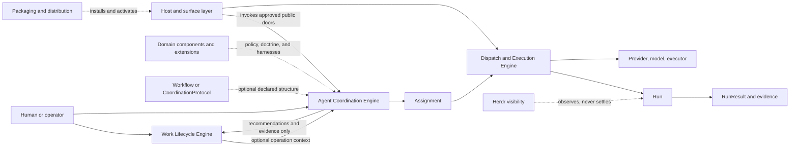

# Review pack: s2-agent-coordination-judgment-02

Pack commit: d870fe07f79d115c6a4bf783a386c6f1c3bd4081

Pack id: f84d7c7fd9d889ae3da06404289e3b532557d8335dbbcd7400f6ae9c9ee5caa6

Author session: codex-session:1@2026-10-08

## claim_d7b301f8fb707e0d981814d24bb15baf

Source: docs/architect/agent-coordination/README.md#agent-coordination-documentation

Target: docs/platform/agent-coordination/history/retired-engine/README.md#literal-snapshot

### Proposed decision

| Field | Value |
|---|---|
| claimId | claim\_d7b301f8fb707e0d981814d24bb15baf |
| sourceUnitDigest | cf7c1cc1403beef5ea2e3cded6d5e65473661550a1b985676abfa839e2aa7f1c |
| targetOwner | docs/platform/agent-coordination/history/retired-engine/README.md |
| targetAnchor | literal-snapshot |
| claimKind | navigation |
| disposition | move |
| reviewStatus | pending |
| authoredBy | codex-session:1@2026-10-09 |
| rationale | The coordination engine was retired in 2180b4e72701bb090288af8fe8021008d9d42079. Under owner A15, the complete previously bound target unit from docs/platform/agent-coordination/README.md#agent-coordination-documentation is preserved verbatim in the literal historical snapshot, including every original qualification and implementation-status assertion. It is non-authority evidence, not a current engine claim. The entire old shown target text is contained in the committed snapshot; this is a whole-unit move, not partial carry or silent claim deletion. Independent review of this new historical binding is pending. |
| targetUnitDigest | dc558d49b999971e97907511333bfd1be515560cab222baa7d9c26ece36d650c |
| targetAncestry | \["Retired engine snapshot: README.md"\] |
| targetKind | history-evidence |

### Source unit

```text
# Agent Coordination Documentation

> Migration status: This document is a legacy/current source for
> `docs/platform/agent-coordination/README.md`. Do not edit divergent design
> claims here without also updating the target doc or migration inventory.

Document type: Portal
Design status: Accepted
Implementation: Partial
Last reviewed: 2026-09-01
Canonical for: navigation only

> **Ghi chú chuyển tiếp (2026-10-02):** Engine coordination và các khái niệm `CoordinationSession`/`CoordinationProtocol`/`FlowDefinition` đã được thu hồi ở P4 của track Request-to-Run (D-0050). Hệ thống đã chuyển sang mô hình gọn: **Unit run** qua **CollaborationPattern** (`solo`, `reviewed`, `panel` + preset) và **Workflow run** (`src/workflow/**`). Các tài liệu trong thư mục này lưu giữ thiết kế lịch sử của Step 00–09.

This documentation describes how fgOS coordinates agents across providers,
models, tiers, roles, capabilities, and execution mechanisms while preserving
Work lifecycle authority and evidence integrity.

Read [Agent Coordination Foundation Vision](vision.md) first. It is the highest
authority for system identity, foundation boundaries, optional coordination
structure, and domain augmentation. Then read the
[Intent Preservation Ledger](intent-preservation-ledger.md) before narrowing or
deferring an Agent Coordination capability.

The documentation is organized by authority. Canonical vocabulary and accepted
architecture are separated from proposals, implementation roadmaps,
verification evidence, playbooks, and history.

Read [Documentation Governance](documentation-governance.md) before changing
definitions, statuses, or document placement.
```

### Target unit

````text
## Literal Snapshot

~~~~text
# Agent Coordination

```txt
Document type: Area portal
Audience: Human reviewer, architect, maintainer, documentation agent
Purpose: Route readers through the Agent Coordination platform area during migration
Design status: Accepted
Implementation: Partial
Provenance: Promoted from docs/architect/agent-coordination/README.md during documentation standardization
Writer type: Human + agent coauthor
Canonical for: Agent Coordination navigation and migration status
Use this when: You need to understand accepted, proposed, implemented, partial, or deferred-preserved Agent Coordination material
Do not use this for: Exact runtime schemas, accepted contracts, or proof artifacts by itself
Last reviewed: 2026-09-18
Related:
- docs/doc-governance.md
- docs/platform/README.md
- docs/platform/component-boundary.md
- docs/platform/agent-coordination/history/documentation-migration/documentation-standardization-plan.md
Supersedes: None; retained source authority is unchanged
Superseded by: None
Added in candidate: Promotion metadata only; source claims and implementation are not re-decided here
```

> **Ghi chú chuyển tiếp (2026-10-02):** Engine coordination và các khái niệm `CoordinationSession`/`CoordinationProtocol`/`FlowDefinition` đã được thu hồi ở P4 của track Request-to-Run (D-0050). Hệ thống đã chuyển sang mô hình gọn: **Unit run** qua **CollaborationPattern** (`solo`, `reviewed`, `panel` + preset) và **Workflow run** (`src/workflow/**`). Các tài liệu trong thư mục này lưu giữ thiết kế lịch sử của Step 00–09.

This is the target platform portal for Agent Coordination. During migration,
legacy docs under [docs/architect/agent-coordination/](../../architect/agent-coordination/)
remain current unless a target document explicitly supersedes or redirects them.
Agent Coordination is the domain-neutral foundation for governed, evidence-aware
agent activity across agents, capabilities, providers, models, tiers, execution
mechanisms, and optional Work integration.

## Component Relationship



Solid arrows show a control or data path. Dashed arrows show optional
augmentation, activation, or observation. In particular, Work remains the only
delivery-lifecycle authority, and Herdr never establishes Run truth.

## Read First

| Order | Read | Why |
|---|---|---|
| 1 | [vision.md](vision.md) | Highest area authority for identity, boundaries, optional structure, and domain augmentation. |
| 2 | [intent-preservation-ledger.md](intent-preservation-ledger.md) | Required second read before narrowing or deferring a capability. |
| 3 | [history/documentation-migration/source-inventory.md](history/documentation-migration/source-inventory.md) | Migration ledger for old source paths, target disposition, and status. |
| 4 | [history/documentation-migration/migration-status.md](history/documentation-migration/migration-status.md) | Phase-by-phase migration progress and remaining work. |
| 5 | [subcomponents/README.md](subcomponents/README.md) | Map of child components and current status. |
| 6 | [../../architect/agent-coordination/README.md](../../architect/agent-coordination/README.md) | Legacy/current portal while architecture, contracts, ADRs, verification, playbooks, proposals, roadmap, and history are promoted. |

## Current Accepted Baseline

The accepted Step 00-08 foundation remains in the legacy architecture package
until later migration phases promote the detailed docs:

- Work owns delivery lifecycle when present.
- Workflow Stage Operation compatibility governs legal operation selection.
- Assignment, Run, and RunResult are distinct.
- Dispatch governs execution infrastructure.
- RunResult and evidence boundaries prevent false success.
- Herdr is visibility, not evidence or Run truth.
- CoordinationSession is the V1 executable/recovery root.
- FlowDefinition is shared graph/operation/policy IR with typed profiles.

## Status Summary

| Area | Status | Current authority |
|---|---|---|
| Vision and intent ledger | promoted | [vision.md](vision.md), [intent-preservation-ledger.md](intent-preservation-ledger.md) |
| Spec | promoted summary / partial | [spec.md](spec.md), [verification/implementation-alignment.md](verification/implementation-alignment.md), [../../specs/runner.md](../../specs/runner.md) plus accepted legacy contracts |
| Architecture | promoted target; legacy documents carry redirect notes | [architecture/README.md](architecture/README.md) |
| Contracts | promoted target; legacy documents carry redirect notes | [contracts/README.md](contracts/README.md) |
| Decisions | promoted target; legacy documents carry redirect notes | [decisions/README.md](decisions/README.md) |
| Verification | target index; legacy proof artifacts retained link-only | [verification/README.md](verification/README.md) |
| Proposals | non-canonical target; legacy documents carry redirect notes | [proposals/README.md](proposals/README.md) |
| Playbooks | operational/bootstrap target; legacy documents carry redirect notes | [playbooks/README.md](playbooks/README.md) |
| Roadmap | implementation-sequence target; legacy documents carry redirect notes | [roadmap/README.md](roadmap/README.md) |

## Cross-Area Boundaries

| Boundary | Owner | Agent Coordination stance |
|---|---|---|
| Host invocation and provider process routing | [host-invocation-routing](../host-invocation-routing/README.md) | Link-only authority; Agent Coordination consumes this boundary through dispatch/executor integration. |
| Packaging, install, activation, release manifest, setup/doctor, runtime identity | [packaging-distribution](../packaging-distribution/README.md) | Link-only authority; do not duplicate setup or runtime activation rules here. |
| Platform component boundary | [component-boundary.md](../component-boundary.md) | No component-boundary change: these diagrams expose existing ownership and flows only. |

## Related Files

| Relationship | File |
|---|---|
| documentation governance | [../../doc-governance.md](../../doc-governance.md) |
| platform portal | [../README.md](../README.md) |
| platform intent ledger | [../intent-preservation-ledger.md](../intent-preservation-ledger.md) |
| component boundary | [../component-boundary.md](../component-boundary.md) |
| migration plan (retired; non-authority history) | [history/documentation-migration/documentation-standardization-plan.md](history/documentation-migration/documentation-standardization-plan.md) |
| legacy portal | [../../architect/agent-coordination/README.md](../../architect/agent-coordination/README.md) |
| current state summary | [spec.md](spec.md) |
| implementation alignment | [verification/implementation-alignment.md](verification/implementation-alignment.md) |
| retired area policy (non-authority history) | [history/documentation-migration/documentation-governance.md](history/documentation-migration/documentation-governance.md) |

Added in candidate: The retired area policy and completed migration plan are retained verbatim as literal history snapshots, not current authority. The source-guidance section below retains their older references and status claims in historical context.

## Agent Coordination Documentation

Added in candidate: Preserved source portal guidance from the batch pin. Its dated retirement note and historical foundation status are retained, not a new acceptance of retired runtime concepts. References outside this area are recorded as plain paths; source authority is unchanged.

Document type: Portal
Design status: Accepted
Implementation: Partial
Last reviewed: 2026-09-01
Canonical for: navigation only

> **Ghi chú chuyển tiếp (2026-10-02):** Engine coordination và các khái niệm `CoordinationSession`/`CoordinationProtocol`/`FlowDefinition` đã được thu hồi ở P4 của track Request-to-Run (D-0050). Hệ thống đã chuyển sang mô hình gọn: **Unit run** qua **CollaborationPattern** (`solo`, `reviewed`, `panel` + preset) và **Workflow run** (`src/workflow/**`). Các tài liệu trong thư mục này lưu giữ thiết kế lịch sử của Step 00–09.

This documentation describes how fgOS coordinates agents across providers,
models, tiers, roles, capabilities, and execution mechanisms while preserving
Work lifecycle authority and evidence integrity.

Read [Agent Coordination Foundation Vision](vision.md) first. It is the highest
authority for system identity, foundation boundaries, optional coordination
structure, and domain augmentation. Then read the
[Intent Preservation Ledger](intent-preservation-ledger.md) before narrowing or
deferring an Agent Coordination capability.

The documentation is organized by authority. Canonical vocabulary and accepted
architecture are separated from proposals, implementation roadmaps,
verification evidence, playbooks, and history.

Read Documentation Governance (`docs/architect/agent-coordination/documentation-governance.md`; retained source reference, not a candidate navigation link) before changing
definitions, statuses, or document placement.

### Start Here

#### Understand The System

1. [Agent Coordination Foundation Vision](vision.md)
2. [Intent Preservation Ledger](intent-preservation-ledger.md)
3. Documentation Governance (`docs/architect/agent-coordination/documentation-governance.md`; retained source reference, not a candidate navigation link)
4. [Vocabulary](vocabulary/README.md)
5. [System Context](architecture/system-context.md)
6. [Coordination Foundation Baseline](architecture/coordination-foundation-baseline.md)
7. [Protocol Model](architecture/protocol-model.md)
8. [Runtime Model](architecture/runtime-model.md)
9. [Work Integration](architecture/work-integration.md)
10. [Dispatch Control Plane](architecture/dispatch-control-plane.md)
11. [Evidence And Results](architecture/evidence-and-results.md)
12. [Visibility And Herdr](architecture/visibility-and-herdr.md)

#### Implement Or Review Current Contracts

1. [Workflow Stage Operation Contract](contracts/workflow-stage-operation.md)
2. [Assignment, Run, And RunResult Contract](contracts/assignment-run-runresult.md)
3. [Architecture Decisions](decisions/README.md)
4. [Team Dispatch V1 Verification](verification/team-dispatch-v1/index.md)

#### Continue The Design Discussion

Read Coordination Capability Envelope (`docs/architect/proposals/coordination-capability-envelope.md`; retained source reference, not a candidate navigation link)
for the 2026-09-06 conceptual response to the independent review: FlowDefinition,
coordinator-owned deliberation, and programmable-master alternatives. Its
recommendation remains Discussion and does not supersede accepted contracts.

1. Step 09: Group Thinking Substrate (`docs/architect/proposals/step-09-group-thinking-substrate.md`; retained source reference, not a candidate navigation link)
2. Architecture Advisory Panel (`docs/architect/proposals/architecture-advisory-panel.md`; retained source reference, not a candidate navigation link)
   extends the implemented Group Thinking substrate with the next natural use
   case after `fgos-code-panel`: problem discovery, architecture deliberation,
   evidence-linked advice, and a bounded human decision dialogue.
3. [Team Communication Protocol V1](proposals/team-communication-protocol-v1.md)
4. [Dispatch Control Plane Redesign](proposals/dispatch-control-plane-redesign.md)
5. Step 10: Coding Domain Adoption Of The Coordination Foundation (`docs/architect/proposals/step-10-coding-domain-adoption.md`; retained source reference, not a candidate navigation link)
6. Component Authority Boundary Map (`docs/architect/proposals/component-authority-boundary-map.md`; retained source reference, not a candidate navigation link)
7. Architecture Intent (`docs/architect/architecture-intent.md`; retained source reference, not a candidate navigation link)
   preserves broader architecture intent across deferred capabilities. Its
   first active thread covers group-thinking/problem-solving capability across
   Agent Coordination, Work Driver, Dispatch/Run, Run Result Evaluation, and
   Coding Domain adoption.

### Documentation Areas

| Area | Authority | Contents |
|---|---|---|
| [`vision.md`](vision.md) | Highest product authority | System identity, foundation/domain boundary, accepted direction, and rejected interpretations. |
| [`intent-preservation-ledger.md`](intent-preservation-ledger.md) | Traceability register | Original intentions, deliberate deferrals, non-preclusion constraints, and revisit triggers. |
| [`vocabulary/`](vocabulary/README.md) | Canonical terminology | Terms, relationships, aliases, reserved/deprecated vocabulary. |
| [`architecture/`](architecture/README.md) | Accepted design | System boundaries, responsibilities, trust model, and invariants. |
| [`contracts/`](contracts/README.md) | Accepted behavior | Machine-visible schemas, normalization, validation, state, and evidence rules. |
| [`decisions/`](decisions/README.md) | Accepted decisions | ADRs with context, decision, and consequences. |
| [`proposals/`](proposals/README.md) | Non-canonical | Discussion drafts and target designs awaiting approval. |
| [`roadmap/`](roadmap/README.md) | Implementation sequence | Numbered Steps, files, tests, rollout, and acceptance plans. |
| [`verification/`](verification/README.md) | Conformance evidence | Traceability, tests, negative cases, review, red-team, and live proof. |
| [`playbooks/`](playbooks/README.md) | Engineering bootstrap only | Manual coordinator/doer/reviewer workflows and fallback procedures; never a runtime dependency. |
| [`history/`](history/README.md) | Non-canonical history | Brainstorms, superseded plans, and pre-migration source material. |

### Current Accepted Baseline

Team Dispatch V1 currently establishes:

- Work as the sole delivery lifecycle authority;
- Workflow Stage Operations with `stage.skill`/`stage.taskSpec` primary
  compatibility;
- operation normalization, lookup, and setup/doctor validation;
- Assignment as semantic request;
- governed dispatch and CLI-spawn execution;
- Run as one attempt and RunResult as normalized outcome/evidence;
- driver selection of bounded legal Stage Operations;
- Work-attached adoption for selected planning/executing operations;
- Herdr as visibility rather than truth;
- Job reserved for a future scheduler.

The accepted Vision additionally establishes that:

- Work is an optional integration profile rather than coordination identity;
- a predeclared Workflow or Coordination Protocol is optional;
- every executable request still requires a validated semantic contract;
- agent-led, protocol-led, and domain-assisted planning are composable;
- dispatch, evidence, authority, and execution bounds remain foundation rules;
- domain and organization augmentation provide differentiated experience.

Step 08 Phase 00 additionally establishes, per
[ADR-008](decisions/ADR-008-coordination-session-and-mission-deferral.md),
[ADR-009](decisions/ADR-009-flow-definition-shared-ir-and-typed-profiles.md),
and [ADR-010](decisions/ADR-010-interactive-headless-parity-and-work-isolation.md):

- CoordinationSession is the V1 executable/recovery root, with one-way
  session-to-Assignment membership and no `missionId` anywhere in V1 schemas;
- `FlowDefinition` is the shared graph/operation/policy IR beneath typed
  `Workflow` (Stage) and `CoordinationProtocol` (Phase) profiles, additive to
  existing Workflow consumers;
- interactive ships first with headless capability parity as an intended
  future property, and domain-owned Work isolation stays out of coordination
  code until a coding-domain live proof authorizes Work-attached mutation.

### Active Design Frontier

The accepted Step 00-08 foundation is summarized in
[Coordination Foundation Baseline](architecture/coordination-foundation-baseline.md).
The next design frontier remains intentionally non-canonical:

```txt
Step 09
  standalone group-thinking substrate
  Master Coordination style loop as first proof fixture
  bounded adaptive declared rounds without Work dependency

Step 10
  coding domain as the second unlike consumer
  duplicate-mechanism inventory and seams
  Work-attached adoption after substrate/boundary guardrails
  mutating live proof gated on ADR-010 §5

Component Authority Boundary Map
  parallel architect-level guardrail for Agent Coordination, Dispatch/Run,
  RunResult Evaluation, Work Core, Coding Domain Core, and Host/Support surfaces
```

Step 09, Step 10, and the Component Authority Boundary Map are discussion
drafts. Their proposed entities and schemas must not be treated as accepted
contracts until promoted according to
Documentation Governance (`docs/architect/agent-coordination/documentation-governance.md`; retained source reference, not a candidate navigation link).

They must, however, preserve the accepted direction in the
[Vision](vision.md); the proposals may choose implementation shape but cannot
make Work or a predeclared protocol universally mandatory.

### Core Invariants

```txt
Work owns delivery lifecycle.
Declared protocol definition constrains legal operations when selected.
Every dynamic or declared execution has a validated semantic contract.
Assignment carries semantic intent.
Dispatch governs execution infrastructure.
Run records one attempt.
RunResult records normalized outcome and evidence.
Herdr provides visibility only.
```

### Maintenance Rules

- Update vocabulary before introducing a new canonical term.
- Reconcile `vision.md` first when changing system identity or the
  foundation/domain boundary.
- Audit the Intent Preservation Ledger before approving a narrower phase or
  closing a deferred capability.
- Record durable boundary decisions with an ADR.
- Keep numbered Steps in roadmap/proposals, not canonical architecture.
- Keep prompts out of architecture and contracts.
- Keep test/live-run output in verification.
- Mark historical sources as non-canonical instead of deleting rationale.
- Check all local links after moving documents.

~~~~
````

### Unified diff

````diff
--- "docs/architect/agent-coordination/README.md#agent-coordination-documentation"
+++ "docs/platform/agent-coordination/history/retired-engine/README.md#literal-snapshot"
@@ -1,8 +1,141 @@
-# Agent Coordination Documentation
+## Literal Snapshot
 
-> Migration status: This document is a legacy/current source for
-> `docs/platform/agent-coordination/README.md`. Do not edit divergent design
-> claims here without also updating the target doc or migration inventory.
+~~~~text
+# Agent Coordination
+
+```txt
+Document type: Area portal
+Audience: Human reviewer, architect, maintainer, documentation agent
+Purpose: Route readers through the Agent Coordination platform area during migration
+Design status: Accepted
+Implementation: Partial
+Provenance: Promoted from docs/architect/agent-coordination/README.md during documentation standardization
+Writer type: Human + agent coauthor
+Canonical for: Agent Coordination navigation and migration status
+Use this when: You need to understand accepted, proposed, implemented, partial, or deferred-preserved Agent Coordination material
+Do not use this for: Exact runtime schemas, accepted contracts, or proof artifacts by itself
+Last reviewed: 2026-09-18
+Related:
+- docs/doc-governance.md
+- docs/platform/README.md
+- docs/platform/component-boundary.md
+- docs/platform/agent-coordination/history/documentation-migration/documentation-standardization-plan.md
+Supersedes: None; retained source authority is unchanged
+Superseded by: None
+Added in candidate: Promotion metadata only; source claims and implementation are not re-decided here
+```
+
+> **Ghi chú chuyển tiếp (2026-10-02):** Engine coordination và các khái niệm `CoordinationSession`/`CoordinationProtocol`/`FlowDefinition` đã được thu hồi ở P4 của track Request-to-Run (D-0050). Hệ thống đã chuyển sang mô hình gọn: **Unit run** qua **CollaborationPattern** (`solo`, `reviewed`, `panel` + preset) và **Workflow run** (`src/workflow/**`). Các tài liệu trong thư mục này lưu giữ thiết kế lịch sử của Step 00–09.
+
+This is the target platform portal for Agent Coordination. During migration,
+legacy docs under [docs/architect/agent-coordination/](../../architect/agent-coordination/)
+remain current unless a target document explicitly supersedes or redirects them.
+Agent Coordination is the domain-neutral foundation for governed, evidence-aware
+agent activity across agents, capabilities, providers, models, tiers, execution
+mechanisms, and optional Work integration.
+
+## Component Relationship
+
+```mermaid
+flowchart LR
+  Human[Human or operator]
+  Work[Work Lifecycle Engine]
+  Domain[Domain components and extensions]
+  Coordination[Agent Coordination Engine]
+  Flow[Workflow or CoordinationProtocol]
+  Assignment[Assignment]
+  Dispatch[Dispatch and Execution Engine]
+  Run[Run]
+  Result[RunResult and evidence]
+  Executor[Provider, model, executor]
+  Herdr[Herdr visibility]
+  Host[Host and surface layer]
+  Package[Packaging and distribution]
+
+  Human --> Work
+  Human --> Coordination
+  Work -->|optional operation context| Coordination
+  Coordination -->|recommendations and evidence only| Work
+  Domain -.->|policy, doctrine, and harnesses| Coordination
+  Flow -.->|optional declared structure| Coordination
+  Coordination --> Assignment --> Dispatch --> Run --> Result
+  Dispatch --> Executor
+  Herdr -.->|observes, never settles| Run
+  Host -->|invokes approved public doors| Coordination
+  Host --> Dispatch
+  Package -.->|installs and activates| Host
+```
+
+Solid arrows show a control or data path. Dashed arrows show optional
+augmentation, activation, or observation. In particular, Work remains the only
+delivery-lifecycle authority, and Herdr never establishes Run truth.
+
+## Read First
+
+| Order | Read | Why |
+|---|---|---|
+| 1 | [vision.md](vision.md) | Highest area authority for identity, boundaries, optional structure, and domain augmentation. |
+| 2 | [intent-preservation-ledger.md](intent-preservation-ledger.md) | Required second read before narrowing or deferring a capability. |
+| 3 | [history/documentation-migration/source-inventory.md](history/documentation-migration/source-inventory.md) | Migration ledger for old source paths, target disposition, and status. |
+| 4 | [history/documentation-migration/migration-status.md](history/documentation-migration/migration-status.md) | Phase-by-phase migration progress and remaining work. |
+| 5 | [subcomponents/README.md](subcomponents/README.md) | Map of child components and current status. |
+| 6 | [../../architect/agent-coordination/README.md](../../architect/agent-coordination/README.md) | Legacy/current portal while architecture, contracts, ADRs, verification, playbooks, proposals, roadmap, and history are promoted. |
+
+## Current Accepted Baseline
+
+The accepted Step 00-08 foundation remains in the legacy architecture package
+until later migration phases promote the detailed docs:
+
+- Work owns delivery lifecycle when present.
+- Workflow Stage Operation compatibility governs legal operation selection.
+- Assignment, Run, and RunResult are distinct.
+- Dispatch governs execution infrastructure.
+- RunResult and evidence boundaries prevent false success.
+- Herdr is visibility, not evidence or Run truth.
+- CoordinationSession is the V1 executable/recovery root.
+- FlowDefinition is shared graph/operation/policy IR with typed profiles.
+
+## Status Summary
+
+| Area | Status | Current authority |
+|---|---|---|
+| Vision and intent ledger | promoted | [vision.md](vision.md), [intent-preservation-ledger.md](intent-preservation-ledger.md) |
+| Spec | promoted summary / partial | [spec.md](spec.md), [verification/implementation-alignment.md](verification/implementation-alignment.md), [../../specs/runner.md](../../specs/runner.md) plus accepted legacy contracts |
+| Architecture | promoted target; legacy documents carry redirect notes | [architecture/README.md](architecture/README.md) |
+| Contracts | promoted target; legacy documents carry redirect notes | [contracts/README.md](contracts/README.md) |
+| Decisions | promoted target; legacy documents carry redirect notes | [decisions/README.md](decisions/README.md) |
+| Verification | target index; legacy proof artifacts retained link-only | [verification/README.md](verification/README.md) |
+| Proposals | non-canonical target; legacy documents carry redirect notes | [proposals/README.md](proposals/README.md) |
+| Playbooks | operational/bootstrap target; legacy documents carry redirect notes | [playbooks/README.md](playbooks/README.md) |
+| Roadmap | implementation-sequence target; legacy documents carry redirect notes | [roadmap/README.md](roadmap/README.md) |
+
+## Cross-Area Boundaries
+
+| Boundary | Owner | Agent Coordination stance |
+|---|---|---|
+| Host invocation and provider process routing | [host-invocation-routing](../host-invocation-routing/README.md) | Link-only authority; Agent Coordination consumes this boundary through dispatch/executor integration. |
+| Packaging, install, activation, release manifest, setup/doctor, runtime identity | [packaging-distribution](../packaging-distribution/README.md) | Link-only authority; do not duplicate setup or runtime activation rules here. |
+| Platform component boundary | [component-boundary.md](../component-boundary.md) | No component-boundary change: these diagrams expose existing ownership and flows only. |
+
+## Related Files
+
+| Relationship | File |
+|---|---|
+| documentation governance | [../../doc-governance.md](../../doc-governance.md) |
+| platform portal | [../README.md](../README.md) |
+| platform intent ledger | [../intent-preservation-ledger.md](../intent-preservation-ledger.md) |
+| component boundary | [../component-boundary.md](../component-boundary.md) |
+| migration plan (retired; non-authority history) | [history/documentation-migration/documentation-standardization-plan.md](history/documentation-migration/documentation-standardization-plan.md) |
+| legacy portal | [../../architect/agent-coordination/README.md](../../architect/agent-coordination/README.md) |
+| current state summary | [spec.md](spec.md) |
+| implementation alignment | [verification/implementation-alignment.md](verification/implementation-alignment.md) |
+| retired area policy (non-authority history) | [history/documentation-migration/documentation-governance.md](history/documentation-migration/documentation-governance.md) |
+
+Added in candidate: The retired area policy and completed migration plan are retained verbatim as literal history snapshots, not current authority. The source-guidance section below retains their older references and status claims in historical context.
+
+## Agent Coordination Documentation
+
+Added in candidate: Preserved source portal guidance from the batch pin. Its dated retirement note and historical foundation status are retained, not a new acceptance of retired runtime concepts. References outside this area are recorded as plain paths; source authority is unchanged.
 
 Document type: Portal
 Design status: Accepted
@@ -26,5 +159,167 @@ The documentation is organized by authority. Canonical vocabulary and accepted
 architecture are separated from proposals, implementation roadmaps,
 verification evidence, playbooks, and history.
 
-Read [Documentation Governance](documentation-governance.md) before changing
-definitions, statuses, or document placement.
\ No newline at end of file
+Read Documentation Governance (`docs/architect/agent-coordination/documentation-governance.md`; retained source reference, not a candidate navigation link) before changing
+definitions, statuses, or document placement.
+
+### Start Here
+
+#### Understand The System
+
+1. [Agent Coordination Foundation Vision](vision.md)
+2. [Intent Preservation Ledger](intent-preservation-ledger.md)
+3. Documentation Governance (`docs/architect/agent-coordination/documentation-governance.md`; retained source reference, not a candidate navigation link)
+4. [Vocabulary](vocabulary/README.md)
+5. [System Context](architecture/system-context.md)
+6. [Coordination Foundation Baseline](architecture/coordination-foundation-baseline.md)
+7. [Protocol Model](architecture/protocol-model.md)
+8. [Runtime Model](architecture/runtime-model.md)
+9. [Work Integration](architecture/work-integration.md)
+10. [Dispatch Control Plane](architecture/dispatch-control-plane.md)
+11. [Evidence And Results](architecture/evidence-and-results.md)
+12. [Visibility And Herdr](architecture/visibility-and-herdr.md)
+
+#### Implement Or Review Current Contracts
+
+1. [Workflow Stage Operation Contract](contracts/workflow-stage-operation.md)
+2. [Assignment, Run, And RunResult Contract](contracts/assignment-run-runresult.md)
+3. [Architecture Decisions](decisions/README.md)
+4. [Team Dispatch V1 Verification](verification/team-dispatch-v1/index.md)
+
+#### Continue The Design Discussion
+
+Read Coordination Capability Envelope (`docs/architect/proposals/coordination-capability-envelope.md`; retained source reference, not a candidate navigation link)
+for the 2026-09-06 conceptual response to the independent review: FlowDefinition,
+coordinator-owned deliberation, and programmable-master alternatives. Its
+recommendation remains Discussion and does not supersede accepted contracts.
+
+1. Step 09: Group Thinking Substrate (`docs/architect/proposals/step-09-group-thinking-substrate.md`; retained source reference, not a candidate navigation link)
+2. Architecture Advisory Panel (`docs/architect/proposals/architecture-advisory-panel.md`; retained source reference, not a candidate navigation link)
+   extends the implemented Group Thinking substrate with the next natural use
+   case after `fgos-code-panel`: problem discovery, architecture deliberation,
+   evidence-linked advice, and a bounded human decision dialogue.
+3. [Team Communication Protocol V1](proposals/team-communication-protocol-v1.md)
+4. [Dispatch Control Plane Redesign](proposals/dispatch-control-plane-redesign.md)
+5. Step 10: Coding Domain Adoption Of The Coordination Foundation (`docs/architect/proposals/step-10-coding-domain-adoption.md`; retained source reference, not a candidate navigation link)
+6. Component Authority Boundary Map (`docs/architect/proposals/component-authority-boundary-map.md`; retained source reference, not a candidate navigation link)
+7. Architecture Intent (`docs/architect/architecture-intent.md`; retained source reference, not a candidate navigation link)
+   preserves broader architecture intent across deferred capabilities. Its
+   first active thread covers group-thinking/problem-solving capability across
+   Agent Coordination, Work Driver, Dispatch/Run, Run Result Evaluation, and
+   Coding Domain adoption.
+
+### Documentation Areas
+
+| Area | Authority | Contents |
+|---|---|---|
+| [`vision.md`](vision.md) | Highest product authority | System identity, foundation/domain boundary, accepted direction, and rejected interpretations. |
+| [`intent-preservation-ledger.md`](intent-preservation-ledger.md) | Traceability register | Original intentions, deliberate deferrals, non-preclusion constraints, and revisit triggers. |
+| [`vocabulary/`](vocabulary/README.md) | Canonical terminology | Terms, relationships, aliases, reserved/deprecated vocabulary. |
+| [`architecture/`](architecture/README.md) | Accepted design | System boundaries, responsibilities, trust model, and invariants. |
+| [`contracts/`](contracts/README.md) | Accepted behavior | Machine-visible schemas, normalization, validation, state, and evidence rules. |
+| [`decisions/`](decisions/README.md) | Accepted decisions | ADRs with context, decision, and consequences. |
+| [`proposals/`](proposals/README.md) | Non-canonical | Discussion drafts and target designs awaiting approval. |
+| [`roadmap/`](roadmap/README.md) | Implementation sequence | Numbered Steps, files, tests, rollout, and acceptance plans. |
+| [`verification/`](verification/README.md) | Conformance evidence | Traceability, tests, negative cases, review, red-team, and live proof. |
+| [`playbooks/`](playbooks/README.md) | Engineering bootstrap only | Manual coordinator/doer/reviewer workflows and fallback procedures; never a runtime dependency. |
+| [`history/`](history/README.md) | Non-canonical history | Brainstorms, superseded plans, and pre-migration source material. |
+
+### Current Accepted Baseline
+
+Team Dispatch V1 currently establishes:
+
+- Work as the sole delivery lifecycle authority;
+- Workflow Stage Operations with `stage.skill`/`stage.taskSpec` primary
+  compatibility;
+- operation normalization, lookup, and setup/doctor validation;
+- Assignment as semantic request;
+- governed dispatch and CLI-spawn execution;
+- Run as one attempt and RunResult as normalized outcome/evidence;
+- driver selection of bounded legal Stage Operations;
+- Work-attached adoption for selected planning/executing operations;
+- Herdr as visibility rather than truth;
+- Job reserved for a future scheduler.
+
+The accepted Vision additionally establishes that:
+
+- Work is an optional integration profile rather than coordination identity;
+- a predeclared Workflow or Coordination Protocol is optional;
+- every executable request still requires a validated semantic contract;
+- agent-led, protocol-led, and domain-assisted planning are composable;
+- dispatch, evidence, authority, and execution bounds remain foundation rules;
+- domain and organization augmentation provide differentiated experience.
+
+Step 08 Phase 00 additionally establishes, per
+[ADR-008](decisions/ADR-008-coordination-session-and-mission-deferral.md),
+[ADR-009](decisions/ADR-009-flow-definition-shared-ir-and-typed-profiles.md),
+and [ADR-010](decisions/ADR-010-interactive-headless-parity-and-work-isolation.md):
+
+- CoordinationSession is the V1 executable/recovery root, with one-way
+  session-to-Assignment membership and no `missionId` anywhere in V1 schemas;
+- `FlowDefinition` is the shared graph/operation/policy IR beneath typed
+  `Workflow` (Stage) and `CoordinationProtocol` (Phase) profiles, additive to
+  existing Workflow consumers;
+- interactive ships first with headless capability parity as an intended
+  future property, and domain-owned Work isolation stays out of coordination
+  code until a coding-domain live proof authorizes Work-attached mutation.
+
+### Active Design Frontier
+
+The accepted Step 00-08 foundation is summarized in
+[Coordination Foundation Baseline](architecture/coordination-foundation-baseline.md).
+The next design frontier remains intentionally non-canonical:
+
+```txt
+Step 09
+  standalone group-thinking substrate
+  Master Coordination style loop as first proof fixture
+  bounded adaptive declared rounds without Work dependency
+
+Step 10
+  coding domain as the second unlike consumer
+  duplicate-mechanism inventory and seams
+  Work-attached adoption after substrate/boundary guardrails
+  mutating live proof gated on ADR-010 §5
+
+Component Authority Boundary Map
+  parallel architect-level guardrail for Agent Coordination, Dispatch/Run,
+  RunResult Evaluation, Work Core, Coding Domain Core, and Host/Support surfaces
+```
+
+Step 09, Step 10, and the Component Authority Boundary Map are discussion
+drafts. Their proposed entities and schemas must not be treated as accepted
+contracts until promoted according to
+Documentation Governance (`docs/architect/agent-coordination/documentation-governance.md`; retained source reference, not a candidate navigation link).
+
+They must, however, preserve the accepted direction in the
+[Vision](vision.md); the proposals may choose implementation shape but cannot
+make Work or a predeclared protocol universally mandatory.
+
+### Core Invariants
+
+```txt
+Work owns delivery lifecycle.
+Declared protocol definition constrains legal operations when selected.
+Every dynamic or declared execution has a validated semantic contract.
+Assignment carries semantic intent.
+Dispatch governs execution infrastructure.
+Run records one attempt.
+RunResult records normalized outcome and evidence.
+Herdr provides visibility only.
+```
+
+### Maintenance Rules
+
+- Update vocabulary before introducing a new canonical term.
+- Reconcile `vision.md` first when changing system identity or the
+  foundation/domain boundary.
+- Audit the Intent Preservation Ledger before approving a narrower phase or
+  closing a deferred capability.
+- Record durable boundary decisions with an ADR.
+- Keep numbered Steps in roadmap/proposals, not canonical architecture.
+- Keep prompts out of architecture and contracts.
+- Keep test/live-run output in verification.
+- Mark historical sources as non-canonical instead of deleting rationale.
+- Check all local links after moving documents.
+
+~~~~
\ No newline at end of file
````

## claim_ad97ac5daf9c4c02aaef749e4799cecd

Source: docs/architect/agent-coordination/README.md#unheaded-block-2

Target: docs/platform/agent-coordination/history/retired-engine/README.md#literal-snapshot

### Proposed decision

| Field | Value |
|---|---|
| claimId | claim\_ad97ac5daf9c4c02aaef749e4799cecd |
| sourceUnitDigest | 64fba83e03d3d4a04a47d87966b676adc5a7893e65276f8a8cba4d3796a9e3df |
| targetOwner | docs/platform/agent-coordination/history/retired-engine/README.md |
| targetAnchor | literal-snapshot |
| claimKind | navigation |
| disposition | move |
| reviewStatus | pending |
| authoredBy | codex-session:1@2026-10-09 |
| rationale | The coordination engine was retired in 2180b4e72701bb090288af8fe8021008d9d42079. Under owner A15, the complete previously bound target unit from docs/platform/agent-coordination/README.md#unheaded-block-14 is preserved verbatim in the literal historical snapshot, including every original qualification and implementation-status assertion. It is non-authority evidence, not a current engine claim. The entire old shown target text is contained in the committed snapshot; this is a whole-unit move, not partial carry or silent claim deletion. Independent review of this new historical binding is pending. |
| targetUnitDigest | dc558d49b999971e97907511333bfd1be515560cab222baa7d9c26ece36d650c |
| targetAncestry | \["Retired engine snapshot: README.md"\] |
| targetKind | history-evidence |

### Source unit

```text
Document type: Portal
Design status: Accepted
Implementation: Partial
Last reviewed: 2026-09-01
Canonical for: navigation only
```

### Target unit

````text
## Literal Snapshot

~~~~text
# Agent Coordination

```txt
Document type: Area portal
Audience: Human reviewer, architect, maintainer, documentation agent
Purpose: Route readers through the Agent Coordination platform area during migration
Design status: Accepted
Implementation: Partial
Provenance: Promoted from docs/architect/agent-coordination/README.md during documentation standardization
Writer type: Human + agent coauthor
Canonical for: Agent Coordination navigation and migration status
Use this when: You need to understand accepted, proposed, implemented, partial, or deferred-preserved Agent Coordination material
Do not use this for: Exact runtime schemas, accepted contracts, or proof artifacts by itself
Last reviewed: 2026-09-18
Related:
- docs/doc-governance.md
- docs/platform/README.md
- docs/platform/component-boundary.md
- docs/platform/agent-coordination/history/documentation-migration/documentation-standardization-plan.md
Supersedes: None; retained source authority is unchanged
Superseded by: None
Added in candidate: Promotion metadata only; source claims and implementation are not re-decided here
```

> **Ghi chú chuyển tiếp (2026-10-02):** Engine coordination và các khái niệm `CoordinationSession`/`CoordinationProtocol`/`FlowDefinition` đã được thu hồi ở P4 của track Request-to-Run (D-0050). Hệ thống đã chuyển sang mô hình gọn: **Unit run** qua **CollaborationPattern** (`solo`, `reviewed`, `panel` + preset) và **Workflow run** (`src/workflow/**`). Các tài liệu trong thư mục này lưu giữ thiết kế lịch sử của Step 00–09.

This is the target platform portal for Agent Coordination. During migration,
legacy docs under [docs/architect/agent-coordination/](../../architect/agent-coordination/)
remain current unless a target document explicitly supersedes or redirects them.
Agent Coordination is the domain-neutral foundation for governed, evidence-aware
agent activity across agents, capabilities, providers, models, tiers, execution
mechanisms, and optional Work integration.

## Component Relationship


Solid arrows show a control or data path. Dashed arrows show optional
augmentation, activation, or observation. In particular, Work remains the only
delivery-lifecycle authority, and Herdr never establishes Run truth.

## Read First

| Order | Read | Why |
|---|---|---|
| 1 | [vision.md](vision.md) | Highest area authority for identity, boundaries, optional structure, and domain augmentation. |
| 2 | [intent-preservation-ledger.md](intent-preservation-ledger.md) | Required second read before narrowing or deferring a capability. |
| 3 | [history/documentation-migration/source-inventory.md](history/documentation-migration/source-inventory.md) | Migration ledger for old source paths, target disposition, and status. |
| 4 | [history/documentation-migration/migration-status.md](history/documentation-migration/migration-status.md) | Phase-by-phase migration progress and remaining work. |
| 5 | [subcomponents/README.md](subcomponents/README.md) | Map of child components and current status. |
| 6 | [../../architect/agent-coordination/README.md](../../architect/agent-coordination/README.md) | Legacy/current portal while architecture, contracts, ADRs, verification, playbooks, proposals, roadmap, and history are promoted. |

## Current Accepted Baseline

The accepted Step 00-08 foundation remains in the legacy architecture package
until later migration phases promote the detailed docs:

- Work owns delivery lifecycle when present.
- Workflow Stage Operation compatibility governs legal operation selection.
- Assignment, Run, and RunResult are distinct.
- Dispatch governs execution infrastructure.
- RunResult and evidence boundaries prevent false success.
- Herdr is visibility, not evidence or Run truth.
- CoordinationSession is the V1 executable/recovery root.
- FlowDefinition is shared graph/operation/policy IR with typed profiles.

## Status Summary

| Area | Status | Current authority |
|---|---|---|
| Vision and intent ledger | promoted | [vision.md](vision.md), [intent-preservation-ledger.md](intent-preservation-ledger.md) |
| Spec | promoted summary / partial | [spec.md](spec.md), [verification/implementation-alignment.md](verification/implementation-alignment.md), [../../specs/runner.md](../../specs/runner.md) plus accepted legacy contracts |
| Architecture | promoted target; legacy documents carry redirect notes | [architecture/README.md](architecture/README.md) |
| Contracts | promoted target; legacy documents carry redirect notes | [contracts/README.md](contracts/README.md) |
| Decisions | promoted target; legacy documents carry redirect notes | [decisions/README.md](decisions/README.md) |
| Verification | target index; legacy proof artifacts retained link-only | [verification/README.md](verification/README.md) |
| Proposals | non-canonical target; legacy documents carry redirect notes | [proposals/README.md](proposals/README.md) |
| Playbooks | operational/bootstrap target; legacy documents carry redirect notes | [playbooks/README.md](playbooks/README.md) |
| Roadmap | implementation-sequence target; legacy documents carry redirect notes | [roadmap/README.md](roadmap/README.md) |

## Cross-Area Boundaries

| Boundary | Owner | Agent Coordination stance |
|---|---|---|
| Host invocation and provider process routing | [host-invocation-routing](../host-invocation-routing/README.md) | Link-only authority; Agent Coordination consumes this boundary through dispatch/executor integration. |
| Packaging, install, activation, release manifest, setup/doctor, runtime identity | [packaging-distribution](../packaging-distribution/README.md) | Link-only authority; do not duplicate setup or runtime activation rules here. |
| Platform component boundary | [component-boundary.md](../component-boundary.md) | No component-boundary change: these diagrams expose existing ownership and flows only. |

## Related Files

| Relationship | File |
|---|---|
| documentation governance | [../../doc-governance.md](../../doc-governance.md) |
| platform portal | [../README.md](../README.md) |
| platform intent ledger | [../intent-preservation-ledger.md](../intent-preservation-ledger.md) |
| component boundary | [../component-boundary.md](../component-boundary.md) |
| migration plan (retired; non-authority history) | [history/documentation-migration/documentation-standardization-plan.md](history/documentation-migration/documentation-standardization-plan.md) |
| legacy portal | [../../architect/agent-coordination/README.md](../../architect/agent-coordination/README.md) |
| current state summary | [spec.md](spec.md) |
| implementation alignment | [verification/implementation-alignment.md](verification/implementation-alignment.md) |
| retired area policy (non-authority history) | [history/documentation-migration/documentation-governance.md](history/documentation-migration/documentation-governance.md) |

Added in candidate: The retired area policy and completed migration plan are retained verbatim as literal history snapshots, not current authority. The source-guidance section below retains their older references and status claims in historical context.

## Agent Coordination Documentation

Added in candidate: Preserved source portal guidance from the batch pin. Its dated retirement note and historical foundation status are retained, not a new acceptance of retired runtime concepts. References outside this area are recorded as plain paths; source authority is unchanged.

Document type: Portal
Design status: Accepted
Implementation: Partial
Last reviewed: 2026-09-01
Canonical for: navigation only

> **Ghi chú chuyển tiếp (2026-10-02):** Engine coordination và các khái niệm `CoordinationSession`/`CoordinationProtocol`/`FlowDefinition` đã được thu hồi ở P4 của track Request-to-Run (D-0050). Hệ thống đã chuyển sang mô hình gọn: **Unit run** qua **CollaborationPattern** (`solo`, `reviewed`, `panel` + preset) và **Workflow run** (`src/workflow/**`). Các tài liệu trong thư mục này lưu giữ thiết kế lịch sử của Step 00–09.

This documentation describes how fgOS coordinates agents across providers,
models, tiers, roles, capabilities, and execution mechanisms while preserving
Work lifecycle authority and evidence integrity.

Read [Agent Coordination Foundation Vision](vision.md) first. It is the highest
authority for system identity, foundation boundaries, optional coordination
structure, and domain augmentation. Then read the
[Intent Preservation Ledger](intent-preservation-ledger.md) before narrowing or
deferring an Agent Coordination capability.

The documentation is organized by authority. Canonical vocabulary and accepted
architecture are separated from proposals, implementation roadmaps,
verification evidence, playbooks, and history.

Read Documentation Governance (`docs/architect/agent-coordination/documentation-governance.md`; retained source reference, not a candidate navigation link) before changing
definitions, statuses, or document placement.

### Start Here

#### Understand The System

1. [Agent Coordination Foundation Vision](vision.md)
2. [Intent Preservation Ledger](intent-preservation-ledger.md)
3. Documentation Governance (`docs/architect/agent-coordination/documentation-governance.md`; retained source reference, not a candidate navigation link)
4. [Vocabulary](vocabulary/README.md)
5. [System Context](architecture/system-context.md)
6. [Coordination Foundation Baseline](architecture/coordination-foundation-baseline.md)
7. [Protocol Model](architecture/protocol-model.md)
8. [Runtime Model](architecture/runtime-model.md)
9. [Work Integration](architecture/work-integration.md)
10. [Dispatch Control Plane](architecture/dispatch-control-plane.md)
11. [Evidence And Results](architecture/evidence-and-results.md)
12. [Visibility And Herdr](architecture/visibility-and-herdr.md)

#### Implement Or Review Current Contracts

1. [Workflow Stage Operation Contract](contracts/workflow-stage-operation.md)
2. [Assignment, Run, And RunResult Contract](contracts/assignment-run-runresult.md)
3. [Architecture Decisions](decisions/README.md)
4. [Team Dispatch V1 Verification](verification/team-dispatch-v1/index.md)

#### Continue The Design Discussion

Read Coordination Capability Envelope (`docs/architect/proposals/coordination-capability-envelope.md`; retained source reference, not a candidate navigation link)
for the 2026-09-06 conceptual response to the independent review: FlowDefinition,
coordinator-owned deliberation, and programmable-master alternatives. Its
recommendation remains Discussion and does not supersede accepted contracts.

1. Step 09: Group Thinking Substrate (`docs/architect/proposals/step-09-group-thinking-substrate.md`; retained source reference, not a candidate navigation link)
2. Architecture Advisory Panel (`docs/architect/proposals/architecture-advisory-panel.md`; retained source reference, not a candidate navigation link)
   extends the implemented Group Thinking substrate with the next natural use
   case after `fgos-code-panel`: problem discovery, architecture deliberation,
   evidence-linked advice, and a bounded human decision dialogue.
3. [Team Communication Protocol V1](proposals/team-communication-protocol-v1.md)
4. [Dispatch Control Plane Redesign](proposals/dispatch-control-plane-redesign.md)
5. Step 10: Coding Domain Adoption Of The Coordination Foundation (`docs/architect/proposals/step-10-coding-domain-adoption.md`; retained source reference, not a candidate navigation link)
6. Component Authority Boundary Map (`docs/architect/proposals/component-authority-boundary-map.md`; retained source reference, not a candidate navigation link)
7. Architecture Intent (`docs/architect/architecture-intent.md`; retained source reference, not a candidate navigation link)
   preserves broader architecture intent across deferred capabilities. Its
   first active thread covers group-thinking/problem-solving capability across
   Agent Coordination, Work Driver, Dispatch/Run, Run Result Evaluation, and
   Coding Domain adoption.

### Documentation Areas

| Area | Authority | Contents |
|---|---|---|
| [`vision.md`](vision.md) | Highest product authority | System identity, foundation/domain boundary, accepted direction, and rejected interpretations. |
| [`intent-preservation-ledger.md`](intent-preservation-ledger.md) | Traceability register | Original intentions, deliberate deferrals, non-preclusion constraints, and revisit triggers. |
| [`vocabulary/`](vocabulary/README.md) | Canonical terminology | Terms, relationships, aliases, reserved/deprecated vocabulary. |
| [`architecture/`](architecture/README.md) | Accepted design | System boundaries, responsibilities, trust model, and invariants. |
| [`contracts/`](contracts/README.md) | Accepted behavior | Machine-visible schemas, normalization, validation, state, and evidence rules. |
| [`decisions/`](decisions/README.md) | Accepted decisions | ADRs with context, decision, and consequences. |
| [`proposals/`](proposals/README.md) | Non-canonical | Discussion drafts and target designs awaiting approval. |
| [`roadmap/`](roadmap/README.md) | Implementation sequence | Numbered Steps, files, tests, rollout, and acceptance plans. |
| [`verification/`](verification/README.md) | Conformance evidence | Traceability, tests, negative cases, review, red-team, and live proof. |
| [`playbooks/`](playbooks/README.md) | Engineering bootstrap only | Manual coordinator/doer/reviewer workflows and fallback procedures; never a runtime dependency. |
| [`history/`](history/README.md) | Non-canonical history | Brainstorms, superseded plans, and pre-migration source material. |

### Current Accepted Baseline

Team Dispatch V1 currently establishes:

- Work as the sole delivery lifecycle authority;
- Workflow Stage Operations with `stage.skill`/`stage.taskSpec` primary
  compatibility;
- operation normalization, lookup, and setup/doctor validation;
- Assignment as semantic request;
- governed dispatch and CLI-spawn execution;
- Run as one attempt and RunResult as normalized outcome/evidence;
- driver selection of bounded legal Stage Operations;
- Work-attached adoption for selected planning/executing operations;
- Herdr as visibility rather than truth;
- Job reserved for a future scheduler.

The accepted Vision additionally establishes that:

- Work is an optional integration profile rather than coordination identity;
- a predeclared Workflow or Coordination Protocol is optional;
- every executable request still requires a validated semantic contract;
- agent-led, protocol-led, and domain-assisted planning are composable;
- dispatch, evidence, authority, and execution bounds remain foundation rules;
- domain and organization augmentation provide differentiated experience.

Step 08 Phase 00 additionally establishes, per
[ADR-008](decisions/ADR-008-coordination-session-and-mission-deferral.md),
[ADR-009](decisions/ADR-009-flow-definition-shared-ir-and-typed-profiles.md),
and [ADR-010](decisions/ADR-010-interactive-headless-parity-and-work-isolation.md):

- CoordinationSession is the V1 executable/recovery root, with one-way
  session-to-Assignment membership and no `missionId` anywhere in V1 schemas;
- `FlowDefinition` is the shared graph/operation/policy IR beneath typed
  `Workflow` (Stage) and `CoordinationProtocol` (Phase) profiles, additive to
  existing Workflow consumers;
- interactive ships first with headless capability parity as an intended
  future property, and domain-owned Work isolation stays out of coordination
  code until a coding-domain live proof authorizes Work-attached mutation.

### Active Design Frontier

The accepted Step 00-08 foundation is summarized in
[Coordination Foundation Baseline](architecture/coordination-foundation-baseline.md).
The next design frontier remains intentionally non-canonical:

```txt
Step 09
  standalone group-thinking substrate
  Master Coordination style loop as first proof fixture
  bounded adaptive declared rounds without Work dependency

Step 10
  coding domain as the second unlike consumer
  duplicate-mechanism inventory and seams
  Work-attached adoption after substrate/boundary guardrails
  mutating live proof gated on ADR-010 §5

Component Authority Boundary Map
  parallel architect-level guardrail for Agent Coordination, Dispatch/Run,
  RunResult Evaluation, Work Core, Coding Domain Core, and Host/Support surfaces
```

Step 09, Step 10, and the Component Authority Boundary Map are discussion
drafts. Their proposed entities and schemas must not be treated as accepted
contracts until promoted according to
Documentation Governance (`docs/architect/agent-coordination/documentation-governance.md`; retained source reference, not a candidate navigation link).

They must, however, preserve the accepted direction in the
[Vision](vision.md); the proposals may choose implementation shape but cannot
make Work or a predeclared protocol universally mandatory.

### Core Invariants

```txt
Work owns delivery lifecycle.
Declared protocol definition constrains legal operations when selected.
Every dynamic or declared execution has a validated semantic contract.
Assignment carries semantic intent.
Dispatch governs execution infrastructure.
Run records one attempt.
RunResult records normalized outcome and evidence.
Herdr provides visibility only.
```

### Maintenance Rules

- Update vocabulary before introducing a new canonical term.
- Reconcile `vision.md` first when changing system identity or the
  foundation/domain boundary.
- Audit the Intent Preservation Ledger before approving a narrower phase or
  closing a deferred capability.
- Record durable boundary decisions with an ADR.
- Keep numbered Steps in roadmap/proposals, not canonical architecture.
- Keep prompts out of architecture and contracts.
- Keep test/live-run output in verification.
- Mark historical sources as non-canonical instead of deleting rationale.
- Check all local links after moving documents.

~~~~
````

### Unified diff

````diff
--- "docs/architect/agent-coordination/README.md#unheaded-block-2"
+++ "docs/platform/agent-coordination/history/retired-engine/README.md#literal-snapshot"
@@ -1,5 +1,325 @@
+## Literal Snapshot
+
+~~~~text
+# Agent Coordination
+
+```txt
+Document type: Area portal
+Audience: Human reviewer, architect, maintainer, documentation agent
+Purpose: Route readers through the Agent Coordination platform area during migration
+Design status: Accepted
+Implementation: Partial
+Provenance: Promoted from docs/architect/agent-coordination/README.md during documentation standardization
+Writer type: Human + agent coauthor
+Canonical for: Agent Coordination navigation and migration status
+Use this when: You need to understand accepted, proposed, implemented, partial, or deferred-preserved Agent Coordination material
+Do not use this for: Exact runtime schemas, accepted contracts, or proof artifacts by itself
+Last reviewed: 2026-09-18
+Related:
+- docs/doc-governance.md
+- docs/platform/README.md
+- docs/platform/component-boundary.md
+- docs/platform/agent-coordination/history/documentation-migration/documentation-standardization-plan.md
+Supersedes: None; retained source authority is unchanged
+Superseded by: None
+Added in candidate: Promotion metadata only; source claims and implementation are not re-decided here
+```
+
+> **Ghi chú chuyển tiếp (2026-10-02):** Engine coordination và các khái niệm `CoordinationSession`/`CoordinationProtocol`/`FlowDefinition` đã được thu hồi ở P4 của track Request-to-Run (D-0050). Hệ thống đã chuyển sang mô hình gọn: **Unit run** qua **CollaborationPattern** (`solo`, `reviewed`, `panel` + preset) và **Workflow run** (`src/workflow/**`). Các tài liệu trong thư mục này lưu giữ thiết kế lịch sử của Step 00–09.
+
+This is the target platform portal for Agent Coordination. During migration,
+legacy docs under [docs/architect/agent-coordination/](../../architect/agent-coordination/)
+remain current unless a target document explicitly supersedes or redirects them.
+Agent Coordination is the domain-neutral foundation for governed, evidence-aware
+agent activity across agents, capabilities, providers, models, tiers, execution
+mechanisms, and optional Work integration.
+
+## Component Relationship
+
+```mermaid
+flowchart LR
+  Human[Human or operator]
+  Work[Work Lifecycle Engine]
+  Domain[Domain components and extensions]
+  Coordination[Agent Coordination Engine]
+  Flow[Workflow or CoordinationProtocol]
+  Assignment[Assignment]
+  Dispatch[Dispatch and Execution Engine]
+  Run[Run]
+  Result[RunResult and evidence]
+  Executor[Provider, model, executor]
+  Herdr[Herdr visibility]
+  Host[Host and surface layer]
+  Package[Packaging and distribution]
+
+  Human --> Work
+  Human --> Coordination
+  Work -->|optional operation context| Coordination
+  Coordination -->|recommendations and evidence only| Work
+  Domain -.->|policy, doctrine, and harnesses| Coordination
+  Flow -.->|optional declared structure| Coordination
+  Coordination --> Assignment --> Dispatch --> Run --> Result
+  Dispatch --> Executor
+  Herdr -.->|observes, never settles| Run
+  Host -->|invokes approved public doors| Coordination
+  Host --> Dispatch
+  Package -.->|installs and activates| Host
+```
+
+Solid arrows show a control or data path. Dashed arrows show optional
+augmentation, activation, or observation. In particular, Work remains the only
+delivery-lifecycle authority, and Herdr never establishes Run truth.
+
+## Read First
+
+| Order | Read | Why |
+|---|---|---|
+| 1 | [vision.md](vision.md) | Highest area authority for identity, boundaries, optional structure, and domain augmentation. |
+| 2 | [intent-preservation-ledger.md](intent-preservation-ledger.md) | Required second read before narrowing or deferring a capability. |
+| 3 | [history/documentation-migration/source-inventory.md](history/documentation-migration/source-inventory.md) | Migration ledger for old source paths, target disposition, and status. |
+| 4 | [history/documentation-migration/migration-status.md](history/documentation-migration/migration-status.md) | Phase-by-phase migration progress and remaining work. |
+| 5 | [subcomponents/README.md](subcomponents/README.md) | Map of child components and current status. |
+| 6 | [../../architect/agent-coordination/README.md](../../architect/agent-coordination/README.md) | Legacy/current portal while architecture, contracts, ADRs, verification, playbooks, proposals, roadmap, and history are promoted. |
+
+## Current Accepted Baseline
+
+The accepted Step 00-08 foundation remains in the legacy architecture package
+until later migration phases promote the detailed docs:
+
+- Work owns delivery lifecycle when present.
+- Workflow Stage Operation compatibility governs legal operation selection.
+- Assignment, Run, and RunResult are distinct.
+- Dispatch governs execution infrastructure.
+- RunResult and evidence boundaries prevent false success.
+- Herdr is visibility, not evidence or Run truth.
+- CoordinationSession is the V1 executable/recovery root.
+- FlowDefinition is shared graph/operation/policy IR with typed profiles.
+
+## Status Summary
+
+| Area | Status | Current authority |
+|---|---|---|
+| Vision and intent ledger | promoted | [vision.md](vision.md), [intent-preservation-ledger.md](intent-preservation-ledger.md) |
+| Spec | promoted summary / partial | [spec.md](spec.md), [verification/implementation-alignment.md](verification/implementation-alignment.md), [../../specs/runner.md](../../specs/runner.md) plus accepted legacy contracts |
+| Architecture | promoted target; legacy documents carry redirect notes | [architecture/README.md](architecture/README.md) |
+| Contracts | promoted target; legacy documents carry redirect notes | [contracts/README.md](contracts/README.md) |
+| Decisions | promoted target; legacy documents carry redirect notes | [decisions/README.md](decisions/README.md) |
+| Verification | target index; legacy proof artifacts retained link-only | [verification/README.md](verification/README.md) |
+| Proposals | non-canonical target; legacy documents carry redirect notes | [proposals/README.md](proposals/README.md) |
+| Playbooks | operational/bootstrap target; legacy documents carry redirect notes | [playbooks/README.md](playbooks/README.md) |
+| Roadmap | implementation-sequence target; legacy documents carry redirect notes | [roadmap/README.md](roadmap/README.md) |
+
+## Cross-Area Boundaries
+
+| Boundary | Owner | Agent Coordination stance |
+|---|---|---|
+| Host invocation and provider process routing | [host-invocation-routing](../host-invocation-routing/README.md) | Link-only authority; Agent Coordination consumes this boundary through dispatch/executor integration. |
+| Packaging, install, activation, release manifest, setup/doctor, runtime identity | [packaging-distribution](../packaging-distribution/README.md) | Link-only authority; do not duplicate setup or runtime activation rules here. |
+| Platform component boundary | [component-boundary.md](../component-boundary.md) | No component-boundary change: these diagrams expose existing ownership and flows only. |
+
+## Related Files
+
+| Relationship | File |
+|---|---|
+| documentation governance | [../../doc-governance.md](../../doc-governance.md) |
+| platform portal | [../README.md](../README.md) |
+| platform intent ledger | [../intent-preservation-ledger.md](../intent-preservation-ledger.md) |
+| component boundary | [../component-boundary.md](../component-boundary.md) |
+| migration plan (retired; non-authority history) | [history/documentation-migration/documentation-standardization-plan.md](history/documentation-migration/documentation-standardization-plan.md) |
+| legacy portal | [../../architect/agent-coordination/README.md](../../architect/agent-coordination/README.md) |
+| current state summary | [spec.md](spec.md) |
+| implementation alignment | [verification/implementation-alignment.md](verification/implementation-alignment.md) |
+| retired area policy (non-authority history) | [history/documentation-migration/documentation-governance.md](history/documentation-migration/documentation-governance.md) |
+
+Added in candidate: The retired area policy and completed migration plan are retained verbatim as literal history snapshots, not current authority. The source-guidance section below retains their older references and status claims in historical context.
+
+## Agent Coordination Documentation
+
+Added in candidate: Preserved source portal guidance from the batch pin. Its dated retirement note and historical foundation status are retained, not a new acceptance of retired runtime concepts. References outside this area are recorded as plain paths; source authority is unchanged.
+
 Document type: Portal
 Design status: Accepted
 Implementation: Partial
 Last reviewed: 2026-09-01
-Canonical for: navigation only
\ No newline at end of file
+Canonical for: navigation only
+
+> **Ghi chú chuyển tiếp (2026-10-02):** Engine coordination và các khái niệm `CoordinationSession`/`CoordinationProtocol`/`FlowDefinition` đã được thu hồi ở P4 của track Request-to-Run (D-0050). Hệ thống đã chuyển sang mô hình gọn: **Unit run** qua **CollaborationPattern** (`solo`, `reviewed`, `panel` + preset) và **Workflow run** (`src/workflow/**`). Các tài liệu trong thư mục này lưu giữ thiết kế lịch sử của Step 00–09.
+
+This documentation describes how fgOS coordinates agents across providers,
+models, tiers, roles, capabilities, and execution mechanisms while preserving
+Work lifecycle authority and evidence integrity.
+
+Read [Agent Coordination Foundation Vision](vision.md) first. It is the highest
+authority for system identity, foundation boundaries, optional coordination
+structure, and domain augmentation. Then read the
+[Intent Preservation Ledger](intent-preservation-ledger.md) before narrowing or
+deferring an Agent Coordination capability.
+
+The documentation is organized by authority. Canonical vocabulary and accepted
+architecture are separated from proposals, implementation roadmaps,
+verification evidence, playbooks, and history.
+
+Read Documentation Governance (`docs/architect/agent-coordination/documentation-governance.md`; retained source reference, not a candidate navigation link) before changing
+definitions, statuses, or document placement.
+
+### Start Here
+
+#### Understand The System
+
+1. [Agent Coordination Foundation Vision](vision.md)
+2. [Intent Preservation Ledger](intent-preservation-ledger.md)
+3. Documentation Governance (`docs/architect/agent-coordination/documentation-governance.md`; retained source reference, not a candidate navigation link)
+4. [Vocabulary](vocabulary/README.md)
+5. [System Context](architecture/system-context.md)
+6. [Coordination Foundation Baseline](architecture/coordination-foundation-baseline.md)
+7. [Protocol Model](architecture/protocol-model.md)
+8. [Runtime Model](architecture/runtime-model.md)
+9. [Work Integration](architecture/work-integration.md)
+10. [Dispatch Control Plane](architecture/dispatch-control-plane.md)
+11. [Evidence And Results](architecture/evidence-and-results.md)
+12. [Visibility And Herdr](architecture/visibility-and-herdr.md)
+
+#### Implement Or Review Current Contracts
+
+1. [Workflow Stage Operation Contract](contracts/workflow-stage-operation.md)
+2. [Assignment, Run, And RunResult Contract](contracts/assignment-run-runresult.md)
+3. [Architecture Decisions](decisions/README.md)
+4. [Team Dispatch V1 Verification](verification/team-dispatch-v1/index.md)
+
+#### Continue The Design Discussion
+
+Read Coordination Capability Envelope (`docs/architect/proposals/coordination-capability-envelope.md`; retained source reference, not a candidate navigation link)
+for the 2026-09-06 conceptual response to the independent review: FlowDefinition,
+coordinator-owned deliberation, and programmable-master alternatives. Its
+recommendation remains Discussion and does not supersede accepted contracts.
+
+1. Step 09: Group Thinking Substrate (`docs/architect/proposals/step-09-group-thinking-substrate.md`; retained source reference, not a candidate navigation link)
+2. Architecture Advisory Panel (`docs/architect/proposals/architecture-advisory-panel.md`; retained source reference, not a candidate navigation link)
+   extends the implemented Group Thinking substrate with the next natural use
+   case after `fgos-code-panel`: problem discovery, architecture deliberation,
+   evidence-linked advice, and a bounded human decision dialogue.
+3. [Team Communication Protocol V1](proposals/team-communication-protocol-v1.md)
+4. [Dispatch Control Plane Redesign](proposals/dispatch-control-plane-redesign.md)
+5. Step 10: Coding Domain Adoption Of The Coordination Foundation (`docs/architect/proposals/step-10-coding-domain-adoption.md`; retained source reference, not a candidate navigation link)
+6. Component Authority Boundary Map (`docs/architect/proposals/component-authority-boundary-map.md`; retained source reference, not a candidate navigation link)
+7. Architecture Intent (`docs/architect/architecture-intent.md`; retained source reference, not a candidate navigation link)
+   preserves broader architecture intent across deferred capabilities. Its
+   first active thread covers group-thinking/problem-solving capability across
+   Agent Coordination, Work Driver, Dispatch/Run, Run Result Evaluation, and
+   Coding Domain adoption.
+
+### Documentation Areas
+
+| Area | Authority | Contents |
+|---|---|---|
+| [`vision.md`](vision.md) | Highest product authority | System identity, foundation/domain boundary, accepted direction, and rejected interpretations. |
+| [`intent-preservation-ledger.md`](intent-preservation-ledger.md) | Traceability register | Original intentions, deliberate deferrals, non-preclusion constraints, and revisit triggers. |
+| [`vocabulary/`](vocabulary/README.md) | Canonical terminology | Terms, relationships, aliases, reserved/deprecated vocabulary. |
+| [`architecture/`](architecture/README.md) | Accepted design | System boundaries, responsibilities, trust model, and invariants. |
+| [`contracts/`](contracts/README.md) | Accepted behavior | Machine-visible schemas, normalization, validation, state, and evidence rules. |
+| [`decisions/`](decisions/README.md) | Accepted decisions | ADRs with context, decision, and consequences. |
+| [`proposals/`](proposals/README.md) | Non-canonical | Discussion drafts and target designs awaiting approval. |
+| [`roadmap/`](roadmap/README.md) | Implementation sequence | Numbered Steps, files, tests, rollout, and acceptance plans. |
+| [`verification/`](verification/README.md) | Conformance evidence | Traceability, tests, negative cases, review, red-team, and live proof. |
+| [`playbooks/`](playbooks/README.md) | Engineering bootstrap only | Manual coordinator/doer/reviewer workflows and fallback procedures; never a runtime dependency. |
+| [`history/`](history/README.md) | Non-canonical history | Brainstorms, superseded plans, and pre-migration source material. |
+
+### Current Accepted Baseline
+
+Team Dispatch V1 currently establishes:
+
+- Work as the sole delivery lifecycle authority;
+- Workflow Stage Operations with `stage.skill`/`stage.taskSpec` primary
+  compatibility;
+- operation normalization, lookup, and setup/doctor validation;
+- Assignment as semantic request;
+- governed dispatch and CLI-spawn execution;
+- Run as one attempt and RunResult as normalized outcome/evidence;
+- driver selection of bounded legal Stage Operations;
+- Work-attached adoption for selected planning/executing operations;
+- Herdr as visibility rather than truth;
+- Job reserved for a future scheduler.
+
+The accepted Vision additionally establishes that:
+
+- Work is an optional integration profile rather than coordination identity;
+- a predeclared Workflow or Coordination Protocol is optional;
+- every executable request still requires a validated semantic contract;
+- agent-led, protocol-led, and domain-assisted planning are composable;
+- dispatch, evidence, authority, and execution bounds remain foundation rules;
+- domain and organization augmentation provide differentiated experience.
+
+Step 08 Phase 00 additionally establishes, per
+[ADR-008](decisions/ADR-008-coordination-session-and-mission-deferral.md),
+[ADR-009](decisions/ADR-009-flow-definition-shared-ir-and-typed-profiles.md),
+and [ADR-010](decisions/ADR-010-interactive-headless-parity-and-work-isolation.md):
+
+- CoordinationSession is the V1 executable/recovery root, with one-way
+  session-to-Assignment membership and no `missionId` anywhere in V1 schemas;
+- `FlowDefinition` is the shared graph/operation/policy IR beneath typed
+  `Workflow` (Stage) and `CoordinationProtocol` (Phase) profiles, additive to
+  existing Workflow consumers;
+- interactive ships first with headless capability parity as an intended
+  future property, and domain-owned Work isolation stays out of coordination
+  code until a coding-domain live proof authorizes Work-attached mutation.
+
+### Active Design Frontier
+
+The accepted Step 00-08 foundation is summarized in
+[Coordination Foundation Baseline](architecture/coordination-foundation-baseline.md).
+The next design frontier remains intentionally non-canonical:
+
+```txt
+Step 09
+  standalone group-thinking substrate
+  Master Coordination style loop as first proof fixture
+  bounded adaptive declared rounds without Work dependency
+
+Step 10
+  coding domain as the second unlike consumer
+  duplicate-mechanism inventory and seams
+  Work-attached adoption after substrate/boundary guardrails
+  mutating live proof gated on ADR-010 §5
+
+Component Authority Boundary Map
+  parallel architect-level guardrail for Agent Coordination, Dispatch/Run,
+  RunResult Evaluation, Work Core, Coding Domain Core, and Host/Support surfaces
+```
+
+Step 09, Step 10, and the Component Authority Boundary Map are discussion
+drafts. Their proposed entities and schemas must not be treated as accepted
+contracts until promoted according to
+Documentation Governance (`docs/architect/agent-coordination/documentation-governance.md`; retained source reference, not a candidate navigation link).
+
+They must, however, preserve the accepted direction in the
+[Vision](vision.md); the proposals may choose implementation shape but cannot
+make Work or a predeclared protocol universally mandatory.
+
+### Core Invariants
+
+```txt
+Work owns delivery lifecycle.
+Declared protocol definition constrains legal operations when selected.
+Every dynamic or declared execution has a validated semantic contract.
+Assignment carries semantic intent.
+Dispatch governs execution infrastructure.
+Run records one attempt.
+RunResult records normalized outcome and evidence.
+Herdr provides visibility only.
+```
+
+### Maintenance Rules
+
+- Update vocabulary before introducing a new canonical term.
+- Reconcile `vision.md` first when changing system identity or the
+  foundation/domain boundary.
+- Audit the Intent Preservation Ledger before approving a narrower phase or
+  closing a deferred capability.
+- Record durable boundary decisions with an ADR.
+- Keep numbered Steps in roadmap/proposals, not canonical architecture.
+- Keep prompts out of architecture and contracts.
+- Keep test/live-run output in verification.
+- Mark historical sources as non-canonical instead of deleting rationale.
+- Check all local links after moving documents.
+
+~~~~
\ No newline at end of file
````

## claim_546e9ad434845b1dd005b99c936f9f99

Source: docs/architect/agent-coordination/README.md#unheaded-block-3

Target: docs/platform/agent-coordination/history/retired-engine/README.md#literal-snapshot

### Proposed decision

| Field | Value |
|---|---|
| claimId | claim\_546e9ad434845b1dd005b99c936f9f99 |
| sourceUnitDigest | 638bc054283207a77a0758be0d2348f1d2b1b01e76f26afc3ed363310da894f5 |
| targetOwner | docs/platform/agent-coordination/history/retired-engine/README.md |
| targetAnchor | literal-snapshot |
| claimKind | historical-context |
| disposition | move |
| reviewStatus | pending |
| authoredBy | codex-session:1@2026-10-09 |
| rationale | The coordination engine was retired in 2180b4e72701bb090288af8fe8021008d9d42079. Under owner A15, the complete previously bound target unit from docs/platform/agent-coordination/README.md#unheaded-block-15 is preserved verbatim in the literal historical snapshot, including every original qualification and implementation-status assertion. It is non-authority evidence, not a current engine claim. The entire old shown target text is contained in the committed snapshot; this is a whole-unit move, not partial carry or silent claim deletion. Independent review of this new historical binding is pending. |
| targetUnitDigest | dc558d49b999971e97907511333bfd1be515560cab222baa7d9c26ece36d650c |
| targetAncestry | \["Retired engine snapshot: README.md"\] |
| targetKind | history-evidence |

### Source unit

```text
> **Ghi chú chuyển tiếp (2026-10-02):** Engine coordination và các khái niệm `CoordinationSession`/`CoordinationProtocol`/`FlowDefinition` đã được thu hồi ở P4 của track Request-to-Run (D-0050). Hệ thống đã chuyển sang mô hình gọn: **Unit run** qua **CollaborationPattern** (`solo`, `reviewed`, `panel` + preset) và **Workflow run** (`src/workflow/**`). Các tài liệu trong thư mục này lưu giữ thiết kế lịch sử của Step 00–09.
```

### Target unit

````text
## Literal Snapshot

~~~~text
# Agent Coordination

```txt
Document type: Area portal
Audience: Human reviewer, architect, maintainer, documentation agent
Purpose: Route readers through the Agent Coordination platform area during migration
Design status: Accepted
Implementation: Partial
Provenance: Promoted from docs/architect/agent-coordination/README.md during documentation standardization
Writer type: Human + agent coauthor
Canonical for: Agent Coordination navigation and migration status
Use this when: You need to understand accepted, proposed, implemented, partial, or deferred-preserved Agent Coordination material
Do not use this for: Exact runtime schemas, accepted contracts, or proof artifacts by itself
Last reviewed: 2026-09-18
Related:
- docs/doc-governance.md
- docs/platform/README.md
- docs/platform/component-boundary.md
- docs/platform/agent-coordination/history/documentation-migration/documentation-standardization-plan.md
Supersedes: None; retained source authority is unchanged
Superseded by: None
Added in candidate: Promotion metadata only; source claims and implementation are not re-decided here
```

> **Ghi chú chuyển tiếp (2026-10-02):** Engine coordination và các khái niệm `CoordinationSession`/`CoordinationProtocol`/`FlowDefinition` đã được thu hồi ở P4 của track Request-to-Run (D-0050). Hệ thống đã chuyển sang mô hình gọn: **Unit run** qua **CollaborationPattern** (`solo`, `reviewed`, `panel` + preset) và **Workflow run** (`src/workflow/**`). Các tài liệu trong thư mục này lưu giữ thiết kế lịch sử của Step 00–09.

This is the target platform portal for Agent Coordination. During migration,
legacy docs under [docs/architect/agent-coordination/](../../architect/agent-coordination/)
remain current unless a target document explicitly supersedes or redirects them.
Agent Coordination is the domain-neutral foundation for governed, evidence-aware
agent activity across agents, capabilities, providers, models, tiers, execution
mechanisms, and optional Work integration.

## Component Relationship


Solid arrows show a control or data path. Dashed arrows show optional
augmentation, activation, or observation. In particular, Work remains the only
delivery-lifecycle authority, and Herdr never establishes Run truth.

## Read First

| Order | Read | Why |
|---|---|---|
| 1 | [vision.md](vision.md) | Highest area authority for identity, boundaries, optional structure, and domain augmentation. |
| 2 | [intent-preservation-ledger.md](intent-preservation-ledger.md) | Required second read before narrowing or deferring a capability. |
| 3 | [history/documentation-migration/source-inventory.md](history/documentation-migration/source-inventory.md) | Migration ledger for old source paths, target disposition, and status. |
| 4 | [history/documentation-migration/migration-status.md](history/documentation-migration/migration-status.md) | Phase-by-phase migration progress and remaining work. |
| 5 | [subcomponents/README.md](subcomponents/README.md) | Map of child components and current status. |
| 6 | [../../architect/agent-coordination/README.md](../../architect/agent-coordination/README.md) | Legacy/current portal while architecture, contracts, ADRs, verification, playbooks, proposals, roadmap, and history are promoted. |

## Current Accepted Baseline

The accepted Step 00-08 foundation remains in the legacy architecture package
until later migration phases promote the detailed docs:

- Work owns delivery lifecycle when present.
- Workflow Stage Operation compatibility governs legal operation selection.
- Assignment, Run, and RunResult are distinct.
- Dispatch governs execution infrastructure.
- RunResult and evidence boundaries prevent false success.
- Herdr is visibility, not evidence or Run truth.
- CoordinationSession is the V1 executable/recovery root.
- FlowDefinition is shared graph/operation/policy IR with typed profiles.

## Status Summary

| Area | Status | Current authority |
|---|---|---|
| Vision and intent ledger | promoted | [vision.md](vision.md), [intent-preservation-ledger.md](intent-preservation-ledger.md) |
| Spec | promoted summary / partial | [spec.md](spec.md), [verification/implementation-alignment.md](verification/implementation-alignment.md), [../../specs/runner.md](../../specs/runner.md) plus accepted legacy contracts |
| Architecture | promoted target; legacy documents carry redirect notes | [architecture/README.md](architecture/README.md) |
| Contracts | promoted target; legacy documents carry redirect notes | [contracts/README.md](contracts/README.md) |
| Decisions | promoted target; legacy documents carry redirect notes | [decisions/README.md](decisions/README.md) |
| Verification | target index; legacy proof artifacts retained link-only | [verification/README.md](verification/README.md) |
| Proposals | non-canonical target; legacy documents carry redirect notes | [proposals/README.md](proposals/README.md) |
| Playbooks | operational/bootstrap target; legacy documents carry redirect notes | [playbooks/README.md](playbooks/README.md) |
| Roadmap | implementation-sequence target; legacy documents carry redirect notes | [roadmap/README.md](roadmap/README.md) |

## Cross-Area Boundaries

| Boundary | Owner | Agent Coordination stance |
|---|---|---|
| Host invocation and provider process routing | [host-invocation-routing](../host-invocation-routing/README.md) | Link-only authority; Agent Coordination consumes this boundary through dispatch/executor integration. |
| Packaging, install, activation, release manifest, setup/doctor, runtime identity | [packaging-distribution](../packaging-distribution/README.md) | Link-only authority; do not duplicate setup or runtime activation rules here. |
| Platform component boundary | [component-boundary.md](../component-boundary.md) | No component-boundary change: these diagrams expose existing ownership and flows only. |

## Related Files

| Relationship | File |
|---|---|
| documentation governance | [../../doc-governance.md](../../doc-governance.md) |
| platform portal | [../README.md](../README.md) |
| platform intent ledger | [../intent-preservation-ledger.md](../intent-preservation-ledger.md) |
| component boundary | [../component-boundary.md](../component-boundary.md) |
| migration plan (retired; non-authority history) | [history/documentation-migration/documentation-standardization-plan.md](history/documentation-migration/documentation-standardization-plan.md) |
| legacy portal | [../../architect/agent-coordination/README.md](../../architect/agent-coordination/README.md) |
| current state summary | [spec.md](spec.md) |
| implementation alignment | [verification/implementation-alignment.md](verification/implementation-alignment.md) |
| retired area policy (non-authority history) | [history/documentation-migration/documentation-governance.md](history/documentation-migration/documentation-governance.md) |

Added in candidate: The retired area policy and completed migration plan are retained verbatim as literal history snapshots, not current authority. The source-guidance section below retains their older references and status claims in historical context.

## Agent Coordination Documentation

Added in candidate: Preserved source portal guidance from the batch pin. Its dated retirement note and historical foundation status are retained, not a new acceptance of retired runtime concepts. References outside this area are recorded as plain paths; source authority is unchanged.

Document type: Portal
Design status: Accepted
Implementation: Partial
Last reviewed: 2026-09-01
Canonical for: navigation only

> **Ghi chú chuyển tiếp (2026-10-02):** Engine coordination và các khái niệm `CoordinationSession`/`CoordinationProtocol`/`FlowDefinition` đã được thu hồi ở P4 của track Request-to-Run (D-0050). Hệ thống đã chuyển sang mô hình gọn: **Unit run** qua **CollaborationPattern** (`solo`, `reviewed`, `panel` + preset) và **Workflow run** (`src/workflow/**`). Các tài liệu trong thư mục này lưu giữ thiết kế lịch sử của Step 00–09.

This documentation describes how fgOS coordinates agents across providers,
models, tiers, roles, capabilities, and execution mechanisms while preserving
Work lifecycle authority and evidence integrity.

Read [Agent Coordination Foundation Vision](vision.md) first. It is the highest
authority for system identity, foundation boundaries, optional coordination
structure, and domain augmentation. Then read the
[Intent Preservation Ledger](intent-preservation-ledger.md) before narrowing or
deferring an Agent Coordination capability.

The documentation is organized by authority. Canonical vocabulary and accepted
architecture are separated from proposals, implementation roadmaps,
verification evidence, playbooks, and history.

Read Documentation Governance (`docs/architect/agent-coordination/documentation-governance.md`; retained source reference, not a candidate navigation link) before changing
definitions, statuses, or document placement.

### Start Here

#### Understand The System

1. [Agent Coordination Foundation Vision](vision.md)
2. [Intent Preservation Ledger](intent-preservation-ledger.md)
3. Documentation Governance (`docs/architect/agent-coordination/documentation-governance.md`; retained source reference, not a candidate navigation link)
4. [Vocabulary](vocabulary/README.md)
5. [System Context](architecture/system-context.md)
6. [Coordination Foundation Baseline](architecture/coordination-foundation-baseline.md)
7. [Protocol Model](architecture/protocol-model.md)
8. [Runtime Model](architecture/runtime-model.md)
9. [Work Integration](architecture/work-integration.md)
10. [Dispatch Control Plane](architecture/dispatch-control-plane.md)
11. [Evidence And Results](architecture/evidence-and-results.md)
12. [Visibility And Herdr](architecture/visibility-and-herdr.md)

#### Implement Or Review Current Contracts

1. [Workflow Stage Operation Contract](contracts/workflow-stage-operation.md)
2. [Assignment, Run, And RunResult Contract](contracts/assignment-run-runresult.md)
3. [Architecture Decisions](decisions/README.md)
4. [Team Dispatch V1 Verification](verification/team-dispatch-v1/index.md)

#### Continue The Design Discussion

Read Coordination Capability Envelope (`docs/architect/proposals/coordination-capability-envelope.md`; retained source reference, not a candidate navigation link)
for the 2026-09-06 conceptual response to the independent review: FlowDefinition,
coordinator-owned deliberation, and programmable-master alternatives. Its
recommendation remains Discussion and does not supersede accepted contracts.

1. Step 09: Group Thinking Substrate (`docs/architect/proposals/step-09-group-thinking-substrate.md`; retained source reference, not a candidate navigation link)
2. Architecture Advisory Panel (`docs/architect/proposals/architecture-advisory-panel.md`; retained source reference, not a candidate navigation link)
   extends the implemented Group Thinking substrate with the next natural use
   case after `fgos-code-panel`: problem discovery, architecture deliberation,
   evidence-linked advice, and a bounded human decision dialogue.
3. [Team Communication Protocol V1](proposals/team-communication-protocol-v1.md)
4. [Dispatch Control Plane Redesign](proposals/dispatch-control-plane-redesign.md)
5. Step 10: Coding Domain Adoption Of The Coordination Foundation (`docs/architect/proposals/step-10-coding-domain-adoption.md`; retained source reference, not a candidate navigation link)
6. Component Authority Boundary Map (`docs/architect/proposals/component-authority-boundary-map.md`; retained source reference, not a candidate navigation link)
7. Architecture Intent (`docs/architect/architecture-intent.md`; retained source reference, not a candidate navigation link)
   preserves broader architecture intent across deferred capabilities. Its
   first active thread covers group-thinking/problem-solving capability across
   Agent Coordination, Work Driver, Dispatch/Run, Run Result Evaluation, and
   Coding Domain adoption.

### Documentation Areas

| Area | Authority | Contents |
|---|---|---|
| [`vision.md`](vision.md) | Highest product authority | System identity, foundation/domain boundary, accepted direction, and rejected interpretations. |
| [`intent-preservation-ledger.md`](intent-preservation-ledger.md) | Traceability register | Original intentions, deliberate deferrals, non-preclusion constraints, and revisit triggers. |
| [`vocabulary/`](vocabulary/README.md) | Canonical terminology | Terms, relationships, aliases, reserved/deprecated vocabulary. |
| [`architecture/`](architecture/README.md) | Accepted design | System boundaries, responsibilities, trust model, and invariants. |
| [`contracts/`](contracts/README.md) | Accepted behavior | Machine-visible schemas, normalization, validation, state, and evidence rules. |
| [`decisions/`](decisions/README.md) | Accepted decisions | ADRs with context, decision, and consequences. |
| [`proposals/`](proposals/README.md) | Non-canonical | Discussion drafts and target designs awaiting approval. |
| [`roadmap/`](roadmap/README.md) | Implementation sequence | Numbered Steps, files, tests, rollout, and acceptance plans. |
| [`verification/`](verification/README.md) | Conformance evidence | Traceability, tests, negative cases, review, red-team, and live proof. |
| [`playbooks/`](playbooks/README.md) | Engineering bootstrap only | Manual coordinator/doer/reviewer workflows and fallback procedures; never a runtime dependency. |
| [`history/`](history/README.md) | Non-canonical history | Brainstorms, superseded plans, and pre-migration source material. |

### Current Accepted Baseline

Team Dispatch V1 currently establishes:

- Work as the sole delivery lifecycle authority;
- Workflow Stage Operations with `stage.skill`/`stage.taskSpec` primary
  compatibility;
- operation normalization, lookup, and setup/doctor validation;
- Assignment as semantic request;
- governed dispatch and CLI-spawn execution;
- Run as one attempt and RunResult as normalized outcome/evidence;
- driver selection of bounded legal Stage Operations;
- Work-attached adoption for selected planning/executing operations;
- Herdr as visibility rather than truth;
- Job reserved for a future scheduler.

The accepted Vision additionally establishes that:

- Work is an optional integration profile rather than coordination identity;
- a predeclared Workflow or Coordination Protocol is optional;
- every executable request still requires a validated semantic contract;
- agent-led, protocol-led, and domain-assisted planning are composable;
- dispatch, evidence, authority, and execution bounds remain foundation rules;
- domain and organization augmentation provide differentiated experience.

Step 08 Phase 00 additionally establishes, per
[ADR-008](decisions/ADR-008-coordination-session-and-mission-deferral.md),
[ADR-009](decisions/ADR-009-flow-definition-shared-ir-and-typed-profiles.md),
and [ADR-010](decisions/ADR-010-interactive-headless-parity-and-work-isolation.md):

- CoordinationSession is the V1 executable/recovery root, with one-way
  session-to-Assignment membership and no `missionId` anywhere in V1 schemas;
- `FlowDefinition` is the shared graph/operation/policy IR beneath typed
  `Workflow` (Stage) and `CoordinationProtocol` (Phase) profiles, additive to
  existing Workflow consumers;
- interactive ships first with headless capability parity as an intended
  future property, and domain-owned Work isolation stays out of coordination
  code until a coding-domain live proof authorizes Work-attached mutation.

### Active Design Frontier

The accepted Step 00-08 foundation is summarized in
[Coordination Foundation Baseline](architecture/coordination-foundation-baseline.md).
The next design frontier remains intentionally non-canonical:

```txt
Step 09
  standalone group-thinking substrate
  Master Coordination style loop as first proof fixture
  bounded adaptive declared rounds without Work dependency

Step 10
  coding domain as the second unlike consumer
  duplicate-mechanism inventory and seams
  Work-attached adoption after substrate/boundary guardrails
  mutating live proof gated on ADR-010 §5

Component Authority Boundary Map
  parallel architect-level guardrail for Agent Coordination, Dispatch/Run,
  RunResult Evaluation, Work Core, Coding Domain Core, and Host/Support surfaces
```

Step 09, Step 10, and the Component Authority Boundary Map are discussion
drafts. Their proposed entities and schemas must not be treated as accepted
contracts until promoted according to
Documentation Governance (`docs/architect/agent-coordination/documentation-governance.md`; retained source reference, not a candidate navigation link).

They must, however, preserve the accepted direction in the
[Vision](vision.md); the proposals may choose implementation shape but cannot
make Work or a predeclared protocol universally mandatory.

### Core Invariants

```txt
Work owns delivery lifecycle.
Declared protocol definition constrains legal operations when selected.
Every dynamic or declared execution has a validated semantic contract.
Assignment carries semantic intent.
Dispatch governs execution infrastructure.
Run records one attempt.
RunResult records normalized outcome and evidence.
Herdr provides visibility only.
```

### Maintenance Rules

- Update vocabulary before introducing a new canonical term.
- Reconcile `vision.md` first when changing system identity or the
  foundation/domain boundary.
- Audit the Intent Preservation Ledger before approving a narrower phase or
  closing a deferred capability.
- Record durable boundary decisions with an ADR.
- Keep numbered Steps in roadmap/proposals, not canonical architecture.
- Keep prompts out of architecture and contracts.
- Keep test/live-run output in verification.
- Mark historical sources as non-canonical instead of deleting rationale.
- Check all local links after moving documents.

~~~~
````

### Unified diff

````diff
--- "docs/architect/agent-coordination/README.md#unheaded-block-3"
+++ "docs/platform/agent-coordination/history/retired-engine/README.md#literal-snapshot"
@@ -1 +1,325 @@
-> **Ghi chú chuyển tiếp (2026-10-02):** Engine coordination và các khái niệm `CoordinationSession`/`CoordinationProtocol`/`FlowDefinition` đã được thu hồi ở P4 của track Request-to-Run (D-0050). Hệ thống đã chuyển sang mô hình gọn: **Unit run** qua **CollaborationPattern** (`solo`, `reviewed`, `panel` + preset) và **Workflow run** (`src/workflow/**`). Các tài liệu trong thư mục này lưu giữ thiết kế lịch sử của Step 00–09.
\ No newline at end of file
+## Literal Snapshot
+
+~~~~text
+# Agent Coordination
+
+```txt
+Document type: Area portal
+Audience: Human reviewer, architect, maintainer, documentation agent
+Purpose: Route readers through the Agent Coordination platform area during migration
+Design status: Accepted
+Implementation: Partial
+Provenance: Promoted from docs/architect/agent-coordination/README.md during documentation standardization
+Writer type: Human + agent coauthor
+Canonical for: Agent Coordination navigation and migration status
+Use this when: You need to understand accepted, proposed, implemented, partial, or deferred-preserved Agent Coordination material
+Do not use this for: Exact runtime schemas, accepted contracts, or proof artifacts by itself
+Last reviewed: 2026-09-18
+Related:
+- docs/doc-governance.md
+- docs/platform/README.md
+- docs/platform/component-boundary.md
+- docs/platform/agent-coordination/history/documentation-migration/documentation-standardization-plan.md
+Supersedes: None; retained source authority is unchanged
+Superseded by: None
+Added in candidate: Promotion metadata only; source claims and implementation are not re-decided here
+```
+
+> **Ghi chú chuyển tiếp (2026-10-02):** Engine coordination và các khái niệm `CoordinationSession`/`CoordinationProtocol`/`FlowDefinition` đã được thu hồi ở P4 của track Request-to-Run (D-0050). Hệ thống đã chuyển sang mô hình gọn: **Unit run** qua **CollaborationPattern** (`solo`, `reviewed`, `panel` + preset) và **Workflow run** (`src/workflow/**`). Các tài liệu trong thư mục này lưu giữ thiết kế lịch sử của Step 00–09.
+
+This is the target platform portal for Agent Coordination. During migration,
+legacy docs under [docs/architect/agent-coordination/](../../architect/agent-coordination/)
+remain current unless a target document explicitly supersedes or redirects them.
+Agent Coordination is the domain-neutral foundation for governed, evidence-aware
+agent activity across agents, capabilities, providers, models, tiers, execution
+mechanisms, and optional Work integration.
+
+## Component Relationship
+
+```mermaid
+flowchart LR
+  Human[Human or operator]
+  Work[Work Lifecycle Engine]
+  Domain[Domain components and extensions]
+  Coordination[Agent Coordination Engine]
+  Flow[Workflow or CoordinationProtocol]
+  Assignment[Assignment]
+  Dispatch[Dispatch and Execution Engine]
+  Run[Run]
+  Result[RunResult and evidence]
+  Executor[Provider, model, executor]
+  Herdr[Herdr visibility]
+  Host[Host and surface layer]
+  Package[Packaging and distribution]
+
+  Human --> Work
+  Human --> Coordination
+  Work -->|optional operation context| Coordination
+  Coordination -->|recommendations and evidence only| Work
+  Domain -.->|policy, doctrine, and harnesses| Coordination
+  Flow -.->|optional declared structure| Coordination
+  Coordination --> Assignment --> Dispatch --> Run --> Result
+  Dispatch --> Executor
+  Herdr -.->|observes, never settles| Run
+  Host -->|invokes approved public doors| Coordination
+  Host --> Dispatch
+  Package -.->|installs and activates| Host
+```
+
+Solid arrows show a control or data path. Dashed arrows show optional
+augmentation, activation, or observation. In particular, Work remains the only
+delivery-lifecycle authority, and Herdr never establishes Run truth.
+
+## Read First
+
+| Order | Read | Why |
+|---|---|---|
+| 1 | [vision.md](vision.md) | Highest area authority for identity, boundaries, optional structure, and domain augmentation. |
+| 2 | [intent-preservation-ledger.md](intent-preservation-ledger.md) | Required second read before narrowing or deferring a capability. |
+| 3 | [history/documentation-migration/source-inventory.md](history/documentation-migration/source-inventory.md) | Migration ledger for old source paths, target disposition, and status. |
+| 4 | [history/documentation-migration/migration-status.md](history/documentation-migration/migration-status.md) | Phase-by-phase migration progress and remaining work. |
+| 5 | [subcomponents/README.md](subcomponents/README.md) | Map of child components and current status. |
+| 6 | [../../architect/agent-coordination/README.md](../../architect/agent-coordination/README.md) | Legacy/current portal while architecture, contracts, ADRs, verification, playbooks, proposals, roadmap, and history are promoted. |
+
+## Current Accepted Baseline
+
+The accepted Step 00-08 foundation remains in the legacy architecture package
+until later migration phases promote the detailed docs:
+
+- Work owns delivery lifecycle when present.
+- Workflow Stage Operation compatibility governs legal operation selection.
+- Assignment, Run, and RunResult are distinct.
+- Dispatch governs execution infrastructure.
+- RunResult and evidence boundaries prevent false success.
+- Herdr is visibility, not evidence or Run truth.
+- CoordinationSession is the V1 executable/recovery root.
+- FlowDefinition is shared graph/operation/policy IR with typed profiles.
+
+## Status Summary
+
+| Area | Status | Current authority |
+|---|---|---|
+| Vision and intent ledger | promoted | [vision.md](vision.md), [intent-preservation-ledger.md](intent-preservation-ledger.md) |
+| Spec | promoted summary / partial | [spec.md](spec.md), [verification/implementation-alignment.md](verification/implementation-alignment.md), [../../specs/runner.md](../../specs/runner.md) plus accepted legacy contracts |
+| Architecture | promoted target; legacy documents carry redirect notes | [architecture/README.md](architecture/README.md) |
+| Contracts | promoted target; legacy documents carry redirect notes | [contracts/README.md](contracts/README.md) |
+| Decisions | promoted target; legacy documents carry redirect notes | [decisions/README.md](decisions/README.md) |
+| Verification | target index; legacy proof artifacts retained link-only | [verification/README.md](verification/README.md) |
+| Proposals | non-canonical target; legacy documents carry redirect notes | [proposals/README.md](proposals/README.md) |
+| Playbooks | operational/bootstrap target; legacy documents carry redirect notes | [playbooks/README.md](playbooks/README.md) |
+| Roadmap | implementation-sequence target; legacy documents carry redirect notes | [roadmap/README.md](roadmap/README.md) |
+
+## Cross-Area Boundaries
+
+| Boundary | Owner | Agent Coordination stance |
+|---|---|---|
+| Host invocation and provider process routing | [host-invocation-routing](../host-invocation-routing/README.md) | Link-only authority; Agent Coordination consumes this boundary through dispatch/executor integration. |
+| Packaging, install, activation, release manifest, setup/doctor, runtime identity | [packaging-distribution](../packaging-distribution/README.md) | Link-only authority; do not duplicate setup or runtime activation rules here. |
+| Platform component boundary | [component-boundary.md](../component-boundary.md) | No component-boundary change: these diagrams expose existing ownership and flows only. |
+
+## Related Files
+
+| Relationship | File |
+|---|---|
+| documentation governance | [../../doc-governance.md](../../doc-governance.md) |
+| platform portal | [../README.md](../README.md) |
+| platform intent ledger | [../intent-preservation-ledger.md](../intent-preservation-ledger.md) |
+| component boundary | [../component-boundary.md](../component-boundary.md) |
+| migration plan (retired; non-authority history) | [history/documentation-migration/documentation-standardization-plan.md](history/documentation-migration/documentation-standardization-plan.md) |
+| legacy portal | [../../architect/agent-coordination/README.md](../../architect/agent-coordination/README.md) |
+| current state summary | [spec.md](spec.md) |
+| implementation alignment | [verification/implementation-alignment.md](verification/implementation-alignment.md) |
+| retired area policy (non-authority history) | [history/documentation-migration/documentation-governance.md](history/documentation-migration/documentation-governance.md) |
+
+Added in candidate: The retired area policy and completed migration plan are retained verbatim as literal history snapshots, not current authority. The source-guidance section below retains their older references and status claims in historical context.
+
+## Agent Coordination Documentation
+
+Added in candidate: Preserved source portal guidance from the batch pin. Its dated retirement note and historical foundation status are retained, not a new acceptance of retired runtime concepts. References outside this area are recorded as plain paths; source authority is unchanged.
+
+Document type: Portal
+Design status: Accepted
+Implementation: Partial
+Last reviewed: 2026-09-01
+Canonical for: navigation only
+
+> **Ghi chú chuyển tiếp (2026-10-02):** Engine coordination và các khái niệm `CoordinationSession`/`CoordinationProtocol`/`FlowDefinition` đã được thu hồi ở P4 của track Request-to-Run (D-0050). Hệ thống đã chuyển sang mô hình gọn: **Unit run** qua **CollaborationPattern** (`solo`, `reviewed`, `panel` + preset) và **Workflow run** (`src/workflow/**`). Các tài liệu trong thư mục này lưu giữ thiết kế lịch sử của Step 00–09.
+
+This documentation describes how fgOS coordinates agents across providers,
+models, tiers, roles, capabilities, and execution mechanisms while preserving
+Work lifecycle authority and evidence integrity.
+
+Read [Agent Coordination Foundation Vision](vision.md) first. It is the highest
+authority for system identity, foundation boundaries, optional coordination
+structure, and domain augmentation. Then read the
+[Intent Preservation Ledger](intent-preservation-ledger.md) before narrowing or
+deferring an Agent Coordination capability.
+
+The documentation is organized by authority. Canonical vocabulary and accepted
+architecture are separated from proposals, implementation roadmaps,
+verification evidence, playbooks, and history.
+
+Read Documentation Governance (`docs/architect/agent-coordination/documentation-governance.md`; retained source reference, not a candidate navigation link) before changing
+definitions, statuses, or document placement.
+
+### Start Here
+
+#### Understand The System
+
+1. [Agent Coordination Foundation Vision](vision.md)
+2. [Intent Preservation Ledger](intent-preservation-ledger.md)
+3. Documentation Governance (`docs/architect/agent-coordination/documentation-governance.md`; retained source reference, not a candidate navigation link)
+4. [Vocabulary](vocabulary/README.md)
+5. [System Context](architecture/system-context.md)
+6. [Coordination Foundation Baseline](architecture/coordination-foundation-baseline.md)
+7. [Protocol Model](architecture/protocol-model.md)
+8. [Runtime Model](architecture/runtime-model.md)
+9. [Work Integration](architecture/work-integration.md)
+10. [Dispatch Control Plane](architecture/dispatch-control-plane.md)
+11. [Evidence And Results](architecture/evidence-and-results.md)
+12. [Visibility And Herdr](architecture/visibility-and-herdr.md)
+
+#### Implement Or Review Current Contracts
+
+1. [Workflow Stage Operation Contract](contracts/workflow-stage-operation.md)
+2. [Assignment, Run, And RunResult Contract](contracts/assignment-run-runresult.md)
+3. [Architecture Decisions](decisions/README.md)
+4. [Team Dispatch V1 Verification](verification/team-dispatch-v1/index.md)
+
+#### Continue The Design Discussion
+
+Read Coordination Capability Envelope (`docs/architect/proposals/coordination-capability-envelope.md`; retained source reference, not a candidate navigation link)
+for the 2026-09-06 conceptual response to the independent review: FlowDefinition,
+coordinator-owned deliberation, and programmable-master alternatives. Its
+recommendation remains Discussion and does not supersede accepted contracts.
+
+1. Step 09: Group Thinking Substrate (`docs/architect/proposals/step-09-group-thinking-substrate.md`; retained source reference, not a candidate navigation link)
+2. Architecture Advisory Panel (`docs/architect/proposals/architecture-advisory-panel.md`; retained source reference, not a candidate navigation link)
+   extends the implemented Group Thinking substrate with the next natural use
+   case after `fgos-code-panel`: problem discovery, architecture deliberation,
+   evidence-linked advice, and a bounded human decision dialogue.
+3. [Team Communication Protocol V1](proposals/team-communication-protocol-v1.md)
+4. [Dispatch Control Plane Redesign](proposals/dispatch-control-plane-redesign.md)
+5. Step 10: Coding Domain Adoption Of The Coordination Foundation (`docs/architect/proposals/step-10-coding-domain-adoption.md`; retained source reference, not a candidate navigation link)
+6. Component Authority Boundary Map (`docs/architect/proposals/component-authority-boundary-map.md`; retained source reference, not a candidate navigation link)
+7. Architecture Intent (`docs/architect/architecture-intent.md`; retained source reference, not a candidate navigation link)
+   preserves broader architecture intent across deferred capabilities. Its
+   first active thread covers group-thinking/problem-solving capability across
+   Agent Coordination, Work Driver, Dispatch/Run, Run Result Evaluation, and
+   Coding Domain adoption.
+
+### Documentation Areas
+
+| Area | Authority | Contents |
+|---|---|---|
+| [`vision.md`](vision.md) | Highest product authority | System identity, foundation/domain boundary, accepted direction, and rejected interpretations. |
+| [`intent-preservation-ledger.md`](intent-preservation-ledger.md) | Traceability register | Original intentions, deliberate deferrals, non-preclusion constraints, and revisit triggers. |
+| [`vocabulary/`](vocabulary/README.md) | Canonical terminology | Terms, relationships, aliases, reserved/deprecated vocabulary. |
+| [`architecture/`](architecture/README.md) | Accepted design | System boundaries, responsibilities, trust model, and invariants. |
+| [`contracts/`](contracts/README.md) | Accepted behavior | Machine-visible schemas, normalization, validation, state, and evidence rules. |
+| [`decisions/`](decisions/README.md) | Accepted decisions | ADRs with context, decision, and consequences. |
+| [`proposals/`](proposals/README.md) | Non-canonical | Discussion drafts and target designs awaiting approval. |
+| [`roadmap/`](roadmap/README.md) | Implementation sequence | Numbered Steps, files, tests, rollout, and acceptance plans. |
+| [`verification/`](verification/README.md) | Conformance evidence | Traceability, tests, negative cases, review, red-team, and live proof. |
+| [`playbooks/`](playbooks/README.md) | Engineering bootstrap only | Manual coordinator/doer/reviewer workflows and fallback procedures; never a runtime dependency. |
+| [`history/`](history/README.md) | Non-canonical history | Brainstorms, superseded plans, and pre-migration source material. |
+
+### Current Accepted Baseline
+
+Team Dispatch V1 currently establishes:
+
+- Work as the sole delivery lifecycle authority;
+- Workflow Stage Operations with `stage.skill`/`stage.taskSpec` primary
+  compatibility;
+- operation normalization, lookup, and setup/doctor validation;
+- Assignment as semantic request;
+- governed dispatch and CLI-spawn execution;
+- Run as one attempt and RunResult as normalized outcome/evidence;
+- driver selection of bounded legal Stage Operations;
+- Work-attached adoption for selected planning/executing operations;
+- Herdr as visibility rather than truth;
+- Job reserved for a future scheduler.
+
+The accepted Vision additionally establishes that:
+
+- Work is an optional integration profile rather than coordination identity;
+- a predeclared Workflow or Coordination Protocol is optional;
+- every executable request still requires a validated semantic contract;
+- agent-led, protocol-led, and domain-assisted planning are composable;
+- dispatch, evidence, authority, and execution bounds remain foundation rules;
+- domain and organization augmentation provide differentiated experience.
+
+Step 08 Phase 00 additionally establishes, per
+[ADR-008](decisions/ADR-008-coordination-session-and-mission-deferral.md),
+[ADR-009](decisions/ADR-009-flow-definition-shared-ir-and-typed-profiles.md),
+and [ADR-010](decisions/ADR-010-interactive-headless-parity-and-work-isolation.md):
+
+- CoordinationSession is the V1 executable/recovery root, with one-way
+  session-to-Assignment membership and no `missionId` anywhere in V1 schemas;
+- `FlowDefinition` is the shared graph/operation/policy IR beneath typed
+  `Workflow` (Stage) and `CoordinationProtocol` (Phase) profiles, additive to
+  existing Workflow consumers;
+- interactive ships first with headless capability parity as an intended
+  future property, and domain-owned Work isolation stays out of coordination
+  code until a coding-domain live proof authorizes Work-attached mutation.
+
+### Active Design Frontier
+
+The accepted Step 00-08 foundation is summarized in
+[Coordination Foundation Baseline](architecture/coordination-foundation-baseline.md).
+The next design frontier remains intentionally non-canonical:
+
+```txt
+Step 09
+  standalone group-thinking substrate
+  Master Coordination style loop as first proof fixture
+  bounded adaptive declared rounds without Work dependency
+
+Step 10
+  coding domain as the second unlike consumer
+  duplicate-mechanism inventory and seams
+  Work-attached adoption after substrate/boundary guardrails
+  mutating live proof gated on ADR-010 §5
+
+Component Authority Boundary Map
+  parallel architect-level guardrail for Agent Coordination, Dispatch/Run,
+  RunResult Evaluation, Work Core, Coding Domain Core, and Host/Support surfaces
+```
+
+Step 09, Step 10, and the Component Authority Boundary Map are discussion
+drafts. Their proposed entities and schemas must not be treated as accepted
+contracts until promoted according to
+Documentation Governance (`docs/architect/agent-coordination/documentation-governance.md`; retained source reference, not a candidate navigation link).
+
+They must, however, preserve the accepted direction in the
+[Vision](vision.md); the proposals may choose implementation shape but cannot
+make Work or a predeclared protocol universally mandatory.
+
+### Core Invariants
+
+```txt
+Work owns delivery lifecycle.
+Declared protocol definition constrains legal operations when selected.
+Every dynamic or declared execution has a validated semantic contract.
+Assignment carries semantic intent.
+Dispatch governs execution infrastructure.
+Run records one attempt.
+RunResult records normalized outcome and evidence.
+Herdr provides visibility only.
+```
+
+### Maintenance Rules
+
+- Update vocabulary before introducing a new canonical term.
+- Reconcile `vision.md` first when changing system identity or the
+  foundation/domain boundary.
+- Audit the Intent Preservation Ledger before approving a narrower phase or
+  closing a deferred capability.
+- Record durable boundary decisions with an ADR.
+- Keep numbered Steps in roadmap/proposals, not canonical architecture.
+- Keep prompts out of architecture and contracts.
+- Keep test/live-run output in verification.
+- Mark historical sources as non-canonical instead of deleting rationale.
+- Check all local links after moving documents.
+
+~~~~
\ No newline at end of file
````

## claim_fbbfe3bdf241069f7707b671dd913e94

Source: docs/architect/agent-coordination/README.md#unheaded-block-4

Target: docs/platform/agent-coordination/history/retired-engine/README.md#literal-snapshot

### Proposed decision

| Field | Value |
|---|---|
| claimId | claim\_fbbfe3bdf241069f7707b671dd913e94 |
| sourceUnitDigest | 9d52a711c976802b90454b9918c5b05902906184d8eb3c972ed19c3b03141f5f |
| targetOwner | docs/platform/agent-coordination/history/retired-engine/README.md |
| targetAnchor | literal-snapshot |
| claimKind | navigation |
| disposition | move |
| reviewStatus | pending |
| authoredBy | codex-session:1@2026-10-09 |
| rationale | The coordination engine was retired in 2180b4e72701bb090288af8fe8021008d9d42079. Under owner A15, the complete previously bound target unit from docs/platform/agent-coordination/README.md#unheaded-block-16 is preserved verbatim in the literal historical snapshot, including every original qualification and implementation-status assertion. It is non-authority evidence, not a current engine claim. The entire old shown target text is contained in the committed snapshot; this is a whole-unit move, not partial carry or silent claim deletion. Independent review of this new historical binding is pending. |
| targetUnitDigest | dc558d49b999971e97907511333bfd1be515560cab222baa7d9c26ece36d650c |
| targetAncestry | \["Retired engine snapshot: README.md"\] |
| targetKind | history-evidence |

### Source unit

```text
This documentation describes how fgOS coordinates agents across providers,
models, tiers, roles, capabilities, and execution mechanisms while preserving
Work lifecycle authority and evidence integrity.
```

### Target unit

````text
## Literal Snapshot

~~~~text
# Agent Coordination

```txt
Document type: Area portal
Audience: Human reviewer, architect, maintainer, documentation agent
Purpose: Route readers through the Agent Coordination platform area during migration
Design status: Accepted
Implementation: Partial
Provenance: Promoted from docs/architect/agent-coordination/README.md during documentation standardization
Writer type: Human + agent coauthor
Canonical for: Agent Coordination navigation and migration status
Use this when: You need to understand accepted, proposed, implemented, partial, or deferred-preserved Agent Coordination material
Do not use this for: Exact runtime schemas, accepted contracts, or proof artifacts by itself
Last reviewed: 2026-09-18
Related:
- docs/doc-governance.md
- docs/platform/README.md
- docs/platform/component-boundary.md
- docs/platform/agent-coordination/history/documentation-migration/documentation-standardization-plan.md
Supersedes: None; retained source authority is unchanged
Superseded by: None
Added in candidate: Promotion metadata only; source claims and implementation are not re-decided here
```

> **Ghi chú chuyển tiếp (2026-10-02):** Engine coordination và các khái niệm `CoordinationSession`/`CoordinationProtocol`/`FlowDefinition` đã được thu hồi ở P4 của track Request-to-Run (D-0050). Hệ thống đã chuyển sang mô hình gọn: **Unit run** qua **CollaborationPattern** (`solo`, `reviewed`, `panel` + preset) và **Workflow run** (`src/workflow/**`). Các tài liệu trong thư mục này lưu giữ thiết kế lịch sử của Step 00–09.

This is the target platform portal for Agent Coordination. During migration,
legacy docs under [docs/architect/agent-coordination/](../../architect/agent-coordination/)
remain current unless a target document explicitly supersedes or redirects them.
Agent Coordination is the domain-neutral foundation for governed, evidence-aware
agent activity across agents, capabilities, providers, models, tiers, execution
mechanisms, and optional Work integration.

## Component Relationship


Solid arrows show a control or data path. Dashed arrows show optional
augmentation, activation, or observation. In particular, Work remains the only
delivery-lifecycle authority, and Herdr never establishes Run truth.

## Read First

| Order | Read | Why |
|---|---|---|
| 1 | [vision.md](vision.md) | Highest area authority for identity, boundaries, optional structure, and domain augmentation. |
| 2 | [intent-preservation-ledger.md](intent-preservation-ledger.md) | Required second read before narrowing or deferring a capability. |
| 3 | [history/documentation-migration/source-inventory.md](history/documentation-migration/source-inventory.md) | Migration ledger for old source paths, target disposition, and status. |
| 4 | [history/documentation-migration/migration-status.md](history/documentation-migration/migration-status.md) | Phase-by-phase migration progress and remaining work. |
| 5 | [subcomponents/README.md](subcomponents/README.md) | Map of child components and current status. |
| 6 | [../../architect/agent-coordination/README.md](../../architect/agent-coordination/README.md) | Legacy/current portal while architecture, contracts, ADRs, verification, playbooks, proposals, roadmap, and history are promoted. |

## Current Accepted Baseline

The accepted Step 00-08 foundation remains in the legacy architecture package
until later migration phases promote the detailed docs:

- Work owns delivery lifecycle when present.
- Workflow Stage Operation compatibility governs legal operation selection.
- Assignment, Run, and RunResult are distinct.
- Dispatch governs execution infrastructure.
- RunResult and evidence boundaries prevent false success.
- Herdr is visibility, not evidence or Run truth.
- CoordinationSession is the V1 executable/recovery root.
- FlowDefinition is shared graph/operation/policy IR with typed profiles.

## Status Summary

| Area | Status | Current authority |
|---|---|---|
| Vision and intent ledger | promoted | [vision.md](vision.md), [intent-preservation-ledger.md](intent-preservation-ledger.md) |
| Spec | promoted summary / partial | [spec.md](spec.md), [verification/implementation-alignment.md](verification/implementation-alignment.md), [../../specs/runner.md](../../specs/runner.md) plus accepted legacy contracts |
| Architecture | promoted target; legacy documents carry redirect notes | [architecture/README.md](architecture/README.md) |
| Contracts | promoted target; legacy documents carry redirect notes | [contracts/README.md](contracts/README.md) |
| Decisions | promoted target; legacy documents carry redirect notes | [decisions/README.md](decisions/README.md) |
| Verification | target index; legacy proof artifacts retained link-only | [verification/README.md](verification/README.md) |
| Proposals | non-canonical target; legacy documents carry redirect notes | [proposals/README.md](proposals/README.md) |
| Playbooks | operational/bootstrap target; legacy documents carry redirect notes | [playbooks/README.md](playbooks/README.md) |
| Roadmap | implementation-sequence target; legacy documents carry redirect notes | [roadmap/README.md](roadmap/README.md) |

## Cross-Area Boundaries

| Boundary | Owner | Agent Coordination stance |
|---|---|---|
| Host invocation and provider process routing | [host-invocation-routing](../host-invocation-routing/README.md) | Link-only authority; Agent Coordination consumes this boundary through dispatch/executor integration. |
| Packaging, install, activation, release manifest, setup/doctor, runtime identity | [packaging-distribution](../packaging-distribution/README.md) | Link-only authority; do not duplicate setup or runtime activation rules here. |
| Platform component boundary | [component-boundary.md](../component-boundary.md) | No component-boundary change: these diagrams expose existing ownership and flows only. |

## Related Files

| Relationship | File |
|---|---|
| documentation governance | [../../doc-governance.md](../../doc-governance.md) |
| platform portal | [../README.md](../README.md) |
| platform intent ledger | [../intent-preservation-ledger.md](../intent-preservation-ledger.md) |
| component boundary | [../component-boundary.md](../component-boundary.md) |
| migration plan (retired; non-authority history) | [history/documentation-migration/documentation-standardization-plan.md](history/documentation-migration/documentation-standardization-plan.md) |
| legacy portal | [../../architect/agent-coordination/README.md](../../architect/agent-coordination/README.md) |
| current state summary | [spec.md](spec.md) |
| implementation alignment | [verification/implementation-alignment.md](verification/implementation-alignment.md) |
| retired area policy (non-authority history) | [history/documentation-migration/documentation-governance.md](history/documentation-migration/documentation-governance.md) |

Added in candidate: The retired area policy and completed migration plan are retained verbatim as literal history snapshots, not current authority. The source-guidance section below retains their older references and status claims in historical context.

## Agent Coordination Documentation

Added in candidate: Preserved source portal guidance from the batch pin. Its dated retirement note and historical foundation status are retained, not a new acceptance of retired runtime concepts. References outside this area are recorded as plain paths; source authority is unchanged.

Document type: Portal
Design status: Accepted
Implementation: Partial
Last reviewed: 2026-09-01
Canonical for: navigation only

> **Ghi chú chuyển tiếp (2026-10-02):** Engine coordination và các khái niệm `CoordinationSession`/`CoordinationProtocol`/`FlowDefinition` đã được thu hồi ở P4 của track Request-to-Run (D-0050). Hệ thống đã chuyển sang mô hình gọn: **Unit run** qua **CollaborationPattern** (`solo`, `reviewed`, `panel` + preset) và **Workflow run** (`src/workflow/**`). Các tài liệu trong thư mục này lưu giữ thiết kế lịch sử của Step 00–09.

This documentation describes how fgOS coordinates agents across providers,
models, tiers, roles, capabilities, and execution mechanisms while preserving
Work lifecycle authority and evidence integrity.

Read [Agent Coordination Foundation Vision](vision.md) first. It is the highest
authority for system identity, foundation boundaries, optional coordination
structure, and domain augmentation. Then read the
[Intent Preservation Ledger](intent-preservation-ledger.md) before narrowing or
deferring an Agent Coordination capability.

The documentation is organized by authority. Canonical vocabulary and accepted
architecture are separated from proposals, implementation roadmaps,
verification evidence, playbooks, and history.

Read Documentation Governance (`docs/architect/agent-coordination/documentation-governance.md`; retained source reference, not a candidate navigation link) before changing
definitions, statuses, or document placement.

### Start Here

#### Understand The System

1. [Agent Coordination Foundation Vision](vision.md)
2. [Intent Preservation Ledger](intent-preservation-ledger.md)
3. Documentation Governance (`docs/architect/agent-coordination/documentation-governance.md`; retained source reference, not a candidate navigation link)
4. [Vocabulary](vocabulary/README.md)
5. [System Context](architecture/system-context.md)
6. [Coordination Foundation Baseline](architecture/coordination-foundation-baseline.md)
7. [Protocol Model](architecture/protocol-model.md)
8. [Runtime Model](architecture/runtime-model.md)
9. [Work Integration](architecture/work-integration.md)
10. [Dispatch Control Plane](architecture/dispatch-control-plane.md)
11. [Evidence And Results](architecture/evidence-and-results.md)
12. [Visibility And Herdr](architecture/visibility-and-herdr.md)

#### Implement Or Review Current Contracts

1. [Workflow Stage Operation Contract](contracts/workflow-stage-operation.md)
2. [Assignment, Run, And RunResult Contract](contracts/assignment-run-runresult.md)
3. [Architecture Decisions](decisions/README.md)
4. [Team Dispatch V1 Verification](verification/team-dispatch-v1/index.md)

#### Continue The Design Discussion

Read Coordination Capability Envelope (`docs/architect/proposals/coordination-capability-envelope.md`; retained source reference, not a candidate navigation link)
for the 2026-09-06 conceptual response to the independent review: FlowDefinition,
coordinator-owned deliberation, and programmable-master alternatives. Its
recommendation remains Discussion and does not supersede accepted contracts.

1. Step 09: Group Thinking Substrate (`docs/architect/proposals/step-09-group-thinking-substrate.md`; retained source reference, not a candidate navigation link)
2. Architecture Advisory Panel (`docs/architect/proposals/architecture-advisory-panel.md`; retained source reference, not a candidate navigation link)
   extends the implemented Group Thinking substrate with the next natural use
   case after `fgos-code-panel`: problem discovery, architecture deliberation,
   evidence-linked advice, and a bounded human decision dialogue.
3. [Team Communication Protocol V1](proposals/team-communication-protocol-v1.md)
4. [Dispatch Control Plane Redesign](proposals/dispatch-control-plane-redesign.md)
5. Step 10: Coding Domain Adoption Of The Coordination Foundation (`docs/architect/proposals/step-10-coding-domain-adoption.md`; retained source reference, not a candidate navigation link)
6. Component Authority Boundary Map (`docs/architect/proposals/component-authority-boundary-map.md`; retained source reference, not a candidate navigation link)
7. Architecture Intent (`docs/architect/architecture-intent.md`; retained source reference, not a candidate navigation link)
   preserves broader architecture intent across deferred capabilities. Its
   first active thread covers group-thinking/problem-solving capability across
   Agent Coordination, Work Driver, Dispatch/Run, Run Result Evaluation, and
   Coding Domain adoption.

### Documentation Areas

| Area | Authority | Contents |
|---|---|---|
| [`vision.md`](vision.md) | Highest product authority | System identity, foundation/domain boundary, accepted direction, and rejected interpretations. |
| [`intent-preservation-ledger.md`](intent-preservation-ledger.md) | Traceability register | Original intentions, deliberate deferrals, non-preclusion constraints, and revisit triggers. |
| [`vocabulary/`](vocabulary/README.md) | Canonical terminology | Terms, relationships, aliases, reserved/deprecated vocabulary. |
| [`architecture/`](architecture/README.md) | Accepted design | System boundaries, responsibilities, trust model, and invariants. |
| [`contracts/`](contracts/README.md) | Accepted behavior | Machine-visible schemas, normalization, validation, state, and evidence rules. |
| [`decisions/`](decisions/README.md) | Accepted decisions | ADRs with context, decision, and consequences. |
| [`proposals/`](proposals/README.md) | Non-canonical | Discussion drafts and target designs awaiting approval. |
| [`roadmap/`](roadmap/README.md) | Implementation sequence | Numbered Steps, files, tests, rollout, and acceptance plans. |
| [`verification/`](verification/README.md) | Conformance evidence | Traceability, tests, negative cases, review, red-team, and live proof. |
| [`playbooks/`](playbooks/README.md) | Engineering bootstrap only | Manual coordinator/doer/reviewer workflows and fallback procedures; never a runtime dependency. |
| [`history/`](history/README.md) | Non-canonical history | Brainstorms, superseded plans, and pre-migration source material. |

### Current Accepted Baseline

Team Dispatch V1 currently establishes:

- Work as the sole delivery lifecycle authority;
- Workflow Stage Operations with `stage.skill`/`stage.taskSpec` primary
  compatibility;
- operation normalization, lookup, and setup/doctor validation;
- Assignment as semantic request;
- governed dispatch and CLI-spawn execution;
- Run as one attempt and RunResult as normalized outcome/evidence;
- driver selection of bounded legal Stage Operations;
- Work-attached adoption for selected planning/executing operations;
- Herdr as visibility rather than truth;
- Job reserved for a future scheduler.

The accepted Vision additionally establishes that:

- Work is an optional integration profile rather than coordination identity;
- a predeclared Workflow or Coordination Protocol is optional;
- every executable request still requires a validated semantic contract;
- agent-led, protocol-led, and domain-assisted planning are composable;
- dispatch, evidence, authority, and execution bounds remain foundation rules;
- domain and organization augmentation provide differentiated experience.

Step 08 Phase 00 additionally establishes, per
[ADR-008](decisions/ADR-008-coordination-session-and-mission-deferral.md),
[ADR-009](decisions/ADR-009-flow-definition-shared-ir-and-typed-profiles.md),
and [ADR-010](decisions/ADR-010-interactive-headless-parity-and-work-isolation.md):

- CoordinationSession is the V1 executable/recovery root, with one-way
  session-to-Assignment membership and no `missionId` anywhere in V1 schemas;
- `FlowDefinition` is the shared graph/operation/policy IR beneath typed
  `Workflow` (Stage) and `CoordinationProtocol` (Phase) profiles, additive to
  existing Workflow consumers;
- interactive ships first with headless capability parity as an intended
  future property, and domain-owned Work isolation stays out of coordination
  code until a coding-domain live proof authorizes Work-attached mutation.

### Active Design Frontier

The accepted Step 00-08 foundation is summarized in
[Coordination Foundation Baseline](architecture/coordination-foundation-baseline.md).
The next design frontier remains intentionally non-canonical:

```txt
Step 09
  standalone group-thinking substrate
  Master Coordination style loop as first proof fixture
  bounded adaptive declared rounds without Work dependency

Step 10
  coding domain as the second unlike consumer
  duplicate-mechanism inventory and seams
  Work-attached adoption after substrate/boundary guardrails
  mutating live proof gated on ADR-010 §5

Component Authority Boundary Map
  parallel architect-level guardrail for Agent Coordination, Dispatch/Run,
  RunResult Evaluation, Work Core, Coding Domain Core, and Host/Support surfaces
```

Step 09, Step 10, and the Component Authority Boundary Map are discussion
drafts. Their proposed entities and schemas must not be treated as accepted
contracts until promoted according to
Documentation Governance (`docs/architect/agent-coordination/documentation-governance.md`; retained source reference, not a candidate navigation link).

They must, however, preserve the accepted direction in the
[Vision](vision.md); the proposals may choose implementation shape but cannot
make Work or a predeclared protocol universally mandatory.

### Core Invariants

```txt
Work owns delivery lifecycle.
Declared protocol definition constrains legal operations when selected.
Every dynamic or declared execution has a validated semantic contract.
Assignment carries semantic intent.
Dispatch governs execution infrastructure.
Run records one attempt.
RunResult records normalized outcome and evidence.
Herdr provides visibility only.
```

### Maintenance Rules

- Update vocabulary before introducing a new canonical term.
- Reconcile `vision.md` first when changing system identity or the
  foundation/domain boundary.
- Audit the Intent Preservation Ledger before approving a narrower phase or
  closing a deferred capability.
- Record durable boundary decisions with an ADR.
- Keep numbered Steps in roadmap/proposals, not canonical architecture.
- Keep prompts out of architecture and contracts.
- Keep test/live-run output in verification.
- Mark historical sources as non-canonical instead of deleting rationale.
- Check all local links after moving documents.

~~~~
````

### Unified diff

````diff
--- "docs/architect/agent-coordination/README.md#unheaded-block-4"
+++ "docs/platform/agent-coordination/history/retired-engine/README.md#literal-snapshot"
@@ -1,3 +1,325 @@
+## Literal Snapshot
+
+~~~~text
+# Agent Coordination
+
+```txt
+Document type: Area portal
+Audience: Human reviewer, architect, maintainer, documentation agent
+Purpose: Route readers through the Agent Coordination platform area during migration
+Design status: Accepted
+Implementation: Partial
+Provenance: Promoted from docs/architect/agent-coordination/README.md during documentation standardization
+Writer type: Human + agent coauthor
+Canonical for: Agent Coordination navigation and migration status
+Use this when: You need to understand accepted, proposed, implemented, partial, or deferred-preserved Agent Coordination material
+Do not use this for: Exact runtime schemas, accepted contracts, or proof artifacts by itself
+Last reviewed: 2026-09-18
+Related:
+- docs/doc-governance.md
+- docs/platform/README.md
+- docs/platform/component-boundary.md
+- docs/platform/agent-coordination/history/documentation-migration/documentation-standardization-plan.md
+Supersedes: None; retained source authority is unchanged
+Superseded by: None
+Added in candidate: Promotion metadata only; source claims and implementation are not re-decided here
+```
+
+> **Ghi chú chuyển tiếp (2026-10-02):** Engine coordination và các khái niệm `CoordinationSession`/`CoordinationProtocol`/`FlowDefinition` đã được thu hồi ở P4 của track Request-to-Run (D-0050). Hệ thống đã chuyển sang mô hình gọn: **Unit run** qua **CollaborationPattern** (`solo`, `reviewed`, `panel` + preset) và **Workflow run** (`src/workflow/**`). Các tài liệu trong thư mục này lưu giữ thiết kế lịch sử của Step 00–09.
+
+This is the target platform portal for Agent Coordination. During migration,
+legacy docs under [docs/architect/agent-coordination/](../../architect/agent-coordination/)
+remain current unless a target document explicitly supersedes or redirects them.
+Agent Coordination is the domain-neutral foundation for governed, evidence-aware
+agent activity across agents, capabilities, providers, models, tiers, execution
+mechanisms, and optional Work integration.
+
+## Component Relationship
+
+```mermaid
+flowchart LR
+  Human[Human or operator]
+  Work[Work Lifecycle Engine]
+  Domain[Domain components and extensions]
+  Coordination[Agent Coordination Engine]
+  Flow[Workflow or CoordinationProtocol]
+  Assignment[Assignment]
+  Dispatch[Dispatch and Execution Engine]
+  Run[Run]
+  Result[RunResult and evidence]
+  Executor[Provider, model, executor]
+  Herdr[Herdr visibility]
+  Host[Host and surface layer]
+  Package[Packaging and distribution]
+
+  Human --> Work
+  Human --> Coordination
+  Work -->|optional operation context| Coordination
+  Coordination -->|recommendations and evidence only| Work
+  Domain -.->|policy, doctrine, and harnesses| Coordination
+  Flow -.->|optional declared structure| Coordination
+  Coordination --> Assignment --> Dispatch --> Run --> Result
+  Dispatch --> Executor
+  Herdr -.->|observes, never settles| Run
+  Host -->|invokes approved public doors| Coordination
+  Host --> Dispatch
+  Package -.->|installs and activates| Host
+```
+
+Solid arrows show a control or data path. Dashed arrows show optional
+augmentation, activation, or observation. In particular, Work remains the only
+delivery-lifecycle authority, and Herdr never establishes Run truth.
+
+## Read First
+
+| Order | Read | Why |
+|---|---|---|
+| 1 | [vision.md](vision.md) | Highest area authority for identity, boundaries, optional structure, and domain augmentation. |
+| 2 | [intent-preservation-ledger.md](intent-preservation-ledger.md) | Required second read before narrowing or deferring a capability. |
+| 3 | [history/documentation-migration/source-inventory.md](history/documentation-migration/source-inventory.md) | Migration ledger for old source paths, target disposition, and status. |
+| 4 | [history/documentation-migration/migration-status.md](history/documentation-migration/migration-status.md) | Phase-by-phase migration progress and remaining work. |
+| 5 | [subcomponents/README.md](subcomponents/README.md) | Map of child components and current status. |
+| 6 | [../../architect/agent-coordination/README.md](../../architect/agent-coordination/README.md) | Legacy/current portal while architecture, contracts, ADRs, verification, playbooks, proposals, roadmap, and history are promoted. |
+
+## Current Accepted Baseline
+
+The accepted Step 00-08 foundation remains in the legacy architecture package
+until later migration phases promote the detailed docs:
+
+- Work owns delivery lifecycle when present.
+- Workflow Stage Operation compatibility governs legal operation selection.
+- Assignment, Run, and RunResult are distinct.
+- Dispatch governs execution infrastructure.
+- RunResult and evidence boundaries prevent false success.
+- Herdr is visibility, not evidence or Run truth.
+- CoordinationSession is the V1 executable/recovery root.
+- FlowDefinition is shared graph/operation/policy IR with typed profiles.
+
+## Status Summary
+
+| Area | Status | Current authority |
+|---|---|---|
+| Vision and intent ledger | promoted | [vision.md](vision.md), [intent-preservation-ledger.md](intent-preservation-ledger.md) |
+| Spec | promoted summary / partial | [spec.md](spec.md), [verification/implementation-alignment.md](verification/implementation-alignment.md), [../../specs/runner.md](../../specs/runner.md) plus accepted legacy contracts |
+| Architecture | promoted target; legacy documents carry redirect notes | [architecture/README.md](architecture/README.md) |
+| Contracts | promoted target; legacy documents carry redirect notes | [contracts/README.md](contracts/README.md) |
+| Decisions | promoted target; legacy documents carry redirect notes | [decisions/README.md](decisions/README.md) |
+| Verification | target index; legacy proof artifacts retained link-only | [verification/README.md](verification/README.md) |
+| Proposals | non-canonical target; legacy documents carry redirect notes | [proposals/README.md](proposals/README.md) |
+| Playbooks | operational/bootstrap target; legacy documents carry redirect notes | [playbooks/README.md](playbooks/README.md) |
+| Roadmap | implementation-sequence target; legacy documents carry redirect notes | [roadmap/README.md](roadmap/README.md) |
+
+## Cross-Area Boundaries
+
+| Boundary | Owner | Agent Coordination stance |
+|---|---|---|
+| Host invocation and provider process routing | [host-invocation-routing](../host-invocation-routing/README.md) | Link-only authority; Agent Coordination consumes this boundary through dispatch/executor integration. |
+| Packaging, install, activation, release manifest, setup/doctor, runtime identity | [packaging-distribution](../packaging-distribution/README.md) | Link-only authority; do not duplicate setup or runtime activation rules here. |
+| Platform component boundary | [component-boundary.md](../component-boundary.md) | No component-boundary change: these diagrams expose existing ownership and flows only. |
+
+## Related Files
+
+| Relationship | File |
+|---|---|
+| documentation governance | [../../doc-governance.md](../../doc-governance.md) |
+| platform portal | [../README.md](../README.md) |
+| platform intent ledger | [../intent-preservation-ledger.md](../intent-preservation-ledger.md) |
+| component boundary | [../component-boundary.md](../component-boundary.md) |
+| migration plan (retired; non-authority history) | [history/documentation-migration/documentation-standardization-plan.md](history/documentation-migration/documentation-standardization-plan.md) |
+| legacy portal | [../../architect/agent-coordination/README.md](../../architect/agent-coordination/README.md) |
+| current state summary | [spec.md](spec.md) |
+| implementation alignment | [verification/implementation-alignment.md](verification/implementation-alignment.md) |
+| retired area policy (non-authority history) | [history/documentation-migration/documentation-governance.md](history/documentation-migration/documentation-governance.md) |
+
+Added in candidate: The retired area policy and completed migration plan are retained verbatim as literal history snapshots, not current authority. The source-guidance section below retains their older references and status claims in historical context.
+
+## Agent Coordination Documentation
+
+Added in candidate: Preserved source portal guidance from the batch pin. Its dated retirement note and historical foundation status are retained, not a new acceptance of retired runtime concepts. References outside this area are recorded as plain paths; source authority is unchanged.
+
+Document type: Portal
+Design status: Accepted
+Implementation: Partial
+Last reviewed: 2026-09-01
+Canonical for: navigation only
+
+> **Ghi chú chuyển tiếp (2026-10-02):** Engine coordination và các khái niệm `CoordinationSession`/`CoordinationProtocol`/`FlowDefinition` đã được thu hồi ở P4 của track Request-to-Run (D-0050). Hệ thống đã chuyển sang mô hình gọn: **Unit run** qua **CollaborationPattern** (`solo`, `reviewed`, `panel` + preset) và **Workflow run** (`src/workflow/**`). Các tài liệu trong thư mục này lưu giữ thiết kế lịch sử của Step 00–09.
+
 This documentation describes how fgOS coordinates agents across providers,
 models, tiers, roles, capabilities, and execution mechanisms while preserving
-Work lifecycle authority and evidence integrity.
\ No newline at end of file
+Work lifecycle authority and evidence integrity.
+
+Read [Agent Coordination Foundation Vision](vision.md) first. It is the highest
+authority for system identity, foundation boundaries, optional coordination
+structure, and domain augmentation. Then read the
+[Intent Preservation Ledger](intent-preservation-ledger.md) before narrowing or
+deferring an Agent Coordination capability.
+
+The documentation is organized by authority. Canonical vocabulary and accepted
+architecture are separated from proposals, implementation roadmaps,
+verification evidence, playbooks, and history.
+
+Read Documentation Governance (`docs/architect/agent-coordination/documentation-governance.md`; retained source reference, not a candidate navigation link) before changing
+definitions, statuses, or document placement.
+
+### Start Here
+
+#### Understand The System
+
+1. [Agent Coordination Foundation Vision](vision.md)
+2. [Intent Preservation Ledger](intent-preservation-ledger.md)
+3. Documentation Governance (`docs/architect/agent-coordination/documentation-governance.md`; retained source reference, not a candidate navigation link)
+4. [Vocabulary](vocabulary/README.md)
+5. [System Context](architecture/system-context.md)
+6. [Coordination Foundation Baseline](architecture/coordination-foundation-baseline.md)
+7. [Protocol Model](architecture/protocol-model.md)
+8. [Runtime Model](architecture/runtime-model.md)
+9. [Work Integration](architecture/work-integration.md)
+10. [Dispatch Control Plane](architecture/dispatch-control-plane.md)
+11. [Evidence And Results](architecture/evidence-and-results.md)
+12. [Visibility And Herdr](architecture/visibility-and-herdr.md)
+
+#### Implement Or Review Current Contracts
+
+1. [Workflow Stage Operation Contract](contracts/workflow-stage-operation.md)
+2. [Assignment, Run, And RunResult Contract](contracts/assignment-run-runresult.md)
+3. [Architecture Decisions](decisions/README.md)
+4. [Team Dispatch V1 Verification](verification/team-dispatch-v1/index.md)
+
+#### Continue The Design Discussion
+
+Read Coordination Capability Envelope (`docs/architect/proposals/coordination-capability-envelope.md`; retained source reference, not a candidate navigation link)
+for the 2026-09-06 conceptual response to the independent review: FlowDefinition,
+coordinator-owned deliberation, and programmable-master alternatives. Its
+recommendation remains Discussion and does not supersede accepted contracts.
+
+1. Step 09: Group Thinking Substrate (`docs/architect/proposals/step-09-group-thinking-substrate.md`; retained source reference, not a candidate navigation link)
+2. Architecture Advisory Panel (`docs/architect/proposals/architecture-advisory-panel.md`; retained source reference, not a candidate navigation link)
+   extends the implemented Group Thinking substrate with the next natural use
+   case after `fgos-code-panel`: problem discovery, architecture deliberation,
+   evidence-linked advice, and a bounded human decision dialogue.
+3. [Team Communication Protocol V1](proposals/team-communication-protocol-v1.md)
+4. [Dispatch Control Plane Redesign](proposals/dispatch-control-plane-redesign.md)
+5. Step 10: Coding Domain Adoption Of The Coordination Foundation (`docs/architect/proposals/step-10-coding-domain-adoption.md`; retained source reference, not a candidate navigation link)
+6. Component Authority Boundary Map (`docs/architect/proposals/component-authority-boundary-map.md`; retained source reference, not a candidate navigation link)
+7. Architecture Intent (`docs/architect/architecture-intent.md`; retained source reference, not a candidate navigation link)
+   preserves broader architecture intent across deferred capabilities. Its
+   first active thread covers group-thinking/problem-solving capability across
+   Agent Coordination, Work Driver, Dispatch/Run, Run Result Evaluation, and
+   Coding Domain adoption.
+
+### Documentation Areas
+
+| Area | Authority | Contents |
+|---|---|---|
+| [`vision.md`](vision.md) | Highest product authority | System identity, foundation/domain boundary, accepted direction, and rejected interpretations. |
+| [`intent-preservation-ledger.md`](intent-preservation-ledger.md) | Traceability register | Original intentions, deliberate deferrals, non-preclusion constraints, and revisit triggers. |
+| [`vocabulary/`](vocabulary/README.md) | Canonical terminology | Terms, relationships, aliases, reserved/deprecated vocabulary. |
+| [`architecture/`](architecture/README.md) | Accepted design | System boundaries, responsibilities, trust model, and invariants. |
+| [`contracts/`](contracts/README.md) | Accepted behavior | Machine-visible schemas, normalization, validation, state, and evidence rules. |
+| [`decisions/`](decisions/README.md) | Accepted decisions | ADRs with context, decision, and consequences. |
+| [`proposals/`](proposals/README.md) | Non-canonical | Discussion drafts and target designs awaiting approval. |
+| [`roadmap/`](roadmap/README.md) | Implementation sequence | Numbered Steps, files, tests, rollout, and acceptance plans. |
+| [`verification/`](verification/README.md) | Conformance evidence | Traceability, tests, negative cases, review, red-team, and live proof. |
+| [`playbooks/`](playbooks/README.md) | Engineering bootstrap only | Manual coordinator/doer/reviewer workflows and fallback procedures; never a runtime dependency. |
+| [`history/`](history/README.md) | Non-canonical history | Brainstorms, superseded plans, and pre-migration source material. |
+
+### Current Accepted Baseline
+
+Team Dispatch V1 currently establishes:
+
+- Work as the sole delivery lifecycle authority;
+- Workflow Stage Operations with `stage.skill`/`stage.taskSpec` primary
+  compatibility;
+- operation normalization, lookup, and setup/doctor validation;
+- Assignment as semantic request;
+- governed dispatch and CLI-spawn execution;
+- Run as one attempt and RunResult as normalized outcome/evidence;
+- driver selection of bounded legal Stage Operations;
+- Work-attached adoption for selected planning/executing operations;
+- Herdr as visibility rather than truth;
+- Job reserved for a future scheduler.
+
+The accepted Vision additionally establishes that:
+
+- Work is an optional integration profile rather than coordination identity;
+- a predeclared Workflow or Coordination Protocol is optional;
+- every executable request still requires a validated semantic contract;
+- agent-led, protocol-led, and domain-assisted planning are composable;
+- dispatch, evidence, authority, and execution bounds remain foundation rules;
+- domain and organization augmentation provide differentiated experience.
+
+Step 08 Phase 00 additionally establishes, per
+[ADR-008](decisions/ADR-008-coordination-session-and-mission-deferral.md),
+[ADR-009](decisions/ADR-009-flow-definition-shared-ir-and-typed-profiles.md),
+and [ADR-010](decisions/ADR-010-interactive-headless-parity-and-work-isolation.md):
+
+- CoordinationSession is the V1 executable/recovery root, with one-way
+  session-to-Assignment membership and no `missionId` anywhere in V1 schemas;
+- `FlowDefinition` is the shared graph/operation/policy IR beneath typed
+  `Workflow` (Stage) and `CoordinationProtocol` (Phase) profiles, additive to
+  existing Workflow consumers;
+- interactive ships first with headless capability parity as an intended
+  future property, and domain-owned Work isolation stays out of coordination
+  code until a coding-domain live proof authorizes Work-attached mutation.
+
+### Active Design Frontier
+
+The accepted Step 00-08 foundation is summarized in
+[Coordination Foundation Baseline](architecture/coordination-foundation-baseline.md).
+The next design frontier remains intentionally non-canonical:
+
+```txt
+Step 09
+  standalone group-thinking substrate
+  Master Coordination style loop as first proof fixture
+  bounded adaptive declared rounds without Work dependency
+
+Step 10
+  coding domain as the second unlike consumer
+  duplicate-mechanism inventory and seams
+  Work-attached adoption after substrate/boundary guardrails
+  mutating live proof gated on ADR-010 §5
+
+Component Authority Boundary Map
+  parallel architect-level guardrail for Agent Coordination, Dispatch/Run,
+  RunResult Evaluation, Work Core, Coding Domain Core, and Host/Support surfaces
+```
+
+Step 09, Step 10, and the Component Authority Boundary Map are discussion
+drafts. Their proposed entities and schemas must not be treated as accepted
+contracts until promoted according to
+Documentation Governance (`docs/architect/agent-coordination/documentation-governance.md`; retained source reference, not a candidate navigation link).
+
+They must, however, preserve the accepted direction in the
+[Vision](vision.md); the proposals may choose implementation shape but cannot
+make Work or a predeclared protocol universally mandatory.
+
+### Core Invariants
+
+```txt
+Work owns delivery lifecycle.
+Declared protocol definition constrains legal operations when selected.
+Every dynamic or declared execution has a validated semantic contract.
+Assignment carries semantic intent.
+Dispatch governs execution infrastructure.
+Run records one attempt.
+RunResult records normalized outcome and evidence.
+Herdr provides visibility only.
+```
+
+### Maintenance Rules
+
+- Update vocabulary before introducing a new canonical term.
+- Reconcile `vision.md` first when changing system identity or the
+  foundation/domain boundary.
+- Audit the Intent Preservation Ledger before approving a narrower phase or
+  closing a deferred capability.
+- Record durable boundary decisions with an ADR.
+- Keep numbered Steps in roadmap/proposals, not canonical architecture.
+- Keep prompts out of architecture and contracts.
+- Keep test/live-run output in verification.
+- Mark historical sources as non-canonical instead of deleting rationale.
+- Check all local links after moving documents.
+
+~~~~
\ No newline at end of file
````

## claim_3e221ab9d69ef18436925419cae96e54

Source: docs/architect/agent-coordination/README.md#unheaded-block-5

Target: docs/platform/agent-coordination/history/retired-engine/README.md#literal-snapshot

### Proposed decision

| Field | Value |
|---|---|
| claimId | claim\_3e221ab9d69ef18436925419cae96e54 |
| sourceUnitDigest | e3abaeaa96dd91bd14b1b90d068f9e04b26058113071df159dbaa82025bd9e0c |
| targetOwner | docs/platform/agent-coordination/history/retired-engine/README.md |
| targetAnchor | literal-snapshot |
| claimKind | navigation |
| disposition | move |
| reviewStatus | pending |
| authoredBy | codex-session:1@2026-10-09 |
| rationale | The coordination engine was retired in 2180b4e72701bb090288af8fe8021008d9d42079. Under owner A15, the complete previously bound target unit from docs/platform/agent-coordination/README.md#unheaded-block-17 is preserved verbatim in the literal historical snapshot, including every original qualification and implementation-status assertion. It is non-authority evidence, not a current engine claim. The entire old shown target text is contained in the committed snapshot; this is a whole-unit move, not partial carry or silent claim deletion. Independent review of this new historical binding is pending. |
| targetUnitDigest | dc558d49b999971e97907511333bfd1be515560cab222baa7d9c26ece36d650c |
| targetAncestry | \["Retired engine snapshot: README.md"\] |
| targetKind | history-evidence |

### Source unit

```text
Read [Agent Coordination Foundation Vision](vision.md) first. It is the highest
authority for system identity, foundation boundaries, optional coordination
structure, and domain augmentation. Then read the
[Intent Preservation Ledger](intent-preservation-ledger.md) before narrowing or
deferring an Agent Coordination capability.
```

### Target unit

````text
## Literal Snapshot

~~~~text
# Agent Coordination

```txt
Document type: Area portal
Audience: Human reviewer, architect, maintainer, documentation agent
Purpose: Route readers through the Agent Coordination platform area during migration
Design status: Accepted
Implementation: Partial
Provenance: Promoted from docs/architect/agent-coordination/README.md during documentation standardization
Writer type: Human + agent coauthor
Canonical for: Agent Coordination navigation and migration status
Use this when: You need to understand accepted, proposed, implemented, partial, or deferred-preserved Agent Coordination material
Do not use this for: Exact runtime schemas, accepted contracts, or proof artifacts by itself
Last reviewed: 2026-09-18
Related:
- docs/doc-governance.md
- docs/platform/README.md
- docs/platform/component-boundary.md
- docs/platform/agent-coordination/history/documentation-migration/documentation-standardization-plan.md
Supersedes: None; retained source authority is unchanged
Superseded by: None
Added in candidate: Promotion metadata only; source claims and implementation are not re-decided here
```

> **Ghi chú chuyển tiếp (2026-10-02):** Engine coordination và các khái niệm `CoordinationSession`/`CoordinationProtocol`/`FlowDefinition` đã được thu hồi ở P4 của track Request-to-Run (D-0050). Hệ thống đã chuyển sang mô hình gọn: **Unit run** qua **CollaborationPattern** (`solo`, `reviewed`, `panel` + preset) và **Workflow run** (`src/workflow/**`). Các tài liệu trong thư mục này lưu giữ thiết kế lịch sử của Step 00–09.

This is the target platform portal for Agent Coordination. During migration,
legacy docs under [docs/architect/agent-coordination/](../../architect/agent-coordination/)
remain current unless a target document explicitly supersedes or redirects them.
Agent Coordination is the domain-neutral foundation for governed, evidence-aware
agent activity across agents, capabilities, providers, models, tiers, execution
mechanisms, and optional Work integration.

## Component Relationship


Solid arrows show a control or data path. Dashed arrows show optional
augmentation, activation, or observation. In particular, Work remains the only
delivery-lifecycle authority, and Herdr never establishes Run truth.

## Read First

| Order | Read | Why |
|---|---|---|
| 1 | [vision.md](vision.md) | Highest area authority for identity, boundaries, optional structure, and domain augmentation. |
| 2 | [intent-preservation-ledger.md](intent-preservation-ledger.md) | Required second read before narrowing or deferring a capability. |
| 3 | [history/documentation-migration/source-inventory.md](history/documentation-migration/source-inventory.md) | Migration ledger for old source paths, target disposition, and status. |
| 4 | [history/documentation-migration/migration-status.md](history/documentation-migration/migration-status.md) | Phase-by-phase migration progress and remaining work. |
| 5 | [subcomponents/README.md](subcomponents/README.md) | Map of child components and current status. |
| 6 | [../../architect/agent-coordination/README.md](../../architect/agent-coordination/README.md) | Legacy/current portal while architecture, contracts, ADRs, verification, playbooks, proposals, roadmap, and history are promoted. |

## Current Accepted Baseline

The accepted Step 00-08 foundation remains in the legacy architecture package
until later migration phases promote the detailed docs:

- Work owns delivery lifecycle when present.
- Workflow Stage Operation compatibility governs legal operation selection.
- Assignment, Run, and RunResult are distinct.
- Dispatch governs execution infrastructure.
- RunResult and evidence boundaries prevent false success.
- Herdr is visibility, not evidence or Run truth.
- CoordinationSession is the V1 executable/recovery root.
- FlowDefinition is shared graph/operation/policy IR with typed profiles.

## Status Summary

| Area | Status | Current authority |
|---|---|---|
| Vision and intent ledger | promoted | [vision.md](vision.md), [intent-preservation-ledger.md](intent-preservation-ledger.md) |
| Spec | promoted summary / partial | [spec.md](spec.md), [verification/implementation-alignment.md](verification/implementation-alignment.md), [../../specs/runner.md](../../specs/runner.md) plus accepted legacy contracts |
| Architecture | promoted target; legacy documents carry redirect notes | [architecture/README.md](architecture/README.md) |
| Contracts | promoted target; legacy documents carry redirect notes | [contracts/README.md](contracts/README.md) |
| Decisions | promoted target; legacy documents carry redirect notes | [decisions/README.md](decisions/README.md) |
| Verification | target index; legacy proof artifacts retained link-only | [verification/README.md](verification/README.md) |
| Proposals | non-canonical target; legacy documents carry redirect notes | [proposals/README.md](proposals/README.md) |
| Playbooks | operational/bootstrap target; legacy documents carry redirect notes | [playbooks/README.md](playbooks/README.md) |
| Roadmap | implementation-sequence target; legacy documents carry redirect notes | [roadmap/README.md](roadmap/README.md) |

## Cross-Area Boundaries

| Boundary | Owner | Agent Coordination stance |
|---|---|---|
| Host invocation and provider process routing | [host-invocation-routing](../host-invocation-routing/README.md) | Link-only authority; Agent Coordination consumes this boundary through dispatch/executor integration. |
| Packaging, install, activation, release manifest, setup/doctor, runtime identity | [packaging-distribution](../packaging-distribution/README.md) | Link-only authority; do not duplicate setup or runtime activation rules here. |
| Platform component boundary | [component-boundary.md](../component-boundary.md) | No component-boundary change: these diagrams expose existing ownership and flows only. |

## Related Files

| Relationship | File |
|---|---|
| documentation governance | [../../doc-governance.md](../../doc-governance.md) |
| platform portal | [../README.md](../README.md) |
| platform intent ledger | [../intent-preservation-ledger.md](../intent-preservation-ledger.md) |
| component boundary | [../component-boundary.md](../component-boundary.md) |
| migration plan (retired; non-authority history) | [history/documentation-migration/documentation-standardization-plan.md](history/documentation-migration/documentation-standardization-plan.md) |
| legacy portal | [../../architect/agent-coordination/README.md](../../architect/agent-coordination/README.md) |
| current state summary | [spec.md](spec.md) |
| implementation alignment | [verification/implementation-alignment.md](verification/implementation-alignment.md) |
| retired area policy (non-authority history) | [history/documentation-migration/documentation-governance.md](history/documentation-migration/documentation-governance.md) |

Added in candidate: The retired area policy and completed migration plan are retained verbatim as literal history snapshots, not current authority. The source-guidance section below retains their older references and status claims in historical context.

## Agent Coordination Documentation

Added in candidate: Preserved source portal guidance from the batch pin. Its dated retirement note and historical foundation status are retained, not a new acceptance of retired runtime concepts. References outside this area are recorded as plain paths; source authority is unchanged.

Document type: Portal
Design status: Accepted
Implementation: Partial
Last reviewed: 2026-09-01
Canonical for: navigation only

> **Ghi chú chuyển tiếp (2026-10-02):** Engine coordination và các khái niệm `CoordinationSession`/`CoordinationProtocol`/`FlowDefinition` đã được thu hồi ở P4 của track Request-to-Run (D-0050). Hệ thống đã chuyển sang mô hình gọn: **Unit run** qua **CollaborationPattern** (`solo`, `reviewed`, `panel` + preset) và **Workflow run** (`src/workflow/**`). Các tài liệu trong thư mục này lưu giữ thiết kế lịch sử của Step 00–09.

This documentation describes how fgOS coordinates agents across providers,
models, tiers, roles, capabilities, and execution mechanisms while preserving
Work lifecycle authority and evidence integrity.

Read [Agent Coordination Foundation Vision](vision.md) first. It is the highest
authority for system identity, foundation boundaries, optional coordination
structure, and domain augmentation. Then read the
[Intent Preservation Ledger](intent-preservation-ledger.md) before narrowing or
deferring an Agent Coordination capability.

The documentation is organized by authority. Canonical vocabulary and accepted
architecture are separated from proposals, implementation roadmaps,
verification evidence, playbooks, and history.

Read Documentation Governance (`docs/architect/agent-coordination/documentation-governance.md`; retained source reference, not a candidate navigation link) before changing
definitions, statuses, or document placement.

### Start Here

#### Understand The System

1. [Agent Coordination Foundation Vision](vision.md)
2. [Intent Preservation Ledger](intent-preservation-ledger.md)
3. Documentation Governance (`docs/architect/agent-coordination/documentation-governance.md`; retained source reference, not a candidate navigation link)
4. [Vocabulary](vocabulary/README.md)
5. [System Context](architecture/system-context.md)
6. [Coordination Foundation Baseline](architecture/coordination-foundation-baseline.md)
7. [Protocol Model](architecture/protocol-model.md)
8. [Runtime Model](architecture/runtime-model.md)
9. [Work Integration](architecture/work-integration.md)
10. [Dispatch Control Plane](architecture/dispatch-control-plane.md)
11. [Evidence And Results](architecture/evidence-and-results.md)
12. [Visibility And Herdr](architecture/visibility-and-herdr.md)

#### Implement Or Review Current Contracts

1. [Workflow Stage Operation Contract](contracts/workflow-stage-operation.md)
2. [Assignment, Run, And RunResult Contract](contracts/assignment-run-runresult.md)
3. [Architecture Decisions](decisions/README.md)
4. [Team Dispatch V1 Verification](verification/team-dispatch-v1/index.md)

#### Continue The Design Discussion

Read Coordination Capability Envelope (`docs/architect/proposals/coordination-capability-envelope.md`; retained source reference, not a candidate navigation link)
for the 2026-09-06 conceptual response to the independent review: FlowDefinition,
coordinator-owned deliberation, and programmable-master alternatives. Its
recommendation remains Discussion and does not supersede accepted contracts.

1. Step 09: Group Thinking Substrate (`docs/architect/proposals/step-09-group-thinking-substrate.md`; retained source reference, not a candidate navigation link)
2. Architecture Advisory Panel (`docs/architect/proposals/architecture-advisory-panel.md`; retained source reference, not a candidate navigation link)
   extends the implemented Group Thinking substrate with the next natural use
   case after `fgos-code-panel`: problem discovery, architecture deliberation,
   evidence-linked advice, and a bounded human decision dialogue.
3. [Team Communication Protocol V1](proposals/team-communication-protocol-v1.md)
4. [Dispatch Control Plane Redesign](proposals/dispatch-control-plane-redesign.md)
5. Step 10: Coding Domain Adoption Of The Coordination Foundation (`docs/architect/proposals/step-10-coding-domain-adoption.md`; retained source reference, not a candidate navigation link)
6. Component Authority Boundary Map (`docs/architect/proposals/component-authority-boundary-map.md`; retained source reference, not a candidate navigation link)
7. Architecture Intent (`docs/architect/architecture-intent.md`; retained source reference, not a candidate navigation link)
   preserves broader architecture intent across deferred capabilities. Its
   first active thread covers group-thinking/problem-solving capability across
   Agent Coordination, Work Driver, Dispatch/Run, Run Result Evaluation, and
   Coding Domain adoption.

### Documentation Areas

| Area | Authority | Contents |
|---|---|---|
| [`vision.md`](vision.md) | Highest product authority | System identity, foundation/domain boundary, accepted direction, and rejected interpretations. |
| [`intent-preservation-ledger.md`](intent-preservation-ledger.md) | Traceability register | Original intentions, deliberate deferrals, non-preclusion constraints, and revisit triggers. |
| [`vocabulary/`](vocabulary/README.md) | Canonical terminology | Terms, relationships, aliases, reserved/deprecated vocabulary. |
| [`architecture/`](architecture/README.md) | Accepted design | System boundaries, responsibilities, trust model, and invariants. |
| [`contracts/`](contracts/README.md) | Accepted behavior | Machine-visible schemas, normalization, validation, state, and evidence rules. |
| [`decisions/`](decisions/README.md) | Accepted decisions | ADRs with context, decision, and consequences. |
| [`proposals/`](proposals/README.md) | Non-canonical | Discussion drafts and target designs awaiting approval. |
| [`roadmap/`](roadmap/README.md) | Implementation sequence | Numbered Steps, files, tests, rollout, and acceptance plans. |
| [`verification/`](verification/README.md) | Conformance evidence | Traceability, tests, negative cases, review, red-team, and live proof. |
| [`playbooks/`](playbooks/README.md) | Engineering bootstrap only | Manual coordinator/doer/reviewer workflows and fallback procedures; never a runtime dependency. |
| [`history/`](history/README.md) | Non-canonical history | Brainstorms, superseded plans, and pre-migration source material. |

### Current Accepted Baseline

Team Dispatch V1 currently establishes:

- Work as the sole delivery lifecycle authority;
- Workflow Stage Operations with `stage.skill`/`stage.taskSpec` primary
  compatibility;
- operation normalization, lookup, and setup/doctor validation;
- Assignment as semantic request;
- governed dispatch and CLI-spawn execution;
- Run as one attempt and RunResult as normalized outcome/evidence;
- driver selection of bounded legal Stage Operations;
- Work-attached adoption for selected planning/executing operations;
- Herdr as visibility rather than truth;
- Job reserved for a future scheduler.

The accepted Vision additionally establishes that:

- Work is an optional integration profile rather than coordination identity;
- a predeclared Workflow or Coordination Protocol is optional;
- every executable request still requires a validated semantic contract;
- agent-led, protocol-led, and domain-assisted planning are composable;
- dispatch, evidence, authority, and execution bounds remain foundation rules;
- domain and organization augmentation provide differentiated experience.

Step 08 Phase 00 additionally establishes, per
[ADR-008](decisions/ADR-008-coordination-session-and-mission-deferral.md),
[ADR-009](decisions/ADR-009-flow-definition-shared-ir-and-typed-profiles.md),
and [ADR-010](decisions/ADR-010-interactive-headless-parity-and-work-isolation.md):

- CoordinationSession is the V1 executable/recovery root, with one-way
  session-to-Assignment membership and no `missionId` anywhere in V1 schemas;
- `FlowDefinition` is the shared graph/operation/policy IR beneath typed
  `Workflow` (Stage) and `CoordinationProtocol` (Phase) profiles, additive to
  existing Workflow consumers;
- interactive ships first with headless capability parity as an intended
  future property, and domain-owned Work isolation stays out of coordination
  code until a coding-domain live proof authorizes Work-attached mutation.

### Active Design Frontier

The accepted Step 00-08 foundation is summarized in
[Coordination Foundation Baseline](architecture/coordination-foundation-baseline.md).
The next design frontier remains intentionally non-canonical:

```txt
Step 09
  standalone group-thinking substrate
  Master Coordination style loop as first proof fixture
  bounded adaptive declared rounds without Work dependency

Step 10
  coding domain as the second unlike consumer
  duplicate-mechanism inventory and seams
  Work-attached adoption after substrate/boundary guardrails
  mutating live proof gated on ADR-010 §5

Component Authority Boundary Map
  parallel architect-level guardrail for Agent Coordination, Dispatch/Run,
  RunResult Evaluation, Work Core, Coding Domain Core, and Host/Support surfaces
```

Step 09, Step 10, and the Component Authority Boundary Map are discussion
drafts. Their proposed entities and schemas must not be treated as accepted
contracts until promoted according to
Documentation Governance (`docs/architect/agent-coordination/documentation-governance.md`; retained source reference, not a candidate navigation link).

They must, however, preserve the accepted direction in the
[Vision](vision.md); the proposals may choose implementation shape but cannot
make Work or a predeclared protocol universally mandatory.

### Core Invariants

```txt
Work owns delivery lifecycle.
Declared protocol definition constrains legal operations when selected.
Every dynamic or declared execution has a validated semantic contract.
Assignment carries semantic intent.
Dispatch governs execution infrastructure.
Run records one attempt.
RunResult records normalized outcome and evidence.
Herdr provides visibility only.
```

### Maintenance Rules

- Update vocabulary before introducing a new canonical term.
- Reconcile `vision.md` first when changing system identity or the
  foundation/domain boundary.
- Audit the Intent Preservation Ledger before approving a narrower phase or
  closing a deferred capability.
- Record durable boundary decisions with an ADR.
- Keep numbered Steps in roadmap/proposals, not canonical architecture.
- Keep prompts out of architecture and contracts.
- Keep test/live-run output in verification.
- Mark historical sources as non-canonical instead of deleting rationale.
- Check all local links after moving documents.

~~~~
````

### Unified diff

````diff
--- "docs/architect/agent-coordination/README.md#unheaded-block-5"
+++ "docs/platform/agent-coordination/history/retired-engine/README.md#literal-snapshot"
@@ -1,5 +1,325 @@
+## Literal Snapshot
+
+~~~~text
+# Agent Coordination
+
+```txt
+Document type: Area portal
+Audience: Human reviewer, architect, maintainer, documentation agent
+Purpose: Route readers through the Agent Coordination platform area during migration
+Design status: Accepted
+Implementation: Partial
+Provenance: Promoted from docs/architect/agent-coordination/README.md during documentation standardization
+Writer type: Human + agent coauthor
+Canonical for: Agent Coordination navigation and migration status
+Use this when: You need to understand accepted, proposed, implemented, partial, or deferred-preserved Agent Coordination material
+Do not use this for: Exact runtime schemas, accepted contracts, or proof artifacts by itself
+Last reviewed: 2026-09-18
+Related:
+- docs/doc-governance.md
+- docs/platform/README.md
+- docs/platform/component-boundary.md
+- docs/platform/agent-coordination/history/documentation-migration/documentation-standardization-plan.md
+Supersedes: None; retained source authority is unchanged
+Superseded by: None
+Added in candidate: Promotion metadata only; source claims and implementation are not re-decided here
+```
+
+> **Ghi chú chuyển tiếp (2026-10-02):** Engine coordination và các khái niệm `CoordinationSession`/`CoordinationProtocol`/`FlowDefinition` đã được thu hồi ở P4 của track Request-to-Run (D-0050). Hệ thống đã chuyển sang mô hình gọn: **Unit run** qua **CollaborationPattern** (`solo`, `reviewed`, `panel` + preset) và **Workflow run** (`src/workflow/**`). Các tài liệu trong thư mục này lưu giữ thiết kế lịch sử của Step 00–09.
+
+This is the target platform portal for Agent Coordination. During migration,
+legacy docs under [docs/architect/agent-coordination/](../../architect/agent-coordination/)
+remain current unless a target document explicitly supersedes or redirects them.
+Agent Coordination is the domain-neutral foundation for governed, evidence-aware
+agent activity across agents, capabilities, providers, models, tiers, execution
+mechanisms, and optional Work integration.
+
+## Component Relationship
+
+```mermaid
+flowchart LR
+  Human[Human or operator]
+  Work[Work Lifecycle Engine]
+  Domain[Domain components and extensions]
+  Coordination[Agent Coordination Engine]
+  Flow[Workflow or CoordinationProtocol]
+  Assignment[Assignment]
+  Dispatch[Dispatch and Execution Engine]
+  Run[Run]
+  Result[RunResult and evidence]
+  Executor[Provider, model, executor]
+  Herdr[Herdr visibility]
+  Host[Host and surface layer]
+  Package[Packaging and distribution]
+
+  Human --> Work
+  Human --> Coordination
+  Work -->|optional operation context| Coordination
+  Coordination -->|recommendations and evidence only| Work
+  Domain -.->|policy, doctrine, and harnesses| Coordination
+  Flow -.->|optional declared structure| Coordination
+  Coordination --> Assignment --> Dispatch --> Run --> Result
+  Dispatch --> Executor
+  Herdr -.->|observes, never settles| Run
+  Host -->|invokes approved public doors| Coordination
+  Host --> Dispatch
+  Package -.->|installs and activates| Host
+```
+
+Solid arrows show a control or data path. Dashed arrows show optional
+augmentation, activation, or observation. In particular, Work remains the only
+delivery-lifecycle authority, and Herdr never establishes Run truth.
+
+## Read First
+
+| Order | Read | Why |
+|---|---|---|
+| 1 | [vision.md](vision.md) | Highest area authority for identity, boundaries, optional structure, and domain augmentation. |
+| 2 | [intent-preservation-ledger.md](intent-preservation-ledger.md) | Required second read before narrowing or deferring a capability. |
+| 3 | [history/documentation-migration/source-inventory.md](history/documentation-migration/source-inventory.md) | Migration ledger for old source paths, target disposition, and status. |
+| 4 | [history/documentation-migration/migration-status.md](history/documentation-migration/migration-status.md) | Phase-by-phase migration progress and remaining work. |
+| 5 | [subcomponents/README.md](subcomponents/README.md) | Map of child components and current status. |
+| 6 | [../../architect/agent-coordination/README.md](../../architect/agent-coordination/README.md) | Legacy/current portal while architecture, contracts, ADRs, verification, playbooks, proposals, roadmap, and history are promoted. |
+
+## Current Accepted Baseline
+
+The accepted Step 00-08 foundation remains in the legacy architecture package
+until later migration phases promote the detailed docs:
+
+- Work owns delivery lifecycle when present.
+- Workflow Stage Operation compatibility governs legal operation selection.
+- Assignment, Run, and RunResult are distinct.
+- Dispatch governs execution infrastructure.
+- RunResult and evidence boundaries prevent false success.
+- Herdr is visibility, not evidence or Run truth.
+- CoordinationSession is the V1 executable/recovery root.
+- FlowDefinition is shared graph/operation/policy IR with typed profiles.
+
+## Status Summary
+
+| Area | Status | Current authority |
+|---|---|---|
+| Vision and intent ledger | promoted | [vision.md](vision.md), [intent-preservation-ledger.md](intent-preservation-ledger.md) |
+| Spec | promoted summary / partial | [spec.md](spec.md), [verification/implementation-alignment.md](verification/implementation-alignment.md), [../../specs/runner.md](../../specs/runner.md) plus accepted legacy contracts |
+| Architecture | promoted target; legacy documents carry redirect notes | [architecture/README.md](architecture/README.md) |
+| Contracts | promoted target; legacy documents carry redirect notes | [contracts/README.md](contracts/README.md) |
+| Decisions | promoted target; legacy documents carry redirect notes | [decisions/README.md](decisions/README.md) |
+| Verification | target index; legacy proof artifacts retained link-only | [verification/README.md](verification/README.md) |
+| Proposals | non-canonical target; legacy documents carry redirect notes | [proposals/README.md](proposals/README.md) |
+| Playbooks | operational/bootstrap target; legacy documents carry redirect notes | [playbooks/README.md](playbooks/README.md) |
+| Roadmap | implementation-sequence target; legacy documents carry redirect notes | [roadmap/README.md](roadmap/README.md) |
+
+## Cross-Area Boundaries
+
+| Boundary | Owner | Agent Coordination stance |
+|---|---|---|
+| Host invocation and provider process routing | [host-invocation-routing](../host-invocation-routing/README.md) | Link-only authority; Agent Coordination consumes this boundary through dispatch/executor integration. |
+| Packaging, install, activation, release manifest, setup/doctor, runtime identity | [packaging-distribution](../packaging-distribution/README.md) | Link-only authority; do not duplicate setup or runtime activation rules here. |
+| Platform component boundary | [component-boundary.md](../component-boundary.md) | No component-boundary change: these diagrams expose existing ownership and flows only. |
+
+## Related Files
+
+| Relationship | File |
+|---|---|
+| documentation governance | [../../doc-governance.md](../../doc-governance.md) |
+| platform portal | [../README.md](../README.md) |
+| platform intent ledger | [../intent-preservation-ledger.md](../intent-preservation-ledger.md) |
+| component boundary | [../component-boundary.md](../component-boundary.md) |
+| migration plan (retired; non-authority history) | [history/documentation-migration/documentation-standardization-plan.md](history/documentation-migration/documentation-standardization-plan.md) |
+| legacy portal | [../../architect/agent-coordination/README.md](../../architect/agent-coordination/README.md) |
+| current state summary | [spec.md](spec.md) |
+| implementation alignment | [verification/implementation-alignment.md](verification/implementation-alignment.md) |
+| retired area policy (non-authority history) | [history/documentation-migration/documentation-governance.md](history/documentation-migration/documentation-governance.md) |
+
+Added in candidate: The retired area policy and completed migration plan are retained verbatim as literal history snapshots, not current authority. The source-guidance section below retains their older references and status claims in historical context.
+
+## Agent Coordination Documentation
+
+Added in candidate: Preserved source portal guidance from the batch pin. Its dated retirement note and historical foundation status are retained, not a new acceptance of retired runtime concepts. References outside this area are recorded as plain paths; source authority is unchanged.
+
+Document type: Portal
+Design status: Accepted
+Implementation: Partial
+Last reviewed: 2026-09-01
+Canonical for: navigation only
+
+> **Ghi chú chuyển tiếp (2026-10-02):** Engine coordination và các khái niệm `CoordinationSession`/`CoordinationProtocol`/`FlowDefinition` đã được thu hồi ở P4 của track Request-to-Run (D-0050). Hệ thống đã chuyển sang mô hình gọn: **Unit run** qua **CollaborationPattern** (`solo`, `reviewed`, `panel` + preset) và **Workflow run** (`src/workflow/**`). Các tài liệu trong thư mục này lưu giữ thiết kế lịch sử của Step 00–09.
+
+This documentation describes how fgOS coordinates agents across providers,
+models, tiers, roles, capabilities, and execution mechanisms while preserving
+Work lifecycle authority and evidence integrity.
+
 Read [Agent Coordination Foundation Vision](vision.md) first. It is the highest
 authority for system identity, foundation boundaries, optional coordination
 structure, and domain augmentation. Then read the
 [Intent Preservation Ledger](intent-preservation-ledger.md) before narrowing or
-deferring an Agent Coordination capability.
\ No newline at end of file
+deferring an Agent Coordination capability.
+
+The documentation is organized by authority. Canonical vocabulary and accepted
+architecture are separated from proposals, implementation roadmaps,
+verification evidence, playbooks, and history.
+
+Read Documentation Governance (`docs/architect/agent-coordination/documentation-governance.md`; retained source reference, not a candidate navigation link) before changing
+definitions, statuses, or document placement.
+
+### Start Here
+
+#### Understand The System
+
+1. [Agent Coordination Foundation Vision](vision.md)
+2. [Intent Preservation Ledger](intent-preservation-ledger.md)
+3. Documentation Governance (`docs/architect/agent-coordination/documentation-governance.md`; retained source reference, not a candidate navigation link)
+4. [Vocabulary](vocabulary/README.md)
+5. [System Context](architecture/system-context.md)
+6. [Coordination Foundation Baseline](architecture/coordination-foundation-baseline.md)
+7. [Protocol Model](architecture/protocol-model.md)
+8. [Runtime Model](architecture/runtime-model.md)
+9. [Work Integration](architecture/work-integration.md)
+10. [Dispatch Control Plane](architecture/dispatch-control-plane.md)
+11. [Evidence And Results](architecture/evidence-and-results.md)
+12. [Visibility And Herdr](architecture/visibility-and-herdr.md)
+
+#### Implement Or Review Current Contracts
+
+1. [Workflow Stage Operation Contract](contracts/workflow-stage-operation.md)
+2. [Assignment, Run, And RunResult Contract](contracts/assignment-run-runresult.md)
+3. [Architecture Decisions](decisions/README.md)
+4. [Team Dispatch V1 Verification](verification/team-dispatch-v1/index.md)
+
+#### Continue The Design Discussion
+
+Read Coordination Capability Envelope (`docs/architect/proposals/coordination-capability-envelope.md`; retained source reference, not a candidate navigation link)
+for the 2026-09-06 conceptual response to the independent review: FlowDefinition,
+coordinator-owned deliberation, and programmable-master alternatives. Its
+recommendation remains Discussion and does not supersede accepted contracts.
+
+1. Step 09: Group Thinking Substrate (`docs/architect/proposals/step-09-group-thinking-substrate.md`; retained source reference, not a candidate navigation link)
+2. Architecture Advisory Panel (`docs/architect/proposals/architecture-advisory-panel.md`; retained source reference, not a candidate navigation link)
+   extends the implemented Group Thinking substrate with the next natural use
+   case after `fgos-code-panel`: problem discovery, architecture deliberation,
+   evidence-linked advice, and a bounded human decision dialogue.
+3. [Team Communication Protocol V1](proposals/team-communication-protocol-v1.md)
+4. [Dispatch Control Plane Redesign](proposals/dispatch-control-plane-redesign.md)
+5. Step 10: Coding Domain Adoption Of The Coordination Foundation (`docs/architect/proposals/step-10-coding-domain-adoption.md`; retained source reference, not a candidate navigation link)
+6. Component Authority Boundary Map (`docs/architect/proposals/component-authority-boundary-map.md`; retained source reference, not a candidate navigation link)
+7. Architecture Intent (`docs/architect/architecture-intent.md`; retained source reference, not a candidate navigation link)
+   preserves broader architecture intent across deferred capabilities. Its
+   first active thread covers group-thinking/problem-solving capability across
+   Agent Coordination, Work Driver, Dispatch/Run, Run Result Evaluation, and
+   Coding Domain adoption.
+
+### Documentation Areas
+
+| Area | Authority | Contents |
+|---|---|---|
+| [`vision.md`](vision.md) | Highest product authority | System identity, foundation/domain boundary, accepted direction, and rejected interpretations. |
+| [`intent-preservation-ledger.md`](intent-preservation-ledger.md) | Traceability register | Original intentions, deliberate deferrals, non-preclusion constraints, and revisit triggers. |
+| [`vocabulary/`](vocabulary/README.md) | Canonical terminology | Terms, relationships, aliases, reserved/deprecated vocabulary. |
+| [`architecture/`](architecture/README.md) | Accepted design | System boundaries, responsibilities, trust model, and invariants. |
+| [`contracts/`](contracts/README.md) | Accepted behavior | Machine-visible schemas, normalization, validation, state, and evidence rules. |
+| [`decisions/`](decisions/README.md) | Accepted decisions | ADRs with context, decision, and consequences. |
+| [`proposals/`](proposals/README.md) | Non-canonical | Discussion drafts and target designs awaiting approval. |
+| [`roadmap/`](roadmap/README.md) | Implementation sequence | Numbered Steps, files, tests, rollout, and acceptance plans. |
+| [`verification/`](verification/README.md) | Conformance evidence | Traceability, tests, negative cases, review, red-team, and live proof. |
+| [`playbooks/`](playbooks/README.md) | Engineering bootstrap only | Manual coordinator/doer/reviewer workflows and fallback procedures; never a runtime dependency. |
+| [`history/`](history/README.md) | Non-canonical history | Brainstorms, superseded plans, and pre-migration source material. |
+
+### Current Accepted Baseline
+
+Team Dispatch V1 currently establishes:
+
+- Work as the sole delivery lifecycle authority;
+- Workflow Stage Operations with `stage.skill`/`stage.taskSpec` primary
+  compatibility;
+- operation normalization, lookup, and setup/doctor validation;
+- Assignment as semantic request;
+- governed dispatch and CLI-spawn execution;
+- Run as one attempt and RunResult as normalized outcome/evidence;
+- driver selection of bounded legal Stage Operations;
+- Work-attached adoption for selected planning/executing operations;
+- Herdr as visibility rather than truth;
+- Job reserved for a future scheduler.
+
+The accepted Vision additionally establishes that:
+
+- Work is an optional integration profile rather than coordination identity;
+- a predeclared Workflow or Coordination Protocol is optional;
+- every executable request still requires a validated semantic contract;
+- agent-led, protocol-led, and domain-assisted planning are composable;
+- dispatch, evidence, authority, and execution bounds remain foundation rules;
+- domain and organization augmentation provide differentiated experience.
+
+Step 08 Phase 00 additionally establishes, per
+[ADR-008](decisions/ADR-008-coordination-session-and-mission-deferral.md),
+[ADR-009](decisions/ADR-009-flow-definition-shared-ir-and-typed-profiles.md),
+and [ADR-010](decisions/ADR-010-interactive-headless-parity-and-work-isolation.md):
+
+- CoordinationSession is the V1 executable/recovery root, with one-way
+  session-to-Assignment membership and no `missionId` anywhere in V1 schemas;
+- `FlowDefinition` is the shared graph/operation/policy IR beneath typed
+  `Workflow` (Stage) and `CoordinationProtocol` (Phase) profiles, additive to
+  existing Workflow consumers;
+- interactive ships first with headless capability parity as an intended
+  future property, and domain-owned Work isolation stays out of coordination
+  code until a coding-domain live proof authorizes Work-attached mutation.
+
+### Active Design Frontier
+
+The accepted Step 00-08 foundation is summarized in
+[Coordination Foundation Baseline](architecture/coordination-foundation-baseline.md).
+The next design frontier remains intentionally non-canonical:
+
+```txt
+Step 09
+  standalone group-thinking substrate
+  Master Coordination style loop as first proof fixture
+  bounded adaptive declared rounds without Work dependency
+
+Step 10
+  coding domain as the second unlike consumer
+  duplicate-mechanism inventory and seams
+  Work-attached adoption after substrate/boundary guardrails
+  mutating live proof gated on ADR-010 §5
+
+Component Authority Boundary Map
+  parallel architect-level guardrail for Agent Coordination, Dispatch/Run,
+  RunResult Evaluation, Work Core, Coding Domain Core, and Host/Support surfaces
+```
+
+Step 09, Step 10, and the Component Authority Boundary Map are discussion
+drafts. Their proposed entities and schemas must not be treated as accepted
+contracts until promoted according to
+Documentation Governance (`docs/architect/agent-coordination/documentation-governance.md`; retained source reference, not a candidate navigation link).
+
+They must, however, preserve the accepted direction in the
+[Vision](vision.md); the proposals may choose implementation shape but cannot
+make Work or a predeclared protocol universally mandatory.
+
+### Core Invariants
+
+```txt
+Work owns delivery lifecycle.
+Declared protocol definition constrains legal operations when selected.
+Every dynamic or declared execution has a validated semantic contract.
+Assignment carries semantic intent.
+Dispatch governs execution infrastructure.
+Run records one attempt.
+RunResult records normalized outcome and evidence.
+Herdr provides visibility only.
+```
+
+### Maintenance Rules
+
+- Update vocabulary before introducing a new canonical term.
+- Reconcile `vision.md` first when changing system identity or the
+  foundation/domain boundary.
+- Audit the Intent Preservation Ledger before approving a narrower phase or
+  closing a deferred capability.
+- Record durable boundary decisions with an ADR.
+- Keep numbered Steps in roadmap/proposals, not canonical architecture.
+- Keep prompts out of architecture and contracts.
+- Keep test/live-run output in verification.
+- Mark historical sources as non-canonical instead of deleting rationale.
+- Check all local links after moving documents.
+
+~~~~
\ No newline at end of file
````

## claim_712a4ac39e10db64773ef22c1f40ed23

Source: docs/architect/agent-coordination/README.md#unheaded-block-6

Target: docs/platform/agent-coordination/history/retired-engine/README.md#literal-snapshot

### Proposed decision

| Field | Value |
|---|---|
| claimId | claim\_712a4ac39e10db64773ef22c1f40ed23 |
| sourceUnitDigest | 0f45bda9e2f29114d1018d40f4ecb0e59b18381c4c7d0b33416c5f876df07de3 |
| targetOwner | docs/platform/agent-coordination/history/retired-engine/README.md |
| targetAnchor | literal-snapshot |
| claimKind | navigation |
| disposition | move |
| reviewStatus | pending |
| authoredBy | codex-session:1@2026-10-09 |
| rationale | The coordination engine was retired in 2180b4e72701bb090288af8fe8021008d9d42079. Under owner A15, the complete previously bound target unit from docs/platform/agent-coordination/README.md#unheaded-block-18 is preserved verbatim in the literal historical snapshot, including every original qualification and implementation-status assertion. It is non-authority evidence, not a current engine claim. The entire old shown target text is contained in the committed snapshot; this is a whole-unit move, not partial carry or silent claim deletion. Independent review of this new historical binding is pending. |
| targetUnitDigest | dc558d49b999971e97907511333bfd1be515560cab222baa7d9c26ece36d650c |
| targetAncestry | \["Retired engine snapshot: README.md"\] |
| targetKind | history-evidence |

### Source unit

```text
The documentation is organized by authority. Canonical vocabulary and accepted
architecture are separated from proposals, implementation roadmaps,
verification evidence, playbooks, and history.
```

### Target unit

````text
## Literal Snapshot

~~~~text
# Agent Coordination

```txt
Document type: Area portal
Audience: Human reviewer, architect, maintainer, documentation agent
Purpose: Route readers through the Agent Coordination platform area during migration
Design status: Accepted
Implementation: Partial
Provenance: Promoted from docs/architect/agent-coordination/README.md during documentation standardization
Writer type: Human + agent coauthor
Canonical for: Agent Coordination navigation and migration status
Use this when: You need to understand accepted, proposed, implemented, partial, or deferred-preserved Agent Coordination material
Do not use this for: Exact runtime schemas, accepted contracts, or proof artifacts by itself
Last reviewed: 2026-09-18
Related:
- docs/doc-governance.md
- docs/platform/README.md
- docs/platform/component-boundary.md
- docs/platform/agent-coordination/history/documentation-migration/documentation-standardization-plan.md
Supersedes: None; retained source authority is unchanged
Superseded by: None
Added in candidate: Promotion metadata only; source claims and implementation are not re-decided here
```

> **Ghi chú chuyển tiếp (2026-10-02):** Engine coordination và các khái niệm `CoordinationSession`/`CoordinationProtocol`/`FlowDefinition` đã được thu hồi ở P4 của track Request-to-Run (D-0050). Hệ thống đã chuyển sang mô hình gọn: **Unit run** qua **CollaborationPattern** (`solo`, `reviewed`, `panel` + preset) và **Workflow run** (`src/workflow/**`). Các tài liệu trong thư mục này lưu giữ thiết kế lịch sử của Step 00–09.

This is the target platform portal for Agent Coordination. During migration,
legacy docs under [docs/architect/agent-coordination/](../../architect/agent-coordination/)
remain current unless a target document explicitly supersedes or redirects them.
Agent Coordination is the domain-neutral foundation for governed, evidence-aware
agent activity across agents, capabilities, providers, models, tiers, execution
mechanisms, and optional Work integration.

## Component Relationship


Solid arrows show a control or data path. Dashed arrows show optional
augmentation, activation, or observation. In particular, Work remains the only
delivery-lifecycle authority, and Herdr never establishes Run truth.

## Read First

| Order | Read | Why |
|---|---|---|
| 1 | [vision.md](vision.md) | Highest area authority for identity, boundaries, optional structure, and domain augmentation. |
| 2 | [intent-preservation-ledger.md](intent-preservation-ledger.md) | Required second read before narrowing or deferring a capability. |
| 3 | [history/documentation-migration/source-inventory.md](history/documentation-migration/source-inventory.md) | Migration ledger for old source paths, target disposition, and status. |
| 4 | [history/documentation-migration/migration-status.md](history/documentation-migration/migration-status.md) | Phase-by-phase migration progress and remaining work. |
| 5 | [subcomponents/README.md](subcomponents/README.md) | Map of child components and current status. |
| 6 | [../../architect/agent-coordination/README.md](../../architect/agent-coordination/README.md) | Legacy/current portal while architecture, contracts, ADRs, verification, playbooks, proposals, roadmap, and history are promoted. |

## Current Accepted Baseline

The accepted Step 00-08 foundation remains in the legacy architecture package
until later migration phases promote the detailed docs:

- Work owns delivery lifecycle when present.
- Workflow Stage Operation compatibility governs legal operation selection.
- Assignment, Run, and RunResult are distinct.
- Dispatch governs execution infrastructure.
- RunResult and evidence boundaries prevent false success.
- Herdr is visibility, not evidence or Run truth.
- CoordinationSession is the V1 executable/recovery root.
- FlowDefinition is shared graph/operation/policy IR with typed profiles.

## Status Summary

| Area | Status | Current authority |
|---|---|---|
| Vision and intent ledger | promoted | [vision.md](vision.md), [intent-preservation-ledger.md](intent-preservation-ledger.md) |
| Spec | promoted summary / partial | [spec.md](spec.md), [verification/implementation-alignment.md](verification/implementation-alignment.md), [../../specs/runner.md](../../specs/runner.md) plus accepted legacy contracts |
| Architecture | promoted target; legacy documents carry redirect notes | [architecture/README.md](architecture/README.md) |
| Contracts | promoted target; legacy documents carry redirect notes | [contracts/README.md](contracts/README.md) |
| Decisions | promoted target; legacy documents carry redirect notes | [decisions/README.md](decisions/README.md) |
| Verification | target index; legacy proof artifacts retained link-only | [verification/README.md](verification/README.md) |
| Proposals | non-canonical target; legacy documents carry redirect notes | [proposals/README.md](proposals/README.md) |
| Playbooks | operational/bootstrap target; legacy documents carry redirect notes | [playbooks/README.md](playbooks/README.md) |
| Roadmap | implementation-sequence target; legacy documents carry redirect notes | [roadmap/README.md](roadmap/README.md) |

## Cross-Area Boundaries

| Boundary | Owner | Agent Coordination stance |
|---|---|---|
| Host invocation and provider process routing | [host-invocation-routing](../host-invocation-routing/README.md) | Link-only authority; Agent Coordination consumes this boundary through dispatch/executor integration. |
| Packaging, install, activation, release manifest, setup/doctor, runtime identity | [packaging-distribution](../packaging-distribution/README.md) | Link-only authority; do not duplicate setup or runtime activation rules here. |
| Platform component boundary | [component-boundary.md](../component-boundary.md) | No component-boundary change: these diagrams expose existing ownership and flows only. |

## Related Files

| Relationship | File |
|---|---|
| documentation governance | [../../doc-governance.md](../../doc-governance.md) |
| platform portal | [../README.md](../README.md) |
| platform intent ledger | [../intent-preservation-ledger.md](../intent-preservation-ledger.md) |
| component boundary | [../component-boundary.md](../component-boundary.md) |
| migration plan (retired; non-authority history) | [history/documentation-migration/documentation-standardization-plan.md](history/documentation-migration/documentation-standardization-plan.md) |
| legacy portal | [../../architect/agent-coordination/README.md](../../architect/agent-coordination/README.md) |
| current state summary | [spec.md](spec.md) |
| implementation alignment | [verification/implementation-alignment.md](verification/implementation-alignment.md) |
| retired area policy (non-authority history) | [history/documentation-migration/documentation-governance.md](history/documentation-migration/documentation-governance.md) |

Added in candidate: The retired area policy and completed migration plan are retained verbatim as literal history snapshots, not current authority. The source-guidance section below retains their older references and status claims in historical context.

## Agent Coordination Documentation

Added in candidate: Preserved source portal guidance from the batch pin. Its dated retirement note and historical foundation status are retained, not a new acceptance of retired runtime concepts. References outside this area are recorded as plain paths; source authority is unchanged.

Document type: Portal
Design status: Accepted
Implementation: Partial
Last reviewed: 2026-09-01
Canonical for: navigation only

> **Ghi chú chuyển tiếp (2026-10-02):** Engine coordination và các khái niệm `CoordinationSession`/`CoordinationProtocol`/`FlowDefinition` đã được thu hồi ở P4 của track Request-to-Run (D-0050). Hệ thống đã chuyển sang mô hình gọn: **Unit run** qua **CollaborationPattern** (`solo`, `reviewed`, `panel` + preset) và **Workflow run** (`src/workflow/**`). Các tài liệu trong thư mục này lưu giữ thiết kế lịch sử của Step 00–09.

This documentation describes how fgOS coordinates agents across providers,
models, tiers, roles, capabilities, and execution mechanisms while preserving
Work lifecycle authority and evidence integrity.

Read [Agent Coordination Foundation Vision](vision.md) first. It is the highest
authority for system identity, foundation boundaries, optional coordination
structure, and domain augmentation. Then read the
[Intent Preservation Ledger](intent-preservation-ledger.md) before narrowing or
deferring an Agent Coordination capability.

The documentation is organized by authority. Canonical vocabulary and accepted
architecture are separated from proposals, implementation roadmaps,
verification evidence, playbooks, and history.

Read Documentation Governance (`docs/architect/agent-coordination/documentation-governance.md`; retained source reference, not a candidate navigation link) before changing
definitions, statuses, or document placement.

### Start Here

#### Understand The System

1. [Agent Coordination Foundation Vision](vision.md)
2. [Intent Preservation Ledger](intent-preservation-ledger.md)
3. Documentation Governance (`docs/architect/agent-coordination/documentation-governance.md`; retained source reference, not a candidate navigation link)
4. [Vocabulary](vocabulary/README.md)
5. [System Context](architecture/system-context.md)
6. [Coordination Foundation Baseline](architecture/coordination-foundation-baseline.md)
7. [Protocol Model](architecture/protocol-model.md)
8. [Runtime Model](architecture/runtime-model.md)
9. [Work Integration](architecture/work-integration.md)
10. [Dispatch Control Plane](architecture/dispatch-control-plane.md)
11. [Evidence And Results](architecture/evidence-and-results.md)
12. [Visibility And Herdr](architecture/visibility-and-herdr.md)

#### Implement Or Review Current Contracts

1. [Workflow Stage Operation Contract](contracts/workflow-stage-operation.md)
2. [Assignment, Run, And RunResult Contract](contracts/assignment-run-runresult.md)
3. [Architecture Decisions](decisions/README.md)
4. [Team Dispatch V1 Verification](verification/team-dispatch-v1/index.md)

#### Continue The Design Discussion

Read Coordination Capability Envelope (`docs/architect/proposals/coordination-capability-envelope.md`; retained source reference, not a candidate navigation link)
for the 2026-09-06 conceptual response to the independent review: FlowDefinition,
coordinator-owned deliberation, and programmable-master alternatives. Its
recommendation remains Discussion and does not supersede accepted contracts.

1. Step 09: Group Thinking Substrate (`docs/architect/proposals/step-09-group-thinking-substrate.md`; retained source reference, not a candidate navigation link)
2. Architecture Advisory Panel (`docs/architect/proposals/architecture-advisory-panel.md`; retained source reference, not a candidate navigation link)
   extends the implemented Group Thinking substrate with the next natural use
   case after `fgos-code-panel`: problem discovery, architecture deliberation,
   evidence-linked advice, and a bounded human decision dialogue.
3. [Team Communication Protocol V1](proposals/team-communication-protocol-v1.md)
4. [Dispatch Control Plane Redesign](proposals/dispatch-control-plane-redesign.md)
5. Step 10: Coding Domain Adoption Of The Coordination Foundation (`docs/architect/proposals/step-10-coding-domain-adoption.md`; retained source reference, not a candidate navigation link)
6. Component Authority Boundary Map (`docs/architect/proposals/component-authority-boundary-map.md`; retained source reference, not a candidate navigation link)
7. Architecture Intent (`docs/architect/architecture-intent.md`; retained source reference, not a candidate navigation link)
   preserves broader architecture intent across deferred capabilities. Its
   first active thread covers group-thinking/problem-solving capability across
   Agent Coordination, Work Driver, Dispatch/Run, Run Result Evaluation, and
   Coding Domain adoption.

### Documentation Areas

| Area | Authority | Contents |
|---|---|---|
| [`vision.md`](vision.md) | Highest product authority | System identity, foundation/domain boundary, accepted direction, and rejected interpretations. |
| [`intent-preservation-ledger.md`](intent-preservation-ledger.md) | Traceability register | Original intentions, deliberate deferrals, non-preclusion constraints, and revisit triggers. |
| [`vocabulary/`](vocabulary/README.md) | Canonical terminology | Terms, relationships, aliases, reserved/deprecated vocabulary. |
| [`architecture/`](architecture/README.md) | Accepted design | System boundaries, responsibilities, trust model, and invariants. |
| [`contracts/`](contracts/README.md) | Accepted behavior | Machine-visible schemas, normalization, validation, state, and evidence rules. |
| [`decisions/`](decisions/README.md) | Accepted decisions | ADRs with context, decision, and consequences. |
| [`proposals/`](proposals/README.md) | Non-canonical | Discussion drafts and target designs awaiting approval. |
| [`roadmap/`](roadmap/README.md) | Implementation sequence | Numbered Steps, files, tests, rollout, and acceptance plans. |
| [`verification/`](verification/README.md) | Conformance evidence | Traceability, tests, negative cases, review, red-team, and live proof. |
| [`playbooks/`](playbooks/README.md) | Engineering bootstrap only | Manual coordinator/doer/reviewer workflows and fallback procedures; never a runtime dependency. |
| [`history/`](history/README.md) | Non-canonical history | Brainstorms, superseded plans, and pre-migration source material. |

### Current Accepted Baseline

Team Dispatch V1 currently establishes:

- Work as the sole delivery lifecycle authority;
- Workflow Stage Operations with `stage.skill`/`stage.taskSpec` primary
  compatibility;
- operation normalization, lookup, and setup/doctor validation;
- Assignment as semantic request;
- governed dispatch and CLI-spawn execution;
- Run as one attempt and RunResult as normalized outcome/evidence;
- driver selection of bounded legal Stage Operations;
- Work-attached adoption for selected planning/executing operations;
- Herdr as visibility rather than truth;
- Job reserved for a future scheduler.

The accepted Vision additionally establishes that:

- Work is an optional integration profile rather than coordination identity;
- a predeclared Workflow or Coordination Protocol is optional;
- every executable request still requires a validated semantic contract;
- agent-led, protocol-led, and domain-assisted planning are composable;
- dispatch, evidence, authority, and execution bounds remain foundation rules;
- domain and organization augmentation provide differentiated experience.

Step 08 Phase 00 additionally establishes, per
[ADR-008](decisions/ADR-008-coordination-session-and-mission-deferral.md),
[ADR-009](decisions/ADR-009-flow-definition-shared-ir-and-typed-profiles.md),
and [ADR-010](decisions/ADR-010-interactive-headless-parity-and-work-isolation.md):

- CoordinationSession is the V1 executable/recovery root, with one-way
  session-to-Assignment membership and no `missionId` anywhere in V1 schemas;
- `FlowDefinition` is the shared graph/operation/policy IR beneath typed
  `Workflow` (Stage) and `CoordinationProtocol` (Phase) profiles, additive to
  existing Workflow consumers;
- interactive ships first with headless capability parity as an intended
  future property, and domain-owned Work isolation stays out of coordination
  code until a coding-domain live proof authorizes Work-attached mutation.

### Active Design Frontier

The accepted Step 00-08 foundation is summarized in
[Coordination Foundation Baseline](architecture/coordination-foundation-baseline.md).
The next design frontier remains intentionally non-canonical:

```txt
Step 09
  standalone group-thinking substrate
  Master Coordination style loop as first proof fixture
  bounded adaptive declared rounds without Work dependency

Step 10
  coding domain as the second unlike consumer
  duplicate-mechanism inventory and seams
  Work-attached adoption after substrate/boundary guardrails
  mutating live proof gated on ADR-010 §5

Component Authority Boundary Map
  parallel architect-level guardrail for Agent Coordination, Dispatch/Run,
  RunResult Evaluation, Work Core, Coding Domain Core, and Host/Support surfaces
```

Step 09, Step 10, and the Component Authority Boundary Map are discussion
drafts. Their proposed entities and schemas must not be treated as accepted
contracts until promoted according to
Documentation Governance (`docs/architect/agent-coordination/documentation-governance.md`; retained source reference, not a candidate navigation link).

They must, however, preserve the accepted direction in the
[Vision](vision.md); the proposals may choose implementation shape but cannot
make Work or a predeclared protocol universally mandatory.

### Core Invariants

```txt
Work owns delivery lifecycle.
Declared protocol definition constrains legal operations when selected.
Every dynamic or declared execution has a validated semantic contract.
Assignment carries semantic intent.
Dispatch governs execution infrastructure.
Run records one attempt.
RunResult records normalized outcome and evidence.
Herdr provides visibility only.
```

### Maintenance Rules

- Update vocabulary before introducing a new canonical term.
- Reconcile `vision.md` first when changing system identity or the
  foundation/domain boundary.
- Audit the Intent Preservation Ledger before approving a narrower phase or
  closing a deferred capability.
- Record durable boundary decisions with an ADR.
- Keep numbered Steps in roadmap/proposals, not canonical architecture.
- Keep prompts out of architecture and contracts.
- Keep test/live-run output in verification.
- Mark historical sources as non-canonical instead of deleting rationale.
- Check all local links after moving documents.

~~~~
````

### Unified diff

````diff
--- "docs/architect/agent-coordination/README.md#unheaded-block-6"
+++ "docs/platform/agent-coordination/history/retired-engine/README.md#literal-snapshot"
@@ -1,3 +1,325 @@
+## Literal Snapshot
+
+~~~~text
+# Agent Coordination
+
+```txt
+Document type: Area portal
+Audience: Human reviewer, architect, maintainer, documentation agent
+Purpose: Route readers through the Agent Coordination platform area during migration
+Design status: Accepted
+Implementation: Partial
+Provenance: Promoted from docs/architect/agent-coordination/README.md during documentation standardization
+Writer type: Human + agent coauthor
+Canonical for: Agent Coordination navigation and migration status
+Use this when: You need to understand accepted, proposed, implemented, partial, or deferred-preserved Agent Coordination material
+Do not use this for: Exact runtime schemas, accepted contracts, or proof artifacts by itself
+Last reviewed: 2026-09-18
+Related:
+- docs/doc-governance.md
+- docs/platform/README.md
+- docs/platform/component-boundary.md
+- docs/platform/agent-coordination/history/documentation-migration/documentation-standardization-plan.md
+Supersedes: None; retained source authority is unchanged
+Superseded by: None
+Added in candidate: Promotion metadata only; source claims and implementation are not re-decided here
+```
+
+> **Ghi chú chuyển tiếp (2026-10-02):** Engine coordination và các khái niệm `CoordinationSession`/`CoordinationProtocol`/`FlowDefinition` đã được thu hồi ở P4 của track Request-to-Run (D-0050). Hệ thống đã chuyển sang mô hình gọn: **Unit run** qua **CollaborationPattern** (`solo`, `reviewed`, `panel` + preset) và **Workflow run** (`src/workflow/**`). Các tài liệu trong thư mục này lưu giữ thiết kế lịch sử của Step 00–09.
+
+This is the target platform portal for Agent Coordination. During migration,
+legacy docs under [docs/architect/agent-coordination/](../../architect/agent-coordination/)
+remain current unless a target document explicitly supersedes or redirects them.
+Agent Coordination is the domain-neutral foundation for governed, evidence-aware
+agent activity across agents, capabilities, providers, models, tiers, execution
+mechanisms, and optional Work integration.
+
+## Component Relationship
+
+```mermaid
+flowchart LR
+  Human[Human or operator]
+  Work[Work Lifecycle Engine]
+  Domain[Domain components and extensions]
+  Coordination[Agent Coordination Engine]
+  Flow[Workflow or CoordinationProtocol]
+  Assignment[Assignment]
+  Dispatch[Dispatch and Execution Engine]
+  Run[Run]
+  Result[RunResult and evidence]
+  Executor[Provider, model, executor]
+  Herdr[Herdr visibility]
+  Host[Host and surface layer]
+  Package[Packaging and distribution]
+
+  Human --> Work
+  Human --> Coordination
+  Work -->|optional operation context| Coordination
+  Coordination -->|recommendations and evidence only| Work
+  Domain -.->|policy, doctrine, and harnesses| Coordination
+  Flow -.->|optional declared structure| Coordination
+  Coordination --> Assignment --> Dispatch --> Run --> Result
+  Dispatch --> Executor
+  Herdr -.->|observes, never settles| Run
+  Host -->|invokes approved public doors| Coordination
+  Host --> Dispatch
+  Package -.->|installs and activates| Host
+```
+
+Solid arrows show a control or data path. Dashed arrows show optional
+augmentation, activation, or observation. In particular, Work remains the only
+delivery-lifecycle authority, and Herdr never establishes Run truth.
+
+## Read First
+
+| Order | Read | Why |
+|---|---|---|
+| 1 | [vision.md](vision.md) | Highest area authority for identity, boundaries, optional structure, and domain augmentation. |
+| 2 | [intent-preservation-ledger.md](intent-preservation-ledger.md) | Required second read before narrowing or deferring a capability. |
+| 3 | [history/documentation-migration/source-inventory.md](history/documentation-migration/source-inventory.md) | Migration ledger for old source paths, target disposition, and status. |
+| 4 | [history/documentation-migration/migration-status.md](history/documentation-migration/migration-status.md) | Phase-by-phase migration progress and remaining work. |
+| 5 | [subcomponents/README.md](subcomponents/README.md) | Map of child components and current status. |
+| 6 | [../../architect/agent-coordination/README.md](../../architect/agent-coordination/README.md) | Legacy/current portal while architecture, contracts, ADRs, verification, playbooks, proposals, roadmap, and history are promoted. |
+
+## Current Accepted Baseline
+
+The accepted Step 00-08 foundation remains in the legacy architecture package
+until later migration phases promote the detailed docs:
+
+- Work owns delivery lifecycle when present.
+- Workflow Stage Operation compatibility governs legal operation selection.
+- Assignment, Run, and RunResult are distinct.
+- Dispatch governs execution infrastructure.
+- RunResult and evidence boundaries prevent false success.
+- Herdr is visibility, not evidence or Run truth.
+- CoordinationSession is the V1 executable/recovery root.
+- FlowDefinition is shared graph/operation/policy IR with typed profiles.
+
+## Status Summary
+
+| Area | Status | Current authority |
+|---|---|---|
+| Vision and intent ledger | promoted | [vision.md](vision.md), [intent-preservation-ledger.md](intent-preservation-ledger.md) |
+| Spec | promoted summary / partial | [spec.md](spec.md), [verification/implementation-alignment.md](verification/implementation-alignment.md), [../../specs/runner.md](../../specs/runner.md) plus accepted legacy contracts |
+| Architecture | promoted target; legacy documents carry redirect notes | [architecture/README.md](architecture/README.md) |
+| Contracts | promoted target; legacy documents carry redirect notes | [contracts/README.md](contracts/README.md) |
+| Decisions | promoted target; legacy documents carry redirect notes | [decisions/README.md](decisions/README.md) |
+| Verification | target index; legacy proof artifacts retained link-only | [verification/README.md](verification/README.md) |
+| Proposals | non-canonical target; legacy documents carry redirect notes | [proposals/README.md](proposals/README.md) |
+| Playbooks | operational/bootstrap target; legacy documents carry redirect notes | [playbooks/README.md](playbooks/README.md) |
+| Roadmap | implementation-sequence target; legacy documents carry redirect notes | [roadmap/README.md](roadmap/README.md) |
+
+## Cross-Area Boundaries
+
+| Boundary | Owner | Agent Coordination stance |
+|---|---|---|
+| Host invocation and provider process routing | [host-invocation-routing](../host-invocation-routing/README.md) | Link-only authority; Agent Coordination consumes this boundary through dispatch/executor integration. |
+| Packaging, install, activation, release manifest, setup/doctor, runtime identity | [packaging-distribution](../packaging-distribution/README.md) | Link-only authority; do not duplicate setup or runtime activation rules here. |
+| Platform component boundary | [component-boundary.md](../component-boundary.md) | No component-boundary change: these diagrams expose existing ownership and flows only. |
+
+## Related Files
+
+| Relationship | File |
+|---|---|
+| documentation governance | [../../doc-governance.md](../../doc-governance.md) |
+| platform portal | [../README.md](../README.md) |
+| platform intent ledger | [../intent-preservation-ledger.md](../intent-preservation-ledger.md) |
+| component boundary | [../component-boundary.md](../component-boundary.md) |
+| migration plan (retired; non-authority history) | [history/documentation-migration/documentation-standardization-plan.md](history/documentation-migration/documentation-standardization-plan.md) |
+| legacy portal | [../../architect/agent-coordination/README.md](../../architect/agent-coordination/README.md) |
+| current state summary | [spec.md](spec.md) |
+| implementation alignment | [verification/implementation-alignment.md](verification/implementation-alignment.md) |
+| retired area policy (non-authority history) | [history/documentation-migration/documentation-governance.md](history/documentation-migration/documentation-governance.md) |
+
+Added in candidate: The retired area policy and completed migration plan are retained verbatim as literal history snapshots, not current authority. The source-guidance section below retains their older references and status claims in historical context.
+
+## Agent Coordination Documentation
+
+Added in candidate: Preserved source portal guidance from the batch pin. Its dated retirement note and historical foundation status are retained, not a new acceptance of retired runtime concepts. References outside this area are recorded as plain paths; source authority is unchanged.
+
+Document type: Portal
+Design status: Accepted
+Implementation: Partial
+Last reviewed: 2026-09-01
+Canonical for: navigation only
+
+> **Ghi chú chuyển tiếp (2026-10-02):** Engine coordination và các khái niệm `CoordinationSession`/`CoordinationProtocol`/`FlowDefinition` đã được thu hồi ở P4 của track Request-to-Run (D-0050). Hệ thống đã chuyển sang mô hình gọn: **Unit run** qua **CollaborationPattern** (`solo`, `reviewed`, `panel` + preset) và **Workflow run** (`src/workflow/**`). Các tài liệu trong thư mục này lưu giữ thiết kế lịch sử của Step 00–09.
+
+This documentation describes how fgOS coordinates agents across providers,
+models, tiers, roles, capabilities, and execution mechanisms while preserving
+Work lifecycle authority and evidence integrity.
+
+Read [Agent Coordination Foundation Vision](vision.md) first. It is the highest
+authority for system identity, foundation boundaries, optional coordination
+structure, and domain augmentation. Then read the
+[Intent Preservation Ledger](intent-preservation-ledger.md) before narrowing or
+deferring an Agent Coordination capability.
+
 The documentation is organized by authority. Canonical vocabulary and accepted
 architecture are separated from proposals, implementation roadmaps,
-verification evidence, playbooks, and history.
\ No newline at end of file
+verification evidence, playbooks, and history.
+
+Read Documentation Governance (`docs/architect/agent-coordination/documentation-governance.md`; retained source reference, not a candidate navigation link) before changing
+definitions, statuses, or document placement.
+
+### Start Here
+
+#### Understand The System
+
+1. [Agent Coordination Foundation Vision](vision.md)
+2. [Intent Preservation Ledger](intent-preservation-ledger.md)
+3. Documentation Governance (`docs/architect/agent-coordination/documentation-governance.md`; retained source reference, not a candidate navigation link)
+4. [Vocabulary](vocabulary/README.md)
+5. [System Context](architecture/system-context.md)
+6. [Coordination Foundation Baseline](architecture/coordination-foundation-baseline.md)
+7. [Protocol Model](architecture/protocol-model.md)
+8. [Runtime Model](architecture/runtime-model.md)
+9. [Work Integration](architecture/work-integration.md)
+10. [Dispatch Control Plane](architecture/dispatch-control-plane.md)
+11. [Evidence And Results](architecture/evidence-and-results.md)
+12. [Visibility And Herdr](architecture/visibility-and-herdr.md)
+
+#### Implement Or Review Current Contracts
+
+1. [Workflow Stage Operation Contract](contracts/workflow-stage-operation.md)
+2. [Assignment, Run, And RunResult Contract](contracts/assignment-run-runresult.md)
+3. [Architecture Decisions](decisions/README.md)
+4. [Team Dispatch V1 Verification](verification/team-dispatch-v1/index.md)
+
+#### Continue The Design Discussion
+
+Read Coordination Capability Envelope (`docs/architect/proposals/coordination-capability-envelope.md`; retained source reference, not a candidate navigation link)
+for the 2026-09-06 conceptual response to the independent review: FlowDefinition,
+coordinator-owned deliberation, and programmable-master alternatives. Its
+recommendation remains Discussion and does not supersede accepted contracts.
+
+1. Step 09: Group Thinking Substrate (`docs/architect/proposals/step-09-group-thinking-substrate.md`; retained source reference, not a candidate navigation link)
+2. Architecture Advisory Panel (`docs/architect/proposals/architecture-advisory-panel.md`; retained source reference, not a candidate navigation link)
+   extends the implemented Group Thinking substrate with the next natural use
+   case after `fgos-code-panel`: problem discovery, architecture deliberation,
+   evidence-linked advice, and a bounded human decision dialogue.
+3. [Team Communication Protocol V1](proposals/team-communication-protocol-v1.md)
+4. [Dispatch Control Plane Redesign](proposals/dispatch-control-plane-redesign.md)
+5. Step 10: Coding Domain Adoption Of The Coordination Foundation (`docs/architect/proposals/step-10-coding-domain-adoption.md`; retained source reference, not a candidate navigation link)
+6. Component Authority Boundary Map (`docs/architect/proposals/component-authority-boundary-map.md`; retained source reference, not a candidate navigation link)
+7. Architecture Intent (`docs/architect/architecture-intent.md`; retained source reference, not a candidate navigation link)
+   preserves broader architecture intent across deferred capabilities. Its
+   first active thread covers group-thinking/problem-solving capability across
+   Agent Coordination, Work Driver, Dispatch/Run, Run Result Evaluation, and
+   Coding Domain adoption.
+
+### Documentation Areas
+
+| Area | Authority | Contents |
+|---|---|---|
+| [`vision.md`](vision.md) | Highest product authority | System identity, foundation/domain boundary, accepted direction, and rejected interpretations. |
+| [`intent-preservation-ledger.md`](intent-preservation-ledger.md) | Traceability register | Original intentions, deliberate deferrals, non-preclusion constraints, and revisit triggers. |
+| [`vocabulary/`](vocabulary/README.md) | Canonical terminology | Terms, relationships, aliases, reserved/deprecated vocabulary. |
+| [`architecture/`](architecture/README.md) | Accepted design | System boundaries, responsibilities, trust model, and invariants. |
+| [`contracts/`](contracts/README.md) | Accepted behavior | Machine-visible schemas, normalization, validation, state, and evidence rules. |
+| [`decisions/`](decisions/README.md) | Accepted decisions | ADRs with context, decision, and consequences. |
+| [`proposals/`](proposals/README.md) | Non-canonical | Discussion drafts and target designs awaiting approval. |
+| [`roadmap/`](roadmap/README.md) | Implementation sequence | Numbered Steps, files, tests, rollout, and acceptance plans. |
+| [`verification/`](verification/README.md) | Conformance evidence | Traceability, tests, negative cases, review, red-team, and live proof. |
+| [`playbooks/`](playbooks/README.md) | Engineering bootstrap only | Manual coordinator/doer/reviewer workflows and fallback procedures; never a runtime dependency. |
+| [`history/`](history/README.md) | Non-canonical history | Brainstorms, superseded plans, and pre-migration source material. |
+
+### Current Accepted Baseline
+
+Team Dispatch V1 currently establishes:
+
+- Work as the sole delivery lifecycle authority;
+- Workflow Stage Operations with `stage.skill`/`stage.taskSpec` primary
+  compatibility;
+- operation normalization, lookup, and setup/doctor validation;
+- Assignment as semantic request;
+- governed dispatch and CLI-spawn execution;
+- Run as one attempt and RunResult as normalized outcome/evidence;
+- driver selection of bounded legal Stage Operations;
+- Work-attached adoption for selected planning/executing operations;
+- Herdr as visibility rather than truth;
+- Job reserved for a future scheduler.
+
+The accepted Vision additionally establishes that:
+
+- Work is an optional integration profile rather than coordination identity;
+- a predeclared Workflow or Coordination Protocol is optional;
+- every executable request still requires a validated semantic contract;
+- agent-led, protocol-led, and domain-assisted planning are composable;
+- dispatch, evidence, authority, and execution bounds remain foundation rules;
+- domain and organization augmentation provide differentiated experience.
+
+Step 08 Phase 00 additionally establishes, per
+[ADR-008](decisions/ADR-008-coordination-session-and-mission-deferral.md),
+[ADR-009](decisions/ADR-009-flow-definition-shared-ir-and-typed-profiles.md),
+and [ADR-010](decisions/ADR-010-interactive-headless-parity-and-work-isolation.md):
+
+- CoordinationSession is the V1 executable/recovery root, with one-way
+  session-to-Assignment membership and no `missionId` anywhere in V1 schemas;
+- `FlowDefinition` is the shared graph/operation/policy IR beneath typed
+  `Workflow` (Stage) and `CoordinationProtocol` (Phase) profiles, additive to
+  existing Workflow consumers;
+- interactive ships first with headless capability parity as an intended
+  future property, and domain-owned Work isolation stays out of coordination
+  code until a coding-domain live proof authorizes Work-attached mutation.
+
+### Active Design Frontier
+
+The accepted Step 00-08 foundation is summarized in
+[Coordination Foundation Baseline](architecture/coordination-foundation-baseline.md).
+The next design frontier remains intentionally non-canonical:
+
+```txt
+Step 09
+  standalone group-thinking substrate
+  Master Coordination style loop as first proof fixture
+  bounded adaptive declared rounds without Work dependency
+
+Step 10
+  coding domain as the second unlike consumer
+  duplicate-mechanism inventory and seams
+  Work-attached adoption after substrate/boundary guardrails
+  mutating live proof gated on ADR-010 §5
+
+Component Authority Boundary Map
+  parallel architect-level guardrail for Agent Coordination, Dispatch/Run,
+  RunResult Evaluation, Work Core, Coding Domain Core, and Host/Support surfaces
+```
+
+Step 09, Step 10, and the Component Authority Boundary Map are discussion
+drafts. Their proposed entities and schemas must not be treated as accepted
+contracts until promoted according to
+Documentation Governance (`docs/architect/agent-coordination/documentation-governance.md`; retained source reference, not a candidate navigation link).
+
+They must, however, preserve the accepted direction in the
+[Vision](vision.md); the proposals may choose implementation shape but cannot
+make Work or a predeclared protocol universally mandatory.
+
+### Core Invariants
+
+```txt
+Work owns delivery lifecycle.
+Declared protocol definition constrains legal operations when selected.
+Every dynamic or declared execution has a validated semantic contract.
+Assignment carries semantic intent.
+Dispatch governs execution infrastructure.
+Run records one attempt.
+RunResult records normalized outcome and evidence.
+Herdr provides visibility only.
+```
+
+### Maintenance Rules
+
+- Update vocabulary before introducing a new canonical term.
+- Reconcile `vision.md` first when changing system identity or the
+  foundation/domain boundary.
+- Audit the Intent Preservation Ledger before approving a narrower phase or
+  closing a deferred capability.
+- Record durable boundary decisions with an ADR.
+- Keep numbered Steps in roadmap/proposals, not canonical architecture.
+- Keep prompts out of architecture and contracts.
+- Keep test/live-run output in verification.
+- Mark historical sources as non-canonical instead of deleting rationale.
+- Check all local links after moving documents.
+
+~~~~
\ No newline at end of file
````

## claim_de80414d5b62cfde5c30e15879962289

Source: docs/architect/agent-coordination/README.md#unheaded-block-7

Target: docs/platform/agent-coordination/history/retired-engine/README.md#literal-snapshot

### Proposed decision

| Field | Value |
|---|---|
| claimId | claim\_de80414d5b62cfde5c30e15879962289 |
| sourceUnitDigest | 1b78a56ae2680e497ffc0723ea87e2bac17e8b8d346e618803ae3c7f5837bc7f |
| targetOwner | docs/platform/agent-coordination/history/retired-engine/README.md |
| targetAnchor | literal-snapshot |
| claimKind | navigation |
| disposition | move |
| reviewStatus | pending |
| authoredBy | codex-session:1@2026-10-09 |
| rationale | The coordination engine was retired in 2180b4e72701bb090288af8fe8021008d9d42079. Under owner A15, the complete previously bound target unit from docs/platform/agent-coordination/README.md#unheaded-block-19 is preserved verbatim in the literal historical snapshot, including every original qualification and implementation-status assertion. It is non-authority evidence, not a current engine claim. The entire old shown target text is contained in the committed snapshot; this is a whole-unit move, not partial carry or silent claim deletion. Independent review of this new historical binding is pending. |
| targetUnitDigest | dc558d49b999971e97907511333bfd1be515560cab222baa7d9c26ece36d650c |
| targetAncestry | \["Retired engine snapshot: README.md"\] |
| targetKind | history-evidence |

### Source unit

```text
Read [Documentation Governance](documentation-governance.md) before changing
definitions, statuses, or document placement.
```

### Target unit

````text
## Literal Snapshot

~~~~text
# Agent Coordination

```txt
Document type: Area portal
Audience: Human reviewer, architect, maintainer, documentation agent
Purpose: Route readers through the Agent Coordination platform area during migration
Design status: Accepted
Implementation: Partial
Provenance: Promoted from docs/architect/agent-coordination/README.md during documentation standardization
Writer type: Human + agent coauthor
Canonical for: Agent Coordination navigation and migration status
Use this when: You need to understand accepted, proposed, implemented, partial, or deferred-preserved Agent Coordination material
Do not use this for: Exact runtime schemas, accepted contracts, or proof artifacts by itself
Last reviewed: 2026-09-18
Related:
- docs/doc-governance.md
- docs/platform/README.md
- docs/platform/component-boundary.md
- docs/platform/agent-coordination/history/documentation-migration/documentation-standardization-plan.md
Supersedes: None; retained source authority is unchanged
Superseded by: None
Added in candidate: Promotion metadata only; source claims and implementation are not re-decided here
```

> **Ghi chú chuyển tiếp (2026-10-02):** Engine coordination và các khái niệm `CoordinationSession`/`CoordinationProtocol`/`FlowDefinition` đã được thu hồi ở P4 của track Request-to-Run (D-0050). Hệ thống đã chuyển sang mô hình gọn: **Unit run** qua **CollaborationPattern** (`solo`, `reviewed`, `panel` + preset) và **Workflow run** (`src/workflow/**`). Các tài liệu trong thư mục này lưu giữ thiết kế lịch sử của Step 00–09.

This is the target platform portal for Agent Coordination. During migration,
legacy docs under [docs/architect/agent-coordination/](../../architect/agent-coordination/)
remain current unless a target document explicitly supersedes or redirects them.
Agent Coordination is the domain-neutral foundation for governed, evidence-aware
agent activity across agents, capabilities, providers, models, tiers, execution
mechanisms, and optional Work integration.

## Component Relationship


Solid arrows show a control or data path. Dashed arrows show optional
augmentation, activation, or observation. In particular, Work remains the only
delivery-lifecycle authority, and Herdr never establishes Run truth.

## Read First

| Order | Read | Why |
|---|---|---|
| 1 | [vision.md](vision.md) | Highest area authority for identity, boundaries, optional structure, and domain augmentation. |
| 2 | [intent-preservation-ledger.md](intent-preservation-ledger.md) | Required second read before narrowing or deferring a capability. |
| 3 | [history/documentation-migration/source-inventory.md](history/documentation-migration/source-inventory.md) | Migration ledger for old source paths, target disposition, and status. |
| 4 | [history/documentation-migration/migration-status.md](history/documentation-migration/migration-status.md) | Phase-by-phase migration progress and remaining work. |
| 5 | [subcomponents/README.md](subcomponents/README.md) | Map of child components and current status. |
| 6 | [../../architect/agent-coordination/README.md](../../architect/agent-coordination/README.md) | Legacy/current portal while architecture, contracts, ADRs, verification, playbooks, proposals, roadmap, and history are promoted. |

## Current Accepted Baseline

The accepted Step 00-08 foundation remains in the legacy architecture package
until later migration phases promote the detailed docs:

- Work owns delivery lifecycle when present.
- Workflow Stage Operation compatibility governs legal operation selection.
- Assignment, Run, and RunResult are distinct.
- Dispatch governs execution infrastructure.
- RunResult and evidence boundaries prevent false success.
- Herdr is visibility, not evidence or Run truth.
- CoordinationSession is the V1 executable/recovery root.
- FlowDefinition is shared graph/operation/policy IR with typed profiles.

## Status Summary

| Area | Status | Current authority |
|---|---|---|
| Vision and intent ledger | promoted | [vision.md](vision.md), [intent-preservation-ledger.md](intent-preservation-ledger.md) |
| Spec | promoted summary / partial | [spec.md](spec.md), [verification/implementation-alignment.md](verification/implementation-alignment.md), [../../specs/runner.md](../../specs/runner.md) plus accepted legacy contracts |
| Architecture | promoted target; legacy documents carry redirect notes | [architecture/README.md](architecture/README.md) |
| Contracts | promoted target; legacy documents carry redirect notes | [contracts/README.md](contracts/README.md) |
| Decisions | promoted target; legacy documents carry redirect notes | [decisions/README.md](decisions/README.md) |
| Verification | target index; legacy proof artifacts retained link-only | [verification/README.md](verification/README.md) |
| Proposals | non-canonical target; legacy documents carry redirect notes | [proposals/README.md](proposals/README.md) |
| Playbooks | operational/bootstrap target; legacy documents carry redirect notes | [playbooks/README.md](playbooks/README.md) |
| Roadmap | implementation-sequence target; legacy documents carry redirect notes | [roadmap/README.md](roadmap/README.md) |

## Cross-Area Boundaries

| Boundary | Owner | Agent Coordination stance |
|---|---|---|
| Host invocation and provider process routing | [host-invocation-routing](../host-invocation-routing/README.md) | Link-only authority; Agent Coordination consumes this boundary through dispatch/executor integration. |
| Packaging, install, activation, release manifest, setup/doctor, runtime identity | [packaging-distribution](../packaging-distribution/README.md) | Link-only authority; do not duplicate setup or runtime activation rules here. |
| Platform component boundary | [component-boundary.md](../component-boundary.md) | No component-boundary change: these diagrams expose existing ownership and flows only. |

## Related Files

| Relationship | File |
|---|---|
| documentation governance | [../../doc-governance.md](../../doc-governance.md) |
| platform portal | [../README.md](../README.md) |
| platform intent ledger | [../intent-preservation-ledger.md](../intent-preservation-ledger.md) |
| component boundary | [../component-boundary.md](../component-boundary.md) |
| migration plan (retired; non-authority history) | [history/documentation-migration/documentation-standardization-plan.md](history/documentation-migration/documentation-standardization-plan.md) |
| legacy portal | [../../architect/agent-coordination/README.md](../../architect/agent-coordination/README.md) |
| current state summary | [spec.md](spec.md) |
| implementation alignment | [verification/implementation-alignment.md](verification/implementation-alignment.md) |
| retired area policy (non-authority history) | [history/documentation-migration/documentation-governance.md](history/documentation-migration/documentation-governance.md) |

Added in candidate: The retired area policy and completed migration plan are retained verbatim as literal history snapshots, not current authority. The source-guidance section below retains their older references and status claims in historical context.

## Agent Coordination Documentation

Added in candidate: Preserved source portal guidance from the batch pin. Its dated retirement note and historical foundation status are retained, not a new acceptance of retired runtime concepts. References outside this area are recorded as plain paths; source authority is unchanged.

Document type: Portal
Design status: Accepted
Implementation: Partial
Last reviewed: 2026-09-01
Canonical for: navigation only

> **Ghi chú chuyển tiếp (2026-10-02):** Engine coordination và các khái niệm `CoordinationSession`/`CoordinationProtocol`/`FlowDefinition` đã được thu hồi ở P4 của track Request-to-Run (D-0050). Hệ thống đã chuyển sang mô hình gọn: **Unit run** qua **CollaborationPattern** (`solo`, `reviewed`, `panel` + preset) và **Workflow run** (`src/workflow/**`). Các tài liệu trong thư mục này lưu giữ thiết kế lịch sử của Step 00–09.

This documentation describes how fgOS coordinates agents across providers,
models, tiers, roles, capabilities, and execution mechanisms while preserving
Work lifecycle authority and evidence integrity.

Read [Agent Coordination Foundation Vision](vision.md) first. It is the highest
authority for system identity, foundation boundaries, optional coordination
structure, and domain augmentation. Then read the
[Intent Preservation Ledger](intent-preservation-ledger.md) before narrowing or
deferring an Agent Coordination capability.

The documentation is organized by authority. Canonical vocabulary and accepted
architecture are separated from proposals, implementation roadmaps,
verification evidence, playbooks, and history.

Read Documentation Governance (`docs/architect/agent-coordination/documentation-governance.md`; retained source reference, not a candidate navigation link) before changing
definitions, statuses, or document placement.

### Start Here

#### Understand The System

1. [Agent Coordination Foundation Vision](vision.md)
2. [Intent Preservation Ledger](intent-preservation-ledger.md)
3. Documentation Governance (`docs/architect/agent-coordination/documentation-governance.md`; retained source reference, not a candidate navigation link)
4. [Vocabulary](vocabulary/README.md)
5. [System Context](architecture/system-context.md)
6. [Coordination Foundation Baseline](architecture/coordination-foundation-baseline.md)
7. [Protocol Model](architecture/protocol-model.md)
8. [Runtime Model](architecture/runtime-model.md)
9. [Work Integration](architecture/work-integration.md)
10. [Dispatch Control Plane](architecture/dispatch-control-plane.md)
11. [Evidence And Results](architecture/evidence-and-results.md)
12. [Visibility And Herdr](architecture/visibility-and-herdr.md)

#### Implement Or Review Current Contracts

1. [Workflow Stage Operation Contract](contracts/workflow-stage-operation.md)
2. [Assignment, Run, And RunResult Contract](contracts/assignment-run-runresult.md)
3. [Architecture Decisions](decisions/README.md)
4. [Team Dispatch V1 Verification](verification/team-dispatch-v1/index.md)

#### Continue The Design Discussion

Read Coordination Capability Envelope (`docs/architect/proposals/coordination-capability-envelope.md`; retained source reference, not a candidate navigation link)
for the 2026-09-06 conceptual response to the independent review: FlowDefinition,
coordinator-owned deliberation, and programmable-master alternatives. Its
recommendation remains Discussion and does not supersede accepted contracts.

1. Step 09: Group Thinking Substrate (`docs/architect/proposals/step-09-group-thinking-substrate.md`; retained source reference, not a candidate navigation link)
2. Architecture Advisory Panel (`docs/architect/proposals/architecture-advisory-panel.md`; retained source reference, not a candidate navigation link)
   extends the implemented Group Thinking substrate with the next natural use
   case after `fgos-code-panel`: problem discovery, architecture deliberation,
   evidence-linked advice, and a bounded human decision dialogue.
3. [Team Communication Protocol V1](proposals/team-communication-protocol-v1.md)
4. [Dispatch Control Plane Redesign](proposals/dispatch-control-plane-redesign.md)
5. Step 10: Coding Domain Adoption Of The Coordination Foundation (`docs/architect/proposals/step-10-coding-domain-adoption.md`; retained source reference, not a candidate navigation link)
6. Component Authority Boundary Map (`docs/architect/proposals/component-authority-boundary-map.md`; retained source reference, not a candidate navigation link)
7. Architecture Intent (`docs/architect/architecture-intent.md`; retained source reference, not a candidate navigation link)
   preserves broader architecture intent across deferred capabilities. Its
   first active thread covers group-thinking/problem-solving capability across
   Agent Coordination, Work Driver, Dispatch/Run, Run Result Evaluation, and
   Coding Domain adoption.

### Documentation Areas

| Area | Authority | Contents |
|---|---|---|
| [`vision.md`](vision.md) | Highest product authority | System identity, foundation/domain boundary, accepted direction, and rejected interpretations. |
| [`intent-preservation-ledger.md`](intent-preservation-ledger.md) | Traceability register | Original intentions, deliberate deferrals, non-preclusion constraints, and revisit triggers. |
| [`vocabulary/`](vocabulary/README.md) | Canonical terminology | Terms, relationships, aliases, reserved/deprecated vocabulary. |
| [`architecture/`](architecture/README.md) | Accepted design | System boundaries, responsibilities, trust model, and invariants. |
| [`contracts/`](contracts/README.md) | Accepted behavior | Machine-visible schemas, normalization, validation, state, and evidence rules. |
| [`decisions/`](decisions/README.md) | Accepted decisions | ADRs with context, decision, and consequences. |
| [`proposals/`](proposals/README.md) | Non-canonical | Discussion drafts and target designs awaiting approval. |
| [`roadmap/`](roadmap/README.md) | Implementation sequence | Numbered Steps, files, tests, rollout, and acceptance plans. |
| [`verification/`](verification/README.md) | Conformance evidence | Traceability, tests, negative cases, review, red-team, and live proof. |
| [`playbooks/`](playbooks/README.md) | Engineering bootstrap only | Manual coordinator/doer/reviewer workflows and fallback procedures; never a runtime dependency. |
| [`history/`](history/README.md) | Non-canonical history | Brainstorms, superseded plans, and pre-migration source material. |

### Current Accepted Baseline

Team Dispatch V1 currently establishes:

- Work as the sole delivery lifecycle authority;
- Workflow Stage Operations with `stage.skill`/`stage.taskSpec` primary
  compatibility;
- operation normalization, lookup, and setup/doctor validation;
- Assignment as semantic request;
- governed dispatch and CLI-spawn execution;
- Run as one attempt and RunResult as normalized outcome/evidence;
- driver selection of bounded legal Stage Operations;
- Work-attached adoption for selected planning/executing operations;
- Herdr as visibility rather than truth;
- Job reserved for a future scheduler.

The accepted Vision additionally establishes that:

- Work is an optional integration profile rather than coordination identity;
- a predeclared Workflow or Coordination Protocol is optional;
- every executable request still requires a validated semantic contract;
- agent-led, protocol-led, and domain-assisted planning are composable;
- dispatch, evidence, authority, and execution bounds remain foundation rules;
- domain and organization augmentation provide differentiated experience.

Step 08 Phase 00 additionally establishes, per
[ADR-008](decisions/ADR-008-coordination-session-and-mission-deferral.md),
[ADR-009](decisions/ADR-009-flow-definition-shared-ir-and-typed-profiles.md),
and [ADR-010](decisions/ADR-010-interactive-headless-parity-and-work-isolation.md):

- CoordinationSession is the V1 executable/recovery root, with one-way
  session-to-Assignment membership and no `missionId` anywhere in V1 schemas;
- `FlowDefinition` is the shared graph/operation/policy IR beneath typed
  `Workflow` (Stage) and `CoordinationProtocol` (Phase) profiles, additive to
  existing Workflow consumers;
- interactive ships first with headless capability parity as an intended
  future property, and domain-owned Work isolation stays out of coordination
  code until a coding-domain live proof authorizes Work-attached mutation.

### Active Design Frontier

The accepted Step 00-08 foundation is summarized in
[Coordination Foundation Baseline](architecture/coordination-foundation-baseline.md).
The next design frontier remains intentionally non-canonical:

```txt
Step 09
  standalone group-thinking substrate
  Master Coordination style loop as first proof fixture
  bounded adaptive declared rounds without Work dependency

Step 10
  coding domain as the second unlike consumer
  duplicate-mechanism inventory and seams
  Work-attached adoption after substrate/boundary guardrails
  mutating live proof gated on ADR-010 §5

Component Authority Boundary Map
  parallel architect-level guardrail for Agent Coordination, Dispatch/Run,
  RunResult Evaluation, Work Core, Coding Domain Core, and Host/Support surfaces
```

Step 09, Step 10, and the Component Authority Boundary Map are discussion
drafts. Their proposed entities and schemas must not be treated as accepted
contracts until promoted according to
Documentation Governance (`docs/architect/agent-coordination/documentation-governance.md`; retained source reference, not a candidate navigation link).

They must, however, preserve the accepted direction in the
[Vision](vision.md); the proposals may choose implementation shape but cannot
make Work or a predeclared protocol universally mandatory.

### Core Invariants

```txt
Work owns delivery lifecycle.
Declared protocol definition constrains legal operations when selected.
Every dynamic or declared execution has a validated semantic contract.
Assignment carries semantic intent.
Dispatch governs execution infrastructure.
Run records one attempt.
RunResult records normalized outcome and evidence.
Herdr provides visibility only.
```

### Maintenance Rules

- Update vocabulary before introducing a new canonical term.
- Reconcile `vision.md` first when changing system identity or the
  foundation/domain boundary.
- Audit the Intent Preservation Ledger before approving a narrower phase or
  closing a deferred capability.
- Record durable boundary decisions with an ADR.
- Keep numbered Steps in roadmap/proposals, not canonical architecture.
- Keep prompts out of architecture and contracts.
- Keep test/live-run output in verification.
- Mark historical sources as non-canonical instead of deleting rationale.
- Check all local links after moving documents.

~~~~
````

### Unified diff

````diff
--- "docs/architect/agent-coordination/README.md#unheaded-block-7"
+++ "docs/platform/agent-coordination/history/retired-engine/README.md#literal-snapshot"
@@ -1,2 +1,325 @@
-Read [Documentation Governance](documentation-governance.md) before changing
-definitions, statuses, or document placement.
\ No newline at end of file
+## Literal Snapshot
+
+~~~~text
+# Agent Coordination
+
+```txt
+Document type: Area portal
+Audience: Human reviewer, architect, maintainer, documentation agent
+Purpose: Route readers through the Agent Coordination platform area during migration
+Design status: Accepted
+Implementation: Partial
+Provenance: Promoted from docs/architect/agent-coordination/README.md during documentation standardization
+Writer type: Human + agent coauthor
+Canonical for: Agent Coordination navigation and migration status
+Use this when: You need to understand accepted, proposed, implemented, partial, or deferred-preserved Agent Coordination material
+Do not use this for: Exact runtime schemas, accepted contracts, or proof artifacts by itself
+Last reviewed: 2026-09-18
+Related:
+- docs/doc-governance.md
+- docs/platform/README.md
+- docs/platform/component-boundary.md
+- docs/platform/agent-coordination/history/documentation-migration/documentation-standardization-plan.md
+Supersedes: None; retained source authority is unchanged
+Superseded by: None
+Added in candidate: Promotion metadata only; source claims and implementation are not re-decided here
+```
+
+> **Ghi chú chuyển tiếp (2026-10-02):** Engine coordination và các khái niệm `CoordinationSession`/`CoordinationProtocol`/`FlowDefinition` đã được thu hồi ở P4 của track Request-to-Run (D-0050). Hệ thống đã chuyển sang mô hình gọn: **Unit run** qua **CollaborationPattern** (`solo`, `reviewed`, `panel` + preset) và **Workflow run** (`src/workflow/**`). Các tài liệu trong thư mục này lưu giữ thiết kế lịch sử của Step 00–09.
+
+This is the target platform portal for Agent Coordination. During migration,
+legacy docs under [docs/architect/agent-coordination/](../../architect/agent-coordination/)
+remain current unless a target document explicitly supersedes or redirects them.
+Agent Coordination is the domain-neutral foundation for governed, evidence-aware
+agent activity across agents, capabilities, providers, models, tiers, execution
+mechanisms, and optional Work integration.
+
+## Component Relationship
+
+```mermaid
+flowchart LR
+  Human[Human or operator]
+  Work[Work Lifecycle Engine]
+  Domain[Domain components and extensions]
+  Coordination[Agent Coordination Engine]
+  Flow[Workflow or CoordinationProtocol]
+  Assignment[Assignment]
+  Dispatch[Dispatch and Execution Engine]
+  Run[Run]
+  Result[RunResult and evidence]
+  Executor[Provider, model, executor]
+  Herdr[Herdr visibility]
+  Host[Host and surface layer]
+  Package[Packaging and distribution]
+
+  Human --> Work
+  Human --> Coordination
+  Work -->|optional operation context| Coordination
+  Coordination -->|recommendations and evidence only| Work
+  Domain -.->|policy, doctrine, and harnesses| Coordination
+  Flow -.->|optional declared structure| Coordination
+  Coordination --> Assignment --> Dispatch --> Run --> Result
+  Dispatch --> Executor
+  Herdr -.->|observes, never settles| Run
+  Host -->|invokes approved public doors| Coordination
+  Host --> Dispatch
+  Package -.->|installs and activates| Host
+```
+
+Solid arrows show a control or data path. Dashed arrows show optional
+augmentation, activation, or observation. In particular, Work remains the only
+delivery-lifecycle authority, and Herdr never establishes Run truth.
+
+## Read First
+
+| Order | Read | Why |
+|---|---|---|
+| 1 | [vision.md](vision.md) | Highest area authority for identity, boundaries, optional structure, and domain augmentation. |
+| 2 | [intent-preservation-ledger.md](intent-preservation-ledger.md) | Required second read before narrowing or deferring a capability. |
+| 3 | [history/documentation-migration/source-inventory.md](history/documentation-migration/source-inventory.md) | Migration ledger for old source paths, target disposition, and status. |
+| 4 | [history/documentation-migration/migration-status.md](history/documentation-migration/migration-status.md) | Phase-by-phase migration progress and remaining work. |
+| 5 | [subcomponents/README.md](subcomponents/README.md) | Map of child components and current status. |
+| 6 | [../../architect/agent-coordination/README.md](../../architect/agent-coordination/README.md) | Legacy/current portal while architecture, contracts, ADRs, verification, playbooks, proposals, roadmap, and history are promoted. |
+
+## Current Accepted Baseline
+
+The accepted Step 00-08 foundation remains in the legacy architecture package
+until later migration phases promote the detailed docs:
+
+- Work owns delivery lifecycle when present.
+- Workflow Stage Operation compatibility governs legal operation selection.
+- Assignment, Run, and RunResult are distinct.
+- Dispatch governs execution infrastructure.
+- RunResult and evidence boundaries prevent false success.
+- Herdr is visibility, not evidence or Run truth.
+- CoordinationSession is the V1 executable/recovery root.
+- FlowDefinition is shared graph/operation/policy IR with typed profiles.
+
+## Status Summary
+
+| Area | Status | Current authority |
+|---|---|---|
+| Vision and intent ledger | promoted | [vision.md](vision.md), [intent-preservation-ledger.md](intent-preservation-ledger.md) |
+| Spec | promoted summary / partial | [spec.md](spec.md), [verification/implementation-alignment.md](verification/implementation-alignment.md), [../../specs/runner.md](../../specs/runner.md) plus accepted legacy contracts |
+| Architecture | promoted target; legacy documents carry redirect notes | [architecture/README.md](architecture/README.md) |
+| Contracts | promoted target; legacy documents carry redirect notes | [contracts/README.md](contracts/README.md) |
+| Decisions | promoted target; legacy documents carry redirect notes | [decisions/README.md](decisions/README.md) |
+| Verification | target index; legacy proof artifacts retained link-only | [verification/README.md](verification/README.md) |
+| Proposals | non-canonical target; legacy documents carry redirect notes | [proposals/README.md](proposals/README.md) |
+| Playbooks | operational/bootstrap target; legacy documents carry redirect notes | [playbooks/README.md](playbooks/README.md) |
+| Roadmap | implementation-sequence target; legacy documents carry redirect notes | [roadmap/README.md](roadmap/README.md) |
+
+## Cross-Area Boundaries
+
+| Boundary | Owner | Agent Coordination stance |
+|---|---|---|
+| Host invocation and provider process routing | [host-invocation-routing](../host-invocation-routing/README.md) | Link-only authority; Agent Coordination consumes this boundary through dispatch/executor integration. |
+| Packaging, install, activation, release manifest, setup/doctor, runtime identity | [packaging-distribution](../packaging-distribution/README.md) | Link-only authority; do not duplicate setup or runtime activation rules here. |
+| Platform component boundary | [component-boundary.md](../component-boundary.md) | No component-boundary change: these diagrams expose existing ownership and flows only. |
+
+## Related Files
+
+| Relationship | File |
+|---|---|
+| documentation governance | [../../doc-governance.md](../../doc-governance.md) |
+| platform portal | [../README.md](../README.md) |
+| platform intent ledger | [../intent-preservation-ledger.md](../intent-preservation-ledger.md) |
+| component boundary | [../component-boundary.md](../component-boundary.md) |
+| migration plan (retired; non-authority history) | [history/documentation-migration/documentation-standardization-plan.md](history/documentation-migration/documentation-standardization-plan.md) |
+| legacy portal | [../../architect/agent-coordination/README.md](../../architect/agent-coordination/README.md) |
+| current state summary | [spec.md](spec.md) |
+| implementation alignment | [verification/implementation-alignment.md](verification/implementation-alignment.md) |
+| retired area policy (non-authority history) | [history/documentation-migration/documentation-governance.md](history/documentation-migration/documentation-governance.md) |
+
+Added in candidate: The retired area policy and completed migration plan are retained verbatim as literal history snapshots, not current authority. The source-guidance section below retains their older references and status claims in historical context.
+
+## Agent Coordination Documentation
+
+Added in candidate: Preserved source portal guidance from the batch pin. Its dated retirement note and historical foundation status are retained, not a new acceptance of retired runtime concepts. References outside this area are recorded as plain paths; source authority is unchanged.
+
+Document type: Portal
+Design status: Accepted
+Implementation: Partial
+Last reviewed: 2026-09-01
+Canonical for: navigation only
+
+> **Ghi chú chuyển tiếp (2026-10-02):** Engine coordination và các khái niệm `CoordinationSession`/`CoordinationProtocol`/`FlowDefinition` đã được thu hồi ở P4 của track Request-to-Run (D-0050). Hệ thống đã chuyển sang mô hình gọn: **Unit run** qua **CollaborationPattern** (`solo`, `reviewed`, `panel` + preset) và **Workflow run** (`src/workflow/**`). Các tài liệu trong thư mục này lưu giữ thiết kế lịch sử của Step 00–09.
+
+This documentation describes how fgOS coordinates agents across providers,
+models, tiers, roles, capabilities, and execution mechanisms while preserving
+Work lifecycle authority and evidence integrity.
+
+Read [Agent Coordination Foundation Vision](vision.md) first. It is the highest
+authority for system identity, foundation boundaries, optional coordination
+structure, and domain augmentation. Then read the
+[Intent Preservation Ledger](intent-preservation-ledger.md) before narrowing or
+deferring an Agent Coordination capability.
+
+The documentation is organized by authority. Canonical vocabulary and accepted
+architecture are separated from proposals, implementation roadmaps,
+verification evidence, playbooks, and history.
+
+Read Documentation Governance (`docs/architect/agent-coordination/documentation-governance.md`; retained source reference, not a candidate navigation link) before changing
+definitions, statuses, or document placement.
+
+### Start Here
+
+#### Understand The System
+
+1. [Agent Coordination Foundation Vision](vision.md)
+2. [Intent Preservation Ledger](intent-preservation-ledger.md)
+3. Documentation Governance (`docs/architect/agent-coordination/documentation-governance.md`; retained source reference, not a candidate navigation link)
+4. [Vocabulary](vocabulary/README.md)
+5. [System Context](architecture/system-context.md)
+6. [Coordination Foundation Baseline](architecture/coordination-foundation-baseline.md)
+7. [Protocol Model](architecture/protocol-model.md)
+8. [Runtime Model](architecture/runtime-model.md)
+9. [Work Integration](architecture/work-integration.md)
+10. [Dispatch Control Plane](architecture/dispatch-control-plane.md)
+11. [Evidence And Results](architecture/evidence-and-results.md)
+12. [Visibility And Herdr](architecture/visibility-and-herdr.md)
+
+#### Implement Or Review Current Contracts
+
+1. [Workflow Stage Operation Contract](contracts/workflow-stage-operation.md)
+2. [Assignment, Run, And RunResult Contract](contracts/assignment-run-runresult.md)
+3. [Architecture Decisions](decisions/README.md)
+4. [Team Dispatch V1 Verification](verification/team-dispatch-v1/index.md)
+
+#### Continue The Design Discussion
+
+Read Coordination Capability Envelope (`docs/architect/proposals/coordination-capability-envelope.md`; retained source reference, not a candidate navigation link)
+for the 2026-09-06 conceptual response to the independent review: FlowDefinition,
+coordinator-owned deliberation, and programmable-master alternatives. Its
+recommendation remains Discussion and does not supersede accepted contracts.
+
+1. Step 09: Group Thinking Substrate (`docs/architect/proposals/step-09-group-thinking-substrate.md`; retained source reference, not a candidate navigation link)
+2. Architecture Advisory Panel (`docs/architect/proposals/architecture-advisory-panel.md`; retained source reference, not a candidate navigation link)
+   extends the implemented Group Thinking substrate with the next natural use
+   case after `fgos-code-panel`: problem discovery, architecture deliberation,
+   evidence-linked advice, and a bounded human decision dialogue.
+3. [Team Communication Protocol V1](proposals/team-communication-protocol-v1.md)
+4. [Dispatch Control Plane Redesign](proposals/dispatch-control-plane-redesign.md)
+5. Step 10: Coding Domain Adoption Of The Coordination Foundation (`docs/architect/proposals/step-10-coding-domain-adoption.md`; retained source reference, not a candidate navigation link)
+6. Component Authority Boundary Map (`docs/architect/proposals/component-authority-boundary-map.md`; retained source reference, not a candidate navigation link)
+7. Architecture Intent (`docs/architect/architecture-intent.md`; retained source reference, not a candidate navigation link)
+   preserves broader architecture intent across deferred capabilities. Its
+   first active thread covers group-thinking/problem-solving capability across
+   Agent Coordination, Work Driver, Dispatch/Run, Run Result Evaluation, and
+   Coding Domain adoption.
+
+### Documentation Areas
+
+| Area | Authority | Contents |
+|---|---|---|
+| [`vision.md`](vision.md) | Highest product authority | System identity, foundation/domain boundary, accepted direction, and rejected interpretations. |
+| [`intent-preservation-ledger.md`](intent-preservation-ledger.md) | Traceability register | Original intentions, deliberate deferrals, non-preclusion constraints, and revisit triggers. |
+| [`vocabulary/`](vocabulary/README.md) | Canonical terminology | Terms, relationships, aliases, reserved/deprecated vocabulary. |
+| [`architecture/`](architecture/README.md) | Accepted design | System boundaries, responsibilities, trust model, and invariants. |
+| [`contracts/`](contracts/README.md) | Accepted behavior | Machine-visible schemas, normalization, validation, state, and evidence rules. |
+| [`decisions/`](decisions/README.md) | Accepted decisions | ADRs with context, decision, and consequences. |
+| [`proposals/`](proposals/README.md) | Non-canonical | Discussion drafts and target designs awaiting approval. |
+| [`roadmap/`](roadmap/README.md) | Implementation sequence | Numbered Steps, files, tests, rollout, and acceptance plans. |
+| [`verification/`](verification/README.md) | Conformance evidence | Traceability, tests, negative cases, review, red-team, and live proof. |
+| [`playbooks/`](playbooks/README.md) | Engineering bootstrap only | Manual coordinator/doer/reviewer workflows and fallback procedures; never a runtime dependency. |
+| [`history/`](history/README.md) | Non-canonical history | Brainstorms, superseded plans, and pre-migration source material. |
+
+### Current Accepted Baseline
+
+Team Dispatch V1 currently establishes:
+
+- Work as the sole delivery lifecycle authority;
+- Workflow Stage Operations with `stage.skill`/`stage.taskSpec` primary
+  compatibility;
+- operation normalization, lookup, and setup/doctor validation;
+- Assignment as semantic request;
+- governed dispatch and CLI-spawn execution;
+- Run as one attempt and RunResult as normalized outcome/evidence;
+- driver selection of bounded legal Stage Operations;
+- Work-attached adoption for selected planning/executing operations;
+- Herdr as visibility rather than truth;
+- Job reserved for a future scheduler.
+
+The accepted Vision additionally establishes that:
+
+- Work is an optional integration profile rather than coordination identity;
+- a predeclared Workflow or Coordination Protocol is optional;
+- every executable request still requires a validated semantic contract;
+- agent-led, protocol-led, and domain-assisted planning are composable;
+- dispatch, evidence, authority, and execution bounds remain foundation rules;
+- domain and organization augmentation provide differentiated experience.
+
+Step 08 Phase 00 additionally establishes, per
+[ADR-008](decisions/ADR-008-coordination-session-and-mission-deferral.md),
+[ADR-009](decisions/ADR-009-flow-definition-shared-ir-and-typed-profiles.md),
+and [ADR-010](decisions/ADR-010-interactive-headless-parity-and-work-isolation.md):
+
+- CoordinationSession is the V1 executable/recovery root, with one-way
+  session-to-Assignment membership and no `missionId` anywhere in V1 schemas;
+- `FlowDefinition` is the shared graph/operation/policy IR beneath typed
+  `Workflow` (Stage) and `CoordinationProtocol` (Phase) profiles, additive to
+  existing Workflow consumers;
+- interactive ships first with headless capability parity as an intended
+  future property, and domain-owned Work isolation stays out of coordination
+  code until a coding-domain live proof authorizes Work-attached mutation.
+
+### Active Design Frontier
+
+The accepted Step 00-08 foundation is summarized in
+[Coordination Foundation Baseline](architecture/coordination-foundation-baseline.md).
+The next design frontier remains intentionally non-canonical:
+
+```txt
+Step 09
+  standalone group-thinking substrate
+  Master Coordination style loop as first proof fixture
+  bounded adaptive declared rounds without Work dependency
+
+Step 10
+  coding domain as the second unlike consumer
+  duplicate-mechanism inventory and seams
+  Work-attached adoption after substrate/boundary guardrails
+  mutating live proof gated on ADR-010 §5
+
+Component Authority Boundary Map
+  parallel architect-level guardrail for Agent Coordination, Dispatch/Run,
+  RunResult Evaluation, Work Core, Coding Domain Core, and Host/Support surfaces
+```
+
+Step 09, Step 10, and the Component Authority Boundary Map are discussion
+drafts. Their proposed entities and schemas must not be treated as accepted
+contracts until promoted according to
+Documentation Governance (`docs/architect/agent-coordination/documentation-governance.md`; retained source reference, not a candidate navigation link).
+
+They must, however, preserve the accepted direction in the
+[Vision](vision.md); the proposals may choose implementation shape but cannot
+make Work or a predeclared protocol universally mandatory.
+
+### Core Invariants
+
+```txt
+Work owns delivery lifecycle.
+Declared protocol definition constrains legal operations when selected.
+Every dynamic or declared execution has a validated semantic contract.
+Assignment carries semantic intent.
+Dispatch governs execution infrastructure.
+Run records one attempt.
+RunResult records normalized outcome and evidence.
+Herdr provides visibility only.
+```
+
+### Maintenance Rules
+
+- Update vocabulary before introducing a new canonical term.
+- Reconcile `vision.md` first when changing system identity or the
+  foundation/domain boundary.
+- Audit the Intent Preservation Ledger before approving a narrower phase or
+  closing a deferred capability.
+- Record durable boundary decisions with an ADR.
+- Keep numbered Steps in roadmap/proposals, not canonical architecture.
+- Keep prompts out of architecture and contracts.
+- Keep test/live-run output in verification.
+- Mark historical sources as non-canonical instead of deleting rationale.
+- Check all local links after moving documents.
+
+~~~~
\ No newline at end of file
````

## claim_8bdfce16d58ebbe5c0b83dee09acbaf4

Source: docs/architect/agent-coordination/README.md#start-here

Target: docs/platform/agent-coordination/history/retired-engine/README.md#literal-snapshot

### Proposed decision

| Field | Value |
|---|---|
| claimId | claim\_8bdfce16d58ebbe5c0b83dee09acbaf4 |
| sourceUnitDigest | 69d7f7940e7684b26dca34a313d387aa3efe3f61167a0bfd4e61a1f13b31fad6 |
| targetOwner | docs/platform/agent-coordination/history/retired-engine/README.md |
| targetAnchor | literal-snapshot |
| claimKind | navigation |
| disposition | move |
| reviewStatus | pending |
| authoredBy | codex-session:1@2026-10-09 |
| rationale | The coordination engine was retired in 2180b4e72701bb090288af8fe8021008d9d42079. Under owner A15, the complete previously bound target unit from docs/platform/agent-coordination/README.md#start-here is preserved verbatim in the literal historical snapshot, including every original qualification and implementation-status assertion. It is non-authority evidence, not a current engine claim. The entire old shown target text is contained in the committed snapshot; this is a whole-unit move, not partial carry or silent claim deletion. Independent review of this new historical binding is pending. |
| targetUnitDigest | dc558d49b999971e97907511333bfd1be515560cab222baa7d9c26ece36d650c |
| targetAncestry | \["Retired engine snapshot: README.md"\] |
| targetKind | history-evidence |

### Source unit

```text
## Start Here
```

### Target unit

````text
## Literal Snapshot

~~~~text
# Agent Coordination

```txt
Document type: Area portal
Audience: Human reviewer, architect, maintainer, documentation agent
Purpose: Route readers through the Agent Coordination platform area during migration
Design status: Accepted
Implementation: Partial
Provenance: Promoted from docs/architect/agent-coordination/README.md during documentation standardization
Writer type: Human + agent coauthor
Canonical for: Agent Coordination navigation and migration status
Use this when: You need to understand accepted, proposed, implemented, partial, or deferred-preserved Agent Coordination material
Do not use this for: Exact runtime schemas, accepted contracts, or proof artifacts by itself
Last reviewed: 2026-09-18
Related:
- docs/doc-governance.md
- docs/platform/README.md
- docs/platform/component-boundary.md
- docs/platform/agent-coordination/history/documentation-migration/documentation-standardization-plan.md
Supersedes: None; retained source authority is unchanged
Superseded by: None
Added in candidate: Promotion metadata only; source claims and implementation are not re-decided here
```

> **Ghi chú chuyển tiếp (2026-10-02):** Engine coordination và các khái niệm `CoordinationSession`/`CoordinationProtocol`/`FlowDefinition` đã được thu hồi ở P4 của track Request-to-Run (D-0050). Hệ thống đã chuyển sang mô hình gọn: **Unit run** qua **CollaborationPattern** (`solo`, `reviewed`, `panel` + preset) và **Workflow run** (`src/workflow/**`). Các tài liệu trong thư mục này lưu giữ thiết kế lịch sử của Step 00–09.

This is the target platform portal for Agent Coordination. During migration,
legacy docs under [docs/architect/agent-coordination/](../../architect/agent-coordination/)
remain current unless a target document explicitly supersedes or redirects them.
Agent Coordination is the domain-neutral foundation for governed, evidence-aware
agent activity across agents, capabilities, providers, models, tiers, execution
mechanisms, and optional Work integration.

## Component Relationship


Solid arrows show a control or data path. Dashed arrows show optional
augmentation, activation, or observation. In particular, Work remains the only
delivery-lifecycle authority, and Herdr never establishes Run truth.

## Read First

| Order | Read | Why |
|---|---|---|
| 1 | [vision.md](vision.md) | Highest area authority for identity, boundaries, optional structure, and domain augmentation. |
| 2 | [intent-preservation-ledger.md](intent-preservation-ledger.md) | Required second read before narrowing or deferring a capability. |
| 3 | [history/documentation-migration/source-inventory.md](history/documentation-migration/source-inventory.md) | Migration ledger for old source paths, target disposition, and status. |
| 4 | [history/documentation-migration/migration-status.md](history/documentation-migration/migration-status.md) | Phase-by-phase migration progress and remaining work. |
| 5 | [subcomponents/README.md](subcomponents/README.md) | Map of child components and current status. |
| 6 | [../../architect/agent-coordination/README.md](../../architect/agent-coordination/README.md) | Legacy/current portal while architecture, contracts, ADRs, verification, playbooks, proposals, roadmap, and history are promoted. |

## Current Accepted Baseline

The accepted Step 00-08 foundation remains in the legacy architecture package
until later migration phases promote the detailed docs:

- Work owns delivery lifecycle when present.
- Workflow Stage Operation compatibility governs legal operation selection.
- Assignment, Run, and RunResult are distinct.
- Dispatch governs execution infrastructure.
- RunResult and evidence boundaries prevent false success.
- Herdr is visibility, not evidence or Run truth.
- CoordinationSession is the V1 executable/recovery root.
- FlowDefinition is shared graph/operation/policy IR with typed profiles.

## Status Summary

| Area | Status | Current authority |
|---|---|---|
| Vision and intent ledger | promoted | [vision.md](vision.md), [intent-preservation-ledger.md](intent-preservation-ledger.md) |
| Spec | promoted summary / partial | [spec.md](spec.md), [verification/implementation-alignment.md](verification/implementation-alignment.md), [../../specs/runner.md](../../specs/runner.md) plus accepted legacy contracts |
| Architecture | promoted target; legacy documents carry redirect notes | [architecture/README.md](architecture/README.md) |
| Contracts | promoted target; legacy documents carry redirect notes | [contracts/README.md](contracts/README.md) |
| Decisions | promoted target; legacy documents carry redirect notes | [decisions/README.md](decisions/README.md) |
| Verification | target index; legacy proof artifacts retained link-only | [verification/README.md](verification/README.md) |
| Proposals | non-canonical target; legacy documents carry redirect notes | [proposals/README.md](proposals/README.md) |
| Playbooks | operational/bootstrap target; legacy documents carry redirect notes | [playbooks/README.md](playbooks/README.md) |
| Roadmap | implementation-sequence target; legacy documents carry redirect notes | [roadmap/README.md](roadmap/README.md) |

## Cross-Area Boundaries

| Boundary | Owner | Agent Coordination stance |
|---|---|---|
| Host invocation and provider process routing | [host-invocation-routing](../host-invocation-routing/README.md) | Link-only authority; Agent Coordination consumes this boundary through dispatch/executor integration. |
| Packaging, install, activation, release manifest, setup/doctor, runtime identity | [packaging-distribution](../packaging-distribution/README.md) | Link-only authority; do not duplicate setup or runtime activation rules here. |
| Platform component boundary | [component-boundary.md](../component-boundary.md) | No component-boundary change: these diagrams expose existing ownership and flows only. |

## Related Files

| Relationship | File |
|---|---|
| documentation governance | [../../doc-governance.md](../../doc-governance.md) |
| platform portal | [../README.md](../README.md) |
| platform intent ledger | [../intent-preservation-ledger.md](../intent-preservation-ledger.md) |
| component boundary | [../component-boundary.md](../component-boundary.md) |
| migration plan (retired; non-authority history) | [history/documentation-migration/documentation-standardization-plan.md](history/documentation-migration/documentation-standardization-plan.md) |
| legacy portal | [../../architect/agent-coordination/README.md](../../architect/agent-coordination/README.md) |
| current state summary | [spec.md](spec.md) |
| implementation alignment | [verification/implementation-alignment.md](verification/implementation-alignment.md) |
| retired area policy (non-authority history) | [history/documentation-migration/documentation-governance.md](history/documentation-migration/documentation-governance.md) |

Added in candidate: The retired area policy and completed migration plan are retained verbatim as literal history snapshots, not current authority. The source-guidance section below retains their older references and status claims in historical context.

## Agent Coordination Documentation

Added in candidate: Preserved source portal guidance from the batch pin. Its dated retirement note and historical foundation status are retained, not a new acceptance of retired runtime concepts. References outside this area are recorded as plain paths; source authority is unchanged.

Document type: Portal
Design status: Accepted
Implementation: Partial
Last reviewed: 2026-09-01
Canonical for: navigation only

> **Ghi chú chuyển tiếp (2026-10-02):** Engine coordination và các khái niệm `CoordinationSession`/`CoordinationProtocol`/`FlowDefinition` đã được thu hồi ở P4 của track Request-to-Run (D-0050). Hệ thống đã chuyển sang mô hình gọn: **Unit run** qua **CollaborationPattern** (`solo`, `reviewed`, `panel` + preset) và **Workflow run** (`src/workflow/**`). Các tài liệu trong thư mục này lưu giữ thiết kế lịch sử của Step 00–09.

This documentation describes how fgOS coordinates agents across providers,
models, tiers, roles, capabilities, and execution mechanisms while preserving
Work lifecycle authority and evidence integrity.

Read [Agent Coordination Foundation Vision](vision.md) first. It is the highest
authority for system identity, foundation boundaries, optional coordination
structure, and domain augmentation. Then read the
[Intent Preservation Ledger](intent-preservation-ledger.md) before narrowing or
deferring an Agent Coordination capability.

The documentation is organized by authority. Canonical vocabulary and accepted
architecture are separated from proposals, implementation roadmaps,
verification evidence, playbooks, and history.

Read Documentation Governance (`docs/architect/agent-coordination/documentation-governance.md`; retained source reference, not a candidate navigation link) before changing
definitions, statuses, or document placement.

### Start Here

#### Understand The System

1. [Agent Coordination Foundation Vision](vision.md)
2. [Intent Preservation Ledger](intent-preservation-ledger.md)
3. Documentation Governance (`docs/architect/agent-coordination/documentation-governance.md`; retained source reference, not a candidate navigation link)
4. [Vocabulary](vocabulary/README.md)
5. [System Context](architecture/system-context.md)
6. [Coordination Foundation Baseline](architecture/coordination-foundation-baseline.md)
7. [Protocol Model](architecture/protocol-model.md)
8. [Runtime Model](architecture/runtime-model.md)
9. [Work Integration](architecture/work-integration.md)
10. [Dispatch Control Plane](architecture/dispatch-control-plane.md)
11. [Evidence And Results](architecture/evidence-and-results.md)
12. [Visibility And Herdr](architecture/visibility-and-herdr.md)

#### Implement Or Review Current Contracts

1. [Workflow Stage Operation Contract](contracts/workflow-stage-operation.md)
2. [Assignment, Run, And RunResult Contract](contracts/assignment-run-runresult.md)
3. [Architecture Decisions](decisions/README.md)
4. [Team Dispatch V1 Verification](verification/team-dispatch-v1/index.md)

#### Continue The Design Discussion

Read Coordination Capability Envelope (`docs/architect/proposals/coordination-capability-envelope.md`; retained source reference, not a candidate navigation link)
for the 2026-09-06 conceptual response to the independent review: FlowDefinition,
coordinator-owned deliberation, and programmable-master alternatives. Its
recommendation remains Discussion and does not supersede accepted contracts.

1. Step 09: Group Thinking Substrate (`docs/architect/proposals/step-09-group-thinking-substrate.md`; retained source reference, not a candidate navigation link)
2. Architecture Advisory Panel (`docs/architect/proposals/architecture-advisory-panel.md`; retained source reference, not a candidate navigation link)
   extends the implemented Group Thinking substrate with the next natural use
   case after `fgos-code-panel`: problem discovery, architecture deliberation,
   evidence-linked advice, and a bounded human decision dialogue.
3. [Team Communication Protocol V1](proposals/team-communication-protocol-v1.md)
4. [Dispatch Control Plane Redesign](proposals/dispatch-control-plane-redesign.md)
5. Step 10: Coding Domain Adoption Of The Coordination Foundation (`docs/architect/proposals/step-10-coding-domain-adoption.md`; retained source reference, not a candidate navigation link)
6. Component Authority Boundary Map (`docs/architect/proposals/component-authority-boundary-map.md`; retained source reference, not a candidate navigation link)
7. Architecture Intent (`docs/architect/architecture-intent.md`; retained source reference, not a candidate navigation link)
   preserves broader architecture intent across deferred capabilities. Its
   first active thread covers group-thinking/problem-solving capability across
   Agent Coordination, Work Driver, Dispatch/Run, Run Result Evaluation, and
   Coding Domain adoption.

### Documentation Areas

| Area | Authority | Contents |
|---|---|---|
| [`vision.md`](vision.md) | Highest product authority | System identity, foundation/domain boundary, accepted direction, and rejected interpretations. |
| [`intent-preservation-ledger.md`](intent-preservation-ledger.md) | Traceability register | Original intentions, deliberate deferrals, non-preclusion constraints, and revisit triggers. |
| [`vocabulary/`](vocabulary/README.md) | Canonical terminology | Terms, relationships, aliases, reserved/deprecated vocabulary. |
| [`architecture/`](architecture/README.md) | Accepted design | System boundaries, responsibilities, trust model, and invariants. |
| [`contracts/`](contracts/README.md) | Accepted behavior | Machine-visible schemas, normalization, validation, state, and evidence rules. |
| [`decisions/`](decisions/README.md) | Accepted decisions | ADRs with context, decision, and consequences. |
| [`proposals/`](proposals/README.md) | Non-canonical | Discussion drafts and target designs awaiting approval. |
| [`roadmap/`](roadmap/README.md) | Implementation sequence | Numbered Steps, files, tests, rollout, and acceptance plans. |
| [`verification/`](verification/README.md) | Conformance evidence | Traceability, tests, negative cases, review, red-team, and live proof. |
| [`playbooks/`](playbooks/README.md) | Engineering bootstrap only | Manual coordinator/doer/reviewer workflows and fallback procedures; never a runtime dependency. |
| [`history/`](history/README.md) | Non-canonical history | Brainstorms, superseded plans, and pre-migration source material. |

### Current Accepted Baseline

Team Dispatch V1 currently establishes:

- Work as the sole delivery lifecycle authority;
- Workflow Stage Operations with `stage.skill`/`stage.taskSpec` primary
  compatibility;
- operation normalization, lookup, and setup/doctor validation;
- Assignment as semantic request;
- governed dispatch and CLI-spawn execution;
- Run as one attempt and RunResult as normalized outcome/evidence;
- driver selection of bounded legal Stage Operations;
- Work-attached adoption for selected planning/executing operations;
- Herdr as visibility rather than truth;
- Job reserved for a future scheduler.

The accepted Vision additionally establishes that:

- Work is an optional integration profile rather than coordination identity;
- a predeclared Workflow or Coordination Protocol is optional;
- every executable request still requires a validated semantic contract;
- agent-led, protocol-led, and domain-assisted planning are composable;
- dispatch, evidence, authority, and execution bounds remain foundation rules;
- domain and organization augmentation provide differentiated experience.

Step 08 Phase 00 additionally establishes, per
[ADR-008](decisions/ADR-008-coordination-session-and-mission-deferral.md),
[ADR-009](decisions/ADR-009-flow-definition-shared-ir-and-typed-profiles.md),
and [ADR-010](decisions/ADR-010-interactive-headless-parity-and-work-isolation.md):

- CoordinationSession is the V1 executable/recovery root, with one-way
  session-to-Assignment membership and no `missionId` anywhere in V1 schemas;
- `FlowDefinition` is the shared graph/operation/policy IR beneath typed
  `Workflow` (Stage) and `CoordinationProtocol` (Phase) profiles, additive to
  existing Workflow consumers;
- interactive ships first with headless capability parity as an intended
  future property, and domain-owned Work isolation stays out of coordination
  code until a coding-domain live proof authorizes Work-attached mutation.

### Active Design Frontier

The accepted Step 00-08 foundation is summarized in
[Coordination Foundation Baseline](architecture/coordination-foundation-baseline.md).
The next design frontier remains intentionally non-canonical:

```txt
Step 09
  standalone group-thinking substrate
  Master Coordination style loop as first proof fixture
  bounded adaptive declared rounds without Work dependency

Step 10
  coding domain as the second unlike consumer
  duplicate-mechanism inventory and seams
  Work-attached adoption after substrate/boundary guardrails
  mutating live proof gated on ADR-010 §5

Component Authority Boundary Map
  parallel architect-level guardrail for Agent Coordination, Dispatch/Run,
  RunResult Evaluation, Work Core, Coding Domain Core, and Host/Support surfaces
```

Step 09, Step 10, and the Component Authority Boundary Map are discussion
drafts. Their proposed entities and schemas must not be treated as accepted
contracts until promoted according to
Documentation Governance (`docs/architect/agent-coordination/documentation-governance.md`; retained source reference, not a candidate navigation link).

They must, however, preserve the accepted direction in the
[Vision](vision.md); the proposals may choose implementation shape but cannot
make Work or a predeclared protocol universally mandatory.

### Core Invariants

```txt
Work owns delivery lifecycle.
Declared protocol definition constrains legal operations when selected.
Every dynamic or declared execution has a validated semantic contract.
Assignment carries semantic intent.
Dispatch governs execution infrastructure.
Run records one attempt.
RunResult records normalized outcome and evidence.
Herdr provides visibility only.
```

### Maintenance Rules

- Update vocabulary before introducing a new canonical term.
- Reconcile `vision.md` first when changing system identity or the
  foundation/domain boundary.
- Audit the Intent Preservation Ledger before approving a narrower phase or
  closing a deferred capability.
- Record durable boundary decisions with an ADR.
- Keep numbered Steps in roadmap/proposals, not canonical architecture.
- Keep prompts out of architecture and contracts.
- Keep test/live-run output in verification.
- Mark historical sources as non-canonical instead of deleting rationale.
- Check all local links after moving documents.

~~~~
````

### Unified diff

````diff
--- "docs/architect/agent-coordination/README.md#start-here"
+++ "docs/platform/agent-coordination/history/retired-engine/README.md#literal-snapshot"
@@ -1 +1,325 @@
-## Start Here
\ No newline at end of file
+## Literal Snapshot
+
+~~~~text
+# Agent Coordination
+
+```txt
+Document type: Area portal
+Audience: Human reviewer, architect, maintainer, documentation agent
+Purpose: Route readers through the Agent Coordination platform area during migration
+Design status: Accepted
+Implementation: Partial
+Provenance: Promoted from docs/architect/agent-coordination/README.md during documentation standardization
+Writer type: Human + agent coauthor
+Canonical for: Agent Coordination navigation and migration status
+Use this when: You need to understand accepted, proposed, implemented, partial, or deferred-preserved Agent Coordination material
+Do not use this for: Exact runtime schemas, accepted contracts, or proof artifacts by itself
+Last reviewed: 2026-09-18
+Related:
+- docs/doc-governance.md
+- docs/platform/README.md
+- docs/platform/component-boundary.md
+- docs/platform/agent-coordination/history/documentation-migration/documentation-standardization-plan.md
+Supersedes: None; retained source authority is unchanged
+Superseded by: None
+Added in candidate: Promotion metadata only; source claims and implementation are not re-decided here
+```
+
+> **Ghi chú chuyển tiếp (2026-10-02):** Engine coordination và các khái niệm `CoordinationSession`/`CoordinationProtocol`/`FlowDefinition` đã được thu hồi ở P4 của track Request-to-Run (D-0050). Hệ thống đã chuyển sang mô hình gọn: **Unit run** qua **CollaborationPattern** (`solo`, `reviewed`, `panel` + preset) và **Workflow run** (`src/workflow/**`). Các tài liệu trong thư mục này lưu giữ thiết kế lịch sử của Step 00–09.
+
+This is the target platform portal for Agent Coordination. During migration,
+legacy docs under [docs/architect/agent-coordination/](../../architect/agent-coordination/)
+remain current unless a target document explicitly supersedes or redirects them.
+Agent Coordination is the domain-neutral foundation for governed, evidence-aware
+agent activity across agents, capabilities, providers, models, tiers, execution
+mechanisms, and optional Work integration.
+
+## Component Relationship
+
+```mermaid
+flowchart LR
+  Human[Human or operator]
+  Work[Work Lifecycle Engine]
+  Domain[Domain components and extensions]
+  Coordination[Agent Coordination Engine]
+  Flow[Workflow or CoordinationProtocol]
+  Assignment[Assignment]
+  Dispatch[Dispatch and Execution Engine]
+  Run[Run]
+  Result[RunResult and evidence]
+  Executor[Provider, model, executor]
+  Herdr[Herdr visibility]
+  Host[Host and surface layer]
+  Package[Packaging and distribution]
+
+  Human --> Work
+  Human --> Coordination
+  Work -->|optional operation context| Coordination
+  Coordination -->|recommendations and evidence only| Work
+  Domain -.->|policy, doctrine, and harnesses| Coordination
+  Flow -.->|optional declared structure| Coordination
+  Coordination --> Assignment --> Dispatch --> Run --> Result
+  Dispatch --> Executor
+  Herdr -.->|observes, never settles| Run
+  Host -->|invokes approved public doors| Coordination
+  Host --> Dispatch
+  Package -.->|installs and activates| Host
+```
+
+Solid arrows show a control or data path. Dashed arrows show optional
+augmentation, activation, or observation. In particular, Work remains the only
+delivery-lifecycle authority, and Herdr never establishes Run truth.
+
+## Read First
+
+| Order | Read | Why |
+|---|---|---|
+| 1 | [vision.md](vision.md) | Highest area authority for identity, boundaries, optional structure, and domain augmentation. |
+| 2 | [intent-preservation-ledger.md](intent-preservation-ledger.md) | Required second read before narrowing or deferring a capability. |
+| 3 | [history/documentation-migration/source-inventory.md](history/documentation-migration/source-inventory.md) | Migration ledger for old source paths, target disposition, and status. |
+| 4 | [history/documentation-migration/migration-status.md](history/documentation-migration/migration-status.md) | Phase-by-phase migration progress and remaining work. |
+| 5 | [subcomponents/README.md](subcomponents/README.md) | Map of child components and current status. |
+| 6 | [../../architect/agent-coordination/README.md](../../architect/agent-coordination/README.md) | Legacy/current portal while architecture, contracts, ADRs, verification, playbooks, proposals, roadmap, and history are promoted. |
+
+## Current Accepted Baseline
+
+The accepted Step 00-08 foundation remains in the legacy architecture package
+until later migration phases promote the detailed docs:
+
+- Work owns delivery lifecycle when present.
+- Workflow Stage Operation compatibility governs legal operation selection.
+- Assignment, Run, and RunResult are distinct.
+- Dispatch governs execution infrastructure.
+- RunResult and evidence boundaries prevent false success.
+- Herdr is visibility, not evidence or Run truth.
+- CoordinationSession is the V1 executable/recovery root.
+- FlowDefinition is shared graph/operation/policy IR with typed profiles.
+
+## Status Summary
+
+| Area | Status | Current authority |
+|---|---|---|
+| Vision and intent ledger | promoted | [vision.md](vision.md), [intent-preservation-ledger.md](intent-preservation-ledger.md) |
+| Spec | promoted summary / partial | [spec.md](spec.md), [verification/implementation-alignment.md](verification/implementation-alignment.md), [../../specs/runner.md](../../specs/runner.md) plus accepted legacy contracts |
+| Architecture | promoted target; legacy documents carry redirect notes | [architecture/README.md](architecture/README.md) |
+| Contracts | promoted target; legacy documents carry redirect notes | [contracts/README.md](contracts/README.md) |
+| Decisions | promoted target; legacy documents carry redirect notes | [decisions/README.md](decisions/README.md) |
+| Verification | target index; legacy proof artifacts retained link-only | [verification/README.md](verification/README.md) |
+| Proposals | non-canonical target; legacy documents carry redirect notes | [proposals/README.md](proposals/README.md) |
+| Playbooks | operational/bootstrap target; legacy documents carry redirect notes | [playbooks/README.md](playbooks/README.md) |
+| Roadmap | implementation-sequence target; legacy documents carry redirect notes | [roadmap/README.md](roadmap/README.md) |
+
+## Cross-Area Boundaries
+
+| Boundary | Owner | Agent Coordination stance |
+|---|---|---|
+| Host invocation and provider process routing | [host-invocation-routing](../host-invocation-routing/README.md) | Link-only authority; Agent Coordination consumes this boundary through dispatch/executor integration. |
+| Packaging, install, activation, release manifest, setup/doctor, runtime identity | [packaging-distribution](../packaging-distribution/README.md) | Link-only authority; do not duplicate setup or runtime activation rules here. |
+| Platform component boundary | [component-boundary.md](../component-boundary.md) | No component-boundary change: these diagrams expose existing ownership and flows only. |
+
+## Related Files
+
+| Relationship | File |
+|---|---|
+| documentation governance | [../../doc-governance.md](../../doc-governance.md) |
+| platform portal | [../README.md](../README.md) |
+| platform intent ledger | [../intent-preservation-ledger.md](../intent-preservation-ledger.md) |
+| component boundary | [../component-boundary.md](../component-boundary.md) |
+| migration plan (retired; non-authority history) | [history/documentation-migration/documentation-standardization-plan.md](history/documentation-migration/documentation-standardization-plan.md) |
+| legacy portal | [../../architect/agent-coordination/README.md](../../architect/agent-coordination/README.md) |
+| current state summary | [spec.md](spec.md) |
+| implementation alignment | [verification/implementation-alignment.md](verification/implementation-alignment.md) |
+| retired area policy (non-authority history) | [history/documentation-migration/documentation-governance.md](history/documentation-migration/documentation-governance.md) |
+
+Added in candidate: The retired area policy and completed migration plan are retained verbatim as literal history snapshots, not current authority. The source-guidance section below retains their older references and status claims in historical context.
+
+## Agent Coordination Documentation
+
+Added in candidate: Preserved source portal guidance from the batch pin. Its dated retirement note and historical foundation status are retained, not a new acceptance of retired runtime concepts. References outside this area are recorded as plain paths; source authority is unchanged.
+
+Document type: Portal
+Design status: Accepted
+Implementation: Partial
+Last reviewed: 2026-09-01
+Canonical for: navigation only
+
+> **Ghi chú chuyển tiếp (2026-10-02):** Engine coordination và các khái niệm `CoordinationSession`/`CoordinationProtocol`/`FlowDefinition` đã được thu hồi ở P4 của track Request-to-Run (D-0050). Hệ thống đã chuyển sang mô hình gọn: **Unit run** qua **CollaborationPattern** (`solo`, `reviewed`, `panel` + preset) và **Workflow run** (`src/workflow/**`). Các tài liệu trong thư mục này lưu giữ thiết kế lịch sử của Step 00–09.
+
+This documentation describes how fgOS coordinates agents across providers,
+models, tiers, roles, capabilities, and execution mechanisms while preserving
+Work lifecycle authority and evidence integrity.
+
+Read [Agent Coordination Foundation Vision](vision.md) first. It is the highest
+authority for system identity, foundation boundaries, optional coordination
+structure, and domain augmentation. Then read the
+[Intent Preservation Ledger](intent-preservation-ledger.md) before narrowing or
+deferring an Agent Coordination capability.
+
+The documentation is organized by authority. Canonical vocabulary and accepted
+architecture are separated from proposals, implementation roadmaps,
+verification evidence, playbooks, and history.
+
+Read Documentation Governance (`docs/architect/agent-coordination/documentation-governance.md`; retained source reference, not a candidate navigation link) before changing
+definitions, statuses, or document placement.
+
+### Start Here
+
+#### Understand The System
+
+1. [Agent Coordination Foundation Vision](vision.md)
+2. [Intent Preservation Ledger](intent-preservation-ledger.md)
+3. Documentation Governance (`docs/architect/agent-coordination/documentation-governance.md`; retained source reference, not a candidate navigation link)
+4. [Vocabulary](vocabulary/README.md)
+5. [System Context](architecture/system-context.md)
+6. [Coordination Foundation Baseline](architecture/coordination-foundation-baseline.md)
+7. [Protocol Model](architecture/protocol-model.md)
+8. [Runtime Model](architecture/runtime-model.md)
+9. [Work Integration](architecture/work-integration.md)
+10. [Dispatch Control Plane](architecture/dispatch-control-plane.md)
+11. [Evidence And Results](architecture/evidence-and-results.md)
+12. [Visibility And Herdr](architecture/visibility-and-herdr.md)
+
+#### Implement Or Review Current Contracts
+
+1. [Workflow Stage Operation Contract](contracts/workflow-stage-operation.md)
+2. [Assignment, Run, And RunResult Contract](contracts/assignment-run-runresult.md)
+3. [Architecture Decisions](decisions/README.md)
+4. [Team Dispatch V1 Verification](verification/team-dispatch-v1/index.md)
+
+#### Continue The Design Discussion
+
+Read Coordination Capability Envelope (`docs/architect/proposals/coordination-capability-envelope.md`; retained source reference, not a candidate navigation link)
+for the 2026-09-06 conceptual response to the independent review: FlowDefinition,
+coordinator-owned deliberation, and programmable-master alternatives. Its
+recommendation remains Discussion and does not supersede accepted contracts.
+
+1. Step 09: Group Thinking Substrate (`docs/architect/proposals/step-09-group-thinking-substrate.md`; retained source reference, not a candidate navigation link)
+2. Architecture Advisory Panel (`docs/architect/proposals/architecture-advisory-panel.md`; retained source reference, not a candidate navigation link)
+   extends the implemented Group Thinking substrate with the next natural use
+   case after `fgos-code-panel`: problem discovery, architecture deliberation,
+   evidence-linked advice, and a bounded human decision dialogue.
+3. [Team Communication Protocol V1](proposals/team-communication-protocol-v1.md)
+4. [Dispatch Control Plane Redesign](proposals/dispatch-control-plane-redesign.md)
+5. Step 10: Coding Domain Adoption Of The Coordination Foundation (`docs/architect/proposals/step-10-coding-domain-adoption.md`; retained source reference, not a candidate navigation link)
+6. Component Authority Boundary Map (`docs/architect/proposals/component-authority-boundary-map.md`; retained source reference, not a candidate navigation link)
+7. Architecture Intent (`docs/architect/architecture-intent.md`; retained source reference, not a candidate navigation link)
+   preserves broader architecture intent across deferred capabilities. Its
+   first active thread covers group-thinking/problem-solving capability across
+   Agent Coordination, Work Driver, Dispatch/Run, Run Result Evaluation, and
+   Coding Domain adoption.
+
+### Documentation Areas
+
+| Area | Authority | Contents |
+|---|---|---|
+| [`vision.md`](vision.md) | Highest product authority | System identity, foundation/domain boundary, accepted direction, and rejected interpretations. |
+| [`intent-preservation-ledger.md`](intent-preservation-ledger.md) | Traceability register | Original intentions, deliberate deferrals, non-preclusion constraints, and revisit triggers. |
+| [`vocabulary/`](vocabulary/README.md) | Canonical terminology | Terms, relationships, aliases, reserved/deprecated vocabulary. |
+| [`architecture/`](architecture/README.md) | Accepted design | System boundaries, responsibilities, trust model, and invariants. |
+| [`contracts/`](contracts/README.md) | Accepted behavior | Machine-visible schemas, normalization, validation, state, and evidence rules. |
+| [`decisions/`](decisions/README.md) | Accepted decisions | ADRs with context, decision, and consequences. |
+| [`proposals/`](proposals/README.md) | Non-canonical | Discussion drafts and target designs awaiting approval. |
+| [`roadmap/`](roadmap/README.md) | Implementation sequence | Numbered Steps, files, tests, rollout, and acceptance plans. |
+| [`verification/`](verification/README.md) | Conformance evidence | Traceability, tests, negative cases, review, red-team, and live proof. |
+| [`playbooks/`](playbooks/README.md) | Engineering bootstrap only | Manual coordinator/doer/reviewer workflows and fallback procedures; never a runtime dependency. |
+| [`history/`](history/README.md) | Non-canonical history | Brainstorms, superseded plans, and pre-migration source material. |
+
+### Current Accepted Baseline
+
+Team Dispatch V1 currently establishes:
+
+- Work as the sole delivery lifecycle authority;
+- Workflow Stage Operations with `stage.skill`/`stage.taskSpec` primary
+  compatibility;
+- operation normalization, lookup, and setup/doctor validation;
+- Assignment as semantic request;
+- governed dispatch and CLI-spawn execution;
+- Run as one attempt and RunResult as normalized outcome/evidence;
+- driver selection of bounded legal Stage Operations;
+- Work-attached adoption for selected planning/executing operations;
+- Herdr as visibility rather than truth;
+- Job reserved for a future scheduler.
+
+The accepted Vision additionally establishes that:
+
+- Work is an optional integration profile rather than coordination identity;
+- a predeclared Workflow or Coordination Protocol is optional;
+- every executable request still requires a validated semantic contract;
+- agent-led, protocol-led, and domain-assisted planning are composable;
+- dispatch, evidence, authority, and execution bounds remain foundation rules;
+- domain and organization augmentation provide differentiated experience.
+
+Step 08 Phase 00 additionally establishes, per
+[ADR-008](decisions/ADR-008-coordination-session-and-mission-deferral.md),
+[ADR-009](decisions/ADR-009-flow-definition-shared-ir-and-typed-profiles.md),
+and [ADR-010](decisions/ADR-010-interactive-headless-parity-and-work-isolation.md):
+
+- CoordinationSession is the V1 executable/recovery root, with one-way
+  session-to-Assignment membership and no `missionId` anywhere in V1 schemas;
+- `FlowDefinition` is the shared graph/operation/policy IR beneath typed
+  `Workflow` (Stage) and `CoordinationProtocol` (Phase) profiles, additive to
+  existing Workflow consumers;
+- interactive ships first with headless capability parity as an intended
+  future property, and domain-owned Work isolation stays out of coordination
+  code until a coding-domain live proof authorizes Work-attached mutation.
+
+### Active Design Frontier
+
+The accepted Step 00-08 foundation is summarized in
+[Coordination Foundation Baseline](architecture/coordination-foundation-baseline.md).
+The next design frontier remains intentionally non-canonical:
+
+```txt
+Step 09
+  standalone group-thinking substrate
+  Master Coordination style loop as first proof fixture
+  bounded adaptive declared rounds without Work dependency
+
+Step 10
+  coding domain as the second unlike consumer
+  duplicate-mechanism inventory and seams
+  Work-attached adoption after substrate/boundary guardrails
+  mutating live proof gated on ADR-010 §5
+
+Component Authority Boundary Map
+  parallel architect-level guardrail for Agent Coordination, Dispatch/Run,
+  RunResult Evaluation, Work Core, Coding Domain Core, and Host/Support surfaces
+```
+
+Step 09, Step 10, and the Component Authority Boundary Map are discussion
+drafts. Their proposed entities and schemas must not be treated as accepted
+contracts until promoted according to
+Documentation Governance (`docs/architect/agent-coordination/documentation-governance.md`; retained source reference, not a candidate navigation link).
+
+They must, however, preserve the accepted direction in the
+[Vision](vision.md); the proposals may choose implementation shape but cannot
+make Work or a predeclared protocol universally mandatory.
+
+### Core Invariants
+
+```txt
+Work owns delivery lifecycle.
+Declared protocol definition constrains legal operations when selected.
+Every dynamic or declared execution has a validated semantic contract.
+Assignment carries semantic intent.
+Dispatch governs execution infrastructure.
+Run records one attempt.
+RunResult records normalized outcome and evidence.
+Herdr provides visibility only.
+```
+
+### Maintenance Rules
+
+- Update vocabulary before introducing a new canonical term.
+- Reconcile `vision.md` first when changing system identity or the
+  foundation/domain boundary.
+- Audit the Intent Preservation Ledger before approving a narrower phase or
+  closing a deferred capability.
+- Record durable boundary decisions with an ADR.
+- Keep numbered Steps in roadmap/proposals, not canonical architecture.
+- Keep prompts out of architecture and contracts.
+- Keep test/live-run output in verification.
+- Mark historical sources as non-canonical instead of deleting rationale.
+- Check all local links after moving documents.
+
+~~~~
\ No newline at end of file
````

## claim_63c89f3510a09c65e0dd06e184f6e24d

Source: docs/architect/agent-coordination/README.md#understand-the-system

Target: docs/platform/agent-coordination/history/retired-engine/README.md#literal-snapshot

### Proposed decision

| Field | Value |
|---|---|
| claimId | claim\_63c89f3510a09c65e0dd06e184f6e24d |
| sourceUnitDigest | dd384883424cddf05827438b41d12dbf91008e78366622ff6b38ee2288e77c3c |
| targetOwner | docs/platform/agent-coordination/history/retired-engine/README.md |
| targetAnchor | literal-snapshot |
| claimKind | navigation |
| disposition | move |
| reviewStatus | pending |
| authoredBy | codex-session:1@2026-10-09 |
| rationale | The coordination engine was retired in 2180b4e72701bb090288af8fe8021008d9d42079. Under owner A15, the complete previously bound target unit from docs/platform/agent-coordination/README.md#understand-the-system is preserved verbatim in the literal historical snapshot, including every original qualification and implementation-status assertion. It is non-authority evidence, not a current engine claim. The entire old shown target text is contained in the committed snapshot; this is a whole-unit move, not partial carry or silent claim deletion. Independent review of this new historical binding is pending. |
| targetUnitDigest | dc558d49b999971e97907511333bfd1be515560cab222baa7d9c26ece36d650c |
| targetAncestry | \["Retired engine snapshot: README.md"\] |
| targetKind | history-evidence |

### Source unit

```text
### Understand The System

1. [Agent Coordination Foundation Vision](vision.md)
2. [Intent Preservation Ledger](intent-preservation-ledger.md)
3. [Documentation Governance](documentation-governance.md)
4. [Vocabulary](vocabulary/README.md)
5. [System Context](architecture/system-context.md)
6. [Coordination Foundation Baseline](architecture/coordination-foundation-baseline.md)
7. [Protocol Model](architecture/protocol-model.md)
8. [Runtime Model](architecture/runtime-model.md)
9. [Work Integration](architecture/work-integration.md)
10. [Dispatch Control Plane](architecture/dispatch-control-plane.md)
11. [Evidence And Results](architecture/evidence-and-results.md)
12. [Visibility And Herdr](architecture/visibility-and-herdr.md)
```

### Target unit

````text
## Literal Snapshot

~~~~text
# Agent Coordination

```txt
Document type: Area portal
Audience: Human reviewer, architect, maintainer, documentation agent
Purpose: Route readers through the Agent Coordination platform area during migration
Design status: Accepted
Implementation: Partial
Provenance: Promoted from docs/architect/agent-coordination/README.md during documentation standardization
Writer type: Human + agent coauthor
Canonical for: Agent Coordination navigation and migration status
Use this when: You need to understand accepted, proposed, implemented, partial, or deferred-preserved Agent Coordination material
Do not use this for: Exact runtime schemas, accepted contracts, or proof artifacts by itself
Last reviewed: 2026-09-18
Related:
- docs/doc-governance.md
- docs/platform/README.md
- docs/platform/component-boundary.md
- docs/platform/agent-coordination/history/documentation-migration/documentation-standardization-plan.md
Supersedes: None; retained source authority is unchanged
Superseded by: None
Added in candidate: Promotion metadata only; source claims and implementation are not re-decided here
```

> **Ghi chú chuyển tiếp (2026-10-02):** Engine coordination và các khái niệm `CoordinationSession`/`CoordinationProtocol`/`FlowDefinition` đã được thu hồi ở P4 của track Request-to-Run (D-0050). Hệ thống đã chuyển sang mô hình gọn: **Unit run** qua **CollaborationPattern** (`solo`, `reviewed`, `panel` + preset) và **Workflow run** (`src/workflow/**`). Các tài liệu trong thư mục này lưu giữ thiết kế lịch sử của Step 00–09.

This is the target platform portal for Agent Coordination. During migration,
legacy docs under [docs/architect/agent-coordination/](../../architect/agent-coordination/)
remain current unless a target document explicitly supersedes or redirects them.
Agent Coordination is the domain-neutral foundation for governed, evidence-aware
agent activity across agents, capabilities, providers, models, tiers, execution
mechanisms, and optional Work integration.

## Component Relationship


Solid arrows show a control or data path. Dashed arrows show optional
augmentation, activation, or observation. In particular, Work remains the only
delivery-lifecycle authority, and Herdr never establishes Run truth.

## Read First

| Order | Read | Why |
|---|---|---|
| 1 | [vision.md](vision.md) | Highest area authority for identity, boundaries, optional structure, and domain augmentation. |
| 2 | [intent-preservation-ledger.md](intent-preservation-ledger.md) | Required second read before narrowing or deferring a capability. |
| 3 | [history/documentation-migration/source-inventory.md](history/documentation-migration/source-inventory.md) | Migration ledger for old source paths, target disposition, and status. |
| 4 | [history/documentation-migration/migration-status.md](history/documentation-migration/migration-status.md) | Phase-by-phase migration progress and remaining work. |
| 5 | [subcomponents/README.md](subcomponents/README.md) | Map of child components and current status. |
| 6 | [../../architect/agent-coordination/README.md](../../architect/agent-coordination/README.md) | Legacy/current portal while architecture, contracts, ADRs, verification, playbooks, proposals, roadmap, and history are promoted. |

## Current Accepted Baseline

The accepted Step 00-08 foundation remains in the legacy architecture package
until later migration phases promote the detailed docs:

- Work owns delivery lifecycle when present.
- Workflow Stage Operation compatibility governs legal operation selection.
- Assignment, Run, and RunResult are distinct.
- Dispatch governs execution infrastructure.
- RunResult and evidence boundaries prevent false success.
- Herdr is visibility, not evidence or Run truth.
- CoordinationSession is the V1 executable/recovery root.
- FlowDefinition is shared graph/operation/policy IR with typed profiles.

## Status Summary

| Area | Status | Current authority |
|---|---|---|
| Vision and intent ledger | promoted | [vision.md](vision.md), [intent-preservation-ledger.md](intent-preservation-ledger.md) |
| Spec | promoted summary / partial | [spec.md](spec.md), [verification/implementation-alignment.md](verification/implementation-alignment.md), [../../specs/runner.md](../../specs/runner.md) plus accepted legacy contracts |
| Architecture | promoted target; legacy documents carry redirect notes | [architecture/README.md](architecture/README.md) |
| Contracts | promoted target; legacy documents carry redirect notes | [contracts/README.md](contracts/README.md) |
| Decisions | promoted target; legacy documents carry redirect notes | [decisions/README.md](decisions/README.md) |
| Verification | target index; legacy proof artifacts retained link-only | [verification/README.md](verification/README.md) |
| Proposals | non-canonical target; legacy documents carry redirect notes | [proposals/README.md](proposals/README.md) |
| Playbooks | operational/bootstrap target; legacy documents carry redirect notes | [playbooks/README.md](playbooks/README.md) |
| Roadmap | implementation-sequence target; legacy documents carry redirect notes | [roadmap/README.md](roadmap/README.md) |

## Cross-Area Boundaries

| Boundary | Owner | Agent Coordination stance |
|---|---|---|
| Host invocation and provider process routing | [host-invocation-routing](../host-invocation-routing/README.md) | Link-only authority; Agent Coordination consumes this boundary through dispatch/executor integration. |
| Packaging, install, activation, release manifest, setup/doctor, runtime identity | [packaging-distribution](../packaging-distribution/README.md) | Link-only authority; do not duplicate setup or runtime activation rules here. |
| Platform component boundary | [component-boundary.md](../component-boundary.md) | No component-boundary change: these diagrams expose existing ownership and flows only. |

## Related Files

| Relationship | File |
|---|---|
| documentation governance | [../../doc-governance.md](../../doc-governance.md) |
| platform portal | [../README.md](../README.md) |
| platform intent ledger | [../intent-preservation-ledger.md](../intent-preservation-ledger.md) |
| component boundary | [../component-boundary.md](../component-boundary.md) |
| migration plan (retired; non-authority history) | [history/documentation-migration/documentation-standardization-plan.md](history/documentation-migration/documentation-standardization-plan.md) |
| legacy portal | [../../architect/agent-coordination/README.md](../../architect/agent-coordination/README.md) |
| current state summary | [spec.md](spec.md) |
| implementation alignment | [verification/implementation-alignment.md](verification/implementation-alignment.md) |
| retired area policy (non-authority history) | [history/documentation-migration/documentation-governance.md](history/documentation-migration/documentation-governance.md) |

Added in candidate: The retired area policy and completed migration plan are retained verbatim as literal history snapshots, not current authority. The source-guidance section below retains their older references and status claims in historical context.

## Agent Coordination Documentation

Added in candidate: Preserved source portal guidance from the batch pin. Its dated retirement note and historical foundation status are retained, not a new acceptance of retired runtime concepts. References outside this area are recorded as plain paths; source authority is unchanged.

Document type: Portal
Design status: Accepted
Implementation: Partial
Last reviewed: 2026-09-01
Canonical for: navigation only

> **Ghi chú chuyển tiếp (2026-10-02):** Engine coordination và các khái niệm `CoordinationSession`/`CoordinationProtocol`/`FlowDefinition` đã được thu hồi ở P4 của track Request-to-Run (D-0050). Hệ thống đã chuyển sang mô hình gọn: **Unit run** qua **CollaborationPattern** (`solo`, `reviewed`, `panel` + preset) và **Workflow run** (`src/workflow/**`). Các tài liệu trong thư mục này lưu giữ thiết kế lịch sử của Step 00–09.

This documentation describes how fgOS coordinates agents across providers,
models, tiers, roles, capabilities, and execution mechanisms while preserving
Work lifecycle authority and evidence integrity.

Read [Agent Coordination Foundation Vision](vision.md) first. It is the highest
authority for system identity, foundation boundaries, optional coordination
structure, and domain augmentation. Then read the
[Intent Preservation Ledger](intent-preservation-ledger.md) before narrowing or
deferring an Agent Coordination capability.

The documentation is organized by authority. Canonical vocabulary and accepted
architecture are separated from proposals, implementation roadmaps,
verification evidence, playbooks, and history.

Read Documentation Governance (`docs/architect/agent-coordination/documentation-governance.md`; retained source reference, not a candidate navigation link) before changing
definitions, statuses, or document placement.

### Start Here

#### Understand The System

1. [Agent Coordination Foundation Vision](vision.md)
2. [Intent Preservation Ledger](intent-preservation-ledger.md)
3. Documentation Governance (`docs/architect/agent-coordination/documentation-governance.md`; retained source reference, not a candidate navigation link)
4. [Vocabulary](vocabulary/README.md)
5. [System Context](architecture/system-context.md)
6. [Coordination Foundation Baseline](architecture/coordination-foundation-baseline.md)
7. [Protocol Model](architecture/protocol-model.md)
8. [Runtime Model](architecture/runtime-model.md)
9. [Work Integration](architecture/work-integration.md)
10. [Dispatch Control Plane](architecture/dispatch-control-plane.md)
11. [Evidence And Results](architecture/evidence-and-results.md)
12. [Visibility And Herdr](architecture/visibility-and-herdr.md)

#### Implement Or Review Current Contracts

1. [Workflow Stage Operation Contract](contracts/workflow-stage-operation.md)
2. [Assignment, Run, And RunResult Contract](contracts/assignment-run-runresult.md)
3. [Architecture Decisions](decisions/README.md)
4. [Team Dispatch V1 Verification](verification/team-dispatch-v1/index.md)

#### Continue The Design Discussion

Read Coordination Capability Envelope (`docs/architect/proposals/coordination-capability-envelope.md`; retained source reference, not a candidate navigation link)
for the 2026-09-06 conceptual response to the independent review: FlowDefinition,
coordinator-owned deliberation, and programmable-master alternatives. Its
recommendation remains Discussion and does not supersede accepted contracts.

1. Step 09: Group Thinking Substrate (`docs/architect/proposals/step-09-group-thinking-substrate.md`; retained source reference, not a candidate navigation link)
2. Architecture Advisory Panel (`docs/architect/proposals/architecture-advisory-panel.md`; retained source reference, not a candidate navigation link)
   extends the implemented Group Thinking substrate with the next natural use
   case after `fgos-code-panel`: problem discovery, architecture deliberation,
   evidence-linked advice, and a bounded human decision dialogue.
3. [Team Communication Protocol V1](proposals/team-communication-protocol-v1.md)
4. [Dispatch Control Plane Redesign](proposals/dispatch-control-plane-redesign.md)
5. Step 10: Coding Domain Adoption Of The Coordination Foundation (`docs/architect/proposals/step-10-coding-domain-adoption.md`; retained source reference, not a candidate navigation link)
6. Component Authority Boundary Map (`docs/architect/proposals/component-authority-boundary-map.md`; retained source reference, not a candidate navigation link)
7. Architecture Intent (`docs/architect/architecture-intent.md`; retained source reference, not a candidate navigation link)
   preserves broader architecture intent across deferred capabilities. Its
   first active thread covers group-thinking/problem-solving capability across
   Agent Coordination, Work Driver, Dispatch/Run, Run Result Evaluation, and
   Coding Domain adoption.

### Documentation Areas

| Area | Authority | Contents |
|---|---|---|
| [`vision.md`](vision.md) | Highest product authority | System identity, foundation/domain boundary, accepted direction, and rejected interpretations. |
| [`intent-preservation-ledger.md`](intent-preservation-ledger.md) | Traceability register | Original intentions, deliberate deferrals, non-preclusion constraints, and revisit triggers. |
| [`vocabulary/`](vocabulary/README.md) | Canonical terminology | Terms, relationships, aliases, reserved/deprecated vocabulary. |
| [`architecture/`](architecture/README.md) | Accepted design | System boundaries, responsibilities, trust model, and invariants. |
| [`contracts/`](contracts/README.md) | Accepted behavior | Machine-visible schemas, normalization, validation, state, and evidence rules. |
| [`decisions/`](decisions/README.md) | Accepted decisions | ADRs with context, decision, and consequences. |
| [`proposals/`](proposals/README.md) | Non-canonical | Discussion drafts and target designs awaiting approval. |
| [`roadmap/`](roadmap/README.md) | Implementation sequence | Numbered Steps, files, tests, rollout, and acceptance plans. |
| [`verification/`](verification/README.md) | Conformance evidence | Traceability, tests, negative cases, review, red-team, and live proof. |
| [`playbooks/`](playbooks/README.md) | Engineering bootstrap only | Manual coordinator/doer/reviewer workflows and fallback procedures; never a runtime dependency. |
| [`history/`](history/README.md) | Non-canonical history | Brainstorms, superseded plans, and pre-migration source material. |

### Current Accepted Baseline

Team Dispatch V1 currently establishes:

- Work as the sole delivery lifecycle authority;
- Workflow Stage Operations with `stage.skill`/`stage.taskSpec` primary
  compatibility;
- operation normalization, lookup, and setup/doctor validation;
- Assignment as semantic request;
- governed dispatch and CLI-spawn execution;
- Run as one attempt and RunResult as normalized outcome/evidence;
- driver selection of bounded legal Stage Operations;
- Work-attached adoption for selected planning/executing operations;
- Herdr as visibility rather than truth;
- Job reserved for a future scheduler.

The accepted Vision additionally establishes that:

- Work is an optional integration profile rather than coordination identity;
- a predeclared Workflow or Coordination Protocol is optional;
- every executable request still requires a validated semantic contract;
- agent-led, protocol-led, and domain-assisted planning are composable;
- dispatch, evidence, authority, and execution bounds remain foundation rules;
- domain and organization augmentation provide differentiated experience.

Step 08 Phase 00 additionally establishes, per
[ADR-008](decisions/ADR-008-coordination-session-and-mission-deferral.md),
[ADR-009](decisions/ADR-009-flow-definition-shared-ir-and-typed-profiles.md),
and [ADR-010](decisions/ADR-010-interactive-headless-parity-and-work-isolation.md):

- CoordinationSession is the V1 executable/recovery root, with one-way
  session-to-Assignment membership and no `missionId` anywhere in V1 schemas;
- `FlowDefinition` is the shared graph/operation/policy IR beneath typed
  `Workflow` (Stage) and `CoordinationProtocol` (Phase) profiles, additive to
  existing Workflow consumers;
- interactive ships first with headless capability parity as an intended
  future property, and domain-owned Work isolation stays out of coordination
  code until a coding-domain live proof authorizes Work-attached mutation.

### Active Design Frontier

The accepted Step 00-08 foundation is summarized in
[Coordination Foundation Baseline](architecture/coordination-foundation-baseline.md).
The next design frontier remains intentionally non-canonical:

```txt
Step 09
  standalone group-thinking substrate
  Master Coordination style loop as first proof fixture
  bounded adaptive declared rounds without Work dependency

Step 10
  coding domain as the second unlike consumer
  duplicate-mechanism inventory and seams
  Work-attached adoption after substrate/boundary guardrails
  mutating live proof gated on ADR-010 §5

Component Authority Boundary Map
  parallel architect-level guardrail for Agent Coordination, Dispatch/Run,
  RunResult Evaluation, Work Core, Coding Domain Core, and Host/Support surfaces
```

Step 09, Step 10, and the Component Authority Boundary Map are discussion
drafts. Their proposed entities and schemas must not be treated as accepted
contracts until promoted according to
Documentation Governance (`docs/architect/agent-coordination/documentation-governance.md`; retained source reference, not a candidate navigation link).

They must, however, preserve the accepted direction in the
[Vision](vision.md); the proposals may choose implementation shape but cannot
make Work or a predeclared protocol universally mandatory.

### Core Invariants

```txt
Work owns delivery lifecycle.
Declared protocol definition constrains legal operations when selected.
Every dynamic or declared execution has a validated semantic contract.
Assignment carries semantic intent.
Dispatch governs execution infrastructure.
Run records one attempt.
RunResult records normalized outcome and evidence.
Herdr provides visibility only.
```

### Maintenance Rules

- Update vocabulary before introducing a new canonical term.
- Reconcile `vision.md` first when changing system identity or the
  foundation/domain boundary.
- Audit the Intent Preservation Ledger before approving a narrower phase or
  closing a deferred capability.
- Record durable boundary decisions with an ADR.
- Keep numbered Steps in roadmap/proposals, not canonical architecture.
- Keep prompts out of architecture and contracts.
- Keep test/live-run output in verification.
- Mark historical sources as non-canonical instead of deleting rationale.
- Check all local links after moving documents.

~~~~
````

### Unified diff

````diff
--- "docs/architect/agent-coordination/README.md#understand-the-system"
+++ "docs/platform/agent-coordination/history/retired-engine/README.md#literal-snapshot"
@@ -1,8 +1,174 @@
-### Understand The System
+## Literal Snapshot
+
+~~~~text
+# Agent Coordination
+
+```txt
+Document type: Area portal
+Audience: Human reviewer, architect, maintainer, documentation agent
+Purpose: Route readers through the Agent Coordination platform area during migration
+Design status: Accepted
+Implementation: Partial
+Provenance: Promoted from docs/architect/agent-coordination/README.md during documentation standardization
+Writer type: Human + agent coauthor
+Canonical for: Agent Coordination navigation and migration status
+Use this when: You need to understand accepted, proposed, implemented, partial, or deferred-preserved Agent Coordination material
+Do not use this for: Exact runtime schemas, accepted contracts, or proof artifacts by itself
+Last reviewed: 2026-09-18
+Related:
+- docs/doc-governance.md
+- docs/platform/README.md
+- docs/platform/component-boundary.md
+- docs/platform/agent-coordination/history/documentation-migration/documentation-standardization-plan.md
+Supersedes: None; retained source authority is unchanged
+Superseded by: None
+Added in candidate: Promotion metadata only; source claims and implementation are not re-decided here
+```
+
+> **Ghi chú chuyển tiếp (2026-10-02):** Engine coordination và các khái niệm `CoordinationSession`/`CoordinationProtocol`/`FlowDefinition` đã được thu hồi ở P4 của track Request-to-Run (D-0050). Hệ thống đã chuyển sang mô hình gọn: **Unit run** qua **CollaborationPattern** (`solo`, `reviewed`, `panel` + preset) và **Workflow run** (`src/workflow/**`). Các tài liệu trong thư mục này lưu giữ thiết kế lịch sử của Step 00–09.
+
+This is the target platform portal for Agent Coordination. During migration,
+legacy docs under [docs/architect/agent-coordination/](../../architect/agent-coordination/)
+remain current unless a target document explicitly supersedes or redirects them.
+Agent Coordination is the domain-neutral foundation for governed, evidence-aware
+agent activity across agents, capabilities, providers, models, tiers, execution
+mechanisms, and optional Work integration.
+
+## Component Relationship
+
+```mermaid
+flowchart LR
+  Human[Human or operator]
+  Work[Work Lifecycle Engine]
+  Domain[Domain components and extensions]
+  Coordination[Agent Coordination Engine]
+  Flow[Workflow or CoordinationProtocol]
+  Assignment[Assignment]
+  Dispatch[Dispatch and Execution Engine]
+  Run[Run]
+  Result[RunResult and evidence]
+  Executor[Provider, model, executor]
+  Herdr[Herdr visibility]
+  Host[Host and surface layer]
+  Package[Packaging and distribution]
+
+  Human --> Work
+  Human --> Coordination
+  Work -->|optional operation context| Coordination
+  Coordination -->|recommendations and evidence only| Work
+  Domain -.->|policy, doctrine, and harnesses| Coordination
+  Flow -.->|optional declared structure| Coordination
+  Coordination --> Assignment --> Dispatch --> Run --> Result
+  Dispatch --> Executor
+  Herdr -.->|observes, never settles| Run
+  Host -->|invokes approved public doors| Coordination
+  Host --> Dispatch
+  Package -.->|installs and activates| Host
+```
+
+Solid arrows show a control or data path. Dashed arrows show optional
+augmentation, activation, or observation. In particular, Work remains the only
+delivery-lifecycle authority, and Herdr never establishes Run truth.
+
+## Read First
+
+| Order | Read | Why |
+|---|---|---|
+| 1 | [vision.md](vision.md) | Highest area authority for identity, boundaries, optional structure, and domain augmentation. |
+| 2 | [intent-preservation-ledger.md](intent-preservation-ledger.md) | Required second read before narrowing or deferring a capability. |
+| 3 | [history/documentation-migration/source-inventory.md](history/documentation-migration/source-inventory.md) | Migration ledger for old source paths, target disposition, and status. |
+| 4 | [history/documentation-migration/migration-status.md](history/documentation-migration/migration-status.md) | Phase-by-phase migration progress and remaining work. |
+| 5 | [subcomponents/README.md](subcomponents/README.md) | Map of child components and current status. |
+| 6 | [../../architect/agent-coordination/README.md](../../architect/agent-coordination/README.md) | Legacy/current portal while architecture, contracts, ADRs, verification, playbooks, proposals, roadmap, and history are promoted. |
+
+## Current Accepted Baseline
+
+The accepted Step 00-08 foundation remains in the legacy architecture package
+until later migration phases promote the detailed docs:
+
+- Work owns delivery lifecycle when present.
+- Workflow Stage Operation compatibility governs legal operation selection.
+- Assignment, Run, and RunResult are distinct.
+- Dispatch governs execution infrastructure.
+- RunResult and evidence boundaries prevent false success.
+- Herdr is visibility, not evidence or Run truth.
+- CoordinationSession is the V1 executable/recovery root.
+- FlowDefinition is shared graph/operation/policy IR with typed profiles.
+
+## Status Summary
+
+| Area | Status | Current authority |
+|---|---|---|
+| Vision and intent ledger | promoted | [vision.md](vision.md), [intent-preservation-ledger.md](intent-preservation-ledger.md) |
+| Spec | promoted summary / partial | [spec.md](spec.md), [verification/implementation-alignment.md](verification/implementation-alignment.md), [../../specs/runner.md](../../specs/runner.md) plus accepted legacy contracts |
+| Architecture | promoted target; legacy documents carry redirect notes | [architecture/README.md](architecture/README.md) |
+| Contracts | promoted target; legacy documents carry redirect notes | [contracts/README.md](contracts/README.md) |
+| Decisions | promoted target; legacy documents carry redirect notes | [decisions/README.md](decisions/README.md) |
+| Verification | target index; legacy proof artifacts retained link-only | [verification/README.md](verification/README.md) |
+| Proposals | non-canonical target; legacy documents carry redirect notes | [proposals/README.md](proposals/README.md) |
+| Playbooks | operational/bootstrap target; legacy documents carry redirect notes | [playbooks/README.md](playbooks/README.md) |
+| Roadmap | implementation-sequence target; legacy documents carry redirect notes | [roadmap/README.md](roadmap/README.md) |
+
+## Cross-Area Boundaries
+
+| Boundary | Owner | Agent Coordination stance |
+|---|---|---|
+| Host invocation and provider process routing | [host-invocation-routing](../host-invocation-routing/README.md) | Link-only authority; Agent Coordination consumes this boundary through dispatch/executor integration. |
+| Packaging, install, activation, release manifest, setup/doctor, runtime identity | [packaging-distribution](../packaging-distribution/README.md) | Link-only authority; do not duplicate setup or runtime activation rules here. |
+| Platform component boundary | [component-boundary.md](../component-boundary.md) | No component-boundary change: these diagrams expose existing ownership and flows only. |
+
+## Related Files
+
+| Relationship | File |
+|---|---|
+| documentation governance | [../../doc-governance.md](../../doc-governance.md) |
+| platform portal | [../README.md](../README.md) |
+| platform intent ledger | [../intent-preservation-ledger.md](../intent-preservation-ledger.md) |
+| component boundary | [../component-boundary.md](../component-boundary.md) |
+| migration plan (retired; non-authority history) | [history/documentation-migration/documentation-standardization-plan.md](history/documentation-migration/documentation-standardization-plan.md) |
+| legacy portal | [../../architect/agent-coordination/README.md](../../architect/agent-coordination/README.md) |
+| current state summary | [spec.md](spec.md) |
+| implementation alignment | [verification/implementation-alignment.md](verification/implementation-alignment.md) |
+| retired area policy (non-authority history) | [history/documentation-migration/documentation-governance.md](history/documentation-migration/documentation-governance.md) |
+
+Added in candidate: The retired area policy and completed migration plan are retained verbatim as literal history snapshots, not current authority. The source-guidance section below retains their older references and status claims in historical context.
+
+## Agent Coordination Documentation
+
+Added in candidate: Preserved source portal guidance from the batch pin. Its dated retirement note and historical foundation status are retained, not a new acceptance of retired runtime concepts. References outside this area are recorded as plain paths; source authority is unchanged.
+
+Document type: Portal
+Design status: Accepted
+Implementation: Partial
+Last reviewed: 2026-09-01
+Canonical for: navigation only
+
+> **Ghi chú chuyển tiếp (2026-10-02):** Engine coordination và các khái niệm `CoordinationSession`/`CoordinationProtocol`/`FlowDefinition` đã được thu hồi ở P4 của track Request-to-Run (D-0050). Hệ thống đã chuyển sang mô hình gọn: **Unit run** qua **CollaborationPattern** (`solo`, `reviewed`, `panel` + preset) và **Workflow run** (`src/workflow/**`). Các tài liệu trong thư mục này lưu giữ thiết kế lịch sử của Step 00–09.
+
+This documentation describes how fgOS coordinates agents across providers,
+models, tiers, roles, capabilities, and execution mechanisms while preserving
+Work lifecycle authority and evidence integrity.
+
+Read [Agent Coordination Foundation Vision](vision.md) first. It is the highest
+authority for system identity, foundation boundaries, optional coordination
+structure, and domain augmentation. Then read the
+[Intent Preservation Ledger](intent-preservation-ledger.md) before narrowing or
+deferring an Agent Coordination capability.
+
+The documentation is organized by authority. Canonical vocabulary and accepted
+architecture are separated from proposals, implementation roadmaps,
+verification evidence, playbooks, and history.
+
+Read Documentation Governance (`docs/architect/agent-coordination/documentation-governance.md`; retained source reference, not a candidate navigation link) before changing
+definitions, statuses, or document placement.
+
+### Start Here
+
+#### Understand The System
 
 1. [Agent Coordination Foundation Vision](vision.md)
 2. [Intent Preservation Ledger](intent-preservation-ledger.md)
-3. [Documentation Governance](documentation-governance.md)
+3. Documentation Governance (`docs/architect/agent-coordination/documentation-governance.md`; retained source reference, not a candidate navigation link)
 4. [Vocabulary](vocabulary/README.md)
 5. [System Context](architecture/system-context.md)
 6. [Coordination Foundation Baseline](architecture/coordination-foundation-baseline.md)
@@ -11,4 +177,149 @@
 9. [Work Integration](architecture/work-integration.md)
 10. [Dispatch Control Plane](architecture/dispatch-control-plane.md)
 11. [Evidence And Results](architecture/evidence-and-results.md)
-12. [Visibility And Herdr](architecture/visibility-and-herdr.md)
\ No newline at end of file
+12. [Visibility And Herdr](architecture/visibility-and-herdr.md)
+
+#### Implement Or Review Current Contracts
+
+1. [Workflow Stage Operation Contract](contracts/workflow-stage-operation.md)
+2. [Assignment, Run, And RunResult Contract](contracts/assignment-run-runresult.md)
+3. [Architecture Decisions](decisions/README.md)
+4. [Team Dispatch V1 Verification](verification/team-dispatch-v1/index.md)
+
+#### Continue The Design Discussion
+
+Read Coordination Capability Envelope (`docs/architect/proposals/coordination-capability-envelope.md`; retained source reference, not a candidate navigation link)
+for the 2026-09-06 conceptual response to the independent review: FlowDefinition,
+coordinator-owned deliberation, and programmable-master alternatives. Its
+recommendation remains Discussion and does not supersede accepted contracts.
+
+1. Step 09: Group Thinking Substrate (`docs/architect/proposals/step-09-group-thinking-substrate.md`; retained source reference, not a candidate navigation link)
+2. Architecture Advisory Panel (`docs/architect/proposals/architecture-advisory-panel.md`; retained source reference, not a candidate navigation link)
+   extends the implemented Group Thinking substrate with the next natural use
+   case after `fgos-code-panel`: problem discovery, architecture deliberation,
+   evidence-linked advice, and a bounded human decision dialogue.
+3. [Team Communication Protocol V1](proposals/team-communication-protocol-v1.md)
+4. [Dispatch Control Plane Redesign](proposals/dispatch-control-plane-redesign.md)
+5. Step 10: Coding Domain Adoption Of The Coordination Foundation (`docs/architect/proposals/step-10-coding-domain-adoption.md`; retained source reference, not a candidate navigation link)
+6. Component Authority Boundary Map (`docs/architect/proposals/component-authority-boundary-map.md`; retained source reference, not a candidate navigation link)
+7. Architecture Intent (`docs/architect/architecture-intent.md`; retained source reference, not a candidate navigation link)
+   preserves broader architecture intent across deferred capabilities. Its
+   first active thread covers group-thinking/problem-solving capability across
+   Agent Coordination, Work Driver, Dispatch/Run, Run Result Evaluation, and
+   Coding Domain adoption.
+
+### Documentation Areas
+
+| Area | Authority | Contents |
+|---|---|---|
+| [`vision.md`](vision.md) | Highest product authority | System identity, foundation/domain boundary, accepted direction, and rejected interpretations. |
+| [`intent-preservation-ledger.md`](intent-preservation-ledger.md) | Traceability register | Original intentions, deliberate deferrals, non-preclusion constraints, and revisit triggers. |
+| [`vocabulary/`](vocabulary/README.md) | Canonical terminology | Terms, relationships, aliases, reserved/deprecated vocabulary. |
+| [`architecture/`](architecture/README.md) | Accepted design | System boundaries, responsibilities, trust model, and invariants. |
+| [`contracts/`](contracts/README.md) | Accepted behavior | Machine-visible schemas, normalization, validation, state, and evidence rules. |
+| [`decisions/`](decisions/README.md) | Accepted decisions | ADRs with context, decision, and consequences. |
+| [`proposals/`](proposals/README.md) | Non-canonical | Discussion drafts and target designs awaiting approval. |
+| [`roadmap/`](roadmap/README.md) | Implementation sequence | Numbered Steps, files, tests, rollout, and acceptance plans. |
+| [`verification/`](verification/README.md) | Conformance evidence | Traceability, tests, negative cases, review, red-team, and live proof. |
+| [`playbooks/`](playbooks/README.md) | Engineering bootstrap only | Manual coordinator/doer/reviewer workflows and fallback procedures; never a runtime dependency. |
+| [`history/`](history/README.md) | Non-canonical history | Brainstorms, superseded plans, and pre-migration source material. |
+
+### Current Accepted Baseline
+
+Team Dispatch V1 currently establishes:
+
+- Work as the sole delivery lifecycle authority;
+- Workflow Stage Operations with `stage.skill`/`stage.taskSpec` primary
+  compatibility;
+- operation normalization, lookup, and setup/doctor validation;
+- Assignment as semantic request;
+- governed dispatch and CLI-spawn execution;
+- Run as one attempt and RunResult as normalized outcome/evidence;
+- driver selection of bounded legal Stage Operations;
+- Work-attached adoption for selected planning/executing operations;
+- Herdr as visibility rather than truth;
+- Job reserved for a future scheduler.
+
+The accepted Vision additionally establishes that:
+
+- Work is an optional integration profile rather than coordination identity;
+- a predeclared Workflow or Coordination Protocol is optional;
+- every executable request still requires a validated semantic contract;
+- agent-led, protocol-led, and domain-assisted planning are composable;
+- dispatch, evidence, authority, and execution bounds remain foundation rules;
+- domain and organization augmentation provide differentiated experience.
+
+Step 08 Phase 00 additionally establishes, per
+[ADR-008](decisions/ADR-008-coordination-session-and-mission-deferral.md),
+[ADR-009](decisions/ADR-009-flow-definition-shared-ir-and-typed-profiles.md),
+and [ADR-010](decisions/ADR-010-interactive-headless-parity-and-work-isolation.md):
+
+- CoordinationSession is the V1 executable/recovery root, with one-way
+  session-to-Assignment membership and no `missionId` anywhere in V1 schemas;
+- `FlowDefinition` is the shared graph/operation/policy IR beneath typed
+  `Workflow` (Stage) and `CoordinationProtocol` (Phase) profiles, additive to
+  existing Workflow consumers;
+- interactive ships first with headless capability parity as an intended
+  future property, and domain-owned Work isolation stays out of coordination
+  code until a coding-domain live proof authorizes Work-attached mutation.
+
+### Active Design Frontier
+
+The accepted Step 00-08 foundation is summarized in
+[Coordination Foundation Baseline](architecture/coordination-foundation-baseline.md).
+The next design frontier remains intentionally non-canonical:
+
+```txt
+Step 09
+  standalone group-thinking substrate
+  Master Coordination style loop as first proof fixture
+  bounded adaptive declared rounds without Work dependency
+
+Step 10
+  coding domain as the second unlike consumer
+  duplicate-mechanism inventory and seams
+  Work-attached adoption after substrate/boundary guardrails
+  mutating live proof gated on ADR-010 §5
+
+Component Authority Boundary Map
+  parallel architect-level guardrail for Agent Coordination, Dispatch/Run,
+  RunResult Evaluation, Work Core, Coding Domain Core, and Host/Support surfaces
+```
+
+Step 09, Step 10, and the Component Authority Boundary Map are discussion
+drafts. Their proposed entities and schemas must not be treated as accepted
+contracts until promoted according to
+Documentation Governance (`docs/architect/agent-coordination/documentation-governance.md`; retained source reference, not a candidate navigation link).
+
+They must, however, preserve the accepted direction in the
+[Vision](vision.md); the proposals may choose implementation shape but cannot
+make Work or a predeclared protocol universally mandatory.
+
+### Core Invariants
+
+```txt
+Work owns delivery lifecycle.
+Declared protocol definition constrains legal operations when selected.
+Every dynamic or declared execution has a validated semantic contract.
+Assignment carries semantic intent.
+Dispatch governs execution infrastructure.
+Run records one attempt.
+RunResult records normalized outcome and evidence.
+Herdr provides visibility only.
+```
+
+### Maintenance Rules
+
+- Update vocabulary before introducing a new canonical term.
+- Reconcile `vision.md` first when changing system identity or the
+  foundation/domain boundary.
+- Audit the Intent Preservation Ledger before approving a narrower phase or
+  closing a deferred capability.
+- Record durable boundary decisions with an ADR.
+- Keep numbered Steps in roadmap/proposals, not canonical architecture.
+- Keep prompts out of architecture and contracts.
+- Keep test/live-run output in verification.
+- Mark historical sources as non-canonical instead of deleting rationale.
+- Check all local links after moving documents.
+
+~~~~
\ No newline at end of file
````

## claim_a1b390e16f85b08ee756e6f793954ce0

Source: docs/architect/agent-coordination/README.md#unheaded-block-8

Target: docs/platform/agent-coordination/history/retired-engine/README.md#literal-snapshot

### Proposed decision

| Field | Value |
|---|---|
| claimId | claim\_a1b390e16f85b08ee756e6f793954ce0 |
| sourceUnitDigest | a498d936fab714378e8e165b81ac96113d1a96bbb6733b021cad79b8c98d1544 |
| targetOwner | docs/platform/agent-coordination/history/retired-engine/README.md |
| targetAnchor | literal-snapshot |
| claimKind | navigation |
| disposition | move |
| reviewStatus | pending |
| authoredBy | codex-session:1@2026-10-09 |
| rationale | The coordination engine was retired in 2180b4e72701bb090288af8fe8021008d9d42079. Under owner A15, the complete previously bound target unit from docs/platform/agent-coordination/README.md#unheaded-block-20 is preserved verbatim in the literal historical snapshot, including every original qualification and implementation-status assertion. It is non-authority evidence, not a current engine claim. The entire old shown target text is contained in the committed snapshot; this is a whole-unit move, not partial carry or silent claim deletion. Independent review of this new historical binding is pending. |
| targetUnitDigest | dc558d49b999971e97907511333bfd1be515560cab222baa7d9c26ece36d650c |
| targetAncestry | \["Retired engine snapshot: README.md"\] |
| targetKind | history-evidence |

### Source unit

```text
1. [Agent Coordination Foundation Vision](vision.md)
2. [Intent Preservation Ledger](intent-preservation-ledger.md)
3. [Documentation Governance](documentation-governance.md)
4. [Vocabulary](vocabulary/README.md)
5. [System Context](architecture/system-context.md)
6. [Coordination Foundation Baseline](architecture/coordination-foundation-baseline.md)
7. [Protocol Model](architecture/protocol-model.md)
8. [Runtime Model](architecture/runtime-model.md)
9. [Work Integration](architecture/work-integration.md)
10. [Dispatch Control Plane](architecture/dispatch-control-plane.md)
11. [Evidence And Results](architecture/evidence-and-results.md)
12. [Visibility And Herdr](architecture/visibility-and-herdr.md)
```

### Target unit

````text
## Literal Snapshot

~~~~text
# Agent Coordination

```txt
Document type: Area portal
Audience: Human reviewer, architect, maintainer, documentation agent
Purpose: Route readers through the Agent Coordination platform area during migration
Design status: Accepted
Implementation: Partial
Provenance: Promoted from docs/architect/agent-coordination/README.md during documentation standardization
Writer type: Human + agent coauthor
Canonical for: Agent Coordination navigation and migration status
Use this when: You need to understand accepted, proposed, implemented, partial, or deferred-preserved Agent Coordination material
Do not use this for: Exact runtime schemas, accepted contracts, or proof artifacts by itself
Last reviewed: 2026-09-18
Related:
- docs/doc-governance.md
- docs/platform/README.md
- docs/platform/component-boundary.md
- docs/platform/agent-coordination/history/documentation-migration/documentation-standardization-plan.md
Supersedes: None; retained source authority is unchanged
Superseded by: None
Added in candidate: Promotion metadata only; source claims and implementation are not re-decided here
```

> **Ghi chú chuyển tiếp (2026-10-02):** Engine coordination và các khái niệm `CoordinationSession`/`CoordinationProtocol`/`FlowDefinition` đã được thu hồi ở P4 của track Request-to-Run (D-0050). Hệ thống đã chuyển sang mô hình gọn: **Unit run** qua **CollaborationPattern** (`solo`, `reviewed`, `panel` + preset) và **Workflow run** (`src/workflow/**`). Các tài liệu trong thư mục này lưu giữ thiết kế lịch sử của Step 00–09.

This is the target platform portal for Agent Coordination. During migration,
legacy docs under [docs/architect/agent-coordination/](../../architect/agent-coordination/)
remain current unless a target document explicitly supersedes or redirects them.
Agent Coordination is the domain-neutral foundation for governed, evidence-aware
agent activity across agents, capabilities, providers, models, tiers, execution
mechanisms, and optional Work integration.

## Component Relationship


Solid arrows show a control or data path. Dashed arrows show optional
augmentation, activation, or observation. In particular, Work remains the only
delivery-lifecycle authority, and Herdr never establishes Run truth.

## Read First

| Order | Read | Why |
|---|---|---|
| 1 | [vision.md](vision.md) | Highest area authority for identity, boundaries, optional structure, and domain augmentation. |
| 2 | [intent-preservation-ledger.md](intent-preservation-ledger.md) | Required second read before narrowing or deferring a capability. |
| 3 | [history/documentation-migration/source-inventory.md](history/documentation-migration/source-inventory.md) | Migration ledger for old source paths, target disposition, and status. |
| 4 | [history/documentation-migration/migration-status.md](history/documentation-migration/migration-status.md) | Phase-by-phase migration progress and remaining work. |
| 5 | [subcomponents/README.md](subcomponents/README.md) | Map of child components and current status. |
| 6 | [../../architect/agent-coordination/README.md](../../architect/agent-coordination/README.md) | Legacy/current portal while architecture, contracts, ADRs, verification, playbooks, proposals, roadmap, and history are promoted. |

## Current Accepted Baseline

The accepted Step 00-08 foundation remains in the legacy architecture package
until later migration phases promote the detailed docs:

- Work owns delivery lifecycle when present.
- Workflow Stage Operation compatibility governs legal operation selection.
- Assignment, Run, and RunResult are distinct.
- Dispatch governs execution infrastructure.
- RunResult and evidence boundaries prevent false success.
- Herdr is visibility, not evidence or Run truth.
- CoordinationSession is the V1 executable/recovery root.
- FlowDefinition is shared graph/operation/policy IR with typed profiles.

## Status Summary

| Area | Status | Current authority |
|---|---|---|
| Vision and intent ledger | promoted | [vision.md](vision.md), [intent-preservation-ledger.md](intent-preservation-ledger.md) |
| Spec | promoted summary / partial | [spec.md](spec.md), [verification/implementation-alignment.md](verification/implementation-alignment.md), [../../specs/runner.md](../../specs/runner.md) plus accepted legacy contracts |
| Architecture | promoted target; legacy documents carry redirect notes | [architecture/README.md](architecture/README.md) |
| Contracts | promoted target; legacy documents carry redirect notes | [contracts/README.md](contracts/README.md) |
| Decisions | promoted target; legacy documents carry redirect notes | [decisions/README.md](decisions/README.md) |
| Verification | target index; legacy proof artifacts retained link-only | [verification/README.md](verification/README.md) |
| Proposals | non-canonical target; legacy documents carry redirect notes | [proposals/README.md](proposals/README.md) |
| Playbooks | operational/bootstrap target; legacy documents carry redirect notes | [playbooks/README.md](playbooks/README.md) |
| Roadmap | implementation-sequence target; legacy documents carry redirect notes | [roadmap/README.md](roadmap/README.md) |

## Cross-Area Boundaries

| Boundary | Owner | Agent Coordination stance |
|---|---|---|
| Host invocation and provider process routing | [host-invocation-routing](../host-invocation-routing/README.md) | Link-only authority; Agent Coordination consumes this boundary through dispatch/executor integration. |
| Packaging, install, activation, release manifest, setup/doctor, runtime identity | [packaging-distribution](../packaging-distribution/README.md) | Link-only authority; do not duplicate setup or runtime activation rules here. |
| Platform component boundary | [component-boundary.md](../component-boundary.md) | No component-boundary change: these diagrams expose existing ownership and flows only. |

## Related Files

| Relationship | File |
|---|---|
| documentation governance | [../../doc-governance.md](../../doc-governance.md) |
| platform portal | [../README.md](../README.md) |
| platform intent ledger | [../intent-preservation-ledger.md](../intent-preservation-ledger.md) |
| component boundary | [../component-boundary.md](../component-boundary.md) |
| migration plan (retired; non-authority history) | [history/documentation-migration/documentation-standardization-plan.md](history/documentation-migration/documentation-standardization-plan.md) |
| legacy portal | [../../architect/agent-coordination/README.md](../../architect/agent-coordination/README.md) |
| current state summary | [spec.md](spec.md) |
| implementation alignment | [verification/implementation-alignment.md](verification/implementation-alignment.md) |
| retired area policy (non-authority history) | [history/documentation-migration/documentation-governance.md](history/documentation-migration/documentation-governance.md) |

Added in candidate: The retired area policy and completed migration plan are retained verbatim as literal history snapshots, not current authority. The source-guidance section below retains their older references and status claims in historical context.

## Agent Coordination Documentation

Added in candidate: Preserved source portal guidance from the batch pin. Its dated retirement note and historical foundation status are retained, not a new acceptance of retired runtime concepts. References outside this area are recorded as plain paths; source authority is unchanged.

Document type: Portal
Design status: Accepted
Implementation: Partial
Last reviewed: 2026-09-01
Canonical for: navigation only

> **Ghi chú chuyển tiếp (2026-10-02):** Engine coordination và các khái niệm `CoordinationSession`/`CoordinationProtocol`/`FlowDefinition` đã được thu hồi ở P4 của track Request-to-Run (D-0050). Hệ thống đã chuyển sang mô hình gọn: **Unit run** qua **CollaborationPattern** (`solo`, `reviewed`, `panel` + preset) và **Workflow run** (`src/workflow/**`). Các tài liệu trong thư mục này lưu giữ thiết kế lịch sử của Step 00–09.

This documentation describes how fgOS coordinates agents across providers,
models, tiers, roles, capabilities, and execution mechanisms while preserving
Work lifecycle authority and evidence integrity.

Read [Agent Coordination Foundation Vision](vision.md) first. It is the highest
authority for system identity, foundation boundaries, optional coordination
structure, and domain augmentation. Then read the
[Intent Preservation Ledger](intent-preservation-ledger.md) before narrowing or
deferring an Agent Coordination capability.

The documentation is organized by authority. Canonical vocabulary and accepted
architecture are separated from proposals, implementation roadmaps,
verification evidence, playbooks, and history.

Read Documentation Governance (`docs/architect/agent-coordination/documentation-governance.md`; retained source reference, not a candidate navigation link) before changing
definitions, statuses, or document placement.

### Start Here

#### Understand The System

1. [Agent Coordination Foundation Vision](vision.md)
2. [Intent Preservation Ledger](intent-preservation-ledger.md)
3. Documentation Governance (`docs/architect/agent-coordination/documentation-governance.md`; retained source reference, not a candidate navigation link)
4. [Vocabulary](vocabulary/README.md)
5. [System Context](architecture/system-context.md)
6. [Coordination Foundation Baseline](architecture/coordination-foundation-baseline.md)
7. [Protocol Model](architecture/protocol-model.md)
8. [Runtime Model](architecture/runtime-model.md)
9. [Work Integration](architecture/work-integration.md)
10. [Dispatch Control Plane](architecture/dispatch-control-plane.md)
11. [Evidence And Results](architecture/evidence-and-results.md)
12. [Visibility And Herdr](architecture/visibility-and-herdr.md)

#### Implement Or Review Current Contracts

1. [Workflow Stage Operation Contract](contracts/workflow-stage-operation.md)
2. [Assignment, Run, And RunResult Contract](contracts/assignment-run-runresult.md)
3. [Architecture Decisions](decisions/README.md)
4. [Team Dispatch V1 Verification](verification/team-dispatch-v1/index.md)

#### Continue The Design Discussion

Read Coordination Capability Envelope (`docs/architect/proposals/coordination-capability-envelope.md`; retained source reference, not a candidate navigation link)
for the 2026-09-06 conceptual response to the independent review: FlowDefinition,
coordinator-owned deliberation, and programmable-master alternatives. Its
recommendation remains Discussion and does not supersede accepted contracts.

1. Step 09: Group Thinking Substrate (`docs/architect/proposals/step-09-group-thinking-substrate.md`; retained source reference, not a candidate navigation link)
2. Architecture Advisory Panel (`docs/architect/proposals/architecture-advisory-panel.md`; retained source reference, not a candidate navigation link)
   extends the implemented Group Thinking substrate with the next natural use
   case after `fgos-code-panel`: problem discovery, architecture deliberation,
   evidence-linked advice, and a bounded human decision dialogue.
3. [Team Communication Protocol V1](proposals/team-communication-protocol-v1.md)
4. [Dispatch Control Plane Redesign](proposals/dispatch-control-plane-redesign.md)
5. Step 10: Coding Domain Adoption Of The Coordination Foundation (`docs/architect/proposals/step-10-coding-domain-adoption.md`; retained source reference, not a candidate navigation link)
6. Component Authority Boundary Map (`docs/architect/proposals/component-authority-boundary-map.md`; retained source reference, not a candidate navigation link)
7. Architecture Intent (`docs/architect/architecture-intent.md`; retained source reference, not a candidate navigation link)
   preserves broader architecture intent across deferred capabilities. Its
   first active thread covers group-thinking/problem-solving capability across
   Agent Coordination, Work Driver, Dispatch/Run, Run Result Evaluation, and
   Coding Domain adoption.

### Documentation Areas

| Area | Authority | Contents |
|---|---|---|
| [`vision.md`](vision.md) | Highest product authority | System identity, foundation/domain boundary, accepted direction, and rejected interpretations. |
| [`intent-preservation-ledger.md`](intent-preservation-ledger.md) | Traceability register | Original intentions, deliberate deferrals, non-preclusion constraints, and revisit triggers. |
| [`vocabulary/`](vocabulary/README.md) | Canonical terminology | Terms, relationships, aliases, reserved/deprecated vocabulary. |
| [`architecture/`](architecture/README.md) | Accepted design | System boundaries, responsibilities, trust model, and invariants. |
| [`contracts/`](contracts/README.md) | Accepted behavior | Machine-visible schemas, normalization, validation, state, and evidence rules. |
| [`decisions/`](decisions/README.md) | Accepted decisions | ADRs with context, decision, and consequences. |
| [`proposals/`](proposals/README.md) | Non-canonical | Discussion drafts and target designs awaiting approval. |
| [`roadmap/`](roadmap/README.md) | Implementation sequence | Numbered Steps, files, tests, rollout, and acceptance plans. |
| [`verification/`](verification/README.md) | Conformance evidence | Traceability, tests, negative cases, review, red-team, and live proof. |
| [`playbooks/`](playbooks/README.md) | Engineering bootstrap only | Manual coordinator/doer/reviewer workflows and fallback procedures; never a runtime dependency. |
| [`history/`](history/README.md) | Non-canonical history | Brainstorms, superseded plans, and pre-migration source material. |

### Current Accepted Baseline

Team Dispatch V1 currently establishes:

- Work as the sole delivery lifecycle authority;
- Workflow Stage Operations with `stage.skill`/`stage.taskSpec` primary
  compatibility;
- operation normalization, lookup, and setup/doctor validation;
- Assignment as semantic request;
- governed dispatch and CLI-spawn execution;
- Run as one attempt and RunResult as normalized outcome/evidence;
- driver selection of bounded legal Stage Operations;
- Work-attached adoption for selected planning/executing operations;
- Herdr as visibility rather than truth;
- Job reserved for a future scheduler.

The accepted Vision additionally establishes that:

- Work is an optional integration profile rather than coordination identity;
- a predeclared Workflow or Coordination Protocol is optional;
- every executable request still requires a validated semantic contract;
- agent-led, protocol-led, and domain-assisted planning are composable;
- dispatch, evidence, authority, and execution bounds remain foundation rules;
- domain and organization augmentation provide differentiated experience.

Step 08 Phase 00 additionally establishes, per
[ADR-008](decisions/ADR-008-coordination-session-and-mission-deferral.md),
[ADR-009](decisions/ADR-009-flow-definition-shared-ir-and-typed-profiles.md),
and [ADR-010](decisions/ADR-010-interactive-headless-parity-and-work-isolation.md):

- CoordinationSession is the V1 executable/recovery root, with one-way
  session-to-Assignment membership and no `missionId` anywhere in V1 schemas;
- `FlowDefinition` is the shared graph/operation/policy IR beneath typed
  `Workflow` (Stage) and `CoordinationProtocol` (Phase) profiles, additive to
  existing Workflow consumers;
- interactive ships first with headless capability parity as an intended
  future property, and domain-owned Work isolation stays out of coordination
  code until a coding-domain live proof authorizes Work-attached mutation.

### Active Design Frontier

The accepted Step 00-08 foundation is summarized in
[Coordination Foundation Baseline](architecture/coordination-foundation-baseline.md).
The next design frontier remains intentionally non-canonical:

```txt
Step 09
  standalone group-thinking substrate
  Master Coordination style loop as first proof fixture
  bounded adaptive declared rounds without Work dependency

Step 10
  coding domain as the second unlike consumer
  duplicate-mechanism inventory and seams
  Work-attached adoption after substrate/boundary guardrails
  mutating live proof gated on ADR-010 §5

Component Authority Boundary Map
  parallel architect-level guardrail for Agent Coordination, Dispatch/Run,
  RunResult Evaluation, Work Core, Coding Domain Core, and Host/Support surfaces
```

Step 09, Step 10, and the Component Authority Boundary Map are discussion
drafts. Their proposed entities and schemas must not be treated as accepted
contracts until promoted according to
Documentation Governance (`docs/architect/agent-coordination/documentation-governance.md`; retained source reference, not a candidate navigation link).

They must, however, preserve the accepted direction in the
[Vision](vision.md); the proposals may choose implementation shape but cannot
make Work or a predeclared protocol universally mandatory.

### Core Invariants

```txt
Work owns delivery lifecycle.
Declared protocol definition constrains legal operations when selected.
Every dynamic or declared execution has a validated semantic contract.
Assignment carries semantic intent.
Dispatch governs execution infrastructure.
Run records one attempt.
RunResult records normalized outcome and evidence.
Herdr provides visibility only.
```

### Maintenance Rules

- Update vocabulary before introducing a new canonical term.
- Reconcile `vision.md` first when changing system identity or the
  foundation/domain boundary.
- Audit the Intent Preservation Ledger before approving a narrower phase or
  closing a deferred capability.
- Record durable boundary decisions with an ADR.
- Keep numbered Steps in roadmap/proposals, not canonical architecture.
- Keep prompts out of architecture and contracts.
- Keep test/live-run output in verification.
- Mark historical sources as non-canonical instead of deleting rationale.
- Check all local links after moving documents.

~~~~
````

### Unified diff

````diff
--- "docs/architect/agent-coordination/README.md#unheaded-block-8"
+++ "docs/platform/agent-coordination/history/retired-engine/README.md#literal-snapshot"
@@ -1,6 +1,174 @@
+## Literal Snapshot
+
+~~~~text
+# Agent Coordination
+
+```txt
+Document type: Area portal
+Audience: Human reviewer, architect, maintainer, documentation agent
+Purpose: Route readers through the Agent Coordination platform area during migration
+Design status: Accepted
+Implementation: Partial
+Provenance: Promoted from docs/architect/agent-coordination/README.md during documentation standardization
+Writer type: Human + agent coauthor
+Canonical for: Agent Coordination navigation and migration status
+Use this when: You need to understand accepted, proposed, implemented, partial, or deferred-preserved Agent Coordination material
+Do not use this for: Exact runtime schemas, accepted contracts, or proof artifacts by itself
+Last reviewed: 2026-09-18
+Related:
+- docs/doc-governance.md
+- docs/platform/README.md
+- docs/platform/component-boundary.md
+- docs/platform/agent-coordination/history/documentation-migration/documentation-standardization-plan.md
+Supersedes: None; retained source authority is unchanged
+Superseded by: None
+Added in candidate: Promotion metadata only; source claims and implementation are not re-decided here
+```
+
+> **Ghi chú chuyển tiếp (2026-10-02):** Engine coordination và các khái niệm `CoordinationSession`/`CoordinationProtocol`/`FlowDefinition` đã được thu hồi ở P4 của track Request-to-Run (D-0050). Hệ thống đã chuyển sang mô hình gọn: **Unit run** qua **CollaborationPattern** (`solo`, `reviewed`, `panel` + preset) và **Workflow run** (`src/workflow/**`). Các tài liệu trong thư mục này lưu giữ thiết kế lịch sử của Step 00–09.
+
+This is the target platform portal for Agent Coordination. During migration,
+legacy docs under [docs/architect/agent-coordination/](../../architect/agent-coordination/)
+remain current unless a target document explicitly supersedes or redirects them.
+Agent Coordination is the domain-neutral foundation for governed, evidence-aware
+agent activity across agents, capabilities, providers, models, tiers, execution
+mechanisms, and optional Work integration.
+
+## Component Relationship
+
+```mermaid
+flowchart LR
+  Human[Human or operator]
+  Work[Work Lifecycle Engine]
+  Domain[Domain components and extensions]
+  Coordination[Agent Coordination Engine]
+  Flow[Workflow or CoordinationProtocol]
+  Assignment[Assignment]
+  Dispatch[Dispatch and Execution Engine]
+  Run[Run]
+  Result[RunResult and evidence]
+  Executor[Provider, model, executor]
+  Herdr[Herdr visibility]
+  Host[Host and surface layer]
+  Package[Packaging and distribution]
+
+  Human --> Work
+  Human --> Coordination
+  Work -->|optional operation context| Coordination
+  Coordination -->|recommendations and evidence only| Work
+  Domain -.->|policy, doctrine, and harnesses| Coordination
+  Flow -.->|optional declared structure| Coordination
+  Coordination --> Assignment --> Dispatch --> Run --> Result
+  Dispatch --> Executor
+  Herdr -.->|observes, never settles| Run
+  Host -->|invokes approved public doors| Coordination
+  Host --> Dispatch
+  Package -.->|installs and activates| Host
+```
+
+Solid arrows show a control or data path. Dashed arrows show optional
+augmentation, activation, or observation. In particular, Work remains the only
+delivery-lifecycle authority, and Herdr never establishes Run truth.
+
+## Read First
+
+| Order | Read | Why |
+|---|---|---|
+| 1 | [vision.md](vision.md) | Highest area authority for identity, boundaries, optional structure, and domain augmentation. |
+| 2 | [intent-preservation-ledger.md](intent-preservation-ledger.md) | Required second read before narrowing or deferring a capability. |
+| 3 | [history/documentation-migration/source-inventory.md](history/documentation-migration/source-inventory.md) | Migration ledger for old source paths, target disposition, and status. |
+| 4 | [history/documentation-migration/migration-status.md](history/documentation-migration/migration-status.md) | Phase-by-phase migration progress and remaining work. |
+| 5 | [subcomponents/README.md](subcomponents/README.md) | Map of child components and current status. |
+| 6 | [../../architect/agent-coordination/README.md](../../architect/agent-coordination/README.md) | Legacy/current portal while architecture, contracts, ADRs, verification, playbooks, proposals, roadmap, and history are promoted. |
+
+## Current Accepted Baseline
+
+The accepted Step 00-08 foundation remains in the legacy architecture package
+until later migration phases promote the detailed docs:
+
+- Work owns delivery lifecycle when present.
+- Workflow Stage Operation compatibility governs legal operation selection.
+- Assignment, Run, and RunResult are distinct.
+- Dispatch governs execution infrastructure.
+- RunResult and evidence boundaries prevent false success.
+- Herdr is visibility, not evidence or Run truth.
+- CoordinationSession is the V1 executable/recovery root.
+- FlowDefinition is shared graph/operation/policy IR with typed profiles.
+
+## Status Summary
+
+| Area | Status | Current authority |
+|---|---|---|
+| Vision and intent ledger | promoted | [vision.md](vision.md), [intent-preservation-ledger.md](intent-preservation-ledger.md) |
+| Spec | promoted summary / partial | [spec.md](spec.md), [verification/implementation-alignment.md](verification/implementation-alignment.md), [../../specs/runner.md](../../specs/runner.md) plus accepted legacy contracts |
+| Architecture | promoted target; legacy documents carry redirect notes | [architecture/README.md](architecture/README.md) |
+| Contracts | promoted target; legacy documents carry redirect notes | [contracts/README.md](contracts/README.md) |
+| Decisions | promoted target; legacy documents carry redirect notes | [decisions/README.md](decisions/README.md) |
+| Verification | target index; legacy proof artifacts retained link-only | [verification/README.md](verification/README.md) |
+| Proposals | non-canonical target; legacy documents carry redirect notes | [proposals/README.md](proposals/README.md) |
+| Playbooks | operational/bootstrap target; legacy documents carry redirect notes | [playbooks/README.md](playbooks/README.md) |
+| Roadmap | implementation-sequence target; legacy documents carry redirect notes | [roadmap/README.md](roadmap/README.md) |
+
+## Cross-Area Boundaries
+
+| Boundary | Owner | Agent Coordination stance |
+|---|---|---|
+| Host invocation and provider process routing | [host-invocation-routing](../host-invocation-routing/README.md) | Link-only authority; Agent Coordination consumes this boundary through dispatch/executor integration. |
+| Packaging, install, activation, release manifest, setup/doctor, runtime identity | [packaging-distribution](../packaging-distribution/README.md) | Link-only authority; do not duplicate setup or runtime activation rules here. |
+| Platform component boundary | [component-boundary.md](../component-boundary.md) | No component-boundary change: these diagrams expose existing ownership and flows only. |
+
+## Related Files
+
+| Relationship | File |
+|---|---|
+| documentation governance | [../../doc-governance.md](../../doc-governance.md) |
+| platform portal | [../README.md](../README.md) |
+| platform intent ledger | [../intent-preservation-ledger.md](../intent-preservation-ledger.md) |
+| component boundary | [../component-boundary.md](../component-boundary.md) |
+| migration plan (retired; non-authority history) | [history/documentation-migration/documentation-standardization-plan.md](history/documentation-migration/documentation-standardization-plan.md) |
+| legacy portal | [../../architect/agent-coordination/README.md](../../architect/agent-coordination/README.md) |
+| current state summary | [spec.md](spec.md) |
+| implementation alignment | [verification/implementation-alignment.md](verification/implementation-alignment.md) |
+| retired area policy (non-authority history) | [history/documentation-migration/documentation-governance.md](history/documentation-migration/documentation-governance.md) |
+
+Added in candidate: The retired area policy and completed migration plan are retained verbatim as literal history snapshots, not current authority. The source-guidance section below retains their older references and status claims in historical context.
+
+## Agent Coordination Documentation
+
+Added in candidate: Preserved source portal guidance from the batch pin. Its dated retirement note and historical foundation status are retained, not a new acceptance of retired runtime concepts. References outside this area are recorded as plain paths; source authority is unchanged.
+
+Document type: Portal
+Design status: Accepted
+Implementation: Partial
+Last reviewed: 2026-09-01
+Canonical for: navigation only
+
+> **Ghi chú chuyển tiếp (2026-10-02):** Engine coordination và các khái niệm `CoordinationSession`/`CoordinationProtocol`/`FlowDefinition` đã được thu hồi ở P4 của track Request-to-Run (D-0050). Hệ thống đã chuyển sang mô hình gọn: **Unit run** qua **CollaborationPattern** (`solo`, `reviewed`, `panel` + preset) và **Workflow run** (`src/workflow/**`). Các tài liệu trong thư mục này lưu giữ thiết kế lịch sử của Step 00–09.
+
+This documentation describes how fgOS coordinates agents across providers,
+models, tiers, roles, capabilities, and execution mechanisms while preserving
+Work lifecycle authority and evidence integrity.
+
+Read [Agent Coordination Foundation Vision](vision.md) first. It is the highest
+authority for system identity, foundation boundaries, optional coordination
+structure, and domain augmentation. Then read the
+[Intent Preservation Ledger](intent-preservation-ledger.md) before narrowing or
+deferring an Agent Coordination capability.
+
+The documentation is organized by authority. Canonical vocabulary and accepted
+architecture are separated from proposals, implementation roadmaps,
+verification evidence, playbooks, and history.
+
+Read Documentation Governance (`docs/architect/agent-coordination/documentation-governance.md`; retained source reference, not a candidate navigation link) before changing
+definitions, statuses, or document placement.
+
+### Start Here
+
+#### Understand The System
+
 1. [Agent Coordination Foundation Vision](vision.md)
 2. [Intent Preservation Ledger](intent-preservation-ledger.md)
-3. [Documentation Governance](documentation-governance.md)
+3. Documentation Governance (`docs/architect/agent-coordination/documentation-governance.md`; retained source reference, not a candidate navigation link)
 4. [Vocabulary](vocabulary/README.md)
 5. [System Context](architecture/system-context.md)
 6. [Coordination Foundation Baseline](architecture/coordination-foundation-baseline.md)
@@ -9,4 +177,149 @@
 9. [Work Integration](architecture/work-integration.md)
 10. [Dispatch Control Plane](architecture/dispatch-control-plane.md)
 11. [Evidence And Results](architecture/evidence-and-results.md)
-12. [Visibility And Herdr](architecture/visibility-and-herdr.md)
\ No newline at end of file
+12. [Visibility And Herdr](architecture/visibility-and-herdr.md)
+
+#### Implement Or Review Current Contracts
+
+1. [Workflow Stage Operation Contract](contracts/workflow-stage-operation.md)
+2. [Assignment, Run, And RunResult Contract](contracts/assignment-run-runresult.md)
+3. [Architecture Decisions](decisions/README.md)
+4. [Team Dispatch V1 Verification](verification/team-dispatch-v1/index.md)
+
+#### Continue The Design Discussion
+
+Read Coordination Capability Envelope (`docs/architect/proposals/coordination-capability-envelope.md`; retained source reference, not a candidate navigation link)
+for the 2026-09-06 conceptual response to the independent review: FlowDefinition,
+coordinator-owned deliberation, and programmable-master alternatives. Its
+recommendation remains Discussion and does not supersede accepted contracts.
+
+1. Step 09: Group Thinking Substrate (`docs/architect/proposals/step-09-group-thinking-substrate.md`; retained source reference, not a candidate navigation link)
+2. Architecture Advisory Panel (`docs/architect/proposals/architecture-advisory-panel.md`; retained source reference, not a candidate navigation link)
+   extends the implemented Group Thinking substrate with the next natural use
+   case after `fgos-code-panel`: problem discovery, architecture deliberation,
+   evidence-linked advice, and a bounded human decision dialogue.
+3. [Team Communication Protocol V1](proposals/team-communication-protocol-v1.md)
+4. [Dispatch Control Plane Redesign](proposals/dispatch-control-plane-redesign.md)
+5. Step 10: Coding Domain Adoption Of The Coordination Foundation (`docs/architect/proposals/step-10-coding-domain-adoption.md`; retained source reference, not a candidate navigation link)
+6. Component Authority Boundary Map (`docs/architect/proposals/component-authority-boundary-map.md`; retained source reference, not a candidate navigation link)
+7. Architecture Intent (`docs/architect/architecture-intent.md`; retained source reference, not a candidate navigation link)
+   preserves broader architecture intent across deferred capabilities. Its
+   first active thread covers group-thinking/problem-solving capability across
+   Agent Coordination, Work Driver, Dispatch/Run, Run Result Evaluation, and
+   Coding Domain adoption.
+
+### Documentation Areas
+
+| Area | Authority | Contents |
+|---|---|---|
+| [`vision.md`](vision.md) | Highest product authority | System identity, foundation/domain boundary, accepted direction, and rejected interpretations. |
+| [`intent-preservation-ledger.md`](intent-preservation-ledger.md) | Traceability register | Original intentions, deliberate deferrals, non-preclusion constraints, and revisit triggers. |
+| [`vocabulary/`](vocabulary/README.md) | Canonical terminology | Terms, relationships, aliases, reserved/deprecated vocabulary. |
+| [`architecture/`](architecture/README.md) | Accepted design | System boundaries, responsibilities, trust model, and invariants. |
+| [`contracts/`](contracts/README.md) | Accepted behavior | Machine-visible schemas, normalization, validation, state, and evidence rules. |
+| [`decisions/`](decisions/README.md) | Accepted decisions | ADRs with context, decision, and consequences. |
+| [`proposals/`](proposals/README.md) | Non-canonical | Discussion drafts and target designs awaiting approval. |
+| [`roadmap/`](roadmap/README.md) | Implementation sequence | Numbered Steps, files, tests, rollout, and acceptance plans. |
+| [`verification/`](verification/README.md) | Conformance evidence | Traceability, tests, negative cases, review, red-team, and live proof. |
+| [`playbooks/`](playbooks/README.md) | Engineering bootstrap only | Manual coordinator/doer/reviewer workflows and fallback procedures; never a runtime dependency. |
+| [`history/`](history/README.md) | Non-canonical history | Brainstorms, superseded plans, and pre-migration source material. |
+
+### Current Accepted Baseline
+
+Team Dispatch V1 currently establishes:
+
+- Work as the sole delivery lifecycle authority;
+- Workflow Stage Operations with `stage.skill`/`stage.taskSpec` primary
+  compatibility;
+- operation normalization, lookup, and setup/doctor validation;
+- Assignment as semantic request;
+- governed dispatch and CLI-spawn execution;
+- Run as one attempt and RunResult as normalized outcome/evidence;
+- driver selection of bounded legal Stage Operations;
+- Work-attached adoption for selected planning/executing operations;
+- Herdr as visibility rather than truth;
+- Job reserved for a future scheduler.
+
+The accepted Vision additionally establishes that:
+
+- Work is an optional integration profile rather than coordination identity;
+- a predeclared Workflow or Coordination Protocol is optional;
+- every executable request still requires a validated semantic contract;
+- agent-led, protocol-led, and domain-assisted planning are composable;
+- dispatch, evidence, authority, and execution bounds remain foundation rules;
+- domain and organization augmentation provide differentiated experience.
+
+Step 08 Phase 00 additionally establishes, per
+[ADR-008](decisions/ADR-008-coordination-session-and-mission-deferral.md),
+[ADR-009](decisions/ADR-009-flow-definition-shared-ir-and-typed-profiles.md),
+and [ADR-010](decisions/ADR-010-interactive-headless-parity-and-work-isolation.md):
+
+- CoordinationSession is the V1 executable/recovery root, with one-way
+  session-to-Assignment membership and no `missionId` anywhere in V1 schemas;
+- `FlowDefinition` is the shared graph/operation/policy IR beneath typed
+  `Workflow` (Stage) and `CoordinationProtocol` (Phase) profiles, additive to
+  existing Workflow consumers;
+- interactive ships first with headless capability parity as an intended
+  future property, and domain-owned Work isolation stays out of coordination
+  code until a coding-domain live proof authorizes Work-attached mutation.
+
+### Active Design Frontier
+
+The accepted Step 00-08 foundation is summarized in
+[Coordination Foundation Baseline](architecture/coordination-foundation-baseline.md).
+The next design frontier remains intentionally non-canonical:
+
+```txt
+Step 09
+  standalone group-thinking substrate
+  Master Coordination style loop as first proof fixture
+  bounded adaptive declared rounds without Work dependency
+
+Step 10
+  coding domain as the second unlike consumer
+  duplicate-mechanism inventory and seams
+  Work-attached adoption after substrate/boundary guardrails
+  mutating live proof gated on ADR-010 §5
+
+Component Authority Boundary Map
+  parallel architect-level guardrail for Agent Coordination, Dispatch/Run,
+  RunResult Evaluation, Work Core, Coding Domain Core, and Host/Support surfaces
+```
+
+Step 09, Step 10, and the Component Authority Boundary Map are discussion
+drafts. Their proposed entities and schemas must not be treated as accepted
+contracts until promoted according to
+Documentation Governance (`docs/architect/agent-coordination/documentation-governance.md`; retained source reference, not a candidate navigation link).
+
+They must, however, preserve the accepted direction in the
+[Vision](vision.md); the proposals may choose implementation shape but cannot
+make Work or a predeclared protocol universally mandatory.
+
+### Core Invariants
+
+```txt
+Work owns delivery lifecycle.
+Declared protocol definition constrains legal operations when selected.
+Every dynamic or declared execution has a validated semantic contract.
+Assignment carries semantic intent.
+Dispatch governs execution infrastructure.
+Run records one attempt.
+RunResult records normalized outcome and evidence.
+Herdr provides visibility only.
+```
+
+### Maintenance Rules
+
+- Update vocabulary before introducing a new canonical term.
+- Reconcile `vision.md` first when changing system identity or the
+  foundation/domain boundary.
+- Audit the Intent Preservation Ledger before approving a narrower phase or
+  closing a deferred capability.
+- Record durable boundary decisions with an ADR.
+- Keep numbered Steps in roadmap/proposals, not canonical architecture.
+- Keep prompts out of architecture and contracts.
+- Keep test/live-run output in verification.
+- Mark historical sources as non-canonical instead of deleting rationale.
+- Check all local links after moving documents.
+
+~~~~
\ No newline at end of file
````

## claim_2378cbb848e677f62ade69f8d81c85c4

Source: docs/architect/agent-coordination/README.md#implement-or-review-current-contracts

Target: docs/platform/agent-coordination/history/retired-engine/README.md#literal-snapshot

### Proposed decision

| Field | Value |
|---|---|
| claimId | claim\_2378cbb848e677f62ade69f8d81c85c4 |
| sourceUnitDigest | 943fed95fc9db4e0d8402567744e9de5ba19b26060e324ae9b2ece1b94813d17 |
| targetOwner | docs/platform/agent-coordination/history/retired-engine/README.md |
| targetAnchor | literal-snapshot |
| claimKind | navigation |
| disposition | move |
| reviewStatus | pending |
| authoredBy | codex-session:1@2026-10-09 |
| rationale | The coordination engine was retired in 2180b4e72701bb090288af8fe8021008d9d42079. Under owner A15, the complete previously bound target unit from docs/platform/agent-coordination/README.md#implement-or-review-current-contracts is preserved verbatim in the literal historical snapshot, including every original qualification and implementation-status assertion. It is non-authority evidence, not a current engine claim. The entire old shown target text is contained in the committed snapshot; this is a whole-unit move, not partial carry or silent claim deletion. Independent review of this new historical binding is pending. |
| targetUnitDigest | dc558d49b999971e97907511333bfd1be515560cab222baa7d9c26ece36d650c |
| targetAncestry | \["Retired engine snapshot: README.md"\] |
| targetKind | history-evidence |

### Source unit

```text
### Implement Or Review Current Contracts

1. [Workflow Stage Operation Contract](contracts/workflow-stage-operation.md)
2. [Assignment, Run, And RunResult Contract](contracts/assignment-run-runresult.md)
3. [Architecture Decisions](decisions/README.md)
4. [Team Dispatch V1 Verification](verification/team-dispatch-v1/index.md)
```

### Target unit

````text
## Literal Snapshot

~~~~text
# Agent Coordination

```txt
Document type: Area portal
Audience: Human reviewer, architect, maintainer, documentation agent
Purpose: Route readers through the Agent Coordination platform area during migration
Design status: Accepted
Implementation: Partial
Provenance: Promoted from docs/architect/agent-coordination/README.md during documentation standardization
Writer type: Human + agent coauthor
Canonical for: Agent Coordination navigation and migration status
Use this when: You need to understand accepted, proposed, implemented, partial, or deferred-preserved Agent Coordination material
Do not use this for: Exact runtime schemas, accepted contracts, or proof artifacts by itself
Last reviewed: 2026-09-18
Related:
- docs/doc-governance.md
- docs/platform/README.md
- docs/platform/component-boundary.md
- docs/platform/agent-coordination/history/documentation-migration/documentation-standardization-plan.md
Supersedes: None; retained source authority is unchanged
Superseded by: None
Added in candidate: Promotion metadata only; source claims and implementation are not re-decided here
```

> **Ghi chú chuyển tiếp (2026-10-02):** Engine coordination và các khái niệm `CoordinationSession`/`CoordinationProtocol`/`FlowDefinition` đã được thu hồi ở P4 của track Request-to-Run (D-0050). Hệ thống đã chuyển sang mô hình gọn: **Unit run** qua **CollaborationPattern** (`solo`, `reviewed`, `panel` + preset) và **Workflow run** (`src/workflow/**`). Các tài liệu trong thư mục này lưu giữ thiết kế lịch sử của Step 00–09.

This is the target platform portal for Agent Coordination. During migration,
legacy docs under [docs/architect/agent-coordination/](../../architect/agent-coordination/)
remain current unless a target document explicitly supersedes or redirects them.
Agent Coordination is the domain-neutral foundation for governed, evidence-aware
agent activity across agents, capabilities, providers, models, tiers, execution
mechanisms, and optional Work integration.

## Component Relationship


Solid arrows show a control or data path. Dashed arrows show optional
augmentation, activation, or observation. In particular, Work remains the only
delivery-lifecycle authority, and Herdr never establishes Run truth.

## Read First

| Order | Read | Why |
|---|---|---|
| 1 | [vision.md](vision.md) | Highest area authority for identity, boundaries, optional structure, and domain augmentation. |
| 2 | [intent-preservation-ledger.md](intent-preservation-ledger.md) | Required second read before narrowing or deferring a capability. |
| 3 | [history/documentation-migration/source-inventory.md](history/documentation-migration/source-inventory.md) | Migration ledger for old source paths, target disposition, and status. |
| 4 | [history/documentation-migration/migration-status.md](history/documentation-migration/migration-status.md) | Phase-by-phase migration progress and remaining work. |
| 5 | [subcomponents/README.md](subcomponents/README.md) | Map of child components and current status. |
| 6 | [../../architect/agent-coordination/README.md](../../architect/agent-coordination/README.md) | Legacy/current portal while architecture, contracts, ADRs, verification, playbooks, proposals, roadmap, and history are promoted. |

## Current Accepted Baseline

The accepted Step 00-08 foundation remains in the legacy architecture package
until later migration phases promote the detailed docs:

- Work owns delivery lifecycle when present.
- Workflow Stage Operation compatibility governs legal operation selection.
- Assignment, Run, and RunResult are distinct.
- Dispatch governs execution infrastructure.
- RunResult and evidence boundaries prevent false success.
- Herdr is visibility, not evidence or Run truth.
- CoordinationSession is the V1 executable/recovery root.
- FlowDefinition is shared graph/operation/policy IR with typed profiles.

## Status Summary

| Area | Status | Current authority |
|---|---|---|
| Vision and intent ledger | promoted | [vision.md](vision.md), [intent-preservation-ledger.md](intent-preservation-ledger.md) |
| Spec | promoted summary / partial | [spec.md](spec.md), [verification/implementation-alignment.md](verification/implementation-alignment.md), [../../specs/runner.md](../../specs/runner.md) plus accepted legacy contracts |
| Architecture | promoted target; legacy documents carry redirect notes | [architecture/README.md](architecture/README.md) |
| Contracts | promoted target; legacy documents carry redirect notes | [contracts/README.md](contracts/README.md) |
| Decisions | promoted target; legacy documents carry redirect notes | [decisions/README.md](decisions/README.md) |
| Verification | target index; legacy proof artifacts retained link-only | [verification/README.md](verification/README.md) |
| Proposals | non-canonical target; legacy documents carry redirect notes | [proposals/README.md](proposals/README.md) |
| Playbooks | operational/bootstrap target; legacy documents carry redirect notes | [playbooks/README.md](playbooks/README.md) |
| Roadmap | implementation-sequence target; legacy documents carry redirect notes | [roadmap/README.md](roadmap/README.md) |

## Cross-Area Boundaries

| Boundary | Owner | Agent Coordination stance |
|---|---|---|
| Host invocation and provider process routing | [host-invocation-routing](../host-invocation-routing/README.md) | Link-only authority; Agent Coordination consumes this boundary through dispatch/executor integration. |
| Packaging, install, activation, release manifest, setup/doctor, runtime identity | [packaging-distribution](../packaging-distribution/README.md) | Link-only authority; do not duplicate setup or runtime activation rules here. |
| Platform component boundary | [component-boundary.md](../component-boundary.md) | No component-boundary change: these diagrams expose existing ownership and flows only. |

## Related Files

| Relationship | File |
|---|---|
| documentation governance | [../../doc-governance.md](../../doc-governance.md) |
| platform portal | [../README.md](../README.md) |
| platform intent ledger | [../intent-preservation-ledger.md](../intent-preservation-ledger.md) |
| component boundary | [../component-boundary.md](../component-boundary.md) |
| migration plan (retired; non-authority history) | [history/documentation-migration/documentation-standardization-plan.md](history/documentation-migration/documentation-standardization-plan.md) |
| legacy portal | [../../architect/agent-coordination/README.md](../../architect/agent-coordination/README.md) |
| current state summary | [spec.md](spec.md) |
| implementation alignment | [verification/implementation-alignment.md](verification/implementation-alignment.md) |
| retired area policy (non-authority history) | [history/documentation-migration/documentation-governance.md](history/documentation-migration/documentation-governance.md) |

Added in candidate: The retired area policy and completed migration plan are retained verbatim as literal history snapshots, not current authority. The source-guidance section below retains their older references and status claims in historical context.

## Agent Coordination Documentation

Added in candidate: Preserved source portal guidance from the batch pin. Its dated retirement note and historical foundation status are retained, not a new acceptance of retired runtime concepts. References outside this area are recorded as plain paths; source authority is unchanged.

Document type: Portal
Design status: Accepted
Implementation: Partial
Last reviewed: 2026-09-01
Canonical for: navigation only

> **Ghi chú chuyển tiếp (2026-10-02):** Engine coordination và các khái niệm `CoordinationSession`/`CoordinationProtocol`/`FlowDefinition` đã được thu hồi ở P4 của track Request-to-Run (D-0050). Hệ thống đã chuyển sang mô hình gọn: **Unit run** qua **CollaborationPattern** (`solo`, `reviewed`, `panel` + preset) và **Workflow run** (`src/workflow/**`). Các tài liệu trong thư mục này lưu giữ thiết kế lịch sử của Step 00–09.

This documentation describes how fgOS coordinates agents across providers,
models, tiers, roles, capabilities, and execution mechanisms while preserving
Work lifecycle authority and evidence integrity.

Read [Agent Coordination Foundation Vision](vision.md) first. It is the highest
authority for system identity, foundation boundaries, optional coordination
structure, and domain augmentation. Then read the
[Intent Preservation Ledger](intent-preservation-ledger.md) before narrowing or
deferring an Agent Coordination capability.

The documentation is organized by authority. Canonical vocabulary and accepted
architecture are separated from proposals, implementation roadmaps,
verification evidence, playbooks, and history.

Read Documentation Governance (`docs/architect/agent-coordination/documentation-governance.md`; retained source reference, not a candidate navigation link) before changing
definitions, statuses, or document placement.

### Start Here

#### Understand The System

1. [Agent Coordination Foundation Vision](vision.md)
2. [Intent Preservation Ledger](intent-preservation-ledger.md)
3. Documentation Governance (`docs/architect/agent-coordination/documentation-governance.md`; retained source reference, not a candidate navigation link)
4. [Vocabulary](vocabulary/README.md)
5. [System Context](architecture/system-context.md)
6. [Coordination Foundation Baseline](architecture/coordination-foundation-baseline.md)
7. [Protocol Model](architecture/protocol-model.md)
8. [Runtime Model](architecture/runtime-model.md)
9. [Work Integration](architecture/work-integration.md)
10. [Dispatch Control Plane](architecture/dispatch-control-plane.md)
11. [Evidence And Results](architecture/evidence-and-results.md)
12. [Visibility And Herdr](architecture/visibility-and-herdr.md)

#### Implement Or Review Current Contracts

1. [Workflow Stage Operation Contract](contracts/workflow-stage-operation.md)
2. [Assignment, Run, And RunResult Contract](contracts/assignment-run-runresult.md)
3. [Architecture Decisions](decisions/README.md)
4. [Team Dispatch V1 Verification](verification/team-dispatch-v1/index.md)

#### Continue The Design Discussion

Read Coordination Capability Envelope (`docs/architect/proposals/coordination-capability-envelope.md`; retained source reference, not a candidate navigation link)
for the 2026-09-06 conceptual response to the independent review: FlowDefinition,
coordinator-owned deliberation, and programmable-master alternatives. Its
recommendation remains Discussion and does not supersede accepted contracts.

1. Step 09: Group Thinking Substrate (`docs/architect/proposals/step-09-group-thinking-substrate.md`; retained source reference, not a candidate navigation link)
2. Architecture Advisory Panel (`docs/architect/proposals/architecture-advisory-panel.md`; retained source reference, not a candidate navigation link)
   extends the implemented Group Thinking substrate with the next natural use
   case after `fgos-code-panel`: problem discovery, architecture deliberation,
   evidence-linked advice, and a bounded human decision dialogue.
3. [Team Communication Protocol V1](proposals/team-communication-protocol-v1.md)
4. [Dispatch Control Plane Redesign](proposals/dispatch-control-plane-redesign.md)
5. Step 10: Coding Domain Adoption Of The Coordination Foundation (`docs/architect/proposals/step-10-coding-domain-adoption.md`; retained source reference, not a candidate navigation link)
6. Component Authority Boundary Map (`docs/architect/proposals/component-authority-boundary-map.md`; retained source reference, not a candidate navigation link)
7. Architecture Intent (`docs/architect/architecture-intent.md`; retained source reference, not a candidate navigation link)
   preserves broader architecture intent across deferred capabilities. Its
   first active thread covers group-thinking/problem-solving capability across
   Agent Coordination, Work Driver, Dispatch/Run, Run Result Evaluation, and
   Coding Domain adoption.

### Documentation Areas

| Area | Authority | Contents |
|---|---|---|
| [`vision.md`](vision.md) | Highest product authority | System identity, foundation/domain boundary, accepted direction, and rejected interpretations. |
| [`intent-preservation-ledger.md`](intent-preservation-ledger.md) | Traceability register | Original intentions, deliberate deferrals, non-preclusion constraints, and revisit triggers. |
| [`vocabulary/`](vocabulary/README.md) | Canonical terminology | Terms, relationships, aliases, reserved/deprecated vocabulary. |
| [`architecture/`](architecture/README.md) | Accepted design | System boundaries, responsibilities, trust model, and invariants. |
| [`contracts/`](contracts/README.md) | Accepted behavior | Machine-visible schemas, normalization, validation, state, and evidence rules. |
| [`decisions/`](decisions/README.md) | Accepted decisions | ADRs with context, decision, and consequences. |
| [`proposals/`](proposals/README.md) | Non-canonical | Discussion drafts and target designs awaiting approval. |
| [`roadmap/`](roadmap/README.md) | Implementation sequence | Numbered Steps, files, tests, rollout, and acceptance plans. |
| [`verification/`](verification/README.md) | Conformance evidence | Traceability, tests, negative cases, review, red-team, and live proof. |
| [`playbooks/`](playbooks/README.md) | Engineering bootstrap only | Manual coordinator/doer/reviewer workflows and fallback procedures; never a runtime dependency. |
| [`history/`](history/README.md) | Non-canonical history | Brainstorms, superseded plans, and pre-migration source material. |

### Current Accepted Baseline

Team Dispatch V1 currently establishes:

- Work as the sole delivery lifecycle authority;
- Workflow Stage Operations with `stage.skill`/`stage.taskSpec` primary
  compatibility;
- operation normalization, lookup, and setup/doctor validation;
- Assignment as semantic request;
- governed dispatch and CLI-spawn execution;
- Run as one attempt and RunResult as normalized outcome/evidence;
- driver selection of bounded legal Stage Operations;
- Work-attached adoption for selected planning/executing operations;
- Herdr as visibility rather than truth;
- Job reserved for a future scheduler.

The accepted Vision additionally establishes that:

- Work is an optional integration profile rather than coordination identity;
- a predeclared Workflow or Coordination Protocol is optional;
- every executable request still requires a validated semantic contract;
- agent-led, protocol-led, and domain-assisted planning are composable;
- dispatch, evidence, authority, and execution bounds remain foundation rules;
- domain and organization augmentation provide differentiated experience.

Step 08 Phase 00 additionally establishes, per
[ADR-008](decisions/ADR-008-coordination-session-and-mission-deferral.md),
[ADR-009](decisions/ADR-009-flow-definition-shared-ir-and-typed-profiles.md),
and [ADR-010](decisions/ADR-010-interactive-headless-parity-and-work-isolation.md):

- CoordinationSession is the V1 executable/recovery root, with one-way
  session-to-Assignment membership and no `missionId` anywhere in V1 schemas;
- `FlowDefinition` is the shared graph/operation/policy IR beneath typed
  `Workflow` (Stage) and `CoordinationProtocol` (Phase) profiles, additive to
  existing Workflow consumers;
- interactive ships first with headless capability parity as an intended
  future property, and domain-owned Work isolation stays out of coordination
  code until a coding-domain live proof authorizes Work-attached mutation.

### Active Design Frontier

The accepted Step 00-08 foundation is summarized in
[Coordination Foundation Baseline](architecture/coordination-foundation-baseline.md).
The next design frontier remains intentionally non-canonical:

```txt
Step 09
  standalone group-thinking substrate
  Master Coordination style loop as first proof fixture
  bounded adaptive declared rounds without Work dependency

Step 10
  coding domain as the second unlike consumer
  duplicate-mechanism inventory and seams
  Work-attached adoption after substrate/boundary guardrails
  mutating live proof gated on ADR-010 §5

Component Authority Boundary Map
  parallel architect-level guardrail for Agent Coordination, Dispatch/Run,
  RunResult Evaluation, Work Core, Coding Domain Core, and Host/Support surfaces
```

Step 09, Step 10, and the Component Authority Boundary Map are discussion
drafts. Their proposed entities and schemas must not be treated as accepted
contracts until promoted according to
Documentation Governance (`docs/architect/agent-coordination/documentation-governance.md`; retained source reference, not a candidate navigation link).

They must, however, preserve the accepted direction in the
[Vision](vision.md); the proposals may choose implementation shape but cannot
make Work or a predeclared protocol universally mandatory.

### Core Invariants

```txt
Work owns delivery lifecycle.
Declared protocol definition constrains legal operations when selected.
Every dynamic or declared execution has a validated semantic contract.
Assignment carries semantic intent.
Dispatch governs execution infrastructure.
Run records one attempt.
RunResult records normalized outcome and evidence.
Herdr provides visibility only.
```

### Maintenance Rules

- Update vocabulary before introducing a new canonical term.
- Reconcile `vision.md` first when changing system identity or the
  foundation/domain boundary.
- Audit the Intent Preservation Ledger before approving a narrower phase or
  closing a deferred capability.
- Record durable boundary decisions with an ADR.
- Keep numbered Steps in roadmap/proposals, not canonical architecture.
- Keep prompts out of architecture and contracts.
- Keep test/live-run output in verification.
- Mark historical sources as non-canonical instead of deleting rationale.
- Check all local links after moving documents.

~~~~
````

### Unified diff

````diff
--- "docs/architect/agent-coordination/README.md#implement-or-review-current-contracts"
+++ "docs/platform/agent-coordination/history/retired-engine/README.md#literal-snapshot"
@@ -1,6 +1,325 @@
-### Implement Or Review Current Contracts
+## Literal Snapshot
+
+~~~~text
+# Agent Coordination
+
+```txt
+Document type: Area portal
+Audience: Human reviewer, architect, maintainer, documentation agent
+Purpose: Route readers through the Agent Coordination platform area during migration
+Design status: Accepted
+Implementation: Partial
+Provenance: Promoted from docs/architect/agent-coordination/README.md during documentation standardization
+Writer type: Human + agent coauthor
+Canonical for: Agent Coordination navigation and migration status
+Use this when: You need to understand accepted, proposed, implemented, partial, or deferred-preserved Agent Coordination material
+Do not use this for: Exact runtime schemas, accepted contracts, or proof artifacts by itself
+Last reviewed: 2026-09-18
+Related:
+- docs/doc-governance.md
+- docs/platform/README.md
+- docs/platform/component-boundary.md
+- docs/platform/agent-coordination/history/documentation-migration/documentation-standardization-plan.md
+Supersedes: None; retained source authority is unchanged
+Superseded by: None
+Added in candidate: Promotion metadata only; source claims and implementation are not re-decided here
+```
+
+> **Ghi chú chuyển tiếp (2026-10-02):** Engine coordination và các khái niệm `CoordinationSession`/`CoordinationProtocol`/`FlowDefinition` đã được thu hồi ở P4 của track Request-to-Run (D-0050). Hệ thống đã chuyển sang mô hình gọn: **Unit run** qua **CollaborationPattern** (`solo`, `reviewed`, `panel` + preset) và **Workflow run** (`src/workflow/**`). Các tài liệu trong thư mục này lưu giữ thiết kế lịch sử của Step 00–09.
+
+This is the target platform portal for Agent Coordination. During migration,
+legacy docs under [docs/architect/agent-coordination/](../../architect/agent-coordination/)
+remain current unless a target document explicitly supersedes or redirects them.
+Agent Coordination is the domain-neutral foundation for governed, evidence-aware
+agent activity across agents, capabilities, providers, models, tiers, execution
+mechanisms, and optional Work integration.
+
+## Component Relationship
+
+```mermaid
+flowchart LR
+  Human[Human or operator]
+  Work[Work Lifecycle Engine]
+  Domain[Domain components and extensions]
+  Coordination[Agent Coordination Engine]
+  Flow[Workflow or CoordinationProtocol]
+  Assignment[Assignment]
+  Dispatch[Dispatch and Execution Engine]
+  Run[Run]
+  Result[RunResult and evidence]
+  Executor[Provider, model, executor]
+  Herdr[Herdr visibility]
+  Host[Host and surface layer]
+  Package[Packaging and distribution]
+
+  Human --> Work
+  Human --> Coordination
+  Work -->|optional operation context| Coordination
+  Coordination -->|recommendations and evidence only| Work
+  Domain -.->|policy, doctrine, and harnesses| Coordination
+  Flow -.->|optional declared structure| Coordination
+  Coordination --> Assignment --> Dispatch --> Run --> Result
+  Dispatch --> Executor
+  Herdr -.->|observes, never settles| Run
+  Host -->|invokes approved public doors| Coordination
+  Host --> Dispatch
+  Package -.->|installs and activates| Host
+```
+
+Solid arrows show a control or data path. Dashed arrows show optional
+augmentation, activation, or observation. In particular, Work remains the only
+delivery-lifecycle authority, and Herdr never establishes Run truth.
+
+## Read First
+
+| Order | Read | Why |
+|---|---|---|
+| 1 | [vision.md](vision.md) | Highest area authority for identity, boundaries, optional structure, and domain augmentation. |
+| 2 | [intent-preservation-ledger.md](intent-preservation-ledger.md) | Required second read before narrowing or deferring a capability. |
+| 3 | [history/documentation-migration/source-inventory.md](history/documentation-migration/source-inventory.md) | Migration ledger for old source paths, target disposition, and status. |
+| 4 | [history/documentation-migration/migration-status.md](history/documentation-migration/migration-status.md) | Phase-by-phase migration progress and remaining work. |
+| 5 | [subcomponents/README.md](subcomponents/README.md) | Map of child components and current status. |
+| 6 | [../../architect/agent-coordination/README.md](../../architect/agent-coordination/README.md) | Legacy/current portal while architecture, contracts, ADRs, verification, playbooks, proposals, roadmap, and history are promoted. |
+
+## Current Accepted Baseline
+
+The accepted Step 00-08 foundation remains in the legacy architecture package
+until later migration phases promote the detailed docs:
+
+- Work owns delivery lifecycle when present.
+- Workflow Stage Operation compatibility governs legal operation selection.
+- Assignment, Run, and RunResult are distinct.
+- Dispatch governs execution infrastructure.
+- RunResult and evidence boundaries prevent false success.
+- Herdr is visibility, not evidence or Run truth.
+- CoordinationSession is the V1 executable/recovery root.
+- FlowDefinition is shared graph/operation/policy IR with typed profiles.
+
+## Status Summary
+
+| Area | Status | Current authority |
+|---|---|---|
+| Vision and intent ledger | promoted | [vision.md](vision.md), [intent-preservation-ledger.md](intent-preservation-ledger.md) |
+| Spec | promoted summary / partial | [spec.md](spec.md), [verification/implementation-alignment.md](verification/implementation-alignment.md), [../../specs/runner.md](../../specs/runner.md) plus accepted legacy contracts |
+| Architecture | promoted target; legacy documents carry redirect notes | [architecture/README.md](architecture/README.md) |
+| Contracts | promoted target; legacy documents carry redirect notes | [contracts/README.md](contracts/README.md) |
+| Decisions | promoted target; legacy documents carry redirect notes | [decisions/README.md](decisions/README.md) |
+| Verification | target index; legacy proof artifacts retained link-only | [verification/README.md](verification/README.md) |
+| Proposals | non-canonical target; legacy documents carry redirect notes | [proposals/README.md](proposals/README.md) |
+| Playbooks | operational/bootstrap target; legacy documents carry redirect notes | [playbooks/README.md](playbooks/README.md) |
+| Roadmap | implementation-sequence target; legacy documents carry redirect notes | [roadmap/README.md](roadmap/README.md) |
+
+## Cross-Area Boundaries
+
+| Boundary | Owner | Agent Coordination stance |
+|---|---|---|
+| Host invocation and provider process routing | [host-invocation-routing](../host-invocation-routing/README.md) | Link-only authority; Agent Coordination consumes this boundary through dispatch/executor integration. |
+| Packaging, install, activation, release manifest, setup/doctor, runtime identity | [packaging-distribution](../packaging-distribution/README.md) | Link-only authority; do not duplicate setup or runtime activation rules here. |
+| Platform component boundary | [component-boundary.md](../component-boundary.md) | No component-boundary change: these diagrams expose existing ownership and flows only. |
+
+## Related Files
+
+| Relationship | File |
+|---|---|
+| documentation governance | [../../doc-governance.md](../../doc-governance.md) |
+| platform portal | [../README.md](../README.md) |
+| platform intent ledger | [../intent-preservation-ledger.md](../intent-preservation-ledger.md) |
+| component boundary | [../component-boundary.md](../component-boundary.md) |
+| migration plan (retired; non-authority history) | [history/documentation-migration/documentation-standardization-plan.md](history/documentation-migration/documentation-standardization-plan.md) |
+| legacy portal | [../../architect/agent-coordination/README.md](../../architect/agent-coordination/README.md) |
+| current state summary | [spec.md](spec.md) |
+| implementation alignment | [verification/implementation-alignment.md](verification/implementation-alignment.md) |
+| retired area policy (non-authority history) | [history/documentation-migration/documentation-governance.md](history/documentation-migration/documentation-governance.md) |
+
+Added in candidate: The retired area policy and completed migration plan are retained verbatim as literal history snapshots, not current authority. The source-guidance section below retains their older references and status claims in historical context.
+
+## Agent Coordination Documentation
+
+Added in candidate: Preserved source portal guidance from the batch pin. Its dated retirement note and historical foundation status are retained, not a new acceptance of retired runtime concepts. References outside this area are recorded as plain paths; source authority is unchanged.
+
+Document type: Portal
+Design status: Accepted
+Implementation: Partial
+Last reviewed: 2026-09-01
+Canonical for: navigation only
+
+> **Ghi chú chuyển tiếp (2026-10-02):** Engine coordination và các khái niệm `CoordinationSession`/`CoordinationProtocol`/`FlowDefinition` đã được thu hồi ở P4 của track Request-to-Run (D-0050). Hệ thống đã chuyển sang mô hình gọn: **Unit run** qua **CollaborationPattern** (`solo`, `reviewed`, `panel` + preset) và **Workflow run** (`src/workflow/**`). Các tài liệu trong thư mục này lưu giữ thiết kế lịch sử của Step 00–09.
+
+This documentation describes how fgOS coordinates agents across providers,
+models, tiers, roles, capabilities, and execution mechanisms while preserving
+Work lifecycle authority and evidence integrity.
+
+Read [Agent Coordination Foundation Vision](vision.md) first. It is the highest
+authority for system identity, foundation boundaries, optional coordination
+structure, and domain augmentation. Then read the
+[Intent Preservation Ledger](intent-preservation-ledger.md) before narrowing or
+deferring an Agent Coordination capability.
+
+The documentation is organized by authority. Canonical vocabulary and accepted
+architecture are separated from proposals, implementation roadmaps,
+verification evidence, playbooks, and history.
+
+Read Documentation Governance (`docs/architect/agent-coordination/documentation-governance.md`; retained source reference, not a candidate navigation link) before changing
+definitions, statuses, or document placement.
+
+### Start Here
+
+#### Understand The System
+
+1. [Agent Coordination Foundation Vision](vision.md)
+2. [Intent Preservation Ledger](intent-preservation-ledger.md)
+3. Documentation Governance (`docs/architect/agent-coordination/documentation-governance.md`; retained source reference, not a candidate navigation link)
+4. [Vocabulary](vocabulary/README.md)
+5. [System Context](architecture/system-context.md)
+6. [Coordination Foundation Baseline](architecture/coordination-foundation-baseline.md)
+7. [Protocol Model](architecture/protocol-model.md)
+8. [Runtime Model](architecture/runtime-model.md)
+9. [Work Integration](architecture/work-integration.md)
+10. [Dispatch Control Plane](architecture/dispatch-control-plane.md)
+11. [Evidence And Results](architecture/evidence-and-results.md)
+12. [Visibility And Herdr](architecture/visibility-and-herdr.md)
+
+#### Implement Or Review Current Contracts
 
 1. [Workflow Stage Operation Contract](contracts/workflow-stage-operation.md)
 2. [Assignment, Run, And RunResult Contract](contracts/assignment-run-runresult.md)
 3. [Architecture Decisions](decisions/README.md)
-4. [Team Dispatch V1 Verification](verification/team-dispatch-v1/index.md)
\ No newline at end of file
+4. [Team Dispatch V1 Verification](verification/team-dispatch-v1/index.md)
+
+#### Continue The Design Discussion
+
+Read Coordination Capability Envelope (`docs/architect/proposals/coordination-capability-envelope.md`; retained source reference, not a candidate navigation link)
+for the 2026-09-06 conceptual response to the independent review: FlowDefinition,
+coordinator-owned deliberation, and programmable-master alternatives. Its
+recommendation remains Discussion and does not supersede accepted contracts.
+
+1. Step 09: Group Thinking Substrate (`docs/architect/proposals/step-09-group-thinking-substrate.md`; retained source reference, not a candidate navigation link)
+2. Architecture Advisory Panel (`docs/architect/proposals/architecture-advisory-panel.md`; retained source reference, not a candidate navigation link)
+   extends the implemented Group Thinking substrate with the next natural use
+   case after `fgos-code-panel`: problem discovery, architecture deliberation,
+   evidence-linked advice, and a bounded human decision dialogue.
+3. [Team Communication Protocol V1](proposals/team-communication-protocol-v1.md)
+4. [Dispatch Control Plane Redesign](proposals/dispatch-control-plane-redesign.md)
+5. Step 10: Coding Domain Adoption Of The Coordination Foundation (`docs/architect/proposals/step-10-coding-domain-adoption.md`; retained source reference, not a candidate navigation link)
+6. Component Authority Boundary Map (`docs/architect/proposals/component-authority-boundary-map.md`; retained source reference, not a candidate navigation link)
+7. Architecture Intent (`docs/architect/architecture-intent.md`; retained source reference, not a candidate navigation link)
+   preserves broader architecture intent across deferred capabilities. Its
+   first active thread covers group-thinking/problem-solving capability across
+   Agent Coordination, Work Driver, Dispatch/Run, Run Result Evaluation, and
+   Coding Domain adoption.
+
+### Documentation Areas
+
+| Area | Authority | Contents |
+|---|---|---|
+| [`vision.md`](vision.md) | Highest product authority | System identity, foundation/domain boundary, accepted direction, and rejected interpretations. |
+| [`intent-preservation-ledger.md`](intent-preservation-ledger.md) | Traceability register | Original intentions, deliberate deferrals, non-preclusion constraints, and revisit triggers. |
+| [`vocabulary/`](vocabulary/README.md) | Canonical terminology | Terms, relationships, aliases, reserved/deprecated vocabulary. |
+| [`architecture/`](architecture/README.md) | Accepted design | System boundaries, responsibilities, trust model, and invariants. |
+| [`contracts/`](contracts/README.md) | Accepted behavior | Machine-visible schemas, normalization, validation, state, and evidence rules. |
+| [`decisions/`](decisions/README.md) | Accepted decisions | ADRs with context, decision, and consequences. |
+| [`proposals/`](proposals/README.md) | Non-canonical | Discussion drafts and target designs awaiting approval. |
+| [`roadmap/`](roadmap/README.md) | Implementation sequence | Numbered Steps, files, tests, rollout, and acceptance plans. |
+| [`verification/`](verification/README.md) | Conformance evidence | Traceability, tests, negative cases, review, red-team, and live proof. |
+| [`playbooks/`](playbooks/README.md) | Engineering bootstrap only | Manual coordinator/doer/reviewer workflows and fallback procedures; never a runtime dependency. |
+| [`history/`](history/README.md) | Non-canonical history | Brainstorms, superseded plans, and pre-migration source material. |
+
+### Current Accepted Baseline
+
+Team Dispatch V1 currently establishes:
+
+- Work as the sole delivery lifecycle authority;
+- Workflow Stage Operations with `stage.skill`/`stage.taskSpec` primary
+  compatibility;
+- operation normalization, lookup, and setup/doctor validation;
+- Assignment as semantic request;
+- governed dispatch and CLI-spawn execution;
+- Run as one attempt and RunResult as normalized outcome/evidence;
+- driver selection of bounded legal Stage Operations;
+- Work-attached adoption for selected planning/executing operations;
+- Herdr as visibility rather than truth;
+- Job reserved for a future scheduler.
+
+The accepted Vision additionally establishes that:
+
+- Work is an optional integration profile rather than coordination identity;
+- a predeclared Workflow or Coordination Protocol is optional;
+- every executable request still requires a validated semantic contract;
+- agent-led, protocol-led, and domain-assisted planning are composable;
+- dispatch, evidence, authority, and execution bounds remain foundation rules;
+- domain and organization augmentation provide differentiated experience.
+
+Step 08 Phase 00 additionally establishes, per
+[ADR-008](decisions/ADR-008-coordination-session-and-mission-deferral.md),
+[ADR-009](decisions/ADR-009-flow-definition-shared-ir-and-typed-profiles.md),
+and [ADR-010](decisions/ADR-010-interactive-headless-parity-and-work-isolation.md):
+
+- CoordinationSession is the V1 executable/recovery root, with one-way
+  session-to-Assignment membership and no `missionId` anywhere in V1 schemas;
+- `FlowDefinition` is the shared graph/operation/policy IR beneath typed
+  `Workflow` (Stage) and `CoordinationProtocol` (Phase) profiles, additive to
+  existing Workflow consumers;
+- interactive ships first with headless capability parity as an intended
+  future property, and domain-owned Work isolation stays out of coordination
+  code until a coding-domain live proof authorizes Work-attached mutation.
+
+### Active Design Frontier
+
+The accepted Step 00-08 foundation is summarized in
+[Coordination Foundation Baseline](architecture/coordination-foundation-baseline.md).
+The next design frontier remains intentionally non-canonical:
+
+```txt
+Step 09
+  standalone group-thinking substrate
+  Master Coordination style loop as first proof fixture
+  bounded adaptive declared rounds without Work dependency
+
+Step 10
+  coding domain as the second unlike consumer
+  duplicate-mechanism inventory and seams
+  Work-attached adoption after substrate/boundary guardrails
+  mutating live proof gated on ADR-010 §5
+
+Component Authority Boundary Map
+  parallel architect-level guardrail for Agent Coordination, Dispatch/Run,
+  RunResult Evaluation, Work Core, Coding Domain Core, and Host/Support surfaces
+```
+
+Step 09, Step 10, and the Component Authority Boundary Map are discussion
+drafts. Their proposed entities and schemas must not be treated as accepted
+contracts until promoted according to
+Documentation Governance (`docs/architect/agent-coordination/documentation-governance.md`; retained source reference, not a candidate navigation link).
+
+They must, however, preserve the accepted direction in the
+[Vision](vision.md); the proposals may choose implementation shape but cannot
+make Work or a predeclared protocol universally mandatory.
+
+### Core Invariants
+
+```txt
+Work owns delivery lifecycle.
+Declared protocol definition constrains legal operations when selected.
+Every dynamic or declared execution has a validated semantic contract.
+Assignment carries semantic intent.
+Dispatch governs execution infrastructure.
+Run records one attempt.
+RunResult records normalized outcome and evidence.
+Herdr provides visibility only.
+```
+
+### Maintenance Rules
+
+- Update vocabulary before introducing a new canonical term.
+- Reconcile `vision.md` first when changing system identity or the
+  foundation/domain boundary.
+- Audit the Intent Preservation Ledger before approving a narrower phase or
+  closing a deferred capability.
+- Record durable boundary decisions with an ADR.
+- Keep numbered Steps in roadmap/proposals, not canonical architecture.
+- Keep prompts out of architecture and contracts.
+- Keep test/live-run output in verification.
+- Mark historical sources as non-canonical instead of deleting rationale.
+- Check all local links after moving documents.
+
+~~~~
\ No newline at end of file
````

## claim_4994ff5e509ed4ce4f630c0414d02661

Source: docs/architect/agent-coordination/README.md#unheaded-block-9

Target: docs/platform/agent-coordination/history/retired-engine/README.md#literal-snapshot

### Proposed decision

| Field | Value |
|---|---|
| claimId | claim\_4994ff5e509ed4ce4f630c0414d02661 |
| sourceUnitDigest | e6ff58c06496a6b05369bd671f5f1e7896c224bf3c90da0ef7b087fc8c85f2c3 |
| targetOwner | docs/platform/agent-coordination/history/retired-engine/README.md |
| targetAnchor | literal-snapshot |
| claimKind | navigation |
| disposition | move |
| reviewStatus | pending |
| authoredBy | codex-session:1@2026-10-09 |
| rationale | The coordination engine was retired in 2180b4e72701bb090288af8fe8021008d9d42079. Under owner A15, the complete previously bound target unit from docs/platform/agent-coordination/README.md#unheaded-block-21 is preserved verbatim in the literal historical snapshot, including every original qualification and implementation-status assertion. It is non-authority evidence, not a current engine claim. The entire old shown target text is contained in the committed snapshot; this is a whole-unit move, not partial carry or silent claim deletion. Independent review of this new historical binding is pending. |
| targetUnitDigest | dc558d49b999971e97907511333bfd1be515560cab222baa7d9c26ece36d650c |
| targetAncestry | \["Retired engine snapshot: README.md"\] |
| targetKind | history-evidence |

### Source unit

```text
1. [Workflow Stage Operation Contract](contracts/workflow-stage-operation.md)
2. [Assignment, Run, And RunResult Contract](contracts/assignment-run-runresult.md)
3. [Architecture Decisions](decisions/README.md)
4. [Team Dispatch V1 Verification](verification/team-dispatch-v1/index.md)
```

### Target unit

````text
## Literal Snapshot

~~~~text
# Agent Coordination

```txt
Document type: Area portal
Audience: Human reviewer, architect, maintainer, documentation agent
Purpose: Route readers through the Agent Coordination platform area during migration
Design status: Accepted
Implementation: Partial
Provenance: Promoted from docs/architect/agent-coordination/README.md during documentation standardization
Writer type: Human + agent coauthor
Canonical for: Agent Coordination navigation and migration status
Use this when: You need to understand accepted, proposed, implemented, partial, or deferred-preserved Agent Coordination material
Do not use this for: Exact runtime schemas, accepted contracts, or proof artifacts by itself
Last reviewed: 2026-09-18
Related:
- docs/doc-governance.md
- docs/platform/README.md
- docs/platform/component-boundary.md
- docs/platform/agent-coordination/history/documentation-migration/documentation-standardization-plan.md
Supersedes: None; retained source authority is unchanged
Superseded by: None
Added in candidate: Promotion metadata only; source claims and implementation are not re-decided here
```

> **Ghi chú chuyển tiếp (2026-10-02):** Engine coordination và các khái niệm `CoordinationSession`/`CoordinationProtocol`/`FlowDefinition` đã được thu hồi ở P4 của track Request-to-Run (D-0050). Hệ thống đã chuyển sang mô hình gọn: **Unit run** qua **CollaborationPattern** (`solo`, `reviewed`, `panel` + preset) và **Workflow run** (`src/workflow/**`). Các tài liệu trong thư mục này lưu giữ thiết kế lịch sử của Step 00–09.

This is the target platform portal for Agent Coordination. During migration,
legacy docs under [docs/architect/agent-coordination/](../../architect/agent-coordination/)
remain current unless a target document explicitly supersedes or redirects them.
Agent Coordination is the domain-neutral foundation for governed, evidence-aware
agent activity across agents, capabilities, providers, models, tiers, execution
mechanisms, and optional Work integration.

## Component Relationship


Solid arrows show a control or data path. Dashed arrows show optional
augmentation, activation, or observation. In particular, Work remains the only
delivery-lifecycle authority, and Herdr never establishes Run truth.

## Read First

| Order | Read | Why |
|---|---|---|
| 1 | [vision.md](vision.md) | Highest area authority for identity, boundaries, optional structure, and domain augmentation. |
| 2 | [intent-preservation-ledger.md](intent-preservation-ledger.md) | Required second read before narrowing or deferring a capability. |
| 3 | [history/documentation-migration/source-inventory.md](history/documentation-migration/source-inventory.md) | Migration ledger for old source paths, target disposition, and status. |
| 4 | [history/documentation-migration/migration-status.md](history/documentation-migration/migration-status.md) | Phase-by-phase migration progress and remaining work. |
| 5 | [subcomponents/README.md](subcomponents/README.md) | Map of child components and current status. |
| 6 | [../../architect/agent-coordination/README.md](../../architect/agent-coordination/README.md) | Legacy/current portal while architecture, contracts, ADRs, verification, playbooks, proposals, roadmap, and history are promoted. |

## Current Accepted Baseline

The accepted Step 00-08 foundation remains in the legacy architecture package
until later migration phases promote the detailed docs:

- Work owns delivery lifecycle when present.
- Workflow Stage Operation compatibility governs legal operation selection.
- Assignment, Run, and RunResult are distinct.
- Dispatch governs execution infrastructure.
- RunResult and evidence boundaries prevent false success.
- Herdr is visibility, not evidence or Run truth.
- CoordinationSession is the V1 executable/recovery root.
- FlowDefinition is shared graph/operation/policy IR with typed profiles.

## Status Summary

| Area | Status | Current authority |
|---|---|---|
| Vision and intent ledger | promoted | [vision.md](vision.md), [intent-preservation-ledger.md](intent-preservation-ledger.md) |
| Spec | promoted summary / partial | [spec.md](spec.md), [verification/implementation-alignment.md](verification/implementation-alignment.md), [../../specs/runner.md](../../specs/runner.md) plus accepted legacy contracts |
| Architecture | promoted target; legacy documents carry redirect notes | [architecture/README.md](architecture/README.md) |
| Contracts | promoted target; legacy documents carry redirect notes | [contracts/README.md](contracts/README.md) |
| Decisions | promoted target; legacy documents carry redirect notes | [decisions/README.md](decisions/README.md) |
| Verification | target index; legacy proof artifacts retained link-only | [verification/README.md](verification/README.md) |
| Proposals | non-canonical target; legacy documents carry redirect notes | [proposals/README.md](proposals/README.md) |
| Playbooks | operational/bootstrap target; legacy documents carry redirect notes | [playbooks/README.md](playbooks/README.md) |
| Roadmap | implementation-sequence target; legacy documents carry redirect notes | [roadmap/README.md](roadmap/README.md) |

## Cross-Area Boundaries

| Boundary | Owner | Agent Coordination stance |
|---|---|---|
| Host invocation and provider process routing | [host-invocation-routing](../host-invocation-routing/README.md) | Link-only authority; Agent Coordination consumes this boundary through dispatch/executor integration. |
| Packaging, install, activation, release manifest, setup/doctor, runtime identity | [packaging-distribution](../packaging-distribution/README.md) | Link-only authority; do not duplicate setup or runtime activation rules here. |
| Platform component boundary | [component-boundary.md](../component-boundary.md) | No component-boundary change: these diagrams expose existing ownership and flows only. |

## Related Files

| Relationship | File |
|---|---|
| documentation governance | [../../doc-governance.md](../../doc-governance.md) |
| platform portal | [../README.md](../README.md) |
| platform intent ledger | [../intent-preservation-ledger.md](../intent-preservation-ledger.md) |
| component boundary | [../component-boundary.md](../component-boundary.md) |
| migration plan (retired; non-authority history) | [history/documentation-migration/documentation-standardization-plan.md](history/documentation-migration/documentation-standardization-plan.md) |
| legacy portal | [../../architect/agent-coordination/README.md](../../architect/agent-coordination/README.md) |
| current state summary | [spec.md](spec.md) |
| implementation alignment | [verification/implementation-alignment.md](verification/implementation-alignment.md) |
| retired area policy (non-authority history) | [history/documentation-migration/documentation-governance.md](history/documentation-migration/documentation-governance.md) |

Added in candidate: The retired area policy and completed migration plan are retained verbatim as literal history snapshots, not current authority. The source-guidance section below retains their older references and status claims in historical context.

## Agent Coordination Documentation

Added in candidate: Preserved source portal guidance from the batch pin. Its dated retirement note and historical foundation status are retained, not a new acceptance of retired runtime concepts. References outside this area are recorded as plain paths; source authority is unchanged.

Document type: Portal
Design status: Accepted
Implementation: Partial
Last reviewed: 2026-09-01
Canonical for: navigation only

> **Ghi chú chuyển tiếp (2026-10-02):** Engine coordination và các khái niệm `CoordinationSession`/`CoordinationProtocol`/`FlowDefinition` đã được thu hồi ở P4 của track Request-to-Run (D-0050). Hệ thống đã chuyển sang mô hình gọn: **Unit run** qua **CollaborationPattern** (`solo`, `reviewed`, `panel` + preset) và **Workflow run** (`src/workflow/**`). Các tài liệu trong thư mục này lưu giữ thiết kế lịch sử của Step 00–09.

This documentation describes how fgOS coordinates agents across providers,
models, tiers, roles, capabilities, and execution mechanisms while preserving
Work lifecycle authority and evidence integrity.

Read [Agent Coordination Foundation Vision](vision.md) first. It is the highest
authority for system identity, foundation boundaries, optional coordination
structure, and domain augmentation. Then read the
[Intent Preservation Ledger](intent-preservation-ledger.md) before narrowing or
deferring an Agent Coordination capability.

The documentation is organized by authority. Canonical vocabulary and accepted
architecture are separated from proposals, implementation roadmaps,
verification evidence, playbooks, and history.

Read Documentation Governance (`docs/architect/agent-coordination/documentation-governance.md`; retained source reference, not a candidate navigation link) before changing
definitions, statuses, or document placement.

### Start Here

#### Understand The System

1. [Agent Coordination Foundation Vision](vision.md)
2. [Intent Preservation Ledger](intent-preservation-ledger.md)
3. Documentation Governance (`docs/architect/agent-coordination/documentation-governance.md`; retained source reference, not a candidate navigation link)
4. [Vocabulary](vocabulary/README.md)
5. [System Context](architecture/system-context.md)
6. [Coordination Foundation Baseline](architecture/coordination-foundation-baseline.md)
7. [Protocol Model](architecture/protocol-model.md)
8. [Runtime Model](architecture/runtime-model.md)
9. [Work Integration](architecture/work-integration.md)
10. [Dispatch Control Plane](architecture/dispatch-control-plane.md)
11. [Evidence And Results](architecture/evidence-and-results.md)
12. [Visibility And Herdr](architecture/visibility-and-herdr.md)

#### Implement Or Review Current Contracts

1. [Workflow Stage Operation Contract](contracts/workflow-stage-operation.md)
2. [Assignment, Run, And RunResult Contract](contracts/assignment-run-runresult.md)
3. [Architecture Decisions](decisions/README.md)
4. [Team Dispatch V1 Verification](verification/team-dispatch-v1/index.md)

#### Continue The Design Discussion

Read Coordination Capability Envelope (`docs/architect/proposals/coordination-capability-envelope.md`; retained source reference, not a candidate navigation link)
for the 2026-09-06 conceptual response to the independent review: FlowDefinition,
coordinator-owned deliberation, and programmable-master alternatives. Its
recommendation remains Discussion and does not supersede accepted contracts.

1. Step 09: Group Thinking Substrate (`docs/architect/proposals/step-09-group-thinking-substrate.md`; retained source reference, not a candidate navigation link)
2. Architecture Advisory Panel (`docs/architect/proposals/architecture-advisory-panel.md`; retained source reference, not a candidate navigation link)
   extends the implemented Group Thinking substrate with the next natural use
   case after `fgos-code-panel`: problem discovery, architecture deliberation,
   evidence-linked advice, and a bounded human decision dialogue.
3. [Team Communication Protocol V1](proposals/team-communication-protocol-v1.md)
4. [Dispatch Control Plane Redesign](proposals/dispatch-control-plane-redesign.md)
5. Step 10: Coding Domain Adoption Of The Coordination Foundation (`docs/architect/proposals/step-10-coding-domain-adoption.md`; retained source reference, not a candidate navigation link)
6. Component Authority Boundary Map (`docs/architect/proposals/component-authority-boundary-map.md`; retained source reference, not a candidate navigation link)
7. Architecture Intent (`docs/architect/architecture-intent.md`; retained source reference, not a candidate navigation link)
   preserves broader architecture intent across deferred capabilities. Its
   first active thread covers group-thinking/problem-solving capability across
   Agent Coordination, Work Driver, Dispatch/Run, Run Result Evaluation, and
   Coding Domain adoption.

### Documentation Areas

| Area | Authority | Contents |
|---|---|---|
| [`vision.md`](vision.md) | Highest product authority | System identity, foundation/domain boundary, accepted direction, and rejected interpretations. |
| [`intent-preservation-ledger.md`](intent-preservation-ledger.md) | Traceability register | Original intentions, deliberate deferrals, non-preclusion constraints, and revisit triggers. |
| [`vocabulary/`](vocabulary/README.md) | Canonical terminology | Terms, relationships, aliases, reserved/deprecated vocabulary. |
| [`architecture/`](architecture/README.md) | Accepted design | System boundaries, responsibilities, trust model, and invariants. |
| [`contracts/`](contracts/README.md) | Accepted behavior | Machine-visible schemas, normalization, validation, state, and evidence rules. |
| [`decisions/`](decisions/README.md) | Accepted decisions | ADRs with context, decision, and consequences. |
| [`proposals/`](proposals/README.md) | Non-canonical | Discussion drafts and target designs awaiting approval. |
| [`roadmap/`](roadmap/README.md) | Implementation sequence | Numbered Steps, files, tests, rollout, and acceptance plans. |
| [`verification/`](verification/README.md) | Conformance evidence | Traceability, tests, negative cases, review, red-team, and live proof. |
| [`playbooks/`](playbooks/README.md) | Engineering bootstrap only | Manual coordinator/doer/reviewer workflows and fallback procedures; never a runtime dependency. |
| [`history/`](history/README.md) | Non-canonical history | Brainstorms, superseded plans, and pre-migration source material. |

### Current Accepted Baseline

Team Dispatch V1 currently establishes:

- Work as the sole delivery lifecycle authority;
- Workflow Stage Operations with `stage.skill`/`stage.taskSpec` primary
  compatibility;
- operation normalization, lookup, and setup/doctor validation;
- Assignment as semantic request;
- governed dispatch and CLI-spawn execution;
- Run as one attempt and RunResult as normalized outcome/evidence;
- driver selection of bounded legal Stage Operations;
- Work-attached adoption for selected planning/executing operations;
- Herdr as visibility rather than truth;
- Job reserved for a future scheduler.

The accepted Vision additionally establishes that:

- Work is an optional integration profile rather than coordination identity;
- a predeclared Workflow or Coordination Protocol is optional;
- every executable request still requires a validated semantic contract;
- agent-led, protocol-led, and domain-assisted planning are composable;
- dispatch, evidence, authority, and execution bounds remain foundation rules;
- domain and organization augmentation provide differentiated experience.

Step 08 Phase 00 additionally establishes, per
[ADR-008](decisions/ADR-008-coordination-session-and-mission-deferral.md),
[ADR-009](decisions/ADR-009-flow-definition-shared-ir-and-typed-profiles.md),
and [ADR-010](decisions/ADR-010-interactive-headless-parity-and-work-isolation.md):

- CoordinationSession is the V1 executable/recovery root, with one-way
  session-to-Assignment membership and no `missionId` anywhere in V1 schemas;
- `FlowDefinition` is the shared graph/operation/policy IR beneath typed
  `Workflow` (Stage) and `CoordinationProtocol` (Phase) profiles, additive to
  existing Workflow consumers;
- interactive ships first with headless capability parity as an intended
  future property, and domain-owned Work isolation stays out of coordination
  code until a coding-domain live proof authorizes Work-attached mutation.

### Active Design Frontier

The accepted Step 00-08 foundation is summarized in
[Coordination Foundation Baseline](architecture/coordination-foundation-baseline.md).
The next design frontier remains intentionally non-canonical:

```txt
Step 09
  standalone group-thinking substrate
  Master Coordination style loop as first proof fixture
  bounded adaptive declared rounds without Work dependency

Step 10
  coding domain as the second unlike consumer
  duplicate-mechanism inventory and seams
  Work-attached adoption after substrate/boundary guardrails
  mutating live proof gated on ADR-010 §5

Component Authority Boundary Map
  parallel architect-level guardrail for Agent Coordination, Dispatch/Run,
  RunResult Evaluation, Work Core, Coding Domain Core, and Host/Support surfaces
```

Step 09, Step 10, and the Component Authority Boundary Map are discussion
drafts. Their proposed entities and schemas must not be treated as accepted
contracts until promoted according to
Documentation Governance (`docs/architect/agent-coordination/documentation-governance.md`; retained source reference, not a candidate navigation link).

They must, however, preserve the accepted direction in the
[Vision](vision.md); the proposals may choose implementation shape but cannot
make Work or a predeclared protocol universally mandatory.

### Core Invariants

```txt
Work owns delivery lifecycle.
Declared protocol definition constrains legal operations when selected.
Every dynamic or declared execution has a validated semantic contract.
Assignment carries semantic intent.
Dispatch governs execution infrastructure.
Run records one attempt.
RunResult records normalized outcome and evidence.
Herdr provides visibility only.
```

### Maintenance Rules

- Update vocabulary before introducing a new canonical term.
- Reconcile `vision.md` first when changing system identity or the
  foundation/domain boundary.
- Audit the Intent Preservation Ledger before approving a narrower phase or
  closing a deferred capability.
- Record durable boundary decisions with an ADR.
- Keep numbered Steps in roadmap/proposals, not canonical architecture.
- Keep prompts out of architecture and contracts.
- Keep test/live-run output in verification.
- Mark historical sources as non-canonical instead of deleting rationale.
- Check all local links after moving documents.

~~~~
````

### Unified diff

````diff
--- "docs/architect/agent-coordination/README.md#unheaded-block-9"
+++ "docs/platform/agent-coordination/history/retired-engine/README.md#literal-snapshot"
@@ -1,4 +1,325 @@
+## Literal Snapshot
+
+~~~~text
+# Agent Coordination
+
+```txt
+Document type: Area portal
+Audience: Human reviewer, architect, maintainer, documentation agent
+Purpose: Route readers through the Agent Coordination platform area during migration
+Design status: Accepted
+Implementation: Partial
+Provenance: Promoted from docs/architect/agent-coordination/README.md during documentation standardization
+Writer type: Human + agent coauthor
+Canonical for: Agent Coordination navigation and migration status
+Use this when: You need to understand accepted, proposed, implemented, partial, or deferred-preserved Agent Coordination material
+Do not use this for: Exact runtime schemas, accepted contracts, or proof artifacts by itself
+Last reviewed: 2026-09-18
+Related:
+- docs/doc-governance.md
+- docs/platform/README.md
+- docs/platform/component-boundary.md
+- docs/platform/agent-coordination/history/documentation-migration/documentation-standardization-plan.md
+Supersedes: None; retained source authority is unchanged
+Superseded by: None
+Added in candidate: Promotion metadata only; source claims and implementation are not re-decided here
+```
+
+> **Ghi chú chuyển tiếp (2026-10-02):** Engine coordination và các khái niệm `CoordinationSession`/`CoordinationProtocol`/`FlowDefinition` đã được thu hồi ở P4 của track Request-to-Run (D-0050). Hệ thống đã chuyển sang mô hình gọn: **Unit run** qua **CollaborationPattern** (`solo`, `reviewed`, `panel` + preset) và **Workflow run** (`src/workflow/**`). Các tài liệu trong thư mục này lưu giữ thiết kế lịch sử của Step 00–09.
+
+This is the target platform portal for Agent Coordination. During migration,
+legacy docs under [docs/architect/agent-coordination/](../../architect/agent-coordination/)
+remain current unless a target document explicitly supersedes or redirects them.
+Agent Coordination is the domain-neutral foundation for governed, evidence-aware
+agent activity across agents, capabilities, providers, models, tiers, execution
+mechanisms, and optional Work integration.
+
+## Component Relationship
+
+```mermaid
+flowchart LR
+  Human[Human or operator]
+  Work[Work Lifecycle Engine]
+  Domain[Domain components and extensions]
+  Coordination[Agent Coordination Engine]
+  Flow[Workflow or CoordinationProtocol]
+  Assignment[Assignment]
+  Dispatch[Dispatch and Execution Engine]
+  Run[Run]
+  Result[RunResult and evidence]
+  Executor[Provider, model, executor]
+  Herdr[Herdr visibility]
+  Host[Host and surface layer]
+  Package[Packaging and distribution]
+
+  Human --> Work
+  Human --> Coordination
+  Work -->|optional operation context| Coordination
+  Coordination -->|recommendations and evidence only| Work
+  Domain -.->|policy, doctrine, and harnesses| Coordination
+  Flow -.->|optional declared structure| Coordination
+  Coordination --> Assignment --> Dispatch --> Run --> Result
+  Dispatch --> Executor
+  Herdr -.->|observes, never settles| Run
+  Host -->|invokes approved public doors| Coordination
+  Host --> Dispatch
+  Package -.->|installs and activates| Host
+```
+
+Solid arrows show a control or data path. Dashed arrows show optional
+augmentation, activation, or observation. In particular, Work remains the only
+delivery-lifecycle authority, and Herdr never establishes Run truth.
+
+## Read First
+
+| Order | Read | Why |
+|---|---|---|
+| 1 | [vision.md](vision.md) | Highest area authority for identity, boundaries, optional structure, and domain augmentation. |
+| 2 | [intent-preservation-ledger.md](intent-preservation-ledger.md) | Required second read before narrowing or deferring a capability. |
+| 3 | [history/documentation-migration/source-inventory.md](history/documentation-migration/source-inventory.md) | Migration ledger for old source paths, target disposition, and status. |
+| 4 | [history/documentation-migration/migration-status.md](history/documentation-migration/migration-status.md) | Phase-by-phase migration progress and remaining work. |
+| 5 | [subcomponents/README.md](subcomponents/README.md) | Map of child components and current status. |
+| 6 | [../../architect/agent-coordination/README.md](../../architect/agent-coordination/README.md) | Legacy/current portal while architecture, contracts, ADRs, verification, playbooks, proposals, roadmap, and history are promoted. |
+
+## Current Accepted Baseline
+
+The accepted Step 00-08 foundation remains in the legacy architecture package
+until later migration phases promote the detailed docs:
+
+- Work owns delivery lifecycle when present.
+- Workflow Stage Operation compatibility governs legal operation selection.
+- Assignment, Run, and RunResult are distinct.
+- Dispatch governs execution infrastructure.
+- RunResult and evidence boundaries prevent false success.
+- Herdr is visibility, not evidence or Run truth.
+- CoordinationSession is the V1 executable/recovery root.
+- FlowDefinition is shared graph/operation/policy IR with typed profiles.
+
+## Status Summary
+
+| Area | Status | Current authority |
+|---|---|---|
+| Vision and intent ledger | promoted | [vision.md](vision.md), [intent-preservation-ledger.md](intent-preservation-ledger.md) |
+| Spec | promoted summary / partial | [spec.md](spec.md), [verification/implementation-alignment.md](verification/implementation-alignment.md), [../../specs/runner.md](../../specs/runner.md) plus accepted legacy contracts |
+| Architecture | promoted target; legacy documents carry redirect notes | [architecture/README.md](architecture/README.md) |
+| Contracts | promoted target; legacy documents carry redirect notes | [contracts/README.md](contracts/README.md) |
+| Decisions | promoted target; legacy documents carry redirect notes | [decisions/README.md](decisions/README.md) |
+| Verification | target index; legacy proof artifacts retained link-only | [verification/README.md](verification/README.md) |
+| Proposals | non-canonical target; legacy documents carry redirect notes | [proposals/README.md](proposals/README.md) |
+| Playbooks | operational/bootstrap target; legacy documents carry redirect notes | [playbooks/README.md](playbooks/README.md) |
+| Roadmap | implementation-sequence target; legacy documents carry redirect notes | [roadmap/README.md](roadmap/README.md) |
+
+## Cross-Area Boundaries
+
+| Boundary | Owner | Agent Coordination stance |
+|---|---|---|
+| Host invocation and provider process routing | [host-invocation-routing](../host-invocation-routing/README.md) | Link-only authority; Agent Coordination consumes this boundary through dispatch/executor integration. |
+| Packaging, install, activation, release manifest, setup/doctor, runtime identity | [packaging-distribution](../packaging-distribution/README.md) | Link-only authority; do not duplicate setup or runtime activation rules here. |
+| Platform component boundary | [component-boundary.md](../component-boundary.md) | No component-boundary change: these diagrams expose existing ownership and flows only. |
+
+## Related Files
+
+| Relationship | File |
+|---|---|
+| documentation governance | [../../doc-governance.md](../../doc-governance.md) |
+| platform portal | [../README.md](../README.md) |
+| platform intent ledger | [../intent-preservation-ledger.md](../intent-preservation-ledger.md) |
+| component boundary | [../component-boundary.md](../component-boundary.md) |
+| migration plan (retired; non-authority history) | [history/documentation-migration/documentation-standardization-plan.md](history/documentation-migration/documentation-standardization-plan.md) |
+| legacy portal | [../../architect/agent-coordination/README.md](../../architect/agent-coordination/README.md) |
+| current state summary | [spec.md](spec.md) |
+| implementation alignment | [verification/implementation-alignment.md](verification/implementation-alignment.md) |
+| retired area policy (non-authority history) | [history/documentation-migration/documentation-governance.md](history/documentation-migration/documentation-governance.md) |
+
+Added in candidate: The retired area policy and completed migration plan are retained verbatim as literal history snapshots, not current authority. The source-guidance section below retains their older references and status claims in historical context.
+
+## Agent Coordination Documentation
+
+Added in candidate: Preserved source portal guidance from the batch pin. Its dated retirement note and historical foundation status are retained, not a new acceptance of retired runtime concepts. References outside this area are recorded as plain paths; source authority is unchanged.
+
+Document type: Portal
+Design status: Accepted
+Implementation: Partial
+Last reviewed: 2026-09-01
+Canonical for: navigation only
+
+> **Ghi chú chuyển tiếp (2026-10-02):** Engine coordination và các khái niệm `CoordinationSession`/`CoordinationProtocol`/`FlowDefinition` đã được thu hồi ở P4 của track Request-to-Run (D-0050). Hệ thống đã chuyển sang mô hình gọn: **Unit run** qua **CollaborationPattern** (`solo`, `reviewed`, `panel` + preset) và **Workflow run** (`src/workflow/**`). Các tài liệu trong thư mục này lưu giữ thiết kế lịch sử của Step 00–09.
+
+This documentation describes how fgOS coordinates agents across providers,
+models, tiers, roles, capabilities, and execution mechanisms while preserving
+Work lifecycle authority and evidence integrity.
+
+Read [Agent Coordination Foundation Vision](vision.md) first. It is the highest
+authority for system identity, foundation boundaries, optional coordination
+structure, and domain augmentation. Then read the
+[Intent Preservation Ledger](intent-preservation-ledger.md) before narrowing or
+deferring an Agent Coordination capability.
+
+The documentation is organized by authority. Canonical vocabulary and accepted
+architecture are separated from proposals, implementation roadmaps,
+verification evidence, playbooks, and history.
+
+Read Documentation Governance (`docs/architect/agent-coordination/documentation-governance.md`; retained source reference, not a candidate navigation link) before changing
+definitions, statuses, or document placement.
+
+### Start Here
+
+#### Understand The System
+
+1. [Agent Coordination Foundation Vision](vision.md)
+2. [Intent Preservation Ledger](intent-preservation-ledger.md)
+3. Documentation Governance (`docs/architect/agent-coordination/documentation-governance.md`; retained source reference, not a candidate navigation link)
+4. [Vocabulary](vocabulary/README.md)
+5. [System Context](architecture/system-context.md)
+6. [Coordination Foundation Baseline](architecture/coordination-foundation-baseline.md)
+7. [Protocol Model](architecture/protocol-model.md)
+8. [Runtime Model](architecture/runtime-model.md)
+9. [Work Integration](architecture/work-integration.md)
+10. [Dispatch Control Plane](architecture/dispatch-control-plane.md)
+11. [Evidence And Results](architecture/evidence-and-results.md)
+12. [Visibility And Herdr](architecture/visibility-and-herdr.md)
+
+#### Implement Or Review Current Contracts
+
 1. [Workflow Stage Operation Contract](contracts/workflow-stage-operation.md)
 2. [Assignment, Run, And RunResult Contract](contracts/assignment-run-runresult.md)
 3. [Architecture Decisions](decisions/README.md)
-4. [Team Dispatch V1 Verification](verification/team-dispatch-v1/index.md)
\ No newline at end of file
+4. [Team Dispatch V1 Verification](verification/team-dispatch-v1/index.md)
+
+#### Continue The Design Discussion
+
+Read Coordination Capability Envelope (`docs/architect/proposals/coordination-capability-envelope.md`; retained source reference, not a candidate navigation link)
+for the 2026-09-06 conceptual response to the independent review: FlowDefinition,
+coordinator-owned deliberation, and programmable-master alternatives. Its
+recommendation remains Discussion and does not supersede accepted contracts.
+
+1. Step 09: Group Thinking Substrate (`docs/architect/proposals/step-09-group-thinking-substrate.md`; retained source reference, not a candidate navigation link)
+2. Architecture Advisory Panel (`docs/architect/proposals/architecture-advisory-panel.md`; retained source reference, not a candidate navigation link)
+   extends the implemented Group Thinking substrate with the next natural use
+   case after `fgos-code-panel`: problem discovery, architecture deliberation,
+   evidence-linked advice, and a bounded human decision dialogue.
+3. [Team Communication Protocol V1](proposals/team-communication-protocol-v1.md)
+4. [Dispatch Control Plane Redesign](proposals/dispatch-control-plane-redesign.md)
+5. Step 10: Coding Domain Adoption Of The Coordination Foundation (`docs/architect/proposals/step-10-coding-domain-adoption.md`; retained source reference, not a candidate navigation link)
+6. Component Authority Boundary Map (`docs/architect/proposals/component-authority-boundary-map.md`; retained source reference, not a candidate navigation link)
+7. Architecture Intent (`docs/architect/architecture-intent.md`; retained source reference, not a candidate navigation link)
+   preserves broader architecture intent across deferred capabilities. Its
+   first active thread covers group-thinking/problem-solving capability across
+   Agent Coordination, Work Driver, Dispatch/Run, Run Result Evaluation, and
+   Coding Domain adoption.
+
+### Documentation Areas
+
+| Area | Authority | Contents |
+|---|---|---|
+| [`vision.md`](vision.md) | Highest product authority | System identity, foundation/domain boundary, accepted direction, and rejected interpretations. |
+| [`intent-preservation-ledger.md`](intent-preservation-ledger.md) | Traceability register | Original intentions, deliberate deferrals, non-preclusion constraints, and revisit triggers. |
+| [`vocabulary/`](vocabulary/README.md) | Canonical terminology | Terms, relationships, aliases, reserved/deprecated vocabulary. |
+| [`architecture/`](architecture/README.md) | Accepted design | System boundaries, responsibilities, trust model, and invariants. |
+| [`contracts/`](contracts/README.md) | Accepted behavior | Machine-visible schemas, normalization, validation, state, and evidence rules. |
+| [`decisions/`](decisions/README.md) | Accepted decisions | ADRs with context, decision, and consequences. |
+| [`proposals/`](proposals/README.md) | Non-canonical | Discussion drafts and target designs awaiting approval. |
+| [`roadmap/`](roadmap/README.md) | Implementation sequence | Numbered Steps, files, tests, rollout, and acceptance plans. |
+| [`verification/`](verification/README.md) | Conformance evidence | Traceability, tests, negative cases, review, red-team, and live proof. |
+| [`playbooks/`](playbooks/README.md) | Engineering bootstrap only | Manual coordinator/doer/reviewer workflows and fallback procedures; never a runtime dependency. |
+| [`history/`](history/README.md) | Non-canonical history | Brainstorms, superseded plans, and pre-migration source material. |
+
+### Current Accepted Baseline
+
+Team Dispatch V1 currently establishes:
+
+- Work as the sole delivery lifecycle authority;
+- Workflow Stage Operations with `stage.skill`/`stage.taskSpec` primary
+  compatibility;
+- operation normalization, lookup, and setup/doctor validation;
+- Assignment as semantic request;
+- governed dispatch and CLI-spawn execution;
+- Run as one attempt and RunResult as normalized outcome/evidence;
+- driver selection of bounded legal Stage Operations;
+- Work-attached adoption for selected planning/executing operations;
+- Herdr as visibility rather than truth;
+- Job reserved for a future scheduler.
+
+The accepted Vision additionally establishes that:
+
+- Work is an optional integration profile rather than coordination identity;
+- a predeclared Workflow or Coordination Protocol is optional;
+- every executable request still requires a validated semantic contract;
+- agent-led, protocol-led, and domain-assisted planning are composable;
+- dispatch, evidence, authority, and execution bounds remain foundation rules;
+- domain and organization augmentation provide differentiated experience.
+
+Step 08 Phase 00 additionally establishes, per
+[ADR-008](decisions/ADR-008-coordination-session-and-mission-deferral.md),
+[ADR-009](decisions/ADR-009-flow-definition-shared-ir-and-typed-profiles.md),
+and [ADR-010](decisions/ADR-010-interactive-headless-parity-and-work-isolation.md):
+
+- CoordinationSession is the V1 executable/recovery root, with one-way
+  session-to-Assignment membership and no `missionId` anywhere in V1 schemas;
+- `FlowDefinition` is the shared graph/operation/policy IR beneath typed
+  `Workflow` (Stage) and `CoordinationProtocol` (Phase) profiles, additive to
+  existing Workflow consumers;
+- interactive ships first with headless capability parity as an intended
+  future property, and domain-owned Work isolation stays out of coordination
+  code until a coding-domain live proof authorizes Work-attached mutation.
+
+### Active Design Frontier
+
+The accepted Step 00-08 foundation is summarized in
+[Coordination Foundation Baseline](architecture/coordination-foundation-baseline.md).
+The next design frontier remains intentionally non-canonical:
+
+```txt
+Step 09
+  standalone group-thinking substrate
+  Master Coordination style loop as first proof fixture
+  bounded adaptive declared rounds without Work dependency
+
+Step 10
+  coding domain as the second unlike consumer
+  duplicate-mechanism inventory and seams
+  Work-attached adoption after substrate/boundary guardrails
+  mutating live proof gated on ADR-010 §5
+
+Component Authority Boundary Map
+  parallel architect-level guardrail for Agent Coordination, Dispatch/Run,
+  RunResult Evaluation, Work Core, Coding Domain Core, and Host/Support surfaces
+```
+
+Step 09, Step 10, and the Component Authority Boundary Map are discussion
+drafts. Their proposed entities and schemas must not be treated as accepted
+contracts until promoted according to
+Documentation Governance (`docs/architect/agent-coordination/documentation-governance.md`; retained source reference, not a candidate navigation link).
+
+They must, however, preserve the accepted direction in the
+[Vision](vision.md); the proposals may choose implementation shape but cannot
+make Work or a predeclared protocol universally mandatory.
+
+### Core Invariants
+
+```txt
+Work owns delivery lifecycle.
+Declared protocol definition constrains legal operations when selected.
+Every dynamic or declared execution has a validated semantic contract.
+Assignment carries semantic intent.
+Dispatch governs execution infrastructure.
+Run records one attempt.
+RunResult records normalized outcome and evidence.
+Herdr provides visibility only.
+```
+
+### Maintenance Rules
+
+- Update vocabulary before introducing a new canonical term.
+- Reconcile `vision.md` first when changing system identity or the
+  foundation/domain boundary.
+- Audit the Intent Preservation Ledger before approving a narrower phase or
+  closing a deferred capability.
+- Record durable boundary decisions with an ADR.
+- Keep numbered Steps in roadmap/proposals, not canonical architecture.
+- Keep prompts out of architecture and contracts.
+- Keep test/live-run output in verification.
+- Mark historical sources as non-canonical instead of deleting rationale.
+- Check all local links after moving documents.
+
+~~~~
\ No newline at end of file
````

## claim_0a8720e6b18bf3e9836991f89d92aa59

Source: docs/architect/agent-coordination/README.md#continue-the-design-discussion

Target: docs/platform/agent-coordination/history/retired-engine/README.md#literal-snapshot

### Proposed decision

| Field | Value |
|---|---|
| claimId | claim\_0a8720e6b18bf3e9836991f89d92aa59 |
| sourceUnitDigest | a551a39b8d90abd668a35d19c74e0dfbc2d348f4c4a4a4853b376fec3b06971f |
| targetOwner | docs/platform/agent-coordination/history/retired-engine/README.md |
| targetAnchor | literal-snapshot |
| claimKind | navigation |
| disposition | move |
| reviewStatus | pending |
| authoredBy | codex-session:1@2026-10-09 |
| rationale | The coordination engine was retired in 2180b4e72701bb090288af8fe8021008d9d42079. Under owner A15, the complete previously bound target unit from docs/platform/agent-coordination/README.md#continue-the-design-discussion is preserved verbatim in the literal historical snapshot, including every original qualification and implementation-status assertion. It is non-authority evidence, not a current engine claim. The entire old shown target text is contained in the committed snapshot; this is a whole-unit move, not partial carry or silent claim deletion. Independent review of this new historical binding is pending. |
| targetUnitDigest | dc558d49b999971e97907511333bfd1be515560cab222baa7d9c26ece36d650c |
| targetAncestry | \["Retired engine snapshot: README.md"\] |
| targetKind | history-evidence |

### Source unit

```text
### Continue The Design Discussion

Read [Coordination Capability Envelope](../proposals/coordination-capability-envelope.md)
for the 2026-09-06 conceptual response to the independent review: FlowDefinition,
coordinator-owned deliberation, and programmable-master alternatives. Its
recommendation remains Discussion and does not supersede accepted contracts.

1. [Step 09: Group Thinking Substrate](../proposals/step-09-group-thinking-substrate.md)
2. [Architecture Advisory Panel](../proposals/architecture-advisory-panel.md)
   extends the implemented Group Thinking substrate with the next natural use
   case after `fgos-code-panel`: problem discovery, architecture deliberation,
   evidence-linked advice, and a bounded human decision dialogue.
3. [Team Communication Protocol V1](proposals/team-communication-protocol-v1.md)
4. [Dispatch Control Plane Redesign](proposals/dispatch-control-plane-redesign.md)
5. [Step 10: Coding Domain Adoption Of The Coordination Foundation](../proposals/step-10-coding-domain-adoption.md)
6. [Component Authority Boundary Map](../proposals/component-authority-boundary-map.md)
7. [Architecture Intent](../architecture-intent.md)
   preserves broader architecture intent across deferred capabilities. Its
   first active thread covers group-thinking/problem-solving capability across
   Agent Coordination, Work Driver, Dispatch/Run, Run Result Evaluation, and
   Coding Domain adoption.
```

### Target unit

````text
## Literal Snapshot

~~~~text
# Agent Coordination

```txt
Document type: Area portal
Audience: Human reviewer, architect, maintainer, documentation agent
Purpose: Route readers through the Agent Coordination platform area during migration
Design status: Accepted
Implementation: Partial
Provenance: Promoted from docs/architect/agent-coordination/README.md during documentation standardization
Writer type: Human + agent coauthor
Canonical for: Agent Coordination navigation and migration status
Use this when: You need to understand accepted, proposed, implemented, partial, or deferred-preserved Agent Coordination material
Do not use this for: Exact runtime schemas, accepted contracts, or proof artifacts by itself
Last reviewed: 2026-09-18
Related:
- docs/doc-governance.md
- docs/platform/README.md
- docs/platform/component-boundary.md
- docs/platform/agent-coordination/history/documentation-migration/documentation-standardization-plan.md
Supersedes: None; retained source authority is unchanged
Superseded by: None
Added in candidate: Promotion metadata only; source claims and implementation are not re-decided here
```

> **Ghi chú chuyển tiếp (2026-10-02):** Engine coordination và các khái niệm `CoordinationSession`/`CoordinationProtocol`/`FlowDefinition` đã được thu hồi ở P4 của track Request-to-Run (D-0050). Hệ thống đã chuyển sang mô hình gọn: **Unit run** qua **CollaborationPattern** (`solo`, `reviewed`, `panel` + preset) và **Workflow run** (`src/workflow/**`). Các tài liệu trong thư mục này lưu giữ thiết kế lịch sử của Step 00–09.

This is the target platform portal for Agent Coordination. During migration,
legacy docs under [docs/architect/agent-coordination/](../../architect/agent-coordination/)
remain current unless a target document explicitly supersedes or redirects them.
Agent Coordination is the domain-neutral foundation for governed, evidence-aware
agent activity across agents, capabilities, providers, models, tiers, execution
mechanisms, and optional Work integration.

## Component Relationship


Solid arrows show a control or data path. Dashed arrows show optional
augmentation, activation, or observation. In particular, Work remains the only
delivery-lifecycle authority, and Herdr never establishes Run truth.

## Read First

| Order | Read | Why |
|---|---|---|
| 1 | [vision.md](vision.md) | Highest area authority for identity, boundaries, optional structure, and domain augmentation. |
| 2 | [intent-preservation-ledger.md](intent-preservation-ledger.md) | Required second read before narrowing or deferring a capability. |
| 3 | [history/documentation-migration/source-inventory.md](history/documentation-migration/source-inventory.md) | Migration ledger for old source paths, target disposition, and status. |
| 4 | [history/documentation-migration/migration-status.md](history/documentation-migration/migration-status.md) | Phase-by-phase migration progress and remaining work. |
| 5 | [subcomponents/README.md](subcomponents/README.md) | Map of child components and current status. |
| 6 | [../../architect/agent-coordination/README.md](../../architect/agent-coordination/README.md) | Legacy/current portal while architecture, contracts, ADRs, verification, playbooks, proposals, roadmap, and history are promoted. |

## Current Accepted Baseline

The accepted Step 00-08 foundation remains in the legacy architecture package
until later migration phases promote the detailed docs:

- Work owns delivery lifecycle when present.
- Workflow Stage Operation compatibility governs legal operation selection.
- Assignment, Run, and RunResult are distinct.
- Dispatch governs execution infrastructure.
- RunResult and evidence boundaries prevent false success.
- Herdr is visibility, not evidence or Run truth.
- CoordinationSession is the V1 executable/recovery root.
- FlowDefinition is shared graph/operation/policy IR with typed profiles.

## Status Summary

| Area | Status | Current authority |
|---|---|---|
| Vision and intent ledger | promoted | [vision.md](vision.md), [intent-preservation-ledger.md](intent-preservation-ledger.md) |
| Spec | promoted summary / partial | [spec.md](spec.md), [verification/implementation-alignment.md](verification/implementation-alignment.md), [../../specs/runner.md](../../specs/runner.md) plus accepted legacy contracts |
| Architecture | promoted target; legacy documents carry redirect notes | [architecture/README.md](architecture/README.md) |
| Contracts | promoted target; legacy documents carry redirect notes | [contracts/README.md](contracts/README.md) |
| Decisions | promoted target; legacy documents carry redirect notes | [decisions/README.md](decisions/README.md) |
| Verification | target index; legacy proof artifacts retained link-only | [verification/README.md](verification/README.md) |
| Proposals | non-canonical target; legacy documents carry redirect notes | [proposals/README.md](proposals/README.md) |
| Playbooks | operational/bootstrap target; legacy documents carry redirect notes | [playbooks/README.md](playbooks/README.md) |
| Roadmap | implementation-sequence target; legacy documents carry redirect notes | [roadmap/README.md](roadmap/README.md) |

## Cross-Area Boundaries

| Boundary | Owner | Agent Coordination stance |
|---|---|---|
| Host invocation and provider process routing | [host-invocation-routing](../host-invocation-routing/README.md) | Link-only authority; Agent Coordination consumes this boundary through dispatch/executor integration. |
| Packaging, install, activation, release manifest, setup/doctor, runtime identity | [packaging-distribution](../packaging-distribution/README.md) | Link-only authority; do not duplicate setup or runtime activation rules here. |
| Platform component boundary | [component-boundary.md](../component-boundary.md) | No component-boundary change: these diagrams expose existing ownership and flows only. |

## Related Files

| Relationship | File |
|---|---|
| documentation governance | [../../doc-governance.md](../../doc-governance.md) |
| platform portal | [../README.md](../README.md) |
| platform intent ledger | [../intent-preservation-ledger.md](../intent-preservation-ledger.md) |
| component boundary | [../component-boundary.md](../component-boundary.md) |
| migration plan (retired; non-authority history) | [history/documentation-migration/documentation-standardization-plan.md](history/documentation-migration/documentation-standardization-plan.md) |
| legacy portal | [../../architect/agent-coordination/README.md](../../architect/agent-coordination/README.md) |
| current state summary | [spec.md](spec.md) |
| implementation alignment | [verification/implementation-alignment.md](verification/implementation-alignment.md) |
| retired area policy (non-authority history) | [history/documentation-migration/documentation-governance.md](history/documentation-migration/documentation-governance.md) |

Added in candidate: The retired area policy and completed migration plan are retained verbatim as literal history snapshots, not current authority. The source-guidance section below retains their older references and status claims in historical context.

## Agent Coordination Documentation

Added in candidate: Preserved source portal guidance from the batch pin. Its dated retirement note and historical foundation status are retained, not a new acceptance of retired runtime concepts. References outside this area are recorded as plain paths; source authority is unchanged.

Document type: Portal
Design status: Accepted
Implementation: Partial
Last reviewed: 2026-09-01
Canonical for: navigation only

> **Ghi chú chuyển tiếp (2026-10-02):** Engine coordination và các khái niệm `CoordinationSession`/`CoordinationProtocol`/`FlowDefinition` đã được thu hồi ở P4 của track Request-to-Run (D-0050). Hệ thống đã chuyển sang mô hình gọn: **Unit run** qua **CollaborationPattern** (`solo`, `reviewed`, `panel` + preset) và **Workflow run** (`src/workflow/**`). Các tài liệu trong thư mục này lưu giữ thiết kế lịch sử của Step 00–09.

This documentation describes how fgOS coordinates agents across providers,
models, tiers, roles, capabilities, and execution mechanisms while preserving
Work lifecycle authority and evidence integrity.

Read [Agent Coordination Foundation Vision](vision.md) first. It is the highest
authority for system identity, foundation boundaries, optional coordination
structure, and domain augmentation. Then read the
[Intent Preservation Ledger](intent-preservation-ledger.md) before narrowing or
deferring an Agent Coordination capability.

The documentation is organized by authority. Canonical vocabulary and accepted
architecture are separated from proposals, implementation roadmaps,
verification evidence, playbooks, and history.

Read Documentation Governance (`docs/architect/agent-coordination/documentation-governance.md`; retained source reference, not a candidate navigation link) before changing
definitions, statuses, or document placement.

### Start Here

#### Understand The System

1. [Agent Coordination Foundation Vision](vision.md)
2. [Intent Preservation Ledger](intent-preservation-ledger.md)
3. Documentation Governance (`docs/architect/agent-coordination/documentation-governance.md`; retained source reference, not a candidate navigation link)
4. [Vocabulary](vocabulary/README.md)
5. [System Context](architecture/system-context.md)
6. [Coordination Foundation Baseline](architecture/coordination-foundation-baseline.md)
7. [Protocol Model](architecture/protocol-model.md)
8. [Runtime Model](architecture/runtime-model.md)
9. [Work Integration](architecture/work-integration.md)
10. [Dispatch Control Plane](architecture/dispatch-control-plane.md)
11. [Evidence And Results](architecture/evidence-and-results.md)
12. [Visibility And Herdr](architecture/visibility-and-herdr.md)

#### Implement Or Review Current Contracts

1. [Workflow Stage Operation Contract](contracts/workflow-stage-operation.md)
2. [Assignment, Run, And RunResult Contract](contracts/assignment-run-runresult.md)
3. [Architecture Decisions](decisions/README.md)
4. [Team Dispatch V1 Verification](verification/team-dispatch-v1/index.md)

#### Continue The Design Discussion

Read Coordination Capability Envelope (`docs/architect/proposals/coordination-capability-envelope.md`; retained source reference, not a candidate navigation link)
for the 2026-09-06 conceptual response to the independent review: FlowDefinition,
coordinator-owned deliberation, and programmable-master alternatives. Its
recommendation remains Discussion and does not supersede accepted contracts.

1. Step 09: Group Thinking Substrate (`docs/architect/proposals/step-09-group-thinking-substrate.md`; retained source reference, not a candidate navigation link)
2. Architecture Advisory Panel (`docs/architect/proposals/architecture-advisory-panel.md`; retained source reference, not a candidate navigation link)
   extends the implemented Group Thinking substrate with the next natural use
   case after `fgos-code-panel`: problem discovery, architecture deliberation,
   evidence-linked advice, and a bounded human decision dialogue.
3. [Team Communication Protocol V1](proposals/team-communication-protocol-v1.md)
4. [Dispatch Control Plane Redesign](proposals/dispatch-control-plane-redesign.md)
5. Step 10: Coding Domain Adoption Of The Coordination Foundation (`docs/architect/proposals/step-10-coding-domain-adoption.md`; retained source reference, not a candidate navigation link)
6. Component Authority Boundary Map (`docs/architect/proposals/component-authority-boundary-map.md`; retained source reference, not a candidate navigation link)
7. Architecture Intent (`docs/architect/architecture-intent.md`; retained source reference, not a candidate navigation link)
   preserves broader architecture intent across deferred capabilities. Its
   first active thread covers group-thinking/problem-solving capability across
   Agent Coordination, Work Driver, Dispatch/Run, Run Result Evaluation, and
   Coding Domain adoption.

### Documentation Areas

| Area | Authority | Contents |
|---|---|---|
| [`vision.md`](vision.md) | Highest product authority | System identity, foundation/domain boundary, accepted direction, and rejected interpretations. |
| [`intent-preservation-ledger.md`](intent-preservation-ledger.md) | Traceability register | Original intentions, deliberate deferrals, non-preclusion constraints, and revisit triggers. |
| [`vocabulary/`](vocabulary/README.md) | Canonical terminology | Terms, relationships, aliases, reserved/deprecated vocabulary. |
| [`architecture/`](architecture/README.md) | Accepted design | System boundaries, responsibilities, trust model, and invariants. |
| [`contracts/`](contracts/README.md) | Accepted behavior | Machine-visible schemas, normalization, validation, state, and evidence rules. |
| [`decisions/`](decisions/README.md) | Accepted decisions | ADRs with context, decision, and consequences. |
| [`proposals/`](proposals/README.md) | Non-canonical | Discussion drafts and target designs awaiting approval. |
| [`roadmap/`](roadmap/README.md) | Implementation sequence | Numbered Steps, files, tests, rollout, and acceptance plans. |
| [`verification/`](verification/README.md) | Conformance evidence | Traceability, tests, negative cases, review, red-team, and live proof. |
| [`playbooks/`](playbooks/README.md) | Engineering bootstrap only | Manual coordinator/doer/reviewer workflows and fallback procedures; never a runtime dependency. |
| [`history/`](history/README.md) | Non-canonical history | Brainstorms, superseded plans, and pre-migration source material. |

### Current Accepted Baseline

Team Dispatch V1 currently establishes:

- Work as the sole delivery lifecycle authority;
- Workflow Stage Operations with `stage.skill`/`stage.taskSpec` primary
  compatibility;
- operation normalization, lookup, and setup/doctor validation;
- Assignment as semantic request;
- governed dispatch and CLI-spawn execution;
- Run as one attempt and RunResult as normalized outcome/evidence;
- driver selection of bounded legal Stage Operations;
- Work-attached adoption for selected planning/executing operations;
- Herdr as visibility rather than truth;
- Job reserved for a future scheduler.

The accepted Vision additionally establishes that:

- Work is an optional integration profile rather than coordination identity;
- a predeclared Workflow or Coordination Protocol is optional;
- every executable request still requires a validated semantic contract;
- agent-led, protocol-led, and domain-assisted planning are composable;
- dispatch, evidence, authority, and execution bounds remain foundation rules;
- domain and organization augmentation provide differentiated experience.

Step 08 Phase 00 additionally establishes, per
[ADR-008](decisions/ADR-008-coordination-session-and-mission-deferral.md),
[ADR-009](decisions/ADR-009-flow-definition-shared-ir-and-typed-profiles.md),
and [ADR-010](decisions/ADR-010-interactive-headless-parity-and-work-isolation.md):

- CoordinationSession is the V1 executable/recovery root, with one-way
  session-to-Assignment membership and no `missionId` anywhere in V1 schemas;
- `FlowDefinition` is the shared graph/operation/policy IR beneath typed
  `Workflow` (Stage) and `CoordinationProtocol` (Phase) profiles, additive to
  existing Workflow consumers;
- interactive ships first with headless capability parity as an intended
  future property, and domain-owned Work isolation stays out of coordination
  code until a coding-domain live proof authorizes Work-attached mutation.

### Active Design Frontier

The accepted Step 00-08 foundation is summarized in
[Coordination Foundation Baseline](architecture/coordination-foundation-baseline.md).
The next design frontier remains intentionally non-canonical:

```txt
Step 09
  standalone group-thinking substrate
  Master Coordination style loop as first proof fixture
  bounded adaptive declared rounds without Work dependency

Step 10
  coding domain as the second unlike consumer
  duplicate-mechanism inventory and seams
  Work-attached adoption after substrate/boundary guardrails
  mutating live proof gated on ADR-010 §5

Component Authority Boundary Map
  parallel architect-level guardrail for Agent Coordination, Dispatch/Run,
  RunResult Evaluation, Work Core, Coding Domain Core, and Host/Support surfaces
```

Step 09, Step 10, and the Component Authority Boundary Map are discussion
drafts. Their proposed entities and schemas must not be treated as accepted
contracts until promoted according to
Documentation Governance (`docs/architect/agent-coordination/documentation-governance.md`; retained source reference, not a candidate navigation link).

They must, however, preserve the accepted direction in the
[Vision](vision.md); the proposals may choose implementation shape but cannot
make Work or a predeclared protocol universally mandatory.

### Core Invariants

```txt
Work owns delivery lifecycle.
Declared protocol definition constrains legal operations when selected.
Every dynamic or declared execution has a validated semantic contract.
Assignment carries semantic intent.
Dispatch governs execution infrastructure.
Run records one attempt.
RunResult records normalized outcome and evidence.
Herdr provides visibility only.
```

### Maintenance Rules

- Update vocabulary before introducing a new canonical term.
- Reconcile `vision.md` first when changing system identity or the
  foundation/domain boundary.
- Audit the Intent Preservation Ledger before approving a narrower phase or
  closing a deferred capability.
- Record durable boundary decisions with an ADR.
- Keep numbered Steps in roadmap/proposals, not canonical architecture.
- Keep prompts out of architecture and contracts.
- Keep test/live-run output in verification.
- Mark historical sources as non-canonical instead of deleting rationale.
- Check all local links after moving documents.

~~~~
````

### Unified diff

````diff
--- "docs/architect/agent-coordination/README.md#continue-the-design-discussion"
+++ "docs/platform/agent-coordination/history/retired-engine/README.md#literal-snapshot"
@@ -1,21 +1,325 @@
-### Continue The Design Discussion
+## Literal Snapshot
 
-Read [Coordination Capability Envelope](../proposals/coordination-capability-envelope.md)
+~~~~text
+# Agent Coordination
+
+```txt
+Document type: Area portal
+Audience: Human reviewer, architect, maintainer, documentation agent
+Purpose: Route readers through the Agent Coordination platform area during migration
+Design status: Accepted
+Implementation: Partial
+Provenance: Promoted from docs/architect/agent-coordination/README.md during documentation standardization
+Writer type: Human + agent coauthor
+Canonical for: Agent Coordination navigation and migration status
+Use this when: You need to understand accepted, proposed, implemented, partial, or deferred-preserved Agent Coordination material
+Do not use this for: Exact runtime schemas, accepted contracts, or proof artifacts by itself
+Last reviewed: 2026-09-18
+Related:
+- docs/doc-governance.md
+- docs/platform/README.md
+- docs/platform/component-boundary.md
+- docs/platform/agent-coordination/history/documentation-migration/documentation-standardization-plan.md
+Supersedes: None; retained source authority is unchanged
+Superseded by: None
+Added in candidate: Promotion metadata only; source claims and implementation are not re-decided here
+```
+
+> **Ghi chú chuyển tiếp (2026-10-02):** Engine coordination và các khái niệm `CoordinationSession`/`CoordinationProtocol`/`FlowDefinition` đã được thu hồi ở P4 của track Request-to-Run (D-0050). Hệ thống đã chuyển sang mô hình gọn: **Unit run** qua **CollaborationPattern** (`solo`, `reviewed`, `panel` + preset) và **Workflow run** (`src/workflow/**`). Các tài liệu trong thư mục này lưu giữ thiết kế lịch sử của Step 00–09.
+
+This is the target platform portal for Agent Coordination. During migration,
+legacy docs under [docs/architect/agent-coordination/](../../architect/agent-coordination/)
+remain current unless a target document explicitly supersedes or redirects them.
+Agent Coordination is the domain-neutral foundation for governed, evidence-aware
+agent activity across agents, capabilities, providers, models, tiers, execution
+mechanisms, and optional Work integration.
+
+## Component Relationship
+
+```mermaid
+flowchart LR
+  Human[Human or operator]
+  Work[Work Lifecycle Engine]
+  Domain[Domain components and extensions]
+  Coordination[Agent Coordination Engine]
+  Flow[Workflow or CoordinationProtocol]
+  Assignment[Assignment]
+  Dispatch[Dispatch and Execution Engine]
+  Run[Run]
+  Result[RunResult and evidence]
+  Executor[Provider, model, executor]
+  Herdr[Herdr visibility]
+  Host[Host and surface layer]
+  Package[Packaging and distribution]
+
+  Human --> Work
+  Human --> Coordination
+  Work -->|optional operation context| Coordination
+  Coordination -->|recommendations and evidence only| Work
+  Domain -.->|policy, doctrine, and harnesses| Coordination
+  Flow -.->|optional declared structure| Coordination
+  Coordination --> Assignment --> Dispatch --> Run --> Result
+  Dispatch --> Executor
+  Herdr -.->|observes, never settles| Run
+  Host -->|invokes approved public doors| Coordination
+  Host --> Dispatch
+  Package -.->|installs and activates| Host
+```
+
+Solid arrows show a control or data path. Dashed arrows show optional
+augmentation, activation, or observation. In particular, Work remains the only
+delivery-lifecycle authority, and Herdr never establishes Run truth.
+
+## Read First
+
+| Order | Read | Why |
+|---|---|---|
+| 1 | [vision.md](vision.md) | Highest area authority for identity, boundaries, optional structure, and domain augmentation. |
+| 2 | [intent-preservation-ledger.md](intent-preservation-ledger.md) | Required second read before narrowing or deferring a capability. |
+| 3 | [history/documentation-migration/source-inventory.md](history/documentation-migration/source-inventory.md) | Migration ledger for old source paths, target disposition, and status. |
+| 4 | [history/documentation-migration/migration-status.md](history/documentation-migration/migration-status.md) | Phase-by-phase migration progress and remaining work. |
+| 5 | [subcomponents/README.md](subcomponents/README.md) | Map of child components and current status. |
+| 6 | [../../architect/agent-coordination/README.md](../../architect/agent-coordination/README.md) | Legacy/current portal while architecture, contracts, ADRs, verification, playbooks, proposals, roadmap, and history are promoted. |
+
+## Current Accepted Baseline
+
+The accepted Step 00-08 foundation remains in the legacy architecture package
+until later migration phases promote the detailed docs:
+
+- Work owns delivery lifecycle when present.
+- Workflow Stage Operation compatibility governs legal operation selection.
+- Assignment, Run, and RunResult are distinct.
+- Dispatch governs execution infrastructure.
+- RunResult and evidence boundaries prevent false success.
+- Herdr is visibility, not evidence or Run truth.
+- CoordinationSession is the V1 executable/recovery root.
+- FlowDefinition is shared graph/operation/policy IR with typed profiles.
+
+## Status Summary
+
+| Area | Status | Current authority |
+|---|---|---|
+| Vision and intent ledger | promoted | [vision.md](vision.md), [intent-preservation-ledger.md](intent-preservation-ledger.md) |
+| Spec | promoted summary / partial | [spec.md](spec.md), [verification/implementation-alignment.md](verification/implementation-alignment.md), [../../specs/runner.md](../../specs/runner.md) plus accepted legacy contracts |
+| Architecture | promoted target; legacy documents carry redirect notes | [architecture/README.md](architecture/README.md) |
+| Contracts | promoted target; legacy documents carry redirect notes | [contracts/README.md](contracts/README.md) |
+| Decisions | promoted target; legacy documents carry redirect notes | [decisions/README.md](decisions/README.md) |
+| Verification | target index; legacy proof artifacts retained link-only | [verification/README.md](verification/README.md) |
+| Proposals | non-canonical target; legacy documents carry redirect notes | [proposals/README.md](proposals/README.md) |
+| Playbooks | operational/bootstrap target; legacy documents carry redirect notes | [playbooks/README.md](playbooks/README.md) |
+| Roadmap | implementation-sequence target; legacy documents carry redirect notes | [roadmap/README.md](roadmap/README.md) |
+
+## Cross-Area Boundaries
+
+| Boundary | Owner | Agent Coordination stance |
+|---|---|---|
+| Host invocation and provider process routing | [host-invocation-routing](../host-invocation-routing/README.md) | Link-only authority; Agent Coordination consumes this boundary through dispatch/executor integration. |
+| Packaging, install, activation, release manifest, setup/doctor, runtime identity | [packaging-distribution](../packaging-distribution/README.md) | Link-only authority; do not duplicate setup or runtime activation rules here. |
+| Platform component boundary | [component-boundary.md](../component-boundary.md) | No component-boundary change: these diagrams expose existing ownership and flows only. |
+
+## Related Files
+
+| Relationship | File |
+|---|---|
+| documentation governance | [../../doc-governance.md](../../doc-governance.md) |
+| platform portal | [../README.md](../README.md) |
+| platform intent ledger | [../intent-preservation-ledger.md](../intent-preservation-ledger.md) |
+| component boundary | [../component-boundary.md](../component-boundary.md) |
+| migration plan (retired; non-authority history) | [history/documentation-migration/documentation-standardization-plan.md](history/documentation-migration/documentation-standardization-plan.md) |
+| legacy portal | [../../architect/agent-coordination/README.md](../../architect/agent-coordination/README.md) |
+| current state summary | [spec.md](spec.md) |
+| implementation alignment | [verification/implementation-alignment.md](verification/implementation-alignment.md) |
+| retired area policy (non-authority history) | [history/documentation-migration/documentation-governance.md](history/documentation-migration/documentation-governance.md) |
+
+Added in candidate: The retired area policy and completed migration plan are retained verbatim as literal history snapshots, not current authority. The source-guidance section below retains their older references and status claims in historical context.
+
+## Agent Coordination Documentation
+
+Added in candidate: Preserved source portal guidance from the batch pin. Its dated retirement note and historical foundation status are retained, not a new acceptance of retired runtime concepts. References outside this area are recorded as plain paths; source authority is unchanged.
+
+Document type: Portal
+Design status: Accepted
+Implementation: Partial
+Last reviewed: 2026-09-01
+Canonical for: navigation only
+
+> **Ghi chú chuyển tiếp (2026-10-02):** Engine coordination và các khái niệm `CoordinationSession`/`CoordinationProtocol`/`FlowDefinition` đã được thu hồi ở P4 của track Request-to-Run (D-0050). Hệ thống đã chuyển sang mô hình gọn: **Unit run** qua **CollaborationPattern** (`solo`, `reviewed`, `panel` + preset) và **Workflow run** (`src/workflow/**`). Các tài liệu trong thư mục này lưu giữ thiết kế lịch sử của Step 00–09.
+
+This documentation describes how fgOS coordinates agents across providers,
+models, tiers, roles, capabilities, and execution mechanisms while preserving
+Work lifecycle authority and evidence integrity.
+
+Read [Agent Coordination Foundation Vision](vision.md) first. It is the highest
+authority for system identity, foundation boundaries, optional coordination
+structure, and domain augmentation. Then read the
+[Intent Preservation Ledger](intent-preservation-ledger.md) before narrowing or
+deferring an Agent Coordination capability.
+
+The documentation is organized by authority. Canonical vocabulary and accepted
+architecture are separated from proposals, implementation roadmaps,
+verification evidence, playbooks, and history.
+
+Read Documentation Governance (`docs/architect/agent-coordination/documentation-governance.md`; retained source reference, not a candidate navigation link) before changing
+definitions, statuses, or document placement.
+
+### Start Here
+
+#### Understand The System
+
+1. [Agent Coordination Foundation Vision](vision.md)
+2. [Intent Preservation Ledger](intent-preservation-ledger.md)
+3. Documentation Governance (`docs/architect/agent-coordination/documentation-governance.md`; retained source reference, not a candidate navigation link)
+4. [Vocabulary](vocabulary/README.md)
+5. [System Context](architecture/system-context.md)
+6. [Coordination Foundation Baseline](architecture/coordination-foundation-baseline.md)
+7. [Protocol Model](architecture/protocol-model.md)
+8. [Runtime Model](architecture/runtime-model.md)
+9. [Work Integration](architecture/work-integration.md)
+10. [Dispatch Control Plane](architecture/dispatch-control-plane.md)
+11. [Evidence And Results](architecture/evidence-and-results.md)
+12. [Visibility And Herdr](architecture/visibility-and-herdr.md)
+
+#### Implement Or Review Current Contracts
+
+1. [Workflow Stage Operation Contract](contracts/workflow-stage-operation.md)
+2. [Assignment, Run, And RunResult Contract](contracts/assignment-run-runresult.md)
+3. [Architecture Decisions](decisions/README.md)
+4. [Team Dispatch V1 Verification](verification/team-dispatch-v1/index.md)
+
+#### Continue The Design Discussion
+
+Read Coordination Capability Envelope (`docs/architect/proposals/coordination-capability-envelope.md`; retained source reference, not a candidate navigation link)
 for the 2026-09-06 conceptual response to the independent review: FlowDefinition,
 coordinator-owned deliberation, and programmable-master alternatives. Its
 recommendation remains Discussion and does not supersede accepted contracts.
 
-1. [Step 09: Group Thinking Substrate](../proposals/step-09-group-thinking-substrate.md)
-2. [Architecture Advisory Panel](../proposals/architecture-advisory-panel.md)
+1. Step 09: Group Thinking Substrate (`docs/architect/proposals/step-09-group-thinking-substrate.md`; retained source reference, not a candidate navigation link)
+2. Architecture Advisory Panel (`docs/architect/proposals/architecture-advisory-panel.md`; retained source reference, not a candidate navigation link)
    extends the implemented Group Thinking substrate with the next natural use
    case after `fgos-code-panel`: problem discovery, architecture deliberation,
    evidence-linked advice, and a bounded human decision dialogue.
 3. [Team Communication Protocol V1](proposals/team-communication-protocol-v1.md)
 4. [Dispatch Control Plane Redesign](proposals/dispatch-control-plane-redesign.md)
-5. [Step 10: Coding Domain Adoption Of The Coordination Foundation](../proposals/step-10-coding-domain-adoption.md)
-6. [Component Authority Boundary Map](../proposals/component-authority-boundary-map.md)
-7. [Architecture Intent](../architecture-intent.md)
+5. Step 10: Coding Domain Adoption Of The Coordination Foundation (`docs/architect/proposals/step-10-coding-domain-adoption.md`; retained source reference, not a candidate navigation link)
+6. Component Authority Boundary Map (`docs/architect/proposals/component-authority-boundary-map.md`; retained source reference, not a candidate navigation link)
+7. Architecture Intent (`docs/architect/architecture-intent.md`; retained source reference, not a candidate navigation link)
    preserves broader architecture intent across deferred capabilities. Its
    first active thread covers group-thinking/problem-solving capability across
    Agent Coordination, Work Driver, Dispatch/Run, Run Result Evaluation, and
-   Coding Domain adoption.
\ No newline at end of file
+   Coding Domain adoption.
+
+### Documentation Areas
+
+| Area | Authority | Contents |
+|---|---|---|
+| [`vision.md`](vision.md) | Highest product authority | System identity, foundation/domain boundary, accepted direction, and rejected interpretations. |
+| [`intent-preservation-ledger.md`](intent-preservation-ledger.md) | Traceability register | Original intentions, deliberate deferrals, non-preclusion constraints, and revisit triggers. |
+| [`vocabulary/`](vocabulary/README.md) | Canonical terminology | Terms, relationships, aliases, reserved/deprecated vocabulary. |
+| [`architecture/`](architecture/README.md) | Accepted design | System boundaries, responsibilities, trust model, and invariants. |
+| [`contracts/`](contracts/README.md) | Accepted behavior | Machine-visible schemas, normalization, validation, state, and evidence rules. |
+| [`decisions/`](decisions/README.md) | Accepted decisions | ADRs with context, decision, and consequences. |
+| [`proposals/`](proposals/README.md) | Non-canonical | Discussion drafts and target designs awaiting approval. |
+| [`roadmap/`](roadmap/README.md) | Implementation sequence | Numbered Steps, files, tests, rollout, and acceptance plans. |
+| [`verification/`](verification/README.md) | Conformance evidence | Traceability, tests, negative cases, review, red-team, and live proof. |
+| [`playbooks/`](playbooks/README.md) | Engineering bootstrap only | Manual coordinator/doer/reviewer workflows and fallback procedures; never a runtime dependency. |
+| [`history/`](history/README.md) | Non-canonical history | Brainstorms, superseded plans, and pre-migration source material. |
+
+### Current Accepted Baseline
+
+Team Dispatch V1 currently establishes:
+
+- Work as the sole delivery lifecycle authority;
+- Workflow Stage Operations with `stage.skill`/`stage.taskSpec` primary
+  compatibility;
+- operation normalization, lookup, and setup/doctor validation;
+- Assignment as semantic request;
+- governed dispatch and CLI-spawn execution;
+- Run as one attempt and RunResult as normalized outcome/evidence;
+- driver selection of bounded legal Stage Operations;
+- Work-attached adoption for selected planning/executing operations;
+- Herdr as visibility rather than truth;
+- Job reserved for a future scheduler.
+
+The accepted Vision additionally establishes that:
+
+- Work is an optional integration profile rather than coordination identity;
+- a predeclared Workflow or Coordination Protocol is optional;
+- every executable request still requires a validated semantic contract;
+- agent-led, protocol-led, and domain-assisted planning are composable;
+- dispatch, evidence, authority, and execution bounds remain foundation rules;
+- domain and organization augmentation provide differentiated experience.
+
+Step 08 Phase 00 additionally establishes, per
+[ADR-008](decisions/ADR-008-coordination-session-and-mission-deferral.md),
+[ADR-009](decisions/ADR-009-flow-definition-shared-ir-and-typed-profiles.md),
+and [ADR-010](decisions/ADR-010-interactive-headless-parity-and-work-isolation.md):
+
+- CoordinationSession is the V1 executable/recovery root, with one-way
+  session-to-Assignment membership and no `missionId` anywhere in V1 schemas;
+- `FlowDefinition` is the shared graph/operation/policy IR beneath typed
+  `Workflow` (Stage) and `CoordinationProtocol` (Phase) profiles, additive to
+  existing Workflow consumers;
+- interactive ships first with headless capability parity as an intended
+  future property, and domain-owned Work isolation stays out of coordination
+  code until a coding-domain live proof authorizes Work-attached mutation.
+
+### Active Design Frontier
+
+The accepted Step 00-08 foundation is summarized in
+[Coordination Foundation Baseline](architecture/coordination-foundation-baseline.md).
+The next design frontier remains intentionally non-canonical:
+
+```txt
+Step 09
+  standalone group-thinking substrate
+  Master Coordination style loop as first proof fixture
+  bounded adaptive declared rounds without Work dependency
+
+Step 10
+  coding domain as the second unlike consumer
+  duplicate-mechanism inventory and seams
+  Work-attached adoption after substrate/boundary guardrails
+  mutating live proof gated on ADR-010 §5
+
+Component Authority Boundary Map
+  parallel architect-level guardrail for Agent Coordination, Dispatch/Run,
+  RunResult Evaluation, Work Core, Coding Domain Core, and Host/Support surfaces
+```
+
+Step 09, Step 10, and the Component Authority Boundary Map are discussion
+drafts. Their proposed entities and schemas must not be treated as accepted
+contracts until promoted according to
+Documentation Governance (`docs/architect/agent-coordination/documentation-governance.md`; retained source reference, not a candidate navigation link).
+
+They must, however, preserve the accepted direction in the
+[Vision](vision.md); the proposals may choose implementation shape but cannot
+make Work or a predeclared protocol universally mandatory.
+
+### Core Invariants
+
+```txt
+Work owns delivery lifecycle.
+Declared protocol definition constrains legal operations when selected.
+Every dynamic or declared execution has a validated semantic contract.
+Assignment carries semantic intent.
+Dispatch governs execution infrastructure.
+Run records one attempt.
+RunResult records normalized outcome and evidence.
+Herdr provides visibility only.
+```
+
+### Maintenance Rules
+
+- Update vocabulary before introducing a new canonical term.
+- Reconcile `vision.md` first when changing system identity or the
+  foundation/domain boundary.
+- Audit the Intent Preservation Ledger before approving a narrower phase or
+  closing a deferred capability.
+- Record durable boundary decisions with an ADR.
+- Keep numbered Steps in roadmap/proposals, not canonical architecture.
+- Keep prompts out of architecture and contracts.
+- Keep test/live-run output in verification.
+- Mark historical sources as non-canonical instead of deleting rationale.
+- Check all local links after moving documents.
+
+~~~~
\ No newline at end of file
````

## claim_3887b3a9933305705f64fab4a1d14b0d

Source: docs/architect/agent-coordination/README.md#unheaded-block-10

Target: docs/platform/agent-coordination/history/retired-engine/README.md#literal-snapshot

### Proposed decision

| Field | Value |
|---|---|
| claimId | claim\_3887b3a9933305705f64fab4a1d14b0d |
| sourceUnitDigest | 75843dcc73add1b395d0b4b9f4daa5e46405976c4cbe807885e769ee83bceb04 |
| targetOwner | docs/platform/agent-coordination/history/retired-engine/README.md |
| targetAnchor | literal-snapshot |
| claimKind | navigation |
| disposition | move |
| reviewStatus | pending |
| authoredBy | codex-session:1@2026-10-09 |
| rationale | The coordination engine was retired in 2180b4e72701bb090288af8fe8021008d9d42079. Under owner A15, the complete previously bound target unit from docs/platform/agent-coordination/README.md#unheaded-block-22 is preserved verbatim in the literal historical snapshot, including every original qualification and implementation-status assertion. It is non-authority evidence, not a current engine claim. The entire old shown target text is contained in the committed snapshot; this is a whole-unit move, not partial carry or silent claim deletion. Independent review of this new historical binding is pending. |
| targetUnitDigest | dc558d49b999971e97907511333bfd1be515560cab222baa7d9c26ece36d650c |
| targetAncestry | \["Retired engine snapshot: README.md"\] |
| targetKind | history-evidence |

### Source unit

```text
Read [Coordination Capability Envelope](../proposals/coordination-capability-envelope.md)
for the 2026-09-06 conceptual response to the independent review: FlowDefinition,
coordinator-owned deliberation, and programmable-master alternatives. Its
recommendation remains Discussion and does not supersede accepted contracts.
```

### Target unit

````text
## Literal Snapshot

~~~~text
# Agent Coordination

```txt
Document type: Area portal
Audience: Human reviewer, architect, maintainer, documentation agent
Purpose: Route readers through the Agent Coordination platform area during migration
Design status: Accepted
Implementation: Partial
Provenance: Promoted from docs/architect/agent-coordination/README.md during documentation standardization
Writer type: Human + agent coauthor
Canonical for: Agent Coordination navigation and migration status
Use this when: You need to understand accepted, proposed, implemented, partial, or deferred-preserved Agent Coordination material
Do not use this for: Exact runtime schemas, accepted contracts, or proof artifacts by itself
Last reviewed: 2026-09-18
Related:
- docs/doc-governance.md
- docs/platform/README.md
- docs/platform/component-boundary.md
- docs/platform/agent-coordination/history/documentation-migration/documentation-standardization-plan.md
Supersedes: None; retained source authority is unchanged
Superseded by: None
Added in candidate: Promotion metadata only; source claims and implementation are not re-decided here
```

> **Ghi chú chuyển tiếp (2026-10-02):** Engine coordination và các khái niệm `CoordinationSession`/`CoordinationProtocol`/`FlowDefinition` đã được thu hồi ở P4 của track Request-to-Run (D-0050). Hệ thống đã chuyển sang mô hình gọn: **Unit run** qua **CollaborationPattern** (`solo`, `reviewed`, `panel` + preset) và **Workflow run** (`src/workflow/**`). Các tài liệu trong thư mục này lưu giữ thiết kế lịch sử của Step 00–09.

This is the target platform portal for Agent Coordination. During migration,
legacy docs under [docs/architect/agent-coordination/](../../architect/agent-coordination/)
remain current unless a target document explicitly supersedes or redirects them.
Agent Coordination is the domain-neutral foundation for governed, evidence-aware
agent activity across agents, capabilities, providers, models, tiers, execution
mechanisms, and optional Work integration.

## Component Relationship


Solid arrows show a control or data path. Dashed arrows show optional
augmentation, activation, or observation. In particular, Work remains the only
delivery-lifecycle authority, and Herdr never establishes Run truth.

## Read First

| Order | Read | Why |
|---|---|---|
| 1 | [vision.md](vision.md) | Highest area authority for identity, boundaries, optional structure, and domain augmentation. |
| 2 | [intent-preservation-ledger.md](intent-preservation-ledger.md) | Required second read before narrowing or deferring a capability. |
| 3 | [history/documentation-migration/source-inventory.md](history/documentation-migration/source-inventory.md) | Migration ledger for old source paths, target disposition, and status. |
| 4 | [history/documentation-migration/migration-status.md](history/documentation-migration/migration-status.md) | Phase-by-phase migration progress and remaining work. |
| 5 | [subcomponents/README.md](subcomponents/README.md) | Map of child components and current status. |
| 6 | [../../architect/agent-coordination/README.md](../../architect/agent-coordination/README.md) | Legacy/current portal while architecture, contracts, ADRs, verification, playbooks, proposals, roadmap, and history are promoted. |

## Current Accepted Baseline

The accepted Step 00-08 foundation remains in the legacy architecture package
until later migration phases promote the detailed docs:

- Work owns delivery lifecycle when present.
- Workflow Stage Operation compatibility governs legal operation selection.
- Assignment, Run, and RunResult are distinct.
- Dispatch governs execution infrastructure.
- RunResult and evidence boundaries prevent false success.
- Herdr is visibility, not evidence or Run truth.
- CoordinationSession is the V1 executable/recovery root.
- FlowDefinition is shared graph/operation/policy IR with typed profiles.

## Status Summary

| Area | Status | Current authority |
|---|---|---|
| Vision and intent ledger | promoted | [vision.md](vision.md), [intent-preservation-ledger.md](intent-preservation-ledger.md) |
| Spec | promoted summary / partial | [spec.md](spec.md), [verification/implementation-alignment.md](verification/implementation-alignment.md), [../../specs/runner.md](../../specs/runner.md) plus accepted legacy contracts |
| Architecture | promoted target; legacy documents carry redirect notes | [architecture/README.md](architecture/README.md) |
| Contracts | promoted target; legacy documents carry redirect notes | [contracts/README.md](contracts/README.md) |
| Decisions | promoted target; legacy documents carry redirect notes | [decisions/README.md](decisions/README.md) |
| Verification | target index; legacy proof artifacts retained link-only | [verification/README.md](verification/README.md) |
| Proposals | non-canonical target; legacy documents carry redirect notes | [proposals/README.md](proposals/README.md) |
| Playbooks | operational/bootstrap target; legacy documents carry redirect notes | [playbooks/README.md](playbooks/README.md) |
| Roadmap | implementation-sequence target; legacy documents carry redirect notes | [roadmap/README.md](roadmap/README.md) |

## Cross-Area Boundaries

| Boundary | Owner | Agent Coordination stance |
|---|---|---|
| Host invocation and provider process routing | [host-invocation-routing](../host-invocation-routing/README.md) | Link-only authority; Agent Coordination consumes this boundary through dispatch/executor integration. |
| Packaging, install, activation, release manifest, setup/doctor, runtime identity | [packaging-distribution](../packaging-distribution/README.md) | Link-only authority; do not duplicate setup or runtime activation rules here. |
| Platform component boundary | [component-boundary.md](../component-boundary.md) | No component-boundary change: these diagrams expose existing ownership and flows only. |

## Related Files

| Relationship | File |
|---|---|
| documentation governance | [../../doc-governance.md](../../doc-governance.md) |
| platform portal | [../README.md](../README.md) |
| platform intent ledger | [../intent-preservation-ledger.md](../intent-preservation-ledger.md) |
| component boundary | [../component-boundary.md](../component-boundary.md) |
| migration plan (retired; non-authority history) | [history/documentation-migration/documentation-standardization-plan.md](history/documentation-migration/documentation-standardization-plan.md) |
| legacy portal | [../../architect/agent-coordination/README.md](../../architect/agent-coordination/README.md) |
| current state summary | [spec.md](spec.md) |
| implementation alignment | [verification/implementation-alignment.md](verification/implementation-alignment.md) |
| retired area policy (non-authority history) | [history/documentation-migration/documentation-governance.md](history/documentation-migration/documentation-governance.md) |

Added in candidate: The retired area policy and completed migration plan are retained verbatim as literal history snapshots, not current authority. The source-guidance section below retains their older references and status claims in historical context.

## Agent Coordination Documentation

Added in candidate: Preserved source portal guidance from the batch pin. Its dated retirement note and historical foundation status are retained, not a new acceptance of retired runtime concepts. References outside this area are recorded as plain paths; source authority is unchanged.

Document type: Portal
Design status: Accepted
Implementation: Partial
Last reviewed: 2026-09-01
Canonical for: navigation only

> **Ghi chú chuyển tiếp (2026-10-02):** Engine coordination và các khái niệm `CoordinationSession`/`CoordinationProtocol`/`FlowDefinition` đã được thu hồi ở P4 của track Request-to-Run (D-0050). Hệ thống đã chuyển sang mô hình gọn: **Unit run** qua **CollaborationPattern** (`solo`, `reviewed`, `panel` + preset) và **Workflow run** (`src/workflow/**`). Các tài liệu trong thư mục này lưu giữ thiết kế lịch sử của Step 00–09.

This documentation describes how fgOS coordinates agents across providers,
models, tiers, roles, capabilities, and execution mechanisms while preserving
Work lifecycle authority and evidence integrity.

Read [Agent Coordination Foundation Vision](vision.md) first. It is the highest
authority for system identity, foundation boundaries, optional coordination
structure, and domain augmentation. Then read the
[Intent Preservation Ledger](intent-preservation-ledger.md) before narrowing or
deferring an Agent Coordination capability.

The documentation is organized by authority. Canonical vocabulary and accepted
architecture are separated from proposals, implementation roadmaps,
verification evidence, playbooks, and history.

Read Documentation Governance (`docs/architect/agent-coordination/documentation-governance.md`; retained source reference, not a candidate navigation link) before changing
definitions, statuses, or document placement.

### Start Here

#### Understand The System

1. [Agent Coordination Foundation Vision](vision.md)
2. [Intent Preservation Ledger](intent-preservation-ledger.md)
3. Documentation Governance (`docs/architect/agent-coordination/documentation-governance.md`; retained source reference, not a candidate navigation link)
4. [Vocabulary](vocabulary/README.md)
5. [System Context](architecture/system-context.md)
6. [Coordination Foundation Baseline](architecture/coordination-foundation-baseline.md)
7. [Protocol Model](architecture/protocol-model.md)
8. [Runtime Model](architecture/runtime-model.md)
9. [Work Integration](architecture/work-integration.md)
10. [Dispatch Control Plane](architecture/dispatch-control-plane.md)
11. [Evidence And Results](architecture/evidence-and-results.md)
12. [Visibility And Herdr](architecture/visibility-and-herdr.md)

#### Implement Or Review Current Contracts

1. [Workflow Stage Operation Contract](contracts/workflow-stage-operation.md)
2. [Assignment, Run, And RunResult Contract](contracts/assignment-run-runresult.md)
3. [Architecture Decisions](decisions/README.md)
4. [Team Dispatch V1 Verification](verification/team-dispatch-v1/index.md)

#### Continue The Design Discussion

Read Coordination Capability Envelope (`docs/architect/proposals/coordination-capability-envelope.md`; retained source reference, not a candidate navigation link)
for the 2026-09-06 conceptual response to the independent review: FlowDefinition,
coordinator-owned deliberation, and programmable-master alternatives. Its
recommendation remains Discussion and does not supersede accepted contracts.

1. Step 09: Group Thinking Substrate (`docs/architect/proposals/step-09-group-thinking-substrate.md`; retained source reference, not a candidate navigation link)
2. Architecture Advisory Panel (`docs/architect/proposals/architecture-advisory-panel.md`; retained source reference, not a candidate navigation link)
   extends the implemented Group Thinking substrate with the next natural use
   case after `fgos-code-panel`: problem discovery, architecture deliberation,
   evidence-linked advice, and a bounded human decision dialogue.
3. [Team Communication Protocol V1](proposals/team-communication-protocol-v1.md)
4. [Dispatch Control Plane Redesign](proposals/dispatch-control-plane-redesign.md)
5. Step 10: Coding Domain Adoption Of The Coordination Foundation (`docs/architect/proposals/step-10-coding-domain-adoption.md`; retained source reference, not a candidate navigation link)
6. Component Authority Boundary Map (`docs/architect/proposals/component-authority-boundary-map.md`; retained source reference, not a candidate navigation link)
7. Architecture Intent (`docs/architect/architecture-intent.md`; retained source reference, not a candidate navigation link)
   preserves broader architecture intent across deferred capabilities. Its
   first active thread covers group-thinking/problem-solving capability across
   Agent Coordination, Work Driver, Dispatch/Run, Run Result Evaluation, and
   Coding Domain adoption.

### Documentation Areas

| Area | Authority | Contents |
|---|---|---|
| [`vision.md`](vision.md) | Highest product authority | System identity, foundation/domain boundary, accepted direction, and rejected interpretations. |
| [`intent-preservation-ledger.md`](intent-preservation-ledger.md) | Traceability register | Original intentions, deliberate deferrals, non-preclusion constraints, and revisit triggers. |
| [`vocabulary/`](vocabulary/README.md) | Canonical terminology | Terms, relationships, aliases, reserved/deprecated vocabulary. |
| [`architecture/`](architecture/README.md) | Accepted design | System boundaries, responsibilities, trust model, and invariants. |
| [`contracts/`](contracts/README.md) | Accepted behavior | Machine-visible schemas, normalization, validation, state, and evidence rules. |
| [`decisions/`](decisions/README.md) | Accepted decisions | ADRs with context, decision, and consequences. |
| [`proposals/`](proposals/README.md) | Non-canonical | Discussion drafts and target designs awaiting approval. |
| [`roadmap/`](roadmap/README.md) | Implementation sequence | Numbered Steps, files, tests, rollout, and acceptance plans. |
| [`verification/`](verification/README.md) | Conformance evidence | Traceability, tests, negative cases, review, red-team, and live proof. |
| [`playbooks/`](playbooks/README.md) | Engineering bootstrap only | Manual coordinator/doer/reviewer workflows and fallback procedures; never a runtime dependency. |
| [`history/`](history/README.md) | Non-canonical history | Brainstorms, superseded plans, and pre-migration source material. |

### Current Accepted Baseline

Team Dispatch V1 currently establishes:

- Work as the sole delivery lifecycle authority;
- Workflow Stage Operations with `stage.skill`/`stage.taskSpec` primary
  compatibility;
- operation normalization, lookup, and setup/doctor validation;
- Assignment as semantic request;
- governed dispatch and CLI-spawn execution;
- Run as one attempt and RunResult as normalized outcome/evidence;
- driver selection of bounded legal Stage Operations;
- Work-attached adoption for selected planning/executing operations;
- Herdr as visibility rather than truth;
- Job reserved for a future scheduler.

The accepted Vision additionally establishes that:

- Work is an optional integration profile rather than coordination identity;
- a predeclared Workflow or Coordination Protocol is optional;
- every executable request still requires a validated semantic contract;
- agent-led, protocol-led, and domain-assisted planning are composable;
- dispatch, evidence, authority, and execution bounds remain foundation rules;
- domain and organization augmentation provide differentiated experience.

Step 08 Phase 00 additionally establishes, per
[ADR-008](decisions/ADR-008-coordination-session-and-mission-deferral.md),
[ADR-009](decisions/ADR-009-flow-definition-shared-ir-and-typed-profiles.md),
and [ADR-010](decisions/ADR-010-interactive-headless-parity-and-work-isolation.md):

- CoordinationSession is the V1 executable/recovery root, with one-way
  session-to-Assignment membership and no `missionId` anywhere in V1 schemas;
- `FlowDefinition` is the shared graph/operation/policy IR beneath typed
  `Workflow` (Stage) and `CoordinationProtocol` (Phase) profiles, additive to
  existing Workflow consumers;
- interactive ships first with headless capability parity as an intended
  future property, and domain-owned Work isolation stays out of coordination
  code until a coding-domain live proof authorizes Work-attached mutation.

### Active Design Frontier

The accepted Step 00-08 foundation is summarized in
[Coordination Foundation Baseline](architecture/coordination-foundation-baseline.md).
The next design frontier remains intentionally non-canonical:

```txt
Step 09
  standalone group-thinking substrate
  Master Coordination style loop as first proof fixture
  bounded adaptive declared rounds without Work dependency

Step 10
  coding domain as the second unlike consumer
  duplicate-mechanism inventory and seams
  Work-attached adoption after substrate/boundary guardrails
  mutating live proof gated on ADR-010 §5

Component Authority Boundary Map
  parallel architect-level guardrail for Agent Coordination, Dispatch/Run,
  RunResult Evaluation, Work Core, Coding Domain Core, and Host/Support surfaces
```

Step 09, Step 10, and the Component Authority Boundary Map are discussion
drafts. Their proposed entities and schemas must not be treated as accepted
contracts until promoted according to
Documentation Governance (`docs/architect/agent-coordination/documentation-governance.md`; retained source reference, not a candidate navigation link).

They must, however, preserve the accepted direction in the
[Vision](vision.md); the proposals may choose implementation shape but cannot
make Work or a predeclared protocol universally mandatory.

### Core Invariants

```txt
Work owns delivery lifecycle.
Declared protocol definition constrains legal operations when selected.
Every dynamic or declared execution has a validated semantic contract.
Assignment carries semantic intent.
Dispatch governs execution infrastructure.
Run records one attempt.
RunResult records normalized outcome and evidence.
Herdr provides visibility only.
```

### Maintenance Rules

- Update vocabulary before introducing a new canonical term.
- Reconcile `vision.md` first when changing system identity or the
  foundation/domain boundary.
- Audit the Intent Preservation Ledger before approving a narrower phase or
  closing a deferred capability.
- Record durable boundary decisions with an ADR.
- Keep numbered Steps in roadmap/proposals, not canonical architecture.
- Keep prompts out of architecture and contracts.
- Keep test/live-run output in verification.
- Mark historical sources as non-canonical instead of deleting rationale.
- Check all local links after moving documents.

~~~~
````

### Unified diff

````diff
--- "docs/architect/agent-coordination/README.md#unheaded-block-10"
+++ "docs/platform/agent-coordination/history/retired-engine/README.md#literal-snapshot"
@@ -1,4 +1,325 @@
-Read [Coordination Capability Envelope](../proposals/coordination-capability-envelope.md)
+## Literal Snapshot
+
+~~~~text
+# Agent Coordination
+
+```txt
+Document type: Area portal
+Audience: Human reviewer, architect, maintainer, documentation agent
+Purpose: Route readers through the Agent Coordination platform area during migration
+Design status: Accepted
+Implementation: Partial
+Provenance: Promoted from docs/architect/agent-coordination/README.md during documentation standardization
+Writer type: Human + agent coauthor
+Canonical for: Agent Coordination navigation and migration status
+Use this when: You need to understand accepted, proposed, implemented, partial, or deferred-preserved Agent Coordination material
+Do not use this for: Exact runtime schemas, accepted contracts, or proof artifacts by itself
+Last reviewed: 2026-09-18
+Related:
+- docs/doc-governance.md
+- docs/platform/README.md
+- docs/platform/component-boundary.md
+- docs/platform/agent-coordination/history/documentation-migration/documentation-standardization-plan.md
+Supersedes: None; retained source authority is unchanged
+Superseded by: None
+Added in candidate: Promotion metadata only; source claims and implementation are not re-decided here
+```
+
+> **Ghi chú chuyển tiếp (2026-10-02):** Engine coordination và các khái niệm `CoordinationSession`/`CoordinationProtocol`/`FlowDefinition` đã được thu hồi ở P4 của track Request-to-Run (D-0050). Hệ thống đã chuyển sang mô hình gọn: **Unit run** qua **CollaborationPattern** (`solo`, `reviewed`, `panel` + preset) và **Workflow run** (`src/workflow/**`). Các tài liệu trong thư mục này lưu giữ thiết kế lịch sử của Step 00–09.
+
+This is the target platform portal for Agent Coordination. During migration,
+legacy docs under [docs/architect/agent-coordination/](../../architect/agent-coordination/)
+remain current unless a target document explicitly supersedes or redirects them.
+Agent Coordination is the domain-neutral foundation for governed, evidence-aware
+agent activity across agents, capabilities, providers, models, tiers, execution
+mechanisms, and optional Work integration.
+
+## Component Relationship
+
+```mermaid
+flowchart LR
+  Human[Human or operator]
+  Work[Work Lifecycle Engine]
+  Domain[Domain components and extensions]
+  Coordination[Agent Coordination Engine]
+  Flow[Workflow or CoordinationProtocol]
+  Assignment[Assignment]
+  Dispatch[Dispatch and Execution Engine]
+  Run[Run]
+  Result[RunResult and evidence]
+  Executor[Provider, model, executor]
+  Herdr[Herdr visibility]
+  Host[Host and surface layer]
+  Package[Packaging and distribution]
+
+  Human --> Work
+  Human --> Coordination
+  Work -->|optional operation context| Coordination
+  Coordination -->|recommendations and evidence only| Work
+  Domain -.->|policy, doctrine, and harnesses| Coordination
+  Flow -.->|optional declared structure| Coordination
+  Coordination --> Assignment --> Dispatch --> Run --> Result
+  Dispatch --> Executor
+  Herdr -.->|observes, never settles| Run
+  Host -->|invokes approved public doors| Coordination
+  Host --> Dispatch
+  Package -.->|installs and activates| Host
+```
+
+Solid arrows show a control or data path. Dashed arrows show optional
+augmentation, activation, or observation. In particular, Work remains the only
+delivery-lifecycle authority, and Herdr never establishes Run truth.
+
+## Read First
+
+| Order | Read | Why |
+|---|---|---|
+| 1 | [vision.md](vision.md) | Highest area authority for identity, boundaries, optional structure, and domain augmentation. |
+| 2 | [intent-preservation-ledger.md](intent-preservation-ledger.md) | Required second read before narrowing or deferring a capability. |
+| 3 | [history/documentation-migration/source-inventory.md](history/documentation-migration/source-inventory.md) | Migration ledger for old source paths, target disposition, and status. |
+| 4 | [history/documentation-migration/migration-status.md](history/documentation-migration/migration-status.md) | Phase-by-phase migration progress and remaining work. |
+| 5 | [subcomponents/README.md](subcomponents/README.md) | Map of child components and current status. |
+| 6 | [../../architect/agent-coordination/README.md](../../architect/agent-coordination/README.md) | Legacy/current portal while architecture, contracts, ADRs, verification, playbooks, proposals, roadmap, and history are promoted. |
+
+## Current Accepted Baseline
+
+The accepted Step 00-08 foundation remains in the legacy architecture package
+until later migration phases promote the detailed docs:
+
+- Work owns delivery lifecycle when present.
+- Workflow Stage Operation compatibility governs legal operation selection.
+- Assignment, Run, and RunResult are distinct.
+- Dispatch governs execution infrastructure.
+- RunResult and evidence boundaries prevent false success.
+- Herdr is visibility, not evidence or Run truth.
+- CoordinationSession is the V1 executable/recovery root.
+- FlowDefinition is shared graph/operation/policy IR with typed profiles.
+
+## Status Summary
+
+| Area | Status | Current authority |
+|---|---|---|
+| Vision and intent ledger | promoted | [vision.md](vision.md), [intent-preservation-ledger.md](intent-preservation-ledger.md) |
+| Spec | promoted summary / partial | [spec.md](spec.md), [verification/implementation-alignment.md](verification/implementation-alignment.md), [../../specs/runner.md](../../specs/runner.md) plus accepted legacy contracts |
+| Architecture | promoted target; legacy documents carry redirect notes | [architecture/README.md](architecture/README.md) |
+| Contracts | promoted target; legacy documents carry redirect notes | [contracts/README.md](contracts/README.md) |
+| Decisions | promoted target; legacy documents carry redirect notes | [decisions/README.md](decisions/README.md) |
+| Verification | target index; legacy proof artifacts retained link-only | [verification/README.md](verification/README.md) |
+| Proposals | non-canonical target; legacy documents carry redirect notes | [proposals/README.md](proposals/README.md) |
+| Playbooks | operational/bootstrap target; legacy documents carry redirect notes | [playbooks/README.md](playbooks/README.md) |
+| Roadmap | implementation-sequence target; legacy documents carry redirect notes | [roadmap/README.md](roadmap/README.md) |
+
+## Cross-Area Boundaries
+
+| Boundary | Owner | Agent Coordination stance |
+|---|---|---|
+| Host invocation and provider process routing | [host-invocation-routing](../host-invocation-routing/README.md) | Link-only authority; Agent Coordination consumes this boundary through dispatch/executor integration. |
+| Packaging, install, activation, release manifest, setup/doctor, runtime identity | [packaging-distribution](../packaging-distribution/README.md) | Link-only authority; do not duplicate setup or runtime activation rules here. |
+| Platform component boundary | [component-boundary.md](../component-boundary.md) | No component-boundary change: these diagrams expose existing ownership and flows only. |
+
+## Related Files
+
+| Relationship | File |
+|---|---|
+| documentation governance | [../../doc-governance.md](../../doc-governance.md) |
+| platform portal | [../README.md](../README.md) |
+| platform intent ledger | [../intent-preservation-ledger.md](../intent-preservation-ledger.md) |
+| component boundary | [../component-boundary.md](../component-boundary.md) |
+| migration plan (retired; non-authority history) | [history/documentation-migration/documentation-standardization-plan.md](history/documentation-migration/documentation-standardization-plan.md) |
+| legacy portal | [../../architect/agent-coordination/README.md](../../architect/agent-coordination/README.md) |
+| current state summary | [spec.md](spec.md) |
+| implementation alignment | [verification/implementation-alignment.md](verification/implementation-alignment.md) |
+| retired area policy (non-authority history) | [history/documentation-migration/documentation-governance.md](history/documentation-migration/documentation-governance.md) |
+
+Added in candidate: The retired area policy and completed migration plan are retained verbatim as literal history snapshots, not current authority. The source-guidance section below retains their older references and status claims in historical context.
+
+## Agent Coordination Documentation
+
+Added in candidate: Preserved source portal guidance from the batch pin. Its dated retirement note and historical foundation status are retained, not a new acceptance of retired runtime concepts. References outside this area are recorded as plain paths; source authority is unchanged.
+
+Document type: Portal
+Design status: Accepted
+Implementation: Partial
+Last reviewed: 2026-09-01
+Canonical for: navigation only
+
+> **Ghi chú chuyển tiếp (2026-10-02):** Engine coordination và các khái niệm `CoordinationSession`/`CoordinationProtocol`/`FlowDefinition` đã được thu hồi ở P4 của track Request-to-Run (D-0050). Hệ thống đã chuyển sang mô hình gọn: **Unit run** qua **CollaborationPattern** (`solo`, `reviewed`, `panel` + preset) và **Workflow run** (`src/workflow/**`). Các tài liệu trong thư mục này lưu giữ thiết kế lịch sử của Step 00–09.
+
+This documentation describes how fgOS coordinates agents across providers,
+models, tiers, roles, capabilities, and execution mechanisms while preserving
+Work lifecycle authority and evidence integrity.
+
+Read [Agent Coordination Foundation Vision](vision.md) first. It is the highest
+authority for system identity, foundation boundaries, optional coordination
+structure, and domain augmentation. Then read the
+[Intent Preservation Ledger](intent-preservation-ledger.md) before narrowing or
+deferring an Agent Coordination capability.
+
+The documentation is organized by authority. Canonical vocabulary and accepted
+architecture are separated from proposals, implementation roadmaps,
+verification evidence, playbooks, and history.
+
+Read Documentation Governance (`docs/architect/agent-coordination/documentation-governance.md`; retained source reference, not a candidate navigation link) before changing
+definitions, statuses, or document placement.
+
+### Start Here
+
+#### Understand The System
+
+1. [Agent Coordination Foundation Vision](vision.md)
+2. [Intent Preservation Ledger](intent-preservation-ledger.md)
+3. Documentation Governance (`docs/architect/agent-coordination/documentation-governance.md`; retained source reference, not a candidate navigation link)
+4. [Vocabulary](vocabulary/README.md)
+5. [System Context](architecture/system-context.md)
+6. [Coordination Foundation Baseline](architecture/coordination-foundation-baseline.md)
+7. [Protocol Model](architecture/protocol-model.md)
+8. [Runtime Model](architecture/runtime-model.md)
+9. [Work Integration](architecture/work-integration.md)
+10. [Dispatch Control Plane](architecture/dispatch-control-plane.md)
+11. [Evidence And Results](architecture/evidence-and-results.md)
+12. [Visibility And Herdr](architecture/visibility-and-herdr.md)
+
+#### Implement Or Review Current Contracts
+
+1. [Workflow Stage Operation Contract](contracts/workflow-stage-operation.md)
+2. [Assignment, Run, And RunResult Contract](contracts/assignment-run-runresult.md)
+3. [Architecture Decisions](decisions/README.md)
+4. [Team Dispatch V1 Verification](verification/team-dispatch-v1/index.md)
+
+#### Continue The Design Discussion
+
+Read Coordination Capability Envelope (`docs/architect/proposals/coordination-capability-envelope.md`; retained source reference, not a candidate navigation link)
 for the 2026-09-06 conceptual response to the independent review: FlowDefinition,
 coordinator-owned deliberation, and programmable-master alternatives. Its
-recommendation remains Discussion and does not supersede accepted contracts.
\ No newline at end of file
+recommendation remains Discussion and does not supersede accepted contracts.
+
+1. Step 09: Group Thinking Substrate (`docs/architect/proposals/step-09-group-thinking-substrate.md`; retained source reference, not a candidate navigation link)
+2. Architecture Advisory Panel (`docs/architect/proposals/architecture-advisory-panel.md`; retained source reference, not a candidate navigation link)
+   extends the implemented Group Thinking substrate with the next natural use
+   case after `fgos-code-panel`: problem discovery, architecture deliberation,
+   evidence-linked advice, and a bounded human decision dialogue.
+3. [Team Communication Protocol V1](proposals/team-communication-protocol-v1.md)
+4. [Dispatch Control Plane Redesign](proposals/dispatch-control-plane-redesign.md)
+5. Step 10: Coding Domain Adoption Of The Coordination Foundation (`docs/architect/proposals/step-10-coding-domain-adoption.md`; retained source reference, not a candidate navigation link)
+6. Component Authority Boundary Map (`docs/architect/proposals/component-authority-boundary-map.md`; retained source reference, not a candidate navigation link)
+7. Architecture Intent (`docs/architect/architecture-intent.md`; retained source reference, not a candidate navigation link)
+   preserves broader architecture intent across deferred capabilities. Its
+   first active thread covers group-thinking/problem-solving capability across
+   Agent Coordination, Work Driver, Dispatch/Run, Run Result Evaluation, and
+   Coding Domain adoption.
+
+### Documentation Areas
+
+| Area | Authority | Contents |
+|---|---|---|
+| [`vision.md`](vision.md) | Highest product authority | System identity, foundation/domain boundary, accepted direction, and rejected interpretations. |
+| [`intent-preservation-ledger.md`](intent-preservation-ledger.md) | Traceability register | Original intentions, deliberate deferrals, non-preclusion constraints, and revisit triggers. |
+| [`vocabulary/`](vocabulary/README.md) | Canonical terminology | Terms, relationships, aliases, reserved/deprecated vocabulary. |
+| [`architecture/`](architecture/README.md) | Accepted design | System boundaries, responsibilities, trust model, and invariants. |
+| [`contracts/`](contracts/README.md) | Accepted behavior | Machine-visible schemas, normalization, validation, state, and evidence rules. |
+| [`decisions/`](decisions/README.md) | Accepted decisions | ADRs with context, decision, and consequences. |
+| [`proposals/`](proposals/README.md) | Non-canonical | Discussion drafts and target designs awaiting approval. |
+| [`roadmap/`](roadmap/README.md) | Implementation sequence | Numbered Steps, files, tests, rollout, and acceptance plans. |
+| [`verification/`](verification/README.md) | Conformance evidence | Traceability, tests, negative cases, review, red-team, and live proof. |
+| [`playbooks/`](playbooks/README.md) | Engineering bootstrap only | Manual coordinator/doer/reviewer workflows and fallback procedures; never a runtime dependency. |
+| [`history/`](history/README.md) | Non-canonical history | Brainstorms, superseded plans, and pre-migration source material. |
+
+### Current Accepted Baseline
+
+Team Dispatch V1 currently establishes:
+
+- Work as the sole delivery lifecycle authority;
+- Workflow Stage Operations with `stage.skill`/`stage.taskSpec` primary
+  compatibility;
+- operation normalization, lookup, and setup/doctor validation;
+- Assignment as semantic request;
+- governed dispatch and CLI-spawn execution;
+- Run as one attempt and RunResult as normalized outcome/evidence;
+- driver selection of bounded legal Stage Operations;
+- Work-attached adoption for selected planning/executing operations;
+- Herdr as visibility rather than truth;
+- Job reserved for a future scheduler.
+
+The accepted Vision additionally establishes that:
+
+- Work is an optional integration profile rather than coordination identity;
+- a predeclared Workflow or Coordination Protocol is optional;
+- every executable request still requires a validated semantic contract;
+- agent-led, protocol-led, and domain-assisted planning are composable;
+- dispatch, evidence, authority, and execution bounds remain foundation rules;
+- domain and organization augmentation provide differentiated experience.
+
+Step 08 Phase 00 additionally establishes, per
+[ADR-008](decisions/ADR-008-coordination-session-and-mission-deferral.md),
+[ADR-009](decisions/ADR-009-flow-definition-shared-ir-and-typed-profiles.md),
+and [ADR-010](decisions/ADR-010-interactive-headless-parity-and-work-isolation.md):
+
+- CoordinationSession is the V1 executable/recovery root, with one-way
+  session-to-Assignment membership and no `missionId` anywhere in V1 schemas;
+- `FlowDefinition` is the shared graph/operation/policy IR beneath typed
+  `Workflow` (Stage) and `CoordinationProtocol` (Phase) profiles, additive to
+  existing Workflow consumers;
+- interactive ships first with headless capability parity as an intended
+  future property, and domain-owned Work isolation stays out of coordination
+  code until a coding-domain live proof authorizes Work-attached mutation.
+
+### Active Design Frontier
+
+The accepted Step 00-08 foundation is summarized in
+[Coordination Foundation Baseline](architecture/coordination-foundation-baseline.md).
+The next design frontier remains intentionally non-canonical:
+
+```txt
+Step 09
+  standalone group-thinking substrate
+  Master Coordination style loop as first proof fixture
+  bounded adaptive declared rounds without Work dependency
+
+Step 10
+  coding domain as the second unlike consumer
+  duplicate-mechanism inventory and seams
+  Work-attached adoption after substrate/boundary guardrails
+  mutating live proof gated on ADR-010 §5
+
+Component Authority Boundary Map
+  parallel architect-level guardrail for Agent Coordination, Dispatch/Run,
+  RunResult Evaluation, Work Core, Coding Domain Core, and Host/Support surfaces
+```
+
+Step 09, Step 10, and the Component Authority Boundary Map are discussion
+drafts. Their proposed entities and schemas must not be treated as accepted
+contracts until promoted according to
+Documentation Governance (`docs/architect/agent-coordination/documentation-governance.md`; retained source reference, not a candidate navigation link).
+
+They must, however, preserve the accepted direction in the
+[Vision](vision.md); the proposals may choose implementation shape but cannot
+make Work or a predeclared protocol universally mandatory.
+
+### Core Invariants
+
+```txt
+Work owns delivery lifecycle.
+Declared protocol definition constrains legal operations when selected.
+Every dynamic or declared execution has a validated semantic contract.
+Assignment carries semantic intent.
+Dispatch governs execution infrastructure.
+Run records one attempt.
+RunResult records normalized outcome and evidence.
+Herdr provides visibility only.
+```
+
+### Maintenance Rules
+
+- Update vocabulary before introducing a new canonical term.
+- Reconcile `vision.md` first when changing system identity or the
+  foundation/domain boundary.
+- Audit the Intent Preservation Ledger before approving a narrower phase or
+  closing a deferred capability.
+- Record durable boundary decisions with an ADR.
+- Keep numbered Steps in roadmap/proposals, not canonical architecture.
+- Keep prompts out of architecture and contracts.
+- Keep test/live-run output in verification.
+- Mark historical sources as non-canonical instead of deleting rationale.
+- Check all local links after moving documents.
+
+~~~~
\ No newline at end of file
````

## claim_57167ac5929039c97a19f854a22dc37d

Source: docs/architect/agent-coordination/README.md#unheaded-block-11

Target: docs/platform/agent-coordination/history/retired-engine/README.md#literal-snapshot

### Proposed decision

| Field | Value |
|---|---|
| claimId | claim\_57167ac5929039c97a19f854a22dc37d |
| sourceUnitDigest | f169bed8698bf5c611f4bec81b487b9c1ca498b4cf5c3319736d79b17596a88c |
| targetOwner | docs/platform/agent-coordination/history/retired-engine/README.md |
| targetAnchor | literal-snapshot |
| claimKind | navigation |
| disposition | move |
| reviewStatus | pending |
| authoredBy | codex-session:1@2026-10-09 |
| rationale | The coordination engine was retired in 2180b4e72701bb090288af8fe8021008d9d42079. Under owner A15, the complete previously bound target unit from docs/platform/agent-coordination/README.md#unheaded-block-23 is preserved verbatim in the literal historical snapshot, including every original qualification and implementation-status assertion. It is non-authority evidence, not a current engine claim. The entire old shown target text is contained in the committed snapshot; this is a whole-unit move, not partial carry or silent claim deletion. Independent review of this new historical binding is pending. |
| targetUnitDigest | dc558d49b999971e97907511333bfd1be515560cab222baa7d9c26ece36d650c |
| targetAncestry | \["Retired engine snapshot: README.md"\] |
| targetKind | history-evidence |

### Source unit

```text
1. [Step 09: Group Thinking Substrate](../proposals/step-09-group-thinking-substrate.md)
2. [Architecture Advisory Panel](../proposals/architecture-advisory-panel.md)
   extends the implemented Group Thinking substrate with the next natural use
   case after `fgos-code-panel`: problem discovery, architecture deliberation,
   evidence-linked advice, and a bounded human decision dialogue.
3. [Team Communication Protocol V1](proposals/team-communication-protocol-v1.md)
4. [Dispatch Control Plane Redesign](proposals/dispatch-control-plane-redesign.md)
5. [Step 10: Coding Domain Adoption Of The Coordination Foundation](../proposals/step-10-coding-domain-adoption.md)
6. [Component Authority Boundary Map](../proposals/component-authority-boundary-map.md)
7. [Architecture Intent](../architecture-intent.md)
   preserves broader architecture intent across deferred capabilities. Its
   first active thread covers group-thinking/problem-solving capability across
   Agent Coordination, Work Driver, Dispatch/Run, Run Result Evaluation, and
   Coding Domain adoption.
```

### Target unit

````text
## Literal Snapshot

~~~~text
# Agent Coordination

```txt
Document type: Area portal
Audience: Human reviewer, architect, maintainer, documentation agent
Purpose: Route readers through the Agent Coordination platform area during migration
Design status: Accepted
Implementation: Partial
Provenance: Promoted from docs/architect/agent-coordination/README.md during documentation standardization
Writer type: Human + agent coauthor
Canonical for: Agent Coordination navigation and migration status
Use this when: You need to understand accepted, proposed, implemented, partial, or deferred-preserved Agent Coordination material
Do not use this for: Exact runtime schemas, accepted contracts, or proof artifacts by itself
Last reviewed: 2026-09-18
Related:
- docs/doc-governance.md
- docs/platform/README.md
- docs/platform/component-boundary.md
- docs/platform/agent-coordination/history/documentation-migration/documentation-standardization-plan.md
Supersedes: None; retained source authority is unchanged
Superseded by: None
Added in candidate: Promotion metadata only; source claims and implementation are not re-decided here
```

> **Ghi chú chuyển tiếp (2026-10-02):** Engine coordination và các khái niệm `CoordinationSession`/`CoordinationProtocol`/`FlowDefinition` đã được thu hồi ở P4 của track Request-to-Run (D-0050). Hệ thống đã chuyển sang mô hình gọn: **Unit run** qua **CollaborationPattern** (`solo`, `reviewed`, `panel` + preset) và **Workflow run** (`src/workflow/**`). Các tài liệu trong thư mục này lưu giữ thiết kế lịch sử của Step 00–09.

This is the target platform portal for Agent Coordination. During migration,
legacy docs under [docs/architect/agent-coordination/](../../architect/agent-coordination/)
remain current unless a target document explicitly supersedes or redirects them.
Agent Coordination is the domain-neutral foundation for governed, evidence-aware
agent activity across agents, capabilities, providers, models, tiers, execution
mechanisms, and optional Work integration.

## Component Relationship


Solid arrows show a control or data path. Dashed arrows show optional
augmentation, activation, or observation. In particular, Work remains the only
delivery-lifecycle authority, and Herdr never establishes Run truth.

## Read First

| Order | Read | Why |
|---|---|---|
| 1 | [vision.md](vision.md) | Highest area authority for identity, boundaries, optional structure, and domain augmentation. |
| 2 | [intent-preservation-ledger.md](intent-preservation-ledger.md) | Required second read before narrowing or deferring a capability. |
| 3 | [history/documentation-migration/source-inventory.md](history/documentation-migration/source-inventory.md) | Migration ledger for old source paths, target disposition, and status. |
| 4 | [history/documentation-migration/migration-status.md](history/documentation-migration/migration-status.md) | Phase-by-phase migration progress and remaining work. |
| 5 | [subcomponents/README.md](subcomponents/README.md) | Map of child components and current status. |
| 6 | [../../architect/agent-coordination/README.md](../../architect/agent-coordination/README.md) | Legacy/current portal while architecture, contracts, ADRs, verification, playbooks, proposals, roadmap, and history are promoted. |

## Current Accepted Baseline

The accepted Step 00-08 foundation remains in the legacy architecture package
until later migration phases promote the detailed docs:

- Work owns delivery lifecycle when present.
- Workflow Stage Operation compatibility governs legal operation selection.
- Assignment, Run, and RunResult are distinct.
- Dispatch governs execution infrastructure.
- RunResult and evidence boundaries prevent false success.
- Herdr is visibility, not evidence or Run truth.
- CoordinationSession is the V1 executable/recovery root.
- FlowDefinition is shared graph/operation/policy IR with typed profiles.

## Status Summary

| Area | Status | Current authority |
|---|---|---|
| Vision and intent ledger | promoted | [vision.md](vision.md), [intent-preservation-ledger.md](intent-preservation-ledger.md) |
| Spec | promoted summary / partial | [spec.md](spec.md), [verification/implementation-alignment.md](verification/implementation-alignment.md), [../../specs/runner.md](../../specs/runner.md) plus accepted legacy contracts |
| Architecture | promoted target; legacy documents carry redirect notes | [architecture/README.md](architecture/README.md) |
| Contracts | promoted target; legacy documents carry redirect notes | [contracts/README.md](contracts/README.md) |
| Decisions | promoted target; legacy documents carry redirect notes | [decisions/README.md](decisions/README.md) |
| Verification | target index; legacy proof artifacts retained link-only | [verification/README.md](verification/README.md) |
| Proposals | non-canonical target; legacy documents carry redirect notes | [proposals/README.md](proposals/README.md) |
| Playbooks | operational/bootstrap target; legacy documents carry redirect notes | [playbooks/README.md](playbooks/README.md) |
| Roadmap | implementation-sequence target; legacy documents carry redirect notes | [roadmap/README.md](roadmap/README.md) |

## Cross-Area Boundaries

| Boundary | Owner | Agent Coordination stance |
|---|---|---|
| Host invocation and provider process routing | [host-invocation-routing](../host-invocation-routing/README.md) | Link-only authority; Agent Coordination consumes this boundary through dispatch/executor integration. |
| Packaging, install, activation, release manifest, setup/doctor, runtime identity | [packaging-distribution](../packaging-distribution/README.md) | Link-only authority; do not duplicate setup or runtime activation rules here. |
| Platform component boundary | [component-boundary.md](../component-boundary.md) | No component-boundary change: these diagrams expose existing ownership and flows only. |

## Related Files

| Relationship | File |
|---|---|
| documentation governance | [../../doc-governance.md](../../doc-governance.md) |
| platform portal | [../README.md](../README.md) |
| platform intent ledger | [../intent-preservation-ledger.md](../intent-preservation-ledger.md) |
| component boundary | [../component-boundary.md](../component-boundary.md) |
| migration plan (retired; non-authority history) | [history/documentation-migration/documentation-standardization-plan.md](history/documentation-migration/documentation-standardization-plan.md) |
| legacy portal | [../../architect/agent-coordination/README.md](../../architect/agent-coordination/README.md) |
| current state summary | [spec.md](spec.md) |
| implementation alignment | [verification/implementation-alignment.md](verification/implementation-alignment.md) |
| retired area policy (non-authority history) | [history/documentation-migration/documentation-governance.md](history/documentation-migration/documentation-governance.md) |

Added in candidate: The retired area policy and completed migration plan are retained verbatim as literal history snapshots, not current authority. The source-guidance section below retains their older references and status claims in historical context.

## Agent Coordination Documentation

Added in candidate: Preserved source portal guidance from the batch pin. Its dated retirement note and historical foundation status are retained, not a new acceptance of retired runtime concepts. References outside this area are recorded as plain paths; source authority is unchanged.

Document type: Portal
Design status: Accepted
Implementation: Partial
Last reviewed: 2026-09-01
Canonical for: navigation only

> **Ghi chú chuyển tiếp (2026-10-02):** Engine coordination và các khái niệm `CoordinationSession`/`CoordinationProtocol`/`FlowDefinition` đã được thu hồi ở P4 của track Request-to-Run (D-0050). Hệ thống đã chuyển sang mô hình gọn: **Unit run** qua **CollaborationPattern** (`solo`, `reviewed`, `panel` + preset) và **Workflow run** (`src/workflow/**`). Các tài liệu trong thư mục này lưu giữ thiết kế lịch sử của Step 00–09.

This documentation describes how fgOS coordinates agents across providers,
models, tiers, roles, capabilities, and execution mechanisms while preserving
Work lifecycle authority and evidence integrity.

Read [Agent Coordination Foundation Vision](vision.md) first. It is the highest
authority for system identity, foundation boundaries, optional coordination
structure, and domain augmentation. Then read the
[Intent Preservation Ledger](intent-preservation-ledger.md) before narrowing or
deferring an Agent Coordination capability.

The documentation is organized by authority. Canonical vocabulary and accepted
architecture are separated from proposals, implementation roadmaps,
verification evidence, playbooks, and history.

Read Documentation Governance (`docs/architect/agent-coordination/documentation-governance.md`; retained source reference, not a candidate navigation link) before changing
definitions, statuses, or document placement.

### Start Here

#### Understand The System

1. [Agent Coordination Foundation Vision](vision.md)
2. [Intent Preservation Ledger](intent-preservation-ledger.md)
3. Documentation Governance (`docs/architect/agent-coordination/documentation-governance.md`; retained source reference, not a candidate navigation link)
4. [Vocabulary](vocabulary/README.md)
5. [System Context](architecture/system-context.md)
6. [Coordination Foundation Baseline](architecture/coordination-foundation-baseline.md)
7. [Protocol Model](architecture/protocol-model.md)
8. [Runtime Model](architecture/runtime-model.md)
9. [Work Integration](architecture/work-integration.md)
10. [Dispatch Control Plane](architecture/dispatch-control-plane.md)
11. [Evidence And Results](architecture/evidence-and-results.md)
12. [Visibility And Herdr](architecture/visibility-and-herdr.md)

#### Implement Or Review Current Contracts

1. [Workflow Stage Operation Contract](contracts/workflow-stage-operation.md)
2. [Assignment, Run, And RunResult Contract](contracts/assignment-run-runresult.md)
3. [Architecture Decisions](decisions/README.md)
4. [Team Dispatch V1 Verification](verification/team-dispatch-v1/index.md)

#### Continue The Design Discussion

Read Coordination Capability Envelope (`docs/architect/proposals/coordination-capability-envelope.md`; retained source reference, not a candidate navigation link)
for the 2026-09-06 conceptual response to the independent review: FlowDefinition,
coordinator-owned deliberation, and programmable-master alternatives. Its
recommendation remains Discussion and does not supersede accepted contracts.

1. Step 09: Group Thinking Substrate (`docs/architect/proposals/step-09-group-thinking-substrate.md`; retained source reference, not a candidate navigation link)
2. Architecture Advisory Panel (`docs/architect/proposals/architecture-advisory-panel.md`; retained source reference, not a candidate navigation link)
   extends the implemented Group Thinking substrate with the next natural use
   case after `fgos-code-panel`: problem discovery, architecture deliberation,
   evidence-linked advice, and a bounded human decision dialogue.
3. [Team Communication Protocol V1](proposals/team-communication-protocol-v1.md)
4. [Dispatch Control Plane Redesign](proposals/dispatch-control-plane-redesign.md)
5. Step 10: Coding Domain Adoption Of The Coordination Foundation (`docs/architect/proposals/step-10-coding-domain-adoption.md`; retained source reference, not a candidate navigation link)
6. Component Authority Boundary Map (`docs/architect/proposals/component-authority-boundary-map.md`; retained source reference, not a candidate navigation link)
7. Architecture Intent (`docs/architect/architecture-intent.md`; retained source reference, not a candidate navigation link)
   preserves broader architecture intent across deferred capabilities. Its
   first active thread covers group-thinking/problem-solving capability across
   Agent Coordination, Work Driver, Dispatch/Run, Run Result Evaluation, and
   Coding Domain adoption.

### Documentation Areas

| Area | Authority | Contents |
|---|---|---|
| [`vision.md`](vision.md) | Highest product authority | System identity, foundation/domain boundary, accepted direction, and rejected interpretations. |
| [`intent-preservation-ledger.md`](intent-preservation-ledger.md) | Traceability register | Original intentions, deliberate deferrals, non-preclusion constraints, and revisit triggers. |
| [`vocabulary/`](vocabulary/README.md) | Canonical terminology | Terms, relationships, aliases, reserved/deprecated vocabulary. |
| [`architecture/`](architecture/README.md) | Accepted design | System boundaries, responsibilities, trust model, and invariants. |
| [`contracts/`](contracts/README.md) | Accepted behavior | Machine-visible schemas, normalization, validation, state, and evidence rules. |
| [`decisions/`](decisions/README.md) | Accepted decisions | ADRs with context, decision, and consequences. |
| [`proposals/`](proposals/README.md) | Non-canonical | Discussion drafts and target designs awaiting approval. |
| [`roadmap/`](roadmap/README.md) | Implementation sequence | Numbered Steps, files, tests, rollout, and acceptance plans. |
| [`verification/`](verification/README.md) | Conformance evidence | Traceability, tests, negative cases, review, red-team, and live proof. |
| [`playbooks/`](playbooks/README.md) | Engineering bootstrap only | Manual coordinator/doer/reviewer workflows and fallback procedures; never a runtime dependency. |
| [`history/`](history/README.md) | Non-canonical history | Brainstorms, superseded plans, and pre-migration source material. |

### Current Accepted Baseline

Team Dispatch V1 currently establishes:

- Work as the sole delivery lifecycle authority;
- Workflow Stage Operations with `stage.skill`/`stage.taskSpec` primary
  compatibility;
- operation normalization, lookup, and setup/doctor validation;
- Assignment as semantic request;
- governed dispatch and CLI-spawn execution;
- Run as one attempt and RunResult as normalized outcome/evidence;
- driver selection of bounded legal Stage Operations;
- Work-attached adoption for selected planning/executing operations;
- Herdr as visibility rather than truth;
- Job reserved for a future scheduler.

The accepted Vision additionally establishes that:

- Work is an optional integration profile rather than coordination identity;
- a predeclared Workflow or Coordination Protocol is optional;
- every executable request still requires a validated semantic contract;
- agent-led, protocol-led, and domain-assisted planning are composable;
- dispatch, evidence, authority, and execution bounds remain foundation rules;
- domain and organization augmentation provide differentiated experience.

Step 08 Phase 00 additionally establishes, per
[ADR-008](decisions/ADR-008-coordination-session-and-mission-deferral.md),
[ADR-009](decisions/ADR-009-flow-definition-shared-ir-and-typed-profiles.md),
and [ADR-010](decisions/ADR-010-interactive-headless-parity-and-work-isolation.md):

- CoordinationSession is the V1 executable/recovery root, with one-way
  session-to-Assignment membership and no `missionId` anywhere in V1 schemas;
- `FlowDefinition` is the shared graph/operation/policy IR beneath typed
  `Workflow` (Stage) and `CoordinationProtocol` (Phase) profiles, additive to
  existing Workflow consumers;
- interactive ships first with headless capability parity as an intended
  future property, and domain-owned Work isolation stays out of coordination
  code until a coding-domain live proof authorizes Work-attached mutation.

### Active Design Frontier

The accepted Step 00-08 foundation is summarized in
[Coordination Foundation Baseline](architecture/coordination-foundation-baseline.md).
The next design frontier remains intentionally non-canonical:

```txt
Step 09
  standalone group-thinking substrate
  Master Coordination style loop as first proof fixture
  bounded adaptive declared rounds without Work dependency

Step 10
  coding domain as the second unlike consumer
  duplicate-mechanism inventory and seams
  Work-attached adoption after substrate/boundary guardrails
  mutating live proof gated on ADR-010 §5

Component Authority Boundary Map
  parallel architect-level guardrail for Agent Coordination, Dispatch/Run,
  RunResult Evaluation, Work Core, Coding Domain Core, and Host/Support surfaces
```

Step 09, Step 10, and the Component Authority Boundary Map are discussion
drafts. Their proposed entities and schemas must not be treated as accepted
contracts until promoted according to
Documentation Governance (`docs/architect/agent-coordination/documentation-governance.md`; retained source reference, not a candidate navigation link).

They must, however, preserve the accepted direction in the
[Vision](vision.md); the proposals may choose implementation shape but cannot
make Work or a predeclared protocol universally mandatory.

### Core Invariants

```txt
Work owns delivery lifecycle.
Declared protocol definition constrains legal operations when selected.
Every dynamic or declared execution has a validated semantic contract.
Assignment carries semantic intent.
Dispatch governs execution infrastructure.
Run records one attempt.
RunResult records normalized outcome and evidence.
Herdr provides visibility only.
```

### Maintenance Rules

- Update vocabulary before introducing a new canonical term.
- Reconcile `vision.md` first when changing system identity or the
  foundation/domain boundary.
- Audit the Intent Preservation Ledger before approving a narrower phase or
  closing a deferred capability.
- Record durable boundary decisions with an ADR.
- Keep numbered Steps in roadmap/proposals, not canonical architecture.
- Keep prompts out of architecture and contracts.
- Keep test/live-run output in verification.
- Mark historical sources as non-canonical instead of deleting rationale.
- Check all local links after moving documents.

~~~~
````

### Unified diff

````diff
--- "docs/architect/agent-coordination/README.md#unheaded-block-11"
+++ "docs/platform/agent-coordination/history/retired-engine/README.md#literal-snapshot"
@@ -1,14 +1,325 @@
-1. [Step 09: Group Thinking Substrate](../proposals/step-09-group-thinking-substrate.md)
-2. [Architecture Advisory Panel](../proposals/architecture-advisory-panel.md)
+## Literal Snapshot
+
+~~~~text
+# Agent Coordination
+
+```txt
+Document type: Area portal
+Audience: Human reviewer, architect, maintainer, documentation agent
+Purpose: Route readers through the Agent Coordination platform area during migration
+Design status: Accepted
+Implementation: Partial
+Provenance: Promoted from docs/architect/agent-coordination/README.md during documentation standardization
+Writer type: Human + agent coauthor
+Canonical for: Agent Coordination navigation and migration status
+Use this when: You need to understand accepted, proposed, implemented, partial, or deferred-preserved Agent Coordination material
+Do not use this for: Exact runtime schemas, accepted contracts, or proof artifacts by itself
+Last reviewed: 2026-09-18
+Related:
+- docs/doc-governance.md
+- docs/platform/README.md
+- docs/platform/component-boundary.md
+- docs/platform/agent-coordination/history/documentation-migration/documentation-standardization-plan.md
+Supersedes: None; retained source authority is unchanged
+Superseded by: None
+Added in candidate: Promotion metadata only; source claims and implementation are not re-decided here
+```
+
+> **Ghi chú chuyển tiếp (2026-10-02):** Engine coordination và các khái niệm `CoordinationSession`/`CoordinationProtocol`/`FlowDefinition` đã được thu hồi ở P4 của track Request-to-Run (D-0050). Hệ thống đã chuyển sang mô hình gọn: **Unit run** qua **CollaborationPattern** (`solo`, `reviewed`, `panel` + preset) và **Workflow run** (`src/workflow/**`). Các tài liệu trong thư mục này lưu giữ thiết kế lịch sử của Step 00–09.
+
+This is the target platform portal for Agent Coordination. During migration,
+legacy docs under [docs/architect/agent-coordination/](../../architect/agent-coordination/)
+remain current unless a target document explicitly supersedes or redirects them.
+Agent Coordination is the domain-neutral foundation for governed, evidence-aware
+agent activity across agents, capabilities, providers, models, tiers, execution
+mechanisms, and optional Work integration.
+
+## Component Relationship
+
+```mermaid
+flowchart LR
+  Human[Human or operator]
+  Work[Work Lifecycle Engine]
+  Domain[Domain components and extensions]
+  Coordination[Agent Coordination Engine]
+  Flow[Workflow or CoordinationProtocol]
+  Assignment[Assignment]
+  Dispatch[Dispatch and Execution Engine]
+  Run[Run]
+  Result[RunResult and evidence]
+  Executor[Provider, model, executor]
+  Herdr[Herdr visibility]
+  Host[Host and surface layer]
+  Package[Packaging and distribution]
+
+  Human --> Work
+  Human --> Coordination
+  Work -->|optional operation context| Coordination
+  Coordination -->|recommendations and evidence only| Work
+  Domain -.->|policy, doctrine, and harnesses| Coordination
+  Flow -.->|optional declared structure| Coordination
+  Coordination --> Assignment --> Dispatch --> Run --> Result
+  Dispatch --> Executor
+  Herdr -.->|observes, never settles| Run
+  Host -->|invokes approved public doors| Coordination
+  Host --> Dispatch
+  Package -.->|installs and activates| Host
+```
+
+Solid arrows show a control or data path. Dashed arrows show optional
+augmentation, activation, or observation. In particular, Work remains the only
+delivery-lifecycle authority, and Herdr never establishes Run truth.
+
+## Read First
+
+| Order | Read | Why |
+|---|---|---|
+| 1 | [vision.md](vision.md) | Highest area authority for identity, boundaries, optional structure, and domain augmentation. |
+| 2 | [intent-preservation-ledger.md](intent-preservation-ledger.md) | Required second read before narrowing or deferring a capability. |
+| 3 | [history/documentation-migration/source-inventory.md](history/documentation-migration/source-inventory.md) | Migration ledger for old source paths, target disposition, and status. |
+| 4 | [history/documentation-migration/migration-status.md](history/documentation-migration/migration-status.md) | Phase-by-phase migration progress and remaining work. |
+| 5 | [subcomponents/README.md](subcomponents/README.md) | Map of child components and current status. |
+| 6 | [../../architect/agent-coordination/README.md](../../architect/agent-coordination/README.md) | Legacy/current portal while architecture, contracts, ADRs, verification, playbooks, proposals, roadmap, and history are promoted. |
+
+## Current Accepted Baseline
+
+The accepted Step 00-08 foundation remains in the legacy architecture package
+until later migration phases promote the detailed docs:
+
+- Work owns delivery lifecycle when present.
+- Workflow Stage Operation compatibility governs legal operation selection.
+- Assignment, Run, and RunResult are distinct.
+- Dispatch governs execution infrastructure.
+- RunResult and evidence boundaries prevent false success.
+- Herdr is visibility, not evidence or Run truth.
+- CoordinationSession is the V1 executable/recovery root.
+- FlowDefinition is shared graph/operation/policy IR with typed profiles.
+
+## Status Summary
+
+| Area | Status | Current authority |
+|---|---|---|
+| Vision and intent ledger | promoted | [vision.md](vision.md), [intent-preservation-ledger.md](intent-preservation-ledger.md) |
+| Spec | promoted summary / partial | [spec.md](spec.md), [verification/implementation-alignment.md](verification/implementation-alignment.md), [../../specs/runner.md](../../specs/runner.md) plus accepted legacy contracts |
+| Architecture | promoted target; legacy documents carry redirect notes | [architecture/README.md](architecture/README.md) |
+| Contracts | promoted target; legacy documents carry redirect notes | [contracts/README.md](contracts/README.md) |
+| Decisions | promoted target; legacy documents carry redirect notes | [decisions/README.md](decisions/README.md) |
+| Verification | target index; legacy proof artifacts retained link-only | [verification/README.md](verification/README.md) |
+| Proposals | non-canonical target; legacy documents carry redirect notes | [proposals/README.md](proposals/README.md) |
+| Playbooks | operational/bootstrap target; legacy documents carry redirect notes | [playbooks/README.md](playbooks/README.md) |
+| Roadmap | implementation-sequence target; legacy documents carry redirect notes | [roadmap/README.md](roadmap/README.md) |
+
+## Cross-Area Boundaries
+
+| Boundary | Owner | Agent Coordination stance |
+|---|---|---|
+| Host invocation and provider process routing | [host-invocation-routing](../host-invocation-routing/README.md) | Link-only authority; Agent Coordination consumes this boundary through dispatch/executor integration. |
+| Packaging, install, activation, release manifest, setup/doctor, runtime identity | [packaging-distribution](../packaging-distribution/README.md) | Link-only authority; do not duplicate setup or runtime activation rules here. |
+| Platform component boundary | [component-boundary.md](../component-boundary.md) | No component-boundary change: these diagrams expose existing ownership and flows only. |
+
+## Related Files
+
+| Relationship | File |
+|---|---|
+| documentation governance | [../../doc-governance.md](../../doc-governance.md) |
+| platform portal | [../README.md](../README.md) |
+| platform intent ledger | [../intent-preservation-ledger.md](../intent-preservation-ledger.md) |
+| component boundary | [../component-boundary.md](../component-boundary.md) |
+| migration plan (retired; non-authority history) | [history/documentation-migration/documentation-standardization-plan.md](history/documentation-migration/documentation-standardization-plan.md) |
+| legacy portal | [../../architect/agent-coordination/README.md](../../architect/agent-coordination/README.md) |
+| current state summary | [spec.md](spec.md) |
+| implementation alignment | [verification/implementation-alignment.md](verification/implementation-alignment.md) |
+| retired area policy (non-authority history) | [history/documentation-migration/documentation-governance.md](history/documentation-migration/documentation-governance.md) |
+
+Added in candidate: The retired area policy and completed migration plan are retained verbatim as literal history snapshots, not current authority. The source-guidance section below retains their older references and status claims in historical context.
+
+## Agent Coordination Documentation
+
+Added in candidate: Preserved source portal guidance from the batch pin. Its dated retirement note and historical foundation status are retained, not a new acceptance of retired runtime concepts. References outside this area are recorded as plain paths; source authority is unchanged.
+
+Document type: Portal
+Design status: Accepted
+Implementation: Partial
+Last reviewed: 2026-09-01
+Canonical for: navigation only
+
+> **Ghi chú chuyển tiếp (2026-10-02):** Engine coordination và các khái niệm `CoordinationSession`/`CoordinationProtocol`/`FlowDefinition` đã được thu hồi ở P4 của track Request-to-Run (D-0050). Hệ thống đã chuyển sang mô hình gọn: **Unit run** qua **CollaborationPattern** (`solo`, `reviewed`, `panel` + preset) và **Workflow run** (`src/workflow/**`). Các tài liệu trong thư mục này lưu giữ thiết kế lịch sử của Step 00–09.
+
+This documentation describes how fgOS coordinates agents across providers,
+models, tiers, roles, capabilities, and execution mechanisms while preserving
+Work lifecycle authority and evidence integrity.
+
+Read [Agent Coordination Foundation Vision](vision.md) first. It is the highest
+authority for system identity, foundation boundaries, optional coordination
+structure, and domain augmentation. Then read the
+[Intent Preservation Ledger](intent-preservation-ledger.md) before narrowing or
+deferring an Agent Coordination capability.
+
+The documentation is organized by authority. Canonical vocabulary and accepted
+architecture are separated from proposals, implementation roadmaps,
+verification evidence, playbooks, and history.
+
+Read Documentation Governance (`docs/architect/agent-coordination/documentation-governance.md`; retained source reference, not a candidate navigation link) before changing
+definitions, statuses, or document placement.
+
+### Start Here
+
+#### Understand The System
+
+1. [Agent Coordination Foundation Vision](vision.md)
+2. [Intent Preservation Ledger](intent-preservation-ledger.md)
+3. Documentation Governance (`docs/architect/agent-coordination/documentation-governance.md`; retained source reference, not a candidate navigation link)
+4. [Vocabulary](vocabulary/README.md)
+5. [System Context](architecture/system-context.md)
+6. [Coordination Foundation Baseline](architecture/coordination-foundation-baseline.md)
+7. [Protocol Model](architecture/protocol-model.md)
+8. [Runtime Model](architecture/runtime-model.md)
+9. [Work Integration](architecture/work-integration.md)
+10. [Dispatch Control Plane](architecture/dispatch-control-plane.md)
+11. [Evidence And Results](architecture/evidence-and-results.md)
+12. [Visibility And Herdr](architecture/visibility-and-herdr.md)
+
+#### Implement Or Review Current Contracts
+
+1. [Workflow Stage Operation Contract](contracts/workflow-stage-operation.md)
+2. [Assignment, Run, And RunResult Contract](contracts/assignment-run-runresult.md)
+3. [Architecture Decisions](decisions/README.md)
+4. [Team Dispatch V1 Verification](verification/team-dispatch-v1/index.md)
+
+#### Continue The Design Discussion
+
+Read Coordination Capability Envelope (`docs/architect/proposals/coordination-capability-envelope.md`; retained source reference, not a candidate navigation link)
+for the 2026-09-06 conceptual response to the independent review: FlowDefinition,
+coordinator-owned deliberation, and programmable-master alternatives. Its
+recommendation remains Discussion and does not supersede accepted contracts.
+
+1. Step 09: Group Thinking Substrate (`docs/architect/proposals/step-09-group-thinking-substrate.md`; retained source reference, not a candidate navigation link)
+2. Architecture Advisory Panel (`docs/architect/proposals/architecture-advisory-panel.md`; retained source reference, not a candidate navigation link)
    extends the implemented Group Thinking substrate with the next natural use
    case after `fgos-code-panel`: problem discovery, architecture deliberation,
    evidence-linked advice, and a bounded human decision dialogue.
 3. [Team Communication Protocol V1](proposals/team-communication-protocol-v1.md)
 4. [Dispatch Control Plane Redesign](proposals/dispatch-control-plane-redesign.md)
-5. [Step 10: Coding Domain Adoption Of The Coordination Foundation](../proposals/step-10-coding-domain-adoption.md)
-6. [Component Authority Boundary Map](../proposals/component-authority-boundary-map.md)
-7. [Architecture Intent](../architecture-intent.md)
+5. Step 10: Coding Domain Adoption Of The Coordination Foundation (`docs/architect/proposals/step-10-coding-domain-adoption.md`; retained source reference, not a candidate navigation link)
+6. Component Authority Boundary Map (`docs/architect/proposals/component-authority-boundary-map.md`; retained source reference, not a candidate navigation link)
+7. Architecture Intent (`docs/architect/architecture-intent.md`; retained source reference, not a candidate navigation link)
    preserves broader architecture intent across deferred capabilities. Its
    first active thread covers group-thinking/problem-solving capability across
    Agent Coordination, Work Driver, Dispatch/Run, Run Result Evaluation, and
-   Coding Domain adoption.
\ No newline at end of file
+   Coding Domain adoption.
+
+### Documentation Areas
+
+| Area | Authority | Contents |
+|---|---|---|
+| [`vision.md`](vision.md) | Highest product authority | System identity, foundation/domain boundary, accepted direction, and rejected interpretations. |
+| [`intent-preservation-ledger.md`](intent-preservation-ledger.md) | Traceability register | Original intentions, deliberate deferrals, non-preclusion constraints, and revisit triggers. |
+| [`vocabulary/`](vocabulary/README.md) | Canonical terminology | Terms, relationships, aliases, reserved/deprecated vocabulary. |
+| [`architecture/`](architecture/README.md) | Accepted design | System boundaries, responsibilities, trust model, and invariants. |
+| [`contracts/`](contracts/README.md) | Accepted behavior | Machine-visible schemas, normalization, validation, state, and evidence rules. |
+| [`decisions/`](decisions/README.md) | Accepted decisions | ADRs with context, decision, and consequences. |
+| [`proposals/`](proposals/README.md) | Non-canonical | Discussion drafts and target designs awaiting approval. |
+| [`roadmap/`](roadmap/README.md) | Implementation sequence | Numbered Steps, files, tests, rollout, and acceptance plans. |
+| [`verification/`](verification/README.md) | Conformance evidence | Traceability, tests, negative cases, review, red-team, and live proof. |
+| [`playbooks/`](playbooks/README.md) | Engineering bootstrap only | Manual coordinator/doer/reviewer workflows and fallback procedures; never a runtime dependency. |
+| [`history/`](history/README.md) | Non-canonical history | Brainstorms, superseded plans, and pre-migration source material. |
+
+### Current Accepted Baseline
+
+Team Dispatch V1 currently establishes:
+
+- Work as the sole delivery lifecycle authority;
+- Workflow Stage Operations with `stage.skill`/`stage.taskSpec` primary
+  compatibility;
+- operation normalization, lookup, and setup/doctor validation;
+- Assignment as semantic request;
+- governed dispatch and CLI-spawn execution;
+- Run as one attempt and RunResult as normalized outcome/evidence;
+- driver selection of bounded legal Stage Operations;
+- Work-attached adoption for selected planning/executing operations;
+- Herdr as visibility rather than truth;
+- Job reserved for a future scheduler.
+
+The accepted Vision additionally establishes that:
+
+- Work is an optional integration profile rather than coordination identity;
+- a predeclared Workflow or Coordination Protocol is optional;
+- every executable request still requires a validated semantic contract;
+- agent-led, protocol-led, and domain-assisted planning are composable;
+- dispatch, evidence, authority, and execution bounds remain foundation rules;
+- domain and organization augmentation provide differentiated experience.
+
+Step 08 Phase 00 additionally establishes, per
+[ADR-008](decisions/ADR-008-coordination-session-and-mission-deferral.md),
+[ADR-009](decisions/ADR-009-flow-definition-shared-ir-and-typed-profiles.md),
+and [ADR-010](decisions/ADR-010-interactive-headless-parity-and-work-isolation.md):
+
+- CoordinationSession is the V1 executable/recovery root, with one-way
+  session-to-Assignment membership and no `missionId` anywhere in V1 schemas;
+- `FlowDefinition` is the shared graph/operation/policy IR beneath typed
+  `Workflow` (Stage) and `CoordinationProtocol` (Phase) profiles, additive to
+  existing Workflow consumers;
+- interactive ships first with headless capability parity as an intended
+  future property, and domain-owned Work isolation stays out of coordination
+  code until a coding-domain live proof authorizes Work-attached mutation.
+
+### Active Design Frontier
+
+The accepted Step 00-08 foundation is summarized in
+[Coordination Foundation Baseline](architecture/coordination-foundation-baseline.md).
+The next design frontier remains intentionally non-canonical:
+
+```txt
+Step 09
+  standalone group-thinking substrate
+  Master Coordination style loop as first proof fixture
+  bounded adaptive declared rounds without Work dependency
+
+Step 10
+  coding domain as the second unlike consumer
+  duplicate-mechanism inventory and seams
+  Work-attached adoption after substrate/boundary guardrails
+  mutating live proof gated on ADR-010 §5
+
+Component Authority Boundary Map
+  parallel architect-level guardrail for Agent Coordination, Dispatch/Run,
+  RunResult Evaluation, Work Core, Coding Domain Core, and Host/Support surfaces
+```
+
+Step 09, Step 10, and the Component Authority Boundary Map are discussion
+drafts. Their proposed entities and schemas must not be treated as accepted
+contracts until promoted according to
+Documentation Governance (`docs/architect/agent-coordination/documentation-governance.md`; retained source reference, not a candidate navigation link).
+
+They must, however, preserve the accepted direction in the
+[Vision](vision.md); the proposals may choose implementation shape but cannot
+make Work or a predeclared protocol universally mandatory.
+
+### Core Invariants
+
+```txt
+Work owns delivery lifecycle.
+Declared protocol definition constrains legal operations when selected.
+Every dynamic or declared execution has a validated semantic contract.
+Assignment carries semantic intent.
+Dispatch governs execution infrastructure.
+Run records one attempt.
+RunResult records normalized outcome and evidence.
+Herdr provides visibility only.
+```
+
+### Maintenance Rules
+
+- Update vocabulary before introducing a new canonical term.
+- Reconcile `vision.md` first when changing system identity or the
+  foundation/domain boundary.
+- Audit the Intent Preservation Ledger before approving a narrower phase or
+  closing a deferred capability.
+- Record durable boundary decisions with an ADR.
+- Keep numbered Steps in roadmap/proposals, not canonical architecture.
+- Keep prompts out of architecture and contracts.
+- Keep test/live-run output in verification.
+- Mark historical sources as non-canonical instead of deleting rationale.
+- Check all local links after moving documents.
+
+~~~~
\ No newline at end of file
````

## claim_a0ebcbebe851883f61eeabdc598892c2

Source: docs/architect/agent-coordination/README.md#documentation-areas

Target: docs/platform/agent-coordination/history/retired-engine/README.md#literal-snapshot

### Proposed decision

| Field | Value |
|---|---|
| claimId | claim\_a0ebcbebe851883f61eeabdc598892c2 |
| sourceUnitDigest | 2aa85cd8bf1c3afe560ebfc410360c4b9877f5e515e278eefe866da0096e7957 |
| targetOwner | docs/platform/agent-coordination/history/retired-engine/README.md |
| targetAnchor | literal-snapshot |
| claimKind | navigation |
| disposition | move |
| reviewStatus | pending |
| authoredBy | codex-session:1@2026-10-09 |
| rationale | The coordination engine was retired in 2180b4e72701bb090288af8fe8021008d9d42079. Under owner A15, the complete previously bound target unit from docs/platform/agent-coordination/README.md#documentation-areas is preserved verbatim in the literal historical snapshot, including every original qualification and implementation-status assertion. It is non-authority evidence, not a current engine claim. The entire old shown target text is contained in the committed snapshot; this is a whole-unit move, not partial carry or silent claim deletion. Independent review of this new historical binding is pending. |
| targetUnitDigest | dc558d49b999971e97907511333bfd1be515560cab222baa7d9c26ece36d650c |
| targetAncestry | \["Retired engine snapshot: README.md"\] |
| targetKind | history-evidence |

### Source unit

```text
## Documentation Areas

| Area | Authority | Contents |
|---|---|---|
| [`vision.md`](vision.md) | Highest product authority | System identity, foundation/domain boundary, accepted direction, and rejected interpretations. |
| [`intent-preservation-ledger.md`](intent-preservation-ledger.md) | Traceability register | Original intentions, deliberate deferrals, non-preclusion constraints, and revisit triggers. |
| [`vocabulary/`](vocabulary/README.md) | Canonical terminology | Terms, relationships, aliases, reserved/deprecated vocabulary. |
| [`architecture/`](architecture/README.md) | Accepted design | System boundaries, responsibilities, trust model, and invariants. |
| [`contracts/`](contracts/README.md) | Accepted behavior | Machine-visible schemas, normalization, validation, state, and evidence rules. |
| [`decisions/`](decisions/README.md) | Accepted decisions | ADRs with context, decision, and consequences. |
| [`proposals/`](proposals/README.md) | Non-canonical | Discussion drafts and target designs awaiting approval. |
| [`roadmap/`](roadmap/README.md) | Implementation sequence | Numbered Steps, files, tests, rollout, and acceptance plans. |
| [`verification/`](verification/README.md) | Conformance evidence | Traceability, tests, negative cases, review, red-team, and live proof. |
| [`playbooks/`](playbooks/README.md) | Engineering bootstrap only | Manual coordinator/doer/reviewer workflows and fallback procedures; never a runtime dependency. |
| [`history/`](history/README.md) | Non-canonical history | Brainstorms, superseded plans, and pre-migration source material. |
```

### Target unit

````text
## Literal Snapshot

~~~~text
# Agent Coordination

```txt
Document type: Area portal
Audience: Human reviewer, architect, maintainer, documentation agent
Purpose: Route readers through the Agent Coordination platform area during migration
Design status: Accepted
Implementation: Partial
Provenance: Promoted from docs/architect/agent-coordination/README.md during documentation standardization
Writer type: Human + agent coauthor
Canonical for: Agent Coordination navigation and migration status
Use this when: You need to understand accepted, proposed, implemented, partial, or deferred-preserved Agent Coordination material
Do not use this for: Exact runtime schemas, accepted contracts, or proof artifacts by itself
Last reviewed: 2026-09-18
Related:
- docs/doc-governance.md
- docs/platform/README.md
- docs/platform/component-boundary.md
- docs/platform/agent-coordination/history/documentation-migration/documentation-standardization-plan.md
Supersedes: None; retained source authority is unchanged
Superseded by: None
Added in candidate: Promotion metadata only; source claims and implementation are not re-decided here
```

> **Ghi chú chuyển tiếp (2026-10-02):** Engine coordination và các khái niệm `CoordinationSession`/`CoordinationProtocol`/`FlowDefinition` đã được thu hồi ở P4 của track Request-to-Run (D-0050). Hệ thống đã chuyển sang mô hình gọn: **Unit run** qua **CollaborationPattern** (`solo`, `reviewed`, `panel` + preset) và **Workflow run** (`src/workflow/**`). Các tài liệu trong thư mục này lưu giữ thiết kế lịch sử của Step 00–09.

This is the target platform portal for Agent Coordination. During migration,
legacy docs under [docs/architect/agent-coordination/](../../architect/agent-coordination/)
remain current unless a target document explicitly supersedes or redirects them.
Agent Coordination is the domain-neutral foundation for governed, evidence-aware
agent activity across agents, capabilities, providers, models, tiers, execution
mechanisms, and optional Work integration.

## Component Relationship


Solid arrows show a control or data path. Dashed arrows show optional
augmentation, activation, or observation. In particular, Work remains the only
delivery-lifecycle authority, and Herdr never establishes Run truth.

## Read First

| Order | Read | Why |
|---|---|---|
| 1 | [vision.md](vision.md) | Highest area authority for identity, boundaries, optional structure, and domain augmentation. |
| 2 | [intent-preservation-ledger.md](intent-preservation-ledger.md) | Required second read before narrowing or deferring a capability. |
| 3 | [history/documentation-migration/source-inventory.md](history/documentation-migration/source-inventory.md) | Migration ledger for old source paths, target disposition, and status. |
| 4 | [history/documentation-migration/migration-status.md](history/documentation-migration/migration-status.md) | Phase-by-phase migration progress and remaining work. |
| 5 | [subcomponents/README.md](subcomponents/README.md) | Map of child components and current status. |
| 6 | [../../architect/agent-coordination/README.md](../../architect/agent-coordination/README.md) | Legacy/current portal while architecture, contracts, ADRs, verification, playbooks, proposals, roadmap, and history are promoted. |

## Current Accepted Baseline

The accepted Step 00-08 foundation remains in the legacy architecture package
until later migration phases promote the detailed docs:

- Work owns delivery lifecycle when present.
- Workflow Stage Operation compatibility governs legal operation selection.
- Assignment, Run, and RunResult are distinct.
- Dispatch governs execution infrastructure.
- RunResult and evidence boundaries prevent false success.
- Herdr is visibility, not evidence or Run truth.
- CoordinationSession is the V1 executable/recovery root.
- FlowDefinition is shared graph/operation/policy IR with typed profiles.

## Status Summary

| Area | Status | Current authority |
|---|---|---|
| Vision and intent ledger | promoted | [vision.md](vision.md), [intent-preservation-ledger.md](intent-preservation-ledger.md) |
| Spec | promoted summary / partial | [spec.md](spec.md), [verification/implementation-alignment.md](verification/implementation-alignment.md), [../../specs/runner.md](../../specs/runner.md) plus accepted legacy contracts |
| Architecture | promoted target; legacy documents carry redirect notes | [architecture/README.md](architecture/README.md) |
| Contracts | promoted target; legacy documents carry redirect notes | [contracts/README.md](contracts/README.md) |
| Decisions | promoted target; legacy documents carry redirect notes | [decisions/README.md](decisions/README.md) |
| Verification | target index; legacy proof artifacts retained link-only | [verification/README.md](verification/README.md) |
| Proposals | non-canonical target; legacy documents carry redirect notes | [proposals/README.md](proposals/README.md) |
| Playbooks | operational/bootstrap target; legacy documents carry redirect notes | [playbooks/README.md](playbooks/README.md) |
| Roadmap | implementation-sequence target; legacy documents carry redirect notes | [roadmap/README.md](roadmap/README.md) |

## Cross-Area Boundaries

| Boundary | Owner | Agent Coordination stance |
|---|---|---|
| Host invocation and provider process routing | [host-invocation-routing](../host-invocation-routing/README.md) | Link-only authority; Agent Coordination consumes this boundary through dispatch/executor integration. |
| Packaging, install, activation, release manifest, setup/doctor, runtime identity | [packaging-distribution](../packaging-distribution/README.md) | Link-only authority; do not duplicate setup or runtime activation rules here. |
| Platform component boundary | [component-boundary.md](../component-boundary.md) | No component-boundary change: these diagrams expose existing ownership and flows only. |

## Related Files

| Relationship | File |
|---|---|
| documentation governance | [../../doc-governance.md](../../doc-governance.md) |
| platform portal | [../README.md](../README.md) |
| platform intent ledger | [../intent-preservation-ledger.md](../intent-preservation-ledger.md) |
| component boundary | [../component-boundary.md](../component-boundary.md) |
| migration plan (retired; non-authority history) | [history/documentation-migration/documentation-standardization-plan.md](history/documentation-migration/documentation-standardization-plan.md) |
| legacy portal | [../../architect/agent-coordination/README.md](../../architect/agent-coordination/README.md) |
| current state summary | [spec.md](spec.md) |
| implementation alignment | [verification/implementation-alignment.md](verification/implementation-alignment.md) |
| retired area policy (non-authority history) | [history/documentation-migration/documentation-governance.md](history/documentation-migration/documentation-governance.md) |

Added in candidate: The retired area policy and completed migration plan are retained verbatim as literal history snapshots, not current authority. The source-guidance section below retains their older references and status claims in historical context.

## Agent Coordination Documentation

Added in candidate: Preserved source portal guidance from the batch pin. Its dated retirement note and historical foundation status are retained, not a new acceptance of retired runtime concepts. References outside this area are recorded as plain paths; source authority is unchanged.

Document type: Portal
Design status: Accepted
Implementation: Partial
Last reviewed: 2026-09-01
Canonical for: navigation only

> **Ghi chú chuyển tiếp (2026-10-02):** Engine coordination và các khái niệm `CoordinationSession`/`CoordinationProtocol`/`FlowDefinition` đã được thu hồi ở P4 của track Request-to-Run (D-0050). Hệ thống đã chuyển sang mô hình gọn: **Unit run** qua **CollaborationPattern** (`solo`, `reviewed`, `panel` + preset) và **Workflow run** (`src/workflow/**`). Các tài liệu trong thư mục này lưu giữ thiết kế lịch sử của Step 00–09.

This documentation describes how fgOS coordinates agents across providers,
models, tiers, roles, capabilities, and execution mechanisms while preserving
Work lifecycle authority and evidence integrity.

Read [Agent Coordination Foundation Vision](vision.md) first. It is the highest
authority for system identity, foundation boundaries, optional coordination
structure, and domain augmentation. Then read the
[Intent Preservation Ledger](intent-preservation-ledger.md) before narrowing or
deferring an Agent Coordination capability.

The documentation is organized by authority. Canonical vocabulary and accepted
architecture are separated from proposals, implementation roadmaps,
verification evidence, playbooks, and history.

Read Documentation Governance (`docs/architect/agent-coordination/documentation-governance.md`; retained source reference, not a candidate navigation link) before changing
definitions, statuses, or document placement.

### Start Here

#### Understand The System

1. [Agent Coordination Foundation Vision](vision.md)
2. [Intent Preservation Ledger](intent-preservation-ledger.md)
3. Documentation Governance (`docs/architect/agent-coordination/documentation-governance.md`; retained source reference, not a candidate navigation link)
4. [Vocabulary](vocabulary/README.md)
5. [System Context](architecture/system-context.md)
6. [Coordination Foundation Baseline](architecture/coordination-foundation-baseline.md)
7. [Protocol Model](architecture/protocol-model.md)
8. [Runtime Model](architecture/runtime-model.md)
9. [Work Integration](architecture/work-integration.md)
10. [Dispatch Control Plane](architecture/dispatch-control-plane.md)
11. [Evidence And Results](architecture/evidence-and-results.md)
12. [Visibility And Herdr](architecture/visibility-and-herdr.md)

#### Implement Or Review Current Contracts

1. [Workflow Stage Operation Contract](contracts/workflow-stage-operation.md)
2. [Assignment, Run, And RunResult Contract](contracts/assignment-run-runresult.md)
3. [Architecture Decisions](decisions/README.md)
4. [Team Dispatch V1 Verification](verification/team-dispatch-v1/index.md)

#### Continue The Design Discussion

Read Coordination Capability Envelope (`docs/architect/proposals/coordination-capability-envelope.md`; retained source reference, not a candidate navigation link)
for the 2026-09-06 conceptual response to the independent review: FlowDefinition,
coordinator-owned deliberation, and programmable-master alternatives. Its
recommendation remains Discussion and does not supersede accepted contracts.

1. Step 09: Group Thinking Substrate (`docs/architect/proposals/step-09-group-thinking-substrate.md`; retained source reference, not a candidate navigation link)
2. Architecture Advisory Panel (`docs/architect/proposals/architecture-advisory-panel.md`; retained source reference, not a candidate navigation link)
   extends the implemented Group Thinking substrate with the next natural use
   case after `fgos-code-panel`: problem discovery, architecture deliberation,
   evidence-linked advice, and a bounded human decision dialogue.
3. [Team Communication Protocol V1](proposals/team-communication-protocol-v1.md)
4. [Dispatch Control Plane Redesign](proposals/dispatch-control-plane-redesign.md)
5. Step 10: Coding Domain Adoption Of The Coordination Foundation (`docs/architect/proposals/step-10-coding-domain-adoption.md`; retained source reference, not a candidate navigation link)
6. Component Authority Boundary Map (`docs/architect/proposals/component-authority-boundary-map.md`; retained source reference, not a candidate navigation link)
7. Architecture Intent (`docs/architect/architecture-intent.md`; retained source reference, not a candidate navigation link)
   preserves broader architecture intent across deferred capabilities. Its
   first active thread covers group-thinking/problem-solving capability across
   Agent Coordination, Work Driver, Dispatch/Run, Run Result Evaluation, and
   Coding Domain adoption.

### Documentation Areas

| Area | Authority | Contents |
|---|---|---|
| [`vision.md`](vision.md) | Highest product authority | System identity, foundation/domain boundary, accepted direction, and rejected interpretations. |
| [`intent-preservation-ledger.md`](intent-preservation-ledger.md) | Traceability register | Original intentions, deliberate deferrals, non-preclusion constraints, and revisit triggers. |
| [`vocabulary/`](vocabulary/README.md) | Canonical terminology | Terms, relationships, aliases, reserved/deprecated vocabulary. |
| [`architecture/`](architecture/README.md) | Accepted design | System boundaries, responsibilities, trust model, and invariants. |
| [`contracts/`](contracts/README.md) | Accepted behavior | Machine-visible schemas, normalization, validation, state, and evidence rules. |
| [`decisions/`](decisions/README.md) | Accepted decisions | ADRs with context, decision, and consequences. |
| [`proposals/`](proposals/README.md) | Non-canonical | Discussion drafts and target designs awaiting approval. |
| [`roadmap/`](roadmap/README.md) | Implementation sequence | Numbered Steps, files, tests, rollout, and acceptance plans. |
| [`verification/`](verification/README.md) | Conformance evidence | Traceability, tests, negative cases, review, red-team, and live proof. |
| [`playbooks/`](playbooks/README.md) | Engineering bootstrap only | Manual coordinator/doer/reviewer workflows and fallback procedures; never a runtime dependency. |
| [`history/`](history/README.md) | Non-canonical history | Brainstorms, superseded plans, and pre-migration source material. |

### Current Accepted Baseline

Team Dispatch V1 currently establishes:

- Work as the sole delivery lifecycle authority;
- Workflow Stage Operations with `stage.skill`/`stage.taskSpec` primary
  compatibility;
- operation normalization, lookup, and setup/doctor validation;
- Assignment as semantic request;
- governed dispatch and CLI-spawn execution;
- Run as one attempt and RunResult as normalized outcome/evidence;
- driver selection of bounded legal Stage Operations;
- Work-attached adoption for selected planning/executing operations;
- Herdr as visibility rather than truth;
- Job reserved for a future scheduler.

The accepted Vision additionally establishes that:

- Work is an optional integration profile rather than coordination identity;
- a predeclared Workflow or Coordination Protocol is optional;
- every executable request still requires a validated semantic contract;
- agent-led, protocol-led, and domain-assisted planning are composable;
- dispatch, evidence, authority, and execution bounds remain foundation rules;
- domain and organization augmentation provide differentiated experience.

Step 08 Phase 00 additionally establishes, per
[ADR-008](decisions/ADR-008-coordination-session-and-mission-deferral.md),
[ADR-009](decisions/ADR-009-flow-definition-shared-ir-and-typed-profiles.md),
and [ADR-010](decisions/ADR-010-interactive-headless-parity-and-work-isolation.md):

- CoordinationSession is the V1 executable/recovery root, with one-way
  session-to-Assignment membership and no `missionId` anywhere in V1 schemas;
- `FlowDefinition` is the shared graph/operation/policy IR beneath typed
  `Workflow` (Stage) and `CoordinationProtocol` (Phase) profiles, additive to
  existing Workflow consumers;
- interactive ships first with headless capability parity as an intended
  future property, and domain-owned Work isolation stays out of coordination
  code until a coding-domain live proof authorizes Work-attached mutation.

### Active Design Frontier

The accepted Step 00-08 foundation is summarized in
[Coordination Foundation Baseline](architecture/coordination-foundation-baseline.md).
The next design frontier remains intentionally non-canonical:

```txt
Step 09
  standalone group-thinking substrate
  Master Coordination style loop as first proof fixture
  bounded adaptive declared rounds without Work dependency

Step 10
  coding domain as the second unlike consumer
  duplicate-mechanism inventory and seams
  Work-attached adoption after substrate/boundary guardrails
  mutating live proof gated on ADR-010 §5

Component Authority Boundary Map
  parallel architect-level guardrail for Agent Coordination, Dispatch/Run,
  RunResult Evaluation, Work Core, Coding Domain Core, and Host/Support surfaces
```

Step 09, Step 10, and the Component Authority Boundary Map are discussion
drafts. Their proposed entities and schemas must not be treated as accepted
contracts until promoted according to
Documentation Governance (`docs/architect/agent-coordination/documentation-governance.md`; retained source reference, not a candidate navigation link).

They must, however, preserve the accepted direction in the
[Vision](vision.md); the proposals may choose implementation shape but cannot
make Work or a predeclared protocol universally mandatory.

### Core Invariants

```txt
Work owns delivery lifecycle.
Declared protocol definition constrains legal operations when selected.
Every dynamic or declared execution has a validated semantic contract.
Assignment carries semantic intent.
Dispatch governs execution infrastructure.
Run records one attempt.
RunResult records normalized outcome and evidence.
Herdr provides visibility only.
```

### Maintenance Rules

- Update vocabulary before introducing a new canonical term.
- Reconcile `vision.md` first when changing system identity or the
  foundation/domain boundary.
- Audit the Intent Preservation Ledger before approving a narrower phase or
  closing a deferred capability.
- Record durable boundary decisions with an ADR.
- Keep numbered Steps in roadmap/proposals, not canonical architecture.
- Keep prompts out of architecture and contracts.
- Keep test/live-run output in verification.
- Mark historical sources as non-canonical instead of deleting rationale.
- Check all local links after moving documents.

~~~~
````

### Unified diff

````diff
--- "docs/architect/agent-coordination/README.md#documentation-areas"
+++ "docs/platform/agent-coordination/history/retired-engine/README.md#literal-snapshot"
@@ -1,4 +1,214 @@
-## Documentation Areas
+## Literal Snapshot
+
+~~~~text
+# Agent Coordination
+
+```txt
+Document type: Area portal
+Audience: Human reviewer, architect, maintainer, documentation agent
+Purpose: Route readers through the Agent Coordination platform area during migration
+Design status: Accepted
+Implementation: Partial
+Provenance: Promoted from docs/architect/agent-coordination/README.md during documentation standardization
+Writer type: Human + agent coauthor
+Canonical for: Agent Coordination navigation and migration status
+Use this when: You need to understand accepted, proposed, implemented, partial, or deferred-preserved Agent Coordination material
+Do not use this for: Exact runtime schemas, accepted contracts, or proof artifacts by itself
+Last reviewed: 2026-09-18
+Related:
+- docs/doc-governance.md
+- docs/platform/README.md
+- docs/platform/component-boundary.md
+- docs/platform/agent-coordination/history/documentation-migration/documentation-standardization-plan.md
+Supersedes: None; retained source authority is unchanged
+Superseded by: None
+Added in candidate: Promotion metadata only; source claims and implementation are not re-decided here
+```
+
+> **Ghi chú chuyển tiếp (2026-10-02):** Engine coordination và các khái niệm `CoordinationSession`/`CoordinationProtocol`/`FlowDefinition` đã được thu hồi ở P4 của track Request-to-Run (D-0050). Hệ thống đã chuyển sang mô hình gọn: **Unit run** qua **CollaborationPattern** (`solo`, `reviewed`, `panel` + preset) và **Workflow run** (`src/workflow/**`). Các tài liệu trong thư mục này lưu giữ thiết kế lịch sử của Step 00–09.
+
+This is the target platform portal for Agent Coordination. During migration,
+legacy docs under [docs/architect/agent-coordination/](../../architect/agent-coordination/)
+remain current unless a target document explicitly supersedes or redirects them.
+Agent Coordination is the domain-neutral foundation for governed, evidence-aware
+agent activity across agents, capabilities, providers, models, tiers, execution
+mechanisms, and optional Work integration.
+
+## Component Relationship
+
+```mermaid
+flowchart LR
+  Human[Human or operator]
+  Work[Work Lifecycle Engine]
+  Domain[Domain components and extensions]
+  Coordination[Agent Coordination Engine]
+  Flow[Workflow or CoordinationProtocol]
+  Assignment[Assignment]
+  Dispatch[Dispatch and Execution Engine]
+  Run[Run]
+  Result[RunResult and evidence]
+  Executor[Provider, model, executor]
+  Herdr[Herdr visibility]
+  Host[Host and surface layer]
+  Package[Packaging and distribution]
+
+  Human --> Work
+  Human --> Coordination
+  Work -->|optional operation context| Coordination
+  Coordination -->|recommendations and evidence only| Work
+  Domain -.->|policy, doctrine, and harnesses| Coordination
+  Flow -.->|optional declared structure| Coordination
+  Coordination --> Assignment --> Dispatch --> Run --> Result
+  Dispatch --> Executor
+  Herdr -.->|observes, never settles| Run
+  Host -->|invokes approved public doors| Coordination
+  Host --> Dispatch
+  Package -.->|installs and activates| Host
+```
+
+Solid arrows show a control or data path. Dashed arrows show optional
+augmentation, activation, or observation. In particular, Work remains the only
+delivery-lifecycle authority, and Herdr never establishes Run truth.
+
+## Read First
+
+| Order | Read | Why |
+|---|---|---|
+| 1 | [vision.md](vision.md) | Highest area authority for identity, boundaries, optional structure, and domain augmentation. |
+| 2 | [intent-preservation-ledger.md](intent-preservation-ledger.md) | Required second read before narrowing or deferring a capability. |
+| 3 | [history/documentation-migration/source-inventory.md](history/documentation-migration/source-inventory.md) | Migration ledger for old source paths, target disposition, and status. |
+| 4 | [history/documentation-migration/migration-status.md](history/documentation-migration/migration-status.md) | Phase-by-phase migration progress and remaining work. |
+| 5 | [subcomponents/README.md](subcomponents/README.md) | Map of child components and current status. |
+| 6 | [../../architect/agent-coordination/README.md](../../architect/agent-coordination/README.md) | Legacy/current portal while architecture, contracts, ADRs, verification, playbooks, proposals, roadmap, and history are promoted. |
+
+## Current Accepted Baseline
+
+The accepted Step 00-08 foundation remains in the legacy architecture package
+until later migration phases promote the detailed docs:
+
+- Work owns delivery lifecycle when present.
+- Workflow Stage Operation compatibility governs legal operation selection.
+- Assignment, Run, and RunResult are distinct.
+- Dispatch governs execution infrastructure.
+- RunResult and evidence boundaries prevent false success.
+- Herdr is visibility, not evidence or Run truth.
+- CoordinationSession is the V1 executable/recovery root.
+- FlowDefinition is shared graph/operation/policy IR with typed profiles.
+
+## Status Summary
+
+| Area | Status | Current authority |
+|---|---|---|
+| Vision and intent ledger | promoted | [vision.md](vision.md), [intent-preservation-ledger.md](intent-preservation-ledger.md) |
+| Spec | promoted summary / partial | [spec.md](spec.md), [verification/implementation-alignment.md](verification/implementation-alignment.md), [../../specs/runner.md](../../specs/runner.md) plus accepted legacy contracts |
+| Architecture | promoted target; legacy documents carry redirect notes | [architecture/README.md](architecture/README.md) |
+| Contracts | promoted target; legacy documents carry redirect notes | [contracts/README.md](contracts/README.md) |
+| Decisions | promoted target; legacy documents carry redirect notes | [decisions/README.md](decisions/README.md) |
+| Verification | target index; legacy proof artifacts retained link-only | [verification/README.md](verification/README.md) |
+| Proposals | non-canonical target; legacy documents carry redirect notes | [proposals/README.md](proposals/README.md) |
+| Playbooks | operational/bootstrap target; legacy documents carry redirect notes | [playbooks/README.md](playbooks/README.md) |
+| Roadmap | implementation-sequence target; legacy documents carry redirect notes | [roadmap/README.md](roadmap/README.md) |
+
+## Cross-Area Boundaries
+
+| Boundary | Owner | Agent Coordination stance |
+|---|---|---|
+| Host invocation and provider process routing | [host-invocation-routing](../host-invocation-routing/README.md) | Link-only authority; Agent Coordination consumes this boundary through dispatch/executor integration. |
+| Packaging, install, activation, release manifest, setup/doctor, runtime identity | [packaging-distribution](../packaging-distribution/README.md) | Link-only authority; do not duplicate setup or runtime activation rules here. |
+| Platform component boundary | [component-boundary.md](../component-boundary.md) | No component-boundary change: these diagrams expose existing ownership and flows only. |
+
+## Related Files
+
+| Relationship | File |
+|---|---|
+| documentation governance | [../../doc-governance.md](../../doc-governance.md) |
+| platform portal | [../README.md](../README.md) |
+| platform intent ledger | [../intent-preservation-ledger.md](../intent-preservation-ledger.md) |
+| component boundary | [../component-boundary.md](../component-boundary.md) |
+| migration plan (retired; non-authority history) | [history/documentation-migration/documentation-standardization-plan.md](history/documentation-migration/documentation-standardization-plan.md) |
+| legacy portal | [../../architect/agent-coordination/README.md](../../architect/agent-coordination/README.md) |
+| current state summary | [spec.md](spec.md) |
+| implementation alignment | [verification/implementation-alignment.md](verification/implementation-alignment.md) |
+| retired area policy (non-authority history) | [history/documentation-migration/documentation-governance.md](history/documentation-migration/documentation-governance.md) |
+
+Added in candidate: The retired area policy and completed migration plan are retained verbatim as literal history snapshots, not current authority. The source-guidance section below retains their older references and status claims in historical context.
+
+## Agent Coordination Documentation
+
+Added in candidate: Preserved source portal guidance from the batch pin. Its dated retirement note and historical foundation status are retained, not a new acceptance of retired runtime concepts. References outside this area are recorded as plain paths; source authority is unchanged.
+
+Document type: Portal
+Design status: Accepted
+Implementation: Partial
+Last reviewed: 2026-09-01
+Canonical for: navigation only
+
+> **Ghi chú chuyển tiếp (2026-10-02):** Engine coordination và các khái niệm `CoordinationSession`/`CoordinationProtocol`/`FlowDefinition` đã được thu hồi ở P4 của track Request-to-Run (D-0050). Hệ thống đã chuyển sang mô hình gọn: **Unit run** qua **CollaborationPattern** (`solo`, `reviewed`, `panel` + preset) và **Workflow run** (`src/workflow/**`). Các tài liệu trong thư mục này lưu giữ thiết kế lịch sử của Step 00–09.
+
+This documentation describes how fgOS coordinates agents across providers,
+models, tiers, roles, capabilities, and execution mechanisms while preserving
+Work lifecycle authority and evidence integrity.
+
+Read [Agent Coordination Foundation Vision](vision.md) first. It is the highest
+authority for system identity, foundation boundaries, optional coordination
+structure, and domain augmentation. Then read the
+[Intent Preservation Ledger](intent-preservation-ledger.md) before narrowing or
+deferring an Agent Coordination capability.
+
+The documentation is organized by authority. Canonical vocabulary and accepted
+architecture are separated from proposals, implementation roadmaps,
+verification evidence, playbooks, and history.
+
+Read Documentation Governance (`docs/architect/agent-coordination/documentation-governance.md`; retained source reference, not a candidate navigation link) before changing
+definitions, statuses, or document placement.
+
+### Start Here
+
+#### Understand The System
+
+1. [Agent Coordination Foundation Vision](vision.md)
+2. [Intent Preservation Ledger](intent-preservation-ledger.md)
+3. Documentation Governance (`docs/architect/agent-coordination/documentation-governance.md`; retained source reference, not a candidate navigation link)
+4. [Vocabulary](vocabulary/README.md)
+5. [System Context](architecture/system-context.md)
+6. [Coordination Foundation Baseline](architecture/coordination-foundation-baseline.md)
+7. [Protocol Model](architecture/protocol-model.md)
+8. [Runtime Model](architecture/runtime-model.md)
+9. [Work Integration](architecture/work-integration.md)
+10. [Dispatch Control Plane](architecture/dispatch-control-plane.md)
+11. [Evidence And Results](architecture/evidence-and-results.md)
+12. [Visibility And Herdr](architecture/visibility-and-herdr.md)
+
+#### Implement Or Review Current Contracts
+
+1. [Workflow Stage Operation Contract](contracts/workflow-stage-operation.md)
+2. [Assignment, Run, And RunResult Contract](contracts/assignment-run-runresult.md)
+3. [Architecture Decisions](decisions/README.md)
+4. [Team Dispatch V1 Verification](verification/team-dispatch-v1/index.md)
+
+#### Continue The Design Discussion
+
+Read Coordination Capability Envelope (`docs/architect/proposals/coordination-capability-envelope.md`; retained source reference, not a candidate navigation link)
+for the 2026-09-06 conceptual response to the independent review: FlowDefinition,
+coordinator-owned deliberation, and programmable-master alternatives. Its
+recommendation remains Discussion and does not supersede accepted contracts.
+
+1. Step 09: Group Thinking Substrate (`docs/architect/proposals/step-09-group-thinking-substrate.md`; retained source reference, not a candidate navigation link)
+2. Architecture Advisory Panel (`docs/architect/proposals/architecture-advisory-panel.md`; retained source reference, not a candidate navigation link)
+   extends the implemented Group Thinking substrate with the next natural use
+   case after `fgos-code-panel`: problem discovery, architecture deliberation,
+   evidence-linked advice, and a bounded human decision dialogue.
+3. [Team Communication Protocol V1](proposals/team-communication-protocol-v1.md)
+4. [Dispatch Control Plane Redesign](proposals/dispatch-control-plane-redesign.md)
+5. Step 10: Coding Domain Adoption Of The Coordination Foundation (`docs/architect/proposals/step-10-coding-domain-adoption.md`; retained source reference, not a candidate navigation link)
+6. Component Authority Boundary Map (`docs/architect/proposals/component-authority-boundary-map.md`; retained source reference, not a candidate navigation link)
+7. Architecture Intent (`docs/architect/architecture-intent.md`; retained source reference, not a candidate navigation link)
+   preserves broader architecture intent across deferred capabilities. Its
+   first active thread covers group-thinking/problem-solving capability across
+   Agent Coordination, Work Driver, Dispatch/Run, Run Result Evaluation, and
+   Coding Domain adoption.
+
+### Documentation Areas
 
 | Area | Authority | Contents |
 |---|---|---|
@@ -12,4 +222,104 @@
 | [`roadmap/`](roadmap/README.md) | Implementation sequence | Numbered Steps, files, tests, rollout, and acceptance plans. |
 | [`verification/`](verification/README.md) | Conformance evidence | Traceability, tests, negative cases, review, red-team, and live proof. |
 | [`playbooks/`](playbooks/README.md) | Engineering bootstrap only | Manual coordinator/doer/reviewer workflows and fallback procedures; never a runtime dependency. |
-| [`history/`](history/README.md) | Non-canonical history | Brainstorms, superseded plans, and pre-migration source material. |
\ No newline at end of file
+| [`history/`](history/README.md) | Non-canonical history | Brainstorms, superseded plans, and pre-migration source material. |
+
+### Current Accepted Baseline
+
+Team Dispatch V1 currently establishes:
+
+- Work as the sole delivery lifecycle authority;
+- Workflow Stage Operations with `stage.skill`/`stage.taskSpec` primary
+  compatibility;
+- operation normalization, lookup, and setup/doctor validation;
+- Assignment as semantic request;
+- governed dispatch and CLI-spawn execution;
+- Run as one attempt and RunResult as normalized outcome/evidence;
+- driver selection of bounded legal Stage Operations;
+- Work-attached adoption for selected planning/executing operations;
+- Herdr as visibility rather than truth;
+- Job reserved for a future scheduler.
+
+The accepted Vision additionally establishes that:
+
+- Work is an optional integration profile rather than coordination identity;
+- a predeclared Workflow or Coordination Protocol is optional;
+- every executable request still requires a validated semantic contract;
+- agent-led, protocol-led, and domain-assisted planning are composable;
+- dispatch, evidence, authority, and execution bounds remain foundation rules;
+- domain and organization augmentation provide differentiated experience.
+
+Step 08 Phase 00 additionally establishes, per
+[ADR-008](decisions/ADR-008-coordination-session-and-mission-deferral.md),
+[ADR-009](decisions/ADR-009-flow-definition-shared-ir-and-typed-profiles.md),
+and [ADR-010](decisions/ADR-010-interactive-headless-parity-and-work-isolation.md):
+
+- CoordinationSession is the V1 executable/recovery root, with one-way
+  session-to-Assignment membership and no `missionId` anywhere in V1 schemas;
+- `FlowDefinition` is the shared graph/operation/policy IR beneath typed
+  `Workflow` (Stage) and `CoordinationProtocol` (Phase) profiles, additive to
+  existing Workflow consumers;
+- interactive ships first with headless capability parity as an intended
+  future property, and domain-owned Work isolation stays out of coordination
+  code until a coding-domain live proof authorizes Work-attached mutation.
+
+### Active Design Frontier
+
+The accepted Step 00-08 foundation is summarized in
+[Coordination Foundation Baseline](architecture/coordination-foundation-baseline.md).
+The next design frontier remains intentionally non-canonical:
+
+```txt
+Step 09
+  standalone group-thinking substrate
+  Master Coordination style loop as first proof fixture
+  bounded adaptive declared rounds without Work dependency
+
+Step 10
+  coding domain as the second unlike consumer
+  duplicate-mechanism inventory and seams
+  Work-attached adoption after substrate/boundary guardrails
+  mutating live proof gated on ADR-010 §5
+
+Component Authority Boundary Map
+  parallel architect-level guardrail for Agent Coordination, Dispatch/Run,
+  RunResult Evaluation, Work Core, Coding Domain Core, and Host/Support surfaces
+```
+
+Step 09, Step 10, and the Component Authority Boundary Map are discussion
+drafts. Their proposed entities and schemas must not be treated as accepted
+contracts until promoted according to
+Documentation Governance (`docs/architect/agent-coordination/documentation-governance.md`; retained source reference, not a candidate navigation link).
+
+They must, however, preserve the accepted direction in the
+[Vision](vision.md); the proposals may choose implementation shape but cannot
+make Work or a predeclared protocol universally mandatory.
+
+### Core Invariants
+
+```txt
+Work owns delivery lifecycle.
+Declared protocol definition constrains legal operations when selected.
+Every dynamic or declared execution has a validated semantic contract.
+Assignment carries semantic intent.
+Dispatch governs execution infrastructure.
+Run records one attempt.
+RunResult records normalized outcome and evidence.
+Herdr provides visibility only.
+```
+
+### Maintenance Rules
+
+- Update vocabulary before introducing a new canonical term.
+- Reconcile `vision.md` first when changing system identity or the
+  foundation/domain boundary.
+- Audit the Intent Preservation Ledger before approving a narrower phase or
+  closing a deferred capability.
+- Record durable boundary decisions with an ADR.
+- Keep numbered Steps in roadmap/proposals, not canonical architecture.
+- Keep prompts out of architecture and contracts.
+- Keep test/live-run output in verification.
+- Mark historical sources as non-canonical instead of deleting rationale.
+- Check all local links after moving documents.
+
+~~~~
\ No newline at end of file
````

## claim_d7273d69ffaad264f7fe0482ce7e3250

Source: docs/architect/agent-coordination/README.md#unheaded-block-12

Target: docs/platform/agent-coordination/history/retired-engine/README.md#literal-snapshot

### Proposed decision

| Field | Value |
|---|---|
| claimId | claim\_d7273d69ffaad264f7fe0482ce7e3250 |
| sourceUnitDigest | bbddccc99e9c4272bb444c77b123c25a0bc0debdb0391d3ac603c4a61e80a042 |
| targetOwner | docs/platform/agent-coordination/history/retired-engine/README.md |
| targetAnchor | literal-snapshot |
| claimKind | navigation |
| disposition | move |
| reviewStatus | pending |
| authoredBy | codex-session:1@2026-10-09 |
| rationale | The coordination engine was retired in 2180b4e72701bb090288af8fe8021008d9d42079. Under owner A15, the complete previously bound target unit from docs/platform/agent-coordination/README.md#unheaded-block-24 is preserved verbatim in the literal historical snapshot, including every original qualification and implementation-status assertion. It is non-authority evidence, not a current engine claim. The entire old shown target text is contained in the committed snapshot; this is a whole-unit move, not partial carry or silent claim deletion. Independent review of this new historical binding is pending. |
| targetUnitDigest | dc558d49b999971e97907511333bfd1be515560cab222baa7d9c26ece36d650c |
| targetAncestry | \["Retired engine snapshot: README.md"\] |
| targetKind | history-evidence |

### Source unit

```text
| Area | Authority | Contents |
|---|---|---|
| [`vision.md`](vision.md) | Highest product authority | System identity, foundation/domain boundary, accepted direction, and rejected interpretations. |
| [`intent-preservation-ledger.md`](intent-preservation-ledger.md) | Traceability register | Original intentions, deliberate deferrals, non-preclusion constraints, and revisit triggers. |
| [`vocabulary/`](vocabulary/README.md) | Canonical terminology | Terms, relationships, aliases, reserved/deprecated vocabulary. |
| [`architecture/`](architecture/README.md) | Accepted design | System boundaries, responsibilities, trust model, and invariants. |
| [`contracts/`](contracts/README.md) | Accepted behavior | Machine-visible schemas, normalization, validation, state, and evidence rules. |
| [`decisions/`](decisions/README.md) | Accepted decisions | ADRs with context, decision, and consequences. |
| [`proposals/`](proposals/README.md) | Non-canonical | Discussion drafts and target designs awaiting approval. |
| [`roadmap/`](roadmap/README.md) | Implementation sequence | Numbered Steps, files, tests, rollout, and acceptance plans. |
| [`verification/`](verification/README.md) | Conformance evidence | Traceability, tests, negative cases, review, red-team, and live proof. |
| [`playbooks/`](playbooks/README.md) | Engineering bootstrap only | Manual coordinator/doer/reviewer workflows and fallback procedures; never a runtime dependency. |
| [`history/`](history/README.md) | Non-canonical history | Brainstorms, superseded plans, and pre-migration source material. |
```

### Target unit

````text
## Literal Snapshot

~~~~text
# Agent Coordination

```txt
Document type: Area portal
Audience: Human reviewer, architect, maintainer, documentation agent
Purpose: Route readers through the Agent Coordination platform area during migration
Design status: Accepted
Implementation: Partial
Provenance: Promoted from docs/architect/agent-coordination/README.md during documentation standardization
Writer type: Human + agent coauthor
Canonical for: Agent Coordination navigation and migration status
Use this when: You need to understand accepted, proposed, implemented, partial, or deferred-preserved Agent Coordination material
Do not use this for: Exact runtime schemas, accepted contracts, or proof artifacts by itself
Last reviewed: 2026-09-18
Related:
- docs/doc-governance.md
- docs/platform/README.md
- docs/platform/component-boundary.md
- docs/platform/agent-coordination/history/documentation-migration/documentation-standardization-plan.md
Supersedes: None; retained source authority is unchanged
Superseded by: None
Added in candidate: Promotion metadata only; source claims and implementation are not re-decided here
```

> **Ghi chú chuyển tiếp (2026-10-02):** Engine coordination và các khái niệm `CoordinationSession`/`CoordinationProtocol`/`FlowDefinition` đã được thu hồi ở P4 của track Request-to-Run (D-0050). Hệ thống đã chuyển sang mô hình gọn: **Unit run** qua **CollaborationPattern** (`solo`, `reviewed`, `panel` + preset) và **Workflow run** (`src/workflow/**`). Các tài liệu trong thư mục này lưu giữ thiết kế lịch sử của Step 00–09.

This is the target platform portal for Agent Coordination. During migration,
legacy docs under [docs/architect/agent-coordination/](../../architect/agent-coordination/)
remain current unless a target document explicitly supersedes or redirects them.
Agent Coordination is the domain-neutral foundation for governed, evidence-aware
agent activity across agents, capabilities, providers, models, tiers, execution
mechanisms, and optional Work integration.

## Component Relationship


Solid arrows show a control or data path. Dashed arrows show optional
augmentation, activation, or observation. In particular, Work remains the only
delivery-lifecycle authority, and Herdr never establishes Run truth.

## Read First

| Order | Read | Why |
|---|---|---|
| 1 | [vision.md](vision.md) | Highest area authority for identity, boundaries, optional structure, and domain augmentation. |
| 2 | [intent-preservation-ledger.md](intent-preservation-ledger.md) | Required second read before narrowing or deferring a capability. |
| 3 | [history/documentation-migration/source-inventory.md](history/documentation-migration/source-inventory.md) | Migration ledger for old source paths, target disposition, and status. |
| 4 | [history/documentation-migration/migration-status.md](history/documentation-migration/migration-status.md) | Phase-by-phase migration progress and remaining work. |
| 5 | [subcomponents/README.md](subcomponents/README.md) | Map of child components and current status. |
| 6 | [../../architect/agent-coordination/README.md](../../architect/agent-coordination/README.md) | Legacy/current portal while architecture, contracts, ADRs, verification, playbooks, proposals, roadmap, and history are promoted. |

## Current Accepted Baseline

The accepted Step 00-08 foundation remains in the legacy architecture package
until later migration phases promote the detailed docs:

- Work owns delivery lifecycle when present.
- Workflow Stage Operation compatibility governs legal operation selection.
- Assignment, Run, and RunResult are distinct.
- Dispatch governs execution infrastructure.
- RunResult and evidence boundaries prevent false success.
- Herdr is visibility, not evidence or Run truth.
- CoordinationSession is the V1 executable/recovery root.
- FlowDefinition is shared graph/operation/policy IR with typed profiles.

## Status Summary

| Area | Status | Current authority |
|---|---|---|
| Vision and intent ledger | promoted | [vision.md](vision.md), [intent-preservation-ledger.md](intent-preservation-ledger.md) |
| Spec | promoted summary / partial | [spec.md](spec.md), [verification/implementation-alignment.md](verification/implementation-alignment.md), [../../specs/runner.md](../../specs/runner.md) plus accepted legacy contracts |
| Architecture | promoted target; legacy documents carry redirect notes | [architecture/README.md](architecture/README.md) |
| Contracts | promoted target; legacy documents carry redirect notes | [contracts/README.md](contracts/README.md) |
| Decisions | promoted target; legacy documents carry redirect notes | [decisions/README.md](decisions/README.md) |
| Verification | target index; legacy proof artifacts retained link-only | [verification/README.md](verification/README.md) |
| Proposals | non-canonical target; legacy documents carry redirect notes | [proposals/README.md](proposals/README.md) |
| Playbooks | operational/bootstrap target; legacy documents carry redirect notes | [playbooks/README.md](playbooks/README.md) |
| Roadmap | implementation-sequence target; legacy documents carry redirect notes | [roadmap/README.md](roadmap/README.md) |

## Cross-Area Boundaries

| Boundary | Owner | Agent Coordination stance |
|---|---|---|
| Host invocation and provider process routing | [host-invocation-routing](../host-invocation-routing/README.md) | Link-only authority; Agent Coordination consumes this boundary through dispatch/executor integration. |
| Packaging, install, activation, release manifest, setup/doctor, runtime identity | [packaging-distribution](../packaging-distribution/README.md) | Link-only authority; do not duplicate setup or runtime activation rules here. |
| Platform component boundary | [component-boundary.md](../component-boundary.md) | No component-boundary change: these diagrams expose existing ownership and flows only. |

## Related Files

| Relationship | File |
|---|---|
| documentation governance | [../../doc-governance.md](../../doc-governance.md) |
| platform portal | [../README.md](../README.md) |
| platform intent ledger | [../intent-preservation-ledger.md](../intent-preservation-ledger.md) |
| component boundary | [../component-boundary.md](../component-boundary.md) |
| migration plan (retired; non-authority history) | [history/documentation-migration/documentation-standardization-plan.md](history/documentation-migration/documentation-standardization-plan.md) |
| legacy portal | [../../architect/agent-coordination/README.md](../../architect/agent-coordination/README.md) |
| current state summary | [spec.md](spec.md) |
| implementation alignment | [verification/implementation-alignment.md](verification/implementation-alignment.md) |
| retired area policy (non-authority history) | [history/documentation-migration/documentation-governance.md](history/documentation-migration/documentation-governance.md) |

Added in candidate: The retired area policy and completed migration plan are retained verbatim as literal history snapshots, not current authority. The source-guidance section below retains their older references and status claims in historical context.

## Agent Coordination Documentation

Added in candidate: Preserved source portal guidance from the batch pin. Its dated retirement note and historical foundation status are retained, not a new acceptance of retired runtime concepts. References outside this area are recorded as plain paths; source authority is unchanged.

Document type: Portal
Design status: Accepted
Implementation: Partial
Last reviewed: 2026-09-01
Canonical for: navigation only

> **Ghi chú chuyển tiếp (2026-10-02):** Engine coordination và các khái niệm `CoordinationSession`/`CoordinationProtocol`/`FlowDefinition` đã được thu hồi ở P4 của track Request-to-Run (D-0050). Hệ thống đã chuyển sang mô hình gọn: **Unit run** qua **CollaborationPattern** (`solo`, `reviewed`, `panel` + preset) và **Workflow run** (`src/workflow/**`). Các tài liệu trong thư mục này lưu giữ thiết kế lịch sử của Step 00–09.

This documentation describes how fgOS coordinates agents across providers,
models, tiers, roles, capabilities, and execution mechanisms while preserving
Work lifecycle authority and evidence integrity.

Read [Agent Coordination Foundation Vision](vision.md) first. It is the highest
authority for system identity, foundation boundaries, optional coordination
structure, and domain augmentation. Then read the
[Intent Preservation Ledger](intent-preservation-ledger.md) before narrowing or
deferring an Agent Coordination capability.

The documentation is organized by authority. Canonical vocabulary and accepted
architecture are separated from proposals, implementation roadmaps,
verification evidence, playbooks, and history.

Read Documentation Governance (`docs/architect/agent-coordination/documentation-governance.md`; retained source reference, not a candidate navigation link) before changing
definitions, statuses, or document placement.

### Start Here

#### Understand The System

1. [Agent Coordination Foundation Vision](vision.md)
2. [Intent Preservation Ledger](intent-preservation-ledger.md)
3. Documentation Governance (`docs/architect/agent-coordination/documentation-governance.md`; retained source reference, not a candidate navigation link)
4. [Vocabulary](vocabulary/README.md)
5. [System Context](architecture/system-context.md)
6. [Coordination Foundation Baseline](architecture/coordination-foundation-baseline.md)
7. [Protocol Model](architecture/protocol-model.md)
8. [Runtime Model](architecture/runtime-model.md)
9. [Work Integration](architecture/work-integration.md)
10. [Dispatch Control Plane](architecture/dispatch-control-plane.md)
11. [Evidence And Results](architecture/evidence-and-results.md)
12. [Visibility And Herdr](architecture/visibility-and-herdr.md)

#### Implement Or Review Current Contracts

1. [Workflow Stage Operation Contract](contracts/workflow-stage-operation.md)
2. [Assignment, Run, And RunResult Contract](contracts/assignment-run-runresult.md)
3. [Architecture Decisions](decisions/README.md)
4. [Team Dispatch V1 Verification](verification/team-dispatch-v1/index.md)

#### Continue The Design Discussion

Read Coordination Capability Envelope (`docs/architect/proposals/coordination-capability-envelope.md`; retained source reference, not a candidate navigation link)
for the 2026-09-06 conceptual response to the independent review: FlowDefinition,
coordinator-owned deliberation, and programmable-master alternatives. Its
recommendation remains Discussion and does not supersede accepted contracts.

1. Step 09: Group Thinking Substrate (`docs/architect/proposals/step-09-group-thinking-substrate.md`; retained source reference, not a candidate navigation link)
2. Architecture Advisory Panel (`docs/architect/proposals/architecture-advisory-panel.md`; retained source reference, not a candidate navigation link)
   extends the implemented Group Thinking substrate with the next natural use
   case after `fgos-code-panel`: problem discovery, architecture deliberation,
   evidence-linked advice, and a bounded human decision dialogue.
3. [Team Communication Protocol V1](proposals/team-communication-protocol-v1.md)
4. [Dispatch Control Plane Redesign](proposals/dispatch-control-plane-redesign.md)
5. Step 10: Coding Domain Adoption Of The Coordination Foundation (`docs/architect/proposals/step-10-coding-domain-adoption.md`; retained source reference, not a candidate navigation link)
6. Component Authority Boundary Map (`docs/architect/proposals/component-authority-boundary-map.md`; retained source reference, not a candidate navigation link)
7. Architecture Intent (`docs/architect/architecture-intent.md`; retained source reference, not a candidate navigation link)
   preserves broader architecture intent across deferred capabilities. Its
   first active thread covers group-thinking/problem-solving capability across
   Agent Coordination, Work Driver, Dispatch/Run, Run Result Evaluation, and
   Coding Domain adoption.

### Documentation Areas

| Area | Authority | Contents |
|---|---|---|
| [`vision.md`](vision.md) | Highest product authority | System identity, foundation/domain boundary, accepted direction, and rejected interpretations. |
| [`intent-preservation-ledger.md`](intent-preservation-ledger.md) | Traceability register | Original intentions, deliberate deferrals, non-preclusion constraints, and revisit triggers. |
| [`vocabulary/`](vocabulary/README.md) | Canonical terminology | Terms, relationships, aliases, reserved/deprecated vocabulary. |
| [`architecture/`](architecture/README.md) | Accepted design | System boundaries, responsibilities, trust model, and invariants. |
| [`contracts/`](contracts/README.md) | Accepted behavior | Machine-visible schemas, normalization, validation, state, and evidence rules. |
| [`decisions/`](decisions/README.md) | Accepted decisions | ADRs with context, decision, and consequences. |
| [`proposals/`](proposals/README.md) | Non-canonical | Discussion drafts and target designs awaiting approval. |
| [`roadmap/`](roadmap/README.md) | Implementation sequence | Numbered Steps, files, tests, rollout, and acceptance plans. |
| [`verification/`](verification/README.md) | Conformance evidence | Traceability, tests, negative cases, review, red-team, and live proof. |
| [`playbooks/`](playbooks/README.md) | Engineering bootstrap only | Manual coordinator/doer/reviewer workflows and fallback procedures; never a runtime dependency. |
| [`history/`](history/README.md) | Non-canonical history | Brainstorms, superseded plans, and pre-migration source material. |

### Current Accepted Baseline

Team Dispatch V1 currently establishes:

- Work as the sole delivery lifecycle authority;
- Workflow Stage Operations with `stage.skill`/`stage.taskSpec` primary
  compatibility;
- operation normalization, lookup, and setup/doctor validation;
- Assignment as semantic request;
- governed dispatch and CLI-spawn execution;
- Run as one attempt and RunResult as normalized outcome/evidence;
- driver selection of bounded legal Stage Operations;
- Work-attached adoption for selected planning/executing operations;
- Herdr as visibility rather than truth;
- Job reserved for a future scheduler.

The accepted Vision additionally establishes that:

- Work is an optional integration profile rather than coordination identity;
- a predeclared Workflow or Coordination Protocol is optional;
- every executable request still requires a validated semantic contract;
- agent-led, protocol-led, and domain-assisted planning are composable;
- dispatch, evidence, authority, and execution bounds remain foundation rules;
- domain and organization augmentation provide differentiated experience.

Step 08 Phase 00 additionally establishes, per
[ADR-008](decisions/ADR-008-coordination-session-and-mission-deferral.md),
[ADR-009](decisions/ADR-009-flow-definition-shared-ir-and-typed-profiles.md),
and [ADR-010](decisions/ADR-010-interactive-headless-parity-and-work-isolation.md):

- CoordinationSession is the V1 executable/recovery root, with one-way
  session-to-Assignment membership and no `missionId` anywhere in V1 schemas;
- `FlowDefinition` is the shared graph/operation/policy IR beneath typed
  `Workflow` (Stage) and `CoordinationProtocol` (Phase) profiles, additive to
  existing Workflow consumers;
- interactive ships first with headless capability parity as an intended
  future property, and domain-owned Work isolation stays out of coordination
  code until a coding-domain live proof authorizes Work-attached mutation.

### Active Design Frontier

The accepted Step 00-08 foundation is summarized in
[Coordination Foundation Baseline](architecture/coordination-foundation-baseline.md).
The next design frontier remains intentionally non-canonical:

```txt
Step 09
  standalone group-thinking substrate
  Master Coordination style loop as first proof fixture
  bounded adaptive declared rounds without Work dependency

Step 10
  coding domain as the second unlike consumer
  duplicate-mechanism inventory and seams
  Work-attached adoption after substrate/boundary guardrails
  mutating live proof gated on ADR-010 §5

Component Authority Boundary Map
  parallel architect-level guardrail for Agent Coordination, Dispatch/Run,
  RunResult Evaluation, Work Core, Coding Domain Core, and Host/Support surfaces
```

Step 09, Step 10, and the Component Authority Boundary Map are discussion
drafts. Their proposed entities and schemas must not be treated as accepted
contracts until promoted according to
Documentation Governance (`docs/architect/agent-coordination/documentation-governance.md`; retained source reference, not a candidate navigation link).

They must, however, preserve the accepted direction in the
[Vision](vision.md); the proposals may choose implementation shape but cannot
make Work or a predeclared protocol universally mandatory.

### Core Invariants

```txt
Work owns delivery lifecycle.
Declared protocol definition constrains legal operations when selected.
Every dynamic or declared execution has a validated semantic contract.
Assignment carries semantic intent.
Dispatch governs execution infrastructure.
Run records one attempt.
RunResult records normalized outcome and evidence.
Herdr provides visibility only.
```

### Maintenance Rules

- Update vocabulary before introducing a new canonical term.
- Reconcile `vision.md` first when changing system identity or the
  foundation/domain boundary.
- Audit the Intent Preservation Ledger before approving a narrower phase or
  closing a deferred capability.
- Record durable boundary decisions with an ADR.
- Keep numbered Steps in roadmap/proposals, not canonical architecture.
- Keep prompts out of architecture and contracts.
- Keep test/live-run output in verification.
- Mark historical sources as non-canonical instead of deleting rationale.
- Check all local links after moving documents.

~~~~
````

### Unified diff

````diff
--- "docs/architect/agent-coordination/README.md#unheaded-block-12"
+++ "docs/platform/agent-coordination/history/retired-engine/README.md#literal-snapshot"
@@ -1,3 +1,215 @@
+## Literal Snapshot
+
+~~~~text
+# Agent Coordination
+
+```txt
+Document type: Area portal
+Audience: Human reviewer, architect, maintainer, documentation agent
+Purpose: Route readers through the Agent Coordination platform area during migration
+Design status: Accepted
+Implementation: Partial
+Provenance: Promoted from docs/architect/agent-coordination/README.md during documentation standardization
+Writer type: Human + agent coauthor
+Canonical for: Agent Coordination navigation and migration status
+Use this when: You need to understand accepted, proposed, implemented, partial, or deferred-preserved Agent Coordination material
+Do not use this for: Exact runtime schemas, accepted contracts, or proof artifacts by itself
+Last reviewed: 2026-09-18
+Related:
+- docs/doc-governance.md
+- docs/platform/README.md
+- docs/platform/component-boundary.md
+- docs/platform/agent-coordination/history/documentation-migration/documentation-standardization-plan.md
+Supersedes: None; retained source authority is unchanged
+Superseded by: None
+Added in candidate: Promotion metadata only; source claims and implementation are not re-decided here
+```
+
+> **Ghi chú chuyển tiếp (2026-10-02):** Engine coordination và các khái niệm `CoordinationSession`/`CoordinationProtocol`/`FlowDefinition` đã được thu hồi ở P4 của track Request-to-Run (D-0050). Hệ thống đã chuyển sang mô hình gọn: **Unit run** qua **CollaborationPattern** (`solo`, `reviewed`, `panel` + preset) và **Workflow run** (`src/workflow/**`). Các tài liệu trong thư mục này lưu giữ thiết kế lịch sử của Step 00–09.
+
+This is the target platform portal for Agent Coordination. During migration,
+legacy docs under [docs/architect/agent-coordination/](../../architect/agent-coordination/)
+remain current unless a target document explicitly supersedes or redirects them.
+Agent Coordination is the domain-neutral foundation for governed, evidence-aware
+agent activity across agents, capabilities, providers, models, tiers, execution
+mechanisms, and optional Work integration.
+
+## Component Relationship
+
+```mermaid
+flowchart LR
+  Human[Human or operator]
+  Work[Work Lifecycle Engine]
+  Domain[Domain components and extensions]
+  Coordination[Agent Coordination Engine]
+  Flow[Workflow or CoordinationProtocol]
+  Assignment[Assignment]
+  Dispatch[Dispatch and Execution Engine]
+  Run[Run]
+  Result[RunResult and evidence]
+  Executor[Provider, model, executor]
+  Herdr[Herdr visibility]
+  Host[Host and surface layer]
+  Package[Packaging and distribution]
+
+  Human --> Work
+  Human --> Coordination
+  Work -->|optional operation context| Coordination
+  Coordination -->|recommendations and evidence only| Work
+  Domain -.->|policy, doctrine, and harnesses| Coordination
+  Flow -.->|optional declared structure| Coordination
+  Coordination --> Assignment --> Dispatch --> Run --> Result
+  Dispatch --> Executor
+  Herdr -.->|observes, never settles| Run
+  Host -->|invokes approved public doors| Coordination
+  Host --> Dispatch
+  Package -.->|installs and activates| Host
+```
+
+Solid arrows show a control or data path. Dashed arrows show optional
+augmentation, activation, or observation. In particular, Work remains the only
+delivery-lifecycle authority, and Herdr never establishes Run truth.
+
+## Read First
+
+| Order | Read | Why |
+|---|---|---|
+| 1 | [vision.md](vision.md) | Highest area authority for identity, boundaries, optional structure, and domain augmentation. |
+| 2 | [intent-preservation-ledger.md](intent-preservation-ledger.md) | Required second read before narrowing or deferring a capability. |
+| 3 | [history/documentation-migration/source-inventory.md](history/documentation-migration/source-inventory.md) | Migration ledger for old source paths, target disposition, and status. |
+| 4 | [history/documentation-migration/migration-status.md](history/documentation-migration/migration-status.md) | Phase-by-phase migration progress and remaining work. |
+| 5 | [subcomponents/README.md](subcomponents/README.md) | Map of child components and current status. |
+| 6 | [../../architect/agent-coordination/README.md](../../architect/agent-coordination/README.md) | Legacy/current portal while architecture, contracts, ADRs, verification, playbooks, proposals, roadmap, and history are promoted. |
+
+## Current Accepted Baseline
+
+The accepted Step 00-08 foundation remains in the legacy architecture package
+until later migration phases promote the detailed docs:
+
+- Work owns delivery lifecycle when present.
+- Workflow Stage Operation compatibility governs legal operation selection.
+- Assignment, Run, and RunResult are distinct.
+- Dispatch governs execution infrastructure.
+- RunResult and evidence boundaries prevent false success.
+- Herdr is visibility, not evidence or Run truth.
+- CoordinationSession is the V1 executable/recovery root.
+- FlowDefinition is shared graph/operation/policy IR with typed profiles.
+
+## Status Summary
+
+| Area | Status | Current authority |
+|---|---|---|
+| Vision and intent ledger | promoted | [vision.md](vision.md), [intent-preservation-ledger.md](intent-preservation-ledger.md) |
+| Spec | promoted summary / partial | [spec.md](spec.md), [verification/implementation-alignment.md](verification/implementation-alignment.md), [../../specs/runner.md](../../specs/runner.md) plus accepted legacy contracts |
+| Architecture | promoted target; legacy documents carry redirect notes | [architecture/README.md](architecture/README.md) |
+| Contracts | promoted target; legacy documents carry redirect notes | [contracts/README.md](contracts/README.md) |
+| Decisions | promoted target; legacy documents carry redirect notes | [decisions/README.md](decisions/README.md) |
+| Verification | target index; legacy proof artifacts retained link-only | [verification/README.md](verification/README.md) |
+| Proposals | non-canonical target; legacy documents carry redirect notes | [proposals/README.md](proposals/README.md) |
+| Playbooks | operational/bootstrap target; legacy documents carry redirect notes | [playbooks/README.md](playbooks/README.md) |
+| Roadmap | implementation-sequence target; legacy documents carry redirect notes | [roadmap/README.md](roadmap/README.md) |
+
+## Cross-Area Boundaries
+
+| Boundary | Owner | Agent Coordination stance |
+|---|---|---|
+| Host invocation and provider process routing | [host-invocation-routing](../host-invocation-routing/README.md) | Link-only authority; Agent Coordination consumes this boundary through dispatch/executor integration. |
+| Packaging, install, activation, release manifest, setup/doctor, runtime identity | [packaging-distribution](../packaging-distribution/README.md) | Link-only authority; do not duplicate setup or runtime activation rules here. |
+| Platform component boundary | [component-boundary.md](../component-boundary.md) | No component-boundary change: these diagrams expose existing ownership and flows only. |
+
+## Related Files
+
+| Relationship | File |
+|---|---|
+| documentation governance | [../../doc-governance.md](../../doc-governance.md) |
+| platform portal | [../README.md](../README.md) |
+| platform intent ledger | [../intent-preservation-ledger.md](../intent-preservation-ledger.md) |
+| component boundary | [../component-boundary.md](../component-boundary.md) |
+| migration plan (retired; non-authority history) | [history/documentation-migration/documentation-standardization-plan.md](history/documentation-migration/documentation-standardization-plan.md) |
+| legacy portal | [../../architect/agent-coordination/README.md](../../architect/agent-coordination/README.md) |
+| current state summary | [spec.md](spec.md) |
+| implementation alignment | [verification/implementation-alignment.md](verification/implementation-alignment.md) |
+| retired area policy (non-authority history) | [history/documentation-migration/documentation-governance.md](history/documentation-migration/documentation-governance.md) |
+
+Added in candidate: The retired area policy and completed migration plan are retained verbatim as literal history snapshots, not current authority. The source-guidance section below retains their older references and status claims in historical context.
+
+## Agent Coordination Documentation
+
+Added in candidate: Preserved source portal guidance from the batch pin. Its dated retirement note and historical foundation status are retained, not a new acceptance of retired runtime concepts. References outside this area are recorded as plain paths; source authority is unchanged.
+
+Document type: Portal
+Design status: Accepted
+Implementation: Partial
+Last reviewed: 2026-09-01
+Canonical for: navigation only
+
+> **Ghi chú chuyển tiếp (2026-10-02):** Engine coordination và các khái niệm `CoordinationSession`/`CoordinationProtocol`/`FlowDefinition` đã được thu hồi ở P4 của track Request-to-Run (D-0050). Hệ thống đã chuyển sang mô hình gọn: **Unit run** qua **CollaborationPattern** (`solo`, `reviewed`, `panel` + preset) và **Workflow run** (`src/workflow/**`). Các tài liệu trong thư mục này lưu giữ thiết kế lịch sử của Step 00–09.
+
+This documentation describes how fgOS coordinates agents across providers,
+models, tiers, roles, capabilities, and execution mechanisms while preserving
+Work lifecycle authority and evidence integrity.
+
+Read [Agent Coordination Foundation Vision](vision.md) first. It is the highest
+authority for system identity, foundation boundaries, optional coordination
+structure, and domain augmentation. Then read the
+[Intent Preservation Ledger](intent-preservation-ledger.md) before narrowing or
+deferring an Agent Coordination capability.
+
+The documentation is organized by authority. Canonical vocabulary and accepted
+architecture are separated from proposals, implementation roadmaps,
+verification evidence, playbooks, and history.
+
+Read Documentation Governance (`docs/architect/agent-coordination/documentation-governance.md`; retained source reference, not a candidate navigation link) before changing
+definitions, statuses, or document placement.
+
+### Start Here
+
+#### Understand The System
+
+1. [Agent Coordination Foundation Vision](vision.md)
+2. [Intent Preservation Ledger](intent-preservation-ledger.md)
+3. Documentation Governance (`docs/architect/agent-coordination/documentation-governance.md`; retained source reference, not a candidate navigation link)
+4. [Vocabulary](vocabulary/README.md)
+5. [System Context](architecture/system-context.md)
+6. [Coordination Foundation Baseline](architecture/coordination-foundation-baseline.md)
+7. [Protocol Model](architecture/protocol-model.md)
+8. [Runtime Model](architecture/runtime-model.md)
+9. [Work Integration](architecture/work-integration.md)
+10. [Dispatch Control Plane](architecture/dispatch-control-plane.md)
+11. [Evidence And Results](architecture/evidence-and-results.md)
+12. [Visibility And Herdr](architecture/visibility-and-herdr.md)
+
+#### Implement Or Review Current Contracts
+
+1. [Workflow Stage Operation Contract](contracts/workflow-stage-operation.md)
+2. [Assignment, Run, And RunResult Contract](contracts/assignment-run-runresult.md)
+3. [Architecture Decisions](decisions/README.md)
+4. [Team Dispatch V1 Verification](verification/team-dispatch-v1/index.md)
+
+#### Continue The Design Discussion
+
+Read Coordination Capability Envelope (`docs/architect/proposals/coordination-capability-envelope.md`; retained source reference, not a candidate navigation link)
+for the 2026-09-06 conceptual response to the independent review: FlowDefinition,
+coordinator-owned deliberation, and programmable-master alternatives. Its
+recommendation remains Discussion and does not supersede accepted contracts.
+
+1. Step 09: Group Thinking Substrate (`docs/architect/proposals/step-09-group-thinking-substrate.md`; retained source reference, not a candidate navigation link)
+2. Architecture Advisory Panel (`docs/architect/proposals/architecture-advisory-panel.md`; retained source reference, not a candidate navigation link)
+   extends the implemented Group Thinking substrate with the next natural use
+   case after `fgos-code-panel`: problem discovery, architecture deliberation,
+   evidence-linked advice, and a bounded human decision dialogue.
+3. [Team Communication Protocol V1](proposals/team-communication-protocol-v1.md)
+4. [Dispatch Control Plane Redesign](proposals/dispatch-control-plane-redesign.md)
+5. Step 10: Coding Domain Adoption Of The Coordination Foundation (`docs/architect/proposals/step-10-coding-domain-adoption.md`; retained source reference, not a candidate navigation link)
+6. Component Authority Boundary Map (`docs/architect/proposals/component-authority-boundary-map.md`; retained source reference, not a candidate navigation link)
+7. Architecture Intent (`docs/architect/architecture-intent.md`; retained source reference, not a candidate navigation link)
+   preserves broader architecture intent across deferred capabilities. Its
+   first active thread covers group-thinking/problem-solving capability across
+   Agent Coordination, Work Driver, Dispatch/Run, Run Result Evaluation, and
+   Coding Domain adoption.
+
+### Documentation Areas
+
 | Area | Authority | Contents |
 |---|---|---|
 | [`vision.md`](vision.md) | Highest product authority | System identity, foundation/domain boundary, accepted direction, and rejected interpretations. |
@@ -10,4 +222,104 @@
 | [`roadmap/`](roadmap/README.md) | Implementation sequence | Numbered Steps, files, tests, rollout, and acceptance plans. |
 | [`verification/`](verification/README.md) | Conformance evidence | Traceability, tests, negative cases, review, red-team, and live proof. |
 | [`playbooks/`](playbooks/README.md) | Engineering bootstrap only | Manual coordinator/doer/reviewer workflows and fallback procedures; never a runtime dependency. |
-| [`history/`](history/README.md) | Non-canonical history | Brainstorms, superseded plans, and pre-migration source material. |
\ No newline at end of file
+| [`history/`](history/README.md) | Non-canonical history | Brainstorms, superseded plans, and pre-migration source material. |
+
+### Current Accepted Baseline
+
+Team Dispatch V1 currently establishes:
+
+- Work as the sole delivery lifecycle authority;
+- Workflow Stage Operations with `stage.skill`/`stage.taskSpec` primary
+  compatibility;
+- operation normalization, lookup, and setup/doctor validation;
+- Assignment as semantic request;
+- governed dispatch and CLI-spawn execution;
+- Run as one attempt and RunResult as normalized outcome/evidence;
+- driver selection of bounded legal Stage Operations;
+- Work-attached adoption for selected planning/executing operations;
+- Herdr as visibility rather than truth;
+- Job reserved for a future scheduler.
+
+The accepted Vision additionally establishes that:
+
+- Work is an optional integration profile rather than coordination identity;
+- a predeclared Workflow or Coordination Protocol is optional;
+- every executable request still requires a validated semantic contract;
+- agent-led, protocol-led, and domain-assisted planning are composable;
+- dispatch, evidence, authority, and execution bounds remain foundation rules;
+- domain and organization augmentation provide differentiated experience.
+
+Step 08 Phase 00 additionally establishes, per
+[ADR-008](decisions/ADR-008-coordination-session-and-mission-deferral.md),
+[ADR-009](decisions/ADR-009-flow-definition-shared-ir-and-typed-profiles.md),
+and [ADR-010](decisions/ADR-010-interactive-headless-parity-and-work-isolation.md):
+
+- CoordinationSession is the V1 executable/recovery root, with one-way
+  session-to-Assignment membership and no `missionId` anywhere in V1 schemas;
+- `FlowDefinition` is the shared graph/operation/policy IR beneath typed
+  `Workflow` (Stage) and `CoordinationProtocol` (Phase) profiles, additive to
+  existing Workflow consumers;
+- interactive ships first with headless capability parity as an intended
+  future property, and domain-owned Work isolation stays out of coordination
+  code until a coding-domain live proof authorizes Work-attached mutation.
+
+### Active Design Frontier
+
+The accepted Step 00-08 foundation is summarized in
+[Coordination Foundation Baseline](architecture/coordination-foundation-baseline.md).
+The next design frontier remains intentionally non-canonical:
+
+```txt
+Step 09
+  standalone group-thinking substrate
+  Master Coordination style loop as first proof fixture
+  bounded adaptive declared rounds without Work dependency
+
+Step 10
+  coding domain as the second unlike consumer
+  duplicate-mechanism inventory and seams
+  Work-attached adoption after substrate/boundary guardrails
+  mutating live proof gated on ADR-010 §5
+
+Component Authority Boundary Map
+  parallel architect-level guardrail for Agent Coordination, Dispatch/Run,
+  RunResult Evaluation, Work Core, Coding Domain Core, and Host/Support surfaces
+```
+
+Step 09, Step 10, and the Component Authority Boundary Map are discussion
+drafts. Their proposed entities and schemas must not be treated as accepted
+contracts until promoted according to
+Documentation Governance (`docs/architect/agent-coordination/documentation-governance.md`; retained source reference, not a candidate navigation link).
+
+They must, however, preserve the accepted direction in the
+[Vision](vision.md); the proposals may choose implementation shape but cannot
+make Work or a predeclared protocol universally mandatory.
+
+### Core Invariants
+
+```txt
+Work owns delivery lifecycle.
+Declared protocol definition constrains legal operations when selected.
+Every dynamic or declared execution has a validated semantic contract.
+Assignment carries semantic intent.
+Dispatch governs execution infrastructure.
+Run records one attempt.
+RunResult records normalized outcome and evidence.
+Herdr provides visibility only.
+```
+
+### Maintenance Rules
+
+- Update vocabulary before introducing a new canonical term.
+- Reconcile `vision.md` first when changing system identity or the
+  foundation/domain boundary.
+- Audit the Intent Preservation Ledger before approving a narrower phase or
+  closing a deferred capability.
+- Record durable boundary decisions with an ADR.
+- Keep numbered Steps in roadmap/proposals, not canonical architecture.
+- Keep prompts out of architecture and contracts.
+- Keep test/live-run output in verification.
+- Mark historical sources as non-canonical instead of deleting rationale.
+- Check all local links after moving documents.
+
+~~~~
\ No newline at end of file
````

## claim_dd9bbb3436bbccbcc1226b36c299364f

Source: docs/architect/agent-coordination/README.md#current-accepted-baseline

Target: docs/platform/agent-coordination/history/retired-engine/README.md#literal-snapshot

### Proposed decision

| Field | Value |
|---|---|
| claimId | claim\_dd9bbb3436bbccbcc1226b36c299364f |
| sourceUnitDigest | ea208f253536f9d4e10b1d23b625266004df4e29acaa58f5a291217bd33817de |
| targetOwner | docs/platform/agent-coordination/history/retired-engine/README.md |
| targetAnchor | literal-snapshot |
| claimKind | architecture |
| disposition | move |
| reviewStatus | pending |
| authoredBy | codex-session:1@2026-10-09 |
| rationale | The coordination engine was retired in 2180b4e72701bb090288af8fe8021008d9d42079. Under owner A15, the complete previously bound target unit from docs/platform/agent-coordination/README.md#current-accepted-baseline-1 is preserved verbatim in the literal historical snapshot, including every original qualification and implementation-status assertion. It is non-authority evidence, not a current engine claim. The entire old shown target text is contained in the committed snapshot; this is a whole-unit move, not partial carry or silent claim deletion. Independent review of this new historical binding is pending. |
| targetUnitDigest | dc558d49b999971e97907511333bfd1be515560cab222baa7d9c26ece36d650c |
| targetAncestry | \["Retired engine snapshot: README.md"\] |
| targetKind | history-evidence |

### Source unit

```text
## Current Accepted Baseline

Team Dispatch V1 currently establishes:

- Work as the sole delivery lifecycle authority;
- Workflow Stage Operations with `stage.skill`/`stage.taskSpec` primary
  compatibility;
- operation normalization, lookup, and setup/doctor validation;
- Assignment as semantic request;
- governed dispatch and CLI-spawn execution;
- Run as one attempt and RunResult as normalized outcome/evidence;
- driver selection of bounded legal Stage Operations;
- Work-attached adoption for selected planning/executing operations;
- Herdr as visibility rather than truth;
- Job reserved for a future scheduler.

The accepted Vision additionally establishes that:

- Work is an optional integration profile rather than coordination identity;
- a predeclared Workflow or Coordination Protocol is optional;
- every executable request still requires a validated semantic contract;
- agent-led, protocol-led, and domain-assisted planning are composable;
- dispatch, evidence, authority, and execution bounds remain foundation rules;
- domain and organization augmentation provide differentiated experience.

Step 08 Phase 00 additionally establishes, per
[ADR-008](decisions/ADR-008-coordination-session-and-mission-deferral.md),
[ADR-009](decisions/ADR-009-flow-definition-shared-ir-and-typed-profiles.md),
and [ADR-010](decisions/ADR-010-interactive-headless-parity-and-work-isolation.md):

- CoordinationSession is the V1 executable/recovery root, with one-way
  session-to-Assignment membership and no `missionId` anywhere in V1 schemas;
- `FlowDefinition` is the shared graph/operation/policy IR beneath typed
  `Workflow` (Stage) and `CoordinationProtocol` (Phase) profiles, additive to
  existing Workflow consumers;
- interactive ships first with headless capability parity as an intended
  future property, and domain-owned Work isolation stays out of coordination
  code until a coding-domain live proof authorizes Work-attached mutation.
```

### Target unit

````text
## Literal Snapshot

~~~~text
# Agent Coordination

```txt
Document type: Area portal
Audience: Human reviewer, architect, maintainer, documentation agent
Purpose: Route readers through the Agent Coordination platform area during migration
Design status: Accepted
Implementation: Partial
Provenance: Promoted from docs/architect/agent-coordination/README.md during documentation standardization
Writer type: Human + agent coauthor
Canonical for: Agent Coordination navigation and migration status
Use this when: You need to understand accepted, proposed, implemented, partial, or deferred-preserved Agent Coordination material
Do not use this for: Exact runtime schemas, accepted contracts, or proof artifacts by itself
Last reviewed: 2026-09-18
Related:
- docs/doc-governance.md
- docs/platform/README.md
- docs/platform/component-boundary.md
- docs/platform/agent-coordination/history/documentation-migration/documentation-standardization-plan.md
Supersedes: None; retained source authority is unchanged
Superseded by: None
Added in candidate: Promotion metadata only; source claims and implementation are not re-decided here
```

> **Ghi chú chuyển tiếp (2026-10-02):** Engine coordination và các khái niệm `CoordinationSession`/`CoordinationProtocol`/`FlowDefinition` đã được thu hồi ở P4 của track Request-to-Run (D-0050). Hệ thống đã chuyển sang mô hình gọn: **Unit run** qua **CollaborationPattern** (`solo`, `reviewed`, `panel` + preset) và **Workflow run** (`src/workflow/**`). Các tài liệu trong thư mục này lưu giữ thiết kế lịch sử của Step 00–09.

This is the target platform portal for Agent Coordination. During migration,
legacy docs under [docs/architect/agent-coordination/](../../architect/agent-coordination/)
remain current unless a target document explicitly supersedes or redirects them.
Agent Coordination is the domain-neutral foundation for governed, evidence-aware
agent activity across agents, capabilities, providers, models, tiers, execution
mechanisms, and optional Work integration.

## Component Relationship


Solid arrows show a control or data path. Dashed arrows show optional
augmentation, activation, or observation. In particular, Work remains the only
delivery-lifecycle authority, and Herdr never establishes Run truth.

## Read First

| Order | Read | Why |
|---|---|---|
| 1 | [vision.md](vision.md) | Highest area authority for identity, boundaries, optional structure, and domain augmentation. |
| 2 | [intent-preservation-ledger.md](intent-preservation-ledger.md) | Required second read before narrowing or deferring a capability. |
| 3 | [history/documentation-migration/source-inventory.md](history/documentation-migration/source-inventory.md) | Migration ledger for old source paths, target disposition, and status. |
| 4 | [history/documentation-migration/migration-status.md](history/documentation-migration/migration-status.md) | Phase-by-phase migration progress and remaining work. |
| 5 | [subcomponents/README.md](subcomponents/README.md) | Map of child components and current status. |
| 6 | [../../architect/agent-coordination/README.md](../../architect/agent-coordination/README.md) | Legacy/current portal while architecture, contracts, ADRs, verification, playbooks, proposals, roadmap, and history are promoted. |

## Current Accepted Baseline

The accepted Step 00-08 foundation remains in the legacy architecture package
until later migration phases promote the detailed docs:

- Work owns delivery lifecycle when present.
- Workflow Stage Operation compatibility governs legal operation selection.
- Assignment, Run, and RunResult are distinct.
- Dispatch governs execution infrastructure.
- RunResult and evidence boundaries prevent false success.
- Herdr is visibility, not evidence or Run truth.
- CoordinationSession is the V1 executable/recovery root.
- FlowDefinition is shared graph/operation/policy IR with typed profiles.

## Status Summary

| Area | Status | Current authority |
|---|---|---|
| Vision and intent ledger | promoted | [vision.md](vision.md), [intent-preservation-ledger.md](intent-preservation-ledger.md) |
| Spec | promoted summary / partial | [spec.md](spec.md), [verification/implementation-alignment.md](verification/implementation-alignment.md), [../../specs/runner.md](../../specs/runner.md) plus accepted legacy contracts |
| Architecture | promoted target; legacy documents carry redirect notes | [architecture/README.md](architecture/README.md) |
| Contracts | promoted target; legacy documents carry redirect notes | [contracts/README.md](contracts/README.md) |
| Decisions | promoted target; legacy documents carry redirect notes | [decisions/README.md](decisions/README.md) |
| Verification | target index; legacy proof artifacts retained link-only | [verification/README.md](verification/README.md) |
| Proposals | non-canonical target; legacy documents carry redirect notes | [proposals/README.md](proposals/README.md) |
| Playbooks | operational/bootstrap target; legacy documents carry redirect notes | [playbooks/README.md](playbooks/README.md) |
| Roadmap | implementation-sequence target; legacy documents carry redirect notes | [roadmap/README.md](roadmap/README.md) |

## Cross-Area Boundaries

| Boundary | Owner | Agent Coordination stance |
|---|---|---|
| Host invocation and provider process routing | [host-invocation-routing](../host-invocation-routing/README.md) | Link-only authority; Agent Coordination consumes this boundary through dispatch/executor integration. |
| Packaging, install, activation, release manifest, setup/doctor, runtime identity | [packaging-distribution](../packaging-distribution/README.md) | Link-only authority; do not duplicate setup or runtime activation rules here. |
| Platform component boundary | [component-boundary.md](../component-boundary.md) | No component-boundary change: these diagrams expose existing ownership and flows only. |

## Related Files

| Relationship | File |
|---|---|
| documentation governance | [../../doc-governance.md](../../doc-governance.md) |
| platform portal | [../README.md](../README.md) |
| platform intent ledger | [../intent-preservation-ledger.md](../intent-preservation-ledger.md) |
| component boundary | [../component-boundary.md](../component-boundary.md) |
| migration plan (retired; non-authority history) | [history/documentation-migration/documentation-standardization-plan.md](history/documentation-migration/documentation-standardization-plan.md) |
| legacy portal | [../../architect/agent-coordination/README.md](../../architect/agent-coordination/README.md) |
| current state summary | [spec.md](spec.md) |
| implementation alignment | [verification/implementation-alignment.md](verification/implementation-alignment.md) |
| retired area policy (non-authority history) | [history/documentation-migration/documentation-governance.md](history/documentation-migration/documentation-governance.md) |

Added in candidate: The retired area policy and completed migration plan are retained verbatim as literal history snapshots, not current authority. The source-guidance section below retains their older references and status claims in historical context.

## Agent Coordination Documentation

Added in candidate: Preserved source portal guidance from the batch pin. Its dated retirement note and historical foundation status are retained, not a new acceptance of retired runtime concepts. References outside this area are recorded as plain paths; source authority is unchanged.

Document type: Portal
Design status: Accepted
Implementation: Partial
Last reviewed: 2026-09-01
Canonical for: navigation only

> **Ghi chú chuyển tiếp (2026-10-02):** Engine coordination và các khái niệm `CoordinationSession`/`CoordinationProtocol`/`FlowDefinition` đã được thu hồi ở P4 của track Request-to-Run (D-0050). Hệ thống đã chuyển sang mô hình gọn: **Unit run** qua **CollaborationPattern** (`solo`, `reviewed`, `panel` + preset) và **Workflow run** (`src/workflow/**`). Các tài liệu trong thư mục này lưu giữ thiết kế lịch sử của Step 00–09.

This documentation describes how fgOS coordinates agents across providers,
models, tiers, roles, capabilities, and execution mechanisms while preserving
Work lifecycle authority and evidence integrity.

Read [Agent Coordination Foundation Vision](vision.md) first. It is the highest
authority for system identity, foundation boundaries, optional coordination
structure, and domain augmentation. Then read the
[Intent Preservation Ledger](intent-preservation-ledger.md) before narrowing or
deferring an Agent Coordination capability.

The documentation is organized by authority. Canonical vocabulary and accepted
architecture are separated from proposals, implementation roadmaps,
verification evidence, playbooks, and history.

Read Documentation Governance (`docs/architect/agent-coordination/documentation-governance.md`; retained source reference, not a candidate navigation link) before changing
definitions, statuses, or document placement.

### Start Here

#### Understand The System

1. [Agent Coordination Foundation Vision](vision.md)
2. [Intent Preservation Ledger](intent-preservation-ledger.md)
3. Documentation Governance (`docs/architect/agent-coordination/documentation-governance.md`; retained source reference, not a candidate navigation link)
4. [Vocabulary](vocabulary/README.md)
5. [System Context](architecture/system-context.md)
6. [Coordination Foundation Baseline](architecture/coordination-foundation-baseline.md)
7. [Protocol Model](architecture/protocol-model.md)
8. [Runtime Model](architecture/runtime-model.md)
9. [Work Integration](architecture/work-integration.md)
10. [Dispatch Control Plane](architecture/dispatch-control-plane.md)
11. [Evidence And Results](architecture/evidence-and-results.md)
12. [Visibility And Herdr](architecture/visibility-and-herdr.md)

#### Implement Or Review Current Contracts

1. [Workflow Stage Operation Contract](contracts/workflow-stage-operation.md)
2. [Assignment, Run, And RunResult Contract](contracts/assignment-run-runresult.md)
3. [Architecture Decisions](decisions/README.md)
4. [Team Dispatch V1 Verification](verification/team-dispatch-v1/index.md)

#### Continue The Design Discussion

Read Coordination Capability Envelope (`docs/architect/proposals/coordination-capability-envelope.md`; retained source reference, not a candidate navigation link)
for the 2026-09-06 conceptual response to the independent review: FlowDefinition,
coordinator-owned deliberation, and programmable-master alternatives. Its
recommendation remains Discussion and does not supersede accepted contracts.

1. Step 09: Group Thinking Substrate (`docs/architect/proposals/step-09-group-thinking-substrate.md`; retained source reference, not a candidate navigation link)
2. Architecture Advisory Panel (`docs/architect/proposals/architecture-advisory-panel.md`; retained source reference, not a candidate navigation link)
   extends the implemented Group Thinking substrate with the next natural use
   case after `fgos-code-panel`: problem discovery, architecture deliberation,
   evidence-linked advice, and a bounded human decision dialogue.
3. [Team Communication Protocol V1](proposals/team-communication-protocol-v1.md)
4. [Dispatch Control Plane Redesign](proposals/dispatch-control-plane-redesign.md)
5. Step 10: Coding Domain Adoption Of The Coordination Foundation (`docs/architect/proposals/step-10-coding-domain-adoption.md`; retained source reference, not a candidate navigation link)
6. Component Authority Boundary Map (`docs/architect/proposals/component-authority-boundary-map.md`; retained source reference, not a candidate navigation link)
7. Architecture Intent (`docs/architect/architecture-intent.md`; retained source reference, not a candidate navigation link)
   preserves broader architecture intent across deferred capabilities. Its
   first active thread covers group-thinking/problem-solving capability across
   Agent Coordination, Work Driver, Dispatch/Run, Run Result Evaluation, and
   Coding Domain adoption.

### Documentation Areas

| Area | Authority | Contents |
|---|---|---|
| [`vision.md`](vision.md) | Highest product authority | System identity, foundation/domain boundary, accepted direction, and rejected interpretations. |
| [`intent-preservation-ledger.md`](intent-preservation-ledger.md) | Traceability register | Original intentions, deliberate deferrals, non-preclusion constraints, and revisit triggers. |
| [`vocabulary/`](vocabulary/README.md) | Canonical terminology | Terms, relationships, aliases, reserved/deprecated vocabulary. |
| [`architecture/`](architecture/README.md) | Accepted design | System boundaries, responsibilities, trust model, and invariants. |
| [`contracts/`](contracts/README.md) | Accepted behavior | Machine-visible schemas, normalization, validation, state, and evidence rules. |
| [`decisions/`](decisions/README.md) | Accepted decisions | ADRs with context, decision, and consequences. |
| [`proposals/`](proposals/README.md) | Non-canonical | Discussion drafts and target designs awaiting approval. |
| [`roadmap/`](roadmap/README.md) | Implementation sequence | Numbered Steps, files, tests, rollout, and acceptance plans. |
| [`verification/`](verification/README.md) | Conformance evidence | Traceability, tests, negative cases, review, red-team, and live proof. |
| [`playbooks/`](playbooks/README.md) | Engineering bootstrap only | Manual coordinator/doer/reviewer workflows and fallback procedures; never a runtime dependency. |
| [`history/`](history/README.md) | Non-canonical history | Brainstorms, superseded plans, and pre-migration source material. |

### Current Accepted Baseline

Team Dispatch V1 currently establishes:

- Work as the sole delivery lifecycle authority;
- Workflow Stage Operations with `stage.skill`/`stage.taskSpec` primary
  compatibility;
- operation normalization, lookup, and setup/doctor validation;
- Assignment as semantic request;
- governed dispatch and CLI-spawn execution;
- Run as one attempt and RunResult as normalized outcome/evidence;
- driver selection of bounded legal Stage Operations;
- Work-attached adoption for selected planning/executing operations;
- Herdr as visibility rather than truth;
- Job reserved for a future scheduler.

The accepted Vision additionally establishes that:

- Work is an optional integration profile rather than coordination identity;
- a predeclared Workflow or Coordination Protocol is optional;
- every executable request still requires a validated semantic contract;
- agent-led, protocol-led, and domain-assisted planning are composable;
- dispatch, evidence, authority, and execution bounds remain foundation rules;
- domain and organization augmentation provide differentiated experience.

Step 08 Phase 00 additionally establishes, per
[ADR-008](decisions/ADR-008-coordination-session-and-mission-deferral.md),
[ADR-009](decisions/ADR-009-flow-definition-shared-ir-and-typed-profiles.md),
and [ADR-010](decisions/ADR-010-interactive-headless-parity-and-work-isolation.md):

- CoordinationSession is the V1 executable/recovery root, with one-way
  session-to-Assignment membership and no `missionId` anywhere in V1 schemas;
- `FlowDefinition` is the shared graph/operation/policy IR beneath typed
  `Workflow` (Stage) and `CoordinationProtocol` (Phase) profiles, additive to
  existing Workflow consumers;
- interactive ships first with headless capability parity as an intended
  future property, and domain-owned Work isolation stays out of coordination
  code until a coding-domain live proof authorizes Work-attached mutation.

### Active Design Frontier

The accepted Step 00-08 foundation is summarized in
[Coordination Foundation Baseline](architecture/coordination-foundation-baseline.md).
The next design frontier remains intentionally non-canonical:

```txt
Step 09
  standalone group-thinking substrate
  Master Coordination style loop as first proof fixture
  bounded adaptive declared rounds without Work dependency

Step 10
  coding domain as the second unlike consumer
  duplicate-mechanism inventory and seams
  Work-attached adoption after substrate/boundary guardrails
  mutating live proof gated on ADR-010 §5

Component Authority Boundary Map
  parallel architect-level guardrail for Agent Coordination, Dispatch/Run,
  RunResult Evaluation, Work Core, Coding Domain Core, and Host/Support surfaces
```

Step 09, Step 10, and the Component Authority Boundary Map are discussion
drafts. Their proposed entities and schemas must not be treated as accepted
contracts until promoted according to
Documentation Governance (`docs/architect/agent-coordination/documentation-governance.md`; retained source reference, not a candidate navigation link).

They must, however, preserve the accepted direction in the
[Vision](vision.md); the proposals may choose implementation shape but cannot
make Work or a predeclared protocol universally mandatory.

### Core Invariants

```txt
Work owns delivery lifecycle.
Declared protocol definition constrains legal operations when selected.
Every dynamic or declared execution has a validated semantic contract.
Assignment carries semantic intent.
Dispatch governs execution infrastructure.
Run records one attempt.
RunResult records normalized outcome and evidence.
Herdr provides visibility only.
```

### Maintenance Rules

- Update vocabulary before introducing a new canonical term.
- Reconcile `vision.md` first when changing system identity or the
  foundation/domain boundary.
- Audit the Intent Preservation Ledger before approving a narrower phase or
  closing a deferred capability.
- Record durable boundary decisions with an ADR.
- Keep numbered Steps in roadmap/proposals, not canonical architecture.
- Keep prompts out of architecture and contracts.
- Keep test/live-run output in verification.
- Mark historical sources as non-canonical instead of deleting rationale.
- Check all local links after moving documents.

~~~~
````

### Unified diff

````diff
--- "docs/architect/agent-coordination/README.md#current-accepted-baseline"
+++ "docs/platform/agent-coordination/history/retired-engine/README.md#literal-snapshot"
@@ -1,5 +1,231 @@
+## Literal Snapshot
+
+~~~~text
+# Agent Coordination
+
+```txt
+Document type: Area portal
+Audience: Human reviewer, architect, maintainer, documentation agent
+Purpose: Route readers through the Agent Coordination platform area during migration
+Design status: Accepted
+Implementation: Partial
+Provenance: Promoted from docs/architect/agent-coordination/README.md during documentation standardization
+Writer type: Human + agent coauthor
+Canonical for: Agent Coordination navigation and migration status
+Use this when: You need to understand accepted, proposed, implemented, partial, or deferred-preserved Agent Coordination material
+Do not use this for: Exact runtime schemas, accepted contracts, or proof artifacts by itself
+Last reviewed: 2026-09-18
+Related:
+- docs/doc-governance.md
+- docs/platform/README.md
+- docs/platform/component-boundary.md
+- docs/platform/agent-coordination/history/documentation-migration/documentation-standardization-plan.md
+Supersedes: None; retained source authority is unchanged
+Superseded by: None
+Added in candidate: Promotion metadata only; source claims and implementation are not re-decided here
+```
+
+> **Ghi chú chuyển tiếp (2026-10-02):** Engine coordination và các khái niệm `CoordinationSession`/`CoordinationProtocol`/`FlowDefinition` đã được thu hồi ở P4 của track Request-to-Run (D-0050). Hệ thống đã chuyển sang mô hình gọn: **Unit run** qua **CollaborationPattern** (`solo`, `reviewed`, `panel` + preset) và **Workflow run** (`src/workflow/**`). Các tài liệu trong thư mục này lưu giữ thiết kế lịch sử của Step 00–09.
+
+This is the target platform portal for Agent Coordination. During migration,
+legacy docs under [docs/architect/agent-coordination/](../../architect/agent-coordination/)
+remain current unless a target document explicitly supersedes or redirects them.
+Agent Coordination is the domain-neutral foundation for governed, evidence-aware
+agent activity across agents, capabilities, providers, models, tiers, execution
+mechanisms, and optional Work integration.
+
+## Component Relationship
+
+```mermaid
+flowchart LR
+  Human[Human or operator]
+  Work[Work Lifecycle Engine]
+  Domain[Domain components and extensions]
+  Coordination[Agent Coordination Engine]
+  Flow[Workflow or CoordinationProtocol]
+  Assignment[Assignment]
+  Dispatch[Dispatch and Execution Engine]
+  Run[Run]
+  Result[RunResult and evidence]
+  Executor[Provider, model, executor]
+  Herdr[Herdr visibility]
+  Host[Host and surface layer]
+  Package[Packaging and distribution]
+
+  Human --> Work
+  Human --> Coordination
+  Work -->|optional operation context| Coordination
+  Coordination -->|recommendations and evidence only| Work
+  Domain -.->|policy, doctrine, and harnesses| Coordination
+  Flow -.->|optional declared structure| Coordination
+  Coordination --> Assignment --> Dispatch --> Run --> Result
+  Dispatch --> Executor
+  Herdr -.->|observes, never settles| Run
+  Host -->|invokes approved public doors| Coordination
+  Host --> Dispatch
+  Package -.->|installs and activates| Host
+```
+
+Solid arrows show a control or data path. Dashed arrows show optional
+augmentation, activation, or observation. In particular, Work remains the only
+delivery-lifecycle authority, and Herdr never establishes Run truth.
+
+## Read First
+
+| Order | Read | Why |
+|---|---|---|
+| 1 | [vision.md](vision.md) | Highest area authority for identity, boundaries, optional structure, and domain augmentation. |
+| 2 | [intent-preservation-ledger.md](intent-preservation-ledger.md) | Required second read before narrowing or deferring a capability. |
+| 3 | [history/documentation-migration/source-inventory.md](history/documentation-migration/source-inventory.md) | Migration ledger for old source paths, target disposition, and status. |
+| 4 | [history/documentation-migration/migration-status.md](history/documentation-migration/migration-status.md) | Phase-by-phase migration progress and remaining work. |
+| 5 | [subcomponents/README.md](subcomponents/README.md) | Map of child components and current status. |
+| 6 | [../../architect/agent-coordination/README.md](../../architect/agent-coordination/README.md) | Legacy/current portal while architecture, contracts, ADRs, verification, playbooks, proposals, roadmap, and history are promoted. |
+
 ## Current Accepted Baseline
 
+The accepted Step 00-08 foundation remains in the legacy architecture package
+until later migration phases promote the detailed docs:
+
+- Work owns delivery lifecycle when present.
+- Workflow Stage Operation compatibility governs legal operation selection.
+- Assignment, Run, and RunResult are distinct.
+- Dispatch governs execution infrastructure.
+- RunResult and evidence boundaries prevent false success.
+- Herdr is visibility, not evidence or Run truth.
+- CoordinationSession is the V1 executable/recovery root.
+- FlowDefinition is shared graph/operation/policy IR with typed profiles.
+
+## Status Summary
+
+| Area | Status | Current authority |
+|---|---|---|
+| Vision and intent ledger | promoted | [vision.md](vision.md), [intent-preservation-ledger.md](intent-preservation-ledger.md) |
+| Spec | promoted summary / partial | [spec.md](spec.md), [verification/implementation-alignment.md](verification/implementation-alignment.md), [../../specs/runner.md](../../specs/runner.md) plus accepted legacy contracts |
+| Architecture | promoted target; legacy documents carry redirect notes | [architecture/README.md](architecture/README.md) |
+| Contracts | promoted target; legacy documents carry redirect notes | [contracts/README.md](contracts/README.md) |
+| Decisions | promoted target; legacy documents carry redirect notes | [decisions/README.md](decisions/README.md) |
+| Verification | target index; legacy proof artifacts retained link-only | [verification/README.md](verification/README.md) |
+| Proposals | non-canonical target; legacy documents carry redirect notes | [proposals/README.md](proposals/README.md) |
+| Playbooks | operational/bootstrap target; legacy documents carry redirect notes | [playbooks/README.md](playbooks/README.md) |
+| Roadmap | implementation-sequence target; legacy documents carry redirect notes | [roadmap/README.md](roadmap/README.md) |
+
+## Cross-Area Boundaries
+
+| Boundary | Owner | Agent Coordination stance |
+|---|---|---|
+| Host invocation and provider process routing | [host-invocation-routing](../host-invocation-routing/README.md) | Link-only authority; Agent Coordination consumes this boundary through dispatch/executor integration. |
+| Packaging, install, activation, release manifest, setup/doctor, runtime identity | [packaging-distribution](../packaging-distribution/README.md) | Link-only authority; do not duplicate setup or runtime activation rules here. |
+| Platform component boundary | [component-boundary.md](../component-boundary.md) | No component-boundary change: these diagrams expose existing ownership and flows only. |
+
+## Related Files
+
+| Relationship | File |
+|---|---|
+| documentation governance | [../../doc-governance.md](../../doc-governance.md) |
+| platform portal | [../README.md](../README.md) |
+| platform intent ledger | [../intent-preservation-ledger.md](../intent-preservation-ledger.md) |
+| component boundary | [../component-boundary.md](../component-boundary.md) |
+| migration plan (retired; non-authority history) | [history/documentation-migration/documentation-standardization-plan.md](history/documentation-migration/documentation-standardization-plan.md) |
+| legacy portal | [../../architect/agent-coordination/README.md](../../architect/agent-coordination/README.md) |
+| current state summary | [spec.md](spec.md) |
+| implementation alignment | [verification/implementation-alignment.md](verification/implementation-alignment.md) |
+| retired area policy (non-authority history) | [history/documentation-migration/documentation-governance.md](history/documentation-migration/documentation-governance.md) |
+
+Added in candidate: The retired area policy and completed migration plan are retained verbatim as literal history snapshots, not current authority. The source-guidance section below retains their older references and status claims in historical context.
+
+## Agent Coordination Documentation
+
+Added in candidate: Preserved source portal guidance from the batch pin. Its dated retirement note and historical foundation status are retained, not a new acceptance of retired runtime concepts. References outside this area are recorded as plain paths; source authority is unchanged.
+
+Document type: Portal
+Design status: Accepted
+Implementation: Partial
+Last reviewed: 2026-09-01
+Canonical for: navigation only
+
+> **Ghi chú chuyển tiếp (2026-10-02):** Engine coordination và các khái niệm `CoordinationSession`/`CoordinationProtocol`/`FlowDefinition` đã được thu hồi ở P4 của track Request-to-Run (D-0050). Hệ thống đã chuyển sang mô hình gọn: **Unit run** qua **CollaborationPattern** (`solo`, `reviewed`, `panel` + preset) và **Workflow run** (`src/workflow/**`). Các tài liệu trong thư mục này lưu giữ thiết kế lịch sử của Step 00–09.
+
+This documentation describes how fgOS coordinates agents across providers,
+models, tiers, roles, capabilities, and execution mechanisms while preserving
+Work lifecycle authority and evidence integrity.
+
+Read [Agent Coordination Foundation Vision](vision.md) first. It is the highest
+authority for system identity, foundation boundaries, optional coordination
+structure, and domain augmentation. Then read the
+[Intent Preservation Ledger](intent-preservation-ledger.md) before narrowing or
+deferring an Agent Coordination capability.
+
+The documentation is organized by authority. Canonical vocabulary and accepted
+architecture are separated from proposals, implementation roadmaps,
+verification evidence, playbooks, and history.
+
+Read Documentation Governance (`docs/architect/agent-coordination/documentation-governance.md`; retained source reference, not a candidate navigation link) before changing
+definitions, statuses, or document placement.
+
+### Start Here
+
+#### Understand The System
+
+1. [Agent Coordination Foundation Vision](vision.md)
+2. [Intent Preservation Ledger](intent-preservation-ledger.md)
+3. Documentation Governance (`docs/architect/agent-coordination/documentation-governance.md`; retained source reference, not a candidate navigation link)
+4. [Vocabulary](vocabulary/README.md)
+5. [System Context](architecture/system-context.md)
+6. [Coordination Foundation Baseline](architecture/coordination-foundation-baseline.md)
+7. [Protocol Model](architecture/protocol-model.md)
+8. [Runtime Model](architecture/runtime-model.md)
+9. [Work Integration](architecture/work-integration.md)
+10. [Dispatch Control Plane](architecture/dispatch-control-plane.md)
+11. [Evidence And Results](architecture/evidence-and-results.md)
+12. [Visibility And Herdr](architecture/visibility-and-herdr.md)
+
+#### Implement Or Review Current Contracts
+
+1. [Workflow Stage Operation Contract](contracts/workflow-stage-operation.md)
+2. [Assignment, Run, And RunResult Contract](contracts/assignment-run-runresult.md)
+3. [Architecture Decisions](decisions/README.md)
+4. [Team Dispatch V1 Verification](verification/team-dispatch-v1/index.md)
+
+#### Continue The Design Discussion
+
+Read Coordination Capability Envelope (`docs/architect/proposals/coordination-capability-envelope.md`; retained source reference, not a candidate navigation link)
+for the 2026-09-06 conceptual response to the independent review: FlowDefinition,
+coordinator-owned deliberation, and programmable-master alternatives. Its
+recommendation remains Discussion and does not supersede accepted contracts.
+
+1. Step 09: Group Thinking Substrate (`docs/architect/proposals/step-09-group-thinking-substrate.md`; retained source reference, not a candidate navigation link)
+2. Architecture Advisory Panel (`docs/architect/proposals/architecture-advisory-panel.md`; retained source reference, not a candidate navigation link)
+   extends the implemented Group Thinking substrate with the next natural use
+   case after `fgos-code-panel`: problem discovery, architecture deliberation,
+   evidence-linked advice, and a bounded human decision dialogue.
+3. [Team Communication Protocol V1](proposals/team-communication-protocol-v1.md)
+4. [Dispatch Control Plane Redesign](proposals/dispatch-control-plane-redesign.md)
+5. Step 10: Coding Domain Adoption Of The Coordination Foundation (`docs/architect/proposals/step-10-coding-domain-adoption.md`; retained source reference, not a candidate navigation link)
+6. Component Authority Boundary Map (`docs/architect/proposals/component-authority-boundary-map.md`; retained source reference, not a candidate navigation link)
+7. Architecture Intent (`docs/architect/architecture-intent.md`; retained source reference, not a candidate navigation link)
+   preserves broader architecture intent across deferred capabilities. Its
+   first active thread covers group-thinking/problem-solving capability across
+   Agent Coordination, Work Driver, Dispatch/Run, Run Result Evaluation, and
+   Coding Domain adoption.
+
+### Documentation Areas
+
+| Area | Authority | Contents |
+|---|---|---|
+| [`vision.md`](vision.md) | Highest product authority | System identity, foundation/domain boundary, accepted direction, and rejected interpretations. |
+| [`intent-preservation-ledger.md`](intent-preservation-ledger.md) | Traceability register | Original intentions, deliberate deferrals, non-preclusion constraints, and revisit triggers. |
+| [`vocabulary/`](vocabulary/README.md) | Canonical terminology | Terms, relationships, aliases, reserved/deprecated vocabulary. |
+| [`architecture/`](architecture/README.md) | Accepted design | System boundaries, responsibilities, trust model, and invariants. |
+| [`contracts/`](contracts/README.md) | Accepted behavior | Machine-visible schemas, normalization, validation, state, and evidence rules. |
+| [`decisions/`](decisions/README.md) | Accepted decisions | ADRs with context, decision, and consequences. |
+| [`proposals/`](proposals/README.md) | Non-canonical | Discussion drafts and target designs awaiting approval. |
+| [`roadmap/`](roadmap/README.md) | Implementation sequence | Numbered Steps, files, tests, rollout, and acceptance plans. |
+| [`verification/`](verification/README.md) | Conformance evidence | Traceability, tests, negative cases, review, red-team, and live proof. |
+| [`playbooks/`](playbooks/README.md) | Engineering bootstrap only | Manual coordinator/doer/reviewer workflows and fallback procedures; never a runtime dependency. |
+| [`history/`](history/README.md) | Non-canonical history | Brainstorms, superseded plans, and pre-migration source material. |
+
+### Current Accepted Baseline
+
 Team Dispatch V1 currently establishes:
 
 - Work as the sole delivery lifecycle authority;
@@ -35,4 +261,65 @@ and [ADR-010](decisions/ADR-010-interactive-headless-parity-and-work-isolation.m
   existing Workflow consumers;
 - interactive ships first with headless capability parity as an intended
   future property, and domain-owned Work isolation stays out of coordination
-  code until a coding-domain live proof authorizes Work-attached mutation.
\ No newline at end of file
+  code until a coding-domain live proof authorizes Work-attached mutation.
+
+### Active Design Frontier
+
+The accepted Step 00-08 foundation is summarized in
+[Coordination Foundation Baseline](architecture/coordination-foundation-baseline.md).
+The next design frontier remains intentionally non-canonical:
+
+```txt
+Step 09
+  standalone group-thinking substrate
+  Master Coordination style loop as first proof fixture
+  bounded adaptive declared rounds without Work dependency
+
+Step 10
+  coding domain as the second unlike consumer
+  duplicate-mechanism inventory and seams
+  Work-attached adoption after substrate/boundary guardrails
+  mutating live proof gated on ADR-010 §5
+
+Component Authority Boundary Map
+  parallel architect-level guardrail for Agent Coordination, Dispatch/Run,
+  RunResult Evaluation, Work Core, Coding Domain Core, and Host/Support surfaces
+```
+
+Step 09, Step 10, and the Component Authority Boundary Map are discussion
+drafts. Their proposed entities and schemas must not be treated as accepted
+contracts until promoted according to
+Documentation Governance (`docs/architect/agent-coordination/documentation-governance.md`; retained source reference, not a candidate navigation link).
+
+They must, however, preserve the accepted direction in the
+[Vision](vision.md); the proposals may choose implementation shape but cannot
+make Work or a predeclared protocol universally mandatory.
+
+### Core Invariants
+
+```txt
+Work owns delivery lifecycle.
+Declared protocol definition constrains legal operations when selected.
+Every dynamic or declared execution has a validated semantic contract.
+Assignment carries semantic intent.
+Dispatch governs execution infrastructure.
+Run records one attempt.
+RunResult records normalized outcome and evidence.
+Herdr provides visibility only.
+```
+
+### Maintenance Rules
+
+- Update vocabulary before introducing a new canonical term.
+- Reconcile `vision.md` first when changing system identity or the
+  foundation/domain boundary.
+- Audit the Intent Preservation Ledger before approving a narrower phase or
+  closing a deferred capability.
+- Record durable boundary decisions with an ADR.
+- Keep numbered Steps in roadmap/proposals, not canonical architecture.
+- Keep prompts out of architecture and contracts.
+- Keep test/live-run output in verification.
+- Mark historical sources as non-canonical instead of deleting rationale.
+- Check all local links after moving documents.
+
+~~~~
\ No newline at end of file
````

## claim_3d0d1bda0df35dd4f6ac8ca8cddc59d3

Source: docs/architect/agent-coordination/README.md#unheaded-block-13

Target: docs/platform/agent-coordination/history/retired-engine/README.md#literal-snapshot

### Proposed decision

| Field | Value |
|---|---|
| claimId | claim\_3d0d1bda0df35dd4f6ac8ca8cddc59d3 |
| sourceUnitDigest | f4d95e87165838b5f9ee648aa04ae249fc17819a46e7921e3f9a14c388fc7bc6 |
| targetOwner | docs/platform/agent-coordination/history/retired-engine/README.md |
| targetAnchor | literal-snapshot |
| claimKind | architecture |
| disposition | move |
| reviewStatus | pending |
| authoredBy | codex-session:1@2026-10-09 |
| rationale | The coordination engine was retired in 2180b4e72701bb090288af8fe8021008d9d42079. Under owner A15, the complete previously bound target unit from docs/platform/agent-coordination/README.md#unheaded-block-25 is preserved verbatim in the literal historical snapshot, including every original qualification and implementation-status assertion. It is non-authority evidence, not a current engine claim. The entire old shown target text is contained in the committed snapshot; this is a whole-unit move, not partial carry or silent claim deletion. Independent review of this new historical binding is pending. |
| targetUnitDigest | dc558d49b999971e97907511333bfd1be515560cab222baa7d9c26ece36d650c |
| targetAncestry | \["Retired engine snapshot: README.md"\] |
| targetKind | history-evidence |

### Source unit

```text
Team Dispatch V1 currently establishes:
```

### Target unit

````text
## Literal Snapshot

~~~~text
# Agent Coordination

```txt
Document type: Area portal
Audience: Human reviewer, architect, maintainer, documentation agent
Purpose: Route readers through the Agent Coordination platform area during migration
Design status: Accepted
Implementation: Partial
Provenance: Promoted from docs/architect/agent-coordination/README.md during documentation standardization
Writer type: Human + agent coauthor
Canonical for: Agent Coordination navigation and migration status
Use this when: You need to understand accepted, proposed, implemented, partial, or deferred-preserved Agent Coordination material
Do not use this for: Exact runtime schemas, accepted contracts, or proof artifacts by itself
Last reviewed: 2026-09-18
Related:
- docs/doc-governance.md
- docs/platform/README.md
- docs/platform/component-boundary.md
- docs/platform/agent-coordination/history/documentation-migration/documentation-standardization-plan.md
Supersedes: None; retained source authority is unchanged
Superseded by: None
Added in candidate: Promotion metadata only; source claims and implementation are not re-decided here
```

> **Ghi chú chuyển tiếp (2026-10-02):** Engine coordination và các khái niệm `CoordinationSession`/`CoordinationProtocol`/`FlowDefinition` đã được thu hồi ở P4 của track Request-to-Run (D-0050). Hệ thống đã chuyển sang mô hình gọn: **Unit run** qua **CollaborationPattern** (`solo`, `reviewed`, `panel` + preset) và **Workflow run** (`src/workflow/**`). Các tài liệu trong thư mục này lưu giữ thiết kế lịch sử của Step 00–09.

This is the target platform portal for Agent Coordination. During migration,
legacy docs under [docs/architect/agent-coordination/](../../architect/agent-coordination/)
remain current unless a target document explicitly supersedes or redirects them.
Agent Coordination is the domain-neutral foundation for governed, evidence-aware
agent activity across agents, capabilities, providers, models, tiers, execution
mechanisms, and optional Work integration.

## Component Relationship


Solid arrows show a control or data path. Dashed arrows show optional
augmentation, activation, or observation. In particular, Work remains the only
delivery-lifecycle authority, and Herdr never establishes Run truth.

## Read First

| Order | Read | Why |
|---|---|---|
| 1 | [vision.md](vision.md) | Highest area authority for identity, boundaries, optional structure, and domain augmentation. |
| 2 | [intent-preservation-ledger.md](intent-preservation-ledger.md) | Required second read before narrowing or deferring a capability. |
| 3 | [history/documentation-migration/source-inventory.md](history/documentation-migration/source-inventory.md) | Migration ledger for old source paths, target disposition, and status. |
| 4 | [history/documentation-migration/migration-status.md](history/documentation-migration/migration-status.md) | Phase-by-phase migration progress and remaining work. |
| 5 | [subcomponents/README.md](subcomponents/README.md) | Map of child components and current status. |
| 6 | [../../architect/agent-coordination/README.md](../../architect/agent-coordination/README.md) | Legacy/current portal while architecture, contracts, ADRs, verification, playbooks, proposals, roadmap, and history are promoted. |

## Current Accepted Baseline

The accepted Step 00-08 foundation remains in the legacy architecture package
until later migration phases promote the detailed docs:

- Work owns delivery lifecycle when present.
- Workflow Stage Operation compatibility governs legal operation selection.
- Assignment, Run, and RunResult are distinct.
- Dispatch governs execution infrastructure.
- RunResult and evidence boundaries prevent false success.
- Herdr is visibility, not evidence or Run truth.
- CoordinationSession is the V1 executable/recovery root.
- FlowDefinition is shared graph/operation/policy IR with typed profiles.

## Status Summary

| Area | Status | Current authority |
|---|---|---|
| Vision and intent ledger | promoted | [vision.md](vision.md), [intent-preservation-ledger.md](intent-preservation-ledger.md) |
| Spec | promoted summary / partial | [spec.md](spec.md), [verification/implementation-alignment.md](verification/implementation-alignment.md), [../../specs/runner.md](../../specs/runner.md) plus accepted legacy contracts |
| Architecture | promoted target; legacy documents carry redirect notes | [architecture/README.md](architecture/README.md) |
| Contracts | promoted target; legacy documents carry redirect notes | [contracts/README.md](contracts/README.md) |
| Decisions | promoted target; legacy documents carry redirect notes | [decisions/README.md](decisions/README.md) |
| Verification | target index; legacy proof artifacts retained link-only | [verification/README.md](verification/README.md) |
| Proposals | non-canonical target; legacy documents carry redirect notes | [proposals/README.md](proposals/README.md) |
| Playbooks | operational/bootstrap target; legacy documents carry redirect notes | [playbooks/README.md](playbooks/README.md) |
| Roadmap | implementation-sequence target; legacy documents carry redirect notes | [roadmap/README.md](roadmap/README.md) |

## Cross-Area Boundaries

| Boundary | Owner | Agent Coordination stance |
|---|---|---|
| Host invocation and provider process routing | [host-invocation-routing](../host-invocation-routing/README.md) | Link-only authority; Agent Coordination consumes this boundary through dispatch/executor integration. |
| Packaging, install, activation, release manifest, setup/doctor, runtime identity | [packaging-distribution](../packaging-distribution/README.md) | Link-only authority; do not duplicate setup or runtime activation rules here. |
| Platform component boundary | [component-boundary.md](../component-boundary.md) | No component-boundary change: these diagrams expose existing ownership and flows only. |

## Related Files

| Relationship | File |
|---|---|
| documentation governance | [../../doc-governance.md](../../doc-governance.md) |
| platform portal | [../README.md](../README.md) |
| platform intent ledger | [../intent-preservation-ledger.md](../intent-preservation-ledger.md) |
| component boundary | [../component-boundary.md](../component-boundary.md) |
| migration plan (retired; non-authority history) | [history/documentation-migration/documentation-standardization-plan.md](history/documentation-migration/documentation-standardization-plan.md) |
| legacy portal | [../../architect/agent-coordination/README.md](../../architect/agent-coordination/README.md) |
| current state summary | [spec.md](spec.md) |
| implementation alignment | [verification/implementation-alignment.md](verification/implementation-alignment.md) |
| retired area policy (non-authority history) | [history/documentation-migration/documentation-governance.md](history/documentation-migration/documentation-governance.md) |

Added in candidate: The retired area policy and completed migration plan are retained verbatim as literal history snapshots, not current authority. The source-guidance section below retains their older references and status claims in historical context.

## Agent Coordination Documentation

Added in candidate: Preserved source portal guidance from the batch pin. Its dated retirement note and historical foundation status are retained, not a new acceptance of retired runtime concepts. References outside this area are recorded as plain paths; source authority is unchanged.

Document type: Portal
Design status: Accepted
Implementation: Partial
Last reviewed: 2026-09-01
Canonical for: navigation only

> **Ghi chú chuyển tiếp (2026-10-02):** Engine coordination và các khái niệm `CoordinationSession`/`CoordinationProtocol`/`FlowDefinition` đã được thu hồi ở P4 của track Request-to-Run (D-0050). Hệ thống đã chuyển sang mô hình gọn: **Unit run** qua **CollaborationPattern** (`solo`, `reviewed`, `panel` + preset) và **Workflow run** (`src/workflow/**`). Các tài liệu trong thư mục này lưu giữ thiết kế lịch sử của Step 00–09.

This documentation describes how fgOS coordinates agents across providers,
models, tiers, roles, capabilities, and execution mechanisms while preserving
Work lifecycle authority and evidence integrity.

Read [Agent Coordination Foundation Vision](vision.md) first. It is the highest
authority for system identity, foundation boundaries, optional coordination
structure, and domain augmentation. Then read the
[Intent Preservation Ledger](intent-preservation-ledger.md) before narrowing or
deferring an Agent Coordination capability.

The documentation is organized by authority. Canonical vocabulary and accepted
architecture are separated from proposals, implementation roadmaps,
verification evidence, playbooks, and history.

Read Documentation Governance (`docs/architect/agent-coordination/documentation-governance.md`; retained source reference, not a candidate navigation link) before changing
definitions, statuses, or document placement.

### Start Here

#### Understand The System

1. [Agent Coordination Foundation Vision](vision.md)
2. [Intent Preservation Ledger](intent-preservation-ledger.md)
3. Documentation Governance (`docs/architect/agent-coordination/documentation-governance.md`; retained source reference, not a candidate navigation link)
4. [Vocabulary](vocabulary/README.md)
5. [System Context](architecture/system-context.md)
6. [Coordination Foundation Baseline](architecture/coordination-foundation-baseline.md)
7. [Protocol Model](architecture/protocol-model.md)
8. [Runtime Model](architecture/runtime-model.md)
9. [Work Integration](architecture/work-integration.md)
10. [Dispatch Control Plane](architecture/dispatch-control-plane.md)
11. [Evidence And Results](architecture/evidence-and-results.md)
12. [Visibility And Herdr](architecture/visibility-and-herdr.md)

#### Implement Or Review Current Contracts

1. [Workflow Stage Operation Contract](contracts/workflow-stage-operation.md)
2. [Assignment, Run, And RunResult Contract](contracts/assignment-run-runresult.md)
3. [Architecture Decisions](decisions/README.md)
4. [Team Dispatch V1 Verification](verification/team-dispatch-v1/index.md)

#### Continue The Design Discussion

Read Coordination Capability Envelope (`docs/architect/proposals/coordination-capability-envelope.md`; retained source reference, not a candidate navigation link)
for the 2026-09-06 conceptual response to the independent review: FlowDefinition,
coordinator-owned deliberation, and programmable-master alternatives. Its
recommendation remains Discussion and does not supersede accepted contracts.

1. Step 09: Group Thinking Substrate (`docs/architect/proposals/step-09-group-thinking-substrate.md`; retained source reference, not a candidate navigation link)
2. Architecture Advisory Panel (`docs/architect/proposals/architecture-advisory-panel.md`; retained source reference, not a candidate navigation link)
   extends the implemented Group Thinking substrate with the next natural use
   case after `fgos-code-panel`: problem discovery, architecture deliberation,
   evidence-linked advice, and a bounded human decision dialogue.
3. [Team Communication Protocol V1](proposals/team-communication-protocol-v1.md)
4. [Dispatch Control Plane Redesign](proposals/dispatch-control-plane-redesign.md)
5. Step 10: Coding Domain Adoption Of The Coordination Foundation (`docs/architect/proposals/step-10-coding-domain-adoption.md`; retained source reference, not a candidate navigation link)
6. Component Authority Boundary Map (`docs/architect/proposals/component-authority-boundary-map.md`; retained source reference, not a candidate navigation link)
7. Architecture Intent (`docs/architect/architecture-intent.md`; retained source reference, not a candidate navigation link)
   preserves broader architecture intent across deferred capabilities. Its
   first active thread covers group-thinking/problem-solving capability across
   Agent Coordination, Work Driver, Dispatch/Run, Run Result Evaluation, and
   Coding Domain adoption.

### Documentation Areas

| Area | Authority | Contents |
|---|---|---|
| [`vision.md`](vision.md) | Highest product authority | System identity, foundation/domain boundary, accepted direction, and rejected interpretations. |
| [`intent-preservation-ledger.md`](intent-preservation-ledger.md) | Traceability register | Original intentions, deliberate deferrals, non-preclusion constraints, and revisit triggers. |
| [`vocabulary/`](vocabulary/README.md) | Canonical terminology | Terms, relationships, aliases, reserved/deprecated vocabulary. |
| [`architecture/`](architecture/README.md) | Accepted design | System boundaries, responsibilities, trust model, and invariants. |
| [`contracts/`](contracts/README.md) | Accepted behavior | Machine-visible schemas, normalization, validation, state, and evidence rules. |
| [`decisions/`](decisions/README.md) | Accepted decisions | ADRs with context, decision, and consequences. |
| [`proposals/`](proposals/README.md) | Non-canonical | Discussion drafts and target designs awaiting approval. |
| [`roadmap/`](roadmap/README.md) | Implementation sequence | Numbered Steps, files, tests, rollout, and acceptance plans. |
| [`verification/`](verification/README.md) | Conformance evidence | Traceability, tests, negative cases, review, red-team, and live proof. |
| [`playbooks/`](playbooks/README.md) | Engineering bootstrap only | Manual coordinator/doer/reviewer workflows and fallback procedures; never a runtime dependency. |
| [`history/`](history/README.md) | Non-canonical history | Brainstorms, superseded plans, and pre-migration source material. |

### Current Accepted Baseline

Team Dispatch V1 currently establishes:

- Work as the sole delivery lifecycle authority;
- Workflow Stage Operations with `stage.skill`/`stage.taskSpec` primary
  compatibility;
- operation normalization, lookup, and setup/doctor validation;
- Assignment as semantic request;
- governed dispatch and CLI-spawn execution;
- Run as one attempt and RunResult as normalized outcome/evidence;
- driver selection of bounded legal Stage Operations;
- Work-attached adoption for selected planning/executing operations;
- Herdr as visibility rather than truth;
- Job reserved for a future scheduler.

The accepted Vision additionally establishes that:

- Work is an optional integration profile rather than coordination identity;
- a predeclared Workflow or Coordination Protocol is optional;
- every executable request still requires a validated semantic contract;
- agent-led, protocol-led, and domain-assisted planning are composable;
- dispatch, evidence, authority, and execution bounds remain foundation rules;
- domain and organization augmentation provide differentiated experience.

Step 08 Phase 00 additionally establishes, per
[ADR-008](decisions/ADR-008-coordination-session-and-mission-deferral.md),
[ADR-009](decisions/ADR-009-flow-definition-shared-ir-and-typed-profiles.md),
and [ADR-010](decisions/ADR-010-interactive-headless-parity-and-work-isolation.md):

- CoordinationSession is the V1 executable/recovery root, with one-way
  session-to-Assignment membership and no `missionId` anywhere in V1 schemas;
- `FlowDefinition` is the shared graph/operation/policy IR beneath typed
  `Workflow` (Stage) and `CoordinationProtocol` (Phase) profiles, additive to
  existing Workflow consumers;
- interactive ships first with headless capability parity as an intended
  future property, and domain-owned Work isolation stays out of coordination
  code until a coding-domain live proof authorizes Work-attached mutation.

### Active Design Frontier

The accepted Step 00-08 foundation is summarized in
[Coordination Foundation Baseline](architecture/coordination-foundation-baseline.md).
The next design frontier remains intentionally non-canonical:

```txt
Step 09
  standalone group-thinking substrate
  Master Coordination style loop as first proof fixture
  bounded adaptive declared rounds without Work dependency

Step 10
  coding domain as the second unlike consumer
  duplicate-mechanism inventory and seams
  Work-attached adoption after substrate/boundary guardrails
  mutating live proof gated on ADR-010 §5

Component Authority Boundary Map
  parallel architect-level guardrail for Agent Coordination, Dispatch/Run,
  RunResult Evaluation, Work Core, Coding Domain Core, and Host/Support surfaces
```

Step 09, Step 10, and the Component Authority Boundary Map are discussion
drafts. Their proposed entities and schemas must not be treated as accepted
contracts until promoted according to
Documentation Governance (`docs/architect/agent-coordination/documentation-governance.md`; retained source reference, not a candidate navigation link).

They must, however, preserve the accepted direction in the
[Vision](vision.md); the proposals may choose implementation shape but cannot
make Work or a predeclared protocol universally mandatory.

### Core Invariants

```txt
Work owns delivery lifecycle.
Declared protocol definition constrains legal operations when selected.
Every dynamic or declared execution has a validated semantic contract.
Assignment carries semantic intent.
Dispatch governs execution infrastructure.
Run records one attempt.
RunResult records normalized outcome and evidence.
Herdr provides visibility only.
```

### Maintenance Rules

- Update vocabulary before introducing a new canonical term.
- Reconcile `vision.md` first when changing system identity or the
  foundation/domain boundary.
- Audit the Intent Preservation Ledger before approving a narrower phase or
  closing a deferred capability.
- Record durable boundary decisions with an ADR.
- Keep numbered Steps in roadmap/proposals, not canonical architecture.
- Keep prompts out of architecture and contracts.
- Keep test/live-run output in verification.
- Mark historical sources as non-canonical instead of deleting rationale.
- Check all local links after moving documents.

~~~~
````

### Unified diff

````diff
--- "docs/architect/agent-coordination/README.md#unheaded-block-13"
+++ "docs/platform/agent-coordination/history/retired-engine/README.md#literal-snapshot"
@@ -1 +1,325 @@
-Team Dispatch V1 currently establishes:
\ No newline at end of file
+## Literal Snapshot
+
+~~~~text
+# Agent Coordination
+
+```txt
+Document type: Area portal
+Audience: Human reviewer, architect, maintainer, documentation agent
+Purpose: Route readers through the Agent Coordination platform area during migration
+Design status: Accepted
+Implementation: Partial
+Provenance: Promoted from docs/architect/agent-coordination/README.md during documentation standardization
+Writer type: Human + agent coauthor
+Canonical for: Agent Coordination navigation and migration status
+Use this when: You need to understand accepted, proposed, implemented, partial, or deferred-preserved Agent Coordination material
+Do not use this for: Exact runtime schemas, accepted contracts, or proof artifacts by itself
+Last reviewed: 2026-09-18
+Related:
+- docs/doc-governance.md
+- docs/platform/README.md
+- docs/platform/component-boundary.md
+- docs/platform/agent-coordination/history/documentation-migration/documentation-standardization-plan.md
+Supersedes: None; retained source authority is unchanged
+Superseded by: None
+Added in candidate: Promotion metadata only; source claims and implementation are not re-decided here
+```
+
+> **Ghi chú chuyển tiếp (2026-10-02):** Engine coordination và các khái niệm `CoordinationSession`/`CoordinationProtocol`/`FlowDefinition` đã được thu hồi ở P4 của track Request-to-Run (D-0050). Hệ thống đã chuyển sang mô hình gọn: **Unit run** qua **CollaborationPattern** (`solo`, `reviewed`, `panel` + preset) và **Workflow run** (`src/workflow/**`). Các tài liệu trong thư mục này lưu giữ thiết kế lịch sử của Step 00–09.
+
+This is the target platform portal for Agent Coordination. During migration,
+legacy docs under [docs/architect/agent-coordination/](../../architect/agent-coordination/)
+remain current unless a target document explicitly supersedes or redirects them.
+Agent Coordination is the domain-neutral foundation for governed, evidence-aware
+agent activity across agents, capabilities, providers, models, tiers, execution
+mechanisms, and optional Work integration.
+
+## Component Relationship
+
+```mermaid
+flowchart LR
+  Human[Human or operator]
+  Work[Work Lifecycle Engine]
+  Domain[Domain components and extensions]
+  Coordination[Agent Coordination Engine]
+  Flow[Workflow or CoordinationProtocol]
+  Assignment[Assignment]
+  Dispatch[Dispatch and Execution Engine]
+  Run[Run]
+  Result[RunResult and evidence]
+  Executor[Provider, model, executor]
+  Herdr[Herdr visibility]
+  Host[Host and surface layer]
+  Package[Packaging and distribution]
+
+  Human --> Work
+  Human --> Coordination
+  Work -->|optional operation context| Coordination
+  Coordination -->|recommendations and evidence only| Work
+  Domain -.->|policy, doctrine, and harnesses| Coordination
+  Flow -.->|optional declared structure| Coordination
+  Coordination --> Assignment --> Dispatch --> Run --> Result
+  Dispatch --> Executor
+  Herdr -.->|observes, never settles| Run
+  Host -->|invokes approved public doors| Coordination
+  Host --> Dispatch
+  Package -.->|installs and activates| Host
+```
+
+Solid arrows show a control or data path. Dashed arrows show optional
+augmentation, activation, or observation. In particular, Work remains the only
+delivery-lifecycle authority, and Herdr never establishes Run truth.
+
+## Read First
+
+| Order | Read | Why |
+|---|---|---|
+| 1 | [vision.md](vision.md) | Highest area authority for identity, boundaries, optional structure, and domain augmentation. |
+| 2 | [intent-preservation-ledger.md](intent-preservation-ledger.md) | Required second read before narrowing or deferring a capability. |
+| 3 | [history/documentation-migration/source-inventory.md](history/documentation-migration/source-inventory.md) | Migration ledger for old source paths, target disposition, and status. |
+| 4 | [history/documentation-migration/migration-status.md](history/documentation-migration/migration-status.md) | Phase-by-phase migration progress and remaining work. |
+| 5 | [subcomponents/README.md](subcomponents/README.md) | Map of child components and current status. |
+| 6 | [../../architect/agent-coordination/README.md](../../architect/agent-coordination/README.md) | Legacy/current portal while architecture, contracts, ADRs, verification, playbooks, proposals, roadmap, and history are promoted. |
+
+## Current Accepted Baseline
+
+The accepted Step 00-08 foundation remains in the legacy architecture package
+until later migration phases promote the detailed docs:
+
+- Work owns delivery lifecycle when present.
+- Workflow Stage Operation compatibility governs legal operation selection.
+- Assignment, Run, and RunResult are distinct.
+- Dispatch governs execution infrastructure.
+- RunResult and evidence boundaries prevent false success.
+- Herdr is visibility, not evidence or Run truth.
+- CoordinationSession is the V1 executable/recovery root.
+- FlowDefinition is shared graph/operation/policy IR with typed profiles.
+
+## Status Summary
+
+| Area | Status | Current authority |
+|---|---|---|
+| Vision and intent ledger | promoted | [vision.md](vision.md), [intent-preservation-ledger.md](intent-preservation-ledger.md) |
+| Spec | promoted summary / partial | [spec.md](spec.md), [verification/implementation-alignment.md](verification/implementation-alignment.md), [../../specs/runner.md](../../specs/runner.md) plus accepted legacy contracts |
+| Architecture | promoted target; legacy documents carry redirect notes | [architecture/README.md](architecture/README.md) |
+| Contracts | promoted target; legacy documents carry redirect notes | [contracts/README.md](contracts/README.md) |
+| Decisions | promoted target; legacy documents carry redirect notes | [decisions/README.md](decisions/README.md) |
+| Verification | target index; legacy proof artifacts retained link-only | [verification/README.md](verification/README.md) |
+| Proposals | non-canonical target; legacy documents carry redirect notes | [proposals/README.md](proposals/README.md) |
+| Playbooks | operational/bootstrap target; legacy documents carry redirect notes | [playbooks/README.md](playbooks/README.md) |
+| Roadmap | implementation-sequence target; legacy documents carry redirect notes | [roadmap/README.md](roadmap/README.md) |
+
+## Cross-Area Boundaries
+
+| Boundary | Owner | Agent Coordination stance |
+|---|---|---|
+| Host invocation and provider process routing | [host-invocation-routing](../host-invocation-routing/README.md) | Link-only authority; Agent Coordination consumes this boundary through dispatch/executor integration. |
+| Packaging, install, activation, release manifest, setup/doctor, runtime identity | [packaging-distribution](../packaging-distribution/README.md) | Link-only authority; do not duplicate setup or runtime activation rules here. |
+| Platform component boundary | [component-boundary.md](../component-boundary.md) | No component-boundary change: these diagrams expose existing ownership and flows only. |
+
+## Related Files
+
+| Relationship | File |
+|---|---|
+| documentation governance | [../../doc-governance.md](../../doc-governance.md) |
+| platform portal | [../README.md](../README.md) |
+| platform intent ledger | [../intent-preservation-ledger.md](../intent-preservation-ledger.md) |
+| component boundary | [../component-boundary.md](../component-boundary.md) |
+| migration plan (retired; non-authority history) | [history/documentation-migration/documentation-standardization-plan.md](history/documentation-migration/documentation-standardization-plan.md) |
+| legacy portal | [../../architect/agent-coordination/README.md](../../architect/agent-coordination/README.md) |
+| current state summary | [spec.md](spec.md) |
+| implementation alignment | [verification/implementation-alignment.md](verification/implementation-alignment.md) |
+| retired area policy (non-authority history) | [history/documentation-migration/documentation-governance.md](history/documentation-migration/documentation-governance.md) |
+
+Added in candidate: The retired area policy and completed migration plan are retained verbatim as literal history snapshots, not current authority. The source-guidance section below retains their older references and status claims in historical context.
+
+## Agent Coordination Documentation
+
+Added in candidate: Preserved source portal guidance from the batch pin. Its dated retirement note and historical foundation status are retained, not a new acceptance of retired runtime concepts. References outside this area are recorded as plain paths; source authority is unchanged.
+
+Document type: Portal
+Design status: Accepted
+Implementation: Partial
+Last reviewed: 2026-09-01
+Canonical for: navigation only
+
+> **Ghi chú chuyển tiếp (2026-10-02):** Engine coordination và các khái niệm `CoordinationSession`/`CoordinationProtocol`/`FlowDefinition` đã được thu hồi ở P4 của track Request-to-Run (D-0050). Hệ thống đã chuyển sang mô hình gọn: **Unit run** qua **CollaborationPattern** (`solo`, `reviewed`, `panel` + preset) và **Workflow run** (`src/workflow/**`). Các tài liệu trong thư mục này lưu giữ thiết kế lịch sử của Step 00–09.
+
+This documentation describes how fgOS coordinates agents across providers,
+models, tiers, roles, capabilities, and execution mechanisms while preserving
+Work lifecycle authority and evidence integrity.
+
+Read [Agent Coordination Foundation Vision](vision.md) first. It is the highest
+authority for system identity, foundation boundaries, optional coordination
+structure, and domain augmentation. Then read the
+[Intent Preservation Ledger](intent-preservation-ledger.md) before narrowing or
+deferring an Agent Coordination capability.
+
+The documentation is organized by authority. Canonical vocabulary and accepted
+architecture are separated from proposals, implementation roadmaps,
+verification evidence, playbooks, and history.
+
+Read Documentation Governance (`docs/architect/agent-coordination/documentation-governance.md`; retained source reference, not a candidate navigation link) before changing
+definitions, statuses, or document placement.
+
+### Start Here
+
+#### Understand The System
+
+1. [Agent Coordination Foundation Vision](vision.md)
+2. [Intent Preservation Ledger](intent-preservation-ledger.md)
+3. Documentation Governance (`docs/architect/agent-coordination/documentation-governance.md`; retained source reference, not a candidate navigation link)
+4. [Vocabulary](vocabulary/README.md)
+5. [System Context](architecture/system-context.md)
+6. [Coordination Foundation Baseline](architecture/coordination-foundation-baseline.md)
+7. [Protocol Model](architecture/protocol-model.md)
+8. [Runtime Model](architecture/runtime-model.md)
+9. [Work Integration](architecture/work-integration.md)
+10. [Dispatch Control Plane](architecture/dispatch-control-plane.md)
+11. [Evidence And Results](architecture/evidence-and-results.md)
+12. [Visibility And Herdr](architecture/visibility-and-herdr.md)
+
+#### Implement Or Review Current Contracts
+
+1. [Workflow Stage Operation Contract](contracts/workflow-stage-operation.md)
+2. [Assignment, Run, And RunResult Contract](contracts/assignment-run-runresult.md)
+3. [Architecture Decisions](decisions/README.md)
+4. [Team Dispatch V1 Verification](verification/team-dispatch-v1/index.md)
+
+#### Continue The Design Discussion
+
+Read Coordination Capability Envelope (`docs/architect/proposals/coordination-capability-envelope.md`; retained source reference, not a candidate navigation link)
+for the 2026-09-06 conceptual response to the independent review: FlowDefinition,
+coordinator-owned deliberation, and programmable-master alternatives. Its
+recommendation remains Discussion and does not supersede accepted contracts.
+
+1. Step 09: Group Thinking Substrate (`docs/architect/proposals/step-09-group-thinking-substrate.md`; retained source reference, not a candidate navigation link)
+2. Architecture Advisory Panel (`docs/architect/proposals/architecture-advisory-panel.md`; retained source reference, not a candidate navigation link)
+   extends the implemented Group Thinking substrate with the next natural use
+   case after `fgos-code-panel`: problem discovery, architecture deliberation,
+   evidence-linked advice, and a bounded human decision dialogue.
+3. [Team Communication Protocol V1](proposals/team-communication-protocol-v1.md)
+4. [Dispatch Control Plane Redesign](proposals/dispatch-control-plane-redesign.md)
+5. Step 10: Coding Domain Adoption Of The Coordination Foundation (`docs/architect/proposals/step-10-coding-domain-adoption.md`; retained source reference, not a candidate navigation link)
+6. Component Authority Boundary Map (`docs/architect/proposals/component-authority-boundary-map.md`; retained source reference, not a candidate navigation link)
+7. Architecture Intent (`docs/architect/architecture-intent.md`; retained source reference, not a candidate navigation link)
+   preserves broader architecture intent across deferred capabilities. Its
+   first active thread covers group-thinking/problem-solving capability across
+   Agent Coordination, Work Driver, Dispatch/Run, Run Result Evaluation, and
+   Coding Domain adoption.
+
+### Documentation Areas
+
+| Area | Authority | Contents |
+|---|---|---|
+| [`vision.md`](vision.md) | Highest product authority | System identity, foundation/domain boundary, accepted direction, and rejected interpretations. |
+| [`intent-preservation-ledger.md`](intent-preservation-ledger.md) | Traceability register | Original intentions, deliberate deferrals, non-preclusion constraints, and revisit triggers. |
+| [`vocabulary/`](vocabulary/README.md) | Canonical terminology | Terms, relationships, aliases, reserved/deprecated vocabulary. |
+| [`architecture/`](architecture/README.md) | Accepted design | System boundaries, responsibilities, trust model, and invariants. |
+| [`contracts/`](contracts/README.md) | Accepted behavior | Machine-visible schemas, normalization, validation, state, and evidence rules. |
+| [`decisions/`](decisions/README.md) | Accepted decisions | ADRs with context, decision, and consequences. |
+| [`proposals/`](proposals/README.md) | Non-canonical | Discussion drafts and target designs awaiting approval. |
+| [`roadmap/`](roadmap/README.md) | Implementation sequence | Numbered Steps, files, tests, rollout, and acceptance plans. |
+| [`verification/`](verification/README.md) | Conformance evidence | Traceability, tests, negative cases, review, red-team, and live proof. |
+| [`playbooks/`](playbooks/README.md) | Engineering bootstrap only | Manual coordinator/doer/reviewer workflows and fallback procedures; never a runtime dependency. |
+| [`history/`](history/README.md) | Non-canonical history | Brainstorms, superseded plans, and pre-migration source material. |
+
+### Current Accepted Baseline
+
+Team Dispatch V1 currently establishes:
+
+- Work as the sole delivery lifecycle authority;
+- Workflow Stage Operations with `stage.skill`/`stage.taskSpec` primary
+  compatibility;
+- operation normalization, lookup, and setup/doctor validation;
+- Assignment as semantic request;
+- governed dispatch and CLI-spawn execution;
+- Run as one attempt and RunResult as normalized outcome/evidence;
+- driver selection of bounded legal Stage Operations;
+- Work-attached adoption for selected planning/executing operations;
+- Herdr as visibility rather than truth;
+- Job reserved for a future scheduler.
+
+The accepted Vision additionally establishes that:
+
+- Work is an optional integration profile rather than coordination identity;
+- a predeclared Workflow or Coordination Protocol is optional;
+- every executable request still requires a validated semantic contract;
+- agent-led, protocol-led, and domain-assisted planning are composable;
+- dispatch, evidence, authority, and execution bounds remain foundation rules;
+- domain and organization augmentation provide differentiated experience.
+
+Step 08 Phase 00 additionally establishes, per
+[ADR-008](decisions/ADR-008-coordination-session-and-mission-deferral.md),
+[ADR-009](decisions/ADR-009-flow-definition-shared-ir-and-typed-profiles.md),
+and [ADR-010](decisions/ADR-010-interactive-headless-parity-and-work-isolation.md):
+
+- CoordinationSession is the V1 executable/recovery root, with one-way
+  session-to-Assignment membership and no `missionId` anywhere in V1 schemas;
+- `FlowDefinition` is the shared graph/operation/policy IR beneath typed
+  `Workflow` (Stage) and `CoordinationProtocol` (Phase) profiles, additive to
+  existing Workflow consumers;
+- interactive ships first with headless capability parity as an intended
+  future property, and domain-owned Work isolation stays out of coordination
+  code until a coding-domain live proof authorizes Work-attached mutation.
+
+### Active Design Frontier
+
+The accepted Step 00-08 foundation is summarized in
+[Coordination Foundation Baseline](architecture/coordination-foundation-baseline.md).
+The next design frontier remains intentionally non-canonical:
+
+```txt
+Step 09
+  standalone group-thinking substrate
+  Master Coordination style loop as first proof fixture
+  bounded adaptive declared rounds without Work dependency
+
+Step 10
+  coding domain as the second unlike consumer
+  duplicate-mechanism inventory and seams
+  Work-attached adoption after substrate/boundary guardrails
+  mutating live proof gated on ADR-010 §5
+
+Component Authority Boundary Map
+  parallel architect-level guardrail for Agent Coordination, Dispatch/Run,
+  RunResult Evaluation, Work Core, Coding Domain Core, and Host/Support surfaces
+```
+
+Step 09, Step 10, and the Component Authority Boundary Map are discussion
+drafts. Their proposed entities and schemas must not be treated as accepted
+contracts until promoted according to
+Documentation Governance (`docs/architect/agent-coordination/documentation-governance.md`; retained source reference, not a candidate navigation link).
+
+They must, however, preserve the accepted direction in the
+[Vision](vision.md); the proposals may choose implementation shape but cannot
+make Work or a predeclared protocol universally mandatory.
+
+### Core Invariants
+
+```txt
+Work owns delivery lifecycle.
+Declared protocol definition constrains legal operations when selected.
+Every dynamic or declared execution has a validated semantic contract.
+Assignment carries semantic intent.
+Dispatch governs execution infrastructure.
+Run records one attempt.
+RunResult records normalized outcome and evidence.
+Herdr provides visibility only.
+```
+
+### Maintenance Rules
+
+- Update vocabulary before introducing a new canonical term.
+- Reconcile `vision.md` first when changing system identity or the
+  foundation/domain boundary.
+- Audit the Intent Preservation Ledger before approving a narrower phase or
+  closing a deferred capability.
+- Record durable boundary decisions with an ADR.
+- Keep numbered Steps in roadmap/proposals, not canonical architecture.
+- Keep prompts out of architecture and contracts.
+- Keep test/live-run output in verification.
+- Mark historical sources as non-canonical instead of deleting rationale.
+- Check all local links after moving documents.
+
+~~~~
\ No newline at end of file
````

## claim_147960c672b1baa5d5a7d566554f6666

Source: docs/architect/agent-coordination/README.md#unheaded-block-14

Target: docs/platform/agent-coordination/history/retired-engine/README.md#literal-snapshot

### Proposed decision

| Field | Value |
|---|---|
| claimId | claim\_147960c672b1baa5d5a7d566554f6666 |
| sourceUnitDigest | ef0ce4af4d66c476286aae37922c3df39cd0b25458bec10af8b236b6a4d1e068 |
| targetOwner | docs/platform/agent-coordination/history/retired-engine/README.md |
| targetAnchor | literal-snapshot |
| claimKind | architecture |
| disposition | move |
| reviewStatus | pending |
| authoredBy | codex-session:1@2026-10-09 |
| rationale | The coordination engine was retired in 2180b4e72701bb090288af8fe8021008d9d42079. Under owner A15, the complete previously bound target unit from docs/platform/agent-coordination/README.md#unheaded-block-26 is preserved verbatim in the literal historical snapshot, including every original qualification and implementation-status assertion. It is non-authority evidence, not a current engine claim. The entire old shown target text is contained in the committed snapshot; this is a whole-unit move, not partial carry or silent claim deletion. Independent review of this new historical binding is pending. |
| targetUnitDigest | dc558d49b999971e97907511333bfd1be515560cab222baa7d9c26ece36d650c |
| targetAncestry | \["Retired engine snapshot: README.md"\] |
| targetKind | history-evidence |

### Source unit

```text
- Work as the sole delivery lifecycle authority;
- Workflow Stage Operations with `stage.skill`/`stage.taskSpec` primary
  compatibility;
- operation normalization, lookup, and setup/doctor validation;
- Assignment as semantic request;
- governed dispatch and CLI-spawn execution;
- Run as one attempt and RunResult as normalized outcome/evidence;
- driver selection of bounded legal Stage Operations;
- Work-attached adoption for selected planning/executing operations;
- Herdr as visibility rather than truth;
- Job reserved for a future scheduler.
```

### Target unit

````text
## Literal Snapshot

~~~~text
# Agent Coordination

```txt
Document type: Area portal
Audience: Human reviewer, architect, maintainer, documentation agent
Purpose: Route readers through the Agent Coordination platform area during migration
Design status: Accepted
Implementation: Partial
Provenance: Promoted from docs/architect/agent-coordination/README.md during documentation standardization
Writer type: Human + agent coauthor
Canonical for: Agent Coordination navigation and migration status
Use this when: You need to understand accepted, proposed, implemented, partial, or deferred-preserved Agent Coordination material
Do not use this for: Exact runtime schemas, accepted contracts, or proof artifacts by itself
Last reviewed: 2026-09-18
Related:
- docs/doc-governance.md
- docs/platform/README.md
- docs/platform/component-boundary.md
- docs/platform/agent-coordination/history/documentation-migration/documentation-standardization-plan.md
Supersedes: None; retained source authority is unchanged
Superseded by: None
Added in candidate: Promotion metadata only; source claims and implementation are not re-decided here
```

> **Ghi chú chuyển tiếp (2026-10-02):** Engine coordination và các khái niệm `CoordinationSession`/`CoordinationProtocol`/`FlowDefinition` đã được thu hồi ở P4 của track Request-to-Run (D-0050). Hệ thống đã chuyển sang mô hình gọn: **Unit run** qua **CollaborationPattern** (`solo`, `reviewed`, `panel` + preset) và **Workflow run** (`src/workflow/**`). Các tài liệu trong thư mục này lưu giữ thiết kế lịch sử của Step 00–09.

This is the target platform portal for Agent Coordination. During migration,
legacy docs under [docs/architect/agent-coordination/](../../architect/agent-coordination/)
remain current unless a target document explicitly supersedes or redirects them.
Agent Coordination is the domain-neutral foundation for governed, evidence-aware
agent activity across agents, capabilities, providers, models, tiers, execution
mechanisms, and optional Work integration.

## Component Relationship


Solid arrows show a control or data path. Dashed arrows show optional
augmentation, activation, or observation. In particular, Work remains the only
delivery-lifecycle authority, and Herdr never establishes Run truth.

## Read First

| Order | Read | Why |
|---|---|---|
| 1 | [vision.md](vision.md) | Highest area authority for identity, boundaries, optional structure, and domain augmentation. |
| 2 | [intent-preservation-ledger.md](intent-preservation-ledger.md) | Required second read before narrowing or deferring a capability. |
| 3 | [history/documentation-migration/source-inventory.md](history/documentation-migration/source-inventory.md) | Migration ledger for old source paths, target disposition, and status. |
| 4 | [history/documentation-migration/migration-status.md](history/documentation-migration/migration-status.md) | Phase-by-phase migration progress and remaining work. |
| 5 | [subcomponents/README.md](subcomponents/README.md) | Map of child components and current status. |
| 6 | [../../architect/agent-coordination/README.md](../../architect/agent-coordination/README.md) | Legacy/current portal while architecture, contracts, ADRs, verification, playbooks, proposals, roadmap, and history are promoted. |

## Current Accepted Baseline

The accepted Step 00-08 foundation remains in the legacy architecture package
until later migration phases promote the detailed docs:

- Work owns delivery lifecycle when present.
- Workflow Stage Operation compatibility governs legal operation selection.
- Assignment, Run, and RunResult are distinct.
- Dispatch governs execution infrastructure.
- RunResult and evidence boundaries prevent false success.
- Herdr is visibility, not evidence or Run truth.
- CoordinationSession is the V1 executable/recovery root.
- FlowDefinition is shared graph/operation/policy IR with typed profiles.

## Status Summary

| Area | Status | Current authority |
|---|---|---|
| Vision and intent ledger | promoted | [vision.md](vision.md), [intent-preservation-ledger.md](intent-preservation-ledger.md) |
| Spec | promoted summary / partial | [spec.md](spec.md), [verification/implementation-alignment.md](verification/implementation-alignment.md), [../../specs/runner.md](../../specs/runner.md) plus accepted legacy contracts |
| Architecture | promoted target; legacy documents carry redirect notes | [architecture/README.md](architecture/README.md) |
| Contracts | promoted target; legacy documents carry redirect notes | [contracts/README.md](contracts/README.md) |
| Decisions | promoted target; legacy documents carry redirect notes | [decisions/README.md](decisions/README.md) |
| Verification | target index; legacy proof artifacts retained link-only | [verification/README.md](verification/README.md) |
| Proposals | non-canonical target; legacy documents carry redirect notes | [proposals/README.md](proposals/README.md) |
| Playbooks | operational/bootstrap target; legacy documents carry redirect notes | [playbooks/README.md](playbooks/README.md) |
| Roadmap | implementation-sequence target; legacy documents carry redirect notes | [roadmap/README.md](roadmap/README.md) |

## Cross-Area Boundaries

| Boundary | Owner | Agent Coordination stance |
|---|---|---|
| Host invocation and provider process routing | [host-invocation-routing](../host-invocation-routing/README.md) | Link-only authority; Agent Coordination consumes this boundary through dispatch/executor integration. |
| Packaging, install, activation, release manifest, setup/doctor, runtime identity | [packaging-distribution](../packaging-distribution/README.md) | Link-only authority; do not duplicate setup or runtime activation rules here. |
| Platform component boundary | [component-boundary.md](../component-boundary.md) | No component-boundary change: these diagrams expose existing ownership and flows only. |

## Related Files

| Relationship | File |
|---|---|
| documentation governance | [../../doc-governance.md](../../doc-governance.md) |
| platform portal | [../README.md](../README.md) |
| platform intent ledger | [../intent-preservation-ledger.md](../intent-preservation-ledger.md) |
| component boundary | [../component-boundary.md](../component-boundary.md) |
| migration plan (retired; non-authority history) | [history/documentation-migration/documentation-standardization-plan.md](history/documentation-migration/documentation-standardization-plan.md) |
| legacy portal | [../../architect/agent-coordination/README.md](../../architect/agent-coordination/README.md) |
| current state summary | [spec.md](spec.md) |
| implementation alignment | [verification/implementation-alignment.md](verification/implementation-alignment.md) |
| retired area policy (non-authority history) | [history/documentation-migration/documentation-governance.md](history/documentation-migration/documentation-governance.md) |

Added in candidate: The retired area policy and completed migration plan are retained verbatim as literal history snapshots, not current authority. The source-guidance section below retains their older references and status claims in historical context.

## Agent Coordination Documentation

Added in candidate: Preserved source portal guidance from the batch pin. Its dated retirement note and historical foundation status are retained, not a new acceptance of retired runtime concepts. References outside this area are recorded as plain paths; source authority is unchanged.

Document type: Portal
Design status: Accepted
Implementation: Partial
Last reviewed: 2026-09-01
Canonical for: navigation only

> **Ghi chú chuyển tiếp (2026-10-02):** Engine coordination và các khái niệm `CoordinationSession`/`CoordinationProtocol`/`FlowDefinition` đã được thu hồi ở P4 của track Request-to-Run (D-0050). Hệ thống đã chuyển sang mô hình gọn: **Unit run** qua **CollaborationPattern** (`solo`, `reviewed`, `panel` + preset) và **Workflow run** (`src/workflow/**`). Các tài liệu trong thư mục này lưu giữ thiết kế lịch sử của Step 00–09.

This documentation describes how fgOS coordinates agents across providers,
models, tiers, roles, capabilities, and execution mechanisms while preserving
Work lifecycle authority and evidence integrity.

Read [Agent Coordination Foundation Vision](vision.md) first. It is the highest
authority for system identity, foundation boundaries, optional coordination
structure, and domain augmentation. Then read the
[Intent Preservation Ledger](intent-preservation-ledger.md) before narrowing or
deferring an Agent Coordination capability.

The documentation is organized by authority. Canonical vocabulary and accepted
architecture are separated from proposals, implementation roadmaps,
verification evidence, playbooks, and history.

Read Documentation Governance (`docs/architect/agent-coordination/documentation-governance.md`; retained source reference, not a candidate navigation link) before changing
definitions, statuses, or document placement.

### Start Here

#### Understand The System

1. [Agent Coordination Foundation Vision](vision.md)
2. [Intent Preservation Ledger](intent-preservation-ledger.md)
3. Documentation Governance (`docs/architect/agent-coordination/documentation-governance.md`; retained source reference, not a candidate navigation link)
4. [Vocabulary](vocabulary/README.md)
5. [System Context](architecture/system-context.md)
6. [Coordination Foundation Baseline](architecture/coordination-foundation-baseline.md)
7. [Protocol Model](architecture/protocol-model.md)
8. [Runtime Model](architecture/runtime-model.md)
9. [Work Integration](architecture/work-integration.md)
10. [Dispatch Control Plane](architecture/dispatch-control-plane.md)
11. [Evidence And Results](architecture/evidence-and-results.md)
12. [Visibility And Herdr](architecture/visibility-and-herdr.md)

#### Implement Or Review Current Contracts

1. [Workflow Stage Operation Contract](contracts/workflow-stage-operation.md)
2. [Assignment, Run, And RunResult Contract](contracts/assignment-run-runresult.md)
3. [Architecture Decisions](decisions/README.md)
4. [Team Dispatch V1 Verification](verification/team-dispatch-v1/index.md)

#### Continue The Design Discussion

Read Coordination Capability Envelope (`docs/architect/proposals/coordination-capability-envelope.md`; retained source reference, not a candidate navigation link)
for the 2026-09-06 conceptual response to the independent review: FlowDefinition,
coordinator-owned deliberation, and programmable-master alternatives. Its
recommendation remains Discussion and does not supersede accepted contracts.

1. Step 09: Group Thinking Substrate (`docs/architect/proposals/step-09-group-thinking-substrate.md`; retained source reference, not a candidate navigation link)
2. Architecture Advisory Panel (`docs/architect/proposals/architecture-advisory-panel.md`; retained source reference, not a candidate navigation link)
   extends the implemented Group Thinking substrate with the next natural use
   case after `fgos-code-panel`: problem discovery, architecture deliberation,
   evidence-linked advice, and a bounded human decision dialogue.
3. [Team Communication Protocol V1](proposals/team-communication-protocol-v1.md)
4. [Dispatch Control Plane Redesign](proposals/dispatch-control-plane-redesign.md)
5. Step 10: Coding Domain Adoption Of The Coordination Foundation (`docs/architect/proposals/step-10-coding-domain-adoption.md`; retained source reference, not a candidate navigation link)
6. Component Authority Boundary Map (`docs/architect/proposals/component-authority-boundary-map.md`; retained source reference, not a candidate navigation link)
7. Architecture Intent (`docs/architect/architecture-intent.md`; retained source reference, not a candidate navigation link)
   preserves broader architecture intent across deferred capabilities. Its
   first active thread covers group-thinking/problem-solving capability across
   Agent Coordination, Work Driver, Dispatch/Run, Run Result Evaluation, and
   Coding Domain adoption.

### Documentation Areas

| Area | Authority | Contents |
|---|---|---|
| [`vision.md`](vision.md) | Highest product authority | System identity, foundation/domain boundary, accepted direction, and rejected interpretations. |
| [`intent-preservation-ledger.md`](intent-preservation-ledger.md) | Traceability register | Original intentions, deliberate deferrals, non-preclusion constraints, and revisit triggers. |
| [`vocabulary/`](vocabulary/README.md) | Canonical terminology | Terms, relationships, aliases, reserved/deprecated vocabulary. |
| [`architecture/`](architecture/README.md) | Accepted design | System boundaries, responsibilities, trust model, and invariants. |
| [`contracts/`](contracts/README.md) | Accepted behavior | Machine-visible schemas, normalization, validation, state, and evidence rules. |
| [`decisions/`](decisions/README.md) | Accepted decisions | ADRs with context, decision, and consequences. |
| [`proposals/`](proposals/README.md) | Non-canonical | Discussion drafts and target designs awaiting approval. |
| [`roadmap/`](roadmap/README.md) | Implementation sequence | Numbered Steps, files, tests, rollout, and acceptance plans. |
| [`verification/`](verification/README.md) | Conformance evidence | Traceability, tests, negative cases, review, red-team, and live proof. |
| [`playbooks/`](playbooks/README.md) | Engineering bootstrap only | Manual coordinator/doer/reviewer workflows and fallback procedures; never a runtime dependency. |
| [`history/`](history/README.md) | Non-canonical history | Brainstorms, superseded plans, and pre-migration source material. |

### Current Accepted Baseline

Team Dispatch V1 currently establishes:

- Work as the sole delivery lifecycle authority;
- Workflow Stage Operations with `stage.skill`/`stage.taskSpec` primary
  compatibility;
- operation normalization, lookup, and setup/doctor validation;
- Assignment as semantic request;
- governed dispatch and CLI-spawn execution;
- Run as one attempt and RunResult as normalized outcome/evidence;
- driver selection of bounded legal Stage Operations;
- Work-attached adoption for selected planning/executing operations;
- Herdr as visibility rather than truth;
- Job reserved for a future scheduler.

The accepted Vision additionally establishes that:

- Work is an optional integration profile rather than coordination identity;
- a predeclared Workflow or Coordination Protocol is optional;
- every executable request still requires a validated semantic contract;
- agent-led, protocol-led, and domain-assisted planning are composable;
- dispatch, evidence, authority, and execution bounds remain foundation rules;
- domain and organization augmentation provide differentiated experience.

Step 08 Phase 00 additionally establishes, per
[ADR-008](decisions/ADR-008-coordination-session-and-mission-deferral.md),
[ADR-009](decisions/ADR-009-flow-definition-shared-ir-and-typed-profiles.md),
and [ADR-010](decisions/ADR-010-interactive-headless-parity-and-work-isolation.md):

- CoordinationSession is the V1 executable/recovery root, with one-way
  session-to-Assignment membership and no `missionId` anywhere in V1 schemas;
- `FlowDefinition` is the shared graph/operation/policy IR beneath typed
  `Workflow` (Stage) and `CoordinationProtocol` (Phase) profiles, additive to
  existing Workflow consumers;
- interactive ships first with headless capability parity as an intended
  future property, and domain-owned Work isolation stays out of coordination
  code until a coding-domain live proof authorizes Work-attached mutation.

### Active Design Frontier

The accepted Step 00-08 foundation is summarized in
[Coordination Foundation Baseline](architecture/coordination-foundation-baseline.md).
The next design frontier remains intentionally non-canonical:

```txt
Step 09
  standalone group-thinking substrate
  Master Coordination style loop as first proof fixture
  bounded adaptive declared rounds without Work dependency

Step 10
  coding domain as the second unlike consumer
  duplicate-mechanism inventory and seams
  Work-attached adoption after substrate/boundary guardrails
  mutating live proof gated on ADR-010 §5

Component Authority Boundary Map
  parallel architect-level guardrail for Agent Coordination, Dispatch/Run,
  RunResult Evaluation, Work Core, Coding Domain Core, and Host/Support surfaces
```

Step 09, Step 10, and the Component Authority Boundary Map are discussion
drafts. Their proposed entities and schemas must not be treated as accepted
contracts until promoted according to
Documentation Governance (`docs/architect/agent-coordination/documentation-governance.md`; retained source reference, not a candidate navigation link).

They must, however, preserve the accepted direction in the
[Vision](vision.md); the proposals may choose implementation shape but cannot
make Work or a predeclared protocol universally mandatory.

### Core Invariants

```txt
Work owns delivery lifecycle.
Declared protocol definition constrains legal operations when selected.
Every dynamic or declared execution has a validated semantic contract.
Assignment carries semantic intent.
Dispatch governs execution infrastructure.
Run records one attempt.
RunResult records normalized outcome and evidence.
Herdr provides visibility only.
```

### Maintenance Rules

- Update vocabulary before introducing a new canonical term.
- Reconcile `vision.md` first when changing system identity or the
  foundation/domain boundary.
- Audit the Intent Preservation Ledger before approving a narrower phase or
  closing a deferred capability.
- Record durable boundary decisions with an ADR.
- Keep numbered Steps in roadmap/proposals, not canonical architecture.
- Keep prompts out of architecture and contracts.
- Keep test/live-run output in verification.
- Mark historical sources as non-canonical instead of deleting rationale.
- Check all local links after moving documents.

~~~~
````

### Unified diff

````diff
--- "docs/architect/agent-coordination/README.md#unheaded-block-14"
+++ "docs/platform/agent-coordination/history/retired-engine/README.md#literal-snapshot"
@@ -1,3 +1,233 @@
+## Literal Snapshot
+
+~~~~text
+# Agent Coordination
+
+```txt
+Document type: Area portal
+Audience: Human reviewer, architect, maintainer, documentation agent
+Purpose: Route readers through the Agent Coordination platform area during migration
+Design status: Accepted
+Implementation: Partial
+Provenance: Promoted from docs/architect/agent-coordination/README.md during documentation standardization
+Writer type: Human + agent coauthor
+Canonical for: Agent Coordination navigation and migration status
+Use this when: You need to understand accepted, proposed, implemented, partial, or deferred-preserved Agent Coordination material
+Do not use this for: Exact runtime schemas, accepted contracts, or proof artifacts by itself
+Last reviewed: 2026-09-18
+Related:
+- docs/doc-governance.md
+- docs/platform/README.md
+- docs/platform/component-boundary.md
+- docs/platform/agent-coordination/history/documentation-migration/documentation-standardization-plan.md
+Supersedes: None; retained source authority is unchanged
+Superseded by: None
+Added in candidate: Promotion metadata only; source claims and implementation are not re-decided here
+```
+
+> **Ghi chú chuyển tiếp (2026-10-02):** Engine coordination và các khái niệm `CoordinationSession`/`CoordinationProtocol`/`FlowDefinition` đã được thu hồi ở P4 của track Request-to-Run (D-0050). Hệ thống đã chuyển sang mô hình gọn: **Unit run** qua **CollaborationPattern** (`solo`, `reviewed`, `panel` + preset) và **Workflow run** (`src/workflow/**`). Các tài liệu trong thư mục này lưu giữ thiết kế lịch sử của Step 00–09.
+
+This is the target platform portal for Agent Coordination. During migration,
+legacy docs under [docs/architect/agent-coordination/](../../architect/agent-coordination/)
+remain current unless a target document explicitly supersedes or redirects them.
+Agent Coordination is the domain-neutral foundation for governed, evidence-aware
+agent activity across agents, capabilities, providers, models, tiers, execution
+mechanisms, and optional Work integration.
+
+## Component Relationship
+
+```mermaid
+flowchart LR
+  Human[Human or operator]
+  Work[Work Lifecycle Engine]
+  Domain[Domain components and extensions]
+  Coordination[Agent Coordination Engine]
+  Flow[Workflow or CoordinationProtocol]
+  Assignment[Assignment]
+  Dispatch[Dispatch and Execution Engine]
+  Run[Run]
+  Result[RunResult and evidence]
+  Executor[Provider, model, executor]
+  Herdr[Herdr visibility]
+  Host[Host and surface layer]
+  Package[Packaging and distribution]
+
+  Human --> Work
+  Human --> Coordination
+  Work -->|optional operation context| Coordination
+  Coordination -->|recommendations and evidence only| Work
+  Domain -.->|policy, doctrine, and harnesses| Coordination
+  Flow -.->|optional declared structure| Coordination
+  Coordination --> Assignment --> Dispatch --> Run --> Result
+  Dispatch --> Executor
+  Herdr -.->|observes, never settles| Run
+  Host -->|invokes approved public doors| Coordination
+  Host --> Dispatch
+  Package -.->|installs and activates| Host
+```
+
+Solid arrows show a control or data path. Dashed arrows show optional
+augmentation, activation, or observation. In particular, Work remains the only
+delivery-lifecycle authority, and Herdr never establishes Run truth.
+
+## Read First
+
+| Order | Read | Why |
+|---|---|---|
+| 1 | [vision.md](vision.md) | Highest area authority for identity, boundaries, optional structure, and domain augmentation. |
+| 2 | [intent-preservation-ledger.md](intent-preservation-ledger.md) | Required second read before narrowing or deferring a capability. |
+| 3 | [history/documentation-migration/source-inventory.md](history/documentation-migration/source-inventory.md) | Migration ledger for old source paths, target disposition, and status. |
+| 4 | [history/documentation-migration/migration-status.md](history/documentation-migration/migration-status.md) | Phase-by-phase migration progress and remaining work. |
+| 5 | [subcomponents/README.md](subcomponents/README.md) | Map of child components and current status. |
+| 6 | [../../architect/agent-coordination/README.md](../../architect/agent-coordination/README.md) | Legacy/current portal while architecture, contracts, ADRs, verification, playbooks, proposals, roadmap, and history are promoted. |
+
+## Current Accepted Baseline
+
+The accepted Step 00-08 foundation remains in the legacy architecture package
+until later migration phases promote the detailed docs:
+
+- Work owns delivery lifecycle when present.
+- Workflow Stage Operation compatibility governs legal operation selection.
+- Assignment, Run, and RunResult are distinct.
+- Dispatch governs execution infrastructure.
+- RunResult and evidence boundaries prevent false success.
+- Herdr is visibility, not evidence or Run truth.
+- CoordinationSession is the V1 executable/recovery root.
+- FlowDefinition is shared graph/operation/policy IR with typed profiles.
+
+## Status Summary
+
+| Area | Status | Current authority |
+|---|---|---|
+| Vision and intent ledger | promoted | [vision.md](vision.md), [intent-preservation-ledger.md](intent-preservation-ledger.md) |
+| Spec | promoted summary / partial | [spec.md](spec.md), [verification/implementation-alignment.md](verification/implementation-alignment.md), [../../specs/runner.md](../../specs/runner.md) plus accepted legacy contracts |
+| Architecture | promoted target; legacy documents carry redirect notes | [architecture/README.md](architecture/README.md) |
+| Contracts | promoted target; legacy documents carry redirect notes | [contracts/README.md](contracts/README.md) |
+| Decisions | promoted target; legacy documents carry redirect notes | [decisions/README.md](decisions/README.md) |
+| Verification | target index; legacy proof artifacts retained link-only | [verification/README.md](verification/README.md) |
+| Proposals | non-canonical target; legacy documents carry redirect notes | [proposals/README.md](proposals/README.md) |
+| Playbooks | operational/bootstrap target; legacy documents carry redirect notes | [playbooks/README.md](playbooks/README.md) |
+| Roadmap | implementation-sequence target; legacy documents carry redirect notes | [roadmap/README.md](roadmap/README.md) |
+
+## Cross-Area Boundaries
+
+| Boundary | Owner | Agent Coordination stance |
+|---|---|---|
+| Host invocation and provider process routing | [host-invocation-routing](../host-invocation-routing/README.md) | Link-only authority; Agent Coordination consumes this boundary through dispatch/executor integration. |
+| Packaging, install, activation, release manifest, setup/doctor, runtime identity | [packaging-distribution](../packaging-distribution/README.md) | Link-only authority; do not duplicate setup or runtime activation rules here. |
+| Platform component boundary | [component-boundary.md](../component-boundary.md) | No component-boundary change: these diagrams expose existing ownership and flows only. |
+
+## Related Files
+
+| Relationship | File |
+|---|---|
+| documentation governance | [../../doc-governance.md](../../doc-governance.md) |
+| platform portal | [../README.md](../README.md) |
+| platform intent ledger | [../intent-preservation-ledger.md](../intent-preservation-ledger.md) |
+| component boundary | [../component-boundary.md](../component-boundary.md) |
+| migration plan (retired; non-authority history) | [history/documentation-migration/documentation-standardization-plan.md](history/documentation-migration/documentation-standardization-plan.md) |
+| legacy portal | [../../architect/agent-coordination/README.md](../../architect/agent-coordination/README.md) |
+| current state summary | [spec.md](spec.md) |
+| implementation alignment | [verification/implementation-alignment.md](verification/implementation-alignment.md) |
+| retired area policy (non-authority history) | [history/documentation-migration/documentation-governance.md](history/documentation-migration/documentation-governance.md) |
+
+Added in candidate: The retired area policy and completed migration plan are retained verbatim as literal history snapshots, not current authority. The source-guidance section below retains their older references and status claims in historical context.
+
+## Agent Coordination Documentation
+
+Added in candidate: Preserved source portal guidance from the batch pin. Its dated retirement note and historical foundation status are retained, not a new acceptance of retired runtime concepts. References outside this area are recorded as plain paths; source authority is unchanged.
+
+Document type: Portal
+Design status: Accepted
+Implementation: Partial
+Last reviewed: 2026-09-01
+Canonical for: navigation only
+
+> **Ghi chú chuyển tiếp (2026-10-02):** Engine coordination và các khái niệm `CoordinationSession`/`CoordinationProtocol`/`FlowDefinition` đã được thu hồi ở P4 của track Request-to-Run (D-0050). Hệ thống đã chuyển sang mô hình gọn: **Unit run** qua **CollaborationPattern** (`solo`, `reviewed`, `panel` + preset) và **Workflow run** (`src/workflow/**`). Các tài liệu trong thư mục này lưu giữ thiết kế lịch sử của Step 00–09.
+
+This documentation describes how fgOS coordinates agents across providers,
+models, tiers, roles, capabilities, and execution mechanisms while preserving
+Work lifecycle authority and evidence integrity.
+
+Read [Agent Coordination Foundation Vision](vision.md) first. It is the highest
+authority for system identity, foundation boundaries, optional coordination
+structure, and domain augmentation. Then read the
+[Intent Preservation Ledger](intent-preservation-ledger.md) before narrowing or
+deferring an Agent Coordination capability.
+
+The documentation is organized by authority. Canonical vocabulary and accepted
+architecture are separated from proposals, implementation roadmaps,
+verification evidence, playbooks, and history.
+
+Read Documentation Governance (`docs/architect/agent-coordination/documentation-governance.md`; retained source reference, not a candidate navigation link) before changing
+definitions, statuses, or document placement.
+
+### Start Here
+
+#### Understand The System
+
+1. [Agent Coordination Foundation Vision](vision.md)
+2. [Intent Preservation Ledger](intent-preservation-ledger.md)
+3. Documentation Governance (`docs/architect/agent-coordination/documentation-governance.md`; retained source reference, not a candidate navigation link)
+4. [Vocabulary](vocabulary/README.md)
+5. [System Context](architecture/system-context.md)
+6. [Coordination Foundation Baseline](architecture/coordination-foundation-baseline.md)
+7. [Protocol Model](architecture/protocol-model.md)
+8. [Runtime Model](architecture/runtime-model.md)
+9. [Work Integration](architecture/work-integration.md)
+10. [Dispatch Control Plane](architecture/dispatch-control-plane.md)
+11. [Evidence And Results](architecture/evidence-and-results.md)
+12. [Visibility And Herdr](architecture/visibility-and-herdr.md)
+
+#### Implement Or Review Current Contracts
+
+1. [Workflow Stage Operation Contract](contracts/workflow-stage-operation.md)
+2. [Assignment, Run, And RunResult Contract](contracts/assignment-run-runresult.md)
+3. [Architecture Decisions](decisions/README.md)
+4. [Team Dispatch V1 Verification](verification/team-dispatch-v1/index.md)
+
+#### Continue The Design Discussion
+
+Read Coordination Capability Envelope (`docs/architect/proposals/coordination-capability-envelope.md`; retained source reference, not a candidate navigation link)
+for the 2026-09-06 conceptual response to the independent review: FlowDefinition,
+coordinator-owned deliberation, and programmable-master alternatives. Its
+recommendation remains Discussion and does not supersede accepted contracts.
+
+1. Step 09: Group Thinking Substrate (`docs/architect/proposals/step-09-group-thinking-substrate.md`; retained source reference, not a candidate navigation link)
+2. Architecture Advisory Panel (`docs/architect/proposals/architecture-advisory-panel.md`; retained source reference, not a candidate navigation link)
+   extends the implemented Group Thinking substrate with the next natural use
+   case after `fgos-code-panel`: problem discovery, architecture deliberation,
+   evidence-linked advice, and a bounded human decision dialogue.
+3. [Team Communication Protocol V1](proposals/team-communication-protocol-v1.md)
+4. [Dispatch Control Plane Redesign](proposals/dispatch-control-plane-redesign.md)
+5. Step 10: Coding Domain Adoption Of The Coordination Foundation (`docs/architect/proposals/step-10-coding-domain-adoption.md`; retained source reference, not a candidate navigation link)
+6. Component Authority Boundary Map (`docs/architect/proposals/component-authority-boundary-map.md`; retained source reference, not a candidate navigation link)
+7. Architecture Intent (`docs/architect/architecture-intent.md`; retained source reference, not a candidate navigation link)
+   preserves broader architecture intent across deferred capabilities. Its
+   first active thread covers group-thinking/problem-solving capability across
+   Agent Coordination, Work Driver, Dispatch/Run, Run Result Evaluation, and
+   Coding Domain adoption.
+
+### Documentation Areas
+
+| Area | Authority | Contents |
+|---|---|---|
+| [`vision.md`](vision.md) | Highest product authority | System identity, foundation/domain boundary, accepted direction, and rejected interpretations. |
+| [`intent-preservation-ledger.md`](intent-preservation-ledger.md) | Traceability register | Original intentions, deliberate deferrals, non-preclusion constraints, and revisit triggers. |
+| [`vocabulary/`](vocabulary/README.md) | Canonical terminology | Terms, relationships, aliases, reserved/deprecated vocabulary. |
+| [`architecture/`](architecture/README.md) | Accepted design | System boundaries, responsibilities, trust model, and invariants. |
+| [`contracts/`](contracts/README.md) | Accepted behavior | Machine-visible schemas, normalization, validation, state, and evidence rules. |
+| [`decisions/`](decisions/README.md) | Accepted decisions | ADRs with context, decision, and consequences. |
+| [`proposals/`](proposals/README.md) | Non-canonical | Discussion drafts and target designs awaiting approval. |
+| [`roadmap/`](roadmap/README.md) | Implementation sequence | Numbered Steps, files, tests, rollout, and acceptance plans. |
+| [`verification/`](verification/README.md) | Conformance evidence | Traceability, tests, negative cases, review, red-team, and live proof. |
+| [`playbooks/`](playbooks/README.md) | Engineering bootstrap only | Manual coordinator/doer/reviewer workflows and fallback procedures; never a runtime dependency. |
+| [`history/`](history/README.md) | Non-canonical history | Brainstorms, superseded plans, and pre-migration source material. |
+
+### Current Accepted Baseline
+
+Team Dispatch V1 currently establishes:
+
 - Work as the sole delivery lifecycle authority;
 - Workflow Stage Operations with `stage.skill`/`stage.taskSpec` primary
   compatibility;
@@ -8,4 +238,88 @@
 - driver selection of bounded legal Stage Operations;
 - Work-attached adoption for selected planning/executing operations;
 - Herdr as visibility rather than truth;
-- Job reserved for a future scheduler.
\ No newline at end of file
+- Job reserved for a future scheduler.
+
+The accepted Vision additionally establishes that:
+
+- Work is an optional integration profile rather than coordination identity;
+- a predeclared Workflow or Coordination Protocol is optional;
+- every executable request still requires a validated semantic contract;
+- agent-led, protocol-led, and domain-assisted planning are composable;
+- dispatch, evidence, authority, and execution bounds remain foundation rules;
+- domain and organization augmentation provide differentiated experience.
+
+Step 08 Phase 00 additionally establishes, per
+[ADR-008](decisions/ADR-008-coordination-session-and-mission-deferral.md),
+[ADR-009](decisions/ADR-009-flow-definition-shared-ir-and-typed-profiles.md),
+and [ADR-010](decisions/ADR-010-interactive-headless-parity-and-work-isolation.md):
+
+- CoordinationSession is the V1 executable/recovery root, with one-way
+  session-to-Assignment membership and no `missionId` anywhere in V1 schemas;
+- `FlowDefinition` is the shared graph/operation/policy IR beneath typed
+  `Workflow` (Stage) and `CoordinationProtocol` (Phase) profiles, additive to
+  existing Workflow consumers;
+- interactive ships first with headless capability parity as an intended
+  future property, and domain-owned Work isolation stays out of coordination
+  code until a coding-domain live proof authorizes Work-attached mutation.
+
+### Active Design Frontier
+
+The accepted Step 00-08 foundation is summarized in
+[Coordination Foundation Baseline](architecture/coordination-foundation-baseline.md).
+The next design frontier remains intentionally non-canonical:
+
+```txt
+Step 09
+  standalone group-thinking substrate
+  Master Coordination style loop as first proof fixture
+  bounded adaptive declared rounds without Work dependency
+
+Step 10
+  coding domain as the second unlike consumer
+  duplicate-mechanism inventory and seams
+  Work-attached adoption after substrate/boundary guardrails
+  mutating live proof gated on ADR-010 §5
+
+Component Authority Boundary Map
+  parallel architect-level guardrail for Agent Coordination, Dispatch/Run,
+  RunResult Evaluation, Work Core, Coding Domain Core, and Host/Support surfaces
+```
+
+Step 09, Step 10, and the Component Authority Boundary Map are discussion
+drafts. Their proposed entities and schemas must not be treated as accepted
+contracts until promoted according to
+Documentation Governance (`docs/architect/agent-coordination/documentation-governance.md`; retained source reference, not a candidate navigation link).
+
+They must, however, preserve the accepted direction in the
+[Vision](vision.md); the proposals may choose implementation shape but cannot
+make Work or a predeclared protocol universally mandatory.
+
+### Core Invariants
+
+```txt
+Work owns delivery lifecycle.
+Declared protocol definition constrains legal operations when selected.
+Every dynamic or declared execution has a validated semantic contract.
+Assignment carries semantic intent.
+Dispatch governs execution infrastructure.
+Run records one attempt.
+RunResult records normalized outcome and evidence.
+Herdr provides visibility only.
+```
+
+### Maintenance Rules
+
+- Update vocabulary before introducing a new canonical term.
+- Reconcile `vision.md` first when changing system identity or the
+  foundation/domain boundary.
+- Audit the Intent Preservation Ledger before approving a narrower phase or
+  closing a deferred capability.
+- Record durable boundary decisions with an ADR.
+- Keep numbered Steps in roadmap/proposals, not canonical architecture.
+- Keep prompts out of architecture and contracts.
+- Keep test/live-run output in verification.
+- Mark historical sources as non-canonical instead of deleting rationale.
+- Check all local links after moving documents.
+
+~~~~
\ No newline at end of file
````

## claim_0ec5202ac1f393daf3fb41321e313e2e

Source: docs/architect/agent-coordination/README.md#unheaded-block-15

Target: docs/platform/agent-coordination/history/retired-engine/README.md#literal-snapshot

### Proposed decision

| Field | Value |
|---|---|
| claimId | claim\_0ec5202ac1f393daf3fb41321e313e2e |
| sourceUnitDigest | fa129fe6b3d711fcf05ee7d25421018a259d126efe7e9a3611481886b2454274 |
| targetOwner | docs/platform/agent-coordination/history/retired-engine/README.md |
| targetAnchor | literal-snapshot |
| claimKind | architecture |
| disposition | move |
| reviewStatus | pending |
| authoredBy | codex-session:1@2026-10-09 |
| rationale | The coordination engine was retired in 2180b4e72701bb090288af8fe8021008d9d42079. Under owner A15, the complete previously bound target unit from docs/platform/agent-coordination/README.md#unheaded-block-27 is preserved verbatim in the literal historical snapshot, including every original qualification and implementation-status assertion. It is non-authority evidence, not a current engine claim. The entire old shown target text is contained in the committed snapshot; this is a whole-unit move, not partial carry or silent claim deletion. Independent review of this new historical binding is pending. |
| targetUnitDigest | dc558d49b999971e97907511333bfd1be515560cab222baa7d9c26ece36d650c |
| targetAncestry | \["Retired engine snapshot: README.md"\] |
| targetKind | history-evidence |

### Source unit

```text
The accepted Vision additionally establishes that:
```

### Target unit

````text
## Literal Snapshot

~~~~text
# Agent Coordination

```txt
Document type: Area portal
Audience: Human reviewer, architect, maintainer, documentation agent
Purpose: Route readers through the Agent Coordination platform area during migration
Design status: Accepted
Implementation: Partial
Provenance: Promoted from docs/architect/agent-coordination/README.md during documentation standardization
Writer type: Human + agent coauthor
Canonical for: Agent Coordination navigation and migration status
Use this when: You need to understand accepted, proposed, implemented, partial, or deferred-preserved Agent Coordination material
Do not use this for: Exact runtime schemas, accepted contracts, or proof artifacts by itself
Last reviewed: 2026-09-18
Related:
- docs/doc-governance.md
- docs/platform/README.md
- docs/platform/component-boundary.md
- docs/platform/agent-coordination/history/documentation-migration/documentation-standardization-plan.md
Supersedes: None; retained source authority is unchanged
Superseded by: None
Added in candidate: Promotion metadata only; source claims and implementation are not re-decided here
```

> **Ghi chú chuyển tiếp (2026-10-02):** Engine coordination và các khái niệm `CoordinationSession`/`CoordinationProtocol`/`FlowDefinition` đã được thu hồi ở P4 của track Request-to-Run (D-0050). Hệ thống đã chuyển sang mô hình gọn: **Unit run** qua **CollaborationPattern** (`solo`, `reviewed`, `panel` + preset) và **Workflow run** (`src/workflow/**`). Các tài liệu trong thư mục này lưu giữ thiết kế lịch sử của Step 00–09.

This is the target platform portal for Agent Coordination. During migration,
legacy docs under [docs/architect/agent-coordination/](../../architect/agent-coordination/)
remain current unless a target document explicitly supersedes or redirects them.
Agent Coordination is the domain-neutral foundation for governed, evidence-aware
agent activity across agents, capabilities, providers, models, tiers, execution
mechanisms, and optional Work integration.

## Component Relationship

```mermaid
flowchart LR
  Human[Human or operator]
  Work[Work Lifecycle Engine]
  Domain[Domain components and extensions]
  Coordination[Agent Coordination Engine]
  Flow[Workflow or CoordinationProtocol]
  Assignment[Assignment]
  Dispatch[Dispatch and Execution Engine]
  Run[Run]
  Result[RunResult and evidence]
  Executor[Provider, model, executor]
  Herdr[Herdr visibility]
  Host[Host and surface layer]
  Package[Packaging and distribution]

  Human --> Work
  Human --> Coordination
  Work -->|optional operation context| Coordination
  Coordination -->|recommendations and evidence only| Work
  Domain -.->|policy, doctrine, and harnesses| Coordination
  Flow -.->|optional declared structure| Coordination
  Coordination --> Assignment --> Dispatch --> Run --> Result
  Dispatch --> Executor
  Herdr -.->|observes, never settles| Run
  Host -->|invokes approved public doors| Coordination
  Host --> Dispatch
  Package -.->|installs and activates| Host
```

Solid arrows show a control or data path. Dashed arrows show optional
augmentation, activation, or observation. In particular, Work remains the only
delivery-lifecycle authority, and Herdr never establishes Run truth.

## Read First

| Order | Read | Why |
|---|---|---|
| 1 | [vision.md](vision.md) | Highest area authority for identity, boundaries, optional structure, and domain augmentation. |
| 2 | [intent-preservation-ledger.md](intent-preservation-ledger.md) | Required second read before narrowing or deferring a capability. |
| 3 | [history/documentation-migration/source-inventory.md](history/documentation-migration/source-inventory.md) | Migration ledger for old source paths, target disposition, and status. |
| 4 | [history/documentation-migration/migration-status.md](history/documentation-migration/migration-status.md) | Phase-by-phase migration progress and remaining work. |
| 5 | [subcomponents/README.md](subcomponents/README.md) | Map of child components and current status. |
| 6 | [../../architect/agent-coordination/README.md](../../architect/agent-coordination/README.md) | Legacy/current portal while architecture, contracts, ADRs, verification, playbooks, proposals, roadmap, and history are promoted. |

## Current Accepted Baseline

The accepted Step 00-08 foundation remains in the legacy architecture package
until later migration phases promote the detailed docs:

- Work owns delivery lifecycle when present.
- Workflow Stage Operation compatibility governs legal operation selection.
- Assignment, Run, and RunResult are distinct.
- Dispatch governs execution infrastructure.
- RunResult and evidence boundaries prevent false success.
- Herdr is visibility, not evidence or Run truth.
- CoordinationSession is the V1 executable/recovery root.
- FlowDefinition is shared graph/operation/policy IR with typed profiles.

## Status Summary

| Area | Status | Current authority |
|---|---|---|
| Vision and intent ledger | promoted | [vision.md](vision.md), [intent-preservation-ledger.md](intent-preservation-ledger.md) |
| Spec | promoted summary / partial | [spec.md](spec.md), [verification/implementation-alignment.md](verification/implementation-alignment.md), [../../specs/runner.md](../../specs/runner.md) plus accepted legacy contracts |
| Architecture | promoted target; legacy documents carry redirect notes | [architecture/README.md](architecture/README.md) |
| Contracts | promoted target; legacy documents carry redirect notes | [contracts/README.md](contracts/README.md) |
| Decisions | promoted target; legacy documents carry redirect notes | [decisions/README.md](decisions/README.md) |
| Verification | target index; legacy proof artifacts retained link-only | [verification/README.md](verification/README.md) |
| Proposals | non-canonical target; legacy documents carry redirect notes | [proposals/README.md](proposals/README.md) |
| Playbooks | operational/bootstrap target; legacy documents carry redirect notes | [playbooks/README.md](playbooks/README.md) |
| Roadmap | implementation-sequence target; legacy documents carry redirect notes | [roadmap/README.md](roadmap/README.md) |

## Cross-Area Boundaries

| Boundary | Owner | Agent Coordination stance |
|---|---|---|
| Host invocation and provider process routing | [host-invocation-routing](../host-invocation-routing/README.md) | Link-only authority; Agent Coordination consumes this boundary through dispatch/executor integration. |
| Packaging, install, activation, release manifest, setup/doctor, runtime identity | [packaging-distribution](../packaging-distribution/README.md) | Link-only authority; do not duplicate setup or runtime activation rules here. |
| Platform component boundary | [component-boundary.md](../component-boundary.md) | No component-boundary change: these diagrams expose existing ownership and flows only. |

## Related Files

| Relationship | File |
|---|---|
| documentation governance | [../../doc-governance.md](../../doc-governance.md) |
| platform portal | [../README.md](../README.md) |
| platform intent ledger | [../intent-preservation-ledger.md](../intent-preservation-ledger.md) |
| component boundary | [../component-boundary.md](../component-boundary.md) |
| migration plan (retired; non-authority history) | [history/documentation-migration/documentation-standardization-plan.md](history/documentation-migration/documentation-standardization-plan.md) |
| legacy portal | [../../architect/agent-coordination/README.md](../../architect/agent-coordination/README.md) |
| current state summary | [spec.md](spec.md) |
| implementation alignment | [verification/implementation-alignment.md](verification/implementation-alignment.md) |
| retired area policy (non-authority history) | [history/documentation-migration/documentation-governance.md](history/documentation-migration/documentation-governance.md) |

Added in candidate: The retired area policy and completed migration plan are retained verbatim as literal history snapshots, not current authority. The source-guidance section below retains their older references and status claims in historical context.

## Agent Coordination Documentation

Added in candidate: Preserved source portal guidance from the batch pin. Its dated retirement note and historical foundation status are retained, not a new acceptance of retired runtime concepts. References outside this area are recorded as plain paths; source authority is unchanged.

Document type: Portal
Design status: Accepted
Implementation: Partial
Last reviewed: 2026-09-01
Canonical for: navigation only

> **Ghi chú chuyển tiếp (2026-10-02):** Engine coordination và các khái niệm `CoordinationSession`/`CoordinationProtocol`/`FlowDefinition` đã được thu hồi ở P4 của track Request-to-Run (D-0050). Hệ thống đã chuyển sang mô hình gọn: **Unit run** qua **CollaborationPattern** (`solo`, `reviewed`, `panel` + preset) và **Workflow run** (`src/workflow/**`). Các tài liệu trong thư mục này lưu giữ thiết kế lịch sử của Step 00–09.

This documentation describes how fgOS coordinates agents across providers,
models, tiers, roles, capabilities, and execution mechanisms while preserving
Work lifecycle authority and evidence integrity.

Read [Agent Coordination Foundation Vision](vision.md) first. It is the highest
authority for system identity, foundation boundaries, optional coordination
structure, and domain augmentation. Then read the
[Intent Preservation Ledger](intent-preservation-ledger.md) before narrowing or
deferring an Agent Coordination capability.

The documentation is organized by authority. Canonical vocabulary and accepted
architecture are separated from proposals, implementation roadmaps,
verification evidence, playbooks, and history.

Read Documentation Governance (`docs/architect/agent-coordination/documentation-governance.md`; retained source reference, not a candidate navigation link) before changing
definitions, statuses, or document placement.

### Start Here

#### Understand The System

1. [Agent Coordination Foundation Vision](vision.md)
2. [Intent Preservation Ledger](intent-preservation-ledger.md)
3. Documentation Governance (`docs/architect/agent-coordination/documentation-governance.md`; retained source reference, not a candidate navigation link)
4. [Vocabulary](vocabulary/README.md)
5. [System Context](architecture/system-context.md)
6. [Coordination Foundation Baseline](architecture/coordination-foundation-baseline.md)
7. [Protocol Model](architecture/protocol-model.md)
8. [Runtime Model](architecture/runtime-model.md)
9. [Work Integration](architecture/work-integration.md)
10. [Dispatch Control Plane](architecture/dispatch-control-plane.md)
11. [Evidence And Results](architecture/evidence-and-results.md)
12. [Visibility And Herdr](architecture/visibility-and-herdr.md)

#### Implement Or Review Current Contracts

1. [Workflow Stage Operation Contract](contracts/workflow-stage-operation.md)
2. [Assignment, Run, And RunResult Contract](contracts/assignment-run-runresult.md)
3. [Architecture Decisions](decisions/README.md)
4. [Team Dispatch V1 Verification](verification/team-dispatch-v1/index.md)

#### Continue The Design Discussion

Read Coordination Capability Envelope (`docs/architect/proposals/coordination-capability-envelope.md`; retained source reference, not a candidate navigation link)
for the 2026-09-06 conceptual response to the independent review: FlowDefinition,
coordinator-owned deliberation, and programmable-master alternatives. Its
recommendation remains Discussion and does not supersede accepted contracts.

1. Step 09: Group Thinking Substrate (`docs/architect/proposals/step-09-group-thinking-substrate.md`; retained source reference, not a candidate navigation link)
2. Architecture Advisory Panel (`docs/architect/proposals/architecture-advisory-panel.md`; retained source reference, not a candidate navigation link)
   extends the implemented Group Thinking substrate with the next natural use
   case after `fgos-code-panel`: problem discovery, architecture deliberation,
   evidence-linked advice, and a bounded human decision dialogue.
3. [Team Communication Protocol V1](proposals/team-communication-protocol-v1.md)
4. [Dispatch Control Plane Redesign](proposals/dispatch-control-plane-redesign.md)
5. Step 10: Coding Domain Adoption Of The Coordination Foundation (`docs/architect/proposals/step-10-coding-domain-adoption.md`; retained source reference, not a candidate navigation link)
6. Component Authority Boundary Map (`docs/architect/proposals/component-authority-boundary-map.md`; retained source reference, not a candidate navigation link)
7. Architecture Intent (`docs/architect/architecture-intent.md`; retained source reference, not a candidate navigation link)
   preserves broader architecture intent across deferred capabilities. Its
   first active thread covers group-thinking/problem-solving capability across
   Agent Coordination, Work Driver, Dispatch/Run, Run Result Evaluation, and
   Coding Domain adoption.

### Documentation Areas

| Area | Authority | Contents |
|---|---|---|
| [`vision.md`](vision.md) | Highest product authority | System identity, foundation/domain boundary, accepted direction, and rejected interpretations. |
| [`intent-preservation-ledger.md`](intent-preservation-ledger.md) | Traceability register | Original intentions, deliberate deferrals, non-preclusion constraints, and revisit triggers. |
| [`vocabulary/`](vocabulary/README.md) | Canonical terminology | Terms, relationships, aliases, reserved/deprecated vocabulary. |
| [`architecture/`](architecture/README.md) | Accepted design | System boundaries, responsibilities, trust model, and invariants. |
| [`contracts/`](contracts/README.md) | Accepted behavior | Machine-visible schemas, normalization, validation, state, and evidence rules. |
| [`decisions/`](decisions/README.md) | Accepted decisions | ADRs with context, decision, and consequences. |
| [`proposals/`](proposals/README.md) | Non-canonical | Discussion drafts and target designs awaiting approval. |
| [`roadmap/`](roadmap/README.md) | Implementation sequence | Numbered Steps, files, tests, rollout, and acceptance plans. |
| [`verification/`](verification/README.md) | Conformance evidence | Traceability, tests, negative cases, review, red-team, and live proof. |
| [`playbooks/`](playbooks/README.md) | Engineering bootstrap only | Manual coordinator/doer/reviewer workflows and fallback procedures; never a runtime dependency. |
| [`history/`](history/README.md) | Non-canonical history | Brainstorms, superseded plans, and pre-migration source material. |

### Current Accepted Baseline

Team Dispatch V1 currently establishes:

- Work as the sole delivery lifecycle authority;
- Workflow Stage Operations with `stage.skill`/`stage.taskSpec` primary
  compatibility;
- operation normalization, lookup, and setup/doctor validation;
- Assignment as semantic request;
- governed dispatch and CLI-spawn execution;
- Run as one attempt and RunResult as normalized outcome/evidence;
- driver selection of bounded legal Stage Operations;
- Work-attached adoption for selected planning/executing operations;
- Herdr as visibility rather than truth;
- Job reserved for a future scheduler.

The accepted Vision additionally establishes that:

- Work is an optional integration profile rather than coordination identity;
- a predeclared Workflow or Coordination Protocol is optional;
- every executable request still requires a validated semantic contract;
- agent-led, protocol-led, and domain-assisted planning are composable;
- dispatch, evidence, authority, and execution bounds remain foundation rules;
- domain and organization augmentation provide differentiated experience.

Step 08 Phase 00 additionally establishes, per
[ADR-008](decisions/ADR-008-coordination-session-and-mission-deferral.md),
[ADR-009](decisions/ADR-009-flow-definition-shared-ir-and-typed-profiles.md),
and [ADR-010](decisions/ADR-010-interactive-headless-parity-and-work-isolation.md):

- CoordinationSession is the V1 executable/recovery root, with one-way
  session-to-Assignment membership and no `missionId` anywhere in V1 schemas;
- `FlowDefinition` is the shared graph/operation/policy IR beneath typed
  `Workflow` (Stage) and `CoordinationProtocol` (Phase) profiles, additive to
  existing Workflow consumers;
- interactive ships first with headless capability parity as an intended
  future property, and domain-owned Work isolation stays out of coordination
  code until a coding-domain live proof authorizes Work-attached mutation.

### Active Design Frontier

The accepted Step 00-08 foundation is summarized in
[Coordination Foundation Baseline](architecture/coordination-foundation-baseline.md).
The next design frontier remains intentionally non-canonical:

```txt
Step 09
  standalone group-thinking substrate
  Master Coordination style loop as first proof fixture
  bounded adaptive declared rounds without Work dependency

Step 10
  coding domain as the second unlike consumer
  duplicate-mechanism inventory and seams
  Work-attached adoption after substrate/boundary guardrails
  mutating live proof gated on ADR-010 §5

Component Authority Boundary Map
  parallel architect-level guardrail for Agent Coordination, Dispatch/Run,
  RunResult Evaluation, Work Core, Coding Domain Core, and Host/Support surfaces
```

Step 09, Step 10, and the Component Authority Boundary Map are discussion
drafts. Their proposed entities and schemas must not be treated as accepted
contracts until promoted according to
Documentation Governance (`docs/architect/agent-coordination/documentation-governance.md`; retained source reference, not a candidate navigation link).

They must, however, preserve the accepted direction in the
[Vision](vision.md); the proposals may choose implementation shape but cannot
make Work or a predeclared protocol universally mandatory.

### Core Invariants

```txt
Work owns delivery lifecycle.
Declared protocol definition constrains legal operations when selected.
Every dynamic or declared execution has a validated semantic contract.
Assignment carries semantic intent.
Dispatch governs execution infrastructure.
Run records one attempt.
RunResult records normalized outcome and evidence.
Herdr provides visibility only.
```

### Maintenance Rules

- Update vocabulary before introducing a new canonical term.
- Reconcile `vision.md` first when changing system identity or the
  foundation/domain boundary.
- Audit the Intent Preservation Ledger before approving a narrower phase or
  closing a deferred capability.
- Record durable boundary decisions with an ADR.
- Keep numbered Steps in roadmap/proposals, not canonical architecture.
- Keep prompts out of architecture and contracts.
- Keep test/live-run output in verification.
- Mark historical sources as non-canonical instead of deleting rationale.
- Check all local links after moving documents.

~~~~
````

### Unified diff

````diff
--- "docs/architect/agent-coordination/README.md#unheaded-block-15"
+++ "docs/platform/agent-coordination/history/retired-engine/README.md#literal-snapshot"
@@ -1 +1,325 @@
-The accepted Vision additionally establishes that:
\ No newline at end of file
+## Literal Snapshot
+
+~~~~text
+# Agent Coordination
+
+```txt
+Document type: Area portal
+Audience: Human reviewer, architect, maintainer, documentation agent
+Purpose: Route readers through the Agent Coordination platform area during migration
+Design status: Accepted
+Implementation: Partial
+Provenance: Promoted from docs/architect/agent-coordination/README.md during documentation standardization
+Writer type: Human + agent coauthor
+Canonical for: Agent Coordination navigation and migration status
+Use this when: You need to understand accepted, proposed, implemented, partial, or deferred-preserved Agent Coordination material
+Do not use this for: Exact runtime schemas, accepted contracts, or proof artifacts by itself
+Last reviewed: 2026-09-18
+Related:
+- docs/doc-governance.md
+- docs/platform/README.md
+- docs/platform/component-boundary.md
+- docs/platform/agent-coordination/history/documentation-migration/documentation-standardization-plan.md
+Supersedes: None; retained source authority is unchanged
+Superseded by: None
+Added in candidate: Promotion metadata only; source claims and implementation are not re-decided here
+```
+
+> **Ghi chú chuyển tiếp (2026-10-02):** Engine coordination và các khái niệm `CoordinationSession`/`CoordinationProtocol`/`FlowDefinition` đã được thu hồi ở P4 của track Request-to-Run (D-0050). Hệ thống đã chuyển sang mô hình gọn: **Unit run** qua **CollaborationPattern** (`solo`, `reviewed`, `panel` + preset) và **Workflow run** (`src/workflow/**`). Các tài liệu trong thư mục này lưu giữ thiết kế lịch sử của Step 00–09.
+
+This is the target platform portal for Agent Coordination. During migration,
+legacy docs under [docs/architect/agent-coordination/](../../architect/agent-coordination/)
+remain current unless a target document explicitly supersedes or redirects them.
+Agent Coordination is the domain-neutral foundation for governed, evidence-aware
+agent activity across agents, capabilities, providers, models, tiers, execution
+mechanisms, and optional Work integration.
+
+## Component Relationship
+
+```mermaid
+flowchart LR
+  Human[Human or operator]
+  Work[Work Lifecycle Engine]
+  Domain[Domain components and extensions]
+  Coordination[Agent Coordination Engine]
+  Flow[Workflow or CoordinationProtocol]
+  Assignment[Assignment]
+  Dispatch[Dispatch and Execution Engine]
+  Run[Run]
+  Result[RunResult and evidence]
+  Executor[Provider, model, executor]
+  Herdr[Herdr visibility]
+  Host[Host and surface layer]
+  Package[Packaging and distribution]
+
+  Human --> Work
+  Human --> Coordination
+  Work -->|optional operation context| Coordination
+  Coordination -->|recommendations and evidence only| Work
+  Domain -.->|policy, doctrine, and harnesses| Coordination
+  Flow -.->|optional declared structure| Coordination
+  Coordination --> Assignment --> Dispatch --> Run --> Result
+  Dispatch --> Executor
+  Herdr -.->|observes, never settles| Run
+  Host -->|invokes approved public doors| Coordination
+  Host --> Dispatch
+  Package -.->|installs and activates| Host
+```
+
+Solid arrows show a control or data path. Dashed arrows show optional
+augmentation, activation, or observation. In particular, Work remains the only
+delivery-lifecycle authority, and Herdr never establishes Run truth.
+
+## Read First
+
+| Order | Read | Why |
+|---|---|---|
+| 1 | [vision.md](vision.md) | Highest area authority for identity, boundaries, optional structure, and domain augmentation. |
+| 2 | [intent-preservation-ledger.md](intent-preservation-ledger.md) | Required second read before narrowing or deferring a capability. |
+| 3 | [history/documentation-migration/source-inventory.md](history/documentation-migration/source-inventory.md) | Migration ledger for old source paths, target disposition, and status. |
+| 4 | [history/documentation-migration/migration-status.md](history/documentation-migration/migration-status.md) | Phase-by-phase migration progress and remaining work. |
+| 5 | [subcomponents/README.md](subcomponents/README.md) | Map of child components and current status. |
+| 6 | [../../architect/agent-coordination/README.md](../../architect/agent-coordination/README.md) | Legacy/current portal while architecture, contracts, ADRs, verification, playbooks, proposals, roadmap, and history are promoted. |
+
+## Current Accepted Baseline
+
+The accepted Step 00-08 foundation remains in the legacy architecture package
+until later migration phases promote the detailed docs:
+
+- Work owns delivery lifecycle when present.
+- Workflow Stage Operation compatibility governs legal operation selection.
+- Assignment, Run, and RunResult are distinct.
+- Dispatch governs execution infrastructure.
+- RunResult and evidence boundaries prevent false success.
+- Herdr is visibility, not evidence or Run truth.
+- CoordinationSession is the V1 executable/recovery root.
+- FlowDefinition is shared graph/operation/policy IR with typed profiles.
+
+## Status Summary
+
+| Area | Status | Current authority |
+|---|---|---|
+| Vision and intent ledger | promoted | [vision.md](vision.md), [intent-preservation-ledger.md](intent-preservation-ledger.md) |
+| Spec | promoted summary / partial | [spec.md](spec.md), [verification/implementation-alignment.md](verification/implementation-alignment.md), [../../specs/runner.md](../../specs/runner.md) plus accepted legacy contracts |
+| Architecture | promoted target; legacy documents carry redirect notes | [architecture/README.md](architecture/README.md) |
+| Contracts | promoted target; legacy documents carry redirect notes | [contracts/README.md](contracts/README.md) |
+| Decisions | promoted target; legacy documents carry redirect notes | [decisions/README.md](decisions/README.md) |
+| Verification | target index; legacy proof artifacts retained link-only | [verification/README.md](verification/README.md) |
+| Proposals | non-canonical target; legacy documents carry redirect notes | [proposals/README.md](proposals/README.md) |
+| Playbooks | operational/bootstrap target; legacy documents carry redirect notes | [playbooks/README.md](playbooks/README.md) |
+| Roadmap | implementation-sequence target; legacy documents carry redirect notes | [roadmap/README.md](roadmap/README.md) |
+
+## Cross-Area Boundaries
+
+| Boundary | Owner | Agent Coordination stance |
+|---|---|---|
+| Host invocation and provider process routing | [host-invocation-routing](../host-invocation-routing/README.md) | Link-only authority; Agent Coordination consumes this boundary through dispatch/executor integration. |
+| Packaging, install, activation, release manifest, setup/doctor, runtime identity | [packaging-distribution](../packaging-distribution/README.md) | Link-only authority; do not duplicate setup or runtime activation rules here. |
+| Platform component boundary | [component-boundary.md](../component-boundary.md) | No component-boundary change: these diagrams expose existing ownership and flows only. |
+
+## Related Files
+
+| Relationship | File |
+|---|---|
+| documentation governance | [../../doc-governance.md](../../doc-governance.md) |
+| platform portal | [../README.md](../README.md) |
+| platform intent ledger | [../intent-preservation-ledger.md](../intent-preservation-ledger.md) |
+| component boundary | [../component-boundary.md](../component-boundary.md) |
+| migration plan (retired; non-authority history) | [history/documentation-migration/documentation-standardization-plan.md](history/documentation-migration/documentation-standardization-plan.md) |
+| legacy portal | [../../architect/agent-coordination/README.md](../../architect/agent-coordination/README.md) |
+| current state summary | [spec.md](spec.md) |
+| implementation alignment | [verification/implementation-alignment.md](verification/implementation-alignment.md) |
+| retired area policy (non-authority history) | [history/documentation-migration/documentation-governance.md](history/documentation-migration/documentation-governance.md) |
+
+Added in candidate: The retired area policy and completed migration plan are retained verbatim as literal history snapshots, not current authority. The source-guidance section below retains their older references and status claims in historical context.
+
+## Agent Coordination Documentation
+
+Added in candidate: Preserved source portal guidance from the batch pin. Its dated retirement note and historical foundation status are retained, not a new acceptance of retired runtime concepts. References outside this area are recorded as plain paths; source authority is unchanged.
+
+Document type: Portal
+Design status: Accepted
+Implementation: Partial
+Last reviewed: 2026-09-01
+Canonical for: navigation only
+
+> **Ghi chú chuyển tiếp (2026-10-02):** Engine coordination và các khái niệm `CoordinationSession`/`CoordinationProtocol`/`FlowDefinition` đã được thu hồi ở P4 của track Request-to-Run (D-0050). Hệ thống đã chuyển sang mô hình gọn: **Unit run** qua **CollaborationPattern** (`solo`, `reviewed`, `panel` + preset) và **Workflow run** (`src/workflow/**`). Các tài liệu trong thư mục này lưu giữ thiết kế lịch sử của Step 00–09.
+
+This documentation describes how fgOS coordinates agents across providers,
+models, tiers, roles, capabilities, and execution mechanisms while preserving
+Work lifecycle authority and evidence integrity.
+
+Read [Agent Coordination Foundation Vision](vision.md) first. It is the highest
+authority for system identity, foundation boundaries, optional coordination
+structure, and domain augmentation. Then read the
+[Intent Preservation Ledger](intent-preservation-ledger.md) before narrowing or
+deferring an Agent Coordination capability.
+
+The documentation is organized by authority. Canonical vocabulary and accepted
+architecture are separated from proposals, implementation roadmaps,
+verification evidence, playbooks, and history.
+
+Read Documentation Governance (`docs/architect/agent-coordination/documentation-governance.md`; retained source reference, not a candidate navigation link) before changing
+definitions, statuses, or document placement.
+
+### Start Here
+
+#### Understand The System
+
+1. [Agent Coordination Foundation Vision](vision.md)
+2. [Intent Preservation Ledger](intent-preservation-ledger.md)
+3. Documentation Governance (`docs/architect/agent-coordination/documentation-governance.md`; retained source reference, not a candidate navigation link)
+4. [Vocabulary](vocabulary/README.md)
+5. [System Context](architecture/system-context.md)
+6. [Coordination Foundation Baseline](architecture/coordination-foundation-baseline.md)
+7. [Protocol Model](architecture/protocol-model.md)
+8. [Runtime Model](architecture/runtime-model.md)
+9. [Work Integration](architecture/work-integration.md)
+10. [Dispatch Control Plane](architecture/dispatch-control-plane.md)
+11. [Evidence And Results](architecture/evidence-and-results.md)
+12. [Visibility And Herdr](architecture/visibility-and-herdr.md)
+
+#### Implement Or Review Current Contracts
+
+1. [Workflow Stage Operation Contract](contracts/workflow-stage-operation.md)
+2. [Assignment, Run, And RunResult Contract](contracts/assignment-run-runresult.md)
+3. [Architecture Decisions](decisions/README.md)
+4. [Team Dispatch V1 Verification](verification/team-dispatch-v1/index.md)
+
+#### Continue The Design Discussion
+
+Read Coordination Capability Envelope (`docs/architect/proposals/coordination-capability-envelope.md`; retained source reference, not a candidate navigation link)
+for the 2026-09-06 conceptual response to the independent review: FlowDefinition,
+coordinator-owned deliberation, and programmable-master alternatives. Its
+recommendation remains Discussion and does not supersede accepted contracts.
+
+1. Step 09: Group Thinking Substrate (`docs/architect/proposals/step-09-group-thinking-substrate.md`; retained source reference, not a candidate navigation link)
+2. Architecture Advisory Panel (`docs/architect/proposals/architecture-advisory-panel.md`; retained source reference, not a candidate navigation link)
+   extends the implemented Group Thinking substrate with the next natural use
+   case after `fgos-code-panel`: problem discovery, architecture deliberation,
+   evidence-linked advice, and a bounded human decision dialogue.
+3. [Team Communication Protocol V1](proposals/team-communication-protocol-v1.md)
+4. [Dispatch Control Plane Redesign](proposals/dispatch-control-plane-redesign.md)
+5. Step 10: Coding Domain Adoption Of The Coordination Foundation (`docs/architect/proposals/step-10-coding-domain-adoption.md`; retained source reference, not a candidate navigation link)
+6. Component Authority Boundary Map (`docs/architect/proposals/component-authority-boundary-map.md`; retained source reference, not a candidate navigation link)
+7. Architecture Intent (`docs/architect/architecture-intent.md`; retained source reference, not a candidate navigation link)
+   preserves broader architecture intent across deferred capabilities. Its
+   first active thread covers group-thinking/problem-solving capability across
+   Agent Coordination, Work Driver, Dispatch/Run, Run Result Evaluation, and
+   Coding Domain adoption.
+
+### Documentation Areas
+
+| Area | Authority | Contents |
+|---|---|---|
+| [`vision.md`](vision.md) | Highest product authority | System identity, foundation/domain boundary, accepted direction, and rejected interpretations. |
+| [`intent-preservation-ledger.md`](intent-preservation-ledger.md) | Traceability register | Original intentions, deliberate deferrals, non-preclusion constraints, and revisit triggers. |
+| [`vocabulary/`](vocabulary/README.md) | Canonical terminology | Terms, relationships, aliases, reserved/deprecated vocabulary. |
+| [`architecture/`](architecture/README.md) | Accepted design | System boundaries, responsibilities, trust model, and invariants. |
+| [`contracts/`](contracts/README.md) | Accepted behavior | Machine-visible schemas, normalization, validation, state, and evidence rules. |
+| [`decisions/`](decisions/README.md) | Accepted decisions | ADRs with context, decision, and consequences. |
+| [`proposals/`](proposals/README.md) | Non-canonical | Discussion drafts and target designs awaiting approval. |
+| [`roadmap/`](roadmap/README.md) | Implementation sequence | Numbered Steps, files, tests, rollout, and acceptance plans. |
+| [`verification/`](verification/README.md) | Conformance evidence | Traceability, tests, negative cases, review, red-team, and live proof. |
+| [`playbooks/`](playbooks/README.md) | Engineering bootstrap only | Manual coordinator/doer/reviewer workflows and fallback procedures; never a runtime dependency. |
+| [`history/`](history/README.md) | Non-canonical history | Brainstorms, superseded plans, and pre-migration source material. |
+
+### Current Accepted Baseline
+
+Team Dispatch V1 currently establishes:
+
+- Work as the sole delivery lifecycle authority;
+- Workflow Stage Operations with `stage.skill`/`stage.taskSpec` primary
+  compatibility;
+- operation normalization, lookup, and setup/doctor validation;
+- Assignment as semantic request;
+- governed dispatch and CLI-spawn execution;
+- Run as one attempt and RunResult as normalized outcome/evidence;
+- driver selection of bounded legal Stage Operations;
+- Work-attached adoption for selected planning/executing operations;
+- Herdr as visibility rather than truth;
+- Job reserved for a future scheduler.
+
+The accepted Vision additionally establishes that:
+
+- Work is an optional integration profile rather than coordination identity;
+- a predeclared Workflow or Coordination Protocol is optional;
+- every executable request still requires a validated semantic contract;
+- agent-led, protocol-led, and domain-assisted planning are composable;
+- dispatch, evidence, authority, and execution bounds remain foundation rules;
+- domain and organization augmentation provide differentiated experience.
+
+Step 08 Phase 00 additionally establishes, per
+[ADR-008](decisions/ADR-008-coordination-session-and-mission-deferral.md),
+[ADR-009](decisions/ADR-009-flow-definition-shared-ir-and-typed-profiles.md),
+and [ADR-010](decisions/ADR-010-interactive-headless-parity-and-work-isolation.md):
+
+- CoordinationSession is the V1 executable/recovery root, with one-way
+  session-to-Assignment membership and no `missionId` anywhere in V1 schemas;
+- `FlowDefinition` is the shared graph/operation/policy IR beneath typed
+  `Workflow` (Stage) and `CoordinationProtocol` (Phase) profiles, additive to
+  existing Workflow consumers;
+- interactive ships first with headless capability parity as an intended
+  future property, and domain-owned Work isolation stays out of coordination
+  code until a coding-domain live proof authorizes Work-attached mutation.
+
+### Active Design Frontier
+
+The accepted Step 00-08 foundation is summarized in
+[Coordination Foundation Baseline](architecture/coordination-foundation-baseline.md).
+The next design frontier remains intentionally non-canonical:
+
+```txt
+Step 09
+  standalone group-thinking substrate
+  Master Coordination style loop as first proof fixture
+  bounded adaptive declared rounds without Work dependency
+
+Step 10
+  coding domain as the second unlike consumer
+  duplicate-mechanism inventory and seams
+  Work-attached adoption after substrate/boundary guardrails
+  mutating live proof gated on ADR-010 §5
+
+Component Authority Boundary Map
+  parallel architect-level guardrail for Agent Coordination, Dispatch/Run,
+  RunResult Evaluation, Work Core, Coding Domain Core, and Host/Support surfaces
+```
+
+Step 09, Step 10, and the Component Authority Boundary Map are discussion
+drafts. Their proposed entities and schemas must not be treated as accepted
+contracts until promoted according to
+Documentation Governance (`docs/architect/agent-coordination/documentation-governance.md`; retained source reference, not a candidate navigation link).
+
+They must, however, preserve the accepted direction in the
+[Vision](vision.md); the proposals may choose implementation shape but cannot
+make Work or a predeclared protocol universally mandatory.
+
+### Core Invariants
+
+```txt
+Work owns delivery lifecycle.
+Declared protocol definition constrains legal operations when selected.
+Every dynamic or declared execution has a validated semantic contract.
+Assignment carries semantic intent.
+Dispatch governs execution infrastructure.
+Run records one attempt.
+RunResult records normalized outcome and evidence.
+Herdr provides visibility only.
+```
+
+### Maintenance Rules
+
+- Update vocabulary before introducing a new canonical term.
+- Reconcile `vision.md` first when changing system identity or the
+  foundation/domain boundary.
+- Audit the Intent Preservation Ledger before approving a narrower phase or
+  closing a deferred capability.
+- Record durable boundary decisions with an ADR.
+- Keep numbered Steps in roadmap/proposals, not canonical architecture.
+- Keep prompts out of architecture and contracts.
+- Keep test/live-run output in verification.
+- Mark historical sources as non-canonical instead of deleting rationale.
+- Check all local links after moving documents.
+
+~~~~
\ No newline at end of file
````

## claim_824222e4e8b724ba7e05a0473b90cb12

Source: docs/architect/agent-coordination/README.md#unheaded-block-16

Target: docs/platform/agent-coordination/history/retired-engine/README.md#literal-snapshot

### Proposed decision

| Field | Value |
|---|---|
| claimId | claim\_824222e4e8b724ba7e05a0473b90cb12 |
| sourceUnitDigest | 84716b4566520da1317174cf37c12f6fd6587cdcaf5a64e20b3292bd4465a55f |
| targetOwner | docs/platform/agent-coordination/history/retired-engine/README.md |
| targetAnchor | literal-snapshot |
| claimKind | architecture |
| disposition | move |
| reviewStatus | pending |
| authoredBy | codex-session:1@2026-10-09 |
| rationale | The coordination engine was retired in 2180b4e72701bb090288af8fe8021008d9d42079. Under owner A15, the complete previously bound target unit from docs/platform/agent-coordination/README.md#unheaded-block-28 is preserved verbatim in the literal historical snapshot, including every original qualification and implementation-status assertion. It is non-authority evidence, not a current engine claim. The entire old shown target text is contained in the committed snapshot; this is a whole-unit move, not partial carry or silent claim deletion. Independent review of this new historical binding is pending. |
| targetUnitDigest | dc558d49b999971e97907511333bfd1be515560cab222baa7d9c26ece36d650c |
| targetAncestry | \["Retired engine snapshot: README.md"\] |
| targetKind | history-evidence |

### Source unit

```text
- Work is an optional integration profile rather than coordination identity;
- a predeclared Workflow or Coordination Protocol is optional;
- every executable request still requires a validated semantic contract;
- agent-led, protocol-led, and domain-assisted planning are composable;
- dispatch, evidence, authority, and execution bounds remain foundation rules;
- domain and organization augmentation provide differentiated experience.
```

### Target unit

````text
## Literal Snapshot

~~~~text
# Agent Coordination

```txt
Document type: Area portal
Audience: Human reviewer, architect, maintainer, documentation agent
Purpose: Route readers through the Agent Coordination platform area during migration
Design status: Accepted
Implementation: Partial
Provenance: Promoted from docs/architect/agent-coordination/README.md during documentation standardization
Writer type: Human + agent coauthor
Canonical for: Agent Coordination navigation and migration status
Use this when: You need to understand accepted, proposed, implemented, partial, or deferred-preserved Agent Coordination material
Do not use this for: Exact runtime schemas, accepted contracts, or proof artifacts by itself
Last reviewed: 2026-09-18
Related:
- docs/doc-governance.md
- docs/platform/README.md
- docs/platform/component-boundary.md
- docs/platform/agent-coordination/history/documentation-migration/documentation-standardization-plan.md
Supersedes: None; retained source authority is unchanged
Superseded by: None
Added in candidate: Promotion metadata only; source claims and implementation are not re-decided here
```

> **Ghi chú chuyển tiếp (2026-10-02):** Engine coordination và các khái niệm `CoordinationSession`/`CoordinationProtocol`/`FlowDefinition` đã được thu hồi ở P4 của track Request-to-Run (D-0050). Hệ thống đã chuyển sang mô hình gọn: **Unit run** qua **CollaborationPattern** (`solo`, `reviewed`, `panel` + preset) và **Workflow run** (`src/workflow/**`). Các tài liệu trong thư mục này lưu giữ thiết kế lịch sử của Step 00–09.

This is the target platform portal for Agent Coordination. During migration,
legacy docs under [docs/architect/agent-coordination/](../../architect/agent-coordination/)
remain current unless a target document explicitly supersedes or redirects them.
Agent Coordination is the domain-neutral foundation for governed, evidence-aware
agent activity across agents, capabilities, providers, models, tiers, execution
mechanisms, and optional Work integration.

## Component Relationship

```mermaid
flowchart LR
  Human[Human or operator]
  Work[Work Lifecycle Engine]
  Domain[Domain components and extensions]
  Coordination[Agent Coordination Engine]
  Flow[Workflow or CoordinationProtocol]
  Assignment[Assignment]
  Dispatch[Dispatch and Execution Engine]
  Run[Run]
  Result[RunResult and evidence]
  Executor[Provider, model, executor]
  Herdr[Herdr visibility]
  Host[Host and surface layer]
  Package[Packaging and distribution]

  Human --> Work
  Human --> Coordination
  Work -->|optional operation context| Coordination
  Coordination -->|recommendations and evidence only| Work
  Domain -.->|policy, doctrine, and harnesses| Coordination
  Flow -.->|optional declared structure| Coordination
  Coordination --> Assignment --> Dispatch --> Run --> Result
  Dispatch --> Executor
  Herdr -.->|observes, never settles| Run
  Host -->|invokes approved public doors| Coordination
  Host --> Dispatch
  Package -.->|installs and activates| Host
```

Solid arrows show a control or data path. Dashed arrows show optional
augmentation, activation, or observation. In particular, Work remains the only
delivery-lifecycle authority, and Herdr never establishes Run truth.

## Read First

| Order | Read | Why |
|---|---|---|
| 1 | [vision.md](vision.md) | Highest area authority for identity, boundaries, optional structure, and domain augmentation. |
| 2 | [intent-preservation-ledger.md](intent-preservation-ledger.md) | Required second read before narrowing or deferring a capability. |
| 3 | [history/documentation-migration/source-inventory.md](history/documentation-migration/source-inventory.md) | Migration ledger for old source paths, target disposition, and status. |
| 4 | [history/documentation-migration/migration-status.md](history/documentation-migration/migration-status.md) | Phase-by-phase migration progress and remaining work. |
| 5 | [subcomponents/README.md](subcomponents/README.md) | Map of child components and current status. |
| 6 | [../../architect/agent-coordination/README.md](../../architect/agent-coordination/README.md) | Legacy/current portal while architecture, contracts, ADRs, verification, playbooks, proposals, roadmap, and history are promoted. |

## Current Accepted Baseline

The accepted Step 00-08 foundation remains in the legacy architecture package
until later migration phases promote the detailed docs:

- Work owns delivery lifecycle when present.
- Workflow Stage Operation compatibility governs legal operation selection.
- Assignment, Run, and RunResult are distinct.
- Dispatch governs execution infrastructure.
- RunResult and evidence boundaries prevent false success.
- Herdr is visibility, not evidence or Run truth.
- CoordinationSession is the V1 executable/recovery root.
- FlowDefinition is shared graph/operation/policy IR with typed profiles.

## Status Summary

| Area | Status | Current authority |
|---|---|---|
| Vision and intent ledger | promoted | [vision.md](vision.md), [intent-preservation-ledger.md](intent-preservation-ledger.md) |
| Spec | promoted summary / partial | [spec.md](spec.md), [verification/implementation-alignment.md](verification/implementation-alignment.md), [../../specs/runner.md](../../specs/runner.md) plus accepted legacy contracts |
| Architecture | promoted target; legacy documents carry redirect notes | [architecture/README.md](architecture/README.md) |
| Contracts | promoted target; legacy documents carry redirect notes | [contracts/README.md](contracts/README.md) |
| Decisions | promoted target; legacy documents carry redirect notes | [decisions/README.md](decisions/README.md) |
| Verification | target index; legacy proof artifacts retained link-only | [verification/README.md](verification/README.md) |
| Proposals | non-canonical target; legacy documents carry redirect notes | [proposals/README.md](proposals/README.md) |
| Playbooks | operational/bootstrap target; legacy documents carry redirect notes | [playbooks/README.md](playbooks/README.md) |
| Roadmap | implementation-sequence target; legacy documents carry redirect notes | [roadmap/README.md](roadmap/README.md) |

## Cross-Area Boundaries

| Boundary | Owner | Agent Coordination stance |
|---|---|---|
| Host invocation and provider process routing | [host-invocation-routing](../host-invocation-routing/README.md) | Link-only authority; Agent Coordination consumes this boundary through dispatch/executor integration. |
| Packaging, install, activation, release manifest, setup/doctor, runtime identity | [packaging-distribution](../packaging-distribution/README.md) | Link-only authority; do not duplicate setup or runtime activation rules here. |
| Platform component boundary | [component-boundary.md](../component-boundary.md) | No component-boundary change: these diagrams expose existing ownership and flows only. |

## Related Files

| Relationship | File |
|---|---|
| documentation governance | [../../doc-governance.md](../../doc-governance.md) |
| platform portal | [../README.md](../README.md) |
| platform intent ledger | [../intent-preservation-ledger.md](../intent-preservation-ledger.md) |
| component boundary | [../component-boundary.md](../component-boundary.md) |
| migration plan (retired; non-authority history) | [history/documentation-migration/documentation-standardization-plan.md](history/documentation-migration/documentation-standardization-plan.md) |
| legacy portal | [../../architect/agent-coordination/README.md](../../architect/agent-coordination/README.md) |
| current state summary | [spec.md](spec.md) |
| implementation alignment | [verification/implementation-alignment.md](verification/implementation-alignment.md) |
| retired area policy (non-authority history) | [history/documentation-migration/documentation-governance.md](history/documentation-migration/documentation-governance.md) |

Added in candidate: The retired area policy and completed migration plan are retained verbatim as literal history snapshots, not current authority. The source-guidance section below retains their older references and status claims in historical context.

## Agent Coordination Documentation

Added in candidate: Preserved source portal guidance from the batch pin. Its dated retirement note and historical foundation status are retained, not a new acceptance of retired runtime concepts. References outside this area are recorded as plain paths; source authority is unchanged.

Document type: Portal
Design status: Accepted
Implementation: Partial
Last reviewed: 2026-09-01
Canonical for: navigation only

> **Ghi chú chuyển tiếp (2026-10-02):** Engine coordination và các khái niệm `CoordinationSession`/`CoordinationProtocol`/`FlowDefinition` đã được thu hồi ở P4 của track Request-to-Run (D-0050). Hệ thống đã chuyển sang mô hình gọn: **Unit run** qua **CollaborationPattern** (`solo`, `reviewed`, `panel` + preset) và **Workflow run** (`src/workflow/**`). Các tài liệu trong thư mục này lưu giữ thiết kế lịch sử của Step 00–09.

This documentation describes how fgOS coordinates agents across providers,
models, tiers, roles, capabilities, and execution mechanisms while preserving
Work lifecycle authority and evidence integrity.

Read [Agent Coordination Foundation Vision](vision.md) first. It is the highest
authority for system identity, foundation boundaries, optional coordination
structure, and domain augmentation. Then read the
[Intent Preservation Ledger](intent-preservation-ledger.md) before narrowing or
deferring an Agent Coordination capability.

The documentation is organized by authority. Canonical vocabulary and accepted
architecture are separated from proposals, implementation roadmaps,
verification evidence, playbooks, and history.

Read Documentation Governance (`docs/architect/agent-coordination/documentation-governance.md`; retained source reference, not a candidate navigation link) before changing
definitions, statuses, or document placement.

### Start Here

#### Understand The System

1. [Agent Coordination Foundation Vision](vision.md)
2. [Intent Preservation Ledger](intent-preservation-ledger.md)
3. Documentation Governance (`docs/architect/agent-coordination/documentation-governance.md`; retained source reference, not a candidate navigation link)
4. [Vocabulary](vocabulary/README.md)
5. [System Context](architecture/system-context.md)
6. [Coordination Foundation Baseline](architecture/coordination-foundation-baseline.md)
7. [Protocol Model](architecture/protocol-model.md)
8. [Runtime Model](architecture/runtime-model.md)
9. [Work Integration](architecture/work-integration.md)
10. [Dispatch Control Plane](architecture/dispatch-control-plane.md)
11. [Evidence And Results](architecture/evidence-and-results.md)
12. [Visibility And Herdr](architecture/visibility-and-herdr.md)

#### Implement Or Review Current Contracts

1. [Workflow Stage Operation Contract](contracts/workflow-stage-operation.md)
2. [Assignment, Run, And RunResult Contract](contracts/assignment-run-runresult.md)
3. [Architecture Decisions](decisions/README.md)
4. [Team Dispatch V1 Verification](verification/team-dispatch-v1/index.md)

#### Continue The Design Discussion

Read Coordination Capability Envelope (`docs/architect/proposals/coordination-capability-envelope.md`; retained source reference, not a candidate navigation link)
for the 2026-09-06 conceptual response to the independent review: FlowDefinition,
coordinator-owned deliberation, and programmable-master alternatives. Its
recommendation remains Discussion and does not supersede accepted contracts.

1. Step 09: Group Thinking Substrate (`docs/architect/proposals/step-09-group-thinking-substrate.md`; retained source reference, not a candidate navigation link)
2. Architecture Advisory Panel (`docs/architect/proposals/architecture-advisory-panel.md`; retained source reference, not a candidate navigation link)
   extends the implemented Group Thinking substrate with the next natural use
   case after `fgos-code-panel`: problem discovery, architecture deliberation,
   evidence-linked advice, and a bounded human decision dialogue.
3. [Team Communication Protocol V1](proposals/team-communication-protocol-v1.md)
4. [Dispatch Control Plane Redesign](proposals/dispatch-control-plane-redesign.md)
5. Step 10: Coding Domain Adoption Of The Coordination Foundation (`docs/architect/proposals/step-10-coding-domain-adoption.md`; retained source reference, not a candidate navigation link)
6. Component Authority Boundary Map (`docs/architect/proposals/component-authority-boundary-map.md`; retained source reference, not a candidate navigation link)
7. Architecture Intent (`docs/architect/architecture-intent.md`; retained source reference, not a candidate navigation link)
   preserves broader architecture intent across deferred capabilities. Its
   first active thread covers group-thinking/problem-solving capability across
   Agent Coordination, Work Driver, Dispatch/Run, Run Result Evaluation, and
   Coding Domain adoption.

### Documentation Areas

| Area | Authority | Contents |
|---|---|---|
| [`vision.md`](vision.md) | Highest product authority | System identity, foundation/domain boundary, accepted direction, and rejected interpretations. |
| [`intent-preservation-ledger.md`](intent-preservation-ledger.md) | Traceability register | Original intentions, deliberate deferrals, non-preclusion constraints, and revisit triggers. |
| [`vocabulary/`](vocabulary/README.md) | Canonical terminology | Terms, relationships, aliases, reserved/deprecated vocabulary. |
| [`architecture/`](architecture/README.md) | Accepted design | System boundaries, responsibilities, trust model, and invariants. |
| [`contracts/`](contracts/README.md) | Accepted behavior | Machine-visible schemas, normalization, validation, state, and evidence rules. |
| [`decisions/`](decisions/README.md) | Accepted decisions | ADRs with context, decision, and consequences. |
| [`proposals/`](proposals/README.md) | Non-canonical | Discussion drafts and target designs awaiting approval. |
| [`roadmap/`](roadmap/README.md) | Implementation sequence | Numbered Steps, files, tests, rollout, and acceptance plans. |
| [`verification/`](verification/README.md) | Conformance evidence | Traceability, tests, negative cases, review, red-team, and live proof. |
| [`playbooks/`](playbooks/README.md) | Engineering bootstrap only | Manual coordinator/doer/reviewer workflows and fallback procedures; never a runtime dependency. |
| [`history/`](history/README.md) | Non-canonical history | Brainstorms, superseded plans, and pre-migration source material. |

### Current Accepted Baseline

Team Dispatch V1 currently establishes:

- Work as the sole delivery lifecycle authority;
- Workflow Stage Operations with `stage.skill`/`stage.taskSpec` primary
  compatibility;
- operation normalization, lookup, and setup/doctor validation;
- Assignment as semantic request;
- governed dispatch and CLI-spawn execution;
- Run as one attempt and RunResult as normalized outcome/evidence;
- driver selection of bounded legal Stage Operations;
- Work-attached adoption for selected planning/executing operations;
- Herdr as visibility rather than truth;
- Job reserved for a future scheduler.

The accepted Vision additionally establishes that:

- Work is an optional integration profile rather than coordination identity;
- a predeclared Workflow or Coordination Protocol is optional;
- every executable request still requires a validated semantic contract;
- agent-led, protocol-led, and domain-assisted planning are composable;
- dispatch, evidence, authority, and execution bounds remain foundation rules;
- domain and organization augmentation provide differentiated experience.

Step 08 Phase 00 additionally establishes, per
[ADR-008](decisions/ADR-008-coordination-session-and-mission-deferral.md),
[ADR-009](decisions/ADR-009-flow-definition-shared-ir-and-typed-profiles.md),
and [ADR-010](decisions/ADR-010-interactive-headless-parity-and-work-isolation.md):

- CoordinationSession is the V1 executable/recovery root, with one-way
  session-to-Assignment membership and no `missionId` anywhere in V1 schemas;
- `FlowDefinition` is the shared graph/operation/policy IR beneath typed
  `Workflow` (Stage) and `CoordinationProtocol` (Phase) profiles, additive to
  existing Workflow consumers;
- interactive ships first with headless capability parity as an intended
  future property, and domain-owned Work isolation stays out of coordination
  code until a coding-domain live proof authorizes Work-attached mutation.

### Active Design Frontier

The accepted Step 00-08 foundation is summarized in
[Coordination Foundation Baseline](architecture/coordination-foundation-baseline.md).
The next design frontier remains intentionally non-canonical:

```txt
Step 09
  standalone group-thinking substrate
  Master Coordination style loop as first proof fixture
  bounded adaptive declared rounds without Work dependency

Step 10
  coding domain as the second unlike consumer
  duplicate-mechanism inventory and seams
  Work-attached adoption after substrate/boundary guardrails
  mutating live proof gated on ADR-010 §5

Component Authority Boundary Map
  parallel architect-level guardrail for Agent Coordination, Dispatch/Run,
  RunResult Evaluation, Work Core, Coding Domain Core, and Host/Support surfaces
```

Step 09, Step 10, and the Component Authority Boundary Map are discussion
drafts. Their proposed entities and schemas must not be treated as accepted
contracts until promoted according to
Documentation Governance (`docs/architect/agent-coordination/documentation-governance.md`; retained source reference, not a candidate navigation link).

They must, however, preserve the accepted direction in the
[Vision](vision.md); the proposals may choose implementation shape but cannot
make Work or a predeclared protocol universally mandatory.

### Core Invariants

```txt
Work owns delivery lifecycle.
Declared protocol definition constrains legal operations when selected.
Every dynamic or declared execution has a validated semantic contract.
Assignment carries semantic intent.
Dispatch governs execution infrastructure.
Run records one attempt.
RunResult records normalized outcome and evidence.
Herdr provides visibility only.
```

### Maintenance Rules

- Update vocabulary before introducing a new canonical term.
- Reconcile `vision.md` first when changing system identity or the
  foundation/domain boundary.
- Audit the Intent Preservation Ledger before approving a narrower phase or
  closing a deferred capability.
- Record durable boundary decisions with an ADR.
- Keep numbered Steps in roadmap/proposals, not canonical architecture.
- Keep prompts out of architecture and contracts.
- Keep test/live-run output in verification.
- Mark historical sources as non-canonical instead of deleting rationale.
- Check all local links after moving documents.

~~~~
````

### Unified diff

````diff
--- "docs/architect/agent-coordination/README.md#unheaded-block-16"
+++ "docs/platform/agent-coordination/history/retired-engine/README.md#literal-snapshot"
@@ -1,6 +1,325 @@
+## Literal Snapshot
+
+~~~~text
+# Agent Coordination
+
+```txt
+Document type: Area portal
+Audience: Human reviewer, architect, maintainer, documentation agent
+Purpose: Route readers through the Agent Coordination platform area during migration
+Design status: Accepted
+Implementation: Partial
+Provenance: Promoted from docs/architect/agent-coordination/README.md during documentation standardization
+Writer type: Human + agent coauthor
+Canonical for: Agent Coordination navigation and migration status
+Use this when: You need to understand accepted, proposed, implemented, partial, or deferred-preserved Agent Coordination material
+Do not use this for: Exact runtime schemas, accepted contracts, or proof artifacts by itself
+Last reviewed: 2026-09-18
+Related:
+- docs/doc-governance.md
+- docs/platform/README.md
+- docs/platform/component-boundary.md
+- docs/platform/agent-coordination/history/documentation-migration/documentation-standardization-plan.md
+Supersedes: None; retained source authority is unchanged
+Superseded by: None
+Added in candidate: Promotion metadata only; source claims and implementation are not re-decided here
+```
+
+> **Ghi chú chuyển tiếp (2026-10-02):** Engine coordination và các khái niệm `CoordinationSession`/`CoordinationProtocol`/`FlowDefinition` đã được thu hồi ở P4 của track Request-to-Run (D-0050). Hệ thống đã chuyển sang mô hình gọn: **Unit run** qua **CollaborationPattern** (`solo`, `reviewed`, `panel` + preset) và **Workflow run** (`src/workflow/**`). Các tài liệu trong thư mục này lưu giữ thiết kế lịch sử của Step 00–09.
+
+This is the target platform portal for Agent Coordination. During migration,
+legacy docs under [docs/architect/agent-coordination/](../../architect/agent-coordination/)
+remain current unless a target document explicitly supersedes or redirects them.
+Agent Coordination is the domain-neutral foundation for governed, evidence-aware
+agent activity across agents, capabilities, providers, models, tiers, execution
+mechanisms, and optional Work integration.
+
+## Component Relationship
+
+```mermaid
+flowchart LR
+  Human[Human or operator]
+  Work[Work Lifecycle Engine]
+  Domain[Domain components and extensions]
+  Coordination[Agent Coordination Engine]
+  Flow[Workflow or CoordinationProtocol]
+  Assignment[Assignment]
+  Dispatch[Dispatch and Execution Engine]
+  Run[Run]
+  Result[RunResult and evidence]
+  Executor[Provider, model, executor]
+  Herdr[Herdr visibility]
+  Host[Host and surface layer]
+  Package[Packaging and distribution]
+
+  Human --> Work
+  Human --> Coordination
+  Work -->|optional operation context| Coordination
+  Coordination -->|recommendations and evidence only| Work
+  Domain -.->|policy, doctrine, and harnesses| Coordination
+  Flow -.->|optional declared structure| Coordination
+  Coordination --> Assignment --> Dispatch --> Run --> Result
+  Dispatch --> Executor
+  Herdr -.->|observes, never settles| Run
+  Host -->|invokes approved public doors| Coordination
+  Host --> Dispatch
+  Package -.->|installs and activates| Host
+```
+
+Solid arrows show a control or data path. Dashed arrows show optional
+augmentation, activation, or observation. In particular, Work remains the only
+delivery-lifecycle authority, and Herdr never establishes Run truth.
+
+## Read First
+
+| Order | Read | Why |
+|---|---|---|
+| 1 | [vision.md](vision.md) | Highest area authority for identity, boundaries, optional structure, and domain augmentation. |
+| 2 | [intent-preservation-ledger.md](intent-preservation-ledger.md) | Required second read before narrowing or deferring a capability. |
+| 3 | [history/documentation-migration/source-inventory.md](history/documentation-migration/source-inventory.md) | Migration ledger for old source paths, target disposition, and status. |
+| 4 | [history/documentation-migration/migration-status.md](history/documentation-migration/migration-status.md) | Phase-by-phase migration progress and remaining work. |
+| 5 | [subcomponents/README.md](subcomponents/README.md) | Map of child components and current status. |
+| 6 | [../../architect/agent-coordination/README.md](../../architect/agent-coordination/README.md) | Legacy/current portal while architecture, contracts, ADRs, verification, playbooks, proposals, roadmap, and history are promoted. |
+
+## Current Accepted Baseline
+
+The accepted Step 00-08 foundation remains in the legacy architecture package
+until later migration phases promote the detailed docs:
+
+- Work owns delivery lifecycle when present.
+- Workflow Stage Operation compatibility governs legal operation selection.
+- Assignment, Run, and RunResult are distinct.
+- Dispatch governs execution infrastructure.
+- RunResult and evidence boundaries prevent false success.
+- Herdr is visibility, not evidence or Run truth.
+- CoordinationSession is the V1 executable/recovery root.
+- FlowDefinition is shared graph/operation/policy IR with typed profiles.
+
+## Status Summary
+
+| Area | Status | Current authority |
+|---|---|---|
+| Vision and intent ledger | promoted | [vision.md](vision.md), [intent-preservation-ledger.md](intent-preservation-ledger.md) |
+| Spec | promoted summary / partial | [spec.md](spec.md), [verification/implementation-alignment.md](verification/implementation-alignment.md), [../../specs/runner.md](../../specs/runner.md) plus accepted legacy contracts |
+| Architecture | promoted target; legacy documents carry redirect notes | [architecture/README.md](architecture/README.md) |
+| Contracts | promoted target; legacy documents carry redirect notes | [contracts/README.md](contracts/README.md) |
+| Decisions | promoted target; legacy documents carry redirect notes | [decisions/README.md](decisions/README.md) |
+| Verification | target index; legacy proof artifacts retained link-only | [verification/README.md](verification/README.md) |
+| Proposals | non-canonical target; legacy documents carry redirect notes | [proposals/README.md](proposals/README.md) |
+| Playbooks | operational/bootstrap target; legacy documents carry redirect notes | [playbooks/README.md](playbooks/README.md) |
+| Roadmap | implementation-sequence target; legacy documents carry redirect notes | [roadmap/README.md](roadmap/README.md) |
+
+## Cross-Area Boundaries
+
+| Boundary | Owner | Agent Coordination stance |
+|---|---|---|
+| Host invocation and provider process routing | [host-invocation-routing](../host-invocation-routing/README.md) | Link-only authority; Agent Coordination consumes this boundary through dispatch/executor integration. |
+| Packaging, install, activation, release manifest, setup/doctor, runtime identity | [packaging-distribution](../packaging-distribution/README.md) | Link-only authority; do not duplicate setup or runtime activation rules here. |
+| Platform component boundary | [component-boundary.md](../component-boundary.md) | No component-boundary change: these diagrams expose existing ownership and flows only. |
+
+## Related Files
+
+| Relationship | File |
+|---|---|
+| documentation governance | [../../doc-governance.md](../../doc-governance.md) |
+| platform portal | [../README.md](../README.md) |
+| platform intent ledger | [../intent-preservation-ledger.md](../intent-preservation-ledger.md) |
+| component boundary | [../component-boundary.md](../component-boundary.md) |
+| migration plan (retired; non-authority history) | [history/documentation-migration/documentation-standardization-plan.md](history/documentation-migration/documentation-standardization-plan.md) |
+| legacy portal | [../../architect/agent-coordination/README.md](../../architect/agent-coordination/README.md) |
+| current state summary | [spec.md](spec.md) |
+| implementation alignment | [verification/implementation-alignment.md](verification/implementation-alignment.md) |
+| retired area policy (non-authority history) | [history/documentation-migration/documentation-governance.md](history/documentation-migration/documentation-governance.md) |
+
+Added in candidate: The retired area policy and completed migration plan are retained verbatim as literal history snapshots, not current authority. The source-guidance section below retains their older references and status claims in historical context.
+
+## Agent Coordination Documentation
+
+Added in candidate: Preserved source portal guidance from the batch pin. Its dated retirement note and historical foundation status are retained, not a new acceptance of retired runtime concepts. References outside this area are recorded as plain paths; source authority is unchanged.
+
+Document type: Portal
+Design status: Accepted
+Implementation: Partial
+Last reviewed: 2026-09-01
+Canonical for: navigation only
+
+> **Ghi chú chuyển tiếp (2026-10-02):** Engine coordination và các khái niệm `CoordinationSession`/`CoordinationProtocol`/`FlowDefinition` đã được thu hồi ở P4 của track Request-to-Run (D-0050). Hệ thống đã chuyển sang mô hình gọn: **Unit run** qua **CollaborationPattern** (`solo`, `reviewed`, `panel` + preset) và **Workflow run** (`src/workflow/**`). Các tài liệu trong thư mục này lưu giữ thiết kế lịch sử của Step 00–09.
+
+This documentation describes how fgOS coordinates agents across providers,
+models, tiers, roles, capabilities, and execution mechanisms while preserving
+Work lifecycle authority and evidence integrity.
+
+Read [Agent Coordination Foundation Vision](vision.md) first. It is the highest
+authority for system identity, foundation boundaries, optional coordination
+structure, and domain augmentation. Then read the
+[Intent Preservation Ledger](intent-preservation-ledger.md) before narrowing or
+deferring an Agent Coordination capability.
+
+The documentation is organized by authority. Canonical vocabulary and accepted
+architecture are separated from proposals, implementation roadmaps,
+verification evidence, playbooks, and history.
+
+Read Documentation Governance (`docs/architect/agent-coordination/documentation-governance.md`; retained source reference, not a candidate navigation link) before changing
+definitions, statuses, or document placement.
+
+### Start Here
+
+#### Understand The System
+
+1. [Agent Coordination Foundation Vision](vision.md)
+2. [Intent Preservation Ledger](intent-preservation-ledger.md)
+3. Documentation Governance (`docs/architect/agent-coordination/documentation-governance.md`; retained source reference, not a candidate navigation link)
+4. [Vocabulary](vocabulary/README.md)
+5. [System Context](architecture/system-context.md)
+6. [Coordination Foundation Baseline](architecture/coordination-foundation-baseline.md)
+7. [Protocol Model](architecture/protocol-model.md)
+8. [Runtime Model](architecture/runtime-model.md)
+9. [Work Integration](architecture/work-integration.md)
+10. [Dispatch Control Plane](architecture/dispatch-control-plane.md)
+11. [Evidence And Results](architecture/evidence-and-results.md)
+12. [Visibility And Herdr](architecture/visibility-and-herdr.md)
+
+#### Implement Or Review Current Contracts
+
+1. [Workflow Stage Operation Contract](contracts/workflow-stage-operation.md)
+2. [Assignment, Run, And RunResult Contract](contracts/assignment-run-runresult.md)
+3. [Architecture Decisions](decisions/README.md)
+4. [Team Dispatch V1 Verification](verification/team-dispatch-v1/index.md)
+
+#### Continue The Design Discussion
+
+Read Coordination Capability Envelope (`docs/architect/proposals/coordination-capability-envelope.md`; retained source reference, not a candidate navigation link)
+for the 2026-09-06 conceptual response to the independent review: FlowDefinition,
+coordinator-owned deliberation, and programmable-master alternatives. Its
+recommendation remains Discussion and does not supersede accepted contracts.
+
+1. Step 09: Group Thinking Substrate (`docs/architect/proposals/step-09-group-thinking-substrate.md`; retained source reference, not a candidate navigation link)
+2. Architecture Advisory Panel (`docs/architect/proposals/architecture-advisory-panel.md`; retained source reference, not a candidate navigation link)
+   extends the implemented Group Thinking substrate with the next natural use
+   case after `fgos-code-panel`: problem discovery, architecture deliberation,
+   evidence-linked advice, and a bounded human decision dialogue.
+3. [Team Communication Protocol V1](proposals/team-communication-protocol-v1.md)
+4. [Dispatch Control Plane Redesign](proposals/dispatch-control-plane-redesign.md)
+5. Step 10: Coding Domain Adoption Of The Coordination Foundation (`docs/architect/proposals/step-10-coding-domain-adoption.md`; retained source reference, not a candidate navigation link)
+6. Component Authority Boundary Map (`docs/architect/proposals/component-authority-boundary-map.md`; retained source reference, not a candidate navigation link)
+7. Architecture Intent (`docs/architect/architecture-intent.md`; retained source reference, not a candidate navigation link)
+   preserves broader architecture intent across deferred capabilities. Its
+   first active thread covers group-thinking/problem-solving capability across
+   Agent Coordination, Work Driver, Dispatch/Run, Run Result Evaluation, and
+   Coding Domain adoption.
+
+### Documentation Areas
+
+| Area | Authority | Contents |
+|---|---|---|
+| [`vision.md`](vision.md) | Highest product authority | System identity, foundation/domain boundary, accepted direction, and rejected interpretations. |
+| [`intent-preservation-ledger.md`](intent-preservation-ledger.md) | Traceability register | Original intentions, deliberate deferrals, non-preclusion constraints, and revisit triggers. |
+| [`vocabulary/`](vocabulary/README.md) | Canonical terminology | Terms, relationships, aliases, reserved/deprecated vocabulary. |
+| [`architecture/`](architecture/README.md) | Accepted design | System boundaries, responsibilities, trust model, and invariants. |
+| [`contracts/`](contracts/README.md) | Accepted behavior | Machine-visible schemas, normalization, validation, state, and evidence rules. |
+| [`decisions/`](decisions/README.md) | Accepted decisions | ADRs with context, decision, and consequences. |
+| [`proposals/`](proposals/README.md) | Non-canonical | Discussion drafts and target designs awaiting approval. |
+| [`roadmap/`](roadmap/README.md) | Implementation sequence | Numbered Steps, files, tests, rollout, and acceptance plans. |
+| [`verification/`](verification/README.md) | Conformance evidence | Traceability, tests, negative cases, review, red-team, and live proof. |
+| [`playbooks/`](playbooks/README.md) | Engineering bootstrap only | Manual coordinator/doer/reviewer workflows and fallback procedures; never a runtime dependency. |
+| [`history/`](history/README.md) | Non-canonical history | Brainstorms, superseded plans, and pre-migration source material. |
+
+### Current Accepted Baseline
+
+Team Dispatch V1 currently establishes:
+
+- Work as the sole delivery lifecycle authority;
+- Workflow Stage Operations with `stage.skill`/`stage.taskSpec` primary
+  compatibility;
+- operation normalization, lookup, and setup/doctor validation;
+- Assignment as semantic request;
+- governed dispatch and CLI-spawn execution;
+- Run as one attempt and RunResult as normalized outcome/evidence;
+- driver selection of bounded legal Stage Operations;
+- Work-attached adoption for selected planning/executing operations;
+- Herdr as visibility rather than truth;
+- Job reserved for a future scheduler.
+
+The accepted Vision additionally establishes that:
+
 - Work is an optional integration profile rather than coordination identity;
 - a predeclared Workflow or Coordination Protocol is optional;
 - every executable request still requires a validated semantic contract;
 - agent-led, protocol-led, and domain-assisted planning are composable;
 - dispatch, evidence, authority, and execution bounds remain foundation rules;
-- domain and organization augmentation provide differentiated experience.
\ No newline at end of file
+- domain and organization augmentation provide differentiated experience.
+
+Step 08 Phase 00 additionally establishes, per
+[ADR-008](decisions/ADR-008-coordination-session-and-mission-deferral.md),
+[ADR-009](decisions/ADR-009-flow-definition-shared-ir-and-typed-profiles.md),
+and [ADR-010](decisions/ADR-010-interactive-headless-parity-and-work-isolation.md):
+
+- CoordinationSession is the V1 executable/recovery root, with one-way
+  session-to-Assignment membership and no `missionId` anywhere in V1 schemas;
+- `FlowDefinition` is the shared graph/operation/policy IR beneath typed
+  `Workflow` (Stage) and `CoordinationProtocol` (Phase) profiles, additive to
+  existing Workflow consumers;
+- interactive ships first with headless capability parity as an intended
+  future property, and domain-owned Work isolation stays out of coordination
+  code until a coding-domain live proof authorizes Work-attached mutation.
+
+### Active Design Frontier
+
+The accepted Step 00-08 foundation is summarized in
+[Coordination Foundation Baseline](architecture/coordination-foundation-baseline.md).
+The next design frontier remains intentionally non-canonical:
+
+```txt
+Step 09
+  standalone group-thinking substrate
+  Master Coordination style loop as first proof fixture
+  bounded adaptive declared rounds without Work dependency
+
+Step 10
+  coding domain as the second unlike consumer
+  duplicate-mechanism inventory and seams
+  Work-attached adoption after substrate/boundary guardrails
+  mutating live proof gated on ADR-010 §5
+
+Component Authority Boundary Map
+  parallel architect-level guardrail for Agent Coordination, Dispatch/Run,
+  RunResult Evaluation, Work Core, Coding Domain Core, and Host/Support surfaces
+```
+
+Step 09, Step 10, and the Component Authority Boundary Map are discussion
+drafts. Their proposed entities and schemas must not be treated as accepted
+contracts until promoted according to
+Documentation Governance (`docs/architect/agent-coordination/documentation-governance.md`; retained source reference, not a candidate navigation link).
+
+They must, however, preserve the accepted direction in the
+[Vision](vision.md); the proposals may choose implementation shape but cannot
+make Work or a predeclared protocol universally mandatory.
+
+### Core Invariants
+
+```txt
+Work owns delivery lifecycle.
+Declared protocol definition constrains legal operations when selected.
+Every dynamic or declared execution has a validated semantic contract.
+Assignment carries semantic intent.
+Dispatch governs execution infrastructure.
+Run records one attempt.
+RunResult records normalized outcome and evidence.
+Herdr provides visibility only.
+```
+
+### Maintenance Rules
+
+- Update vocabulary before introducing a new canonical term.
+- Reconcile `vision.md` first when changing system identity or the
+  foundation/domain boundary.
+- Audit the Intent Preservation Ledger before approving a narrower phase or
+  closing a deferred capability.
+- Record durable boundary decisions with an ADR.
+- Keep numbered Steps in roadmap/proposals, not canonical architecture.
+- Keep prompts out of architecture and contracts.
+- Keep test/live-run output in verification.
+- Mark historical sources as non-canonical instead of deleting rationale.
+- Check all local links after moving documents.
+
+~~~~
\ No newline at end of file
````

## claim_0b4f07b5a9c411d3abc5fa7a87700aac

Source: docs/architect/agent-coordination/README.md#unheaded-block-17

Target: docs/platform/agent-coordination/history/retired-engine/README.md#literal-snapshot

### Proposed decision

| Field | Value |
|---|---|
| claimId | claim\_0b4f07b5a9c411d3abc5fa7a87700aac |
| sourceUnitDigest | 409a734afc86e4753516c4d1c907e1c3e7ec34d99ff6a0a50f668837553b6b4a |
| targetOwner | docs/platform/agent-coordination/history/retired-engine/README.md |
| targetAnchor | literal-snapshot |
| claimKind | architecture |
| disposition | move |
| reviewStatus | pending |
| authoredBy | codex-session:1@2026-10-09 |
| rationale | The coordination engine was retired in 2180b4e72701bb090288af8fe8021008d9d42079. Under owner A15, the complete previously bound target unit from docs/platform/agent-coordination/README.md#unheaded-block-29 is preserved verbatim in the literal historical snapshot, including every original qualification and implementation-status assertion. It is non-authority evidence, not a current engine claim. The entire old shown target text is contained in the committed snapshot; this is a whole-unit move, not partial carry or silent claim deletion. Independent review of this new historical binding is pending. |
| targetUnitDigest | dc558d49b999971e97907511333bfd1be515560cab222baa7d9c26ece36d650c |
| targetAncestry | \["Retired engine snapshot: README.md"\] |
| targetKind | history-evidence |

### Source unit

```text
Step 08 Phase 00 additionally establishes, per
[ADR-008](decisions/ADR-008-coordination-session-and-mission-deferral.md),
[ADR-009](decisions/ADR-009-flow-definition-shared-ir-and-typed-profiles.md),
and [ADR-010](decisions/ADR-010-interactive-headless-parity-and-work-isolation.md):
```

### Target unit

````text
## Literal Snapshot

~~~~text
# Agent Coordination

```txt
Document type: Area portal
Audience: Human reviewer, architect, maintainer, documentation agent
Purpose: Route readers through the Agent Coordination platform area during migration
Design status: Accepted
Implementation: Partial
Provenance: Promoted from docs/architect/agent-coordination/README.md during documentation standardization
Writer type: Human + agent coauthor
Canonical for: Agent Coordination navigation and migration status
Use this when: You need to understand accepted, proposed, implemented, partial, or deferred-preserved Agent Coordination material
Do not use this for: Exact runtime schemas, accepted contracts, or proof artifacts by itself
Last reviewed: 2026-09-18
Related:
- docs/doc-governance.md
- docs/platform/README.md
- docs/platform/component-boundary.md
- docs/platform/agent-coordination/history/documentation-migration/documentation-standardization-plan.md
Supersedes: None; retained source authority is unchanged
Superseded by: None
Added in candidate: Promotion metadata only; source claims and implementation are not re-decided here
```

> **Ghi chú chuyển tiếp (2026-10-02):** Engine coordination và các khái niệm `CoordinationSession`/`CoordinationProtocol`/`FlowDefinition` đã được thu hồi ở P4 của track Request-to-Run (D-0050). Hệ thống đã chuyển sang mô hình gọn: **Unit run** qua **CollaborationPattern** (`solo`, `reviewed`, `panel` + preset) và **Workflow run** (`src/workflow/**`). Các tài liệu trong thư mục này lưu giữ thiết kế lịch sử của Step 00–09.

This is the target platform portal for Agent Coordination. During migration,
legacy docs under [docs/architect/agent-coordination/](../../architect/agent-coordination/)
remain current unless a target document explicitly supersedes or redirects them.
Agent Coordination is the domain-neutral foundation for governed, evidence-aware
agent activity across agents, capabilities, providers, models, tiers, execution
mechanisms, and optional Work integration.

## Component Relationship

```mermaid
flowchart LR
  Human[Human or operator]
  Work[Work Lifecycle Engine]
  Domain[Domain components and extensions]
  Coordination[Agent Coordination Engine]
  Flow[Workflow or CoordinationProtocol]
  Assignment[Assignment]
  Dispatch[Dispatch and Execution Engine]
  Run[Run]
  Result[RunResult and evidence]
  Executor[Provider, model, executor]
  Herdr[Herdr visibility]
  Host[Host and surface layer]
  Package[Packaging and distribution]

  Human --> Work
  Human --> Coordination
  Work -->|optional operation context| Coordination
  Coordination -->|recommendations and evidence only| Work
  Domain -.->|policy, doctrine, and harnesses| Coordination
  Flow -.->|optional declared structure| Coordination
  Coordination --> Assignment --> Dispatch --> Run --> Result
  Dispatch --> Executor
  Herdr -.->|observes, never settles| Run
  Host -->|invokes approved public doors| Coordination
  Host --> Dispatch
  Package -.->|installs and activates| Host
```

Solid arrows show a control or data path. Dashed arrows show optional
augmentation, activation, or observation. In particular, Work remains the only
delivery-lifecycle authority, and Herdr never establishes Run truth.

## Read First

| Order | Read | Why |
|---|---|---|
| 1 | [vision.md](vision.md) | Highest area authority for identity, boundaries, optional structure, and domain augmentation. |
| 2 | [intent-preservation-ledger.md](intent-preservation-ledger.md) | Required second read before narrowing or deferring a capability. |
| 3 | [history/documentation-migration/source-inventory.md](history/documentation-migration/source-inventory.md) | Migration ledger for old source paths, target disposition, and status. |
| 4 | [history/documentation-migration/migration-status.md](history/documentation-migration/migration-status.md) | Phase-by-phase migration progress and remaining work. |
| 5 | [subcomponents/README.md](subcomponents/README.md) | Map of child components and current status. |
| 6 | [../../architect/agent-coordination/README.md](../../architect/agent-coordination/README.md) | Legacy/current portal while architecture, contracts, ADRs, verification, playbooks, proposals, roadmap, and history are promoted. |

## Current Accepted Baseline

The accepted Step 00-08 foundation remains in the legacy architecture package
until later migration phases promote the detailed docs:

- Work owns delivery lifecycle when present.
- Workflow Stage Operation compatibility governs legal operation selection.
- Assignment, Run, and RunResult are distinct.
- Dispatch governs execution infrastructure.
- RunResult and evidence boundaries prevent false success.
- Herdr is visibility, not evidence or Run truth.
- CoordinationSession is the V1 executable/recovery root.
- FlowDefinition is shared graph/operation/policy IR with typed profiles.

## Status Summary

| Area | Status | Current authority |
|---|---|---|
| Vision and intent ledger | promoted | [vision.md](vision.md), [intent-preservation-ledger.md](intent-preservation-ledger.md) |
| Spec | promoted summary / partial | [spec.md](spec.md), [verification/implementation-alignment.md](verification/implementation-alignment.md), [../../specs/runner.md](../../specs/runner.md) plus accepted legacy contracts |
| Architecture | promoted target; legacy documents carry redirect notes | [architecture/README.md](architecture/README.md) |
| Contracts | promoted target; legacy documents carry redirect notes | [contracts/README.md](contracts/README.md) |
| Decisions | promoted target; legacy documents carry redirect notes | [decisions/README.md](decisions/README.md) |
| Verification | target index; legacy proof artifacts retained link-only | [verification/README.md](verification/README.md) |
| Proposals | non-canonical target; legacy documents carry redirect notes | [proposals/README.md](proposals/README.md) |
| Playbooks | operational/bootstrap target; legacy documents carry redirect notes | [playbooks/README.md](playbooks/README.md) |
| Roadmap | implementation-sequence target; legacy documents carry redirect notes | [roadmap/README.md](roadmap/README.md) |

## Cross-Area Boundaries

| Boundary | Owner | Agent Coordination stance |
|---|---|---|
| Host invocation and provider process routing | [host-invocation-routing](../host-invocation-routing/README.md) | Link-only authority; Agent Coordination consumes this boundary through dispatch/executor integration. |
| Packaging, install, activation, release manifest, setup/doctor, runtime identity | [packaging-distribution](../packaging-distribution/README.md) | Link-only authority; do not duplicate setup or runtime activation rules here. |
| Platform component boundary | [component-boundary.md](../component-boundary.md) | No component-boundary change: these diagrams expose existing ownership and flows only. |

## Related Files

| Relationship | File |
|---|---|
| documentation governance | [../../doc-governance.md](../../doc-governance.md) |
| platform portal | [../README.md](../README.md) |
| platform intent ledger | [../intent-preservation-ledger.md](../intent-preservation-ledger.md) |
| component boundary | [../component-boundary.md](../component-boundary.md) |
| migration plan (retired; non-authority history) | [history/documentation-migration/documentation-standardization-plan.md](history/documentation-migration/documentation-standardization-plan.md) |
| legacy portal | [../../architect/agent-coordination/README.md](../../architect/agent-coordination/README.md) |
| current state summary | [spec.md](spec.md) |
| implementation alignment | [verification/implementation-alignment.md](verification/implementation-alignment.md) |
| retired area policy (non-authority history) | [history/documentation-migration/documentation-governance.md](history/documentation-migration/documentation-governance.md) |

Added in candidate: The retired area policy and completed migration plan are retained verbatim as literal history snapshots, not current authority. The source-guidance section below retains their older references and status claims in historical context.

## Agent Coordination Documentation

Added in candidate: Preserved source portal guidance from the batch pin. Its dated retirement note and historical foundation status are retained, not a new acceptance of retired runtime concepts. References outside this area are recorded as plain paths; source authority is unchanged.

Document type: Portal
Design status: Accepted
Implementation: Partial
Last reviewed: 2026-09-01
Canonical for: navigation only

> **Ghi chú chuyển tiếp (2026-10-02):** Engine coordination và các khái niệm `CoordinationSession`/`CoordinationProtocol`/`FlowDefinition` đã được thu hồi ở P4 của track Request-to-Run (D-0050). Hệ thống đã chuyển sang mô hình gọn: **Unit run** qua **CollaborationPattern** (`solo`, `reviewed`, `panel` + preset) và **Workflow run** (`src/workflow/**`). Các tài liệu trong thư mục này lưu giữ thiết kế lịch sử của Step 00–09.

This documentation describes how fgOS coordinates agents across providers,
models, tiers, roles, capabilities, and execution mechanisms while preserving
Work lifecycle authority and evidence integrity.

Read [Agent Coordination Foundation Vision](vision.md) first. It is the highest
authority for system identity, foundation boundaries, optional coordination
structure, and domain augmentation. Then read the
[Intent Preservation Ledger](intent-preservation-ledger.md) before narrowing or
deferring an Agent Coordination capability.

The documentation is organized by authority. Canonical vocabulary and accepted
architecture are separated from proposals, implementation roadmaps,
verification evidence, playbooks, and history.

Read Documentation Governance (`docs/architect/agent-coordination/documentation-governance.md`; retained source reference, not a candidate navigation link) before changing
definitions, statuses, or document placement.

### Start Here

#### Understand The System

1. [Agent Coordination Foundation Vision](vision.md)
2. [Intent Preservation Ledger](intent-preservation-ledger.md)
3. Documentation Governance (`docs/architect/agent-coordination/documentation-governance.md`; retained source reference, not a candidate navigation link)
4. [Vocabulary](vocabulary/README.md)
5. [System Context](architecture/system-context.md)
6. [Coordination Foundation Baseline](architecture/coordination-foundation-baseline.md)
7. [Protocol Model](architecture/protocol-model.md)
8. [Runtime Model](architecture/runtime-model.md)
9. [Work Integration](architecture/work-integration.md)
10. [Dispatch Control Plane](architecture/dispatch-control-plane.md)
11. [Evidence And Results](architecture/evidence-and-results.md)
12. [Visibility And Herdr](architecture/visibility-and-herdr.md)

#### Implement Or Review Current Contracts

1. [Workflow Stage Operation Contract](contracts/workflow-stage-operation.md)
2. [Assignment, Run, And RunResult Contract](contracts/assignment-run-runresult.md)
3. [Architecture Decisions](decisions/README.md)
4. [Team Dispatch V1 Verification](verification/team-dispatch-v1/index.md)

#### Continue The Design Discussion

Read Coordination Capability Envelope (`docs/architect/proposals/coordination-capability-envelope.md`; retained source reference, not a candidate navigation link)
for the 2026-09-06 conceptual response to the independent review: FlowDefinition,
coordinator-owned deliberation, and programmable-master alternatives. Its
recommendation remains Discussion and does not supersede accepted contracts.

1. Step 09: Group Thinking Substrate (`docs/architect/proposals/step-09-group-thinking-substrate.md`; retained source reference, not a candidate navigation link)
2. Architecture Advisory Panel (`docs/architect/proposals/architecture-advisory-panel.md`; retained source reference, not a candidate navigation link)
   extends the implemented Group Thinking substrate with the next natural use
   case after `fgos-code-panel`: problem discovery, architecture deliberation,
   evidence-linked advice, and a bounded human decision dialogue.
3. [Team Communication Protocol V1](proposals/team-communication-protocol-v1.md)
4. [Dispatch Control Plane Redesign](proposals/dispatch-control-plane-redesign.md)
5. Step 10: Coding Domain Adoption Of The Coordination Foundation (`docs/architect/proposals/step-10-coding-domain-adoption.md`; retained source reference, not a candidate navigation link)
6. Component Authority Boundary Map (`docs/architect/proposals/component-authority-boundary-map.md`; retained source reference, not a candidate navigation link)
7. Architecture Intent (`docs/architect/architecture-intent.md`; retained source reference, not a candidate navigation link)
   preserves broader architecture intent across deferred capabilities. Its
   first active thread covers group-thinking/problem-solving capability across
   Agent Coordination, Work Driver, Dispatch/Run, Run Result Evaluation, and
   Coding Domain adoption.

### Documentation Areas

| Area | Authority | Contents |
|---|---|---|
| [`vision.md`](vision.md) | Highest product authority | System identity, foundation/domain boundary, accepted direction, and rejected interpretations. |
| [`intent-preservation-ledger.md`](intent-preservation-ledger.md) | Traceability register | Original intentions, deliberate deferrals, non-preclusion constraints, and revisit triggers. |
| [`vocabulary/`](vocabulary/README.md) | Canonical terminology | Terms, relationships, aliases, reserved/deprecated vocabulary. |
| [`architecture/`](architecture/README.md) | Accepted design | System boundaries, responsibilities, trust model, and invariants. |
| [`contracts/`](contracts/README.md) | Accepted behavior | Machine-visible schemas, normalization, validation, state, and evidence rules. |
| [`decisions/`](decisions/README.md) | Accepted decisions | ADRs with context, decision, and consequences. |
| [`proposals/`](proposals/README.md) | Non-canonical | Discussion drafts and target designs awaiting approval. |
| [`roadmap/`](roadmap/README.md) | Implementation sequence | Numbered Steps, files, tests, rollout, and acceptance plans. |
| [`verification/`](verification/README.md) | Conformance evidence | Traceability, tests, negative cases, review, red-team, and live proof. |
| [`playbooks/`](playbooks/README.md) | Engineering bootstrap only | Manual coordinator/doer/reviewer workflows and fallback procedures; never a runtime dependency. |
| [`history/`](history/README.md) | Non-canonical history | Brainstorms, superseded plans, and pre-migration source material. |

### Current Accepted Baseline

Team Dispatch V1 currently establishes:

- Work as the sole delivery lifecycle authority;
- Workflow Stage Operations with `stage.skill`/`stage.taskSpec` primary
  compatibility;
- operation normalization, lookup, and setup/doctor validation;
- Assignment as semantic request;
- governed dispatch and CLI-spawn execution;
- Run as one attempt and RunResult as normalized outcome/evidence;
- driver selection of bounded legal Stage Operations;
- Work-attached adoption for selected planning/executing operations;
- Herdr as visibility rather than truth;
- Job reserved for a future scheduler.

The accepted Vision additionally establishes that:

- Work is an optional integration profile rather than coordination identity;
- a predeclared Workflow or Coordination Protocol is optional;
- every executable request still requires a validated semantic contract;
- agent-led, protocol-led, and domain-assisted planning are composable;
- dispatch, evidence, authority, and execution bounds remain foundation rules;
- domain and organization augmentation provide differentiated experience.

Step 08 Phase 00 additionally establishes, per
[ADR-008](decisions/ADR-008-coordination-session-and-mission-deferral.md),
[ADR-009](decisions/ADR-009-flow-definition-shared-ir-and-typed-profiles.md),
and [ADR-010](decisions/ADR-010-interactive-headless-parity-and-work-isolation.md):

- CoordinationSession is the V1 executable/recovery root, with one-way
  session-to-Assignment membership and no `missionId` anywhere in V1 schemas;
- `FlowDefinition` is the shared graph/operation/policy IR beneath typed
  `Workflow` (Stage) and `CoordinationProtocol` (Phase) profiles, additive to
  existing Workflow consumers;
- interactive ships first with headless capability parity as an intended
  future property, and domain-owned Work isolation stays out of coordination
  code until a coding-domain live proof authorizes Work-attached mutation.

### Active Design Frontier

The accepted Step 00-08 foundation is summarized in
[Coordination Foundation Baseline](architecture/coordination-foundation-baseline.md).
The next design frontier remains intentionally non-canonical:

```txt
Step 09
  standalone group-thinking substrate
  Master Coordination style loop as first proof fixture
  bounded adaptive declared rounds without Work dependency

Step 10
  coding domain as the second unlike consumer
  duplicate-mechanism inventory and seams
  Work-attached adoption after substrate/boundary guardrails
  mutating live proof gated on ADR-010 §5

Component Authority Boundary Map
  parallel architect-level guardrail for Agent Coordination, Dispatch/Run,
  RunResult Evaluation, Work Core, Coding Domain Core, and Host/Support surfaces
```

Step 09, Step 10, and the Component Authority Boundary Map are discussion
drafts. Their proposed entities and schemas must not be treated as accepted
contracts until promoted according to
Documentation Governance (`docs/architect/agent-coordination/documentation-governance.md`; retained source reference, not a candidate navigation link).

They must, however, preserve the accepted direction in the
[Vision](vision.md); the proposals may choose implementation shape but cannot
make Work or a predeclared protocol universally mandatory.

### Core Invariants

```txt
Work owns delivery lifecycle.
Declared protocol definition constrains legal operations when selected.
Every dynamic or declared execution has a validated semantic contract.
Assignment carries semantic intent.
Dispatch governs execution infrastructure.
Run records one attempt.
RunResult records normalized outcome and evidence.
Herdr provides visibility only.
```

### Maintenance Rules

- Update vocabulary before introducing a new canonical term.
- Reconcile `vision.md` first when changing system identity or the
  foundation/domain boundary.
- Audit the Intent Preservation Ledger before approving a narrower phase or
  closing a deferred capability.
- Record durable boundary decisions with an ADR.
- Keep numbered Steps in roadmap/proposals, not canonical architecture.
- Keep prompts out of architecture and contracts.
- Keep test/live-run output in verification.
- Mark historical sources as non-canonical instead of deleting rationale.
- Check all local links after moving documents.

~~~~
````

### Unified diff

````diff
--- "docs/architect/agent-coordination/README.md#unheaded-block-17"
+++ "docs/platform/agent-coordination/history/retired-engine/README.md#literal-snapshot"
@@ -1,4 +1,325 @@
+## Literal Snapshot
+
+~~~~text
+# Agent Coordination
+
+```txt
+Document type: Area portal
+Audience: Human reviewer, architect, maintainer, documentation agent
+Purpose: Route readers through the Agent Coordination platform area during migration
+Design status: Accepted
+Implementation: Partial
+Provenance: Promoted from docs/architect/agent-coordination/README.md during documentation standardization
+Writer type: Human + agent coauthor
+Canonical for: Agent Coordination navigation and migration status
+Use this when: You need to understand accepted, proposed, implemented, partial, or deferred-preserved Agent Coordination material
+Do not use this for: Exact runtime schemas, accepted contracts, or proof artifacts by itself
+Last reviewed: 2026-09-18
+Related:
+- docs/doc-governance.md
+- docs/platform/README.md
+- docs/platform/component-boundary.md
+- docs/platform/agent-coordination/history/documentation-migration/documentation-standardization-plan.md
+Supersedes: None; retained source authority is unchanged
+Superseded by: None
+Added in candidate: Promotion metadata only; source claims and implementation are not re-decided here
+```
+
+> **Ghi chú chuyển tiếp (2026-10-02):** Engine coordination và các khái niệm `CoordinationSession`/`CoordinationProtocol`/`FlowDefinition` đã được thu hồi ở P4 của track Request-to-Run (D-0050). Hệ thống đã chuyển sang mô hình gọn: **Unit run** qua **CollaborationPattern** (`solo`, `reviewed`, `panel` + preset) và **Workflow run** (`src/workflow/**`). Các tài liệu trong thư mục này lưu giữ thiết kế lịch sử của Step 00–09.
+
+This is the target platform portal for Agent Coordination. During migration,
+legacy docs under [docs/architect/agent-coordination/](../../architect/agent-coordination/)
+remain current unless a target document explicitly supersedes or redirects them.
+Agent Coordination is the domain-neutral foundation for governed, evidence-aware
+agent activity across agents, capabilities, providers, models, tiers, execution
+mechanisms, and optional Work integration.
+
+## Component Relationship
+
+```mermaid
+flowchart LR
+  Human[Human or operator]
+  Work[Work Lifecycle Engine]
+  Domain[Domain components and extensions]
+  Coordination[Agent Coordination Engine]
+  Flow[Workflow or CoordinationProtocol]
+  Assignment[Assignment]
+  Dispatch[Dispatch and Execution Engine]
+  Run[Run]
+  Result[RunResult and evidence]
+  Executor[Provider, model, executor]
+  Herdr[Herdr visibility]
+  Host[Host and surface layer]
+  Package[Packaging and distribution]
+
+  Human --> Work
+  Human --> Coordination
+  Work -->|optional operation context| Coordination
+  Coordination -->|recommendations and evidence only| Work
+  Domain -.->|policy, doctrine, and harnesses| Coordination
+  Flow -.->|optional declared structure| Coordination
+  Coordination --> Assignment --> Dispatch --> Run --> Result
+  Dispatch --> Executor
+  Herdr -.->|observes, never settles| Run
+  Host -->|invokes approved public doors| Coordination
+  Host --> Dispatch
+  Package -.->|installs and activates| Host
+```
+
+Solid arrows show a control or data path. Dashed arrows show optional
+augmentation, activation, or observation. In particular, Work remains the only
+delivery-lifecycle authority, and Herdr never establishes Run truth.
+
+## Read First
+
+| Order | Read | Why |
+|---|---|---|
+| 1 | [vision.md](vision.md) | Highest area authority for identity, boundaries, optional structure, and domain augmentation. |
+| 2 | [intent-preservation-ledger.md](intent-preservation-ledger.md) | Required second read before narrowing or deferring a capability. |
+| 3 | [history/documentation-migration/source-inventory.md](history/documentation-migration/source-inventory.md) | Migration ledger for old source paths, target disposition, and status. |
+| 4 | [history/documentation-migration/migration-status.md](history/documentation-migration/migration-status.md) | Phase-by-phase migration progress and remaining work. |
+| 5 | [subcomponents/README.md](subcomponents/README.md) | Map of child components and current status. |
+| 6 | [../../architect/agent-coordination/README.md](../../architect/agent-coordination/README.md) | Legacy/current portal while architecture, contracts, ADRs, verification, playbooks, proposals, roadmap, and history are promoted. |
+
+## Current Accepted Baseline
+
+The accepted Step 00-08 foundation remains in the legacy architecture package
+until later migration phases promote the detailed docs:
+
+- Work owns delivery lifecycle when present.
+- Workflow Stage Operation compatibility governs legal operation selection.
+- Assignment, Run, and RunResult are distinct.
+- Dispatch governs execution infrastructure.
+- RunResult and evidence boundaries prevent false success.
+- Herdr is visibility, not evidence or Run truth.
+- CoordinationSession is the V1 executable/recovery root.
+- FlowDefinition is shared graph/operation/policy IR with typed profiles.
+
+## Status Summary
+
+| Area | Status | Current authority |
+|---|---|---|
+| Vision and intent ledger | promoted | [vision.md](vision.md), [intent-preservation-ledger.md](intent-preservation-ledger.md) |
+| Spec | promoted summary / partial | [spec.md](spec.md), [verification/implementation-alignment.md](verification/implementation-alignment.md), [../../specs/runner.md](../../specs/runner.md) plus accepted legacy contracts |
+| Architecture | promoted target; legacy documents carry redirect notes | [architecture/README.md](architecture/README.md) |
+| Contracts | promoted target; legacy documents carry redirect notes | [contracts/README.md](contracts/README.md) |
+| Decisions | promoted target; legacy documents carry redirect notes | [decisions/README.md](decisions/README.md) |
+| Verification | target index; legacy proof artifacts retained link-only | [verification/README.md](verification/README.md) |
+| Proposals | non-canonical target; legacy documents carry redirect notes | [proposals/README.md](proposals/README.md) |
+| Playbooks | operational/bootstrap target; legacy documents carry redirect notes | [playbooks/README.md](playbooks/README.md) |
+| Roadmap | implementation-sequence target; legacy documents carry redirect notes | [roadmap/README.md](roadmap/README.md) |
+
+## Cross-Area Boundaries
+
+| Boundary | Owner | Agent Coordination stance |
+|---|---|---|
+| Host invocation and provider process routing | [host-invocation-routing](../host-invocation-routing/README.md) | Link-only authority; Agent Coordination consumes this boundary through dispatch/executor integration. |
+| Packaging, install, activation, release manifest, setup/doctor, runtime identity | [packaging-distribution](../packaging-distribution/README.md) | Link-only authority; do not duplicate setup or runtime activation rules here. |
+| Platform component boundary | [component-boundary.md](../component-boundary.md) | No component-boundary change: these diagrams expose existing ownership and flows only. |
+
+## Related Files
+
+| Relationship | File |
+|---|---|
+| documentation governance | [../../doc-governance.md](../../doc-governance.md) |
+| platform portal | [../README.md](../README.md) |
+| platform intent ledger | [../intent-preservation-ledger.md](../intent-preservation-ledger.md) |
+| component boundary | [../component-boundary.md](../component-boundary.md) |
+| migration plan (retired; non-authority history) | [history/documentation-migration/documentation-standardization-plan.md](history/documentation-migration/documentation-standardization-plan.md) |
+| legacy portal | [../../architect/agent-coordination/README.md](../../architect/agent-coordination/README.md) |
+| current state summary | [spec.md](spec.md) |
+| implementation alignment | [verification/implementation-alignment.md](verification/implementation-alignment.md) |
+| retired area policy (non-authority history) | [history/documentation-migration/documentation-governance.md](history/documentation-migration/documentation-governance.md) |
+
+Added in candidate: The retired area policy and completed migration plan are retained verbatim as literal history snapshots, not current authority. The source-guidance section below retains their older references and status claims in historical context.
+
+## Agent Coordination Documentation
+
+Added in candidate: Preserved source portal guidance from the batch pin. Its dated retirement note and historical foundation status are retained, not a new acceptance of retired runtime concepts. References outside this area are recorded as plain paths; source authority is unchanged.
+
+Document type: Portal
+Design status: Accepted
+Implementation: Partial
+Last reviewed: 2026-09-01
+Canonical for: navigation only
+
+> **Ghi chú chuyển tiếp (2026-10-02):** Engine coordination và các khái niệm `CoordinationSession`/`CoordinationProtocol`/`FlowDefinition` đã được thu hồi ở P4 của track Request-to-Run (D-0050). Hệ thống đã chuyển sang mô hình gọn: **Unit run** qua **CollaborationPattern** (`solo`, `reviewed`, `panel` + preset) và **Workflow run** (`src/workflow/**`). Các tài liệu trong thư mục này lưu giữ thiết kế lịch sử của Step 00–09.
+
+This documentation describes how fgOS coordinates agents across providers,
+models, tiers, roles, capabilities, and execution mechanisms while preserving
+Work lifecycle authority and evidence integrity.
+
+Read [Agent Coordination Foundation Vision](vision.md) first. It is the highest
+authority for system identity, foundation boundaries, optional coordination
+structure, and domain augmentation. Then read the
+[Intent Preservation Ledger](intent-preservation-ledger.md) before narrowing or
+deferring an Agent Coordination capability.
+
+The documentation is organized by authority. Canonical vocabulary and accepted
+architecture are separated from proposals, implementation roadmaps,
+verification evidence, playbooks, and history.
+
+Read Documentation Governance (`docs/architect/agent-coordination/documentation-governance.md`; retained source reference, not a candidate navigation link) before changing
+definitions, statuses, or document placement.
+
+### Start Here
+
+#### Understand The System
+
+1. [Agent Coordination Foundation Vision](vision.md)
+2. [Intent Preservation Ledger](intent-preservation-ledger.md)
+3. Documentation Governance (`docs/architect/agent-coordination/documentation-governance.md`; retained source reference, not a candidate navigation link)
+4. [Vocabulary](vocabulary/README.md)
+5. [System Context](architecture/system-context.md)
+6. [Coordination Foundation Baseline](architecture/coordination-foundation-baseline.md)
+7. [Protocol Model](architecture/protocol-model.md)
+8. [Runtime Model](architecture/runtime-model.md)
+9. [Work Integration](architecture/work-integration.md)
+10. [Dispatch Control Plane](architecture/dispatch-control-plane.md)
+11. [Evidence And Results](architecture/evidence-and-results.md)
+12. [Visibility And Herdr](architecture/visibility-and-herdr.md)
+
+#### Implement Or Review Current Contracts
+
+1. [Workflow Stage Operation Contract](contracts/workflow-stage-operation.md)
+2. [Assignment, Run, And RunResult Contract](contracts/assignment-run-runresult.md)
+3. [Architecture Decisions](decisions/README.md)
+4. [Team Dispatch V1 Verification](verification/team-dispatch-v1/index.md)
+
+#### Continue The Design Discussion
+
+Read Coordination Capability Envelope (`docs/architect/proposals/coordination-capability-envelope.md`; retained source reference, not a candidate navigation link)
+for the 2026-09-06 conceptual response to the independent review: FlowDefinition,
+coordinator-owned deliberation, and programmable-master alternatives. Its
+recommendation remains Discussion and does not supersede accepted contracts.
+
+1. Step 09: Group Thinking Substrate (`docs/architect/proposals/step-09-group-thinking-substrate.md`; retained source reference, not a candidate navigation link)
+2. Architecture Advisory Panel (`docs/architect/proposals/architecture-advisory-panel.md`; retained source reference, not a candidate navigation link)
+   extends the implemented Group Thinking substrate with the next natural use
+   case after `fgos-code-panel`: problem discovery, architecture deliberation,
+   evidence-linked advice, and a bounded human decision dialogue.
+3. [Team Communication Protocol V1](proposals/team-communication-protocol-v1.md)
+4. [Dispatch Control Plane Redesign](proposals/dispatch-control-plane-redesign.md)
+5. Step 10: Coding Domain Adoption Of The Coordination Foundation (`docs/architect/proposals/step-10-coding-domain-adoption.md`; retained source reference, not a candidate navigation link)
+6. Component Authority Boundary Map (`docs/architect/proposals/component-authority-boundary-map.md`; retained source reference, not a candidate navigation link)
+7. Architecture Intent (`docs/architect/architecture-intent.md`; retained source reference, not a candidate navigation link)
+   preserves broader architecture intent across deferred capabilities. Its
+   first active thread covers group-thinking/problem-solving capability across
+   Agent Coordination, Work Driver, Dispatch/Run, Run Result Evaluation, and
+   Coding Domain adoption.
+
+### Documentation Areas
+
+| Area | Authority | Contents |
+|---|---|---|
+| [`vision.md`](vision.md) | Highest product authority | System identity, foundation/domain boundary, accepted direction, and rejected interpretations. |
+| [`intent-preservation-ledger.md`](intent-preservation-ledger.md) | Traceability register | Original intentions, deliberate deferrals, non-preclusion constraints, and revisit triggers. |
+| [`vocabulary/`](vocabulary/README.md) | Canonical terminology | Terms, relationships, aliases, reserved/deprecated vocabulary. |
+| [`architecture/`](architecture/README.md) | Accepted design | System boundaries, responsibilities, trust model, and invariants. |
+| [`contracts/`](contracts/README.md) | Accepted behavior | Machine-visible schemas, normalization, validation, state, and evidence rules. |
+| [`decisions/`](decisions/README.md) | Accepted decisions | ADRs with context, decision, and consequences. |
+| [`proposals/`](proposals/README.md) | Non-canonical | Discussion drafts and target designs awaiting approval. |
+| [`roadmap/`](roadmap/README.md) | Implementation sequence | Numbered Steps, files, tests, rollout, and acceptance plans. |
+| [`verification/`](verification/README.md) | Conformance evidence | Traceability, tests, negative cases, review, red-team, and live proof. |
+| [`playbooks/`](playbooks/README.md) | Engineering bootstrap only | Manual coordinator/doer/reviewer workflows and fallback procedures; never a runtime dependency. |
+| [`history/`](history/README.md) | Non-canonical history | Brainstorms, superseded plans, and pre-migration source material. |
+
+### Current Accepted Baseline
+
+Team Dispatch V1 currently establishes:
+
+- Work as the sole delivery lifecycle authority;
+- Workflow Stage Operations with `stage.skill`/`stage.taskSpec` primary
+  compatibility;
+- operation normalization, lookup, and setup/doctor validation;
+- Assignment as semantic request;
+- governed dispatch and CLI-spawn execution;
+- Run as one attempt and RunResult as normalized outcome/evidence;
+- driver selection of bounded legal Stage Operations;
+- Work-attached adoption for selected planning/executing operations;
+- Herdr as visibility rather than truth;
+- Job reserved for a future scheduler.
+
+The accepted Vision additionally establishes that:
+
+- Work is an optional integration profile rather than coordination identity;
+- a predeclared Workflow or Coordination Protocol is optional;
+- every executable request still requires a validated semantic contract;
+- agent-led, protocol-led, and domain-assisted planning are composable;
+- dispatch, evidence, authority, and execution bounds remain foundation rules;
+- domain and organization augmentation provide differentiated experience.
+
 Step 08 Phase 00 additionally establishes, per
 [ADR-008](decisions/ADR-008-coordination-session-and-mission-deferral.md),
 [ADR-009](decisions/ADR-009-flow-definition-shared-ir-and-typed-profiles.md),
-and [ADR-010](decisions/ADR-010-interactive-headless-parity-and-work-isolation.md):
\ No newline at end of file
+and [ADR-010](decisions/ADR-010-interactive-headless-parity-and-work-isolation.md):
+
+- CoordinationSession is the V1 executable/recovery root, with one-way
+  session-to-Assignment membership and no `missionId` anywhere in V1 schemas;
+- `FlowDefinition` is the shared graph/operation/policy IR beneath typed
+  `Workflow` (Stage) and `CoordinationProtocol` (Phase) profiles, additive to
+  existing Workflow consumers;
+- interactive ships first with headless capability parity as an intended
+  future property, and domain-owned Work isolation stays out of coordination
+  code until a coding-domain live proof authorizes Work-attached mutation.
+
+### Active Design Frontier
+
+The accepted Step 00-08 foundation is summarized in
+[Coordination Foundation Baseline](architecture/coordination-foundation-baseline.md).
+The next design frontier remains intentionally non-canonical:
+
+```txt
+Step 09
+  standalone group-thinking substrate
+  Master Coordination style loop as first proof fixture
+  bounded adaptive declared rounds without Work dependency
+
+Step 10
+  coding domain as the second unlike consumer
+  duplicate-mechanism inventory and seams
+  Work-attached adoption after substrate/boundary guardrails
+  mutating live proof gated on ADR-010 §5
+
+Component Authority Boundary Map
+  parallel architect-level guardrail for Agent Coordination, Dispatch/Run,
+  RunResult Evaluation, Work Core, Coding Domain Core, and Host/Support surfaces
+```
+
+Step 09, Step 10, and the Component Authority Boundary Map are discussion
+drafts. Their proposed entities and schemas must not be treated as accepted
+contracts until promoted according to
+Documentation Governance (`docs/architect/agent-coordination/documentation-governance.md`; retained source reference, not a candidate navigation link).
+
+They must, however, preserve the accepted direction in the
+[Vision](vision.md); the proposals may choose implementation shape but cannot
+make Work or a predeclared protocol universally mandatory.
+
+### Core Invariants
+
+```txt
+Work owns delivery lifecycle.
+Declared protocol definition constrains legal operations when selected.
+Every dynamic or declared execution has a validated semantic contract.
+Assignment carries semantic intent.
+Dispatch governs execution infrastructure.
+Run records one attempt.
+RunResult records normalized outcome and evidence.
+Herdr provides visibility only.
+```
+
+### Maintenance Rules
+
+- Update vocabulary before introducing a new canonical term.
+- Reconcile `vision.md` first when changing system identity or the
+  foundation/domain boundary.
+- Audit the Intent Preservation Ledger before approving a narrower phase or
+  closing a deferred capability.
+- Record durable boundary decisions with an ADR.
+- Keep numbered Steps in roadmap/proposals, not canonical architecture.
+- Keep prompts out of architecture and contracts.
+- Keep test/live-run output in verification.
+- Mark historical sources as non-canonical instead of deleting rationale.
+- Check all local links after moving documents.
+
+~~~~
\ No newline at end of file
````

## claim_9114db087dec7351758ce0ef55d7a0e6

Source: docs/architect/agent-coordination/README.md#unheaded-block-18

Target: docs/platform/agent-coordination/history/retired-engine/README.md#literal-snapshot

### Proposed decision

| Field | Value |
|---|---|
| claimId | claim\_9114db087dec7351758ce0ef55d7a0e6 |
| sourceUnitDigest | 22030d5c906d8e724e44be335caa5afe6b76f31a2f80fe7a55650053211e9ed8 |
| targetOwner | docs/platform/agent-coordination/history/retired-engine/README.md |
| targetAnchor | literal-snapshot |
| claimKind | architecture |
| disposition | move |
| reviewStatus | pending |
| authoredBy | codex-session:1@2026-10-09 |
| rationale | The coordination engine was retired in 2180b4e72701bb090288af8fe8021008d9d42079. Under owner A15, the complete previously bound target unit from docs/platform/agent-coordination/README.md#unheaded-block-30 is preserved verbatim in the literal historical snapshot, including every original qualification and implementation-status assertion. It is non-authority evidence, not a current engine claim. The entire old shown target text is contained in the committed snapshot; this is a whole-unit move, not partial carry or silent claim deletion. Independent review of this new historical binding is pending. |
| targetUnitDigest | dc558d49b999971e97907511333bfd1be515560cab222baa7d9c26ece36d650c |
| targetAncestry | \["Retired engine snapshot: README.md"\] |
| targetKind | history-evidence |

### Source unit

```text
- CoordinationSession is the V1 executable/recovery root, with one-way
  session-to-Assignment membership and no `missionId` anywhere in V1 schemas;
- `FlowDefinition` is the shared graph/operation/policy IR beneath typed
  `Workflow` (Stage) and `CoordinationProtocol` (Phase) profiles, additive to
  existing Workflow consumers;
- interactive ships first with headless capability parity as an intended
  future property, and domain-owned Work isolation stays out of coordination
  code until a coding-domain live proof authorizes Work-attached mutation.
```

### Target unit

````text
## Literal Snapshot

~~~~text
# Agent Coordination

```txt
Document type: Area portal
Audience: Human reviewer, architect, maintainer, documentation agent
Purpose: Route readers through the Agent Coordination platform area during migration
Design status: Accepted
Implementation: Partial
Provenance: Promoted from docs/architect/agent-coordination/README.md during documentation standardization
Writer type: Human + agent coauthor
Canonical for: Agent Coordination navigation and migration status
Use this when: You need to understand accepted, proposed, implemented, partial, or deferred-preserved Agent Coordination material
Do not use this for: Exact runtime schemas, accepted contracts, or proof artifacts by itself
Last reviewed: 2026-09-18
Related:
- docs/doc-governance.md
- docs/platform/README.md
- docs/platform/component-boundary.md
- docs/platform/agent-coordination/history/documentation-migration/documentation-standardization-plan.md
Supersedes: None; retained source authority is unchanged
Superseded by: None
Added in candidate: Promotion metadata only; source claims and implementation are not re-decided here
```

> **Ghi chú chuyển tiếp (2026-10-02):** Engine coordination và các khái niệm `CoordinationSession`/`CoordinationProtocol`/`FlowDefinition` đã được thu hồi ở P4 của track Request-to-Run (D-0050). Hệ thống đã chuyển sang mô hình gọn: **Unit run** qua **CollaborationPattern** (`solo`, `reviewed`, `panel` + preset) và **Workflow run** (`src/workflow/**`). Các tài liệu trong thư mục này lưu giữ thiết kế lịch sử của Step 00–09.

This is the target platform portal for Agent Coordination. During migration,
legacy docs under [docs/architect/agent-coordination/](../../architect/agent-coordination/)
remain current unless a target document explicitly supersedes or redirects them.
Agent Coordination is the domain-neutral foundation for governed, evidence-aware
agent activity across agents, capabilities, providers, models, tiers, execution
mechanisms, and optional Work integration.

## Component Relationship

```mermaid
flowchart LR
  Human[Human or operator]
  Work[Work Lifecycle Engine]
  Domain[Domain components and extensions]
  Coordination[Agent Coordination Engine]
  Flow[Workflow or CoordinationProtocol]
  Assignment[Assignment]
  Dispatch[Dispatch and Execution Engine]
  Run[Run]
  Result[RunResult and evidence]
  Executor[Provider, model, executor]
  Herdr[Herdr visibility]
  Host[Host and surface layer]
  Package[Packaging and distribution]

  Human --> Work
  Human --> Coordination
  Work -->|optional operation context| Coordination
  Coordination -->|recommendations and evidence only| Work
  Domain -.->|policy, doctrine, and harnesses| Coordination
  Flow -.->|optional declared structure| Coordination
  Coordination --> Assignment --> Dispatch --> Run --> Result
  Dispatch --> Executor
  Herdr -.->|observes, never settles| Run
  Host -->|invokes approved public doors| Coordination
  Host --> Dispatch
  Package -.->|installs and activates| Host
```

Solid arrows show a control or data path. Dashed arrows show optional
augmentation, activation, or observation. In particular, Work remains the only
delivery-lifecycle authority, and Herdr never establishes Run truth.

## Read First

| Order | Read | Why |
|---|---|---|
| 1 | [vision.md](vision.md) | Highest area authority for identity, boundaries, optional structure, and domain augmentation. |
| 2 | [intent-preservation-ledger.md](intent-preservation-ledger.md) | Required second read before narrowing or deferring a capability. |
| 3 | [history/documentation-migration/source-inventory.md](history/documentation-migration/source-inventory.md) | Migration ledger for old source paths, target disposition, and status. |
| 4 | [history/documentation-migration/migration-status.md](history/documentation-migration/migration-status.md) | Phase-by-phase migration progress and remaining work. |
| 5 | [subcomponents/README.md](subcomponents/README.md) | Map of child components and current status. |
| 6 | [../../architect/agent-coordination/README.md](../../architect/agent-coordination/README.md) | Legacy/current portal while architecture, contracts, ADRs, verification, playbooks, proposals, roadmap, and history are promoted. |

## Current Accepted Baseline

The accepted Step 00-08 foundation remains in the legacy architecture package
until later migration phases promote the detailed docs:

- Work owns delivery lifecycle when present.
- Workflow Stage Operation compatibility governs legal operation selection.
- Assignment, Run, and RunResult are distinct.
- Dispatch governs execution infrastructure.
- RunResult and evidence boundaries prevent false success.
- Herdr is visibility, not evidence or Run truth.
- CoordinationSession is the V1 executable/recovery root.
- FlowDefinition is shared graph/operation/policy IR with typed profiles.

## Status Summary

| Area | Status | Current authority |
|---|---|---|
| Vision and intent ledger | promoted | [vision.md](vision.md), [intent-preservation-ledger.md](intent-preservation-ledger.md) |
| Spec | promoted summary / partial | [spec.md](spec.md), [verification/implementation-alignment.md](verification/implementation-alignment.md), [../../specs/runner.md](../../specs/runner.md) plus accepted legacy contracts |
| Architecture | promoted target; legacy documents carry redirect notes | [architecture/README.md](architecture/README.md) |
| Contracts | promoted target; legacy documents carry redirect notes | [contracts/README.md](contracts/README.md) |
| Decisions | promoted target; legacy documents carry redirect notes | [decisions/README.md](decisions/README.md) |
| Verification | target index; legacy proof artifacts retained link-only | [verification/README.md](verification/README.md) |
| Proposals | non-canonical target; legacy documents carry redirect notes | [proposals/README.md](proposals/README.md) |
| Playbooks | operational/bootstrap target; legacy documents carry redirect notes | [playbooks/README.md](playbooks/README.md) |
| Roadmap | implementation-sequence target; legacy documents carry redirect notes | [roadmap/README.md](roadmap/README.md) |

## Cross-Area Boundaries

| Boundary | Owner | Agent Coordination stance |
|---|---|---|
| Host invocation and provider process routing | [host-invocation-routing](../host-invocation-routing/README.md) | Link-only authority; Agent Coordination consumes this boundary through dispatch/executor integration. |
| Packaging, install, activation, release manifest, setup/doctor, runtime identity | [packaging-distribution](../packaging-distribution/README.md) | Link-only authority; do not duplicate setup or runtime activation rules here. |
| Platform component boundary | [component-boundary.md](../component-boundary.md) | No component-boundary change: these diagrams expose existing ownership and flows only. |

## Related Files

| Relationship | File |
|---|---|
| documentation governance | [../../doc-governance.md](../../doc-governance.md) |
| platform portal | [../README.md](../README.md) |
| platform intent ledger | [../intent-preservation-ledger.md](../intent-preservation-ledger.md) |
| component boundary | [../component-boundary.md](../component-boundary.md) |
| migration plan (retired; non-authority history) | [history/documentation-migration/documentation-standardization-plan.md](history/documentation-migration/documentation-standardization-plan.md) |
| legacy portal | [../../architect/agent-coordination/README.md](../../architect/agent-coordination/README.md) |
| current state summary | [spec.md](spec.md) |
| implementation alignment | [verification/implementation-alignment.md](verification/implementation-alignment.md) |
| retired area policy (non-authority history) | [history/documentation-migration/documentation-governance.md](history/documentation-migration/documentation-governance.md) |

Added in candidate: The retired area policy and completed migration plan are retained verbatim as literal history snapshots, not current authority. The source-guidance section below retains their older references and status claims in historical context.

## Agent Coordination Documentation

Added in candidate: Preserved source portal guidance from the batch pin. Its dated retirement note and historical foundation status are retained, not a new acceptance of retired runtime concepts. References outside this area are recorded as plain paths; source authority is unchanged.

Document type: Portal
Design status: Accepted
Implementation: Partial
Last reviewed: 2026-09-01
Canonical for: navigation only

> **Ghi chú chuyển tiếp (2026-10-02):** Engine coordination và các khái niệm `CoordinationSession`/`CoordinationProtocol`/`FlowDefinition` đã được thu hồi ở P4 của track Request-to-Run (D-0050). Hệ thống đã chuyển sang mô hình gọn: **Unit run** qua **CollaborationPattern** (`solo`, `reviewed`, `panel` + preset) và **Workflow run** (`src/workflow/**`). Các tài liệu trong thư mục này lưu giữ thiết kế lịch sử của Step 00–09.

This documentation describes how fgOS coordinates agents across providers,
models, tiers, roles, capabilities, and execution mechanisms while preserving
Work lifecycle authority and evidence integrity.

Read [Agent Coordination Foundation Vision](vision.md) first. It is the highest
authority for system identity, foundation boundaries, optional coordination
structure, and domain augmentation. Then read the
[Intent Preservation Ledger](intent-preservation-ledger.md) before narrowing or
deferring an Agent Coordination capability.

The documentation is organized by authority. Canonical vocabulary and accepted
architecture are separated from proposals, implementation roadmaps,
verification evidence, playbooks, and history.

Read Documentation Governance (`docs/architect/agent-coordination/documentation-governance.md`; retained source reference, not a candidate navigation link) before changing
definitions, statuses, or document placement.

### Start Here

#### Understand The System

1. [Agent Coordination Foundation Vision](vision.md)
2. [Intent Preservation Ledger](intent-preservation-ledger.md)
3. Documentation Governance (`docs/architect/agent-coordination/documentation-governance.md`; retained source reference, not a candidate navigation link)
4. [Vocabulary](vocabulary/README.md)
5. [System Context](architecture/system-context.md)
6. [Coordination Foundation Baseline](architecture/coordination-foundation-baseline.md)
7. [Protocol Model](architecture/protocol-model.md)
8. [Runtime Model](architecture/runtime-model.md)
9. [Work Integration](architecture/work-integration.md)
10. [Dispatch Control Plane](architecture/dispatch-control-plane.md)
11. [Evidence And Results](architecture/evidence-and-results.md)
12. [Visibility And Herdr](architecture/visibility-and-herdr.md)

#### Implement Or Review Current Contracts

1. [Workflow Stage Operation Contract](contracts/workflow-stage-operation.md)
2. [Assignment, Run, And RunResult Contract](contracts/assignment-run-runresult.md)
3. [Architecture Decisions](decisions/README.md)
4. [Team Dispatch V1 Verification](verification/team-dispatch-v1/index.md)

#### Continue The Design Discussion

Read Coordination Capability Envelope (`docs/architect/proposals/coordination-capability-envelope.md`; retained source reference, not a candidate navigation link)
for the 2026-09-06 conceptual response to the independent review: FlowDefinition,
coordinator-owned deliberation, and programmable-master alternatives. Its
recommendation remains Discussion and does not supersede accepted contracts.

1. Step 09: Group Thinking Substrate (`docs/architect/proposals/step-09-group-thinking-substrate.md`; retained source reference, not a candidate navigation link)
2. Architecture Advisory Panel (`docs/architect/proposals/architecture-advisory-panel.md`; retained source reference, not a candidate navigation link)
   extends the implemented Group Thinking substrate with the next natural use
   case after `fgos-code-panel`: problem discovery, architecture deliberation,
   evidence-linked advice, and a bounded human decision dialogue.
3. [Team Communication Protocol V1](proposals/team-communication-protocol-v1.md)
4. [Dispatch Control Plane Redesign](proposals/dispatch-control-plane-redesign.md)
5. Step 10: Coding Domain Adoption Of The Coordination Foundation (`docs/architect/proposals/step-10-coding-domain-adoption.md`; retained source reference, not a candidate navigation link)
6. Component Authority Boundary Map (`docs/architect/proposals/component-authority-boundary-map.md`; retained source reference, not a candidate navigation link)
7. Architecture Intent (`docs/architect/architecture-intent.md`; retained source reference, not a candidate navigation link)
   preserves broader architecture intent across deferred capabilities. Its
   first active thread covers group-thinking/problem-solving capability across
   Agent Coordination, Work Driver, Dispatch/Run, Run Result Evaluation, and
   Coding Domain adoption.

### Documentation Areas

| Area | Authority | Contents |
|---|---|---|
| [`vision.md`](vision.md) | Highest product authority | System identity, foundation/domain boundary, accepted direction, and rejected interpretations. |
| [`intent-preservation-ledger.md`](intent-preservation-ledger.md) | Traceability register | Original intentions, deliberate deferrals, non-preclusion constraints, and revisit triggers. |
| [`vocabulary/`](vocabulary/README.md) | Canonical terminology | Terms, relationships, aliases, reserved/deprecated vocabulary. |
| [`architecture/`](architecture/README.md) | Accepted design | System boundaries, responsibilities, trust model, and invariants. |
| [`contracts/`](contracts/README.md) | Accepted behavior | Machine-visible schemas, normalization, validation, state, and evidence rules. |
| [`decisions/`](decisions/README.md) | Accepted decisions | ADRs with context, decision, and consequences. |
| [`proposals/`](proposals/README.md) | Non-canonical | Discussion drafts and target designs awaiting approval. |
| [`roadmap/`](roadmap/README.md) | Implementation sequence | Numbered Steps, files, tests, rollout, and acceptance plans. |
| [`verification/`](verification/README.md) | Conformance evidence | Traceability, tests, negative cases, review, red-team, and live proof. |
| [`playbooks/`](playbooks/README.md) | Engineering bootstrap only | Manual coordinator/doer/reviewer workflows and fallback procedures; never a runtime dependency. |
| [`history/`](history/README.md) | Non-canonical history | Brainstorms, superseded plans, and pre-migration source material. |

### Current Accepted Baseline

Team Dispatch V1 currently establishes:

- Work as the sole delivery lifecycle authority;
- Workflow Stage Operations with `stage.skill`/`stage.taskSpec` primary
  compatibility;
- operation normalization, lookup, and setup/doctor validation;
- Assignment as semantic request;
- governed dispatch and CLI-spawn execution;
- Run as one attempt and RunResult as normalized outcome/evidence;
- driver selection of bounded legal Stage Operations;
- Work-attached adoption for selected planning/executing operations;
- Herdr as visibility rather than truth;
- Job reserved for a future scheduler.

The accepted Vision additionally establishes that:

- Work is an optional integration profile rather than coordination identity;
- a predeclared Workflow or Coordination Protocol is optional;
- every executable request still requires a validated semantic contract;
- agent-led, protocol-led, and domain-assisted planning are composable;
- dispatch, evidence, authority, and execution bounds remain foundation rules;
- domain and organization augmentation provide differentiated experience.

Step 08 Phase 00 additionally establishes, per
[ADR-008](decisions/ADR-008-coordination-session-and-mission-deferral.md),
[ADR-009](decisions/ADR-009-flow-definition-shared-ir-and-typed-profiles.md),
and [ADR-010](decisions/ADR-010-interactive-headless-parity-and-work-isolation.md):

- CoordinationSession is the V1 executable/recovery root, with one-way
  session-to-Assignment membership and no `missionId` anywhere in V1 schemas;
- `FlowDefinition` is the shared graph/operation/policy IR beneath typed
  `Workflow` (Stage) and `CoordinationProtocol` (Phase) profiles, additive to
  existing Workflow consumers;
- interactive ships first with headless capability parity as an intended
  future property, and domain-owned Work isolation stays out of coordination
  code until a coding-domain live proof authorizes Work-attached mutation.

### Active Design Frontier

The accepted Step 00-08 foundation is summarized in
[Coordination Foundation Baseline](architecture/coordination-foundation-baseline.md).
The next design frontier remains intentionally non-canonical:

```txt
Step 09
  standalone group-thinking substrate
  Master Coordination style loop as first proof fixture
  bounded adaptive declared rounds without Work dependency

Step 10
  coding domain as the second unlike consumer
  duplicate-mechanism inventory and seams
  Work-attached adoption after substrate/boundary guardrails
  mutating live proof gated on ADR-010 §5

Component Authority Boundary Map
  parallel architect-level guardrail for Agent Coordination, Dispatch/Run,
  RunResult Evaluation, Work Core, Coding Domain Core, and Host/Support surfaces
```

Step 09, Step 10, and the Component Authority Boundary Map are discussion
drafts. Their proposed entities and schemas must not be treated as accepted
contracts until promoted according to
Documentation Governance (`docs/architect/agent-coordination/documentation-governance.md`; retained source reference, not a candidate navigation link).

They must, however, preserve the accepted direction in the
[Vision](vision.md); the proposals may choose implementation shape but cannot
make Work or a predeclared protocol universally mandatory.

### Core Invariants

```txt
Work owns delivery lifecycle.
Declared protocol definition constrains legal operations when selected.
Every dynamic or declared execution has a validated semantic contract.
Assignment carries semantic intent.
Dispatch governs execution infrastructure.
Run records one attempt.
RunResult records normalized outcome and evidence.
Herdr provides visibility only.
```

### Maintenance Rules

- Update vocabulary before introducing a new canonical term.
- Reconcile `vision.md` first when changing system identity or the
  foundation/domain boundary.
- Audit the Intent Preservation Ledger before approving a narrower phase or
  closing a deferred capability.
- Record durable boundary decisions with an ADR.
- Keep numbered Steps in roadmap/proposals, not canonical architecture.
- Keep prompts out of architecture and contracts.
- Keep test/live-run output in verification.
- Mark historical sources as non-canonical instead of deleting rationale.
- Check all local links after moving documents.

~~~~
````

### Unified diff

````diff
--- "docs/architect/agent-coordination/README.md#unheaded-block-18"
+++ "docs/platform/agent-coordination/history/retired-engine/README.md#literal-snapshot"
@@ -1,3 +1,259 @@
+## Literal Snapshot
+
+~~~~text
+# Agent Coordination
+
+```txt
+Document type: Area portal
+Audience: Human reviewer, architect, maintainer, documentation agent
+Purpose: Route readers through the Agent Coordination platform area during migration
+Design status: Accepted
+Implementation: Partial
+Provenance: Promoted from docs/architect/agent-coordination/README.md during documentation standardization
+Writer type: Human + agent coauthor
+Canonical for: Agent Coordination navigation and migration status
+Use this when: You need to understand accepted, proposed, implemented, partial, or deferred-preserved Agent Coordination material
+Do not use this for: Exact runtime schemas, accepted contracts, or proof artifacts by itself
+Last reviewed: 2026-09-18
+Related:
+- docs/doc-governance.md
+- docs/platform/README.md
+- docs/platform/component-boundary.md
+- docs/platform/agent-coordination/history/documentation-migration/documentation-standardization-plan.md
+Supersedes: None; retained source authority is unchanged
+Superseded by: None
+Added in candidate: Promotion metadata only; source claims and implementation are not re-decided here
+```
+
+> **Ghi chú chuyển tiếp (2026-10-02):** Engine coordination và các khái niệm `CoordinationSession`/`CoordinationProtocol`/`FlowDefinition` đã được thu hồi ở P4 của track Request-to-Run (D-0050). Hệ thống đã chuyển sang mô hình gọn: **Unit run** qua **CollaborationPattern** (`solo`, `reviewed`, `panel` + preset) và **Workflow run** (`src/workflow/**`). Các tài liệu trong thư mục này lưu giữ thiết kế lịch sử của Step 00–09.
+
+This is the target platform portal for Agent Coordination. During migration,
+legacy docs under [docs/architect/agent-coordination/](../../architect/agent-coordination/)
+remain current unless a target document explicitly supersedes or redirects them.
+Agent Coordination is the domain-neutral foundation for governed, evidence-aware
+agent activity across agents, capabilities, providers, models, tiers, execution
+mechanisms, and optional Work integration.
+
+## Component Relationship
+
+```mermaid
+flowchart LR
+  Human[Human or operator]
+  Work[Work Lifecycle Engine]
+  Domain[Domain components and extensions]
+  Coordination[Agent Coordination Engine]
+  Flow[Workflow or CoordinationProtocol]
+  Assignment[Assignment]
+  Dispatch[Dispatch and Execution Engine]
+  Run[Run]
+  Result[RunResult and evidence]
+  Executor[Provider, model, executor]
+  Herdr[Herdr visibility]
+  Host[Host and surface layer]
+  Package[Packaging and distribution]
+
+  Human --> Work
+  Human --> Coordination
+  Work -->|optional operation context| Coordination
+  Coordination -->|recommendations and evidence only| Work
+  Domain -.->|policy, doctrine, and harnesses| Coordination
+  Flow -.->|optional declared structure| Coordination
+  Coordination --> Assignment --> Dispatch --> Run --> Result
+  Dispatch --> Executor
+  Herdr -.->|observes, never settles| Run
+  Host -->|invokes approved public doors| Coordination
+  Host --> Dispatch
+  Package -.->|installs and activates| Host
+```
+
+Solid arrows show a control or data path. Dashed arrows show optional
+augmentation, activation, or observation. In particular, Work remains the only
+delivery-lifecycle authority, and Herdr never establishes Run truth.
+
+## Read First
+
+| Order | Read | Why |
+|---|---|---|
+| 1 | [vision.md](vision.md) | Highest area authority for identity, boundaries, optional structure, and domain augmentation. |
+| 2 | [intent-preservation-ledger.md](intent-preservation-ledger.md) | Required second read before narrowing or deferring a capability. |
+| 3 | [history/documentation-migration/source-inventory.md](history/documentation-migration/source-inventory.md) | Migration ledger for old source paths, target disposition, and status. |
+| 4 | [history/documentation-migration/migration-status.md](history/documentation-migration/migration-status.md) | Phase-by-phase migration progress and remaining work. |
+| 5 | [subcomponents/README.md](subcomponents/README.md) | Map of child components and current status. |
+| 6 | [../../architect/agent-coordination/README.md](../../architect/agent-coordination/README.md) | Legacy/current portal while architecture, contracts, ADRs, verification, playbooks, proposals, roadmap, and history are promoted. |
+
+## Current Accepted Baseline
+
+The accepted Step 00-08 foundation remains in the legacy architecture package
+until later migration phases promote the detailed docs:
+
+- Work owns delivery lifecycle when present.
+- Workflow Stage Operation compatibility governs legal operation selection.
+- Assignment, Run, and RunResult are distinct.
+- Dispatch governs execution infrastructure.
+- RunResult and evidence boundaries prevent false success.
+- Herdr is visibility, not evidence or Run truth.
+- CoordinationSession is the V1 executable/recovery root.
+- FlowDefinition is shared graph/operation/policy IR with typed profiles.
+
+## Status Summary
+
+| Area | Status | Current authority |
+|---|---|---|
+| Vision and intent ledger | promoted | [vision.md](vision.md), [intent-preservation-ledger.md](intent-preservation-ledger.md) |
+| Spec | promoted summary / partial | [spec.md](spec.md), [verification/implementation-alignment.md](verification/implementation-alignment.md), [../../specs/runner.md](../../specs/runner.md) plus accepted legacy contracts |
+| Architecture | promoted target; legacy documents carry redirect notes | [architecture/README.md](architecture/README.md) |
+| Contracts | promoted target; legacy documents carry redirect notes | [contracts/README.md](contracts/README.md) |
+| Decisions | promoted target; legacy documents carry redirect notes | [decisions/README.md](decisions/README.md) |
+| Verification | target index; legacy proof artifacts retained link-only | [verification/README.md](verification/README.md) |
+| Proposals | non-canonical target; legacy documents carry redirect notes | [proposals/README.md](proposals/README.md) |
+| Playbooks | operational/bootstrap target; legacy documents carry redirect notes | [playbooks/README.md](playbooks/README.md) |
+| Roadmap | implementation-sequence target; legacy documents carry redirect notes | [roadmap/README.md](roadmap/README.md) |
+
+## Cross-Area Boundaries
+
+| Boundary | Owner | Agent Coordination stance |
+|---|---|---|
+| Host invocation and provider process routing | [host-invocation-routing](../host-invocation-routing/README.md) | Link-only authority; Agent Coordination consumes this boundary through dispatch/executor integration. |
+| Packaging, install, activation, release manifest, setup/doctor, runtime identity | [packaging-distribution](../packaging-distribution/README.md) | Link-only authority; do not duplicate setup or runtime activation rules here. |
+| Platform component boundary | [component-boundary.md](../component-boundary.md) | No component-boundary change: these diagrams expose existing ownership and flows only. |
+
+## Related Files
+
+| Relationship | File |
+|---|---|
+| documentation governance | [../../doc-governance.md](../../doc-governance.md) |
+| platform portal | [../README.md](../README.md) |
+| platform intent ledger | [../intent-preservation-ledger.md](../intent-preservation-ledger.md) |
+| component boundary | [../component-boundary.md](../component-boundary.md) |
+| migration plan (retired; non-authority history) | [history/documentation-migration/documentation-standardization-plan.md](history/documentation-migration/documentation-standardization-plan.md) |
+| legacy portal | [../../architect/agent-coordination/README.md](../../architect/agent-coordination/README.md) |
+| current state summary | [spec.md](spec.md) |
+| implementation alignment | [verification/implementation-alignment.md](verification/implementation-alignment.md) |
+| retired area policy (non-authority history) | [history/documentation-migration/documentation-governance.md](history/documentation-migration/documentation-governance.md) |
+
+Added in candidate: The retired area policy and completed migration plan are retained verbatim as literal history snapshots, not current authority. The source-guidance section below retains their older references and status claims in historical context.
+
+## Agent Coordination Documentation
+
+Added in candidate: Preserved source portal guidance from the batch pin. Its dated retirement note and historical foundation status are retained, not a new acceptance of retired runtime concepts. References outside this area are recorded as plain paths; source authority is unchanged.
+
+Document type: Portal
+Design status: Accepted
+Implementation: Partial
+Last reviewed: 2026-09-01
+Canonical for: navigation only
+
+> **Ghi chú chuyển tiếp (2026-10-02):** Engine coordination và các khái niệm `CoordinationSession`/`CoordinationProtocol`/`FlowDefinition` đã được thu hồi ở P4 của track Request-to-Run (D-0050). Hệ thống đã chuyển sang mô hình gọn: **Unit run** qua **CollaborationPattern** (`solo`, `reviewed`, `panel` + preset) và **Workflow run** (`src/workflow/**`). Các tài liệu trong thư mục này lưu giữ thiết kế lịch sử của Step 00–09.
+
+This documentation describes how fgOS coordinates agents across providers,
+models, tiers, roles, capabilities, and execution mechanisms while preserving
+Work lifecycle authority and evidence integrity.
+
+Read [Agent Coordination Foundation Vision](vision.md) first. It is the highest
+authority for system identity, foundation boundaries, optional coordination
+structure, and domain augmentation. Then read the
+[Intent Preservation Ledger](intent-preservation-ledger.md) before narrowing or
+deferring an Agent Coordination capability.
+
+The documentation is organized by authority. Canonical vocabulary and accepted
+architecture are separated from proposals, implementation roadmaps,
+verification evidence, playbooks, and history.
+
+Read Documentation Governance (`docs/architect/agent-coordination/documentation-governance.md`; retained source reference, not a candidate navigation link) before changing
+definitions, statuses, or document placement.
+
+### Start Here
+
+#### Understand The System
+
+1. [Agent Coordination Foundation Vision](vision.md)
+2. [Intent Preservation Ledger](intent-preservation-ledger.md)
+3. Documentation Governance (`docs/architect/agent-coordination/documentation-governance.md`; retained source reference, not a candidate navigation link)
+4. [Vocabulary](vocabulary/README.md)
+5. [System Context](architecture/system-context.md)
+6. [Coordination Foundation Baseline](architecture/coordination-foundation-baseline.md)
+7. [Protocol Model](architecture/protocol-model.md)
+8. [Runtime Model](architecture/runtime-model.md)
+9. [Work Integration](architecture/work-integration.md)
+10. [Dispatch Control Plane](architecture/dispatch-control-plane.md)
+11. [Evidence And Results](architecture/evidence-and-results.md)
+12. [Visibility And Herdr](architecture/visibility-and-herdr.md)
+
+#### Implement Or Review Current Contracts
+
+1. [Workflow Stage Operation Contract](contracts/workflow-stage-operation.md)
+2. [Assignment, Run, And RunResult Contract](contracts/assignment-run-runresult.md)
+3. [Architecture Decisions](decisions/README.md)
+4. [Team Dispatch V1 Verification](verification/team-dispatch-v1/index.md)
+
+#### Continue The Design Discussion
+
+Read Coordination Capability Envelope (`docs/architect/proposals/coordination-capability-envelope.md`; retained source reference, not a candidate navigation link)
+for the 2026-09-06 conceptual response to the independent review: FlowDefinition,
+coordinator-owned deliberation, and programmable-master alternatives. Its
+recommendation remains Discussion and does not supersede accepted contracts.
+
+1. Step 09: Group Thinking Substrate (`docs/architect/proposals/step-09-group-thinking-substrate.md`; retained source reference, not a candidate navigation link)
+2. Architecture Advisory Panel (`docs/architect/proposals/architecture-advisory-panel.md`; retained source reference, not a candidate navigation link)
+   extends the implemented Group Thinking substrate with the next natural use
+   case after `fgos-code-panel`: problem discovery, architecture deliberation,
+   evidence-linked advice, and a bounded human decision dialogue.
+3. [Team Communication Protocol V1](proposals/team-communication-protocol-v1.md)
+4. [Dispatch Control Plane Redesign](proposals/dispatch-control-plane-redesign.md)
+5. Step 10: Coding Domain Adoption Of The Coordination Foundation (`docs/architect/proposals/step-10-coding-domain-adoption.md`; retained source reference, not a candidate navigation link)
+6. Component Authority Boundary Map (`docs/architect/proposals/component-authority-boundary-map.md`; retained source reference, not a candidate navigation link)
+7. Architecture Intent (`docs/architect/architecture-intent.md`; retained source reference, not a candidate navigation link)
+   preserves broader architecture intent across deferred capabilities. Its
+   first active thread covers group-thinking/problem-solving capability across
+   Agent Coordination, Work Driver, Dispatch/Run, Run Result Evaluation, and
+   Coding Domain adoption.
+
+### Documentation Areas
+
+| Area | Authority | Contents |
+|---|---|---|
+| [`vision.md`](vision.md) | Highest product authority | System identity, foundation/domain boundary, accepted direction, and rejected interpretations. |
+| [`intent-preservation-ledger.md`](intent-preservation-ledger.md) | Traceability register | Original intentions, deliberate deferrals, non-preclusion constraints, and revisit triggers. |
+| [`vocabulary/`](vocabulary/README.md) | Canonical terminology | Terms, relationships, aliases, reserved/deprecated vocabulary. |
+| [`architecture/`](architecture/README.md) | Accepted design | System boundaries, responsibilities, trust model, and invariants. |
+| [`contracts/`](contracts/README.md) | Accepted behavior | Machine-visible schemas, normalization, validation, state, and evidence rules. |
+| [`decisions/`](decisions/README.md) | Accepted decisions | ADRs with context, decision, and consequences. |
+| [`proposals/`](proposals/README.md) | Non-canonical | Discussion drafts and target designs awaiting approval. |
+| [`roadmap/`](roadmap/README.md) | Implementation sequence | Numbered Steps, files, tests, rollout, and acceptance plans. |
+| [`verification/`](verification/README.md) | Conformance evidence | Traceability, tests, negative cases, review, red-team, and live proof. |
+| [`playbooks/`](playbooks/README.md) | Engineering bootstrap only | Manual coordinator/doer/reviewer workflows and fallback procedures; never a runtime dependency. |
+| [`history/`](history/README.md) | Non-canonical history | Brainstorms, superseded plans, and pre-migration source material. |
+
+### Current Accepted Baseline
+
+Team Dispatch V1 currently establishes:
+
+- Work as the sole delivery lifecycle authority;
+- Workflow Stage Operations with `stage.skill`/`stage.taskSpec` primary
+  compatibility;
+- operation normalization, lookup, and setup/doctor validation;
+- Assignment as semantic request;
+- governed dispatch and CLI-spawn execution;
+- Run as one attempt and RunResult as normalized outcome/evidence;
+- driver selection of bounded legal Stage Operations;
+- Work-attached adoption for selected planning/executing operations;
+- Herdr as visibility rather than truth;
+- Job reserved for a future scheduler.
+
+The accepted Vision additionally establishes that:
+
+- Work is an optional integration profile rather than coordination identity;
+- a predeclared Workflow or Coordination Protocol is optional;
+- every executable request still requires a validated semantic contract;
+- agent-led, protocol-led, and domain-assisted planning are composable;
+- dispatch, evidence, authority, and execution bounds remain foundation rules;
+- domain and organization augmentation provide differentiated experience.
+
+Step 08 Phase 00 additionally establishes, per
+[ADR-008](decisions/ADR-008-coordination-session-and-mission-deferral.md),
+[ADR-009](decisions/ADR-009-flow-definition-shared-ir-and-typed-profiles.md),
+and [ADR-010](decisions/ADR-010-interactive-headless-parity-and-work-isolation.md):
+
 - CoordinationSession is the V1 executable/recovery root, with one-way
   session-to-Assignment membership and no `missionId` anywhere in V1 schemas;
 - `FlowDefinition` is the shared graph/operation/policy IR beneath typed
@@ -5,4 +261,65 @@
   existing Workflow consumers;
 - interactive ships first with headless capability parity as an intended
   future property, and domain-owned Work isolation stays out of coordination
-  code until a coding-domain live proof authorizes Work-attached mutation.
\ No newline at end of file
+  code until a coding-domain live proof authorizes Work-attached mutation.
+
+### Active Design Frontier
+
+The accepted Step 00-08 foundation is summarized in
+[Coordination Foundation Baseline](architecture/coordination-foundation-baseline.md).
+The next design frontier remains intentionally non-canonical:
+
+```txt
+Step 09
+  standalone group-thinking substrate
+  Master Coordination style loop as first proof fixture
+  bounded adaptive declared rounds without Work dependency
+
+Step 10
+  coding domain as the second unlike consumer
+  duplicate-mechanism inventory and seams
+  Work-attached adoption after substrate/boundary guardrails
+  mutating live proof gated on ADR-010 §5
+
+Component Authority Boundary Map
+  parallel architect-level guardrail for Agent Coordination, Dispatch/Run,
+  RunResult Evaluation, Work Core, Coding Domain Core, and Host/Support surfaces
+```
+
+Step 09, Step 10, and the Component Authority Boundary Map are discussion
+drafts. Their proposed entities and schemas must not be treated as accepted
+contracts until promoted according to
+Documentation Governance (`docs/architect/agent-coordination/documentation-governance.md`; retained source reference, not a candidate navigation link).
+
+They must, however, preserve the accepted direction in the
+[Vision](vision.md); the proposals may choose implementation shape but cannot
+make Work or a predeclared protocol universally mandatory.
+
+### Core Invariants
+
+```txt
+Work owns delivery lifecycle.
+Declared protocol definition constrains legal operations when selected.
+Every dynamic or declared execution has a validated semantic contract.
+Assignment carries semantic intent.
+Dispatch governs execution infrastructure.
+Run records one attempt.
+RunResult records normalized outcome and evidence.
+Herdr provides visibility only.
+```
+
+### Maintenance Rules
+
+- Update vocabulary before introducing a new canonical term.
+- Reconcile `vision.md` first when changing system identity or the
+  foundation/domain boundary.
+- Audit the Intent Preservation Ledger before approving a narrower phase or
+  closing a deferred capability.
+- Record durable boundary decisions with an ADR.
+- Keep numbered Steps in roadmap/proposals, not canonical architecture.
+- Keep prompts out of architecture and contracts.
+- Keep test/live-run output in verification.
+- Mark historical sources as non-canonical instead of deleting rationale.
+- Check all local links after moving documents.
+
+~~~~
\ No newline at end of file
````

## claim_ec4ad6bded60c2ae61dd970b01686cab

Source: docs/architect/agent-coordination/README.md#active-design-frontier

Target: docs/platform/agent-coordination/history/retired-engine/README.md#literal-snapshot

### Proposed decision

| Field | Value |
|---|---|
| claimId | claim\_ec4ad6bded60c2ae61dd970b01686cab |
| sourceUnitDigest | a6a5bc3f546796a71f0d9f96d5f7d7a2ed848c2998b515d21aa328692ffe1c21 |
| targetOwner | docs/platform/agent-coordination/history/retired-engine/README.md |
| targetAnchor | literal-snapshot |
| claimKind | normative-law |
| disposition | move |
| reviewStatus | pending |
| authoredBy | codex-session:1@2026-10-09 |
| rationale | The coordination engine was retired in 2180b4e72701bb090288af8fe8021008d9d42079. Under owner A15, the complete previously bound target unit from docs/platform/agent-coordination/README.md#active-design-frontier is preserved verbatim in the literal historical snapshot, including every original qualification and implementation-status assertion. It is non-authority evidence, not a current engine claim. The entire old shown target text is contained in the committed snapshot; this is a whole-unit move, not partial carry or silent claim deletion. Independent review of this new historical binding is pending. |
| targetUnitDigest | dc558d49b999971e97907511333bfd1be515560cab222baa7d9c26ece36d650c |
| targetAncestry | \["Retired engine snapshot: README.md"\] |
| targetKind | history-evidence |

### Source unit

````text
## Active Design Frontier

The accepted Step 00-08 foundation is summarized in
[Coordination Foundation Baseline](architecture/coordination-foundation-baseline.md).
The next design frontier remains intentionally non-canonical:

```txt
Step 09
  standalone group-thinking substrate
  Master Coordination style loop as first proof fixture
  bounded adaptive declared rounds without Work dependency

Step 10
  coding domain as the second unlike consumer
  duplicate-mechanism inventory and seams
  Work-attached adoption after substrate/boundary guardrails
  mutating live proof gated on ADR-010 §5

Component Authority Boundary Map
  parallel architect-level guardrail for Agent Coordination, Dispatch/Run,
  RunResult Evaluation, Work Core, Coding Domain Core, and Host/Support surfaces
```

Step 09, Step 10, and the Component Authority Boundary Map are discussion
drafts. Their proposed entities and schemas must not be treated as accepted
contracts until promoted according to
[Documentation Governance](documentation-governance.md).

They must, however, preserve the accepted direction in the
[Vision](vision.md); the proposals may choose implementation shape but cannot
make Work or a predeclared protocol universally mandatory.
````

### Target unit

````text
## Literal Snapshot

~~~~text
# Agent Coordination

```txt
Document type: Area portal
Audience: Human reviewer, architect, maintainer, documentation agent
Purpose: Route readers through the Agent Coordination platform area during migration
Design status: Accepted
Implementation: Partial
Provenance: Promoted from docs/architect/agent-coordination/README.md during documentation standardization
Writer type: Human + agent coauthor
Canonical for: Agent Coordination navigation and migration status
Use this when: You need to understand accepted, proposed, implemented, partial, or deferred-preserved Agent Coordination material
Do not use this for: Exact runtime schemas, accepted contracts, or proof artifacts by itself
Last reviewed: 2026-09-18
Related:
- docs/doc-governance.md
- docs/platform/README.md
- docs/platform/component-boundary.md
- docs/platform/agent-coordination/history/documentation-migration/documentation-standardization-plan.md
Supersedes: None; retained source authority is unchanged
Superseded by: None
Added in candidate: Promotion metadata only; source claims and implementation are not re-decided here
```

> **Ghi chú chuyển tiếp (2026-10-02):** Engine coordination và các khái niệm `CoordinationSession`/`CoordinationProtocol`/`FlowDefinition` đã được thu hồi ở P4 của track Request-to-Run (D-0050). Hệ thống đã chuyển sang mô hình gọn: **Unit run** qua **CollaborationPattern** (`solo`, `reviewed`, `panel` + preset) và **Workflow run** (`src/workflow/**`). Các tài liệu trong thư mục này lưu giữ thiết kế lịch sử của Step 00–09.

This is the target platform portal for Agent Coordination. During migration,
legacy docs under [docs/architect/agent-coordination/](../../architect/agent-coordination/)
remain current unless a target document explicitly supersedes or redirects them.
Agent Coordination is the domain-neutral foundation for governed, evidence-aware
agent activity across agents, capabilities, providers, models, tiers, execution
mechanisms, and optional Work integration.

## Component Relationship

```mermaid
flowchart LR
  Human[Human or operator]
  Work[Work Lifecycle Engine]
  Domain[Domain components and extensions]
  Coordination[Agent Coordination Engine]
  Flow[Workflow or CoordinationProtocol]
  Assignment[Assignment]
  Dispatch[Dispatch and Execution Engine]
  Run[Run]
  Result[RunResult and evidence]
  Executor[Provider, model, executor]
  Herdr[Herdr visibility]
  Host[Host and surface layer]
  Package[Packaging and distribution]

  Human --> Work
  Human --> Coordination
  Work -->|optional operation context| Coordination
  Coordination -->|recommendations and evidence only| Work
  Domain -.->|policy, doctrine, and harnesses| Coordination
  Flow -.->|optional declared structure| Coordination
  Coordination --> Assignment --> Dispatch --> Run --> Result
  Dispatch --> Executor
  Herdr -.->|observes, never settles| Run
  Host -->|invokes approved public doors| Coordination
  Host --> Dispatch
  Package -.->|installs and activates| Host
```

Solid arrows show a control or data path. Dashed arrows show optional
augmentation, activation, or observation. In particular, Work remains the only
delivery-lifecycle authority, and Herdr never establishes Run truth.

## Read First

| Order | Read | Why |
|---|---|---|
| 1 | [vision.md](vision.md) | Highest area authority for identity, boundaries, optional structure, and domain augmentation. |
| 2 | [intent-preservation-ledger.md](intent-preservation-ledger.md) | Required second read before narrowing or deferring a capability. |
| 3 | [history/documentation-migration/source-inventory.md](history/documentation-migration/source-inventory.md) | Migration ledger for old source paths, target disposition, and status. |
| 4 | [history/documentation-migration/migration-status.md](history/documentation-migration/migration-status.md) | Phase-by-phase migration progress and remaining work. |
| 5 | [subcomponents/README.md](subcomponents/README.md) | Map of child components and current status. |
| 6 | [../../architect/agent-coordination/README.md](../../architect/agent-coordination/README.md) | Legacy/current portal while architecture, contracts, ADRs, verification, playbooks, proposals, roadmap, and history are promoted. |

## Current Accepted Baseline

The accepted Step 00-08 foundation remains in the legacy architecture package
until later migration phases promote the detailed docs:

- Work owns delivery lifecycle when present.
- Workflow Stage Operation compatibility governs legal operation selection.
- Assignment, Run, and RunResult are distinct.
- Dispatch governs execution infrastructure.
- RunResult and evidence boundaries prevent false success.
- Herdr is visibility, not evidence or Run truth.
- CoordinationSession is the V1 executable/recovery root.
- FlowDefinition is shared graph/operation/policy IR with typed profiles.

## Status Summary

| Area | Status | Current authority |
|---|---|---|
| Vision and intent ledger | promoted | [vision.md](vision.md), [intent-preservation-ledger.md](intent-preservation-ledger.md) |
| Spec | promoted summary / partial | [spec.md](spec.md), [verification/implementation-alignment.md](verification/implementation-alignment.md), [../../specs/runner.md](../../specs/runner.md) plus accepted legacy contracts |
| Architecture | promoted target; legacy documents carry redirect notes | [architecture/README.md](architecture/README.md) |
| Contracts | promoted target; legacy documents carry redirect notes | [contracts/README.md](contracts/README.md) |
| Decisions | promoted target; legacy documents carry redirect notes | [decisions/README.md](decisions/README.md) |
| Verification | target index; legacy proof artifacts retained link-only | [verification/README.md](verification/README.md) |
| Proposals | non-canonical target; legacy documents carry redirect notes | [proposals/README.md](proposals/README.md) |
| Playbooks | operational/bootstrap target; legacy documents carry redirect notes | [playbooks/README.md](playbooks/README.md) |
| Roadmap | implementation-sequence target; legacy documents carry redirect notes | [roadmap/README.md](roadmap/README.md) |

## Cross-Area Boundaries

| Boundary | Owner | Agent Coordination stance |
|---|---|---|
| Host invocation and provider process routing | [host-invocation-routing](../host-invocation-routing/README.md) | Link-only authority; Agent Coordination consumes this boundary through dispatch/executor integration. |
| Packaging, install, activation, release manifest, setup/doctor, runtime identity | [packaging-distribution](../packaging-distribution/README.md) | Link-only authority; do not duplicate setup or runtime activation rules here. |
| Platform component boundary | [component-boundary.md](../component-boundary.md) | No component-boundary change: these diagrams expose existing ownership and flows only. |

## Related Files

| Relationship | File |
|---|---|
| documentation governance | [../../doc-governance.md](../../doc-governance.md) |
| platform portal | [../README.md](../README.md) |
| platform intent ledger | [../intent-preservation-ledger.md](../intent-preservation-ledger.md) |
| component boundary | [../component-boundary.md](../component-boundary.md) |
| migration plan (retired; non-authority history) | [history/documentation-migration/documentation-standardization-plan.md](history/documentation-migration/documentation-standardization-plan.md) |
| legacy portal | [../../architect/agent-coordination/README.md](../../architect/agent-coordination/README.md) |
| current state summary | [spec.md](spec.md) |
| implementation alignment | [verification/implementation-alignment.md](verification/implementation-alignment.md) |
| retired area policy (non-authority history) | [history/documentation-migration/documentation-governance.md](history/documentation-migration/documentation-governance.md) |

Added in candidate: The retired area policy and completed migration plan are retained verbatim as literal history snapshots, not current authority. The source-guidance section below retains their older references and status claims in historical context.

## Agent Coordination Documentation

Added in candidate: Preserved source portal guidance from the batch pin. Its dated retirement note and historical foundation status are retained, not a new acceptance of retired runtime concepts. References outside this area are recorded as plain paths; source authority is unchanged.

Document type: Portal
Design status: Accepted
Implementation: Partial
Last reviewed: 2026-09-01
Canonical for: navigation only

> **Ghi chú chuyển tiếp (2026-10-02):** Engine coordination và các khái niệm `CoordinationSession`/`CoordinationProtocol`/`FlowDefinition` đã được thu hồi ở P4 của track Request-to-Run (D-0050). Hệ thống đã chuyển sang mô hình gọn: **Unit run** qua **CollaborationPattern** (`solo`, `reviewed`, `panel` + preset) và **Workflow run** (`src/workflow/**`). Các tài liệu trong thư mục này lưu giữ thiết kế lịch sử của Step 00–09.

This documentation describes how fgOS coordinates agents across providers,
models, tiers, roles, capabilities, and execution mechanisms while preserving
Work lifecycle authority and evidence integrity.

Read [Agent Coordination Foundation Vision](vision.md) first. It is the highest
authority for system identity, foundation boundaries, optional coordination
structure, and domain augmentation. Then read the
[Intent Preservation Ledger](intent-preservation-ledger.md) before narrowing or
deferring an Agent Coordination capability.

The documentation is organized by authority. Canonical vocabulary and accepted
architecture are separated from proposals, implementation roadmaps,
verification evidence, playbooks, and history.

Read Documentation Governance (`docs/architect/agent-coordination/documentation-governance.md`; retained source reference, not a candidate navigation link) before changing
definitions, statuses, or document placement.

### Start Here

#### Understand The System

1. [Agent Coordination Foundation Vision](vision.md)
2. [Intent Preservation Ledger](intent-preservation-ledger.md)
3. Documentation Governance (`docs/architect/agent-coordination/documentation-governance.md`; retained source reference, not a candidate navigation link)
4. [Vocabulary](vocabulary/README.md)
5. [System Context](architecture/system-context.md)
6. [Coordination Foundation Baseline](architecture/coordination-foundation-baseline.md)
7. [Protocol Model](architecture/protocol-model.md)
8. [Runtime Model](architecture/runtime-model.md)
9. [Work Integration](architecture/work-integration.md)
10. [Dispatch Control Plane](architecture/dispatch-control-plane.md)
11. [Evidence And Results](architecture/evidence-and-results.md)
12. [Visibility And Herdr](architecture/visibility-and-herdr.md)

#### Implement Or Review Current Contracts

1. [Workflow Stage Operation Contract](contracts/workflow-stage-operation.md)
2. [Assignment, Run, And RunResult Contract](contracts/assignment-run-runresult.md)
3. [Architecture Decisions](decisions/README.md)
4. [Team Dispatch V1 Verification](verification/team-dispatch-v1/index.md)

#### Continue The Design Discussion

Read Coordination Capability Envelope (`docs/architect/proposals/coordination-capability-envelope.md`; retained source reference, not a candidate navigation link)
for the 2026-09-06 conceptual response to the independent review: FlowDefinition,
coordinator-owned deliberation, and programmable-master alternatives. Its
recommendation remains Discussion and does not supersede accepted contracts.

1. Step 09: Group Thinking Substrate (`docs/architect/proposals/step-09-group-thinking-substrate.md`; retained source reference, not a candidate navigation link)
2. Architecture Advisory Panel (`docs/architect/proposals/architecture-advisory-panel.md`; retained source reference, not a candidate navigation link)
   extends the implemented Group Thinking substrate with the next natural use
   case after `fgos-code-panel`: problem discovery, architecture deliberation,
   evidence-linked advice, and a bounded human decision dialogue.
3. [Team Communication Protocol V1](proposals/team-communication-protocol-v1.md)
4. [Dispatch Control Plane Redesign](proposals/dispatch-control-plane-redesign.md)
5. Step 10: Coding Domain Adoption Of The Coordination Foundation (`docs/architect/proposals/step-10-coding-domain-adoption.md`; retained source reference, not a candidate navigation link)
6. Component Authority Boundary Map (`docs/architect/proposals/component-authority-boundary-map.md`; retained source reference, not a candidate navigation link)
7. Architecture Intent (`docs/architect/architecture-intent.md`; retained source reference, not a candidate navigation link)
   preserves broader architecture intent across deferred capabilities. Its
   first active thread covers group-thinking/problem-solving capability across
   Agent Coordination, Work Driver, Dispatch/Run, Run Result Evaluation, and
   Coding Domain adoption.

### Documentation Areas

| Area | Authority | Contents |
|---|---|---|
| [`vision.md`](vision.md) | Highest product authority | System identity, foundation/domain boundary, accepted direction, and rejected interpretations. |
| [`intent-preservation-ledger.md`](intent-preservation-ledger.md) | Traceability register | Original intentions, deliberate deferrals, non-preclusion constraints, and revisit triggers. |
| [`vocabulary/`](vocabulary/README.md) | Canonical terminology | Terms, relationships, aliases, reserved/deprecated vocabulary. |
| [`architecture/`](architecture/README.md) | Accepted design | System boundaries, responsibilities, trust model, and invariants. |
| [`contracts/`](contracts/README.md) | Accepted behavior | Machine-visible schemas, normalization, validation, state, and evidence rules. |
| [`decisions/`](decisions/README.md) | Accepted decisions | ADRs with context, decision, and consequences. |
| [`proposals/`](proposals/README.md) | Non-canonical | Discussion drafts and target designs awaiting approval. |
| [`roadmap/`](roadmap/README.md) | Implementation sequence | Numbered Steps, files, tests, rollout, and acceptance plans. |
| [`verification/`](verification/README.md) | Conformance evidence | Traceability, tests, negative cases, review, red-team, and live proof. |
| [`playbooks/`](playbooks/README.md) | Engineering bootstrap only | Manual coordinator/doer/reviewer workflows and fallback procedures; never a runtime dependency. |
| [`history/`](history/README.md) | Non-canonical history | Brainstorms, superseded plans, and pre-migration source material. |

### Current Accepted Baseline

Team Dispatch V1 currently establishes:

- Work as the sole delivery lifecycle authority;
- Workflow Stage Operations with `stage.skill`/`stage.taskSpec` primary
  compatibility;
- operation normalization, lookup, and setup/doctor validation;
- Assignment as semantic request;
- governed dispatch and CLI-spawn execution;
- Run as one attempt and RunResult as normalized outcome/evidence;
- driver selection of bounded legal Stage Operations;
- Work-attached adoption for selected planning/executing operations;
- Herdr as visibility rather than truth;
- Job reserved for a future scheduler.

The accepted Vision additionally establishes that:

- Work is an optional integration profile rather than coordination identity;
- a predeclared Workflow or Coordination Protocol is optional;
- every executable request still requires a validated semantic contract;
- agent-led, protocol-led, and domain-assisted planning are composable;
- dispatch, evidence, authority, and execution bounds remain foundation rules;
- domain and organization augmentation provide differentiated experience.

Step 08 Phase 00 additionally establishes, per
[ADR-008](decisions/ADR-008-coordination-session-and-mission-deferral.md),
[ADR-009](decisions/ADR-009-flow-definition-shared-ir-and-typed-profiles.md),
and [ADR-010](decisions/ADR-010-interactive-headless-parity-and-work-isolation.md):

- CoordinationSession is the V1 executable/recovery root, with one-way
  session-to-Assignment membership and no `missionId` anywhere in V1 schemas;
- `FlowDefinition` is the shared graph/operation/policy IR beneath typed
  `Workflow` (Stage) and `CoordinationProtocol` (Phase) profiles, additive to
  existing Workflow consumers;
- interactive ships first with headless capability parity as an intended
  future property, and domain-owned Work isolation stays out of coordination
  code until a coding-domain live proof authorizes Work-attached mutation.

### Active Design Frontier

The accepted Step 00-08 foundation is summarized in
[Coordination Foundation Baseline](architecture/coordination-foundation-baseline.md).
The next design frontier remains intentionally non-canonical:

```txt
Step 09
  standalone group-thinking substrate
  Master Coordination style loop as first proof fixture
  bounded adaptive declared rounds without Work dependency

Step 10
  coding domain as the second unlike consumer
  duplicate-mechanism inventory and seams
  Work-attached adoption after substrate/boundary guardrails
  mutating live proof gated on ADR-010 §5

Component Authority Boundary Map
  parallel architect-level guardrail for Agent Coordination, Dispatch/Run,
  RunResult Evaluation, Work Core, Coding Domain Core, and Host/Support surfaces
```

Step 09, Step 10, and the Component Authority Boundary Map are discussion
drafts. Their proposed entities and schemas must not be treated as accepted
contracts until promoted according to
Documentation Governance (`docs/architect/agent-coordination/documentation-governance.md`; retained source reference, not a candidate navigation link).

They must, however, preserve the accepted direction in the
[Vision](vision.md); the proposals may choose implementation shape but cannot
make Work or a predeclared protocol universally mandatory.

### Core Invariants

```txt
Work owns delivery lifecycle.
Declared protocol definition constrains legal operations when selected.
Every dynamic or declared execution has a validated semantic contract.
Assignment carries semantic intent.
Dispatch governs execution infrastructure.
Run records one attempt.
RunResult records normalized outcome and evidence.
Herdr provides visibility only.
```

### Maintenance Rules

- Update vocabulary before introducing a new canonical term.
- Reconcile `vision.md` first when changing system identity or the
  foundation/domain boundary.
- Audit the Intent Preservation Ledger before approving a narrower phase or
  closing a deferred capability.
- Record durable boundary decisions with an ADR.
- Keep numbered Steps in roadmap/proposals, not canonical architecture.
- Keep prompts out of architecture and contracts.
- Keep test/live-run output in verification.
- Mark historical sources as non-canonical instead of deleting rationale.
- Check all local links after moving documents.

~~~~
````

### Unified diff

````diff
--- "docs/architect/agent-coordination/README.md#active-design-frontier"
+++ "docs/platform/agent-coordination/history/retired-engine/README.md#literal-snapshot"
@@ -1,4 +1,269 @@
-## Active Design Frontier
+## Literal Snapshot
+
+~~~~text
+# Agent Coordination
+
+```txt
+Document type: Area portal
+Audience: Human reviewer, architect, maintainer, documentation agent
+Purpose: Route readers through the Agent Coordination platform area during migration
+Design status: Accepted
+Implementation: Partial
+Provenance: Promoted from docs/architect/agent-coordination/README.md during documentation standardization
+Writer type: Human + agent coauthor
+Canonical for: Agent Coordination navigation and migration status
+Use this when: You need to understand accepted, proposed, implemented, partial, or deferred-preserved Agent Coordination material
+Do not use this for: Exact runtime schemas, accepted contracts, or proof artifacts by itself
+Last reviewed: 2026-09-18
+Related:
+- docs/doc-governance.md
+- docs/platform/README.md
+- docs/platform/component-boundary.md
+- docs/platform/agent-coordination/history/documentation-migration/documentation-standardization-plan.md
+Supersedes: None; retained source authority is unchanged
+Superseded by: None
+Added in candidate: Promotion metadata only; source claims and implementation are not re-decided here
+```
+
+> **Ghi chú chuyển tiếp (2026-10-02):** Engine coordination và các khái niệm `CoordinationSession`/`CoordinationProtocol`/`FlowDefinition` đã được thu hồi ở P4 của track Request-to-Run (D-0050). Hệ thống đã chuyển sang mô hình gọn: **Unit run** qua **CollaborationPattern** (`solo`, `reviewed`, `panel` + preset) và **Workflow run** (`src/workflow/**`). Các tài liệu trong thư mục này lưu giữ thiết kế lịch sử của Step 00–09.
+
+This is the target platform portal for Agent Coordination. During migration,
+legacy docs under [docs/architect/agent-coordination/](../../architect/agent-coordination/)
+remain current unless a target document explicitly supersedes or redirects them.
+Agent Coordination is the domain-neutral foundation for governed, evidence-aware
+agent activity across agents, capabilities, providers, models, tiers, execution
+mechanisms, and optional Work integration.
+
+## Component Relationship
+
+```mermaid
+flowchart LR
+  Human[Human or operator]
+  Work[Work Lifecycle Engine]
+  Domain[Domain components and extensions]
+  Coordination[Agent Coordination Engine]
+  Flow[Workflow or CoordinationProtocol]
+  Assignment[Assignment]
+  Dispatch[Dispatch and Execution Engine]
+  Run[Run]
+  Result[RunResult and evidence]
+  Executor[Provider, model, executor]
+  Herdr[Herdr visibility]
+  Host[Host and surface layer]
+  Package[Packaging and distribution]
+
+  Human --> Work
+  Human --> Coordination
+  Work -->|optional operation context| Coordination
+  Coordination -->|recommendations and evidence only| Work
+  Domain -.->|policy, doctrine, and harnesses| Coordination
+  Flow -.->|optional declared structure| Coordination
+  Coordination --> Assignment --> Dispatch --> Run --> Result
+  Dispatch --> Executor
+  Herdr -.->|observes, never settles| Run
+  Host -->|invokes approved public doors| Coordination
+  Host --> Dispatch
+  Package -.->|installs and activates| Host
+```
+
+Solid arrows show a control or data path. Dashed arrows show optional
+augmentation, activation, or observation. In particular, Work remains the only
+delivery-lifecycle authority, and Herdr never establishes Run truth.
+
+## Read First
+
+| Order | Read | Why |
+|---|---|---|
+| 1 | [vision.md](vision.md) | Highest area authority for identity, boundaries, optional structure, and domain augmentation. |
+| 2 | [intent-preservation-ledger.md](intent-preservation-ledger.md) | Required second read before narrowing or deferring a capability. |
+| 3 | [history/documentation-migration/source-inventory.md](history/documentation-migration/source-inventory.md) | Migration ledger for old source paths, target disposition, and status. |
+| 4 | [history/documentation-migration/migration-status.md](history/documentation-migration/migration-status.md) | Phase-by-phase migration progress and remaining work. |
+| 5 | [subcomponents/README.md](subcomponents/README.md) | Map of child components and current status. |
+| 6 | [../../architect/agent-coordination/README.md](../../architect/agent-coordination/README.md) | Legacy/current portal while architecture, contracts, ADRs, verification, playbooks, proposals, roadmap, and history are promoted. |
+
+## Current Accepted Baseline
+
+The accepted Step 00-08 foundation remains in the legacy architecture package
+until later migration phases promote the detailed docs:
+
+- Work owns delivery lifecycle when present.
+- Workflow Stage Operation compatibility governs legal operation selection.
+- Assignment, Run, and RunResult are distinct.
+- Dispatch governs execution infrastructure.
+- RunResult and evidence boundaries prevent false success.
+- Herdr is visibility, not evidence or Run truth.
+- CoordinationSession is the V1 executable/recovery root.
+- FlowDefinition is shared graph/operation/policy IR with typed profiles.
+
+## Status Summary
+
+| Area | Status | Current authority |
+|---|---|---|
+| Vision and intent ledger | promoted | [vision.md](vision.md), [intent-preservation-ledger.md](intent-preservation-ledger.md) |
+| Spec | promoted summary / partial | [spec.md](spec.md), [verification/implementation-alignment.md](verification/implementation-alignment.md), [../../specs/runner.md](../../specs/runner.md) plus accepted legacy contracts |
+| Architecture | promoted target; legacy documents carry redirect notes | [architecture/README.md](architecture/README.md) |
+| Contracts | promoted target; legacy documents carry redirect notes | [contracts/README.md](contracts/README.md) |
+| Decisions | promoted target; legacy documents carry redirect notes | [decisions/README.md](decisions/README.md) |
+| Verification | target index; legacy proof artifacts retained link-only | [verification/README.md](verification/README.md) |
+| Proposals | non-canonical target; legacy documents carry redirect notes | [proposals/README.md](proposals/README.md) |
+| Playbooks | operational/bootstrap target; legacy documents carry redirect notes | [playbooks/README.md](playbooks/README.md) |
+| Roadmap | implementation-sequence target; legacy documents carry redirect notes | [roadmap/README.md](roadmap/README.md) |
+
+## Cross-Area Boundaries
+
+| Boundary | Owner | Agent Coordination stance |
+|---|---|---|
+| Host invocation and provider process routing | [host-invocation-routing](../host-invocation-routing/README.md) | Link-only authority; Agent Coordination consumes this boundary through dispatch/executor integration. |
+| Packaging, install, activation, release manifest, setup/doctor, runtime identity | [packaging-distribution](../packaging-distribution/README.md) | Link-only authority; do not duplicate setup or runtime activation rules here. |
+| Platform component boundary | [component-boundary.md](../component-boundary.md) | No component-boundary change: these diagrams expose existing ownership and flows only. |
+
+## Related Files
+
+| Relationship | File |
+|---|---|
+| documentation governance | [../../doc-governance.md](../../doc-governance.md) |
+| platform portal | [../README.md](../README.md) |
+| platform intent ledger | [../intent-preservation-ledger.md](../intent-preservation-ledger.md) |
+| component boundary | [../component-boundary.md](../component-boundary.md) |
+| migration plan (retired; non-authority history) | [history/documentation-migration/documentation-standardization-plan.md](history/documentation-migration/documentation-standardization-plan.md) |
+| legacy portal | [../../architect/agent-coordination/README.md](../../architect/agent-coordination/README.md) |
+| current state summary | [spec.md](spec.md) |
+| implementation alignment | [verification/implementation-alignment.md](verification/implementation-alignment.md) |
+| retired area policy (non-authority history) | [history/documentation-migration/documentation-governance.md](history/documentation-migration/documentation-governance.md) |
+
+Added in candidate: The retired area policy and completed migration plan are retained verbatim as literal history snapshots, not current authority. The source-guidance section below retains their older references and status claims in historical context.
+
+## Agent Coordination Documentation
+
+Added in candidate: Preserved source portal guidance from the batch pin. Its dated retirement note and historical foundation status are retained, not a new acceptance of retired runtime concepts. References outside this area are recorded as plain paths; source authority is unchanged.
+
+Document type: Portal
+Design status: Accepted
+Implementation: Partial
+Last reviewed: 2026-09-01
+Canonical for: navigation only
+
+> **Ghi chú chuyển tiếp (2026-10-02):** Engine coordination và các khái niệm `CoordinationSession`/`CoordinationProtocol`/`FlowDefinition` đã được thu hồi ở P4 của track Request-to-Run (D-0050). Hệ thống đã chuyển sang mô hình gọn: **Unit run** qua **CollaborationPattern** (`solo`, `reviewed`, `panel` + preset) và **Workflow run** (`src/workflow/**`). Các tài liệu trong thư mục này lưu giữ thiết kế lịch sử của Step 00–09.
+
+This documentation describes how fgOS coordinates agents across providers,
+models, tiers, roles, capabilities, and execution mechanisms while preserving
+Work lifecycle authority and evidence integrity.
+
+Read [Agent Coordination Foundation Vision](vision.md) first. It is the highest
+authority for system identity, foundation boundaries, optional coordination
+structure, and domain augmentation. Then read the
+[Intent Preservation Ledger](intent-preservation-ledger.md) before narrowing or
+deferring an Agent Coordination capability.
+
+The documentation is organized by authority. Canonical vocabulary and accepted
+architecture are separated from proposals, implementation roadmaps,
+verification evidence, playbooks, and history.
+
+Read Documentation Governance (`docs/architect/agent-coordination/documentation-governance.md`; retained source reference, not a candidate navigation link) before changing
+definitions, statuses, or document placement.
+
+### Start Here
+
+#### Understand The System
+
+1. [Agent Coordination Foundation Vision](vision.md)
+2. [Intent Preservation Ledger](intent-preservation-ledger.md)
+3. Documentation Governance (`docs/architect/agent-coordination/documentation-governance.md`; retained source reference, not a candidate navigation link)
+4. [Vocabulary](vocabulary/README.md)
+5. [System Context](architecture/system-context.md)
+6. [Coordination Foundation Baseline](architecture/coordination-foundation-baseline.md)
+7. [Protocol Model](architecture/protocol-model.md)
+8. [Runtime Model](architecture/runtime-model.md)
+9. [Work Integration](architecture/work-integration.md)
+10. [Dispatch Control Plane](architecture/dispatch-control-plane.md)
+11. [Evidence And Results](architecture/evidence-and-results.md)
+12. [Visibility And Herdr](architecture/visibility-and-herdr.md)
+
+#### Implement Or Review Current Contracts
+
+1. [Workflow Stage Operation Contract](contracts/workflow-stage-operation.md)
+2. [Assignment, Run, And RunResult Contract](contracts/assignment-run-runresult.md)
+3. [Architecture Decisions](decisions/README.md)
+4. [Team Dispatch V1 Verification](verification/team-dispatch-v1/index.md)
+
+#### Continue The Design Discussion
+
+Read Coordination Capability Envelope (`docs/architect/proposals/coordination-capability-envelope.md`; retained source reference, not a candidate navigation link)
+for the 2026-09-06 conceptual response to the independent review: FlowDefinition,
+coordinator-owned deliberation, and programmable-master alternatives. Its
+recommendation remains Discussion and does not supersede accepted contracts.
+
+1. Step 09: Group Thinking Substrate (`docs/architect/proposals/step-09-group-thinking-substrate.md`; retained source reference, not a candidate navigation link)
+2. Architecture Advisory Panel (`docs/architect/proposals/architecture-advisory-panel.md`; retained source reference, not a candidate navigation link)
+   extends the implemented Group Thinking substrate with the next natural use
+   case after `fgos-code-panel`: problem discovery, architecture deliberation,
+   evidence-linked advice, and a bounded human decision dialogue.
+3. [Team Communication Protocol V1](proposals/team-communication-protocol-v1.md)
+4. [Dispatch Control Plane Redesign](proposals/dispatch-control-plane-redesign.md)
+5. Step 10: Coding Domain Adoption Of The Coordination Foundation (`docs/architect/proposals/step-10-coding-domain-adoption.md`; retained source reference, not a candidate navigation link)
+6. Component Authority Boundary Map (`docs/architect/proposals/component-authority-boundary-map.md`; retained source reference, not a candidate navigation link)
+7. Architecture Intent (`docs/architect/architecture-intent.md`; retained source reference, not a candidate navigation link)
+   preserves broader architecture intent across deferred capabilities. Its
+   first active thread covers group-thinking/problem-solving capability across
+   Agent Coordination, Work Driver, Dispatch/Run, Run Result Evaluation, and
+   Coding Domain adoption.
+
+### Documentation Areas
+
+| Area | Authority | Contents |
+|---|---|---|
+| [`vision.md`](vision.md) | Highest product authority | System identity, foundation/domain boundary, accepted direction, and rejected interpretations. |
+| [`intent-preservation-ledger.md`](intent-preservation-ledger.md) | Traceability register | Original intentions, deliberate deferrals, non-preclusion constraints, and revisit triggers. |
+| [`vocabulary/`](vocabulary/README.md) | Canonical terminology | Terms, relationships, aliases, reserved/deprecated vocabulary. |
+| [`architecture/`](architecture/README.md) | Accepted design | System boundaries, responsibilities, trust model, and invariants. |
+| [`contracts/`](contracts/README.md) | Accepted behavior | Machine-visible schemas, normalization, validation, state, and evidence rules. |
+| [`decisions/`](decisions/README.md) | Accepted decisions | ADRs with context, decision, and consequences. |
+| [`proposals/`](proposals/README.md) | Non-canonical | Discussion drafts and target designs awaiting approval. |
+| [`roadmap/`](roadmap/README.md) | Implementation sequence | Numbered Steps, files, tests, rollout, and acceptance plans. |
+| [`verification/`](verification/README.md) | Conformance evidence | Traceability, tests, negative cases, review, red-team, and live proof. |
+| [`playbooks/`](playbooks/README.md) | Engineering bootstrap only | Manual coordinator/doer/reviewer workflows and fallback procedures; never a runtime dependency. |
+| [`history/`](history/README.md) | Non-canonical history | Brainstorms, superseded plans, and pre-migration source material. |
+
+### Current Accepted Baseline
+
+Team Dispatch V1 currently establishes:
+
+- Work as the sole delivery lifecycle authority;
+- Workflow Stage Operations with `stage.skill`/`stage.taskSpec` primary
+  compatibility;
+- operation normalization, lookup, and setup/doctor validation;
+- Assignment as semantic request;
+- governed dispatch and CLI-spawn execution;
+- Run as one attempt and RunResult as normalized outcome/evidence;
+- driver selection of bounded legal Stage Operations;
+- Work-attached adoption for selected planning/executing operations;
+- Herdr as visibility rather than truth;
+- Job reserved for a future scheduler.
+
+The accepted Vision additionally establishes that:
+
+- Work is an optional integration profile rather than coordination identity;
+- a predeclared Workflow or Coordination Protocol is optional;
+- every executable request still requires a validated semantic contract;
+- agent-led, protocol-led, and domain-assisted planning are composable;
+- dispatch, evidence, authority, and execution bounds remain foundation rules;
+- domain and organization augmentation provide differentiated experience.
+
+Step 08 Phase 00 additionally establishes, per
+[ADR-008](decisions/ADR-008-coordination-session-and-mission-deferral.md),
+[ADR-009](decisions/ADR-009-flow-definition-shared-ir-and-typed-profiles.md),
+and [ADR-010](decisions/ADR-010-interactive-headless-parity-and-work-isolation.md):
+
+- CoordinationSession is the V1 executable/recovery root, with one-way
+  session-to-Assignment membership and no `missionId` anywhere in V1 schemas;
+- `FlowDefinition` is the shared graph/operation/policy IR beneath typed
+  `Workflow` (Stage) and `CoordinationProtocol` (Phase) profiles, additive to
+  existing Workflow consumers;
+- interactive ships first with headless capability parity as an intended
+  future property, and domain-owned Work isolation stays out of coordination
+  code until a coding-domain live proof authorizes Work-attached mutation.
+
+### Active Design Frontier
 
 The accepted Step 00-08 foundation is summarized in
 [Coordination Foundation Baseline](architecture/coordination-foundation-baseline.md).
@@ -24,8 +289,37 @@ Component Authority Boundary Map
 Step 09, Step 10, and the Component Authority Boundary Map are discussion
 drafts. Their proposed entities and schemas must not be treated as accepted
 contracts until promoted according to
-[Documentation Governance](documentation-governance.md).
+Documentation Governance (`docs/architect/agent-coordination/documentation-governance.md`; retained source reference, not a candidate navigation link).
 
 They must, however, preserve the accepted direction in the
 [Vision](vision.md); the proposals may choose implementation shape but cannot
-make Work or a predeclared protocol universally mandatory.
\ No newline at end of file
+make Work or a predeclared protocol universally mandatory.
+
+### Core Invariants
+
+```txt
+Work owns delivery lifecycle.
+Declared protocol definition constrains legal operations when selected.
+Every dynamic or declared execution has a validated semantic contract.
+Assignment carries semantic intent.
+Dispatch governs execution infrastructure.
+Run records one attempt.
+RunResult records normalized outcome and evidence.
+Herdr provides visibility only.
+```
+
+### Maintenance Rules
+
+- Update vocabulary before introducing a new canonical term.
+- Reconcile `vision.md` first when changing system identity or the
+  foundation/domain boundary.
+- Audit the Intent Preservation Ledger before approving a narrower phase or
+  closing a deferred capability.
+- Record durable boundary decisions with an ADR.
+- Keep numbered Steps in roadmap/proposals, not canonical architecture.
+- Keep prompts out of architecture and contracts.
+- Keep test/live-run output in verification.
+- Mark historical sources as non-canonical instead of deleting rationale.
+- Check all local links after moving documents.
+
+~~~~
\ No newline at end of file
````

## claim_fe49a5899beb32be151c7643ac935faa

Source: docs/architect/agent-coordination/README.md#unheaded-block-19

Target: docs/platform/agent-coordination/history/retired-engine/README.md#literal-snapshot

### Proposed decision

| Field | Value |
|---|---|
| claimId | claim\_fe49a5899beb32be151c7643ac935faa |
| sourceUnitDigest | 36e5732ecaa4e4154f9768ecba660e0267343457a8f1da55058667df611a96e3 |
| targetOwner | docs/platform/agent-coordination/history/retired-engine/README.md |
| targetAnchor | literal-snapshot |
| claimKind | navigation |
| disposition | move |
| reviewStatus | pending |
| authoredBy | codex-session:1@2026-10-09 |
| rationale | The coordination engine was retired in 2180b4e72701bb090288af8fe8021008d9d42079. Under owner A15, the complete previously bound target unit from docs/platform/agent-coordination/README.md#unheaded-block-31 is preserved verbatim in the literal historical snapshot, including every original qualification and implementation-status assertion. It is non-authority evidence, not a current engine claim. The entire old shown target text is contained in the committed snapshot; this is a whole-unit move, not partial carry or silent claim deletion. Independent review of this new historical binding is pending. |
| targetUnitDigest | dc558d49b999971e97907511333bfd1be515560cab222baa7d9c26ece36d650c |
| targetAncestry | \["Retired engine snapshot: README.md"\] |
| targetKind | history-evidence |

### Source unit

```text
The accepted Step 00-08 foundation is summarized in
[Coordination Foundation Baseline](architecture/coordination-foundation-baseline.md).
The next design frontier remains intentionally non-canonical:
```

### Target unit

````text
## Literal Snapshot

~~~~text
# Agent Coordination

```txt
Document type: Area portal
Audience: Human reviewer, architect, maintainer, documentation agent
Purpose: Route readers through the Agent Coordination platform area during migration
Design status: Accepted
Implementation: Partial
Provenance: Promoted from docs/architect/agent-coordination/README.md during documentation standardization
Writer type: Human + agent coauthor
Canonical for: Agent Coordination navigation and migration status
Use this when: You need to understand accepted, proposed, implemented, partial, or deferred-preserved Agent Coordination material
Do not use this for: Exact runtime schemas, accepted contracts, or proof artifacts by itself
Last reviewed: 2026-09-18
Related:
- docs/doc-governance.md
- docs/platform/README.md
- docs/platform/component-boundary.md
- docs/platform/agent-coordination/history/documentation-migration/documentation-standardization-plan.md
Supersedes: None; retained source authority is unchanged
Superseded by: None
Added in candidate: Promotion metadata only; source claims and implementation are not re-decided here
```

> **Ghi chú chuyển tiếp (2026-10-02):** Engine coordination và các khái niệm `CoordinationSession`/`CoordinationProtocol`/`FlowDefinition` đã được thu hồi ở P4 của track Request-to-Run (D-0050). Hệ thống đã chuyển sang mô hình gọn: **Unit run** qua **CollaborationPattern** (`solo`, `reviewed`, `panel` + preset) và **Workflow run** (`src/workflow/**`). Các tài liệu trong thư mục này lưu giữ thiết kế lịch sử của Step 00–09.

This is the target platform portal for Agent Coordination. During migration,
legacy docs under [docs/architect/agent-coordination/](../../architect/agent-coordination/)
remain current unless a target document explicitly supersedes or redirects them.
Agent Coordination is the domain-neutral foundation for governed, evidence-aware
agent activity across agents, capabilities, providers, models, tiers, execution
mechanisms, and optional Work integration.

## Component Relationship

```mermaid
flowchart LR
  Human[Human or operator]
  Work[Work Lifecycle Engine]
  Domain[Domain components and extensions]
  Coordination[Agent Coordination Engine]
  Flow[Workflow or CoordinationProtocol]
  Assignment[Assignment]
  Dispatch[Dispatch and Execution Engine]
  Run[Run]
  Result[RunResult and evidence]
  Executor[Provider, model, executor]
  Herdr[Herdr visibility]
  Host[Host and surface layer]
  Package[Packaging and distribution]

  Human --> Work
  Human --> Coordination
  Work -->|optional operation context| Coordination
  Coordination -->|recommendations and evidence only| Work
  Domain -.->|policy, doctrine, and harnesses| Coordination
  Flow -.->|optional declared structure| Coordination
  Coordination --> Assignment --> Dispatch --> Run --> Result
  Dispatch --> Executor
  Herdr -.->|observes, never settles| Run
  Host -->|invokes approved public doors| Coordination
  Host --> Dispatch
  Package -.->|installs and activates| Host
```

Solid arrows show a control or data path. Dashed arrows show optional
augmentation, activation, or observation. In particular, Work remains the only
delivery-lifecycle authority, and Herdr never establishes Run truth.

## Read First

| Order | Read | Why |
|---|---|---|
| 1 | [vision.md](vision.md) | Highest area authority for identity, boundaries, optional structure, and domain augmentation. |
| 2 | [intent-preservation-ledger.md](intent-preservation-ledger.md) | Required second read before narrowing or deferring a capability. |
| 3 | [history/documentation-migration/source-inventory.md](history/documentation-migration/source-inventory.md) | Migration ledger for old source paths, target disposition, and status. |
| 4 | [history/documentation-migration/migration-status.md](history/documentation-migration/migration-status.md) | Phase-by-phase migration progress and remaining work. |
| 5 | [subcomponents/README.md](subcomponents/README.md) | Map of child components and current status. |
| 6 | [../../architect/agent-coordination/README.md](../../architect/agent-coordination/README.md) | Legacy/current portal while architecture, contracts, ADRs, verification, playbooks, proposals, roadmap, and history are promoted. |

## Current Accepted Baseline

The accepted Step 00-08 foundation remains in the legacy architecture package
until later migration phases promote the detailed docs:

- Work owns delivery lifecycle when present.
- Workflow Stage Operation compatibility governs legal operation selection.
- Assignment, Run, and RunResult are distinct.
- Dispatch governs execution infrastructure.
- RunResult and evidence boundaries prevent false success.
- Herdr is visibility, not evidence or Run truth.
- CoordinationSession is the V1 executable/recovery root.
- FlowDefinition is shared graph/operation/policy IR with typed profiles.

## Status Summary

| Area | Status | Current authority |
|---|---|---|
| Vision and intent ledger | promoted | [vision.md](vision.md), [intent-preservation-ledger.md](intent-preservation-ledger.md) |
| Spec | promoted summary / partial | [spec.md](spec.md), [verification/implementation-alignment.md](verification/implementation-alignment.md), [../../specs/runner.md](../../specs/runner.md) plus accepted legacy contracts |
| Architecture | promoted target; legacy documents carry redirect notes | [architecture/README.md](architecture/README.md) |
| Contracts | promoted target; legacy documents carry redirect notes | [contracts/README.md](contracts/README.md) |
| Decisions | promoted target; legacy documents carry redirect notes | [decisions/README.md](decisions/README.md) |
| Verification | target index; legacy proof artifacts retained link-only | [verification/README.md](verification/README.md) |
| Proposals | non-canonical target; legacy documents carry redirect notes | [proposals/README.md](proposals/README.md) |
| Playbooks | operational/bootstrap target; legacy documents carry redirect notes | [playbooks/README.md](playbooks/README.md) |
| Roadmap | implementation-sequence target; legacy documents carry redirect notes | [roadmap/README.md](roadmap/README.md) |

## Cross-Area Boundaries

| Boundary | Owner | Agent Coordination stance |
|---|---|---|
| Host invocation and provider process routing | [host-invocation-routing](../host-invocation-routing/README.md) | Link-only authority; Agent Coordination consumes this boundary through dispatch/executor integration. |
| Packaging, install, activation, release manifest, setup/doctor, runtime identity | [packaging-distribution](../packaging-distribution/README.md) | Link-only authority; do not duplicate setup or runtime activation rules here. |
| Platform component boundary | [component-boundary.md](../component-boundary.md) | No component-boundary change: these diagrams expose existing ownership and flows only. |

## Related Files

| Relationship | File |
|---|---|
| documentation governance | [../../doc-governance.md](../../doc-governance.md) |
| platform portal | [../README.md](../README.md) |
| platform intent ledger | [../intent-preservation-ledger.md](../intent-preservation-ledger.md) |
| component boundary | [../component-boundary.md](../component-boundary.md) |
| migration plan (retired; non-authority history) | [history/documentation-migration/documentation-standardization-plan.md](history/documentation-migration/documentation-standardization-plan.md) |
| legacy portal | [../../architect/agent-coordination/README.md](../../architect/agent-coordination/README.md) |
| current state summary | [spec.md](spec.md) |
| implementation alignment | [verification/implementation-alignment.md](verification/implementation-alignment.md) |
| retired area policy (non-authority history) | [history/documentation-migration/documentation-governance.md](history/documentation-migration/documentation-governance.md) |

Added in candidate: The retired area policy and completed migration plan are retained verbatim as literal history snapshots, not current authority. The source-guidance section below retains their older references and status claims in historical context.

## Agent Coordination Documentation

Added in candidate: Preserved source portal guidance from the batch pin. Its dated retirement note and historical foundation status are retained, not a new acceptance of retired runtime concepts. References outside this area are recorded as plain paths; source authority is unchanged.

Document type: Portal
Design status: Accepted
Implementation: Partial
Last reviewed: 2026-09-01
Canonical for: navigation only

> **Ghi chú chuyển tiếp (2026-10-02):** Engine coordination và các khái niệm `CoordinationSession`/`CoordinationProtocol`/`FlowDefinition` đã được thu hồi ở P4 của track Request-to-Run (D-0050). Hệ thống đã chuyển sang mô hình gọn: **Unit run** qua **CollaborationPattern** (`solo`, `reviewed`, `panel` + preset) và **Workflow run** (`src/workflow/**`). Các tài liệu trong thư mục này lưu giữ thiết kế lịch sử của Step 00–09.

This documentation describes how fgOS coordinates agents across providers,
models, tiers, roles, capabilities, and execution mechanisms while preserving
Work lifecycle authority and evidence integrity.

Read [Agent Coordination Foundation Vision](vision.md) first. It is the highest
authority for system identity, foundation boundaries, optional coordination
structure, and domain augmentation. Then read the
[Intent Preservation Ledger](intent-preservation-ledger.md) before narrowing or
deferring an Agent Coordination capability.

The documentation is organized by authority. Canonical vocabulary and accepted
architecture are separated from proposals, implementation roadmaps,
verification evidence, playbooks, and history.

Read Documentation Governance (`docs/architect/agent-coordination/documentation-governance.md`; retained source reference, not a candidate navigation link) before changing
definitions, statuses, or document placement.

### Start Here

#### Understand The System

1. [Agent Coordination Foundation Vision](vision.md)
2. [Intent Preservation Ledger](intent-preservation-ledger.md)
3. Documentation Governance (`docs/architect/agent-coordination/documentation-governance.md`; retained source reference, not a candidate navigation link)
4. [Vocabulary](vocabulary/README.md)
5. [System Context](architecture/system-context.md)
6. [Coordination Foundation Baseline](architecture/coordination-foundation-baseline.md)
7. [Protocol Model](architecture/protocol-model.md)
8. [Runtime Model](architecture/runtime-model.md)
9. [Work Integration](architecture/work-integration.md)
10. [Dispatch Control Plane](architecture/dispatch-control-plane.md)
11. [Evidence And Results](architecture/evidence-and-results.md)
12. [Visibility And Herdr](architecture/visibility-and-herdr.md)

#### Implement Or Review Current Contracts

1. [Workflow Stage Operation Contract](contracts/workflow-stage-operation.md)
2. [Assignment, Run, And RunResult Contract](contracts/assignment-run-runresult.md)
3. [Architecture Decisions](decisions/README.md)
4. [Team Dispatch V1 Verification](verification/team-dispatch-v1/index.md)

#### Continue The Design Discussion

Read Coordination Capability Envelope (`docs/architect/proposals/coordination-capability-envelope.md`; retained source reference, not a candidate navigation link)
for the 2026-09-06 conceptual response to the independent review: FlowDefinition,
coordinator-owned deliberation, and programmable-master alternatives. Its
recommendation remains Discussion and does not supersede accepted contracts.

1. Step 09: Group Thinking Substrate (`docs/architect/proposals/step-09-group-thinking-substrate.md`; retained source reference, not a candidate navigation link)
2. Architecture Advisory Panel (`docs/architect/proposals/architecture-advisory-panel.md`; retained source reference, not a candidate navigation link)
   extends the implemented Group Thinking substrate with the next natural use
   case after `fgos-code-panel`: problem discovery, architecture deliberation,
   evidence-linked advice, and a bounded human decision dialogue.
3. [Team Communication Protocol V1](proposals/team-communication-protocol-v1.md)
4. [Dispatch Control Plane Redesign](proposals/dispatch-control-plane-redesign.md)
5. Step 10: Coding Domain Adoption Of The Coordination Foundation (`docs/architect/proposals/step-10-coding-domain-adoption.md`; retained source reference, not a candidate navigation link)
6. Component Authority Boundary Map (`docs/architect/proposals/component-authority-boundary-map.md`; retained source reference, not a candidate navigation link)
7. Architecture Intent (`docs/architect/architecture-intent.md`; retained source reference, not a candidate navigation link)
   preserves broader architecture intent across deferred capabilities. Its
   first active thread covers group-thinking/problem-solving capability across
   Agent Coordination, Work Driver, Dispatch/Run, Run Result Evaluation, and
   Coding Domain adoption.

### Documentation Areas

| Area | Authority | Contents |
|---|---|---|
| [`vision.md`](vision.md) | Highest product authority | System identity, foundation/domain boundary, accepted direction, and rejected interpretations. |
| [`intent-preservation-ledger.md`](intent-preservation-ledger.md) | Traceability register | Original intentions, deliberate deferrals, non-preclusion constraints, and revisit triggers. |
| [`vocabulary/`](vocabulary/README.md) | Canonical terminology | Terms, relationships, aliases, reserved/deprecated vocabulary. |
| [`architecture/`](architecture/README.md) | Accepted design | System boundaries, responsibilities, trust model, and invariants. |
| [`contracts/`](contracts/README.md) | Accepted behavior | Machine-visible schemas, normalization, validation, state, and evidence rules. |
| [`decisions/`](decisions/README.md) | Accepted decisions | ADRs with context, decision, and consequences. |
| [`proposals/`](proposals/README.md) | Non-canonical | Discussion drafts and target designs awaiting approval. |
| [`roadmap/`](roadmap/README.md) | Implementation sequence | Numbered Steps, files, tests, rollout, and acceptance plans. |
| [`verification/`](verification/README.md) | Conformance evidence | Traceability, tests, negative cases, review, red-team, and live proof. |
| [`playbooks/`](playbooks/README.md) | Engineering bootstrap only | Manual coordinator/doer/reviewer workflows and fallback procedures; never a runtime dependency. |
| [`history/`](history/README.md) | Non-canonical history | Brainstorms, superseded plans, and pre-migration source material. |

### Current Accepted Baseline

Team Dispatch V1 currently establishes:

- Work as the sole delivery lifecycle authority;
- Workflow Stage Operations with `stage.skill`/`stage.taskSpec` primary
  compatibility;
- operation normalization, lookup, and setup/doctor validation;
- Assignment as semantic request;
- governed dispatch and CLI-spawn execution;
- Run as one attempt and RunResult as normalized outcome/evidence;
- driver selection of bounded legal Stage Operations;
- Work-attached adoption for selected planning/executing operations;
- Herdr as visibility rather than truth;
- Job reserved for a future scheduler.

The accepted Vision additionally establishes that:

- Work is an optional integration profile rather than coordination identity;
- a predeclared Workflow or Coordination Protocol is optional;
- every executable request still requires a validated semantic contract;
- agent-led, protocol-led, and domain-assisted planning are composable;
- dispatch, evidence, authority, and execution bounds remain foundation rules;
- domain and organization augmentation provide differentiated experience.

Step 08 Phase 00 additionally establishes, per
[ADR-008](decisions/ADR-008-coordination-session-and-mission-deferral.md),
[ADR-009](decisions/ADR-009-flow-definition-shared-ir-and-typed-profiles.md),
and [ADR-010](decisions/ADR-010-interactive-headless-parity-and-work-isolation.md):

- CoordinationSession is the V1 executable/recovery root, with one-way
  session-to-Assignment membership and no `missionId` anywhere in V1 schemas;
- `FlowDefinition` is the shared graph/operation/policy IR beneath typed
  `Workflow` (Stage) and `CoordinationProtocol` (Phase) profiles, additive to
  existing Workflow consumers;
- interactive ships first with headless capability parity as an intended
  future property, and domain-owned Work isolation stays out of coordination
  code until a coding-domain live proof authorizes Work-attached mutation.

### Active Design Frontier

The accepted Step 00-08 foundation is summarized in
[Coordination Foundation Baseline](architecture/coordination-foundation-baseline.md).
The next design frontier remains intentionally non-canonical:

```txt
Step 09
  standalone group-thinking substrate
  Master Coordination style loop as first proof fixture
  bounded adaptive declared rounds without Work dependency

Step 10
  coding domain as the second unlike consumer
  duplicate-mechanism inventory and seams
  Work-attached adoption after substrate/boundary guardrails
  mutating live proof gated on ADR-010 §5

Component Authority Boundary Map
  parallel architect-level guardrail for Agent Coordination, Dispatch/Run,
  RunResult Evaluation, Work Core, Coding Domain Core, and Host/Support surfaces
```

Step 09, Step 10, and the Component Authority Boundary Map are discussion
drafts. Their proposed entities and schemas must not be treated as accepted
contracts until promoted according to
Documentation Governance (`docs/architect/agent-coordination/documentation-governance.md`; retained source reference, not a candidate navigation link).

They must, however, preserve the accepted direction in the
[Vision](vision.md); the proposals may choose implementation shape but cannot
make Work or a predeclared protocol universally mandatory.

### Core Invariants

```txt
Work owns delivery lifecycle.
Declared protocol definition constrains legal operations when selected.
Every dynamic or declared execution has a validated semantic contract.
Assignment carries semantic intent.
Dispatch governs execution infrastructure.
Run records one attempt.
RunResult records normalized outcome and evidence.
Herdr provides visibility only.
```

### Maintenance Rules

- Update vocabulary before introducing a new canonical term.
- Reconcile `vision.md` first when changing system identity or the
  foundation/domain boundary.
- Audit the Intent Preservation Ledger before approving a narrower phase or
  closing a deferred capability.
- Record durable boundary decisions with an ADR.
- Keep numbered Steps in roadmap/proposals, not canonical architecture.
- Keep prompts out of architecture and contracts.
- Keep test/live-run output in verification.
- Mark historical sources as non-canonical instead of deleting rationale.
- Check all local links after moving documents.

~~~~
````

### Unified diff

````diff
--- "docs/architect/agent-coordination/README.md#unheaded-block-19"
+++ "docs/platform/agent-coordination/history/retired-engine/README.md#literal-snapshot"
@@ -1,3 +1,325 @@
+## Literal Snapshot
+
+~~~~text
+# Agent Coordination
+
+```txt
+Document type: Area portal
+Audience: Human reviewer, architect, maintainer, documentation agent
+Purpose: Route readers through the Agent Coordination platform area during migration
+Design status: Accepted
+Implementation: Partial
+Provenance: Promoted from docs/architect/agent-coordination/README.md during documentation standardization
+Writer type: Human + agent coauthor
+Canonical for: Agent Coordination navigation and migration status
+Use this when: You need to understand accepted, proposed, implemented, partial, or deferred-preserved Agent Coordination material
+Do not use this for: Exact runtime schemas, accepted contracts, or proof artifacts by itself
+Last reviewed: 2026-09-18
+Related:
+- docs/doc-governance.md
+- docs/platform/README.md
+- docs/platform/component-boundary.md
+- docs/platform/agent-coordination/history/documentation-migration/documentation-standardization-plan.md
+Supersedes: None; retained source authority is unchanged
+Superseded by: None
+Added in candidate: Promotion metadata only; source claims and implementation are not re-decided here
+```
+
+> **Ghi chú chuyển tiếp (2026-10-02):** Engine coordination và các khái niệm `CoordinationSession`/`CoordinationProtocol`/`FlowDefinition` đã được thu hồi ở P4 của track Request-to-Run (D-0050). Hệ thống đã chuyển sang mô hình gọn: **Unit run** qua **CollaborationPattern** (`solo`, `reviewed`, `panel` + preset) và **Workflow run** (`src/workflow/**`). Các tài liệu trong thư mục này lưu giữ thiết kế lịch sử của Step 00–09.
+
+This is the target platform portal for Agent Coordination. During migration,
+legacy docs under [docs/architect/agent-coordination/](../../architect/agent-coordination/)
+remain current unless a target document explicitly supersedes or redirects them.
+Agent Coordination is the domain-neutral foundation for governed, evidence-aware
+agent activity across agents, capabilities, providers, models, tiers, execution
+mechanisms, and optional Work integration.
+
+## Component Relationship
+
+```mermaid
+flowchart LR
+  Human[Human or operator]
+  Work[Work Lifecycle Engine]
+  Domain[Domain components and extensions]
+  Coordination[Agent Coordination Engine]
+  Flow[Workflow or CoordinationProtocol]
+  Assignment[Assignment]
+  Dispatch[Dispatch and Execution Engine]
+  Run[Run]
+  Result[RunResult and evidence]
+  Executor[Provider, model, executor]
+  Herdr[Herdr visibility]
+  Host[Host and surface layer]
+  Package[Packaging and distribution]
+
+  Human --> Work
+  Human --> Coordination
+  Work -->|optional operation context| Coordination
+  Coordination -->|recommendations and evidence only| Work
+  Domain -.->|policy, doctrine, and harnesses| Coordination
+  Flow -.->|optional declared structure| Coordination
+  Coordination --> Assignment --> Dispatch --> Run --> Result
+  Dispatch --> Executor
+  Herdr -.->|observes, never settles| Run
+  Host -->|invokes approved public doors| Coordination
+  Host --> Dispatch
+  Package -.->|installs and activates| Host
+```
+
+Solid arrows show a control or data path. Dashed arrows show optional
+augmentation, activation, or observation. In particular, Work remains the only
+delivery-lifecycle authority, and Herdr never establishes Run truth.
+
+## Read First
+
+| Order | Read | Why |
+|---|---|---|
+| 1 | [vision.md](vision.md) | Highest area authority for identity, boundaries, optional structure, and domain augmentation. |
+| 2 | [intent-preservation-ledger.md](intent-preservation-ledger.md) | Required second read before narrowing or deferring a capability. |
+| 3 | [history/documentation-migration/source-inventory.md](history/documentation-migration/source-inventory.md) | Migration ledger for old source paths, target disposition, and status. |
+| 4 | [history/documentation-migration/migration-status.md](history/documentation-migration/migration-status.md) | Phase-by-phase migration progress and remaining work. |
+| 5 | [subcomponents/README.md](subcomponents/README.md) | Map of child components and current status. |
+| 6 | [../../architect/agent-coordination/README.md](../../architect/agent-coordination/README.md) | Legacy/current portal while architecture, contracts, ADRs, verification, playbooks, proposals, roadmap, and history are promoted. |
+
+## Current Accepted Baseline
+
+The accepted Step 00-08 foundation remains in the legacy architecture package
+until later migration phases promote the detailed docs:
+
+- Work owns delivery lifecycle when present.
+- Workflow Stage Operation compatibility governs legal operation selection.
+- Assignment, Run, and RunResult are distinct.
+- Dispatch governs execution infrastructure.
+- RunResult and evidence boundaries prevent false success.
+- Herdr is visibility, not evidence or Run truth.
+- CoordinationSession is the V1 executable/recovery root.
+- FlowDefinition is shared graph/operation/policy IR with typed profiles.
+
+## Status Summary
+
+| Area | Status | Current authority |
+|---|---|---|
+| Vision and intent ledger | promoted | [vision.md](vision.md), [intent-preservation-ledger.md](intent-preservation-ledger.md) |
+| Spec | promoted summary / partial | [spec.md](spec.md), [verification/implementation-alignment.md](verification/implementation-alignment.md), [../../specs/runner.md](../../specs/runner.md) plus accepted legacy contracts |
+| Architecture | promoted target; legacy documents carry redirect notes | [architecture/README.md](architecture/README.md) |
+| Contracts | promoted target; legacy documents carry redirect notes | [contracts/README.md](contracts/README.md) |
+| Decisions | promoted target; legacy documents carry redirect notes | [decisions/README.md](decisions/README.md) |
+| Verification | target index; legacy proof artifacts retained link-only | [verification/README.md](verification/README.md) |
+| Proposals | non-canonical target; legacy documents carry redirect notes | [proposals/README.md](proposals/README.md) |
+| Playbooks | operational/bootstrap target; legacy documents carry redirect notes | [playbooks/README.md](playbooks/README.md) |
+| Roadmap | implementation-sequence target; legacy documents carry redirect notes | [roadmap/README.md](roadmap/README.md) |
+
+## Cross-Area Boundaries
+
+| Boundary | Owner | Agent Coordination stance |
+|---|---|---|
+| Host invocation and provider process routing | [host-invocation-routing](../host-invocation-routing/README.md) | Link-only authority; Agent Coordination consumes this boundary through dispatch/executor integration. |
+| Packaging, install, activation, release manifest, setup/doctor, runtime identity | [packaging-distribution](../packaging-distribution/README.md) | Link-only authority; do not duplicate setup or runtime activation rules here. |
+| Platform component boundary | [component-boundary.md](../component-boundary.md) | No component-boundary change: these diagrams expose existing ownership and flows only. |
+
+## Related Files
+
+| Relationship | File |
+|---|---|
+| documentation governance | [../../doc-governance.md](../../doc-governance.md) |
+| platform portal | [../README.md](../README.md) |
+| platform intent ledger | [../intent-preservation-ledger.md](../intent-preservation-ledger.md) |
+| component boundary | [../component-boundary.md](../component-boundary.md) |
+| migration plan (retired; non-authority history) | [history/documentation-migration/documentation-standardization-plan.md](history/documentation-migration/documentation-standardization-plan.md) |
+| legacy portal | [../../architect/agent-coordination/README.md](../../architect/agent-coordination/README.md) |
+| current state summary | [spec.md](spec.md) |
+| implementation alignment | [verification/implementation-alignment.md](verification/implementation-alignment.md) |
+| retired area policy (non-authority history) | [history/documentation-migration/documentation-governance.md](history/documentation-migration/documentation-governance.md) |
+
+Added in candidate: The retired area policy and completed migration plan are retained verbatim as literal history snapshots, not current authority. The source-guidance section below retains their older references and status claims in historical context.
+
+## Agent Coordination Documentation
+
+Added in candidate: Preserved source portal guidance from the batch pin. Its dated retirement note and historical foundation status are retained, not a new acceptance of retired runtime concepts. References outside this area are recorded as plain paths; source authority is unchanged.
+
+Document type: Portal
+Design status: Accepted
+Implementation: Partial
+Last reviewed: 2026-09-01
+Canonical for: navigation only
+
+> **Ghi chú chuyển tiếp (2026-10-02):** Engine coordination và các khái niệm `CoordinationSession`/`CoordinationProtocol`/`FlowDefinition` đã được thu hồi ở P4 của track Request-to-Run (D-0050). Hệ thống đã chuyển sang mô hình gọn: **Unit run** qua **CollaborationPattern** (`solo`, `reviewed`, `panel` + preset) và **Workflow run** (`src/workflow/**`). Các tài liệu trong thư mục này lưu giữ thiết kế lịch sử của Step 00–09.
+
+This documentation describes how fgOS coordinates agents across providers,
+models, tiers, roles, capabilities, and execution mechanisms while preserving
+Work lifecycle authority and evidence integrity.
+
+Read [Agent Coordination Foundation Vision](vision.md) first. It is the highest
+authority for system identity, foundation boundaries, optional coordination
+structure, and domain augmentation. Then read the
+[Intent Preservation Ledger](intent-preservation-ledger.md) before narrowing or
+deferring an Agent Coordination capability.
+
+The documentation is organized by authority. Canonical vocabulary and accepted
+architecture are separated from proposals, implementation roadmaps,
+verification evidence, playbooks, and history.
+
+Read Documentation Governance (`docs/architect/agent-coordination/documentation-governance.md`; retained source reference, not a candidate navigation link) before changing
+definitions, statuses, or document placement.
+
+### Start Here
+
+#### Understand The System
+
+1. [Agent Coordination Foundation Vision](vision.md)
+2. [Intent Preservation Ledger](intent-preservation-ledger.md)
+3. Documentation Governance (`docs/architect/agent-coordination/documentation-governance.md`; retained source reference, not a candidate navigation link)
+4. [Vocabulary](vocabulary/README.md)
+5. [System Context](architecture/system-context.md)
+6. [Coordination Foundation Baseline](architecture/coordination-foundation-baseline.md)
+7. [Protocol Model](architecture/protocol-model.md)
+8. [Runtime Model](architecture/runtime-model.md)
+9. [Work Integration](architecture/work-integration.md)
+10. [Dispatch Control Plane](architecture/dispatch-control-plane.md)
+11. [Evidence And Results](architecture/evidence-and-results.md)
+12. [Visibility And Herdr](architecture/visibility-and-herdr.md)
+
+#### Implement Or Review Current Contracts
+
+1. [Workflow Stage Operation Contract](contracts/workflow-stage-operation.md)
+2. [Assignment, Run, And RunResult Contract](contracts/assignment-run-runresult.md)
+3. [Architecture Decisions](decisions/README.md)
+4. [Team Dispatch V1 Verification](verification/team-dispatch-v1/index.md)
+
+#### Continue The Design Discussion
+
+Read Coordination Capability Envelope (`docs/architect/proposals/coordination-capability-envelope.md`; retained source reference, not a candidate navigation link)
+for the 2026-09-06 conceptual response to the independent review: FlowDefinition,
+coordinator-owned deliberation, and programmable-master alternatives. Its
+recommendation remains Discussion and does not supersede accepted contracts.
+
+1. Step 09: Group Thinking Substrate (`docs/architect/proposals/step-09-group-thinking-substrate.md`; retained source reference, not a candidate navigation link)
+2. Architecture Advisory Panel (`docs/architect/proposals/architecture-advisory-panel.md`; retained source reference, not a candidate navigation link)
+   extends the implemented Group Thinking substrate with the next natural use
+   case after `fgos-code-panel`: problem discovery, architecture deliberation,
+   evidence-linked advice, and a bounded human decision dialogue.
+3. [Team Communication Protocol V1](proposals/team-communication-protocol-v1.md)
+4. [Dispatch Control Plane Redesign](proposals/dispatch-control-plane-redesign.md)
+5. Step 10: Coding Domain Adoption Of The Coordination Foundation (`docs/architect/proposals/step-10-coding-domain-adoption.md`; retained source reference, not a candidate navigation link)
+6. Component Authority Boundary Map (`docs/architect/proposals/component-authority-boundary-map.md`; retained source reference, not a candidate navigation link)
+7. Architecture Intent (`docs/architect/architecture-intent.md`; retained source reference, not a candidate navigation link)
+   preserves broader architecture intent across deferred capabilities. Its
+   first active thread covers group-thinking/problem-solving capability across
+   Agent Coordination, Work Driver, Dispatch/Run, Run Result Evaluation, and
+   Coding Domain adoption.
+
+### Documentation Areas
+
+| Area | Authority | Contents |
+|---|---|---|
+| [`vision.md`](vision.md) | Highest product authority | System identity, foundation/domain boundary, accepted direction, and rejected interpretations. |
+| [`intent-preservation-ledger.md`](intent-preservation-ledger.md) | Traceability register | Original intentions, deliberate deferrals, non-preclusion constraints, and revisit triggers. |
+| [`vocabulary/`](vocabulary/README.md) | Canonical terminology | Terms, relationships, aliases, reserved/deprecated vocabulary. |
+| [`architecture/`](architecture/README.md) | Accepted design | System boundaries, responsibilities, trust model, and invariants. |
+| [`contracts/`](contracts/README.md) | Accepted behavior | Machine-visible schemas, normalization, validation, state, and evidence rules. |
+| [`decisions/`](decisions/README.md) | Accepted decisions | ADRs with context, decision, and consequences. |
+| [`proposals/`](proposals/README.md) | Non-canonical | Discussion drafts and target designs awaiting approval. |
+| [`roadmap/`](roadmap/README.md) | Implementation sequence | Numbered Steps, files, tests, rollout, and acceptance plans. |
+| [`verification/`](verification/README.md) | Conformance evidence | Traceability, tests, negative cases, review, red-team, and live proof. |
+| [`playbooks/`](playbooks/README.md) | Engineering bootstrap only | Manual coordinator/doer/reviewer workflows and fallback procedures; never a runtime dependency. |
+| [`history/`](history/README.md) | Non-canonical history | Brainstorms, superseded plans, and pre-migration source material. |
+
+### Current Accepted Baseline
+
+Team Dispatch V1 currently establishes:
+
+- Work as the sole delivery lifecycle authority;
+- Workflow Stage Operations with `stage.skill`/`stage.taskSpec` primary
+  compatibility;
+- operation normalization, lookup, and setup/doctor validation;
+- Assignment as semantic request;
+- governed dispatch and CLI-spawn execution;
+- Run as one attempt and RunResult as normalized outcome/evidence;
+- driver selection of bounded legal Stage Operations;
+- Work-attached adoption for selected planning/executing operations;
+- Herdr as visibility rather than truth;
+- Job reserved for a future scheduler.
+
+The accepted Vision additionally establishes that:
+
+- Work is an optional integration profile rather than coordination identity;
+- a predeclared Workflow or Coordination Protocol is optional;
+- every executable request still requires a validated semantic contract;
+- agent-led, protocol-led, and domain-assisted planning are composable;
+- dispatch, evidence, authority, and execution bounds remain foundation rules;
+- domain and organization augmentation provide differentiated experience.
+
+Step 08 Phase 00 additionally establishes, per
+[ADR-008](decisions/ADR-008-coordination-session-and-mission-deferral.md),
+[ADR-009](decisions/ADR-009-flow-definition-shared-ir-and-typed-profiles.md),
+and [ADR-010](decisions/ADR-010-interactive-headless-parity-and-work-isolation.md):
+
+- CoordinationSession is the V1 executable/recovery root, with one-way
+  session-to-Assignment membership and no `missionId` anywhere in V1 schemas;
+- `FlowDefinition` is the shared graph/operation/policy IR beneath typed
+  `Workflow` (Stage) and `CoordinationProtocol` (Phase) profiles, additive to
+  existing Workflow consumers;
+- interactive ships first with headless capability parity as an intended
+  future property, and domain-owned Work isolation stays out of coordination
+  code until a coding-domain live proof authorizes Work-attached mutation.
+
+### Active Design Frontier
+
 The accepted Step 00-08 foundation is summarized in
 [Coordination Foundation Baseline](architecture/coordination-foundation-baseline.md).
-The next design frontier remains intentionally non-canonical:
\ No newline at end of file
+The next design frontier remains intentionally non-canonical:
+
+```txt
+Step 09
+  standalone group-thinking substrate
+  Master Coordination style loop as first proof fixture
+  bounded adaptive declared rounds without Work dependency
+
+Step 10
+  coding domain as the second unlike consumer
+  duplicate-mechanism inventory and seams
+  Work-attached adoption after substrate/boundary guardrails
+  mutating live proof gated on ADR-010 §5
+
+Component Authority Boundary Map
+  parallel architect-level guardrail for Agent Coordination, Dispatch/Run,
+  RunResult Evaluation, Work Core, Coding Domain Core, and Host/Support surfaces
+```
+
+Step 09, Step 10, and the Component Authority Boundary Map are discussion
+drafts. Their proposed entities and schemas must not be treated as accepted
+contracts until promoted according to
+Documentation Governance (`docs/architect/agent-coordination/documentation-governance.md`; retained source reference, not a candidate navigation link).
+
+They must, however, preserve the accepted direction in the
+[Vision](vision.md); the proposals may choose implementation shape but cannot
+make Work or a predeclared protocol universally mandatory.
+
+### Core Invariants
+
+```txt
+Work owns delivery lifecycle.
+Declared protocol definition constrains legal operations when selected.
+Every dynamic or declared execution has a validated semantic contract.
+Assignment carries semantic intent.
+Dispatch governs execution infrastructure.
+Run records one attempt.
+RunResult records normalized outcome and evidence.
+Herdr provides visibility only.
+```
+
+### Maintenance Rules
+
+- Update vocabulary before introducing a new canonical term.
+- Reconcile `vision.md` first when changing system identity or the
+  foundation/domain boundary.
+- Audit the Intent Preservation Ledger before approving a narrower phase or
+  closing a deferred capability.
+- Record durable boundary decisions with an ADR.
+- Keep numbered Steps in roadmap/proposals, not canonical architecture.
+- Keep prompts out of architecture and contracts.
+- Keep test/live-run output in verification.
+- Mark historical sources as non-canonical instead of deleting rationale.
+- Check all local links after moving documents.
+
+~~~~
\ No newline at end of file
````

## claim_701f82bc1de1315a5773cbeedefec0c5

Source: docs/architect/agent-coordination/README.md#unheaded-block-20

Target: docs/platform/agent-coordination/history/retired-engine/README.md#literal-snapshot

### Proposed decision

| Field | Value |
|---|---|
| claimId | claim\_701f82bc1de1315a5773cbeedefec0c5 |
| sourceUnitDigest | 35a993f5e2f972a578387280bf1fa8d7831877f9704d80a24ae64a0d74939e5a |
| targetOwner | docs/platform/agent-coordination/history/retired-engine/README.md |
| targetAnchor | literal-snapshot |
| claimKind | normative-law |
| disposition | move |
| reviewStatus | pending |
| authoredBy | codex-session:1@2026-10-09 |
| rationale | The coordination engine was retired in 2180b4e72701bb090288af8fe8021008d9d42079. Under owner A15, the complete previously bound target unit from docs/platform/agent-coordination/README.md#unheaded-block-32 is preserved verbatim in the literal historical snapshot, including every original qualification and implementation-status assertion. It is non-authority evidence, not a current engine claim. The entire old shown target text is contained in the committed snapshot; this is a whole-unit move, not partial carry or silent claim deletion. Independent review of this new historical binding is pending. |
| targetUnitDigest | dc558d49b999971e97907511333bfd1be515560cab222baa7d9c26ece36d650c |
| targetAncestry | \["Retired engine snapshot: README.md"\] |
| targetKind | history-evidence |

### Source unit

````text
```txt
Step 09
  standalone group-thinking substrate
  Master Coordination style loop as first proof fixture
  bounded adaptive declared rounds without Work dependency

Step 10
  coding domain as the second unlike consumer
  duplicate-mechanism inventory and seams
  Work-attached adoption after substrate/boundary guardrails
  mutating live proof gated on ADR-010 §5

Component Authority Boundary Map
  parallel architect-level guardrail for Agent Coordination, Dispatch/Run,
  RunResult Evaluation, Work Core, Coding Domain Core, and Host/Support surfaces
```
````

### Target unit

````text
## Literal Snapshot

~~~~text
# Agent Coordination

```txt
Document type: Area portal
Audience: Human reviewer, architect, maintainer, documentation agent
Purpose: Route readers through the Agent Coordination platform area during migration
Design status: Accepted
Implementation: Partial
Provenance: Promoted from docs/architect/agent-coordination/README.md during documentation standardization
Writer type: Human + agent coauthor
Canonical for: Agent Coordination navigation and migration status
Use this when: You need to understand accepted, proposed, implemented, partial, or deferred-preserved Agent Coordination material
Do not use this for: Exact runtime schemas, accepted contracts, or proof artifacts by itself
Last reviewed: 2026-09-18
Related:
- docs/doc-governance.md
- docs/platform/README.md
- docs/platform/component-boundary.md
- docs/platform/agent-coordination/history/documentation-migration/documentation-standardization-plan.md
Supersedes: None; retained source authority is unchanged
Superseded by: None
Added in candidate: Promotion metadata only; source claims and implementation are not re-decided here
```

> **Ghi chú chuyển tiếp (2026-10-02):** Engine coordination và các khái niệm `CoordinationSession`/`CoordinationProtocol`/`FlowDefinition` đã được thu hồi ở P4 của track Request-to-Run (D-0050). Hệ thống đã chuyển sang mô hình gọn: **Unit run** qua **CollaborationPattern** (`solo`, `reviewed`, `panel` + preset) và **Workflow run** (`src/workflow/**`). Các tài liệu trong thư mục này lưu giữ thiết kế lịch sử của Step 00–09.

This is the target platform portal for Agent Coordination. During migration,
legacy docs under [docs/architect/agent-coordination/](../../architect/agent-coordination/)
remain current unless a target document explicitly supersedes or redirects them.
Agent Coordination is the domain-neutral foundation for governed, evidence-aware
agent activity across agents, capabilities, providers, models, tiers, execution
mechanisms, and optional Work integration.

## Component Relationship

```mermaid
flowchart LR
  Human[Human or operator]
  Work[Work Lifecycle Engine]
  Domain[Domain components and extensions]
  Coordination[Agent Coordination Engine]
  Flow[Workflow or CoordinationProtocol]
  Assignment[Assignment]
  Dispatch[Dispatch and Execution Engine]
  Run[Run]
  Result[RunResult and evidence]
  Executor[Provider, model, executor]
  Herdr[Herdr visibility]
  Host[Host and surface layer]
  Package[Packaging and distribution]

  Human --> Work
  Human --> Coordination
  Work -->|optional operation context| Coordination
  Coordination -->|recommendations and evidence only| Work
  Domain -.->|policy, doctrine, and harnesses| Coordination
  Flow -.->|optional declared structure| Coordination
  Coordination --> Assignment --> Dispatch --> Run --> Result
  Dispatch --> Executor
  Herdr -.->|observes, never settles| Run
  Host -->|invokes approved public doors| Coordination
  Host --> Dispatch
  Package -.->|installs and activates| Host
```

Solid arrows show a control or data path. Dashed arrows show optional
augmentation, activation, or observation. In particular, Work remains the only
delivery-lifecycle authority, and Herdr never establishes Run truth.

## Read First

| Order | Read | Why |
|---|---|---|
| 1 | [vision.md](vision.md) | Highest area authority for identity, boundaries, optional structure, and domain augmentation. |
| 2 | [intent-preservation-ledger.md](intent-preservation-ledger.md) | Required second read before narrowing or deferring a capability. |
| 3 | [history/documentation-migration/source-inventory.md](history/documentation-migration/source-inventory.md) | Migration ledger for old source paths, target disposition, and status. |
| 4 | [history/documentation-migration/migration-status.md](history/documentation-migration/migration-status.md) | Phase-by-phase migration progress and remaining work. |
| 5 | [subcomponents/README.md](subcomponents/README.md) | Map of child components and current status. |
| 6 | [../../architect/agent-coordination/README.md](../../architect/agent-coordination/README.md) | Legacy/current portal while architecture, contracts, ADRs, verification, playbooks, proposals, roadmap, and history are promoted. |

## Current Accepted Baseline

The accepted Step 00-08 foundation remains in the legacy architecture package
until later migration phases promote the detailed docs:

- Work owns delivery lifecycle when present.
- Workflow Stage Operation compatibility governs legal operation selection.
- Assignment, Run, and RunResult are distinct.
- Dispatch governs execution infrastructure.
- RunResult and evidence boundaries prevent false success.
- Herdr is visibility, not evidence or Run truth.
- CoordinationSession is the V1 executable/recovery root.
- FlowDefinition is shared graph/operation/policy IR with typed profiles.

## Status Summary

| Area | Status | Current authority |
|---|---|---|
| Vision and intent ledger | promoted | [vision.md](vision.md), [intent-preservation-ledger.md](intent-preservation-ledger.md) |
| Spec | promoted summary / partial | [spec.md](spec.md), [verification/implementation-alignment.md](verification/implementation-alignment.md), [../../specs/runner.md](../../specs/runner.md) plus accepted legacy contracts |
| Architecture | promoted target; legacy documents carry redirect notes | [architecture/README.md](architecture/README.md) |
| Contracts | promoted target; legacy documents carry redirect notes | [contracts/README.md](contracts/README.md) |
| Decisions | promoted target; legacy documents carry redirect notes | [decisions/README.md](decisions/README.md) |
| Verification | target index; legacy proof artifacts retained link-only | [verification/README.md](verification/README.md) |
| Proposals | non-canonical target; legacy documents carry redirect notes | [proposals/README.md](proposals/README.md) |
| Playbooks | operational/bootstrap target; legacy documents carry redirect notes | [playbooks/README.md](playbooks/README.md) |
| Roadmap | implementation-sequence target; legacy documents carry redirect notes | [roadmap/README.md](roadmap/README.md) |

## Cross-Area Boundaries

| Boundary | Owner | Agent Coordination stance |
|---|---|---|
| Host invocation and provider process routing | [host-invocation-routing](../host-invocation-routing/README.md) | Link-only authority; Agent Coordination consumes this boundary through dispatch/executor integration. |
| Packaging, install, activation, release manifest, setup/doctor, runtime identity | [packaging-distribution](../packaging-distribution/README.md) | Link-only authority; do not duplicate setup or runtime activation rules here. |
| Platform component boundary | [component-boundary.md](../component-boundary.md) | No component-boundary change: these diagrams expose existing ownership and flows only. |

## Related Files

| Relationship | File |
|---|---|
| documentation governance | [../../doc-governance.md](../../doc-governance.md) |
| platform portal | [../README.md](../README.md) |
| platform intent ledger | [../intent-preservation-ledger.md](../intent-preservation-ledger.md) |
| component boundary | [../component-boundary.md](../component-boundary.md) |
| migration plan (retired; non-authority history) | [history/documentation-migration/documentation-standardization-plan.md](history/documentation-migration/documentation-standardization-plan.md) |
| legacy portal | [../../architect/agent-coordination/README.md](../../architect/agent-coordination/README.md) |
| current state summary | [spec.md](spec.md) |
| implementation alignment | [verification/implementation-alignment.md](verification/implementation-alignment.md) |
| retired area policy (non-authority history) | [history/documentation-migration/documentation-governance.md](history/documentation-migration/documentation-governance.md) |

Added in candidate: The retired area policy and completed migration plan are retained verbatim as literal history snapshots, not current authority. The source-guidance section below retains their older references and status claims in historical context.

## Agent Coordination Documentation

Added in candidate: Preserved source portal guidance from the batch pin. Its dated retirement note and historical foundation status are retained, not a new acceptance of retired runtime concepts. References outside this area are recorded as plain paths; source authority is unchanged.

Document type: Portal
Design status: Accepted
Implementation: Partial
Last reviewed: 2026-09-01
Canonical for: navigation only

> **Ghi chú chuyển tiếp (2026-10-02):** Engine coordination và các khái niệm `CoordinationSession`/`CoordinationProtocol`/`FlowDefinition` đã được thu hồi ở P4 của track Request-to-Run (D-0050). Hệ thống đã chuyển sang mô hình gọn: **Unit run** qua **CollaborationPattern** (`solo`, `reviewed`, `panel` + preset) và **Workflow run** (`src/workflow/**`). Các tài liệu trong thư mục này lưu giữ thiết kế lịch sử của Step 00–09.

This documentation describes how fgOS coordinates agents across providers,
models, tiers, roles, capabilities, and execution mechanisms while preserving
Work lifecycle authority and evidence integrity.

Read [Agent Coordination Foundation Vision](vision.md) first. It is the highest
authority for system identity, foundation boundaries, optional coordination
structure, and domain augmentation. Then read the
[Intent Preservation Ledger](intent-preservation-ledger.md) before narrowing or
deferring an Agent Coordination capability.

The documentation is organized by authority. Canonical vocabulary and accepted
architecture are separated from proposals, implementation roadmaps,
verification evidence, playbooks, and history.

Read Documentation Governance (`docs/architect/agent-coordination/documentation-governance.md`; retained source reference, not a candidate navigation link) before changing
definitions, statuses, or document placement.

### Start Here

#### Understand The System

1. [Agent Coordination Foundation Vision](vision.md)
2. [Intent Preservation Ledger](intent-preservation-ledger.md)
3. Documentation Governance (`docs/architect/agent-coordination/documentation-governance.md`; retained source reference, not a candidate navigation link)
4. [Vocabulary](vocabulary/README.md)
5. [System Context](architecture/system-context.md)
6. [Coordination Foundation Baseline](architecture/coordination-foundation-baseline.md)
7. [Protocol Model](architecture/protocol-model.md)
8. [Runtime Model](architecture/runtime-model.md)
9. [Work Integration](architecture/work-integration.md)
10. [Dispatch Control Plane](architecture/dispatch-control-plane.md)
11. [Evidence And Results](architecture/evidence-and-results.md)
12. [Visibility And Herdr](architecture/visibility-and-herdr.md)

#### Implement Or Review Current Contracts

1. [Workflow Stage Operation Contract](contracts/workflow-stage-operation.md)
2. [Assignment, Run, And RunResult Contract](contracts/assignment-run-runresult.md)
3. [Architecture Decisions](decisions/README.md)
4. [Team Dispatch V1 Verification](verification/team-dispatch-v1/index.md)

#### Continue The Design Discussion

Read Coordination Capability Envelope (`docs/architect/proposals/coordination-capability-envelope.md`; retained source reference, not a candidate navigation link)
for the 2026-09-06 conceptual response to the independent review: FlowDefinition,
coordinator-owned deliberation, and programmable-master alternatives. Its
recommendation remains Discussion and does not supersede accepted contracts.

1. Step 09: Group Thinking Substrate (`docs/architect/proposals/step-09-group-thinking-substrate.md`; retained source reference, not a candidate navigation link)
2. Architecture Advisory Panel (`docs/architect/proposals/architecture-advisory-panel.md`; retained source reference, not a candidate navigation link)
   extends the implemented Group Thinking substrate with the next natural use
   case after `fgos-code-panel`: problem discovery, architecture deliberation,
   evidence-linked advice, and a bounded human decision dialogue.
3. [Team Communication Protocol V1](proposals/team-communication-protocol-v1.md)
4. [Dispatch Control Plane Redesign](proposals/dispatch-control-plane-redesign.md)
5. Step 10: Coding Domain Adoption Of The Coordination Foundation (`docs/architect/proposals/step-10-coding-domain-adoption.md`; retained source reference, not a candidate navigation link)
6. Component Authority Boundary Map (`docs/architect/proposals/component-authority-boundary-map.md`; retained source reference, not a candidate navigation link)
7. Architecture Intent (`docs/architect/architecture-intent.md`; retained source reference, not a candidate navigation link)
   preserves broader architecture intent across deferred capabilities. Its
   first active thread covers group-thinking/problem-solving capability across
   Agent Coordination, Work Driver, Dispatch/Run, Run Result Evaluation, and
   Coding Domain adoption.

### Documentation Areas

| Area | Authority | Contents |
|---|---|---|
| [`vision.md`](vision.md) | Highest product authority | System identity, foundation/domain boundary, accepted direction, and rejected interpretations. |
| [`intent-preservation-ledger.md`](intent-preservation-ledger.md) | Traceability register | Original intentions, deliberate deferrals, non-preclusion constraints, and revisit triggers. |
| [`vocabulary/`](vocabulary/README.md) | Canonical terminology | Terms, relationships, aliases, reserved/deprecated vocabulary. |
| [`architecture/`](architecture/README.md) | Accepted design | System boundaries, responsibilities, trust model, and invariants. |
| [`contracts/`](contracts/README.md) | Accepted behavior | Machine-visible schemas, normalization, validation, state, and evidence rules. |
| [`decisions/`](decisions/README.md) | Accepted decisions | ADRs with context, decision, and consequences. |
| [`proposals/`](proposals/README.md) | Non-canonical | Discussion drafts and target designs awaiting approval. |
| [`roadmap/`](roadmap/README.md) | Implementation sequence | Numbered Steps, files, tests, rollout, and acceptance plans. |
| [`verification/`](verification/README.md) | Conformance evidence | Traceability, tests, negative cases, review, red-team, and live proof. |
| [`playbooks/`](playbooks/README.md) | Engineering bootstrap only | Manual coordinator/doer/reviewer workflows and fallback procedures; never a runtime dependency. |
| [`history/`](history/README.md) | Non-canonical history | Brainstorms, superseded plans, and pre-migration source material. |

### Current Accepted Baseline

Team Dispatch V1 currently establishes:

- Work as the sole delivery lifecycle authority;
- Workflow Stage Operations with `stage.skill`/`stage.taskSpec` primary
  compatibility;
- operation normalization, lookup, and setup/doctor validation;
- Assignment as semantic request;
- governed dispatch and CLI-spawn execution;
- Run as one attempt and RunResult as normalized outcome/evidence;
- driver selection of bounded legal Stage Operations;
- Work-attached adoption for selected planning/executing operations;
- Herdr as visibility rather than truth;
- Job reserved for a future scheduler.

The accepted Vision additionally establishes that:

- Work is an optional integration profile rather than coordination identity;
- a predeclared Workflow or Coordination Protocol is optional;
- every executable request still requires a validated semantic contract;
- agent-led, protocol-led, and domain-assisted planning are composable;
- dispatch, evidence, authority, and execution bounds remain foundation rules;
- domain and organization augmentation provide differentiated experience.

Step 08 Phase 00 additionally establishes, per
[ADR-008](decisions/ADR-008-coordination-session-and-mission-deferral.md),
[ADR-009](decisions/ADR-009-flow-definition-shared-ir-and-typed-profiles.md),
and [ADR-010](decisions/ADR-010-interactive-headless-parity-and-work-isolation.md):

- CoordinationSession is the V1 executable/recovery root, with one-way
  session-to-Assignment membership and no `missionId` anywhere in V1 schemas;
- `FlowDefinition` is the shared graph/operation/policy IR beneath typed
  `Workflow` (Stage) and `CoordinationProtocol` (Phase) profiles, additive to
  existing Workflow consumers;
- interactive ships first with headless capability parity as an intended
  future property, and domain-owned Work isolation stays out of coordination
  code until a coding-domain live proof authorizes Work-attached mutation.

### Active Design Frontier

The accepted Step 00-08 foundation is summarized in
[Coordination Foundation Baseline](architecture/coordination-foundation-baseline.md).
The next design frontier remains intentionally non-canonical:

```txt
Step 09
  standalone group-thinking substrate
  Master Coordination style loop as first proof fixture
  bounded adaptive declared rounds without Work dependency

Step 10
  coding domain as the second unlike consumer
  duplicate-mechanism inventory and seams
  Work-attached adoption after substrate/boundary guardrails
  mutating live proof gated on ADR-010 §5

Component Authority Boundary Map
  parallel architect-level guardrail for Agent Coordination, Dispatch/Run,
  RunResult Evaluation, Work Core, Coding Domain Core, and Host/Support surfaces
```

Step 09, Step 10, and the Component Authority Boundary Map are discussion
drafts. Their proposed entities and schemas must not be treated as accepted
contracts until promoted according to
Documentation Governance (`docs/architect/agent-coordination/documentation-governance.md`; retained source reference, not a candidate navigation link).

They must, however, preserve the accepted direction in the
[Vision](vision.md); the proposals may choose implementation shape but cannot
make Work or a predeclared protocol universally mandatory.

### Core Invariants

```txt
Work owns delivery lifecycle.
Declared protocol definition constrains legal operations when selected.
Every dynamic or declared execution has a validated semantic contract.
Assignment carries semantic intent.
Dispatch governs execution infrastructure.
Run records one attempt.
RunResult records normalized outcome and evidence.
Herdr provides visibility only.
```

### Maintenance Rules

- Update vocabulary before introducing a new canonical term.
- Reconcile `vision.md` first when changing system identity or the
  foundation/domain boundary.
- Audit the Intent Preservation Ledger before approving a narrower phase or
  closing a deferred capability.
- Record durable boundary decisions with an ADR.
- Keep numbered Steps in roadmap/proposals, not canonical architecture.
- Keep prompts out of architecture and contracts.
- Keep test/live-run output in verification.
- Mark historical sources as non-canonical instead of deleting rationale.
- Check all local links after moving documents.

~~~~
````

### Unified diff

````diff
--- "docs/architect/agent-coordination/README.md#unheaded-block-20"
+++ "docs/platform/agent-coordination/history/retired-engine/README.md#literal-snapshot"
@@ -1,3 +1,274 @@
+## Literal Snapshot
+
+~~~~text
+# Agent Coordination
+
+```txt
+Document type: Area portal
+Audience: Human reviewer, architect, maintainer, documentation agent
+Purpose: Route readers through the Agent Coordination platform area during migration
+Design status: Accepted
+Implementation: Partial
+Provenance: Promoted from docs/architect/agent-coordination/README.md during documentation standardization
+Writer type: Human + agent coauthor
+Canonical for: Agent Coordination navigation and migration status
+Use this when: You need to understand accepted, proposed, implemented, partial, or deferred-preserved Agent Coordination material
+Do not use this for: Exact runtime schemas, accepted contracts, or proof artifacts by itself
+Last reviewed: 2026-09-18
+Related:
+- docs/doc-governance.md
+- docs/platform/README.md
+- docs/platform/component-boundary.md
+- docs/platform/agent-coordination/history/documentation-migration/documentation-standardization-plan.md
+Supersedes: None; retained source authority is unchanged
+Superseded by: None
+Added in candidate: Promotion metadata only; source claims and implementation are not re-decided here
+```
+
+> **Ghi chú chuyển tiếp (2026-10-02):** Engine coordination và các khái niệm `CoordinationSession`/`CoordinationProtocol`/`FlowDefinition` đã được thu hồi ở P4 của track Request-to-Run (D-0050). Hệ thống đã chuyển sang mô hình gọn: **Unit run** qua **CollaborationPattern** (`solo`, `reviewed`, `panel` + preset) và **Workflow run** (`src/workflow/**`). Các tài liệu trong thư mục này lưu giữ thiết kế lịch sử của Step 00–09.
+
+This is the target platform portal for Agent Coordination. During migration,
+legacy docs under [docs/architect/agent-coordination/](../../architect/agent-coordination/)
+remain current unless a target document explicitly supersedes or redirects them.
+Agent Coordination is the domain-neutral foundation for governed, evidence-aware
+agent activity across agents, capabilities, providers, models, tiers, execution
+mechanisms, and optional Work integration.
+
+## Component Relationship
+
+```mermaid
+flowchart LR
+  Human[Human or operator]
+  Work[Work Lifecycle Engine]
+  Domain[Domain components and extensions]
+  Coordination[Agent Coordination Engine]
+  Flow[Workflow or CoordinationProtocol]
+  Assignment[Assignment]
+  Dispatch[Dispatch and Execution Engine]
+  Run[Run]
+  Result[RunResult and evidence]
+  Executor[Provider, model, executor]
+  Herdr[Herdr visibility]
+  Host[Host and surface layer]
+  Package[Packaging and distribution]
+
+  Human --> Work
+  Human --> Coordination
+  Work -->|optional operation context| Coordination
+  Coordination -->|recommendations and evidence only| Work
+  Domain -.->|policy, doctrine, and harnesses| Coordination
+  Flow -.->|optional declared structure| Coordination
+  Coordination --> Assignment --> Dispatch --> Run --> Result
+  Dispatch --> Executor
+  Herdr -.->|observes, never settles| Run
+  Host -->|invokes approved public doors| Coordination
+  Host --> Dispatch
+  Package -.->|installs and activates| Host
+```
+
+Solid arrows show a control or data path. Dashed arrows show optional
+augmentation, activation, or observation. In particular, Work remains the only
+delivery-lifecycle authority, and Herdr never establishes Run truth.
+
+## Read First
+
+| Order | Read | Why |
+|---|---|---|
+| 1 | [vision.md](vision.md) | Highest area authority for identity, boundaries, optional structure, and domain augmentation. |
+| 2 | [intent-preservation-ledger.md](intent-preservation-ledger.md) | Required second read before narrowing or deferring a capability. |
+| 3 | [history/documentation-migration/source-inventory.md](history/documentation-migration/source-inventory.md) | Migration ledger for old source paths, target disposition, and status. |
+| 4 | [history/documentation-migration/migration-status.md](history/documentation-migration/migration-status.md) | Phase-by-phase migration progress and remaining work. |
+| 5 | [subcomponents/README.md](subcomponents/README.md) | Map of child components and current status. |
+| 6 | [../../architect/agent-coordination/README.md](../../architect/agent-coordination/README.md) | Legacy/current portal while architecture, contracts, ADRs, verification, playbooks, proposals, roadmap, and history are promoted. |
+
+## Current Accepted Baseline
+
+The accepted Step 00-08 foundation remains in the legacy architecture package
+until later migration phases promote the detailed docs:
+
+- Work owns delivery lifecycle when present.
+- Workflow Stage Operation compatibility governs legal operation selection.
+- Assignment, Run, and RunResult are distinct.
+- Dispatch governs execution infrastructure.
+- RunResult and evidence boundaries prevent false success.
+- Herdr is visibility, not evidence or Run truth.
+- CoordinationSession is the V1 executable/recovery root.
+- FlowDefinition is shared graph/operation/policy IR with typed profiles.
+
+## Status Summary
+
+| Area | Status | Current authority |
+|---|---|---|
+| Vision and intent ledger | promoted | [vision.md](vision.md), [intent-preservation-ledger.md](intent-preservation-ledger.md) |
+| Spec | promoted summary / partial | [spec.md](spec.md), [verification/implementation-alignment.md](verification/implementation-alignment.md), [../../specs/runner.md](../../specs/runner.md) plus accepted legacy contracts |
+| Architecture | promoted target; legacy documents carry redirect notes | [architecture/README.md](architecture/README.md) |
+| Contracts | promoted target; legacy documents carry redirect notes | [contracts/README.md](contracts/README.md) |
+| Decisions | promoted target; legacy documents carry redirect notes | [decisions/README.md](decisions/README.md) |
+| Verification | target index; legacy proof artifacts retained link-only | [verification/README.md](verification/README.md) |
+| Proposals | non-canonical target; legacy documents carry redirect notes | [proposals/README.md](proposals/README.md) |
+| Playbooks | operational/bootstrap target; legacy documents carry redirect notes | [playbooks/README.md](playbooks/README.md) |
+| Roadmap | implementation-sequence target; legacy documents carry redirect notes | [roadmap/README.md](roadmap/README.md) |
+
+## Cross-Area Boundaries
+
+| Boundary | Owner | Agent Coordination stance |
+|---|---|---|
+| Host invocation and provider process routing | [host-invocation-routing](../host-invocation-routing/README.md) | Link-only authority; Agent Coordination consumes this boundary through dispatch/executor integration. |
+| Packaging, install, activation, release manifest, setup/doctor, runtime identity | [packaging-distribution](../packaging-distribution/README.md) | Link-only authority; do not duplicate setup or runtime activation rules here. |
+| Platform component boundary | [component-boundary.md](../component-boundary.md) | No component-boundary change: these diagrams expose existing ownership and flows only. |
+
+## Related Files
+
+| Relationship | File |
+|---|---|
+| documentation governance | [../../doc-governance.md](../../doc-governance.md) |
+| platform portal | [../README.md](../README.md) |
+| platform intent ledger | [../intent-preservation-ledger.md](../intent-preservation-ledger.md) |
+| component boundary | [../component-boundary.md](../component-boundary.md) |
+| migration plan (retired; non-authority history) | [history/documentation-migration/documentation-standardization-plan.md](history/documentation-migration/documentation-standardization-plan.md) |
+| legacy portal | [../../architect/agent-coordination/README.md](../../architect/agent-coordination/README.md) |
+| current state summary | [spec.md](spec.md) |
+| implementation alignment | [verification/implementation-alignment.md](verification/implementation-alignment.md) |
+| retired area policy (non-authority history) | [history/documentation-migration/documentation-governance.md](history/documentation-migration/documentation-governance.md) |
+
+Added in candidate: The retired area policy and completed migration plan are retained verbatim as literal history snapshots, not current authority. The source-guidance section below retains their older references and status claims in historical context.
+
+## Agent Coordination Documentation
+
+Added in candidate: Preserved source portal guidance from the batch pin. Its dated retirement note and historical foundation status are retained, not a new acceptance of retired runtime concepts. References outside this area are recorded as plain paths; source authority is unchanged.
+
+Document type: Portal
+Design status: Accepted
+Implementation: Partial
+Last reviewed: 2026-09-01
+Canonical for: navigation only
+
+> **Ghi chú chuyển tiếp (2026-10-02):** Engine coordination và các khái niệm `CoordinationSession`/`CoordinationProtocol`/`FlowDefinition` đã được thu hồi ở P4 của track Request-to-Run (D-0050). Hệ thống đã chuyển sang mô hình gọn: **Unit run** qua **CollaborationPattern** (`solo`, `reviewed`, `panel` + preset) và **Workflow run** (`src/workflow/**`). Các tài liệu trong thư mục này lưu giữ thiết kế lịch sử của Step 00–09.
+
+This documentation describes how fgOS coordinates agents across providers,
+models, tiers, roles, capabilities, and execution mechanisms while preserving
+Work lifecycle authority and evidence integrity.
+
+Read [Agent Coordination Foundation Vision](vision.md) first. It is the highest
+authority for system identity, foundation boundaries, optional coordination
+structure, and domain augmentation. Then read the
+[Intent Preservation Ledger](intent-preservation-ledger.md) before narrowing or
+deferring an Agent Coordination capability.
+
+The documentation is organized by authority. Canonical vocabulary and accepted
+architecture are separated from proposals, implementation roadmaps,
+verification evidence, playbooks, and history.
+
+Read Documentation Governance (`docs/architect/agent-coordination/documentation-governance.md`; retained source reference, not a candidate navigation link) before changing
+definitions, statuses, or document placement.
+
+### Start Here
+
+#### Understand The System
+
+1. [Agent Coordination Foundation Vision](vision.md)
+2. [Intent Preservation Ledger](intent-preservation-ledger.md)
+3. Documentation Governance (`docs/architect/agent-coordination/documentation-governance.md`; retained source reference, not a candidate navigation link)
+4. [Vocabulary](vocabulary/README.md)
+5. [System Context](architecture/system-context.md)
+6. [Coordination Foundation Baseline](architecture/coordination-foundation-baseline.md)
+7. [Protocol Model](architecture/protocol-model.md)
+8. [Runtime Model](architecture/runtime-model.md)
+9. [Work Integration](architecture/work-integration.md)
+10. [Dispatch Control Plane](architecture/dispatch-control-plane.md)
+11. [Evidence And Results](architecture/evidence-and-results.md)
+12. [Visibility And Herdr](architecture/visibility-and-herdr.md)
+
+#### Implement Or Review Current Contracts
+
+1. [Workflow Stage Operation Contract](contracts/workflow-stage-operation.md)
+2. [Assignment, Run, And RunResult Contract](contracts/assignment-run-runresult.md)
+3. [Architecture Decisions](decisions/README.md)
+4. [Team Dispatch V1 Verification](verification/team-dispatch-v1/index.md)
+
+#### Continue The Design Discussion
+
+Read Coordination Capability Envelope (`docs/architect/proposals/coordination-capability-envelope.md`; retained source reference, not a candidate navigation link)
+for the 2026-09-06 conceptual response to the independent review: FlowDefinition,
+coordinator-owned deliberation, and programmable-master alternatives. Its
+recommendation remains Discussion and does not supersede accepted contracts.
+
+1. Step 09: Group Thinking Substrate (`docs/architect/proposals/step-09-group-thinking-substrate.md`; retained source reference, not a candidate navigation link)
+2. Architecture Advisory Panel (`docs/architect/proposals/architecture-advisory-panel.md`; retained source reference, not a candidate navigation link)
+   extends the implemented Group Thinking substrate with the next natural use
+   case after `fgos-code-panel`: problem discovery, architecture deliberation,
+   evidence-linked advice, and a bounded human decision dialogue.
+3. [Team Communication Protocol V1](proposals/team-communication-protocol-v1.md)
+4. [Dispatch Control Plane Redesign](proposals/dispatch-control-plane-redesign.md)
+5. Step 10: Coding Domain Adoption Of The Coordination Foundation (`docs/architect/proposals/step-10-coding-domain-adoption.md`; retained source reference, not a candidate navigation link)
+6. Component Authority Boundary Map (`docs/architect/proposals/component-authority-boundary-map.md`; retained source reference, not a candidate navigation link)
+7. Architecture Intent (`docs/architect/architecture-intent.md`; retained source reference, not a candidate navigation link)
+   preserves broader architecture intent across deferred capabilities. Its
+   first active thread covers group-thinking/problem-solving capability across
+   Agent Coordination, Work Driver, Dispatch/Run, Run Result Evaluation, and
+   Coding Domain adoption.
+
+### Documentation Areas
+
+| Area | Authority | Contents |
+|---|---|---|
+| [`vision.md`](vision.md) | Highest product authority | System identity, foundation/domain boundary, accepted direction, and rejected interpretations. |
+| [`intent-preservation-ledger.md`](intent-preservation-ledger.md) | Traceability register | Original intentions, deliberate deferrals, non-preclusion constraints, and revisit triggers. |
+| [`vocabulary/`](vocabulary/README.md) | Canonical terminology | Terms, relationships, aliases, reserved/deprecated vocabulary. |
+| [`architecture/`](architecture/README.md) | Accepted design | System boundaries, responsibilities, trust model, and invariants. |
+| [`contracts/`](contracts/README.md) | Accepted behavior | Machine-visible schemas, normalization, validation, state, and evidence rules. |
+| [`decisions/`](decisions/README.md) | Accepted decisions | ADRs with context, decision, and consequences. |
+| [`proposals/`](proposals/README.md) | Non-canonical | Discussion drafts and target designs awaiting approval. |
+| [`roadmap/`](roadmap/README.md) | Implementation sequence | Numbered Steps, files, tests, rollout, and acceptance plans. |
+| [`verification/`](verification/README.md) | Conformance evidence | Traceability, tests, negative cases, review, red-team, and live proof. |
+| [`playbooks/`](playbooks/README.md) | Engineering bootstrap only | Manual coordinator/doer/reviewer workflows and fallback procedures; never a runtime dependency. |
+| [`history/`](history/README.md) | Non-canonical history | Brainstorms, superseded plans, and pre-migration source material. |
+
+### Current Accepted Baseline
+
+Team Dispatch V1 currently establishes:
+
+- Work as the sole delivery lifecycle authority;
+- Workflow Stage Operations with `stage.skill`/`stage.taskSpec` primary
+  compatibility;
+- operation normalization, lookup, and setup/doctor validation;
+- Assignment as semantic request;
+- governed dispatch and CLI-spawn execution;
+- Run as one attempt and RunResult as normalized outcome/evidence;
+- driver selection of bounded legal Stage Operations;
+- Work-attached adoption for selected planning/executing operations;
+- Herdr as visibility rather than truth;
+- Job reserved for a future scheduler.
+
+The accepted Vision additionally establishes that:
+
+- Work is an optional integration profile rather than coordination identity;
+- a predeclared Workflow or Coordination Protocol is optional;
+- every executable request still requires a validated semantic contract;
+- agent-led, protocol-led, and domain-assisted planning are composable;
+- dispatch, evidence, authority, and execution bounds remain foundation rules;
+- domain and organization augmentation provide differentiated experience.
+
+Step 08 Phase 00 additionally establishes, per
+[ADR-008](decisions/ADR-008-coordination-session-and-mission-deferral.md),
+[ADR-009](decisions/ADR-009-flow-definition-shared-ir-and-typed-profiles.md),
+and [ADR-010](decisions/ADR-010-interactive-headless-parity-and-work-isolation.md):
+
+- CoordinationSession is the V1 executable/recovery root, with one-way
+  session-to-Assignment membership and no `missionId` anywhere in V1 schemas;
+- `FlowDefinition` is the shared graph/operation/policy IR beneath typed
+  `Workflow` (Stage) and `CoordinationProtocol` (Phase) profiles, additive to
+  existing Workflow consumers;
+- interactive ships first with headless capability parity as an intended
+  future property, and domain-owned Work isolation stays out of coordination
+  code until a coding-domain live proof authorizes Work-attached mutation.
+
+### Active Design Frontier
+
+The accepted Step 00-08 foundation is summarized in
+[Coordination Foundation Baseline](architecture/coordination-foundation-baseline.md).
+The next design frontier remains intentionally non-canonical:
+
 ```txt
 Step 09
   standalone group-thinking substrate
@@ -13,4 +284,42 @@ Step 10
 Component Authority Boundary Map
   parallel architect-level guardrail for Agent Coordination, Dispatch/Run,
   RunResult Evaluation, Work Core, Coding Domain Core, and Host/Support surfaces
-```
\ No newline at end of file
+```
+
+Step 09, Step 10, and the Component Authority Boundary Map are discussion
+drafts. Their proposed entities and schemas must not be treated as accepted
+contracts until promoted according to
+Documentation Governance (`docs/architect/agent-coordination/documentation-governance.md`; retained source reference, not a candidate navigation link).
+
+They must, however, preserve the accepted direction in the
+[Vision](vision.md); the proposals may choose implementation shape but cannot
+make Work or a predeclared protocol universally mandatory.
+
+### Core Invariants
+
+```txt
+Work owns delivery lifecycle.
+Declared protocol definition constrains legal operations when selected.
+Every dynamic or declared execution has a validated semantic contract.
+Assignment carries semantic intent.
+Dispatch governs execution infrastructure.
+Run records one attempt.
+RunResult records normalized outcome and evidence.
+Herdr provides visibility only.
+```
+
+### Maintenance Rules
+
+- Update vocabulary before introducing a new canonical term.
+- Reconcile `vision.md` first when changing system identity or the
+  foundation/domain boundary.
+- Audit the Intent Preservation Ledger before approving a narrower phase or
+  closing a deferred capability.
+- Record durable boundary decisions with an ADR.
+- Keep numbered Steps in roadmap/proposals, not canonical architecture.
+- Keep prompts out of architecture and contracts.
+- Keep test/live-run output in verification.
+- Mark historical sources as non-canonical instead of deleting rationale.
+- Check all local links after moving documents.
+
+~~~~
\ No newline at end of file
````

## claim_77c22cc44269a12d78fdd3cb5468144e

Source: docs/architect/agent-coordination/README.md#unheaded-block-21

Target: docs/platform/agent-coordination/history/retired-engine/README.md#literal-snapshot

### Proposed decision

| Field | Value |
|---|---|
| claimId | claim\_77c22cc44269a12d78fdd3cb5468144e |
| sourceUnitDigest | dbd6a3c07ce9c30b16309949d99479ecdbbf3c0b6b139333adcea479c49e1b10 |
| targetOwner | docs/platform/agent-coordination/history/retired-engine/README.md |
| targetAnchor | literal-snapshot |
| claimKind | normative-law |
| disposition | move |
| reviewStatus | pending |
| authoredBy | codex-session:1@2026-10-09 |
| rationale | The coordination engine was retired in 2180b4e72701bb090288af8fe8021008d9d42079. Under owner A15, the complete previously bound target unit from docs/platform/agent-coordination/README.md#unheaded-block-33 is preserved verbatim in the literal historical snapshot, including every original qualification and implementation-status assertion. It is non-authority evidence, not a current engine claim. The entire old shown target text is contained in the committed snapshot; this is a whole-unit move, not partial carry or silent claim deletion. Independent review of this new historical binding is pending. |
| targetUnitDigest | dc558d49b999971e97907511333bfd1be515560cab222baa7d9c26ece36d650c |
| targetAncestry | \["Retired engine snapshot: README.md"\] |
| targetKind | history-evidence |

### Source unit

```text
Step 09, Step 10, and the Component Authority Boundary Map are discussion
drafts. Their proposed entities and schemas must not be treated as accepted
contracts until promoted according to
[Documentation Governance](documentation-governance.md).
```

### Target unit

````text
## Literal Snapshot

~~~~text
# Agent Coordination

```txt
Document type: Area portal
Audience: Human reviewer, architect, maintainer, documentation agent
Purpose: Route readers through the Agent Coordination platform area during migration
Design status: Accepted
Implementation: Partial
Provenance: Promoted from docs/architect/agent-coordination/README.md during documentation standardization
Writer type: Human + agent coauthor
Canonical for: Agent Coordination navigation and migration status
Use this when: You need to understand accepted, proposed, implemented, partial, or deferred-preserved Agent Coordination material
Do not use this for: Exact runtime schemas, accepted contracts, or proof artifacts by itself
Last reviewed: 2026-09-18
Related:
- docs/doc-governance.md
- docs/platform/README.md
- docs/platform/component-boundary.md
- docs/platform/agent-coordination/history/documentation-migration/documentation-standardization-plan.md
Supersedes: None; retained source authority is unchanged
Superseded by: None
Added in candidate: Promotion metadata only; source claims and implementation are not re-decided here
```

> **Ghi chú chuyển tiếp (2026-10-02):** Engine coordination và các khái niệm `CoordinationSession`/`CoordinationProtocol`/`FlowDefinition` đã được thu hồi ở P4 của track Request-to-Run (D-0050). Hệ thống đã chuyển sang mô hình gọn: **Unit run** qua **CollaborationPattern** (`solo`, `reviewed`, `panel` + preset) và **Workflow run** (`src/workflow/**`). Các tài liệu trong thư mục này lưu giữ thiết kế lịch sử của Step 00–09.

This is the target platform portal for Agent Coordination. During migration,
legacy docs under [docs/architect/agent-coordination/](../../architect/agent-coordination/)
remain current unless a target document explicitly supersedes or redirects them.
Agent Coordination is the domain-neutral foundation for governed, evidence-aware
agent activity across agents, capabilities, providers, models, tiers, execution
mechanisms, and optional Work integration.

## Component Relationship

```mermaid
flowchart LR
  Human[Human or operator]
  Work[Work Lifecycle Engine]
  Domain[Domain components and extensions]
  Coordination[Agent Coordination Engine]
  Flow[Workflow or CoordinationProtocol]
  Assignment[Assignment]
  Dispatch[Dispatch and Execution Engine]
  Run[Run]
  Result[RunResult and evidence]
  Executor[Provider, model, executor]
  Herdr[Herdr visibility]
  Host[Host and surface layer]
  Package[Packaging and distribution]

  Human --> Work
  Human --> Coordination
  Work -->|optional operation context| Coordination
  Coordination -->|recommendations and evidence only| Work
  Domain -.->|policy, doctrine, and harnesses| Coordination
  Flow -.->|optional declared structure| Coordination
  Coordination --> Assignment --> Dispatch --> Run --> Result
  Dispatch --> Executor
  Herdr -.->|observes, never settles| Run
  Host -->|invokes approved public doors| Coordination
  Host --> Dispatch
  Package -.->|installs and activates| Host
```

Solid arrows show a control or data path. Dashed arrows show optional
augmentation, activation, or observation. In particular, Work remains the only
delivery-lifecycle authority, and Herdr never establishes Run truth.

## Read First

| Order | Read | Why |
|---|---|---|
| 1 | [vision.md](vision.md) | Highest area authority for identity, boundaries, optional structure, and domain augmentation. |
| 2 | [intent-preservation-ledger.md](intent-preservation-ledger.md) | Required second read before narrowing or deferring a capability. |
| 3 | [history/documentation-migration/source-inventory.md](history/documentation-migration/source-inventory.md) | Migration ledger for old source paths, target disposition, and status. |
| 4 | [history/documentation-migration/migration-status.md](history/documentation-migration/migration-status.md) | Phase-by-phase migration progress and remaining work. |
| 5 | [subcomponents/README.md](subcomponents/README.md) | Map of child components and current status. |
| 6 | [../../architect/agent-coordination/README.md](../../architect/agent-coordination/README.md) | Legacy/current portal while architecture, contracts, ADRs, verification, playbooks, proposals, roadmap, and history are promoted. |

## Current Accepted Baseline

The accepted Step 00-08 foundation remains in the legacy architecture package
until later migration phases promote the detailed docs:

- Work owns delivery lifecycle when present.
- Workflow Stage Operation compatibility governs legal operation selection.
- Assignment, Run, and RunResult are distinct.
- Dispatch governs execution infrastructure.
- RunResult and evidence boundaries prevent false success.
- Herdr is visibility, not evidence or Run truth.
- CoordinationSession is the V1 executable/recovery root.
- FlowDefinition is shared graph/operation/policy IR with typed profiles.

## Status Summary

| Area | Status | Current authority |
|---|---|---|
| Vision and intent ledger | promoted | [vision.md](vision.md), [intent-preservation-ledger.md](intent-preservation-ledger.md) |
| Spec | promoted summary / partial | [spec.md](spec.md), [verification/implementation-alignment.md](verification/implementation-alignment.md), [../../specs/runner.md](../../specs/runner.md) plus accepted legacy contracts |
| Architecture | promoted target; legacy documents carry redirect notes | [architecture/README.md](architecture/README.md) |
| Contracts | promoted target; legacy documents carry redirect notes | [contracts/README.md](contracts/README.md) |
| Decisions | promoted target; legacy documents carry redirect notes | [decisions/README.md](decisions/README.md) |
| Verification | target index; legacy proof artifacts retained link-only | [verification/README.md](verification/README.md) |
| Proposals | non-canonical target; legacy documents carry redirect notes | [proposals/README.md](proposals/README.md) |
| Playbooks | operational/bootstrap target; legacy documents carry redirect notes | [playbooks/README.md](playbooks/README.md) |
| Roadmap | implementation-sequence target; legacy documents carry redirect notes | [roadmap/README.md](roadmap/README.md) |

## Cross-Area Boundaries

| Boundary | Owner | Agent Coordination stance |
|---|---|---|
| Host invocation and provider process routing | [host-invocation-routing](../host-invocation-routing/README.md) | Link-only authority; Agent Coordination consumes this boundary through dispatch/executor integration. |
| Packaging, install, activation, release manifest, setup/doctor, runtime identity | [packaging-distribution](../packaging-distribution/README.md) | Link-only authority; do not duplicate setup or runtime activation rules here. |
| Platform component boundary | [component-boundary.md](../component-boundary.md) | No component-boundary change: these diagrams expose existing ownership and flows only. |

## Related Files

| Relationship | File |
|---|---|
| documentation governance | [../../doc-governance.md](../../doc-governance.md) |
| platform portal | [../README.md](../README.md) |
| platform intent ledger | [../intent-preservation-ledger.md](../intent-preservation-ledger.md) |
| component boundary | [../component-boundary.md](../component-boundary.md) |
| migration plan (retired; non-authority history) | [history/documentation-migration/documentation-standardization-plan.md](history/documentation-migration/documentation-standardization-plan.md) |
| legacy portal | [../../architect/agent-coordination/README.md](../../architect/agent-coordination/README.md) |
| current state summary | [spec.md](spec.md) |
| implementation alignment | [verification/implementation-alignment.md](verification/implementation-alignment.md) |
| retired area policy (non-authority history) | [history/documentation-migration/documentation-governance.md](history/documentation-migration/documentation-governance.md) |

Added in candidate: The retired area policy and completed migration plan are retained verbatim as literal history snapshots, not current authority. The source-guidance section below retains their older references and status claims in historical context.

## Agent Coordination Documentation

Added in candidate: Preserved source portal guidance from the batch pin. Its dated retirement note and historical foundation status are retained, not a new acceptance of retired runtime concepts. References outside this area are recorded as plain paths; source authority is unchanged.

Document type: Portal
Design status: Accepted
Implementation: Partial
Last reviewed: 2026-09-01
Canonical for: navigation only

> **Ghi chú chuyển tiếp (2026-10-02):** Engine coordination và các khái niệm `CoordinationSession`/`CoordinationProtocol`/`FlowDefinition` đã được thu hồi ở P4 của track Request-to-Run (D-0050). Hệ thống đã chuyển sang mô hình gọn: **Unit run** qua **CollaborationPattern** (`solo`, `reviewed`, `panel` + preset) và **Workflow run** (`src/workflow/**`). Các tài liệu trong thư mục này lưu giữ thiết kế lịch sử của Step 00–09.

This documentation describes how fgOS coordinates agents across providers,
models, tiers, roles, capabilities, and execution mechanisms while preserving
Work lifecycle authority and evidence integrity.

Read [Agent Coordination Foundation Vision](vision.md) first. It is the highest
authority for system identity, foundation boundaries, optional coordination
structure, and domain augmentation. Then read the
[Intent Preservation Ledger](intent-preservation-ledger.md) before narrowing or
deferring an Agent Coordination capability.

The documentation is organized by authority. Canonical vocabulary and accepted
architecture are separated from proposals, implementation roadmaps,
verification evidence, playbooks, and history.

Read Documentation Governance (`docs/architect/agent-coordination/documentation-governance.md`; retained source reference, not a candidate navigation link) before changing
definitions, statuses, or document placement.

### Start Here

#### Understand The System

1. [Agent Coordination Foundation Vision](vision.md)
2. [Intent Preservation Ledger](intent-preservation-ledger.md)
3. Documentation Governance (`docs/architect/agent-coordination/documentation-governance.md`; retained source reference, not a candidate navigation link)
4. [Vocabulary](vocabulary/README.md)
5. [System Context](architecture/system-context.md)
6. [Coordination Foundation Baseline](architecture/coordination-foundation-baseline.md)
7. [Protocol Model](architecture/protocol-model.md)
8. [Runtime Model](architecture/runtime-model.md)
9. [Work Integration](architecture/work-integration.md)
10. [Dispatch Control Plane](architecture/dispatch-control-plane.md)
11. [Evidence And Results](architecture/evidence-and-results.md)
12. [Visibility And Herdr](architecture/visibility-and-herdr.md)

#### Implement Or Review Current Contracts

1. [Workflow Stage Operation Contract](contracts/workflow-stage-operation.md)
2. [Assignment, Run, And RunResult Contract](contracts/assignment-run-runresult.md)
3. [Architecture Decisions](decisions/README.md)
4. [Team Dispatch V1 Verification](verification/team-dispatch-v1/index.md)

#### Continue The Design Discussion

Read Coordination Capability Envelope (`docs/architect/proposals/coordination-capability-envelope.md`; retained source reference, not a candidate navigation link)
for the 2026-09-06 conceptual response to the independent review: FlowDefinition,
coordinator-owned deliberation, and programmable-master alternatives. Its
recommendation remains Discussion and does not supersede accepted contracts.

1. Step 09: Group Thinking Substrate (`docs/architect/proposals/step-09-group-thinking-substrate.md`; retained source reference, not a candidate navigation link)
2. Architecture Advisory Panel (`docs/architect/proposals/architecture-advisory-panel.md`; retained source reference, not a candidate navigation link)
   extends the implemented Group Thinking substrate with the next natural use
   case after `fgos-code-panel`: problem discovery, architecture deliberation,
   evidence-linked advice, and a bounded human decision dialogue.
3. [Team Communication Protocol V1](proposals/team-communication-protocol-v1.md)
4. [Dispatch Control Plane Redesign](proposals/dispatch-control-plane-redesign.md)
5. Step 10: Coding Domain Adoption Of The Coordination Foundation (`docs/architect/proposals/step-10-coding-domain-adoption.md`; retained source reference, not a candidate navigation link)
6. Component Authority Boundary Map (`docs/architect/proposals/component-authority-boundary-map.md`; retained source reference, not a candidate navigation link)
7. Architecture Intent (`docs/architect/architecture-intent.md`; retained source reference, not a candidate navigation link)
   preserves broader architecture intent across deferred capabilities. Its
   first active thread covers group-thinking/problem-solving capability across
   Agent Coordination, Work Driver, Dispatch/Run, Run Result Evaluation, and
   Coding Domain adoption.

### Documentation Areas

| Area | Authority | Contents |
|---|---|---|
| [`vision.md`](vision.md) | Highest product authority | System identity, foundation/domain boundary, accepted direction, and rejected interpretations. |
| [`intent-preservation-ledger.md`](intent-preservation-ledger.md) | Traceability register | Original intentions, deliberate deferrals, non-preclusion constraints, and revisit triggers. |
| [`vocabulary/`](vocabulary/README.md) | Canonical terminology | Terms, relationships, aliases, reserved/deprecated vocabulary. |
| [`architecture/`](architecture/README.md) | Accepted design | System boundaries, responsibilities, trust model, and invariants. |
| [`contracts/`](contracts/README.md) | Accepted behavior | Machine-visible schemas, normalization, validation, state, and evidence rules. |
| [`decisions/`](decisions/README.md) | Accepted decisions | ADRs with context, decision, and consequences. |
| [`proposals/`](proposals/README.md) | Non-canonical | Discussion drafts and target designs awaiting approval. |
| [`roadmap/`](roadmap/README.md) | Implementation sequence | Numbered Steps, files, tests, rollout, and acceptance plans. |
| [`verification/`](verification/README.md) | Conformance evidence | Traceability, tests, negative cases, review, red-team, and live proof. |
| [`playbooks/`](playbooks/README.md) | Engineering bootstrap only | Manual coordinator/doer/reviewer workflows and fallback procedures; never a runtime dependency. |
| [`history/`](history/README.md) | Non-canonical history | Brainstorms, superseded plans, and pre-migration source material. |

### Current Accepted Baseline

Team Dispatch V1 currently establishes:

- Work as the sole delivery lifecycle authority;
- Workflow Stage Operations with `stage.skill`/`stage.taskSpec` primary
  compatibility;
- operation normalization, lookup, and setup/doctor validation;
- Assignment as semantic request;
- governed dispatch and CLI-spawn execution;
- Run as one attempt and RunResult as normalized outcome/evidence;
- driver selection of bounded legal Stage Operations;
- Work-attached adoption for selected planning/executing operations;
- Herdr as visibility rather than truth;
- Job reserved for a future scheduler.

The accepted Vision additionally establishes that:

- Work is an optional integration profile rather than coordination identity;
- a predeclared Workflow or Coordination Protocol is optional;
- every executable request still requires a validated semantic contract;
- agent-led, protocol-led, and domain-assisted planning are composable;
- dispatch, evidence, authority, and execution bounds remain foundation rules;
- domain and organization augmentation provide differentiated experience.

Step 08 Phase 00 additionally establishes, per
[ADR-008](decisions/ADR-008-coordination-session-and-mission-deferral.md),
[ADR-009](decisions/ADR-009-flow-definition-shared-ir-and-typed-profiles.md),
and [ADR-010](decisions/ADR-010-interactive-headless-parity-and-work-isolation.md):

- CoordinationSession is the V1 executable/recovery root, with one-way
  session-to-Assignment membership and no `missionId` anywhere in V1 schemas;
- `FlowDefinition` is the shared graph/operation/policy IR beneath typed
  `Workflow` (Stage) and `CoordinationProtocol` (Phase) profiles, additive to
  existing Workflow consumers;
- interactive ships first with headless capability parity as an intended
  future property, and domain-owned Work isolation stays out of coordination
  code until a coding-domain live proof authorizes Work-attached mutation.

### Active Design Frontier

The accepted Step 00-08 foundation is summarized in
[Coordination Foundation Baseline](architecture/coordination-foundation-baseline.md).
The next design frontier remains intentionally non-canonical:

```txt
Step 09
  standalone group-thinking substrate
  Master Coordination style loop as first proof fixture
  bounded adaptive declared rounds without Work dependency

Step 10
  coding domain as the second unlike consumer
  duplicate-mechanism inventory and seams
  Work-attached adoption after substrate/boundary guardrails
  mutating live proof gated on ADR-010 §5

Component Authority Boundary Map
  parallel architect-level guardrail for Agent Coordination, Dispatch/Run,
  RunResult Evaluation, Work Core, Coding Domain Core, and Host/Support surfaces
```

Step 09, Step 10, and the Component Authority Boundary Map are discussion
drafts. Their proposed entities and schemas must not be treated as accepted
contracts until promoted according to
Documentation Governance (`docs/architect/agent-coordination/documentation-governance.md`; retained source reference, not a candidate navigation link).

They must, however, preserve the accepted direction in the
[Vision](vision.md); the proposals may choose implementation shape but cannot
make Work or a predeclared protocol universally mandatory.

### Core Invariants

```txt
Work owns delivery lifecycle.
Declared protocol definition constrains legal operations when selected.
Every dynamic or declared execution has a validated semantic contract.
Assignment carries semantic intent.
Dispatch governs execution infrastructure.
Run records one attempt.
RunResult records normalized outcome and evidence.
Herdr provides visibility only.
```

### Maintenance Rules

- Update vocabulary before introducing a new canonical term.
- Reconcile `vision.md` first when changing system identity or the
  foundation/domain boundary.
- Audit the Intent Preservation Ledger before approving a narrower phase or
  closing a deferred capability.
- Record durable boundary decisions with an ADR.
- Keep numbered Steps in roadmap/proposals, not canonical architecture.
- Keep prompts out of architecture and contracts.
- Keep test/live-run output in verification.
- Mark historical sources as non-canonical instead of deleting rationale.
- Check all local links after moving documents.

~~~~
````

### Unified diff

````diff
--- "docs/architect/agent-coordination/README.md#unheaded-block-21"
+++ "docs/platform/agent-coordination/history/retired-engine/README.md#literal-snapshot"
@@ -1,4 +1,325 @@
+## Literal Snapshot
+
+~~~~text
+# Agent Coordination
+
+```txt
+Document type: Area portal
+Audience: Human reviewer, architect, maintainer, documentation agent
+Purpose: Route readers through the Agent Coordination platform area during migration
+Design status: Accepted
+Implementation: Partial
+Provenance: Promoted from docs/architect/agent-coordination/README.md during documentation standardization
+Writer type: Human + agent coauthor
+Canonical for: Agent Coordination navigation and migration status
+Use this when: You need to understand accepted, proposed, implemented, partial, or deferred-preserved Agent Coordination material
+Do not use this for: Exact runtime schemas, accepted contracts, or proof artifacts by itself
+Last reviewed: 2026-09-18
+Related:
+- docs/doc-governance.md
+- docs/platform/README.md
+- docs/platform/component-boundary.md
+- docs/platform/agent-coordination/history/documentation-migration/documentation-standardization-plan.md
+Supersedes: None; retained source authority is unchanged
+Superseded by: None
+Added in candidate: Promotion metadata only; source claims and implementation are not re-decided here
+```
+
+> **Ghi chú chuyển tiếp (2026-10-02):** Engine coordination và các khái niệm `CoordinationSession`/`CoordinationProtocol`/`FlowDefinition` đã được thu hồi ở P4 của track Request-to-Run (D-0050). Hệ thống đã chuyển sang mô hình gọn: **Unit run** qua **CollaborationPattern** (`solo`, `reviewed`, `panel` + preset) và **Workflow run** (`src/workflow/**`). Các tài liệu trong thư mục này lưu giữ thiết kế lịch sử của Step 00–09.
+
+This is the target platform portal for Agent Coordination. During migration,
+legacy docs under [docs/architect/agent-coordination/](../../architect/agent-coordination/)
+remain current unless a target document explicitly supersedes or redirects them.
+Agent Coordination is the domain-neutral foundation for governed, evidence-aware
+agent activity across agents, capabilities, providers, models, tiers, execution
+mechanisms, and optional Work integration.
+
+## Component Relationship
+
+```mermaid
+flowchart LR
+  Human[Human or operator]
+  Work[Work Lifecycle Engine]
+  Domain[Domain components and extensions]
+  Coordination[Agent Coordination Engine]
+  Flow[Workflow or CoordinationProtocol]
+  Assignment[Assignment]
+  Dispatch[Dispatch and Execution Engine]
+  Run[Run]
+  Result[RunResult and evidence]
+  Executor[Provider, model, executor]
+  Herdr[Herdr visibility]
+  Host[Host and surface layer]
+  Package[Packaging and distribution]
+
+  Human --> Work
+  Human --> Coordination
+  Work -->|optional operation context| Coordination
+  Coordination -->|recommendations and evidence only| Work
+  Domain -.->|policy, doctrine, and harnesses| Coordination
+  Flow -.->|optional declared structure| Coordination
+  Coordination --> Assignment --> Dispatch --> Run --> Result
+  Dispatch --> Executor
+  Herdr -.->|observes, never settles| Run
+  Host -->|invokes approved public doors| Coordination
+  Host --> Dispatch
+  Package -.->|installs and activates| Host
+```
+
+Solid arrows show a control or data path. Dashed arrows show optional
+augmentation, activation, or observation. In particular, Work remains the only
+delivery-lifecycle authority, and Herdr never establishes Run truth.
+
+## Read First
+
+| Order | Read | Why |
+|---|---|---|
+| 1 | [vision.md](vision.md) | Highest area authority for identity, boundaries, optional structure, and domain augmentation. |
+| 2 | [intent-preservation-ledger.md](intent-preservation-ledger.md) | Required second read before narrowing or deferring a capability. |
+| 3 | [history/documentation-migration/source-inventory.md](history/documentation-migration/source-inventory.md) | Migration ledger for old source paths, target disposition, and status. |
+| 4 | [history/documentation-migration/migration-status.md](history/documentation-migration/migration-status.md) | Phase-by-phase migration progress and remaining work. |
+| 5 | [subcomponents/README.md](subcomponents/README.md) | Map of child components and current status. |
+| 6 | [../../architect/agent-coordination/README.md](../../architect/agent-coordination/README.md) | Legacy/current portal while architecture, contracts, ADRs, verification, playbooks, proposals, roadmap, and history are promoted. |
+
+## Current Accepted Baseline
+
+The accepted Step 00-08 foundation remains in the legacy architecture package
+until later migration phases promote the detailed docs:
+
+- Work owns delivery lifecycle when present.
+- Workflow Stage Operation compatibility governs legal operation selection.
+- Assignment, Run, and RunResult are distinct.
+- Dispatch governs execution infrastructure.
+- RunResult and evidence boundaries prevent false success.
+- Herdr is visibility, not evidence or Run truth.
+- CoordinationSession is the V1 executable/recovery root.
+- FlowDefinition is shared graph/operation/policy IR with typed profiles.
+
+## Status Summary
+
+| Area | Status | Current authority |
+|---|---|---|
+| Vision and intent ledger | promoted | [vision.md](vision.md), [intent-preservation-ledger.md](intent-preservation-ledger.md) |
+| Spec | promoted summary / partial | [spec.md](spec.md), [verification/implementation-alignment.md](verification/implementation-alignment.md), [../../specs/runner.md](../../specs/runner.md) plus accepted legacy contracts |
+| Architecture | promoted target; legacy documents carry redirect notes | [architecture/README.md](architecture/README.md) |
+| Contracts | promoted target; legacy documents carry redirect notes | [contracts/README.md](contracts/README.md) |
+| Decisions | promoted target; legacy documents carry redirect notes | [decisions/README.md](decisions/README.md) |
+| Verification | target index; legacy proof artifacts retained link-only | [verification/README.md](verification/README.md) |
+| Proposals | non-canonical target; legacy documents carry redirect notes | [proposals/README.md](proposals/README.md) |
+| Playbooks | operational/bootstrap target; legacy documents carry redirect notes | [playbooks/README.md](playbooks/README.md) |
+| Roadmap | implementation-sequence target; legacy documents carry redirect notes | [roadmap/README.md](roadmap/README.md) |
+
+## Cross-Area Boundaries
+
+| Boundary | Owner | Agent Coordination stance |
+|---|---|---|
+| Host invocation and provider process routing | [host-invocation-routing](../host-invocation-routing/README.md) | Link-only authority; Agent Coordination consumes this boundary through dispatch/executor integration. |
+| Packaging, install, activation, release manifest, setup/doctor, runtime identity | [packaging-distribution](../packaging-distribution/README.md) | Link-only authority; do not duplicate setup or runtime activation rules here. |
+| Platform component boundary | [component-boundary.md](../component-boundary.md) | No component-boundary change: these diagrams expose existing ownership and flows only. |
+
+## Related Files
+
+| Relationship | File |
+|---|---|
+| documentation governance | [../../doc-governance.md](../../doc-governance.md) |
+| platform portal | [../README.md](../README.md) |
+| platform intent ledger | [../intent-preservation-ledger.md](../intent-preservation-ledger.md) |
+| component boundary | [../component-boundary.md](../component-boundary.md) |
+| migration plan (retired; non-authority history) | [history/documentation-migration/documentation-standardization-plan.md](history/documentation-migration/documentation-standardization-plan.md) |
+| legacy portal | [../../architect/agent-coordination/README.md](../../architect/agent-coordination/README.md) |
+| current state summary | [spec.md](spec.md) |
+| implementation alignment | [verification/implementation-alignment.md](verification/implementation-alignment.md) |
+| retired area policy (non-authority history) | [history/documentation-migration/documentation-governance.md](history/documentation-migration/documentation-governance.md) |
+
+Added in candidate: The retired area policy and completed migration plan are retained verbatim as literal history snapshots, not current authority. The source-guidance section below retains their older references and status claims in historical context.
+
+## Agent Coordination Documentation
+
+Added in candidate: Preserved source portal guidance from the batch pin. Its dated retirement note and historical foundation status are retained, not a new acceptance of retired runtime concepts. References outside this area are recorded as plain paths; source authority is unchanged.
+
+Document type: Portal
+Design status: Accepted
+Implementation: Partial
+Last reviewed: 2026-09-01
+Canonical for: navigation only
+
+> **Ghi chú chuyển tiếp (2026-10-02):** Engine coordination và các khái niệm `CoordinationSession`/`CoordinationProtocol`/`FlowDefinition` đã được thu hồi ở P4 của track Request-to-Run (D-0050). Hệ thống đã chuyển sang mô hình gọn: **Unit run** qua **CollaborationPattern** (`solo`, `reviewed`, `panel` + preset) và **Workflow run** (`src/workflow/**`). Các tài liệu trong thư mục này lưu giữ thiết kế lịch sử của Step 00–09.
+
+This documentation describes how fgOS coordinates agents across providers,
+models, tiers, roles, capabilities, and execution mechanisms while preserving
+Work lifecycle authority and evidence integrity.
+
+Read [Agent Coordination Foundation Vision](vision.md) first. It is the highest
+authority for system identity, foundation boundaries, optional coordination
+structure, and domain augmentation. Then read the
+[Intent Preservation Ledger](intent-preservation-ledger.md) before narrowing or
+deferring an Agent Coordination capability.
+
+The documentation is organized by authority. Canonical vocabulary and accepted
+architecture are separated from proposals, implementation roadmaps,
+verification evidence, playbooks, and history.
+
+Read Documentation Governance (`docs/architect/agent-coordination/documentation-governance.md`; retained source reference, not a candidate navigation link) before changing
+definitions, statuses, or document placement.
+
+### Start Here
+
+#### Understand The System
+
+1. [Agent Coordination Foundation Vision](vision.md)
+2. [Intent Preservation Ledger](intent-preservation-ledger.md)
+3. Documentation Governance (`docs/architect/agent-coordination/documentation-governance.md`; retained source reference, not a candidate navigation link)
+4. [Vocabulary](vocabulary/README.md)
+5. [System Context](architecture/system-context.md)
+6. [Coordination Foundation Baseline](architecture/coordination-foundation-baseline.md)
+7. [Protocol Model](architecture/protocol-model.md)
+8. [Runtime Model](architecture/runtime-model.md)
+9. [Work Integration](architecture/work-integration.md)
+10. [Dispatch Control Plane](architecture/dispatch-control-plane.md)
+11. [Evidence And Results](architecture/evidence-and-results.md)
+12. [Visibility And Herdr](architecture/visibility-and-herdr.md)
+
+#### Implement Or Review Current Contracts
+
+1. [Workflow Stage Operation Contract](contracts/workflow-stage-operation.md)
+2. [Assignment, Run, And RunResult Contract](contracts/assignment-run-runresult.md)
+3. [Architecture Decisions](decisions/README.md)
+4. [Team Dispatch V1 Verification](verification/team-dispatch-v1/index.md)
+
+#### Continue The Design Discussion
+
+Read Coordination Capability Envelope (`docs/architect/proposals/coordination-capability-envelope.md`; retained source reference, not a candidate navigation link)
+for the 2026-09-06 conceptual response to the independent review: FlowDefinition,
+coordinator-owned deliberation, and programmable-master alternatives. Its
+recommendation remains Discussion and does not supersede accepted contracts.
+
+1. Step 09: Group Thinking Substrate (`docs/architect/proposals/step-09-group-thinking-substrate.md`; retained source reference, not a candidate navigation link)
+2. Architecture Advisory Panel (`docs/architect/proposals/architecture-advisory-panel.md`; retained source reference, not a candidate navigation link)
+   extends the implemented Group Thinking substrate with the next natural use
+   case after `fgos-code-panel`: problem discovery, architecture deliberation,
+   evidence-linked advice, and a bounded human decision dialogue.
+3. [Team Communication Protocol V1](proposals/team-communication-protocol-v1.md)
+4. [Dispatch Control Plane Redesign](proposals/dispatch-control-plane-redesign.md)
+5. Step 10: Coding Domain Adoption Of The Coordination Foundation (`docs/architect/proposals/step-10-coding-domain-adoption.md`; retained source reference, not a candidate navigation link)
+6. Component Authority Boundary Map (`docs/architect/proposals/component-authority-boundary-map.md`; retained source reference, not a candidate navigation link)
+7. Architecture Intent (`docs/architect/architecture-intent.md`; retained source reference, not a candidate navigation link)
+   preserves broader architecture intent across deferred capabilities. Its
+   first active thread covers group-thinking/problem-solving capability across
+   Agent Coordination, Work Driver, Dispatch/Run, Run Result Evaluation, and
+   Coding Domain adoption.
+
+### Documentation Areas
+
+| Area | Authority | Contents |
+|---|---|---|
+| [`vision.md`](vision.md) | Highest product authority | System identity, foundation/domain boundary, accepted direction, and rejected interpretations. |
+| [`intent-preservation-ledger.md`](intent-preservation-ledger.md) | Traceability register | Original intentions, deliberate deferrals, non-preclusion constraints, and revisit triggers. |
+| [`vocabulary/`](vocabulary/README.md) | Canonical terminology | Terms, relationships, aliases, reserved/deprecated vocabulary. |
+| [`architecture/`](architecture/README.md) | Accepted design | System boundaries, responsibilities, trust model, and invariants. |
+| [`contracts/`](contracts/README.md) | Accepted behavior | Machine-visible schemas, normalization, validation, state, and evidence rules. |
+| [`decisions/`](decisions/README.md) | Accepted decisions | ADRs with context, decision, and consequences. |
+| [`proposals/`](proposals/README.md) | Non-canonical | Discussion drafts and target designs awaiting approval. |
+| [`roadmap/`](roadmap/README.md) | Implementation sequence | Numbered Steps, files, tests, rollout, and acceptance plans. |
+| [`verification/`](verification/README.md) | Conformance evidence | Traceability, tests, negative cases, review, red-team, and live proof. |
+| [`playbooks/`](playbooks/README.md) | Engineering bootstrap only | Manual coordinator/doer/reviewer workflows and fallback procedures; never a runtime dependency. |
+| [`history/`](history/README.md) | Non-canonical history | Brainstorms, superseded plans, and pre-migration source material. |
+
+### Current Accepted Baseline
+
+Team Dispatch V1 currently establishes:
+
+- Work as the sole delivery lifecycle authority;
+- Workflow Stage Operations with `stage.skill`/`stage.taskSpec` primary
+  compatibility;
+- operation normalization, lookup, and setup/doctor validation;
+- Assignment as semantic request;
+- governed dispatch and CLI-spawn execution;
+- Run as one attempt and RunResult as normalized outcome/evidence;
+- driver selection of bounded legal Stage Operations;
+- Work-attached adoption for selected planning/executing operations;
+- Herdr as visibility rather than truth;
+- Job reserved for a future scheduler.
+
+The accepted Vision additionally establishes that:
+
+- Work is an optional integration profile rather than coordination identity;
+- a predeclared Workflow or Coordination Protocol is optional;
+- every executable request still requires a validated semantic contract;
+- agent-led, protocol-led, and domain-assisted planning are composable;
+- dispatch, evidence, authority, and execution bounds remain foundation rules;
+- domain and organization augmentation provide differentiated experience.
+
+Step 08 Phase 00 additionally establishes, per
+[ADR-008](decisions/ADR-008-coordination-session-and-mission-deferral.md),
+[ADR-009](decisions/ADR-009-flow-definition-shared-ir-and-typed-profiles.md),
+and [ADR-010](decisions/ADR-010-interactive-headless-parity-and-work-isolation.md):
+
+- CoordinationSession is the V1 executable/recovery root, with one-way
+  session-to-Assignment membership and no `missionId` anywhere in V1 schemas;
+- `FlowDefinition` is the shared graph/operation/policy IR beneath typed
+  `Workflow` (Stage) and `CoordinationProtocol` (Phase) profiles, additive to
+  existing Workflow consumers;
+- interactive ships first with headless capability parity as an intended
+  future property, and domain-owned Work isolation stays out of coordination
+  code until a coding-domain live proof authorizes Work-attached mutation.
+
+### Active Design Frontier
+
+The accepted Step 00-08 foundation is summarized in
+[Coordination Foundation Baseline](architecture/coordination-foundation-baseline.md).
+The next design frontier remains intentionally non-canonical:
+
+```txt
+Step 09
+  standalone group-thinking substrate
+  Master Coordination style loop as first proof fixture
+  bounded adaptive declared rounds without Work dependency
+
+Step 10
+  coding domain as the second unlike consumer
+  duplicate-mechanism inventory and seams
+  Work-attached adoption after substrate/boundary guardrails
+  mutating live proof gated on ADR-010 §5
+
+Component Authority Boundary Map
+  parallel architect-level guardrail for Agent Coordination, Dispatch/Run,
+  RunResult Evaluation, Work Core, Coding Domain Core, and Host/Support surfaces
+```
+
 Step 09, Step 10, and the Component Authority Boundary Map are discussion
 drafts. Their proposed entities and schemas must not be treated as accepted
 contracts until promoted according to
-[Documentation Governance](documentation-governance.md).
\ No newline at end of file
+Documentation Governance (`docs/architect/agent-coordination/documentation-governance.md`; retained source reference, not a candidate navigation link).
+
+They must, however, preserve the accepted direction in the
+[Vision](vision.md); the proposals may choose implementation shape but cannot
+make Work or a predeclared protocol universally mandatory.
+
+### Core Invariants
+
+```txt
+Work owns delivery lifecycle.
+Declared protocol definition constrains legal operations when selected.
+Every dynamic or declared execution has a validated semantic contract.
+Assignment carries semantic intent.
+Dispatch governs execution infrastructure.
+Run records one attempt.
+RunResult records normalized outcome and evidence.
+Herdr provides visibility only.
+```
+
+### Maintenance Rules
+
+- Update vocabulary before introducing a new canonical term.
+- Reconcile `vision.md` first when changing system identity or the
+  foundation/domain boundary.
+- Audit the Intent Preservation Ledger before approving a narrower phase or
+  closing a deferred capability.
+- Record durable boundary decisions with an ADR.
+- Keep numbered Steps in roadmap/proposals, not canonical architecture.
+- Keep prompts out of architecture and contracts.
+- Keep test/live-run output in verification.
+- Mark historical sources as non-canonical instead of deleting rationale.
+- Check all local links after moving documents.
+
+~~~~
\ No newline at end of file
````

## claim_2e14786dc006c4e49093770cd2805188

Source: docs/architect/agent-coordination/README.md#unheaded-block-22

Target: docs/platform/agent-coordination/history/retired-engine/README.md#literal-snapshot

### Proposed decision

| Field | Value |
|---|---|
| claimId | claim\_2e14786dc006c4e49093770cd2805188 |
| sourceUnitDigest | 8a77f23c72bdf8be38d147c2a89a4d273bae705823f56d882d6df709a08cca45 |
| targetOwner | docs/platform/agent-coordination/history/retired-engine/README.md |
| targetAnchor | literal-snapshot |
| claimKind | normative-law |
| disposition | move |
| reviewStatus | pending |
| authoredBy | codex-session:1@2026-10-09 |
| rationale | The coordination engine was retired in 2180b4e72701bb090288af8fe8021008d9d42079. Under owner A15, the complete previously bound target unit from docs/platform/agent-coordination/README.md#unheaded-block-34 is preserved verbatim in the literal historical snapshot, including every original qualification and implementation-status assertion. It is non-authority evidence, not a current engine claim. The entire old shown target text is contained in the committed snapshot; this is a whole-unit move, not partial carry or silent claim deletion. Independent review of this new historical binding is pending. |
| targetUnitDigest | dc558d49b999971e97907511333bfd1be515560cab222baa7d9c26ece36d650c |
| targetAncestry | \["Retired engine snapshot: README.md"\] |
| targetKind | history-evidence |

### Source unit

```text
They must, however, preserve the accepted direction in the
[Vision](vision.md); the proposals may choose implementation shape but cannot
make Work or a predeclared protocol universally mandatory.
```

### Target unit

````text
## Literal Snapshot

~~~~text
# Agent Coordination

```txt
Document type: Area portal
Audience: Human reviewer, architect, maintainer, documentation agent
Purpose: Route readers through the Agent Coordination platform area during migration
Design status: Accepted
Implementation: Partial
Provenance: Promoted from docs/architect/agent-coordination/README.md during documentation standardization
Writer type: Human + agent coauthor
Canonical for: Agent Coordination navigation and migration status
Use this when: You need to understand accepted, proposed, implemented, partial, or deferred-preserved Agent Coordination material
Do not use this for: Exact runtime schemas, accepted contracts, or proof artifacts by itself
Last reviewed: 2026-09-18
Related:
- docs/doc-governance.md
- docs/platform/README.md
- docs/platform/component-boundary.md
- docs/platform/agent-coordination/history/documentation-migration/documentation-standardization-plan.md
Supersedes: None; retained source authority is unchanged
Superseded by: None
Added in candidate: Promotion metadata only; source claims and implementation are not re-decided here
```

> **Ghi chú chuyển tiếp (2026-10-02):** Engine coordination và các khái niệm `CoordinationSession`/`CoordinationProtocol`/`FlowDefinition` đã được thu hồi ở P4 của track Request-to-Run (D-0050). Hệ thống đã chuyển sang mô hình gọn: **Unit run** qua **CollaborationPattern** (`solo`, `reviewed`, `panel` + preset) và **Workflow run** (`src/workflow/**`). Các tài liệu trong thư mục này lưu giữ thiết kế lịch sử của Step 00–09.

This is the target platform portal for Agent Coordination. During migration,
legacy docs under [docs/architect/agent-coordination/](../../architect/agent-coordination/)
remain current unless a target document explicitly supersedes or redirects them.
Agent Coordination is the domain-neutral foundation for governed, evidence-aware
agent activity across agents, capabilities, providers, models, tiers, execution
mechanisms, and optional Work integration.

## Component Relationship

```mermaid
flowchart LR
  Human[Human or operator]
  Work[Work Lifecycle Engine]
  Domain[Domain components and extensions]
  Coordination[Agent Coordination Engine]
  Flow[Workflow or CoordinationProtocol]
  Assignment[Assignment]
  Dispatch[Dispatch and Execution Engine]
  Run[Run]
  Result[RunResult and evidence]
  Executor[Provider, model, executor]
  Herdr[Herdr visibility]
  Host[Host and surface layer]
  Package[Packaging and distribution]

  Human --> Work
  Human --> Coordination
  Work -->|optional operation context| Coordination
  Coordination -->|recommendations and evidence only| Work
  Domain -.->|policy, doctrine, and harnesses| Coordination
  Flow -.->|optional declared structure| Coordination
  Coordination --> Assignment --> Dispatch --> Run --> Result
  Dispatch --> Executor
  Herdr -.->|observes, never settles| Run
  Host -->|invokes approved public doors| Coordination
  Host --> Dispatch
  Package -.->|installs and activates| Host
```

Solid arrows show a control or data path. Dashed arrows show optional
augmentation, activation, or observation. In particular, Work remains the only
delivery-lifecycle authority, and Herdr never establishes Run truth.

## Read First

| Order | Read | Why |
|---|---|---|
| 1 | [vision.md](vision.md) | Highest area authority for identity, boundaries, optional structure, and domain augmentation. |
| 2 | [intent-preservation-ledger.md](intent-preservation-ledger.md) | Required second read before narrowing or deferring a capability. |
| 3 | [history/documentation-migration/source-inventory.md](history/documentation-migration/source-inventory.md) | Migration ledger for old source paths, target disposition, and status. |
| 4 | [history/documentation-migration/migration-status.md](history/documentation-migration/migration-status.md) | Phase-by-phase migration progress and remaining work. |
| 5 | [subcomponents/README.md](subcomponents/README.md) | Map of child components and current status. |
| 6 | [../../architect/agent-coordination/README.md](../../architect/agent-coordination/README.md) | Legacy/current portal while architecture, contracts, ADRs, verification, playbooks, proposals, roadmap, and history are promoted. |

## Current Accepted Baseline

The accepted Step 00-08 foundation remains in the legacy architecture package
until later migration phases promote the detailed docs:

- Work owns delivery lifecycle when present.
- Workflow Stage Operation compatibility governs legal operation selection.
- Assignment, Run, and RunResult are distinct.
- Dispatch governs execution infrastructure.
- RunResult and evidence boundaries prevent false success.
- Herdr is visibility, not evidence or Run truth.
- CoordinationSession is the V1 executable/recovery root.
- FlowDefinition is shared graph/operation/policy IR with typed profiles.

## Status Summary

| Area | Status | Current authority |
|---|---|---|
| Vision and intent ledger | promoted | [vision.md](vision.md), [intent-preservation-ledger.md](intent-preservation-ledger.md) |
| Spec | promoted summary / partial | [spec.md](spec.md), [verification/implementation-alignment.md](verification/implementation-alignment.md), [../../specs/runner.md](../../specs/runner.md) plus accepted legacy contracts |
| Architecture | promoted target; legacy documents carry redirect notes | [architecture/README.md](architecture/README.md) |
| Contracts | promoted target; legacy documents carry redirect notes | [contracts/README.md](contracts/README.md) |
| Decisions | promoted target; legacy documents carry redirect notes | [decisions/README.md](decisions/README.md) |
| Verification | target index; legacy proof artifacts retained link-only | [verification/README.md](verification/README.md) |
| Proposals | non-canonical target; legacy documents carry redirect notes | [proposals/README.md](proposals/README.md) |
| Playbooks | operational/bootstrap target; legacy documents carry redirect notes | [playbooks/README.md](playbooks/README.md) |
| Roadmap | implementation-sequence target; legacy documents carry redirect notes | [roadmap/README.md](roadmap/README.md) |

## Cross-Area Boundaries

| Boundary | Owner | Agent Coordination stance |
|---|---|---|
| Host invocation and provider process routing | [host-invocation-routing](../host-invocation-routing/README.md) | Link-only authority; Agent Coordination consumes this boundary through dispatch/executor integration. |
| Packaging, install, activation, release manifest, setup/doctor, runtime identity | [packaging-distribution](../packaging-distribution/README.md) | Link-only authority; do not duplicate setup or runtime activation rules here. |
| Platform component boundary | [component-boundary.md](../component-boundary.md) | No component-boundary change: these diagrams expose existing ownership and flows only. |

## Related Files

| Relationship | File |
|---|---|
| documentation governance | [../../doc-governance.md](../../doc-governance.md) |
| platform portal | [../README.md](../README.md) |
| platform intent ledger | [../intent-preservation-ledger.md](../intent-preservation-ledger.md) |
| component boundary | [../component-boundary.md](../component-boundary.md) |
| migration plan (retired; non-authority history) | [history/documentation-migration/documentation-standardization-plan.md](history/documentation-migration/documentation-standardization-plan.md) |
| legacy portal | [../../architect/agent-coordination/README.md](../../architect/agent-coordination/README.md) |
| current state summary | [spec.md](spec.md) |
| implementation alignment | [verification/implementation-alignment.md](verification/implementation-alignment.md) |
| retired area policy (non-authority history) | [history/documentation-migration/documentation-governance.md](history/documentation-migration/documentation-governance.md) |

Added in candidate: The retired area policy and completed migration plan are retained verbatim as literal history snapshots, not current authority. The source-guidance section below retains their older references and status claims in historical context.

## Agent Coordination Documentation

Added in candidate: Preserved source portal guidance from the batch pin. Its dated retirement note and historical foundation status are retained, not a new acceptance of retired runtime concepts. References outside this area are recorded as plain paths; source authority is unchanged.

Document type: Portal
Design status: Accepted
Implementation: Partial
Last reviewed: 2026-09-01
Canonical for: navigation only

> **Ghi chú chuyển tiếp (2026-10-02):** Engine coordination và các khái niệm `CoordinationSession`/`CoordinationProtocol`/`FlowDefinition` đã được thu hồi ở P4 của track Request-to-Run (D-0050). Hệ thống đã chuyển sang mô hình gọn: **Unit run** qua **CollaborationPattern** (`solo`, `reviewed`, `panel` + preset) và **Workflow run** (`src/workflow/**`). Các tài liệu trong thư mục này lưu giữ thiết kế lịch sử của Step 00–09.

This documentation describes how fgOS coordinates agents across providers,
models, tiers, roles, capabilities, and execution mechanisms while preserving
Work lifecycle authority and evidence integrity.

Read [Agent Coordination Foundation Vision](vision.md) first. It is the highest
authority for system identity, foundation boundaries, optional coordination
structure, and domain augmentation. Then read the
[Intent Preservation Ledger](intent-preservation-ledger.md) before narrowing or
deferring an Agent Coordination capability.

The documentation is organized by authority. Canonical vocabulary and accepted
architecture are separated from proposals, implementation roadmaps,
verification evidence, playbooks, and history.

Read Documentation Governance (`docs/architect/agent-coordination/documentation-governance.md`; retained source reference, not a candidate navigation link) before changing
definitions, statuses, or document placement.

### Start Here

#### Understand The System

1. [Agent Coordination Foundation Vision](vision.md)
2. [Intent Preservation Ledger](intent-preservation-ledger.md)
3. Documentation Governance (`docs/architect/agent-coordination/documentation-governance.md`; retained source reference, not a candidate navigation link)
4. [Vocabulary](vocabulary/README.md)
5. [System Context](architecture/system-context.md)
6. [Coordination Foundation Baseline](architecture/coordination-foundation-baseline.md)
7. [Protocol Model](architecture/protocol-model.md)
8. [Runtime Model](architecture/runtime-model.md)
9. [Work Integration](architecture/work-integration.md)
10. [Dispatch Control Plane](architecture/dispatch-control-plane.md)
11. [Evidence And Results](architecture/evidence-and-results.md)
12. [Visibility And Herdr](architecture/visibility-and-herdr.md)

#### Implement Or Review Current Contracts

1. [Workflow Stage Operation Contract](contracts/workflow-stage-operation.md)
2. [Assignment, Run, And RunResult Contract](contracts/assignment-run-runresult.md)
3. [Architecture Decisions](decisions/README.md)
4. [Team Dispatch V1 Verification](verification/team-dispatch-v1/index.md)

#### Continue The Design Discussion

Read Coordination Capability Envelope (`docs/architect/proposals/coordination-capability-envelope.md`; retained source reference, not a candidate navigation link)
for the 2026-09-06 conceptual response to the independent review: FlowDefinition,
coordinator-owned deliberation, and programmable-master alternatives. Its
recommendation remains Discussion and does not supersede accepted contracts.

1. Step 09: Group Thinking Substrate (`docs/architect/proposals/step-09-group-thinking-substrate.md`; retained source reference, not a candidate navigation link)
2. Architecture Advisory Panel (`docs/architect/proposals/architecture-advisory-panel.md`; retained source reference, not a candidate navigation link)
   extends the implemented Group Thinking substrate with the next natural use
   case after `fgos-code-panel`: problem discovery, architecture deliberation,
   evidence-linked advice, and a bounded human decision dialogue.
3. [Team Communication Protocol V1](proposals/team-communication-protocol-v1.md)
4. [Dispatch Control Plane Redesign](proposals/dispatch-control-plane-redesign.md)
5. Step 10: Coding Domain Adoption Of The Coordination Foundation (`docs/architect/proposals/step-10-coding-domain-adoption.md`; retained source reference, not a candidate navigation link)
6. Component Authority Boundary Map (`docs/architect/proposals/component-authority-boundary-map.md`; retained source reference, not a candidate navigation link)
7. Architecture Intent (`docs/architect/architecture-intent.md`; retained source reference, not a candidate navigation link)
   preserves broader architecture intent across deferred capabilities. Its
   first active thread covers group-thinking/problem-solving capability across
   Agent Coordination, Work Driver, Dispatch/Run, Run Result Evaluation, and
   Coding Domain adoption.

### Documentation Areas

| Area | Authority | Contents |
|---|---|---|
| [`vision.md`](vision.md) | Highest product authority | System identity, foundation/domain boundary, accepted direction, and rejected interpretations. |
| [`intent-preservation-ledger.md`](intent-preservation-ledger.md) | Traceability register | Original intentions, deliberate deferrals, non-preclusion constraints, and revisit triggers. |
| [`vocabulary/`](vocabulary/README.md) | Canonical terminology | Terms, relationships, aliases, reserved/deprecated vocabulary. |
| [`architecture/`](architecture/README.md) | Accepted design | System boundaries, responsibilities, trust model, and invariants. |
| [`contracts/`](contracts/README.md) | Accepted behavior | Machine-visible schemas, normalization, validation, state, and evidence rules. |
| [`decisions/`](decisions/README.md) | Accepted decisions | ADRs with context, decision, and consequences. |
| [`proposals/`](proposals/README.md) | Non-canonical | Discussion drafts and target designs awaiting approval. |
| [`roadmap/`](roadmap/README.md) | Implementation sequence | Numbered Steps, files, tests, rollout, and acceptance plans. |
| [`verification/`](verification/README.md) | Conformance evidence | Traceability, tests, negative cases, review, red-team, and live proof. |
| [`playbooks/`](playbooks/README.md) | Engineering bootstrap only | Manual coordinator/doer/reviewer workflows and fallback procedures; never a runtime dependency. |
| [`history/`](history/README.md) | Non-canonical history | Brainstorms, superseded plans, and pre-migration source material. |

### Current Accepted Baseline

Team Dispatch V1 currently establishes:

- Work as the sole delivery lifecycle authority;
- Workflow Stage Operations with `stage.skill`/`stage.taskSpec` primary
  compatibility;
- operation normalization, lookup, and setup/doctor validation;
- Assignment as semantic request;
- governed dispatch and CLI-spawn execution;
- Run as one attempt and RunResult as normalized outcome/evidence;
- driver selection of bounded legal Stage Operations;
- Work-attached adoption for selected planning/executing operations;
- Herdr as visibility rather than truth;
- Job reserved for a future scheduler.

The accepted Vision additionally establishes that:

- Work is an optional integration profile rather than coordination identity;
- a predeclared Workflow or Coordination Protocol is optional;
- every executable request still requires a validated semantic contract;
- agent-led, protocol-led, and domain-assisted planning are composable;
- dispatch, evidence, authority, and execution bounds remain foundation rules;
- domain and organization augmentation provide differentiated experience.

Step 08 Phase 00 additionally establishes, per
[ADR-008](decisions/ADR-008-coordination-session-and-mission-deferral.md),
[ADR-009](decisions/ADR-009-flow-definition-shared-ir-and-typed-profiles.md),
and [ADR-010](decisions/ADR-010-interactive-headless-parity-and-work-isolation.md):

- CoordinationSession is the V1 executable/recovery root, with one-way
  session-to-Assignment membership and no `missionId` anywhere in V1 schemas;
- `FlowDefinition` is the shared graph/operation/policy IR beneath typed
  `Workflow` (Stage) and `CoordinationProtocol` (Phase) profiles, additive to
  existing Workflow consumers;
- interactive ships first with headless capability parity as an intended
  future property, and domain-owned Work isolation stays out of coordination
  code until a coding-domain live proof authorizes Work-attached mutation.

### Active Design Frontier

The accepted Step 00-08 foundation is summarized in
[Coordination Foundation Baseline](architecture/coordination-foundation-baseline.md).
The next design frontier remains intentionally non-canonical:

```txt
Step 09
  standalone group-thinking substrate
  Master Coordination style loop as first proof fixture
  bounded adaptive declared rounds without Work dependency

Step 10
  coding domain as the second unlike consumer
  duplicate-mechanism inventory and seams
  Work-attached adoption after substrate/boundary guardrails
  mutating live proof gated on ADR-010 §5

Component Authority Boundary Map
  parallel architect-level guardrail for Agent Coordination, Dispatch/Run,
  RunResult Evaluation, Work Core, Coding Domain Core, and Host/Support surfaces
```

Step 09, Step 10, and the Component Authority Boundary Map are discussion
drafts. Their proposed entities and schemas must not be treated as accepted
contracts until promoted according to
Documentation Governance (`docs/architect/agent-coordination/documentation-governance.md`; retained source reference, not a candidate navigation link).

They must, however, preserve the accepted direction in the
[Vision](vision.md); the proposals may choose implementation shape but cannot
make Work or a predeclared protocol universally mandatory.

### Core Invariants

```txt
Work owns delivery lifecycle.
Declared protocol definition constrains legal operations when selected.
Every dynamic or declared execution has a validated semantic contract.
Assignment carries semantic intent.
Dispatch governs execution infrastructure.
Run records one attempt.
RunResult records normalized outcome and evidence.
Herdr provides visibility only.
```

### Maintenance Rules

- Update vocabulary before introducing a new canonical term.
- Reconcile `vision.md` first when changing system identity or the
  foundation/domain boundary.
- Audit the Intent Preservation Ledger before approving a narrower phase or
  closing a deferred capability.
- Record durable boundary decisions with an ADR.
- Keep numbered Steps in roadmap/proposals, not canonical architecture.
- Keep prompts out of architecture and contracts.
- Keep test/live-run output in verification.
- Mark historical sources as non-canonical instead of deleting rationale.
- Check all local links after moving documents.

~~~~
````

### Unified diff

````diff
--- "docs/architect/agent-coordination/README.md#unheaded-block-22"
+++ "docs/platform/agent-coordination/history/retired-engine/README.md#literal-snapshot"
@@ -1,3 +1,325 @@
+## Literal Snapshot
+
+~~~~text
+# Agent Coordination
+
+```txt
+Document type: Area portal
+Audience: Human reviewer, architect, maintainer, documentation agent
+Purpose: Route readers through the Agent Coordination platform area during migration
+Design status: Accepted
+Implementation: Partial
+Provenance: Promoted from docs/architect/agent-coordination/README.md during documentation standardization
+Writer type: Human + agent coauthor
+Canonical for: Agent Coordination navigation and migration status
+Use this when: You need to understand accepted, proposed, implemented, partial, or deferred-preserved Agent Coordination material
+Do not use this for: Exact runtime schemas, accepted contracts, or proof artifacts by itself
+Last reviewed: 2026-09-18
+Related:
+- docs/doc-governance.md
+- docs/platform/README.md
+- docs/platform/component-boundary.md
+- docs/platform/agent-coordination/history/documentation-migration/documentation-standardization-plan.md
+Supersedes: None; retained source authority is unchanged
+Superseded by: None
+Added in candidate: Promotion metadata only; source claims and implementation are not re-decided here
+```
+
+> **Ghi chú chuyển tiếp (2026-10-02):** Engine coordination và các khái niệm `CoordinationSession`/`CoordinationProtocol`/`FlowDefinition` đã được thu hồi ở P4 của track Request-to-Run (D-0050). Hệ thống đã chuyển sang mô hình gọn: **Unit run** qua **CollaborationPattern** (`solo`, `reviewed`, `panel` + preset) và **Workflow run** (`src/workflow/**`). Các tài liệu trong thư mục này lưu giữ thiết kế lịch sử của Step 00–09.
+
+This is the target platform portal for Agent Coordination. During migration,
+legacy docs under [docs/architect/agent-coordination/](../../architect/agent-coordination/)
+remain current unless a target document explicitly supersedes or redirects them.
+Agent Coordination is the domain-neutral foundation for governed, evidence-aware
+agent activity across agents, capabilities, providers, models, tiers, execution
+mechanisms, and optional Work integration.
+
+## Component Relationship
+
+```mermaid
+flowchart LR
+  Human[Human or operator]
+  Work[Work Lifecycle Engine]
+  Domain[Domain components and extensions]
+  Coordination[Agent Coordination Engine]
+  Flow[Workflow or CoordinationProtocol]
+  Assignment[Assignment]
+  Dispatch[Dispatch and Execution Engine]
+  Run[Run]
+  Result[RunResult and evidence]
+  Executor[Provider, model, executor]
+  Herdr[Herdr visibility]
+  Host[Host and surface layer]
+  Package[Packaging and distribution]
+
+  Human --> Work
+  Human --> Coordination
+  Work -->|optional operation context| Coordination
+  Coordination -->|recommendations and evidence only| Work
+  Domain -.->|policy, doctrine, and harnesses| Coordination
+  Flow -.->|optional declared structure| Coordination
+  Coordination --> Assignment --> Dispatch --> Run --> Result
+  Dispatch --> Executor
+  Herdr -.->|observes, never settles| Run
+  Host -->|invokes approved public doors| Coordination
+  Host --> Dispatch
+  Package -.->|installs and activates| Host
+```
+
+Solid arrows show a control or data path. Dashed arrows show optional
+augmentation, activation, or observation. In particular, Work remains the only
+delivery-lifecycle authority, and Herdr never establishes Run truth.
+
+## Read First
+
+| Order | Read | Why |
+|---|---|---|
+| 1 | [vision.md](vision.md) | Highest area authority for identity, boundaries, optional structure, and domain augmentation. |
+| 2 | [intent-preservation-ledger.md](intent-preservation-ledger.md) | Required second read before narrowing or deferring a capability. |
+| 3 | [history/documentation-migration/source-inventory.md](history/documentation-migration/source-inventory.md) | Migration ledger for old source paths, target disposition, and status. |
+| 4 | [history/documentation-migration/migration-status.md](history/documentation-migration/migration-status.md) | Phase-by-phase migration progress and remaining work. |
+| 5 | [subcomponents/README.md](subcomponents/README.md) | Map of child components and current status. |
+| 6 | [../../architect/agent-coordination/README.md](../../architect/agent-coordination/README.md) | Legacy/current portal while architecture, contracts, ADRs, verification, playbooks, proposals, roadmap, and history are promoted. |
+
+## Current Accepted Baseline
+
+The accepted Step 00-08 foundation remains in the legacy architecture package
+until later migration phases promote the detailed docs:
+
+- Work owns delivery lifecycle when present.
+- Workflow Stage Operation compatibility governs legal operation selection.
+- Assignment, Run, and RunResult are distinct.
+- Dispatch governs execution infrastructure.
+- RunResult and evidence boundaries prevent false success.
+- Herdr is visibility, not evidence or Run truth.
+- CoordinationSession is the V1 executable/recovery root.
+- FlowDefinition is shared graph/operation/policy IR with typed profiles.
+
+## Status Summary
+
+| Area | Status | Current authority |
+|---|---|---|
+| Vision and intent ledger | promoted | [vision.md](vision.md), [intent-preservation-ledger.md](intent-preservation-ledger.md) |
+| Spec | promoted summary / partial | [spec.md](spec.md), [verification/implementation-alignment.md](verification/implementation-alignment.md), [../../specs/runner.md](../../specs/runner.md) plus accepted legacy contracts |
+| Architecture | promoted target; legacy documents carry redirect notes | [architecture/README.md](architecture/README.md) |
+| Contracts | promoted target; legacy documents carry redirect notes | [contracts/README.md](contracts/README.md) |
+| Decisions | promoted target; legacy documents carry redirect notes | [decisions/README.md](decisions/README.md) |
+| Verification | target index; legacy proof artifacts retained link-only | [verification/README.md](verification/README.md) |
+| Proposals | non-canonical target; legacy documents carry redirect notes | [proposals/README.md](proposals/README.md) |
+| Playbooks | operational/bootstrap target; legacy documents carry redirect notes | [playbooks/README.md](playbooks/README.md) |
+| Roadmap | implementation-sequence target; legacy documents carry redirect notes | [roadmap/README.md](roadmap/README.md) |
+
+## Cross-Area Boundaries
+
+| Boundary | Owner | Agent Coordination stance |
+|---|---|---|
+| Host invocation and provider process routing | [host-invocation-routing](../host-invocation-routing/README.md) | Link-only authority; Agent Coordination consumes this boundary through dispatch/executor integration. |
+| Packaging, install, activation, release manifest, setup/doctor, runtime identity | [packaging-distribution](../packaging-distribution/README.md) | Link-only authority; do not duplicate setup or runtime activation rules here. |
+| Platform component boundary | [component-boundary.md](../component-boundary.md) | No component-boundary change: these diagrams expose existing ownership and flows only. |
+
+## Related Files
+
+| Relationship | File |
+|---|---|
+| documentation governance | [../../doc-governance.md](../../doc-governance.md) |
+| platform portal | [../README.md](../README.md) |
+| platform intent ledger | [../intent-preservation-ledger.md](../intent-preservation-ledger.md) |
+| component boundary | [../component-boundary.md](../component-boundary.md) |
+| migration plan (retired; non-authority history) | [history/documentation-migration/documentation-standardization-plan.md](history/documentation-migration/documentation-standardization-plan.md) |
+| legacy portal | [../../architect/agent-coordination/README.md](../../architect/agent-coordination/README.md) |
+| current state summary | [spec.md](spec.md) |
+| implementation alignment | [verification/implementation-alignment.md](verification/implementation-alignment.md) |
+| retired area policy (non-authority history) | [history/documentation-migration/documentation-governance.md](history/documentation-migration/documentation-governance.md) |
+
+Added in candidate: The retired area policy and completed migration plan are retained verbatim as literal history snapshots, not current authority. The source-guidance section below retains their older references and status claims in historical context.
+
+## Agent Coordination Documentation
+
+Added in candidate: Preserved source portal guidance from the batch pin. Its dated retirement note and historical foundation status are retained, not a new acceptance of retired runtime concepts. References outside this area are recorded as plain paths; source authority is unchanged.
+
+Document type: Portal
+Design status: Accepted
+Implementation: Partial
+Last reviewed: 2026-09-01
+Canonical for: navigation only
+
+> **Ghi chú chuyển tiếp (2026-10-02):** Engine coordination và các khái niệm `CoordinationSession`/`CoordinationProtocol`/`FlowDefinition` đã được thu hồi ở P4 của track Request-to-Run (D-0050). Hệ thống đã chuyển sang mô hình gọn: **Unit run** qua **CollaborationPattern** (`solo`, `reviewed`, `panel` + preset) và **Workflow run** (`src/workflow/**`). Các tài liệu trong thư mục này lưu giữ thiết kế lịch sử của Step 00–09.
+
+This documentation describes how fgOS coordinates agents across providers,
+models, tiers, roles, capabilities, and execution mechanisms while preserving
+Work lifecycle authority and evidence integrity.
+
+Read [Agent Coordination Foundation Vision](vision.md) first. It is the highest
+authority for system identity, foundation boundaries, optional coordination
+structure, and domain augmentation. Then read the
+[Intent Preservation Ledger](intent-preservation-ledger.md) before narrowing or
+deferring an Agent Coordination capability.
+
+The documentation is organized by authority. Canonical vocabulary and accepted
+architecture are separated from proposals, implementation roadmaps,
+verification evidence, playbooks, and history.
+
+Read Documentation Governance (`docs/architect/agent-coordination/documentation-governance.md`; retained source reference, not a candidate navigation link) before changing
+definitions, statuses, or document placement.
+
+### Start Here
+
+#### Understand The System
+
+1. [Agent Coordination Foundation Vision](vision.md)
+2. [Intent Preservation Ledger](intent-preservation-ledger.md)
+3. Documentation Governance (`docs/architect/agent-coordination/documentation-governance.md`; retained source reference, not a candidate navigation link)
+4. [Vocabulary](vocabulary/README.md)
+5. [System Context](architecture/system-context.md)
+6. [Coordination Foundation Baseline](architecture/coordination-foundation-baseline.md)
+7. [Protocol Model](architecture/protocol-model.md)
+8. [Runtime Model](architecture/runtime-model.md)
+9. [Work Integration](architecture/work-integration.md)
+10. [Dispatch Control Plane](architecture/dispatch-control-plane.md)
+11. [Evidence And Results](architecture/evidence-and-results.md)
+12. [Visibility And Herdr](architecture/visibility-and-herdr.md)
+
+#### Implement Or Review Current Contracts
+
+1. [Workflow Stage Operation Contract](contracts/workflow-stage-operation.md)
+2. [Assignment, Run, And RunResult Contract](contracts/assignment-run-runresult.md)
+3. [Architecture Decisions](decisions/README.md)
+4. [Team Dispatch V1 Verification](verification/team-dispatch-v1/index.md)
+
+#### Continue The Design Discussion
+
+Read Coordination Capability Envelope (`docs/architect/proposals/coordination-capability-envelope.md`; retained source reference, not a candidate navigation link)
+for the 2026-09-06 conceptual response to the independent review: FlowDefinition,
+coordinator-owned deliberation, and programmable-master alternatives. Its
+recommendation remains Discussion and does not supersede accepted contracts.
+
+1. Step 09: Group Thinking Substrate (`docs/architect/proposals/step-09-group-thinking-substrate.md`; retained source reference, not a candidate navigation link)
+2. Architecture Advisory Panel (`docs/architect/proposals/architecture-advisory-panel.md`; retained source reference, not a candidate navigation link)
+   extends the implemented Group Thinking substrate with the next natural use
+   case after `fgos-code-panel`: problem discovery, architecture deliberation,
+   evidence-linked advice, and a bounded human decision dialogue.
+3. [Team Communication Protocol V1](proposals/team-communication-protocol-v1.md)
+4. [Dispatch Control Plane Redesign](proposals/dispatch-control-plane-redesign.md)
+5. Step 10: Coding Domain Adoption Of The Coordination Foundation (`docs/architect/proposals/step-10-coding-domain-adoption.md`; retained source reference, not a candidate navigation link)
+6. Component Authority Boundary Map (`docs/architect/proposals/component-authority-boundary-map.md`; retained source reference, not a candidate navigation link)
+7. Architecture Intent (`docs/architect/architecture-intent.md`; retained source reference, not a candidate navigation link)
+   preserves broader architecture intent across deferred capabilities. Its
+   first active thread covers group-thinking/problem-solving capability across
+   Agent Coordination, Work Driver, Dispatch/Run, Run Result Evaluation, and
+   Coding Domain adoption.
+
+### Documentation Areas
+
+| Area | Authority | Contents |
+|---|---|---|
+| [`vision.md`](vision.md) | Highest product authority | System identity, foundation/domain boundary, accepted direction, and rejected interpretations. |
+| [`intent-preservation-ledger.md`](intent-preservation-ledger.md) | Traceability register | Original intentions, deliberate deferrals, non-preclusion constraints, and revisit triggers. |
+| [`vocabulary/`](vocabulary/README.md) | Canonical terminology | Terms, relationships, aliases, reserved/deprecated vocabulary. |
+| [`architecture/`](architecture/README.md) | Accepted design | System boundaries, responsibilities, trust model, and invariants. |
+| [`contracts/`](contracts/README.md) | Accepted behavior | Machine-visible schemas, normalization, validation, state, and evidence rules. |
+| [`decisions/`](decisions/README.md) | Accepted decisions | ADRs with context, decision, and consequences. |
+| [`proposals/`](proposals/README.md) | Non-canonical | Discussion drafts and target designs awaiting approval. |
+| [`roadmap/`](roadmap/README.md) | Implementation sequence | Numbered Steps, files, tests, rollout, and acceptance plans. |
+| [`verification/`](verification/README.md) | Conformance evidence | Traceability, tests, negative cases, review, red-team, and live proof. |
+| [`playbooks/`](playbooks/README.md) | Engineering bootstrap only | Manual coordinator/doer/reviewer workflows and fallback procedures; never a runtime dependency. |
+| [`history/`](history/README.md) | Non-canonical history | Brainstorms, superseded plans, and pre-migration source material. |
+
+### Current Accepted Baseline
+
+Team Dispatch V1 currently establishes:
+
+- Work as the sole delivery lifecycle authority;
+- Workflow Stage Operations with `stage.skill`/`stage.taskSpec` primary
+  compatibility;
+- operation normalization, lookup, and setup/doctor validation;
+- Assignment as semantic request;
+- governed dispatch and CLI-spawn execution;
+- Run as one attempt and RunResult as normalized outcome/evidence;
+- driver selection of bounded legal Stage Operations;
+- Work-attached adoption for selected planning/executing operations;
+- Herdr as visibility rather than truth;
+- Job reserved for a future scheduler.
+
+The accepted Vision additionally establishes that:
+
+- Work is an optional integration profile rather than coordination identity;
+- a predeclared Workflow or Coordination Protocol is optional;
+- every executable request still requires a validated semantic contract;
+- agent-led, protocol-led, and domain-assisted planning are composable;
+- dispatch, evidence, authority, and execution bounds remain foundation rules;
+- domain and organization augmentation provide differentiated experience.
+
+Step 08 Phase 00 additionally establishes, per
+[ADR-008](decisions/ADR-008-coordination-session-and-mission-deferral.md),
+[ADR-009](decisions/ADR-009-flow-definition-shared-ir-and-typed-profiles.md),
+and [ADR-010](decisions/ADR-010-interactive-headless-parity-and-work-isolation.md):
+
+- CoordinationSession is the V1 executable/recovery root, with one-way
+  session-to-Assignment membership and no `missionId` anywhere in V1 schemas;
+- `FlowDefinition` is the shared graph/operation/policy IR beneath typed
+  `Workflow` (Stage) and `CoordinationProtocol` (Phase) profiles, additive to
+  existing Workflow consumers;
+- interactive ships first with headless capability parity as an intended
+  future property, and domain-owned Work isolation stays out of coordination
+  code until a coding-domain live proof authorizes Work-attached mutation.
+
+### Active Design Frontier
+
+The accepted Step 00-08 foundation is summarized in
+[Coordination Foundation Baseline](architecture/coordination-foundation-baseline.md).
+The next design frontier remains intentionally non-canonical:
+
+```txt
+Step 09
+  standalone group-thinking substrate
+  Master Coordination style loop as first proof fixture
+  bounded adaptive declared rounds without Work dependency
+
+Step 10
+  coding domain as the second unlike consumer
+  duplicate-mechanism inventory and seams
+  Work-attached adoption after substrate/boundary guardrails
+  mutating live proof gated on ADR-010 §5
+
+Component Authority Boundary Map
+  parallel architect-level guardrail for Agent Coordination, Dispatch/Run,
+  RunResult Evaluation, Work Core, Coding Domain Core, and Host/Support surfaces
+```
+
+Step 09, Step 10, and the Component Authority Boundary Map are discussion
+drafts. Their proposed entities and schemas must not be treated as accepted
+contracts until promoted according to
+Documentation Governance (`docs/architect/agent-coordination/documentation-governance.md`; retained source reference, not a candidate navigation link).
+
 They must, however, preserve the accepted direction in the
 [Vision](vision.md); the proposals may choose implementation shape but cannot
-make Work or a predeclared protocol universally mandatory.
\ No newline at end of file
+make Work or a predeclared protocol universally mandatory.
+
+### Core Invariants
+
+```txt
+Work owns delivery lifecycle.
+Declared protocol definition constrains legal operations when selected.
+Every dynamic or declared execution has a validated semantic contract.
+Assignment carries semantic intent.
+Dispatch governs execution infrastructure.
+Run records one attempt.
+RunResult records normalized outcome and evidence.
+Herdr provides visibility only.
+```
+
+### Maintenance Rules
+
+- Update vocabulary before introducing a new canonical term.
+- Reconcile `vision.md` first when changing system identity or the
+  foundation/domain boundary.
+- Audit the Intent Preservation Ledger before approving a narrower phase or
+  closing a deferred capability.
+- Record durable boundary decisions with an ADR.
+- Keep numbered Steps in roadmap/proposals, not canonical architecture.
+- Keep prompts out of architecture and contracts.
+- Keep test/live-run output in verification.
+- Mark historical sources as non-canonical instead of deleting rationale.
+- Check all local links after moving documents.
+
+~~~~
\ No newline at end of file
````

## claim_db724a692e843715ebc23dafaf8a0c90

Source: docs/architect/agent-coordination/README.md#core-invariants

Target: docs/platform/agent-coordination/history/retired-engine/README.md#literal-snapshot

### Proposed decision

| Field | Value |
|---|---|
| claimId | claim\_db724a692e843715ebc23dafaf8a0c90 |
| sourceUnitDigest | 5d87bf21f4264d7b3fb336ce33bf9c3d376ea9d7a70516ee0294757eede7977f |
| targetOwner | docs/platform/agent-coordination/history/retired-engine/README.md |
| targetAnchor | literal-snapshot |
| claimKind | normative-law |
| disposition | move |
| reviewStatus | pending |
| authoredBy | codex-session:1@2026-10-09 |
| rationale | The coordination engine was retired in 2180b4e72701bb090288af8fe8021008d9d42079. Under owner A15, the complete previously bound target unit from docs/platform/agent-coordination/README.md#core-invariants is preserved verbatim in the literal historical snapshot, including every original qualification and implementation-status assertion. It is non-authority evidence, not a current engine claim. The entire old shown target text is contained in the committed snapshot; this is a whole-unit move, not partial carry or silent claim deletion. Independent review of this new historical binding is pending. |
| targetUnitDigest | dc558d49b999971e97907511333bfd1be515560cab222baa7d9c26ece36d650c |
| targetAncestry | \["Retired engine snapshot: README.md"\] |
| targetKind | history-evidence |

### Source unit

````text
## Core Invariants

```txt
Work owns delivery lifecycle.
Declared protocol definition constrains legal operations when selected.
Every dynamic or declared execution has a validated semantic contract.
Assignment carries semantic intent.
Dispatch governs execution infrastructure.
Run records one attempt.
RunResult records normalized outcome and evidence.
Herdr provides visibility only.
```
````

### Target unit

````text
## Literal Snapshot

~~~~text
# Agent Coordination

```txt
Document type: Area portal
Audience: Human reviewer, architect, maintainer, documentation agent
Purpose: Route readers through the Agent Coordination platform area during migration
Design status: Accepted
Implementation: Partial
Provenance: Promoted from docs/architect/agent-coordination/README.md during documentation standardization
Writer type: Human + agent coauthor
Canonical for: Agent Coordination navigation and migration status
Use this when: You need to understand accepted, proposed, implemented, partial, or deferred-preserved Agent Coordination material
Do not use this for: Exact runtime schemas, accepted contracts, or proof artifacts by itself
Last reviewed: 2026-09-18
Related:
- docs/doc-governance.md
- docs/platform/README.md
- docs/platform/component-boundary.md
- docs/platform/agent-coordination/history/documentation-migration/documentation-standardization-plan.md
Supersedes: None; retained source authority is unchanged
Superseded by: None
Added in candidate: Promotion metadata only; source claims and implementation are not re-decided here
```

> **Ghi chú chuyển tiếp (2026-10-02):** Engine coordination và các khái niệm `CoordinationSession`/`CoordinationProtocol`/`FlowDefinition` đã được thu hồi ở P4 của track Request-to-Run (D-0050). Hệ thống đã chuyển sang mô hình gọn: **Unit run** qua **CollaborationPattern** (`solo`, `reviewed`, `panel` + preset) và **Workflow run** (`src/workflow/**`). Các tài liệu trong thư mục này lưu giữ thiết kế lịch sử của Step 00–09.

This is the target platform portal for Agent Coordination. During migration,
legacy docs under [docs/architect/agent-coordination/](../../architect/agent-coordination/)
remain current unless a target document explicitly supersedes or redirects them.
Agent Coordination is the domain-neutral foundation for governed, evidence-aware
agent activity across agents, capabilities, providers, models, tiers, execution
mechanisms, and optional Work integration.

## Component Relationship

```mermaid
flowchart LR
  Human[Human or operator]
  Work[Work Lifecycle Engine]
  Domain[Domain components and extensions]
  Coordination[Agent Coordination Engine]
  Flow[Workflow or CoordinationProtocol]
  Assignment[Assignment]
  Dispatch[Dispatch and Execution Engine]
  Run[Run]
  Result[RunResult and evidence]
  Executor[Provider, model, executor]
  Herdr[Herdr visibility]
  Host[Host and surface layer]
  Package[Packaging and distribution]

  Human --> Work
  Human --> Coordination
  Work -->|optional operation context| Coordination
  Coordination -->|recommendations and evidence only| Work
  Domain -.->|policy, doctrine, and harnesses| Coordination
  Flow -.->|optional declared structure| Coordination
  Coordination --> Assignment --> Dispatch --> Run --> Result
  Dispatch --> Executor
  Herdr -.->|observes, never settles| Run
  Host -->|invokes approved public doors| Coordination
  Host --> Dispatch
  Package -.->|installs and activates| Host
```

Solid arrows show a control or data path. Dashed arrows show optional
augmentation, activation, or observation. In particular, Work remains the only
delivery-lifecycle authority, and Herdr never establishes Run truth.

## Read First

| Order | Read | Why |
|---|---|---|
| 1 | [vision.md](vision.md) | Highest area authority for identity, boundaries, optional structure, and domain augmentation. |
| 2 | [intent-preservation-ledger.md](intent-preservation-ledger.md) | Required second read before narrowing or deferring a capability. |
| 3 | [history/documentation-migration/source-inventory.md](history/documentation-migration/source-inventory.md) | Migration ledger for old source paths, target disposition, and status. |
| 4 | [history/documentation-migration/migration-status.md](history/documentation-migration/migration-status.md) | Phase-by-phase migration progress and remaining work. |
| 5 | [subcomponents/README.md](subcomponents/README.md) | Map of child components and current status. |
| 6 | [../../architect/agent-coordination/README.md](../../architect/agent-coordination/README.md) | Legacy/current portal while architecture, contracts, ADRs, verification, playbooks, proposals, roadmap, and history are promoted. |

## Current Accepted Baseline

The accepted Step 00-08 foundation remains in the legacy architecture package
until later migration phases promote the detailed docs:

- Work owns delivery lifecycle when present.
- Workflow Stage Operation compatibility governs legal operation selection.
- Assignment, Run, and RunResult are distinct.
- Dispatch governs execution infrastructure.
- RunResult and evidence boundaries prevent false success.
- Herdr is visibility, not evidence or Run truth.
- CoordinationSession is the V1 executable/recovery root.
- FlowDefinition is shared graph/operation/policy IR with typed profiles.

## Status Summary

| Area | Status | Current authority |
|---|---|---|
| Vision and intent ledger | promoted | [vision.md](vision.md), [intent-preservation-ledger.md](intent-preservation-ledger.md) |
| Spec | promoted summary / partial | [spec.md](spec.md), [verification/implementation-alignment.md](verification/implementation-alignment.md), [../../specs/runner.md](../../specs/runner.md) plus accepted legacy contracts |
| Architecture | promoted target; legacy documents carry redirect notes | [architecture/README.md](architecture/README.md) |
| Contracts | promoted target; legacy documents carry redirect notes | [contracts/README.md](contracts/README.md) |
| Decisions | promoted target; legacy documents carry redirect notes | [decisions/README.md](decisions/README.md) |
| Verification | target index; legacy proof artifacts retained link-only | [verification/README.md](verification/README.md) |
| Proposals | non-canonical target; legacy documents carry redirect notes | [proposals/README.md](proposals/README.md) |
| Playbooks | operational/bootstrap target; legacy documents carry redirect notes | [playbooks/README.md](playbooks/README.md) |
| Roadmap | implementation-sequence target; legacy documents carry redirect notes | [roadmap/README.md](roadmap/README.md) |

## Cross-Area Boundaries

| Boundary | Owner | Agent Coordination stance |
|---|---|---|
| Host invocation and provider process routing | [host-invocation-routing](../host-invocation-routing/README.md) | Link-only authority; Agent Coordination consumes this boundary through dispatch/executor integration. |
| Packaging, install, activation, release manifest, setup/doctor, runtime identity | [packaging-distribution](../packaging-distribution/README.md) | Link-only authority; do not duplicate setup or runtime activation rules here. |
| Platform component boundary | [component-boundary.md](../component-boundary.md) | No component-boundary change: these diagrams expose existing ownership and flows only. |

## Related Files

| Relationship | File |
|---|---|
| documentation governance | [../../doc-governance.md](../../doc-governance.md) |
| platform portal | [../README.md](../README.md) |
| platform intent ledger | [../intent-preservation-ledger.md](../intent-preservation-ledger.md) |
| component boundary | [../component-boundary.md](../component-boundary.md) |
| migration plan (retired; non-authority history) | [history/documentation-migration/documentation-standardization-plan.md](history/documentation-migration/documentation-standardization-plan.md) |
| legacy portal | [../../architect/agent-coordination/README.md](../../architect/agent-coordination/README.md) |
| current state summary | [spec.md](spec.md) |
| implementation alignment | [verification/implementation-alignment.md](verification/implementation-alignment.md) |
| retired area policy (non-authority history) | [history/documentation-migration/documentation-governance.md](history/documentation-migration/documentation-governance.md) |

Added in candidate: The retired area policy and completed migration plan are retained verbatim as literal history snapshots, not current authority. The source-guidance section below retains their older references and status claims in historical context.

## Agent Coordination Documentation

Added in candidate: Preserved source portal guidance from the batch pin. Its dated retirement note and historical foundation status are retained, not a new acceptance of retired runtime concepts. References outside this area are recorded as plain paths; source authority is unchanged.

Document type: Portal
Design status: Accepted
Implementation: Partial
Last reviewed: 2026-09-01
Canonical for: navigation only

> **Ghi chú chuyển tiếp (2026-10-02):** Engine coordination và các khái niệm `CoordinationSession`/`CoordinationProtocol`/`FlowDefinition` đã được thu hồi ở P4 của track Request-to-Run (D-0050). Hệ thống đã chuyển sang mô hình gọn: **Unit run** qua **CollaborationPattern** (`solo`, `reviewed`, `panel` + preset) và **Workflow run** (`src/workflow/**`). Các tài liệu trong thư mục này lưu giữ thiết kế lịch sử của Step 00–09.

This documentation describes how fgOS coordinates agents across providers,
models, tiers, roles, capabilities, and execution mechanisms while preserving
Work lifecycle authority and evidence integrity.

Read [Agent Coordination Foundation Vision](vision.md) first. It is the highest
authority for system identity, foundation boundaries, optional coordination
structure, and domain augmentation. Then read the
[Intent Preservation Ledger](intent-preservation-ledger.md) before narrowing or
deferring an Agent Coordination capability.

The documentation is organized by authority. Canonical vocabulary and accepted
architecture are separated from proposals, implementation roadmaps,
verification evidence, playbooks, and history.

Read Documentation Governance (`docs/architect/agent-coordination/documentation-governance.md`; retained source reference, not a candidate navigation link) before changing
definitions, statuses, or document placement.

### Start Here

#### Understand The System

1. [Agent Coordination Foundation Vision](vision.md)
2. [Intent Preservation Ledger](intent-preservation-ledger.md)
3. Documentation Governance (`docs/architect/agent-coordination/documentation-governance.md`; retained source reference, not a candidate navigation link)
4. [Vocabulary](vocabulary/README.md)
5. [System Context](architecture/system-context.md)
6. [Coordination Foundation Baseline](architecture/coordination-foundation-baseline.md)
7. [Protocol Model](architecture/protocol-model.md)
8. [Runtime Model](architecture/runtime-model.md)
9. [Work Integration](architecture/work-integration.md)
10. [Dispatch Control Plane](architecture/dispatch-control-plane.md)
11. [Evidence And Results](architecture/evidence-and-results.md)
12. [Visibility And Herdr](architecture/visibility-and-herdr.md)

#### Implement Or Review Current Contracts

1. [Workflow Stage Operation Contract](contracts/workflow-stage-operation.md)
2. [Assignment, Run, And RunResult Contract](contracts/assignment-run-runresult.md)
3. [Architecture Decisions](decisions/README.md)
4. [Team Dispatch V1 Verification](verification/team-dispatch-v1/index.md)

#### Continue The Design Discussion

Read Coordination Capability Envelope (`docs/architect/proposals/coordination-capability-envelope.md`; retained source reference, not a candidate navigation link)
for the 2026-09-06 conceptual response to the independent review: FlowDefinition,
coordinator-owned deliberation, and programmable-master alternatives. Its
recommendation remains Discussion and does not supersede accepted contracts.

1. Step 09: Group Thinking Substrate (`docs/architect/proposals/step-09-group-thinking-substrate.md`; retained source reference, not a candidate navigation link)
2. Architecture Advisory Panel (`docs/architect/proposals/architecture-advisory-panel.md`; retained source reference, not a candidate navigation link)
   extends the implemented Group Thinking substrate with the next natural use
   case after `fgos-code-panel`: problem discovery, architecture deliberation,
   evidence-linked advice, and a bounded human decision dialogue.
3. [Team Communication Protocol V1](proposals/team-communication-protocol-v1.md)
4. [Dispatch Control Plane Redesign](proposals/dispatch-control-plane-redesign.md)
5. Step 10: Coding Domain Adoption Of The Coordination Foundation (`docs/architect/proposals/step-10-coding-domain-adoption.md`; retained source reference, not a candidate navigation link)
6. Component Authority Boundary Map (`docs/architect/proposals/component-authority-boundary-map.md`; retained source reference, not a candidate navigation link)
7. Architecture Intent (`docs/architect/architecture-intent.md`; retained source reference, not a candidate navigation link)
   preserves broader architecture intent across deferred capabilities. Its
   first active thread covers group-thinking/problem-solving capability across
   Agent Coordination, Work Driver, Dispatch/Run, Run Result Evaluation, and
   Coding Domain adoption.

### Documentation Areas

| Area | Authority | Contents |
|---|---|---|
| [`vision.md`](vision.md) | Highest product authority | System identity, foundation/domain boundary, accepted direction, and rejected interpretations. |
| [`intent-preservation-ledger.md`](intent-preservation-ledger.md) | Traceability register | Original intentions, deliberate deferrals, non-preclusion constraints, and revisit triggers. |
| [`vocabulary/`](vocabulary/README.md) | Canonical terminology | Terms, relationships, aliases, reserved/deprecated vocabulary. |
| [`architecture/`](architecture/README.md) | Accepted design | System boundaries, responsibilities, trust model, and invariants. |
| [`contracts/`](contracts/README.md) | Accepted behavior | Machine-visible schemas, normalization, validation, state, and evidence rules. |
| [`decisions/`](decisions/README.md) | Accepted decisions | ADRs with context, decision, and consequences. |
| [`proposals/`](proposals/README.md) | Non-canonical | Discussion drafts and target designs awaiting approval. |
| [`roadmap/`](roadmap/README.md) | Implementation sequence | Numbered Steps, files, tests, rollout, and acceptance plans. |
| [`verification/`](verification/README.md) | Conformance evidence | Traceability, tests, negative cases, review, red-team, and live proof. |
| [`playbooks/`](playbooks/README.md) | Engineering bootstrap only | Manual coordinator/doer/reviewer workflows and fallback procedures; never a runtime dependency. |
| [`history/`](history/README.md) | Non-canonical history | Brainstorms, superseded plans, and pre-migration source material. |

### Current Accepted Baseline

Team Dispatch V1 currently establishes:

- Work as the sole delivery lifecycle authority;
- Workflow Stage Operations with `stage.skill`/`stage.taskSpec` primary
  compatibility;
- operation normalization, lookup, and setup/doctor validation;
- Assignment as semantic request;
- governed dispatch and CLI-spawn execution;
- Run as one attempt and RunResult as normalized outcome/evidence;
- driver selection of bounded legal Stage Operations;
- Work-attached adoption for selected planning/executing operations;
- Herdr as visibility rather than truth;
- Job reserved for a future scheduler.

The accepted Vision additionally establishes that:

- Work is an optional integration profile rather than coordination identity;
- a predeclared Workflow or Coordination Protocol is optional;
- every executable request still requires a validated semantic contract;
- agent-led, protocol-led, and domain-assisted planning are composable;
- dispatch, evidence, authority, and execution bounds remain foundation rules;
- domain and organization augmentation provide differentiated experience.

Step 08 Phase 00 additionally establishes, per
[ADR-008](decisions/ADR-008-coordination-session-and-mission-deferral.md),
[ADR-009](decisions/ADR-009-flow-definition-shared-ir-and-typed-profiles.md),
and [ADR-010](decisions/ADR-010-interactive-headless-parity-and-work-isolation.md):

- CoordinationSession is the V1 executable/recovery root, with one-way
  session-to-Assignment membership and no `missionId` anywhere in V1 schemas;
- `FlowDefinition` is the shared graph/operation/policy IR beneath typed
  `Workflow` (Stage) and `CoordinationProtocol` (Phase) profiles, additive to
  existing Workflow consumers;
- interactive ships first with headless capability parity as an intended
  future property, and domain-owned Work isolation stays out of coordination
  code until a coding-domain live proof authorizes Work-attached mutation.

### Active Design Frontier

The accepted Step 00-08 foundation is summarized in
[Coordination Foundation Baseline](architecture/coordination-foundation-baseline.md).
The next design frontier remains intentionally non-canonical:

```txt
Step 09
  standalone group-thinking substrate
  Master Coordination style loop as first proof fixture
  bounded adaptive declared rounds without Work dependency

Step 10
  coding domain as the second unlike consumer
  duplicate-mechanism inventory and seams
  Work-attached adoption after substrate/boundary guardrails
  mutating live proof gated on ADR-010 §5

Component Authority Boundary Map
  parallel architect-level guardrail for Agent Coordination, Dispatch/Run,
  RunResult Evaluation, Work Core, Coding Domain Core, and Host/Support surfaces
```

Step 09, Step 10, and the Component Authority Boundary Map are discussion
drafts. Their proposed entities and schemas must not be treated as accepted
contracts until promoted according to
Documentation Governance (`docs/architect/agent-coordination/documentation-governance.md`; retained source reference, not a candidate navigation link).

They must, however, preserve the accepted direction in the
[Vision](vision.md); the proposals may choose implementation shape but cannot
make Work or a predeclared protocol universally mandatory.

### Core Invariants

```txt
Work owns delivery lifecycle.
Declared protocol definition constrains legal operations when selected.
Every dynamic or declared execution has a validated semantic contract.
Assignment carries semantic intent.
Dispatch governs execution infrastructure.
Run records one attempt.
RunResult records normalized outcome and evidence.
Herdr provides visibility only.
```

### Maintenance Rules

- Update vocabulary before introducing a new canonical term.
- Reconcile `vision.md` first when changing system identity or the
  foundation/domain boundary.
- Audit the Intent Preservation Ledger before approving a narrower phase or
  closing a deferred capability.
- Record durable boundary decisions with an ADR.
- Keep numbered Steps in roadmap/proposals, not canonical architecture.
- Keep prompts out of architecture and contracts.
- Keep test/live-run output in verification.
- Mark historical sources as non-canonical instead of deleting rationale.
- Check all local links after moving documents.

~~~~
````

### Unified diff

````diff
--- "docs/architect/agent-coordination/README.md#core-invariants"
+++ "docs/platform/agent-coordination/history/retired-engine/README.md#literal-snapshot"
@@ -1,4 +1,301 @@
-## Core Invariants
+## Literal Snapshot
+
+~~~~text
+# Agent Coordination
+
+```txt
+Document type: Area portal
+Audience: Human reviewer, architect, maintainer, documentation agent
+Purpose: Route readers through the Agent Coordination platform area during migration
+Design status: Accepted
+Implementation: Partial
+Provenance: Promoted from docs/architect/agent-coordination/README.md during documentation standardization
+Writer type: Human + agent coauthor
+Canonical for: Agent Coordination navigation and migration status
+Use this when: You need to understand accepted, proposed, implemented, partial, or deferred-preserved Agent Coordination material
+Do not use this for: Exact runtime schemas, accepted contracts, or proof artifacts by itself
+Last reviewed: 2026-09-18
+Related:
+- docs/doc-governance.md
+- docs/platform/README.md
+- docs/platform/component-boundary.md
+- docs/platform/agent-coordination/history/documentation-migration/documentation-standardization-plan.md
+Supersedes: None; retained source authority is unchanged
+Superseded by: None
+Added in candidate: Promotion metadata only; source claims and implementation are not re-decided here
+```
+
+> **Ghi chú chuyển tiếp (2026-10-02):** Engine coordination và các khái niệm `CoordinationSession`/`CoordinationProtocol`/`FlowDefinition` đã được thu hồi ở P4 của track Request-to-Run (D-0050). Hệ thống đã chuyển sang mô hình gọn: **Unit run** qua **CollaborationPattern** (`solo`, `reviewed`, `panel` + preset) và **Workflow run** (`src/workflow/**`). Các tài liệu trong thư mục này lưu giữ thiết kế lịch sử của Step 00–09.
+
+This is the target platform portal for Agent Coordination. During migration,
+legacy docs under [docs/architect/agent-coordination/](../../architect/agent-coordination/)
+remain current unless a target document explicitly supersedes or redirects them.
+Agent Coordination is the domain-neutral foundation for governed, evidence-aware
+agent activity across agents, capabilities, providers, models, tiers, execution
+mechanisms, and optional Work integration.
+
+## Component Relationship
+
+```mermaid
+flowchart LR
+  Human[Human or operator]
+  Work[Work Lifecycle Engine]
+  Domain[Domain components and extensions]
+  Coordination[Agent Coordination Engine]
+  Flow[Workflow or CoordinationProtocol]
+  Assignment[Assignment]
+  Dispatch[Dispatch and Execution Engine]
+  Run[Run]
+  Result[RunResult and evidence]
+  Executor[Provider, model, executor]
+  Herdr[Herdr visibility]
+  Host[Host and surface layer]
+  Package[Packaging and distribution]
+
+  Human --> Work
+  Human --> Coordination
+  Work -->|optional operation context| Coordination
+  Coordination -->|recommendations and evidence only| Work
+  Domain -.->|policy, doctrine, and harnesses| Coordination
+  Flow -.->|optional declared structure| Coordination
+  Coordination --> Assignment --> Dispatch --> Run --> Result
+  Dispatch --> Executor
+  Herdr -.->|observes, never settles| Run
+  Host -->|invokes approved public doors| Coordination
+  Host --> Dispatch
+  Package -.->|installs and activates| Host
+```
+
+Solid arrows show a control or data path. Dashed arrows show optional
+augmentation, activation, or observation. In particular, Work remains the only
+delivery-lifecycle authority, and Herdr never establishes Run truth.
+
+## Read First
+
+| Order | Read | Why |
+|---|---|---|
+| 1 | [vision.md](vision.md) | Highest area authority for identity, boundaries, optional structure, and domain augmentation. |
+| 2 | [intent-preservation-ledger.md](intent-preservation-ledger.md) | Required second read before narrowing or deferring a capability. |
+| 3 | [history/documentation-migration/source-inventory.md](history/documentation-migration/source-inventory.md) | Migration ledger for old source paths, target disposition, and status. |
+| 4 | [history/documentation-migration/migration-status.md](history/documentation-migration/migration-status.md) | Phase-by-phase migration progress and remaining work. |
+| 5 | [subcomponents/README.md](subcomponents/README.md) | Map of child components and current status. |
+| 6 | [../../architect/agent-coordination/README.md](../../architect/agent-coordination/README.md) | Legacy/current portal while architecture, contracts, ADRs, verification, playbooks, proposals, roadmap, and history are promoted. |
+
+## Current Accepted Baseline
+
+The accepted Step 00-08 foundation remains in the legacy architecture package
+until later migration phases promote the detailed docs:
+
+- Work owns delivery lifecycle when present.
+- Workflow Stage Operation compatibility governs legal operation selection.
+- Assignment, Run, and RunResult are distinct.
+- Dispatch governs execution infrastructure.
+- RunResult and evidence boundaries prevent false success.
+- Herdr is visibility, not evidence or Run truth.
+- CoordinationSession is the V1 executable/recovery root.
+- FlowDefinition is shared graph/operation/policy IR with typed profiles.
+
+## Status Summary
+
+| Area | Status | Current authority |
+|---|---|---|
+| Vision and intent ledger | promoted | [vision.md](vision.md), [intent-preservation-ledger.md](intent-preservation-ledger.md) |
+| Spec | promoted summary / partial | [spec.md](spec.md), [verification/implementation-alignment.md](verification/implementation-alignment.md), [../../specs/runner.md](../../specs/runner.md) plus accepted legacy contracts |
+| Architecture | promoted target; legacy documents carry redirect notes | [architecture/README.md](architecture/README.md) |
+| Contracts | promoted target; legacy documents carry redirect notes | [contracts/README.md](contracts/README.md) |
+| Decisions | promoted target; legacy documents carry redirect notes | [decisions/README.md](decisions/README.md) |
+| Verification | target index; legacy proof artifacts retained link-only | [verification/README.md](verification/README.md) |
+| Proposals | non-canonical target; legacy documents carry redirect notes | [proposals/README.md](proposals/README.md) |
+| Playbooks | operational/bootstrap target; legacy documents carry redirect notes | [playbooks/README.md](playbooks/README.md) |
+| Roadmap | implementation-sequence target; legacy documents carry redirect notes | [roadmap/README.md](roadmap/README.md) |
+
+## Cross-Area Boundaries
+
+| Boundary | Owner | Agent Coordination stance |
+|---|---|---|
+| Host invocation and provider process routing | [host-invocation-routing](../host-invocation-routing/README.md) | Link-only authority; Agent Coordination consumes this boundary through dispatch/executor integration. |
+| Packaging, install, activation, release manifest, setup/doctor, runtime identity | [packaging-distribution](../packaging-distribution/README.md) | Link-only authority; do not duplicate setup or runtime activation rules here. |
+| Platform component boundary | [component-boundary.md](../component-boundary.md) | No component-boundary change: these diagrams expose existing ownership and flows only. |
+
+## Related Files
+
+| Relationship | File |
+|---|---|
+| documentation governance | [../../doc-governance.md](../../doc-governance.md) |
+| platform portal | [../README.md](../README.md) |
+| platform intent ledger | [../intent-preservation-ledger.md](../intent-preservation-ledger.md) |
+| component boundary | [../component-boundary.md](../component-boundary.md) |
+| migration plan (retired; non-authority history) | [history/documentation-migration/documentation-standardization-plan.md](history/documentation-migration/documentation-standardization-plan.md) |
+| legacy portal | [../../architect/agent-coordination/README.md](../../architect/agent-coordination/README.md) |
+| current state summary | [spec.md](spec.md) |
+| implementation alignment | [verification/implementation-alignment.md](verification/implementation-alignment.md) |
+| retired area policy (non-authority history) | [history/documentation-migration/documentation-governance.md](history/documentation-migration/documentation-governance.md) |
+
+Added in candidate: The retired area policy and completed migration plan are retained verbatim as literal history snapshots, not current authority. The source-guidance section below retains their older references and status claims in historical context.
+
+## Agent Coordination Documentation
+
+Added in candidate: Preserved source portal guidance from the batch pin. Its dated retirement note and historical foundation status are retained, not a new acceptance of retired runtime concepts. References outside this area are recorded as plain paths; source authority is unchanged.
+
+Document type: Portal
+Design status: Accepted
+Implementation: Partial
+Last reviewed: 2026-09-01
+Canonical for: navigation only
+
+> **Ghi chú chuyển tiếp (2026-10-02):** Engine coordination và các khái niệm `CoordinationSession`/`CoordinationProtocol`/`FlowDefinition` đã được thu hồi ở P4 của track Request-to-Run (D-0050). Hệ thống đã chuyển sang mô hình gọn: **Unit run** qua **CollaborationPattern** (`solo`, `reviewed`, `panel` + preset) và **Workflow run** (`src/workflow/**`). Các tài liệu trong thư mục này lưu giữ thiết kế lịch sử của Step 00–09.
+
+This documentation describes how fgOS coordinates agents across providers,
+models, tiers, roles, capabilities, and execution mechanisms while preserving
+Work lifecycle authority and evidence integrity.
+
+Read [Agent Coordination Foundation Vision](vision.md) first. It is the highest
+authority for system identity, foundation boundaries, optional coordination
+structure, and domain augmentation. Then read the
+[Intent Preservation Ledger](intent-preservation-ledger.md) before narrowing or
+deferring an Agent Coordination capability.
+
+The documentation is organized by authority. Canonical vocabulary and accepted
+architecture are separated from proposals, implementation roadmaps,
+verification evidence, playbooks, and history.
+
+Read Documentation Governance (`docs/architect/agent-coordination/documentation-governance.md`; retained source reference, not a candidate navigation link) before changing
+definitions, statuses, or document placement.
+
+### Start Here
+
+#### Understand The System
+
+1. [Agent Coordination Foundation Vision](vision.md)
+2. [Intent Preservation Ledger](intent-preservation-ledger.md)
+3. Documentation Governance (`docs/architect/agent-coordination/documentation-governance.md`; retained source reference, not a candidate navigation link)
+4. [Vocabulary](vocabulary/README.md)
+5. [System Context](architecture/system-context.md)
+6. [Coordination Foundation Baseline](architecture/coordination-foundation-baseline.md)
+7. [Protocol Model](architecture/protocol-model.md)
+8. [Runtime Model](architecture/runtime-model.md)
+9. [Work Integration](architecture/work-integration.md)
+10. [Dispatch Control Plane](architecture/dispatch-control-plane.md)
+11. [Evidence And Results](architecture/evidence-and-results.md)
+12. [Visibility And Herdr](architecture/visibility-and-herdr.md)
+
+#### Implement Or Review Current Contracts
+
+1. [Workflow Stage Operation Contract](contracts/workflow-stage-operation.md)
+2. [Assignment, Run, And RunResult Contract](contracts/assignment-run-runresult.md)
+3. [Architecture Decisions](decisions/README.md)
+4. [Team Dispatch V1 Verification](verification/team-dispatch-v1/index.md)
+
+#### Continue The Design Discussion
+
+Read Coordination Capability Envelope (`docs/architect/proposals/coordination-capability-envelope.md`; retained source reference, not a candidate navigation link)
+for the 2026-09-06 conceptual response to the independent review: FlowDefinition,
+coordinator-owned deliberation, and programmable-master alternatives. Its
+recommendation remains Discussion and does not supersede accepted contracts.
+
+1. Step 09: Group Thinking Substrate (`docs/architect/proposals/step-09-group-thinking-substrate.md`; retained source reference, not a candidate navigation link)
+2. Architecture Advisory Panel (`docs/architect/proposals/architecture-advisory-panel.md`; retained source reference, not a candidate navigation link)
+   extends the implemented Group Thinking substrate with the next natural use
+   case after `fgos-code-panel`: problem discovery, architecture deliberation,
+   evidence-linked advice, and a bounded human decision dialogue.
+3. [Team Communication Protocol V1](proposals/team-communication-protocol-v1.md)
+4. [Dispatch Control Plane Redesign](proposals/dispatch-control-plane-redesign.md)
+5. Step 10: Coding Domain Adoption Of The Coordination Foundation (`docs/architect/proposals/step-10-coding-domain-adoption.md`; retained source reference, not a candidate navigation link)
+6. Component Authority Boundary Map (`docs/architect/proposals/component-authority-boundary-map.md`; retained source reference, not a candidate navigation link)
+7. Architecture Intent (`docs/architect/architecture-intent.md`; retained source reference, not a candidate navigation link)
+   preserves broader architecture intent across deferred capabilities. Its
+   first active thread covers group-thinking/problem-solving capability across
+   Agent Coordination, Work Driver, Dispatch/Run, Run Result Evaluation, and
+   Coding Domain adoption.
+
+### Documentation Areas
+
+| Area | Authority | Contents |
+|---|---|---|
+| [`vision.md`](vision.md) | Highest product authority | System identity, foundation/domain boundary, accepted direction, and rejected interpretations. |
+| [`intent-preservation-ledger.md`](intent-preservation-ledger.md) | Traceability register | Original intentions, deliberate deferrals, non-preclusion constraints, and revisit triggers. |
+| [`vocabulary/`](vocabulary/README.md) | Canonical terminology | Terms, relationships, aliases, reserved/deprecated vocabulary. |
+| [`architecture/`](architecture/README.md) | Accepted design | System boundaries, responsibilities, trust model, and invariants. |
+| [`contracts/`](contracts/README.md) | Accepted behavior | Machine-visible schemas, normalization, validation, state, and evidence rules. |
+| [`decisions/`](decisions/README.md) | Accepted decisions | ADRs with context, decision, and consequences. |
+| [`proposals/`](proposals/README.md) | Non-canonical | Discussion drafts and target designs awaiting approval. |
+| [`roadmap/`](roadmap/README.md) | Implementation sequence | Numbered Steps, files, tests, rollout, and acceptance plans. |
+| [`verification/`](verification/README.md) | Conformance evidence | Traceability, tests, negative cases, review, red-team, and live proof. |
+| [`playbooks/`](playbooks/README.md) | Engineering bootstrap only | Manual coordinator/doer/reviewer workflows and fallback procedures; never a runtime dependency. |
+| [`history/`](history/README.md) | Non-canonical history | Brainstorms, superseded plans, and pre-migration source material. |
+
+### Current Accepted Baseline
+
+Team Dispatch V1 currently establishes:
+
+- Work as the sole delivery lifecycle authority;
+- Workflow Stage Operations with `stage.skill`/`stage.taskSpec` primary
+  compatibility;
+- operation normalization, lookup, and setup/doctor validation;
+- Assignment as semantic request;
+- governed dispatch and CLI-spawn execution;
+- Run as one attempt and RunResult as normalized outcome/evidence;
+- driver selection of bounded legal Stage Operations;
+- Work-attached adoption for selected planning/executing operations;
+- Herdr as visibility rather than truth;
+- Job reserved for a future scheduler.
+
+The accepted Vision additionally establishes that:
+
+- Work is an optional integration profile rather than coordination identity;
+- a predeclared Workflow or Coordination Protocol is optional;
+- every executable request still requires a validated semantic contract;
+- agent-led, protocol-led, and domain-assisted planning are composable;
+- dispatch, evidence, authority, and execution bounds remain foundation rules;
+- domain and organization augmentation provide differentiated experience.
+
+Step 08 Phase 00 additionally establishes, per
+[ADR-008](decisions/ADR-008-coordination-session-and-mission-deferral.md),
+[ADR-009](decisions/ADR-009-flow-definition-shared-ir-and-typed-profiles.md),
+and [ADR-010](decisions/ADR-010-interactive-headless-parity-and-work-isolation.md):
+
+- CoordinationSession is the V1 executable/recovery root, with one-way
+  session-to-Assignment membership and no `missionId` anywhere in V1 schemas;
+- `FlowDefinition` is the shared graph/operation/policy IR beneath typed
+  `Workflow` (Stage) and `CoordinationProtocol` (Phase) profiles, additive to
+  existing Workflow consumers;
+- interactive ships first with headless capability parity as an intended
+  future property, and domain-owned Work isolation stays out of coordination
+  code until a coding-domain live proof authorizes Work-attached mutation.
+
+### Active Design Frontier
+
+The accepted Step 00-08 foundation is summarized in
+[Coordination Foundation Baseline](architecture/coordination-foundation-baseline.md).
+The next design frontier remains intentionally non-canonical:
+
+```txt
+Step 09
+  standalone group-thinking substrate
+  Master Coordination style loop as first proof fixture
+  bounded adaptive declared rounds without Work dependency
+
+Step 10
+  coding domain as the second unlike consumer
+  duplicate-mechanism inventory and seams
+  Work-attached adoption after substrate/boundary guardrails
+  mutating live proof gated on ADR-010 §5
+
+Component Authority Boundary Map
+  parallel architect-level guardrail for Agent Coordination, Dispatch/Run,
+  RunResult Evaluation, Work Core, Coding Domain Core, and Host/Support surfaces
+```
+
+Step 09, Step 10, and the Component Authority Boundary Map are discussion
+drafts. Their proposed entities and schemas must not be treated as accepted
+contracts until promoted according to
+Documentation Governance (`docs/architect/agent-coordination/documentation-governance.md`; retained source reference, not a candidate navigation link).
+
+They must, however, preserve the accepted direction in the
+[Vision](vision.md); the proposals may choose implementation shape but cannot
+make Work or a predeclared protocol universally mandatory.
+
+### Core Invariants
 
 ```txt
 Work owns delivery lifecycle.
@@ -9,4 +306,20 @@ Dispatch governs execution infrastructure.
 Run records one attempt.
 RunResult records normalized outcome and evidence.
 Herdr provides visibility only.
-```
\ No newline at end of file
+```
+
+### Maintenance Rules
+
+- Update vocabulary before introducing a new canonical term.
+- Reconcile `vision.md` first when changing system identity or the
+  foundation/domain boundary.
+- Audit the Intent Preservation Ledger before approving a narrower phase or
+  closing a deferred capability.
+- Record durable boundary decisions with an ADR.
+- Keep numbered Steps in roadmap/proposals, not canonical architecture.
+- Keep prompts out of architecture and contracts.
+- Keep test/live-run output in verification.
+- Mark historical sources as non-canonical instead of deleting rationale.
+- Check all local links after moving documents.
+
+~~~~
\ No newline at end of file
````

## claim_7ad5770912b0ee2f045c4059a836b85b

Source: docs/architect/agent-coordination/README.md#unheaded-block-23

Target: docs/platform/agent-coordination/history/retired-engine/README.md#literal-snapshot

### Proposed decision

| Field | Value |
|---|---|
| claimId | claim\_7ad5770912b0ee2f045c4059a836b85b |
| sourceUnitDigest | 74e8b43de5541222244e8dcb753a1941956b930d4247e882106e21806be1af5b |
| targetOwner | docs/platform/agent-coordination/history/retired-engine/README.md |
| targetAnchor | literal-snapshot |
| claimKind | normative-law |
| disposition | move |
| reviewStatus | pending |
| authoredBy | codex-session:1@2026-10-09 |
| rationale | The coordination engine was retired in 2180b4e72701bb090288af8fe8021008d9d42079. Under owner A15, the complete previously bound target unit from docs/platform/agent-coordination/README.md#unheaded-block-35 is preserved verbatim in the literal historical snapshot, including every original qualification and implementation-status assertion. It is non-authority evidence, not a current engine claim. The entire old shown target text is contained in the committed snapshot; this is a whole-unit move, not partial carry or silent claim deletion. Independent review of this new historical binding is pending. |
| targetUnitDigest | dc558d49b999971e97907511333bfd1be515560cab222baa7d9c26ece36d650c |
| targetAncestry | \["Retired engine snapshot: README.md"\] |
| targetKind | history-evidence |

### Source unit

````text
```txt
Work owns delivery lifecycle.
Declared protocol definition constrains legal operations when selected.
Every dynamic or declared execution has a validated semantic contract.
Assignment carries semantic intent.
Dispatch governs execution infrastructure.
Run records one attempt.
RunResult records normalized outcome and evidence.
Herdr provides visibility only.
```
````

### Target unit

````text
## Literal Snapshot

~~~~text
# Agent Coordination

```txt
Document type: Area portal
Audience: Human reviewer, architect, maintainer, documentation agent
Purpose: Route readers through the Agent Coordination platform area during migration
Design status: Accepted
Implementation: Partial
Provenance: Promoted from docs/architect/agent-coordination/README.md during documentation standardization
Writer type: Human + agent coauthor
Canonical for: Agent Coordination navigation and migration status
Use this when: You need to understand accepted, proposed, implemented, partial, or deferred-preserved Agent Coordination material
Do not use this for: Exact runtime schemas, accepted contracts, or proof artifacts by itself
Last reviewed: 2026-09-18
Related:
- docs/doc-governance.md
- docs/platform/README.md
- docs/platform/component-boundary.md
- docs/platform/agent-coordination/history/documentation-migration/documentation-standardization-plan.md
Supersedes: None; retained source authority is unchanged
Superseded by: None
Added in candidate: Promotion metadata only; source claims and implementation are not re-decided here
```

> **Ghi chú chuyển tiếp (2026-10-02):** Engine coordination và các khái niệm `CoordinationSession`/`CoordinationProtocol`/`FlowDefinition` đã được thu hồi ở P4 của track Request-to-Run (D-0050). Hệ thống đã chuyển sang mô hình gọn: **Unit run** qua **CollaborationPattern** (`solo`, `reviewed`, `panel` + preset) và **Workflow run** (`src/workflow/**`). Các tài liệu trong thư mục này lưu giữ thiết kế lịch sử của Step 00–09.

This is the target platform portal for Agent Coordination. During migration,
legacy docs under [docs/architect/agent-coordination/](../../architect/agent-coordination/)
remain current unless a target document explicitly supersedes or redirects them.
Agent Coordination is the domain-neutral foundation for governed, evidence-aware
agent activity across agents, capabilities, providers, models, tiers, execution
mechanisms, and optional Work integration.

## Component Relationship

```mermaid
flowchart LR
  Human[Human or operator]
  Work[Work Lifecycle Engine]
  Domain[Domain components and extensions]
  Coordination[Agent Coordination Engine]
  Flow[Workflow or CoordinationProtocol]
  Assignment[Assignment]
  Dispatch[Dispatch and Execution Engine]
  Run[Run]
  Result[RunResult and evidence]
  Executor[Provider, model, executor]
  Herdr[Herdr visibility]
  Host[Host and surface layer]
  Package[Packaging and distribution]

  Human --> Work
  Human --> Coordination
  Work -->|optional operation context| Coordination
  Coordination -->|recommendations and evidence only| Work
  Domain -.->|policy, doctrine, and harnesses| Coordination
  Flow -.->|optional declared structure| Coordination
  Coordination --> Assignment --> Dispatch --> Run --> Result
  Dispatch --> Executor
  Herdr -.->|observes, never settles| Run
  Host -->|invokes approved public doors| Coordination
  Host --> Dispatch
  Package -.->|installs and activates| Host
```

Solid arrows show a control or data path. Dashed arrows show optional
augmentation, activation, or observation. In particular, Work remains the only
delivery-lifecycle authority, and Herdr never establishes Run truth.

## Read First

| Order | Read | Why |
|---|---|---|
| 1 | [vision.md](vision.md) | Highest area authority for identity, boundaries, optional structure, and domain augmentation. |
| 2 | [intent-preservation-ledger.md](intent-preservation-ledger.md) | Required second read before narrowing or deferring a capability. |
| 3 | [history/documentation-migration/source-inventory.md](history/documentation-migration/source-inventory.md) | Migration ledger for old source paths, target disposition, and status. |
| 4 | [history/documentation-migration/migration-status.md](history/documentation-migration/migration-status.md) | Phase-by-phase migration progress and remaining work. |
| 5 | [subcomponents/README.md](subcomponents/README.md) | Map of child components and current status. |
| 6 | [../../architect/agent-coordination/README.md](../../architect/agent-coordination/README.md) | Legacy/current portal while architecture, contracts, ADRs, verification, playbooks, proposals, roadmap, and history are promoted. |

## Current Accepted Baseline

The accepted Step 00-08 foundation remains in the legacy architecture package
until later migration phases promote the detailed docs:

- Work owns delivery lifecycle when present.
- Workflow Stage Operation compatibility governs legal operation selection.
- Assignment, Run, and RunResult are distinct.
- Dispatch governs execution infrastructure.
- RunResult and evidence boundaries prevent false success.
- Herdr is visibility, not evidence or Run truth.
- CoordinationSession is the V1 executable/recovery root.
- FlowDefinition is shared graph/operation/policy IR with typed profiles.

## Status Summary

| Area | Status | Current authority |
|---|---|---|
| Vision and intent ledger | promoted | [vision.md](vision.md), [intent-preservation-ledger.md](intent-preservation-ledger.md) |
| Spec | promoted summary / partial | [spec.md](spec.md), [verification/implementation-alignment.md](verification/implementation-alignment.md), [../../specs/runner.md](../../specs/runner.md) plus accepted legacy contracts |
| Architecture | promoted target; legacy documents carry redirect notes | [architecture/README.md](architecture/README.md) |
| Contracts | promoted target; legacy documents carry redirect notes | [contracts/README.md](contracts/README.md) |
| Decisions | promoted target; legacy documents carry redirect notes | [decisions/README.md](decisions/README.md) |
| Verification | target index; legacy proof artifacts retained link-only | [verification/README.md](verification/README.md) |
| Proposals | non-canonical target; legacy documents carry redirect notes | [proposals/README.md](proposals/README.md) |
| Playbooks | operational/bootstrap target; legacy documents carry redirect notes | [playbooks/README.md](playbooks/README.md) |
| Roadmap | implementation-sequence target; legacy documents carry redirect notes | [roadmap/README.md](roadmap/README.md) |

## Cross-Area Boundaries

| Boundary | Owner | Agent Coordination stance |
|---|---|---|
| Host invocation and provider process routing | [host-invocation-routing](../host-invocation-routing/README.md) | Link-only authority; Agent Coordination consumes this boundary through dispatch/executor integration. |
| Packaging, install, activation, release manifest, setup/doctor, runtime identity | [packaging-distribution](../packaging-distribution/README.md) | Link-only authority; do not duplicate setup or runtime activation rules here. |
| Platform component boundary | [component-boundary.md](../component-boundary.md) | No component-boundary change: these diagrams expose existing ownership and flows only. |

## Related Files

| Relationship | File |
|---|---|
| documentation governance | [../../doc-governance.md](../../doc-governance.md) |
| platform portal | [../README.md](../README.md) |
| platform intent ledger | [../intent-preservation-ledger.md](../intent-preservation-ledger.md) |
| component boundary | [../component-boundary.md](../component-boundary.md) |
| migration plan (retired; non-authority history) | [history/documentation-migration/documentation-standardization-plan.md](history/documentation-migration/documentation-standardization-plan.md) |
| legacy portal | [../../architect/agent-coordination/README.md](../../architect/agent-coordination/README.md) |
| current state summary | [spec.md](spec.md) |
| implementation alignment | [verification/implementation-alignment.md](verification/implementation-alignment.md) |
| retired area policy (non-authority history) | [history/documentation-migration/documentation-governance.md](history/documentation-migration/documentation-governance.md) |

Added in candidate: The retired area policy and completed migration plan are retained verbatim as literal history snapshots, not current authority. The source-guidance section below retains their older references and status claims in historical context.

## Agent Coordination Documentation

Added in candidate: Preserved source portal guidance from the batch pin. Its dated retirement note and historical foundation status are retained, not a new acceptance of retired runtime concepts. References outside this area are recorded as plain paths; source authority is unchanged.

Document type: Portal
Design status: Accepted
Implementation: Partial
Last reviewed: 2026-09-01
Canonical for: navigation only

> **Ghi chú chuyển tiếp (2026-10-02):** Engine coordination và các khái niệm `CoordinationSession`/`CoordinationProtocol`/`FlowDefinition` đã được thu hồi ở P4 của track Request-to-Run (D-0050). Hệ thống đã chuyển sang mô hình gọn: **Unit run** qua **CollaborationPattern** (`solo`, `reviewed`, `panel` + preset) và **Workflow run** (`src/workflow/**`). Các tài liệu trong thư mục này lưu giữ thiết kế lịch sử của Step 00–09.

This documentation describes how fgOS coordinates agents across providers,
models, tiers, roles, capabilities, and execution mechanisms while preserving
Work lifecycle authority and evidence integrity.

Read [Agent Coordination Foundation Vision](vision.md) first. It is the highest
authority for system identity, foundation boundaries, optional coordination
structure, and domain augmentation. Then read the
[Intent Preservation Ledger](intent-preservation-ledger.md) before narrowing or
deferring an Agent Coordination capability.

The documentation is organized by authority. Canonical vocabulary and accepted
architecture are separated from proposals, implementation roadmaps,
verification evidence, playbooks, and history.

Read Documentation Governance (`docs/architect/agent-coordination/documentation-governance.md`; retained source reference, not a candidate navigation link) before changing
definitions, statuses, or document placement.

### Start Here

#### Understand The System

1. [Agent Coordination Foundation Vision](vision.md)
2. [Intent Preservation Ledger](intent-preservation-ledger.md)
3. Documentation Governance (`docs/architect/agent-coordination/documentation-governance.md`; retained source reference, not a candidate navigation link)
4. [Vocabulary](vocabulary/README.md)
5. [System Context](architecture/system-context.md)
6. [Coordination Foundation Baseline](architecture/coordination-foundation-baseline.md)
7. [Protocol Model](architecture/protocol-model.md)
8. [Runtime Model](architecture/runtime-model.md)
9. [Work Integration](architecture/work-integration.md)
10. [Dispatch Control Plane](architecture/dispatch-control-plane.md)
11. [Evidence And Results](architecture/evidence-and-results.md)
12. [Visibility And Herdr](architecture/visibility-and-herdr.md)

#### Implement Or Review Current Contracts

1. [Workflow Stage Operation Contract](contracts/workflow-stage-operation.md)
2. [Assignment, Run, And RunResult Contract](contracts/assignment-run-runresult.md)
3. [Architecture Decisions](decisions/README.md)
4. [Team Dispatch V1 Verification](verification/team-dispatch-v1/index.md)

#### Continue The Design Discussion

Read Coordination Capability Envelope (`docs/architect/proposals/coordination-capability-envelope.md`; retained source reference, not a candidate navigation link)
for the 2026-09-06 conceptual response to the independent review: FlowDefinition,
coordinator-owned deliberation, and programmable-master alternatives. Its
recommendation remains Discussion and does not supersede accepted contracts.

1. Step 09: Group Thinking Substrate (`docs/architect/proposals/step-09-group-thinking-substrate.md`; retained source reference, not a candidate navigation link)
2. Architecture Advisory Panel (`docs/architect/proposals/architecture-advisory-panel.md`; retained source reference, not a candidate navigation link)
   extends the implemented Group Thinking substrate with the next natural use
   case after `fgos-code-panel`: problem discovery, architecture deliberation,
   evidence-linked advice, and a bounded human decision dialogue.
3. [Team Communication Protocol V1](proposals/team-communication-protocol-v1.md)
4. [Dispatch Control Plane Redesign](proposals/dispatch-control-plane-redesign.md)
5. Step 10: Coding Domain Adoption Of The Coordination Foundation (`docs/architect/proposals/step-10-coding-domain-adoption.md`; retained source reference, not a candidate navigation link)
6. Component Authority Boundary Map (`docs/architect/proposals/component-authority-boundary-map.md`; retained source reference, not a candidate navigation link)
7. Architecture Intent (`docs/architect/architecture-intent.md`; retained source reference, not a candidate navigation link)
   preserves broader architecture intent across deferred capabilities. Its
   first active thread covers group-thinking/problem-solving capability across
   Agent Coordination, Work Driver, Dispatch/Run, Run Result Evaluation, and
   Coding Domain adoption.

### Documentation Areas

| Area | Authority | Contents |
|---|---|---|
| [`vision.md`](vision.md) | Highest product authority | System identity, foundation/domain boundary, accepted direction, and rejected interpretations. |
| [`intent-preservation-ledger.md`](intent-preservation-ledger.md) | Traceability register | Original intentions, deliberate deferrals, non-preclusion constraints, and revisit triggers. |
| [`vocabulary/`](vocabulary/README.md) | Canonical terminology | Terms, relationships, aliases, reserved/deprecated vocabulary. |
| [`architecture/`](architecture/README.md) | Accepted design | System boundaries, responsibilities, trust model, and invariants. |
| [`contracts/`](contracts/README.md) | Accepted behavior | Machine-visible schemas, normalization, validation, state, and evidence rules. |
| [`decisions/`](decisions/README.md) | Accepted decisions | ADRs with context, decision, and consequences. |
| [`proposals/`](proposals/README.md) | Non-canonical | Discussion drafts and target designs awaiting approval. |
| [`roadmap/`](roadmap/README.md) | Implementation sequence | Numbered Steps, files, tests, rollout, and acceptance plans. |
| [`verification/`](verification/README.md) | Conformance evidence | Traceability, tests, negative cases, review, red-team, and live proof. |
| [`playbooks/`](playbooks/README.md) | Engineering bootstrap only | Manual coordinator/doer/reviewer workflows and fallback procedures; never a runtime dependency. |
| [`history/`](history/README.md) | Non-canonical history | Brainstorms, superseded plans, and pre-migration source material. |

### Current Accepted Baseline

Team Dispatch V1 currently establishes:

- Work as the sole delivery lifecycle authority;
- Workflow Stage Operations with `stage.skill`/`stage.taskSpec` primary
  compatibility;
- operation normalization, lookup, and setup/doctor validation;
- Assignment as semantic request;
- governed dispatch and CLI-spawn execution;
- Run as one attempt and RunResult as normalized outcome/evidence;
- driver selection of bounded legal Stage Operations;
- Work-attached adoption for selected planning/executing operations;
- Herdr as visibility rather than truth;
- Job reserved for a future scheduler.

The accepted Vision additionally establishes that:

- Work is an optional integration profile rather than coordination identity;
- a predeclared Workflow or Coordination Protocol is optional;
- every executable request still requires a validated semantic contract;
- agent-led, protocol-led, and domain-assisted planning are composable;
- dispatch, evidence, authority, and execution bounds remain foundation rules;
- domain and organization augmentation provide differentiated experience.

Step 08 Phase 00 additionally establishes, per
[ADR-008](decisions/ADR-008-coordination-session-and-mission-deferral.md),
[ADR-009](decisions/ADR-009-flow-definition-shared-ir-and-typed-profiles.md),
and [ADR-010](decisions/ADR-010-interactive-headless-parity-and-work-isolation.md):

- CoordinationSession is the V1 executable/recovery root, with one-way
  session-to-Assignment membership and no `missionId` anywhere in V1 schemas;
- `FlowDefinition` is the shared graph/operation/policy IR beneath typed
  `Workflow` (Stage) and `CoordinationProtocol` (Phase) profiles, additive to
  existing Workflow consumers;
- interactive ships first with headless capability parity as an intended
  future property, and domain-owned Work isolation stays out of coordination
  code until a coding-domain live proof authorizes Work-attached mutation.

### Active Design Frontier

The accepted Step 00-08 foundation is summarized in
[Coordination Foundation Baseline](architecture/coordination-foundation-baseline.md).
The next design frontier remains intentionally non-canonical:

```txt
Step 09
  standalone group-thinking substrate
  Master Coordination style loop as first proof fixture
  bounded adaptive declared rounds without Work dependency

Step 10
  coding domain as the second unlike consumer
  duplicate-mechanism inventory and seams
  Work-attached adoption after substrate/boundary guardrails
  mutating live proof gated on ADR-010 §5

Component Authority Boundary Map
  parallel architect-level guardrail for Agent Coordination, Dispatch/Run,
  RunResult Evaluation, Work Core, Coding Domain Core, and Host/Support surfaces
```

Step 09, Step 10, and the Component Authority Boundary Map are discussion
drafts. Their proposed entities and schemas must not be treated as accepted
contracts until promoted according to
Documentation Governance (`docs/architect/agent-coordination/documentation-governance.md`; retained source reference, not a candidate navigation link).

They must, however, preserve the accepted direction in the
[Vision](vision.md); the proposals may choose implementation shape but cannot
make Work or a predeclared protocol universally mandatory.

### Core Invariants

```txt
Work owns delivery lifecycle.
Declared protocol definition constrains legal operations when selected.
Every dynamic or declared execution has a validated semantic contract.
Assignment carries semantic intent.
Dispatch governs execution infrastructure.
Run records one attempt.
RunResult records normalized outcome and evidence.
Herdr provides visibility only.
```

### Maintenance Rules

- Update vocabulary before introducing a new canonical term.
- Reconcile `vision.md` first when changing system identity or the
  foundation/domain boundary.
- Audit the Intent Preservation Ledger before approving a narrower phase or
  closing a deferred capability.
- Record durable boundary decisions with an ADR.
- Keep numbered Steps in roadmap/proposals, not canonical architecture.
- Keep prompts out of architecture and contracts.
- Keep test/live-run output in verification.
- Mark historical sources as non-canonical instead of deleting rationale.
- Check all local links after moving documents.

~~~~
````

### Unified diff

````diff
--- "docs/architect/agent-coordination/README.md#unheaded-block-23"
+++ "docs/platform/agent-coordination/history/retired-engine/README.md#literal-snapshot"
@@ -1,3 +1,302 @@
+## Literal Snapshot
+
+~~~~text
+# Agent Coordination
+
+```txt
+Document type: Area portal
+Audience: Human reviewer, architect, maintainer, documentation agent
+Purpose: Route readers through the Agent Coordination platform area during migration
+Design status: Accepted
+Implementation: Partial
+Provenance: Promoted from docs/architect/agent-coordination/README.md during documentation standardization
+Writer type: Human + agent coauthor
+Canonical for: Agent Coordination navigation and migration status
+Use this when: You need to understand accepted, proposed, implemented, partial, or deferred-preserved Agent Coordination material
+Do not use this for: Exact runtime schemas, accepted contracts, or proof artifacts by itself
+Last reviewed: 2026-09-18
+Related:
+- docs/doc-governance.md
+- docs/platform/README.md
+- docs/platform/component-boundary.md
+- docs/platform/agent-coordination/history/documentation-migration/documentation-standardization-plan.md
+Supersedes: None; retained source authority is unchanged
+Superseded by: None
+Added in candidate: Promotion metadata only; source claims and implementation are not re-decided here
+```
+
+> **Ghi chú chuyển tiếp (2026-10-02):** Engine coordination và các khái niệm `CoordinationSession`/`CoordinationProtocol`/`FlowDefinition` đã được thu hồi ở P4 của track Request-to-Run (D-0050). Hệ thống đã chuyển sang mô hình gọn: **Unit run** qua **CollaborationPattern** (`solo`, `reviewed`, `panel` + preset) và **Workflow run** (`src/workflow/**`). Các tài liệu trong thư mục này lưu giữ thiết kế lịch sử của Step 00–09.
+
+This is the target platform portal for Agent Coordination. During migration,
+legacy docs under [docs/architect/agent-coordination/](../../architect/agent-coordination/)
+remain current unless a target document explicitly supersedes or redirects them.
+Agent Coordination is the domain-neutral foundation for governed, evidence-aware
+agent activity across agents, capabilities, providers, models, tiers, execution
+mechanisms, and optional Work integration.
+
+## Component Relationship
+
+```mermaid
+flowchart LR
+  Human[Human or operator]
+  Work[Work Lifecycle Engine]
+  Domain[Domain components and extensions]
+  Coordination[Agent Coordination Engine]
+  Flow[Workflow or CoordinationProtocol]
+  Assignment[Assignment]
+  Dispatch[Dispatch and Execution Engine]
+  Run[Run]
+  Result[RunResult and evidence]
+  Executor[Provider, model, executor]
+  Herdr[Herdr visibility]
+  Host[Host and surface layer]
+  Package[Packaging and distribution]
+
+  Human --> Work
+  Human --> Coordination
+  Work -->|optional operation context| Coordination
+  Coordination -->|recommendations and evidence only| Work
+  Domain -.->|policy, doctrine, and harnesses| Coordination
+  Flow -.->|optional declared structure| Coordination
+  Coordination --> Assignment --> Dispatch --> Run --> Result
+  Dispatch --> Executor
+  Herdr -.->|observes, never settles| Run
+  Host -->|invokes approved public doors| Coordination
+  Host --> Dispatch
+  Package -.->|installs and activates| Host
+```
+
+Solid arrows show a control or data path. Dashed arrows show optional
+augmentation, activation, or observation. In particular, Work remains the only
+delivery-lifecycle authority, and Herdr never establishes Run truth.
+
+## Read First
+
+| Order | Read | Why |
+|---|---|---|
+| 1 | [vision.md](vision.md) | Highest area authority for identity, boundaries, optional structure, and domain augmentation. |
+| 2 | [intent-preservation-ledger.md](intent-preservation-ledger.md) | Required second read before narrowing or deferring a capability. |
+| 3 | [history/documentation-migration/source-inventory.md](history/documentation-migration/source-inventory.md) | Migration ledger for old source paths, target disposition, and status. |
+| 4 | [history/documentation-migration/migration-status.md](history/documentation-migration/migration-status.md) | Phase-by-phase migration progress and remaining work. |
+| 5 | [subcomponents/README.md](subcomponents/README.md) | Map of child components and current status. |
+| 6 | [../../architect/agent-coordination/README.md](../../architect/agent-coordination/README.md) | Legacy/current portal while architecture, contracts, ADRs, verification, playbooks, proposals, roadmap, and history are promoted. |
+
+## Current Accepted Baseline
+
+The accepted Step 00-08 foundation remains in the legacy architecture package
+until later migration phases promote the detailed docs:
+
+- Work owns delivery lifecycle when present.
+- Workflow Stage Operation compatibility governs legal operation selection.
+- Assignment, Run, and RunResult are distinct.
+- Dispatch governs execution infrastructure.
+- RunResult and evidence boundaries prevent false success.
+- Herdr is visibility, not evidence or Run truth.
+- CoordinationSession is the V1 executable/recovery root.
+- FlowDefinition is shared graph/operation/policy IR with typed profiles.
+
+## Status Summary
+
+| Area | Status | Current authority |
+|---|---|---|
+| Vision and intent ledger | promoted | [vision.md](vision.md), [intent-preservation-ledger.md](intent-preservation-ledger.md) |
+| Spec | promoted summary / partial | [spec.md](spec.md), [verification/implementation-alignment.md](verification/implementation-alignment.md), [../../specs/runner.md](../../specs/runner.md) plus accepted legacy contracts |
+| Architecture | promoted target; legacy documents carry redirect notes | [architecture/README.md](architecture/README.md) |
+| Contracts | promoted target; legacy documents carry redirect notes | [contracts/README.md](contracts/README.md) |
+| Decisions | promoted target; legacy documents carry redirect notes | [decisions/README.md](decisions/README.md) |
+| Verification | target index; legacy proof artifacts retained link-only | [verification/README.md](verification/README.md) |
+| Proposals | non-canonical target; legacy documents carry redirect notes | [proposals/README.md](proposals/README.md) |
+| Playbooks | operational/bootstrap target; legacy documents carry redirect notes | [playbooks/README.md](playbooks/README.md) |
+| Roadmap | implementation-sequence target; legacy documents carry redirect notes | [roadmap/README.md](roadmap/README.md) |
+
+## Cross-Area Boundaries
+
+| Boundary | Owner | Agent Coordination stance |
+|---|---|---|
+| Host invocation and provider process routing | [host-invocation-routing](../host-invocation-routing/README.md) | Link-only authority; Agent Coordination consumes this boundary through dispatch/executor integration. |
+| Packaging, install, activation, release manifest, setup/doctor, runtime identity | [packaging-distribution](../packaging-distribution/README.md) | Link-only authority; do not duplicate setup or runtime activation rules here. |
+| Platform component boundary | [component-boundary.md](../component-boundary.md) | No component-boundary change: these diagrams expose existing ownership and flows only. |
+
+## Related Files
+
+| Relationship | File |
+|---|---|
+| documentation governance | [../../doc-governance.md](../../doc-governance.md) |
+| platform portal | [../README.md](../README.md) |
+| platform intent ledger | [../intent-preservation-ledger.md](../intent-preservation-ledger.md) |
+| component boundary | [../component-boundary.md](../component-boundary.md) |
+| migration plan (retired; non-authority history) | [history/documentation-migration/documentation-standardization-plan.md](history/documentation-migration/documentation-standardization-plan.md) |
+| legacy portal | [../../architect/agent-coordination/README.md](../../architect/agent-coordination/README.md) |
+| current state summary | [spec.md](spec.md) |
+| implementation alignment | [verification/implementation-alignment.md](verification/implementation-alignment.md) |
+| retired area policy (non-authority history) | [history/documentation-migration/documentation-governance.md](history/documentation-migration/documentation-governance.md) |
+
+Added in candidate: The retired area policy and completed migration plan are retained verbatim as literal history snapshots, not current authority. The source-guidance section below retains their older references and status claims in historical context.
+
+## Agent Coordination Documentation
+
+Added in candidate: Preserved source portal guidance from the batch pin. Its dated retirement note and historical foundation status are retained, not a new acceptance of retired runtime concepts. References outside this area are recorded as plain paths; source authority is unchanged.
+
+Document type: Portal
+Design status: Accepted
+Implementation: Partial
+Last reviewed: 2026-09-01
+Canonical for: navigation only
+
+> **Ghi chú chuyển tiếp (2026-10-02):** Engine coordination và các khái niệm `CoordinationSession`/`CoordinationProtocol`/`FlowDefinition` đã được thu hồi ở P4 của track Request-to-Run (D-0050). Hệ thống đã chuyển sang mô hình gọn: **Unit run** qua **CollaborationPattern** (`solo`, `reviewed`, `panel` + preset) và **Workflow run** (`src/workflow/**`). Các tài liệu trong thư mục này lưu giữ thiết kế lịch sử của Step 00–09.
+
+This documentation describes how fgOS coordinates agents across providers,
+models, tiers, roles, capabilities, and execution mechanisms while preserving
+Work lifecycle authority and evidence integrity.
+
+Read [Agent Coordination Foundation Vision](vision.md) first. It is the highest
+authority for system identity, foundation boundaries, optional coordination
+structure, and domain augmentation. Then read the
+[Intent Preservation Ledger](intent-preservation-ledger.md) before narrowing or
+deferring an Agent Coordination capability.
+
+The documentation is organized by authority. Canonical vocabulary and accepted
+architecture are separated from proposals, implementation roadmaps,
+verification evidence, playbooks, and history.
+
+Read Documentation Governance (`docs/architect/agent-coordination/documentation-governance.md`; retained source reference, not a candidate navigation link) before changing
+definitions, statuses, or document placement.
+
+### Start Here
+
+#### Understand The System
+
+1. [Agent Coordination Foundation Vision](vision.md)
+2. [Intent Preservation Ledger](intent-preservation-ledger.md)
+3. Documentation Governance (`docs/architect/agent-coordination/documentation-governance.md`; retained source reference, not a candidate navigation link)
+4. [Vocabulary](vocabulary/README.md)
+5. [System Context](architecture/system-context.md)
+6. [Coordination Foundation Baseline](architecture/coordination-foundation-baseline.md)
+7. [Protocol Model](architecture/protocol-model.md)
+8. [Runtime Model](architecture/runtime-model.md)
+9. [Work Integration](architecture/work-integration.md)
+10. [Dispatch Control Plane](architecture/dispatch-control-plane.md)
+11. [Evidence And Results](architecture/evidence-and-results.md)
+12. [Visibility And Herdr](architecture/visibility-and-herdr.md)
+
+#### Implement Or Review Current Contracts
+
+1. [Workflow Stage Operation Contract](contracts/workflow-stage-operation.md)
+2. [Assignment, Run, And RunResult Contract](contracts/assignment-run-runresult.md)
+3. [Architecture Decisions](decisions/README.md)
+4. [Team Dispatch V1 Verification](verification/team-dispatch-v1/index.md)
+
+#### Continue The Design Discussion
+
+Read Coordination Capability Envelope (`docs/architect/proposals/coordination-capability-envelope.md`; retained source reference, not a candidate navigation link)
+for the 2026-09-06 conceptual response to the independent review: FlowDefinition,
+coordinator-owned deliberation, and programmable-master alternatives. Its
+recommendation remains Discussion and does not supersede accepted contracts.
+
+1. Step 09: Group Thinking Substrate (`docs/architect/proposals/step-09-group-thinking-substrate.md`; retained source reference, not a candidate navigation link)
+2. Architecture Advisory Panel (`docs/architect/proposals/architecture-advisory-panel.md`; retained source reference, not a candidate navigation link)
+   extends the implemented Group Thinking substrate with the next natural use
+   case after `fgos-code-panel`: problem discovery, architecture deliberation,
+   evidence-linked advice, and a bounded human decision dialogue.
+3. [Team Communication Protocol V1](proposals/team-communication-protocol-v1.md)
+4. [Dispatch Control Plane Redesign](proposals/dispatch-control-plane-redesign.md)
+5. Step 10: Coding Domain Adoption Of The Coordination Foundation (`docs/architect/proposals/step-10-coding-domain-adoption.md`; retained source reference, not a candidate navigation link)
+6. Component Authority Boundary Map (`docs/architect/proposals/component-authority-boundary-map.md`; retained source reference, not a candidate navigation link)
+7. Architecture Intent (`docs/architect/architecture-intent.md`; retained source reference, not a candidate navigation link)
+   preserves broader architecture intent across deferred capabilities. Its
+   first active thread covers group-thinking/problem-solving capability across
+   Agent Coordination, Work Driver, Dispatch/Run, Run Result Evaluation, and
+   Coding Domain adoption.
+
+### Documentation Areas
+
+| Area | Authority | Contents |
+|---|---|---|
+| [`vision.md`](vision.md) | Highest product authority | System identity, foundation/domain boundary, accepted direction, and rejected interpretations. |
+| [`intent-preservation-ledger.md`](intent-preservation-ledger.md) | Traceability register | Original intentions, deliberate deferrals, non-preclusion constraints, and revisit triggers. |
+| [`vocabulary/`](vocabulary/README.md) | Canonical terminology | Terms, relationships, aliases, reserved/deprecated vocabulary. |
+| [`architecture/`](architecture/README.md) | Accepted design | System boundaries, responsibilities, trust model, and invariants. |
+| [`contracts/`](contracts/README.md) | Accepted behavior | Machine-visible schemas, normalization, validation, state, and evidence rules. |
+| [`decisions/`](decisions/README.md) | Accepted decisions | ADRs with context, decision, and consequences. |
+| [`proposals/`](proposals/README.md) | Non-canonical | Discussion drafts and target designs awaiting approval. |
+| [`roadmap/`](roadmap/README.md) | Implementation sequence | Numbered Steps, files, tests, rollout, and acceptance plans. |
+| [`verification/`](verification/README.md) | Conformance evidence | Traceability, tests, negative cases, review, red-team, and live proof. |
+| [`playbooks/`](playbooks/README.md) | Engineering bootstrap only | Manual coordinator/doer/reviewer workflows and fallback procedures; never a runtime dependency. |
+| [`history/`](history/README.md) | Non-canonical history | Brainstorms, superseded plans, and pre-migration source material. |
+
+### Current Accepted Baseline
+
+Team Dispatch V1 currently establishes:
+
+- Work as the sole delivery lifecycle authority;
+- Workflow Stage Operations with `stage.skill`/`stage.taskSpec` primary
+  compatibility;
+- operation normalization, lookup, and setup/doctor validation;
+- Assignment as semantic request;
+- governed dispatch and CLI-spawn execution;
+- Run as one attempt and RunResult as normalized outcome/evidence;
+- driver selection of bounded legal Stage Operations;
+- Work-attached adoption for selected planning/executing operations;
+- Herdr as visibility rather than truth;
+- Job reserved for a future scheduler.
+
+The accepted Vision additionally establishes that:
+
+- Work is an optional integration profile rather than coordination identity;
+- a predeclared Workflow or Coordination Protocol is optional;
+- every executable request still requires a validated semantic contract;
+- agent-led, protocol-led, and domain-assisted planning are composable;
+- dispatch, evidence, authority, and execution bounds remain foundation rules;
+- domain and organization augmentation provide differentiated experience.
+
+Step 08 Phase 00 additionally establishes, per
+[ADR-008](decisions/ADR-008-coordination-session-and-mission-deferral.md),
+[ADR-009](decisions/ADR-009-flow-definition-shared-ir-and-typed-profiles.md),
+and [ADR-010](decisions/ADR-010-interactive-headless-parity-and-work-isolation.md):
+
+- CoordinationSession is the V1 executable/recovery root, with one-way
+  session-to-Assignment membership and no `missionId` anywhere in V1 schemas;
+- `FlowDefinition` is the shared graph/operation/policy IR beneath typed
+  `Workflow` (Stage) and `CoordinationProtocol` (Phase) profiles, additive to
+  existing Workflow consumers;
+- interactive ships first with headless capability parity as an intended
+  future property, and domain-owned Work isolation stays out of coordination
+  code until a coding-domain live proof authorizes Work-attached mutation.
+
+### Active Design Frontier
+
+The accepted Step 00-08 foundation is summarized in
+[Coordination Foundation Baseline](architecture/coordination-foundation-baseline.md).
+The next design frontier remains intentionally non-canonical:
+
+```txt
+Step 09
+  standalone group-thinking substrate
+  Master Coordination style loop as first proof fixture
+  bounded adaptive declared rounds without Work dependency
+
+Step 10
+  coding domain as the second unlike consumer
+  duplicate-mechanism inventory and seams
+  Work-attached adoption after substrate/boundary guardrails
+  mutating live proof gated on ADR-010 §5
+
+Component Authority Boundary Map
+  parallel architect-level guardrail for Agent Coordination, Dispatch/Run,
+  RunResult Evaluation, Work Core, Coding Domain Core, and Host/Support surfaces
+```
+
+Step 09, Step 10, and the Component Authority Boundary Map are discussion
+drafts. Their proposed entities and schemas must not be treated as accepted
+contracts until promoted according to
+Documentation Governance (`docs/architect/agent-coordination/documentation-governance.md`; retained source reference, not a candidate navigation link).
+
+They must, however, preserve the accepted direction in the
+[Vision](vision.md); the proposals may choose implementation shape but cannot
+make Work or a predeclared protocol universally mandatory.
+
+### Core Invariants
+
 ```txt
 Work owns delivery lifecycle.
 Declared protocol definition constrains legal operations when selected.
@@ -7,4 +306,20 @@ Dispatch governs execution infrastructure.
 Run records one attempt.
 RunResult records normalized outcome and evidence.
 Herdr provides visibility only.
-```
\ No newline at end of file
+```
+
+### Maintenance Rules
+
+- Update vocabulary before introducing a new canonical term.
+- Reconcile `vision.md` first when changing system identity or the
+  foundation/domain boundary.
+- Audit the Intent Preservation Ledger before approving a narrower phase or
+  closing a deferred capability.
+- Record durable boundary decisions with an ADR.
+- Keep numbered Steps in roadmap/proposals, not canonical architecture.
+- Keep prompts out of architecture and contracts.
+- Keep test/live-run output in verification.
+- Mark historical sources as non-canonical instead of deleting rationale.
+- Check all local links after moving documents.
+
+~~~~
\ No newline at end of file
````

## claim_1df0fe0dccbc8f8ef2666a8088d3f089

Source: docs/architect/agent-coordination/README.md#maintenance-rules

Target: docs/platform/agent-coordination/history/retired-engine/README.md#literal-snapshot

### Proposed decision

| Field | Value |
|---|---|
| claimId | claim\_1df0fe0dccbc8f8ef2666a8088d3f089 |
| sourceUnitDigest | 3a22c9dacc244532c461d5124c6a4a529baa51b7612ce42d55a76e7c373ddef7 |
| targetOwner | docs/platform/agent-coordination/history/retired-engine/README.md |
| targetAnchor | literal-snapshot |
| claimKind | procedure |
| disposition | move |
| reviewStatus | pending |
| authoredBy | codex-session:1@2026-10-09 |
| rationale | The coordination engine was retired in 2180b4e72701bb090288af8fe8021008d9d42079. Under owner A15, the complete previously bound target unit from docs/platform/agent-coordination/README.md#maintenance-rules is preserved verbatim in the literal historical snapshot, including every original qualification and implementation-status assertion. It is non-authority evidence, not a current engine claim. The entire old shown target text is contained in the committed snapshot; this is a whole-unit move, not partial carry or silent claim deletion. Independent review of this new historical binding is pending. |
| targetUnitDigest | dc558d49b999971e97907511333bfd1be515560cab222baa7d9c26ece36d650c |
| targetAncestry | \["Retired engine snapshot: README.md"\] |
| targetKind | history-evidence |

### Source unit

```text
## Maintenance Rules

- Update vocabulary before introducing a new canonical term.
- Reconcile `vision.md` first when changing system identity or the
  foundation/domain boundary.
- Audit the Intent Preservation Ledger before approving a narrower phase or
  closing a deferred capability.
- Record durable boundary decisions with an ADR.
- Keep numbered Steps in roadmap/proposals, not canonical architecture.
- Keep prompts out of architecture and contracts.
- Keep test/live-run output in verification.
- Mark historical sources as non-canonical instead of deleting rationale.
- Check all local links after moving documents.
```

### Target unit

````text
## Literal Snapshot

~~~~text
# Agent Coordination

```txt
Document type: Area portal
Audience: Human reviewer, architect, maintainer, documentation agent
Purpose: Route readers through the Agent Coordination platform area during migration
Design status: Accepted
Implementation: Partial
Provenance: Promoted from docs/architect/agent-coordination/README.md during documentation standardization
Writer type: Human + agent coauthor
Canonical for: Agent Coordination navigation and migration status
Use this when: You need to understand accepted, proposed, implemented, partial, or deferred-preserved Agent Coordination material
Do not use this for: Exact runtime schemas, accepted contracts, or proof artifacts by itself
Last reviewed: 2026-09-18
Related:
- docs/doc-governance.md
- docs/platform/README.md
- docs/platform/component-boundary.md
- docs/platform/agent-coordination/history/documentation-migration/documentation-standardization-plan.md
Supersedes: None; retained source authority is unchanged
Superseded by: None
Added in candidate: Promotion metadata only; source claims and implementation are not re-decided here
```

> **Ghi chú chuyển tiếp (2026-10-02):** Engine coordination và các khái niệm `CoordinationSession`/`CoordinationProtocol`/`FlowDefinition` đã được thu hồi ở P4 của track Request-to-Run (D-0050). Hệ thống đã chuyển sang mô hình gọn: **Unit run** qua **CollaborationPattern** (`solo`, `reviewed`, `panel` + preset) và **Workflow run** (`src/workflow/**`). Các tài liệu trong thư mục này lưu giữ thiết kế lịch sử của Step 00–09.

This is the target platform portal for Agent Coordination. During migration,
legacy docs under [docs/architect/agent-coordination/](../../architect/agent-coordination/)
remain current unless a target document explicitly supersedes or redirects them.
Agent Coordination is the domain-neutral foundation for governed, evidence-aware
agent activity across agents, capabilities, providers, models, tiers, execution
mechanisms, and optional Work integration.

## Component Relationship

```mermaid
flowchart LR
  Human[Human or operator]
  Work[Work Lifecycle Engine]
  Domain[Domain components and extensions]
  Coordination[Agent Coordination Engine]
  Flow[Workflow or CoordinationProtocol]
  Assignment[Assignment]
  Dispatch[Dispatch and Execution Engine]
  Run[Run]
  Result[RunResult and evidence]
  Executor[Provider, model, executor]
  Herdr[Herdr visibility]
  Host[Host and surface layer]
  Package[Packaging and distribution]

  Human --> Work
  Human --> Coordination
  Work -->|optional operation context| Coordination
  Coordination -->|recommendations and evidence only| Work
  Domain -.->|policy, doctrine, and harnesses| Coordination
  Flow -.->|optional declared structure| Coordination
  Coordination --> Assignment --> Dispatch --> Run --> Result
  Dispatch --> Executor
  Herdr -.->|observes, never settles| Run
  Host -->|invokes approved public doors| Coordination
  Host --> Dispatch
  Package -.->|installs and activates| Host
```

Solid arrows show a control or data path. Dashed arrows show optional
augmentation, activation, or observation. In particular, Work remains the only
delivery-lifecycle authority, and Herdr never establishes Run truth.

## Read First

| Order | Read | Why |
|---|---|---|
| 1 | [vision.md](vision.md) | Highest area authority for identity, boundaries, optional structure, and domain augmentation. |
| 2 | [intent-preservation-ledger.md](intent-preservation-ledger.md) | Required second read before narrowing or deferring a capability. |
| 3 | [history/documentation-migration/source-inventory.md](history/documentation-migration/source-inventory.md) | Migration ledger for old source paths, target disposition, and status. |
| 4 | [history/documentation-migration/migration-status.md](history/documentation-migration/migration-status.md) | Phase-by-phase migration progress and remaining work. |
| 5 | [subcomponents/README.md](subcomponents/README.md) | Map of child components and current status. |
| 6 | [../../architect/agent-coordination/README.md](../../architect/agent-coordination/README.md) | Legacy/current portal while architecture, contracts, ADRs, verification, playbooks, proposals, roadmap, and history are promoted. |

## Current Accepted Baseline

The accepted Step 00-08 foundation remains in the legacy architecture package
until later migration phases promote the detailed docs:

- Work owns delivery lifecycle when present.
- Workflow Stage Operation compatibility governs legal operation selection.
- Assignment, Run, and RunResult are distinct.
- Dispatch governs execution infrastructure.
- RunResult and evidence boundaries prevent false success.
- Herdr is visibility, not evidence or Run truth.
- CoordinationSession is the V1 executable/recovery root.
- FlowDefinition is shared graph/operation/policy IR with typed profiles.

## Status Summary

| Area | Status | Current authority |
|---|---|---|
| Vision and intent ledger | promoted | [vision.md](vision.md), [intent-preservation-ledger.md](intent-preservation-ledger.md) |
| Spec | promoted summary / partial | [spec.md](spec.md), [verification/implementation-alignment.md](verification/implementation-alignment.md), [../../specs/runner.md](../../specs/runner.md) plus accepted legacy contracts |
| Architecture | promoted target; legacy documents carry redirect notes | [architecture/README.md](architecture/README.md) |
| Contracts | promoted target; legacy documents carry redirect notes | [contracts/README.md](contracts/README.md) |
| Decisions | promoted target; legacy documents carry redirect notes | [decisions/README.md](decisions/README.md) |
| Verification | target index; legacy proof artifacts retained link-only | [verification/README.md](verification/README.md) |
| Proposals | non-canonical target; legacy documents carry redirect notes | [proposals/README.md](proposals/README.md) |
| Playbooks | operational/bootstrap target; legacy documents carry redirect notes | [playbooks/README.md](playbooks/README.md) |
| Roadmap | implementation-sequence target; legacy documents carry redirect notes | [roadmap/README.md](roadmap/README.md) |

## Cross-Area Boundaries

| Boundary | Owner | Agent Coordination stance |
|---|---|---|
| Host invocation and provider process routing | [host-invocation-routing](../host-invocation-routing/README.md) | Link-only authority; Agent Coordination consumes this boundary through dispatch/executor integration. |
| Packaging, install, activation, release manifest, setup/doctor, runtime identity | [packaging-distribution](../packaging-distribution/README.md) | Link-only authority; do not duplicate setup or runtime activation rules here. |
| Platform component boundary | [component-boundary.md](../component-boundary.md) | No component-boundary change: these diagrams expose existing ownership and flows only. |

## Related Files

| Relationship | File |
|---|---|
| documentation governance | [../../doc-governance.md](../../doc-governance.md) |
| platform portal | [../README.md](../README.md) |
| platform intent ledger | [../intent-preservation-ledger.md](../intent-preservation-ledger.md) |
| component boundary | [../component-boundary.md](../component-boundary.md) |
| migration plan (retired; non-authority history) | [history/documentation-migration/documentation-standardization-plan.md](history/documentation-migration/documentation-standardization-plan.md) |
| legacy portal | [../../architect/agent-coordination/README.md](../../architect/agent-coordination/README.md) |
| current state summary | [spec.md](spec.md) |
| implementation alignment | [verification/implementation-alignment.md](verification/implementation-alignment.md) |
| retired area policy (non-authority history) | [history/documentation-migration/documentation-governance.md](history/documentation-migration/documentation-governance.md) |

Added in candidate: The retired area policy and completed migration plan are retained verbatim as literal history snapshots, not current authority. The source-guidance section below retains their older references and status claims in historical context.

## Agent Coordination Documentation

Added in candidate: Preserved source portal guidance from the batch pin. Its dated retirement note and historical foundation status are retained, not a new acceptance of retired runtime concepts. References outside this area are recorded as plain paths; source authority is unchanged.

Document type: Portal
Design status: Accepted
Implementation: Partial
Last reviewed: 2026-09-01
Canonical for: navigation only

> **Ghi chú chuyển tiếp (2026-10-02):** Engine coordination và các khái niệm `CoordinationSession`/`CoordinationProtocol`/`FlowDefinition` đã được thu hồi ở P4 của track Request-to-Run (D-0050). Hệ thống đã chuyển sang mô hình gọn: **Unit run** qua **CollaborationPattern** (`solo`, `reviewed`, `panel` + preset) và **Workflow run** (`src/workflow/**`). Các tài liệu trong thư mục này lưu giữ thiết kế lịch sử của Step 00–09.

This documentation describes how fgOS coordinates agents across providers,
models, tiers, roles, capabilities, and execution mechanisms while preserving
Work lifecycle authority and evidence integrity.

Read [Agent Coordination Foundation Vision](vision.md) first. It is the highest
authority for system identity, foundation boundaries, optional coordination
structure, and domain augmentation. Then read the
[Intent Preservation Ledger](intent-preservation-ledger.md) before narrowing or
deferring an Agent Coordination capability.

The documentation is organized by authority. Canonical vocabulary and accepted
architecture are separated from proposals, implementation roadmaps,
verification evidence, playbooks, and history.

Read Documentation Governance (`docs/architect/agent-coordination/documentation-governance.md`; retained source reference, not a candidate navigation link) before changing
definitions, statuses, or document placement.

### Start Here

#### Understand The System

1. [Agent Coordination Foundation Vision](vision.md)
2. [Intent Preservation Ledger](intent-preservation-ledger.md)
3. Documentation Governance (`docs/architect/agent-coordination/documentation-governance.md`; retained source reference, not a candidate navigation link)
4. [Vocabulary](vocabulary/README.md)
5. [System Context](architecture/system-context.md)
6. [Coordination Foundation Baseline](architecture/coordination-foundation-baseline.md)
7. [Protocol Model](architecture/protocol-model.md)
8. [Runtime Model](architecture/runtime-model.md)
9. [Work Integration](architecture/work-integration.md)
10. [Dispatch Control Plane](architecture/dispatch-control-plane.md)
11. [Evidence And Results](architecture/evidence-and-results.md)
12. [Visibility And Herdr](architecture/visibility-and-herdr.md)

#### Implement Or Review Current Contracts

1. [Workflow Stage Operation Contract](contracts/workflow-stage-operation.md)
2. [Assignment, Run, And RunResult Contract](contracts/assignment-run-runresult.md)
3. [Architecture Decisions](decisions/README.md)
4. [Team Dispatch V1 Verification](verification/team-dispatch-v1/index.md)

#### Continue The Design Discussion

Read Coordination Capability Envelope (`docs/architect/proposals/coordination-capability-envelope.md`; retained source reference, not a candidate navigation link)
for the 2026-09-06 conceptual response to the independent review: FlowDefinition,
coordinator-owned deliberation, and programmable-master alternatives. Its
recommendation remains Discussion and does not supersede accepted contracts.

1. Step 09: Group Thinking Substrate (`docs/architect/proposals/step-09-group-thinking-substrate.md`; retained source reference, not a candidate navigation link)
2. Architecture Advisory Panel (`docs/architect/proposals/architecture-advisory-panel.md`; retained source reference, not a candidate navigation link)
   extends the implemented Group Thinking substrate with the next natural use
   case after `fgos-code-panel`: problem discovery, architecture deliberation,
   evidence-linked advice, and a bounded human decision dialogue.
3. [Team Communication Protocol V1](proposals/team-communication-protocol-v1.md)
4. [Dispatch Control Plane Redesign](proposals/dispatch-control-plane-redesign.md)
5. Step 10: Coding Domain Adoption Of The Coordination Foundation (`docs/architect/proposals/step-10-coding-domain-adoption.md`; retained source reference, not a candidate navigation link)
6. Component Authority Boundary Map (`docs/architect/proposals/component-authority-boundary-map.md`; retained source reference, not a candidate navigation link)
7. Architecture Intent (`docs/architect/architecture-intent.md`; retained source reference, not a candidate navigation link)
   preserves broader architecture intent across deferred capabilities. Its
   first active thread covers group-thinking/problem-solving capability across
   Agent Coordination, Work Driver, Dispatch/Run, Run Result Evaluation, and
   Coding Domain adoption.

### Documentation Areas

| Area | Authority | Contents |
|---|---|---|
| [`vision.md`](vision.md) | Highest product authority | System identity, foundation/domain boundary, accepted direction, and rejected interpretations. |
| [`intent-preservation-ledger.md`](intent-preservation-ledger.md) | Traceability register | Original intentions, deliberate deferrals, non-preclusion constraints, and revisit triggers. |
| [`vocabulary/`](vocabulary/README.md) | Canonical terminology | Terms, relationships, aliases, reserved/deprecated vocabulary. |
| [`architecture/`](architecture/README.md) | Accepted design | System boundaries, responsibilities, trust model, and invariants. |
| [`contracts/`](contracts/README.md) | Accepted behavior | Machine-visible schemas, normalization, validation, state, and evidence rules. |
| [`decisions/`](decisions/README.md) | Accepted decisions | ADRs with context, decision, and consequences. |
| [`proposals/`](proposals/README.md) | Non-canonical | Discussion drafts and target designs awaiting approval. |
| [`roadmap/`](roadmap/README.md) | Implementation sequence | Numbered Steps, files, tests, rollout, and acceptance plans. |
| [`verification/`](verification/README.md) | Conformance evidence | Traceability, tests, negative cases, review, red-team, and live proof. |
| [`playbooks/`](playbooks/README.md) | Engineering bootstrap only | Manual coordinator/doer/reviewer workflows and fallback procedures; never a runtime dependency. |
| [`history/`](history/README.md) | Non-canonical history | Brainstorms, superseded plans, and pre-migration source material. |

### Current Accepted Baseline

Team Dispatch V1 currently establishes:

- Work as the sole delivery lifecycle authority;
- Workflow Stage Operations with `stage.skill`/`stage.taskSpec` primary
  compatibility;
- operation normalization, lookup, and setup/doctor validation;
- Assignment as semantic request;
- governed dispatch and CLI-spawn execution;
- Run as one attempt and RunResult as normalized outcome/evidence;
- driver selection of bounded legal Stage Operations;
- Work-attached adoption for selected planning/executing operations;
- Herdr as visibility rather than truth;
- Job reserved for a future scheduler.

The accepted Vision additionally establishes that:

- Work is an optional integration profile rather than coordination identity;
- a predeclared Workflow or Coordination Protocol is optional;
- every executable request still requires a validated semantic contract;
- agent-led, protocol-led, and domain-assisted planning are composable;
- dispatch, evidence, authority, and execution bounds remain foundation rules;
- domain and organization augmentation provide differentiated experience.

Step 08 Phase 00 additionally establishes, per
[ADR-008](decisions/ADR-008-coordination-session-and-mission-deferral.md),
[ADR-009](decisions/ADR-009-flow-definition-shared-ir-and-typed-profiles.md),
and [ADR-010](decisions/ADR-010-interactive-headless-parity-and-work-isolation.md):

- CoordinationSession is the V1 executable/recovery root, with one-way
  session-to-Assignment membership and no `missionId` anywhere in V1 schemas;
- `FlowDefinition` is the shared graph/operation/policy IR beneath typed
  `Workflow` (Stage) and `CoordinationProtocol` (Phase) profiles, additive to
  existing Workflow consumers;
- interactive ships first with headless capability parity as an intended
  future property, and domain-owned Work isolation stays out of coordination
  code until a coding-domain live proof authorizes Work-attached mutation.

### Active Design Frontier

The accepted Step 00-08 foundation is summarized in
[Coordination Foundation Baseline](architecture/coordination-foundation-baseline.md).
The next design frontier remains intentionally non-canonical:

```txt
Step 09
  standalone group-thinking substrate
  Master Coordination style loop as first proof fixture
  bounded adaptive declared rounds without Work dependency

Step 10
  coding domain as the second unlike consumer
  duplicate-mechanism inventory and seams
  Work-attached adoption after substrate/boundary guardrails
  mutating live proof gated on ADR-010 §5

Component Authority Boundary Map
  parallel architect-level guardrail for Agent Coordination, Dispatch/Run,
  RunResult Evaluation, Work Core, Coding Domain Core, and Host/Support surfaces
```

Step 09, Step 10, and the Component Authority Boundary Map are discussion
drafts. Their proposed entities and schemas must not be treated as accepted
contracts until promoted according to
Documentation Governance (`docs/architect/agent-coordination/documentation-governance.md`; retained source reference, not a candidate navigation link).

They must, however, preserve the accepted direction in the
[Vision](vision.md); the proposals may choose implementation shape but cannot
make Work or a predeclared protocol universally mandatory.

### Core Invariants

```txt
Work owns delivery lifecycle.
Declared protocol definition constrains legal operations when selected.
Every dynamic or declared execution has a validated semantic contract.
Assignment carries semantic intent.
Dispatch governs execution infrastructure.
Run records one attempt.
RunResult records normalized outcome and evidence.
Herdr provides visibility only.
```

### Maintenance Rules

- Update vocabulary before introducing a new canonical term.
- Reconcile `vision.md` first when changing system identity or the
  foundation/domain boundary.
- Audit the Intent Preservation Ledger before approving a narrower phase or
  closing a deferred capability.
- Record durable boundary decisions with an ADR.
- Keep numbered Steps in roadmap/proposals, not canonical architecture.
- Keep prompts out of architecture and contracts.
- Keep test/live-run output in verification.
- Mark historical sources as non-canonical instead of deleting rationale.
- Check all local links after moving documents.

~~~~
````

### Unified diff

````diff
--- "docs/architect/agent-coordination/README.md#maintenance-rules"
+++ "docs/platform/agent-coordination/history/retired-engine/README.md#literal-snapshot"
@@ -1,4 +1,314 @@
-## Maintenance Rules
+## Literal Snapshot
+
+~~~~text
+# Agent Coordination
+
+```txt
+Document type: Area portal
+Audience: Human reviewer, architect, maintainer, documentation agent
+Purpose: Route readers through the Agent Coordination platform area during migration
+Design status: Accepted
+Implementation: Partial
+Provenance: Promoted from docs/architect/agent-coordination/README.md during documentation standardization
+Writer type: Human + agent coauthor
+Canonical for: Agent Coordination navigation and migration status
+Use this when: You need to understand accepted, proposed, implemented, partial, or deferred-preserved Agent Coordination material
+Do not use this for: Exact runtime schemas, accepted contracts, or proof artifacts by itself
+Last reviewed: 2026-09-18
+Related:
+- docs/doc-governance.md
+- docs/platform/README.md
+- docs/platform/component-boundary.md
+- docs/platform/agent-coordination/history/documentation-migration/documentation-standardization-plan.md
+Supersedes: None; retained source authority is unchanged
+Superseded by: None
+Added in candidate: Promotion metadata only; source claims and implementation are not re-decided here
+```
+
+> **Ghi chú chuyển tiếp (2026-10-02):** Engine coordination và các khái niệm `CoordinationSession`/`CoordinationProtocol`/`FlowDefinition` đã được thu hồi ở P4 của track Request-to-Run (D-0050). Hệ thống đã chuyển sang mô hình gọn: **Unit run** qua **CollaborationPattern** (`solo`, `reviewed`, `panel` + preset) và **Workflow run** (`src/workflow/**`). Các tài liệu trong thư mục này lưu giữ thiết kế lịch sử của Step 00–09.
+
+This is the target platform portal for Agent Coordination. During migration,
+legacy docs under [docs/architect/agent-coordination/](../../architect/agent-coordination/)
+remain current unless a target document explicitly supersedes or redirects them.
+Agent Coordination is the domain-neutral foundation for governed, evidence-aware
+agent activity across agents, capabilities, providers, models, tiers, execution
+mechanisms, and optional Work integration.
+
+## Component Relationship
+
+```mermaid
+flowchart LR
+  Human[Human or operator]
+  Work[Work Lifecycle Engine]
+  Domain[Domain components and extensions]
+  Coordination[Agent Coordination Engine]
+  Flow[Workflow or CoordinationProtocol]
+  Assignment[Assignment]
+  Dispatch[Dispatch and Execution Engine]
+  Run[Run]
+  Result[RunResult and evidence]
+  Executor[Provider, model, executor]
+  Herdr[Herdr visibility]
+  Host[Host and surface layer]
+  Package[Packaging and distribution]
+
+  Human --> Work
+  Human --> Coordination
+  Work -->|optional operation context| Coordination
+  Coordination -->|recommendations and evidence only| Work
+  Domain -.->|policy, doctrine, and harnesses| Coordination
+  Flow -.->|optional declared structure| Coordination
+  Coordination --> Assignment --> Dispatch --> Run --> Result
+  Dispatch --> Executor
+  Herdr -.->|observes, never settles| Run
+  Host -->|invokes approved public doors| Coordination
+  Host --> Dispatch
+  Package -.->|installs and activates| Host
+```
+
+Solid arrows show a control or data path. Dashed arrows show optional
+augmentation, activation, or observation. In particular, Work remains the only
+delivery-lifecycle authority, and Herdr never establishes Run truth.
+
+## Read First
+
+| Order | Read | Why |
+|---|---|---|
+| 1 | [vision.md](vision.md) | Highest area authority for identity, boundaries, optional structure, and domain augmentation. |
+| 2 | [intent-preservation-ledger.md](intent-preservation-ledger.md) | Required second read before narrowing or deferring a capability. |
+| 3 | [history/documentation-migration/source-inventory.md](history/documentation-migration/source-inventory.md) | Migration ledger for old source paths, target disposition, and status. |
+| 4 | [history/documentation-migration/migration-status.md](history/documentation-migration/migration-status.md) | Phase-by-phase migration progress and remaining work. |
+| 5 | [subcomponents/README.md](subcomponents/README.md) | Map of child components and current status. |
+| 6 | [../../architect/agent-coordination/README.md](../../architect/agent-coordination/README.md) | Legacy/current portal while architecture, contracts, ADRs, verification, playbooks, proposals, roadmap, and history are promoted. |
+
+## Current Accepted Baseline
+
+The accepted Step 00-08 foundation remains in the legacy architecture package
+until later migration phases promote the detailed docs:
+
+- Work owns delivery lifecycle when present.
+- Workflow Stage Operation compatibility governs legal operation selection.
+- Assignment, Run, and RunResult are distinct.
+- Dispatch governs execution infrastructure.
+- RunResult and evidence boundaries prevent false success.
+- Herdr is visibility, not evidence or Run truth.
+- CoordinationSession is the V1 executable/recovery root.
+- FlowDefinition is shared graph/operation/policy IR with typed profiles.
+
+## Status Summary
+
+| Area | Status | Current authority |
+|---|---|---|
+| Vision and intent ledger | promoted | [vision.md](vision.md), [intent-preservation-ledger.md](intent-preservation-ledger.md) |
+| Spec | promoted summary / partial | [spec.md](spec.md), [verification/implementation-alignment.md](verification/implementation-alignment.md), [../../specs/runner.md](../../specs/runner.md) plus accepted legacy contracts |
+| Architecture | promoted target; legacy documents carry redirect notes | [architecture/README.md](architecture/README.md) |
+| Contracts | promoted target; legacy documents carry redirect notes | [contracts/README.md](contracts/README.md) |
+| Decisions | promoted target; legacy documents carry redirect notes | [decisions/README.md](decisions/README.md) |
+| Verification | target index; legacy proof artifacts retained link-only | [verification/README.md](verification/README.md) |
+| Proposals | non-canonical target; legacy documents carry redirect notes | [proposals/README.md](proposals/README.md) |
+| Playbooks | operational/bootstrap target; legacy documents carry redirect notes | [playbooks/README.md](playbooks/README.md) |
+| Roadmap | implementation-sequence target; legacy documents carry redirect notes | [roadmap/README.md](roadmap/README.md) |
+
+## Cross-Area Boundaries
+
+| Boundary | Owner | Agent Coordination stance |
+|---|---|---|
+| Host invocation and provider process routing | [host-invocation-routing](../host-invocation-routing/README.md) | Link-only authority; Agent Coordination consumes this boundary through dispatch/executor integration. |
+| Packaging, install, activation, release manifest, setup/doctor, runtime identity | [packaging-distribution](../packaging-distribution/README.md) | Link-only authority; do not duplicate setup or runtime activation rules here. |
+| Platform component boundary | [component-boundary.md](../component-boundary.md) | No component-boundary change: these diagrams expose existing ownership and flows only. |
+
+## Related Files
+
+| Relationship | File |
+|---|---|
+| documentation governance | [../../doc-governance.md](../../doc-governance.md) |
+| platform portal | [../README.md](../README.md) |
+| platform intent ledger | [../intent-preservation-ledger.md](../intent-preservation-ledger.md) |
+| component boundary | [../component-boundary.md](../component-boundary.md) |
+| migration plan (retired; non-authority history) | [history/documentation-migration/documentation-standardization-plan.md](history/documentation-migration/documentation-standardization-plan.md) |
+| legacy portal | [../../architect/agent-coordination/README.md](../../architect/agent-coordination/README.md) |
+| current state summary | [spec.md](spec.md) |
+| implementation alignment | [verification/implementation-alignment.md](verification/implementation-alignment.md) |
+| retired area policy (non-authority history) | [history/documentation-migration/documentation-governance.md](history/documentation-migration/documentation-governance.md) |
+
+Added in candidate: The retired area policy and completed migration plan are retained verbatim as literal history snapshots, not current authority. The source-guidance section below retains their older references and status claims in historical context.
+
+## Agent Coordination Documentation
+
+Added in candidate: Preserved source portal guidance from the batch pin. Its dated retirement note and historical foundation status are retained, not a new acceptance of retired runtime concepts. References outside this area are recorded as plain paths; source authority is unchanged.
+
+Document type: Portal
+Design status: Accepted
+Implementation: Partial
+Last reviewed: 2026-09-01
+Canonical for: navigation only
+
+> **Ghi chú chuyển tiếp (2026-10-02):** Engine coordination và các khái niệm `CoordinationSession`/`CoordinationProtocol`/`FlowDefinition` đã được thu hồi ở P4 của track Request-to-Run (D-0050). Hệ thống đã chuyển sang mô hình gọn: **Unit run** qua **CollaborationPattern** (`solo`, `reviewed`, `panel` + preset) và **Workflow run** (`src/workflow/**`). Các tài liệu trong thư mục này lưu giữ thiết kế lịch sử của Step 00–09.
+
+This documentation describes how fgOS coordinates agents across providers,
+models, tiers, roles, capabilities, and execution mechanisms while preserving
+Work lifecycle authority and evidence integrity.
+
+Read [Agent Coordination Foundation Vision](vision.md) first. It is the highest
+authority for system identity, foundation boundaries, optional coordination
+structure, and domain augmentation. Then read the
+[Intent Preservation Ledger](intent-preservation-ledger.md) before narrowing or
+deferring an Agent Coordination capability.
+
+The documentation is organized by authority. Canonical vocabulary and accepted
+architecture are separated from proposals, implementation roadmaps,
+verification evidence, playbooks, and history.
+
+Read Documentation Governance (`docs/architect/agent-coordination/documentation-governance.md`; retained source reference, not a candidate navigation link) before changing
+definitions, statuses, or document placement.
+
+### Start Here
+
+#### Understand The System
+
+1. [Agent Coordination Foundation Vision](vision.md)
+2. [Intent Preservation Ledger](intent-preservation-ledger.md)
+3. Documentation Governance (`docs/architect/agent-coordination/documentation-governance.md`; retained source reference, not a candidate navigation link)
+4. [Vocabulary](vocabulary/README.md)
+5. [System Context](architecture/system-context.md)
+6. [Coordination Foundation Baseline](architecture/coordination-foundation-baseline.md)
+7. [Protocol Model](architecture/protocol-model.md)
+8. [Runtime Model](architecture/runtime-model.md)
+9. [Work Integration](architecture/work-integration.md)
+10. [Dispatch Control Plane](architecture/dispatch-control-plane.md)
+11. [Evidence And Results](architecture/evidence-and-results.md)
+12. [Visibility And Herdr](architecture/visibility-and-herdr.md)
+
+#### Implement Or Review Current Contracts
+
+1. [Workflow Stage Operation Contract](contracts/workflow-stage-operation.md)
+2. [Assignment, Run, And RunResult Contract](contracts/assignment-run-runresult.md)
+3. [Architecture Decisions](decisions/README.md)
+4. [Team Dispatch V1 Verification](verification/team-dispatch-v1/index.md)
+
+#### Continue The Design Discussion
+
+Read Coordination Capability Envelope (`docs/architect/proposals/coordination-capability-envelope.md`; retained source reference, not a candidate navigation link)
+for the 2026-09-06 conceptual response to the independent review: FlowDefinition,
+coordinator-owned deliberation, and programmable-master alternatives. Its
+recommendation remains Discussion and does not supersede accepted contracts.
+
+1. Step 09: Group Thinking Substrate (`docs/architect/proposals/step-09-group-thinking-substrate.md`; retained source reference, not a candidate navigation link)
+2. Architecture Advisory Panel (`docs/architect/proposals/architecture-advisory-panel.md`; retained source reference, not a candidate navigation link)
+   extends the implemented Group Thinking substrate with the next natural use
+   case after `fgos-code-panel`: problem discovery, architecture deliberation,
+   evidence-linked advice, and a bounded human decision dialogue.
+3. [Team Communication Protocol V1](proposals/team-communication-protocol-v1.md)
+4. [Dispatch Control Plane Redesign](proposals/dispatch-control-plane-redesign.md)
+5. Step 10: Coding Domain Adoption Of The Coordination Foundation (`docs/architect/proposals/step-10-coding-domain-adoption.md`; retained source reference, not a candidate navigation link)
+6. Component Authority Boundary Map (`docs/architect/proposals/component-authority-boundary-map.md`; retained source reference, not a candidate navigation link)
+7. Architecture Intent (`docs/architect/architecture-intent.md`; retained source reference, not a candidate navigation link)
+   preserves broader architecture intent across deferred capabilities. Its
+   first active thread covers group-thinking/problem-solving capability across
+   Agent Coordination, Work Driver, Dispatch/Run, Run Result Evaluation, and
+   Coding Domain adoption.
+
+### Documentation Areas
+
+| Area | Authority | Contents |
+|---|---|---|
+| [`vision.md`](vision.md) | Highest product authority | System identity, foundation/domain boundary, accepted direction, and rejected interpretations. |
+| [`intent-preservation-ledger.md`](intent-preservation-ledger.md) | Traceability register | Original intentions, deliberate deferrals, non-preclusion constraints, and revisit triggers. |
+| [`vocabulary/`](vocabulary/README.md) | Canonical terminology | Terms, relationships, aliases, reserved/deprecated vocabulary. |
+| [`architecture/`](architecture/README.md) | Accepted design | System boundaries, responsibilities, trust model, and invariants. |
+| [`contracts/`](contracts/README.md) | Accepted behavior | Machine-visible schemas, normalization, validation, state, and evidence rules. |
+| [`decisions/`](decisions/README.md) | Accepted decisions | ADRs with context, decision, and consequences. |
+| [`proposals/`](proposals/README.md) | Non-canonical | Discussion drafts and target designs awaiting approval. |
+| [`roadmap/`](roadmap/README.md) | Implementation sequence | Numbered Steps, files, tests, rollout, and acceptance plans. |
+| [`verification/`](verification/README.md) | Conformance evidence | Traceability, tests, negative cases, review, red-team, and live proof. |
+| [`playbooks/`](playbooks/README.md) | Engineering bootstrap only | Manual coordinator/doer/reviewer workflows and fallback procedures; never a runtime dependency. |
+| [`history/`](history/README.md) | Non-canonical history | Brainstorms, superseded plans, and pre-migration source material. |
+
+### Current Accepted Baseline
+
+Team Dispatch V1 currently establishes:
+
+- Work as the sole delivery lifecycle authority;
+- Workflow Stage Operations with `stage.skill`/`stage.taskSpec` primary
+  compatibility;
+- operation normalization, lookup, and setup/doctor validation;
+- Assignment as semantic request;
+- governed dispatch and CLI-spawn execution;
+- Run as one attempt and RunResult as normalized outcome/evidence;
+- driver selection of bounded legal Stage Operations;
+- Work-attached adoption for selected planning/executing operations;
+- Herdr as visibility rather than truth;
+- Job reserved for a future scheduler.
+
+The accepted Vision additionally establishes that:
+
+- Work is an optional integration profile rather than coordination identity;
+- a predeclared Workflow or Coordination Protocol is optional;
+- every executable request still requires a validated semantic contract;
+- agent-led, protocol-led, and domain-assisted planning are composable;
+- dispatch, evidence, authority, and execution bounds remain foundation rules;
+- domain and organization augmentation provide differentiated experience.
+
+Step 08 Phase 00 additionally establishes, per
+[ADR-008](decisions/ADR-008-coordination-session-and-mission-deferral.md),
+[ADR-009](decisions/ADR-009-flow-definition-shared-ir-and-typed-profiles.md),
+and [ADR-010](decisions/ADR-010-interactive-headless-parity-and-work-isolation.md):
+
+- CoordinationSession is the V1 executable/recovery root, with one-way
+  session-to-Assignment membership and no `missionId` anywhere in V1 schemas;
+- `FlowDefinition` is the shared graph/operation/policy IR beneath typed
+  `Workflow` (Stage) and `CoordinationProtocol` (Phase) profiles, additive to
+  existing Workflow consumers;
+- interactive ships first with headless capability parity as an intended
+  future property, and domain-owned Work isolation stays out of coordination
+  code until a coding-domain live proof authorizes Work-attached mutation.
+
+### Active Design Frontier
+
+The accepted Step 00-08 foundation is summarized in
+[Coordination Foundation Baseline](architecture/coordination-foundation-baseline.md).
+The next design frontier remains intentionally non-canonical:
+
+```txt
+Step 09
+  standalone group-thinking substrate
+  Master Coordination style loop as first proof fixture
+  bounded adaptive declared rounds without Work dependency
+
+Step 10
+  coding domain as the second unlike consumer
+  duplicate-mechanism inventory and seams
+  Work-attached adoption after substrate/boundary guardrails
+  mutating live proof gated on ADR-010 §5
+
+Component Authority Boundary Map
+  parallel architect-level guardrail for Agent Coordination, Dispatch/Run,
+  RunResult Evaluation, Work Core, Coding Domain Core, and Host/Support surfaces
+```
+
+Step 09, Step 10, and the Component Authority Boundary Map are discussion
+drafts. Their proposed entities and schemas must not be treated as accepted
+contracts until promoted according to
+Documentation Governance (`docs/architect/agent-coordination/documentation-governance.md`; retained source reference, not a candidate navigation link).
+
+They must, however, preserve the accepted direction in the
+[Vision](vision.md); the proposals may choose implementation shape but cannot
+make Work or a predeclared protocol universally mandatory.
+
+### Core Invariants
+
+```txt
+Work owns delivery lifecycle.
+Declared protocol definition constrains legal operations when selected.
+Every dynamic or declared execution has a validated semantic contract.
+Assignment carries semantic intent.
+Dispatch governs execution infrastructure.
+Run records one attempt.
+RunResult records normalized outcome and evidence.
+Herdr provides visibility only.
+```
+
+### Maintenance Rules
 
 - Update vocabulary before introducing a new canonical term.
 - Reconcile `vision.md` first when changing system identity or the
@@ -10,4 +320,6 @@
 - Keep prompts out of architecture and contracts.
 - Keep test/live-run output in verification.
 - Mark historical sources as non-canonical instead of deleting rationale.
-- Check all local links after moving documents.
\ No newline at end of file
+- Check all local links after moving documents.
+
+~~~~
\ No newline at end of file
````

## claim_147118f7b753b2ad386c406a4175f070

Source: docs/architect/agent-coordination/README.md#unheaded-block-24

Target: docs/platform/agent-coordination/history/retired-engine/README.md#literal-snapshot

### Proposed decision

| Field | Value |
|---|---|
| claimId | claim\_147118f7b753b2ad386c406a4175f070 |
| sourceUnitDigest | a1876681b2fad77e79e91defc69f29cb209a6b73ab2714c98b7e3171d33f486a |
| targetOwner | docs/platform/agent-coordination/history/retired-engine/README.md |
| targetAnchor | literal-snapshot |
| claimKind | procedure |
| disposition | move |
| reviewStatus | pending |
| authoredBy | codex-session:1@2026-10-09 |
| rationale | The coordination engine was retired in 2180b4e72701bb090288af8fe8021008d9d42079. Under owner A15, the complete previously bound target unit from docs/platform/agent-coordination/README.md#unheaded-block-36 is preserved verbatim in the literal historical snapshot, including every original qualification and implementation-status assertion. It is non-authority evidence, not a current engine claim. The entire old shown target text is contained in the committed snapshot; this is a whole-unit move, not partial carry or silent claim deletion. Independent review of this new historical binding is pending. |
| targetUnitDigest | dc558d49b999971e97907511333bfd1be515560cab222baa7d9c26ece36d650c |
| targetAncestry | \["Retired engine snapshot: README.md"\] |
| targetKind | history-evidence |

### Source unit

```text
- Update vocabulary before introducing a new canonical term.
- Reconcile `vision.md` first when changing system identity or the
  foundation/domain boundary.
- Audit the Intent Preservation Ledger before approving a narrower phase or
  closing a deferred capability.
- Record durable boundary decisions with an ADR.
- Keep numbered Steps in roadmap/proposals, not canonical architecture.
- Keep prompts out of architecture and contracts.
- Keep test/live-run output in verification.
- Mark historical sources as non-canonical instead of deleting rationale.
- Check all local links after moving documents.
```

### Target unit

````text
## Literal Snapshot

~~~~text
# Agent Coordination

```txt
Document type: Area portal
Audience: Human reviewer, architect, maintainer, documentation agent
Purpose: Route readers through the Agent Coordination platform area during migration
Design status: Accepted
Implementation: Partial
Provenance: Promoted from docs/architect/agent-coordination/README.md during documentation standardization
Writer type: Human + agent coauthor
Canonical for: Agent Coordination navigation and migration status
Use this when: You need to understand accepted, proposed, implemented, partial, or deferred-preserved Agent Coordination material
Do not use this for: Exact runtime schemas, accepted contracts, or proof artifacts by itself
Last reviewed: 2026-09-18
Related:
- docs/doc-governance.md
- docs/platform/README.md
- docs/platform/component-boundary.md
- docs/platform/agent-coordination/history/documentation-migration/documentation-standardization-plan.md
Supersedes: None; retained source authority is unchanged
Superseded by: None
Added in candidate: Promotion metadata only; source claims and implementation are not re-decided here
```

> **Ghi chú chuyển tiếp (2026-10-02):** Engine coordination và các khái niệm `CoordinationSession`/`CoordinationProtocol`/`FlowDefinition` đã được thu hồi ở P4 của track Request-to-Run (D-0050). Hệ thống đã chuyển sang mô hình gọn: **Unit run** qua **CollaborationPattern** (`solo`, `reviewed`, `panel` + preset) và **Workflow run** (`src/workflow/**`). Các tài liệu trong thư mục này lưu giữ thiết kế lịch sử của Step 00–09.

This is the target platform portal for Agent Coordination. During migration,
legacy docs under [docs/architect/agent-coordination/](../../architect/agent-coordination/)
remain current unless a target document explicitly supersedes or redirects them.
Agent Coordination is the domain-neutral foundation for governed, evidence-aware
agent activity across agents, capabilities, providers, models, tiers, execution
mechanisms, and optional Work integration.

## Component Relationship

```mermaid
flowchart LR
  Human[Human or operator]
  Work[Work Lifecycle Engine]
  Domain[Domain components and extensions]
  Coordination[Agent Coordination Engine]
  Flow[Workflow or CoordinationProtocol]
  Assignment[Assignment]
  Dispatch[Dispatch and Execution Engine]
  Run[Run]
  Result[RunResult and evidence]
  Executor[Provider, model, executor]
  Herdr[Herdr visibility]
  Host[Host and surface layer]
  Package[Packaging and distribution]

  Human --> Work
  Human --> Coordination
  Work -->|optional operation context| Coordination
  Coordination -->|recommendations and evidence only| Work
  Domain -.->|policy, doctrine, and harnesses| Coordination
  Flow -.->|optional declared structure| Coordination
  Coordination --> Assignment --> Dispatch --> Run --> Result
  Dispatch --> Executor
  Herdr -.->|observes, never settles| Run
  Host -->|invokes approved public doors| Coordination
  Host --> Dispatch
  Package -.->|installs and activates| Host
```

Solid arrows show a control or data path. Dashed arrows show optional
augmentation, activation, or observation. In particular, Work remains the only
delivery-lifecycle authority, and Herdr never establishes Run truth.

## Read First

| Order | Read | Why |
|---|---|---|
| 1 | [vision.md](vision.md) | Highest area authority for identity, boundaries, optional structure, and domain augmentation. |
| 2 | [intent-preservation-ledger.md](intent-preservation-ledger.md) | Required second read before narrowing or deferring a capability. |
| 3 | [history/documentation-migration/source-inventory.md](history/documentation-migration/source-inventory.md) | Migration ledger for old source paths, target disposition, and status. |
| 4 | [history/documentation-migration/migration-status.md](history/documentation-migration/migration-status.md) | Phase-by-phase migration progress and remaining work. |
| 5 | [subcomponents/README.md](subcomponents/README.md) | Map of child components and current status. |
| 6 | [../../architect/agent-coordination/README.md](../../architect/agent-coordination/README.md) | Legacy/current portal while architecture, contracts, ADRs, verification, playbooks, proposals, roadmap, and history are promoted. |

## Current Accepted Baseline

The accepted Step 00-08 foundation remains in the legacy architecture package
until later migration phases promote the detailed docs:

- Work owns delivery lifecycle when present.
- Workflow Stage Operation compatibility governs legal operation selection.
- Assignment, Run, and RunResult are distinct.
- Dispatch governs execution infrastructure.
- RunResult and evidence boundaries prevent false success.
- Herdr is visibility, not evidence or Run truth.
- CoordinationSession is the V1 executable/recovery root.
- FlowDefinition is shared graph/operation/policy IR with typed profiles.

## Status Summary

| Area | Status | Current authority |
|---|---|---|
| Vision and intent ledger | promoted | [vision.md](vision.md), [intent-preservation-ledger.md](intent-preservation-ledger.md) |
| Spec | promoted summary / partial | [spec.md](spec.md), [verification/implementation-alignment.md](verification/implementation-alignment.md), [../../specs/runner.md](../../specs/runner.md) plus accepted legacy contracts |
| Architecture | promoted target; legacy documents carry redirect notes | [architecture/README.md](architecture/README.md) |
| Contracts | promoted target; legacy documents carry redirect notes | [contracts/README.md](contracts/README.md) |
| Decisions | promoted target; legacy documents carry redirect notes | [decisions/README.md](decisions/README.md) |
| Verification | target index; legacy proof artifacts retained link-only | [verification/README.md](verification/README.md) |
| Proposals | non-canonical target; legacy documents carry redirect notes | [proposals/README.md](proposals/README.md) |
| Playbooks | operational/bootstrap target; legacy documents carry redirect notes | [playbooks/README.md](playbooks/README.md) |
| Roadmap | implementation-sequence target; legacy documents carry redirect notes | [roadmap/README.md](roadmap/README.md) |

## Cross-Area Boundaries

| Boundary | Owner | Agent Coordination stance |
|---|---|---|
| Host invocation and provider process routing | [host-invocation-routing](../host-invocation-routing/README.md) | Link-only authority; Agent Coordination consumes this boundary through dispatch/executor integration. |
| Packaging, install, activation, release manifest, setup/doctor, runtime identity | [packaging-distribution](../packaging-distribution/README.md) | Link-only authority; do not duplicate setup or runtime activation rules here. |
| Platform component boundary | [component-boundary.md](../component-boundary.md) | No component-boundary change: these diagrams expose existing ownership and flows only. |

## Related Files

| Relationship | File |
|---|---|
| documentation governance | [../../doc-governance.md](../../doc-governance.md) |
| platform portal | [../README.md](../README.md) |
| platform intent ledger | [../intent-preservation-ledger.md](../intent-preservation-ledger.md) |
| component boundary | [../component-boundary.md](../component-boundary.md) |
| migration plan (retired; non-authority history) | [history/documentation-migration/documentation-standardization-plan.md](history/documentation-migration/documentation-standardization-plan.md) |
| legacy portal | [../../architect/agent-coordination/README.md](../../architect/agent-coordination/README.md) |
| current state summary | [spec.md](spec.md) |
| implementation alignment | [verification/implementation-alignment.md](verification/implementation-alignment.md) |
| retired area policy (non-authority history) | [history/documentation-migration/documentation-governance.md](history/documentation-migration/documentation-governance.md) |

Added in candidate: The retired area policy and completed migration plan are retained verbatim as literal history snapshots, not current authority. The source-guidance section below retains their older references and status claims in historical context.

## Agent Coordination Documentation

Added in candidate: Preserved source portal guidance from the batch pin. Its dated retirement note and historical foundation status are retained, not a new acceptance of retired runtime concepts. References outside this area are recorded as plain paths; source authority is unchanged.

Document type: Portal
Design status: Accepted
Implementation: Partial
Last reviewed: 2026-09-01
Canonical for: navigation only

> **Ghi chú chuyển tiếp (2026-10-02):** Engine coordination và các khái niệm `CoordinationSession`/`CoordinationProtocol`/`FlowDefinition` đã được thu hồi ở P4 của track Request-to-Run (D-0050). Hệ thống đã chuyển sang mô hình gọn: **Unit run** qua **CollaborationPattern** (`solo`, `reviewed`, `panel` + preset) và **Workflow run** (`src/workflow/**`). Các tài liệu trong thư mục này lưu giữ thiết kế lịch sử của Step 00–09.

This documentation describes how fgOS coordinates agents across providers,
models, tiers, roles, capabilities, and execution mechanisms while preserving
Work lifecycle authority and evidence integrity.

Read [Agent Coordination Foundation Vision](vision.md) first. It is the highest
authority for system identity, foundation boundaries, optional coordination
structure, and domain augmentation. Then read the
[Intent Preservation Ledger](intent-preservation-ledger.md) before narrowing or
deferring an Agent Coordination capability.

The documentation is organized by authority. Canonical vocabulary and accepted
architecture are separated from proposals, implementation roadmaps,
verification evidence, playbooks, and history.

Read Documentation Governance (`docs/architect/agent-coordination/documentation-governance.md`; retained source reference, not a candidate navigation link) before changing
definitions, statuses, or document placement.

### Start Here

#### Understand The System

1. [Agent Coordination Foundation Vision](vision.md)
2. [Intent Preservation Ledger](intent-preservation-ledger.md)
3. Documentation Governance (`docs/architect/agent-coordination/documentation-governance.md`; retained source reference, not a candidate navigation link)
4. [Vocabulary](vocabulary/README.md)
5. [System Context](architecture/system-context.md)
6. [Coordination Foundation Baseline](architecture/coordination-foundation-baseline.md)
7. [Protocol Model](architecture/protocol-model.md)
8. [Runtime Model](architecture/runtime-model.md)
9. [Work Integration](architecture/work-integration.md)
10. [Dispatch Control Plane](architecture/dispatch-control-plane.md)
11. [Evidence And Results](architecture/evidence-and-results.md)
12. [Visibility And Herdr](architecture/visibility-and-herdr.md)

#### Implement Or Review Current Contracts

1. [Workflow Stage Operation Contract](contracts/workflow-stage-operation.md)
2. [Assignment, Run, And RunResult Contract](contracts/assignment-run-runresult.md)
3. [Architecture Decisions](decisions/README.md)
4. [Team Dispatch V1 Verification](verification/team-dispatch-v1/index.md)

#### Continue The Design Discussion

Read Coordination Capability Envelope (`docs/architect/proposals/coordination-capability-envelope.md`; retained source reference, not a candidate navigation link)
for the 2026-09-06 conceptual response to the independent review: FlowDefinition,
coordinator-owned deliberation, and programmable-master alternatives. Its
recommendation remains Discussion and does not supersede accepted contracts.

1. Step 09: Group Thinking Substrate (`docs/architect/proposals/step-09-group-thinking-substrate.md`; retained source reference, not a candidate navigation link)
2. Architecture Advisory Panel (`docs/architect/proposals/architecture-advisory-panel.md`; retained source reference, not a candidate navigation link)
   extends the implemented Group Thinking substrate with the next natural use
   case after `fgos-code-panel`: problem discovery, architecture deliberation,
   evidence-linked advice, and a bounded human decision dialogue.
3. [Team Communication Protocol V1](proposals/team-communication-protocol-v1.md)
4. [Dispatch Control Plane Redesign](proposals/dispatch-control-plane-redesign.md)
5. Step 10: Coding Domain Adoption Of The Coordination Foundation (`docs/architect/proposals/step-10-coding-domain-adoption.md`; retained source reference, not a candidate navigation link)
6. Component Authority Boundary Map (`docs/architect/proposals/component-authority-boundary-map.md`; retained source reference, not a candidate navigation link)
7. Architecture Intent (`docs/architect/architecture-intent.md`; retained source reference, not a candidate navigation link)
   preserves broader architecture intent across deferred capabilities. Its
   first active thread covers group-thinking/problem-solving capability across
   Agent Coordination, Work Driver, Dispatch/Run, Run Result Evaluation, and
   Coding Domain adoption.

### Documentation Areas

| Area | Authority | Contents |
|---|---|---|
| [`vision.md`](vision.md) | Highest product authority | System identity, foundation/domain boundary, accepted direction, and rejected interpretations. |
| [`intent-preservation-ledger.md`](intent-preservation-ledger.md) | Traceability register | Original intentions, deliberate deferrals, non-preclusion constraints, and revisit triggers. |
| [`vocabulary/`](vocabulary/README.md) | Canonical terminology | Terms, relationships, aliases, reserved/deprecated vocabulary. |
| [`architecture/`](architecture/README.md) | Accepted design | System boundaries, responsibilities, trust model, and invariants. |
| [`contracts/`](contracts/README.md) | Accepted behavior | Machine-visible schemas, normalization, validation, state, and evidence rules. |
| [`decisions/`](decisions/README.md) | Accepted decisions | ADRs with context, decision, and consequences. |
| [`proposals/`](proposals/README.md) | Non-canonical | Discussion drafts and target designs awaiting approval. |
| [`roadmap/`](roadmap/README.md) | Implementation sequence | Numbered Steps, files, tests, rollout, and acceptance plans. |
| [`verification/`](verification/README.md) | Conformance evidence | Traceability, tests, negative cases, review, red-team, and live proof. |
| [`playbooks/`](playbooks/README.md) | Engineering bootstrap only | Manual coordinator/doer/reviewer workflows and fallback procedures; never a runtime dependency. |
| [`history/`](history/README.md) | Non-canonical history | Brainstorms, superseded plans, and pre-migration source material. |

### Current Accepted Baseline

Team Dispatch V1 currently establishes:

- Work as the sole delivery lifecycle authority;
- Workflow Stage Operations with `stage.skill`/`stage.taskSpec` primary
  compatibility;
- operation normalization, lookup, and setup/doctor validation;
- Assignment as semantic request;
- governed dispatch and CLI-spawn execution;
- Run as one attempt and RunResult as normalized outcome/evidence;
- driver selection of bounded legal Stage Operations;
- Work-attached adoption for selected planning/executing operations;
- Herdr as visibility rather than truth;
- Job reserved for a future scheduler.

The accepted Vision additionally establishes that:

- Work is an optional integration profile rather than coordination identity;
- a predeclared Workflow or Coordination Protocol is optional;
- every executable request still requires a validated semantic contract;
- agent-led, protocol-led, and domain-assisted planning are composable;
- dispatch, evidence, authority, and execution bounds remain foundation rules;
- domain and organization augmentation provide differentiated experience.

Step 08 Phase 00 additionally establishes, per
[ADR-008](decisions/ADR-008-coordination-session-and-mission-deferral.md),
[ADR-009](decisions/ADR-009-flow-definition-shared-ir-and-typed-profiles.md),
and [ADR-010](decisions/ADR-010-interactive-headless-parity-and-work-isolation.md):

- CoordinationSession is the V1 executable/recovery root, with one-way
  session-to-Assignment membership and no `missionId` anywhere in V1 schemas;
- `FlowDefinition` is the shared graph/operation/policy IR beneath typed
  `Workflow` (Stage) and `CoordinationProtocol` (Phase) profiles, additive to
  existing Workflow consumers;
- interactive ships first with headless capability parity as an intended
  future property, and domain-owned Work isolation stays out of coordination
  code until a coding-domain live proof authorizes Work-attached mutation.

### Active Design Frontier

The accepted Step 00-08 foundation is summarized in
[Coordination Foundation Baseline](architecture/coordination-foundation-baseline.md).
The next design frontier remains intentionally non-canonical:

```txt
Step 09
  standalone group-thinking substrate
  Master Coordination style loop as first proof fixture
  bounded adaptive declared rounds without Work dependency

Step 10
  coding domain as the second unlike consumer
  duplicate-mechanism inventory and seams
  Work-attached adoption after substrate/boundary guardrails
  mutating live proof gated on ADR-010 §5

Component Authority Boundary Map
  parallel architect-level guardrail for Agent Coordination, Dispatch/Run,
  RunResult Evaluation, Work Core, Coding Domain Core, and Host/Support surfaces
```

Step 09, Step 10, and the Component Authority Boundary Map are discussion
drafts. Their proposed entities and schemas must not be treated as accepted
contracts until promoted according to
Documentation Governance (`docs/architect/agent-coordination/documentation-governance.md`; retained source reference, not a candidate navigation link).

They must, however, preserve the accepted direction in the
[Vision](vision.md); the proposals may choose implementation shape but cannot
make Work or a predeclared protocol universally mandatory.

### Core Invariants

```txt
Work owns delivery lifecycle.
Declared protocol definition constrains legal operations when selected.
Every dynamic or declared execution has a validated semantic contract.
Assignment carries semantic intent.
Dispatch governs execution infrastructure.
Run records one attempt.
RunResult records normalized outcome and evidence.
Herdr provides visibility only.
```

### Maintenance Rules

- Update vocabulary before introducing a new canonical term.
- Reconcile `vision.md` first when changing system identity or the
  foundation/domain boundary.
- Audit the Intent Preservation Ledger before approving a narrower phase or
  closing a deferred capability.
- Record durable boundary decisions with an ADR.
- Keep numbered Steps in roadmap/proposals, not canonical architecture.
- Keep prompts out of architecture and contracts.
- Keep test/live-run output in verification.
- Mark historical sources as non-canonical instead of deleting rationale.
- Check all local links after moving documents.

~~~~
````

### Unified diff

````diff
--- "docs/architect/agent-coordination/README.md#unheaded-block-24"
+++ "docs/platform/agent-coordination/history/retired-engine/README.md#literal-snapshot"
@@ -1,3 +1,315 @@
+## Literal Snapshot
+
+~~~~text
+# Agent Coordination
+
+```txt
+Document type: Area portal
+Audience: Human reviewer, architect, maintainer, documentation agent
+Purpose: Route readers through the Agent Coordination platform area during migration
+Design status: Accepted
+Implementation: Partial
+Provenance: Promoted from docs/architect/agent-coordination/README.md during documentation standardization
+Writer type: Human + agent coauthor
+Canonical for: Agent Coordination navigation and migration status
+Use this when: You need to understand accepted, proposed, implemented, partial, or deferred-preserved Agent Coordination material
+Do not use this for: Exact runtime schemas, accepted contracts, or proof artifacts by itself
+Last reviewed: 2026-09-18
+Related:
+- docs/doc-governance.md
+- docs/platform/README.md
+- docs/platform/component-boundary.md
+- docs/platform/agent-coordination/history/documentation-migration/documentation-standardization-plan.md
+Supersedes: None; retained source authority is unchanged
+Superseded by: None
+Added in candidate: Promotion metadata only; source claims and implementation are not re-decided here
+```
+
+> **Ghi chú chuyển tiếp (2026-10-02):** Engine coordination và các khái niệm `CoordinationSession`/`CoordinationProtocol`/`FlowDefinition` đã được thu hồi ở P4 của track Request-to-Run (D-0050). Hệ thống đã chuyển sang mô hình gọn: **Unit run** qua **CollaborationPattern** (`solo`, `reviewed`, `panel` + preset) và **Workflow run** (`src/workflow/**`). Các tài liệu trong thư mục này lưu giữ thiết kế lịch sử của Step 00–09.
+
+This is the target platform portal for Agent Coordination. During migration,
+legacy docs under [docs/architect/agent-coordination/](../../architect/agent-coordination/)
+remain current unless a target document explicitly supersedes or redirects them.
+Agent Coordination is the domain-neutral foundation for governed, evidence-aware
+agent activity across agents, capabilities, providers, models, tiers, execution
+mechanisms, and optional Work integration.
+
+## Component Relationship
+
+```mermaid
+flowchart LR
+  Human[Human or operator]
+  Work[Work Lifecycle Engine]
+  Domain[Domain components and extensions]
+  Coordination[Agent Coordination Engine]
+  Flow[Workflow or CoordinationProtocol]
+  Assignment[Assignment]
+  Dispatch[Dispatch and Execution Engine]
+  Run[Run]
+  Result[RunResult and evidence]
+  Executor[Provider, model, executor]
+  Herdr[Herdr visibility]
+  Host[Host and surface layer]
+  Package[Packaging and distribution]
+
+  Human --> Work
+  Human --> Coordination
+  Work -->|optional operation context| Coordination
+  Coordination -->|recommendations and evidence only| Work
+  Domain -.->|policy, doctrine, and harnesses| Coordination
+  Flow -.->|optional declared structure| Coordination
+  Coordination --> Assignment --> Dispatch --> Run --> Result
+  Dispatch --> Executor
+  Herdr -.->|observes, never settles| Run
+  Host -->|invokes approved public doors| Coordination
+  Host --> Dispatch
+  Package -.->|installs and activates| Host
+```
+
+Solid arrows show a control or data path. Dashed arrows show optional
+augmentation, activation, or observation. In particular, Work remains the only
+delivery-lifecycle authority, and Herdr never establishes Run truth.
+
+## Read First
+
+| Order | Read | Why |
+|---|---|---|
+| 1 | [vision.md](vision.md) | Highest area authority for identity, boundaries, optional structure, and domain augmentation. |
+| 2 | [intent-preservation-ledger.md](intent-preservation-ledger.md) | Required second read before narrowing or deferring a capability. |
+| 3 | [history/documentation-migration/source-inventory.md](history/documentation-migration/source-inventory.md) | Migration ledger for old source paths, target disposition, and status. |
+| 4 | [history/documentation-migration/migration-status.md](history/documentation-migration/migration-status.md) | Phase-by-phase migration progress and remaining work. |
+| 5 | [subcomponents/README.md](subcomponents/README.md) | Map of child components and current status. |
+| 6 | [../../architect/agent-coordination/README.md](../../architect/agent-coordination/README.md) | Legacy/current portal while architecture, contracts, ADRs, verification, playbooks, proposals, roadmap, and history are promoted. |
+
+## Current Accepted Baseline
+
+The accepted Step 00-08 foundation remains in the legacy architecture package
+until later migration phases promote the detailed docs:
+
+- Work owns delivery lifecycle when present.
+- Workflow Stage Operation compatibility governs legal operation selection.
+- Assignment, Run, and RunResult are distinct.
+- Dispatch governs execution infrastructure.
+- RunResult and evidence boundaries prevent false success.
+- Herdr is visibility, not evidence or Run truth.
+- CoordinationSession is the V1 executable/recovery root.
+- FlowDefinition is shared graph/operation/policy IR with typed profiles.
+
+## Status Summary
+
+| Area | Status | Current authority |
+|---|---|---|
+| Vision and intent ledger | promoted | [vision.md](vision.md), [intent-preservation-ledger.md](intent-preservation-ledger.md) |
+| Spec | promoted summary / partial | [spec.md](spec.md), [verification/implementation-alignment.md](verification/implementation-alignment.md), [../../specs/runner.md](../../specs/runner.md) plus accepted legacy contracts |
+| Architecture | promoted target; legacy documents carry redirect notes | [architecture/README.md](architecture/README.md) |
+| Contracts | promoted target; legacy documents carry redirect notes | [contracts/README.md](contracts/README.md) |
+| Decisions | promoted target; legacy documents carry redirect notes | [decisions/README.md](decisions/README.md) |
+| Verification | target index; legacy proof artifacts retained link-only | [verification/README.md](verification/README.md) |
+| Proposals | non-canonical target; legacy documents carry redirect notes | [proposals/README.md](proposals/README.md) |
+| Playbooks | operational/bootstrap target; legacy documents carry redirect notes | [playbooks/README.md](playbooks/README.md) |
+| Roadmap | implementation-sequence target; legacy documents carry redirect notes | [roadmap/README.md](roadmap/README.md) |
+
+## Cross-Area Boundaries
+
+| Boundary | Owner | Agent Coordination stance |
+|---|---|---|
+| Host invocation and provider process routing | [host-invocation-routing](../host-invocation-routing/README.md) | Link-only authority; Agent Coordination consumes this boundary through dispatch/executor integration. |
+| Packaging, install, activation, release manifest, setup/doctor, runtime identity | [packaging-distribution](../packaging-distribution/README.md) | Link-only authority; do not duplicate setup or runtime activation rules here. |
+| Platform component boundary | [component-boundary.md](../component-boundary.md) | No component-boundary change: these diagrams expose existing ownership and flows only. |
+
+## Related Files
+
+| Relationship | File |
+|---|---|
+| documentation governance | [../../doc-governance.md](../../doc-governance.md) |
+| platform portal | [../README.md](../README.md) |
+| platform intent ledger | [../intent-preservation-ledger.md](../intent-preservation-ledger.md) |
+| component boundary | [../component-boundary.md](../component-boundary.md) |
+| migration plan (retired; non-authority history) | [history/documentation-migration/documentation-standardization-plan.md](history/documentation-migration/documentation-standardization-plan.md) |
+| legacy portal | [../../architect/agent-coordination/README.md](../../architect/agent-coordination/README.md) |
+| current state summary | [spec.md](spec.md) |
+| implementation alignment | [verification/implementation-alignment.md](verification/implementation-alignment.md) |
+| retired area policy (non-authority history) | [history/documentation-migration/documentation-governance.md](history/documentation-migration/documentation-governance.md) |
+
+Added in candidate: The retired area policy and completed migration plan are retained verbatim as literal history snapshots, not current authority. The source-guidance section below retains their older references and status claims in historical context.
+
+## Agent Coordination Documentation
+
+Added in candidate: Preserved source portal guidance from the batch pin. Its dated retirement note and historical foundation status are retained, not a new acceptance of retired runtime concepts. References outside this area are recorded as plain paths; source authority is unchanged.
+
+Document type: Portal
+Design status: Accepted
+Implementation: Partial
+Last reviewed: 2026-09-01
+Canonical for: navigation only
+
+> **Ghi chú chuyển tiếp (2026-10-02):** Engine coordination và các khái niệm `CoordinationSession`/`CoordinationProtocol`/`FlowDefinition` đã được thu hồi ở P4 của track Request-to-Run (D-0050). Hệ thống đã chuyển sang mô hình gọn: **Unit run** qua **CollaborationPattern** (`solo`, `reviewed`, `panel` + preset) và **Workflow run** (`src/workflow/**`). Các tài liệu trong thư mục này lưu giữ thiết kế lịch sử của Step 00–09.
+
+This documentation describes how fgOS coordinates agents across providers,
+models, tiers, roles, capabilities, and execution mechanisms while preserving
+Work lifecycle authority and evidence integrity.
+
+Read [Agent Coordination Foundation Vision](vision.md) first. It is the highest
+authority for system identity, foundation boundaries, optional coordination
+structure, and domain augmentation. Then read the
+[Intent Preservation Ledger](intent-preservation-ledger.md) before narrowing or
+deferring an Agent Coordination capability.
+
+The documentation is organized by authority. Canonical vocabulary and accepted
+architecture are separated from proposals, implementation roadmaps,
+verification evidence, playbooks, and history.
+
+Read Documentation Governance (`docs/architect/agent-coordination/documentation-governance.md`; retained source reference, not a candidate navigation link) before changing
+definitions, statuses, or document placement.
+
+### Start Here
+
+#### Understand The System
+
+1. [Agent Coordination Foundation Vision](vision.md)
+2. [Intent Preservation Ledger](intent-preservation-ledger.md)
+3. Documentation Governance (`docs/architect/agent-coordination/documentation-governance.md`; retained source reference, not a candidate navigation link)
+4. [Vocabulary](vocabulary/README.md)
+5. [System Context](architecture/system-context.md)
+6. [Coordination Foundation Baseline](architecture/coordination-foundation-baseline.md)
+7. [Protocol Model](architecture/protocol-model.md)
+8. [Runtime Model](architecture/runtime-model.md)
+9. [Work Integration](architecture/work-integration.md)
+10. [Dispatch Control Plane](architecture/dispatch-control-plane.md)
+11. [Evidence And Results](architecture/evidence-and-results.md)
+12. [Visibility And Herdr](architecture/visibility-and-herdr.md)
+
+#### Implement Or Review Current Contracts
+
+1. [Workflow Stage Operation Contract](contracts/workflow-stage-operation.md)
+2. [Assignment, Run, And RunResult Contract](contracts/assignment-run-runresult.md)
+3. [Architecture Decisions](decisions/README.md)
+4. [Team Dispatch V1 Verification](verification/team-dispatch-v1/index.md)
+
+#### Continue The Design Discussion
+
+Read Coordination Capability Envelope (`docs/architect/proposals/coordination-capability-envelope.md`; retained source reference, not a candidate navigation link)
+for the 2026-09-06 conceptual response to the independent review: FlowDefinition,
+coordinator-owned deliberation, and programmable-master alternatives. Its
+recommendation remains Discussion and does not supersede accepted contracts.
+
+1. Step 09: Group Thinking Substrate (`docs/architect/proposals/step-09-group-thinking-substrate.md`; retained source reference, not a candidate navigation link)
+2. Architecture Advisory Panel (`docs/architect/proposals/architecture-advisory-panel.md`; retained source reference, not a candidate navigation link)
+   extends the implemented Group Thinking substrate with the next natural use
+   case after `fgos-code-panel`: problem discovery, architecture deliberation,
+   evidence-linked advice, and a bounded human decision dialogue.
+3. [Team Communication Protocol V1](proposals/team-communication-protocol-v1.md)
+4. [Dispatch Control Plane Redesign](proposals/dispatch-control-plane-redesign.md)
+5. Step 10: Coding Domain Adoption Of The Coordination Foundation (`docs/architect/proposals/step-10-coding-domain-adoption.md`; retained source reference, not a candidate navigation link)
+6. Component Authority Boundary Map (`docs/architect/proposals/component-authority-boundary-map.md`; retained source reference, not a candidate navigation link)
+7. Architecture Intent (`docs/architect/architecture-intent.md`; retained source reference, not a candidate navigation link)
+   preserves broader architecture intent across deferred capabilities. Its
+   first active thread covers group-thinking/problem-solving capability across
+   Agent Coordination, Work Driver, Dispatch/Run, Run Result Evaluation, and
+   Coding Domain adoption.
+
+### Documentation Areas
+
+| Area | Authority | Contents |
+|---|---|---|
+| [`vision.md`](vision.md) | Highest product authority | System identity, foundation/domain boundary, accepted direction, and rejected interpretations. |
+| [`intent-preservation-ledger.md`](intent-preservation-ledger.md) | Traceability register | Original intentions, deliberate deferrals, non-preclusion constraints, and revisit triggers. |
+| [`vocabulary/`](vocabulary/README.md) | Canonical terminology | Terms, relationships, aliases, reserved/deprecated vocabulary. |
+| [`architecture/`](architecture/README.md) | Accepted design | System boundaries, responsibilities, trust model, and invariants. |
+| [`contracts/`](contracts/README.md) | Accepted behavior | Machine-visible schemas, normalization, validation, state, and evidence rules. |
+| [`decisions/`](decisions/README.md) | Accepted decisions | ADRs with context, decision, and consequences. |
+| [`proposals/`](proposals/README.md) | Non-canonical | Discussion drafts and target designs awaiting approval. |
+| [`roadmap/`](roadmap/README.md) | Implementation sequence | Numbered Steps, files, tests, rollout, and acceptance plans. |
+| [`verification/`](verification/README.md) | Conformance evidence | Traceability, tests, negative cases, review, red-team, and live proof. |
+| [`playbooks/`](playbooks/README.md) | Engineering bootstrap only | Manual coordinator/doer/reviewer workflows and fallback procedures; never a runtime dependency. |
+| [`history/`](history/README.md) | Non-canonical history | Brainstorms, superseded plans, and pre-migration source material. |
+
+### Current Accepted Baseline
+
+Team Dispatch V1 currently establishes:
+
+- Work as the sole delivery lifecycle authority;
+- Workflow Stage Operations with `stage.skill`/`stage.taskSpec` primary
+  compatibility;
+- operation normalization, lookup, and setup/doctor validation;
+- Assignment as semantic request;
+- governed dispatch and CLI-spawn execution;
+- Run as one attempt and RunResult as normalized outcome/evidence;
+- driver selection of bounded legal Stage Operations;
+- Work-attached adoption for selected planning/executing operations;
+- Herdr as visibility rather than truth;
+- Job reserved for a future scheduler.
+
+The accepted Vision additionally establishes that:
+
+- Work is an optional integration profile rather than coordination identity;
+- a predeclared Workflow or Coordination Protocol is optional;
+- every executable request still requires a validated semantic contract;
+- agent-led, protocol-led, and domain-assisted planning are composable;
+- dispatch, evidence, authority, and execution bounds remain foundation rules;
+- domain and organization augmentation provide differentiated experience.
+
+Step 08 Phase 00 additionally establishes, per
+[ADR-008](decisions/ADR-008-coordination-session-and-mission-deferral.md),
+[ADR-009](decisions/ADR-009-flow-definition-shared-ir-and-typed-profiles.md),
+and [ADR-010](decisions/ADR-010-interactive-headless-parity-and-work-isolation.md):
+
+- CoordinationSession is the V1 executable/recovery root, with one-way
+  session-to-Assignment membership and no `missionId` anywhere in V1 schemas;
+- `FlowDefinition` is the shared graph/operation/policy IR beneath typed
+  `Workflow` (Stage) and `CoordinationProtocol` (Phase) profiles, additive to
+  existing Workflow consumers;
+- interactive ships first with headless capability parity as an intended
+  future property, and domain-owned Work isolation stays out of coordination
+  code until a coding-domain live proof authorizes Work-attached mutation.
+
+### Active Design Frontier
+
+The accepted Step 00-08 foundation is summarized in
+[Coordination Foundation Baseline](architecture/coordination-foundation-baseline.md).
+The next design frontier remains intentionally non-canonical:
+
+```txt
+Step 09
+  standalone group-thinking substrate
+  Master Coordination style loop as first proof fixture
+  bounded adaptive declared rounds without Work dependency
+
+Step 10
+  coding domain as the second unlike consumer
+  duplicate-mechanism inventory and seams
+  Work-attached adoption after substrate/boundary guardrails
+  mutating live proof gated on ADR-010 §5
+
+Component Authority Boundary Map
+  parallel architect-level guardrail for Agent Coordination, Dispatch/Run,
+  RunResult Evaluation, Work Core, Coding Domain Core, and Host/Support surfaces
+```
+
+Step 09, Step 10, and the Component Authority Boundary Map are discussion
+drafts. Their proposed entities and schemas must not be treated as accepted
+contracts until promoted according to
+Documentation Governance (`docs/architect/agent-coordination/documentation-governance.md`; retained source reference, not a candidate navigation link).
+
+They must, however, preserve the accepted direction in the
+[Vision](vision.md); the proposals may choose implementation shape but cannot
+make Work or a predeclared protocol universally mandatory.
+
+### Core Invariants
+
+```txt
+Work owns delivery lifecycle.
+Declared protocol definition constrains legal operations when selected.
+Every dynamic or declared execution has a validated semantic contract.
+Assignment carries semantic intent.
+Dispatch governs execution infrastructure.
+Run records one attempt.
+RunResult records normalized outcome and evidence.
+Herdr provides visibility only.
+```
+
+### Maintenance Rules
+
 - Update vocabulary before introducing a new canonical term.
 - Reconcile `vision.md` first when changing system identity or the
   foundation/domain boundary.
@@ -8,4 +320,6 @@
 - Keep prompts out of architecture and contracts.
 - Keep test/live-run output in verification.
 - Mark historical sources as non-canonical instead of deleting rationale.
-- Check all local links after moving documents.
\ No newline at end of file
+- Check all local links after moving documents.
+
+~~~~
\ No newline at end of file
````

## Unmatched candidate units

### docs/platform/agent-coordination/history/retired-engine/README.md#retired-engine-snapshot-readmemd

````text
# Retired engine snapshot: README.md

```txt
Document type: History
Audience: Independent reviewer and maintainer
Purpose: Preserve the complete pre-reframe document verbatim after engine retirement
Design status: Candidate
Implementation: Historical snapshot; not current implementation or authority
Provenance: docs/platform/agent-coordination/README.md at 54c2698ee8c5b8f1baeac7244e946c793a637d29
Writer type: Agent
Canonical for: Historical evidence only; no current authority
Use this when: Auditing preserved retired-engine claims
Do not use this for: Current runtime behaviour or proposal acceptance
Last reviewed: Pending independent review
Related:
- docs/platform/agent-coordination/README.md
Supersedes: None; no legacy source is edited
Superseded by: Current execution owners in docs/specs/runner.md
Added in candidate: Snapshot framing only; the literal body is unchanged
```

The coordination engine was retired in `2180b4e72701bb090288af8fe8021008d9d42079`. The complete source below is retained verbatim as non-authority history; its original statuses, paths and proposals are dated evidence, not current claims.
````

### docs/platform/agent-coordination/history/retired-engine/README.md#unheaded-block-1

````text
```txt
Document type: History
Audience: Independent reviewer and maintainer
Purpose: Preserve the complete pre-reframe document verbatim after engine retirement
Design status: Candidate
Implementation: Historical snapshot; not current implementation or authority
Provenance: docs/platform/agent-coordination/README.md at 54c2698ee8c5b8f1baeac7244e946c793a637d29
Writer type: Agent
Canonical for: Historical evidence only; no current authority
Use this when: Auditing preserved retired-engine claims
Do not use this for: Current runtime behaviour or proposal acceptance
Last reviewed: Pending independent review
Related:
- docs/platform/agent-coordination/README.md
Supersedes: None; no legacy source is edited
Superseded by: Current execution owners in docs/specs/runner.md
Added in candidate: Snapshot framing only; the literal body is unchanged
```
````

### docs/platform/agent-coordination/history/retired-engine/README.md#unheaded-block-2

```text
The coordination engine was retired in `2180b4e72701bb090288af8fe8021008d9d42079`. The complete source below is retained verbatim as non-authority history; its original statuses, paths and proposals are dated evidence, not current claims.
```

### docs/platform/agent-coordination/history/retired-engine/README.md#unheaded-block-3

````text
~~~~text
# Agent Coordination

```txt
Document type: Area portal
Audience: Human reviewer, architect, maintainer, documentation agent
Purpose: Route readers through the Agent Coordination platform area during migration
Design status: Accepted
Implementation: Partial
Provenance: Promoted from docs/architect/agent-coordination/README.md during documentation standardization
Writer type: Human + agent coauthor
Canonical for: Agent Coordination navigation and migration status
Use this when: You need to understand accepted, proposed, implemented, partial, or deferred-preserved Agent Coordination material
Do not use this for: Exact runtime schemas, accepted contracts, or proof artifacts by itself
Last reviewed: 2026-09-18
Related:
- docs/doc-governance.md
- docs/platform/README.md
- docs/platform/component-boundary.md
- docs/platform/agent-coordination/history/documentation-migration/documentation-standardization-plan.md
Supersedes: None; retained source authority is unchanged
Superseded by: None
Added in candidate: Promotion metadata only; source claims and implementation are not re-decided here
```

> **Ghi chú chuyển tiếp (2026-10-02):** Engine coordination và các khái niệm `CoordinationSession`/`CoordinationProtocol`/`FlowDefinition` đã được thu hồi ở P4 của track Request-to-Run (D-0050). Hệ thống đã chuyển sang mô hình gọn: **Unit run** qua **CollaborationPattern** (`solo`, `reviewed`, `panel` + preset) và **Workflow run** (`src/workflow/**`). Các tài liệu trong thư mục này lưu giữ thiết kế lịch sử của Step 00–09.

This is the target platform portal for Agent Coordination. During migration,
legacy docs under [docs/architect/agent-coordination/](../../architect/agent-coordination/)
remain current unless a target document explicitly supersedes or redirects them.
Agent Coordination is the domain-neutral foundation for governed, evidence-aware
agent activity across agents, capabilities, providers, models, tiers, execution
mechanisms, and optional Work integration.

## Component Relationship

```mermaid
flowchart LR
  Human[Human or operator]
  Work[Work Lifecycle Engine]
  Domain[Domain components and extensions]
  Coordination[Agent Coordination Engine]
  Flow[Workflow or CoordinationProtocol]
  Assignment[Assignment]
  Dispatch[Dispatch and Execution Engine]
  Run[Run]
  Result[RunResult and evidence]
  Executor[Provider, model, executor]
  Herdr[Herdr visibility]
  Host[Host and surface layer]
  Package[Packaging and distribution]

  Human --> Work
  Human --> Coordination
  Work -->|optional operation context| Coordination
  Coordination -->|recommendations and evidence only| Work
  Domain -.->|policy, doctrine, and harnesses| Coordination
  Flow -.->|optional declared structure| Coordination
  Coordination --> Assignment --> Dispatch --> Run --> Result
  Dispatch --> Executor
  Herdr -.->|observes, never settles| Run
  Host -->|invokes approved public doors| Coordination
  Host --> Dispatch
  Package -.->|installs and activates| Host
```

Solid arrows show a control or data path. Dashed arrows show optional
augmentation, activation, or observation. In particular, Work remains the only
delivery-lifecycle authority, and Herdr never establishes Run truth.

## Read First

| Order | Read | Why |
|---|---|---|
| 1 | [vision.md](vision.md) | Highest area authority for identity, boundaries, optional structure, and domain augmentation. |
| 2 | [intent-preservation-ledger.md](intent-preservation-ledger.md) | Required second read before narrowing or deferring a capability. |
| 3 | [history/documentation-migration/source-inventory.md](history/documentation-migration/source-inventory.md) | Migration ledger for old source paths, target disposition, and status. |
| 4 | [history/documentation-migration/migration-status.md](history/documentation-migration/migration-status.md) | Phase-by-phase migration progress and remaining work. |
| 5 | [subcomponents/README.md](subcomponents/README.md) | Map of child components and current status. |
| 6 | [../../architect/agent-coordination/README.md](../../architect/agent-coordination/README.md) | Legacy/current portal while architecture, contracts, ADRs, verification, playbooks, proposals, roadmap, and history are promoted. |

## Current Accepted Baseline

The accepted Step 00-08 foundation remains in the legacy architecture package
until later migration phases promote the detailed docs:

- Work owns delivery lifecycle when present.
- Workflow Stage Operation compatibility governs legal operation selection.
- Assignment, Run, and RunResult are distinct.
- Dispatch governs execution infrastructure.
- RunResult and evidence boundaries prevent false success.
- Herdr is visibility, not evidence or Run truth.
- CoordinationSession is the V1 executable/recovery root.
- FlowDefinition is shared graph/operation/policy IR with typed profiles.

## Status Summary

| Area | Status | Current authority |
|---|---|---|
| Vision and intent ledger | promoted | [vision.md](vision.md), [intent-preservation-ledger.md](intent-preservation-ledger.md) |
| Spec | promoted summary / partial | [spec.md](spec.md), [verification/implementation-alignment.md](verification/implementation-alignment.md), [../../specs/runner.md](../../specs/runner.md) plus accepted legacy contracts |
| Architecture | promoted target; legacy documents carry redirect notes | [architecture/README.md](architecture/README.md) |
| Contracts | promoted target; legacy documents carry redirect notes | [contracts/README.md](contracts/README.md) |
| Decisions | promoted target; legacy documents carry redirect notes | [decisions/README.md](decisions/README.md) |
| Verification | target index; legacy proof artifacts retained link-only | [verification/README.md](verification/README.md) |
| Proposals | non-canonical target; legacy documents carry redirect notes | [proposals/README.md](proposals/README.md) |
| Playbooks | operational/bootstrap target; legacy documents carry redirect notes | [playbooks/README.md](playbooks/README.md) |
| Roadmap | implementation-sequence target; legacy documents carry redirect notes | [roadmap/README.md](roadmap/README.md) |

## Cross-Area Boundaries

| Boundary | Owner | Agent Coordination stance |
|---|---|---|
| Host invocation and provider process routing | [host-invocation-routing](../host-invocation-routing/README.md) | Link-only authority; Agent Coordination consumes this boundary through dispatch/executor integration. |
| Packaging, install, activation, release manifest, setup/doctor, runtime identity | [packaging-distribution](../packaging-distribution/README.md) | Link-only authority; do not duplicate setup or runtime activation rules here. |
| Platform component boundary | [component-boundary.md](../component-boundary.md) | No component-boundary change: these diagrams expose existing ownership and flows only. |

## Related Files

| Relationship | File |
|---|---|
| documentation governance | [../../doc-governance.md](../../doc-governance.md) |
| platform portal | [../README.md](../README.md) |
| platform intent ledger | [../intent-preservation-ledger.md](../intent-preservation-ledger.md) |
| component boundary | [../component-boundary.md](../component-boundary.md) |
| migration plan (retired; non-authority history) | [history/documentation-migration/documentation-standardization-plan.md](history/documentation-migration/documentation-standardization-plan.md) |
| legacy portal | [../../architect/agent-coordination/README.md](../../architect/agent-coordination/README.md) |
| current state summary | [spec.md](spec.md) |
| implementation alignment | [verification/implementation-alignment.md](verification/implementation-alignment.md) |
| retired area policy (non-authority history) | [history/documentation-migration/documentation-governance.md](history/documentation-migration/documentation-governance.md) |

Added in candidate: The retired area policy and completed migration plan are retained verbatim as literal history snapshots, not current authority. The source-guidance section below retains their older references and status claims in historical context.

## Agent Coordination Documentation

Added in candidate: Preserved source portal guidance from the batch pin. Its dated retirement note and historical foundation status are retained, not a new acceptance of retired runtime concepts. References outside this area are recorded as plain paths; source authority is unchanged.

Document type: Portal
Design status: Accepted
Implementation: Partial
Last reviewed: 2026-09-01
Canonical for: navigation only

> **Ghi chú chuyển tiếp (2026-10-02):** Engine coordination và các khái niệm `CoordinationSession`/`CoordinationProtocol`/`FlowDefinition` đã được thu hồi ở P4 của track Request-to-Run (D-0050). Hệ thống đã chuyển sang mô hình gọn: **Unit run** qua **CollaborationPattern** (`solo`, `reviewed`, `panel` + preset) và **Workflow run** (`src/workflow/**`). Các tài liệu trong thư mục này lưu giữ thiết kế lịch sử của Step 00–09.

This documentation describes how fgOS coordinates agents across providers,
models, tiers, roles, capabilities, and execution mechanisms while preserving
Work lifecycle authority and evidence integrity.

Read [Agent Coordination Foundation Vision](vision.md) first. It is the highest
authority for system identity, foundation boundaries, optional coordination
structure, and domain augmentation. Then read the
[Intent Preservation Ledger](intent-preservation-ledger.md) before narrowing or
deferring an Agent Coordination capability.

The documentation is organized by authority. Canonical vocabulary and accepted
architecture are separated from proposals, implementation roadmaps,
verification evidence, playbooks, and history.

Read Documentation Governance (`docs/architect/agent-coordination/documentation-governance.md`; retained source reference, not a candidate navigation link) before changing
definitions, statuses, or document placement.

### Start Here

#### Understand The System

1. [Agent Coordination Foundation Vision](vision.md)
2. [Intent Preservation Ledger](intent-preservation-ledger.md)
3. Documentation Governance (`docs/architect/agent-coordination/documentation-governance.md`; retained source reference, not a candidate navigation link)
4. [Vocabulary](vocabulary/README.md)
5. [System Context](architecture/system-context.md)
6. [Coordination Foundation Baseline](architecture/coordination-foundation-baseline.md)
7. [Protocol Model](architecture/protocol-model.md)
8. [Runtime Model](architecture/runtime-model.md)
9. [Work Integration](architecture/work-integration.md)
10. [Dispatch Control Plane](architecture/dispatch-control-plane.md)
11. [Evidence And Results](architecture/evidence-and-results.md)
12. [Visibility And Herdr](architecture/visibility-and-herdr.md)

#### Implement Or Review Current Contracts

1. [Workflow Stage Operation Contract](contracts/workflow-stage-operation.md)
2. [Assignment, Run, And RunResult Contract](contracts/assignment-run-runresult.md)
3. [Architecture Decisions](decisions/README.md)
4. [Team Dispatch V1 Verification](verification/team-dispatch-v1/index.md)

#### Continue The Design Discussion

Read Coordination Capability Envelope (`docs/architect/proposals/coordination-capability-envelope.md`; retained source reference, not a candidate navigation link)
for the 2026-09-06 conceptual response to the independent review: FlowDefinition,
coordinator-owned deliberation, and programmable-master alternatives. Its
recommendation remains Discussion and does not supersede accepted contracts.

1. Step 09: Group Thinking Substrate (`docs/architect/proposals/step-09-group-thinking-substrate.md`; retained source reference, not a candidate navigation link)
2. Architecture Advisory Panel (`docs/architect/proposals/architecture-advisory-panel.md`; retained source reference, not a candidate navigation link)
   extends the implemented Group Thinking substrate with the next natural use
   case after `fgos-code-panel`: problem discovery, architecture deliberation,
   evidence-linked advice, and a bounded human decision dialogue.
3. [Team Communication Protocol V1](proposals/team-communication-protocol-v1.md)
4. [Dispatch Control Plane Redesign](proposals/dispatch-control-plane-redesign.md)
5. Step 10: Coding Domain Adoption Of The Coordination Foundation (`docs/architect/proposals/step-10-coding-domain-adoption.md`; retained source reference, not a candidate navigation link)
6. Component Authority Boundary Map (`docs/architect/proposals/component-authority-boundary-map.md`; retained source reference, not a candidate navigation link)
7. Architecture Intent (`docs/architect/architecture-intent.md`; retained source reference, not a candidate navigation link)
   preserves broader architecture intent across deferred capabilities. Its
   first active thread covers group-thinking/problem-solving capability across
   Agent Coordination, Work Driver, Dispatch/Run, Run Result Evaluation, and
   Coding Domain adoption.

### Documentation Areas

| Area | Authority | Contents |
|---|---|---|
| [`vision.md`](vision.md) | Highest product authority | System identity, foundation/domain boundary, accepted direction, and rejected interpretations. |
| [`intent-preservation-ledger.md`](intent-preservation-ledger.md) | Traceability register | Original intentions, deliberate deferrals, non-preclusion constraints, and revisit triggers. |
| [`vocabulary/`](vocabulary/README.md) | Canonical terminology | Terms, relationships, aliases, reserved/deprecated vocabulary. |
| [`architecture/`](architecture/README.md) | Accepted design | System boundaries, responsibilities, trust model, and invariants. |
| [`contracts/`](contracts/README.md) | Accepted behavior | Machine-visible schemas, normalization, validation, state, and evidence rules. |
| [`decisions/`](decisions/README.md) | Accepted decisions | ADRs with context, decision, and consequences. |
| [`proposals/`](proposals/README.md) | Non-canonical | Discussion drafts and target designs awaiting approval. |
| [`roadmap/`](roadmap/README.md) | Implementation sequence | Numbered Steps, files, tests, rollout, and acceptance plans. |
| [`verification/`](verification/README.md) | Conformance evidence | Traceability, tests, negative cases, review, red-team, and live proof. |
| [`playbooks/`](playbooks/README.md) | Engineering bootstrap only | Manual coordinator/doer/reviewer workflows and fallback procedures; never a runtime dependency. |
| [`history/`](history/README.md) | Non-canonical history | Brainstorms, superseded plans, and pre-migration source material. |

### Current Accepted Baseline

Team Dispatch V1 currently establishes:

- Work as the sole delivery lifecycle authority;
- Workflow Stage Operations with `stage.skill`/`stage.taskSpec` primary
  compatibility;
- operation normalization, lookup, and setup/doctor validation;
- Assignment as semantic request;
- governed dispatch and CLI-spawn execution;
- Run as one attempt and RunResult as normalized outcome/evidence;
- driver selection of bounded legal Stage Operations;
- Work-attached adoption for selected planning/executing operations;
- Herdr as visibility rather than truth;
- Job reserved for a future scheduler.

The accepted Vision additionally establishes that:

- Work is an optional integration profile rather than coordination identity;
- a predeclared Workflow or Coordination Protocol is optional;
- every executable request still requires a validated semantic contract;
- agent-led, protocol-led, and domain-assisted planning are composable;
- dispatch, evidence, authority, and execution bounds remain foundation rules;
- domain and organization augmentation provide differentiated experience.

Step 08 Phase 00 additionally establishes, per
[ADR-008](decisions/ADR-008-coordination-session-and-mission-deferral.md),
[ADR-009](decisions/ADR-009-flow-definition-shared-ir-and-typed-profiles.md),
and [ADR-010](decisions/ADR-010-interactive-headless-parity-and-work-isolation.md):

- CoordinationSession is the V1 executable/recovery root, with one-way
  session-to-Assignment membership and no `missionId` anywhere in V1 schemas;
- `FlowDefinition` is the shared graph/operation/policy IR beneath typed
  `Workflow` (Stage) and `CoordinationProtocol` (Phase) profiles, additive to
  existing Workflow consumers;
- interactive ships first with headless capability parity as an intended
  future property, and domain-owned Work isolation stays out of coordination
  code until a coding-domain live proof authorizes Work-attached mutation.

### Active Design Frontier

The accepted Step 00-08 foundation is summarized in
[Coordination Foundation Baseline](architecture/coordination-foundation-baseline.md).
The next design frontier remains intentionally non-canonical:

```txt
Step 09
  standalone group-thinking substrate
  Master Coordination style loop as first proof fixture
  bounded adaptive declared rounds without Work dependency

Step 10
  coding domain as the second unlike consumer
  duplicate-mechanism inventory and seams
  Work-attached adoption after substrate/boundary guardrails
  mutating live proof gated on ADR-010 §5

Component Authority Boundary Map
  parallel architect-level guardrail for Agent Coordination, Dispatch/Run,
  RunResult Evaluation, Work Core, Coding Domain Core, and Host/Support surfaces
```

Step 09, Step 10, and the Component Authority Boundary Map are discussion
drafts. Their proposed entities and schemas must not be treated as accepted
contracts until promoted according to
Documentation Governance (`docs/architect/agent-coordination/documentation-governance.md`; retained source reference, not a candidate navigation link).

They must, however, preserve the accepted direction in the
[Vision](vision.md); the proposals may choose implementation shape but cannot
make Work or a predeclared protocol universally mandatory.

### Core Invariants

```txt
Work owns delivery lifecycle.
Declared protocol definition constrains legal operations when selected.
Every dynamic or declared execution has a validated semantic contract.
Assignment carries semantic intent.
Dispatch governs execution infrastructure.
Run records one attempt.
RunResult records normalized outcome and evidence.
Herdr provides visibility only.
```

### Maintenance Rules

- Update vocabulary before introducing a new canonical term.
- Reconcile `vision.md` first when changing system identity or the
  foundation/domain boundary.
- Audit the Intent Preservation Ledger before approving a narrower phase or
  closing a deferred capability.
- Record durable boundary decisions with an ADR.
- Keep numbered Steps in roadmap/proposals, not canonical architecture.
- Keep prompts out of architecture and contracts.
- Keep test/live-run output in verification.
- Mark historical sources as non-canonical instead of deleting rationale.
- Check all local links after moving documents.

~~~~
````
