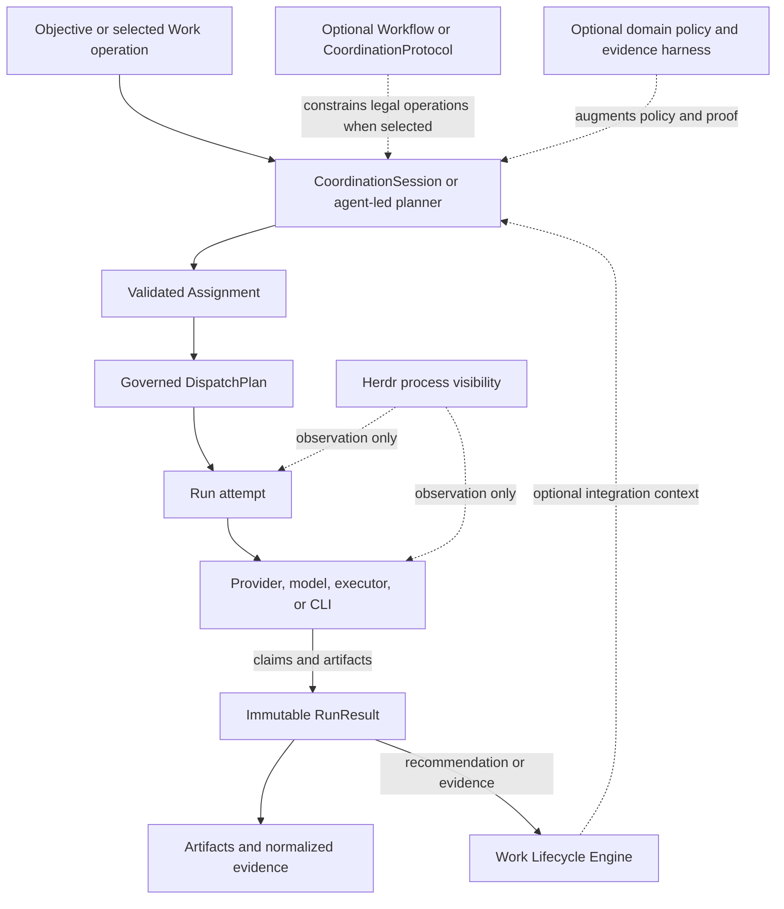

# Original-unit historical move reading material

Author session: codex-session:1
Source commit: 54c2698ee8c5b8f1baeac7244e946c793a637d29
History commit: f719eeff972f3784bfd4faf0a14f46c0eba915f9
Ledger: plans/260925-documentation-authority-unification/ledger/retired-engine-moves.json

All 40 independently stale original unit versions remain verbatim inside complete historical snapshots. Review every original unit and verify its actual containment in the pinned snapshot. Accept the move and non-authority framing, never the old live implementation status. Report one verdict per original claim ID, with source unit digest and target unit digest.

## claim_57cc129eeedc6624d9e0f94e0419b1ec

Source: `docs/platform/agent-coordination/architecture/system-context.md#component-and-runtime-flow`
Source unit digest: `dfc433aa7e8f71fe401ecb8539ceea0f7ea48d8b62ce94e82cfb288d65b69e87`
Target: `docs/platform/agent-coordination/history/retired-engine/architecture/system-context.md#literal-snapshot`
Target unit digest: `3d500396d86af8a042cdec8998b1d349753e1586d0b77f535c3e6bc36bc93f88`
Disposition: move

Owner A15: engine retired in 2180b4e72701bb090288af8fe8021008d9d42079. Preserve the entire former unit verbatim inside the complete non-authority document snapshot; no historical claim or qualifier is deleted. Current owners are CollaborationPattern and the Workflow runner, not this historical engine design.

~~~~text
## Component And Runtime Flow



The diagram separates execution from delivery lifecycle: a result can inform a
Work driver, but cannot move Work lifecycle state by itself. Dashed paths are
optional structure, augmentation, integration context, or visibility; they do
not create execution authority or terminal truth.
~~~~

## claim_2d663f66649fd2758f3d44e4a947b4a3

Source: `docs/platform/agent-coordination/architecture/system-context.md#unheaded-block-4`
Source unit digest: `d9aa9975e7a7e7fd8eb83bfade4faca1ed15556b2de8b0d6263ace6c199a90d1`
Target: `docs/platform/agent-coordination/history/retired-engine/architecture/system-context.md#literal-snapshot`
Target unit digest: `3d500396d86af8a042cdec8998b1d349753e1586d0b77f535c3e6bc36bc93f88`
Disposition: move

Owner A15: engine retired in 2180b4e72701bb090288af8fe8021008d9d42079. Preserve the entire former unit verbatim inside the complete non-authority document snapshot; no historical claim or qualifier is deleted. Current owners are CollaborationPattern and the Workflow runner, not this historical engine design.

~~~~text

~~~~

## claim_52f4171b7ac9f5564387abedae33fc32

Source: `docs/platform/agent-coordination/history/documentation-migration/claim-preservation.md#agent-coordination-claim-preservation`
Source unit digest: `335baeef42e83237bb1cfbcbe2d0cfbb4b4e269a25e4a0bbb0fc6feb59dec82f`
Target: `docs/platform/agent-coordination/history/retired-engine/history/documentation-migration/claim-preservation.md#literal-snapshot`
Target unit digest: `6657f094853e04e4f0b24ba50d84450cbe1cfd4612483bccfb0d221be92fadf0`
Disposition: move

Owner A15: engine retired in 2180b4e72701bb090288af8fe8021008d9d42079. Preserve the entire former unit verbatim inside the complete non-authority document snapshot; no historical claim or qualifier is deleted. Current owners are CollaborationPattern and the Workflow runner, not this historical engine design.

~~~~text
# Agent Coordination Claim Preservation

```txt
Document type: Claim preservation table
Audience: Human reviewer, architect, maintainer, documentation agent
Purpose: Preserve accepted, deferred, proposed, and current Agent Coordination claims during migration
Design status: Draft
Implementation: Partial
Provenance: Created from Phase 0 source inventory and documentation-standardization plan
Writer type: Human + agent coauthor
Canonical for: Migration claim tracking only
Use this when: Promoting spec, architecture, contracts, or verification links
Do not use this for: Runtime behavior by itself
Last reviewed: 2026-09-18
Related:
- docs/platform/agent-coordination/README.md
- docs/platform/agent-coordination/history/documentation-migration/source-inventory.md
```

Use `unknown` or `track-complete / verify current checkout` instead of
guessing. A target doc may mark a claim `implemented` only when the linked
current-checkout code, test, contract, or proof supports it.

| Claim ID | Claim | Source | Authority | Status | Target anchor | Must not lose | Proof / gap |
|---|---|---|---|---|---|---|---|
| `AC-CLAIM-001` | Agent Coordination is a foundation layer. | [vision](../../../../architect/agent-coordination/vision.md), [system context](../../../../architect/agent-coordination/architecture/system-context.md) | vision / architecture | partial | [README](../../README.md) | Domain-neutral foundation, not only coding workflow glue. | Evidence through Step 08 coordination implementation and current runner spec; Phase 2 needs alignment table. |
| `AC-CLAIM-002` | Work is optional integration, not system identity. | [vision](../../../../architect/agent-coordination/vision.md), [work integration](../../../../architect/agent-coordination/architecture/work-integration.md), [ADR-001](../../../../architect/agent-coordination/decisions/ADR-001-work-lifecycle-authority.md) | vision / ADR / architecture | implemented / partial | future `spec.md#work-integration` | No universal Work requirement for coordination. | `src/runner/coordination/**`, `test/runner/coordination-*.test.mjs`; Work-attached mutation remains gated. |
| `AC-CLAIM-003` | A predeclared Workflow or CoordinationProtocol is optional. | [vision](../../../../architect/agent-coordination/vision.md), [protocol model](../../../../architect/agent-coordination/architecture/protocol-model.md) | vision / architecture | implemented / partial | future `spec.md#coordination-structure` | Agent-led coordination remains legal. | `src/verbs/coordination/schema.mjs`, `src/runner/coordination/session-engine.mjs`; richer runtime graphs deferred. |
| `AC-CLAIM-004` | Runtime execution contracts are mandatory. | [assignment/run/runresult contract](../../../../architect/agent-coordination/contracts/assignment-run-runresult.md), [ADR-006](../../../../architect/agent-coordination/decisions/ADR-006-assignment-provenance-and-contract-snapshot.md) | contract / ADR | implemented / partial | future `contracts/assignment-run-runresult.md` | Free-form prose must not become execution authority. | Dispatch execution-contract code and assignment/runresult tests; Phase 2 should cite exact code anchors. |
| `AC-CLAIM-005` | CoordinationSession is the V1 executable/recovery root. | [coordination-session contract](../../../../architect/agent-coordination/contracts/coordination-session.md), [ADR-008](../../../../architect/agent-coordination/decisions/ADR-008-coordination-session-and-mission-deferral.md) | contract / ADR | implemented / partial | future `contracts/coordination-session.md` | No `missionId` resurrection or second session root. | `src/runner/coordination/{schema,store,replay,session-engine}.mjs`, `test/runner/coordination-*.test.mjs`. |
| `AC-CLAIM-006` | FlowDefinition is shared graph/operation/policy IR with typed profiles. | [flow-definition contract](../../../../architect/agent-coordination/contracts/flow-definition.md), [ADR-009](../../../../architect/agent-coordination/decisions/ADR-009-flow-definition-shared-ir-and-typed-profiles.md) | contract / ADR | implemented / partial | future `contracts/flow-definition.md` | Shared IR beneath Workflow and CoordinationProtocol profiles. | `src/runner/definitions/**`, coordination tests; Phase 2 needs exact file scan. |
| `AC-CLAIM-007` | Assignment, Run, and RunResult are separate. | [assignment/run/runresult contract](../../../../architect/agent-coordination/contracts/assignment-run-runresult.md), [ADR-003](../../../../architect/agent-coordination/decisions/ADR-003-assignment-run-runresult-separation.md) | contract / ADR | implemented | future `contracts/assignment-run-runresult.md` | Do not collapse request, attempt, and outcome. | `test/runner/assignment-runresult.test.mjs`, dispatch operability proof. |
| `AC-CLAIM-008` | Dispatch governs execution infrastructure. | [dispatch control plane](../../../../architect/agent-coordination/architecture/dispatch-control-plane.md), [ADR-011](../../../../architect/agent-coordination/decisions/ADR-011-dispatch-owns-lifecycle-receiver-writes-receipt.md) | architecture / ADR | implemented / partial | future `architecture/dispatch-control-plane.md` | Semantic operation choice stays separate from executor mechanics. | `src/runner/dispatch/**`, `src/verbs/dispatch/**`, runner spec dispatch sections. |
| `AC-CLAIM-009` | Evidence and RunResult prevent false success. | [evidence and results](../../../../architect/agent-coordination/architecture/evidence-and-results.md), ADR-005/006/007 | architecture / ADR | implemented / partial | future `architecture/evidence-and-results.md` | Worker self-report is not normalized proof by itself. | RunResult v2 tests and dispatch-operability I03 proof; aggregation proof remains mixed by protocol. |
| `AC-CLAIM-010` | Herdr is visibility, not evidence/truth. | [visibility and Herdr](../../../../architect/agent-coordination/architecture/visibility-and-herdr.md), [ADR-005](../../../../architect/agent-coordination/decisions/ADR-005-herdr-visibility-only.md) | architecture / ADR | partial | future `architecture/visibility-and-herdr.md` | Herdr must not settle Runs or replace evidence. | Visibility proof exists; writable takeover remains parked/deferred. |
| `AC-CLAIM-011` | Domain-owned Work isolation remains outside coordination code until proven. | [ADR-010](../../../../architect/agent-coordination/decisions/ADR-010-interactive-headless-parity-and-work-isolation.md), [work integration](../../../../architect/agent-coordination/architecture/work-integration.md) | ADR / architecture | deferred-preserved / partial | future `architecture/work-integration.md` | Coordination code must not gain hidden Work lifecycle writes. | Needs Step 10 mutating live proof before promotion beyond current status. |
| `AC-CLAIM-012` | Group-thinking and heterogeneous cohorts preserve dissent/evidence. | [group-thinking trigger surface](../../../../architect/agent-coordination/architecture/group-thinking-trigger-surface.md), [ledger AC-I004](../../../../architect/agent-coordination/intent-preservation-ledger.md#ac-i004-group-cognition-and-heterogeneous-cohorts) | architecture / intent ledger | implemented mechanism / quality proof mixed | future `subcomponents/group-thinking/` or architecture doc | Do not hide failed actors, stale artifacts, or dissent in synthesis. | Step 09 proof roots; quality/advisory proof has known gaps. |
| `AC-CLAIM-013` | Runtime recovery guarantees are distinct: control fencing, result fencing, effect protection. | [runtime recovery design](../../../../architect/agent-coordination/architecture/runtime-recovery-design.md), runtime recovery proofs | architecture / proposal / evidence | partial / proposed split | future runtime-recovery architecture doc | Do not describe unimplemented recovery slices as current. | P01-P05S proofs; S0-S4 and session-recovery half of S5 implemented, S5 transfer/import/budget/apply, S6, S7 not implemented. |
| `AC-CLAIM-014` | Herdr-spawn bwrap launch reconciliation uses the P02H reopen launcher-script mechanism, not falsified direct-command pseudocode. | [P02H reopen](../../../../architect/agent-coordination/verification/runtime-recovery/p02h-reopen.md), runtime-recovery plan launch design | evidence / plan | implemented with residual gap | future runtime-recovery verification index | Do not promote `herdr agent start ... -- <prepared-command>` as current design. | P02H reopen is authoritative shipped proof; residual accepted gap must stay visible. |
| `AC-CLAIM-015` | `agent-result-claim.v2` is worker claim contract, not normalized proof. | [I01](../../../../architect/agent-coordination/verification/dispatch-operability-implementation/I01.md), dispatch operability plan | evidence / contract-adjacent | implemented | future assignment/runresult contract or verification alignment | Worker claim remains untrusted input. | `test/runner/assignment-runresult.test.mjs`, `test/runner/assignment.test.mjs`. |
| `AC-CLAIM-016` | Effective execution contract is persisted pre-launch and must stay inspectable where implemented. | [I02](../../../../architect/agent-coordination/verification/dispatch-operability-implementation/I02.md) | evidence | implemented | future dispatch operability section | Preserve pre-launch snapshot and inspection. | Current checkout evidence in dispatch execution-contract and tests. |
| `AC-CLAIM-017` | `RunResult` v2 is immutable terminal Run truth; `RunObservation` is mutable read-only projection and never settles a Run. | [I03](../../../../architect/agent-coordination/verification/dispatch-operability-implementation/I03.md), runner spec | evidence / spec | implemented | future `spec.md#run-results` | Do not let observation settle a Run. | `test/runner/assignment-runresult.test.mjs`. |
| `AC-CLAIM-018` | `dispatch.runtime.inspect` is read-only. | [I04](../../../../architect/agent-coordination/verification/dispatch-operability-implementation/I04.md), [inspect verb](../../../../../src/verbs/dispatch/inspect.mjs) | evidence / implementation truth | implemented | future `spec.md#dispatch-runtime-inspect` | Inspect cannot repair or mutate. | `test/runner/dispatch-operability-production-door.test.mjs`. |
| `AC-CLAIM-019` | `dispatch.runtime.reconcile` is limited to guard/projection repair and must not kill, signal, retry, relaunch, resume, reattach, reassign, admit, cancel, or take over execution. | [I05](../../../../architect/agent-coordination/verification/dispatch-operability-implementation/I05.md), [reconcile verb](../../../../../src/verbs/dispatch/reconcile.mjs) | evidence / implementation truth | implemented / partial | future `spec.md#dispatch-runtime-reconcile` | Reconcile is not recovery. | `test/runner/dispatch-reconcile-operation.test.mjs`; preserve residual findings. |
| `AC-CLAIM-020` | Executor identity is not execution policy. | executor-policy seams plan and design | plan / architecture | implemented / partial / verify current checkout | future dispatch-control subcomponent | Do not encode persona/model/account policy in executor identity. | Current warnings and placement-policy tests exist; Phase 2 needs focused scan. |
| `AC-CLAIM-021` | `PlacementPolicy` owns provider/model/executor ranking/binding only where the self-verifying production binder has shipped; it does not own same-provider account rotation or lifecycle settlement. | executor-policy seams plan | plan / implementation evidence | implemented / partial / verify current checkout | future placement-policy section | Keep account rotation and lifecycle settlement out of PlacementPolicy. | `src/runner/dispatch/placement-policy.mjs`, placement-policy matrix tests; Phase 08 pending status must stay visible. |
| `AC-CLAIM-022` | Provider Capacity Rotator is same-provider account/capacity rotation with global/operator config; not cross-provider fallback or project-local credential inventory. | rotator plan (`../../../../../plans/260916-account-rotator/plan.md`; Added in candidate: historical path absent at the batch pin), runner spec | plan / spec | partial / verify current checkout | future provider-capacity section | No project-local account inventory and no fallback ownership. | `src/runner/provider-capacity.mjs`, provider-capacity tests where present. |
| `AC-CLAIM-023` | Work-independent code implementation tracks use targeted proof per cell plus full proof at gates; no `trackKind`/`executionPolicy` YAML or policy validator was accepted. | policy plan (`../../../../../plans/260915-code-implementation-track-policy/plan.md`; Added in candidate: historical path absent at the batch pin), policy verification | operational / evidence | done / operational | future playbook or verification policy | Do not invent policy YAML as accepted runtime behavior. | Policy proof p01-p05 and track closeout. |
| `AC-CLAIM-024` | Test feedback/cost work improved proof trust and feedback cost; P05 related-test selector remains deferred. | test feedback plan (`../../../../../plans/260915-0455-test-suite-feedback-cost/plan.md`; Added in candidate: historical path absent at the batch pin), decision lock | plan / evidence | partial; P05 deferred | future verification/history | Do not describe related-test selector as shipped. | Decision lock and Phase 08 handoff. |
| `AC-CLAIM-025` | Cold-resumable coordination DAG scheduling is proposal/frontier; it must not add mutation nodes, daemon, new lifecycle authority, or Work replacement. | [DAG proposal](../../../../architect/agent-coordination/proposals/dag-request-scheduler.md), DAG plan (`../../../../../plans/260917-cold-resumable-coordination-dag/plan.md`; Added in candidate: historical path absent at the batch pin) | proposal / plan | proposed / ready for implementation | future proposals index | Keep read-only immutable DAG limits. | Needs acceptance and code/proof before current-truth promotion. |
| `AC-CLAIM-026` | Host-invocation-routing owns host command/provider process routing; Agent Coordination owns only dispatch/executor integration boundary. | [host portal](../../../host-invocation-routing/README.md) | external authority | partial | [README cross-area boundaries](../../README.md#cross-area-boundaries) | Do not duplicate host authority here. | Link-only boundary. |
| `AC-CLAIM-027` | Packaging-distribution owns installation, activation, release manifest, setup/doctor, and runtime identity. | [packaging portal](../../../packaging-distribution/README.md) | external authority | partial | [README cross-area boundaries](../../README.md#cross-area-boundaries) | Do not duplicate install/setup/doctor authority here. | Link-only boundary. |
~~~~

## claim_2db60db20f1add588148186e717afe91

Source: `docs/platform/agent-coordination/history/documentation-migration/claim-preservation.md#unheaded-block-3`
Source unit digest: `bd1db6e9232f57939b16fb5effa1dd5e69d21363f6248a2fe4ff424562e2d5ed`
Target: `docs/platform/agent-coordination/history/retired-engine/history/documentation-migration/claim-preservation.md#literal-snapshot`
Target unit digest: `6657f094853e04e4f0b24ba50d84450cbe1cfd4612483bccfb0d221be92fadf0`
Disposition: move

Owner A15: engine retired in 2180b4e72701bb090288af8fe8021008d9d42079. Preserve the entire former unit verbatim inside the complete non-authority document snapshot; no historical claim or qualifier is deleted. Current owners are CollaborationPattern and the Workflow runner, not this historical engine design.

~~~~text
| Claim ID | Claim | Source | Authority | Status | Target anchor | Must not lose | Proof / gap |
|---|---|---|---|---|---|---|---|
| `AC-CLAIM-001` | Agent Coordination is a foundation layer. | [vision](../../../../architect/agent-coordination/vision.md), [system context](../../../../architect/agent-coordination/architecture/system-context.md) | vision / architecture | partial | [README](../../README.md) | Domain-neutral foundation, not only coding workflow glue. | Evidence through Step 08 coordination implementation and current runner spec; Phase 2 needs alignment table. |
| `AC-CLAIM-002` | Work is optional integration, not system identity. | [vision](../../../../architect/agent-coordination/vision.md), [work integration](../../../../architect/agent-coordination/architecture/work-integration.md), [ADR-001](../../../../architect/agent-coordination/decisions/ADR-001-work-lifecycle-authority.md) | vision / ADR / architecture | implemented / partial | future `spec.md#work-integration` | No universal Work requirement for coordination. | `src/runner/coordination/**`, `test/runner/coordination-*.test.mjs`; Work-attached mutation remains gated. |
| `AC-CLAIM-003` | A predeclared Workflow or CoordinationProtocol is optional. | [vision](../../../../architect/agent-coordination/vision.md), [protocol model](../../../../architect/agent-coordination/architecture/protocol-model.md) | vision / architecture | implemented / partial | future `spec.md#coordination-structure` | Agent-led coordination remains legal. | `src/verbs/coordination/schema.mjs`, `src/runner/coordination/session-engine.mjs`; richer runtime graphs deferred. |
| `AC-CLAIM-004` | Runtime execution contracts are mandatory. | [assignment/run/runresult contract](../../../../architect/agent-coordination/contracts/assignment-run-runresult.md), [ADR-006](../../../../architect/agent-coordination/decisions/ADR-006-assignment-provenance-and-contract-snapshot.md) | contract / ADR | implemented / partial | future `contracts/assignment-run-runresult.md` | Free-form prose must not become execution authority. | Dispatch execution-contract code and assignment/runresult tests; Phase 2 should cite exact code anchors. |
| `AC-CLAIM-005` | CoordinationSession is the V1 executable/recovery root. | [coordination-session contract](../../../../architect/agent-coordination/contracts/coordination-session.md), [ADR-008](../../../../architect/agent-coordination/decisions/ADR-008-coordination-session-and-mission-deferral.md) | contract / ADR | implemented / partial | future `contracts/coordination-session.md` | No `missionId` resurrection or second session root. | `src/runner/coordination/{schema,store,replay,session-engine}.mjs`, `test/runner/coordination-*.test.mjs`. |
| `AC-CLAIM-006` | FlowDefinition is shared graph/operation/policy IR with typed profiles. | [flow-definition contract](../../../../architect/agent-coordination/contracts/flow-definition.md), [ADR-009](../../../../architect/agent-coordination/decisions/ADR-009-flow-definition-shared-ir-and-typed-profiles.md) | contract / ADR | implemented / partial | future `contracts/flow-definition.md` | Shared IR beneath Workflow and CoordinationProtocol profiles. | `src/runner/definitions/**`, coordination tests; Phase 2 needs exact file scan. |
| `AC-CLAIM-007` | Assignment, Run, and RunResult are separate. | [assignment/run/runresult contract](../../../../architect/agent-coordination/contracts/assignment-run-runresult.md), [ADR-003](../../../../architect/agent-coordination/decisions/ADR-003-assignment-run-runresult-separation.md) | contract / ADR | implemented | future `contracts/assignment-run-runresult.md` | Do not collapse request, attempt, and outcome. | `test/runner/assignment-runresult.test.mjs`, dispatch operability proof. |
| `AC-CLAIM-008` | Dispatch governs execution infrastructure. | [dispatch control plane](../../../../architect/agent-coordination/architecture/dispatch-control-plane.md), [ADR-011](../../../../architect/agent-coordination/decisions/ADR-011-dispatch-owns-lifecycle-receiver-writes-receipt.md) | architecture / ADR | implemented / partial | future `architecture/dispatch-control-plane.md` | Semantic operation choice stays separate from executor mechanics. | `src/runner/dispatch/**`, `src/verbs/dispatch/**`, runner spec dispatch sections. |
| `AC-CLAIM-009` | Evidence and RunResult prevent false success. | [evidence and results](../../../../architect/agent-coordination/architecture/evidence-and-results.md), ADR-005/006/007 | architecture / ADR | implemented / partial | future `architecture/evidence-and-results.md` | Worker self-report is not normalized proof by itself. | RunResult v2 tests and dispatch-operability I03 proof; aggregation proof remains mixed by protocol. |
| `AC-CLAIM-010` | Herdr is visibility, not evidence/truth. | [visibility and Herdr](../../../../architect/agent-coordination/architecture/visibility-and-herdr.md), [ADR-005](../../../../architect/agent-coordination/decisions/ADR-005-herdr-visibility-only.md) | architecture / ADR | partial | future `architecture/visibility-and-herdr.md` | Herdr must not settle Runs or replace evidence. | Visibility proof exists; writable takeover remains parked/deferred. |
| `AC-CLAIM-011` | Domain-owned Work isolation remains outside coordination code until proven. | [ADR-010](../../../../architect/agent-coordination/decisions/ADR-010-interactive-headless-parity-and-work-isolation.md), [work integration](../../../../architect/agent-coordination/architecture/work-integration.md) | ADR / architecture | deferred-preserved / partial | future `architecture/work-integration.md` | Coordination code must not gain hidden Work lifecycle writes. | Needs Step 10 mutating live proof before promotion beyond current status. |
| `AC-CLAIM-012` | Group-thinking and heterogeneous cohorts preserve dissent/evidence. | [group-thinking trigger surface](../../../../architect/agent-coordination/architecture/group-thinking-trigger-surface.md), [ledger AC-I004](../../../../architect/agent-coordination/intent-preservation-ledger.md#ac-i004-group-cognition-and-heterogeneous-cohorts) | architecture / intent ledger | implemented mechanism / quality proof mixed | future `subcomponents/group-thinking/` or architecture doc | Do not hide failed actors, stale artifacts, or dissent in synthesis. | Step 09 proof roots; quality/advisory proof has known gaps. |
| `AC-CLAIM-013` | Runtime recovery guarantees are distinct: control fencing, result fencing, effect protection. | [runtime recovery design](../../../../architect/agent-coordination/architecture/runtime-recovery-design.md), runtime recovery proofs | architecture / proposal / evidence | partial / proposed split | future runtime-recovery architecture doc | Do not describe unimplemented recovery slices as current. | P01-P05S proofs; S0-S4 and session-recovery half of S5 implemented, S5 transfer/import/budget/apply, S6, S7 not implemented. |
| `AC-CLAIM-014` | Herdr-spawn bwrap launch reconciliation uses the P02H reopen launcher-script mechanism, not falsified direct-command pseudocode. | [P02H reopen](../../../../architect/agent-coordination/verification/runtime-recovery/p02h-reopen.md), runtime-recovery plan launch design | evidence / plan | implemented with residual gap | future runtime-recovery verification index | Do not promote `herdr agent start ... -- <prepared-command>` as current design. | P02H reopen is authoritative shipped proof; residual accepted gap must stay visible. |
| `AC-CLAIM-015` | `agent-result-claim.v2` is worker claim contract, not normalized proof. | [I01](../../../../architect/agent-coordination/verification/dispatch-operability-implementation/I01.md), dispatch operability plan | evidence / contract-adjacent | implemented | future assignment/runresult contract or verification alignment | Worker claim remains untrusted input. | `test/runner/assignment-runresult.test.mjs`, `test/runner/assignment.test.mjs`. |
| `AC-CLAIM-016` | Effective execution contract is persisted pre-launch and must stay inspectable where implemented. | [I02](../../../../architect/agent-coordination/verification/dispatch-operability-implementation/I02.md) | evidence | implemented | future dispatch operability section | Preserve pre-launch snapshot and inspection. | Current checkout evidence in dispatch execution-contract and tests. |
| `AC-CLAIM-017` | `RunResult` v2 is immutable terminal Run truth; `RunObservation` is mutable read-only projection and never settles a Run. | [I03](../../../../architect/agent-coordination/verification/dispatch-operability-implementation/I03.md), runner spec | evidence / spec | implemented | future `spec.md#run-results` | Do not let observation settle a Run. | `test/runner/assignment-runresult.test.mjs`. |
| `AC-CLAIM-018` | `dispatch.runtime.inspect` is read-only. | [I04](../../../../architect/agent-coordination/verification/dispatch-operability-implementation/I04.md), [inspect verb](../../../../../src/verbs/dispatch/inspect.mjs) | evidence / implementation truth | implemented | future `spec.md#dispatch-runtime-inspect` | Inspect cannot repair or mutate. | `test/runner/dispatch-operability-production-door.test.mjs`. |
| `AC-CLAIM-019` | `dispatch.runtime.reconcile` is limited to guard/projection repair and must not kill, signal, retry, relaunch, resume, reattach, reassign, admit, cancel, or take over execution. | [I05](../../../../architect/agent-coordination/verification/dispatch-operability-implementation/I05.md), [reconcile verb](../../../../../src/verbs/dispatch/reconcile.mjs) | evidence / implementation truth | implemented / partial | future `spec.md#dispatch-runtime-reconcile` | Reconcile is not recovery. | `test/runner/dispatch-reconcile-operation.test.mjs`; preserve residual findings. |
| `AC-CLAIM-020` | Executor identity is not execution policy. | executor-policy seams plan and design | plan / architecture | implemented / partial / verify current checkout | future dispatch-control subcomponent | Do not encode persona/model/account policy in executor identity. | Current warnings and placement-policy tests exist; Phase 2 needs focused scan. |
| `AC-CLAIM-021` | `PlacementPolicy` owns provider/model/executor ranking/binding only where the self-verifying production binder has shipped; it does not own same-provider account rotation or lifecycle settlement. | executor-policy seams plan | plan / implementation evidence | implemented / partial / verify current checkout | future placement-policy section | Keep account rotation and lifecycle settlement out of PlacementPolicy. | `src/runner/dispatch/placement-policy.mjs`, placement-policy matrix tests; Phase 08 pending status must stay visible. |
| `AC-CLAIM-022` | Provider Capacity Rotator is same-provider account/capacity rotation with global/operator config; not cross-provider fallback or project-local credential inventory. | rotator plan (`../../../../../plans/260916-account-rotator/plan.md`; Added in candidate: historical path absent at the batch pin), runner spec | plan / spec | partial / verify current checkout | future provider-capacity section | No project-local account inventory and no fallback ownership. | `src/runner/provider-capacity.mjs`, provider-capacity tests where present. |
| `AC-CLAIM-023` | Work-independent code implementation tracks use targeted proof per cell plus full proof at gates; no `trackKind`/`executionPolicy` YAML or policy validator was accepted. | policy plan (`../../../../../plans/260915-code-implementation-track-policy/plan.md`; Added in candidate: historical path absent at the batch pin), policy verification | operational / evidence | done / operational | future playbook or verification policy | Do not invent policy YAML as accepted runtime behavior. | Policy proof p01-p05 and track closeout. |
| `AC-CLAIM-024` | Test feedback/cost work improved proof trust and feedback cost; P05 related-test selector remains deferred. | test feedback plan (`../../../../../plans/260915-0455-test-suite-feedback-cost/plan.md`; Added in candidate: historical path absent at the batch pin), decision lock | plan / evidence | partial; P05 deferred | future verification/history | Do not describe related-test selector as shipped. | Decision lock and Phase 08 handoff. |
| `AC-CLAIM-025` | Cold-resumable coordination DAG scheduling is proposal/frontier; it must not add mutation nodes, daemon, new lifecycle authority, or Work replacement. | [DAG proposal](../../../../architect/agent-coordination/proposals/dag-request-scheduler.md), DAG plan (`../../../../../plans/260917-cold-resumable-coordination-dag/plan.md`; Added in candidate: historical path absent at the batch pin) | proposal / plan | proposed / ready for implementation | future proposals index | Keep read-only immutable DAG limits. | Needs acceptance and code/proof before current-truth promotion. |
| `AC-CLAIM-026` | Host-invocation-routing owns host command/provider process routing; Agent Coordination owns only dispatch/executor integration boundary. | [host portal](../../../host-invocation-routing/README.md) | external authority | partial | [README cross-area boundaries](../../README.md#cross-area-boundaries) | Do not duplicate host authority here. | Link-only boundary. |
| `AC-CLAIM-027` | Packaging-distribution owns installation, activation, release manifest, setup/doctor, and runtime identity. | [packaging portal](../../../packaging-distribution/README.md) | external authority | partial | [README cross-area boundaries](../../README.md#cross-area-boundaries) | Do not duplicate install/setup/doctor authority here. | Link-only boundary. |
~~~~

## claim_0c3e7ed818f9688e17bf5f12cfde51a7

Source: `docs/platform/agent-coordination/history/documentation-migration/proof-preservation.md#agent-coordination-proof-preservation`
Source unit digest: `9364e56ebcb837e79e0a2ee19f8d040d13feac4407c5986f429b359e4720f8de`
Target: `docs/platform/agent-coordination/history/retired-engine/history/documentation-migration/proof-preservation.md#literal-snapshot`
Target unit digest: `75b9a3360d8f8f3b7379b2b4c25e4a1f47eda07f38f6f0a4f7a0c2a55a5d6f39`
Disposition: move

Owner A15: engine retired in 2180b4e72701bb090288af8fe8021008d9d42079. Preserve the entire former unit verbatim inside the complete non-authority document snapshot; no historical claim or qualifier is deleted. Current owners are CollaborationPattern and the Workflow runner, not this historical engine design.

~~~~text
# Agent Coordination Proof Preservation

```txt
Document type: Proof preservation table
Audience: Human reviewer, architect, maintainer, documentation agent
Purpose: Preserve Agent Coordination proof roots and consuming claims during migration
Design status: Draft
Implementation: Partial
Provenance: Created from Phase 0 source inventory and documentation-standardization plan
Writer type: Human + agent coauthor
Canonical for: Migration proof tracking only
Use this when: Linking implemented claims from target docs to evidence
Do not use this for: Replacing proof artifacts or verification logs
Last reviewed: 2026-09-18
Related:
- docs/platform/agent-coordination/history/documentation-migration/claim-preservation.md
- docs/architect/agent-coordination/verification/README.md
```

Proof trees must remain linkable. Summary rows here do not replace the proof
roots, logs, current-cell files, reviews, red-team reports, or known gaps.

| Proof root | Proves / supports | Consumed by target doc | Move policy | Known gaps | Notes |
|---|---|---|---|---|---|
| `docs/architect/agent-coordination/verification/runtime-recovery/p01.md` | Run admission/control-epoch fencing. | runtime-recovery architecture / implementation alignment | link-only | Later recovery slices still split. | Required runtime-recovery row. |
| `docs/architect/agent-coordination/verification/runtime-recovery/p02l.md` | cli-spawn launch reconciliation. | runtime-recovery verification index | link-only | Preserve exact scope. | Required runtime-recovery row. |
| `docs/architect/agent-coordination/verification/runtime-recovery/p02h.md` | Original herdr-spawn proof attempt and falsified direct-command typing context. | runtime-recovery verification index | link-only | Do not promote falsified invocation. | Historical/evidence context. |
| `docs/architect/agent-coordination/verification/runtime-recovery/p02h-reopen.md` | Authoritative shipped herdr-spawn bwrap launcher-script mechanism and residual accepted gap. | runtime-recovery architecture / implementation alignment | link-only | Residual accepted gap remains. | Must override earlier pseudocode when describing shipped behavior. |
| `docs/architect/agent-coordination/verification/runtime-recovery/p03.md` | Governed fallback. | runtime-recovery verification index | link-only | Split status must stay explicit. | Required runtime-recovery row. |
| `docs/architect/agent-coordination/verification/runtime-recovery/p04.md` | Pure evaluators. | runtime-recovery verification index | link-only | Split status must stay explicit. | Required runtime-recovery row. |
| `docs/architect/agent-coordination/verification/runtime-recovery/p05.md` | Standalone `dispatch recover`. | runtime-recovery verification index | link-only | S5 transfer/import/budget/apply not implemented. | Required runtime-recovery row. |
| `docs/architect/agent-coordination/verification/runtime-recovery/p05s.md` | Session-owned recovery read/apply door. | runtime-recovery architecture / implementation alignment | link-only | Only session-recovery half of S5 implemented. | Required runtime-recovery row. |
| `docs/architect/agent-coordination/verification/dispatch-operability-implementation/I01.md` | `agent-result-claim.v2` prompt/validation contract proof. | assignment/run/runresult contract and implementation alignment | link-only | Worker claim is not normalized proof. | Required recent-track row. |
| `docs/architect/agent-coordination/verification/dispatch-operability-implementation/I02.md` | Effective execution contract persisted pre-launch and inspectable. | dispatch-control and implementation alignment | link-only | Preserve inspectability status. | Required recent-track row. |
| `docs/architect/agent-coordination/verification/dispatch-operability-implementation/I03.md` | `RunResult` v2, legacy-v1 interpretation, attribution dimensions. | assignment/run/runresult and evidence/results | link-only | Preserve documented residuals. | Required recent-track row. |
| `docs/architect/agent-coordination/verification/dispatch-operability-implementation/I04.md` | `dispatch.runtime.inspect` read model and public CLI projection. | spec / dispatch-control | link-only | Deferred label-consistency residual. | Required recent-track row. |
| `docs/architect/agent-coordination/verification/dispatch-operability-implementation/I05.md` | `dispatch.runtime.reconcile` CAS guard/projection repair and negative routes. | spec / dispatch-control | link-only | Residual findings must stay visible. | Required recent-track row. |
| `plans/260915-dispatch-operability-implementation/reports/track-closeout.md` | Production-door proof summary, full-suite result, and deferred non-capabilities. | implementation alignment | evidence-only | Track-complete until current checkout verified. | Keep as plan evidence. |
| `docs/architect/agent-coordination/verification/executor-policy-dispatch-seams/p00.md` | Executor-policy baseline verification root. | dispatch-control placement-policy notes | link-only | Later phase proof lives across plan/code/tests. | Inventory must keep later status split. |
| `plans/260915-executor-policy-dispatch-seams/plan.md` | Phase status for PlacementPolicy, self-verifying binder, redirect retirement. | dispatch-control / proposal-status | evidence-only | Phase 08 pending status must not be erased. | Required recent-track row. |
| `plans/260916-account-rotator/design.md` | Provider Capacity Rotator design and same-provider/global-config limits. | provider-capacity proposal/status | link-only | Current shipped slice needs focused verification. | Required recent-track row. |
| `plans/260916-account-rotator/plan.md` | Provider Capacity Rotator implementation contract. | provider-capacity proposal/status | link-only | Not cross-provider fallback; not project-local credential inventory. | Required recent-track row. |
| `docs/architect/agent-coordination/verification/code-implementation-track-policy/p01.md` | Policy-track proof slice P01. | playbook / verification policy | link-only | See p05 for remaining policy proof. | Required recent-track row. |
| `docs/architect/agent-coordination/verification/code-implementation-track-policy/p02.md` | Policy-track proof slice P02. | playbook / verification policy | link-only | None recorded here. | Required recent-track row. |
| `docs/architect/agent-coordination/verification/code-implementation-track-policy/p03.md` | Policy-track proof slice P03. | playbook / verification policy | link-only | None recorded here. | Required recent-track row. |
| `docs/architect/agent-coordination/verification/code-implementation-track-policy/p04.md` | Policy-track proof slice P04. | playbook / verification policy | link-only | None recorded here. | Required recent-track row. |
| `docs/architect/agent-coordination/verification/code-implementation-track-policy/p05.md` | Policy-track proof slice P05 and known gaps. | playbook / verification policy | link-only | Preserve final policy scope. | Required recent-track row. |
| `plans/260915-code-implementation-track-policy/reports/track-closeout.md` | Final policy-track closeout and proof status. | playbook / verification policy | evidence-only | No policy YAML/validator was accepted. | Required recent-track row. |
| `plans/260915-0455-test-suite-feedback-cost/decision-lock.md` | Test feedback/cost decisions. | verification/history | link-only | P05 related-test selector deferred. | Required recent-track row. |
| `plans/260915-0455-test-suite-feedback-cost/phase-08-evidence-decision-and-handoff.md` | Test feedback/cost handoff and deferred status. | verification/history | link-only | Preserve P05 deferred status. | Required recent-track row. |
| `plans/260917-cold-resumable-coordination-dag/plan.md` | DAG implementation plan and non-goals. | proposals / proposal-status | link-only | Not accepted runtime truth by itself. | Required recent-track row. |
| `docs/architect/agent-coordination/proposals/dag-request-scheduler.md` | Candidate DAG shape and unresolved questions. | proposals / proposal-status | link-only | Canonical for nothing until accepted. | Required recent-track row. |
| `docs/architect/agent-coordination/verification/step-08-standalone-coordination/index.md` | CoordinationSession/FlowDefinition foundation implementation proof index. | future spec and contracts | link-only | Verify exact per-cell status before quoting. | Supports core implemented claims. |
| `docs/architect/agent-coordination/verification/step-09-group-thinking-mvp1-mvp2/index.md` | Early group-thinking substrate proof. | group-thinking status | link-only | Quality proof mixed. | Keep mechanism vs product-quality distinction. |
| `docs/architect/agent-coordination/verification/step-09-mvp6-to-mvp9/index.md` | Later group-thinking/advisory proof tree. | group-thinking status | link-only | Known reports and rechecks must remain reachable. | Large proof tree remains legacy-current. |
| `docs/architect/agent-coordination/verification/visibility-herdr/v0-live-proof-2026-09-07.md` | Herdr visibility proof. | visibility/Herdr architecture | link-only | Visibility only; not Run truth. | Supports AC-CLAIM-010. |
~~~~

## claim_e6f5d79f58c2cffd6a636d0e28eaed92

Source: `docs/platform/agent-coordination/history/documentation-migration/proof-preservation.md#unheaded-block-3`
Source unit digest: `2f2d7a46d4e2ebf5b82c75c675e95f19261522611b45bd14d766fdb14cd1c018`
Target: `docs/platform/agent-coordination/history/retired-engine/history/documentation-migration/proof-preservation.md#literal-snapshot`
Target unit digest: `75b9a3360d8f8f3b7379b2b4c25e4a1f47eda07f38f6f0a4f7a0c2a55a5d6f39`
Disposition: move

Owner A15: engine retired in 2180b4e72701bb090288af8fe8021008d9d42079. Preserve the entire former unit verbatim inside the complete non-authority document snapshot; no historical claim or qualifier is deleted. Current owners are CollaborationPattern and the Workflow runner, not this historical engine design.

~~~~text
| Proof root | Proves / supports | Consumed by target doc | Move policy | Known gaps | Notes |
|---|---|---|---|---|---|
| `docs/architect/agent-coordination/verification/runtime-recovery/p01.md` | Run admission/control-epoch fencing. | runtime-recovery architecture / implementation alignment | link-only | Later recovery slices still split. | Required runtime-recovery row. |
| `docs/architect/agent-coordination/verification/runtime-recovery/p02l.md` | cli-spawn launch reconciliation. | runtime-recovery verification index | link-only | Preserve exact scope. | Required runtime-recovery row. |
| `docs/architect/agent-coordination/verification/runtime-recovery/p02h.md` | Original herdr-spawn proof attempt and falsified direct-command typing context. | runtime-recovery verification index | link-only | Do not promote falsified invocation. | Historical/evidence context. |
| `docs/architect/agent-coordination/verification/runtime-recovery/p02h-reopen.md` | Authoritative shipped herdr-spawn bwrap launcher-script mechanism and residual accepted gap. | runtime-recovery architecture / implementation alignment | link-only | Residual accepted gap remains. | Must override earlier pseudocode when describing shipped behavior. |
| `docs/architect/agent-coordination/verification/runtime-recovery/p03.md` | Governed fallback. | runtime-recovery verification index | link-only | Split status must stay explicit. | Required runtime-recovery row. |
| `docs/architect/agent-coordination/verification/runtime-recovery/p04.md` | Pure evaluators. | runtime-recovery verification index | link-only | Split status must stay explicit. | Required runtime-recovery row. |
| `docs/architect/agent-coordination/verification/runtime-recovery/p05.md` | Standalone `dispatch recover`. | runtime-recovery verification index | link-only | S5 transfer/import/budget/apply not implemented. | Required runtime-recovery row. |
| `docs/architect/agent-coordination/verification/runtime-recovery/p05s.md` | Session-owned recovery read/apply door. | runtime-recovery architecture / implementation alignment | link-only | Only session-recovery half of S5 implemented. | Required runtime-recovery row. |
| `docs/architect/agent-coordination/verification/dispatch-operability-implementation/I01.md` | `agent-result-claim.v2` prompt/validation contract proof. | assignment/run/runresult contract and implementation alignment | link-only | Worker claim is not normalized proof. | Required recent-track row. |
| `docs/architect/agent-coordination/verification/dispatch-operability-implementation/I02.md` | Effective execution contract persisted pre-launch and inspectable. | dispatch-control and implementation alignment | link-only | Preserve inspectability status. | Required recent-track row. |
| `docs/architect/agent-coordination/verification/dispatch-operability-implementation/I03.md` | `RunResult` v2, legacy-v1 interpretation, attribution dimensions. | assignment/run/runresult and evidence/results | link-only | Preserve documented residuals. | Required recent-track row. |
| `docs/architect/agent-coordination/verification/dispatch-operability-implementation/I04.md` | `dispatch.runtime.inspect` read model and public CLI projection. | spec / dispatch-control | link-only | Deferred label-consistency residual. | Required recent-track row. |
| `docs/architect/agent-coordination/verification/dispatch-operability-implementation/I05.md` | `dispatch.runtime.reconcile` CAS guard/projection repair and negative routes. | spec / dispatch-control | link-only | Residual findings must stay visible. | Required recent-track row. |
| `plans/260915-dispatch-operability-implementation/reports/track-closeout.md` | Production-door proof summary, full-suite result, and deferred non-capabilities. | implementation alignment | evidence-only | Track-complete until current checkout verified. | Keep as plan evidence. |
| `docs/architect/agent-coordination/verification/executor-policy-dispatch-seams/p00.md` | Executor-policy baseline verification root. | dispatch-control placement-policy notes | link-only | Later phase proof lives across plan/code/tests. | Inventory must keep later status split. |
| `plans/260915-executor-policy-dispatch-seams/plan.md` | Phase status for PlacementPolicy, self-verifying binder, redirect retirement. | dispatch-control / proposal-status | evidence-only | Phase 08 pending status must not be erased. | Required recent-track row. |
| `plans/260916-account-rotator/design.md` | Provider Capacity Rotator design and same-provider/global-config limits. | provider-capacity proposal/status | link-only | Current shipped slice needs focused verification. | Required recent-track row. |
| `plans/260916-account-rotator/plan.md` | Provider Capacity Rotator implementation contract. | provider-capacity proposal/status | link-only | Not cross-provider fallback; not project-local credential inventory. | Required recent-track row. |
| `docs/architect/agent-coordination/verification/code-implementation-track-policy/p01.md` | Policy-track proof slice P01. | playbook / verification policy | link-only | See p05 for remaining policy proof. | Required recent-track row. |
| `docs/architect/agent-coordination/verification/code-implementation-track-policy/p02.md` | Policy-track proof slice P02. | playbook / verification policy | link-only | None recorded here. | Required recent-track row. |
| `docs/architect/agent-coordination/verification/code-implementation-track-policy/p03.md` | Policy-track proof slice P03. | playbook / verification policy | link-only | None recorded here. | Required recent-track row. |
| `docs/architect/agent-coordination/verification/code-implementation-track-policy/p04.md` | Policy-track proof slice P04. | playbook / verification policy | link-only | None recorded here. | Required recent-track row. |
| `docs/architect/agent-coordination/verification/code-implementation-track-policy/p05.md` | Policy-track proof slice P05 and known gaps. | playbook / verification policy | link-only | Preserve final policy scope. | Required recent-track row. |
| `plans/260915-code-implementation-track-policy/reports/track-closeout.md` | Final policy-track closeout and proof status. | playbook / verification policy | evidence-only | No policy YAML/validator was accepted. | Required recent-track row. |
| `plans/260915-0455-test-suite-feedback-cost/decision-lock.md` | Test feedback/cost decisions. | verification/history | link-only | P05 related-test selector deferred. | Required recent-track row. |
| `plans/260915-0455-test-suite-feedback-cost/phase-08-evidence-decision-and-handoff.md` | Test feedback/cost handoff and deferred status. | verification/history | link-only | Preserve P05 deferred status. | Required recent-track row. |
| `plans/260917-cold-resumable-coordination-dag/plan.md` | DAG implementation plan and non-goals. | proposals / proposal-status | link-only | Not accepted runtime truth by itself. | Required recent-track row. |
| `docs/architect/agent-coordination/proposals/dag-request-scheduler.md` | Candidate DAG shape and unresolved questions. | proposals / proposal-status | link-only | Canonical for nothing until accepted. | Required recent-track row. |
| `docs/architect/agent-coordination/verification/step-08-standalone-coordination/index.md` | CoordinationSession/FlowDefinition foundation implementation proof index. | future spec and contracts | link-only | Verify exact per-cell status before quoting. | Supports core implemented claims. |
| `docs/architect/agent-coordination/verification/step-09-group-thinking-mvp1-mvp2/index.md` | Early group-thinking substrate proof. | group-thinking status | link-only | Quality proof mixed. | Keep mechanism vs product-quality distinction. |
| `docs/architect/agent-coordination/verification/step-09-mvp6-to-mvp9/index.md` | Later group-thinking/advisory proof tree. | group-thinking status | link-only | Known reports and rechecks must remain reachable. | Large proof tree remains legacy-current. |
| `docs/architect/agent-coordination/verification/visibility-herdr/v0-live-proof-2026-09-07.md` | Herdr visibility proof. | visibility/Herdr architecture | link-only | Visibility only; not Run truth. | Supports AC-CLAIM-010. |
~~~~

## claim_6271a36fcf399262c449faa29fcacda3

Source: `docs/platform/agent-coordination/history/documentation-migration/proposal-status.md#agent-coordination-proposal-status`
Source unit digest: `3c5c2379e2be5e99e0119476921286de646c7a5a9ed20b8cbe1feebbf8672d9d`
Target: `docs/platform/agent-coordination/history/retired-engine/history/documentation-migration/proposal-status.md#literal-snapshot`
Target unit digest: `559267e1d11d1d703a03a445fd102188619ca9e2de0b7b79a10b3939afecbb47`
Disposition: move

Owner A15: engine retired in 2180b4e72701bb090288af8fe8021008d9d42079. Preserve the entire former unit verbatim inside the complete non-authority document snapshot; no historical claim or qualifier is deleted. Current owners are CollaborationPattern and the Workflow runner, not this historical engine design.

~~~~text
# Agent Coordination Proposal Status

```txt
Document type: Proposal status table
Audience: Human reviewer, architect, maintainer, documentation agent
Purpose: Preserve Agent Coordination proposal/frontier status during migration
Design status: Draft
Implementation: Partial
Provenance: Created from Phase 0 source inventory and documentation-standardization plan
Writer type: Human + agent coauthor
Canonical for: Migration proposal tracking only
Use this when: Moving proposals or preventing accidental promotion
Do not use this for: Accepted architecture or runtime truth
Last reviewed: 2026-09-18
Related:
- docs/platform/agent-coordination/history/documentation-migration/source-inventory.md
- docs/platform/agent-coordination/history/documentation-migration/claim-preservation.md
```

Proposal status is conservative. A proposal can contain accepted pieces, but
the accepted content must be extracted into the proper architecture, contract,
decision, or spec target before it becomes current authority.

| Proposal / frontier source | Topic | Current status | Accepted pieces | Deferred / rejected pieces | Target treatment |
|---|---|---|---|---|---|
| `docs/architect/agent-coordination/proposals/dag-request-scheduler.md` | Cold-resumable operation DAG scheduler. | proposed / frontier | Candidate read-only DAG vocabulary and constraints for discussion. | No mutation nodes, daemon, new lifecycle authority, or Work replacement accepted. | keep-proposal |
| `plans/260917-cold-resumable-coordination-dag/plan.md` | Implementation plan for cold-resumable coordination DAG. | ready for implementation / not runtime truth | Non-goals and migration locks are useful status constraints. | Not implemented/accepted as current behavior by the plan alone. | keep-proposal / link-only |
| `docs/architect/agent-coordination/proposals/dispatch-control-plane-redesign.md` | Earlier dispatch control redesign. | partially-accepted / superseded by accepted dispatch-control docs and ADR-011 where promoted | Dispatch-control ownership themes survive in accepted architecture. | Any unpromoted redesign details remain non-canonical. | split-accepted / archive later |
| `docs/architect/agent-coordination/proposals/step-07-coordination-session-adhoc-task.md` | Step 07 ad-hoc task precursor. | promoted history / proposal | Some ideas flow into CoordinationSession and assignment separation. | Proposal path is not current contract. | archive after preservation |
| `docs/architect/agent-coordination/proposals/step-08-standalone-coordination-protocols.md` | Standalone CoordinationProtocol foundation. | largely promoted / history with source value | CoordinationSession, FlowDefinition, protocol loader, and public CLI were accepted through ADRs/contracts/proofs. | Frontier content not extracted remains non-canonical. | split-accepted / archive later |
| `docs/architect/agent-coordination/proposals/team-communication-protocol-v1.md` | Team communication protocol. | proposed / unknown | Preserve if referenced by future group-thinking protocol docs. | No current runtime authority. | keep-proposal |
| `docs/architect/agent-coordination/architecture/run-handle.md` | RunHandle and recovery material reasoning. | proposed vocabulary / accepted reasoning split | Accepted reasoning informs runtime recovery status and proof mapping. | Exact shipped fields/shapes must come from verification docs and code. | split-accepted / keep-proposal |
| `docs/architect/agent-coordination/architecture/coordination-continuation-recovery.md` | Continuation/recovery proposal. | proposed / partial | Normalized-but-unlinked state and transfer concepts remain preserved. | Not all apply/import/budget/transfer slices are implemented. | split-accepted / keep-proposal |
| `docs/architect/agent-coordination/architecture/executor-health-and-fallback.md` | Executor health and fallback proposal. | proposed / partial | Fallback boundaries inform dispatch-control migration. | Health store/scoring deferred. | keep-proposal |
| `docs/architect/agent-coordination/architecture/runtime-recovery-design.md` | Detailed runtime recovery design. | partial / proposed split | S0-S4 and session-recovery half of S5 implemented; proof map is useful. | S5 transfer/import/budget/apply, S6, S7, writable partial-edit takeover not implemented. | split-accepted / keep-proposal |
| `plans/260916-account-rotator/design.md` | Provider Capacity Rotator design. | proposed / partial / verify | Same-provider/global-config/account-capacity limits are preserved. | Cross-provider fallback and project-local credential inventory are not accepted here. | keep-proposal until verification |
| `plans/260916-account-rotator/plan.md` | Provider Capacity Rotator implementation plan. | proposed / partial / verify | Slice boundaries and refusal facts preserve useful constraints. | Current shipped status needs focused scan before spec promotion. | keep-proposal / link-only |
| `plans/260915-executor-policy-dispatch-seams/phase-05-placement-policy-shadow.md` | PlacementPolicy shadow mode. | partially implemented / verify | PlacementPolicy provider/model/executor ownership survives. | Same-provider account rotation and lifecycle settlement excluded. | split-accepted |
| `plans/260915-executor-policy-dispatch-seams/phase-08-legacy-placement-retirement.md` | Legacy redirect retirement. | pending / unknown | Self-verifying redirect-selection direction may survive if proof lands. | Do not claim retirement shipped without evidence. | keep-proposal / needs verification |
~~~~

## claim_c72016c6ceb4f84343b61c0118b2b359

Source: `docs/platform/agent-coordination/history/documentation-migration/proposal-status.md#unheaded-block-3`
Source unit digest: `d49fc868340267893e0cacd257900ecb5859dd141da220c64d97eff3bb581dad`
Target: `docs/platform/agent-coordination/history/retired-engine/history/documentation-migration/proposal-status.md#literal-snapshot`
Target unit digest: `559267e1d11d1d703a03a445fd102188619ca9e2de0b7b79a10b3939afecbb47`
Disposition: move

Owner A15: engine retired in 2180b4e72701bb090288af8fe8021008d9d42079. Preserve the entire former unit verbatim inside the complete non-authority document snapshot; no historical claim or qualifier is deleted. Current owners are CollaborationPattern and the Workflow runner, not this historical engine design.

~~~~text
| Proposal / frontier source | Topic | Current status | Accepted pieces | Deferred / rejected pieces | Target treatment |
|---|---|---|---|---|---|
| `docs/architect/agent-coordination/proposals/dag-request-scheduler.md` | Cold-resumable operation DAG scheduler. | proposed / frontier | Candidate read-only DAG vocabulary and constraints for discussion. | No mutation nodes, daemon, new lifecycle authority, or Work replacement accepted. | keep-proposal |
| `plans/260917-cold-resumable-coordination-dag/plan.md` | Implementation plan for cold-resumable coordination DAG. | ready for implementation / not runtime truth | Non-goals and migration locks are useful status constraints. | Not implemented/accepted as current behavior by the plan alone. | keep-proposal / link-only |
| `docs/architect/agent-coordination/proposals/dispatch-control-plane-redesign.md` | Earlier dispatch control redesign. | partially-accepted / superseded by accepted dispatch-control docs and ADR-011 where promoted | Dispatch-control ownership themes survive in accepted architecture. | Any unpromoted redesign details remain non-canonical. | split-accepted / archive later |
| `docs/architect/agent-coordination/proposals/step-07-coordination-session-adhoc-task.md` | Step 07 ad-hoc task precursor. | promoted history / proposal | Some ideas flow into CoordinationSession and assignment separation. | Proposal path is not current contract. | archive after preservation |
| `docs/architect/agent-coordination/proposals/step-08-standalone-coordination-protocols.md` | Standalone CoordinationProtocol foundation. | largely promoted / history with source value | CoordinationSession, FlowDefinition, protocol loader, and public CLI were accepted through ADRs/contracts/proofs. | Frontier content not extracted remains non-canonical. | split-accepted / archive later |
| `docs/architect/agent-coordination/proposals/team-communication-protocol-v1.md` | Team communication protocol. | proposed / unknown | Preserve if referenced by future group-thinking protocol docs. | No current runtime authority. | keep-proposal |
| `docs/architect/agent-coordination/architecture/run-handle.md` | RunHandle and recovery material reasoning. | proposed vocabulary / accepted reasoning split | Accepted reasoning informs runtime recovery status and proof mapping. | Exact shipped fields/shapes must come from verification docs and code. | split-accepted / keep-proposal |
| `docs/architect/agent-coordination/architecture/coordination-continuation-recovery.md` | Continuation/recovery proposal. | proposed / partial | Normalized-but-unlinked state and transfer concepts remain preserved. | Not all apply/import/budget/transfer slices are implemented. | split-accepted / keep-proposal |
| `docs/architect/agent-coordination/architecture/executor-health-and-fallback.md` | Executor health and fallback proposal. | proposed / partial | Fallback boundaries inform dispatch-control migration. | Health store/scoring deferred. | keep-proposal |
| `docs/architect/agent-coordination/architecture/runtime-recovery-design.md` | Detailed runtime recovery design. | partial / proposed split | S0-S4 and session-recovery half of S5 implemented; proof map is useful. | S5 transfer/import/budget/apply, S6, S7, writable partial-edit takeover not implemented. | split-accepted / keep-proposal |
| `plans/260916-account-rotator/design.md` | Provider Capacity Rotator design. | proposed / partial / verify | Same-provider/global-config/account-capacity limits are preserved. | Cross-provider fallback and project-local credential inventory are not accepted here. | keep-proposal until verification |
| `plans/260916-account-rotator/plan.md` | Provider Capacity Rotator implementation plan. | proposed / partial / verify | Slice boundaries and refusal facts preserve useful constraints. | Current shipped status needs focused scan before spec promotion. | keep-proposal / link-only |
| `plans/260915-executor-policy-dispatch-seams/phase-05-placement-policy-shadow.md` | PlacementPolicy shadow mode. | partially implemented / verify | PlacementPolicy provider/model/executor ownership survives. | Same-provider account rotation and lifecycle settlement excluded. | split-accepted |
| `plans/260915-executor-policy-dispatch-seams/phase-08-legacy-placement-retirement.md` | Legacy redirect retirement. | pending / unknown | Self-verifying redirect-selection direction may survive if proof lands. | Do not claim retirement shipped without evidence. | keep-proposal / needs verification |
~~~~

## claim_9c354eeb6f4a61966d0d015575eb331f

Source: `docs/platform/agent-coordination/intent-preservation-ledger.md#ac-i010-one-shared-driver-discipline-across-coordination-facades`
Source unit digest: `314debc51c2c5c8a373dc16c8868eddd39c7cccfc01cc366950e13bf24bb8282`
Target: `docs/platform/agent-coordination/history/retired-engine/intent-preservation-ledger.md#literal-snapshot`
Target unit digest: `22433abdc7e7363140744967a458d197b3d1a0fed1a90e7302632cc8242b9d26`
Disposition: move

Owner A15: engine retired in 2180b4e72701bb090288af8fe8021008d9d42079. Preserve the entire former unit verbatim inside the complete non-authority document snapshot; no historical claim or qualifier is deleted. Current owners are CollaborationPattern and the Workflow runner, not this historical engine design.

~~~~text
### AC-I010: One Shared Driver Discipline Across Coordination Facades

- **Original intent:** the judgment loop a coordination driver runs (observe
  status, choose one legal action, dispatch, verify evidence independently,
  disposition, revise/recheck/retry/ask a person, explicit close, cold resume)
  is written once and shared by every coordination facade -- coding,
  architecture advisory, generic panels, and future research/business loops --
  instead of being fused into one coding facade or copied per skill.
- **Source:** owner decision recorded on 2026-09-26 in
  the coordination skill/harness simplification plan (`../../../plans/260919-coordination-skill-harness-simplification/plan.md`; Added in candidate: historical path absent at the batch pin)
  ("Layering above the control layer"), consistent with
  [V-005](vision.md#v-005-agents-own-adaptive-reasoning-the-foundation-owns-authority),
  [V-008](vision.md#v-008-domain-and-organization-augmentation-creates-differentiation),
  [V-011](vision.md#v-011-the-foundation-core-stays-small), and
  [V-012](vision.md#v-012-generalization-requires-two-unlike-consumers).
- **Status:** `deferred-preserved` -- decided, not yet built.
- **Current slice:** Phase 4 extracted the discipline as a shared doctrine
  fragment (`_shared/coordination-driver.md`, no code, no state) with
  plan-loop as the first consumer; Phase 5 proved it with
  `fgos-architecture-panel` as the second, unlike consumer. Phase 6 has now
  merged the coding facades: `fgos-plan-loop` and `fgos-code-panel` are
  deprecated stubs (Phase 7 compatibility window), and `fgos-code-change`
  is the live consumer of the shared fragment plus coding-cell policy.
- **Deferred:** moving any deterministic part of the discipline into the
  control layer (for example, as action-view blockers) until at least two
  unlike consumers need the identical mechanic.
- **Must not preclude:** a non-coding facade can drive a protocol with the
  same discipline without loading coding rules; interaction protocols never
  encode driver judgment; no loop engine, track entity, scheduler, or second
  ledger is introduced to hold the discipline; explicit close remains the sole
  close action.
- **Revisit when:** Phase 5 cannot consume the fragment unchanged, a third
  facade (research/business loop) is proposed, or the same deterministic step
  is duplicated across facades after Phase 6.
- **Abandonment rule:** explicit owner decision only.
~~~~

## claim_e6e7562209436621ff85518d0ad18fd5

Source: `docs/platform/agent-coordination/intent-preservation-ledger.md#unheaded-block-20`
Source unit digest: `0d8ff388231df802a716dd228c6038db8e0e98887b457d25c71ad059d408bf6a`
Target: `docs/platform/agent-coordination/history/retired-engine/intent-preservation-ledger.md#literal-snapshot`
Target unit digest: `22433abdc7e7363140744967a458d197b3d1a0fed1a90e7302632cc8242b9d26`
Disposition: move

Owner A15: engine retired in 2180b4e72701bb090288af8fe8021008d9d42079. Preserve the entire former unit verbatim inside the complete non-authority document snapshot; no historical claim or qualifier is deleted. Current owners are CollaborationPattern and the Workflow runner, not this historical engine design.

~~~~text
- **Original intent:** the judgment loop a coordination driver runs (observe
  status, choose one legal action, dispatch, verify evidence independently,
  disposition, revise/recheck/retry/ask a person, explicit close, cold resume)
  is written once and shared by every coordination facade -- coding,
  architecture advisory, generic panels, and future research/business loops --
  instead of being fused into one coding facade or copied per skill.
- **Source:** owner decision recorded on 2026-09-26 in
  the coordination skill/harness simplification plan (`../../../plans/260919-coordination-skill-harness-simplification/plan.md`; Added in candidate: historical path absent at the batch pin)
  ("Layering above the control layer"), consistent with
  [V-005](vision.md#v-005-agents-own-adaptive-reasoning-the-foundation-owns-authority),
  [V-008](vision.md#v-008-domain-and-organization-augmentation-creates-differentiation),
  [V-011](vision.md#v-011-the-foundation-core-stays-small), and
  [V-012](vision.md#v-012-generalization-requires-two-unlike-consumers).
- **Status:** `deferred-preserved` -- decided, not yet built.
- **Current slice:** Phase 4 extracted the discipline as a shared doctrine
  fragment (`_shared/coordination-driver.md`, no code, no state) with
  plan-loop as the first consumer; Phase 5 proved it with
  `fgos-architecture-panel` as the second, unlike consumer. Phase 6 has now
  merged the coding facades: `fgos-plan-loop` and `fgos-code-panel` are
  deprecated stubs (Phase 7 compatibility window), and `fgos-code-change`
  is the live consumer of the shared fragment plus coding-cell policy.
- **Deferred:** moving any deterministic part of the discipline into the
  control layer (for example, as action-view blockers) until at least two
  unlike consumers need the identical mechanic.
- **Must not preclude:** a non-coding facade can drive a protocol with the
  same discipline without loading coding rules; interaction protocols never
  encode driver judgment; no loop engine, track entity, scheduler, or second
  ledger is introduced to hold the discipline; explicit close remains the sole
  close action.
- **Revisit when:** Phase 5 cannot consume the fragment unchanged, a third
  facade (research/business loop) is proposed, or the same deterministic step
  is duplicated across facades after Phase 6.
- **Abandonment rule:** explicit owner decision only.
~~~~

## claim_7fae909de31694f1b661ac18211cad57

Source: `docs/platform/agent-coordination/proposals/semantic-cli-surface.md#1-vấn-đề-the-problem`
Source unit digest: `06c734826c49daf6acdc59723ab00ce6fb4aedf0c90c2f0457dbaf68daaf9f22`
Target: `docs/platform/agent-coordination/history/retired-engine/proposals/semantic-cli-surface.md#literal-snapshot`
Target unit digest: `8c50b0515523c2944105b4cdfa22876be6eec1dc8fd277e4a8ede7019c960903`
Disposition: move

Owner A15: engine retired in 2180b4e72701bb090288af8fe8021008d9d42079. Preserve the entire former unit verbatim inside the complete non-authority document snapshot; no historical claim or qualifier is deleted. Current owners are CollaborationPattern and the Workflow runner, not this historical engine design.

~~~~text
## 1. Vấn đề (The Problem)

Hiện tại, bề mặt giao tiếp của Agent Coordination chỉ có một lệnh duy nhất: `fgos coordination run --file <request.json>`.
Việc bắt Agent (LLM) hoặc Human phải tương tác qua JSON gây ra 2 vấn đề lớn:

1. **Generation Fragility & Sequencing:** Việc LLM phải giữ đúng thứ tự các bước `authorize` -> `dispatch` -> `disposition` qua nhiều turn và bọc trong một file JSON lớn là điểm yếu kinh điển. Lỗi JSON thường dẫn đến việc phải gen lại toàn bộ từ đầu. (Lưu ý: JSON plumbing chiếm ~2-20% số dòng của SKILL, không phải context).
2. **Đánh đổi Failure Mode:** Việc gom batch qua `$ref` tạo ra lỗi ồn ào (sai nhãn = refuse). Interactive CLI đổi lỗi đó lấy lỗi im lặng (truyền sai ID thật = ghi nhầm chỗ = exit 0). Rủi ro này chỉ được triệt tiêu khi lỗi F5 (dischargeOn) được vá ở dưới, vì bắn nhầm ID sẽ không mở khóa gate.
~~~~

## claim_4d2603d2448b20475b2a89ca2ea1ad6f

Source: `docs/platform/agent-coordination/proposals/semantic-cli-surface.md#unheaded-block-2`
Source unit digest: `70b7d78dd9dc8e482d6ab7620785c06246f08d32df107530a136d7b96b52cbde`
Target: `docs/platform/agent-coordination/history/retired-engine/proposals/semantic-cli-surface.md#literal-snapshot`
Target unit digest: `8c50b0515523c2944105b4cdfa22876be6eec1dc8fd277e4a8ede7019c960903`
Disposition: move

Owner A15: engine retired in 2180b4e72701bb090288af8fe8021008d9d42079. Preserve the entire former unit verbatim inside the complete non-authority document snapshot; no historical claim or qualifier is deleted. Current owners are CollaborationPattern and the Workflow runner, not this historical engine design.

~~~~text
Hiện tại, bề mặt giao tiếp của Agent Coordination chỉ có một lệnh duy nhất: `fgos coordination run --file <request.json>`.
Việc bắt Agent (LLM) hoặc Human phải tương tác qua JSON gây ra 2 vấn đề lớn:
~~~~

## claim_c3bfb7cedbf63ea5a56ea1ee0f922bf9

Source: `docs/platform/agent-coordination/proposals/semantic-cli-surface.md#unheaded-block-3`
Source unit digest: `c193308a3bd4014028b5d1f7e2e5ebc4651143f85bdf48293b17e6686b0959e9`
Target: `docs/platform/agent-coordination/history/retired-engine/proposals/semantic-cli-surface.md#literal-snapshot`
Target unit digest: `8c50b0515523c2944105b4cdfa22876be6eec1dc8fd277e4a8ede7019c960903`
Disposition: move

Owner A15: engine retired in 2180b4e72701bb090288af8fe8021008d9d42079. Preserve the entire former unit verbatim inside the complete non-authority document snapshot; no historical claim or qualifier is deleted. Current owners are CollaborationPattern and the Workflow runner, not this historical engine design.

~~~~text
1. **Generation Fragility & Sequencing:** Việc LLM phải giữ đúng thứ tự các bước `authorize` -> `dispatch` -> `disposition` qua nhiều turn và bọc trong một file JSON lớn là điểm yếu kinh điển. Lỗi JSON thường dẫn đến việc phải gen lại toàn bộ từ đầu. (Lưu ý: JSON plumbing chiếm ~2-20% số dòng của SKILL, không phải context).
2. **Đánh đổi Failure Mode:** Việc gom batch qua `$ref` tạo ra lỗi ồn ào (sai nhãn = refuse). Interactive CLI đổi lỗi đó lấy lỗi im lặng (truyền sai ID thật = ghi nhầm chỗ = exit 0). Rủi ro này chỉ được triệt tiêu khi lỗi F5 (dischargeOn) được vá ở dưới, vì bắn nhầm ID sẽ không mở khóa gate.
~~~~

## claim_1ec34eb7139574fbbcaac476ee82a51a

Source: `docs/platform/agent-coordination/proposals/semantic-cli-surface.md#2-giải-pháp-kiến-trúc-the-solution`
Source unit digest: `997cb669d34aca8434cb895a823c5a904262144654865aabc6dce2408f522dac`
Target: `docs/platform/agent-coordination/history/retired-engine/proposals/semantic-cli-surface.md#literal-snapshot`
Target unit digest: `8c50b0515523c2944105b4cdfa22876be6eec1dc8fd277e4a8ede7019c960903`
Disposition: move

Owner A15: engine retired in 2180b4e72701bb090288af8fe8021008d9d42079. Preserve the entire former unit verbatim inside the complete non-authority document snapshot; no historical claim or qualifier is deleted. Current owners are CollaborationPattern and the Workflow runner, not this historical engine design.

~~~~text
## 2. Giải pháp Kiến trúc (The Solution)

Triển khai một lớp **Semantic Verbs as Request Generators**. CLI sẽ không bypass Engine, mà đóng vai trò là "Máy sinh JSON Request", bọc các hành vi an toàn rồi đẩy vào chung một cửa `runCoordinationUseCase`.

**Nguyên lý cốt lõi:**
- **Human-Agent Parity:** Cả người và máy đều gọi chung lệnh CLI. Giữ `--json` ở output (`status`) làm contract chuẩn cho máy đọc.
- **Không có MCP Wrapper mới:** Cấm đẻ thêm MCP Tools bọc ngoài cho riêng Agent Coordination (tránh mâu thuẫn với `dispatch.mjs`). CLI là cửa duy nhất.
- **Tính Deterministic:** CLI tự sinh Key an toàn, tuyệt đối không dùng Random UUID.
- **An toàn đột biến (Mutation Safety):** Mọi verb có khả năng ghi/chạy mã đều BẮT BUỘC có cờ `--cwd` tường minh, cấm dùng ambient cwd của shell.
~~~~

## claim_b14e1fac0d2b3e70231806099e41a6e8

Source: `docs/platform/agent-coordination/proposals/semantic-cli-surface.md#unheaded-block-4`
Source unit digest: `2a1a3dc98841d36b8b13603a532482486a26e96162ac5b4100bfca375c531742`
Target: `docs/platform/agent-coordination/history/retired-engine/proposals/semantic-cli-surface.md#literal-snapshot`
Target unit digest: `8c50b0515523c2944105b4cdfa22876be6eec1dc8fd277e4a8ede7019c960903`
Disposition: move

Owner A15: engine retired in 2180b4e72701bb090288af8fe8021008d9d42079. Preserve the entire former unit verbatim inside the complete non-authority document snapshot; no historical claim or qualifier is deleted. Current owners are CollaborationPattern and the Workflow runner, not this historical engine design.

~~~~text
Triển khai một lớp **Semantic Verbs as Request Generators**. CLI sẽ không bypass Engine, mà đóng vai trò là "Máy sinh JSON Request", bọc các hành vi an toàn rồi đẩy vào chung một cửa `runCoordinationUseCase`.
~~~~

## claim_9d6ab3d626cdbbc2272d2de3a04ac0b4

Source: `docs/platform/agent-coordination/proposals/semantic-cli-surface.md#3-các-sửa-đổi-tầng-engine-core-fixes`
Source unit digest: `237d30965047a8e9a8127dafc74b240fe18323a4967b6e8c93e724b9ff7bbcf0`
Target: `docs/platform/agent-coordination/history/retired-engine/proposals/semantic-cli-surface.md#literal-snapshot`
Target unit digest: `8c50b0515523c2944105b4cdfa22876be6eec1dc8fd277e4a8ede7019c960903`
Disposition: move

Owner A15: engine retired in 2180b4e72701bb090288af8fe8021008d9d42079. Preserve the entire former unit verbatim inside the complete non-authority document snapshot; no historical claim or qualifier is deleted. Current owners are CollaborationPattern and the Workflow runner, not this historical engine design.

~~~~text
## 3. Các Sửa Đổi Tầng Engine (Core Fixes)

Để lớp CLI này hoạt động đúng, Engine phải được sửa 3 lỗi kiến trúc đang tồn tại:

1. **Bóc tách Auto-close (F3):** Hàm `run.mjs` hiện tại auto-close session ở cuối. Phải tách logic này ra, chặn hành vi tự đóng ngầm định để bảo vệ các lệnh lẻ.
2. **Idempotency của Disposition (F4):** Tránh TOCTOU khi CLI ghi phán quyết. Sửa `store.mjs` để nhận thêm tham số `dispositionKey` (hoặc thu hẹp hàm `canonicalize` loại bỏ `rationale`) nhằm cho phép retry cùng quyết định mà không sinh bản ghi rác.
3. **Từ vựng & Gating của Disposition (F5):** Đẩy luật vào YAML (FlowDefinition) thay vì hardcode trong Engine.
   - Thêm `dispositionValues: [accepted, rejected, cell-closed, deferred]` làm từ vựng cho phép (Vocabulary).
   - Thêm `dischargeOn: [accepted]` làm mảng xác định việc mở khóa.
   - LUẬT LOADER: `dischargeOn` bắt buộc phải là tập con của `dispositionValues` (nếu vi phạm, từ chối load YAML).
   - CLI validate giá trị đầu vào dựa theo `dispositionValues`. Engine quyết định discharge dựa theo `dischargeOn`.
   - **LUẬT BACKWARD-COMPATIBILITY:** Nếu YAML vắng mặt cả hai field này, Engine phải giữ nguyên hành vi cũ (Mọi value hợp lệ đều được discharge). Đây là cơ chế bảo vệ sự toàn vẹn cho các replay session cũ.
~~~~

## claim_86b6325d4e0e524b97f2a9f028ba6795

Source: `docs/platform/agent-coordination/proposals/semantic-cli-surface.md#unheaded-block-6`
Source unit digest: `af63a8a596d7e8a7863c8ce6c858e75816aca25b953b4ffce595ae9d4c969110`
Target: `docs/platform/agent-coordination/history/retired-engine/proposals/semantic-cli-surface.md#literal-snapshot`
Target unit digest: `8c50b0515523c2944105b4cdfa22876be6eec1dc8fd277e4a8ede7019c960903`
Disposition: move

Owner A15: engine retired in 2180b4e72701bb090288af8fe8021008d9d42079. Preserve the entire former unit verbatim inside the complete non-authority document snapshot; no historical claim or qualifier is deleted. Current owners are CollaborationPattern and the Workflow runner, not this historical engine design.

~~~~text
Để lớp CLI này hoạt động đúng, Engine phải được sửa 3 lỗi kiến trúc đang tồn tại:
~~~~

## claim_09fafb51d4b29cf1109cd0c9404b610b

Source: `docs/platform/agent-coordination/proposals/semantic-cli-surface.md#unheaded-block-7`
Source unit digest: `e9e58fc019a2b0ed9f7539666b99fdfd9f4d0cfa5c892869101fa587f37627b4`
Target: `docs/platform/agent-coordination/history/retired-engine/proposals/semantic-cli-surface.md#literal-snapshot`
Target unit digest: `8c50b0515523c2944105b4cdfa22876be6eec1dc8fd277e4a8ede7019c960903`
Disposition: move

Owner A15: engine retired in 2180b4e72701bb090288af8fe8021008d9d42079. Preserve the entire former unit verbatim inside the complete non-authority document snapshot; no historical claim or qualifier is deleted. Current owners are CollaborationPattern and the Workflow runner, not this historical engine design.

~~~~text
1. **Bóc tách Auto-close (F3):** Hàm `run.mjs` hiện tại auto-close session ở cuối. Phải tách logic này ra, chặn hành vi tự đóng ngầm định để bảo vệ các lệnh lẻ.
2. **Idempotency của Disposition (F4):** Tránh TOCTOU khi CLI ghi phán quyết. Sửa `store.mjs` để nhận thêm tham số `dispositionKey` (hoặc thu hẹp hàm `canonicalize` loại bỏ `rationale`) nhằm cho phép retry cùng quyết định mà không sinh bản ghi rác.
3. **Từ vựng & Gating của Disposition (F5):** Đẩy luật vào YAML (FlowDefinition) thay vì hardcode trong Engine.
   - Thêm `dispositionValues: [accepted, rejected, cell-closed, deferred]` làm từ vựng cho phép (Vocabulary).
   - Thêm `dischargeOn: [accepted]` làm mảng xác định việc mở khóa.
   - LUẬT LOADER: `dischargeOn` bắt buộc phải là tập con của `dispositionValues` (nếu vi phạm, từ chối load YAML).
   - CLI validate giá trị đầu vào dựa theo `dispositionValues`. Engine quyết định discharge dựa theo `dischargeOn`.
   - **LUẬT BACKWARD-COMPATIBILITY:** Nếu YAML vắng mặt cả hai field này, Engine phải giữ nguyên hành vi cũ (Mọi value hợp lệ đều được discharge). Đây là cơ chế bảo vệ sự toàn vẹn cho các replay session cũ.
~~~~

## claim_b926a2b6954443f07915268fba55e008

Source: `docs/platform/agent-coordination/proposals/semantic-cli-surface.md#5-lộ-trình-triển-khai-execution-order`
Source unit digest: `0232a3a7c3eeabb703bb099c1cbed718aacac6bda672305539190ee5f6c1a115`
Target: `docs/platform/agent-coordination/history/retired-engine/proposals/semantic-cli-surface.md#literal-snapshot`
Target unit digest: `8c50b0515523c2944105b4cdfa22876be6eec1dc8fd277e4a8ede7019c960903`
Disposition: move

Owner A15: engine retired in 2180b4e72701bb090288af8fe8021008d9d42079. Preserve the entire former unit verbatim inside the complete non-authority document snapshot; no historical claim or qualifier is deleted. Current owners are CollaborationPattern and the Workflow runner, not this historical engine design.

~~~~text
## 5. Lộ trình Triển khai (Execution Order)

| # | Việc | Phụ thuộc | Ghi chú |
|---|---|---|---|
| **0** | **Chốt Proposal V2 này** | — | Hướng dẫn triển khai (Đã hoàn tất). |
| **1** | **Bật Fault-log đếm JSON refuse** | — | Bật đếm lỗi JSON trong 2 tuần (Đếm bằng logger chuyên dụng, không dùng invocation-fault-log). |
| **2a**| **Migration Script (Local)** | — | Viết script chạy 1 lần replay 583 local sessions trước/sau, diff derived state làm bằng chứng migration. |
| **2b**| **CI Test Corpus & YAML Load**| — | Rút gọn corpus từ 43 session có disposition commit vào `test/fixtures/`. Code logic `dischargeOn` vào YAML Loader và Engine. |
| **3** | **Tách Auto-close khỏi run (F3)** | — | Bổ sung verb `close`. |
| **4** | **Sửa F4 engine fix (dispositionKey)** | — | Chống duplicate disposition an toàn. |
| **5** | **Phát triển 10 Verb CLI** | Chờ #1 (Có số liệu) | Việc code bị chặn cho tới khi có số liệu từ Bước 1. |
~~~~

## claim_3e99c9ba0ea20c44649583632fef547f

Source: `docs/platform/agent-coordination/proposals/semantic-cli-surface.md#unheaded-block-11`
Source unit digest: `139e7d6c9a1aee5db7ada78c939e4a7cfdbf3ee3627ede6436c67b2b6cd41ce3`
Target: `docs/platform/agent-coordination/history/retired-engine/proposals/semantic-cli-surface.md#literal-snapshot`
Target unit digest: `8c50b0515523c2944105b4cdfa22876be6eec1dc8fd277e4a8ede7019c960903`
Disposition: move

Owner A15: engine retired in 2180b4e72701bb090288af8fe8021008d9d42079. Preserve the entire former unit verbatim inside the complete non-authority document snapshot; no historical claim or qualifier is deleted. Current owners are CollaborationPattern and the Workflow runner, not this historical engine design.

~~~~text
| # | Việc | Phụ thuộc | Ghi chú |
|---|---|---|---|
| **0** | **Chốt Proposal V2 này** | — | Hướng dẫn triển khai (Đã hoàn tất). |
| **1** | **Bật Fault-log đếm JSON refuse** | — | Bật đếm lỗi JSON trong 2 tuần (Đếm bằng logger chuyên dụng, không dùng invocation-fault-log). |
| **2a**| **Migration Script (Local)** | — | Viết script chạy 1 lần replay 583 local sessions trước/sau, diff derived state làm bằng chứng migration. |
| **2b**| **CI Test Corpus & YAML Load**| — | Rút gọn corpus từ 43 session có disposition commit vào `test/fixtures/`. Code logic `dischargeOn` vào YAML Loader và Engine. |
| **3** | **Tách Auto-close khỏi run (F3)** | — | Bổ sung verb `close`. |
| **4** | **Sửa F4 engine fix (dispositionKey)** | — | Chống duplicate disposition an toàn. |
| **5** | **Phát triển 10 Verb CLI** | Chờ #1 (Có số liệu) | Việc code bị chặn cho tới khi có số liệu từ Bước 1. |
~~~~

## claim_1b9e2ea95285bcf3db525a371492b405

Source: `docs/platform/agent-coordination/spec.md#current-summary`
Source unit digest: `243485da79e8d82e1a005278effce41f94b8eb321be99a5e3eb6af27f35781fc`
Target: `docs/platform/agent-coordination/history/retired-engine/spec.md#literal-snapshot`
Target unit digest: `8bb3651c8786d5021ec43207b983e47b4c671aba96498b1979749e976017e498`
Disposition: move

Owner A15: engine retired in 2180b4e72701bb090288af8fe8021008d9d42079. Preserve the entire former unit verbatim inside the complete non-authority document snapshot; no historical claim or qualifier is deleted. Current owners are CollaborationPattern and the Workflow runner, not this historical engine design.

~~~~text
## Current Summary

Agent Coordination is the foundation layer for governed, evidence-aware agent
activity. It can run without Work and without a predeclared Workflow or
CoordinationProtocol, while still requiring runtime execution contracts for any
dispatch that triggers work by an agent.

Current implemented behavior centers on:

- `CoordinationSession` as the V1 executable/recovery root;
- `FlowDefinition` as shared graph/operation/policy IR with typed profiles;
- `Assignment -> DispatchPlan -> Run -> RunResult` as the execution/evidence
  path;
- dispatch as the owner of execution infrastructure;
- Herdr as visibility/transport, not Run truth;
- Work as optional integration and sole delivery lifecycle authority when
  present.
~~~~

## claim_de43346a8b673d9ea0272947c5c752dc

Source: `docs/platform/agent-coordination/spec.md#unheaded-block-5`
Source unit digest: `41301a9368f32dbecb14a15713c7aa7977d3a33237a44b0fb3134993856dd288`
Target: `docs/platform/agent-coordination/history/retired-engine/spec.md#literal-snapshot`
Target unit digest: `8bb3651c8786d5021ec43207b983e47b4c671aba96498b1979749e976017e498`
Disposition: move

Owner A15: engine retired in 2180b4e72701bb090288af8fe8021008d9d42079. Preserve the entire former unit verbatim inside the complete non-authority document snapshot; no historical claim or qualifier is deleted. Current owners are CollaborationPattern and the Workflow runner, not this historical engine design.

~~~~text
- `CoordinationSession` as the V1 executable/recovery root;
- `FlowDefinition` as shared graph/operation/policy IR with typed profiles;
- `Assignment -> DispatchPlan -> Run -> RunResult` as the execution/evidence
  path;
- dispatch as the owner of execution infrastructure;
- Herdr as visibility/transport, not Run truth;
- Work as optional integration and sole delivery lifecycle authority when
  present.
~~~~

## claim_6c4f618a99c27c8d995e5ae4ea838c31

Source: `docs/platform/agent-coordination/spec.md#scope`
Source unit digest: `28e7ac5ff01167310835c3f9b2a227aaa8fd1077906b2a8bb188ee7ec1d8f036`
Target: `docs/platform/agent-coordination/history/retired-engine/spec.md#literal-snapshot`
Target unit digest: `8bb3651c8786d5021ec43207b983e47b4c671aba96498b1979749e976017e498`
Disposition: move

Owner A15: engine retired in 2180b4e72701bb090288af8fe8021008d9d42079. Preserve the entire former unit verbatim inside the complete non-authority document snapshot; no historical claim or qualifier is deleted. Current owners are CollaborationPattern and the Workflow runner, not this historical engine design.

~~~~text
## Scope

This area owns:

- coordination session identity, local storage, replay, and recovery-root
  behavior;
- declared and agent-led coordination execution through the shared dispatch
  core;
- FlowDefinition and typed profile semantics for Workflow and
  CoordinationProtocol consumers;
- Assignment, Run, RunResult, evidence, observation, and inspection boundaries;
- dispatch integration contracts used by coordination;
- visibility/evidence boundaries for Herdr and result evaluation;
- group-thinking/advisory protocol surfaces where they are built on
  CoordinationSession/FlowDefinition/Dispatch.
~~~~

## claim_bff3a2cc2c15603593f120c3671296a9

Source: `docs/platform/agent-coordination/spec.md#unheaded-block-6`
Source unit digest: `1dae68a93babbe019b1a6f85b9f909b81dc1b854338365099868c2568992d139`
Target: `docs/platform/agent-coordination/history/retired-engine/spec.md#literal-snapshot`
Target unit digest: `8bb3651c8786d5021ec43207b983e47b4c671aba96498b1979749e976017e498`
Disposition: move

Owner A15: engine retired in 2180b4e72701bb090288af8fe8021008d9d42079. Preserve the entire former unit verbatim inside the complete non-authority document snapshot; no historical claim or qualifier is deleted. Current owners are CollaborationPattern and the Workflow runner, not this historical engine design.

~~~~text
This area owns:

- coordination session identity, local storage, replay, and recovery-root
  behavior;
- declared and agent-led coordination execution through the shared dispatch
  core;
- FlowDefinition and typed profile semantics for Workflow and
  CoordinationProtocol consumers;
- Assignment, Run, RunResult, evidence, observation, and inspection boundaries;
- dispatch integration contracts used by coordination;
- visibility/evidence boundaries for Herdr and result evaluation;
- group-thinking/advisory protocol surfaces where they are built on
  CoordinationSession/FlowDefinition/Dispatch.
~~~~

## claim_bc2a036bfb370b61dfc459ae5a77cd8c

Source: `docs/platform/agent-coordination/spec.md#actors-and-surfaces`
Source unit digest: `97d92e28b8ae380028bbc7bbe547a7907dacc450819e13f5f02ac2b79d8f6d3a`
Target: `docs/platform/agent-coordination/history/retired-engine/spec.md#literal-snapshot`
Target unit digest: `8bb3651c8786d5021ec43207b983e47b4c671aba96498b1979749e976017e498`
Disposition: move

Owner A15: engine retired in 2180b4e72701bb090288af8fe8021008d9d42079. Preserve the entire former unit verbatim inside the complete non-authority document snapshot; no historical claim or qualifier is deleted. Current owners are CollaborationPattern and the Workflow runner, not this historical engine design.

~~~~text
## Actors And Surfaces

| Surface | Current status | Notes |
|---|---|---|
| `fgos coordination run --file <request>` | implemented | Public CLI door for synchronous session execution. |
| `fgos coordination show <id> --json` | implemented | Read-only session projection. |
| Headless adapter | implemented | Uses the same engine entry as CLI, with invocation-lifecycle differences only. |
| Declared protocol definitions | implemented / partial | Definitions live in project/domain/core loaders and use `FlowDefinition`. |
| Agent-led sessions | implemented / partial | V1 supports bounded agent-led primary plus consult shape; richer dynamic graphs remain deferred-preserved. |
| Work-attached mutation | partial / gated | Read-only and selected mutating operation paths exist; domain-owned Work isolation remains the gating boundary. |
| Herdr visibility | partial | Visibility/transport only; not evidence or Run truth. |
~~~~

## claim_3273f8bddcca9ea46c529152326ad314

Source: `docs/platform/agent-coordination/spec.md#unheaded-block-8`
Source unit digest: `9ebd99dc0abbabfe3b2c0402e35413162af1ad38cbd3946fc7ebc5953ea1e87a`
Target: `docs/platform/agent-coordination/history/retired-engine/spec.md#literal-snapshot`
Target unit digest: `8bb3651c8786d5021ec43207b983e47b4c671aba96498b1979749e976017e498`
Disposition: move

Owner A15: engine retired in 2180b4e72701bb090288af8fe8021008d9d42079. Preserve the entire former unit verbatim inside the complete non-authority document snapshot; no historical claim or qualifier is deleted. Current owners are CollaborationPattern and the Workflow runner, not this historical engine design.

~~~~text
| Surface | Current status | Notes |
|---|---|---|
| `fgos coordination run --file <request>` | implemented | Public CLI door for synchronous session execution. |
| `fgos coordination show <id> --json` | implemented | Read-only session projection. |
| Headless adapter | implemented | Uses the same engine entry as CLI, with invocation-lifecycle differences only. |
| Declared protocol definitions | implemented / partial | Definitions live in project/domain/core loaders and use `FlowDefinition`. |
| Agent-led sessions | implemented / partial | V1 supports bounded agent-led primary plus consult shape; richer dynamic graphs remain deferred-preserved. |
| Work-attached mutation | partial / gated | Read-only and selected mutating operation paths exist; domain-owned Work isolation remains the gating boundary. |
| Herdr visibility | partial | Visibility/transport only; not evidence or Run truth. |
~~~~

## claim_e55374f22025f86c63d8706a582e280d

Source: `docs/platform/agent-coordination/spec.md#core-entities`
Source unit digest: `75f686a4102d2f01a3fe622ff70b5d3f105f51c8443c10c496a41d78291f10a2`
Target: `docs/platform/agent-coordination/history/retired-engine/spec.md#literal-snapshot`
Target unit digest: `8bb3651c8786d5021ec43207b983e47b4c671aba96498b1979749e976017e498`
Disposition: move

Owner A15: engine retired in 2180b4e72701bb090288af8fe8021008d9d42079. Preserve the entire former unit verbatim inside the complete non-authority document snapshot; no historical claim or qualifier is deleted. Current owners are CollaborationPattern and the Workflow runner, not this historical engine design.

~~~~text
## Core Entities

| Entity | Current state | Source |
|---|---|---|
| CoordinationSession | Implemented V1 executable/recovery root with manifest/event store/replay. | [legacy contract](../../architect/agent-coordination/contracts/coordination-session.md), `src/runner/coordination/**` |
| FlowDefinition | Implemented shared graph/operation/policy IR with typed profiles. | [legacy contract](../../architect/agent-coordination/contracts/flow-definition.md), `src/runner/definitions/**` |
| Workflow Stage Operation | Accepted compatibility model; used where Work/Workflow integration is selected. | [legacy contract](../../architect/agent-coordination/contracts/workflow-stage-operation.md) |
| Assignment | Semantic execution request. | [legacy contract](../../architect/agent-coordination/contracts/assignment-run-runresult.md) |
| Run | One concrete execution attempt for an Assignment. | [legacy contract](../../architect/agent-coordination/contracts/assignment-run-runresult.md) |
| RunResult | Immutable terminal Run truth and normalized evidence boundary. | [legacy contract](../../architect/agent-coordination/contracts/assignment-run-runresult.md), dispatch operability proof |
| RunObservation | Mutable read-only projection; never settles a Run. | [dispatch-operability proof](../../architect/agent-coordination/verification/dispatch-operability-implementation/I03.md) |
| DispatchPlan | Execution infrastructure plan under Dispatch authority. | [dispatch control plane](../../architect/agent-coordination/architecture/dispatch-control-plane.md) |
~~~~

## claim_9d18f68c54b13d881dc32c17f0524337

Source: `docs/platform/agent-coordination/spec.md#unheaded-block-9`
Source unit digest: `c9feb3366a7e81196f07297be694114441c586d4b7fe15a9b640e57f8ef866e8`
Target: `docs/platform/agent-coordination/history/retired-engine/spec.md#literal-snapshot`
Target unit digest: `8bb3651c8786d5021ec43207b983e47b4c671aba96498b1979749e976017e498`
Disposition: move

Owner A15: engine retired in 2180b4e72701bb090288af8fe8021008d9d42079. Preserve the entire former unit verbatim inside the complete non-authority document snapshot; no historical claim or qualifier is deleted. Current owners are CollaborationPattern and the Workflow runner, not this historical engine design.

~~~~text
| Entity | Current state | Source |
|---|---|---|
| CoordinationSession | Implemented V1 executable/recovery root with manifest/event store/replay. | [legacy contract](../../architect/agent-coordination/contracts/coordination-session.md), `src/runner/coordination/**` |
| FlowDefinition | Implemented shared graph/operation/policy IR with typed profiles. | [legacy contract](../../architect/agent-coordination/contracts/flow-definition.md), `src/runner/definitions/**` |
| Workflow Stage Operation | Accepted compatibility model; used where Work/Workflow integration is selected. | [legacy contract](../../architect/agent-coordination/contracts/workflow-stage-operation.md) |
| Assignment | Semantic execution request. | [legacy contract](../../architect/agent-coordination/contracts/assignment-run-runresult.md) |
| Run | One concrete execution attempt for an Assignment. | [legacy contract](../../architect/agent-coordination/contracts/assignment-run-runresult.md) |
| RunResult | Immutable terminal Run truth and normalized evidence boundary. | [legacy contract](../../architect/agent-coordination/contracts/assignment-run-runresult.md), dispatch operability proof |
| RunObservation | Mutable read-only projection; never settles a Run. | [dispatch-operability proof](../../architect/agent-coordination/verification/dispatch-operability-implementation/I03.md) |
| DispatchPlan | Execution infrastructure plan under Dispatch authority. | [dispatch control plane](../../architect/agent-coordination/architecture/dispatch-control-plane.md) |
~~~~

## claim_1c3292ad19c922c586854d5d126e6f3b

Source: `docs/platform/agent-coordination/spec.md#operations-and-flows`
Source unit digest: `4d8c7816a117d1520a26dc152ec28ae1ae52d68f95abd6e72f11580c242ba16d`
Target: `docs/platform/agent-coordination/history/retired-engine/spec.md#literal-snapshot`
Target unit digest: `8bb3651c8786d5021ec43207b983e47b4c671aba96498b1979749e976017e498`
Disposition: move

Owner A15: engine retired in 2180b4e72701bb090288af8fe8021008d9d42079. Preserve the entire former unit verbatim inside the complete non-authority document snapshot; no historical claim or qualifier is deleted. Current owners are CollaborationPattern and the Workflow runner, not this historical engine design.

~~~~text
## Operations And Flows

| Flow | Status | Summary |
|---|---|---|
| Agent-led coordination | implemented / partial | A session can open without Work/protocol identity and dispatch bounded requests through the same Assignment/Run/RunResult path. |
| Declared coordination protocol | implemented / partial | FlowDefinition-backed protocol operations dispatch through the shared execution core. |
| Inspect dispatch runtime | implemented | `dispatch.runtime.inspect` is read-only and exposes typed selectors. |
| Reconcile dispatch runtime | implemented / partial | `dispatch.runtime.reconcile` repairs guard/projection state only; it is not recovery/takeover. |
| Runtime recovery | partial / proposed split | S0-S4 and the session-recovery half of S5 are implemented; S5 transfer/import/budget/apply, S6, and S7 remain not implemented. |
| Herdr-spawn launch reconciliation | implemented with residual gap | Current shipped path uses the P02H reopen launcher-script mechanism; earlier direct-command pseudocode is false. |
| PlacementPolicy | implemented / partial / verify current checkout | Self-verifying provider/model/executor binder exists where proven; same-provider account rotation and lifecycle settlement stay outside it. |
| Provider Capacity Rotator | partial / verify current checkout | Same-provider account/capacity rotation with global/operator config; not cross-provider fallback. |
| Cold-resumable DAG scheduler | proposed | Read-only frontier; no mutation nodes, daemon, lifecycle replacement, or Work replacement accepted. |
~~~~

## claim_4e688aaf38cb9b831a4bdd80ea2f499d

Source: `docs/platform/agent-coordination/spec.md#unheaded-block-10`
Source unit digest: `eab945ffbde3d8ae87c15f4b2642f6b92823b36be08bd28f17b128af6e473f49`
Target: `docs/platform/agent-coordination/history/retired-engine/spec.md#literal-snapshot`
Target unit digest: `8bb3651c8786d5021ec43207b983e47b4c671aba96498b1979749e976017e498`
Disposition: move

Owner A15: engine retired in 2180b4e72701bb090288af8fe8021008d9d42079. Preserve the entire former unit verbatim inside the complete non-authority document snapshot; no historical claim or qualifier is deleted. Current owners are CollaborationPattern and the Workflow runner, not this historical engine design.

~~~~text
| Flow | Status | Summary |
|---|---|---|
| Agent-led coordination | implemented / partial | A session can open without Work/protocol identity and dispatch bounded requests through the same Assignment/Run/RunResult path. |
| Declared coordination protocol | implemented / partial | FlowDefinition-backed protocol operations dispatch through the shared execution core. |
| Inspect dispatch runtime | implemented | `dispatch.runtime.inspect` is read-only and exposes typed selectors. |
| Reconcile dispatch runtime | implemented / partial | `dispatch.runtime.reconcile` repairs guard/projection state only; it is not recovery/takeover. |
| Runtime recovery | partial / proposed split | S0-S4 and the session-recovery half of S5 are implemented; S5 transfer/import/budget/apply, S6, and S7 remain not implemented. |
| Herdr-spawn launch reconciliation | implemented with residual gap | Current shipped path uses the P02H reopen launcher-script mechanism; earlier direct-command pseudocode is false. |
| PlacementPolicy | implemented / partial / verify current checkout | Self-verifying provider/model/executor binder exists where proven; same-provider account rotation and lifecycle settlement stay outside it. |
| Provider Capacity Rotator | partial / verify current checkout | Same-provider account/capacity rotation with global/operator config; not cross-provider fallback. |
| Cold-resumable DAG scheduler | proposed | Read-only frontier; no mutation nodes, daemon, lifecycle replacement, or Work replacement accepted. |
~~~~

## claim_bdc686550bc36d7563154fd33098741d

Source: `docs/platform/agent-coordination/spec.md#contracts-owned`
Source unit digest: `b6ec7e6b2c4ab46b0c1efdd78aa38d574f56ea5b5e1124dd50d207ca742cc589`
Target: `docs/platform/agent-coordination/history/retired-engine/spec.md#literal-snapshot`
Target unit digest: `8bb3651c8786d5021ec43207b983e47b4c671aba96498b1979749e976017e498`
Disposition: move

Owner A15: engine retired in 2180b4e72701bb090288af8fe8021008d9d42079. Preserve the entire former unit verbatim inside the complete non-authority document snapshot; no historical claim or qualifier is deleted. Current owners are CollaborationPattern and the Workflow runner, not this historical engine design.

~~~~text
## Contracts Owned

Detailed contract text remains legacy-current until Phase 4 promotion:

| Contract | Current source | Status |
|---|---|---|
| Workflow Stage Operation | [workflow-stage-operation.md](../../architect/agent-coordination/contracts/workflow-stage-operation.md) | accepted / partial |
| Assignment, Run, RunResult | [assignment-run-runresult.md](../../architect/agent-coordination/contracts/assignment-run-runresult.md) | accepted / implemented / partial |
| CoordinationSession | [coordination-session.md](../../architect/agent-coordination/contracts/coordination-session.md) | accepted / implemented / partial |
| FlowDefinition | [flow-definition.md](../../architect/agent-coordination/contracts/flow-definition.md) | accepted / implemented / partial |
~~~~

## claim_5020e11c44b6b053c400adc46cda95a1

Source: `docs/platform/agent-coordination/spec.md#unheaded-block-12`
Source unit digest: `b3acf3b5f1931511c0a2610dd8879a52abbbca7b5adfae155209ef9d8eeb5110`
Target: `docs/platform/agent-coordination/history/retired-engine/spec.md#literal-snapshot`
Target unit digest: `8bb3651c8786d5021ec43207b983e47b4c671aba96498b1979749e976017e498`
Disposition: move

Owner A15: engine retired in 2180b4e72701bb090288af8fe8021008d9d42079. Preserve the entire former unit verbatim inside the complete non-authority document snapshot; no historical claim or qualifier is deleted. Current owners are CollaborationPattern and the Workflow runner, not this historical engine design.

~~~~text
| Contract | Current source | Status |
|---|---|---|
| Workflow Stage Operation | [workflow-stage-operation.md](../../architect/agent-coordination/contracts/workflow-stage-operation.md) | accepted / partial |
| Assignment, Run, RunResult | [assignment-run-runresult.md](../../architect/agent-coordination/contracts/assignment-run-runresult.md) | accepted / implemented / partial |
| CoordinationSession | [coordination-session.md](../../architect/agent-coordination/contracts/coordination-session.md) | accepted / implemented / partial |
| FlowDefinition | [flow-definition.md](../../architect/agent-coordination/contracts/flow-definition.md) | accepted / implemented / partial |
~~~~

## claim_1289fd071fae40e82e7dba2d1b9bcbb2

Source: `docs/platform/agent-coordination/spec.md#implementation-status`
Source unit digest: `24dd8b125905d627d20319647844f99037139cfa324fd490a849c6dd087e3163`
Target: `docs/platform/agent-coordination/history/retired-engine/spec.md#literal-snapshot`
Target unit digest: `8bb3651c8786d5021ec43207b983e47b4c671aba96498b1979749e976017e498`
Disposition: move

Owner A15: engine retired in 2180b4e72701bb090288af8fe8021008d9d42079. Preserve the entire former unit verbatim inside the complete non-authority document snapshot; no historical claim or qualifier is deleted. Current owners are CollaborationPattern and the Workflow runner, not this historical engine design.

~~~~text
## Implementation Status

| Claim | Status | Evidence |
|---|---|---|
| Foundation layer, not coding-only glue | partial | [vision](vision.md), [system context](../../architect/agent-coordination/architecture/system-context.md) |
| Work optional integration | implemented / partial | `src/runner/coordination/**`, coordination tests, [work integration](../../architect/agent-coordination/architecture/work-integration.md) |
| Protocol optional | implemented / partial | `src/verbs/coordination/schema.mjs`, `src/runner/coordination/session-engine.mjs` |
| Runtime execution contract required | implemented / partial | dispatch execution contract code, assignment/runresult tests |
| CoordinationSession V1 root | implemented / partial | `src/runner/coordination/{schema,store,replay,session-engine}.mjs` |
| FlowDefinition shared IR | implemented / partial | `src/runner/definitions/**`, coordination tests |
| Assignment / Run / RunResult separation | implemented | `test/runner/assignment-runresult.test.mjs` |
| Dispatch owns execution infrastructure | implemented / partial | `src/runner/dispatch/**`, dispatch tests |
| Herdr visibility only | partial | [visibility proof](../../architect/agent-coordination/verification/visibility-herdr/v0-live-proof-2026-09-07.md) |
| Runtime recovery | partial / proposed split | [runtime-recovery proofs](../../architect/agent-coordination/verification/runtime-recovery/p01.md) through P05S |
| Dispatch operability inspect/reconcile | implemented / partial | [I01-I05 proofs](../../architect/agent-coordination/verification/dispatch-operability-implementation/I01.md) |
| Cold-resumable DAG scheduler | proposed | [DAG proposal](../../architect/agent-coordination/proposals/dag-request-scheduler.md) |

See [implementation-alignment.md](verification/implementation-alignment.md) for
the claim-by-claim evidence table.
~~~~

## claim_2a0f67663daf206e2883bd79216cd084

Source: `docs/platform/agent-coordination/spec.md#unheaded-block-14`
Source unit digest: `40ff194821508a0153c385265bbefe51e56ffdc843c70a3b889afc441259a19d`
Target: `docs/platform/agent-coordination/history/retired-engine/spec.md#literal-snapshot`
Target unit digest: `8bb3651c8786d5021ec43207b983e47b4c671aba96498b1979749e976017e498`
Disposition: move

Owner A15: engine retired in 2180b4e72701bb090288af8fe8021008d9d42079. Preserve the entire former unit verbatim inside the complete non-authority document snapshot; no historical claim or qualifier is deleted. Current owners are CollaborationPattern and the Workflow runner, not this historical engine design.

~~~~text
| Claim | Status | Evidence |
|---|---|---|
| Foundation layer, not coding-only glue | partial | [vision](vision.md), [system context](../../architect/agent-coordination/architecture/system-context.md) |
| Work optional integration | implemented / partial | `src/runner/coordination/**`, coordination tests, [work integration](../../architect/agent-coordination/architecture/work-integration.md) |
| Protocol optional | implemented / partial | `src/verbs/coordination/schema.mjs`, `src/runner/coordination/session-engine.mjs` |
| Runtime execution contract required | implemented / partial | dispatch execution contract code, assignment/runresult tests |
| CoordinationSession V1 root | implemented / partial | `src/runner/coordination/{schema,store,replay,session-engine}.mjs` |
| FlowDefinition shared IR | implemented / partial | `src/runner/definitions/**`, coordination tests |
| Assignment / Run / RunResult separation | implemented | `test/runner/assignment-runresult.test.mjs` |
| Dispatch owns execution infrastructure | implemented / partial | `src/runner/dispatch/**`, dispatch tests |
| Herdr visibility only | partial | [visibility proof](../../architect/agent-coordination/verification/visibility-herdr/v0-live-proof-2026-09-07.md) |
| Runtime recovery | partial / proposed split | [runtime-recovery proofs](../../architect/agent-coordination/verification/runtime-recovery/p01.md) through P05S |
| Dispatch operability inspect/reconcile | implemented / partial | [I01-I05 proofs](../../architect/agent-coordination/verification/dispatch-operability-implementation/I01.md) |
| Cold-resumable DAG scheduler | proposed | [DAG proposal](../../architect/agent-coordination/proposals/dag-request-scheduler.md) |
~~~~

## claim_abd1a1964d80a8d3e5635ba17cd386cf

Source: `docs/platform/agent-coordination/spec.md#known-gaps`
Source unit digest: `2125e01c1974f2633eccec213edb7865e6031c1337c77aeb9cf3e653880c98b9`
Target: `docs/platform/agent-coordination/history/retired-engine/spec.md#literal-snapshot`
Target unit digest: `8bb3651c8786d5021ec43207b983e47b4c671aba96498b1979749e976017e498`
Disposition: move

Owner A15: engine retired in 2180b4e72701bb090288af8fe8021008d9d42079. Preserve the entire former unit verbatim inside the complete non-authority document snapshot; no historical claim or qualifier is deleted. Current owners are CollaborationPattern and the Workflow runner, not this historical engine design.

~~~~text
## Known Gaps

| Gap | Status | Next action |
|---|---|---|
| Full architecture/contract/ADR promotion | pending Phase 3/4 | Promote accepted docs with link normalization and status notes. |
| Full verification tree preservation | pending Phase 5 | Move/mirror indexes and keep proof trees linkable. |
| Runtime recovery S5 transfer/import/budget/apply, S6, S7 | not implemented | Keep proposed/partial labels until proof exists. |
| Writable partial-edit takeover | deferred-preserved | Requires workspace-grant and evaluator owners. |
| Richer dynamic agent-authored runtime graphs | deferred-preserved | Reopen when real consumers outgrow V1 primary-plus-consult shape. |
| Provider Capacity Rotator current shipped slice | partial / verify | Focused code/proof scan before marking fully implemented. |
| PlacementPolicy redirect retirement | pending / unknown | Preserve Phase 08 pending status until proof lands. |
| Test feedback related-test selector | deferred | Do not describe P05 selector as shipped. |
| Cold-resumable DAG scheduler | proposed | Needs explicit acceptance and implementation proof. |
~~~~

## claim_c4d21a728479825bedb7f7eedf6e15c9

Source: `docs/platform/agent-coordination/spec.md#unheaded-block-16`
Source unit digest: `f9618758d29a3b89d8858509cf4aa242d0e05bb2386615d021ccd48835a24f0a`
Target: `docs/platform/agent-coordination/history/retired-engine/spec.md#literal-snapshot`
Target unit digest: `8bb3651c8786d5021ec43207b983e47b4c671aba96498b1979749e976017e498`
Disposition: move

Owner A15: engine retired in 2180b4e72701bb090288af8fe8021008d9d42079. Preserve the entire former unit verbatim inside the complete non-authority document snapshot; no historical claim or qualifier is deleted. Current owners are CollaborationPattern and the Workflow runner, not this historical engine design.

~~~~text
| Gap | Status | Next action |
|---|---|---|
| Full architecture/contract/ADR promotion | pending Phase 3/4 | Promote accepted docs with link normalization and status notes. |
| Full verification tree preservation | pending Phase 5 | Move/mirror indexes and keep proof trees linkable. |
| Runtime recovery S5 transfer/import/budget/apply, S6, S7 | not implemented | Keep proposed/partial labels until proof exists. |
| Writable partial-edit takeover | deferred-preserved | Requires workspace-grant and evaluator owners. |
| Richer dynamic agent-authored runtime graphs | deferred-preserved | Reopen when real consumers outgrow V1 primary-plus-consult shape. |
| Provider Capacity Rotator current shipped slice | partial / verify | Focused code/proof scan before marking fully implemented. |
| PlacementPolicy redirect retirement | pending / unknown | Preserve Phase 08 pending status until proof lands. |
| Test feedback related-test selector | deferred | Do not describe P05 selector as shipped. |
| Cold-resumable DAG scheduler | proposed | Needs explicit acceptance and implementation proof. |
~~~~

## claim_2361d048c1d9443043e89eb5fb31a6d9

Source: `docs/platform/agent-coordination/subcomponents/README.md#agent-coordination-subcomponents`
Source unit digest: `b199b15dd14e50071109017bfd12eabd06644a0ee0744ce44697379f654bb7da`
Target: `docs/platform/agent-coordination/history/retired-engine/subcomponents/README.md#literal-snapshot`
Target unit digest: `28c6ed748d6b29beb4e8bfb2b653df34516b6498d9d435d95636210f65cd510a`
Disposition: move

Owner A15: engine retired in 2180b4e72701bb090288af8fe8021008d9d42079. Preserve the entire former unit verbatim inside the complete non-authority document snapshot; no historical claim or qualifier is deleted. Current owners are CollaborationPattern and the Workflow runner, not this historical engine design.

~~~~text
# Agent Coordination Subcomponents

```txt
Document type: Subcomponent portal
Audience: Human reviewer, architect, maintainer, documentation agent
Purpose: Preserve the Agent Coordination child-component map during documentation migration
Design status: Draft
Implementation: Partial
Provenance: Created from docs/architect/agent-coordination/documentation-standardization-plan.md §9.4
Writer type: Human + agent coauthor
Canonical for: Initial Agent Coordination subcomponent navigation during migration
Use this when: Deciding where a child component belongs before creating local subcomponent directories
Do not use this for: Exact contracts, schemas, or implementation proof
Last reviewed: 2026-09-18
Related:
- docs/platform/agent-coordination/README.md
- docs/platform/agent-coordination/history/documentation-migration/source-inventory.md
```

Create `subcomponents/<name>/` directories only after the source inventory
proves that a child needs local navigation. Until then, this map preserves the
component vocabulary and points to owning sources.

| Subcomponent | Owns | Primary sources | Target directory | Status |
|---|---|---|---|---|
| Foundation identity | Foundation/domain boundary and optional structure | [legacy vision](../../../architect/agent-coordination/vision.md), [system context](../../../architect/agent-coordination/architecture/system-context.md) | map-only initially | accepted / partial |
| CoordinationSession | Session manifest, event schema, storage, recovery root | [contract](../../../architect/agent-coordination/contracts/coordination-session.md), [ADR-008](../../../architect/agent-coordination/decisions/ADR-008-coordination-session-and-mission-deferral.md) | likely `subcomponents/coordination-session/` | implemented / partial |
| FlowDefinition | Shared graph/operation/policy IR and typed profiles | [contract](../../../architect/agent-coordination/contracts/flow-definition.md), [ADR-009](../../../architect/agent-coordination/decisions/ADR-009-flow-definition-shared-ir-and-typed-profiles.md) | likely `subcomponents/flow-definition/` | implemented / partial |
| Workflow Stage Operation | Stage operation normalization and compatibility | [contract](../../../architect/agent-coordination/contracts/workflow-stage-operation.md), [ADR-002](../../../architect/agent-coordination/decisions/ADR-002-stage-operation-compatibility.md) | decide after inventory | accepted / partial |
| Assignment / Run / RunResult | Semantic request, attempt, result, evidence boundary | [contract](../../../architect/agent-coordination/contracts/assignment-run-runresult.md), [ADR-003](../../../architect/agent-coordination/decisions/ADR-003-assignment-run-runresult-separation.md) | likely `subcomponents/assignment-run-result/` | implemented / partial |
| Dispatch Control | Execution infrastructure and operation dispatch boundary | [dispatch control plane](../../../architect/agent-coordination/architecture/dispatch-control-plane.md), [ADR-011](../../../architect/agent-coordination/decisions/ADR-011-dispatch-owns-lifecycle-receiver-writes-receipt.md) | likely `subcomponents/dispatch-control/` | implemented / partial |
| Dispatch Operability | RunResult v2, RunObservation, inspect/reconcile, worker result claim attribution | implementation plan (`../../../../plans/260915-dispatch-operability-implementation/plan.md`; Added in candidate: historical path absent at the batch pin), [verification](../../../architect/agent-coordination/verification/dispatch-operability-implementation/I01.md) | likely under dispatch-control or assignment-run-result after inventory | track-complete / verify current checkout |
| Executor Policy / Placement | Provider/model/executor selection and self-verifying production binder | seams plan (`../../../../plans/260915-executor-policy-dispatch-seams/plan.md`; Added in candidate: historical path absent at the batch pin) | likely `subcomponents/dispatch-control/placement-policy/` only if inventory proves enough local mass | implemented / partial / verify current checkout |
| Provider Capacity Rotator | Same-provider account/capacity rotation and refusal facts | rotator plan (`../../../../plans/260916-account-rotator/plan.md`; Added in candidate: historical path absent at the batch pin) | likely proposal row under dispatch-control unless shipped code proves a component | proposed / verify |
| Evidence And Results | Confidence, false-success, proof boundary | [evidence and results](../../../architect/agent-coordination/architecture/evidence-and-results.md), ADR-005/006/007 | likely `subcomponents/evidence-results/` | accepted / partial |
| Code Implementation Track Policy | Proof policy for work-independent implementation tracks | policy plan (`../../../../plans/260915-code-implementation-track-policy/plan.md`; Added in candidate: historical path absent at the batch pin), [verification](../../../architect/agent-coordination/verification/code-implementation-track-policy/p01.md) | playbook/verification policy, not runtime subcomponent | done / operational |
| Test Feedback Cost | Test/proof harness reliability and feedback-cost decisions | test-suite feedback plan (`../../../../plans/260915-0455-test-suite-feedback-cost/plan.md`; Added in candidate: historical path absent at the batch pin) | verification/history, not runtime subcomponent | partial; P05 deferred |
| Work Integration | Work-attached coordination without second lifecycle authority | [work integration](../../../architect/agent-coordination/architecture/work-integration.md), ADR-001/010 | decide after inventory | accepted / partial |
| Visibility / Herdr | Visibility-only boundary | [visibility and Herdr](../../../architect/agent-coordination/architecture/visibility-and-herdr.md), ADR-005 | decide after inventory | accepted / partial |
| Runtime Recovery | RunHandle, continuation/recovery, fallback, health | runtime recovery architecture docs | likely `subcomponents/runtime-recovery/` only if status is clear | proposed / partial / unknown |
| Launch Reconciliation | Herdr/cli spawn launch reconciliation and confinement authority handoff | runtime recovery phase designs and P02H verification | likely under runtime-recovery | substantially implemented with residual gap |
| Cold-Resumable DAG Scheduler | Read-only DAG scheduling of protocol operation nodes | [proposal](../../../architect/agent-coordination/proposals/dag-request-scheduler.md), plan (`../../../../plans/260917-cold-resumable-coordination-dag/plan.md`; Added in candidate: historical path absent at the batch pin) | proposal row only until accepted/implemented | proposed / ready for implementation |
| Group Thinking | Group-thinking protocols, advisory panels, cohort planning | group-thinking docs and verification | likely `subcomponents/group-thinking/` | implemented mechanism / quality proof mixed |
| Host Boundary | Host invocation and provider process ownership consumed by coordination | [host-invocation-routing](../../host-invocation-routing/README.md) | link-only cross-area boundary | external authority |
| Packaging Boundary | Install, activation, release manifest, setup/doctor consumed by runtime docs | [packaging-distribution](../../packaging-distribution/README.md) | link-only cross-area boundary | external authority |
~~~~

## claim_c908b3b595d16211e94263026e278842

Source: `docs/platform/agent-coordination/subcomponents/README.md#unheaded-block-3`
Source unit digest: `1bbf496db96ec2f6f7b8e2c7e096a52163ea253a91842d8f4df6a7495aee193b`
Target: `docs/platform/agent-coordination/history/retired-engine/subcomponents/README.md#literal-snapshot`
Target unit digest: `28c6ed748d6b29beb4e8bfb2b653df34516b6498d9d435d95636210f65cd510a`
Disposition: move

Owner A15: engine retired in 2180b4e72701bb090288af8fe8021008d9d42079. Preserve the entire former unit verbatim inside the complete non-authority document snapshot; no historical claim or qualifier is deleted. Current owners are CollaborationPattern and the Workflow runner, not this historical engine design.

~~~~text
| Subcomponent | Owns | Primary sources | Target directory | Status |
|---|---|---|---|---|
| Foundation identity | Foundation/domain boundary and optional structure | [legacy vision](../../../architect/agent-coordination/vision.md), [system context](../../../architect/agent-coordination/architecture/system-context.md) | map-only initially | accepted / partial |
| CoordinationSession | Session manifest, event schema, storage, recovery root | [contract](../../../architect/agent-coordination/contracts/coordination-session.md), [ADR-008](../../../architect/agent-coordination/decisions/ADR-008-coordination-session-and-mission-deferral.md) | likely `subcomponents/coordination-session/` | implemented / partial |
| FlowDefinition | Shared graph/operation/policy IR and typed profiles | [contract](../../../architect/agent-coordination/contracts/flow-definition.md), [ADR-009](../../../architect/agent-coordination/decisions/ADR-009-flow-definition-shared-ir-and-typed-profiles.md) | likely `subcomponents/flow-definition/` | implemented / partial |
| Workflow Stage Operation | Stage operation normalization and compatibility | [contract](../../../architect/agent-coordination/contracts/workflow-stage-operation.md), [ADR-002](../../../architect/agent-coordination/decisions/ADR-002-stage-operation-compatibility.md) | decide after inventory | accepted / partial |
| Assignment / Run / RunResult | Semantic request, attempt, result, evidence boundary | [contract](../../../architect/agent-coordination/contracts/assignment-run-runresult.md), [ADR-003](../../../architect/agent-coordination/decisions/ADR-003-assignment-run-runresult-separation.md) | likely `subcomponents/assignment-run-result/` | implemented / partial |
| Dispatch Control | Execution infrastructure and operation dispatch boundary | [dispatch control plane](../../../architect/agent-coordination/architecture/dispatch-control-plane.md), [ADR-011](../../../architect/agent-coordination/decisions/ADR-011-dispatch-owns-lifecycle-receiver-writes-receipt.md) | likely `subcomponents/dispatch-control/` | implemented / partial |
| Dispatch Operability | RunResult v2, RunObservation, inspect/reconcile, worker result claim attribution | implementation plan (`../../../../plans/260915-dispatch-operability-implementation/plan.md`; Added in candidate: historical path absent at the batch pin), [verification](../../../architect/agent-coordination/verification/dispatch-operability-implementation/I01.md) | likely under dispatch-control or assignment-run-result after inventory | track-complete / verify current checkout |
| Executor Policy / Placement | Provider/model/executor selection and self-verifying production binder | seams plan (`../../../../plans/260915-executor-policy-dispatch-seams/plan.md`; Added in candidate: historical path absent at the batch pin) | likely `subcomponents/dispatch-control/placement-policy/` only if inventory proves enough local mass | implemented / partial / verify current checkout |
| Provider Capacity Rotator | Same-provider account/capacity rotation and refusal facts | rotator plan (`../../../../plans/260916-account-rotator/plan.md`; Added in candidate: historical path absent at the batch pin) | likely proposal row under dispatch-control unless shipped code proves a component | proposed / verify |
| Evidence And Results | Confidence, false-success, proof boundary | [evidence and results](../../../architect/agent-coordination/architecture/evidence-and-results.md), ADR-005/006/007 | likely `subcomponents/evidence-results/` | accepted / partial |
| Code Implementation Track Policy | Proof policy for work-independent implementation tracks | policy plan (`../../../../plans/260915-code-implementation-track-policy/plan.md`; Added in candidate: historical path absent at the batch pin), [verification](../../../architect/agent-coordination/verification/code-implementation-track-policy/p01.md) | playbook/verification policy, not runtime subcomponent | done / operational |
| Test Feedback Cost | Test/proof harness reliability and feedback-cost decisions | test-suite feedback plan (`../../../../plans/260915-0455-test-suite-feedback-cost/plan.md`; Added in candidate: historical path absent at the batch pin) | verification/history, not runtime subcomponent | partial; P05 deferred |
| Work Integration | Work-attached coordination without second lifecycle authority | [work integration](../../../architect/agent-coordination/architecture/work-integration.md), ADR-001/010 | decide after inventory | accepted / partial |
| Visibility / Herdr | Visibility-only boundary | [visibility and Herdr](../../../architect/agent-coordination/architecture/visibility-and-herdr.md), ADR-005 | decide after inventory | accepted / partial |
| Runtime Recovery | RunHandle, continuation/recovery, fallback, health | runtime recovery architecture docs | likely `subcomponents/runtime-recovery/` only if status is clear | proposed / partial / unknown |
| Launch Reconciliation | Herdr/cli spawn launch reconciliation and confinement authority handoff | runtime recovery phase designs and P02H verification | likely under runtime-recovery | substantially implemented with residual gap |
| Cold-Resumable DAG Scheduler | Read-only DAG scheduling of protocol operation nodes | [proposal](../../../architect/agent-coordination/proposals/dag-request-scheduler.md), plan (`../../../../plans/260917-cold-resumable-coordination-dag/plan.md`; Added in candidate: historical path absent at the batch pin) | proposal row only until accepted/implemented | proposed / ready for implementation |
| Group Thinking | Group-thinking protocols, advisory panels, cohort planning | group-thinking docs and verification | likely `subcomponents/group-thinking/` | implemented mechanism / quality proof mixed |
| Host Boundary | Host invocation and provider process ownership consumed by coordination | [host-invocation-routing](../../host-invocation-routing/README.md) | link-only cross-area boundary | external authority |
| Packaging Boundary | Install, activation, release manifest, setup/doctor consumed by runtime docs | [packaging-distribution](../../packaging-distribution/README.md) | link-only cross-area boundary | external authority |
~~~~

## claim_b27d445f9ef1a6c7e7d87ae491066f93

Source: `docs/platform/agent-coordination/verification/implementation-alignment.md#agent-coordination-implementation-alignment`
Source unit digest: `b6dd4b2f575748c0f5378ad1cd71e7a28ee7308b71d19d2ab1466597d36ad537`
Target: `docs/platform/agent-coordination/history/retired-engine/verification/implementation-alignment.md#literal-snapshot`
Target unit digest: `69b0ef4c8e480d23ec2a05e6b118d449e03079c04560a6541d66214e1a227998`
Disposition: move

Owner A15: engine retired in 2180b4e72701bb090288af8fe8021008d9d42079. Preserve the entire former unit verbatim inside the complete non-authority document snapshot; no historical claim or qualifier is deleted. Current owners are CollaborationPattern and the Workflow runner, not this historical engine design.

~~~~text
# Agent Coordination Implementation Alignment

```txt
Document type: Verification
Audience: Human reviewer, architect, maintainer, implementation agent
Purpose: Map Agent Coordination design claims to implementation status, evidence, and migration gaps
Design status: Draft
Implementation: Partial
Provenance: Created from Phase 0 claim/proof preservation ledgers and current-checkout test evidence
Writer type: Human + agent coauthor
Canonical for: Agent Coordination implementation alignment during migration
Use this when: Deciding whether a target spec/architecture claim may say implemented
Do not use this for: Replacing detailed proof artifacts
Last reviewed: 2026-09-18
Related:
- docs/platform/agent-coordination/spec.md
- docs/platform/agent-coordination/history/documentation-migration/claim-preservation.md
- docs/platform/agent-coordination/history/documentation-migration/proof-preservation.md
```

This table is deliberately conservative. `implemented` means current checkout
code/test/proof supports the claim. `partial` and `track-complete / verify`
must not be silently upgraded during doc promotion.

| Design claim | Implementation status | Evidence | Gap / next action |
|---|---|---|---|
| Agent Coordination is a foundation layer, not coding-only workflow glue. | partial | [vision](../vision.md), [system context](../../../architect/agent-coordination/architecture/system-context.md), Step 08 proof indexes. | Promote accepted architecture and keep cross-domain mission fit explicit. |
| Work is optional integration, not system identity. | implemented / partial | `src/runner/coordination/**`, `test/runner/coordination-*.test.mjs`, [work integration](../../../architect/agent-coordination/architecture/work-integration.md). | Work-attached mutating coordination remains gated by domain-owned isolation proof. |
| A predeclared Workflow or CoordinationProtocol is optional. | implemented / partial | `src/verbs/coordination/schema.mjs`, `src/runner/coordination/session-engine.mjs`, Step 08 standalone coordination proofs. | Richer agent-authored dynamic graphs remain deferred-preserved. |
| Runtime execution contracts are mandatory. | implemented / partial | `src/runner/dispatch/execution-contract.mjs`, assignment/runresult tests, ADR-006. | Phase 4 should preserve exact contract wording. |
| Work owns delivery lifecycle when present. | implemented / partial | ADR-001, ADR-010, Work integration architecture, no Work-transition exports in coordination code. | Keep Work lifecycle authority out of coordination code until explicitly proven. |
| CoordinationSession is the V1 executable/recovery root. | implemented / partial | `src/runner/coordination/{schema,store,replay,session-engine}.mjs`, coordination tests, ADR-008. | Promote CoordinationSession contract and preserve no-`missionId` rule. |
| FlowDefinition is shared graph/operation/policy IR with typed profiles. | implemented / partial | `src/runner/definitions/**`, coordination protocol tests, ADR-009. | Promote FlowDefinition contract and typed profile distinction. |
| Assignment, Run, and RunResult are separate. | implemented | `test/runner/assignment-runresult.test.mjs`, legacy contract, ADR-003. | Promote contract with minimal semantic rewrite. |
| Dispatch governs execution infrastructure. | implemented / partial | `src/runner/dispatch/**`, `src/verbs/dispatch/**`, dispatch control architecture, ADR-011. | Preserve semantic choice versus execution infrastructure boundary. |
| Evidence and RunResult prevent false success. | implemented / partial | Dispatch operability I03 proof, assignment/runresult tests. | Preserve residuals around aggregation/product-quality proof. |
| Herdr is visibility, not evidence/truth. | partial | ADR-005, [visibility live proof](../../../architect/agent-coordination/verification/visibility-herdr/v0-live-proof-2026-09-07.md). | Writable takeover remains parked/deferred. |
| Domain-owned Work isolation remains outside coordination code until proven. | deferred-preserved / partial | ADR-010, coordination static tests, Work integration architecture. | Requires coding-domain mutating live proof before widening. |
| Group-thinking and heterogeneous cohorts preserve dissent/evidence. | implemented mechanism / quality proof mixed | Step 09 proof indexes and group-thinking trigger surface. | Keep mechanism status distinct from quality/advisory confidence. |
| Runtime recovery guarantees are distinct: control fencing, result fencing, effect protection. | partial / proposed split | Runtime recovery P01-P05S proofs and runtime-recovery design. | S5 transfer/import/budget/apply, S6, S7 remain not implemented. |
| Herdr-spawn bwrap launch reconciliation uses P02H reopen launcher-script mechanism. | implemented with residual gap | [P02H reopen](../../../architect/agent-coordination/verification/runtime-recovery/p02h-reopen.md). | Do not promote falsified `herdr agent start ... -- <prepared-command>` pseudocode. |
| `agent-result-claim.v2` is a worker claim contract, not normalized proof. | implemented | [I01](../../../architect/agent-coordination/verification/dispatch-operability-implementation/I01.md), `test/runner/assignment-runresult.test.mjs`. | Preserve untrusted-input wording in contract promotion. |
| Effective execution contract is persisted pre-launch and inspectable where implemented. | implemented | [I02](../../../architect/agent-coordination/verification/dispatch-operability-implementation/I02.md), dispatch execution-contract tests. | Preserve inspectability notes. |
| `RunResult` v2 is immutable terminal Run truth; `RunObservation` is mutable projection. | implemented | [I03](../../../architect/agent-coordination/verification/dispatch-operability-implementation/I03.md), assignment/runresult tests. | Keep observation from settling Runs. |
| `dispatch.runtime.inspect` is read-only. | implemented | [I04](../../../architect/agent-coordination/verification/dispatch-operability-implementation/I04.md), `src/verbs/dispatch/inspect.mjs`. | Preserve deferred label-consistency residual. |
| `dispatch.runtime.reconcile` is limited to guard/projection repair and is not recovery. | implemented / partial | [I05](../../../architect/agent-coordination/verification/dispatch-operability-implementation/I05.md), `test/runner/dispatch-reconcile-operation.test.mjs`. | Preserve forbidden-action list. |
| Executor identity is not execution policy. | implemented / partial / verify current checkout | Executor-policy seams plan, setup warnings, placement-policy tests. | Phase 3/4 should avoid promoting pending redirect retirement. |
| `PlacementPolicy` owns provider/model/executor ranking/binding only where self-verifying proof shipped. | implemented / partial / verify current checkout | `src/runner/dispatch/placement-policy.mjs`, placement-policy matrix tests, executor-policy seams plan. | Phase 08 redirect retirement remains pending/unknown. |
| Provider Capacity Rotator is same-provider account/capacity rotation with global/operator config. | partial / verify current checkout | `src/runner/provider-capacity.mjs`, provider-capacity tests where present, rotator plan. | Do not claim cross-provider fallback or project-local credential inventory. |
| Work-independent code implementation tracks use targeted proof per cell and full proof at gates. | done / operational | Code implementation track policy proofs p01-p05 and track closeout. | Put in playbook/verification policy, not runtime spec. |
| Test feedback/cost work improved proof trust; P05 related-test selector remains deferred. | partial; P05 deferred | Test feedback cost decision lock and Phase 08 handoff. | Do not describe related-test selector as shipped. |
| Cold-resumable coordination DAG scheduling is read-only proposal/frontier. | proposed | DAG proposal and 260917 plan. | Needs explicit acceptance and implementation proof. |
| Host invocation routing owns host command/provider process routing. | external authority | [host-invocation-routing](../../host-invocation-routing/README.md). | Link-only from this area. |
| Packaging-distribution owns install/activation/setup/doctor/runtime identity. | external authority | [packaging-distribution](../../packaging-distribution/README.md). | Link-only from this area. |
~~~~

## claim_d1a817c37e5972f83310d2c7ca022f3d

Source: `docs/platform/agent-coordination/verification/implementation-alignment.md#unheaded-block-3`
Source unit digest: `68a20f3a858320cd01857afa7ecdec632ac2f11ec699122e03668688ed5f21e0`
Target: `docs/platform/agent-coordination/history/retired-engine/verification/implementation-alignment.md#literal-snapshot`
Target unit digest: `69b0ef4c8e480d23ec2a05e6b118d449e03079c04560a6541d66214e1a227998`
Disposition: move

Owner A15: engine retired in 2180b4e72701bb090288af8fe8021008d9d42079. Preserve the entire former unit verbatim inside the complete non-authority document snapshot; no historical claim or qualifier is deleted. Current owners are CollaborationPattern and the Workflow runner, not this historical engine design.

~~~~text
| Design claim | Implementation status | Evidence | Gap / next action |
|---|---|---|---|
| Agent Coordination is a foundation layer, not coding-only workflow glue. | partial | [vision](../vision.md), [system context](../../../architect/agent-coordination/architecture/system-context.md), Step 08 proof indexes. | Promote accepted architecture and keep cross-domain mission fit explicit. |
| Work is optional integration, not system identity. | implemented / partial | `src/runner/coordination/**`, `test/runner/coordination-*.test.mjs`, [work integration](../../../architect/agent-coordination/architecture/work-integration.md). | Work-attached mutating coordination remains gated by domain-owned isolation proof. |
| A predeclared Workflow or CoordinationProtocol is optional. | implemented / partial | `src/verbs/coordination/schema.mjs`, `src/runner/coordination/session-engine.mjs`, Step 08 standalone coordination proofs. | Richer agent-authored dynamic graphs remain deferred-preserved. |
| Runtime execution contracts are mandatory. | implemented / partial | `src/runner/dispatch/execution-contract.mjs`, assignment/runresult tests, ADR-006. | Phase 4 should preserve exact contract wording. |
| Work owns delivery lifecycle when present. | implemented / partial | ADR-001, ADR-010, Work integration architecture, no Work-transition exports in coordination code. | Keep Work lifecycle authority out of coordination code until explicitly proven. |
| CoordinationSession is the V1 executable/recovery root. | implemented / partial | `src/runner/coordination/{schema,store,replay,session-engine}.mjs`, coordination tests, ADR-008. | Promote CoordinationSession contract and preserve no-`missionId` rule. |
| FlowDefinition is shared graph/operation/policy IR with typed profiles. | implemented / partial | `src/runner/definitions/**`, coordination protocol tests, ADR-009. | Promote FlowDefinition contract and typed profile distinction. |
| Assignment, Run, and RunResult are separate. | implemented | `test/runner/assignment-runresult.test.mjs`, legacy contract, ADR-003. | Promote contract with minimal semantic rewrite. |
| Dispatch governs execution infrastructure. | implemented / partial | `src/runner/dispatch/**`, `src/verbs/dispatch/**`, dispatch control architecture, ADR-011. | Preserve semantic choice versus execution infrastructure boundary. |
| Evidence and RunResult prevent false success. | implemented / partial | Dispatch operability I03 proof, assignment/runresult tests. | Preserve residuals around aggregation/product-quality proof. |
| Herdr is visibility, not evidence/truth. | partial | ADR-005, [visibility live proof](../../../architect/agent-coordination/verification/visibility-herdr/v0-live-proof-2026-09-07.md). | Writable takeover remains parked/deferred. |
| Domain-owned Work isolation remains outside coordination code until proven. | deferred-preserved / partial | ADR-010, coordination static tests, Work integration architecture. | Requires coding-domain mutating live proof before widening. |
| Group-thinking and heterogeneous cohorts preserve dissent/evidence. | implemented mechanism / quality proof mixed | Step 09 proof indexes and group-thinking trigger surface. | Keep mechanism status distinct from quality/advisory confidence. |
| Runtime recovery guarantees are distinct: control fencing, result fencing, effect protection. | partial / proposed split | Runtime recovery P01-P05S proofs and runtime-recovery design. | S5 transfer/import/budget/apply, S6, S7 remain not implemented. |
| Herdr-spawn bwrap launch reconciliation uses P02H reopen launcher-script mechanism. | implemented with residual gap | [P02H reopen](../../../architect/agent-coordination/verification/runtime-recovery/p02h-reopen.md). | Do not promote falsified `herdr agent start ... -- <prepared-command>` pseudocode. |
| `agent-result-claim.v2` is a worker claim contract, not normalized proof. | implemented | [I01](../../../architect/agent-coordination/verification/dispatch-operability-implementation/I01.md), `test/runner/assignment-runresult.test.mjs`. | Preserve untrusted-input wording in contract promotion. |
| Effective execution contract is persisted pre-launch and inspectable where implemented. | implemented | [I02](../../../architect/agent-coordination/verification/dispatch-operability-implementation/I02.md), dispatch execution-contract tests. | Preserve inspectability notes. |
| `RunResult` v2 is immutable terminal Run truth; `RunObservation` is mutable projection. | implemented | [I03](../../../architect/agent-coordination/verification/dispatch-operability-implementation/I03.md), assignment/runresult tests. | Keep observation from settling Runs. |
| `dispatch.runtime.inspect` is read-only. | implemented | [I04](../../../architect/agent-coordination/verification/dispatch-operability-implementation/I04.md), `src/verbs/dispatch/inspect.mjs`. | Preserve deferred label-consistency residual. |
| `dispatch.runtime.reconcile` is limited to guard/projection repair and is not recovery. | implemented / partial | [I05](../../../architect/agent-coordination/verification/dispatch-operability-implementation/I05.md), `test/runner/dispatch-reconcile-operation.test.mjs`. | Preserve forbidden-action list. |
| Executor identity is not execution policy. | implemented / partial / verify current checkout | Executor-policy seams plan, setup warnings, placement-policy tests. | Phase 3/4 should avoid promoting pending redirect retirement. |
| `PlacementPolicy` owns provider/model/executor ranking/binding only where self-verifying proof shipped. | implemented / partial / verify current checkout | `src/runner/dispatch/placement-policy.mjs`, placement-policy matrix tests, executor-policy seams plan. | Phase 08 redirect retirement remains pending/unknown. |
| Provider Capacity Rotator is same-provider account/capacity rotation with global/operator config. | partial / verify current checkout | `src/runner/provider-capacity.mjs`, provider-capacity tests where present, rotator plan. | Do not claim cross-provider fallback or project-local credential inventory. |
| Work-independent code implementation tracks use targeted proof per cell and full proof at gates. | done / operational | Code implementation track policy proofs p01-p05 and track closeout. | Put in playbook/verification policy, not runtime spec. |
| Test feedback/cost work improved proof trust; P05 related-test selector remains deferred. | partial; P05 deferred | Test feedback cost decision lock and Phase 08 handoff. | Do not describe related-test selector as shipped. |
| Cold-resumable coordination DAG scheduling is read-only proposal/frontier. | proposed | DAG proposal and 260917 plan. | Needs explicit acceptance and implementation proof. |
| Host invocation routing owns host command/provider process routing. | external authority | [host-invocation-routing](../../host-invocation-routing/README.md). | Link-only from this area. |
| Packaging-distribution owns install/activation/setup/doctor/runtime identity. | external authority | [packaging-distribution](../../packaging-distribution/README.md). | Link-only from this area. |
~~~~
