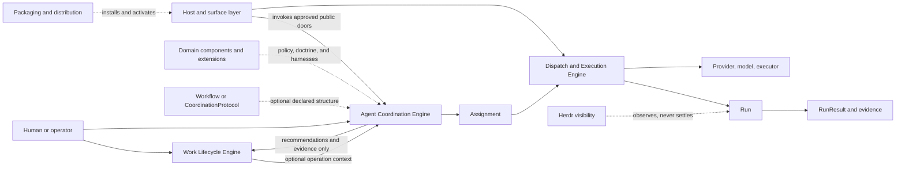

# Retired portal-unit reading material

Author session: codex-session:1
Source commit: 54c2698ee8c5b8f1baeac7244e946c793a637d29
History commit: f719eeff972f3784bfd4faf0a14f46c0eba915f9
Ledger: plans/260925-documentation-authority-unification/ledger/retired-unit-decisions.json

The complete former portal was preserved before replacement. All 45 identities retired by the current-only portal rewrite receive pending whole-unit moves, not unrecorded deletion. Review one verdict per retired ID, matching the exact source digest and target digest below. No current runtime status is inherited from this dated payload.

## claim_51e4adf4320dc77b43f376b78b84eefd

Source: `docs/platform/agent-coordination/README.md#active-design-frontier`
Source unit digest: `b7e2d59baaa4a721df4329d6beb7da02d30c2bc6f599a2b5e14a4e879793a99d`
Target: `docs/platform/agent-coordination/history/retired-engine/README.md#literal-snapshot`
Target unit digest: `dc558d49b999971e97907511333bfd1be515560cab222baa7d9c26ece36d650c`
Shown source digest: `b42d0e6d64cca8763ea107fe8e0aaabefa215da5b06c01ed5538bdd321bf5615`

The coordination engine was retired in 2180b4e72701bb090288af8fe8021008d9d42079. Owner A15 authorizes the current-only portal reframe. This retired portal unit is preserved verbatim inside the complete prior-portal snapshot at f719eeff972f3784bfd4faf0a14f46c0eba915f9; its claim identity, source digest, original qualifications and exact shown source text are retained. This is a whole-unit move into non-authority history, not unrecorded deletion or approval of the old live-engine assertions.

~~~~text
### Active Design Frontier

The accepted Step 00-08 foundation is summarized in
[Coordination Foundation Baseline](architecture/coordination-foundation-baseline.md).
The next design frontier remains intentionally non-canonical:

```txt
Step 09
  standalone group-thinking substrate
  Master Coordination style loop as first proof fixture
  bounded adaptive declared rounds without Work dependency

Step 10
  coding domain as the second unlike consumer
  duplicate-mechanism inventory and seams
  Work-attached adoption after substrate/boundary guardrails
  mutating live proof gated on ADR-010 §5

Component Authority Boundary Map
  parallel architect-level guardrail for Agent Coordination, Dispatch/Run,
  RunResult Evaluation, Work Core, Coding Domain Core, and Host/Support surfaces
```

Step 09, Step 10, and the Component Authority Boundary Map are discussion
drafts. Their proposed entities and schemas must not be treated as accepted
contracts until promoted according to
Documentation Governance (`docs/architect/agent-coordination/documentation-governance.md`; retained source reference, not a candidate navigation link).

They must, however, preserve the accepted direction in the
[Vision](vision.md); the proposals may choose implementation shape but cannot
make Work or a predeclared protocol universally mandatory.
~~~~

## claim_7b79202b2d59b92b6219f09fc8974e9b

Source: `docs/platform/agent-coordination/README.md#agent-coordination-documentation`
Source unit digest: `20b9bd1fd94ba907dfde37446513619cd60055206f8fa8895ab43c8b48e08257`
Target: `docs/platform/agent-coordination/history/retired-engine/README.md#literal-snapshot`
Target unit digest: `dc558d49b999971e97907511333bfd1be515560cab222baa7d9c26ece36d650c`
Shown source digest: `d9816724fc325d8d9d3467cb94b386619388b725f1907214d8459e8ff8ba9f9f`

The coordination engine was retired in 2180b4e72701bb090288af8fe8021008d9d42079. Owner A15 authorizes the current-only portal reframe. This retired portal unit is preserved verbatim inside the complete prior-portal snapshot at f719eeff972f3784bfd4faf0a14f46c0eba915f9; its claim identity, source digest, original qualifications and exact shown source text are retained. This is a whole-unit move into non-authority history, not unrecorded deletion or approval of the old live-engine assertions.

~~~~text
## Agent Coordination Documentation

Added in candidate: Preserved source portal guidance from the batch pin. Its dated retirement note and historical foundation status are retained, not a new acceptance of retired runtime concepts. References outside this area are recorded as plain paths; source authority is unchanged.

Document type: Portal
Design status: Accepted
Implementation: Partial
Last reviewed: 2026-09-01
Canonical for: navigation only

> **Ghi chú chuyển tiếp (2026-10-02):** Engine coordination và các khái niệm `CoordinationSession`/`CoordinationProtocol`/`FlowDefinition` đã được thu hồi ở P4 của track Request-to-Run (D-0050). Hệ thống đã chuyển sang mô hình gọn: **Unit run** qua **CollaborationPattern** (`solo`, `reviewed`, `panel` + preset) và **Workflow run** (`src/workflow/**`). Các tài liệu trong thư mục này lưu giữ thiết kế lịch sử của Step 00–09.

This documentation describes how fgOS coordinates agents across providers,
models, tiers, roles, capabilities, and execution mechanisms while preserving
Work lifecycle authority and evidence integrity.

Read [Agent Coordination Foundation Vision](vision.md) first. It is the highest
authority for system identity, foundation boundaries, optional coordination
structure, and domain augmentation. Then read the
[Intent Preservation Ledger](intent-preservation-ledger.md) before narrowing or
deferring an Agent Coordination capability.

The documentation is organized by authority. Canonical vocabulary and accepted
architecture are separated from proposals, implementation roadmaps,
verification evidence, playbooks, and history.

Read Documentation Governance (`docs/architect/agent-coordination/documentation-governance.md`; retained source reference, not a candidate navigation link) before changing
definitions, statuses, or document placement.
~~~~

## claim_7894e514ace00d546bc00fec6919d188

Source: `docs/platform/agent-coordination/README.md#component-relationship`
Source unit digest: `68771499e8f104ac9697f21f5cd6c08e9e58af4bb38b2da7945d791d00bf3260`
Target: `docs/platform/agent-coordination/history/retired-engine/README.md#literal-snapshot`
Target unit digest: `dc558d49b999971e97907511333bfd1be515560cab222baa7d9c26ece36d650c`
Shown source digest: `5e61c8969c121ad1a5fd8e76ba9fe28e1c31afdf792c7e4ec0fdf3824a0fb1a9`

The coordination engine was retired in 2180b4e72701bb090288af8fe8021008d9d42079. Owner A15 authorizes the current-only portal reframe. This retired portal unit is preserved verbatim inside the complete prior-portal snapshot at f719eeff972f3784bfd4faf0a14f46c0eba915f9; its claim identity, source digest, original qualifications and exact shown source text are retained. This is a whole-unit move into non-authority history, not unrecorded deletion or approval of the old live-engine assertions.

~~~~text
## Component Relationship



Solid arrows show a control or data path. Dashed arrows show optional
augmentation, activation, or observation. In particular, Work remains the only
delivery-lifecycle authority, and Herdr never establishes Run truth.
~~~~

## claim_0e1173815fe63536246cfeb73eec3483

Source: `docs/platform/agent-coordination/README.md#continue-the-design-discussion`
Source unit digest: `291579e502a4e9ace701e9185958cbe8f284cb9b3d91252cf3aff5e45f65037a`
Target: `docs/platform/agent-coordination/history/retired-engine/README.md#literal-snapshot`
Target unit digest: `dc558d49b999971e97907511333bfd1be515560cab222baa7d9c26ece36d650c`
Shown source digest: `46e724b5fe23e41289cedb96d2fe4c98abe8014eb878465ad7c97610a2f45610`

The coordination engine was retired in 2180b4e72701bb090288af8fe8021008d9d42079. Owner A15 authorizes the current-only portal reframe. This retired portal unit is preserved verbatim inside the complete prior-portal snapshot at f719eeff972f3784bfd4faf0a14f46c0eba915f9; its claim identity, source digest, original qualifications and exact shown source text are retained. This is a whole-unit move into non-authority history, not unrecorded deletion or approval of the old live-engine assertions.

~~~~text
#### Continue The Design Discussion

Read Coordination Capability Envelope (`docs/architect/proposals/coordination-capability-envelope.md`; retained source reference, not a candidate navigation link)
for the 2026-09-06 conceptual response to the independent review: FlowDefinition,
coordinator-owned deliberation, and programmable-master alternatives. Its
recommendation remains Discussion and does not supersede accepted contracts.

1. Step 09: Group Thinking Substrate (`docs/architect/proposals/step-09-group-thinking-substrate.md`; retained source reference, not a candidate navigation link)
2. Architecture Advisory Panel (`docs/architect/proposals/architecture-advisory-panel.md`; retained source reference, not a candidate navigation link)
   extends the implemented Group Thinking substrate with the next natural use
   case after `fgos-code-panel`: problem discovery, architecture deliberation,
   evidence-linked advice, and a bounded human decision dialogue.
3. [Team Communication Protocol V1](proposals/team-communication-protocol-v1.md)
4. [Dispatch Control Plane Redesign](proposals/dispatch-control-plane-redesign.md)
5. Step 10: Coding Domain Adoption Of The Coordination Foundation (`docs/architect/proposals/step-10-coding-domain-adoption.md`; retained source reference, not a candidate navigation link)
6. Component Authority Boundary Map (`docs/architect/proposals/component-authority-boundary-map.md`; retained source reference, not a candidate navigation link)
7. Architecture Intent (`docs/architect/architecture-intent.md`; retained source reference, not a candidate navigation link)
   preserves broader architecture intent across deferred capabilities. Its
   first active thread covers group-thinking/problem-solving capability across
   Agent Coordination, Work Driver, Dispatch/Run, Run Result Evaluation, and
   Coding Domain adoption.
~~~~

## claim_0534d3122a5a90c09bd832b4e0b077ea

Source: `docs/platform/agent-coordination/README.md#core-invariants`
Source unit digest: `3b18ee6b920de94ea88ca1c36f81f1ee9843d27ca5debe51a965fc5f758edc20`
Target: `docs/platform/agent-coordination/history/retired-engine/README.md#literal-snapshot`
Target unit digest: `dc558d49b999971e97907511333bfd1be515560cab222baa7d9c26ece36d650c`
Shown source digest: `4554c884c05c5d4e4df3f6cdac78e616f9802b4c9b98e468ffb53f5ec12d727d`

The coordination engine was retired in 2180b4e72701bb090288af8fe8021008d9d42079. Owner A15 authorizes the current-only portal reframe. This retired portal unit is preserved verbatim inside the complete prior-portal snapshot at f719eeff972f3784bfd4faf0a14f46c0eba915f9; its claim identity, source digest, original qualifications and exact shown source text are retained. This is a whole-unit move into non-authority history, not unrecorded deletion or approval of the old live-engine assertions.

~~~~text
### Core Invariants

```txt
Work owns delivery lifecycle.
Declared protocol definition constrains legal operations when selected.
Every dynamic or declared execution has a validated semantic contract.
Assignment carries semantic intent.
Dispatch governs execution infrastructure.
Run records one attempt.
RunResult records normalized outcome and evidence.
Herdr provides visibility only.
```
~~~~

## claim_bfd747dfcac6aa5ea9d5f0f51a5319e5

Source: `docs/platform/agent-coordination/README.md#cross-area-boundaries`
Source unit digest: `2b8927a58406d66ee1111437f03a7db9121f06c5bbf7cdaa6cedf4d85f070a70`
Target: `docs/platform/agent-coordination/history/retired-engine/README.md#literal-snapshot`
Target unit digest: `dc558d49b999971e97907511333bfd1be515560cab222baa7d9c26ece36d650c`
Shown source digest: `48160d4ccaa9eb67efca918195fec712ab18f80de1dae4fbe2e760520a84a99c`

The coordination engine was retired in 2180b4e72701bb090288af8fe8021008d9d42079. Owner A15 authorizes the current-only portal reframe. This retired portal unit is preserved verbatim inside the complete prior-portal snapshot at f719eeff972f3784bfd4faf0a14f46c0eba915f9; its claim identity, source digest, original qualifications and exact shown source text are retained. This is a whole-unit move into non-authority history, not unrecorded deletion or approval of the old live-engine assertions.

~~~~text
## Cross-Area Boundaries

| Boundary | Owner | Agent Coordination stance |
|---|---|---|
| Host invocation and provider process routing | [host-invocation-routing](../host-invocation-routing/README.md) | Link-only authority; Agent Coordination consumes this boundary through dispatch/executor integration. |
| Packaging, install, activation, release manifest, setup/doctor, runtime identity | [packaging-distribution](../packaging-distribution/README.md) | Link-only authority; do not duplicate setup or runtime activation rules here. |
| Platform component boundary | [component-boundary.md](../component-boundary.md) | No component-boundary change: these diagrams expose existing ownership and flows only. |
~~~~

## claim_70b0904bc5a88c57630ccc8313002e58

Source: `docs/platform/agent-coordination/README.md#current-accepted-baseline`
Source unit digest: `2c53b81ffc451be90d72722621c81decff5cbcfd849cbc8c8939d65414109f53`
Target: `docs/platform/agent-coordination/history/retired-engine/README.md#literal-snapshot`
Target unit digest: `dc558d49b999971e97907511333bfd1be515560cab222baa7d9c26ece36d650c`
Shown source digest: `3b885ec39e9d8a46d679ecd1b2a7548d7057796d162cd0e1d828fbcf8abedc27`

The coordination engine was retired in 2180b4e72701bb090288af8fe8021008d9d42079. Owner A15 authorizes the current-only portal reframe. This retired portal unit is preserved verbatim inside the complete prior-portal snapshot at f719eeff972f3784bfd4faf0a14f46c0eba915f9; its claim identity, source digest, original qualifications and exact shown source text are retained. This is a whole-unit move into non-authority history, not unrecorded deletion or approval of the old live-engine assertions.

~~~~text
## Current Accepted Baseline

The accepted Step 00-08 foundation remains in the legacy architecture package
until later migration phases promote the detailed docs:

- Work owns delivery lifecycle when present.
- Workflow Stage Operation compatibility governs legal operation selection.
- Assignment, Run, and RunResult are distinct.
- Dispatch governs execution infrastructure.
- RunResult and evidence boundaries prevent false success.
- Herdr is visibility, not evidence or Run truth.
- CoordinationSession is the V1 executable/recovery root.
- FlowDefinition is shared graph/operation/policy IR with typed profiles.
~~~~

## claim_7f2a3161e65fb31316a4978caf6255be

Source: `docs/platform/agent-coordination/README.md#current-accepted-baseline-1`
Source unit digest: `c4c7f7912910c28f76f20ca4f0261f69a9764704e0c30fe2d055e29070843bfe`
Target: `docs/platform/agent-coordination/history/retired-engine/README.md#literal-snapshot`
Target unit digest: `dc558d49b999971e97907511333bfd1be515560cab222baa7d9c26ece36d650c`
Shown source digest: `b625ef00ad9b3e4bd99c48914d9b3963331137c5746adcea87f303a2c9235b5f`

The coordination engine was retired in 2180b4e72701bb090288af8fe8021008d9d42079. Owner A15 authorizes the current-only portal reframe. This retired portal unit is preserved verbatim inside the complete prior-portal snapshot at f719eeff972f3784bfd4faf0a14f46c0eba915f9; its claim identity, source digest, original qualifications and exact shown source text are retained. This is a whole-unit move into non-authority history, not unrecorded deletion or approval of the old live-engine assertions.

~~~~text
### Current Accepted Baseline

Team Dispatch V1 currently establishes:

- Work as the sole delivery lifecycle authority;
- Workflow Stage Operations with `stage.skill`/`stage.taskSpec` primary
  compatibility;
- operation normalization, lookup, and setup/doctor validation;
- Assignment as semantic request;
- governed dispatch and CLI-spawn execution;
- Run as one attempt and RunResult as normalized outcome/evidence;
- driver selection of bounded legal Stage Operations;
- Work-attached adoption for selected planning/executing operations;
- Herdr as visibility rather than truth;
- Job reserved for a future scheduler.

The accepted Vision additionally establishes that:

- Work is an optional integration profile rather than coordination identity;
- a predeclared Workflow or Coordination Protocol is optional;
- every executable request still requires a validated semantic contract;
- agent-led, protocol-led, and domain-assisted planning are composable;
- dispatch, evidence, authority, and execution bounds remain foundation rules;
- domain and organization augmentation provide differentiated experience.

Step 08 Phase 00 additionally establishes, per
[ADR-008](decisions/ADR-008-coordination-session-and-mission-deferral.md),
[ADR-009](decisions/ADR-009-flow-definition-shared-ir-and-typed-profiles.md),
and [ADR-010](decisions/ADR-010-interactive-headless-parity-and-work-isolation.md):

- CoordinationSession is the V1 executable/recovery root, with one-way
  session-to-Assignment membership and no `missionId` anywhere in V1 schemas;
- `FlowDefinition` is the shared graph/operation/policy IR beneath typed
  `Workflow` (Stage) and `CoordinationProtocol` (Phase) profiles, additive to
  existing Workflow consumers;
- interactive ships first with headless capability parity as an intended
  future property, and domain-owned Work isolation stays out of coordination
  code until a coding-domain live proof authorizes Work-attached mutation.
~~~~

## claim_40b978c3186dac651251e064266e8986

Source: `docs/platform/agent-coordination/README.md#documentation-areas`
Source unit digest: `d7e9e678a7f9882849e371a39c421d58bc985a5294c9a7cb8e7383faed2e80a9`
Target: `docs/platform/agent-coordination/history/retired-engine/README.md#literal-snapshot`
Target unit digest: `dc558d49b999971e97907511333bfd1be515560cab222baa7d9c26ece36d650c`
Shown source digest: `e33a44e4f60c920a538c13dff468b3bec86e282379d1338de563ddcc78b0f13c`

The coordination engine was retired in 2180b4e72701bb090288af8fe8021008d9d42079. Owner A15 authorizes the current-only portal reframe. This retired portal unit is preserved verbatim inside the complete prior-portal snapshot at f719eeff972f3784bfd4faf0a14f46c0eba915f9; its claim identity, source digest, original qualifications and exact shown source text are retained. This is a whole-unit move into non-authority history, not unrecorded deletion or approval of the old live-engine assertions.

~~~~text
### Documentation Areas

| Area | Authority | Contents |
|---|---|---|
| [`vision.md`](vision.md) | Highest product authority | System identity, foundation/domain boundary, accepted direction, and rejected interpretations. |
| [`intent-preservation-ledger.md`](intent-preservation-ledger.md) | Traceability register | Original intentions, deliberate deferrals, non-preclusion constraints, and revisit triggers. |
| [`vocabulary/`](vocabulary/README.md) | Canonical terminology | Terms, relationships, aliases, reserved/deprecated vocabulary. |
| [`architecture/`](architecture/README.md) | Accepted design | System boundaries, responsibilities, trust model, and invariants. |
| [`contracts/`](contracts/README.md) | Accepted behavior | Machine-visible schemas, normalization, validation, state, and evidence rules. |
| [`decisions/`](decisions/README.md) | Accepted decisions | ADRs with context, decision, and consequences. |
| [`proposals/`](proposals/README.md) | Non-canonical | Discussion drafts and target designs awaiting approval. |
| [`roadmap/`](roadmap/README.md) | Implementation sequence | Numbered Steps, files, tests, rollout, and acceptance plans. |
| [`verification/`](verification/README.md) | Conformance evidence | Traceability, tests, negative cases, review, red-team, and live proof. |
| [`playbooks/`](playbooks/README.md) | Engineering bootstrap only | Manual coordinator/doer/reviewer workflows and fallback procedures; never a runtime dependency. |
| [`history/`](history/README.md) | Non-canonical history | Brainstorms, superseded plans, and pre-migration source material. |
~~~~

## claim_1fa62fc624f506f5b3a72555acf94b89

Source: `docs/platform/agent-coordination/README.md#implement-or-review-current-contracts`
Source unit digest: `0da80357f213fb101ed4d7eedaf857f20edf7416ae5357ec266f8b72f605dba7`
Target: `docs/platform/agent-coordination/history/retired-engine/README.md#literal-snapshot`
Target unit digest: `dc558d49b999971e97907511333bfd1be515560cab222baa7d9c26ece36d650c`
Shown source digest: `734dbce30e6bcd735969681347d537ebfcd5f70f524808873b56b98872aea7e9`

The coordination engine was retired in 2180b4e72701bb090288af8fe8021008d9d42079. Owner A15 authorizes the current-only portal reframe. This retired portal unit is preserved verbatim inside the complete prior-portal snapshot at f719eeff972f3784bfd4faf0a14f46c0eba915f9; its claim identity, source digest, original qualifications and exact shown source text are retained. This is a whole-unit move into non-authority history, not unrecorded deletion or approval of the old live-engine assertions.

~~~~text
#### Implement Or Review Current Contracts

1. [Workflow Stage Operation Contract](contracts/workflow-stage-operation.md)
2. [Assignment, Run, And RunResult Contract](contracts/assignment-run-runresult.md)
3. [Architecture Decisions](decisions/README.md)
4. [Team Dispatch V1 Verification](verification/team-dispatch-v1/index.md)
~~~~

## claim_018d4b44ec9e450b7150103016785661

Source: `docs/platform/agent-coordination/README.md#maintenance-rules`
Source unit digest: `7629dec533757d979d345a1a537ca51b3ab699dd9cbe11cf13eca91d0555378c`
Target: `docs/platform/agent-coordination/history/retired-engine/README.md#literal-snapshot`
Target unit digest: `dc558d49b999971e97907511333bfd1be515560cab222baa7d9c26ece36d650c`
Shown source digest: `efc7d2059a3f5d47ae2f36f73a855dd82449cd0c3d13c60b495330e9ca38db37`

The coordination engine was retired in 2180b4e72701bb090288af8fe8021008d9d42079. Owner A15 authorizes the current-only portal reframe. This retired portal unit is preserved verbatim inside the complete prior-portal snapshot at f719eeff972f3784bfd4faf0a14f46c0eba915f9; its claim identity, source digest, original qualifications and exact shown source text are retained. This is a whole-unit move into non-authority history, not unrecorded deletion or approval of the old live-engine assertions.

~~~~text
### Maintenance Rules

- Update vocabulary before introducing a new canonical term.
- Reconcile `vision.md` first when changing system identity or the
  foundation/domain boundary.
- Audit the Intent Preservation Ledger before approving a narrower phase or
  closing a deferred capability.
- Record durable boundary decisions with an ADR.
- Keep numbered Steps in roadmap/proposals, not canonical architecture.
- Keep prompts out of architecture and contracts.
- Keep test/live-run output in verification.
- Mark historical sources as non-canonical instead of deleting rationale.
- Check all local links after moving documents.
~~~~

## claim_f4d2ff5bf41584789c1553f56ae4a083

Source: `docs/platform/agent-coordination/README.md#read-first`
Source unit digest: `f9332fa2074f26e8e1498ab9f743ed83c34af02f08e38824aa09b9575ad177ea`
Target: `docs/platform/agent-coordination/history/retired-engine/README.md#literal-snapshot`
Target unit digest: `dc558d49b999971e97907511333bfd1be515560cab222baa7d9c26ece36d650c`
Shown source digest: `a86b90df459d1720681f7dce81ba89f8da5476d79d22828e27ed38166e5c6eb1`

The coordination engine was retired in 2180b4e72701bb090288af8fe8021008d9d42079. Owner A15 authorizes the current-only portal reframe. This retired portal unit is preserved verbatim inside the complete prior-portal snapshot at f719eeff972f3784bfd4faf0a14f46c0eba915f9; its claim identity, source digest, original qualifications and exact shown source text are retained. This is a whole-unit move into non-authority history, not unrecorded deletion or approval of the old live-engine assertions.

~~~~text
## Read First

| Order | Read | Why |
|---|---|---|
| 1 | [vision.md](vision.md) | Highest area authority for identity, boundaries, optional structure, and domain augmentation. |
| 2 | [intent-preservation-ledger.md](intent-preservation-ledger.md) | Required second read before narrowing or deferring a capability. |
| 3 | [history/documentation-migration/source-inventory.md](history/documentation-migration/source-inventory.md) | Migration ledger for old source paths, target disposition, and status. |
| 4 | [history/documentation-migration/migration-status.md](history/documentation-migration/migration-status.md) | Phase-by-phase migration progress and remaining work. |
| 5 | [subcomponents/README.md](subcomponents/README.md) | Map of child components and current status. |
| 6 | [../../architect/agent-coordination/README.md](../../architect/agent-coordination/README.md) | Legacy/current portal while architecture, contracts, ADRs, verification, playbooks, proposals, roadmap, and history are promoted. |
~~~~

## claim_62fcf5180db382b20569315dfb8bc170

Source: `docs/platform/agent-coordination/README.md#related-files`
Source unit digest: `9291a0ca87f2e86407db8e2787b4787b642cb11b82b71dcb7f22f49593865a5b`
Target: `docs/platform/agent-coordination/history/retired-engine/README.md#literal-snapshot`
Target unit digest: `dc558d49b999971e97907511333bfd1be515560cab222baa7d9c26ece36d650c`
Shown source digest: `7dd9ce82d39672bc83b1b415f497336c262f06734f554d89f9cbfe36ec6276d3`

The coordination engine was retired in 2180b4e72701bb090288af8fe8021008d9d42079. Owner A15 authorizes the current-only portal reframe. This retired portal unit is preserved verbatim inside the complete prior-portal snapshot at f719eeff972f3784bfd4faf0a14f46c0eba915f9; its claim identity, source digest, original qualifications and exact shown source text are retained. This is a whole-unit move into non-authority history, not unrecorded deletion or approval of the old live-engine assertions.

~~~~text
## Related Files

| Relationship | File |
|---|---|
| documentation governance | [../../doc-governance.md](../../doc-governance.md) |
| platform portal | [../README.md](../README.md) |
| platform intent ledger | [../intent-preservation-ledger.md](../intent-preservation-ledger.md) |
| component boundary | [../component-boundary.md](../component-boundary.md) |
| migration plan (retired; non-authority history) | [history/documentation-migration/documentation-standardization-plan.md](history/documentation-migration/documentation-standardization-plan.md) |
| legacy portal | [../../architect/agent-coordination/README.md](../../architect/agent-coordination/README.md) |
| current state summary | [spec.md](spec.md) |
| implementation alignment | [verification/implementation-alignment.md](verification/implementation-alignment.md) |
| retired area policy (non-authority history) | [history/documentation-migration/documentation-governance.md](history/documentation-migration/documentation-governance.md) |

Added in candidate: The retired area policy and completed migration plan are retained verbatim as literal history snapshots, not current authority. The source-guidance section below retains their older references and status claims in historical context.
~~~~

## claim_0f487d57cece6ebb12a4cec8aa9acaac

Source: `docs/platform/agent-coordination/README.md#start-here`
Source unit digest: `a6a61a2cfa43dfb4e35f23f7c8b601aa911bac1f35b13d0abd6067a55d23f0ed`
Target: `docs/platform/agent-coordination/history/retired-engine/README.md#literal-snapshot`
Target unit digest: `dc558d49b999971e97907511333bfd1be515560cab222baa7d9c26ece36d650c`
Shown source digest: `862158e8ace14424d6208a8cd36241e024f3d6966c44e1155900ae9bd764b75b`

The coordination engine was retired in 2180b4e72701bb090288af8fe8021008d9d42079. Owner A15 authorizes the current-only portal reframe. This retired portal unit is preserved verbatim inside the complete prior-portal snapshot at f719eeff972f3784bfd4faf0a14f46c0eba915f9; its claim identity, source digest, original qualifications and exact shown source text are retained. This is a whole-unit move into non-authority history, not unrecorded deletion or approval of the old live-engine assertions.

~~~~text
### Start Here
~~~~

## claim_2a9fe56a480a1eb38d5b1004178eaa32

Source: `docs/platform/agent-coordination/README.md#status-summary`
Source unit digest: `63645e0d7e60fa7c47a93ccb533eb3766b1d5b483d74b7a2231e7e22811f6a98`
Target: `docs/platform/agent-coordination/history/retired-engine/README.md#literal-snapshot`
Target unit digest: `dc558d49b999971e97907511333bfd1be515560cab222baa7d9c26ece36d650c`
Shown source digest: `08dd0098847b546df1ecd047b8d7d96277d99721706a88fc0c98c231f1150d21`

The coordination engine was retired in 2180b4e72701bb090288af8fe8021008d9d42079. Owner A15 authorizes the current-only portal reframe. This retired portal unit is preserved verbatim inside the complete prior-portal snapshot at f719eeff972f3784bfd4faf0a14f46c0eba915f9; its claim identity, source digest, original qualifications and exact shown source text are retained. This is a whole-unit move into non-authority history, not unrecorded deletion or approval of the old live-engine assertions.

~~~~text
## Status Summary

| Area | Status | Current authority |
|---|---|---|
| Vision and intent ledger | promoted | [vision.md](vision.md), [intent-preservation-ledger.md](intent-preservation-ledger.md) |
| Spec | promoted summary / partial | [spec.md](spec.md), [verification/implementation-alignment.md](verification/implementation-alignment.md), [../../specs/runner.md](../../specs/runner.md) plus accepted legacy contracts |
| Architecture | promoted target; legacy documents carry redirect notes | [architecture/README.md](architecture/README.md) |
| Contracts | promoted target; legacy documents carry redirect notes | [contracts/README.md](contracts/README.md) |
| Decisions | promoted target; legacy documents carry redirect notes | [decisions/README.md](decisions/README.md) |
| Verification | target index; legacy proof artifacts retained link-only | [verification/README.md](verification/README.md) |
| Proposals | non-canonical target; legacy documents carry redirect notes | [proposals/README.md](proposals/README.md) |
| Playbooks | operational/bootstrap target; legacy documents carry redirect notes | [playbooks/README.md](playbooks/README.md) |
| Roadmap | implementation-sequence target; legacy documents carry redirect notes | [roadmap/README.md](roadmap/README.md) |
~~~~

## claim_26b35ca9e57ece12b553e98d76997f09

Source: `docs/platform/agent-coordination/README.md#understand-the-system`
Source unit digest: `2fc2396a6365f926e63ef531077b1d1510019cb4f83710c2bb8e40aa34d767b1`
Target: `docs/platform/agent-coordination/history/retired-engine/README.md#literal-snapshot`
Target unit digest: `dc558d49b999971e97907511333bfd1be515560cab222baa7d9c26ece36d650c`
Shown source digest: `d38370a41bbe876e9b88ef6a56eb7074410cc5f90b2db66bbf5e9d8030b766e7`

The coordination engine was retired in 2180b4e72701bb090288af8fe8021008d9d42079. Owner A15 authorizes the current-only portal reframe. This retired portal unit is preserved verbatim inside the complete prior-portal snapshot at f719eeff972f3784bfd4faf0a14f46c0eba915f9; its claim identity, source digest, original qualifications and exact shown source text are retained. This is a whole-unit move into non-authority history, not unrecorded deletion or approval of the old live-engine assertions.

~~~~text
#### Understand The System

1. [Agent Coordination Foundation Vision](vision.md)
2. [Intent Preservation Ledger](intent-preservation-ledger.md)
3. Documentation Governance (`docs/architect/agent-coordination/documentation-governance.md`; retained source reference, not a candidate navigation link)
4. [Vocabulary](vocabulary/README.md)
5. [System Context](architecture/system-context.md)
6. [Coordination Foundation Baseline](architecture/coordination-foundation-baseline.md)
7. [Protocol Model](architecture/protocol-model.md)
8. [Runtime Model](architecture/runtime-model.md)
9. [Work Integration](architecture/work-integration.md)
10. [Dispatch Control Plane](architecture/dispatch-control-plane.md)
11. [Evidence And Results](architecture/evidence-and-results.md)
12. [Visibility And Herdr](architecture/visibility-and-herdr.md)
~~~~

## claim_0d7bb0e438b96aadc3e8639b993a306a

Source: `docs/platform/agent-coordination/README.md#unheaded-block-10`
Source unit digest: `53ecf4de6c58eb1153ea0dba5845693c061627b96c34b5c11daf3eee1d8757c5`
Target: `docs/platform/agent-coordination/history/retired-engine/README.md#literal-snapshot`
Target unit digest: `dc558d49b999971e97907511333bfd1be515560cab222baa7d9c26ece36d650c`
Shown source digest: `53ecf4de6c58eb1153ea0dba5845693c061627b96c34b5c11daf3eee1d8757c5`

The coordination engine was retired in 2180b4e72701bb090288af8fe8021008d9d42079. Owner A15 authorizes the current-only portal reframe. This retired portal unit is preserved verbatim inside the complete prior-portal snapshot at f719eeff972f3784bfd4faf0a14f46c0eba915f9; its claim identity, source digest, original qualifications and exact shown source text are retained. This is a whole-unit move into non-authority history, not unrecorded deletion or approval of the old live-engine assertions.

~~~~text
| Boundary | Owner | Agent Coordination stance |
|---|---|---|
| Host invocation and provider process routing | [host-invocation-routing](../host-invocation-routing/README.md) | Link-only authority; Agent Coordination consumes this boundary through dispatch/executor integration. |
| Packaging, install, activation, release manifest, setup/doctor, runtime identity | [packaging-distribution](../packaging-distribution/README.md) | Link-only authority; do not duplicate setup or runtime activation rules here. |
| Platform component boundary | [component-boundary.md](../component-boundary.md) | No component-boundary change: these diagrams expose existing ownership and flows only. |
~~~~

## claim_b3d0fc73b107cd30c27c7c1ed72336d1

Source: `docs/platform/agent-coordination/README.md#unheaded-block-11`
Source unit digest: `6c80239fc7d03863fccf29ccaec06d2f399f5fe12130b1c5fb042f65c85c8d38`
Target: `docs/platform/agent-coordination/history/retired-engine/README.md#literal-snapshot`
Target unit digest: `dc558d49b999971e97907511333bfd1be515560cab222baa7d9c26ece36d650c`
Shown source digest: `6c80239fc7d03863fccf29ccaec06d2f399f5fe12130b1c5fb042f65c85c8d38`

The coordination engine was retired in 2180b4e72701bb090288af8fe8021008d9d42079. Owner A15 authorizes the current-only portal reframe. This retired portal unit is preserved verbatim inside the complete prior-portal snapshot at f719eeff972f3784bfd4faf0a14f46c0eba915f9; its claim identity, source digest, original qualifications and exact shown source text are retained. This is a whole-unit move into non-authority history, not unrecorded deletion or approval of the old live-engine assertions.

~~~~text
| Relationship | File |
|---|---|
| documentation governance | [../../doc-governance.md](../../doc-governance.md) |
| platform portal | [../README.md](../README.md) |
| platform intent ledger | [../intent-preservation-ledger.md](../intent-preservation-ledger.md) |
| component boundary | [../component-boundary.md](../component-boundary.md) |
| migration plan (retired; non-authority history) | [history/documentation-migration/documentation-standardization-plan.md](history/documentation-migration/documentation-standardization-plan.md) |
| legacy portal | [../../architect/agent-coordination/README.md](../../architect/agent-coordination/README.md) |
| current state summary | [spec.md](spec.md) |
| implementation alignment | [verification/implementation-alignment.md](verification/implementation-alignment.md) |
| retired area policy (non-authority history) | [history/documentation-migration/documentation-governance.md](history/documentation-migration/documentation-governance.md) |
~~~~

## claim_68e818b8ceb1784b72e0ce84b769d679

Source: `docs/platform/agent-coordination/README.md#unheaded-block-12`
Source unit digest: `7ebb739f1d4e8be468987b7d9b6c950e99ca2d868c65ff21ec8493cf75b1324e`
Target: `docs/platform/agent-coordination/history/retired-engine/README.md#literal-snapshot`
Target unit digest: `dc558d49b999971e97907511333bfd1be515560cab222baa7d9c26ece36d650c`
Shown source digest: `7ebb739f1d4e8be468987b7d9b6c950e99ca2d868c65ff21ec8493cf75b1324e`

The coordination engine was retired in 2180b4e72701bb090288af8fe8021008d9d42079. Owner A15 authorizes the current-only portal reframe. This retired portal unit is preserved verbatim inside the complete prior-portal snapshot at f719eeff972f3784bfd4faf0a14f46c0eba915f9; its claim identity, source digest, original qualifications and exact shown source text are retained. This is a whole-unit move into non-authority history, not unrecorded deletion or approval of the old live-engine assertions.

~~~~text
Added in candidate: The retired area policy and completed migration plan are retained verbatim as literal history snapshots, not current authority. The source-guidance section below retains their older references and status claims in historical context.
~~~~

## claim_88a8eb250eccc7199f7b0bea96add9a2

Source: `docs/platform/agent-coordination/README.md#unheaded-block-13`
Source unit digest: `4ba05ded1f43e443ec4d95704a0aa633b12b20393b7167e951106262039ddeb5`
Target: `docs/platform/agent-coordination/history/retired-engine/README.md#literal-snapshot`
Target unit digest: `dc558d49b999971e97907511333bfd1be515560cab222baa7d9c26ece36d650c`
Shown source digest: `4ba05ded1f43e443ec4d95704a0aa633b12b20393b7167e951106262039ddeb5`

The coordination engine was retired in 2180b4e72701bb090288af8fe8021008d9d42079. Owner A15 authorizes the current-only portal reframe. This retired portal unit is preserved verbatim inside the complete prior-portal snapshot at f719eeff972f3784bfd4faf0a14f46c0eba915f9; its claim identity, source digest, original qualifications and exact shown source text are retained. This is a whole-unit move into non-authority history, not unrecorded deletion or approval of the old live-engine assertions.

~~~~text
Added in candidate: Preserved source portal guidance from the batch pin. Its dated retirement note and historical foundation status are retained, not a new acceptance of retired runtime concepts. References outside this area are recorded as plain paths; source authority is unchanged.
~~~~

## claim_49e5733177cb19513e9a56c88405775c

Source: `docs/platform/agent-coordination/README.md#unheaded-block-14`
Source unit digest: `64fba83e03d3d4a04a47d87966b676adc5a7893e65276f8a8cba4d3796a9e3df`
Target: `docs/platform/agent-coordination/history/retired-engine/README.md#literal-snapshot`
Target unit digest: `dc558d49b999971e97907511333bfd1be515560cab222baa7d9c26ece36d650c`
Shown source digest: `64fba83e03d3d4a04a47d87966b676adc5a7893e65276f8a8cba4d3796a9e3df`

The coordination engine was retired in 2180b4e72701bb090288af8fe8021008d9d42079. Owner A15 authorizes the current-only portal reframe. This retired portal unit is preserved verbatim inside the complete prior-portal snapshot at f719eeff972f3784bfd4faf0a14f46c0eba915f9; its claim identity, source digest, original qualifications and exact shown source text are retained. This is a whole-unit move into non-authority history, not unrecorded deletion or approval of the old live-engine assertions.

~~~~text
Document type: Portal
Design status: Accepted
Implementation: Partial
Last reviewed: 2026-09-01
Canonical for: navigation only
~~~~

## claim_487ca3a642a24684cb9304e2dd0e024b

Source: `docs/platform/agent-coordination/README.md#unheaded-block-15`
Source unit digest: `638bc054283207a77a0758be0d2348f1d2b1b01e76f26afc3ed363310da894f5`
Target: `docs/platform/agent-coordination/history/retired-engine/README.md#literal-snapshot`
Target unit digest: `dc558d49b999971e97907511333bfd1be515560cab222baa7d9c26ece36d650c`
Shown source digest: `638bc054283207a77a0758be0d2348f1d2b1b01e76f26afc3ed363310da894f5`

The coordination engine was retired in 2180b4e72701bb090288af8fe8021008d9d42079. Owner A15 authorizes the current-only portal reframe. This retired portal unit is preserved verbatim inside the complete prior-portal snapshot at f719eeff972f3784bfd4faf0a14f46c0eba915f9; its claim identity, source digest, original qualifications and exact shown source text are retained. This is a whole-unit move into non-authority history, not unrecorded deletion or approval of the old live-engine assertions.

~~~~text
> **Ghi chú chuyển tiếp (2026-10-02):** Engine coordination và các khái niệm `CoordinationSession`/`CoordinationProtocol`/`FlowDefinition` đã được thu hồi ở P4 của track Request-to-Run (D-0050). Hệ thống đã chuyển sang mô hình gọn: **Unit run** qua **CollaborationPattern** (`solo`, `reviewed`, `panel` + preset) và **Workflow run** (`src/workflow/**`). Các tài liệu trong thư mục này lưu giữ thiết kế lịch sử của Step 00–09.
~~~~

## claim_c4fab1cdb8f5a55eb33442c8a75e1106

Source: `docs/platform/agent-coordination/README.md#unheaded-block-16`
Source unit digest: `9d52a711c976802b90454b9918c5b05902906184d8eb3c972ed19c3b03141f5f`
Target: `docs/platform/agent-coordination/history/retired-engine/README.md#literal-snapshot`
Target unit digest: `dc558d49b999971e97907511333bfd1be515560cab222baa7d9c26ece36d650c`
Shown source digest: `9d52a711c976802b90454b9918c5b05902906184d8eb3c972ed19c3b03141f5f`

The coordination engine was retired in 2180b4e72701bb090288af8fe8021008d9d42079. Owner A15 authorizes the current-only portal reframe. This retired portal unit is preserved verbatim inside the complete prior-portal snapshot at f719eeff972f3784bfd4faf0a14f46c0eba915f9; its claim identity, source digest, original qualifications and exact shown source text are retained. This is a whole-unit move into non-authority history, not unrecorded deletion or approval of the old live-engine assertions.

~~~~text
This documentation describes how fgOS coordinates agents across providers,
models, tiers, roles, capabilities, and execution mechanisms while preserving
Work lifecycle authority and evidence integrity.
~~~~

## claim_b3b5b99b2bfbb4ab71a96f9da24b2896

Source: `docs/platform/agent-coordination/README.md#unheaded-block-17`
Source unit digest: `e3abaeaa96dd91bd14b1b90d068f9e04b26058113071df159dbaa82025bd9e0c`
Target: `docs/platform/agent-coordination/history/retired-engine/README.md#literal-snapshot`
Target unit digest: `dc558d49b999971e97907511333bfd1be515560cab222baa7d9c26ece36d650c`
Shown source digest: `e3abaeaa96dd91bd14b1b90d068f9e04b26058113071df159dbaa82025bd9e0c`

The coordination engine was retired in 2180b4e72701bb090288af8fe8021008d9d42079. Owner A15 authorizes the current-only portal reframe. This retired portal unit is preserved verbatim inside the complete prior-portal snapshot at f719eeff972f3784bfd4faf0a14f46c0eba915f9; its claim identity, source digest, original qualifications and exact shown source text are retained. This is a whole-unit move into non-authority history, not unrecorded deletion or approval of the old live-engine assertions.

~~~~text
Read [Agent Coordination Foundation Vision](vision.md) first. It is the highest
authority for system identity, foundation boundaries, optional coordination
structure, and domain augmentation. Then read the
[Intent Preservation Ledger](intent-preservation-ledger.md) before narrowing or
deferring an Agent Coordination capability.
~~~~

## claim_5ff863a04c5e336bd18943402091ccc2

Source: `docs/platform/agent-coordination/README.md#unheaded-block-18`
Source unit digest: `0f45bda9e2f29114d1018d40f4ecb0e59b18381c4c7d0b33416c5f876df07de3`
Target: `docs/platform/agent-coordination/history/retired-engine/README.md#literal-snapshot`
Target unit digest: `dc558d49b999971e97907511333bfd1be515560cab222baa7d9c26ece36d650c`
Shown source digest: `0f45bda9e2f29114d1018d40f4ecb0e59b18381c4c7d0b33416c5f876df07de3`

The coordination engine was retired in 2180b4e72701bb090288af8fe8021008d9d42079. Owner A15 authorizes the current-only portal reframe. This retired portal unit is preserved verbatim inside the complete prior-portal snapshot at f719eeff972f3784bfd4faf0a14f46c0eba915f9; its claim identity, source digest, original qualifications and exact shown source text are retained. This is a whole-unit move into non-authority history, not unrecorded deletion or approval of the old live-engine assertions.

~~~~text
The documentation is organized by authority. Canonical vocabulary and accepted
architecture are separated from proposals, implementation roadmaps,
verification evidence, playbooks, and history.
~~~~

## claim_1db5fa410a903fc5ab32f304ce75d599

Source: `docs/platform/agent-coordination/README.md#unheaded-block-19`
Source unit digest: `e26479be479356062feddb01c4f35e15e05d063dde785891b761bf7f0e942c0c`
Target: `docs/platform/agent-coordination/history/retired-engine/README.md#literal-snapshot`
Target unit digest: `dc558d49b999971e97907511333bfd1be515560cab222baa7d9c26ece36d650c`
Shown source digest: `e26479be479356062feddb01c4f35e15e05d063dde785891b761bf7f0e942c0c`

The coordination engine was retired in 2180b4e72701bb090288af8fe8021008d9d42079. Owner A15 authorizes the current-only portal reframe. This retired portal unit is preserved verbatim inside the complete prior-portal snapshot at f719eeff972f3784bfd4faf0a14f46c0eba915f9; its claim identity, source digest, original qualifications and exact shown source text are retained. This is a whole-unit move into non-authority history, not unrecorded deletion or approval of the old live-engine assertions.

~~~~text
Read Documentation Governance (`docs/architect/agent-coordination/documentation-governance.md`; retained source reference, not a candidate navigation link) before changing
definitions, statuses, or document placement.
~~~~

## claim_e308087d94b3b6b65be02a2f17a6b5ff

Source: `docs/platform/agent-coordination/README.md#unheaded-block-20`
Source unit digest: `95c56fa6a40f41effcb96af0d75c96ee13430816acf2eebcfc1c99a437ba91e5`
Target: `docs/platform/agent-coordination/history/retired-engine/README.md#literal-snapshot`
Target unit digest: `dc558d49b999971e97907511333bfd1be515560cab222baa7d9c26ece36d650c`
Shown source digest: `95c56fa6a40f41effcb96af0d75c96ee13430816acf2eebcfc1c99a437ba91e5`

The coordination engine was retired in 2180b4e72701bb090288af8fe8021008d9d42079. Owner A15 authorizes the current-only portal reframe. This retired portal unit is preserved verbatim inside the complete prior-portal snapshot at f719eeff972f3784bfd4faf0a14f46c0eba915f9; its claim identity, source digest, original qualifications and exact shown source text are retained. This is a whole-unit move into non-authority history, not unrecorded deletion or approval of the old live-engine assertions.

~~~~text
1. [Agent Coordination Foundation Vision](vision.md)
2. [Intent Preservation Ledger](intent-preservation-ledger.md)
3. Documentation Governance (`docs/architect/agent-coordination/documentation-governance.md`; retained source reference, not a candidate navigation link)
4. [Vocabulary](vocabulary/README.md)
5. [System Context](architecture/system-context.md)
6. [Coordination Foundation Baseline](architecture/coordination-foundation-baseline.md)
7. [Protocol Model](architecture/protocol-model.md)
8. [Runtime Model](architecture/runtime-model.md)
9. [Work Integration](architecture/work-integration.md)
10. [Dispatch Control Plane](architecture/dispatch-control-plane.md)
11. [Evidence And Results](architecture/evidence-and-results.md)
12. [Visibility And Herdr](architecture/visibility-and-herdr.md)
~~~~

## claim_0177598ac5ef0a3aa26f3a70de258100

Source: `docs/platform/agent-coordination/README.md#unheaded-block-21`
Source unit digest: `e6ff58c06496a6b05369bd671f5f1e7896c224bf3c90da0ef7b087fc8c85f2c3`
Target: `docs/platform/agent-coordination/history/retired-engine/README.md#literal-snapshot`
Target unit digest: `dc558d49b999971e97907511333bfd1be515560cab222baa7d9c26ece36d650c`
Shown source digest: `e6ff58c06496a6b05369bd671f5f1e7896c224bf3c90da0ef7b087fc8c85f2c3`

The coordination engine was retired in 2180b4e72701bb090288af8fe8021008d9d42079. Owner A15 authorizes the current-only portal reframe. This retired portal unit is preserved verbatim inside the complete prior-portal snapshot at f719eeff972f3784bfd4faf0a14f46c0eba915f9; its claim identity, source digest, original qualifications and exact shown source text are retained. This is a whole-unit move into non-authority history, not unrecorded deletion or approval of the old live-engine assertions.

~~~~text
1. [Workflow Stage Operation Contract](contracts/workflow-stage-operation.md)
2. [Assignment, Run, And RunResult Contract](contracts/assignment-run-runresult.md)
3. [Architecture Decisions](decisions/README.md)
4. [Team Dispatch V1 Verification](verification/team-dispatch-v1/index.md)
~~~~

## claim_044a83556bfeaa07cdff6ff3c75c3c01

Source: `docs/platform/agent-coordination/README.md#unheaded-block-22`
Source unit digest: `94ecb2275d2d8503d9d9c5a21d5a2e2d0023d9280f2c99bad4e4c31671c33410`
Target: `docs/platform/agent-coordination/history/retired-engine/README.md#literal-snapshot`
Target unit digest: `dc558d49b999971e97907511333bfd1be515560cab222baa7d9c26ece36d650c`
Shown source digest: `94ecb2275d2d8503d9d9c5a21d5a2e2d0023d9280f2c99bad4e4c31671c33410`

The coordination engine was retired in 2180b4e72701bb090288af8fe8021008d9d42079. Owner A15 authorizes the current-only portal reframe. This retired portal unit is preserved verbatim inside the complete prior-portal snapshot at f719eeff972f3784bfd4faf0a14f46c0eba915f9; its claim identity, source digest, original qualifications and exact shown source text are retained. This is a whole-unit move into non-authority history, not unrecorded deletion or approval of the old live-engine assertions.

~~~~text
Read Coordination Capability Envelope (`docs/architect/proposals/coordination-capability-envelope.md`; retained source reference, not a candidate navigation link)
for the 2026-09-06 conceptual response to the independent review: FlowDefinition,
coordinator-owned deliberation, and programmable-master alternatives. Its
recommendation remains Discussion and does not supersede accepted contracts.
~~~~

## claim_d3646a448c0134affad219e06e7546be

Source: `docs/platform/agent-coordination/README.md#unheaded-block-23`
Source unit digest: `d2a9e6c363698d07f4c7e8208ba85086668032945339c1c3b186edf60adb9bf2`
Target: `docs/platform/agent-coordination/history/retired-engine/README.md#literal-snapshot`
Target unit digest: `dc558d49b999971e97907511333bfd1be515560cab222baa7d9c26ece36d650c`
Shown source digest: `d2a9e6c363698d07f4c7e8208ba85086668032945339c1c3b186edf60adb9bf2`

The coordination engine was retired in 2180b4e72701bb090288af8fe8021008d9d42079. Owner A15 authorizes the current-only portal reframe. This retired portal unit is preserved verbatim inside the complete prior-portal snapshot at f719eeff972f3784bfd4faf0a14f46c0eba915f9; its claim identity, source digest, original qualifications and exact shown source text are retained. This is a whole-unit move into non-authority history, not unrecorded deletion or approval of the old live-engine assertions.

~~~~text
1. Step 09: Group Thinking Substrate (`docs/architect/proposals/step-09-group-thinking-substrate.md`; retained source reference, not a candidate navigation link)
2. Architecture Advisory Panel (`docs/architect/proposals/architecture-advisory-panel.md`; retained source reference, not a candidate navigation link)
   extends the implemented Group Thinking substrate with the next natural use
   case after `fgos-code-panel`: problem discovery, architecture deliberation,
   evidence-linked advice, and a bounded human decision dialogue.
3. [Team Communication Protocol V1](proposals/team-communication-protocol-v1.md)
4. [Dispatch Control Plane Redesign](proposals/dispatch-control-plane-redesign.md)
5. Step 10: Coding Domain Adoption Of The Coordination Foundation (`docs/architect/proposals/step-10-coding-domain-adoption.md`; retained source reference, not a candidate navigation link)
6. Component Authority Boundary Map (`docs/architect/proposals/component-authority-boundary-map.md`; retained source reference, not a candidate navigation link)
7. Architecture Intent (`docs/architect/architecture-intent.md`; retained source reference, not a candidate navigation link)
   preserves broader architecture intent across deferred capabilities. Its
   first active thread covers group-thinking/problem-solving capability across
   Agent Coordination, Work Driver, Dispatch/Run, Run Result Evaluation, and
   Coding Domain adoption.
~~~~

## claim_3fac3e6047d0ee83e6bd6cfb3a692a52

Source: `docs/platform/agent-coordination/README.md#unheaded-block-24`
Source unit digest: `bbddccc99e9c4272bb444c77b123c25a0bc0debdb0391d3ac603c4a61e80a042`
Target: `docs/platform/agent-coordination/history/retired-engine/README.md#literal-snapshot`
Target unit digest: `dc558d49b999971e97907511333bfd1be515560cab222baa7d9c26ece36d650c`
Shown source digest: `bbddccc99e9c4272bb444c77b123c25a0bc0debdb0391d3ac603c4a61e80a042`

The coordination engine was retired in 2180b4e72701bb090288af8fe8021008d9d42079. Owner A15 authorizes the current-only portal reframe. This retired portal unit is preserved verbatim inside the complete prior-portal snapshot at f719eeff972f3784bfd4faf0a14f46c0eba915f9; its claim identity, source digest, original qualifications and exact shown source text are retained. This is a whole-unit move into non-authority history, not unrecorded deletion or approval of the old live-engine assertions.

~~~~text
| Area | Authority | Contents |
|---|---|---|
| [`vision.md`](vision.md) | Highest product authority | System identity, foundation/domain boundary, accepted direction, and rejected interpretations. |
| [`intent-preservation-ledger.md`](intent-preservation-ledger.md) | Traceability register | Original intentions, deliberate deferrals, non-preclusion constraints, and revisit triggers. |
| [`vocabulary/`](vocabulary/README.md) | Canonical terminology | Terms, relationships, aliases, reserved/deprecated vocabulary. |
| [`architecture/`](architecture/README.md) | Accepted design | System boundaries, responsibilities, trust model, and invariants. |
| [`contracts/`](contracts/README.md) | Accepted behavior | Machine-visible schemas, normalization, validation, state, and evidence rules. |
| [`decisions/`](decisions/README.md) | Accepted decisions | ADRs with context, decision, and consequences. |
| [`proposals/`](proposals/README.md) | Non-canonical | Discussion drafts and target designs awaiting approval. |
| [`roadmap/`](roadmap/README.md) | Implementation sequence | Numbered Steps, files, tests, rollout, and acceptance plans. |
| [`verification/`](verification/README.md) | Conformance evidence | Traceability, tests, negative cases, review, red-team, and live proof. |
| [`playbooks/`](playbooks/README.md) | Engineering bootstrap only | Manual coordinator/doer/reviewer workflows and fallback procedures; never a runtime dependency. |
| [`history/`](history/README.md) | Non-canonical history | Brainstorms, superseded plans, and pre-migration source material. |
~~~~

## claim_f9b6d9ee13827645c3b09aa159257015

Source: `docs/platform/agent-coordination/README.md#unheaded-block-25`
Source unit digest: `f4d95e87165838b5f9ee648aa04ae249fc17819a46e7921e3f9a14c388fc7bc6`
Target: `docs/platform/agent-coordination/history/retired-engine/README.md#literal-snapshot`
Target unit digest: `dc558d49b999971e97907511333bfd1be515560cab222baa7d9c26ece36d650c`
Shown source digest: `f4d95e87165838b5f9ee648aa04ae249fc17819a46e7921e3f9a14c388fc7bc6`

The coordination engine was retired in 2180b4e72701bb090288af8fe8021008d9d42079. Owner A15 authorizes the current-only portal reframe. This retired portal unit is preserved verbatim inside the complete prior-portal snapshot at f719eeff972f3784bfd4faf0a14f46c0eba915f9; its claim identity, source digest, original qualifications and exact shown source text are retained. This is a whole-unit move into non-authority history, not unrecorded deletion or approval of the old live-engine assertions.

~~~~text
Team Dispatch V1 currently establishes:
~~~~

## claim_7ffd1a9aac702847e0102cbe725e64c1

Source: `docs/platform/agent-coordination/README.md#unheaded-block-26`
Source unit digest: `ef0ce4af4d66c476286aae37922c3df39cd0b25458bec10af8b236b6a4d1e068`
Target: `docs/platform/agent-coordination/history/retired-engine/README.md#literal-snapshot`
Target unit digest: `dc558d49b999971e97907511333bfd1be515560cab222baa7d9c26ece36d650c`
Shown source digest: `ef0ce4af4d66c476286aae37922c3df39cd0b25458bec10af8b236b6a4d1e068`

The coordination engine was retired in 2180b4e72701bb090288af8fe8021008d9d42079. Owner A15 authorizes the current-only portal reframe. This retired portal unit is preserved verbatim inside the complete prior-portal snapshot at f719eeff972f3784bfd4faf0a14f46c0eba915f9; its claim identity, source digest, original qualifications and exact shown source text are retained. This is a whole-unit move into non-authority history, not unrecorded deletion or approval of the old live-engine assertions.

~~~~text
- Work as the sole delivery lifecycle authority;
- Workflow Stage Operations with `stage.skill`/`stage.taskSpec` primary
  compatibility;
- operation normalization, lookup, and setup/doctor validation;
- Assignment as semantic request;
- governed dispatch and CLI-spawn execution;
- Run as one attempt and RunResult as normalized outcome/evidence;
- driver selection of bounded legal Stage Operations;
- Work-attached adoption for selected planning/executing operations;
- Herdr as visibility rather than truth;
- Job reserved for a future scheduler.
~~~~

## claim_0e2ebe330f7a911f5cbf3ae2d061b0a6

Source: `docs/platform/agent-coordination/README.md#unheaded-block-27`
Source unit digest: `fa129fe6b3d711fcf05ee7d25421018a259d126efe7e9a3611481886b2454274`
Target: `docs/platform/agent-coordination/history/retired-engine/README.md#literal-snapshot`
Target unit digest: `dc558d49b999971e97907511333bfd1be515560cab222baa7d9c26ece36d650c`
Shown source digest: `fa129fe6b3d711fcf05ee7d25421018a259d126efe7e9a3611481886b2454274`

The coordination engine was retired in 2180b4e72701bb090288af8fe8021008d9d42079. Owner A15 authorizes the current-only portal reframe. This retired portal unit is preserved verbatim inside the complete prior-portal snapshot at f719eeff972f3784bfd4faf0a14f46c0eba915f9; its claim identity, source digest, original qualifications and exact shown source text are retained. This is a whole-unit move into non-authority history, not unrecorded deletion or approval of the old live-engine assertions.

~~~~text
The accepted Vision additionally establishes that:
~~~~

## claim_4bd25ccee4f5c8b59b764507abf45794

Source: `docs/platform/agent-coordination/README.md#unheaded-block-28`
Source unit digest: `84716b4566520da1317174cf37c12f6fd6587cdcaf5a64e20b3292bd4465a55f`
Target: `docs/platform/agent-coordination/history/retired-engine/README.md#literal-snapshot`
Target unit digest: `dc558d49b999971e97907511333bfd1be515560cab222baa7d9c26ece36d650c`
Shown source digest: `84716b4566520da1317174cf37c12f6fd6587cdcaf5a64e20b3292bd4465a55f`

The coordination engine was retired in 2180b4e72701bb090288af8fe8021008d9d42079. Owner A15 authorizes the current-only portal reframe. This retired portal unit is preserved verbatim inside the complete prior-portal snapshot at f719eeff972f3784bfd4faf0a14f46c0eba915f9; its claim identity, source digest, original qualifications and exact shown source text are retained. This is a whole-unit move into non-authority history, not unrecorded deletion or approval of the old live-engine assertions.

~~~~text
- Work is an optional integration profile rather than coordination identity;
- a predeclared Workflow or Coordination Protocol is optional;
- every executable request still requires a validated semantic contract;
- agent-led, protocol-led, and domain-assisted planning are composable;
- dispatch, evidence, authority, and execution bounds remain foundation rules;
- domain and organization augmentation provide differentiated experience.
~~~~

## claim_140cc194e793223483f09dc0772f292b

Source: `docs/platform/agent-coordination/README.md#unheaded-block-29`
Source unit digest: `409a734afc86e4753516c4d1c907e1c3e7ec34d99ff6a0a50f668837553b6b4a`
Target: `docs/platform/agent-coordination/history/retired-engine/README.md#literal-snapshot`
Target unit digest: `dc558d49b999971e97907511333bfd1be515560cab222baa7d9c26ece36d650c`
Shown source digest: `409a734afc86e4753516c4d1c907e1c3e7ec34d99ff6a0a50f668837553b6b4a`

The coordination engine was retired in 2180b4e72701bb090288af8fe8021008d9d42079. Owner A15 authorizes the current-only portal reframe. This retired portal unit is preserved verbatim inside the complete prior-portal snapshot at f719eeff972f3784bfd4faf0a14f46c0eba915f9; its claim identity, source digest, original qualifications and exact shown source text are retained. This is a whole-unit move into non-authority history, not unrecorded deletion or approval of the old live-engine assertions.

~~~~text
Step 08 Phase 00 additionally establishes, per
[ADR-008](decisions/ADR-008-coordination-session-and-mission-deferral.md),
[ADR-009](decisions/ADR-009-flow-definition-shared-ir-and-typed-profiles.md),
and [ADR-010](decisions/ADR-010-interactive-headless-parity-and-work-isolation.md):
~~~~

## claim_bd13824f7ccdf5e8a95a58cc00b36aea

Source: `docs/platform/agent-coordination/README.md#unheaded-block-30`
Source unit digest: `22030d5c906d8e724e44be335caa5afe6b76f31a2f80fe7a55650053211e9ed8`
Target: `docs/platform/agent-coordination/history/retired-engine/README.md#literal-snapshot`
Target unit digest: `dc558d49b999971e97907511333bfd1be515560cab222baa7d9c26ece36d650c`
Shown source digest: `22030d5c906d8e724e44be335caa5afe6b76f31a2f80fe7a55650053211e9ed8`

The coordination engine was retired in 2180b4e72701bb090288af8fe8021008d9d42079. Owner A15 authorizes the current-only portal reframe. This retired portal unit is preserved verbatim inside the complete prior-portal snapshot at f719eeff972f3784bfd4faf0a14f46c0eba915f9; its claim identity, source digest, original qualifications and exact shown source text are retained. This is a whole-unit move into non-authority history, not unrecorded deletion or approval of the old live-engine assertions.

~~~~text
- CoordinationSession is the V1 executable/recovery root, with one-way
  session-to-Assignment membership and no `missionId` anywhere in V1 schemas;
- `FlowDefinition` is the shared graph/operation/policy IR beneath typed
  `Workflow` (Stage) and `CoordinationProtocol` (Phase) profiles, additive to
  existing Workflow consumers;
- interactive ships first with headless capability parity as an intended
  future property, and domain-owned Work isolation stays out of coordination
  code until a coding-domain live proof authorizes Work-attached mutation.
~~~~

## claim_109598ba3c416f10a15a6080e4685958

Source: `docs/platform/agent-coordination/README.md#unheaded-block-31`
Source unit digest: `36e5732ecaa4e4154f9768ecba660e0267343457a8f1da55058667df611a96e3`
Target: `docs/platform/agent-coordination/history/retired-engine/README.md#literal-snapshot`
Target unit digest: `dc558d49b999971e97907511333bfd1be515560cab222baa7d9c26ece36d650c`
Shown source digest: `36e5732ecaa4e4154f9768ecba660e0267343457a8f1da55058667df611a96e3`

The coordination engine was retired in 2180b4e72701bb090288af8fe8021008d9d42079. Owner A15 authorizes the current-only portal reframe. This retired portal unit is preserved verbatim inside the complete prior-portal snapshot at f719eeff972f3784bfd4faf0a14f46c0eba915f9; its claim identity, source digest, original qualifications and exact shown source text are retained. This is a whole-unit move into non-authority history, not unrecorded deletion or approval of the old live-engine assertions.

~~~~text
The accepted Step 00-08 foundation is summarized in
[Coordination Foundation Baseline](architecture/coordination-foundation-baseline.md).
The next design frontier remains intentionally non-canonical:
~~~~

## claim_f8b1c6358f43992b03d94b8e744bb7a6

Source: `docs/platform/agent-coordination/README.md#unheaded-block-32`
Source unit digest: `35a993f5e2f972a578387280bf1fa8d7831877f9704d80a24ae64a0d74939e5a`
Target: `docs/platform/agent-coordination/history/retired-engine/README.md#literal-snapshot`
Target unit digest: `dc558d49b999971e97907511333bfd1be515560cab222baa7d9c26ece36d650c`
Shown source digest: `35a993f5e2f972a578387280bf1fa8d7831877f9704d80a24ae64a0d74939e5a`

The coordination engine was retired in 2180b4e72701bb090288af8fe8021008d9d42079. Owner A15 authorizes the current-only portal reframe. This retired portal unit is preserved verbatim inside the complete prior-portal snapshot at f719eeff972f3784bfd4faf0a14f46c0eba915f9; its claim identity, source digest, original qualifications and exact shown source text are retained. This is a whole-unit move into non-authority history, not unrecorded deletion or approval of the old live-engine assertions.

~~~~text
```txt
Step 09
  standalone group-thinking substrate
  Master Coordination style loop as first proof fixture
  bounded adaptive declared rounds without Work dependency

Step 10
  coding domain as the second unlike consumer
  duplicate-mechanism inventory and seams
  Work-attached adoption after substrate/boundary guardrails
  mutating live proof gated on ADR-010 §5

Component Authority Boundary Map
  parallel architect-level guardrail for Agent Coordination, Dispatch/Run,
  RunResult Evaluation, Work Core, Coding Domain Core, and Host/Support surfaces
```
~~~~

## claim_317faa903d582fdb8ae42fe0b8354ccf

Source: `docs/platform/agent-coordination/README.md#unheaded-block-33`
Source unit digest: `c22f29ccc71905a9a031d5e6af6842420a3d1513103a3590ed3a88e8ae18409d`
Target: `docs/platform/agent-coordination/history/retired-engine/README.md#literal-snapshot`
Target unit digest: `dc558d49b999971e97907511333bfd1be515560cab222baa7d9c26ece36d650c`
Shown source digest: `c22f29ccc71905a9a031d5e6af6842420a3d1513103a3590ed3a88e8ae18409d`

The coordination engine was retired in 2180b4e72701bb090288af8fe8021008d9d42079. Owner A15 authorizes the current-only portal reframe. This retired portal unit is preserved verbatim inside the complete prior-portal snapshot at f719eeff972f3784bfd4faf0a14f46c0eba915f9; its claim identity, source digest, original qualifications and exact shown source text are retained. This is a whole-unit move into non-authority history, not unrecorded deletion or approval of the old live-engine assertions.

~~~~text
Step 09, Step 10, and the Component Authority Boundary Map are discussion
drafts. Their proposed entities and schemas must not be treated as accepted
contracts until promoted according to
Documentation Governance (`docs/architect/agent-coordination/documentation-governance.md`; retained source reference, not a candidate navigation link).
~~~~

## claim_740855ac4fe2e0d12efe1ceec34dc780

Source: `docs/platform/agent-coordination/README.md#unheaded-block-34`
Source unit digest: `8a77f23c72bdf8be38d147c2a89a4d273bae705823f56d882d6df709a08cca45`
Target: `docs/platform/agent-coordination/history/retired-engine/README.md#literal-snapshot`
Target unit digest: `dc558d49b999971e97907511333bfd1be515560cab222baa7d9c26ece36d650c`
Shown source digest: `8a77f23c72bdf8be38d147c2a89a4d273bae705823f56d882d6df709a08cca45`

The coordination engine was retired in 2180b4e72701bb090288af8fe8021008d9d42079. Owner A15 authorizes the current-only portal reframe. This retired portal unit is preserved verbatim inside the complete prior-portal snapshot at f719eeff972f3784bfd4faf0a14f46c0eba915f9; its claim identity, source digest, original qualifications and exact shown source text are retained. This is a whole-unit move into non-authority history, not unrecorded deletion or approval of the old live-engine assertions.

~~~~text
They must, however, preserve the accepted direction in the
[Vision](vision.md); the proposals may choose implementation shape but cannot
make Work or a predeclared protocol universally mandatory.
~~~~

## claim_9e6be97a5efa8c9176e85967832497b4

Source: `docs/platform/agent-coordination/README.md#unheaded-block-35`
Source unit digest: `74e8b43de5541222244e8dcb753a1941956b930d4247e882106e21806be1af5b`
Target: `docs/platform/agent-coordination/history/retired-engine/README.md#literal-snapshot`
Target unit digest: `dc558d49b999971e97907511333bfd1be515560cab222baa7d9c26ece36d650c`
Shown source digest: `74e8b43de5541222244e8dcb753a1941956b930d4247e882106e21806be1af5b`

The coordination engine was retired in 2180b4e72701bb090288af8fe8021008d9d42079. Owner A15 authorizes the current-only portal reframe. This retired portal unit is preserved verbatim inside the complete prior-portal snapshot at f719eeff972f3784bfd4faf0a14f46c0eba915f9; its claim identity, source digest, original qualifications and exact shown source text are retained. This is a whole-unit move into non-authority history, not unrecorded deletion or approval of the old live-engine assertions.

~~~~text
```txt
Work owns delivery lifecycle.
Declared protocol definition constrains legal operations when selected.
Every dynamic or declared execution has a validated semantic contract.
Assignment carries semantic intent.
Dispatch governs execution infrastructure.
Run records one attempt.
RunResult records normalized outcome and evidence.
Herdr provides visibility only.
```
~~~~

## claim_85c0df9d05e182f3982011789b22d2d4

Source: `docs/platform/agent-coordination/README.md#unheaded-block-36`
Source unit digest: `a1876681b2fad77e79e91defc69f29cb209a6b73ab2714c98b7e3171d33f486a`
Target: `docs/platform/agent-coordination/history/retired-engine/README.md#literal-snapshot`
Target unit digest: `dc558d49b999971e97907511333bfd1be515560cab222baa7d9c26ece36d650c`
Shown source digest: `a1876681b2fad77e79e91defc69f29cb209a6b73ab2714c98b7e3171d33f486a`

The coordination engine was retired in 2180b4e72701bb090288af8fe8021008d9d42079. Owner A15 authorizes the current-only portal reframe. This retired portal unit is preserved verbatim inside the complete prior-portal snapshot at f719eeff972f3784bfd4faf0a14f46c0eba915f9; its claim identity, source digest, original qualifications and exact shown source text are retained. This is a whole-unit move into non-authority history, not unrecorded deletion or approval of the old live-engine assertions.

~~~~text
- Update vocabulary before introducing a new canonical term.
- Reconcile `vision.md` first when changing system identity or the
  foundation/domain boundary.
- Audit the Intent Preservation Ledger before approving a narrower phase or
  closing a deferred capability.
- Record durable boundary decisions with an ADR.
- Keep numbered Steps in roadmap/proposals, not canonical architecture.
- Keep prompts out of architecture and contracts.
- Keep test/live-run output in verification.
- Mark historical sources as non-canonical instead of deleting rationale.
- Check all local links after moving documents.
~~~~

## claim_ab4280f0427dde3d0763d5d43f52708d

Source: `docs/platform/agent-coordination/README.md#unheaded-block-8`
Source unit digest: `9256e91372fe9630e53e41363d845d362ed74219f62fef06d17c56a9b9700b81`
Target: `docs/platform/agent-coordination/history/retired-engine/README.md#literal-snapshot`
Target unit digest: `dc558d49b999971e97907511333bfd1be515560cab222baa7d9c26ece36d650c`
Shown source digest: `9256e91372fe9630e53e41363d845d362ed74219f62fef06d17c56a9b9700b81`

The coordination engine was retired in 2180b4e72701bb090288af8fe8021008d9d42079. Owner A15 authorizes the current-only portal reframe. This retired portal unit is preserved verbatim inside the complete prior-portal snapshot at f719eeff972f3784bfd4faf0a14f46c0eba915f9; its claim identity, source digest, original qualifications and exact shown source text are retained. This is a whole-unit move into non-authority history, not unrecorded deletion or approval of the old live-engine assertions.

~~~~text
- Work owns delivery lifecycle when present.
- Workflow Stage Operation compatibility governs legal operation selection.
- Assignment, Run, and RunResult are distinct.
- Dispatch governs execution infrastructure.
- RunResult and evidence boundaries prevent false success.
- Herdr is visibility, not evidence or Run truth.
- CoordinationSession is the V1 executable/recovery root.
- FlowDefinition is shared graph/operation/policy IR with typed profiles.
~~~~

## claim_5f51adca04bac43111ce5f6bdb37a6ea

Source: `docs/platform/agent-coordination/README.md#unheaded-block-9`
Source unit digest: `4c3c888d244b2655f0fa184145822cc70507ac022118e46b069eafd2fdda2ba6`
Target: `docs/platform/agent-coordination/history/retired-engine/README.md#literal-snapshot`
Target unit digest: `dc558d49b999971e97907511333bfd1be515560cab222baa7d9c26ece36d650c`
Shown source digest: `4c3c888d244b2655f0fa184145822cc70507ac022118e46b069eafd2fdda2ba6`

The coordination engine was retired in 2180b4e72701bb090288af8fe8021008d9d42079. Owner A15 authorizes the current-only portal reframe. This retired portal unit is preserved verbatim inside the complete prior-portal snapshot at f719eeff972f3784bfd4faf0a14f46c0eba915f9; its claim identity, source digest, original qualifications and exact shown source text are retained. This is a whole-unit move into non-authority history, not unrecorded deletion or approval of the old live-engine assertions.

~~~~text
| Area | Status | Current authority |
|---|---|---|
| Vision and intent ledger | promoted | [vision.md](vision.md), [intent-preservation-ledger.md](intent-preservation-ledger.md) |
| Spec | promoted summary / partial | [spec.md](spec.md), [verification/implementation-alignment.md](verification/implementation-alignment.md), [../../specs/runner.md](../../specs/runner.md) plus accepted legacy contracts |
| Architecture | promoted target; legacy documents carry redirect notes | [architecture/README.md](architecture/README.md) |
| Contracts | promoted target; legacy documents carry redirect notes | [contracts/README.md](contracts/README.md) |
| Decisions | promoted target; legacy documents carry redirect notes | [decisions/README.md](decisions/README.md) |
| Verification | target index; legacy proof artifacts retained link-only | [verification/README.md](verification/README.md) |
| Proposals | non-canonical target; legacy documents carry redirect notes | [proposals/README.md](proposals/README.md) |
| Playbooks | operational/bootstrap target; legacy documents carry redirect notes | [playbooks/README.md](playbooks/README.md) |
| Roadmap | implementation-sequence target; legacy documents carry redirect notes | [roadmap/README.md](roadmap/README.md) |
~~~~
