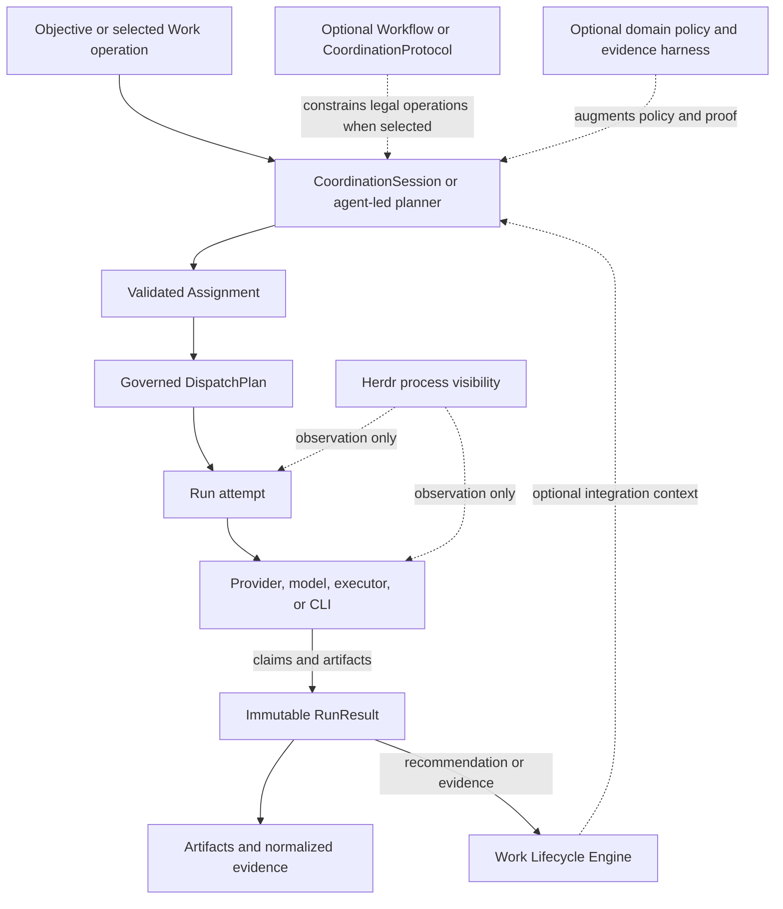

# Agent Coordination reverse-open units

Pinned tree: `0a41d793e60631aa9073c73a941f641548862b6c`. These are the 184 mechanically unbound candidate units reported by scoped D. This is review material, not a waiver or a claim of strict closure. Read each unit against the source packs; Added labels and inherited bookkeeping do not automatically close the frozen mechanical reverse check. Closure/rehearsal follows the independent verdict.

## docs/platform/agent-coordination/architecture/README.md#migration-status

Digest: `10b8c351197b35ee0d087b596f5ac868c8f5ab511187ffe1775199d4c2e0a385`. Classification proposal: existing-migration-bookkeeping. Review pending.

``````markdown
## Migration Status
``````

## docs/platform/agent-coordination/architecture/README.md#unheaded-block-2

Digest: `9bf0348789f4183ba7499518cdad5697fbdd05e5f0775b468aff5b8d17c9d847`. Classification proposal: unbound-existing-candidate-unit. Review pending.

``````markdown
This directory has been promoted from
`docs/architect/agent-coordination/architecture/` during the platform
documentation migration.
``````

## docs/platform/agent-coordination/architecture/README.md#unheaded-block-3

Digest: `f14c588f7deae8fb12bf6068a6b4c6c08b0fc2ace115cc1cffc72c218ecd05df`. Classification proposal: unbound-existing-candidate-unit. Review pending.

``````markdown
Accepted architecture documents keep their authority. Runtime-recovery-family
documents that are marked as proposals or partial designs remain
proposal/partial even though they now live beside accepted architecture.
Current implemented claims must still line up with
[Implementation Alignment](../verification/implementation-alignment.md) and
the proof roots linked from
[Proof Preservation](../history/documentation-migration/proof-preservation.md).
``````

## docs/platform/agent-coordination/architecture/system-context.md#component-and-runtime-flow

Digest: `dfc433aa7e8f71fe401ecb8539ceea0f7ea48d8b62ce94e82cfb288d65b69e87`. Classification proposal: unbound-existing-candidate-unit. Review pending.

``````markdown
## Component And Runtime Flow
``````

## docs/platform/agent-coordination/architecture/system-context.md#unheaded-block-4

Digest: `d9aa9975e7a7e7fd8eb83bfade4faca1ed15556b2de8b0d6263ace6c199a90d1`. Classification proposal: unbound-existing-candidate-unit. Review pending.

``````markdown

``````

## docs/platform/agent-coordination/architecture/system-context.md#unheaded-block-5

Digest: `016e54429b645e450dafc1fcb957976819543e16afad4c0713a18de49ec73436`. Classification proposal: unbound-existing-candidate-unit. Review pending.

``````markdown
The diagram separates execution from delivery lifecycle: a result can inform a
Work driver, but cannot move Work lifecycle state by itself. Dashed paths are
optional structure, augmentation, integration context, or visibility; they do
not create execution authority or terminal truth.
``````

## docs/platform/agent-coordination/contracts/README.md#migration-status

Digest: `bffae19a0c8c4746847f5b63d2d7ef186c3d873ff2b11d5580fb8cecaf33ee10`. Classification proposal: existing-migration-bookkeeping. Review pending.

``````markdown
## Migration Status
``````

## docs/platform/agent-coordination/contracts/README.md#unheaded-block-3

Digest: `37cd7c902e80aefa62576f4bb8be3099668b6f7e7e4b2c8dbc80c8b0cd73dbaa`. Classification proposal: unbound-existing-candidate-unit. Review pending.

``````markdown
This directory has been promoted from
`docs/architect/agent-coordination/contracts/` during the platform
documentation migration. Contract language is preserved first; any later
semantic change needs an accepted decision and compatibility notes.
``````

## docs/platform/agent-coordination/contracts/README.md#unheaded-block-4

Digest: `80bfb53cf02c8e8deb576d9f9bc51f6852d6235c3a5d45ad0ac2e69534d8aa84`. Classification proposal: unbound-existing-candidate-unit. Review pending.

``````markdown
Read the [Agent Coordination Foundation Vision](../vision.md) first. Contracts
define exact behavior beneath it and cannot make Work or a predeclared protocol
universally mandatory.
``````

## docs/platform/agent-coordination/decisions/README.md#migration-status

Digest: `f9bad0ca961df3c3aa64c7b93514e36542c7396cc04dc93e97a5f80cf4de057f`. Classification proposal: existing-migration-bookkeeping. Review pending.

``````markdown
## Migration Status
``````

## docs/platform/agent-coordination/decisions/README.md#unheaded-block-2

Digest: `f41d3ef3e738d43a642135246fc9200ce8c92e73e58841ec5e8342241fbe5e4d`. Classification proposal: unbound-existing-candidate-unit. Review pending.

``````markdown
This directory has been promoted from
`docs/architect/agent-coordination/decisions/` during the platform
documentation migration. ADR IDs, titles, decisions, consequences, and
implementation notes are preserved; this index does not merge ADRs into a
summary replacement.
``````

## docs/platform/agent-coordination/history/documentation-migration/claim-preservation.md#agent-coordination-claim-preservation

Digest: `335baeef42e83237bb1cfbcbe2d0cfbb4b4e269a25e4a0bbb0fc6feb59dec82f`. Classification proposal: unbound-existing-candidate-unit. Review pending.

``````markdown
# Agent Coordination Claim Preservation
``````

## docs/platform/agent-coordination/history/documentation-migration/claim-preservation.md#unheaded-block-1

Digest: `9e12681b58f31370ef554d491ce4e9a9ba8281cfaae0db438623086e245fe16a`. Classification proposal: unbound-existing-candidate-unit. Review pending.

``````markdown
```txt
Document type: Claim preservation table
Audience: Human reviewer, architect, maintainer, documentation agent
Purpose: Preserve accepted, deferred, proposed, and current Agent Coordination claims during migration
Design status: Draft
Implementation: Partial
Provenance: Created from Phase 0 source inventory and documentation-standardization plan
Writer type: Human + agent coauthor
Canonical for: Migration claim tracking only
Use this when: Promoting spec, architecture, contracts, or verification links
Do not use this for: Runtime behavior by itself
Last reviewed: 2026-09-18
Related:
- docs/platform/agent-coordination/README.md
- docs/platform/agent-coordination/history/documentation-migration/source-inventory.md
```
``````

## docs/platform/agent-coordination/history/documentation-migration/claim-preservation.md#unheaded-block-2

Digest: `a9934bdb7e664b6019b9bbccc19c59a26f8cfdc43e847e57d9ae8693ace1627b`. Classification proposal: unbound-existing-candidate-unit. Review pending.

``````markdown
Use `unknown` or `track-complete / verify current checkout` instead of
guessing. A target doc may mark a claim `implemented` only when the linked
current-checkout code, test, contract, or proof supports it.
``````

## docs/platform/agent-coordination/history/documentation-migration/claim-preservation.md#unheaded-block-3

Digest: `bd1db6e9232f57939b16fb5effa1dd5e69d21363f6248a2fe4ff424562e2d5ed`. Classification proposal: explicit-added-frame. Review pending.

``````markdown
| Claim ID | Claim | Source | Authority | Status | Target anchor | Must not lose | Proof / gap |
|---|---|---|---|---|---|---|---|
| `AC-CLAIM-001` | Agent Coordination is a foundation layer. | [vision](../../../../architect/agent-coordination/vision.md), [system context](../../../../architect/agent-coordination/architecture/system-context.md) | vision / architecture | partial | [README](../../README.md) | Domain-neutral foundation, not only coding workflow glue. | Evidence through Step 08 coordination implementation and current runner spec; Phase 2 needs alignment table. |
| `AC-CLAIM-002` | Work is optional integration, not system identity. | [vision](../../../../architect/agent-coordination/vision.md), [work integration](../../../../architect/agent-coordination/architecture/work-integration.md), [ADR-001](../../../../architect/agent-coordination/decisions/ADR-001-work-lifecycle-authority.md) | vision / ADR / architecture | implemented / partial | future `spec.md#work-integration` | No universal Work requirement for coordination. | `src/runner/coordination/**`, `test/runner/coordination-*.test.mjs`; Work-attached mutation remains gated. |
| `AC-CLAIM-003` | A predeclared Workflow or CoordinationProtocol is optional. | [vision](../../../../architect/agent-coordination/vision.md), [protocol model](../../../../architect/agent-coordination/architecture/protocol-model.md) | vision / architecture | implemented / partial | future `spec.md#coordination-structure` | Agent-led coordination remains legal. | `src/verbs/coordination/schema.mjs`, `src/runner/coordination/session-engine.mjs`; richer runtime graphs deferred. |
| `AC-CLAIM-004` | Runtime execution contracts are mandatory. | [assignment/run/runresult contract](../../../../architect/agent-coordination/contracts/assignment-run-runresult.md), [ADR-006](../../../../architect/agent-coordination/decisions/ADR-006-assignment-provenance-and-contract-snapshot.md) | contract / ADR | implemented / partial | future `contracts/assignment-run-runresult.md` | Free-form prose must not become execution authority. | Dispatch execution-contract code and assignment/runresult tests; Phase 2 should cite exact code anchors. |
| `AC-CLAIM-005` | CoordinationSession is the V1 executable/recovery root. | [coordination-session contract](../../../../architect/agent-coordination/contracts/coordination-session.md), [ADR-008](../../../../architect/agent-coordination/decisions/ADR-008-coordination-session-and-mission-deferral.md) | contract / ADR | implemented / partial | future `contracts/coordination-session.md` | No `missionId` resurrection or second session root. | `src/runner/coordination/{schema,store,replay,session-engine}.mjs`, `test/runner/coordination-*.test.mjs`. |
| `AC-CLAIM-006` | FlowDefinition is shared graph/operation/policy IR with typed profiles. | [flow-definition contract](../../../../architect/agent-coordination/contracts/flow-definition.md), [ADR-009](../../../../architect/agent-coordination/decisions/ADR-009-flow-definition-shared-ir-and-typed-profiles.md) | contract / ADR | implemented / partial | future `contracts/flow-definition.md` | Shared IR beneath Workflow and CoordinationProtocol profiles. | `src/runner/definitions/**`, coordination tests; Phase 2 needs exact file scan. |
| `AC-CLAIM-007` | Assignment, Run, and RunResult are separate. | [assignment/run/runresult contract](../../../../architect/agent-coordination/contracts/assignment-run-runresult.md), [ADR-003](../../../../architect/agent-coordination/decisions/ADR-003-assignment-run-runresult-separation.md) | contract / ADR | implemented | future `contracts/assignment-run-runresult.md` | Do not collapse request, attempt, and outcome. | `test/runner/assignment-runresult.test.mjs`, dispatch operability proof. |
| `AC-CLAIM-008` | Dispatch governs execution infrastructure. | [dispatch control plane](../../../../architect/agent-coordination/architecture/dispatch-control-plane.md), [ADR-011](../../../../architect/agent-coordination/decisions/ADR-011-dispatch-owns-lifecycle-receiver-writes-receipt.md) | architecture / ADR | implemented / partial | future `architecture/dispatch-control-plane.md` | Semantic operation choice stays separate from executor mechanics. | `src/runner/dispatch/**`, `src/verbs/dispatch/**`, runner spec dispatch sections. |
| `AC-CLAIM-009` | Evidence and RunResult prevent false success. | [evidence and results](../../../../architect/agent-coordination/architecture/evidence-and-results.md), ADR-005/006/007 | architecture / ADR | implemented / partial | future `architecture/evidence-and-results.md` | Worker self-report is not normalized proof by itself. | RunResult v2 tests and dispatch-operability I03 proof; aggregation proof remains mixed by protocol. |
| `AC-CLAIM-010` | Herdr is visibility, not evidence/truth. | [visibility and Herdr](../../../../architect/agent-coordination/architecture/visibility-and-herdr.md), [ADR-005](../../../../architect/agent-coordination/decisions/ADR-005-herdr-visibility-only.md) | architecture / ADR | partial | future `architecture/visibility-and-herdr.md` | Herdr must not settle Runs or replace evidence. | Visibility proof exists; writable takeover remains parked/deferred. |
| `AC-CLAIM-011` | Domain-owned Work isolation remains outside coordination code until proven. | [ADR-010](../../../../architect/agent-coordination/decisions/ADR-010-interactive-headless-parity-and-work-isolation.md), [work integration](../../../../architect/agent-coordination/architecture/work-integration.md) | ADR / architecture | deferred-preserved / partial | future `architecture/work-integration.md` | Coordination code must not gain hidden Work lifecycle writes. | Needs Step 10 mutating live proof before promotion beyond current status. |
| `AC-CLAIM-012` | Group-thinking and heterogeneous cohorts preserve dissent/evidence. | [group-thinking trigger surface](../../../../architect/agent-coordination/architecture/group-thinking-trigger-surface.md), [ledger AC-I004](../../../../architect/agent-coordination/intent-preservation-ledger.md#ac-i004-group-cognition-and-heterogeneous-cohorts) | architecture / intent ledger | implemented mechanism / quality proof mixed | future `subcomponents/group-thinking/` or architecture doc | Do not hide failed actors, stale artifacts, or dissent in synthesis. | Step 09 proof roots; quality/advisory proof has known gaps. |
| `AC-CLAIM-013` | Runtime recovery guarantees are distinct: control fencing, result fencing, effect protection. | [runtime recovery design](../../../../architect/agent-coordination/architecture/runtime-recovery-design.md), runtime recovery proofs | architecture / proposal / evidence | partial / proposed split | future runtime-recovery architecture doc | Do not describe unimplemented recovery slices as current. | P01-P05S proofs; S0-S4 and session-recovery half of S5 implemented, S5 transfer/import/budget/apply, S6, S7 not implemented. |
| `AC-CLAIM-014` | Herdr-spawn bwrap launch reconciliation uses the P02H reopen launcher-script mechanism, not falsified direct-command pseudocode. | [P02H reopen](../../../../architect/agent-coordination/verification/runtime-recovery/p02h-reopen.md), runtime-recovery plan launch design | evidence / plan | implemented with residual gap | future runtime-recovery verification index | Do not promote `herdr agent start ... -- <prepared-command>` as current design. | P02H reopen is authoritative shipped proof; residual accepted gap must stay visible. |
| `AC-CLAIM-015` | `agent-result-claim.v2` is worker claim contract, not normalized proof. | [I01](../../../../architect/agent-coordination/verification/dispatch-operability-implementation/I01.md), dispatch operability plan | evidence / contract-adjacent | implemented | future assignment/runresult contract or verification alignment | Worker claim remains untrusted input. | `test/runner/assignment-runresult.test.mjs`, `test/runner/assignment.test.mjs`. |
| `AC-CLAIM-016` | Effective execution contract is persisted pre-launch and must stay inspectable where implemented. | [I02](../../../../architect/agent-coordination/verification/dispatch-operability-implementation/I02.md) | evidence | implemented | future dispatch operability section | Preserve pre-launch snapshot and inspection. | Current checkout evidence in dispatch execution-contract and tests. |
| `AC-CLAIM-017` | `RunResult` v2 is immutable terminal Run truth; `RunObservation` is mutable read-only projection and never settles a Run. | [I03](../../../../architect/agent-coordination/verification/dispatch-operability-implementation/I03.md), runner spec | evidence / spec | implemented | future `spec.md#run-results` | Do not let observation settle a Run. | `test/runner/assignment-runresult.test.mjs`. |
| `AC-CLAIM-018` | `dispatch.runtime.inspect` is read-only. | [I04](../../../../architect/agent-coordination/verification/dispatch-operability-implementation/I04.md), [inspect verb](../../../../../src/verbs/dispatch/inspect.mjs) | evidence / implementation truth | implemented | future `spec.md#dispatch-runtime-inspect` | Inspect cannot repair or mutate. | `test/runner/dispatch-operability-production-door.test.mjs`. |
| `AC-CLAIM-019` | `dispatch.runtime.reconcile` is limited to guard/projection repair and must not kill, signal, retry, relaunch, resume, reattach, reassign, admit, cancel, or take over execution. | [I05](../../../../architect/agent-coordination/verification/dispatch-operability-implementation/I05.md), [reconcile verb](../../../../../src/verbs/dispatch/reconcile.mjs) | evidence / implementation truth | implemented / partial | future `spec.md#dispatch-runtime-reconcile` | Reconcile is not recovery. | `test/runner/dispatch-reconcile-operation.test.mjs`; preserve residual findings. |
| `AC-CLAIM-020` | Executor identity is not execution policy. | executor-policy seams plan and design | plan / architecture | implemented / partial / verify current checkout | future dispatch-control subcomponent | Do not encode persona/model/account policy in executor identity. | Current warnings and placement-policy tests exist; Phase 2 needs focused scan. |
| `AC-CLAIM-021` | `PlacementPolicy` owns provider/model/executor ranking/binding only where the self-verifying production binder has shipped; it does not own same-provider account rotation or lifecycle settlement. | executor-policy seams plan | plan / implementation evidence | implemented / partial / verify current checkout | future placement-policy section | Keep account rotation and lifecycle settlement out of PlacementPolicy. | `src/runner/dispatch/placement-policy.mjs`, placement-policy matrix tests; Phase 08 pending status must stay visible. |
| `AC-CLAIM-022` | Provider Capacity Rotator is same-provider account/capacity rotation with global/operator config; not cross-provider fallback or project-local credential inventory. | rotator plan (`../../../../../plans/260916-account-rotator/plan.md`; Added in candidate: historical path absent at the batch pin), runner spec | plan / spec | partial / verify current checkout | future provider-capacity section | No project-local account inventory and no fallback ownership. | `src/runner/provider-capacity.mjs`, provider-capacity tests where present. |
| `AC-CLAIM-023` | Work-independent code implementation tracks use targeted proof per cell plus full proof at gates; no `trackKind`/`executionPolicy` YAML or policy validator was accepted. | policy plan (`../../../../../plans/260915-code-implementation-track-policy/plan.md`; Added in candidate: historical path absent at the batch pin), policy verification | operational / evidence | done / operational | future playbook or verification policy | Do not invent policy YAML as accepted runtime behavior. | Policy proof p01-p05 and track closeout. |
| `AC-CLAIM-024` | Test feedback/cost work improved proof trust and feedback cost; P05 related-test selector remains deferred. | test feedback plan (`../../../../../plans/260915-0455-test-suite-feedback-cost/plan.md`; Added in candidate: historical path absent at the batch pin), decision lock | plan / evidence | partial; P05 deferred | future verification/history | Do not describe related-test selector as shipped. | Decision lock and Phase 08 handoff. |
| `AC-CLAIM-025` | Cold-resumable coordination DAG scheduling is proposal/frontier; it must not add mutation nodes, daemon, new lifecycle authority, or Work replacement. | [DAG proposal](../../../../architect/agent-coordination/proposals/dag-request-scheduler.md), DAG plan (`../../../../../plans/260917-cold-resumable-coordination-dag/plan.md`; Added in candidate: historical path absent at the batch pin) | proposal / plan | proposed / ready for implementation | future proposals index | Keep read-only immutable DAG limits. | Needs acceptance and code/proof before current-truth promotion. |
| `AC-CLAIM-026` | Host-invocation-routing owns host command/provider process routing; Agent Coordination owns only dispatch/executor integration boundary. | [host portal](../../../host-invocation-routing/README.md) | external authority | partial | [README cross-area boundaries](../../README.md#cross-area-boundaries) | Do not duplicate host authority here. | Link-only boundary. |
| `AC-CLAIM-027` | Packaging-distribution owns installation, activation, release manifest, setup/doctor, and runtime identity. | [packaging portal](../../../packaging-distribution/README.md) | external authority | partial | [README cross-area boundaries](../../README.md#cross-area-boundaries) | Do not duplicate install/setup/doctor authority here. | Link-only boundary. |
``````

## docs/platform/agent-coordination/history/documentation-migration/claim-preservation.md#boundary-note

Digest: `b2f76b66f14c51d398d331af7e2eb44f19bbb53da664c556109906c96b7bde7f`. Classification proposal: unbound-existing-candidate-unit. Review pending.

``````markdown
## Boundary Note
``````

## docs/platform/agent-coordination/history/documentation-migration/claim-preservation.md#unheaded-block-4

Digest: `21d0a35ea24b3a226d077c912d738ae5d7d2650751a0efed8c54d0fc527e478e`. Classification proposal: unbound-existing-candidate-unit. Review pending.

``````markdown
No component-boundary change in this Phase 0/1 migration.
``````

## docs/platform/agent-coordination/history/documentation-migration/documentation-governance.md#agent-coordination-documentation-governance

Digest: `c647ec09e056954c02fc5dabde28590240244ac5dcf19d1a2f1c36462b319b32`. Classification proposal: unbound-existing-candidate-unit. Review pending.

``````markdown
# Agent Coordination Documentation Governance
``````

## docs/platform/agent-coordination/history/documentation-migration/documentation-governance.md#unheaded-block-1

Digest: `5f7d1e034b414f729e18521b98bab75bece4943768b232772d7eae86703b22e6`. Classification proposal: unbound-existing-candidate-unit. Review pending.

``````markdown
```txt
Document type: History
Audience: Human reviewer, maintainer, documentation agent
Purpose: Preserve the retired area policy and migration plan verbatim as non-authority history
Design status: Candidate
Implementation: Historical record; not a live runtime or documentation policy
Provenance: Verbatim source snapshot from docs/architect/agent-coordination/documentation-governance.md
Writer type: Human + agent coauthor
Canonical for: Historical evidence only; no current authority
Use this when: Auditing the former area documentation policy or migration plan
Do not use this for: Current authority, current runtime behavior, or new migration instructions
Last reviewed: Not independently reviewed
Related:
- docs/platform/agent-coordination/README.md
- docs/platform/agent-coordination/history/documentation-migration/source-inventory.md
Supersedes: None; legacy source is unchanged
Superseded by: None
```
``````

## docs/platform/agent-coordination/history/documentation-migration/documentation-governance.md#unheaded-block-2

Digest: `715e040ca25de20ebe65e3d3a9b453c39e2426833fc3edfdc68fc1c82e115d3a`. Classification proposal: explicit-added-frame. Review pending.

``````markdown
Added in candidate: Retired area policy and migration plan, retained verbatim as non-authority history. The literal source snapshot below preserves original status fields and file-relative references as historical text, not active authority or navigation.
``````

## docs/platform/agent-coordination/history/documentation-migration/documentation-standardization-plan.md#agent-coordination-documentation-standardization-plan

Digest: `e7ad94fade6cdd15d23ce9a0b7fdba7b977a478ef6c764b92c12e509fd22b527`. Classification proposal: unbound-existing-candidate-unit. Review pending.

``````markdown
# Agent Coordination Documentation Standardization Plan
``````

## docs/platform/agent-coordination/history/documentation-migration/documentation-standardization-plan.md#unheaded-block-1

Digest: `5cc0ec72f7161779180c14bd471e5520ee76456e2755d481fbe76d580f8826ca`. Classification proposal: unbound-existing-candidate-unit. Review pending.

``````markdown
```txt
Document type: History
Audience: Human reviewer, maintainer, documentation agent
Purpose: Preserve the retired area policy and migration plan verbatim as non-authority history
Design status: Candidate
Implementation: Historical record; not a live runtime or documentation policy
Provenance: Verbatim source snapshot from docs/architect/agent-coordination/documentation-standardization-plan.md
Writer type: Human + agent coauthor
Canonical for: Historical evidence only; no current authority
Use this when: Auditing the former area documentation policy or migration plan
Do not use this for: Current authority, current runtime behavior, or new migration instructions
Last reviewed: Not independently reviewed
Related:
- docs/platform/agent-coordination/README.md
- docs/platform/agent-coordination/history/documentation-migration/source-inventory.md
Supersedes: None; legacy source is unchanged
Superseded by: None
```
``````

## docs/platform/agent-coordination/history/documentation-migration/documentation-standardization-plan.md#unheaded-block-2

Digest: `715e040ca25de20ebe65e3d3a9b453c39e2426833fc3edfdc68fc1c82e115d3a`. Classification proposal: explicit-added-frame. Review pending.

``````markdown
Added in candidate: Retired area policy and migration plan, retained verbatim as non-authority history. The literal source snapshot below preserves original status fields and file-relative references as historical text, not active authority or navigation.
``````

## docs/platform/agent-coordination/history/documentation-migration/migration-status.md#agent-coordination-migration-status

Digest: `e8c2d690b8efd3d7e537671d67b6aa7de3a2bc412e4ec3b0818cb8610005a09a`. Classification proposal: existing-migration-bookkeeping. Review pending.

``````markdown
# Agent Coordination Migration Status
``````

## docs/platform/agent-coordination/history/documentation-migration/migration-status.md#unheaded-block-1

Digest: `a6215765fb06646cacc69bccb097e41be353243b9b0c1b2cc56c81e5cc7b3fa2`. Classification proposal: unbound-existing-candidate-unit. Review pending.

``````markdown
```txt
Document type: Migration status
Audience: Human reviewer, architect, maintainer, documentation agent
Purpose: Track phase-by-phase progress for the Agent Coordination documentation migration
Design status: Draft
Implementation: Active
Provenance: Created during execution of docs/architect/agent-coordination/documentation-standardization-plan.md
Writer type: Human + agent coauthor
Canonical for: Migration progress bookkeeping only
Use this when: Resuming the documentation migration or checking which phase has landed
Do not use this for: Current runtime behavior, accepted contracts, or implementation proof
Last reviewed: 2026-09-18
Related:
- docs/architect/agent-coordination/documentation-standardization-plan.md
- docs/platform/agent-coordination/README.md
- docs/platform/agent-coordination/history/documentation-migration/source-inventory.md
```
``````

## docs/platform/agent-coordination/history/documentation-migration/migration-status.md#phase-status

Digest: `e87c0b1d8137253be9acd3577b4d053ed3fbec7ec80f55206cc85aded5f05857`. Classification proposal: unbound-existing-candidate-unit. Review pending.

``````markdown
## Phase Status
``````

## docs/platform/agent-coordination/history/documentation-migration/migration-status.md#unheaded-block-2

Digest: `21697677038f114f34b6369119a3457c8c11e7413fcee8c584678be0bc0f644d`. Classification proposal: unbound-existing-candidate-unit. Review pending.

``````markdown
| Phase | Plan title | Status | Landed target docs | Remaining work |
|---|---|---|---|---|
| Phase 0 | Protect the current authority graph | complete | [source-inventory.md](source-inventory.md), [claim-preservation.md](claim-preservation.md), [proof-preservation.md](proof-preservation.md), [proposal-status.md](proposal-status.md) | Keep ledgers updated when later phases promote or redirect source rows. |
| Phase 1 | Create target portal and preserve vision/ledger pair | complete | [../../README.md](../../README.md), [../../vision.md](../../vision.md), [../../intent-preservation-ledger.md](../../intent-preservation-ledger.md), [../../subcomponents/README.md](../../subcomponents/README.md), [../README.md](../README.md) | Legacy detailed docs remain current until later phases drain them. |
| Phase 2 | Promote spec without shrinking the vision | complete | [../../spec.md](../../spec.md), [../../verification/implementation-alignment.md](../../verification/implementation-alignment.md) | Keep status conservative; update alignment when code/proof scans refine partial/implemented claims. |
| Phase 3 | Move accepted architecture | complete | [architecture index](../../architecture/README.md) plus 13 target architecture documents; target-local and cross-area links were normalized. | Legacy sources remain retained until Phase 7 redirect review; keep runtime-recovery-family proposal/partial labels explicit. |
| Phase 4 | Move contracts and ADRs | complete | [contract index](../../contracts/README.md), four target contracts, [decision index](../../decisions/README.md), and ADR-001 through ADR-011. | Legacy sources remain retained until Phase 7 redirect review; future semantic changes need decision/compatibility evidence. |
| Phase 5 | Preserve verification trees | complete | [verification README](../../verification/README.md) indexes retained legacy proof roots; mirrored target trees remain navigable evidence copies. | Keep the proof-preservation ledger current when a target doc adds an implementation claim. |
| Phase 6 | Preserve playbooks, proposals, roadmap, and history | complete | [playbooks](../../playbooks/README.md), [proposals](../../proposals/README.md), [roadmap](../../roadmap/README.md), and [history](../README.md) now state their target-path and non-normative status. | Keep proposal-status and source-inventory ledgers current as frontier material changes. |
| Phase 7 | Redirect legacy paths | complete | All 63 legacy narrative/index documents with target counterparts carry standard target-path migration notes; legacy proof artifacts remain unchanged, link-only evidence through the target verification index. | Keep target/legacy pairs synchronized if a retained legacy source changes; preserve proof artifacts as evidence. |
``````

## docs/platform/agent-coordination/history/documentation-migration/migration-status.md#current-boundary-note

Digest: `dde4b65b6d30e670f4e41e1e8ab847386a1050ef30d1a4ea6c3928dafcdb2c6d`. Classification proposal: unbound-existing-candidate-unit. Review pending.

``````markdown
## Current Boundary Note
``````

## docs/platform/agent-coordination/history/documentation-migration/migration-status.md#unheaded-block-3

Digest: `213abce12dc763d06b8116fa1fa1edb8bc666a0374428306081de91b1b9e94ba`. Classification proposal: unbound-existing-candidate-unit. Review pending.

``````markdown
No component-boundary change through the completed Phase 0-5 work. The
migration is changing document placement and reader routing, not runtime
authority, state writes, or component ownership.
``````

## docs/platform/agent-coordination/history/documentation-migration/migration-status.md#completion-evidence

Digest: `0b8b72bd26f198855e395fabb9ed5218c92a2883694b2cbbde90fdc8f1907c13`. Classification proposal: unbound-existing-candidate-unit. Review pending.

``````markdown
## Completion Evidence
``````

## docs/platform/agent-coordination/history/documentation-migration/migration-status.md#unheaded-block-4

Digest: `86f603f4ab7f2785eddc1aeb10a8f11b8e2945f3ec8df86ce286921fa01315b6`. Classification proposal: unbound-existing-candidate-unit. Review pending.

``````markdown
Phase 0-7 completion evidence is recorded in
[phase-7-completion.md](phase-7-completion.md).
``````

## docs/platform/agent-coordination/history/documentation-migration/phase-7-completion.md#agent-coordination-documentation-migration-completion

Digest: `a7c79bf58e79685a047e69a9cf95250b43c104cf91b9f038aca0a69f6bf844b0`. Classification proposal: unbound-existing-candidate-unit. Review pending.

``````markdown
# Agent Coordination Documentation Migration Completion
``````

## docs/platform/agent-coordination/history/documentation-migration/phase-7-completion.md#unheaded-block-1

Digest: `60d78413ed9a9e6cbcbab02bc0c29f5af76a0f520da8998f6020e593757497be`. Classification proposal: unbound-existing-candidate-unit. Review pending.

``````markdown
```txt
Document type: Migration completion report
Audience: Human reviewer, architect, maintainer, documentation agent
Purpose: Record the completed Phase 7 legacy-path disposition and final migration checks
Design status: Draft
Implementation: Complete
Provenance: Documentation standardization Phase 0-7 execution
Writer type: Human + agent coauthor
Canonical for: Migration completion evidence only
Use this when: Auditing the completed Agent Coordination documentation migration
Do not use this for: Current runtime behavior, contract meaning, or proof contents
Last reviewed: 2026-09-18
Related:
- docs/architect/agent-coordination/documentation-standardization-plan.md
- docs/platform/agent-coordination/history/documentation-migration/source-inventory.md
- docs/platform/agent-coordination/history/documentation-migration/migration-status.md
```
``````

## docs/platform/agent-coordination/history/documentation-migration/phase-7-completion.md#completion-record

Digest: `da246349ae75320592ccf49a2f8f9f9eb5e744a4544aa707e2cfc80dc77306d1`. Classification proposal: unbound-existing-candidate-unit. Review pending.

``````markdown
## Completion Record
``````

## docs/platform/agent-coordination/history/documentation-migration/phase-7-completion.md#unheaded-block-2

Digest: `473e23f9968f866da45ab7f6fec38c89175f666e314746106464b98375767064`. Classification proposal: unbound-existing-candidate-unit. Review pending.

``````markdown
| Field | Result |
|---|---|
| Files created/updated | This report; migration status, source inventory, target portals/indexes, target link corrections, and 63 legacy narrative/index documents. |
| Source rows completed | 63 legacy narrative/index paths under architecture, contracts, decisions, history, playbooks, proposals, roadmap, and vocabulary received target-path notes. 306 verification artifacts remain link-only evidence. |
| Claims preserved | `AC-CLAIM-001` through `AC-CLAIM-027` remain tracked by [claim preservation](claim-preservation.md); this phase changed navigation only. |
| Proof links preserved | Runtime recovery, dispatch operability, executor-policy, code-track-policy, group-thinking, visibility, and Team Dispatch V1 roots remain reachable through [verification README](../../verification/README.md). |
| Legacy docs still authoritative | Retained legacy narrative docs are legacy/current sources paired to their target paths. Verification artifacts remain legacy proof evidence and are intentionally unchanged. |
| Unknowns / human questions | None for the migration mechanics. Future semantic changes must keep the target/legacy pair and inventory aligned until a later archival decision. |
| Component-boundary impact | No component-boundary change. |
| Validation | 63/63 legacy narrative docs have migration notes and target counterparts; legacy narrative links resolve; target non-verification links resolve; `git diff --check` passes. |
| Preview URLs | Migration plan: `http://design-lap:7701/s/513a32939ee8`; migration status: `http://design-lap:7701/s/99f1b1f7febd`; source inventory: `http://design-lap:7701/s/64c4052e0e22`. |
``````

## docs/platform/agent-coordination/history/documentation-migration/phase-7-completion.md#scope-boundary

Digest: `06319b17ced923b387edd4192486050ff24dc19439b9c218de166b489be54fe9`. Classification proposal: unbound-existing-candidate-unit. Review pending.

``````markdown
## Scope Boundary
``````

## docs/platform/agent-coordination/history/documentation-migration/phase-7-completion.md#unheaded-block-3

Digest: `f622a4baf74a691b9ab5679808749c9900ca52e94bf4c51f66b0cc5931f36d38`. Classification proposal: unbound-existing-candidate-unit. Review pending.

``````markdown
The migration does not rewrite proof artifacts, claim semantics, contracts, or
runtime implementation. It makes authority, status, and navigation explicit
while retaining proof history in place.
``````

## docs/platform/agent-coordination/history/documentation-migration/proof-preservation.md#agent-coordination-proof-preservation

Digest: `9364e56ebcb837e79e0a2ee19f8d040d13feac4407c5986f429b359e4720f8de`. Classification proposal: unbound-existing-candidate-unit. Review pending.

``````markdown
# Agent Coordination Proof Preservation
``````

## docs/platform/agent-coordination/history/documentation-migration/proof-preservation.md#unheaded-block-1

Digest: `dd577e9abd52ce3ac54f71951460a44f402677d5fec4df688aeaa00903175423`. Classification proposal: unbound-existing-candidate-unit. Review pending.

``````markdown
```txt
Document type: Proof preservation table
Audience: Human reviewer, architect, maintainer, documentation agent
Purpose: Preserve Agent Coordination proof roots and consuming claims during migration
Design status: Draft
Implementation: Partial
Provenance: Created from Phase 0 source inventory and documentation-standardization plan
Writer type: Human + agent coauthor
Canonical for: Migration proof tracking only
Use this when: Linking implemented claims from target docs to evidence
Do not use this for: Replacing proof artifacts or verification logs
Last reviewed: 2026-09-18
Related:
- docs/platform/agent-coordination/history/documentation-migration/claim-preservation.md
- docs/architect/agent-coordination/verification/README.md
```
``````

## docs/platform/agent-coordination/history/documentation-migration/proof-preservation.md#unheaded-block-2

Digest: `c5c09ab025fb7e305ed471e757effd5fbfec278182e03136facf81004a21ed98`. Classification proposal: unbound-existing-candidate-unit. Review pending.

``````markdown
Proof trees must remain linkable. Summary rows here do not replace the proof
roots, logs, current-cell files, reviews, red-team reports, or known gaps.
``````

## docs/platform/agent-coordination/history/documentation-migration/proof-preservation.md#unheaded-block-3

Digest: `2f2d7a46d4e2ebf5b82c75c675e95f19261522611b45bd14d766fdb14cd1c018`. Classification proposal: unbound-existing-candidate-unit. Review pending.

``````markdown
| Proof root | Proves / supports | Consumed by target doc | Move policy | Known gaps | Notes |
|---|---|---|---|---|---|
| `docs/architect/agent-coordination/verification/runtime-recovery/p01.md` | Run admission/control-epoch fencing. | runtime-recovery architecture / implementation alignment | link-only | Later recovery slices still split. | Required runtime-recovery row. |
| `docs/architect/agent-coordination/verification/runtime-recovery/p02l.md` | cli-spawn launch reconciliation. | runtime-recovery verification index | link-only | Preserve exact scope. | Required runtime-recovery row. |
| `docs/architect/agent-coordination/verification/runtime-recovery/p02h.md` | Original herdr-spawn proof attempt and falsified direct-command typing context. | runtime-recovery verification index | link-only | Do not promote falsified invocation. | Historical/evidence context. |
| `docs/architect/agent-coordination/verification/runtime-recovery/p02h-reopen.md` | Authoritative shipped herdr-spawn bwrap launcher-script mechanism and residual accepted gap. | runtime-recovery architecture / implementation alignment | link-only | Residual accepted gap remains. | Must override earlier pseudocode when describing shipped behavior. |
| `docs/architect/agent-coordination/verification/runtime-recovery/p03.md` | Governed fallback. | runtime-recovery verification index | link-only | Split status must stay explicit. | Required runtime-recovery row. |
| `docs/architect/agent-coordination/verification/runtime-recovery/p04.md` | Pure evaluators. | runtime-recovery verification index | link-only | Split status must stay explicit. | Required runtime-recovery row. |
| `docs/architect/agent-coordination/verification/runtime-recovery/p05.md` | Standalone `dispatch recover`. | runtime-recovery verification index | link-only | S5 transfer/import/budget/apply not implemented. | Required runtime-recovery row. |
| `docs/architect/agent-coordination/verification/runtime-recovery/p05s.md` | Session-owned recovery read/apply door. | runtime-recovery architecture / implementation alignment | link-only | Only session-recovery half of S5 implemented. | Required runtime-recovery row. |
| `docs/architect/agent-coordination/verification/dispatch-operability-implementation/I01.md` | `agent-result-claim.v2` prompt/validation contract proof. | assignment/run/runresult contract and implementation alignment | link-only | Worker claim is not normalized proof. | Required recent-track row. |
| `docs/architect/agent-coordination/verification/dispatch-operability-implementation/I02.md` | Effective execution contract persisted pre-launch and inspectable. | dispatch-control and implementation alignment | link-only | Preserve inspectability status. | Required recent-track row. |
| `docs/architect/agent-coordination/verification/dispatch-operability-implementation/I03.md` | `RunResult` v2, legacy-v1 interpretation, attribution dimensions. | assignment/run/runresult and evidence/results | link-only | Preserve documented residuals. | Required recent-track row. |
| `docs/architect/agent-coordination/verification/dispatch-operability-implementation/I04.md` | `dispatch.runtime.inspect` read model and public CLI projection. | spec / dispatch-control | link-only | Deferred label-consistency residual. | Required recent-track row. |
| `docs/architect/agent-coordination/verification/dispatch-operability-implementation/I05.md` | `dispatch.runtime.reconcile` CAS guard/projection repair and negative routes. | spec / dispatch-control | link-only | Residual findings must stay visible. | Required recent-track row. |
| `plans/260915-dispatch-operability-implementation/reports/track-closeout.md` | Production-door proof summary, full-suite result, and deferred non-capabilities. | implementation alignment | evidence-only | Track-complete until current checkout verified. | Keep as plan evidence. |
| `docs/architect/agent-coordination/verification/executor-policy-dispatch-seams/p00.md` | Executor-policy baseline verification root. | dispatch-control placement-policy notes | link-only | Later phase proof lives across plan/code/tests. | Inventory must keep later status split. |
| `plans/260915-executor-policy-dispatch-seams/plan.md` | Phase status for PlacementPolicy, self-verifying binder, redirect retirement. | dispatch-control / proposal-status | evidence-only | Phase 08 pending status must not be erased. | Required recent-track row. |
| `plans/260916-account-rotator/design.md` | Provider Capacity Rotator design and same-provider/global-config limits. | provider-capacity proposal/status | link-only | Current shipped slice needs focused verification. | Required recent-track row. |
| `plans/260916-account-rotator/plan.md` | Provider Capacity Rotator implementation contract. | provider-capacity proposal/status | link-only | Not cross-provider fallback; not project-local credential inventory. | Required recent-track row. |
| `docs/architect/agent-coordination/verification/code-implementation-track-policy/p01.md` | Policy-track proof slice P01. | playbook / verification policy | link-only | See p05 for remaining policy proof. | Required recent-track row. |
| `docs/architect/agent-coordination/verification/code-implementation-track-policy/p02.md` | Policy-track proof slice P02. | playbook / verification policy | link-only | None recorded here. | Required recent-track row. |
| `docs/architect/agent-coordination/verification/code-implementation-track-policy/p03.md` | Policy-track proof slice P03. | playbook / verification policy | link-only | None recorded here. | Required recent-track row. |
| `docs/architect/agent-coordination/verification/code-implementation-track-policy/p04.md` | Policy-track proof slice P04. | playbook / verification policy | link-only | None recorded here. | Required recent-track row. |
| `docs/architect/agent-coordination/verification/code-implementation-track-policy/p05.md` | Policy-track proof slice P05 and known gaps. | playbook / verification policy | link-only | Preserve final policy scope. | Required recent-track row. |
| `plans/260915-code-implementation-track-policy/reports/track-closeout.md` | Final policy-track closeout and proof status. | playbook / verification policy | evidence-only | No policy YAML/validator was accepted. | Required recent-track row. |
| `plans/260915-0455-test-suite-feedback-cost/decision-lock.md` | Test feedback/cost decisions. | verification/history | link-only | P05 related-test selector deferred. | Required recent-track row. |
| `plans/260915-0455-test-suite-feedback-cost/phase-08-evidence-decision-and-handoff.md` | Test feedback/cost handoff and deferred status. | verification/history | link-only | Preserve P05 deferred status. | Required recent-track row. |
| `plans/260917-cold-resumable-coordination-dag/plan.md` | DAG implementation plan and non-goals. | proposals / proposal-status | link-only | Not accepted runtime truth by itself. | Required recent-track row. |
| `docs/architect/agent-coordination/proposals/dag-request-scheduler.md` | Candidate DAG shape and unresolved questions. | proposals / proposal-status | link-only | Canonical for nothing until accepted. | Required recent-track row. |
| `docs/architect/agent-coordination/verification/step-08-standalone-coordination/index.md` | CoordinationSession/FlowDefinition foundation implementation proof index. | future spec and contracts | link-only | Verify exact per-cell status before quoting. | Supports core implemented claims. |
| `docs/architect/agent-coordination/verification/step-09-group-thinking-mvp1-mvp2/index.md` | Early group-thinking substrate proof. | group-thinking status | link-only | Quality proof mixed. | Keep mechanism vs product-quality distinction. |
| `docs/architect/agent-coordination/verification/step-09-mvp6-to-mvp9/index.md` | Later group-thinking/advisory proof tree. | group-thinking status | link-only | Known reports and rechecks must remain reachable. | Large proof tree remains legacy-current. |
| `docs/architect/agent-coordination/verification/visibility-herdr/v0-live-proof-2026-09-07.md` | Herdr visibility proof. | visibility/Herdr architecture | link-only | Visibility only; not Run truth. | Supports AC-CLAIM-010. |
``````

## docs/platform/agent-coordination/history/documentation-migration/proof-preservation.md#boundary-note

Digest: `b2f76b66f14c51d398d331af7e2eb44f19bbb53da664c556109906c96b7bde7f`. Classification proposal: unbound-existing-candidate-unit. Review pending.

``````markdown
## Boundary Note
``````

## docs/platform/agent-coordination/history/documentation-migration/proof-preservation.md#unheaded-block-4

Digest: `21d0a35ea24b3a226d077c912d738ae5d7d2650751a0efed8c54d0fc527e478e`. Classification proposal: unbound-existing-candidate-unit. Review pending.

``````markdown
No component-boundary change in this Phase 0/1 migration.
``````

## docs/platform/agent-coordination/history/documentation-migration/proposal-status.md#agent-coordination-proposal-status

Digest: `3c5c2379e2be5e99e0119476921286de646c7a5a9ed20b8cbe1feebbf8672d9d`. Classification proposal: unbound-existing-candidate-unit. Review pending.

``````markdown
# Agent Coordination Proposal Status
``````

## docs/platform/agent-coordination/history/documentation-migration/proposal-status.md#unheaded-block-1

Digest: `704d9755f06c6bf904d254b8d7248a454812dae70ca9f843ee87ef09504c40b2`. Classification proposal: unbound-existing-candidate-unit. Review pending.

``````markdown
```txt
Document type: Proposal status table
Audience: Human reviewer, architect, maintainer, documentation agent
Purpose: Preserve Agent Coordination proposal/frontier status during migration
Design status: Draft
Implementation: Partial
Provenance: Created from Phase 0 source inventory and documentation-standardization plan
Writer type: Human + agent coauthor
Canonical for: Migration proposal tracking only
Use this when: Moving proposals or preventing accidental promotion
Do not use this for: Accepted architecture or runtime truth
Last reviewed: 2026-09-18
Related:
- docs/platform/agent-coordination/history/documentation-migration/source-inventory.md
- docs/platform/agent-coordination/history/documentation-migration/claim-preservation.md
```
``````

## docs/platform/agent-coordination/history/documentation-migration/proposal-status.md#unheaded-block-2

Digest: `ea12cceacc982c67fd77289115189670f004d4bd9c2bac0eccea2d5da3f9d408`. Classification proposal: unbound-existing-candidate-unit. Review pending.

``````markdown
Proposal status is conservative. A proposal can contain accepted pieces, but
the accepted content must be extracted into the proper architecture, contract,
decision, or spec target before it becomes current authority.
``````

## docs/platform/agent-coordination/history/documentation-migration/proposal-status.md#unheaded-block-3

Digest: `d49fc868340267893e0cacd257900ecb5859dd141da220c64d97eff3bb581dad`. Classification proposal: unbound-existing-candidate-unit. Review pending.

``````markdown
| Proposal / frontier source | Topic | Current status | Accepted pieces | Deferred / rejected pieces | Target treatment |
|---|---|---|---|---|---|
| `docs/architect/agent-coordination/proposals/dag-request-scheduler.md` | Cold-resumable operation DAG scheduler. | proposed / frontier | Candidate read-only DAG vocabulary and constraints for discussion. | No mutation nodes, daemon, new lifecycle authority, or Work replacement accepted. | keep-proposal |
| `plans/260917-cold-resumable-coordination-dag/plan.md` | Implementation plan for cold-resumable coordination DAG. | ready for implementation / not runtime truth | Non-goals and migration locks are useful status constraints. | Not implemented/accepted as current behavior by the plan alone. | keep-proposal / link-only |
| `docs/architect/agent-coordination/proposals/dispatch-control-plane-redesign.md` | Earlier dispatch control redesign. | partially-accepted / superseded by accepted dispatch-control docs and ADR-011 where promoted | Dispatch-control ownership themes survive in accepted architecture. | Any unpromoted redesign details remain non-canonical. | split-accepted / archive later |
| `docs/architect/agent-coordination/proposals/step-07-coordination-session-adhoc-task.md` | Step 07 ad-hoc task precursor. | promoted history / proposal | Some ideas flow into CoordinationSession and assignment separation. | Proposal path is not current contract. | archive after preservation |
| `docs/architect/agent-coordination/proposals/step-08-standalone-coordination-protocols.md` | Standalone CoordinationProtocol foundation. | largely promoted / history with source value | CoordinationSession, FlowDefinition, protocol loader, and public CLI were accepted through ADRs/contracts/proofs. | Frontier content not extracted remains non-canonical. | split-accepted / archive later |
| `docs/architect/agent-coordination/proposals/team-communication-protocol-v1.md` | Team communication protocol. | proposed / unknown | Preserve if referenced by future group-thinking protocol docs. | No current runtime authority. | keep-proposal |
| `docs/architect/agent-coordination/architecture/run-handle.md` | RunHandle and recovery material reasoning. | proposed vocabulary / accepted reasoning split | Accepted reasoning informs runtime recovery status and proof mapping. | Exact shipped fields/shapes must come from verification docs and code. | split-accepted / keep-proposal |
| `docs/architect/agent-coordination/architecture/coordination-continuation-recovery.md` | Continuation/recovery proposal. | proposed / partial | Normalized-but-unlinked state and transfer concepts remain preserved. | Not all apply/import/budget/transfer slices are implemented. | split-accepted / keep-proposal |
| `docs/architect/agent-coordination/architecture/executor-health-and-fallback.md` | Executor health and fallback proposal. | proposed / partial | Fallback boundaries inform dispatch-control migration. | Health store/scoring deferred. | keep-proposal |
| `docs/architect/agent-coordination/architecture/runtime-recovery-design.md` | Detailed runtime recovery design. | partial / proposed split | S0-S4 and session-recovery half of S5 implemented; proof map is useful. | S5 transfer/import/budget/apply, S6, S7, writable partial-edit takeover not implemented. | split-accepted / keep-proposal |
| `plans/260916-account-rotator/design.md` | Provider Capacity Rotator design. | proposed / partial / verify | Same-provider/global-config/account-capacity limits are preserved. | Cross-provider fallback and project-local credential inventory are not accepted here. | keep-proposal until verification |
| `plans/260916-account-rotator/plan.md` | Provider Capacity Rotator implementation plan. | proposed / partial / verify | Slice boundaries and refusal facts preserve useful constraints. | Current shipped status needs focused scan before spec promotion. | keep-proposal / link-only |
| `plans/260915-executor-policy-dispatch-seams/phase-05-placement-policy-shadow.md` | PlacementPolicy shadow mode. | partially implemented / verify | PlacementPolicy provider/model/executor ownership survives. | Same-provider account rotation and lifecycle settlement excluded. | split-accepted |
| `plans/260915-executor-policy-dispatch-seams/phase-08-legacy-placement-retirement.md` | Legacy redirect retirement. | pending / unknown | Self-verifying redirect-selection direction may survive if proof lands. | Do not claim retirement shipped without evidence. | keep-proposal / needs verification |
``````

## docs/platform/agent-coordination/history/documentation-migration/proposal-status.md#boundary-note

Digest: `b2f76b66f14c51d398d331af7e2eb44f19bbb53da664c556109906c96b7bde7f`. Classification proposal: unbound-existing-candidate-unit. Review pending.

``````markdown
## Boundary Note
``````

## docs/platform/agent-coordination/history/documentation-migration/proposal-status.md#unheaded-block-4

Digest: `21d0a35ea24b3a226d077c912d738ae5d7d2650751a0efed8c54d0fc527e478e`. Classification proposal: unbound-existing-candidate-unit. Review pending.

``````markdown
No component-boundary change in this Phase 0/1 migration.
``````

## docs/platform/agent-coordination/history/documentation-migration/source-inventory.md#agent-coordination-source-inventory

Digest: `4eb040b0695627694d87559605227e452e29cc10b137e432979884c455832288`. Classification proposal: unbound-existing-candidate-unit. Review pending.

``````markdown
# Agent Coordination Source Inventory
``````

## docs/platform/agent-coordination/history/documentation-migration/source-inventory.md#unheaded-block-1

Digest: `e242254f3a1fcfff4f905066d193d8399965360ac8e824cc061e1a004e93228e`. Classification proposal: unbound-existing-candidate-unit. Review pending.

``````markdown
```txt
Document type: Source inventory
Audience: Human reviewer, architect, maintainer, documentation agent
Purpose: Track Agent Coordination migration source paths, authority, status, target disposition, and evidence-only files
Design status: Draft
Implementation: Partial
Provenance: Generated from Phase 0 inventory commands on 2026-09-18
Writer type: Agent-generated, human-reviewable
Canonical for: Migration bookkeeping only
Use this when: Promoting, redirecting, or auditing Agent Coordination documentation migration
Do not use this for: Runtime behavior, accepted contracts, or proof details by itself
Last reviewed: 2026-09-18
Related:
- docs/platform/agent-coordination/README.md
- docs/platform/agent-coordination/history/documentation-migration/documentation-standardization-plan.md
```
``````

## docs/platform/agent-coordination/history/documentation-migration/source-inventory.md#unheaded-block-2

Digest: `0418585b4453c417bea88c1c26b591dde9b853896311c4c91313c16f63a8b2d4`. Classification proposal: unbound-existing-candidate-unit. Review pending.

``````markdown
This ledger is a temporary migration aid. It intentionally classifies source files conservatively: a file can be accepted design authority while an implementation claim inside it still needs current-checkout proof before Phase 2 promotion.
``````

## docs/platform/agent-coordination/history/documentation-migration/source-inventory.md#unheaded-block-3

Digest: `21d0a35ea24b3a226d077c912d738ae5d7d2650751a0efed8c54d0fc527e478e`. Classification proposal: unbound-existing-candidate-unit. Review pending.

``````markdown
No component-boundary change in this Phase 0/1 migration.
``````

## docs/platform/agent-coordination/history/documentation-migration/source-inventory.md#phase-7-disposition

Digest: `0eafaee7edbe4a25a453109a776ef4187492cec14794027c1297a72cd1f6ffae`. Classification proposal: unbound-existing-candidate-unit. Review pending.

``````markdown
## Phase 7 Disposition
``````

## docs/platform/agent-coordination/history/documentation-migration/source-inventory.md#unheaded-block-4

Digest: `5b74c32251a1c02944319de2064d4b8da06d49da1224ad52352b987de308bc34`. Classification proposal: unbound-existing-candidate-unit. Review pending.

``````markdown
The legacy-to-target structure is now explicit without rewriting evidence:
``````

## docs/platform/agent-coordination/history/documentation-migration/source-inventory.md#unheaded-block-5

Digest: `2735cebe7ae02a6a13e68cc2fce66c3b56ac465719aad63d79a5719d552ef376`. Classification proposal: unbound-existing-candidate-unit. Review pending.

``````markdown
- 63 legacy narrative or index documents under `architecture/`, `contracts/`,
  `decisions/`, `history/`, `playbooks/`, `proposals/`, `roadmap/`, and
  `vocabulary/` have a matching target path and the standard migration note.
- Verification artifacts remain `link-only` evidence. They are intentionally
  unchanged so their recorded proof content, dates, and environments remain
  intact; [the target verification index](../../verification/README.md)
  routes readers to their retained legacy roots.
- `documentation-governance.md` and
  `documentation-standardization-plan.md` remain local migration/governance
  sources rather than target-area claims, so neither receives a redirect.
``````

## docs/platform/agent-coordination/history/documentation-migration/source-inventory.md#unheaded-block-6

Digest: `bd01ed8bf40127058869342ffbc6bab63d3ae06b834a1e178803557bebcaaf21`. Classification proposal: explicit-added-frame. Review pending.

``````markdown
Added in candidate: The preceding disposition records the earlier migration. The retired area policy and completed migration plan now have literal, non-authority history carriers: [documentation-governance.md](documentation-governance.md) and [documentation-standardization-plan.md](documentation-standardization-plan.md). Original source bytes and historical status fields are preserved; neither copy is current policy.
``````

## docs/platform/agent-coordination/history/documentation-migration/source-inventory.md#unheaded-block-7

Digest: `07369f7b32fa6f2939379493ed28dda4a38459287fbae86d1d9a2f1898399e42`. Classification proposal: unbound-existing-candidate-unit. Review pending.

``````markdown
No component-boundary change in Phase 7.
``````

## docs/platform/agent-coordination/history/documentation-migration/source-inventory.md#unheaded-block-8

Digest: `b739794ca8467880313e582f8beaa699552cac088fe1e20bac36ba0689a92d2f`. Classification proposal: unbound-existing-candidate-unit. Review pending.

``````markdown
See [Phase 7 completion](phase-7-completion.md) for the final counts and
validation record.
``````

## docs/platform/agent-coordination/history/documentation-migration/source-inventory.md#unheaded-block-9

Digest: `bf44559c4b5c8932d46252db67caad99b22dee4323050f6e6b4684cbdb7f1df3`. Classification proposal: explicit-added-frame. Review pending.

``````markdown
| Source path | Existing type | Authority | Implementation status | Target path | Disposition | Notes |
|---|---|---|---|---|---|---|
| `docs/architect/agent-coordination/README.md` | portal | navigation | partial | `docs/platform/agent-coordination/README.md` | promote | Phase 0 classification; verify detailed claims before promotion. |
| `docs/architect/agent-coordination/architecture/README.md` | architecture | accepted | partial | `docs/platform/agent-coordination/architecture/README.md` | promote | Phase 0 classification; verify detailed claims before promotion. |
| `docs/architect/agent-coordination/architecture/coordination-continuation-recovery.md` | architecture / proposal | proposed | partial / proposed split | `docs/platform/agent-coordination/architecture/coordination-continuation-recovery.md` | link-only | Phase 0 classification; verify detailed claims before promotion. |
| `docs/architect/agent-coordination/architecture/coordination-foundation-baseline.md` | architecture | accepted | partial | `docs/platform/agent-coordination/architecture/coordination-foundation-baseline.md` | promote | Phase 0 classification; verify detailed claims before promotion. |
| `docs/architect/agent-coordination/architecture/dispatch-control-plane.md` | architecture | accepted | partial | `docs/platform/agent-coordination/architecture/dispatch-control-plane.md` | promote | Phase 0 classification; verify detailed claims before promotion. |
| `docs/architect/agent-coordination/architecture/evidence-and-results.md` | architecture | accepted | partial | `docs/platform/agent-coordination/architecture/evidence-and-results.md` | promote | Phase 0 classification; verify detailed claims before promotion. |
| `docs/architect/agent-coordination/architecture/executor-health-and-fallback.md` | architecture / proposal | proposed | partial / proposed split | `docs/platform/agent-coordination/architecture/executor-health-and-fallback.md` | link-only | Phase 0 classification; verify detailed claims before promotion. |
| `docs/architect/agent-coordination/architecture/group-thinking-trigger-surface.md` | architecture | accepted | partial | `docs/platform/agent-coordination/architecture/group-thinking-trigger-surface.md` | promote | Phase 0 classification; verify detailed claims before promotion. |
| `docs/architect/agent-coordination/architecture/protocol-model.md` | architecture | accepted | partial | `docs/platform/agent-coordination/architecture/protocol-model.md` | promote | Phase 0 classification; verify detailed claims before promotion. |
| `docs/architect/agent-coordination/architecture/run-handle.md` | architecture / proposal | proposed | partial / proposed split | `docs/platform/agent-coordination/architecture/run-handle.md` | link-only | Phase 0 classification; verify detailed claims before promotion. |
| `docs/architect/agent-coordination/architecture/runtime-model.md` | architecture | accepted | partial | `docs/platform/agent-coordination/architecture/runtime-model.md` | promote | Phase 0 classification; verify detailed claims before promotion. |
| `docs/architect/agent-coordination/architecture/runtime-recovery-design.md` | architecture / proposal | proposed | partial / proposed split | `docs/platform/agent-coordination/architecture/runtime-recovery-design.md` | link-only | Phase 0 classification; verify detailed claims before promotion. |
| `docs/architect/agent-coordination/architecture/system-context.md` | architecture | accepted | partial | `docs/platform/agent-coordination/architecture/system-context.md` | promote | Phase 0 classification; verify detailed claims before promotion. |
| `docs/architect/agent-coordination/architecture/visibility-and-herdr.md` | architecture | accepted | partial | `docs/platform/agent-coordination/architecture/visibility-and-herdr.md` | promote | Phase 0 classification; verify detailed claims before promotion. |
| `docs/architect/agent-coordination/architecture/work-integration.md` | architecture | accepted | partial | `docs/platform/agent-coordination/architecture/work-integration.md` | promote | Phase 0 classification; verify detailed claims before promotion. |
| `docs/architect/agent-coordination/contracts/README.md` | contract | accepted | partial | `docs/platform/agent-coordination/contracts/README.md` | promote | Phase 0 classification; verify detailed claims before promotion. |
| `docs/architect/agent-coordination/contracts/assignment-run-runresult.md` | contract | accepted | partial | `docs/platform/agent-coordination/contracts/assignment-run-runresult.md` | promote | Phase 0 classification; verify detailed claims before promotion. |
| `docs/architect/agent-coordination/contracts/coordination-session.md` | contract | accepted | partial | `docs/platform/agent-coordination/contracts/coordination-session.md` | promote | Phase 0 classification; verify detailed claims before promotion. |
| `docs/architect/agent-coordination/contracts/flow-definition.md` | contract | accepted | partial | `docs/platform/agent-coordination/contracts/flow-definition.md` | promote | Phase 0 classification; verify detailed claims before promotion. |
| `docs/architect/agent-coordination/contracts/workflow-stage-operation.md` | contract | accepted | partial | `docs/platform/agent-coordination/contracts/workflow-stage-operation.md` | promote | Phase 0 classification; verify detailed claims before promotion. |
| `docs/architect/agent-coordination/decisions/ADR-001-work-lifecycle-authority.md` | ADR | accepted | partial | `docs/platform/agent-coordination/decisions/ADR-001-work-lifecycle-authority.md` | promote | Phase 0 classification; verify detailed claims before promotion. |
| `docs/architect/agent-coordination/decisions/ADR-002-stage-operation-compatibility.md` | ADR | accepted | partial | `docs/platform/agent-coordination/decisions/ADR-002-stage-operation-compatibility.md` | promote | Phase 0 classification; verify detailed claims before promotion. |
| `docs/architect/agent-coordination/decisions/ADR-003-assignment-run-runresult-separation.md` | ADR | accepted | partial | `docs/platform/agent-coordination/decisions/ADR-003-assignment-run-runresult-separation.md` | promote | Phase 0 classification; verify detailed claims before promotion. |
| `docs/architect/agent-coordination/decisions/ADR-004-reserve-job.md` | ADR | accepted | partial | `docs/platform/agent-coordination/decisions/ADR-004-reserve-job.md` | promote | Phase 0 classification; verify detailed claims before promotion. |
| `docs/architect/agent-coordination/decisions/ADR-005-herdr-visibility-only.md` | ADR | accepted | partial | `docs/platform/agent-coordination/decisions/ADR-005-herdr-visibility-only.md` | promote | Phase 0 classification; verify detailed claims before promotion. |
| `docs/architect/agent-coordination/decisions/ADR-006-assignment-provenance-and-contract-snapshot.md` | ADR | accepted | partial | `docs/platform/agent-coordination/decisions/ADR-006-assignment-provenance-and-contract-snapshot.md` | promote | Phase 0 classification; verify detailed claims before promotion. |
| `docs/architect/agent-coordination/decisions/ADR-007-domain-harness-seam-and-non-driving-inline-evidence.md` | ADR | accepted | partial | `docs/platform/agent-coordination/decisions/ADR-007-domain-harness-seam-and-non-driving-inline-evidence.md` | promote | Phase 0 classification; verify detailed claims before promotion. |
| `docs/architect/agent-coordination/decisions/ADR-008-coordination-session-and-mission-deferral.md` | ADR | accepted | partial | `docs/platform/agent-coordination/decisions/ADR-008-coordination-session-and-mission-deferral.md` | promote | Phase 0 classification; verify detailed claims before promotion. |
| `docs/architect/agent-coordination/decisions/ADR-009-flow-definition-shared-ir-and-typed-profiles.md` | ADR | accepted | partial | `docs/platform/agent-coordination/decisions/ADR-009-flow-definition-shared-ir-and-typed-profiles.md` | promote | Phase 0 classification; verify detailed claims before promotion. |
| `docs/architect/agent-coordination/decisions/ADR-010-interactive-headless-parity-and-work-isolation.md` | ADR | accepted | partial | `docs/platform/agent-coordination/decisions/ADR-010-interactive-headless-parity-and-work-isolation.md` | promote | Phase 0 classification; verify detailed claims before promotion. |
| `docs/architect/agent-coordination/decisions/ADR-011-dispatch-owns-lifecycle-receiver-writes-receipt.md` | ADR | accepted | partial | `docs/platform/agent-coordination/decisions/ADR-011-dispatch-owns-lifecycle-receiver-writes-receipt.md` | promote | Phase 0 classification; verify detailed claims before promotion. |
| `docs/architect/agent-coordination/decisions/README.md` | decision index | navigation | partial | `docs/platform/agent-coordination/decisions/README.md` | link-only | Phase 0 classification; verify detailed claims before promotion. |
| `docs/architect/agent-coordination/documentation-governance.md` | documentation policy | navigation | partial | Historical locator: `docs/platform/agent-coordination/history/documentation-migration/source-inventory.md`; Added in candidate: preserved copy `docs/platform/agent-coordination/history/documentation-migration/documentation-governance.md` | link-only (earlier classification); Added in candidate: move into non-authority history | Phase 0 classification; verify detailed claims before promotion. |
| `docs/architect/agent-coordination/documentation-standardization-plan.md` | migration plan | non-canonical | partial | Historical locator: `docs/platform/agent-coordination/history/documentation-migration/source-inventory.md`; Added in candidate: preserved copy `docs/platform/agent-coordination/history/documentation-migration/documentation-standardization-plan.md` | link-only (earlier classification); Added in candidate: move into non-authority history | Phase 0 classification; verify detailed claims before promotion. |
| `docs/architect/agent-coordination/history/README.md` | history | non-canonical | N/A | `docs/platform/agent-coordination/history/README.md` | link-only | Phase 0 classification; verify detailed claims before promotion. |
| `docs/architect/agent-coordination/history/brainstorms/agent-team-dispatch-and-herdr-stability-2026-08-27.md` | history | non-canonical | N/A | `docs/platform/agent-coordination/history/brainstorms/agent-team-dispatch-and-herdr-stability-2026-08-27.md` | link-only | Phase 0 classification; verify detailed claims before promotion. |
| `docs/architect/agent-coordination/history/implementation-records/documentation-migration-2026-08-31.md` | history | non-canonical | N/A | `docs/platform/agent-coordination/history/implementation-records/documentation-migration-2026-08-31.md` | link-only | Phase 0 classification; verify detailed claims before promotion. |
| `docs/architect/agent-coordination/history/implementation-records/orchestration-vocabulary-map-2026-08-27.md` | history | non-canonical | N/A | `docs/platform/agent-coordination/history/implementation-records/orchestration-vocabulary-map-2026-08-27.md` | link-only | Phase 0 classification; verify detailed claims before promotion. |
| `docs/architect/agent-coordination/intent-preservation-ledger.md` | intent ledger | accepted | partial | `docs/platform/agent-coordination/intent-preservation-ledger.md` | promote | Phase 0 classification; verify detailed claims before promotion. |
| `docs/architect/agent-coordination/playbooks/README.md` | playbook | operational | N/A | `docs/platform/agent-coordination/playbooks/README.md` | link-only | Phase 0 classification; verify detailed claims before promotion. |
| `docs/architect/agent-coordination/playbooks/architecture-advisory-artifact-templates.md` | playbook | operational | N/A | `docs/platform/agent-coordination/playbooks/architecture-advisory-artifact-templates.md` | link-only | Phase 0 classification; verify detailed claims before promotion. |
| `docs/architect/agent-coordination/playbooks/architecture-advisory-evaluation-rubric.md` | playbook | operational | N/A | `docs/platform/agent-coordination/playbooks/architecture-advisory-evaluation-rubric.md` | link-only | Phase 0 classification; verify detailed claims before promotion. |
| `docs/architect/agent-coordination/playbooks/architecture-advisory-role-doctrine.md` | playbook | operational | N/A | `docs/platform/agent-coordination/playbooks/architecture-advisory-role-doctrine.md` | link-only | Phase 0 classification; verify detailed claims before promotion. |
| `docs/architect/agent-coordination/playbooks/coordination-operating-harness.md` | playbook | operational | N/A | `docs/platform/agent-coordination/playbooks/coordination-operating-harness.md` | link-only | Phase 0 classification; verify detailed claims before promotion. |
| `docs/architect/agent-coordination/playbooks/mvp6-dogfood-handoff.md` | playbook | operational | N/A | `docs/platform/agent-coordination/playbooks/mvp6-dogfood-handoff.md` | link-only | Phase 0 classification; verify detailed claims before promotion. |
| `docs/architect/agent-coordination/playbooks/prompts/architecture-advisory-coordinator.md` | playbook | operational | N/A | `docs/platform/agent-coordination/playbooks/prompts/architecture-advisory-coordinator.md` | link-only | Phase 0 classification; verify detailed claims before promotion. |
| `docs/architect/agent-coordination/playbooks/prompts/master-coordinator.md` | playbook | operational | N/A | `docs/platform/agent-coordination/playbooks/prompts/master-coordinator.md` | link-only | Phase 0 classification; verify detailed claims before promotion. |
| `docs/architect/agent-coordination/playbooks/prompts/step-07-design-discussion-handoff.md` | playbook | operational | N/A | `docs/platform/agent-coordination/playbooks/prompts/step-07-design-discussion-handoff.md` | link-only | Phase 0 classification; verify detailed claims before promotion. |
| `docs/architect/agent-coordination/proposals/README.md` | proposal | proposed | proposed | `docs/platform/agent-coordination/proposals/README.md` | link-only | Phase 0 classification; verify detailed claims before promotion. |
| `docs/architect/agent-coordination/proposals/dag-request-scheduler.md` | proposal | proposed | proposed | `docs/platform/agent-coordination/proposals/dag-request-scheduler.md` | link-only | Phase 0 classification; verify detailed claims before promotion. |
| `docs/architect/agent-coordination/proposals/dispatch-control-plane-redesign.md` | proposal | proposed | proposed | `docs/platform/agent-coordination/proposals/dispatch-control-plane-redesign.md` | link-only | Phase 0 classification; verify detailed claims before promotion. |
| `docs/architect/agent-coordination/proposals/step-07-coordination-session-adhoc-task.md` | proposal | proposed | proposed | `docs/platform/agent-coordination/proposals/step-07-coordination-session-adhoc-task.md` | link-only | Phase 0 classification; verify detailed claims before promotion. |
| `docs/architect/agent-coordination/proposals/step-08-standalone-coordination-protocols.md` | proposal | proposed | proposed | `docs/platform/agent-coordination/proposals/step-08-standalone-coordination-protocols.md` | link-only | Phase 0 classification; verify detailed claims before promotion. |
| `docs/architect/agent-coordination/proposals/team-communication-protocol-v1.md` | proposal | proposed | proposed | `docs/platform/agent-coordination/proposals/team-communication-protocol-v1.md` | link-only | Phase 0 classification; verify detailed claims before promotion. |
| `docs/architect/agent-coordination/roadmap/README.md` | roadmap | non-canonical | N/A | `docs/platform/agent-coordination/roadmap/README.md` | link-only | Phase 0 classification; verify detailed claims before promotion. |
| `docs/architect/agent-coordination/roadmap/team-dispatch-v1/README.md` | roadmap | non-canonical | N/A | `docs/platform/agent-coordination/roadmap/team-dispatch-v1/README.md` | link-only | Phase 0 classification; verify detailed claims before promotion. |
| `docs/architect/agent-coordination/roadmap/team-dispatch-v1/step-00-overview.md` | roadmap | non-canonical | N/A | `docs/platform/agent-coordination/roadmap/team-dispatch-v1/step-00-overview.md` | link-only | Phase 0 classification; verify detailed claims before promotion. |
| `docs/architect/agent-coordination/roadmap/team-dispatch-v1/step-01-rollout.md` | roadmap | non-canonical | N/A | `docs/platform/agent-coordination/roadmap/team-dispatch-v1/step-01-rollout.md` | link-only | Phase 0 classification; verify detailed claims before promotion. |
| `docs/architect/agent-coordination/roadmap/team-dispatch-v1/step-02-workflow-stage-operations.md` | roadmap | non-canonical | N/A | `docs/platform/agent-coordination/roadmap/team-dispatch-v1/step-02-workflow-stage-operations.md` | link-only | Phase 0 classification; verify detailed claims before promotion. |
| `docs/architect/agent-coordination/roadmap/team-dispatch-v1/step-03-assignment-runresult.md` | roadmap | non-canonical | N/A | `docs/platform/agent-coordination/roadmap/team-dispatch-v1/step-03-assignment-runresult.md` | link-only | Phase 0 classification; verify detailed claims before promotion. |
| `docs/architect/agent-coordination/roadmap/team-dispatch-v1/step-04-assignment-runresult-hardening.md` | roadmap | non-canonical | N/A | `docs/platform/agent-coordination/roadmap/team-dispatch-v1/step-04-assignment-runresult-hardening.md` | link-only | Phase 0 classification; verify detailed claims before promotion. |
| `docs/architect/agent-coordination/roadmap/team-dispatch-v1/step-05-coding-driver-operation-choice.md` | roadmap | non-canonical | N/A | `docs/platform/agent-coordination/roadmap/team-dispatch-v1/step-05-coding-driver-operation-choice.md` | link-only | Phase 0 classification; verify detailed claims before promotion. |
| `docs/architect/agent-coordination/roadmap/team-dispatch-v1/step-06-work-attached-team-adoption.md` | roadmap | non-canonical | N/A | `docs/platform/agent-coordination/roadmap/team-dispatch-v1/step-06-work-attached-team-adoption.md` | link-only | Phase 0 classification; verify detailed claims before promotion. |
| `docs/architect/agent-coordination/verification/README.md` | verification | evidence | evidence | `docs/platform/agent-coordination/verification/README.md` | link-only | Phase 0 classification; verify detailed claims before promotion. |
| `docs/architect/agent-coordination/verification/architecture-advisory-panel/P00.1.md` | verification | evidence | evidence | `docs/platform/agent-coordination/verification/architecture-advisory-panel/P00.1.md` | link-only | Phase 0 classification; verify detailed claims before promotion. |
| `docs/architect/agent-coordination/verification/architecture-advisory-panel/P01.1.md` | verification | evidence | evidence | `docs/platform/agent-coordination/verification/architecture-advisory-panel/P01.1.md` | link-only | Phase 0 classification; verify detailed claims before promotion. |
| `docs/architect/agent-coordination/verification/architecture-advisory-panel/P01.2.md` | verification | evidence | evidence | `docs/platform/agent-coordination/verification/architecture-advisory-panel/P01.2.md` | link-only | Phase 0 classification; verify detailed claims before promotion. |
| `docs/architect/agent-coordination/verification/architecture-advisory-panel/P01.3.md` | verification | evidence | evidence | `docs/platform/agent-coordination/verification/architecture-advisory-panel/P01.3.md` | link-only | Phase 0 classification; verify detailed claims before promotion. |
| `docs/architect/agent-coordination/verification/architecture-advisory-panel/P02.1.md` | verification | evidence | evidence | `docs/platform/agent-coordination/verification/architecture-advisory-panel/P02.1.md` | link-only | Phase 0 classification; verify detailed claims before promotion. |
| `docs/architect/agent-coordination/verification/architecture-advisory-panel/P03.1.md` | verification | evidence | evidence | `docs/platform/agent-coordination/verification/architecture-advisory-panel/P03.1.md` | link-only | Phase 0 classification; verify detailed claims before promotion. |
| `docs/architect/agent-coordination/verification/architecture-advisory-panel/P03.2.md` | verification | evidence | evidence | `docs/platform/agent-coordination/verification/architecture-advisory-panel/P03.2.md` | link-only | Phase 0 classification; verify detailed claims before promotion. |
| `docs/architect/agent-coordination/verification/architecture-advisory-panel/P04.1.md` | verification | evidence | evidence | `docs/platform/agent-coordination/verification/architecture-advisory-panel/P04.1.md` | link-only | Phase 0 classification; verify detailed claims before promotion. |
| `docs/architect/agent-coordination/verification/architecture-advisory-panel/P04.2.md` | verification | evidence | evidence | `docs/platform/agent-coordination/verification/architecture-advisory-panel/P04.2.md` | link-only | Phase 0 classification; verify detailed claims before promotion. |
| `docs/architect/agent-coordination/verification/architecture-advisory-panel/P05.1.md` | verification | evidence | evidence | `docs/platform/agent-coordination/verification/architecture-advisory-panel/P05.1.md` | link-only | Phase 0 classification; verify detailed claims before promotion. |
| `docs/architect/agent-coordination/verification/architecture-advisory-panel/P05.2.md` | verification | evidence | evidence | `docs/platform/agent-coordination/verification/architecture-advisory-panel/P05.2.md` | link-only | Phase 0 classification; verify detailed claims before promotion. |
| `docs/architect/agent-coordination/verification/architecture-advisory-panel/current-cell.md` | verification | evidence | evidence | `docs/platform/agent-coordination/verification/architecture-advisory-panel/current-cell.md` | link-only | Phase 0 classification; verify detailed claims before promotion. |
| `docs/architect/agent-coordination/verification/architecture-advisory-panel/index.md` | verification | evidence | evidence | `docs/platform/agent-coordination/verification/architecture-advisory-panel/index.md` | link-only | Phase 0 classification; verify detailed claims before promotion. |
| `docs/architect/agent-coordination/verification/code-implementation-track-policy/baseline-f60cae1b.txt` | verification | evidence | evidence | `docs/platform/agent-coordination/verification/code-implementation-track-policy/baseline-f60cae1b.txt` | link-only | Phase 0 classification; verify detailed claims before promotion. |
| `docs/architect/agent-coordination/verification/code-implementation-track-policy/p01.md` | verification | evidence | evidence | `docs/platform/agent-coordination/verification/code-implementation-track-policy/p01.md` | link-only | Phase 0 classification; verify detailed claims before promotion. |
| `docs/architect/agent-coordination/verification/code-implementation-track-policy/p02.md` | verification | evidence | evidence | `docs/platform/agent-coordination/verification/code-implementation-track-policy/p02.md` | link-only | Phase 0 classification; verify detailed claims before promotion. |
| `docs/architect/agent-coordination/verification/code-implementation-track-policy/p03.md` | verification | evidence | evidence | `docs/platform/agent-coordination/verification/code-implementation-track-policy/p03.md` | link-only | Phase 0 classification; verify detailed claims before promotion. |
| `docs/architect/agent-coordination/verification/code-implementation-track-policy/p04.md` | verification | evidence | evidence | `docs/platform/agent-coordination/verification/code-implementation-track-policy/p04.md` | link-only | Phase 0 classification; verify detailed claims before promotion. |
| `docs/architect/agent-coordination/verification/code-implementation-track-policy/p05.md` | verification | evidence | evidence | `docs/platform/agent-coordination/verification/code-implementation-track-policy/p05.md` | link-only | Phase 0 classification; verify detailed claims before promotion. |
| `docs/architect/agent-coordination/verification/code-panel-multicell-facade/current-cell.md` | verification | evidence | evidence | `docs/platform/agent-coordination/verification/code-panel-multicell-facade/current-cell.md` | link-only | Phase 0 classification; verify detailed claims before promotion. |
| `docs/architect/agent-coordination/verification/code-panel-multicell-facade/index.md` | verification | evidence | evidence | `docs/platform/agent-coordination/verification/code-panel-multicell-facade/index.md` | link-only | Phase 0 classification; verify detailed claims before promotion. |
| `docs/architect/agent-coordination/verification/code-panel-multicell-facade/p00.md` | verification | evidence | evidence | `docs/platform/agent-coordination/verification/code-panel-multicell-facade/p00.md` | link-only | Phase 0 classification; verify detailed claims before promotion. |
| `docs/architect/agent-coordination/verification/code-panel-multicell-facade/p01.md` | verification | evidence | evidence | `docs/platform/agent-coordination/verification/code-panel-multicell-facade/p01.md` | link-only | Phase 0 classification; verify detailed claims before promotion. |
| `docs/architect/agent-coordination/verification/code-panel-multicell-facade/p05.md` | verification | evidence | evidence | `docs/platform/agent-coordination/verification/code-panel-multicell-facade/p05.md` | link-only | Phase 0 classification; verify detailed claims before promotion. |
| `docs/architect/agent-coordination/verification/confinement-authority-implementation/P00.md` | verification | evidence | evidence | `docs/platform/agent-coordination/verification/confinement-authority-implementation/P00.md` | link-only | Phase 0 classification; verify detailed claims before promotion. |
| `docs/architect/agent-coordination/verification/confinement-authority-implementation/P01.md` | verification | evidence | evidence | `docs/platform/agent-coordination/verification/confinement-authority-implementation/P01.md` | link-only | Phase 0 classification; verify detailed claims before promotion. |
| `docs/architect/agent-coordination/verification/confinement-authority-implementation/P02.md` | verification | evidence | evidence | `docs/platform/agent-coordination/verification/confinement-authority-implementation/P02.md` | link-only | Phase 0 classification; verify detailed claims before promotion. |
| `docs/architect/agent-coordination/verification/confinement-authority-implementation/P03.md` | verification | evidence | evidence | `docs/platform/agent-coordination/verification/confinement-authority-implementation/P03.md` | link-only | Phase 0 classification; verify detailed claims before promotion. |
| `docs/architect/agent-coordination/verification/confinement-authority-implementation/P04.md` | verification | evidence | evidence | `docs/platform/agent-coordination/verification/confinement-authority-implementation/P04.md` | link-only | Phase 0 classification; verify detailed claims before promotion. |
| `docs/architect/agent-coordination/verification/confinement-authority-implementation/P05.md` | verification | evidence | evidence | `docs/platform/agent-coordination/verification/confinement-authority-implementation/P05.md` | link-only | Phase 0 classification; verify detailed claims before promotion. |
| `docs/architect/agent-coordination/verification/confinement-authority-implementation/P06.md` | verification | evidence | evidence | `docs/platform/agent-coordination/verification/confinement-authority-implementation/P06.md` | link-only | Phase 0 classification; verify detailed claims before promotion. |
| `docs/architect/agent-coordination/verification/confinement-authority-implementation/P07.md` | verification | evidence | evidence | `docs/platform/agent-coordination/verification/confinement-authority-implementation/P07.md` | link-only | Phase 0 classification; verify detailed claims before promotion. |
| `docs/architect/agent-coordination/verification/confinement-authority-implementation/P08.md` | verification | evidence | evidence | `docs/platform/agent-coordination/verification/confinement-authority-implementation/P08.md` | link-only | Phase 0 classification; verify detailed claims before promotion. |
| `docs/architect/agent-coordination/verification/confinement-authority-implementation/merge-to-main.md` | verification | evidence | evidence | `docs/platform/agent-coordination/verification/confinement-authority-implementation/merge-to-main.md` | link-only | Phase 0 classification; verify detailed claims before promotion. |
| `docs/architect/agent-coordination/verification/coordination-envelope/capability-fit-2026-09-06.md` | verification | evidence | evidence | `docs/platform/agent-coordination/verification/coordination-envelope/capability-fit-2026-09-06.md` | link-only | Phase 0 classification; verify detailed claims before promotion. |
| `docs/architect/agent-coordination/verification/dispatch-operability-implementation/I01.md` | verification | evidence | track-complete / current-checkout evidence present | `docs/platform/agent-coordination/verification/dispatch-operability-implementation/I01.md` | link-only | Phase 0 classification; verify detailed claims before promotion. |
| `docs/architect/agent-coordination/verification/dispatch-operability-implementation/I02.md` | verification | evidence | track-complete / current-checkout evidence present | `docs/platform/agent-coordination/verification/dispatch-operability-implementation/I02.md` | link-only | Phase 0 classification; verify detailed claims before promotion. |
| `docs/architect/agent-coordination/verification/dispatch-operability-implementation/I03.md` | verification | evidence | track-complete / current-checkout evidence present | `docs/platform/agent-coordination/verification/dispatch-operability-implementation/I03.md` | link-only | Phase 0 classification; verify detailed claims before promotion. |
| `docs/architect/agent-coordination/verification/dispatch-operability-implementation/I04.md` | verification | evidence | track-complete / current-checkout evidence present | `docs/platform/agent-coordination/verification/dispatch-operability-implementation/I04.md` | link-only | Phase 0 classification; verify detailed claims before promotion. |
| `docs/architect/agent-coordination/verification/dispatch-operability-implementation/I05.md` | verification | evidence | track-complete / current-checkout evidence present | `docs/platform/agent-coordination/verification/dispatch-operability-implementation/I05.md` | link-only | Phase 0 classification; verify detailed claims before promotion. |
| `docs/architect/agent-coordination/verification/executor-policy-dispatch-seams/p00.md` | verification | evidence | implemented / partial / verify current checkout | `docs/platform/agent-coordination/verification/executor-policy-dispatch-seams/p00.md` | link-only | Phase 0 classification; verify detailed claims before promotion. |
| `docs/architect/agent-coordination/verification/group-thinking-plan-loop/P01.1.md` | verification | evidence | evidence | `docs/platform/agent-coordination/verification/group-thinking-plan-loop/P01.1.md` | link-only | Phase 0 classification; verify detailed claims before promotion. |
| `docs/architect/agent-coordination/verification/group-thinking-plan-loop/P02.1.md` | verification | evidence | evidence | `docs/platform/agent-coordination/verification/group-thinking-plan-loop/P02.1.md` | link-only | Phase 0 classification; verify detailed claims before promotion. |
| `docs/architect/agent-coordination/verification/group-thinking-plan-loop/P03.1.md` | verification | evidence | evidence | `docs/platform/agent-coordination/verification/group-thinking-plan-loop/P03.1.md` | link-only | Phase 0 classification; verify detailed claims before promotion. |
| `docs/architect/agent-coordination/verification/group-thinking-plan-loop/current-cell-P01.1.md` | verification | evidence | evidence | `docs/platform/agent-coordination/verification/group-thinking-plan-loop/current-cell-P01.1.md` | link-only | Phase 0 classification; verify detailed claims before promotion. |
| `docs/architect/agent-coordination/verification/group-thinking-plan-loop/current-cell-P02.1.md` | verification | evidence | evidence | `docs/platform/agent-coordination/verification/group-thinking-plan-loop/current-cell-P02.1.md` | link-only | Phase 0 classification; verify detailed claims before promotion. |
| `docs/architect/agent-coordination/verification/group-thinking-plan-loop/current-cell-P03.1.md` | verification | evidence | evidence | `docs/platform/agent-coordination/verification/group-thinking-plan-loop/current-cell-P03.1.md` | link-only | Phase 0 classification; verify detailed claims before promotion. |
| `docs/architect/agent-coordination/verification/group-thinking-plan-loop/index.md` | verification | evidence | evidence | `docs/platform/agent-coordination/verification/group-thinking-plan-loop/index.md` | link-only | Phase 0 classification; verify detailed claims before promotion. |
| `docs/architect/agent-coordination/verification/runtime-recovery/p00.md` | verification | evidence | partial / proposed split | `docs/platform/agent-coordination/verification/runtime-recovery/p00.md` | link-only | Phase 0 classification; verify detailed claims before promotion. |
| `docs/architect/agent-coordination/verification/runtime-recovery/p01.md` | verification | evidence | partial / proposed split | `docs/platform/agent-coordination/verification/runtime-recovery/p01.md` | link-only | Phase 0 classification; verify detailed claims before promotion. |
| `docs/architect/agent-coordination/verification/runtime-recovery/p02h-reopen.md` | verification | evidence | partial / proposed split | `docs/platform/agent-coordination/verification/runtime-recovery/p02h-reopen.md` | link-only | Phase 0 classification; verify detailed claims before promotion. |
| `docs/architect/agent-coordination/verification/runtime-recovery/p02h.md` | verification | evidence | partial / proposed split | `docs/platform/agent-coordination/verification/runtime-recovery/p02h.md` | link-only | Phase 0 classification; verify detailed claims before promotion. |
| `docs/architect/agent-coordination/verification/runtime-recovery/p02l.md` | verification | evidence | partial / proposed split | `docs/platform/agent-coordination/verification/runtime-recovery/p02l.md` | link-only | Phase 0 classification; verify detailed claims before promotion. |
| `docs/architect/agent-coordination/verification/runtime-recovery/p03.md` | verification | evidence | partial / proposed split | `docs/platform/agent-coordination/verification/runtime-recovery/p03.md` | link-only | Phase 0 classification; verify detailed claims before promotion. |
| `docs/architect/agent-coordination/verification/runtime-recovery/p04.md` | verification | evidence | partial / proposed split | `docs/platform/agent-coordination/verification/runtime-recovery/p04.md` | link-only | Phase 0 classification; verify detailed claims before promotion. |
| `docs/architect/agent-coordination/verification/runtime-recovery/p05.md` | verification | evidence | partial / proposed split | `docs/platform/agent-coordination/verification/runtime-recovery/p05.md` | link-only | Phase 0 classification; verify detailed claims before promotion. |
| `docs/architect/agent-coordination/verification/runtime-recovery/p05s.md` | verification | evidence | partial / proposed split | `docs/platform/agent-coordination/verification/runtime-recovery/p05s.md` | link-only | Phase 0 classification; verify detailed claims before promotion. |
| `docs/architect/agent-coordination/verification/runtime-recovery/p08.md` | verification | evidence | partial / proposed split | `docs/platform/agent-coordination/verification/runtime-recovery/p08.md` | link-only | Phase 0 classification; verify detailed claims before promotion. |
| `docs/architect/agent-coordination/verification/rust-host-r1-kernel/p00.md` | verification | evidence | evidence | `docs/platform/agent-coordination/verification/rust-host-r1-kernel/p00.md` | link-only | Phase 0 classification; verify detailed claims before promotion. |
| `docs/architect/agent-coordination/verification/rust-host-r1-kernel/p01.md` | verification | evidence | evidence | `docs/platform/agent-coordination/verification/rust-host-r1-kernel/p01.md` | link-only | Phase 0 classification; verify detailed claims before promotion. |
| `docs/architect/agent-coordination/verification/rust-host-r1-kernel/p02.md` | verification | evidence | evidence | `docs/platform/agent-coordination/verification/rust-host-r1-kernel/p02.md` | link-only | Phase 0 classification; verify detailed claims before promotion. |
| `docs/architect/agent-coordination/verification/rust-host-r1-kernel/p03.md` | verification | evidence | evidence | `docs/platform/agent-coordination/verification/rust-host-r1-kernel/p03.md` | link-only | Phase 0 classification; verify detailed claims before promotion. |
| `docs/architect/agent-coordination/verification/rust-host-r1-kernel/p04.md` | verification | evidence | evidence | `docs/platform/agent-coordination/verification/rust-host-r1-kernel/p04.md` | link-only | Phase 0 classification; verify detailed claims before promotion. |
| `docs/architect/agent-coordination/verification/rust-host-r1-kernel/p05.md` | verification | evidence | evidence | `docs/platform/agent-coordination/verification/rust-host-r1-kernel/p05.md` | link-only | Phase 0 classification; verify detailed claims before promotion. |
| `docs/architect/agent-coordination/verification/rust-host-r1-kernel/p06.md` | verification | evidence | evidence | `docs/platform/agent-coordination/verification/rust-host-r1-kernel/p06.md` | link-only | Phase 0 classification; verify detailed claims before promotion. |
| `docs/architect/agent-coordination/verification/rust-host-r1-kernel/p07.md` | verification | evidence | evidence | `docs/platform/agent-coordination/verification/rust-host-r1-kernel/p07.md` | link-only | Phase 0 classification; verify detailed claims before promotion. |
| `docs/architect/agent-coordination/verification/rust-host-r1-kernel/p08.md` | verification | evidence | evidence | `docs/platform/agent-coordination/verification/rust-host-r1-kernel/p08.md` | link-only | Phase 0 classification; verify detailed claims before promotion. |
| `docs/architect/agent-coordination/verification/rust-host-r1-kernel/p09.md` | verification | evidence | evidence | `docs/platform/agent-coordination/verification/rust-host-r1-kernel/p09.md` | link-only | Phase 0 classification; verify detailed claims before promotion. |
| `docs/architect/agent-coordination/verification/rust-host-r1-kernel/p10.md` | verification | evidence | evidence | `docs/platform/agent-coordination/verification/rust-host-r1-kernel/p10.md` | link-only | Phase 0 classification; verify detailed claims before promotion. |
| `docs/architect/agent-coordination/verification/rust-host-r1-kernel/p11.md` | verification | evidence | evidence | `docs/platform/agent-coordination/verification/rust-host-r1-kernel/p11.md` | link-only | Phase 0 classification; verify detailed claims before promotion. |
| `docs/architect/agent-coordination/verification/rust-host-r1-kernel/p12.md` | verification | evidence | evidence | `docs/platform/agent-coordination/verification/rust-host-r1-kernel/p12.md` | link-only | Phase 0 classification; verify detailed claims before promotion. |
| `docs/architect/agent-coordination/verification/rust-host-r1-kernel/p13.md` | verification | evidence | evidence | `docs/platform/agent-coordination/verification/rust-host-r1-kernel/p13.md` | link-only | Phase 0 classification; verify detailed claims before promotion. |
| `docs/architect/agent-coordination/verification/rust-host-r1-kernel/p14.md` | verification | evidence | evidence | `docs/platform/agent-coordination/verification/rust-host-r1-kernel/p14.md` | link-only | Phase 0 classification; verify detailed claims before promotion. |
| `docs/architect/agent-coordination/verification/rust-host-r1-kernel/p15.md` | verification | evidence | evidence | `docs/platform/agent-coordination/verification/rust-host-r1-kernel/p15.md` | link-only | Phase 0 classification; verify detailed claims before promotion. |
| `docs/architect/agent-coordination/verification/rust-host-r1-kernel/p16.md` | verification | evidence | evidence | `docs/platform/agent-coordination/verification/rust-host-r1-kernel/p16.md` | link-only | Phase 0 classification; verify detailed claims before promotion. |
| `docs/architect/agent-coordination/verification/step-07-mvp/P01.1.md` | verification | evidence | evidence | `docs/platform/agent-coordination/verification/step-07-mvp/P01.1.md` | link-only | Phase 0 classification; verify detailed claims before promotion. |
| `docs/architect/agent-coordination/verification/step-07-mvp/P01.2.md` | verification | evidence | evidence | `docs/platform/agent-coordination/verification/step-07-mvp/P01.2.md` | link-only | Phase 0 classification; verify detailed claims before promotion. |
| `docs/architect/agent-coordination/verification/step-07-mvp/P02.1.md` | verification | evidence | evidence | `docs/platform/agent-coordination/verification/step-07-mvp/P02.1.md` | link-only | Phase 0 classification; verify detailed claims before promotion. |
| `docs/architect/agent-coordination/verification/step-07-mvp/P02.2.md` | verification | evidence | evidence | `docs/platform/agent-coordination/verification/step-07-mvp/P02.2.md` | link-only | Phase 0 classification; verify detailed claims before promotion. |
| `docs/architect/agent-coordination/verification/step-07-mvp/P02.3.md` | verification | evidence | evidence | `docs/platform/agent-coordination/verification/step-07-mvp/P02.3.md` | link-only | Phase 0 classification; verify detailed claims before promotion. |
| `docs/architect/agent-coordination/verification/step-07-mvp/P02.4.md` | verification | evidence | evidence | `docs/platform/agent-coordination/verification/step-07-mvp/P02.4.md` | link-only | Phase 0 classification; verify detailed claims before promotion. |
| `docs/architect/agent-coordination/verification/step-07-mvp/P02.5.md` | verification | evidence | evidence | `docs/platform/agent-coordination/verification/step-07-mvp/P02.5.md` | link-only | Phase 0 classification; verify detailed claims before promotion. |
| `docs/architect/agent-coordination/verification/step-07-mvp/P03.1.md` | verification | evidence | evidence | `docs/platform/agent-coordination/verification/step-07-mvp/P03.1.md` | link-only | Phase 0 classification; verify detailed claims before promotion. |
| `docs/architect/agent-coordination/verification/step-07-mvp/P03.2.md` | verification | evidence | evidence | `docs/platform/agent-coordination/verification/step-07-mvp/P03.2.md` | link-only | Phase 0 classification; verify detailed claims before promotion. |
| `docs/architect/agent-coordination/verification/step-07-mvp/P03.3.md` | verification | evidence | evidence | `docs/platform/agent-coordination/verification/step-07-mvp/P03.3.md` | link-only | Phase 0 classification; verify detailed claims before promotion. |
| `docs/architect/agent-coordination/verification/step-07-mvp/current-cell.md` | verification | evidence | evidence | `docs/platform/agent-coordination/verification/step-07-mvp/current-cell.md` | link-only | Phase 0 classification; verify detailed claims before promotion. |
| `docs/architect/agent-coordination/verification/step-07-mvp/index.md` | verification | evidence | evidence | `docs/platform/agent-coordination/verification/step-07-mvp/index.md` | link-only | Phase 0 classification; verify detailed claims before promotion. |
| `docs/architect/agent-coordination/verification/step-07-mvp/proof-1-standalone-inline-read-only.md` | verification | evidence | evidence | `docs/platform/agent-coordination/verification/step-07-mvp/proof-1-standalone-inline-read-only.md` | link-only | Phase 0 classification; verify detailed claims before promotion. |
| `docs/architect/agent-coordination/verification/step-07-mvp/proof-2-coding-consult-supporting-planning-work.md` | verification | evidence | evidence | `docs/platform/agent-coordination/verification/step-07-mvp/proof-2-coding-consult-supporting-planning-work.md` | link-only | Phase 0 classification; verify detailed claims before promotion. |
| `docs/architect/agent-coordination/verification/step-08-standalone-coordination/P00.1.md` | verification | evidence | evidence | `docs/platform/agent-coordination/verification/step-08-standalone-coordination/P00.1.md` | link-only | Phase 0 classification; verify detailed claims before promotion. |
| `docs/architect/agent-coordination/verification/step-08-standalone-coordination/P00.2.md` | verification | evidence | evidence | `docs/platform/agent-coordination/verification/step-08-standalone-coordination/P00.2.md` | link-only | Phase 0 classification; verify detailed claims before promotion. |
| `docs/architect/agent-coordination/verification/step-08-standalone-coordination/P00.3.md` | verification | evidence | evidence | `docs/platform/agent-coordination/verification/step-08-standalone-coordination/P00.3.md` | link-only | Phase 0 classification; verify detailed claims before promotion. |
| `docs/architect/agent-coordination/verification/step-08-standalone-coordination/P00.4.md` | verification | evidence | evidence | `docs/platform/agent-coordination/verification/step-08-standalone-coordination/P00.4.md` | link-only | Phase 0 classification; verify detailed claims before promotion. |
| `docs/architect/agent-coordination/verification/step-08-standalone-coordination/P01.1.md` | verification | evidence | evidence | `docs/platform/agent-coordination/verification/step-08-standalone-coordination/P01.1.md` | link-only | Phase 0 classification; verify detailed claims before promotion. |
| `docs/architect/agent-coordination/verification/step-08-standalone-coordination/P01.2.md` | verification | evidence | evidence | `docs/platform/agent-coordination/verification/step-08-standalone-coordination/P01.2.md` | link-only | Phase 0 classification; verify detailed claims before promotion. |
| `docs/architect/agent-coordination/verification/step-08-standalone-coordination/P02.1.md` | verification | evidence | evidence | `docs/platform/agent-coordination/verification/step-08-standalone-coordination/P02.1.md` | link-only | Phase 0 classification; verify detailed claims before promotion. |
| `docs/architect/agent-coordination/verification/step-08-standalone-coordination/P02.2.md` | verification | evidence | evidence | `docs/platform/agent-coordination/verification/step-08-standalone-coordination/P02.2.md` | link-only | Phase 0 classification; verify detailed claims before promotion. |
| `docs/architect/agent-coordination/verification/step-08-standalone-coordination/P03.1.md` | verification | evidence | evidence | `docs/platform/agent-coordination/verification/step-08-standalone-coordination/P03.1.md` | link-only | Phase 0 classification; verify detailed claims before promotion. |
| `docs/architect/agent-coordination/verification/step-08-standalone-coordination/P03.2.md` | verification | evidence | evidence | `docs/platform/agent-coordination/verification/step-08-standalone-coordination/P03.2.md` | link-only | Phase 0 classification; verify detailed claims before promotion. |
| `docs/architect/agent-coordination/verification/step-08-standalone-coordination/P04.1.md` | verification | evidence | evidence | `docs/platform/agent-coordination/verification/step-08-standalone-coordination/P04.1.md` | link-only | Phase 0 classification; verify detailed claims before promotion. |
| `docs/architect/agent-coordination/verification/step-08-standalone-coordination/P04.2.md` | verification | evidence | evidence | `docs/platform/agent-coordination/verification/step-08-standalone-coordination/P04.2.md` | link-only | Phase 0 classification; verify detailed claims before promotion. |
| `docs/architect/agent-coordination/verification/step-08-standalone-coordination/P05.1.md` | verification | evidence | evidence | `docs/platform/agent-coordination/verification/step-08-standalone-coordination/P05.1.md` | link-only | Phase 0 classification; verify detailed claims before promotion. |
| `docs/architect/agent-coordination/verification/step-08-standalone-coordination/P05.2.md` | verification | evidence | evidence | `docs/platform/agent-coordination/verification/step-08-standalone-coordination/P05.2.md` | link-only | Phase 0 classification; verify detailed claims before promotion. |
| `docs/architect/agent-coordination/verification/step-08-standalone-coordination/P06.1.md` | verification | evidence | evidence | `docs/platform/agent-coordination/verification/step-08-standalone-coordination/P06.1.md` | link-only | Phase 0 classification; verify detailed claims before promotion. |
| `docs/architect/agent-coordination/verification/step-08-standalone-coordination/P06.2.md` | verification | evidence | evidence | `docs/platform/agent-coordination/verification/step-08-standalone-coordination/P06.2.md` | link-only | Phase 0 classification; verify detailed claims before promotion. |
| `docs/architect/agent-coordination/verification/step-08-standalone-coordination/P07.1.md` | verification | evidence | evidence | `docs/platform/agent-coordination/verification/step-08-standalone-coordination/P07.1.md` | link-only | Phase 0 classification; verify detailed claims before promotion. |
| `docs/architect/agent-coordination/verification/step-08-standalone-coordination/P07.2.md` | verification | evidence | evidence | `docs/platform/agent-coordination/verification/step-08-standalone-coordination/P07.2.md` | link-only | Phase 0 classification; verify detailed claims before promotion. |
| `docs/architect/agent-coordination/verification/step-08-standalone-coordination/current-cell.md` | verification | evidence | evidence | `docs/platform/agent-coordination/verification/step-08-standalone-coordination/current-cell.md` | link-only | Phase 0 classification; verify detailed claims before promotion. |
| `docs/architect/agent-coordination/verification/step-08-standalone-coordination/deferral-audit.md` | verification | evidence | evidence | `docs/platform/agent-coordination/verification/step-08-standalone-coordination/deferral-audit.md` | link-only | Phase 0 classification; verify detailed claims before promotion. |
| `docs/architect/agent-coordination/verification/step-08-standalone-coordination/index.md` | verification | evidence | evidence | `docs/platform/agent-coordination/verification/step-08-standalone-coordination/index.md` | link-only | Phase 0 classification; verify detailed claims before promotion. |
| `docs/architect/agent-coordination/verification/step-09-group-thinking-mvp1-mvp2/P00.1.md` | verification | evidence | evidence | `docs/platform/agent-coordination/verification/step-09-group-thinking-mvp1-mvp2/P00.1.md` | link-only | Phase 0 classification; verify detailed claims before promotion. |
| `docs/architect/agent-coordination/verification/step-09-group-thinking-mvp1-mvp2/P01.1.md` | verification | evidence | evidence | `docs/platform/agent-coordination/verification/step-09-group-thinking-mvp1-mvp2/P01.1.md` | link-only | Phase 0 classification; verify detailed claims before promotion. |
| `docs/architect/agent-coordination/verification/step-09-group-thinking-mvp1-mvp2/P02.1.md` | verification | evidence | evidence | `docs/platform/agent-coordination/verification/step-09-group-thinking-mvp1-mvp2/P02.1.md` | link-only | Phase 0 classification; verify detailed claims before promotion. |
| `docs/architect/agent-coordination/verification/step-09-group-thinking-mvp1-mvp2/P02.2.md` | verification | evidence | evidence | `docs/platform/agent-coordination/verification/step-09-group-thinking-mvp1-mvp2/P02.2.md` | link-only | Phase 0 classification; verify detailed claims before promotion. |
| `docs/architect/agent-coordination/verification/step-09-group-thinking-mvp1-mvp2/P03.1.md` | verification | evidence | evidence | `docs/platform/agent-coordination/verification/step-09-group-thinking-mvp1-mvp2/P03.1.md` | link-only | Phase 0 classification; verify detailed claims before promotion. |
| `docs/architect/agent-coordination/verification/step-09-group-thinking-mvp1-mvp2/P03.2.md` | verification | evidence | evidence | `docs/platform/agent-coordination/verification/step-09-group-thinking-mvp1-mvp2/P03.2.md` | link-only | Phase 0 classification; verify detailed claims before promotion. |
| `docs/architect/agent-coordination/verification/step-09-group-thinking-mvp1-mvp2/current-cell.md` | verification | evidence | evidence | `docs/platform/agent-coordination/verification/step-09-group-thinking-mvp1-mvp2/current-cell.md` | link-only | Phase 0 classification; verify detailed claims before promotion. |
| `docs/architect/agent-coordination/verification/step-09-group-thinking-mvp1-mvp2/index.md` | verification | evidence | evidence | `docs/platform/agent-coordination/verification/step-09-group-thinking-mvp1-mvp2/index.md` | link-only | Phase 0 classification; verify detailed claims before promotion. |
| `docs/architect/agent-coordination/verification/step-09-group-thinking-mvp1-mvp2/thin-launcher-surface-readiness.md` | verification | evidence | evidence | `docs/platform/agent-coordination/verification/step-09-group-thinking-mvp1-mvp2/thin-launcher-surface-readiness.md` | link-only | Phase 0 classification; verify detailed claims before promotion. |
| `docs/architect/agent-coordination/verification/step-09-mvp3-to-mvp5/P00.1.md` | verification | evidence | evidence | `docs/platform/agent-coordination/verification/step-09-mvp3-to-mvp5/P00.1.md` | link-only | Phase 0 classification; verify detailed claims before promotion. |
| `docs/architect/agent-coordination/verification/step-09-mvp3-to-mvp5/P01.1.md` | verification | evidence | evidence | `docs/platform/agent-coordination/verification/step-09-mvp3-to-mvp5/P01.1.md` | link-only | Phase 0 classification; verify detailed claims before promotion. |
| `docs/architect/agent-coordination/verification/step-09-mvp3-to-mvp5/P02.1.md` | verification | evidence | evidence | `docs/platform/agent-coordination/verification/step-09-mvp3-to-mvp5/P02.1.md` | link-only | Phase 0 classification; verify detailed claims before promotion. |
| `docs/architect/agent-coordination/verification/step-09-mvp3-to-mvp5/P02.2.md` | verification | evidence | evidence | `docs/platform/agent-coordination/verification/step-09-mvp3-to-mvp5/P02.2.md` | link-only | Phase 0 classification; verify detailed claims before promotion. |
| `docs/architect/agent-coordination/verification/step-09-mvp3-to-mvp5/P03.1.md` | verification | evidence | evidence | `docs/platform/agent-coordination/verification/step-09-mvp3-to-mvp5/P03.1.md` | link-only | Phase 0 classification; verify detailed claims before promotion. |
| `docs/architect/agent-coordination/verification/step-09-mvp3-to-mvp5/P04.1.md` | verification | evidence | evidence | `docs/platform/agent-coordination/verification/step-09-mvp3-to-mvp5/P04.1.md` | link-only | Phase 0 classification; verify detailed claims before promotion. |
| `docs/architect/agent-coordination/verification/step-09-mvp3-to-mvp5/P04.2.md` | verification | evidence | evidence | `docs/platform/agent-coordination/verification/step-09-mvp3-to-mvp5/P04.2.md` | link-only | Phase 0 classification; verify detailed claims before promotion. |
| `docs/architect/agent-coordination/verification/step-09-mvp3-to-mvp5/current-cell.md` | verification | evidence | evidence | `docs/platform/agent-coordination/verification/step-09-mvp3-to-mvp5/current-cell.md` | link-only | Phase 0 classification; verify detailed claims before promotion. |
| `docs/architect/agent-coordination/verification/step-09-mvp3-to-mvp5/index.md` | verification | evidence | evidence | `docs/platform/agent-coordination/verification/step-09-mvp3-to-mvp5/index.md` | link-only | Phase 0 classification; verify detailed claims before promotion. |
| `docs/architect/agent-coordination/verification/step-09-mvp6-to-mvp9/P00.1.md` | verification | evidence | evidence | `docs/platform/agent-coordination/verification/step-09-mvp6-to-mvp9/P00.1.md` | link-only | Phase 0 classification; verify detailed claims before promotion. |
| `docs/architect/agent-coordination/verification/step-09-mvp6-to-mvp9/P00.2.md` | verification | evidence | evidence | `docs/platform/agent-coordination/verification/step-09-mvp6-to-mvp9/P00.2.md` | link-only | Phase 0 classification; verify detailed claims before promotion. |
| `docs/architect/agent-coordination/verification/step-09-mvp6-to-mvp9/P06.1-P07.1-red-team.md` | verification | evidence | evidence | `docs/platform/agent-coordination/verification/step-09-mvp6-to-mvp9/P06.1-P07.1-red-team.md` | link-only | Phase 0 classification; verify detailed claims before promotion. |
| `docs/architect/agent-coordination/verification/step-09-mvp6-to-mvp9/P06.1-P07.1-review.md` | verification | evidence | evidence | `docs/platform/agent-coordination/verification/step-09-mvp6-to-mvp9/P06.1-P07.1-review.md` | link-only | Phase 0 classification; verify detailed claims before promotion. |
| `docs/architect/agent-coordination/verification/step-09-mvp6-to-mvp9/P06.1.md` | verification | evidence | evidence | `docs/platform/agent-coordination/verification/step-09-mvp6-to-mvp9/P06.1.md` | link-only | Phase 0 classification; verify detailed claims before promotion. |
| `docs/architect/agent-coordination/verification/step-09-mvp6-to-mvp9/P06.2-P07.2-red-team.md` | verification | evidence | evidence | `docs/platform/agent-coordination/verification/step-09-mvp6-to-mvp9/P06.2-P07.2-red-team.md` | link-only | Phase 0 classification; verify detailed claims before promotion. |
| `docs/architect/agent-coordination/verification/step-09-mvp6-to-mvp9/P06.2-P07.2-review.md` | verification | evidence | evidence | `docs/platform/agent-coordination/verification/step-09-mvp6-to-mvp9/P06.2-P07.2-review.md` | link-only | Phase 0 classification; verify detailed claims before promotion. |
| `docs/architect/agent-coordination/verification/step-09-mvp6-to-mvp9/P06.2.md` | verification | evidence | evidence | `docs/platform/agent-coordination/verification/step-09-mvp6-to-mvp9/P06.2.md` | link-only | Phase 0 classification; verify detailed claims before promotion. |
| `docs/architect/agent-coordination/verification/step-09-mvp6-to-mvp9/P06.3-red-team.md` | verification | evidence | evidence | `docs/platform/agent-coordination/verification/step-09-mvp6-to-mvp9/P06.3-red-team.md` | link-only | Phase 0 classification; verify detailed claims before promotion. |
| `docs/architect/agent-coordination/verification/step-09-mvp6-to-mvp9/P06.3-review.md` | verification | evidence | evidence | `docs/platform/agent-coordination/verification/step-09-mvp6-to-mvp9/P06.3-review.md` | link-only | Phase 0 classification; verify detailed claims before promotion. |
| `docs/architect/agent-coordination/verification/step-09-mvp6-to-mvp9/P06.3.md` | verification | evidence | evidence | `docs/platform/agent-coordination/verification/step-09-mvp6-to-mvp9/P06.3.md` | link-only | Phase 0 classification; verify detailed claims before promotion. |
| `docs/architect/agent-coordination/verification/step-09-mvp6-to-mvp9/P07.1.md` | verification | evidence | evidence | `docs/platform/agent-coordination/verification/step-09-mvp6-to-mvp9/P07.1.md` | link-only | Phase 0 classification; verify detailed claims before promotion. |
| `docs/architect/agent-coordination/verification/step-09-mvp6-to-mvp9/P07.2.md` | verification | evidence | evidence | `docs/platform/agent-coordination/verification/step-09-mvp6-to-mvp9/P07.2.md` | link-only | Phase 0 classification; verify detailed claims before promotion. |
| `docs/architect/agent-coordination/verification/step-09-mvp6-to-mvp9/P07.3-P08.1-red-team.md` | verification | evidence | evidence | `docs/platform/agent-coordination/verification/step-09-mvp6-to-mvp9/P07.3-P08.1-red-team.md` | link-only | Phase 0 classification; verify detailed claims before promotion. |
| `docs/architect/agent-coordination/verification/step-09-mvp6-to-mvp9/P07.3-P08.1-review.md` | verification | evidence | evidence | `docs/platform/agent-coordination/verification/step-09-mvp6-to-mvp9/P07.3-P08.1-review.md` | link-only | Phase 0 classification; verify detailed claims before promotion. |
| `docs/architect/agent-coordination/verification/step-09-mvp6-to-mvp9/P07.3.md` | verification | evidence | evidence | `docs/platform/agent-coordination/verification/step-09-mvp6-to-mvp9/P07.3.md` | link-only | Phase 0 classification; verify detailed claims before promotion. |
| `docs/architect/agent-coordination/verification/step-09-mvp6-to-mvp9/P07.4-P09.1-red-team.md` | verification | evidence | evidence | `docs/platform/agent-coordination/verification/step-09-mvp6-to-mvp9/P07.4-P09.1-red-team.md` | link-only | Phase 0 classification; verify detailed claims before promotion. |
| `docs/architect/agent-coordination/verification/step-09-mvp6-to-mvp9/P07.4-P09.1-review.md` | verification | evidence | evidence | `docs/platform/agent-coordination/verification/step-09-mvp6-to-mvp9/P07.4-P09.1-review.md` | link-only | Phase 0 classification; verify detailed claims before promotion. |
| `docs/architect/agent-coordination/verification/step-09-mvp6-to-mvp9/P07.4.md` | verification | evidence | evidence | `docs/platform/agent-coordination/verification/step-09-mvp6-to-mvp9/P07.4.md` | link-only | Phase 0 classification; verify detailed claims before promotion. |
| `docs/architect/agent-coordination/verification/step-09-mvp6-to-mvp9/P08.1.md` | verification | evidence | evidence | `docs/platform/agent-coordination/verification/step-09-mvp6-to-mvp9/P08.1.md` | link-only | Phase 0 classification; verify detailed claims before promotion. |
| `docs/architect/agent-coordination/verification/step-09-mvp6-to-mvp9/P08.2-red-team.md` | verification | evidence | evidence | `docs/platform/agent-coordination/verification/step-09-mvp6-to-mvp9/P08.2-red-team.md` | link-only | Phase 0 classification; verify detailed claims before promotion. |
| `docs/architect/agent-coordination/verification/step-09-mvp6-to-mvp9/P08.2-review.md` | verification | evidence | evidence | `docs/platform/agent-coordination/verification/step-09-mvp6-to-mvp9/P08.2-review.md` | link-only | Phase 0 classification; verify detailed claims before promotion. |
| `docs/architect/agent-coordination/verification/step-09-mvp6-to-mvp9/P08.2.md` | verification | evidence | evidence | `docs/platform/agent-coordination/verification/step-09-mvp6-to-mvp9/P08.2.md` | link-only | Phase 0 classification; verify detailed claims before promotion. |
| `docs/architect/agent-coordination/verification/step-09-mvp6-to-mvp9/P08.3.md` | verification | evidence | evidence | `docs/platform/agent-coordination/verification/step-09-mvp6-to-mvp9/P08.3.md` | link-only | Phase 0 classification; verify detailed claims before promotion. |
| `docs/architect/agent-coordination/verification/step-09-mvp6-to-mvp9/P09.1.md` | verification | evidence | evidence | `docs/platform/agent-coordination/verification/step-09-mvp6-to-mvp9/P09.1.md` | link-only | Phase 0 classification; verify detailed claims before promotion. |
| `docs/architect/agent-coordination/verification/step-09-mvp6-to-mvp9/P09.2.md` | verification | evidence | evidence | `docs/platform/agent-coordination/verification/step-09-mvp6-to-mvp9/P09.2.md` | link-only | Phase 0 classification; verify detailed claims before promotion. |
| `docs/architect/agent-coordination/verification/step-09-mvp6-to-mvp9/P09.3.md` | verification | evidence | evidence | `docs/platform/agent-coordination/verification/step-09-mvp6-to-mvp9/P09.3.md` | link-only | Phase 0 classification; verify detailed claims before promotion. |
| `docs/architect/agent-coordination/verification/step-09-mvp6-to-mvp9/P10-KERNEL-FIX-redteam-recheck-report.md` | verification | evidence | evidence | `docs/platform/agent-coordination/verification/step-09-mvp6-to-mvp9/P10-KERNEL-FIX-redteam-recheck-report.md` | link-only | Phase 0 classification; verify detailed claims before promotion. |
| `docs/architect/agent-coordination/verification/step-09-mvp6-to-mvp9/P10-KERNEL-FIX-redteam-recheck2-report.md` | verification | evidence | evidence | `docs/platform/agent-coordination/verification/step-09-mvp6-to-mvp9/P10-KERNEL-FIX-redteam-recheck2-report.md` | link-only | Phase 0 classification; verify detailed claims before promotion. |
| `docs/architect/agent-coordination/verification/step-09-mvp6-to-mvp9/P10-KERNEL-FIX-redteam-report.md` | verification | evidence | evidence | `docs/platform/agent-coordination/verification/step-09-mvp6-to-mvp9/P10-KERNEL-FIX-redteam-report.md` | link-only | Phase 0 classification; verify detailed claims before promotion. |
| `docs/architect/agent-coordination/verification/step-09-mvp6-to-mvp9/P10-KERNEL-FIX-reviewer-recheck-report.md` | verification | evidence | evidence | `docs/platform/agent-coordination/verification/step-09-mvp6-to-mvp9/P10-KERNEL-FIX-reviewer-recheck-report.md` | link-only | Phase 0 classification; verify detailed claims before promotion. |
| `docs/architect/agent-coordination/verification/step-09-mvp6-to-mvp9/P10-KERNEL-FIX-reviewer-recheck2-report.md` | verification | evidence | evidence | `docs/platform/agent-coordination/verification/step-09-mvp6-to-mvp9/P10-KERNEL-FIX-reviewer-recheck2-report.md` | link-only | Phase 0 classification; verify detailed claims before promotion. |
| `docs/architect/agent-coordination/verification/step-09-mvp6-to-mvp9/P10-KERNEL-FIX.md` | verification | evidence | evidence | `docs/platform/agent-coordination/verification/step-09-mvp6-to-mvp9/P10-KERNEL-FIX.md` | link-only | Phase 0 classification; verify detailed claims before promotion. |
| `docs/architect/agent-coordination/verification/step-09-mvp6-to-mvp9/P10.1.md` | verification | evidence | evidence | `docs/platform/agent-coordination/verification/step-09-mvp6-to-mvp9/P10.1.md` | link-only | Phase 0 classification; verify detailed claims before promotion. |
| `docs/architect/agent-coordination/verification/step-09-mvp6-to-mvp9/P10.10-final-recheck-report.md` | verification | evidence | evidence | `docs/platform/agent-coordination/verification/step-09-mvp6-to-mvp9/P10.10-final-recheck-report.md` | link-only | Phase 0 classification; verify detailed claims before promotion. |
| `docs/architect/agent-coordination/verification/step-09-mvp6-to-mvp9/P10.10-redteam-report.md` | verification | evidence | evidence | `docs/platform/agent-coordination/verification/step-09-mvp6-to-mvp9/P10.10-redteam-report.md` | link-only | Phase 0 classification; verify detailed claims before promotion. |
| `docs/architect/agent-coordination/verification/step-09-mvp6-to-mvp9/P10.10-reviewer-report.md` | verification | evidence | evidence | `docs/platform/agent-coordination/verification/step-09-mvp6-to-mvp9/P10.10-reviewer-report.md` | link-only | Phase 0 classification; verify detailed claims before promotion. |
| `docs/architect/agent-coordination/verification/step-09-mvp6-to-mvp9/P10.10.md` | verification | evidence | evidence | `docs/platform/agent-coordination/verification/step-09-mvp6-to-mvp9/P10.10.md` | link-only | Phase 0 classification; verify detailed claims before promotion. |
| `docs/architect/agent-coordination/verification/step-09-mvp6-to-mvp9/P10.2.md` | verification | evidence | evidence | `docs/platform/agent-coordination/verification/step-09-mvp6-to-mvp9/P10.2.md` | link-only | Phase 0 classification; verify detailed claims before promotion. |
| `docs/architect/agent-coordination/verification/step-09-mvp6-to-mvp9/P10.3.md` | verification | evidence | evidence | `docs/platform/agent-coordination/verification/step-09-mvp6-to-mvp9/P10.3.md` | link-only | Phase 0 classification; verify detailed claims before promotion. |
| `docs/architect/agent-coordination/verification/step-09-mvp6-to-mvp9/P10.4.md` | verification | evidence | evidence | `docs/platform/agent-coordination/verification/step-09-mvp6-to-mvp9/P10.4.md` | link-only | Phase 0 classification; verify detailed claims before promotion. |
| `docs/architect/agent-coordination/verification/step-09-mvp6-to-mvp9/P10.5.md` | verification | evidence | evidence | `docs/platform/agent-coordination/verification/step-09-mvp6-to-mvp9/P10.5.md` | link-only | Phase 0 classification; verify detailed claims before promotion. |
| `docs/architect/agent-coordination/verification/step-09-mvp6-to-mvp9/P10.6.md` | verification | evidence | evidence | `docs/platform/agent-coordination/verification/step-09-mvp6-to-mvp9/P10.6.md` | link-only | Phase 0 classification; verify detailed claims before promotion. |
| `docs/architect/agent-coordination/verification/step-09-mvp6-to-mvp9/P10.7.md` | verification | evidence | evidence | `docs/platform/agent-coordination/verification/step-09-mvp6-to-mvp9/P10.7.md` | link-only | Phase 0 classification; verify detailed claims before promotion. |
| `docs/architect/agent-coordination/verification/step-09-mvp6-to-mvp9/P10.8.md` | verification | evidence | evidence | `docs/platform/agent-coordination/verification/step-09-mvp6-to-mvp9/P10.8.md` | link-only | Phase 0 classification; verify detailed claims before promotion. |
| `docs/architect/agent-coordination/verification/step-09-mvp6-to-mvp9/P10.9.md` | verification | evidence | evidence | `docs/platform/agent-coordination/verification/step-09-mvp6-to-mvp9/P10.9.md` | link-only | Phase 0 classification; verify detailed claims before promotion. |
| `docs/architect/agent-coordination/verification/step-09-mvp6-to-mvp9/current-cell.md` | verification | evidence | evidence | `docs/platform/agent-coordination/verification/step-09-mvp6-to-mvp9/current-cell.md` | link-only | Phase 0 classification; verify detailed claims before promotion. |
| `docs/architect/agent-coordination/verification/step-09-mvp6-to-mvp9/index.md` | verification | evidence | evidence | `docs/platform/agent-coordination/verification/step-09-mvp6-to-mvp9/index.md` | link-only | Phase 0 classification; verify detailed claims before promotion. |
| `docs/architect/agent-coordination/verification/team-dispatch-v1/current-cell.md` | verification | evidence | evidence | `docs/platform/agent-coordination/verification/team-dispatch-v1/current-cell.md` | link-only | Phase 0 classification; verify detailed claims before promotion. |
| `docs/architect/agent-coordination/verification/team-dispatch-v1/index.md` | verification | evidence | evidence | `docs/platform/agent-coordination/verification/team-dispatch-v1/index.md` | link-only | Phase 0 classification; verify detailed claims before promotion. |
| `docs/architect/agent-coordination/verification/team-dispatch-v1/step-06-cell-0-reconcile-review-item.md` | verification | evidence | evidence | `docs/platform/agent-coordination/verification/team-dispatch-v1/step-06-cell-0-reconcile-review-item.md` | link-only | Phase 0 classification; verify detailed claims before promotion. |
| `docs/architect/agent-coordination/verification/team-dispatch-v1/step-06-cell-1-validate-plan-happy-path.md` | verification | evidence | evidence | `docs/platform/agent-coordination/verification/team-dispatch-v1/step-06-cell-1-validate-plan-happy-path.md` | link-only | Phase 0 classification; verify detailed claims before promotion. |
| `docs/architect/agent-coordination/verification/team-dispatch-v1/step-06-cell-2-validate-plan-negative.md` | verification | evidence | evidence | `docs/platform/agent-coordination/verification/team-dispatch-v1/step-06-cell-2-validate-plan-negative.md` | link-only | Phase 0 classification; verify detailed claims before promotion. |
| `docs/architect/agent-coordination/verification/team-dispatch-v1/step-06-cell-3-validate-plan-live-smoke.md` | verification | evidence | evidence | `docs/platform/agent-coordination/verification/team-dispatch-v1/step-06-cell-3-validate-plan-live-smoke.md` | link-only | Phase 0 classification; verify detailed claims before promotion. |
| `docs/architect/agent-coordination/verification/team-dispatch-v1/step-06-cell-4-review-item.md` | verification | evidence | evidence | `docs/platform/agent-coordination/verification/team-dispatch-v1/step-06-cell-4-review-item.md` | link-only | Phase 0 classification; verify detailed claims before promotion. |
| `docs/architect/agent-coordination/verification/team-dispatch-v1/step-06-cell-5-scout-blast-radius.md` | verification | evidence | evidence | `docs/platform/agent-coordination/verification/team-dispatch-v1/step-06-cell-5-scout-blast-radius.md` | link-only | Phase 0 classification; verify detailed claims before promotion. |
| `docs/architect/agent-coordination/verification/team-dispatch-v1/step-06-cell-6-scoped-subtask.md` | verification | evidence | evidence | `docs/platform/agent-coordination/verification/team-dispatch-v1/step-06-cell-6-scoped-subtask.md` | link-only | Phase 0 classification; verify detailed claims before promotion. |
| `docs/architect/agent-coordination/verification/team-dispatch-v1/step-06-cell-7-post-close-hardening.md` | verification | evidence | evidence | `docs/platform/agent-coordination/verification/team-dispatch-v1/step-06-cell-7-post-close-hardening.md` | link-only | Phase 0 classification; verify detailed claims before promotion. |
| `docs/architect/agent-coordination/verification/team-dispatch-v1/step-06-final-consolidation.md` | verification | evidence | evidence | `docs/platform/agent-coordination/verification/team-dispatch-v1/step-06-final-consolidation.md` | link-only | Phase 0 classification; verify detailed claims before promotion. |
| `docs/architect/agent-coordination/verification/visibility-herdr/v0-live-proof-2026-09-07.md` | verification | evidence | evidence | `docs/platform/agent-coordination/verification/visibility-herdr/v0-live-proof-2026-09-07.md` | link-only | Phase 0 classification; verify detailed claims before promotion. |
| `docs/architect/agent-coordination/vision.md` | vision | accepted | partial | `docs/platform/agent-coordination/vision.md` | promote | Phase 0 classification; verify detailed claims before promotion. |
| `docs/architect/agent-coordination/vocabulary/README.md` | vocabulary | accepted | partial | `docs/platform/agent-coordination/vocabulary/README.md` | promote | Phase 0 classification; verify detailed claims before promotion. |
| `docs/architect/agent-coordination/vocabulary/canonical-concepts.md` | vocabulary | accepted | partial | `docs/platform/agent-coordination/vocabulary/canonical-concepts.md` | promote | Phase 0 classification; verify detailed claims before promotion. |
| `docs/architect/agent-coordination/vocabulary/concept-relationships.md` | vocabulary | accepted | partial | `docs/platform/agent-coordination/vocabulary/concept-relationships.md` | promote | Phase 0 classification; verify detailed claims before promotion. |
| `docs/architect/agent-coordination/vocabulary/deprecated-and-reserved.md` | vocabulary | accepted | partial | `docs/platform/agent-coordination/vocabulary/deprecated-and-reserved.md` | promote | Phase 0 classification; verify detailed claims before promotion. |
| `docs/architect/agent-coordination/vocabulary/stage-operation-taskspec-skill-relationship.svg` | vocabulary | accepted | partial | `docs/platform/agent-coordination/vocabulary/stage-operation-taskspec-skill-relationship.svg` | promote | Phase 0 classification; verify detailed claims before promotion. |
| `docs/specs/runner.md` | spec | accepted | partial | `docs/platform/agent-coordination/spec.md` | split | Phase 0 classification; verify detailed claims before promotion. |
| `docs/specs/confinement-authority.md` | spec | accepted | partial | `docs/platform/agent-coordination/history/documentation-migration/source-inventory.md` | split | Phase 0 classification; verify detailed claims before promotion. |
| `docs/specs/distribution.md` | spec | accepted | partial | `docs/platform/agent-coordination/history/documentation-migration/source-inventory.md` | split | Phase 0 classification; verify detailed claims before promotion. |
| `plans/260911-2305-runtime-recovery/architecture-decision-lock.md` | plan | non-canonical | partial / proposed split | `docs/platform/agent-coordination/history/documentation-migration/source-inventory.md` | evidence-only | Phase 0 classification; verify detailed claims before promotion. |
| `plans/260911-2305-runtime-recovery/architecture-panel-adoption-and-rebuttal.md` | plan | non-canonical | partial / proposed split | `docs/platform/agent-coordination/history/documentation-migration/source-inventory.md` | evidence-only | Phase 0 classification; verify detailed claims before promotion. |
| `plans/260911-2305-runtime-recovery/architecture-panel/decision-request.md` | plan | non-canonical | partial / proposed split | `docs/platform/agent-coordination/history/documentation-migration/source-inventory.md` | evidence-only | Phase 0 classification; verify detailed claims before promotion. |
| `plans/260911-2305-runtime-recovery/architecture-panel/final-recommendation.md` | plan | non-canonical | partial / proposed split | `docs/platform/agent-coordination/history/documentation-migration/source-inventory.md` | evidence-only | Phase 0 classification; verify detailed claims before promotion. |
| `plans/260911-2305-runtime-recovery/architecture-panel/intake.md` | plan | non-canonical | partial / proposed split | `docs/platform/agent-coordination/history/documentation-migration/source-inventory.md` | evidence-only | Phase 0 classification; verify detailed claims before promotion. |
| `plans/260911-2305-runtime-recovery/architecture-panel/interpretation.md` | plan | non-canonical | partial / proposed split | `docs/platform/agent-coordination/history/documentation-migration/source-inventory.md` | evidence-only | Phase 0 classification; verify detailed claims before promotion. |
| `plans/260911-2305-runtime-recovery/architecture-panel/redteam.md` | plan | non-canonical | partial / proposed split | `docs/platform/agent-coordination/history/documentation-migration/source-inventory.md` | evidence-only | Phase 0 classification; verify detailed claims before promotion. |
| `plans/260911-2305-runtime-recovery/architecture-panel/scout-report.md` | plan | non-canonical | partial / proposed split | `docs/platform/agent-coordination/history/documentation-migration/source-inventory.md` | evidence-only | Phase 0 classification; verify detailed claims before promotion. |
| `plans/260911-2305-runtime-recovery/architecture-panel/session.md` | plan | non-canonical | partial / proposed split | `docs/platform/agent-coordination/history/documentation-migration/source-inventory.md` | evidence-only | Phase 0 classification; verify detailed claims before promotion. |
| `plans/260911-2305-runtime-recovery/architecture-panel/synthesis.md` | plan | non-canonical | partial / proposed split | `docs/platform/agent-coordination/history/documentation-migration/source-inventory.md` | evidence-only | Phase 0 classification; verify detailed claims before promotion. |
| `plans/260911-2305-runtime-recovery/astra-delta-resolution.md` | plan | non-canonical | partial / proposed split | `docs/platform/agent-coordination/history/documentation-migration/source-inventory.md` | evidence-only | Phase 0 classification; verify detailed claims before promotion. |
| `plans/260911-2305-runtime-recovery/cli-spawn-impact-correction.md` | plan | non-canonical | partial / proposed split | `docs/platform/agent-coordination/history/documentation-migration/source-inventory.md` | evidence-only | Phase 0 classification; verify detailed claims before promotion. |
| `plans/260911-2305-runtime-recovery/cli-spawn-independent-review-prompt.md` | plan | non-canonical | partial / proposed split | `docs/platform/agent-coordination/history/documentation-migration/source-inventory.md` | evidence-only | Phase 0 classification; verify detailed claims before promotion. |
| `plans/260911-2305-runtime-recovery/cli-spawn-independent-review-report.md` | plan | non-canonical | partial / proposed split | `docs/platform/agent-coordination/history/documentation-migration/source-inventory.md` | evidence-only | Phase 0 classification; verify detailed claims before promotion. |
| `plans/260911-2305-runtime-recovery/cli-spawn-review-resolution.md` | plan | non-canonical | partial / proposed split | `docs/platform/agent-coordination/history/documentation-migration/source-inventory.md` | evidence-only | Phase 0 classification; verify detailed claims before promotion. |
| `plans/260911-2305-runtime-recovery/code-panel-cells.json` | plan | non-canonical | partial / proposed split | `docs/platform/agent-coordination/history/documentation-migration/source-inventory.md` | evidence-only | Phase 0 classification; verify detailed claims before promotion. |
| `plans/260911-2305-runtime-recovery/code-panel-requests.md` | plan | non-canonical | partial / proposed split | `docs/platform/agent-coordination/history/documentation-migration/source-inventory.md` | evidence-only | Phase 0 classification; verify detailed claims before promotion. |
| `plans/260911-2305-runtime-recovery/design-audit-final.md` | plan | non-canonical | partial / proposed split | `docs/platform/agent-coordination/history/documentation-migration/source-inventory.md` | evidence-only | Phase 0 classification; verify detailed claims before promotion. |
| `plans/260911-2305-runtime-recovery/design-panel-prompt.md` | plan | non-canonical | partial / proposed split | `docs/platform/agent-coordination/history/documentation-migration/source-inventory.md` | evidence-only | Phase 0 classification; verify detailed claims before promotion. |
| `plans/260911-2305-runtime-recovery/detailed-design-review.md` | plan | non-canonical | partial / proposed split | `docs/platform/agent-coordination/history/documentation-migration/source-inventory.md` | evidence-only | Phase 0 classification; verify detailed claims before promotion. |
| `plans/260911-2305-runtime-recovery/detailed-design.md` | plan | non-canonical | partial / proposed split | `docs/platform/agent-coordination/history/documentation-migration/source-inventory.md` | evidence-only | Phase 0 classification; verify detailed claims before promotion. |
| `plans/260911-2305-runtime-recovery/gateway-boundary-decision.md` | plan | non-canonical | partial / proposed split | `docs/platform/agent-coordination/history/documentation-migration/source-inventory.md` | evidence-only | Phase 0 classification; verify detailed claims before promotion. |
| `plans/260911-2305-runtime-recovery/implementation-contract-catalog.md` | plan | non-canonical | partial / proposed split | `docs/platform/agent-coordination/history/documentation-migration/source-inventory.md` | evidence-only | Phase 0 classification; verify detailed claims before promotion. |
| `plans/260911-2305-runtime-recovery/next-steps.md` | plan | non-canonical | partial / proposed split | `docs/platform/agent-coordination/history/documentation-migration/source-inventory.md` | evidence-only | Phase 0 classification; verify detailed claims before promotion. |
| `plans/260911-2305-runtime-recovery/phase-00-freeze-existing-behavior.md` | plan | non-canonical | partial / proposed split | `docs/platform/agent-coordination/history/documentation-migration/source-inventory.md` | evidence-only | Phase 0 classification; verify detailed claims before promotion. |
| `plans/260911-2305-runtime-recovery/phase-designs/README.md` | plan | non-canonical | partial / proposed split | `docs/platform/agent-coordination/history/documentation-migration/source-inventory.md` | evidence-only | Phase 0 classification; verify detailed claims before promotion. |
| `plans/260911-2305-runtime-recovery/phase-designs/cli-spawn-local-contract.md` | plan | non-canonical | partial / proposed split | `docs/platform/agent-coordination/history/documentation-migration/source-inventory.md` | evidence-only | Phase 0 classification; verify detailed claims before promotion. |
| `plans/260911-2305-runtime-recovery/phase-designs/cli-spawn-reconciliation.md` | plan | non-canonical | partial / proposed split | `docs/platform/agent-coordination/history/documentation-migration/source-inventory.md` | evidence-only | Phase 0 classification; verify detailed claims before promotion. |
| `plans/260911-2305-runtime-recovery/phase-designs/closeout-and-capability-matrix.md` | plan | non-canonical | partial / proposed split | `docs/platform/agent-coordination/history/documentation-migration/source-inventory.md` | evidence-only | Phase 0 classification; verify detailed claims before promotion. |
| `plans/260911-2305-runtime-recovery/phase-designs/confinement-adapter-contract.md` | plan | non-canonical | partial / proposed split | `docs/platform/agent-coordination/history/documentation-migration/source-inventory.md` | evidence-only | Phase 0 classification; verify detailed claims before promotion. |
| `plans/260911-2305-runtime-recovery/phase-designs/continuation-and-transfer.md` | plan | non-canonical | partial / proposed split | `docs/platform/agent-coordination/history/documentation-migration/source-inventory.md` | evidence-only | Phase 0 classification; verify detailed claims before promotion. |
| `plans/260911-2305-runtime-recovery/phase-designs/fallback-and-effect-boundary.md` | plan | non-canonical | partial / proposed split | `docs/platform/agent-coordination/history/documentation-migration/source-inventory.md` | evidence-only | Phase 0 classification; verify detailed claims before promotion. |
| `plans/260911-2305-runtime-recovery/phase-designs/launch-reconciliation.md` | plan | non-canonical | partial / proposed split | `docs/platform/agent-coordination/history/documentation-migration/source-inventory.md` | evidence-only | Phase 0 classification; verify detailed claims before promotion. |
| `plans/260911-2305-runtime-recovery/phase-designs/read-evaluator-and-planner.md` | plan | non-canonical | partial / proposed split | `docs/platform/agent-coordination/history/documentation-migration/source-inventory.md` | evidence-only | Phase 0 classification; verify detailed claims before promotion. |
| `plans/260911-2305-runtime-recovery/phase-designs/run-admission-and-fencing.md` | plan | non-canonical | partial / proposed split | `docs/platform/agent-coordination/history/documentation-migration/source-inventory.md` | evidence-only | Phase 0 classification; verify detailed claims before promotion. |
| `plans/260911-2305-runtime-recovery/phase-designs/session-recovery-door.md` | plan | non-canonical | partial / proposed split | `docs/platform/agent-coordination/history/documentation-migration/source-inventory.md` | evidence-only | Phase 0 classification; verify detailed claims before promotion. |
| `plans/260911-2305-runtime-recovery/phase-designs/writable-takeover.md` | plan | non-canonical | partial / proposed split | `docs/platform/agent-coordination/history/documentation-migration/source-inventory.md` | evidence-only | Phase 0 classification; verify detailed claims before promotion. |
| `plans/260911-2305-runtime-recovery/plan.md` | plan | non-canonical | partial / proposed split | `docs/platform/agent-coordination/history/documentation-migration/source-inventory.md` | evidence-only | Phase 0 classification; verify detailed claims before promotion. |
| `plans/260911-2305-runtime-recovery/reports/dispatch-process-incidents.md` | plan | non-canonical | partial / proposed split | `docs/platform/agent-coordination/history/documentation-migration/source-inventory.md` | evidence-only | Phase 0 classification; verify detailed claims before promotion. |
| `plans/260911-2305-runtime-recovery/reports/phase-00-baseline-260911.md` | plan | non-canonical | partial / proposed split | `docs/platform/agent-coordination/history/documentation-migration/source-inventory.md` | evidence-only | Phase 0 classification; verify detailed claims before promotion. |
| `plans/260911-2305-runtime-recovery/reports/phase-00-baseline-report.md` | plan | non-canonical | partial / proposed split | `docs/platform/agent-coordination/history/documentation-migration/source-inventory.md` | evidence-only | Phase 0 classification; verify detailed claims before promotion. |
| `plans/260911-2305-runtime-recovery/requirements-traceability.md` | plan | non-canonical | partial / proposed split | `docs/platform/agent-coordination/history/documentation-migration/source-inventory.md` | evidence-only | Phase 0 classification; verify detailed claims before promotion. |
| `plans/260911-2305-runtime-recovery/simplicity-and-complexity-budget.md` | plan | non-canonical | partial / proposed split | `docs/platform/agent-coordination/history/documentation-migration/source-inventory.md` | evidence-only | Phase 0 classification; verify detailed claims before promotion. |
| `plans/260911-2305-runtime-recovery/static-contract-closure.md` | plan | non-canonical | partial / proposed split | `docs/platform/agent-coordination/history/documentation-migration/source-inventory.md` | evidence-only | Phase 0 classification; verify detailed claims before promotion. |
| `plans/260915-dispatch-operability-implementation/RUN.md` | plan | non-canonical | track-complete / current-checkout evidence present | `docs/platform/agent-coordination/history/documentation-migration/source-inventory.md` | evidence-only | Phase 0 classification; verify detailed claims before promotion. |
| `plans/260915-dispatch-operability-implementation/phase-01-agent-result-claim-v2.md` | plan | non-canonical | track-complete / current-checkout evidence present | `docs/platform/agent-coordination/history/documentation-migration/source-inventory.md` | evidence-only | Phase 0 classification; verify detailed claims before promotion. |
| `plans/260915-dispatch-operability-implementation/phase-02-effective-execution-contract.md` | plan | non-canonical | track-complete / current-checkout evidence present | `docs/platform/agent-coordination/history/documentation-migration/source-inventory.md` | evidence-only | Phase 0 classification; verify detailed claims before promotion. |
| `plans/260915-dispatch-operability-implementation/phase-03-runresult-v2-and-attribution.md` | plan | non-canonical | track-complete / current-checkout evidence present | `docs/platform/agent-coordination/history/documentation-migration/source-inventory.md` | evidence-only | Phase 0 classification; verify detailed claims before promotion. |
| `plans/260915-dispatch-operability-implementation/phase-04-dispatch-runtime-inspect.md` | plan | non-canonical | track-complete / current-checkout evidence present | `docs/platform/agent-coordination/history/documentation-migration/source-inventory.md` | evidence-only | Phase 0 classification; verify detailed claims before promotion. |
| `plans/260915-dispatch-operability-implementation/phase-05-dispatch-runtime-reconcile.md` | plan | non-canonical | track-complete / current-checkout evidence present | `docs/platform/agent-coordination/history/documentation-migration/source-inventory.md` | evidence-only | Phase 0 classification; verify detailed claims before promotion. |
| `plans/260915-dispatch-operability-implementation/phase-06-production-door-proof.md` | plan | non-canonical | track-complete / current-checkout evidence present | `docs/platform/agent-coordination/history/documentation-migration/source-inventory.md` | evidence-only | Phase 0 classification; verify detailed claims before promotion. |
| `plans/260915-dispatch-operability-implementation/phase-07-integration-closeout.md` | plan | non-canonical | track-complete / current-checkout evidence present | `docs/platform/agent-coordination/history/documentation-migration/source-inventory.md` | evidence-only | Phase 0 classification; verify detailed claims before promotion. |
| `plans/260915-dispatch-operability-implementation/plan.md` | plan | non-canonical | track-complete / current-checkout evidence present | `docs/platform/agent-coordination/history/documentation-migration/source-inventory.md` | evidence-only | Phase 0 classification; verify detailed claims before promotion. |
| `plans/260915-dispatch-operability-implementation/reports/track-closeout.md` | plan | non-canonical | track-complete / current-checkout evidence present | `docs/platform/agent-coordination/history/documentation-migration/source-inventory.md` | evidence-only | Phase 0 classification; verify detailed claims before promotion. |
| `plans/260915-executor-policy-dispatch-seams/design.md` | plan | non-canonical | implemented / partial / verify current checkout | `docs/platform/agent-coordination/history/documentation-migration/source-inventory.md` | evidence-only | Phase 0 classification; verify detailed claims before promotion. |
| `plans/260915-executor-policy-dispatch-seams/phase-00-baseline-snapshot.md` | plan | non-canonical | implemented / partial / verify current checkout | `docs/platform/agent-coordination/history/documentation-migration/source-inventory.md` | evidence-only | Phase 0 classification; verify detailed claims before promotion. |
| `plans/260915-executor-policy-dispatch-seams/phase-01-provider-adapter-shadow.md` | plan | non-canonical | implemented / partial / verify current checkout | `docs/platform/agent-coordination/history/documentation-migration/source-inventory.md` | evidence-only | Phase 0 classification; verify detailed claims before promotion. |
| `plans/260915-executor-policy-dispatch-seams/phase-02-persona-prompt-envelope.md` | plan | non-canonical | implemented / partial / verify current checkout | `docs/platform/agent-coordination/history/documentation-migration/source-inventory.md` | evidence-only | Phase 0 classification; verify detailed claims before promotion. |
| `plans/260915-executor-policy-dispatch-seams/phase-03-effort-and-alias-seam.md` | plan | non-canonical | implemented / partial / verify current checkout | `docs/platform/agent-coordination/history/documentation-migration/source-inventory.md` | evidence-only | Phase 0 classification; verify detailed claims before promotion. |
| `plans/260915-executor-policy-dispatch-seams/phase-04-quality-bridge.md` | plan | non-canonical | implemented / partial / verify current checkout | `docs/platform/agent-coordination/history/documentation-migration/source-inventory.md` | evidence-only | Phase 0 classification; verify detailed claims before promotion. |
| `plans/260915-executor-policy-dispatch-seams/phase-05-placement-policy-shadow.md` | plan | non-canonical | implemented / partial / verify current checkout | `docs/platform/agent-coordination/history/documentation-migration/source-inventory.md` | evidence-only | Phase 0 classification; verify detailed claims before promotion. |
| `plans/260915-executor-policy-dispatch-seams/phase-06-executor-profile-invocations.md` | plan | non-canonical | implemented / partial / verify current checkout | `docs/platform/agent-coordination/history/documentation-migration/source-inventory.md` | evidence-only | Phase 0 classification; verify detailed claims before promotion. |
| `plans/260915-executor-policy-dispatch-seams/phase-07-placement-production-binder.md` | plan | non-canonical | implemented / partial / verify current checkout | `docs/platform/agent-coordination/history/documentation-migration/source-inventory.md` | evidence-only | Phase 0 classification; verify detailed claims before promotion. |
| `plans/260915-executor-policy-dispatch-seams/phase-08-legacy-placement-retirement.md` | plan | non-canonical | implemented / partial / verify current checkout | `docs/platform/agent-coordination/history/documentation-migration/source-inventory.md` | evidence-only | Phase 0 classification; verify detailed claims before promotion. |
| `plans/260915-executor-policy-dispatch-seams/plan.md` | plan | non-canonical | implemented / partial / verify current checkout | `docs/platform/agent-coordination/history/documentation-migration/source-inventory.md` | evidence-only | Phase 0 classification; verify detailed claims before promotion. |
| `plans/260915-executor-policy-dispatch-seams/reports/design-review-260916-1815-phase04-readiness.md` | plan | non-canonical | implemented / partial / verify current checkout | `docs/platform/agent-coordination/history/documentation-migration/source-inventory.md` | evidence-only | Phase 0 classification; verify detailed claims before promotion. |
| `plans/260916-account-rotator/design.md` | plan | non-canonical | proposed / partial / verify | `docs/platform/agent-coordination/history/documentation-migration/source-inventory.md` | link-only | Phase 0 classification; verify detailed claims before promotion. |
| `plans/260916-account-rotator/plan.md` | plan | non-canonical | proposed / partial / verify | `docs/platform/agent-coordination/history/documentation-migration/source-inventory.md` | link-only | Phase 0 classification; verify detailed claims before promotion. |
| `plans/260916-account-rotator/post-review-recut.md` | plan | non-canonical | proposed / partial / verify | `docs/platform/agent-coordination/history/documentation-migration/source-inventory.md` | link-only | Phase 0 classification; verify detailed claims before promotion. |
| `plans/260916-account-rotator/reports/design-review-260916-1637-provider-capacity-rotator.md` | plan | non-canonical | proposed / partial / verify | `docs/platform/agent-coordination/history/documentation-migration/source-inventory.md` | link-only | Phase 0 classification; verify detailed claims before promotion. |
| `plans/260916-account-rotator/review-prompt.md` | plan | non-canonical | proposed / partial / verify | `docs/platform/agent-coordination/history/documentation-migration/source-inventory.md` | link-only | Phase 0 classification; verify detailed claims before promotion. |
| `plans/260915-code-implementation-track-policy/phase-01-authoring-template-and-coding-fragment.md` | plan | non-canonical | N/A | `docs/platform/agent-coordination/history/documentation-migration/source-inventory.md` | evidence-only | Phase 0 classification; verify detailed claims before promotion. |
| `plans/260915-code-implementation-track-policy/phase-02-plan-loop-wording-and-routing.md` | plan | non-canonical | N/A | `docs/platform/agent-coordination/history/documentation-migration/source-inventory.md` | evidence-only | Phase 0 classification; verify detailed claims before promotion. |
| `plans/260915-code-implementation-track-policy/plan.md` | plan | non-canonical | N/A | `docs/platform/agent-coordination/history/documentation-migration/source-inventory.md` | evidence-only | Phase 0 classification; verify detailed claims before promotion. |
| `plans/260915-code-implementation-track-policy/reports/review-260915-0944-critical-design-review.md` | plan | non-canonical | N/A | `docs/platform/agent-coordination/history/documentation-migration/source-inventory.md` | evidence-only | Phase 0 classification; verify detailed claims before promotion. |
| `plans/260915-code-implementation-track-policy/reports/track-closeout.md` | plan | non-canonical | N/A | `docs/platform/agent-coordination/history/documentation-migration/source-inventory.md` | evidence-only | Phase 0 classification; verify detailed claims before promotion. |
| `plans/260915-code-implementation-track-policy/review-prompt.md` | plan | non-canonical | N/A | `docs/platform/agent-coordination/history/documentation-migration/source-inventory.md` | evidence-only | Phase 0 classification; verify detailed claims before promotion. |
| `plans/260915-0455-test-suite-feedback-cost/decision-lock.md` | plan | non-canonical | N/A | `docs/platform/agent-coordination/history/documentation-migration/source-inventory.md` | evidence-only | Phase 0 classification; verify detailed claims before promotion. |
| `plans/260915-0455-test-suite-feedback-cost/phase-00-harness-writer-hermeticity.md` | plan | non-canonical | N/A | `docs/platform/agent-coordination/history/documentation-migration/source-inventory.md` | evidence-only | Phase 0 classification; verify detailed claims before promotion. |
| `plans/260915-0455-test-suite-feedback-cost/phase-01-portable-test-runner-ci.md` | plan | non-canonical | N/A | `docs/platform/agent-coordination/history/documentation-migration/source-inventory.md` | evidence-only | Phase 0 classification; verify detailed claims before promotion. |
| `plans/260915-0455-test-suite-feedback-cost/phase-02-green-baseline-and-profile.md` | plan | non-canonical | N/A | `docs/platform/agent-coordination/history/documentation-migration/source-inventory.md` | evidence-only | Phase 0 classification; verify detailed claims before promotion. |
| `plans/260915-0455-test-suite-feedback-cost/phase-03-docs-index-pilot.md` | plan | non-canonical | N/A | `docs/platform/agent-coordination/history/documentation-migration/source-inventory.md` | evidence-only | Phase 0 classification; verify detailed claims before promotion. |
| `plans/260915-0455-test-suite-feedback-cost/phase-04-external-claude-isolation-pilot.md` | plan | non-canonical | N/A | `docs/platform/agent-coordination/history/documentation-migration/source-inventory.md` | evidence-only | Phase 0 classification; verify detailed claims before promotion. |
| `plans/260915-0455-test-suite-feedback-cost/phase-05-related-test-selector-pilot.md` | plan | non-canonical | N/A | `docs/platform/agent-coordination/history/documentation-migration/source-inventory.md` | evidence-only | Phase 0 classification; verify detailed claims before promotion. |
| `plans/260915-0455-test-suite-feedback-cost/phase-06-cli-fixture-init-pilot.md` | plan | non-canonical | N/A | `docs/platform/agent-coordination/history/documentation-migration/source-inventory.md` | evidence-only | Phase 0 classification; verify detailed claims before promotion. |
| `plans/260915-0455-test-suite-feedback-cost/phase-07-cli-harness-responsibility-audit.md` | plan | non-canonical | N/A | `docs/platform/agent-coordination/history/documentation-migration/source-inventory.md` | evidence-only | Phase 0 classification; verify detailed claims before promotion. |
| `plans/260915-0455-test-suite-feedback-cost/phase-08-evidence-decision-and-handoff.md` | plan | non-canonical | N/A | `docs/platform/agent-coordination/history/documentation-migration/source-inventory.md` | evidence-only | Phase 0 classification; verify detailed claims before promotion. |
| `plans/260915-0455-test-suite-feedback-cost/plan.md` | plan | non-canonical | N/A | `docs/platform/agent-coordination/history/documentation-migration/source-inventory.md` | evidence-only | Phase 0 classification; verify detailed claims before promotion. |
| `plans/260915-0455-test-suite-feedback-cost/reports/checkpoint-1-p00-p01-full-suite.md` | plan | non-canonical | N/A | `docs/platform/agent-coordination/history/documentation-migration/source-inventory.md` | evidence-only | Phase 0 classification; verify detailed claims before promotion. |
| `plans/260915-0455-test-suite-feedback-cost/reports/cli-harness-candidates.json` | plan | non-canonical | N/A | `docs/platform/agent-coordination/history/documentation-migration/source-inventory.md` | evidence-only | Phase 0 classification; verify detailed claims before promotion. |
| `plans/260915-0455-test-suite-feedback-cost/reports/cli-harness-responsibility-audit.md` | plan | non-canonical | N/A | `docs/platform/agent-coordination/history/documentation-migration/source-inventory.md` | evidence-only | Phase 0 classification; verify detailed claims before promotion. |
| `plans/260915-0455-test-suite-feedback-cost/reports/cli-harness-run-inventory.json` | plan | non-canonical | N/A | `docs/platform/agent-coordination/history/documentation-migration/source-inventory.md` | evidence-only | Phase 0 classification; verify detailed claims before promotion. |
| `plans/260915-0455-test-suite-feedback-cost/reports/docs-index-pilot.md` | plan | non-canonical | N/A | `docs/platform/agent-coordination/history/documentation-migration/source-inventory.md` | evidence-only | Phase 0 classification; verify detailed claims before promotion. |
| `plans/260915-0455-test-suite-feedback-cost/reports/external-claude-pilot.md` | plan | non-canonical | N/A | `docs/platform/agent-coordination/history/documentation-migration/source-inventory.md` | evidence-only | Phase 0 classification; verify detailed claims before promotion. |
| `plans/260915-0455-test-suite-feedback-cost/reports/final-evaluation.md` | plan | non-canonical | N/A | `docs/platform/agent-coordination/history/documentation-migration/source-inventory.md` | evidence-only | Phase 0 classification; verify detailed claims before promotion. |
| `plans/260915-0455-test-suite-feedback-cost/reports/fixture-init-pilot.md` | plan | non-canonical | N/A | `docs/platform/agent-coordination/history/documentation-migration/source-inventory.md` | evidence-only | Phase 0 classification; verify detailed claims before promotion. |
| `plans/260915-0455-test-suite-feedback-cost/reports/green-baseline.md` | plan | non-canonical | N/A | `docs/platform/agent-coordination/history/documentation-migration/source-inventory.md` | evidence-only | Phase 0 classification; verify detailed claims before promotion. |
| `plans/260915-0455-test-suite-feedback-cost/reports/handoff-bin-local-state-verb-usecase-extraction.md` | plan | non-canonical | N/A | `docs/platform/agent-coordination/history/documentation-migration/source-inventory.md` | evidence-only | Phase 0 classification; verify detailed claims before promotion. |
| `plans/260915-0455-test-suite-feedback-cost/reports/handoff-fast-fixture-expansion.md` | plan | non-canonical | N/A | `docs/platform/agent-coordination/history/documentation-migration/source-inventory.md` | evidence-only | Phase 0 classification; verify detailed claims before promotion. |
| `plans/260915-0455-test-suite-feedback-cost/reports/p00-harness-writer-hermeticity-handoff.md` | plan | non-canonical | N/A | `docs/platform/agent-coordination/history/documentation-migration/source-inventory.md` | evidence-only | Phase 0 classification; verify detailed claims before promotion. |
| `plans/260915-0455-test-suite-feedback-cost/reports/p00-p03-main-sync-proof.md` | plan | non-canonical | N/A | `docs/platform/agent-coordination/history/documentation-migration/source-inventory.md` | evidence-only | Phase 0 classification; verify detailed claims before promotion. |
| `plans/260915-0455-test-suite-feedback-cost/reports/p01-portable-test-runner-ci-handoff.md` | plan | non-canonical | N/A | `docs/platform/agent-coordination/history/documentation-migration/source-inventory.md` | evidence-only | Phase 0 classification; verify detailed claims before promotion. |
| `plans/260915-0455-test-suite-feedback-cost/reports/p02-status-paused-oom-contention.md` | plan | non-canonical | N/A | `docs/platform/agent-coordination/history/documentation-migration/source-inventory.md` | evidence-only | Phase 0 classification; verify detailed claims before promotion. |
| `plans/260917-cold-resumable-coordination-dag/phase-00-baseline-and-migration-lock.md` | plan | non-canonical | proposed | `docs/platform/agent-coordination/history/documentation-migration/source-inventory.md` | link-only | Phase 0 classification; verify detailed claims before promotion. |
| `plans/260917-cold-resumable-coordination-dag/phase-01-dag-session-declaration-and-replay.md` | plan | non-canonical | proposed | `docs/platform/agent-coordination/history/documentation-migration/source-inventory.md` | link-only | Phase 0 classification; verify detailed claims before promotion. |
| `plans/260917-cold-resumable-coordination-dag/phase-02-request-compiler-and-identity-gate.md` | plan | non-canonical | proposed | `docs/platform/agent-coordination/history/documentation-migration/source-inventory.md` | link-only | Phase 0 classification; verify detailed claims before promotion. |
| `plans/260917-cold-resumable-coordination-dag/phase-03-projection-and-consumer-contract.md` | plan | non-canonical | proposed | `docs/platform/agent-coordination/history/documentation-migration/source-inventory.md` | link-only | Phase 0 classification; verify detailed claims before promotion. |
| `plans/260917-cold-resumable-coordination-dag/phase-04-read-only-admission-and-outcome-taxonomy.md` | plan | non-canonical | proposed | `docs/platform/agent-coordination/history/documentation-migration/source-inventory.md` | link-only | Phase 0 classification; verify detailed claims before promotion. |
| `plans/260917-cold-resumable-coordination-dag/phase-05-dynamic-frontier-scheduler.md` | plan | non-canonical | proposed | `docs/platform/agent-coordination/history/documentation-migration/source-inventory.md` | link-only | Phase 0 classification; verify detailed claims before promotion. |
| `plans/260917-cold-resumable-coordination-dag/phase-06-code-panel-and-plan-loop-dogfood.md` | plan | non-canonical | proposed | `docs/platform/agent-coordination/history/documentation-migration/source-inventory.md` | link-only | Phase 0 classification; verify detailed claims before promotion. |
| `plans/260917-cold-resumable-coordination-dag/phase-07-migration-and-release-proof.md` | plan | non-canonical | proposed | `docs/platform/agent-coordination/history/documentation-migration/source-inventory.md` | link-only | Phase 0 classification; verify detailed claims before promotion. |
| `plans/260917-cold-resumable-coordination-dag/plan.md` | plan | non-canonical | proposed | `docs/platform/agent-coordination/history/documentation-migration/source-inventory.md` | link-only | Phase 0 classification; verify detailed claims before promotion. |
| `plans/260915-host-invocation-r2-external-process/plan.md` | plan | non-canonical | N/A | `docs/platform/agent-coordination/history/documentation-migration/source-inventory.md` | evidence-only | Phase 0 classification; verify detailed claims before promotion. |
| `docs/platform/host-invocation-routing/README.md` | cross-area authority | accepted external authority | partial | `docs/platform/host-invocation-routing/README.md` | link-only | Phase 0 classification; verify detailed claims before promotion. |
| `docs/platform/host-invocation-routing/architecture/README.md` | architecture | accepted | partial | `docs/platform/host-invocation-routing/architecture/README.md` | link-only | Phase 0 classification; verify detailed claims before promotion. |
| `docs/platform/host-invocation-routing/architecture/external-provider-protocol.md` | architecture | accepted | partial | `docs/platform/host-invocation-routing/architecture/external-provider-protocol.md` | link-only | Phase 0 classification; verify detailed claims before promotion. |
| `docs/platform/host-invocation-routing/architecture/host-use-cases.md` | architecture | accepted | partial | `docs/platform/host-invocation-routing/architecture/host-use-cases.md` | link-only | Phase 0 classification; verify detailed claims before promotion. |
| `docs/platform/host-invocation-routing/architecture/invocation-kernel.md` | architecture | accepted | partial | `docs/platform/host-invocation-routing/architecture/invocation-kernel.md` | link-only | Phase 0 classification; verify detailed claims before promotion. |
| `docs/platform/host-invocation-routing/architecture/legacy-cli-transition.md` | architecture | accepted | partial | `docs/platform/host-invocation-routing/architecture/legacy-cli-transition.md` | link-only | Phase 0 classification; verify detailed claims before promotion. |
| `docs/platform/host-invocation-routing/architecture/node-to-rust-migration.md` | architecture | accepted | partial | `docs/platform/host-invocation-routing/architecture/node-to-rust-migration.md` | link-only | Phase 0 classification; verify detailed claims before promotion. |
| `docs/platform/host-invocation-routing/architecture/provider-routing.md` | architecture | accepted | partial | `docs/platform/host-invocation-routing/architecture/provider-routing.md` | link-only | Phase 0 classification; verify detailed claims before promotion. |
| `docs/platform/host-invocation-routing/architecture/release-boundaries.md` | architecture | accepted | partial | `docs/platform/host-invocation-routing/architecture/release-boundaries.md` | link-only | Phase 0 classification; verify detailed claims before promotion. |
| `docs/platform/host-invocation-routing/contracts/README.md` | contract | accepted | partial | `docs/platform/host-invocation-routing/contracts/README.md` | link-only | Phase 0 classification; verify detailed claims before promotion. |
| `docs/platform/host-invocation-routing/contracts/command-route-descriptor.md` | contract | accepted | partial | `docs/platform/host-invocation-routing/contracts/command-route-descriptor.md` | link-only | Phase 0 classification; verify detailed claims before promotion. |
| `docs/platform/host-invocation-routing/contracts/component-protocol.md` | contract | accepted | partial | `docs/platform/host-invocation-routing/contracts/component-protocol.md` | link-only | Phase 0 classification; verify detailed claims before promotion. |
| `docs/platform/host-invocation-routing/contracts/external-provider-manifest.md` | contract | accepted | partial | `docs/platform/host-invocation-routing/contracts/external-provider-manifest.md` | link-only | Phase 0 classification; verify detailed claims before promotion. |
| `docs/platform/host-invocation-routing/contracts/legacy-payload.md` | contract | accepted | partial | `docs/platform/host-invocation-routing/contracts/legacy-payload.md` | link-only | Phase 0 classification; verify detailed claims before promotion. |
| `docs/platform/host-invocation-routing/contracts/operation-catalog.md` | contract | accepted | partial | `docs/platform/host-invocation-routing/contracts/operation-catalog.md` | link-only | Phase 0 classification; verify detailed claims before promotion. |
| `docs/platform/host-invocation-routing/contracts/operation-provider.md` | contract | accepted | partial | `docs/platform/host-invocation-routing/contracts/operation-provider.md` | link-only | Phase 0 classification; verify detailed claims before promotion. |
| `docs/platform/host-invocation-routing/contracts/operation-request-outcome.md` | contract | accepted | partial | `docs/platform/host-invocation-routing/contracts/operation-request-outcome.md` | link-only | Phase 0 classification; verify detailed claims before promotion. |
| `docs/platform/host-invocation-routing/decisions/README.md` | decision index | navigation | partial | `docs/platform/host-invocation-routing/decisions/README.md` | link-only | Phase 0 classification; verify detailed claims before promotion. |
| `docs/platform/host-invocation-routing/history/host-invocation-baseline.md` | history | non-canonical | N/A | `docs/platform/host-invocation-routing/history/host-invocation-baseline.md` | link-only | Phase 0 classification; verify detailed claims before promotion. |
| `docs/platform/host-invocation-routing/history/source-inventory.md` | history | non-canonical | N/A | `docs/platform/host-invocation-routing/history/source-inventory.md` | link-only | Phase 0 classification; verify detailed claims before promotion. |
| `docs/platform/host-invocation-routing/intent-preservation-ledger.md` | intent ledger | accepted | partial | `docs/platform/agent-coordination/intent-preservation-ledger.md` | link-only | Phase 0 classification; verify detailed claims before promotion. |
| `docs/platform/host-invocation-routing/r2-external-process-rollout-plan.md` | cross-area authority | accepted external authority | partial | `docs/platform/host-invocation-routing/r2-external-process-rollout-plan.md` | link-only | Phase 0 classification; verify detailed claims before promotion. |
| `docs/platform/host-invocation-routing/r3-remote-peer-rollout-plan.md` | cross-area authority | accepted external authority | partial | `docs/platform/host-invocation-routing/r3-remote-peer-rollout-plan.md` | link-only | Phase 0 classification; verify detailed claims before promotion. |
| `docs/platform/host-invocation-routing/roadmap.md` | cross-area authority | accepted external authority | partial | `docs/platform/host-invocation-routing/roadmap.md` | link-only | Phase 0 classification; verify detailed claims before promotion. |
| `docs/platform/host-invocation-routing/spec.md` | cross-area authority | accepted external authority | partial | `docs/platform/host-invocation-routing/spec.md` | link-only | Phase 0 classification; verify detailed claims before promotion. |
| `docs/platform/host-invocation-routing/verification/README.md` | verification | evidence | evidence | `docs/platform/host-invocation-routing/verification/README.md` | link-only | Phase 0 classification; verify detailed claims before promotion. |
| `docs/platform/host-invocation-routing/verification/compatibility-harness.md` | verification | evidence | evidence | `docs/platform/host-invocation-routing/verification/compatibility-harness.md` | link-only | Phase 0 classification; verify detailed claims before promotion. |
| `docs/platform/host-invocation-routing/verification/implementation-alignment.md` | verification | evidence | evidence | `docs/platform/host-invocation-routing/verification/implementation-alignment.md` | link-only | Phase 0 classification; verify detailed claims before promotion. |
| `docs/platform/host-invocation-routing/verification/r1-rust-host-proof.md` | verification | evidence | evidence | `docs/platform/host-invocation-routing/verification/r1-rust-host-proof.md` | link-only | Phase 0 classification; verify detailed claims before promotion. |
| `docs/platform/host-invocation-routing/verification/r2-external-process-proof.md` | verification | evidence | evidence | `docs/platform/host-invocation-routing/verification/r2-external-process-proof.md` | link-only | Phase 0 classification; verify detailed claims before promotion. |
| `docs/platform/host-invocation-routing/verification/r3-remote-peer-proof.md` | verification | evidence | evidence | `docs/platform/host-invocation-routing/verification/r3-remote-peer-proof.md` | link-only | Phase 0 classification; verify detailed claims before promotion. |
| `docs/platform/host-invocation-routing/verification/source-preservation-audit.md` | verification | evidence | evidence | `docs/platform/host-invocation-routing/verification/source-preservation-audit.md` | link-only | Phase 0 classification; verify detailed claims before promotion. |
| `docs/platform/host-invocation-routing/vision.md` | vision | accepted | partial | `docs/platform/agent-coordination/vision.md` | link-only | Phase 0 classification; verify detailed claims before promotion. |
| `docs/platform/packaging-distribution/README.md` | cross-area authority | accepted external authority | partial | `docs/platform/packaging-distribution/README.md` | link-only | Phase 0 classification; verify detailed claims before promotion. |
| `docs/platform/packaging-distribution/architecture/fgctl-and-local-fgos.md` | architecture | accepted | partial | `docs/platform/packaging-distribution/architecture/fgctl-and-local-fgos.md` | link-only | Phase 0 classification; verify detailed claims before promotion. |
| `docs/platform/packaging-distribution/architecture/future-constraints.md` | architecture | accepted | partial | `docs/platform/packaging-distribution/architecture/future-constraints.md` | link-only | Phase 0 classification; verify detailed claims before promotion. |
| `docs/platform/packaging-distribution/architecture/runtime-identity-and-activation.md` | architecture | accepted | partial | `docs/platform/packaging-distribution/architecture/runtime-identity-and-activation.md` | link-only | Phase 0 classification; verify detailed claims before promotion. |
| `docs/platform/packaging-distribution/code-panel-rollout-plan.md` | cross-area authority | accepted external authority | partial | `docs/platform/packaging-distribution/code-panel-rollout-plan.md` | link-only | Phase 0 classification; verify detailed claims before promotion. |
| `docs/platform/packaging-distribution/contracts/activation-binding.md` | contract | accepted | partial | `docs/platform/packaging-distribution/contracts/activation-binding.md` | link-only | Phase 0 classification; verify detailed claims before promotion. |
| `docs/platform/packaging-distribution/contracts/distribution-pin.md` | contract | accepted | partial | `docs/platform/packaging-distribution/contracts/distribution-pin.md` | link-only | Phase 0 classification; verify detailed claims before promotion. |
| `docs/platform/packaging-distribution/contracts/instruction-composition-and-projection.md` | contract | accepted | partial | `docs/platform/packaging-distribution/contracts/instruction-composition-and-projection.md` | link-only | Phase 0 classification; verify detailed claims before promotion. |
| `docs/platform/packaging-distribution/contracts/projection-ledger.md` | contract | accepted | partial | `docs/platform/packaging-distribution/contracts/projection-ledger.md` | link-only | Phase 0 classification; verify detailed claims before promotion. |
| `docs/platform/packaging-distribution/contracts/release-manifest.md` | contract | accepted | partial | `docs/platform/packaging-distribution/contracts/release-manifest.md` | link-only | Phase 0 classification; verify detailed claims before promotion. |
| `docs/platform/packaging-distribution/contracts/repository-runtime-layout.md` | contract | accepted | partial | `docs/platform/packaging-distribution/contracts/repository-runtime-layout.md` | link-only | Phase 0 classification; verify detailed claims before promotion. |
| `docs/platform/packaging-distribution/contracts/setup-doctor-registry.md` | contract | accepted | partial | `docs/platform/packaging-distribution/contracts/setup-doctor-registry.md` | link-only | Phase 0 classification; verify detailed claims before promotion. |
| `docs/platform/packaging-distribution/contracts/skill-package-distribution.md` | contract | accepted | partial | `docs/platform/packaging-distribution/contracts/skill-package-distribution.md` | link-only | Phase 0 classification; verify detailed claims before promotion. |
| `docs/platform/packaging-distribution/history/distribution-baseline.md` | history | non-canonical | N/A | `docs/platform/packaging-distribution/history/distribution-baseline.md` | link-only | Phase 0 classification; verify detailed claims before promotion. |
| `docs/platform/packaging-distribution/reports/track-closeout.md` | cross-area authority | accepted external authority | partial | `docs/platform/packaging-distribution/reports/track-closeout.md` | link-only | Phase 0 classification; verify detailed claims before promotion. |
| `docs/platform/packaging-distribution/spec.md` | cross-area authority | accepted external authority | partial | `docs/platform/packaging-distribution/spec.md` | link-only | Phase 0 classification; verify detailed claims before promotion. |
| `docs/platform/packaging-distribution/verification/implementation-alignment.md` | verification | evidence | evidence | `docs/platform/packaging-distribution/verification/implementation-alignment.md` | link-only | Phase 0 classification; verify detailed claims before promotion. |
| `docs/platform/packaging-distribution/verification/install-and-release-proof.md` | verification | evidence | evidence | `docs/platform/packaging-distribution/verification/install-and-release-proof.md` | link-only | Phase 0 classification; verify detailed claims before promotion. |
| `docs/platform/packaging-distribution/verification/source-preservation-audit.md` | verification | evidence | evidence | `docs/platform/packaging-distribution/verification/source-preservation-audit.md` | link-only | Phase 0 classification; verify detailed claims before promotion. |
| `docs/platform/packaging-distribution/vision.md` | vision | accepted | partial | `docs/platform/agent-coordination/vision.md` | link-only | Phase 0 classification; verify detailed claims before promotion. |
| `src/runner/coordination/schema.mjs` | code | implementation truth | implemented | `docs/platform/agent-coordination/verification/implementation-alignment.md` | evidence-only | Phase 0 classification; verify detailed claims before promotion. |
| `src/runner/coordination/store.mjs` | code | implementation truth | implemented | `docs/platform/agent-coordination/verification/implementation-alignment.md` | evidence-only | Phase 0 classification; verify detailed claims before promotion. |
| `src/runner/coordination/replay.mjs` | code | implementation truth | implemented | `docs/platform/agent-coordination/verification/implementation-alignment.md` | evidence-only | Phase 0 classification; verify detailed claims before promotion. |
| `src/runner/coordination/session-engine.mjs` | code | implementation truth | implemented | `docs/platform/agent-coordination/verification/implementation-alignment.md` | evidence-only | Phase 0 classification; verify detailed claims before promotion. |
| `src/runner/coordination/headless-adapter.mjs` | code | implementation truth | implemented | `docs/platform/agent-coordination/verification/implementation-alignment.md` | evidence-only | Phase 0 classification; verify detailed claims before promotion. |
| `src/verbs/coordination/schema.mjs` | code | implementation truth | implemented | `docs/platform/agent-coordination/verification/implementation-alignment.md` | evidence-only | Phase 0 classification; verify detailed claims before promotion. |
| `src/verbs/coordination/run.mjs` | code | implementation truth | implemented | `docs/platform/agent-coordination/verification/implementation-alignment.md` | evidence-only | Phase 0 classification; verify detailed claims before promotion. |
| `src/verbs/coordination/show.mjs` | code | implementation truth | implemented | `docs/platform/agent-coordination/verification/implementation-alignment.md` | evidence-only | Phase 0 classification; verify detailed claims before promotion. |
| `src/runner/dispatch/execution-contract.mjs` | code | implementation truth | implemented | `docs/platform/agent-coordination/verification/implementation-alignment.md` | evidence-only | Phase 0 classification; verify detailed claims before promotion. |
| `src/runner/dispatch/run-result.mjs` | code | implementation truth | implemented | `docs/platform/agent-coordination/verification/implementation-alignment.md` | evidence-only | Phase 0 classification; verify detailed claims before promotion. |
| `src/verbs/dispatch/inspect.mjs` | code | implementation truth | implemented | `docs/platform/agent-coordination/verification/implementation-alignment.md` | evidence-only | Phase 0 classification; verify detailed claims before promotion. |
| `src/verbs/dispatch/reconcile.mjs` | code | implementation truth | implemented | `docs/platform/agent-coordination/verification/implementation-alignment.md` | evidence-only | Phase 0 classification; verify detailed claims before promotion. |
| `src/runner/dispatch/placement-policy.mjs` | code | implementation truth | implemented | `docs/platform/agent-coordination/verification/implementation-alignment.md` | evidence-only | Phase 0 classification; verify detailed claims before promotion. |
| `test/runner/assignment-runresult.test.mjs` | test | evidence | implemented | `docs/platform/agent-coordination/verification/implementation-alignment.md` | evidence-only | Phase 0 classification; verify detailed claims before promotion. |
| `test/runner/dispatch-operability-production-door.test.mjs` | test | evidence | implemented | `docs/platform/agent-coordination/verification/implementation-alignment.md` | evidence-only | Phase 0 classification; verify detailed claims before promotion. |
| `test/runner/dispatch-reconcile-operation.test.mjs` | test | evidence | implemented | `docs/platform/agent-coordination/verification/implementation-alignment.md` | evidence-only | Phase 0 classification; verify detailed claims before promotion. |
| `test/runner/placement-policy-matrix-coverage.test.mjs` | test | evidence | implemented | `docs/platform/agent-coordination/verification/implementation-alignment.md` | evidence-only | Phase 0 classification; verify detailed claims before promotion. |
| `test/runner/provider-capacity.test.mjs` | test | evidence | implemented | `docs/platform/agent-coordination/verification/implementation-alignment.md` | evidence-only | Phase 0 classification; verify detailed claims before promotion. |
``````

## docs/platform/agent-coordination/history/README.md#migration-status

Digest: `b73e58a51d0cc2703e07d0b2166e59374b8133ef9e22cf7d1547c542b4d145fb`. Classification proposal: existing-migration-bookkeeping. Review pending.

``````markdown
## Migration Status
``````

## docs/platform/agent-coordination/history/README.md#unheaded-block-2

Digest: `9908f80ae911c38da04e63e364aa1f962172edff2b0e377335d81a8182fb51ff`. Classification proposal: unbound-existing-candidate-unit. Review pending.

``````markdown
This target directory preserves historical material from
`docs/architect/agent-coordination/history/` and the temporary migration
ledgers. It is retained for context and evidence, never as current runtime or
contract authority.
``````

## docs/platform/agent-coordination/intent-preservation-ledger.md#ac-i010-one-shared-driver-discipline-across-coordination-facades

Digest: `314debc51c2c5c8a373dc16c8868eddd39c7cccfc01cc366950e13bf24bb8282`. Classification proposal: unbound-existing-candidate-unit. Review pending.

``````markdown
### AC-I010: One Shared Driver Discipline Across Coordination Facades
``````

## docs/platform/agent-coordination/intent-preservation-ledger.md#unheaded-block-20

Digest: `0d8ff388231df802a716dd228c6038db8e0e98887b457d25c71ad059d408bf6a`. Classification proposal: explicit-added-frame. Review pending.

``````markdown
- **Original intent:** the judgment loop a coordination driver runs (observe
  status, choose one legal action, dispatch, verify evidence independently,
  disposition, revise/recheck/retry/ask a person, explicit close, cold resume)
  is written once and shared by every coordination facade -- coding,
  architecture advisory, generic panels, and future research/business loops --
  instead of being fused into one coding facade or copied per skill.
- **Source:** owner decision recorded on 2026-09-26 in
  the coordination skill/harness simplification plan (`../../../plans/260919-coordination-skill-harness-simplification/plan.md`; Added in candidate: historical path absent at the batch pin)
  ("Layering above the control layer"), consistent with
  [V-005](vision.md#v-005-agents-own-adaptive-reasoning-the-foundation-owns-authority),
  [V-008](vision.md#v-008-domain-and-organization-augmentation-creates-differentiation),
  [V-011](vision.md#v-011-the-foundation-core-stays-small), and
  [V-012](vision.md#v-012-generalization-requires-two-unlike-consumers).
- **Status:** `deferred-preserved` -- decided, not yet built.
- **Current slice:** Phase 4 extracted the discipline as a shared doctrine
  fragment (`_shared/coordination-driver.md`, no code, no state) with
  plan-loop as the first consumer; Phase 5 proved it with
  `fgos-architecture-panel` as the second, unlike consumer. Phase 6 has now
  merged the coding facades: `fgos-plan-loop` and `fgos-code-panel` are
  deprecated stubs (Phase 7 compatibility window), and `fgos-code-change`
  is the live consumer of the shared fragment plus coding-cell policy.
- **Deferred:** moving any deterministic part of the discipline into the
  control layer (for example, as action-view blockers) until at least two
  unlike consumers need the identical mechanic.
- **Must not preclude:** a non-coding facade can drive a protocol with the
  same discipline without loading coding rules; interaction protocols never
  encode driver judgment; no loop engine, track entity, scheduler, or second
  ledger is introduced to hold the discipline; explicit close remains the sole
  close action.
- **Revisit when:** Phase 5 cannot consume the fragment unchanged, a third
  facade (research/business loop) is proposed, or the same deterministic step
  is duplicated across facades after Phase 6.
- **Abandonment rule:** explicit owner decision only.
``````

## docs/platform/agent-coordination/playbooks/README.md#migration-status

Digest: `efe71019b1ac49bea1370a3d1dc44c02f7354c1c704194737b9a668f73fdb68e`. Classification proposal: existing-migration-bookkeeping. Review pending.

``````markdown
## Migration Status
``````

## docs/platform/agent-coordination/playbooks/README.md#unheaded-block-2

Digest: `b922571489b0f00ea110f7584547508cdb156186f4727c28ccb96726f1a7c6f0`. Classification proposal: unbound-existing-candidate-unit. Review pending.

``````markdown
This target directory preserves operational and bootstrap material from
`docs/architect/agent-coordination/playbooks/`. It is navigationally promoted,
but remains non-normative: contracts, architecture, decisions, and runtime
code own their respective claims.
``````

## docs/platform/agent-coordination/proposals/dag-request-scheduler.md#unheaded-block-61

Digest: `5e9c4c943dc80dde64cfb104a50335f804012e0ca373a49b64efff51e6cd0eeb`. Classification proposal: unbound-existing-candidate-unit. Review pending.

``````markdown
```txt
outcome = settled | refused | blocked | deferred | materialized
```
``````

## docs/platform/agent-coordination/proposals/README.md#migration-status

Digest: `7f4950f0a7ba6f2ffd13eb7cd9586a2547506d23ebbc71bda936b4cbe069df25`. Classification proposal: existing-migration-bookkeeping. Review pending.

``````markdown
## Migration Status
``````

## docs/platform/agent-coordination/proposals/README.md#unheaded-block-2

Digest: `5ad40f6336f4614dfd06456436faadc681e17caed5b9ecfc96c80e186562d13c`. Classification proposal: unbound-existing-candidate-unit. Review pending.

``````markdown
This target directory preserves the proposal frontier from
`docs/architect/agent-coordination/proposals/`. A target-path copy does not
promote its design: the status of every frontier source remains governed by
[Proposal Status](../history/documentation-migration/proposal-status.md).
``````

## docs/platform/agent-coordination/proposals/semantic-cli-surface.md#semantic-cli-surface-for-agent-coordination

Digest: `5635c9d12a67082b13aa158fb199a83bc546a91355138c7dc19a0038f5378c27`. Classification proposal: unbound-existing-candidate-unit. Review pending.

``````markdown
# Semantic CLI Surface for Agent Coordination
``````

## docs/platform/agent-coordination/proposals/semantic-cli-surface.md#unheaded-block-1

Digest: `2205f5b26727e660d0ea709dcff98ca2945f21390710fbcaa186cab1077f0106`. Classification proposal: unbound-existing-candidate-unit. Review pending.

``````markdown
```txt
Document type: Architecture Proposal
Audience: Human reviewer, architect, maintainer, design-shaping agent
Purpose: Propose a high-level semantic CLI surface for Agent Coordination, fix engine semantics for Disposition, and define the telemetry gate for rollout.
Design status: Draft (V2.1)
Implementation status: Pending
Owner: Platform architecture
Last reviewed: 2026-09-18
Related:
- docs/platform/agent-coordination/spec.md
- docs/how-to/run-a-coordination-session.md
- docs/platform/agent-coordination/contracts/coordination-session.md
```
``````

## docs/platform/agent-coordination/proposals/semantic-cli-surface.md#1-vấn-đề-the-problem

Digest: `06c734826c49daf6acdc59723ab00ce6fb4aedf0c90c2f0457dbaf68daaf9f22`. Classification proposal: unbound-existing-candidate-unit. Review pending.

``````markdown
## 1. Vấn đề (The Problem)
``````

## docs/platform/agent-coordination/proposals/semantic-cli-surface.md#unheaded-block-2

Digest: `70b7d78dd9dc8e482d6ab7620785c06246f08d32df107530a136d7b96b52cbde`. Classification proposal: unbound-existing-candidate-unit. Review pending.

``````markdown
Hiện tại, bề mặt giao tiếp của Agent Coordination chỉ có một lệnh duy nhất: `fgos coordination run --file <request.json>`.
Việc bắt Agent (LLM) hoặc Human phải tương tác qua JSON gây ra 2 vấn đề lớn:
``````

## docs/platform/agent-coordination/proposals/semantic-cli-surface.md#unheaded-block-3

Digest: `c193308a3bd4014028b5d1f7e2e5ebc4651143f85bdf48293b17e6686b0959e9`. Classification proposal: unbound-existing-candidate-unit. Review pending.

``````markdown
1. **Generation Fragility & Sequencing:** Việc LLM phải giữ đúng thứ tự các bước `authorize` -> `dispatch` -> `disposition` qua nhiều turn và bọc trong một file JSON lớn là điểm yếu kinh điển. Lỗi JSON thường dẫn đến việc phải gen lại toàn bộ từ đầu. (Lưu ý: JSON plumbing chiếm ~2-20% số dòng của SKILL, không phải context).
2. **Đánh đổi Failure Mode:** Việc gom batch qua `$ref` tạo ra lỗi ồn ào (sai nhãn = refuse). Interactive CLI đổi lỗi đó lấy lỗi im lặng (truyền sai ID thật = ghi nhầm chỗ = exit 0). Rủi ro này chỉ được triệt tiêu khi lỗi F5 (dischargeOn) được vá ở dưới, vì bắn nhầm ID sẽ không mở khóa gate.
``````

## docs/platform/agent-coordination/proposals/semantic-cli-surface.md#2-giải-pháp-kiến-trúc-the-solution

Digest: `997cb669d34aca8434cb895a823c5a904262144654865aabc6dce2408f522dac`. Classification proposal: unbound-existing-candidate-unit. Review pending.

``````markdown
## 2. Giải pháp Kiến trúc (The Solution)
``````

## docs/platform/agent-coordination/proposals/semantic-cli-surface.md#unheaded-block-4

Digest: `2a1a3dc98841d36b8b13603a532482486a26e96162ac5b4100bfca375c531742`. Classification proposal: unbound-existing-candidate-unit. Review pending.

``````markdown
Triển khai một lớp **Semantic Verbs as Request Generators**. CLI sẽ không bypass Engine, mà đóng vai trò là "Máy sinh JSON Request", bọc các hành vi an toàn rồi đẩy vào chung một cửa `runCoordinationUseCase`.
``````

## docs/platform/agent-coordination/proposals/semantic-cli-surface.md#unheaded-block-5

Digest: `222cfb8b1db9127fc2a4792873473f1e78a42f8512df2f975d4e5440ae83a656`. Classification proposal: unbound-existing-candidate-unit. Review pending.

``````markdown
**Nguyên lý cốt lõi:**
- **Human-Agent Parity:** Cả người và máy đều gọi chung lệnh CLI. Giữ `--json` ở output (`status`) làm contract chuẩn cho máy đọc.
- **Không có MCP Wrapper mới:** Cấm đẻ thêm MCP Tools bọc ngoài cho riêng Agent Coordination (tránh mâu thuẫn với `dispatch.mjs`). CLI là cửa duy nhất.
- **Tính Deterministic:** CLI tự sinh Key an toàn, tuyệt đối không dùng Random UUID.
- **An toàn đột biến (Mutation Safety):** Mọi verb có khả năng ghi/chạy mã đều BẮT BUỘC có cờ `--cwd` tường minh, cấm dùng ambient cwd của shell.
``````

## docs/platform/agent-coordination/proposals/semantic-cli-surface.md#3-các-sửa-đổi-tầng-engine-core-fixes

Digest: `237d30965047a8e9a8127dafc74b240fe18323a4967b6e8c93e724b9ff7bbcf0`. Classification proposal: unbound-existing-candidate-unit. Review pending.

``````markdown
## 3. Các Sửa Đổi Tầng Engine (Core Fixes)
``````

## docs/platform/agent-coordination/proposals/semantic-cli-surface.md#unheaded-block-6

Digest: `af63a8a596d7e8a7863c8ce6c858e75816aca25b953b4ffce595ae9d4c969110`. Classification proposal: unbound-existing-candidate-unit. Review pending.

``````markdown
Để lớp CLI này hoạt động đúng, Engine phải được sửa 3 lỗi kiến trúc đang tồn tại:
``````

## docs/platform/agent-coordination/proposals/semantic-cli-surface.md#unheaded-block-7

Digest: `e9e58fc019a2b0ed9f7539666b99fdfd9f4d0cfa5c892869101fa587f37627b4`. Classification proposal: unbound-existing-candidate-unit. Review pending.

``````markdown
1. **Bóc tách Auto-close (F3):** Hàm `run.mjs` hiện tại auto-close session ở cuối. Phải tách logic này ra, chặn hành vi tự đóng ngầm định để bảo vệ các lệnh lẻ.
2. **Idempotency của Disposition (F4):** Tránh TOCTOU khi CLI ghi phán quyết. Sửa `store.mjs` để nhận thêm tham số `dispositionKey` (hoặc thu hẹp hàm `canonicalize` loại bỏ `rationale`) nhằm cho phép retry cùng quyết định mà không sinh bản ghi rác.
3. **Từ vựng & Gating của Disposition (F5):** Đẩy luật vào YAML (FlowDefinition) thay vì hardcode trong Engine.
   - Thêm `dispositionValues: [accepted, rejected, cell-closed, deferred]` làm từ vựng cho phép (Vocabulary).
   - Thêm `dischargeOn: [accepted]` làm mảng xác định việc mở khóa.
   - LUẬT LOADER: `dischargeOn` bắt buộc phải là tập con của `dispositionValues` (nếu vi phạm, từ chối load YAML).
   - CLI validate giá trị đầu vào dựa theo `dispositionValues`. Engine quyết định discharge dựa theo `dischargeOn`.
   - **LUẬT BACKWARD-COMPATIBILITY:** Nếu YAML vắng mặt cả hai field này, Engine phải giữ nguyên hành vi cũ (Mọi value hợp lệ đều được discharge). Đây là cơ chế bảo vệ sự toàn vẹn cho các replay session cũ.
``````

## docs/platform/agent-coordination/proposals/semantic-cli-surface.md#4-bề-mặt-cli-mới-10-verbs-1-view

Digest: `e5b929b76fb55e7bbed61f2e2910c5201d1489a887c0a10f3a73985edca425df`. Classification proposal: unbound-existing-candidate-unit. Review pending.

``````markdown
## 4. Bề Mặt CLI Mới (10 Verbs + 1 View)
``````

## docs/platform/agent-coordination/proposals/semantic-cli-surface.md#unheaded-block-8

Digest: `2b3f5b4cf2e0adb864e785cd2a0e764de42ed743f7de2e0dbfbabeaeb6a35245`. Classification proposal: unbound-existing-candidate-unit. Review pending.

``````markdown
Hệ thống sẽ cung cấp 10 verb cấp cao (Các lệnh thay đổi state bắt buộc có `--cwd`):
``````

## docs/platform/agent-coordination/proposals/semantic-cli-surface.md#unheaded-block-9

Digest: `217f5acfc09baab45923f87dde80ed35bbabba1bb3f0d3d7bc1907aab9fe4c74`. Classification proposal: unbound-existing-candidate-unit. Review pending.

``````markdown
1. `start` (Mở session thuần túy)
2. `authorize-and-dispatch` (Gộp 2 bước thành 1 transaction JSON an toàn)
3. `operation` (Thực thi node)
4. `fan-out` (Thực thi song song)
5. `contribution` (Link kết quả)
6. `human-turn` (Ghi nhận input người)
7. `reveal` (Mở khóa Visibility Window)
8. `disposition` (Ghi nhận phán quyết - Phụ thuộc từ vựng YAML)
9. `close` (Đóng tường minh)
10. `recover` (Cứu kẹt session)
``````

## docs/platform/agent-coordination/proposals/semantic-cli-surface.md#unheaded-block-10

Digest: `c5498ea438b2534a19a52dede74e3d5f1d053f1c83516d95a04c4b276f76479c`. Classification proposal: unbound-existing-candidate-unit. Review pending.

``````markdown
Và 1 View: `status` (Trả về `--json` chuẩn cho LLM).
``````

## docs/platform/agent-coordination/proposals/semantic-cli-surface.md#5-lộ-trình-triển-khai-execution-order

Digest: `0232a3a7c3eeabb703bb099c1cbed718aacac6bda672305539190ee5f6c1a115`. Classification proposal: unbound-existing-candidate-unit. Review pending.

``````markdown
## 5. Lộ trình Triển khai (Execution Order)
``````

## docs/platform/agent-coordination/proposals/semantic-cli-surface.md#unheaded-block-11

Digest: `139e7d6c9a1aee5db7ada78c939e4a7cfdbf3ee3627ede6436c67b2b6cd41ce3`. Classification proposal: unbound-existing-candidate-unit. Review pending.

``````markdown
| # | Việc | Phụ thuộc | Ghi chú |
|---|---|---|---|
| **0** | **Chốt Proposal V2 này** | — | Hướng dẫn triển khai (Đã hoàn tất). |
| **1** | **Bật Fault-log đếm JSON refuse** | — | Bật đếm lỗi JSON trong 2 tuần (Đếm bằng logger chuyên dụng, không dùng invocation-fault-log). |
| **2a**| **Migration Script (Local)** | — | Viết script chạy 1 lần replay 583 local sessions trước/sau, diff derived state làm bằng chứng migration. |
| **2b**| **CI Test Corpus & YAML Load**| — | Rút gọn corpus từ 43 session có disposition commit vào `test/fixtures/`. Code logic `dischargeOn` vào YAML Loader và Engine. |
| **3** | **Tách Auto-close khỏi run (F3)** | — | Bổ sung verb `close`. |
| **4** | **Sửa F4 engine fix (dispositionKey)** | — | Chống duplicate disposition an toàn. |
| **5** | **Phát triển 10 Verb CLI** | Chờ #1 (Có số liệu) | Việc code bị chặn cho tới khi có số liệu từ Bước 1. |
``````

## docs/platform/agent-coordination/roadmap/README.md#migration-status

Digest: `30f9ca49904696df07a09e4ee82c31142e0319c25662a81ea06120adc06c6fd7`. Classification proposal: existing-migration-bookkeeping. Review pending.

``````markdown
## Migration Status
``````

## docs/platform/agent-coordination/roadmap/README.md#unheaded-block-2

Digest: `51ad1bd7afe2901ef060445e734bd236cbb7fd9b6fa97d88854106b772410a7b`. Classification proposal: unbound-existing-candidate-unit. Review pending.

``````markdown
This target directory preserves rollout and implementation sequencing from
`docs/architect/agent-coordination/roadmap/`. It remains non-normative: a
roadmap cannot establish current architecture, contracts, or decisions.
``````

## docs/platform/agent-coordination/spec.md#agent-coordination-spec

Digest: `2520869b1677b45e399d56d1e3656406f4c80f7587805d6e0d6b803e20c8ac0f`. Classification proposal: unbound-existing-candidate-unit. Review pending.

``````markdown
# Agent Coordination Spec
``````

## docs/platform/agent-coordination/spec.md#unheaded-block-1

Digest: `4975794d114f01071cb025c08379a711e11d119766c99de633a6890d23df45ab`. Classification proposal: unbound-existing-candidate-unit. Review pending.

``````markdown
```txt
Document type: Spec
Audience: Human reviewer, architect, maintainer, implementation agent
Purpose: State current Agent Coordination behavior, owned contracts, consumed contracts, and known gaps during documentation migration
Design status: Draft
Implementation: Partial
Provenance: Promoted from docs/specs/runner.md, accepted Agent Coordination contracts/ADRs, Phase 0 claim/proof ledgers, and current-checkout code/test evidence
Writer type: Human + agent coauthor
Canonical for: Current Agent Coordination state summary during migration
Use this when: You need the current behavior/status map before reading detailed architecture or contracts
Do not use this for: Exact schema language, ADR provenance, or proposal approval by itself
Last reviewed: 2026-09-18
Related:
- docs/platform/agent-coordination/README.md
- docs/platform/agent-coordination/vision.md
- docs/platform/agent-coordination/intent-preservation-ledger.md
- docs/platform/agent-coordination/verification/implementation-alignment.md
- docs/architect/agent-coordination/contracts/README.md
- docs/specs/runner.md
```
``````

## docs/platform/agent-coordination/spec.md#unheaded-block-2

Digest: `26a638a0493c7786349c7f74b7622bfcd815131f0f7535e0a566a7fef8893718`. Classification proposal: unbound-existing-candidate-unit. Review pending.

``````markdown
This spec is a migration bridge. It summarizes current truth and points to
legacy-current detailed sources until architecture, contracts, decisions, and
verification trees are fully promoted into this area.
``````

## docs/platform/agent-coordination/spec.md#current-summary

Digest: `243485da79e8d82e1a005278effce41f94b8eb321be99a5e3eb6af27f35781fc`. Classification proposal: unbound-existing-candidate-unit. Review pending.

``````markdown
## Current Summary
``````

## docs/platform/agent-coordination/spec.md#unheaded-block-3

Digest: `574e4dfab034e6c87838a168d4d5277e8b4681e85a90ff1b14b99dc0c3de8693`. Classification proposal: unbound-existing-candidate-unit. Review pending.

``````markdown
Agent Coordination is the foundation layer for governed, evidence-aware agent
activity. It can run without Work and without a predeclared Workflow or
CoordinationProtocol, while still requiring runtime execution contracts for any
dispatch that triggers work by an agent.
``````

## docs/platform/agent-coordination/spec.md#unheaded-block-4

Digest: `b3a71c75ee4f904d2153c68c1f5aba969fc412f46b3d879671d8a92736889f1f`. Classification proposal: unbound-existing-candidate-unit. Review pending.

``````markdown
Current implemented behavior centers on:
``````

## docs/platform/agent-coordination/spec.md#unheaded-block-5

Digest: `41301a9368f32dbecb14a15713c7aa7977d3a33237a44b0fb3134993856dd288`. Classification proposal: unbound-existing-candidate-unit. Review pending.

``````markdown
- `CoordinationSession` as the V1 executable/recovery root;
- `FlowDefinition` as shared graph/operation/policy IR with typed profiles;
- `Assignment -> DispatchPlan -> Run -> RunResult` as the execution/evidence
  path;
- dispatch as the owner of execution infrastructure;
- Herdr as visibility/transport, not Run truth;
- Work as optional integration and sole delivery lifecycle authority when
  present.
``````

## docs/platform/agent-coordination/spec.md#scope

Digest: `28e7ac5ff01167310835c3f9b2a227aaa8fd1077906b2a8bb188ee7ec1d8f036`. Classification proposal: unbound-existing-candidate-unit. Review pending.

``````markdown
## Scope
``````

## docs/platform/agent-coordination/spec.md#unheaded-block-6

Digest: `1dae68a93babbe019b1a6f85b9f909b81dc1b854338365099868c2568992d139`. Classification proposal: unbound-existing-candidate-unit. Review pending.

``````markdown
This area owns:

- coordination session identity, local storage, replay, and recovery-root
  behavior;
- declared and agent-led coordination execution through the shared dispatch
  core;
- FlowDefinition and typed profile semantics for Workflow and
  CoordinationProtocol consumers;
- Assignment, Run, RunResult, evidence, observation, and inspection boundaries;
- dispatch integration contracts used by coordination;
- visibility/evidence boundaries for Herdr and result evaluation;
- group-thinking/advisory protocol surfaces where they are built on
  CoordinationSession/FlowDefinition/Dispatch.
``````

## docs/platform/agent-coordination/spec.md#non-scope

Digest: `3f1ec225afa6433d22c0f73618c80e364ea4bb5549a9975efa550e145785cb88`. Classification proposal: unbound-existing-candidate-unit. Review pending.

``````markdown
## Non-Scope
``````

## docs/platform/agent-coordination/spec.md#unheaded-block-7

Digest: `4c8e935895facbb1f259c6edb468f9dd1db54862a636775f8d239e1176361a96`. Classification proposal: unbound-existing-candidate-unit. Review pending.

``````markdown
This area does not own:

- Work lifecycle authority, state transitions, merge, or branch lifecycle;
- host command/provider process routing, owned by
  [host-invocation-routing](../host-invocation-routing/README.md);
- installation, activation, release manifest, setup/doctor, or runtime identity,
  owned by [packaging-distribution](../packaging-distribution/README.md);
- project-local account inventory for provider capacity;
- proposal approval by path rename alone.
``````

## docs/platform/agent-coordination/spec.md#actors-and-surfaces

Digest: `97d92e28b8ae380028bbc7bbe547a7907dacc450819e13f5f02ac2b79d8f6d3a`. Classification proposal: unbound-existing-candidate-unit. Review pending.

``````markdown
## Actors And Surfaces
``````

## docs/platform/agent-coordination/spec.md#unheaded-block-8

Digest: `9ebd99dc0abbabfe3b2c0402e35413162af1ad38cbd3946fc7ebc5953ea1e87a`. Classification proposal: unbound-existing-candidate-unit. Review pending.

``````markdown
| Surface | Current status | Notes |
|---|---|---|
| `fgos coordination run --file <request>` | implemented | Public CLI door for synchronous session execution. |
| `fgos coordination show <id> --json` | implemented | Read-only session projection. |
| Headless adapter | implemented | Uses the same engine entry as CLI, with invocation-lifecycle differences only. |
| Declared protocol definitions | implemented / partial | Definitions live in project/domain/core loaders and use `FlowDefinition`. |
| Agent-led sessions | implemented / partial | V1 supports bounded agent-led primary plus consult shape; richer dynamic graphs remain deferred-preserved. |
| Work-attached mutation | partial / gated | Read-only and selected mutating operation paths exist; domain-owned Work isolation remains the gating boundary. |
| Herdr visibility | partial | Visibility/transport only; not evidence or Run truth. |
``````

## docs/platform/agent-coordination/spec.md#core-entities

Digest: `75f686a4102d2f01a3fe622ff70b5d3f105f51c8443c10c496a41d78291f10a2`. Classification proposal: unbound-existing-candidate-unit. Review pending.

``````markdown
## Core Entities
``````

## docs/platform/agent-coordination/spec.md#unheaded-block-9

Digest: `c9feb3366a7e81196f07297be694114441c586d4b7fe15a9b640e57f8ef866e8`. Classification proposal: unbound-existing-candidate-unit. Review pending.

``````markdown
| Entity | Current state | Source |
|---|---|---|
| CoordinationSession | Implemented V1 executable/recovery root with manifest/event store/replay. | [legacy contract](../../architect/agent-coordination/contracts/coordination-session.md), `src/runner/coordination/**` |
| FlowDefinition | Implemented shared graph/operation/policy IR with typed profiles. | [legacy contract](../../architect/agent-coordination/contracts/flow-definition.md), `src/runner/definitions/**` |
| Workflow Stage Operation | Accepted compatibility model; used where Work/Workflow integration is selected. | [legacy contract](../../architect/agent-coordination/contracts/workflow-stage-operation.md) |
| Assignment | Semantic execution request. | [legacy contract](../../architect/agent-coordination/contracts/assignment-run-runresult.md) |
| Run | One concrete execution attempt for an Assignment. | [legacy contract](../../architect/agent-coordination/contracts/assignment-run-runresult.md) |
| RunResult | Immutable terminal Run truth and normalized evidence boundary. | [legacy contract](../../architect/agent-coordination/contracts/assignment-run-runresult.md), dispatch operability proof |
| RunObservation | Mutable read-only projection; never settles a Run. | [dispatch-operability proof](../../architect/agent-coordination/verification/dispatch-operability-implementation/I03.md) |
| DispatchPlan | Execution infrastructure plan under Dispatch authority. | [dispatch control plane](../../architect/agent-coordination/architecture/dispatch-control-plane.md) |
``````

## docs/platform/agent-coordination/spec.md#operations-and-flows

Digest: `4d8c7816a117d1520a26dc152ec28ae1ae52d68f95abd6e72f11580c242ba16d`. Classification proposal: unbound-existing-candidate-unit. Review pending.

``````markdown
## Operations And Flows
``````

## docs/platform/agent-coordination/spec.md#unheaded-block-10

Digest: `eab945ffbde3d8ae87c15f4b2642f6b92823b36be08bd28f17b128af6e473f49`. Classification proposal: unbound-existing-candidate-unit. Review pending.

``````markdown
| Flow | Status | Summary |
|---|---|---|
| Agent-led coordination | implemented / partial | A session can open without Work/protocol identity and dispatch bounded requests through the same Assignment/Run/RunResult path. |
| Declared coordination protocol | implemented / partial | FlowDefinition-backed protocol operations dispatch through the shared execution core. |
| Inspect dispatch runtime | implemented | `dispatch.runtime.inspect` is read-only and exposes typed selectors. |
| Reconcile dispatch runtime | implemented / partial | `dispatch.runtime.reconcile` repairs guard/projection state only; it is not recovery/takeover. |
| Runtime recovery | partial / proposed split | S0-S4 and the session-recovery half of S5 are implemented; S5 transfer/import/budget/apply, S6, and S7 remain not implemented. |
| Herdr-spawn launch reconciliation | implemented with residual gap | Current shipped path uses the P02H reopen launcher-script mechanism; earlier direct-command pseudocode is false. |
| PlacementPolicy | implemented / partial / verify current checkout | Self-verifying provider/model/executor binder exists where proven; same-provider account rotation and lifecycle settlement stay outside it. |
| Provider Capacity Rotator | partial / verify current checkout | Same-provider account/capacity rotation with global/operator config; not cross-provider fallback. |
| Cold-resumable DAG scheduler | proposed | Read-only frontier; no mutation nodes, daemon, lifecycle replacement, or Work replacement accepted. |
``````

## docs/platform/agent-coordination/spec.md#contracts-owned

Digest: `b6ec7e6b2c4ab46b0c1efdd78aa38d574f56ea5b5e1124dd50d207ca742cc589`. Classification proposal: unbound-existing-candidate-unit. Review pending.

``````markdown
## Contracts Owned
``````

## docs/platform/agent-coordination/spec.md#unheaded-block-11

Digest: `f2b3765ae3d9b1f36caacda7eade5ee47b8eb5d0dee4ff5c4de48ba857eb9970`. Classification proposal: unbound-existing-candidate-unit. Review pending.

``````markdown
Detailed contract text remains legacy-current until Phase 4 promotion:
``````

## docs/platform/agent-coordination/spec.md#unheaded-block-12

Digest: `b3acf3b5f1931511c0a2610dd8879a52abbbca7b5adfae155209ef9d8eeb5110`. Classification proposal: unbound-existing-candidate-unit. Review pending.

``````markdown
| Contract | Current source | Status |
|---|---|---|
| Workflow Stage Operation | [workflow-stage-operation.md](../../architect/agent-coordination/contracts/workflow-stage-operation.md) | accepted / partial |
| Assignment, Run, RunResult | [assignment-run-runresult.md](../../architect/agent-coordination/contracts/assignment-run-runresult.md) | accepted / implemented / partial |
| CoordinationSession | [coordination-session.md](../../architect/agent-coordination/contracts/coordination-session.md) | accepted / implemented / partial |
| FlowDefinition | [flow-definition.md](../../architect/agent-coordination/contracts/flow-definition.md) | accepted / implemented / partial |
``````

## docs/platform/agent-coordination/spec.md#contracts-consumed

Digest: `fd489432e02ca2a2c1d097327a760a14ca503a032f340ea92de6104237105961`. Classification proposal: unbound-existing-candidate-unit. Review pending.

``````markdown
## Contracts Consumed
``````

## docs/platform/agent-coordination/spec.md#unheaded-block-13

Digest: `de32833c4792dca40f9cbb619d396f8431aa46f2e7781560575c9fdae4e5be18`. Classification proposal: unbound-existing-candidate-unit. Review pending.

``````markdown
| Contract area | Owner | Agent Coordination use |
|---|---|---|
| Work lifecycle and state | Work-state / runner specs | Optional Work integration; Work remains lifecycle authority. |
| Host invocation and provider routing | [host-invocation-routing](../host-invocation-routing/README.md) | Dispatch/executor integration consumes host-owned process routing. |
| Packaging/distribution | [packaging-distribution](../packaging-distribution/README.md) | Runtime identity, activation, setup/doctor, and release packaging are link-only external authority. |
| Confinement Authority | [confinement-authority spec](../../specs/confinement-authority.md) | Execution confinement evidence and attestation may be consumed by dispatch paths. |
``````

## docs/platform/agent-coordination/spec.md#implementation-status

Digest: `24dd8b125905d627d20319647844f99037139cfa324fd490a849c6dd087e3163`. Classification proposal: unbound-existing-candidate-unit. Review pending.

``````markdown
## Implementation Status
``````

## docs/platform/agent-coordination/spec.md#unheaded-block-14

Digest: `40ff194821508a0153c385265bbefe51e56ffdc843c70a3b889afc441259a19d`. Classification proposal: unbound-existing-candidate-unit. Review pending.

``````markdown
| Claim | Status | Evidence |
|---|---|---|
| Foundation layer, not coding-only glue | partial | [vision](vision.md), [system context](../../architect/agent-coordination/architecture/system-context.md) |
| Work optional integration | implemented / partial | `src/runner/coordination/**`, coordination tests, [work integration](../../architect/agent-coordination/architecture/work-integration.md) |
| Protocol optional | implemented / partial | `src/verbs/coordination/schema.mjs`, `src/runner/coordination/session-engine.mjs` |
| Runtime execution contract required | implemented / partial | dispatch execution contract code, assignment/runresult tests |
| CoordinationSession V1 root | implemented / partial | `src/runner/coordination/{schema,store,replay,session-engine}.mjs` |
| FlowDefinition shared IR | implemented / partial | `src/runner/definitions/**`, coordination tests |
| Assignment / Run / RunResult separation | implemented | `test/runner/assignment-runresult.test.mjs` |
| Dispatch owns execution infrastructure | implemented / partial | `src/runner/dispatch/**`, dispatch tests |
| Herdr visibility only | partial | [visibility proof](../../architect/agent-coordination/verification/visibility-herdr/v0-live-proof-2026-09-07.md) |
| Runtime recovery | partial / proposed split | [runtime-recovery proofs](../../architect/agent-coordination/verification/runtime-recovery/p01.md) through P05S |
| Dispatch operability inspect/reconcile | implemented / partial | [I01-I05 proofs](../../architect/agent-coordination/verification/dispatch-operability-implementation/I01.md) |
| Cold-resumable DAG scheduler | proposed | [DAG proposal](../../architect/agent-coordination/proposals/dag-request-scheduler.md) |
``````

## docs/platform/agent-coordination/spec.md#unheaded-block-15

Digest: `abca3e6b0db5297a71399ea11c79ebd0e08010854d6efb8dce9a6bbf44b33797`. Classification proposal: unbound-existing-candidate-unit. Review pending.

``````markdown
See [implementation-alignment.md](verification/implementation-alignment.md) for
the claim-by-claim evidence table.
``````

## docs/platform/agent-coordination/spec.md#known-gaps

Digest: `2125e01c1974f2633eccec213edb7865e6031c1337c77aeb9cf3e653880c98b9`. Classification proposal: unbound-existing-candidate-unit. Review pending.

``````markdown
## Known Gaps
``````

## docs/platform/agent-coordination/spec.md#unheaded-block-16

Digest: `f9618758d29a3b89d8858509cf4aa242d0e05bb2386615d021ccd48835a24f0a`. Classification proposal: unbound-existing-candidate-unit. Review pending.

``````markdown
| Gap | Status | Next action |
|---|---|---|
| Full architecture/contract/ADR promotion | pending Phase 3/4 | Promote accepted docs with link normalization and status notes. |
| Full verification tree preservation | pending Phase 5 | Move/mirror indexes and keep proof trees linkable. |
| Runtime recovery S5 transfer/import/budget/apply, S6, S7 | not implemented | Keep proposed/partial labels until proof exists. |
| Writable partial-edit takeover | deferred-preserved | Requires workspace-grant and evaluator owners. |
| Richer dynamic agent-authored runtime graphs | deferred-preserved | Reopen when real consumers outgrow V1 primary-plus-consult shape. |
| Provider Capacity Rotator current shipped slice | partial / verify | Focused code/proof scan before marking fully implemented. |
| PlacementPolicy redirect retirement | pending / unknown | Preserve Phase 08 pending status until proof lands. |
| Test feedback related-test selector | deferred | Do not describe P05 selector as shipped. |
| Cold-resumable DAG scheduler | proposed | Needs explicit acceptance and implementation proof. |
``````

## docs/platform/agent-coordination/spec.md#related-files

Digest: `846bebe2085577e99099b35608dbd6455d5c98a65574ca4f3c32f6696ba805f5`. Classification proposal: unbound-existing-candidate-unit. Review pending.

``````markdown
## Related Files
``````

## docs/platform/agent-coordination/spec.md#unheaded-block-17

Digest: `8375e15cfc82a23b8f6da28d91282c2df383e7fb050bff3339f54673d057cae0`. Classification proposal: unbound-existing-candidate-unit. Review pending.

``````markdown
| Relationship | File |
|---|---|
| area portal | [README.md](README.md) |
| vision | [vision.md](vision.md) |
| intent ledger | [intent-preservation-ledger.md](intent-preservation-ledger.md) |
| implementation alignment | [verification/implementation-alignment.md](verification/implementation-alignment.md) |
| claim ledger | [history/documentation-migration/claim-preservation.md](history/documentation-migration/claim-preservation.md) |
| proof ledger | [history/documentation-migration/proof-preservation.md](history/documentation-migration/proof-preservation.md) |
| legacy runner spec | [../../specs/runner.md](../../specs/runner.md) |
``````

## docs/platform/agent-coordination/subcomponents/README.md#agent-coordination-subcomponents

Digest: `b199b15dd14e50071109017bfd12eabd06644a0ee0744ce44697379f654bb7da`. Classification proposal: unbound-existing-candidate-unit. Review pending.

``````markdown
# Agent Coordination Subcomponents
``````

## docs/platform/agent-coordination/subcomponents/README.md#unheaded-block-1

Digest: `a2f7f558687369ffb768196c543e8a1c54a307204b674ce222c214b14fd2aa7b`. Classification proposal: unbound-existing-candidate-unit. Review pending.

``````markdown
```txt
Document type: Subcomponent portal
Audience: Human reviewer, architect, maintainer, documentation agent
Purpose: Preserve the Agent Coordination child-component map during documentation migration
Design status: Draft
Implementation: Partial
Provenance: Created from docs/architect/agent-coordination/documentation-standardization-plan.md §9.4
Writer type: Human + agent coauthor
Canonical for: Initial Agent Coordination subcomponent navigation during migration
Use this when: Deciding where a child component belongs before creating local subcomponent directories
Do not use this for: Exact contracts, schemas, or implementation proof
Last reviewed: 2026-09-18
Related:
- docs/platform/agent-coordination/README.md
- docs/platform/agent-coordination/history/documentation-migration/source-inventory.md
```
``````

## docs/platform/agent-coordination/subcomponents/README.md#unheaded-block-2

Digest: `977594297c84c63480f6bc311a702f3e9f695082bfcc529b1b5399c29ec9aa53`. Classification proposal: unbound-existing-candidate-unit. Review pending.

``````markdown
Create `subcomponents/<name>/` directories only after the source inventory
proves that a child needs local navigation. Until then, this map preserves the
component vocabulary and points to owning sources.
``````

## docs/platform/agent-coordination/subcomponents/README.md#unheaded-block-3

Digest: `1bbf496db96ec2f6f7b8e2c7e096a52163ea253a91842d8f4df6a7495aee193b`. Classification proposal: explicit-added-frame. Review pending.

``````markdown
| Subcomponent | Owns | Primary sources | Target directory | Status |
|---|---|---|---|---|
| Foundation identity | Foundation/domain boundary and optional structure | [legacy vision](../../../architect/agent-coordination/vision.md), [system context](../../../architect/agent-coordination/architecture/system-context.md) | map-only initially | accepted / partial |
| CoordinationSession | Session manifest, event schema, storage, recovery root | [contract](../../../architect/agent-coordination/contracts/coordination-session.md), [ADR-008](../../../architect/agent-coordination/decisions/ADR-008-coordination-session-and-mission-deferral.md) | likely `subcomponents/coordination-session/` | implemented / partial |
| FlowDefinition | Shared graph/operation/policy IR and typed profiles | [contract](../../../architect/agent-coordination/contracts/flow-definition.md), [ADR-009](../../../architect/agent-coordination/decisions/ADR-009-flow-definition-shared-ir-and-typed-profiles.md) | likely `subcomponents/flow-definition/` | implemented / partial |
| Workflow Stage Operation | Stage operation normalization and compatibility | [contract](../../../architect/agent-coordination/contracts/workflow-stage-operation.md), [ADR-002](../../../architect/agent-coordination/decisions/ADR-002-stage-operation-compatibility.md) | decide after inventory | accepted / partial |
| Assignment / Run / RunResult | Semantic request, attempt, result, evidence boundary | [contract](../../../architect/agent-coordination/contracts/assignment-run-runresult.md), [ADR-003](../../../architect/agent-coordination/decisions/ADR-003-assignment-run-runresult-separation.md) | likely `subcomponents/assignment-run-result/` | implemented / partial |
| Dispatch Control | Execution infrastructure and operation dispatch boundary | [dispatch control plane](../../../architect/agent-coordination/architecture/dispatch-control-plane.md), [ADR-011](../../../architect/agent-coordination/decisions/ADR-011-dispatch-owns-lifecycle-receiver-writes-receipt.md) | likely `subcomponents/dispatch-control/` | implemented / partial |
| Dispatch Operability | RunResult v2, RunObservation, inspect/reconcile, worker result claim attribution | implementation plan (`../../../../plans/260915-dispatch-operability-implementation/plan.md`; Added in candidate: historical path absent at the batch pin), [verification](../../../architect/agent-coordination/verification/dispatch-operability-implementation/I01.md) | likely under dispatch-control or assignment-run-result after inventory | track-complete / verify current checkout |
| Executor Policy / Placement | Provider/model/executor selection and self-verifying production binder | seams plan (`../../../../plans/260915-executor-policy-dispatch-seams/plan.md`; Added in candidate: historical path absent at the batch pin) | likely `subcomponents/dispatch-control/placement-policy/` only if inventory proves enough local mass | implemented / partial / verify current checkout |
| Provider Capacity Rotator | Same-provider account/capacity rotation and refusal facts | rotator plan (`../../../../plans/260916-account-rotator/plan.md`; Added in candidate: historical path absent at the batch pin) | likely proposal row under dispatch-control unless shipped code proves a component | proposed / verify |
| Evidence And Results | Confidence, false-success, proof boundary | [evidence and results](../../../architect/agent-coordination/architecture/evidence-and-results.md), ADR-005/006/007 | likely `subcomponents/evidence-results/` | accepted / partial |
| Code Implementation Track Policy | Proof policy for work-independent implementation tracks | policy plan (`../../../../plans/260915-code-implementation-track-policy/plan.md`; Added in candidate: historical path absent at the batch pin), [verification](../../../architect/agent-coordination/verification/code-implementation-track-policy/p01.md) | playbook/verification policy, not runtime subcomponent | done / operational |
| Test Feedback Cost | Test/proof harness reliability and feedback-cost decisions | test-suite feedback plan (`../../../../plans/260915-0455-test-suite-feedback-cost/plan.md`; Added in candidate: historical path absent at the batch pin) | verification/history, not runtime subcomponent | partial; P05 deferred |
| Work Integration | Work-attached coordination without second lifecycle authority | [work integration](../../../architect/agent-coordination/architecture/work-integration.md), ADR-001/010 | decide after inventory | accepted / partial |
| Visibility / Herdr | Visibility-only boundary | [visibility and Herdr](../../../architect/agent-coordination/architecture/visibility-and-herdr.md), ADR-005 | decide after inventory | accepted / partial |
| Runtime Recovery | RunHandle, continuation/recovery, fallback, health | runtime recovery architecture docs | likely `subcomponents/runtime-recovery/` only if status is clear | proposed / partial / unknown |
| Launch Reconciliation | Herdr/cli spawn launch reconciliation and confinement authority handoff | runtime recovery phase designs and P02H verification | likely under runtime-recovery | substantially implemented with residual gap |
| Cold-Resumable DAG Scheduler | Read-only DAG scheduling of protocol operation nodes | [proposal](../../../architect/agent-coordination/proposals/dag-request-scheduler.md), plan (`../../../../plans/260917-cold-resumable-coordination-dag/plan.md`; Added in candidate: historical path absent at the batch pin) | proposal row only until accepted/implemented | proposed / ready for implementation |
| Group Thinking | Group-thinking protocols, advisory panels, cohort planning | group-thinking docs and verification | likely `subcomponents/group-thinking/` | implemented mechanism / quality proof mixed |
| Host Boundary | Host invocation and provider process ownership consumed by coordination | [host-invocation-routing](../../host-invocation-routing/README.md) | link-only cross-area boundary | external authority |
| Packaging Boundary | Install, activation, release manifest, setup/doctor consumed by runtime docs | [packaging-distribution](../../packaging-distribution/README.md) | link-only cross-area boundary | external authority |
``````

## docs/platform/agent-coordination/subcomponents/README.md#related-files

Digest: `7adb704bebcafd2b3bec485a09dc44cf08ba52388f2e26ea01b9b15cb7b97f99`. Classification proposal: unbound-existing-candidate-unit. Review pending.

``````markdown
## Related Files
``````

## docs/platform/agent-coordination/subcomponents/README.md#unheaded-block-4

Digest: `c2f39d5a1408826abe4019274e4ded7766b5bf8e361dd33513708f9fa1087dab`. Classification proposal: unbound-existing-candidate-unit. Review pending.

``````markdown
| Relationship | File |
|---|---|
| area portal | [../README.md](../README.md) |
| migration source inventory | [../history/documentation-migration/source-inventory.md](../history/documentation-migration/source-inventory.md) |
| migration plan | [../../../architect/agent-coordination/documentation-standardization-plan.md](../../../architect/agent-coordination/documentation-standardization-plan.md) |
``````

## docs/platform/agent-coordination/verification/architecture-advisory-panel/proofs/P01.3/runs/2-lead-advisor-interpretation-raw.log#file-block

Digest: `5827186945b10396251ca5ebccc73dfbd89ebba2b9589d52dfe79fb732aa548a`. Classification proposal: unbound-existing-candidate-unit. Review pending.

``````markdown
# Interpretation of the vnflow case (lead advisor, provisional — formed from the case and person inputs alone, before any evidence)

Stated, verbatim: *"start from the symptom 'EOD and intraday evolution is becoming difficult' and determine whether the right decision is to keep separate pipelines with shared contracts, introduce one pluggable pipeline abstraction, or reframe the problem elsewhere."*

One thing about the shape of this input drives most of what follows, so I state it first: **this is not a complaint, it is a brief.** The person has quoted their own symptom, explicitly labelled it a symptom, and pre-drawn an option space with a built-in escape hatch. That is a different artifact from someone saying "this is getting hard, help." My reading throughout treats the person as having already done one pass of thinking, and I try to identify where that pass stopped.

## What the wording actually licenses me to claim about their system

Only two things, and I want them separated from inference:

- There are two pipelines today, and they are separate. ("*keep* separate pipelines")
- There is no single pluggable pipeline abstraction today. ("*introduce* one")

Everything else below is my reading, not theirs.

## Calibrated inferences

- **Intent (medium confidence).** They want the causal chain rebuilt from the symptom, not the symptom validated. "Start from the symptom" is an instruction to *not* accept their framing as diagnosis — they are handing over the pain and withholding the explanation, which is a deliberate act. What they seem to want out the far end is an account they could defend: *this difficulty is caused by that, therefore this action.* The three options read to me as a check that the answer lands somewhere they can act on, not as the question itself.

- **Ratification-seeking (medium confidence that it is NOT).** The doctrine tells me to watch for a decision already made. I looked, and the evidence points the other way: a person who has decided does not include "reframe the problem elsewhere," because that option invalidates their own framing and costs them the work they have presumably already done narrowing to two structural candidates. I also considered the option ordering (status quo first, big refactor second, escape hatch last) as a preference signal and I am discarding it — that ordering is equally explicable as cheapest-first, and reading intent into list order is exactly the kind of over-inference that then propagates. I flag this reading as *falsifiable*: if their answers in Phase 4 all live inside option A or all inside option B, I am wrong and should say so.

- **Vocabulary (high confidence).** "EOD" and "intraday". "Pipelines", plural and separate. "Contracts". "Evolution", not maintenance, not tech debt, not velocity. "Difficult", not slow, not risky, not fragile. The panel should hold all of these. In particular, "evolution" is load-bearing and specific: the thing they say is getting hard is **changing** the system, not running it. Nothing in their words says anything is failing, late, wrong, or breaking in production. If a downstream artifact starts talking about reliability or latency, it has imported a problem the person did not report.

- **Altitude (medium-high confidence for options A and B; genuinely unbounded for C).** A and B are both module/pipeline-boundary decisions inside one codebase — no deployment, staffing, or product scope in either. But "reframe the problem elsewhere" has no altitude attached, and I cannot tell from the input how far they would tolerate it going. "Elsewhere" could mean one level down (the data model, the scheduler, the test setup — the difficulty is real but the pipeline split is not its cause) or one level up (do both paths need to exist as they do). These are very different sessions. I am not choosing.

- **The option set's status (medium confidence).** I read A/B/C as the person's hypotheses, not as a constraint on the answer. Option C says so in their own words. Downstream shapers should not treat three as exhaustive, and should not treat "A vs B" as the real question — that pairing shares a premise (that the EOD/intraday split is the locus of the difficulty) which only C tests.

- **Constraints (stated: none. Implied, low-to-medium confidence).** Two implications I can defend and one I cannot. Defensible: all three options are within-repo restructuring, so nothing here implies budget, vendor, hiring, or external commitment. Also defensible: they never floated retiring or merging away either path, so I read both as needing to keep working through whatever happens. Not defensible but worth flagging: I do not know whether the absence of a "stop doing one of these" option means it is unthinkable (both are load-bearing) or whether it is quietly living inside "reframe elsewhere." That is worth one question rather than an assumption.

- **Risk appetite (low confidence — and I want to be honest that I have close to nothing).** The one weak signal: they put option B, the expensive and least reversible of the three, into their own list. That means it is not ruled out a priori on cost. It is weak evidence and I will not lean on it. What I can say usefully is the *shape* of the failure I would expect them to find unacceptable, given PERSON: they are the maintainer, they hold final authority, and no colleague, team, or stakeholder is named anywhere. Sole authority cuts both ways — no one to negotiate with, and no one to absorb a refactor that stalls halfway. My working hypothesis, to be tested rather than assumed, is that the unacceptable failure here is a restructure that gets started and cannot be finished, leaving both paths worse than they found them. An honest but disappointing answer ("this is ordinary friction, do nothing structural") is probably *not* an unacceptable outcome for someone who wrote option C themselves.

- **Decision burden (guess, and I mark it as the weakest inference here).** "Becoming" tells me this is a trajectory they have been watching, not an incident. My guess at what makes it hard: the two structural options both cost real work and are hard to unwind, while the third costs nothing structurally but means the thing they have been looking at is not the thing. Choosing wrongly between A and B wastes months; choosing A or B when the answer was C wastes the months *and* leaves the actual cause in place. That asymmetry is the burden. But I want to name a rival reading I cannot rule out: the burden may be simpler and more human — they may be uncertain whether the difficulty is real enough to justify acting at all, and are outsourcing that judgment because it is hard to make about one's own codebase. These lead to different Phase 8 explanations and I am not collapsing them here.

## What I deliberately did not resolve

Four ambiguities that evidence should collapse, not me:

1. **"EOD and intraday evolution" — joint or several?** This could mean evolving the two *together* is difficult (coordination cost at the seam; a change to one drags the other) or that evolving *each* is difficult (local complexity that happens to exist in both). These have different causes, different fixes, and they point at different options — the first is squarely A-vs-B territory, the second is close to a C. This is the single most consequential unresolved reading in this document and I would put it first for the investigator.
2. **"Difficult" — for whom, at what moment?** Difficult to write, difficult to be confident in, difficult to review, or difficult to discover where the change even goes. Same word, different diagnoses.
3. **"The right decision" — right in principle, or right now?** A timing question and a design question are both consistent with this wording, and "becoming" leans slightly toward timing without settling it.
4. **The reach of "elsewhere."** Bounded by the repo, or does it include the question of whether both paths need to exist in their current form?

## What I would want asked, and why it is not in this document

The doctrine is right that the highest-value context is what they have already tried and disliked, and it is absent here — "no further detail volunteered" is a fact about the intake, not about the person. Three things I would want, in priority order: what they have already attempted at this seam and why it did not take; what the most recent change that felt difficult actually was; and whether anything currently forces the two paths to move together. I am flagging these for the investigator now rather than treating their absence as license to fill them in.

## What stays theirs

I can already name one thing the panel will not be able to decide for them, and I would rather say it now than discover it in Phase 8: **how much of this difficulty is worth paying to remove.** Even with perfect evidence about the cause, the question of whether the current friction exceeds their tolerance — for a system they alone maintain and alone will live in — is a judgment about their own working life, not an architectural fact. If the panel comes back with "this is real, and fixing it costs X," X-versus-tolerance is theirs.

---

*Every inference above is my reading of the person's words, not the person's own statement. Where I have marked confidence low, downstream artifacts should treat the claim as a question to be answered rather than a premise to be built on.*
``````

## docs/platform/agent-coordination/verification/architecture-advisory-panel/proofs/P01.3/runs/3-system-shaper-raw.log#file-block

Digest: `492ad9a1ef18f4ca0c332d144ba0713acc0b2526cab2b5f31b2dd880b3b7faba`. Classification proposal: unbound-existing-candidate-unit. Review pending.

``````markdown
# proposals/system-shaper.md

## Frame

**Definition of "difficult" I'm using:** evolution is difficult when a change made in one place produces an effect in another place that is either (a) not caught by any test/validation, or (b) not visible in the system's own dependency graph, so the person doing the change has no signal that they've broken something until it surfaces later, elsewhere. This is a definition about *silent, undeclared coupling*, not about slow builds, hard-to-read code, or disagreement over where a boundary should sit.

**Which option this resolves to:** C — reframe — but not because A and B are unavailable; because the scout report falsifies the premise both A and B share. A ("separate pipelines, shared contracts") and B ("one pluggable abstraction") both assume the difficulty lives at the *execution-graph* level — that the two pipelines either need to be pulled apart with a contract in between, or fused into one engine. The report found that a shared engine (`AssetRunner`) already runs both `EOD_ASSET_SPECS` and `INTRADAY_ASSET_SPECS` through one topo-sort/materialize/check path, and that domain logic (`evaluate_buy_gate`, `score_money_flow`, `dispatch_alerts`) is already shared, not duplicated. B is a proposal to build something that exists. A is a proposal to formalize a split that isn't where the drift is. The real drift is in four specific, named seams beneath that shared engine, and none of them are fixed by re-architecting the pipeline boundary.

## Proposal — direct response

**Do not build a new abstraction and do not draw a new pipeline boundary.** Finish and enforce the shared surfaces that already exist, at the four points where the report found them silently diverging:

1. **Declare the cross-pipeline data dependency.** Intraday reads EOD's regime/sector-rotation output directly from lake paths (7-day lookback), but its own signal asset declares only `mart.money_flow_intraday` as a dependency. Add this as an explicit upstream reference in intraday's DAG (even a thin read-only asset wrapping the lake read) so `AssetRunner`'s own dependency blocking — the mechanism that already exists for the rest of the graph — covers staleness and decode failure here too, instead of this one dependency being invisible to the engine that would otherwise catch it.

2. **Make the breadth-gate bypass loud, not silent.** `evaluate_buy_gate` is shared; EOD supplies `pct_sectors_leading` (added in `235d05d`), intraday doesn't, and `_gate_breadth` quietly defaults it to `None`. Whether or not the bypass is the *correct* behavior for intraday (unknown — see falsification #1), the mechanism should not be "absence of an argument," it should be an explicit, named, tested state, so the next person changing the gate can see both consumers' behavior instead of discovering the second one by reading `_gate_breadth`'s internals.

3. **Port the schema-tolerance fix.** EOD's signal loaders (`signal_engine.py:274`+) already handle mixed historical schemas via `diagonal_relaxed` concatenation (`068d898`). Intraday's EOD-context loaders (`signal_engine_intraday_loaders.py:17`+) still do a single `pl.read_parquet(files)` across all partitions and will break the same way EOD did before the fix, the next time schemas drift. This is a straight parity port, not a redesign.

4. **Give the shared alert dataset a kind discriminator.** EOD alerts currently count toward intraday's own daily cap (`alert_dispatch_intraday.py`) because the dataset doesn't distinguish source. Tag alert rows by originating pipeline so each cap is computed against its own alerts.

Everything else the report found — the incomplete port boundary in `ports_analytics.py` (intraday reaching `.lake` on the concrete adapter directly), and `AssetSpec.freshness`/`force` existing but unwired — I am naming as related but **out of scope** for this direct response. They're symptoms of the same pattern (an abstraction exists but isn't fully load-bearing yet) but fixing them isn't required to close the four seams above, and bundling them in is scope creep beyond what the symptom, as stated, requires.

## Load-bearing constraint

This whole proposal depends on intraday's direct lake read of EOD's regime/sector-rotation output being expressible as a DAG dependency without breaking whatever property made it a raw read in the first place. If that read exists *outside* the DAG because intraday cannot afford to block on EOD's asset-materialization path (e.g., a timing/availability reason not visible in the report), then item 1 — the centerpiece of "make the invisible dependency visible" — doesn't work as a DAG edge, and the fix has to become a freshness check performed at read time instead, independent of `AssetRunner`. I don't know which of these is true; the report doesn't say why the read bypasses the DAG, only that it does.

## What this makes harder

Every future addition that pulls a value from one pipeline's context into the other's (which is precisely what the 2026-07-05 audit is about to ask for — ATR entry planning and continuous RVOL scoring for intraday, both already produced by EOD) now costs more up front: it has to be declared as a dependency, or explicitly marked as an intentional bypass with a test, rather than just read or defaulted. I am proposing to slow down exactly the work that is already scheduled next. If the maintainer's actual complaint is "changes take too long" rather than "changes silently break the other side," this proposal makes their felt problem worse, not better.

It also does not reduce the asymmetry in validation investment (9 of 14 EOD assets have checks registered, 0 of 6 intraday assets do) — closing that gap is a separate, larger effort than the four seam-fixes above, and I'm deliberately not claiming this proposal covers it.

## First reversible step

Port the `diagonal_relaxed` schema-tolerance fix into `signal_engine_intraday_loaders.py`'s loader — a one-function change, no new abstraction, testable against the same kind of mixed-schema partitions that motivated the original EOD fix in `068d898`. This is the cheapest of the four items and the most mechanically obvious win.

If, over the next real run cycle, this fix catches zero mixed-schema partitions in intraday's actual data, that's a signal my broader diagnosis — that intraday systematically lags EOD's hardening and that lag is the source of "difficult evolution" — doesn't have day-to-day teeth yet, and items 1, 2, and 4 should wait for a second concrete case before being pursued.

## Resting on evidence vs. resting on assumption

**Evidence (from the scout report, with paths/commits):** `AssetRunner` runs both spec sets through one engine; `evaluate_buy_gate`, `score_money_flow`, `dispatch_alerts` are shared; the breadth-gate default-to-`None` bypass in `_gate_breadth`, traced to `235d05d`; the `diagonal_relaxed` fix in EOD's loader (`068d898`) versus the single `read_parquet` call in intraday's loader; intraday's signal asset declaring only `mart.money_flow_intraday` while reading EOD's lake output directly; the undiscriminated shared alert dataset; `AssetSpec.freshness`/`force` existing but unwired; the 9-commit / 6-EOD-only / 0-intraday-only / 3-both split and the 9-of-14 vs. 0-of-6 validation registration gap; the 2026-07-05 audit proposing intraday features EOD already has.

**Assumption (mine, not verified):** that these four seams are the actual source of the felt "difficulty," as opposed to something the ~1-month repo history can't yet show (the report explicitly could not determine whether drift is the dominant cost or is accelerating). Also assumed: that surfacing the breadth-gate bypass loudly is wanted — the report could not determine whether the bypass is intentional, and "make it loud" is my inference about intent, not a fact I checked.

## Falsification criteria (stated now, before critique)

1. If the breadth-gate bypass is confirmed to be a deliberate, permanent design choice (intraday is not meant to be evaluated on breadth), item 2 collapses to "document and test the constant," not "surface it as a loud explicit case" — a minor correction, not a reversal of the whole proposal.
2. If the intraday EOD-context lake read cannot be expressed as a DAG dependency for a real timing/availability reason, item 1's mechanism (DAG edge) is wrong and must become a freshness check at read time — this changes the proposal's core mechanism, not just a detail, and should be treated as a real falsification, not a footnote.
3. If the maintainer's actual pain is about readability/onboarding into a shared engine that already operates correctly, not about the four silent-coupling seams above, then this proposal solves a problem they aren't experiencing — the honest answer becomes "there is no coupling problem here to fix," and C should resolve to *doing nothing to these seams* rather than to this hardening plan.
4. If the 6/0/3 commit-scope asymmetry and the 9-of-14 vs. 0-of-6 validation gap turn out to reflect intraday simply being newer and still catching up (not a systematic pattern of less rigor), then "asymmetric hardening investment" is the wrong diagnosis, and the validation gap should be left to close on its own rather than treated as evidence for this proposal.
``````

## docs/platform/agent-coordination/verification/architecture-advisory-panel/proofs/P01.3/runs/7-synthesizer-raw.log#file-block

Digest: `03b97c720f105e8cd94150409ce9fee9ce68f365001e4b38455a35151487326e`. Classification proposal: unbound-existing-candidate-unit. Review pending.

``````markdown
# Decision Packet — vnflow (synthesizer)

## Recommendation

**Keep the two pipelines and the existing `AssetRunner`. Do not build a pluggable pipeline abstraction. Close named seams in this order: (1) make the intraday breadth-gate policy explicit at the boundary, (2) port EOD's schema tolerance into intraday's loaders, (3) make intraday's read of EOD's persisted output a checked input at read time.**

That is CASE option A executed narrowly, with the System Shaper's option-C reasoning as its justification. It is one recommendation, not a merge of three: every item below was proposed by a named advisor in the text given to me, and I have added nothing.

The panel converged on the negative half of this — no new abstraction — but it did **not** converge for one reason, and the distinction matters when you weigh it:

- The **System Shaper** reaches it diagnostically: A and B both assume the difficulty sits at the execution-graph level, and the scout falsifies that premise — a shared engine and shared domain functions already exist. There is no boundary left to draw there.
- The **Constraint Advocate** reaches it by blast radius: EOD's dead-man-switch / 5-session catchup means one shared-engine change can touch 6 sessions in a single invocation, so `AssetRunner`, EOD scheduling, and persisted formats should stay unchanged and compatibility should be injected at consumer edges only.
- The **Alternative Shaper** reaches it by priors: at ~1 month of repo history, boundaries are still settling, so explicit data dependencies and operational safety outrank code-level DRYness.

I record those as three distinct routes to the same place. I am **not** using that to dismiss Attack 3, which is live and appears below.

## Step zero, and it holds regardless of anything else unresolved here

**The breadth-gate omission.** Commit `235d05d` added a breadth gate to EOD; intraday never wired the new input; the shared gate silently defaults to bypass. The Constraint Advocate ranks this HIGH and irreversible-once-fired: a wrong decision here can reach an external Telegram notification, and `AssetRunner`'s `_materialize` calls `spec.fn(ctx)` **before** `_run_checks(...)`, so a post-execution check cannot intercept a notification that has already been sent.

**The critic attacked exactly this claim and the attack failed** — the critic conceded, against `asset_runner.py`, that the ordering is as the Constraint Advocate stated. This is the only finding in the session that was directly assaulted and survived. The System Shaper independently names the same seam (item 2). Nobody argued against fixing it.

The Constraint Advocate's shape for the fix is the right one *because it does not require you to know the answer yet*: make the policy explicit at the boundary as either **required-with-source** or **deliberately-exempt-with-reason**. Either branch removes the silent default. Which branch is correct is a fact only you hold (see the last section).

## What is demoted, and by what evidence

**The shared alert-cap coupling drops to lowest priority.** The Alternative Shaper treated it as a real operational risk and made it their *only* named no-build trigger ("the first time a critical intraday alert is swallowed because EOD exhausted the shared daily cap"). The Constraint Advocate ranked the cap-scope isolation MEDIUM with the `max(0, C-I-E)` vs `max(0, C-I)` formula fix.

Attack 2 landed and was independently re-verified against the repo: `alert_dispatch_intraday.py` lines 17–23 say in the codebase's own docstring that EOD runs after close (16:30) while intraday polling stops at 15:00, "so they never overlap," the only contamination path is a manual/backfill EOD run during the session, and it **fails safe — suppresses extra alerts, never sends more.**

This does not erase the finding. It reclassifies it: real, already known to the author, rare, and suppression-only. It is not the chronic exposure the Alternative Shaper's trigger implied.

**Bookkeeping consequence, flagged as mine, not the panel's:** with that trigger undercut, the Alternative Shaper's no-build path is now *trigger-less*. Nobody proposed a replacement tripwire. If you choose to do nothing, you would be doing nothing without a defined revisit condition — which is a different decision than the one the Alternative Shaper offered.

**The alert kind discriminator survives, but on weaker grounds.** Both the System Shaper (item 4) and the Alternative Shaper (item 1) want it, unattacked. But its operational urgency travelled with the cap argument that Attack 2 downgraded. Treat it as cheap and worth doing when you are already in that dataset, not as a reason to open it.

## Mechanism the panel settled, and one it did not

**Settled.** The System Shaper's item 1 asked for intraday's EOD-lake read to become a same-date DAG dependency. Attack 1 landed and was re-verified: `interface/scheduler.py` puts EOD at 16:30 ICT while intraday polling stops at 15:00, so a strict same-date edge deadlocks intraday waiting hours for a run that has not happened. This fired the System Shaper's **own** pre-stated falsification criterion #2, which already named the fallback: a freshness check at read time. The diagnosis (the dependency is undeclared and must be made explicit) is untouched. Only the mechanism converted.

**Not settled, and I will not settle it by authoring.** Three advisors proposed three different mechanisms for that same seam, and the critic adjudicated none of them:

- **Alternative Shaper:** an explicit "external data readiness" sensor/asset in intraday's DAG, checking EOD lake freshness before running.
- **Constraint Advocate:** a narrow read-only EOD-context reader returning explicit available / missing / stale / incompatible status, expressed as an input/preflight asset — motivated by intraday's loader today silently converting read failures into absent context.
- **System Shaper (post-conversion):** a freshness check at read time.

These are indistinguishable on the evidence the panel produced, and **no panel member named an observation that would separate them.** Naming one now would be me quietly authoring the deciding argument. I record it as an open mechanism choice inside a seam all three agree must close; it does not change the direction and can be reopened or decided at implementation time.

## Confidence, per claim

- **That the difficulty is not at the execution-graph level (shared engine and shared domain functions already exist):** **high** on the fact — scout-observed, path-cited, unattacked. **Medium-high** on the inference from it to "therefore build no abstraction," discounted by Attack 3 below.
- **That the breadth-gate omission can reach an external notification and post-execution checks cannot stop it:** **high**. Attacked directly, verified against `asset_runner.py`, attack conceded.
- **That the breadth bypass is a bug rather than deliberate policy:** **unknown**. The scout explicitly could not determine it. This is the System Shaper's unchecked criterion #1 and it sizes step one.
- **That the loader schema asymmetry exists (`068d898` tolerance in EOD, absent in intraday):** **high** — scout-cited. **That fixing it matters:** **medium** — unattacked, but also unsized by anyone, and the System Shaper's own criterion #4 (the asymmetry merely reflects intraday being newer) was never checked.
- **That intraday's cross-pipeline EOD-lake read is undeclared in its own DAG:** **high** — scout-observed, unattacked, and reached independently by all three advisors.
- **That the shared alert-cap coupling is a live operational risk:** **low**. Attack 2 confirmed against the file's own docstring.
- **The Constraint Advocate's "4–7 maintainer days":** **low confidence in either direction.** Attack 5 called it inflated for a handful of well-scoped file changes; the coordinator judged verification out of scope and did not check. Do not plan against this number.
- **That duplication/drift is the dominant or accelerating cost:** **unknown** — scout could not determine.
- **Production scale, latency budget, failure frequency:** **unknown** — not in the repository. Genuine you-only gaps.

## What this recommendation costs

Choosing seam-closing over the pluggable abstraction is choosing against the forward-looking reading of your own word "evolution." If the real cost you feel is porting each new feature into both pipelines — the 2026-07-05 audit's proposed intraday ATR/RVOL features that EOD already has — then this recommendation spends days on seams that do not reduce that cost at all, and you will pay the porting cost again on the very next feature. The Alternative Shaper said this outright in their falsification criterion #1: if the pain is the boilerplate of duplicating new features, **structural unification wins instead.**

It also costs you silence. Today the breadth gate defaults to bypass and intraday's loader silently converts read failures to absent context — intraday always runs. After steps 1 and 3, intraday can refuse or fail loudly where it previously proceeded on wrong or missing inputs. You trade silently-wrong for visibly-stopped.

## Surviving dissent, attributed and unresolved

**The critic's Attack 3 is live and I cannot close it.** The critic holds that the near-unanimous convergence of all three shapers on "don't restructure, fix seams" may be an artifact of all three reading the same Phase 3 scout report rather than genuine independent convergence — and that all three under-weighted the CASE's own word "evolution" (forward-looking) in favor of the scout's operational bug findings. The coordinator did **not** re-verify this; it is interpretive, with no settling observation. **No advisor answered it,** because no proposal was revised after critique. Everything above is downstream of a diagnosis that this attack questions at the root, and it is the reason my confidence in "therefore no abstraction" is medium-high rather than high.

**The framing split was never adjudicated.** The System Shaper answers CASE option **C** (reframe: the option space itself is wrong). The Alternative Shaper and Constraint Advocate answer option **A** (keep separate, formalize contracts). Their concrete work overlaps heavily, but I am not reporting that as agreement on the question you asked — one advisor says your option space was mis-drawn and two say you picked correctly from it. If you care about the framing and not only the work order, that disagreement is unresolved.

**One abandoned alternative, for the record:** the Alternative Shaper considered and dropped duplicating the shared domain functions outright, on the grounds that the codebase already tolerates drift gracefully via the breadth-bypass default. Nobody attacked that reasoning — and note it rests on the same bypass whose intentionality is unknown.

## The values choice, which no evidence settles

The Constraint Advocate's boundary framing — **required-with-source** or **deliberately-exempt-with-reason** — is not a technical question in disguise. Both branches remove the silent default; they differ in what intraday does when the input is not there. Requiring it means intraday sometimes does not run when it would have run today. Exempting it deliberately means intraday keeps running without a signal you have decided it does not need. As sole maintainer you are also the on-call for whichever failure mode you pick. The panel cannot make that trade for you, and none of its members claimed to.

## Falsification criteria: checked, fired, unchecked, discarded

- **System Shaper #2** (DAG-edge mechanism unworkable for timing reasons → use a read-time freshness check): **checked and FIRED.** Attack 1, coordinator-verified against `interface/scheduler.py`.
- **System Shaper #1** (breadth bypass deliberate → item 2 shrinks to "document and test the constant"): **unchecked, open, load-bearing.**
- **System Shaper #4** (commit/validation asymmetry merely reflects intraday being newer → "asymmetric investment" diagnosis is wrong): **unchecked, open.**
- **Alternative Shaper #1** (pain is feature-porting boilerplate → structural unification wins): **unchecked, open, and the most consequential unchecked criterion in this packet.**
- **Alternative Shaper #2** (alert-cap bleed is an intentional business rule → state-coupling premise wrong): **not checked as stated**, but rendered low-stakes by Attack 2 regardless of intent.
- **System Shaper #3** ("if the pain is really about readability, not silent coupling") and **Alternative Shaper #3** ("if EOD/intraday are destined to merge into one streaming pipeline"): **discarded as criteria** per Attack 4 — unfalsifiable as written ("requires telepathy" / "requires clairvoyance"). They survive only as informal caveats.
- **Constraint Advocate:** stated a **stopping rule**, not falsification criteria — "stop once an EOD contract change passes a real intraday consumption test or fails visibly before dependent side effects." There is nothing here to check, and no criterion of theirs went unchecked.

## Provenance and source revisions

Lead advisor: interpretation of the CASE (four items deliberately left unresolved, all four still unresolved here). Phase 3 scout: report summarized for me as authoritative; I did not read `proofs/P01.3/scout-report.md` directly. System Shaper: `claude-bwrap` / `sonnet` / analytical, proposal v1. Alternative Shaper: `agy-bwrap` / `gemini-3.1-pro-low` / analytical, proposal v1. Constraint Advocate: `codex-readonly` / `gpt-6-astra` / analytical, proposal v1. Critic: Phase 6, reading all three v1 proposals — **the critic's harness/model/mode was not disclosed in the materials given to me**, so you cannot weigh that source the way you can weigh the other three. No actor was reported as having failed or not run; no specialist dispatch was mentioned either way.

Coordinator verification: Attacks 1 and 2 independently re-checked against the real repo and **confirmed**; the failed attack on the Constraint Advocate's check-ordering claim independently confirmed as failed. Attacks 3 and 5 **not** re-verified (interpretive, and out-of-scope estimation, respectively). Attack 4 needed no verification.

All three shapers read the same Phase 3 scout report — that shared input is the entire basis of Attack 3. The critique applies to **v1** of every proposal, and **no proposal was revised after critique**, so no advisor has answered Attack 1's mechanism conversion, Attack 2's downgrade, or Attack 3 in their own voice.

## The one fact that would most change this answer

**Which pain did you mean by "evolution": the drift you keep discovering after the fact, or the cost of adding the next feature to both pipelines?**

You are the sole maintainer; you hold this and no repository check can produce it. It is the Alternative Shaper's unchecked criterion #1 and the substance of the critic's Attack 3, and it is the only fact in this session that could move the recommendation from option A back to option B.

If it is drift: everything above stands as written.

If it is feature-porting cost: this packet solves an adjacent problem, and the panel should be reopened on that question rather than have me improvise the unification argument nobody made.

**Either way, step zero does not move.** The breadth-gate policy omission was attacked, survived, can reach an external notification, and cannot be caught by a post-execution check under the current runner. That is worth fixing before you answer anything else.

A distant second: **is the breadth bypass deliberate?** It does not change the direction — the policy becomes explicit either way — but it decides whether step one is a fix or a one-line documented-and-tested constant, and it is the difference between the Constraint Advocate's HIGH ranking and something much smaller.
``````

## docs/platform/agent-coordination/verification/architecture-advisory-panel/proofs/P01.3/runs/9-lead-advisor-dialogue-1-impact-raw.log#file-block

Digest: `e474e8cc9264dde8627b40050e1edd86969854f4cbb99e2390d803f6fcaae583`. Classification proposal: unbound-existing-candidate-unit. Review pending.

``````markdown
# dialogue/1-impact.md — Lead Advisor interpretation of the human turn

**Turn read:** three utterances from the person — (1) restate the two questions more plainly, (2) go get an independent directional opinion from a separate strong-reasoning advisor, (3) `"ok, tiếp theo là gì"`.

I am interpreting only. I do not draft the panel's next action here.

---

## 1. What the turn licenses vs. what would be my inference

**Licensed (high confidence):**

- The plainer restatement was *sufficient to move past* — no further clarification was requested. This licenses "the phrasing landed." It does **not** license "the person engaged with the substance of either question."
- The person did not treat `explanation.md` as decidable-as-presented. They asked for an outside opinion instead of answering. That is a fact about the turn, not a diagnosis of why.
- The dispatch framing was **"which direction is actually best"** — a request for a *verdict*, not for more options or a wider option set. High confidence that convergence, not breadth, was wanted.
- `"ok"` licenses exactly one thing: nothing in the relayed verdict provoked an objection at read time. Nothing more.

**Would be my inference (flagged as such):**

- *That the person adopted kongming's reframe.* Not licensed. **Low confidence** as a claim about their actual state.
- *That Questions 1 and 2 are now answered.* Explicitly not licensed, and this is the sharpest point in the turn. `explanation.md` named those two as **the person's own to decide**. Kongming answering them is not the person deciding them. Delegating the *analysis* is not delegating the *decision* unless the person says so, and they did not. Formally, both questions remain open. **High confidence in this distinction**; genuinely uncertain whether the person experiences them as still open.
- A competing reading I cannot rule out: delegation-plus-`ok` is *de facto* ratification, and the person considers the matter closed and is impatient for movement. **Plausible, maybe 40%.** It is not safe to act on as if it were the person's stated decision, but it is unsafe to ignore either — treating a settled matter as still-open reads as stalling.
- The standing 2026-06-22 decision (accept EOD context up to 7 days old) was **not** reaffirmed in this turn. Kongming recommends keeping it. Keeping it is safe under the person's own standing decision; kongming's *addition* — expose the age — is new, unratified, and non-reversing. Worth naming as new, not folding in silently.
- The person did **not** pick up kongming's one self-flagged unknown (is the regime-blocking failure live in production, or latent?). Non-reaction is weak evidence of low production urgency. **Low confidence** — equally consistent with not having parsed that paragraph in a relayed Vietnamese summary.

---

## 2. What the delegation move revealed

**Altitude — moderate-high confidence.** Two consecutive turns of the same shape (make it plainer → route it elsewhere → acknowledge) put the person at a routing altitude: *who should answer this, and is that source good enough*, rather than *here is my call on the seam*. They are supervising the advisory apparatus, not participating in it as a domain decider.

**Decision burden — two live readings, I cannot separate them.**
- (a) The questions were genuinely burdensome — the request to restate plainly is weak support.
- (b) They do not want to be the tiebreaker at all; they want the advisory system to converge and hand them one answer.

The immediate escalation to a *different authority* rather than back to the panel favors (b). Under (b) the panel's habit of surfacing clean either/or choices to the person is not helpful to them — it is the shape of output they routed around.

**One inference I'd stake something on (medium-high):** what they judged missing was **grounding**, not reasoning. The move was sideways to an advisor with real repo read access, not back to the panel for another pass. **Caveat that matters:** I do not know whether the person specified repo access or the Coordinator chose it. If the person specified it, this is a strong signal about what they think the panel lacked. If the Coordinator chose it, the signal is much weaker. **Unresolved.**

**Risk appetite — almost nothing licensed.** One weak read: not objecting to a verdict that reorders the plan and defers work suggests tolerance for plan churn. `"ok"` is too thin to carry it. **Low confidence.**

---

## 3. What "tiếp theo là gì" most likely means

Useful to split illocution from scope.

**Illocution — high confidence:** initiative is being handed back. "You are running this; tell me the next move." The person is not proposing anything.

**Scope — genuinely undetermined.** Four live readings, none eliminable from the text:

- **(a) Next in the proof track.** The next cell/phase of the fgos-plan-loop advisory-panel run — close P01.3, move on. Plausible: they know they are running a proof.
- **(b) Next in vnflow engineering.** Start kongming's step 1 (wire breadth + blocking check). This would be a **category jump**: P01.3 is a manual proof case, not vnflow's real backlog, so this reading converts an exercise into real work on a live repo. That jump should never be made on an ambiguous two-word prompt.
- **(c) Pure handoff, no scope.** "What do you have for me." Compatible with (a) or (b) being resolved by whoever answers.
- **(d) Meta — reconcile.** What happens to the panel now that a competing verdict exists.

Vietnamese `tiếp theo là gì` is maximally scope-neutral — it carries no "for me" vs "for you", no domain marker. The ambiguity is real in the original, not an artifact of relay. I would put (a)/(c) ahead of (b)/(d) on prior structure alone, but not far enough ahead to act on (b) without asking.

---

## 4. Does kongming's verdict change what the panel is on the hook for?

**Procedurally: no.** Kongming is a separately authorized consultation, not a Phase 3/5/6/7 actor. Its verdict carries no authority over the panel's deliverable, and the panel does not inherit its ordered plan, its stance against option B, or its line estimates. **High confidence.**

**Two things land on the panel's ledger anyway — and these are the exception:**

1. **A factual conflict, not an opinion conflict.** Kongming reports repo facts: 27 hand-rolled loader functions, one duplicated 3×; intraday *already loads* the sector data breadth needs (~4 lines to wire). If that last one is true, the panel's Question 1 rested on an unverified premise — that the data is absent intraday. That is a defect in the panel's own evidence base, and correcting the record is squarely the panel's remit no matter who found the error. **High confidence, conditional on kongming's facts being right — which no panel actor has verified.** Verifying them is a legitimate panel action; *adopting kongming's recommendations* is not the same act and should not ride along with it.

2. **The option set was incomplete.** The panel framed Question 2 as a binary. Kongming supplied a third framing (loader-layer duplication, distinct from both "two pipelines" and "every feature twice") that no panel actor generated. Not an error, but a scope finding about the panel's own coverage. Whether that obliges a reopen is a track-rules question the Coordinator owns, not me.

**A boundary risk I'll name because it is mine to name:** if the panel's final artifact absorbs kongming's conclusions unmarked, provenance is destroyed — the proof track would then be evidencing the panel's reasoning with an outside advisor's findings. Any carry-over must stay attributed.

**And the mandate constraint:** the person never asked the panel to reconcile with kongming. Do not assume that instruction exists.

---

## Unresolved

1. Does the person consider Q1/Q2 decided by proxy, or still theirs? `"ok"` does not settle it, and the two live readings imply opposite next moves.
2. Which scope does `tiếp theo` carry — proof track, vnflow work, or open handoff? Reading (b) is a category jump and needs explicit confirmation before anyone acts on it.
3. Who specified kongming's repo access — the person or the Coordinator? Determines how much signal the delegation carries about what they found lacking in the panel.
4. Are kongming's repo facts correct? Unverified by anyone in the panel. Question 1's premise depends on the sector-data claim specifically.
5. Is kongming's own flagged unknown (regime-blocking failure live vs. latent in production) something the person wants pursued? They did not react to it.
``````

## docs/platform/agent-coordination/verification/architecture-advisory-panel/proofs/P05.1/responses/out-04-dispatch-synth-slow.json#file-block

Digest: `e3b0c44298fc1c149afbf4c8996fb92427ae41e4649b934ca495991b7852b855`. Classification proposal: unbound-existing-candidate-unit. Review pending.

``````markdown

``````

## docs/platform/agent-coordination/verification/architecture-advisory-panel/proofs/P05.1/responses/out-05-show-after-crash.stderr.log#file-block

Digest: `e3b0c44298fc1c149afbf4c8996fb92427ae41e4649b934ca495991b7852b855`. Classification proposal: unbound-existing-candidate-unit. Review pending.

``````markdown

``````

## docs/platform/agent-coordination/verification/architecture-advisory-panel/proofs/P05.1/responses/out-09-human-turn-reopen1.stderr.log#file-block

Digest: `d440fad927b4ed0107542461e453d715dabaaae99cffe30b1509f79d31d58f2d`. Classification proposal: unbound-existing-candidate-unit. Review pending.

``````markdown
fgos: dispatch capability=(none declared) executor=node via=cli-spawn provider=node model=test-model tier=critical
fatal: not a git repository (or any of the parent directories): .git
fatal: not a git repository (or any of the parent directories): .git
``````

## docs/platform/agent-coordination/verification/architecture-advisory-panel/proofs/P05.1/responses/out-10-reopen2.stderr.log#file-block

Digest: `d440fad927b4ed0107542461e453d715dabaaae99cffe30b1509f79d31d58f2d`. Classification proposal: unbound-existing-candidate-unit. Review pending.

``````markdown
fgos: dispatch capability=(none declared) executor=node via=cli-spawn provider=node model=test-model tier=critical
fatal: not a git repository (or any of the parent directories): .git
fatal: not a git repository (or any of the parent directories): .git
``````

## docs/platform/agent-coordination/verification/architecture-advisory-panel/proofs/P05.1/responses/out-11-reopen3-refused.json#file-block

Digest: `e3b0c44298fc1c149afbf4c8996fb92427ae41e4649b934ca495991b7852b855`. Classification proposal: unbound-existing-candidate-unit. Review pending.

``````markdown

``````

## docs/platform/agent-coordination/verification/architecture-advisory-panel/proofs/P05.1/responses/out-attack-authority-01.json#file-block

Digest: `e3b0c44298fc1c149afbf4c8996fb92427ae41e4649b934ca495991b7852b855`. Classification proposal: unbound-existing-candidate-unit. Review pending.

``````markdown

``````

## docs/platform/agent-coordination/verification/architecture-advisory-panel/proofs/P05.1/responses/out-attack-authority-02-attack.json#file-block

Digest: `e3b0c44298fc1c149afbf4c8996fb92427ae41e4649b934ca495991b7852b855`. Classification proposal: unbound-existing-candidate-unit. Review pending.

``````markdown

``````

## docs/platform/agent-coordination/verification/architecture-advisory-panel/proofs/P05.1/responses/out-attack-visibility-02-premature-reveal.json#file-block

Digest: `e3b0c44298fc1c149afbf4c8996fb92427ae41e4649b934ca495991b7852b855`. Classification proposal: unbound-existing-candidate-unit. Review pending.

``````markdown

``````

## docs/platform/agent-coordination/verification/architecture-advisory-panel/proofs/P05.1/responses/out-attack-visibility-03.stderr.log#file-block

Digest: `5a76697168564b55d534ebf67d52bc1d648711b6bb99e0ef87d513a41e7a1f53`. Classification proposal: unbound-existing-candidate-unit. Review pending.

``````markdown
fgos: dispatch capability=(none declared) executor=node via=cli-spawn provider=node model=test-model tier=analytical
fatal: not a git repository (or any of the parent directories): .git
fatal: not a git repository (or any of the parent directories): .git
``````

## docs/platform/agent-coordination/verification/architecture-advisory-panel/proofs/P05.2/clear/attempt-1-superseded/asgn_coordinator_driver_op_001/dispatch.claim#file-block

Digest: `e3b0c44298fc1c149afbf4c8996fb92427ae41e4649b934ca495991b7852b855`. Classification proposal: unbound-existing-candidate-unit. Review pending.

``````markdown

``````

## docs/platform/agent-coordination/verification/architecture-advisory-panel/proofs/P05.2/clear/attempt-1-superseded/asgn_coordinator_driver_op_001/runs/01/stderr.log#file-block

Digest: `e3b0c44298fc1c149afbf4c8996fb92427ae41e4649b934ca495991b7852b855`. Classification proposal: unbound-existing-candidate-unit. Review pending.

``````markdown

``````

## docs/platform/agent-coordination/verification/architecture-advisory-panel/proofs/P05.2/clear/attempt-1-superseded/asgn_coordinator_driver_op_002/dispatch.claim#file-block

Digest: `e3b0c44298fc1c149afbf4c8996fb92427ae41e4649b934ca495991b7852b855`. Classification proposal: unbound-existing-candidate-unit. Review pending.

``````markdown

``````

## docs/platform/agent-coordination/verification/architecture-advisory-panel/proofs/P05.2/clear/attempt-1-superseded/asgn_coordinator_driver_op_003/dispatch.claim#file-block

Digest: `e3b0c44298fc1c149afbf4c8996fb92427ae41e4649b934ca495991b7852b855`. Classification proposal: unbound-existing-candidate-unit. Review pending.

``````markdown

``````

## docs/platform/agent-coordination/verification/architecture-advisory-panel/proofs/P05.2/clear/attempt-1-superseded/asgn_coordinator_driver_op_003/runs/01/stderr.log#file-block

Digest: `e3b0c44298fc1c149afbf4c8996fb92427ae41e4649b934ca495991b7852b855`. Classification proposal: unbound-existing-candidate-unit. Review pending.

``````markdown

``````

## docs/platform/agent-coordination/verification/architecture-advisory-panel/proofs/P05.2/clear/attempt-1-superseded/asgn_coordinator_driver_op_004/dispatch.claim#file-block

Digest: `e3b0c44298fc1c149afbf4c8996fb92427ae41e4649b934ca495991b7852b855`. Classification proposal: unbound-existing-candidate-unit. Review pending.

``````markdown

``````

## docs/platform/agent-coordination/verification/architecture-advisory-panel/proofs/P05.2/clear/attempt-1-superseded/asgn_coordinator_driver_op_005/dispatch.claim#file-block

Digest: `e3b0c44298fc1c149afbf4c8996fb92427ae41e4649b934ca495991b7852b855`. Classification proposal: unbound-existing-candidate-unit. Review pending.

``````markdown

``````

## docs/platform/agent-coordination/verification/architecture-advisory-panel/proofs/P05.2/clear/attempt-1-superseded/asgn_coordinator_driver_op_005/runs/01/stderr.log#file-block

Digest: `e3b0c44298fc1c149afbf4c8996fb92427ae41e4649b934ca495991b7852b855`. Classification proposal: unbound-existing-candidate-unit. Review pending.

``````markdown

``````

## docs/platform/agent-coordination/verification/architecture-advisory-panel/proofs/P05.2/clear/run-v2-08.log#file-block

Digest: `d2a23caff0b56f5f2c86083b1144d74e1395e5677d2d0230a635b1102839e227`. Classification proposal: unbound-existing-candidate-unit. Review pending.

``````markdown
fgos: executor "gitnexus" declares no "providerModel"/"provider" and its command (none resolvable from its config) is not a recognized Claude CLI command — its resolved provider family may be unreliable/inconsistent across dispatch code paths. Declare "providerModel" explicitly.
fgos: dispatch capability=(none declared) executor=claude-bwrap via=cli-spawn provider=claude model=opus tier=critical
``````

## docs/platform/agent-coordination/verification/implementation-alignment.md#agent-coordination-implementation-alignment

Digest: `b6dd4b2f575748c0f5378ad1cd71e7a28ee7308b71d19d2ab1466597d36ad537`. Classification proposal: unbound-existing-candidate-unit. Review pending.

``````markdown
# Agent Coordination Implementation Alignment
``````

## docs/platform/agent-coordination/verification/implementation-alignment.md#unheaded-block-1

Digest: `af85c8be98a22908a855a0656f011cf997dadcc253abdf85f402c11d33657c4d`. Classification proposal: unbound-existing-candidate-unit. Review pending.

``````markdown
```txt
Document type: Verification
Audience: Human reviewer, architect, maintainer, implementation agent
Purpose: Map Agent Coordination design claims to implementation status, evidence, and migration gaps
Design status: Draft
Implementation: Partial
Provenance: Created from Phase 0 claim/proof preservation ledgers and current-checkout test evidence
Writer type: Human + agent coauthor
Canonical for: Agent Coordination implementation alignment during migration
Use this when: Deciding whether a target spec/architecture claim may say implemented
Do not use this for: Replacing detailed proof artifacts
Last reviewed: 2026-09-18
Related:
- docs/platform/agent-coordination/spec.md
- docs/platform/agent-coordination/history/documentation-migration/claim-preservation.md
- docs/platform/agent-coordination/history/documentation-migration/proof-preservation.md
```
``````

## docs/platform/agent-coordination/verification/implementation-alignment.md#unheaded-block-2

Digest: `1f2df29fba3d3c07c0645d1bb81d0c2302ae41e051c8ca1e1800899ef368a880`. Classification proposal: unbound-existing-candidate-unit. Review pending.

``````markdown
This table is deliberately conservative. `implemented` means current checkout
code/test/proof supports the claim. `partial` and `track-complete / verify`
must not be silently upgraded during doc promotion.
``````

## docs/platform/agent-coordination/verification/implementation-alignment.md#unheaded-block-3

Digest: `68a20f3a858320cd01857afa7ecdec632ac2f11ec699122e03668688ed5f21e0`. Classification proposal: unbound-existing-candidate-unit. Review pending.

``````markdown
| Design claim | Implementation status | Evidence | Gap / next action |
|---|---|---|---|
| Agent Coordination is a foundation layer, not coding-only workflow glue. | partial | [vision](../vision.md), [system context](../../../architect/agent-coordination/architecture/system-context.md), Step 08 proof indexes. | Promote accepted architecture and keep cross-domain mission fit explicit. |
| Work is optional integration, not system identity. | implemented / partial | `src/runner/coordination/**`, `test/runner/coordination-*.test.mjs`, [work integration](../../../architect/agent-coordination/architecture/work-integration.md). | Work-attached mutating coordination remains gated by domain-owned isolation proof. |
| A predeclared Workflow or CoordinationProtocol is optional. | implemented / partial | `src/verbs/coordination/schema.mjs`, `src/runner/coordination/session-engine.mjs`, Step 08 standalone coordination proofs. | Richer agent-authored dynamic graphs remain deferred-preserved. |
| Runtime execution contracts are mandatory. | implemented / partial | `src/runner/dispatch/execution-contract.mjs`, assignment/runresult tests, ADR-006. | Phase 4 should preserve exact contract wording. |
| Work owns delivery lifecycle when present. | implemented / partial | ADR-001, ADR-010, Work integration architecture, no Work-transition exports in coordination code. | Keep Work lifecycle authority out of coordination code until explicitly proven. |
| CoordinationSession is the V1 executable/recovery root. | implemented / partial | `src/runner/coordination/{schema,store,replay,session-engine}.mjs`, coordination tests, ADR-008. | Promote CoordinationSession contract and preserve no-`missionId` rule. |
| FlowDefinition is shared graph/operation/policy IR with typed profiles. | implemented / partial | `src/runner/definitions/**`, coordination protocol tests, ADR-009. | Promote FlowDefinition contract and typed profile distinction. |
| Assignment, Run, and RunResult are separate. | implemented | `test/runner/assignment-runresult.test.mjs`, legacy contract, ADR-003. | Promote contract with minimal semantic rewrite. |
| Dispatch governs execution infrastructure. | implemented / partial | `src/runner/dispatch/**`, `src/verbs/dispatch/**`, dispatch control architecture, ADR-011. | Preserve semantic choice versus execution infrastructure boundary. |
| Evidence and RunResult prevent false success. | implemented / partial | Dispatch operability I03 proof, assignment/runresult tests. | Preserve residuals around aggregation/product-quality proof. |
| Herdr is visibility, not evidence/truth. | partial | ADR-005, [visibility live proof](../../../architect/agent-coordination/verification/visibility-herdr/v0-live-proof-2026-09-07.md). | Writable takeover remains parked/deferred. |
| Domain-owned Work isolation remains outside coordination code until proven. | deferred-preserved / partial | ADR-010, coordination static tests, Work integration architecture. | Requires coding-domain mutating live proof before widening. |
| Group-thinking and heterogeneous cohorts preserve dissent/evidence. | implemented mechanism / quality proof mixed | Step 09 proof indexes and group-thinking trigger surface. | Keep mechanism status distinct from quality/advisory confidence. |
| Runtime recovery guarantees are distinct: control fencing, result fencing, effect protection. | partial / proposed split | Runtime recovery P01-P05S proofs and runtime-recovery design. | S5 transfer/import/budget/apply, S6, S7 remain not implemented. |
| Herdr-spawn bwrap launch reconciliation uses P02H reopen launcher-script mechanism. | implemented with residual gap | [P02H reopen](../../../architect/agent-coordination/verification/runtime-recovery/p02h-reopen.md). | Do not promote falsified `herdr agent start ... -- <prepared-command>` pseudocode. |
| `agent-result-claim.v2` is a worker claim contract, not normalized proof. | implemented | [I01](../../../architect/agent-coordination/verification/dispatch-operability-implementation/I01.md), `test/runner/assignment-runresult.test.mjs`. | Preserve untrusted-input wording in contract promotion. |
| Effective execution contract is persisted pre-launch and inspectable where implemented. | implemented | [I02](../../../architect/agent-coordination/verification/dispatch-operability-implementation/I02.md), dispatch execution-contract tests. | Preserve inspectability notes. |
| `RunResult` v2 is immutable terminal Run truth; `RunObservation` is mutable projection. | implemented | [I03](../../../architect/agent-coordination/verification/dispatch-operability-implementation/I03.md), assignment/runresult tests. | Keep observation from settling Runs. |
| `dispatch.runtime.inspect` is read-only. | implemented | [I04](../../../architect/agent-coordination/verification/dispatch-operability-implementation/I04.md), `src/verbs/dispatch/inspect.mjs`. | Preserve deferred label-consistency residual. |
| `dispatch.runtime.reconcile` is limited to guard/projection repair and is not recovery. | implemented / partial | [I05](../../../architect/agent-coordination/verification/dispatch-operability-implementation/I05.md), `test/runner/dispatch-reconcile-operation.test.mjs`. | Preserve forbidden-action list. |
| Executor identity is not execution policy. | implemented / partial / verify current checkout | Executor-policy seams plan, setup warnings, placement-policy tests. | Phase 3/4 should avoid promoting pending redirect retirement. |
| `PlacementPolicy` owns provider/model/executor ranking/binding only where self-verifying proof shipped. | implemented / partial / verify current checkout | `src/runner/dispatch/placement-policy.mjs`, placement-policy matrix tests, executor-policy seams plan. | Phase 08 redirect retirement remains pending/unknown. |
| Provider Capacity Rotator is same-provider account/capacity rotation with global/operator config. | partial / verify current checkout | `src/runner/provider-capacity.mjs`, provider-capacity tests where present, rotator plan. | Do not claim cross-provider fallback or project-local credential inventory. |
| Work-independent code implementation tracks use targeted proof per cell and full proof at gates. | done / operational | Code implementation track policy proofs p01-p05 and track closeout. | Put in playbook/verification policy, not runtime spec. |
| Test feedback/cost work improved proof trust; P05 related-test selector remains deferred. | partial; P05 deferred | Test feedback cost decision lock and Phase 08 handoff. | Do not describe related-test selector as shipped. |
| Cold-resumable coordination DAG scheduling is read-only proposal/frontier. | proposed | DAG proposal and 260917 plan. | Needs explicit acceptance and implementation proof. |
| Host invocation routing owns host command/provider process routing. | external authority | [host-invocation-routing](../../host-invocation-routing/README.md). | Link-only from this area. |
| Packaging-distribution owns install/activation/setup/doctor/runtime identity. | external authority | [packaging-distribution](../../packaging-distribution/README.md). | Link-only from this area. |
``````

## docs/platform/agent-coordination/verification/implementation-alignment.md#boundary-note

Digest: `d639502fbc8e6a512ef8cc10ef61afa22498a0027d120941a817ba918f25b283`. Classification proposal: unbound-existing-candidate-unit. Review pending.

``````markdown
## Boundary Note
``````

## docs/platform/agent-coordination/verification/implementation-alignment.md#unheaded-block-4

Digest: `5bd77edcc22dcad79f494f95db2eda9fbc78e5b0413354b218be6a1a52b9b136`. Classification proposal: unbound-existing-candidate-unit. Review pending.

``````markdown
No component-boundary change in this Phase 2 migration. The migration adds
state-summary and evidence-linking docs only; it does not change runtime
authority or component ownership.
``````

## docs/platform/agent-coordination/verification/README.md#unheaded-block-2

Digest: `edb5530e64c012e0e27acefdd713a1f2797953b862bcfa044524a7f8bca568e0`. Classification proposal: unbound-existing-candidate-unit. Review pending.

``````markdown
During migration, target docs link to retained legacy proof roots. The mirrored
target directories remain navigable copies, but do not replace the dated
evidence artifacts or their recorded environments.
``````

## docs/platform/agent-coordination/verification/README.md#unheaded-block-4

Digest: `2a89e2cc63361c7595e3f15cdef22042073f2321ea7dd595d362ae4f8d120f9b`. Classification proposal: unbound-existing-candidate-unit. Review pending.

``````markdown
| Evidence set | Supports | Current proof root |
|---|---|---|
| Foundation and standalone coordination | CoordinationSession, FlowDefinition, and Work-isolation boundaries | [Step 08](../../../architect/agent-coordination/verification/step-08-standalone-coordination/index.md) |
| Runtime recovery | admission fencing, launch reconciliation, fallback, and recovery status split | [Runtime recovery](../../../architect/agent-coordination/verification/runtime-recovery/) |
| Dispatch operability | worker claim, execution-contract persistence, RunResult v2, inspect, and reconcile boundaries | [Dispatch operability](../../../architect/agent-coordination/verification/dispatch-operability-implementation/) |
| Executor policy and placement | executor-policy baseline and placement-policy limits | [Executor-policy seams](../../../architect/agent-coordination/verification/executor-policy-dispatch-seams/p00.md) |
| Code implementation track policy | targeted proof per cell and full proof at declared gates | [Track policy](../../../architect/agent-coordination/verification/code-implementation-track-policy/) |
| Group thinking | protocol, cohort, and advisory-panel evidence, including known quality gaps | [Step 09 evidence](../../../architect/agent-coordination/verification/step-09-mvp6-to-mvp9/index.md) |
| Visibility / Herdr | visibility-only boundary | [Live proof](../../../architect/agent-coordination/verification/visibility-herdr/v0-live-proof-2026-09-07.md) |
| Team Dispatch V1 | original cell-level implementation, review, red-team, and live proof | [Team Dispatch V1](../../../architect/agent-coordination/verification/team-dispatch-v1/index.md) |
``````

## docs/platform/agent-coordination/verification/README.md#unheaded-block-5

Digest: `ea9ff5d27d04ea0fd52b2ad22e93d59d0e5f3bfad5a8a4e5f952a88a827b2427`. Classification proposal: unbound-existing-candidate-unit. Review pending.

``````markdown
The phase-by-phase move policy and known gaps are in
[Proof Preservation](../history/documentation-migration/proof-preservation.md).
``````

## docs/platform/agent-coordination/verification/step-08-standalone-coordination/proofs/P01.2/codex-cli-run2-resume.stderr.log#file-block

Digest: `e3b0c44298fc1c149afbf4c8996fb92427ae41e4649b934ca495991b7852b855`. Classification proposal: unbound-existing-candidate-unit. Review pending.

``````markdown

``````

## docs/platform/agent-coordination/verification/step-08-standalone-coordination/proofs/P01.2/git-status-before.txt#file-block

Digest: `50b444c2cc71ceb9a0f289d55584139621a121568b98995a72a0c2bf49c52a73`. Classification proposal: unbound-existing-candidate-unit. Review pending.

``````markdown
M AGENTS.md
 M CLAUDE.md
 M docs/architect/agent-coordination/proposals/README.md
 M docs/architect/agent-coordination/roadmap/README.md
 M docs/architect/agent-coordination/verification/step-08-standalone-coordination/current-cell.md
 M docs/architect/agent-coordination/verification/step-08-standalone-coordination/index.md
 M docs/architect/agent-coordination/vision.md
 M docs/architecture-manifest.json
 M test/runner/coordination-static.test.mjs
?? .agentkit/
?? .claude/agents/advisor.md
?? .claude/agents/brainstormer.md
?? .claude/agents/code-reviewer.md
?? .claude/agents/code-simplifier.md
?? .claude/agents/debugger.md
?? .claude/agents/docs-manager.md
?? .claude/agents/explore.md
?? .claude/agents/fullstack-developer.md
?? .claude/agents/git-manager.md
?? .claude/agents/journal-writer.md
?? .claude/agents/kongming.md
?? .claude/agents/planner.md
?? .claude/agents/project-manager.md
?? .claude/agents/researcher.md
?? .claude/agents/tester.md
?? .claude/agents/ui-ux-designer.md
?? .fgos/events/95d36507-d4a6-432f-a879-b01c562217b0-20260830T164608767Z.jsonl
?? .fgos/events/ee2110a9-914f-4138-b75b-55779f988e6b-20260901T020317216Z.jsonl
?? docs/architect/agent-coordination/proposals/component-boundary-advisory.md
?? docs/architect/agent-coordination/verification/step-08-standalone-coordination/P01.2.md
?? plans/260831-1637-step07-inline-assignment-mvp/reports/
?? plans/reports/handoff-260901-1011-GH-07-dispatch-executor-selection-fable-brainstorm-prompt.md
?? plans/reports/handoff-260901-1123-GH-07-step08-standalone-coordination-protocols-design-prompt.md
?? plans/reports/handoff-260901-1403-GH-07-step08-pre-plan-architecture-review-prompt.md
?? plans/reports/researcher-260901-1049-GH-07-executor-provider-selection-architecture.md
?? plans/reports/researcher2_260901-1120-step08-executor-provider-selection-architecture.md
?? plans/reports/reviewer-260901-1403-GH-07-step08-pre-plan-architecture-review.md
?? plans/reports/reviewer-cell-6-6-260831-0813-scoped-subtask-red-team-report.md
?? src/runner/coordination/session-engine.mjs
?? test/runner/coordination-session-engine.test.mjs
``````

## docs/platform/agent-coordination/verification/step-08-standalone-coordination/proofs/P03.2/claude-step1-open.stderr.log#file-block

Digest: `e3b0c44298fc1c149afbf4c8996fb92427ae41e4649b934ca495991b7852b855`. Classification proposal: unbound-existing-candidate-unit. Review pending.

``````markdown

``````

## docs/platform/agent-coordination/verification/step-08-standalone-coordination/proofs/P03.2/claude-step2-request-live.stderr.log#file-block

Digest: `204cd9c54d9fc06658f16b90988b1909d4bcb4aae69a57be2bb579fc23530c8c`. Classification proposal: unbound-existing-candidate-unit. Review pending.

``````markdown
fgos: executor "gitnexus" declares no "providerModel"/"provider" and its command (none resolvable from its config) is not a recognized Claude CLI command — its resolved provider family may be unreliable/inconsistent across dispatch code paths. Declare "providerModel" explicitly.
fgos: dispatch capability=(none declared) executor=claude-reviewer via=cli-spawn provider=claude model=sonnet tier=standard
``````

## docs/platform/agent-coordination/verification/step-08-standalone-coordination/proofs/P03.2/claude-step3-provide-live.stderr.log#file-block

Digest: `204cd9c54d9fc06658f16b90988b1909d4bcb4aae69a57be2bb579fc23530c8c`. Classification proposal: unbound-existing-candidate-unit. Review pending.

``````markdown
fgos: executor "gitnexus" declares no "providerModel"/"provider" and its command (none resolvable from its config) is not a recognized Claude CLI command — its resolved provider family may be unreliable/inconsistent across dispatch code paths. Declare "providerModel" explicitly.
fgos: dispatch capability=(none declared) executor=claude-reviewer via=cli-spawn provider=claude model=sonnet tier=standard
``````

## docs/platform/agent-coordination/verification/step-08-standalone-coordination/proofs/P03.2/claude-step4-disposition-live.stderr.log#file-block

Digest: `204cd9c54d9fc06658f16b90988b1909d4bcb4aae69a57be2bb579fc23530c8c`. Classification proposal: unbound-existing-candidate-unit. Review pending.

``````markdown
fgos: executor "gitnexus" declares no "providerModel"/"provider" and its command (none resolvable from its config) is not a recognized Claude CLI command — its resolved provider family may be unreliable/inconsistent across dispatch code paths. Declare "providerModel" explicitly.
fgos: dispatch capability=(none declared) executor=claude-reviewer via=cli-spawn provider=claude model=sonnet tier=standard
``````

## docs/platform/agent-coordination/verification/step-08-standalone-coordination/proofs/P03.2/glm-cli-step1-open.stderr.log#file-block

Digest: `e3b0c44298fc1c149afbf4c8996fb92427ae41e4649b934ca495991b7852b855`. Classification proposal: unbound-existing-candidate-unit. Review pending.

``````markdown

``````

## docs/platform/agent-coordination/verification/step-08-standalone-coordination/proofs/P04.2b/artifacts/run1-fanout/fgos-snapshot/assignments/asgn_r8b_proof_driver_op_001/dispatch.claim#file-block

Digest: `e3b0c44298fc1c149afbf4c8996fb92427ae41e4649b934ca495991b7852b855`. Classification proposal: unbound-existing-candidate-unit. Review pending.

``````markdown

``````

## docs/platform/agent-coordination/verification/step-08-standalone-coordination/proofs/P04.2b/artifacts/run1-fanout/fgos-snapshot/assignments/asgn_r8b_proof_driver_op_001/runs/01/stderr.log#file-block

Digest: `e3b0c44298fc1c149afbf4c8996fb92427ae41e4649b934ca495991b7852b855`. Classification proposal: unbound-existing-candidate-unit. Review pending.

``````markdown

``````

## docs/platform/agent-coordination/verification/step-08-standalone-coordination/proofs/P04.2b/artifacts/run1-fanout/fgos-snapshot/assignments/asgn_r8b_proof_driver_op_002/dispatch.claim#file-block

Digest: `e3b0c44298fc1c149afbf4c8996fb92427ae41e4649b934ca495991b7852b855`. Classification proposal: unbound-existing-candidate-unit. Review pending.

``````markdown

``````

## docs/platform/agent-coordination/verification/step-08-standalone-coordination/proofs/P04.2b/artifacts/run1-fanout/fgos-snapshot/assignments/asgn_r8b_proof_driver_op_002/runs/01/stdout.log#file-block

Digest: `e3b0c44298fc1c149afbf4c8996fb92427ae41e4649b934ca495991b7852b855`. Classification proposal: unbound-existing-candidate-unit. Review pending.

``````markdown

``````

## docs/platform/agent-coordination/verification/step-08-standalone-coordination/proofs/P04.2b/artifacts/run1-fanout/fgos-snapshot/assignments/asgn_r8b_proof_driver_op_003/dispatch.claim#file-block

Digest: `e3b0c44298fc1c149afbf4c8996fb92427ae41e4649b934ca495991b7852b855`. Classification proposal: unbound-existing-candidate-unit. Review pending.

``````markdown

``````

## docs/platform/agent-coordination/verification/step-08-standalone-coordination/proofs/P04.2b/artifacts/run1-fanout/fgos-snapshot/assignments/asgn_r8b_proof_driver_op_003/runs/01/stderr.log#file-block

Digest: `e3b0c44298fc1c149afbf4c8996fb92427ae41e4649b934ca495991b7852b855`. Classification proposal: unbound-existing-candidate-unit. Review pending.

``````markdown

``````

## docs/platform/agent-coordination/verification/step-08-standalone-coordination/proofs/P04.2b/artifacts/run1-fanout/fgos-snapshot/assignments/asgn_r8b_proof_driver_op_004/dispatch.claim#file-block

Digest: `e3b0c44298fc1c149afbf4c8996fb92427ae41e4649b934ca495991b7852b855`. Classification proposal: unbound-existing-candidate-unit. Review pending.

``````markdown

``````

## docs/platform/agent-coordination/verification/step-08-standalone-coordination/proofs/P04.2b/artifacts/run1-fanout/fgos-snapshot/assignments/asgn_r8b_proof_driver_op_004/runs/01/evidence.json#file-block

Digest: `fd84f8cf698d0e19bccadceb6b97562656b50b70c6dcc9dbb35df5ccb4511a17`. Classification proposal: unbound-existing-candidate-unit. Review pending.

``````markdown
{
  "operationMutability": "read-only",
  "gitBefore": null,
  "gitAfter": null,
  "gitBeforeSource": "pre-launch",
  "dirtyBefore": [],
  "dirtyAfter": [],
  "mutatedDirtyBeforeFiles": [],
  "changedFiles": [],
  "changedFileReasons": {},
  "artifacts": [],
  "tests": []
}
``````

## docs/platform/agent-coordination/verification/step-08-standalone-coordination/proofs/P04.2b/artifacts/run1-fanout/fgos-snapshot/assignments/asgn_r8b_proof_driver_op_004/runs/01/stdout.log#file-block

Digest: `e3b0c44298fc1c149afbf4c8996fb92427ae41e4649b934ca495991b7852b855`. Classification proposal: unbound-existing-candidate-unit. Review pending.

``````markdown

``````

## docs/platform/agent-coordination/verification/step-08-standalone-coordination/proofs/P04.2b/artifacts/run1-fanout/fgos-snapshot/assignments/asgn_r8b_proof_driver_op_005/dispatch.claim#file-block

Digest: `e3b0c44298fc1c149afbf4c8996fb92427ae41e4649b934ca495991b7852b855`. Classification proposal: unbound-existing-candidate-unit. Review pending.

``````markdown

``````

## docs/platform/agent-coordination/verification/step-08-standalone-coordination/proofs/P04.2b/artifacts/run1-fanout/fgos-snapshot/assignments/asgn_r8b_proof_driver_op_005/runs/01/evidence.json#file-block

Digest: `fd84f8cf698d0e19bccadceb6b97562656b50b70c6dcc9dbb35df5ccb4511a17`. Classification proposal: unbound-existing-candidate-unit. Review pending.

``````markdown
{
  "operationMutability": "read-only",
  "gitBefore": null,
  "gitAfter": null,
  "gitBeforeSource": "pre-launch",
  "dirtyBefore": [],
  "dirtyAfter": [],
  "mutatedDirtyBeforeFiles": [],
  "changedFiles": [],
  "changedFileReasons": {},
  "artifacts": [],
  "tests": []
}
``````

## docs/platform/agent-coordination/verification/step-08-standalone-coordination/proofs/P04.2b/artifacts/run1-fanout/fgos-snapshot/assignments/asgn_r8b_proof_driver_op_005/runs/01/stdout.log#file-block

Digest: `e3b0c44298fc1c149afbf4c8996fb92427ae41e4649b934ca495991b7852b855`. Classification proposal: unbound-existing-candidate-unit. Review pending.

``````markdown

``````

## docs/platform/agent-coordination/verification/step-08-standalone-coordination/proofs/P04.2b/artifacts/run2-followup-codex-pi/fgos-snapshot/assignments/asgn_r8b_followup_driver_op_001/dispatch.claim#file-block

Digest: `e3b0c44298fc1c149afbf4c8996fb92427ae41e4649b934ca495991b7852b855`. Classification proposal: unbound-existing-candidate-unit. Review pending.

``````markdown

``````

## docs/platform/agent-coordination/verification/step-08-standalone-coordination/proofs/P04.2b/artifacts/run2-followup-codex-pi/fgos-snapshot/assignments/asgn_r8b_followup_driver_op_001/runs/01/stderr.log#file-block

Digest: `e3b0c44298fc1c149afbf4c8996fb92427ae41e4649b934ca495991b7852b855`. Classification proposal: unbound-existing-candidate-unit. Review pending.

``````markdown

``````

## docs/platform/agent-coordination/verification/step-08-standalone-coordination/proofs/P04.2b/artifacts/run2-followup-codex-pi/fgos-snapshot/assignments/asgn_r8b_followup_driver_op_002/dispatch.claim#file-block

Digest: `e3b0c44298fc1c149afbf4c8996fb92427ae41e4649b934ca495991b7852b855`. Classification proposal: unbound-existing-candidate-unit. Review pending.

``````markdown

``````

## docs/platform/agent-coordination/verification/step-08-standalone-coordination/proofs/P04.2b/artifacts/run2-followup-codex-pi/fgos-snapshot/assignments/asgn_r8b_followup_driver_op_002/runs/01/stderr.log#file-block

Digest: `e3b0c44298fc1c149afbf4c8996fb92427ae41e4649b934ca495991b7852b855`. Classification proposal: unbound-existing-candidate-unit. Review pending.

``````markdown

``````

## docs/platform/agent-coordination/verification/step-08-standalone-coordination/proofs/P05.2/git-status-mdview-before.txt#file-block

Digest: `4d49dcb3e2c4bce17d99e97a8c49e8a1c831b115cec6ecf2575bdd5ac28dad82`. Classification proposal: unbound-existing-candidate-unit. Review pending.

``````markdown
M .fgos/events.jsonl
``````

## docs/platform/agent-coordination/verification/step-08-standalone-coordination/proofs/P07.2/r6-external-adoption/evidence-export/assignments/asgn_p072_r6_external_adoption_mdview_op_003/dispatch.claim#file-block

Digest: `e3b0c44298fc1c149afbf4c8996fb92427ae41e4649b934ca495991b7852b855`. Classification proposal: unbound-existing-candidate-unit. Review pending.

``````markdown

``````

## docs/platform/agent-coordination/verification/step-08-standalone-coordination/proofs/P07.2/r6-external-adoption/evidence-export/assignments/asgn_p072_r6_external_adoption_mdview_op_003/runs/01/stderr.log#file-block

Digest: `e3b0c44298fc1c149afbf4c8996fb92427ae41e4649b934ca495991b7852b855`. Classification proposal: unbound-existing-candidate-unit. Review pending.

``````markdown

``````

## docs/platform/agent-coordination/verification/step-08-standalone-coordination/proofs/P07.2/r6-external-adoption/evidence-export/assignments/asgn_p072_r6_external_adoption_mdview_op_004/dispatch.claim#file-block

Digest: `e3b0c44298fc1c149afbf4c8996fb92427ae41e4649b934ca495991b7852b855`. Classification proposal: unbound-existing-candidate-unit. Review pending.

``````markdown

``````

## docs/platform/agent-coordination/verification/step-08-standalone-coordination/proofs/P07.2/r6-external-adoption/evidence-export/assignments/asgn_p072_r6_external_adoption_mdview_op_004/runs/01/stderr.log#file-block

Digest: `e3b0c44298fc1c149afbf4c8996fb92427ae41e4649b934ca495991b7852b855`. Classification proposal: unbound-existing-candidate-unit. Review pending.

``````markdown

``````

## docs/platform/agent-coordination/verification/step-08-standalone-coordination/proofs/P07.2/r6-external-adoption/evidence-export/assignments/asgn_p072_r6_external_adoption_mdview_op_005/dispatch.claim#file-block

Digest: `e3b0c44298fc1c149afbf4c8996fb92427ae41e4649b934ca495991b7852b855`. Classification proposal: unbound-existing-candidate-unit. Review pending.

``````markdown

``````

## docs/platform/agent-coordination/verification/step-08-standalone-coordination/proofs/P07.2/r6-external-adoption/evidence-export/assignments/asgn_p072_r6_external_adoption_mdview_op_005/runs/01/stderr.log#file-block

Digest: `e3b0c44298fc1c149afbf4c8996fb92427ae41e4649b934ca495991b7852b855`. Classification proposal: unbound-existing-candidate-unit. Review pending.

``````markdown

``````
