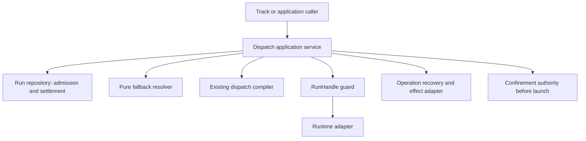

# Review pack: s2-agent-coordination-truth-judgment

Pack commit: f7adbc425808460da17f3b2c5386e1b05bbe6103

Pack id: 107dd8e7a1e321f63a85ed1d7f56df4b66510e8aefb0fa5740444e81b725bd04

Author session: codex-session:1@2026-10-10

## claim_c6e36825576c0b71d92cb6389a41f226

Source: docs/architect/agent-coordination/architecture/dispatch-control-plane.md#flow

Target: docs/platform/agent-coordination/architecture/dispatch-control-plane.md#flow

### Proposed decision

| Field | Value |
|---|---|
| claimId | claim\_c6e36825576c0b71d92cb6389a41f226 |
| sourceUnitDigest | f0fb1bcadf263892e171e8e5a81e940d7c4a2158c070f56f999eade4a309107f |
| targetOwner | docs/platform/agent-coordination/architecture/dispatch-control-plane.md |
| targetAnchor | flow |
| claimKind | architecture |
| disposition | supersede |
| reviewStatus | pending |
| authoredBy | codex-session:1@2026-10-10 |
| rationale | The current successor at docs/platform/agent-coordination/architecture/dispatch-control-plane.md#flow supersedes the stale current-state claim shown at docs/platform/agent-coordination/architecture/dispatch-control-plane.md#flow before 96a13ab21670e1f5d9748c02cd615ea5598b53f5. The original frozen source remains conserved by the accepted carriage and its dated complete historical carrier; this is a truth correction, not a new move or retirement. The section-specific code/CLI evidence is recorded in plans/260925-documentation-authority-unification/reports/phase-06/truth-ledger-agent-coordination.json. This successor is pending independent truth review, with no inherited approval. |
| targetUnitDigest | a31d566e09a26dae7ecafe699a9562fb482e8ee23231126e1457f37ce861e0b2 |
| targetAncestry | \["Dispatch Control Plane"\] |

### Source unit

````text
## Flow

```txt
Assignment
  -> policy resolver
  -> executor/target resolution
  -> governance and egress checks
  -> mechanism/adapter selection
  -> execution capability set
  -> Run creation and launch
  -> settlement/result collection
  -> RunResult normalization
```

`execution capability set` is a declared step, not a derived one. A mechanism
having been selected does not tell the Run what that mechanism can and cannot
do, so an executor declares it: how the prompt reaches the worker, what
permission posture it runs under and what confinement that posture requires,
what counts as a receipt, and whether the mechanism can be observed or
contacted at all. A capability the mechanism does not have is refused by name
rather than silently degraded, and a capability reachable in one execution
mode but not the other has to say so (ADR-010 §3).
````

### Target unit

````text
## Flow

```txt
Assignment
  -> policy resolver
  -> executor/target resolution
  -> governance and egress checks
  -> mechanism/adapter selection
  -> execution capability set
  -> Run creation and launch
  -> settlement/result collection
  -> RunResult normalization
```

Execution requirements are not inferred merely from the mechanism name.
The current implementation expresses prompt delivery, permission posture and
confinement through executor/configuration and adapter checks. A unified
`execution capability set` is a design description, not a separately emitted
plan field or an implemented compiler stage. Unsupported requirements must
not be silently weakened; check the owning adapter and confinement authority.
````

### Unified diff

````diff
--- "docs/architect/agent-coordination/architecture/dispatch-control-plane.md#flow"
+++ "docs/platform/agent-coordination/architecture/dispatch-control-plane.md#flow"
@@ -12,11 +12,9 @@ Assignment
   -> RunResult normalization
 ```
 
-`execution capability set` is a declared step, not a derived one. A mechanism
-having been selected does not tell the Run what that mechanism can and cannot
-do, so an executor declares it: how the prompt reaches the worker, what
-permission posture it runs under and what confinement that posture requires,
-what counts as a receipt, and whether the mechanism can be observed or
-contacted at all. A capability the mechanism does not have is refused by name
-rather than silently degraded, and a capability reachable in one execution
-mode but not the other has to say so (ADR-010 §3).
\ No newline at end of file
+Execution requirements are not inferred merely from the mechanism name.
+The current implementation expresses prompt delivery, permission posture and
+confinement through executor/configuration and adapter checks. A unified
+`execution capability set` is a design description, not a separately emitted
+plan field or an implemented compiler stage. Unsupported requirements must
+not be silently weakened; check the owning adapter and confinement authority.
\ No newline at end of file
````

## claim_ebe7d2366429303cb74938b60f5cf2fb

Source: docs/architect/agent-coordination/architecture/dispatch-control-plane.md#routing-identities

Target: docs/platform/agent-coordination/architecture/dispatch-control-plane.md#routing-identities

### Proposed decision

| Field | Value |
|---|---|
| claimId | claim\_ebe7d2366429303cb74938b60f5cf2fb |
| sourceUnitDigest | abd895bacd7a5e70bd5915ba5a6dfb5843929fc64919d3b0290513a273641029 |
| targetOwner | docs/platform/agent-coordination/architecture/dispatch-control-plane.md |
| targetAnchor | routing-identities |
| claimKind | architecture |
| disposition | supersede |
| reviewStatus | pending |
| authoredBy | codex-session:1@2026-10-10 |
| rationale | The current successor at docs/platform/agent-coordination/architecture/dispatch-control-plane.md#routing-identities supersedes the stale current-state claim shown at docs/platform/agent-coordination/architecture/dispatch-control-plane.md#routing-identities before 96a13ab21670e1f5d9748c02cd615ea5598b53f5. The original frozen source remains conserved by the accepted carriage and its dated complete historical carrier; this is a truth correction, not a new move or retirement. The section-specific code/CLI evidence is recorded in plans/260925-documentation-authority-unification/reports/phase-06/truth-ledger-agent-coordination.json. This successor is pending independent truth review, with no inherited approval. |
| targetUnitDigest | 936384760192ad0bb548e44624257be5730af75c5f99dac34092936a2c7e15a6 |
| targetAncestry | \["Dispatch Control Plane"\] |

### Source unit

````text
## Routing Identities

The dispatch core recognizes exactly two target identities. No other name
resolves a Run target.

```txt
capability   — abstract behavior promise, resolved through
               runner.capabilities.<capability> (prefer/overrides), then
               runner.executors.<id>.for[]
executor-id  — explicit concrete implementation override, naming a
               runner.executors.<id> entry directly
```

`purpose` is not a third identity. It is compatibility terminology for
capability. The `--for <purpose>` CLI flag and the `purpose`/`for` parameter
names threaded through `src/runner/dispatch/plan.mjs` and
`src/runner/dispatch/resolve.mjs` (`resolveExecutorIdForPurpose`,
`resolveExecutorAndOverrides(cfg, executorIdOrPurpose)`) all name a capability
value, resolved against the same `runner.capabilities` catalog an explicit
capability selector would use. `compileDispatchPlan()`'s
`selector.type: 'purpose'` denotes a capability-shaped request, not a separate
ontology; nothing downstream branches on `purpose` as a concept distinct from
capability. Renaming these call sites internally is compatibility work
(tracked as Slice D/E in the normalization plan above), not a semantic
change — `--for`, `--work`, and `--assignment` stay supported at the CLI/API
adapter layer.

`job` is not a routing identity. ADR-004 reserves the term for a possible
future scheduler; where it appears (e.g. in logs), it names a caller's
execution-request label, never a target this control plane resolves against.
A `Run` (see the [Assignment/Run/RunResult Contract](../contracts/assignment-run-runresult.md))
is one concrete execution attempt for an Assignment — it is not a job or
operation identity either.

Work, workflow, stage, operation, taskSpec, skill, and protocol context are
component-outer. A caller in that layer may derive a capability or an
explicit executor-id from them before entering this control plane; none of
them becomes a third resolvable identity inside dispatch core. See
Component-Outer Boundary Note below.
````

### Target unit

````text
## Routing Identities

The dispatch core recognizes exactly two target identities. No other name
resolves a Run target.

```txt
capability   — abstract behavior promise, resolved through
               runner.capabilities.<capability> (prefer/rigor), then
               runner.executors.<id>.for[]
executor-id  — explicit concrete implementation override, naming a
               runner.executors.<id> entry directly
```

`purpose` is not a third identity. It is compatibility terminology for
capability. The `--for <purpose>` CLI flag and the `purpose`/`for` parameter
names threaded through `src/runner/dispatch/plan.mjs` and
`src/runner/dispatch/resolve.mjs` (`resolveExecutorAndOverrides`) name capability
values. `resolveExecutorIdForPurpose` is not a current exported resolver.
`compileDispatchPlan()`'s `selector.type: 'purpose'` is the compatibility
selector label. It does not create a third conceptual route identity.
The [earlier normalization plan](../../../history/dispatch-core-contract-normalization/plan.md)
is dated migration context, not an assertion that its remaining helpers ship.

`job` is not a routing identity. ADR-004 reserves the term for a possible
future scheduler; where it appears (e.g. in logs), it names a caller's
execution-request label, never a target this control plane resolves against.
A `Run` (see the [Assignment/Run/RunResult Contract](../contracts/assignment-run-runresult.md))
is one concrete execution attempt for an Assignment — it is not a job or
operation identity either.

Work, workflow, stage, operation, taskSpec, skill, and protocol context are
component-outer. A caller in that layer may derive a capability or an
explicit executor-id from them before entering this control plane; none of
them becomes a third resolvable identity inside dispatch core. See
Component-Outer Boundary Note below.
````

### Unified diff

````diff
--- "docs/architect/agent-coordination/architecture/dispatch-control-plane.md#routing-identities"
+++ "docs/platform/agent-coordination/architecture/dispatch-control-plane.md#routing-identities"
@@ -5,7 +5,7 @@ resolves a Run target.
 
 ```txt
 capability   — abstract behavior promise, resolved through
-               runner.capabilities.<capability> (prefer/overrides), then
+               runner.capabilities.<capability> (prefer/rigor), then
                runner.executors.<id>.for[]
 executor-id  — explicit concrete implementation override, naming a
                runner.executors.<id> entry directly
@@ -14,16 +14,12 @@ executor-id  — explicit concrete implementation override, naming a
 `purpose` is not a third identity. It is compatibility terminology for
 capability. The `--for <purpose>` CLI flag and the `purpose`/`for` parameter
 names threaded through `src/runner/dispatch/plan.mjs` and
-`src/runner/dispatch/resolve.mjs` (`resolveExecutorIdForPurpose`,
-`resolveExecutorAndOverrides(cfg, executorIdOrPurpose)`) all name a capability
-value, resolved against the same `runner.capabilities` catalog an explicit
-capability selector would use. `compileDispatchPlan()`'s
-`selector.type: 'purpose'` denotes a capability-shaped request, not a separate
-ontology; nothing downstream branches on `purpose` as a concept distinct from
-capability. Renaming these call sites internally is compatibility work
-(tracked as Slice D/E in the normalization plan above), not a semantic
-change — `--for`, `--work`, and `--assignment` stay supported at the CLI/API
-adapter layer.
+`src/runner/dispatch/resolve.mjs` (`resolveExecutorAndOverrides`) name capability
+values. `resolveExecutorIdForPurpose` is not a current exported resolver.
+`compileDispatchPlan()`'s `selector.type: 'purpose'` is the compatibility
+selector label. It does not create a third conceptual route identity.
+The [earlier normalization plan](../../../history/dispatch-core-contract-normalization/plan.md)
+is dated migration context, not an assertion that its remaining helpers ship.
 
 `job` is not a routing identity. ADR-004 reserves the term for a possible
 future scheduler; where it appears (e.g. in logs), it names a caller's
````

## claim_0fc7c6e612423aa78420e2b5ad63f1bf

Source: docs/architect/agent-coordination/architecture/dispatch-control-plane.md#contracts

Target: docs/platform/agent-coordination/architecture/dispatch-control-plane.md#contracts

### Proposed decision

| Field | Value |
|---|---|
| claimId | claim\_0fc7c6e612423aa78420e2b5ad63f1bf |
| sourceUnitDigest | 1db07abb2e64bc19c2559886cc7c51c1ca6f8eead285ac56c19daefac76faa7d |
| targetOwner | docs/platform/agent-coordination/architecture/dispatch-control-plane.md |
| targetAnchor | contracts |
| claimKind | architecture |
| disposition | supersede |
| reviewStatus | pending |
| authoredBy | codex-session:1@2026-10-10 |
| rationale | The current successor at docs/platform/agent-coordination/architecture/dispatch-control-plane.md#contracts supersedes the stale current-state claim shown at docs/platform/agent-coordination/architecture/dispatch-control-plane.md#contracts before 96a13ab21670e1f5d9748c02cd615ea5598b53f5. The original frozen source remains conserved by the accepted carriage and its dated complete historical carrier; this is a truth correction, not a new move or retirement. The section-specific code/CLI evidence is recorded in plans/260925-documentation-authority-unification/reports/phase-06/truth-ledger-agent-coordination.json. This successor is pending independent truth review, with no inherited approval. |
| targetUnitDigest | bbe2a5a5b82a6a3145532c058e0d786e05b3bd13215fdce5b39d9dedf53e6b46 |
| targetAncestry | \["Dispatch Control Plane"\] |

### Source unit

```text
## Contracts

These three contracts are canonical for this control plane. They are
additive over the current implementation, not a replacement of it — see the
Implementation Status line under each for what is real today versus still
Slice D/E scope in the normalization plan.
```

### Target unit

```text
## Contracts

The following shapes describe the intended request/policy/plan boundary.
The status below each distinguishes design fields from the actual exported
function inputs and compiled output; do not send the illustrative JSON as if
all fields were already accepted by a typed normalizer.
```

### Unified diff

```diff
--- "docs/architect/agent-coordination/architecture/dispatch-control-plane.md#contracts"
+++ "docs/platform/agent-coordination/architecture/dispatch-control-plane.md#contracts"
@@ -1,6 +1,6 @@
 ## Contracts
 
-These three contracts are canonical for this control plane. They are
-additive over the current implementation, not a replacement of it — see the
-Implementation Status line under each for what is real today versus still
-Slice D/E scope in the normalization plan.
\ No newline at end of file
+The following shapes describe the intended request/policy/plan boundary.
+The status below each distinguishes design fields from the actual exported
+function inputs and compiled output; do not send the illustrative JSON as if
+all fields were already accepted by a typed normalizer.
\ No newline at end of file
```

## claim_a6751b566cc04089bc1ca55950399080

Source: docs/architect/agent-coordination/architecture/dispatch-control-plane.md#dispatchrequest-outer-core

Target: docs/platform/agent-coordination/architecture/dispatch-control-plane.md#dispatchrequest-outer-core

### Proposed decision

| Field | Value |
|---|---|
| claimId | claim\_a6751b566cc04089bc1ca55950399080 |
| sourceUnitDigest | 8b22819a500c36828f9724bf2eb65ec61799c8e420f866575ac83ab9396fa3b9 |
| targetOwner | docs/platform/agent-coordination/architecture/dispatch-control-plane.md |
| targetAnchor | dispatchrequest-outer-core |
| claimKind | architecture |
| disposition | supersede |
| reviewStatus | pending |
| authoredBy | codex-session:1@2026-10-10 |
| rationale | The current successor at docs/platform/agent-coordination/architecture/dispatch-control-plane.md#dispatchrequest-outer-core supersedes the stale current-state claim shown at docs/platform/agent-coordination/architecture/dispatch-control-plane.md#dispatchrequest-outer-core before 96a13ab21670e1f5d9748c02cd615ea5598b53f5. The original frozen source remains conserved by the accepted carriage and its dated complete historical carrier; this is a truth correction, not a new move or retirement. The section-specific code/CLI evidence is recorded in plans/260925-documentation-authority-unification/reports/phase-06/truth-ledger-agent-coordination.json. This successor is pending independent truth review, with no inherited approval. |
| targetUnitDigest | c9e22dfa3e05e994e43bfa65ca96600406295aa8182af265e948fedce72ff9d3 |
| targetAncestry | \["Dispatch Control Plane","Contracts"\] |

### Source unit

````text
### DispatchRequest (outer → core)

```json
{
  "target": { "kind": "capability | executor", "value": "code:implement" },
  "policy": {
    "minTier": "standard",
    "preferExecutor": "agy-herdr",
    "fallbackExecutors": ["codex-herdr"],
    "preferPersona": "code-reviewer",
    "visibility": "headless"
  },
  "provenance": {
    "source": "workflow-operation",
    "domain": "coding",
    "workflow": "feature",
    "stage": "executing",
    "operation": "implement-item",
    "taskSpec": "implement-item",
    "skill": "fgos-coding-implement"
  }
}
```

Rules:

- `target.kind: capability` resolves through `runner.capabilities` and
  executor `for[]` bindings.
- `target.kind: executor` is an explicit concrete override and remains
  visible as an override — it must not silently discard a requested
  capability's provenance.
- `provenance` is explanatory/audit metadata, not an extra route key.
- Work/workflow/task/skill objects never cross this boundary as semantic
  resolver input; they are read by the component-outer caller only, before
  a DispatchRequest is built.
- An unavailable capability is a valid resolution result (`mechanism:
  "unavailable"`), not malformed config.

**Implementation status.** No single typed `DispatchRequest` object exists
yet. `compileDispatchPlan()`'s options bag
(`executorId | for | work | assignment | stage | needsSoul |
hasLiveTaskAccess | caller | cliOverride | options`) is the de facto request
shape today — untyped, and `work`/`assignment` are resolved to a
capability/executor-id *inside* `plan.mjs` rather than by the caller before
the boundary. Introducing a normalized `DispatchRequest` helper near
`plan.mjs` without changing `compileDispatchPlan`'s role as the sole
execution chooser is Slice D scope.
````

### Target unit

````text
### DispatchRequest (outer → core)

```json
{
  "target": { "kind": "capability | executor", "value": "code:implement" },
  "policy": {
    "rigor": "standard",
    "preferExecutor": "agy-herdr",
    "fallbackExecutors": ["codex-herdr"],
    "preferPersona": "code-reviewer",
    "visibility": "headless"
  },
  "provenance": {
    "source": "workflow-operation",
    "domain": "coding",
    "workflow": "feature",
    "workflowStep": "executing",
    "operation": "implement-item",
    "taskSpec": "implement-item",
    "skill": "fgos-coding-implement"
  }
}
```

Rules:

- `target.kind: capability` resolves through `runner.capabilities` and
  executor `for[]` bindings.
- `target.kind: executor` is an explicit concrete override and remains
  visible as an override — it must not silently discard a requested
  capability's provenance.
- `provenance` is explanatory/audit metadata, not an extra route key.
- Work/workflow/task/skill objects never cross this boundary as semantic
  resolver input; they are read by the component-outer caller only, before
  a DispatchRequest is built.
- An unavailable capability is a valid resolution result (`mechanism:
  "unavailable"`), not malformed config.

**Implementation status.** No single typed `DispatchRequest` object exists
yet. `compileDispatchPlan()`'s options bag
(`executorId | for | work | assignment | needsSoul | hasLiveTaskAccess |
caller | workItem | workExecutorId | assignmentItem | cliOverride | options`)
is the current input shape (`plan.mjs:46-60`). Work compatibility context is
resolved through that path, not through a shipped typed DispatchRequest helper.
The proposed normalized outer request remains an unimplemented design.
````

### Unified diff

```diff
--- "docs/architect/agent-coordination/architecture/dispatch-control-plane.md#dispatchrequest-outer-core"
+++ "docs/platform/agent-coordination/architecture/dispatch-control-plane.md#dispatchrequest-outer-core"
@@ -4,7 +4,7 @@
 {
   "target": { "kind": "capability | executor", "value": "code:implement" },
   "policy": {
-    "minTier": "standard",
+    "rigor": "standard",
     "preferExecutor": "agy-herdr",
     "fallbackExecutors": ["codex-herdr"],
     "preferPersona": "code-reviewer",
@@ -14,7 +14,7 @@
     "source": "workflow-operation",
     "domain": "coding",
     "workflow": "feature",
-    "stage": "executing",
+    "workflowStep": "executing",
     "operation": "implement-item",
     "taskSpec": "implement-item",
     "skill": "fgos-coding-implement"
@@ -38,10 +38,8 @@ Rules:
 
 **Implementation status.** No single typed `DispatchRequest` object exists
 yet. `compileDispatchPlan()`'s options bag
-(`executorId | for | work | assignment | stage | needsSoul |
-hasLiveTaskAccess | caller | cliOverride | options`) is the de facto request
-shape today — untyped, and `work`/`assignment` are resolved to a
-capability/executor-id *inside* `plan.mjs` rather than by the caller before
-the boundary. Introducing a normalized `DispatchRequest` helper near
-`plan.mjs` without changing `compileDispatchPlan`'s role as the sole
-execution chooser is Slice D scope.
\ No newline at end of file
+(`executorId | for | work | assignment | needsSoul | hasLiveTaskAccess |
+caller | workItem | workExecutorId | assignmentItem | cliOverride | options`)
+is the current input shape (`plan.mjs:46-60`). Work compatibility context is
+resolved through that path, not through a shipped typed DispatchRequest helper.
+The proposed normalized outer request remains an unimplemented design.
\ No newline at end of file
```

## claim_9cdae2d424ce5cdd58f20ffd3178ff96

Source: docs/architect/agent-coordination/architecture/dispatch-control-plane.md#dispatchplan-core-runtime

Target: docs/platform/agent-coordination/architecture/dispatch-control-plane.md#dispatchplan-core-runtime

### Proposed decision

| Field | Value |
|---|---|
| claimId | claim\_9cdae2d424ce5cdd58f20ffd3178ff96 |
| sourceUnitDigest | a63062dacf5fb1a383548f84351b45af3d54c71ae03cfd6695b6f6d471a1d573 |
| targetOwner | docs/platform/agent-coordination/architecture/dispatch-control-plane.md |
| targetAnchor | dispatchplan-core-runtime |
| claimKind | architecture |
| disposition | supersede |
| reviewStatus | pending |
| authoredBy | codex-session:1@2026-10-10 |
| rationale | The current successor at docs/platform/agent-coordination/architecture/dispatch-control-plane.md#dispatchplan-core-runtime supersedes the stale current-state claim shown at docs/platform/agent-coordination/architecture/dispatch-control-plane.md#dispatchplan-core-runtime before 96a13ab21670e1f5d9748c02cd615ea5598b53f5. The original frozen source remains conserved by the accepted carriage and its dated complete historical carrier; this is a truth correction, not a new move or retirement. The section-specific code/CLI evidence is recorded in plans/260925-documentation-authority-unification/reports/phase-06/truth-ledger-agent-coordination.json. This successor is pending independent truth review, with no inherited approval. |
| targetUnitDigest | a45ae72abffaf471700451bb238774e045b81bbd3818512a9709af2b54c02567 |
| targetAncestry | \["Dispatch Control Plane","Contracts"\] |

### Source unit

````text
### DispatchPlan (core → runtime)

```json
{
  "requestedTarget": { "kind": "capability", "value": "code:implement" },
  "requestedCapability": "code:implement",
  "selectedExecutor": "agy-herdr",
  "bindingSource": "capability.prefer",
  "providerModel": "gemini",
  "tier": "standard",
  "model": "<resolved-from-policy>",
  "mechanism": "out-of-process",
  "invocation": { "via": "cli", "adapter": "herdr-spawn" },
  "governance": {},
  "provenance": {}
}
```

An explicit executor override remains visible as an override; it must not
silently replace the requested capability's own provenance.

**Implementation status.** Implemented for dispatchable plans.
`compileDispatchPlan()` (`src/runner/dispatch/plan.mjs`) returns the legacy
selector/mechanism fields plus `bindingSource`, `tier`, `model`,
`providerModel`, structured field-level `provenance`, and the complete
merged `policy`. It delegates those policy fields to
`resolveAssignmentDispatchPolicy()` rather than re-deriving them, and
`assignment-runner.mjs` now reads `compiledPlan.policy` directly instead of
calling the policy resolver a second time.

For a real Assignment, policy resolution failure or a
decided-executor-versus-policy-executor mismatch remains a hard
`RunnerConfigError`. For a non-Assignment compatibility request
(`decide --for`, `decide <executor-id>`, `decide --work`), `plan.mjs`
synthesizes the smallest policy object needed for observability:
`preferExecutor` is the already-selected executor, and capability
`overrides.providerModel`/`overrides.model`/`overrides.tier`/
`overrides.rigorOverrides` are folded into the synthesized policy so the
reported model/tier matches the same capability-default path used by
execution. If that synthesized policy would disagree with an explicit caller
override, the plan stays dispatchable and records
`policy.executor-mismatch-ignored`; the optional policy fields are left
unset rather than turning a legacy `decide` probe into a thrown error.

Governance-blocked and genuinely unavailable plans also leave
`tier`/`model`/`providerModel`/`provenance`/`policy` unset so they never
publish a partial policy for a Run that will not launch.

`selector.type: 'purpose'` in the current implementation corresponds to
`requestedTarget.kind: 'capability'` in the target contract above (see
Routing Identities). It is a compatibility label on the public shape, not a
semantic third identity.
````

### Target unit

````text
### DispatchPlan (core → runtime)

```json
{
  "requestedTarget": { "kind": "capability", "value": "code:implement" },
  "requestedCapability": "code:implement",
  "selectedExecutor": "agy-herdr",
  "bindingSource": "capability.prefer",
  "providerModel": "gemini",
  "tier": "standard",
  "model": "<resolved-from-policy>",
  "mechanism": "out-of-process",
  "invocation": { "via": "cli", "adapter": "herdr-spawn" },
  "governance": {},
  "provenance": {}
}
```

An explicit executor override remains visible as an override; it must not
silently replace the requested capability's own provenance.

**Implementation status.** The illustrative `requestedTarget`,
`requestedCapability` and `selectedExecutor` names above are target-state
vocabulary, not current compiled output keys. `compileDispatchPlan()` returns
`selector`, `caller`, `mechanism`, `executorId`, `capability`, `invocation`,
`governance`, `reasonCodes`, optional `agentType`/`mcpTool`, `configured`,
`bindingSource`, `tier`, `model`, `providerModel`, `provenance` and `policy`
(`plan.mjs:444-461`). Policy resolution delegates to
`resolveAssignmentDispatchPolicy`; it is not duplicated by the caller.

For a real Assignment, policy resolution failure or a
decided-executor-versus-policy-executor mismatch remains a hard
`RunnerConfigError`. For a non-Assignment compatibility request
(`decide --for`, `decide <executor-id>`, `decide --work`), `plan.mjs`
synthesizes an Assignment policy with `preferExecutor` and, when configured,
capability `rigor` and `capability` (`plan.mjs:403-411`).
Removed capability `overrides` are rejected by config validation, not folded
into policy. Synthetic policy failures leave policy fields null; an executor
mismatch also records `policy.executor-mismatch-ignored`
(`plan.mjs:422-441`). A real Assignment's corresponding failure remains fatal.

Governance-blocked and genuinely unavailable plans also leave
`tier`/`model`/`providerModel`/`provenance`/`policy` unset so they never
publish a partial policy for a Run that will not launch.

`selector.type: 'purpose'` in the current implementation corresponds to
`requestedTarget.kind: 'capability'` in the target contract above (see
Routing Identities). It is a compatibility label on the public shape, not a
semantic third identity.
````

### Unified diff

```diff
--- "docs/architect/agent-coordination/architecture/dispatch-control-plane.md#dispatchplan-core-runtime"
+++ "docs/platform/agent-coordination/architecture/dispatch-control-plane.md#dispatchplan-core-runtime"
@@ -19,28 +19,25 @@
 An explicit executor override remains visible as an override; it must not
 silently replace the requested capability's own provenance.
 
-**Implementation status.** Implemented for dispatchable plans.
-`compileDispatchPlan()` (`src/runner/dispatch/plan.mjs`) returns the legacy
-selector/mechanism fields plus `bindingSource`, `tier`, `model`,
-`providerModel`, structured field-level `provenance`, and the complete
-merged `policy`. It delegates those policy fields to
-`resolveAssignmentDispatchPolicy()` rather than re-deriving them, and
-`assignment-runner.mjs` now reads `compiledPlan.policy` directly instead of
-calling the policy resolver a second time.
+**Implementation status.** The illustrative `requestedTarget`,
+`requestedCapability` and `selectedExecutor` names above are target-state
+vocabulary, not current compiled output keys. `compileDispatchPlan()` returns
+`selector`, `caller`, `mechanism`, `executorId`, `capability`, `invocation`,
+`governance`, `reasonCodes`, optional `agentType`/`mcpTool`, `configured`,
+`bindingSource`, `tier`, `model`, `providerModel`, `provenance` and `policy`
+(`plan.mjs:444-461`). Policy resolution delegates to
+`resolveAssignmentDispatchPolicy`; it is not duplicated by the caller.
 
 For a real Assignment, policy resolution failure or a
 decided-executor-versus-policy-executor mismatch remains a hard
 `RunnerConfigError`. For a non-Assignment compatibility request
 (`decide --for`, `decide <executor-id>`, `decide --work`), `plan.mjs`
-synthesizes the smallest policy object needed for observability:
-`preferExecutor` is the already-selected executor, and capability
-`overrides.providerModel`/`overrides.model`/`overrides.tier`/
-`overrides.rigorOverrides` are folded into the synthesized policy so the
-reported model/tier matches the same capability-default path used by
-execution. If that synthesized policy would disagree with an explicit caller
-override, the plan stays dispatchable and records
-`policy.executor-mismatch-ignored`; the optional policy fields are left
-unset rather than turning a legacy `decide` probe into a thrown error.
+synthesizes an Assignment policy with `preferExecutor` and, when configured,
+capability `rigor` and `capability` (`plan.mjs:403-411`).
+Removed capability `overrides` are rejected by config validation, not folded
+into policy. Synthetic policy failures leave policy fields null; an executor
+mismatch also records `policy.executor-mismatch-ignored`
+(`plan.mjs:422-441`). A real Assignment's corresponding failure remains fatal.
 
 Governance-blocked and genuinely unavailable plans also leave
 `tier`/`model`/`providerModel`/`provenance`/`policy` unset so they never
```

## claim_7c56791bc2955ef63687b7134d2cd053

Source: docs/architect/agent-coordination/architecture/dispatch-control-plane.md#component-internal-ownership

Target: docs/platform/agent-coordination/architecture/dispatch-control-plane.md#component-internal-ownership

### Proposed decision

| Field | Value |
|---|---|
| claimId | claim\_7c56791bc2955ef63687b7134d2cd053 |
| sourceUnitDigest | e1304a6a126e9f403638d42ccb4476b132e6aa74cdf84bbca3bf92cfb26e1678 |
| targetOwner | docs/platform/agent-coordination/architecture/dispatch-control-plane.md |
| targetAnchor | component-internal-ownership |
| claimKind | architecture |
| disposition | supersede |
| reviewStatus | pending |
| authoredBy | codex-session:1@2026-10-10 |
| rationale | The current successor at docs/platform/agent-coordination/architecture/dispatch-control-plane.md#component-internal-ownership supersedes the stale current-state claim shown at docs/platform/agent-coordination/architecture/dispatch-control-plane.md#component-internal-ownership before 96a13ab21670e1f5d9748c02cd615ea5598b53f5. The original frozen source remains conserved by the accepted carriage and its dated complete historical carrier; this is a truth correction, not a new move or retirement. The section-specific code/CLI evidence is recorded in plans/260925-documentation-authority-unification/reports/phase-06/truth-ledger-agent-coordination.json. This successor is pending independent truth review, with no inherited approval. |
| targetUnitDigest | e751c9d2cb4766bcab9a724d8cda92e802320d8f62e152f84c5c80c90e20b647 |
| targetAncestry | \["Dispatch Control Plane"\] |

### Source unit

```text
## Component-Internal Ownership

The Dispatch And Execution Engine owns exactly these authorities. No other
component performs any of them; this control plane performs none of the
Component-Outer Boundary Note's responsibilities.

1. **Request normalizer** — accepts only a normalized capability/executor
   target plus PolicyPatch/provenance; performs no Work graph traversal.
2. **Capability binding resolver** — resolves capability aliases, `prefer`,
   and executor `for[]` declarations (`resolveExecutorAndOverrides`).
3. **Executor registry resolver** — resolves a literal executor-id to its
   concrete invocation/tool/agent shape (`resolveExecutorConfig`).
4. **Policy resolver** — `resolveAssignmentDispatchPolicy`/
   `mergePolicyStack`; owns provider/model/tier derivation and provenance.
5. **Governance resolver** — checks egress/provider/executor/content
   constraints (cross-provider gate, `allowCrossProvider`, `carries`).
6. **Mechanism resolver** — decides in-process/out-of-process/unavailable
   and MCP/tool handback (`decideDispatchMechanism`,
   `decideExecutorDispatchMechanism`).
7. **DispatchPlan compiler** — `compileDispatchPlan()`; joins the prior
   decisions into one plan. Remains the sole execution chooser.
8. **Run runtime/adapters** — creates, launches, observes, settles, and
   retries a Run without choosing semantic operation
   (`assignment-runner.mjs`, `transport.mjs`, `herdr-round.mjs`).

Forbidden dependencies for all eight:

- no `Work` lifecycle mutation (`pick`, `return`, `claim`, `take`): enforced by boundary grep tests (`test/runner/dispatch-reconciliation-import-graph.test.mjs`). Work driving orchestration lives exclusively in Work Driver (`src/runner/loop.mjs`, `src/runner/fanout-batch.mjs`);
- no event store append (`appendEvent`): audit dispatch logging is isolated to `src/runner/dispatch-log.mjs` outside dispatch core;
- no workflow/stage/task/skill lookup: dispatch core contains no Work lookup implementations. Work capability lookups (`executorIdForWork`, `resolveCapabilityIdentityDetails`, `resolveCapabilityIdentity`, `buildPrompt`) are housed in dedicated leaf compatibility module `src/runner/work-compat.mjs` (registered as `infra` in architecture manifest) with zero imports into dispatch core; `src/runner/dispatch/resolve.mjs` and `prepare.mjs` provide backward-compatible re-exports without importing `workflow-stage-graphs` or `operation-choice.mjs`, consumed by pre-existing callers (`plan.mjs` for `compileDispatchPlan({work})` and `cli.mjs` for `spawnWorker`). All 13 strictly decoupled dispatch core modules contain zero `workflow-stage-graphs` imports, and boundary tests enforce that strict core modules cannot import Work lookup symbols or `work-compat.mjs` (verified by `test/runner/dispatch-reconciliation-import-graph.test.mjs`);
- no semantic operation choice;
- no direct protocol/skill/domain executor launch;
- no RunResult confidence decision (owned by the Run Result Evaluator);
- no provider/model selection outside the policy resolver (item 4);
- no second private dispatch path for a coordination or domain harness —
  `cohort-planner.mjs` is the one confirmed exception, and it only *re-reads*
  `resolveExecutorConfig`/`resolveAssignmentDispatchPolicy` for a
  pre-dispatch feasibility check; it never spawns and never bypasses them.
```

### Target unit

```text
## Component-Internal Ownership

The Dispatch And Execution Engine owns exactly these authorities. No other
component performs any of them; this control plane performs none of the
Component-Outer Boundary Note's responsibilities.

1. **Request normalizer (design)** — the normalized target/policy/provenance
   boundary is proposed; current inputs are the compiler options above.
2. **Capability binding resolver** — resolves capability aliases, `prefer`,
   and executor `for[]` declarations (`resolveExecutorAndOverrides`).
3. **Executor registry resolver** — resolves a literal executor-id to its
   concrete invocation/tool/agent shape (`resolveExecutorConfig`).
4. **Policy resolver** — `resolveAssignmentDispatchPolicy`; owns supported
   provider/model/rigor/tier derivation and provenance, not a `mergePolicyStack`.
5. **Governance resolver** — checks egress/provider/executor/content
   constraints (cross-provider gate, `allowCrossProvider`, `carries`).
6. **Mechanism resolver** — decides in-process/out-of-process/unavailable
   and MCP/tool handback (`decideDispatchMechanism`,
   `decideExecutorDispatchMechanism`).
7. **DispatchPlan compiler** — `compileDispatchPlan()` joins the legacy
   dispatch decisions. Unit execution first obtains its binding through
   `bind()`; assignment-runner revalidates that binding and compiles the
   governed execution plan. The domain harness owns neither choice.
8. **Run runtime/adapters** — creates, launches, observes, settles, and
   retries a Run without choosing semantic operation
   (`assignment-runner.mjs`, `transport.mjs`, `herdr-round.mjs`).

Forbidden dependencies for all eight:

- no `Work` lifecycle mutation (`pick`, `return`, `claim`, `take`): enforced by boundary grep tests (`test/runner/dispatch-reconciliation-import-graph.test.mjs`). Work driving orchestration lives exclusively in Work Driver (`src/runner/loop.mjs`, `src/runner/fanout-batch.mjs`);
- no event store append (`appendEvent`): audit dispatch logging is isolated to `src/runner/dispatch-log.mjs` outside dispatch core;
- no semantic Workflow/domain operation lookup in the strictly decoupled dispatch core. Work-layer lookups belong to `src/runner/work-compat.mjs` and `src/runner/operation-choice.mjs`; caller-derived hints enter the compiler. Historical compatibility re-exports and an `infra` manifest label are not current ownership proof. See boundary tests at `test/runner/dispatch-reconciliation-import-graph.test.mjs:434-443`.
- no semantic operation choice;
- no direct protocol/skill/domain executor launch;
- no RunResult confidence decision (owned by the Run Result Evaluator);
- no provider/model selection outside the policy resolver (item 4);
- no second private executor-launch path for a domain or coordinating harness.
  The retired `cohort-planner.mjs` is not a current exception or authority.
```

### Unified diff

```diff
--- "docs/architect/agent-coordination/architecture/dispatch-control-plane.md#component-internal-ownership"
+++ "docs/platform/agent-coordination/architecture/dispatch-control-plane.md#component-internal-ownership"
@@ -4,21 +4,23 @@ The Dispatch And Execution Engine owns exactly these authorities. No other
 component performs any of them; this control plane performs none of the
 Component-Outer Boundary Note's responsibilities.
 
-1. **Request normalizer** — accepts only a normalized capability/executor
-   target plus PolicyPatch/provenance; performs no Work graph traversal.
+1. **Request normalizer (design)** — the normalized target/policy/provenance
+   boundary is proposed; current inputs are the compiler options above.
 2. **Capability binding resolver** — resolves capability aliases, `prefer`,
    and executor `for[]` declarations (`resolveExecutorAndOverrides`).
 3. **Executor registry resolver** — resolves a literal executor-id to its
    concrete invocation/tool/agent shape (`resolveExecutorConfig`).
-4. **Policy resolver** — `resolveAssignmentDispatchPolicy`/
-   `mergePolicyStack`; owns provider/model/tier derivation and provenance.
+4. **Policy resolver** — `resolveAssignmentDispatchPolicy`; owns supported
+   provider/model/rigor/tier derivation and provenance, not a `mergePolicyStack`.
 5. **Governance resolver** — checks egress/provider/executor/content
    constraints (cross-provider gate, `allowCrossProvider`, `carries`).
 6. **Mechanism resolver** — decides in-process/out-of-process/unavailable
    and MCP/tool handback (`decideDispatchMechanism`,
    `decideExecutorDispatchMechanism`).
-7. **DispatchPlan compiler** — `compileDispatchPlan()`; joins the prior
-   decisions into one plan. Remains the sole execution chooser.
+7. **DispatchPlan compiler** — `compileDispatchPlan()` joins the legacy
+   dispatch decisions. Unit execution first obtains its binding through
+   `bind()`; assignment-runner revalidates that binding and compiles the
+   governed execution plan. The domain harness owns neither choice.
 8. **Run runtime/adapters** — creates, launches, observes, settles, and
    retries a Run without choosing semantic operation
    (`assignment-runner.mjs`, `transport.mjs`, `herdr-round.mjs`).
@@ -27,12 +29,10 @@ Forbidden dependencies for all eight:
 
 - no `Work` lifecycle mutation (`pick`, `return`, `claim`, `take`): enforced by boundary grep tests (`test/runner/dispatch-reconciliation-import-graph.test.mjs`). Work driving orchestration lives exclusively in Work Driver (`src/runner/loop.mjs`, `src/runner/fanout-batch.mjs`);
 - no event store append (`appendEvent`): audit dispatch logging is isolated to `src/runner/dispatch-log.mjs` outside dispatch core;
-- no workflow/stage/task/skill lookup: dispatch core contains no Work lookup implementations. Work capability lookups (`executorIdForWork`, `resolveCapabilityIdentityDetails`, `resolveCapabilityIdentity`, `buildPrompt`) are housed in dedicated leaf compatibility module `src/runner/work-compat.mjs` (registered as `infra` in architecture manifest) with zero imports into dispatch core; `src/runner/dispatch/resolve.mjs` and `prepare.mjs` provide backward-compatible re-exports without importing `workflow-stage-graphs` or `operation-choice.mjs`, consumed by pre-existing callers (`plan.mjs` for `compileDispatchPlan({work})` and `cli.mjs` for `spawnWorker`). All 13 strictly decoupled dispatch core modules contain zero `workflow-stage-graphs` imports, and boundary tests enforce that strict core modules cannot import Work lookup symbols or `work-compat.mjs` (verified by `test/runner/dispatch-reconciliation-import-graph.test.mjs`);
+- no semantic Workflow/domain operation lookup in the strictly decoupled dispatch core. Work-layer lookups belong to `src/runner/work-compat.mjs` and `src/runner/operation-choice.mjs`; caller-derived hints enter the compiler. Historical compatibility re-exports and an `infra` manifest label are not current ownership proof. See boundary tests at `test/runner/dispatch-reconciliation-import-graph.test.mjs:434-443`.
 - no semantic operation choice;
 - no direct protocol/skill/domain executor launch;
 - no RunResult confidence decision (owned by the Run Result Evaluator);
 - no provider/model selection outside the policy resolver (item 4);
-- no second private dispatch path for a coordination or domain harness —
-  `cohort-planner.mjs` is the one confirmed exception, and it only *re-reads*
-  `resolveExecutorConfig`/`resolveAssignmentDispatchPolicy` for a
-  pre-dispatch feasibility check; it never spawns and never bypasses them.
\ No newline at end of file
+- no second private executor-launch path for a domain or coordinating harness.
+  The retired `cohort-planner.mjs` is not a current exception or authority.
\ No newline at end of file
```

## claim_8ed451a179a884fe1b475149f75e2b26

Source: docs/architect/agent-coordination/architecture/evidence-and-results.md#visibility-boundary

Target: docs/platform/agent-coordination/architecture/evidence-and-results.md#visibility-boundary

### Proposed decision

| Field | Value |
|---|---|
| claimId | claim\_8ed451a179a884fe1b475149f75e2b26 |
| sourceUnitDigest | 2fbeace628e58f207348145412b01cebebcd5fd24a974581946d971ffe8ba2a2 |
| targetOwner | docs/platform/agent-coordination/architecture/evidence-and-results.md |
| targetAnchor | visibility-boundary |
| claimKind | architecture |
| disposition | supersede |
| reviewStatus | pending |
| authoredBy | codex-session:1@2026-10-10 |
| rationale | The current successor at docs/platform/agent-coordination/architecture/evidence-and-results.md#visibility-boundary supersedes the stale current-state claim shown at docs/platform/agent-coordination/architecture/evidence-and-results.md#visibility-boundary before 96a13ab21670e1f5d9748c02cd615ea5598b53f5. The original frozen source remains conserved by the accepted carriage and its dated complete historical carrier; this is a truth correction, not a new move or retirement. The section-specific code/CLI evidence is recorded in plans/260925-documentation-authority-unification/reports/phase-06/truth-ledger-agent-coordination.json. This successor is pending independent truth review, with no inherited approval. |
| targetUnitDigest | c7dff479ac1b297b022bc2fcd1c37761cc94f963b5cdc92062426083ae229e81 |
| targetAncestry | \["Evidence And Result Architecture"\] |

### Source unit

```text
## Visibility Boundary

Herdr pane state, terminal text, quietness, and process appearance are useful
diagnostics only. They cannot replace structured runtime and evidence records.
```

### Target unit

```text
## Visibility Boundary

Herdr pane state, terminal text, quietness, and process appearance are useful
diagnostics only. They cannot replace structured runtime and evidence records.

Read the [area portal](../README.md) and [runner spec](../../../specs/runner.md)
for the consuming execution and delivery boundaries.
```

### Unified diff

```diff
--- "docs/architect/agent-coordination/architecture/evidence-and-results.md#visibility-boundary"
+++ "docs/platform/agent-coordination/architecture/evidence-and-results.md#visibility-boundary"
@@ -1,4 +1,7 @@
 ## Visibility Boundary
 
 Herdr pane state, terminal text, quietness, and process appearance are useful
-diagnostics only. They cannot replace structured runtime and evidence records.
\ No newline at end of file
+diagnostics only. They cannot replace structured runtime and evidence records.
+
+Read the [area portal](../README.md) and [runner spec](../../../specs/runner.md)
+for the consuming execution and delivery boundaries.
\ No newline at end of file
```

## claim_8b943b334db8f6fefa9f10ad2d936d4f

Source: docs/architect/agent-coordination/architecture/executor-health-and-fallback.md#1-responsibility-and-inputs

Target: docs/platform/agent-coordination/architecture/executor-health-and-fallback.md#1-responsibility-and-inputs

### Proposed decision

| Field | Value |
|---|---|
| claimId | claim\_8b943b334db8f6fefa9f10ad2d936d4f |
| sourceUnitDigest | 583bd631a1d233c2e52bf4e8c7b256f75abc8054524fd3887109b54f35cd574d |
| targetOwner | docs/platform/agent-coordination/architecture/executor-health-and-fallback.md |
| targetAnchor | 1-responsibility-and-inputs |
| claimKind | architecture |
| disposition | supersede |
| reviewStatus | pending |
| authoredBy | codex-session:1@2026-10-10 |
| rationale | The current successor at docs/platform/agent-coordination/architecture/executor-health-and-fallback.md#1-responsibility-and-inputs supersedes the stale current-state claim shown at docs/platform/agent-coordination/architecture/executor-health-and-fallback.md#1-responsibility-and-inputs before 96a13ab21670e1f5d9748c02cd615ea5598b53f5. The original frozen source remains conserved by the accepted carriage and its dated complete historical carrier; this is a truth correction, not a new move or retirement. The section-specific code/CLI evidence is recorded in plans/260925-documentation-authority-unification/reports/phase-06/truth-ledger-agent-coordination.json. This successor is pending independent truth review, with no inherited approval. |
| targetUnitDigest | f97c6b9e2271690437b10e8b0557b6c0afc97b598e3dcf1e527f30d8e4129ac0 |
| targetAncestry | \["Executor Fallback And Effect Eligibility"\] |

### Source unit

```text
## 1. Responsibility And Inputs

| Stage | Owner | Output |
|---|---|---|
| Worker result interpretation | Existing normalizer/evaluator | Per-Run result; not an executor-health judgment. |
| Liveness classification | Existing signal ladder | Nonterminal or settled/blocked/died/ceiling/paused-limit/idle outcome. |
| Effect and workspace retry eligibility | Operation recovery adapter plus runtime facts | Eligible/reconcile/forbidden verdict. |
| Retry/park/halt and bounds | Existing recovery matrix, extended with an explicit runtime projection | Coarse decision and cap reasons. |
| Candidate ordering | Pure fallback resolver | Ordered selection/rejections. |
| Governance | Existing compileDispatchPlan and Confinement Authority | Governed plan, then runtime enforcement before launch. |
| Admission | Run repository | One durable current attempt under authority. |

The application service composes these stages. Fallback receives values, never
calls herdr, traverses session graphs, moves Work or normalizes evidence.

FailureObservationV1:
`{contract: executor-failure-observation.v1, observationId,
assignmentId, runId, attempt, executorId, capability,
resourceScope, outcome, evidenceRefs, observedAt}`.
ResourceScope is optional provider/account/model identifiers without credentials.
Outcome is a discriminated union:
- infra-ok;
- ladder with `outcome` nullable while nonterminal, delivery, outputBytes,
  rawLimitLineRef?, retryAfter?;
- launch-failed with phase and creation/delivery certainty;
- config-invalid with typed code;
- confinement-refused with attestation/refusal ref.
Success/config/launch outcomes do not require fabricated ladder values.
```

### Target unit

```text
## 1. Responsibility And Inputs

| Stage | Owner | Output |
|---|---|---|
| Worker result interpretation | Existing normalizer/evaluator | Per-Run result; not an executor-health judgment. |
| Liveness classification | Existing signal ladder | Nonterminal or settled/blocked/died/timed-out-ceiling/provider-limit/timed-out-idle; `paused-limit` is a compatibility pane-fate alias, not evaluateLadder's emitted limit outcome. |
| Effect and workspace retry eligibility | Operation recovery adapter plus runtime facts | Eligible/reconcile/forbidden verdict. |
| Retry/park/halt and bounds | Existing recovery matrix, extended with an explicit runtime projection | Coarse decision and cap reasons. |
| Candidate ordering | Pure fallback resolver | Ordered selection/rejections. |
| Governance | Existing compileDispatchPlan and Confinement Authority | Governed plan, then runtime enforcement before launch. |
| Admission | Run repository | One durable current attempt under authority. |

The application service composes these stages. Fallback receives values, never
calls herdr, traverses session graphs, moves Work or normalizes evidence.

FailureObservationV1:
`{contract: executor-failure-observation.v1, observationId,
assignmentId, runId, attempt, executorId, capability,
resourceScope, outcome, evidenceRefs, observedAt}`.
ResourceScope is optional provider/account/model identifiers without credentials.
Outcome is a discriminated union:
- infra-ok;
- ladder with `outcome` nullable while nonterminal, delivery, outputBytes,
  rawLimitLineRef?, retryAfter?;
- launch-failed with phase and creation/delivery certainty;
- config-invalid with typed code;
- confinement-refused with attestation/refusal ref.
Success/config/launch outcomes do not require fabricated ladder values.
```

### Unified diff

```diff
--- "docs/architect/agent-coordination/architecture/executor-health-and-fallback.md#1-responsibility-and-inputs"
+++ "docs/platform/agent-coordination/architecture/executor-health-and-fallback.md#1-responsibility-and-inputs"
@@ -3,7 +3,7 @@
 | Stage | Owner | Output |
 |---|---|---|
 | Worker result interpretation | Existing normalizer/evaluator | Per-Run result; not an executor-health judgment. |
-| Liveness classification | Existing signal ladder | Nonterminal or settled/blocked/died/ceiling/paused-limit/idle outcome. |
+| Liveness classification | Existing signal ladder | Nonterminal or settled/blocked/died/timed-out-ceiling/provider-limit/timed-out-idle; `paused-limit` is a compatibility pane-fate alias, not evaluateLadder's emitted limit outcome. |
 | Effect and workspace retry eligibility | Operation recovery adapter plus runtime facts | Eligible/reconcile/forbidden verdict. |
 | Retry/park/halt and bounds | Existing recovery matrix, extended with an explicit runtime projection | Coarse decision and cap reasons. |
 | Candidate ordering | Pure fallback resolver | Ordered selection/rejections. |
```

## claim_901dae1b8039d130359712125f4d69f9

Source: docs/architect/agent-coordination/architecture/executor-health-and-fallback.md#2-production-ladder-semantics

Target: docs/platform/agent-coordination/architecture/executor-health-and-fallback.md#2-production-ladder-semantics

### Proposed decision

| Field | Value |
|---|---|
| claimId | claim\_901dae1b8039d130359712125f4d69f9 |
| sourceUnitDigest | dbaf1434220173d1544ccc02f9daa13ca9f87453ace7ad899ef0b8167d758b97 |
| targetOwner | docs/platform/agent-coordination/architecture/executor-health-and-fallback.md |
| targetAnchor | 2-production-ladder-semantics |
| claimKind | architecture |
| disposition | supersede |
| reviewStatus | pending |
| authoredBy | codex-session:1@2026-10-10 |
| rationale | The current successor at docs/platform/agent-coordination/architecture/executor-health-and-fallback.md#2-production-ladder-semantics supersedes the stale current-state claim shown at docs/platform/agent-coordination/architecture/executor-health-and-fallback.md#2-production-ladder-semantics before 96a13ab21670e1f5d9748c02cd615ea5598b53f5. The original frozen source remains conserved by the accepted carriage and its dated complete historical carrier; this is a truth correction, not a new move or retirement. The section-specific code/CLI evidence is recorded in plans/260925-documentation-authority-unification/reports/phase-06/truth-ledger-agent-coordination.json. This successor is pending independent truth review, with no inherited approval. |
| targetUnitDigest | 13a34e347ffeaf306e0481a1779cf9ac7a1e951838181f264f4711bf3a011fbf |
| targetAncestry | \["Executor Fallback And Effect Eligibility"\] |

### Source unit

```text
## 2. Production Ladder Semantics

The order and behavior in `src/runner/dispatch/liveness.mjs` are ported:
1. Worker result file beats all runtime readings; it still requires normalization.
2. Blocked beats timeout: answer the existing question, do not retry.
3. Death requires consecutive absent readings (default 3); unknown/present reset.
4. Absolute ceiling follows truth/blocked/death and is not reduced by blind time.
5. Only stale evaluation reads screen; working itself is progress even with zero
   stdout, and blind intervals are subtracted from idle duration.

A screen request is a second stage of the same sample, not another death reading.
Keep all failure panes by default. Paused-limit survives automated closeAlways;
operator destructive intent is separate and guarded. Never infer Run completion
from agent_status or pane idleness.

Zero output is a fact orthogonal to outcome. A 35-minute zero-output incident can
be timed-out-ceiling, as dogfood P08 records; it is not renamed timed-out-idle.
Handshake timeout with unknown delivery is not proof of launch failure.
The ladder supplies the matching screen line, not a parsed retryAfter timestamp.
An adapter may parse a known provider reset format, preserving the original line;
otherwise retryAfter is absent. RetryAfter only schedules inspection.
```

### Target unit

```text
## 2. Production Ladder Semantics

The order and behavior in `src/runner/dispatch/liveness.mjs` are ported:
1. Worker result file beats all runtime readings; it still requires normalization.
2. Blocked beats timeout: answer the existing question, do not retry.
3. Death requires consecutive absent readings (default 3); unknown/present reset.
4. Absolute ceiling follows truth/blocked/death and is not reduced by blind time.
5. Idle/stale evaluation subtracts blind time; working is progress even with
   zero stdout. Screen reads are requested at the stale boundary, and an early
   credential probe also runs after fifteen seconds of non-working idle time
   (`liveness.mjs:267-299`). Thus screen reads are not stale-only.

A requested screen is the second stage of the sample, not another death read.
`evaluateLadder` emits `provider-limit` for credential/quota screen matches.
Its pane fate is `keep-always`; `paused-limit` remains a recognized alias.
Operator destructive intent is separate and guarded. Pane idleness does not
prove Run completion.

Zero output is a fact orthogonal to outcome. A 35-minute zero-output incident can
be timed-out-ceiling, as dogfood P08 records; it is not renamed timed-out-idle.
Handshake timeout with unknown delivery is not proof of launch failure.
The ladder supplies the matching screen line, not a parsed retryAfter timestamp.
An adapter may parse a known provider reset format, preserving the original line;
otherwise retryAfter is absent. RetryAfter only schedules inspection.
```

### Unified diff

```diff
--- "docs/architect/agent-coordination/architecture/executor-health-and-fallback.md#2-production-ladder-semantics"
+++ "docs/platform/agent-coordination/architecture/executor-health-and-fallback.md#2-production-ladder-semantics"
@@ -5,13 +5,16 @@ The order and behavior in `src/runner/dispatch/liveness.mjs` are ported:
 2. Blocked beats timeout: answer the existing question, do not retry.
 3. Death requires consecutive absent readings (default 3); unknown/present reset.
 4. Absolute ceiling follows truth/blocked/death and is not reduced by blind time.
-5. Only stale evaluation reads screen; working itself is progress even with zero
-   stdout, and blind intervals are subtracted from idle duration.
+5. Idle/stale evaluation subtracts blind time; working is progress even with
+   zero stdout. Screen reads are requested at the stale boundary, and an early
+   credential probe also runs after fifteen seconds of non-working idle time
+   (`liveness.mjs:267-299`). Thus screen reads are not stale-only.
 
-A screen request is a second stage of the same sample, not another death reading.
-Keep all failure panes by default. Paused-limit survives automated closeAlways;
-operator destructive intent is separate and guarded. Never infer Run completion
-from agent_status or pane idleness.
+A requested screen is the second stage of the sample, not another death read.
+`evaluateLadder` emits `provider-limit` for credential/quota screen matches.
+Its pane fate is `keep-always`; `paused-limit` remains a recognized alias.
+Operator destructive intent is separate and guarded. Pane idleness does not
+prove Run completion.
 
 Zero output is a fact orthogonal to outcome. A 35-minute zero-output incident can
 be timed-out-ceiling, as dogfood P08 records; it is not renamed timed-out-idle.
```

## claim_5a75f48c0b4d226df6e8ae2dad84c43f

Source: docs/architect/agent-coordination/architecture/executor-health-and-fallback.md#3-coarse-matrix-mapping

Target: docs/platform/agent-coordination/architecture/executor-health-and-fallback.md#3-coarse-matrix-mapping

### Proposed decision

| Field | Value |
|---|---|
| claimId | claim\_5a75f48c0b4d226df6e8ae2dad84c43f |
| sourceUnitDigest | 8252eff8a9dcd8ffb252ae6aa6e8651dd50e334bb5c3a8935064430abbab643a |
| targetOwner | docs/platform/agent-coordination/architecture/executor-health-and-fallback.md |
| targetAnchor | 3-coarse-matrix-mapping |
| claimKind | architecture |
| disposition | supersede |
| reviewStatus | pending |
| authoredBy | codex-session:1@2026-10-10 |
| rationale | The current successor at docs/platform/agent-coordination/architecture/executor-health-and-fallback.md#3-coarse-matrix-mapping supersedes the stale current-state claim shown at docs/platform/agent-coordination/architecture/executor-health-and-fallback.md#3-coarse-matrix-mapping before 96a13ab21670e1f5d9748c02cd615ea5598b53f5. The original frozen source remains conserved by the accepted carriage and its dated complete historical carrier; this is a truth correction, not a new move or retirement. The section-specific code/CLI evidence is recorded in plans/260925-documentation-authority-unification/reports/phase-06/truth-ledger-agent-coordination.json. This successor is pending independent truth review, with no inherited approval. |
| targetUnitDigest | 4f10d6082daebad81a53b4f06c9d44fa3187f4d894791d39783017ff77e5fcbf |
| targetAncestry | \["Executor Fallback And Effect Eligibility"\] |

### Source unit

```text
## 3. Coarse Matrix Mapping

Extend the existing recovery module's runtime-facing pure entry rather than
creating a parallel matrix. Preserve `resolveAction(errorClass, claimAttempt)`
for its current Work-runner callers and `resolveStaleDoing` semantics.

| Observation | Existing class / composed action |
|---|---|
| Creation failure proven before delivery | worker-spawn-fail; retry eligibility and bounds still required. |
| timed-out-idle or timed-out-ceiling | worker-timeout; never proof the worker is dead. |
| died without result | worker-spawn-fail for coarse retry class, with original died outcome retained; effect/quiescence gate remains mandatory. |
| paused-limit / blocked | **Proposed behavior change:** park current Run, before retry matrix. Existing callers currently classify these through the retry matrix; S0 must freeze that behavior and this mapping cannot ship as a silent port. |
| Nonterminal/present worker | wait; no failure classification or candidate selection. |
| Unknown delivery or effects | reconcile then park if unresolved. |
| Config-invalid / confinement-refused | refuse current dispatch; do not try another candidate to bypass policy. |
| Semantic RunResult rejection | No infrastructure fallback; caller decides a new semantic operation/recheck if authorized. |
| Unmapped internal error class | Preserve recovery matrix halt, scope reported to caller. |
| dispatch-in-flight | Admission contention, not health; wait/re-read without consuming a Run attempt. |

`verify-miss`, `verify-timeout`, `worktree-fail`, `reject-returned`,
`stale-doing` and `state-conflict` keep their Work-runner meaning. Do not route
them into executor fallback simply because some coarse entries say retry.
For timed-out-ceiling, original session/Run bounds remain binding; an expired
session cannot dispatch a fallback. An eligible retry under still-valid session
authority gets its own bounded Run; it does not extend the old Run ceiling.
```

### Target unit

```text
## 3. Coarse Matrix Mapping

Extend the existing recovery module's runtime-facing pure entry rather than
creating a parallel matrix. Preserve `resolveAction(errorClass, claimAttempt)`
for its current Work-runner callers and `resolveStaleDoing` semantics.

| Observation | Existing class / composed action |
|---|---|
| Creation failure proven before delivery | worker-spawn-fail; retry eligibility and bounds still required. |
| timed-out-idle or timed-out-ceiling | worker-timeout; never proof the worker is dead. |
| died without result | worker-spawn-fail for coarse retry class, with original died outcome retained; effect/quiescence gate remains mandatory. |
| paused-limit / blocked | **Proposed behavior change:** park current Run, before retry matrix. Existing callers currently classify these through the retry matrix; S0 must freeze that behavior and this mapping cannot ship as a silent port. |
| Nonterminal/present worker | wait; no failure classification or candidate selection. |
| Unknown delivery or effects | reconcile then park if unresolved. |
| Config-invalid / confinement-refused | refuse current dispatch; do not try another candidate to bypass policy. |
| Semantic RunResult rejection | No infrastructure fallback; caller decides a new semantic operation/recheck if authorized. |
| Unmapped internal error class | Preserve recovery matrix halt, scope reported to caller. |
| dispatch-in-flight | Admission contention, not health; wait/re-read without consuming a Run attempt. |

`verify-miss`, `verify-timeout`, `worktree-fail`, `reject-returned`,
`stale-doing` and `state-conflict` keep their Work-runner meaning. Do not route
them into executor fallback simply because some coarse entries say retry.
For timed-out-ceiling, the Run's applicable admission/budget bounds remain
binding. Retry does not extend the failed Run's ceiling; a replacement needs
its own eligible admission. No current session graph grants fallback authority.
```

### Unified diff

```diff
--- "docs/architect/agent-coordination/architecture/executor-health-and-fallback.md#3-coarse-matrix-mapping"
+++ "docs/platform/agent-coordination/architecture/executor-health-and-fallback.md#3-coarse-matrix-mapping"
@@ -20,6 +20,6 @@ for its current Work-runner callers and `resolveStaleDoing` semantics.
 `verify-miss`, `verify-timeout`, `worktree-fail`, `reject-returned`,
 `stale-doing` and `state-conflict` keep their Work-runner meaning. Do not route
 them into executor fallback simply because some coarse entries say retry.
-For timed-out-ceiling, original session/Run bounds remain binding; an expired
-session cannot dispatch a fallback. An eligible retry under still-valid session
-authority gets its own bounded Run; it does not extend the old Run ceiling.
\ No newline at end of file
+For timed-out-ceiling, the Run's applicable admission/budget bounds remain
+binding. Retry does not extend the failed Run's ceiling; a replacement needs
+its own eligible admission. No current session graph grants fallback authority.
\ No newline at end of file
```

## claim_82896bdf7046a71c20f01cf9f9cca226

Source: docs/architect/agent-coordination/architecture/executor-health-and-fallback.md#5-effectguaranteeport

Target: docs/platform/agent-coordination/architecture/executor-health-and-fallback.md#5-effectguaranteeport

### Proposed decision

| Field | Value |
|---|---|
| claimId | claim\_82896bdf7046a71c20f01cf9f9cca226 |
| sourceUnitDigest | 78463f312d40cdd4e084be386e5490f45e483c7cf982721776a24ae28402186b |
| targetOwner | docs/platform/agent-coordination/architecture/executor-health-and-fallback.md |
| targetAnchor | 5-effectguaranteeport |
| claimKind | architecture |
| disposition | supersede |
| reviewStatus | pending |
| authoredBy | codex-session:1@2026-10-10 |
| rationale | The current successor at docs/platform/agent-coordination/architecture/executor-health-and-fallback.md#5-effectguaranteeport supersedes the stale current-state claim shown at docs/platform/agent-coordination/architecture/executor-health-and-fallback.md#5-effectguaranteeport before 96a13ab21670e1f5d9748c02cd615ea5598b53f5. The original frozen source remains conserved by the accepted carriage and its dated complete historical carrier; this is a truth correction, not a new move or retirement. The section-specific code/CLI evidence is recorded in plans/260925-documentation-authority-unification/reports/phase-06/truth-ledger-agent-coordination.json. This successor is pending independent truth review, with no inherited approval. |
| targetUnitDigest | b1d381bbc887443b7cf100e3487266740edf4f45898aec8b14065bfa410ef8b5 |
| targetAncestry | \["Executor Fallback And Effect Eligibility"\] |

### Source unit

```text
## 5. EffectGuaranteePort

`assess({operationContractRef, assignmentRef, sourceRunId,
recoveryMaterialRef, destinationExecutorFacts, now})` returns a typed verdict:
- eligible with guarantee;
- reconcile with required fact refs/reason;
- forbidden with reason.

The operation contract declares repeat mode explicitly: before-delivery-only,
read-only, idempotent, dedup-keyed or never. The first protocol profile declares
`repeatMode: read-only` in its review/red-team YAML operation contracts. The
read-only effect boundary is derived from the selected executor's DispatchPlan
(`providerModel` and executor facts): provider endpoints may be allowed, while
unlisted external sinks are denied. Operations declare only sinks whose repeated
write is part of their contract; a sink that can change outcome needs its own
dedup identity. The runtime never infers this from `Assignment.mutation`.
Missing/unknown mode cannot authorize automatic
retry after possible delivery. The adapter verifies facts appropriate to that
mode, rather than demanding every idempotent operation have a dedup service.

| Guarantee | Required evidence |
|---|---|
| no-delivery | Proof original launch/input was never delivered and no pending command can later deliver it. |
| read-only | Actual permitted effect scope; writable output artifacts isolated per Run and no unaccounted external mutation. |
| idempotent | Operation contract version, same logical input/effect identity, and evidence that repetition satisfies its operation-specific invariant. |
| deduplicated | Stable effect key, input digest, effect-boundary namespace, verified dedup capability, validity window and destination compatibility. |

All eligible outcomes carry source Run, operation contract digest, input/effect
identity, evidence refs and assessedAt; window end is explicit when relevant.
The effect identity stays stable across attempts, unlike runId. Destination
selection revalidates that the same guarantee holds for that candidate.
`Assignment.mutation` remains descriptive and is not an effect guarantee.
`effectsObserved: false` is not proof of no effects; boolean labels cannot replace
typed unknown/reconcile outcomes. A generic effect ledger is not required.

For writable takeover, eligibility additionally requires proof all old writers
are stopped or deprived of access, and a held exclusive workspace grant. A dead
main PID or a closed pane is insufficient for surviving descendants. New isolated
workspaces can retain read-only snapshots of prior work, but cannot bypass
unknown external effects. Material and grants are passed through the existing
confinement/runtime boundary, not written into immutable Assignment semantics.
```

### Target unit

```text
## 5. EffectGuaranteePort

`assess({operationContractRef, assignmentRef, sourceRunId,
recoveryMaterialRef, destinationExecutorFacts, now})` returns a typed verdict:
- eligible with guarantee;
- reconcile with required fact refs/reason;
- forbidden with reason.

An operation's repeat mode must be explicit; it is not inferred from
`Assignment.mutation`. Supported current policy values are checked by
`assignment-policy.mjs:439-453`, and recovery assessment refuses to infer mode
(`src/runner/dispatch/recovery.mjs:201-206`). No current review/red-team YAML
profile is claimed here to declare `repeatMode: read-only`.

The following effect-sink, deduplication and guarantee model belongs to the
proposed EffectGuaranteePort, not a shipped generic effect ledger. Operations
would need their own effect identity and adapter proof before enabling it.
Missing/unknown mode cannot authorize automatic
retry after possible delivery. The adapter verifies facts appropriate to that
mode, rather than demanding every idempotent operation have a dedup service.

| Guarantee | Required evidence |
|---|---|
| no-delivery | Proof original launch/input was never delivered and no pending command can later deliver it. |
| read-only | Actual permitted effect scope; writable output artifacts isolated per Run and no unaccounted external mutation. |
| idempotent | Operation contract version, same logical input/effect identity, and evidence that repetition satisfies its operation-specific invariant. |
| deduplicated | Stable effect key, input digest, effect-boundary namespace, verified dedup capability, validity window and destination compatibility. |

All eligible outcomes carry source Run, operation contract digest, input/effect
identity, evidence refs and assessedAt; window end is explicit when relevant.
The effect identity stays stable across attempts, unlike runId. Destination
selection revalidates that the same guarantee holds for that candidate.
`Assignment.mutation` remains descriptive and is not an effect guarantee.
`effectsObserved: false` is not proof of no effects; boolean labels cannot replace
typed unknown/reconcile outcomes. A generic effect ledger is not required.

For writable takeover, eligibility additionally requires proof all old writers
are stopped or deprived of access, and a held exclusive workspace grant. A dead
main PID or a closed pane is insufficient for surviving descendants. New isolated
workspaces can retain read-only snapshots of prior work, but cannot bypass
unknown external effects. Material and grants are passed through the existing
confinement/runtime boundary, not written into immutable Assignment semantics.
```

### Unified diff

```diff
--- "docs/architect/agent-coordination/architecture/executor-health-and-fallback.md#5-effectguaranteeport"
+++ "docs/platform/agent-coordination/architecture/executor-health-and-fallback.md#5-effectguaranteeport"
@@ -6,14 +6,15 @@ recoveryMaterialRef, destinationExecutorFacts, now})` returns a typed verdict:
 - reconcile with required fact refs/reason;
 - forbidden with reason.
 
-The operation contract declares repeat mode explicitly: before-delivery-only,
-read-only, idempotent, dedup-keyed or never. The first protocol profile declares
-`repeatMode: read-only` in its review/red-team YAML operation contracts. The
-read-only effect boundary is derived from the selected executor's DispatchPlan
-(`providerModel` and executor facts): provider endpoints may be allowed, while
-unlisted external sinks are denied. Operations declare only sinks whose repeated
-write is part of their contract; a sink that can change outcome needs its own
-dedup identity. The runtime never infers this from `Assignment.mutation`.
+An operation's repeat mode must be explicit; it is not inferred from
+`Assignment.mutation`. Supported current policy values are checked by
+`assignment-policy.mjs:439-453`, and recovery assessment refuses to infer mode
+(`src/runner/dispatch/recovery.mjs:201-206`). No current review/red-team YAML
+profile is claimed here to declare `repeatMode: read-only`.
+
+The following effect-sink, deduplication and guarantee model belongs to the
+proposed EffectGuaranteePort, not a shipped generic effect ledger. Operations
+would need their own effect identity and adapter proof before enabling it.
 Missing/unknown mode cannot authorize automatic
 retry after possible delivery. The adapter verifies facts appropriate to that
 mode, rather than demanding every idempotent operation have a dedup service.
```

## claim_d35b6e91b3f5abf104b920867227983a

Source: docs/architect/agent-coordination/architecture/group-thinking-trigger-surface.md#decision

Target: docs/platform/agent-coordination/architecture/group-thinking-trigger-surface.md#decision

### Proposed decision

| Field | Value |
|---|---|
| claimId | claim\_d35b6e91b3f5abf104b920867227983a |
| sourceUnitDigest | 609e73cbfce9865141695d741ef33286d25c956a5292e8e5ad6d66da145d40d8 |
| targetOwner | docs/platform/agent-coordination/architecture/group-thinking-trigger-surface.md |
| targetAnchor | decision |
| claimKind | architecture |
| disposition | supersede |
| reviewStatus | pending |
| authoredBy | codex-session:1@2026-10-10 |
| rationale | The current successor at docs/platform/agent-coordination/architecture/group-thinking-trigger-surface.md#decision supersedes the stale current-state claim shown at docs/platform/agent-coordination/architecture/group-thinking-trigger-surface.md#decision before 96a13ab21670e1f5d9748c02cd615ea5598b53f5. The original frozen source remains conserved by the accepted carriage and its dated complete historical carrier; this is a truth correction, not a new move or retirement. The section-specific code/CLI evidence is recorded in plans/260925-documentation-authority-unification/reports/phase-06/truth-ledger-agent-coordination.json. This successor is pending independent truth review, with no inherited approval. |
| targetUnitDigest | d21b6a420482159f0629dbd531d081ec01e9b92af10e26a2393a949fb741cb56 |
| targetAncestry | \["Group Thinking Trigger Surface"\] |

### Source unit

```text
## Decision

`panel` is the canonical end-user noun for asking several agents to think
together. A person describes the outcome they want, such as review, compare,
debate, red-team, or independent opinions. They do not select a protocol.

`fgos-panel` owns this surface routing. It selects one use-case preset and then
hands an explicit registered protocol id to `fgos-group-thinking`, which remains
the thin pack gate. No CLI verb, protocol, capability, or execution path is
added by this surface.
```

### Target unit

```text
## Decision

`panel` is the canonical end-user noun for asking several agents to think
together. A person describes the outcome they want, such as review, compare,
debate, red-team, or independent opinions. They do not select a protocol.

`fgos-panel` owns intent-first selection and routes to a named Workflow or a
CollaborationPattern preset. For discussion Workflows it may start the Workflow
directly or delegate to `fgos-group-thinking` after selecting the name. The latter
is not a current protocol-pack gate. This surface adds no private execution path.
```

### Unified diff

```diff
--- "docs/architect/agent-coordination/architecture/group-thinking-trigger-surface.md#decision"
+++ "docs/platform/agent-coordination/architecture/group-thinking-trigger-surface.md#decision"
@@ -4,7 +4,7 @@
 together. A person describes the outcome they want, such as review, compare,
 debate, red-team, or independent opinions. They do not select a protocol.
 
-`fgos-panel` owns this surface routing. It selects one use-case preset and then
-hands an explicit registered protocol id to `fgos-group-thinking`, which remains
-the thin pack gate. No CLI verb, protocol, capability, or execution path is
-added by this surface.
\ No newline at end of file
+`fgos-panel` owns intent-first selection and routes to a named Workflow or a
+CollaborationPattern preset. For discussion Workflows it may start the Workflow
+directly or delegate to `fgos-group-thinking` after selecting the name. The latter
+is not a current protocol-pack gate. This surface adds no private execution path.
\ No newline at end of file
```

## claim_0881c8bf668b25e998c72da9945388e1

Source: docs/architect/agent-coordination/architecture/group-thinking-trigger-surface.md#happy-path-routing

Target: docs/platform/agent-coordination/architecture/group-thinking-trigger-surface.md#happy-path-routing

### Proposed decision

| Field | Value |
|---|---|
| claimId | claim\_0881c8bf668b25e998c72da9945388e1 |
| sourceUnitDigest | 6a7d218e193279e511ee45717207a8852112c5724cd21dbcba70df8ad5a270e6 |
| targetOwner | docs/platform/agent-coordination/architecture/group-thinking-trigger-surface.md |
| targetAnchor | happy-path-routing |
| claimKind | architecture |
| disposition | supersede |
| reviewStatus | pending |
| authoredBy | codex-session:1@2026-10-10 |
| rationale | The current successor at docs/platform/agent-coordination/architecture/group-thinking-trigger-surface.md#happy-path-routing supersedes the stale current-state claim shown at docs/platform/agent-coordination/architecture/group-thinking-trigger-surface.md#happy-path-routing before 96a13ab21670e1f5d9748c02cd615ea5598b53f5. The original frozen source remains conserved by the accepted carriage and its dated complete historical carrier; this is a truth correction, not a new move or retirement. The section-specific code/CLI evidence is recorded in plans/260925-documentation-authority-unification/reports/phase-06/truth-ledger-agent-coordination.json. This successor is pending independent truth review, with no inherited approval. |
| targetUnitDigest | 0c50fe16d128e763572d7c17246d17511168a21279be7960e8975ff40f91f2be |
| targetAncestry | \["Group Thinking Trigger Surface"\] |

### Source unit

```text
## Happy Path Routing

| User phrase | Expected route |
|---|---|
| "run a panel on whether we should split this service" | `architecture-panel` -> `fgos-architecture-panel` -> architecture advisory protocol -> `advise` |
| "compare these 3 implementation options" | `option-comparison` when the options are concrete; upgrade to `architecture-panel` if repository investigation and a full architecture recommendation are requested |
| "red-team this architecture decision" | `architecture-panel`; red-team remains a declared phase inside that protocol |
| "get independent opinions before I commit" | `independent-feedback`; ask only for the subject if it is absent |
| "review this proposal with group thinking" | `proposal-review`; use the proposal text or artifact already in scope |
| "business panel: should we change pricing?" | `strategy-options` if alternatives must be generated/compared; `business-review` if a concrete pricing proposal exists |
| "coding panel: should this be a plugin or core feature?" | `coding-design-panel` -> `architecture-panel` -> `advise`; never `fgos-code-panel` because no implementation was requested |
```

### Target unit

```text
## Happy Path Routing

| User phrase | Expected route |
|---|---|
| "run a panel on whether we should split this service" | `architecture-panel` -> `fgos-architecture-panel` -> `architecture-advisory` Workflow |
| "compare these 3 implementation options" | `option-comparison` when the options are concrete; upgrade to `architecture-panel` if repository investigation and a full architecture recommendation are requested |
| "red-team this architecture decision" | `architecture-panel`; reviewer/red-team checks belong to the registered advisory synthesis unit |
| "get independent opinions before I commit" | `independent-feedback`; ask only for the subject if it is absent |
| "review this proposal with group thinking" | `proposal-review`; use the proposal text or artifact already in scope |
| "business panel: should we change pricing?" | `strategy-options` if alternatives must be generated/compared; `business-review` if a concrete pricing proposal exists |
| "coding panel: should this be a plugin or core feature?" | `coding-design-panel` -> `architecture-panel`; never the mutating `code-change-panel` route because no implementation was requested |
```

### Unified diff

```diff
--- "docs/architect/agent-coordination/architecture/group-thinking-trigger-surface.md#happy-path-routing"
+++ "docs/platform/agent-coordination/architecture/group-thinking-trigger-surface.md#happy-path-routing"
@@ -2,10 +2,10 @@
 
 | User phrase | Expected route |
 |---|---|
-| "run a panel on whether we should split this service" | `architecture-panel` -> `fgos-architecture-panel` -> architecture advisory protocol -> `advise` |
+| "run a panel on whether we should split this service" | `architecture-panel` -> `fgos-architecture-panel` -> `architecture-advisory` Workflow |
 | "compare these 3 implementation options" | `option-comparison` when the options are concrete; upgrade to `architecture-panel` if repository investigation and a full architecture recommendation are requested |
-| "red-team this architecture decision" | `architecture-panel`; red-team remains a declared phase inside that protocol |
+| "red-team this architecture decision" | `architecture-panel`; reviewer/red-team checks belong to the registered advisory synthesis unit |
 | "get independent opinions before I commit" | `independent-feedback`; ask only for the subject if it is absent |
 | "review this proposal with group thinking" | `proposal-review`; use the proposal text or artifact already in scope |
 | "business panel: should we change pricing?" | `strategy-options` if alternatives must be generated/compared; `business-review` if a concrete pricing proposal exists |
-| "coding panel: should this be a plugin or core feature?" | `coding-design-panel` -> `architecture-panel` -> `advise`; never `fgos-code-panel` because no implementation was requested |
\ No newline at end of file
+| "coding panel: should this be a plugin or core feature?" | `coding-design-panel` -> `architecture-panel`; never the mutating `code-change-panel` route because no implementation was requested |
\ No newline at end of file
```

## claim_660a8e15bd11b32c2fed2719430cdbf2

Source: docs/architect/agent-coordination/architecture/group-thinking-trigger-surface.md#a-keep-only-fgos-group-thinking

Target: docs/platform/agent-coordination/architecture/group-thinking-trigger-surface.md#a-keep-only-fgos-group-thinking

### Proposed decision

| Field | Value |
|---|---|
| claimId | claim\_660a8e15bd11b32c2fed2719430cdbf2 |
| sourceUnitDigest | 4ad24e97b5c892a7ff758a0aec6ea75dbe616ac3025d20072c1186d50e6c781f |
| targetOwner | docs/platform/agent-coordination/architecture/group-thinking-trigger-surface.md |
| targetAnchor | a-keep-only-fgos-group-thinking |
| claimKind | architecture |
| disposition | supersede |
| reviewStatus | pending |
| authoredBy | codex-session:1@2026-10-10 |
| rationale | The current successor at docs/platform/agent-coordination/architecture/group-thinking-trigger-surface.md#a-keep-only-fgos-group-thinking supersedes the stale current-state claim shown at docs/platform/agent-coordination/architecture/group-thinking-trigger-surface.md#a-keep-only-fgos-group-thinking before 96a13ab21670e1f5d9748c02cd615ea5598b53f5. The original frozen source remains conserved by the accepted carriage and its dated complete historical carrier; this is a truth correction, not a new move or retirement. The section-specific code/CLI evidence is recorded in plans/260925-documentation-authority-unification/reports/phase-06/truth-ledger-agent-coordination.json. This successor is pending independent truth review, with no inherited approval. |
| targetUnitDigest | 3c18ab212ee8c63a137e1ab4cf6e4b210b7dbd2c9470ddb340f6243744e1d53f |
| targetAncestry | \["Group Thinking Trigger Surface","Alternatives Considered"\] |

### Source unit

```text
### A. Keep only `fgos-group-thinking`

Smallest file change, but preserves the central failure: its pack gate correctly
requires an explicit id from its caller. Teaching protocol ids in examples would
make the person learn core vocabulary rather than fixing the surface.
```

### Target unit

```text
### A. Keep only `fgos-group-thinking`

Historically this left protocol-pack selection exposed to the person. The
current named-Workflow skill can execute an already selected method, but it does
not replace intent-first surface selection.
```

### Unified diff

```diff
--- "docs/architect/agent-coordination/architecture/group-thinking-trigger-surface.md#a-keep-only-fgos-group-thinking"
+++ "docs/platform/agent-coordination/architecture/group-thinking-trigger-surface.md#a-keep-only-fgos-group-thinking"
@@ -1,5 +1,5 @@
 ### A. Keep only `fgos-group-thinking`
 
-Smallest file change, but preserves the central failure: its pack gate correctly
-requires an explicit id from its caller. Teaching protocol ids in examples would
-make the person learn core vocabulary rather than fixing the surface.
\ No newline at end of file
+Historically this left protocol-pack selection exposed to the person. The
+current named-Workflow skill can execute an already selected method, but it does
+not replace intent-first surface selection.
\ No newline at end of file
```

## claim_417cf9aada765f0bdf7295be8172de0e

Source: docs/architect/agent-coordination/architecture/group-thinking-trigger-surface.md#b-add-fgos-panel

Target: docs/platform/agent-coordination/architecture/group-thinking-trigger-surface.md#b-add-fgos-panel

### Proposed decision

| Field | Value |
|---|---|
| claimId | claim\_417cf9aada765f0bdf7295be8172de0e |
| sourceUnitDigest | 1d06849d2a7e6b6ad61a611d199c54733f774625716a6706d3bca63b1402da40 |
| targetOwner | docs/platform/agent-coordination/architecture/group-thinking-trigger-surface.md |
| targetAnchor | b-add-fgos-panel |
| claimKind | architecture |
| disposition | supersede |
| reviewStatus | pending |
| authoredBy | codex-session:1@2026-10-10 |
| rationale | The current successor at docs/platform/agent-coordination/architecture/group-thinking-trigger-surface.md#b-add-fgos-panel supersedes the stale current-state claim shown at docs/platform/agent-coordination/architecture/group-thinking-trigger-surface.md#b-add-fgos-panel before 96a13ab21670e1f5d9748c02cd615ea5598b53f5. The original frozen source remains conserved by the accepted carriage and its dated complete historical carrier; this is a truth correction, not a new move or retirement. The section-specific code/CLI evidence is recorded in plans/260925-documentation-authority-unification/reports/phase-06/truth-ledger-agent-coordination.json. This successor is pending independent truth review, with no inherited approval. |
| targetUnitDigest | 255adc34ce54db5747cd3c1a8d950b6d92f47a1ee0360648afd326076ae6281c |
| targetAncestry | \["Group Thinking Trigger Surface","Alternatives Considered"\] |

### Source unit

```text
### B. Add `fgos-panel`

Selected. It gives natural requests one memorable entrypoint, keeps all mapping
in this canonical table, and delegates unchanged execution to the pack gate and
registered protocol. Existing specialist skills remain available.
```

### Target unit

```text
### B. Add `fgos-panel`

Selected. Natural requests use one surface and the canonical table, while named
Workflow/CollaborationPattern owners retain execution semantics. Selection is
not permission to implement an advisory request.
```

### Unified diff

```diff
--- "docs/architect/agent-coordination/architecture/group-thinking-trigger-surface.md#b-add-fgos-panel"
+++ "docs/platform/agent-coordination/architecture/group-thinking-trigger-surface.md#b-add-fgos-panel"
@@ -1,5 +1,5 @@
 ### B. Add `fgos-panel`
 
-Selected. It gives natural requests one memorable entrypoint, keeps all mapping
-in this canonical table, and delegates unchanged execution to the pack gate and
-registered protocol. Existing specialist skills remain available.
\ No newline at end of file
+Selected. Natural requests use one surface and the canonical table, while named
+Workflow/CollaborationPattern owners retain execution semantics. Selection is
+not permission to implement an advisory request.
\ No newline at end of file
```

## claim_54f5e6b33247e20d5f2170fa20a44aba

Source: docs/architect/agent-coordination/architecture/protocol-model.md#planning-sources

Target: docs/platform/agent-coordination/architecture/protocol-model.md#planning-sources

### Proposed decision

| Field | Value |
|---|---|
| claimId | claim\_54f5e6b33247e20d5f2170fa20a44aba |
| sourceUnitDigest | 0d1d772d1039f1306768adcb9ef903b45b2bfad44875af3f7646cc1585a0ead7 |
| targetOwner | docs/platform/agent-coordination/architecture/protocol-model.md |
| targetAnchor | planning-sources |
| claimKind | architecture |
| disposition | supersede |
| reviewStatus | pending |
| authoredBy | codex-session:1@2026-10-10 |
| rationale | The current successor at docs/platform/agent-coordination/architecture/protocol-model.md#planning-sources supersedes the stale current-state claim shown at docs/platform/agent-coordination/architecture/protocol-model.md#planning-sources before 96a13ab21670e1f5d9748c02cd615ea5598b53f5. The original frozen source remains conserved by the accepted carriage and its dated complete historical carrier; this is a truth correction, not a new move or retirement. The section-specific code/CLI evidence is recorded in plans/260925-documentation-authority-unification/reports/phase-06/truth-ledger-agent-coordination.json. This successor is pending independent truth review, with no inherited approval. |
| targetUnitDigest | 29205425e672bf450568296cebc7af19a9f88e89736a712f24cc06d01903f0f6 |
| targetAncestry | \["Coordination Protocol Model"\] |

### Source unit

````text
## Planning Sources

Per the [Agent Coordination Foundation Vision](../vision.md), a predeclared
Workflow or Coordination Protocol is optional. Coordination may obtain planning
and constraints from one or more composable sources:

```txt
Agent-led
  objective -> coordinator reasoning -> dynamic semantic task/Assignment

Declared
  Workflow / Coordination Protocol -> legal graph and operations

Domain-assisted
  agent or declared plan -> domain enrichment / validation / resource policy
```

All sources lower executable intent into the same governed
Assignment/dispatch/Run/RunResult runtime. No planning source is allowed to
create a private execution path.
````

### Target unit

````text
## Planning Sources

Planning need not begin with a predeclared Workflow. Current execution accepts
Unit requests and Workflow execution; the retired CoordinationProtocol is not
another current declared-planning source.

```txt
Agent-led
  objective -> bounded Unit or validated inline Assignment

Declared
  Workflow -> dependent steps and operations -> Unit execution

Domain-assisted
  either source -> registered domain TaskSpecs, skills and validation
```

All sources lower executable intent into the same governed
Assignment/dispatch/Run/RunResult runtime. No planning source is allowed to
create a private execution path.
````

### Unified diff

````diff
--- "docs/architect/agent-coordination/architecture/protocol-model.md#planning-sources"
+++ "docs/platform/agent-coordination/architecture/protocol-model.md#planning-sources"
@@ -1,18 +1,18 @@
 ## Planning Sources
 
-Per the [Agent Coordination Foundation Vision](../vision.md), a predeclared
-Workflow or Coordination Protocol is optional. Coordination may obtain planning
-and constraints from one or more composable sources:
+Planning need not begin with a predeclared Workflow. Current execution accepts
+Unit requests and Workflow execution; the retired CoordinationProtocol is not
+another current declared-planning source.
 
 ```txt
 Agent-led
-  objective -> coordinator reasoning -> dynamic semantic task/Assignment
+  objective -> bounded Unit or validated inline Assignment
 
 Declared
-  Workflow / Coordination Protocol -> legal graph and operations
+  Workflow -> dependent steps and operations -> Unit execution
 
 Domain-assisted
-  agent or declared plan -> domain enrichment / validation / resource policy
+  either source -> registered domain TaskSpecs, skills and validation
 ```
 
 All sources lower executable intent into the same governed
````

## claim_ff3011f5bbc8da51396abd1da031ab35

Source: docs/architect/agent-coordination/architecture/protocol-model.md#declared-model

Target: docs/platform/agent-coordination/architecture/protocol-model.md#declared-model

### Proposed decision

| Field | Value |
|---|---|
| claimId | claim\_ff3011f5bbc8da51396abd1da031ab35 |
| sourceUnitDigest | e258047b3d63502051a8afdfa893dafd6af23b6e36404d3eb464f9693b6463d5 |
| targetOwner | docs/platform/agent-coordination/architecture/protocol-model.md |
| targetAnchor | declared-model |
| claimKind | architecture |
| disposition | supersede |
| reviewStatus | pending |
| authoredBy | codex-session:1@2026-10-10 |
| rationale | The current successor at docs/platform/agent-coordination/architecture/protocol-model.md#declared-model supersedes the stale current-state claim shown at docs/platform/agent-coordination/architecture/protocol-model.md#declared-model before 96a13ab21670e1f5d9748c02cd615ea5598b53f5. The original frozen source remains conserved by the accepted carriage and its dated complete historical carrier; this is a truth correction, not a new move or retirement. The section-specific code/CLI evidence is recorded in plans/260925-documentation-authority-unification/reports/phase-06/truth-ledger-agent-coordination.json. This successor is pending independent truth review, with no inherited approval. |
| targetUnitDigest | 54d3b4be1e06f2ac02712f7b8774bc763c5f411f5d40bd0bbc61c3e0256889ff |
| targetAncestry | \["Coordination Protocol Model"\] |

### Source unit

````text
## Declared Model

```txt
Workflow
  -> Stage graph
    -> Stage Protocol
      -> Stage Operation
        -> TaskSpec
        -> Skill(s)
        -> Role
        -> policy hints
```

The same hard-and-soft shape may be used by a standalone Coordination Protocol
when repeatability, auditability, or reusable doctrine justifies a predeclared
graph. A session is not required to select this model.
````

### Target unit

````text
## Declared Model

```txt
Workflow
  -> step graph
    -> step operations
      -> TaskSpec
      -> Skill(s)
      -> Role
      -> policy hints
```

Current Workflow definitions normalize operations directly
(`src/workflow/definition.mjs:81-109`). No separately shipped Stage Protocol,
CoordinationProtocol or FlowDefinition engine sits between steps and operations.
````

### Unified diff

````diff
--- "docs/architect/agent-coordination/architecture/protocol-model.md#declared-model"
+++ "docs/platform/agent-coordination/architecture/protocol-model.md#declared-model"
@@ -2,15 +2,14 @@
 
 ```txt
 Workflow
-  -> Stage graph
-    -> Stage Protocol
-      -> Stage Operation
-        -> TaskSpec
-        -> Skill(s)
-        -> Role
-        -> policy hints
+  -> step graph
+    -> step operations
+      -> TaskSpec
+      -> Skill(s)
+      -> Role
+      -> policy hints
 ```
 
-The same hard-and-soft shape may be used by a standalone Coordination Protocol
-when repeatability, auditability, or reusable doctrine justifies a predeclared
-graph. A session is not required to select this model.
\ No newline at end of file
+Current Workflow definitions normalize operations directly
+(`src/workflow/definition.mjs:81-109`). No separately shipped Stage Protocol,
+CoordinationProtocol or FlowDefinition engine sits between steps and operations.
\ No newline at end of file
````

## claim_ced8d01f1bf054812646ba736d6750d5

Source: docs/architect/agent-coordination/architecture/protocol-model.md#responsibility-split

Target: docs/platform/agent-coordination/architecture/protocol-model.md#responsibility-split

### Proposed decision

| Field | Value |
|---|---|
| claimId | claim\_ced8d01f1bf054812646ba736d6750d5 |
| sourceUnitDigest | 24df5e0c852916c5223d15b21d7966f630e29b302ad91c8ee4a36e305265b8df |
| targetOwner | docs/platform/agent-coordination/architecture/protocol-model.md |
| targetAnchor | responsibility-split |
| claimKind | architecture |
| disposition | supersede |
| reviewStatus | pending |
| authoredBy | codex-session:1@2026-10-10 |
| rationale | The current successor at docs/platform/agent-coordination/architecture/protocol-model.md#responsibility-split supersedes the stale current-state claim shown at docs/platform/agent-coordination/architecture/protocol-model.md#responsibility-split before 96a13ab21670e1f5d9748c02cd615ea5598b53f5. The original frozen source remains conserved by the accepted carriage and its dated complete historical carrier; this is a truth correction, not a new move or retirement. The section-specific code/CLI evidence is recorded in plans/260925-documentation-authority-unification/reports/phase-06/truth-ledger-agent-coordination.json. This successor is pending independent truth review, with no inherited approval. |
| targetUnitDigest | b279b9ea1b355531ab48f2f3c849c20e2c95cdf4c6f18b7786adda380a0bf57a |
| targetAncestry | \["Coordination Protocol Model"\] |

### Source unit

```text
## Responsibility Split

| Element | Responsibility |
|---|---|
| Workflow/graph | Legal stage transitions and structural boundaries. |
| Stage Protocol | Coordination doctrine active in one stage. |
| Stage Operation | Legal semantic action selectable by the driver. |
| TaskSpec | Machine-readable inputs, outputs, gates, mutation, and evidence contract. |
| Skill | Adaptive judgment and procedural guidance. |
| Role | Semantic responsibility and capability expectation. |
| Policy hints | Inputs to governed provider/model/tier/mechanism resolution. |

For agent-led planning, the coordinator supplies adaptive planning and proposes
a dynamic execution contract. Foundation policy and any selected domain harness
validate its objective, bounds, mutation, evidence, capability, privacy, and
budget fields before Assignment construction. The exact inline contract schema
remains an open contract-design question.
```

### Target unit

```text
## Responsibility Split

| Element | Responsibility |
|---|---|
| Workflow/graph | Step dependencies, gates and sequencing boundaries. |
| Step | A declared node in the Workflow graph. |
| Step operation | Semantic action declared by the definition. |
| TaskSpec | Machine-readable inputs, outputs, gates, mutation, and evidence contract. |
| Skill | Adaptive judgment and procedural guidance. |
| Role | Semantic responsibility and capability expectation. |
| Policy hints | Inputs to governed provider/model/tier/mechanism resolution. |

Agent-led callers supply a bounded Unit or validated inline contract. Current
inline fields and normalization are implemented by
`src/runner/dispatch/execution-contract.mjs:180-200,295-340`, rather than left
as an open schema question. Domain-specific validators must be checked against
their registered implementation; this extension model does not imply research
and marketing harnesses already ship.
```

### Unified diff

```diff
--- "docs/architect/agent-coordination/architecture/protocol-model.md#responsibility-split"
+++ "docs/platform/agent-coordination/architecture/protocol-model.md#responsibility-split"
@@ -2,16 +2,17 @@
 
 | Element | Responsibility |
 |---|---|
-| Workflow/graph | Legal stage transitions and structural boundaries. |
-| Stage Protocol | Coordination doctrine active in one stage. |
-| Stage Operation | Legal semantic action selectable by the driver. |
+| Workflow/graph | Step dependencies, gates and sequencing boundaries. |
+| Step | A declared node in the Workflow graph. |
+| Step operation | Semantic action declared by the definition. |
 | TaskSpec | Machine-readable inputs, outputs, gates, mutation, and evidence contract. |
 | Skill | Adaptive judgment and procedural guidance. |
 | Role | Semantic responsibility and capability expectation. |
 | Policy hints | Inputs to governed provider/model/tier/mechanism resolution. |
 
-For agent-led planning, the coordinator supplies adaptive planning and proposes
-a dynamic execution contract. Foundation policy and any selected domain harness
-validate its objective, bounds, mutation, evidence, capability, privacy, and
-budget fields before Assignment construction. The exact inline contract schema
-remains an open contract-design question.
\ No newline at end of file
+Agent-led callers supply a bounded Unit or validated inline contract. Current
+inline fields and normalization are implemented by
+`src/runner/dispatch/execution-contract.mjs:180-200,295-340`, rather than left
+as an open schema question. Domain-specific validators must be checked against
+their registered implementation; this extension model does not imply research
+and marketing harnesses already ship.
\ No newline at end of file
```

## claim_894df3cef62b0ea2ef41244091e6ae28

Source: docs/architect/agent-coordination/architecture/README.md#documents

Target: docs/platform/agent-coordination/architecture/README.md#documents

### Proposed decision

| Field | Value |
|---|---|
| claimId | claim\_894df3cef62b0ea2ef41244091e6ae28 |
| sourceUnitDigest | b7acd03a4dc2556c2a7b26a659e8d723a39237a7424639cf05b4878502c0b229 |
| targetOwner | docs/platform/agent-coordination/architecture/README.md |
| targetAnchor | documents |
| claimKind | navigation |
| disposition | supersede |
| reviewStatus | pending |
| authoredBy | codex-session:1@2026-10-10 |
| rationale | The current successor at docs/platform/agent-coordination/architecture/README.md#documents supersedes the stale current-state claim shown at docs/platform/agent-coordination/architecture/README.md#documents before 96a13ab21670e1f5d9748c02cd615ea5598b53f5. The original frozen source remains conserved by the accepted carriage and its dated complete historical carrier; this is a truth correction, not a new move or retirement. The section-specific code/CLI evidence is recorded in plans/260925-documentation-authority-unification/reports/phase-06/truth-ledger-agent-coordination.json. This successor is pending independent truth review, with no inherited approval. |
| targetUnitDigest | 49356260560f2832cf7a255dea7b0b249ea812951557ae23a39df4cef1b3b9f0 |
| targetAncestry | \["Agent Coordination Architecture"\] |

### Source unit

```text
## Documents

Read the [Agent Coordination Foundation Vision](../vision.md) before this
directory. Architecture refines that direction into accepted system boundaries.

1. [System Context](system-context.md) defines system purpose and major
   authority boundaries.
2. [Coordination Foundation Baseline](coordination-foundation-baseline.md)
   summarizes the accepted Step 00-08 shape promoted out of roadmap/proposal
   history.
3. [Protocol Model](protocol-model.md) defines declared and agent-led planning
   sources plus the hard/soft coordination model around Workflow, Stage,
   Operation, TaskSpec, Skill, and Role.
4. [Runtime Model](runtime-model.md) defines Assignment, dispatch, Run,
   RunResult, and evidence flow.
5. [Work Integration](work-integration.md) defines how coordination may attach
   to Work without becoming a second lifecycle authority.
6. [Dispatch Control Plane](dispatch-control-plane.md) defines the separation
   between semantic operation choice and execution infrastructure.
7. [Evidence And Results](evidence-and-results.md) defines outcome confidence
   and false-success boundaries.
8. [Visibility And Herdr](visibility-and-herdr.md) defines the observability
   boundary.
9. [RunHandle](run-handle.md) proposes the runtime-layer handle and recoverable
   work material: repository/runtime ports, a guard service, independent
   execution/attachment/observation facts, pending-command reconciliation and
   adapter-owned incarnation. In-cell takeover needs no worker checkpoint.
10. [Coordination Continuation And Recovery](coordination-continuation-recovery.md)
    proposes evaluator-backed snapshots, a pure typed planner, idempotent apply
    and protocol-declared parent/child transfer through existing engine doors.
11. [Executor Fallback Activation And Health](executor-health-and-fallback.md)
    proposes activating the reserved `fallbackExecutors` on signal-ladder
    outcomes through the existing compiler; health observation store is the
    future of the same contract.
12. [Runtime Recovery And Work Continuity](runtime-recovery-design.md) is the
    proposed detailed-design entry point for documents 9-11: current identity
    mapping, ownership, local concurrency, long-horizon scope, rollout and the
    shared bug/proof matrix. It is not a fourth runtime component. Read it first
    when implementing or reviewing these proposals.

Documents 9–11 share one admission authority: the Run contract's
[Run Phases And Admission](../contracts/assignment-run-runresult.md#run-phases-and-admission).
```

### Target unit

```text
## Documents

Read the [Agent Coordination Foundation Vision](../vision.md) before this
directory. Architecture refines that direction into accepted system boundaries.

1. [System Context](../history/retired-engine/files/architecture/system-context.md#literal-snapshot)
   preserves the retired engine's earlier system context.
2. [Coordination Foundation Baseline](../history/retired-engine/files/architecture/coordination-foundation-baseline.md#literal-snapshot)
   preserves the earlier Step 00-08 baseline; it is not current runtime authority.
3. [Protocol Model](protocol-model.md) describes planning sources and the
   current Workflow-step/operation, TaskSpec, Skill and Role boundaries.
4. [Runtime Model](runtime-model.md) defines Assignment, dispatch, Run,
   RunResult, and evidence flow.
5. [Work Integration](work-integration.md) defines how coordination may attach
   to Work without becoming a second lifecycle authority.
6. [Dispatch Control Plane](dispatch-control-plane.md) defines the separation
   between semantic operation choice and execution infrastructure.
7. [Evidence And Results](evidence-and-results.md) defines outcome confidence
   and false-success boundaries.
8. [Visibility And Herdr](visibility-and-herdr.md) defines the observability
   boundary.
9. [RunHandle](run-handle.md) proposes the runtime-layer handle and recoverable
   work material: repository/runtime ports, a guard service, independent
   execution/attachment/observation facts, pending-command reconciliation and
   adapter-owned incarnation. In-cell takeover needs no worker checkpoint.
10. [Coordination Continuation And Recovery](../history/retired-engine/files/architecture/coordination-continuation-recovery.md#literal-snapshot)
    is the retired session continuation proposal, not an existing engine door.
11. [Executor Fallback Activation And Health](executor-health-and-fallback.md)
    proposes activating the reserved `fallbackExecutors` on signal-ladder
    outcomes through the existing compiler; health observation store is the
    future of the same contract.
12. [Runtime Recovery And Work Continuity](runtime-recovery-design.md) is the
    proposed detailed-design entry point for documents 9-11: current identity
    mapping, ownership, local concurrency, long-horizon scope, rollout and the
    shared bug/proof matrix. It is not a fourth runtime component. Read it first
    when implementing or reviewing these proposals.

Documents 9–11 share one admission authority: the Run contract's
[Run Phases And Admission](../contracts/assignment-run-runresult.md#run-phases-and-admission).
```

### Unified diff

```diff
--- "docs/architect/agent-coordination/architecture/README.md#documents"
+++ "docs/platform/agent-coordination/architecture/README.md#documents"
@@ -3,14 +3,12 @@
 Read the [Agent Coordination Foundation Vision](../vision.md) before this
 directory. Architecture refines that direction into accepted system boundaries.
 
-1. [System Context](system-context.md) defines system purpose and major
-   authority boundaries.
-2. [Coordination Foundation Baseline](coordination-foundation-baseline.md)
-   summarizes the accepted Step 00-08 shape promoted out of roadmap/proposal
-   history.
-3. [Protocol Model](protocol-model.md) defines declared and agent-led planning
-   sources plus the hard/soft coordination model around Workflow, Stage,
-   Operation, TaskSpec, Skill, and Role.
+1. [System Context](../history/retired-engine/files/architecture/system-context.md#literal-snapshot)
+   preserves the retired engine's earlier system context.
+2. [Coordination Foundation Baseline](../history/retired-engine/files/architecture/coordination-foundation-baseline.md#literal-snapshot)
+   preserves the earlier Step 00-08 baseline; it is not current runtime authority.
+3. [Protocol Model](protocol-model.md) describes planning sources and the
+   current Workflow-step/operation, TaskSpec, Skill and Role boundaries.
 4. [Runtime Model](runtime-model.md) defines Assignment, dispatch, Run,
    RunResult, and evidence flow.
 5. [Work Integration](work-integration.md) defines how coordination may attach
@@ -25,9 +23,8 @@ directory. Architecture refines that direction into accepted system boundaries.
    work material: repository/runtime ports, a guard service, independent
    execution/attachment/observation facts, pending-command reconciliation and
    adapter-owned incarnation. In-cell takeover needs no worker checkpoint.
-10. [Coordination Continuation And Recovery](coordination-continuation-recovery.md)
-    proposes evaluator-backed snapshots, a pure typed planner, idempotent apply
-    and protocol-declared parent/child transfer through existing engine doors.
+10. [Coordination Continuation And Recovery](../history/retired-engine/files/architecture/coordination-continuation-recovery.md#literal-snapshot)
+    is the retired session continuation proposal, not an existing engine door.
 11. [Executor Fallback Activation And Health](executor-health-and-fallback.md)
     proposes activating the reserved `fallbackExecutors` on signal-ladder
     outcomes through the existing compiler; health observation store is the
```

## claim_498bf37f4cfbcdf84b81a6848d5cff9b

Source: docs/architect/agent-coordination/architecture/README.md#runtime-recovery-principles

Target: docs/platform/agent-coordination/architecture/README.md#runtime-recovery-principles

### Proposed decision

| Field | Value |
|---|---|
| claimId | claim\_498bf37f4cfbcdf84b81a6848d5cff9b |
| sourceUnitDigest | 568e55dce8911c31949f5c713359c96208c9d1cd7232a6fcf096b86d6481f969 |
| targetOwner | docs/platform/agent-coordination/architecture/README.md |
| targetAnchor | runtime-recovery-principles |
| claimKind | architecture |
| disposition | supersede |
| reviewStatus | pending |
| authoredBy | codex-session:1@2026-10-10 |
| rationale | The current successor at docs/platform/agent-coordination/architecture/README.md#runtime-recovery-principles supersedes the stale current-state claim shown at docs/platform/agent-coordination/architecture/README.md#runtime-recovery-principles before 96a13ab21670e1f5d9748c02cd615ea5598b53f5. The original frozen source remains conserved by the accepted carriage and its dated complete historical carrier; this is a truth correction, not a new move or retirement. The section-specific code/CLI evidence is recorded in plans/260925-documentation-authority-unification/reports/phase-06/truth-ledger-agent-coordination.json. This successor is pending independent truth review, with no inherited approval. |
| targetUnitDigest | ae39ebfd15d5366bf1f3fdd54205e69a1a908e45bb3eeefc50715cacd36780b2 |
| targetAncestry | \["Agent Coordination Architecture"\] |

### Source unit

```text
## Runtime Recovery Principles

Shared by documents 9–11; each applies them without restating them.

- An observed incident never creates execution authority. Every new attempt
  needs a valid admission through the Run contract; a missing RunHandle,
  an expired retry-after, or a timeout grants nothing.
- Three guarantees stay distinct: control fencing (one controller per
  un-settled Run), result fencing (a superseded Run cannot publish the
  authoritative result), effect protection (owned by the operation adapter;
  no exactly-once promise).
- Facts before conclusions: worker result beats every runtime signal; a
  failed liveness read is `unknown`, never `absent`; delivery without
  acknowledgment is `unknown`, never "launch failed"; cancel requested is
  not worker stopped.
- Domain semantics and application ports first; wire/persistence schemas
  only at boundaries that are stored or exchanged. Existing semantic
  contracts (`liveness.mjs` ladder, `recovery.mjs` matrix, `run-retried`
  supersession, exclusive-create lock) are ported, not re-derived.
- Node/Rust coexistence: the runtime that spawned owns the state it wrote;
  the other reads; a reader that does not understand a `contract` version
  refuses explicitly.
- Default implementations are minimal and reuse repository primitives;
  unsupported future capabilities refuse explicitly; optional fields alone do
  not provide distributed leases, generic checkpoints or effect guarantees.
- Recoverable work does not require a worker-authored checkpoint. Deliberate
  protocol handoff and arbitrary crash takeover have different preconditions.
- Cell/session correlation belongs to the consuming track; neither replacing a
  worker nor opening a child session constitutes cell acceptance.

CoordinationSession's identity/persistence boundary and the shared
FlowDefinition graph/operation/policy IR are accepted per
[ADR-008](../decisions/ADR-008-coordination-session-and-mission-deferral.md)
and [ADR-009](../decisions/ADR-009-flow-definition-shared-ir-and-typed-profiles.md)
(schemas in [contracts/](../contracts/README.md)). The promoted Step 00-08
baseline is summarized in
[Coordination Foundation Baseline](coordination-foundation-baseline.md).
Unaccepted extensions, including AdhocTask, AgentMessage, runtime topology
deviation, and broader group-cognitive protocol expansion, remain proposals or
architecture-wide intent until separately accepted.
```

### Target unit

```text
## Runtime Recovery Principles

Shared by documents 9–11; each applies them without restating them.

- An observed incident never creates execution authority. Every new attempt
  needs a valid admission through the Run contract; a missing RunHandle,
  an expired retry-after, or a timeout grants nothing.
- Three guarantees stay distinct: control fencing (one controller per
  un-settled Run), result fencing (a superseded Run cannot publish the
  authoritative result), effect protection (owned by the operation adapter;
  no exactly-once promise).
- Facts before conclusions: worker result beats every runtime signal; a
  failed liveness read is `unknown`, never `absent`; delivery without
  acknowledgment is `unknown`, never "launch failed"; cancel requested is
  not worker stopped.
- Domain semantics and application ports first; wire/persistence schemas
  only at boundaries that are stored or exchanged. Existing semantic
  contracts are reused where implemented (`liveness.mjs`, `recovery.mjs`,
  `run-lock.mjs`); an event named `run-retried` is not a current public contract.
- Node/Rust coexistence: the runtime that spawned owns the state it wrote;
  the other reads; a reader that does not understand a `contract` version
  refuses explicitly.
- Default implementations are minimal and reuse repository primitives;
  unsupported future capabilities refuse explicitly; optional fields alone do
  not provide distributed leases, generic checkpoints or effect guarantees.
- Recoverable work does not require a worker-authored checkpoint. Deliberate
  protocol handoff and arbitrary crash takeover have different preconditions.
- Cell/session correlation belongs to the consuming track; neither replacing a
  worker nor opening a child session constitutes cell acceptance.

The earlier CoordinationSession/FlowDefinition decisions
[ADR-008](../history/retired-engine/files/decisions/ADR-008-coordination-session-and-mission-deferral.md#literal-snapshot)
and [ADR-009](../history/retired-engine/files/decisions/ADR-009-flow-definition-shared-ir-and-typed-profiles.md#literal-snapshot)
remain historical decisions about the engine retired in 2180b4e72, not accepted
current session/IR contracts. Their
[baseline](../history/retired-engine/files/architecture/coordination-foundation-baseline.md#literal-snapshot)
is retained for provenance.

For current natural-language advisory selection, read
[Group Thinking Trigger Surface](group-thinking-trigger-surface.md). It maps
intents to current named Workflow/CollaborationPattern execution; it does not
restore the retired protocol engine or promote proposed AgentMessage topology.
```

### Unified diff

```diff
--- "docs/architect/agent-coordination/architecture/README.md#runtime-recovery-principles"
+++ "docs/platform/agent-coordination/architecture/README.md#runtime-recovery-principles"
@@ -15,8 +15,8 @@ Shared by documents 9–11; each applies them without restating them.
   not worker stopped.
 - Domain semantics and application ports first; wire/persistence schemas
   only at boundaries that are stored or exchanged. Existing semantic
-  contracts (`liveness.mjs` ladder, `recovery.mjs` matrix, `run-retried`
-  supersession, exclusive-create lock) are ported, not re-derived.
+  contracts are reused where implemented (`liveness.mjs`, `recovery.mjs`,
+  `run-lock.mjs`); an event named `run-retried` is not a current public contract.
 - Node/Rust coexistence: the runtime that spawned owns the state it wrote;
   the other reads; a reader that does not understand a `contract` version
   refuses explicitly.
@@ -28,13 +28,15 @@ Shared by documents 9–11; each applies them without restating them.
 - Cell/session correlation belongs to the consuming track; neither replacing a
   worker nor opening a child session constitutes cell acceptance.
 
-CoordinationSession's identity/persistence boundary and the shared
-FlowDefinition graph/operation/policy IR are accepted per
-[ADR-008](../decisions/ADR-008-coordination-session-and-mission-deferral.md)
-and [ADR-009](../decisions/ADR-009-flow-definition-shared-ir-and-typed-profiles.md)
-(schemas in [contracts/](../contracts/README.md)). The promoted Step 00-08
-baseline is summarized in
-[Coordination Foundation Baseline](coordination-foundation-baseline.md).
-Unaccepted extensions, including AdhocTask, AgentMessage, runtime topology
-deviation, and broader group-cognitive protocol expansion, remain proposals or
-architecture-wide intent until separately accepted.
\ No newline at end of file
+The earlier CoordinationSession/FlowDefinition decisions
+[ADR-008](../history/retired-engine/files/decisions/ADR-008-coordination-session-and-mission-deferral.md#literal-snapshot)
+and [ADR-009](../history/retired-engine/files/decisions/ADR-009-flow-definition-shared-ir-and-typed-profiles.md#literal-snapshot)
+remain historical decisions about the engine retired in 2180b4e72, not accepted
+current session/IR contracts. Their
+[baseline](../history/retired-engine/files/architecture/coordination-foundation-baseline.md#literal-snapshot)
+is retained for provenance.
+
+For current natural-language advisory selection, read
+[Group Thinking Trigger Surface](group-thinking-trigger-surface.md). It maps
+intents to current named Workflow/CollaborationPattern execution; it does not
+restore the retired protocol engine or promote proposed AgentMessage topology.
\ No newline at end of file
```

## claim_18fea1d59f08d3ca8f50ce3bfadded13

Source: docs/architect/agent-coordination/architecture/runtime-recovery-design.md#7-agent-facing-contract

Target: docs/platform/agent-coordination/architecture/runtime-recovery-design.md#7-agent-facing-contract

### Proposed decision

| Field | Value |
|---|---|
| claimId | claim\_18fea1d59f08d3ca8f50ce3bfadded13 |
| sourceUnitDigest | 1cb1d66403936899fc740314bac6d2dd4a93e508490cb274c57330e35929a96e |
| targetOwner | docs/platform/agent-coordination/architecture/runtime-recovery-design.md |
| targetAnchor | 7-agent-facing-contract |
| claimKind | architecture |
| disposition | supersede |
| reviewStatus | pending |
| authoredBy | codex-session:1@2026-10-10 |
| rationale | The current successor at docs/platform/agent-coordination/architecture/runtime-recovery-design.md#7-agent-facing-contract supersedes the stale current-state claim shown at docs/platform/agent-coordination/architecture/runtime-recovery-design.md#7-agent-facing-contract before 96a13ab21670e1f5d9748c02cd615ea5598b53f5. The original frozen source remains conserved by the accepted carriage and its dated complete historical carrier; this is a truth correction, not a new move or retirement. The section-specific code/CLI evidence is recorded in plans/260925-documentation-authority-unification/reports/phase-06/truth-ledger-agent-coordination.json. This successor is pending independent truth review, with no inherited approval. |
| targetUnitDigest | f43922000c0d8ab8c4ab4814a5143f5094c806042c6299c08bd8ae700572e086 |
| targetAncestry | \["Runtime Recovery And Work Continuity"\] |

### Source unit

```text
## 7. Agent-Facing Contract

Extend the existing `coordination run` request door with a proposed recovery
request variant: `{contract, coordinationId, writerId, intent: recover,
target?: {assignmentId}, budgetGrantRef?: string}`. Omitted target scans the
session; engine chooses one eligible action and returns progress. `show --json`
exposes the same typed recommendation without refreshing/writing runtime facts.
The headless adapter calls the same use case. These are proposed request fields,
not commands/features available in the current release. A fresh controller may
omit `writerId` only when the session manifest supplies a replacement-driver
grant; otherwise the request returns `needs-input` with the exact identity
requirement. Recovery executes exactly the planner's selected action. It does
not unconditionally call close-after-steps; close is invoked only when the
selected action is `close-session`.

Return `{outcome: applied | already-applied | waiting | needs-input | refused,
action, subjectRefs, reasonCode, evidenceRefs, nextCheckAt?}`. A repeated recover
call recomputes facts and resumes a durable pending action. It never uses a
worker-supplied child ID, task key, supersession boolean or ownership assertion.
`needs-input` names the exact missing semantic decision/grant; it is not the
default for ordinary concurrency, a slow observer or already-applied action.
Blocked targets remain individually visible; another eligible independent target
may progress. Stable ordering prevents one parked target monopolizing the scan.
```

### Target unit

```text
## 7. Agent-Facing Contract

The current door is `fgos dispatch recover <runId>`, without `--action` for
read-only observation. It builds a snapshot of the Run, visibility, outbox,
controller evidence, real control epoch and settled signal, then returns a
recommendation, `needs-input` or `park`. The intent is `resume` or `reassign`;
the default is defined by the CLI/use case, not by a coordination-session scan.

Resume requires explicit non-fresh driver-liveness evidence; fresh or unknown
freshness parks. Reassignment requires replacement-authority evidence naming a
driver, read from controller-owned state, never worker-writable outbox claims.
Unknown evidence parks; a settled Run has nothing to recover. A recommendation
contains `snapshotHash`, `expectedControlEpoch`, `actionKey`, `evidenceIds`,
`action`, `expiresAt` and `reason`; the default lifetime is five minutes.

Apply uses the same door with `--action`, `--expected-snapshot`,
`--expected-control-epoch`, `--expected-expires-at` and `--action-key`.
It re-reads facts, checks action-key binding, snapshot, epoch, expiry and
present legality, then acquires real Run control and checks settlement again.
Stale/expired plans, missing authority and held live control are refused or
parked rather than overridden. Repeating a consumed action key returns the
recorded `already-applied` outcome.

Successful apply records the recovery command, updates the control-epoch
projection and attempts the applicable dispatch-claim clear. It does not itself
launch a replacement worker, close a session or advance a Workflow. Dormant
session-ownership checks still refuse `resume-driver` for old session-owned
Assignments; this is not a claim that the retired coordination door exists.

Implementation evidence: `src/runner/dispatch/recovery-planner.mjs:118-173,
243-316,319-361` and `src/verbs/dispatch/recover.mjs:95-132,266-408`.
Read the [area portal](../README.md) and [runner spec](../../../specs/runner.md)
for the wider execution boundary; recovery here does not own Work lifecycle.
```

### Unified diff

```diff
--- "docs/architect/agent-coordination/architecture/runtime-recovery-design.md#7-agent-facing-contract"
+++ "docs/platform/agent-coordination/architecture/runtime-recovery-design.md#7-agent-facing-contract"
@@ -1,23 +1,33 @@
 ## 7. Agent-Facing Contract
 
-Extend the existing `coordination run` request door with a proposed recovery
-request variant: `{contract, coordinationId, writerId, intent: recover,
-target?: {assignmentId}, budgetGrantRef?: string}`. Omitted target scans the
-session; engine chooses one eligible action and returns progress. `show --json`
-exposes the same typed recommendation without refreshing/writing runtime facts.
-The headless adapter calls the same use case. These are proposed request fields,
-not commands/features available in the current release. A fresh controller may
-omit `writerId` only when the session manifest supplies a replacement-driver
-grant; otherwise the request returns `needs-input` with the exact identity
-requirement. Recovery executes exactly the planner's selected action. It does
-not unconditionally call close-after-steps; close is invoked only when the
-selected action is `close-session`.
+The current door is `fgos dispatch recover <runId>`, without `--action` for
+read-only observation. It builds a snapshot of the Run, visibility, outbox,
+controller evidence, real control epoch and settled signal, then returns a
+recommendation, `needs-input` or `park`. The intent is `resume` or `reassign`;
+the default is defined by the CLI/use case, not by a coordination-session scan.
 
-Return `{outcome: applied | already-applied | waiting | needs-input | refused,
-action, subjectRefs, reasonCode, evidenceRefs, nextCheckAt?}`. A repeated recover
-call recomputes facts and resumes a durable pending action. It never uses a
-worker-supplied child ID, task key, supersession boolean or ownership assertion.
-`needs-input` names the exact missing semantic decision/grant; it is not the
-default for ordinary concurrency, a slow observer or already-applied action.
-Blocked targets remain individually visible; another eligible independent target
-may progress. Stable ordering prevents one parked target monopolizing the scan.
\ No newline at end of file
+Resume requires explicit non-fresh driver-liveness evidence; fresh or unknown
+freshness parks. Reassignment requires replacement-authority evidence naming a
+driver, read from controller-owned state, never worker-writable outbox claims.
+Unknown evidence parks; a settled Run has nothing to recover. A recommendation
+contains `snapshotHash`, `expectedControlEpoch`, `actionKey`, `evidenceIds`,
+`action`, `expiresAt` and `reason`; the default lifetime is five minutes.
+
+Apply uses the same door with `--action`, `--expected-snapshot`,
+`--expected-control-epoch`, `--expected-expires-at` and `--action-key`.
+It re-reads facts, checks action-key binding, snapshot, epoch, expiry and
+present legality, then acquires real Run control and checks settlement again.
+Stale/expired plans, missing authority and held live control are refused or
+parked rather than overridden. Repeating a consumed action key returns the
+recorded `already-applied` outcome.
+
+Successful apply records the recovery command, updates the control-epoch
+projection and attempts the applicable dispatch-claim clear. It does not itself
+launch a replacement worker, close a session or advance a Workflow. Dormant
+session-ownership checks still refuse `resume-driver` for old session-owned
+Assignments; this is not a claim that the retired coordination door exists.
+
+Implementation evidence: `src/runner/dispatch/recovery-planner.mjs:118-173,
+243-316,319-361` and `src/verbs/dispatch/recover.mjs:95-132,266-408`.
+Read the [area portal](../README.md) and [runner spec](../../../specs/runner.md)
+for the wider execution boundary; recovery here does not own Work lifecycle.
\ No newline at end of file
```

## claim_3430135237f992f3c212eab86eb77067

Source: docs/architect/agent-coordination/contracts/assignment-run-runresult.md#dispatch-operability-addendum

Target: docs/platform/agent-coordination/contracts/assignment-run-runresult.md#dispatch-operability-addendum

### Proposed decision

| Field | Value |
|---|---|
| claimId | claim\_3430135237f992f3c212eab86eb77067 |
| sourceUnitDigest | 71ba3a0787fa0145765b6f101b05636bc5f9041c060ed1d3e58a84268dca6ceb |
| targetOwner | docs/platform/agent-coordination/contracts/assignment-run-runresult.md |
| targetAnchor | dispatch-operability-addendum |
| claimKind | contract |
| disposition | supersede |
| reviewStatus | pending |
| authoredBy | codex-session:1@2026-10-10 |
| rationale | The current successor at docs/platform/agent-coordination/contracts/assignment-run-runresult.md#dispatch-operability-addendum supersedes the stale current-state claim shown at docs/platform/agent-coordination/contracts/assignment-run-runresult.md#dispatch-operability-addendum before 96a13ab21670e1f5d9748c02cd615ea5598b53f5. The original frozen source remains conserved by the accepted carriage and its dated complete historical carrier; this is a truth correction, not a new move or retirement. The section-specific code/CLI evidence is recorded in plans/260925-documentation-authority-unification/reports/phase-06/truth-ledger-agent-coordination.json. This successor is pending independent truth review, with no inherited approval. |
| targetUnitDigest | 4b1b073825cc6ced6fbf4a10b004eead017960ef0544ff0b4b596c6f9f0cbe90 |
| targetAncestry | \["Assignment, Run, And RunResult Contract","RunResult"\] |

### Source unit

```text
### Dispatch Operability Addendum

The dispatch-operability design track
(`plans/260914-dispatch-operability-evidence-attribution/`) now supplies RunResult
v2 interpretation and read-only Dispatch runtime inspection while preserving
`result.json` as the one terminal RunResult location:

- `RunResult` remains the only immutable terminal truth for a Run.
- `RunObservation` is a mutable read projection for in-flight, ambiguous, or
  incomplete facts; it cannot settle, retry, cancel, authorize, or clear a
  guard.
- `ProviderOutcome` is a host-invocation wrapper, not Run truth.
- `agent-result.json` becomes `agent-result-claim.v2`, a worker claim consumed
  by the normalizer, never independent proof.
- New v2 results classify execution, assessment, confidence, failure, policy,
  delivery, and provenance separately.
- Historical v1 results are interpreted deterministically as `legacy-derived`
  and are not rewritten on read.
- A v2 result whose compatibility `status`/`confidence` disagrees with its
  classification is `contract-corrupt` and fails closed.

The accepted design authority is
`plans/260914-dispatch-operability-evidence-attribution/contracts/run-result-and-observation.md`.
The implementation proof for this slice is
`test/runner/dispatch-operability-production-door.test.mjs`, which exercises
the production Assignment door, public inspect CLI, historical/replayed result
interpretation, and negative reconciliation routes. Reconciliation remains
guard/projection repair only; it does not recover, retry, relaunch, resume,
reattach, reassign, take over, admit, cancel, kill, or signal execution.
```

### Target unit

```text
### Dispatch Operability Addendum

The dispatch-operability design track
(`archive/plans/260914-dispatch-operability-evidence-attribution/`) records RunResult
v2 interpretation and read-only Dispatch runtime inspection while preserving
`result.json` as the one terminal RunResult location:

- `RunResult` remains the only immutable terminal truth for a Run.
- `RunObservation` is a mutable read projection for in-flight, ambiguous, or
  incomplete facts; it cannot settle, retry, cancel, authorize, or clear a
  guard.
- `ProviderOutcome` is a host-invocation wrapper, not Run truth.
- `agent-result.json` becomes `agent-result-claim.v2`, a worker claim consumed
  by the normalizer, never independent proof.
- New v2 results classify execution, assessment, confidence, failure, policy,
  delivery, and provenance separately.
- Historical v1 results are interpreted deterministically as `legacy-derived`
  and are not rewritten on read.
- A v2 result whose compatibility `status`/`confidence` disagrees with its
  classification is `contract-corrupt` and fails closed.

The archived design record is
`archive/plans/260914-dispatch-operability-evidence-attribution/contracts/run-result-and-observation.md`;
it is historical design evidence, not a second live authority overriding code.
The implementation proof for this slice is
`test/runner/dispatch-operability-production-door.test.mjs`, which exercises
the production Assignment door, public inspect CLI, historical/replayed result
interpretation, and negative reconciliation routes. Reconciliation remains
guard/projection repair only; it does not recover, retry, relaunch, resume,
reattach, reassign, take over, admit, cancel, kill, or signal execution.
```

### Unified diff

```diff
--- "docs/architect/agent-coordination/contracts/assignment-run-runresult.md#dispatch-operability-addendum"
+++ "docs/platform/agent-coordination/contracts/assignment-run-runresult.md#dispatch-operability-addendum"
@@ -1,7 +1,7 @@
 ### Dispatch Operability Addendum
 
 The dispatch-operability design track
-(`plans/260914-dispatch-operability-evidence-attribution/`) now supplies RunResult
+(`archive/plans/260914-dispatch-operability-evidence-attribution/`) records RunResult
 v2 interpretation and read-only Dispatch runtime inspection while preserving
 `result.json` as the one terminal RunResult location:
 
@@ -19,8 +19,9 @@ v2 interpretation and read-only Dispatch runtime inspection while preserving
 - A v2 result whose compatibility `status`/`confidence` disagrees with its
   classification is `contract-corrupt` and fails closed.
 
-The accepted design authority is
-`plans/260914-dispatch-operability-evidence-attribution/contracts/run-result-and-observation.md`.
+The archived design record is
+`archive/plans/260914-dispatch-operability-evidence-attribution/contracts/run-result-and-observation.md`;
+it is historical design evidence, not a second live authority overriding code.
 The implementation proof for this slice is
 `test/runner/dispatch-operability-production-door.test.mjs`, which exercises
 the production Assignment door, public inspect CLI, historical/replayed result
```

## claim_e761c7c9e0eb2c158978cd99751f5fb5

Source: docs/architect/agent-coordination/contracts/assignment-run-runresult.md#work-boundary

Target: docs/platform/agent-coordination/contracts/assignment-run-runresult.md#work-boundary

### Proposed decision

| Field | Value |
|---|---|
| claimId | claim\_e761c7c9e0eb2c158978cd99751f5fb5 |
| sourceUnitDigest | 5af911ed3aa8b756acb31b372147f0f5cc1c569ed04236b56717834a9c605db5 |
| targetOwner | docs/platform/agent-coordination/contracts/assignment-run-runresult.md |
| targetAnchor | work-boundary |
| claimKind | contract |
| disposition | supersede |
| reviewStatus | pending |
| authoredBy | codex-session:1@2026-10-10 |
| rationale | The current successor at docs/platform/agent-coordination/contracts/assignment-run-runresult.md#work-boundary supersedes the stale current-state claim shown at docs/platform/agent-coordination/contracts/assignment-run-runresult.md#work-boundary before 96a13ab21670e1f5d9748c02cd615ea5598b53f5. The original frozen source remains conserved by the accepted carriage and its dated complete historical carrier; this is a truth correction, not a new move or retirement. The section-specific code/CLI evidence is recorded in plans/260925-documentation-authority-unification/reports/phase-06/truth-ledger-agent-coordination.json. This successor is pending independent truth review, with no inherited approval. |
| targetUnitDigest | 1dfda63c8c6d8b9e8eb8a8d6ad8db92845e0f85e8956b80c9eba8bb35600a275 |
| targetAncestry | \["Assignment, Run, And RunResult Contract"\] |

### Source unit

```text
## Work Boundary

Assignment, Run, and RunResult may reference Work and inform its driver. None is
authorized to move Work status/stage, accept, approve, claim, return, or merge.
```

### Target unit

```text
## Work Boundary

Assignment, Run and RunResult may reference Work and inform its driver. None
independently owns Work status/workflowStep, acceptance, approval, claim/return
or merge; lifecycle actions go through the authorized Work verbs.
```

### Unified diff

```diff
--- "docs/architect/agent-coordination/contracts/assignment-run-runresult.md#work-boundary"
+++ "docs/platform/agent-coordination/contracts/assignment-run-runresult.md#work-boundary"
@@ -1,4 +1,5 @@
 ## Work Boundary
 
-Assignment, Run, and RunResult may reference Work and inform its driver. None is
-authorized to move Work status/stage, accept, approve, claim, return, or merge.
\ No newline at end of file
+Assignment, Run and RunResult may reference Work and inform its driver. None
+independently owns Work status/workflowStep, acceptance, approval, claim/return
+or merge; lifecycle actions go through the authorized Work verbs.
\ No newline at end of file
```

## claim_6279bf73565fbb95fed9dfef0448fe53

Source: docs/architect/agent-coordination/contracts/assignment-run-runresult.md#required-negative-tests

Target: docs/platform/agent-coordination/contracts/assignment-run-runresult.md#required-negative-tests

### Proposed decision

| Field | Value |
|---|---|
| claimId | claim\_6279bf73565fbb95fed9dfef0448fe53 |
| sourceUnitDigest | 30788e41dddf98effa329c33898fd4212f7c8a0a82e753ca5c137a744492841b |
| targetOwner | docs/platform/agent-coordination/contracts/assignment-run-runresult.md |
| targetAnchor | required-negative-tests |
| claimKind | contract |
| disposition | move |
| reviewStatus | pending |
| authoredBy | codex-session:1@2026-10-10 |
| rationale | The complete primitive conservation unit at docs/architect/agent-coordination/contracts/assignment-run-runresult.md#required-negative-tests is retained in docs/platform/agent-coordination/contracts/assignment-run-runresult.md#required-negative-tests. Only Markdown reference locations differ in the full shown section. The full surrounding section is shown in the native pack and requires an independent semantic/current-code check; digest equality does not approve that context. The rejected whole-file retirement does not retire this surviving subject. The complete dated prior file remains in history, and no previous approval carries to this binding. |
| reviewNote | LEG:contracts/assignment-run-runresult.md#required-negative-tests -\> PLAT:contracts/assignment-run-runresult.md#required-negative-tests: Negative tests land in a rework section (retired late-result fencing and coordinator-restart items). |

### Source unit

```text
## Required Negative Tests

- missing or malformed worker result;
- exit zero with absent expected output;
- stale result artifact;
- evidence belonging to another Assignment/Run;
- dirty-before file claimed as new output;
- mutating claim with no post-run delta;
- dispatch rejection before launch;
- timeout/non-zero exit with misleading success text;
- retry preserving prior Run and evidence;
- RunResult persistence failure not reported as success;
- crash after `admitted` before `launched`: reconcile finds no runtime, admits
  no duplicate;
- crash after `launched` before `bound`: orphan runtime reconciled by `runId`;
- delivery `unknown` never classified as launch failure;
- second controller on an un-settled Run refused;
- coordinator restart does not reset `attempt`;
- superseded Run's late result stored and validated, never accepted as the
  Assignment's authoritative result.

Implementation-era detail remains in [Step 03](../roadmap/team-dispatch-v1/step-03-assignment-runresult.md)
and [Step 04](../roadmap/team-dispatch-v1/step-04-assignment-runresult-hardening.md).
```

### Target unit

```text
## Required Negative Tests

- missing or malformed worker result;
- exit zero with absent expected output;
- stale result artifact;
- evidence belonging to another Assignment/Run;
- dirty-before file claimed as new output;
- mutating claim with no post-run delta;
- dispatch rejection before launch;
- timeout/non-zero exit with misleading success text;
- retry preserving prior Run and evidence;
- RunResult persistence failure not reported as success;
- crash after `admitted` before `launched`: reconcile finds no runtime, admits
  no duplicate;
- crash after `launched` before `bound`: orphan runtime reconciled by `runId`;
- delivery `unknown` never classified as launch failure;
- second controller on an un-settled Run refused;
- coordinator restart does not reset `attempt`;
- superseded Run's late result stored and validated, never accepted as the
  Assignment's authoritative result.

Implementation-era detail remains in [Step 03](../history/retired-engine/files/roadmap/team-dispatch-v1/step-03-assignment-runresult.md#literal-snapshot)
and [Step 04](../history/retired-engine/files/roadmap/team-dispatch-v1/step-04-assignment-runresult-hardening.md#literal-snapshot).
```

### Unified diff

```diff
--- "docs/architect/agent-coordination/contracts/assignment-run-runresult.md#required-negative-tests"
+++ "docs/platform/agent-coordination/contracts/assignment-run-runresult.md#required-negative-tests"
@@ -19,5 +19,5 @@
 - superseded Run's late result stored and validated, never accepted as the
   Assignment's authoritative result.
 
-Implementation-era detail remains in [Step 03](../roadmap/team-dispatch-v1/step-03-assignment-runresult.md)
-and [Step 04](../roadmap/team-dispatch-v1/step-04-assignment-runresult-hardening.md).
\ No newline at end of file
+Implementation-era detail remains in [Step 03](../history/retired-engine/files/roadmap/team-dispatch-v1/step-03-assignment-runresult.md#literal-snapshot)
+and [Step 04](../history/retired-engine/files/roadmap/team-dispatch-v1/step-04-assignment-runresult-hardening.md#literal-snapshot).
\ No newline at end of file
```

## claim_712431116afadba36eb56eaa0c0b2d2e

Source: docs/architect/agent-coordination/decisions/ADR-001-work-lifecycle-authority.md#context

Target: docs/platform/agent-coordination/decisions/ADR-001-work-lifecycle-authority.md#context

### Proposed decision

| Field | Value |
|---|---|
| claimId | claim\_712431116afadba36eb56eaa0c0b2d2e |
| sourceUnitDigest | a7f72f1844454f1cbaa1b6af1db9939672b0b84da777d701b79d847c0de5751d |
| targetOwner | docs/platform/agent-coordination/decisions/ADR-001-work-lifecycle-authority.md |
| targetAnchor | context |
| claimKind | decision |
| disposition | supersede |
| reviewStatus | pending |
| authoredBy | codex-session:1@2026-10-10 |
| rationale | The current successor at docs/platform/agent-coordination/decisions/ADR-001-work-lifecycle-authority.md#context supersedes the stale current-state claim shown at docs/platform/agent-coordination/decisions/ADR-001-work-lifecycle-authority.md#context before 96a13ab21670e1f5d9748c02cd615ea5598b53f5. The original frozen source remains conserved by the accepted carriage and its dated complete historical carrier; this is a truth correction, not a new move or retirement. The section-specific code/CLI evidence is recorded in plans/260925-documentation-authority-unification/reports/phase-06/truth-ledger-agent-coordination.json. This successor is pending independent truth review, with no inherited approval. |
| targetUnitDigest | c6831db0cda336a82b9b98e86d6ce7b6fe7495214d4891b3aba001d31faa88aa |
| targetAncestry | \["ADR-001: Work Owns Delivery Lifecycle"\] |

### Source unit

```text
## Context

Coordination introduces Assignments, Runs, results, possible sessions, and
temporary tasks. Letting those objects mutate lifecycle independently would
create conflicting status, approval, and merge truth.
```

### Target unit

```text
## Context

Execution introduces Assignments, Runs, results, Unit runs and Workflow runs.
Letting execution records independently approve or merge Work would create
conflicting delivery authority. Retired sessions/tasks are historical context,
not current lifecycle actors.
```

### Unified diff

```diff
--- "docs/architect/agent-coordination/decisions/ADR-001-work-lifecycle-authority.md#context"
+++ "docs/platform/agent-coordination/decisions/ADR-001-work-lifecycle-authority.md#context"
@@ -1,5 +1,6 @@
 ## Context
 
-Coordination introduces Assignments, Runs, results, possible sessions, and
-temporary tasks. Letting those objects mutate lifecycle independently would
-create conflicting status, approval, and merge truth.
\ No newline at end of file
+Execution introduces Assignments, Runs, results, Unit runs and Workflow runs.
+Letting execution records independently approve or merge Work would create
+conflicting delivery authority. Retired sessions/tasks are historical context,
+not current lifecycle actors.
\ No newline at end of file
```

## claim_386bbd1c7886eae5ff74ceb4f6154235

Source: docs/architect/agent-coordination/decisions/ADR-001-work-lifecycle-authority.md#decision

Target: docs/platform/agent-coordination/decisions/ADR-001-work-lifecycle-authority.md#decision

### Proposed decision

| Field | Value |
|---|---|
| claimId | claim\_386bbd1c7886eae5ff74ceb4f6154235 |
| sourceUnitDigest | fe54f8c6da8a5ea21a36b1b64d5b0be6bfd0bdac20a16b1901150494443f9e74 |
| targetOwner | docs/platform/agent-coordination/decisions/ADR-001-work-lifecycle-authority.md |
| targetAnchor | decision |
| claimKind | decision |
| disposition | supersede |
| reviewStatus | pending |
| authoredBy | codex-session:1@2026-10-10 |
| rationale | The current successor at docs/platform/agent-coordination/decisions/ADR-001-work-lifecycle-authority.md#decision supersedes the stale current-state claim shown at docs/platform/agent-coordination/decisions/ADR-001-work-lifecycle-authority.md#decision before 96a13ab21670e1f5d9748c02cd615ea5598b53f5. The original frozen source remains conserved by the accepted carriage and its dated complete historical carrier; this is a truth correction, not a new move or retirement. The section-specific code/CLI evidence is recorded in plans/260925-documentation-authority-unification/reports/phase-06/truth-ledger-agent-coordination.json. This successor is pending independent truth review, with no inherited approval. |
| targetUnitDigest | 0a177c3cb997a459921a1b82d17d34b1f79422d9c427e4d259172b0173714257 |
| targetAncestry | \["ADR-001: Work Owns Delivery Lifecycle"\] |

### Source unit

```text
## Decision

Work and existing Work engine verbs are the sole authority for Work status,
stage, claim/return, acceptance, approval, durable branch, and merge lifecycle.

Coordination objects may provide evidence or recommendations to a Work driver,
but cannot perform lifecycle transitions except through authorized Work verbs.
```

### Target unit

```text
## Decision

Work and its existing verbs own status, claim/return, acceptance, approval and
branch/merge lifecycle. Work records Workflow position as `workflowStep`;
`stage` is rejected (`src/state/work.mjs:455-467`).

Execution returns evidence and recommendations to its consuming driver.
Lifecycle changes still go through authorized Work verbs, never consensus or
a second execution-state lifecycle.
```

### Unified diff

```diff
--- "docs/architect/agent-coordination/decisions/ADR-001-work-lifecycle-authority.md#decision"
+++ "docs/platform/agent-coordination/decisions/ADR-001-work-lifecycle-authority.md#decision"
@@ -1,7 +1,9 @@
 ## Decision
 
-Work and existing Work engine verbs are the sole authority for Work status,
-stage, claim/return, acceptance, approval, durable branch, and merge lifecycle.
+Work and its existing verbs own status, claim/return, acceptance, approval and
+branch/merge lifecycle. Work records Workflow position as `workflowStep`;
+`stage` is rejected (`src/state/work.mjs:455-467`).
 
-Coordination objects may provide evidence or recommendations to a Work driver,
-but cannot perform lifecycle transitions except through authorized Work verbs.
\ No newline at end of file
+Execution returns evidence and recommendations to its consuming driver.
+Lifecycle changes still go through authorized Work verbs, never consensus or
+a second execution-state lifecycle.
\ No newline at end of file
```

## claim_9f33abeaf4b09aa075aa174cc4946d16

Source: docs/architect/agent-coordination/decisions/ADR-001-work-lifecycle-authority.md#consequences

Target: docs/platform/agent-coordination/decisions/ADR-001-work-lifecycle-authority.md#consequences

### Proposed decision

| Field | Value |
|---|---|
| claimId | claim\_9f33abeaf4b09aa075aa174cc4946d16 |
| sourceUnitDigest | d24932db30aba60b548f1ba0ba88eac2edf8003f0f81ae24785bb50d361b71ed |
| targetOwner | docs/platform/agent-coordination/decisions/ADR-001-work-lifecycle-authority.md |
| targetAnchor | consequences |
| claimKind | decision |
| disposition | supersede |
| reviewStatus | pending |
| authoredBy | codex-session:1@2026-10-10 |
| rationale | The current successor at docs/platform/agent-coordination/decisions/ADR-001-work-lifecycle-authority.md#consequences supersedes the stale current-state claim shown at docs/platform/agent-coordination/decisions/ADR-001-work-lifecycle-authority.md#consequences before 96a13ab21670e1f5d9748c02cd615ea5598b53f5. The original frozen source remains conserved by the accepted carriage and its dated complete historical carrier; this is a truth correction, not a new move or retirement. The section-specific code/CLI evidence is recorded in plans/260925-documentation-authority-unification/reports/phase-06/truth-ledger-agent-coordination.json. This successor is pending independent truth review, with no inherited approval. |
| targetUnitDigest | c8157ac335c237e9fe75a82b586853230281b8b3c53215bc22d2c2fa4e2a4884 |
| targetAncestry | \["ADR-001: Work Owns Delivery Lifecycle"\] |

### Source unit

```text
## Consequences

- Session/task status must remain collaboration-local.
- Agent consensus cannot approve or complete Work.
- Work-attached dispatch must return results to the driver.
- Standalone coordination can exist without gaining delivery authority.
- Lifecycle leakage is a high-severity review finding.
```

### Target unit

```text
## Consequences

- Unit/Workflow execution state does not duplicate Work approval/status authority.
- Agent consensus cannot approve or complete Work.
- Work-attached execution returns results to the driver.
- Execution without Work does not acquire delivery authority.
- Lifecycle leakage is a high-severity review finding.
```

### Unified diff

```diff
--- "docs/architect/agent-coordination/decisions/ADR-001-work-lifecycle-authority.md#consequences"
+++ "docs/platform/agent-coordination/decisions/ADR-001-work-lifecycle-authority.md#consequences"
@@ -1,7 +1,7 @@
 ## Consequences
 
-- Session/task status must remain collaboration-local.
+- Unit/Workflow execution state does not duplicate Work approval/status authority.
 - Agent consensus cannot approve or complete Work.
-- Work-attached dispatch must return results to the driver.
-- Standalone coordination can exist without gaining delivery authority.
+- Work-attached execution returns results to the driver.
+- Execution without Work does not acquire delivery authority.
 - Lifecycle leakage is a high-severity review finding.
\ No newline at end of file
```

## claim_3ace418a5d44b99766486520c237d012

Source: docs/architect/agent-coordination/decisions/ADR-006-assignment-provenance-and-contract-snapshot.md#consequences

Target: docs/platform/agent-coordination/decisions/ADR-006-assignment-provenance-and-contract-snapshot.md#consequences

### Proposed decision

| Field | Value |
|---|---|
| claimId | claim\_3ace418a5d44b99766486520c237d012 |
| sourceUnitDigest | 328be77f0ac22778cd8a7aae995cb320df8286c72eced2c6fd845719201d26f3 |
| targetOwner | docs/platform/agent-coordination/decisions/ADR-006-assignment-provenance-and-contract-snapshot.md |
| targetAnchor | consequences |
| claimKind | decision |
| disposition | supersede |
| reviewStatus | pending |
| authoredBy | codex-session:1@2026-10-10 |
| rationale | The current successor at docs/platform/agent-coordination/decisions/ADR-006-assignment-provenance-and-contract-snapshot.md#consequences supersedes the stale current-state claim shown at docs/platform/agent-coordination/decisions/ADR-006-assignment-provenance-and-contract-snapshot.md#consequences before 96a13ab21670e1f5d9748c02cd615ea5598b53f5. The original frozen source remains conserved by the accepted carriage and its dated complete historical carrier; this is a truth correction, not a new move or retirement. The section-specific code/CLI evidence is recorded in plans/260925-documentation-authority-unification/reports/phase-06/truth-ledger-agent-coordination.json. This successor is pending independent truth review, with no inherited approval. |
| targetUnitDigest | c491b01f041338f5d863d88928183788353c2e9d4d75dfb1aff97b00043825cb |
| targetAncestry | \["ADR-006: Assignment Provenance And Normalized Execution-Contract Snapshot"\] |

### Source unit

```text
## Consequences

- Standalone coordination no longer fabricates a coding Stage; the Vision's
  two-consumer proof becomes testable.
- Declared operations gain an explicit, inspectable mutation/evidence snapshot
  without parsing TaskSpec Markdown.
- Result interpretation becomes contract-driven and testable per field.
- A mutating inline path, session references, and dynamic task graphs remain
  future decisions and must not be implied by this ADR.
```

### Target unit

```text
## Consequences

- Standalone Unit execution does not fabricate a coding Work stage.
- A registered domain harness is not proof that every proposed domain ships.
- Declared operations gain an explicit, inspectable mutation/evidence snapshot
  without parsing TaskSpec Markdown.
- Result interpretation becomes contract-driven and testable per field.
- Session references and dynamic session task graphs are historical/deferred
  vocabulary; Unit-run mutation is current and must not be called universally
  deferred just because the generic inline stamp gate remains.
```

### Unified diff

```diff
--- "docs/architect/agent-coordination/decisions/ADR-006-assignment-provenance-and-contract-snapshot.md#consequences"
+++ "docs/platform/agent-coordination/decisions/ADR-006-assignment-provenance-and-contract-snapshot.md#consequences"
@@ -1,9 +1,10 @@
 ## Consequences
 
-- Standalone coordination no longer fabricates a coding Stage; the Vision's
-  two-consumer proof becomes testable.
+- Standalone Unit execution does not fabricate a coding Work stage.
+- A registered domain harness is not proof that every proposed domain ships.
 - Declared operations gain an explicit, inspectable mutation/evidence snapshot
   without parsing TaskSpec Markdown.
 - Result interpretation becomes contract-driven and testable per field.
-- A mutating inline path, session references, and dynamic task graphs remain
-  future decisions and must not be implied by this ADR.
\ No newline at end of file
+- Session references and dynamic session task graphs are historical/deferred
+  vocabulary; Unit-run mutation is current and must not be called universally
+  deferred just because the generic inline stamp gate remains.
\ No newline at end of file
```

## claim_a7de2323794ce54c282e2c62ae9db1f9

Source: docs/architect/agent-coordination/decisions/ADR-007-domain-harness-seam-and-non-driving-inline-evidence.md#context

Target: docs/platform/agent-coordination/decisions/ADR-007-domain-harness-seam-and-non-driving-inline-evidence.md#context

### Proposed decision

| Field | Value |
|---|---|
| claimId | claim\_a7de2323794ce54c282e2c62ae9db1f9 |
| sourceUnitDigest | 1efd2bceb3147b868e1f51eefbd8d338a82da2c84e10dde10c04bbb34506d1e3 |
| targetOwner | docs/platform/agent-coordination/decisions/ADR-007-domain-harness-seam-and-non-driving-inline-evidence.md |
| targetAnchor | context |
| claimKind | decision |
| disposition | supersede |
| reviewStatus | pending |
| authoredBy | codex-session:1@2026-10-10 |
| rationale | The current successor at docs/platform/agent-coordination/decisions/ADR-007-domain-harness-seam-and-non-driving-inline-evidence.md#context supersedes the stale current-state claim shown at docs/platform/agent-coordination/decisions/ADR-007-domain-harness-seam-and-non-driving-inline-evidence.md#context before 96a13ab21670e1f5d9748c02cd615ea5598b53f5. The original frozen source remains conserved by the accepted carriage and its dated complete historical carrier; this is a truth correction, not a new move or retirement. The section-specific code/CLI evidence is recorded in plans/260925-documentation-authority-unification/reports/phase-06/truth-ledger-agent-coordination.json. This successor is pending independent truth review, with no inherited approval. |
| targetUnitDigest | 1ce6dd3c137262db866c04f98c7ec131ba30f69006edc368ea7ee6d96a59316e |
| targetAncestry | \["ADR-007: Domain Harness Seam And Non-Driving Inline Evidence"\] |

### Source unit

```text
## Context

The Vision requires domain planning to enrich or reject agent proposals
without forking the execution core, and forbids building a generic plugin
framework before two unlike consumers prove a common need. It also requires
that a declared Workflow/Stage graph stay a hard constraint when selected: an
agent-led contract attached to a Work item must not become a way to perform a
Stage Operation outside the active Stage.
```

### Target unit

```text
## Context

The Vision requires domain planning to enrich or reject agent proposals
without forking the execution core, and forbids building a generic plugin
framework before two unlike consumers prove a common need. It also requires
that a selected Workflow step/operation graph remains a hard constraint:
supporting inline execution must not replace a declared operation or bypass
the Work item's recorded `workflowStep`.
```

### Unified diff

```diff
--- "docs/architect/agent-coordination/decisions/ADR-007-domain-harness-seam-and-non-driving-inline-evidence.md#context"
+++ "docs/platform/agent-coordination/decisions/ADR-007-domain-harness-seam-and-non-driving-inline-evidence.md#context"
@@ -3,6 +3,6 @@
 The Vision requires domain planning to enrich or reject agent proposals
 without forking the execution core, and forbids building a generic plugin
 framework before two unlike consumers prove a common need. It also requires
-that a declared Workflow/Stage graph stay a hard constraint when selected: an
-agent-led contract attached to a Work item must not become a way to perform a
-Stage Operation outside the active Stage.
\ No newline at end of file
+that a selected Workflow step/operation graph remains a hard constraint:
+supporting inline execution must not replace a declared operation or bypass
+the Work item's recorded `workflowStep`.
\ No newline at end of file
```

## claim_e60573d71e1e5357771181d5d2c869d1

Source: docs/architect/agent-coordination/decisions/ADR-007-domain-harness-seam-and-non-driving-inline-evidence.md#decision

Target: docs/platform/agent-coordination/decisions/ADR-007-domain-harness-seam-and-non-driving-inline-evidence.md#decision

### Proposed decision

| Field | Value |
|---|---|
| claimId | claim\_e60573d71e1e5357771181d5d2c869d1 |
| sourceUnitDigest | 281472272cbdf7ecd5b5ead3a9be8f8f95044ee32876adb3444f566122fc76c4 |
| targetOwner | docs/platform/agent-coordination/decisions/ADR-007-domain-harness-seam-and-non-driving-inline-evidence.md |
| targetAnchor | decision |
| claimKind | decision |
| disposition | supersede |
| reviewStatus | pending |
| authoredBy | codex-session:1@2026-10-10 |
| rationale | The current successor at docs/platform/agent-coordination/decisions/ADR-007-domain-harness-seam-and-non-driving-inline-evidence.md#decision supersedes the stale current-state claim shown at docs/platform/agent-coordination/decisions/ADR-007-domain-harness-seam-and-non-driving-inline-evidence.md#decision before 96a13ab21670e1f5d9748c02cd615ea5598b53f5. The original frozen source remains conserved by the accepted carriage and its dated complete historical carrier; this is a truth correction, not a new move or retirement. The section-specific code/CLI evidence is recorded in plans/260925-documentation-authority-unification/reports/phase-06/truth-ledger-agent-coordination.json. This successor is pending independent truth review, with no inherited approval. |
| targetUnitDigest | de1b5055eef1b4791ffd9e561a4836318c2d84f7c6daa5debdbbee4a9b10edd2 |
| targetAncestry | \["ADR-007: Domain Harness Seam And Non-Driving Inline Evidence"\] |

### Source unit

```text
## Decision

1. **One pure seam per domain.** A domain may provide exactly one pure
   function, `enrichAndValidateContract(contract, { domain, work })`, returning
   an enriched contract or a rejection. The foundation calls it after the
   generic validator and before the normalizer (ADR-006). It may add context
   references, constraints, an evidence rule, and policy hints written into the
   existing Assignment `policy` field. It may reject. It may not dispatch,
   choose an executor/provider/tier, or touch Work lifecycle;
   `compileDispatchPlan` remains the sole execution chooser.
2. **Standalone uses the generic validator only.** An agent-led request with
   no domain context passes foundation validation alone. This is the evidence
   that the foundation boundary does not depend on any domain.
3. **Inline-on-Work is supporting, never driving.** When a Work item has a
   declared Workflow/Stage:
   - an inline contract must declare `supports: <operation id>` naming a
     Stage Operation legal in the Work's current Stage; the harness rejects
     otherwise;
   - a semantic action that already is a declared Stage Operation must use the
     declared path; inline may not replace or extend it;
   - the RunResult of an inline Assignment is non-driving evidence: driver
     operation choice never interprets it as a Stage verdict or lifecycle
     signal. Only declared-operation RunResults feed driver decisions.
4. **No registry or lifecycle hooks yet.** Additional seams require a second
   real consumer demonstrating the need.
```

### Target unit

```text
## Decision

1. **One pure seam per domain.** A domain may provide exactly one pure
   function, `enrichAndValidateContract(contract, { domain, work })`, returning
   an enriched contract or a rejection. The foundation calls it after the
   generic validator and before the normalizer (ADR-006). It may add context
   references, constraints, an evidence rule, and policy hints written into the
   existing Assignment `policy` field. It may reject. It may not dispatch,
   choose an executor/provider/tier, or touch Work lifecycle;
   governed execution owns binding/plan choice (`bind()` for Unit execution and `compileDispatchPlan` validation for Assignment dispatch), not the harness.
2. **Standalone uses the generic validator only.** An agent-led request with
   no domain context passes foundation validation alone. This is the evidence
   that the foundation boundary does not depend on any domain.
3. **Inline-on-Work is supporting, never driving.** When a Work item has a
   declared Workflow step:
   - `supports` must name a legal step operation; the coding harness checks
     `operationsForStep(domain, work.workflowStep, work.kind)` and rejects an
     unmatched operation (`enrich-and-validate-contract.mjs:109-119`);
   - a declared semantic operation uses its declared path rather than becoming
     an inline extension to the graph;
   - inline RunResult remains supporting evidence, not an independent Work
     progression/acceptance authority.
4. **No registry or lifecycle hooks yet.** Additional seams require a second
   real consumer demonstrating the need.
```

### Unified diff

```diff
--- "docs/architect/agent-coordination/decisions/ADR-007-domain-harness-seam-and-non-driving-inline-evidence.md#decision"
+++ "docs/platform/agent-coordination/decisions/ADR-007-domain-harness-seam-and-non-driving-inline-evidence.md#decision"
@@ -7,19 +7,18 @@
    references, constraints, an evidence rule, and policy hints written into the
    existing Assignment `policy` field. It may reject. It may not dispatch,
    choose an executor/provider/tier, or touch Work lifecycle;
-   `compileDispatchPlan` remains the sole execution chooser.
+   governed execution owns binding/plan choice (`bind()` for Unit execution and `compileDispatchPlan` validation for Assignment dispatch), not the harness.
 2. **Standalone uses the generic validator only.** An agent-led request with
    no domain context passes foundation validation alone. This is the evidence
    that the foundation boundary does not depend on any domain.
 3. **Inline-on-Work is supporting, never driving.** When a Work item has a
-   declared Workflow/Stage:
-   - an inline contract must declare `supports: <operation id>` naming a
-     Stage Operation legal in the Work's current Stage; the harness rejects
-     otherwise;
-   - a semantic action that already is a declared Stage Operation must use the
-     declared path; inline may not replace or extend it;
-   - the RunResult of an inline Assignment is non-driving evidence: driver
-     operation choice never interprets it as a Stage verdict or lifecycle
-     signal. Only declared-operation RunResults feed driver decisions.
+   declared Workflow step:
+   - `supports` must name a legal step operation; the coding harness checks
+     `operationsForStep(domain, work.workflowStep, work.kind)` and rejects an
+     unmatched operation (`enrich-and-validate-contract.mjs:109-119`);
+   - a declared semantic operation uses its declared path rather than becoming
+     an inline extension to the graph;
+   - inline RunResult remains supporting evidence, not an independent Work
+     progression/acceptance authority.
 4. **No registry or lifecycle hooks yet.** Additional seams require a second
    real consumer demonstrating the need.
\ No newline at end of file
```

## claim_8c6fa2d6c8f38658e3b110a3562d4cce

Source: docs/architect/agent-coordination/decisions/ADR-007-domain-harness-seam-and-non-driving-inline-evidence.md#consequences

Target: docs/platform/agent-coordination/decisions/ADR-007-domain-harness-seam-and-non-driving-inline-evidence.md#consequences

### Proposed decision

| Field | Value |
|---|---|
| claimId | claim\_8c6fa2d6c8f38658e3b110a3562d4cce |
| sourceUnitDigest | ab86e7e27425a497b4317101155713bb82cd4cdd1c35293396da7e1d3cc7f3ec |
| targetOwner | docs/platform/agent-coordination/decisions/ADR-007-domain-harness-seam-and-non-driving-inline-evidence.md |
| targetAnchor | consequences |
| claimKind | decision |
| disposition | supersede |
| reviewStatus | pending |
| authoredBy | codex-session:1@2026-10-10 |
| rationale | The current successor at docs/platform/agent-coordination/decisions/ADR-007-domain-harness-seam-and-non-driving-inline-evidence.md#consequences supersedes the stale current-state claim shown at docs/platform/agent-coordination/decisions/ADR-007-domain-harness-seam-and-non-driving-inline-evidence.md#consequences before 96a13ab21670e1f5d9748c02cd615ea5598b53f5. The original frozen source remains conserved by the accepted carriage and its dated complete historical carrier; this is a truth correction, not a new move or retirement. The section-specific code/CLI evidence is recorded in plans/260925-documentation-authority-unification/reports/phase-06/truth-ledger-agent-coordination.json. This successor is pending independent truth review, with no inherited approval. |
| targetUnitDigest | 8a29705513bde735bf23006745c4703c3fefe1aaa9ea1dd5af3739f9a8e90af5 |
| targetAncestry | \["ADR-007: Domain Harness Seam And Non-Driving Inline Evidence"\] |

### Source unit

```text
## Consequences

- Coding gains repository scope, context, evidence, and tier guidance for
  agent-led consults without a second Assignment runner.
- The declared graph stays a hard constraint; inline cannot become a bypass.
- Research and coding consumers exercise the same build/dispatch/result path,
  differing only by one pure function.
- Future harness capabilities (resource/footprint analysis, isolation advice)
  extend this function's inputs/outputs rather than adding new seams.
```

### Target unit

```text
## Consequences

- The implemented coding seam adds repository read-only scope, Work context
  and a required `agent-report.md` output for reported evidence
  (`domains/coding/harness/enrich-and-validate-contract.mjs:126-147`).
- The declared graph stays a hard constraint; inline cannot become a bypass.
- Research/marketing harnesses are possible unlike consumers, not implemented
  seams or proof that the two-consumer threshold has already been met.
- Future harness capabilities (resource/footprint analysis, isolation advice)
  extend this function's inputs/outputs rather than adding new seams.
```

### Unified diff

```diff
--- "docs/architect/agent-coordination/decisions/ADR-007-domain-harness-seam-and-non-driving-inline-evidence.md#consequences"
+++ "docs/platform/agent-coordination/decisions/ADR-007-domain-harness-seam-and-non-driving-inline-evidence.md#consequences"
@@ -1,9 +1,10 @@
 ## Consequences
 
-- Coding gains repository scope, context, evidence, and tier guidance for
-  agent-led consults without a second Assignment runner.
+- The implemented coding seam adds repository read-only scope, Work context
+  and a required `agent-report.md` output for reported evidence
+  (`domains/coding/harness/enrich-and-validate-contract.mjs:126-147`).
 - The declared graph stays a hard constraint; inline cannot become a bypass.
-- Research and coding consumers exercise the same build/dispatch/result path,
-  differing only by one pure function.
+- Research/marketing harnesses are possible unlike consumers, not implemented
+  seams or proof that the two-consumer threshold has already been met.
 - Future harness capabilities (resource/footprint analysis, isolation advice)
   extend this function's inputs/outputs rather than adding new seams.
\ No newline at end of file
```

## claim_051ca6c79ad4d1fb933d0f8c588e22fa

Source: docs/architect/agent-coordination/decisions/ADR-007-domain-harness-seam-and-non-driving-inline-evidence.md#rejected-alternatives

Target: docs/platform/agent-coordination/decisions/ADR-007-domain-harness-seam-and-non-driving-inline-evidence.md#rejected-alternatives

### Proposed decision

| Field | Value |
|---|---|
| claimId | claim\_051ca6c79ad4d1fb933d0f8c588e22fa |
| sourceUnitDigest | 78cc9a8e3e4581b7e453036706e6deec60f4b9579b10bddc285ca03909c68342 |
| targetOwner | docs/platform/agent-coordination/decisions/ADR-007-domain-harness-seam-and-non-driving-inline-evidence.md |
| targetAnchor | rejected-alternatives |
| claimKind | decision |
| disposition | supersede |
| reviewStatus | pending |
| authoredBy | codex-session:1@2026-10-10 |
| rationale | The current successor at docs/platform/agent-coordination/decisions/ADR-007-domain-harness-seam-and-non-driving-inline-evidence.md#rejected-alternatives supersedes the stale current-state claim shown at docs/platform/agent-coordination/decisions/ADR-007-domain-harness-seam-and-non-driving-inline-evidence.md#rejected-alternatives before 96a13ab21670e1f5d9748c02cd615ea5598b53f5. The original frozen source remains conserved by the accepted carriage and its dated complete historical carrier; this is a truth correction, not a new move or retirement. The section-specific code/CLI evidence is recorded in plans/260925-documentation-authority-unification/reports/phase-06/truth-ledger-agent-coordination.json. This successor is pending independent truth review, with no inherited approval. |
| targetUnitDigest | 07485ede90850721487607ddba8605839ac671b561b1075701014aed25112907 |
| targetAncestry | \["ADR-007: Domain Harness Seam And Non-Driving Inline Evidence"\] |

### Source unit

```text
## Rejected Alternatives

- A harness registry or plugin SDK: no second consumer yet.
- Letting inline results drive Stage transitions under policy prose: not
  mechanically enforceable; weakens ADR-001 and the declared graph.
- Semantic matching to detect inline/declared overlap: fuzzy; `supports` plus
  the non-driving rule is deterministic.
```

### Target unit

```text
## Rejected Alternatives

- A harness registry or plugin SDK: no second consumer yet.
- Letting inline results drive Workflow progression under policy prose would
  weaken the Work/Workflow authority boundary.
- Semantic matching to detect inline/declared overlap: fuzzy; `supports` plus
  the non-driving rule is deterministic.
```

### Unified diff

```diff
--- "docs/architect/agent-coordination/decisions/ADR-007-domain-harness-seam-and-non-driving-inline-evidence.md#rejected-alternatives"
+++ "docs/platform/agent-coordination/decisions/ADR-007-domain-harness-seam-and-non-driving-inline-evidence.md#rejected-alternatives"
@@ -1,7 +1,7 @@
 ## Rejected Alternatives
 
 - A harness registry or plugin SDK: no second consumer yet.
-- Letting inline results drive Stage transitions under policy prose: not
-  mechanically enforceable; weakens ADR-001 and the declared graph.
+- Letting inline results drive Workflow progression under policy prose would
+  weaken the Work/Workflow authority boundary.
 - Semantic matching to detect inline/declared overlap: fuzzy; `supports` plus
   the non-driving rule is deterministic.
\ No newline at end of file
```

## claim_d35eecbfe4319ad1033c7a373bbc4adb

Source: docs/architect/agent-coordination/decisions/README.md#accepted-decisions

Target: docs/platform/agent-coordination/decisions/README.md#accepted-decisions

### Proposed decision

| Field | Value |
|---|---|
| claimId | claim\_d35eecbfe4319ad1033c7a373bbc4adb |
| sourceUnitDigest | acb182e07b0b5a7347aed4de47c204240e3556d8b397da6ba536f0d224e8b521 |
| targetOwner | docs/platform/agent-coordination/decisions/README.md |
| targetAnchor | accepted-decisions |
| claimKind | navigation |
| disposition | supersede |
| reviewStatus | pending |
| authoredBy | codex-session:1@2026-10-10 |
| rationale | The current successor at docs/platform/agent-coordination/decisions/README.md#accepted-decisions supersedes the stale current-state claim shown at docs/platform/agent-coordination/decisions/README.md#accepted-decisions before 96a13ab21670e1f5d9748c02cd615ea5598b53f5. The original frozen source remains conserved by the accepted carriage and its dated complete historical carrier; this is a truth correction, not a new move or retirement. The section-specific code/CLI evidence is recorded in plans/260925-documentation-authority-unification/reports/phase-06/truth-ledger-agent-coordination.json. This successor is pending independent truth review, with no inherited approval. |
| targetUnitDigest | 2747b59526d6d98b9baf4d83a704f0069ba97b4f0822aab57346fdcbccd09602 |
| targetAncestry | \["Agent Coordination Architecture Decisions"\] |

### Source unit

```text
## Accepted Decisions

The [Agent Coordination Foundation Vision](../vision.md) records accepted
direction decisions V-001 through V-012 above the specific ADRs below.

1. [ADR-001: Work Owns Delivery Lifecycle](ADR-001-work-lifecycle-authority.md)
2. [ADR-002: Preserve Stage Primary Operation Compatibility](ADR-002-stage-operation-compatibility.md)
3. [ADR-003: Separate Assignment, Run, And RunResult](ADR-003-assignment-run-runresult-separation.md)
4. [ADR-004: Reserve Job For A Future Scheduler](ADR-004-reserve-job.md)
5. [ADR-005: Herdr Is Visibility, Not Evidence](ADR-005-herdr-visibility-only.md)
6. [ADR-006: Assignment Provenance And Normalized Execution-Contract Snapshot](ADR-006-assignment-provenance-and-contract-snapshot.md)
7. [ADR-007: Domain Harness Seam And Non-Driving Inline Evidence](ADR-007-domain-harness-seam-and-non-driving-inline-evidence.md)
8. [ADR-008: CoordinationSession As V1 Recovery Root, One-Way Assignment Membership, And Mission Deferral](ADR-008-coordination-session-and-mission-deferral.md)
9. [ADR-009: Versioned FlowDefinition As Shared Graph/Operation/Policy IR With Typed Profiles](ADR-009-flow-definition-shared-ir-and-typed-profiles.md)
10. [ADR-010: Interactive/Headless Capability Parity And Domain-Owned Work Isolation](ADR-010-interactive-headless-parity-and-work-isolation.md)

ADR-006 and ADR-007 extract the Step 07 MVP boundary accepted on 2026-08-31;
the remaining Step 07 questions (task graph, mutation and isolation, planning
materialization, nested Work topology) stay in the proposal's discussion
checkpoints. ADR-008, ADR-009, and ADR-010 extract the Step 08 Phase 00
checkpoint decisions accepted on 2026-09-01
(see [Intent Preservation Ledger](../intent-preservation-ledger.md)). As of
Step 08's close (Phase 07, P07.2), the runtime these three ADRs name --
CoordinationSession, the shared FlowDefinition kernel, consult/research/Group
Cognition, Cohort Planner, and interactive/headless capability parity -- is
implemented and live-proved; see each ADR's own `Implementation` line and the
plan's own final Deferral Audit
(`docs/architect/agent-coordination/verification/step-08-standalone-coordination/deferral-audit.md`)
for what remains `deferred-preserved` (Mission, additional frameworks,
organization overlays, AgentMessage, AdhocTask, provider scoring/router,
telemetry, herdr, and Work-attached mutation).

Other discussion-stage schema and implementation choices from Step 07 and
Step 08 must not be added here until explicitly accepted. They also must not reopen or
contradict Vision decisions without changing the Vision first.
```

### Target unit

```text
## Accepted Decisions

The [foundation vision](../vision.md) distinguishes surviving principles from
historical engine decisions. Current implementation evidence governs which
parts of a retained ADR still apply; this index does not revive retired runtime.

1. [ADR-001: Work Owns Delivery Lifecycle](ADR-001-work-lifecycle-authority.md)
2. [ADR-002: Preserve Workflow Step Primary Operation Compatibility](ADR-002-stage-operation-compatibility.md)
3. [ADR-003: Separate Assignment, Run, And RunResult](ADR-003-assignment-run-runresult-separation.md)
4. [ADR-004: Reserve Job For A Future Scheduler](ADR-004-reserve-job.md)
5. [ADR-005: Herdr Is Visibility, Not Evidence](ADR-005-herdr-visibility-only.md)
6. [ADR-006: Assignment Provenance And Normalized Execution-Contract Snapshot](ADR-006-assignment-provenance-and-contract-snapshot.md)
7. [ADR-007: Domain Harness Seam And Non-Driving Inline Evidence](ADR-007-domain-harness-seam-and-non-driving-inline-evidence.md)
8. [ADR-011: Dispatch Owns Lifecycle; Receiver Writes Receipt](ADR-011-dispatch-owns-lifecycle-receiver-writes-receipt.md)

Historical decisions, not current session/IR authority:

- [ADR-008: CoordinationSession And Mission Deferral](../history/retired-engine/files/decisions/ADR-008-coordination-session-and-mission-deferral.md#literal-snapshot)
- [ADR-009: FlowDefinition Shared IR And Typed Profiles](../history/retired-engine/files/decisions/ADR-009-flow-definition-shared-ir-and-typed-profiles.md#literal-snapshot)
- [ADR-010: Interactive/Headless Parity And Work Isolation](../history/retired-engine/files/decisions/ADR-010-interactive-headless-parity-and-work-isolation.md#literal-snapshot)

Their Step 07/08 acceptance and proof records describe the engine at that time,
not the current runtime after retirement in 2180b4e72. Surviving parity/isolation
obligations require current implementation evidence; historical proof does not
make CoordinationSession, FlowDefinition or Cohort Planner current entities.
The [original intent ledger](../history/retired-engine/files/intent-preservation-ledger.md#literal-snapshot)
preserves that provenance without acting as today's approval gate.

Other discussion-stage schema and implementation choices from Step 07 and
Step 08 must not be added here until explicitly accepted. They also must not reopen or
contradict Vision decisions without changing the Vision first.
```

### Unified diff

```diff
--- "docs/architect/agent-coordination/decisions/README.md#accepted-decisions"
+++ "docs/platform/agent-coordination/decisions/README.md#accepted-decisions"
@@ -1,34 +1,30 @@
 ## Accepted Decisions
 
-The [Agent Coordination Foundation Vision](../vision.md) records accepted
-direction decisions V-001 through V-012 above the specific ADRs below.
+The [foundation vision](../vision.md) distinguishes surviving principles from
+historical engine decisions. Current implementation evidence governs which
+parts of a retained ADR still apply; this index does not revive retired runtime.
 
 1. [ADR-001: Work Owns Delivery Lifecycle](ADR-001-work-lifecycle-authority.md)
-2. [ADR-002: Preserve Stage Primary Operation Compatibility](ADR-002-stage-operation-compatibility.md)
+2. [ADR-002: Preserve Workflow Step Primary Operation Compatibility](ADR-002-stage-operation-compatibility.md)
 3. [ADR-003: Separate Assignment, Run, And RunResult](ADR-003-assignment-run-runresult-separation.md)
 4. [ADR-004: Reserve Job For A Future Scheduler](ADR-004-reserve-job.md)
 5. [ADR-005: Herdr Is Visibility, Not Evidence](ADR-005-herdr-visibility-only.md)
 6. [ADR-006: Assignment Provenance And Normalized Execution-Contract Snapshot](ADR-006-assignment-provenance-and-contract-snapshot.md)
 7. [ADR-007: Domain Harness Seam And Non-Driving Inline Evidence](ADR-007-domain-harness-seam-and-non-driving-inline-evidence.md)
-8. [ADR-008: CoordinationSession As V1 Recovery Root, One-Way Assignment Membership, And Mission Deferral](ADR-008-coordination-session-and-mission-deferral.md)
-9. [ADR-009: Versioned FlowDefinition As Shared Graph/Operation/Policy IR With Typed Profiles](ADR-009-flow-definition-shared-ir-and-typed-profiles.md)
-10. [ADR-010: Interactive/Headless Capability Parity And Domain-Owned Work Isolation](ADR-010-interactive-headless-parity-and-work-isolation.md)
+8. [ADR-011: Dispatch Owns Lifecycle; Receiver Writes Receipt](ADR-011-dispatch-owns-lifecycle-receiver-writes-receipt.md)
 
-ADR-006 and ADR-007 extract the Step 07 MVP boundary accepted on 2026-08-31;
-the remaining Step 07 questions (task graph, mutation and isolation, planning
-materialization, nested Work topology) stay in the proposal's discussion
-checkpoints. ADR-008, ADR-009, and ADR-010 extract the Step 08 Phase 00
-checkpoint decisions accepted on 2026-09-01
-(see [Intent Preservation Ledger](../intent-preservation-ledger.md)). As of
-Step 08's close (Phase 07, P07.2), the runtime these three ADRs name --
-CoordinationSession, the shared FlowDefinition kernel, consult/research/Group
-Cognition, Cohort Planner, and interactive/headless capability parity -- is
-implemented and live-proved; see each ADR's own `Implementation` line and the
-plan's own final Deferral Audit
-(`docs/architect/agent-coordination/verification/step-08-standalone-coordination/deferral-audit.md`)
-for what remains `deferred-preserved` (Mission, additional frameworks,
-organization overlays, AgentMessage, AdhocTask, provider scoring/router,
-telemetry, herdr, and Work-attached mutation).
+Historical decisions, not current session/IR authority:
+
+- [ADR-008: CoordinationSession And Mission Deferral](../history/retired-engine/files/decisions/ADR-008-coordination-session-and-mission-deferral.md#literal-snapshot)
+- [ADR-009: FlowDefinition Shared IR And Typed Profiles](../history/retired-engine/files/decisions/ADR-009-flow-definition-shared-ir-and-typed-profiles.md#literal-snapshot)
+- [ADR-010: Interactive/Headless Parity And Work Isolation](../history/retired-engine/files/decisions/ADR-010-interactive-headless-parity-and-work-isolation.md#literal-snapshot)
+
+Their Step 07/08 acceptance and proof records describe the engine at that time,
+not the current runtime after retirement in 2180b4e72. Surviving parity/isolation
+obligations require current implementation evidence; historical proof does not
+make CoordinationSession, FlowDefinition or Cohort Planner current entities.
+The [original intent ledger](../history/retired-engine/files/intent-preservation-ledger.md#literal-snapshot)
+preserves that provenance without acting as today's approval gate.
 
 Other discussion-stage schema and implementation choices from Step 07 and
 Step 08 must not be added here until explicitly accepted. They also must not reopen or
```

## claim_0bb66e4573eca3024402586e8f00d9db

Source: docs/architect/agent-coordination/playbooks/architecture-advisory-artifact-templates.md#standard-provenance-header

Target: docs/platform/agent-coordination/playbooks/architecture-advisory-artifact-templates.md#standard-provenance-header

### Proposed decision

| Field | Value |
|---|---|
| claimId | claim\_0bb66e4573eca3024402586e8f00d9db |
| sourceUnitDigest | c50d8286b017eee10e7e144bf56a409e3220170d4396a11c4968de7145de7bec |
| targetOwner | docs/platform/agent-coordination/playbooks/architecture-advisory-artifact-templates.md |
| targetAnchor | standard-provenance-header |
| claimKind | procedure |
| disposition | supersede |
| reviewStatus | pending |
| authoredBy | codex-session:1@2026-10-10 |
| rationale | The current successor at docs/platform/agent-coordination/playbooks/architecture-advisory-artifact-templates.md#standard-provenance-header supersedes the stale current-state claim shown at docs/platform/agent-coordination/playbooks/architecture-advisory-artifact-templates.md#standard-provenance-header before 96a13ab21670e1f5d9748c02cd615ea5598b53f5. The original frozen source remains conserved by the accepted carriage and its dated complete historical carrier; this is a truth correction, not a new move or retirement. The section-specific code/CLI evidence is recorded in plans/260925-documentation-authority-unification/reports/phase-06/truth-ledger-agent-coordination.json. This successor is pending independent truth review, with no inherited approval. |
| targetUnitDigest | 42d29197ec62105d2b6412fa55b9a3d5198b19da4e8bd036e9d2bff6317b277b |
| targetAncestry | \["Architecture Advisory Artifact Templates"\] |

### Source unit

````text
## Standard Provenance Header

Every artifact starts with this. It is short on purpose; it is checked constantly.

```text
Role: <role name>
Author: <executor id> / <provider> / <model> / <tier>
Dispatch: prompts/<role>.md -> runs/<ordinal>-<role>.json
Reads: <the exact artifacts this actor was shown>
Revision: v<n>  (supersedes v<n-1>, which stays below)
Written: <timestamp>
```

`Reads` matters more than it looks. It is the isolation claim in machine-checkable
form: a shaper whose `Reads` lists a sibling proposal was not isolated, and a
critic whose `Reads` omits one proposal did not attack the full set.

---
````

### Target unit

````text
## Standard Provenance Header

Optional manual provenance header; registered reports do not require this literal header or the example prompts/runs directory layout.

```text
Role: <role name>
Author: <executor id> / <provider> / <model> / <tier>
Dispatch: prompts/<role>.md -> runs/<ordinal>-<role>.json
Reads: <the exact artifacts this actor was shown>
Revision: v<n>  (supersedes v<n-1>, which stays below)
Written: <timestamp>
```

`Reads` is an explicit input claim to check against actual input/confinement
evidence. A hand-written list alone does not prove machine-enforced isolation.
Check that critique actually received the proposals it claims to examine.

---
````

### Unified diff

````diff
--- "docs/architect/agent-coordination/playbooks/architecture-advisory-artifact-templates.md#standard-provenance-header"
+++ "docs/platform/agent-coordination/playbooks/architecture-advisory-artifact-templates.md#standard-provenance-header"
@@ -1,6 +1,6 @@
 ## Standard Provenance Header
 
-Every artifact starts with this. It is short on purpose; it is checked constantly.
+Optional manual provenance header; registered reports do not require this literal header or the example prompts/runs directory layout.
 
 ```text
 Role: <role name>
@@ -11,8 +11,8 @@ Revision: v<n>  (supersedes v<n-1>, which stays below)
 Written: <timestamp>
 ```
 
-`Reads` matters more than it looks. It is the isolation claim in machine-checkable
-form: a shaper whose `Reads` lists a sibling proposal was not isolated, and a
-critic whose `Reads` omits one proposal did not attack the full set.
+`Reads` is an explicit input claim to check against actual input/confinement
+evidence. A hand-written list alone does not prove machine-enforced isolation.
+Check that critique actually received the proposals it claims to examine.
 
 ---
\ No newline at end of file
````

## claim_f8a4da9fcf09889c6fd86e5dfb57bf5f

Source: docs/architect/agent-coordination/playbooks/architecture-advisory-artifact-templates.md#1-intake-record-intakemd

Target: docs/platform/agent-coordination/playbooks/architecture-advisory-artifact-templates.md#1-intake-record-intakemd

### Proposed decision

| Field | Value |
|---|---|
| claimId | claim\_f8a4da9fcf09889c6fd86e5dfb57bf5f |
| sourceUnitDigest | 9995e695d9fa106c9e6c1affe7a006a7d54d1ff39b3bdc91dfa733383d1f8e4c |
| targetOwner | docs/platform/agent-coordination/playbooks/architecture-advisory-artifact-templates.md |
| targetAnchor | 1-intake-record-intakemd |
| claimKind | procedure |
| disposition | supersede |
| reviewStatus | pending |
| authoredBy | codex-session:1@2026-10-10 |
| rationale | The current successor at docs/platform/agent-coordination/playbooks/architecture-advisory-artifact-templates.md#1-intake-record-intakemd supersedes the stale current-state claim shown at docs/platform/agent-coordination/playbooks/architecture-advisory-artifact-templates.md#1-intake-record-intakemd before 96a13ab21670e1f5d9748c02cd615ea5598b53f5. The original frozen source remains conserved by the accepted carriage and its dated complete historical carrier; this is a truth correction, not a new move or retirement. The section-specific code/CLI evidence is recorded in plans/260925-documentation-authority-unification/reports/phase-06/truth-ledger-agent-coordination.json. This successor is pending independent truth review, with no inherited approval. |
| targetUnitDigest | c17e98623fb9a35df04167ba0e37b404d093994c2c2ae693db14e7655f68a299 |
| targetAncestry | \["Architecture Advisory Artifact Templates"\] |

### Source unit

````text
## 1. Intake Record — `intake.md`

**Why this exists.** It is the only artifact that predates the panel's opinion. It
is what every later interpretation is checked against, and it is the first thing a
recovering coordinator reads. If it is contaminated by interpretation, nothing
downstream can be audited.

```text
# Intake — <case slug>

Author: external driver (coordinator)
Written: <timestamp>

## The Person's Words (verbatim, never edited)

> <exactly what they said, including the vagueness, the hedges, the asides, and
> anything that seems irrelevant>

Channel: <how this arrived — typed, pasted, relayed, transcribed>

## Who Is Asking

<who they are; what authority they hold over this decision; who else must live
with it>

## Case Boundary

Project under advice: <absolute path>
Genuinely undecided: <what is actually open>
Explicitly out of bounds: <what they ruled out, in their words>
Constraints they volunteered: <verbatim where possible>

## Coordinator's Boundary Check

Is this actually undecided, or is the person seeking ratification?
<answer, with what led you to it>

## Roster Resolved At Intake

<the routing table, fixed before any advisor has an opinion>
```

**Bad fill.** Rewriting "EOD and intraday evolution is becoming difficult" as
"the user requires a maintainability improvement for their dual-pipeline
architecture". That is an interpretation with a diagnosis in it, recorded in the
one place that is supposed to be interpretation-free. Every downstream artifact
now inherits a diagnosis nobody made and nobody can trace.

---
````

### Target unit

````text
## 1. Intake Record — `intake.md`

Registered counterpart: preserve the verbatim request and use the framing
report. This optional intake file adds no roster-selection or recovery door.

**Why this exists.** It is the only artifact that predates the panel's opinion. It
is what every later interpretation is checked against, and it is the first thing a
recovering coordinator reads. If it is contaminated by interpretation, nothing
downstream can be audited.

```text
# Intake — <case slug>

Author: external driver (coordinator)
Written: <timestamp>

## The Person's Words (verbatim, never edited)

> <exactly what they said, including the vagueness, the hedges, the asides, and
> anything that seems irrelevant>

Channel: <how this arrived — typed, pasted, relayed, transcribed>

## Who Is Asking

<who they are; what authority they hold over this decision; who else must live
with it>

## Case Boundary

Project under advice: <absolute path>
Genuinely undecided: <what is actually open>
Explicitly out of bounds: <what they ruled out, in their words>
Constraints they volunteered: <verbatim where possible>

## Coordinator's Boundary Check

Is this actually undecided, or is the person seeking ratification?
<answer, with what led you to it>

## Roster Resolved At Intake

<the routing table, fixed before any advisor has an opinion>
```

**Bad fill.** Rewriting "EOD and intraday evolution is becoming difficult" as
"the user requires a maintainability improvement for their dual-pipeline
architecture". That is an interpretation with a diagnosis in it, recorded in the
one place that is supposed to be interpretation-free. Every downstream artifact
now inherits a diagnosis nobody made and nobody can trace.

---
````

### Unified diff

```diff
--- "docs/architect/agent-coordination/playbooks/architecture-advisory-artifact-templates.md#1-intake-record-intakemd"
+++ "docs/platform/agent-coordination/playbooks/architecture-advisory-artifact-templates.md#1-intake-record-intakemd"
@@ -1,5 +1,8 @@
 ## 1. Intake Record — `intake.md`
 
+Registered counterpart: preserve the verbatim request and use the framing
+report. This optional intake file adds no roster-selection or recovery door.
+
 **Why this exists.** It is the only artifact that predates the panel's opinion. It
 is what every later interpretation is checked against, and it is the first thing a
 recovering coordinator reads. If it is contaminated by interpretation, nothing
```

## claim_302513811d412487d4cb3707c60d41e0

Source: docs/architect/agent-coordination/playbooks/architecture-advisory-artifact-templates.md#3-scout-report-scout-reportmd

Target: docs/platform/agent-coordination/playbooks/architecture-advisory-artifact-templates.md#3-scout-report-scout-reportmd

### Proposed decision

| Field | Value |
|---|---|
| claimId | claim\_302513811d412487d4cb3707c60d41e0 |
| sourceUnitDigest | 2f4dbdde5d8e30752016b9642630e5bfc38b0488589403457067b109cc92b5b6 |
| targetOwner | docs/platform/agent-coordination/playbooks/architecture-advisory-artifact-templates.md |
| targetAnchor | 3-scout-report-scout-reportmd |
| claimKind | procedure |
| disposition | supersede |
| reviewStatus | pending |
| authoredBy | codex-session:1@2026-10-10 |
| rationale | The current successor at docs/platform/agent-coordination/playbooks/architecture-advisory-artifact-templates.md#3-scout-report-scout-reportmd supersedes the stale current-state claim shown at docs/platform/agent-coordination/playbooks/architecture-advisory-artifact-templates.md#3-scout-report-scout-reportmd before 96a13ab21670e1f5d9748c02cd615ea5598b53f5. The original frozen source remains conserved by the accepted carriage and its dated complete historical carrier; this is a truth correction, not a new move or retirement. The section-specific code/CLI evidence is recorded in plans/260925-documentation-authority-unification/reports/phase-06/truth-ledger-agent-coordination.json. This successor is pending independent truth review, with no inherited approval. |
| targetUnitDigest | 44b72b66db6472f9dc5f5a98720a065e72fb61cae17b4c9408a43036387ffc72 |
| targetAncestry | \["Architecture Advisory Artifact Templates"\] |

### Source unit

````text
## 3. Scout Report — `scout-report.md`

**Why this exists.** To separate what is observed from what is believed, and to
force disconfirmation to happen before divergence rather than during critique.

```text
# Scout Report — <case slug>

<provenance header>

## Hypothesis I Was Asked To Attack
<the panel's current belief, stated plainly>

## Evidence Against That Hypothesis
<lead with this — it is the section most likely to change the session>
<each finding: the observation, the path or command, the count or magnitude>

## Evidence Supporting It
<same standard: path, count, magnitude>

## What This Means For The Framing
<whether the question's own axis survives; state it, do not recommend>

## Magnitudes And Trends
<numbers over adjectives; rate of change over current state>

## Absences
<what is missing: no tests here, no owner there, no monitoring at all. State
"I looked and it is not there" distinctly from "I did not look">

## Could Not Determine
<each item: what it is, what I tried, and what would determine it. Flag anything
that no amount of repository reading can answer — that is a Phase 4 candidate>
```

**Bad fill.** Adjectives with no counts ("tightly coupled", "limited coverage"),
a supporting-evidence section with no disconfirmation section, or any sentence
beginning "the architecture would benefit from". The last one is out of lane and
contaminates every shaper who reads it.

---
````

### Target unit

````text
## 3. Scout Report — `scout-report.md`

Registered counterpart: repository investigation in the framing report. There
is no separately scheduled scout step in the registered advisory graph.

**Why this exists.** To separate what is observed from what is believed, and to
force disconfirmation to happen before divergence rather than during critique.

```text
# Scout Report — <case slug>

<provenance header>

## Hypothesis I Was Asked To Attack
<the panel's current belief, stated plainly>

## Evidence Against That Hypothesis
<lead with this — it is the section most likely to change the session>
<each finding: the observation, the path or command, the count or magnitude>

## Evidence Supporting It
<same standard: path, count, magnitude>

## What This Means For The Framing
<whether the question's own axis survives; state it, do not recommend>

## Magnitudes And Trends
<numbers over adjectives; rate of change over current state>

## Absences
<what is missing: no tests here, no owner there, no monitoring at all. State
"I looked and it is not there" distinctly from "I did not look">

## Could Not Determine
<each item: what it is, what I tried, and what would determine it. Flag anything
that no amount of repository reading can answer — retain it as a user-exclusive gap>
```

**Bad fill.** Adjectives with no counts ("tightly coupled", "limited coverage"),
a supporting-evidence section with no disconfirmation section, or any sentence
beginning "the architecture would benefit from". The last one is out of lane and
contaminates every shaper who reads it.

---
````

### Unified diff

````diff
--- "docs/architect/agent-coordination/playbooks/architecture-advisory-artifact-templates.md#3-scout-report-scout-reportmd"
+++ "docs/platform/agent-coordination/playbooks/architecture-advisory-artifact-templates.md#3-scout-report-scout-reportmd"
@@ -1,5 +1,8 @@
 ## 3. Scout Report — `scout-report.md`
 
+Registered counterpart: repository investigation in the framing report. There
+is no separately scheduled scout step in the registered advisory graph.
+
 **Why this exists.** To separate what is observed from what is believed, and to
 force disconfirmation to happen before divergence rather than during critique.
 
@@ -30,7 +33,7 @@ force disconfirmation to happen before divergence rather than during critique.
 
 ## Could Not Determine
 <each item: what it is, what I tried, and what would determine it. Flag anything
-that no amount of repository reading can answer — that is a Phase 4 candidate>
+that no amount of repository reading can answer — retain it as a user-exclusive gap>
 ```
 
 **Bad fill.** Adjectives with no counts ("tightly coupled", "limited coverage"),
````

## claim_bb161d438c5c39236401c04ce56ef08d

Source: docs/architect/agent-coordination/playbooks/architecture-advisory-artifact-templates.md#no-build-path-mandatory-sub-shape

Target: docs/platform/agent-coordination/playbooks/architecture-advisory-artifact-templates.md#no-build-path-cognitive-quality-sub-shape

### Proposed decision

| Field | Value |
|---|---|
| claimId | claim\_bb161d438c5c39236401c04ce56ef08d |
| sourceUnitDigest | b543e1371ff29576a6dd17d6b3fde9de919bd53a0460cc92714f27f1312946f7 |
| targetOwner | docs/platform/agent-coordination/playbooks/architecture-advisory-artifact-templates.md |
| targetAnchor | no-build-path-cognitive-quality-sub-shape |
| claimKind | procedure |
| disposition | supersede |
| reviewStatus | pending |
| authoredBy | codex-session:1@2026-10-10 |
| rationale | The current successor at docs/platform/agent-coordination/playbooks/architecture-advisory-artifact-templates.md#no-build-path-cognitive-quality-sub-shape supersedes the stale current-state claim shown at docs/platform/agent-coordination/playbooks/architecture-advisory-artifact-templates.md#no-build-path-mandatory-sub-shape before 96a13ab21670e1f5d9748c02cd615ea5598b53f5. The original frozen source remains conserved by the accepted carriage and its dated complete historical carrier; this is a truth correction, not a new move or retirement. The section-specific code/CLI evidence is recorded in plans/260925-documentation-authority-unification/reports/phase-06/truth-ledger-agent-coordination.json. This successor is pending independent truth review, with no inherited approval. |
| targetUnitDigest | 9e3c56fd314283351db7002a5bbed73f7e1507570f8448e7d70b2129dbf2f542 |
| targetAncestry | \["Architecture Advisory Artifact Templates","5. Candidate Architecture Proposal — \`proposals/\<role\>.md\`"\] |

### Source unit

````text
### No-Build Path — mandatory sub-shape

The no-build path is a candidate, not a placeholder. It gets the same treatment:

```text
## No-Build Path
Current cost of doing nothing: <observed rate × observed cost, with the source>
Trend: <is the cost rising, and how fast>
What breaks first, and how it is noticed: <or: it is not noticed, which is a
finding in itself>
Trigger to revisit: <a condition someone will actually observe>
```

**Bad fill.** "Alternatively, we could do nothing." A no-build path without a
rate, a consequence, and an observable trigger has not been offered — and it is
the option most likely to be correct.

---
````

### Target unit

````text
### No-Build Path — cognitive quality sub-shape

The no-build path is a candidate, not a placeholder. It gets the same treatment:

```text
## No-Build Path
Current cost of doing nothing: <observed rate × observed cost, with the source>
Trend: <is the cost rising, and how fast>
What breaks first, and how it is noticed: <or: it is not noticed, which is a
finding in itself>
Trigger to revisit: <a condition someone will actually observe>
```

**Bad fill.** "Alternatively, we could do nothing." A no-build path without a
rate, a consequence, and an observable trigger has not been offered — and it is
the option most likely to be correct.

---
````

### Unified diff

```diff
--- "docs/architect/agent-coordination/playbooks/architecture-advisory-artifact-templates.md#no-build-path-mandatory-sub-shape"
+++ "docs/platform/agent-coordination/playbooks/architecture-advisory-artifact-templates.md#no-build-path-cognitive-quality-sub-shape"
@@ -1,4 +1,4 @@
-### No-Build Path — mandatory sub-shape
+### No-Build Path — cognitive quality sub-shape
 
 The no-build path is a candidate, not a placeholder. It gets the same treatment:
```

## claim_41632b96682db6e59b026e5bb24d81ac

Source: docs/architect/agent-coordination/playbooks/architecture-advisory-artifact-templates.md#8-decision-packet-synthesismd

Target: docs/platform/agent-coordination/playbooks/architecture-advisory-artifact-templates.md#8-decision-packet-synthesismd

### Proposed decision

| Field | Value |
|---|---|
| claimId | claim\_41632b96682db6e59b026e5bb24d81ac |
| sourceUnitDigest | c29a7b823bd2e0690872c82372962c4888ffea682227bb3df2804ddecf2d5219 |
| targetOwner | docs/platform/agent-coordination/playbooks/architecture-advisory-artifact-templates.md |
| targetAnchor | 8-decision-packet-synthesismd |
| claimKind | procedure |
| disposition | supersede |
| reviewStatus | pending |
| authoredBy | codex-session:1@2026-10-10 |
| rationale | The current successor at docs/platform/agent-coordination/playbooks/architecture-advisory-artifact-templates.md#8-decision-packet-synthesismd supersedes the stale current-state claim shown at docs/platform/agent-coordination/playbooks/architecture-advisory-artifact-templates.md#8-decision-packet-synthesismd before 96a13ab21670e1f5d9748c02cd615ea5598b53f5. The original frozen source remains conserved by the accepted carriage and its dated complete historical carrier; this is a truth correction, not a new move or retirement. The section-specific code/CLI evidence is recorded in plans/260925-documentation-authority-unification/reports/phase-06/truth-ledger-agent-coordination.json. This successor is pending independent truth review, with no inherited approval. |
| targetUnitDigest | 06c965c9028cb477baca2fb195b69aeea506b889881020ecb3f3d7f43a8195c9 |
| targetAncestry | \["Architecture Advisory Artifact Templates"\] |

### Source unit

````text
## 8. Decision Packet — `synthesis.md`

**Why this exists.** This is what the person receives. It has to be decisive
enough to be useful and honest enough to be trustworthy, and those pull against
each other. The template resolves the tension by separating the recommendation
from the confidence from the dissent, so decisiveness never requires hiding
anything.

```text
# Decision Packet — <case slug>

<provenance header — Reads must list the full ledger>

## Recommendation

<one thing. If the evidence genuinely cannot separate two candidates, say that
decisively and name the one observation that would separate them — that is a
recommendation, not a hedge>

## Why This, Over The Others

<what you are choosing against, and what it costs to choose against it>

## Conditional Branches
<if the recommendation depends on an open check, give the person the branches now
so they are not left waiting on the panel>

## True Regardless Of The Outcome
<findings that stand independent of which candidate wins. These are often the
most immediately useful part of the packet>

## Confidence, Per Claim

- <claim>: <high | medium | low | unverified> — <what it rests on>
- ...

<never a single document-level confidence — a diagnosis, a cost estimate, and a
prediction about people do not deserve the same number>

## Surviving Dissent

<who holds it, what they hold, what would settle it, and the explicit statement
of whether it was refuted. Attributed by role, never anonymous — the person needs
to be able to weigh the source>

## Values Choices Evidence Cannot Settle

<where the disagreement is about what the person wants rather than what is true.
Naming these prevents the panel from pretending a preference is a finding>

## Unchecked Falsification Criteria

<criteria the shapers stated that nobody verified, recorded as open rather than
quietly treated as satisfied>

## Provenance And Gaps

<per actor: executor/provider/model/tier, which proposal revision each critique
applies to, and any actor that failed or was never dispatched>
```

**Bad fill.** A recommendation that merges the proposals into a fourth
architecture no advisor proposed and no critic attacked — this is synthesis
becoming silent authorship and it is the most dangerous single failure in the
packet. A single "Confidence: high". Dissent demoted to "minor considerations for
the future". "The panel is aligned" where there was an unrefuted disagreement.
Missing provenance.

---
````

### Target unit

````text
## 8. Decision Packet — `synthesis.md`

Registered counterpart: the final RAW JSON synthesis packet. This Markdown
shape is an optional manual reading aid, not a substitute for the required
packet fields. Per-claim confidence is optional; `"missing expertise"` is a
required array in the registered packet.

**Why this exists.** This is what the person receives. It has to be decisive
enough to be useful and honest enough to be trustworthy, and those pull against
each other. The template resolves the tension by separating the recommendation
from the confidence from the dissent, so decisiveness never requires hiding
anything.

```text
# Decision Packet — <case slug>

<provenance header — Reads must list the full ledger>

## Recommendation

<one thing. If the evidence genuinely cannot separate two candidates, say that
decisively and name the one observation that would separate them — that is a
recommendation, not a hedge>

## Why This, Over The Others

<what you are choosing against, and what it costs to choose against it>

## Conditional Branches
<if the recommendation depends on an open check, give the person the branches now
so they are not left waiting on the panel>

## True Regardless Of The Outcome
<findings that stand independent of which candidate wins. These are often the
most immediately useful part of the packet>

## Confidence, Per Claim

- <claim>: <high | medium | low | unverified> — <what it rests on>
- ...

<never a single document-level confidence — a diagnosis, a cost estimate, and a
prediction about people do not deserve the same number>

## Surviving Dissent

<who holds it, what they hold, what would settle it, and the explicit statement
of whether it was refuted. Attributed by role, never anonymous — the person needs
to be able to weigh the source>

## Values Choices Evidence Cannot Settle

<where the disagreement is about what the person wants rather than what is true.
Naming these prevents the panel from pretending a preference is a finding>

## Unchecked Falsification Criteria

<criteria the shapers stated that nobody verified, recorded as open rather than
quietly treated as satisfied>

## Provenance And Gaps

<per actor: executor/provider/model/tier, which proposal revision each critique
applies to, and any actor that failed or was never dispatched>
```

**Bad fill.** A recommendation that merges the proposals into a fourth
architecture no advisor proposed and no critic attacked — this is synthesis
becoming silent authorship and it is the most dangerous single failure in the
packet. A single "Confidence: high". Dissent demoted to "minor considerations for
the future". "The panel is aligned" where there was an unrefuted disagreement.
Missing provenance.

---
````

### Unified diff

```diff
--- "docs/architect/agent-coordination/playbooks/architecture-advisory-artifact-templates.md#8-decision-packet-synthesismd"
+++ "docs/platform/agent-coordination/playbooks/architecture-advisory-artifact-templates.md#8-decision-packet-synthesismd"
@@ -1,5 +1,10 @@
 ## 8. Decision Packet — `synthesis.md`
 
+Registered counterpart: the final RAW JSON synthesis packet. This Markdown
+shape is an optional manual reading aid, not a substitute for the required
+packet fields. Per-claim confidence is optional; `"missing expertise"` is a
+required array in the registered packet.
+
 **Why this exists.** This is what the person receives. It has to be decisive
 enough to be useful and honest enough to be trustworthy, and those pull against
 each other. The template resolves the tension by separating the recommendation
```

## claim_2dee551697eddf5d769a64eae881676b

Source: docs/architect/agent-coordination/playbooks/architecture-advisory-artifact-templates.md#17-red-team-report-redteammd

Target: docs/platform/agent-coordination/playbooks/architecture-advisory-artifact-templates.md#17-red-team-report-redteammd

### Proposed decision

| Field | Value |
|---|---|
| claimId | claim\_2dee551697eddf5d769a64eae881676b |
| sourceUnitDigest | c180d7562ec128062e40602bd3f3ac78600e0e5f6bda69b1d3f408d6ef9054de |
| targetOwner | docs/platform/agent-coordination/playbooks/architecture-advisory-artifact-templates.md |
| targetAnchor | 17-red-team-report-redteammd |
| claimKind | procedure |
| disposition | supersede |
| reviewStatus | pending |
| authoredBy | codex-session:1@2026-10-10 |
| rationale | The current successor at docs/platform/agent-coordination/playbooks/architecture-advisory-artifact-templates.md#17-red-team-report-redteammd supersedes the stale current-state claim shown at docs/platform/agent-coordination/playbooks/architecture-advisory-artifact-templates.md#17-red-team-report-redteammd before 96a13ab21670e1f5d9748c02cd615ea5598b53f5. The original frozen source remains conserved by the accepted carriage and its dated complete historical carrier; this is a truth correction, not a new move or retirement. The section-specific code/CLI evidence is recorded in plans/260925-documentation-authority-unification/reports/phase-06/truth-ledger-agent-coordination.json. This successor is pending independent truth review, with no inherited approval. |
| targetUnitDigest | e4e8ff075643ee8057c2f7f6bc8da547ac03d0df8868d775a62c8d7b6ba1b082 |
| targetAncestry | \["Architecture Advisory Artifact Templates"\] |

### Source unit

````text
## 17. Red-Team Report — `redteam.md`

**Why this exists.** The role doctrine requires the independent red-team to
produce this file, so it needs a shape nobody has to invent. Its structure is
adversarial on purpose: the unit is an *attack*, not a *section*, because a
red-team organized by topic drifts into being a second, softer critique. An
attack names what was checked, what was found in the artifact, and what that
means — and attacks that failed are reported at the same weight as attacks that
landed, because "I tried to break this and could not" is the report's only source
of positive evidence.

The red-team attacks the packet and the panel, not the proposals. It writes
before seeing `review.md`, and the reviewer writes before seeing this file.

```text
# Red-Team — <case slug> (verdict: <APPROVE | REVISE | INSUFFICIENT-EVIDENCE>)

<provenance header — must be a different provider family from the synthesizer;
Reads: the full evidence directory, including prompts/ and runs/>

## Attack <letter> — <what I tried to falsify>: <PASSED | FAILED | PARTIAL>

What I checked: <the files opened, by path. Not "I reviewed the artifacts">
What I found: <the observation, quoted or cited>
What it means: <not proven | false | holds — and these are different>
Severity: <HIGH | MEDIUM | LOW> — <only for FAILED and PARTIAL>
Named remedy: <the specific thing that would close it. A finding with no remedy
is harder to disposition and easier to wave away>

## Attacks That Failed, Reported

<the ones where the session held up. Omitting these makes the report look
thorough and makes it useless as evidence that anything was tested>

## Process, Authority, And Provenance

<the attacks that are not about architecture at all: did the isolation hold, do
the run records match the roster claims, did any disposition decide a technical
question without an advisor's evidence, is any human turn unsourced, do the
falsification timestamps precede the critique they claim to>

## Verdict

<APPROVE | REVISE | INSUFFICIENT-EVIDENCE>
<one paragraph: which findings drive it. INSUFFICIENT-EVIDENCE is a real verdict
for a session whose artifacts do not let you check it — never a polite REVISE>
```

**Bad fill.** A report with no file paths, which means the artifacts were never
opened. An empty "attacks that failed" section. Cosmetic findings — ordering,
conciseness, numeric confidence — presented beside an authority violation at the
same weight; note that recommending numeric confidence also pushes against the
panel's own bounds. A verdict of `APPROVE` where no attack section shows a
`runs/` file was read. And the subtle one: a red-team that only attacked the
architecture, producing a competent second critique while the process, the
provenance, and the driver's authority went unchecked.

---
````

### Target unit

````text
## 17. Red-Team Report — `redteam.md`

**Why this exists.** This optional manual attack-record shape supports cognitive
red-team quality. The registered red-team checker reads the actual final RAW
JSON packet and emits concrete findings/evidence or explicitly none; it does
not require a file named `redteam.md` or a manual `APPROVE` enum.
An attack names what was actually checked, the observed result and its
consequence. Failed attacks are reported too, so a reader distinguishes tested
claims from untested ones; no check may be fabricated from a filled template.

The current target is the final producer packet. Check actual checker inputs
before claiming independence; manual file ordering alone does not prove it.

```text
# Red-Team — <case slug> (verdict: <APPROVE | REVISE | INSUFFICIENT-EVIDENCE>)

<actual observed provenance, not a mandated provider-family roster;
Reads: the actual packet and supplied evidence references>

## Attack <letter> — <what I tried to falsify>: <PASSED | FAILED | PARTIAL>

What I checked: <the files opened, by path. Not "I reviewed the artifacts">
What I found: <the observation, quoted or cited>
What it means: <not proven | false | holds — and these are different>
Severity: <HIGH | MEDIUM | LOW> — <only for FAILED and PARTIAL>
Named remedy: <the specific thing that would close it. A finding with no remedy
is harder to disposition and easier to wave away>

## Attacks That Failed, Reported

<the ones where the session held up. Omitting these makes the report look
thorough and makes it useless as evidence that anything was tested>

## Process, Authority, And Provenance

<the attacks that are not about architecture at all: did the isolation hold, do
the run records match the roster claims, did any disposition decide a technical
question without an advisor's evidence, is any human turn unsourced, do the
falsification timestamps precede the critique they claim to>

## Verdict

<APPROVE | REVISE | INSUFFICIENT-EVIDENCE>
<one paragraph: which findings drive it. INSUFFICIENT-EVIDENCE is a real verdict
for a session whose artifacts do not let you check it — never a polite REVISE>
```

**Bad fill.** A report with no file paths, which means the artifacts were never
opened. An empty "attacks that failed" section. Cosmetic findings — ordering,
conciseness, numeric confidence — presented beside an authority violation at the
same weight; note that recommending numeric confidence also pushes against the
panel's own bounds. A verdict of `APPROVE` where no attack section shows a
`runs/` file was read. And the subtle one: a red-team that only attacked the
architecture, producing a competent second critique while the process, the
provenance, and the driver's authority went unchecked.

---
````

### Unified diff

````diff
--- "docs/architect/agent-coordination/playbooks/architecture-advisory-artifact-templates.md#17-red-team-report-redteammd"
+++ "docs/platform/agent-coordination/playbooks/architecture-advisory-artifact-templates.md#17-red-team-report-redteammd"
@@ -1,22 +1,21 @@
 ## 17. Red-Team Report — `redteam.md`
 
-**Why this exists.** The role doctrine requires the independent red-team to
-produce this file, so it needs a shape nobody has to invent. Its structure is
-adversarial on purpose: the unit is an *attack*, not a *section*, because a
-red-team organized by topic drifts into being a second, softer critique. An
-attack names what was checked, what was found in the artifact, and what that
-means — and attacks that failed are reported at the same weight as attacks that
-landed, because "I tried to break this and could not" is the report's only source
-of positive evidence.
-
-The red-team attacks the packet and the panel, not the proposals. It writes
-before seeing `review.md`, and the reviewer writes before seeing this file.
+**Why this exists.** This optional manual attack-record shape supports cognitive
+red-team quality. The registered red-team checker reads the actual final RAW
+JSON packet and emits concrete findings/evidence or explicitly none; it does
+not require a file named `redteam.md` or a manual `APPROVE` enum.
+An attack names what was actually checked, the observed result and its
+consequence. Failed attacks are reported too, so a reader distinguishes tested
+claims from untested ones; no check may be fabricated from a filled template.
+
+The current target is the final producer packet. Check actual checker inputs
+before claiming independence; manual file ordering alone does not prove it.
 
 ```text
 # Red-Team — <case slug> (verdict: <APPROVE | REVISE | INSUFFICIENT-EVIDENCE>)
 
-<provenance header — must be a different provider family from the synthesizer;
-Reads: the full evidence directory, including prompts/ and runs/>
+<actual observed provenance, not a mandated provider-family roster;
+Reads: the actual packet and supplied evidence references>
 
 ## Attack <letter> — <what I tried to falsify>: <PASSED | FAILED | PARTIAL>
````

## claim_035e517853123a9ca70372db4269647f

Source: docs/architect/agent-coordination/playbooks/architecture-advisory-artifact-templates.md#19-rubric-assessment-rubricmd

Target: docs/platform/agent-coordination/playbooks/architecture-advisory-artifact-templates.md#19-rubric-assessment-rubricmd

### Proposed decision

| Field | Value |
|---|---|
| claimId | claim\_035e517853123a9ca70372db4269647f |
| sourceUnitDigest | 6152bcc697fa21484212afde60ab64420dd6327e292c0823441c032b7a0da23f |
| targetOwner | docs/platform/agent-coordination/playbooks/architecture-advisory-artifact-templates.md |
| targetAnchor | 19-rubric-assessment-rubricmd |
| claimKind | procedure |
| disposition | supersede |
| reviewStatus | pending |
| authoredBy | codex-session:1@2026-10-10 |
| rationale | The current successor at docs/platform/agent-coordination/playbooks/architecture-advisory-artifact-templates.md#19-rubric-assessment-rubricmd supersedes the stale current-state claim shown at docs/platform/agent-coordination/playbooks/architecture-advisory-artifact-templates.md#19-rubric-assessment-rubricmd before 96a13ab21670e1f5d9748c02cd615ea5598b53f5. The original frozen source remains conserved by the accepted carriage and its dated complete historical carrier; this is a truth correction, not a new move or retirement. The section-specific code/CLI evidence is recorded in plans/260925-documentation-authority-unification/reports/phase-06/truth-ledger-agent-coordination.json. This successor is pending independent truth review, with no inherited approval. |
| targetUnitDigest | 74e7ed75d56cec01502fc899686a445ff1666416ba639acafeadf73809edc599 |
| targetAncestry | \["Architecture Advisory Artifact Templates"\] |

### Source unit

````text
## 19. Rubric Assessment — `rubric.md`

**Why this exists.** The person's own judgment of the session is evidence, and it
must be captured before any evaluator can anchor them. The file's ordering
enforces that.

```text
# Rubric Assessment — <case slug>

## Part 1 — The Person's Own Assessment

Recorded: <timestamp>
Recorded before Reviewer/Red-Team saw it: <yes — and how that was ensured>

What was useful: <their words>
What was premature: <their words>
What was shallow: <their words>
What felt over-mechanized: <their words>
What they would have wanted instead: <their words>

## Part 2 — Evaluator Assessment

Evaluator: <role/executor — and the explicit statement that this is NOT the
session driver>
Recorded: <timestamp — must be after Part 1>

<the rubric dimensions, each with evidence>

## Part 3 — Reviewer And Red-Team

<recorded last, after both Part 1 and Part 2 exist. This part is a pointer, not
a copy: the reviewer's own output lives in review.md and the red-team's in
redteam.md, each with its own provenance and verdict. Summarize here which
dimensions each one bears on, and cite the file>
```

**Bad fill.** Part 1 written by anyone other than the person. Part 1 timestamped
after Part 2. An evaluator who is also the session driver — that is
self-assessment wearing an evaluation label, and the
[rubric](architecture-advisory-evaluation-rubric.md) treats it as an automatic
failure of the whole assessment, not a procedural nit.

---
````

### Target unit

````text
## 19. Rubric Assessment — `rubric.md`

Optional manual evaluation, not a registered graph step, schema or completion
gate. Actual owner feedback must remain attributable; do not manufacture it.

**Why this exists.** The person's own judgment of the session is evidence, and it
must be captured before any evaluator can anchor them. The file's ordering
enforces that.

```text
# Rubric Assessment — <case slug>

## Part 1 — The Person's Own Assessment

Recorded: <timestamp>
Recorded before Reviewer/Red-Team saw it: <yes — and how that was ensured>

What was useful: <their words>
What was premature: <their words>
What was shallow: <their words>
What felt over-mechanized: <their words>
What they would have wanted instead: <their words>

## Part 2 — Evaluator Assessment

Evaluator: <role/executor — and the explicit statement that this is NOT the
session driver>
Recorded: <timestamp — must be after Part 1>

<the rubric dimensions, each with evidence>

## Part 3 — Reviewer And Red-Team

<recorded last, after both Part 1 and Part 2 exist. This part is a pointer, not
a copy: the reviewer's own output lives in review.md and the red-team's in
redteam.md, each with its own provenance and verdict. Summarize here which
dimensions each one bears on, and cite the file>
```

**Bad fill.** Part 1 written by anyone other than the person. Part 1 timestamped
after Part 2. An evaluator who is also the session driver — that is
self-assessment wearing an evaluation label, and the
[rubric](architecture-advisory-evaluation-rubric.md) treats it as an automatic
failure of the whole assessment, not a procedural nit.

---
````

### Unified diff

```diff
--- "docs/architect/agent-coordination/playbooks/architecture-advisory-artifact-templates.md#19-rubric-assessment-rubricmd"
+++ "docs/platform/agent-coordination/playbooks/architecture-advisory-artifact-templates.md#19-rubric-assessment-rubricmd"
@@ -1,5 +1,8 @@
 ## 19. Rubric Assessment — `rubric.md`
 
+Optional manual evaluation, not a registered graph step, schema or completion
+gate. Actual owner feedback must remain attributable; do not manufacture it.
+
 **Why this exists.** The person's own judgment of the session is evidence, and it
 must be captured before any evaluator can anchor them. The file's ordering
 enforces that.
```

## claim_cae1591a0fc97899bafa07ba40c1be8a

Source: docs/architect/agent-coordination/playbooks/architecture-advisory-evaluation-rubric.md#what-this-rubric-is

Target: docs/platform/agent-coordination/playbooks/architecture-advisory-evaluation-rubric.md#what-this-rubric-is

### Proposed decision

| Field | Value |
|---|---|
| claimId | claim\_cae1591a0fc97899bafa07ba40c1be8a |
| sourceUnitDigest | 1f11059e55477c2c8ba4430673d4d3415a9120ec6573bbf5bd589eabf534f042 |
| targetOwner | docs/platform/agent-coordination/playbooks/architecture-advisory-evaluation-rubric.md |
| targetAnchor | what-this-rubric-is |
| claimKind | procedure |
| disposition | supersede |
| reviewStatus | pending |
| authoredBy | codex-session:1@2026-10-10 |
| rationale | The current successor at docs/platform/agent-coordination/playbooks/architecture-advisory-evaluation-rubric.md#what-this-rubric-is supersedes the stale current-state claim shown at docs/platform/agent-coordination/playbooks/architecture-advisory-evaluation-rubric.md#what-this-rubric-is before 96a13ab21670e1f5d9748c02cd615ea5598b53f5. The original frozen source remains conserved by the accepted carriage and its dated complete historical carrier; this is a truth correction, not a new move or retirement. The section-specific code/CLI evidence is recorded in plans/260925-documentation-authority-unification/reports/phase-06/truth-ledger-agent-coordination.json. This successor is pending independent truth review, with no inherited approval. |
| targetUnitDigest | dc6dee6f4199a5afe7f97998de8dde0606974cc463011a8ae93925a0275fe297 |
| targetAncestry | \["Architecture Advisory Evaluation Rubric"\] |

### Source unit

```text
## What This Rubric Is

Twelve questions about one advisory session, answered with evidence.

It is deliberately qualitative. There is no score, no weighting, and no total,
because a number would let a session pass by being adequate everywhere while
failing at the only thing that mattered. It would also collide directly with the
panel's own bounds, which forbid tallying and weighted scoring — a panel that
refuses to reduce advisor disagreement to a count cannot coherently reduce its
own quality to one.

Each dimension gets one of four verdicts:

- **demonstrated** — the artifacts show it happened, with a citation.
- **partially demonstrated** — it happened in part; name precisely what is
  missing.
- **not demonstrated** — no evidence it happened. Note that this is different
  from "it was done badly", and both are worth recording distinctly.
- **structurally invalid** — the session's own structure makes this dimension
  unanswerable. One session-invalidating condition (dimension 12) sits here.

Every verdict cites an artifact path. A verdict with no citation is an opinion
about a session that was supposed to be judged on evidence, which is the same
failure the rubric is testing for.
```

### Target unit

```text
## What This Rubric Is

Twelve questions about one advisory session, answered with evidence.

It is deliberately qualitative. There is no score, no weighting, and no total,
because a number would let a session pass by being adequate everywhere while
failing at the only thing that mattered. It would also collide directly with the
panel's own bounds, which forbid tallying and weighted scoring — a panel that
refuses to reduce advisor disagreement to a count cannot coherently reduce its
own quality to one.

This is an optional cognitive evaluation method, not a registered Workflow
schema, mandatory post-close step or completion/approval gate. Manual filenames,
phase numbers and driver vocabulary below are examples. Current report mapping
is framing; three blind shaping reports; reviewed critique; final RAW JSON
synthesis packet with dispositions; explanation; owner missing-expertise close.
No separate Decision Request, rubric.md or directory-recovery step is scheduled.

Each dimension gets one of four verdicts:

- **demonstrated** — the artifacts show it happened, with a citation.
- **partially demonstrated** — it happened in part; name precisely what is
  missing.
- **not demonstrated** — no evidence it happened. Note that this is different
  from "it was done badly", and both are worth recording distinctly.
- **structurally invalid** — the session's own structure makes this dimension
  unanswerable. One session-invalidating condition (dimension 12) sits here.

Every verdict cites an artifact path. A verdict with no citation is an opinion
about a session that was supposed to be judged on evidence, which is the same
failure the rubric is testing for.
```

### Unified diff

```diff
--- "docs/architect/agent-coordination/playbooks/architecture-advisory-evaluation-rubric.md#what-this-rubric-is"
+++ "docs/platform/agent-coordination/playbooks/architecture-advisory-evaluation-rubric.md#what-this-rubric-is"
@@ -9,6 +9,13 @@ panel's own bounds, which forbid tallying and weighted scoring — a panel that
 refuses to reduce advisor disagreement to a count cannot coherently reduce its
 own quality to one.
 
+This is an optional cognitive evaluation method, not a registered Workflow
+schema, mandatory post-close step or completion/approval gate. Manual filenames,
+phase numbers and driver vocabulary below are examples. Current report mapping
+is framing; three blind shaping reports; reviewed critique; final RAW JSON
+synthesis packet with dispositions; explanation; owner missing-expertise close.
+No separate Decision Request, rubric.md or directory-recovery step is scheduled.
+
 Each dimension gets one of four verdicts:
 
 - **demonstrated** — the artifacts show it happened, with a citation.
```

## claim_5cb753f9d0164023936a18a21ba4814d

Source: docs/architect/agent-coordination/playbooks/architecture-advisory-evaluation-rubric.md#who-evaluates-and-in-what-order

Target: docs/platform/agent-coordination/playbooks/architecture-advisory-evaluation-rubric.md#who-evaluates-and-in-what-order

### Proposed decision

| Field | Value |
|---|---|
| claimId | claim\_5cb753f9d0164023936a18a21ba4814d |
| sourceUnitDigest | 7bd645e8244ede1960e0bc6a6d1d9511371973f19552c78c56dfcb53a40394f6 |
| targetOwner | docs/platform/agent-coordination/playbooks/architecture-advisory-evaluation-rubric.md |
| targetAnchor | who-evaluates-and-in-what-order |
| claimKind | procedure |
| disposition | supersede |
| reviewStatus | pending |
| authoredBy | codex-session:1@2026-10-10 |
| rationale | The current successor at docs/platform/agent-coordination/playbooks/architecture-advisory-evaluation-rubric.md#who-evaluates-and-in-what-order supersedes the stale current-state claim shown at docs/platform/agent-coordination/playbooks/architecture-advisory-evaluation-rubric.md#who-evaluates-and-in-what-order before 96a13ab21670e1f5d9748c02cd615ea5598b53f5. The original frozen source remains conserved by the accepted carriage and its dated complete historical carrier; this is a truth correction, not a new move or retirement. The section-specific code/CLI evidence is recorded in plans/260925-documentation-authority-unification/reports/phase-06/truth-ledger-agent-coordination.json. This successor is pending independent truth review, with no inherited approval. |
| targetUnitDigest | fde8ddc1d52082154aebf7e9ebdf50f4a63f98c8939d26d671d4186e78718c52 |
| targetAncestry | \["Architecture Advisory Evaluation Rubric"\] |

### Source unit

```text
## Who Evaluates, And In What Order

Order is part of the method, not administration:

1. **The person's own assessment comes first**, before any evaluator, Reviewer,
   or Red-Team output exists or is shown to them. What they found useful,
   premature, shallow, or over-mechanized is the single highest-authority input
   here, and it is worthless if anchored.
2. **The evaluator runs second**, and **the evaluator is never the session
   driver.** A driver assessing its own session is self-assessment with an
   evaluation label on it.
3. **Reviewer and Red-Team run last**, independently of each other, after Parts
   1 and 2 exist.

Recorded in `rubric.md` per the
[artifact templates](architecture-advisory-artifact-templates.md).
```

### Target unit

```text
## Who Evaluates, And In What Order

For a separately chosen manual evaluation, the following order avoids anchoring; it is not the registered Workflow order:

1. **The person's own assessment comes first**, before any evaluator, Reviewer,
   or Red-Team output exists or is shown to them. What they found useful,
   premature, shallow, or over-mechanized is the single highest-authority input
   here, and it is worthless if anchored.
2. **The evaluator runs second**, and **the evaluator is never the session
   driver.** A driver assessing its own session is self-assessment with an
   evaluation label on it.
3. **Manual evaluator/reviewer feedback follows the person's assessment.**
   Registered critique and final-packet reviewer/red-team checks instead run
   where the actual Workflow declares them, before explanation and human close.

An optional `rubric.md` export can follow the
[manual templates](architecture-advisory-artifact-templates.md); it does not
replace real Unit reports or add a human gate.
```

### Unified diff

```diff
--- "docs/architect/agent-coordination/playbooks/architecture-advisory-evaluation-rubric.md#who-evaluates-and-in-what-order"
+++ "docs/platform/agent-coordination/playbooks/architecture-advisory-evaluation-rubric.md#who-evaluates-and-in-what-order"
@@ -1,6 +1,6 @@
 ## Who Evaluates, And In What Order
 
-Order is part of the method, not administration:
+For a separately chosen manual evaluation, the following order avoids anchoring; it is not the registered Workflow order:
 
 1. **The person's own assessment comes first**, before any evaluator, Reviewer,
    or Red-Team output exists or is shown to them. What they found useful,
@@ -9,8 +9,10 @@ Order is part of the method, not administration:
 2. **The evaluator runs second**, and **the evaluator is never the session
    driver.** A driver assessing its own session is self-assessment with an
    evaluation label on it.
-3. **Reviewer and Red-Team run last**, independently of each other, after Parts
-   1 and 2 exist.
+3. **Manual evaluator/reviewer feedback follows the person's assessment.**
+   Registered critique and final-packet reviewer/red-team checks instead run
+   where the actual Workflow declares them, before explanation and human close.
 
-Recorded in `rubric.md` per the
-[artifact templates](architecture-advisory-artifact-templates.md).
\ No newline at end of file
+An optional `rubric.md` export can follow the
+[manual templates](architecture-advisory-artifact-templates.md); it does not
+replace real Unit reports or add a human gate.
\ No newline at end of file
```

## claim_ad9e98f05498d737bc00c6c30aa2ef44

Source: docs/architect/agent-coordination/playbooks/architecture-advisory-evaluation-rubric.md#6-dissent-survived-synthesis

Target: docs/platform/agent-coordination/playbooks/architecture-advisory-evaluation-rubric.md#6-dissent-survived-synthesis

### Proposed decision

| Field | Value |
|---|---|
| claimId | claim\_ad9e98f05498d737bc00c6c30aa2ef44 |
| sourceUnitDigest | f323688cbeeed8a5d3c5c521b28ac3e2d0bb905061dccf7041604be3d6e50b83 |
| targetOwner | docs/platform/agent-coordination/playbooks/architecture-advisory-evaluation-rubric.md |
| targetAnchor | 6-dissent-survived-synthesis |
| claimKind | procedure |
| disposition | supersede |
| reviewStatus | pending |
| authoredBy | codex-session:1@2026-10-10 |
| rationale | The current successor at docs/platform/agent-coordination/playbooks/architecture-advisory-evaluation-rubric.md#6-dissent-survived-synthesis supersedes the stale current-state claim shown at docs/platform/agent-coordination/playbooks/architecture-advisory-evaluation-rubric.md#6-dissent-survived-synthesis before 96a13ab21670e1f5d9748c02cd615ea5598b53f5. The original frozen source remains conserved by the accepted carriage and its dated complete historical carrier; this is a truth correction, not a new move or retirement. The section-specific code/CLI evidence is recorded in plans/260925-documentation-authority-unification/reports/phase-06/truth-ledger-agent-coordination.json. This successor is pending independent truth review, with no inherited approval. |
| targetUnitDigest | 29516d623ffbd0bd26886a8c76ea0366e824521be354599f083280f855b66946 |
| targetAncestry | \["Architecture Advisory Evaluation Rubric"\] |

### Source unit

```text
## 6. Dissent Survived Synthesis

**What it is really asking.** Did the tidy final document preserve the untidy
truth?

**Where to look.** Positions live at the end of `critiques/` and `proposals/`,
traced into `synthesis.md`; then `dispositions.md` for how each was handled.

**Strong.** An unrefuted disagreement appears in the packet body — not a footnote
— attributed by role, with what would settle it, and an explicit statement that
it was not refuted. `unresolved` appears in `dispositions.md` where it should.

**Weak.** "The panel is aligned" over a live disagreement. Dissent demoted to
"minor considerations". Anonymous dissent the person cannot weigh.

**False pass — check for this specifically.** Dissent laundering: an `unresolved`
objection dispositioned as `mitigated` so the packet reads clean. The tell is a
`mitigated` entry whose residual-risk line is empty or whose mitigation was
authored by the driver rather than an advisor. This conversion is forbidden by
the disposition doctrine precisely because it passes casual inspection.

---
```

### Target unit

```text
## 6. Dissent Survived Synthesis

**What it is really asking.** Did the tidy final document preserve the untidy
truth?

**Where to look.** Shaping and critique positions traced into the final RAW JSON
packet, including its attributed dissent and dispositions.

**Strong.** An unrefuted disagreement appears in the packet body — not a footnote
— attributed by role, with what would settle it, and an explicit statement that
it was not refuted. The packet carries the corresponding unresolved disposition; a manual `dispositions.md` export is optional.

**Weak.** "The panel is aligned" over a live disagreement. Dissent demoted to
"minor considerations". Anonymous dissent the person cannot weigh.

**False pass — check for this specifically.** Dissent laundering: an `unresolved`
objection dispositioned as `mitigated` so the packet reads clean. The tell is a
`mitigated` entry whose residual-risk line is empty or whose mitigation was
authored by the driver rather than an advisor. This conversion is forbidden by
the disposition doctrine precisely because it passes casual inspection.

---
```

### Unified diff

```diff
--- "docs/architect/agent-coordination/playbooks/architecture-advisory-evaluation-rubric.md#6-dissent-survived-synthesis"
+++ "docs/platform/agent-coordination/playbooks/architecture-advisory-evaluation-rubric.md#6-dissent-survived-synthesis"
@@ -3,12 +3,12 @@
 **What it is really asking.** Did the tidy final document preserve the untidy
 truth?
 
-**Where to look.** Positions live at the end of `critiques/` and `proposals/`,
-traced into `synthesis.md`; then `dispositions.md` for how each was handled.
+**Where to look.** Shaping and critique positions traced into the final RAW JSON
+packet, including its attributed dissent and dispositions.
 
 **Strong.** An unrefuted disagreement appears in the packet body — not a footnote
 — attributed by role, with what would settle it, and an explicit statement that
-it was not refuted. `unresolved` appears in `dispositions.md` where it should.
+it was not refuted. The packet carries the corresponding unresolved disposition; a manual `dispositions.md` export is optional.
 
 **Weak.** "The panel is aligned" over a live disagreement. Dissent demoted to
 "minor considerations". Anonymous dissent the person cannot weigh.
```

## claim_7d0e65a898100c137058a3c1d1f04d02

Source: docs/architect/agent-coordination/playbooks/architecture-advisory-evaluation-rubric.md#overall-session-verdict

Target: docs/platform/agent-coordination/playbooks/architecture-advisory-evaluation-rubric.md#overall-session-verdict

### Proposed decision

| Field | Value |
|---|---|
| claimId | claim\_7d0e65a898100c137058a3c1d1f04d02 |
| sourceUnitDigest | 19e570d6d57ff7bde1061605fbfb12056fdca751a28265747f4fd98f675d9cf2 |
| targetOwner | docs/platform/agent-coordination/playbooks/architecture-advisory-evaluation-rubric.md |
| targetAnchor | overall-session-verdict |
| claimKind | procedure |
| disposition | supersede |
| reviewStatus | pending |
| authoredBy | codex-session:1@2026-10-10 |
| rationale | The current successor at docs/platform/agent-coordination/playbooks/architecture-advisory-evaluation-rubric.md#overall-session-verdict supersedes the stale current-state claim shown at docs/platform/agent-coordination/playbooks/architecture-advisory-evaluation-rubric.md#overall-session-verdict before 96a13ab21670e1f5d9748c02cd615ea5598b53f5. The original frozen source remains conserved by the accepted carriage and its dated complete historical carrier; this is a truth correction, not a new move or retirement. The section-specific code/CLI evidence is recorded in plans/260925-documentation-authority-unification/reports/phase-06/truth-ledger-agent-coordination.json. This successor is pending independent truth review, with no inherited approval. |
| targetUnitDigest | 004a90349e17ac9278ee573a1ef204e2fd4ea131da0c32d3c94f755a6cefbde1 |
| targetAncestry | \["Architecture Advisory Evaluation Rubric"\] |

### Source unit

```text
## Overall Session Verdict

After the twelve dimensions, one verdict:

- **APPROVE** — the session advised well. No dimension is *not demonstrated*
  where it materially mattered, no structural invalidity, and the person's own
  assessment supports it. Dimension 8 and the person's Part 1 carry the most
  weight here: a session can be procedurally excellent and still not have helped,
  and if the person says it did not help, it did not help.
- **REVISE** — real advisory value, with named defects that a further round could
  fix. Name the dimensions and the specific artifact.
- **INSUFFICIENT-EVIDENCE** — the artifacts do not permit a judgment. This is a
  legitimate verdict and it must not be used as a polite `REVISE`. Its most
  common causes are dimension 9 (unresumable) and dimension 10 (unevidenced
  bindings).
```

### Target unit

```text
## Overall Session Verdict

After the twelve dimensions, one verdict:

These are manual quality verdicts only, not runtime outcome enums, a substitute
for the declared human close, approval of advice, or permission to implement.

- **APPROVE** — the session advised well. No dimension is *not demonstrated*
  where it materially mattered, no structural invalidity, and the person's own
  assessment supports it. Dimension 8 and the person's Part 1 carry the most
  weight here: a session can be procedurally excellent and still not have helped,
  and if the person says it did not help, it did not help.
- **REVISE** — real advisory value, with named defects that a further round could
  fix. Name the dimensions and the specific artifact.
- **INSUFFICIENT-EVIDENCE** — the artifacts do not permit a judgment. This is a
  legitimate verdict and it must not be used as a polite `REVISE`. Its most
  common causes are dimension 9 (unresumable) and dimension 10 (unevidenced
  bindings).
```

### Unified diff

```diff
--- "docs/architect/agent-coordination/playbooks/architecture-advisory-evaluation-rubric.md#overall-session-verdict"
+++ "docs/platform/agent-coordination/playbooks/architecture-advisory-evaluation-rubric.md#overall-session-verdict"
@@ -2,6 +2,9 @@
 
 After the twelve dimensions, one verdict:
 
+These are manual quality verdicts only, not runtime outcome enums, a substitute
+for the declared human close, approval of advice, or permission to implement.
+
 - **APPROVE** — the session advised well. No dimension is *not demonstrated*
   where it materially mattered, no structural invalidity, and the person's own
   assessment supports it. Dimension 8 and the person's Part 1 carry the most
```

## claim_4d8a429b29d1f96b73c49b63950bbb6a

Source: docs/architect/agent-coordination/playbooks/architecture-advisory-role-doctrine.md#judgment-heuristics

Target: docs/platform/agent-coordination/playbooks/architecture-advisory-role-doctrine.md#judgment-heuristics

### Proposed decision

| Field | Value |
|---|---|
| claimId | claim\_4d8a429b29d1f96b73c49b63950bbb6a |
| sourceUnitDigest | 139621dbba7271d2023a94af392c948573b4325111416797b10d754e16ea8dd5 |
| targetOwner | docs/platform/agent-coordination/playbooks/architecture-advisory-role-doctrine.md |
| targetAnchor | judgment-heuristics |
| claimKind | procedure |
| disposition | supersede |
| reviewStatus | pending |
| authoredBy | codex-session:1@2026-10-10 |
| rationale | The current successor at docs/platform/agent-coordination/playbooks/architecture-advisory-role-doctrine.md#judgment-heuristics supersedes the stale current-state claim shown at docs/platform/agent-coordination/playbooks/architecture-advisory-role-doctrine.md#judgment-heuristics before 96a13ab21670e1f5d9748c02cd615ea5598b53f5. The original frozen source remains conserved by the accepted carriage and its dated complete historical carrier; this is a truth correction, not a new move or retirement. The section-specific code/CLI evidence is recorded in plans/260925-documentation-authority-unification/reports/phase-06/truth-ledger-agent-coordination.json. This successor is pending independent truth review, with no inherited approval. |
| targetUnitDigest | 6cc30008d4d5f885eb943743e52f6c42493f3cc68d3c281f24af7e999e1ef4b9 |
| targetAncestry | \["Architecture Advisory Role Doctrine","1. Lead Advisor"\] |

### Source unit

```text
### Judgment Heuristics

- **Mark uncertainty at the level of the individual inference, not the
  document.** A blanket "these are provisional inferences" header buys nothing.
  "I am confident about the constraint, I am guessing about the risk appetite,
  and the guess matters because it decides between B and C" is usable.
- **Prefer the interpretation that makes the person reasonable.** If a reading
  makes the person's stated position look foolish, it is usually the wrong
  reading. Find the one where they are responding sensibly to something you
  cannot see yet — then go look for that thing.
- **Never resolve ambiguity by choosing.** If the question could mean two
  things, hold both open into Phase 3 and let evidence collapse it. Choosing
  early is how a panel spends a week answering the wrong question fluently.
- **When explaining, lead with the consequence, not the architecture.** People
  own decisions through consequences. "You will be able to change the intraday
  path without re-testing EOD" lands; "we introduce a pipeline abstraction with
  a plugin seam" does not.
- **Name the part that stays theirs.** Every explanation ends by identifying
  the judgment the panel cannot make for them. People drift into compliance when
  nobody points at the steering wheel.
```

### Target unit

```text
### Judgment Heuristics

- **Mark uncertainty at the level of the individual inference, not the
  document.** A blanket "these are provisional inferences" header buys nothing.
  "I am confident about the constraint, I am guessing about the risk appetite,
  and the guess matters because it decides between B and C" is usable.
- **Prefer the interpretation that makes the person reasonable.** If a reading
  makes the person's stated position look foolish, it is usually the wrong
  reading. Find the one where they are responding sensibly to something you
  cannot see yet — then go look for that thing.
- **Never resolve ambiguity by choosing.** If the question could mean two
  things, hold both open through investigation and let evidence collapse it. Choosing
  early is how a panel spends a week answering the wrong question fluently.
- **When explaining, lead with the consequence, not the architecture.** People
  own decisions through consequences. "You will be able to change the intraday
  path without re-testing EOD" lands; "we introduce a pipeline abstraction with
  a plugin seam" does not.
- **Name the part that stays theirs.** Every explanation ends by identifying
  the judgment the panel cannot make for them. People drift into compliance when
  nobody points at the steering wheel.
```

### Unified diff

```diff
--- "docs/architect/agent-coordination/playbooks/architecture-advisory-role-doctrine.md#judgment-heuristics"
+++ "docs/platform/agent-coordination/playbooks/architecture-advisory-role-doctrine.md#judgment-heuristics"
@@ -9,7 +9,7 @@
   reading. Find the one where they are responding sensibly to something you
   cannot see yet — then go look for that thing.
 - **Never resolve ambiguity by choosing.** If the question could mean two
-  things, hold both open into Phase 3 and let evidence collapse it. Choosing
+  things, hold both open through investigation and let evidence collapse it. Choosing
   early is how a panel spends a week answering the wrong question fluently.
 - **When explaining, lead with the consequence, not the architecture.** People
   own decisions through consequences. "You will be able to change the intraday
```

## claim_6ed3ca4de7de6c8c22438c3fe040dda6

Source: docs/architect/agent-coordination/playbooks/architecture-advisory-role-doctrine.md#handoff-shape

Target: docs/platform/agent-coordination/playbooks/architecture-advisory-role-doctrine.md#handoff-shape

### Proposed decision

| Field | Value |
|---|---|
| claimId | claim\_6ed3ca4de7de6c8c22438c3fe040dda6 |
| sourceUnitDigest | 1cdf1adf2fac931f6f1e86595f9daa78d5e9d80fa828132c7161670fc4aa1010 |
| targetOwner | docs/platform/agent-coordination/playbooks/architecture-advisory-role-doctrine.md |
| targetAnchor | handoff-shape |
| claimKind | procedure |
| disposition | supersede |
| reviewStatus | pending |
| authoredBy | codex-session:1@2026-10-10 |
| rationale | The current successor at docs/platform/agent-coordination/playbooks/architecture-advisory-role-doctrine.md#handoff-shape supersedes the stale current-state claim shown at docs/platform/agent-coordination/playbooks/architecture-advisory-role-doctrine.md#handoff-shape before 96a13ab21670e1f5d9748c02cd615ea5598b53f5. The original frozen source remains conserved by the accepted carriage and its dated complete historical carrier; this is a truth correction, not a new move or retirement. The section-specific code/CLI evidence is recorded in plans/260925-documentation-authority-unification/reports/phase-06/truth-ledger-agent-coordination.json. This successor is pending independent truth review, with no inherited approval. |
| targetUnitDigest | a54ddeef04e1a1ceeeb73d40e68fb9a8f978c90c952c1e28b6822f5025d6f85c |
| targetAncestry | \["Architecture Advisory Role Doctrine","1. Lead Advisor"\] |

### Source unit

```text
### Handoff Shape

Produces `interpretation.md` in Phase 2 and `explanation.md` in Phase 8; drafts
`decision-request.md` in Phase 4 for the driver to authorize, and
`dialogue/<n>-impact.md` for each turn in Phase 9.
Everything it writes is labelled as *its* reading. It never writes into
`intake.md` or into `human/`. It never authorizes; it never dispositions.
```

### Target unit

```text
### Handoff Shape

In registered execution, framing records the advisor's interpretation and
explanation records the settled packet's consequences. Optional manual
`interpretation.md`, `explanation.md` and dialogue notes are not extra Workflow
steps or required paths. The registered human close is the missing-expertise
decision; no separate driver-authorized `decision-request.md` gate is implied.
Keep advisor interpretation distinct from the person's actual words.
```

### Unified diff

```diff
--- "docs/architect/agent-coordination/playbooks/architecture-advisory-role-doctrine.md#handoff-shape"
+++ "docs/platform/agent-coordination/playbooks/architecture-advisory-role-doctrine.md#handoff-shape"
@@ -1,7 +1,8 @@
 ### Handoff Shape
 
-Produces `interpretation.md` in Phase 2 and `explanation.md` in Phase 8; drafts
-`decision-request.md` in Phase 4 for the driver to authorize, and
-`dialogue/<n>-impact.md` for each turn in Phase 9.
-Everything it writes is labelled as *its* reading. It never writes into
-`intake.md` or into `human/`. It never authorizes; it never dispositions.
\ No newline at end of file
+In registered execution, framing records the advisor's interpretation and
+explanation records the settled packet's consequences. Optional manual
+`interpretation.md`, `explanation.md` and dialogue notes are not extra Workflow
+steps or required paths. The registered human close is the missing-expertise
+decision; no separate driver-authorized `decision-request.md` gate is implied.
+Keep advisor interpretation distinct from the person's actual words.
\ No newline at end of file
```

## claim_30f546863164fa8431b7d69841d0ffc4

Source: docs/architect/agent-coordination/playbooks/architecture-advisory-role-doctrine.md#good-example

Target: docs/platform/agent-coordination/playbooks/architecture-advisory-role-doctrine.md#good-example

### Proposed decision

| Field | Value |
|---|---|
| claimId | claim\_30f546863164fa8431b7d69841d0ffc4 |
| sourceUnitDigest | 9c1022baa7e327868536c502fd974b6e8074e4ced24529bfd4255af5e39f48cc |
| targetOwner | docs/platform/agent-coordination/playbooks/architecture-advisory-role-doctrine.md |
| targetAnchor | good-example |
| claimKind | procedure |
| disposition | supersede |
| reviewStatus | pending |
| authoredBy | codex-session:1@2026-10-10 |
| rationale | The current successor at docs/platform/agent-coordination/playbooks/architecture-advisory-role-doctrine.md#good-example supersedes the stale current-state claim shown at docs/platform/agent-coordination/playbooks/architecture-advisory-role-doctrine.md#good-example before 96a13ab21670e1f5d9748c02cd615ea5598b53f5. The original frozen source remains conserved by the accepted carriage and its dated complete historical carrier; this is a truth correction, not a new move or retirement. The section-specific code/CLI evidence is recorded in plans/260925-documentation-authority-unification/reports/phase-06/truth-ledger-agent-coordination.json. This successor is pending independent truth review, with no inherited approval. |
| targetUnitDigest | bb899c27abbdaaae44f5da3f5e6646a2445cf647528d8296343e36c1f49b1dce |
| targetAncestry | \["Architecture Advisory Role Doctrine","1. Lead Advisor"\] |

### Source unit

```text
### Good Example

> **Interpretation of the vnflow case (lead advisor, provisional)**
>
> Stated: "EOD and intraday evolution is becoming difficult."
>
> My reading, with confidence marked:
>
> - *Intent (medium-high confidence).* They are not asking to be told which
>   abstraction to use. They are asking whether the difficulty they feel is
>   structural — a real architecture problem worth paying to fix — or the
>   ordinary friction of a codebase that grew. That distinction decides whether
>   any of this is worth doing.
> - *Altitude (high confidence).* Module/pipeline boundary within one repo.
>   Nothing they said touches deployment, team structure, or product scope.
> - *Vocabulary (high confidence).* They say "EOD" and "intraday", never "batch"
>   and "streaming". The panel should use their terms; the batch/streaming
>   framing carries assumptions about latency and delivery semantics they have
>   not made.
> - *Risk appetite (low confidence — and this matters).* I cannot tell from the
>   input whether a multi-week refactor is acceptable. If it is, the pluggable-
>   abstraction path is live; if it is not, only the shared-contracts path is.
>   This is my largest uncertainty and I flag it for the investigator before it
>   becomes a question for them.
> - *Decision burden (guess).* The word "becoming" suggests they have watched
>   this get worse and are trying to decide whether to act now or keep
>   absorbing it. That is a timing question as much as a design question.
>
> What I deliberately did not resolve: "difficult" could mean slow to change,
> risky to change, or unpleasant to change. These have different causes and
> different fixes. Phase 3 should distinguish them by looking at what actually
> changes in the history and what breaks when it does.

This is good because every inference is separately calibrated, the largest
uncertainty is named as the thing that decides between options, the person's own
words are preserved as load-bearing, and it explicitly refuses to collapse an
ambiguity that evidence should collapse.
```

### Target unit

```text
### Good Example

> **Interpretation of the vnflow case (lead advisor, provisional)**
>
> Stated: "EOD and intraday evolution is becoming difficult."
>
> My reading, with confidence marked:
>
> - *Intent (medium-high confidence).* They are not asking to be told which
>   abstraction to use. They are asking whether the difficulty they feel is
>   structural — a real architecture problem worth paying to fix — or the
>   ordinary friction of a codebase that grew. That distinction decides whether
>   any of this is worth doing.
> - *Altitude (high confidence).* Module/pipeline boundary within one repo.
>   Nothing they said touches deployment, team structure, or product scope.
> - *Vocabulary (high confidence).* They say "EOD" and "intraday", never "batch"
>   and "streaming". The panel should use their terms; the batch/streaming
>   framing carries assumptions about latency and delivery semantics they have
>   not made.
> - *Risk appetite (low confidence — and this matters).* I cannot tell from the
>   input whether a multi-week refactor is acceptable. If it is, the pluggable-
>   abstraction path is live; if it is not, only the shared-contracts path is.
>   This is my largest uncertainty and I flag it for the investigator before it
>   becomes a question for them.
> - *Decision burden (guess).* The word "becoming" suggests they have watched
>   this get worse and are trying to decide whether to act now or keep
>   absorbing it. That is a timing question as much as a design question.
>
> What I deliberately did not resolve: "difficult" could mean slow to change,
> risky to change, or unpleasant to change. These have different causes and
> different fixes. Repository investigation should distinguish them by what actually
> changes in the history and what breaks when it does.

This is good because every inference is separately calibrated, the largest
uncertainty is named as the thing that decides between options, the person's own
words are preserved as load-bearing, and it explicitly refuses to collapse an
ambiguity that evidence should collapse.
```

### Unified diff

```diff
--- "docs/architect/agent-coordination/playbooks/architecture-advisory-role-doctrine.md#good-example"
+++ "docs/platform/agent-coordination/playbooks/architecture-advisory-role-doctrine.md#good-example"
@@ -28,7 +28,7 @@
 >
 > What I deliberately did not resolve: "difficult" could mean slow to change,
 > risky to change, or unpleasant to change. These have different causes and
-> different fixes. Phase 3 should distinguish them by looking at what actually
+> different fixes. Repository investigation should distinguish them by what actually
 > changes in the history and what breaks when it does.
 
 This is good because every inference is separately calibrated, the largest
```

## claim_d13ee5eba7cbfe50739d34be4fc2d94c

Source: docs/architect/agent-coordination/playbooks/architecture-advisory-role-doctrine.md#bad-example

Target: docs/platform/agent-coordination/playbooks/architecture-advisory-role-doctrine.md#bad-example

### Proposed decision

| Field | Value |
|---|---|
| claimId | claim\_d13ee5eba7cbfe50739d34be4fc2d94c |
| sourceUnitDigest | bc92d25675e1340335cc551108d1162f5916a98e0031c9f58dd671e18772f3a1 |
| targetOwner | docs/platform/agent-coordination/playbooks/architecture-advisory-role-doctrine.md |
| targetAnchor | bad-example |
| claimKind | procedure |
| disposition | supersede |
| reviewStatus | pending |
| authoredBy | codex-session:1@2026-10-10 |
| rationale | The current successor at docs/platform/agent-coordination/playbooks/architecture-advisory-role-doctrine.md#bad-example supersedes the stale current-state claim shown at docs/platform/agent-coordination/playbooks/architecture-advisory-role-doctrine.md#bad-example before 96a13ab21670e1f5d9748c02cd615ea5598b53f5. The original frozen source remains conserved by the accepted carriage and its dated complete historical carrier; this is a truth correction, not a new move or retirement. The section-specific code/CLI evidence is recorded in plans/260925-documentation-authority-unification/reports/phase-06/truth-ledger-agent-coordination.json. This successor is pending independent truth review, with no inherited approval. |
| targetUnitDigest | 61bab8bdc6623d86c89d909a0608bc9bc2ae318375458653f19b4d13a72a4d49 |
| targetAncestry | \["Architecture Advisory Role Doctrine","1. Lead Advisor"\] |

### Source unit

```text
### Bad Example

> **Interpretation of the vnflow case**
>
> The user is experiencing maintainability issues with their dual-pipeline
> architecture. They need a unified abstraction layer to reduce duplication
> between the EOD and intraday paths and improve developer velocity. Key
> requirements: extensibility, maintainability, and separation of concerns. I
> recommend we explore a plugin-based pipeline framework.

This is bad in five distinct ways, and it is exactly what a capable model writes
when this role is under-specified. It converts a symptom ("difficult") into a
diagnosis ("duplication") with no evidence. It invents requirements the person
never stated. It uses generic architecture vocabulary in place of the person's
own. It carries no uncertainty at all, so nothing downstream knows what to
verify. And it recommends — in Phase 2, before anyone has looked at the code —
which pre-commits the whole panel to a solution class and makes the shapers'
independence worthless.

---
```

### Target unit

```text
### Bad Example

> **Interpretation of the vnflow case**
>
> The user is experiencing maintainability issues with their dual-pipeline
> architecture. They need a unified abstraction layer to reduce duplication
> between the EOD and intraday paths and improve developer velocity. Key
> requirements: extensibility, maintainability, and separation of concerns. I
> recommend we explore a plugin-based pipeline framework.

This is bad in five distinct ways, and it is exactly what a capable model writes
when this role is under-specified. It converts a symptom ("difficult") into a
diagnosis ("duplication") with no evidence. It invents requirements the person
never stated. It uses generic architecture vocabulary in place of the person's
own. It carries no uncertainty at all, so nothing downstream knows what to
verify. And it recommends before repository investigation has established the cause,
which pre-commits the whole panel to a solution class and makes the shapers'
independence worthless.

---
```

### Unified diff

```diff
--- "docs/architect/agent-coordination/playbooks/architecture-advisory-role-doctrine.md#bad-example"
+++ "docs/platform/agent-coordination/playbooks/architecture-advisory-role-doctrine.md#bad-example"
@@ -13,7 +13,7 @@ when this role is under-specified. It converts a symptom ("difficult") into a
 diagnosis ("duplication") with no evidence. It invents requirements the person
 never stated. It uses generic architecture vocabulary in place of the person's
 own. It carries no uncertainty at all, so nothing downstream knows what to
-verify. And it recommends — in Phase 2, before anyone has looked at the code —
+verify. And it recommends before repository investigation has established the cause,
 which pre-commits the whole panel to a solution class and makes the shapers'
 independence worthless.
```

## claim_3600ee87841e7d5c3977dc282eac90d8

Source: docs/architect/agent-coordination/playbooks/architecture-advisory-role-doctrine.md#handoff-shape-1

Target: docs/platform/agent-coordination/playbooks/architecture-advisory-role-doctrine.md#handoff-shape-1

### Proposed decision

| Field | Value |
|---|---|
| claimId | claim\_3600ee87841e7d5c3977dc282eac90d8 |
| sourceUnitDigest | fbf3250a70862443e3b0e1bd02254e8f18adb04b1ee9586d92be48ecd4a77370 |
| targetOwner | docs/platform/agent-coordination/playbooks/architecture-advisory-role-doctrine.md |
| targetAnchor | handoff-shape-1 |
| claimKind | procedure |
| disposition | supersede |
| reviewStatus | pending |
| authoredBy | codex-session:1@2026-10-10 |
| rationale | The current successor at docs/platform/agent-coordination/playbooks/architecture-advisory-role-doctrine.md#handoff-shape-1 supersedes the stale current-state claim shown at docs/platform/agent-coordination/playbooks/architecture-advisory-role-doctrine.md#handoff-shape-1 before 96a13ab21670e1f5d9748c02cd615ea5598b53f5. The original frozen source remains conserved by the accepted carriage and its dated complete historical carrier; this is a truth correction, not a new move or retirement. The section-specific code/CLI evidence is recorded in plans/260925-documentation-authority-unification/reports/phase-06/truth-ledger-agent-coordination.json. This successor is pending independent truth review, with no inherited approval. |
| targetUnitDigest | 4295ec7d8a317a5cfd79bcc98221162d6ccde4d6f72b151240f9b3c1d1683848 |
| targetAncestry | \["Architecture Advisory Role Doctrine","2. Context Investigator"\] |

### Source unit

```text
### Handoff Shape

Produces `scout-report.md`: observations with paths, the hypothesis it tried to
refute and what happened, magnitudes and trends, what could not be determined
and what would determine it. Read by every shaper, the critic, and the
synthesizer. Contains no recommendation and no architecture.
```

### Target unit

```text
### Handoff Shape

Investigation contributes observations with paths, attempted refutations,
magnitudes/trends and explicit gaps to the registered framing report.
An optional manual `scout-report.md` can carry the same reasoning; no separate
scout step or mandatory file is created by this cognitive lens.
```

### Unified diff

```diff
--- "docs/architect/agent-coordination/playbooks/architecture-advisory-role-doctrine.md#handoff-shape-1"
+++ "docs/platform/agent-coordination/playbooks/architecture-advisory-role-doctrine.md#handoff-shape-1"
@@ -1,6 +1,6 @@
 ### Handoff Shape
 
-Produces `scout-report.md`: observations with paths, the hypothesis it tried to
-refute and what happened, magnitudes and trends, what could not be determined
-and what would determine it. Read by every shaper, the critic, and the
-synthesizer. Contains no recommendation and no architecture.
\ No newline at end of file
+Investigation contributes observations with paths, attempted refutations,
+magnitudes/trends and explicit gaps to the registered framing report.
+An optional manual `scout-report.md` can carry the same reasoning; no separate
+scout step or mandatory file is created by this cognitive lens.
\ No newline at end of file
```

## claim_c39941d7d7461dc43fd68a51efaf1dbc

Source: docs/architect/agent-coordination/playbooks/architecture-advisory-role-doctrine.md#good-example-1

Target: docs/platform/agent-coordination/playbooks/architecture-advisory-role-doctrine.md#good-example-1

### Proposed decision

| Field | Value |
|---|---|
| claimId | claim\_c39941d7d7461dc43fd68a51efaf1dbc |
| sourceUnitDigest | 49d5c109d716ecaf96f2f7139d1f62ff1c4642d31295750284e3db0763383851 |
| targetOwner | docs/platform/agent-coordination/playbooks/architecture-advisory-role-doctrine.md |
| targetAnchor | good-example-1 |
| claimKind | procedure |
| disposition | supersede |
| reviewStatus | pending |
| authoredBy | codex-session:1@2026-10-10 |
| rationale | The current successor at docs/platform/agent-coordination/playbooks/architecture-advisory-role-doctrine.md#good-example-1 supersedes the stale current-state claim shown at docs/platform/agent-coordination/playbooks/architecture-advisory-role-doctrine.md#good-example-1 before 96a13ab21670e1f5d9748c02cd615ea5598b53f5. The original frozen source remains conserved by the accepted carriage and its dated complete historical carrier; this is a truth correction, not a new move or retirement. The section-specific code/CLI evidence is recorded in plans/260925-documentation-authority-unification/reports/phase-06/truth-ledger-agent-coordination.json. This successor is pending independent truth review, with no inherited approval. |
| targetUnitDigest | 8f665fcc4561747ba704e9498d5599b76dcefa4d4f95bfa6943d8b5e54ee3764 |
| targetAncestry | \["Architecture Advisory Role Doctrine","2. Context Investigator"\] |

### Source unit

```text
### Good Example

> **Scout report — vnflow (context investigator)**
>
> Hypothesis I was asked to attack: *the difficulty is caused by duplication
> between the EOD and intraday pipelines.*
>
> **Evidence against that hypothesis (the stronger finding).** The two pipeline
> directories share very little code — `eod/` and `intraday/` have 4 common
> imports, all from `common/io.py`. Duplication is low. But 27 of the last 50
> commits that touched either pipeline also touched `common/schema.py`
> (`git log --name-only`, last 6 months), and 9 of those 27 were followed within
> two commits by a fix touching the *other* pipeline. The coupling is real but it
> is not duplication — it is a shared schema module that both paths must agree
> on and that neither owns.
>
> **What this means for the framing.** "One pipeline or two" may be the wrong
> axis. The pain concentrates at a shared contract, not at the pipeline bodies.
>
> **Magnitude.** `common/schema.py` is 890 lines, has no tests of its own
> (`test/` contains no `schema` file), and is imported by 19 modules.
>
> **Trend.** Commits touching `common/schema.py`: 4 (6 months ago quarter),
> 11 (last quarter). The rate is rising, which is consistent with "becoming
> difficult" as a description of a trend rather than a state.
>
> **Could not determine.** Whether the intraday path has a latency budget. I
> found no SLO document, no timeout constants beyond a default 30s in
> `intraday/runner.py:44`, and no monitoring config in the repo. If the panel's
> options differ on latency, this is a genuine user-only gap; nothing in the
> repository answers it.
>
> **Absence worth noting.** No integration test exercises both pipelines against
> the same schema version. A change to `common/schema.py` cannot be validated
> against both paths before merge. This may be the whole mechanism of "risky to
> change".

This is good because it leads with disconfirmation, replaces an adjective with a
countable observation, reframes the axis on evidence rather than assertion,
separates "could not determine" from "not present", flags a genuine user-only
gap for Phase 4 instead of guessing at it, and never once says what should be
built.
```

### Target unit

```text
### Good Example

> **Scout report — vnflow (context investigator)**
>
> Hypothesis I was asked to attack: *the difficulty is caused by duplication
> between the EOD and intraday pipelines.*
>
> **Evidence against that hypothesis (the stronger finding).** The two pipeline
> directories share very little code — `eod/` and `intraday/` have 4 common
> imports, all from `common/io.py`. Duplication is low. But 27 of the last 50
> commits that touched either pipeline also touched `common/schema.py`
> (`git log --name-only`, last 6 months), and 9 of those 27 were followed within
> two commits by a fix touching the *other* pipeline. The coupling is real but it
> is not duplication — it is a shared schema module that both paths must agree
> on and that neither owns.
>
> **What this means for the framing.** "One pipeline or two" may be the wrong
> axis. The pain concentrates at a shared contract, not at the pipeline bodies.
>
> **Magnitude.** `common/schema.py` is 890 lines, has no tests of its own
> (`test/` contains no `schema` file), and is imported by 19 modules.
>
> **Trend.** Commits touching `common/schema.py`: 4 (6 months ago quarter),
> 11 (last quarter). The rate is rising, which is consistent with "becoming
> difficult" as a description of a trend rather than a state.
>
> **Could not determine.** Whether the intraday path has a latency budget. I
> found no SLO document, no timeout constants beyond a default 30s in
> `intraday/runner.py:44`, and no monitoring config in the repo. If the panel's
> options differ on latency, this is a genuine user-only gap; nothing in the
> repository answers it.
>
> **Absence worth noting.** No integration test exercises both pipelines against
> the same schema version. A change to `common/schema.py` cannot be validated
> against both paths before merge. This may be the whole mechanism of "risky to
> change".

This is good because it leads with disconfirmation, replaces an adjective with a
countable observation, reframes the axis on evidence rather than assertion,
separates "could not determine" from "not present", flags a genuine user-only
gap for the owner rather than guessing at it, and never once says what should be
built.
```

### Unified diff

```diff
--- "docs/architect/agent-coordination/playbooks/architecture-advisory-role-doctrine.md#good-example-1"
+++ "docs/platform/agent-coordination/playbooks/architecture-advisory-role-doctrine.md#good-example-1"
@@ -38,5 +38,5 @@
 This is good because it leads with disconfirmation, replaces an adjective with a
 countable observation, reframes the axis on evidence rather than assertion,
 separates "could not determine" from "not present", flags a genuine user-only
-gap for Phase 4 instead of guessing at it, and never once says what should be
+gap for the owner rather than guessing at it, and never once says what should be
 built.
\ No newline at end of file
```

## claim_42fdb926e629c5494c73cf8ce01f62f0

Source: docs/architect/agent-coordination/playbooks/architecture-advisory-role-doctrine.md#judgment-heuristics-2

Target: docs/platform/agent-coordination/playbooks/architecture-advisory-role-doctrine.md#judgment-heuristics-2

### Proposed decision

| Field | Value |
|---|---|
| claimId | claim\_42fdb926e629c5494c73cf8ce01f62f0 |
| sourceUnitDigest | 7b5f044f149bc2114663dbceb411f974f6be216608ecda57000700b5bf26617f |
| targetOwner | docs/platform/agent-coordination/playbooks/architecture-advisory-role-doctrine.md |
| targetAnchor | judgment-heuristics-2 |
| claimKind | procedure |
| disposition | supersede |
| reviewStatus | pending |
| authoredBy | codex-session:1@2026-10-10 |
| rationale | The current successor at docs/platform/agent-coordination/playbooks/architecture-advisory-role-doctrine.md#judgment-heuristics-2 supersedes the stale current-state claim shown at docs/platform/agent-coordination/playbooks/architecture-advisory-role-doctrine.md#judgment-heuristics-2 before 96a13ab21670e1f5d9748c02cd615ea5598b53f5. The original frozen source remains conserved by the accepted carriage and its dated complete historical carrier; this is a truth correction, not a new move or retirement. The section-specific code/CLI evidence is recorded in plans/260925-documentation-authority-unification/reports/phase-06/truth-ledger-agent-coordination.json. This successor is pending independent truth review, with no inherited approval. |
| targetUnitDigest | de0112f9c8b4f5cb0173835a16a9164393b289a50974f181f9f34b1bf5626a5a |
| targetAncestry | \["Architecture Advisory Role Doctrine","3. System Shaper"\] |

### Source unit

```text
### Judgment Heuristics

- **Design for the system that exists.** The proposal must survive contact with
  what the investigator actually found, including the awkward parts. A design
  that only works if `common/schema.py` were already tested is not a design, it
  is a wish with a prerequisite.
- **State falsification criteria before you see any critique.** "This proposal
  is wrong if the intraday path has a sub-second budget, or if the team cannot
  absorb a two-week migration." Writing these first is what makes the later
  debate honest — and it is checkable, because the timestamp is recorded.
- **Size the intervention to the evidence.** If the scout found the pain at one
  890-line module, a whole-system re-architecture is not the direct response, it
  is an escalation. The direct response is the smallest change that addresses the
  observed cause.
- **Name the failure mode, not just the happy path.** How does this design
  degrade when it is half-adopted, which is the state it will actually be in for
  months?
- **If the honest answer is "do less than they asked", say it.** The direct
  response is sometimes not to build.
```

### Target unit

```text
### Judgment Heuristics

- **Design for the system that exists.** The proposal must survive contact with
  what the investigator actually found, including the awkward parts. A design
  that only works if `common/schema.py` were already tested is not a design, it
  is a wish with a prerequisite.
- **State falsification criteria before you see any critique.** "This proposal
  is wrong if the intraday path has a sub-second budget, or if the team cannot
  absorb a two-week migration." Writing these first is what makes the later
  debate honest. Timestamped pre-critique criteria are useful evidence when actually captured; the registered shaping template does not mandate that field.
- **Size the intervention to the evidence.** If the scout found the pain at one
  890-line module, a whole-system re-architecture is not the direct response, it
  is an escalation. The direct response is the smallest change that addresses the
  observed cause.
- **Name the failure mode, not just the happy path.** How does this design
  degrade when it is half-adopted, which is the state it will actually be in for
  months?
- **If the honest answer is "do less than they asked", say it.** The direct
  response is sometimes not to build.
```

### Unified diff

```diff
--- "docs/architect/agent-coordination/playbooks/architecture-advisory-role-doctrine.md#judgment-heuristics-2"
+++ "docs/platform/agent-coordination/playbooks/architecture-advisory-role-doctrine.md#judgment-heuristics-2"
@@ -7,7 +7,7 @@
 - **State falsification criteria before you see any critique.** "This proposal
   is wrong if the intraday path has a sub-second budget, or if the team cannot
   absorb a two-week migration." Writing these first is what makes the later
-  debate honest — and it is checkable, because the timestamp is recorded.
+  debate honest. Timestamped pre-critique criteria are useful evidence when actually captured; the registered shaping template does not mandate that field.
 - **Size the intervention to the evidence.** If the scout found the pain at one
   890-line module, a whole-system re-architecture is not the direct response, it
   is an escalation. The direct response is the smallest change that addresses the
```

## claim_c2b1fbe41d0a95e517a4c4a5bcb89239

Source: docs/architect/agent-coordination/playbooks/architecture-advisory-role-doctrine.md#handoff-shape-2

Target: docs/platform/agent-coordination/playbooks/architecture-advisory-role-doctrine.md#handoff-shape-2

### Proposed decision

| Field | Value |
|---|---|
| claimId | claim\_c2b1fbe41d0a95e517a4c4a5bcb89239 |
| sourceUnitDigest | 9dcbba8f80a6d7312bbe085c4a989eca3c2f9e6984581281f50724a4dd029b07 |
| targetOwner | docs/platform/agent-coordination/playbooks/architecture-advisory-role-doctrine.md |
| targetAnchor | handoff-shape-2 |
| claimKind | procedure |
| disposition | supersede |
| reviewStatus | pending |
| authoredBy | codex-session:1@2026-10-10 |
| rationale | The current successor at docs/platform/agent-coordination/playbooks/architecture-advisory-role-doctrine.md#handoff-shape-2 supersedes the stale current-state claim shown at docs/platform/agent-coordination/playbooks/architecture-advisory-role-doctrine.md#handoff-shape-2 before 96a13ab21670e1f5d9748c02cd615ea5598b53f5. The original frozen source remains conserved by the accepted carriage and its dated complete historical carrier; this is a truth correction, not a new move or retirement. The section-specific code/CLI evidence is recorded in plans/260925-documentation-authority-unification/reports/phase-06/truth-ledger-agent-coordination.json. This successor is pending independent truth review, with no inherited approval. |
| targetUnitDigest | b41a04b80d18785a6f4b551a7b7986b208b30bb6fb1daa0d0ad1addb8bb1dc66 |
| targetAncestry | \["Architecture Advisory Role Doctrine","3. System Shaper"\] |

### Source unit

```text
### Handoff Shape

Produces `proposals/system-shaper.md`: the frame it worked from, the proposal,
the load-bearing constraint, what it makes harder, the first reversible step,
which claims rest on scout evidence versus assumption, and its falsification
criteria — written before any critique is visible. It sees no sibling proposal.
```

### Target unit

```text
### Handoff Shape

The registered system-lens shaping report carries an evidence-grounded proposal,
constraints, costs and a reversible first step. Pre-critique falsification
criteria are optional quality guidance, not a required template field.
`proposals/system-shaper.md` is an optional manual artifact name.
```

### Unified diff

```diff
--- "docs/architect/agent-coordination/playbooks/architecture-advisory-role-doctrine.md#handoff-shape-2"
+++ "docs/platform/agent-coordination/playbooks/architecture-advisory-role-doctrine.md#handoff-shape-2"
@@ -1,6 +1,6 @@
 ### Handoff Shape
 
-Produces `proposals/system-shaper.md`: the frame it worked from, the proposal,
-the load-bearing constraint, what it makes harder, the first reversible step,
-which claims rest on scout evidence versus assumption, and its falsification
-criteria — written before any critique is visible. It sees no sibling proposal.
\ No newline at end of file
+The registered system-lens shaping report carries an evidence-grounded proposal,
+constraints, costs and a reversible first step. Pre-critique falsification
+criteria are optional quality guidance, not a required template field.
+`proposals/system-shaper.md` is an optional manual artifact name.
\ No newline at end of file
```

## claim_809d2fd86ab18ee891883a5740464bfc

Source: docs/architect/agent-coordination/playbooks/architecture-advisory-role-doctrine.md#handoff-shape-3

Target: docs/platform/agent-coordination/playbooks/architecture-advisory-role-doctrine.md#handoff-shape-3

### Proposed decision

| Field | Value |
|---|---|
| claimId | claim\_809d2fd86ab18ee891883a5740464bfc |
| sourceUnitDigest | d411aac4c030f9624024351b4dcc70ba647414a7fceb51a6102e4a5d3d091abb |
| targetOwner | docs/platform/agent-coordination/playbooks/architecture-advisory-role-doctrine.md |
| targetAnchor | handoff-shape-3 |
| claimKind | procedure |
| disposition | supersede |
| reviewStatus | pending |
| authoredBy | codex-session:1@2026-10-10 |
| rationale | The current successor at docs/platform/agent-coordination/playbooks/architecture-advisory-role-doctrine.md#handoff-shape-3 supersedes the stale current-state claim shown at docs/platform/agent-coordination/playbooks/architecture-advisory-role-doctrine.md#handoff-shape-3 before 96a13ab21670e1f5d9748c02cd615ea5598b53f5. The original frozen source remains conserved by the accepted carriage and its dated complete historical carrier; this is a truth correction, not a new move or retirement. The section-specific code/CLI evidence is recorded in plans/260925-documentation-authority-unification/reports/phase-06/truth-ledger-agent-coordination.json. This successor is pending independent truth review, with no inherited approval. |
| targetUnitDigest | 758bd9de89e1eb50159df3b3ba35ae583163fb5d5a97c988f9a46757158006df |
| targetAncestry | \["Architecture Advisory Role Doctrine","4. Alternative Shaper"\] |

### Source unit

```text
### Handoff Shape

Produces `proposals/alternative-shaper.md`: the priors it applied and why, the
candidate, an explicitly considered no-build or smaller path with concrete
consequences, any alternative it tried and honestly abandoned with the reason,
and its own falsification criteria written before critique. Isolated from the
system shaper.
```

### Target unit

```text
### Handoff Shape

The registered alternative-lens shaping report offers a genuine alternative,
including smaller/no-build options when credible. Priors and falsification
criteria are quality guidance; `proposals/alternative-shaper.md` is an optional
manual filename, not the registered output contract. Blind shaping follows the
Workflow/pattern input boundary, not a promise inferred from this prose.
```

### Unified diff

```diff
--- "docs/architect/agent-coordination/playbooks/architecture-advisory-role-doctrine.md#handoff-shape-3"
+++ "docs/platform/agent-coordination/playbooks/architecture-advisory-role-doctrine.md#handoff-shape-3"
@@ -1,7 +1,7 @@
 ### Handoff Shape
 
-Produces `proposals/alternative-shaper.md`: the priors it applied and why, the
-candidate, an explicitly considered no-build or smaller path with concrete
-consequences, any alternative it tried and honestly abandoned with the reason,
-and its own falsification criteria written before critique. Isolated from the
-system shaper.
\ No newline at end of file
+The registered alternative-lens shaping report offers a genuine alternative,
+including smaller/no-build options when credible. Priors and falsification
+criteria are quality guidance; `proposals/alternative-shaper.md` is an optional
+manual filename, not the registered output contract. Blind shaping follows the
+Workflow/pattern input boundary, not a promise inferred from this prose.
\ No newline at end of file
```

## claim_797a206b7a5f501b1e81a672e603c73d

Source: docs/architect/agent-coordination/playbooks/architecture-advisory-role-doctrine.md#handoff-shape-4

Target: docs/platform/agent-coordination/playbooks/architecture-advisory-role-doctrine.md#handoff-shape-4

### Proposed decision

| Field | Value |
|---|---|
| claimId | claim\_797a206b7a5f501b1e81a672e603c73d |
| sourceUnitDigest | 140ba2018090bbe402f43407373ab2e65e6a70784bed22b0b0aeddd47e6d7f1f |
| targetOwner | docs/platform/agent-coordination/playbooks/architecture-advisory-role-doctrine.md |
| targetAnchor | handoff-shape-4 |
| claimKind | procedure |
| disposition | supersede |
| reviewStatus | pending |
| authoredBy | codex-session:1@2026-10-10 |
| rationale | The current successor at docs/platform/agent-coordination/playbooks/architecture-advisory-role-doctrine.md#handoff-shape-4 supersedes the stale current-state claim shown at docs/platform/agent-coordination/playbooks/architecture-advisory-role-doctrine.md#handoff-shape-4 before 96a13ab21670e1f5d9748c02cd615ea5598b53f5. The original frozen source remains conserved by the accepted carriage and its dated complete historical carrier; this is a truth correction, not a new move or retirement. The section-specific code/CLI evidence is recorded in plans/260925-documentation-authority-unification/reports/phase-06/truth-ledger-agent-coordination.json. This successor is pending independent truth review, with no inherited approval. |
| targetUnitDigest | ac7fd4c4dcbe6edf7163fee8b9295870c8b1c907a24b36911c2efd32b34d0900 |
| targetAncestry | \["Architecture Advisory Role Doctrine","5. Constraint Advocate"\] |

### Source unit

```text
### Handoff Shape

Produces `proposals/constraint-advocate.md` in Phase 5 (as a candidate shaped by
operational priors) and constraint findings against every candidate in Phase 6.
Each finding names the proposal, the concern, its magnitude, whether it is
reversible, and the cheapest mitigation. Ranked, not listed flat.
```

### Target unit

```text
### Handoff Shape

The registered constraint-lens shaping report offers a constraint-led design;
reviewed critique later carries findings. Optional manual
`proposals/constraint-advocate.md` is not a separate Phase 5/6 execution graph.
Each finding names the proposal, the concern, its magnitude, whether it is
reversible, and the cheapest mitigation. Ranked, not listed flat.
```

### Unified diff

```diff
--- "docs/architect/agent-coordination/playbooks/architecture-advisory-role-doctrine.md#handoff-shape-4"
+++ "docs/platform/agent-coordination/playbooks/architecture-advisory-role-doctrine.md#handoff-shape-4"
@@ -1,6 +1,7 @@
 ### Handoff Shape
 
-Produces `proposals/constraint-advocate.md` in Phase 5 (as a candidate shaped by
-operational priors) and constraint findings against every candidate in Phase 6.
+The registered constraint-lens shaping report offers a constraint-led design;
+reviewed critique later carries findings. Optional manual
+`proposals/constraint-advocate.md` is not a separate Phase 5/6 execution graph.
 Each finding names the proposal, the concern, its magnitude, whether it is
 reversible, and the cheapest mitigation. Ranked, not listed flat.
\ No newline at end of file
```

## claim_2382adfc5036469ddad709111bc07d2c

Source: docs/architect/agent-coordination/proposals/dispatch-control-plane-redesign.md#unheaded-block-125

Target: docs/platform/agent-coordination/proposals/dispatch-control-plane-redesign.md#unheaded-block-121

### Proposed decision

| Field | Value |
|---|---|
| claimId | claim\_2382adfc5036469ddad709111bc07d2c |
| sourceUnitDigest | 2193eff434b5780a69b77e0f3576ecca37f3e480111f1865b5d35ef85ea37901 |
| claimKind | architecture |
| disposition | move |
| rationale | The complete primitive conservation unit at docs/architect/agent-coordination/proposals/dispatch-control-plane-redesign.md#unheaded-block-125 is retained in docs/platform/agent-coordination/proposals/dispatch-control-plane-redesign.md#unheaded-block-126. Its frozen unit digest is identical. The full surrounding section is shown in the native pack and requires an independent semantic/current-code check; digest equality does not approve that context. The rejected whole-file retirement does not retire this surviving subject. The complete dated prior file remains in history, and no previous approval carries to this binding. |
| targetOwner | docs/platform/agent-coordination/proposals/dispatch-control-plane-redesign.md |
| targetAnchor | unheaded-block-121 |
| authoredBy | codex-session:1@2026-10-10 |
| reviewStatus | pending |
| reviewNote | LEG:proposals/dispatch-control-plane-redesign.md#unheaded-block-125 -\> PLAT:proposals/dispatch-control-plane-redesign.md#unheaded-block-126: Legacy unit lands in current text (line 741) that is stale or false against code; location (current) is right but the content needs relabel/fix |
| targetUnitDigest | 2193eff434b5780a69b77e0f3576ecca37f3e480111f1865b5d35ef85ea37901 |
| targetAncestry | \["Dispatch Control Plane Redesign","13. Full Design Target"\] |

### Source unit

````text
Logical layers:

```txt
Semantic layer:
  DispatchPlan, DispatchAssignment, RESULT/BLOCKER, governance

Message layer:
  AgentMessage envelope, correlation, delivery, idempotency

Artifact layer:
  git refs, local artifacts, reports, datasets, logs

Execution layer:
  cli-spawn, herdr-spawn, mailbox, MCP, API

State layer:
  fgOS event log and derived state; runner remains the writer
```
````

### Target unit

````text
Logical layers:

```txt
Semantic layer:
  DispatchPlan, DispatchAssignment, RESULT/BLOCKER, governance

Message layer:
  AgentMessage envelope, correlation, delivery, idempotency

Artifact layer:
  git refs, local artifacts, reports, datasets, logs

Execution layer:
  cli-spawn, herdr-spawn, mailbox, MCP, API

State layer:
  fgOS event log and derived state; runner remains the writer
```
````

### Unified diff

```diff
No text difference.
```

## claim_76b3b4c83b8f395662c1d078b2a033f4

Source: docs/architect/agent-coordination/proposals/dispatch-control-plane-redesign.md#unheaded-block-126

Target: docs/platform/agent-coordination/proposals/dispatch-control-plane-redesign.md#14-narrow-implementation-status

### Proposed decision

| Field | Value |
|---|---|
| claimId | claim\_76b3b4c83b8f395662c1d078b2a033f4 |
| sourceUnitDigest | 1f14348e451612987f69d000fb45cf2d05a9cc4914b06f296d4c9d5b7f0aa640 |
| claimKind | architecture |
| disposition | supersede |
| rationale | The current successor at docs/platform/agent-coordination/proposals/dispatch-control-plane-redesign.md#14-narrow-implementation-status supersedes the stale current-state claim shown at docs/platform/agent-coordination/proposals/dispatch-control-plane-redesign.md#unheaded-block-127 before 96a13ab21670e1f5d9748c02cd615ea5598b53f5. The original frozen source remains conserved by the accepted carriage and its dated complete historical carrier; this is a truth correction, not a new move or retirement. The section-specific code/CLI evidence is recorded in plans/260925-documentation-authority-unification/reports/phase-06/truth-ledger-agent-coordination.json. This successor is pending independent truth review, with no inherited approval. |
| targetOwner | docs/platform/agent-coordination/proposals/dispatch-control-plane-redesign.md |
| targetAnchor | 14-narrow-implementation-status |
| authoredBy | codex-session:1@2026-10-10 |
| reviewStatus | pending |
| targetUnitDigest | f163da4af146274570503cb0ba42a112ac12d57a76ba74aeecd68ca1dfc309fb |
| targetAncestry | \["Dispatch Control Plane Redesign"\] |

### Source unit

```text
This is the current implementation slice. It intentionally does not implement the full design target.
```

### Target unit

````text
## 14. Narrow Implementation Status

Dated status of the original narrow candidate, not the current adapter contract or a fresh verification run. Its sentinel/observer behavior was later removed; current behavior is section 12.2. Counts and branch findings below are historical claims, not truth-pass test evidence.

Reviewed candidate branch:

```txt
fgw/tsk-5x7
```

Review outcome:

- no remaining P1/P2 findings in the committed diff;
- ready to merge by `main...HEAD` review scope;
- unrelated dirty worktree state remains outside the committed-diff scope;
- full AgentMessage, mailbox, artifact store, and structured confidence telemetry remain deferred.
````

### Unified diff

````diff
--- "docs/architect/agent-coordination/proposals/dispatch-control-plane-redesign.md#unheaded-block-126"
+++ "docs/platform/agent-coordination/proposals/dispatch-control-plane-redesign.md#14-narrow-implementation-status"
@@ -1 +1,16 @@
-This is the current implementation slice. It intentionally does not implement the full design target.
\ No newline at end of file
+## 14. Narrow Implementation Status
+
+Dated status of the original narrow candidate, not the current adapter contract or a fresh verification run. Its sentinel/observer behavior was later removed; current behavior is section 12.2. Counts and branch findings below are historical claims, not truth-pass test evidence.
+
+Reviewed candidate branch:
+
+```txt
+fgw/tsk-5x7
+```
+
+Review outcome:
+
+- no remaining P1/P2 findings in the committed diff;
+- ready to merge by `main...HEAD` review scope;
+- unrelated dirty worktree state remains outside the committed-diff scope;
+- full AgentMessage, mailbox, artifact store, and structured confidence telemetry remain deferred.
\ No newline at end of file
````

## claim_3cbbf6679df9f95927ddd24dc3a57172

Source: docs/architect/agent-coordination/proposals/dispatch-control-plane-redesign.md#unheaded-block-133

Target: docs/platform/agent-coordination/proposals/dispatch-control-plane-redesign.md#unheaded-block-129

### Proposed decision

| Field | Value |
|---|---|
| claimId | claim\_3cbbf6679df9f95927ddd24dc3a57172 |
| sourceUnitDigest | e5d6ec54e7c7848772a7ecffdfe29d4a4cd76a6e1600c2b506b97d26e8c76ac4 |
| claimKind | architecture |
| disposition | move |
| rationale | The complete primitive conservation unit at docs/architect/agent-coordination/proposals/dispatch-control-plane-redesign.md#unheaded-block-133 is retained in docs/platform/agent-coordination/proposals/dispatch-control-plane-redesign.md#unheaded-block-134. Its frozen unit digest is identical. The full surrounding section is shown in the native pack and requires an independent semantic/current-code check; digest equality does not approve that context. The rejected whole-file retirement does not retire this surviving subject. The complete dated prior file remains in history, and no previous approval carries to this binding. |
| targetOwner | docs/platform/agent-coordination/proposals/dispatch-control-plane-redesign.md |
| targetAnchor | unheaded-block-129 |
| authoredBy | codex-session:1@2026-10-10 |
| reviewStatus | pending |
| reviewNote | LEG:proposals/dispatch-control-plane-redesign.md#unheaded-block-133 -\> PLAT:proposals/dispatch-control-plane-redesign.md#unheaded-block-134: Legacy unit lands in current text (line 774) that is stale or false against code; location (current) is right but the content needs relabel/fix |
| targetUnitDigest | e5d6ec54e7c7848772a7ecffdfe29d4a4cd76a6e1600c2b506b97d26e8c76ac4 |
| targetAncestry | \["Dispatch Control Plane Redesign","14. Narrow Implementation Status","14.1 Item 0 - Fix \`decide --for\` And Add Minimal DispatchPlan"\] |

### Source unit

````text
Proof command:

```txt
node src/runner/dispatch.mjs decide --for fgos-coding-implement --has-live-task-access
```
````

### Target unit

````text
Proof command:

```txt
node src/runner/dispatch.mjs decide --for fgos-coding-implement --has-live-task-access
```
````

### Unified diff

```diff
No text difference.
```

## claim_46468eec9b9c3677bb85bd88c60494f8

Source: docs/architect/agent-coordination/proposals/dispatch-control-plane-redesign.md#unheaded-block-141

Target: docs/platform/agent-coordination/proposals/dispatch-control-plane-redesign.md#unheaded-block-137

### Proposed decision

| Field | Value |
|---|---|
| claimId | claim\_46468eec9b9c3677bb85bd88c60494f8 |
| sourceUnitDigest | 7905401409a2993a182f0e82fc64fb83569350300b430ac4c160e407ea344bf2 |
| claimKind | architecture |
| disposition | move |
| rationale | The complete primitive conservation unit at docs/architect/agent-coordination/proposals/dispatch-control-plane-redesign.md#unheaded-block-141 is retained in docs/platform/agent-coordination/proposals/dispatch-control-plane-redesign.md#unheaded-block-142. Its frozen unit digest is identical. The full surrounding section is shown in the native pack and requires an independent semantic/current-code check; digest equality does not approve that context. The rejected whole-file retirement does not retire this surviving subject. The complete dated prior file remains in history, and no previous approval carries to this binding. |
| targetOwner | docs/platform/agent-coordination/proposals/dispatch-control-plane-redesign.md |
| targetAnchor | unheaded-block-137 |
| authoredBy | codex-session:1@2026-10-10 |
| reviewStatus | pending |
| reviewNote | LEG:proposals/dispatch-control-plane-redesign.md#unheaded-block-141 -\> PLAT:proposals/dispatch-control-plane-redesign.md#unheaded-block-142: Legacy unit lands in current text (line 805) that is stale or false against code; location (current) is right but the content needs relabel/fix |
| targetUnitDigest | 7905401409a2993a182f0e82fc64fb83569350300b430ac4c160e407ea344bf2 |
| targetAncestry | \["Dispatch Control Plane Redesign","14. Narrow Implementation Status","14.3 Item 2 - \`herdr-spawn\` Adapter"\] |

### Source unit

```text
- a configured executor with `adapter:"herdr-spawn"` routes through the Herdr adapter;
- `invocation.via:"cli"` remains the resolver-compatible invocation type;
- every dispatch creates a fresh pane;
- pane output is captured and normalized before the existing result parser sees it;
- worker completion is detected by the runner-owned sentinel after real command exit, not by `[DONE]`/`[BLOCKED]`;
- prompts that mention `[DONE]` as instructional prose do not trigger false success;
- workers that emit no semantic token still resolve through the existing `unsignaled`/git-state fallback path;
- timeouts close the Herdr pane and do not wait on observer descendants that keep pipes open;
- observer failures surface as transport failures.
```

### Target unit

```text
- a configured executor with `adapter:"herdr-spawn"` routes through the Herdr adapter;
- `invocation.via:"cli"` remains the resolver-compatible invocation type;
- every dispatch creates a fresh pane;
- pane output is captured and normalized before the existing result parser sees it;
- worker completion is detected by the runner-owned sentinel after real command exit, not by `[DONE]`/`[BLOCKED]`;
- prompts that mention `[DONE]` as instructional prose do not trigger false success;
- workers that emit no semantic token still resolve through the existing `unsignaled`/git-state fallback path;
- timeouts close the Herdr pane and do not wait on observer descendants that keep pipes open;
- observer failures surface as transport failures.
```

### Unified diff

```diff
No text difference.
```

## claim_3d8b85a91a420da5d4c72ce76e7199d7

Source: docs/architect/agent-coordination/proposals/dispatch-control-plane-redesign.md#unheaded-block-142

Target: docs/platform/agent-coordination/proposals/dispatch-control-plane-redesign.md#unheaded-block-138

### Proposed decision

| Field | Value |
|---|---|
| claimId | claim\_3d8b85a91a420da5d4c72ce76e7199d7 |
| sourceUnitDigest | 1e7a8f4ef6813313c1043b94b021827782e1a1539b35daa38429e8556c8e8622 |
| claimKind | architecture |
| disposition | move |
| rationale | The complete primitive conservation unit at docs/architect/agent-coordination/proposals/dispatch-control-plane-redesign.md#unheaded-block-142 is retained in docs/platform/agent-coordination/proposals/dispatch-control-plane-redesign.md#unheaded-block-143. Its frozen unit digest is identical. The full surrounding section is shown in the native pack and requires an independent semantic/current-code check; digest equality does not approve that context. The rejected whole-file retirement does not retire this surviving subject. The complete dated prior file remains in history, and no previous approval carries to this binding. |
| targetOwner | docs/platform/agent-coordination/proposals/dispatch-control-plane-redesign.md |
| targetAnchor | unheaded-block-138 |
| authoredBy | codex-session:1@2026-10-10 |
| reviewStatus | pending |
| reviewNote | LEG:proposals/dispatch-control-plane-redesign.md#unheaded-block-142 -\> PLAT:proposals/dispatch-control-plane-redesign.md#unheaded-block-143: Legacy unit lands in current text (line 822) that is stale or false against code; location (current) is right but the content needs relabel/fix |
| targetUnitDigest | 1e7a8f4ef6813313c1043b94b021827782e1a1539b35daa38429e8556c8e8622 |
| targetAncestry | \["Dispatch Control Plane Redesign","14. Narrow Implementation Status","14.3 Item 2 - \`herdr-spawn\` Adapter"\] |

### Source unit

```text
Proof:

- a configured executor with `adapter:"herdr-spawn"` routes through the adapter;
- Herdr starts a fresh pane and runs the intended command;
- Herdr does not write or decide fgOS task state;
- result handling still accepts structured output if present, then `[DONE]`/`[BLOCKED]`, then git-state inference.
```

### Target unit

```text
Proof:

- a configured executor with `adapter:"herdr-spawn"` routes through the adapter;
- Herdr starts a fresh pane and runs the intended command;
- Herdr does not write or decide fgOS task state;
- result handling still accepts structured output if present, then `[DONE]`/`[BLOCKED]`, then git-state inference.
```

### Unified diff

```diff
No text difference.
```

## claim_170c7a5c7d068ea2ca28126a4608a095

Source: docs/architect/agent-coordination/proposals/dispatch-control-plane-redesign.md#unheaded-block-149

Target: docs/platform/agent-coordination/proposals/dispatch-control-plane-redesign.md#16-implementation-pointers

### Proposed decision

| Field | Value |
|---|---|
| claimId | claim\_170c7a5c7d068ea2ca28126a4608a095 |
| sourceUnitDigest | 7b4b358a2c557d91fa0559cd158df7bfcfc061bf4957a0f0025cf63504fdd319 |
| claimKind | architecture |
| disposition | supersede |
| rationale | The current successor at docs/platform/agent-coordination/proposals/dispatch-control-plane-redesign.md#16-implementation-pointers supersedes the stale current-state claim shown at docs/platform/agent-coordination/proposals/dispatch-control-plane-redesign.md#unheaded-block-150 before 96a13ab21670e1f5d9748c02cd615ea5598b53f5. The original frozen source remains conserved by the accepted carriage and its dated complete historical carrier; this is a truth correction, not a new move or retirement. The section-specific code/CLI evidence is recorded in plans/260925-documentation-authority-unification/reports/phase-06/truth-ledger-agent-coordination.json. This successor is pending independent truth review, with no inherited approval. |
| targetOwner | docs/platform/agent-coordination/proposals/dispatch-control-plane-redesign.md |
| targetAnchor | 16-implementation-pointers |
| authoredBy | codex-session:1@2026-10-10 |
| reviewStatus | pending |
| targetUnitDigest | c9628647d827e2e1b645b37dfceddf2294b317ba2068189191e076e79fc49b6c |
| targetAncestry | \["Dispatch Control Plane Redesign"\] |

### Source unit

```text
- `src/runner/dispatch/plan.mjs`
- `src/runner/dispatch/config.mjs`
- `src/runner/dispatch/resolve.mjs`
- `src/runner/dispatch/mechanism.mjs`
- `src/runner/dispatch/transport.mjs`
- `src/runner/dispatch/prepare.mjs`
- `src/runner/dispatch/cli.mjs`
- `src/runner/dispatch/result-ladder.mjs` — confidence-ladder result normalization, extracted from `cli.mjs` by `tsk-2tr` (§17.2/§17.3), consumed by `src/report/dispatch-confidence.mjs`.
- `src/runner/dispatch.mjs`
```

### Target unit

```text
## 16. Implementation Pointers

Current dispatch files:

- `src/runner/dispatch/plan.mjs`
- `src/runner/dispatch/config.mjs`
- `src/runner/dispatch/resolve.mjs`
- `src/runner/dispatch/mechanism.mjs`
- `src/runner/dispatch/transport.mjs`
- `src/runner/dispatch/prepare.mjs`
- `src/runner/dispatch/cli.mjs`
- `src/runner/dispatch/result-ladder.mjs` — legacy result-signal normalization; the removed dispatch-confidence report is not a current consumer.
- `src/runner/dispatch.mjs`

The former `src/report/dispatch-confidence.mjs` reader and its CLI command
were removed. Do not use them as implementation pointers or proof that the
deferred telemetry reader is current.

Current prompt/protocol references:

- `core/skills/_shared/executor-dispatch-fallback.md`
- `core/skills/_shared/coding-worker-contract.md`
- `src/runner/prompt-templates/worker-prompt-skill-pointer.txt`

Current focused tests for the narrow slice:

- `test/runner/dispatch.test.mjs`
- `test/runner/egress-governance.test.mjs`
- `test/runner/herdr-spawn-adapter.test.mjs`
- `test/runner/loop.test.mjs`

Decision/history anchors:

- `docs/specs/runner.md` sections for Native-First Dispatch Doctrine and executor/capability rename;
- `docs/history/two-layer-dispatch/`;
- `docs/history/dispatch-concept-boundary/`;
- `docs/history/task-dispatch-unification/`.
- `docs/history/tsk-5x7/`.
```

### Unified diff

```diff
--- "docs/architect/agent-coordination/proposals/dispatch-control-plane-redesign.md#unheaded-block-149"
+++ "docs/platform/agent-coordination/proposals/dispatch-control-plane-redesign.md#16-implementation-pointers"
@@ -1,3 +1,7 @@
+## 16. Implementation Pointers
+
+Current dispatch files:
+
 - `src/runner/dispatch/plan.mjs`
 - `src/runner/dispatch/config.mjs`
 - `src/runner/dispatch/resolve.mjs`
@@ -5,5 +9,30 @@
 - `src/runner/dispatch/transport.mjs`
 - `src/runner/dispatch/prepare.mjs`
 - `src/runner/dispatch/cli.mjs`
-- `src/runner/dispatch/result-ladder.mjs` — confidence-ladder result normalization, extracted from `cli.mjs` by `tsk-2tr` (§17.2/§17.3), consumed by `src/report/dispatch-confidence.mjs`.
-- `src/runner/dispatch.mjs`
\ No newline at end of file
+- `src/runner/dispatch/result-ladder.mjs` — legacy result-signal normalization; the removed dispatch-confidence report is not a current consumer.
+- `src/runner/dispatch.mjs`
+
+The former `src/report/dispatch-confidence.mjs` reader and its CLI command
+were removed. Do not use them as implementation pointers or proof that the
+deferred telemetry reader is current.
+
+Current prompt/protocol references:
+
+- `core/skills/_shared/executor-dispatch-fallback.md`
+- `core/skills/_shared/coding-worker-contract.md`
+- `src/runner/prompt-templates/worker-prompt-skill-pointer.txt`
+
+Current focused tests for the narrow slice:
+
+- `test/runner/dispatch.test.mjs`
+- `test/runner/egress-governance.test.mjs`
+- `test/runner/herdr-spawn-adapter.test.mjs`
+- `test/runner/loop.test.mjs`
+
+Decision/history anchors:
+
+- `docs/specs/runner.md` sections for Native-First Dispatch Doctrine and executor/capability rename;
+- `docs/history/two-layer-dispatch/`;
+- `docs/history/dispatch-concept-boundary/`;
+- `docs/history/task-dispatch-unification/`.
+- `docs/history/tsk-5x7/`.
\ No newline at end of file
```

## claim_2d2e35bb98c0810a6a567bc2118e3f75

Source: docs/architect/agent-coordination/proposals/dispatch-control-plane-redesign.md#unheaded-block-150

Target: docs/platform/agent-coordination/proposals/dispatch-control-plane-redesign.md#16-implementation-pointers

### Proposed decision

| Field | Value |
|---|---|
| claimId | claim\_2d2e35bb98c0810a6a567bc2118e3f75 |
| sourceUnitDigest | 7fa8ab01bbb968bc40a5ed953487e7138bcd80a0adf7454a27b52a79b0813150 |
| claimKind | architecture |
| disposition | supersede |
| rationale | The current successor at docs/platform/agent-coordination/proposals/dispatch-control-plane-redesign.md#16-implementation-pointers supersedes the stale current-state claim shown at docs/platform/agent-coordination/proposals/dispatch-control-plane-redesign.md#unheaded-block-151 before 96a13ab21670e1f5d9748c02cd615ea5598b53f5. The original frozen source remains conserved by the accepted carriage and its dated complete historical carrier; this is a truth correction, not a new move or retirement. The section-specific code/CLI evidence is recorded in plans/260925-documentation-authority-unification/reports/phase-06/truth-ledger-agent-coordination.json. This successor is pending independent truth review, with no inherited approval. |
| targetOwner | docs/platform/agent-coordination/proposals/dispatch-control-plane-redesign.md |
| targetAnchor | 16-implementation-pointers |
| authoredBy | codex-session:1@2026-10-10 |
| reviewStatus | pending |
| targetUnitDigest | c9628647d827e2e1b645b37dfceddf2294b317ba2068189191e076e79fc49b6c |
| targetAncestry | \["Dispatch Control Plane Redesign"\] |

### Source unit

```text
Result-confidence reader (§10/§15 entry criterion pulled forward by `tsk-1g6`, §17.2/§17.3):
```

### Target unit

```text
## 16. Implementation Pointers

Current dispatch files:

- `src/runner/dispatch/plan.mjs`
- `src/runner/dispatch/config.mjs`
- `src/runner/dispatch/resolve.mjs`
- `src/runner/dispatch/mechanism.mjs`
- `src/runner/dispatch/transport.mjs`
- `src/runner/dispatch/prepare.mjs`
- `src/runner/dispatch/cli.mjs`
- `src/runner/dispatch/result-ladder.mjs` — legacy result-signal normalization; the removed dispatch-confidence report is not a current consumer.
- `src/runner/dispatch.mjs`

The former `src/report/dispatch-confidence.mjs` reader and its CLI command
were removed. Do not use them as implementation pointers or proof that the
deferred telemetry reader is current.

Current prompt/protocol references:

- `core/skills/_shared/executor-dispatch-fallback.md`
- `core/skills/_shared/coding-worker-contract.md`
- `src/runner/prompt-templates/worker-prompt-skill-pointer.txt`

Current focused tests for the narrow slice:

- `test/runner/dispatch.test.mjs`
- `test/runner/egress-governance.test.mjs`
- `test/runner/herdr-spawn-adapter.test.mjs`
- `test/runner/loop.test.mjs`

Decision/history anchors:

- `docs/specs/runner.md` sections for Native-First Dispatch Doctrine and executor/capability rename;
- `docs/history/two-layer-dispatch/`;
- `docs/history/dispatch-concept-boundary/`;
- `docs/history/task-dispatch-unification/`.
- `docs/history/tsk-5x7/`.
```

### Unified diff

```diff
--- "docs/architect/agent-coordination/proposals/dispatch-control-plane-redesign.md#unheaded-block-150"
+++ "docs/platform/agent-coordination/proposals/dispatch-control-plane-redesign.md#16-implementation-pointers"
@@ -1 +1,38 @@
-Result-confidence reader (§10/§15 entry criterion pulled forward by `tsk-1g6`, §17.2/§17.3):
\ No newline at end of file
+## 16. Implementation Pointers
+
+Current dispatch files:
+
+- `src/runner/dispatch/plan.mjs`
+- `src/runner/dispatch/config.mjs`
+- `src/runner/dispatch/resolve.mjs`
+- `src/runner/dispatch/mechanism.mjs`
+- `src/runner/dispatch/transport.mjs`
+- `src/runner/dispatch/prepare.mjs`
+- `src/runner/dispatch/cli.mjs`
+- `src/runner/dispatch/result-ladder.mjs` — legacy result-signal normalization; the removed dispatch-confidence report is not a current consumer.
+- `src/runner/dispatch.mjs`
+
+The former `src/report/dispatch-confidence.mjs` reader and its CLI command
+were removed. Do not use them as implementation pointers or proof that the
+deferred telemetry reader is current.
+
+Current prompt/protocol references:
+
+- `core/skills/_shared/executor-dispatch-fallback.md`
+- `core/skills/_shared/coding-worker-contract.md`
+- `src/runner/prompt-templates/worker-prompt-skill-pointer.txt`
+
+Current focused tests for the narrow slice:
+
+- `test/runner/dispatch.test.mjs`
+- `test/runner/egress-governance.test.mjs`
+- `test/runner/herdr-spawn-adapter.test.mjs`
+- `test/runner/loop.test.mjs`
+
+Decision/history anchors:
+
+- `docs/specs/runner.md` sections for Native-First Dispatch Doctrine and executor/capability rename;
+- `docs/history/two-layer-dispatch/`;
+- `docs/history/dispatch-concept-boundary/`;
+- `docs/history/task-dispatch-unification/`.
+- `docs/history/tsk-5x7/`.
\ No newline at end of file
```

## claim_962abf6092edd6fb7c1cb7d1bee03dd8

Source: docs/architect/agent-coordination/proposals/dispatch-control-plane-redesign.md#unheaded-block-151

Target: docs/platform/agent-coordination/proposals/dispatch-control-plane-redesign.md#16-implementation-pointers

### Proposed decision

| Field | Value |
|---|---|
| claimId | claim\_962abf6092edd6fb7c1cb7d1bee03dd8 |
| sourceUnitDigest | c76c5674bdc286856408fab057ead733da60e5852916b2b613e32a9a6b69d292 |
| claimKind | architecture |
| disposition | supersede |
| rationale | The current successor at docs/platform/agent-coordination/proposals/dispatch-control-plane-redesign.md#16-implementation-pointers supersedes the stale current-state claim shown at docs/platform/agent-coordination/proposals/dispatch-control-plane-redesign.md#unheaded-block-152 before 96a13ab21670e1f5d9748c02cd615ea5598b53f5. The original frozen source remains conserved by the accepted carriage and its dated complete historical carrier; this is a truth correction, not a new move or retirement. The section-specific code/CLI evidence is recorded in plans/260925-documentation-authority-unification/reports/phase-06/truth-ledger-agent-coordination.json. This successor is pending independent truth review, with no inherited approval. |
| targetOwner | docs/platform/agent-coordination/proposals/dispatch-control-plane-redesign.md |
| targetAnchor | 16-implementation-pointers |
| authoredBy | codex-session:1@2026-10-10 |
| reviewStatus | pending |
| targetUnitDigest | c9628647d827e2e1b645b37dfceddf2294b317ba2068189191e076e79fc49b6c |
| targetAncestry | \["Dispatch Control Plane Redesign"\] |

### Source unit

```text
- `src/report/dispatch-confidence.mjs`
- wired into `bin/fgos.mjs` and `src/cli/command-registry.mjs`
```

### Target unit

```text
## 16. Implementation Pointers

Current dispatch files:

- `src/runner/dispatch/plan.mjs`
- `src/runner/dispatch/config.mjs`
- `src/runner/dispatch/resolve.mjs`
- `src/runner/dispatch/mechanism.mjs`
- `src/runner/dispatch/transport.mjs`
- `src/runner/dispatch/prepare.mjs`
- `src/runner/dispatch/cli.mjs`
- `src/runner/dispatch/result-ladder.mjs` — legacy result-signal normalization; the removed dispatch-confidence report is not a current consumer.
- `src/runner/dispatch.mjs`

The former `src/report/dispatch-confidence.mjs` reader and its CLI command
were removed. Do not use them as implementation pointers or proof that the
deferred telemetry reader is current.

Current prompt/protocol references:

- `core/skills/_shared/executor-dispatch-fallback.md`
- `core/skills/_shared/coding-worker-contract.md`
- `src/runner/prompt-templates/worker-prompt-skill-pointer.txt`

Current focused tests for the narrow slice:

- `test/runner/dispatch.test.mjs`
- `test/runner/egress-governance.test.mjs`
- `test/runner/herdr-spawn-adapter.test.mjs`
- `test/runner/loop.test.mjs`

Decision/history anchors:

- `docs/specs/runner.md` sections for Native-First Dispatch Doctrine and executor/capability rename;
- `docs/history/two-layer-dispatch/`;
- `docs/history/dispatch-concept-boundary/`;
- `docs/history/task-dispatch-unification/`.
- `docs/history/tsk-5x7/`.
```

### Unified diff

```diff
--- "docs/architect/agent-coordination/proposals/dispatch-control-plane-redesign.md#unheaded-block-151"
+++ "docs/platform/agent-coordination/proposals/dispatch-control-plane-redesign.md#16-implementation-pointers"
@@ -1,2 +1,38 @@
-- `src/report/dispatch-confidence.mjs`
-- wired into `bin/fgos.mjs` and `src/cli/command-registry.mjs`
\ No newline at end of file
+## 16. Implementation Pointers
+
+Current dispatch files:
+
+- `src/runner/dispatch/plan.mjs`
+- `src/runner/dispatch/config.mjs`
+- `src/runner/dispatch/resolve.mjs`
+- `src/runner/dispatch/mechanism.mjs`
+- `src/runner/dispatch/transport.mjs`
+- `src/runner/dispatch/prepare.mjs`
+- `src/runner/dispatch/cli.mjs`
+- `src/runner/dispatch/result-ladder.mjs` — legacy result-signal normalization; the removed dispatch-confidence report is not a current consumer.
+- `src/runner/dispatch.mjs`
+
+The former `src/report/dispatch-confidence.mjs` reader and its CLI command
+were removed. Do not use them as implementation pointers or proof that the
+deferred telemetry reader is current.
+
+Current prompt/protocol references:
+
+- `core/skills/_shared/executor-dispatch-fallback.md`
+- `core/skills/_shared/coding-worker-contract.md`
+- `src/runner/prompt-templates/worker-prompt-skill-pointer.txt`
+
+Current focused tests for the narrow slice:
+
+- `test/runner/dispatch.test.mjs`
+- `test/runner/egress-governance.test.mjs`
+- `test/runner/herdr-spawn-adapter.test.mjs`
+- `test/runner/loop.test.mjs`
+
+Decision/history anchors:
+
+- `docs/specs/runner.md` sections for Native-First Dispatch Doctrine and executor/capability rename;
+- `docs/history/two-layer-dispatch/`;
+- `docs/history/dispatch-concept-boundary/`;
+- `docs/history/task-dispatch-unification/`.
+- `docs/history/tsk-5x7/`.
\ No newline at end of file
```

## claim_069e4dd6db4fa703a9e7064cf7e5c34f

Source: docs/architect/agent-coordination/proposals/dispatch-control-plane-redesign.md#unheaded-block-153

Target: docs/platform/agent-coordination/proposals/dispatch-control-plane-redesign.md#16-implementation-pointers

### Proposed decision

| Field | Value |
|---|---|
| claimId | claim\_069e4dd6db4fa703a9e7064cf7e5c34f |
| sourceUnitDigest | edf60c84a26b9c37d9e25d00f88d692231029b221b2e1b003e470cdc723928d3 |
| claimKind | contract |
| disposition | supersede |
| rationale | The current successor at docs/platform/agent-coordination/proposals/dispatch-control-plane-redesign.md#16-implementation-pointers supersedes the stale current-state claim shown at docs/platform/agent-coordination/proposals/dispatch-control-plane-redesign.md#unheaded-block-154 before 96a13ab21670e1f5d9748c02cd615ea5598b53f5. The original frozen source remains conserved by the accepted carriage and its dated complete historical carrier; this is a truth correction, not a new move or retirement. The section-specific code/CLI evidence is recorded in plans/260925-documentation-authority-unification/reports/phase-06/truth-ledger-agent-coordination.json. This successor is pending independent truth review, with no inherited approval. |
| targetOwner | docs/platform/agent-coordination/proposals/dispatch-control-plane-redesign.md |
| targetAnchor | 16-implementation-pointers |
| authoredBy | codex-session:1@2026-10-10 |
| reviewStatus | pending |
| targetUnitDigest | c9628647d827e2e1b645b37dfceddf2294b317ba2068189191e076e79fc49b6c |
| targetAncestry | \["Dispatch Control Plane Redesign"\] |

### Source unit

```text
- `plugins/fgOS/skills/_shared/executor-dispatch-fallback.md`
- `plugins/fgOS/skills/_shared/coding-worker-contract.md`
- `src/runner/prompt-templates/worker-prompt-skill-pointer.txt`
```

### Target unit

```text
## 16. Implementation Pointers

Current dispatch files:

- `src/runner/dispatch/plan.mjs`
- `src/runner/dispatch/config.mjs`
- `src/runner/dispatch/resolve.mjs`
- `src/runner/dispatch/mechanism.mjs`
- `src/runner/dispatch/transport.mjs`
- `src/runner/dispatch/prepare.mjs`
- `src/runner/dispatch/cli.mjs`
- `src/runner/dispatch/result-ladder.mjs` — legacy result-signal normalization; the removed dispatch-confidence report is not a current consumer.
- `src/runner/dispatch.mjs`

The former `src/report/dispatch-confidence.mjs` reader and its CLI command
were removed. Do not use them as implementation pointers or proof that the
deferred telemetry reader is current.

Current prompt/protocol references:

- `core/skills/_shared/executor-dispatch-fallback.md`
- `core/skills/_shared/coding-worker-contract.md`
- `src/runner/prompt-templates/worker-prompt-skill-pointer.txt`

Current focused tests for the narrow slice:

- `test/runner/dispatch.test.mjs`
- `test/runner/egress-governance.test.mjs`
- `test/runner/herdr-spawn-adapter.test.mjs`
- `test/runner/loop.test.mjs`

Decision/history anchors:

- `docs/specs/runner.md` sections for Native-First Dispatch Doctrine and executor/capability rename;
- `docs/history/two-layer-dispatch/`;
- `docs/history/dispatch-concept-boundary/`;
- `docs/history/task-dispatch-unification/`.
- `docs/history/tsk-5x7/`.
```

### Unified diff

```diff
--- "docs/architect/agent-coordination/proposals/dispatch-control-plane-redesign.md#unheaded-block-153"
+++ "docs/platform/agent-coordination/proposals/dispatch-control-plane-redesign.md#16-implementation-pointers"
@@ -1,3 +1,38 @@
-- `plugins/fgOS/skills/_shared/executor-dispatch-fallback.md`
-- `plugins/fgOS/skills/_shared/coding-worker-contract.md`
-- `src/runner/prompt-templates/worker-prompt-skill-pointer.txt`
\ No newline at end of file
+## 16. Implementation Pointers
+
+Current dispatch files:
+
+- `src/runner/dispatch/plan.mjs`
+- `src/runner/dispatch/config.mjs`
+- `src/runner/dispatch/resolve.mjs`
+- `src/runner/dispatch/mechanism.mjs`
+- `src/runner/dispatch/transport.mjs`
+- `src/runner/dispatch/prepare.mjs`
+- `src/runner/dispatch/cli.mjs`
+- `src/runner/dispatch/result-ladder.mjs` — legacy result-signal normalization; the removed dispatch-confidence report is not a current consumer.
+- `src/runner/dispatch.mjs`
+
+The former `src/report/dispatch-confidence.mjs` reader and its CLI command
+were removed. Do not use them as implementation pointers or proof that the
+deferred telemetry reader is current.
+
+Current prompt/protocol references:
+
+- `core/skills/_shared/executor-dispatch-fallback.md`
+- `core/skills/_shared/coding-worker-contract.md`
+- `src/runner/prompt-templates/worker-prompt-skill-pointer.txt`
+
+Current focused tests for the narrow slice:
+
+- `test/runner/dispatch.test.mjs`
+- `test/runner/egress-governance.test.mjs`
+- `test/runner/herdr-spawn-adapter.test.mjs`
+- `test/runner/loop.test.mjs`
+
+Decision/history anchors:
+
+- `docs/specs/runner.md` sections for Native-First Dispatch Doctrine and executor/capability rename;
+- `docs/history/two-layer-dispatch/`;
+- `docs/history/dispatch-concept-boundary/`;
+- `docs/history/task-dispatch-unification/`.
+- `docs/history/tsk-5x7/`.
\ No newline at end of file
```

## claim_635cfc93f91538f7526e79b3a2d251b9

Source: docs/architect/agent-coordination/proposals/dispatch-control-plane-redesign.md#173-implementation-pointers-per-task-set

Target: docs/platform/agent-coordination/proposals/dispatch-control-plane-redesign.md#173-implementation-pointers-per-task-set

### Proposed decision

| Field | Value |
|---|---|
| claimId | claim\_635cfc93f91538f7526e79b3a2d251b9 |
| sourceUnitDigest | 0dc49783d6387a0acdcd23ced8b747ea068c12719d1b90d670356d9258d72b61 |
| claimKind | architecture |
| disposition | supersede |
| rationale | The current successor at docs/platform/agent-coordination/proposals/dispatch-control-plane-redesign.md#173-implementation-pointers-per-task-set supersedes the stale current-state claim shown at docs/platform/agent-coordination/proposals/dispatch-control-plane-redesign.md#173-implementation-pointers-per-task-set before 96a13ab21670e1f5d9748c02cd615ea5598b53f5. The original frozen source remains conserved by the accepted carriage and its dated complete historical carrier; this is a truth correction, not a new move or retirement. The section-specific code/CLI evidence is recorded in plans/260925-documentation-authority-unification/reports/phase-06/truth-ledger-agent-coordination.json. This successor is pending independent truth review, with no inherited approval. |
| targetOwner | docs/platform/agent-coordination/proposals/dispatch-control-plane-redesign.md |
| targetAnchor | 173-implementation-pointers-per-task-set |
| authoredBy | codex-session:1@2026-10-10 |
| reviewStatus | pending |
| targetUnitDigest | 3cd70c000d021ec274883297630a31bed4e621a06bf15b8a8cb3bcb39b79853f |
| targetAncestry | \["Dispatch Control Plane Redesign","17. Task Sets That Implemented This Plan (2026-08-25 → 2026-08-26)"\] |

### Source unit

```text
### 17.3 Implementation Pointers Per Task Set

Real source/test files each task set actually touched (`git diff --stat`
per task's commit range), scoped to code — not the `docs/history/<task>/`
plan/research/iron-law-evidence files every task also writes. Doc-only
tasks are noted as such rather than listing their own plan doc again.

| Task | Files touched |
|---|---|
| `tsk-5x7-1` | none yet — piece lands its `decide --for`/`DispatchPlan` code in the root's later hardening pass below, not in its own commit range. |
| `tsk-5x7-2` | `docs/architecture-manifest.json` (registration only; governance code landed with the root). |
| `tsk-5x7-3` | none of its own — adapter code lands with the root's hardening pass below. |
| `tsk-5x7` (root hardening pass, `580fe09e..76d8539d`) | `src/runner/dispatch.mjs`, `src/runner/dispatch/cli.mjs`, `src/runner/dispatch/plan.mjs`, `src/runner/dispatch/resolve.mjs`, `src/runner/dispatch/transport.mjs`, `src/runner/loop.mjs`, `test/runner/dispatch.test.mjs`, `test/runner/herdr-spawn-adapter.test.mjs`, `test/runner/loop.test.mjs` |
| `tsk-17m` | doc-only: `docs/specs/runner.md`, this doc's own header/status text — no source/test files. |
| `tsk-5jl` | `src/runner/dispatch/config.mjs`, `src/runner/dispatch/live-renderers/claude-stream-json.mjs` (new), `src/runner/dispatch/live-renderers/pi-agent-session.mjs` (new), `src/runner/dispatch/resolve.mjs`, `src/runner/dispatch/transport.mjs`, `test/runner/herdr-spawn-adapter.test.mjs`, `docs/architecture-manifest.json`, `docs/enduser-docs-index.json` |
| `tsk-10j` | `src/runner/dispatch/cli.mjs`, `src/runner/dispatch/config.mjs`, `src/runner/dispatch/resolve.mjs`, `src/runner/dispatch/transport.mjs`, `test/runner/herdr-spawn-adapter.test.mjs` |
| `tsk-10n` | doc-only: this doc's own §12.1a — no source/test files. |
| `tsk-2tr` | `src/runner/dispatch/cli.mjs`, `src/runner/dispatch/result-ladder.mjs` (new), `test/runner/dispatch.test.mjs`, `docs/architecture-manifest.json` |
| `tsk-1g6` | `bin/fgos.mjs`, `src/cli/command-registry.mjs`, `src/report/dispatch-confidence.mjs` (new), `test/runner/dispatch.test.mjs`, `docs/architecture-manifest.json` |
| `tsk-2rr` | `src/runner/dispatch/transport.mjs`, `test/runner/herdr-spawn-adapter.test.mjs` |
| `tsk-by0` | `src/runner/dispatch/transport.mjs` (shrunk), `test/runner/herdr-spawn-adapter.test.mjs` (shrunk), `CHANGELOG.md`, `docs/architecture-manifest.json` (entries removed); deleted `src/runner/dispatch/live-renderers/claude-stream-json.mjs` and `pi-agent-session.mjs` (the two live-renderer files `tsk-5jl` had added) |

Net effect on §16's file list: `src/runner/dispatch/result-ladder.mjs` and
`src/report/dispatch-confidence.mjs` are new files this window added and
belong in §16's pointer list; `src/runner/dispatch/live-renderers/` was
added by `tsk-5jl` and removed again by `tsk-by0` — it no longer exists on
`main` and should not be added to §16.
```

### Target unit

```text
### 17.3 Implementation Pointers Per Task Set

Real source/test files each task set actually touched (`git diff --stat`
per task's commit range), scoped to code — not the `docs/history/<task>/`
plan/research/iron-law-evidence files every task also writes. Doc-only
tasks are noted as such rather than listing their own plan doc again.

| Task | Files touched |
|---|---|
| `tsk-5x7-1` | none yet — piece lands its `decide --for`/`DispatchPlan` code in the root's later hardening pass below, not in its own commit range. |
| `tsk-5x7-2` | `docs/architecture-manifest.json` (registration only; governance code landed with the root). |
| `tsk-5x7-3` | none of its own — adapter code lands with the root's hardening pass below. |
| `tsk-5x7` (root hardening pass, `580fe09e..76d8539d`) | `src/runner/dispatch.mjs`, `src/runner/dispatch/cli.mjs`, `src/runner/dispatch/plan.mjs`, `src/runner/dispatch/resolve.mjs`, `src/runner/dispatch/transport.mjs`, `src/runner/loop.mjs`, `test/runner/dispatch.test.mjs`, `test/runner/herdr-spawn-adapter.test.mjs`, `test/runner/loop.test.mjs` |
| `tsk-17m` | doc-only: `docs/specs/runner.md`, this doc's own header/status text — no source/test files. |
| `tsk-5jl` | `src/runner/dispatch/config.mjs`, `src/runner/dispatch/live-renderers/claude-stream-json.mjs` (new), `src/runner/dispatch/live-renderers/pi-agent-session.mjs` (new), `src/runner/dispatch/resolve.mjs`, `src/runner/dispatch/transport.mjs`, `test/runner/herdr-spawn-adapter.test.mjs`, `docs/architecture-manifest.json`, `docs/enduser-docs-index.json` |
| `tsk-10j` | `src/runner/dispatch/cli.mjs`, `src/runner/dispatch/config.mjs`, `src/runner/dispatch/resolve.mjs`, `src/runner/dispatch/transport.mjs`, `test/runner/herdr-spawn-adapter.test.mjs` |
| `tsk-10n` | doc-only: this doc's own §12.1a — no source/test files. |
| `tsk-2tr` | `src/runner/dispatch/cli.mjs`, `src/runner/dispatch/result-ladder.mjs` (new), `test/runner/dispatch.test.mjs`, `docs/architecture-manifest.json` |
| `tsk-1g6` | `bin/fgos.mjs`, `src/cli/command-registry.mjs`, `src/report/dispatch-confidence.mjs` (new), `test/runner/dispatch.test.mjs`, `docs/architecture-manifest.json` |
| `tsk-2rr` | `src/runner/dispatch/transport.mjs`, `test/runner/herdr-spawn-adapter.test.mjs` |
| `tsk-by0` | `src/runner/dispatch/transport.mjs` (shrunk), `test/runner/herdr-spawn-adapter.test.mjs` (shrunk), `CHANGELOG.md`, `docs/architecture-manifest.json` (entries removed); deleted `src/runner/dispatch/live-renderers/claude-stream-json.mjs` and `pi-agent-session.mjs` (the two live-renderer files `tsk-5jl` had added) |

The preceding task table records files added/removed in its dated window,
not today's existence. `result-ladder.mjs` remains current; the former
dispatch-confidence reader and live-renderer files are removed and are not
current pointers. Use section 16's current list.
```

### Unified diff

```diff
--- "docs/architect/agent-coordination/proposals/dispatch-control-plane-redesign.md#173-implementation-pointers-per-task-set"
+++ "docs/platform/agent-coordination/proposals/dispatch-control-plane-redesign.md#173-implementation-pointers-per-task-set"
@@ -20,8 +20,7 @@ tasks are noted as such rather than listing their own plan doc again.
 | `tsk-2rr` | `src/runner/dispatch/transport.mjs`, `test/runner/herdr-spawn-adapter.test.mjs` |
 | `tsk-by0` | `src/runner/dispatch/transport.mjs` (shrunk), `test/runner/herdr-spawn-adapter.test.mjs` (shrunk), `CHANGELOG.md`, `docs/architecture-manifest.json` (entries removed); deleted `src/runner/dispatch/live-renderers/claude-stream-json.mjs` and `pi-agent-session.mjs` (the two live-renderer files `tsk-5jl` had added) |
 
-Net effect on §16's file list: `src/runner/dispatch/result-ladder.mjs` and
-`src/report/dispatch-confidence.mjs` are new files this window added and
-belong in §16's pointer list; `src/runner/dispatch/live-renderers/` was
-added by `tsk-5jl` and removed again by `tsk-by0` — it no longer exists on
-`main` and should not be added to §16.
\ No newline at end of file
+The preceding task table records files added/removed in its dated window,
+not today's existence. `result-ladder.mjs` remains current; the former
+dispatch-confidence reader and live-renderer files are removed and are not
+current pointers. Use section 16's current list.
\ No newline at end of file
```

## claim_adf0ba351a44a6b128a321d4b069fdb0

Source: docs/architect/agent-coordination/proposals/dispatch-control-plane-redesign.md#unheaded-block-165

Target: docs/platform/agent-coordination/proposals/dispatch-control-plane-redesign.md#unheaded-block-160

### Proposed decision

| Field | Value |
|---|---|
| claimId | claim\_adf0ba351a44a6b128a321d4b069fdb0 |
| sourceUnitDigest | e5ebec05d9bbec882f84795a9c6d62bfbd66be57216fe3f50e01435c9726cd82 |
| claimKind | architecture |
| disposition | move |
| rationale | The complete primitive conservation unit at docs/architect/agent-coordination/proposals/dispatch-control-plane-redesign.md#unheaded-block-165 is retained in docs/platform/agent-coordination/proposals/dispatch-control-plane-redesign.md#unheaded-block-166. Its frozen unit digest is identical. The full surrounding section is shown in the native pack and requires an independent semantic/current-code check; digest equality does not approve that context. The rejected whole-file retirement does not retire this surviving subject. The complete dated prior file remains in history, and no previous approval carries to this binding. |
| targetOwner | docs/platform/agent-coordination/proposals/dispatch-control-plane-redesign.md |
| targetAnchor | unheaded-block-160 |
| authoredBy | codex-session:1@2026-10-10 |
| reviewStatus | pending |
| reviewNote | LEG:proposals/dispatch-control-plane-redesign.md#unheaded-block-165 -\> PLAT:proposals/dispatch-control-plane-redesign.md#unheaded-block-166: Legacy unit lands in current text (line 961) that is stale or false against code; location (current) is right but the content needs relabel/fix |
| targetUnitDigest | e5ebec05d9bbec882f84795a9c6d62bfbd66be57216fe3f50e01435c9726cd82 |
| targetAncestry | \["Dispatch Control Plane Redesign","17. Task Sets That Implemented This Plan (2026-08-25 → 2026-08-26)","17.3 Implementation Pointers Per Task Set"\] |

### Source unit

```text
| Task | Files touched |
|---|---|
| `tsk-5x7-1` | none yet — piece lands its `decide --for`/`DispatchPlan` code in the root's later hardening pass below, not in its own commit range. |
| `tsk-5x7-2` | `docs/architecture-manifest.json` (registration only; governance code landed with the root). |
| `tsk-5x7-3` | none of its own — adapter code lands with the root's hardening pass below. |
| `tsk-5x7` (root hardening pass, `580fe09e..76d8539d`) | `src/runner/dispatch.mjs`, `src/runner/dispatch/cli.mjs`, `src/runner/dispatch/plan.mjs`, `src/runner/dispatch/resolve.mjs`, `src/runner/dispatch/transport.mjs`, `src/runner/loop.mjs`, `test/runner/dispatch.test.mjs`, `test/runner/herdr-spawn-adapter.test.mjs`, `test/runner/loop.test.mjs` |
| `tsk-17m` | doc-only: `docs/specs/runner.md`, this doc's own header/status text — no source/test files. |
| `tsk-5jl` | `src/runner/dispatch/config.mjs`, `src/runner/dispatch/live-renderers/claude-stream-json.mjs` (new), `src/runner/dispatch/live-renderers/pi-agent-session.mjs` (new), `src/runner/dispatch/resolve.mjs`, `src/runner/dispatch/transport.mjs`, `test/runner/herdr-spawn-adapter.test.mjs`, `docs/architecture-manifest.json`, `docs/enduser-docs-index.json` |
| `tsk-10j` | `src/runner/dispatch/cli.mjs`, `src/runner/dispatch/config.mjs`, `src/runner/dispatch/resolve.mjs`, `src/runner/dispatch/transport.mjs`, `test/runner/herdr-spawn-adapter.test.mjs` |
| `tsk-10n` | doc-only: this doc's own §12.1a — no source/test files. |
| `tsk-2tr` | `src/runner/dispatch/cli.mjs`, `src/runner/dispatch/result-ladder.mjs` (new), `test/runner/dispatch.test.mjs`, `docs/architecture-manifest.json` |
| `tsk-1g6` | `bin/fgos.mjs`, `src/cli/command-registry.mjs`, `src/report/dispatch-confidence.mjs` (new), `test/runner/dispatch.test.mjs`, `docs/architecture-manifest.json` |
| `tsk-2rr` | `src/runner/dispatch/transport.mjs`, `test/runner/herdr-spawn-adapter.test.mjs` |
| `tsk-by0` | `src/runner/dispatch/transport.mjs` (shrunk), `test/runner/herdr-spawn-adapter.test.mjs` (shrunk), `CHANGELOG.md`, `docs/architecture-manifest.json` (entries removed); deleted `src/runner/dispatch/live-renderers/claude-stream-json.mjs` and `pi-agent-session.mjs` (the two live-renderer files `tsk-5jl` had added) |
```

### Target unit

```text
| Task | Files touched |
|---|---|
| `tsk-5x7-1` | none yet — piece lands its `decide --for`/`DispatchPlan` code in the root's later hardening pass below, not in its own commit range. |
| `tsk-5x7-2` | `docs/architecture-manifest.json` (registration only; governance code landed with the root). |
| `tsk-5x7-3` | none of its own — adapter code lands with the root's hardening pass below. |
| `tsk-5x7` (root hardening pass, `580fe09e..76d8539d`) | `src/runner/dispatch.mjs`, `src/runner/dispatch/cli.mjs`, `src/runner/dispatch/plan.mjs`, `src/runner/dispatch/resolve.mjs`, `src/runner/dispatch/transport.mjs`, `src/runner/loop.mjs`, `test/runner/dispatch.test.mjs`, `test/runner/herdr-spawn-adapter.test.mjs`, `test/runner/loop.test.mjs` |
| `tsk-17m` | doc-only: `docs/specs/runner.md`, this doc's own header/status text — no source/test files. |
| `tsk-5jl` | `src/runner/dispatch/config.mjs`, `src/runner/dispatch/live-renderers/claude-stream-json.mjs` (new), `src/runner/dispatch/live-renderers/pi-agent-session.mjs` (new), `src/runner/dispatch/resolve.mjs`, `src/runner/dispatch/transport.mjs`, `test/runner/herdr-spawn-adapter.test.mjs`, `docs/architecture-manifest.json`, `docs/enduser-docs-index.json` |
| `tsk-10j` | `src/runner/dispatch/cli.mjs`, `src/runner/dispatch/config.mjs`, `src/runner/dispatch/resolve.mjs`, `src/runner/dispatch/transport.mjs`, `test/runner/herdr-spawn-adapter.test.mjs` |
| `tsk-10n` | doc-only: this doc's own §12.1a — no source/test files. |
| `tsk-2tr` | `src/runner/dispatch/cli.mjs`, `src/runner/dispatch/result-ladder.mjs` (new), `test/runner/dispatch.test.mjs`, `docs/architecture-manifest.json` |
| `tsk-1g6` | `bin/fgos.mjs`, `src/cli/command-registry.mjs`, `src/report/dispatch-confidence.mjs` (new), `test/runner/dispatch.test.mjs`, `docs/architecture-manifest.json` |
| `tsk-2rr` | `src/runner/dispatch/transport.mjs`, `test/runner/herdr-spawn-adapter.test.mjs` |
| `tsk-by0` | `src/runner/dispatch/transport.mjs` (shrunk), `test/runner/herdr-spawn-adapter.test.mjs` (shrunk), `CHANGELOG.md`, `docs/architecture-manifest.json` (entries removed); deleted `src/runner/dispatch/live-renderers/claude-stream-json.mjs` and `pi-agent-session.mjs` (the two live-renderer files `tsk-5jl` had added) |
```

### Unified diff

```diff
No text difference.
```

## claim_9e361aad48c95808dc7d2e00e853cdd6

Source: docs/architect/agent-coordination/proposals/dispatch-control-plane-redesign.md#unheaded-block-166

Target: docs/platform/agent-coordination/proposals/dispatch-control-plane-redesign.md#173-implementation-pointers-per-task-set

### Proposed decision

| Field | Value |
|---|---|
| claimId | claim\_9e361aad48c95808dc7d2e00e853cdd6 |
| sourceUnitDigest | 7bdd550f4524be5c68524e225443a16ee9d91bf625f1de511b6e31caec83fec2 |
| claimKind | architecture |
| disposition | supersede |
| rationale | The current successor at docs/platform/agent-coordination/proposals/dispatch-control-plane-redesign.md#173-implementation-pointers-per-task-set supersedes the stale current-state claim shown at docs/platform/agent-coordination/proposals/dispatch-control-plane-redesign.md#unheaded-block-167 before 96a13ab21670e1f5d9748c02cd615ea5598b53f5. The original frozen source remains conserved by the accepted carriage and its dated complete historical carrier; this is a truth correction, not a new move or retirement. The section-specific code/CLI evidence is recorded in plans/260925-documentation-authority-unification/reports/phase-06/truth-ledger-agent-coordination.json. This successor is pending independent truth review, with no inherited approval. |
| targetOwner | docs/platform/agent-coordination/proposals/dispatch-control-plane-redesign.md |
| targetAnchor | 173-implementation-pointers-per-task-set |
| authoredBy | codex-session:1@2026-10-10 |
| reviewStatus | pending |
| targetUnitDigest | 3cd70c000d021ec274883297630a31bed4e621a06bf15b8a8cb3bcb39b79853f |
| targetAncestry | \["Dispatch Control Plane Redesign","17. Task Sets That Implemented This Plan (2026-08-25 → 2026-08-26)"\] |

### Source unit

```text
Net effect on §16's file list: `src/runner/dispatch/result-ladder.mjs` and
`src/report/dispatch-confidence.mjs` are new files this window added and
belong in §16's pointer list; `src/runner/dispatch/live-renderers/` was
added by `tsk-5jl` and removed again by `tsk-by0` — it no longer exists on
`main` and should not be added to §16.
```

### Target unit

```text
### 17.3 Implementation Pointers Per Task Set

Real source/test files each task set actually touched (`git diff --stat`
per task's commit range), scoped to code — not the `docs/history/<task>/`
plan/research/iron-law-evidence files every task also writes. Doc-only
tasks are noted as such rather than listing their own plan doc again.

| Task | Files touched |
|---|---|
| `tsk-5x7-1` | none yet — piece lands its `decide --for`/`DispatchPlan` code in the root's later hardening pass below, not in its own commit range. |
| `tsk-5x7-2` | `docs/architecture-manifest.json` (registration only; governance code landed with the root). |
| `tsk-5x7-3` | none of its own — adapter code lands with the root's hardening pass below. |
| `tsk-5x7` (root hardening pass, `580fe09e..76d8539d`) | `src/runner/dispatch.mjs`, `src/runner/dispatch/cli.mjs`, `src/runner/dispatch/plan.mjs`, `src/runner/dispatch/resolve.mjs`, `src/runner/dispatch/transport.mjs`, `src/runner/loop.mjs`, `test/runner/dispatch.test.mjs`, `test/runner/herdr-spawn-adapter.test.mjs`, `test/runner/loop.test.mjs` |
| `tsk-17m` | doc-only: `docs/specs/runner.md`, this doc's own header/status text — no source/test files. |
| `tsk-5jl` | `src/runner/dispatch/config.mjs`, `src/runner/dispatch/live-renderers/claude-stream-json.mjs` (new), `src/runner/dispatch/live-renderers/pi-agent-session.mjs` (new), `src/runner/dispatch/resolve.mjs`, `src/runner/dispatch/transport.mjs`, `test/runner/herdr-spawn-adapter.test.mjs`, `docs/architecture-manifest.json`, `docs/enduser-docs-index.json` |
| `tsk-10j` | `src/runner/dispatch/cli.mjs`, `src/runner/dispatch/config.mjs`, `src/runner/dispatch/resolve.mjs`, `src/runner/dispatch/transport.mjs`, `test/runner/herdr-spawn-adapter.test.mjs` |
| `tsk-10n` | doc-only: this doc's own §12.1a — no source/test files. |
| `tsk-2tr` | `src/runner/dispatch/cli.mjs`, `src/runner/dispatch/result-ladder.mjs` (new), `test/runner/dispatch.test.mjs`, `docs/architecture-manifest.json` |
| `tsk-1g6` | `bin/fgos.mjs`, `src/cli/command-registry.mjs`, `src/report/dispatch-confidence.mjs` (new), `test/runner/dispatch.test.mjs`, `docs/architecture-manifest.json` |
| `tsk-2rr` | `src/runner/dispatch/transport.mjs`, `test/runner/herdr-spawn-adapter.test.mjs` |
| `tsk-by0` | `src/runner/dispatch/transport.mjs` (shrunk), `test/runner/herdr-spawn-adapter.test.mjs` (shrunk), `CHANGELOG.md`, `docs/architecture-manifest.json` (entries removed); deleted `src/runner/dispatch/live-renderers/claude-stream-json.mjs` and `pi-agent-session.mjs` (the two live-renderer files `tsk-5jl` had added) |

The preceding task table records files added/removed in its dated window,
not today's existence. `result-ladder.mjs` remains current; the former
dispatch-confidence reader and live-renderer files are removed and are not
current pointers. Use section 16's current list.
```

### Unified diff

```diff
--- "docs/architect/agent-coordination/proposals/dispatch-control-plane-redesign.md#unheaded-block-166"
+++ "docs/platform/agent-coordination/proposals/dispatch-control-plane-redesign.md#173-implementation-pointers-per-task-set"
@@ -1,5 +1,26 @@
-Net effect on §16's file list: `src/runner/dispatch/result-ladder.mjs` and
-`src/report/dispatch-confidence.mjs` are new files this window added and
-belong in §16's pointer list; `src/runner/dispatch/live-renderers/` was
-added by `tsk-5jl` and removed again by `tsk-by0` — it no longer exists on
-`main` and should not be added to §16.
\ No newline at end of file
+### 17.3 Implementation Pointers Per Task Set
+
+Real source/test files each task set actually touched (`git diff --stat`
+per task's commit range), scoped to code — not the `docs/history/<task>/`
+plan/research/iron-law-evidence files every task also writes. Doc-only
+tasks are noted as such rather than listing their own plan doc again.
+
+| Task | Files touched |
+|---|---|
+| `tsk-5x7-1` | none yet — piece lands its `decide --for`/`DispatchPlan` code in the root's later hardening pass below, not in its own commit range. |
+| `tsk-5x7-2` | `docs/architecture-manifest.json` (registration only; governance code landed with the root). |
+| `tsk-5x7-3` | none of its own — adapter code lands with the root's hardening pass below. |
+| `tsk-5x7` (root hardening pass, `580fe09e..76d8539d`) | `src/runner/dispatch.mjs`, `src/runner/dispatch/cli.mjs`, `src/runner/dispatch/plan.mjs`, `src/runner/dispatch/resolve.mjs`, `src/runner/dispatch/transport.mjs`, `src/runner/loop.mjs`, `test/runner/dispatch.test.mjs`, `test/runner/herdr-spawn-adapter.test.mjs`, `test/runner/loop.test.mjs` |
+| `tsk-17m` | doc-only: `docs/specs/runner.md`, this doc's own header/status text — no source/test files. |
+| `tsk-5jl` | `src/runner/dispatch/config.mjs`, `src/runner/dispatch/live-renderers/claude-stream-json.mjs` (new), `src/runner/dispatch/live-renderers/pi-agent-session.mjs` (new), `src/runner/dispatch/resolve.mjs`, `src/runner/dispatch/transport.mjs`, `test/runner/herdr-spawn-adapter.test.mjs`, `docs/architecture-manifest.json`, `docs/enduser-docs-index.json` |
+| `tsk-10j` | `src/runner/dispatch/cli.mjs`, `src/runner/dispatch/config.mjs`, `src/runner/dispatch/resolve.mjs`, `src/runner/dispatch/transport.mjs`, `test/runner/herdr-spawn-adapter.test.mjs` |
+| `tsk-10n` | doc-only: this doc's own §12.1a — no source/test files. |
+| `tsk-2tr` | `src/runner/dispatch/cli.mjs`, `src/runner/dispatch/result-ladder.mjs` (new), `test/runner/dispatch.test.mjs`, `docs/architecture-manifest.json` |
+| `tsk-1g6` | `bin/fgos.mjs`, `src/cli/command-registry.mjs`, `src/report/dispatch-confidence.mjs` (new), `test/runner/dispatch.test.mjs`, `docs/architecture-manifest.json` |
+| `tsk-2rr` | `src/runner/dispatch/transport.mjs`, `test/runner/herdr-spawn-adapter.test.mjs` |
+| `tsk-by0` | `src/runner/dispatch/transport.mjs` (shrunk), `test/runner/herdr-spawn-adapter.test.mjs` (shrunk), `CHANGELOG.md`, `docs/architecture-manifest.json` (entries removed); deleted `src/runner/dispatch/live-renderers/claude-stream-json.mjs` and `pi-agent-session.mjs` (the two live-renderer files `tsk-5jl` had added) |
+
+The preceding task table records files added/removed in its dated window,
+not today's existence. `result-ladder.mjs` remains current; the former
+dispatch-confidence reader and live-renderer files are removed and are not
+current pointers. Use section 16's current list.
\ No newline at end of file
```

## claim_0a5b193e9d643f834ed7a5353ac8b512

Source: docs/architect/agent-coordination/proposals/README.md#unheaded-block-5

Target: docs/platform/agent-coordination/proposals/README.md#promoted-history

### Proposed decision

| Field | Value |
|---|---|
| claimId | claim\_0a5b193e9d643f834ed7a5353ac8b512 |
| sourceUnitDigest | 538a6c24f7b667a8fdf24b90749219766f09e0a306c6e1f730c8aea57799a68d |
| claimKind | architecture |
| disposition | supersede |
| rationale | The current successor at docs/platform/agent-coordination/proposals/README.md#promoted-history supersedes the stale current-state claim shown at docs/platform/agent-coordination/proposals/README.md#unheaded-block-6 before 96a13ab21670e1f5d9748c02cd615ea5598b53f5. The original frozen source remains conserved by the accepted carriage and its dated complete historical carrier; this is a truth correction, not a new move or retirement. The section-specific code/CLI evidence is recorded in plans/260925-documentation-authority-unification/reports/phase-06/truth-ledger-agent-coordination.json. This successor is pending independent truth review, with no inherited approval. |
| targetOwner | docs/platform/agent-coordination/proposals/README.md |
| targetAnchor | promoted-history |
| authoredBy | codex-session:1@2026-10-10 |
| reviewStatus | pending |
| targetUnitDigest | 1b03fe7fa70e1efd06eda59cdc2e1f673b68f12f9201c97daf1589ff3d34bb70 |
| targetAncestry | \["Agent Coordination Proposals"\] |

### Source unit

```text
These proposals are no longer the active design frontier. Their accepted parts
have been promoted into architecture, contracts, and ADRs; their unresolved
parts remain explicitly deferred.
```

### Target unit

```text
## Promoted History

These snapshots record the retired coordination engine and its earlier design
frontier. Links into history preserve discussion and provenance; they do not
declare those contracts canonical or the engine delivered in the current release.

1. [Step 07: CoordinationSession, AdhocTask, And Planning Boundary](../history/retired-engine/files/proposals/step-07-coordination-session-adhoc-task.md#literal-snapshot)
   records the old session/planning discussion. Current inline validation is
   implemented in `src/runner/dispatch/execution-contract.mjs`; it is not waiting
   for acceptance of that retired proposal.
2. [Step 08: Standalone Coordination And Optional Protocols](../history/retired-engine/files/proposals/step-08-standalone-coordination-protocols.md#literal-snapshot)
   records the former coordination door and optional-protocol design, retired
   in 2180b4e72. Its [foundation baseline](../history/retired-engine/files/architecture/coordination-foundation-baseline.md#literal-snapshot),
   [CoordinationSession](../history/retired-engine/files/contracts/coordination-session.md#literal-snapshot)
   and [FlowDefinition](../history/retired-engine/files/contracts/flow-definition.md#literal-snapshot)
   links are historical evidence, not current runtime contracts.
```

### Unified diff

```diff
--- "docs/architect/agent-coordination/proposals/README.md#unheaded-block-5"
+++ "docs/platform/agent-coordination/proposals/README.md#promoted-history"
@@ -1,3 +1,16 @@
-These proposals are no longer the active design frontier. Their accepted parts
-have been promoted into architecture, contracts, and ADRs; their unresolved
-parts remain explicitly deferred.
\ No newline at end of file
+## Promoted History
+
+These snapshots record the retired coordination engine and its earlier design
+frontier. Links into history preserve discussion and provenance; they do not
+declare those contracts canonical or the engine delivered in the current release.
+
+1. [Step 07: CoordinationSession, AdhocTask, And Planning Boundary](../history/retired-engine/files/proposals/step-07-coordination-session-adhoc-task.md#literal-snapshot)
+   records the old session/planning discussion. Current inline validation is
+   implemented in `src/runner/dispatch/execution-contract.mjs`; it is not waiting
+   for acceptance of that retired proposal.
+2. [Step 08: Standalone Coordination And Optional Protocols](../history/retired-engine/files/proposals/step-08-standalone-coordination-protocols.md#literal-snapshot)
+   records the former coordination door and optional-protocol design, retired
+   in 2180b4e72. Its [foundation baseline](../history/retired-engine/files/architecture/coordination-foundation-baseline.md#literal-snapshot),
+   [CoordinationSession](../history/retired-engine/files/contracts/coordination-session.md#literal-snapshot)
+   and [FlowDefinition](../history/retired-engine/files/contracts/flow-definition.md#literal-snapshot)
+   links are historical evidence, not current runtime contracts.
\ No newline at end of file
```

## claim_a8d4656df8484f8a03f6da40ba2d31d1

Source: docs/architect/agent-coordination/proposals/README.md#unheaded-block-6

Target: docs/platform/agent-coordination/proposals/README.md#promoted-history

### Proposed decision

| Field | Value |
|---|---|
| claimId | claim\_a8d4656df8484f8a03f6da40ba2d31d1 |
| sourceUnitDigest | 7478bc345f7fa77e35c3ccfb090a7b3762d16e0a4318f01dee73d7196e87cb18 |
| claimKind | contract |
| disposition | supersede |
| rationale | The current successor at docs/platform/agent-coordination/proposals/README.md#promoted-history supersedes the stale current-state claim shown at docs/platform/agent-coordination/proposals/README.md#unheaded-block-7 before 96a13ab21670e1f5d9748c02cd615ea5598b53f5. The original frozen source remains conserved by the accepted carriage and its dated complete historical carrier; this is a truth correction, not a new move or retirement. The section-specific code/CLI evidence is recorded in plans/260925-documentation-authority-unification/reports/phase-06/truth-ledger-agent-coordination.json. This successor is pending independent truth review, with no inherited approval. |
| targetOwner | docs/platform/agent-coordination/proposals/README.md |
| targetAnchor | promoted-history |
| authoredBy | codex-session:1@2026-10-10 |
| reviewStatus | pending |
| targetUnitDigest | 1b03fe7fa70e1efd06eda59cdc2e1f673b68f12f9201c97daf1589ff3d34bb70 |
| targetAncestry | \["Agent Coordination Proposals"\] |

### Source unit

```text
1. [Step 07: CoordinationSession, AdhocTask, And Planning Boundary](step-07-coordination-session-adhoc-task.md)
   is historical discussion. CoordinationSession, runtime boundaries, and
   Work authority decisions were promoted; AdhocTask and generalized inline
   execution-contract schema remain unaccepted/deferred.
2. [Step 08: Standalone Coordination And Optional Protocols](step-08-standalone-coordination-protocols.md)
   is historical discussion for the delivered standalone coordination surface.
   Read [Coordination Foundation Baseline](../architecture/coordination-foundation-baseline.md),
   [CoordinationSession](../contracts/coordination-session.md), and
   [FlowDefinition](../contracts/flow-definition.md) for canonical design.
```

### Target unit

```text
## Promoted History

These snapshots record the retired coordination engine and its earlier design
frontier. Links into history preserve discussion and provenance; they do not
declare those contracts canonical or the engine delivered in the current release.

1. [Step 07: CoordinationSession, AdhocTask, And Planning Boundary](../history/retired-engine/files/proposals/step-07-coordination-session-adhoc-task.md#literal-snapshot)
   records the old session/planning discussion. Current inline validation is
   implemented in `src/runner/dispatch/execution-contract.mjs`; it is not waiting
   for acceptance of that retired proposal.
2. [Step 08: Standalone Coordination And Optional Protocols](../history/retired-engine/files/proposals/step-08-standalone-coordination-protocols.md#literal-snapshot)
   records the former coordination door and optional-protocol design, retired
   in 2180b4e72. Its [foundation baseline](../history/retired-engine/files/architecture/coordination-foundation-baseline.md#literal-snapshot),
   [CoordinationSession](../history/retired-engine/files/contracts/coordination-session.md#literal-snapshot)
   and [FlowDefinition](../history/retired-engine/files/contracts/flow-definition.md#literal-snapshot)
   links are historical evidence, not current runtime contracts.
```

### Unified diff

```diff
--- "docs/architect/agent-coordination/proposals/README.md#unheaded-block-6"
+++ "docs/platform/agent-coordination/proposals/README.md#promoted-history"
@@ -1,9 +1,16 @@
-1. [Step 07: CoordinationSession, AdhocTask, And Planning Boundary](step-07-coordination-session-adhoc-task.md)
-   is historical discussion. CoordinationSession, runtime boundaries, and
-   Work authority decisions were promoted; AdhocTask and generalized inline
-   execution-contract schema remain unaccepted/deferred.
-2. [Step 08: Standalone Coordination And Optional Protocols](step-08-standalone-coordination-protocols.md)
-   is historical discussion for the delivered standalone coordination surface.
-   Read [Coordination Foundation Baseline](../architecture/coordination-foundation-baseline.md),
-   [CoordinationSession](../contracts/coordination-session.md), and
-   [FlowDefinition](../contracts/flow-definition.md) for canonical design.
\ No newline at end of file
+## Promoted History
+
+These snapshots record the retired coordination engine and its earlier design
+frontier. Links into history preserve discussion and provenance; they do not
+declare those contracts canonical or the engine delivered in the current release.
+
+1. [Step 07: CoordinationSession, AdhocTask, And Planning Boundary](../history/retired-engine/files/proposals/step-07-coordination-session-adhoc-task.md#literal-snapshot)
+   records the old session/planning discussion. Current inline validation is
+   implemented in `src/runner/dispatch/execution-contract.mjs`; it is not waiting
+   for acceptance of that retired proposal.
+2. [Step 08: Standalone Coordination And Optional Protocols](../history/retired-engine/files/proposals/step-08-standalone-coordination-protocols.md#literal-snapshot)
+   records the former coordination door and optional-protocol design, retired
+   in 2180b4e72. Its [foundation baseline](../history/retired-engine/files/architecture/coordination-foundation-baseline.md#literal-snapshot),
+   [CoordinationSession](../history/retired-engine/files/contracts/coordination-session.md#literal-snapshot)
+   and [FlowDefinition](../history/retired-engine/files/contracts/flow-definition.md#literal-snapshot)
+   links are historical evidence, not current runtime contracts.
\ No newline at end of file
```

## claim_d49d36501d7dffa090b41cc252de8fc6

Source: docs/architect/agent-coordination/proposals/team-communication-protocol-v1.md#unheaded-block-4

Target: docs/platform/agent-coordination/proposals/team-communication-protocol-v1.md#1-purpose

### Proposed decision

| Field | Value |
|---|---|
| claimId | claim\_d49d36501d7dffa090b41cc252de8fc6 |
| sourceUnitDigest | b3b8e691ec81ad84fd588ef1c9a6981f747952acfe367d9958d9f29c8f4887ad |
| claimKind | contract |
| disposition | supersede |
| rationale | The current successor at docs/platform/agent-coordination/proposals/team-communication-protocol-v1.md#1-purpose supersedes the stale current-state claim shown at docs/platform/agent-coordination/proposals/team-communication-protocol-v1.md#unheaded-block-4 before 96a13ab21670e1f5d9748c02cd615ea5598b53f5. The original frozen source remains conserved by the accepted carriage and its dated complete historical carrier; this is a truth correction, not a new move or retirement. The section-specific code/CLI evidence is recorded in plans/260925-documentation-authority-unification/reports/phase-06/truth-ledger-agent-coordination.json. This successor is pending independent truth review, with no inherited approval. |
| targetOwner | docs/platform/agent-coordination/proposals/team-communication-protocol-v1.md |
| targetAnchor | 1-purpose |
| authoredBy | codex-session:1@2026-10-10 |
| reviewStatus | pending |
| targetUnitDigest | 686ca168b65f0f7cdb20ef555957a6662aa1daa93df0e6448262cb4ba1b01c07 |
| targetAncestry | \["Team Communication Protocol V1"\] |

### Source unit

```text
This proposal describes a Work-attached coding-domain protocol and one early
standalone prototype. It is not the universal entry model for Agent
Coordination. Per the [Agent Coordination Foundation Vision](../vision.md), an
agent-led session may coordinate through validated dynamic execution contracts
without a predeclared Workflow/Stage graph.
```

### Target unit

````text
## 1. Purpose

Team Dispatch V1 needs a communication protocol, but it must stay smaller than
a mailbox, daemon, or second lifecycle system.

This proposal retains communication doctrine for Work-attached coding activity.
The early standalone prototype was retired; current standalone execution uses
Unit/CollaborationPattern or Workflow. A predeclared Workflow is not required
for every bounded Unit request, but validated contracts and governance remain.

The protocol defines how roles communicate while `Work` remains the lifecycle
authority:

```txt
Work position
  -> recorded workflowStep
    -> legal step operations
      -> selected Assignment
        -> one Run
          -> one RunResult
            -> driver chooses the next legal operation or engine verb
```

The protocol is not a meeting scheduler. It is the set of rules that make one
role's message usable by another role without trusting terminal text or agent
say-so as proof.
````

### Unified diff

````diff
--- "docs/architect/agent-coordination/proposals/team-communication-protocol-v1.md#unheaded-block-4"
+++ "docs/platform/agent-coordination/proposals/team-communication-protocol-v1.md#1-purpose"
@@ -1,5 +1,26 @@
-This proposal describes a Work-attached coding-domain protocol and one early
-standalone prototype. It is not the universal entry model for Agent
-Coordination. Per the [Agent Coordination Foundation Vision](../vision.md), an
-agent-led session may coordinate through validated dynamic execution contracts
-without a predeclared Workflow/Stage graph.
\ No newline at end of file
+## 1. Purpose
+
+Team Dispatch V1 needs a communication protocol, but it must stay smaller than
+a mailbox, daemon, or second lifecycle system.
+
+This proposal retains communication doctrine for Work-attached coding activity.
+The early standalone prototype was retired; current standalone execution uses
+Unit/CollaborationPattern or Workflow. A predeclared Workflow is not required
+for every bounded Unit request, but validated contracts and governance remain.
+
+The protocol defines how roles communicate while `Work` remains the lifecycle
+authority:
+
+```txt
+Work position
+  -> recorded workflowStep
+    -> legal step operations
+      -> selected Assignment
+        -> one Run
+          -> one RunResult
+            -> driver chooses the next legal operation or engine verb
+```
+
+The protocol is not a meeting scheduler. It is the set of rules that make one
+role's message usable by another role without trusting terminal text or agent
+say-so as proof.
\ No newline at end of file
````

## claim_8542779d7837422248635f92de9b3acc

Source: docs/architect/agent-coordination/proposals/team-communication-protocol-v1.md#unheaded-block-6

Target: docs/platform/agent-coordination/proposals/team-communication-protocol-v1.md#1-purpose

### Proposed decision

| Field | Value |
|---|---|
| claimId | claim\_8542779d7837422248635f92de9b3acc |
| sourceUnitDigest | 978a58e97f57c8fd35a307893f95258075982cf4c2a5b0c90cced1dd574b7b0d |
| claimKind | contract |
| disposition | supersede |
| rationale | The current successor at docs/platform/agent-coordination/proposals/team-communication-protocol-v1.md#1-purpose supersedes the stale current-state claim shown at docs/platform/agent-coordination/proposals/team-communication-protocol-v1.md#unheaded-block-6 before 96a13ab21670e1f5d9748c02cd615ea5598b53f5. The original frozen source remains conserved by the accepted carriage and its dated complete historical carrier; this is a truth correction, not a new move or retirement. The section-specific code/CLI evidence is recorded in plans/260925-documentation-authority-unification/reports/phase-06/truth-ledger-agent-coordination.json. This successor is pending independent truth review, with no inherited approval. |
| targetOwner | docs/platform/agent-coordination/proposals/team-communication-protocol-v1.md |
| targetAnchor | 1-purpose |
| authoredBy | codex-session:1@2026-10-10 |
| reviewStatus | pending |
| targetUnitDigest | 686ca168b65f0f7cdb20ef555957a6662aa1daa93df0e6448262cb4ba1b01c07 |
| targetAncestry | \["Team Communication Protocol V1"\] |

### Source unit

````text
```txt
Work position
  -> current workflow stage
    -> legal stage operations
      -> selected Assignment
        -> one Run
          -> one RunResult
            -> driver chooses the next legal operation or engine verb
```
````

### Target unit

````text
## 1. Purpose

Team Dispatch V1 needs a communication protocol, but it must stay smaller than
a mailbox, daemon, or second lifecycle system.

This proposal retains communication doctrine for Work-attached coding activity.
The early standalone prototype was retired; current standalone execution uses
Unit/CollaborationPattern or Workflow. A predeclared Workflow is not required
for every bounded Unit request, but validated contracts and governance remain.

The protocol defines how roles communicate while `Work` remains the lifecycle
authority:

```txt
Work position
  -> recorded workflowStep
    -> legal step operations
      -> selected Assignment
        -> one Run
          -> one RunResult
            -> driver chooses the next legal operation or engine verb
```

The protocol is not a meeting scheduler. It is the set of rules that make one
role's message usable by another role without trusting terminal text or agent
say-so as proof.
````

### Unified diff

````diff
--- "docs/architect/agent-coordination/proposals/team-communication-protocol-v1.md#unheaded-block-6"
+++ "docs/platform/agent-coordination/proposals/team-communication-protocol-v1.md#1-purpose"
@@ -1,9 +1,26 @@
+## 1. Purpose
+
+Team Dispatch V1 needs a communication protocol, but it must stay smaller than
+a mailbox, daemon, or second lifecycle system.
+
+This proposal retains communication doctrine for Work-attached coding activity.
+The early standalone prototype was retired; current standalone execution uses
+Unit/CollaborationPattern or Workflow. A predeclared Workflow is not required
+for every bounded Unit request, but validated contracts and governance remain.
+
+The protocol defines how roles communicate while `Work` remains the lifecycle
+authority:
+
 ```txt
 Work position
-  -> current workflow stage
-    -> legal stage operations
+  -> recorded workflowStep
+    -> legal step operations
       -> selected Assignment
         -> one Run
           -> one RunResult
             -> driver chooses the next legal operation or engine verb
-```
\ No newline at end of file
+```
+
+The protocol is not a meeting scheduler. It is the set of rules that make one
+role's message usable by another role without trusting terminal text or agent
+say-so as proof.
\ No newline at end of file
````

## claim_00e1655090bf22e4220e1a3ced2d7754

Source: docs/architect/agent-coordination/proposals/team-communication-protocol-v1.md#unheaded-block-8

Target: docs/platform/agent-coordination/proposals/team-communication-protocol-v1.md#2-non-negotiable-boundaries

### Proposed decision

| Field | Value |
|---|---|
| claimId | claim\_00e1655090bf22e4220e1a3ced2d7754 |
| sourceUnitDigest | 5d24354554fdf1aed4c4baad1294475bb1d44e0b36c912743d7122764454c240 |
| claimKind | contract |
| disposition | supersede |
| rationale | The current successor at docs/platform/agent-coordination/proposals/team-communication-protocol-v1.md#2-non-negotiable-boundaries supersedes the stale current-state claim shown at docs/platform/agent-coordination/proposals/team-communication-protocol-v1.md#unheaded-block-8 before 96a13ab21670e1f5d9748c02cd615ea5598b53f5. The original frozen source remains conserved by the accepted carriage and its dated complete historical carrier; this is a truth correction, not a new move or retirement. The section-specific code/CLI evidence is recorded in plans/260925-documentation-authority-unification/reports/phase-06/truth-ledger-agent-coordination.json. This successor is pending independent truth review, with no inherited approval. |
| targetOwner | docs/platform/agent-coordination/proposals/team-communication-protocol-v1.md |
| targetAnchor | 2-non-negotiable-boundaries |
| authoredBy | codex-session:1@2026-10-10 |
| reviewStatus | pending |
| targetUnitDigest | 69df95123739c341b70ac683f5191086425ea3bd6a02af26a8dd86eb02a2d6a2 |
| targetAncestry | \["Team Communication Protocol V1"\] |

### Source unit

````text
```txt
Work is lifecycle authority.
Mission is a lightweight team envelope.
Stage is workflow position.
Stage Operation is one legal task-shaped action inside a stage.
Assignment is a semantic request.
Run is a runtime attempt.
RunResult is normalized result plus evidence.
Herdr is visibility only.
```
````

### Target unit

````text
## 2. Non-Negotiable Boundaries

```txt
Work is lifecycle authority.
Mission is reserved/deferred vocabulary, not a current team-envelope runtime.
workflowStep records Work's position.
Step operations are declared semantic actions, not a second Stage Protocol engine.
Assignment is a semantic request.
Run is a runtime attempt.
RunResult is normalized result plus evidence.
Herdr is visibility only.
```

Do not introduce `Job` in V1. `Job` remains reserved for a future queue,
scheduler, lease, cancellation, or worker-pool design.

Do not let an Assignment mutate Work lifecycle state by itself. Work moves only
through existing engine verbs such as `fgos discover`, `fgos plan`, `fgos
return`, `fgos ask`, `fgos answer`, and approval/merge verbs.
````

### Unified diff

````diff
--- "docs/architect/agent-coordination/proposals/team-communication-protocol-v1.md#unheaded-block-8"
+++ "docs/platform/agent-coordination/proposals/team-communication-protocol-v1.md#2-non-negotiable-boundaries"
@@ -1,10 +1,19 @@
+## 2. Non-Negotiable Boundaries
+
 ```txt
 Work is lifecycle authority.
-Mission is a lightweight team envelope.
-Stage is workflow position.
-Stage Operation is one legal task-shaped action inside a stage.
+Mission is reserved/deferred vocabulary, not a current team-envelope runtime.
+workflowStep records Work's position.
+Step operations are declared semantic actions, not a second Stage Protocol engine.
 Assignment is a semantic request.
 Run is a runtime attempt.
 RunResult is normalized result plus evidence.
 Herdr is visibility only.
-```
\ No newline at end of file
+```
+
+Do not introduce `Job` in V1. `Job` remains reserved for a future queue,
+scheduler, lease, cancellation, or worker-pool design.
+
+Do not let an Assignment mutate Work lifecycle state by itself. Work moves only
+through existing engine verbs such as `fgos discover`, `fgos plan`, `fgos
+return`, `fgos ask`, `fgos answer`, and approval/merge verbs.
\ No newline at end of file
````

## claim_e7e86a8ca90d80602b8286cd75c34562

Source: docs/architect/agent-coordination/proposals/team-communication-protocol-v1.md#unheaded-block-14

Target: docs/platform/agent-coordination/proposals/team-communication-protocol-v1.md#3-roles

### Proposed decision

| Field | Value |
|---|---|
| claimId | claim\_e7e86a8ca90d80602b8286cd75c34562 |
| sourceUnitDigest | 0f8cf844c97de3526eee2ec61054ff6f1f020149ef271b99a4047051ecdfefcc |
| claimKind | contract |
| disposition | supersede |
| rationale | The current successor at docs/platform/agent-coordination/proposals/team-communication-protocol-v1.md#3-roles supersedes the stale current-state claim shown at docs/platform/agent-coordination/proposals/team-communication-protocol-v1.md#unheaded-block-14 before 96a13ab21670e1f5d9748c02cd615ea5598b53f5. The original frozen source remains conserved by the accepted carriage and its dated complete historical carrier; this is a truth correction, not a new move or retirement. The section-specific code/CLI evidence is recorded in plans/260925-documentation-authority-unification/reports/phase-06/truth-ledger-agent-coordination.json. This successor is pending independent truth review, with no inherited approval. |
| targetOwner | docs/platform/agent-coordination/proposals/team-communication-protocol-v1.md |
| targetAnchor | 3-roles |
| authoredBy | codex-session:1@2026-10-10 |
| reviewStatus | pending |
| targetUnitDigest | d472469ec9d5dbb20c57cf3e3bb26bdf1324fa107d3206368ef57fbe99a15b99 |
| targetAncestry | \["Team Communication Protocol V1"\] |

### Source unit

```text
Role is not stage owner. A stage owner may dispatch an Assignment to another
role while the Work item stays at the same stage.
```

### Target unit

```text
## 3. Roles

The coding domain starts with the roles already declared in the role graph:

| Role | Responsibility | Typical operation family |
|---|---|---|
| `implementer` | Owns the current Work item, edits repo state, invokes engine verbs, and coordinates legal sub-calls. | `judge-ambiguity`, `shape-plan`, `implement-item`, `fix-verify-red` |
| `researcher` | Gathers evidence and facts. It may read repo context, run approved research tools, or inspect docs. | `resolve-question`, `scout-blast-radius` |
| `reviewer` | Finds correctness, feasibility, regression, and test risks. | `validate-plan`, `review-item` |
| `helper` | Performs an independent scoped piece whose footprint does not collide with the driver's active edit surface. | `scoped-subtask` |
| `advisor` | Answers product, scope, priority, or human-intent questions that cannot be settled from machine evidence. | `answer-question`, selected `advise` interactions |

Role is not executor. A reviewer can run on Codex, Claude, agy, pi, or a future
executor if policy and governance allow it.

Role is not Workflow step owner. A step owner may dispatch an Assignment to
another role while Work remains at the same `workflowStep`.
```

### Unified diff

```diff
--- "docs/architect/agent-coordination/proposals/team-communication-protocol-v1.md#unheaded-block-14"
+++ "docs/platform/agent-coordination/proposals/team-communication-protocol-v1.md#3-roles"
@@ -1,2 +1,17 @@
-Role is not stage owner. A stage owner may dispatch an Assignment to another
-role while the Work item stays at the same stage.
\ No newline at end of file
+## 3. Roles
+
+The coding domain starts with the roles already declared in the role graph:
+
+| Role | Responsibility | Typical operation family |
+|---|---|---|
+| `implementer` | Owns the current Work item, edits repo state, invokes engine verbs, and coordinates legal sub-calls. | `judge-ambiguity`, `shape-plan`, `implement-item`, `fix-verify-red` |
+| `researcher` | Gathers evidence and facts. It may read repo context, run approved research tools, or inspect docs. | `resolve-question`, `scout-blast-radius` |
+| `reviewer` | Finds correctness, feasibility, regression, and test risks. | `validate-plan`, `review-item` |
+| `helper` | Performs an independent scoped piece whose footprint does not collide with the driver's active edit surface. | `scoped-subtask` |
+| `advisor` | Answers product, scope, priority, or human-intent questions that cannot be settled from machine evidence. | `answer-question`, selected `advise` interactions |
+
+Role is not executor. A reviewer can run on Codex, Claude, agy, pi, or a future
+executor if policy and governance allow it.
+
+Role is not Workflow step owner. A step owner may dispatch an Assignment to
+another role while Work remains at the same `workflowStep`.
\ No newline at end of file
```

## claim_786929f6ae58e1e2fefd5e08805433ae

Source: docs/architect/agent-coordination/proposals/team-communication-protocol-v1.md#unheaded-block-16

Target: docs/platform/agent-coordination/proposals/team-communication-protocol-v1.md#4-communication-modes

### Proposed decision

| Field | Value |
|---|---|
| claimId | claim\_786929f6ae58e1e2fefd5e08805433ae |
| sourceUnitDigest | e648f0d7dce1322214f40a89a0fd813bbdb8389e26d00f53bc9ce3f4fe1f4fd5 |
| claimKind | contract |
| disposition | supersede |
| rationale | The current successor at docs/platform/agent-coordination/proposals/team-communication-protocol-v1.md#4-communication-modes supersedes the stale current-state claim shown at docs/platform/agent-coordination/proposals/team-communication-protocol-v1.md#unheaded-block-16 before 96a13ab21670e1f5d9748c02cd615ea5598b53f5. The original frozen source remains conserved by the accepted carriage and its dated complete historical carrier; this is a truth correction, not a new move or retirement. The section-specific code/CLI evidence is recorded in plans/260925-documentation-authority-unification/reports/phase-06/truth-ledger-agent-coordination.json. This successor is pending independent truth review, with no inherited approval. |
| targetOwner | docs/platform/agent-coordination/proposals/team-communication-protocol-v1.md |
| targetAnchor | 4-communication-modes |
| authoredBy | codex-session:1@2026-10-10 |
| reviewStatus | pending |
| targetUnitDigest | 6cdb64c2bba9565b9069f599bd600b68e8f949ad27d44b5187662ba5fd2a6549 |
| targetAncestry | \["Team Communication Protocol V1"\] |

### Source unit

```text
| Mode | Meaning | Lifecycle effect | Required evidence |
|---|---|---|---|
| `sync` | Caller waits for a bounded finding or work product, then continues in the same stage. | Work usually stays claimed by the caller; holder may be logged but returns immediately. | Structured result artifact for read-only calls; git/artifact delta for mutating helper work. |
| `async` | Caller cannot continue without another actor or human-adjacent answer. | Work may park, or holder may move until a future reclaim. | A recorded question, answer, review verdict, or blocker with context refs. |
```

### Target unit

```text
## 4. Communication Modes

The role graph's `mode` field has protocol meaning:

| Mode | Meaning | Lifecycle effect | Required evidence |
|---|---|---|---|
| `sync` | Bounded contribution; caller continues at the same Workflow step. | `work.call-summary` records the call; holder is untouched. | The role-call record alone is not RunResult proof; executed Assignments require their normal evidence. |
| `async` | Role handoff governed by the current role graph. | `work.handoff` records holder change and checkpoint; it does not itself invent a status transition. | Actual handoff/answer context plus any independently required execution evidence. |

`src/state/store.mjs:1497-1562` chooses the event from the matched edge's mode,
not a caller override. Sync call summaries do not consume the async callstack.

`async` does not mean a new Work item. It becomes Work only when the request
needs independent lifecycle, approval, merge, or backlog visibility.
```

### Unified diff

```diff
--- "docs/architect/agent-coordination/proposals/team-communication-protocol-v1.md#unheaded-block-16"
+++ "docs/platform/agent-coordination/proposals/team-communication-protocol-v1.md#4-communication-modes"
@@ -1,4 +1,14 @@
+## 4. Communication Modes
+
+The role graph's `mode` field has protocol meaning:
+
 | Mode | Meaning | Lifecycle effect | Required evidence |
 |---|---|---|---|
-| `sync` | Caller waits for a bounded finding or work product, then continues in the same stage. | Work usually stays claimed by the caller; holder may be logged but returns immediately. | Structured result artifact for read-only calls; git/artifact delta for mutating helper work. |
-| `async` | Caller cannot continue without another actor or human-adjacent answer. | Work may park, or holder may move until a future reclaim. | A recorded question, answer, review verdict, or blocker with context refs. |
\ No newline at end of file
+| `sync` | Bounded contribution; caller continues at the same Workflow step. | `work.call-summary` records the call; holder is untouched. | The role-call record alone is not RunResult proof; executed Assignments require their normal evidence. |
+| `async` | Role handoff governed by the current role graph. | `work.handoff` records holder change and checkpoint; it does not itself invent a status transition. | Actual handoff/answer context plus any independently required execution evidence. |
+
+`src/state/store.mjs:1497-1562` chooses the event from the matched edge's mode,
+not a caller override. Sync call summaries do not consume the async callstack.
+
+`async` does not mean a new Work item. It becomes Work only when the request
+needs independent lifecycle, approval, merge, or backlog visibility.
\ No newline at end of file
```

## claim_37730bd21cb1e3dc98a453dd7f96a13a

Source: docs/architect/agent-coordination/proposals/team-communication-protocol-v1.md#unheaded-block-17

Target: docs/platform/agent-coordination/proposals/team-communication-protocol-v1.md#4-communication-modes

### Proposed decision

| Field | Value |
|---|---|
| claimId | claim\_37730bd21cb1e3dc98a453dd7f96a13a |
| sourceUnitDigest | da909120a851450c745f09b1b2ede09591abbb5881d013a1fb1dc0587c369569 |
| claimKind | contract |
| disposition | supersede |
| rationale | The current successor at docs/platform/agent-coordination/proposals/team-communication-protocol-v1.md#4-communication-modes supersedes the stale current-state claim shown at docs/platform/agent-coordination/proposals/team-communication-protocol-v1.md#unheaded-block-17 before 96a13ab21670e1f5d9748c02cd615ea5598b53f5. The original frozen source remains conserved by the accepted carriage and its dated complete historical carrier; this is a truth correction, not a new move or retirement. The section-specific code/CLI evidence is recorded in plans/260925-documentation-authority-unification/reports/phase-06/truth-ledger-agent-coordination.json. This successor is pending independent truth review, with no inherited approval. |
| targetOwner | docs/platform/agent-coordination/proposals/team-communication-protocol-v1.md |
| targetAnchor | 4-communication-modes |
| authoredBy | codex-session:1@2026-10-10 |
| reviewStatus | pending |
| targetUnitDigest | 6cdb64c2bba9565b9069f599bd600b68e8f949ad27d44b5187662ba5fd2a6549 |
| targetAncestry | \["Team Communication Protocol V1"\] |

### Source unit

```text
`sync` does not mean invisible. It still needs a recorded handoff or Assignment
RunResult when the result matters to later decisions.
```

### Target unit

```text
## 4. Communication Modes

The role graph's `mode` field has protocol meaning:

| Mode | Meaning | Lifecycle effect | Required evidence |
|---|---|---|---|
| `sync` | Bounded contribution; caller continues at the same Workflow step. | `work.call-summary` records the call; holder is untouched. | The role-call record alone is not RunResult proof; executed Assignments require their normal evidence. |
| `async` | Role handoff governed by the current role graph. | `work.handoff` records holder change and checkpoint; it does not itself invent a status transition. | Actual handoff/answer context plus any independently required execution evidence. |

`src/state/store.mjs:1497-1562` chooses the event from the matched edge's mode,
not a caller override. Sync call summaries do not consume the async callstack.

`async` does not mean a new Work item. It becomes Work only when the request
needs independent lifecycle, approval, merge, or backlog visibility.
```

### Unified diff

```diff
--- "docs/architect/agent-coordination/proposals/team-communication-protocol-v1.md#unheaded-block-17"
+++ "docs/platform/agent-coordination/proposals/team-communication-protocol-v1.md#4-communication-modes"
@@ -1,2 +1,14 @@
-`sync` does not mean invisible. It still needs a recorded handoff or Assignment
-RunResult when the result matters to later decisions.
\ No newline at end of file
+## 4. Communication Modes
+
+The role graph's `mode` field has protocol meaning:
+
+| Mode | Meaning | Lifecycle effect | Required evidence |
+|---|---|---|---|
+| `sync` | Bounded contribution; caller continues at the same Workflow step. | `work.call-summary` records the call; holder is untouched. | The role-call record alone is not RunResult proof; executed Assignments require their normal evidence. |
+| `async` | Role handoff governed by the current role graph. | `work.handoff` records holder change and checkpoint; it does not itself invent a status transition. | Actual handoff/answer context plus any independently required execution evidence. |
+
+`src/state/store.mjs:1497-1562` chooses the event from the matched edge's mode,
+not a caller override. Sync call summaries do not consume the async callstack.
+
+`async` does not mean a new Work item. It becomes Work only when the request
+needs independent lifecycle, approval, merge, or backlog visibility.
\ No newline at end of file
```

## claim_a9382eb0ecc328ef7350f203cc059ed0

Source: docs/architect/agent-coordination/proposals/team-communication-protocol-v1.md#unheaded-block-20

Target: docs/platform/agent-coordination/proposals/team-communication-protocol-v1.md#5-workflow-step-operation-selection

### Proposed decision

| Field | Value |
|---|---|
| claimId | claim\_a9382eb0ecc328ef7350f203cc059ed0 |
| sourceUnitDigest | d166987d5a39d4670bddb33f721e6ac4075dc8df339d1af80110991e117c1171 |
| claimKind | contract |
| disposition | supersede |
| rationale | The current successor at docs/platform/agent-coordination/proposals/team-communication-protocol-v1.md#5-workflow-step-operation-selection supersedes the stale current-state claim shown at docs/platform/agent-coordination/proposals/team-communication-protocol-v1.md#unheaded-block-20 before 96a13ab21670e1f5d9748c02cd615ea5598b53f5. The original frozen source remains conserved by the accepted carriage and its dated complete historical carrier; this is a truth correction, not a new move or retirement. The section-specific code/CLI evidence is recorded in plans/260925-documentation-authority-unification/reports/phase-06/truth-ledger-agent-coordination.json. This successor is pending independent truth review, with no inherited approval. |
| targetOwner | docs/platform/agent-coordination/proposals/team-communication-protocol-v1.md |
| targetAnchor | 5-workflow-step-operation-selection |
| authoredBy | codex-session:1@2026-10-10 |
| reviewStatus | pending |
| targetUnitDigest | fabc9e94c67820f5472177487d55f406c9396fd74a625f5cd9e63b480cf9f44a |
| targetAncestry | \["Team Communication Protocol V1"\] |

### Source unit

```text
Selection rules:

1. Prefer the primary operation when the stage's normal owner work remains the
   next required action.
2. Choose a secondary operation when a bounded role contribution would unblock
   the stage without creating lifecycle-bearing child work.
3. Create child Work only when the contribution needs its own claim, branch,
   verify, approval, merge, or backlog visibility.
4. Route discovery unresolved ambiguity to `exploring`; discovery must not ask
   the human directly.
5. Refuse operations marked `dispatch: human-only` from cli-spawn assignment
   execution.
6. Refuse synthetic compatibility operations from runtime dispatch unless their
   task-spec file resolves and the caller explicitly accepts compatibility
   dispatch.
```

### Target unit

```text
## 5. Workflow Step Operation Selection

`src/workflow/steps.mjs:70-85` provides
`operationsForStep(wf, stepId, { defaultRole })`; the domain wrapper
`src/state/domain-registry.mjs:254-257` also accepts
`operationsForStep(domain, step, kind)`. Both are current APIs; do not call the
domain wrapper historical merely because the Workflow helper has another signature.

Selection rules:

1. Prefer the primary operation when the current step's owner work is still
   the next required action.
2. Choose a secondary operation when a bounded role contribution would unblock
   the step without creating lifecycle-bearing child work.
3. Create child Work only when the contribution needs its own claim, branch,
   verify, approval, merge, or backlog visibility.
4. Route discovery unresolved ambiguity to `exploring`; discovery must not ask
   the human directly.
5. Refuse operations marked `dispatch: human-only` from cli-spawn assignment
   execution.
6. Refuse synthetic compatibility operations from runtime dispatch unless their
   task-spec file resolves and the caller explicitly accepts compatibility
   dispatch.

Examples:

| Stage | Situation | Operation |
|---|---|---|
| `discovery` | Need machine evidence for ambiguity. | `resolve-question` to `researcher`, then owner decides `clear` or `unclear`. |
| `planning` | Plan is written and needs proof before the edge to executing. | `validate-plan` to `reviewer`. |
| `planning` | A symbol's blast radius is unknown. | `scout-blast-radius` to `researcher`. |
| `executing` | Implementation needs a separate non-overlapping edit. | `scoped-subtask` to `helper`. |
| `executing` | Returned diff needs independent review. | `review-item` to `reviewer`. |
| `executing` | Review or verify reports a concrete red issue. | `fix-verify-red` to `implementer`. |
```

### Unified diff

```diff
--- "docs/architect/agent-coordination/proposals/team-communication-protocol-v1.md#unheaded-block-20"
+++ "docs/platform/agent-coordination/proposals/team-communication-protocol-v1.md#5-workflow-step-operation-selection"
@@ -1,9 +1,17 @@
+## 5. Workflow Step Operation Selection
+
+`src/workflow/steps.mjs:70-85` provides
+`operationsForStep(wf, stepId, { defaultRole })`; the domain wrapper
+`src/state/domain-registry.mjs:254-257` also accepts
+`operationsForStep(domain, step, kind)`. Both are current APIs; do not call the
+domain wrapper historical merely because the Workflow helper has another signature.
+
 Selection rules:
 
-1. Prefer the primary operation when the stage's normal owner work remains the
-   next required action.
+1. Prefer the primary operation when the current step's owner work is still
+   the next required action.
 2. Choose a secondary operation when a bounded role contribution would unblock
-   the stage without creating lifecycle-bearing child work.
+   the step without creating lifecycle-bearing child work.
 3. Create child Work only when the contribution needs its own claim, branch,
    verify, approval, merge, or backlog visibility.
 4. Route discovery unresolved ambiguity to `exploring`; discovery must not ask
@@ -12,4 +20,15 @@ Selection rules:
    execution.
 6. Refuse synthetic compatibility operations from runtime dispatch unless their
    task-spec file resolves and the caller explicitly accepts compatibility
-   dispatch.
\ No newline at end of file
+   dispatch.
+
+Examples:
+
+| Stage | Situation | Operation |
+|---|---|---|
+| `discovery` | Need machine evidence for ambiguity. | `resolve-question` to `researcher`, then owner decides `clear` or `unclear`. |
+| `planning` | Plan is written and needs proof before the edge to executing. | `validate-plan` to `reviewer`. |
+| `planning` | A symbol's blast radius is unknown. | `scout-blast-radius` to `researcher`. |
+| `executing` | Implementation needs a separate non-overlapping edit. | `scoped-subtask` to `helper`. |
+| `executing` | Returned diff needs independent review. | `review-item` to `reviewer`. |
+| `executing` | Review or verify reports a concrete red issue. | `fix-verify-red` to `implementer`. |
\ No newline at end of file
```

## claim_e3d4d7b0fa329e89ef258b2b93e0f213

Source: docs/architect/agent-coordination/proposals/team-communication-protocol-v1.md#unheaded-block-24

Target: docs/platform/agent-coordination/proposals/team-communication-protocol-v1.md#6-assignment-message-contract

### Proposed decision

| Field | Value |
|---|---|
| claimId | claim\_e3d4d7b0fa329e89ef258b2b93e0f213 |
| sourceUnitDigest | 20e1ef602b061c806eb838f203169426d8fbd7222a39e702e08e1db5c490c50f |
| claimKind | contract |
| disposition | supersede |
| rationale | The current successor at docs/platform/agent-coordination/proposals/team-communication-protocol-v1.md#6-assignment-message-contract supersedes the stale current-state claim shown at docs/platform/agent-coordination/proposals/team-communication-protocol-v1.md#unheaded-block-24 before 96a13ab21670e1f5d9748c02cd615ea5598b53f5. The original frozen source remains conserved by the accepted carriage and its dated complete historical carrier; this is a truth correction, not a new move or retirement. The section-specific code/CLI evidence is recorded in plans/260925-documentation-authority-unification/reports/phase-06/truth-ledger-agent-coordination.json. This successor is pending independent truth review, with no inherited approval. |
| targetOwner | docs/platform/agent-coordination/proposals/team-communication-protocol-v1.md |
| targetAnchor | 6-assignment-message-contract |
| authoredBy | codex-session:1@2026-10-10 |
| reviewStatus | pending |
| targetUnitDigest | 0eb0e748178bcb38d9e72ca7337e97a9c0802f273260de260a06b9dc82b3efe9 |
| targetAncestry | \["Team Communication Protocol V1"\] |

### Source unit

````text
```txt
Assignment: <assignmentId>
Work: <workId or (none)>
Stage operation: <stage>.<operation>
Role: <role>
Task-spec: <task-spec path>
Objective: <bounded request>
Context refs:
- <ref>
Expected outputs:
- <output>
Result artifact:
- Write JSON to <runDir>/agent-result.json
- Optionally write Markdown to <runDir>/agent-report.md
```
````

### Target unit

````text
## 6. Assignment Message Contract

Every assignment prompt must provide the worker with enough information to
produce a usable result without learning fgOS internals.

Required prompt fields:

```txt
Assignment: <assignmentId>
Work: <workId or (none)>
Stage operation: <stage>.<operation>
Role: <role>
Task-spec: <task-spec path>
Objective: <bounded request>
Context refs:
- <ref>
Expected outputs:
- <output>
Result artifact:
- Write structured JSON to the effective claim path supplied in the prompt.
- Read-only: also write the required companion agent-report.md beside the claim.
- Mutating: a human-readable report is optional; required external evidence remains.
```

The prompt must say that the worker should not call Work lifecycle verbs unless
the task-spec explicitly says the worker is the lifecycle driver. Ordinary
Assignment workers return artifacts; the driver interprets them.

The prompt must pass refs, not embedded large docs, diffs, transcripts, or
secrets.
````

### Unified diff

````diff
--- "docs/architect/agent-coordination/proposals/team-communication-protocol-v1.md#unheaded-block-24"
+++ "docs/platform/agent-coordination/proposals/team-communication-protocol-v1.md#6-assignment-message-contract"
@@ -1,3 +1,10 @@
+## 6. Assignment Message Contract
+
+Every assignment prompt must provide the worker with enough information to
+produce a usable result without learning fgOS internals.
+
+Required prompt fields:
+
 ```txt
 Assignment: <assignmentId>
 Work: <workId or (none)>
@@ -10,6 +17,14 @@ Context refs:
 Expected outputs:
 - <output>
 Result artifact:
-- Write JSON to <runDir>/agent-result.json
-- Optionally write Markdown to <runDir>/agent-report.md
-```
\ No newline at end of file
+- Write structured JSON to the effective claim path supplied in the prompt.
+- Read-only: also write the required companion agent-report.md beside the claim.
+- Mutating: a human-readable report is optional; required external evidence remains.
+```
+
+The prompt must say that the worker should not call Work lifecycle verbs unless
+the task-spec explicitly says the worker is the lifecycle driver. Ordinary
+Assignment workers return artifacts; the driver interprets them.
+
+The prompt must pass refs, not embedded large docs, diffs, transcripts, or
+secrets.
\ No newline at end of file
````

## claim_37887f05ca0822cd7c415eaadda42c55

Source: docs/architect/agent-coordination/proposals/team-communication-protocol-v1.md#unheaded-block-32

Target: docs/platform/agent-coordination/proposals/team-communication-protocol-v1.md#7-agent-result-schema

### Proposed decision

| Field | Value |
|---|---|
| claimId | claim\_37887f05ca0822cd7c415eaadda42c55 |
| sourceUnitDigest | fd36ed4ee645f1e8a36bd3a20ac076a9c70d7bc1c89c2b3488edcb551816a21b |
| claimKind | contract |
| disposition | supersede |
| rationale | The current successor at docs/platform/agent-coordination/proposals/team-communication-protocol-v1.md#7-agent-result-schema supersedes the stale current-state claim shown at docs/platform/agent-coordination/proposals/team-communication-protocol-v1.md#unheaded-block-32 before 96a13ab21670e1f5d9748c02cd615ea5598b53f5. The original frozen source remains conserved by the accepted carriage and its dated complete historical carrier; this is a truth correction, not a new move or retirement. The section-specific code/CLI evidence is recorded in plans/260925-documentation-authority-unification/reports/phase-06/truth-ledger-agent-coordination.json. This successor is pending independent truth review, with no inherited approval. |
| targetOwner | docs/platform/agent-coordination/proposals/team-communication-protocol-v1.md |
| targetAnchor | 7-agent-result-schema |
| authoredBy | codex-session:1@2026-10-10 |
| reviewStatus | pending |
| targetUnitDigest | cc384c0ca5ea5d6c462ac8e0d293f6c86fe85edec2ddc57c190b848233b6eb7d |
| targetAncestry | \["Team Communication Protocol V1"\] |

### Source unit

```text
| Status | Required fields |
|---|---|
| `done` | `summary`; at least one `evidenceRefs` entry or a companion `agent-report.md` for read-only work; external git/artifact evidence for mutating work. |
| `blocked` | `summary`; `blocker`; `evidenceRefs` when any evidence exists. |
| `failed` | `summary`; `error`. |
| `no-evidence` | `summary`; reason why evidence is absent. |
```

### Target unit

````text
## 7. Agent Result Schema

`agent-result.json` is the worker's structured claim. It is not proof by
itself.

Minimal schema:

```json
{
  "status": "done",
  "summary": "One concise result sentence.",
  "findings": [],
  "evidenceRefs": [],
  "nextRecommendedOperation": null
}
```

Allowed status values:

| Status | Meaning |
|---|---|
| `done` | The worker believes the assignment objective is complete. |
| `blocked` | The worker could not complete because a named blocker remains. |
| `failed` | The worker attempted the assignment and produced an error or invalid output. |
| `no-evidence` | The worker can report context but cannot support a completion claim. |

Required fields by status:

| Status | Required fields |
|---|---|
| `done` | `summary`; read-only acceptance requires a companion worker report artifact, not just `evidenceRefs`; mutating acceptance requires appropriate external delta evidence. See run-result.mjs:1276-1285 and assignment.mjs:881-898. |
| `blocked` | `summary`; `blocker`; `evidenceRefs` when any evidence exists. |
| `failed` | `summary`; `error`. |
| `no-evidence` | `summary`; reason why evidence is absent. |

Optional `nextRecommendedOperation` may name a legal step operation; it is
only a recommendation and the Work-layer caller must verify legality.
````

### Unified diff

````diff
--- "docs/architect/agent-coordination/proposals/team-communication-protocol-v1.md#unheaded-block-32"
+++ "docs/platform/agent-coordination/proposals/team-communication-protocol-v1.md#7-agent-result-schema"
@@ -1,6 +1,37 @@
+## 7. Agent Result Schema
+
+`agent-result.json` is the worker's structured claim. It is not proof by
+itself.
+
+Minimal schema:
+
+```json
+{
+  "status": "done",
+  "summary": "One concise result sentence.",
+  "findings": [],
+  "evidenceRefs": [],
+  "nextRecommendedOperation": null
+}
+```
+
+Allowed status values:
+
+| Status | Meaning |
+|---|---|
+| `done` | The worker believes the assignment objective is complete. |
+| `blocked` | The worker could not complete because a named blocker remains. |
+| `failed` | The worker attempted the assignment and produced an error or invalid output. |
+| `no-evidence` | The worker can report context but cannot support a completion claim. |
+
+Required fields by status:
+
 | Status | Required fields |
 |---|---|
-| `done` | `summary`; at least one `evidenceRefs` entry or a companion `agent-report.md` for read-only work; external git/artifact evidence for mutating work. |
+| `done` | `summary`; read-only acceptance requires a companion worker report artifact, not just `evidenceRefs`; mutating acceptance requires appropriate external delta evidence. See run-result.mjs:1276-1285 and assignment.mjs:881-898. |
 | `blocked` | `summary`; `blocker`; `evidenceRefs` when any evidence exists. |
 | `failed` | `summary`; `error`. |
-| `no-evidence` | `summary`; reason why evidence is absent. |
\ No newline at end of file
+| `no-evidence` | `summary`; reason why evidence is absent. |
+
+Optional `nextRecommendedOperation` may name a legal step operation; it is
+only a recommendation and the Work-layer caller must verify legality.
\ No newline at end of file
````

## claim_3d5dc31cf6cf90ba661de6bb1fafb486

Source: docs/architect/agent-coordination/proposals/team-communication-protocol-v1.md#unheaded-block-33

Target: docs/platform/agent-coordination/proposals/team-communication-protocol-v1.md#7-agent-result-schema

### Proposed decision

| Field | Value |
|---|---|
| claimId | claim\_3d5dc31cf6cf90ba661de6bb1fafb486 |
| sourceUnitDigest | 546c59ef10ff886d2fd256b488c6193c117c59d5e82632dbb8c14b30cd072efc |
| claimKind | contract |
| disposition | supersede |
| rationale | The current successor at docs/platform/agent-coordination/proposals/team-communication-protocol-v1.md#7-agent-result-schema supersedes the stale current-state claim shown at docs/platform/agent-coordination/proposals/team-communication-protocol-v1.md#unheaded-block-33 before 96a13ab21670e1f5d9748c02cd615ea5598b53f5. The original frozen source remains conserved by the accepted carriage and its dated complete historical carrier; this is a truth correction, not a new move or retirement. The section-specific code/CLI evidence is recorded in plans/260925-documentation-authority-unification/reports/phase-06/truth-ledger-agent-coordination.json. This successor is pending independent truth review, with no inherited approval. |
| targetOwner | docs/platform/agent-coordination/proposals/team-communication-protocol-v1.md |
| targetAnchor | 7-agent-result-schema |
| authoredBy | codex-session:1@2026-10-10 |
| reviewStatus | pending |
| targetUnitDigest | cc384c0ca5ea5d6c462ac8e0d293f6c86fe85edec2ddc57c190b848233b6eb7d |
| targetAncestry | \["Team Communication Protocol V1"\] |

### Source unit

```text
Optional `nextRecommendedOperation` may name another legal stage operation, but
it is only a recommendation. The driver must verify legality before acting.
```

### Target unit

````text
## 7. Agent Result Schema

`agent-result.json` is the worker's structured claim. It is not proof by
itself.

Minimal schema:

```json
{
  "status": "done",
  "summary": "One concise result sentence.",
  "findings": [],
  "evidenceRefs": [],
  "nextRecommendedOperation": null
}
```

Allowed status values:

| Status | Meaning |
|---|---|
| `done` | The worker believes the assignment objective is complete. |
| `blocked` | The worker could not complete because a named blocker remains. |
| `failed` | The worker attempted the assignment and produced an error or invalid output. |
| `no-evidence` | The worker can report context but cannot support a completion claim. |

Required fields by status:

| Status | Required fields |
|---|---|
| `done` | `summary`; read-only acceptance requires a companion worker report artifact, not just `evidenceRefs`; mutating acceptance requires appropriate external delta evidence. See run-result.mjs:1276-1285 and assignment.mjs:881-898. |
| `blocked` | `summary`; `blocker`; `evidenceRefs` when any evidence exists. |
| `failed` | `summary`; `error`. |
| `no-evidence` | `summary`; reason why evidence is absent. |

Optional `nextRecommendedOperation` may name a legal step operation; it is
only a recommendation and the Work-layer caller must verify legality.
````

### Unified diff

````diff
--- "docs/architect/agent-coordination/proposals/team-communication-protocol-v1.md#unheaded-block-33"
+++ "docs/platform/agent-coordination/proposals/team-communication-protocol-v1.md#7-agent-result-schema"
@@ -1,2 +1,37 @@
-Optional `nextRecommendedOperation` may name another legal stage operation, but
-it is only a recommendation. The driver must verify legality before acting.
\ No newline at end of file
+## 7. Agent Result Schema
+
+`agent-result.json` is the worker's structured claim. It is not proof by
+itself.
+
+Minimal schema:
+
+```json
+{
+  "status": "done",
+  "summary": "One concise result sentence.",
+  "findings": [],
+  "evidenceRefs": [],
+  "nextRecommendedOperation": null
+}
+```
+
+Allowed status values:
+
+| Status | Meaning |
+|---|---|
+| `done` | The worker believes the assignment objective is complete. |
+| `blocked` | The worker could not complete because a named blocker remains. |
+| `failed` | The worker attempted the assignment and produced an error or invalid output. |
+| `no-evidence` | The worker can report context but cannot support a completion claim. |
+
+Required fields by status:
+
+| Status | Required fields |
+|---|---|
+| `done` | `summary`; read-only acceptance requires a companion worker report artifact, not just `evidenceRefs`; mutating acceptance requires appropriate external delta evidence. See run-result.mjs:1276-1285 and assignment.mjs:881-898. |
+| `blocked` | `summary`; `blocker`; `evidenceRefs` when any evidence exists. |
+| `failed` | `summary`; `error`. |
+| `no-evidence` | `summary`; reason why evidence is absent. |
+
+Optional `nextRecommendedOperation` may name a legal step operation; it is
+only a recommendation and the Work-layer caller must verify legality.
\ No newline at end of file
````

## claim_57f26b5acbd6bb500ca353f84f486488

Source: docs/architect/agent-coordination/proposals/team-communication-protocol-v1.md#unheaded-block-41

Target: docs/platform/agent-coordination/proposals/team-communication-protocol-v1.md#unheaded-block-41

### Proposed decision

| Field | Value |
|---|---|
| claimId | claim\_57f26b5acbd6bb500ca353f84f486488 |
| sourceUnitDigest | 538e8cefb7885ba1fd52c8a4b9dc39cdd9b13edc851f8b83dd1b48a0670fd4c8 |
| claimKind | contract |
| disposition | move |
| rationale | The frozen primitive is still byte-identical at docs/platform/agent-coordination/proposals/team-communication-protocol-v1.md#unheaded-block-41; only its owning heading ancestry was corrected in 96a13ab21670e1f5d9748c02cd615ea5598b53f5. The move/carriage decision is unchanged. Heading/context changes invalidate the prior approval even when the primitive text digest is equal. The current section and its specific code evidence in plans/260925-documentation-authority-unification/reports/phase-06/truth-ledger-agent-coordination.json are pending independent truth review. |
| targetOwner | docs/platform/agent-coordination/proposals/team-communication-protocol-v1.md |
| targetAnchor | unheaded-block-41 |
| authoredBy | codex-session:1@2026-10-10 |
| reviewStatus | pending |
| targetUnitDigest | 538e8cefb7885ba1fd52c8a4b9dc39cdd9b13edc851f8b83dd1b48a0670fd4c8 |
| targetAncestry | \["Team Communication Protocol V1","10. Coding-Domain Workflow Step Operations","10.1 Discovery"\] |

### Source unit

```text
Allowed behavior:

- owner reads existing Work context;
- owner consults researcher helpers for evidence;
- owner logs consult interactions;
- owner chooses `clear` or `unclear`;
- `clear` can route to planning;
- `unclear` routes to exploring.
```

### Target unit

```text
Allowed behavior:

- owner reads existing Work context;
- owner consults researcher helpers for evidence;
- owner logs consult interactions;
- owner chooses `clear` or `unclear`;
- `clear` can route to planning;
- `unclear` routes to exploring.
```

### Unified diff

```diff
No text difference.
```

## claim_78524c36c6f57c543377be47620d748c

Source: docs/architect/agent-coordination/proposals/team-communication-protocol-v1.md#unheaded-block-42

Target: docs/platform/agent-coordination/proposals/team-communication-protocol-v1.md#unheaded-block-42

### Proposed decision

| Field | Value |
|---|---|
| claimId | claim\_78524c36c6f57c543377be47620d748c |
| sourceUnitDigest | b343cb615e796f69b45669066da04a200bb366f9071bba646a4b1a546a9ce565 |
| claimKind | contract |
| disposition | move |
| rationale | The frozen primitive is still byte-identical at docs/platform/agent-coordination/proposals/team-communication-protocol-v1.md#unheaded-block-42; only its owning heading ancestry was corrected in 96a13ab21670e1f5d9748c02cd615ea5598b53f5. The move/carriage decision is unchanged. Heading/context changes invalidate the prior approval even when the primitive text digest is equal. The current section and its specific code evidence in plans/260925-documentation-authority-unification/reports/phase-06/truth-ledger-agent-coordination.json are pending independent truth review. |
| targetOwner | docs/platform/agent-coordination/proposals/team-communication-protocol-v1.md |
| targetAnchor | unheaded-block-42 |
| authoredBy | codex-session:1@2026-10-10 |
| reviewStatus | pending |
| targetUnitDigest | b343cb615e796f69b45669066da04a200bb366f9071bba646a4b1a546a9ce565 |
| targetAncestry | \["Team Communication Protocol V1","10. Coding-Domain Workflow Step Operations","10.1 Discovery"\] |

### Source unit

```text
Forbidden behavior:

- asking the human directly;
- parking as `awaiting-human`;
- treating a helper's unsupported answer as proof;
- opening a new Work item just to answer a bounded evidence question.
```

### Target unit

```text
Forbidden behavior:

- asking the human directly;
- parking as `awaiting-human`;
- treating a helper's unsupported answer as proof;
- opening a new Work item just to answer a bounded evidence question.
```

### Unified diff

```diff
No text difference.
```

## claim_242208b542d4bb24c84796f43f775d4a

Source: docs/architect/agent-coordination/proposals/team-communication-protocol-v1.md#unheaded-block-43

Target: docs/platform/agent-coordination/proposals/team-communication-protocol-v1.md#unheaded-block-43

### Proposed decision

| Field | Value |
|---|---|
| claimId | claim\_242208b542d4bb24c84796f43f775d4a |
| sourceUnitDigest | 8be1c52fac778e783278a3fa17f78a4cf05b675f7111d46bc5930dd19a2bce63 |
| claimKind | decision |
| disposition | move |
| rationale | The frozen primitive is still byte-identical at docs/platform/agent-coordination/proposals/team-communication-protocol-v1.md#unheaded-block-43; only its owning heading ancestry was corrected in 96a13ab21670e1f5d9748c02cd615ea5598b53f5. The move/carriage decision is unchanged. Heading/context changes invalidate the prior approval even when the primitive text digest is equal. The current section and its specific code evidence in plans/260925-documentation-authority-unification/reports/phase-06/truth-ledger-agent-coordination.json are pending independent truth review. |
| targetOwner | docs/platform/agent-coordination/proposals/team-communication-protocol-v1.md |
| targetAnchor | unheaded-block-43 |
| authoredBy | codex-session:1@2026-10-10 |
| reviewStatus | pending |
| targetUnitDigest | 8be1c52fac778e783278a3fa17f78a4cf05b675f7111d46bc5930dd19a2bce63 |
| targetAncestry | \["Team Communication Protocol V1","10. Coding-Domain Workflow Step Operations","10.2 Exploring"\] |

### Source unit

```text
Exploring is the human-adjacent decision-locking stage.
```

### Target unit

```text
Exploring is the human-adjacent decision-locking stage.
```

### Unified diff

```diff
No text difference.
```

## claim_88cf23510b37d2048b1a578efc2ebb10

Source: docs/architect/agent-coordination/proposals/team-communication-protocol-v1.md#unheaded-block-44

Target: docs/platform/agent-coordination/proposals/team-communication-protocol-v1.md#unheaded-block-44

### Proposed decision

| Field | Value |
|---|---|
| claimId | claim\_88cf23510b37d2048b1a578efc2ebb10 |
| sourceUnitDigest | 6c2c64a1d48e2d1dca430f0811e612771eda3379e19731d984b3c5ea8b042013 |
| claimKind | contract |
| disposition | move |
| rationale | The frozen primitive is still byte-identical at docs/platform/agent-coordination/proposals/team-communication-protocol-v1.md#unheaded-block-44; only its owning heading ancestry was corrected in 96a13ab21670e1f5d9748c02cd615ea5598b53f5. The move/carriage decision is unchanged. Heading/context changes invalidate the prior approval even when the primitive text digest is equal. The current section and its specific code evidence in plans/260925-documentation-authority-unification/reports/phase-06/truth-ledger-agent-coordination.json are pending independent truth review. |
| targetOwner | docs/platform/agent-coordination/proposals/team-communication-protocol-v1.md |
| targetAnchor | unheaded-block-44 |
| authoredBy | codex-session:1@2026-10-10 |
| reviewStatus | pending |
| targetUnitDigest | 6c2c64a1d48e2d1dca430f0811e612771eda3379e19731d984b3c5ea8b042013 |
| targetAncestry | \["Team Communication Protocol V1","10. Coding-Domain Workflow Step Operations","10.2 Exploring"\] |

### Source unit

```text
Allowed behavior:

- advisor interaction for material, grounded, answerable product questions;
- researcher consult for repo or external facts;
- lock decisions into CONTEXT.md.
```

### Target unit

```text
Allowed behavior:

- advisor interaction for material, grounded, answerable product questions;
- researcher consult for repo or external facts;
- lock decisions into CONTEXT.md.
```

### Unified diff

```diff
No text difference.
```

## claim_abb60eb206ce120877cc9c06f826ab57

Source: docs/architect/agent-coordination/proposals/team-communication-protocol-v1.md#unheaded-block-45

Target: docs/platform/agent-coordination/proposals/team-communication-protocol-v1.md#unheaded-block-45

### Proposed decision

| Field | Value |
|---|---|
| claimId | claim\_abb60eb206ce120877cc9c06f826ab57 |
| sourceUnitDigest | 6e5cc24269ba7cf4ebfdf5bb8062990d284cd999b1d8462e36c55d28713910f2 |
| claimKind | contract |
| disposition | move |
| rationale | The frozen primitive is still byte-identical at docs/platform/agent-coordination/proposals/team-communication-protocol-v1.md#unheaded-block-45; only its owning heading ancestry was corrected in 96a13ab21670e1f5d9748c02cd615ea5598b53f5. The move/carriage decision is unchanged. Heading/context changes invalidate the prior approval even when the primitive text digest is equal. The current section and its specific code evidence in plans/260925-documentation-authority-unification/reports/phase-06/truth-ledger-agent-coordination.json are pending independent truth review. |
| targetOwner | docs/platform/agent-coordination/proposals/team-communication-protocol-v1.md |
| targetAnchor | unheaded-block-45 |
| authoredBy | codex-session:1@2026-10-10 |
| reviewStatus | pending |
| targetUnitDigest | 6e5cc24269ba7cf4ebfdf5bb8062990d284cd999b1d8462e36c55d28713910f2 |
| targetAncestry | \["Team Communication Protocol V1","10. Coding-Domain Workflow Step Operations","10.2 Exploring"\] |

### Source unit

```text
Exploring may ask a human. It should ask only after machine evidence has been
gathered and the question is self-contained.
```

### Target unit

```text
Exploring may ask a human. It should ask only after machine evidence has been
gathered and the question is self-contained.
```

### Unified diff

```diff
No text difference.
```

## claim_a6f71d465ebccd696428b94ff6f664af

Source: docs/architect/agent-coordination/proposals/team-communication-protocol-v1.md#unheaded-block-46

Target: docs/platform/agent-coordination/proposals/team-communication-protocol-v1.md#unheaded-block-46

### Proposed decision

| Field | Value |
|---|---|
| claimId | claim\_a6f71d465ebccd696428b94ff6f664af |
| sourceUnitDigest | 14807360bce011d160261d7194fbcc2cf445f6a0722f072d50101af54d78d3b9 |
| claimKind | contract |
| disposition | move |
| rationale | The frozen primitive is still byte-identical at docs/platform/agent-coordination/proposals/team-communication-protocol-v1.md#unheaded-block-46; only its owning heading ancestry was corrected in 96a13ab21670e1f5d9748c02cd615ea5598b53f5. The move/carriage decision is unchanged. Heading/context changes invalidate the prior approval even when the primitive text digest is equal. The current section and its specific code evidence in plans/260925-documentation-authority-unification/reports/phase-06/truth-ledger-agent-coordination.json are pending independent truth review. |
| targetOwner | docs/platform/agent-coordination/proposals/team-communication-protocol-v1.md |
| targetAnchor | unheaded-block-46 |
| authoredBy | codex-session:1@2026-10-10 |
| reviewStatus | pending |
| targetUnitDigest | 14807360bce011d160261d7194fbcc2cf445f6a0722f072d50101af54d78d3b9 |
| targetAncestry | \["Team Communication Protocol V1","10. Coding-Domain Workflow Step Operations","10.3 Planning"\] |

### Source unit

```text
Planning has two main operation families:
```

### Target unit

```text
Planning has two main operation families:
```

### Unified diff

```diff
No text difference.
```

## claim_6b4789439adfb6eb3b05c85b7ed8f7e0

Source: docs/architect/agent-coordination/proposals/team-communication-protocol-v1.md#unheaded-block-47

Target: docs/platform/agent-coordination/proposals/team-communication-protocol-v1.md#unheaded-block-47

### Proposed decision

| Field | Value |
|---|---|
| claimId | claim\_6b4789439adfb6eb3b05c85b7ed8f7e0 |
| sourceUnitDigest | f40aa8cbca5552bcf674388b44a555d1c431f1abab5c218961744a0c77968db0 |
| claimKind | contract |
| disposition | move |
| rationale | The frozen primitive is still byte-identical at docs/platform/agent-coordination/proposals/team-communication-protocol-v1.md#unheaded-block-47; only its owning heading ancestry was corrected in 96a13ab21670e1f5d9748c02cd615ea5598b53f5. The move/carriage decision is unchanged. Heading/context changes invalidate the prior approval even when the primitive text digest is equal. The current section and its specific code evidence in plans/260925-documentation-authority-unification/reports/phase-06/truth-ledger-agent-coordination.json are pending independent truth review. |
| targetOwner | docs/platform/agent-coordination/proposals/team-communication-protocol-v1.md |
| targetAnchor | unheaded-block-47 |
| authoredBy | codex-session:1@2026-10-10 |
| reviewStatus | pending |
| targetUnitDigest | f40aa8cbca5552bcf674388b44a555d1c431f1abab5c218961744a0c77968db0 |
| targetAncestry | \["Team Communication Protocol V1","10. Coding-Domain Workflow Step Operations","10.3 Planning"\] |

### Source unit

```text
- `shape-plan` by implementer;
- `validate-plan` by reviewer.
```

### Target unit

```text
- `shape-plan` by implementer;
- `validate-plan` by reviewer.
```

### Unified diff

```diff
No text difference.
```

## claim_491f40d6df7f19683306f82f98695e8e

Source: docs/architect/agent-coordination/proposals/team-communication-protocol-v1.md#unheaded-block-48

Target: docs/platform/agent-coordination/proposals/team-communication-protocol-v1.md#103-planning

### Proposed decision

| Field | Value |
|---|---|
| claimId | claim\_491f40d6df7f19683306f82f98695e8e |
| sourceUnitDigest | 65d8bf9a4c4dda65972648dcc3f44641abb8680b909df0e588967a43d489b362 |
| claimKind | contract |
| disposition | supersede |
| rationale | The current successor at docs/platform/agent-coordination/proposals/team-communication-protocol-v1.md#103-planning supersedes the stale current-state claim shown at docs/platform/agent-coordination/proposals/team-communication-protocol-v1.md#unheaded-block-48 before 96a13ab21670e1f5d9748c02cd615ea5598b53f5. The original frozen source remains conserved by the accepted carriage and its dated complete historical carrier; this is a truth correction, not a new move or retirement. The section-specific code/CLI evidence is recorded in plans/260925-documentation-authority-unification/reports/phase-06/truth-ledger-agent-coordination.json. This successor is pending independent truth review, with no inherited approval. |
| targetOwner | docs/platform/agent-coordination/proposals/team-communication-protocol-v1.md |
| targetAnchor | 103-planning |
| authoredBy | codex-session:1@2026-10-10 |
| reviewStatus | pending |
| targetUnitDigest | 286da397570ef708e22713d69313855865d24e617ca25730cefd92ce2d67eea1 |
| targetAncestry | \["Team Communication Protocol V1","10. Coding-Domain Workflow Step Operations"\] |

### Source unit

```text
The stage owner may write the plan directly, but validation should move toward
a reviewer Assignment once Step 05 adopts operation choice.
```

### Target unit

```text
### 10.3 Planning

Planning has two main operation families:

- `shape-plan` by implementer;
- `validate-plan` by reviewer.

The current coding Workflow already declares `shape-plan` and reviewer
`validate-plan`; adopting a future Step 05 is not a prerequisite for that
operation (`domains/coding/workflows/feature.yaml:64-100`).

`validate-plan` is a real reviewer-role operation when dispatched through
Assignment. Prose that says validating is only an implementer function must be
reconciled before driver adoption.
```

### Unified diff

```diff
--- "docs/architect/agent-coordination/proposals/team-communication-protocol-v1.md#unheaded-block-48"
+++ "docs/platform/agent-coordination/proposals/team-communication-protocol-v1.md#103-planning"
@@ -1,2 +1,14 @@
-The stage owner may write the plan directly, but validation should move toward
-a reviewer Assignment once Step 05 adopts operation choice.
\ No newline at end of file
+### 10.3 Planning
+
+Planning has two main operation families:
+
+- `shape-plan` by implementer;
+- `validate-plan` by reviewer.
+
+The current coding Workflow already declares `shape-plan` and reviewer
+`validate-plan`; adopting a future Step 05 is not a prerequisite for that
+operation (`domains/coding/workflows/feature.yaml:64-100`).
+
+`validate-plan` is a real reviewer-role operation when dispatched through
+Assignment. Prose that says validating is only an implementer function must be
+reconciled before driver adoption.
\ No newline at end of file
```

## claim_8b79ab2d01c7ce85912eb9f0a25bf3ea

Source: docs/architect/agent-coordination/proposals/team-communication-protocol-v1.md#unheaded-block-49

Target: docs/platform/agent-coordination/proposals/team-communication-protocol-v1.md#unheaded-block-49

### Proposed decision

| Field | Value |
|---|---|
| claimId | claim\_8b79ab2d01c7ce85912eb9f0a25bf3ea |
| sourceUnitDigest | 999fd62d2ac5bba2d830abbc5aa0e3057ed2a35f727a9ef390bdffe41c60714e |
| claimKind | contract |
| disposition | move |
| rationale | The frozen primitive is still byte-identical at docs/platform/agent-coordination/proposals/team-communication-protocol-v1.md#unheaded-block-49; only its owning heading ancestry was corrected in 96a13ab21670e1f5d9748c02cd615ea5598b53f5. The move/carriage decision is unchanged. Heading/context changes invalidate the prior approval even when the primitive text digest is equal. The current section and its specific code evidence in plans/260925-documentation-authority-unification/reports/phase-06/truth-ledger-agent-coordination.json are pending independent truth review. |
| targetOwner | docs/platform/agent-coordination/proposals/team-communication-protocol-v1.md |
| targetAnchor | unheaded-block-49 |
| authoredBy | codex-session:1@2026-10-10 |
| reviewStatus | pending |
| targetUnitDigest | 999fd62d2ac5bba2d830abbc5aa0e3057ed2a35f727a9ef390bdffe41c60714e |
| targetAncestry | \["Team Communication Protocol V1","10. Coding-Domain Workflow Step Operations","10.3 Planning"\] |

### Source unit

```text
`validate-plan` is a real reviewer-role operation when dispatched through
Assignment. Prose that says validating is only an implementer function must be
reconciled before driver adoption.
```

### Target unit

```text
`validate-plan` is a real reviewer-role operation when dispatched through
Assignment. Prose that says validating is only an implementer function must be
reconciled before driver adoption.
```

### Unified diff

```diff
No text difference.
```

## claim_e16b56644d520a0fe0a4cd6b40c2459a

Source: docs/architect/agent-coordination/proposals/team-communication-protocol-v1.md#unheaded-block-50

Target: docs/platform/agent-coordination/proposals/team-communication-protocol-v1.md#unheaded-block-50

### Proposed decision

| Field | Value |
|---|---|
| claimId | claim\_e16b56644d520a0fe0a4cd6b40c2459a |
| sourceUnitDigest | 62f1292eb44e2dd4af3c1ccde7a1a7247ae0febf11739444e8b377e233d40a1b |
| claimKind | contract |
| disposition | move |
| rationale | The frozen primitive is still byte-identical at docs/platform/agent-coordination/proposals/team-communication-protocol-v1.md#unheaded-block-50; only its owning heading ancestry was corrected in 96a13ab21670e1f5d9748c02cd615ea5598b53f5. The move/carriage decision is unchanged. Heading/context changes invalidate the prior approval even when the primitive text digest is equal. The current section and its specific code evidence in plans/260925-documentation-authority-unification/reports/phase-06/truth-ledger-agent-coordination.json are pending independent truth review. |
| targetOwner | docs/platform/agent-coordination/proposals/team-communication-protocol-v1.md |
| targetAnchor | unheaded-block-50 |
| authoredBy | codex-session:1@2026-10-10 |
| reviewStatus | pending |
| targetUnitDigest | 62f1292eb44e2dd4af3c1ccde7a1a7247ae0febf11739444e8b377e233d40a1b |
| targetAncestry | \["Team Communication Protocol V1","10. Coding-Domain Workflow Step Operations","10.4 Executing"\] |

### Source unit

```text
Executing has the richest team protocol:
```

### Target unit

```text
Executing has the richest team protocol:
```

### Unified diff

```diff
No text difference.
```

## claim_a86887b78fbc23319db13f3bf4816dd8

Source: docs/architect/agent-coordination/proposals/team-communication-protocol-v1.md#unheaded-block-51

Target: docs/platform/agent-coordination/proposals/team-communication-protocol-v1.md#unheaded-block-51

### Proposed decision

| Field | Value |
|---|---|
| claimId | claim\_a86887b78fbc23319db13f3bf4816dd8 |
| sourceUnitDigest | 3db147178920207776ed26ad024fdfc3cb509d1839901116d0693f322f8f6bca |
| claimKind | contract |
| disposition | move |
| rationale | The frozen primitive is still byte-identical at docs/platform/agent-coordination/proposals/team-communication-protocol-v1.md#unheaded-block-51; only its owning heading ancestry was corrected in 96a13ab21670e1f5d9748c02cd615ea5598b53f5. The move/carriage decision is unchanged. Heading/context changes invalidate the prior approval even when the primitive text digest is equal. The current section and its specific code evidence in plans/260925-documentation-authority-unification/reports/phase-06/truth-ledger-agent-coordination.json are pending independent truth review. |
| targetOwner | docs/platform/agent-coordination/proposals/team-communication-protocol-v1.md |
| targetAnchor | unheaded-block-51 |
| authoredBy | codex-session:1@2026-10-10 |
| reviewStatus | pending |
| targetUnitDigest | 3db147178920207776ed26ad024fdfc3cb509d1839901116d0693f322f8f6bca |
| targetAncestry | \["Team Communication Protocol V1","10. Coding-Domain Workflow Step Operations","10.4 Executing"\] |

### Source unit

```text
- implementer owns the main edit path;
- researcher may answer blast-radius or API/pattern questions;
- helper may take independent scoped work;
- reviewer may review returned diffs or candidate fixes;
- advisor handles product/scope questions that exceed locked decisions.
```

### Target unit

```text
- implementer owns the main edit path;
- researcher may answer blast-radius or API/pattern questions;
- helper may take independent scoped work;
- reviewer may review returned diffs or candidate fixes;
- advisor handles product/scope questions that exceed locked decisions.
```

### Unified diff

```diff
No text difference.
```

## claim_fad0d749adc5ef611ee344c16b7c661e

Source: docs/architect/agent-coordination/proposals/team-communication-protocol-v1.md#unheaded-block-52

Target: docs/platform/agent-coordination/proposals/team-communication-protocol-v1.md#unheaded-block-52

### Proposed decision

| Field | Value |
|---|---|
| claimId | claim\_fad0d749adc5ef611ee344c16b7c661e |
| sourceUnitDigest | 3c902b0dddbee64c10302bbe2fa05b431d4ee1236b7c925bf4ba6d10a1859962 |
| claimKind | contract |
| disposition | move |
| rationale | The frozen primitive is still byte-identical at docs/platform/agent-coordination/proposals/team-communication-protocol-v1.md#unheaded-block-52; only its owning heading ancestry was corrected in 96a13ab21670e1f5d9748c02cd615ea5598b53f5. The move/carriage decision is unchanged. Heading/context changes invalidate the prior approval even when the primitive text digest is equal. The current section and its specific code evidence in plans/260925-documentation-authority-unification/reports/phase-06/truth-ledger-agent-coordination.json are pending independent truth review. |
| targetOwner | docs/platform/agent-coordination/proposals/team-communication-protocol-v1.md |
| targetAnchor | unheaded-block-52 |
| authoredBy | codex-session:1@2026-10-10 |
| reviewStatus | pending |
| targetUnitDigest | 3c902b0dddbee64c10302bbe2fa05b431d4ee1236b7c925bf4ba6d10a1859962 |
| targetAncestry | \["Team Communication Protocol V1","10. Coding-Domain Workflow Step Operations","10.4 Executing"\] |

### Source unit

```text
The implementer remains responsible for Work lifecycle. Helper/reviewer
assignments return artifacts and recommendations unless explicitly promoted to
child Work.
```

### Target unit

```text
The implementer remains responsible for Work lifecycle. Helper/reviewer
assignments return artifacts and recommendations unless explicitly promoted to
child Work.
```

### Unified diff

```diff
No text difference.
```

## claim_6e6d4e1d3c3621bc16f442c43894284f

Source: docs/architect/agent-coordination/proposals/team-communication-protocol-v1.md#unheaded-block-56

Target: docs/platform/agent-coordination/proposals/team-communication-protocol-v1.md#11-coordination-operating-harness

### Proposed decision

| Field | Value |
|---|---|
| claimId | claim\_6e6d4e1d3c3621bc16f442c43894284f |
| sourceUnitDigest | b8fff28ad65a1ca9989c3692ee032020c172e1f2e2f5f538da0f73b13482312e |
| claimKind | contract |
| disposition | supersede |
| rationale | The current successor at docs/platform/agent-coordination/proposals/team-communication-protocol-v1.md#11-coordination-operating-harness supersedes the stale current-state claim shown at docs/platform/agent-coordination/proposals/team-communication-protocol-v1.md#unheaded-block-56 before 96a13ab21670e1f5d9748c02cd615ea5598b53f5. The original frozen source remains conserved by the accepted carriage and its dated complete historical carrier; this is a truth correction, not a new move or retirement. The section-specific code/CLI evidence is recorded in plans/260925-documentation-authority-unification/reports/phase-06/truth-ledger-agent-coordination.json. This successor is pending independent truth review, with no inherited approval. |
| targetOwner | docs/platform/agent-coordination/proposals/team-communication-protocol-v1.md |
| targetAnchor | 11-coordination-operating-harness |
| authoredBy | codex-session:1@2026-10-10 |
| reviewStatus | pending |
| targetUnitDigest | c0d64a86d73bfde404d65fadaa6e35b423daa0450a779678408d3219ab4caef8 |
| targetAncestry | \["Team Communication Protocol V1"\] |

### Source unit

```text
The harness should be used where it reduces implementation drift, but dogfooding
it is not a runtime dependency gate for standalone coordination.
```

### Target unit

````text
## 11. Coordination Operating Harness

Multi-agent implementation benefits from a durable operating harness:

```txt
trace/index.md
trace/current-cell.md
trace/<cell>.md
prompt templates
review and red-team gates
live proof capture
```

This harness is documented in
[coordination-operating-harness.md](../playbooks/coordination-operating-harness.md). It is
supporting engineering practice, not Step 07 runtime infrastructure and not a
lifecycle system. Its job is to keep coordinator, doer, reviewer, and red-team
sessions aligned while preserving token budget and proof traceability.

The harness should be used where it reduces implementation drift, but dogfooding
it is not a runtime dependency gate for current Unit/Workflow execution.
````

### Unified diff

````diff
--- "docs/architect/agent-coordination/proposals/team-communication-protocol-v1.md#unheaded-block-56"
+++ "docs/platform/agent-coordination/proposals/team-communication-protocol-v1.md#11-coordination-operating-harness"
@@ -1,2 +1,21 @@
+## 11. Coordination Operating Harness
+
+Multi-agent implementation benefits from a durable operating harness:
+
+```txt
+trace/index.md
+trace/current-cell.md
+trace/<cell>.md
+prompt templates
+review and red-team gates
+live proof capture
+```
+
+This harness is documented in
+[coordination-operating-harness.md](../playbooks/coordination-operating-harness.md). It is
+supporting engineering practice, not Step 07 runtime infrastructure and not a
+lifecycle system. Its job is to keep coordinator, doer, reviewer, and red-team
+sessions aligned while preserving token budget and proof traceability.
+
 The harness should be used where it reduces implementation drift, but dogfooding
-it is not a runtime dependency gate for standalone coordination.
\ No newline at end of file
+it is not a runtime dependency gate for current Unit/Workflow execution.
\ No newline at end of file
````

## claim_682c6fe1822ee94db41d02a613e3d451

Source: docs/architect/agent-coordination/architecture/dispatch-control-plane.md#unheaded-block-6

Target: docs/platform/agent-coordination/architecture/dispatch-control-plane.md#flow

### Proposed decision

| Field | Value |
|---|---|
| claimId | claim\_682c6fe1822ee94db41d02a613e3d451 |
| sourceUnitDigest | ad6b4456e0c1badb32b3d189e5b8a8206e95da6ea7bb204c60ea64e483d34ce2 |
| claimKind | architecture |
| disposition | supersede |
| rationale | The current successor at docs/platform/agent-coordination/architecture/dispatch-control-plane.md#flow supersedes the stale current-state claim shown at docs/platform/agent-coordination/architecture/dispatch-control-plane.md#unheaded-block-8 before 96a13ab21670e1f5d9748c02cd615ea5598b53f5. The original frozen source remains conserved by the accepted carriage and its dated complete historical carrier; this is a truth correction, not a new move or retirement. The section-specific code/CLI evidence is recorded in plans/260925-documentation-authority-unification/reports/phase-06/truth-ledger-agent-coordination.json. This successor is pending independent truth review, with no inherited approval. |
| targetOwner | docs/platform/agent-coordination/architecture/dispatch-control-plane.md |
| targetAnchor | flow |
| authoredBy | codex-session:1@2026-10-10 |
| reviewStatus | pending |
| targetUnitDigest | a31d566e09a26dae7ecafe699a9562fb482e8ee23231126e1457f37ce861e0b2 |
| targetAncestry | \["Dispatch Control Plane"\] |

### Source unit

```text
`execution capability set` is a declared step, not a derived one. A mechanism
having been selected does not tell the Run what that mechanism can and cannot
do, so an executor declares it: how the prompt reaches the worker, what
permission posture it runs under and what confinement that posture requires,
what counts as a receipt, and whether the mechanism can be observed or
contacted at all. A capability the mechanism does not have is refused by name
rather than silently degraded, and a capability reachable in one execution
mode but not the other has to say so (ADR-010 §3).
```

### Target unit

````text
## Flow

```txt
Assignment
  -> policy resolver
  -> executor/target resolution
  -> governance and egress checks
  -> mechanism/adapter selection
  -> execution capability set
  -> Run creation and launch
  -> settlement/result collection
  -> RunResult normalization
```

Execution requirements are not inferred merely from the mechanism name.
The current implementation expresses prompt delivery, permission posture and
confinement through executor/configuration and adapter checks. A unified
`execution capability set` is a design description, not a separately emitted
plan field or an implemented compiler stage. Unsupported requirements must
not be silently weakened; check the owning adapter and confinement authority.
````

### Unified diff

````diff
--- "docs/architect/agent-coordination/architecture/dispatch-control-plane.md#unheaded-block-6"
+++ "docs/platform/agent-coordination/architecture/dispatch-control-plane.md#flow"
@@ -1,8 +1,20 @@
-`execution capability set` is a declared step, not a derived one. A mechanism
-having been selected does not tell the Run what that mechanism can and cannot
-do, so an executor declares it: how the prompt reaches the worker, what
-permission posture it runs under and what confinement that posture requires,
-what counts as a receipt, and whether the mechanism can be observed or
-contacted at all. A capability the mechanism does not have is refused by name
-rather than silently degraded, and a capability reachable in one execution
-mode but not the other has to say so (ADR-010 §3).
\ No newline at end of file
+## Flow
+
+```txt
+Assignment
+  -> policy resolver
+  -> executor/target resolution
+  -> governance and egress checks
+  -> mechanism/adapter selection
+  -> execution capability set
+  -> Run creation and launch
+  -> settlement/result collection
+  -> RunResult normalization
+```
+
+Execution requirements are not inferred merely from the mechanism name.
+The current implementation expresses prompt delivery, permission posture and
+confinement through executor/configuration and adapter checks. A unified
+`execution capability set` is a design description, not a separately emitted
+plan field or an implemented compiler stage. Unsupported requirements must
+not be silently weakened; check the owning adapter and confinement authority.
\ No newline at end of file
````

## claim_f5567f4d0486c29fd719218e8a37d4ad

Source: docs/architect/agent-coordination/architecture/dispatch-control-plane.md#unheaded-block-8

Target: docs/platform/agent-coordination/architecture/dispatch-control-plane.md#routing-identities

### Proposed decision

| Field | Value |
|---|---|
| claimId | claim\_f5567f4d0486c29fd719218e8a37d4ad |
| sourceUnitDigest | 58d62d1e2fb7ced0af3003179e67762eda8bb0b99d37ed17185eb92dafb80d52 |
| claimKind | architecture |
| disposition | supersede |
| rationale | The current successor at docs/platform/agent-coordination/architecture/dispatch-control-plane.md#routing-identities supersedes the stale current-state claim shown at docs/platform/agent-coordination/architecture/dispatch-control-plane.md#unheaded-block-10 before 96a13ab21670e1f5d9748c02cd615ea5598b53f5. The original frozen source remains conserved by the accepted carriage and its dated complete historical carrier; this is a truth correction, not a new move or retirement. The section-specific code/CLI evidence is recorded in plans/260925-documentation-authority-unification/reports/phase-06/truth-ledger-agent-coordination.json. This successor is pending independent truth review, with no inherited approval. |
| targetOwner | docs/platform/agent-coordination/architecture/dispatch-control-plane.md |
| targetAnchor | routing-identities |
| authoredBy | codex-session:1@2026-10-10 |
| reviewStatus | pending |
| targetUnitDigest | 936384760192ad0bb548e44624257be5730af75c5f99dac34092936a2c7e15a6 |
| targetAncestry | \["Dispatch Control Plane"\] |

### Source unit

````text
```txt
capability   — abstract behavior promise, resolved through
               runner.capabilities.<capability> (prefer/overrides), then
               runner.executors.<id>.for[]
executor-id  — explicit concrete implementation override, naming a
               runner.executors.<id> entry directly
```
````

### Target unit

````text
## Routing Identities

The dispatch core recognizes exactly two target identities. No other name
resolves a Run target.

```txt
capability   — abstract behavior promise, resolved through
               runner.capabilities.<capability> (prefer/rigor), then
               runner.executors.<id>.for[]
executor-id  — explicit concrete implementation override, naming a
               runner.executors.<id> entry directly
```

`purpose` is not a third identity. It is compatibility terminology for
capability. The `--for <purpose>` CLI flag and the `purpose`/`for` parameter
names threaded through `src/runner/dispatch/plan.mjs` and
`src/runner/dispatch/resolve.mjs` (`resolveExecutorAndOverrides`) name capability
values. `resolveExecutorIdForPurpose` is not a current exported resolver.
`compileDispatchPlan()`'s `selector.type: 'purpose'` is the compatibility
selector label. It does not create a third conceptual route identity.
The [earlier normalization plan](../../../history/dispatch-core-contract-normalization/plan.md)
is dated migration context, not an assertion that its remaining helpers ship.

`job` is not a routing identity. ADR-004 reserves the term for a possible
future scheduler; where it appears (e.g. in logs), it names a caller's
execution-request label, never a target this control plane resolves against.
A `Run` (see the [Assignment/Run/RunResult Contract](../contracts/assignment-run-runresult.md))
is one concrete execution attempt for an Assignment — it is not a job or
operation identity either.

Work, workflow, stage, operation, taskSpec, skill, and protocol context are
component-outer. A caller in that layer may derive a capability or an
explicit executor-id from them before entering this control plane; none of
them becomes a third resolvable identity inside dispatch core. See
Component-Outer Boundary Note below.
````

### Unified diff

````diff
--- "docs/architect/agent-coordination/architecture/dispatch-control-plane.md#unheaded-block-8"
+++ "docs/platform/agent-coordination/architecture/dispatch-control-plane.md#routing-identities"
@@ -1,7 +1,35 @@
+## Routing Identities
+
+The dispatch core recognizes exactly two target identities. No other name
+resolves a Run target.
+
 ```txt
 capability   — abstract behavior promise, resolved through
-               runner.capabilities.<capability> (prefer/overrides), then
+               runner.capabilities.<capability> (prefer/rigor), then
                runner.executors.<id>.for[]
 executor-id  — explicit concrete implementation override, naming a
                runner.executors.<id> entry directly
-```
\ No newline at end of file
+```
+
+`purpose` is not a third identity. It is compatibility terminology for
+capability. The `--for <purpose>` CLI flag and the `purpose`/`for` parameter
+names threaded through `src/runner/dispatch/plan.mjs` and
+`src/runner/dispatch/resolve.mjs` (`resolveExecutorAndOverrides`) name capability
+values. `resolveExecutorIdForPurpose` is not a current exported resolver.
+`compileDispatchPlan()`'s `selector.type: 'purpose'` is the compatibility
+selector label. It does not create a third conceptual route identity.
+The [earlier normalization plan](../../../history/dispatch-core-contract-normalization/plan.md)
+is dated migration context, not an assertion that its remaining helpers ship.
+
+`job` is not a routing identity. ADR-004 reserves the term for a possible
+future scheduler; where it appears (e.g. in logs), it names a caller's
+execution-request label, never a target this control plane resolves against.
+A `Run` (see the [Assignment/Run/RunResult Contract](../contracts/assignment-run-runresult.md))
+is one concrete execution attempt for an Assignment — it is not a job or
+operation identity either.
+
+Work, workflow, stage, operation, taskSpec, skill, and protocol context are
+component-outer. A caller in that layer may derive a capability or an
+explicit executor-id from them before entering this control plane; none of
+them becomes a third resolvable identity inside dispatch core. See
+Component-Outer Boundary Note below.
\ No newline at end of file
````

## claim_ab182560a5142f22e010e35a97b115dc

Source: docs/architect/agent-coordination/architecture/dispatch-control-plane.md#unheaded-block-9

Target: docs/platform/agent-coordination/architecture/dispatch-control-plane.md#routing-identities

### Proposed decision

| Field | Value |
|---|---|
| claimId | claim\_ab182560a5142f22e010e35a97b115dc |
| sourceUnitDigest | 212ffb52fe719fef01a51f585286aedd6792e48d063ada3a2663933e7c2593ec |
| claimKind | architecture |
| disposition | supersede |
| rationale | The current successor at docs/platform/agent-coordination/architecture/dispatch-control-plane.md#routing-identities supersedes the stale current-state claim shown at docs/platform/agent-coordination/architecture/dispatch-control-plane.md#unheaded-block-11 before 96a13ab21670e1f5d9748c02cd615ea5598b53f5. The original frozen source remains conserved by the accepted carriage and its dated complete historical carrier; this is a truth correction, not a new move or retirement. The section-specific code/CLI evidence is recorded in plans/260925-documentation-authority-unification/reports/phase-06/truth-ledger-agent-coordination.json. This successor is pending independent truth review, with no inherited approval. |
| targetOwner | docs/platform/agent-coordination/architecture/dispatch-control-plane.md |
| targetAnchor | routing-identities |
| authoredBy | codex-session:1@2026-10-10 |
| reviewStatus | pending |
| targetUnitDigest | 936384760192ad0bb548e44624257be5730af75c5f99dac34092936a2c7e15a6 |
| targetAncestry | \["Dispatch Control Plane"\] |

### Source unit

```text
`purpose` is not a third identity. It is compatibility terminology for
capability. The `--for <purpose>` CLI flag and the `purpose`/`for` parameter
names threaded through `src/runner/dispatch/plan.mjs` and
`src/runner/dispatch/resolve.mjs` (`resolveExecutorIdForPurpose`,
`resolveExecutorAndOverrides(cfg, executorIdOrPurpose)`) all name a capability
value, resolved against the same `runner.capabilities` catalog an explicit
capability selector would use. `compileDispatchPlan()`'s
`selector.type: 'purpose'` denotes a capability-shaped request, not a separate
ontology; nothing downstream branches on `purpose` as a concept distinct from
capability. Renaming these call sites internally is compatibility work
(tracked as Slice D/E in the normalization plan above), not a semantic
change — `--for`, `--work`, and `--assignment` stay supported at the CLI/API
adapter layer.
```

### Target unit

````text
## Routing Identities

The dispatch core recognizes exactly two target identities. No other name
resolves a Run target.

```txt
capability   — abstract behavior promise, resolved through
               runner.capabilities.<capability> (prefer/rigor), then
               runner.executors.<id>.for[]
executor-id  — explicit concrete implementation override, naming a
               runner.executors.<id> entry directly
```

`purpose` is not a third identity. It is compatibility terminology for
capability. The `--for <purpose>` CLI flag and the `purpose`/`for` parameter
names threaded through `src/runner/dispatch/plan.mjs` and
`src/runner/dispatch/resolve.mjs` (`resolveExecutorAndOverrides`) name capability
values. `resolveExecutorIdForPurpose` is not a current exported resolver.
`compileDispatchPlan()`'s `selector.type: 'purpose'` is the compatibility
selector label. It does not create a third conceptual route identity.
The [earlier normalization plan](../../../history/dispatch-core-contract-normalization/plan.md)
is dated migration context, not an assertion that its remaining helpers ship.

`job` is not a routing identity. ADR-004 reserves the term for a possible
future scheduler; where it appears (e.g. in logs), it names a caller's
execution-request label, never a target this control plane resolves against.
A `Run` (see the [Assignment/Run/RunResult Contract](../contracts/assignment-run-runresult.md))
is one concrete execution attempt for an Assignment — it is not a job or
operation identity either.

Work, workflow, stage, operation, taskSpec, skill, and protocol context are
component-outer. A caller in that layer may derive a capability or an
explicit executor-id from them before entering this control plane; none of
them becomes a third resolvable identity inside dispatch core. See
Component-Outer Boundary Note below.
````

### Unified diff

````diff
--- "docs/architect/agent-coordination/architecture/dispatch-control-plane.md#unheaded-block-9"
+++ "docs/platform/agent-coordination/architecture/dispatch-control-plane.md#routing-identities"
@@ -1,13 +1,35 @@
+## Routing Identities
+
+The dispatch core recognizes exactly two target identities. No other name
+resolves a Run target.
+
+```txt
+capability   — abstract behavior promise, resolved through
+               runner.capabilities.<capability> (prefer/rigor), then
+               runner.executors.<id>.for[]
+executor-id  — explicit concrete implementation override, naming a
+               runner.executors.<id> entry directly
+```
+
 `purpose` is not a third identity. It is compatibility terminology for
 capability. The `--for <purpose>` CLI flag and the `purpose`/`for` parameter
 names threaded through `src/runner/dispatch/plan.mjs` and
-`src/runner/dispatch/resolve.mjs` (`resolveExecutorIdForPurpose`,
-`resolveExecutorAndOverrides(cfg, executorIdOrPurpose)`) all name a capability
-value, resolved against the same `runner.capabilities` catalog an explicit
-capability selector would use. `compileDispatchPlan()`'s
-`selector.type: 'purpose'` denotes a capability-shaped request, not a separate
-ontology; nothing downstream branches on `purpose` as a concept distinct from
-capability. Renaming these call sites internally is compatibility work
-(tracked as Slice D/E in the normalization plan above), not a semantic
-change — `--for`, `--work`, and `--assignment` stay supported at the CLI/API
-adapter layer.
\ No newline at end of file
+`src/runner/dispatch/resolve.mjs` (`resolveExecutorAndOverrides`) name capability
+values. `resolveExecutorIdForPurpose` is not a current exported resolver.
+`compileDispatchPlan()`'s `selector.type: 'purpose'` is the compatibility
+selector label. It does not create a third conceptual route identity.
+The [earlier normalization plan](../../../history/dispatch-core-contract-normalization/plan.md)
+is dated migration context, not an assertion that its remaining helpers ship.
+
+`job` is not a routing identity. ADR-004 reserves the term for a possible
+future scheduler; where it appears (e.g. in logs), it names a caller's
+execution-request label, never a target this control plane resolves against.
+A `Run` (see the [Assignment/Run/RunResult Contract](../contracts/assignment-run-runresult.md))
+is one concrete execution attempt for an Assignment — it is not a job or
+operation identity either.
+
+Work, workflow, stage, operation, taskSpec, skill, and protocol context are
+component-outer. A caller in that layer may derive a capability or an
+explicit executor-id from them before entering this control plane; none of
+them becomes a third resolvable identity inside dispatch core. See
+Component-Outer Boundary Note below.
\ No newline at end of file
````

## claim_ad2493c325d75127139698ed4a34592b

Source: docs/architect/agent-coordination/architecture/dispatch-control-plane.md#unheaded-block-11

Target: docs/platform/agent-coordination/architecture/dispatch-control-plane.md#unheaded-block-13

### Proposed decision

| Field | Value |
|---|---|
| claimId | claim\_ad2493c325d75127139698ed4a34592b |
| sourceUnitDigest | 7e87c99c9a073e73b1281b51433e46d2a791c3cb617df86a55498fa14b2d5ac3 |
| claimKind | contract |
| disposition | move |
| rationale | The complete primitive conservation unit at docs/architect/agent-coordination/architecture/dispatch-control-plane.md#unheaded-block-11 is retained in docs/platform/agent-coordination/architecture/dispatch-control-plane.md#unheaded-block-13. Its frozen unit digest is identical. The full surrounding section is shown in the native pack and requires an independent semantic/current-code check; digest equality does not approve that context. The rejected whole-file retirement does not retire this surviving subject. The complete dated prior file remains in history, and no previous approval carries to this binding. |
| targetOwner | docs/platform/agent-coordination/architecture/dispatch-control-plane.md |
| targetAnchor | unheaded-block-13 |
| authoredBy | codex-session:1@2026-10-10 |
| reviewStatus | pending |
| reviewNote | LEG:architecture/dispatch-control-plane.md#unheaded-block-11 -\> PLAT:architecture/dispatch-control-plane.md#unheaded-block-13: Targets paragraph that sends the reader to the empty Component-Outer Boundary Note. |

### Source unit

```text
Work, workflow, stage, operation, taskSpec, skill, and protocol context are
component-outer. A caller in that layer may derive a capability or an
explicit executor-id from them before entering this control plane; none of
them becomes a third resolvable identity inside dispatch core. See
Component-Outer Boundary Note below.
```

### Target unit

```text
Work, workflow, stage, operation, taskSpec, skill, and protocol context are
component-outer. A caller in that layer may derive a capability or an
explicit executor-id from them before entering this control plane; none of
them becomes a third resolvable identity inside dispatch core. See
Component-Outer Boundary Note below.
```

### Unified diff

```diff
No text difference.
```

## claim_976c9258480b6a6549a86ce7f22c593e

Source: docs/architect/agent-coordination/architecture/dispatch-control-plane.md#unheaded-block-12

Target: docs/platform/agent-coordination/architecture/dispatch-control-plane.md#contracts

### Proposed decision

| Field | Value |
|---|---|
| claimId | claim\_976c9258480b6a6549a86ce7f22c593e |
| sourceUnitDigest | 79cd1e06fa13094d10975bb96137f73a4cf5ad8205777c9ce7e6cb83e162d515 |
| claimKind | architecture |
| disposition | supersede |
| rationale | The current successor at docs/platform/agent-coordination/architecture/dispatch-control-plane.md#contracts supersedes the stale current-state claim shown at docs/platform/agent-coordination/architecture/dispatch-control-plane.md#unheaded-block-14 before 96a13ab21670e1f5d9748c02cd615ea5598b53f5. The original frozen source remains conserved by the accepted carriage and its dated complete historical carrier; this is a truth correction, not a new move or retirement. The section-specific code/CLI evidence is recorded in plans/260925-documentation-authority-unification/reports/phase-06/truth-ledger-agent-coordination.json. This successor is pending independent truth review, with no inherited approval. |
| targetOwner | docs/platform/agent-coordination/architecture/dispatch-control-plane.md |
| targetAnchor | contracts |
| authoredBy | codex-session:1@2026-10-10 |
| reviewStatus | pending |
| targetUnitDigest | bbe2a5a5b82a6a3145532c058e0d786e05b3bd13215fdce5b39d9dedf53e6b46 |
| targetAncestry | \["Dispatch Control Plane"\] |

### Source unit

```text
These three contracts are canonical for this control plane. They are
additive over the current implementation, not a replacement of it — see the
Implementation Status line under each for what is real today versus still
Slice D/E scope in the normalization plan.
```

### Target unit

```text
## Contracts

The following shapes describe the intended request/policy/plan boundary.
The status below each distinguishes design fields from the actual exported
function inputs and compiled output; do not send the illustrative JSON as if
all fields were already accepted by a typed normalizer.
```

### Unified diff

```diff
--- "docs/architect/agent-coordination/architecture/dispatch-control-plane.md#unheaded-block-12"
+++ "docs/platform/agent-coordination/architecture/dispatch-control-plane.md#contracts"
@@ -1,4 +1,6 @@
-These three contracts are canonical for this control plane. They are
-additive over the current implementation, not a replacement of it — see the
-Implementation Status line under each for what is real today versus still
-Slice D/E scope in the normalization plan.
\ No newline at end of file
+## Contracts
+
+The following shapes describe the intended request/policy/plan boundary.
+The status below each distinguishes design fields from the actual exported
+function inputs and compiled output; do not send the illustrative JSON as if
+all fields were already accepted by a typed normalizer.
\ No newline at end of file
```

## claim_88d68c4bcfd5253c805d3f898f3faa4f

Source: docs/architect/agent-coordination/architecture/dispatch-control-plane.md#unheaded-block-13

Target: docs/platform/agent-coordination/architecture/dispatch-control-plane.md#dispatchrequest-outer-core

### Proposed decision

| Field | Value |
|---|---|
| claimId | claim\_88d68c4bcfd5253c805d3f898f3faa4f |
| sourceUnitDigest | 660379a03ef45ee4294296fa6c6457a0c39aecaa2f43b4a9da3a8428ca859ba4 |
| claimKind | architecture |
| disposition | supersede |
| rationale | The current successor at docs/platform/agent-coordination/architecture/dispatch-control-plane.md#dispatchrequest-outer-core supersedes the stale current-state claim shown at docs/platform/agent-coordination/architecture/dispatch-control-plane.md#unheaded-block-15 before 96a13ab21670e1f5d9748c02cd615ea5598b53f5. The original frozen source remains conserved by the accepted carriage and its dated complete historical carrier; this is a truth correction, not a new move or retirement. The section-specific code/CLI evidence is recorded in plans/260925-documentation-authority-unification/reports/phase-06/truth-ledger-agent-coordination.json. This successor is pending independent truth review, with no inherited approval. |
| targetOwner | docs/platform/agent-coordination/architecture/dispatch-control-plane.md |
| targetAnchor | dispatchrequest-outer-core |
| authoredBy | codex-session:1@2026-10-10 |
| reviewStatus | pending |
| targetUnitDigest | c9e22dfa3e05e994e43bfa65ca96600406295aa8182af265e948fedce72ff9d3 |
| targetAncestry | \["Dispatch Control Plane","Contracts"\] |

### Source unit

````text
```json
{
  "target": { "kind": "capability | executor", "value": "code:implement" },
  "policy": {
    "minTier": "standard",
    "preferExecutor": "agy-herdr",
    "fallbackExecutors": ["codex-herdr"],
    "preferPersona": "code-reviewer",
    "visibility": "headless"
  },
  "provenance": {
    "source": "workflow-operation",
    "domain": "coding",
    "workflow": "feature",
    "stage": "executing",
    "operation": "implement-item",
    "taskSpec": "implement-item",
    "skill": "fgos-coding-implement"
  }
}
```
````

### Target unit

````text
### DispatchRequest (outer → core)

```json
{
  "target": { "kind": "capability | executor", "value": "code:implement" },
  "policy": {
    "rigor": "standard",
    "preferExecutor": "agy-herdr",
    "fallbackExecutors": ["codex-herdr"],
    "preferPersona": "code-reviewer",
    "visibility": "headless"
  },
  "provenance": {
    "source": "workflow-operation",
    "domain": "coding",
    "workflow": "feature",
    "workflowStep": "executing",
    "operation": "implement-item",
    "taskSpec": "implement-item",
    "skill": "fgos-coding-implement"
  }
}
```

Rules:

- `target.kind: capability` resolves through `runner.capabilities` and
  executor `for[]` bindings.
- `target.kind: executor` is an explicit concrete override and remains
  visible as an override — it must not silently discard a requested
  capability's provenance.
- `provenance` is explanatory/audit metadata, not an extra route key.
- Work/workflow/task/skill objects never cross this boundary as semantic
  resolver input; they are read by the component-outer caller only, before
  a DispatchRequest is built.
- An unavailable capability is a valid resolution result (`mechanism:
  "unavailable"`), not malformed config.

**Implementation status.** No single typed `DispatchRequest` object exists
yet. `compileDispatchPlan()`'s options bag
(`executorId | for | work | assignment | needsSoul | hasLiveTaskAccess |
caller | workItem | workExecutorId | assignmentItem | cliOverride | options`)
is the current input shape (`plan.mjs:46-60`). Work compatibility context is
resolved through that path, not through a shipped typed DispatchRequest helper.
The proposed normalized outer request remains an unimplemented design.
````

### Unified diff

````diff
--- "docs/architect/agent-coordination/architecture/dispatch-control-plane.md#unheaded-block-13"
+++ "docs/platform/agent-coordination/architecture/dispatch-control-plane.md#dispatchrequest-outer-core"
@@ -1,8 +1,10 @@
+### DispatchRequest (outer → core)
+
 ```json
 {
   "target": { "kind": "capability | executor", "value": "code:implement" },
   "policy": {
-    "minTier": "standard",
+    "rigor": "standard",
     "preferExecutor": "agy-herdr",
     "fallbackExecutors": ["codex-herdr"],
     "preferPersona": "code-reviewer",
@@ -12,10 +14,32 @@
     "source": "workflow-operation",
     "domain": "coding",
     "workflow": "feature",
-    "stage": "executing",
+    "workflowStep": "executing",
     "operation": "implement-item",
     "taskSpec": "implement-item",
     "skill": "fgos-coding-implement"
   }
 }
-```
\ No newline at end of file
+```
+
+Rules:
+
+- `target.kind: capability` resolves through `runner.capabilities` and
+  executor `for[]` bindings.
+- `target.kind: executor` is an explicit concrete override and remains
+  visible as an override — it must not silently discard a requested
+  capability's provenance.
+- `provenance` is explanatory/audit metadata, not an extra route key.
+- Work/workflow/task/skill objects never cross this boundary as semantic
+  resolver input; they are read by the component-outer caller only, before
+  a DispatchRequest is built.
+- An unavailable capability is a valid resolution result (`mechanism:
+  "unavailable"`), not malformed config.
+
+**Implementation status.** No single typed `DispatchRequest` object exists
+yet. `compileDispatchPlan()`'s options bag
+(`executorId | for | work | assignment | needsSoul | hasLiveTaskAccess |
+caller | workItem | workExecutorId | assignmentItem | cliOverride | options`)
+is the current input shape (`plan.mjs:46-60`). Work compatibility context is
+resolved through that path, not through a shipped typed DispatchRequest helper.
+The proposed normalized outer request remains an unimplemented design.
\ No newline at end of file
````

## claim_f90925846cf63161875b4657557bdf4f

Source: docs/architect/agent-coordination/architecture/dispatch-control-plane.md#unheaded-block-15

Target: docs/platform/agent-coordination/architecture/dispatch-control-plane.md#dispatchrequest-outer-core

### Proposed decision

| Field | Value |
|---|---|
| claimId | claim\_f90925846cf63161875b4657557bdf4f |
| sourceUnitDigest | a5f0746c52639a115b4cc3c46edf9c430b1c809223e2bb7e7d64e4d8081a0f21 |
| claimKind | architecture |
| disposition | supersede |
| rationale | The current successor at docs/platform/agent-coordination/architecture/dispatch-control-plane.md#dispatchrequest-outer-core supersedes the stale current-state claim shown at docs/platform/agent-coordination/architecture/dispatch-control-plane.md#unheaded-block-17 before 96a13ab21670e1f5d9748c02cd615ea5598b53f5. The original frozen source remains conserved by the accepted carriage and its dated complete historical carrier; this is a truth correction, not a new move or retirement. The section-specific code/CLI evidence is recorded in plans/260925-documentation-authority-unification/reports/phase-06/truth-ledger-agent-coordination.json. This successor is pending independent truth review, with no inherited approval. |
| targetOwner | docs/platform/agent-coordination/architecture/dispatch-control-plane.md |
| targetAnchor | dispatchrequest-outer-core |
| authoredBy | codex-session:1@2026-10-10 |
| reviewStatus | pending |
| targetUnitDigest | c9e22dfa3e05e994e43bfa65ca96600406295aa8182af265e948fedce72ff9d3 |
| targetAncestry | \["Dispatch Control Plane","Contracts"\] |

### Source unit

```text
**Implementation status.** No single typed `DispatchRequest` object exists
yet. `compileDispatchPlan()`'s options bag
(`executorId | for | work | assignment | stage | needsSoul |
hasLiveTaskAccess | caller | cliOverride | options`) is the de facto request
shape today — untyped, and `work`/`assignment` are resolved to a
capability/executor-id *inside* `plan.mjs` rather than by the caller before
the boundary. Introducing a normalized `DispatchRequest` helper near
`plan.mjs` without changing `compileDispatchPlan`'s role as the sole
execution chooser is Slice D scope.
```

### Target unit

````text
### DispatchRequest (outer → core)

```json
{
  "target": { "kind": "capability | executor", "value": "code:implement" },
  "policy": {
    "rigor": "standard",
    "preferExecutor": "agy-herdr",
    "fallbackExecutors": ["codex-herdr"],
    "preferPersona": "code-reviewer",
    "visibility": "headless"
  },
  "provenance": {
    "source": "workflow-operation",
    "domain": "coding",
    "workflow": "feature",
    "workflowStep": "executing",
    "operation": "implement-item",
    "taskSpec": "implement-item",
    "skill": "fgos-coding-implement"
  }
}
```

Rules:

- `target.kind: capability` resolves through `runner.capabilities` and
  executor `for[]` bindings.
- `target.kind: executor` is an explicit concrete override and remains
  visible as an override — it must not silently discard a requested
  capability's provenance.
- `provenance` is explanatory/audit metadata, not an extra route key.
- Work/workflow/task/skill objects never cross this boundary as semantic
  resolver input; they are read by the component-outer caller only, before
  a DispatchRequest is built.
- An unavailable capability is a valid resolution result (`mechanism:
  "unavailable"`), not malformed config.

**Implementation status.** No single typed `DispatchRequest` object exists
yet. `compileDispatchPlan()`'s options bag
(`executorId | for | work | assignment | needsSoul | hasLiveTaskAccess |
caller | workItem | workExecutorId | assignmentItem | cliOverride | options`)
is the current input shape (`plan.mjs:46-60`). Work compatibility context is
resolved through that path, not through a shipped typed DispatchRequest helper.
The proposed normalized outer request remains an unimplemented design.
````

### Unified diff

````diff
--- "docs/architect/agent-coordination/architecture/dispatch-control-plane.md#unheaded-block-15"
+++ "docs/platform/agent-coordination/architecture/dispatch-control-plane.md#dispatchrequest-outer-core"
@@ -1,9 +1,45 @@
+### DispatchRequest (outer → core)
+
+```json
+{
+  "target": { "kind": "capability | executor", "value": "code:implement" },
+  "policy": {
+    "rigor": "standard",
+    "preferExecutor": "agy-herdr",
+    "fallbackExecutors": ["codex-herdr"],
+    "preferPersona": "code-reviewer",
+    "visibility": "headless"
+  },
+  "provenance": {
+    "source": "workflow-operation",
+    "domain": "coding",
+    "workflow": "feature",
+    "workflowStep": "executing",
+    "operation": "implement-item",
+    "taskSpec": "implement-item",
+    "skill": "fgos-coding-implement"
+  }
+}
+```
+
+Rules:
+
+- `target.kind: capability` resolves through `runner.capabilities` and
+  executor `for[]` bindings.
+- `target.kind: executor` is an explicit concrete override and remains
+  visible as an override — it must not silently discard a requested
+  capability's provenance.
+- `provenance` is explanatory/audit metadata, not an extra route key.
+- Work/workflow/task/skill objects never cross this boundary as semantic
+  resolver input; they are read by the component-outer caller only, before
+  a DispatchRequest is built.
+- An unavailable capability is a valid resolution result (`mechanism:
+  "unavailable"`), not malformed config.
+
 **Implementation status.** No single typed `DispatchRequest` object exists
 yet. `compileDispatchPlan()`'s options bag
-(`executorId | for | work | assignment | stage | needsSoul |
-hasLiveTaskAccess | caller | cliOverride | options`) is the de facto request
-shape today — untyped, and `work`/`assignment` are resolved to a
-capability/executor-id *inside* `plan.mjs` rather than by the caller before
-the boundary. Introducing a normalized `DispatchRequest` helper near
-`plan.mjs` without changing `compileDispatchPlan`'s role as the sole
-execution chooser is Slice D scope.
\ No newline at end of file
+(`executorId | for | work | assignment | needsSoul | hasLiveTaskAccess |
+caller | workItem | workExecutorId | assignmentItem | cliOverride | options`)
+is the current input shape (`plan.mjs:46-60`). Work compatibility context is
+resolved through that path, not through a shipped typed DispatchRequest helper.
+The proposed normalized outer request remains an unimplemented design.
\ No newline at end of file
````

## claim_6d348715644da34b65032ea70555a2c5

Source: docs/architect/agent-coordination/architecture/dispatch-control-plane.md#unheaded-block-17

Target: docs/platform/agent-coordination/architecture/dispatch-control-plane.md#policypatch

### Proposed decision

| Field | Value |
|---|---|
| claimId | claim\_6d348715644da34b65032ea70555a2c5 |
| sourceUnitDigest | 250ec2e00a19da1f8b1d5e457e45fc375c7d2cd648dc3ee53d9b08ff1e6716e2 |
| claimKind | contract |
| disposition | supersede |
| rationale | The current successor at docs/platform/agent-coordination/architecture/dispatch-control-plane.md#policypatch supersedes the stale current-state claim shown at docs/platform/agent-coordination/architecture/dispatch-control-plane.md#unheaded-block-18 before 96a13ab21670e1f5d9748c02cd615ea5598b53f5. The original frozen source remains conserved by the accepted carriage and its dated complete historical carrier; this is a truth correction, not a new move or retirement. The section-specific code/CLI evidence is recorded in plans/260925-documentation-authority-unification/reports/phase-06/truth-ledger-agent-coordination.json. This successor is pending independent truth review, with no inherited approval. |
| targetOwner | docs/platform/agent-coordination/architecture/dispatch-control-plane.md |
| targetAnchor | policypatch |
| authoredBy | codex-session:1@2026-10-10 |
| reviewStatus | pending |
| targetUnitDigest | 36695f40c8dcd1f98944f0e05e72217b0e13d6bbc80aa925e4c8923448349989 |
| targetAncestry | \["Dispatch Control Plane","Contracts"\] |

### Source unit

````text
```txt
runner/default
→ definition/protocol
→ operation/taskSpec
→ role
→ actor/persona
→ Work constraints
→ Assignment
→ trusted human/CLI override
→ governance
```
````

### Target unit

````text
### PolicyPatch

```txt
Global defaults
→ Domain defaults
→ Workflow defaults
→ Step defaults
→ Operation/taskSpec defaults
→ Role defaults
→ Persona defaults
→ Work policy
→ Assignment policy
→ Human/CLI inputs
→ Governance
```

This is the documented policy composition order, not a claim that every scope
is separately discovered by the leaf resolver. Callers supply composed inputs;
`resolveAssignmentDispatchPolicy` resolves Assignment/Work/config/caller inputs.

- Explicit rigor requirements cannot be weakened by a later lower requirement;
  the implicit standard is a fallback, not a floor. Derived tiers retain the
  strongest requirement (`assignment-policy.mjs:224-325`).
- Executor/persona preferences use the most-specific supported input, subject
  to governance (`assignment-policy.mjs:332-380`).
- Provider/model selection belongs to the registered executor/policy path.
- Portable YAML uses rigor rather than removed `minTier` or explicit tier/model
  pins; the resolver rejects those retired/forbidden inputs
  (`assignment-policy.mjs:203-215`). A general
  `assertNoPortableExecutorPin` helper is not current implementation.
- Effective provenance records winning values and sources
  (`assignment-policy.mjs:493-505`); no current `mergePolicyStack` function is
  implied by the composition diagram.
````

### Unified diff

````diff
--- "docs/architect/agent-coordination/architecture/dispatch-control-plane.md#unheaded-block-17"
+++ "docs/platform/agent-coordination/architecture/dispatch-control-plane.md#policypatch"
@@ -1,11 +1,33 @@
+### PolicyPatch
+
 ```txt
-runner/default
-→ definition/protocol
-→ operation/taskSpec
-→ role
-→ actor/persona
-→ Work constraints
-→ Assignment
-→ trusted human/CLI override
-→ governance
-```
\ No newline at end of file
+Global defaults
+→ Domain defaults
+→ Workflow defaults
+→ Step defaults
+→ Operation/taskSpec defaults
+→ Role defaults
+→ Persona defaults
+→ Work policy
+→ Assignment policy
+→ Human/CLI inputs
+→ Governance
+```
+
+This is the documented policy composition order, not a claim that every scope
+is separately discovered by the leaf resolver. Callers supply composed inputs;
+`resolveAssignmentDispatchPolicy` resolves Assignment/Work/config/caller inputs.
+
+- Explicit rigor requirements cannot be weakened by a later lower requirement;
+  the implicit standard is a fallback, not a floor. Derived tiers retain the
+  strongest requirement (`assignment-policy.mjs:224-325`).
+- Executor/persona preferences use the most-specific supported input, subject
+  to governance (`assignment-policy.mjs:332-380`).
+- Provider/model selection belongs to the registered executor/policy path.
+- Portable YAML uses rigor rather than removed `minTier` or explicit tier/model
+  pins; the resolver rejects those retired/forbidden inputs
+  (`assignment-policy.mjs:203-215`). A general
+  `assertNoPortableExecutorPin` helper is not current implementation.
+- Effective provenance records winning values and sources
+  (`assignment-policy.mjs:493-505`); no current `mergePolicyStack` function is
+  implied by the composition diagram.
\ No newline at end of file
````

## claim_1da19454b145196be8e6880ee621fc16

Source: docs/architect/agent-coordination/architecture/dispatch-control-plane.md#unheaded-block-18

Target: docs/platform/agent-coordination/architecture/dispatch-control-plane.md#policypatch

### Proposed decision

| Field | Value |
|---|---|
| claimId | claim\_1da19454b145196be8e6880ee621fc16 |
| sourceUnitDigest | fcd98567b2d5218f8f72e677335a5a8a73ee4ed19bfe73947a05b59b9a80fcce |
| claimKind | architecture |
| disposition | supersede |
| rationale | The current successor at docs/platform/agent-coordination/architecture/dispatch-control-plane.md#policypatch supersedes the stale current-state claim shown at docs/platform/agent-coordination/architecture/dispatch-control-plane.md#unheaded-block-19 before 96a13ab21670e1f5d9748c02cd615ea5598b53f5. The original frozen source remains conserved by the accepted carriage and its dated complete historical carrier; this is a truth correction, not a new move or retirement. The section-specific code/CLI evidence is recorded in plans/260925-documentation-authority-unification/reports/phase-06/truth-ledger-agent-coordination.json. This successor is pending independent truth review, with no inherited approval. |
| targetOwner | docs/platform/agent-coordination/architecture/dispatch-control-plane.md |
| targetAnchor | policypatch |
| authoredBy | codex-session:1@2026-10-10 |
| reviewStatus | pending |
| targetUnitDigest | 36695f40c8dcd1f98944f0e05e72217b0e13d6bbc80aa925e4c8923448349989 |
| targetAncestry | \["Dispatch Control Plane","Contracts"\] |

### Source unit

```text
Merge rules (already accepted and enforced):
```

### Target unit

````text
### PolicyPatch

```txt
Global defaults
→ Domain defaults
→ Workflow defaults
→ Step defaults
→ Operation/taskSpec defaults
→ Role defaults
→ Persona defaults
→ Work policy
→ Assignment policy
→ Human/CLI inputs
→ Governance
```

This is the documented policy composition order, not a claim that every scope
is separately discovered by the leaf resolver. Callers supply composed inputs;
`resolveAssignmentDispatchPolicy` resolves Assignment/Work/config/caller inputs.

- Explicit rigor requirements cannot be weakened by a later lower requirement;
  the implicit standard is a fallback, not a floor. Derived tiers retain the
  strongest requirement (`assignment-policy.mjs:224-325`).
- Executor/persona preferences use the most-specific supported input, subject
  to governance (`assignment-policy.mjs:332-380`).
- Provider/model selection belongs to the registered executor/policy path.
- Portable YAML uses rigor rather than removed `minTier` or explicit tier/model
  pins; the resolver rejects those retired/forbidden inputs
  (`assignment-policy.mjs:203-215`). A general
  `assertNoPortableExecutorPin` helper is not current implementation.
- Effective provenance records winning values and sources
  (`assignment-policy.mjs:493-505`); no current `mergePolicyStack` function is
  implied by the composition diagram.
````

### Unified diff

````diff
--- "docs/architect/agent-coordination/architecture/dispatch-control-plane.md#unheaded-block-18"
+++ "docs/platform/agent-coordination/architecture/dispatch-control-plane.md#policypatch"
@@ -1 +1,33 @@
-Merge rules (already accepted and enforced):
\ No newline at end of file
+### PolicyPatch
+
+```txt
+Global defaults
+→ Domain defaults
+→ Workflow defaults
+→ Step defaults
+→ Operation/taskSpec defaults
+→ Role defaults
+→ Persona defaults
+→ Work policy
+→ Assignment policy
+→ Human/CLI inputs
+→ Governance
+```
+
+This is the documented policy composition order, not a claim that every scope
+is separately discovered by the leaf resolver. Callers supply composed inputs;
+`resolveAssignmentDispatchPolicy` resolves Assignment/Work/config/caller inputs.
+
+- Explicit rigor requirements cannot be weakened by a later lower requirement;
+  the implicit standard is a fallback, not a floor. Derived tiers retain the
+  strongest requirement (`assignment-policy.mjs:224-325`).
+- Executor/persona preferences use the most-specific supported input, subject
+  to governance (`assignment-policy.mjs:332-380`).
+- Provider/model selection belongs to the registered executor/policy path.
+- Portable YAML uses rigor rather than removed `minTier` or explicit tier/model
+  pins; the resolver rejects those retired/forbidden inputs
+  (`assignment-policy.mjs:203-215`). A general
+  `assertNoPortableExecutorPin` helper is not current implementation.
+- Effective provenance records winning values and sources
+  (`assignment-policy.mjs:493-505`); no current `mergePolicyStack` function is
+  implied by the composition diagram.
\ No newline at end of file
````

## claim_0548f4c5eada0527c365b6d10bc62b65

Source: docs/architect/agent-coordination/architecture/dispatch-control-plane.md#unheaded-block-19

Target: docs/platform/agent-coordination/architecture/dispatch-control-plane.md#policypatch

### Proposed decision

| Field | Value |
|---|---|
| claimId | claim\_0548f4c5eada0527c365b6d10bc62b65 |
| sourceUnitDigest | 3583305de78b7cdc72b5867540aaa0a18573358477c8db746e6c36ef1aa3d05d |
| claimKind | architecture |
| disposition | supersede |
| rationale | The current successor at docs/platform/agent-coordination/architecture/dispatch-control-plane.md#policypatch supersedes the stale current-state claim shown at docs/platform/agent-coordination/architecture/dispatch-control-plane.md#unheaded-block-20 before 96a13ab21670e1f5d9748c02cd615ea5598b53f5. The original frozen source remains conserved by the accepted carriage and its dated complete historical carrier; this is a truth correction, not a new move or retirement. The section-specific code/CLI evidence is recorded in plans/260925-documentation-authority-unification/reports/phase-06/truth-ledger-agent-coordination.json. This successor is pending independent truth review, with no inherited approval. |
| targetOwner | docs/platform/agent-coordination/architecture/dispatch-control-plane.md |
| targetAnchor | policypatch |
| authoredBy | codex-session:1@2026-10-10 |
| reviewStatus | pending |
| targetUnitDigest | 36695f40c8dcd1f98944f0e05e72217b0e13d6bbc80aa925e4c8923448349989 |
| targetAncestry | \["Dispatch Control Plane","Contracts"\] |

### Source unit

```text
- tier constraints accumulate monotonically — a weaker layer cannot lower a
  stronger required tier;
- executor preference is most-specific-wins, subject to registration and
  governance;
- provider family derives from the selected registered executor, never from
  a raw selector string;
- literal model/executor names are not portable workflow/protocol data — a
  *portable* definition expresses `minTier`/`capabilities` only;
- provenance records the winning scope for every resolved field, as
  `{field: {value, source: {scope, id}}}`.
```

### Target unit

````text
### PolicyPatch

```txt
Global defaults
→ Domain defaults
→ Workflow defaults
→ Step defaults
→ Operation/taskSpec defaults
→ Role defaults
→ Persona defaults
→ Work policy
→ Assignment policy
→ Human/CLI inputs
→ Governance
```

This is the documented policy composition order, not a claim that every scope
is separately discovered by the leaf resolver. Callers supply composed inputs;
`resolveAssignmentDispatchPolicy` resolves Assignment/Work/config/caller inputs.

- Explicit rigor requirements cannot be weakened by a later lower requirement;
  the implicit standard is a fallback, not a floor. Derived tiers retain the
  strongest requirement (`assignment-policy.mjs:224-325`).
- Executor/persona preferences use the most-specific supported input, subject
  to governance (`assignment-policy.mjs:332-380`).
- Provider/model selection belongs to the registered executor/policy path.
- Portable YAML uses rigor rather than removed `minTier` or explicit tier/model
  pins; the resolver rejects those retired/forbidden inputs
  (`assignment-policy.mjs:203-215`). A general
  `assertNoPortableExecutorPin` helper is not current implementation.
- Effective provenance records winning values and sources
  (`assignment-policy.mjs:493-505`); no current `mergePolicyStack` function is
  implied by the composition diagram.
````

### Unified diff

````diff
--- "docs/architect/agent-coordination/architecture/dispatch-control-plane.md#unheaded-block-19"
+++ "docs/platform/agent-coordination/architecture/dispatch-control-plane.md#policypatch"
@@ -1,10 +1,33 @@
-- tier constraints accumulate monotonically — a weaker layer cannot lower a
-  stronger required tier;
-- executor preference is most-specific-wins, subject to registration and
-  governance;
-- provider family derives from the selected registered executor, never from
-  a raw selector string;
-- literal model/executor names are not portable workflow/protocol data — a
-  *portable* definition expresses `minTier`/`capabilities` only;
-- provenance records the winning scope for every resolved field, as
-  `{field: {value, source: {scope, id}}}`.
\ No newline at end of file
+### PolicyPatch
+
+```txt
+Global defaults
+→ Domain defaults
+→ Workflow defaults
+→ Step defaults
+→ Operation/taskSpec defaults
+→ Role defaults
+→ Persona defaults
+→ Work policy
+→ Assignment policy
+→ Human/CLI inputs
+→ Governance
+```
+
+This is the documented policy composition order, not a claim that every scope
+is separately discovered by the leaf resolver. Callers supply composed inputs;
+`resolveAssignmentDispatchPolicy` resolves Assignment/Work/config/caller inputs.
+
+- Explicit rigor requirements cannot be weakened by a later lower requirement;
+  the implicit standard is a fallback, not a floor. Derived tiers retain the
+  strongest requirement (`assignment-policy.mjs:224-325`).
+- Executor/persona preferences use the most-specific supported input, subject
+  to governance (`assignment-policy.mjs:332-380`).
+- Provider/model selection belongs to the registered executor/policy path.
+- Portable YAML uses rigor rather than removed `minTier` or explicit tier/model
+  pins; the resolver rejects those retired/forbidden inputs
+  (`assignment-policy.mjs:203-215`). A general
+  `assertNoPortableExecutorPin` helper is not current implementation.
+- Effective provenance records winning values and sources
+  (`assignment-policy.mjs:493-505`); no current `mergePolicyStack` function is
+  implied by the composition diagram.
\ No newline at end of file
````

## claim_4df7cecf02d8fd90c656cbeef4199da3

Source: docs/architect/agent-coordination/architecture/dispatch-control-plane.md#unheaded-block-21

Target: docs/platform/agent-coordination/architecture/dispatch-control-plane.md#unheaded-block-21

### Proposed decision

| Field | Value |
|---|---|
| claimId | claim\_4df7cecf02d8fd90c656cbeef4199da3 |
| sourceUnitDigest | 59c7473f25506ec30d7145c4f77001f0f95ff79f35c814b7e83eb24fe7000ed0 |
| claimKind | architecture |
| disposition | move |
| rationale | The complete primitive conservation unit at docs/architect/agent-coordination/architecture/dispatch-control-plane.md#unheaded-block-21 is retained in docs/platform/agent-coordination/architecture/dispatch-control-plane.md#unheaded-block-21. Its frozen unit digest is identical. The full surrounding section is shown in the native pack and requires an independent semantic/current-code check; digest equality does not approve that context. The rejected whole-file retirement does not retire this surviving subject. The complete dated prior file remains in history, and no previous approval carries to this binding. |
| targetOwner | docs/platform/agent-coordination/architecture/dispatch-control-plane.md |
| targetAnchor | unheaded-block-21 |
| authoredBy | codex-session:1@2026-10-10 |
| reviewStatus | pending |
| reviewNote | LEG:architecture/dispatch-control-plane.md#unheaded-block-21 -\> PLAT:architecture/dispatch-control-plane.md#unheaded-block-21: Targets DispatchPlan JSON with keys code never returns. |

### Source unit

````text
```json
{
  "requestedTarget": { "kind": "capability", "value": "code:implement" },
  "requestedCapability": "code:implement",
  "selectedExecutor": "agy-herdr",
  "bindingSource": "capability.prefer",
  "providerModel": "gemini",
  "tier": "standard",
  "model": "<resolved-from-policy>",
  "mechanism": "out-of-process",
  "invocation": { "via": "cli", "adapter": "herdr-spawn" },
  "governance": {},
  "provenance": {}
}
```
````

### Target unit

````text
```json
{
  "requestedTarget": { "kind": "capability", "value": "code:implement" },
  "requestedCapability": "code:implement",
  "selectedExecutor": "agy-herdr",
  "bindingSource": "capability.prefer",
  "providerModel": "gemini",
  "tier": "standard",
  "model": "<resolved-from-policy>",
  "mechanism": "out-of-process",
  "invocation": { "via": "cli", "adapter": "herdr-spawn" },
  "governance": {},
  "provenance": {}
}
```
````

### Unified diff

```diff
No text difference.
```

## claim_6ac14c8dfb68eb863ccd6513576a1b9a

Source: docs/architect/agent-coordination/architecture/dispatch-control-plane.md#unheaded-block-23

Target: docs/platform/agent-coordination/architecture/dispatch-control-plane.md#dispatchplan-core-runtime

### Proposed decision

| Field | Value |
|---|---|
| claimId | claim\_6ac14c8dfb68eb863ccd6513576a1b9a |
| sourceUnitDigest | 63a4fbd17351a5c00639252f11e139f33cbb60bbef50e0975fc2336029db422a |
| claimKind | architecture |
| disposition | supersede |
| rationale | The current successor at docs/platform/agent-coordination/architecture/dispatch-control-plane.md#dispatchplan-core-runtime supersedes the stale current-state claim shown at docs/platform/agent-coordination/architecture/dispatch-control-plane.md#unheaded-block-23 before 96a13ab21670e1f5d9748c02cd615ea5598b53f5. The original frozen source remains conserved by the accepted carriage and its dated complete historical carrier; this is a truth correction, not a new move or retirement. The section-specific code/CLI evidence is recorded in plans/260925-documentation-authority-unification/reports/phase-06/truth-ledger-agent-coordination.json. This successor is pending independent truth review, with no inherited approval. |
| targetOwner | docs/platform/agent-coordination/architecture/dispatch-control-plane.md |
| targetAnchor | dispatchplan-core-runtime |
| authoredBy | codex-session:1@2026-10-10 |
| reviewStatus | pending |
| targetUnitDigest | a45ae72abffaf471700451bb238774e045b81bbd3818512a9709af2b54c02567 |
| targetAncestry | \["Dispatch Control Plane","Contracts"\] |

### Source unit

```text
**Implementation status.** Implemented for dispatchable plans.
`compileDispatchPlan()` (`src/runner/dispatch/plan.mjs`) returns the legacy
selector/mechanism fields plus `bindingSource`, `tier`, `model`,
`providerModel`, structured field-level `provenance`, and the complete
merged `policy`. It delegates those policy fields to
`resolveAssignmentDispatchPolicy()` rather than re-deriving them, and
`assignment-runner.mjs` now reads `compiledPlan.policy` directly instead of
calling the policy resolver a second time.
```

### Target unit

````text
### DispatchPlan (core → runtime)

```json
{
  "requestedTarget": { "kind": "capability", "value": "code:implement" },
  "requestedCapability": "code:implement",
  "selectedExecutor": "agy-herdr",
  "bindingSource": "capability.prefer",
  "providerModel": "gemini",
  "tier": "standard",
  "model": "<resolved-from-policy>",
  "mechanism": "out-of-process",
  "invocation": { "via": "cli", "adapter": "herdr-spawn" },
  "governance": {},
  "provenance": {}
}
```

An explicit executor override remains visible as an override; it must not
silently replace the requested capability's own provenance.

**Implementation status.** The illustrative `requestedTarget`,
`requestedCapability` and `selectedExecutor` names above are target-state
vocabulary, not current compiled output keys. `compileDispatchPlan()` returns
`selector`, `caller`, `mechanism`, `executorId`, `capability`, `invocation`,
`governance`, `reasonCodes`, optional `agentType`/`mcpTool`, `configured`,
`bindingSource`, `tier`, `model`, `providerModel`, `provenance` and `policy`
(`plan.mjs:444-461`). Policy resolution delegates to
`resolveAssignmentDispatchPolicy`; it is not duplicated by the caller.

For a real Assignment, policy resolution failure or a
decided-executor-versus-policy-executor mismatch remains a hard
`RunnerConfigError`. For a non-Assignment compatibility request
(`decide --for`, `decide <executor-id>`, `decide --work`), `plan.mjs`
synthesizes an Assignment policy with `preferExecutor` and, when configured,
capability `rigor` and `capability` (`plan.mjs:403-411`).
Removed capability `overrides` are rejected by config validation, not folded
into policy. Synthetic policy failures leave policy fields null; an executor
mismatch also records `policy.executor-mismatch-ignored`
(`plan.mjs:422-441`). A real Assignment's corresponding failure remains fatal.

Governance-blocked and genuinely unavailable plans also leave
`tier`/`model`/`providerModel`/`provenance`/`policy` unset so they never
publish a partial policy for a Run that will not launch.

`selector.type: 'purpose'` in the current implementation corresponds to
`requestedTarget.kind: 'capability'` in the target contract above (see
Routing Identities). It is a compatibility label on the public shape, not a
semantic third identity.
````

### Unified diff

````diff
--- "docs/architect/agent-coordination/architecture/dispatch-control-plane.md#unheaded-block-23"
+++ "docs/platform/agent-coordination/architecture/dispatch-control-plane.md#dispatchplan-core-runtime"
@@ -1,8 +1,49 @@
-**Implementation status.** Implemented for dispatchable plans.
-`compileDispatchPlan()` (`src/runner/dispatch/plan.mjs`) returns the legacy
-selector/mechanism fields plus `bindingSource`, `tier`, `model`,
-`providerModel`, structured field-level `provenance`, and the complete
-merged `policy`. It delegates those policy fields to
-`resolveAssignmentDispatchPolicy()` rather than re-deriving them, and
-`assignment-runner.mjs` now reads `compiledPlan.policy` directly instead of
-calling the policy resolver a second time.
\ No newline at end of file
+### DispatchPlan (core → runtime)
+
+```json
+{
+  "requestedTarget": { "kind": "capability", "value": "code:implement" },
+  "requestedCapability": "code:implement",
+  "selectedExecutor": "agy-herdr",
+  "bindingSource": "capability.prefer",
+  "providerModel": "gemini",
+  "tier": "standard",
+  "model": "<resolved-from-policy>",
+  "mechanism": "out-of-process",
+  "invocation": { "via": "cli", "adapter": "herdr-spawn" },
+  "governance": {},
+  "provenance": {}
+}
+```
+
+An explicit executor override remains visible as an override; it must not
+silently replace the requested capability's own provenance.
+
+**Implementation status.** The illustrative `requestedTarget`,
+`requestedCapability` and `selectedExecutor` names above are target-state
+vocabulary, not current compiled output keys. `compileDispatchPlan()` returns
+`selector`, `caller`, `mechanism`, `executorId`, `capability`, `invocation`,
+`governance`, `reasonCodes`, optional `agentType`/`mcpTool`, `configured`,
+`bindingSource`, `tier`, `model`, `providerModel`, `provenance` and `policy`
+(`plan.mjs:444-461`). Policy resolution delegates to
+`resolveAssignmentDispatchPolicy`; it is not duplicated by the caller.
+
+For a real Assignment, policy resolution failure or a
+decided-executor-versus-policy-executor mismatch remains a hard
+`RunnerConfigError`. For a non-Assignment compatibility request
+(`decide --for`, `decide <executor-id>`, `decide --work`), `plan.mjs`
+synthesizes an Assignment policy with `preferExecutor` and, when configured,
+capability `rigor` and `capability` (`plan.mjs:403-411`).
+Removed capability `overrides` are rejected by config validation, not folded
+into policy. Synthetic policy failures leave policy fields null; an executor
+mismatch also records `policy.executor-mismatch-ignored`
+(`plan.mjs:422-441`). A real Assignment's corresponding failure remains fatal.
+
+Governance-blocked and genuinely unavailable plans also leave
+`tier`/`model`/`providerModel`/`provenance`/`policy` unset so they never
+publish a partial policy for a Run that will not launch.
+
+`selector.type: 'purpose'` in the current implementation corresponds to
+`requestedTarget.kind: 'capability'` in the target contract above (see
+Routing Identities). It is a compatibility label on the public shape, not a
+semantic third identity.
\ No newline at end of file
````

## claim_317581a1ee7c63342e2015d6ef43ec99

Source: docs/architect/agent-coordination/architecture/dispatch-control-plane.md#unheaded-block-24

Target: docs/platform/agent-coordination/architecture/dispatch-control-plane.md#dispatchplan-core-runtime

### Proposed decision

| Field | Value |
|---|---|
| claimId | claim\_317581a1ee7c63342e2015d6ef43ec99 |
| sourceUnitDigest | 2686eec825341d5a13dae16a78affdf85f050be78ac38a4b3fc62c3d39001171 |
| claimKind | decision |
| disposition | supersede |
| rationale | The current successor at docs/platform/agent-coordination/architecture/dispatch-control-plane.md#dispatchplan-core-runtime supersedes the stale current-state claim shown at docs/platform/agent-coordination/architecture/dispatch-control-plane.md#unheaded-block-24 before 96a13ab21670e1f5d9748c02cd615ea5598b53f5. The original frozen source remains conserved by the accepted carriage and its dated complete historical carrier; this is a truth correction, not a new move or retirement. The section-specific code/CLI evidence is recorded in plans/260925-documentation-authority-unification/reports/phase-06/truth-ledger-agent-coordination.json. This successor is pending independent truth review, with no inherited approval. |
| targetOwner | docs/platform/agent-coordination/architecture/dispatch-control-plane.md |
| targetAnchor | dispatchplan-core-runtime |
| authoredBy | codex-session:1@2026-10-10 |
| reviewStatus | pending |
| targetUnitDigest | a45ae72abffaf471700451bb238774e045b81bbd3818512a9709af2b54c02567 |
| targetAncestry | \["Dispatch Control Plane","Contracts"\] |

### Source unit

```text
For a real Assignment, policy resolution failure or a
decided-executor-versus-policy-executor mismatch remains a hard
`RunnerConfigError`. For a non-Assignment compatibility request
(`decide --for`, `decide <executor-id>`, `decide --work`), `plan.mjs`
synthesizes the smallest policy object needed for observability:
`preferExecutor` is the already-selected executor, and capability
`overrides.providerModel`/`overrides.model`/`overrides.tier`/
`overrides.rigorOverrides` are folded into the synthesized policy so the
reported model/tier matches the same capability-default path used by
execution. If that synthesized policy would disagree with an explicit caller
override, the plan stays dispatchable and records
`policy.executor-mismatch-ignored`; the optional policy fields are left
unset rather than turning a legacy `decide` probe into a thrown error.
```

### Target unit

````text
### DispatchPlan (core → runtime)

```json
{
  "requestedTarget": { "kind": "capability", "value": "code:implement" },
  "requestedCapability": "code:implement",
  "selectedExecutor": "agy-herdr",
  "bindingSource": "capability.prefer",
  "providerModel": "gemini",
  "tier": "standard",
  "model": "<resolved-from-policy>",
  "mechanism": "out-of-process",
  "invocation": { "via": "cli", "adapter": "herdr-spawn" },
  "governance": {},
  "provenance": {}
}
```

An explicit executor override remains visible as an override; it must not
silently replace the requested capability's own provenance.

**Implementation status.** The illustrative `requestedTarget`,
`requestedCapability` and `selectedExecutor` names above are target-state
vocabulary, not current compiled output keys. `compileDispatchPlan()` returns
`selector`, `caller`, `mechanism`, `executorId`, `capability`, `invocation`,
`governance`, `reasonCodes`, optional `agentType`/`mcpTool`, `configured`,
`bindingSource`, `tier`, `model`, `providerModel`, `provenance` and `policy`
(`plan.mjs:444-461`). Policy resolution delegates to
`resolveAssignmentDispatchPolicy`; it is not duplicated by the caller.

For a real Assignment, policy resolution failure or a
decided-executor-versus-policy-executor mismatch remains a hard
`RunnerConfigError`. For a non-Assignment compatibility request
(`decide --for`, `decide <executor-id>`, `decide --work`), `plan.mjs`
synthesizes an Assignment policy with `preferExecutor` and, when configured,
capability `rigor` and `capability` (`plan.mjs:403-411`).
Removed capability `overrides` are rejected by config validation, not folded
into policy. Synthetic policy failures leave policy fields null; an executor
mismatch also records `policy.executor-mismatch-ignored`
(`plan.mjs:422-441`). A real Assignment's corresponding failure remains fatal.

Governance-blocked and genuinely unavailable plans also leave
`tier`/`model`/`providerModel`/`provenance`/`policy` unset so they never
publish a partial policy for a Run that will not launch.

`selector.type: 'purpose'` in the current implementation corresponds to
`requestedTarget.kind: 'capability'` in the target contract above (see
Routing Identities). It is a compatibility label on the public shape, not a
semantic third identity.
````

### Unified diff

````diff
--- "docs/architect/agent-coordination/architecture/dispatch-control-plane.md#unheaded-block-24"
+++ "docs/platform/agent-coordination/architecture/dispatch-control-plane.md#dispatchplan-core-runtime"
@@ -1,13 +1,49 @@
+### DispatchPlan (core → runtime)
+
+```json
+{
+  "requestedTarget": { "kind": "capability", "value": "code:implement" },
+  "requestedCapability": "code:implement",
+  "selectedExecutor": "agy-herdr",
+  "bindingSource": "capability.prefer",
+  "providerModel": "gemini",
+  "tier": "standard",
+  "model": "<resolved-from-policy>",
+  "mechanism": "out-of-process",
+  "invocation": { "via": "cli", "adapter": "herdr-spawn" },
+  "governance": {},
+  "provenance": {}
+}
+```
+
+An explicit executor override remains visible as an override; it must not
+silently replace the requested capability's own provenance.
+
+**Implementation status.** The illustrative `requestedTarget`,
+`requestedCapability` and `selectedExecutor` names above are target-state
+vocabulary, not current compiled output keys. `compileDispatchPlan()` returns
+`selector`, `caller`, `mechanism`, `executorId`, `capability`, `invocation`,
+`governance`, `reasonCodes`, optional `agentType`/`mcpTool`, `configured`,
+`bindingSource`, `tier`, `model`, `providerModel`, `provenance` and `policy`
+(`plan.mjs:444-461`). Policy resolution delegates to
+`resolveAssignmentDispatchPolicy`; it is not duplicated by the caller.
+
 For a real Assignment, policy resolution failure or a
 decided-executor-versus-policy-executor mismatch remains a hard
 `RunnerConfigError`. For a non-Assignment compatibility request
 (`decide --for`, `decide <executor-id>`, `decide --work`), `plan.mjs`
-synthesizes the smallest policy object needed for observability:
-`preferExecutor` is the already-selected executor, and capability
-`overrides.providerModel`/`overrides.model`/`overrides.tier`/
-`overrides.rigorOverrides` are folded into the synthesized policy so the
-reported model/tier matches the same capability-default path used by
-execution. If that synthesized policy would disagree with an explicit caller
-override, the plan stays dispatchable and records
-`policy.executor-mismatch-ignored`; the optional policy fields are left
-unset rather than turning a legacy `decide` probe into a thrown error.
\ No newline at end of file
+synthesizes an Assignment policy with `preferExecutor` and, when configured,
+capability `rigor` and `capability` (`plan.mjs:403-411`).
+Removed capability `overrides` are rejected by config validation, not folded
+into policy. Synthetic policy failures leave policy fields null; an executor
+mismatch also records `policy.executor-mismatch-ignored`
+(`plan.mjs:422-441`). A real Assignment's corresponding failure remains fatal.
+
+Governance-blocked and genuinely unavailable plans also leave
+`tier`/`model`/`providerModel`/`provenance`/`policy` unset so they never
+publish a partial policy for a Run that will not launch.
+
+`selector.type: 'purpose'` in the current implementation corresponds to
+`requestedTarget.kind: 'capability'` in the target contract above (see
+Routing Identities). It is a compatibility label on the public shape, not a
+semantic third identity.
\ No newline at end of file
````

## claim_458c17a0810adaa7bfa194847aeba34c

Source: docs/architect/agent-coordination/architecture/dispatch-control-plane.md#unheaded-block-28

Target: docs/platform/agent-coordination/architecture/dispatch-control-plane.md#unheaded-block-28

### Proposed decision

| Field | Value |
|---|---|
| claimId | claim\_458c17a0810adaa7bfa194847aeba34c |
| sourceUnitDigest | 3b679d56a623f2ef917bf60c93eaaaae5a8add63e36f20b4dced82b1340fec98 |
| claimKind | contract |
| disposition | move |
| rationale | The complete primitive conservation unit at docs/architect/agent-coordination/architecture/dispatch-control-plane.md#unheaded-block-28 is retained in docs/platform/agent-coordination/architecture/dispatch-control-plane.md#unheaded-block-28. Its frozen unit digest is identical. The full surrounding section is shown in the native pack and requires an independent semantic/current-code check; digest equality does not approve that context. The rejected whole-file retirement does not retire this surviving subject. The complete dated prior file remains in history, and no previous approval carries to this binding. |
| targetOwner | docs/platform/agent-coordination/architecture/dispatch-control-plane.md |
| targetAnchor | unheaded-block-28 |
| authoredBy | codex-session:1@2026-10-10 |
| reviewStatus | pending |
| reviewNote | LEG:architecture/dispatch-control-plane.md#unheaded-block-28 -\> PLAT:architecture/dispatch-control-plane.md#unheaded-block-28: Targets ownership intro that cites the empty Outer Note. |

### Source unit

```text
The Dispatch And Execution Engine owns exactly these authorities. No other
component performs any of them; this control plane performs none of the
Component-Outer Boundary Note's responsibilities.
```

### Target unit

```text
The Dispatch And Execution Engine owns exactly these authorities. No other
component performs any of them; this control plane performs none of the
Component-Outer Boundary Note's responsibilities.
```

### Unified diff

```diff
No text difference.
```

## claim_d277029b4e3a80bc6eb3c33a7990b182

Source: docs/architect/agent-coordination/architecture/dispatch-control-plane.md#unheaded-block-29

Target: docs/platform/agent-coordination/architecture/dispatch-control-plane.md#component-internal-ownership

### Proposed decision

| Field | Value |
|---|---|
| claimId | claim\_d277029b4e3a80bc6eb3c33a7990b182 |
| sourceUnitDigest | 95a2b7c5b5d00e917f2c042d1d49d3829b707933cfea28a3d65f1887744d1c08 |
| claimKind | architecture |
| disposition | supersede |
| rationale | The current successor at docs/platform/agent-coordination/architecture/dispatch-control-plane.md#component-internal-ownership supersedes the stale current-state claim shown at docs/platform/agent-coordination/architecture/dispatch-control-plane.md#unheaded-block-29 before 96a13ab21670e1f5d9748c02cd615ea5598b53f5. The original frozen source remains conserved by the accepted carriage and its dated complete historical carrier; this is a truth correction, not a new move or retirement. The section-specific code/CLI evidence is recorded in plans/260925-documentation-authority-unification/reports/phase-06/truth-ledger-agent-coordination.json. This successor is pending independent truth review, with no inherited approval. |
| targetOwner | docs/platform/agent-coordination/architecture/dispatch-control-plane.md |
| targetAnchor | component-internal-ownership |
| authoredBy | codex-session:1@2026-10-10 |
| reviewStatus | pending |
| targetUnitDigest | e751c9d2cb4766bcab9a724d8cda92e802320d8f62e152f84c5c80c90e20b647 |
| targetAncestry | \["Dispatch Control Plane"\] |

### Source unit

```text
1. **Request normalizer** — accepts only a normalized capability/executor
   target plus PolicyPatch/provenance; performs no Work graph traversal.
2. **Capability binding resolver** — resolves capability aliases, `prefer`,
   and executor `for[]` declarations (`resolveExecutorAndOverrides`).
3. **Executor registry resolver** — resolves a literal executor-id to its
   concrete invocation/tool/agent shape (`resolveExecutorConfig`).
4. **Policy resolver** — `resolveAssignmentDispatchPolicy`/
   `mergePolicyStack`; owns provider/model/tier derivation and provenance.
5. **Governance resolver** — checks egress/provider/executor/content
   constraints (cross-provider gate, `allowCrossProvider`, `carries`).
6. **Mechanism resolver** — decides in-process/out-of-process/unavailable
   and MCP/tool handback (`decideDispatchMechanism`,
   `decideExecutorDispatchMechanism`).
7. **DispatchPlan compiler** — `compileDispatchPlan()`; joins the prior
   decisions into one plan. Remains the sole execution chooser.
8. **Run runtime/adapters** — creates, launches, observes, settles, and
   retries a Run without choosing semantic operation
   (`assignment-runner.mjs`, `transport.mjs`, `herdr-round.mjs`).
```

### Target unit

```text
## Component-Internal Ownership

The Dispatch And Execution Engine owns exactly these authorities. No other
component performs any of them; this control plane performs none of the
Component-Outer Boundary Note's responsibilities.

1. **Request normalizer (design)** — the normalized target/policy/provenance
   boundary is proposed; current inputs are the compiler options above.
2. **Capability binding resolver** — resolves capability aliases, `prefer`,
   and executor `for[]` declarations (`resolveExecutorAndOverrides`).
3. **Executor registry resolver** — resolves a literal executor-id to its
   concrete invocation/tool/agent shape (`resolveExecutorConfig`).
4. **Policy resolver** — `resolveAssignmentDispatchPolicy`; owns supported
   provider/model/rigor/tier derivation and provenance, not a `mergePolicyStack`.
5. **Governance resolver** — checks egress/provider/executor/content
   constraints (cross-provider gate, `allowCrossProvider`, `carries`).
6. **Mechanism resolver** — decides in-process/out-of-process/unavailable
   and MCP/tool handback (`decideDispatchMechanism`,
   `decideExecutorDispatchMechanism`).
7. **DispatchPlan compiler** — `compileDispatchPlan()` joins the legacy
   dispatch decisions. Unit execution first obtains its binding through
   `bind()`; assignment-runner revalidates that binding and compiles the
   governed execution plan. The domain harness owns neither choice.
8. **Run runtime/adapters** — creates, launches, observes, settles, and
   retries a Run without choosing semantic operation
   (`assignment-runner.mjs`, `transport.mjs`, `herdr-round.mjs`).

Forbidden dependencies for all eight:

- no `Work` lifecycle mutation (`pick`, `return`, `claim`, `take`): enforced by boundary grep tests (`test/runner/dispatch-reconciliation-import-graph.test.mjs`). Work driving orchestration lives exclusively in Work Driver (`src/runner/loop.mjs`, `src/runner/fanout-batch.mjs`);
- no event store append (`appendEvent`): audit dispatch logging is isolated to `src/runner/dispatch-log.mjs` outside dispatch core;
- no semantic Workflow/domain operation lookup in the strictly decoupled dispatch core. Work-layer lookups belong to `src/runner/work-compat.mjs` and `src/runner/operation-choice.mjs`; caller-derived hints enter the compiler. Historical compatibility re-exports and an `infra` manifest label are not current ownership proof. See boundary tests at `test/runner/dispatch-reconciliation-import-graph.test.mjs:434-443`.
- no semantic operation choice;
- no direct protocol/skill/domain executor launch;
- no RunResult confidence decision (owned by the Run Result Evaluator);
- no provider/model selection outside the policy resolver (item 4);
- no second private executor-launch path for a domain or coordinating harness.
  The retired `cohort-planner.mjs` is not a current exception or authority.
```

### Unified diff

```diff
--- "docs/architect/agent-coordination/architecture/dispatch-control-plane.md#unheaded-block-29"
+++ "docs/platform/agent-coordination/architecture/dispatch-control-plane.md#component-internal-ownership"
@@ -1,18 +1,38 @@
-1. **Request normalizer** — accepts only a normalized capability/executor
-   target plus PolicyPatch/provenance; performs no Work graph traversal.
+## Component-Internal Ownership
+
+The Dispatch And Execution Engine owns exactly these authorities. No other
+component performs any of them; this control plane performs none of the
+Component-Outer Boundary Note's responsibilities.
+
+1. **Request normalizer (design)** — the normalized target/policy/provenance
+   boundary is proposed; current inputs are the compiler options above.
 2. **Capability binding resolver** — resolves capability aliases, `prefer`,
    and executor `for[]` declarations (`resolveExecutorAndOverrides`).
 3. **Executor registry resolver** — resolves a literal executor-id to its
    concrete invocation/tool/agent shape (`resolveExecutorConfig`).
-4. **Policy resolver** — `resolveAssignmentDispatchPolicy`/
-   `mergePolicyStack`; owns provider/model/tier derivation and provenance.
+4. **Policy resolver** — `resolveAssignmentDispatchPolicy`; owns supported
+   provider/model/rigor/tier derivation and provenance, not a `mergePolicyStack`.
 5. **Governance resolver** — checks egress/provider/executor/content
    constraints (cross-provider gate, `allowCrossProvider`, `carries`).
 6. **Mechanism resolver** — decides in-process/out-of-process/unavailable
    and MCP/tool handback (`decideDispatchMechanism`,
    `decideExecutorDispatchMechanism`).
-7. **DispatchPlan compiler** — `compileDispatchPlan()`; joins the prior
-   decisions into one plan. Remains the sole execution chooser.
+7. **DispatchPlan compiler** — `compileDispatchPlan()` joins the legacy
+   dispatch decisions. Unit execution first obtains its binding through
+   `bind()`; assignment-runner revalidates that binding and compiles the
+   governed execution plan. The domain harness owns neither choice.
 8. **Run runtime/adapters** — creates, launches, observes, settles, and
    retries a Run without choosing semantic operation
-   (`assignment-runner.mjs`, `transport.mjs`, `herdr-round.mjs`).
\ No newline at end of file
+   (`assignment-runner.mjs`, `transport.mjs`, `herdr-round.mjs`).
+
+Forbidden dependencies for all eight:
+
+- no `Work` lifecycle mutation (`pick`, `return`, `claim`, `take`): enforced by boundary grep tests (`test/runner/dispatch-reconciliation-import-graph.test.mjs`). Work driving orchestration lives exclusively in Work Driver (`src/runner/loop.mjs`, `src/runner/fanout-batch.mjs`);
+- no event store append (`appendEvent`): audit dispatch logging is isolated to `src/runner/dispatch-log.mjs` outside dispatch core;
+- no semantic Workflow/domain operation lookup in the strictly decoupled dispatch core. Work-layer lookups belong to `src/runner/work-compat.mjs` and `src/runner/operation-choice.mjs`; caller-derived hints enter the compiler. Historical compatibility re-exports and an `infra` manifest label are not current ownership proof. See boundary tests at `test/runner/dispatch-reconciliation-import-graph.test.mjs:434-443`.
+- no semantic operation choice;
+- no direct protocol/skill/domain executor launch;
+- no RunResult confidence decision (owned by the Run Result Evaluator);
+- no provider/model selection outside the policy resolver (item 4);
+- no second private executor-launch path for a domain or coordinating harness.
+  The retired `cohort-planner.mjs` is not a current exception or authority.
\ No newline at end of file
```

## claim_194da7d0a9b40e6ba93d40df2b58eaec

Source: docs/architect/agent-coordination/architecture/dispatch-control-plane.md#unheaded-block-31

Target: docs/platform/agent-coordination/architecture/dispatch-control-plane.md#component-internal-ownership

### Proposed decision

| Field | Value |
|---|---|
| claimId | claim\_194da7d0a9b40e6ba93d40df2b58eaec |
| sourceUnitDigest | e9b40512995229674223f2e51e2cf80e9bc9f95814714f443178d73d8bcece52 |
| claimKind | contract |
| disposition | supersede |
| rationale | The current successor at docs/platform/agent-coordination/architecture/dispatch-control-plane.md#component-internal-ownership supersedes the stale current-state claim shown at docs/platform/agent-coordination/architecture/dispatch-control-plane.md#unheaded-block-31 before 96a13ab21670e1f5d9748c02cd615ea5598b53f5. The original frozen source remains conserved by the accepted carriage and its dated complete historical carrier; this is a truth correction, not a new move or retirement. The section-specific code/CLI evidence is recorded in plans/260925-documentation-authority-unification/reports/phase-06/truth-ledger-agent-coordination.json. This successor is pending independent truth review, with no inherited approval. |
| targetOwner | docs/platform/agent-coordination/architecture/dispatch-control-plane.md |
| targetAnchor | component-internal-ownership |
| authoredBy | codex-session:1@2026-10-10 |
| reviewStatus | pending |
| targetUnitDigest | e751c9d2cb4766bcab9a724d8cda92e802320d8f62e152f84c5c80c90e20b647 |
| targetAncestry | \["Dispatch Control Plane"\] |

### Source unit

```text
- no `Work` lifecycle mutation (`pick`, `return`, `claim`, `take`): enforced by boundary grep tests (`test/runner/dispatch-reconciliation-import-graph.test.mjs`). Work driving orchestration lives exclusively in Work Driver (`src/runner/loop.mjs`, `src/runner/fanout-batch.mjs`);
- no event store append (`appendEvent`): audit dispatch logging is isolated to `src/runner/dispatch-log.mjs` outside dispatch core;
- no workflow/stage/task/skill lookup: dispatch core contains no Work lookup implementations. Work capability lookups (`executorIdForWork`, `resolveCapabilityIdentityDetails`, `resolveCapabilityIdentity`, `buildPrompt`) are housed in dedicated leaf compatibility module `src/runner/work-compat.mjs` (registered as `infra` in architecture manifest) with zero imports into dispatch core; `src/runner/dispatch/resolve.mjs` and `prepare.mjs` provide backward-compatible re-exports without importing `workflow-stage-graphs` or `operation-choice.mjs`, consumed by pre-existing callers (`plan.mjs` for `compileDispatchPlan({work})` and `cli.mjs` for `spawnWorker`). All 13 strictly decoupled dispatch core modules contain zero `workflow-stage-graphs` imports, and boundary tests enforce that strict core modules cannot import Work lookup symbols or `work-compat.mjs` (verified by `test/runner/dispatch-reconciliation-import-graph.test.mjs`);
- no semantic operation choice;
- no direct protocol/skill/domain executor launch;
- no RunResult confidence decision (owned by the Run Result Evaluator);
- no provider/model selection outside the policy resolver (item 4);
- no second private dispatch path for a coordination or domain harness —
  `cohort-planner.mjs` is the one confirmed exception, and it only *re-reads*
  `resolveExecutorConfig`/`resolveAssignmentDispatchPolicy` for a
  pre-dispatch feasibility check; it never spawns and never bypasses them.
```

### Target unit

```text
## Component-Internal Ownership

The Dispatch And Execution Engine owns exactly these authorities. No other
component performs any of them; this control plane performs none of the
Component-Outer Boundary Note's responsibilities.

1. **Request normalizer (design)** — the normalized target/policy/provenance
   boundary is proposed; current inputs are the compiler options above.
2. **Capability binding resolver** — resolves capability aliases, `prefer`,
   and executor `for[]` declarations (`resolveExecutorAndOverrides`).
3. **Executor registry resolver** — resolves a literal executor-id to its
   concrete invocation/tool/agent shape (`resolveExecutorConfig`).
4. **Policy resolver** — `resolveAssignmentDispatchPolicy`; owns supported
   provider/model/rigor/tier derivation and provenance, not a `mergePolicyStack`.
5. **Governance resolver** — checks egress/provider/executor/content
   constraints (cross-provider gate, `allowCrossProvider`, `carries`).
6. **Mechanism resolver** — decides in-process/out-of-process/unavailable
   and MCP/tool handback (`decideDispatchMechanism`,
   `decideExecutorDispatchMechanism`).
7. **DispatchPlan compiler** — `compileDispatchPlan()` joins the legacy
   dispatch decisions. Unit execution first obtains its binding through
   `bind()`; assignment-runner revalidates that binding and compiles the
   governed execution plan. The domain harness owns neither choice.
8. **Run runtime/adapters** — creates, launches, observes, settles, and
   retries a Run without choosing semantic operation
   (`assignment-runner.mjs`, `transport.mjs`, `herdr-round.mjs`).

Forbidden dependencies for all eight:

- no `Work` lifecycle mutation (`pick`, `return`, `claim`, `take`): enforced by boundary grep tests (`test/runner/dispatch-reconciliation-import-graph.test.mjs`). Work driving orchestration lives exclusively in Work Driver (`src/runner/loop.mjs`, `src/runner/fanout-batch.mjs`);
- no event store append (`appendEvent`): audit dispatch logging is isolated to `src/runner/dispatch-log.mjs` outside dispatch core;
- no semantic Workflow/domain operation lookup in the strictly decoupled dispatch core. Work-layer lookups belong to `src/runner/work-compat.mjs` and `src/runner/operation-choice.mjs`; caller-derived hints enter the compiler. Historical compatibility re-exports and an `infra` manifest label are not current ownership proof. See boundary tests at `test/runner/dispatch-reconciliation-import-graph.test.mjs:434-443`.
- no semantic operation choice;
- no direct protocol/skill/domain executor launch;
- no RunResult confidence decision (owned by the Run Result Evaluator);
- no provider/model selection outside the policy resolver (item 4);
- no second private executor-launch path for a domain or coordinating harness.
  The retired `cohort-planner.mjs` is not a current exception or authority.
```

### Unified diff

```diff
--- "docs/architect/agent-coordination/architecture/dispatch-control-plane.md#unheaded-block-31"
+++ "docs/platform/agent-coordination/architecture/dispatch-control-plane.md#component-internal-ownership"
@@ -1,11 +1,38 @@
+## Component-Internal Ownership
+
+The Dispatch And Execution Engine owns exactly these authorities. No other
+component performs any of them; this control plane performs none of the
+Component-Outer Boundary Note's responsibilities.
+
+1. **Request normalizer (design)** — the normalized target/policy/provenance
+   boundary is proposed; current inputs are the compiler options above.
+2. **Capability binding resolver** — resolves capability aliases, `prefer`,
+   and executor `for[]` declarations (`resolveExecutorAndOverrides`).
+3. **Executor registry resolver** — resolves a literal executor-id to its
+   concrete invocation/tool/agent shape (`resolveExecutorConfig`).
+4. **Policy resolver** — `resolveAssignmentDispatchPolicy`; owns supported
+   provider/model/rigor/tier derivation and provenance, not a `mergePolicyStack`.
+5. **Governance resolver** — checks egress/provider/executor/content
+   constraints (cross-provider gate, `allowCrossProvider`, `carries`).
+6. **Mechanism resolver** — decides in-process/out-of-process/unavailable
+   and MCP/tool handback (`decideDispatchMechanism`,
+   `decideExecutorDispatchMechanism`).
+7. **DispatchPlan compiler** — `compileDispatchPlan()` joins the legacy
+   dispatch decisions. Unit execution first obtains its binding through
+   `bind()`; assignment-runner revalidates that binding and compiles the
+   governed execution plan. The domain harness owns neither choice.
+8. **Run runtime/adapters** — creates, launches, observes, settles, and
+   retries a Run without choosing semantic operation
+   (`assignment-runner.mjs`, `transport.mjs`, `herdr-round.mjs`).
+
+Forbidden dependencies for all eight:
+
 - no `Work` lifecycle mutation (`pick`, `return`, `claim`, `take`): enforced by boundary grep tests (`test/runner/dispatch-reconciliation-import-graph.test.mjs`). Work driving orchestration lives exclusively in Work Driver (`src/runner/loop.mjs`, `src/runner/fanout-batch.mjs`);
 - no event store append (`appendEvent`): audit dispatch logging is isolated to `src/runner/dispatch-log.mjs` outside dispatch core;
-- no workflow/stage/task/skill lookup: dispatch core contains no Work lookup implementations. Work capability lookups (`executorIdForWork`, `resolveCapabilityIdentityDetails`, `resolveCapabilityIdentity`, `buildPrompt`) are housed in dedicated leaf compatibility module `src/runner/work-compat.mjs` (registered as `infra` in architecture manifest) with zero imports into dispatch core; `src/runner/dispatch/resolve.mjs` and `prepare.mjs` provide backward-compatible re-exports without importing `workflow-stage-graphs` or `operation-choice.mjs`, consumed by pre-existing callers (`plan.mjs` for `compileDispatchPlan({work})` and `cli.mjs` for `spawnWorker`). All 13 strictly decoupled dispatch core modules contain zero `workflow-stage-graphs` imports, and boundary tests enforce that strict core modules cannot import Work lookup symbols or `work-compat.mjs` (verified by `test/runner/dispatch-reconciliation-import-graph.test.mjs`);
+- no semantic Workflow/domain operation lookup in the strictly decoupled dispatch core. Work-layer lookups belong to `src/runner/work-compat.mjs` and `src/runner/operation-choice.mjs`; caller-derived hints enter the compiler. Historical compatibility re-exports and an `infra` manifest label are not current ownership proof. See boundary tests at `test/runner/dispatch-reconciliation-import-graph.test.mjs:434-443`.
 - no semantic operation choice;
 - no direct protocol/skill/domain executor launch;
 - no RunResult confidence decision (owned by the Run Result Evaluator);
 - no provider/model selection outside the policy resolver (item 4);
-- no second private dispatch path for a coordination or domain harness —
-  `cohort-planner.mjs` is the one confirmed exception, and it only *re-reads*
-  `resolveExecutorConfig`/`resolveAssignmentDispatchPolicy` for a
-  pre-dispatch feasibility check; it never spawns and never bypasses them.
\ No newline at end of file
+- no second private executor-launch path for a domain or coordinating harness.
+  The retired `cohort-planner.mjs` is not a current exception or authority.
\ No newline at end of file
```

## claim_3eb1d76cbee05b14310c7bf9188db06d

Source: docs/architect/agent-coordination/architecture/executor-health-and-fallback.md#unheaded-block-4

Target: docs/platform/agent-coordination/architecture/executor-health-and-fallback.md#1-responsibility-and-inputs

### Proposed decision

| Field | Value |
|---|---|
| claimId | claim\_3eb1d76cbee05b14310c7bf9188db06d |
| sourceUnitDigest | 554e6357c8a41fbf5f65e9ff2e5534e6dfb594c24c27a9e55c229e8081c5ca2c |
| claimKind | architecture |
| disposition | supersede |
| rationale | The current successor at docs/platform/agent-coordination/architecture/executor-health-and-fallback.md#1-responsibility-and-inputs supersedes the stale current-state claim shown at docs/platform/agent-coordination/architecture/executor-health-and-fallback.md#unheaded-block-5 before 96a13ab21670e1f5d9748c02cd615ea5598b53f5. The original frozen source remains conserved by the accepted carriage and its dated complete historical carrier; this is a truth correction, not a new move or retirement. The section-specific code/CLI evidence is recorded in plans/260925-documentation-authority-unification/reports/phase-06/truth-ledger-agent-coordination.json. This successor is pending independent truth review, with no inherited approval. |
| targetOwner | docs/platform/agent-coordination/architecture/executor-health-and-fallback.md |
| targetAnchor | 1-responsibility-and-inputs |
| authoredBy | codex-session:1@2026-10-10 |
| reviewStatus | pending |
| targetUnitDigest | f97c6b9e2271690437b10e8b0557b6c0afc97b598e3dcf1e527f30d8e4129ac0 |
| targetAncestry | \["Executor Fallback And Effect Eligibility"\] |

### Source unit

```text
| Stage | Owner | Output |
|---|---|---|
| Worker result interpretation | Existing normalizer/evaluator | Per-Run result; not an executor-health judgment. |
| Liveness classification | Existing signal ladder | Nonterminal or settled/blocked/died/ceiling/paused-limit/idle outcome. |
| Effect and workspace retry eligibility | Operation recovery adapter plus runtime facts | Eligible/reconcile/forbidden verdict. |
| Retry/park/halt and bounds | Existing recovery matrix, extended with an explicit runtime projection | Coarse decision and cap reasons. |
| Candidate ordering | Pure fallback resolver | Ordered selection/rejections. |
| Governance | Existing compileDispatchPlan and Confinement Authority | Governed plan, then runtime enforcement before launch. |
| Admission | Run repository | One durable current attempt under authority. |
```

### Target unit

```text
## 1. Responsibility And Inputs

| Stage | Owner | Output |
|---|---|---|
| Worker result interpretation | Existing normalizer/evaluator | Per-Run result; not an executor-health judgment. |
| Liveness classification | Existing signal ladder | Nonterminal or settled/blocked/died/timed-out-ceiling/provider-limit/timed-out-idle; `paused-limit` is a compatibility pane-fate alias, not evaluateLadder's emitted limit outcome. |
| Effect and workspace retry eligibility | Operation recovery adapter plus runtime facts | Eligible/reconcile/forbidden verdict. |
| Retry/park/halt and bounds | Existing recovery matrix, extended with an explicit runtime projection | Coarse decision and cap reasons. |
| Candidate ordering | Pure fallback resolver | Ordered selection/rejections. |
| Governance | Existing compileDispatchPlan and Confinement Authority | Governed plan, then runtime enforcement before launch. |
| Admission | Run repository | One durable current attempt under authority. |

The application service composes these stages. Fallback receives values, never
calls herdr, traverses session graphs, moves Work or normalizes evidence.

FailureObservationV1:
`{contract: executor-failure-observation.v1, observationId,
assignmentId, runId, attempt, executorId, capability,
resourceScope, outcome, evidenceRefs, observedAt}`.
ResourceScope is optional provider/account/model identifiers without credentials.
Outcome is a discriminated union:
- infra-ok;
- ladder with `outcome` nullable while nonterminal, delivery, outputBytes,
  rawLimitLineRef?, retryAfter?;
- launch-failed with phase and creation/delivery certainty;
- config-invalid with typed code;
- confinement-refused with attestation/refusal ref.
Success/config/launch outcomes do not require fabricated ladder values.
```

### Unified diff

```diff
--- "docs/architect/agent-coordination/architecture/executor-health-and-fallback.md#unheaded-block-4"
+++ "docs/platform/agent-coordination/architecture/executor-health-and-fallback.md#1-responsibility-and-inputs"
@@ -1,9 +1,28 @@
+## 1. Responsibility And Inputs
+
 | Stage | Owner | Output |
 |---|---|---|
 | Worker result interpretation | Existing normalizer/evaluator | Per-Run result; not an executor-health judgment. |
-| Liveness classification | Existing signal ladder | Nonterminal or settled/blocked/died/ceiling/paused-limit/idle outcome. |
+| Liveness classification | Existing signal ladder | Nonterminal or settled/blocked/died/timed-out-ceiling/provider-limit/timed-out-idle; `paused-limit` is a compatibility pane-fate alias, not evaluateLadder's emitted limit outcome. |
 | Effect and workspace retry eligibility | Operation recovery adapter plus runtime facts | Eligible/reconcile/forbidden verdict. |
 | Retry/park/halt and bounds | Existing recovery matrix, extended with an explicit runtime projection | Coarse decision and cap reasons. |
 | Candidate ordering | Pure fallback resolver | Ordered selection/rejections. |
 | Governance | Existing compileDispatchPlan and Confinement Authority | Governed plan, then runtime enforcement before launch. |
-| Admission | Run repository | One durable current attempt under authority. |
\ No newline at end of file
+| Admission | Run repository | One durable current attempt under authority. |
+
+The application service composes these stages. Fallback receives values, never
+calls herdr, traverses session graphs, moves Work or normalizes evidence.
+
+FailureObservationV1:
+`{contract: executor-failure-observation.v1, observationId,
+assignmentId, runId, attempt, executorId, capability,
+resourceScope, outcome, evidenceRefs, observedAt}`.
+ResourceScope is optional provider/account/model identifiers without credentials.
+Outcome is a discriminated union:
+- infra-ok;
+- ladder with `outcome` nullable while nonterminal, delivery, outputBytes,
+  rawLimitLineRef?, retryAfter?;
+- launch-failed with phase and creation/delivery certainty;
+- config-invalid with typed code;
+- confinement-refused with attestation/refusal ref.
+Success/config/launch outcomes do not require fabricated ladder values.
\ No newline at end of file
```

## claim_f35f68bb3feae40702d02c97d02cea0b

Source: docs/architect/agent-coordination/architecture/executor-health-and-fallback.md#unheaded-block-7

Target: docs/platform/agent-coordination/architecture/executor-health-and-fallback.md#2-production-ladder-semantics

### Proposed decision

| Field | Value |
|---|---|
| claimId | claim\_f35f68bb3feae40702d02c97d02cea0b |
| sourceUnitDigest | 3cf3dc60ee31fd5df6ab2864b92ed1f3bdc96982df814f65c4afb545b4458957 |
| claimKind | architecture |
| disposition | supersede |
| rationale | The current successor at docs/platform/agent-coordination/architecture/executor-health-and-fallback.md#2-production-ladder-semantics supersedes the stale current-state claim shown at docs/platform/agent-coordination/architecture/executor-health-and-fallback.md#unheaded-block-8 before 96a13ab21670e1f5d9748c02cd615ea5598b53f5. The original frozen source remains conserved by the accepted carriage and its dated complete historical carrier; this is a truth correction, not a new move or retirement. The section-specific code/CLI evidence is recorded in plans/260925-documentation-authority-unification/reports/phase-06/truth-ledger-agent-coordination.json. This successor is pending independent truth review, with no inherited approval. |
| targetOwner | docs/platform/agent-coordination/architecture/executor-health-and-fallback.md |
| targetAnchor | 2-production-ladder-semantics |
| authoredBy | codex-session:1@2026-10-10 |
| reviewStatus | pending |
| targetUnitDigest | 13a34e347ffeaf306e0481a1779cf9ac7a1e951838181f264f4711bf3a011fbf |
| targetAncestry | \["Executor Fallback And Effect Eligibility"\] |

### Source unit

```text
The order and behavior in `src/runner/dispatch/liveness.mjs` are ported:
1. Worker result file beats all runtime readings; it still requires normalization.
2. Blocked beats timeout: answer the existing question, do not retry.
3. Death requires consecutive absent readings (default 3); unknown/present reset.
4. Absolute ceiling follows truth/blocked/death and is not reduced by blind time.
5. Only stale evaluation reads screen; working itself is progress even with zero
   stdout, and blind intervals are subtracted from idle duration.
```

### Target unit

```text
## 2. Production Ladder Semantics

The order and behavior in `src/runner/dispatch/liveness.mjs` are ported:
1. Worker result file beats all runtime readings; it still requires normalization.
2. Blocked beats timeout: answer the existing question, do not retry.
3. Death requires consecutive absent readings (default 3); unknown/present reset.
4. Absolute ceiling follows truth/blocked/death and is not reduced by blind time.
5. Idle/stale evaluation subtracts blind time; working is progress even with
   zero stdout. Screen reads are requested at the stale boundary, and an early
   credential probe also runs after fifteen seconds of non-working idle time
   (`liveness.mjs:267-299`). Thus screen reads are not stale-only.

A requested screen is the second stage of the sample, not another death read.
`evaluateLadder` emits `provider-limit` for credential/quota screen matches.
Its pane fate is `keep-always`; `paused-limit` remains a recognized alias.
Operator destructive intent is separate and guarded. Pane idleness does not
prove Run completion.

Zero output is a fact orthogonal to outcome. A 35-minute zero-output incident can
be timed-out-ceiling, as dogfood P08 records; it is not renamed timed-out-idle.
Handshake timeout with unknown delivery is not proof of launch failure.
The ladder supplies the matching screen line, not a parsed retryAfter timestamp.
An adapter may parse a known provider reset format, preserving the original line;
otherwise retryAfter is absent. RetryAfter only schedules inspection.
```

### Unified diff

```diff
--- "docs/architect/agent-coordination/architecture/executor-health-and-fallback.md#unheaded-block-7"
+++ "docs/platform/agent-coordination/architecture/executor-health-and-fallback.md#2-production-ladder-semantics"
@@ -1,7 +1,24 @@
+## 2. Production Ladder Semantics
+
 The order and behavior in `src/runner/dispatch/liveness.mjs` are ported:
 1. Worker result file beats all runtime readings; it still requires normalization.
 2. Blocked beats timeout: answer the existing question, do not retry.
 3. Death requires consecutive absent readings (default 3); unknown/present reset.
 4. Absolute ceiling follows truth/blocked/death and is not reduced by blind time.
-5. Only stale evaluation reads screen; working itself is progress even with zero
-   stdout, and blind intervals are subtracted from idle duration.
\ No newline at end of file
+5. Idle/stale evaluation subtracts blind time; working is progress even with
+   zero stdout. Screen reads are requested at the stale boundary, and an early
+   credential probe also runs after fifteen seconds of non-working idle time
+   (`liveness.mjs:267-299`). Thus screen reads are not stale-only.
+
+A requested screen is the second stage of the sample, not another death read.
+`evaluateLadder` emits `provider-limit` for credential/quota screen matches.
+Its pane fate is `keep-always`; `paused-limit` remains a recognized alias.
+Operator destructive intent is separate and guarded. Pane idleness does not
+prove Run completion.
+
+Zero output is a fact orthogonal to outcome. A 35-minute zero-output incident can
+be timed-out-ceiling, as dogfood P08 records; it is not renamed timed-out-idle.
+Handshake timeout with unknown delivery is not proof of launch failure.
+The ladder supplies the matching screen line, not a parsed retryAfter timestamp.
+An adapter may parse a known provider reset format, preserving the original line;
+otherwise retryAfter is absent. RetryAfter only schedules inspection.
\ No newline at end of file
```

## claim_06019161f3eadb87a1a6fe714da0d8e6

Source: docs/architect/agent-coordination/architecture/executor-health-and-fallback.md#unheaded-block-8

Target: docs/platform/agent-coordination/architecture/executor-health-and-fallback.md#2-production-ladder-semantics

### Proposed decision

| Field | Value |
|---|---|
| claimId | claim\_06019161f3eadb87a1a6fe714da0d8e6 |
| sourceUnitDigest | 16a6a7ab095e99754b130605651b5c88ba99d377a3a22f140b254077ba6733fb |
| claimKind | architecture |
| disposition | supersede |
| rationale | The current successor at docs/platform/agent-coordination/architecture/executor-health-and-fallback.md#2-production-ladder-semantics supersedes the stale current-state claim shown at docs/platform/agent-coordination/architecture/executor-health-and-fallback.md#unheaded-block-9 before 96a13ab21670e1f5d9748c02cd615ea5598b53f5. The original frozen source remains conserved by the accepted carriage and its dated complete historical carrier; this is a truth correction, not a new move or retirement. The section-specific code/CLI evidence is recorded in plans/260925-documentation-authority-unification/reports/phase-06/truth-ledger-agent-coordination.json. This successor is pending independent truth review, with no inherited approval. |
| targetOwner | docs/platform/agent-coordination/architecture/executor-health-and-fallback.md |
| targetAnchor | 2-production-ladder-semantics |
| authoredBy | codex-session:1@2026-10-10 |
| reviewStatus | pending |
| targetUnitDigest | 13a34e347ffeaf306e0481a1779cf9ac7a1e951838181f264f4711bf3a011fbf |
| targetAncestry | \["Executor Fallback And Effect Eligibility"\] |

### Source unit

```text
A screen request is a second stage of the same sample, not another death reading.
Keep all failure panes by default. Paused-limit survives automated closeAlways;
operator destructive intent is separate and guarded. Never infer Run completion
from agent_status or pane idleness.
```

### Target unit

```text
## 2. Production Ladder Semantics

The order and behavior in `src/runner/dispatch/liveness.mjs` are ported:
1. Worker result file beats all runtime readings; it still requires normalization.
2. Blocked beats timeout: answer the existing question, do not retry.
3. Death requires consecutive absent readings (default 3); unknown/present reset.
4. Absolute ceiling follows truth/blocked/death and is not reduced by blind time.
5. Idle/stale evaluation subtracts blind time; working is progress even with
   zero stdout. Screen reads are requested at the stale boundary, and an early
   credential probe also runs after fifteen seconds of non-working idle time
   (`liveness.mjs:267-299`). Thus screen reads are not stale-only.

A requested screen is the second stage of the sample, not another death read.
`evaluateLadder` emits `provider-limit` for credential/quota screen matches.
Its pane fate is `keep-always`; `paused-limit` remains a recognized alias.
Operator destructive intent is separate and guarded. Pane idleness does not
prove Run completion.

Zero output is a fact orthogonal to outcome. A 35-minute zero-output incident can
be timed-out-ceiling, as dogfood P08 records; it is not renamed timed-out-idle.
Handshake timeout with unknown delivery is not proof of launch failure.
The ladder supplies the matching screen line, not a parsed retryAfter timestamp.
An adapter may parse a known provider reset format, preserving the original line;
otherwise retryAfter is absent. RetryAfter only schedules inspection.
```

### Unified diff

```diff
--- "docs/architect/agent-coordination/architecture/executor-health-and-fallback.md#unheaded-block-8"
+++ "docs/platform/agent-coordination/architecture/executor-health-and-fallback.md#2-production-ladder-semantics"
@@ -1,4 +1,24 @@
-A screen request is a second stage of the same sample, not another death reading.
-Keep all failure panes by default. Paused-limit survives automated closeAlways;
-operator destructive intent is separate and guarded. Never infer Run completion
-from agent_status or pane idleness.
\ No newline at end of file
+## 2. Production Ladder Semantics
+
+The order and behavior in `src/runner/dispatch/liveness.mjs` are ported:
+1. Worker result file beats all runtime readings; it still requires normalization.
+2. Blocked beats timeout: answer the existing question, do not retry.
+3. Death requires consecutive absent readings (default 3); unknown/present reset.
+4. Absolute ceiling follows truth/blocked/death and is not reduced by blind time.
+5. Idle/stale evaluation subtracts blind time; working is progress even with
+   zero stdout. Screen reads are requested at the stale boundary, and an early
+   credential probe also runs after fifteen seconds of non-working idle time
+   (`liveness.mjs:267-299`). Thus screen reads are not stale-only.
+
+A requested screen is the second stage of the sample, not another death read.
+`evaluateLadder` emits `provider-limit` for credential/quota screen matches.
+Its pane fate is `keep-always`; `paused-limit` remains a recognized alias.
+Operator destructive intent is separate and guarded. Pane idleness does not
+prove Run completion.
+
+Zero output is a fact orthogonal to outcome. A 35-minute zero-output incident can
+be timed-out-ceiling, as dogfood P08 records; it is not renamed timed-out-idle.
+Handshake timeout with unknown delivery is not proof of launch failure.
+The ladder supplies the matching screen line, not a parsed retryAfter timestamp.
+An adapter may parse a known provider reset format, preserving the original line;
+otherwise retryAfter is absent. RetryAfter only schedules inspection.
\ No newline at end of file
```

## claim_d8053a7159526a29d5e92f20793b07d5

Source: docs/architect/agent-coordination/architecture/executor-health-and-fallback.md#unheaded-block-12

Target: docs/platform/agent-coordination/architecture/executor-health-and-fallback.md#3-coarse-matrix-mapping

### Proposed decision

| Field | Value |
|---|---|
| claimId | claim\_d8053a7159526a29d5e92f20793b07d5 |
| sourceUnitDigest | d53bfd97c7c9bb4662d383886334ce53d28e853d76e8d7c50d0913a2ed431269 |
| claimKind | architecture |
| disposition | supersede |
| rationale | The current successor at docs/platform/agent-coordination/architecture/executor-health-and-fallback.md#3-coarse-matrix-mapping supersedes the stale current-state claim shown at docs/platform/agent-coordination/architecture/executor-health-and-fallback.md#unheaded-block-13 before 96a13ab21670e1f5d9748c02cd615ea5598b53f5. The original frozen source remains conserved by the accepted carriage and its dated complete historical carrier; this is a truth correction, not a new move or retirement. The section-specific code/CLI evidence is recorded in plans/260925-documentation-authority-unification/reports/phase-06/truth-ledger-agent-coordination.json. This successor is pending independent truth review, with no inherited approval. |
| targetOwner | docs/platform/agent-coordination/architecture/executor-health-and-fallback.md |
| targetAnchor | 3-coarse-matrix-mapping |
| authoredBy | codex-session:1@2026-10-10 |
| reviewStatus | pending |
| targetUnitDigest | 4f10d6082daebad81a53b4f06c9d44fa3187f4d894791d39783017ff77e5fcbf |
| targetAncestry | \["Executor Fallback And Effect Eligibility"\] |

### Source unit

```text
`verify-miss`, `verify-timeout`, `worktree-fail`, `reject-returned`,
`stale-doing` and `state-conflict` keep their Work-runner meaning. Do not route
them into executor fallback simply because some coarse entries say retry.
For timed-out-ceiling, original session/Run bounds remain binding; an expired
session cannot dispatch a fallback. An eligible retry under still-valid session
authority gets its own bounded Run; it does not extend the old Run ceiling.
```

### Target unit

```text
## 3. Coarse Matrix Mapping

Extend the existing recovery module's runtime-facing pure entry rather than
creating a parallel matrix. Preserve `resolveAction(errorClass, claimAttempt)`
for its current Work-runner callers and `resolveStaleDoing` semantics.

| Observation | Existing class / composed action |
|---|---|
| Creation failure proven before delivery | worker-spawn-fail; retry eligibility and bounds still required. |
| timed-out-idle or timed-out-ceiling | worker-timeout; never proof the worker is dead. |
| died without result | worker-spawn-fail for coarse retry class, with original died outcome retained; effect/quiescence gate remains mandatory. |
| paused-limit / blocked | **Proposed behavior change:** park current Run, before retry matrix. Existing callers currently classify these through the retry matrix; S0 must freeze that behavior and this mapping cannot ship as a silent port. |
| Nonterminal/present worker | wait; no failure classification or candidate selection. |
| Unknown delivery or effects | reconcile then park if unresolved. |
| Config-invalid / confinement-refused | refuse current dispatch; do not try another candidate to bypass policy. |
| Semantic RunResult rejection | No infrastructure fallback; caller decides a new semantic operation/recheck if authorized. |
| Unmapped internal error class | Preserve recovery matrix halt, scope reported to caller. |
| dispatch-in-flight | Admission contention, not health; wait/re-read without consuming a Run attempt. |

`verify-miss`, `verify-timeout`, `worktree-fail`, `reject-returned`,
`stale-doing` and `state-conflict` keep their Work-runner meaning. Do not route
them into executor fallback simply because some coarse entries say retry.
For timed-out-ceiling, the Run's applicable admission/budget bounds remain
binding. Retry does not extend the failed Run's ceiling; a replacement needs
its own eligible admission. No current session graph grants fallback authority.
```

### Unified diff

```diff
--- "docs/architect/agent-coordination/architecture/executor-health-and-fallback.md#unheaded-block-12"
+++ "docs/platform/agent-coordination/architecture/executor-health-and-fallback.md#3-coarse-matrix-mapping"
@@ -1,6 +1,25 @@
+## 3. Coarse Matrix Mapping
+
+Extend the existing recovery module's runtime-facing pure entry rather than
+creating a parallel matrix. Preserve `resolveAction(errorClass, claimAttempt)`
+for its current Work-runner callers and `resolveStaleDoing` semantics.
+
+| Observation | Existing class / composed action |
+|---|---|
+| Creation failure proven before delivery | worker-spawn-fail; retry eligibility and bounds still required. |
+| timed-out-idle or timed-out-ceiling | worker-timeout; never proof the worker is dead. |
+| died without result | worker-spawn-fail for coarse retry class, with original died outcome retained; effect/quiescence gate remains mandatory. |
+| paused-limit / blocked | **Proposed behavior change:** park current Run, before retry matrix. Existing callers currently classify these through the retry matrix; S0 must freeze that behavior and this mapping cannot ship as a silent port. |
+| Nonterminal/present worker | wait; no failure classification or candidate selection. |
+| Unknown delivery or effects | reconcile then park if unresolved. |
+| Config-invalid / confinement-refused | refuse current dispatch; do not try another candidate to bypass policy. |
+| Semantic RunResult rejection | No infrastructure fallback; caller decides a new semantic operation/recheck if authorized. |
+| Unmapped internal error class | Preserve recovery matrix halt, scope reported to caller. |
+| dispatch-in-flight | Admission contention, not health; wait/re-read without consuming a Run attempt. |
+
 `verify-miss`, `verify-timeout`, `worktree-fail`, `reject-returned`,
 `stale-doing` and `state-conflict` keep their Work-runner meaning. Do not route
 them into executor fallback simply because some coarse entries say retry.
-For timed-out-ceiling, original session/Run bounds remain binding; an expired
-session cannot dispatch a fallback. An eligible retry under still-valid session
-authority gets its own bounded Run; it does not extend the old Run ceiling.
\ No newline at end of file
+For timed-out-ceiling, the Run's applicable admission/budget bounds remain
+binding. Retry does not extend the failed Run's ceiling; a replacement needs
+its own eligible admission. No current session graph grants fallback authority.
\ No newline at end of file
```

## claim_4d29f492f091bbc01285ae59d7894333

Source: docs/architect/agent-coordination/architecture/executor-health-and-fallback.md#4-one-attempt-history-explicit-caps

Target: docs/platform/agent-coordination/architecture/executor-health-and-fallback.md#4-one-attempt-history-explicit-caps

### Proposed decision

| Field | Value |
|---|---|
| claimId | claim\_4d29f492f091bbc01285ae59d7894333 |
| sourceUnitDigest | 96cda438ce7e6fc77e434e10cae074538b8e2062c3f9e05b4a759c7aab8b0b30 |
| claimKind | architecture |
| disposition | supersede |
| rationale | The current successor at docs/platform/agent-coordination/architecture/executor-health-and-fallback.md#4-one-attempt-history-explicit-caps supersedes the stale current-state claim shown at docs/platform/agent-coordination/architecture/executor-health-and-fallback.md#4-one-attempt-history-explicit-caps before 96a13ab21670e1f5d9748c02cd615ea5598b53f5. The original frozen source remains conserved by the accepted carriage and its dated complete historical carrier; this is a truth correction, not a new move or retirement. The section-specific code/CLI evidence is recorded in plans/260925-documentation-authority-unification/reports/phase-06/truth-ledger-agent-coordination.json. This successor is pending independent truth review, with no inherited approval. |
| targetOwner | docs/platform/agent-coordination/architecture/executor-health-and-fallback.md |
| targetAnchor | 4-one-attempt-history-explicit-caps |
| authoredBy | codex-session:1@2026-10-10 |
| reviewStatus | pending |
| targetUnitDigest | 2f23cfb828da8d49550ee62f606921a1b0c87b974326553ee6c7afb59dff9fbc |
| targetAncestry | \["Executor Fallback And Effect Eligibility"\] |

### Source unit

```text
## 4. One Attempt History, Explicit Caps

Canonical count A = number of committed admissions for the Assignment, including
admitted attempts that failed before launch. It never resets on restart, changed
executor, changed error class or a new observer. Repeating an admissionKey does
not increment A. Pure refusal before admission consumes no attempt.

For executor e, E(e) counts those same admissions selecting e.
Retry count R = max(0, A - 1). Session retry declarations may reserve the next
attempt before it is admitted; a pending declaration is resumed, not counted as
a completed extra Run. Reservation checks include any outstanding declaration.

Default policy is a derived view of effective DispatchRequest/PolicyPatch:
- candidates = unique `[selected primary, ...fallbackExecutors]`, preserving order;
- maxAttemptsPerExecutor = 1;
- maxAttemptsPerAssignment = 2 (the existing recovery default's total-attempt
  threshold for a retryable runtime failure);
- no automatic retry-same; no fallback if explicitly pinned no-fallback;
- no observation store, cooldown or scoring;
- retry backoff remains the caller's existing bounded scheduling policy; no new
  configurable exponential-backoff subsystem in the default.

A candidate can be admitted only if A < maxAttemptsPerAssignment and
E(candidate) < maxAttemptsPerExecutor. With maxAttempts=2, initial Run 1 fails,
Run 2 may use the next candidate; no third admission. The Session's existing
maxRetries counts retry declarations after the initial attempt: its allowance is
`1 + maxRetries` total attempts, not a number directly passed to the old
per-class claim resolver. The stricter effective cap always wins. Other session
assignment/concurrency/wall-time bounds remain independent predicates.

The runtime projection consumes the SAME recovery table's action/default limit,
using Assignment admission history as its counter input; it does not reset on
class changes. Existing claim-scoped callers of resolveAction keep their current
counter semantics. Name both scopes in APIs/tests so one integer is not silently
reinterpreted. Future policy can permit retry-same with the same history and caps,
but that is not today's default E-b proof.
```

### Target unit

```text
## 4. One Attempt History, Explicit Caps

Current durable Run admission and attempt accounting are implemented in
`src/runner/dispatch/assignment-runner.mjs:672-783`. Retry attempts retain the
Assignment and previous evidence; observer restarts are not a fresh semantic
request. Exact admission caps must come from that implementation/effective
contract, not a retired session retry declaration.

The older Work-runner recovery matrix separately uses
`DEFAULT_MAX_RETRIES = 2` (`src/runner/recovery.mjs:91`).
Its claim-attempt counter is not interchangeable with every Assignment
admission counter.

The proposed `maxAttemptsPerAssignment`/`maxAttemptsPerExecutor` policy and
unique primary-plus-fallback candidate list are not accepted current config
fields or a shipped universal default. `fallbackExecutors` is recorded but
reserved-not-executed by the Assignment policy resolver
(`assignment-policy.mjs:380-388`). Current Execution Core quota fallback uses
its own binding/replacement path; this proposal must not claim the old session
`maxRetries` mechanism still schedules it.

Future unified caps would count admitted attempts, including pre-launch
failure, preserve counts across executors and reject exhaustion before another
admission. This is a design requirement, not proof that the proposed two-attempt,
one-attempt-per-executor schema is implemented.
```

### Unified diff

```diff
--- "docs/architect/agent-coordination/architecture/executor-health-and-fallback.md#4-one-attempt-history-explicit-caps"
+++ "docs/platform/agent-coordination/architecture/executor-health-and-fallback.md#4-one-attempt-history-explicit-caps"
@@ -1,36 +1,25 @@
 ## 4. One Attempt History, Explicit Caps
 
-Canonical count A = number of committed admissions for the Assignment, including
-admitted attempts that failed before launch. It never resets on restart, changed
-executor, changed error class or a new observer. Repeating an admissionKey does
-not increment A. Pure refusal before admission consumes no attempt.
+Current durable Run admission and attempt accounting are implemented in
+`src/runner/dispatch/assignment-runner.mjs:672-783`. Retry attempts retain the
+Assignment and previous evidence; observer restarts are not a fresh semantic
+request. Exact admission caps must come from that implementation/effective
+contract, not a retired session retry declaration.
 
-For executor e, E(e) counts those same admissions selecting e.
-Retry count R = max(0, A - 1). Session retry declarations may reserve the next
-attempt before it is admitted; a pending declaration is resumed, not counted as
-a completed extra Run. Reservation checks include any outstanding declaration.
+The older Work-runner recovery matrix separately uses
+`DEFAULT_MAX_RETRIES = 2` (`src/runner/recovery.mjs:91`).
+Its claim-attempt counter is not interchangeable with every Assignment
+admission counter.
 
-Default policy is a derived view of effective DispatchRequest/PolicyPatch:
-- candidates = unique `[selected primary, ...fallbackExecutors]`, preserving order;
-- maxAttemptsPerExecutor = 1;
-- maxAttemptsPerAssignment = 2 (the existing recovery default's total-attempt
-  threshold for a retryable runtime failure);
-- no automatic retry-same; no fallback if explicitly pinned no-fallback;
-- no observation store, cooldown or scoring;
-- retry backoff remains the caller's existing bounded scheduling policy; no new
-  configurable exponential-backoff subsystem in the default.
+The proposed `maxAttemptsPerAssignment`/`maxAttemptsPerExecutor` policy and
+unique primary-plus-fallback candidate list are not accepted current config
+fields or a shipped universal default. `fallbackExecutors` is recorded but
+reserved-not-executed by the Assignment policy resolver
+(`assignment-policy.mjs:380-388`). Current Execution Core quota fallback uses
+its own binding/replacement path; this proposal must not claim the old session
+`maxRetries` mechanism still schedules it.
 
-A candidate can be admitted only if A < maxAttemptsPerAssignment and
-E(candidate) < maxAttemptsPerExecutor. With maxAttempts=2, initial Run 1 fails,
-Run 2 may use the next candidate; no third admission. The Session's existing
-maxRetries counts retry declarations after the initial attempt: its allowance is
-`1 + maxRetries` total attempts, not a number directly passed to the old
-per-class claim resolver. The stricter effective cap always wins. Other session
-assignment/concurrency/wall-time bounds remain independent predicates.
-
-The runtime projection consumes the SAME recovery table's action/default limit,
-using Assignment admission history as its counter input; it does not reset on
-class changes. Existing claim-scoped callers of resolveAction keep their current
-counter semantics. Name both scopes in APIs/tests so one integer is not silently
-reinterpreted. Future policy can permit retry-same with the same history and caps,
-but that is not today's default E-b proof.
\ No newline at end of file
+Future unified caps would count admitted attempts, including pre-launch
+failure, preserve counts across executors and reject exhaustion before another
+admission. This is a design requirement, not proof that the proposed two-attempt,
+one-attempt-per-executor schema is implemented.
\ No newline at end of file
```

## claim_e373744fe1410b7c47de06bd6a90b6be

Source: docs/architect/agent-coordination/architecture/executor-health-and-fallback.md#unheaded-block-13

Target: docs/platform/agent-coordination/architecture/executor-health-and-fallback.md#4-one-attempt-history-explicit-caps

### Proposed decision

| Field | Value |
|---|---|
| claimId | claim\_e373744fe1410b7c47de06bd6a90b6be |
| sourceUnitDigest | 4f5b345592d0f6896a7498c30cf5ad5c2646819c56a4c14073fea0f4e649b9a6 |
| claimKind | architecture |
| disposition | supersede |
| rationale | The current successor at docs/platform/agent-coordination/architecture/executor-health-and-fallback.md#4-one-attempt-history-explicit-caps supersedes the stale current-state claim shown at docs/platform/agent-coordination/architecture/executor-health-and-fallback.md#unheaded-block-14 before 96a13ab21670e1f5d9748c02cd615ea5598b53f5. The original frozen source remains conserved by the accepted carriage and its dated complete historical carrier; this is a truth correction, not a new move or retirement. The section-specific code/CLI evidence is recorded in plans/260925-documentation-authority-unification/reports/phase-06/truth-ledger-agent-coordination.json. This successor is pending independent truth review, with no inherited approval. |
| targetOwner | docs/platform/agent-coordination/architecture/executor-health-and-fallback.md |
| targetAnchor | 4-one-attempt-history-explicit-caps |
| authoredBy | codex-session:1@2026-10-10 |
| reviewStatus | pending |
| targetUnitDigest | 2f23cfb828da8d49550ee62f606921a1b0c87b974326553ee6c7afb59dff9fbc |
| targetAncestry | \["Executor Fallback And Effect Eligibility"\] |

### Source unit

```text
Canonical count A = number of committed admissions for the Assignment, including
admitted attempts that failed before launch. It never resets on restart, changed
executor, changed error class or a new observer. Repeating an admissionKey does
not increment A. Pure refusal before admission consumes no attempt.
```

### Target unit

```text
## 4. One Attempt History, Explicit Caps

Current durable Run admission and attempt accounting are implemented in
`src/runner/dispatch/assignment-runner.mjs:672-783`. Retry attempts retain the
Assignment and previous evidence; observer restarts are not a fresh semantic
request. Exact admission caps must come from that implementation/effective
contract, not a retired session retry declaration.

The older Work-runner recovery matrix separately uses
`DEFAULT_MAX_RETRIES = 2` (`src/runner/recovery.mjs:91`).
Its claim-attempt counter is not interchangeable with every Assignment
admission counter.

The proposed `maxAttemptsPerAssignment`/`maxAttemptsPerExecutor` policy and
unique primary-plus-fallback candidate list are not accepted current config
fields or a shipped universal default. `fallbackExecutors` is recorded but
reserved-not-executed by the Assignment policy resolver
(`assignment-policy.mjs:380-388`). Current Execution Core quota fallback uses
its own binding/replacement path; this proposal must not claim the old session
`maxRetries` mechanism still schedules it.

Future unified caps would count admitted attempts, including pre-launch
failure, preserve counts across executors and reject exhaustion before another
admission. This is a design requirement, not proof that the proposed two-attempt,
one-attempt-per-executor schema is implemented.
```

### Unified diff

```diff
--- "docs/architect/agent-coordination/architecture/executor-health-and-fallback.md#unheaded-block-13"
+++ "docs/platform/agent-coordination/architecture/executor-health-and-fallback.md#4-one-attempt-history-explicit-caps"
@@ -1,4 +1,25 @@
-Canonical count A = number of committed admissions for the Assignment, including
-admitted attempts that failed before launch. It never resets on restart, changed
-executor, changed error class or a new observer. Repeating an admissionKey does
-not increment A. Pure refusal before admission consumes no attempt.
\ No newline at end of file
+## 4. One Attempt History, Explicit Caps
+
+Current durable Run admission and attempt accounting are implemented in
+`src/runner/dispatch/assignment-runner.mjs:672-783`. Retry attempts retain the
+Assignment and previous evidence; observer restarts are not a fresh semantic
+request. Exact admission caps must come from that implementation/effective
+contract, not a retired session retry declaration.
+
+The older Work-runner recovery matrix separately uses
+`DEFAULT_MAX_RETRIES = 2` (`src/runner/recovery.mjs:91`).
+Its claim-attempt counter is not interchangeable with every Assignment
+admission counter.
+
+The proposed `maxAttemptsPerAssignment`/`maxAttemptsPerExecutor` policy and
+unique primary-plus-fallback candidate list are not accepted current config
+fields or a shipped universal default. `fallbackExecutors` is recorded but
+reserved-not-executed by the Assignment policy resolver
+(`assignment-policy.mjs:380-388`). Current Execution Core quota fallback uses
+its own binding/replacement path; this proposal must not claim the old session
+`maxRetries` mechanism still schedules it.
+
+Future unified caps would count admitted attempts, including pre-launch
+failure, preserve counts across executors and reject exhaustion before another
+admission. This is a design requirement, not proof that the proposed two-attempt,
+one-attempt-per-executor schema is implemented.
\ No newline at end of file
```

## claim_f5bffd709d33a00b0aa159f55fbb1a8b

Source: docs/architect/agent-coordination/architecture/executor-health-and-fallback.md#unheaded-block-14

Target: docs/platform/agent-coordination/architecture/executor-health-and-fallback.md#4-one-attempt-history-explicit-caps

### Proposed decision

| Field | Value |
|---|---|
| claimId | claim\_f5bffd709d33a00b0aa159f55fbb1a8b |
| sourceUnitDigest | c06867e1d5ad0eafdb6e2cc1dbbf368b1d229e4604c31ea33eb287de111198a3 |
| claimKind | architecture |
| disposition | supersede |
| rationale | The current successor at docs/platform/agent-coordination/architecture/executor-health-and-fallback.md#4-one-attempt-history-explicit-caps supersedes the stale current-state claim shown at docs/platform/agent-coordination/architecture/executor-health-and-fallback.md#unheaded-block-15 before 96a13ab21670e1f5d9748c02cd615ea5598b53f5. The original frozen source remains conserved by the accepted carriage and its dated complete historical carrier; this is a truth correction, not a new move or retirement. The section-specific code/CLI evidence is recorded in plans/260925-documentation-authority-unification/reports/phase-06/truth-ledger-agent-coordination.json. This successor is pending independent truth review, with no inherited approval. |
| targetOwner | docs/platform/agent-coordination/architecture/executor-health-and-fallback.md |
| targetAnchor | 4-one-attempt-history-explicit-caps |
| authoredBy | codex-session:1@2026-10-10 |
| reviewStatus | pending |
| targetUnitDigest | 2f23cfb828da8d49550ee62f606921a1b0c87b974326553ee6c7afb59dff9fbc |
| targetAncestry | \["Executor Fallback And Effect Eligibility"\] |

### Source unit

```text
For executor e, E(e) counts those same admissions selecting e.
Retry count R = max(0, A - 1). Session retry declarations may reserve the next
attempt before it is admitted; a pending declaration is resumed, not counted as
a completed extra Run. Reservation checks include any outstanding declaration.
```

### Target unit

```text
## 4. One Attempt History, Explicit Caps

Current durable Run admission and attempt accounting are implemented in
`src/runner/dispatch/assignment-runner.mjs:672-783`. Retry attempts retain the
Assignment and previous evidence; observer restarts are not a fresh semantic
request. Exact admission caps must come from that implementation/effective
contract, not a retired session retry declaration.

The older Work-runner recovery matrix separately uses
`DEFAULT_MAX_RETRIES = 2` (`src/runner/recovery.mjs:91`).
Its claim-attempt counter is not interchangeable with every Assignment
admission counter.

The proposed `maxAttemptsPerAssignment`/`maxAttemptsPerExecutor` policy and
unique primary-plus-fallback candidate list are not accepted current config
fields or a shipped universal default. `fallbackExecutors` is recorded but
reserved-not-executed by the Assignment policy resolver
(`assignment-policy.mjs:380-388`). Current Execution Core quota fallback uses
its own binding/replacement path; this proposal must not claim the old session
`maxRetries` mechanism still schedules it.

Future unified caps would count admitted attempts, including pre-launch
failure, preserve counts across executors and reject exhaustion before another
admission. This is a design requirement, not proof that the proposed two-attempt,
one-attempt-per-executor schema is implemented.
```

### Unified diff

```diff
--- "docs/architect/agent-coordination/architecture/executor-health-and-fallback.md#unheaded-block-14"
+++ "docs/platform/agent-coordination/architecture/executor-health-and-fallback.md#4-one-attempt-history-explicit-caps"
@@ -1,4 +1,25 @@
-For executor e, E(e) counts those same admissions selecting e.
-Retry count R = max(0, A - 1). Session retry declarations may reserve the next
-attempt before it is admitted; a pending declaration is resumed, not counted as
-a completed extra Run. Reservation checks include any outstanding declaration.
\ No newline at end of file
+## 4. One Attempt History, Explicit Caps
+
+Current durable Run admission and attempt accounting are implemented in
+`src/runner/dispatch/assignment-runner.mjs:672-783`. Retry attempts retain the
+Assignment and previous evidence; observer restarts are not a fresh semantic
+request. Exact admission caps must come from that implementation/effective
+contract, not a retired session retry declaration.
+
+The older Work-runner recovery matrix separately uses
+`DEFAULT_MAX_RETRIES = 2` (`src/runner/recovery.mjs:91`).
+Its claim-attempt counter is not interchangeable with every Assignment
+admission counter.
+
+The proposed `maxAttemptsPerAssignment`/`maxAttemptsPerExecutor` policy and
+unique primary-plus-fallback candidate list are not accepted current config
+fields or a shipped universal default. `fallbackExecutors` is recorded but
+reserved-not-executed by the Assignment policy resolver
+(`assignment-policy.mjs:380-388`). Current Execution Core quota fallback uses
+its own binding/replacement path; this proposal must not claim the old session
+`maxRetries` mechanism still schedules it.
+
+Future unified caps would count admitted attempts, including pre-launch
+failure, preserve counts across executors and reject exhaustion before another
+admission. This is a design requirement, not proof that the proposed two-attempt,
+one-attempt-per-executor schema is implemented.
\ No newline at end of file
```

## claim_07dad543c4bb6b7ce874e8466f2a09c6

Source: docs/architect/agent-coordination/architecture/executor-health-and-fallback.md#unheaded-block-15

Target: docs/platform/agent-coordination/architecture/executor-health-and-fallback.md#4-one-attempt-history-explicit-caps

### Proposed decision

| Field | Value |
|---|---|
| claimId | claim\_07dad543c4bb6b7ce874e8466f2a09c6 |
| sourceUnitDigest | ceebada3611071e2438d0b4edb36ff1b583f1ab012e449e5891243d8a9fd682b |
| claimKind | architecture |
| disposition | supersede |
| rationale | The current successor at docs/platform/agent-coordination/architecture/executor-health-and-fallback.md#4-one-attempt-history-explicit-caps supersedes the stale current-state claim shown at docs/platform/agent-coordination/architecture/executor-health-and-fallback.md#unheaded-block-16 before 96a13ab21670e1f5d9748c02cd615ea5598b53f5. The original frozen source remains conserved by the accepted carriage and its dated complete historical carrier; this is a truth correction, not a new move or retirement. The section-specific code/CLI evidence is recorded in plans/260925-documentation-authority-unification/reports/phase-06/truth-ledger-agent-coordination.json. This successor is pending independent truth review, with no inherited approval. |
| targetOwner | docs/platform/agent-coordination/architecture/executor-health-and-fallback.md |
| targetAnchor | 4-one-attempt-history-explicit-caps |
| authoredBy | codex-session:1@2026-10-10 |
| reviewStatus | pending |
| targetUnitDigest | 2f23cfb828da8d49550ee62f606921a1b0c87b974326553ee6c7afb59dff9fbc |
| targetAncestry | \["Executor Fallback And Effect Eligibility"\] |

### Source unit

```text
Default policy is a derived view of effective DispatchRequest/PolicyPatch:
- candidates = unique `[selected primary, ...fallbackExecutors]`, preserving order;
- maxAttemptsPerExecutor = 1;
- maxAttemptsPerAssignment = 2 (the existing recovery default's total-attempt
  threshold for a retryable runtime failure);
- no automatic retry-same; no fallback if explicitly pinned no-fallback;
- no observation store, cooldown or scoring;
- retry backoff remains the caller's existing bounded scheduling policy; no new
  configurable exponential-backoff subsystem in the default.
```

### Target unit

```text
## 4. One Attempt History, Explicit Caps

Current durable Run admission and attempt accounting are implemented in
`src/runner/dispatch/assignment-runner.mjs:672-783`. Retry attempts retain the
Assignment and previous evidence; observer restarts are not a fresh semantic
request. Exact admission caps must come from that implementation/effective
contract, not a retired session retry declaration.

The older Work-runner recovery matrix separately uses
`DEFAULT_MAX_RETRIES = 2` (`src/runner/recovery.mjs:91`).
Its claim-attempt counter is not interchangeable with every Assignment
admission counter.

The proposed `maxAttemptsPerAssignment`/`maxAttemptsPerExecutor` policy and
unique primary-plus-fallback candidate list are not accepted current config
fields or a shipped universal default. `fallbackExecutors` is recorded but
reserved-not-executed by the Assignment policy resolver
(`assignment-policy.mjs:380-388`). Current Execution Core quota fallback uses
its own binding/replacement path; this proposal must not claim the old session
`maxRetries` mechanism still schedules it.

Future unified caps would count admitted attempts, including pre-launch
failure, preserve counts across executors and reject exhaustion before another
admission. This is a design requirement, not proof that the proposed two-attempt,
one-attempt-per-executor schema is implemented.
```

### Unified diff

```diff
--- "docs/architect/agent-coordination/architecture/executor-health-and-fallback.md#unheaded-block-15"
+++ "docs/platform/agent-coordination/architecture/executor-health-and-fallback.md#4-one-attempt-history-explicit-caps"
@@ -1,9 +1,25 @@
-Default policy is a derived view of effective DispatchRequest/PolicyPatch:
-- candidates = unique `[selected primary, ...fallbackExecutors]`, preserving order;
-- maxAttemptsPerExecutor = 1;
-- maxAttemptsPerAssignment = 2 (the existing recovery default's total-attempt
-  threshold for a retryable runtime failure);
-- no automatic retry-same; no fallback if explicitly pinned no-fallback;
-- no observation store, cooldown or scoring;
-- retry backoff remains the caller's existing bounded scheduling policy; no new
-  configurable exponential-backoff subsystem in the default.
\ No newline at end of file
+## 4. One Attempt History, Explicit Caps
+
+Current durable Run admission and attempt accounting are implemented in
+`src/runner/dispatch/assignment-runner.mjs:672-783`. Retry attempts retain the
+Assignment and previous evidence; observer restarts are not a fresh semantic
+request. Exact admission caps must come from that implementation/effective
+contract, not a retired session retry declaration.
+
+The older Work-runner recovery matrix separately uses
+`DEFAULT_MAX_RETRIES = 2` (`src/runner/recovery.mjs:91`).
+Its claim-attempt counter is not interchangeable with every Assignment
+admission counter.
+
+The proposed `maxAttemptsPerAssignment`/`maxAttemptsPerExecutor` policy and
+unique primary-plus-fallback candidate list are not accepted current config
+fields or a shipped universal default. `fallbackExecutors` is recorded but
+reserved-not-executed by the Assignment policy resolver
+(`assignment-policy.mjs:380-388`). Current Execution Core quota fallback uses
+its own binding/replacement path; this proposal must not claim the old session
+`maxRetries` mechanism still schedules it.
+
+Future unified caps would count admitted attempts, including pre-launch
+failure, preserve counts across executors and reject exhaustion before another
+admission. This is a design requirement, not proof that the proposed two-attempt,
+one-attempt-per-executor schema is implemented.
\ No newline at end of file
```

## claim_6d43b086d10f2df86b53ddcec381df1a

Source: docs/architect/agent-coordination/architecture/executor-health-and-fallback.md#unheaded-block-16

Target: docs/platform/agent-coordination/architecture/executor-health-and-fallback.md#4-one-attempt-history-explicit-caps

### Proposed decision

| Field | Value |
|---|---|
| claimId | claim\_6d43b086d10f2df86b53ddcec381df1a |
| sourceUnitDigest | 8351d265484b0dd81108f0aa35df62589eb3292ab052cf6dffe7fa9a2d14214c |
| claimKind | architecture |
| disposition | supersede |
| rationale | The current successor at docs/platform/agent-coordination/architecture/executor-health-and-fallback.md#4-one-attempt-history-explicit-caps supersedes the stale current-state claim shown at docs/platform/agent-coordination/architecture/executor-health-and-fallback.md#unheaded-block-17 before 96a13ab21670e1f5d9748c02cd615ea5598b53f5. The original frozen source remains conserved by the accepted carriage and its dated complete historical carrier; this is a truth correction, not a new move or retirement. The section-specific code/CLI evidence is recorded in plans/260925-documentation-authority-unification/reports/phase-06/truth-ledger-agent-coordination.json. This successor is pending independent truth review, with no inherited approval. |
| targetOwner | docs/platform/agent-coordination/architecture/executor-health-and-fallback.md |
| targetAnchor | 4-one-attempt-history-explicit-caps |
| authoredBy | codex-session:1@2026-10-10 |
| reviewStatus | pending |
| targetUnitDigest | 2f23cfb828da8d49550ee62f606921a1b0c87b974326553ee6c7afb59dff9fbc |
| targetAncestry | \["Executor Fallback And Effect Eligibility"\] |

### Source unit

```text
A candidate can be admitted only if A < maxAttemptsPerAssignment and
E(candidate) < maxAttemptsPerExecutor. With maxAttempts=2, initial Run 1 fails,
Run 2 may use the next candidate; no third admission. The Session's existing
maxRetries counts retry declarations after the initial attempt: its allowance is
`1 + maxRetries` total attempts, not a number directly passed to the old
per-class claim resolver. The stricter effective cap always wins. Other session
assignment/concurrency/wall-time bounds remain independent predicates.
```

### Target unit

```text
## 4. One Attempt History, Explicit Caps

Current durable Run admission and attempt accounting are implemented in
`src/runner/dispatch/assignment-runner.mjs:672-783`. Retry attempts retain the
Assignment and previous evidence; observer restarts are not a fresh semantic
request. Exact admission caps must come from that implementation/effective
contract, not a retired session retry declaration.

The older Work-runner recovery matrix separately uses
`DEFAULT_MAX_RETRIES = 2` (`src/runner/recovery.mjs:91`).
Its claim-attempt counter is not interchangeable with every Assignment
admission counter.

The proposed `maxAttemptsPerAssignment`/`maxAttemptsPerExecutor` policy and
unique primary-plus-fallback candidate list are not accepted current config
fields or a shipped universal default. `fallbackExecutors` is recorded but
reserved-not-executed by the Assignment policy resolver
(`assignment-policy.mjs:380-388`). Current Execution Core quota fallback uses
its own binding/replacement path; this proposal must not claim the old session
`maxRetries` mechanism still schedules it.

Future unified caps would count admitted attempts, including pre-launch
failure, preserve counts across executors and reject exhaustion before another
admission. This is a design requirement, not proof that the proposed two-attempt,
one-attempt-per-executor schema is implemented.
```

### Unified diff

```diff
--- "docs/architect/agent-coordination/architecture/executor-health-and-fallback.md#unheaded-block-16"
+++ "docs/platform/agent-coordination/architecture/executor-health-and-fallback.md#4-one-attempt-history-explicit-caps"
@@ -1,7 +1,25 @@
-A candidate can be admitted only if A < maxAttemptsPerAssignment and
-E(candidate) < maxAttemptsPerExecutor. With maxAttempts=2, initial Run 1 fails,
-Run 2 may use the next candidate; no third admission. The Session's existing
-maxRetries counts retry declarations after the initial attempt: its allowance is
-`1 + maxRetries` total attempts, not a number directly passed to the old
-per-class claim resolver. The stricter effective cap always wins. Other session
-assignment/concurrency/wall-time bounds remain independent predicates.
\ No newline at end of file
+## 4. One Attempt History, Explicit Caps
+
+Current durable Run admission and attempt accounting are implemented in
+`src/runner/dispatch/assignment-runner.mjs:672-783`. Retry attempts retain the
+Assignment and previous evidence; observer restarts are not a fresh semantic
+request. Exact admission caps must come from that implementation/effective
+contract, not a retired session retry declaration.
+
+The older Work-runner recovery matrix separately uses
+`DEFAULT_MAX_RETRIES = 2` (`src/runner/recovery.mjs:91`).
+Its claim-attempt counter is not interchangeable with every Assignment
+admission counter.
+
+The proposed `maxAttemptsPerAssignment`/`maxAttemptsPerExecutor` policy and
+unique primary-plus-fallback candidate list are not accepted current config
+fields or a shipped universal default. `fallbackExecutors` is recorded but
+reserved-not-executed by the Assignment policy resolver
+(`assignment-policy.mjs:380-388`). Current Execution Core quota fallback uses
+its own binding/replacement path; this proposal must not claim the old session
+`maxRetries` mechanism still schedules it.
+
+Future unified caps would count admitted attempts, including pre-launch
+failure, preserve counts across executors and reject exhaustion before another
+admission. This is a design requirement, not proof that the proposed two-attempt,
+one-attempt-per-executor schema is implemented.
\ No newline at end of file
```

## claim_dfe4002bbb3b81c40896dc2d7647c0bc

Source: docs/architect/agent-coordination/architecture/executor-health-and-fallback.md#unheaded-block-17

Target: docs/platform/agent-coordination/architecture/executor-health-and-fallback.md#4-one-attempt-history-explicit-caps

### Proposed decision

| Field | Value |
|---|---|
| claimId | claim\_dfe4002bbb3b81c40896dc2d7647c0bc |
| sourceUnitDigest | 2591a85c59e7bd2ddc86f8251405aba66e1fc9dcb6f5bd99f8666180c20a82a1 |
| claimKind | architecture |
| disposition | supersede |
| rationale | The current successor at docs/platform/agent-coordination/architecture/executor-health-and-fallback.md#4-one-attempt-history-explicit-caps supersedes the stale current-state claim shown at docs/platform/agent-coordination/architecture/executor-health-and-fallback.md#unheaded-block-18 before 96a13ab21670e1f5d9748c02cd615ea5598b53f5. The original frozen source remains conserved by the accepted carriage and its dated complete historical carrier; this is a truth correction, not a new move or retirement. The section-specific code/CLI evidence is recorded in plans/260925-documentation-authority-unification/reports/phase-06/truth-ledger-agent-coordination.json. This successor is pending independent truth review, with no inherited approval. |
| targetOwner | docs/platform/agent-coordination/architecture/executor-health-and-fallback.md |
| targetAnchor | 4-one-attempt-history-explicit-caps |
| authoredBy | codex-session:1@2026-10-10 |
| reviewStatus | pending |
| targetUnitDigest | 2f23cfb828da8d49550ee62f606921a1b0c87b974326553ee6c7afb59dff9fbc |
| targetAncestry | \["Executor Fallback And Effect Eligibility"\] |

### Source unit

```text
The runtime projection consumes the SAME recovery table's action/default limit,
using Assignment admission history as its counter input; it does not reset on
class changes. Existing claim-scoped callers of resolveAction keep their current
counter semantics. Name both scopes in APIs/tests so one integer is not silently
reinterpreted. Future policy can permit retry-same with the same history and caps,
but that is not today's default E-b proof.
```

### Target unit

```text
## 4. One Attempt History, Explicit Caps

Current durable Run admission and attempt accounting are implemented in
`src/runner/dispatch/assignment-runner.mjs:672-783`. Retry attempts retain the
Assignment and previous evidence; observer restarts are not a fresh semantic
request. Exact admission caps must come from that implementation/effective
contract, not a retired session retry declaration.

The older Work-runner recovery matrix separately uses
`DEFAULT_MAX_RETRIES = 2` (`src/runner/recovery.mjs:91`).
Its claim-attempt counter is not interchangeable with every Assignment
admission counter.

The proposed `maxAttemptsPerAssignment`/`maxAttemptsPerExecutor` policy and
unique primary-plus-fallback candidate list are not accepted current config
fields or a shipped universal default. `fallbackExecutors` is recorded but
reserved-not-executed by the Assignment policy resolver
(`assignment-policy.mjs:380-388`). Current Execution Core quota fallback uses
its own binding/replacement path; this proposal must not claim the old session
`maxRetries` mechanism still schedules it.

Future unified caps would count admitted attempts, including pre-launch
failure, preserve counts across executors and reject exhaustion before another
admission. This is a design requirement, not proof that the proposed two-attempt,
one-attempt-per-executor schema is implemented.
```

### Unified diff

```diff
--- "docs/architect/agent-coordination/architecture/executor-health-and-fallback.md#unheaded-block-17"
+++ "docs/platform/agent-coordination/architecture/executor-health-and-fallback.md#4-one-attempt-history-explicit-caps"
@@ -1,6 +1,25 @@
-The runtime projection consumes the SAME recovery table's action/default limit,
-using Assignment admission history as its counter input; it does not reset on
-class changes. Existing claim-scoped callers of resolveAction keep their current
-counter semantics. Name both scopes in APIs/tests so one integer is not silently
-reinterpreted. Future policy can permit retry-same with the same history and caps,
-but that is not today's default E-b proof.
\ No newline at end of file
+## 4. One Attempt History, Explicit Caps
+
+Current durable Run admission and attempt accounting are implemented in
+`src/runner/dispatch/assignment-runner.mjs:672-783`. Retry attempts retain the
+Assignment and previous evidence; observer restarts are not a fresh semantic
+request. Exact admission caps must come from that implementation/effective
+contract, not a retired session retry declaration.
+
+The older Work-runner recovery matrix separately uses
+`DEFAULT_MAX_RETRIES = 2` (`src/runner/recovery.mjs:91`).
+Its claim-attempt counter is not interchangeable with every Assignment
+admission counter.
+
+The proposed `maxAttemptsPerAssignment`/`maxAttemptsPerExecutor` policy and
+unique primary-plus-fallback candidate list are not accepted current config
+fields or a shipped universal default. `fallbackExecutors` is recorded but
+reserved-not-executed by the Assignment policy resolver
+(`assignment-policy.mjs:380-388`). Current Execution Core quota fallback uses
+its own binding/replacement path; this proposal must not claim the old session
+`maxRetries` mechanism still schedules it.
+
+Future unified caps would count admitted attempts, including pre-launch
+failure, preserve counts across executors and reject exhaustion before another
+admission. This is a design requirement, not proof that the proposed two-attempt,
+one-attempt-per-executor schema is implemented.
\ No newline at end of file
```

## claim_c89663c837918676821535861c41b485

Source: docs/architect/agent-coordination/architecture/executor-health-and-fallback.md#unheaded-block-19

Target: docs/platform/agent-coordination/architecture/executor-health-and-fallback.md#5-effectguaranteeport

### Proposed decision

| Field | Value |
|---|---|
| claimId | claim\_c89663c837918676821535861c41b485 |
| sourceUnitDigest | 971881e56230e867df9e3128911645fdea0daf5002ef793a8a77efd91a1df36c |
| claimKind | contract |
| disposition | supersede |
| rationale | The current successor at docs/platform/agent-coordination/architecture/executor-health-and-fallback.md#5-effectguaranteeport supersedes the stale current-state claim shown at docs/platform/agent-coordination/architecture/executor-health-and-fallback.md#unheaded-block-20 before 96a13ab21670e1f5d9748c02cd615ea5598b53f5. The original frozen source remains conserved by the accepted carriage and its dated complete historical carrier; this is a truth correction, not a new move or retirement. The section-specific code/CLI evidence is recorded in plans/260925-documentation-authority-unification/reports/phase-06/truth-ledger-agent-coordination.json. This successor is pending independent truth review, with no inherited approval. |
| targetOwner | docs/platform/agent-coordination/architecture/executor-health-and-fallback.md |
| targetAnchor | 5-effectguaranteeport |
| authoredBy | codex-session:1@2026-10-10 |
| reviewStatus | pending |
| targetUnitDigest | b1d381bbc887443b7cf100e3487266740edf4f45898aec8b14065bfa410ef8b5 |
| targetAncestry | \["Executor Fallback And Effect Eligibility"\] |

### Source unit

```text
The operation contract declares repeat mode explicitly: before-delivery-only,
read-only, idempotent, dedup-keyed or never. The first protocol profile declares
`repeatMode: read-only` in its review/red-team YAML operation contracts. The
read-only effect boundary is derived from the selected executor's DispatchPlan
(`providerModel` and executor facts): provider endpoints may be allowed, while
unlisted external sinks are denied. Operations declare only sinks whose repeated
write is part of their contract; a sink that can change outcome needs its own
dedup identity. The runtime never infers this from `Assignment.mutation`.
Missing/unknown mode cannot authorize automatic
retry after possible delivery. The adapter verifies facts appropriate to that
mode, rather than demanding every idempotent operation have a dedup service.
```

### Target unit

```text
## 5. EffectGuaranteePort

`assess({operationContractRef, assignmentRef, sourceRunId,
recoveryMaterialRef, destinationExecutorFacts, now})` returns a typed verdict:
- eligible with guarantee;
- reconcile with required fact refs/reason;
- forbidden with reason.

An operation's repeat mode must be explicit; it is not inferred from
`Assignment.mutation`. Supported current policy values are checked by
`assignment-policy.mjs:439-453`, and recovery assessment refuses to infer mode
(`src/runner/dispatch/recovery.mjs:201-206`). No current review/red-team YAML
profile is claimed here to declare `repeatMode: read-only`.

The following effect-sink, deduplication and guarantee model belongs to the
proposed EffectGuaranteePort, not a shipped generic effect ledger. Operations
would need their own effect identity and adapter proof before enabling it.
Missing/unknown mode cannot authorize automatic
retry after possible delivery. The adapter verifies facts appropriate to that
mode, rather than demanding every idempotent operation have a dedup service.

| Guarantee | Required evidence |
|---|---|
| no-delivery | Proof original launch/input was never delivered and no pending command can later deliver it. |
| read-only | Actual permitted effect scope; writable output artifacts isolated per Run and no unaccounted external mutation. |
| idempotent | Operation contract version, same logical input/effect identity, and evidence that repetition satisfies its operation-specific invariant. |
| deduplicated | Stable effect key, input digest, effect-boundary namespace, verified dedup capability, validity window and destination compatibility. |

All eligible outcomes carry source Run, operation contract digest, input/effect
identity, evidence refs and assessedAt; window end is explicit when relevant.
The effect identity stays stable across attempts, unlike runId. Destination
selection revalidates that the same guarantee holds for that candidate.
`Assignment.mutation` remains descriptive and is not an effect guarantee.
`effectsObserved: false` is not proof of no effects; boolean labels cannot replace
typed unknown/reconcile outcomes. A generic effect ledger is not required.

For writable takeover, eligibility additionally requires proof all old writers
are stopped or deprived of access, and a held exclusive workspace grant. A dead
main PID or a closed pane is insufficient for surviving descendants. New isolated
workspaces can retain read-only snapshots of prior work, but cannot bypass
unknown external effects. Material and grants are passed through the existing
confinement/runtime boundary, not written into immutable Assignment semantics.
```

### Unified diff

```diff
--- "docs/architect/agent-coordination/architecture/executor-health-and-fallback.md#unheaded-block-19"
+++ "docs/platform/agent-coordination/architecture/executor-health-and-fallback.md#5-effectguaranteeport"
@@ -1,11 +1,42 @@
-The operation contract declares repeat mode explicitly: before-delivery-only,
-read-only, idempotent, dedup-keyed or never. The first protocol profile declares
-`repeatMode: read-only` in its review/red-team YAML operation contracts. The
-read-only effect boundary is derived from the selected executor's DispatchPlan
-(`providerModel` and executor facts): provider endpoints may be allowed, while
-unlisted external sinks are denied. Operations declare only sinks whose repeated
-write is part of their contract; a sink that can change outcome needs its own
-dedup identity. The runtime never infers this from `Assignment.mutation`.
+## 5. EffectGuaranteePort
+
+`assess({operationContractRef, assignmentRef, sourceRunId,
+recoveryMaterialRef, destinationExecutorFacts, now})` returns a typed verdict:
+- eligible with guarantee;
+- reconcile with required fact refs/reason;
+- forbidden with reason.
+
+An operation's repeat mode must be explicit; it is not inferred from
+`Assignment.mutation`. Supported current policy values are checked by
+`assignment-policy.mjs:439-453`, and recovery assessment refuses to infer mode
+(`src/runner/dispatch/recovery.mjs:201-206`). No current review/red-team YAML
+profile is claimed here to declare `repeatMode: read-only`.
+
+The following effect-sink, deduplication and guarantee model belongs to the
+proposed EffectGuaranteePort, not a shipped generic effect ledger. Operations
+would need their own effect identity and adapter proof before enabling it.
 Missing/unknown mode cannot authorize automatic
 retry after possible delivery. The adapter verifies facts appropriate to that
-mode, rather than demanding every idempotent operation have a dedup service.
\ No newline at end of file
+mode, rather than demanding every idempotent operation have a dedup service.
+
+| Guarantee | Required evidence |
+|---|---|
+| no-delivery | Proof original launch/input was never delivered and no pending command can later deliver it. |
+| read-only | Actual permitted effect scope; writable output artifacts isolated per Run and no unaccounted external mutation. |
+| idempotent | Operation contract version, same logical input/effect identity, and evidence that repetition satisfies its operation-specific invariant. |
+| deduplicated | Stable effect key, input digest, effect-boundary namespace, verified dedup capability, validity window and destination compatibility. |
+
+All eligible outcomes carry source Run, operation contract digest, input/effect
+identity, evidence refs and assessedAt; window end is explicit when relevant.
+The effect identity stays stable across attempts, unlike runId. Destination
+selection revalidates that the same guarantee holds for that candidate.
+`Assignment.mutation` remains descriptive and is not an effect guarantee.
+`effectsObserved: false` is not proof of no effects; boolean labels cannot replace
+typed unknown/reconcile outcomes. A generic effect ledger is not required.
+
+For writable takeover, eligibility additionally requires proof all old writers
+are stopped or deprived of access, and a held exclusive workspace grant. A dead
+main PID or a closed pane is insufficient for surviving descendants. New isolated
+workspaces can retain read-only snapshots of prior work, but cannot bypass
+unknown external effects. Material and grants are passed through the existing
+confinement/runtime boundary, not written into immutable Assignment semantics.
\ No newline at end of file
```

## claim_fa748a54bc379a2394a5a019d60e0dd8

Source: docs/architect/agent-coordination/architecture/group-thinking-trigger-surface.md#unheaded-block-4

Target: docs/platform/agent-coordination/architecture/group-thinking-trigger-surface.md#decision

### Proposed decision

| Field | Value |
|---|---|
| claimId | claim\_fa748a54bc379a2394a5a019d60e0dd8 |
| sourceUnitDigest | 39cb102a2b3342b49245148eceeb2b939aa4b7348676d552535b2379a88e9dd1 |
| claimKind | contract |
| disposition | supersede |
| rationale | The current successor at docs/platform/agent-coordination/architecture/group-thinking-trigger-surface.md#decision supersedes the stale current-state claim shown at docs/platform/agent-coordination/architecture/group-thinking-trigger-surface.md#unheaded-block-4 before 96a13ab21670e1f5d9748c02cd615ea5598b53f5. The original frozen source remains conserved by the accepted carriage and its dated complete historical carrier; this is a truth correction, not a new move or retirement. The section-specific code/CLI evidence is recorded in plans/260925-documentation-authority-unification/reports/phase-06/truth-ledger-agent-coordination.json. This successor is pending independent truth review, with no inherited approval. |
| targetOwner | docs/platform/agent-coordination/architecture/group-thinking-trigger-surface.md |
| targetAnchor | decision |
| authoredBy | codex-session:1@2026-10-10 |
| reviewStatus | pending |
| targetUnitDigest | d21b6a420482159f0629dbd531d081ec01e9b92af10e26a2393a949fb741cb56 |
| targetAncestry | \["Group Thinking Trigger Surface"\] |

### Source unit

```text
`fgos-panel` owns this surface routing. It selects one use-case preset and then
hands an explicit registered protocol id to `fgos-group-thinking`, which remains
the thin pack gate. No CLI verb, protocol, capability, or execution path is
added by this surface.
```

### Target unit

```text
## Decision

`panel` is the canonical end-user noun for asking several agents to think
together. A person describes the outcome they want, such as review, compare,
debate, red-team, or independent opinions. They do not select a protocol.

`fgos-panel` owns intent-first selection and routes to a named Workflow or a
CollaborationPattern preset. For discussion Workflows it may start the Workflow
directly or delegate to `fgos-group-thinking` after selecting the name. The latter
is not a current protocol-pack gate. This surface adds no private execution path.
```

### Unified diff

```diff
--- "docs/architect/agent-coordination/architecture/group-thinking-trigger-surface.md#unheaded-block-4"
+++ "docs/platform/agent-coordination/architecture/group-thinking-trigger-surface.md#decision"
@@ -1,4 +1,10 @@
-`fgos-panel` owns this surface routing. It selects one use-case preset and then
-hands an explicit registered protocol id to `fgos-group-thinking`, which remains
-the thin pack gate. No CLI verb, protocol, capability, or execution path is
-added by this surface.
\ No newline at end of file
+## Decision
+
+`panel` is the canonical end-user noun for asking several agents to think
+together. A person describes the outcome they want, such as review, compare,
+debate, red-team, or independent opinions. They do not select a protocol.
+
+`fgos-panel` owns intent-first selection and routes to a named Workflow or a
+CollaborationPattern preset. For discussion Workflows it may start the Workflow
+directly or delegate to `fgos-group-thinking` after selecting the name. The latter
+is not a current protocol-pack gate. This surface adds no private execution path.
\ No newline at end of file
```

## claim_74a136f7f6f4ebc88c335b6d44786d34

Source: docs/architect/agent-coordination/architecture/group-thinking-trigger-surface.md#unheaded-block-5

Target: docs/platform/agent-coordination/architecture/group-thinking-trigger-surface.md#baseline-ux-audit

### Proposed decision

| Field | Value |
|---|---|
| claimId | claim\_74a136f7f6f4ebc88c335b6d44786d34 |
| sourceUnitDigest | dd83b82fc221b6803b108dc3fe64f88d7fc786114728a1ff2a7d21d674f2ec05 |
| claimKind | architecture |
| disposition | supersede |
| rationale | The current successor at docs/platform/agent-coordination/architecture/group-thinking-trigger-surface.md#baseline-ux-audit supersedes the stale current-state claim shown at docs/platform/agent-coordination/architecture/group-thinking-trigger-surface.md#unheaded-block-5 before 96a13ab21670e1f5d9748c02cd615ea5598b53f5. The original frozen source remains conserved by the accepted carriage and its dated complete historical carrier; this is a truth correction, not a new move or retirement. The section-specific code/CLI evidence is recorded in plans/260925-documentation-authority-unification/reports/phase-06/truth-ledger-agent-coordination.json. This successor is pending independent truth review, with no inherited approval. |
| targetOwner | docs/platform/agent-coordination/architecture/group-thinking-trigger-surface.md |
| targetAnchor | baseline-ux-audit |
| authoredBy | codex-session:1@2026-10-10 |
| reviewStatus | pending |
| targetUnitDigest | ca979479d9955a9dddc83b879203053bbdd76e459421382bfb993bfe85dbfe3e |
| targetAncestry | \["Group Thinking Trigger Surface"\] |

### Source unit

```text
This table records the surface before `fgos-panel` was introduced.
```

### Target unit

```text
## Baseline UX Audit

This is a dated pre-introduction UX audit, not a list of currently installed skills or commands. In particular `fgos-code-panel` and the protocol-pack gate below are historical; today's explicit implementation route is `fgos-run`.

| Current trigger | User mental model | Required knowledge | Problem | Proposed surface |
|---|---|---|---|---|
| `fgos-group-thinking` | "Ask several agents" | Exact pack member id and request shape | Internal selection gate leaked protocol identity to the person and its description missed natural requests | `fgos-panel` selects a preset; `fgos-group-thinking` remains the internal pack gate |
| `fgos-architecture-panel` | Architecture advisory board | Only the architecture question | Good entrypoint, but intentionally limited to software architecture | Keep it; route architecture intents here from `fgos-panel` |
| `fgos-code-panel` | Usually "several agents discuss code" | Must know it actually implements, reviews, and red-teams a change | Name can capture advisory coding-decision requests even though it is a mutating implementation workflow | Keep for explicit implementation; route advisory coding decisions to `fgos-architecture-panel` or a non-mutating preset |
| Raw protocol id | Runtime implementation identity | Registry id/version | Precise for machines, hostile to recall and discovery | Hide behind preset selection |
| RFC-Review-Lite | Structured proposal critique | RFC vocabulary and protocol behavior | "RFC" sounds coding-specific although the protocol can review any concrete proposal | Surface name `proposal-review` |
| Nominal-Group-Lite | Independent ideation and ranking | NGT method and its no-winner limitation | Method name is unfamiliar to most users | Surface names `option-comparison` and `strategy-options` |
| Delphi-Feedback-Lite | Iterative, mediated feedback | Delphi method and its bounded-round limitation | Method name implies expertise and stronger consensus/anonymity than the lite protocol claims | Surface names `independent-feedback` and `reflection-review` |
| Historical coordination run/show | Retired session-engine UX | Preserved in the historical snapshot | Not a current execution door | Use current Workflow/Unit owners |
| "Get independent opinions" | Fresh views before commitment | Nothing beyond the question | Previously had no reliable skill trigger and could collapse to one-agent advice | `independent-feedback` or `option-comparison`, based on whether options exist |
| "Red-team this decision" | Attack assumptions and failure modes | Nothing beyond the decision/proposal | Could misroute to code implementation red-team | `architecture-panel` for architecture; otherwise `proposal-review` |
| "Coding decision panel" | Advisory design choice | Nothing beyond the choice | Historical misroute to mutating `fgos-code-panel` | Current advisory route is `architecture-panel`/`option-comparison`; explicit implementation uses `fgos-run`, not the removed code-panel skill |
| "Business panel" | Multi-perspective business decision | Nothing beyond the business question | Existing named skills look coding-specific | Generic `option-comparison`, `proposal-review`, or `independent-feedback` preset |
```

### Unified diff

```diff
--- "docs/architect/agent-coordination/architecture/group-thinking-trigger-surface.md#unheaded-block-5"
+++ "docs/platform/agent-coordination/architecture/group-thinking-trigger-surface.md#baseline-ux-audit"
@@ -1 +1,18 @@
-This table records the surface before `fgos-panel` was introduced.
\ No newline at end of file
+## Baseline UX Audit
+
+This is a dated pre-introduction UX audit, not a list of currently installed skills or commands. In particular `fgos-code-panel` and the protocol-pack gate below are historical; today's explicit implementation route is `fgos-run`.
+
+| Current trigger | User mental model | Required knowledge | Problem | Proposed surface |
+|---|---|---|---|---|
+| `fgos-group-thinking` | "Ask several agents" | Exact pack member id and request shape | Internal selection gate leaked protocol identity to the person and its description missed natural requests | `fgos-panel` selects a preset; `fgos-group-thinking` remains the internal pack gate |
+| `fgos-architecture-panel` | Architecture advisory board | Only the architecture question | Good entrypoint, but intentionally limited to software architecture | Keep it; route architecture intents here from `fgos-panel` |
+| `fgos-code-panel` | Usually "several agents discuss code" | Must know it actually implements, reviews, and red-teams a change | Name can capture advisory coding-decision requests even though it is a mutating implementation workflow | Keep for explicit implementation; route advisory coding decisions to `fgos-architecture-panel` or a non-mutating preset |
+| Raw protocol id | Runtime implementation identity | Registry id/version | Precise for machines, hostile to recall and discovery | Hide behind preset selection |
+| RFC-Review-Lite | Structured proposal critique | RFC vocabulary and protocol behavior | "RFC" sounds coding-specific although the protocol can review any concrete proposal | Surface name `proposal-review` |
+| Nominal-Group-Lite | Independent ideation and ranking | NGT method and its no-winner limitation | Method name is unfamiliar to most users | Surface names `option-comparison` and `strategy-options` |
+| Delphi-Feedback-Lite | Iterative, mediated feedback | Delphi method and its bounded-round limitation | Method name implies expertise and stronger consensus/anonymity than the lite protocol claims | Surface names `independent-feedback` and `reflection-review` |
+| Historical coordination run/show | Retired session-engine UX | Preserved in the historical snapshot | Not a current execution door | Use current Workflow/Unit owners |
+| "Get independent opinions" | Fresh views before commitment | Nothing beyond the question | Previously had no reliable skill trigger and could collapse to one-agent advice | `independent-feedback` or `option-comparison`, based on whether options exist |
+| "Red-team this decision" | Attack assumptions and failure modes | Nothing beyond the decision/proposal | Could misroute to code implementation red-team | `architecture-panel` for architecture; otherwise `proposal-review` |
+| "Coding decision panel" | Advisory design choice | Nothing beyond the choice | Historical misroute to mutating `fgos-code-panel` | Current advisory route is `architecture-panel`/`option-comparison`; explicit implementation uses `fgos-run`, not the removed code-panel skill |
+| "Business panel" | Multi-perspective business decision | Nothing beyond the business question | Existing named skills look coding-specific | Generic `option-comparison`, `proposal-review`, or `independent-feedback` preset |
\ No newline at end of file
```

## claim_cca91dc76231ef2ebdcf3e5a78abd275

Source: docs/architect/agent-coordination/architecture/group-thinking-trigger-surface.md#unheaded-block-11

Target: docs/platform/agent-coordination/architecture/group-thinking-trigger-surface.md#happy-path-routing

### Proposed decision

| Field | Value |
|---|---|
| claimId | claim\_cca91dc76231ef2ebdcf3e5a78abd275 |
| sourceUnitDigest | 1162040b79db2beccc2fe163e3f008e931b8f6ce13d15113a3f2838abb9df2a5 |
| claimKind | architecture |
| disposition | supersede |
| rationale | The current successor at docs/platform/agent-coordination/architecture/group-thinking-trigger-surface.md#happy-path-routing supersedes the stale current-state claim shown at docs/platform/agent-coordination/architecture/group-thinking-trigger-surface.md#unheaded-block-10 before 96a13ab21670e1f5d9748c02cd615ea5598b53f5. The original frozen source remains conserved by the accepted carriage and its dated complete historical carrier; this is a truth correction, not a new move or retirement. The section-specific code/CLI evidence is recorded in plans/260925-documentation-authority-unification/reports/phase-06/truth-ledger-agent-coordination.json. This successor is pending independent truth review, with no inherited approval. |
| targetOwner | docs/platform/agent-coordination/architecture/group-thinking-trigger-surface.md |
| targetAnchor | happy-path-routing |
| authoredBy | codex-session:1@2026-10-10 |
| reviewStatus | pending |
| targetUnitDigest | 0c50fe16d128e763572d7c17246d17511168a21279be7960e8975ff40f91f2be |
| targetAncestry | \["Group Thinking Trigger Surface"\] |

### Source unit

```text
| User phrase | Expected route |
|---|---|
| "run a panel on whether we should split this service" | `architecture-panel` -> `fgos-architecture-panel` -> architecture advisory protocol -> `advise` |
| "compare these 3 implementation options" | `option-comparison` when the options are concrete; upgrade to `architecture-panel` if repository investigation and a full architecture recommendation are requested |
| "red-team this architecture decision" | `architecture-panel`; red-team remains a declared phase inside that protocol |
| "get independent opinions before I commit" | `independent-feedback`; ask only for the subject if it is absent |
| "review this proposal with group thinking" | `proposal-review`; use the proposal text or artifact already in scope |
| "business panel: should we change pricing?" | `strategy-options` if alternatives must be generated/compared; `business-review` if a concrete pricing proposal exists |
| "coding panel: should this be a plugin or core feature?" | `coding-design-panel` -> `architecture-panel` -> `advise`; never `fgos-code-panel` because no implementation was requested |
```

### Target unit

```text
## Happy Path Routing

| User phrase | Expected route |
|---|---|
| "run a panel on whether we should split this service" | `architecture-panel` -> `fgos-architecture-panel` -> `architecture-advisory` Workflow |
| "compare these 3 implementation options" | `option-comparison` when the options are concrete; upgrade to `architecture-panel` if repository investigation and a full architecture recommendation are requested |
| "red-team this architecture decision" | `architecture-panel`; reviewer/red-team checks belong to the registered advisory synthesis unit |
| "get independent opinions before I commit" | `independent-feedback`; ask only for the subject if it is absent |
| "review this proposal with group thinking" | `proposal-review`; use the proposal text or artifact already in scope |
| "business panel: should we change pricing?" | `strategy-options` if alternatives must be generated/compared; `business-review` if a concrete pricing proposal exists |
| "coding panel: should this be a plugin or core feature?" | `coding-design-panel` -> `architecture-panel`; never the mutating `code-change-panel` route because no implementation was requested |
```

### Unified diff

```diff
--- "docs/architect/agent-coordination/architecture/group-thinking-trigger-surface.md#unheaded-block-11"
+++ "docs/platform/agent-coordination/architecture/group-thinking-trigger-surface.md#happy-path-routing"
@@ -1,9 +1,11 @@
+## Happy Path Routing
+
 | User phrase | Expected route |
 |---|---|
-| "run a panel on whether we should split this service" | `architecture-panel` -> `fgos-architecture-panel` -> architecture advisory protocol -> `advise` |
+| "run a panel on whether we should split this service" | `architecture-panel` -> `fgos-architecture-panel` -> `architecture-advisory` Workflow |
 | "compare these 3 implementation options" | `option-comparison` when the options are concrete; upgrade to `architecture-panel` if repository investigation and a full architecture recommendation are requested |
-| "red-team this architecture decision" | `architecture-panel`; red-team remains a declared phase inside that protocol |
+| "red-team this architecture decision" | `architecture-panel`; reviewer/red-team checks belong to the registered advisory synthesis unit |
 | "get independent opinions before I commit" | `independent-feedback`; ask only for the subject if it is absent |
 | "review this proposal with group thinking" | `proposal-review`; use the proposal text or artifact already in scope |
 | "business panel: should we change pricing?" | `strategy-options` if alternatives must be generated/compared; `business-review` if a concrete pricing proposal exists |
-| "coding panel: should this be a plugin or core feature?" | `coding-design-panel` -> `architecture-panel` -> `advise`; never `fgos-code-panel` because no implementation was requested |
\ No newline at end of file
+| "coding panel: should this be a plugin or core feature?" | `coding-design-panel` -> `architecture-panel`; never the mutating `code-change-panel` route because no implementation was requested |
\ No newline at end of file
```

## claim_92b8f4c6b79700a469ef0a7194d216b2

Source: docs/architect/agent-coordination/architecture/group-thinking-trigger-surface.md#unheaded-block-20

Target: docs/platform/agent-coordination/architecture/group-thinking-trigger-surface.md#a-keep-only-fgos-group-thinking

### Proposed decision

| Field | Value |
|---|---|
| claimId | claim\_92b8f4c6b79700a469ef0a7194d216b2 |
| sourceUnitDigest | 27030b44550e90c380e68d859f65041ca081f66b7b4f999cafc2e0969d8b5ca9 |
| claimKind | contract |
| disposition | supersede |
| rationale | The current successor at docs/platform/agent-coordination/architecture/group-thinking-trigger-surface.md#a-keep-only-fgos-group-thinking supersedes the stale current-state claim shown at docs/platform/agent-coordination/architecture/group-thinking-trigger-surface.md#unheaded-block-19 before 96a13ab21670e1f5d9748c02cd615ea5598b53f5. The original frozen source remains conserved by the accepted carriage and its dated complete historical carrier; this is a truth correction, not a new move or retirement. The section-specific code/CLI evidence is recorded in plans/260925-documentation-authority-unification/reports/phase-06/truth-ledger-agent-coordination.json. This successor is pending independent truth review, with no inherited approval. |
| targetOwner | docs/platform/agent-coordination/architecture/group-thinking-trigger-surface.md |
| targetAnchor | a-keep-only-fgos-group-thinking |
| authoredBy | codex-session:1@2026-10-10 |
| reviewStatus | pending |
| targetUnitDigest | 3c18ab212ee8c63a137e1ab4cf6e4b210b7dbd2c9470ddb340f6243744e1d53f |
| targetAncestry | \["Group Thinking Trigger Surface","Alternatives Considered"\] |

### Source unit

```text
Smallest file change, but preserves the central failure: its pack gate correctly
requires an explicit id from its caller. Teaching protocol ids in examples would
make the person learn core vocabulary rather than fixing the surface.
```

### Target unit

```text
### A. Keep only `fgos-group-thinking`

Historically this left protocol-pack selection exposed to the person. The
current named-Workflow skill can execute an already selected method, but it does
not replace intent-first surface selection.
```

### Unified diff

```diff
--- "docs/architect/agent-coordination/architecture/group-thinking-trigger-surface.md#unheaded-block-20"
+++ "docs/platform/agent-coordination/architecture/group-thinking-trigger-surface.md#a-keep-only-fgos-group-thinking"
@@ -1,3 +1,5 @@
-Smallest file change, but preserves the central failure: its pack gate correctly
-requires an explicit id from its caller. Teaching protocol ids in examples would
-make the person learn core vocabulary rather than fixing the surface.
\ No newline at end of file
+### A. Keep only `fgos-group-thinking`
+
+Historically this left protocol-pack selection exposed to the person. The
+current named-Workflow skill can execute an already selected method, but it does
+not replace intent-first surface selection.
\ No newline at end of file
```

## claim_119c0b4692416fe71932029c5de677f4

Source: docs/architect/agent-coordination/architecture/group-thinking-trigger-surface.md#unheaded-block-21

Target: docs/platform/agent-coordination/architecture/group-thinking-trigger-surface.md#b-add-fgos-panel

### Proposed decision

| Field | Value |
|---|---|
| claimId | claim\_119c0b4692416fe71932029c5de677f4 |
| sourceUnitDigest | 6bea20cb9a1aa9d19c5c6e9ef6e1ccf1f7ec636b964c2aaa50521ba3c14d73d5 |
| claimKind | contract |
| disposition | supersede |
| rationale | The current successor at docs/platform/agent-coordination/architecture/group-thinking-trigger-surface.md#b-add-fgos-panel supersedes the stale current-state claim shown at docs/platform/agent-coordination/architecture/group-thinking-trigger-surface.md#unheaded-block-20 before 96a13ab21670e1f5d9748c02cd615ea5598b53f5. The original frozen source remains conserved by the accepted carriage and its dated complete historical carrier; this is a truth correction, not a new move or retirement. The section-specific code/CLI evidence is recorded in plans/260925-documentation-authority-unification/reports/phase-06/truth-ledger-agent-coordination.json. This successor is pending independent truth review, with no inherited approval. |
| targetOwner | docs/platform/agent-coordination/architecture/group-thinking-trigger-surface.md |
| targetAnchor | b-add-fgos-panel |
| authoredBy | codex-session:1@2026-10-10 |
| reviewStatus | pending |
| targetUnitDigest | 255adc34ce54db5747cd3c1a8d950b6d92f47a1ee0360648afd326076ae6281c |
| targetAncestry | \["Group Thinking Trigger Surface","Alternatives Considered"\] |

### Source unit

```text
Selected. It gives natural requests one memorable entrypoint, keeps all mapping
in this canonical table, and delegates unchanged execution to the pack gate and
registered protocol. Existing specialist skills remain available.
```

### Target unit

```text
### B. Add `fgos-panel`

Selected. Natural requests use one surface and the canonical table, while named
Workflow/CollaborationPattern owners retain execution semantics. Selection is
not permission to implement an advisory request.
```

### Unified diff

```diff
--- "docs/architect/agent-coordination/architecture/group-thinking-trigger-surface.md#unheaded-block-21"
+++ "docs/platform/agent-coordination/architecture/group-thinking-trigger-surface.md#b-add-fgos-panel"
@@ -1,3 +1,5 @@
-Selected. It gives natural requests one memorable entrypoint, keeps all mapping
-in this canonical table, and delegates unchanged execution to the pack gate and
-registered protocol. Existing specialist skills remain available.
\ No newline at end of file
+### B. Add `fgos-panel`
+
+Selected. Natural requests use one surface and the canonical table, while named
+Workflow/CollaborationPattern owners retain execution semantics. Selection is
+not permission to implement an advisory request.
\ No newline at end of file
```

## claim_44fc3d2fcb46a3fea7f2f254824a84f4

Source: docs/architect/agent-coordination/architecture/group-thinking-trigger-surface.md#c-rename-or-deprecate-the-existing-skills

Target: docs/platform/agent-coordination/architecture/group-thinking-trigger-surface.md#c-rename-or-deprecate-the-existing-skills

### Proposed decision

| Field | Value |
|---|---|
| claimId | claim\_44fc3d2fcb46a3fea7f2f254824a84f4 |
| sourceUnitDigest | e01f42c970c2de699d7257917d0285c5573bf5c308f89a5639dc0c7cc1b42285 |
| claimKind | architecture |
| disposition | supersede |
| rationale | The current successor at docs/platform/agent-coordination/architecture/group-thinking-trigger-surface.md#c-rename-or-deprecate-the-existing-skills supersedes the stale current-state claim shown at docs/platform/agent-coordination/architecture/group-thinking-trigger-surface.md#c-rename-or-deprecate-the-existing-skills before 96a13ab21670e1f5d9748c02cd615ea5598b53f5. The original frozen source remains conserved by the accepted carriage and its dated complete historical carrier; this is a truth correction, not a new move or retirement. The section-specific code/CLI evidence is recorded in plans/260925-documentation-authority-unification/reports/phase-06/truth-ledger-agent-coordination.json. This successor is pending independent truth review, with no inherited approval. |
| targetOwner | docs/platform/agent-coordination/architecture/group-thinking-trigger-surface.md |
| targetAnchor | c-rename-or-deprecate-the-existing-skills |
| authoredBy | codex-session:1@2026-10-10 |
| reviewStatus | pending |
| targetUnitDigest | 4d282049017d6b3a1c8b0995d30cccb8a6895bbe607b2205ad5a094fbaf5d27c |
| targetAncestry | \["Group Thinking Trigger Surface","Alternatives Considered"\] |

### Source unit

```text
### C. Rename or deprecate the existing skills

Rejected for now. `fgos-group-thinking` is an accurate internal gate name,
`fgos-architecture-panel` is already a strong specialist surface, and
`fgos-code-panel` has a distinct mutating contract. Renaming creates migration
cost without improving the new happy path. Their descriptions instead state the
boundary and preserve backward compatibility.
```

### Target unit

```text
### C. Rename or deprecate the existing skills

The earlier keep-all-skills decision was dated migration reasoning.
`fgos-code-panel` is no longer a current installed implementation facade;
explicit code-change requests route to `fgos-run`. `fgos-architecture-panel`
retains the specialized advisory route and `fgos-group-thinking` handles named
discussion Workflows.
```

### Unified diff

```diff
--- "docs/architect/agent-coordination/architecture/group-thinking-trigger-surface.md#c-rename-or-deprecate-the-existing-skills"
+++ "docs/platform/agent-coordination/architecture/group-thinking-trigger-surface.md#c-rename-or-deprecate-the-existing-skills"
@@ -1,7 +1,7 @@
 ### C. Rename or deprecate the existing skills
 
-Rejected for now. `fgos-group-thinking` is an accurate internal gate name,
-`fgos-architecture-panel` is already a strong specialist surface, and
-`fgos-code-panel` has a distinct mutating contract. Renaming creates migration
-cost without improving the new happy path. Their descriptions instead state the
-boundary and preserve backward compatibility.
\ No newline at end of file
+The earlier keep-all-skills decision was dated migration reasoning.
+`fgos-code-panel` is no longer a current installed implementation facade;
+explicit code-change requests route to `fgos-run`. `fgos-architecture-panel`
+retains the specialized advisory route and `fgos-group-thinking` handles named
+discussion Workflows.
\ No newline at end of file
```

## claim_6ccb120b3660788aa96def3f9c9488f0

Source: docs/architect/agent-coordination/architecture/group-thinking-trigger-surface.md#unheaded-block-22

Target: docs/platform/agent-coordination/architecture/group-thinking-trigger-surface.md#c-rename-or-deprecate-the-existing-skills

### Proposed decision

| Field | Value |
|---|---|
| claimId | claim\_6ccb120b3660788aa96def3f9c9488f0 |
| sourceUnitDigest | 0e1f77c31747156af1b8f026abfb2b1f6d86862ee268fa77ca7f0b9c181f7072 |
| claimKind | architecture |
| disposition | supersede |
| rationale | The current successor at docs/platform/agent-coordination/architecture/group-thinking-trigger-surface.md#c-rename-or-deprecate-the-existing-skills supersedes the stale current-state claim shown at docs/platform/agent-coordination/architecture/group-thinking-trigger-surface.md#unheaded-block-21 before 96a13ab21670e1f5d9748c02cd615ea5598b53f5. The original frozen source remains conserved by the accepted carriage and its dated complete historical carrier; this is a truth correction, not a new move or retirement. The section-specific code/CLI evidence is recorded in plans/260925-documentation-authority-unification/reports/phase-06/truth-ledger-agent-coordination.json. This successor is pending independent truth review, with no inherited approval. |
| targetOwner | docs/platform/agent-coordination/architecture/group-thinking-trigger-surface.md |
| targetAnchor | c-rename-or-deprecate-the-existing-skills |
| authoredBy | codex-session:1@2026-10-10 |
| reviewStatus | pending |
| targetUnitDigest | 4d282049017d6b3a1c8b0995d30cccb8a6895bbe607b2205ad5a094fbaf5d27c |
| targetAncestry | \["Group Thinking Trigger Surface","Alternatives Considered"\] |

### Source unit

```text
Rejected for now. `fgos-group-thinking` is an accurate internal gate name,
`fgos-architecture-panel` is already a strong specialist surface, and
`fgos-code-panel` has a distinct mutating contract. Renaming creates migration
cost without improving the new happy path. Their descriptions instead state the
boundary and preserve backward compatibility.
```

### Target unit

```text
### C. Rename or deprecate the existing skills

The earlier keep-all-skills decision was dated migration reasoning.
`fgos-code-panel` is no longer a current installed implementation facade;
explicit code-change requests route to `fgos-run`. `fgos-architecture-panel`
retains the specialized advisory route and `fgos-group-thinking` handles named
discussion Workflows.
```

### Unified diff

```diff
--- "docs/architect/agent-coordination/architecture/group-thinking-trigger-surface.md#unheaded-block-22"
+++ "docs/platform/agent-coordination/architecture/group-thinking-trigger-surface.md#c-rename-or-deprecate-the-existing-skills"
@@ -1,5 +1,7 @@
-Rejected for now. `fgos-group-thinking` is an accurate internal gate name,
-`fgos-architecture-panel` is already a strong specialist surface, and
-`fgos-code-panel` has a distinct mutating contract. Renaming creates migration
-cost without improving the new happy path. Their descriptions instead state the
-boundary and preserve backward compatibility.
\ No newline at end of file
+### C. Rename or deprecate the existing skills
+
+The earlier keep-all-skills decision was dated migration reasoning.
+`fgos-code-panel` is no longer a current installed implementation facade;
+explicit code-change requests route to `fgos-run`. `fgos-architecture-panel`
+retains the specialized advisory route and `fgos-group-thinking` handles named
+discussion Workflows.
\ No newline at end of file
```

## claim_d025ea86a4c37a1d545a30405c95c10e

Source: docs/architect/agent-coordination/architecture/protocol-model.md#unheaded-block-3

Target: docs/platform/agent-coordination/architecture/protocol-model.md#planning-sources

### Proposed decision

| Field | Value |
|---|---|
| claimId | claim\_d025ea86a4c37a1d545a30405c95c10e |
| sourceUnitDigest | 4de01935c05e1015b7a52cba8cea0f52b31e6637adbfcd97ec6185e84ca3e0be |
| claimKind | contract |
| disposition | supersede |
| rationale | The current successor at docs/platform/agent-coordination/architecture/protocol-model.md#planning-sources supersedes the stale current-state claim shown at docs/platform/agent-coordination/architecture/protocol-model.md#unheaded-block-3 before 96a13ab21670e1f5d9748c02cd615ea5598b53f5. The original frozen source remains conserved by the accepted carriage and its dated complete historical carrier; this is a truth correction, not a new move or retirement. The section-specific code/CLI evidence is recorded in plans/260925-documentation-authority-unification/reports/phase-06/truth-ledger-agent-coordination.json. This successor is pending independent truth review, with no inherited approval. |
| targetOwner | docs/platform/agent-coordination/architecture/protocol-model.md |
| targetAnchor | planning-sources |
| authoredBy | codex-session:1@2026-10-10 |
| reviewStatus | pending |
| targetUnitDigest | 29205425e672bf450568296cebc7af19a9f88e89736a712f24cc06d01903f0f6 |
| targetAncestry | \["Coordination Protocol Model"\] |

### Source unit

```text
Per the [Agent Coordination Foundation Vision](../vision.md), a predeclared
Workflow or Coordination Protocol is optional. Coordination may obtain planning
and constraints from one or more composable sources:
```

### Target unit

````text
## Planning Sources

Planning need not begin with a predeclared Workflow. Current execution accepts
Unit requests and Workflow execution; the retired CoordinationProtocol is not
another current declared-planning source.

```txt
Agent-led
  objective -> bounded Unit or validated inline Assignment

Declared
  Workflow -> dependent steps and operations -> Unit execution

Domain-assisted
  either source -> registered domain TaskSpecs, skills and validation
```

All sources lower executable intent into the same governed
Assignment/dispatch/Run/RunResult runtime. No planning source is allowed to
create a private execution path.
````

### Unified diff

````diff
--- "docs/architect/agent-coordination/architecture/protocol-model.md#unheaded-block-3"
+++ "docs/platform/agent-coordination/architecture/protocol-model.md#planning-sources"
@@ -1,3 +1,20 @@
-Per the [Agent Coordination Foundation Vision](../vision.md), a predeclared
-Workflow or Coordination Protocol is optional. Coordination may obtain planning
-and constraints from one or more composable sources:
\ No newline at end of file
+## Planning Sources
+
+Planning need not begin with a predeclared Workflow. Current execution accepts
+Unit requests and Workflow execution; the retired CoordinationProtocol is not
+another current declared-planning source.
+
+```txt
+Agent-led
+  objective -> bounded Unit or validated inline Assignment
+
+Declared
+  Workflow -> dependent steps and operations -> Unit execution
+
+Domain-assisted
+  either source -> registered domain TaskSpecs, skills and validation
+```
+
+All sources lower executable intent into the same governed
+Assignment/dispatch/Run/RunResult runtime. No planning source is allowed to
+create a private execution path.
\ No newline at end of file
````

## claim_3baa17b96efa5b2e4471ab115b0d7c17

Source: docs/architect/agent-coordination/architecture/protocol-model.md#unheaded-block-4

Target: docs/platform/agent-coordination/architecture/protocol-model.md#planning-sources

### Proposed decision

| Field | Value |
|---|---|
| claimId | claim\_3baa17b96efa5b2e4471ab115b0d7c17 |
| sourceUnitDigest | e7573044163f4c72029fe7924af03aeeb083e5932f03761a1c858406ffa339ae |
| claimKind | contract |
| disposition | supersede |
| rationale | The current successor at docs/platform/agent-coordination/architecture/protocol-model.md#planning-sources supersedes the stale current-state claim shown at docs/platform/agent-coordination/architecture/protocol-model.md#unheaded-block-4 before 96a13ab21670e1f5d9748c02cd615ea5598b53f5. The original frozen source remains conserved by the accepted carriage and its dated complete historical carrier; this is a truth correction, not a new move or retirement. The section-specific code/CLI evidence is recorded in plans/260925-documentation-authority-unification/reports/phase-06/truth-ledger-agent-coordination.json. This successor is pending independent truth review, with no inherited approval. |
| targetOwner | docs/platform/agent-coordination/architecture/protocol-model.md |
| targetAnchor | planning-sources |
| authoredBy | codex-session:1@2026-10-10 |
| reviewStatus | pending |
| targetUnitDigest | 29205425e672bf450568296cebc7af19a9f88e89736a712f24cc06d01903f0f6 |
| targetAncestry | \["Coordination Protocol Model"\] |

### Source unit

````text
```txt
Agent-led
  objective -> coordinator reasoning -> dynamic semantic task/Assignment

Declared
  Workflow / Coordination Protocol -> legal graph and operations

Domain-assisted
  agent or declared plan -> domain enrichment / validation / resource policy
```
````

### Target unit

````text
## Planning Sources

Planning need not begin with a predeclared Workflow. Current execution accepts
Unit requests and Workflow execution; the retired CoordinationProtocol is not
another current declared-planning source.

```txt
Agent-led
  objective -> bounded Unit or validated inline Assignment

Declared
  Workflow -> dependent steps and operations -> Unit execution

Domain-assisted
  either source -> registered domain TaskSpecs, skills and validation
```

All sources lower executable intent into the same governed
Assignment/dispatch/Run/RunResult runtime. No planning source is allowed to
create a private execution path.
````

### Unified diff

````diff
--- "docs/architect/agent-coordination/architecture/protocol-model.md#unheaded-block-4"
+++ "docs/platform/agent-coordination/architecture/protocol-model.md#planning-sources"
@@ -1,10 +1,20 @@
+## Planning Sources
+
+Planning need not begin with a predeclared Workflow. Current execution accepts
+Unit requests and Workflow execution; the retired CoordinationProtocol is not
+another current declared-planning source.
+
 ```txt
 Agent-led
-  objective -> coordinator reasoning -> dynamic semantic task/Assignment
+  objective -> bounded Unit or validated inline Assignment
 
 Declared
-  Workflow / Coordination Protocol -> legal graph and operations
+  Workflow -> dependent steps and operations -> Unit execution
 
 Domain-assisted
-  agent or declared plan -> domain enrichment / validation / resource policy
-```
\ No newline at end of file
+  either source -> registered domain TaskSpecs, skills and validation
+```
+
+All sources lower executable intent into the same governed
+Assignment/dispatch/Run/RunResult runtime. No planning source is allowed to
+create a private execution path.
\ No newline at end of file
````

## claim_41f39b5ae50c28f205b44cedf2042c53

Source: docs/architect/agent-coordination/architecture/protocol-model.md#unheaded-block-6

Target: docs/platform/agent-coordination/architecture/protocol-model.md#declared-model

### Proposed decision

| Field | Value |
|---|---|
| claimId | claim\_41f39b5ae50c28f205b44cedf2042c53 |
| sourceUnitDigest | f3122a52ffc80c8160aa2a51efbecd8948873d2da3be559bf551f1991cecbc14 |
| claimKind | contract |
| disposition | supersede |
| rationale | The current successor at docs/platform/agent-coordination/architecture/protocol-model.md#declared-model supersedes the stale current-state claim shown at docs/platform/agent-coordination/architecture/protocol-model.md#unheaded-block-6 before 96a13ab21670e1f5d9748c02cd615ea5598b53f5. The original frozen source remains conserved by the accepted carriage and its dated complete historical carrier; this is a truth correction, not a new move or retirement. The section-specific code/CLI evidence is recorded in plans/260925-documentation-authority-unification/reports/phase-06/truth-ledger-agent-coordination.json. This successor is pending independent truth review, with no inherited approval. |
| targetOwner | docs/platform/agent-coordination/architecture/protocol-model.md |
| targetAnchor | declared-model |
| authoredBy | codex-session:1@2026-10-10 |
| reviewStatus | pending |
| targetUnitDigest | 54d3b4be1e06f2ac02712f7b8774bc763c5f411f5d40bd0bbc61c3e0256889ff |
| targetAncestry | \["Coordination Protocol Model"\] |

### Source unit

````text
```txt
Workflow
  -> Stage graph
    -> Stage Protocol
      -> Stage Operation
        -> TaskSpec
        -> Skill(s)
        -> Role
        -> policy hints
```
````

### Target unit

````text
## Declared Model

```txt
Workflow
  -> step graph
    -> step operations
      -> TaskSpec
      -> Skill(s)
      -> Role
      -> policy hints
```

Current Workflow definitions normalize operations directly
(`src/workflow/definition.mjs:81-109`). No separately shipped Stage Protocol,
CoordinationProtocol or FlowDefinition engine sits between steps and operations.
````

### Unified diff

````diff
--- "docs/architect/agent-coordination/architecture/protocol-model.md#unheaded-block-6"
+++ "docs/platform/agent-coordination/architecture/protocol-model.md#declared-model"
@@ -1,10 +1,15 @@
+## Declared Model
+
 ```txt
 Workflow
-  -> Stage graph
-    -> Stage Protocol
-      -> Stage Operation
-        -> TaskSpec
-        -> Skill(s)
-        -> Role
-        -> policy hints
-```
\ No newline at end of file
+  -> step graph
+    -> step operations
+      -> TaskSpec
+      -> Skill(s)
+      -> Role
+      -> policy hints
+```
+
+Current Workflow definitions normalize operations directly
+(`src/workflow/definition.mjs:81-109`). No separately shipped Stage Protocol,
+CoordinationProtocol or FlowDefinition engine sits between steps and operations.
\ No newline at end of file
````

## claim_9ff39ce2352aa1a1450c05755bcb4b4b

Source: docs/architect/agent-coordination/architecture/protocol-model.md#unheaded-block-7

Target: docs/platform/agent-coordination/architecture/protocol-model.md#declared-model

### Proposed decision

| Field | Value |
|---|---|
| claimId | claim\_9ff39ce2352aa1a1450c05755bcb4b4b |
| sourceUnitDigest | 1571c801405554789b25bc8a8d2bc3fda183369bf53165399b302af5fa69f459 |
| claimKind | contract |
| disposition | supersede |
| rationale | The current successor at docs/platform/agent-coordination/architecture/protocol-model.md#declared-model supersedes the stale current-state claim shown at docs/platform/agent-coordination/architecture/protocol-model.md#unheaded-block-7 before 96a13ab21670e1f5d9748c02cd615ea5598b53f5. The original frozen source remains conserved by the accepted carriage and its dated complete historical carrier; this is a truth correction, not a new move or retirement. The section-specific code/CLI evidence is recorded in plans/260925-documentation-authority-unification/reports/phase-06/truth-ledger-agent-coordination.json. This successor is pending independent truth review, with no inherited approval. |
| targetOwner | docs/platform/agent-coordination/architecture/protocol-model.md |
| targetAnchor | declared-model |
| authoredBy | codex-session:1@2026-10-10 |
| reviewStatus | pending |
| targetUnitDigest | 54d3b4be1e06f2ac02712f7b8774bc763c5f411f5d40bd0bbc61c3e0256889ff |
| targetAncestry | \["Coordination Protocol Model"\] |

### Source unit

```text
The same hard-and-soft shape may be used by a standalone Coordination Protocol
when repeatability, auditability, or reusable doctrine justifies a predeclared
graph. A session is not required to select this model.
```

### Target unit

````text
## Declared Model

```txt
Workflow
  -> step graph
    -> step operations
      -> TaskSpec
      -> Skill(s)
      -> Role
      -> policy hints
```

Current Workflow definitions normalize operations directly
(`src/workflow/definition.mjs:81-109`). No separately shipped Stage Protocol,
CoordinationProtocol or FlowDefinition engine sits between steps and operations.
````

### Unified diff

````diff
--- "docs/architect/agent-coordination/architecture/protocol-model.md#unheaded-block-7"
+++ "docs/platform/agent-coordination/architecture/protocol-model.md#declared-model"
@@ -1,3 +1,15 @@
-The same hard-and-soft shape may be used by a standalone Coordination Protocol
-when repeatability, auditability, or reusable doctrine justifies a predeclared
-graph. A session is not required to select this model.
\ No newline at end of file
+## Declared Model
+
+```txt
+Workflow
+  -> step graph
+    -> step operations
+      -> TaskSpec
+      -> Skill(s)
+      -> Role
+      -> policy hints
+```
+
+Current Workflow definitions normalize operations directly
+(`src/workflow/definition.mjs:81-109`). No separately shipped Stage Protocol,
+CoordinationProtocol or FlowDefinition engine sits between steps and operations.
\ No newline at end of file
````

## claim_7d36c00eba15b11cc07b5583187a1e8e

Source: docs/architect/agent-coordination/architecture/protocol-model.md#unheaded-block-8

Target: docs/platform/agent-coordination/architecture/protocol-model.md#responsibility-split

### Proposed decision

| Field | Value |
|---|---|
| claimId | claim\_7d36c00eba15b11cc07b5583187a1e8e |
| sourceUnitDigest | abc22b88ed9d6c86a2f5efec953fbb9486c18cc849ed8a99a085ef10a5779a97 |
| claimKind | contract |
| disposition | supersede |
| rationale | The current successor at docs/platform/agent-coordination/architecture/protocol-model.md#responsibility-split supersedes the stale current-state claim shown at docs/platform/agent-coordination/architecture/protocol-model.md#unheaded-block-8 before 96a13ab21670e1f5d9748c02cd615ea5598b53f5. The original frozen source remains conserved by the accepted carriage and its dated complete historical carrier; this is a truth correction, not a new move or retirement. The section-specific code/CLI evidence is recorded in plans/260925-documentation-authority-unification/reports/phase-06/truth-ledger-agent-coordination.json. This successor is pending independent truth review, with no inherited approval. |
| targetOwner | docs/platform/agent-coordination/architecture/protocol-model.md |
| targetAnchor | responsibility-split |
| authoredBy | codex-session:1@2026-10-10 |
| reviewStatus | pending |
| targetUnitDigest | b279b9ea1b355531ab48f2f3c849c20e2c95cdf4c6f18b7786adda380a0bf57a |
| targetAncestry | \["Coordination Protocol Model"\] |

### Source unit

```text
| Element | Responsibility |
|---|---|
| Workflow/graph | Legal stage transitions and structural boundaries. |
| Stage Protocol | Coordination doctrine active in one stage. |
| Stage Operation | Legal semantic action selectable by the driver. |
| TaskSpec | Machine-readable inputs, outputs, gates, mutation, and evidence contract. |
| Skill | Adaptive judgment and procedural guidance. |
| Role | Semantic responsibility and capability expectation. |
| Policy hints | Inputs to governed provider/model/tier/mechanism resolution. |
```

### Target unit

```text
## Responsibility Split

| Element | Responsibility |
|---|---|
| Workflow/graph | Step dependencies, gates and sequencing boundaries. |
| Step | A declared node in the Workflow graph. |
| Step operation | Semantic action declared by the definition. |
| TaskSpec | Machine-readable inputs, outputs, gates, mutation, and evidence contract. |
| Skill | Adaptive judgment and procedural guidance. |
| Role | Semantic responsibility and capability expectation. |
| Policy hints | Inputs to governed provider/model/tier/mechanism resolution. |

Agent-led callers supply a bounded Unit or validated inline contract. Current
inline fields and normalization are implemented by
`src/runner/dispatch/execution-contract.mjs:180-200,295-340`, rather than left
as an open schema question. Domain-specific validators must be checked against
their registered implementation; this extension model does not imply research
and marketing harnesses already ship.
```

### Unified diff

```diff
--- "docs/architect/agent-coordination/architecture/protocol-model.md#unheaded-block-8"
+++ "docs/platform/agent-coordination/architecture/protocol-model.md#responsibility-split"
@@ -1,9 +1,18 @@
+## Responsibility Split
+
 | Element | Responsibility |
 |---|---|
-| Workflow/graph | Legal stage transitions and structural boundaries. |
-| Stage Protocol | Coordination doctrine active in one stage. |
-| Stage Operation | Legal semantic action selectable by the driver. |
+| Workflow/graph | Step dependencies, gates and sequencing boundaries. |
+| Step | A declared node in the Workflow graph. |
+| Step operation | Semantic action declared by the definition. |
 | TaskSpec | Machine-readable inputs, outputs, gates, mutation, and evidence contract. |
 | Skill | Adaptive judgment and procedural guidance. |
 | Role | Semantic responsibility and capability expectation. |
-| Policy hints | Inputs to governed provider/model/tier/mechanism resolution. |
\ No newline at end of file
+| Policy hints | Inputs to governed provider/model/tier/mechanism resolution. |
+
+Agent-led callers supply a bounded Unit or validated inline contract. Current
+inline fields and normalization are implemented by
+`src/runner/dispatch/execution-contract.mjs:180-200,295-340`, rather than left
+as an open schema question. Domain-specific validators must be checked against
+their registered implementation; this extension model does not imply research
+and marketing harnesses already ship.
\ No newline at end of file
```

## claim_906538d95e180ed10d9fdc235eea846f

Source: docs/architect/agent-coordination/architecture/protocol-model.md#unheaded-block-9

Target: docs/platform/agent-coordination/architecture/protocol-model.md#responsibility-split

### Proposed decision

| Field | Value |
|---|---|
| claimId | claim\_906538d95e180ed10d9fdc235eea846f |
| sourceUnitDigest | 0d894dbefdac385fc550b8f1f161ec3f3e9335813dc1dcbbdd74c963e69129cb |
| claimKind | contract |
| disposition | supersede |
| rationale | The current successor at docs/platform/agent-coordination/architecture/protocol-model.md#responsibility-split supersedes the stale current-state claim shown at docs/platform/agent-coordination/architecture/protocol-model.md#unheaded-block-9 before 96a13ab21670e1f5d9748c02cd615ea5598b53f5. The original frozen source remains conserved by the accepted carriage and its dated complete historical carrier; this is a truth correction, not a new move or retirement. The section-specific code/CLI evidence is recorded in plans/260925-documentation-authority-unification/reports/phase-06/truth-ledger-agent-coordination.json. This successor is pending independent truth review, with no inherited approval. |
| targetOwner | docs/platform/agent-coordination/architecture/protocol-model.md |
| targetAnchor | responsibility-split |
| authoredBy | codex-session:1@2026-10-10 |
| reviewStatus | pending |
| targetUnitDigest | b279b9ea1b355531ab48f2f3c849c20e2c95cdf4c6f18b7786adda380a0bf57a |
| targetAncestry | \["Coordination Protocol Model"\] |

### Source unit

```text
For agent-led planning, the coordinator supplies adaptive planning and proposes
a dynamic execution contract. Foundation policy and any selected domain harness
validate its objective, bounds, mutation, evidence, capability, privacy, and
budget fields before Assignment construction. The exact inline contract schema
remains an open contract-design question.
```

### Target unit

```text
## Responsibility Split

| Element | Responsibility |
|---|---|
| Workflow/graph | Step dependencies, gates and sequencing boundaries. |
| Step | A declared node in the Workflow graph. |
| Step operation | Semantic action declared by the definition. |
| TaskSpec | Machine-readable inputs, outputs, gates, mutation, and evidence contract. |
| Skill | Adaptive judgment and procedural guidance. |
| Role | Semantic responsibility and capability expectation. |
| Policy hints | Inputs to governed provider/model/tier/mechanism resolution. |

Agent-led callers supply a bounded Unit or validated inline contract. Current
inline fields and normalization are implemented by
`src/runner/dispatch/execution-contract.mjs:180-200,295-340`, rather than left
as an open schema question. Domain-specific validators must be checked against
their registered implementation; this extension model does not imply research
and marketing harnesses already ship.
```

### Unified diff

```diff
--- "docs/architect/agent-coordination/architecture/protocol-model.md#unheaded-block-9"
+++ "docs/platform/agent-coordination/architecture/protocol-model.md#responsibility-split"
@@ -1,5 +1,18 @@
-For agent-led planning, the coordinator supplies adaptive planning and proposes
-a dynamic execution contract. Foundation policy and any selected domain harness
-validate its objective, bounds, mutation, evidence, capability, privacy, and
-budget fields before Assignment construction. The exact inline contract schema
-remains an open contract-design question.
\ No newline at end of file
+## Responsibility Split
+
+| Element | Responsibility |
+|---|---|
+| Workflow/graph | Step dependencies, gates and sequencing boundaries. |
+| Step | A declared node in the Workflow graph. |
+| Step operation | Semantic action declared by the definition. |
+| TaskSpec | Machine-readable inputs, outputs, gates, mutation, and evidence contract. |
+| Skill | Adaptive judgment and procedural guidance. |
+| Role | Semantic responsibility and capability expectation. |
+| Policy hints | Inputs to governed provider/model/tier/mechanism resolution. |
+
+Agent-led callers supply a bounded Unit or validated inline contract. Current
+inline fields and normalization are implemented by
+`src/runner/dispatch/execution-contract.mjs:180-200,295-340`, rather than left
+as an open schema question. Domain-specific validators must be checked against
+their registered implementation; this extension model does not imply research
+and marketing harnesses already ship.
\ No newline at end of file
```

## claim_9e039b5f6acdd3eb0fa002d35c2a3f54

Source: docs/architect/agent-coordination/architecture/protocol-model.md#unheaded-block-15

Target: docs/platform/agent-coordination/architecture/protocol-model.md#compatibility

### Proposed decision

| Field | Value |
|---|---|
| claimId | claim\_9e039b5f6acdd3eb0fa002d35c2a3f54 |
| sourceUnitDigest | 4173ec263ab82dbec1cc0138083b9a13debc8821030f94a08e26c81680068e0c |
| claimKind | contract |
| disposition | supersede |
| rationale | The current successor at docs/platform/agent-coordination/architecture/protocol-model.md#compatibility supersedes the stale current-state claim shown at docs/platform/agent-coordination/architecture/protocol-model.md#unheaded-block-15 before 96a13ab21670e1f5d9748c02cd615ea5598b53f5. The original frozen source remains conserved by the accepted carriage and its dated complete historical carrier; this is a truth correction, not a new move or retirement. The section-specific code/CLI evidence is recorded in plans/260925-documentation-authority-unification/reports/phase-06/truth-ledger-agent-coordination.json. This successor is pending independent truth review, with no inherited approval. |
| targetOwner | docs/platform/agent-coordination/architecture/protocol-model.md |
| targetAnchor | compatibility |
| authoredBy | codex-session:1@2026-10-10 |
| reviewStatus | pending |
| targetUnitDigest | 1b89b19b51b485611faa935b1738c3ca47a6d964b6a85e14a840af354aa21186 |
| targetAncestry | \["Coordination Protocol Model"\] |

### Source unit

```text
This compatibility path remains mandatory for Work-attached declared workflows.
Adding an agent-led path must not weaken or reinterpret it.
```

### Target unit

```text
## Compatibility

TaskSpec/skill compatibility projections are derived from normalized
`step.operations`, including selection of a primary operation. `step.taskSpec`
and `stage.operations` are not the current raw fields. The domain step
projection APIs preserve consumers without restoring the retired Work-stage
or coordination engine.

The exact normalized contract is defined in
[Workflow Stage Operation Contract](../contracts/workflow-stage-operation.md).
```

### Unified diff

```diff
--- "docs/architect/agent-coordination/architecture/protocol-model.md#unheaded-block-15"
+++ "docs/platform/agent-coordination/architecture/protocol-model.md#compatibility"
@@ -1,2 +1,10 @@
-This compatibility path remains mandatory for Work-attached declared workflows.
-Adding an agent-led path must not weaken or reinterpret it.
\ No newline at end of file
+## Compatibility
+
+TaskSpec/skill compatibility projections are derived from normalized
+`step.operations`, including selection of a primary operation. `step.taskSpec`
+and `stage.operations` are not the current raw fields. The domain step
+projection APIs preserve consumers without restoring the retired Work-stage
+or coordination engine.
+
+The exact normalized contract is defined in
+[Workflow Stage Operation Contract](../contracts/workflow-stage-operation.md).
\ No newline at end of file
```

## claim_0e9e0ab53bbc4bdfb7b06b60033e2cc0

Source: docs/architect/agent-coordination/architecture/README.md#unheaded-block-4

Target: docs/platform/agent-coordination/architecture/README.md#documents

### Proposed decision

| Field | Value |
|---|---|
| claimId | claim\_0e9e0ab53bbc4bdfb7b06b60033e2cc0 |
| sourceUnitDigest | 672b4eb44591d3566f6019f9ac30e09eb818a3f4ef39b61915d1286d1b98fb24 |
| claimKind | architecture |
| disposition | supersede |
| rationale | The current successor at docs/platform/agent-coordination/architecture/README.md#documents supersedes the stale current-state claim shown at docs/platform/agent-coordination/architecture/README.md#unheaded-block-6 before 96a13ab21670e1f5d9748c02cd615ea5598b53f5. The original frozen source remains conserved by the accepted carriage and its dated complete historical carrier; this is a truth correction, not a new move or retirement. The section-specific code/CLI evidence is recorded in plans/260925-documentation-authority-unification/reports/phase-06/truth-ledger-agent-coordination.json. This successor is pending independent truth review, with no inherited approval. |
| targetOwner | docs/platform/agent-coordination/architecture/README.md |
| targetAnchor | documents |
| authoredBy | codex-session:1@2026-10-10 |
| reviewStatus | pending |
| targetUnitDigest | 49356260560f2832cf7a255dea7b0b249ea812951557ae23a39df4cef1b3b9f0 |
| targetAncestry | \["Agent Coordination Architecture"\] |

### Source unit

```text
1. [System Context](system-context.md) defines system purpose and major
   authority boundaries.
2. [Coordination Foundation Baseline](coordination-foundation-baseline.md)
   summarizes the accepted Step 00-08 shape promoted out of roadmap/proposal
   history.
3. [Protocol Model](protocol-model.md) defines declared and agent-led planning
   sources plus the hard/soft coordination model around Workflow, Stage,
   Operation, TaskSpec, Skill, and Role.
4. [Runtime Model](runtime-model.md) defines Assignment, dispatch, Run,
   RunResult, and evidence flow.
5. [Work Integration](work-integration.md) defines how coordination may attach
   to Work without becoming a second lifecycle authority.
6. [Dispatch Control Plane](dispatch-control-plane.md) defines the separation
   between semantic operation choice and execution infrastructure.
7. [Evidence And Results](evidence-and-results.md) defines outcome confidence
   and false-success boundaries.
8. [Visibility And Herdr](visibility-and-herdr.md) defines the observability
   boundary.
9. [RunHandle](run-handle.md) proposes the runtime-layer handle and recoverable
   work material: repository/runtime ports, a guard service, independent
   execution/attachment/observation facts, pending-command reconciliation and
   adapter-owned incarnation. In-cell takeover needs no worker checkpoint.
10. [Coordination Continuation And Recovery](coordination-continuation-recovery.md)
    proposes evaluator-backed snapshots, a pure typed planner, idempotent apply
    and protocol-declared parent/child transfer through existing engine doors.
11. [Executor Fallback Activation And Health](executor-health-and-fallback.md)
    proposes activating the reserved `fallbackExecutors` on signal-ladder
    outcomes through the existing compiler; health observation store is the
    future of the same contract.
12. [Runtime Recovery And Work Continuity](runtime-recovery-design.md) is the
    proposed detailed-design entry point for documents 9-11: current identity
    mapping, ownership, local concurrency, long-horizon scope, rollout and the
    shared bug/proof matrix. It is not a fourth runtime component. Read it first
    when implementing or reviewing these proposals.
```

### Target unit

```text
## Documents

Read the [Agent Coordination Foundation Vision](../vision.md) before this
directory. Architecture refines that direction into accepted system boundaries.

1. [System Context](../history/retired-engine/files/architecture/system-context.md#literal-snapshot)
   preserves the retired engine's earlier system context.
2. [Coordination Foundation Baseline](../history/retired-engine/files/architecture/coordination-foundation-baseline.md#literal-snapshot)
   preserves the earlier Step 00-08 baseline; it is not current runtime authority.
3. [Protocol Model](protocol-model.md) describes planning sources and the
   current Workflow-step/operation, TaskSpec, Skill and Role boundaries.
4. [Runtime Model](runtime-model.md) defines Assignment, dispatch, Run,
   RunResult, and evidence flow.
5. [Work Integration](work-integration.md) defines how coordination may attach
   to Work without becoming a second lifecycle authority.
6. [Dispatch Control Plane](dispatch-control-plane.md) defines the separation
   between semantic operation choice and execution infrastructure.
7. [Evidence And Results](evidence-and-results.md) defines outcome confidence
   and false-success boundaries.
8. [Visibility And Herdr](visibility-and-herdr.md) defines the observability
   boundary.
9. [RunHandle](run-handle.md) proposes the runtime-layer handle and recoverable
   work material: repository/runtime ports, a guard service, independent
   execution/attachment/observation facts, pending-command reconciliation and
   adapter-owned incarnation. In-cell takeover needs no worker checkpoint.
10. [Coordination Continuation And Recovery](../history/retired-engine/files/architecture/coordination-continuation-recovery.md#literal-snapshot)
    is the retired session continuation proposal, not an existing engine door.
11. [Executor Fallback Activation And Health](executor-health-and-fallback.md)
    proposes activating the reserved `fallbackExecutors` on signal-ladder
    outcomes through the existing compiler; health observation store is the
    future of the same contract.
12. [Runtime Recovery And Work Continuity](runtime-recovery-design.md) is the
    proposed detailed-design entry point for documents 9-11: current identity
    mapping, ownership, local concurrency, long-horizon scope, rollout and the
    shared bug/proof matrix. It is not a fourth runtime component. Read it first
    when implementing or reviewing these proposals.

Documents 9–11 share one admission authority: the Run contract's
[Run Phases And Admission](../contracts/assignment-run-runresult.md#run-phases-and-admission).
```

### Unified diff

```diff
--- "docs/architect/agent-coordination/architecture/README.md#unheaded-block-4"
+++ "docs/platform/agent-coordination/architecture/README.md#documents"
@@ -1,11 +1,14 @@
-1. [System Context](system-context.md) defines system purpose and major
-   authority boundaries.
-2. [Coordination Foundation Baseline](coordination-foundation-baseline.md)
-   summarizes the accepted Step 00-08 shape promoted out of roadmap/proposal
-   history.
-3. [Protocol Model](protocol-model.md) defines declared and agent-led planning
-   sources plus the hard/soft coordination model around Workflow, Stage,
-   Operation, TaskSpec, Skill, and Role.
+## Documents
+
+Read the [Agent Coordination Foundation Vision](../vision.md) before this
+directory. Architecture refines that direction into accepted system boundaries.
+
+1. [System Context](../history/retired-engine/files/architecture/system-context.md#literal-snapshot)
+   preserves the retired engine's earlier system context.
+2. [Coordination Foundation Baseline](../history/retired-engine/files/architecture/coordination-foundation-baseline.md#literal-snapshot)
+   preserves the earlier Step 00-08 baseline; it is not current runtime authority.
+3. [Protocol Model](protocol-model.md) describes planning sources and the
+   current Workflow-step/operation, TaskSpec, Skill and Role boundaries.
 4. [Runtime Model](runtime-model.md) defines Assignment, dispatch, Run,
    RunResult, and evidence flow.
 5. [Work Integration](work-integration.md) defines how coordination may attach
@@ -20,9 +23,8 @@
    work material: repository/runtime ports, a guard service, independent
    execution/attachment/observation facts, pending-command reconciliation and
    adapter-owned incarnation. In-cell takeover needs no worker checkpoint.
-10. [Coordination Continuation And Recovery](coordination-continuation-recovery.md)
-    proposes evaluator-backed snapshots, a pure typed planner, idempotent apply
-    and protocol-declared parent/child transfer through existing engine doors.
+10. [Coordination Continuation And Recovery](../history/retired-engine/files/architecture/coordination-continuation-recovery.md#literal-snapshot)
+    is the retired session continuation proposal, not an existing engine door.
 11. [Executor Fallback Activation And Health](executor-health-and-fallback.md)
     proposes activating the reserved `fallbackExecutors` on signal-ladder
     outcomes through the existing compiler; health observation store is the
@@ -31,4 +33,7 @@
     proposed detailed-design entry point for documents 9-11: current identity
     mapping, ownership, local concurrency, long-horizon scope, rollout and the
     shared bug/proof matrix. It is not a fourth runtime component. Read it first
-    when implementing or reviewing these proposals.
\ No newline at end of file
+    when implementing or reviewing these proposals.
+
+Documents 9–11 share one admission authority: the Run contract's
+[Run Phases And Admission](../contracts/assignment-run-runresult.md#run-phases-and-admission).
\ No newline at end of file
```

## claim_572b05980d7185a97d83e9167978cfc1

Source: docs/architect/agent-coordination/architecture/README.md#unheaded-block-7

Target: docs/platform/agent-coordination/architecture/README.md#runtime-recovery-principles

### Proposed decision

| Field | Value |
|---|---|
| claimId | claim\_572b05980d7185a97d83e9167978cfc1 |
| sourceUnitDigest | 8280357eb2640fa59bf6e606f3347228be1fa52bebd3908f03ae9c75d125dd80 |
| claimKind | contract |
| disposition | supersede |
| rationale | The current successor at docs/platform/agent-coordination/architecture/README.md#runtime-recovery-principles supersedes the stale current-state claim shown at docs/platform/agent-coordination/architecture/README.md#unheaded-block-9 before 96a13ab21670e1f5d9748c02cd615ea5598b53f5. The original frozen source remains conserved by the accepted carriage and its dated complete historical carrier; this is a truth correction, not a new move or retirement. The section-specific code/CLI evidence is recorded in plans/260925-documentation-authority-unification/reports/phase-06/truth-ledger-agent-coordination.json. This successor is pending independent truth review, with no inherited approval. |
| targetOwner | docs/platform/agent-coordination/architecture/README.md |
| targetAnchor | runtime-recovery-principles |
| authoredBy | codex-session:1@2026-10-10 |
| reviewStatus | pending |
| targetUnitDigest | ae39ebfd15d5366bf1f3fdd54205e69a1a908e45bb3eeefc50715cacd36780b2 |
| targetAncestry | \["Agent Coordination Architecture"\] |

### Source unit

```text
- An observed incident never creates execution authority. Every new attempt
  needs a valid admission through the Run contract; a missing RunHandle,
  an expired retry-after, or a timeout grants nothing.
- Three guarantees stay distinct: control fencing (one controller per
  un-settled Run), result fencing (a superseded Run cannot publish the
  authoritative result), effect protection (owned by the operation adapter;
  no exactly-once promise).
- Facts before conclusions: worker result beats every runtime signal; a
  failed liveness read is `unknown`, never `absent`; delivery without
  acknowledgment is `unknown`, never "launch failed"; cancel requested is
  not worker stopped.
- Domain semantics and application ports first; wire/persistence schemas
  only at boundaries that are stored or exchanged. Existing semantic
  contracts (`liveness.mjs` ladder, `recovery.mjs` matrix, `run-retried`
  supersession, exclusive-create lock) are ported, not re-derived.
- Node/Rust coexistence: the runtime that spawned owns the state it wrote;
  the other reads; a reader that does not understand a `contract` version
  refuses explicitly.
- Default implementations are minimal and reuse repository primitives;
  unsupported future capabilities refuse explicitly; optional fields alone do
  not provide distributed leases, generic checkpoints or effect guarantees.
- Recoverable work does not require a worker-authored checkpoint. Deliberate
  protocol handoff and arbitrary crash takeover have different preconditions.
- Cell/session correlation belongs to the consuming track; neither replacing a
  worker nor opening a child session constitutes cell acceptance.
```

### Target unit

```text
## Runtime Recovery Principles

Shared by documents 9–11; each applies them without restating them.

- An observed incident never creates execution authority. Every new attempt
  needs a valid admission through the Run contract; a missing RunHandle,
  an expired retry-after, or a timeout grants nothing.
- Three guarantees stay distinct: control fencing (one controller per
  un-settled Run), result fencing (a superseded Run cannot publish the
  authoritative result), effect protection (owned by the operation adapter;
  no exactly-once promise).
- Facts before conclusions: worker result beats every runtime signal; a
  failed liveness read is `unknown`, never `absent`; delivery without
  acknowledgment is `unknown`, never "launch failed"; cancel requested is
  not worker stopped.
- Domain semantics and application ports first; wire/persistence schemas
  only at boundaries that are stored or exchanged. Existing semantic
  contracts are reused where implemented (`liveness.mjs`, `recovery.mjs`,
  `run-lock.mjs`); an event named `run-retried` is not a current public contract.
- Node/Rust coexistence: the runtime that spawned owns the state it wrote;
  the other reads; a reader that does not understand a `contract` version
  refuses explicitly.
- Default implementations are minimal and reuse repository primitives;
  unsupported future capabilities refuse explicitly; optional fields alone do
  not provide distributed leases, generic checkpoints or effect guarantees.
- Recoverable work does not require a worker-authored checkpoint. Deliberate
  protocol handoff and arbitrary crash takeover have different preconditions.
- Cell/session correlation belongs to the consuming track; neither replacing a
  worker nor opening a child session constitutes cell acceptance.

The earlier CoordinationSession/FlowDefinition decisions
[ADR-008](../history/retired-engine/files/decisions/ADR-008-coordination-session-and-mission-deferral.md#literal-snapshot)
and [ADR-009](../history/retired-engine/files/decisions/ADR-009-flow-definition-shared-ir-and-typed-profiles.md#literal-snapshot)
remain historical decisions about the engine retired in 2180b4e72, not accepted
current session/IR contracts. Their
[baseline](../history/retired-engine/files/architecture/coordination-foundation-baseline.md#literal-snapshot)
is retained for provenance.

For current natural-language advisory selection, read
[Group Thinking Trigger Surface](group-thinking-trigger-surface.md). It maps
intents to current named Workflow/CollaborationPattern execution; it does not
restore the retired protocol engine or promote proposed AgentMessage topology.
```

### Unified diff

```diff
--- "docs/architect/agent-coordination/architecture/README.md#unheaded-block-7"
+++ "docs/platform/agent-coordination/architecture/README.md#runtime-recovery-principles"
@@ -1,3 +1,7 @@
+## Runtime Recovery Principles
+
+Shared by documents 9–11; each applies them without restating them.
+
 - An observed incident never creates execution authority. Every new attempt
   needs a valid admission through the Run contract; a missing RunHandle,
   an expired retry-after, or a timeout grants nothing.
@@ -11,8 +15,8 @@
   not worker stopped.
 - Domain semantics and application ports first; wire/persistence schemas
   only at boundaries that are stored or exchanged. Existing semantic
-  contracts (`liveness.mjs` ladder, `recovery.mjs` matrix, `run-retried`
-  supersession, exclusive-create lock) are ported, not re-derived.
+  contracts are reused where implemented (`liveness.mjs`, `recovery.mjs`,
+  `run-lock.mjs`); an event named `run-retried` is not a current public contract.
 - Node/Rust coexistence: the runtime that spawned owns the state it wrote;
   the other reads; a reader that does not understand a `contract` version
   refuses explicitly.
@@ -22,4 +26,17 @@
 - Recoverable work does not require a worker-authored checkpoint. Deliberate
   protocol handoff and arbitrary crash takeover have different preconditions.
 - Cell/session correlation belongs to the consuming track; neither replacing a
-  worker nor opening a child session constitutes cell acceptance.
\ No newline at end of file
+  worker nor opening a child session constitutes cell acceptance.
+
+The earlier CoordinationSession/FlowDefinition decisions
+[ADR-008](../history/retired-engine/files/decisions/ADR-008-coordination-session-and-mission-deferral.md#literal-snapshot)
+and [ADR-009](../history/retired-engine/files/decisions/ADR-009-flow-definition-shared-ir-and-typed-profiles.md#literal-snapshot)
+remain historical decisions about the engine retired in 2180b4e72, not accepted
+current session/IR contracts. Their
+[baseline](../history/retired-engine/files/architecture/coordination-foundation-baseline.md#literal-snapshot)
+is retained for provenance.
+
+For current natural-language advisory selection, read
+[Group Thinking Trigger Surface](group-thinking-trigger-surface.md). It maps
+intents to current named Workflow/CollaborationPattern execution; it does not
+restore the retired protocol engine or promote proposed AgentMessage topology.
\ No newline at end of file
```

## claim_7f7eea3837a5a141729c012e44d43903

Source: docs/architect/agent-coordination/architecture/README.md#unheaded-block-8

Target: docs/platform/agent-coordination/architecture/README.md#runtime-recovery-principles

### Proposed decision

| Field | Value |
|---|---|
| claimId | claim\_7f7eea3837a5a141729c012e44d43903 |
| sourceUnitDigest | 8b61857ecd1c833898fa45e8ba0ff7aaf8a1eed9e773058c4a180115f6d81fca |
| claimKind | decision |
| disposition | supersede |
| rationale | The current successor at docs/platform/agent-coordination/architecture/README.md#runtime-recovery-principles supersedes the stale current-state claim shown at docs/platform/agent-coordination/architecture/README.md#unheaded-block-10 before 96a13ab21670e1f5d9748c02cd615ea5598b53f5. The original frozen source remains conserved by the accepted carriage and its dated complete historical carrier; this is a truth correction, not a new move or retirement. The section-specific code/CLI evidence is recorded in plans/260925-documentation-authority-unification/reports/phase-06/truth-ledger-agent-coordination.json. This successor is pending independent truth review, with no inherited approval. |
| targetOwner | docs/platform/agent-coordination/architecture/README.md |
| targetAnchor | runtime-recovery-principles |
| authoredBy | codex-session:1@2026-10-10 |
| reviewStatus | pending |
| targetUnitDigest | ae39ebfd15d5366bf1f3fdd54205e69a1a908e45bb3eeefc50715cacd36780b2 |
| targetAncestry | \["Agent Coordination Architecture"\] |

### Source unit

```text
CoordinationSession's identity/persistence boundary and the shared
FlowDefinition graph/operation/policy IR are accepted per
[ADR-008](../decisions/ADR-008-coordination-session-and-mission-deferral.md)
and [ADR-009](../decisions/ADR-009-flow-definition-shared-ir-and-typed-profiles.md)
(schemas in [contracts/](../contracts/README.md)). The promoted Step 00-08
baseline is summarized in
[Coordination Foundation Baseline](coordination-foundation-baseline.md).
Unaccepted extensions, including AdhocTask, AgentMessage, runtime topology
deviation, and broader group-cognitive protocol expansion, remain proposals or
architecture-wide intent until separately accepted.
```

### Target unit

```text
## Runtime Recovery Principles

Shared by documents 9–11; each applies them without restating them.

- An observed incident never creates execution authority. Every new attempt
  needs a valid admission through the Run contract; a missing RunHandle,
  an expired retry-after, or a timeout grants nothing.
- Three guarantees stay distinct: control fencing (one controller per
  un-settled Run), result fencing (a superseded Run cannot publish the
  authoritative result), effect protection (owned by the operation adapter;
  no exactly-once promise).
- Facts before conclusions: worker result beats every runtime signal; a
  failed liveness read is `unknown`, never `absent`; delivery without
  acknowledgment is `unknown`, never "launch failed"; cancel requested is
  not worker stopped.
- Domain semantics and application ports first; wire/persistence schemas
  only at boundaries that are stored or exchanged. Existing semantic
  contracts are reused where implemented (`liveness.mjs`, `recovery.mjs`,
  `run-lock.mjs`); an event named `run-retried` is not a current public contract.
- Node/Rust coexistence: the runtime that spawned owns the state it wrote;
  the other reads; a reader that does not understand a `contract` version
  refuses explicitly.
- Default implementations are minimal and reuse repository primitives;
  unsupported future capabilities refuse explicitly; optional fields alone do
  not provide distributed leases, generic checkpoints or effect guarantees.
- Recoverable work does not require a worker-authored checkpoint. Deliberate
  protocol handoff and arbitrary crash takeover have different preconditions.
- Cell/session correlation belongs to the consuming track; neither replacing a
  worker nor opening a child session constitutes cell acceptance.

The earlier CoordinationSession/FlowDefinition decisions
[ADR-008](../history/retired-engine/files/decisions/ADR-008-coordination-session-and-mission-deferral.md#literal-snapshot)
and [ADR-009](../history/retired-engine/files/decisions/ADR-009-flow-definition-shared-ir-and-typed-profiles.md#literal-snapshot)
remain historical decisions about the engine retired in 2180b4e72, not accepted
current session/IR contracts. Their
[baseline](../history/retired-engine/files/architecture/coordination-foundation-baseline.md#literal-snapshot)
is retained for provenance.

For current natural-language advisory selection, read
[Group Thinking Trigger Surface](group-thinking-trigger-surface.md). It maps
intents to current named Workflow/CollaborationPattern execution; it does not
restore the retired protocol engine or promote proposed AgentMessage topology.
```

### Unified diff

```diff
--- "docs/architect/agent-coordination/architecture/README.md#unheaded-block-8"
+++ "docs/platform/agent-coordination/architecture/README.md#runtime-recovery-principles"
@@ -1,10 +1,42 @@
-CoordinationSession's identity/persistence boundary and the shared
-FlowDefinition graph/operation/policy IR are accepted per
-[ADR-008](../decisions/ADR-008-coordination-session-and-mission-deferral.md)
-and [ADR-009](../decisions/ADR-009-flow-definition-shared-ir-and-typed-profiles.md)
-(schemas in [contracts/](../contracts/README.md)). The promoted Step 00-08
-baseline is summarized in
-[Coordination Foundation Baseline](coordination-foundation-baseline.md).
-Unaccepted extensions, including AdhocTask, AgentMessage, runtime topology
-deviation, and broader group-cognitive protocol expansion, remain proposals or
-architecture-wide intent until separately accepted.
\ No newline at end of file
+## Runtime Recovery Principles
+
+Shared by documents 9–11; each applies them without restating them.
+
+- An observed incident never creates execution authority. Every new attempt
+  needs a valid admission through the Run contract; a missing RunHandle,
+  an expired retry-after, or a timeout grants nothing.
+- Three guarantees stay distinct: control fencing (one controller per
+  un-settled Run), result fencing (a superseded Run cannot publish the
+  authoritative result), effect protection (owned by the operation adapter;
+  no exactly-once promise).
+- Facts before conclusions: worker result beats every runtime signal; a
+  failed liveness read is `unknown`, never `absent`; delivery without
+  acknowledgment is `unknown`, never "launch failed"; cancel requested is
+  not worker stopped.
+- Domain semantics and application ports first; wire/persistence schemas
+  only at boundaries that are stored or exchanged. Existing semantic
+  contracts are reused where implemented (`liveness.mjs`, `recovery.mjs`,
+  `run-lock.mjs`); an event named `run-retried` is not a current public contract.
+- Node/Rust coexistence: the runtime that spawned owns the state it wrote;
+  the other reads; a reader that does not understand a `contract` version
+  refuses explicitly.
+- Default implementations are minimal and reuse repository primitives;
+  unsupported future capabilities refuse explicitly; optional fields alone do
+  not provide distributed leases, generic checkpoints or effect guarantees.
+- Recoverable work does not require a worker-authored checkpoint. Deliberate
+  protocol handoff and arbitrary crash takeover have different preconditions.
+- Cell/session correlation belongs to the consuming track; neither replacing a
+  worker nor opening a child session constitutes cell acceptance.
+
+The earlier CoordinationSession/FlowDefinition decisions
+[ADR-008](../history/retired-engine/files/decisions/ADR-008-coordination-session-and-mission-deferral.md#literal-snapshot)
+and [ADR-009](../history/retired-engine/files/decisions/ADR-009-flow-definition-shared-ir-and-typed-profiles.md#literal-snapshot)
+remain historical decisions about the engine retired in 2180b4e72, not accepted
+current session/IR contracts. Their
+[baseline](../history/retired-engine/files/architecture/coordination-foundation-baseline.md#literal-snapshot)
+is retained for provenance.
+
+For current natural-language advisory selection, read
+[Group Thinking Trigger Surface](group-thinking-trigger-surface.md). It maps
+intents to current named Workflow/CollaborationPattern execution; it does not
+restore the retired protocol engine or promote proposed AgentMessage topology.
\ No newline at end of file
```

## claim_db593c2dbf2dbde00be1110c70e94583

Source: docs/architect/agent-coordination/architecture/runtime-recovery-design.md#unheaded-block-24

Target: docs/platform/agent-coordination/architecture/runtime-recovery-design.md#7-agent-facing-contract

### Proposed decision

| Field | Value |
|---|---|
| claimId | claim\_db593c2dbf2dbde00be1110c70e94583 |
| sourceUnitDigest | 1289cb23be8c139e2279838f8575e142606646e62b2c1afce03b40de10749017 |
| claimKind | contract |
| disposition | supersede |
| rationale | The current successor at docs/platform/agent-coordination/architecture/runtime-recovery-design.md#7-agent-facing-contract supersedes the stale current-state claim shown at docs/platform/agent-coordination/architecture/runtime-recovery-design.md#unheaded-block-20 before 96a13ab21670e1f5d9748c02cd615ea5598b53f5. The original frozen source remains conserved by the accepted carriage and its dated complete historical carrier; this is a truth correction, not a new move or retirement. The section-specific code/CLI evidence is recorded in plans/260925-documentation-authority-unification/reports/phase-06/truth-ledger-agent-coordination.json. This successor is pending independent truth review, with no inherited approval. |
| targetOwner | docs/platform/agent-coordination/architecture/runtime-recovery-design.md |
| targetAnchor | 7-agent-facing-contract |
| authoredBy | codex-session:1@2026-10-10 |
| reviewStatus | pending |
| targetUnitDigest | f43922000c0d8ab8c4ab4814a5143f5094c806042c6299c08bd8ae700572e086 |
| targetAncestry | \["Runtime Recovery And Work Continuity"\] |

### Source unit

```text
Extend the existing `coordination run` request door with a proposed recovery
request variant: `{contract, coordinationId, writerId, intent: recover,
target?: {assignmentId}, budgetGrantRef?: string}`. Omitted target scans the
session; engine chooses one eligible action and returns progress. `show --json`
exposes the same typed recommendation without refreshing/writing runtime facts.
The headless adapter calls the same use case. These are proposed request fields,
not commands/features available in the current release. A fresh controller may
omit `writerId` only when the session manifest supplies a replacement-driver
grant; otherwise the request returns `needs-input` with the exact identity
requirement. Recovery executes exactly the planner's selected action. It does
not unconditionally call close-after-steps; close is invoked only when the
selected action is `close-session`.
```

### Target unit

```text
## 7. Agent-Facing Contract

The current door is `fgos dispatch recover <runId>`, without `--action` for
read-only observation. It builds a snapshot of the Run, visibility, outbox,
controller evidence, real control epoch and settled signal, then returns a
recommendation, `needs-input` or `park`. The intent is `resume` or `reassign`;
the default is defined by the CLI/use case, not by a coordination-session scan.

Resume requires explicit non-fresh driver-liveness evidence; fresh or unknown
freshness parks. Reassignment requires replacement-authority evidence naming a
driver, read from controller-owned state, never worker-writable outbox claims.
Unknown evidence parks; a settled Run has nothing to recover. A recommendation
contains `snapshotHash`, `expectedControlEpoch`, `actionKey`, `evidenceIds`,
`action`, `expiresAt` and `reason`; the default lifetime is five minutes.

Apply uses the same door with `--action`, `--expected-snapshot`,
`--expected-control-epoch`, `--expected-expires-at` and `--action-key`.
It re-reads facts, checks action-key binding, snapshot, epoch, expiry and
present legality, then acquires real Run control and checks settlement again.
Stale/expired plans, missing authority and held live control are refused or
parked rather than overridden. Repeating a consumed action key returns the
recorded `already-applied` outcome.

Successful apply records the recovery command, updates the control-epoch
projection and attempts the applicable dispatch-claim clear. It does not itself
launch a replacement worker, close a session or advance a Workflow. Dormant
session-ownership checks still refuse `resume-driver` for old session-owned
Assignments; this is not a claim that the retired coordination door exists.

Implementation evidence: `src/runner/dispatch/recovery-planner.mjs:118-173,
243-316,319-361` and `src/verbs/dispatch/recover.mjs:95-132,266-408`.
Read the [area portal](../README.md) and [runner spec](../../../specs/runner.md)
for the wider execution boundary; recovery here does not own Work lifecycle.
```

### Unified diff

```diff
--- "docs/architect/agent-coordination/architecture/runtime-recovery-design.md#unheaded-block-24"
+++ "docs/platform/agent-coordination/architecture/runtime-recovery-design.md#7-agent-facing-contract"
@@ -1,12 +1,33 @@
-Extend the existing `coordination run` request door with a proposed recovery
-request variant: `{contract, coordinationId, writerId, intent: recover,
-target?: {assignmentId}, budgetGrantRef?: string}`. Omitted target scans the
-session; engine chooses one eligible action and returns progress. `show --json`
-exposes the same typed recommendation without refreshing/writing runtime facts.
-The headless adapter calls the same use case. These are proposed request fields,
-not commands/features available in the current release. A fresh controller may
-omit `writerId` only when the session manifest supplies a replacement-driver
-grant; otherwise the request returns `needs-input` with the exact identity
-requirement. Recovery executes exactly the planner's selected action. It does
-not unconditionally call close-after-steps; close is invoked only when the
-selected action is `close-session`.
\ No newline at end of file
+## 7. Agent-Facing Contract
+
+The current door is `fgos dispatch recover <runId>`, without `--action` for
+read-only observation. It builds a snapshot of the Run, visibility, outbox,
+controller evidence, real control epoch and settled signal, then returns a
+recommendation, `needs-input` or `park`. The intent is `resume` or `reassign`;
+the default is defined by the CLI/use case, not by a coordination-session scan.
+
+Resume requires explicit non-fresh driver-liveness evidence; fresh or unknown
+freshness parks. Reassignment requires replacement-authority evidence naming a
+driver, read from controller-owned state, never worker-writable outbox claims.
+Unknown evidence parks; a settled Run has nothing to recover. A recommendation
+contains `snapshotHash`, `expectedControlEpoch`, `actionKey`, `evidenceIds`,
+`action`, `expiresAt` and `reason`; the default lifetime is five minutes.
+
+Apply uses the same door with `--action`, `--expected-snapshot`,
+`--expected-control-epoch`, `--expected-expires-at` and `--action-key`.
+It re-reads facts, checks action-key binding, snapshot, epoch, expiry and
+present legality, then acquires real Run control and checks settlement again.
+Stale/expired plans, missing authority and held live control are refused or
+parked rather than overridden. Repeating a consumed action key returns the
+recorded `already-applied` outcome.
+
+Successful apply records the recovery command, updates the control-epoch
+projection and attempts the applicable dispatch-claim clear. It does not itself
+launch a replacement worker, close a session or advance a Workflow. Dormant
+session-ownership checks still refuse `resume-driver` for old session-owned
+Assignments; this is not a claim that the retired coordination door exists.
+
+Implementation evidence: `src/runner/dispatch/recovery-planner.mjs:118-173,
+243-316,319-361` and `src/verbs/dispatch/recover.mjs:95-132,266-408`.
+Read the [area portal](../README.md) and [runner spec](../../../specs/runner.md)
+for the wider execution boundary; recovery here does not own Work lifecycle.
\ No newline at end of file
```

## claim_e79e40a9ee21a51be2d37ee413a5b903

Source: docs/architect/agent-coordination/architecture/runtime-recovery-design.md#unheaded-block-25

Target: docs/platform/agent-coordination/architecture/runtime-recovery-design.md#7-agent-facing-contract

### Proposed decision

| Field | Value |
|---|---|
| claimId | claim\_e79e40a9ee21a51be2d37ee413a5b903 |
| sourceUnitDigest | b5104854e5852006e0a118ab4bd69bbfbcdef9750c437c95c8173fd29f02a612 |
| claimKind | architecture |
| disposition | supersede |
| rationale | The current successor at docs/platform/agent-coordination/architecture/runtime-recovery-design.md#7-agent-facing-contract supersedes the stale current-state claim shown at docs/platform/agent-coordination/architecture/runtime-recovery-design.md#unheaded-block-21 before 96a13ab21670e1f5d9748c02cd615ea5598b53f5. The original frozen source remains conserved by the accepted carriage and its dated complete historical carrier; this is a truth correction, not a new move or retirement. The section-specific code/CLI evidence is recorded in plans/260925-documentation-authority-unification/reports/phase-06/truth-ledger-agent-coordination.json. This successor is pending independent truth review, with no inherited approval. |
| targetOwner | docs/platform/agent-coordination/architecture/runtime-recovery-design.md |
| targetAnchor | 7-agent-facing-contract |
| authoredBy | codex-session:1@2026-10-10 |
| reviewStatus | pending |
| targetUnitDigest | f43922000c0d8ab8c4ab4814a5143f5094c806042c6299c08bd8ae700572e086 |
| targetAncestry | \["Runtime Recovery And Work Continuity"\] |

### Source unit

```text
Return `{outcome: applied | already-applied | waiting | needs-input | refused,
action, subjectRefs, reasonCode, evidenceRefs, nextCheckAt?}`. A repeated recover
call recomputes facts and resumes a durable pending action. It never uses a
worker-supplied child ID, task key, supersession boolean or ownership assertion.
`needs-input` names the exact missing semantic decision/grant; it is not the
default for ordinary concurrency, a slow observer or already-applied action.
Blocked targets remain individually visible; another eligible independent target
may progress. Stable ordering prevents one parked target monopolizing the scan.
```

### Target unit

```text
## 7. Agent-Facing Contract

The current door is `fgos dispatch recover <runId>`, without `--action` for
read-only observation. It builds a snapshot of the Run, visibility, outbox,
controller evidence, real control epoch and settled signal, then returns a
recommendation, `needs-input` or `park`. The intent is `resume` or `reassign`;
the default is defined by the CLI/use case, not by a coordination-session scan.

Resume requires explicit non-fresh driver-liveness evidence; fresh or unknown
freshness parks. Reassignment requires replacement-authority evidence naming a
driver, read from controller-owned state, never worker-writable outbox claims.
Unknown evidence parks; a settled Run has nothing to recover. A recommendation
contains `snapshotHash`, `expectedControlEpoch`, `actionKey`, `evidenceIds`,
`action`, `expiresAt` and `reason`; the default lifetime is five minutes.

Apply uses the same door with `--action`, `--expected-snapshot`,
`--expected-control-epoch`, `--expected-expires-at` and `--action-key`.
It re-reads facts, checks action-key binding, snapshot, epoch, expiry and
present legality, then acquires real Run control and checks settlement again.
Stale/expired plans, missing authority and held live control are refused or
parked rather than overridden. Repeating a consumed action key returns the
recorded `already-applied` outcome.

Successful apply records the recovery command, updates the control-epoch
projection and attempts the applicable dispatch-claim clear. It does not itself
launch a replacement worker, close a session or advance a Workflow. Dormant
session-ownership checks still refuse `resume-driver` for old session-owned
Assignments; this is not a claim that the retired coordination door exists.

Implementation evidence: `src/runner/dispatch/recovery-planner.mjs:118-173,
243-316,319-361` and `src/verbs/dispatch/recover.mjs:95-132,266-408`.
Read the [area portal](../README.md) and [runner spec](../../../specs/runner.md)
for the wider execution boundary; recovery here does not own Work lifecycle.
```

### Unified diff

```diff
--- "docs/architect/agent-coordination/architecture/runtime-recovery-design.md#unheaded-block-25"
+++ "docs/platform/agent-coordination/architecture/runtime-recovery-design.md#7-agent-facing-contract"
@@ -1,8 +1,33 @@
-Return `{outcome: applied | already-applied | waiting | needs-input | refused,
-action, subjectRefs, reasonCode, evidenceRefs, nextCheckAt?}`. A repeated recover
-call recomputes facts and resumes a durable pending action. It never uses a
-worker-supplied child ID, task key, supersession boolean or ownership assertion.
-`needs-input` names the exact missing semantic decision/grant; it is not the
-default for ordinary concurrency, a slow observer or already-applied action.
-Blocked targets remain individually visible; another eligible independent target
-may progress. Stable ordering prevents one parked target monopolizing the scan.
\ No newline at end of file
+## 7. Agent-Facing Contract
+
+The current door is `fgos dispatch recover <runId>`, without `--action` for
+read-only observation. It builds a snapshot of the Run, visibility, outbox,
+controller evidence, real control epoch and settled signal, then returns a
+recommendation, `needs-input` or `park`. The intent is `resume` or `reassign`;
+the default is defined by the CLI/use case, not by a coordination-session scan.
+
+Resume requires explicit non-fresh driver-liveness evidence; fresh or unknown
+freshness parks. Reassignment requires replacement-authority evidence naming a
+driver, read from controller-owned state, never worker-writable outbox claims.
+Unknown evidence parks; a settled Run has nothing to recover. A recommendation
+contains `snapshotHash`, `expectedControlEpoch`, `actionKey`, `evidenceIds`,
+`action`, `expiresAt` and `reason`; the default lifetime is five minutes.
+
+Apply uses the same door with `--action`, `--expected-snapshot`,
+`--expected-control-epoch`, `--expected-expires-at` and `--action-key`.
+It re-reads facts, checks action-key binding, snapshot, epoch, expiry and
+present legality, then acquires real Run control and checks settlement again.
+Stale/expired plans, missing authority and held live control are refused or
+parked rather than overridden. Repeating a consumed action key returns the
+recorded `already-applied` outcome.
+
+Successful apply records the recovery command, updates the control-epoch
+projection and attempts the applicable dispatch-claim clear. It does not itself
+launch a replacement worker, close a session or advance a Workflow. Dormant
+session-ownership checks still refuse `resume-driver` for old session-owned
+Assignments; this is not a claim that the retired coordination door exists.
+
+Implementation evidence: `src/runner/dispatch/recovery-planner.mjs:118-173,
+243-316,319-361` and `src/verbs/dispatch/recover.mjs:95-132,266-408`.
+Read the [area portal](../README.md) and [runner spec](../../../specs/runner.md)
+for the wider execution boundary; recovery here does not own Work lifecycle.
\ No newline at end of file
```

## claim_bb98dd8d67f6de65de2b005722ade1fd

Source: docs/architect/agent-coordination/architecture/runtime-recovery-design.md#unheaded-block-31

Target: docs/platform/agent-coordination/architecture/runtime-recovery-design.md#10-proof-matrix

### Proposed decision

| Field | Value |
|---|---|
| claimId | claim\_bb98dd8d67f6de65de2b005722ade1fd |
| sourceUnitDigest | 157e984f508d4ca3863cb3f03edd4d73ed28ef731058eb503058f7489ab564fc |
| claimKind | architecture |
| disposition | supersede |
| rationale | The current successor at docs/platform/agent-coordination/architecture/runtime-recovery-design.md#10-proof-matrix supersedes the stale current-state claim shown at docs/platform/agent-coordination/architecture/runtime-recovery-design.md#unheaded-block-25 before 96a13ab21670e1f5d9748c02cd615ea5598b53f5. The original frozen source remains conserved by the accepted carriage and its dated complete historical carrier; this is a truth correction, not a new move or retirement. The section-specific code/CLI evidence is recorded in plans/260925-documentation-authority-unification/reports/phase-06/truth-ledger-agent-coordination.json. This successor is pending independent truth review, with no inherited approval. |
| targetOwner | docs/platform/agent-coordination/architecture/runtime-recovery-design.md |
| targetAnchor | 10-proof-matrix |
| authoredBy | codex-session:1@2026-10-10 |
| reviewStatus | pending |
| targetUnitDigest | f376450edf5fe0f9938c58636ed160d27c633ebdfa090046b7f0ab5ea4d9bce5 |
| targetAncestry | \["Runtime Recovery And Work Continuity"\] |

### Source unit

```text
These are required executable scenarios, not tests claimed to have passed.
Initial implementation places them in the existing runner/verbs test families;
fixtures record inputs, injected interruption, durable state and expected result.
```

### Target unit

```text
## 10. Proof Matrix

These are required design scenarios, not tests claimed to have passed.
Run/control scenarios have current owners, but X03/X05/X06/X07/X10 require
additional result-link, inherited-edit, transfer or runtime-version guarantees.
They do not describe a shipped session-recovery contract.

| ID | One primary verifiable scenario |
|---|---|
| F-a | Reused pane locator with stale handle/incarnation: destructive control refused; unrelated pane unchanged. |
| F-b | Coordinator dies after bind; recovery finds live worker, same Run, zero new spawn. |
| F-c | Caller timeout while worker present/working: stale observation, no failure settlement or new Run. |
| F-d | Provider pause through automated cleanup and retryAfter: preserve pane, inspect only. |
| F-e | Worker-liveness branch is explicit: live/working writer yields partial or deferred capture; dead writer after quiescence yields preserved capture; unknown liveness parks. Zero stdout never infers launch failure or completion. |
| F-f | Two callers race admission through launch/bind, including injected crash: one admitted launch identity and no duplicate resource. |
| F-g | In-flight refusal identifies Run/handle when known, explicit pre-bind/ambiguous cause otherwise. |
| E-a | Real zero-output ceiling shape: reconcile workspace/effects; fallback only after proven eligibility, not by stdout heuristic. |
| E-b | Handshake unknown: reconcile or park; proven not-delivered branch uses next candidate within the same Assignment cap. |
| E-c | Quota line with/without parseable reset: park same Run, preserve line, no timed relaunch. |
| E-d | Observer timeout with nonterminal ladder and live worker: wait, no fallback/cooldown. |
| E-e | Candidate rejected by capability/governance/confinement cannot launch; next eligible candidate retains original constraints. |
| E-f | Table-driven config failure, launch failure and semantic rejection remain distinct; semantic rejection does not trigger infra fallback. |
| X01 | Pause live lock holder past TTL, race acquire/release: no successor until release; dead generation takeover cannot delete successor. |
| X02 | Crash after control send but before ack: reconcile the pending command; Herdr may resend only while the adapter reports ready and no ack, and must not resend after ack/working. Unknown delivery remains unknown. |
| X03 | Delayed superseded result before/after new link: retained per Run, never becomes current authoritative link. |
| X04 | Capture half-edited file and untracked artifact after writer quiescence: replacement sees exact manifest or explicit incomplete coverage. |
| X05 | Writable/inherited-acceptance profile: Run Result Evaluator attributes preserved failed-attempt edits as inherited and independently verifies final acceptance. Read-only/isolated profiles use per-Run delta evaluation and do not claim X05. |
| X06 | Cancel during admission/control/transfer: ordering documented, no later unauthorized attempt; late result retained. |
| X07 | Crash at each transfer step: resume through public request; no manual claim-file deletion or second child. |
| X10 | Unknown state version or foreign owning runtime: explicit refusal; unchanged schema-1 requests retain behavior. |
```

### Unified diff

```diff
--- "docs/architect/agent-coordination/architecture/runtime-recovery-design.md#unheaded-block-31"
+++ "docs/platform/agent-coordination/architecture/runtime-recovery-design.md#10-proof-matrix"
@@ -1,3 +1,30 @@
-These are required executable scenarios, not tests claimed to have passed.
-Initial implementation places them in the existing runner/verbs test families;
-fixtures record inputs, injected interruption, durable state and expected result.
\ No newline at end of file
+## 10. Proof Matrix
+
+These are required design scenarios, not tests claimed to have passed.
+Run/control scenarios have current owners, but X03/X05/X06/X07/X10 require
+additional result-link, inherited-edit, transfer or runtime-version guarantees.
+They do not describe a shipped session-recovery contract.
+
+| ID | One primary verifiable scenario |
+|---|---|
+| F-a | Reused pane locator with stale handle/incarnation: destructive control refused; unrelated pane unchanged. |
+| F-b | Coordinator dies after bind; recovery finds live worker, same Run, zero new spawn. |
+| F-c | Caller timeout while worker present/working: stale observation, no failure settlement or new Run. |
+| F-d | Provider pause through automated cleanup and retryAfter: preserve pane, inspect only. |
+| F-e | Worker-liveness branch is explicit: live/working writer yields partial or deferred capture; dead writer after quiescence yields preserved capture; unknown liveness parks. Zero stdout never infers launch failure or completion. |
+| F-f | Two callers race admission through launch/bind, including injected crash: one admitted launch identity and no duplicate resource. |
+| F-g | In-flight refusal identifies Run/handle when known, explicit pre-bind/ambiguous cause otherwise. |
+| E-a | Real zero-output ceiling shape: reconcile workspace/effects; fallback only after proven eligibility, not by stdout heuristic. |
+| E-b | Handshake unknown: reconcile or park; proven not-delivered branch uses next candidate within the same Assignment cap. |
+| E-c | Quota line with/without parseable reset: park same Run, preserve line, no timed relaunch. |
+| E-d | Observer timeout with nonterminal ladder and live worker: wait, no fallback/cooldown. |
+| E-e | Candidate rejected by capability/governance/confinement cannot launch; next eligible candidate retains original constraints. |
+| E-f | Table-driven config failure, launch failure and semantic rejection remain distinct; semantic rejection does not trigger infra fallback. |
+| X01 | Pause live lock holder past TTL, race acquire/release: no successor until release; dead generation takeover cannot delete successor. |
+| X02 | Crash after control send but before ack: reconcile the pending command; Herdr may resend only while the adapter reports ready and no ack, and must not resend after ack/working. Unknown delivery remains unknown. |
+| X03 | Delayed superseded result before/after new link: retained per Run, never becomes current authoritative link. |
+| X04 | Capture half-edited file and untracked artifact after writer quiescence: replacement sees exact manifest or explicit incomplete coverage. |
+| X05 | Writable/inherited-acceptance profile: Run Result Evaluator attributes preserved failed-attempt edits as inherited and independently verifies final acceptance. Read-only/isolated profiles use per-Run delta evaluation and do not claim X05. |
+| X06 | Cancel during admission/control/transfer: ordering documented, no later unauthorized attempt; late result retained. |
+| X07 | Crash at each transfer step: resume through public request; no manual claim-file deletion or second child. |
+| X10 | Unknown state version or foreign owning runtime: explicit refusal; unchanged schema-1 requests retain behavior. |
\ No newline at end of file
```

## claim_358f4471159df6d56b6f9ae689efc338

Source: docs/architect/agent-coordination/architecture/runtime-recovery-design.md#unheaded-block-34

Target: docs/platform/agent-coordination/architecture/runtime-recovery-design.md#11-review-finding-resolution-and-limits

### Proposed decision

| Field | Value |
|---|---|
| claimId | claim\_358f4471159df6d56b6f9ae689efc338 |
| sourceUnitDigest | 4e738024bef0fa77ab626479e21257efde2ff73b8d0652c1ce7f275de488949c |
| claimKind | architecture |
| disposition | supersede |
| rationale | The current successor at docs/platform/agent-coordination/architecture/runtime-recovery-design.md#11-review-finding-resolution-and-limits supersedes the stale current-state claim shown at docs/platform/agent-coordination/architecture/runtime-recovery-design.md#unheaded-block-28 before 96a13ab21670e1f5d9748c02cd615ea5598b53f5. The original frozen source remains conserved by the accepted carriage and its dated complete historical carrier; this is a truth correction, not a new move or retirement. The section-specific code/CLI evidence is recorded in plans/260925-documentation-authority-unification/reports/phase-06/truth-ledger-agent-coordination.json. This successor is pending independent truth review, with no inherited approval. |
| targetOwner | docs/platform/agent-coordination/architecture/runtime-recovery-design.md |
| targetAnchor | 11-review-finding-resolution-and-limits |
| authoredBy | codex-session:1@2026-10-10 |
| reviewStatus | pending |
| targetUnitDigest | f6ec1b1abedc5d95a19c2ac05833d7230c918b3f63ee0c5ab09436f31d83d1ba |
| targetAncestry | \["Runtime Recovery And Work Continuity"\] |

### Source unit

```text
Distributed leases, live partial session transfer, shared chain-budget allocation,
health store/scoring and generic effect ledger are unsupported in the first writer
profile. Their absence returns typed unsupported/unknown, never silently widens
authority. No temporal estimate or successful live proof is asserted here.
```

### Target unit

```text
## 11. Review Finding Resolution And Limits

| Findings | Design response |
|---|---|
| R01/R02 | Run amendment specifies exact supersession identity, serialized admit/publish, pending declaration recovery and launch reconciliation. |
| R03 | Section 6 and RunHandle specify no TTL theft, immutable lock generation and pending remote-control handling. |
| R04/R05/R06 | Retired session continuation design; preserved in the complete historical snapshot, not a current contract. |
| R07/R08/R09 | Fallback defines one default, ceiling/spawn mapping, budget arithmetic and typed effect eligibility. |
| R10 | Historical session-policy proof correction; not a current engine implementation claim. |
| R11/R12/R13 | RunHandle separates liveness/progress, defines transitions/control coverage and one visibility binding source. |
| R14/R15 | Ownership table, shared mutation door, versioned rollout and dependency gates. |

No distributed lease, live session transfer, shared chain-budget allocator,
health scoring store or generic business-effect ledger is implemented here.
Current recovery plans park or request authority for unsafe/unknown cases;
do not infer a universal typed unsupported enum from this design.

The current Herdr launch identity uses normalized
`fgos-<runId>-<launchCommandId>`, with a persisted random launch command, not
runId alone. The standalone reassign action is a fenced controller-epoch
record with a checked authority input; it does not launch a replacement
worker or execute the retired session `driver-replaced` continuation door.

Operation-specific grants/effect policies must be supplied by their owner;
no adapter may infer permission to duplicate external effects. Live-process
force-release is not a current local-lock capability.

R3 may add an audited force-release door. Until then every control critical
section must release its token in `finally` and append a release marker, even
when the controlled process remains alive.
```

### Unified diff

```diff
--- "docs/architect/agent-coordination/architecture/runtime-recovery-design.md#unheaded-block-34"
+++ "docs/platform/agent-coordination/architecture/runtime-recovery-design.md#11-review-finding-resolution-and-limits"
@@ -1,4 +1,30 @@
-Distributed leases, live partial session transfer, shared chain-budget allocation,
-health store/scoring and generic effect ledger are unsupported in the first writer
-profile. Their absence returns typed unsupported/unknown, never silently widens
-authority. No temporal estimate or successful live proof is asserted here.
\ No newline at end of file
+## 11. Review Finding Resolution And Limits
+
+| Findings | Design response |
+|---|---|
+| R01/R02 | Run amendment specifies exact supersession identity, serialized admit/publish, pending declaration recovery and launch reconciliation. |
+| R03 | Section 6 and RunHandle specify no TTL theft, immutable lock generation and pending remote-control handling. |
+| R04/R05/R06 | Retired session continuation design; preserved in the complete historical snapshot, not a current contract. |
+| R07/R08/R09 | Fallback defines one default, ceiling/spawn mapping, budget arithmetic and typed effect eligibility. |
+| R10 | Historical session-policy proof correction; not a current engine implementation claim. |
+| R11/R12/R13 | RunHandle separates liveness/progress, defines transitions/control coverage and one visibility binding source. |
+| R14/R15 | Ownership table, shared mutation door, versioned rollout and dependency gates. |
+
+No distributed lease, live session transfer, shared chain-budget allocator,
+health scoring store or generic business-effect ledger is implemented here.
+Current recovery plans park or request authority for unsafe/unknown cases;
+do not infer a universal typed unsupported enum from this design.
+
+The current Herdr launch identity uses normalized
+`fgos-<runId>-<launchCommandId>`, with a persisted random launch command, not
+runId alone. The standalone reassign action is a fenced controller-epoch
+record with a checked authority input; it does not launch a replacement
+worker or execute the retired session `driver-replaced` continuation door.
+
+Operation-specific grants/effect policies must be supplied by their owner;
+no adapter may infer permission to duplicate external effects. Live-process
+force-release is not a current local-lock capability.
+
+R3 may add an audited force-release door. Until then every control critical
+section must release its token in `finally` and append a release marker, even
+when the controlled process remains alive.
\ No newline at end of file
```

## claim_c4295f45877ba69492d2a2ea9620acf0

Source: docs/architect/agent-coordination/architecture/runtime-recovery-design.md#unheaded-block-35

Target: docs/platform/agent-coordination/architecture/runtime-recovery-design.md#11-review-finding-resolution-and-limits

### Proposed decision

| Field | Value |
|---|---|
| claimId | claim\_c4295f45877ba69492d2a2ea9620acf0 |
| sourceUnitDigest | d00a98ac29267f7fefda5343b52e11ebec9212c6042187f6d6cbda7fa1dd9983 |
| claimKind | architecture |
| disposition | supersede |
| rationale | The current successor at docs/platform/agent-coordination/architecture/runtime-recovery-design.md#11-review-finding-resolution-and-limits supersedes the stale current-state claim shown at docs/platform/agent-coordination/architecture/runtime-recovery-design.md#unheaded-block-29 before 96a13ab21670e1f5d9748c02cd615ea5598b53f5. The original frozen source remains conserved by the accepted carriage and its dated complete historical carrier; this is a truth correction, not a new move or retirement. The section-specific code/CLI evidence is recorded in plans/260925-documentation-authority-unification/reports/phase-06/truth-ledger-agent-coordination.json. This successor is pending independent truth review, with no inherited approval. |
| targetOwner | docs/platform/agent-coordination/architecture/runtime-recovery-design.md |
| targetAnchor | 11-review-finding-resolution-and-limits |
| authoredBy | codex-session:1@2026-10-10 |
| reviewStatus | pending |
| targetUnitDigest | f6ec1b1abedc5d95a19c2ac05833d7230c918b3f63ee0c5ab09436f31d83d1ba |
| targetAncestry | \["Runtime Recovery And Work Continuity"\] |

### Source unit

```text
Profile decisions are now fixed: a terminal parent refuses transfer; the first
Herdr adapter uses deterministic `runId` naming while retaining registry-lookup
semantics; repeat mode is explicit in the operation/protocol contract; driver
replacement requires a `driver-replaced` door; and live-process force-release is
not available in Node/R1-R2. Operation-specific grants or business effect
policies must be supplied by that operation's owner; a runtime adapter cannot
infer permission to duplicate an external effect from this design.
```

### Target unit

```text
## 11. Review Finding Resolution And Limits

| Findings | Design response |
|---|---|
| R01/R02 | Run amendment specifies exact supersession identity, serialized admit/publish, pending declaration recovery and launch reconciliation. |
| R03 | Section 6 and RunHandle specify no TTL theft, immutable lock generation and pending remote-control handling. |
| R04/R05/R06 | Retired session continuation design; preserved in the complete historical snapshot, not a current contract. |
| R07/R08/R09 | Fallback defines one default, ceiling/spawn mapping, budget arithmetic and typed effect eligibility. |
| R10 | Historical session-policy proof correction; not a current engine implementation claim. |
| R11/R12/R13 | RunHandle separates liveness/progress, defines transitions/control coverage and one visibility binding source. |
| R14/R15 | Ownership table, shared mutation door, versioned rollout and dependency gates. |

No distributed lease, live session transfer, shared chain-budget allocator,
health scoring store or generic business-effect ledger is implemented here.
Current recovery plans park or request authority for unsafe/unknown cases;
do not infer a universal typed unsupported enum from this design.

The current Herdr launch identity uses normalized
`fgos-<runId>-<launchCommandId>`, with a persisted random launch command, not
runId alone. The standalone reassign action is a fenced controller-epoch
record with a checked authority input; it does not launch a replacement
worker or execute the retired session `driver-replaced` continuation door.

Operation-specific grants/effect policies must be supplied by their owner;
no adapter may infer permission to duplicate external effects. Live-process
force-release is not a current local-lock capability.

R3 may add an audited force-release door. Until then every control critical
section must release its token in `finally` and append a release marker, even
when the controlled process remains alive.
```

### Unified diff

```diff
--- "docs/architect/agent-coordination/architecture/runtime-recovery-design.md#unheaded-block-35"
+++ "docs/platform/agent-coordination/architecture/runtime-recovery-design.md#11-review-finding-resolution-and-limits"
@@ -1,7 +1,30 @@
-Profile decisions are now fixed: a terminal parent refuses transfer; the first
-Herdr adapter uses deterministic `runId` naming while retaining registry-lookup
-semantics; repeat mode is explicit in the operation/protocol contract; driver
-replacement requires a `driver-replaced` door; and live-process force-release is
-not available in Node/R1-R2. Operation-specific grants or business effect
-policies must be supplied by that operation's owner; a runtime adapter cannot
-infer permission to duplicate an external effect from this design.
\ No newline at end of file
+## 11. Review Finding Resolution And Limits
+
+| Findings | Design response |
+|---|---|
+| R01/R02 | Run amendment specifies exact supersession identity, serialized admit/publish, pending declaration recovery and launch reconciliation. |
+| R03 | Section 6 and RunHandle specify no TTL theft, immutable lock generation and pending remote-control handling. |
+| R04/R05/R06 | Retired session continuation design; preserved in the complete historical snapshot, not a current contract. |
+| R07/R08/R09 | Fallback defines one default, ceiling/spawn mapping, budget arithmetic and typed effect eligibility. |
+| R10 | Historical session-policy proof correction; not a current engine implementation claim. |
+| R11/R12/R13 | RunHandle separates liveness/progress, defines transitions/control coverage and one visibility binding source. |
+| R14/R15 | Ownership table, shared mutation door, versioned rollout and dependency gates. |
+
+No distributed lease, live session transfer, shared chain-budget allocator,
+health scoring store or generic business-effect ledger is implemented here.
+Current recovery plans park or request authority for unsafe/unknown cases;
+do not infer a universal typed unsupported enum from this design.
+
+The current Herdr launch identity uses normalized
+`fgos-<runId>-<launchCommandId>`, with a persisted random launch command, not
+runId alone. The standalone reassign action is a fenced controller-epoch
+record with a checked authority input; it does not launch a replacement
+worker or execute the retired session `driver-replaced` continuation door.
+
+Operation-specific grants/effect policies must be supplied by their owner;
+no adapter may infer permission to duplicate external effects. Live-process
+force-release is not a current local-lock capability.
+
+R3 may add an audited force-release door. Until then every control critical
+section must release its token in `finally` and append a release marker, even
+when the controlled process remains alive.
\ No newline at end of file
```

## claim_1f7afbbdef971d513de11c3bd40fd5c4

Source: docs/architect/agent-coordination/architecture/work-integration.md#unheaded-block-4

Target: docs/platform/agent-coordination/architecture/work-integration.md#core-invariant

### Proposed decision

| Field | Value |
|---|---|
| claimId | claim\_1f7afbbdef971d513de11c3bd40fd5c4 |
| sourceUnitDigest | 90a3f10c8b66c61ff5fa68caa40f226ed0f521284af53013f3893753461f3d69 |
| claimKind | architecture |
| disposition | supersede |
| rationale | The current successor at docs/platform/agent-coordination/architecture/work-integration.md#core-invariant supersedes the stale current-state claim shown at docs/platform/agent-coordination/architecture/work-integration.md#unheaded-block-6 before 96a13ab21670e1f5d9748c02cd615ea5598b53f5. The original frozen source remains conserved by the accepted carriage and its dated complete historical carrier; this is a truth correction, not a new move or retirement. The section-specific code/CLI evidence is recorded in plans/260925-documentation-authority-unification/reports/phase-06/truth-ledger-agent-coordination.json. This successor is pending independent truth review, with no inherited approval. |
| targetOwner | docs/platform/agent-coordination/architecture/work-integration.md |
| targetAnchor | core-invariant |
| authoredBy | codex-session:1@2026-10-10 |
| reviewStatus | pending |
| targetUnitDigest | 9ef97539eb2db05c2771d137bf842dc6eb0341b8c7bb67abef70d01085689f44 |
| targetAncestry | \["Work Integration Boundaries"\] |

### Source unit

```text
Work attachment is optional per the
[Agent Coordination Foundation Vision](../vision.md). These boundaries apply
whenever a session references Work; standalone coordination uses the same
dispatch/runtime/evidence core without gaining a delivery lifecycle.
```

### Target unit

````text
## Core Invariant

```txt
Work lifecycle is owned only by Work engine verbs.
Execution returns evidence and recommendations to the Work driver.
```

Work attachment is optional per the
[Agent Coordination Foundation Vision](../vision.md). These boundaries apply
when a Unit or Workflow execution references Work. Supporting execution without
a Work item does not acquire a separate delivery lifecycle.
````

### Unified diff

````diff
--- "docs/architect/agent-coordination/architecture/work-integration.md#unheaded-block-4"
+++ "docs/platform/agent-coordination/architecture/work-integration.md#core-invariant"
@@ -1,4 +1,11 @@
+## Core Invariant
+
+```txt
+Work lifecycle is owned only by Work engine verbs.
+Execution returns evidence and recommendations to the Work driver.
+```
+
 Work attachment is optional per the
 [Agent Coordination Foundation Vision](../vision.md). These boundaries apply
-whenever a session references Work; standalone coordination uses the same
-dispatch/runtime/evidence core without gaining a delivery lifecycle.
\ No newline at end of file
+when a Unit or Workflow execution references Work. Supporting execution without
+a Work item does not acquire a separate delivery lifecycle.
\ No newline at end of file
````

## claim_11980b101ef098a18b76be8c2a78b8a5

Source: docs/architect/agent-coordination/architecture/work-integration.md#unheaded-block-5

Target: docs/platform/agent-coordination/architecture/work-integration.md#execution-may

### Proposed decision

| Field | Value |
|---|---|
| claimId | claim\_11980b101ef098a18b76be8c2a78b8a5 |
| sourceUnitDigest | 2e9571c2bb74721903f37008fafd70c4a52ab893269e00ebb554313f9e12a29d |
| claimKind | architecture |
| disposition | supersede |
| rationale | The current successor at docs/platform/agent-coordination/architecture/work-integration.md#execution-may supersedes the stale current-state claim shown at docs/platform/agent-coordination/architecture/work-integration.md#unheaded-block-7 before 96a13ab21670e1f5d9748c02cd615ea5598b53f5. The original frozen source remains conserved by the accepted carriage and its dated complete historical carrier; this is a truth correction, not a new move or retirement. The section-specific code/CLI evidence is recorded in plans/260925-documentation-authority-unification/reports/phase-06/truth-ledger-agent-coordination.json. This successor is pending independent truth review, with no inherited approval. |
| targetOwner | docs/platform/agent-coordination/architecture/work-integration.md |
| targetAnchor | execution-may |
| authoredBy | codex-session:1@2026-10-10 |
| reviewStatus | pending |
| targetUnitDigest | cfe78d1b5a6430df008c0eab711a34a6a09dc25e1b6357332466bfc0b20ecb52 |
| targetAncestry | \["Work Integration Boundaries"\] |

### Source unit

```text
- read Work requirements, decisions, artifacts, stage, and allowed repository
  scope;
- execute a legal Work Stage Operation through Assignment;
- return RunResults, evidence, review findings, or synthesis;
- inform the driver's choice of an existing Work verb;
- reference child Work and session-local supporting activity.
```

### Target unit

```text
## Execution May

- read Work requirements, decisions, artifacts, `workflowStep`, and allowed
  repository scope;
- execute a Workflow step operation through the applicable Assignment/Unit door;
- return RunResults, evidence, review findings, or synthesis;
- inform the driver's choice of an existing Work verb;
- reference child Work and supporting execution without inventing session-local
  lifecycle entities.
```

### Unified diff

```diff
--- "docs/architect/agent-coordination/architecture/work-integration.md#unheaded-block-5"
+++ "docs/platform/agent-coordination/architecture/work-integration.md#execution-may"
@@ -1,6 +1,9 @@
-- read Work requirements, decisions, artifacts, stage, and allowed repository
-  scope;
-- execute a legal Work Stage Operation through Assignment;
+## Execution May
+
+- read Work requirements, decisions, artifacts, `workflowStep`, and allowed
+  repository scope;
+- execute a Workflow step operation through the applicable Assignment/Unit door;
 - return RunResults, evidence, review findings, or synthesis;
 - inform the driver's choice of an existing Work verb;
-- reference child Work and session-local supporting activity.
\ No newline at end of file
+- reference child Work and supporting execution without inventing session-local
+  lifecycle entities.
\ No newline at end of file
```

## claim_f7da49f56bb5406dda1b7a9dc8321353

Source: docs/architect/agent-coordination/architecture/work-integration.md#unheaded-block-6

Target: docs/platform/agent-coordination/architecture/work-integration.md#execution-may-not

### Proposed decision

| Field | Value |
|---|---|
| claimId | claim\_f7da49f56bb5406dda1b7a9dc8321353 |
| sourceUnitDigest | 4a99e414746056ef825d6a8c53697323e396f7bfb593ce49204336b7dd672c42 |
| claimKind | architecture |
| disposition | supersede |
| rationale | The current successor at docs/platform/agent-coordination/architecture/work-integration.md#execution-may-not supersedes the stale current-state claim shown at docs/platform/agent-coordination/architecture/work-integration.md#unheaded-block-8 before 96a13ab21670e1f5d9748c02cd615ea5598b53f5. The original frozen source remains conserved by the accepted carriage and its dated complete historical carrier; this is a truth correction, not a new move or retirement. The section-specific code/CLI evidence is recorded in plans/260925-documentation-authority-unification/reports/phase-06/truth-ledger-agent-coordination.json. This successor is pending independent truth review, with no inherited approval. |
| targetOwner | docs/platform/agent-coordination/architecture/work-integration.md |
| targetAnchor | execution-may-not |
| authoredBy | codex-session:1@2026-10-10 |
| reviewStatus | pending |
| targetUnitDigest | 978d2f83cf66c478cb560a7913d5a0a07656b38ab45d6b8cbdbd457e26ba1dca |
| targetAncestry | \["Work Integration Boundaries"\] |

### Source unit

```text
- directly move Work stage or status;
- infer acceptance or approval from agent consensus;
- claim/return Work outside existing lifecycle verbs;
- merge a branch outside Work merge policy;
- mark Work complete because a Run or session completed;
- duplicate Work stage/status/approval/merge state in another runtime.
```

### Target unit

```text
## Execution May Not

- directly replace Work `workflowStep` or status outside its owning verbs;
- infer acceptance or approval from agent consensus;
- claim/return Work outside existing lifecycle verbs;
- merge a branch outside Work merge policy;
- mark Work complete merely because a Run or Unit completed;
- duplicate Work step/status/approval/merge state in another runtime.
```

### Unified diff

```diff
--- "docs/architect/agent-coordination/architecture/work-integration.md#unheaded-block-6"
+++ "docs/platform/agent-coordination/architecture/work-integration.md#execution-may-not"
@@ -1,6 +1,8 @@
-- directly move Work stage or status;
+## Execution May Not
+
+- directly replace Work `workflowStep` or status outside its owning verbs;
 - infer acceptance or approval from agent consensus;
 - claim/return Work outside existing lifecycle verbs;
 - merge a branch outside Work merge policy;
-- mark Work complete because a Run or session completed;
-- duplicate Work stage/status/approval/merge state in another runtime.
\ No newline at end of file
+- mark Work complete merely because a Run or Unit completed;
+- duplicate Work step/status/approval/merge state in another runtime.
\ No newline at end of file
```

## claim_d95063546b7db6e2eefcccef844da414

Source: docs/architect/agent-coordination/contracts/assignment-run-runresult.md#unheaded-block-5

Target: docs/platform/agent-coordination/contracts/assignment-run-runresult.md#assignment

### Proposed decision

| Field | Value |
|---|---|
| claimId | claim\_d95063546b7db6e2eefcccef844da414 |
| sourceUnitDigest | 5b70c17ccf304cd9b34dfd3d35a8c2de11bd40b4276e7b07fcbf563cc3f8321e |
| claimKind | contract |
| disposition | supersede |
| rationale | The current successor at docs/platform/agent-coordination/contracts/assignment-run-runresult.md#assignment supersedes the stale current-state claim shown at docs/platform/agent-coordination/contracts/assignment-run-runresult.md#unheaded-block-7 before 96a13ab21670e1f5d9748c02cd615ea5598b53f5. The original frozen source remains conserved by the accepted carriage and its dated complete historical carrier; this is a truth correction, not a new move or retirement. The section-specific code/CLI evidence is recorded in plans/260925-documentation-authority-unification/reports/phase-06/truth-ledger-agent-coordination.json. This successor is pending independent truth review, with no inherited approval. |
| targetOwner | docs/platform/agent-coordination/contracts/assignment-run-runresult.md |
| targetAnchor | assignment |
| authoredBy | codex-session:1@2026-10-10 |
| reviewStatus | pending |
| targetUnitDigest | 29bcfd02ab1de1d7f3867b89ab7e52651c182ead3e2ad6800a44a4e4f8ce4bf5 |
| targetAncestry | \["Assignment, Run, And RunResult Contract"\] |

### Source unit

```text
Assignment construction has two accepted provenance classes:
```

### Target unit

```text
## Assignment

Assignment is an immutable semantic request. It should identify:

- Assignment ID and schema version;
- optional Work/context reference;
- operation and Role;
- objective and bounded inputs;
- constraints and mutation policy;
- expected outputs and evidence requirements;
- dispatch policy inputs;
- result/artifact destination contract;
- creation timestamp and caller provenance.

Current construction has three provenance kinds:

1. declared Workflow step operation/TaskSpec;
2. validated inline contract and applicable registered domain harness;
3. Unit-run execution and its computed binding.

[ADR-006](../decisions/ADR-006-assignment-provenance-and-contract-snapshot.md)
distinguishes their shapes. Declared/inline builders stamp policy/normalizer
versions; Unit-run provenance is written by `execution/run.mjs:334-338`.
Mutation/evidence normalization is current implementation, not an assumption
that the retired session stamp-producing door still exists.

Assignment does not contain attempt status as lifecycle truth. Retry does not
rewrite the Assignment.
```

### Unified diff

```diff
--- "docs/architect/agent-coordination/contracts/assignment-run-runresult.md#unheaded-block-5"
+++ "docs/platform/agent-coordination/contracts/assignment-run-runresult.md#assignment"
@@ -1 +1,28 @@
-Assignment construction has two accepted provenance classes:
\ No newline at end of file
+## Assignment
+
+Assignment is an immutable semantic request. It should identify:
+
+- Assignment ID and schema version;
+- optional Work/context reference;
+- operation and Role;
+- objective and bounded inputs;
+- constraints and mutation policy;
+- expected outputs and evidence requirements;
+- dispatch policy inputs;
+- result/artifact destination contract;
+- creation timestamp and caller provenance.
+
+Current construction has three provenance kinds:
+
+1. declared Workflow step operation/TaskSpec;
+2. validated inline contract and applicable registered domain harness;
+3. Unit-run execution and its computed binding.
+
+[ADR-006](../decisions/ADR-006-assignment-provenance-and-contract-snapshot.md)
+distinguishes their shapes. Declared/inline builders stamp policy/normalizer
+versions; Unit-run provenance is written by `execution/run.mjs:334-338`.
+Mutation/evidence normalization is current implementation, not an assumption
+that the retired session stamp-producing door still exists.
+
+Assignment does not contain attempt status as lifecycle truth. Retry does not
+rewrite the Assignment.
\ No newline at end of file
```

## claim_1a54f3db0a30f97f58e3f5bdf48a2f18

Source: docs/architect/agent-coordination/contracts/assignment-run-runresult.md#unheaded-block-6

Target: docs/platform/agent-coordination/contracts/assignment-run-runresult.md#assignment

### Proposed decision

| Field | Value |
|---|---|
| claimId | claim\_1a54f3db0a30f97f58e3f5bdf48a2f18 |
| sourceUnitDigest | af0984cd7f09308d4738fa381f862a7dab8983aa738675df60636e0dc72e57b4 |
| claimKind | contract |
| disposition | supersede |
| rationale | The current successor at docs/platform/agent-coordination/contracts/assignment-run-runresult.md#assignment supersedes the stale current-state claim shown at docs/platform/agent-coordination/contracts/assignment-run-runresult.md#unheaded-block-8 before 96a13ab21670e1f5d9748c02cd615ea5598b53f5. The original frozen source remains conserved by the accepted carriage and its dated complete historical carrier; this is a truth correction, not a new move or retirement. The section-specific code/CLI evidence is recorded in plans/260925-documentation-authority-unification/reports/phase-06/truth-ledger-agent-coordination.json. This successor is pending independent truth review, with no inherited approval. |
| targetOwner | docs/platform/agent-coordination/contracts/assignment-run-runresult.md |
| targetAnchor | assignment |
| authoredBy | codex-session:1@2026-10-10 |
| reviewStatus | pending |
| targetUnitDigest | 29bcfd02ab1de1d7f3867b89ab7e52651c182ead3e2ad6800a44a4e4f8ce4bf5 |
| targetAncestry | \["Assignment, Run, And RunResult Contract"\] |

### Source unit

```text
1. a declared Stage Operation and TaskSpec;
2. an agent-proposed inline execution contract validated by foundation policy
   and any selected domain harness.
```

### Target unit

```text
## Assignment

Assignment is an immutable semantic request. It should identify:

- Assignment ID and schema version;
- optional Work/context reference;
- operation and Role;
- objective and bounded inputs;
- constraints and mutation policy;
- expected outputs and evidence requirements;
- dispatch policy inputs;
- result/artifact destination contract;
- creation timestamp and caller provenance.

Current construction has three provenance kinds:

1. declared Workflow step operation/TaskSpec;
2. validated inline contract and applicable registered domain harness;
3. Unit-run execution and its computed binding.

[ADR-006](../decisions/ADR-006-assignment-provenance-and-contract-snapshot.md)
distinguishes their shapes. Declared/inline builders stamp policy/normalizer
versions; Unit-run provenance is written by `execution/run.mjs:334-338`.
Mutation/evidence normalization is current implementation, not an assumption
that the retired session stamp-producing door still exists.

Assignment does not contain attempt status as lifecycle truth. Retry does not
rewrite the Assignment.
```

### Unified diff

```diff
--- "docs/architect/agent-coordination/contracts/assignment-run-runresult.md#unheaded-block-6"
+++ "docs/platform/agent-coordination/contracts/assignment-run-runresult.md#assignment"
@@ -1,3 +1,28 @@
-1. a declared Stage Operation and TaskSpec;
-2. an agent-proposed inline execution contract validated by foundation policy
-   and any selected domain harness.
\ No newline at end of file
+## Assignment
+
+Assignment is an immutable semantic request. It should identify:
+
+- Assignment ID and schema version;
+- optional Work/context reference;
+- operation and Role;
+- objective and bounded inputs;
+- constraints and mutation policy;
+- expected outputs and evidence requirements;
+- dispatch policy inputs;
+- result/artifact destination contract;
+- creation timestamp and caller provenance.
+
+Current construction has three provenance kinds:
+
+1. declared Workflow step operation/TaskSpec;
+2. validated inline contract and applicable registered domain harness;
+3. Unit-run execution and its computed binding.
+
+[ADR-006](../decisions/ADR-006-assignment-provenance-and-contract-snapshot.md)
+distinguishes their shapes. Declared/inline builders stamp policy/normalizer
+versions; Unit-run provenance is written by `execution/run.mjs:334-338`.
+Mutation/evidence normalization is current implementation, not an assumption
+that the retired session stamp-producing door still exists.
+
+Assignment does not contain attempt status as lifecycle truth. Retry does not
+rewrite the Assignment.
\ No newline at end of file
```

## claim_b0ed3798ba3d726ad708747bf9f3e417

Source: docs/architect/agent-coordination/contracts/assignment-run-runresult.md#unheaded-block-13

Target: docs/platform/agent-coordination/contracts/assignment-run-runresult.md#run-phases-and-admission

### Proposed decision

| Field | Value |
|---|---|
| claimId | claim\_b0ed3798ba3d726ad708747bf9f3e417 |
| sourceUnitDigest | 33dd801eb1c88a8c6a7a04ce3c14c3aee10a861214e2a30761e57c30e04f1a0b |
| claimKind | contract |
| disposition | supersede |
| rationale | The current successor at docs/platform/agent-coordination/contracts/assignment-run-runresult.md#run-phases-and-admission supersedes the stale current-state claim shown at docs/platform/agent-coordination/contracts/assignment-run-runresult.md#unheaded-block-15 before 96a13ab21670e1f5d9748c02cd615ea5598b53f5. The original frozen source remains conserved by the accepted carriage and its dated complete historical carrier; this is a truth correction, not a new move or retirement. The section-specific code/CLI evidence is recorded in plans/260925-documentation-authority-unification/reports/phase-06/truth-ledger-agent-coordination.json. This successor is pending independent truth review, with no inherited approval. |
| targetOwner | docs/platform/agent-coordination/contracts/assignment-run-runresult.md |
| targetAnchor | run-phases-and-admission |
| authoredBy | codex-session:1@2026-10-10 |
| reviewStatus | pending |
| targetUnitDigest | 73bad58d6b9f94e6a764be7e1d7a8be5c2f995043e9a15b8ac617d7edd96a295 |
| targetAncestry | \["Assignment, Run, And RunResult Contract","Run"\] |

### Source unit

```text
Phases, in order:

| Phase | Meaning | Must hold before entering |
|---|---|---|
| `admitted` | Run record durably written: `runId`, `assignmentId`, `attempt`, resolved DispatchPlan. | No runtime resource exists yet. `runId` is the launch identity used to reconcile crashes and orphaned runtimes; it is deterministic per (Assignment, attempt). |
| `launched` | The runtime adapter created a runtime resource (pane, process, job). | An admitted Run. A runtime found without an admitted Run is an orphan: reconcile it by `runId`, never adopt it as a new Run. |
| `bound` | The RunHandle binding (locator + owner) is durably recorded. | Launched. Binding is written before any non-idempotent prompt or input is delivered. |
| `delivered` | The work prompt/input reached the worker. | Bound. Delivery is a tri-state fact: `not-sent`, `sent`, `unknown`. A request sent without acknowledgment is `unknown`, never "launch failed". |
| `settled` | A normalized RunResult or an explicit failure record exists. | Any earlier phase; crash windows settle as explicit failure with the phase reached. |
```

### Target unit

```text
### Run Phases And Admission

A Run is the unit of admission: it is the one record that says "this attempt
is allowed to exist". Every runtime-layer concern (RunHandle, continuation
planning, executor fallback) reads and references Run; none of them admits an
attempt on its own.

Proposed phase vocabulary, not a claim that the writer persists every transition:

| Phase | Meaning | Must hold before entering |
|---|---|---|
| `admitted` | Run record durably written: `runId`, `assignmentId`, `attempt`, resolved DispatchPlan. | No runtime resource exists yet. `runId` is the launch identity used to reconcile crashes and orphaned runtimes; it is deterministic per (Assignment, attempt). |
| `launched` | The runtime adapter created a runtime resource (pane, process, job). | An admitted Run. A runtime found without an admitted Run is an orphan: reconcile it by `runId`, never adopt it as a new Run. |
| `bound` | The RunHandle binding (locator + owner) is durably recorded. | Launched. Binding is written before any non-idempotent prompt or input is delivered. |
| `delivered` | The work prompt/input reached the worker. | Bound. Delivery is a tri-state fact: `not-sent`, `sent`, `unknown`. A request sent without acknowledgment is `unknown`, never "launch failed". |
| `settled` | A normalized RunResult or an explicit failure record exists. | Any earlier phase; crash windows settle as explicit failure with the phase reached. |

The current writer initializes `phase: admitted` and `delivery: not-sent`
(`assignment-runner.mjs:1562-1582`). Runtime inspection derives additional
observations; recognizing `bound`/`delivered` does not prove those proposed
phase transitions are durably written. Herdr launch reconciliation uses both
Run identity and its persisted launch-command identity.

Admission rules:

- Admission uses immutable generation records and deterministic attempt identity
  (`assignment-runner.mjs:697-714,895-910`).
- When a `retryId` is supplied, the same destination/payload tuple reuses its
  admission; a changed tuple or invalid predecessor refuses
  (`assignment-runner.mjs:724-730,914-924`). This stricter tuple behavior is opt-in,
  not the behavior of every legacy attempt caller.
- A prior un-settled Run with live/unknown control holder refuses another
  admission unless the caller explicitly requests `forceNewAttempt`; settled
  result refusal is separately opt-in (`assignment-runner.mjs:926-940,1554-1561`).
- Admission observations are not semantic acceptance. Corrupt settlement must
  not be overwritten by a fresh launch.

Three guarantees, kept distinct:

- **Control fencing** — one controller per un-settled Run, implemented via
  `run-lock.mjs`'s exclusive-create generation ledger (`acquireRunControl`/
  `releaseRunControl`). Holder identity is `{id, pid, bootId, processStartTime,
  host}` (`buildRunControlHolder`); reclaim requires proven-dead identity
  (`resolveHolderLiveness`) — a live PID, a PID whose liveness cannot be
  disproven, or a PID reused after a host reboot is never mistaken for a dead
  holder's slot. Observers hold no lock. A controller that lost the lock may
  not deliver input, terminate, or write Run/RunHandle state.
- **Result fencing (stronger proposal)** — authoritative result-link exclusion
  for superseded Runs requires its own implemented eligibility owner. The old
  session `result-linked`/`run-retried` event order is historical, not a current
  standalone event API or proven guarantee.
- **Effect protection** — deduplication or isolation at the place the effect
  occurs. Owned by the operation contract and its adapter. Run promises no
  exactly-once external effect; a stopped worker does not mean its effects
  are absent.

Current admission uses deterministic Run identities, attempt numbering and existing-result refusal in `src/runner/dispatch/assignment-runner.mjs:697-940`. Run control is epoch/token-fenced in `run-lock.mjs:306-412`; corrupt settlement refuses rather than relaunching. `runtime-inspection.mjs:160-175` recognizes phase observations including bound/delivered; that is not proof that every proposed RunHandle transition/schema below has been implemented.

The former session `run-retried` event-order and result-link fencing rules are preserved in history. The current standalone Run record writes the implemented `assignment-run.v2` subset (`assignment-runner.mjs:1563-1590`). The admissionKey/admitRun/authorityRef/writerRuntime interface and stronger proposed supersession contract below remain design targets, not asserted runtime APIs.
```

### Unified diff

```diff
--- "docs/architect/agent-coordination/contracts/assignment-run-runresult.md#unheaded-block-13"
+++ "docs/platform/agent-coordination/contracts/assignment-run-runresult.md#run-phases-and-admission"
@@ -1,4 +1,11 @@
-Phases, in order:
+### Run Phases And Admission
+
+A Run is the unit of admission: it is the one record that says "this attempt
+is allowed to exist". Every runtime-layer concern (RunHandle, continuation
+planning, executor fallback) reads and references Run; none of them admits an
+attempt on its own.
+
+Proposed phase vocabulary, not a claim that the writer persists every transition:
 
 | Phase | Meaning | Must hold before entering |
 |---|---|---|
@@ -6,4 +13,47 @@ Phases, in order:
 | `launched` | The runtime adapter created a runtime resource (pane, process, job). | An admitted Run. A runtime found without an admitted Run is an orphan: reconcile it by `runId`, never adopt it as a new Run. |
 | `bound` | The RunHandle binding (locator + owner) is durably recorded. | Launched. Binding is written before any non-idempotent prompt or input is delivered. |
 | `delivered` | The work prompt/input reached the worker. | Bound. Delivery is a tri-state fact: `not-sent`, `sent`, `unknown`. A request sent without acknowledgment is `unknown`, never "launch failed". |
-| `settled` | A normalized RunResult or an explicit failure record exists. | Any earlier phase; crash windows settle as explicit failure with the phase reached. |
\ No newline at end of file
+| `settled` | A normalized RunResult or an explicit failure record exists. | Any earlier phase; crash windows settle as explicit failure with the phase reached. |
+
+The current writer initializes `phase: admitted` and `delivery: not-sent`
+(`assignment-runner.mjs:1562-1582`). Runtime inspection derives additional
+observations; recognizing `bound`/`delivered` does not prove those proposed
+phase transitions are durably written. Herdr launch reconciliation uses both
+Run identity and its persisted launch-command identity.
+
+Admission rules:
+
+- Admission uses immutable generation records and deterministic attempt identity
+  (`assignment-runner.mjs:697-714,895-910`).
+- When a `retryId` is supplied, the same destination/payload tuple reuses its
+  admission; a changed tuple or invalid predecessor refuses
+  (`assignment-runner.mjs:724-730,914-924`). This stricter tuple behavior is opt-in,
+  not the behavior of every legacy attempt caller.
+- A prior un-settled Run with live/unknown control holder refuses another
+  admission unless the caller explicitly requests `forceNewAttempt`; settled
+  result refusal is separately opt-in (`assignment-runner.mjs:926-940,1554-1561`).
+- Admission observations are not semantic acceptance. Corrupt settlement must
+  not be overwritten by a fresh launch.
+
+Three guarantees, kept distinct:
+
+- **Control fencing** — one controller per un-settled Run, implemented via
+  `run-lock.mjs`'s exclusive-create generation ledger (`acquireRunControl`/
+  `releaseRunControl`). Holder identity is `{id, pid, bootId, processStartTime,
+  host}` (`buildRunControlHolder`); reclaim requires proven-dead identity
+  (`resolveHolderLiveness`) — a live PID, a PID whose liveness cannot be
+  disproven, or a PID reused after a host reboot is never mistaken for a dead
+  holder's slot. Observers hold no lock. A controller that lost the lock may
+  not deliver input, terminate, or write Run/RunHandle state.
+- **Result fencing (stronger proposal)** — authoritative result-link exclusion
+  for superseded Runs requires its own implemented eligibility owner. The old
+  session `result-linked`/`run-retried` event order is historical, not a current
+  standalone event API or proven guarantee.
+- **Effect protection** — deduplication or isolation at the place the effect
+  occurs. Owned by the operation contract and its adapter. Run promises no
+  exactly-once external effect; a stopped worker does not mean its effects
+  are absent.
+
+Current admission uses deterministic Run identities, attempt numbering and existing-result refusal in `src/runner/dispatch/assignment-runner.mjs:697-940`. Run control is epoch/token-fenced in `run-lock.mjs:306-412`; corrupt settlement refuses rather than relaunching. `runtime-inspection.mjs:160-175` recognizes phase observations including bound/delivered; that is not proof that every proposed RunHandle transition/schema below has been implemented.
+
+The former session `run-retried` event-order and result-link fencing rules are preserved in history. The current standalone Run record writes the implemented `assignment-run.v2` subset (`assignment-runner.mjs:1563-1590`). The admissionKey/admitRun/authorityRef/writerRuntime interface and stronger proposed supersession contract below remain design targets, not asserted runtime APIs.
\ No newline at end of file
```

## claim_b5e9a0cb05c450974c572df6c74d80c0

Source: docs/architect/agent-coordination/contracts/assignment-run-runresult.md#unheaded-block-16

Target: docs/platform/agent-coordination/contracts/assignment-run-runresult.md#run-phases-and-admission

### Proposed decision

| Field | Value |
|---|---|
| claimId | claim\_b5e9a0cb05c450974c572df6c74d80c0 |
| sourceUnitDigest | 5d61f284eb32792d2bc93158e694eebb660af9e6bce9e66feeb577f010182ed7 |
| claimKind | contract |
| disposition | supersede |
| rationale | The current successor at docs/platform/agent-coordination/contracts/assignment-run-runresult.md#run-phases-and-admission supersedes the stale current-state claim shown at docs/platform/agent-coordination/contracts/assignment-run-runresult.md#unheaded-block-17 before 96a13ab21670e1f5d9748c02cd615ea5598b53f5. The original frozen source remains conserved by the accepted carriage and its dated complete historical carrier; this is a truth correction, not a new move or retirement. The section-specific code/CLI evidence is recorded in plans/260925-documentation-authority-unification/reports/phase-06/truth-ledger-agent-coordination.json. This successor is pending independent truth review, with no inherited approval. |
| targetOwner | docs/platform/agent-coordination/contracts/assignment-run-runresult.md |
| targetAnchor | run-phases-and-admission |
| authoredBy | codex-session:1@2026-10-10 |
| reviewStatus | pending |
| targetUnitDigest | 73bad58d6b9f94e6a764be7e1d7a8be5c2f995043e9a15b8ac617d7edd96a295 |
| targetAncestry | \["Assignment, Run, And RunResult Contract","Run"\] |

### Source unit

```text
- **Control fencing** — one controller per un-settled Run, implemented via
  `run-lock.mjs`'s exclusive-create generation ledger (`acquireRunControl`/
  `releaseRunControl`). Holder identity is `{id, pid, bootId, processStartTime,
  host}` (`buildRunControlHolder`); reclaim requires proven-dead identity
  (`resolveHolderLiveness`) — a live PID, a PID whose liveness cannot be
  disproven, or a PID reused after a host reboot is never mistaken for a dead
  holder's slot. Observers hold no lock. A controller that lost the lock may
  not deliver input, terminate, or write Run/RunHandle state.
- **Result fencing** — a superseded Run loses the right to publish the
  Assignment's authoritative result (`result-linked` after `run-retried`).
  Its late result is still stored and validated: it may prove an effect
  already happened.
- **Effect protection** — deduplication or isolation at the place the effect
  occurs. Owned by the operation contract and its adapter. Run promises no
  exactly-once external effect; a stopped worker does not mean its effects
  are absent.
```

### Target unit

```text
### Run Phases And Admission

A Run is the unit of admission: it is the one record that says "this attempt
is allowed to exist". Every runtime-layer concern (RunHandle, continuation
planning, executor fallback) reads and references Run; none of them admits an
attempt on its own.

Proposed phase vocabulary, not a claim that the writer persists every transition:

| Phase | Meaning | Must hold before entering |
|---|---|---|
| `admitted` | Run record durably written: `runId`, `assignmentId`, `attempt`, resolved DispatchPlan. | No runtime resource exists yet. `runId` is the launch identity used to reconcile crashes and orphaned runtimes; it is deterministic per (Assignment, attempt). |
| `launched` | The runtime adapter created a runtime resource (pane, process, job). | An admitted Run. A runtime found without an admitted Run is an orphan: reconcile it by `runId`, never adopt it as a new Run. |
| `bound` | The RunHandle binding (locator + owner) is durably recorded. | Launched. Binding is written before any non-idempotent prompt or input is delivered. |
| `delivered` | The work prompt/input reached the worker. | Bound. Delivery is a tri-state fact: `not-sent`, `sent`, `unknown`. A request sent without acknowledgment is `unknown`, never "launch failed". |
| `settled` | A normalized RunResult or an explicit failure record exists. | Any earlier phase; crash windows settle as explicit failure with the phase reached. |

The current writer initializes `phase: admitted` and `delivery: not-sent`
(`assignment-runner.mjs:1562-1582`). Runtime inspection derives additional
observations; recognizing `bound`/`delivered` does not prove those proposed
phase transitions are durably written. Herdr launch reconciliation uses both
Run identity and its persisted launch-command identity.

Admission rules:

- Admission uses immutable generation records and deterministic attempt identity
  (`assignment-runner.mjs:697-714,895-910`).
- When a `retryId` is supplied, the same destination/payload tuple reuses its
  admission; a changed tuple or invalid predecessor refuses
  (`assignment-runner.mjs:724-730,914-924`). This stricter tuple behavior is opt-in,
  not the behavior of every legacy attempt caller.
- A prior un-settled Run with live/unknown control holder refuses another
  admission unless the caller explicitly requests `forceNewAttempt`; settled
  result refusal is separately opt-in (`assignment-runner.mjs:926-940,1554-1561`).
- Admission observations are not semantic acceptance. Corrupt settlement must
  not be overwritten by a fresh launch.

Three guarantees, kept distinct:

- **Control fencing** — one controller per un-settled Run, implemented via
  `run-lock.mjs`'s exclusive-create generation ledger (`acquireRunControl`/
  `releaseRunControl`). Holder identity is `{id, pid, bootId, processStartTime,
  host}` (`buildRunControlHolder`); reclaim requires proven-dead identity
  (`resolveHolderLiveness`) — a live PID, a PID whose liveness cannot be
  disproven, or a PID reused after a host reboot is never mistaken for a dead
  holder's slot. Observers hold no lock. A controller that lost the lock may
  not deliver input, terminate, or write Run/RunHandle state.
- **Result fencing (stronger proposal)** — authoritative result-link exclusion
  for superseded Runs requires its own implemented eligibility owner. The old
  session `result-linked`/`run-retried` event order is historical, not a current
  standalone event API or proven guarantee.
- **Effect protection** — deduplication or isolation at the place the effect
  occurs. Owned by the operation contract and its adapter. Run promises no
  exactly-once external effect; a stopped worker does not mean its effects
  are absent.

Current admission uses deterministic Run identities, attempt numbering and existing-result refusal in `src/runner/dispatch/assignment-runner.mjs:697-940`. Run control is epoch/token-fenced in `run-lock.mjs:306-412`; corrupt settlement refuses rather than relaunching. `runtime-inspection.mjs:160-175` recognizes phase observations including bound/delivered; that is not proof that every proposed RunHandle transition/schema below has been implemented.

The former session `run-retried` event-order and result-link fencing rules are preserved in history. The current standalone Run record writes the implemented `assignment-run.v2` subset (`assignment-runner.mjs:1563-1590`). The admissionKey/admitRun/authorityRef/writerRuntime interface and stronger proposed supersession contract below remain design targets, not asserted runtime APIs.
```

### Unified diff

```diff
--- "docs/architect/agent-coordination/contracts/assignment-run-runresult.md#unheaded-block-16"
+++ "docs/platform/agent-coordination/contracts/assignment-run-runresult.md#run-phases-and-admission"
@@ -1,3 +1,42 @@
+### Run Phases And Admission
+
+A Run is the unit of admission: it is the one record that says "this attempt
+is allowed to exist". Every runtime-layer concern (RunHandle, continuation
+planning, executor fallback) reads and references Run; none of them admits an
+attempt on its own.
+
+Proposed phase vocabulary, not a claim that the writer persists every transition:
+
+| Phase | Meaning | Must hold before entering |
+|---|---|---|
+| `admitted` | Run record durably written: `runId`, `assignmentId`, `attempt`, resolved DispatchPlan. | No runtime resource exists yet. `runId` is the launch identity used to reconcile crashes and orphaned runtimes; it is deterministic per (Assignment, attempt). |
+| `launched` | The runtime adapter created a runtime resource (pane, process, job). | An admitted Run. A runtime found without an admitted Run is an orphan: reconcile it by `runId`, never adopt it as a new Run. |
+| `bound` | The RunHandle binding (locator + owner) is durably recorded. | Launched. Binding is written before any non-idempotent prompt or input is delivered. |
+| `delivered` | The work prompt/input reached the worker. | Bound. Delivery is a tri-state fact: `not-sent`, `sent`, `unknown`. A request sent without acknowledgment is `unknown`, never "launch failed". |
+| `settled` | A normalized RunResult or an explicit failure record exists. | Any earlier phase; crash windows settle as explicit failure with the phase reached. |
+
+The current writer initializes `phase: admitted` and `delivery: not-sent`
+(`assignment-runner.mjs:1562-1582`). Runtime inspection derives additional
+observations; recognizing `bound`/`delivered` does not prove those proposed
+phase transitions are durably written. Herdr launch reconciliation uses both
+Run identity and its persisted launch-command identity.
+
+Admission rules:
+
+- Admission uses immutable generation records and deterministic attempt identity
+  (`assignment-runner.mjs:697-714,895-910`).
+- When a `retryId` is supplied, the same destination/payload tuple reuses its
+  admission; a changed tuple or invalid predecessor refuses
+  (`assignment-runner.mjs:724-730,914-924`). This stricter tuple behavior is opt-in,
+  not the behavior of every legacy attempt caller.
+- A prior un-settled Run with live/unknown control holder refuses another
+  admission unless the caller explicitly requests `forceNewAttempt`; settled
+  result refusal is separately opt-in (`assignment-runner.mjs:926-940,1554-1561`).
+- Admission observations are not semantic acceptance. Corrupt settlement must
+  not be overwritten by a fresh launch.
+
+Three guarantees, kept distinct:
+
 - **Control fencing** — one controller per un-settled Run, implemented via
   `run-lock.mjs`'s exclusive-create generation ledger (`acquireRunControl`/
   `releaseRunControl`). Holder identity is `{id, pid, bootId, processStartTime,
@@ -6,11 +45,15 @@
   disproven, or a PID reused after a host reboot is never mistaken for a dead
   holder's slot. Observers hold no lock. A controller that lost the lock may
   not deliver input, terminate, or write Run/RunHandle state.
-- **Result fencing** — a superseded Run loses the right to publish the
-  Assignment's authoritative result (`result-linked` after `run-retried`).
-  Its late result is still stored and validated: it may prove an effect
-  already happened.
+- **Result fencing (stronger proposal)** — authoritative result-link exclusion
+  for superseded Runs requires its own implemented eligibility owner. The old
+  session `result-linked`/`run-retried` event order is historical, not a current
+  standalone event API or proven guarantee.
 - **Effect protection** — deduplication or isolation at the place the effect
   occurs. Owned by the operation contract and its adapter. Run promises no
   exactly-once external effect; a stopped worker does not mean its effects
-  are absent.
\ No newline at end of file
+  are absent.
+
+Current admission uses deterministic Run identities, attempt numbering and existing-result refusal in `src/runner/dispatch/assignment-runner.mjs:697-940`. Run control is epoch/token-fenced in `run-lock.mjs:306-412`; corrupt settlement refuses rather than relaunching. `runtime-inspection.mjs:160-175` recognizes phase observations including bound/delivered; that is not proof that every proposed RunHandle transition/schema below has been implemented.
+
+The former session `run-retried` event-order and result-link fencing rules are preserved in history. The current standalone Run record writes the implemented `assignment-run.v2` subset (`assignment-runner.mjs:1563-1590`). The admissionKey/admitRun/authorityRef/writerRuntime interface and stronger proposed supersession contract below remain design targets, not asserted runtime APIs.
\ No newline at end of file
```

## claim_6a7f1f2db9e46be482d5db01438a7377

Source: docs/architect/agent-coordination/contracts/assignment-run-runresult.md#unheaded-block-19

Target: docs/platform/agent-coordination/contracts/assignment-run-runresult.md#proposed-runtime-recovery-amendment

### Proposed decision

| Field | Value |
|---|---|
| claimId | claim\_6a7f1f2db9e46be482d5db01438a7377 |
| sourceUnitDigest | dab477c9862fdc35259c1cdaa7c472cd37ff9af0ebd825423e14947c31375b21 |
| claimKind | contract |
| disposition | supersede |
| rationale | The current successor at docs/platform/agent-coordination/contracts/assignment-run-runresult.md#proposed-runtime-recovery-amendment supersedes the stale current-state claim shown at docs/platform/agent-coordination/contracts/assignment-run-runresult.md#unheaded-block-21 before 96a13ab21670e1f5d9748c02cd615ea5598b53f5. The original frozen source remains conserved by the accepted carriage and its dated complete historical carrier; this is a truth correction, not a new move or retirement. The section-specific code/CLI evidence is recorded in plans/260925-documentation-authority-unification/reports/phase-06/truth-ledger-agent-coordination.json. This successor is pending independent truth review, with no inherited approval. |
| targetOwner | docs/platform/agent-coordination/contracts/assignment-run-runresult.md |
| targetAnchor | proposed-runtime-recovery-amendment |
| authoredBy | codex-session:1@2026-10-10 |
| reviewStatus | pending |
| targetUnitDigest | 99a1afe1389f0f8751791b35c90eeada1d947fb81e097f8625a6ebcb499355e1 |
| targetAncestry | \["Assignment, Run, And RunResult Contract","Run"\] |

### Source unit

```text
**Run record.** New writer format `assignment-run.v2` adds:
```

### Target unit

```text
### Proposed Runtime Recovery Amendment

Status: PROPOSED technical refinement beyond the implemented assignment-run.v2 subset, not an implicit
promotion of the linked designs to Accepted. The accepted identity/authority
principles above remain; this section defines the proposed writer profile that
would make their guarantees verifiable. See
[Runtime Recovery Design](../architecture/runtime-recovery-design.md) for scope,
local publication/locking, compatibility and proof.

**Proposed stronger Run record.** The implemented `assignment-run.v2` subset is described above; the full field set below is not today's writer schema:

| Field | Semantics |
|---|---|
| contract, revision | Version and nonnegative CAS counter; writer must understand both. |
| runId, assignmentId, attempt | Existing deterministic identity; attempt positive, monotonic, never reused. |
| admissionKey, admissionPayloadDigest | Stable logical initial-dispatch/retry identity; same key with different payload refuses. |
| authorityRef | Trusted source declaration reference/digest; not a worker-provided permission assertion. |
| dispatchPlanRef | Immutable compiled plan digest/reference. |
| supersedesRunId | Null for initial Run, otherwise exact prior current Run. |
| phase, delivery | Phases above; delivered requires receipt/ack according to adapter contract. Unknown delivery retains bound plus unknown. |
| launchCommandId, launchState | Stable launch command; not-requested/pending/reconciled. |
| writerRuntime | Owning Node/Rust implementation and release reference. |
| recoveryMaterialRef | Optional pinned material manifest; not a mutation of Assignment or evidence of success. |
| settlement | Null or normalized result/explicit failure reference, reachedPhase and timestamp. |

One committed `run.json` under `assignments/<id>/runs/<attempt>/` owns each Run's
record. Mutable phase/settlement fields are atomically replaced under the runtime
write lock; admission identity/plan/provenance never change. Completed older Runs
and their evidence are never repurposed. Current admission is derived from
committed records and declared supersession; directory presence alone is not
admission. No second current-run database is required. An optional index is a
rebuildable projection, never a writer authority.

**Admission door.** `admitRun(assignmentId, admissionKey, expectedCurrentRunId,
authorityRef, compiledPlanRef, recoveryMaterialRef?)` returns created(existing
Run record), already-admitted(same record), or typed refused(reason). It is an
operation of the Run repository/runtime, not a new component. Under Assignment
serialization, scan committed admissions, return a matching prior key first,
otherwise check expected-current, authority, budget, result and writer-quiescence
requirements, then atomically publish one complete Run record before launch.
The planned initial key derives from Assignment identity; retry key derives from
the durable retry declaration identity. Unknown leftover metadata refuses; a
staging directory is not guessed to be a dispatched Run.

The former session-owned retry allocation is historical, not an available session-engine mutation door. Current standalone admission and control fencing are owned by assignment-runner.mjs and run-lock.mjs.

Standalone runtime persists equivalent supersession intent with the new Run's
atomic admission record; the record itself is the declared equivalent, rather
than an unrelated event stream. The predecessor identity is required. A superseded
Run may still be physically alive: new writable execution still needs quiescence
or isolation/effect proof. Result fencing alone is insufficient.

**Proposed launch gate and crash reconciliation.** Under an Assignment-owned gate
and Run control lock, check the Run is still authorized/current, then durably
record launch pending. Release outer locks before adapter I/O. Cancellation or
transfer after this point sees an in-flight launch, not a free slot. The adapter
receives runId as launch identity before creating a resource and must find that
identity after a crash, including before locator persistence. `absent-proven`
means both no resource and no pending launch that could create it later. Unknown
does not permit another launch. Confinement remains the only gate invoking the
launch adapter; RunHandle runtime methods cannot bypass its prepared invocation.

| Crash window | Recovery behavior |
|---|---|
| Before committed admission | No Run authorized; retry same admission request under locks. |
| Admitted, no pending launch | Resume same Run after fresh authority checks. |
| Pending launch, locator absent | Reconcile by runId/commandId; found binds, unknown parks, absent-proven may resubmit same command. |
| Launched, before bound | Reconcile and persist binding; never allocate another attempt because locator file is missing. |
| Bound, delivery pending/unknown | Reconcile command/receipt; no blind resend. |
| Result on disk, no settlement/link | Normalize/store and publish only if exact Run remains eligible. |
| Retry declared but parent cancelled | No new launch; keep declaration/admitted record as cancelled-before-launch explicit failure when applicable. |

**Result eligibility.** Per-Run normalization/storage is permitted for late and
superseded Runs. Publishing an Assignment's authoritative result requires exact
runId eligibility under the runtime-owned admission/control boundary, serialized with retry
declaration/admission. A pending retry fences its previous Run at declaration;
after abort before admission, the previous Run regains eligibility only through
the explicit abort event. Other historical Runs never gain eligibility from a
generic `allowSupersede` flag. A late initial link is checked just like a later
replacement link. Accepted prior result remains readable as historical/current
last-published view until an eligible new result links; readers expose that it is
superseded for execution when a retry is pending.


Typed refusal reasons include admission-conflict, admission-payload-conflict,
retry-pending, authority-revoked, budget-exhausted, writer-not-quiescent,
launch-unknown, result-superseded, version-unsupported and owner-runtime-unavailable.
They carry subject refs; no caller branches on message prose.

**Proposed profile migration.** Enable stronger runtime profiles only after adapters prove launch reconciliation and bind-before-delivery. Do not force unsupported adapters to claim RunHandle support. Existing Node/Rust readers and writers must agree on the supported `assignment-run.v2` subset; the stronger fields above remain proposed unless their writer is cited. The retired session-schema migration design is retained only in history.
```

### Unified diff

```diff
--- "docs/architect/agent-coordination/contracts/assignment-run-runresult.md#unheaded-block-19"
+++ "docs/platform/agent-coordination/contracts/assignment-run-runresult.md#proposed-runtime-recovery-amendment"
@@ -1 +1,90 @@
-**Run record.** New writer format `assignment-run.v2` adds:
\ No newline at end of file
+### Proposed Runtime Recovery Amendment
+
+Status: PROPOSED technical refinement beyond the implemented assignment-run.v2 subset, not an implicit
+promotion of the linked designs to Accepted. The accepted identity/authority
+principles above remain; this section defines the proposed writer profile that
+would make their guarantees verifiable. See
+[Runtime Recovery Design](../architecture/runtime-recovery-design.md) for scope,
+local publication/locking, compatibility and proof.
+
+**Proposed stronger Run record.** The implemented `assignment-run.v2` subset is described above; the full field set below is not today's writer schema:
+
+| Field | Semantics |
+|---|---|
+| contract, revision | Version and nonnegative CAS counter; writer must understand both. |
+| runId, assignmentId, attempt | Existing deterministic identity; attempt positive, monotonic, never reused. |
+| admissionKey, admissionPayloadDigest | Stable logical initial-dispatch/retry identity; same key with different payload refuses. |
+| authorityRef | Trusted source declaration reference/digest; not a worker-provided permission assertion. |
+| dispatchPlanRef | Immutable compiled plan digest/reference. |
+| supersedesRunId | Null for initial Run, otherwise exact prior current Run. |
+| phase, delivery | Phases above; delivered requires receipt/ack according to adapter contract. Unknown delivery retains bound plus unknown. |
+| launchCommandId, launchState | Stable launch command; not-requested/pending/reconciled. |
+| writerRuntime | Owning Node/Rust implementation and release reference. |
+| recoveryMaterialRef | Optional pinned material manifest; not a mutation of Assignment or evidence of success. |
+| settlement | Null or normalized result/explicit failure reference, reachedPhase and timestamp. |
+
+One committed `run.json` under `assignments/<id>/runs/<attempt>/` owns each Run's
+record. Mutable phase/settlement fields are atomically replaced under the runtime
+write lock; admission identity/plan/provenance never change. Completed older Runs
+and their evidence are never repurposed. Current admission is derived from
+committed records and declared supersession; directory presence alone is not
+admission. No second current-run database is required. An optional index is a
+rebuildable projection, never a writer authority.
+
+**Admission door.** `admitRun(assignmentId, admissionKey, expectedCurrentRunId,
+authorityRef, compiledPlanRef, recoveryMaterialRef?)` returns created(existing
+Run record), already-admitted(same record), or typed refused(reason). It is an
+operation of the Run repository/runtime, not a new component. Under Assignment
+serialization, scan committed admissions, return a matching prior key first,
+otherwise check expected-current, authority, budget, result and writer-quiescence
+requirements, then atomically publish one complete Run record before launch.
+The planned initial key derives from Assignment identity; retry key derives from
+the durable retry declaration identity. Unknown leftover metadata refuses; a
+staging directory is not guessed to be a dispatched Run.
+
+The former session-owned retry allocation is historical, not an available session-engine mutation door. Current standalone admission and control fencing are owned by assignment-runner.mjs and run-lock.mjs.
+
+Standalone runtime persists equivalent supersession intent with the new Run's
+atomic admission record; the record itself is the declared equivalent, rather
+than an unrelated event stream. The predecessor identity is required. A superseded
+Run may still be physically alive: new writable execution still needs quiescence
+or isolation/effect proof. Result fencing alone is insufficient.
+
+**Proposed launch gate and crash reconciliation.** Under an Assignment-owned gate
+and Run control lock, check the Run is still authorized/current, then durably
+record launch pending. Release outer locks before adapter I/O. Cancellation or
+transfer after this point sees an in-flight launch, not a free slot. The adapter
+receives runId as launch identity before creating a resource and must find that
+identity after a crash, including before locator persistence. `absent-proven`
+means both no resource and no pending launch that could create it later. Unknown
+does not permit another launch. Confinement remains the only gate invoking the
+launch adapter; RunHandle runtime methods cannot bypass its prepared invocation.
+
+| Crash window | Recovery behavior |
+|---|---|
+| Before committed admission | No Run authorized; retry same admission request under locks. |
+| Admitted, no pending launch | Resume same Run after fresh authority checks. |
+| Pending launch, locator absent | Reconcile by runId/commandId; found binds, unknown parks, absent-proven may resubmit same command. |
+| Launched, before bound | Reconcile and persist binding; never allocate another attempt because locator file is missing. |
+| Bound, delivery pending/unknown | Reconcile command/receipt; no blind resend. |
+| Result on disk, no settlement/link | Normalize/store and publish only if exact Run remains eligible. |
+| Retry declared but parent cancelled | No new launch; keep declaration/admitted record as cancelled-before-launch explicit failure when applicable. |
+
+**Result eligibility.** Per-Run normalization/storage is permitted for late and
+superseded Runs. Publishing an Assignment's authoritative result requires exact
+runId eligibility under the runtime-owned admission/control boundary, serialized with retry
+declaration/admission. A pending retry fences its previous Run at declaration;
+after abort before admission, the previous Run regains eligibility only through
+the explicit abort event. Other historical Runs never gain eligibility from a
+generic `allowSupersede` flag. A late initial link is checked just like a later
+replacement link. Accepted prior result remains readable as historical/current
+last-published view until an eligible new result links; readers expose that it is
+superseded for execution when a retry is pending.
+
+
+Typed refusal reasons include admission-conflict, admission-payload-conflict,
+retry-pending, authority-revoked, budget-exhausted, writer-not-quiescent,
+launch-unknown, result-superseded, version-unsupported and owner-runtime-unavailable.
+They carry subject refs; no caller branches on message prose.
+
+**Proposed profile migration.** Enable stronger runtime profiles only after adapters prove launch reconciliation and bind-before-delivery. Do not force unsupported adapters to claim RunHandle support. Existing Node/Rust readers and writers must agree on the supported `assignment-run.v2` subset; the stronger fields above remain proposed unless their writer is cited. The retired session-schema migration design is retained only in history.
\ No newline at end of file
```

## claim_a30e0ef293a9486cb916f09f5e245e6a

Source: docs/architect/agent-coordination/contracts/assignment-run-runresult.md#unheaded-block-33

Target: docs/platform/agent-coordination/contracts/assignment-run-runresult.md#dispatch-operability-addendum

### Proposed decision

| Field | Value |
|---|---|
| claimId | claim\_a30e0ef293a9486cb916f09f5e245e6a |
| sourceUnitDigest | f2fcc5595e8ec8c27d24cad2115755f77284c19d9f55686485e59201b8a53a34 |
| claimKind | contract |
| disposition | supersede |
| rationale | The current successor at docs/platform/agent-coordination/contracts/assignment-run-runresult.md#dispatch-operability-addendum supersedes the stale current-state claim shown at docs/platform/agent-coordination/contracts/assignment-run-runresult.md#unheaded-block-34 before 96a13ab21670e1f5d9748c02cd615ea5598b53f5. The original frozen source remains conserved by the accepted carriage and its dated complete historical carrier; this is a truth correction, not a new move or retirement. The section-specific code/CLI evidence is recorded in plans/260925-documentation-authority-unification/reports/phase-06/truth-ledger-agent-coordination.json. This successor is pending independent truth review, with no inherited approval. |
| targetOwner | docs/platform/agent-coordination/contracts/assignment-run-runresult.md |
| targetAnchor | dispatch-operability-addendum |
| authoredBy | codex-session:1@2026-10-10 |
| reviewStatus | pending |
| targetUnitDigest | 4b1b073825cc6ced6fbf4a10b004eead017960ef0544ff0b4b596c6f9f0cbe90 |
| targetAncestry | \["Assignment, Run, And RunResult Contract","RunResult"\] |

### Source unit

```text
The dispatch-operability design track
(`plans/260914-dispatch-operability-evidence-attribution/`) now supplies RunResult
v2 interpretation and read-only Dispatch runtime inspection while preserving
`result.json` as the one terminal RunResult location:
```

### Target unit

```text
### Dispatch Operability Addendum

The dispatch-operability design track
(`archive/plans/260914-dispatch-operability-evidence-attribution/`) records RunResult
v2 interpretation and read-only Dispatch runtime inspection while preserving
`result.json` as the one terminal RunResult location:

- `RunResult` remains the only immutable terminal truth for a Run.
- `RunObservation` is a mutable read projection for in-flight, ambiguous, or
  incomplete facts; it cannot settle, retry, cancel, authorize, or clear a
  guard.
- `ProviderOutcome` is a host-invocation wrapper, not Run truth.
- `agent-result.json` becomes `agent-result-claim.v2`, a worker claim consumed
  by the normalizer, never independent proof.
- New v2 results classify execution, assessment, confidence, failure, policy,
  delivery, and provenance separately.
- Historical v1 results are interpreted deterministically as `legacy-derived`
  and are not rewritten on read.
- A v2 result whose compatibility `status`/`confidence` disagrees with its
  classification is `contract-corrupt` and fails closed.

The archived design record is
`archive/plans/260914-dispatch-operability-evidence-attribution/contracts/run-result-and-observation.md`;
it is historical design evidence, not a second live authority overriding code.
The implementation proof for this slice is
`test/runner/dispatch-operability-production-door.test.mjs`, which exercises
the production Assignment door, public inspect CLI, historical/replayed result
interpretation, and negative reconciliation routes. Reconciliation remains
guard/projection repair only; it does not recover, retry, relaunch, resume,
reattach, reassign, take over, admit, cancel, kill, or signal execution.
```

### Unified diff

```diff
--- "docs/architect/agent-coordination/contracts/assignment-run-runresult.md#unheaded-block-33"
+++ "docs/platform/agent-coordination/contracts/assignment-run-runresult.md#dispatch-operability-addendum"
@@ -1,4 +1,30 @@
+### Dispatch Operability Addendum
+
 The dispatch-operability design track
-(`plans/260914-dispatch-operability-evidence-attribution/`) now supplies RunResult
+(`archive/plans/260914-dispatch-operability-evidence-attribution/`) records RunResult
 v2 interpretation and read-only Dispatch runtime inspection while preserving
-`result.json` as the one terminal RunResult location:
\ No newline at end of file
+`result.json` as the one terminal RunResult location:
+
+- `RunResult` remains the only immutable terminal truth for a Run.
+- `RunObservation` is a mutable read projection for in-flight, ambiguous, or
+  incomplete facts; it cannot settle, retry, cancel, authorize, or clear a
+  guard.
+- `ProviderOutcome` is a host-invocation wrapper, not Run truth.
+- `agent-result.json` becomes `agent-result-claim.v2`, a worker claim consumed
+  by the normalizer, never independent proof.
+- New v2 results classify execution, assessment, confidence, failure, policy,
+  delivery, and provenance separately.
+- Historical v1 results are interpreted deterministically as `legacy-derived`
+  and are not rewritten on read.
+- A v2 result whose compatibility `status`/`confidence` disagrees with its
+  classification is `contract-corrupt` and fails closed.
+
+The archived design record is
+`archive/plans/260914-dispatch-operability-evidence-attribution/contracts/run-result-and-observation.md`;
+it is historical design evidence, not a second live authority overriding code.
+The implementation proof for this slice is
+`test/runner/dispatch-operability-production-door.test.mjs`, which exercises
+the production Assignment door, public inspect CLI, historical/replayed result
+interpretation, and negative reconciliation routes. Reconciliation remains
+guard/projection repair only; it does not recover, retry, relaunch, resume,
+reattach, reassign, take over, admit, cancel, kill, or signal execution.
\ No newline at end of file
```

## claim_66366a2de3e810733eaaf6905e57628b

Source: docs/architect/agent-coordination/contracts/assignment-run-runresult.md#unheaded-block-34

Target: docs/platform/agent-coordination/contracts/assignment-run-runresult.md#unheaded-block-38

### Proposed decision

| Field | Value |
|---|---|
| claimId | claim\_66366a2de3e810733eaaf6905e57628b |
| sourceUnitDigest | 98815955352ea016dd5a0d03b1302502496a4fec5202fe95e2f7b126e1cc007f |
| claimKind | contract |
| disposition | move |
| rationale | The complete primitive conservation unit at docs/architect/agent-coordination/contracts/assignment-run-runresult.md#unheaded-block-34 is retained in docs/platform/agent-coordination/contracts/assignment-run-runresult.md#unheaded-block-35. Its frozen unit digest is identical. The full surrounding section is shown in the native pack and requires an independent semantic/current-code check; digest equality does not approve that context. The rejected whole-file retirement does not retire this surviving subject. The complete dated prior file remains in history, and no previous approval carries to this binding. |
| targetOwner | docs/platform/agent-coordination/contracts/assignment-run-runresult.md |
| targetAnchor | unheaded-block-38 |
| authoredBy | codex-session:1@2026-10-10 |
| reviewStatus | pending |
| reviewNote | LEG:contracts/assignment-run-runresult.md#unheaded-block-34 -\> PLAT:contracts/assignment-run-runresult.md#unheaded-block-35: Operability Addendum text lands in a rework section (stale v2 writer claim, dangling plan path). |
| targetUnitDigest | 98815955352ea016dd5a0d03b1302502496a4fec5202fe95e2f7b126e1cc007f |
| targetAncestry | \["Assignment, Run, And RunResult Contract","RunResult","Dispatch Operability Addendum"\] |

### Source unit

```text
- `RunResult` remains the only immutable terminal truth for a Run.
- `RunObservation` is a mutable read projection for in-flight, ambiguous, or
  incomplete facts; it cannot settle, retry, cancel, authorize, or clear a
  guard.
- `ProviderOutcome` is a host-invocation wrapper, not Run truth.
- `agent-result.json` becomes `agent-result-claim.v2`, a worker claim consumed
  by the normalizer, never independent proof.
- New v2 results classify execution, assessment, confidence, failure, policy,
  delivery, and provenance separately.
- Historical v1 results are interpreted deterministically as `legacy-derived`
  and are not rewritten on read.
- A v2 result whose compatibility `status`/`confidence` disagrees with its
  classification is `contract-corrupt` and fails closed.
```

### Target unit

```text
- `RunResult` remains the only immutable terminal truth for a Run.
- `RunObservation` is a mutable read projection for in-flight, ambiguous, or
  incomplete facts; it cannot settle, retry, cancel, authorize, or clear a
  guard.
- `ProviderOutcome` is a host-invocation wrapper, not Run truth.
- `agent-result.json` becomes `agent-result-claim.v2`, a worker claim consumed
  by the normalizer, never independent proof.
- New v2 results classify execution, assessment, confidence, failure, policy,
  delivery, and provenance separately.
- Historical v1 results are interpreted deterministically as `legacy-derived`
  and are not rewritten on read.
- A v2 result whose compatibility `status`/`confidence` disagrees with its
  classification is `contract-corrupt` and fails closed.
```

### Unified diff

```diff
No text difference.
```

## claim_01a4127478b48d367f29f82a84b96736

Source: docs/architect/agent-coordination/contracts/assignment-run-runresult.md#unheaded-block-35

Target: docs/platform/agent-coordination/contracts/assignment-run-runresult.md#dispatch-operability-addendum

### Proposed decision

| Field | Value |
|---|---|
| claimId | claim\_01a4127478b48d367f29f82a84b96736 |
| sourceUnitDigest | 4a33074fe5079abc1726c504288cdcd6fe16dca8a2554166ba2588dfb8c4e02f |
| claimKind | contract |
| disposition | supersede |
| rationale | The current successor at docs/platform/agent-coordination/contracts/assignment-run-runresult.md#dispatch-operability-addendum supersedes the stale current-state claim shown at docs/platform/agent-coordination/contracts/assignment-run-runresult.md#unheaded-block-36 before 96a13ab21670e1f5d9748c02cd615ea5598b53f5. The original frozen source remains conserved by the accepted carriage and its dated complete historical carrier; this is a truth correction, not a new move or retirement. The section-specific code/CLI evidence is recorded in plans/260925-documentation-authority-unification/reports/phase-06/truth-ledger-agent-coordination.json. This successor is pending independent truth review, with no inherited approval. |
| targetOwner | docs/platform/agent-coordination/contracts/assignment-run-runresult.md |
| targetAnchor | dispatch-operability-addendum |
| authoredBy | codex-session:1@2026-10-10 |
| reviewStatus | pending |
| targetUnitDigest | 4b1b073825cc6ced6fbf4a10b004eead017960ef0544ff0b4b596c6f9f0cbe90 |
| targetAncestry | \["Assignment, Run, And RunResult Contract","RunResult"\] |

### Source unit

```text
The accepted design authority is
`plans/260914-dispatch-operability-evidence-attribution/contracts/run-result-and-observation.md`.
The implementation proof for this slice is
`test/runner/dispatch-operability-production-door.test.mjs`, which exercises
the production Assignment door, public inspect CLI, historical/replayed result
interpretation, and negative reconciliation routes. Reconciliation remains
guard/projection repair only; it does not recover, retry, relaunch, resume,
reattach, reassign, take over, admit, cancel, kill, or signal execution.
```

### Target unit

```text
### Dispatch Operability Addendum

The dispatch-operability design track
(`archive/plans/260914-dispatch-operability-evidence-attribution/`) records RunResult
v2 interpretation and read-only Dispatch runtime inspection while preserving
`result.json` as the one terminal RunResult location:

- `RunResult` remains the only immutable terminal truth for a Run.
- `RunObservation` is a mutable read projection for in-flight, ambiguous, or
  incomplete facts; it cannot settle, retry, cancel, authorize, or clear a
  guard.
- `ProviderOutcome` is a host-invocation wrapper, not Run truth.
- `agent-result.json` becomes `agent-result-claim.v2`, a worker claim consumed
  by the normalizer, never independent proof.
- New v2 results classify execution, assessment, confidence, failure, policy,
  delivery, and provenance separately.
- Historical v1 results are interpreted deterministically as `legacy-derived`
  and are not rewritten on read.
- A v2 result whose compatibility `status`/`confidence` disagrees with its
  classification is `contract-corrupt` and fails closed.

The archived design record is
`archive/plans/260914-dispatch-operability-evidence-attribution/contracts/run-result-and-observation.md`;
it is historical design evidence, not a second live authority overriding code.
The implementation proof for this slice is
`test/runner/dispatch-operability-production-door.test.mjs`, which exercises
the production Assignment door, public inspect CLI, historical/replayed result
interpretation, and negative reconciliation routes. Reconciliation remains
guard/projection repair only; it does not recover, retry, relaunch, resume,
reattach, reassign, take over, admit, cancel, kill, or signal execution.
```

### Unified diff

```diff
--- "docs/architect/agent-coordination/contracts/assignment-run-runresult.md#unheaded-block-35"
+++ "docs/platform/agent-coordination/contracts/assignment-run-runresult.md#dispatch-operability-addendum"
@@ -1,5 +1,27 @@
-The accepted design authority is
-`plans/260914-dispatch-operability-evidence-attribution/contracts/run-result-and-observation.md`.
+### Dispatch Operability Addendum
+
+The dispatch-operability design track
+(`archive/plans/260914-dispatch-operability-evidence-attribution/`) records RunResult
+v2 interpretation and read-only Dispatch runtime inspection while preserving
+`result.json` as the one terminal RunResult location:
+
+- `RunResult` remains the only immutable terminal truth for a Run.
+- `RunObservation` is a mutable read projection for in-flight, ambiguous, or
+  incomplete facts; it cannot settle, retry, cancel, authorize, or clear a
+  guard.
+- `ProviderOutcome` is a host-invocation wrapper, not Run truth.
+- `agent-result.json` becomes `agent-result-claim.v2`, a worker claim consumed
+  by the normalizer, never independent proof.
+- New v2 results classify execution, assessment, confidence, failure, policy,
+  delivery, and provenance separately.
+- Historical v1 results are interpreted deterministically as `legacy-derived`
+  and are not rewritten on read.
+- A v2 result whose compatibility `status`/`confidence` disagrees with its
+  classification is `contract-corrupt` and fails closed.
+
+The archived design record is
+`archive/plans/260914-dispatch-operability-evidence-attribution/contracts/run-result-and-observation.md`;
+it is historical design evidence, not a second live authority overriding code.
 The implementation proof for this slice is
 `test/runner/dispatch-operability-production-door.test.mjs`, which exercises
 the production Assignment door, public inspect CLI, historical/replayed result
```

## claim_c43d8d2e272e534e1af9a432840b598d

Source: docs/architect/agent-coordination/contracts/assignment-run-runresult.md#unheaded-block-40

Target: docs/platform/agent-coordination/contracts/assignment-run-runresult.md#work-boundary

### Proposed decision

| Field | Value |
|---|---|
| claimId | claim\_c43d8d2e272e534e1af9a432840b598d |
| sourceUnitDigest | 34dc53ac1ad84df43e7b9e2006ba88a3dd3640bfd590d87cb59141aecf36cfa1 |
| claimKind | contract |
| disposition | supersede |
| rationale | The current successor at docs/platform/agent-coordination/contracts/assignment-run-runresult.md#work-boundary supersedes the stale current-state claim shown at docs/platform/agent-coordination/contracts/assignment-run-runresult.md#unheaded-block-41 before 96a13ab21670e1f5d9748c02cd615ea5598b53f5. The original frozen source remains conserved by the accepted carriage and its dated complete historical carrier; this is a truth correction, not a new move or retirement. The section-specific code/CLI evidence is recorded in plans/260925-documentation-authority-unification/reports/phase-06/truth-ledger-agent-coordination.json. This successor is pending independent truth review, with no inherited approval. |
| targetOwner | docs/platform/agent-coordination/contracts/assignment-run-runresult.md |
| targetAnchor | work-boundary |
| authoredBy | codex-session:1@2026-10-10 |
| reviewStatus | pending |
| targetUnitDigest | 1dfda63c8c6d8b9e8eb8a8d6ad8db92845e0f85e8956b80c9eba8bb35600a275 |
| targetAncestry | \["Assignment, Run, And RunResult Contract"\] |

### Source unit

```text
Assignment, Run, and RunResult may reference Work and inform its driver. None is
authorized to move Work status/stage, accept, approve, claim, return, or merge.
```

### Target unit

```text
## Work Boundary

Assignment, Run and RunResult may reference Work and inform its driver. None
independently owns Work status/workflowStep, acceptance, approval, claim/return
or merge; lifecycle actions go through the authorized Work verbs.
```

### Unified diff

```diff
--- "docs/architect/agent-coordination/contracts/assignment-run-runresult.md#unheaded-block-40"
+++ "docs/platform/agent-coordination/contracts/assignment-run-runresult.md#work-boundary"
@@ -1,2 +1,5 @@
-Assignment, Run, and RunResult may reference Work and inform its driver. None is
-authorized to move Work status/stage, accept, approve, claim, return, or merge.
\ No newline at end of file
+## Work Boundary
+
+Assignment, Run and RunResult may reference Work and inform its driver. None
+independently owns Work status/workflowStep, acceptance, approval, claim/return
+or merge; lifecycle actions go through the authorized Work verbs.
\ No newline at end of file
```

## claim_43f4cc9c8c58f2d272f31c88a438affd

Source: docs/architect/agent-coordination/contracts/assignment-run-runresult.md#unheaded-block-41

Target: docs/platform/agent-coordination/contracts/assignment-run-runresult.md#unheaded-block-45

### Proposed decision

| Field | Value |
|---|---|
| claimId | claim\_43f4cc9c8c58f2d272f31c88a438affd |
| sourceUnitDigest | 686d0c538c04b9f185699889378a6846acfdc4ed2c11ad1886d30627ae491e14 |
| claimKind | contract |
| disposition | move |
| rationale | The complete primitive conservation unit at docs/architect/agent-coordination/contracts/assignment-run-runresult.md#unheaded-block-41 is retained in docs/platform/agent-coordination/contracts/assignment-run-runresult.md#unheaded-block-42. Its frozen unit digest is identical. The full surrounding section is shown in the native pack and requires an independent semantic/current-code check; digest equality does not approve that context. The rejected whole-file retirement does not retire this surviving subject. The complete dated prior file remains in history, and no previous approval carries to this binding. |
| targetOwner | docs/platform/agent-coordination/contracts/assignment-run-runresult.md |
| targetAnchor | unheaded-block-45 |
| authoredBy | codex-session:1@2026-10-10 |
| reviewStatus | pending |
| reviewNote | LEG:contracts/assignment-run-runresult.md#unheaded-block-41 -\> PLAT:contracts/assignment-run-runresult.md#unheaded-block-42: Negative tests land in a rework section (retired late-result fencing and coordinator-restart items). |
| targetUnitDigest | 686d0c538c04b9f185699889378a6846acfdc4ed2c11ad1886d30627ae491e14 |
| targetAncestry | \["Assignment, Run, And RunResult Contract","Required Negative Tests"\] |

### Source unit

```text
- missing or malformed worker result;
- exit zero with absent expected output;
- stale result artifact;
- evidence belonging to another Assignment/Run;
- dirty-before file claimed as new output;
- mutating claim with no post-run delta;
- dispatch rejection before launch;
- timeout/non-zero exit with misleading success text;
- retry preserving prior Run and evidence;
- RunResult persistence failure not reported as success;
- crash after `admitted` before `launched`: reconcile finds no runtime, admits
  no duplicate;
- crash after `launched` before `bound`: orphan runtime reconciled by `runId`;
- delivery `unknown` never classified as launch failure;
- second controller on an un-settled Run refused;
- coordinator restart does not reset `attempt`;
- superseded Run's late result stored and validated, never accepted as the
  Assignment's authoritative result.
```

### Target unit

```text
- missing or malformed worker result;
- exit zero with absent expected output;
- stale result artifact;
- evidence belonging to another Assignment/Run;
- dirty-before file claimed as new output;
- mutating claim with no post-run delta;
- dispatch rejection before launch;
- timeout/non-zero exit with misleading success text;
- retry preserving prior Run and evidence;
- RunResult persistence failure not reported as success;
- crash after `admitted` before `launched`: reconcile finds no runtime, admits
  no duplicate;
- crash after `launched` before `bound`: orphan runtime reconciled by `runId`;
- delivery `unknown` never classified as launch failure;
- second controller on an un-settled Run refused;
- coordinator restart does not reset `attempt`;
- superseded Run's late result stored and validated, never accepted as the
  Assignment's authoritative result.
```

### Unified diff

```diff
No text difference.
```

## claim_830dc2ba3442539ad565bf50d809fe19

Source: docs/architect/agent-coordination/decisions/ADR-001-work-lifecycle-authority.md#unheaded-block-3

Target: docs/platform/agent-coordination/decisions/ADR-001-work-lifecycle-authority.md#context

### Proposed decision

| Field | Value |
|---|---|
| claimId | claim\_830dc2ba3442539ad565bf50d809fe19 |
| sourceUnitDigest | 0fbee2e20ed538a090423ede50bc932aad9d159e93a34cc908fd45f73af4bf14 |
| claimKind | decision |
| disposition | supersede |
| rationale | The current successor at docs/platform/agent-coordination/decisions/ADR-001-work-lifecycle-authority.md#context supersedes the stale current-state claim shown at docs/platform/agent-coordination/decisions/ADR-001-work-lifecycle-authority.md#unheaded-block-5 before 96a13ab21670e1f5d9748c02cd615ea5598b53f5. The original frozen source remains conserved by the accepted carriage and its dated complete historical carrier; this is a truth correction, not a new move or retirement. The section-specific code/CLI evidence is recorded in plans/260925-documentation-authority-unification/reports/phase-06/truth-ledger-agent-coordination.json. This successor is pending independent truth review, with no inherited approval. |
| targetOwner | docs/platform/agent-coordination/decisions/ADR-001-work-lifecycle-authority.md |
| targetAnchor | context |
| authoredBy | codex-session:1@2026-10-10 |
| reviewStatus | pending |
| targetUnitDigest | c6831db0cda336a82b9b98e86d6ce7b6fe7495214d4891b3aba001d31faa88aa |
| targetAncestry | \["ADR-001: Work Owns Delivery Lifecycle"\] |

### Source unit

```text
Coordination introduces Assignments, Runs, results, possible sessions, and
temporary tasks. Letting those objects mutate lifecycle independently would
create conflicting status, approval, and merge truth.
```

### Target unit

```text
## Context

Execution introduces Assignments, Runs, results, Unit runs and Workflow runs.
Letting execution records independently approve or merge Work would create
conflicting delivery authority. Retired sessions/tasks are historical context,
not current lifecycle actors.
```

### Unified diff

```diff
--- "docs/architect/agent-coordination/decisions/ADR-001-work-lifecycle-authority.md#unheaded-block-3"
+++ "docs/platform/agent-coordination/decisions/ADR-001-work-lifecycle-authority.md#context"
@@ -1,3 +1,6 @@
-Coordination introduces Assignments, Runs, results, possible sessions, and
-temporary tasks. Letting those objects mutate lifecycle independently would
-create conflicting status, approval, and merge truth.
\ No newline at end of file
+## Context
+
+Execution introduces Assignments, Runs, results, Unit runs and Workflow runs.
+Letting execution records independently approve or merge Work would create
+conflicting delivery authority. Retired sessions/tasks are historical context,
+not current lifecycle actors.
\ No newline at end of file
```

## claim_2b4dc22d1d766ec309386edf38d3b2b3

Source: docs/architect/agent-coordination/decisions/ADR-001-work-lifecycle-authority.md#unheaded-block-4

Target: docs/platform/agent-coordination/decisions/ADR-001-work-lifecycle-authority.md#decision

### Proposed decision

| Field | Value |
|---|---|
| claimId | claim\_2b4dc22d1d766ec309386edf38d3b2b3 |
| sourceUnitDigest | 4b697eef03f4fdb4354ac3c3b0881d516e2be5109ff07ae47cc1aa56cdaecfb0 |
| claimKind | decision |
| disposition | supersede |
| rationale | The current successor at docs/platform/agent-coordination/decisions/ADR-001-work-lifecycle-authority.md#decision supersedes the stale current-state claim shown at docs/platform/agent-coordination/decisions/ADR-001-work-lifecycle-authority.md#unheaded-block-6 before 96a13ab21670e1f5d9748c02cd615ea5598b53f5. The original frozen source remains conserved by the accepted carriage and its dated complete historical carrier; this is a truth correction, not a new move or retirement. The section-specific code/CLI evidence is recorded in plans/260925-documentation-authority-unification/reports/phase-06/truth-ledger-agent-coordination.json. This successor is pending independent truth review, with no inherited approval. |
| targetOwner | docs/platform/agent-coordination/decisions/ADR-001-work-lifecycle-authority.md |
| targetAnchor | decision |
| authoredBy | codex-session:1@2026-10-10 |
| reviewStatus | pending |
| targetUnitDigest | 0a177c3cb997a459921a1b82d17d34b1f79422d9c427e4d259172b0173714257 |
| targetAncestry | \["ADR-001: Work Owns Delivery Lifecycle"\] |

### Source unit

```text
Work and existing Work engine verbs are the sole authority for Work status,
stage, claim/return, acceptance, approval, durable branch, and merge lifecycle.
```

### Target unit

```text
## Decision

Work and its existing verbs own status, claim/return, acceptance, approval and
branch/merge lifecycle. Work records Workflow position as `workflowStep`;
`stage` is rejected (`src/state/work.mjs:455-467`).

Execution returns evidence and recommendations to its consuming driver.
Lifecycle changes still go through authorized Work verbs, never consensus or
a second execution-state lifecycle.
```

### Unified diff

```diff
--- "docs/architect/agent-coordination/decisions/ADR-001-work-lifecycle-authority.md#unheaded-block-4"
+++ "docs/platform/agent-coordination/decisions/ADR-001-work-lifecycle-authority.md#decision"
@@ -1,2 +1,9 @@
-Work and existing Work engine verbs are the sole authority for Work status,
-stage, claim/return, acceptance, approval, durable branch, and merge lifecycle.
\ No newline at end of file
+## Decision
+
+Work and its existing verbs own status, claim/return, acceptance, approval and
+branch/merge lifecycle. Work records Workflow position as `workflowStep`;
+`stage` is rejected (`src/state/work.mjs:455-467`).
+
+Execution returns evidence and recommendations to its consuming driver.
+Lifecycle changes still go through authorized Work verbs, never consensus or
+a second execution-state lifecycle.
\ No newline at end of file
```

## claim_a9d428f7f706d570664e186c9ef28b25

Source: docs/architect/agent-coordination/decisions/ADR-001-work-lifecycle-authority.md#unheaded-block-5

Target: docs/platform/agent-coordination/decisions/ADR-001-work-lifecycle-authority.md#decision

### Proposed decision

| Field | Value |
|---|---|
| claimId | claim\_a9d428f7f706d570664e186c9ef28b25 |
| sourceUnitDigest | cf9556966d2bf812e26ed49103e626b05fb780fcb6785c9a2c3369110e91569f |
| claimKind | decision |
| disposition | supersede |
| rationale | The current successor at docs/platform/agent-coordination/decisions/ADR-001-work-lifecycle-authority.md#decision supersedes the stale current-state claim shown at docs/platform/agent-coordination/decisions/ADR-001-work-lifecycle-authority.md#unheaded-block-7 before 96a13ab21670e1f5d9748c02cd615ea5598b53f5. The original frozen source remains conserved by the accepted carriage and its dated complete historical carrier; this is a truth correction, not a new move or retirement. The section-specific code/CLI evidence is recorded in plans/260925-documentation-authority-unification/reports/phase-06/truth-ledger-agent-coordination.json. This successor is pending independent truth review, with no inherited approval. |
| targetOwner | docs/platform/agent-coordination/decisions/ADR-001-work-lifecycle-authority.md |
| targetAnchor | decision |
| authoredBy | codex-session:1@2026-10-10 |
| reviewStatus | pending |
| targetUnitDigest | 0a177c3cb997a459921a1b82d17d34b1f79422d9c427e4d259172b0173714257 |
| targetAncestry | \["ADR-001: Work Owns Delivery Lifecycle"\] |

### Source unit

```text
Coordination objects may provide evidence or recommendations to a Work driver,
but cannot perform lifecycle transitions except through authorized Work verbs.
```

### Target unit

```text
## Decision

Work and its existing verbs own status, claim/return, acceptance, approval and
branch/merge lifecycle. Work records Workflow position as `workflowStep`;
`stage` is rejected (`src/state/work.mjs:455-467`).

Execution returns evidence and recommendations to its consuming driver.
Lifecycle changes still go through authorized Work verbs, never consensus or
a second execution-state lifecycle.
```

### Unified diff

```diff
--- "docs/architect/agent-coordination/decisions/ADR-001-work-lifecycle-authority.md#unheaded-block-5"
+++ "docs/platform/agent-coordination/decisions/ADR-001-work-lifecycle-authority.md#decision"
@@ -1,2 +1,9 @@
-Coordination objects may provide evidence or recommendations to a Work driver,
-but cannot perform lifecycle transitions except through authorized Work verbs.
\ No newline at end of file
+## Decision
+
+Work and its existing verbs own status, claim/return, acceptance, approval and
+branch/merge lifecycle. Work records Workflow position as `workflowStep`;
+`stage` is rejected (`src/state/work.mjs:455-467`).
+
+Execution returns evidence and recommendations to its consuming driver.
+Lifecycle changes still go through authorized Work verbs, never consensus or
+a second execution-state lifecycle.
\ No newline at end of file
```

## claim_b8d168512446fece1d8ee3be939a16d7

Source: docs/architect/agent-coordination/decisions/ADR-001-work-lifecycle-authority.md#unheaded-block-6

Target: docs/platform/agent-coordination/decisions/ADR-001-work-lifecycle-authority.md#consequences

### Proposed decision

| Field | Value |
|---|---|
| claimId | claim\_b8d168512446fece1d8ee3be939a16d7 |
| sourceUnitDigest | 84a236a55dd65a582c3b1f40af425384241850d862dbcfc90752071073ab915e |
| claimKind | decision |
| disposition | supersede |
| rationale | The current successor at docs/platform/agent-coordination/decisions/ADR-001-work-lifecycle-authority.md#consequences supersedes the stale current-state claim shown at docs/platform/agent-coordination/decisions/ADR-001-work-lifecycle-authority.md#unheaded-block-8 before 96a13ab21670e1f5d9748c02cd615ea5598b53f5. The original frozen source remains conserved by the accepted carriage and its dated complete historical carrier; this is a truth correction, not a new move or retirement. The section-specific code/CLI evidence is recorded in plans/260925-documentation-authority-unification/reports/phase-06/truth-ledger-agent-coordination.json. This successor is pending independent truth review, with no inherited approval. |
| targetOwner | docs/platform/agent-coordination/decisions/ADR-001-work-lifecycle-authority.md |
| targetAnchor | consequences |
| authoredBy | codex-session:1@2026-10-10 |
| reviewStatus | pending |
| targetUnitDigest | c8157ac335c237e9fe75a82b586853230281b8b3c53215bc22d2c2fa4e2a4884 |
| targetAncestry | \["ADR-001: Work Owns Delivery Lifecycle"\] |

### Source unit

```text
- Session/task status must remain collaboration-local.
- Agent consensus cannot approve or complete Work.
- Work-attached dispatch must return results to the driver.
- Standalone coordination can exist without gaining delivery authority.
- Lifecycle leakage is a high-severity review finding.
```

### Target unit

```text
## Consequences

- Unit/Workflow execution state does not duplicate Work approval/status authority.
- Agent consensus cannot approve or complete Work.
- Work-attached execution returns results to the driver.
- Execution without Work does not acquire delivery authority.
- Lifecycle leakage is a high-severity review finding.
```

### Unified diff

```diff
--- "docs/architect/agent-coordination/decisions/ADR-001-work-lifecycle-authority.md#unheaded-block-6"
+++ "docs/platform/agent-coordination/decisions/ADR-001-work-lifecycle-authority.md#consequences"
@@ -1,5 +1,7 @@
-- Session/task status must remain collaboration-local.
+## Consequences
+
+- Unit/Workflow execution state does not duplicate Work approval/status authority.
 - Agent consensus cannot approve or complete Work.
-- Work-attached dispatch must return results to the driver.
-- Standalone coordination can exist without gaining delivery authority.
+- Work-attached execution returns results to the driver.
+- Execution without Work does not acquire delivery authority.
 - Lifecycle leakage is a high-severity review finding.
\ No newline at end of file
```

## claim_f409b5368907ec2f23afec5aaec4900d

Source: docs/architect/agent-coordination/decisions/ADR-006-assignment-provenance-and-contract-snapshot.md#unheaded-block-6

Target: docs/platform/agent-coordination/decisions/ADR-006-assignment-provenance-and-contract-snapshot.md#consequences

### Proposed decision

| Field | Value |
|---|---|
| claimId | claim\_f409b5368907ec2f23afec5aaec4900d |
| sourceUnitDigest | 89152814fa184a4e1fafedc63902ba18f8f88b7d61791f7ae7d14c16dd3d04bb |
| claimKind | decision |
| disposition | supersede |
| rationale | The current successor at docs/platform/agent-coordination/decisions/ADR-006-assignment-provenance-and-contract-snapshot.md#consequences supersedes the stale current-state claim shown at docs/platform/agent-coordination/decisions/ADR-006-assignment-provenance-and-contract-snapshot.md#unheaded-block-7 before 96a13ab21670e1f5d9748c02cd615ea5598b53f5. The original frozen source remains conserved by the accepted carriage and its dated complete historical carrier; this is a truth correction, not a new move or retirement. The section-specific code/CLI evidence is recorded in plans/260925-documentation-authority-unification/reports/phase-06/truth-ledger-agent-coordination.json. This successor is pending independent truth review, with no inherited approval. |
| targetOwner | docs/platform/agent-coordination/decisions/ADR-006-assignment-provenance-and-contract-snapshot.md |
| targetAnchor | consequences |
| authoredBy | codex-session:1@2026-10-10 |
| reviewStatus | pending |
| targetUnitDigest | c491b01f041338f5d863d88928183788353c2e9d4d75dfb1aff97b00043825cb |
| targetAncestry | \["ADR-006: Assignment Provenance And Normalized Execution-Contract Snapshot"\] |

### Source unit

```text
- Standalone coordination no longer fabricates a coding Stage; the Vision's
  two-consumer proof becomes testable.
- Declared operations gain an explicit, inspectable mutation/evidence snapshot
  without parsing TaskSpec Markdown.
- Result interpretation becomes contract-driven and testable per field.
- A mutating inline path, session references, and dynamic task graphs remain
  future decisions and must not be implied by this ADR.
```

### Target unit

```text
## Consequences

- Standalone Unit execution does not fabricate a coding Work stage.
- A registered domain harness is not proof that every proposed domain ships.
- Declared operations gain an explicit, inspectable mutation/evidence snapshot
  without parsing TaskSpec Markdown.
- Result interpretation becomes contract-driven and testable per field.
- Session references and dynamic session task graphs are historical/deferred
  vocabulary; Unit-run mutation is current and must not be called universally
  deferred just because the generic inline stamp gate remains.
```

### Unified diff

```diff
--- "docs/architect/agent-coordination/decisions/ADR-006-assignment-provenance-and-contract-snapshot.md#unheaded-block-6"
+++ "docs/platform/agent-coordination/decisions/ADR-006-assignment-provenance-and-contract-snapshot.md#consequences"
@@ -1,7 +1,10 @@
-- Standalone coordination no longer fabricates a coding Stage; the Vision's
-  two-consumer proof becomes testable.
+## Consequences
+
+- Standalone Unit execution does not fabricate a coding Work stage.
+- A registered domain harness is not proof that every proposed domain ships.
 - Declared operations gain an explicit, inspectable mutation/evidence snapshot
   without parsing TaskSpec Markdown.
 - Result interpretation becomes contract-driven and testable per field.
-- A mutating inline path, session references, and dynamic task graphs remain
-  future decisions and must not be implied by this ADR.
\ No newline at end of file
+- Session references and dynamic session task graphs are historical/deferred
+  vocabulary; Unit-run mutation is current and must not be called universally
+  deferred just because the generic inline stamp gate remains.
\ No newline at end of file
```

## claim_78c8121663884ea16ea30fc41c7d6383

Source: docs/architect/agent-coordination/decisions/ADR-007-domain-harness-seam-and-non-driving-inline-evidence.md#unheaded-block-3

Target: docs/platform/agent-coordination/decisions/ADR-007-domain-harness-seam-and-non-driving-inline-evidence.md#context

### Proposed decision

| Field | Value |
|---|---|
| claimId | claim\_78c8121663884ea16ea30fc41c7d6383 |
| sourceUnitDigest | e85b3625b283cb1b82e5bbd72a2460610cb153557b60e35c29472d3f79d6abf3 |
| claimKind | decision |
| disposition | supersede |
| rationale | The current successor at docs/platform/agent-coordination/decisions/ADR-007-domain-harness-seam-and-non-driving-inline-evidence.md#context supersedes the stale current-state claim shown at docs/platform/agent-coordination/decisions/ADR-007-domain-harness-seam-and-non-driving-inline-evidence.md#unheaded-block-3 before 96a13ab21670e1f5d9748c02cd615ea5598b53f5. The original frozen source remains conserved by the accepted carriage and its dated complete historical carrier; this is a truth correction, not a new move or retirement. The section-specific code/CLI evidence is recorded in plans/260925-documentation-authority-unification/reports/phase-06/truth-ledger-agent-coordination.json. This successor is pending independent truth review, with no inherited approval. |
| targetOwner | docs/platform/agent-coordination/decisions/ADR-007-domain-harness-seam-and-non-driving-inline-evidence.md |
| targetAnchor | context |
| authoredBy | codex-session:1@2026-10-10 |
| reviewStatus | pending |
| targetUnitDigest | 1ce6dd3c137262db866c04f98c7ec131ba30f69006edc368ea7ee6d96a59316e |
| targetAncestry | \["ADR-007: Domain Harness Seam And Non-Driving Inline Evidence"\] |

### Source unit

```text
The Vision requires domain planning to enrich or reject agent proposals
without forking the execution core, and forbids building a generic plugin
framework before two unlike consumers prove a common need. It also requires
that a declared Workflow/Stage graph stay a hard constraint when selected: an
agent-led contract attached to a Work item must not become a way to perform a
Stage Operation outside the active Stage.
```

### Target unit

```text
## Context

The Vision requires domain planning to enrich or reject agent proposals
without forking the execution core, and forbids building a generic plugin
framework before two unlike consumers prove a common need. It also requires
that a selected Workflow step/operation graph remains a hard constraint:
supporting inline execution must not replace a declared operation or bypass
the Work item's recorded `workflowStep`.
```

### Unified diff

```diff
--- "docs/architect/agent-coordination/decisions/ADR-007-domain-harness-seam-and-non-driving-inline-evidence.md#unheaded-block-3"
+++ "docs/platform/agent-coordination/decisions/ADR-007-domain-harness-seam-and-non-driving-inline-evidence.md#context"
@@ -1,6 +1,8 @@
+## Context
+
 The Vision requires domain planning to enrich or reject agent proposals
 without forking the execution core, and forbids building a generic plugin
 framework before two unlike consumers prove a common need. It also requires
-that a declared Workflow/Stage graph stay a hard constraint when selected: an
-agent-led contract attached to a Work item must not become a way to perform a
-Stage Operation outside the active Stage.
\ No newline at end of file
+that a selected Workflow step/operation graph remains a hard constraint:
+supporting inline execution must not replace a declared operation or bypass
+the Work item's recorded `workflowStep`.
\ No newline at end of file
```

## claim_f5bceccd63117ffc5c9d61431b4c289c

Source: docs/architect/agent-coordination/decisions/ADR-007-domain-harness-seam-and-non-driving-inline-evidence.md#unheaded-block-4

Target: docs/platform/agent-coordination/decisions/ADR-007-domain-harness-seam-and-non-driving-inline-evidence.md#decision

### Proposed decision

| Field | Value |
|---|---|
| claimId | claim\_f5bceccd63117ffc5c9d61431b4c289c |
| sourceUnitDigest | 3b3e48edfdc2f4f08d032b10839de48f7bd4be432ec266a2ef3953841f12f6d8 |
| claimKind | decision |
| disposition | supersede |
| rationale | The current successor at docs/platform/agent-coordination/decisions/ADR-007-domain-harness-seam-and-non-driving-inline-evidence.md#decision supersedes the stale current-state claim shown at docs/platform/agent-coordination/decisions/ADR-007-domain-harness-seam-and-non-driving-inline-evidence.md#unheaded-block-4 before 96a13ab21670e1f5d9748c02cd615ea5598b53f5. The original frozen source remains conserved by the accepted carriage and its dated complete historical carrier; this is a truth correction, not a new move or retirement. The section-specific code/CLI evidence is recorded in plans/260925-documentation-authority-unification/reports/phase-06/truth-ledger-agent-coordination.json. This successor is pending independent truth review, with no inherited approval. |
| targetOwner | docs/platform/agent-coordination/decisions/ADR-007-domain-harness-seam-and-non-driving-inline-evidence.md |
| targetAnchor | decision |
| authoredBy | codex-session:1@2026-10-10 |
| reviewStatus | pending |
| targetUnitDigest | de1b5055eef1b4791ffd9e561a4836318c2d84f7c6daa5debdbbee4a9b10edd2 |
| targetAncestry | \["ADR-007: Domain Harness Seam And Non-Driving Inline Evidence"\] |

### Source unit

```text
1. **One pure seam per domain.** A domain may provide exactly one pure
   function, `enrichAndValidateContract(contract, { domain, work })`, returning
   an enriched contract or a rejection. The foundation calls it after the
   generic validator and before the normalizer (ADR-006). It may add context
   references, constraints, an evidence rule, and policy hints written into the
   existing Assignment `policy` field. It may reject. It may not dispatch,
   choose an executor/provider/tier, or touch Work lifecycle;
   `compileDispatchPlan` remains the sole execution chooser.
2. **Standalone uses the generic validator only.** An agent-led request with
   no domain context passes foundation validation alone. This is the evidence
   that the foundation boundary does not depend on any domain.
3. **Inline-on-Work is supporting, never driving.** When a Work item has a
   declared Workflow/Stage:
   - an inline contract must declare `supports: <operation id>` naming a
     Stage Operation legal in the Work's current Stage; the harness rejects
     otherwise;
   - a semantic action that already is a declared Stage Operation must use the
     declared path; inline may not replace or extend it;
   - the RunResult of an inline Assignment is non-driving evidence: driver
     operation choice never interprets it as a Stage verdict or lifecycle
     signal. Only declared-operation RunResults feed driver decisions.
4. **No registry or lifecycle hooks yet.** Additional seams require a second
   real consumer demonstrating the need.
```

### Target unit

```text
## Decision

1. **One pure seam per domain.** A domain may provide exactly one pure
   function, `enrichAndValidateContract(contract, { domain, work })`, returning
   an enriched contract or a rejection. The foundation calls it after the
   generic validator and before the normalizer (ADR-006). It may add context
   references, constraints, an evidence rule, and policy hints written into the
   existing Assignment `policy` field. It may reject. It may not dispatch,
   choose an executor/provider/tier, or touch Work lifecycle;
   governed execution owns binding/plan choice (`bind()` for Unit execution and `compileDispatchPlan` validation for Assignment dispatch), not the harness.
2. **Standalone uses the generic validator only.** An agent-led request with
   no domain context passes foundation validation alone. This is the evidence
   that the foundation boundary does not depend on any domain.
3. **Inline-on-Work is supporting, never driving.** When a Work item has a
   declared Workflow step:
   - `supports` must name a legal step operation; the coding harness checks
     `operationsForStep(domain, work.workflowStep, work.kind)` and rejects an
     unmatched operation (`enrich-and-validate-contract.mjs:109-119`);
   - a declared semantic operation uses its declared path rather than becoming
     an inline extension to the graph;
   - inline RunResult remains supporting evidence, not an independent Work
     progression/acceptance authority.
4. **No registry or lifecycle hooks yet.** Additional seams require a second
   real consumer demonstrating the need.
```

### Unified diff

```diff
--- "docs/architect/agent-coordination/decisions/ADR-007-domain-harness-seam-and-non-driving-inline-evidence.md#unheaded-block-4"
+++ "docs/platform/agent-coordination/decisions/ADR-007-domain-harness-seam-and-non-driving-inline-evidence.md#decision"
@@ -1,3 +1,5 @@
+## Decision
+
 1. **One pure seam per domain.** A domain may provide exactly one pure
    function, `enrichAndValidateContract(contract, { domain, work })`, returning
    an enriched contract or a rejection. The foundation calls it after the
@@ -5,19 +7,18 @@
    references, constraints, an evidence rule, and policy hints written into the
    existing Assignment `policy` field. It may reject. It may not dispatch,
    choose an executor/provider/tier, or touch Work lifecycle;
-   `compileDispatchPlan` remains the sole execution chooser.
+   governed execution owns binding/plan choice (`bind()` for Unit execution and `compileDispatchPlan` validation for Assignment dispatch), not the harness.
 2. **Standalone uses the generic validator only.** An agent-led request with
    no domain context passes foundation validation alone. This is the evidence
    that the foundation boundary does not depend on any domain.
 3. **Inline-on-Work is supporting, never driving.** When a Work item has a
-   declared Workflow/Stage:
-   - an inline contract must declare `supports: <operation id>` naming a
-     Stage Operation legal in the Work's current Stage; the harness rejects
-     otherwise;
-   - a semantic action that already is a declared Stage Operation must use the
-     declared path; inline may not replace or extend it;
-   - the RunResult of an inline Assignment is non-driving evidence: driver
-     operation choice never interprets it as a Stage verdict or lifecycle
-     signal. Only declared-operation RunResults feed driver decisions.
+   declared Workflow step:
+   - `supports` must name a legal step operation; the coding harness checks
+     `operationsForStep(domain, work.workflowStep, work.kind)` and rejects an
+     unmatched operation (`enrich-and-validate-contract.mjs:109-119`);
+   - a declared semantic operation uses its declared path rather than becoming
+     an inline extension to the graph;
+   - inline RunResult remains supporting evidence, not an independent Work
+     progression/acceptance authority.
 4. **No registry or lifecycle hooks yet.** Additional seams require a second
    real consumer demonstrating the need.
\ No newline at end of file
```

## claim_34cd3d6847a19459c2a40657183462b4

Source: docs/architect/agent-coordination/decisions/ADR-007-domain-harness-seam-and-non-driving-inline-evidence.md#unheaded-block-5

Target: docs/platform/agent-coordination/decisions/ADR-007-domain-harness-seam-and-non-driving-inline-evidence.md#consequences

### Proposed decision

| Field | Value |
|---|---|
| claimId | claim\_34cd3d6847a19459c2a40657183462b4 |
| sourceUnitDigest | f387694c995121a010b25d0c1fd09e3f59f49703438af2869822329c35adf5f7 |
| claimKind | decision |
| disposition | supersede |
| rationale | The current successor at docs/platform/agent-coordination/decisions/ADR-007-domain-harness-seam-and-non-driving-inline-evidence.md#consequences supersedes the stale current-state claim shown at docs/platform/agent-coordination/decisions/ADR-007-domain-harness-seam-and-non-driving-inline-evidence.md#unheaded-block-5 before 96a13ab21670e1f5d9748c02cd615ea5598b53f5. The original frozen source remains conserved by the accepted carriage and its dated complete historical carrier; this is a truth correction, not a new move or retirement. The section-specific code/CLI evidence is recorded in plans/260925-documentation-authority-unification/reports/phase-06/truth-ledger-agent-coordination.json. This successor is pending independent truth review, with no inherited approval. |
| targetOwner | docs/platform/agent-coordination/decisions/ADR-007-domain-harness-seam-and-non-driving-inline-evidence.md |
| targetAnchor | consequences |
| authoredBy | codex-session:1@2026-10-10 |
| reviewStatus | pending |
| targetUnitDigest | 8a29705513bde735bf23006745c4703c3fefe1aaa9ea1dd5af3739f9a8e90af5 |
| targetAncestry | \["ADR-007: Domain Harness Seam And Non-Driving Inline Evidence"\] |

### Source unit

```text
- Coding gains repository scope, context, evidence, and tier guidance for
  agent-led consults without a second Assignment runner.
- The declared graph stays a hard constraint; inline cannot become a bypass.
- Research and coding consumers exercise the same build/dispatch/result path,
  differing only by one pure function.
- Future harness capabilities (resource/footprint analysis, isolation advice)
  extend this function's inputs/outputs rather than adding new seams.
```

### Target unit

```text
## Consequences

- The implemented coding seam adds repository read-only scope, Work context
  and a required `agent-report.md` output for reported evidence
  (`domains/coding/harness/enrich-and-validate-contract.mjs:126-147`).
- The declared graph stays a hard constraint; inline cannot become a bypass.
- Research/marketing harnesses are possible unlike consumers, not implemented
  seams or proof that the two-consumer threshold has already been met.
- Future harness capabilities (resource/footprint analysis, isolation advice)
  extend this function's inputs/outputs rather than adding new seams.
```

### Unified diff

```diff
--- "docs/architect/agent-coordination/decisions/ADR-007-domain-harness-seam-and-non-driving-inline-evidence.md#unheaded-block-5"
+++ "docs/platform/agent-coordination/decisions/ADR-007-domain-harness-seam-and-non-driving-inline-evidence.md#consequences"
@@ -1,7 +1,10 @@
-- Coding gains repository scope, context, evidence, and tier guidance for
-  agent-led consults without a second Assignment runner.
+## Consequences
+
+- The implemented coding seam adds repository read-only scope, Work context
+  and a required `agent-report.md` output for reported evidence
+  (`domains/coding/harness/enrich-and-validate-contract.mjs:126-147`).
 - The declared graph stays a hard constraint; inline cannot become a bypass.
-- Research and coding consumers exercise the same build/dispatch/result path,
-  differing only by one pure function.
+- Research/marketing harnesses are possible unlike consumers, not implemented
+  seams or proof that the two-consumer threshold has already been met.
 - Future harness capabilities (resource/footprint analysis, isolation advice)
   extend this function's inputs/outputs rather than adding new seams.
\ No newline at end of file
```

## claim_0a8f3fc187d453d22cebec55398861da

Source: docs/architect/agent-coordination/decisions/ADR-007-domain-harness-seam-and-non-driving-inline-evidence.md#unheaded-block-6

Target: docs/platform/agent-coordination/decisions/ADR-007-domain-harness-seam-and-non-driving-inline-evidence.md#rejected-alternatives

### Proposed decision

| Field | Value |
|---|---|
| claimId | claim\_0a8f3fc187d453d22cebec55398861da |
| sourceUnitDigest | 3950554eb4f37e8f5872e67370d00a550a4b3903629e8c59974c808ddb09a7e3 |
| claimKind | decision |
| disposition | supersede |
| rationale | The current successor at docs/platform/agent-coordination/decisions/ADR-007-domain-harness-seam-and-non-driving-inline-evidence.md#rejected-alternatives supersedes the stale current-state claim shown at docs/platform/agent-coordination/decisions/ADR-007-domain-harness-seam-and-non-driving-inline-evidence.md#unheaded-block-6 before 96a13ab21670e1f5d9748c02cd615ea5598b53f5. The original frozen source remains conserved by the accepted carriage and its dated complete historical carrier; this is a truth correction, not a new move or retirement. The section-specific code/CLI evidence is recorded in plans/260925-documentation-authority-unification/reports/phase-06/truth-ledger-agent-coordination.json. This successor is pending independent truth review, with no inherited approval. |
| targetOwner | docs/platform/agent-coordination/decisions/ADR-007-domain-harness-seam-and-non-driving-inline-evidence.md |
| targetAnchor | rejected-alternatives |
| authoredBy | codex-session:1@2026-10-10 |
| reviewStatus | pending |
| targetUnitDigest | 07485ede90850721487607ddba8605839ac671b561b1075701014aed25112907 |
| targetAncestry | \["ADR-007: Domain Harness Seam And Non-Driving Inline Evidence"\] |

### Source unit

```text
- A harness registry or plugin SDK: no second consumer yet.
- Letting inline results drive Stage transitions under policy prose: not
  mechanically enforceable; weakens ADR-001 and the declared graph.
- Semantic matching to detect inline/declared overlap: fuzzy; `supports` plus
  the non-driving rule is deterministic.
```

### Target unit

```text
## Rejected Alternatives

- A harness registry or plugin SDK: no second consumer yet.
- Letting inline results drive Workflow progression under policy prose would
  weaken the Work/Workflow authority boundary.
- Semantic matching to detect inline/declared overlap: fuzzy; `supports` plus
  the non-driving rule is deterministic.
```

### Unified diff

```diff
--- "docs/architect/agent-coordination/decisions/ADR-007-domain-harness-seam-and-non-driving-inline-evidence.md#unheaded-block-6"
+++ "docs/platform/agent-coordination/decisions/ADR-007-domain-harness-seam-and-non-driving-inline-evidence.md#rejected-alternatives"
@@ -1,5 +1,7 @@
+## Rejected Alternatives
+
 - A harness registry or plugin SDK: no second consumer yet.
-- Letting inline results drive Stage transitions under policy prose: not
-  mechanically enforceable; weakens ADR-001 and the declared graph.
+- Letting inline results drive Workflow progression under policy prose would
+  weaken the Work/Workflow authority boundary.
 - Semantic matching to detect inline/declared overlap: fuzzy; `supports` plus
   the non-driving rule is deterministic.
\ No newline at end of file
```

## claim_2270c32f627d7b23753d7c3fa4ee462e

Source: docs/architect/agent-coordination/playbooks/coordination-operating-harness.md#unheaded-block-3

Target: docs/platform/agent-coordination/playbooks/coordination-operating-harness.md#runtime-and-lifecycle-notice

### Proposed decision

| Field | Value |
|---|---|
| claimId | claim\_2270c32f627d7b23753d7c3fa4ee462e |
| sourceUnitDigest | f185ad1958b61a2d2417912c152ac7921a3ac0e443d74deaa8f42e3852bbfed1 |
| claimKind | architecture |
| disposition | supersede |
| rationale | The current successor at docs/platform/agent-coordination/playbooks/coordination-operating-harness.md#runtime-and-lifecycle-notice supersedes the stale current-state claim shown at docs/platform/agent-coordination/playbooks/coordination-operating-harness.md#unheaded-block-3 before 96a13ab21670e1f5d9748c02cd615ea5598b53f5. The original frozen source remains conserved by the accepted carriage and its dated complete historical carrier; this is a truth correction, not a new move or retirement. The section-specific code/CLI evidence is recorded in plans/260925-documentation-authority-unification/reports/phase-06/truth-ledger-agent-coordination.json. This successor is pending independent truth review, with no inherited approval. |
| targetOwner | docs/platform/agent-coordination/playbooks/coordination-operating-harness.md |
| targetAnchor | runtime-and-lifecycle-notice |
| authoredBy | codex-session:1@2026-10-10 |
| reviewStatus | pending |
| targetUnitDigest | 07e99a0a38ab925359aa19badece740e7aa76dea0899237b2a323aafa839ec39 |
| targetAncestry | \["Coordination Operating Harness"\] |

### Source unit

```text
This harness is an engineering bootstrap/manual fallback. Agent-coordination
runtime does not load it, and production behavior must not depend on it.
```

### Target unit

```text
## Runtime And Lifecycle Notice

This owner-retained harness describes manual engineering coordination.
It is not a runtime sequencer or a prerequisite for restoring the retired
CoordinationSession engine. Use current Unit/Workflow execution and governed
dispatch when running requests; manual roles cannot bypass their authority.

New selected manual tracks write evidence under the current platform
`verification/<track>/` owner, not the frozen `docs/architect/` tree. The
conventions below apply only when a track actually adopts this manual harness.
They neither define Workflow storage nor prove a rollout was executed.

The [earlier Step 07 discussion](../history/retired-engine/files/proposals/step-07-coordination-session-adhoc-task.md#literal-snapshot)
is preserved history, not a current architecture milestone.
```

### Unified diff

```diff
--- "docs/architect/agent-coordination/playbooks/coordination-operating-harness.md#unheaded-block-3"
+++ "docs/platform/agent-coordination/playbooks/coordination-operating-harness.md#runtime-and-lifecycle-notice"
@@ -1,2 +1,14 @@
-This harness is an engineering bootstrap/manual fallback. Agent-coordination
-runtime does not load it, and production behavior must not depend on it.
\ No newline at end of file
+## Runtime And Lifecycle Notice
+
+This owner-retained harness describes manual engineering coordination.
+It is not a runtime sequencer or a prerequisite for restoring the retired
+CoordinationSession engine. Use current Unit/Workflow execution and governed
+dispatch when running requests; manual roles cannot bypass their authority.
+
+New selected manual tracks write evidence under the current platform
+`verification/<track>/` owner, not the frozen `docs/architect/` tree. The
+conventions below apply only when a track actually adopts this manual harness.
+They neither define Workflow storage nor prove a rollout was executed.
+
+The [earlier Step 07 discussion](../history/retired-engine/files/proposals/step-07-coordination-session-adhoc-task.md#literal-snapshot)
+is preserved history, not a current architecture milestone.
\ No newline at end of file
```

## claim_5c0aa55df46b259a45b7b86ed7effcff

Source: docs/architect/agent-coordination/playbooks/coordination-operating-harness.md#unheaded-block-4

Target: docs/platform/agent-coordination/playbooks/coordination-operating-harness.md#runtime-and-lifecycle-notice

### Proposed decision

| Field | Value |
|---|---|
| claimId | claim\_5c0aa55df46b259a45b7b86ed7effcff |
| sourceUnitDigest | b5ceec818878fb4081c82559b7b7b9f046ae9245db3300b1e17524811130c909 |
| claimKind | architecture |
| disposition | supersede |
| rationale | The current successor at docs/platform/agent-coordination/playbooks/coordination-operating-harness.md#runtime-and-lifecycle-notice supersedes the stale current-state claim shown at docs/platform/agent-coordination/playbooks/coordination-operating-harness.md#unheaded-block-4 before 96a13ab21670e1f5d9748c02cd615ea5598b53f5. The original frozen source remains conserved by the accepted carriage and its dated complete historical carrier; this is a truth correction, not a new move or retirement. The section-specific code/CLI evidence is recorded in plans/260925-documentation-authority-unification/reports/phase-06/truth-ledger-agent-coordination.json. This successor is pending independent truth review, with no inherited approval. |
| targetOwner | docs/platform/agent-coordination/playbooks/coordination-operating-harness.md |
| targetAnchor | runtime-and-lifecycle-notice |
| authoredBy | codex-session:1@2026-10-10 |
| reviewStatus | pending |
| targetUnitDigest | 07e99a0a38ab925359aa19badece740e7aa76dea0899237b2a323aafa839ec39 |
| targetAncestry | \["Coordination Operating Harness"\] |

### Source unit

```text
While runtime self-coordination is incomplete, humans may use this harness to
coordinate independent agent sessions and write evidence under
`verification/<track>/`. Once equivalent behavior is implemented through
runtime protocol configuration, Skills, TaskSpecs, Assignment, Run, and
RunResult, normal operation must use those runtime assets instead.
```

### Target unit

```text
## Runtime And Lifecycle Notice

This owner-retained harness describes manual engineering coordination.
It is not a runtime sequencer or a prerequisite for restoring the retired
CoordinationSession engine. Use current Unit/Workflow execution and governed
dispatch when running requests; manual roles cannot bypass their authority.

New selected manual tracks write evidence under the current platform
`verification/<track>/` owner, not the frozen `docs/architect/` tree. The
conventions below apply only when a track actually adopts this manual harness.
They neither define Workflow storage nor prove a rollout was executed.

The [earlier Step 07 discussion](../history/retired-engine/files/proposals/step-07-coordination-session-adhoc-task.md#literal-snapshot)
is preserved history, not a current architecture milestone.
```

### Unified diff

```diff
--- "docs/architect/agent-coordination/playbooks/coordination-operating-harness.md#unheaded-block-4"
+++ "docs/platform/agent-coordination/playbooks/coordination-operating-harness.md#runtime-and-lifecycle-notice"
@@ -1,5 +1,14 @@
-While runtime self-coordination is incomplete, humans may use this harness to
-coordinate independent agent sessions and write evidence under
-`verification/<track>/`. Once equivalent behavior is implemented through
-runtime protocol configuration, Skills, TaskSpecs, Assignment, Run, and
-RunResult, normal operation must use those runtime assets instead.
\ No newline at end of file
+## Runtime And Lifecycle Notice
+
+This owner-retained harness describes manual engineering coordination.
+It is not a runtime sequencer or a prerequisite for restoring the retired
+CoordinationSession engine. Use current Unit/Workflow execution and governed
+dispatch when running requests; manual roles cannot bypass their authority.
+
+New selected manual tracks write evidence under the current platform
+`verification/<track>/` owner, not the frozen `docs/architect/` tree. The
+conventions below apply only when a track actually adopts this manual harness.
+They neither define Workflow storage nor prove a rollout was executed.
+
+The [earlier Step 07 discussion](../history/retired-engine/files/proposals/step-07-coordination-session-adhoc-task.md#literal-snapshot)
+is preserved history, not a current architecture milestone.
\ No newline at end of file
```

## claim_0299e61b0a0073d63d8c3b557a5219ab

Source: docs/architect/agent-coordination/playbooks/coordination-operating-harness.md#unheaded-block-5

Target: docs/platform/agent-coordination/playbooks/coordination-operating-harness.md#runtime-and-lifecycle-notice

### Proposed decision

| Field | Value |
|---|---|
| claimId | claim\_0299e61b0a0073d63d8c3b557a5219ab |
| sourceUnitDigest | 87ee8c56cb5a29e56fbda5b685522b9891f8307dd96c9e6a3aa6cb51b3ffe1c3 |
| claimKind | architecture |
| disposition | supersede |
| rationale | The current successor at docs/platform/agent-coordination/playbooks/coordination-operating-harness.md#runtime-and-lifecycle-notice supersedes the stale current-state claim shown at docs/platform/agent-coordination/playbooks/coordination-operating-harness.md#unheaded-block-5 before 96a13ab21670e1f5d9748c02cd615ea5598b53f5. The original frozen source remains conserved by the accepted carriage and its dated complete historical carrier; this is a truth correction, not a new move or retirement. The section-specific code/CLI evidence is recorded in plans/260925-documentation-authority-unification/reports/phase-06/truth-ledger-agent-coordination.json. This successor is pending independent truth review, with no inherited approval. |
| targetOwner | docs/platform/agent-coordination/playbooks/coordination-operating-harness.md |
| targetAnchor | runtime-and-lifecycle-notice |
| authoredBy | codex-session:1@2026-10-10 |
| reviewStatus | pending |
| targetUnitDigest | 07e99a0a38ab925359aa19badece740e7aa76dea0899237b2a323aafa839ec39 |
| targetAncestry | \["Coordination Operating Harness"\] |

### Source unit

```text
At that point this document may remain as a recovery/debug runbook, move to a
repository-wide engineering playbook, or be archived. Removing it must not alter
feature behavior.
```

### Target unit

```text
## Runtime And Lifecycle Notice

This owner-retained harness describes manual engineering coordination.
It is not a runtime sequencer or a prerequisite for restoring the retired
CoordinationSession engine. Use current Unit/Workflow execution and governed
dispatch when running requests; manual roles cannot bypass their authority.

New selected manual tracks write evidence under the current platform
`verification/<track>/` owner, not the frozen `docs/architect/` tree. The
conventions below apply only when a track actually adopts this manual harness.
They neither define Workflow storage nor prove a rollout was executed.

The [earlier Step 07 discussion](../history/retired-engine/files/proposals/step-07-coordination-session-adhoc-task.md#literal-snapshot)
is preserved history, not a current architecture milestone.
```

### Unified diff

```diff
--- "docs/architect/agent-coordination/playbooks/coordination-operating-harness.md#unheaded-block-5"
+++ "docs/platform/agent-coordination/playbooks/coordination-operating-harness.md#runtime-and-lifecycle-notice"
@@ -1,3 +1,14 @@
-At that point this document may remain as a recovery/debug runbook, move to a
-repository-wide engineering playbook, or be archived. Removing it must not alter
-feature behavior.
\ No newline at end of file
+## Runtime And Lifecycle Notice
+
+This owner-retained harness describes manual engineering coordination.
+It is not a runtime sequencer or a prerequisite for restoring the retired
+CoordinationSession engine. Use current Unit/Workflow execution and governed
+dispatch when running requests; manual roles cannot bypass their authority.
+
+New selected manual tracks write evidence under the current platform
+`verification/<track>/` owner, not the frozen `docs/architect/` tree. The
+conventions below apply only when a track actually adopts this manual harness.
+They neither define Workflow storage nor prove a rollout was executed.
+
+The [earlier Step 07 discussion](../history/retired-engine/files/proposals/step-07-coordination-session-adhoc-task.md#literal-snapshot)
+is preserved history, not a current architecture milestone.
\ No newline at end of file
```

## claim_d53e991528b9735b6b4123b5162623f4

Source: docs/architect/agent-coordination/playbooks/coordination-operating-harness.md#unheaded-block-6

Target: docs/platform/agent-coordination/playbooks/coordination-operating-harness.md#runtime-and-lifecycle-notice

### Proposed decision

| Field | Value |
|---|---|
| claimId | claim\_d53e991528b9735b6b4123b5162623f4 |
| sourceUnitDigest | aa25f4b6881f580f613323340b521ed2b440a6d4d26fc851afb3db16cf22804a |
| claimKind | contract |
| disposition | supersede |
| rationale | The current successor at docs/platform/agent-coordination/playbooks/coordination-operating-harness.md#runtime-and-lifecycle-notice supersedes the stale current-state claim shown at docs/platform/agent-coordination/playbooks/coordination-operating-harness.md#unheaded-block-6 before 96a13ab21670e1f5d9748c02cd615ea5598b53f5. The original frozen source remains conserved by the accepted carriage and its dated complete historical carrier; this is a truth correction, not a new move or retirement. The section-specific code/CLI evidence is recorded in plans/260925-documentation-authority-unification/reports/phase-06/truth-ledger-agent-coordination.json. This successor is pending independent truth review, with no inherited approval. |
| targetOwner | docs/platform/agent-coordination/playbooks/coordination-operating-harness.md |
| targetAnchor | runtime-and-lifecycle-notice |
| authoredBy | codex-session:1@2026-10-10 |
| reviewStatus | pending |
| targetUnitDigest | 07e99a0a38ab925359aa19badece740e7aa76dea0899237b2a323aafa839ec39 |
| targetAncestry | \["Coordination Operating Harness"\] |

### Source unit

```text
This playbook is independent of runtime Step numbering. The current Step 07
architecture discussion is captured in
[Step 07 - CoordinationSession, AdhocTask, And Planning Boundary](../proposals/step-07-coordination-session-adhoc-task.md).
```

### Target unit

```text
## Runtime And Lifecycle Notice

This owner-retained harness describes manual engineering coordination.
It is not a runtime sequencer or a prerequisite for restoring the retired
CoordinationSession engine. Use current Unit/Workflow execution and governed
dispatch when running requests; manual roles cannot bypass their authority.

New selected manual tracks write evidence under the current platform
`verification/<track>/` owner, not the frozen `docs/architect/` tree. The
conventions below apply only when a track actually adopts this manual harness.
They neither define Workflow storage nor prove a rollout was executed.

The [earlier Step 07 discussion](../history/retired-engine/files/proposals/step-07-coordination-session-adhoc-task.md#literal-snapshot)
is preserved history, not a current architecture milestone.
```

### Unified diff

```diff
--- "docs/architect/agent-coordination/playbooks/coordination-operating-harness.md#unheaded-block-6"
+++ "docs/platform/agent-coordination/playbooks/coordination-operating-harness.md#runtime-and-lifecycle-notice"
@@ -1,3 +1,14 @@
-This playbook is independent of runtime Step numbering. The current Step 07
-architecture discussion is captured in
-[Step 07 - CoordinationSession, AdhocTask, And Planning Boundary](../proposals/step-07-coordination-session-adhoc-task.md).
\ No newline at end of file
+## Runtime And Lifecycle Notice
+
+This owner-retained harness describes manual engineering coordination.
+It is not a runtime sequencer or a prerequisite for restoring the retired
+CoordinationSession engine. Use current Unit/Workflow execution and governed
+dispatch when running requests; manual roles cannot bypass their authority.
+
+New selected manual tracks write evidence under the current platform
+`verification/<track>/` owner, not the frozen `docs/architect/` tree. The
+conventions below apply only when a track actually adopts this manual harness.
+They neither define Workflow storage nor prove a rollout was executed.
+
+The [earlier Step 07 discussion](../history/retired-engine/files/proposals/step-07-coordination-session-adhoc-task.md#literal-snapshot)
+is preserved history, not a current architecture milestone.
\ No newline at end of file
```

## claim_d20c9842c9bb3795044d9e47f408a1f0

Source: docs/architect/agent-coordination/playbooks/coordination-operating-harness.md#unheaded-block-7

Target: docs/platform/agent-coordination/playbooks/coordination-operating-harness.md#1-goal

### Proposed decision

| Field | Value |
|---|---|
| claimId | claim\_d20c9842c9bb3795044d9e47f408a1f0 |
| sourceUnitDigest | d81d43c64115a30e4973727e865ae53881753c3aa90ed213850623c0c5dbe903 |
| claimKind | architecture |
| disposition | supersede |
| rationale | The current successor at docs/platform/agent-coordination/playbooks/coordination-operating-harness.md#1-goal supersedes the stale current-state claim shown at docs/platform/agent-coordination/playbooks/coordination-operating-harness.md#unheaded-block-7 before 96a13ab21670e1f5d9748c02cd615ea5598b53f5. The original frozen source remains conserved by the accepted carriage and its dated complete historical carrier; this is a truth correction, not a new move or retirement. The section-specific code/CLI evidence is recorded in plans/260925-documentation-authority-unification/reports/phase-06/truth-ledger-agent-coordination.json. This successor is pending independent truth review, with no inherited approval. |
| targetOwner | docs/platform/agent-coordination/playbooks/coordination-operating-harness.md |
| targetAnchor | 1-goal |
| authoredBy | codex-session:1@2026-10-10 |
| reviewStatus | pending |
| targetUnitDigest | c3464b7e95926f91c56bb9226cd348a778d715ed64e2bf0dc348f9b870ae4478 |
| targetAncestry | \["Coordination Operating Harness"\] |

### Source unit

```text
Step 06 proves Work-attached Team Dispatch can run on real Work items. Step 08
will test mission-lite brainstorming/debate without Work lifecycle.
```

### Target unit

````text
## 1. Goal

The original Work-attached/mission-lite experiment motivation is historical;
mission-lite and the coordination engine were retired. The current goal is a
compact, auditable manual engineering loop whose roles produce real evidence
without replacing Unit/Workflow execution or Work lifecycle.

The target:

```txt
Coordinator prepares a small cell
Doer implements only that cell
Reviewer checks correctness and regression risk
Red-team tries to break invariants
Doer fixes accepted findings
Coordinator closes the cell with proof
```

Reviewer and Red-team may run in parallel after the Coordinator has verified a
stable Doer candidate. Multiple fixes may be batched only under the
master prompt's parallelism policy: shared-checkout Fixers produce patch
proposals or reports, while source-writing Fixers require isolated workspaces
and a recorded Fix Batch Plan. The Coordinator applies or merges fixes
sequentially and verifies the combined diff before close.

This is not a new runtime subsystem. It is a disciplined artifact and prompt
workflow that keeps independent agents aligned without making every agent read
all architecture docs.
````

### Unified diff

````diff
--- "docs/architect/agent-coordination/playbooks/coordination-operating-harness.md#unheaded-block-7"
+++ "docs/platform/agent-coordination/playbooks/coordination-operating-harness.md#1-goal"
@@ -1,2 +1,28 @@
-Step 06 proves Work-attached Team Dispatch can run on real Work items. Step 08
-will test mission-lite brainstorming/debate without Work lifecycle.
\ No newline at end of file
+## 1. Goal
+
+The original Work-attached/mission-lite experiment motivation is historical;
+mission-lite and the coordination engine were retired. The current goal is a
+compact, auditable manual engineering loop whose roles produce real evidence
+without replacing Unit/Workflow execution or Work lifecycle.
+
+The target:
+
+```txt
+Coordinator prepares a small cell
+Doer implements only that cell
+Reviewer checks correctness and regression risk
+Red-team tries to break invariants
+Doer fixes accepted findings
+Coordinator closes the cell with proof
+```
+
+Reviewer and Red-team may run in parallel after the Coordinator has verified a
+stable Doer candidate. Multiple fixes may be batched only under the
+master prompt's parallelism policy: shared-checkout Fixers produce patch
+proposals or reports, while source-writing Fixers require isolated workspaces
+and a recorded Fix Batch Plan. The Coordinator applies or merges fixes
+sequentially and verifies the combined diff before close.
+
+This is not a new runtime subsystem. It is a disciplined artifact and prompt
+workflow that keeps independent agents aligned without making every agent read
+all architecture docs.
\ No newline at end of file
````

## claim_ab0fa279fc815f5ed6c67ea49e84608e

Source: docs/architect/agent-coordination/playbooks/coordination-operating-harness.md#unheaded-block-8

Target: docs/platform/agent-coordination/playbooks/coordination-operating-harness.md#1-goal

### Proposed decision

| Field | Value |
|---|---|
| claimId | claim\_ab0fa279fc815f5ed6c67ea49e84608e |
| sourceUnitDigest | 08a657651aa99bc6b67df0a98d6647dd83a48f7fce0ecd29ce91f75014235c40 |
| claimKind | architecture |
| disposition | supersede |
| rationale | The current successor at docs/platform/agent-coordination/playbooks/coordination-operating-harness.md#1-goal supersedes the stale current-state claim shown at docs/platform/agent-coordination/playbooks/coordination-operating-harness.md#unheaded-block-8 before 96a13ab21670e1f5d9748c02cd615ea5598b53f5. The original frozen source remains conserved by the accepted carriage and its dated complete historical carrier; this is a truth correction, not a new move or retirement. The section-specific code/CLI evidence is recorded in plans/260925-documentation-authority-unification/reports/phase-06/truth-ledger-agent-coordination.json. This successor is pending independent truth review, with no inherited approval. |
| targetOwner | docs/platform/agent-coordination/playbooks/coordination-operating-harness.md |
| targetAnchor | 1-goal |
| authoredBy | codex-session:1@2026-10-10 |
| reviewStatus | pending |
| targetUnitDigest | c3464b7e95926f91c56bb9226cd348a778d715ed64e2bf0dc348f9b870ae4478 |
| targetAncestry | \["Coordination Operating Harness"\] |

### Source unit

```text
This operating practice sits between design and implementation because the team
needs a compact, durable harness before it can safely run a non-Work
coordination experiment.
```

### Target unit

````text
## 1. Goal

The original Work-attached/mission-lite experiment motivation is historical;
mission-lite and the coordination engine were retired. The current goal is a
compact, auditable manual engineering loop whose roles produce real evidence
without replacing Unit/Workflow execution or Work lifecycle.

The target:

```txt
Coordinator prepares a small cell
Doer implements only that cell
Reviewer checks correctness and regression risk
Red-team tries to break invariants
Doer fixes accepted findings
Coordinator closes the cell with proof
```

Reviewer and Red-team may run in parallel after the Coordinator has verified a
stable Doer candidate. Multiple fixes may be batched only under the
master prompt's parallelism policy: shared-checkout Fixers produce patch
proposals or reports, while source-writing Fixers require isolated workspaces
and a recorded Fix Batch Plan. The Coordinator applies or merges fixes
sequentially and verifies the combined diff before close.

This is not a new runtime subsystem. It is a disciplined artifact and prompt
workflow that keeps independent agents aligned without making every agent read
all architecture docs.
````

### Unified diff

````diff
--- "docs/architect/agent-coordination/playbooks/coordination-operating-harness.md#unheaded-block-8"
+++ "docs/platform/agent-coordination/playbooks/coordination-operating-harness.md#1-goal"
@@ -1,3 +1,28 @@
-This operating practice sits between design and implementation because the team
-needs a compact, durable harness before it can safely run a non-Work
-coordination experiment.
\ No newline at end of file
+## 1. Goal
+
+The original Work-attached/mission-lite experiment motivation is historical;
+mission-lite and the coordination engine were retired. The current goal is a
+compact, auditable manual engineering loop whose roles produce real evidence
+without replacing Unit/Workflow execution or Work lifecycle.
+
+The target:
+
+```txt
+Coordinator prepares a small cell
+Doer implements only that cell
+Reviewer checks correctness and regression risk
+Red-team tries to break invariants
+Doer fixes accepted findings
+Coordinator closes the cell with proof
+```
+
+Reviewer and Red-team may run in parallel after the Coordinator has verified a
+stable Doer candidate. Multiple fixes may be batched only under the
+master prompt's parallelism policy: shared-checkout Fixers produce patch
+proposals or reports, while source-writing Fixers require isolated workspaces
+and a recorded Fix Batch Plan. The Coordinator applies or merges fixes
+sequentially and verifies the combined diff before close.
+
+This is not a new runtime subsystem. It is a disciplined artifact and prompt
+workflow that keeps independent agents aligned without making every agent read
+all architecture docs.
\ No newline at end of file
````

## claim_530ab563b2866c8d34d9742aff683987

Source: docs/architect/agent-coordination/playbooks/coordination-operating-harness.md#unheaded-block-16

Target: docs/platform/agent-coordination/playbooks/coordination-operating-harness.md#3-non-goals

### Proposed decision

| Field | Value |
|---|---|
| claimId | claim\_530ab563b2866c8d34d9742aff683987 |
| sourceUnitDigest | 347c447a94f0e787f9c8be445ce3d36701b6ba4f1e264fc6515280147889669e |
| claimKind | architecture |
| disposition | supersede |
| rationale | The current successor at docs/platform/agent-coordination/playbooks/coordination-operating-harness.md#3-non-goals supersedes the stale current-state claim shown at docs/platform/agent-coordination/playbooks/coordination-operating-harness.md#unheaded-block-16 before 96a13ab21670e1f5d9748c02cd615ea5598b53f5. The original frozen source remains conserved by the accepted carriage and its dated complete historical carrier; this is a truth correction, not a new move or retirement. The section-specific code/CLI evidence is recorded in plans/260925-documentation-authority-unification/reports/phase-06/truth-ledger-agent-coordination.json. This successor is pending independent truth review, with no inherited approval. |
| targetOwner | docs/platform/agent-coordination/playbooks/coordination-operating-harness.md |
| targetAnchor | 3-non-goals |
| authoredBy | codex-session:1@2026-10-10 |
| reviewStatus | pending |
| targetUnitDigest | 8eceddb0bd7431e0d96020e3dcc584f7c49b951001e4cb4e4335eab3520d956b |
| targetAncestry | \["Coordination Operating Harness"\] |

### Source unit

```text
- Do not introduce `Job`.
- Do not introduce scheduler, daemon, mailbox, or mission lifecycle.
- Do not replace Work lifecycle.
- Do not change Assignment/RunResult semantics.
- Do not implement Step 08 mission-lite yet.
- Do not turn trace files into long transcripts.
- Do not require every agent to read every architecture doc.
```

### Target unit

```text
## 3. Non-Goals

- Do not introduce `Job`.
- Do not introduce scheduler, daemon, mailbox, or mission lifecycle.
- Do not replace Work lifecycle.
- Do not change Assignment/RunResult semantics.
- Do not revive the retired mission-lite/CoordinationSession runtime.
- Do not turn trace files into long transcripts.
- Do not require every agent to read every architecture doc.
```

### Unified diff

```diff
--- "docs/architect/agent-coordination/playbooks/coordination-operating-harness.md#unheaded-block-16"
+++ "docs/platform/agent-coordination/playbooks/coordination-operating-harness.md#3-non-goals"
@@ -1,7 +1,9 @@
+## 3. Non-Goals
+
 - Do not introduce `Job`.
 - Do not introduce scheduler, daemon, mailbox, or mission lifecycle.
 - Do not replace Work lifecycle.
 - Do not change Assignment/RunResult semantics.
-- Do not implement Step 08 mission-lite yet.
+- Do not revive the retired mission-lite/CoordinationSession runtime.
 - Do not turn trace files into long transcripts.
 - Do not require every agent to read every architecture doc.
\ No newline at end of file
```

## claim_3668d915063e098d27f5e81873d7854c

Source: docs/architect/agent-coordination/playbooks/coordination-operating-harness.md#unheaded-block-21

Target: docs/platform/agent-coordination/playbooks/coordination-operating-harness.md#5-trace-file-layout

### Proposed decision

| Field | Value |
|---|---|
| claimId | claim\_3668d915063e098d27f5e81873d7854c |
| sourceUnitDigest | 77a85cf53f9b12d9b874bc88e8e1a91e8d42fff68c4a87e33b33b0bd4f50ecae |
| claimKind | contract |
| disposition | supersede |
| rationale | The current successor at docs/platform/agent-coordination/playbooks/coordination-operating-harness.md#5-trace-file-layout supersedes the stale current-state claim shown at docs/platform/agent-coordination/playbooks/coordination-operating-harness.md#unheaded-block-21 before 96a13ab21670e1f5d9748c02cd615ea5598b53f5. The original frozen source remains conserved by the accepted carriage and its dated complete historical carrier; this is a truth correction, not a new move or retirement. The section-specific code/CLI evidence is recorded in plans/260925-documentation-authority-unification/reports/phase-06/truth-ledger-agent-coordination.json. This successor is pending independent truth review, with no inherited approval. |
| targetOwner | docs/platform/agent-coordination/playbooks/coordination-operating-harness.md |
| targetAnchor | 5-trace-file-layout |
| authoredBy | codex-session:1@2026-10-10 |
| reviewStatus | pending |
| targetUnitDigest | 89963048797f54b0bab160ac77f174026d2e39836c1a865f5269756bd22103c8 |
| targetAncestry | \["Coordination Operating Harness"\] |

### Source unit

````text
Create:

```txt
docs/architect/agent-coordination/verification/<track>/
  index.md
  current-cell.md
  harness-cell-01-trace-harness.md
  harness-cell-02-current-cell-contract.md
  harness-cell-03-review-redteam-gates.md
  harness-cell-04-token-context-budget.md
  harness-cell-05-live-proof-capture.md
```
````

### Target unit

````text
## 5. Trace File Layout

Create:

```txt
docs/platform/agent-coordination/verification/<track>/
  index.md
  current-cell.md
  harness-cell-01-trace-harness.md
  harness-cell-02-current-cell-contract.md
  harness-cell-03-review-redteam-gates.md
  harness-cell-04-token-context-budget.md
  harness-cell-05-live-proof-capture.md
```

The exact cell filenames may vary, but `index.md` and `current-cell.md` are
stable names.

For brevity, later examples use `trace/index.md` and `trace/current-cell.md` as
logical names inside the selected `verification/<track>/` directory. They do
not refer to the removed top-level `agent-coordination/trace/` path.
````

### Unified diff

````diff
--- "docs/architect/agent-coordination/playbooks/coordination-operating-harness.md#unheaded-block-21"
+++ "docs/platform/agent-coordination/playbooks/coordination-operating-harness.md#5-trace-file-layout"
@@ -1,7 +1,9 @@
+## 5. Trace File Layout
+
 Create:
 
 ```txt
-docs/architect/agent-coordination/verification/<track>/
+docs/platform/agent-coordination/verification/<track>/
   index.md
   current-cell.md
   harness-cell-01-trace-harness.md
@@ -9,4 +11,11 @@ docs/architect/agent-coordination/verification/<track>/
   harness-cell-03-review-redteam-gates.md
   harness-cell-04-token-context-budget.md
   harness-cell-05-live-proof-capture.md
-```
\ No newline at end of file
+```
+
+The exact cell filenames may vary, but `index.md` and `current-cell.md` are
+stable names.
+
+For brevity, later examples use `trace/index.md` and `trace/current-cell.md` as
+logical names inside the selected `verification/<track>/` directory. They do
+not refer to the removed top-level `agent-coordination/trace/` path.
\ No newline at end of file
````

## claim_6aa293eb21f669e244218fbd2a5b75f3

Source: docs/architect/agent-coordination/playbooks/coordination-operating-harness.md#unheaded-block-35

Target: docs/platform/agent-coordination/playbooks/coordination-operating-harness.md#9-resume-and-idempotency-rules

### Proposed decision

| Field | Value |
|---|---|
| claimId | claim\_6aa293eb21f669e244218fbd2a5b75f3 |
| sourceUnitDigest | 75bcb6411c5886e36e7d378506e197fb0200e560ebafdad0257fae17e4d29732 |
| claimKind | architecture |
| disposition | supersede |
| rationale | The current successor at docs/platform/agent-coordination/playbooks/coordination-operating-harness.md#9-resume-and-idempotency-rules supersedes the stale current-state claim shown at docs/platform/agent-coordination/playbooks/coordination-operating-harness.md#unheaded-block-35 before 96a13ab21670e1f5d9748c02cd615ea5598b53f5. The original frozen source remains conserved by the accepted carriage and its dated complete historical carrier; this is a truth correction, not a new move or retirement. The section-specific code/CLI evidence is recorded in plans/260925-documentation-authority-unification/reports/phase-06/truth-ledger-agent-coordination.json. This successor is pending independent truth review, with no inherited approval. |
| targetOwner | docs/platform/agent-coordination/playbooks/coordination-operating-harness.md |
| targetAnchor | 9-resume-and-idempotency-rules |
| authoredBy | codex-session:1@2026-10-10 |
| reviewStatus | pending |
| targetUnitDigest | ec2882d383e9521e94fd0fc619507847f66fb3252fdf1b4a4830c5891df80fd9 |
| targetAncestry | \["Coordination Operating Harness"\] |

### Source unit

```text
Rules:

- If `trace/index.md` exists, do not restart Step 1-6 audit unless it says
  `stale`, `blocked`, or explicitly requests re-audit.
- If `trace/current-cell.md` exists, treat it as the active cell contract.
- Do not overwrite `current-cell.md` unless the current action is coordinator
  prepare or close.
- If a cell trace exists, update sections in place; do not create a duplicate.
- Never start a new cell while the current one is `in-progress`,
  `review-needed`, `fixes-needed`, or `red-team-needed`.
- If another session modified trace files during the run, stop and report the
  conflict.
- Use `git status` or equivalent before writing trace files.
```

### Target unit

```text
## 9. Resume And Idempotency Rules

Every coordinator prompt must start by reading `trace/index.md` and
`trace/current-cell.md` if they exist.

Rules:

- If `trace/index.md` exists, do not restart the selected track's audit unless
  it says `stale`, `blocked`, or explicitly requests re-audit.
- If `trace/current-cell.md` exists, treat it as the active cell contract.
- Do not overwrite `current-cell.md` unless the current action is coordinator
  prepare or close.
- If a cell trace exists, update sections in place; do not create a duplicate.
- Never start a new cell while the current one is `in-progress`,
  `review-needed`, `fixes-needed`, or `red-team-needed`.
- If another session modified trace files during the run, stop and report the
  conflict.
- Use `git status` or equivalent before writing trace files.
```

### Unified diff

```diff
--- "docs/architect/agent-coordination/playbooks/coordination-operating-harness.md#unheaded-block-35"
+++ "docs/platform/agent-coordination/playbooks/coordination-operating-harness.md#9-resume-and-idempotency-rules"
@@ -1,7 +1,12 @@
+## 9. Resume And Idempotency Rules
+
+Every coordinator prompt must start by reading `trace/index.md` and
+`trace/current-cell.md` if they exist.
+
 Rules:
 
-- If `trace/index.md` exists, do not restart Step 1-6 audit unless it says
-  `stale`, `blocked`, or explicitly requests re-audit.
+- If `trace/index.md` exists, do not restart the selected track's audit unless
+  it says `stale`, `blocked`, or explicitly requests re-audit.
 - If `trace/current-cell.md` exists, treat it as the active cell contract.
 - Do not overwrite `current-cell.md` unless the current action is coordinator
   prepare or close.
```

## claim_cc0b7bb228d2d33aee27a906732a1620

Source: docs/architect/agent-coordination/playbooks/coordination-operating-harness.md#121-cell-h1---trace-harness-skeleton

Target: docs/platform/agent-coordination/playbooks/coordination-operating-harness.md#121-cell-h1---trace-harness-skeleton

### Proposed decision

| Field | Value |
|---|---|
| claimId | claim\_cc0b7bb228d2d33aee27a906732a1620 |
| sourceUnitDigest | eb63a81b3e86092e19ecadf9ed41d41e57c32445f193902224fbc55098315274 |
| claimKind | architecture |
| disposition | move |
| rationale | The complete primitive conservation unit at docs/architect/agent-coordination/playbooks/coordination-operating-harness.md#121-cell-h1---trace-harness-skeleton is retained in docs/platform/agent-coordination/playbooks/coordination-operating-harness.md#121-cell-h1---trace-harness-skeleton. Its frozen unit digest is identical. The full surrounding section is shown in the native pack and requires an independent semantic/current-code check; digest equality does not approve that context. The rejected whole-file retirement does not retire this surviving subject. The complete dated prior file remains in history, and no previous approval carries to this binding. |
| targetOwner | docs/platform/agent-coordination/playbooks/coordination-operating-harness.md |
| targetAnchor | 121-cell-h1---trace-harness-skeleton |
| authoredBy | codex-session:1@2026-10-10 |
| reviewStatus | pending |
| reviewNote | LEG:playbooks/coordination-operating-harness.md#121-cell-h1---trace-harness-skeleton -\> PLAT:playbooks/coordination-operating-harness.md#121-cell-h1---trace-harness-skeleton: Target block sits in a section marked rework (stale Step 07/Step 08 text, frozen-tree paths, Step 1-6 audit, unlabelled rollout plan, acceptance/rollback of the unexecuted rollout). |

### Source unit

```text
### 12.1 Cell H.1 - Trace Harness Skeleton

Goal: create `trace/index.md` and an initial `trace/current-cell.md` that can
resume safely.

Implementation:

1. Create trace directory if missing.
2. Create `index.md` with Step 01-08 rows.
3. Mark Step 01-06 from existing evidence if already known, otherwise
   `partial`.
4. Set active cell to `H.2`.
5. Create first `current-cell.md` contract.

Acceptance:

- files exist;
- no runtime code touched;
- status values are from the allowed set;
- rerunning coordinator prompt resumes instead of restarting.
```

### Target unit

```text
### 12.1 Cell H.1 - Trace Harness Skeleton

Goal: create `trace/index.md` and an initial `trace/current-cell.md` that can
resume safely.

Implementation:

1. Create trace directory if missing.
2. Create `index.md` with Step 01-08 rows.
3. Mark Step 01-06 from existing evidence if already known, otherwise
   `partial`.
4. Set active cell to `H.2`.
5. Create first `current-cell.md` contract.

Acceptance:

- files exist;
- no runtime code touched;
- status values are from the allowed set;
- rerunning coordinator prompt resumes instead of restarting.
```

### Unified diff

```diff
No text difference.
```

## claim_85308d78756a2b931f89ede725aa9df3

Source: docs/architect/agent-coordination/playbooks/coordination-operating-harness.md#unheaded-block-44

Target: docs/platform/agent-coordination/playbooks/coordination-operating-harness.md#unheaded-block-43

### Proposed decision

| Field | Value |
|---|---|
| claimId | claim\_85308d78756a2b931f89ede725aa9df3 |
| sourceUnitDigest | 72eabeed30fe789bccd4ee63aa124b5c4fd5062a7aeb8735b73910d963d77d47 |
| claimKind | architecture |
| disposition | move |
| rationale | The complete primitive conservation unit at docs/architect/agent-coordination/playbooks/coordination-operating-harness.md#unheaded-block-44 is retained in docs/platform/agent-coordination/playbooks/coordination-operating-harness.md#unheaded-block-44. Its frozen unit digest is identical. The full surrounding section is shown in the native pack and requires an independent semantic/current-code check; digest equality does not approve that context. The rejected whole-file retirement does not retire this surviving subject. The complete dated prior file remains in history, and no previous approval carries to this binding. |
| targetOwner | docs/platform/agent-coordination/playbooks/coordination-operating-harness.md |
| targetAnchor | unheaded-block-43 |
| authoredBy | codex-session:1@2026-10-10 |
| reviewStatus | pending |
| reviewNote | LEG:playbooks/coordination-operating-harness.md#unheaded-block-44 -\> PLAT:playbooks/coordination-operating-harness.md#unheaded-block-44: Target block sits in a section marked rework (stale Step 07/Step 08 text, frozen-tree paths, Step 1-6 audit, unlabelled rollout plan, acceptance/rollback of the unexecuted rollout). |
| targetUnitDigest | 72eabeed30fe789bccd4ee63aa124b5c4fd5062a7aeb8735b73910d963d77d47 |
| targetAncestry | \["Coordination Operating Harness","12. Harness Rollout Cells","12.1 Cell H.1 - Trace Harness Skeleton"\] |

### Source unit

```text
Goal: create `trace/index.md` and an initial `trace/current-cell.md` that can
resume safely.
```

### Target unit

```text
Goal: create `trace/index.md` and an initial `trace/current-cell.md` that can
resume safely.
```

### Unified diff

```diff
No text difference.
```

## claim_7580121ead7beca585b423ef988abe42

Source: docs/architect/agent-coordination/playbooks/coordination-operating-harness.md#unheaded-block-45

Target: docs/platform/agent-coordination/playbooks/coordination-operating-harness.md#unheaded-block-44

### Proposed decision

| Field | Value |
|---|---|
| claimId | claim\_7580121ead7beca585b423ef988abe42 |
| sourceUnitDigest | 7c90856b2b9517dface731b863137106bfed32b0e28136317c70e57c581b7b01 |
| claimKind | architecture |
| disposition | move |
| rationale | The complete primitive conservation unit at docs/architect/agent-coordination/playbooks/coordination-operating-harness.md#unheaded-block-45 is retained in docs/platform/agent-coordination/playbooks/coordination-operating-harness.md#unheaded-block-45. Its frozen unit digest is identical. The full surrounding section is shown in the native pack and requires an independent semantic/current-code check; digest equality does not approve that context. The rejected whole-file retirement does not retire this surviving subject. The complete dated prior file remains in history, and no previous approval carries to this binding. |
| targetOwner | docs/platform/agent-coordination/playbooks/coordination-operating-harness.md |
| targetAnchor | unheaded-block-44 |
| authoredBy | codex-session:1@2026-10-10 |
| reviewStatus | pending |
| reviewNote | LEG:playbooks/coordination-operating-harness.md#unheaded-block-45 -\> PLAT:playbooks/coordination-operating-harness.md#unheaded-block-45: Target block sits in a section marked rework (stale Step 07/Step 08 text, frozen-tree paths, Step 1-6 audit, unlabelled rollout plan, acceptance/rollback of the unexecuted rollout). |
| targetUnitDigest | 7c90856b2b9517dface731b863137106bfed32b0e28136317c70e57c581b7b01 |
| targetAncestry | \["Coordination Operating Harness","12. Harness Rollout Cells","12.1 Cell H.1 - Trace Harness Skeleton"\] |

### Source unit

```text
Implementation:

1. Create trace directory if missing.
2. Create `index.md` with Step 01-08 rows.
3. Mark Step 01-06 from existing evidence if already known, otherwise
   `partial`.
4. Set active cell to `H.2`.
5. Create first `current-cell.md` contract.
```

### Target unit

```text
Implementation:

1. Create trace directory if missing.
2. Create `index.md` with Step 01-08 rows.
3. Mark Step 01-06 from existing evidence if already known, otherwise
   `partial`.
4. Set active cell to `H.2`.
5. Create first `current-cell.md` contract.
```

### Unified diff

```diff
No text difference.
```

## claim_05ad37196f82bd1e7d67408a5b9597c0

Source: docs/architect/agent-coordination/playbooks/coordination-operating-harness.md#unheaded-block-46

Target: docs/platform/agent-coordination/playbooks/coordination-operating-harness.md#unheaded-block-45

### Proposed decision

| Field | Value |
|---|---|
| claimId | claim\_05ad37196f82bd1e7d67408a5b9597c0 |
| sourceUnitDigest | 7aa44ba630e4c891c207205bcc0298c3a08533bee6c5fd6e93382a8cb1dc1e47 |
| claimKind | architecture |
| disposition | move |
| rationale | The complete primitive conservation unit at docs/architect/agent-coordination/playbooks/coordination-operating-harness.md#unheaded-block-46 is retained in docs/platform/agent-coordination/playbooks/coordination-operating-harness.md#unheaded-block-46. Its frozen unit digest is identical. The full surrounding section is shown in the native pack and requires an independent semantic/current-code check; digest equality does not approve that context. The rejected whole-file retirement does not retire this surviving subject. The complete dated prior file remains in history, and no previous approval carries to this binding. |
| targetOwner | docs/platform/agent-coordination/playbooks/coordination-operating-harness.md |
| targetAnchor | unheaded-block-45 |
| authoredBy | codex-session:1@2026-10-10 |
| reviewStatus | pending |
| reviewNote | LEG:playbooks/coordination-operating-harness.md#unheaded-block-46 -\> PLAT:playbooks/coordination-operating-harness.md#unheaded-block-46: Target block sits in a section marked rework (stale Step 07/Step 08 text, frozen-tree paths, Step 1-6 audit, unlabelled rollout plan, acceptance/rollback of the unexecuted rollout). |
| targetUnitDigest | 7aa44ba630e4c891c207205bcc0298c3a08533bee6c5fd6e93382a8cb1dc1e47 |
| targetAncestry | \["Coordination Operating Harness","12. Harness Rollout Cells","12.1 Cell H.1 - Trace Harness Skeleton"\] |

### Source unit

```text
Acceptance:

- files exist;
- no runtime code touched;
- status values are from the allowed set;
- rerunning coordinator prompt resumes instead of restarting.
```

### Target unit

```text
Acceptance:

- files exist;
- no runtime code touched;
- status values are from the allowed set;
- rerunning coordinator prompt resumes instead of restarting.
```

### Unified diff

```diff
No text difference.
```

## claim_ea162e7649789601000086cdd5c074b8

Source: docs/architect/agent-coordination/playbooks/coordination-operating-harness.md#122-cell-h2---current-cell-contract-enforcement

Target: docs/platform/agent-coordination/playbooks/coordination-operating-harness.md#122-cell-h2---current-cell-contract-enforcement

### Proposed decision

| Field | Value |
|---|---|
| claimId | claim\_ea162e7649789601000086cdd5c074b8 |
| sourceUnitDigest | ef0a5c3f6362ed6c8de1f89ba1a9399b4ac32233f95ff4d8823f1d1321b29bc8 |
| claimKind | contract |
| disposition | move |
| rationale | The complete primitive conservation unit at docs/architect/agent-coordination/playbooks/coordination-operating-harness.md#122-cell-h2---current-cell-contract-enforcement is retained in docs/platform/agent-coordination/playbooks/coordination-operating-harness.md#122-cell-h2---current-cell-contract-enforcement. Its frozen unit digest is identical. The full surrounding section is shown in the native pack and requires an independent semantic/current-code check; digest equality does not approve that context. The rejected whole-file retirement does not retire this surviving subject. The complete dated prior file remains in history, and no previous approval carries to this binding. |
| targetOwner | docs/platform/agent-coordination/playbooks/coordination-operating-harness.md |
| targetAnchor | 122-cell-h2---current-cell-contract-enforcement |
| authoredBy | codex-session:1@2026-10-10 |
| reviewStatus | pending |
| reviewNote | LEG:playbooks/coordination-operating-harness.md#122-cell-h2---current-cell-contract-enforcement -\> PLAT:playbooks/coordination-operating-harness.md#122-cell-h2---current-cell-contract-enforcement: Target block sits in a section marked rework (stale Step 07/Step 08 text, frozen-tree paths, Step 1-6 audit, unlabelled rollout plan, acceptance/rollback of the unexecuted rollout). |

### Source unit

```text
### 12.2 Cell H.2 - Current-Cell Contract Enforcement

Goal: make the compact work-packet contract concrete enough for doer/reviewer
sessions.

Implementation:

1. Define the required headings in docs.
2. Add a lightweight validation command or documented manual check.
3. Ensure `current-cell.md` has owner, status, next action, must-read,
   do-not-touch, tests, acceptance, and trace update sections.

Acceptance:

- missing required headings are caught by test or documented check;
- current-cell stays under 80 lines;
- doer can implement from current-cell without reading the full architecture
  pack.
```

### Target unit

```text
### 12.2 Cell H.2 - Current-Cell Contract Enforcement

Goal: make the compact work-packet contract concrete enough for doer/reviewer
sessions.

Implementation:

1. Define the required headings in docs.
2. Add a lightweight validation command or documented manual check.
3. Ensure `current-cell.md` has owner, status, next action, must-read,
   do-not-touch, tests, acceptance, and trace update sections.

Acceptance:

- missing required headings are caught by test or documented check;
- current-cell stays under 80 lines;
- doer can implement from current-cell without reading the full architecture
  pack.
```

### Unified diff

```diff
No text difference.
```

## claim_1159ac29ae8400ccc91f2d248ef0626e

Source: docs/architect/agent-coordination/playbooks/coordination-operating-harness.md#unheaded-block-47

Target: docs/platform/agent-coordination/playbooks/coordination-operating-harness.md#unheaded-block-46

### Proposed decision

| Field | Value |
|---|---|
| claimId | claim\_1159ac29ae8400ccc91f2d248ef0626e |
| sourceUnitDigest | f613254cc58760d0f5d5eb36b067f333d215ff63ea93ddbf3d5260a14ac9f87c |
| claimKind | contract |
| disposition | move |
| rationale | The complete primitive conservation unit at docs/architect/agent-coordination/playbooks/coordination-operating-harness.md#unheaded-block-47 is retained in docs/platform/agent-coordination/playbooks/coordination-operating-harness.md#unheaded-block-47. Its frozen unit digest is identical. The full surrounding section is shown in the native pack and requires an independent semantic/current-code check; digest equality does not approve that context. The rejected whole-file retirement does not retire this surviving subject. The complete dated prior file remains in history, and no previous approval carries to this binding. |
| targetOwner | docs/platform/agent-coordination/playbooks/coordination-operating-harness.md |
| targetAnchor | unheaded-block-46 |
| authoredBy | codex-session:1@2026-10-10 |
| reviewStatus | pending |
| reviewNote | LEG:playbooks/coordination-operating-harness.md#unheaded-block-47 -\> PLAT:playbooks/coordination-operating-harness.md#unheaded-block-47: Target block sits in a section marked rework (stale Step 07/Step 08 text, frozen-tree paths, Step 1-6 audit, unlabelled rollout plan, acceptance/rollback of the unexecuted rollout). |
| targetUnitDigest | f613254cc58760d0f5d5eb36b067f333d215ff63ea93ddbf3d5260a14ac9f87c |
| targetAncestry | \["Coordination Operating Harness","12. Harness Rollout Cells","12.2 Cell H.2 - Current-Cell Contract Enforcement"\] |

### Source unit

```text
Goal: make the compact work-packet contract concrete enough for doer/reviewer
sessions.
```

### Target unit

```text
Goal: make the compact work-packet contract concrete enough for doer/reviewer
sessions.
```

### Unified diff

```diff
No text difference.
```

## claim_547f11ef52b01da63ab29a5ce3854d61

Source: docs/architect/agent-coordination/playbooks/coordination-operating-harness.md#unheaded-block-48

Target: docs/platform/agent-coordination/playbooks/coordination-operating-harness.md#unheaded-block-47

### Proposed decision

| Field | Value |
|---|---|
| claimId | claim\_547f11ef52b01da63ab29a5ce3854d61 |
| sourceUnitDigest | 97db41cc548f8a7c12cf7f7a5e1d9868deaf632742696f0f30f36972a724f563 |
| claimKind | architecture |
| disposition | move |
| rationale | The complete primitive conservation unit at docs/architect/agent-coordination/playbooks/coordination-operating-harness.md#unheaded-block-48 is retained in docs/platform/agent-coordination/playbooks/coordination-operating-harness.md#unheaded-block-48. Its frozen unit digest is identical. The full surrounding section is shown in the native pack and requires an independent semantic/current-code check; digest equality does not approve that context. The rejected whole-file retirement does not retire this surviving subject. The complete dated prior file remains in history, and no previous approval carries to this binding. |
| targetOwner | docs/platform/agent-coordination/playbooks/coordination-operating-harness.md |
| targetAnchor | unheaded-block-47 |
| authoredBy | codex-session:1@2026-10-10 |
| reviewStatus | pending |
| reviewNote | LEG:playbooks/coordination-operating-harness.md#unheaded-block-48 -\> PLAT:playbooks/coordination-operating-harness.md#unheaded-block-48: Target block sits in a section marked rework (stale Step 07/Step 08 text, frozen-tree paths, Step 1-6 audit, unlabelled rollout plan, acceptance/rollback of the unexecuted rollout). |
| targetUnitDigest | 97db41cc548f8a7c12cf7f7a5e1d9868deaf632742696f0f30f36972a724f563 |
| targetAncestry | \["Coordination Operating Harness","12. Harness Rollout Cells","12.2 Cell H.2 - Current-Cell Contract Enforcement"\] |

### Source unit

```text
Implementation:

1. Define the required headings in docs.
2. Add a lightweight validation command or documented manual check.
3. Ensure `current-cell.md` has owner, status, next action, must-read,
   do-not-touch, tests, acceptance, and trace update sections.
```

### Target unit

```text
Implementation:

1. Define the required headings in docs.
2. Add a lightweight validation command or documented manual check.
3. Ensure `current-cell.md` has owner, status, next action, must-read,
   do-not-touch, tests, acceptance, and trace update sections.
```

### Unified diff

```diff
No text difference.
```

## claim_fee9770069784db63c58dd5ad7587152

Source: docs/architect/agent-coordination/playbooks/coordination-operating-harness.md#unheaded-block-49

Target: docs/platform/agent-coordination/playbooks/coordination-operating-harness.md#unheaded-block-48

### Proposed decision

| Field | Value |
|---|---|
| claimId | claim\_fee9770069784db63c58dd5ad7587152 |
| sourceUnitDigest | 954fc1bfb37924455a5df706401e438d02d79cfe62c0341d3b28aae1565d6dfa |
| claimKind | architecture |
| disposition | move |
| rationale | The complete primitive conservation unit at docs/architect/agent-coordination/playbooks/coordination-operating-harness.md#unheaded-block-49 is retained in docs/platform/agent-coordination/playbooks/coordination-operating-harness.md#unheaded-block-49. Its frozen unit digest is identical. The full surrounding section is shown in the native pack and requires an independent semantic/current-code check; digest equality does not approve that context. The rejected whole-file retirement does not retire this surviving subject. The complete dated prior file remains in history, and no previous approval carries to this binding. |
| targetOwner | docs/platform/agent-coordination/playbooks/coordination-operating-harness.md |
| targetAnchor | unheaded-block-48 |
| authoredBy | codex-session:1@2026-10-10 |
| reviewStatus | pending |
| reviewNote | LEG:playbooks/coordination-operating-harness.md#unheaded-block-49 -\> PLAT:playbooks/coordination-operating-harness.md#unheaded-block-49: Target block sits in a section marked rework (stale Step 07/Step 08 text, frozen-tree paths, Step 1-6 audit, unlabelled rollout plan, acceptance/rollback of the unexecuted rollout). |
| targetUnitDigest | 954fc1bfb37924455a5df706401e438d02d79cfe62c0341d3b28aae1565d6dfa |
| targetAncestry | \["Coordination Operating Harness","12. Harness Rollout Cells","12.2 Cell H.2 - Current-Cell Contract Enforcement"\] |

### Source unit

```text
Acceptance:

- missing required headings are caught by test or documented check;
- current-cell stays under 80 lines;
- doer can implement from current-cell without reading the full architecture
  pack.
```

### Target unit

```text
Acceptance:

- missing required headings are caught by test or documented check;
- current-cell stays under 80 lines;
- doer can implement from current-cell without reading the full architecture
  pack.
```

### Unified diff

```diff
No text difference.
```

## claim_dd4ce2770bfa3463376ee25c1cfa3b30

Source: docs/architect/agent-coordination/playbooks/coordination-operating-harness.md#123-cell-h3---review-and-red-team-gate-records

Target: docs/platform/agent-coordination/playbooks/coordination-operating-harness.md#123-cell-h3---review-and-red-team-gate-records

### Proposed decision

| Field | Value |
|---|---|
| claimId | claim\_dd4ce2770bfa3463376ee25c1cfa3b30 |
| sourceUnitDigest | c054f4f08710f4927d37ebc47dd4f197ddf33ec17e28eb820886bd1fcc8ff0fa |
| claimKind | architecture |
| disposition | move |
| rationale | The complete primitive conservation unit at docs/architect/agent-coordination/playbooks/coordination-operating-harness.md#123-cell-h3---review-and-red-team-gate-records is retained in docs/platform/agent-coordination/playbooks/coordination-operating-harness.md#123-cell-h3---review-and-red-team-gate-records. Its frozen unit digest is identical. The full surrounding section is shown in the native pack and requires an independent semantic/current-code check; digest equality does not approve that context. The rejected whole-file retirement does not retire this surviving subject. The complete dated prior file remains in history, and no previous approval carries to this binding. |
| targetOwner | docs/platform/agent-coordination/playbooks/coordination-operating-harness.md |
| targetAnchor | 123-cell-h3---review-and-red-team-gate-records |
| authoredBy | codex-session:1@2026-10-10 |
| reviewStatus | pending |
| reviewNote | LEG:playbooks/coordination-operating-harness.md#123-cell-h3---review-and-red-team-gate-records -\> PLAT:playbooks/coordination-operating-harness.md#123-cell-h3---review-and-red-team-gate-records: Target block sits in a section marked rework (stale Step 07/Step 08 text, frozen-tree paths, Step 1-6 audit, unlabelled rollout plan, acceptance/rollback of the unexecuted rollout). |

### Source unit

```text
### 12.3 Cell H.3 - Review And Red-Team Gate Records

Goal: make review/red-team findings durable and tied to one cell.

Implementation:

1. Add sections to cell trace for review and red-team.
2. Define severity labels.
3. Define close rules:
   - high severity finding blocks close;
   - medium severity needs accepted fix or explicit deferral;
   - low severity may be recorded as follow-up.

Acceptance:

- every cell trace can show whether review happened;
- every cell trace can show whether red-team happened;
- coordinator cannot mark a cell done while unresolved high severity findings
  remain.
```

### Target unit

```text
### 12.3 Cell H.3 - Review And Red-Team Gate Records

Goal: make review/red-team findings durable and tied to one cell.

Implementation:

1. Add sections to cell trace for review and red-team.
2. Define severity labels.
3. Define close rules:
   - high severity finding blocks close;
   - medium severity needs accepted fix or explicit deferral;
   - low severity may be recorded as follow-up.

Acceptance:

- every cell trace can show whether review happened;
- every cell trace can show whether red-team happened;
- coordinator cannot mark a cell done while unresolved high severity findings
  remain.
```

### Unified diff

```diff
No text difference.
```

## claim_d5f172dc9a98d1492049b1b1fdea98c5

Source: docs/architect/agent-coordination/playbooks/coordination-operating-harness.md#unheaded-block-50

Target: docs/platform/agent-coordination/playbooks/coordination-operating-harness.md#unheaded-block-49

### Proposed decision

| Field | Value |
|---|---|
| claimId | claim\_d5f172dc9a98d1492049b1b1fdea98c5 |
| sourceUnitDigest | 20cb53075acc5d4a3e92dd52fea6a63d974996d1123f37c369591b12d6dcd3cf |
| claimKind | architecture |
| disposition | move |
| rationale | The complete primitive conservation unit at docs/architect/agent-coordination/playbooks/coordination-operating-harness.md#unheaded-block-50 is retained in docs/platform/agent-coordination/playbooks/coordination-operating-harness.md#unheaded-block-50. Its frozen unit digest is identical. The full surrounding section is shown in the native pack and requires an independent semantic/current-code check; digest equality does not approve that context. The rejected whole-file retirement does not retire this surviving subject. The complete dated prior file remains in history, and no previous approval carries to this binding. |
| targetOwner | docs/platform/agent-coordination/playbooks/coordination-operating-harness.md |
| targetAnchor | unheaded-block-49 |
| authoredBy | codex-session:1@2026-10-10 |
| reviewStatus | pending |
| reviewNote | LEG:playbooks/coordination-operating-harness.md#unheaded-block-50 -\> PLAT:playbooks/coordination-operating-harness.md#unheaded-block-50: Target block sits in a section marked rework (stale Step 07/Step 08 text, frozen-tree paths, Step 1-6 audit, unlabelled rollout plan, acceptance/rollback of the unexecuted rollout). |
| targetUnitDigest | 20cb53075acc5d4a3e92dd52fea6a63d974996d1123f37c369591b12d6dcd3cf |
| targetAncestry | \["Coordination Operating Harness","12. Harness Rollout Cells","12.3 Cell H.3 - Review And Red-Team Gate Records"\] |

### Source unit

```text
Goal: make review/red-team findings durable and tied to one cell.
```

### Target unit

```text
Goal: make review/red-team findings durable and tied to one cell.
```

### Unified diff

```diff
No text difference.
```

## claim_fb70c935086b7e42dc5c094a17ecd550

Source: docs/architect/agent-coordination/playbooks/coordination-operating-harness.md#unheaded-block-51

Target: docs/platform/agent-coordination/playbooks/coordination-operating-harness.md#unheaded-block-50

### Proposed decision

| Field | Value |
|---|---|
| claimId | claim\_fb70c935086b7e42dc5c094a17ecd550 |
| sourceUnitDigest | 940f7152c9ed3a4a6506945ca5a3afc63d184eb21f3cd93bac58dd8ecc9e2c16 |
| claimKind | architecture |
| disposition | move |
| rationale | The complete primitive conservation unit at docs/architect/agent-coordination/playbooks/coordination-operating-harness.md#unheaded-block-51 is retained in docs/platform/agent-coordination/playbooks/coordination-operating-harness.md#unheaded-block-51. Its frozen unit digest is identical. The full surrounding section is shown in the native pack and requires an independent semantic/current-code check; digest equality does not approve that context. The rejected whole-file retirement does not retire this surviving subject. The complete dated prior file remains in history, and no previous approval carries to this binding. |
| targetOwner | docs/platform/agent-coordination/playbooks/coordination-operating-harness.md |
| targetAnchor | unheaded-block-50 |
| authoredBy | codex-session:1@2026-10-10 |
| reviewStatus | pending |
| reviewNote | LEG:playbooks/coordination-operating-harness.md#unheaded-block-51 -\> PLAT:playbooks/coordination-operating-harness.md#unheaded-block-51: Target block sits in a section marked rework (stale Step 07/Step 08 text, frozen-tree paths, Step 1-6 audit, unlabelled rollout plan, acceptance/rollback of the unexecuted rollout). |
| targetUnitDigest | 940f7152c9ed3a4a6506945ca5a3afc63d184eb21f3cd93bac58dd8ecc9e2c16 |
| targetAncestry | \["Coordination Operating Harness","12. Harness Rollout Cells","12.3 Cell H.3 - Review And Red-Team Gate Records"\] |

### Source unit

```text
Implementation:

1. Add sections to cell trace for review and red-team.
2. Define severity labels.
3. Define close rules:
   - high severity finding blocks close;
   - medium severity needs accepted fix or explicit deferral;
   - low severity may be recorded as follow-up.
```

### Target unit

```text
Implementation:

1. Add sections to cell trace for review and red-team.
2. Define severity labels.
3. Define close rules:
   - high severity finding blocks close;
   - medium severity needs accepted fix or explicit deferral;
   - low severity may be recorded as follow-up.
```

### Unified diff

```diff
No text difference.
```

## claim_fc04976c24718c8853cf9123a7594ad7

Source: docs/architect/agent-coordination/playbooks/coordination-operating-harness.md#unheaded-block-52

Target: docs/platform/agent-coordination/playbooks/coordination-operating-harness.md#unheaded-block-51

### Proposed decision

| Field | Value |
|---|---|
| claimId | claim\_fc04976c24718c8853cf9123a7594ad7 |
| sourceUnitDigest | 95df4a17d3ee5ddf28d33e459c2681bb00e8f7a50457f68f2dab2daf8436c691 |
| claimKind | architecture |
| disposition | move |
| rationale | The complete primitive conservation unit at docs/architect/agent-coordination/playbooks/coordination-operating-harness.md#unheaded-block-52 is retained in docs/platform/agent-coordination/playbooks/coordination-operating-harness.md#unheaded-block-52. Its frozen unit digest is identical. The full surrounding section is shown in the native pack and requires an independent semantic/current-code check; digest equality does not approve that context. The rejected whole-file retirement does not retire this surviving subject. The complete dated prior file remains in history, and no previous approval carries to this binding. |
| targetOwner | docs/platform/agent-coordination/playbooks/coordination-operating-harness.md |
| targetAnchor | unheaded-block-51 |
| authoredBy | codex-session:1@2026-10-10 |
| reviewStatus | pending |
| reviewNote | LEG:playbooks/coordination-operating-harness.md#unheaded-block-52 -\> PLAT:playbooks/coordination-operating-harness.md#unheaded-block-52: Target block sits in a section marked rework (stale Step 07/Step 08 text, frozen-tree paths, Step 1-6 audit, unlabelled rollout plan, acceptance/rollback of the unexecuted rollout). |
| targetUnitDigest | 95df4a17d3ee5ddf28d33e459c2681bb00e8f7a50457f68f2dab2daf8436c691 |
| targetAncestry | \["Coordination Operating Harness","12. Harness Rollout Cells","12.3 Cell H.3 - Review And Red-Team Gate Records"\] |

### Source unit

```text
Acceptance:

- every cell trace can show whether review happened;
- every cell trace can show whether red-team happened;
- coordinator cannot mark a cell done while unresolved high severity findings
  remain.
```

### Target unit

```text
Acceptance:

- every cell trace can show whether review happened;
- every cell trace can show whether red-team happened;
- coordinator cannot mark a cell done while unresolved high severity findings
  remain.
```

### Unified diff

```diff
No text difference.
```

## claim_0d38becc45c21bad9946daf3d7659469

Source: docs/architect/agent-coordination/playbooks/coordination-operating-harness.md#124-cell-h4---token-and-context-budget

Target: docs/platform/agent-coordination/playbooks/coordination-operating-harness.md#124-cell-h4---token-and-context-budget

### Proposed decision

| Field | Value |
|---|---|
| claimId | claim\_0d38becc45c21bad9946daf3d7659469 |
| sourceUnitDigest | 088d5930da5414ff29f6f1af57c2d2700956af31e1d3098255cb2f72de0fc2d8 |
| claimKind | architecture |
| disposition | move |
| rationale | The complete primitive conservation unit at docs/architect/agent-coordination/playbooks/coordination-operating-harness.md#124-cell-h4---token-and-context-budget is retained in docs/platform/agent-coordination/playbooks/coordination-operating-harness.md#124-cell-h4---token-and-context-budget. Its frozen unit digest is identical. The full surrounding section is shown in the native pack and requires an independent semantic/current-code check; digest equality does not approve that context. The rejected whole-file retirement does not retire this surviving subject. The complete dated prior file remains in history, and no previous approval carries to this binding. |
| targetOwner | docs/platform/agent-coordination/playbooks/coordination-operating-harness.md |
| targetAnchor | 124-cell-h4---token-and-context-budget |
| authoredBy | codex-session:1@2026-10-10 |
| reviewStatus | pending |
| reviewNote | LEG:playbooks/coordination-operating-harness.md#124-cell-h4---token-and-context-budget -\> PLAT:playbooks/coordination-operating-harness.md#124-cell-h4---token-and-context-budget: Target block sits in a section marked rework (stale Step 07/Step 08 text, frozen-tree paths, Step 1-6 audit, unlabelled rollout plan, acceptance/rollback of the unexecuted rollout). |

### Source unit

```text
### 12.4 Cell H.4 - Token And Context Budget

Goal: keep multi-agent work cheap enough to run repeatedly.

Implementation:

1. Add context budget section to prompt templates.
2. Add `Must Read`, `May Inspect`, and `Do Not Touch` discipline to every
   current-cell template.
3. Define log handling: summaries in trace, full logs in proof files.

Acceptance:

- doer prompt does not include all architecture docs by default;
- reviewer prompt does not include all architecture docs by default;
- trace links proof artifacts instead of embedding long output.
```

### Target unit

```text
### 12.4 Cell H.4 - Token And Context Budget

Goal: keep multi-agent work cheap enough to run repeatedly.

Implementation:

1. Add context budget section to prompt templates.
2. Add `Must Read`, `May Inspect`, and `Do Not Touch` discipline to every
   current-cell template.
3. Define log handling: summaries in trace, full logs in proof files.

Acceptance:

- doer prompt does not include all architecture docs by default;
- reviewer prompt does not include all architecture docs by default;
- trace links proof artifacts instead of embedding long output.
```

### Unified diff

```diff
No text difference.
```

## claim_4f9c9fbda62cb2d279915e9a40974d38

Source: docs/architect/agent-coordination/playbooks/coordination-operating-harness.md#unheaded-block-53

Target: docs/platform/agent-coordination/playbooks/coordination-operating-harness.md#unheaded-block-52

### Proposed decision

| Field | Value |
|---|---|
| claimId | claim\_4f9c9fbda62cb2d279915e9a40974d38 |
| sourceUnitDigest | ee748815e2ba635898f7dc6240b64d5235eecd16463e2f1198b20d2d77ee2eb9 |
| claimKind | architecture |
| disposition | move |
| rationale | The complete primitive conservation unit at docs/architect/agent-coordination/playbooks/coordination-operating-harness.md#unheaded-block-53 is retained in docs/platform/agent-coordination/playbooks/coordination-operating-harness.md#unheaded-block-53. Its frozen unit digest is identical. The full surrounding section is shown in the native pack and requires an independent semantic/current-code check; digest equality does not approve that context. The rejected whole-file retirement does not retire this surviving subject. The complete dated prior file remains in history, and no previous approval carries to this binding. |
| targetOwner | docs/platform/agent-coordination/playbooks/coordination-operating-harness.md |
| targetAnchor | unheaded-block-52 |
| authoredBy | codex-session:1@2026-10-10 |
| reviewStatus | pending |
| reviewNote | LEG:playbooks/coordination-operating-harness.md#unheaded-block-53 -\> PLAT:playbooks/coordination-operating-harness.md#unheaded-block-53: Target block sits in a section marked rework (stale Step 07/Step 08 text, frozen-tree paths, Step 1-6 audit, unlabelled rollout plan, acceptance/rollback of the unexecuted rollout). |
| targetUnitDigest | ee748815e2ba635898f7dc6240b64d5235eecd16463e2f1198b20d2d77ee2eb9 |
| targetAncestry | \["Coordination Operating Harness","12. Harness Rollout Cells","12.4 Cell H.4 - Token And Context Budget"\] |

### Source unit

```text
Goal: keep multi-agent work cheap enough to run repeatedly.
```

### Target unit

```text
Goal: keep multi-agent work cheap enough to run repeatedly.
```

### Unified diff

```diff
No text difference.
```

## claim_c46a435aacc0a6825652eb8769b75566

Source: docs/architect/agent-coordination/playbooks/coordination-operating-harness.md#unheaded-block-54

Target: docs/platform/agent-coordination/playbooks/coordination-operating-harness.md#unheaded-block-53

### Proposed decision

| Field | Value |
|---|---|
| claimId | claim\_c46a435aacc0a6825652eb8769b75566 |
| sourceUnitDigest | 889c0e48849f972caddbeda685e3b9b24e7d6e61a20bff6e359a2f41a4708efa |
| claimKind | architecture |
| disposition | move |
| rationale | The complete primitive conservation unit at docs/architect/agent-coordination/playbooks/coordination-operating-harness.md#unheaded-block-54 is retained in docs/platform/agent-coordination/playbooks/coordination-operating-harness.md#unheaded-block-54. Its frozen unit digest is identical. The full surrounding section is shown in the native pack and requires an independent semantic/current-code check; digest equality does not approve that context. The rejected whole-file retirement does not retire this surviving subject. The complete dated prior file remains in history, and no previous approval carries to this binding. |
| targetOwner | docs/platform/agent-coordination/playbooks/coordination-operating-harness.md |
| targetAnchor | unheaded-block-53 |
| authoredBy | codex-session:1@2026-10-10 |
| reviewStatus | pending |
| reviewNote | LEG:playbooks/coordination-operating-harness.md#unheaded-block-54 -\> PLAT:playbooks/coordination-operating-harness.md#unheaded-block-54: Target block sits in a section marked rework (stale Step 07/Step 08 text, frozen-tree paths, Step 1-6 audit, unlabelled rollout plan, acceptance/rollback of the unexecuted rollout). |
| targetUnitDigest | 889c0e48849f972caddbeda685e3b9b24e7d6e61a20bff6e359a2f41a4708efa |
| targetAncestry | \["Coordination Operating Harness","12. Harness Rollout Cells","12.4 Cell H.4 - Token And Context Budget"\] |

### Source unit

```text
Implementation:

1. Add context budget section to prompt templates.
2. Add `Must Read`, `May Inspect`, and `Do Not Touch` discipline to every
   current-cell template.
3. Define log handling: summaries in trace, full logs in proof files.
```

### Target unit

```text
Implementation:

1. Add context budget section to prompt templates.
2. Add `Must Read`, `May Inspect`, and `Do Not Touch` discipline to every
   current-cell template.
3. Define log handling: summaries in trace, full logs in proof files.
```

### Unified diff

```diff
No text difference.
```

## claim_17128a5990722dadb75e425fc865ed9b

Source: docs/architect/agent-coordination/playbooks/coordination-operating-harness.md#unheaded-block-55

Target: docs/platform/agent-coordination/playbooks/coordination-operating-harness.md#unheaded-block-54

### Proposed decision

| Field | Value |
|---|---|
| claimId | claim\_17128a5990722dadb75e425fc865ed9b |
| sourceUnitDigest | 9a43a540a5830613fd6d999a5853a24ea359c2cbb6cc4298d9431cb468919927 |
| claimKind | architecture |
| disposition | move |
| rationale | The complete primitive conservation unit at docs/architect/agent-coordination/playbooks/coordination-operating-harness.md#unheaded-block-55 is retained in docs/platform/agent-coordination/playbooks/coordination-operating-harness.md#unheaded-block-55. Its frozen unit digest is identical. The full surrounding section is shown in the native pack and requires an independent semantic/current-code check; digest equality does not approve that context. The rejected whole-file retirement does not retire this surviving subject. The complete dated prior file remains in history, and no previous approval carries to this binding. |
| targetOwner | docs/platform/agent-coordination/playbooks/coordination-operating-harness.md |
| targetAnchor | unheaded-block-54 |
| authoredBy | codex-session:1@2026-10-10 |
| reviewStatus | pending |
| reviewNote | LEG:playbooks/coordination-operating-harness.md#unheaded-block-55 -\> PLAT:playbooks/coordination-operating-harness.md#unheaded-block-55: Target block sits in a section marked rework (stale Step 07/Step 08 text, frozen-tree paths, Step 1-6 audit, unlabelled rollout plan, acceptance/rollback of the unexecuted rollout). |
| targetUnitDigest | 9a43a540a5830613fd6d999a5853a24ea359c2cbb6cc4298d9431cb468919927 |
| targetAncestry | \["Coordination Operating Harness","12. Harness Rollout Cells","12.4 Cell H.4 - Token And Context Budget"\] |

### Source unit

```text
Acceptance:

- doer prompt does not include all architecture docs by default;
- reviewer prompt does not include all architecture docs by default;
- trace links proof artifacts instead of embedding long output.
```

### Target unit

```text
Acceptance:

- doer prompt does not include all architecture docs by default;
- reviewer prompt does not include all architecture docs by default;
- trace links proof artifacts instead of embedding long output.
```

### Unified diff

```diff
No text difference.
```

## claim_ba1dca4f432006d084aa447f6d05f135

Source: docs/architect/agent-coordination/playbooks/coordination-operating-harness.md#unheaded-block-56

Target: docs/platform/agent-coordination/playbooks/coordination-operating-harness.md#unheaded-block-55

### Proposed decision

| Field | Value |
|---|---|
| claimId | claim\_ba1dca4f432006d084aa447f6d05f135 |
| sourceUnitDigest | abff8f03231fcd2fce59d906e563b17a8340b3b963472980f93fd26ae793caca |
| claimKind | architecture |
| disposition | move |
| rationale | The complete primitive conservation unit at docs/architect/agent-coordination/playbooks/coordination-operating-harness.md#unheaded-block-56 is retained in docs/platform/agent-coordination/playbooks/coordination-operating-harness.md#unheaded-block-56. Its frozen unit digest is identical. The full surrounding section is shown in the native pack and requires an independent semantic/current-code check; digest equality does not approve that context. The rejected whole-file retirement does not retire this surviving subject. The complete dated prior file remains in history, and no previous approval carries to this binding. |
| targetOwner | docs/platform/agent-coordination/playbooks/coordination-operating-harness.md |
| targetAnchor | unheaded-block-55 |
| authoredBy | codex-session:1@2026-10-10 |
| reviewStatus | pending |
| reviewNote | LEG:playbooks/coordination-operating-harness.md#unheaded-block-56 -\> PLAT:playbooks/coordination-operating-harness.md#unheaded-block-56: Target block sits in a section marked rework (stale Step 07/Step 08 text, frozen-tree paths, Step 1-6 audit, unlabelled rollout plan, acceptance/rollback of the unexecuted rollout). |
| targetUnitDigest | abff8f03231fcd2fce59d906e563b17a8340b3b963472980f93fd26ae793caca |
| targetAncestry | \["Coordination Operating Harness","12. Harness Rollout Cells","12.5 Cell H.5 - Live Proof Capture"\] |

### Source unit

```text
Goal: make live smoke evidence reusable by later agents.
```

### Target unit

```text
Goal: make live smoke evidence reusable by later agents.
```

### Unified diff

```diff
No text difference.
```

## claim_8a0a4e9c3e4d7f8292f9a45b14f2e929

Source: docs/architect/agent-coordination/playbooks/coordination-operating-harness.md#unheaded-block-57

Target: docs/platform/agent-coordination/playbooks/coordination-operating-harness.md#unheaded-block-56

### Proposed decision

| Field | Value |
|---|---|
| claimId | claim\_8a0a4e9c3e4d7f8292f9a45b14f2e929 |
| sourceUnitDigest | 13fe627c0cddfa6b5d8129f945d0aa88ee8f9fcf1b477c1ede8c3998243578fe |
| claimKind | architecture |
| disposition | move |
| rationale | The complete primitive conservation unit at docs/architect/agent-coordination/playbooks/coordination-operating-harness.md#unheaded-block-57 is retained in docs/platform/agent-coordination/playbooks/coordination-operating-harness.md#unheaded-block-57. Its frozen unit digest is identical. The full surrounding section is shown in the native pack and requires an independent semantic/current-code check; digest equality does not approve that context. The rejected whole-file retirement does not retire this surviving subject. The complete dated prior file remains in history, and no previous approval carries to this binding. |
| targetOwner | docs/platform/agent-coordination/playbooks/coordination-operating-harness.md |
| targetAnchor | unheaded-block-56 |
| authoredBy | codex-session:1@2026-10-10 |
| reviewStatus | pending |
| reviewNote | LEG:playbooks/coordination-operating-harness.md#unheaded-block-57 -\> PLAT:playbooks/coordination-operating-harness.md#unheaded-block-57: Target block sits in a section marked rework (stale Step 07/Step 08 text, frozen-tree paths, Step 1-6 audit, unlabelled rollout plan, acceptance/rollback of the unexecuted rollout). |
| targetUnitDigest | 13fe627c0cddfa6b5d8129f945d0aa88ee8f9fcf1b477c1ede8c3998243578fe |
| targetAncestry | \["Coordination Operating Harness","12. Harness Rollout Cells","12.5 Cell H.5 - Live Proof Capture"\] |

### Source unit

```text
Implementation:

1. Define a proof artifact path convention, such as:
```

### Target unit

```text
Implementation:

1. Define a proof artifact path convention, such as:
```

### Unified diff

```diff
No text difference.
```

## claim_3a65a1ccc318606840cb9a1f86964575

Source: docs/architect/agent-coordination/playbooks/coordination-operating-harness.md#unheaded-block-58

Target: docs/platform/agent-coordination/playbooks/coordination-operating-harness.md#125-cell-h5---live-proof-capture

### Proposed decision

| Field | Value |
|---|---|
| claimId | claim\_3a65a1ccc318606840cb9a1f86964575 |
| sourceUnitDigest | cf7c9426dbf741cbf15485602b7962ac75354b9c19caa84ef36e95eb4cc5652a |
| claimKind | architecture |
| disposition | supersede |
| rationale | The current successor at docs/platform/agent-coordination/playbooks/coordination-operating-harness.md#125-cell-h5---live-proof-capture supersedes the stale current-state claim shown at docs/platform/agent-coordination/playbooks/coordination-operating-harness.md#unheaded-block-58 before 96a13ab21670e1f5d9748c02cd615ea5598b53f5. The original frozen source remains conserved by the accepted carriage and its dated complete historical carrier; this is a truth correction, not a new move or retirement. The section-specific code/CLI evidence is recorded in plans/260925-documentation-authority-unification/reports/phase-06/truth-ledger-agent-coordination.json. This successor is pending independent truth review, with no inherited approval. |
| targetOwner | docs/platform/agent-coordination/playbooks/coordination-operating-harness.md |
| targetAnchor | 125-cell-h5---live-proof-capture |
| authoredBy | codex-session:1@2026-10-10 |
| reviewStatus | pending |
| targetUnitDigest | 37de8d5857b099086b3676094d01cf236783787f6d3017ddec98825e77d17f1c |
| targetAncestry | \["Coordination Operating Harness","12. Harness Rollout Cells"\] |

### Source unit

````text
```txt
   docs/architect/agent-coordination/verification/<track>/proofs/<cell-id>/
   ```
````

### Target unit

````text
### 12.5 Cell H.5 - Live Proof Capture

Goal: make live smoke evidence reusable by later agents.

Implementation:

1. Define a proof artifact path convention, such as:

   ```txt
   docs/platform/agent-coordination/verification/<track>/proofs/<cell-id>/
   ```

2. Define required live proof fields:
   - command;
   - before state;
   - after state;
   - assignment id/run id when relevant;
   - result status/confidence;
   - unrelated failures.

3. Update trace template with a live proof pointer row.

Acceptance:

- a live smoke can be summarized in under 10 trace lines;
- later agents can find full proof if needed;
- unrelated doctor failures are separated from current-cell failures.
````

### Unified diff

````diff
--- "docs/architect/agent-coordination/playbooks/coordination-operating-harness.md#unheaded-block-58"
+++ "docs/platform/agent-coordination/playbooks/coordination-operating-harness.md#125-cell-h5---live-proof-capture"
@@ -1,3 +1,27 @@
-```txt
-   docs/architect/agent-coordination/verification/<track>/proofs/<cell-id>/
-   ```
\ No newline at end of file
+### 12.5 Cell H.5 - Live Proof Capture
+
+Goal: make live smoke evidence reusable by later agents.
+
+Implementation:
+
+1. Define a proof artifact path convention, such as:
+
+   ```txt
+   docs/platform/agent-coordination/verification/<track>/proofs/<cell-id>/
+   ```
+
+2. Define required live proof fields:
+   - command;
+   - before state;
+   - after state;
+   - assignment id/run id when relevant;
+   - result status/confidence;
+   - unrelated failures.
+
+3. Update trace template with a live proof pointer row.
+
+Acceptance:
+
+- a live smoke can be summarized in under 10 trace lines;
+- later agents can find full proof if needed;
+- unrelated doctor failures are separated from current-cell failures.
\ No newline at end of file
````

## claim_f528d11943fd9371f82b5f5f59a18247

Source: docs/architect/agent-coordination/playbooks/coordination-operating-harness.md#unheaded-block-59

Target: docs/platform/agent-coordination/playbooks/coordination-operating-harness.md#unheaded-block-58

### Proposed decision

| Field | Value |
|---|---|
| claimId | claim\_f528d11943fd9371f82b5f5f59a18247 |
| sourceUnitDigest | 2e4fbbf6ff60cd0231f632202393836b6ad16b637bec46cd538836fa9af0b77d |
| claimKind | architecture |
| disposition | move |
| rationale | The complete primitive conservation unit at docs/architect/agent-coordination/playbooks/coordination-operating-harness.md#unheaded-block-59 is retained in docs/platform/agent-coordination/playbooks/coordination-operating-harness.md#unheaded-block-59. Its frozen unit digest is identical. The full surrounding section is shown in the native pack and requires an independent semantic/current-code check; digest equality does not approve that context. The rejected whole-file retirement does not retire this surviving subject. The complete dated prior file remains in history, and no previous approval carries to this binding. |
| targetOwner | docs/platform/agent-coordination/playbooks/coordination-operating-harness.md |
| targetAnchor | unheaded-block-58 |
| authoredBy | codex-session:1@2026-10-10 |
| reviewStatus | pending |
| reviewNote | LEG:playbooks/coordination-operating-harness.md#unheaded-block-59 -\> PLAT:playbooks/coordination-operating-harness.md#unheaded-block-59: Target block sits in a section marked rework (stale Step 07/Step 08 text, frozen-tree paths, Step 1-6 audit, unlabelled rollout plan, acceptance/rollback of the unexecuted rollout). |
| targetUnitDigest | 2e4fbbf6ff60cd0231f632202393836b6ad16b637bec46cd538836fa9af0b77d |
| targetAncestry | \["Coordination Operating Harness","12. Harness Rollout Cells","12.5 Cell H.5 - Live Proof Capture"\] |

### Source unit

```text
2. Define required live proof fields:
   - command;
   - before state;
   - after state;
   - assignment id/run id when relevant;
   - result status/confidence;
   - unrelated failures.
```

### Target unit

```text
2. Define required live proof fields:
   - command;
   - before state;
   - after state;
   - assignment id/run id when relevant;
   - result status/confidence;
   - unrelated failures.
```

### Unified diff

```diff
No text difference.
```

## claim_379ed02e519007bc5486fe9640a4c415

Source: docs/architect/agent-coordination/playbooks/coordination-operating-harness.md#unheaded-block-60

Target: docs/platform/agent-coordination/playbooks/coordination-operating-harness.md#unheaded-block-59

### Proposed decision

| Field | Value |
|---|---|
| claimId | claim\_379ed02e519007bc5486fe9640a4c415 |
| sourceUnitDigest | d6982cc7fb45557295e78e56739616debc2ac375f3ee8fd36d862caee2371222 |
| claimKind | architecture |
| disposition | move |
| rationale | The complete primitive conservation unit at docs/architect/agent-coordination/playbooks/coordination-operating-harness.md#unheaded-block-60 is retained in docs/platform/agent-coordination/playbooks/coordination-operating-harness.md#unheaded-block-60. Its frozen unit digest is identical. The full surrounding section is shown in the native pack and requires an independent semantic/current-code check; digest equality does not approve that context. The rejected whole-file retirement does not retire this surviving subject. The complete dated prior file remains in history, and no previous approval carries to this binding. |
| targetOwner | docs/platform/agent-coordination/playbooks/coordination-operating-harness.md |
| targetAnchor | unheaded-block-59 |
| authoredBy | codex-session:1@2026-10-10 |
| reviewStatus | pending |
| reviewNote | LEG:playbooks/coordination-operating-harness.md#unheaded-block-60 -\> PLAT:playbooks/coordination-operating-harness.md#unheaded-block-60: Target block sits in a section marked rework (stale Step 07/Step 08 text, frozen-tree paths, Step 1-6 audit, unlabelled rollout plan, acceptance/rollback of the unexecuted rollout). |
| targetUnitDigest | d6982cc7fb45557295e78e56739616debc2ac375f3ee8fd36d862caee2371222 |
| targetAncestry | \["Coordination Operating Harness","12. Harness Rollout Cells","12.5 Cell H.5 - Live Proof Capture"\] |

### Source unit

```text
3. Update trace template with a live proof pointer row.
```

### Target unit

```text
3. Update trace template with a live proof pointer row.
```

### Unified diff

```diff
No text difference.
```

## claim_7172daba1169d665fbbae950c55b2e8d

Source: docs/architect/agent-coordination/playbooks/coordination-operating-harness.md#unheaded-block-61

Target: docs/platform/agent-coordination/playbooks/coordination-operating-harness.md#unheaded-block-60

### Proposed decision

| Field | Value |
|---|---|
| claimId | claim\_7172daba1169d665fbbae950c55b2e8d |
| sourceUnitDigest | 76af61d85d2d36f117de252d99fe5f350ba348eef75781790554c7f69f80deb5 |
| claimKind | architecture |
| disposition | move |
| rationale | The complete primitive conservation unit at docs/architect/agent-coordination/playbooks/coordination-operating-harness.md#unheaded-block-61 is retained in docs/platform/agent-coordination/playbooks/coordination-operating-harness.md#unheaded-block-61. Its frozen unit digest is identical. The full surrounding section is shown in the native pack and requires an independent semantic/current-code check; digest equality does not approve that context. The rejected whole-file retirement does not retire this surviving subject. The complete dated prior file remains in history, and no previous approval carries to this binding. |
| targetOwner | docs/platform/agent-coordination/playbooks/coordination-operating-harness.md |
| targetAnchor | unheaded-block-60 |
| authoredBy | codex-session:1@2026-10-10 |
| reviewStatus | pending |
| reviewNote | LEG:playbooks/coordination-operating-harness.md#unheaded-block-61 -\> PLAT:playbooks/coordination-operating-harness.md#unheaded-block-61: Target block sits in a section marked rework (stale Step 07/Step 08 text, frozen-tree paths, Step 1-6 audit, unlabelled rollout plan, acceptance/rollback of the unexecuted rollout). |
| targetUnitDigest | 76af61d85d2d36f117de252d99fe5f350ba348eef75781790554c7f69f80deb5 |
| targetAncestry | \["Coordination Operating Harness","12. Harness Rollout Cells","12.5 Cell H.5 - Live Proof Capture"\] |

### Source unit

```text
Acceptance:

- a live smoke can be summarized in under 10 trace lines;
- later agents can find full proof if needed;
- unrelated doctor failures are separated from current-cell failures.
```

### Target unit

```text
Acceptance:

- a live smoke can be summarized in under 10 trace lines;
- later agents can find full proof if needed;
- unrelated doctor failures are separated from current-cell failures.
```

### Unified diff

```diff
No text difference.
```

## claim_5531005d1423192b1f83c2a192d05939

Source: docs/architect/agent-coordination/playbooks/coordination-operating-harness.md#unheaded-block-62

Target: docs/platform/agent-coordination/playbooks/coordination-operating-harness.md#unheaded-block-61

### Proposed decision

| Field | Value |
|---|---|
| claimId | claim\_5531005d1423192b1f83c2a192d05939 |
| sourceUnitDigest | d69456de5191aa8f51731341fff16de26a2c1fe700fe5b28bf70eb8fcd6d99d6 |
| claimKind | architecture |
| disposition | move |
| rationale | The complete primitive conservation unit at docs/architect/agent-coordination/playbooks/coordination-operating-harness.md#unheaded-block-62 is retained in docs/platform/agent-coordination/playbooks/coordination-operating-harness.md#unheaded-block-62. Its frozen unit digest is identical. The full surrounding section is shown in the native pack and requires an independent semantic/current-code check; digest equality does not approve that context. The rejected whole-file retirement does not retire this surviving subject. The complete dated prior file remains in history, and no previous approval carries to this binding. |
| targetOwner | docs/platform/agent-coordination/playbooks/coordination-operating-harness.md |
| targetAnchor | unheaded-block-61 |
| authoredBy | codex-session:1@2026-10-10 |
| reviewStatus | pending |
| reviewNote | LEG:playbooks/coordination-operating-harness.md#unheaded-block-62 -\> PLAT:playbooks/coordination-operating-harness.md#unheaded-block-62: Target block sits in a section marked rework (stale Step 07/Step 08 text, frozen-tree paths, Step 1-6 audit, unlabelled rollout plan, acceptance/rollback of the unexecuted rollout). |
| targetUnitDigest | d69456de5191aa8f51731341fff16de26a2c1fe700fe5b28bf70eb8fcd6d99d6 |
| targetAncestry | \["Coordination Operating Harness","12. Harness Rollout Cells","12.6 Cell H.Final - Harness Dogfood"\] |

### Source unit

```text
Goal: use the harness itself to prove that its operating loop can be resumed and
closed from durable artifacts.
```

### Target unit

```text
Goal: use the harness itself to prove that its operating loop can be resumed and
closed from durable artifacts.
```

### Unified diff

```diff
No text difference.
```

## claim_f8dfb7b8ac517c740ab304fc5100c8c8

Source: docs/architect/agent-coordination/playbooks/coordination-operating-harness.md#unheaded-block-63

Target: docs/platform/agent-coordination/playbooks/coordination-operating-harness.md#unheaded-block-62

### Proposed decision

| Field | Value |
|---|---|
| claimId | claim\_f8dfb7b8ac517c740ab304fc5100c8c8 |
| sourceUnitDigest | 17ce9e03f51b25511ac86d917724b90e50a550777b1fd6c98a29aed57f47e852 |
| claimKind | architecture |
| disposition | move |
| rationale | The complete primitive conservation unit at docs/architect/agent-coordination/playbooks/coordination-operating-harness.md#unheaded-block-63 is retained in docs/platform/agent-coordination/playbooks/coordination-operating-harness.md#unheaded-block-63. Its frozen unit digest is identical. The full surrounding section is shown in the native pack and requires an independent semantic/current-code check; digest equality does not approve that context. The rejected whole-file retirement does not retire this surviving subject. The complete dated prior file remains in history, and no previous approval carries to this binding. |
| targetOwner | docs/platform/agent-coordination/playbooks/coordination-operating-harness.md |
| targetAnchor | unheaded-block-62 |
| authoredBy | codex-session:1@2026-10-10 |
| reviewStatus | pending |
| reviewNote | LEG:playbooks/coordination-operating-harness.md#unheaded-block-63 -\> PLAT:playbooks/coordination-operating-harness.md#unheaded-block-63: Target block sits in a section marked rework (stale Step 07/Step 08 text, frozen-tree paths, Step 1-6 audit, unlabelled rollout plan, acceptance/rollback of the unexecuted rollout). |
| targetUnitDigest | 17ce9e03f51b25511ac86d917724b90e50a550777b1fd6c98a29aed57f47e852 |
| targetAncestry | \["Coordination Operating Harness","12. Harness Rollout Cells","12.6 Cell H.Final - Harness Dogfood"\] |

### Source unit

```text
Implementation:

1. Prepare a current-cell for `H.Final`.
2. Have a doer update docs/templates only.
3. Have reviewer and red-team reports recorded in the cell trace.
4. Close the harness rollout in `trace/index.md`.
```

### Target unit

```text
Implementation:

1. Prepare a current-cell for `H.Final`.
2. Have a doer update docs/templates only.
3. Have reviewer and red-team reports recorded in the cell trace.
4. Close the harness rollout in `trace/index.md`.
```

### Unified diff

```diff
No text difference.
```

## claim_b6adedcced047cac602c91d287a15975

Source: docs/architect/agent-coordination/playbooks/coordination-operating-harness.md#unheaded-block-64

Target: docs/platform/agent-coordination/playbooks/coordination-operating-harness.md#unheaded-block-63

### Proposed decision

| Field | Value |
|---|---|
| claimId | claim\_b6adedcced047cac602c91d287a15975 |
| sourceUnitDigest | 9c5b60e3b8f69e203619b134984cbb189aa1dd4864b6dda0d09022c7400b3eb6 |
| claimKind | decision |
| disposition | move |
| rationale | The complete primitive conservation unit at docs/architect/agent-coordination/playbooks/coordination-operating-harness.md#unheaded-block-64 is retained in docs/platform/agent-coordination/playbooks/coordination-operating-harness.md#unheaded-block-64. Its frozen unit digest is identical. The full surrounding section is shown in the native pack and requires an independent semantic/current-code check; digest equality does not approve that context. The rejected whole-file retirement does not retire this surviving subject. The complete dated prior file remains in history, and no previous approval carries to this binding. |
| targetOwner | docs/platform/agent-coordination/playbooks/coordination-operating-harness.md |
| targetAnchor | unheaded-block-63 |
| authoredBy | codex-session:1@2026-10-10 |
| reviewStatus | pending |
| reviewNote | LEG:playbooks/coordination-operating-harness.md#unheaded-block-64 -\> PLAT:playbooks/coordination-operating-harness.md#unheaded-block-64: Target block sits in a section marked rework (stale Step 07/Step 08 text, frozen-tree paths, Step 1-6 audit, unlabelled rollout plan, acceptance/rollback of the unexecuted rollout). |
| targetUnitDigest | 9c5b60e3b8f69e203619b134984cbb189aa1dd4864b6dda0d09022c7400b3eb6 |
| targetAncestry | \["Coordination Operating Harness","12. Harness Rollout Cells","12.6 Cell H.Final - Harness Dogfood"\] |

### Source unit

```text
Acceptance:

- the harness rollout was completed using its own coordination harness;
- trace shows doer, review, red-team, fixes if any, and close decision;
- numbered runtime steps may reference the harness without treating it as a
  runtime dependency or completion gate.
```

### Target unit

```text
Acceptance:

- the harness rollout was completed using its own coordination harness;
- trace shows doer, review, red-team, fixes if any, and close decision;
- numbered runtime steps may reference the harness without treating it as a
  runtime dependency or completion gate.
```

### Unified diff

```diff
No text difference.
```

## claim_7d5ea217cb14a532478bf2ac0b0976aa

Source: docs/architect/agent-coordination/playbooks/coordination-operating-harness.md#unheaded-block-65

Target: docs/platform/agent-coordination/playbooks/coordination-operating-harness.md#13-tests-and-checks

### Proposed decision

| Field | Value |
|---|---|
| claimId | claim\_7d5ea217cb14a532478bf2ac0b0976aa |
| sourceUnitDigest | 8c96864fd9550fdb3c5b06f73a7290a58c8b6b2f87236f26a124998151b4cd44 |
| claimKind | architecture |
| disposition | supersede |
| rationale | The current successor at docs/platform/agent-coordination/playbooks/coordination-operating-harness.md#13-tests-and-checks supersedes the stale current-state claim shown at docs/platform/agent-coordination/playbooks/coordination-operating-harness.md#unheaded-block-65 before 96a13ab21670e1f5d9748c02cd615ea5598b53f5. The original frozen source remains conserved by the accepted carriage and its dated complete historical carrier; this is a truth correction, not a new move or retirement. The section-specific code/CLI evidence is recorded in plans/260925-documentation-authority-unification/reports/phase-06/truth-ledger-agent-coordination.json. This successor is pending independent truth review, with no inherited approval. |
| targetOwner | docs/platform/agent-coordination/playbooks/coordination-operating-harness.md |
| targetAnchor | 13-tests-and-checks |
| authoredBy | codex-session:1@2026-10-10 |
| reviewStatus | pending |
| targetUnitDigest | 7ab6f86fa25e56830c81d424911c6257e8876588146fb3bda9f254c8251a5125 |
| targetAncestry | \["Coordination Operating Harness"\] |

### Source unit

```text
If a script is added, test it. If no script is added, run manual checks and
record them in trace.
```

### Target unit

````text
## 13. Tests And Checks

Use the repository's current test/check doors for actual scripts and record the
exact observed result. The hypothetical trace script below is not shipped or a
mandatory dependency; manual text checks do not prove execution behavior.

Suggested minimal test if implemented:

```bash
node --test test/architect/coordination-trace.test.mjs
```

Suggested manual checks:

```bash
test -s docs/platform/agent-coordination/verification/<selected-track>/index.md
test -s docs/platform/agent-coordination/verification/<selected-track>/current-cell.md
```
````

### Unified diff

````diff
--- "docs/architect/agent-coordination/playbooks/coordination-operating-harness.md#unheaded-block-65"
+++ "docs/platform/agent-coordination/playbooks/coordination-operating-harness.md#13-tests-and-checks"
@@ -1,2 +1,18 @@
-If a script is added, test it. If no script is added, run manual checks and
-record them in trace.
\ No newline at end of file
+## 13. Tests And Checks
+
+Use the repository's current test/check doors for actual scripts and record the
+exact observed result. The hypothetical trace script below is not shipped or a
+mandatory dependency; manual text checks do not prove execution behavior.
+
+Suggested minimal test if implemented:
+
+```bash
+node --test test/architect/coordination-trace.test.mjs
+```
+
+Suggested manual checks:
+
+```bash
+test -s docs/platform/agent-coordination/verification/<selected-track>/index.md
+test -s docs/platform/agent-coordination/verification/<selected-track>/current-cell.md
+```
\ No newline at end of file
````

## claim_0544be1eb82e576df7f734a738b995f1

Source: docs/architect/agent-coordination/playbooks/coordination-operating-harness.md#unheaded-block-69

Target: docs/platform/agent-coordination/playbooks/coordination-operating-harness.md#13-tests-and-checks

### Proposed decision

| Field | Value |
|---|---|
| claimId | claim\_0544be1eb82e576df7f734a738b995f1 |
| sourceUnitDigest | 4649f66df0fec76762933bc00c376aad6df29b4f3a3156d94cd5a60992e667a2 |
| claimKind | architecture |
| disposition | supersede |
| rationale | The current successor at docs/platform/agent-coordination/playbooks/coordination-operating-harness.md#13-tests-and-checks supersedes the stale current-state claim shown at docs/platform/agent-coordination/playbooks/coordination-operating-harness.md#unheaded-block-69 before 96a13ab21670e1f5d9748c02cd615ea5598b53f5. The original frozen source remains conserved by the accepted carriage and its dated complete historical carrier; this is a truth correction, not a new move or retirement. The section-specific code/CLI evidence is recorded in plans/260925-documentation-authority-unification/reports/phase-06/truth-ledger-agent-coordination.json. This successor is pending independent truth review, with no inherited approval. |
| targetOwner | docs/platform/agent-coordination/playbooks/coordination-operating-harness.md |
| targetAnchor | 13-tests-and-checks |
| authoredBy | codex-session:1@2026-10-10 |
| reviewStatus | pending |
| targetUnitDigest | 7ab6f86fa25e56830c81d424911c6257e8876588146fb3bda9f254c8251a5125 |
| targetAncestry | \["Coordination Operating Harness"\] |

### Source unit

````text
```bash
test -s docs/architect/agent-coordination/verification/team-dispatch-v1/index.md
test -s docs/architect/agent-coordination/verification/team-dispatch-v1/current-cell.md
rg -n "Status:|Next action:|Must Read|Do Not Touch|Acceptance" docs/architect/agent-coordination/verification/team-dispatch-v1/current-cell.md
```
````

### Target unit

````text
## 13. Tests And Checks

Use the repository's current test/check doors for actual scripts and record the
exact observed result. The hypothetical trace script below is not shipped or a
mandatory dependency; manual text checks do not prove execution behavior.

Suggested minimal test if implemented:

```bash
node --test test/architect/coordination-trace.test.mjs
```

Suggested manual checks:

```bash
test -s docs/platform/agent-coordination/verification/<selected-track>/index.md
test -s docs/platform/agent-coordination/verification/<selected-track>/current-cell.md
```
````

### Unified diff

````diff
--- "docs/architect/agent-coordination/playbooks/coordination-operating-harness.md#unheaded-block-69"
+++ "docs/platform/agent-coordination/playbooks/coordination-operating-harness.md#13-tests-and-checks"
@@ -1,5 +1,18 @@
+## 13. Tests And Checks
+
+Use the repository's current test/check doors for actual scripts and record the
+exact observed result. The hypothetical trace script below is not shipped or a
+mandatory dependency; manual text checks do not prove execution behavior.
+
+Suggested minimal test if implemented:
+
 ```bash
-test -s docs/architect/agent-coordination/verification/team-dispatch-v1/index.md
-test -s docs/architect/agent-coordination/verification/team-dispatch-v1/current-cell.md
-rg -n "Status:|Next action:|Must Read|Do Not Touch|Acceptance" docs/architect/agent-coordination/verification/team-dispatch-v1/current-cell.md
+node --test test/architect/coordination-trace.test.mjs
+```
+
+Suggested manual checks:
+
+```bash
+test -s docs/platform/agent-coordination/verification/<selected-track>/index.md
+test -s docs/platform/agent-coordination/verification/<selected-track>/current-cell.md
 ```
\ No newline at end of file
````

## claim_8557d4f67714259e45adce7a9b910d1b

Source: docs/architect/agent-coordination/playbooks/coordination-operating-harness.md#unheaded-block-71

Target: docs/platform/agent-coordination/playbooks/coordination-operating-harness.md#unheaded-block-70

### Proposed decision

| Field | Value |
|---|---|
| claimId | claim\_8557d4f67714259e45adce7a9b910d1b |
| sourceUnitDigest | d4f34b8c22bef7d624eb37824092ae8b09451f206e64ed6be42dda5d81588b20 |
| claimKind | contract |
| disposition | move |
| rationale | The complete primitive conservation unit at docs/architect/agent-coordination/playbooks/coordination-operating-harness.md#unheaded-block-71 is retained in docs/platform/agent-coordination/playbooks/coordination-operating-harness.md#unheaded-block-71. Its frozen unit digest is identical. The full surrounding section is shown in the native pack and requires an independent semantic/current-code check; digest equality does not approve that context. The rejected whole-file retirement does not retire this surviving subject. The complete dated prior file remains in history, and no previous approval carries to this binding. |
| targetOwner | docs/platform/agent-coordination/playbooks/coordination-operating-harness.md |
| targetAnchor | unheaded-block-70 |
| authoredBy | codex-session:1@2026-10-10 |
| reviewStatus | pending |
| reviewNote | LEG:playbooks/coordination-operating-harness.md#unheaded-block-71 -\> PLAT:playbooks/coordination-operating-harness.md#unheaded-block-71: Target block sits in a section marked rework (stale Step 07/Step 08 text, frozen-tree paths, Step 1-6 audit, unlabelled rollout plan, acceptance/rollback of the unexecuted rollout). |
| targetUnitDigest | d4f34b8c22bef7d624eb37824092ae8b09451f206e64ed6be42dda5d81588b20 |
| targetAncestry | \["Coordination Operating Harness","14. Acceptance Criteria"\] |

### Source unit

```text
- trace index exists and can resume safely;
- current-cell contract exists and stays compact;
- prompt templates exist and route roles through current-cell;
- review and red-team findings are recorded per cell;
- token/context budget rules are documented;
- live proof capture convention exists;
- the final harness cell dogfoods the operating loop.
```

### Target unit

```text
- trace index exists and can resume safely;
- current-cell contract exists and stays compact;
- prompt templates exist and route roles through current-cell;
- review and red-team findings are recorded per cell;
- token/context budget rules are documented;
- live proof capture convention exists;
- the final harness cell dogfoods the operating loop.
```

### Unified diff

```diff
No text difference.
```

## claim_90fbeda9e2de642bde1f61e75eb4cb4b

Source: docs/architect/agent-coordination/playbooks/coordination-operating-harness.md#unheaded-block-72

Target: docs/platform/agent-coordination/playbooks/coordination-operating-harness.md#15-rollback

### Proposed decision

| Field | Value |
|---|---|
| claimId | claim\_90fbeda9e2de642bde1f61e75eb4cb4b |
| sourceUnitDigest | 93476c66ea637559d29695b574d2e77a1bfb8addcba151a34b2ff01ada40ed4e |
| claimKind | architecture |
| disposition | supersede |
| rationale | The current successor at docs/platform/agent-coordination/playbooks/coordination-operating-harness.md#15-rollback supersedes the stale current-state claim shown at docs/platform/agent-coordination/playbooks/coordination-operating-harness.md#unheaded-block-72 before 96a13ab21670e1f5d9748c02cd615ea5598b53f5. The original frozen source remains conserved by the accepted carriage and its dated complete historical carrier; this is a truth correction, not a new move or retirement. The section-specific code/CLI evidence is recorded in plans/260925-documentation-authority-unification/reports/phase-06/truth-ledger-agent-coordination.json. This successor is pending independent truth review, with no inherited approval. |
| targetOwner | docs/platform/agent-coordination/playbooks/coordination-operating-harness.md |
| targetAnchor | 15-rollback |
| authoredBy | codex-session:1@2026-10-10 |
| reviewStatus | pending |
| targetUnitDigest | 5da5931b8a43b3b69e9113b5f7ad824ca1652d5df0dc29bbe566711881548271 |
| targetAncestry | \["Coordination Operating Harness"\] |

### Source unit

```text
Rollback is simple: remove trace harness docs/templates. Do not remove runtime
implementation or numbered architecture plans. The harness improves
coordination discipline; it is not runtime infrastructure.
```

### Target unit

```text
## 15. Rollback

Any future rollback must first check actual consumers and authority.
This proposal does not authorize deleting owner-retained current prompts,
evidence or runtime implementation. The manual harness is not a second
runtime infrastructure component.
```

### Unified diff

```diff
--- "docs/architect/agent-coordination/playbooks/coordination-operating-harness.md#unheaded-block-72"
+++ "docs/platform/agent-coordination/playbooks/coordination-operating-harness.md#15-rollback"
@@ -1,3 +1,6 @@
-Rollback is simple: remove trace harness docs/templates. Do not remove runtime
-implementation or numbered architecture plans. The harness improves
-coordination discipline; it is not runtime infrastructure.
\ No newline at end of file
+## 15. Rollback
+
+Any future rollback must first check actual consumers and authority.
+This proposal does not authorize deleting owner-retained current prompts,
+evidence or runtime implementation. The manual harness is not a second
+runtime infrastructure component.
\ No newline at end of file
```

## claim_4935c2957b1a543bc51aca655db9ace8

Source: docs/architect/agent-coordination/playbooks/prompts/master-coordinator.md#unheaded-block-3

Target: docs/platform/agent-coordination/playbooks/prompts/master-coordinator.md#runtime-boundary

### Proposed decision

| Field | Value |
|---|---|
| claimId | claim\_4935c2957b1a543bc51aca655db9ace8 |
| sourceUnitDigest | 4a5c768c8b9438de017920bbfff4fadf07117ea8b0ecf377e758c84a37f34aee |
| claimKind | architecture |
| disposition | supersede |
| rationale | The current successor at docs/platform/agent-coordination/playbooks/prompts/master-coordinator.md#runtime-boundary supersedes the stale current-state claim shown at docs/platform/agent-coordination/playbooks/prompts/master-coordinator.md#unheaded-block-3 before 96a13ab21670e1f5d9748c02cd615ea5598b53f5. The original frozen source remains conserved by the accepted carriage and its dated complete historical carrier; this is a truth correction, not a new move or retirement. The section-specific code/CLI evidence is recorded in plans/260925-documentation-authority-unification/reports/phase-06/truth-ledger-agent-coordination.json. This successor is pending independent truth review, with no inherited approval. |
| targetOwner | docs/platform/agent-coordination/playbooks/prompts/master-coordinator.md |
| targetAnchor | runtime-boundary |
| authoredBy | codex-session:1@2026-10-10 |
| reviewStatus | pending |
| targetUnitDigest | f8385ed2cb5de50edcb94ffe904d7588554cb2649566206114fc835d4f9f2f7a |
| targetAncestry | \["Master Multi-Agent Implementation Coordinator Prompt"\] |

### Source unit

```text
This is an engineering bootstrap and manual fallback prompt. It is not loaded by
agent-coordination runtime. Production coordination prose belongs in runtime
Skills, TaskSpecs, and workflow/protocol configuration.
```

### Target unit

```text
## Runtime Boundary

This owner-retained prompt is a manual engineering convention, not a runtime
sequencer. Current automated execution uses Unit/CollaborationPattern and
Workflow; runtime definitions and governed dispatch retain their authority.
```

### Unified diff

```diff
--- "docs/architect/agent-coordination/playbooks/prompts/master-coordinator.md#unheaded-block-3"
+++ "docs/platform/agent-coordination/playbooks/prompts/master-coordinator.md#runtime-boundary"
@@ -1,3 +1,5 @@
-This is an engineering bootstrap and manual fallback prompt. It is not loaded by
-agent-coordination runtime. Production coordination prose belongs in runtime
-Skills, TaskSpecs, and workflow/protocol configuration.
\ No newline at end of file
+## Runtime Boundary
+
+This owner-retained prompt is a manual engineering convention, not a runtime
+sequencer. Current automated execution uses Unit/CollaborationPattern and
+Workflow; runtime definitions and governed dispatch retain their authority.
\ No newline at end of file
```

## claim_900031d284de0a2fa3c61714a76a97a4

Source: docs/architect/agent-coordination/playbooks/prompts/master-coordinator.md#unheaded-block-8

Target: docs/platform/agent-coordination/playbooks/prompts/master-coordinator.md#what-the-user-pastes

### Proposed decision

| Field | Value |
|---|---|
| claimId | claim\_900031d284de0a2fa3c61714a76a97a4 |
| sourceUnitDigest | 25040073f2fdae7e1b9233bc360fb2a3ddb008b03a58988c3af012812f99539e |
| claimKind | architecture |
| disposition | supersede |
| rationale | The current successor at docs/platform/agent-coordination/playbooks/prompts/master-coordinator.md#what-the-user-pastes supersedes the stale current-state claim shown at docs/platform/agent-coordination/playbooks/prompts/master-coordinator.md#unheaded-block-8 before 96a13ab21670e1f5d9748c02cd615ea5598b53f5. The original frozen source remains conserved by the accepted carriage and its dated complete historical carrier; this is a truth correction, not a new move or retirement. The section-specific code/CLI evidence is recorded in plans/260925-documentation-authority-unification/reports/phase-06/truth-ledger-agent-coordination.json. This successor is pending independent truth review, with no inherited approval. |
| targetOwner | docs/platform/agent-coordination/playbooks/prompts/master-coordinator.md |
| targetAnchor | what-the-user-pastes |
| authoredBy | codex-session:1@2026-10-10 |
| reviewStatus | pending |
| targetUnitDigest | 3a4aa45189ee5f75389f2c27398eb2050ad09baa7353dda167ebf4bdcc0fe149 |
| targetAncestry | \["Master Multi-Agent Implementation Coordinator Prompt"\] |

### Source unit

````text
```text
Read and follow docs/architect/agent-coordination/playbooks/prompts/master-coordinator.md
(the "Master Prompt" block) as the Master Implementation Coordinator.

REPO_ROOT: /home/vantt/projects/forgentX
PLAN_DIR: plans/260831-1637-step07-inline-assignment-mvp/
TRACK: step-07-mvp
SCOPE_DOCS:
- docs/architect/agent-coordination/decisions/ADR-006-assignment-provenance-and-contract-snapshot.md
- docs/architect/agent-coordination/decisions/ADR-007-domain-harness-seam-and-non-driving-inline-evidence.md
- docs/architect/agent-coordination/contracts/assignment-run-runresult.md
- docs/architect/agent-coordination/proposals/step-07-coordination-session-adhoc-task.md (section 19 only)
BRANCH: step-07-mvp
Test command: FGOS_DISABLE_OPPORTUNISTIC_CHECKS=1 node --test 'test/**/*.test.mjs'
Do not use fgOS skills, fgos-runner, Work items, or claims to coordinate; fgOS is the system under test.
Run until the plan is complete or a stop gate is reached.
```
````

### Target unit

````text
## What The User Pastes

A track-specific invocation can use the current platform prompt and accepted
current contracts. Supply the actual worktree, branch, plan and test command;
do not reuse the retired Step 07 plan or a switch that disables checks.

```text
Read and follow docs/platform/agent-coordination/playbooks/prompts/master-coordinator.md
(the "Master Prompt" block) within the approved track's execution restrictions.

REPO_ROOT: <actual authorized worktree>
PLAN_DIR: <current approved plan>
TRACK: <selected manual track>
SCOPE_DOCS: <current accepted contracts and required specs>
BRANCH: <authorized branch>
Test command: <the approved exact command; no check-disabling switch>
Run until the contract is complete or its independent review/stop gate is reached.
```

On later invocations, the same input resumes from `index.md` and
`current-cell.md`; it must not create duplicate cells.
````

### Unified diff

````diff
--- "docs/architect/agent-coordination/playbooks/prompts/master-coordinator.md#unheaded-block-8"
+++ "docs/platform/agent-coordination/playbooks/prompts/master-coordinator.md#what-the-user-pastes"
@@ -1,17 +1,21 @@
+## What The User Pastes
+
+A track-specific invocation can use the current platform prompt and accepted
+current contracts. Supply the actual worktree, branch, plan and test command;
+do not reuse the retired Step 07 plan or a switch that disables checks.
+
 ```text
-Read and follow docs/architect/agent-coordination/playbooks/prompts/master-coordinator.md
-(the "Master Prompt" block) as the Master Implementation Coordinator.
+Read and follow docs/platform/agent-coordination/playbooks/prompts/master-coordinator.md
+(the "Master Prompt" block) within the approved track's execution restrictions.
+
+REPO_ROOT: <actual authorized worktree>
+PLAN_DIR: <current approved plan>
+TRACK: <selected manual track>
+SCOPE_DOCS: <current accepted contracts and required specs>
+BRANCH: <authorized branch>
+Test command: <the approved exact command; no check-disabling switch>
+Run until the contract is complete or its independent review/stop gate is reached.
+```
 
-REPO_ROOT: /home/vantt/projects/forgentX
-PLAN_DIR: plans/260831-1637-step07-inline-assignment-mvp/
-TRACK: step-07-mvp
-SCOPE_DOCS:
-- docs/architect/agent-coordination/decisions/ADR-006-assignment-provenance-and-contract-snapshot.md
-- docs/architect/agent-coordination/decisions/ADR-007-domain-harness-seam-and-non-driving-inline-evidence.md
-- docs/architect/agent-coordination/contracts/assignment-run-runresult.md
-- docs/architect/agent-coordination/proposals/step-07-coordination-session-adhoc-task.md (section 19 only)
-BRANCH: step-07-mvp
-Test command: FGOS_DISABLE_OPPORTUNISTIC_CHECKS=1 node --test 'test/**/*.test.mjs'
-Do not use fgOS skills, fgos-runner, Work items, or claims to coordinate; fgOS is the system under test.
-Run until the plan is complete or a stop gate is reached.
-```
\ No newline at end of file
+On later invocations, the same input resumes from `index.md` and
+`current-cell.md`; it must not create duplicate cells.
\ No newline at end of file
````

## claim_cba515c212c638d95887d49cb32e62fc

Source: docs/architect/agent-coordination/playbooks/prompts/master-coordinator.md#unheaded-block-10

Target: docs/platform/agent-coordination/playbooks/prompts/master-coordinator.md#retirement

### Proposed decision

| Field | Value |
|---|---|
| claimId | claim\_cba515c212c638d95887d49cb32e62fc |
| sourceUnitDigest | bc786dfac01ce1995fcdd0238d9c8508f67a5fd5a36c6055fcf4333bd3cc4830 |
| claimKind | contract |
| disposition | supersede |
| rationale | The current successor at docs/platform/agent-coordination/playbooks/prompts/master-coordinator.md#retirement supersedes the stale current-state claim shown at docs/platform/agent-coordination/playbooks/prompts/master-coordinator.md#unheaded-block-10 before 96a13ab21670e1f5d9748c02cd615ea5598b53f5. The original frozen source remains conserved by the accepted carriage and its dated complete historical carrier; this is a truth correction, not a new move or retirement. The section-specific code/CLI evidence is recorded in plans/260925-documentation-authority-unification/reports/phase-06/truth-ledger-agent-coordination.json. This successor is pending independent truth review, with no inherited approval. |
| targetOwner | docs/platform/agent-coordination/playbooks/prompts/master-coordinator.md |
| targetAnchor | retirement |
| authoredBy | codex-session:1@2026-10-10 |
| reviewStatus | pending |
| targetUnitDigest | d9161cb44dc77910309258fbd90f976720e2bb2d5504bf783f443d6246ac3242 |
| targetAncestry | \["Master Multi-Agent Implementation Coordinator Prompt"\] |

### Source unit

```text
When the runtime can natively execute this coordination protocol with validated
Skills, TaskSpecs, configuration, Assignment, Run, and RunResult, this prompt is
retained only as manual recovery/engineering fallback or archived.
```

### Target unit

```text
## Retirement

The prompt stays current as an owner-retained manual engineering convention;
the retired coordination engine is not its future execution target.
The current free-form/plan execution skill is `fgos-run`
(`core/skills/fgos-run/SKILL.md`), through registered Workflow execution.
There is no `.agents/skills/fgos-code-change` native path.
Any retirement requires an authorized consumer/liveness check, not an
assumption that a nonexistent skill or engine will replace this prompt.
```

### Unified diff

```diff
--- "docs/architect/agent-coordination/playbooks/prompts/master-coordinator.md#unheaded-block-10"
+++ "docs/platform/agent-coordination/playbooks/prompts/master-coordinator.md#retirement"
@@ -1,3 +1,9 @@
-When the runtime can natively execute this coordination protocol with validated
-Skills, TaskSpecs, configuration, Assignment, Run, and RunResult, this prompt is
-retained only as manual recovery/engineering fallback or archived.
\ No newline at end of file
+## Retirement
+
+The prompt stays current as an owner-retained manual engineering convention;
+the retired coordination engine is not its future execution target.
+The current free-form/plan execution skill is `fgos-run`
+(`core/skills/fgos-run/SKILL.md`), through registered Workflow execution.
+There is no `.agents/skills/fgos-code-change` native path.
+Any retirement requires an authorized consumer/liveness check, not an
+assumption that a nonexistent skill or engine will replace this prompt.
\ No newline at end of file
```

## claim_2db9fc1b87055453a975a905935dc8fb

Source: docs/architect/agent-coordination/playbooks/prompts/master-coordinator.md#unheaded-block-11

Target: docs/platform/agent-coordination/playbooks/prompts/master-coordinator.md#retirement

### Proposed decision

| Field | Value |
|---|---|
| claimId | claim\_2db9fc1b87055453a975a905935dc8fb |
| sourceUnitDigest | 4973c00e0b5107083a7652929ed594952cf165d60c3dcdb48cebbaab477ef57e |
| claimKind | architecture |
| disposition | supersede |
| rationale | The current successor at docs/platform/agent-coordination/playbooks/prompts/master-coordinator.md#retirement supersedes the stale current-state claim shown at docs/platform/agent-coordination/playbooks/prompts/master-coordinator.md#unheaded-block-11 before 96a13ab21670e1f5d9748c02cd615ea5598b53f5. The original frozen source remains conserved by the accepted carriage and its dated complete historical carrier; this is a truth correction, not a new move or retirement. The section-specific code/CLI evidence is recorded in plans/260925-documentation-authority-unification/reports/phase-06/truth-ledger-agent-coordination.json. This successor is pending independent truth review, with no inherited approval. |
| targetOwner | docs/platform/agent-coordination/playbooks/prompts/master-coordinator.md |
| targetAnchor | retirement |
| authoredBy | codex-session:1@2026-10-10 |
| reviewStatus | pending |
| targetUnitDigest | d9161cb44dc77910309258fbd90f976720e2bb2d5504bf783f443d6246ac3242 |
| targetAncestry | \["Master Multi-Agent Implementation Coordinator Prompt"\] |

### Source unit

```text
For a Work-independent track, `.agents/skills/fgos-code-change/SKILL.md`
(plan mode, `references/plan-mode.md`) is the intended native path this
prompt retires into.
```

### Target unit

```text
## Retirement

The prompt stays current as an owner-retained manual engineering convention;
the retired coordination engine is not its future execution target.
The current free-form/plan execution skill is `fgos-run`
(`core/skills/fgos-run/SKILL.md`), through registered Workflow execution.
There is no `.agents/skills/fgos-code-change` native path.
Any retirement requires an authorized consumer/liveness check, not an
assumption that a nonexistent skill or engine will replace this prompt.
```

### Unified diff

```diff
--- "docs/architect/agent-coordination/playbooks/prompts/master-coordinator.md#unheaded-block-11"
+++ "docs/platform/agent-coordination/playbooks/prompts/master-coordinator.md#retirement"
@@ -1,3 +1,9 @@
-For a Work-independent track, `.agents/skills/fgos-code-change/SKILL.md`
-(plan mode, `references/plan-mode.md`) is the intended native path this
-prompt retires into.
\ No newline at end of file
+## Retirement
+
+The prompt stays current as an owner-retained manual engineering convention;
+the retired coordination engine is not its future execution target.
+The current free-form/plan execution skill is `fgos-run`
+(`core/skills/fgos-run/SKILL.md`), through registered Workflow execution.
+There is no `.agents/skills/fgos-code-change` native path.
+Any retirement requires an authorized consumer/liveness check, not an
+assumption that a nonexistent skill or engine will replace this prompt.
\ No newline at end of file
```

## claim_ed1213dfe51bfed60c81bdcbe1443d04

Source: docs/architect/agent-coordination/playbooks/README.md#unheaded-block-3

Target: docs/platform/agent-coordination/playbooks/README.md#playbooks

### Proposed decision

| Field | Value |
|---|---|
| claimId | claim\_ed1213dfe51bfed60c81bdcbe1443d04 |
| sourceUnitDigest | 61a34ab58135d42ae1f46db2ad2843e3a047db990928cf7c6f458978468b3fee |
| claimKind | architecture |
| disposition | supersede |
| rationale | The current successor at docs/platform/agent-coordination/playbooks/README.md#playbooks supersedes the stale current-state claim shown at docs/platform/agent-coordination/playbooks/README.md#unheaded-block-4 before 96a13ab21670e1f5d9748c02cd615ea5598b53f5. The original frozen source remains conserved by the accepted carriage and its dated complete historical carrier; this is a truth correction, not a new move or retirement. The section-specific code/CLI evidence is recorded in plans/260925-documentation-authority-unification/reports/phase-06/truth-ledger-agent-coordination.json. This successor is pending independent truth review, with no inherited approval. |
| targetOwner | docs/platform/agent-coordination/playbooks/README.md |
| targetAnchor | playbooks |
| authoredBy | codex-session:1@2026-10-10 |
| reviewStatus | pending |
| targetUnitDigest | a065ed396c7c6d949dca10b6b7868ba52a9ea1a3466681cb570e882ed65d47b7 |
| targetAncestry | \["Agent Coordination Playbooks"\] |

### Source unit

```text
- [Coordination Operating Harness](coordination-operating-harness.md) defines
  coordinator/doer/reviewer/red-team roles, current-cell artifacts, token
  discipline, review gates, and live proof capture.
- [Master Multi-Agent Implementation Coordinator](prompts/master-coordinator.md)
  is the one-entry prompt that resumes a track, opens cells, delegates role
  work, enforces independent review/red-team gates, and closes proven cells.
- [Step 07 Design Discussion Handoff](prompts/step-07-design-discussion-handoff.md)
  restores the unresolved Step 07 architecture context in a fresh chat without
  treating proposals as accepted or starting implementation.
- [MVP6+ Dogfood Handoff](mvp6-dogfood-handoff.md) is the concrete, cited
  starting point for using the real `fgos coordination` runtime/surface path
  (not the manual Master Prompt) to coordinate MVP6+ plan/artifact review
  work: input shape, command/surface, roles, artifacts, resume, and what
  stays outside coordination authority.
```

### Target unit

```text
## Playbooks

- [Coordination Operating Harness](coordination-operating-harness.md) defines
  coordinator/doer/reviewer/red-team roles, current-cell artifacts, token
  discipline, review gates, and live proof capture.
- [Master Multi-Agent Implementation Coordinator](prompts/master-coordinator.md)
  is an owner-retained manual engineering prompt, not a runtime sequencer or
  authority to bypass the registered execution/review doors.
- [Step 07 Design Discussion Handoff](../history/retired-engine/files/playbooks/prompts/step-07-design-discussion-handoff.md#literal-snapshot)
  preserves the earlier engine-design discussion; it is historical context.
- [MVP6+ Dogfood Handoff](../history/retired-engine/files/playbooks/mvp6-dogfood-handoff.md#literal-snapshot)
  preserves the old `fgos coordination` procedure, retired in 2180b4e72.
  It is not a current operating command or standalone execution door.
- Advisory cognitive references consumed by the registered skill:
  [coordinator companion](prompts/architecture-advisory-coordinator.md),
  [role doctrine](architecture-advisory-role-doctrine.md),
  [artifact templates](architecture-advisory-artifact-templates.md), and
  [quality rubric](architecture-advisory-evaluation-rubric.md).
  These supply judgment guidance, not a manual substitute for the registered
  architecture-advisory graph.

Playbooks explain how people and agents work. They do not define runtime
entities, lifecycle authority, or machine contracts.
```

### Unified diff

```diff
--- "docs/architect/agent-coordination/playbooks/README.md#unheaded-block-3"
+++ "docs/platform/agent-coordination/playbooks/README.md#playbooks"
@@ -1,14 +1,23 @@
+## Playbooks
+
 - [Coordination Operating Harness](coordination-operating-harness.md) defines
   coordinator/doer/reviewer/red-team roles, current-cell artifacts, token
   discipline, review gates, and live proof capture.
 - [Master Multi-Agent Implementation Coordinator](prompts/master-coordinator.md)
-  is the one-entry prompt that resumes a track, opens cells, delegates role
-  work, enforces independent review/red-team gates, and closes proven cells.
-- [Step 07 Design Discussion Handoff](prompts/step-07-design-discussion-handoff.md)
-  restores the unresolved Step 07 architecture context in a fresh chat without
-  treating proposals as accepted or starting implementation.
-- [MVP6+ Dogfood Handoff](mvp6-dogfood-handoff.md) is the concrete, cited
-  starting point for using the real `fgos coordination` runtime/surface path
-  (not the manual Master Prompt) to coordinate MVP6+ plan/artifact review
-  work: input shape, command/surface, roles, artifacts, resume, and what
-  stays outside coordination authority.
\ No newline at end of file
+  is an owner-retained manual engineering prompt, not a runtime sequencer or
+  authority to bypass the registered execution/review doors.
+- [Step 07 Design Discussion Handoff](../history/retired-engine/files/playbooks/prompts/step-07-design-discussion-handoff.md#literal-snapshot)
+  preserves the earlier engine-design discussion; it is historical context.
+- [MVP6+ Dogfood Handoff](../history/retired-engine/files/playbooks/mvp6-dogfood-handoff.md#literal-snapshot)
+  preserves the old `fgos coordination` procedure, retired in 2180b4e72.
+  It is not a current operating command or standalone execution door.
+- Advisory cognitive references consumed by the registered skill:
+  [coordinator companion](prompts/architecture-advisory-coordinator.md),
+  [role doctrine](architecture-advisory-role-doctrine.md),
+  [artifact templates](architecture-advisory-artifact-templates.md), and
+  [quality rubric](architecture-advisory-evaluation-rubric.md).
+  These supply judgment guidance, not a manual substitute for the registered
+  architecture-advisory graph.
+
+Playbooks explain how people and agents work. They do not define runtime
+entities, lifecycle authority, or machine contracts.
\ No newline at end of file
```

## claim_c98e7b899accefa155d580575c361434

Source: docs/architect/agent-coordination/playbooks/README.md#unheaded-block-5

Target: docs/platform/agent-coordination/playbooks/README.md#runtime-boundary

### Proposed decision

| Field | Value |
|---|---|
| claimId | claim\_c98e7b899accefa155d580575c361434 |
| sourceUnitDigest | 415559d71a826737bfedf0f9c113418373aacb826fffef46be9ef822292c6e21 |
| claimKind | contract |
| disposition | supersede |
| rationale | The current successor at docs/platform/agent-coordination/playbooks/README.md#runtime-boundary supersedes the stale current-state claim shown at docs/platform/agent-coordination/playbooks/README.md#unheaded-block-6 before 96a13ab21670e1f5d9748c02cd615ea5598b53f5. The original frozen source remains conserved by the accepted carriage and its dated complete historical carrier; this is a truth correction, not a new move or retirement. The section-specific code/CLI evidence is recorded in plans/260925-documentation-authority-unification/reports/phase-06/truth-ledger-agent-coordination.json. This successor is pending independent truth review, with no inherited approval. |
| targetOwner | docs/platform/agent-coordination/playbooks/README.md |
| targetAnchor | runtime-boundary |
| authoredBy | codex-session:1@2026-10-10 |
| reviewStatus | pending |
| targetUnitDigest | e5309dab1d3f602eaa78654cc6ed34200d5fae638d97a0b157cfc8c15f2801e8 |
| targetAncestry | \["Agent Coordination Playbooks"\] |

### Source unit

```text
Nothing under this directory is a production dependency of agent coordination.
Runtime code, workflow/protocol configuration, Skills, and TaskSpecs must not
load or reference these playbooks.
```

### Target unit

````text
## Runtime Boundary

Playbooks do not own runtime storage, gates or sequencing. The current
`fgos-architecture-panel` skill explicitly references the advisory companions
for cognitive quality (`core/skills/fgos-architecture-panel/SKILL.md:135-142`);
therefore it is false to say no production Skill may reference this directory.
Those references do not make historical runtime recipes executable support.

The production authoring sources are:

```txt
core/skills/                         # domain-agnostic runtime prose
core/task-specs/                     # domain-agnostic execution contracts
domains/<domain>/skills/             # domain-specific runtime prose
domains/<domain>/task-specs/         # domain-specific execution contracts
domains/<domain>/workflows/          # current workflow/protocol configuration
src/                                 # runtime implementation
```

Setup may materialize or distribute authored Skills into `.agents/skills/`,
`.claude/skills/`, or `plugins/fgOS/skills/`. Those runtime/distribution assets
remain separate from documentation playbooks.
````

### Unified diff

````diff
--- "docs/architect/agent-coordination/playbooks/README.md#unheaded-block-5"
+++ "docs/platform/agent-coordination/playbooks/README.md#runtime-boundary"
@@ -1,3 +1,22 @@
-Nothing under this directory is a production dependency of agent coordination.
-Runtime code, workflow/protocol configuration, Skills, and TaskSpecs must not
-load or reference these playbooks.
\ No newline at end of file
+## Runtime Boundary
+
+Playbooks do not own runtime storage, gates or sequencing. The current
+`fgos-architecture-panel` skill explicitly references the advisory companions
+for cognitive quality (`core/skills/fgos-architecture-panel/SKILL.md:135-142`);
+therefore it is false to say no production Skill may reference this directory.
+Those references do not make historical runtime recipes executable support.
+
+The production authoring sources are:
+
+```txt
+core/skills/                         # domain-agnostic runtime prose
+core/task-specs/                     # domain-agnostic execution contracts
+domains/<domain>/skills/             # domain-specific runtime prose
+domains/<domain>/task-specs/         # domain-specific execution contracts
+domains/<domain>/workflows/          # current workflow/protocol configuration
+src/                                 # runtime implementation
+```
+
+Setup may materialize or distribute authored Skills into `.agents/skills/`,
+`.claude/skills/`, or `plugins/fgOS/skills/`. Those runtime/distribution assets
+remain separate from documentation playbooks.
\ No newline at end of file
````

## claim_991e0c1c88b8462898e78bb01f76db66

Source: docs/architect/agent-coordination/playbooks/README.md#unheaded-block-11

Target: docs/platform/agent-coordination/playbooks/README.md#bootstrap-role

### Proposed decision

| Field | Value |
|---|---|
| claimId | claim\_991e0c1c88b8462898e78bb01f76db66 |
| sourceUnitDigest | ce790c85d7974d64819747be74e92b24ac78e0ac8ff16038616b7c6fc7682557 |
| claimKind | contract |
| disposition | supersede |
| rationale | The current successor at docs/platform/agent-coordination/playbooks/README.md#bootstrap-role supersedes the stale current-state claim shown at docs/platform/agent-coordination/playbooks/README.md#unheaded-block-12 before 96a13ab21670e1f5d9748c02cd615ea5598b53f5. The original frozen source remains conserved by the accepted carriage and its dated complete historical carrier; this is a truth correction, not a new move or retirement. The section-specific code/CLI evidence is recorded in plans/260925-documentation-authority-unification/reports/phase-06/truth-ledger-agent-coordination.json. This successor is pending independent truth review, with no inherited approval. |
| targetOwner | docs/platform/agent-coordination/playbooks/README.md |
| targetAnchor | bootstrap-role |
| authoredBy | codex-session:1@2026-10-10 |
| reviewStatus | pending |
| targetUnitDigest | 9766b12cea12d08ac018648885169af8ebf201624919d05283b006db5f25270f |
| targetAncestry | \["Agent Coordination Playbooks"\] |

### Source unit

```text
This is useful while the CoordinationSession/AdhocTask/protocol runtime is not
capable of orchestrating the same process itself. It may also remain useful as
a manual recovery/debug procedure.
```

### Target unit

````text
## Bootstrap Role

The coordination harness exists for the period where humans must manually
coordinate independent coordinator, doer, reviewer, and red-team sessions:

```txt
human selects a prompt template
  -> agent reads verification/<track>/current-cell.md
  -> agent performs one bounded role
  -> agent records trace/evidence
```

This remains a manual engineering/review convention, not a prerequisite for
finishing an unimplemented CoordinationSession runtime. Current automated
execution uses Unit/CollaborationPattern and Workflow; manual recovery/debug
guidance must respect those owners.
````

### Unified diff

````diff
--- "docs/architect/agent-coordination/playbooks/README.md#unheaded-block-11"
+++ "docs/platform/agent-coordination/playbooks/README.md#bootstrap-role"
@@ -1,3 +1,16 @@
-This is useful while the CoordinationSession/AdhocTask/protocol runtime is not
-capable of orchestrating the same process itself. It may also remain useful as
-a manual recovery/debug procedure.
\ No newline at end of file
+## Bootstrap Role
+
+The coordination harness exists for the period where humans must manually
+coordinate independent coordinator, doer, reviewer, and red-team sessions:
+
+```txt
+human selects a prompt template
+  -> agent reads verification/<track>/current-cell.md
+  -> agent performs one bounded role
+  -> agent records trace/evidence
+```
+
+This remains a manual engineering/review convention, not a prerequisite for
+finishing an unimplemented CoordinationSession runtime. Current automated
+execution uses Unit/CollaborationPattern and Workflow; manual recovery/debug
+guidance must respect those owners.
\ No newline at end of file
````

## claim_1f01c1021b0aa8f2a699899c7343b85d

Source: docs/architect/agent-coordination/playbooks/README.md#unheaded-block-12

Target: docs/platform/agent-coordination/playbooks/README.md#end-state-lifecycle

### Proposed decision

| Field | Value |
|---|---|
| claimId | claim\_1f01c1021b0aa8f2a699899c7343b85d |
| sourceUnitDigest | b0c18cfc0ac5e1325d67adb8913a4a941a34c089ac56b06ef5d94d74862ac97f |
| claimKind | architecture |
| disposition | supersede |
| rationale | The current successor at docs/platform/agent-coordination/playbooks/README.md#end-state-lifecycle supersedes the stale current-state claim shown at docs/platform/agent-coordination/playbooks/README.md#unheaded-block-13 before 96a13ab21670e1f5d9748c02cd615ea5598b53f5. The original frozen source remains conserved by the accepted carriage and its dated complete historical carrier; this is a truth correction, not a new move or retirement. The section-specific code/CLI evidence is recorded in plans/260925-documentation-authority-unification/reports/phase-06/truth-ledger-agent-coordination.json. This successor is pending independent truth review, with no inherited approval. |
| targetOwner | docs/platform/agent-coordination/playbooks/README.md |
| targetAnchor | end-state-lifecycle |
| authoredBy | codex-session:1@2026-10-10 |
| reviewStatus | pending |
| targetUnitDigest | c4ebe88030e242db064f1b41149ff58d5e4debfbaab8fdb1379fbfeaea99a801 |
| targetAncestry | \["Agent Coordination Playbooks"\] |

### Source unit

```text
After runtime coordination is implemented and verified:
```

### Target unit

```text
## End-State Lifecycle

Current runtime execution goes through its code, Workflow definitions, Skills
and TaskSpecs. The registered advisory companions remain cognitive references;
do not infer they can be deleted without affecting those references.

The operating harness/master prompt remains current by owner decision.
Any future relocation or retirement requires its own liveness and consumer
check, not an assumption that the retired coordination engine will replace it.

The master coordinator prompt is retained while manual Codex/Agy-style
orchestration remains an active engineering need. Separate copy/paste prompts
for each subordinate role are optional fallback artifacts; the master prompt is
the normal entry point.
```

### Unified diff

```diff
--- "docs/architect/agent-coordination/playbooks/README.md#unheaded-block-12"
+++ "docs/platform/agent-coordination/playbooks/README.md#end-state-lifecycle"
@@ -1 +1,14 @@
-After runtime coordination is implemented and verified:
\ No newline at end of file
+## End-State Lifecycle
+
+Current runtime execution goes through its code, Workflow definitions, Skills
+and TaskSpecs. The registered advisory companions remain cognitive references;
+do not infer they can be deleted without affecting those references.
+
+The operating harness/master prompt remains current by owner decision.
+Any future relocation or retirement requires its own liveness and consumer
+check, not an assumption that the retired coordination engine will replace it.
+
+The master coordinator prompt is retained while manual Codex/Agy-style
+orchestration remains an active engineering need. Separate copy/paste prompts
+for each subordinate role are optional fallback artifacts; the master prompt is
+the normal entry point.
\ No newline at end of file
```

## claim_082a27b78d245b00b72bcb23390423ec

Source: docs/architect/agent-coordination/playbooks/README.md#unheaded-block-13

Target: docs/platform/agent-coordination/playbooks/README.md#end-state-lifecycle

### Proposed decision

| Field | Value |
|---|---|
| claimId | claim\_082a27b78d245b00b72bcb23390423ec |
| sourceUnitDigest | 3af67ec32f4ec720cdcf78626c614e6a2004cbec6c6e6e0acfa037fe63429a83 |
| claimKind | contract |
| disposition | supersede |
| rationale | The current successor at docs/platform/agent-coordination/playbooks/README.md#end-state-lifecycle supersedes the stale current-state claim shown at docs/platform/agent-coordination/playbooks/README.md#unheaded-block-14 before 96a13ab21670e1f5d9748c02cd615ea5598b53f5. The original frozen source remains conserved by the accepted carriage and its dated complete historical carrier; this is a truth correction, not a new move or retirement. The section-specific code/CLI evidence is recorded in plans/260925-documentation-authority-unification/reports/phase-06/truth-ledger-agent-coordination.json. This successor is pending independent truth review, with no inherited approval. |
| targetOwner | docs/platform/agent-coordination/playbooks/README.md |
| targetAnchor | end-state-lifecycle |
| authoredBy | codex-session:1@2026-10-10 |
| reviewStatus | pending |
| targetUnitDigest | c4ebe88030e242db064f1b41149ff58d5e4debfbaab8fdb1379fbfeaea99a801 |
| targetAncestry | \["Agent Coordination Playbooks"\] |

### Source unit

```text
- normal use goes through code, protocol/workflow config, Skills, and TaskSpecs;
- `playbooks/prompts/` is not read during execution;
- deleting or archiving the playbook must not change product behavior;
- retain it only as a manual fallback or a generic engineering procedure;
- move it to repository-wide engineering documentation if it is reused for
  unrelated features;
- archive it under history when self-hosted coordination has replaced the
  bootstrap process and the fallback is no longer needed.
```

### Target unit

```text
## End-State Lifecycle

Current runtime execution goes through its code, Workflow definitions, Skills
and TaskSpecs. The registered advisory companions remain cognitive references;
do not infer they can be deleted without affecting those references.

The operating harness/master prompt remains current by owner decision.
Any future relocation or retirement requires its own liveness and consumer
check, not an assumption that the retired coordination engine will replace it.

The master coordinator prompt is retained while manual Codex/Agy-style
orchestration remains an active engineering need. Separate copy/paste prompts
for each subordinate role are optional fallback artifacts; the master prompt is
the normal entry point.
```

### Unified diff

```diff
--- "docs/architect/agent-coordination/playbooks/README.md#unheaded-block-13"
+++ "docs/platform/agent-coordination/playbooks/README.md#end-state-lifecycle"
@@ -1,8 +1,14 @@
-- normal use goes through code, protocol/workflow config, Skills, and TaskSpecs;
-- `playbooks/prompts/` is not read during execution;
-- deleting or archiving the playbook must not change product behavior;
-- retain it only as a manual fallback or a generic engineering procedure;
-- move it to repository-wide engineering documentation if it is reused for
-  unrelated features;
-- archive it under history when self-hosted coordination has replaced the
-  bootstrap process and the fallback is no longer needed.
\ No newline at end of file
+## End-State Lifecycle
+
+Current runtime execution goes through its code, Workflow definitions, Skills
+and TaskSpecs. The registered advisory companions remain cognitive references;
+do not infer they can be deleted without affecting those references.
+
+The operating harness/master prompt remains current by owner decision.
+Any future relocation or retirement requires its own liveness and consumer
+check, not an assumption that the retired coordination engine will replace it.
+
+The master coordinator prompt is retained while manual Codex/Agy-style
+orchestration remains an active engineering need. Separate copy/paste prompts
+for each subordinate role are optional fallback artifacts; the master prompt is
+the normal entry point.
\ No newline at end of file
```

## claim_e772df1d179186567201180e580bf06f

Source: docs/architect/agent-coordination/proposals/dispatch-control-plane-redesign.md#unheaded-block-29

Target: docs/platform/agent-coordination/proposals/dispatch-control-plane-redesign.md#unheaded-block-30

### Proposed decision

| Field | Value |
|---|---|
| claimId | claim\_e772df1d179186567201180e580bf06f |
| sourceUnitDigest | 456ab6a59fdcbd365aeea7d94f95f2ad8e99eb396ca3ababa5df3a7c43cc4a81 |
| claimKind | architecture |
| disposition | move |
| rationale | The complete primitive conservation unit at docs/architect/agent-coordination/proposals/dispatch-control-plane-redesign.md#unheaded-block-29 is retained in docs/platform/agent-coordination/proposals/dispatch-control-plane-redesign.md#unheaded-block-30. Its frozen unit digest is identical. The full surrounding section is shown in the native pack and requires an independent semantic/current-code check; digest equality does not approve that context. The rejected whole-file retirement does not retire this surviving subject. The complete dated prior file remains in history, and no previous approval carries to this binding. |
| targetOwner | docs/platform/agent-coordination/proposals/dispatch-control-plane-redesign.md |
| targetAnchor | unheaded-block-30 |
| authoredBy | codex-session:1@2026-10-10 |
| reviewStatus | pending |
| reviewNote | LEG:proposals/dispatch-control-plane-redesign.md#unheaded-block-29 -\> PLAT:proposals/dispatch-control-plane-redesign.md#unheaded-block-30: Legacy unit lands in current text (line 141) that is stale or false against code; location (current) is right but the content needs relabel/fix |

### Source unit

```text
Therefore mailbox and AgentMessage are still design targets, not prerequisites for the current Herdr adapter.
```

### Target unit

```text
Therefore mailbox and AgentMessage are still design targets, not prerequisites for the current Herdr adapter.
```

### Unified diff

```diff
No text difference.
```

## claim_409096839603c2307eb5ccefb910e75a

Source: docs/architect/agent-coordination/proposals/dispatch-control-plane-redesign.md#unheaded-block-30

Target: docs/platform/agent-coordination/proposals/dispatch-control-plane-redesign.md#51-dispatch-roles

### Proposed decision

| Field | Value |
|---|---|
| claimId | claim\_409096839603c2307eb5ccefb910e75a |
| sourceUnitDigest | d64ea076ae7f541e540612bc4825bc8eb6255f01ecbef2746a1e716c163bb547 |
| claimKind | architecture |
| disposition | supersede |
| rationale | The current successor at docs/platform/agent-coordination/proposals/dispatch-control-plane-redesign.md#51-dispatch-roles supersedes the stale current-state claim shown at docs/platform/agent-coordination/proposals/dispatch-control-plane-redesign.md#unheaded-block-31 before 96a13ab21670e1f5d9748c02cd615ea5598b53f5. The original frozen source remains conserved by the accepted carriage and its dated complete historical carrier; this is a truth correction, not a new move or retirement. The section-specific code/CLI evidence is recorded in plans/260925-documentation-authority-unification/reports/phase-06/truth-ledger-agent-coordination.json. This successor is pending independent truth review, with no inherited approval. |
| targetOwner | docs/platform/agent-coordination/proposals/dispatch-control-plane-redesign.md |
| targetAnchor | 51-dispatch-roles |
| authoredBy | codex-session:1@2026-10-10 |
| reviewStatus | pending |
| targetUnitDigest | ab19a37737adf5b31de084500694265eb799c44a04fff201d1d53c3e3facac38 |
| targetAncestry | \["Dispatch Control Plane Redesign","5. Vocabulary"\] |

### Source unit

```text
- `launcher` - starts a work item or dispatch target and may step away.
- `driver` - stays attached and continues coordinating after activation.
- `orchestrator` - T0 composition layer that manages N units of work and stays attached.
- `work` - lifecycle-bearing fgOS unit with state, events, claim/return, and merge semantics.
- `child work` - a normal work item related to a parent; not a separate dispatch category.
- `capability` - an abstract behavior promise such as `fgos-coding-implement`.
- `executor` - the concrete implementation of a capability, such as `agy`, `codex`, `gitnexus`, or `herdr`.
- `ad-hoc task` / `exec packet` - an ephemeral runtime-composed unit outside the work ledger.
```

### Target unit

```text
### 5.1 Dispatch Roles

- `launcher` - starts a work item or dispatch target and may step away.
- `driver` - stays attached and continues coordinating after activation.
- `orchestrator` - T0 composition layer that manages N units of work and stays attached.
- `work` - lifecycle-bearing fgOS unit with state, events, claim/return, and merge semantics.
- `child work` - a normal work item related to a parent; not a separate dispatch category.
- `capability` - an abstract behavior promise such as `fgos-coding-implement`.
- `executor` - a concrete configured implementation, for example `claude`, `gemini`, `gitnexus` or `herdr`; names are configuration-local, not fixed runtime capabilities.
- `ad-hoc task` / `exec packet` - an ephemeral runtime-composed unit outside the work ledger.

The old `rootTask`/`subTask` vocabulary is not part of the current dispatch model. A "subtask" is either child work with lifecycle or an ephemeral ad-hoc dispatch target. Note that the runner spec's (`docs/specs/runner.md`) historical `capacity` concept maps to `capability` for abstract behavior promises and to `executor` for concrete execution units per ADR 0034.
```

### Unified diff

```diff
--- "docs/architect/agent-coordination/proposals/dispatch-control-plane-redesign.md#unheaded-block-30"
+++ "docs/platform/agent-coordination/proposals/dispatch-control-plane-redesign.md#51-dispatch-roles"
@@ -1,8 +1,12 @@
+### 5.1 Dispatch Roles
+
 - `launcher` - starts a work item or dispatch target and may step away.
 - `driver` - stays attached and continues coordinating after activation.
 - `orchestrator` - T0 composition layer that manages N units of work and stays attached.
 - `work` - lifecycle-bearing fgOS unit with state, events, claim/return, and merge semantics.
 - `child work` - a normal work item related to a parent; not a separate dispatch category.
 - `capability` - an abstract behavior promise such as `fgos-coding-implement`.
-- `executor` - the concrete implementation of a capability, such as `agy`, `codex`, `gitnexus`, or `herdr`.
-- `ad-hoc task` / `exec packet` - an ephemeral runtime-composed unit outside the work ledger.
\ No newline at end of file
+- `executor` - a concrete configured implementation, for example `claude`, `gemini`, `gitnexus` or `herdr`; names are configuration-local, not fixed runtime capabilities.
+- `ad-hoc task` / `exec packet` - an ephemeral runtime-composed unit outside the work ledger.
+
+The old `rootTask`/`subTask` vocabulary is not part of the current dispatch model. A "subtask" is either child work with lifecycle or an ephemeral ad-hoc dispatch target. Note that the runner spec's (`docs/specs/runner.md`) historical `capacity` concept maps to `capability` for abstract behavior promises and to `executor` for concrete execution units per ADR 0034.
\ No newline at end of file
```

## claim_32a3cf8c0574349d2942646d86aa8287

Source: docs/architect/agent-coordination/proposals/dispatch-control-plane-redesign.md#unheaded-block-37

Target: docs/platform/agent-coordination/proposals/dispatch-control-plane-redesign.md#unheaded-block-38

### Proposed decision

| Field | Value |
|---|---|
| claimId | claim\_32a3cf8c0574349d2942646d86aa8287 |
| sourceUnitDigest | 18a98344b98cf3d768f040440ba320a2d109653f85e5d7bc88a83129af5d2bff |
| claimKind | decision |
| disposition | move |
| rationale | The complete primitive conservation unit at docs/architect/agent-coordination/proposals/dispatch-control-plane-redesign.md#unheaded-block-37 is retained in docs/platform/agent-coordination/proposals/dispatch-control-plane-redesign.md#unheaded-block-38. Its frozen unit digest is identical. The full surrounding section is shown in the native pack and requires an independent semantic/current-code check; digest equality does not approve that context. The rejected whole-file retirement does not retire this surviving subject. The complete dated prior file remains in history, and no previous approval carries to this binding. |
| targetOwner | docs/platform/agent-coordination/proposals/dispatch-control-plane-redesign.md |
| targetAnchor | unheaded-block-38 |
| authoredBy | codex-session:1@2026-10-10 |
| reviewStatus | pending |
| reviewNote | LEG:proposals/dispatch-control-plane-redesign.md#unheaded-block-37 -\> PLAT:proposals/dispatch-control-plane-redesign.md#unheaded-block-38: Legacy unit lands in current text (line 174) that is stale or false against code; location (current) is right but the content needs relabel/fix |

### Source unit

```text
It is not a new decision beside the Native-First Dispatch Doctrine. Its `mechanism` is the named result of that doctrine applied to a concrete selector, executor, and runtime condition.
```

### Target unit

```text
It is not a new decision beside the Native-First Dispatch Doctrine. Its `mechanism` is the named result of that doctrine applied to a concrete selector, executor, and runtime condition.
```

### Unified diff

```diff
No text difference.
```

## claim_26f70ff6e280d95c6a2de80057d12198

Source: docs/architect/agent-coordination/proposals/dispatch-control-plane-redesign.md#unheaded-block-38

Target: docs/platform/agent-coordination/proposals/dispatch-control-plane-redesign.md#61-shape

### Proposed decision

| Field | Value |
|---|---|
| claimId | claim\_26f70ff6e280d95c6a2de80057d12198 |
| sourceUnitDigest | 5bae5d791db2919b0a4fdc54d9f9898c87d35c97618c125cb64d05827ffb1075 |
| claimKind | architecture |
| disposition | supersede |
| rationale | The current successor at docs/platform/agent-coordination/proposals/dispatch-control-plane-redesign.md#61-shape supersedes the stale current-state claim shown at docs/platform/agent-coordination/proposals/dispatch-control-plane-redesign.md#unheaded-block-39 before 96a13ab21670e1f5d9748c02cd615ea5598b53f5. The original frozen source remains conserved by the accepted carriage and its dated complete historical carrier; this is a truth correction, not a new move or retirement. The section-specific code/CLI evidence is recorded in plans/260925-documentation-authority-unification/reports/phase-06/truth-ledger-agent-coordination.json. This successor is pending independent truth review, with no inherited approval. |
| targetOwner | docs/platform/agent-coordination/proposals/dispatch-control-plane-redesign.md |
| targetAnchor | 61-shape |
| authoredBy | codex-session:1@2026-10-10 |
| reviewStatus | pending |
| targetUnitDigest | 75572928c9c2998330cf1d42f3428567e5e754db5f6d020c7df249556617e807 |
| targetAncestry | \["Dispatch Control Plane Redesign","6. DispatchPlan"\] |

### Source unit

````text
```json
{
  "selector": {
    "type": "work",
    "value": "tsk-123"
  },
  "target": {
    "capability": "fgos-coding-implement",
    "executorId": "agy",
    "kind": "agent"
  },
  "mechanism": "out-of-process",
  "handback": null,
  "governance": {
    "carries": ["repo-content"],
    "egress": {
      "allowed": true,
      "declaredProvider": "agy",
      "command": "agy",
      "effectiveTarget": "agy"
    }
  },
  "execution": {
    "invocationVia": "cli",
    "adapter": "cli-spawn",
    "model": "gemini-...",
    "tier": "lightweight"
  },
  "reasonCodes": [
    "capability-prefer",
    "cli-spawn-shaped-executor",
    "native-first-rule-cross-provider"
  ]
}
```
````

### Target unit

```text
### 6.1 Shape

Current compiled fields (`src/runner/dispatch/plan.mjs:444-461`) are
`selector`, `caller`, `mechanism`, `executorId`, `capability`, `invocation`,
`governance`, `reasonCodes`, optional `agentType`/`mcpTool`, `configured`,
`bindingSource`, `tier`, `model`, `providerModel`, `provenance`, and `policy`.
Governance uses its actual provider/egress shape; there is no top-level
`target`, `handback` or `execution` wrapper and no `egress.allowed` flag.

Values and reason codes depend on the resolved request/configuration. Inspect
the actual returned plan rather than treating an illustrative schema or an
old executor selection as a observed result.
```

### Unified diff

````diff
--- "docs/architect/agent-coordination/proposals/dispatch-control-plane-redesign.md#unheaded-block-38"
+++ "docs/platform/agent-coordination/proposals/dispatch-control-plane-redesign.md#61-shape"
@@ -1,35 +1,12 @@
-```json
-{
-  "selector": {
-    "type": "work",
-    "value": "tsk-123"
-  },
-  "target": {
-    "capability": "fgos-coding-implement",
-    "executorId": "agy",
-    "kind": "agent"
-  },
-  "mechanism": "out-of-process",
-  "handback": null,
-  "governance": {
-    "carries": ["repo-content"],
-    "egress": {
-      "allowed": true,
-      "declaredProvider": "agy",
-      "command": "agy",
-      "effectiveTarget": "agy"
-    }
-  },
-  "execution": {
-    "invocationVia": "cli",
-    "adapter": "cli-spawn",
-    "model": "gemini-...",
-    "tier": "lightweight"
-  },
-  "reasonCodes": [
-    "capability-prefer",
-    "cli-spawn-shaped-executor",
-    "native-first-rule-cross-provider"
-  ]
-}
-```
\ No newline at end of file
+### 6.1 Shape
+
+Current compiled fields (`src/runner/dispatch/plan.mjs:444-461`) are
+`selector`, `caller`, `mechanism`, `executorId`, `capability`, `invocation`,
+`governance`, `reasonCodes`, optional `agentType`/`mcpTool`, `configured`,
+`bindingSource`, `tier`, `model`, `providerModel`, `provenance`, and `policy`.
+Governance uses its actual provider/egress shape; there is no top-level
+`target`, `handback` or `execution` wrapper and no `egress.allowed` flag.
+
+Values and reason codes depend on the resolved request/configuration. Inspect
+the actual returned plan rather than treating an illustrative schema or an
+old executor selection as a observed result.
\ No newline at end of file
````

## claim_28c4a9baff6ea75b287aa8dba3ed8328

Source: docs/architect/agent-coordination/proposals/dispatch-control-plane-redesign.md#unheaded-block-41

Target: docs/platform/agent-coordination/proposals/dispatch-control-plane-redesign.md#62-selector

### Proposed decision

| Field | Value |
|---|---|
| claimId | claim\_28c4a9baff6ea75b287aa8dba3ed8328 |
| sourceUnitDigest | 4bd5619af16c5af92c73c6d5a88ff22c8b1dfdde3298ba450703e150d2b83d7f |
| claimKind | decision |
| disposition | supersede |
| rationale | The current successor at docs/platform/agent-coordination/proposals/dispatch-control-plane-redesign.md#62-selector supersedes the stale current-state claim shown at docs/platform/agent-coordination/proposals/dispatch-control-plane-redesign.md#unheaded-block-42 before 96a13ab21670e1f5d9748c02cd615ea5598b53f5. The original frozen source remains conserved by the accepted carriage and its dated complete historical carrier; this is a truth correction, not a new move or retirement. The section-specific code/CLI evidence is recorded in plans/260925-documentation-authority-unification/reports/phase-06/truth-ledger-agent-coordination.json. This successor is pending independent truth review, with no inherited approval. |
| targetOwner | docs/platform/agent-coordination/proposals/dispatch-control-plane-redesign.md |
| targetAnchor | 62-selector |
| authoredBy | codex-session:1@2026-10-10 |
| reviewStatus | pending |
| targetUnitDigest | 62838e353ba0cccdcf65a813f6037ce5124b3e64134bfcc80efb2eaedb05ff5b |
| targetAncestry | \["Dispatch Control Plane Redesign","6. DispatchPlan"\] |

### Source unit

```text
- `work` - dispatch decision for a lifecycle work item.
- `purpose` - dispatch decision for a named capability/purpose.
- `executor` - dispatch decision for a concrete executor id.
- `adHocAgent` - dispatch decision for a runtime-composed agent assignment.
```

### Target unit

```text
### 6.2 Selector

The selector is caller input, not the mechanism result.

Allowed selector types:

- `work` - dispatch decision for a lifecycle work item.
- `purpose` - dispatch decision for a named capability/purpose.
- `executor` - dispatch decision for a concrete executor id.
- `assignment` - dispatch decision for an actual Assignment or its id.
- `adHocAgent` - dispatch decision for a runtime-composed agent assignment.

Do not add `nativeTask` as a selector. Native/in-process is an output mechanism, not an input category.

Both legacy `decide --for` and `execute --for` use capability-aware compiled
resolution. The earlier `for`-scan/prefer split is not a current defect.
The primary Rust-host request door uses bind(); do not equate a legacy plan's
shape with every host request/transport representation.
```

### Unified diff

```diff
--- "docs/architect/agent-coordination/proposals/dispatch-control-plane-redesign.md#unheaded-block-41"
+++ "docs/platform/agent-coordination/proposals/dispatch-control-plane-redesign.md#62-selector"
@@ -1,4 +1,18 @@
+### 6.2 Selector
+
+The selector is caller input, not the mechanism result.
+
+Allowed selector types:
+
 - `work` - dispatch decision for a lifecycle work item.
 - `purpose` - dispatch decision for a named capability/purpose.
 - `executor` - dispatch decision for a concrete executor id.
-- `adHocAgent` - dispatch decision for a runtime-composed agent assignment.
\ No newline at end of file
+- `assignment` - dispatch decision for an actual Assignment or its id.
+- `adHocAgent` - dispatch decision for a runtime-composed agent assignment.
+
+Do not add `nativeTask` as a selector. Native/in-process is an output mechanism, not an input category.
+
+Both legacy `decide --for` and `execute --for` use capability-aware compiled
+resolution. The earlier `for`-scan/prefer split is not a current defect.
+The primary Rust-host request door uses bind(); do not equate a legacy plan's
+shape with every host request/transport representation.
\ No newline at end of file
```

## claim_8b4d9c48d10903dad95562eadb59f44f

Source: docs/architect/agent-coordination/proposals/dispatch-control-plane-redesign.md#unheaded-block-42

Target: docs/platform/agent-coordination/proposals/dispatch-control-plane-redesign.md#unheaded-block-44

### Proposed decision

| Field | Value |
|---|---|
| claimId | claim\_8b4d9c48d10903dad95562eadb59f44f |
| sourceUnitDigest | cca5a6611dc1dffc43cc66b8bafbe4b5b564d4ce9873488385181c529d3a81a0 |
| claimKind | architecture |
| disposition | move |
| rationale | The complete primitive conservation unit at docs/architect/agent-coordination/proposals/dispatch-control-plane-redesign.md#unheaded-block-42 is retained in docs/platform/agent-coordination/proposals/dispatch-control-plane-redesign.md#unheaded-block-43. Its frozen unit digest is identical. The full surrounding section is shown in the native pack and requires an independent semantic/current-code check; digest equality does not approve that context. The rejected whole-file retirement does not retire this surviving subject. The complete dated prior file remains in history, and no previous approval carries to this binding. |
| targetOwner | docs/platform/agent-coordination/proposals/dispatch-control-plane-redesign.md |
| targetAnchor | unheaded-block-44 |
| authoredBy | codex-session:1@2026-10-10 |
| reviewStatus | pending |
| reviewNote | LEG:proposals/dispatch-control-plane-redesign.md#unheaded-block-42 -\> PLAT:proposals/dispatch-control-plane-redesign.md#unheaded-block-43: Legacy unit lands in current text (line 221) that is stale or false against code; location (current) is right but the content needs relabel/fix |
| targetUnitDigest | cca5a6611dc1dffc43cc66b8bafbe4b5b564d4ce9873488385181c529d3a81a0 |
| targetAncestry | \["Dispatch Control Plane Redesign","6. DispatchPlan","6.2 Selector"\] |

### Source unit

```text
Do not add `nativeTask` as a selector. Native/in-process is an output mechanism, not an input category.
```

### Target unit

```text
Do not add `nativeTask` as a selector. Native/in-process is an output mechanism, not an input category.
```

### Unified diff

```diff
No text difference.
```

## claim_d6d08257977c9db1a12719246f739678

Source: docs/architect/agent-coordination/proposals/dispatch-control-plane-redesign.md#unheaded-block-43

Target: docs/platform/agent-coordination/proposals/dispatch-control-plane-redesign.md#62-selector

### Proposed decision

| Field | Value |
|---|---|
| claimId | claim\_d6d08257977c9db1a12719246f739678 |
| sourceUnitDigest | 7f4a913cd40a582883a10dce9a4fcab6023b655dd4ab28fc88a4ae43d0c0f717 |
| claimKind | architecture |
| disposition | supersede |
| rationale | The current successor at docs/platform/agent-coordination/proposals/dispatch-control-plane-redesign.md#62-selector supersedes the stale current-state claim shown at docs/platform/agent-coordination/proposals/dispatch-control-plane-redesign.md#unheaded-block-44 before 96a13ab21670e1f5d9748c02cd615ea5598b53f5. The original frozen source remains conserved by the accepted carriage and its dated complete historical carrier; this is a truth correction, not a new move or retirement. The section-specific code/CLI evidence is recorded in plans/260925-documentation-authority-unification/reports/phase-06/truth-ledger-agent-coordination.json. This successor is pending independent truth review, with no inherited approval. |
| targetOwner | docs/platform/agent-coordination/proposals/dispatch-control-plane-redesign.md |
| targetAnchor | 62-selector |
| authoredBy | codex-session:1@2026-10-10 |
| reviewStatus | pending |
| targetUnitDigest | 62838e353ba0cccdcf65a813f6037ce5124b3e64134bfcc80efb2eaedb05ff5b |
| targetAncestry | \["Dispatch Control Plane Redesign","6. DispatchPlan"\] |

### Source unit

```text
Current implementation note: `execute --for` already resolves through the
capability-aware path that honors `capabilities.<name>.prefer`.
`decide --for` still uses the older `for` scan. Item 0 below exists to
remove that split.
```

### Target unit

```text
### 6.2 Selector

The selector is caller input, not the mechanism result.

Allowed selector types:

- `work` - dispatch decision for a lifecycle work item.
- `purpose` - dispatch decision for a named capability/purpose.
- `executor` - dispatch decision for a concrete executor id.
- `assignment` - dispatch decision for an actual Assignment or its id.
- `adHocAgent` - dispatch decision for a runtime-composed agent assignment.

Do not add `nativeTask` as a selector. Native/in-process is an output mechanism, not an input category.

Both legacy `decide --for` and `execute --for` use capability-aware compiled
resolution. The earlier `for`-scan/prefer split is not a current defect.
The primary Rust-host request door uses bind(); do not equate a legacy plan's
shape with every host request/transport representation.
```

### Unified diff

```diff
--- "docs/architect/agent-coordination/proposals/dispatch-control-plane-redesign.md#unheaded-block-43"
+++ "docs/platform/agent-coordination/proposals/dispatch-control-plane-redesign.md#62-selector"
@@ -1,4 +1,18 @@
-Current implementation note: `execute --for` already resolves through the
-capability-aware path that honors `capabilities.<name>.prefer`.
-`decide --for` still uses the older `for` scan. Item 0 below exists to
-remove that split.
\ No newline at end of file
+### 6.2 Selector
+
+The selector is caller input, not the mechanism result.
+
+Allowed selector types:
+
+- `work` - dispatch decision for a lifecycle work item.
+- `purpose` - dispatch decision for a named capability/purpose.
+- `executor` - dispatch decision for a concrete executor id.
+- `assignment` - dispatch decision for an actual Assignment or its id.
+- `adHocAgent` - dispatch decision for a runtime-composed agent assignment.
+
+Do not add `nativeTask` as a selector. Native/in-process is an output mechanism, not an input category.
+
+Both legacy `decide --for` and `execute --for` use capability-aware compiled
+resolution. The earlier `for`-scan/prefer split is not a current defect.
+The primary Rust-host request door uses bind(); do not equate a legacy plan's
+shape with every host request/transport representation.
\ No newline at end of file
```

## claim_7788ed260777142b9452d61228e1d1be

Source: docs/architect/agent-coordination/proposals/dispatch-control-plane-redesign.md#unheaded-block-45

Target: docs/platform/agent-coordination/proposals/dispatch-control-plane-redesign.md#63-mechanism

### Proposed decision

| Field | Value |
|---|---|
| claimId | claim\_7788ed260777142b9452d61228e1d1be |
| sourceUnitDigest | 064779db227d18f5a360332d5f6d5a3cf1eccb3541b74c35c2f8808f5e6765bd |
| claimKind | architecture |
| disposition | supersede |
| rationale | The current successor at docs/platform/agent-coordination/proposals/dispatch-control-plane-redesign.md#63-mechanism supersedes the stale current-state claim shown at docs/platform/agent-coordination/proposals/dispatch-control-plane-redesign.md#unheaded-block-46 before 96a13ab21670e1f5d9748c02cd615ea5598b53f5. The original frozen source remains conserved by the accepted carriage and its dated complete historical carrier; this is a truth correction, not a new move or retirement. The section-specific code/CLI evidence is recorded in plans/260925-documentation-authority-unification/reports/phase-06/truth-ledger-agent-coordination.json. This successor is pending independent truth review, with no inherited approval. |
| targetOwner | docs/platform/agent-coordination/proposals/dispatch-control-plane-redesign.md |
| targetAnchor | 63-mechanism |
| authoredBy | codex-session:1@2026-10-10 |
| reviewStatus | pending |
| targetUnitDigest | 78e8f0590a2c7d8b570c1ff23cfe379f3eaf304d221a1f08335de2c5dafadfdf |
| targetAncestry | \["Dispatch Control Plane Redesign","6. DispatchPlan"\] |

### Source unit

```text
For in-process dispatch, `handback` carries the concrete native surface:
```

### Target unit

```text
### 6.3 Mechanism

Allowed mechanisms:

- `unavailable` - no configured or permitted dispatch target.
- `in-process` - use the current live agent/session facility.
- `out-of-process` - execute through an external executor/adapter.

For in-process plans, native capability fields are top-level `agentType` or
`mcpTool` when supplied (`plan.mjs:453-454`), not a `handback` object.
The caller must actually possess the returned live facility; the decision
does not invoke that facility itself.
```

### Unified diff

```diff
--- "docs/architect/agent-coordination/proposals/dispatch-control-plane-redesign.md#unheaded-block-45"
+++ "docs/platform/agent-coordination/proposals/dispatch-control-plane-redesign.md#63-mechanism"
@@ -1 +1,12 @@
-For in-process dispatch, `handback` carries the concrete native surface:
\ No newline at end of file
+### 6.3 Mechanism
+
+Allowed mechanisms:
+
+- `unavailable` - no configured or permitted dispatch target.
+- `in-process` - use the current live agent/session facility.
+- `out-of-process` - execute through an external executor/adapter.
+
+For in-process plans, native capability fields are top-level `agentType` or
+`mcpTool` when supplied (`plan.mjs:453-454`), not a `handback` object.
+The caller must actually possess the returned live facility; the decision
+does not invoke that facility itself.
\ No newline at end of file
```

## claim_cfd58d692d355e1d05a0babd4fbb2183

Source: docs/architect/agent-coordination/proposals/dispatch-control-plane-redesign.md#unheaded-block-46

Target: docs/platform/agent-coordination/proposals/dispatch-control-plane-redesign.md#63-mechanism

### Proposed decision

| Field | Value |
|---|---|
| claimId | claim\_cfd58d692d355e1d05a0babd4fbb2183 |
| sourceUnitDigest | 54aa679ca4d5d3f3fcb3ce80388c2ca8768fea36739b76d19f349ebcfc3b934e |
| claimKind | architecture |
| disposition | supersede |
| rationale | The current successor at docs/platform/agent-coordination/proposals/dispatch-control-plane-redesign.md#63-mechanism supersedes the stale current-state claim shown at docs/platform/agent-coordination/proposals/dispatch-control-plane-redesign.md#unheaded-block-47 before 96a13ab21670e1f5d9748c02cd615ea5598b53f5. The original frozen source remains conserved by the accepted carriage and its dated complete historical carrier; this is a truth correction, not a new move or retirement. The section-specific code/CLI evidence is recorded in plans/260925-documentation-authority-unification/reports/phase-06/truth-ledger-agent-coordination.json. This successor is pending independent truth review, with no inherited approval. |
| targetOwner | docs/platform/agent-coordination/proposals/dispatch-control-plane-redesign.md |
| targetAnchor | 63-mechanism |
| authoredBy | codex-session:1@2026-10-10 |
| reviewStatus | pending |
| targetUnitDigest | 78e8f0590a2c7d8b570c1ff23cfe379f3eaf304d221a1f08335de2c5dafadfdf |
| targetAncestry | \["Dispatch Control Plane Redesign","6. DispatchPlan"\] |

### Source unit

````text
```json
{
  "mechanism": "in-process",
  "handback": {
    "type": "native-task",
    "agentType": "fgos-coding-implement"
  }
}
```
````

### Target unit

```text
### 6.3 Mechanism

Allowed mechanisms:

- `unavailable` - no configured or permitted dispatch target.
- `in-process` - use the current live agent/session facility.
- `out-of-process` - execute through an external executor/adapter.

For in-process plans, native capability fields are top-level `agentType` or
`mcpTool` when supplied (`plan.mjs:453-454`), not a `handback` object.
The caller must actually possess the returned live facility; the decision
does not invoke that facility itself.
```

### Unified diff

````diff
--- "docs/architect/agent-coordination/proposals/dispatch-control-plane-redesign.md#unheaded-block-46"
+++ "docs/platform/agent-coordination/proposals/dispatch-control-plane-redesign.md#63-mechanism"
@@ -1,9 +1,12 @@
-```json
-{
-  "mechanism": "in-process",
-  "handback": {
-    "type": "native-task",
-    "agentType": "fgos-coding-implement"
-  }
-}
-```
\ No newline at end of file
+### 6.3 Mechanism
+
+Allowed mechanisms:
+
+- `unavailable` - no configured or permitted dispatch target.
+- `in-process` - use the current live agent/session facility.
+- `out-of-process` - execute through an external executor/adapter.
+
+For in-process plans, native capability fields are top-level `agentType` or
+`mcpTool` when supplied (`plan.mjs:453-454`), not a `handback` object.
+The caller must actually possess the returned live facility; the decision
+does not invoke that facility itself.
\ No newline at end of file
````

## claim_3213e2828273933006676b06c204ef11

Source: docs/architect/agent-coordination/proposals/dispatch-control-plane-redesign.md#unheaded-block-47

Target: docs/platform/agent-coordination/proposals/dispatch-control-plane-redesign.md#63-mechanism

### Proposed decision

| Field | Value |
|---|---|
| claimId | claim\_3213e2828273933006676b06c204ef11 |
| sourceUnitDigest | 9a8358da72c22b6c751b1820b9b0a1fce86275081af0b5d2f6d851ce285c844e |
| claimKind | architecture |
| disposition | supersede |
| rationale | The current successor at docs/platform/agent-coordination/proposals/dispatch-control-plane-redesign.md#63-mechanism supersedes the stale current-state claim shown at docs/platform/agent-coordination/proposals/dispatch-control-plane-redesign.md#unheaded-block-48 before 96a13ab21670e1f5d9748c02cd615ea5598b53f5. The original frozen source remains conserved by the accepted carriage and its dated complete historical carrier; this is a truth correction, not a new move or retirement. The section-specific code/CLI evidence is recorded in plans/260925-documentation-authority-unification/reports/phase-06/truth-ledger-agent-coordination.json. This successor is pending independent truth review, with no inherited approval. |
| targetOwner | docs/platform/agent-coordination/proposals/dispatch-control-plane-redesign.md |
| targetAnchor | 63-mechanism |
| authoredBy | codex-session:1@2026-10-10 |
| reviewStatus | pending |
| targetUnitDigest | 78e8f0590a2c7d8b570c1ff23cfe379f3eaf304d221a1f08335de2c5dafadfdf |
| targetAncestry | \["Dispatch Control Plane Redesign","6. DispatchPlan"\] |

### Source unit

````text
or:

```json
{
  "mechanism": "in-process",
  "handback": {
    "type": "mcp-tool",
    "tool": "mcp__gitnexus__impact"
  }
}
```
````

### Target unit

```text
### 6.3 Mechanism

Allowed mechanisms:

- `unavailable` - no configured or permitted dispatch target.
- `in-process` - use the current live agent/session facility.
- `out-of-process` - execute through an external executor/adapter.

For in-process plans, native capability fields are top-level `agentType` or
`mcpTool` when supplied (`plan.mjs:453-454`), not a `handback` object.
The caller must actually possess the returned live facility; the decision
does not invoke that facility itself.
```

### Unified diff

````diff
--- "docs/architect/agent-coordination/proposals/dispatch-control-plane-redesign.md#unheaded-block-47"
+++ "docs/platform/agent-coordination/proposals/dispatch-control-plane-redesign.md#63-mechanism"
@@ -1,11 +1,12 @@
-or:
+### 6.3 Mechanism
 
-```json
-{
-  "mechanism": "in-process",
-  "handback": {
-    "type": "mcp-tool",
-    "tool": "mcp__gitnexus__impact"
-  }
-}
-```
\ No newline at end of file
+Allowed mechanisms:
+
+- `unavailable` - no configured or permitted dispatch target.
+- `in-process` - use the current live agent/session facility.
+- `out-of-process` - execute through an external executor/adapter.
+
+For in-process plans, native capability fields are top-level `agentType` or
+`mcpTool` when supplied (`plan.mjs:453-454`), not a `handback` object.
+The caller must actually possess the returned live facility; the decision
+does not invoke that facility itself.
\ No newline at end of file
````

## claim_f42a735dabf1e5292e44aec3a483fd4d

Source: docs/architect/agent-coordination/proposals/dispatch-control-plane-redesign.md#72-policy-resolution-before-dispatchplan

Target: docs/platform/agent-coordination/proposals/dispatch-control-plane-redesign.md#72-policy-resolution-before-dispatchplan

### Proposed decision

| Field | Value |
|---|---|
| claimId | claim\_f42a735dabf1e5292e44aec3a483fd4d |
| sourceUnitDigest | 487d6dc9830b4078de9fcf7e7f1ce51780128d71b448e9e6da14721302c36222 |
| claimKind | architecture |
| disposition | supersede |
| rationale | The current successor at docs/platform/agent-coordination/proposals/dispatch-control-plane-redesign.md#72-policy-resolution-before-dispatchplan supersedes the stale current-state claim shown at docs/platform/agent-coordination/proposals/dispatch-control-plane-redesign.md#72-policy-resolution-before-dispatchplan before 96a13ab21670e1f5d9748c02cd615ea5598b53f5. The original frozen source remains conserved by the accepted carriage and its dated complete historical carrier; this is a truth correction, not a new move or retirement. The section-specific code/CLI evidence is recorded in plans/260925-documentation-authority-unification/reports/phase-06/truth-ledger-agent-coordination.json. This successor is pending independent truth review, with no inherited approval. |
| targetOwner | docs/platform/agent-coordination/proposals/dispatch-control-plane-redesign.md |
| targetAnchor | 72-policy-resolution-before-dispatchplan |
| authoredBy | codex-session:1@2026-10-10 |
| reviewStatus | pending |
| targetUnitDigest | 3c4b3f4f7f95c486eef5e068da5b2273a45e6976e84bbafea9a0bd06da63418e |
| targetAncestry | \["Dispatch Control Plane Redesign","7. Governance And Egress"\] |

### Source unit

````text
### 7.2 Policy Resolution Before DispatchPlan

Team dispatch adds one layer before `DispatchPlan`: an effective execution
policy resolver.

```txt
stage operation + role + persona + work + assignment + human override
  -> effective dispatch policy
  -> DispatchPlan
  -> governance
  -> transport
```

This policy resolver must not become a second dispatch mechanism. It prepares
the selector and execution hints that the existing dispatch resolver already
understands.

Canonical specificity order:

```txt
Global defaults
-> Domain defaults
-> Workflow defaults
-> Stage defaults
-> Stage operation / taskSpec defaults
-> Role defaults
-> Persona defaults
-> Work-item policy
-> Assignment explicit policy
-> Human / CLI explicit override
-> Governance gate
```

Different fields resolve differently:

| Field family | Rule |
|---|---|
| Constraints | union, then fail closed if unsatisfied |
| Provider / executor preference | highest-specificity wins |
| Fallback executors | preserve ordered list from the most specific layer, with broader fallbacks appended if useful |
| Tier / rigor | strongest required tier wins |
| Model name | resolve from provider/model policy after effective provider and tier are known |
| Literal model name | assignment or human/CLI override only |
| Governance / egress | final gate, never bypassed by policy |

Example:

```txt
role reviewer requires minTier=standard
operation validate-plan prefers persona=code-reviewer
work risk=high raises minTier=critical
assignment prefers executor=claude
governance checks effective egress
```

The resulting `DispatchPlan.execution` carries the concrete model and adapter.
The workflow does not need to hardcode a provider to prove team coordination.
````

### Target unit

````text
### 7.2 Policy Resolution Before DispatchPlan

Team dispatch adds one layer before `DispatchPlan`: an effective execution
policy resolver.

```txt
stage operation + role + persona + work + assignment + human override
  -> effective dispatch policy
  -> DispatchPlan
  -> governance
  -> transport
```

This policy resolver must not become a second dispatch mechanism. It prepares
the selector and execution hints that the existing dispatch resolver already
understands.

Canonical specificity order:

```txt
Global defaults
-> Domain defaults
-> Workflow defaults
-> Stage defaults
-> Stage operation / taskSpec defaults
-> Role defaults
-> Persona defaults
-> Work-item policy
-> Assignment explicit policy
-> Human / CLI explicit override
-> Governance gate
```

Different fields resolve differently:

| Field family | Rule |
|---|---|
| Constraints | union, then fail closed if unsatisfied |
| Provider / executor preference | highest-specificity wins |
| Fallback executors | preserve ordered list from the most specific layer, with broader fallbacks appended if useful |
| Tier / rigor | strongest required tier wins |
| Model name | resolve from provider/model policy after effective provider and tier are known |
| Literal model name | assignment or human/CLI override only |
| Governance / egress | final gate, never bypassed by policy |

Example:

```txt
role reviewer requires minTier=standard
operation validate-plan prefers persona=code-reviewer
work risk=high raises minTier=critical
assignment prefers executor=claude
governance checks effective egress
```

The current compiled plan exposes policy-derived `tier`, `model`, `providerModel`, `provenance` and `policy` alongside the resolved `invocation`; there is no `DispatchPlan.execution` wrapper.
The workflow does not need to hardcode a provider to prove team coordination.
````

### Unified diff

````diff
--- "docs/architect/agent-coordination/proposals/dispatch-control-plane-redesign.md#72-policy-resolution-before-dispatchplan"
+++ "docs/platform/agent-coordination/proposals/dispatch-control-plane-redesign.md#72-policy-resolution-before-dispatchplan"
@@ -53,5 +53,5 @@ assignment prefers executor=claude
 governance checks effective egress
 ```
 
-The resulting `DispatchPlan.execution` carries the concrete model and adapter.
+The current compiled plan exposes policy-derived `tier`, `model`, `providerModel`, `provenance` and `policy` alongside the resolved `invocation`; there is no `DispatchPlan.execution` wrapper.
 The workflow does not need to hardcode a provider to prove team coordination.
\ No newline at end of file
````

## claim_23a302d963323aa22a6a9e8ff35aad4e

Source: docs/architect/agent-coordination/proposals/dispatch-control-plane-redesign.md#unheaded-block-65

Target: docs/platform/agent-coordination/proposals/dispatch-control-plane-redesign.md#72-policy-resolution-before-dispatchplan

### Proposed decision

| Field | Value |
|---|---|
| claimId | claim\_23a302d963323aa22a6a9e8ff35aad4e |
| sourceUnitDigest | 9ef8c86adc6b48a1b019c1597695d4ec0f546ae79f52d4f819025bac1bcd464c |
| claimKind | architecture |
| disposition | supersede |
| rationale | The current successor at docs/platform/agent-coordination/proposals/dispatch-control-plane-redesign.md#72-policy-resolution-before-dispatchplan supersedes the stale current-state claim shown at docs/platform/agent-coordination/proposals/dispatch-control-plane-redesign.md#unheaded-block-66 before 96a13ab21670e1f5d9748c02cd615ea5598b53f5. The original frozen source remains conserved by the accepted carriage and its dated complete historical carrier; this is a truth correction, not a new move or retirement. The section-specific code/CLI evidence is recorded in plans/260925-documentation-authority-unification/reports/phase-06/truth-ledger-agent-coordination.json. This successor is pending independent truth review, with no inherited approval. |
| targetOwner | docs/platform/agent-coordination/proposals/dispatch-control-plane-redesign.md |
| targetAnchor | 72-policy-resolution-before-dispatchplan |
| authoredBy | codex-session:1@2026-10-10 |
| reviewStatus | pending |
| targetUnitDigest | 3c4b3f4f7f95c486eef5e068da5b2273a45e6976e84bbafea9a0bd06da63418e |
| targetAncestry | \["Dispatch Control Plane Redesign","7. Governance And Egress"\] |

### Source unit

```text
The resulting `DispatchPlan.execution` carries the concrete model and adapter.
The workflow does not need to hardcode a provider to prove team coordination.
```

### Target unit

````text
### 7.2 Policy Resolution Before DispatchPlan

Team dispatch adds one layer before `DispatchPlan`: an effective execution
policy resolver.

```txt
stage operation + role + persona + work + assignment + human override
  -> effective dispatch policy
  -> DispatchPlan
  -> governance
  -> transport
```

This policy resolver must not become a second dispatch mechanism. It prepares
the selector and execution hints that the existing dispatch resolver already
understands.

Canonical specificity order:

```txt
Global defaults
-> Domain defaults
-> Workflow defaults
-> Stage defaults
-> Stage operation / taskSpec defaults
-> Role defaults
-> Persona defaults
-> Work-item policy
-> Assignment explicit policy
-> Human / CLI explicit override
-> Governance gate
```

Different fields resolve differently:

| Field family | Rule |
|---|---|
| Constraints | union, then fail closed if unsatisfied |
| Provider / executor preference | highest-specificity wins |
| Fallback executors | preserve ordered list from the most specific layer, with broader fallbacks appended if useful |
| Tier / rigor | strongest required tier wins |
| Model name | resolve from provider/model policy after effective provider and tier are known |
| Literal model name | assignment or human/CLI override only |
| Governance / egress | final gate, never bypassed by policy |

Example:

```txt
role reviewer requires minTier=standard
operation validate-plan prefers persona=code-reviewer
work risk=high raises minTier=critical
assignment prefers executor=claude
governance checks effective egress
```

The current compiled plan exposes policy-derived `tier`, `model`, `providerModel`, `provenance` and `policy` alongside the resolved `invocation`; there is no `DispatchPlan.execution` wrapper.
The workflow does not need to hardcode a provider to prove team coordination.
````

### Unified diff

````diff
--- "docs/architect/agent-coordination/proposals/dispatch-control-plane-redesign.md#unheaded-block-65"
+++ "docs/platform/agent-coordination/proposals/dispatch-control-plane-redesign.md#72-policy-resolution-before-dispatchplan"
@@ -1,2 +1,57 @@
-The resulting `DispatchPlan.execution` carries the concrete model and adapter.
+### 7.2 Policy Resolution Before DispatchPlan
+
+Team dispatch adds one layer before `DispatchPlan`: an effective execution
+policy resolver.
+
+```txt
+stage operation + role + persona + work + assignment + human override
+  -> effective dispatch policy
+  -> DispatchPlan
+  -> governance
+  -> transport
+```
+
+This policy resolver must not become a second dispatch mechanism. It prepares
+the selector and execution hints that the existing dispatch resolver already
+understands.
+
+Canonical specificity order:
+
+```txt
+Global defaults
+-> Domain defaults
+-> Workflow defaults
+-> Stage defaults
+-> Stage operation / taskSpec defaults
+-> Role defaults
+-> Persona defaults
+-> Work-item policy
+-> Assignment explicit policy
+-> Human / CLI explicit override
+-> Governance gate
+```
+
+Different fields resolve differently:
+
+| Field family | Rule |
+|---|---|
+| Constraints | union, then fail closed if unsatisfied |
+| Provider / executor preference | highest-specificity wins |
+| Fallback executors | preserve ordered list from the most specific layer, with broader fallbacks appended if useful |
+| Tier / rigor | strongest required tier wins |
+| Model name | resolve from provider/model policy after effective provider and tier are known |
+| Literal model name | assignment or human/CLI override only |
+| Governance / egress | final gate, never bypassed by policy |
+
+Example:
+
+```txt
+role reviewer requires minTier=standard
+operation validate-plan prefers persona=code-reviewer
+work risk=high raises minTier=critical
+assignment prefers executor=claude
+governance checks effective egress
+```
+
+The current compiled plan exposes policy-derived `tier`, `model`, `providerModel`, `provenance` and `policy` alongside the resolved `invocation`; there is no `DispatchPlan.execution` wrapper.
 The workflow does not need to hardcode a provider to prove team coordination.
\ No newline at end of file
````

## claim_4977752b5d7eef0cea02a91c090a39ae

Source: docs/architect/agent-coordination/proposals/dispatch-control-plane-redesign.md#73-recommended-v1-provider-policy-for-coding-feature-flow

Target: docs/platform/agent-coordination/proposals/dispatch-control-plane-redesign.md#73-recommended-v1-provider-policy-for-coding-feature-flow

### Proposed decision

| Field | Value |
|---|---|
| claimId | claim\_4977752b5d7eef0cea02a91c090a39ae |
| sourceUnitDigest | 62560b47d9fa2b2476a7fa7e720d96e46041d6fe047e76c8bb14ca498a5f9487 |
| claimKind | architecture |
| disposition | supersede |
| rationale | The current successor at docs/platform/agent-coordination/proposals/dispatch-control-plane-redesign.md#73-recommended-v1-provider-policy-for-coding-feature-flow supersedes the stale current-state claim shown at docs/platform/agent-coordination/proposals/dispatch-control-plane-redesign.md#73-recommended-v1-provider-policy-for-coding-feature-flow before 96a13ab21670e1f5d9748c02cd615ea5598b53f5. The original frozen source remains conserved by the accepted carriage and its dated complete historical carrier; this is a truth correction, not a new move or retirement. The section-specific code/CLI evidence is recorded in plans/260925-documentation-authority-unification/reports/phase-06/truth-ledger-agent-coordination.json. This successor is pending independent truth review, with no inherited approval. |
| targetOwner | docs/platform/agent-coordination/proposals/dispatch-control-plane-redesign.md |
| targetAnchor | 73-recommended-v1-provider-policy-for-coding-feature-flow |
| authoredBy | codex-session:1@2026-10-10 |
| reviewStatus | pending |
| targetUnitDigest | 748d10ac43feb647b76517d9c6017e43b85c0ec559cb07aaea1a09e4184455b5 |
| targetAncestry | \["Dispatch Control Plane Redesign","7. Governance And Egress"\] |

### Source unit

```text
### 7.3 Recommended V1 Provider Policy For Coding Feature Flow

Use these as defaults for the first team-dispatch proof, not permanent hard
bindings.

| Stage | Operation | Preferred execution | Rationale |
|---|---|---|---|
| planning | `shape-plan` | `claude` / Claude `sonnet` | plan synthesis and tradeoff writing are the current stable default path |
| planning | `resolve-question` | `pi` / OpenAI-Codex `gpt-5.5` | independent consult benefits from provider diversity; `pi` has a verified JSON cli-spawn path |
| planning | `scout-blast-radius` | `gitnexus`, then `pi` if synthesis is needed | graph/tool evidence should precede model judgment |
| planning | `validate-plan` | `claude` / `sonnet`, raise to `opus` for critical work | review/proving should be evidence-first and may need stronger rigor |
| executing | `implement-item` | `agy-cli` / Gemini `gemini-3.6-flash-medium` | current repo config already pins `fgos-coding-implement` to the stable headless agy path |
| executing | `review-item` | `claude` / `sonnet`, raise to `opus` for critical work | separate reviewer from implementation provider where possible |
| executing | `fix-verify-red` | `claude` for diagnosis, `agy-cli` for bounded edits | root-cause work and mechanical fix work have different execution needs |
| executing | `scoped-subtask` | `agy-cli` or `pi` | bounded helper work should use a cheaper/fast executor when evidence gates are clear |

Do not use `agy-herdr`, `codex-herdr`, or other interactive Herdr paths as the
authority for the first team proof. They can be tried later as visibility
adapters after cli-spawn assignment execution and evidence handling are stable.
```

### Target unit

```text
### 7.3 Recommended V1 Provider Policy For Coding Feature Flow

Historical recommendations for the first proof, not current config defaults or
globally required execution order. The table's `pi`, `agy-cli` and old model
names are dated examples. Current checked project configuration declares
`claude`, `glm`, `gitnexus`, `herdr`, `openai`, `gemini`, `xai`, `deepseek`,
`claude-herdr`, `glm-herdr`; coding implementation prefers `gemini` with the
named invocation `agy-herdr-mucdong`. Effective global/project merge and
binding, not this table, decide a live request.

Use these as defaults for the first team-dispatch proof, not permanent hard
bindings.

| Stage | Operation | Preferred execution | Rationale |
|---|---|---|---|
| planning | `shape-plan` | `claude` / Claude `sonnet` | plan synthesis and tradeoff writing are the current stable default path |
| planning | `resolve-question` | `pi` / OpenAI-Codex `gpt-5.5` | independent consult benefits from provider diversity; `pi` has a verified JSON cli-spawn path |
| planning | `scout-blast-radius` | `gitnexus`, then `pi` if synthesis is needed | graph/tool evidence should precede model judgment |
| planning | `validate-plan` | `claude` / `sonnet`, raise to `opus` for critical work | review/proving should be evidence-first and may need stronger rigor |
| executing | `implement-item` | dated `agy-cli` / Gemini example | original proof recommendation; not the current project executor id or headless-path claim |
| executing | `review-item` | `claude` / `sonnet`, raise to `opus` for critical work | separate reviewer from implementation provider where possible |
| executing | `fix-verify-red` | `claude` for diagnosis, `agy-cli` for bounded edits | root-cause work and mechanical fix work have different execution needs |
| executing | `scoped-subtask` | `agy-cli` or `pi` | bounded helper work should use a cheaper/fast executor when evidence gates are clear |

The original cli-spawn-first proof restriction is historical. Current transport
selection follows configuration/bind and the authorized proof track; Herdr
visibility does not become semantic completion evidence.
```

### Unified diff

```diff
--- "docs/architect/agent-coordination/proposals/dispatch-control-plane-redesign.md#73-recommended-v1-provider-policy-for-coding-feature-flow"
+++ "docs/platform/agent-coordination/proposals/dispatch-control-plane-redesign.md#73-recommended-v1-provider-policy-for-coding-feature-flow"
@@ -1,5 +1,13 @@
 ### 7.3 Recommended V1 Provider Policy For Coding Feature Flow
 
+Historical recommendations for the first proof, not current config defaults or
+globally required execution order. The table's `pi`, `agy-cli` and old model
+names are dated examples. Current checked project configuration declares
+`claude`, `glm`, `gitnexus`, `herdr`, `openai`, `gemini`, `xai`, `deepseek`,
+`claude-herdr`, `glm-herdr`; coding implementation prefers `gemini` with the
+named invocation `agy-herdr-mucdong`. Effective global/project merge and
+binding, not this table, decide a live request.
+
 Use these as defaults for the first team-dispatch proof, not permanent hard
 bindings.
 
@@ -9,11 +17,11 @@ bindings.
 | planning | `resolve-question` | `pi` / OpenAI-Codex `gpt-5.5` | independent consult benefits from provider diversity; `pi` has a verified JSON cli-spawn path |
 | planning | `scout-blast-radius` | `gitnexus`, then `pi` if synthesis is needed | graph/tool evidence should precede model judgment |
 | planning | `validate-plan` | `claude` / `sonnet`, raise to `opus` for critical work | review/proving should be evidence-first and may need stronger rigor |
-| executing | `implement-item` | `agy-cli` / Gemini `gemini-3.6-flash-medium` | current repo config already pins `fgos-coding-implement` to the stable headless agy path |
+| executing | `implement-item` | dated `agy-cli` / Gemini example | original proof recommendation; not the current project executor id or headless-path claim |
 | executing | `review-item` | `claude` / `sonnet`, raise to `opus` for critical work | separate reviewer from implementation provider where possible |
 | executing | `fix-verify-red` | `claude` for diagnosis, `agy-cli` for bounded edits | root-cause work and mechanical fix work have different execution needs |
 | executing | `scoped-subtask` | `agy-cli` or `pi` | bounded helper work should use a cheaper/fast executor when evidence gates are clear |
 
-Do not use `agy-herdr`, `codex-herdr`, or other interactive Herdr paths as the
-authority for the first team proof. They can be tried later as visibility
-adapters after cli-spawn assignment execution and evidence handling are stable.
\ No newline at end of file
+The original cli-spawn-first proof restriction is historical. Current transport
+selection follows configuration/bind and the authorized proof track; Herdr
+visibility does not become semantic completion evidence.
\ No newline at end of file
```

## claim_432d7c4b1684e3d11aade76846dc2193

Source: docs/architect/agent-coordination/proposals/dispatch-control-plane-redesign.md#unheaded-block-66

Target: docs/platform/agent-coordination/proposals/dispatch-control-plane-redesign.md#unheaded-block-67

### Proposed decision

| Field | Value |
|---|---|
| claimId | claim\_432d7c4b1684e3d11aade76846dc2193 |
| sourceUnitDigest | 74d1a79c159657dabd64e7bc2d04c0737ede2b74bbf3c1a4dcea0053f6b8b3c6 |
| claimKind | architecture |
| disposition | move |
| rationale | The complete primitive conservation unit at docs/architect/agent-coordination/proposals/dispatch-control-plane-redesign.md#unheaded-block-66 is retained in docs/platform/agent-coordination/proposals/dispatch-control-plane-redesign.md#unheaded-block-67. Its frozen unit digest is identical. The full surrounding section is shown in the native pack and requires an independent semantic/current-code check; digest equality does not approve that context. The rejected whole-file retirement does not retire this surviving subject. The complete dated prior file remains in history, and no previous approval carries to this binding. |
| targetOwner | docs/platform/agent-coordination/proposals/dispatch-control-plane-redesign.md |
| targetAnchor | unheaded-block-67 |
| authoredBy | codex-session:1@2026-10-10 |
| reviewStatus | pending |
| reviewNote | LEG:proposals/dispatch-control-plane-redesign.md#unheaded-block-66 -\> PLAT:proposals/dispatch-control-plane-redesign.md#unheaded-block-67: Legacy unit lands in current text (line 358) that is stale or false against code; location (current) is right but the content needs relabel/fix |

### Source unit

```text
Use these as defaults for the first team-dispatch proof, not permanent hard
bindings.
```

### Target unit

```text
Use these as defaults for the first team-dispatch proof, not permanent hard
bindings.
```

### Unified diff

```diff
No text difference.
```

## claim_03bcf93f2a1eb641d2b4681160a35ce8

Source: docs/architect/agent-coordination/proposals/dispatch-control-plane-redesign.md#unheaded-block-67

Target: docs/platform/agent-coordination/proposals/dispatch-control-plane-redesign.md#73-recommended-v1-provider-policy-for-coding-feature-flow

### Proposed decision

| Field | Value |
|---|---|
| claimId | claim\_03bcf93f2a1eb641d2b4681160a35ce8 |
| sourceUnitDigest | 2412915baaeaf954feeedcf5626584850738338e31925686869b456a495cf773 |
| claimKind | architecture |
| disposition | supersede |
| rationale | The current successor at docs/platform/agent-coordination/proposals/dispatch-control-plane-redesign.md#73-recommended-v1-provider-policy-for-coding-feature-flow supersedes the stale current-state claim shown at docs/platform/agent-coordination/proposals/dispatch-control-plane-redesign.md#unheaded-block-68 before 96a13ab21670e1f5d9748c02cd615ea5598b53f5. The original frozen source remains conserved by the accepted carriage and its dated complete historical carrier; this is a truth correction, not a new move or retirement. The section-specific code/CLI evidence is recorded in plans/260925-documentation-authority-unification/reports/phase-06/truth-ledger-agent-coordination.json. This successor is pending independent truth review, with no inherited approval. |
| targetOwner | docs/platform/agent-coordination/proposals/dispatch-control-plane-redesign.md |
| targetAnchor | 73-recommended-v1-provider-policy-for-coding-feature-flow |
| authoredBy | codex-session:1@2026-10-10 |
| reviewStatus | pending |
| targetUnitDigest | 748d10ac43feb647b76517d9c6017e43b85c0ec559cb07aaea1a09e4184455b5 |
| targetAncestry | \["Dispatch Control Plane Redesign","7. Governance And Egress"\] |

### Source unit

```text
| Stage | Operation | Preferred execution | Rationale |
|---|---|---|---|
| planning | `shape-plan` | `claude` / Claude `sonnet` | plan synthesis and tradeoff writing are the current stable default path |
| planning | `resolve-question` | `pi` / OpenAI-Codex `gpt-5.5` | independent consult benefits from provider diversity; `pi` has a verified JSON cli-spawn path |
| planning | `scout-blast-radius` | `gitnexus`, then `pi` if synthesis is needed | graph/tool evidence should precede model judgment |
| planning | `validate-plan` | `claude` / `sonnet`, raise to `opus` for critical work | review/proving should be evidence-first and may need stronger rigor |
| executing | `implement-item` | `agy-cli` / Gemini `gemini-3.6-flash-medium` | current repo config already pins `fgos-coding-implement` to the stable headless agy path |
| executing | `review-item` | `claude` / `sonnet`, raise to `opus` for critical work | separate reviewer from implementation provider where possible |
| executing | `fix-verify-red` | `claude` for diagnosis, `agy-cli` for bounded edits | root-cause work and mechanical fix work have different execution needs |
| executing | `scoped-subtask` | `agy-cli` or `pi` | bounded helper work should use a cheaper/fast executor when evidence gates are clear |
```

### Target unit

```text
### 7.3 Recommended V1 Provider Policy For Coding Feature Flow

Historical recommendations for the first proof, not current config defaults or
globally required execution order. The table's `pi`, `agy-cli` and old model
names are dated examples. Current checked project configuration declares
`claude`, `glm`, `gitnexus`, `herdr`, `openai`, `gemini`, `xai`, `deepseek`,
`claude-herdr`, `glm-herdr`; coding implementation prefers `gemini` with the
named invocation `agy-herdr-mucdong`. Effective global/project merge and
binding, not this table, decide a live request.

Use these as defaults for the first team-dispatch proof, not permanent hard
bindings.

| Stage | Operation | Preferred execution | Rationale |
|---|---|---|---|
| planning | `shape-plan` | `claude` / Claude `sonnet` | plan synthesis and tradeoff writing are the current stable default path |
| planning | `resolve-question` | `pi` / OpenAI-Codex `gpt-5.5` | independent consult benefits from provider diversity; `pi` has a verified JSON cli-spawn path |
| planning | `scout-blast-radius` | `gitnexus`, then `pi` if synthesis is needed | graph/tool evidence should precede model judgment |
| planning | `validate-plan` | `claude` / `sonnet`, raise to `opus` for critical work | review/proving should be evidence-first and may need stronger rigor |
| executing | `implement-item` | dated `agy-cli` / Gemini example | original proof recommendation; not the current project executor id or headless-path claim |
| executing | `review-item` | `claude` / `sonnet`, raise to `opus` for critical work | separate reviewer from implementation provider where possible |
| executing | `fix-verify-red` | `claude` for diagnosis, `agy-cli` for bounded edits | root-cause work and mechanical fix work have different execution needs |
| executing | `scoped-subtask` | `agy-cli` or `pi` | bounded helper work should use a cheaper/fast executor when evidence gates are clear |

The original cli-spawn-first proof restriction is historical. Current transport
selection follows configuration/bind and the authorized proof track; Herdr
visibility does not become semantic completion evidence.
```

### Unified diff

```diff
--- "docs/architect/agent-coordination/proposals/dispatch-control-plane-redesign.md#unheaded-block-67"
+++ "docs/platform/agent-coordination/proposals/dispatch-control-plane-redesign.md#73-recommended-v1-provider-policy-for-coding-feature-flow"
@@ -1,10 +1,27 @@
+### 7.3 Recommended V1 Provider Policy For Coding Feature Flow
+
+Historical recommendations for the first proof, not current config defaults or
+globally required execution order. The table's `pi`, `agy-cli` and old model
+names are dated examples. Current checked project configuration declares
+`claude`, `glm`, `gitnexus`, `herdr`, `openai`, `gemini`, `xai`, `deepseek`,
+`claude-herdr`, `glm-herdr`; coding implementation prefers `gemini` with the
+named invocation `agy-herdr-mucdong`. Effective global/project merge and
+binding, not this table, decide a live request.
+
+Use these as defaults for the first team-dispatch proof, not permanent hard
+bindings.
+
 | Stage | Operation | Preferred execution | Rationale |
 |---|---|---|---|
 | planning | `shape-plan` | `claude` / Claude `sonnet` | plan synthesis and tradeoff writing are the current stable default path |
 | planning | `resolve-question` | `pi` / OpenAI-Codex `gpt-5.5` | independent consult benefits from provider diversity; `pi` has a verified JSON cli-spawn path |
 | planning | `scout-blast-radius` | `gitnexus`, then `pi` if synthesis is needed | graph/tool evidence should precede model judgment |
 | planning | `validate-plan` | `claude` / `sonnet`, raise to `opus` for critical work | review/proving should be evidence-first and may need stronger rigor |
-| executing | `implement-item` | `agy-cli` / Gemini `gemini-3.6-flash-medium` | current repo config already pins `fgos-coding-implement` to the stable headless agy path |
+| executing | `implement-item` | dated `agy-cli` / Gemini example | original proof recommendation; not the current project executor id or headless-path claim |
 | executing | `review-item` | `claude` / `sonnet`, raise to `opus` for critical work | separate reviewer from implementation provider where possible |
 | executing | `fix-verify-red` | `claude` for diagnosis, `agy-cli` for bounded edits | root-cause work and mechanical fix work have different execution needs |
-| executing | `scoped-subtask` | `agy-cli` or `pi` | bounded helper work should use a cheaper/fast executor when evidence gates are clear |
\ No newline at end of file
+| executing | `scoped-subtask` | `agy-cli` or `pi` | bounded helper work should use a cheaper/fast executor when evidence gates are clear |
+
+The original cli-spawn-first proof restriction is historical. Current transport
+selection follows configuration/bind and the authorized proof track; Herdr
+visibility does not become semantic completion evidence.
\ No newline at end of file
```

## claim_74bb68261a023f96104ac9591bdddd6f

Source: docs/architect/agent-coordination/proposals/dispatch-control-plane-redesign.md#unheaded-block-68

Target: docs/platform/agent-coordination/proposals/dispatch-control-plane-redesign.md#73-recommended-v1-provider-policy-for-coding-feature-flow

### Proposed decision

| Field | Value |
|---|---|
| claimId | claim\_74bb68261a023f96104ac9591bdddd6f |
| sourceUnitDigest | 5bf2f51a1882af2dbf452174845056de8d783ab64fa05f66a1511bd59eedb8d2 |
| claimKind | architecture |
| disposition | supersede |
| rationale | The current successor at docs/platform/agent-coordination/proposals/dispatch-control-plane-redesign.md#73-recommended-v1-provider-policy-for-coding-feature-flow supersedes the stale current-state claim shown at docs/platform/agent-coordination/proposals/dispatch-control-plane-redesign.md#unheaded-block-69 before 96a13ab21670e1f5d9748c02cd615ea5598b53f5. The original frozen source remains conserved by the accepted carriage and its dated complete historical carrier; this is a truth correction, not a new move or retirement. The section-specific code/CLI evidence is recorded in plans/260925-documentation-authority-unification/reports/phase-06/truth-ledger-agent-coordination.json. This successor is pending independent truth review, with no inherited approval. |
| targetOwner | docs/platform/agent-coordination/proposals/dispatch-control-plane-redesign.md |
| targetAnchor | 73-recommended-v1-provider-policy-for-coding-feature-flow |
| authoredBy | codex-session:1@2026-10-10 |
| reviewStatus | pending |
| targetUnitDigest | 748d10ac43feb647b76517d9c6017e43b85c0ec559cb07aaea1a09e4184455b5 |
| targetAncestry | \["Dispatch Control Plane Redesign","7. Governance And Egress"\] |

### Source unit

```text
Do not use `agy-herdr`, `codex-herdr`, or other interactive Herdr paths as the
authority for the first team proof. They can be tried later as visibility
adapters after cli-spawn assignment execution and evidence handling are stable.
```

### Target unit

```text
### 7.3 Recommended V1 Provider Policy For Coding Feature Flow

Historical recommendations for the first proof, not current config defaults or
globally required execution order. The table's `pi`, `agy-cli` and old model
names are dated examples. Current checked project configuration declares
`claude`, `glm`, `gitnexus`, `herdr`, `openai`, `gemini`, `xai`, `deepseek`,
`claude-herdr`, `glm-herdr`; coding implementation prefers `gemini` with the
named invocation `agy-herdr-mucdong`. Effective global/project merge and
binding, not this table, decide a live request.

Use these as defaults for the first team-dispatch proof, not permanent hard
bindings.

| Stage | Operation | Preferred execution | Rationale |
|---|---|---|---|
| planning | `shape-plan` | `claude` / Claude `sonnet` | plan synthesis and tradeoff writing are the current stable default path |
| planning | `resolve-question` | `pi` / OpenAI-Codex `gpt-5.5` | independent consult benefits from provider diversity; `pi` has a verified JSON cli-spawn path |
| planning | `scout-blast-radius` | `gitnexus`, then `pi` if synthesis is needed | graph/tool evidence should precede model judgment |
| planning | `validate-plan` | `claude` / `sonnet`, raise to `opus` for critical work | review/proving should be evidence-first and may need stronger rigor |
| executing | `implement-item` | dated `agy-cli` / Gemini example | original proof recommendation; not the current project executor id or headless-path claim |
| executing | `review-item` | `claude` / `sonnet`, raise to `opus` for critical work | separate reviewer from implementation provider where possible |
| executing | `fix-verify-red` | `claude` for diagnosis, `agy-cli` for bounded edits | root-cause work and mechanical fix work have different execution needs |
| executing | `scoped-subtask` | `agy-cli` or `pi` | bounded helper work should use a cheaper/fast executor when evidence gates are clear |

The original cli-spawn-first proof restriction is historical. Current transport
selection follows configuration/bind and the authorized proof track; Herdr
visibility does not become semantic completion evidence.
```

### Unified diff

```diff
--- "docs/architect/agent-coordination/proposals/dispatch-control-plane-redesign.md#unheaded-block-68"
+++ "docs/platform/agent-coordination/proposals/dispatch-control-plane-redesign.md#73-recommended-v1-provider-policy-for-coding-feature-flow"
@@ -1,3 +1,27 @@
-Do not use `agy-herdr`, `codex-herdr`, or other interactive Herdr paths as the
-authority for the first team proof. They can be tried later as visibility
-adapters after cli-spawn assignment execution and evidence handling are stable.
\ No newline at end of file
+### 7.3 Recommended V1 Provider Policy For Coding Feature Flow
+
+Historical recommendations for the first proof, not current config defaults or
+globally required execution order. The table's `pi`, `agy-cli` and old model
+names are dated examples. Current checked project configuration declares
+`claude`, `glm`, `gitnexus`, `herdr`, `openai`, `gemini`, `xai`, `deepseek`,
+`claude-herdr`, `glm-herdr`; coding implementation prefers `gemini` with the
+named invocation `agy-herdr-mucdong`. Effective global/project merge and
+binding, not this table, decide a live request.
+
+Use these as defaults for the first team-dispatch proof, not permanent hard
+bindings.
+
+| Stage | Operation | Preferred execution | Rationale |
+|---|---|---|---|
+| planning | `shape-plan` | `claude` / Claude `sonnet` | plan synthesis and tradeoff writing are the current stable default path |
+| planning | `resolve-question` | `pi` / OpenAI-Codex `gpt-5.5` | independent consult benefits from provider diversity; `pi` has a verified JSON cli-spawn path |
+| planning | `scout-blast-radius` | `gitnexus`, then `pi` if synthesis is needed | graph/tool evidence should precede model judgment |
+| planning | `validate-plan` | `claude` / `sonnet`, raise to `opus` for critical work | review/proving should be evidence-first and may need stronger rigor |
+| executing | `implement-item` | dated `agy-cli` / Gemini example | original proof recommendation; not the current project executor id or headless-path claim |
+| executing | `review-item` | `claude` / `sonnet`, raise to `opus` for critical work | separate reviewer from implementation provider where possible |
+| executing | `fix-verify-red` | `claude` for diagnosis, `agy-cli` for bounded edits | root-cause work and mechanical fix work have different execution needs |
+| executing | `scoped-subtask` | `agy-cli` or `pi` | bounded helper work should use a cheaper/fast executor when evidence gates are clear |
+
+The original cli-spawn-first proof restriction is historical. Current transport
+selection follows configuration/bind and the authorized proof track; Herdr
+visibility does not become semantic completion evidence.
\ No newline at end of file
```

## claim_a3cd1ed21b3ed3f2a66f8a33071fd226

Source: docs/architect/agent-coordination/proposals/dispatch-control-plane-redesign.md#unheaded-block-75

Target: docs/platform/agent-coordination/proposals/dispatch-control-plane-redesign.md#unheaded-block-76

### Proposed decision

| Field | Value |
|---|---|
| claimId | claim\_a3cd1ed21b3ed3f2a66f8a33071fd226 |
| sourceUnitDigest | 8ac76ea587fbce3a57cbf02144aadfe8ccf749c0a74c21a0f05688c1df5afd68 |
| claimKind | contract |
| disposition | move |
| rationale | The complete primitive conservation unit at docs/architect/agent-coordination/proposals/dispatch-control-plane-redesign.md#unheaded-block-75 is retained in docs/platform/agent-coordination/proposals/dispatch-control-plane-redesign.md#unheaded-block-76. Its frozen unit digest is identical. The full surrounding section is shown in the native pack and requires an independent semantic/current-code check; digest equality does not approve that context. The rejected whole-file retirement does not retire this surviving subject. The complete dated prior file remains in history, and no previous approval carries to this binding. |
| targetOwner | docs/platform/agent-coordination/proposals/dispatch-control-plane-redesign.md |
| targetAnchor | unheaded-block-76 |
| authoredBy | codex-session:1@2026-10-10 |
| reviewStatus | pending |
| reviewNote | LEG:proposals/dispatch-control-plane-redesign.md#unheaded-block-75 -\> PLAT:proposals/dispatch-control-plane-redesign.md#unheaded-block-76: Legacy unit lands in current text (line 438) that is stale or false against code; location (current) is right but the content needs relabel/fix |

### Source unit

```text
- `tsk_...` or existing `tsk-*` - lifecycle work;
- `asgn_*` - dispatch assignment;
- `msg_*` - protocol message;
- `run_*` - one execution run;
- `trace_*` - distributed trace.
```

### Target unit

```text
- `tsk_...` or existing `tsk-*` - lifecycle work;
- `asgn_*` - dispatch assignment;
- `msg_*` - protocol message;
- `run_*` - one execution run;
- `trace_*` - distributed trace.
```

### Unified diff

```diff
No text difference.
```

## claim_a8648a7aeedf0e3b676449beab92c30f

Source: docs/architect/agent-coordination/proposals/dispatch-control-plane-redesign.md#unheaded-block-76

Target: docs/platform/agent-coordination/proposals/dispatch-control-plane-redesign.md#82-compatibility-mapping

### Proposed decision

| Field | Value |
|---|---|
| claimId | claim\_a8648a7aeedf0e3b676449beab92c30f |
| sourceUnitDigest | a3ba13ce7a942c40b2a0af30815061c9b60f2f787e589314a17141b7337d6728 |
| claimKind | architecture |
| disposition | supersede |
| rationale | The current successor at docs/platform/agent-coordination/proposals/dispatch-control-plane-redesign.md#82-compatibility-mapping supersedes the stale current-state claim shown at docs/platform/agent-coordination/proposals/dispatch-control-plane-redesign.md#unheaded-block-77 before 96a13ab21670e1f5d9748c02cd615ea5598b53f5. The original frozen source remains conserved by the accepted carriage and its dated complete historical carrier; this is a truth correction, not a new move or retirement. The section-specific code/CLI evidence is recorded in plans/260925-documentation-authority-unification/reports/phase-06/truth-ledger-agent-coordination.json. This successor is pending independent truth review, with no inherited approval. |
| targetOwner | docs/platform/agent-coordination/proposals/dispatch-control-plane-redesign.md |
| targetAnchor | 82-compatibility-mapping |
| authoredBy | codex-session:1@2026-10-10 |
| reviewStatus | pending |
| targetUnitDigest | ec383764a04487a6dd4b57aa7e12d2813ecda979eb2df8c2f4cc4f404a64ff8d |
| targetAncestry | \["Dispatch Control Plane Redesign","8. DispatchAssignment"\] |

### Source unit

````text
Implementation note:

```txt
Only `tsk-*` work ids exist today as durable lifecycle ids.
`asgn_*`, `msg_*`, `run_*`, and `trace_*` are design-target namespaces until
the assignment, message, runtime, and observability layers add real writers.
```
````

### Target unit

```text
### 8.2 Compatibility Mapping

If compatibility is required, the existing six fields map directly:

| Current field | Design-target field |
|---|---|
| `id` | `assignmentId` or `origin.scope + origin.sequence` |
| `goal` | `objective` |
| `inputs` | `inputs` |
| `boundary` | `scope` |
| `expected shape` | `deliverable.shape` |
| `return contract` | `returnContract` |

The current `<scope>#p<n>` id remains valid for old prompt contracts. In the breaking design, typed ids are clearer:

- `tsk_...` or existing `tsk-*` - lifecycle work;
- `asgn_*` - dispatch assignment;
- `msg_*` - protocol message;
- `run_*` - one execution run;
- `trace_*` - distributed trace.

Current implementation note: Work retains lifecycle ids. Assignment and Run
already have actual durable writers: `assignment.mjs:124-144` creates
`asgn_*`, and `assignment-runner.mjs:783` creates `run_*`.
The proposed DispatchAssignment envelope and `msg_*`/`trace_*` namespaces here
are not thereby implemented; they remain separate design targets.
```

### Unified diff

````diff
--- "docs/architect/agent-coordination/proposals/dispatch-control-plane-redesign.md#unheaded-block-76"
+++ "docs/platform/agent-coordination/proposals/dispatch-control-plane-redesign.md#82-compatibility-mapping"
@@ -1,7 +1,26 @@
-Implementation note:
+### 8.2 Compatibility Mapping
 
-```txt
-Only `tsk-*` work ids exist today as durable lifecycle ids.
-`asgn_*`, `msg_*`, `run_*`, and `trace_*` are design-target namespaces until
-the assignment, message, runtime, and observability layers add real writers.
-```
\ No newline at end of file
+If compatibility is required, the existing six fields map directly:
+
+| Current field | Design-target field |
+|---|---|
+| `id` | `assignmentId` or `origin.scope + origin.sequence` |
+| `goal` | `objective` |
+| `inputs` | `inputs` |
+| `boundary` | `scope` |
+| `expected shape` | `deliverable.shape` |
+| `return contract` | `returnContract` |
+
+The current `<scope>#p<n>` id remains valid for old prompt contracts. In the breaking design, typed ids are clearer:
+
+- `tsk_...` or existing `tsk-*` - lifecycle work;
+- `asgn_*` - dispatch assignment;
+- `msg_*` - protocol message;
+- `run_*` - one execution run;
+- `trace_*` - distributed trace.
+
+Current implementation note: Work retains lifecycle ids. Assignment and Run
+already have actual durable writers: `assignment.mjs:124-144` creates
+`asgn_*`, and `assignment-runner.mjs:783` creates `run_*`.
+The proposed DispatchAssignment envelope and `msg_*`/`trace_*` namespaces here
+are not thereby implemented; they remain separate design targets.
\ No newline at end of file
````

## claim_d007a5aa88740c79dc6edcdc1ff7c16e

Source: docs/architect/agent-coordination/proposals/dispatch-control-plane-redesign.md#10-structured-result-and-confidence-ladder

Target: docs/platform/agent-coordination/proposals/dispatch-control-plane-redesign.md#10-structured-result-and-confidence-ladder

### Proposed decision

| Field | Value |
|---|---|
| claimId | claim\_d007a5aa88740c79dc6edcdc1ff7c16e |
| sourceUnitDigest | f0b513b8dea4594bff6cbcca4981aafb379d2964003eb4d7eae714a27ded2fc0 |
| claimKind | architecture |
| disposition | supersede |
| rationale | The current successor at docs/platform/agent-coordination/proposals/dispatch-control-plane-redesign.md#10-structured-result-and-confidence-ladder supersedes the stale current-state claim shown at docs/platform/agent-coordination/proposals/dispatch-control-plane-redesign.md#10-structured-result-and-confidence-ladder before 96a13ab21670e1f5d9748c02cd615ea5598b53f5. The original frozen source remains conserved by the accepted carriage and its dated complete historical carrier; this is a truth correction, not a new move or retirement. The section-specific code/CLI evidence is recorded in plans/260925-documentation-authority-unification/reports/phase-06/truth-ledger-agent-coordination.json. This successor is pending independent truth review, with no inherited approval. |
| targetOwner | docs/platform/agent-coordination/proposals/dispatch-control-plane-redesign.md |
| targetAnchor | 10-structured-result-and-confidence-ladder |
| authoredBy | codex-session:1@2026-10-10 |
| reviewStatus | pending |
| targetUnitDigest | 7de031140299c76f14d6edaea7f7ad703809928ca203de49012f1c6995a29ca9 |
| targetAncestry | \["Dispatch Control Plane Redesign"\] |

### Source unit

````text
## 10. Structured Result And Confidence Ladder

Structured `RESULT` is the target, but structured-only is not a correct V1 for prompt-controlled CLI agents.

Every dispatch result should eventually classify its confidence:

```txt
structured RESULT or BLOCKER  -> confidence: reported
stdout [DONE]/[BLOCKED]       -> confidence: legacy-signal
git/artifact delta inference  -> confidence: inferred
```

The result object should preserve evidence:

```json
{
  "status": "SUCCESS",
  "confidence": "legacy-signal",
  "evidence": {
    "legacySignal": "DONE",
    "headBefore": "abc123",
    "headAfter": "def456",
    "exitCode": 0,
    "structuredMessage": null
  }
}
```

Do not add confidence telemetry as a write-only field. A migration must include a reader, such as:

- dispatch compliance stats;
- an attestation warning/gate;
- provider compliance report;
- CI health check for provider result quality.

Until that reader exists, keep the current fallback behavior and avoid pretending the telemetry migration has started.

Current post-merge status: Assignment RunResult storage now has first-class
`confidence` labels, but Step 04 must harden the evidence contract before the
coding driver treats those labels as lifecycle proof.

For Team Dispatch V1, the concrete post-merge rule is:

```txt
No driver may advance Work from an Assignment result unless the RunResult
confidence was computed from evidence produced during that run.
```

This is why Step 04 hardens dirty-before/after snapshots, structured
`agent-result.json` validation, and read-only report artifacts before Step 05
lets the coding driver choose secondary operations.
````

### Target unit

````text
## 10. Structured Result And Confidence Ladder

Structured `RESULT` is the target, but structured-only is not a correct V1 for prompt-controlled CLI agents.

Every dispatch result should eventually classify its confidence:

```txt
structured RESULT or BLOCKER  -> confidence: reported
stdout [DONE]/[BLOCKED]       -> confidence: legacy-signal
git/artifact delta inference  -> confidence: inferred
```

The result object should preserve evidence:

```json
{
  "status": "SUCCESS",
  "confidence": "legacy-signal",
  "evidence": {
    "legacySignal": "DONE",
    "headBefore": "abc123",
    "headAfter": "def456",
    "exitCode": 0,
    "structuredMessage": null
  }
}
```

Do not add confidence telemetry as a write-only field. A migration must include a reader, such as:

- dispatch compliance stats;
- an attestation warning/gate;
- provider compliance report;
- CI health check for provider result quality.

Until that reader exists, keep the current fallback behavior and avoid pretending the telemetry migration has started.

Current Assignment RunResult confidence/evidence hardening exists. A label
alone still is not lifecycle authority: validate the run's actual evidence
through attribution, result contracts and settlement.

For Team Dispatch V1, the concrete post-merge rule is:

```txt
No driver may advance Work from an Assignment result unless the RunResult
confidence was computed from evidence produced during that run.
```

Dirty-before/after attribution, structured result validation and required
read-only report artifacts are implemented checks, not a future Step 04/05
dependency. Current owners include `evidence-attribution.mjs`,
`agent-result-claim-contract.mjs`, `run-result.mjs` and `settlement.mjs`.
````

### Unified diff

````diff
--- "docs/architect/agent-coordination/proposals/dispatch-control-plane-redesign.md#10-structured-result-and-confidence-ladder"
+++ "docs/platform/agent-coordination/proposals/dispatch-control-plane-redesign.md#10-structured-result-and-confidence-ladder"
@@ -35,9 +35,9 @@ Do not add confidence telemetry as a write-only field. A migration must include
 
 Until that reader exists, keep the current fallback behavior and avoid pretending the telemetry migration has started.
 
-Current post-merge status: Assignment RunResult storage now has first-class
-`confidence` labels, but Step 04 must harden the evidence contract before the
-coding driver treats those labels as lifecycle proof.
+Current Assignment RunResult confidence/evidence hardening exists. A label
+alone still is not lifecycle authority: validate the run's actual evidence
+through attribution, result contracts and settlement.
 
 For Team Dispatch V1, the concrete post-merge rule is:
 
@@ -46,6 +46,7 @@ No driver may advance Work from an Assignment result unless the RunResult
 confidence was computed from evidence produced during that run.
 ```
 
-This is why Step 04 hardens dirty-before/after snapshots, structured
-`agent-result.json` validation, and read-only report artifacts before Step 05
-lets the coding driver choose secondary operations.
\ No newline at end of file
+Dirty-before/after attribution, structured result validation and required
+read-only report artifacts are implemented checks, not a future Step 04/05
+dependency. Current owners include `evidence-attribution.mjs`,
+`agent-result-claim-contract.mjs`, `run-result.mjs` and `settlement.mjs`.
\ No newline at end of file
````

## claim_5ba96fc18647cf0cc62322c9f4fe29f7

Source: docs/architect/agent-coordination/proposals/dispatch-control-plane-redesign.md#unheaded-block-93

Target: docs/platform/agent-coordination/proposals/dispatch-control-plane-redesign.md#unheaded-block-94

### Proposed decision

| Field | Value |
|---|---|
| claimId | claim\_5ba96fc18647cf0cc62322c9f4fe29f7 |
| sourceUnitDigest | a21fa980ebd115f8683b7881a7d1eb8769c93beef4284dc7a4d0866df3d9e250 |
| claimKind | architecture |
| disposition | move |
| rationale | The complete primitive conservation unit at docs/architect/agent-coordination/proposals/dispatch-control-plane-redesign.md#unheaded-block-93 is retained in docs/platform/agent-coordination/proposals/dispatch-control-plane-redesign.md#unheaded-block-94. Its frozen unit digest is identical. The full surrounding section is shown in the native pack and requires an independent semantic/current-code check; digest equality does not approve that context. The rejected whole-file retirement does not retire this surviving subject. The complete dated prior file remains in history, and no previous approval carries to this binding. |
| targetOwner | docs/platform/agent-coordination/proposals/dispatch-control-plane-redesign.md |
| targetAnchor | unheaded-block-94 |
| authoredBy | codex-session:1@2026-10-10 |
| reviewStatus | pending |
| reviewNote | LEG:proposals/dispatch-control-plane-redesign.md#unheaded-block-93 -\> PLAT:proposals/dispatch-control-plane-redesign.md#unheaded-block-94: Legacy unit lands in current text (line 571) that is stale or false against code; location (current) is right but the content needs relabel/fix |

### Source unit

```text
Until that reader exists, keep the current fallback behavior and avoid pretending the telemetry migration has started.
```

### Target unit

```text
Until that reader exists, keep the current fallback behavior and avoid pretending the telemetry migration has started.
```

### Unified diff

```diff
No text difference.
```

## claim_14669b63c931eebaaeb2664f0ee78959

Source: docs/architect/agent-coordination/proposals/dispatch-control-plane-redesign.md#unheaded-block-94

Target: docs/platform/agent-coordination/proposals/dispatch-control-plane-redesign.md#10-structured-result-and-confidence-ladder

### Proposed decision

| Field | Value |
|---|---|
| claimId | claim\_14669b63c931eebaaeb2664f0ee78959 |
| sourceUnitDigest | 729047f18a90eaf057dc977708d0b2c03dd029a26cb667b23cec02c743321bad |
| claimKind | contract |
| disposition | supersede |
| rationale | The current successor at docs/platform/agent-coordination/proposals/dispatch-control-plane-redesign.md#10-structured-result-and-confidence-ladder supersedes the stale current-state claim shown at docs/platform/agent-coordination/proposals/dispatch-control-plane-redesign.md#unheaded-block-95 before 96a13ab21670e1f5d9748c02cd615ea5598b53f5. The original frozen source remains conserved by the accepted carriage and its dated complete historical carrier; this is a truth correction, not a new move or retirement. The section-specific code/CLI evidence is recorded in plans/260925-documentation-authority-unification/reports/phase-06/truth-ledger-agent-coordination.json. This successor is pending independent truth review, with no inherited approval. |
| targetOwner | docs/platform/agent-coordination/proposals/dispatch-control-plane-redesign.md |
| targetAnchor | 10-structured-result-and-confidence-ladder |
| authoredBy | codex-session:1@2026-10-10 |
| reviewStatus | pending |
| targetUnitDigest | 7de031140299c76f14d6edaea7f7ad703809928ca203de49012f1c6995a29ca9 |
| targetAncestry | \["Dispatch Control Plane Redesign"\] |

### Source unit

```text
Current post-merge status: Assignment RunResult storage now has first-class
`confidence` labels, but Step 04 must harden the evidence contract before the
coding driver treats those labels as lifecycle proof.
```

### Target unit

````text
## 10. Structured Result And Confidence Ladder

Structured `RESULT` is the target, but structured-only is not a correct V1 for prompt-controlled CLI agents.

Every dispatch result should eventually classify its confidence:

```txt
structured RESULT or BLOCKER  -> confidence: reported
stdout [DONE]/[BLOCKED]       -> confidence: legacy-signal
git/artifact delta inference  -> confidence: inferred
```

The result object should preserve evidence:

```json
{
  "status": "SUCCESS",
  "confidence": "legacy-signal",
  "evidence": {
    "legacySignal": "DONE",
    "headBefore": "abc123",
    "headAfter": "def456",
    "exitCode": 0,
    "structuredMessage": null
  }
}
```

Do not add confidence telemetry as a write-only field. A migration must include a reader, such as:

- dispatch compliance stats;
- an attestation warning/gate;
- provider compliance report;
- CI health check for provider result quality.

Until that reader exists, keep the current fallback behavior and avoid pretending the telemetry migration has started.

Current Assignment RunResult confidence/evidence hardening exists. A label
alone still is not lifecycle authority: validate the run's actual evidence
through attribution, result contracts and settlement.

For Team Dispatch V1, the concrete post-merge rule is:

```txt
No driver may advance Work from an Assignment result unless the RunResult
confidence was computed from evidence produced during that run.
```

Dirty-before/after attribution, structured result validation and required
read-only report artifacts are implemented checks, not a future Step 04/05
dependency. Current owners include `evidence-attribution.mjs`,
`agent-result-claim-contract.mjs`, `run-result.mjs` and `settlement.mjs`.
````

### Unified diff

````diff
--- "docs/architect/agent-coordination/proposals/dispatch-control-plane-redesign.md#unheaded-block-94"
+++ "docs/platform/agent-coordination/proposals/dispatch-control-plane-redesign.md#10-structured-result-and-confidence-ladder"
@@ -1,3 +1,52 @@
-Current post-merge status: Assignment RunResult storage now has first-class
-`confidence` labels, but Step 04 must harden the evidence contract before the
-coding driver treats those labels as lifecycle proof.
\ No newline at end of file
+## 10. Structured Result And Confidence Ladder
+
+Structured `RESULT` is the target, but structured-only is not a correct V1 for prompt-controlled CLI agents.
+
+Every dispatch result should eventually classify its confidence:
+
+```txt
+structured RESULT or BLOCKER  -> confidence: reported
+stdout [DONE]/[BLOCKED]       -> confidence: legacy-signal
+git/artifact delta inference  -> confidence: inferred
+```
+
+The result object should preserve evidence:
+
+```json
+{
+  "status": "SUCCESS",
+  "confidence": "legacy-signal",
+  "evidence": {
+    "legacySignal": "DONE",
+    "headBefore": "abc123",
+    "headAfter": "def456",
+    "exitCode": 0,
+    "structuredMessage": null
+  }
+}
+```
+
+Do not add confidence telemetry as a write-only field. A migration must include a reader, such as:
+
+- dispatch compliance stats;
+- an attestation warning/gate;
+- provider compliance report;
+- CI health check for provider result quality.
+
+Until that reader exists, keep the current fallback behavior and avoid pretending the telemetry migration has started.
+
+Current Assignment RunResult confidence/evidence hardening exists. A label
+alone still is not lifecycle authority: validate the run's actual evidence
+through attribution, result contracts and settlement.
+
+For Team Dispatch V1, the concrete post-merge rule is:
+
+```txt
+No driver may advance Work from an Assignment result unless the RunResult
+confidence was computed from evidence produced during that run.
+```
+
+Dirty-before/after attribution, structured result validation and required
+read-only report artifacts are implemented checks, not a future Step 04/05
+dependency. Current owners include `evidence-attribution.mjs`,
+`agent-result-claim-contract.mjs`, `run-result.mjs` and `settlement.mjs`.
\ No newline at end of file
````

## claim_0b8878753b682b016d58a71489027b20

Source: docs/architect/agent-coordination/proposals/dispatch-control-plane-redesign.md#unheaded-block-96

Target: docs/platform/agent-coordination/proposals/dispatch-control-plane-redesign.md#unheaded-block-97

### Proposed decision

| Field | Value |
|---|---|
| claimId | claim\_0b8878753b682b016d58a71489027b20 |
| sourceUnitDigest | ab40d4fa3e640f0b9c0454f0bad885524de7b5be98bbc73a6a74474a18c21a46 |
| claimKind | architecture |
| disposition | move |
| rationale | The complete primitive conservation unit at docs/architect/agent-coordination/proposals/dispatch-control-plane-redesign.md#unheaded-block-96 is retained in docs/platform/agent-coordination/proposals/dispatch-control-plane-redesign.md#unheaded-block-97. Its frozen unit digest is identical. The full surrounding section is shown in the native pack and requires an independent semantic/current-code check; digest equality does not approve that context. The rejected whole-file retirement does not retire this surviving subject. The complete dated prior file remains in history, and no previous approval carries to this binding. |
| targetOwner | docs/platform/agent-coordination/proposals/dispatch-control-plane-redesign.md |
| targetAnchor | unheaded-block-97 |
| authoredBy | codex-session:1@2026-10-10 |
| reviewStatus | pending |
| reviewNote | LEG:proposals/dispatch-control-plane-redesign.md#unheaded-block-96 -\> PLAT:proposals/dispatch-control-plane-redesign.md#unheaded-block-97: Legacy unit lands in current text (line 582) that is stale or false against code; location (current) is right but the content needs relabel/fix |

### Source unit

````text
```txt
No driver may advance Work from an Assignment result unless the RunResult
confidence was computed from evidence produced during that run.
```
````

### Target unit

````text
```txt
No driver may advance Work from an Assignment result unless the RunResult
confidence was computed from evidence produced during that run.
```
````

### Unified diff

```diff
No text difference.
```

## claim_aa6d3cfae49d49c243cbb2d85d3138b0

Source: docs/architect/agent-coordination/proposals/dispatch-control-plane-redesign.md#unheaded-block-97

Target: docs/platform/agent-coordination/proposals/dispatch-control-plane-redesign.md#10-structured-result-and-confidence-ladder

### Proposed decision

| Field | Value |
|---|---|
| claimId | claim\_aa6d3cfae49d49c243cbb2d85d3138b0 |
| sourceUnitDigest | 2c8858f4745fc75c26be7a9b80c4ff3ad1b8ad2f81158f785b367afc790b51e8 |
| claimKind | architecture |
| disposition | supersede |
| rationale | The current successor at docs/platform/agent-coordination/proposals/dispatch-control-plane-redesign.md#10-structured-result-and-confidence-ladder supersedes the stale current-state claim shown at docs/platform/agent-coordination/proposals/dispatch-control-plane-redesign.md#unheaded-block-98 before 96a13ab21670e1f5d9748c02cd615ea5598b53f5. The original frozen source remains conserved by the accepted carriage and its dated complete historical carrier; this is a truth correction, not a new move or retirement. The section-specific code/CLI evidence is recorded in plans/260925-documentation-authority-unification/reports/phase-06/truth-ledger-agent-coordination.json. This successor is pending independent truth review, with no inherited approval. |
| targetOwner | docs/platform/agent-coordination/proposals/dispatch-control-plane-redesign.md |
| targetAnchor | 10-structured-result-and-confidence-ladder |
| authoredBy | codex-session:1@2026-10-10 |
| reviewStatus | pending |
| targetUnitDigest | 7de031140299c76f14d6edaea7f7ad703809928ca203de49012f1c6995a29ca9 |
| targetAncestry | \["Dispatch Control Plane Redesign"\] |

### Source unit

```text
This is why Step 04 hardens dirty-before/after snapshots, structured
`agent-result.json` validation, and read-only report artifacts before Step 05
lets the coding driver choose secondary operations.
```

### Target unit

````text
## 10. Structured Result And Confidence Ladder

Structured `RESULT` is the target, but structured-only is not a correct V1 for prompt-controlled CLI agents.

Every dispatch result should eventually classify its confidence:

```txt
structured RESULT or BLOCKER  -> confidence: reported
stdout [DONE]/[BLOCKED]       -> confidence: legacy-signal
git/artifact delta inference  -> confidence: inferred
```

The result object should preserve evidence:

```json
{
  "status": "SUCCESS",
  "confidence": "legacy-signal",
  "evidence": {
    "legacySignal": "DONE",
    "headBefore": "abc123",
    "headAfter": "def456",
    "exitCode": 0,
    "structuredMessage": null
  }
}
```

Do not add confidence telemetry as a write-only field. A migration must include a reader, such as:

- dispatch compliance stats;
- an attestation warning/gate;
- provider compliance report;
- CI health check for provider result quality.

Until that reader exists, keep the current fallback behavior and avoid pretending the telemetry migration has started.

Current Assignment RunResult confidence/evidence hardening exists. A label
alone still is not lifecycle authority: validate the run's actual evidence
through attribution, result contracts and settlement.

For Team Dispatch V1, the concrete post-merge rule is:

```txt
No driver may advance Work from an Assignment result unless the RunResult
confidence was computed from evidence produced during that run.
```

Dirty-before/after attribution, structured result validation and required
read-only report artifacts are implemented checks, not a future Step 04/05
dependency. Current owners include `evidence-attribution.mjs`,
`agent-result-claim-contract.mjs`, `run-result.mjs` and `settlement.mjs`.
````

### Unified diff

````diff
--- "docs/architect/agent-coordination/proposals/dispatch-control-plane-redesign.md#unheaded-block-97"
+++ "docs/platform/agent-coordination/proposals/dispatch-control-plane-redesign.md#10-structured-result-and-confidence-ladder"
@@ -1,3 +1,52 @@
-This is why Step 04 hardens dirty-before/after snapshots, structured
-`agent-result.json` validation, and read-only report artifacts before Step 05
-lets the coding driver choose secondary operations.
\ No newline at end of file
+## 10. Structured Result And Confidence Ladder
+
+Structured `RESULT` is the target, but structured-only is not a correct V1 for prompt-controlled CLI agents.
+
+Every dispatch result should eventually classify its confidence:
+
+```txt
+structured RESULT or BLOCKER  -> confidence: reported
+stdout [DONE]/[BLOCKED]       -> confidence: legacy-signal
+git/artifact delta inference  -> confidence: inferred
+```
+
+The result object should preserve evidence:
+
+```json
+{
+  "status": "SUCCESS",
+  "confidence": "legacy-signal",
+  "evidence": {
+    "legacySignal": "DONE",
+    "headBefore": "abc123",
+    "headAfter": "def456",
+    "exitCode": 0,
+    "structuredMessage": null
+  }
+}
+```
+
+Do not add confidence telemetry as a write-only field. A migration must include a reader, such as:
+
+- dispatch compliance stats;
+- an attestation warning/gate;
+- provider compliance report;
+- CI health check for provider result quality.
+
+Until that reader exists, keep the current fallback behavior and avoid pretending the telemetry migration has started.
+
+Current Assignment RunResult confidence/evidence hardening exists. A label
+alone still is not lifecycle authority: validate the run's actual evidence
+through attribution, result contracts and settlement.
+
+For Team Dispatch V1, the concrete post-merge rule is:
+
+```txt
+No driver may advance Work from an Assignment result unless the RunResult
+confidence was computed from evidence produced during that run.
+```
+
+Dirty-before/after attribution, structured result validation and required
+read-only report artifacts are implemented checks, not a future Step 04/05
+dependency. Current owners include `evidence-attribution.mjs`,
+`agent-result-claim-contract.mjs`, `run-result.mjs` and `settlement.mjs`.
\ No newline at end of file
````

## claim_0ef1184525002248b5318a7ef609612c

Source: docs/architect/agent-coordination/proposals/dispatch-control-plane-redesign.md#unheaded-block-112

Target: docs/platform/agent-coordination/proposals/dispatch-control-plane-redesign.md#unheaded-block-113

### Proposed decision

| Field | Value |
|---|---|
| claimId | claim\_0ef1184525002248b5318a7ef609612c |
| sourceUnitDigest | ffb970b0aa0a6ec1c39c48a00145c5f547cca9489e51ec4b730d2d850ba83b1d |
| claimKind | architecture |
| disposition | move |
| rationale | The complete primitive conservation unit at docs/architect/agent-coordination/proposals/dispatch-control-plane-redesign.md#unheaded-block-112 is retained in docs/platform/agent-coordination/proposals/dispatch-control-plane-redesign.md#unheaded-block-113. Its frozen unit digest is identical. The full surrounding section is shown in the native pack and requires an independent semantic/current-code check; digest equality does not approve that context. The rejected whole-file retirement does not retire this surviving subject. The complete dated prior file remains in history, and no previous approval carries to this binding. |
| targetOwner | docs/platform/agent-coordination/proposals/dispatch-control-plane-redesign.md |
| targetAnchor | unheaded-block-113 |
| authoredBy | codex-session:1@2026-10-10 |
| reviewStatus | pending |
| reviewNote | LEG:proposals/dispatch-control-plane-redesign.md#unheaded-block-112 -\> PLAT:proposals/dispatch-control-plane-redesign.md#unheaded-block-113: Legacy unit lands in current text (line 655) that is stale or false against code; location (current) is right but the content needs relabel/fix |

### Source unit

```text
Those facts come from runner state, structured agent events, artifact refs, and verification.
```

### Target unit

```text
Those facts come from runner state, structured agent events, artifact refs, and verification.
```

### Unified diff

```diff
No text difference.
```

## claim_56e1990f92404304cdd565eaff1c383a

Source: docs/architect/agent-coordination/proposals/dispatch-control-plane-redesign.md#121a-herdr-own-rust-vocabulary-is-a-separate-namespace

Target: docs/platform/agent-coordination/proposals/dispatch-control-plane-redesign.md#121a-herdr-own-rust-vocabulary-is-a-separate-namespace

### Proposed decision

| Field | Value |
|---|---|
| claimId | claim\_56e1990f92404304cdd565eaff1c383a |
| sourceUnitDigest | ff2b8b5d60be4d4383b3555b2bddcbcc3bf87e2d5e3e636fe71447162d664095 |
| claimKind | architecture |
| disposition | supersede |
| rationale | The current successor at docs/platform/agent-coordination/proposals/dispatch-control-plane-redesign.md#121a-herdr-own-rust-vocabulary-is-a-separate-namespace supersedes the stale current-state claim shown at docs/platform/agent-coordination/proposals/dispatch-control-plane-redesign.md#121a-herdr-own-rust-vocabulary-is-a-separate-namespace before 96a13ab21670e1f5d9748c02cd615ea5598b53f5. The original frozen source remains conserved by the accepted carriage and its dated complete historical carrier; this is a truth correction, not a new move or retirement. The section-specific code/CLI evidence is recorded in plans/260925-documentation-authority-unification/reports/phase-06/truth-ledger-agent-coordination.json. This successor is pending independent truth review, with no inherited approval. |
| targetOwner | docs/platform/agent-coordination/proposals/dispatch-control-plane-redesign.md |
| targetAnchor | 121a-herdr-own-rust-vocabulary-is-a-separate-namespace |
| authoredBy | codex-session:1@2026-10-10 |
| reviewStatus | pending |
| targetUnitDigest | 043499b91025f70c20790bfe18521027c12f672d56d9b14c66e8359c1fc131ae |
| targetAncestry | \["Dispatch Control Plane Redesign","12. Transport"\] |

### Source unit

```text
### 12.1a Herdr Own Rust Vocabulary Is a Separate Namespace

Herdr's Rust implementation (`herdr-dashboard/src/`) names several of its own
types with "orchestrator" in Rust-identifier casing: the `PaneOrchestrator`
trait (`ports.rs`) governing pane open/reuse/focus, and the
`OrchestratorSettings`/`HerdrOrchestratorToggles` structs (`settings.rs`,
`main.rs`) governing the `herdrOrchestrator` auto-launch config section
(auto-discover/auto-merge/auto-retro/auto-cleanup pane launching). These
are Rust port terms describing Herdr's own pane-lifecycle and toggle
mechanics — a different vocabulary from this document's own "orchestrator"
glossary entry above (§5.1: the T0 composition layer that manages N units of work and stays attached). Do not
rename `PaneOrchestrator` or its sibling identifiers to align with that
glossary sense, and do not read a `PaneOrchestrator`/`OrchestratorSettings`
citation elsewhere in the repo as evidence fgOS's own dispatch layer is
being described.
```

### Target unit

```text
### 12.1a Herdr Own Rust Vocabulary Is a Separate Namespace

Herdr's Rust implementation (`herdr-dashboard/src/`) names several of its own
types with "orchestrator" in Rust-identifier casing: the `PaneOrchestrator`
trait (`ports.rs`) governing pane open/reuse/focus, and the
`OrchestratorSettings` (`packages/herdr-fgos-common/rust/src/settings.rs`) and
`HerdrOrchestratorToggles` (`herdr-dashboard/src/main.rs`) govern the
`herdrOrchestrator` configuration namespace. These
are Rust port terms describing Herdr's own pane-lifecycle and toggle
mechanics — a different vocabulary from this document's own "orchestrator"
glossary entry above (§5.1: the T0 composition layer that manages N units of work and stays attached). Do not
rename `PaneOrchestrator` or its sibling identifiers to align with that
glossary sense, and do not read a `PaneOrchestrator`/`OrchestratorSettings`
citation elsewhere in the repo as evidence fgOS's own dispatch layer is
being described.
```

### Unified diff

```diff
--- "docs/architect/agent-coordination/proposals/dispatch-control-plane-redesign.md#121a-herdr-own-rust-vocabulary-is-a-separate-namespace"
+++ "docs/platform/agent-coordination/proposals/dispatch-control-plane-redesign.md#121a-herdr-own-rust-vocabulary-is-a-separate-namespace"
@@ -3,9 +3,9 @@
 Herdr's Rust implementation (`herdr-dashboard/src/`) names several of its own
 types with "orchestrator" in Rust-identifier casing: the `PaneOrchestrator`
 trait (`ports.rs`) governing pane open/reuse/focus, and the
-`OrchestratorSettings`/`HerdrOrchestratorToggles` structs (`settings.rs`,
-`main.rs`) governing the `herdrOrchestrator` auto-launch config section
-(auto-discover/auto-merge/auto-retro/auto-cleanup pane launching). These
+`OrchestratorSettings` (`packages/herdr-fgos-common/rust/src/settings.rs`) and
+`HerdrOrchestratorToggles` (`herdr-dashboard/src/main.rs`) govern the
+`herdrOrchestrator` configuration namespace. These
 are Rust port terms describing Herdr's own pane-lifecycle and toggle
 mechanics — a different vocabulary from this document's own "orchestrator"
 glossary entry above (§5.1: the T0 composition layer that manages N units of work and stays attached). Do not
```

## claim_0dd2b9c7a6cf201063f60b541137a8b4

Source: docs/architect/agent-coordination/proposals/dispatch-control-plane-redesign.md#unheaded-block-113

Target: docs/platform/agent-coordination/proposals/dispatch-control-plane-redesign.md#121a-herdr-own-rust-vocabulary-is-a-separate-namespace

### Proposed decision

| Field | Value |
|---|---|
| claimId | claim\_0dd2b9c7a6cf201063f60b541137a8b4 |
| sourceUnitDigest | 0d16c78522042b7f52488ab73957d4f4263e74ad2e70104da672f86ae9d9c9bb |
| claimKind | architecture |
| disposition | supersede |
| rationale | The current successor at docs/platform/agent-coordination/proposals/dispatch-control-plane-redesign.md#121a-herdr-own-rust-vocabulary-is-a-separate-namespace supersedes the stale current-state claim shown at docs/platform/agent-coordination/proposals/dispatch-control-plane-redesign.md#unheaded-block-114 before 96a13ab21670e1f5d9748c02cd615ea5598b53f5. The original frozen source remains conserved by the accepted carriage and its dated complete historical carrier; this is a truth correction, not a new move or retirement. The section-specific code/CLI evidence is recorded in plans/260925-documentation-authority-unification/reports/phase-06/truth-ledger-agent-coordination.json. This successor is pending independent truth review, with no inherited approval. |
| targetOwner | docs/platform/agent-coordination/proposals/dispatch-control-plane-redesign.md |
| targetAnchor | 121a-herdr-own-rust-vocabulary-is-a-separate-namespace |
| authoredBy | codex-session:1@2026-10-10 |
| reviewStatus | pending |
| targetUnitDigest | 043499b91025f70c20790bfe18521027c12f672d56d9b14c66e8359c1fc131ae |
| targetAncestry | \["Dispatch Control Plane Redesign","12. Transport"\] |

### Source unit

```text
Herdr's Rust implementation (`herdr-dashboard/src/`) names several of its own
types with "orchestrator" in Rust-identifier casing: the `PaneOrchestrator`
trait (`ports.rs`) governing pane open/reuse/focus, and the
`OrchestratorSettings`/`HerdrOrchestratorToggles` structs (`settings.rs`,
`main.rs`) governing the `herdrOrchestrator` auto-launch config section
(auto-discover/auto-merge/auto-retro/auto-cleanup pane launching). These
are Rust port terms describing Herdr's own pane-lifecycle and toggle
mechanics — a different vocabulary from this document's own "orchestrator"
glossary entry above (§5.1: the T0 composition layer that manages N units of work and stays attached). Do not
rename `PaneOrchestrator` or its sibling identifiers to align with that
glossary sense, and do not read a `PaneOrchestrator`/`OrchestratorSettings`
citation elsewhere in the repo as evidence fgOS's own dispatch layer is
being described.
```

### Target unit

```text
### 12.1a Herdr Own Rust Vocabulary Is a Separate Namespace

Herdr's Rust implementation (`herdr-dashboard/src/`) names several of its own
types with "orchestrator" in Rust-identifier casing: the `PaneOrchestrator`
trait (`ports.rs`) governing pane open/reuse/focus, and the
`OrchestratorSettings` (`packages/herdr-fgos-common/rust/src/settings.rs`) and
`HerdrOrchestratorToggles` (`herdr-dashboard/src/main.rs`) govern the
`herdrOrchestrator` configuration namespace. These
are Rust port terms describing Herdr's own pane-lifecycle and toggle
mechanics — a different vocabulary from this document's own "orchestrator"
glossary entry above (§5.1: the T0 composition layer that manages N units of work and stays attached). Do not
rename `PaneOrchestrator` or its sibling identifiers to align with that
glossary sense, and do not read a `PaneOrchestrator`/`OrchestratorSettings`
citation elsewhere in the repo as evidence fgOS's own dispatch layer is
being described.
```

### Unified diff

```diff
--- "docs/architect/agent-coordination/proposals/dispatch-control-plane-redesign.md#unheaded-block-113"
+++ "docs/platform/agent-coordination/proposals/dispatch-control-plane-redesign.md#121a-herdr-own-rust-vocabulary-is-a-separate-namespace"
@@ -1,9 +1,11 @@
+### 12.1a Herdr Own Rust Vocabulary Is a Separate Namespace
+
 Herdr's Rust implementation (`herdr-dashboard/src/`) names several of its own
 types with "orchestrator" in Rust-identifier casing: the `PaneOrchestrator`
 trait (`ports.rs`) governing pane open/reuse/focus, and the
-`OrchestratorSettings`/`HerdrOrchestratorToggles` structs (`settings.rs`,
-`main.rs`) governing the `herdrOrchestrator` auto-launch config section
-(auto-discover/auto-merge/auto-retro/auto-cleanup pane launching). These
+`OrchestratorSettings` (`packages/herdr-fgos-common/rust/src/settings.rs`) and
+`HerdrOrchestratorToggles` (`herdr-dashboard/src/main.rs`) govern the
+`herdrOrchestrator` configuration namespace. These
 are Rust port terms describing Herdr's own pane-lifecycle and toggle
 mechanics — a different vocabulary from this document's own "orchestrator"
 glossary entry above (§5.1: the T0 composition layer that manages N units of work and stays attached). Do not
```

## claim_4366f098635c5a8564fcfdb402191b50

Source: docs/architect/agent-coordination/proposals/dispatch-control-plane-redesign.md#unheaded-block-114

Target: docs/platform/agent-coordination/proposals/dispatch-control-plane-redesign.md#122-near-term-herdr-adapter

### Proposed decision

| Field | Value |
|---|---|
| claimId | claim\_4366f098635c5a8564fcfdb402191b50 |
| sourceUnitDigest | 36c367e6656004e455ad6c92e44fef017d5d69f4f9abdd3ec887d374232c5b2d |
| claimKind | architecture |
| disposition | supersede |
| rationale | The current successor at docs/platform/agent-coordination/proposals/dispatch-control-plane-redesign.md#122-near-term-herdr-adapter supersedes the stale current-state claim shown at docs/platform/agent-coordination/proposals/dispatch-control-plane-redesign.md#unheaded-block-115 before 96a13ab21670e1f5d9748c02cd615ea5598b53f5. The original frozen source remains conserved by the accepted carriage and its dated complete historical carrier; this is a truth correction, not a new move or retirement. The section-specific code/CLI evidence is recorded in plans/260925-documentation-authority-unification/reports/phase-06/truth-ledger-agent-coordination.json. This successor is pending independent truth review, with no inherited approval. |
| targetOwner | docs/platform/agent-coordination/proposals/dispatch-control-plane-redesign.md |
| targetAnchor | 122-near-term-herdr-adapter |
| authoredBy | codex-session:1@2026-10-10 |
| reviewStatus | pending |
| targetUnitDigest | e170fcd13af631492b5e04b4b8bfea83af06a2f2b0d78a00d94d7e28b3d14dfa |
| targetAncestry | \["Dispatch Control Plane Redesign","12. Transport"\] |

### Source unit

```text
The near-term implementation should use:
```

### Target unit

```text
### 12.2 Near-Term Herdr Adapter

Current `herdr-spawn` keeps CLI-shaped invocation but requires configured
`interactiveMode`; non-interactive dispatch is rejected
(`transport.mjs:913-921`). It starts a fresh interactive agent pane through
`herdr agent start`; the prompt is delivered through a disk artifact rather
than typed as a multiline shell command.

Completion is a worker-written `outbox/result-<round>.json`, not pane status,
stdout sentinels, `[DONE]` or a screenshot. A failed dispatch's pane stays open
by default and its error identifies the pane; a separately configured sweep
may close failed-round panes, not provider-limit pauses
(`transport.mjs:748-814`).

The old non-interactive temporary-script/sentinel/echo-strip/timeout-kill
recipe is removed and must not be used as current instructions. Result files
still require their own contract/evidence validation; terminal visibility
does not decide Work lifecycle.

AgentMessage/mailbox transport remains an unimplemented design target.
```

### Unified diff

```diff
--- "docs/architect/agent-coordination/proposals/dispatch-control-plane-redesign.md#unheaded-block-114"
+++ "docs/platform/agent-coordination/proposals/dispatch-control-plane-redesign.md#122-near-term-herdr-adapter"
@@ -1 +1,20 @@
-The near-term implementation should use:
\ No newline at end of file
+### 12.2 Near-Term Herdr Adapter
+
+Current `herdr-spawn` keeps CLI-shaped invocation but requires configured
+`interactiveMode`; non-interactive dispatch is rejected
+(`transport.mjs:913-921`). It starts a fresh interactive agent pane through
+`herdr agent start`; the prompt is delivered through a disk artifact rather
+than typed as a multiline shell command.
+
+Completion is a worker-written `outbox/result-<round>.json`, not pane status,
+stdout sentinels, `[DONE]` or a screenshot. A failed dispatch's pane stays open
+by default and its error identifies the pane; a separately configured sweep
+may close failed-round panes, not provider-limit pauses
+(`transport.mjs:748-814`).
+
+The old non-interactive temporary-script/sentinel/echo-strip/timeout-kill
+recipe is removed and must not be used as current instructions. Result files
+still require their own contract/evidence validation; terminal visibility
+does not decide Work lifecycle.
+
+AgentMessage/mailbox transport remains an unimplemented design target.
\ No newline at end of file
```

## claim_ca9cfaa38b07d2339b637c7a562476d6

Source: docs/architect/agent-coordination/proposals/dispatch-control-plane-redesign.md#unheaded-block-115

Target: docs/platform/agent-coordination/proposals/dispatch-control-plane-redesign.md#122-near-term-herdr-adapter

### Proposed decision

| Field | Value |
|---|---|
| claimId | claim\_ca9cfaa38b07d2339b637c7a562476d6 |
| sourceUnitDigest | b19f0d898dc192014189c4f66bbf4951e7a968055677387eff39e22f3086e9a6 |
| claimKind | architecture |
| disposition | supersede |
| rationale | The current successor at docs/platform/agent-coordination/proposals/dispatch-control-plane-redesign.md#122-near-term-herdr-adapter supersedes the stale current-state claim shown at docs/platform/agent-coordination/proposals/dispatch-control-plane-redesign.md#unheaded-block-116 before 96a13ab21670e1f5d9748c02cd615ea5598b53f5. The original frozen source remains conserved by the accepted carriage and its dated complete historical carrier; this is a truth correction, not a new move or retirement. The section-specific code/CLI evidence is recorded in plans/260925-documentation-authority-unification/reports/phase-06/truth-ledger-agent-coordination.json. This successor is pending independent truth review, with no inherited approval. |
| targetOwner | docs/platform/agent-coordination/proposals/dispatch-control-plane-redesign.md |
| targetAnchor | 122-near-term-herdr-adapter |
| authoredBy | codex-session:1@2026-10-10 |
| reviewStatus | pending |
| targetUnitDigest | e170fcd13af631492b5e04b4b8bfea83af06a2f2b0d78a00d94d7e28b3d14dfa |
| targetAncestry | \["Dispatch Control Plane Redesign","12. Transport"\] |

### Source unit

````text
```txt
invocation.via = "cli"
executor.adapter = "herdr-spawn"
```
````

### Target unit

```text
### 12.2 Near-Term Herdr Adapter

Current `herdr-spawn` keeps CLI-shaped invocation but requires configured
`interactiveMode`; non-interactive dispatch is rejected
(`transport.mjs:913-921`). It starts a fresh interactive agent pane through
`herdr agent start`; the prompt is delivered through a disk artifact rather
than typed as a multiline shell command.

Completion is a worker-written `outbox/result-<round>.json`, not pane status,
stdout sentinels, `[DONE]` or a screenshot. A failed dispatch's pane stays open
by default and its error identifies the pane; a separately configured sweep
may close failed-round panes, not provider-limit pauses
(`transport.mjs:748-814`).

The old non-interactive temporary-script/sentinel/echo-strip/timeout-kill
recipe is removed and must not be used as current instructions. Result files
still require their own contract/evidence validation; terminal visibility
does not decide Work lifecycle.

AgentMessage/mailbox transport remains an unimplemented design target.
```

### Unified diff

````diff
--- "docs/architect/agent-coordination/proposals/dispatch-control-plane-redesign.md#unheaded-block-115"
+++ "docs/platform/agent-coordination/proposals/dispatch-control-plane-redesign.md#122-near-term-herdr-adapter"
@@ -1,4 +1,20 @@
-```txt
-invocation.via = "cli"
-executor.adapter = "herdr-spawn"
-```
\ No newline at end of file
+### 12.2 Near-Term Herdr Adapter
+
+Current `herdr-spawn` keeps CLI-shaped invocation but requires configured
+`interactiveMode`; non-interactive dispatch is rejected
+(`transport.mjs:913-921`). It starts a fresh interactive agent pane through
+`herdr agent start`; the prompt is delivered through a disk artifact rather
+than typed as a multiline shell command.
+
+Completion is a worker-written `outbox/result-<round>.json`, not pane status,
+stdout sentinels, `[DONE]` or a screenshot. A failed dispatch's pane stays open
+by default and its error identifies the pane; a separately configured sweep
+may close failed-round panes, not provider-limit pauses
+(`transport.mjs:748-814`).
+
+The old non-interactive temporary-script/sentinel/echo-strip/timeout-kill
+recipe is removed and must not be used as current instructions. Result files
+still require their own contract/evidence validation; terminal visibility
+does not decide Work lifecycle.
+
+AgentMessage/mailbox transport remains an unimplemented design target.
\ No newline at end of file
````

## claim_38e1494401dc8f58be5239308bf07b21

Source: docs/architect/agent-coordination/proposals/dispatch-control-plane-redesign.md#unheaded-block-116

Target: docs/platform/agent-coordination/proposals/dispatch-control-plane-redesign.md#122-near-term-herdr-adapter

### Proposed decision

| Field | Value |
|---|---|
| claimId | claim\_38e1494401dc8f58be5239308bf07b21 |
| sourceUnitDigest | 411de9e6e56c468657375c41a2bab8c7d3a2822dacc6d3ed9db7e1df616ab714 |
| claimKind | contract |
| disposition | supersede |
| rationale | The current successor at docs/platform/agent-coordination/proposals/dispatch-control-plane-redesign.md#122-near-term-herdr-adapter supersedes the stale current-state claim shown at docs/platform/agent-coordination/proposals/dispatch-control-plane-redesign.md#unheaded-block-117 before 96a13ab21670e1f5d9748c02cd615ea5598b53f5. The original frozen source remains conserved by the accepted carriage and its dated complete historical carrier; this is a truth correction, not a new move or retirement. The section-specific code/CLI evidence is recorded in plans/260925-documentation-authority-unification/reports/phase-06/truth-ledger-agent-coordination.json. This successor is pending independent truth review, with no inherited approval. |
| targetOwner | docs/platform/agent-coordination/proposals/dispatch-control-plane-redesign.md |
| targetAnchor | 122-near-term-herdr-adapter |
| authoredBy | codex-session:1@2026-10-10 |
| reviewStatus | pending |
| targetUnitDigest | e170fcd13af631492b5e04b4b8bfea83af06a2f2b0d78a00d94d7e28b3d14dfa |
| targetAncestry | \["Dispatch Control Plane Redesign","12. Transport"\] |

### Source unit

```text
This lets the resolver keep its current CLI-shaped contract while the transport layer launches the worker in Herdr instead of a hidden child process.
```

### Target unit

```text
### 12.2 Near-Term Herdr Adapter

Current `herdr-spawn` keeps CLI-shaped invocation but requires configured
`interactiveMode`; non-interactive dispatch is rejected
(`transport.mjs:913-921`). It starts a fresh interactive agent pane through
`herdr agent start`; the prompt is delivered through a disk artifact rather
than typed as a multiline shell command.

Completion is a worker-written `outbox/result-<round>.json`, not pane status,
stdout sentinels, `[DONE]` or a screenshot. A failed dispatch's pane stays open
by default and its error identifies the pane; a separately configured sweep
may close failed-round panes, not provider-limit pauses
(`transport.mjs:748-814`).

The old non-interactive temporary-script/sentinel/echo-strip/timeout-kill
recipe is removed and must not be used as current instructions. Result files
still require their own contract/evidence validation; terminal visibility
does not decide Work lifecycle.

AgentMessage/mailbox transport remains an unimplemented design target.
```

### Unified diff

```diff
--- "docs/architect/agent-coordination/proposals/dispatch-control-plane-redesign.md#unheaded-block-116"
+++ "docs/platform/agent-coordination/proposals/dispatch-control-plane-redesign.md#122-near-term-herdr-adapter"
@@ -1 +1,20 @@
-This lets the resolver keep its current CLI-shaped contract while the transport layer launches the worker in Herdr instead of a hidden child process.
\ No newline at end of file
+### 12.2 Near-Term Herdr Adapter
+
+Current `herdr-spawn` keeps CLI-shaped invocation but requires configured
+`interactiveMode`; non-interactive dispatch is rejected
+(`transport.mjs:913-921`). It starts a fresh interactive agent pane through
+`herdr agent start`; the prompt is delivered through a disk artifact rather
+than typed as a multiline shell command.
+
+Completion is a worker-written `outbox/result-<round>.json`, not pane status,
+stdout sentinels, `[DONE]` or a screenshot. A failed dispatch's pane stays open
+by default and its error identifies the pane; a separately configured sweep
+may close failed-round panes, not provider-limit pauses
+(`transport.mjs:748-814`).
+
+The old non-interactive temporary-script/sentinel/echo-strip/timeout-kill
+recipe is removed and must not be used as current instructions. Result files
+still require their own contract/evidence validation; terminal visibility
+does not decide Work lifecycle.
+
+AgentMessage/mailbox transport remains an unimplemented design target.
\ No newline at end of file
```

## claim_8b68b02188ffca625df1c7dcba9cb8a0

Source: docs/architect/agent-coordination/proposals/dispatch-control-plane-redesign.md#unheaded-block-117

Target: docs/platform/agent-coordination/proposals/dispatch-control-plane-redesign.md#122-near-term-herdr-adapter

### Proposed decision

| Field | Value |
|---|---|
| claimId | claim\_8b68b02188ffca625df1c7dcba9cb8a0 |
| sourceUnitDigest | 77d8a8d8483eaa6f0d522fcaa89ebf00a4f4a54b28dcfdea4b288ef108437091 |
| claimKind | contract |
| disposition | supersede |
| rationale | The current successor at docs/platform/agent-coordination/proposals/dispatch-control-plane-redesign.md#122-near-term-herdr-adapter supersedes the stale current-state claim shown at docs/platform/agent-coordination/proposals/dispatch-control-plane-redesign.md#unheaded-block-118 before 96a13ab21670e1f5d9748c02cd615ea5598b53f5. The original frozen source remains conserved by the accepted carriage and its dated complete historical carrier; this is a truth correction, not a new move or retirement. The section-specific code/CLI evidence is recorded in plans/260925-documentation-authority-unification/reports/phase-06/truth-ledger-agent-coordination.json. This successor is pending independent truth review, with no inherited approval. |
| targetOwner | docs/platform/agent-coordination/proposals/dispatch-control-plane-redesign.md |
| targetAnchor | 122-near-term-herdr-adapter |
| authoredBy | codex-session:1@2026-10-10 |
| reviewStatus | pending |
| targetUnitDigest | e170fcd13af631492b5e04b4b8bfea83af06a2f2b0d78a00d94d7e28b3d14dfa |
| targetAncestry | \["Dispatch Control Plane Redesign","12. Transport"\] |

### Source unit

```text
The later design target may add a true `protocol:"herdr"` or mailbox transport, but that should wait until a real AgentMessage consumer exists.
```

### Target unit

```text
### 12.2 Near-Term Herdr Adapter

Current `herdr-spawn` keeps CLI-shaped invocation but requires configured
`interactiveMode`; non-interactive dispatch is rejected
(`transport.mjs:913-921`). It starts a fresh interactive agent pane through
`herdr agent start`; the prompt is delivered through a disk artifact rather
than typed as a multiline shell command.

Completion is a worker-written `outbox/result-<round>.json`, not pane status,
stdout sentinels, `[DONE]` or a screenshot. A failed dispatch's pane stays open
by default and its error identifies the pane; a separately configured sweep
may close failed-round panes, not provider-limit pauses
(`transport.mjs:748-814`).

The old non-interactive temporary-script/sentinel/echo-strip/timeout-kill
recipe is removed and must not be used as current instructions. Result files
still require their own contract/evidence validation; terminal visibility
does not decide Work lifecycle.

AgentMessage/mailbox transport remains an unimplemented design target.
```

### Unified diff

```diff
--- "docs/architect/agent-coordination/proposals/dispatch-control-plane-redesign.md#unheaded-block-117"
+++ "docs/platform/agent-coordination/proposals/dispatch-control-plane-redesign.md#122-near-term-herdr-adapter"
@@ -1 +1,20 @@
-The later design target may add a true `protocol:"herdr"` or mailbox transport, but that should wait until a real AgentMessage consumer exists.
\ No newline at end of file
+### 12.2 Near-Term Herdr Adapter
+
+Current `herdr-spawn` keeps CLI-shaped invocation but requires configured
+`interactiveMode`; non-interactive dispatch is rejected
+(`transport.mjs:913-921`). It starts a fresh interactive agent pane through
+`herdr agent start`; the prompt is delivered through a disk artifact rather
+than typed as a multiline shell command.
+
+Completion is a worker-written `outbox/result-<round>.json`, not pane status,
+stdout sentinels, `[DONE]` or a screenshot. A failed dispatch's pane stays open
+by default and its error identifies the pane; a separately configured sweep
+may close failed-round panes, not provider-limit pauses
+(`transport.mjs:748-814`).
+
+The old non-interactive temporary-script/sentinel/echo-strip/timeout-kill
+recipe is removed and must not be used as current instructions. Result files
+still require their own contract/evidence validation; terminal visibility
+does not decide Work lifecycle.
+
+AgentMessage/mailbox transport remains an unimplemented design target.
\ No newline at end of file
```

## claim_d7e3300a73c40ac50a91d45f47337878

Source: docs/architect/agent-coordination/proposals/dispatch-control-plane-redesign.md#unheaded-block-118

Target: docs/platform/agent-coordination/proposals/dispatch-control-plane-redesign.md#122-near-term-herdr-adapter

### Proposed decision

| Field | Value |
|---|---|
| claimId | claim\_d7e3300a73c40ac50a91d45f47337878 |
| sourceUnitDigest | 02777615746fecf61bc5f1e374a44574e278b6380b45450e874f1fe292cf9f6d |
| claimKind | contract |
| disposition | supersede |
| rationale | The current successor at docs/platform/agent-coordination/proposals/dispatch-control-plane-redesign.md#122-near-term-herdr-adapter supersedes the stale current-state claim shown at docs/platform/agent-coordination/proposals/dispatch-control-plane-redesign.md#unheaded-block-119 before 96a13ab21670e1f5d9748c02cd615ea5598b53f5. The original frozen source remains conserved by the accepted carriage and its dated complete historical carrier; this is a truth correction, not a new move or retirement. The section-specific code/CLI evidence is recorded in plans/260925-documentation-authority-unification/reports/phase-06/truth-ledger-agent-coordination.json. This successor is pending independent truth review, with no inherited approval. |
| targetOwner | docs/platform/agent-coordination/proposals/dispatch-control-plane-redesign.md |
| targetAnchor | 122-near-term-herdr-adapter |
| authoredBy | codex-session:1@2026-10-10 |
| reviewStatus | pending |
| targetUnitDigest | e170fcd13af631492b5e04b4b8bfea83af06a2f2b0d78a00d94d7e28b3d14dfa |
| targetAncestry | \["Dispatch Control Plane Redesign","12. Transport"\] |

### Source unit

```text
Implemented adapter contract for the reviewed narrow slice:
```

### Target unit

```text
### 12.2 Near-Term Herdr Adapter

Current `herdr-spawn` keeps CLI-shaped invocation but requires configured
`interactiveMode`; non-interactive dispatch is rejected
(`transport.mjs:913-921`). It starts a fresh interactive agent pane through
`herdr agent start`; the prompt is delivered through a disk artifact rather
than typed as a multiline shell command.

Completion is a worker-written `outbox/result-<round>.json`, not pane status,
stdout sentinels, `[DONE]` or a screenshot. A failed dispatch's pane stays open
by default and its error identifies the pane; a separately configured sweep
may close failed-round panes, not provider-limit pauses
(`transport.mjs:748-814`).

The old non-interactive temporary-script/sentinel/echo-strip/timeout-kill
recipe is removed and must not be used as current instructions. Result files
still require their own contract/evidence validation; terminal visibility
does not decide Work lifecycle.

AgentMessage/mailbox transport remains an unimplemented design target.
```

### Unified diff

```diff
--- "docs/architect/agent-coordination/proposals/dispatch-control-plane-redesign.md#unheaded-block-118"
+++ "docs/platform/agent-coordination/proposals/dispatch-control-plane-redesign.md#122-near-term-herdr-adapter"
@@ -1 +1,20 @@
-Implemented adapter contract for the reviewed narrow slice:
\ No newline at end of file
+### 12.2 Near-Term Herdr Adapter
+
+Current `herdr-spawn` keeps CLI-shaped invocation but requires configured
+`interactiveMode`; non-interactive dispatch is rejected
+(`transport.mjs:913-921`). It starts a fresh interactive agent pane through
+`herdr agent start`; the prompt is delivered through a disk artifact rather
+than typed as a multiline shell command.
+
+Completion is a worker-written `outbox/result-<round>.json`, not pane status,
+stdout sentinels, `[DONE]` or a screenshot. A failed dispatch's pane stays open
+by default and its error identifies the pane; a separately configured sweep
+may close failed-round panes, not provider-limit pauses
+(`transport.mjs:748-814`).
+
+The old non-interactive temporary-script/sentinel/echo-strip/timeout-kill
+recipe is removed and must not be used as current instructions. Result files
+still require their own contract/evidence validation; terminal visibility
+does not decide Work lifecycle.
+
+AgentMessage/mailbox transport remains an unimplemented design target.
\ No newline at end of file
```

## claim_efee014e9c923b899c9b2fd74fb60f7a

Source: docs/architect/agent-coordination/proposals/dispatch-control-plane-redesign.md#unheaded-block-119

Target: docs/platform/agent-coordination/proposals/dispatch-control-plane-redesign.md#122-near-term-herdr-adapter

### Proposed decision

| Field | Value |
|---|---|
| claimId | claim\_efee014e9c923b899c9b2fd74fb60f7a |
| sourceUnitDigest | 54c3c398e7407022ad4b17cf6b7c847686724224e67b02e1214f876f9506cd32 |
| claimKind | architecture |
| disposition | supersede |
| rationale | The current successor at docs/platform/agent-coordination/proposals/dispatch-control-plane-redesign.md#122-near-term-herdr-adapter supersedes the stale current-state claim shown at docs/platform/agent-coordination/proposals/dispatch-control-plane-redesign.md#unheaded-block-120 before 96a13ab21670e1f5d9748c02cd615ea5598b53f5. The original frozen source remains conserved by the accepted carriage and its dated complete historical carrier; this is a truth correction, not a new move or retirement. The section-specific code/CLI evidence is recorded in plans/260925-documentation-authority-unification/reports/phase-06/truth-ledger-agent-coordination.json. This successor is pending independent truth review, with no inherited approval. |
| targetOwner | docs/platform/agent-coordination/proposals/dispatch-control-plane-redesign.md |
| targetAnchor | 122-near-term-herdr-adapter |
| authoredBy | codex-session:1@2026-10-10 |
| reviewStatus | pending |
| targetUnitDigest | e170fcd13af631492b5e04b4b8bfea83af06a2f2b0d78a00d94d7e28b3d14dfa |
| targetAncestry | \["Dispatch Control Plane Redesign","12. Transport"\] |

### Source unit

```text
- `herdr-spawn` is selected only by the executor adapter field.
- The adapter always creates a fresh Herdr pane for the dispatched worker; it does not reuse an existing pane.
- The worker command is run through a temporary script so prompt text and shell metacharacters are not reinterpreted as a pane command.
- The temporary script removes itself at startup so a crash does not leave the full prompt behind on disk.
- The adapter injects a runner-owned completion sentinel after the real worker command exits.
- Herdr observation waits for that runner-owned sentinel, not for `[DONE]` or `[BLOCKED]`.
- The captured Herdr transcript is normalized by stripping echoed script-invocation lines before downstream result parsing.
- Missing `result.read.text`, missing sentinel evidence, or observer failure is a transport failure, not a worker success.
- Timeout belongs to the adapter: on timeout it closes the pane, kills the observer process group, releases local pipes, and rejects immediately without waiting for Herdr or descendant processes to close.
- Resolved executor environment is passed into the pane, but secret values are not included in adapter error messages.
```

### Target unit

```text
### 12.2 Near-Term Herdr Adapter

Current `herdr-spawn` keeps CLI-shaped invocation but requires configured
`interactiveMode`; non-interactive dispatch is rejected
(`transport.mjs:913-921`). It starts a fresh interactive agent pane through
`herdr agent start`; the prompt is delivered through a disk artifact rather
than typed as a multiline shell command.

Completion is a worker-written `outbox/result-<round>.json`, not pane status,
stdout sentinels, `[DONE]` or a screenshot. A failed dispatch's pane stays open
by default and its error identifies the pane; a separately configured sweep
may close failed-round panes, not provider-limit pauses
(`transport.mjs:748-814`).

The old non-interactive temporary-script/sentinel/echo-strip/timeout-kill
recipe is removed and must not be used as current instructions. Result files
still require their own contract/evidence validation; terminal visibility
does not decide Work lifecycle.

AgentMessage/mailbox transport remains an unimplemented design target.
```

### Unified diff

```diff
--- "docs/architect/agent-coordination/proposals/dispatch-control-plane-redesign.md#unheaded-block-119"
+++ "docs/platform/agent-coordination/proposals/dispatch-control-plane-redesign.md#122-near-term-herdr-adapter"
@@ -1,10 +1,20 @@
-- `herdr-spawn` is selected only by the executor adapter field.
-- The adapter always creates a fresh Herdr pane for the dispatched worker; it does not reuse an existing pane.
-- The worker command is run through a temporary script so prompt text and shell metacharacters are not reinterpreted as a pane command.
-- The temporary script removes itself at startup so a crash does not leave the full prompt behind on disk.
-- The adapter injects a runner-owned completion sentinel after the real worker command exits.
-- Herdr observation waits for that runner-owned sentinel, not for `[DONE]` or `[BLOCKED]`.
-- The captured Herdr transcript is normalized by stripping echoed script-invocation lines before downstream result parsing.
-- Missing `result.read.text`, missing sentinel evidence, or observer failure is a transport failure, not a worker success.
-- Timeout belongs to the adapter: on timeout it closes the pane, kills the observer process group, releases local pipes, and rejects immediately without waiting for Herdr or descendant processes to close.
-- Resolved executor environment is passed into the pane, but secret values are not included in adapter error messages.
\ No newline at end of file
+### 12.2 Near-Term Herdr Adapter
+
+Current `herdr-spawn` keeps CLI-shaped invocation but requires configured
+`interactiveMode`; non-interactive dispatch is rejected
+(`transport.mjs:913-921`). It starts a fresh interactive agent pane through
+`herdr agent start`; the prompt is delivered through a disk artifact rather
+than typed as a multiline shell command.
+
+Completion is a worker-written `outbox/result-<round>.json`, not pane status,
+stdout sentinels, `[DONE]` or a screenshot. A failed dispatch's pane stays open
+by default and its error identifies the pane; a separately configured sweep
+may close failed-round panes, not provider-limit pauses
+(`transport.mjs:748-814`).
+
+The old non-interactive temporary-script/sentinel/echo-strip/timeout-kill
+recipe is removed and must not be used as current instructions. Result files
+still require their own contract/evidence validation; terminal visibility
+does not decide Work lifecycle.
+
+AgentMessage/mailbox transport remains an unimplemented design target.
\ No newline at end of file
```

## claim_b91828db536d2481990bce0b68478735

Source: docs/architect/agent-coordination/proposals/dispatch-control-plane-redesign.md#unheaded-block-121

Target: docs/platform/agent-coordination/proposals/dispatch-control-plane-redesign.md#122-near-term-herdr-adapter

### Proposed decision

| Field | Value |
|---|---|
| claimId | claim\_b91828db536d2481990bce0b68478735 |
| sourceUnitDigest | 3c822687dfc4d11ee5740a6d59025b08139101b0eac869b65e08403ac4b7e135 |
| claimKind | architecture |
| disposition | supersede |
| rationale | The current successor at docs/platform/agent-coordination/proposals/dispatch-control-plane-redesign.md#122-near-term-herdr-adapter supersedes the stale current-state claim shown at docs/platform/agent-coordination/proposals/dispatch-control-plane-redesign.md#unheaded-block-122 before 96a13ab21670e1f5d9748c02cd615ea5598b53f5. The original frozen source remains conserved by the accepted carriage and its dated complete historical carrier; this is a truth correction, not a new move or retirement. The section-specific code/CLI evidence is recorded in plans/260925-documentation-authority-unification/reports/phase-06/truth-ledger-agent-coordination.json. This successor is pending independent truth review, with no inherited approval. |
| targetOwner | docs/platform/agent-coordination/proposals/dispatch-control-plane-redesign.md |
| targetAnchor | 122-near-term-herdr-adapter |
| authoredBy | codex-session:1@2026-10-10 |
| reviewStatus | pending |
| targetUnitDigest | e170fcd13af631492b5e04b4b8bfea83af06a2f2b0d78a00d94d7e28b3d14dfa |
| targetAncestry | \["Dispatch Control Plane Redesign","12. Transport"\] |

### Source unit

````text
```txt
runner-owned sentinel = proves the pane command exited and transcript is complete
[DONE]/[BLOCKED]      = optional legacy semantic signal emitted by the worker
git head delta        = fallback inference when no semantic signal appears
```
````

### Target unit

```text
### 12.2 Near-Term Herdr Adapter

Current `herdr-spawn` keeps CLI-shaped invocation but requires configured
`interactiveMode`; non-interactive dispatch is rejected
(`transport.mjs:913-921`). It starts a fresh interactive agent pane through
`herdr agent start`; the prompt is delivered through a disk artifact rather
than typed as a multiline shell command.

Completion is a worker-written `outbox/result-<round>.json`, not pane status,
stdout sentinels, `[DONE]` or a screenshot. A failed dispatch's pane stays open
by default and its error identifies the pane; a separately configured sweep
may close failed-round panes, not provider-limit pauses
(`transport.mjs:748-814`).

The old non-interactive temporary-script/sentinel/echo-strip/timeout-kill
recipe is removed and must not be used as current instructions. Result files
still require their own contract/evidence validation; terminal visibility
does not decide Work lifecycle.

AgentMessage/mailbox transport remains an unimplemented design target.
```

### Unified diff

````diff
--- "docs/architect/agent-coordination/proposals/dispatch-control-plane-redesign.md#unheaded-block-121"
+++ "docs/platform/agent-coordination/proposals/dispatch-control-plane-redesign.md#122-near-term-herdr-adapter"
@@ -1,5 +1,20 @@
-```txt
-runner-owned sentinel = proves the pane command exited and transcript is complete
-[DONE]/[BLOCKED]      = optional legacy semantic signal emitted by the worker
-git head delta        = fallback inference when no semantic signal appears
-```
\ No newline at end of file
+### 12.2 Near-Term Herdr Adapter
+
+Current `herdr-spawn` keeps CLI-shaped invocation but requires configured
+`interactiveMode`; non-interactive dispatch is rejected
+(`transport.mjs:913-921`). It starts a fresh interactive agent pane through
+`herdr agent start`; the prompt is delivered through a disk artifact rather
+than typed as a multiline shell command.
+
+Completion is a worker-written `outbox/result-<round>.json`, not pane status,
+stdout sentinels, `[DONE]` or a screenshot. A failed dispatch's pane stays open
+by default and its error identifies the pane; a separately configured sweep
+may close failed-round panes, not provider-limit pauses
+(`transport.mjs:748-814`).
+
+The old non-interactive temporary-script/sentinel/echo-strip/timeout-kill
+recipe is removed and must not be used as current instructions. Result files
+still require their own contract/evidence validation; terminal visibility
+does not decide Work lifecycle.
+
+AgentMessage/mailbox transport remains an unimplemented design target.
\ No newline at end of file
````

## claim_3d73e4a2d6dae0baf907a974a53444c8

Source: docs/architect/agent-coordination/proposals/dispatch-control-plane-redesign.md#unheaded-block-122

Target: docs/platform/agent-coordination/proposals/dispatch-control-plane-redesign.md#122-near-term-herdr-adapter

### Proposed decision

| Field | Value |
|---|---|
| claimId | claim\_3d73e4a2d6dae0baf907a974a53444c8 |
| sourceUnitDigest | 7a06d280f0273c3a445a1a35bbc48598996293971929575047cc5a914123d0ab |
| claimKind | contract |
| disposition | supersede |
| rationale | The current successor at docs/platform/agent-coordination/proposals/dispatch-control-plane-redesign.md#122-near-term-herdr-adapter supersedes the stale current-state claim shown at docs/platform/agent-coordination/proposals/dispatch-control-plane-redesign.md#unheaded-block-123 before 96a13ab21670e1f5d9748c02cd615ea5598b53f5. The original frozen source remains conserved by the accepted carriage and its dated complete historical carrier; this is a truth correction, not a new move or retirement. The section-specific code/CLI evidence is recorded in plans/260925-documentation-authority-unification/reports/phase-06/truth-ledger-agent-coordination.json. This successor is pending independent truth review, with no inherited approval. |
| targetOwner | docs/platform/agent-coordination/proposals/dispatch-control-plane-redesign.md |
| targetAnchor | 122-near-term-herdr-adapter |
| authoredBy | codex-session:1@2026-10-10 |
| reviewStatus | pending |
| targetUnitDigest | e170fcd13af631492b5e04b4b8bfea83af06a2f2b0d78a00d94d7e28b3d14dfa |
| targetAncestry | \["Dispatch Control Plane Redesign","12. Transport"\] |

### Source unit

```text
This keeps Herdr compatible with the current prompt/stdout protocol while avoiding the false conclusion that a terminal token is a full AgentMessage.
```

### Target unit

```text
### 12.2 Near-Term Herdr Adapter

Current `herdr-spawn` keeps CLI-shaped invocation but requires configured
`interactiveMode`; non-interactive dispatch is rejected
(`transport.mjs:913-921`). It starts a fresh interactive agent pane through
`herdr agent start`; the prompt is delivered through a disk artifact rather
than typed as a multiline shell command.

Completion is a worker-written `outbox/result-<round>.json`, not pane status,
stdout sentinels, `[DONE]` or a screenshot. A failed dispatch's pane stays open
by default and its error identifies the pane; a separately configured sweep
may close failed-round panes, not provider-limit pauses
(`transport.mjs:748-814`).

The old non-interactive temporary-script/sentinel/echo-strip/timeout-kill
recipe is removed and must not be used as current instructions. Result files
still require their own contract/evidence validation; terminal visibility
does not decide Work lifecycle.

AgentMessage/mailbox transport remains an unimplemented design target.
```

### Unified diff

```diff
--- "docs/architect/agent-coordination/proposals/dispatch-control-plane-redesign.md#unheaded-block-122"
+++ "docs/platform/agent-coordination/proposals/dispatch-control-plane-redesign.md#122-near-term-herdr-adapter"
@@ -1 +1,20 @@
-This keeps Herdr compatible with the current prompt/stdout protocol while avoiding the false conclusion that a terminal token is a full AgentMessage.
\ No newline at end of file
+### 12.2 Near-Term Herdr Adapter
+
+Current `herdr-spawn` keeps CLI-shaped invocation but requires configured
+`interactiveMode`; non-interactive dispatch is rejected
+(`transport.mjs:913-921`). It starts a fresh interactive agent pane through
+`herdr agent start`; the prompt is delivered through a disk artifact rather
+than typed as a multiline shell command.
+
+Completion is a worker-written `outbox/result-<round>.json`, not pane status,
+stdout sentinels, `[DONE]` or a screenshot. A failed dispatch's pane stays open
+by default and its error identifies the pane; a separately configured sweep
+may close failed-round panes, not provider-limit pauses
+(`transport.mjs:748-814`).
+
+The old non-interactive temporary-script/sentinel/echo-strip/timeout-kill
+recipe is removed and must not be used as current instructions. Result files
+still require their own contract/evidence validation; terminal visibility
+does not decide Work lifecycle.
+
+AgentMessage/mailbox transport remains an unimplemented design target.
\ No newline at end of file
```

## claim_00c6d4c39081e497125fe0281ff7ccf5

Source: docs/architect/agent-coordination/playbooks/architecture-advisory-evaluation-rubric.md#12-the-persons-assessment-came-first-and-the-evaluator-was-not-the-driver

Target: docs/platform/agent-coordination/playbooks/architecture-advisory-evaluation-rubric.md#12-the-persons-assessment-came-first-and-the-evaluator-was-not-the-driver

### Proposed decision

| Field | Value |
|---|---|
| claimId | claim\_00c6d4c39081e497125fe0281ff7ccf5 |
| sourceUnitDigest | 667d6a47b0713b18338087f7175e9a66d9198c222c398b306122913f1ffe3bd8 |
| targetOwner | docs/platform/agent-coordination/playbooks/architecture-advisory-evaluation-rubric.md |
| targetAnchor | 12-the-persons-assessment-came-first-and-the-evaluator-was-not-the-driver |
| targetUnitDigest | bf080a9b94daa08a92b9ecb41360e2ab03d927b0685c26fd9765b0fd07cfcf78 |
| targetAncestry | \["Architecture Advisory Evaluation Rubric"\] |
| claimKind | architecture |
| disposition | supersede |
| reviewStatus | pending |
| authoredBy | codex-session:1@2026-10-10 |
| rationale | The earlier script-proven exact target at docs/platform/agent-coordination/playbooks/architecture-advisory-evaluation-rubric.md#12-the-persons-assessment-came-first-and-the-evaluator-was-not-the-driver changed during the current-truth correction in 96a13ab21670e1f5d9748c02cd615ea5598b53f5; digest identity no longer proves this row. It is now an explicitly authored, pending supersede to the corrected current successor at docs/platform/agent-coordination/playbooks/architecture-advisory-evaluation-rubric.md#12-the-persons-assessment-came-first-and-the-evaluator-was-not-the-driver. The frozen source unit and accepted historical carriage are unchanged. The source/current difference and section-specific code evidence in plans/260925-documentation-authority-unification/reports/phase-06/truth-ledger-agent-coordination.json require independent truth review; no script approval or former review carries over. |

### Source unit

```text
## 12. The Person's Assessment Came First, And The Evaluator Was Not The Driver

**What it is really asking.** Is the evidence about the session's usefulness
uncontaminated?

**Where to look.** `rubric.md` Part 1 and Part 2: authorship, and the timestamps.

**Strong.** Part 1 is in the person's own words, timestamped before Part 2
exists, with a recorded account of how they were kept from seeing evaluator
output first. Part 2's author is identifiably not the session driver.

**Weak.** Part 1 paraphrased rather than quoted. The order recorded but not
enforceable from the timestamps.

**Structurally invalid — and this invalidates the whole rubric, not just this
row.** The evaluator is the session driver, or Part 1 was collected after the
person saw evaluator output, or Part 1 was authored by anyone other than the
person. In any of these cases the assessment is a session grading itself, and the
other eleven verdicts cannot be trusted regardless of how they read. Record the
condition, mark the rubric invalid, and re-run the assessment properly. This is
not a procedural nit; it is the difference between evidence and self-report.

---
```

### Target unit

```text
## 12. The Person's Assessment Came First, And The Evaluator Was Not The Driver

Optional manual assessment discipline. The registered Workflow has no required
rubric.md/evaluator step; missing that optional exercise does not invalidate
registered completion. If an assessment is performed, preserve real authorship
and acquisition order, and do not invent the person's words.

**What it is really asking.** Is the evidence about the session's usefulness
uncontaminated?

**Where to look.** Actual feedback and independent evaluator records, when collected; manual rubric.md parts are one optional format.

**Strong.** Part 1 is in the person's own words, timestamped before Part 2
exists, with a recorded account of how they were kept from seeing evaluator
output first. Part 2's author is identifiably not the session driver.

**Weak.** Part 1 paraphrased rather than quoted. The order recorded but not
enforceable from the timestamps.

**Structurally invalid — and this invalidates the whole rubric, not just this
row.** The evaluator is the session driver, or Part 1 was collected after the
person saw evaluator output, or Part 1 was authored by anyone other than the
person. In any of these cases the assessment is a session grading itself, and the
other eleven verdicts cannot be trusted regardless of how they read. Record the
condition, mark the rubric invalid, and re-run the assessment properly. This is
not a procedural nit; it is the difference between evidence and self-report.

---
```

### Unified diff

```diff
--- "docs/architect/agent-coordination/playbooks/architecture-advisory-evaluation-rubric.md#12-the-persons-assessment-came-first-and-the-evaluator-was-not-the-driver"
+++ "docs/platform/agent-coordination/playbooks/architecture-advisory-evaluation-rubric.md#12-the-persons-assessment-came-first-and-the-evaluator-was-not-the-driver"
@@ -1,9 +1,14 @@
 ## 12. The Person's Assessment Came First, And The Evaluator Was Not The Driver
 
+Optional manual assessment discipline. The registered Workflow has no required
+rubric.md/evaluator step; missing that optional exercise does not invalidate
+registered completion. If an assessment is performed, preserve real authorship
+and acquisition order, and do not invent the person's words.
+
 **What it is really asking.** Is the evidence about the session's usefulness
 uncontaminated?
 
-**Where to look.** `rubric.md` Part 1 and Part 2: authorship, and the timestamps.
+**Where to look.** Actual feedback and independent evaluator records, when collected; manual rubric.md parts are one optional format.
 
 **Strong.** Part 1 is in the person's own words, timestamped before Part 2
 exists, with a recorded account of how they were kept from seeing evaluator
```

## claim_749a1bdf0d058ac765a2e54a34c40f36

Source: docs/architect/agent-coordination/playbooks/architecture-advisory-evaluation-rubric.md#unheaded-block-71

Target: docs/platform/agent-coordination/playbooks/architecture-advisory-evaluation-rubric.md#12-the-persons-assessment-came-first-and-the-evaluator-was-not-the-driver

### Proposed decision

| Field | Value |
|---|---|
| claimId | claim\_749a1bdf0d058ac765a2e54a34c40f36 |
| sourceUnitDigest | 70ab638e4635de19179bdbf61b9d9c8fea2de03a76f4c9dface84e0e1bd602eb |
| targetOwner | docs/platform/agent-coordination/playbooks/architecture-advisory-evaluation-rubric.md |
| targetAnchor | 12-the-persons-assessment-came-first-and-the-evaluator-was-not-the-driver |
| targetUnitDigest | bf080a9b94daa08a92b9ecb41360e2ab03d927b0685c26fd9765b0fd07cfcf78 |
| targetAncestry | \["Architecture Advisory Evaluation Rubric"\] |
| claimKind | architecture |
| disposition | supersede |
| reviewStatus | pending |
| authoredBy | codex-session:1@2026-10-10 |
| rationale | The earlier script-proven exact target at docs/platform/agent-coordination/playbooks/architecture-advisory-evaluation-rubric.md#unheaded-block-66 changed during the current-truth correction in 96a13ab21670e1f5d9748c02cd615ea5598b53f5; digest identity no longer proves this row. It is now an explicitly authored, pending supersede to the corrected current successor at docs/platform/agent-coordination/playbooks/architecture-advisory-evaluation-rubric.md#12-the-persons-assessment-came-first-and-the-evaluator-was-not-the-driver. The frozen source unit and accepted historical carriage are unchanged. The source/current difference and section-specific code evidence in plans/260925-documentation-authority-unification/reports/phase-06/truth-ledger-agent-coordination.json require independent truth review; no script approval or former review carries over. |

### Source unit

```text
**Where to look.** `rubric.md` Part 1 and Part 2: authorship, and the timestamps.
```

### Target unit

```text
## 12. The Person's Assessment Came First, And The Evaluator Was Not The Driver

Optional manual assessment discipline. The registered Workflow has no required
rubric.md/evaluator step; missing that optional exercise does not invalidate
registered completion. If an assessment is performed, preserve real authorship
and acquisition order, and do not invent the person's words.

**What it is really asking.** Is the evidence about the session's usefulness
uncontaminated?

**Where to look.** Actual feedback and independent evaluator records, when collected; manual rubric.md parts are one optional format.

**Strong.** Part 1 is in the person's own words, timestamped before Part 2
exists, with a recorded account of how they were kept from seeing evaluator
output first. Part 2's author is identifiably not the session driver.

**Weak.** Part 1 paraphrased rather than quoted. The order recorded but not
enforceable from the timestamps.

**Structurally invalid — and this invalidates the whole rubric, not just this
row.** The evaluator is the session driver, or Part 1 was collected after the
person saw evaluator output, or Part 1 was authored by anyone other than the
person. In any of these cases the assessment is a session grading itself, and the
other eleven verdicts cannot be trusted regardless of how they read. Record the
condition, mark the rubric invalid, and re-run the assessment properly. This is
not a procedural nit; it is the difference between evidence and self-report.

---
```

### Unified diff

```diff
--- "docs/architect/agent-coordination/playbooks/architecture-advisory-evaluation-rubric.md#unheaded-block-71"
+++ "docs/platform/agent-coordination/playbooks/architecture-advisory-evaluation-rubric.md#12-the-persons-assessment-came-first-and-the-evaluator-was-not-the-driver"
@@ -1 +1,28 @@
-**Where to look.** `rubric.md` Part 1 and Part 2: authorship, and the timestamps.
\ No newline at end of file
+## 12. The Person's Assessment Came First, And The Evaluator Was Not The Driver
+
+Optional manual assessment discipline. The registered Workflow has no required
+rubric.md/evaluator step; missing that optional exercise does not invalidate
+registered completion. If an assessment is performed, preserve real authorship
+and acquisition order, and do not invent the person's words.
+
+**What it is really asking.** Is the evidence about the session's usefulness
+uncontaminated?
+
+**Where to look.** Actual feedback and independent evaluator records, when collected; manual rubric.md parts are one optional format.
+
+**Strong.** Part 1 is in the person's own words, timestamped before Part 2
+exists, with a recorded account of how they were kept from seeing evaluator
+output first. Part 2's author is identifiably not the session driver.
+
+**Weak.** Part 1 paraphrased rather than quoted. The order recorded but not
+enforceable from the timestamps.
+
+**Structurally invalid — and this invalidates the whole rubric, not just this
+row.** The evaluator is the session driver, or Part 1 was collected after the
+person saw evaluator output, or Part 1 was authored by anyone other than the
+person. In any of these cases the assessment is a session grading itself, and the
+other eleven verdicts cannot be trusted regardless of how they read. Record the
+condition, mark the rubric invalid, and re-run the assessment properly. This is
+not a procedural nit; it is the difference between evidence and self-report.
+
+---
\ No newline at end of file
```

## claim_8e13ccc24f4c4a1a1b985b629e0e3fc3

Source: docs/architect/agent-coordination/playbooks/architecture-advisory-role-doctrine.md#unheaded-block-7

Target: docs/platform/agent-coordination/playbooks/architecture-advisory-role-doctrine.md#how-to-read-this

### Proposed decision

| Field | Value |
|---|---|
| claimId | claim\_8e13ccc24f4c4a1a1b985b629e0e3fc3 |
| sourceUnitDigest | 1dd0439bd299e5f761977523c1dff7794bf0f4f4aa9c76f0970013aad9a144c3 |
| targetOwner | docs/platform/agent-coordination/playbooks/architecture-advisory-role-doctrine.md |
| targetAnchor | how-to-read-this |
| targetUnitDigest | 0ca4b3d7a1aa71b0bbedc47ebd73635758d0e2e2041ac279f03f532e8bc0bd53 |
| targetAncestry | \["Architecture Advisory Role Doctrine"\] |
| claimKind | architecture |
| disposition | supersede |
| reviewStatus | pending |
| authoredBy | codex-session:1@2026-10-10 |
| rationale | The earlier script-proven exact target at docs/platform/agent-coordination/playbooks/architecture-advisory-role-doctrine.md#unheaded-block-9 changed during the current-truth correction in 96a13ab21670e1f5d9748c02cd615ea5598b53f5; digest identity no longer proves this row. It is now an explicitly authored, pending supersede to the corrected current successor at docs/platform/agent-coordination/playbooks/architecture-advisory-role-doctrine.md#how-to-read-this. The frozen source unit and accepted historical carriage are unchanged. The source/current difference and section-specific code evidence in plans/260925-documentation-authority-unification/reports/phase-06/truth-ledger-agent-coordination.json require independent truth review; no script approval or former review carries over. |

### Source unit

```text
Coordinator-side operating rules live in
[the coordinator prompt](prompts/architecture-advisory-coordinator.md). Artifact
shapes live in [the artifact templates](architecture-advisory-artifact-templates.md).
Quality judgment lives in [the evaluation rubric](architecture-advisory-evaluation-rubric.md).
```

### Target unit

```text
## How To Read This

This document is the panel's operating intelligence. It is written as doctrine —
posture, heuristics, worked examples — rather than as a schema, and that is
deliberate. A role name plus a list of expected output fields does not produce
good advice. It produces an agent that fills in the fields.

Each role below carries seven things:

- **Purpose** — the one job. If the role does everything else well and misses
  this, it failed.
- **Posture** — the stance it takes toward the problem, the person, and the
  other roles. Posture is what stops a critic from becoming a shaper and a
  shaper from becoming a salesman.
- **What to notice** — the specific signals this role is responsible for
  catching, which nobody else is looking for.
- **Judgment heuristics** — the rules of thumb that make the difference between
  a competent and an excellent instance of this role.
- **Anti-patterns** — the characteristic failures, named, so a reviewer can
  point at one.
- **Handoff shape** — what it produces, for whom, and what must not be in it.
- **Examples** — at least one concrete good output and one concrete bad output.
  The bad examples are not strawmen; they are the outputs these roles actually
  produce when under-specified, and several are recognizably the kind of thing
  a capable model writes when it is trying to be helpful.

The worked examples use the two real cases this track advises on: the
mdview (`../../../../plans/260905-architecture-advisory-panel/plan.md`; Added in candidate: historical path absent at the batch pin) desktop-shell
ownership question (clear case) and the vnflow EOD/intraday evolution question
(unclear case). Using real cases is intentional — invented examples drift toward
the abstract, and abstraction is exactly what this document exists to resist.

The [coordinator companion](prompts/architecture-advisory-coordinator.md) is a
cognitive reference, not an operating-rules owner. The registered skill and
Workflow own execution, routing and gates. Optional manual artifact shapes are
in [templates](architecture-advisory-artifact-templates.md); quality judgment is
in [the rubric](architecture-advisory-evaluation-rubric.md).
```

### Unified diff

```diff
--- "docs/architect/agent-coordination/playbooks/architecture-advisory-role-doctrine.md#unheaded-block-7"
+++ "docs/platform/agent-coordination/playbooks/architecture-advisory-role-doctrine.md#how-to-read-this"
@@ -1,4 +1,37 @@
-Coordinator-side operating rules live in
-[the coordinator prompt](prompts/architecture-advisory-coordinator.md). Artifact
-shapes live in [the artifact templates](architecture-advisory-artifact-templates.md).
-Quality judgment lives in [the evaluation rubric](architecture-advisory-evaluation-rubric.md).
\ No newline at end of file
+## How To Read This
+
+This document is the panel's operating intelligence. It is written as doctrine —
+posture, heuristics, worked examples — rather than as a schema, and that is
+deliberate. A role name plus a list of expected output fields does not produce
+good advice. It produces an agent that fills in the fields.
+
+Each role below carries seven things:
+
+- **Purpose** — the one job. If the role does everything else well and misses
+  this, it failed.
+- **Posture** — the stance it takes toward the problem, the person, and the
+  other roles. Posture is what stops a critic from becoming a shaper and a
+  shaper from becoming a salesman.
+- **What to notice** — the specific signals this role is responsible for
+  catching, which nobody else is looking for.
+- **Judgment heuristics** — the rules of thumb that make the difference between
+  a competent and an excellent instance of this role.
+- **Anti-patterns** — the characteristic failures, named, so a reviewer can
+  point at one.
+- **Handoff shape** — what it produces, for whom, and what must not be in it.
+- **Examples** — at least one concrete good output and one concrete bad output.
+  The bad examples are not strawmen; they are the outputs these roles actually
+  produce when under-specified, and several are recognizably the kind of thing
+  a capable model writes when it is trying to be helpful.
+
+The worked examples use the two real cases this track advises on: the
+mdview (`../../../../plans/260905-architecture-advisory-panel/plan.md`; Added in candidate: historical path absent at the batch pin) desktop-shell
+ownership question (clear case) and the vnflow EOD/intraday evolution question
+(unclear case). Using real cases is intentional — invented examples drift toward
+the abstract, and abstraction is exactly what this document exists to resist.
+
+The [coordinator companion](prompts/architecture-advisory-coordinator.md) is a
+cognitive reference, not an operating-rules owner. The registered skill and
+Workflow own execution, routing and gates. Optional manual artifact shapes are
+in [templates](architecture-advisory-artifact-templates.md); quality judgment is
+in [the rubric](architecture-advisory-evaluation-rubric.md).
\ No newline at end of file
```

## claim_b77e786ca1c28b37204b3c2d3af32147

Source: docs/architect/agent-coordination/playbooks/architecture-advisory-role-doctrine.md#unheaded-block-14

Target: docs/platform/agent-coordination/playbooks/architecture-advisory-role-doctrine.md#judgment-heuristics

### Proposed decision

| Field | Value |
|---|---|
| claimId | claim\_b77e786ca1c28b37204b3c2d3af32147 |
| sourceUnitDigest | df3d64116293e25e83fc34a3f2c8ca54d9331bdf403f9bdbbcfba4bc3f1dc1fe |
| targetOwner | docs/platform/agent-coordination/playbooks/architecture-advisory-role-doctrine.md |
| targetAnchor | judgment-heuristics |
| targetUnitDigest | 6cc30008d4d5f885eb943743e52f6c42493f3cc68d3c281f24af7e999e1ef4b9 |
| targetAncestry | \["Architecture Advisory Role Doctrine","1. Lead Advisor"\] |
| claimKind | architecture |
| disposition | supersede |
| reviewStatus | pending |
| authoredBy | codex-session:1@2026-10-10 |
| rationale | The earlier script-proven exact target at docs/platform/agent-coordination/playbooks/architecture-advisory-role-doctrine.md#unheaded-block-16 changed during the current-truth correction in 96a13ab21670e1f5d9748c02cd615ea5598b53f5; digest identity no longer proves this row. It is now an explicitly authored, pending supersede to the corrected current successor at docs/platform/agent-coordination/playbooks/architecture-advisory-role-doctrine.md#judgment-heuristics. The frozen source unit and accepted historical carriage are unchanged. The source/current difference and section-specific code evidence in plans/260925-documentation-authority-unification/reports/phase-06/truth-ledger-agent-coordination.json require independent truth review; no script approval or former review carries over. |

### Source unit

```text
- **Mark uncertainty at the level of the individual inference, not the
  document.** A blanket "these are provisional inferences" header buys nothing.
  "I am confident about the constraint, I am guessing about the risk appetite,
  and the guess matters because it decides between B and C" is usable.
- **Prefer the interpretation that makes the person reasonable.** If a reading
  makes the person's stated position look foolish, it is usually the wrong
  reading. Find the one where they are responding sensibly to something you
  cannot see yet — then go look for that thing.
- **Never resolve ambiguity by choosing.** If the question could mean two
  things, hold both open into Phase 3 and let evidence collapse it. Choosing
  early is how a panel spends a week answering the wrong question fluently.
- **When explaining, lead with the consequence, not the architecture.** People
  own decisions through consequences. "You will be able to change the intraday
  path without re-testing EOD" lands; "we introduce a pipeline abstraction with
  a plugin seam" does not.
- **Name the part that stays theirs.** Every explanation ends by identifying
  the judgment the panel cannot make for them. People drift into compliance when
  nobody points at the steering wheel.
```

### Target unit

```text
### Judgment Heuristics

- **Mark uncertainty at the level of the individual inference, not the
  document.** A blanket "these are provisional inferences" header buys nothing.
  "I am confident about the constraint, I am guessing about the risk appetite,
  and the guess matters because it decides between B and C" is usable.
- **Prefer the interpretation that makes the person reasonable.** If a reading
  makes the person's stated position look foolish, it is usually the wrong
  reading. Find the one where they are responding sensibly to something you
  cannot see yet — then go look for that thing.
- **Never resolve ambiguity by choosing.** If the question could mean two
  things, hold both open through investigation and let evidence collapse it. Choosing
  early is how a panel spends a week answering the wrong question fluently.
- **When explaining, lead with the consequence, not the architecture.** People
  own decisions through consequences. "You will be able to change the intraday
  path without re-testing EOD" lands; "we introduce a pipeline abstraction with
  a plugin seam" does not.
- **Name the part that stays theirs.** Every explanation ends by identifying
  the judgment the panel cannot make for them. People drift into compliance when
  nobody points at the steering wheel.
```

### Unified diff

```diff
--- "docs/architect/agent-coordination/playbooks/architecture-advisory-role-doctrine.md#unheaded-block-14"
+++ "docs/platform/agent-coordination/playbooks/architecture-advisory-role-doctrine.md#judgment-heuristics"
@@ -1,3 +1,5 @@
+### Judgment Heuristics
+
 - **Mark uncertainty at the level of the individual inference, not the
   document.** A blanket "these are provisional inferences" header buys nothing.
   "I am confident about the constraint, I am guessing about the risk appetite,
@@ -7,7 +9,7 @@
   reading. Find the one where they are responding sensibly to something you
   cannot see yet — then go look for that thing.
 - **Never resolve ambiguity by choosing.** If the question could mean two
-  things, hold both open into Phase 3 and let evidence collapse it. Choosing
+  things, hold both open through investigation and let evidence collapse it. Choosing
   early is how a panel spends a week answering the wrong question fluently.
 - **When explaining, lead with the consequence, not the architecture.** People
   own decisions through consequences. "You will be able to change the intraday
```

## claim_4d76fa64e1f58b727c2388180d8963e4

Source: docs/architect/agent-coordination/playbooks/architecture-advisory-role-doctrine.md#unheaded-block-16

Target: docs/platform/agent-coordination/playbooks/architecture-advisory-role-doctrine.md#handoff-shape

### Proposed decision

| Field | Value |
|---|---|
| claimId | claim\_4d76fa64e1f58b727c2388180d8963e4 |
| sourceUnitDigest | 0553c8ef51aecb229fd94c07b2b48218b9ef66c010e3f57e71512e616a28f7be |
| targetOwner | docs/platform/agent-coordination/playbooks/architecture-advisory-role-doctrine.md |
| targetAnchor | handoff-shape |
| targetUnitDigest | a54ddeef04e1a1ceeeb73d40e68fb9a8f978c90c952c1e28b6822f5025d6f85c |
| targetAncestry | \["Architecture Advisory Role Doctrine","1. Lead Advisor"\] |
| claimKind | decision |
| disposition | supersede |
| reviewStatus | pending |
| authoredBy | codex-session:1@2026-10-10 |
| rationale | The earlier script-proven exact target at docs/platform/agent-coordination/playbooks/architecture-advisory-role-doctrine.md#unheaded-block-18 changed during the current-truth correction in 96a13ab21670e1f5d9748c02cd615ea5598b53f5; digest identity no longer proves this row. It is now an explicitly authored, pending supersede to the corrected current successor at docs/platform/agent-coordination/playbooks/architecture-advisory-role-doctrine.md#handoff-shape. The frozen source unit and accepted historical carriage are unchanged. The source/current difference and section-specific code evidence in plans/260925-documentation-authority-unification/reports/phase-06/truth-ledger-agent-coordination.json require independent truth review; no script approval or former review carries over. |

### Source unit

```text
Produces `interpretation.md` in Phase 2 and `explanation.md` in Phase 8; drafts
`decision-request.md` in Phase 4 for the driver to authorize, and
`dialogue/<n>-impact.md` for each turn in Phase 9.
Everything it writes is labelled as *its* reading. It never writes into
`intake.md` or into `human/`. It never authorizes; it never dispositions.
```

### Target unit

```text
### Handoff Shape

In registered execution, framing records the advisor's interpretation and
explanation records the settled packet's consequences. Optional manual
`interpretation.md`, `explanation.md` and dialogue notes are not extra Workflow
steps or required paths. The registered human close is the missing-expertise
decision; no separate driver-authorized `decision-request.md` gate is implied.
Keep advisor interpretation distinct from the person's actual words.
```

### Unified diff

```diff
--- "docs/architect/agent-coordination/playbooks/architecture-advisory-role-doctrine.md#unheaded-block-16"
+++ "docs/platform/agent-coordination/playbooks/architecture-advisory-role-doctrine.md#handoff-shape"
@@ -1,5 +1,8 @@
-Produces `interpretation.md` in Phase 2 and `explanation.md` in Phase 8; drafts
-`decision-request.md` in Phase 4 for the driver to authorize, and
-`dialogue/<n>-impact.md` for each turn in Phase 9.
-Everything it writes is labelled as *its* reading. It never writes into
-`intake.md` or into `human/`. It never authorizes; it never dispositions.
\ No newline at end of file
+### Handoff Shape
+
+In registered execution, framing records the advisor's interpretation and
+explanation records the settled packet's consequences. Optional manual
+`interpretation.md`, `explanation.md` and dialogue notes are not extra Workflow
+steps or required paths. The registered human close is the missing-expertise
+decision; no separate driver-authorized `decision-request.md` gate is implied.
+Keep advisor interpretation distinct from the person's actual words.
\ No newline at end of file
```

## claim_d971f89754723d8ca8cf7ee3162412df

Source: docs/architect/agent-coordination/playbooks/architecture-advisory-role-doctrine.md#unheaded-block-17

Target: docs/platform/agent-coordination/playbooks/architecture-advisory-role-doctrine.md#good-example

### Proposed decision

| Field | Value |
|---|---|
| claimId | claim\_d971f89754723d8ca8cf7ee3162412df |
| sourceUnitDigest | 336b7e697c194576d513aacd39fef1b986765555db23b9e5db3bc38094294572 |
| targetOwner | docs/platform/agent-coordination/playbooks/architecture-advisory-role-doctrine.md |
| targetAnchor | good-example |
| targetUnitDigest | bb899c27abbdaaae44f5da3f5e6646a2445cf647528d8296343e36c1f49b1dce |
| targetAncestry | \["Architecture Advisory Role Doctrine","1. Lead Advisor"\] |
| claimKind | architecture |
| disposition | supersede |
| reviewStatus | pending |
| authoredBy | codex-session:1@2026-10-10 |
| rationale | The earlier script-proven exact target at docs/platform/agent-coordination/playbooks/architecture-advisory-role-doctrine.md#unheaded-block-19 changed during the current-truth correction in 96a13ab21670e1f5d9748c02cd615ea5598b53f5; digest identity no longer proves this row. It is now an explicitly authored, pending supersede to the corrected current successor at docs/platform/agent-coordination/playbooks/architecture-advisory-role-doctrine.md#good-example. The frozen source unit and accepted historical carriage are unchanged. The source/current difference and section-specific code evidence in plans/260925-documentation-authority-unification/reports/phase-06/truth-ledger-agent-coordination.json require independent truth review; no script approval or former review carries over. |

### Source unit

```text
> **Interpretation of the vnflow case (lead advisor, provisional)**
>
> Stated: "EOD and intraday evolution is becoming difficult."
>
> My reading, with confidence marked:
>
> - *Intent (medium-high confidence).* They are not asking to be told which
>   abstraction to use. They are asking whether the difficulty they feel is
>   structural — a real architecture problem worth paying to fix — or the
>   ordinary friction of a codebase that grew. That distinction decides whether
>   any of this is worth doing.
> - *Altitude (high confidence).* Module/pipeline boundary within one repo.
>   Nothing they said touches deployment, team structure, or product scope.
> - *Vocabulary (high confidence).* They say "EOD" and "intraday", never "batch"
>   and "streaming". The panel should use their terms; the batch/streaming
>   framing carries assumptions about latency and delivery semantics they have
>   not made.
> - *Risk appetite (low confidence — and this matters).* I cannot tell from the
>   input whether a multi-week refactor is acceptable. If it is, the pluggable-
>   abstraction path is live; if it is not, only the shared-contracts path is.
>   This is my largest uncertainty and I flag it for the investigator before it
>   becomes a question for them.
> - *Decision burden (guess).* The word "becoming" suggests they have watched
>   this get worse and are trying to decide whether to act now or keep
>   absorbing it. That is a timing question as much as a design question.
>
> What I deliberately did not resolve: "difficult" could mean slow to change,
> risky to change, or unpleasant to change. These have different causes and
> different fixes. Phase 3 should distinguish them by looking at what actually
> changes in the history and what breaks when it does.
```

### Target unit

```text
### Good Example

> **Interpretation of the vnflow case (lead advisor, provisional)**
>
> Stated: "EOD and intraday evolution is becoming difficult."
>
> My reading, with confidence marked:
>
> - *Intent (medium-high confidence).* They are not asking to be told which
>   abstraction to use. They are asking whether the difficulty they feel is
>   structural — a real architecture problem worth paying to fix — or the
>   ordinary friction of a codebase that grew. That distinction decides whether
>   any of this is worth doing.
> - *Altitude (high confidence).* Module/pipeline boundary within one repo.
>   Nothing they said touches deployment, team structure, or product scope.
> - *Vocabulary (high confidence).* They say "EOD" and "intraday", never "batch"
>   and "streaming". The panel should use their terms; the batch/streaming
>   framing carries assumptions about latency and delivery semantics they have
>   not made.
> - *Risk appetite (low confidence — and this matters).* I cannot tell from the
>   input whether a multi-week refactor is acceptable. If it is, the pluggable-
>   abstraction path is live; if it is not, only the shared-contracts path is.
>   This is my largest uncertainty and I flag it for the investigator before it
>   becomes a question for them.
> - *Decision burden (guess).* The word "becoming" suggests they have watched
>   this get worse and are trying to decide whether to act now or keep
>   absorbing it. That is a timing question as much as a design question.
>
> What I deliberately did not resolve: "difficult" could mean slow to change,
> risky to change, or unpleasant to change. These have different causes and
> different fixes. Repository investigation should distinguish them by what actually
> changes in the history and what breaks when it does.

This is good because every inference is separately calibrated, the largest
uncertainty is named as the thing that decides between options, the person's own
words are preserved as load-bearing, and it explicitly refuses to collapse an
ambiguity that evidence should collapse.
```

### Unified diff

```diff
--- "docs/architect/agent-coordination/playbooks/architecture-advisory-role-doctrine.md#unheaded-block-17"
+++ "docs/platform/agent-coordination/playbooks/architecture-advisory-role-doctrine.md#good-example"
@@ -1,3 +1,5 @@
+### Good Example
+
 > **Interpretation of the vnflow case (lead advisor, provisional)**
 >
 > Stated: "EOD and intraday evolution is becoming difficult."
@@ -26,5 +28,10 @@
 >
 > What I deliberately did not resolve: "difficult" could mean slow to change,
 > risky to change, or unpleasant to change. These have different causes and
-> different fixes. Phase 3 should distinguish them by looking at what actually
-> changes in the history and what breaks when it does.
\ No newline at end of file
+> different fixes. Repository investigation should distinguish them by what actually
+> changes in the history and what breaks when it does.
+
+This is good because every inference is separately calibrated, the largest
+uncertainty is named as the thing that decides between options, the person's own
+words are preserved as load-bearing, and it explicitly refuses to collapse an
+ambiguity that evidence should collapse.
\ No newline at end of file
```

## claim_1f9c5ac30bab055a8a34acab0d31d91b

Source: docs/architect/agent-coordination/playbooks/architecture-advisory-role-doctrine.md#unheaded-block-20

Target: docs/platform/agent-coordination/playbooks/architecture-advisory-role-doctrine.md#bad-example

### Proposed decision

| Field | Value |
|---|---|
| claimId | claim\_1f9c5ac30bab055a8a34acab0d31d91b |
| sourceUnitDigest | 9c7a4c40fb2248f08f9a5c4dcffb2beb3ad3e0ad42fa5a1fed9d7762b56609d2 |
| targetOwner | docs/platform/agent-coordination/playbooks/architecture-advisory-role-doctrine.md |
| targetAnchor | bad-example |
| targetUnitDigest | 61bab8bdc6623d86c89d909a0608bc9bc2ae318375458653f19b4d13a72a4d49 |
| targetAncestry | \["Architecture Advisory Role Doctrine","1. Lead Advisor"\] |
| claimKind | architecture |
| disposition | supersede |
| reviewStatus | pending |
| authoredBy | codex-session:1@2026-10-10 |
| rationale | The earlier script-proven exact target at docs/platform/agent-coordination/playbooks/architecture-advisory-role-doctrine.md#unheaded-block-22 changed during the current-truth correction in 96a13ab21670e1f5d9748c02cd615ea5598b53f5; digest identity no longer proves this row. It is now an explicitly authored, pending supersede to the corrected current successor at docs/platform/agent-coordination/playbooks/architecture-advisory-role-doctrine.md#bad-example. The frozen source unit and accepted historical carriage are unchanged. The source/current difference and section-specific code evidence in plans/260925-documentation-authority-unification/reports/phase-06/truth-ledger-agent-coordination.json require independent truth review; no script approval or former review carries over. |

### Source unit

```text
This is bad in five distinct ways, and it is exactly what a capable model writes
when this role is under-specified. It converts a symptom ("difficult") into a
diagnosis ("duplication") with no evidence. It invents requirements the person
never stated. It uses generic architecture vocabulary in place of the person's
own. It carries no uncertainty at all, so nothing downstream knows what to
verify. And it recommends — in Phase 2, before anyone has looked at the code —
which pre-commits the whole panel to a solution class and makes the shapers'
independence worthless.

---
```

### Target unit

```text
### Bad Example

> **Interpretation of the vnflow case**
>
> The user is experiencing maintainability issues with their dual-pipeline
> architecture. They need a unified abstraction layer to reduce duplication
> between the EOD and intraday paths and improve developer velocity. Key
> requirements: extensibility, maintainability, and separation of concerns. I
> recommend we explore a plugin-based pipeline framework.

This is bad in five distinct ways, and it is exactly what a capable model writes
when this role is under-specified. It converts a symptom ("difficult") into a
diagnosis ("duplication") with no evidence. It invents requirements the person
never stated. It uses generic architecture vocabulary in place of the person's
own. It carries no uncertainty at all, so nothing downstream knows what to
verify. And it recommends before repository investigation has established the cause,
which pre-commits the whole panel to a solution class and makes the shapers'
independence worthless.

---
```

### Unified diff

```diff
--- "docs/architect/agent-coordination/playbooks/architecture-advisory-role-doctrine.md#unheaded-block-20"
+++ "docs/platform/agent-coordination/playbooks/architecture-advisory-role-doctrine.md#bad-example"
@@ -1,9 +1,19 @@
+### Bad Example
+
+> **Interpretation of the vnflow case**
+>
+> The user is experiencing maintainability issues with their dual-pipeline
+> architecture. They need a unified abstraction layer to reduce duplication
+> between the EOD and intraday paths and improve developer velocity. Key
+> requirements: extensibility, maintainability, and separation of concerns. I
+> recommend we explore a plugin-based pipeline framework.
+
 This is bad in five distinct ways, and it is exactly what a capable model writes
 when this role is under-specified. It converts a symptom ("difficult") into a
 diagnosis ("duplication") with no evidence. It invents requirements the person
 never stated. It uses generic architecture vocabulary in place of the person's
 own. It carries no uncertainty at all, so nothing downstream knows what to
-verify. And it recommends — in Phase 2, before anyone has looked at the code —
+verify. And it recommends before repository investigation has established the cause,
 which pre-commits the whole panel to a solution class and makes the shapers'
 independence worthless.
```

## claim_deb6e0500907da30eb43c8a72e85ede0

Source: docs/architect/agent-coordination/playbooks/architecture-advisory-role-doctrine.md#unheaded-block-26

Target: docs/platform/agent-coordination/playbooks/architecture-advisory-role-doctrine.md#handoff-shape-1

### Proposed decision

| Field | Value |
|---|---|
| claimId | claim\_deb6e0500907da30eb43c8a72e85ede0 |
| sourceUnitDigest | 973d6e00ea99727efbddc2a9073fb53a5ae8e371f37c1297f3afe664ea39288a |
| targetOwner | docs/platform/agent-coordination/playbooks/architecture-advisory-role-doctrine.md |
| targetAnchor | handoff-shape-1 |
| targetUnitDigest | 4295ec7d8a317a5cfd79bcc98221162d6ccde4d6f72b151240f9b3c1d1683848 |
| targetAncestry | \["Architecture Advisory Role Doctrine","2. Context Investigator"\] |
| claimKind | architecture |
| disposition | supersede |
| reviewStatus | pending |
| authoredBy | codex-session:1@2026-10-10 |
| rationale | The earlier script-proven exact target at docs/platform/agent-coordination/playbooks/architecture-advisory-role-doctrine.md#unheaded-block-28 changed during the current-truth correction in 96a13ab21670e1f5d9748c02cd615ea5598b53f5; digest identity no longer proves this row. It is now an explicitly authored, pending supersede to the corrected current successor at docs/platform/agent-coordination/playbooks/architecture-advisory-role-doctrine.md#handoff-shape-1. The frozen source unit and accepted historical carriage are unchanged. The source/current difference and section-specific code evidence in plans/260925-documentation-authority-unification/reports/phase-06/truth-ledger-agent-coordination.json require independent truth review; no script approval or former review carries over. |

### Source unit

```text
Produces `scout-report.md`: observations with paths, the hypothesis it tried to
refute and what happened, magnitudes and trends, what could not be determined
and what would determine it. Read by every shaper, the critic, and the
synthesizer. Contains no recommendation and no architecture.
```

### Target unit

```text
### Handoff Shape

Investigation contributes observations with paths, attempted refutations,
magnitudes/trends and explicit gaps to the registered framing report.
An optional manual `scout-report.md` can carry the same reasoning; no separate
scout step or mandatory file is created by this cognitive lens.
```

### Unified diff

```diff
--- "docs/architect/agent-coordination/playbooks/architecture-advisory-role-doctrine.md#unheaded-block-26"
+++ "docs/platform/agent-coordination/playbooks/architecture-advisory-role-doctrine.md#handoff-shape-1"
@@ -1,4 +1,6 @@
-Produces `scout-report.md`: observations with paths, the hypothesis it tried to
-refute and what happened, magnitudes and trends, what could not be determined
-and what would determine it. Read by every shaper, the critic, and the
-synthesizer. Contains no recommendation and no architecture.
\ No newline at end of file
+### Handoff Shape
+
+Investigation contributes observations with paths, attempted refutations,
+magnitudes/trends and explicit gaps to the registered framing report.
+An optional manual `scout-report.md` can carry the same reasoning; no separate
+scout step or mandatory file is created by this cognitive lens.
\ No newline at end of file
```

## claim_566d5e858feff3f7b42b34e719097dcb

Source: docs/architect/agent-coordination/playbooks/architecture-advisory-role-doctrine.md#unheaded-block-28

Target: docs/platform/agent-coordination/playbooks/architecture-advisory-role-doctrine.md#good-example-1

### Proposed decision

| Field | Value |
|---|---|
| claimId | claim\_566d5e858feff3f7b42b34e719097dcb |
| sourceUnitDigest | 68e1cf90aa9c5b6980cabd1f29b6caa411cd5bef8998b8d0d90c19c01d075a30 |
| targetOwner | docs/platform/agent-coordination/playbooks/architecture-advisory-role-doctrine.md |
| targetAnchor | good-example-1 |
| targetUnitDigest | 8f665fcc4561747ba704e9498d5599b76dcefa4d4f95bfa6943d8b5e54ee3764 |
| targetAncestry | \["Architecture Advisory Role Doctrine","2. Context Investigator"\] |
| claimKind | architecture |
| disposition | supersede |
| reviewStatus | pending |
| authoredBy | codex-session:1@2026-10-10 |
| rationale | The earlier script-proven exact target at docs/platform/agent-coordination/playbooks/architecture-advisory-role-doctrine.md#unheaded-block-30 changed during the current-truth correction in 96a13ab21670e1f5d9748c02cd615ea5598b53f5; digest identity no longer proves this row. It is now an explicitly authored, pending supersede to the corrected current successor at docs/platform/agent-coordination/playbooks/architecture-advisory-role-doctrine.md#good-example-1. The frozen source unit and accepted historical carriage are unchanged. The source/current difference and section-specific code evidence in plans/260925-documentation-authority-unification/reports/phase-06/truth-ledger-agent-coordination.json require independent truth review; no script approval or former review carries over. |

### Source unit

```text
This is good because it leads with disconfirmation, replaces an adjective with a
countable observation, reframes the axis on evidence rather than assertion,
separates "could not determine" from "not present", flags a genuine user-only
gap for Phase 4 instead of guessing at it, and never once says what should be
built.
```

### Target unit

```text
### Good Example

> **Scout report — vnflow (context investigator)**
>
> Hypothesis I was asked to attack: *the difficulty is caused by duplication
> between the EOD and intraday pipelines.*
>
> **Evidence against that hypothesis (the stronger finding).** The two pipeline
> directories share very little code — `eod/` and `intraday/` have 4 common
> imports, all from `common/io.py`. Duplication is low. But 27 of the last 50
> commits that touched either pipeline also touched `common/schema.py`
> (`git log --name-only`, last 6 months), and 9 of those 27 were followed within
> two commits by a fix touching the *other* pipeline. The coupling is real but it
> is not duplication — it is a shared schema module that both paths must agree
> on and that neither owns.
>
> **What this means for the framing.** "One pipeline or two" may be the wrong
> axis. The pain concentrates at a shared contract, not at the pipeline bodies.
>
> **Magnitude.** `common/schema.py` is 890 lines, has no tests of its own
> (`test/` contains no `schema` file), and is imported by 19 modules.
>
> **Trend.** Commits touching `common/schema.py`: 4 (6 months ago quarter),
> 11 (last quarter). The rate is rising, which is consistent with "becoming
> difficult" as a description of a trend rather than a state.
>
> **Could not determine.** Whether the intraday path has a latency budget. I
> found no SLO document, no timeout constants beyond a default 30s in
> `intraday/runner.py:44`, and no monitoring config in the repo. If the panel's
> options differ on latency, this is a genuine user-only gap; nothing in the
> repository answers it.
>
> **Absence worth noting.** No integration test exercises both pipelines against
> the same schema version. A change to `common/schema.py` cannot be validated
> against both paths before merge. This may be the whole mechanism of "risky to
> change".

This is good because it leads with disconfirmation, replaces an adjective with a
countable observation, reframes the axis on evidence rather than assertion,
separates "could not determine" from "not present", flags a genuine user-only
gap for the owner rather than guessing at it, and never once says what should be
built.
```

### Unified diff

```diff
--- "docs/architect/agent-coordination/playbooks/architecture-advisory-role-doctrine.md#unheaded-block-28"
+++ "docs/platform/agent-coordination/playbooks/architecture-advisory-role-doctrine.md#good-example-1"
@@ -1,5 +1,42 @@
+### Good Example
+
+> **Scout report — vnflow (context investigator)**
+>
+> Hypothesis I was asked to attack: *the difficulty is caused by duplication
+> between the EOD and intraday pipelines.*
+>
+> **Evidence against that hypothesis (the stronger finding).** The two pipeline
+> directories share very little code — `eod/` and `intraday/` have 4 common
+> imports, all from `common/io.py`. Duplication is low. But 27 of the last 50
+> commits that touched either pipeline also touched `common/schema.py`
+> (`git log --name-only`, last 6 months), and 9 of those 27 were followed within
+> two commits by a fix touching the *other* pipeline. The coupling is real but it
+> is not duplication — it is a shared schema module that both paths must agree
+> on and that neither owns.
+>
+> **What this means for the framing.** "One pipeline or two" may be the wrong
+> axis. The pain concentrates at a shared contract, not at the pipeline bodies.
+>
+> **Magnitude.** `common/schema.py` is 890 lines, has no tests of its own
+> (`test/` contains no `schema` file), and is imported by 19 modules.
+>
+> **Trend.** Commits touching `common/schema.py`: 4 (6 months ago quarter),
+> 11 (last quarter). The rate is rising, which is consistent with "becoming
+> difficult" as a description of a trend rather than a state.
+>
+> **Could not determine.** Whether the intraday path has a latency budget. I
+> found no SLO document, no timeout constants beyond a default 30s in
+> `intraday/runner.py:44`, and no monitoring config in the repo. If the panel's
+> options differ on latency, this is a genuine user-only gap; nothing in the
+> repository answers it.
+>
+> **Absence worth noting.** No integration test exercises both pipelines against
+> the same schema version. A change to `common/schema.py` cannot be validated
+> against both paths before merge. This may be the whole mechanism of "risky to
+> change".
+
 This is good because it leads with disconfirmation, replaces an adjective with a
 countable observation, reframes the axis on evidence rather than assertion,
 separates "could not determine" from "not present", flags a genuine user-only
-gap for Phase 4 instead of guessing at it, and never once says what should be
+gap for the owner rather than guessing at it, and never once says what should be
 built.
\ No newline at end of file
```

## claim_8dadb9fe6d698e022bd0dc047597595c

Source: docs/architect/agent-coordination/playbooks/architecture-advisory-role-doctrine.md#unheaded-block-35

Target: docs/platform/agent-coordination/playbooks/architecture-advisory-role-doctrine.md#judgment-heuristics-2

### Proposed decision

| Field | Value |
|---|---|
| claimId | claim\_8dadb9fe6d698e022bd0dc047597595c |
| sourceUnitDigest | 301210e141d70c324ed5690186e4de3e964e0e4701567a46f10aef50a74134ae |
| targetOwner | docs/platform/agent-coordination/playbooks/architecture-advisory-role-doctrine.md |
| targetAnchor | judgment-heuristics-2 |
| targetUnitDigest | de0112f9c8b4f5cb0173835a16a9164393b289a50974f181f9f34b1bf5626a5a |
| targetAncestry | \["Architecture Advisory Role Doctrine","3. System Shaper"\] |
| claimKind | architecture |
| disposition | supersede |
| reviewStatus | pending |
| authoredBy | codex-session:1@2026-10-10 |
| rationale | The earlier script-proven exact target at docs/platform/agent-coordination/playbooks/architecture-advisory-role-doctrine.md#unheaded-block-37 changed during the current-truth correction in 96a13ab21670e1f5d9748c02cd615ea5598b53f5; digest identity no longer proves this row. It is now an explicitly authored, pending supersede to the corrected current successor at docs/platform/agent-coordination/playbooks/architecture-advisory-role-doctrine.md#judgment-heuristics-2. The frozen source unit and accepted historical carriage are unchanged. The source/current difference and section-specific code evidence in plans/260925-documentation-authority-unification/reports/phase-06/truth-ledger-agent-coordination.json require independent truth review; no script approval or former review carries over. |

### Source unit

```text
- **Design for the system that exists.** The proposal must survive contact with
  what the investigator actually found, including the awkward parts. A design
  that only works if `common/schema.py` were already tested is not a design, it
  is a wish with a prerequisite.
- **State falsification criteria before you see any critique.** "This proposal
  is wrong if the intraday path has a sub-second budget, or if the team cannot
  absorb a two-week migration." Writing these first is what makes the later
  debate honest — and it is checkable, because the timestamp is recorded.
- **Size the intervention to the evidence.** If the scout found the pain at one
  890-line module, a whole-system re-architecture is not the direct response, it
  is an escalation. The direct response is the smallest change that addresses the
  observed cause.
- **Name the failure mode, not just the happy path.** How does this design
  degrade when it is half-adopted, which is the state it will actually be in for
  months?
- **If the honest answer is "do less than they asked", say it.** The direct
  response is sometimes not to build.
```

### Target unit

```text
### Judgment Heuristics

- **Design for the system that exists.** The proposal must survive contact with
  what the investigator actually found, including the awkward parts. A design
  that only works if `common/schema.py` were already tested is not a design, it
  is a wish with a prerequisite.
- **State falsification criteria before you see any critique.** "This proposal
  is wrong if the intraday path has a sub-second budget, or if the team cannot
  absorb a two-week migration." Writing these first is what makes the later
  debate honest. Timestamped pre-critique criteria are useful evidence when actually captured; the registered shaping template does not mandate that field.
- **Size the intervention to the evidence.** If the scout found the pain at one
  890-line module, a whole-system re-architecture is not the direct response, it
  is an escalation. The direct response is the smallest change that addresses the
  observed cause.
- **Name the failure mode, not just the happy path.** How does this design
  degrade when it is half-adopted, which is the state it will actually be in for
  months?
- **If the honest answer is "do less than they asked", say it.** The direct
  response is sometimes not to build.
```

### Unified diff

```diff
--- "docs/architect/agent-coordination/playbooks/architecture-advisory-role-doctrine.md#unheaded-block-35"
+++ "docs/platform/agent-coordination/playbooks/architecture-advisory-role-doctrine.md#judgment-heuristics-2"
@@ -1,3 +1,5 @@
+### Judgment Heuristics
+
 - **Design for the system that exists.** The proposal must survive contact with
   what the investigator actually found, including the awkward parts. A design
   that only works if `common/schema.py` were already tested is not a design, it
@@ -5,7 +7,7 @@
 - **State falsification criteria before you see any critique.** "This proposal
   is wrong if the intraday path has a sub-second budget, or if the team cannot
   absorb a two-week migration." Writing these first is what makes the later
-  debate honest — and it is checkable, because the timestamp is recorded.
+  debate honest. Timestamped pre-critique criteria are useful evidence when actually captured; the registered shaping template does not mandate that field.
 - **Size the intervention to the evidence.** If the scout found the pain at one
   890-line module, a whole-system re-architecture is not the direct response, it
   is an escalation. The direct response is the smallest change that addresses the
```

## claim_1ade04bad28dd68fdd1daf91ec49f0ed

Source: docs/architect/agent-coordination/playbooks/architecture-advisory-role-doctrine.md#unheaded-block-37

Target: docs/platform/agent-coordination/playbooks/architecture-advisory-role-doctrine.md#handoff-shape-2

### Proposed decision

| Field | Value |
|---|---|
| claimId | claim\_1ade04bad28dd68fdd1daf91ec49f0ed |
| sourceUnitDigest | 669e1b88d9feb04c85122c24e2376a0c7755566da2c3ee9e0f792b4fa8f46b90 |
| targetOwner | docs/platform/agent-coordination/playbooks/architecture-advisory-role-doctrine.md |
| targetAnchor | handoff-shape-2 |
| targetUnitDigest | b41a04b80d18785a6f4b551a7b7986b208b30bb6fb1daa0d0ad1addb8bb1dc66 |
| targetAncestry | \["Architecture Advisory Role Doctrine","3. System Shaper"\] |
| claimKind | architecture |
| disposition | supersede |
| reviewStatus | pending |
| authoredBy | codex-session:1@2026-10-10 |
| rationale | The earlier script-proven exact target at docs/platform/agent-coordination/playbooks/architecture-advisory-role-doctrine.md#unheaded-block-39 changed during the current-truth correction in 96a13ab21670e1f5d9748c02cd615ea5598b53f5; digest identity no longer proves this row. It is now an explicitly authored, pending supersede to the corrected current successor at docs/platform/agent-coordination/playbooks/architecture-advisory-role-doctrine.md#handoff-shape-2. The frozen source unit and accepted historical carriage are unchanged. The source/current difference and section-specific code evidence in plans/260925-documentation-authority-unification/reports/phase-06/truth-ledger-agent-coordination.json require independent truth review; no script approval or former review carries over. |

### Source unit

```text
Produces `proposals/system-shaper.md`: the frame it worked from, the proposal,
the load-bearing constraint, what it makes harder, the first reversible step,
which claims rest on scout evidence versus assumption, and its falsification
criteria — written before any critique is visible. It sees no sibling proposal.
```

### Target unit

```text
### Handoff Shape

The registered system-lens shaping report carries an evidence-grounded proposal,
constraints, costs and a reversible first step. Pre-critique falsification
criteria are optional quality guidance, not a required template field.
`proposals/system-shaper.md` is an optional manual artifact name.
```

### Unified diff

```diff
--- "docs/architect/agent-coordination/playbooks/architecture-advisory-role-doctrine.md#unheaded-block-37"
+++ "docs/platform/agent-coordination/playbooks/architecture-advisory-role-doctrine.md#handoff-shape-2"
@@ -1,4 +1,6 @@
-Produces `proposals/system-shaper.md`: the frame it worked from, the proposal,
-the load-bearing constraint, what it makes harder, the first reversible step,
-which claims rest on scout evidence versus assumption, and its falsification
-criteria — written before any critique is visible. It sees no sibling proposal.
\ No newline at end of file
+### Handoff Shape
+
+The registered system-lens shaping report carries an evidence-grounded proposal,
+constraints, costs and a reversible first step. Pre-critique falsification
+criteria are optional quality guidance, not a required template field.
+`proposals/system-shaper.md` is an optional manual artifact name.
\ No newline at end of file
```

## claim_6911ce65c274d0bbe3fef19915607c69

Source: docs/architect/agent-coordination/playbooks/architecture-advisory-role-doctrine.md#unheaded-block-47

Target: docs/platform/agent-coordination/playbooks/architecture-advisory-role-doctrine.md#handoff-shape-3

### Proposed decision

| Field | Value |
|---|---|
| claimId | claim\_6911ce65c274d0bbe3fef19915607c69 |
| sourceUnitDigest | f1458231c836854cb281062d28e57ab9b3520a77d1d105593fc16f289881d3b6 |
| targetOwner | docs/platform/agent-coordination/playbooks/architecture-advisory-role-doctrine.md |
| targetAnchor | handoff-shape-3 |
| targetUnitDigest | 758bd9de89e1eb50159df3b3ba35ae583163fb5d5a97c988f9a46757158006df |
| targetAncestry | \["Architecture Advisory Role Doctrine","4. Alternative Shaper"\] |
| claimKind | architecture |
| disposition | supersede |
| reviewStatus | pending |
| authoredBy | codex-session:1@2026-10-10 |
| rationale | The earlier script-proven exact target at docs/platform/agent-coordination/playbooks/architecture-advisory-role-doctrine.md#unheaded-block-49 changed during the current-truth correction in 96a13ab21670e1f5d9748c02cd615ea5598b53f5; digest identity no longer proves this row. It is now an explicitly authored, pending supersede to the corrected current successor at docs/platform/agent-coordination/playbooks/architecture-advisory-role-doctrine.md#handoff-shape-3. The frozen source unit and accepted historical carriage are unchanged. The source/current difference and section-specific code evidence in plans/260925-documentation-authority-unification/reports/phase-06/truth-ledger-agent-coordination.json require independent truth review; no script approval or former review carries over. |

### Source unit

```text
Produces `proposals/alternative-shaper.md`: the priors it applied and why, the
candidate, an explicitly considered no-build or smaller path with concrete
consequences, any alternative it tried and honestly abandoned with the reason,
and its own falsification criteria written before critique. Isolated from the
system shaper.
```

### Target unit

```text
### Handoff Shape

The registered alternative-lens shaping report offers a genuine alternative,
including smaller/no-build options when credible. Priors and falsification
criteria are quality guidance; `proposals/alternative-shaper.md` is an optional
manual filename, not the registered output contract. Blind shaping follows the
Workflow/pattern input boundary, not a promise inferred from this prose.
```

### Unified diff

```diff
--- "docs/architect/agent-coordination/playbooks/architecture-advisory-role-doctrine.md#unheaded-block-47"
+++ "docs/platform/agent-coordination/playbooks/architecture-advisory-role-doctrine.md#handoff-shape-3"
@@ -1,5 +1,7 @@
-Produces `proposals/alternative-shaper.md`: the priors it applied and why, the
-candidate, an explicitly considered no-build or smaller path with concrete
-consequences, any alternative it tried and honestly abandoned with the reason,
-and its own falsification criteria written before critique. Isolated from the
-system shaper.
\ No newline at end of file
+### Handoff Shape
+
+The registered alternative-lens shaping report offers a genuine alternative,
+including smaller/no-build options when credible. Priors and falsification
+criteria are quality guidance; `proposals/alternative-shaper.md` is an optional
+manual filename, not the registered output contract. Blind shaping follows the
+Workflow/pattern input boundary, not a promise inferred from this prose.
\ No newline at end of file
```

## claim_72f81fed028e9d9ae2d755816f77139d

Source: docs/architect/agent-coordination/playbooks/architecture-advisory-role-doctrine.md#unheaded-block-57

Target: docs/platform/agent-coordination/playbooks/architecture-advisory-role-doctrine.md#handoff-shape-4

### Proposed decision

| Field | Value |
|---|---|
| claimId | claim\_72f81fed028e9d9ae2d755816f77139d |
| sourceUnitDigest | ebf1829c1b01028385e7940aaac1ca6e73b5d73f3b35d61884e6afd643c28576 |
| targetOwner | docs/platform/agent-coordination/playbooks/architecture-advisory-role-doctrine.md |
| targetAnchor | handoff-shape-4 |
| targetUnitDigest | ac7fd4c4dcbe6edf7163fee8b9295870c8b1c907a24b36911c2efd32b34d0900 |
| targetAncestry | \["Architecture Advisory Role Doctrine","5. Constraint Advocate"\] |
| claimKind | architecture |
| disposition | supersede |
| reviewStatus | pending |
| authoredBy | codex-session:1@2026-10-10 |
| rationale | The earlier script-proven exact target at docs/platform/agent-coordination/playbooks/architecture-advisory-role-doctrine.md#unheaded-block-59 changed during the current-truth correction in 96a13ab21670e1f5d9748c02cd615ea5598b53f5; digest identity no longer proves this row. It is now an explicitly authored, pending supersede to the corrected current successor at docs/platform/agent-coordination/playbooks/architecture-advisory-role-doctrine.md#handoff-shape-4. The frozen source unit and accepted historical carriage are unchanged. The source/current difference and section-specific code evidence in plans/260925-documentation-authority-unification/reports/phase-06/truth-ledger-agent-coordination.json require independent truth review; no script approval or former review carries over. |

### Source unit

```text
Produces `proposals/constraint-advocate.md` in Phase 5 (as a candidate shaped by
operational priors) and constraint findings against every candidate in Phase 6.
Each finding names the proposal, the concern, its magnitude, whether it is
reversible, and the cheapest mitigation. Ranked, not listed flat.
```

### Target unit

```text
### Handoff Shape

The registered constraint-lens shaping report offers a constraint-led design;
reviewed critique later carries findings. Optional manual
`proposals/constraint-advocate.md` is not a separate Phase 5/6 execution graph.
Each finding names the proposal, the concern, its magnitude, whether it is
reversible, and the cheapest mitigation. Ranked, not listed flat.
```

### Unified diff

```diff
--- "docs/architect/agent-coordination/playbooks/architecture-advisory-role-doctrine.md#unheaded-block-57"
+++ "docs/platform/agent-coordination/playbooks/architecture-advisory-role-doctrine.md#handoff-shape-4"
@@ -1,4 +1,7 @@
-Produces `proposals/constraint-advocate.md` in Phase 5 (as a candidate shaped by
-operational priors) and constraint findings against every candidate in Phase 6.
+### Handoff Shape
+
+The registered constraint-lens shaping report offers a constraint-led design;
+reviewed critique later carries findings. Optional manual
+`proposals/constraint-advocate.md` is not a separate Phase 5/6 execution graph.
 Each finding names the proposal, the concern, its magnitude, whether it is
 reversible, and the cheapest mitigation. Ranked, not listed flat.
\ No newline at end of file
```

## claim_bd8fb3923a823856489a3f5eb101e832

Source: docs/architect/agent-coordination/playbooks/architecture-advisory-role-doctrine.md#unheaded-block-71

Target: docs/platform/agent-coordination/playbooks/architecture-advisory-role-doctrine.md#handoff-shape-5

### Proposed decision

| Field | Value |
|---|---|
| claimId | claim\_bd8fb3923a823856489a3f5eb101e832 |
| sourceUnitDigest | 896ba947d467f6209716142f1e95b09bc0d5c84629e53d625cf85d374e2ac17a |
| targetOwner | docs/platform/agent-coordination/playbooks/architecture-advisory-role-doctrine.md |
| targetAnchor | handoff-shape-5 |
| targetUnitDigest | 1068ea219aa2e30d1af2251f3bc83ba424491c09a2ce04c16089a142de0c86df |
| targetAncestry | \["Architecture Advisory Role Doctrine","6. Architecture Critic"\] |
| claimKind | architecture |
| disposition | supersede |
| reviewStatus | pending |
| authoredBy | codex-session:1@2026-10-10 |
| rationale | The earlier script-proven exact target at docs/platform/agent-coordination/playbooks/architecture-advisory-role-doctrine.md#unheaded-block-73 changed during the current-truth correction in 96a13ab21670e1f5d9748c02cd615ea5598b53f5; digest identity no longer proves this row. It is now an explicitly authored, pending supersede to the corrected current successor at docs/platform/agent-coordination/playbooks/architecture-advisory-role-doctrine.md#handoff-shape-5. The frozen source unit and accepted historical carriage are unchanged. The source/current difference and section-specific code evidence in plans/260925-documentation-authority-unification/reports/phase-06/truth-ledger-agent-coordination.json require independent truth review; no script approval or former review carries over. |

### Source unit

```text
Produces `critiques/architecture-critic.md`: attacks grouped by target proposal,
each with the specific claim attacked, why it may be false, what evidence would
settle it, and whether it changes the decision if it lands. Includes attacks that
failed. Read by the shapers (who may concede or revise) and by the synthesizer.
```

### Target unit

```text
### Handoff Shape

Registered reviewed critique carries attributed attacks against actual proposals,
with evidence and resolution conditions. `critiques/architecture-critic.md` is
an optional manual export name. The Workflow does not automatically send
critique back through a new shaping revision graph.
```

### Unified diff

```diff
--- "docs/architect/agent-coordination/playbooks/architecture-advisory-role-doctrine.md#unheaded-block-71"
+++ "docs/platform/agent-coordination/playbooks/architecture-advisory-role-doctrine.md#handoff-shape-5"
@@ -1,4 +1,6 @@
-Produces `critiques/architecture-critic.md`: attacks grouped by target proposal,
-each with the specific claim attacked, why it may be false, what evidence would
-settle it, and whether it changes the decision if it lands. Includes attacks that
-failed. Read by the shapers (who may concede or revise) and by the synthesizer.
\ No newline at end of file
+### Handoff Shape
+
+Registered reviewed critique carries attributed attacks against actual proposals,
+with evidence and resolution conditions. `critiques/architecture-critic.md` is
+an optional manual export name. The Workflow does not automatically send
+critique back through a new shaping revision graph.
\ No newline at end of file
```

## claim_88a852c57e217c461ea57067acb241b0

Source: docs/architect/agent-coordination/playbooks/architecture-advisory-role-doctrine.md#unheaded-block-79

Target: docs/platform/agent-coordination/playbooks/architecture-advisory-role-doctrine.md#judgment-heuristics-6

### Proposed decision

| Field | Value |
|---|---|
| claimId | claim\_88a852c57e217c461ea57067acb241b0 |
| sourceUnitDigest | 2626c5cc4a83c825b9f737201c9eeabe6c0068d3e19f0c04cfb697db40c85073 |
| targetOwner | docs/platform/agent-coordination/playbooks/architecture-advisory-role-doctrine.md |
| targetAnchor | judgment-heuristics-6 |
| targetUnitDigest | c5aadaa5e66291932c87295d069cc2257389c9b25ee9a1923f9cc7b0d83c1927 |
| targetAncestry | \["Architecture Advisory Role Doctrine","7. Synthesizer"\] |
| claimKind | architecture |
| disposition | supersede |
| reviewStatus | pending |
| authoredBy | codex-session:1@2026-10-10 |
| rationale | The earlier script-proven exact target at docs/platform/agent-coordination/playbooks/architecture-advisory-role-doctrine.md#unheaded-block-81 changed during the current-truth correction in 96a13ab21670e1f5d9748c02cd615ea5598b53f5; digest identity no longer proves this row. It is now an explicitly authored, pending supersede to the corrected current successor at docs/platform/agent-coordination/playbooks/architecture-advisory-role-doctrine.md#judgment-heuristics-6. The frozen source unit and accepted historical carriage are unchanged. The source/current difference and section-specific code evidence in plans/260925-documentation-authority-unification/reports/phase-06/truth-ledger-agent-coordination.json require independent truth review; no script approval or former review carries over. |

### Source unit

```text
- **Recommend one thing.** Three balanced options is not synthesis; it is the
  panel handing the work back. If the evidence genuinely cannot separate two
  candidates, say *that* decisively: "these are indistinguishable on current
  evidence, and here is the one observation that would separate them."
- **Calibrate per claim, not per document.** "High confidence in the diagnosis,
  low confidence in the cost estimate, and the cost estimate is what would change
  your mind" is far more useful than an overall confidence score.
- **Promote a live unresolved objection into the packet body.** Not a footnote.
  If it could change the person's decision, it belongs where they will read it.
- **Never introduce a new argument.** If synthesis reveals a gap, say so and let
  the coordinator reopen. A synthesizer that quietly invents the winning argument
  has replaced the panel with itself, and nothing downstream can detect it.
- **Preserve the names.** "The constraint advocate objects that..." lets the
  person weigh the source. Anonymous dissent is unweighable.
- **State what the recommendation costs.** Choosing is choosing against
  something.
```

### Target unit

```text
### Judgment Heuristics

- **Recommend one thing.** Three balanced options is not synthesis; it is the
  panel handing the work back. If the evidence genuinely cannot separate two
  candidates, say *that* decisively: "these are indistinguishable on current
  evidence, and here is the one observation that would separate them."
- **Calibrate per claim, not per document.** "High confidence in the diagnosis,
  low confidence in the cost estimate, and the cost estimate is what would change
  your mind" is far more useful than an overall confidence score.
- **Promote a live unresolved objection into the packet body.** Not a footnote.
  If it could change the person's decision, it belongs where they will read it.
- **Never invent the missing argument.** Name a material synthesis gap.
  Only a separately authorized `architecture-advisory-reopen` run revisits the
  packet; the synthesizer does not control continuation or automatically reopen.
- **Preserve the names.** "The constraint advocate objects that..." lets the
  person weigh the source. Anonymous dissent is unweighable.
- **State what the recommendation costs.** Choosing is choosing against
  something.
```

### Unified diff

```diff
--- "docs/architect/agent-coordination/playbooks/architecture-advisory-role-doctrine.md#unheaded-block-79"
+++ "docs/platform/agent-coordination/playbooks/architecture-advisory-role-doctrine.md#judgment-heuristics-6"
@@ -1,3 +1,5 @@
+### Judgment Heuristics
+
 - **Recommend one thing.** Three balanced options is not synthesis; it is the
   panel handing the work back. If the evidence genuinely cannot separate two
   candidates, say *that* decisively: "these are indistinguishable on current
@@ -7,9 +9,9 @@
   your mind" is far more useful than an overall confidence score.
 - **Promote a live unresolved objection into the packet body.** Not a footnote.
   If it could change the person's decision, it belongs where they will read it.
-- **Never introduce a new argument.** If synthesis reveals a gap, say so and let
-  the coordinator reopen. A synthesizer that quietly invents the winning argument
-  has replaced the panel with itself, and nothing downstream can detect it.
+- **Never invent the missing argument.** Name a material synthesis gap.
+  Only a separately authorized `architecture-advisory-reopen` run revisits the
+  packet; the synthesizer does not control continuation or automatically reopen.
 - **Preserve the names.** "The constraint advocate objects that..." lets the
   person weigh the source. Anonymous dissent is unweighable.
 - **State what the recommendation costs.** Choosing is choosing against
```

## claim_0492d45c2c54a256ebdfda12092cba4c

Source: docs/architect/agent-coordination/playbooks/architecture-advisory-role-doctrine.md#unheaded-block-81

Target: docs/platform/agent-coordination/playbooks/architecture-advisory-role-doctrine.md#handoff-shape-6

### Proposed decision

| Field | Value |
|---|---|
| claimId | claim\_0492d45c2c54a256ebdfda12092cba4c |
| sourceUnitDigest | 6b135e3062617d5a1611d5eec682abd7a8856de21c1c3e85e33365cb869d1aa0 |
| targetOwner | docs/platform/agent-coordination/playbooks/architecture-advisory-role-doctrine.md |
| targetAnchor | handoff-shape-6 |
| targetUnitDigest | dfd84807f3b3cb305fa1f88bb5940de8d63a6154bf0b963010f9a58722ecb675 |
| targetAncestry | \["Architecture Advisory Role Doctrine","7. Synthesizer"\] |
| claimKind | decision |
| disposition | supersede |
| reviewStatus | pending |
| authoredBy | codex-session:1@2026-10-10 |
| rationale | The earlier script-proven exact target at docs/platform/agent-coordination/playbooks/architecture-advisory-role-doctrine.md#unheaded-block-83 changed during the current-truth correction in 96a13ab21670e1f5d9748c02cd615ea5598b53f5; digest identity no longer proves this row. It is now an explicitly authored, pending supersede to the corrected current successor at docs/platform/agent-coordination/playbooks/architecture-advisory-role-doctrine.md#handoff-shape-6. The frozen source unit and accepted historical carriage are unchanged. The source/current difference and section-specific code evidence in plans/260925-documentation-authority-unification/reports/phase-06/truth-ledger-agent-coordination.json require independent truth review; no script approval or former review carries over. |

### Source unit

```text
Produces `synthesis.md` — the Decision Packet. Recommendation, what it rests on,
per-claim confidence, what it costs, surviving dissent with attribution and
resolution conditions, unchecked falsification criteria, missing/failed actors,
source revisions, and the open observation that would most change the answer.
```

### Target unit

```text
### Handoff Shape

The registered synthesis producer emits the final RAW JSON packet, including
verdict, evidence, alternatives, attributed findings, dispositions, dissent,
defaults, residual risks, reversal triggers and the required `"missing expertise"`
array. Per-claim confidence is useful optional guidance, not a required packet
field. `synthesis.md` is only an optional manual display/export name.
```

### Unified diff

```diff
--- "docs/architect/agent-coordination/playbooks/architecture-advisory-role-doctrine.md#unheaded-block-81"
+++ "docs/platform/agent-coordination/playbooks/architecture-advisory-role-doctrine.md#handoff-shape-6"
@@ -1,4 +1,7 @@
-Produces `synthesis.md` — the Decision Packet. Recommendation, what it rests on,
-per-claim confidence, what it costs, surviving dissent with attribution and
-resolution conditions, unchecked falsification criteria, missing/failed actors,
-source revisions, and the open observation that would most change the answer.
\ No newline at end of file
+### Handoff Shape
+
+The registered synthesis producer emits the final RAW JSON packet, including
+verdict, evidence, alternatives, attributed findings, dispositions, dissent,
+defaults, residual risks, reversal triggers and the required `"missing expertise"`
+array. Per-claim confidence is useful optional guidance, not a required packet
+field. `synthesis.md` is only an optional manual display/export name.
\ No newline at end of file
```

## claim_237843f43935cfdd341eb8471d77c3e8

Source: docs/architect/agent-coordination/playbooks/architecture-advisory-role-doctrine.md#unheaded-block-88

Target: docs/platform/agent-coordination/playbooks/architecture-advisory-role-doctrine.md#what-to-notice-7

### Proposed decision

| Field | Value |
|---|---|
| claimId | claim\_237843f43935cfdd341eb8471d77c3e8 |
| sourceUnitDigest | c06ea01f584d79e85d225e45ebc2ca352a3cdd819f9ef833347ea02847f86ef3 |
| targetOwner | docs/platform/agent-coordination/playbooks/architecture-advisory-role-doctrine.md |
| targetAnchor | what-to-notice-7 |
| targetUnitDigest | b8129cef42f5aaa588bc7c1caa7b28138989933cfa7f84290e133f56a3f8b556 |
| targetAncestry | \["Architecture Advisory Role Doctrine","8. Independent Red-Team"\] |
| claimKind | architecture |
| disposition | supersede |
| reviewStatus | pending |
| authoredBy | codex-session:1@2026-10-10 |
| rationale | The earlier script-proven exact target at docs/platform/agent-coordination/playbooks/architecture-advisory-role-doctrine.md#unheaded-block-90 changed during the current-truth correction in 96a13ab21670e1f5d9748c02cd615ea5598b53f5; digest identity no longer proves this row. It is now an explicitly authored, pending supersede to the corrected current successor at docs/platform/agent-coordination/playbooks/architecture-advisory-role-doctrine.md#what-to-notice-7. The frozen source unit and accepted historical carriage are unchanged. The source/current difference and section-specific code evidence in plans/260925-documentation-authority-unification/reports/phase-06/truth-ledger-agent-coordination.json require independent truth review; no script approval or former review carries over. |

### Source unit

```text
- Claims in the packet that no advisor made. Synthesis-introduced arguments.
- Evidence that does not exist. Cited paths that are not there; cited runs with
  no result file; falsification criteria timestamped after the critique they
  supposedly preceded.
- Isolation breaches. A proposal that references a sibling proposal is proof the
  isolation failed or was never real.
- Authority violations. A driver disposition that decided a technical question
  without an advisor's evidence. An artifact presenting the driver's
  authorization as the person's decision. Any human turn nobody can source.
- Fabricated or over-claimed provenance. A roster entry whose run result does
  not match.
- Comfortable conclusions. Where does the packet agree with what the person
  seemed to want? That is where to dig hardest.
- Confidence that outruns evidence, especially "high confidence" attached to a
  claim whose only support is an advisor asserting it.
```

### Target unit

```text
### What To Notice

- Claims in the packet that no advisor made. Synthesis-introduced arguments.
- Evidence that does not exist. Cited paths that are not there; cited runs with
  no result file; falsification criteria timestamped after the critique they
  supposedly preceded.
- Isolation breaches. A proposal that references a sibling proposal is proof the
  isolation failed or was never real.
- Authority violations: a packet claims human approval or clears findings about
  its own conduct without independent evidence.
- Fabricated provenance: claimed seat attribution or reports do not match the
  settled Unit results. A proposed roster is not proof that seats ran.
- Comfortable conclusions. Where does the packet agree with what the person
  seemed to want? That is where to dig hardest.
- Confidence that outruns evidence, especially "high confidence" attached to a
  claim whose only support is an advisor asserting it.
```

### Unified diff

```diff
--- "docs/architect/agent-coordination/playbooks/architecture-advisory-role-doctrine.md#unheaded-block-88"
+++ "docs/platform/agent-coordination/playbooks/architecture-advisory-role-doctrine.md#what-to-notice-7"
@@ -1,14 +1,15 @@
+### What To Notice
+
 - Claims in the packet that no advisor made. Synthesis-introduced arguments.
 - Evidence that does not exist. Cited paths that are not there; cited runs with
   no result file; falsification criteria timestamped after the critique they
   supposedly preceded.
 - Isolation breaches. A proposal that references a sibling proposal is proof the
   isolation failed or was never real.
-- Authority violations. A driver disposition that decided a technical question
-  without an advisor's evidence. An artifact presenting the driver's
-  authorization as the person's decision. Any human turn nobody can source.
-- Fabricated or over-claimed provenance. A roster entry whose run result does
-  not match.
+- Authority violations: a packet claims human approval or clears findings about
+  its own conduct without independent evidence.
+- Fabricated provenance: claimed seat attribution or reports do not match the
+  settled Unit results. A proposed roster is not proof that seats ran.
 - Comfortable conclusions. Where does the packet agree with what the person
   seemed to want? That is where to dig hardest.
 - Confidence that outruns evidence, especially "high confidence" attached to a
```

## claim_bee98ef4ef3d1bbe7f849cf6598667fa

Source: docs/architect/agent-coordination/playbooks/architecture-advisory-role-doctrine.md#unheaded-block-89

Target: docs/platform/agent-coordination/playbooks/architecture-advisory-role-doctrine.md#judgment-heuristics-7

### Proposed decision

| Field | Value |
|---|---|
| claimId | claim\_bee98ef4ef3d1bbe7f849cf6598667fa |
| sourceUnitDigest | 6bebda0cc2247a74d1a5ce8cf37daac311177e665e5560dfbba65607f77ef0c2 |
| targetOwner | docs/platform/agent-coordination/playbooks/architecture-advisory-role-doctrine.md |
| targetAnchor | judgment-heuristics-7 |
| targetUnitDigest | 49a61ee3ca395a79116a209a8fb78391226d3f18824b1571703e2eb41578e404 |
| targetAncestry | \["Architecture Advisory Role Doctrine","8. Independent Red-Team"\] |
| claimKind | architecture |
| disposition | supersede |
| reviewStatus | pending |
| authoredBy | codex-session:1@2026-10-10 |
| rationale | The earlier script-proven exact target at docs/platform/agent-coordination/playbooks/architecture-advisory-role-doctrine.md#unheaded-block-91 changed during the current-truth correction in 96a13ab21670e1f5d9748c02cd615ea5598b53f5; digest identity no longer proves this row. It is now an explicitly authored, pending supersede to the corrected current successor at docs/platform/agent-coordination/playbooks/architecture-advisory-role-doctrine.md#judgment-heuristics-7. The frozen source unit and accepted historical carriage are unchanged. The source/current difference and section-specific code evidence in plans/260925-documentation-authority-unification/reports/phase-06/truth-ledger-agent-coordination.json require independent truth review; no script approval or former review carries over. |

### Source unit

```text
- **Check the artifacts, not the narration.** Open the files. A summary saying
  three shapers ran independently is not evidence; three prompt files with
  distinct ordinals and no sibling content is.
- **Re-derive one conclusion end to end.** Pick the recommendation and trace it
  back to a specific observation. If the chain breaks, that is the finding.
- **Attack the process when the architecture holds.** A correct recommendation
  produced by a fake panel is still a failed session, because it will not be
  reproducibly correct next time.
- **Distinguish "not proven" from "false".** Both are worth reporting; conflating
  them destroys the report's credibility.
- **Give a real verdict.** `APPROVE`, `REVISE`, or `INSUFFICIENT-EVIDENCE`. The
  third is a legitimate and often correct answer, and it must not be used as a
  polite way to avoid saying `REVISE`.
```

### Target unit

```text
### Judgment Heuristics

- **Check actual settled reports, not narration.** Compare the packet and its
  cited evidence with real Unit role reports and available isolation evidence.
  Three optional prompt files alone do not prove enforced independent execution.
- **Re-derive one conclusion end to end.** Pick the recommendation and trace it
  back to a specific observation. If the chain breaks, that is the finding.
- **Attack the process when the architecture holds.** A correct recommendation
  produced by a fake panel is still a failed session, because it will not be
  reproducibly correct next time.
- **Distinguish "not proven" from "false".** Both are worth reporting; conflating
  them destroys the report's credibility.
- **Give a real verdict.** `APPROVE`, `REVISE`, or `INSUFFICIENT-EVIDENCE`. The
  third is a legitimate and often correct answer, and it must not be used as a
  polite way to avoid saying `REVISE`.
```

### Unified diff

```diff
--- "docs/architect/agent-coordination/playbooks/architecture-advisory-role-doctrine.md#unheaded-block-89"
+++ "docs/platform/agent-coordination/playbooks/architecture-advisory-role-doctrine.md#judgment-heuristics-7"
@@ -1,6 +1,8 @@
-- **Check the artifacts, not the narration.** Open the files. A summary saying
-  three shapers ran independently is not evidence; three prompt files with
-  distinct ordinals and no sibling content is.
+### Judgment Heuristics
+
+- **Check actual settled reports, not narration.** Compare the packet and its
+  cited evidence with real Unit role reports and available isolation evidence.
+  Three optional prompt files alone do not prove enforced independent execution.
 - **Re-derive one conclusion end to end.** Pick the recommendation and trace it
   back to a specific observation. If the chain breaks, that is the finding.
 - **Attack the process when the architecture holds.** A correct recommendation
```

## claim_0573e67e36361fdac77a24c6fc32b15a

Source: docs/architect/agent-coordination/playbooks/architecture-advisory-role-doctrine.md#unheaded-block-91

Target: docs/platform/agent-coordination/playbooks/architecture-advisory-role-doctrine.md#handoff-shape-7

### Proposed decision

| Field | Value |
|---|---|
| claimId | claim\_0573e67e36361fdac77a24c6fc32b15a |
| sourceUnitDigest | 4c2aab20db95e027ca27d48633e12cde282be1d1baa35b7b1409ceea2485213b |
| targetOwner | docs/platform/agent-coordination/playbooks/architecture-advisory-role-doctrine.md |
| targetAnchor | handoff-shape-7 |
| targetUnitDigest | bf0486902ed9b2e525a2860eacb27168b3cb51a4c78db9c66ad955d00cd929cc |
| targetAncestry | \["Architecture Advisory Role Doctrine","8. Independent Red-Team"\] |
| claimKind | architecture |
| disposition | supersede |
| reviewStatus | pending |
| authoredBy | codex-session:1@2026-10-10 |
| rationale | The earlier script-proven exact target at docs/platform/agent-coordination/playbooks/architecture-advisory-role-doctrine.md#unheaded-block-93 changed during the current-truth correction in 96a13ab21670e1f5d9748c02cd615ea5598b53f5; digest identity no longer proves this row. It is now an explicitly authored, pending supersede to the corrected current successor at docs/platform/agent-coordination/playbooks/architecture-advisory-role-doctrine.md#handoff-shape-7. The frozen source unit and accepted historical carriage are unchanged. The source/current difference and section-specific code evidence in plans/260925-documentation-authority-unification/reports/phase-06/truth-ledger-agent-coordination.json require independent truth review; no script approval or former review carries over. |

### Source unit

```text
Produces `redteam.md`: named attacks with what was checked, what was found, the
artifact cited, severity, and a verdict of `APPROVE` / `REVISE` /
`INSUFFICIENT-EVIDENCE`. Never fixes anything. Does not see the reviewer's
first-pass output before producing its own.
```

### Target unit

```text
### Handoff Shape

The registered synthesis `red-team` checker challenges the producer's actual
final RAW JSON packet and returns concrete findings/evidence or explicitly none.
`redteam.md` and `APPROVE`/`REVISE`/`INSUFFICIENT-EVIDENCE` are optional manual
display conventions, not runtime verdict enums or human approval. Read actual
input/isolation evidence; do not infer checker blindness from this companion.
```

### Unified diff

```diff
--- "docs/architect/agent-coordination/playbooks/architecture-advisory-role-doctrine.md#unheaded-block-91"
+++ "docs/platform/agent-coordination/playbooks/architecture-advisory-role-doctrine.md#handoff-shape-7"
@@ -1,4 +1,7 @@
-Produces `redteam.md`: named attacks with what was checked, what was found, the
-artifact cited, severity, and a verdict of `APPROVE` / `REVISE` /
-`INSUFFICIENT-EVIDENCE`. Never fixes anything. Does not see the reviewer's
-first-pass output before producing its own.
\ No newline at end of file
+### Handoff Shape
+
+The registered synthesis `red-team` checker challenges the producer's actual
+final RAW JSON packet and returns concrete findings/evidence or explicitly none.
+`redteam.md` and `APPROVE`/`REVISE`/`INSUFFICIENT-EVIDENCE` are optional manual
+display conventions, not runtime verdict enums or human approval. Read actual
+input/isolation evidence; do not infer checker blindness from this companion.
\ No newline at end of file
```

## claim_6ded96239e6537517b4222fe95101816

Source: docs/architect/agent-coordination/playbooks/architecture-advisory-role-doctrine.md#unheaded-block-97

Target: docs/platform/agent-coordination/playbooks/architecture-advisory-role-doctrine.md#posture-8

### Proposed decision

| Field | Value |
|---|---|
| claimId | claim\_6ded96239e6537517b4222fe95101816 |
| sourceUnitDigest | 56496b03e29df21363ea7bf1eaa0db74fa622c637736e88d8b65aef3dcdcd0b4 |
| targetOwner | docs/platform/agent-coordination/playbooks/architecture-advisory-role-doctrine.md |
| targetAnchor | posture-8 |
| targetUnitDigest | 12a158a8e0abcc3a45fdd974450f2bb2deaed71d7948389c0d57686d568a12ce |
| targetAncestry | \["Architecture Advisory Role Doctrine","9. Specialist"\] |
| claimKind | architecture |
| disposition | supersede |
| reviewStatus | pending |
| authoredBy | codex-session:1@2026-10-10 |
| rationale | The earlier script-proven exact target at docs/platform/agent-coordination/playbooks/architecture-advisory-role-doctrine.md#unheaded-block-99 changed during the current-truth correction in 96a13ab21670e1f5d9748c02cd615ea5598b53f5; digest identity no longer proves this row. It is now an explicitly authored, pending supersede to the corrected current successor at docs/platform/agent-coordination/playbooks/architecture-advisory-role-doctrine.md#posture-8. The frozen source unit and accepted historical carriage are unchanged. The source/current difference and section-specific code evidence in plans/260925-documentation-authority-unification/reports/phase-06/truth-ledger-agent-coordination.json require independent truth review; no script approval or former review carries over. |

### Source unit

```text
It is bound only after driver authorization, because an unbounded specialist is
just another advisor with an impressive title and it will expand to opine on the
architecture.
```

### Target unit

```text
### Posture

A narrow expert on loan. The specialist is dispatched for a specific question —
"does this data-retention approach satisfy the obligation they described?",
"what is the actual failure mode of this Postgres isolation level under their
access pattern?" — and its authority extends exactly that far and no further.

A specialist is not automatically bound by the current graph. Its missing
expertise is named in the packet; the owner may separately authorize a bounded
consultation. This cognitive role does not add a conditional Workflow step.
```

### Unified diff

```diff
--- "docs/architect/agent-coordination/playbooks/architecture-advisory-role-doctrine.md#unheaded-block-97"
+++ "docs/platform/agent-coordination/playbooks/architecture-advisory-role-doctrine.md#posture-8"
@@ -1,3 +1,10 @@
-It is bound only after driver authorization, because an unbounded specialist is
-just another advisor with an impressive title and it will expand to opine on the
-architecture.
\ No newline at end of file
+### Posture
+
+A narrow expert on loan. The specialist is dispatched for a specific question —
+"does this data-retention approach satisfy the obligation they described?",
+"what is the actual failure mode of this Postgres isolation level under their
+access pattern?" — and its authority extends exactly that far and no further.
+
+A specialist is not automatically bound by the current graph. Its missing
+expertise is named in the packet; the owner may separately authorize a bounded
+consultation. This cognitive role does not add a conditional Workflow step.
\ No newline at end of file
```

## claim_2a6f9a03cf11170e5a4d92f824443ff5

Source: docs/architect/agent-coordination/playbooks/architecture-advisory-role-doctrine.md#unheaded-block-101

Target: docs/platform/agent-coordination/playbooks/architecture-advisory-role-doctrine.md#handoff-shape-8

### Proposed decision

| Field | Value |
|---|---|
| claimId | claim\_2a6f9a03cf11170e5a4d92f824443ff5 |
| sourceUnitDigest | 123c3fbe7d1fd292157346a31074fe66bcba5c7599116e2c37e5857d7627fc63 |
| targetOwner | docs/platform/agent-coordination/playbooks/architecture-advisory-role-doctrine.md |
| targetAnchor | handoff-shape-8 |
| targetUnitDigest | cbdce16b55b0e36ed482248556b7110d946371caa41cff6d37f2cd2b4ad054c7 |
| targetAncestry | \["Architecture Advisory Role Doctrine","9. Specialist"\] |
| claimKind | architecture |
| disposition | supersede |
| reviewStatus | pending |
| authoredBy | codex-session:1@2026-10-10 |
| rationale | The earlier script-proven exact target at docs/platform/agent-coordination/playbooks/architecture-advisory-role-doctrine.md#unheaded-block-103 changed during the current-truth correction in 96a13ab21670e1f5d9748c02cd615ea5598b53f5; digest identity no longer proves this row. It is now an explicitly authored, pending supersede to the corrected current successor at docs/platform/agent-coordination/playbooks/architecture-advisory-role-doctrine.md#handoff-shape-8. The frozen source unit and accepted historical carriage are unchanged. The source/current difference and section-specific code evidence in plans/260925-documentation-authority-unification/reports/phase-06/truth-ledger-agent-coordination.json require independent truth review; no script approval or former review carries over. |

### Source unit

```text
Produces `proposals/specialist-<topic>.md`: the exact question as authorized, the
answer, its confidence and source, whether it changes the panel's options, and an
explicit statement of where its expertise stops. Read by the synthesizer and, if
material, by the critic.
```

### Target unit

```text
### Handoff Shape

A separately authorized specialist consultation returns the bounded question,
answer, evidence, uncertainty and expertise limit. A manual
`proposals/specialist-<topic>.md` is optional; the registered graph adds neither
that file nor an automatic specialist/reopen step.
```

### Unified diff

```diff
--- "docs/architect/agent-coordination/playbooks/architecture-advisory-role-doctrine.md#unheaded-block-101"
+++ "docs/platform/agent-coordination/playbooks/architecture-advisory-role-doctrine.md#handoff-shape-8"
@@ -1,4 +1,6 @@
-Produces `proposals/specialist-<topic>.md`: the exact question as authorized, the
-answer, its confidence and source, whether it changes the panel's options, and an
-explicit statement of where its expertise stops. Read by the synthesizer and, if
-material, by the critic.
\ No newline at end of file
+### Handoff Shape
+
+A separately authorized specialist consultation returns the bounded question,
+answer, evidence, uncertainty and expertise limit. A manual
+`proposals/specialist-<topic>.md` is optional; the registered graph adds neither
+that file nor an automatic specialist/reopen step.
\ No newline at end of file
```

## claim_c0dc65d7f7e651cdf170e3080f9ca46b

Source: docs/architect/agent-coordination/playbooks/architecture-advisory-role-doctrine.md#unheaded-block-105

Target: docs/platform/agent-coordination/playbooks/architecture-advisory-role-doctrine.md#driver-disposition-doctrine

### Proposed decision

| Field | Value |
|---|---|
| claimId | claim\_c0dc65d7f7e651cdf170e3080f9ca46b |
| sourceUnitDigest | e315a87a274e5daef423ac7c0b9cf16c152189f428d079cd61ac4a34f2ebb11a |
| targetOwner | docs/platform/agent-coordination/playbooks/architecture-advisory-role-doctrine.md |
| targetAnchor | driver-disposition-doctrine |
| targetUnitDigest | 9140482a9b73b69b0ce3b45fe052269377e16dbfd1cd970b9bf673758c0b644f |
| targetAncestry | \["Architecture Advisory Role Doctrine"\] |
| claimKind | architecture |
| disposition | supersede |
| reviewStatus | pending |
| authoredBy | codex-session:1@2026-10-10 |
| rationale | The earlier script-proven exact target at docs/platform/agent-coordination/playbooks/architecture-advisory-role-doctrine.md#unheaded-block-107 changed during the current-truth correction in 96a13ab21670e1f5d9748c02cd615ea5598b53f5; digest identity no longer proves this row. It is now an explicitly authored, pending supersede to the corrected current successor at docs/platform/agent-coordination/playbooks/architecture-advisory-role-doctrine.md#driver-disposition-doctrine. The frozen source unit and accepted historical carriage are unchanged. The source/current difference and section-specific code evidence in plans/260925-documentation-authority-unification/reports/phase-06/truth-ledger-agent-coordination.json require independent truth review; no script approval or former review carries over. |

### Source unit

```text
The external driver — the coordinator — dispositions findings, objections, and
open points. Disposition is an authority act, not an advisory one. The driver
decides what happens to a finding; it does not decide whether the finding is
technically correct unless an advisor has shown it.
```

### Target unit

```text
## Driver-Disposition Doctrine

In current registered execution, the synthesis packet carries the six
disposition kinds; its reviewer/red-team checks challenge that actual packet
(`core/skills/fgos-architecture-panel/SKILL.md:124-128`). The producing advisor
must cite evidence and retain dissent; it cannot confer human implementation
approval or self-clear conduct/isolation violations.

The driver/append-only `dispositions.md` ledger below is an optional manual
trace convention, not an implemented registered control plane or a required
output path. Its examples illustrate evidence and authority discipline; the
Workflow, not the companion prompt, owns gates and continuation.
```

### Unified diff

```diff
--- "docs/architect/agent-coordination/playbooks/architecture-advisory-role-doctrine.md#unheaded-block-105"
+++ "docs/platform/agent-coordination/playbooks/architecture-advisory-role-doctrine.md#driver-disposition-doctrine"
@@ -1,4 +1,12 @@
-The external driver — the coordinator — dispositions findings, objections, and
-open points. Disposition is an authority act, not an advisory one. The driver
-decides what happens to a finding; it does not decide whether the finding is
-technically correct unless an advisor has shown it.
\ No newline at end of file
+## Driver-Disposition Doctrine
+
+In current registered execution, the synthesis packet carries the six
+disposition kinds; its reviewer/red-team checks challenge that actual packet
+(`core/skills/fgos-architecture-panel/SKILL.md:124-128`). The producing advisor
+must cite evidence and retain dissent; it cannot confer human implementation
+approval or self-clear conduct/isolation violations.
+
+The driver/append-only `dispositions.md` ledger below is an optional manual
+trace convention, not an implemented registered control plane or a required
+output path. Its examples illustrate evidence and authority discipline; the
+Workflow, not the companion prompt, owns gates and continuation.
\ No newline at end of file
```

## claim_d914a73cf88e15ff256bb747a338fecc

Source: docs/architect/agent-coordination/playbooks/architecture-advisory-role-doctrine.md#unheaded-block-106

Target: docs/platform/agent-coordination/playbooks/architecture-advisory-role-doctrine.md#driver-disposition-doctrine

### Proposed decision

| Field | Value |
|---|---|
| claimId | claim\_d914a73cf88e15ff256bb747a338fecc |
| sourceUnitDigest | 434f98d3ca7c6c8778e57c0d36b738f20ff321a610398f173e77528492963812 |
| targetOwner | docs/platform/agent-coordination/playbooks/architecture-advisory-role-doctrine.md |
| targetAnchor | driver-disposition-doctrine |
| targetUnitDigest | 9140482a9b73b69b0ce3b45fe052269377e16dbfd1cd970b9bf673758c0b644f |
| targetAncestry | \["Architecture Advisory Role Doctrine"\] |
| claimKind | architecture |
| disposition | supersede |
| reviewStatus | pending |
| authoredBy | codex-session:1@2026-10-10 |
| rationale | The earlier script-proven exact target at docs/platform/agent-coordination/playbooks/architecture-advisory-role-doctrine.md#unheaded-block-108 changed during the current-truth correction in 96a13ab21670e1f5d9748c02cd615ea5598b53f5; digest identity no longer proves this row. It is now an explicitly authored, pending supersede to the corrected current successor at docs/platform/agent-coordination/playbooks/architecture-advisory-role-doctrine.md#driver-disposition-doctrine. The frozen source unit and accepted historical carriage are unchanged. The source/current difference and section-specific code evidence in plans/260925-documentation-authority-unification/reports/phase-06/truth-ledger-agent-coordination.json require independent truth review; no script approval or former review carries over. |

### Source unit

```text
Every disposition is appended to `dispositions.md` with the finding id, the
disposition, a rationale, and an evidence reference. Dispositions are never
edited; a changed mind is a new appended disposition that supersedes and cites
the old one.
```

### Target unit

```text
## Driver-Disposition Doctrine

In current registered execution, the synthesis packet carries the six
disposition kinds; its reviewer/red-team checks challenge that actual packet
(`core/skills/fgos-architecture-panel/SKILL.md:124-128`). The producing advisor
must cite evidence and retain dissent; it cannot confer human implementation
approval or self-clear conduct/isolation violations.

The driver/append-only `dispositions.md` ledger below is an optional manual
trace convention, not an implemented registered control plane or a required
output path. Its examples illustrate evidence and authority discipline; the
Workflow, not the companion prompt, owns gates and continuation.
```

### Unified diff

```diff
--- "docs/architect/agent-coordination/playbooks/architecture-advisory-role-doctrine.md#unheaded-block-106"
+++ "docs/platform/agent-coordination/playbooks/architecture-advisory-role-doctrine.md#driver-disposition-doctrine"
@@ -1,4 +1,12 @@
-Every disposition is appended to `dispositions.md` with the finding id, the
-disposition, a rationale, and an evidence reference. Dispositions are never
-edited; a changed mind is a new appended disposition that supersedes and cites
-the old one.
\ No newline at end of file
+## Driver-Disposition Doctrine
+
+In current registered execution, the synthesis packet carries the six
+disposition kinds; its reviewer/red-team checks challenge that actual packet
+(`core/skills/fgos-architecture-panel/SKILL.md:124-128`). The producing advisor
+must cite evidence and retain dissent; it cannot confer human implementation
+approval or self-clear conduct/isolation violations.
+
+The driver/append-only `dispositions.md` ledger below is an optional manual
+trace convention, not an implemented registered control plane or a required
+output path. Its examples illustrate evidence and authority discipline; the
+Workflow, not the companion prompt, owns gates and continuation.
\ No newline at end of file
```

## claim_857665a7f9ff1b6866fa898b07684233

Source: docs/architect/agent-coordination/playbooks/architecture-advisory-role-doctrine.md#unheaded-block-110

Target: docs/platform/agent-coordination/playbooks/architecture-advisory-role-doctrine.md#the-six-dispositions

### Proposed decision

| Field | Value |
|---|---|
| claimId | claim\_857665a7f9ff1b6866fa898b07684233 |
| sourceUnitDigest | 85e4da34f1694d6cf43176751973e951bff9a748c9b279ad43e509b0741b6bd5 |
| targetOwner | docs/platform/agent-coordination/playbooks/architecture-advisory-role-doctrine.md |
| targetAnchor | the-six-dispositions |
| targetUnitDigest | ae5ad98a8d9ed7fd9316a2e61dbf8904059bbc39033b6e97f9d09535f45ec8a9 |
| targetAncestry | \["Architecture Advisory Role Doctrine","Driver-Disposition Doctrine"\] |
| claimKind | decision |
| disposition | supersede |
| reviewStatus | pending |
| authoredBy | codex-session:1@2026-10-10 |
| rationale | The earlier script-proven exact target at docs/platform/agent-coordination/playbooks/architecture-advisory-role-doctrine.md#unheaded-block-112 changed during the current-truth correction in 96a13ab21670e1f5d9748c02cd615ea5598b53f5; digest identity no longer proves this row. It is now an explicitly authored, pending supersede to the corrected current successor at docs/platform/agent-coordination/playbooks/architecture-advisory-role-doctrine.md#the-six-dispositions. The frozen source unit and accepted historical carriage are unchanged. The source/current difference and section-specific code evidence in plans/260925-documentation-authority-unification/reports/phase-06/truth-ledger-agent-coordination.json require independent truth review; no script approval or former review carries over. |

### Source unit

```text
**`deferred`** — valid, but outside this decision's scope. Requires naming where
it belongs and what triggers revisiting. Deferral is the one disposition the
driver may make entirely on its own authority, because scope is an authority
question, not a technical one.
```

### Target unit

```text
### The Six Dispositions

**`accepted`** — the finding is valid and it changes the recommendation, the
packet, or the process. Requires naming what changes. An `accepted` with no
consequent change is really `answered` or `deferred`, mislabelled.

**`answered`** — the finding is valid as a question but already addressed by
evidence in the ledger. Requires citing that evidence by path. This is the
disposition most often abused: "we already considered that" without a citation is
not a disposition, it is a dismissal.

**`mitigated`** — the finding is valid, cannot be eliminated, and the packet now
carries both the mitigation and the residual risk. Requires stating the residual
plainly. A `mitigated` that claims the risk is now zero is an `accepted` in
disguise or a lie.

**`deferred`** — valid, but outside this decision's scope. Name the scope owner
and revisit trigger. The packet records deferral without erasing the finding;
it does not grant a nonexistent external driver independent runtime authority.

**`unresolved`** — valid, unsettled, and it goes to the person as visible
dissent. This is a legitimate and often correct outcome. Panels degrade by
converting `unresolved` into `mitigated` to make packets look tidier; that
conversion is the single most common way dissent gets laundered, and it is
forbidden.

**`invalidated-by-evidence`** — a specific observation refutes the finding.
Requires citing the observation, by path or by run result, made by an advisor who
looked. Not "our reasoning shows this is wrong".
```

### Unified diff

```diff
--- "docs/architect/agent-coordination/playbooks/architecture-advisory-role-doctrine.md#unheaded-block-110"
+++ "docs/platform/agent-coordination/playbooks/architecture-advisory-role-doctrine.md#the-six-dispositions"
@@ -1,4 +1,29 @@
-**`deferred`** — valid, but outside this decision's scope. Requires naming where
-it belongs and what triggers revisiting. Deferral is the one disposition the
-driver may make entirely on its own authority, because scope is an authority
-question, not a technical one.
\ No newline at end of file
+### The Six Dispositions
+
+**`accepted`** — the finding is valid and it changes the recommendation, the
+packet, or the process. Requires naming what changes. An `accepted` with no
+consequent change is really `answered` or `deferred`, mislabelled.
+
+**`answered`** — the finding is valid as a question but already addressed by
+evidence in the ledger. Requires citing that evidence by path. This is the
+disposition most often abused: "we already considered that" without a citation is
+not a disposition, it is a dismissal.
+
+**`mitigated`** — the finding is valid, cannot be eliminated, and the packet now
+carries both the mitigation and the residual risk. Requires stating the residual
+plainly. A `mitigated` that claims the risk is now zero is an `accepted` in
+disguise or a lie.
+
+**`deferred`** — valid, but outside this decision's scope. Name the scope owner
+and revisit trigger. The packet records deferral without erasing the finding;
+it does not grant a nonexistent external driver independent runtime authority.
+
+**`unresolved`** — valid, unsettled, and it goes to the person as visible
+dissent. This is a legitimate and often correct outcome. Panels degrade by
+converting `unresolved` into `mitigated` to make packets look tidier; that
+conversion is the single most common way dissent gets laundered, and it is
+forbidden.
+
+**`invalidated-by-evidence`** — a specific observation refutes the finding.
+Requires citing the observation, by path or by run result, made by an advisor who
+looked. Not "our reasoning shows this is wrong".
\ No newline at end of file
```

## claim_fb92651ea85a64c0b6e806926e51a4b2

Source: docs/architect/agent-coordination/playbooks/architecture-advisory-role-doctrine.md#when-the-driver-must-not-disposition-alone

Target: docs/platform/agent-coordination/playbooks/architecture-advisory-role-doctrine.md#evidence-and-conduct-boundaries

### Proposed decision

| Field | Value |
|---|---|
| claimId | claim\_fb92651ea85a64c0b6e806926e51a4b2 |
| sourceUnitDigest | ee8907a2f12410887101fab337f085440903f2ece580174b69146302968cec4d |
| targetOwner | docs/platform/agent-coordination/playbooks/architecture-advisory-role-doctrine.md |
| targetAnchor | evidence-and-conduct-boundaries |
| targetUnitDigest | 82e4b520abf075cde4a91928c894f9c6ec67226ad6d989b89a8faef4a80409ed |
| targetAncestry | \["Architecture Advisory Role Doctrine","Driver-Disposition Doctrine"\] |
| claimKind | architecture |
| disposition | supersede |
| reviewStatus | pending |
| authoredBy | codex-session:1@2026-10-10 |
| rationale | The earlier script-proven exact target at docs/platform/agent-coordination/playbooks/architecture-advisory-role-doctrine.md#when-the-driver-must-not-disposition-alone changed during the current-truth correction in 96a13ab21670e1f5d9748c02cd615ea5598b53f5; digest identity no longer proves this row. It is now an explicitly authored, pending supersede to the corrected current successor at docs/platform/agent-coordination/playbooks/architecture-advisory-role-doctrine.md#evidence-and-conduct-boundaries. The frozen source unit and accepted historical carriage are unchanged. The source/current difference and section-specific code evidence in plans/260925-documentation-authority-unification/reports/phase-06/truth-ledger-agent-coordination.json require independent truth review; no script approval or former review carries over. |

### Source unit

```text
### When The Driver Must Not Disposition Alone

The driver must obtain another advisor's evidence before dispositioning whenever
the disposition turns on a claim about PROJECT_ROOT or about the panel's own
artifacts. Concretely:

- **`invalidated-by-evidence` always requires an advisor's observation.** The
  driver asserting a fact about the code it has not been shown is opining inside
  an authority role, which is the exact failure the role separation exists to
  prevent — and it is invisible in the final packet unless a red-team catches it.
- **`answered` requires a citation to an existing artifact.** If the driver
  cannot point at the file and section, it has not been answered.
- **`mitigated` requires the mitigation to be authored by an advisor.** The
  driver may authorize a mitigation; it may not design one. Designing one is
  advisory work performed by the authority that will later judge it.
- **A disposition of a finding about the driver's own conduct** — an authority
  violation, an isolation breach, a fabricated turn — must not be self-
  dispositioned as `answered` or `invalidated-by-evidence`. Escalate it to the
  person or to an independent role. Self-clearing is never legitimate here.

The driver may always disposition alone on scope (`deferred`), and on accepting a
finding (`accepted`) — accepting costs nothing that needs guarding.
```

### Target unit

```text
### Evidence And Conduct Boundaries

Current packet dispositions require actual evidence when they turn on claims
about PROJECT_ROOT or the panel's artifacts (`SKILL.md:124-128`):

- **Invalidation:** cite a real observation, not the producer's unsupported
  explanation for why dissent would be inconvenient.
- **Answer:** cite the artifact that answers the concern.
- **Mitigation:** identify the concrete mitigation and remaining risk; do not
  invent advisor evidence or imply a mitigation was run merely because it is
  written down.
- **Conduct/isolation:** do not self-clear a breach as answered or invalidated.
  Preserve it for an independent authority or the owner.

Accepted and deferred findings retain their consequence, scope and trigger.
Neither disposition automatically approves implementation or replaces the
declared Workflow human gate. Manual-driver examples below illustrate these
invariants, not a current runtime actor.
```

### Unified diff

```diff
--- "docs/architect/agent-coordination/playbooks/architecture-advisory-role-doctrine.md#when-the-driver-must-not-disposition-alone"
+++ "docs/platform/agent-coordination/playbooks/architecture-advisory-role-doctrine.md#evidence-and-conduct-boundaries"
@@ -1,22 +1,18 @@
-### When The Driver Must Not Disposition Alone
+### Evidence And Conduct Boundaries
 
-The driver must obtain another advisor's evidence before dispositioning whenever
-the disposition turns on a claim about PROJECT_ROOT or about the panel's own
-artifacts. Concretely:
+Current packet dispositions require actual evidence when they turn on claims
+about PROJECT_ROOT or the panel's artifacts (`SKILL.md:124-128`):
 
-- **`invalidated-by-evidence` always requires an advisor's observation.** The
-  driver asserting a fact about the code it has not been shown is opining inside
-  an authority role, which is the exact failure the role separation exists to
-  prevent — and it is invisible in the final packet unless a red-team catches it.
-- **`answered` requires a citation to an existing artifact.** If the driver
-  cannot point at the file and section, it has not been answered.
-- **`mitigated` requires the mitigation to be authored by an advisor.** The
-  driver may authorize a mitigation; it may not design one. Designing one is
-  advisory work performed by the authority that will later judge it.
-- **A disposition of a finding about the driver's own conduct** — an authority
-  violation, an isolation breach, a fabricated turn — must not be self-
-  dispositioned as `answered` or `invalidated-by-evidence`. Escalate it to the
-  person or to an independent role. Self-clearing is never legitimate here.
+- **Invalidation:** cite a real observation, not the producer's unsupported
+  explanation for why dissent would be inconvenient.
+- **Answer:** cite the artifact that answers the concern.
+- **Mitigation:** identify the concrete mitigation and remaining risk; do not
+  invent advisor evidence or imply a mitigation was run merely because it is
+  written down.
+- **Conduct/isolation:** do not self-clear a breach as answered or invalidated.
+  Preserve it for an independent authority or the owner.
 
-The driver may always disposition alone on scope (`deferred`), and on accepting a
-finding (`accepted`) — accepting costs nothing that needs guarding.
\ No newline at end of file
+Accepted and deferred findings retain their consequence, scope and trigger.
+Neither disposition automatically approves implementation or replaces the
+declared Workflow human gate. Manual-driver examples below illustrate these
+invariants, not a current runtime actor.
\ No newline at end of file
```

## claim_7759181bd522af266855f849ecf8143a

Source: docs/architect/agent-coordination/playbooks/architecture-advisory-role-doctrine.md#unheaded-block-113

Target: docs/platform/agent-coordination/playbooks/architecture-advisory-role-doctrine.md#evidence-and-conduct-boundaries

### Proposed decision

| Field | Value |
|---|---|
| claimId | claim\_7759181bd522af266855f849ecf8143a |
| sourceUnitDigest | cb45e9a4f84c16ea35ed910d64ca9720bda9194e7a691a453be080ba5d950770 |
| targetOwner | docs/platform/agent-coordination/playbooks/architecture-advisory-role-doctrine.md |
| targetAnchor | evidence-and-conduct-boundaries |
| targetUnitDigest | 82e4b520abf075cde4a91928c894f9c6ec67226ad6d989b89a8faef4a80409ed |
| targetAncestry | \["Architecture Advisory Role Doctrine","Driver-Disposition Doctrine"\] |
| claimKind | architecture |
| disposition | supersede |
| reviewStatus | pending |
| authoredBy | codex-session:1@2026-10-10 |
| rationale | The earlier script-proven exact target at docs/platform/agent-coordination/playbooks/architecture-advisory-role-doctrine.md#unheaded-block-115 changed during the current-truth correction in 96a13ab21670e1f5d9748c02cd615ea5598b53f5; digest identity no longer proves this row. It is now an explicitly authored, pending supersede to the corrected current successor at docs/platform/agent-coordination/playbooks/architecture-advisory-role-doctrine.md#evidence-and-conduct-boundaries. The frozen source unit and accepted historical carriage are unchanged. The source/current difference and section-specific code evidence in plans/260925-documentation-authority-unification/reports/phase-06/truth-ledger-agent-coordination.json require independent truth review; no script approval or former review carries over. |

### Source unit

```text
The driver must obtain another advisor's evidence before dispositioning whenever
the disposition turns on a claim about PROJECT_ROOT or about the panel's own
artifacts. Concretely:
```

### Target unit

```text
### Evidence And Conduct Boundaries

Current packet dispositions require actual evidence when they turn on claims
about PROJECT_ROOT or the panel's artifacts (`SKILL.md:124-128`):

- **Invalidation:** cite a real observation, not the producer's unsupported
  explanation for why dissent would be inconvenient.
- **Answer:** cite the artifact that answers the concern.
- **Mitigation:** identify the concrete mitigation and remaining risk; do not
  invent advisor evidence or imply a mitigation was run merely because it is
  written down.
- **Conduct/isolation:** do not self-clear a breach as answered or invalidated.
  Preserve it for an independent authority or the owner.

Accepted and deferred findings retain their consequence, scope and trigger.
Neither disposition automatically approves implementation or replaces the
declared Workflow human gate. Manual-driver examples below illustrate these
invariants, not a current runtime actor.
```

### Unified diff

```diff
--- "docs/architect/agent-coordination/playbooks/architecture-advisory-role-doctrine.md#unheaded-block-113"
+++ "docs/platform/agent-coordination/playbooks/architecture-advisory-role-doctrine.md#evidence-and-conduct-boundaries"
@@ -1,3 +1,18 @@
-The driver must obtain another advisor's evidence before dispositioning whenever
-the disposition turns on a claim about PROJECT_ROOT or about the panel's own
-artifacts. Concretely:
\ No newline at end of file
+### Evidence And Conduct Boundaries
+
+Current packet dispositions require actual evidence when they turn on claims
+about PROJECT_ROOT or the panel's artifacts (`SKILL.md:124-128`):
+
+- **Invalidation:** cite a real observation, not the producer's unsupported
+  explanation for why dissent would be inconvenient.
+- **Answer:** cite the artifact that answers the concern.
+- **Mitigation:** identify the concrete mitigation and remaining risk; do not
+  invent advisor evidence or imply a mitigation was run merely because it is
+  written down.
+- **Conduct/isolation:** do not self-clear a breach as answered or invalidated.
+  Preserve it for an independent authority or the owner.
+
+Accepted and deferred findings retain their consequence, scope and trigger.
+Neither disposition automatically approves implementation or replaces the
+declared Workflow human gate. Manual-driver examples below illustrate these
+invariants, not a current runtime actor.
\ No newline at end of file
```

## claim_9568b972846dae2fe0984168520d2cdf

Source: docs/architect/agent-coordination/playbooks/architecture-advisory-role-doctrine.md#unheaded-block-114

Target: docs/platform/agent-coordination/playbooks/architecture-advisory-role-doctrine.md#evidence-and-conduct-boundaries

### Proposed decision

| Field | Value |
|---|---|
| claimId | claim\_9568b972846dae2fe0984168520d2cdf |
| sourceUnitDigest | 3b07fc5702a3a2ee4dfbe572497935d9c9ebe9f02b57940734913a17b8d95208 |
| targetOwner | docs/platform/agent-coordination/playbooks/architecture-advisory-role-doctrine.md |
| targetAnchor | evidence-and-conduct-boundaries |
| targetUnitDigest | 82e4b520abf075cde4a91928c894f9c6ec67226ad6d989b89a8faef4a80409ed |
| targetAncestry | \["Architecture Advisory Role Doctrine","Driver-Disposition Doctrine"\] |
| claimKind | architecture |
| disposition | supersede |
| reviewStatus | pending |
| authoredBy | codex-session:1@2026-10-10 |
| rationale | The earlier script-proven exact target at docs/platform/agent-coordination/playbooks/architecture-advisory-role-doctrine.md#unheaded-block-116 changed during the current-truth correction in 96a13ab21670e1f5d9748c02cd615ea5598b53f5; digest identity no longer proves this row. It is now an explicitly authored, pending supersede to the corrected current successor at docs/platform/agent-coordination/playbooks/architecture-advisory-role-doctrine.md#evidence-and-conduct-boundaries. The frozen source unit and accepted historical carriage are unchanged. The source/current difference and section-specific code evidence in plans/260925-documentation-authority-unification/reports/phase-06/truth-ledger-agent-coordination.json require independent truth review; no script approval or former review carries over. |

### Source unit

```text
- **`invalidated-by-evidence` always requires an advisor's observation.** The
  driver asserting a fact about the code it has not been shown is opining inside
  an authority role, which is the exact failure the role separation exists to
  prevent — and it is invisible in the final packet unless a red-team catches it.
- **`answered` requires a citation to an existing artifact.** If the driver
  cannot point at the file and section, it has not been answered.
- **`mitigated` requires the mitigation to be authored by an advisor.** The
  driver may authorize a mitigation; it may not design one. Designing one is
  advisory work performed by the authority that will later judge it.
- **A disposition of a finding about the driver's own conduct** — an authority
  violation, an isolation breach, a fabricated turn — must not be self-
  dispositioned as `answered` or `invalidated-by-evidence`. Escalate it to the
  person or to an independent role. Self-clearing is never legitimate here.
```

### Target unit

```text
### Evidence And Conduct Boundaries

Current packet dispositions require actual evidence when they turn on claims
about PROJECT_ROOT or the panel's artifacts (`SKILL.md:124-128`):

- **Invalidation:** cite a real observation, not the producer's unsupported
  explanation for why dissent would be inconvenient.
- **Answer:** cite the artifact that answers the concern.
- **Mitigation:** identify the concrete mitigation and remaining risk; do not
  invent advisor evidence or imply a mitigation was run merely because it is
  written down.
- **Conduct/isolation:** do not self-clear a breach as answered or invalidated.
  Preserve it for an independent authority or the owner.

Accepted and deferred findings retain their consequence, scope and trigger.
Neither disposition automatically approves implementation or replaces the
declared Workflow human gate. Manual-driver examples below illustrate these
invariants, not a current runtime actor.
```

### Unified diff

```diff
--- "docs/architect/agent-coordination/playbooks/architecture-advisory-role-doctrine.md#unheaded-block-114"
+++ "docs/platform/agent-coordination/playbooks/architecture-advisory-role-doctrine.md#evidence-and-conduct-boundaries"
@@ -1,13 +1,18 @@
-- **`invalidated-by-evidence` always requires an advisor's observation.** The
-  driver asserting a fact about the code it has not been shown is opining inside
-  an authority role, which is the exact failure the role separation exists to
-  prevent — and it is invisible in the final packet unless a red-team catches it.
-- **`answered` requires a citation to an existing artifact.** If the driver
-  cannot point at the file and section, it has not been answered.
-- **`mitigated` requires the mitigation to be authored by an advisor.** The
-  driver may authorize a mitigation; it may not design one. Designing one is
-  advisory work performed by the authority that will later judge it.
-- **A disposition of a finding about the driver's own conduct** — an authority
-  violation, an isolation breach, a fabricated turn — must not be self-
-  dispositioned as `answered` or `invalidated-by-evidence`. Escalate it to the
-  person or to an independent role. Self-clearing is never legitimate here.
\ No newline at end of file
+### Evidence And Conduct Boundaries
+
+Current packet dispositions require actual evidence when they turn on claims
+about PROJECT_ROOT or the panel's artifacts (`SKILL.md:124-128`):
+
+- **Invalidation:** cite a real observation, not the producer's unsupported
+  explanation for why dissent would be inconvenient.
+- **Answer:** cite the artifact that answers the concern.
+- **Mitigation:** identify the concrete mitigation and remaining risk; do not
+  invent advisor evidence or imply a mitigation was run merely because it is
+  written down.
+- **Conduct/isolation:** do not self-clear a breach as answered or invalidated.
+  Preserve it for an independent authority or the owner.
+
+Accepted and deferred findings retain their consequence, scope and trigger.
+Neither disposition automatically approves implementation or replaces the
+declared Workflow human gate. Manual-driver examples below illustrate these
+invariants, not a current runtime actor.
\ No newline at end of file
```

## claim_f0516f596a66ef71d4f7e2a318b98e57

Source: docs/architect/agent-coordination/playbooks/architecture-advisory-role-doctrine.md#unheaded-block-115

Target: docs/platform/agent-coordination/playbooks/architecture-advisory-role-doctrine.md#evidence-and-conduct-boundaries

### Proposed decision

| Field | Value |
|---|---|
| claimId | claim\_f0516f596a66ef71d4f7e2a318b98e57 |
| sourceUnitDigest | 42c8ea4fd6902a98827d5a550460f5890ac73cc2f41b86a8c978721474870eb9 |
| targetOwner | docs/platform/agent-coordination/playbooks/architecture-advisory-role-doctrine.md |
| targetAnchor | evidence-and-conduct-boundaries |
| targetUnitDigest | 82e4b520abf075cde4a91928c894f9c6ec67226ad6d989b89a8faef4a80409ed |
| targetAncestry | \["Architecture Advisory Role Doctrine","Driver-Disposition Doctrine"\] |
| claimKind | architecture |
| disposition | supersede |
| reviewStatus | pending |
| authoredBy | codex-session:1@2026-10-10 |
| rationale | The earlier script-proven exact target at docs/platform/agent-coordination/playbooks/architecture-advisory-role-doctrine.md#unheaded-block-117 changed during the current-truth correction in 96a13ab21670e1f5d9748c02cd615ea5598b53f5; digest identity no longer proves this row. It is now an explicitly authored, pending supersede to the corrected current successor at docs/platform/agent-coordination/playbooks/architecture-advisory-role-doctrine.md#evidence-and-conduct-boundaries. The frozen source unit and accepted historical carriage are unchanged. The source/current difference and section-specific code evidence in plans/260925-documentation-authority-unification/reports/phase-06/truth-ledger-agent-coordination.json require independent truth review; no script approval or former review carries over. |

### Source unit

```text
The driver may always disposition alone on scope (`deferred`), and on accepting a
finding (`accepted`) — accepting costs nothing that needs guarding.
```

### Target unit

```text
### Evidence And Conduct Boundaries

Current packet dispositions require actual evidence when they turn on claims
about PROJECT_ROOT or the panel's artifacts (`SKILL.md:124-128`):

- **Invalidation:** cite a real observation, not the producer's unsupported
  explanation for why dissent would be inconvenient.
- **Answer:** cite the artifact that answers the concern.
- **Mitigation:** identify the concrete mitigation and remaining risk; do not
  invent advisor evidence or imply a mitigation was run merely because it is
  written down.
- **Conduct/isolation:** do not self-clear a breach as answered or invalidated.
  Preserve it for an independent authority or the owner.

Accepted and deferred findings retain their consequence, scope and trigger.
Neither disposition automatically approves implementation or replaces the
declared Workflow human gate. Manual-driver examples below illustrate these
invariants, not a current runtime actor.
```

### Unified diff

```diff
--- "docs/architect/agent-coordination/playbooks/architecture-advisory-role-doctrine.md#unheaded-block-115"
+++ "docs/platform/agent-coordination/playbooks/architecture-advisory-role-doctrine.md#evidence-and-conduct-boundaries"
@@ -1,2 +1,18 @@
-The driver may always disposition alone on scope (`deferred`), and on accepting a
-finding (`accepted`) — accepting costs nothing that needs guarding.
\ No newline at end of file
+### Evidence And Conduct Boundaries
+
+Current packet dispositions require actual evidence when they turn on claims
+about PROJECT_ROOT or the panel's artifacts (`SKILL.md:124-128`):
+
+- **Invalidation:** cite a real observation, not the producer's unsupported
+  explanation for why dissent would be inconvenient.
+- **Answer:** cite the artifact that answers the concern.
+- **Mitigation:** identify the concrete mitigation and remaining risk; do not
+  invent advisor evidence or imply a mitigation was run merely because it is
+  written down.
+- **Conduct/isolation:** do not self-clear a breach as answered or invalidated.
+  Preserve it for an independent authority or the owner.
+
+Accepted and deferred findings retain their consequence, scope and trigger.
+Neither disposition automatically approves implementation or replaces the
+declared Workflow human gate. Manual-driver examples below illustrate these
+invariants, not a current runtime actor.
\ No newline at end of file
```

## claim_f7be1d8a794e7f9c867378b67fbc3158

Source: docs/architect/agent-coordination/decisions/README.md#unheaded-block-3

Target: docs/platform/agent-coordination/decisions/README.md#accepted-decisions

### Proposed decision

| Field | Value |
|---|---|
| claimId | claim\_f7be1d8a794e7f9c867378b67fbc3158 |
| sourceUnitDigest | 4220e3a9675537c9fe609c9cfbf7324d589f26b484441c45a0ebf1ec2d0fa4dc |
| claimKind | decision |
| disposition | supersede |
| rationale | The current successor at docs/platform/agent-coordination/decisions/README.md#accepted-decisions supersedes the stale current-state claim shown at docs/platform/agent-coordination/decisions/README.md#unheaded-block-4 before 96a13ab21670e1f5d9748c02cd615ea5598b53f5. The original frozen source remains conserved by the accepted carriage and its dated complete historical carrier; this is a truth correction, not a new move or retirement. The section-specific code/CLI evidence is recorded in plans/260925-documentation-authority-unification/reports/phase-06/truth-ledger-agent-coordination.json. This successor is pending independent truth review, with no inherited approval. |
| targetOwner | docs/platform/agent-coordination/decisions/README.md |
| targetAnchor | accepted-decisions |
| authoredBy | codex-session:1@2026-10-10 |
| reviewStatus | pending |
| targetUnitDigest | 2747b59526d6d98b9baf4d83a704f0069ba97b4f0822aab57346fdcbccd09602 |
| targetAncestry | \["Agent Coordination Architecture Decisions"\] |

### Source unit

```text
The [Agent Coordination Foundation Vision](../vision.md) records accepted
direction decisions V-001 through V-012 above the specific ADRs below.
```

### Target unit

```text
## Accepted Decisions

The [foundation vision](../vision.md) distinguishes surviving principles from
historical engine decisions. Current implementation evidence governs which
parts of a retained ADR still apply; this index does not revive retired runtime.

1. [ADR-001: Work Owns Delivery Lifecycle](ADR-001-work-lifecycle-authority.md)
2. [ADR-002: Preserve Workflow Step Primary Operation Compatibility](ADR-002-stage-operation-compatibility.md)
3. [ADR-003: Separate Assignment, Run, And RunResult](ADR-003-assignment-run-runresult-separation.md)
4. [ADR-004: Reserve Job For A Future Scheduler](ADR-004-reserve-job.md)
5. [ADR-005: Herdr Is Visibility, Not Evidence](ADR-005-herdr-visibility-only.md)
6. [ADR-006: Assignment Provenance And Normalized Execution-Contract Snapshot](ADR-006-assignment-provenance-and-contract-snapshot.md)
7. [ADR-007: Domain Harness Seam And Non-Driving Inline Evidence](ADR-007-domain-harness-seam-and-non-driving-inline-evidence.md)
8. [ADR-011: Dispatch Owns Lifecycle; Receiver Writes Receipt](ADR-011-dispatch-owns-lifecycle-receiver-writes-receipt.md)

Historical decisions, not current session/IR authority:

- [ADR-008: CoordinationSession And Mission Deferral](../history/retired-engine/files/decisions/ADR-008-coordination-session-and-mission-deferral.md#literal-snapshot)
- [ADR-009: FlowDefinition Shared IR And Typed Profiles](../history/retired-engine/files/decisions/ADR-009-flow-definition-shared-ir-and-typed-profiles.md#literal-snapshot)
- [ADR-010: Interactive/Headless Parity And Work Isolation](../history/retired-engine/files/decisions/ADR-010-interactive-headless-parity-and-work-isolation.md#literal-snapshot)

Their Step 07/08 acceptance and proof records describe the engine at that time,
not the current runtime after retirement in 2180b4e72. Surviving parity/isolation
obligations require current implementation evidence; historical proof does not
make CoordinationSession, FlowDefinition or Cohort Planner current entities.
The [original intent ledger](../history/retired-engine/files/intent-preservation-ledger.md#literal-snapshot)
preserves that provenance without acting as today's approval gate.

Other discussion-stage schema and implementation choices from Step 07 and
Step 08 must not be added here until explicitly accepted. They also must not reopen or
contradict Vision decisions without changing the Vision first.
```

### Unified diff

```diff
--- "docs/architect/agent-coordination/decisions/README.md#unheaded-block-3"
+++ "docs/platform/agent-coordination/decisions/README.md#accepted-decisions"
@@ -1,2 +1,31 @@
-The [Agent Coordination Foundation Vision](../vision.md) records accepted
-direction decisions V-001 through V-012 above the specific ADRs below.
\ No newline at end of file
+## Accepted Decisions
+
+The [foundation vision](../vision.md) distinguishes surviving principles from
+historical engine decisions. Current implementation evidence governs which
+parts of a retained ADR still apply; this index does not revive retired runtime.
+
+1. [ADR-001: Work Owns Delivery Lifecycle](ADR-001-work-lifecycle-authority.md)
+2. [ADR-002: Preserve Workflow Step Primary Operation Compatibility](ADR-002-stage-operation-compatibility.md)
+3. [ADR-003: Separate Assignment, Run, And RunResult](ADR-003-assignment-run-runresult-separation.md)
+4. [ADR-004: Reserve Job For A Future Scheduler](ADR-004-reserve-job.md)
+5. [ADR-005: Herdr Is Visibility, Not Evidence](ADR-005-herdr-visibility-only.md)
+6. [ADR-006: Assignment Provenance And Normalized Execution-Contract Snapshot](ADR-006-assignment-provenance-and-contract-snapshot.md)
+7. [ADR-007: Domain Harness Seam And Non-Driving Inline Evidence](ADR-007-domain-harness-seam-and-non-driving-inline-evidence.md)
+8. [ADR-011: Dispatch Owns Lifecycle; Receiver Writes Receipt](ADR-011-dispatch-owns-lifecycle-receiver-writes-receipt.md)
+
+Historical decisions, not current session/IR authority:
+
+- [ADR-008: CoordinationSession And Mission Deferral](../history/retired-engine/files/decisions/ADR-008-coordination-session-and-mission-deferral.md#literal-snapshot)
+- [ADR-009: FlowDefinition Shared IR And Typed Profiles](../history/retired-engine/files/decisions/ADR-009-flow-definition-shared-ir-and-typed-profiles.md#literal-snapshot)
+- [ADR-010: Interactive/Headless Parity And Work Isolation](../history/retired-engine/files/decisions/ADR-010-interactive-headless-parity-and-work-isolation.md#literal-snapshot)
+
+Their Step 07/08 acceptance and proof records describe the engine at that time,
+not the current runtime after retirement in 2180b4e72. Surviving parity/isolation
+obligations require current implementation evidence; historical proof does not
+make CoordinationSession, FlowDefinition or Cohort Planner current entities.
+The [original intent ledger](../history/retired-engine/files/intent-preservation-ledger.md#literal-snapshot)
+preserves that provenance without acting as today's approval gate.
+
+Other discussion-stage schema and implementation choices from Step 07 and
+Step 08 must not be added here until explicitly accepted. They also must not reopen or
+contradict Vision decisions without changing the Vision first.
\ No newline at end of file
```

## claim_128087ed2e98dd5ca8dfdf2adeed72fd

Source: docs/architect/agent-coordination/decisions/README.md#unheaded-block-4

Target: docs/platform/agent-coordination/decisions/README.md#accepted-decisions

### Proposed decision

| Field | Value |
|---|---|
| claimId | claim\_128087ed2e98dd5ca8dfdf2adeed72fd |
| sourceUnitDigest | 0a311d99026944161e5c278e27c04c9751122d186dd7718cac1293e704bd2104 |
| claimKind | decision |
| disposition | supersede |
| rationale | The current successor at docs/platform/agent-coordination/decisions/README.md#accepted-decisions supersedes the stale current-state claim shown at docs/platform/agent-coordination/decisions/README.md#unheaded-block-5 before 96a13ab21670e1f5d9748c02cd615ea5598b53f5. The original frozen source remains conserved by the accepted carriage and its dated complete historical carrier; this is a truth correction, not a new move or retirement. The section-specific code/CLI evidence is recorded in plans/260925-documentation-authority-unification/reports/phase-06/truth-ledger-agent-coordination.json. This successor is pending independent truth review, with no inherited approval. |
| targetOwner | docs/platform/agent-coordination/decisions/README.md |
| targetAnchor | accepted-decisions |
| authoredBy | codex-session:1@2026-10-10 |
| reviewStatus | pending |
| targetUnitDigest | 2747b59526d6d98b9baf4d83a704f0069ba97b4f0822aab57346fdcbccd09602 |
| targetAncestry | \["Agent Coordination Architecture Decisions"\] |

### Source unit

```text
1. [ADR-001: Work Owns Delivery Lifecycle](ADR-001-work-lifecycle-authority.md)
2. [ADR-002: Preserve Stage Primary Operation Compatibility](ADR-002-stage-operation-compatibility.md)
3. [ADR-003: Separate Assignment, Run, And RunResult](ADR-003-assignment-run-runresult-separation.md)
4. [ADR-004: Reserve Job For A Future Scheduler](ADR-004-reserve-job.md)
5. [ADR-005: Herdr Is Visibility, Not Evidence](ADR-005-herdr-visibility-only.md)
6. [ADR-006: Assignment Provenance And Normalized Execution-Contract Snapshot](ADR-006-assignment-provenance-and-contract-snapshot.md)
7. [ADR-007: Domain Harness Seam And Non-Driving Inline Evidence](ADR-007-domain-harness-seam-and-non-driving-inline-evidence.md)
8. [ADR-008: CoordinationSession As V1 Recovery Root, One-Way Assignment Membership, And Mission Deferral](ADR-008-coordination-session-and-mission-deferral.md)
9. [ADR-009: Versioned FlowDefinition As Shared Graph/Operation/Policy IR With Typed Profiles](ADR-009-flow-definition-shared-ir-and-typed-profiles.md)
10. [ADR-010: Interactive/Headless Capability Parity And Domain-Owned Work Isolation](ADR-010-interactive-headless-parity-and-work-isolation.md)
```

### Target unit

```text
## Accepted Decisions

The [foundation vision](../vision.md) distinguishes surviving principles from
historical engine decisions. Current implementation evidence governs which
parts of a retained ADR still apply; this index does not revive retired runtime.

1. [ADR-001: Work Owns Delivery Lifecycle](ADR-001-work-lifecycle-authority.md)
2. [ADR-002: Preserve Workflow Step Primary Operation Compatibility](ADR-002-stage-operation-compatibility.md)
3. [ADR-003: Separate Assignment, Run, And RunResult](ADR-003-assignment-run-runresult-separation.md)
4. [ADR-004: Reserve Job For A Future Scheduler](ADR-004-reserve-job.md)
5. [ADR-005: Herdr Is Visibility, Not Evidence](ADR-005-herdr-visibility-only.md)
6. [ADR-006: Assignment Provenance And Normalized Execution-Contract Snapshot](ADR-006-assignment-provenance-and-contract-snapshot.md)
7. [ADR-007: Domain Harness Seam And Non-Driving Inline Evidence](ADR-007-domain-harness-seam-and-non-driving-inline-evidence.md)
8. [ADR-011: Dispatch Owns Lifecycle; Receiver Writes Receipt](ADR-011-dispatch-owns-lifecycle-receiver-writes-receipt.md)

Historical decisions, not current session/IR authority:

- [ADR-008: CoordinationSession And Mission Deferral](../history/retired-engine/files/decisions/ADR-008-coordination-session-and-mission-deferral.md#literal-snapshot)
- [ADR-009: FlowDefinition Shared IR And Typed Profiles](../history/retired-engine/files/decisions/ADR-009-flow-definition-shared-ir-and-typed-profiles.md#literal-snapshot)
- [ADR-010: Interactive/Headless Parity And Work Isolation](../history/retired-engine/files/decisions/ADR-010-interactive-headless-parity-and-work-isolation.md#literal-snapshot)

Their Step 07/08 acceptance and proof records describe the engine at that time,
not the current runtime after retirement in 2180b4e72. Surviving parity/isolation
obligations require current implementation evidence; historical proof does not
make CoordinationSession, FlowDefinition or Cohort Planner current entities.
The [original intent ledger](../history/retired-engine/files/intent-preservation-ledger.md#literal-snapshot)
preserves that provenance without acting as today's approval gate.

Other discussion-stage schema and implementation choices from Step 07 and
Step 08 must not be added here until explicitly accepted. They also must not reopen or
contradict Vision decisions without changing the Vision first.
```

### Unified diff

```diff
--- "docs/architect/agent-coordination/decisions/README.md#unheaded-block-4"
+++ "docs/platform/agent-coordination/decisions/README.md#accepted-decisions"
@@ -1,10 +1,31 @@
+## Accepted Decisions
+
+The [foundation vision](../vision.md) distinguishes surviving principles from
+historical engine decisions. Current implementation evidence governs which
+parts of a retained ADR still apply; this index does not revive retired runtime.
+
 1. [ADR-001: Work Owns Delivery Lifecycle](ADR-001-work-lifecycle-authority.md)
-2. [ADR-002: Preserve Stage Primary Operation Compatibility](ADR-002-stage-operation-compatibility.md)
+2. [ADR-002: Preserve Workflow Step Primary Operation Compatibility](ADR-002-stage-operation-compatibility.md)
 3. [ADR-003: Separate Assignment, Run, And RunResult](ADR-003-assignment-run-runresult-separation.md)
 4. [ADR-004: Reserve Job For A Future Scheduler](ADR-004-reserve-job.md)
 5. [ADR-005: Herdr Is Visibility, Not Evidence](ADR-005-herdr-visibility-only.md)
 6. [ADR-006: Assignment Provenance And Normalized Execution-Contract Snapshot](ADR-006-assignment-provenance-and-contract-snapshot.md)
 7. [ADR-007: Domain Harness Seam And Non-Driving Inline Evidence](ADR-007-domain-harness-seam-and-non-driving-inline-evidence.md)
-8. [ADR-008: CoordinationSession As V1 Recovery Root, One-Way Assignment Membership, And Mission Deferral](ADR-008-coordination-session-and-mission-deferral.md)
-9. [ADR-009: Versioned FlowDefinition As Shared Graph/Operation/Policy IR With Typed Profiles](ADR-009-flow-definition-shared-ir-and-typed-profiles.md)
-10. [ADR-010: Interactive/Headless Capability Parity And Domain-Owned Work Isolation](ADR-010-interactive-headless-parity-and-work-isolation.md)
\ No newline at end of file
+8. [ADR-011: Dispatch Owns Lifecycle; Receiver Writes Receipt](ADR-011-dispatch-owns-lifecycle-receiver-writes-receipt.md)
+
+Historical decisions, not current session/IR authority:
+
+- [ADR-008: CoordinationSession And Mission Deferral](../history/retired-engine/files/decisions/ADR-008-coordination-session-and-mission-deferral.md#literal-snapshot)
+- [ADR-009: FlowDefinition Shared IR And Typed Profiles](../history/retired-engine/files/decisions/ADR-009-flow-definition-shared-ir-and-typed-profiles.md#literal-snapshot)
+- [ADR-010: Interactive/Headless Parity And Work Isolation](../history/retired-engine/files/decisions/ADR-010-interactive-headless-parity-and-work-isolation.md#literal-snapshot)
+
+Their Step 07/08 acceptance and proof records describe the engine at that time,
+not the current runtime after retirement in 2180b4e72. Surviving parity/isolation
+obligations require current implementation evidence; historical proof does not
+make CoordinationSession, FlowDefinition or Cohort Planner current entities.
+The [original intent ledger](../history/retired-engine/files/intent-preservation-ledger.md#literal-snapshot)
+preserves that provenance without acting as today's approval gate.
+
+Other discussion-stage schema and implementation choices from Step 07 and
+Step 08 must not be added here until explicitly accepted. They also must not reopen or
+contradict Vision decisions without changing the Vision first.
\ No newline at end of file
```

## claim_a8914714b51091a9f0a487f739172da2

Source: docs/architect/agent-coordination/decisions/README.md#unheaded-block-5

Target: docs/platform/agent-coordination/decisions/README.md#accepted-decisions

### Proposed decision

| Field | Value |
|---|---|
| claimId | claim\_a8914714b51091a9f0a487f739172da2 |
| sourceUnitDigest | 5ba4d36d43461dcc3047edaf13a0aa0685b4352f9e177191e29dd1bd980a66bf |
| claimKind | decision |
| disposition | supersede |
| rationale | The current successor at docs/platform/agent-coordination/decisions/README.md#accepted-decisions supersedes the stale current-state claim shown at docs/platform/agent-coordination/decisions/README.md#unheaded-block-6 before 96a13ab21670e1f5d9748c02cd615ea5598b53f5. The original frozen source remains conserved by the accepted carriage and its dated complete historical carrier; this is a truth correction, not a new move or retirement. The section-specific code/CLI evidence is recorded in plans/260925-documentation-authority-unification/reports/phase-06/truth-ledger-agent-coordination.json. This successor is pending independent truth review, with no inherited approval. |
| targetOwner | docs/platform/agent-coordination/decisions/README.md |
| targetAnchor | accepted-decisions |
| authoredBy | codex-session:1@2026-10-10 |
| reviewStatus | pending |
| targetUnitDigest | 2747b59526d6d98b9baf4d83a704f0069ba97b4f0822aab57346fdcbccd09602 |
| targetAncestry | \["Agent Coordination Architecture Decisions"\] |

### Source unit

```text
ADR-006 and ADR-007 extract the Step 07 MVP boundary accepted on 2026-08-31;
the remaining Step 07 questions (task graph, mutation and isolation, planning
materialization, nested Work topology) stay in the proposal's discussion
checkpoints. ADR-008, ADR-009, and ADR-010 extract the Step 08 Phase 00
checkpoint decisions accepted on 2026-09-01
(see [Intent Preservation Ledger](../intent-preservation-ledger.md)). As of
Step 08's close (Phase 07, P07.2), the runtime these three ADRs name --
CoordinationSession, the shared FlowDefinition kernel, consult/research/Group
Cognition, Cohort Planner, and interactive/headless capability parity -- is
implemented and live-proved; see each ADR's own `Implementation` line and the
plan's own final Deferral Audit
(`docs/architect/agent-coordination/verification/step-08-standalone-coordination/deferral-audit.md`)
for what remains `deferred-preserved` (Mission, additional frameworks,
organization overlays, AgentMessage, AdhocTask, provider scoring/router,
telemetry, herdr, and Work-attached mutation).
```

### Target unit

```text
## Accepted Decisions

The [foundation vision](../vision.md) distinguishes surviving principles from
historical engine decisions. Current implementation evidence governs which
parts of a retained ADR still apply; this index does not revive retired runtime.

1. [ADR-001: Work Owns Delivery Lifecycle](ADR-001-work-lifecycle-authority.md)
2. [ADR-002: Preserve Workflow Step Primary Operation Compatibility](ADR-002-stage-operation-compatibility.md)
3. [ADR-003: Separate Assignment, Run, And RunResult](ADR-003-assignment-run-runresult-separation.md)
4. [ADR-004: Reserve Job For A Future Scheduler](ADR-004-reserve-job.md)
5. [ADR-005: Herdr Is Visibility, Not Evidence](ADR-005-herdr-visibility-only.md)
6. [ADR-006: Assignment Provenance And Normalized Execution-Contract Snapshot](ADR-006-assignment-provenance-and-contract-snapshot.md)
7. [ADR-007: Domain Harness Seam And Non-Driving Inline Evidence](ADR-007-domain-harness-seam-and-non-driving-inline-evidence.md)
8. [ADR-011: Dispatch Owns Lifecycle; Receiver Writes Receipt](ADR-011-dispatch-owns-lifecycle-receiver-writes-receipt.md)

Historical decisions, not current session/IR authority:

- [ADR-008: CoordinationSession And Mission Deferral](../history/retired-engine/files/decisions/ADR-008-coordination-session-and-mission-deferral.md#literal-snapshot)
- [ADR-009: FlowDefinition Shared IR And Typed Profiles](../history/retired-engine/files/decisions/ADR-009-flow-definition-shared-ir-and-typed-profiles.md#literal-snapshot)
- [ADR-010: Interactive/Headless Parity And Work Isolation](../history/retired-engine/files/decisions/ADR-010-interactive-headless-parity-and-work-isolation.md#literal-snapshot)

Their Step 07/08 acceptance and proof records describe the engine at that time,
not the current runtime after retirement in 2180b4e72. Surviving parity/isolation
obligations require current implementation evidence; historical proof does not
make CoordinationSession, FlowDefinition or Cohort Planner current entities.
The [original intent ledger](../history/retired-engine/files/intent-preservation-ledger.md#literal-snapshot)
preserves that provenance without acting as today's approval gate.

Other discussion-stage schema and implementation choices from Step 07 and
Step 08 must not be added here until explicitly accepted. They also must not reopen or
contradict Vision decisions without changing the Vision first.
```

### Unified diff

```diff
--- "docs/architect/agent-coordination/decisions/README.md#unheaded-block-5"
+++ "docs/platform/agent-coordination/decisions/README.md#accepted-decisions"
@@ -1,15 +1,31 @@
-ADR-006 and ADR-007 extract the Step 07 MVP boundary accepted on 2026-08-31;
-the remaining Step 07 questions (task graph, mutation and isolation, planning
-materialization, nested Work topology) stay in the proposal's discussion
-checkpoints. ADR-008, ADR-009, and ADR-010 extract the Step 08 Phase 00
-checkpoint decisions accepted on 2026-09-01
-(see [Intent Preservation Ledger](../intent-preservation-ledger.md)). As of
-Step 08's close (Phase 07, P07.2), the runtime these three ADRs name --
-CoordinationSession, the shared FlowDefinition kernel, consult/research/Group
-Cognition, Cohort Planner, and interactive/headless capability parity -- is
-implemented and live-proved; see each ADR's own `Implementation` line and the
-plan's own final Deferral Audit
-(`docs/architect/agent-coordination/verification/step-08-standalone-coordination/deferral-audit.md`)
-for what remains `deferred-preserved` (Mission, additional frameworks,
-organization overlays, AgentMessage, AdhocTask, provider scoring/router,
-telemetry, herdr, and Work-attached mutation).
\ No newline at end of file
+## Accepted Decisions
+
+The [foundation vision](../vision.md) distinguishes surviving principles from
+historical engine decisions. Current implementation evidence governs which
+parts of a retained ADR still apply; this index does not revive retired runtime.
+
+1. [ADR-001: Work Owns Delivery Lifecycle](ADR-001-work-lifecycle-authority.md)
+2. [ADR-002: Preserve Workflow Step Primary Operation Compatibility](ADR-002-stage-operation-compatibility.md)
+3. [ADR-003: Separate Assignment, Run, And RunResult](ADR-003-assignment-run-runresult-separation.md)
+4. [ADR-004: Reserve Job For A Future Scheduler](ADR-004-reserve-job.md)
+5. [ADR-005: Herdr Is Visibility, Not Evidence](ADR-005-herdr-visibility-only.md)
+6. [ADR-006: Assignment Provenance And Normalized Execution-Contract Snapshot](ADR-006-assignment-provenance-and-contract-snapshot.md)
+7. [ADR-007: Domain Harness Seam And Non-Driving Inline Evidence](ADR-007-domain-harness-seam-and-non-driving-inline-evidence.md)
+8. [ADR-011: Dispatch Owns Lifecycle; Receiver Writes Receipt](ADR-011-dispatch-owns-lifecycle-receiver-writes-receipt.md)
+
+Historical decisions, not current session/IR authority:
+
+- [ADR-008: CoordinationSession And Mission Deferral](../history/retired-engine/files/decisions/ADR-008-coordination-session-and-mission-deferral.md#literal-snapshot)
+- [ADR-009: FlowDefinition Shared IR And Typed Profiles](../history/retired-engine/files/decisions/ADR-009-flow-definition-shared-ir-and-typed-profiles.md#literal-snapshot)
+- [ADR-010: Interactive/Headless Parity And Work Isolation](../history/retired-engine/files/decisions/ADR-010-interactive-headless-parity-and-work-isolation.md#literal-snapshot)
+
+Their Step 07/08 acceptance and proof records describe the engine at that time,
+not the current runtime after retirement in 2180b4e72. Surviving parity/isolation
+obligations require current implementation evidence; historical proof does not
+make CoordinationSession, FlowDefinition or Cohort Planner current entities.
+The [original intent ledger](../history/retired-engine/files/intent-preservation-ledger.md#literal-snapshot)
+preserves that provenance without acting as today's approval gate.
+
+Other discussion-stage schema and implementation choices from Step 07 and
+Step 08 must not be added here until explicitly accepted. They also must not reopen or
+contradict Vision decisions without changing the Vision first.
\ No newline at end of file
```

## claim_70a805be575183f1a48f3d5933770896

Source: docs/architect/agent-coordination/playbooks/architecture-advisory-artifact-templates.md#unheaded-block-7

Target: docs/platform/agent-coordination/playbooks/architecture-advisory-artifact-templates.md#what-these-templates-are-for

### Proposed decision

| Field | Value |
|---|---|
| claimId | claim\_70a805be575183f1a48f3d5933770896 |
| sourceUnitDigest | ce5513244017cd08e740fb27ef0ea4ca16a2bea1d16b19ee2ecada96b3de1de5 |
| targetOwner | docs/platform/agent-coordination/playbooks/architecture-advisory-artifact-templates.md |
| targetAnchor | what-these-templates-are-for |
| targetUnitDigest | b35910d208b2c126fd3c87f57c1f8ef56191f734434c6135aaee3b6ad1f631e7 |
| targetAncestry | \["Architecture Advisory Artifact Templates"\] |
| claimKind | architecture |
| disposition | supersede |
| reviewStatus | pending |
| authoredBy | codex-session:1@2026-10-10 |
| rationale | The earlier script-proven exact target at docs/platform/agent-coordination/playbooks/architecture-advisory-artifact-templates.md#unheaded-block-10 changed during the current-truth correction in 96a13ab21670e1f5d9748c02cd615ea5598b53f5; digest identity no longer proves this row. It is now an explicitly authored, pending supersede to the corrected current successor at docs/platform/agent-coordination/playbooks/architecture-advisory-artifact-templates.md#what-these-templates-are-for. The frozen source unit and accepted historical carriage are unchanged. The source/current difference and section-specific code evidence in plans/260925-documentation-authority-unification/reports/phase-06/truth-ledger-agent-coordination.json require independent truth review; no script approval or former review carries over. |

### Source unit

```text
1. **Every artifact carries its own provenance header.** Role, executor,
   provider, model, tier, source revision, timestamp. An unattributed artifact is
   unusable as evidence and cannot be red-teamed.
2. **Artifacts are append-only.** A revision is a new section, not an edit. The
   superseded text stays readable, because "the panel changed its mind and here
   is why" is one of the most valuable things a session can demonstrate.
3. **A section you cannot fill honestly gets "not determined" plus what would
   determine it.** Never a plausible-sounding placeholder. The gap is the
   information.
```

### Target unit

```text
## What These Templates Are For

These are reasoning aids, not forms.

A template in this document exists because there is a specific way of thinking
that the artifact is supposed to force. The Decision Request template exists so
that nobody can ask a question without first writing down what happens if it goes
unanswered. The proposal template exists so that falsification criteria get
written before critique rather than reconstructed afterwards. The Decision Packet
template exists so that dissent has a place it cannot be edited out of.

Fill them in that spirit. Every section header below is followed by *why the
section is there* and *what a bad fill looks like*, because a section filled to
satisfy the header is worse than a missing section — it looks complete and
carries nothing.

Three rules apply to every artifact here:

1. **Attribute manual evidence.** Record the actual role, source revision and
   observed run reference; do not fill executor/provider/model claims from a
   requested roster. Registered reports retain their own runtime provenance.
2. **Preserve revision trace.** Append-only manual exports can retain changed
   reasoning, but this does not define Workflow's storage or mandate a second
   ledger beside its registered run records.
3. **A section you cannot fill honestly gets "not determined" plus what would
   determine it.** Never a plausible-sounding placeholder. The gap is the
   information.

The role doctrine supplies cognitive expectations. Executable operating rules belong to the registered `fgos-architecture-panel` skill and Workflow; the coordinator companion is not a manual dispatch door.

---
```

### Unified diff

```diff
--- "docs/architect/agent-coordination/playbooks/architecture-advisory-artifact-templates.md#unheaded-block-7"
+++ "docs/platform/agent-coordination/playbooks/architecture-advisory-artifact-templates.md#what-these-templates-are-for"
@@ -1,9 +1,31 @@
-1. **Every artifact carries its own provenance header.** Role, executor,
-   provider, model, tier, source revision, timestamp. An unattributed artifact is
-   unusable as evidence and cannot be red-teamed.
-2. **Artifacts are append-only.** A revision is a new section, not an edit. The
-   superseded text stays readable, because "the panel changed its mind and here
-   is why" is one of the most valuable things a session can demonstrate.
+## What These Templates Are For
+
+These are reasoning aids, not forms.
+
+A template in this document exists because there is a specific way of thinking
+that the artifact is supposed to force. The Decision Request template exists so
+that nobody can ask a question without first writing down what happens if it goes
+unanswered. The proposal template exists so that falsification criteria get
+written before critique rather than reconstructed afterwards. The Decision Packet
+template exists so that dissent has a place it cannot be edited out of.
+
+Fill them in that spirit. Every section header below is followed by *why the
+section is there* and *what a bad fill looks like*, because a section filled to
+satisfy the header is worse than a missing section — it looks complete and
+carries nothing.
+
+Three rules apply to every artifact here:
+
+1. **Attribute manual evidence.** Record the actual role, source revision and
+   observed run reference; do not fill executor/provider/model claims from a
+   requested roster. Registered reports retain their own runtime provenance.
+2. **Preserve revision trace.** Append-only manual exports can retain changed
+   reasoning, but this does not define Workflow's storage or mandate a second
+   ledger beside its registered run records.
 3. **A section you cannot fill honestly gets "not determined" plus what would
    determine it.** Never a plausible-sounding placeholder. The gap is the
-   information.
\ No newline at end of file
+   information.
+
+The role doctrine supplies cognitive expectations. Executable operating rules belong to the registered `fgos-architecture-panel` skill and Workflow; the coordinator companion is not a manual dispatch door.
+
+---
\ No newline at end of file
```

## claim_e03e71322f4966158501e6da370897a6

Source: docs/architect/agent-coordination/playbooks/architecture-advisory-artifact-templates.md#unheaded-block-9

Target: docs/platform/agent-coordination/playbooks/architecture-advisory-artifact-templates.md#standard-provenance-header

### Proposed decision

| Field | Value |
|---|---|
| claimId | claim\_e03e71322f4966158501e6da370897a6 |
| sourceUnitDigest | abea55eb3d1c7ac987a2aa55e01cef98a02e9452751622328ae302240e9eefed |
| targetOwner | docs/platform/agent-coordination/playbooks/architecture-advisory-artifact-templates.md |
| targetAnchor | standard-provenance-header |
| targetUnitDigest | 42d29197ec62105d2b6412fa55b9a3d5198b19da4e8bd036e9d2bff6317b277b |
| targetAncestry | \["Architecture Advisory Artifact Templates"\] |
| claimKind | architecture |
| disposition | supersede |
| reviewStatus | pending |
| authoredBy | codex-session:1@2026-10-10 |
| rationale | The earlier script-proven exact target at docs/platform/agent-coordination/playbooks/architecture-advisory-artifact-templates.md#unheaded-block-12 changed during the current-truth correction in 96a13ab21670e1f5d9748c02cd615ea5598b53f5; digest identity no longer proves this row. It is now an explicitly authored, pending supersede to the corrected current successor at docs/platform/agent-coordination/playbooks/architecture-advisory-artifact-templates.md#standard-provenance-header. The frozen source unit and accepted historical carriage are unchanged. The source/current difference and section-specific code evidence in plans/260925-documentation-authority-unification/reports/phase-06/truth-ledger-agent-coordination.json require independent truth review; no script approval or former review carries over. |

### Source unit

```text
Every artifact starts with this. It is short on purpose; it is checked constantly.
```

### Target unit

````text
## Standard Provenance Header

Optional manual provenance header; registered reports do not require this literal header or the example prompts/runs directory layout.

```text
Role: <role name>
Author: <executor id> / <provider> / <model> / <tier>
Dispatch: prompts/<role>.md -> runs/<ordinal>-<role>.json
Reads: <the exact artifacts this actor was shown>
Revision: v<n>  (supersedes v<n-1>, which stays below)
Written: <timestamp>
```

`Reads` is an explicit input claim to check against actual input/confinement
evidence. A hand-written list alone does not prove machine-enforced isolation.
Check that critique actually received the proposals it claims to examine.

---
````

### Unified diff

````diff
--- "docs/architect/agent-coordination/playbooks/architecture-advisory-artifact-templates.md#unheaded-block-9"
+++ "docs/platform/agent-coordination/playbooks/architecture-advisory-artifact-templates.md#standard-provenance-header"
@@ -1 +1,18 @@
-Every artifact starts with this. It is short on purpose; it is checked constantly.
\ No newline at end of file
+## Standard Provenance Header
+
+Optional manual provenance header; registered reports do not require this literal header or the example prompts/runs directory layout.
+
+```text
+Role: <role name>
+Author: <executor id> / <provider> / <model> / <tier>
+Dispatch: prompts/<role>.md -> runs/<ordinal>-<role>.json
+Reads: <the exact artifacts this actor was shown>
+Revision: v<n>  (supersedes v<n-1>, which stays below)
+Written: <timestamp>
+```
+
+`Reads` is an explicit input claim to check against actual input/confinement
+evidence. A hand-written list alone does not prove machine-enforced isolation.
+Check that critique actually received the proposals it claims to examine.
+
+---
\ No newline at end of file
````

## claim_454a911b873012ac0ff8f6c43613cd48

Source: docs/architect/agent-coordination/playbooks/architecture-advisory-artifact-templates.md#unheaded-block-11

Target: docs/platform/agent-coordination/playbooks/architecture-advisory-artifact-templates.md#standard-provenance-header

### Proposed decision

| Field | Value |
|---|---|
| claimId | claim\_454a911b873012ac0ff8f6c43613cd48 |
| sourceUnitDigest | de8b4415e6deef449cd314ab318fe42b9565d7cdcae5f70f8dabfbc317893175 |
| targetOwner | docs/platform/agent-coordination/playbooks/architecture-advisory-artifact-templates.md |
| targetAnchor | standard-provenance-header |
| targetUnitDigest | 42d29197ec62105d2b6412fa55b9a3d5198b19da4e8bd036e9d2bff6317b277b |
| targetAncestry | \["Architecture Advisory Artifact Templates"\] |
| claimKind | architecture |
| disposition | supersede |
| reviewStatus | pending |
| authoredBy | codex-session:1@2026-10-10 |
| rationale | The earlier script-proven exact target at docs/platform/agent-coordination/playbooks/architecture-advisory-artifact-templates.md#unheaded-block-14 changed during the current-truth correction in 96a13ab21670e1f5d9748c02cd615ea5598b53f5; digest identity no longer proves this row. It is now an explicitly authored, pending supersede to the corrected current successor at docs/platform/agent-coordination/playbooks/architecture-advisory-artifact-templates.md#standard-provenance-header. The frozen source unit and accepted historical carriage are unchanged. The source/current difference and section-specific code evidence in plans/260925-documentation-authority-unification/reports/phase-06/truth-ledger-agent-coordination.json require independent truth review; no script approval or former review carries over. |

### Source unit

```text
`Reads` matters more than it looks. It is the isolation claim in machine-checkable
form: a shaper whose `Reads` lists a sibling proposal was not isolated, and a
critic whose `Reads` omits one proposal did not attack the full set.

---
```

### Target unit

````text
## Standard Provenance Header

Optional manual provenance header; registered reports do not require this literal header or the example prompts/runs directory layout.

```text
Role: <role name>
Author: <executor id> / <provider> / <model> / <tier>
Dispatch: prompts/<role>.md -> runs/<ordinal>-<role>.json
Reads: <the exact artifacts this actor was shown>
Revision: v<n>  (supersedes v<n-1>, which stays below)
Written: <timestamp>
```

`Reads` is an explicit input claim to check against actual input/confinement
evidence. A hand-written list alone does not prove machine-enforced isolation.
Check that critique actually received the proposals it claims to examine.

---
````

### Unified diff

````diff
--- "docs/architect/agent-coordination/playbooks/architecture-advisory-artifact-templates.md#unheaded-block-11"
+++ "docs/platform/agent-coordination/playbooks/architecture-advisory-artifact-templates.md#standard-provenance-header"
@@ -1,5 +1,18 @@
-`Reads` matters more than it looks. It is the isolation claim in machine-checkable
-form: a shaper whose `Reads` lists a sibling proposal was not isolated, and a
-critic whose `Reads` omits one proposal did not attack the full set.
+## Standard Provenance Header
+
+Optional manual provenance header; registered reports do not require this literal header or the example prompts/runs directory layout.
+
+```text
+Role: <role name>
+Author: <executor id> / <provider> / <model> / <tier>
+Dispatch: prompts/<role>.md -> runs/<ordinal>-<role>.json
+Reads: <the exact artifacts this actor was shown>
+Revision: v<n>  (supersedes v<n-1>, which stays below)
+Written: <timestamp>
+```
+
+`Reads` is an explicit input claim to check against actual input/confinement
+evidence. A hand-written list alone does not prove machine-enforced isolation.
+Check that critique actually received the proposals it claims to examine.
 
 ---
\ No newline at end of file
````

## claim_0987383b5e8998185c4d4b4d9d7808a8

Source: docs/architect/agent-coordination/playbooks/architecture-advisory-artifact-templates.md#2-interpretation-interpretationmd

Target: docs/platform/agent-coordination/playbooks/architecture-advisory-artifact-templates.md#2-interpretation-interpretationmd

### Proposed decision

| Field | Value |
|---|---|
| claimId | claim\_0987383b5e8998185c4d4b4d9d7808a8 |
| sourceUnitDigest | 00e9536c0f0159524a48ebb31f058bdc6425a66f6630370475e7ce29cbf89589 |
| targetOwner | docs/platform/agent-coordination/playbooks/architecture-advisory-artifact-templates.md |
| targetAnchor | 2-interpretation-interpretationmd |
| targetUnitDigest | 6e48b7749062a5ab5e21a3f429e5f23db699519110da1fffb4a1d4afb24fb8dc |
| targetAncestry | \["Architecture Advisory Artifact Templates"\] |
| claimKind | architecture |
| disposition | supersede |
| reviewStatus | pending |
| authoredBy | codex-session:1@2026-10-10 |
| rationale | The earlier script-proven exact target at docs/platform/agent-coordination/playbooks/architecture-advisory-artifact-templates.md#2-interpretation-interpretationmd changed during the current-truth correction in 96a13ab21670e1f5d9748c02cd615ea5598b53f5; digest identity no longer proves this row. It is now an explicitly authored, pending supersede to the corrected current successor at docs/platform/agent-coordination/playbooks/architecture-advisory-artifact-templates.md#2-interpretation-interpretationmd. The frozen source unit and accepted historical carriage are unchanged. The source/current difference and section-specific code evidence in plans/260925-documentation-authority-unification/reports/phase-06/truth-ledger-agent-coordination.json require independent truth review; no script approval or former review carries over. |

### Source unit

````text
## 2. Interpretation — `interpretation.md`

**Why this exists.** To make the lead advisor's reading a separate, attributable,
challengeable object rather than an invisible assumption. This is the artifact
that keeps "what they said" and "what we think they meant" apart forever.

```text
# Interpretation — <case slug>

<provenance header>

Reading of: intake.md (verbatim section)

## Intent
<what they are actually trying to achieve>
Confidence: <high | medium | low> — <what the confidence rests on>

## Altitude
<module / boundary / service / team / product bet>
Confidence: <...>

## Vocabulary To Adopt
<their terms, and the panel terms they replace>

## Constraints
Stated: <...>
Implied, and why I infer them: <...>

## Risk Appetite
<inferred, with the observation it is inferred from>
Confidence: <...>

## Decision Burden
<what makes this hard for this person specifically>

## Largest Uncertainty
<the single uncertainty that most changes what the panel should do, and which
candidate options it would separate>

## Ambiguities I Deliberately Did Not Resolve
<readings held open for evidence to collapse, and what would collapse them>
```

**Bad fill.** Uniform confidence, or no confidence at all. If every inference
reads as equally certain, downstream roles cannot tell which one to verify, and
the "largest uncertainty" section becomes arbitrary. The section that most often
gets skipped is the last one — and skipping it means an ambiguity got resolved by
choice rather than by evidence, silently.

---
````

### Target unit

````text
## 2. Interpretation — `interpretation.md`

Registered counterpart: the framing report. This optional filename is not a
separate interpretation step or mandatory runtime artifact.

**Why this exists.** To make the lead advisor's reading a separate, attributable,
challengeable object rather than an invisible assumption. This is the artifact
that keeps "what they said" and "what we think they meant" apart forever.

```text
# Interpretation — <case slug>

<provenance header>

Reading of: intake.md (verbatim section)

## Intent
<what they are actually trying to achieve>
Confidence: <high | medium | low> — <what the confidence rests on>

## Altitude
<module / boundary / service / team / product bet>
Confidence: <...>

## Vocabulary To Adopt
<their terms, and the panel terms they replace>

## Constraints
Stated: <...>
Implied, and why I infer them: <...>

## Risk Appetite
<inferred, with the observation it is inferred from>
Confidence: <...>

## Decision Burden
<what makes this hard for this person specifically>

## Largest Uncertainty
<the single uncertainty that most changes what the panel should do, and which
candidate options it would separate>

## Ambiguities I Deliberately Did Not Resolve
<readings held open for evidence to collapse, and what would collapse them>
```

**Bad fill.** Uniform confidence, or no confidence at all. If every inference
reads as equally certain, downstream roles cannot tell which one to verify, and
the "largest uncertainty" section becomes arbitrary. The section that most often
gets skipped is the last one — and skipping it means an ambiguity got resolved by
choice rather than by evidence, silently.

---
````

### Unified diff

```diff
--- "docs/architect/agent-coordination/playbooks/architecture-advisory-artifact-templates.md#2-interpretation-interpretationmd"
+++ "docs/platform/agent-coordination/playbooks/architecture-advisory-artifact-templates.md#2-interpretation-interpretationmd"
@@ -1,5 +1,8 @@
 ## 2. Interpretation — `interpretation.md`
 
+Registered counterpart: the framing report. This optional filename is not a
+separate interpretation step or mandatory runtime artifact.
+
 **Why this exists.** To make the lead advisor's reading a separate, attributable,
 challengeable object rather than an invisible assumption. This is the artifact
 that keeps "what they said" and "what we think they meant" apart forever.
```

## claim_4265ae53d6f60a543e5c6ddb87ca352e

Source: docs/architect/agent-coordination/playbooks/architecture-advisory-artifact-templates.md#unheaded-block-19

Target: docs/platform/agent-coordination/playbooks/architecture-advisory-artifact-templates.md#3-scout-report-scout-reportmd

### Proposed decision

| Field | Value |
|---|---|
| claimId | claim\_4265ae53d6f60a543e5c6ddb87ca352e |
| sourceUnitDigest | 5ca2f4b26c7b636a1547f830a3148804d78cca301e22327e2e4a44da6989b9c7 |
| targetOwner | docs/platform/agent-coordination/playbooks/architecture-advisory-artifact-templates.md |
| targetAnchor | 3-scout-report-scout-reportmd |
| targetUnitDigest | 44b72b66db6472f9dc5f5a98720a065e72fb61cae17b4c9408a43036387ffc72 |
| targetAncestry | \["Architecture Advisory Artifact Templates"\] |
| claimKind | architecture |
| disposition | supersede |
| reviewStatus | pending |
| authoredBy | codex-session:1@2026-10-10 |
| rationale | The earlier script-proven exact target at docs/platform/agent-coordination/playbooks/architecture-advisory-artifact-templates.md#unheaded-block-22 changed during the current-truth correction in 96a13ab21670e1f5d9748c02cd615ea5598b53f5; digest identity no longer proves this row. It is now an explicitly authored, pending supersede to the corrected current successor at docs/platform/agent-coordination/playbooks/architecture-advisory-artifact-templates.md#3-scout-report-scout-reportmd. The frozen source unit and accepted historical carriage are unchanged. The source/current difference and section-specific code evidence in plans/260925-documentation-authority-unification/reports/phase-06/truth-ledger-agent-coordination.json require independent truth review; no script approval or former review carries over. |

### Source unit

````text
```text
# Scout Report — <case slug>

<provenance header>

## Hypothesis I Was Asked To Attack
<the panel's current belief, stated plainly>

## Evidence Against That Hypothesis
<lead with this — it is the section most likely to change the session>
<each finding: the observation, the path or command, the count or magnitude>

## Evidence Supporting It
<same standard: path, count, magnitude>

## What This Means For The Framing
<whether the question's own axis survives; state it, do not recommend>

## Magnitudes And Trends
<numbers over adjectives; rate of change over current state>

## Absences
<what is missing: no tests here, no owner there, no monitoring at all. State
"I looked and it is not there" distinctly from "I did not look">

## Could Not Determine
<each item: what it is, what I tried, and what would determine it. Flag anything
that no amount of repository reading can answer — that is a Phase 4 candidate>
```
````

### Target unit

````text
## 3. Scout Report — `scout-report.md`

Registered counterpart: repository investigation in the framing report. There
is no separately scheduled scout step in the registered advisory graph.

**Why this exists.** To separate what is observed from what is believed, and to
force disconfirmation to happen before divergence rather than during critique.

```text
# Scout Report — <case slug>

<provenance header>

## Hypothesis I Was Asked To Attack
<the panel's current belief, stated plainly>

## Evidence Against That Hypothesis
<lead with this — it is the section most likely to change the session>
<each finding: the observation, the path or command, the count or magnitude>

## Evidence Supporting It
<same standard: path, count, magnitude>

## What This Means For The Framing
<whether the question's own axis survives; state it, do not recommend>

## Magnitudes And Trends
<numbers over adjectives; rate of change over current state>

## Absences
<what is missing: no tests here, no owner there, no monitoring at all. State
"I looked and it is not there" distinctly from "I did not look">

## Could Not Determine
<each item: what it is, what I tried, and what would determine it. Flag anything
that no amount of repository reading can answer — retain it as a user-exclusive gap>
```

**Bad fill.** Adjectives with no counts ("tightly coupled", "limited coverage"),
a supporting-evidence section with no disconfirmation section, or any sentence
beginning "the architecture would benefit from". The last one is out of lane and
contaminates every shaper who reads it.

---
````

### Unified diff

````diff
--- "docs/architect/agent-coordination/playbooks/architecture-advisory-artifact-templates.md#unheaded-block-19"
+++ "docs/platform/agent-coordination/playbooks/architecture-advisory-artifact-templates.md#3-scout-report-scout-reportmd"
@@ -1,3 +1,11 @@
+## 3. Scout Report — `scout-report.md`
+
+Registered counterpart: repository investigation in the framing report. There
+is no separately scheduled scout step in the registered advisory graph.
+
+**Why this exists.** To separate what is observed from what is believed, and to
+force disconfirmation to happen before divergence rather than during critique.
+
 ```text
 # Scout Report — <case slug>
 
@@ -25,5 +33,12 @@
 
 ## Could Not Determine
 <each item: what it is, what I tried, and what would determine it. Flag anything
-that no amount of repository reading can answer — that is a Phase 4 candidate>
-```
\ No newline at end of file
+that no amount of repository reading can answer — retain it as a user-exclusive gap>
+```
+
+**Bad fill.** Adjectives with no counts ("tightly coupled", "limited coverage"),
+a supporting-evidence section with no disconfirmation section, or any sentence
+beginning "the architecture would benefit from". The last one is out of lane and
+contaminates every shaper who reads it.
+
+---
\ No newline at end of file
````

## claim_55bbde5a56b1d6fcc53425178f192da8

Source: docs/architect/agent-coordination/playbooks/architecture-advisory-artifact-templates.md#4-decision-request-decision-requestmd

Target: docs/platform/agent-coordination/playbooks/architecture-advisory-artifact-templates.md#4-decision-request-decision-requestmd

### Proposed decision

| Field | Value |
|---|---|
| claimId | claim\_55bbde5a56b1d6fcc53425178f192da8 |
| sourceUnitDigest | 50a3de873103f5f57af70b7567da89289954f3eb99173ed94d4b11c72b213ac4 |
| targetOwner | docs/platform/agent-coordination/playbooks/architecture-advisory-artifact-templates.md |
| targetAnchor | 4-decision-request-decision-requestmd |
| targetUnitDigest | 4596121ecf1cf8fa4976bcf1628b962fdefa51c8e7498f97a1012db759e0b9e6 |
| targetAncestry | \["Architecture Advisory Artifact Templates"\] |
| claimKind | decision |
| disposition | supersede |
| reviewStatus | pending |
| authoredBy | codex-session:1@2026-10-10 |
| rationale | The earlier script-proven exact target at docs/platform/agent-coordination/playbooks/architecture-advisory-artifact-templates.md#4-decision-request-decision-requestmd changed during the current-truth correction in 96a13ab21670e1f5d9748c02cd615ea5598b53f5; digest identity no longer proves this row. It is now an explicitly authored, pending supersede to the corrected current successor at docs/platform/agent-coordination/playbooks/architecture-advisory-artifact-templates.md#4-decision-request-decision-requestmd. The frozen source unit and accepted historical carriage are unchanged. The source/current difference and section-specific code evidence in plans/260925-documentation-authority-unification/reports/phase-06/truth-ledger-agent-coordination.json require independent truth review; no script approval or former review carries over. |

### Source unit

````text
## 4. Decision Request — `decision-request.md`

**Why this exists.** This is the one artifact the person is asked to act on
before the recommendation exists, so it is the one place premature or ceremonial
questions do real damage. The template's job is to make an unnecessary question
hard to write: you cannot fill "what we will assume if you do not answer" for a
question that does not matter.

```text
# Decision Request — <case slug>

<provenance header — lead advisor authors, driver authorizes>
Authorized by: external driver, <timestamp>
Sent once, on: <timestamp>

## Before We Ask

We investigated first. Here is what we found on our own, so you are not being
asked to be our search engine:
<two or three sentences of what the scouting established>

## Questions

### Q1 — <the question in the person's own vocabulary>

Why it matters: <which candidate options the answer eliminates. If the answer
changes nothing, delete this question>

What we could not find: <where we looked and what was not there — this is the
proof the question survived investigation>

If you do not answer, we will assume: <the panel's default, stated so plainly
that the person can simply not reply if it is fine>

### Q2 — ...

## What We Are Doing While We Wait

<the work continuing that does not depend on these answers — a pending question
must not idle the panel>

## What We Are Not Asking

<questions the panel considered and dropped, with why. This section protects the
person from a second round and shows the discipline was real>
```

**Bad fill.** A question whose "if you do not answer" line reads "we cannot
proceed" for something the panel could have defaulted; a "why it matters" that
says "to better understand your requirements" instead of naming the options it
separates; or any question that a `git log` would have answered. If the *What We
Are Not Asking* section is empty, the filter probably was not applied.

---
````

### Target unit

````text
## 4. Decision Request — `decision-request.md`

Optional manual missing-input discipline, not a registered pre-recommendation
human gate. The current close gate asks one missing-expertise question; carry
safe defaults for nonblocking gaps and do not invent an intermediate gate.

**Why this exists.** This is the one artifact the person is asked to act on
before the recommendation exists, so it is the one place premature or ceremonial
questions do real damage. The template's job is to make an unnecessary question
hard to write: you cannot fill "what we will assume if you do not answer" for a
question that does not matter.

```text
# Decision Request — <case slug>

<provenance header — lead advisor authors, driver authorizes>
Authorized by: external driver, <timestamp>
Sent once, on: <timestamp>

## Before We Ask

We investigated first. Here is what we found on our own, so you are not being
asked to be our search engine:
<two or three sentences of what the scouting established>

## Questions

### Q1 — <the question in the person's own vocabulary>

Why it matters: <which candidate options the answer eliminates. If the answer
changes nothing, delete this question>

What we could not find: <where we looked and what was not there — this is the
proof the question survived investigation>

If you do not answer, we will assume: <the panel's default, stated so plainly
that the person can simply not reply if it is fine>

### Q2 — ...

## What We Are Doing While We Wait

<the work continuing that does not depend on these answers — a pending question
must not idle the panel>

## What We Are Not Asking

<questions the panel considered and dropped, with why. This section protects the
person from a second round and shows the discipline was real>
```

**Bad fill.** A question whose "if you do not answer" line reads "we cannot
proceed" for something the panel could have defaulted; a "why it matters" that
says "to better understand your requirements" instead of naming the options it
separates; or any question that a `git log` would have answered. If the *What We
Are Not Asking* section is empty, the filter probably was not applied.

---
````

### Unified diff

```diff
--- "docs/architect/agent-coordination/playbooks/architecture-advisory-artifact-templates.md#4-decision-request-decision-requestmd"
+++ "docs/platform/agent-coordination/playbooks/architecture-advisory-artifact-templates.md#4-decision-request-decision-requestmd"
@@ -1,5 +1,9 @@
 ## 4. Decision Request — `decision-request.md`
 
+Optional manual missing-input discipline, not a registered pre-recommendation
+human gate. The current close gate asks one missing-expertise question; carry
+safe defaults for nonblocking gaps and do not invent an intermediate gate.
+
 **Why this exists.** This is the one artifact the person is asked to act on
 before the recommendation exists, so it is the one place premature or ceremonial
 questions do real damage. The template's job is to make an unnecessary question
```

## claim_612e75ec16f9d47ebf5e09f11c3def33

Source: docs/architect/agent-coordination/playbooks/architecture-advisory-artifact-templates.md#5-candidate-architecture-proposal-proposalsmd

Target: docs/platform/agent-coordination/playbooks/architecture-advisory-artifact-templates.md#5-candidate-architecture-proposal-proposalsmd

### Proposed decision

| Field | Value |
|---|---|
| claimId | claim\_612e75ec16f9d47ebf5e09f11c3def33 |
| sourceUnitDigest | 85bcebc2380d90a0737cc89c78b5cb9490d4f67bc2e7ffec2f1affe66b50762b |
| targetOwner | docs/platform/agent-coordination/playbooks/architecture-advisory-artifact-templates.md |
| targetAnchor | 5-candidate-architecture-proposal-proposalsmd |
| targetUnitDigest | e377ace5b909b4503fe6385308804d2c49561a3df2a91136e80cf7aa0fd6a089 |
| targetAncestry | \["Architecture Advisory Artifact Templates"\] |
| claimKind | architecture |
| disposition | supersede |
| reviewStatus | pending |
| authoredBy | codex-session:1@2026-10-10 |
| rationale | The earlier script-proven exact target at docs/platform/agent-coordination/playbooks/architecture-advisory-artifact-templates.md#5-candidate-architecture-proposal-proposalsmd changed during the current-truth correction in 96a13ab21670e1f5d9748c02cd615ea5598b53f5; digest identity no longer proves this row. It is now an explicitly authored, pending supersede to the corrected current successor at docs/platform/agent-coordination/playbooks/architecture-advisory-artifact-templates.md#5-candidate-architecture-proposal-proposalsmd. The frozen source unit and accepted historical carriage are unchanged. The source/current difference and section-specific code evidence in plans/260925-documentation-authority-unification/reports/phase-06/truth-ledger-agent-coordination.json require independent truth review; no script approval or former review carries over. |

### Source unit

````text
## 5. Candidate Architecture Proposal — `proposals/<role>.md`

**Why this exists.** To make a proposal into a hypothesis instead of a pitch. The
falsification section is the load-bearing part of this template and it must be
written before any critique is visible — its timestamp is checkable evidence that
the debate was honest.

```text
# Proposal — <case slug> (<role>)

<provenance header — Reads must list the frame and evidence only, no siblings>

## Priors I Am Applying
<especially for the alternative shaper and constraint advocate: what you are
weighting and why, grounded in something observed>

## The Proposal
<what to do, concretely, in this system, referencing real paths>

## Why This Follows From The Evidence
<each claim tied to a scout observation; where the chain is inference, say so>

## Load-Bearing Constraint
<the one thing that, if it changed, would change this whole proposal>

## What This Makes Harder
<every architecture trades something. Name the cost precisely, including who
feels it and how often>

## The Half-Adopted State
<what this looks like when it is 40% done, because that is where it will live
for months>

## First Reversible Step
<what could be done in about a week that validates or kills this cheaply>

## Resting On Evidence vs Resting On Assumption
Evidence: <claims backed by a cited observation>
Assumption: <claims that are not, named plainly so critics can target them>

## Falsification Criteria — written before critique
1. <a condition that could actually occur and would make this wrong>
2. ...
```

**Bad fill.** A benefits list with no cost section. A proposal that would read
identically for a different codebase (the give-away is no paths). Falsification
criteria that cannot occur ("this is wrong if the requirements were entirely
different"). And for the alternative shaper specifically: any proposal written
*relative to* another proposal ("as an alternative to X") — that phrasing is
proof the isolation failed or was imagined.
````

### Target unit

````text
## 5. Candidate Architecture Proposal — `proposals/<role>.md`

Registered counterpart: blind system/alternative/constraint shaping reports.
Falsification criteria are quality guidance, not required fields in the current
shaping template; a claimed timestamp must be backed by an actual observation.

**Why this exists.** To make a proposal into a hypothesis instead of a pitch. The
falsification section is the load-bearing part of this template and it must be
written before any critique is visible — its timestamp is checkable evidence that
the debate was honest.

```text
# Proposal — <case slug> (<role>)

<provenance header — Reads must list the frame and evidence only, no siblings>

## Priors I Am Applying
<especially for the alternative shaper and constraint advocate: what you are
weighting and why, grounded in something observed>

## The Proposal
<what to do, concretely, in this system, referencing real paths>

## Why This Follows From The Evidence
<each claim tied to a scout observation; where the chain is inference, say so>

## Load-Bearing Constraint
<the one thing that, if it changed, would change this whole proposal>

## What This Makes Harder
<every architecture trades something. Name the cost precisely, including who
feels it and how often>

## The Half-Adopted State
<what this looks like when it is 40% done, because that is where it will live
for months>

## First Reversible Step
<what could be done in about a week that validates or kills this cheaply>

## Resting On Evidence vs Resting On Assumption
Evidence: <claims backed by a cited observation>
Assumption: <claims that are not, named plainly so critics can target them>

## Falsification Criteria — written before critique
1. <a condition that could actually occur and would make this wrong>
2. ...
```

**Bad fill.** A benefits list with no cost section. A proposal that would read
identically for a different codebase (the give-away is no paths). Falsification
criteria that cannot occur ("this is wrong if the requirements were entirely
different"). And for the alternative shaper specifically: any proposal written
*relative to* another proposal ("as an alternative to X") — that phrasing is
proof the isolation failed or was imagined.
````

### Unified diff

```diff
--- "docs/architect/agent-coordination/playbooks/architecture-advisory-artifact-templates.md#5-candidate-architecture-proposal-proposalsmd"
+++ "docs/platform/agent-coordination/playbooks/architecture-advisory-artifact-templates.md#5-candidate-architecture-proposal-proposalsmd"
@@ -1,5 +1,9 @@
 ## 5. Candidate Architecture Proposal — `proposals/<role>.md`
 
+Registered counterpart: blind system/alternative/constraint shaping reports.
+Falsification criteria are quality guidance, not required fields in the current
+shaping template; a claimed timestamp must be backed by an actual observation.
+
 **Why this exists.** To make a proposal into a hypothesis instead of a pitch. The
 falsification section is the load-bearing part of this template and it must be
 written before any critique is visible — its timestamp is checkable evidence that
```

## claim_2d6fead0c43c66d71a75a792b8fc0af4

Source: docs/architect/agent-coordination/playbooks/architecture-advisory-artifact-templates.md#unheaded-block-27

Target: docs/platform/agent-coordination/playbooks/architecture-advisory-artifact-templates.md#unheaded-block-37

### Proposed decision

| Field | Value |
|---|---|
| claimId | claim\_2d6fead0c43c66d71a75a792b8fc0af4 |
| sourceUnitDigest | b966ae0e1460ab7ae4b8c0590e3b6f72c9d10abbe84e63a27bd29d3ad8a58915 |
| targetOwner | docs/platform/agent-coordination/playbooks/architecture-advisory-artifact-templates.md |
| targetAnchor | unheaded-block-37 |
| targetUnitDigest | b966ae0e1460ab7ae4b8c0590e3b6f72c9d10abbe84e63a27bd29d3ad8a58915 |
| targetAncestry | \["Architecture Advisory Artifact Templates","5. Candidate Architecture Proposal — \`proposals/\<role\>.md\`","No-Build Path — cognitive quality sub-shape"\] |
| claimKind | architecture |
| disposition | supersede |
| reviewStatus | pending |
| authoredBy | codex-session:1@2026-10-10 |
| rationale | The earlier script-proven exact target at docs/platform/agent-coordination/playbooks/architecture-advisory-artifact-templates.md#unheaded-block-30 changed during the current-truth correction in 96a13ab21670e1f5d9748c02cd615ea5598b53f5; digest identity no longer proves this row. It is now an explicitly authored, pending supersede to the corrected current successor at docs/platform/agent-coordination/playbooks/architecture-advisory-artifact-templates.md#unheaded-block-37. The frozen source unit and accepted historical carriage are unchanged. The source/current difference and section-specific code evidence in plans/260925-documentation-authority-unification/reports/phase-06/truth-ledger-agent-coordination.json require independent truth review; no script approval or former review carries over. |

### Source unit

```text
The no-build path is a candidate, not a placeholder. It gets the same treatment:
```

### Target unit

```text
The no-build path is a candidate, not a placeholder. It gets the same treatment:
```

### Unified diff

```diff
No text difference.
```

## claim_9053d212a1d094dda69ed7e3124ec459

Source: docs/architect/agent-coordination/playbooks/architecture-advisory-artifact-templates.md#unheaded-block-28

Target: docs/platform/agent-coordination/playbooks/architecture-advisory-artifact-templates.md#unheaded-block-38

### Proposed decision

| Field | Value |
|---|---|
| claimId | claim\_9053d212a1d094dda69ed7e3124ec459 |
| sourceUnitDigest | cf5054b7363a581dc1a02be6704071f9b33faf034df6581f1847a85ca97278ac |
| targetOwner | docs/platform/agent-coordination/playbooks/architecture-advisory-artifact-templates.md |
| targetAnchor | unheaded-block-38 |
| targetUnitDigest | cf5054b7363a581dc1a02be6704071f9b33faf034df6581f1847a85ca97278ac |
| targetAncestry | \["Architecture Advisory Artifact Templates","5. Candidate Architecture Proposal — \`proposals/\<role\>.md\`","No-Build Path — cognitive quality sub-shape"\] |
| claimKind | architecture |
| disposition | supersede |
| reviewStatus | pending |
| authoredBy | codex-session:1@2026-10-10 |
| rationale | The earlier script-proven exact target at docs/platform/agent-coordination/playbooks/architecture-advisory-artifact-templates.md#unheaded-block-31 changed during the current-truth correction in 96a13ab21670e1f5d9748c02cd615ea5598b53f5; digest identity no longer proves this row. It is now an explicitly authored, pending supersede to the corrected current successor at docs/platform/agent-coordination/playbooks/architecture-advisory-artifact-templates.md#unheaded-block-38. The frozen source unit and accepted historical carriage are unchanged. The source/current difference and section-specific code evidence in plans/260925-documentation-authority-unification/reports/phase-06/truth-ledger-agent-coordination.json require independent truth review; no script approval or former review carries over. |

### Source unit

````text
```text
## No-Build Path
Current cost of doing nothing: <observed rate × observed cost, with the source>
Trend: <is the cost rising, and how fast>
What breaks first, and how it is noticed: <or: it is not noticed, which is a
finding in itself>
Trigger to revisit: <a condition someone will actually observe>
```
````

### Target unit

````text
```text
## No-Build Path
Current cost of doing nothing: <observed rate × observed cost, with the source>
Trend: <is the cost rising, and how fast>
What breaks first, and how it is noticed: <or: it is not noticed, which is a
finding in itself>
Trigger to revisit: <a condition someone will actually observe>
```
````

### Unified diff

```diff
No text difference.
```

## claim_c87985222ef9cfb3a5a64ad3f375abb6

Source: docs/architect/agent-coordination/playbooks/architecture-advisory-artifact-templates.md#unheaded-block-29

Target: docs/platform/agent-coordination/playbooks/architecture-advisory-artifact-templates.md#unheaded-block-39

### Proposed decision

| Field | Value |
|---|---|
| claimId | claim\_c87985222ef9cfb3a5a64ad3f375abb6 |
| sourceUnitDigest | 6c50b9c6966a57813be2ef06dbd737388419a2ea121303eb325a14056f124235 |
| targetOwner | docs/platform/agent-coordination/playbooks/architecture-advisory-artifact-templates.md |
| targetAnchor | unheaded-block-39 |
| targetUnitDigest | 6c50b9c6966a57813be2ef06dbd737388419a2ea121303eb325a14056f124235 |
| targetAncestry | \["Architecture Advisory Artifact Templates","5. Candidate Architecture Proposal — \`proposals/\<role\>.md\`","No-Build Path — cognitive quality sub-shape"\] |
| claimKind | architecture |
| disposition | supersede |
| reviewStatus | pending |
| authoredBy | codex-session:1@2026-10-10 |
| rationale | The earlier script-proven exact target at docs/platform/agent-coordination/playbooks/architecture-advisory-artifact-templates.md#unheaded-block-32 changed during the current-truth correction in 96a13ab21670e1f5d9748c02cd615ea5598b53f5; digest identity no longer proves this row. It is now an explicitly authored, pending supersede to the corrected current successor at docs/platform/agent-coordination/playbooks/architecture-advisory-artifact-templates.md#unheaded-block-39. The frozen source unit and accepted historical carriage are unchanged. The source/current difference and section-specific code evidence in plans/260925-documentation-authority-unification/reports/phase-06/truth-ledger-agent-coordination.json require independent truth review; no script approval or former review carries over. |

### Source unit

```text
**Bad fill.** "Alternatively, we could do nothing." A no-build path without a
rate, a consequence, and an observable trigger has not been offered — and it is
the option most likely to be correct.

---
```

### Target unit

```text
**Bad fill.** "Alternatively, we could do nothing." A no-build path without a
rate, a consequence, and an observable trigger has not been offered — and it is
the option most likely to be correct.

---
```

### Unified diff

```diff
No text difference.
```

## claim_831692f7033d44f577e462fa8051fed7

Source: docs/architect/agent-coordination/playbooks/architecture-advisory-artifact-templates.md#6-critique-attack-record-critiquesmd

Target: docs/platform/agent-coordination/playbooks/architecture-advisory-artifact-templates.md#6-critique-attack-record-critiquesmd

### Proposed decision

| Field | Value |
|---|---|
| claimId | claim\_831692f7033d44f577e462fa8051fed7 |
| sourceUnitDigest | 13625138e4c6c57b40bcba402d2e22c74f7d3ccf4b8c1644fc92ef392d86b247 |
| targetOwner | docs/platform/agent-coordination/playbooks/architecture-advisory-artifact-templates.md |
| targetAnchor | 6-critique-attack-record-critiquesmd |
| targetUnitDigest | 55b9f27b5e1478348df9d06ee5477272d753651e110c8cf5dccca96088b95d18 |
| targetAncestry | \["Architecture Advisory Artifact Templates"\] |
| claimKind | architecture |
| disposition | supersede |
| reviewStatus | pending |
| authoredBy | codex-session:1@2026-10-10 |
| rationale | The earlier script-proven exact target at docs/platform/agent-coordination/playbooks/architecture-advisory-artifact-templates.md#6-critique-attack-record-critiquesmd changed during the current-truth correction in 96a13ab21670e1f5d9748c02cd615ea5598b53f5; digest identity no longer proves this row. It is now an explicitly authored, pending supersede to the corrected current successor at docs/platform/agent-coordination/playbooks/architecture-advisory-artifact-templates.md#6-critique-attack-record-critiquesmd. The frozen source unit and accepted historical carriage are unchanged. The source/current difference and section-specific code evidence in plans/260925-documentation-authority-unification/reports/phase-06/truth-ledger-agent-coordination.json require independent truth review; no script approval or former review carries over. |

### Source unit

````text
## 6. Critique / Attack Record — `critiques/<role>.md`

**Why this exists.** To turn criticism into something settleable. Every attack
carries the observation that would resolve it, so the panel can distinguish "we
argued" from "we found out".

```text
# Critique — <case slug> (<role>)

<provenance header — Reads must list every proposal, and no shaper's private notes>

## Attack <n> — on <target proposal>: <the specific claim being attacked>

Decision-changing if it lands: <yes | no> — <what flips>

The claim: <quote or cite it precisely>
Why it may be false: <the mechanism, not a vibe>
What would settle it: <a specific, bounded observation, with an effort estimate
where you can give one>

## Attacks That Failed

<attack attempted, what you checked, why it held. Reporting these is how the
packet distinguishes tested claims from untested ones>

## Contradictions Between Proposals

<where two proposals assert incompatible things about the same system — at least
one is wrong and evidence can usually say which>

## Shared Unexamined Assumption

<anything every proposal assumes without checking. You are the only role
positioned to see this>
```

**Bad fill.** Symmetric one-paragraph criticism of each proposal (conveys no
signal about which is weakest); unfalsifiable attacks ("may not scale"); attacks
on solution classes in general rather than on this system; and an empty
"attacks that failed" section, which usually means the critic attacked only what
was easy.

---
````

### Target unit

````text
## 6. Critique / Attack Record — `critiques/<role>.md`

Registered counterpart: reviewed critique. Findings remain attributed; this
manual record does not automatically reopen shaping or authorize a new run.

**Why this exists.** To turn criticism into something settleable. Every attack
carries the observation that would resolve it, so the panel can distinguish "we
argued" from "we found out".

```text
# Critique — <case slug> (<role>)

<provenance header — Reads must list every proposal, and no shaper's private notes>

## Attack <n> — on <target proposal>: <the specific claim being attacked>

Decision-changing if it lands: <yes | no> — <what flips>

The claim: <quote or cite it precisely>
Why it may be false: <the mechanism, not a vibe>
What would settle it: <a specific, bounded observation, with an effort estimate
where you can give one>

## Attacks That Failed

<attack attempted, what you checked, why it held. Reporting these is how the
packet distinguishes tested claims from untested ones>

## Contradictions Between Proposals

<where two proposals assert incompatible things about the same system — at least
one is wrong and evidence can usually say which>

## Shared Unexamined Assumption

<anything every proposal assumes without checking. You are the only role
positioned to see this>
```

**Bad fill.** Symmetric one-paragraph criticism of each proposal (conveys no
signal about which is weakest); unfalsifiable attacks ("may not scale"); attacks
on solution classes in general rather than on this system; and an empty
"attacks that failed" section, which usually means the critic attacked only what
was easy.

---
````

### Unified diff

```diff
--- "docs/architect/agent-coordination/playbooks/architecture-advisory-artifact-templates.md#6-critique-attack-record-critiquesmd"
+++ "docs/platform/agent-coordination/playbooks/architecture-advisory-artifact-templates.md#6-critique-attack-record-critiquesmd"
@@ -1,5 +1,8 @@
 ## 6. Critique / Attack Record — `critiques/<role>.md`
 
+Registered counterpart: reviewed critique. Findings remain attributed; this
+manual record does not automatically reopen shaping or authorize a new run.
+
 **Why this exists.** To turn criticism into something settleable. Every attack
 carries the observation that would resolve it, so the panel can distinguish "we
 argued" from "we found out".
```

## claim_ccfcc4bcb24e4f5a31aa634b44e95c7f

Source: docs/architect/agent-coordination/playbooks/architecture-advisory-artifact-templates.md#7-constraint-findings-proposalsconstraint-advocatemd-phase-6-section

Target: docs/platform/agent-coordination/playbooks/architecture-advisory-artifact-templates.md#7-constraint-findings-optional-manual-constraintcritique-shape

### Proposed decision

| Field | Value |
|---|---|
| claimId | claim\_ccfcc4bcb24e4f5a31aa634b44e95c7f |
| sourceUnitDigest | 925fd21f6972ad4060e318d3d32bfc3feae3fa6aebd95910d5a6ff90837c5885 |
| targetOwner | docs/platform/agent-coordination/playbooks/architecture-advisory-artifact-templates.md |
| targetAnchor | 7-constraint-findings-optional-manual-constraintcritique-shape |
| targetUnitDigest | fcc54b69666a906c0dfbfd1e3a24f0f6f1679a130c0afa73facbcd34753a0600 |
| targetAncestry | \["Architecture Advisory Artifact Templates"\] |
| claimKind | architecture |
| disposition | supersede |
| reviewStatus | pending |
| authoredBy | codex-session:1@2026-10-10 |
| rationale | The earlier script-proven exact target at docs/platform/agent-coordination/playbooks/architecture-advisory-artifact-templates.md#7-constraint-findings-proposalsconstraint-advocatemd-phase-6-section changed during the current-truth correction in 96a13ab21670e1f5d9748c02cd615ea5598b53f5; digest identity no longer proves this row. It is now an explicitly authored, pending supersede to the corrected current successor at docs/platform/agent-coordination/playbooks/architecture-advisory-artifact-templates.md#7-constraint-findings-optional-manual-constraintcritique-shape. The frozen source unit and accepted historical carriage are unchanged. The source/current difference and section-specific code evidence in plans/260925-documentation-authority-unification/reports/phase-06/truth-ledger-agent-coordination.json require independent truth review; no script approval or former review carries over. |

### Source unit

````text
## 7. Constraint Findings — `proposals/constraint-advocate.md` (Phase 6 section)

**Why this exists.** To force ranking and reversibility judgment, which is the
entire value of this role. A flat risk list is indistinguishable from noise.

```text
## Constraint Findings — ranked

### 1. <proposal> — <the concern> (<HIGH | MEDIUM | LOW>, <reversible | IRREVERSIBLE>)

The mechanism: <what actually goes wrong, with the path>
Magnitude: <how long the exposure lasts, how many people, how it is noticed>
Cheapest mitigation: <the smallest thing that makes this survivable>

### 2. ...

## Concerns I Considered And Did Not Raise
<security, scale, supply chain — say explicitly when a candidate does not touch
them. This is more useful than listing them for completeness>
```

**Bad fill.** The generic five (security, scalability, maintainability,
operations, migration) recited without reference to any proposal or path.
Symmetric findings across candidates. No reversibility marking — which is the one
judgment nobody else in the panel is making.

---
````

### Target unit

````text
## 7. Constraint Findings — optional manual constraint/critique shape

Registered counterparts: constraint-lens shaping and reviewed critique reports,
not a separate numbered runtime phase or mandatory file.

**Why this exists.** To force ranking and reversibility judgment, which is the
entire value of this role. A flat risk list is indistinguishable from noise.

```text
## Constraint Findings — ranked

### 1. <proposal> — <the concern> (<HIGH | MEDIUM | LOW>, <reversible | IRREVERSIBLE>)

The mechanism: <what actually goes wrong, with the path>
Magnitude: <how long the exposure lasts, how many people, how it is noticed>
Cheapest mitigation: <the smallest thing that makes this survivable>

### 2. ...

## Concerns I Considered And Did Not Raise
<security, scale, supply chain — say explicitly when a candidate does not touch
them. This is more useful than listing them for completeness>
```

**Bad fill.** The generic five (security, scalability, maintainability,
operations, migration) recited without reference to any proposal or path.
Symmetric findings across candidates. No reversibility marking — which is the one
judgment nobody else in the panel is making.

---
````

### Unified diff

```diff
--- "docs/architect/agent-coordination/playbooks/architecture-advisory-artifact-templates.md#7-constraint-findings-proposalsconstraint-advocatemd-phase-6-section"
+++ "docs/platform/agent-coordination/playbooks/architecture-advisory-artifact-templates.md#7-constraint-findings-optional-manual-constraintcritique-shape"
@@ -1,4 +1,7 @@
-## 7. Constraint Findings — `proposals/constraint-advocate.md` (Phase 6 section)
+## 7. Constraint Findings — optional manual constraint/critique shape
+
+Registered counterparts: constraint-lens shaping and reviewed critique reports,
+not a separate numbered runtime phase or mandatory file.
 
 **Why this exists.** To force ranking and reversibility judgment, which is the
 entire value of this role. A flat risk list is indistinguishable from noise.
```

## claim_b6dde833e1e94658019aecb31294a7e6

Source: docs/architect/agent-coordination/playbooks/architecture-advisory-artifact-templates.md#unheaded-block-33

Target: docs/platform/agent-coordination/playbooks/architecture-advisory-artifact-templates.md#unheaded-block-45

### Proposed decision

| Field | Value |
|---|---|
| claimId | claim\_b6dde833e1e94658019aecb31294a7e6 |
| sourceUnitDigest | ffbb19884c262cabef857adbd445184a0fe365f9ef7d7020eeea6e38ad4155a7 |
| targetOwner | docs/platform/agent-coordination/playbooks/architecture-advisory-artifact-templates.md |
| targetAnchor | unheaded-block-45 |
| targetUnitDigest | ffbb19884c262cabef857adbd445184a0fe365f9ef7d7020eeea6e38ad4155a7 |
| targetAncestry | \["Architecture Advisory Artifact Templates","7. Constraint Findings — optional manual constraint/critique shape"\] |
| claimKind | architecture |
| disposition | supersede |
| reviewStatus | pending |
| authoredBy | codex-session:1@2026-10-10 |
| rationale | The earlier script-proven exact target at docs/platform/agent-coordination/playbooks/architecture-advisory-artifact-templates.md#unheaded-block-36 changed during the current-truth correction in 96a13ab21670e1f5d9748c02cd615ea5598b53f5; digest identity no longer proves this row. It is now an explicitly authored, pending supersede to the corrected current successor at docs/platform/agent-coordination/playbooks/architecture-advisory-artifact-templates.md#unheaded-block-45. The frozen source unit and accepted historical carriage are unchanged. The source/current difference and section-specific code evidence in plans/260925-documentation-authority-unification/reports/phase-06/truth-ledger-agent-coordination.json require independent truth review; no script approval or former review carries over. |

### Source unit

```text
**Why this exists.** To force ranking and reversibility judgment, which is the
entire value of this role. A flat risk list is indistinguishable from noise.
```

### Target unit

```text
**Why this exists.** To force ranking and reversibility judgment, which is the
entire value of this role. A flat risk list is indistinguishable from noise.
```

### Unified diff

```diff
No text difference.
```

## claim_921fe2f798d3d1cbd95e02e7b597e1e2

Source: docs/architect/agent-coordination/playbooks/architecture-advisory-artifact-templates.md#unheaded-block-34

Target: docs/platform/agent-coordination/playbooks/architecture-advisory-artifact-templates.md#unheaded-block-46

### Proposed decision

| Field | Value |
|---|---|
| claimId | claim\_921fe2f798d3d1cbd95e02e7b597e1e2 |
| sourceUnitDigest | a7fe12ec970bb4a89b8f5f0880b71f449f3a71a88d8426b3126f65aafd902f79 |
| targetOwner | docs/platform/agent-coordination/playbooks/architecture-advisory-artifact-templates.md |
| targetAnchor | unheaded-block-46 |
| targetUnitDigest | a7fe12ec970bb4a89b8f5f0880b71f449f3a71a88d8426b3126f65aafd902f79 |
| targetAncestry | \["Architecture Advisory Artifact Templates","7. Constraint Findings — optional manual constraint/critique shape"\] |
| claimKind | architecture |
| disposition | supersede |
| reviewStatus | pending |
| authoredBy | codex-session:1@2026-10-10 |
| rationale | The earlier script-proven exact target at docs/platform/agent-coordination/playbooks/architecture-advisory-artifact-templates.md#unheaded-block-37 changed during the current-truth correction in 96a13ab21670e1f5d9748c02cd615ea5598b53f5; digest identity no longer proves this row. It is now an explicitly authored, pending supersede to the corrected current successor at docs/platform/agent-coordination/playbooks/architecture-advisory-artifact-templates.md#unheaded-block-46. The frozen source unit and accepted historical carriage are unchanged. The source/current difference and section-specific code evidence in plans/260925-documentation-authority-unification/reports/phase-06/truth-ledger-agent-coordination.json require independent truth review; no script approval or former review carries over. |

### Source unit

````text
```text
## Constraint Findings — ranked

### 1. <proposal> — <the concern> (<HIGH | MEDIUM | LOW>, <reversible | IRREVERSIBLE>)

The mechanism: <what actually goes wrong, with the path>
Magnitude: <how long the exposure lasts, how many people, how it is noticed>
Cheapest mitigation: <the smallest thing that makes this survivable>

### 2. ...

## Concerns I Considered And Did Not Raise
<security, scale, supply chain — say explicitly when a candidate does not touch
them. This is more useful than listing them for completeness>
```
````

### Target unit

````text
```text
## Constraint Findings — ranked

### 1. <proposal> — <the concern> (<HIGH | MEDIUM | LOW>, <reversible | IRREVERSIBLE>)

The mechanism: <what actually goes wrong, with the path>
Magnitude: <how long the exposure lasts, how many people, how it is noticed>
Cheapest mitigation: <the smallest thing that makes this survivable>

### 2. ...

## Concerns I Considered And Did Not Raise
<security, scale, supply chain — say explicitly when a candidate does not touch
them. This is more useful than listing them for completeness>
```
````

### Unified diff

```diff
No text difference.
```

## claim_df876a1ab74395eaaadda955b740528c

Source: docs/architect/agent-coordination/playbooks/architecture-advisory-artifact-templates.md#unheaded-block-35

Target: docs/platform/agent-coordination/playbooks/architecture-advisory-artifact-templates.md#unheaded-block-47

### Proposed decision

| Field | Value |
|---|---|
| claimId | claim\_df876a1ab74395eaaadda955b740528c |
| sourceUnitDigest | 08567f67d3f8d2cd74df5b45987ca4015ad06e4843a451f41fadbc64c826c277 |
| targetOwner | docs/platform/agent-coordination/playbooks/architecture-advisory-artifact-templates.md |
| targetAnchor | unheaded-block-47 |
| targetUnitDigest | 08567f67d3f8d2cd74df5b45987ca4015ad06e4843a451f41fadbc64c826c277 |
| targetAncestry | \["Architecture Advisory Artifact Templates","7. Constraint Findings — optional manual constraint/critique shape"\] |
| claimKind | architecture |
| disposition | supersede |
| reviewStatus | pending |
| authoredBy | codex-session:1@2026-10-10 |
| rationale | The earlier script-proven exact target at docs/platform/agent-coordination/playbooks/architecture-advisory-artifact-templates.md#unheaded-block-38 changed during the current-truth correction in 96a13ab21670e1f5d9748c02cd615ea5598b53f5; digest identity no longer proves this row. It is now an explicitly authored, pending supersede to the corrected current successor at docs/platform/agent-coordination/playbooks/architecture-advisory-artifact-templates.md#unheaded-block-47. The frozen source unit and accepted historical carriage are unchanged. The source/current difference and section-specific code evidence in plans/260925-documentation-authority-unification/reports/phase-06/truth-ledger-agent-coordination.json require independent truth review; no script approval or former review carries over. |

### Source unit

```text
**Bad fill.** The generic five (security, scalability, maintainability,
operations, migration) recited without reference to any proposal or path.
Symmetric findings across candidates. No reversibility marking — which is the one
judgment nobody else in the panel is making.

---
```

### Target unit

```text
**Bad fill.** The generic five (security, scalability, maintainability,
operations, migration) recited without reference to any proposal or path.
Symmetric findings across candidates. No reversibility marking — which is the one
judgment nobody else in the panel is making.

---
```

### Unified diff

```diff
No text difference.
```

## claim_b5dadbe63df8883537ee032ea33eaa10

Source: docs/architect/agent-coordination/playbooks/architecture-advisory-artifact-templates.md#9-human-facing-explanation-explanationmd

Target: docs/platform/agent-coordination/playbooks/architecture-advisory-artifact-templates.md#9-human-facing-explanation-explanationmd

### Proposed decision

| Field | Value |
|---|---|
| claimId | claim\_b5dadbe63df8883537ee032ea33eaa10 |
| sourceUnitDigest | 84f27b2046703271db8b86d80b5f7958c3eb0f1b5364d7e0255bda4afdc4bb50 |
| targetOwner | docs/platform/agent-coordination/playbooks/architecture-advisory-artifact-templates.md |
| targetAnchor | 9-human-facing-explanation-explanationmd |
| targetUnitDigest | 7832b7c1233116e2b11ecdbd0605fb0061175cd13d11f0c863721182c7fca35b |
| targetAncestry | \["Architecture Advisory Artifact Templates"\] |
| claimKind | architecture |
| disposition | supersede |
| reviewStatus | pending |
| authoredBy | codex-session:1@2026-10-10 |
| rationale | The earlier script-proven exact target at docs/platform/agent-coordination/playbooks/architecture-advisory-artifact-templates.md#9-human-facing-explanation-explanationmd changed during the current-truth correction in 96a13ab21670e1f5d9748c02cd615ea5598b53f5; digest identity no longer proves this row. It is now an explicitly authored, pending supersede to the corrected current successor at docs/platform/agent-coordination/playbooks/architecture-advisory-artifact-templates.md#9-human-facing-explanation-explanationmd. The frozen source unit and accepted historical carriage are unchanged. The source/current difference and section-specific code evidence in plans/260925-documentation-authority-unification/reports/phase-06/truth-ledger-agent-coordination.json require independent truth review; no script approval or former review carries over. |

### Source unit

````text
## 9. Human-Facing Explanation — `explanation.md`

**Why this exists.** This is Phase 8's output and the only artifact written to be
read by the person rather than by the panel. It is a separate file from
`synthesis.md` deliberately: the packet is the panel's record, complete with
provenance and unchecked criteria, and the explanation is the handover. Merging
them produces a document that is too internal to hand over and too edited to
audit. The explanation's job is ownership — the person has to be able to defend
this decision to a colleague who was not here, using their own words.

```text
# Explanation — <case slug>

<provenance header — lead advisor; Reads: synthesis.md, intake.md, and every
human/ turn. Never a shaper's private notes>

Revision: v<n> — <if v2+, what dialogue turn prompted it. Append below the
previous revision; never overwrite one>

## What We Think You Should Do

<the recommendation, in their vocabulary and at their altitude. If they said
"job" and "EOD", this section says "job" and "EOD">

## What This Means For Your System, Concretely

<name real paths and real behaviors. "You will be able to change the intraday
path without re-testing EOD" — not "this improves modularity">

## What Gets Easier

<...>

## What Gets Harder

<every architecture trades something, and the person needs to have been told
what before they commit, not after. Name who feels it and how often>

## The First Reversible Step

<what to do this week that validates or kills this cheaply, and what it costs>

## When You Should Reverse This

<the observed condition — a number, a rate, an event they will actually see —
that means this was the wrong call. "If cross-pipeline breakages exceed 3 a
month after the change, this did not work">

## What We Are Not Sure About

<the panel's live uncertainty, in plain terms, including any dissent that
survived into the packet, attributed. Do not smooth it>

## What Stays Yours

<explicitly: the judgment the panel cannot make for them, and why it is theirs.
Usually a values or appetite call — how much disruption is acceptable, how much
optionality is worth paying for. Name it as a decision, not as a caveat>
```

**Bad fill.** Restating `synthesis.md` with the provenance stripped out — that is
a shorter packet, not an explanation, and the tell is that it still uses the
panel's vocabulary rather than the person's. A "what gets harder" section that
lists only mild costs while the constraint advocate's HIGH finding stays in the
packet. Surviving dissent softened to "some considerations", which is the same
laundering the packet forbids, committed one document later where nobody is
checking. And an explanation with no "what stays yours" section, or one that
reads as a disclaimer ("of course, the final decision is yours") rather than
naming the specific judgment — that sentence is the difference between a person
owning a decision and a person complying with one.

---
````

### Target unit

````text
## 9. Human-Facing Explanation — `explanation.md`

**Why this exists.** Explanation is a distinct registered report preserving
the final packet's verdict, expertise list and dissent. The optional manual
`explanation.md` below is a human-facing reading aid, not a required separate
filesystem export or the output of a retired Phase 8 graph.
The explanation supports ownership: the person should be able to defend the
recommendation's consequences and evidence to a colleague, without changing
the packet's verdict or laundering its unresolved dissent.

```text
# Explanation — <case slug>

<provenance header — lead advisor; Reads: synthesis.md, intake.md, and every
human/ turn. Never a shaper's private notes>

Revision: v<n> — <if v2+, what dialogue turn prompted it. Append below the
previous revision; never overwrite one>

## What We Think You Should Do

<the recommendation, in their vocabulary and at their altitude. If they said
"job" and "EOD", this section says "job" and "EOD">

## What This Means For Your System, Concretely

<name real paths and real behaviors. "You will be able to change the intraday
path without re-testing EOD" — not "this improves modularity">

## What Gets Easier

<...>

## What Gets Harder

<every architecture trades something, and the person needs to have been told
what before they commit, not after. Name who feels it and how often>

## The First Reversible Step

<what to do this week that validates or kills this cheaply, and what it costs>

## When You Should Reverse This

<the observed condition — a number, a rate, an event they will actually see —
that means this was the wrong call. "If cross-pipeline breakages exceed 3 a
month after the change, this did not work">

## What We Are Not Sure About

<the panel's live uncertainty, in plain terms, including any dissent that
survived into the packet, attributed. Do not smooth it>

## What Stays Yours

<explicitly: the judgment the panel cannot make for them, and why it is theirs.
Usually a values or appetite call — how much disruption is acceptable, how much
optionality is worth paying for. Name it as a decision, not as a caveat>
```

**Bad fill.** Restating `synthesis.md` with the provenance stripped out — that is
a shorter packet, not an explanation, and the tell is that it still uses the
panel's vocabulary rather than the person's. A "what gets harder" section that
lists only mild costs while the constraint advocate's HIGH finding stays in the
packet. Surviving dissent softened to "some considerations", which is the same
laundering the packet forbids, committed one document later where nobody is
checking. And an explanation with no "what stays yours" section, or one that
reads as a disclaimer ("of course, the final decision is yours") rather than
naming the specific judgment — that sentence is the difference between a person
owning a decision and a person complying with one.

---
````

### Unified diff

````diff
--- "docs/architect/agent-coordination/playbooks/architecture-advisory-artifact-templates.md#9-human-facing-explanation-explanationmd"
+++ "docs/platform/agent-coordination/playbooks/architecture-advisory-artifact-templates.md#9-human-facing-explanation-explanationmd"
@@ -1,12 +1,12 @@
 ## 9. Human-Facing Explanation — `explanation.md`
 
-**Why this exists.** This is Phase 8's output and the only artifact written to be
-read by the person rather than by the panel. It is a separate file from
-`synthesis.md` deliberately: the packet is the panel's record, complete with
-provenance and unchecked criteria, and the explanation is the handover. Merging
-them produces a document that is too internal to hand over and too edited to
-audit. The explanation's job is ownership — the person has to be able to defend
-this decision to a colleague who was not here, using their own words.
+**Why this exists.** Explanation is a distinct registered report preserving
+the final packet's verdict, expertise list and dissent. The optional manual
+`explanation.md` below is a human-facing reading aid, not a required separate
+filesystem export or the output of a retired Phase 8 graph.
+The explanation supports ownership: the person should be able to defend the
+recommendation's consequences and evidence to a colleague, without changing
+the packet's verdict or laundering its unresolved dissent.
 
 ```text
 # Explanation — <case slug>
````

## claim_f5ac0ef50ab3563ebd907f6fce7bee1b

Source: docs/architect/agent-coordination/playbooks/architecture-advisory-artifact-templates.md#unheaded-block-39

Target: docs/platform/agent-coordination/playbooks/architecture-advisory-artifact-templates.md#9-human-facing-explanation-explanationmd

### Proposed decision

| Field | Value |
|---|---|
| claimId | claim\_f5ac0ef50ab3563ebd907f6fce7bee1b |
| sourceUnitDigest | bece9edc81e0ddcf82cad96d9340ac7e6cfe39fd9e52c195a3b2790da8fc3e75 |
| targetOwner | docs/platform/agent-coordination/playbooks/architecture-advisory-artifact-templates.md |
| targetAnchor | 9-human-facing-explanation-explanationmd |
| targetUnitDigest | 7832b7c1233116e2b11ecdbd0605fb0061175cd13d11f0c863721182c7fca35b |
| targetAncestry | \["Architecture Advisory Artifact Templates"\] |
| claimKind | architecture |
| disposition | supersede |
| reviewStatus | pending |
| authoredBy | codex-session:1@2026-10-10 |
| rationale | The earlier script-proven exact target at docs/platform/agent-coordination/playbooks/architecture-advisory-artifact-templates.md#unheaded-block-42 changed during the current-truth correction in 96a13ab21670e1f5d9748c02cd615ea5598b53f5; digest identity no longer proves this row. It is now an explicitly authored, pending supersede to the corrected current successor at docs/platform/agent-coordination/playbooks/architecture-advisory-artifact-templates.md#9-human-facing-explanation-explanationmd. The frozen source unit and accepted historical carriage are unchanged. The source/current difference and section-specific code evidence in plans/260925-documentation-authority-unification/reports/phase-06/truth-ledger-agent-coordination.json require independent truth review; no script approval or former review carries over. |

### Source unit

```text
**Why this exists.** This is Phase 8's output and the only artifact written to be
read by the person rather than by the panel. It is a separate file from
`synthesis.md` deliberately: the packet is the panel's record, complete with
provenance and unchecked criteria, and the explanation is the handover. Merging
them produces a document that is too internal to hand over and too edited to
audit. The explanation's job is ownership — the person has to be able to defend
this decision to a colleague who was not here, using their own words.
```

### Target unit

````text
## 9. Human-Facing Explanation — `explanation.md`

**Why this exists.** Explanation is a distinct registered report preserving
the final packet's verdict, expertise list and dissent. The optional manual
`explanation.md` below is a human-facing reading aid, not a required separate
filesystem export or the output of a retired Phase 8 graph.
The explanation supports ownership: the person should be able to defend the
recommendation's consequences and evidence to a colleague, without changing
the packet's verdict or laundering its unresolved dissent.

```text
# Explanation — <case slug>

<provenance header — lead advisor; Reads: synthesis.md, intake.md, and every
human/ turn. Never a shaper's private notes>

Revision: v<n> — <if v2+, what dialogue turn prompted it. Append below the
previous revision; never overwrite one>

## What We Think You Should Do

<the recommendation, in their vocabulary and at their altitude. If they said
"job" and "EOD", this section says "job" and "EOD">

## What This Means For Your System, Concretely

<name real paths and real behaviors. "You will be able to change the intraday
path without re-testing EOD" — not "this improves modularity">

## What Gets Easier

<...>

## What Gets Harder

<every architecture trades something, and the person needs to have been told
what before they commit, not after. Name who feels it and how often>

## The First Reversible Step

<what to do this week that validates or kills this cheaply, and what it costs>

## When You Should Reverse This

<the observed condition — a number, a rate, an event they will actually see —
that means this was the wrong call. "If cross-pipeline breakages exceed 3 a
month after the change, this did not work">

## What We Are Not Sure About

<the panel's live uncertainty, in plain terms, including any dissent that
survived into the packet, attributed. Do not smooth it>

## What Stays Yours

<explicitly: the judgment the panel cannot make for them, and why it is theirs.
Usually a values or appetite call — how much disruption is acceptable, how much
optionality is worth paying for. Name it as a decision, not as a caveat>
```

**Bad fill.** Restating `synthesis.md` with the provenance stripped out — that is
a shorter packet, not an explanation, and the tell is that it still uses the
panel's vocabulary rather than the person's. A "what gets harder" section that
lists only mild costs while the constraint advocate's HIGH finding stays in the
packet. Surviving dissent softened to "some considerations", which is the same
laundering the packet forbids, committed one document later where nobody is
checking. And an explanation with no "what stays yours" section, or one that
reads as a disclaimer ("of course, the final decision is yours") rather than
naming the specific judgment — that sentence is the difference between a person
owning a decision and a person complying with one.

---
````

### Unified diff

````diff
--- "docs/architect/agent-coordination/playbooks/architecture-advisory-artifact-templates.md#unheaded-block-39"
+++ "docs/platform/agent-coordination/playbooks/architecture-advisory-artifact-templates.md#9-human-facing-explanation-explanationmd"
@@ -1,7 +1,72 @@
-**Why this exists.** This is Phase 8's output and the only artifact written to be
-read by the person rather than by the panel. It is a separate file from
-`synthesis.md` deliberately: the packet is the panel's record, complete with
-provenance and unchecked criteria, and the explanation is the handover. Merging
-them produces a document that is too internal to hand over and too edited to
-audit. The explanation's job is ownership — the person has to be able to defend
-this decision to a colleague who was not here, using their own words.
\ No newline at end of file
+## 9. Human-Facing Explanation — `explanation.md`
+
+**Why this exists.** Explanation is a distinct registered report preserving
+the final packet's verdict, expertise list and dissent. The optional manual
+`explanation.md` below is a human-facing reading aid, not a required separate
+filesystem export or the output of a retired Phase 8 graph.
+The explanation supports ownership: the person should be able to defend the
+recommendation's consequences and evidence to a colleague, without changing
+the packet's verdict or laundering its unresolved dissent.
+
+```text
+# Explanation — <case slug>
+
+<provenance header — lead advisor; Reads: synthesis.md, intake.md, and every
+human/ turn. Never a shaper's private notes>
+
+Revision: v<n> — <if v2+, what dialogue turn prompted it. Append below the
+previous revision; never overwrite one>
+
+## What We Think You Should Do
+
+<the recommendation, in their vocabulary and at their altitude. If they said
+"job" and "EOD", this section says "job" and "EOD">
+
+## What This Means For Your System, Concretely
+
+<name real paths and real behaviors. "You will be able to change the intraday
+path without re-testing EOD" — not "this improves modularity">
+
+## What Gets Easier
+
+<...>
+
+## What Gets Harder
+
+<every architecture trades something, and the person needs to have been told
+what before they commit, not after. Name who feels it and how often>
+
+## The First Reversible Step
+
+<what to do this week that validates or kills this cheaply, and what it costs>
+
+## When You Should Reverse This
+
+<the observed condition — a number, a rate, an event they will actually see —
+that means this was the wrong call. "If cross-pipeline breakages exceed 3 a
+month after the change, this did not work">
+
+## What We Are Not Sure About
+
+<the panel's live uncertainty, in plain terms, including any dissent that
+survived into the packet, attributed. Do not smooth it>
+
+## What Stays Yours
+
+<explicitly: the judgment the panel cannot make for them, and why it is theirs.
+Usually a values or appetite call — how much disruption is acceptable, how much
+optionality is worth paying for. Name it as a decision, not as a caveat>
+```
+
+**Bad fill.** Restating `synthesis.md` with the provenance stripped out — that is
+a shorter packet, not an explanation, and the tell is that it still uses the
+panel's vocabulary rather than the person's. A "what gets harder" section that
+lists only mild costs while the constraint advocate's HIGH finding stays in the
+packet. Surviving dissent softened to "some considerations", which is the same
+laundering the packet forbids, committed one document later where nobody is
+checking. And an explanation with no "what stays yours" section, or one that
+reads as a disclaimer ("of course, the final decision is yours") rather than
+naming the specific judgment — that sentence is the difference between a person
+owning a decision and a person complying with one.
+
+---
\ No newline at end of file
````

## claim_ecd377c432c0daf638b3b71d85e36650

Source: docs/architect/agent-coordination/playbooks/architecture-advisory-artifact-templates.md#10-dialogue-turn-human-personmd

Target: docs/platform/agent-coordination/playbooks/architecture-advisory-artifact-templates.md#10-dialogue-turn-human-personmd

### Proposed decision

| Field | Value |
|---|---|
| claimId | claim\_ecd377c432c0daf638b3b71d85e36650 |
| sourceUnitDigest | 023fcc80d67dda7852ba55d1197e732cab78626b009351f459f223e0016577b7 |
| targetOwner | docs/platform/agent-coordination/playbooks/architecture-advisory-artifact-templates.md |
| targetAnchor | 10-dialogue-turn-human-personmd |
| targetUnitDigest | 3bcca2b9296507f35affffc8e5cfd52e08a04e6a721a772ce3c4c5ff23032a04 |
| targetAncestry | \["Architecture Advisory Artifact Templates"\] |
| claimKind | architecture |
| disposition | supersede |
| reviewStatus | pending |
| authoredBy | codex-session:1@2026-10-10 |
| rationale | The earlier script-proven exact target at docs/platform/agent-coordination/playbooks/architecture-advisory-artifact-templates.md#10-dialogue-turn-human-personmd changed during the current-truth correction in 96a13ab21670e1f5d9748c02cd615ea5598b53f5; digest identity no longer proves this row. It is now an explicitly authored, pending supersede to the corrected current successor at docs/platform/agent-coordination/playbooks/architecture-advisory-artifact-templates.md#10-dialogue-turn-human-personmd. The frozen source unit and accepted historical carriage are unchanged. The source/current difference and section-specific code evidence in plans/260925-documentation-authority-unification/reports/phase-06/truth-ledger-agent-coordination.json require independent truth review; no script approval or former review carries over. |

### Source unit

````text
## 10. Dialogue Turn — `human/<n>-person.md`

**Why this exists.** The person's words are evidence with the highest authority
in the session. They are stored alone, unedited, so that no later artifact can be
mistaken for them.

```text
# Dialogue Turn <n> — the person

Received: <timestamp>
Channel: <typed | pasted | relayed | transcribed>
Recorded by: external driver

## Verbatim

> <exactly what they said>

## Nothing Else Goes In This File
```

That last line is part of the template. No interpretation, no summary, no
paraphrase, no "the user is asking about…". Those go in the impact assessment.

**Absolutely forbidden.** Writing this file when no person has spoken. Not as a
placeholder, not as a best guess, not clearly labelled as simulated. If no person
is available, the session parks. A fabricated human turn invalidates the session
even if the guess was correct.

---
````

### Target unit

````text
## 10. Dialogue Turn — `human/<n>-person.md`

Registered counterpart: the actual human close answer. This optional transcript
file cannot replace the public Workflow answer or fabricate approval.

**Why this exists.** The person's words are evidence with the highest authority
in the session. They are stored alone, unedited, so that no later artifact can be
mistaken for them.

```text
# Dialogue Turn <n> — the person

Received: <timestamp>
Channel: <typed | pasted | relayed | transcribed>
Recorded by: external driver

## Verbatim

> <exactly what they said>

## Nothing Else Goes In This File
```

That last line is part of the template. No interpretation, no summary, no
paraphrase, no "the user is asking about…". Those go in the impact assessment.

**Absolutely forbidden.** Writing this file when no person has spoken. Not as a
placeholder, not as a best guess, not clearly labelled as simulated. If no person
is available, the session parks. A fabricated human turn invalidates the session
even if the guess was correct.

---
````

### Unified diff

```diff
--- "docs/architect/agent-coordination/playbooks/architecture-advisory-artifact-templates.md#10-dialogue-turn-human-personmd"
+++ "docs/platform/agent-coordination/playbooks/architecture-advisory-artifact-templates.md#10-dialogue-turn-human-personmd"
@@ -1,5 +1,8 @@
 ## 10. Dialogue Turn — `human/<n>-person.md`
 
+Registered counterpart: the actual human close answer. This optional transcript
+file cannot replace the public Workflow answer or fabricate approval.
+
 **Why this exists.** The person's words are evidence with the highest authority
 in the session. They are stored alone, unedited, so that no later artifact can be
 mistaken for them.
```

## claim_47e1bbce62798fe3ce5e32311ef045be

Source: docs/architect/agent-coordination/playbooks/architecture-advisory-artifact-templates.md#11-dialogue-impact-assessment-dialogue-impactmd

Target: docs/platform/agent-coordination/playbooks/architecture-advisory-artifact-templates.md#11-dialogue-impact-assessment-dialogue-impactmd

### Proposed decision

| Field | Value |
|---|---|
| claimId | claim\_47e1bbce62798fe3ce5e32311ef045be |
| sourceUnitDigest | 1581b33108650bddbf5c05b6b9e0e7884c8f0320a4cfedd89b34cd2e64b55111 |
| targetOwner | docs/platform/agent-coordination/playbooks/architecture-advisory-artifact-templates.md |
| targetAnchor | 11-dialogue-impact-assessment-dialogue-impactmd |
| targetUnitDigest | cff4e021a1b217e6e9c99fbb68b293a27d82727bb6754f892a6e0da940119208 |
| targetAncestry | \["Architecture Advisory Artifact Templates"\] |
| claimKind | architecture |
| disposition | supersede |
| reviewStatus | pending |
| authoredBy | codex-session:1@2026-10-10 |
| rationale | The earlier script-proven exact target at docs/platform/agent-coordination/playbooks/architecture-advisory-artifact-templates.md#11-dialogue-impact-assessment-dialogue-impactmd changed during the current-truth correction in 96a13ab21670e1f5d9748c02cd615ea5598b53f5; digest identity no longer proves this row. It is now an explicitly authored, pending supersede to the corrected current successor at docs/platform/agent-coordination/playbooks/architecture-advisory-artifact-templates.md#11-dialogue-impact-assessment-dialogue-impactmd. The frozen source unit and accepted historical carriage are unchanged. The source/current difference and section-specific code evidence in plans/260925-documentation-authority-unification/reports/phase-06/truth-ledger-agent-coordination.json require independent truth review; no script approval or former review carries over. |

### Source unit

````text
## 11. Dialogue Impact Assessment — `dialogue/<n>-impact.md`

**Why this exists.** A dialogue turn is not self-interpreting. This artifact is
where the lead advisor says what it thinks the turn means, what it changes, and
what it does *not* change — separately from the person's words, separately from
the driver's authorization to act, and separately from the panel's eventual
response. It is the hinge of the four-layer separation, and it is the artifact
that makes "the panel answered what was actually asked" checkable months later.

```text
# Dialogue Impact Assessment <n>

<provenance header — lead advisor; Reads: human/<n>-person.md>

## Turn Classification

<clarification | challenge | new context | alternative requested |
composition requested | decision | deferral>

Why I classify it this way: <the words that led you here — classification drives
whether anything reopens, so it must be defensible>

## What They Said, In My Reading

<interpretation, explicitly labelled, with uncertainty. Never quoted back as if
it were their words>

## What This Changes

Conclusions affected: <name them, and say how>
Conclusions NOT affected: <equally important — this is what stops a single
comment from spuriously reopening the whole session>

## What Reopens, If Anything

Phase: <none | 3 | 5 | 6 | 7>
Scope of the reopen: <bounded, specific, predeclared>
Why nothing smaller would do: <a reopen is expensive; justify it>

## Consumes A Reopen Cycle?

<clarification never does; material change does. State which and why>

## What I Would Need From The Person To Go Further

<or: nothing — we have what we need>
```

**Bad fill.** Classifying a challenge as a clarification to avoid reopening — the
tell is a "what this changes" section reading "nothing" for a turn where the
person disputed a claim. Also: an assessment that quietly folds the
interpretation into the person's voice, and a reopen with unbounded scope
("revisit the design"), which is how a bounded dialogue becomes an unbounded one.

---
````

### Target unit

````text
## 11. Dialogue Impact Assessment — `dialogue/<n>-impact.md`

Optional manual interpretation of a turn; not a conditional graph node.
Material revisit uses the separately authorized registered reopen Workflow.

**Why this exists.** A dialogue turn is not self-interpreting. This artifact is
where the lead advisor says what it thinks the turn means, what it changes, and
what it does *not* change — separately from the person's words, separately from
the driver's authorization to act, and separately from the panel's eventual
response. It is the hinge of the four-layer separation, and it is the artifact
that makes "the panel answered what was actually asked" checkable months later.

```text
# Dialogue Impact Assessment <n>

<provenance header — lead advisor; Reads: human/<n>-person.md>

## Turn Classification

<clarification | challenge | new context | alternative requested |
composition requested | decision | deferral>

Why I classify it this way: <the words that led you here — classification drives
whether anything reopens, so it must be defensible>

## What They Said, In My Reading

<interpretation, explicitly labelled, with uncertainty. Never quoted back as if
it were their words>

## What This Changes

Conclusions affected: <name them, and say how>
Conclusions NOT affected: <equally important — this is what stops a single
comment from spuriously reopening the whole session>

## What Reopens, If Anything

Affected registered report: <framing | shaping | critique | synthesis | explanation; no automatic jump>
Scope of the reopen: <bounded, specific, predeclared>
Why nothing smaller would do: <a reopen is expensive; justify it>

## Consumes A Reopen Cycle?

<clarification never does; material change does. State which and why>

## What I Would Need From The Person To Go Further

<or: nothing — we have what we need>
```

**Bad fill.** Classifying a challenge as a clarification to avoid reopening — the
tell is a "what this changes" section reading "nothing" for a turn where the
person disputed a claim. Also: an assessment that quietly folds the
interpretation into the person's voice, and a reopen with unbounded scope
("revisit the design"), which is how a bounded dialogue becomes an unbounded one.

---
````

### Unified diff

```diff
--- "docs/architect/agent-coordination/playbooks/architecture-advisory-artifact-templates.md#11-dialogue-impact-assessment-dialogue-impactmd"
+++ "docs/platform/agent-coordination/playbooks/architecture-advisory-artifact-templates.md#11-dialogue-impact-assessment-dialogue-impactmd"
@@ -1,5 +1,8 @@
 ## 11. Dialogue Impact Assessment — `dialogue/<n>-impact.md`
 
+Optional manual interpretation of a turn; not a conditional graph node.
+Material revisit uses the separately authorized registered reopen Workflow.
+
 **Why this exists.** A dialogue turn is not self-interpreting. This artifact is
 where the lead advisor says what it thinks the turn means, what it changes, and
 what it does *not* change — separately from the person's words, separately from
@@ -33,7 +36,7 @@ comment from spuriously reopening the whole session>
 
 ## What Reopens, If Anything
 
-Phase: <none | 3 | 5 | 6 | 7>
+Affected registered report: <framing | shaping | critique | synthesis | explanation; no automatic jump>
 Scope of the reopen: <bounded, specific, predeclared>
 Why nothing smaller would do: <a reopen is expensive; justify it>
```

## claim_48f849918416a2e7a0253da7188ed3a6

Source: docs/architect/agent-coordination/playbooks/architecture-advisory-artifact-templates.md#unheaded-block-47

Target: docs/platform/agent-coordination/playbooks/architecture-advisory-artifact-templates.md#11-dialogue-impact-assessment-dialogue-impactmd

### Proposed decision

| Field | Value |
|---|---|
| claimId | claim\_48f849918416a2e7a0253da7188ed3a6 |
| sourceUnitDigest | 419bb47b988e8b7e0d505ada59d1f8c0c6afc71be503b9c7d157f3e1065e0208 |
| targetOwner | docs/platform/agent-coordination/playbooks/architecture-advisory-artifact-templates.md |
| targetAnchor | 11-dialogue-impact-assessment-dialogue-impactmd |
| targetUnitDigest | cff4e021a1b217e6e9c99fbb68b293a27d82727bb6754f892a6e0da940119208 |
| targetAncestry | \["Architecture Advisory Artifact Templates"\] |
| claimKind | architecture |
| disposition | supersede |
| reviewStatus | pending |
| authoredBy | codex-session:1@2026-10-10 |
| rationale | The earlier script-proven exact target at docs/platform/agent-coordination/playbooks/architecture-advisory-artifact-templates.md#unheaded-block-50 changed during the current-truth correction in 96a13ab21670e1f5d9748c02cd615ea5598b53f5; digest identity no longer proves this row. It is now an explicitly authored, pending supersede to the corrected current successor at docs/platform/agent-coordination/playbooks/architecture-advisory-artifact-templates.md#11-dialogue-impact-assessment-dialogue-impactmd. The frozen source unit and accepted historical carriage are unchanged. The source/current difference and section-specific code evidence in plans/260925-documentation-authority-unification/reports/phase-06/truth-ledger-agent-coordination.json require independent truth review; no script approval or former review carries over. |

### Source unit

````text
```text
# Dialogue Impact Assessment <n>

<provenance header — lead advisor; Reads: human/<n>-person.md>

## Turn Classification

<clarification | challenge | new context | alternative requested |
composition requested | decision | deferral>

Why I classify it this way: <the words that led you here — classification drives
whether anything reopens, so it must be defensible>

## What They Said, In My Reading

<interpretation, explicitly labelled, with uncertainty. Never quoted back as if
it were their words>

## What This Changes

Conclusions affected: <name them, and say how>
Conclusions NOT affected: <equally important — this is what stops a single
comment from spuriously reopening the whole session>

## What Reopens, If Anything

Phase: <none | 3 | 5 | 6 | 7>
Scope of the reopen: <bounded, specific, predeclared>
Why nothing smaller would do: <a reopen is expensive; justify it>

## Consumes A Reopen Cycle?

<clarification never does; material change does. State which and why>

## What I Would Need From The Person To Go Further

<or: nothing — we have what we need>
```
````

### Target unit

````text
## 11. Dialogue Impact Assessment — `dialogue/<n>-impact.md`

Optional manual interpretation of a turn; not a conditional graph node.
Material revisit uses the separately authorized registered reopen Workflow.

**Why this exists.** A dialogue turn is not self-interpreting. This artifact is
where the lead advisor says what it thinks the turn means, what it changes, and
what it does *not* change — separately from the person's words, separately from
the driver's authorization to act, and separately from the panel's eventual
response. It is the hinge of the four-layer separation, and it is the artifact
that makes "the panel answered what was actually asked" checkable months later.

```text
# Dialogue Impact Assessment <n>

<provenance header — lead advisor; Reads: human/<n>-person.md>

## Turn Classification

<clarification | challenge | new context | alternative requested |
composition requested | decision | deferral>

Why I classify it this way: <the words that led you here — classification drives
whether anything reopens, so it must be defensible>

## What They Said, In My Reading

<interpretation, explicitly labelled, with uncertainty. Never quoted back as if
it were their words>

## What This Changes

Conclusions affected: <name them, and say how>
Conclusions NOT affected: <equally important — this is what stops a single
comment from spuriously reopening the whole session>

## What Reopens, If Anything

Affected registered report: <framing | shaping | critique | synthesis | explanation; no automatic jump>
Scope of the reopen: <bounded, specific, predeclared>
Why nothing smaller would do: <a reopen is expensive; justify it>

## Consumes A Reopen Cycle?

<clarification never does; material change does. State which and why>

## What I Would Need From The Person To Go Further

<or: nothing — we have what we need>
```

**Bad fill.** Classifying a challenge as a clarification to avoid reopening — the
tell is a "what this changes" section reading "nothing" for a turn where the
person disputed a claim. Also: an assessment that quietly folds the
interpretation into the person's voice, and a reopen with unbounded scope
("revisit the design"), which is how a bounded dialogue becomes an unbounded one.

---
````

### Unified diff

````diff
--- "docs/architect/agent-coordination/playbooks/architecture-advisory-artifact-templates.md#unheaded-block-47"
+++ "docs/platform/agent-coordination/playbooks/architecture-advisory-artifact-templates.md#11-dialogue-impact-assessment-dialogue-impactmd"
@@ -1,3 +1,15 @@
+## 11. Dialogue Impact Assessment — `dialogue/<n>-impact.md`
+
+Optional manual interpretation of a turn; not a conditional graph node.
+Material revisit uses the separately authorized registered reopen Workflow.
+
+**Why this exists.** A dialogue turn is not self-interpreting. This artifact is
+where the lead advisor says what it thinks the turn means, what it changes, and
+what it does *not* change — separately from the person's words, separately from
+the driver's authorization to act, and separately from the panel's eventual
+response. It is the hinge of the four-layer separation, and it is the artifact
+that makes "the panel answered what was actually asked" checkable months later.
+
 ```text
 # Dialogue Impact Assessment <n>
 
@@ -24,7 +36,7 @@ comment from spuriously reopening the whole session>
 
 ## What Reopens, If Anything
 
-Phase: <none | 3 | 5 | 6 | 7>
+Affected registered report: <framing | shaping | critique | synthesis | explanation; no automatic jump>
 Scope of the reopen: <bounded, specific, predeclared>
 Why nothing smaller would do: <a reopen is expensive; justify it>
 
@@ -35,4 +47,12 @@ Why nothing smaller would do: <a reopen is expensive; justify it>
 ## What I Would Need From The Person To Go Further
 
 <or: nothing — we have what we need>
-```
\ No newline at end of file
+```
+
+**Bad fill.** Classifying a challenge as a clarification to avoid reopening — the
+tell is a "what this changes" section reading "nothing" for a turn where the
+person disputed a claim. Also: an assessment that quietly folds the
+interpretation into the person's voice, and a reopen with unbounded scope
+("revisit the design"), which is how a bounded dialogue becomes an unbounded one.
+
+---
\ No newline at end of file
````

## claim_9d058e29fa247f69fb897aab37ce1724

Source: docs/architect/agent-coordination/playbooks/architecture-advisory-artifact-templates.md#12-dialogue-response-dialogue-responsemd

Target: docs/platform/agent-coordination/playbooks/architecture-advisory-artifact-templates.md#12-dialogue-response-dialogue-responsemd

### Proposed decision

| Field | Value |
|---|---|
| claimId | claim\_9d058e29fa247f69fb897aab37ce1724 |
| sourceUnitDigest | 872a5764bbcf39ed147afbb87f57b44eb6c2f14e58f7e4a11610a242c319baee |
| targetOwner | docs/platform/agent-coordination/playbooks/architecture-advisory-artifact-templates.md |
| targetAnchor | 12-dialogue-response-dialogue-responsemd |
| targetUnitDigest | 9b5e64c0abf4fe1da9a7d2281d4f86b626987f1120df35dcff1918cb8a1f5a58 |
| targetAncestry | \["Architecture Advisory Artifact Templates"\] |
| claimKind | architecture |
| disposition | supersede |
| reviewStatus | pending |
| authoredBy | codex-session:1@2026-10-10 |
| rationale | The earlier script-proven exact target at docs/platform/agent-coordination/playbooks/architecture-advisory-artifact-templates.md#12-dialogue-response-dialogue-responsemd changed during the current-truth correction in 96a13ab21670e1f5d9748c02cd615ea5598b53f5; digest identity no longer proves this row. It is now an explicitly authored, pending supersede to the corrected current successor at docs/platform/agent-coordination/playbooks/architecture-advisory-artifact-templates.md#12-dialogue-response-dialogue-responsemd. The frozen source unit and accepted historical carriage are unchanged. The source/current difference and section-specific code evidence in plans/260925-documentation-authority-unification/reports/phase-06/truth-ledger-agent-coordination.json require independent truth review; no script approval or former review carries over. |

### Source unit

````text
## 12. Dialogue Response — `dialogue/<n>-response.md`

**Why this exists.** This is the fourth and last layer of the Dialogue Turn
Protocol, and the one most likely to go unwritten — because a clarification
answered in conversation feels finished. It is not: a successor coordinator
reading `human/3-person.md` with no `dialogue/3-response.md` beside it cannot
tell whether the person was answered or dropped, and that is exactly the state
crash recovery is supposed to make impossible.

It is also the layer where authority leaks. The response is produced under the
driver's authorization, and naming that authorization here is what makes it
checkable later that the panel did what it was permitted to do and not more.

Every turn gets one, including the small ones. A one-paragraph response with a
citation is complete; a missing file is not.

```text
# Dialogue Response <n>

<provenance header — the role that authored the response. For a clarification
this is normally the lead advisor; for a reopen it is whichever advisors ran>

Responds to: human/<n>-person.md
Reading applied: dialogue/<n>-impact.md
Authorized by: dispositions.md § <D-id> — <the authorization in one line>

## What The Panel Says Back

<the actual response, in the person's vocabulary. If it defends a claim, it
cites the artifact the claim rests on; if it concedes, it says so plainly>

## What Ran To Produce This

<none — answered from existing artifacts | the actors dispatched, with their
run records. "None" is a legitimate and common answer for a clarification>

## What Changed As A Result

Artifacts revised: <path and revision, or: none>
Recommendation: <unchanged | changed, and how>

## What Did Not Change, And Why

<the conclusions this turn left standing. Stating these is what stops one
comment from being remembered later as having overturned more than it did>

## Still Open After This Turn

<or: nothing — the turn is closed>
```

**Bad fill.** A response with no `Authorized by` line, which means either the
authorization was never recorded or the panel answered on its own initiative —
both are findings for a red-team. A response that quietly exceeds its
authorization: authorized to answer a clarification, it also revises the
recommendation. A response that answers the impact assessment's reading rather
than the person's actual words — the tell is that it never quotes or cites
`human/<n>-person.md`. And the worst one, because it is invisible: no file at
all, for a turn the coordinator answered in conversation and considered handled.

---
````

### Target unit

````text
## 12. Dialogue Response — `dialogue/<n>-response.md`

Optional manual response trace. Registered gates/continuation remain with
Workflow; no companion-directory crash-recovery guarantee is asserted.

**Why this exists.** This is the fourth and last layer of the Dialogue Turn
Protocol, and the one most likely to go unwritten — because a clarification
answered in conversation feels finished. It is not: a successor coordinator
reading `human/3-person.md` with no `dialogue/3-response.md` beside it cannot
tell whether the person was answered or dropped, and that is exactly the state
crash recovery is supposed to make impossible.

It is also the layer where authority leaks. The response is produced under the
driver's authorization, and naming that authorization here is what makes it
checkable later that the panel did what it was permitted to do and not more.

Every turn gets one, including the small ones. A one-paragraph response with a
citation is complete; a missing file is not.

```text
# Dialogue Response <n>

<provenance header — the role that authored the response. For a clarification
this is normally the lead advisor; for a reopen it is whichever advisors ran>

Responds to: human/<n>-person.md
Reading applied: dialogue/<n>-impact.md
Authorized by: dispositions.md § <D-id> — <the authorization in one line>

## What The Panel Says Back

<the actual response, in the person's vocabulary. If it defends a claim, it
cites the artifact the claim rests on; if it concedes, it says so plainly>

## What Ran To Produce This

<none — answered from existing artifacts | the actors dispatched, with their
run records. "None" is a legitimate and common answer for a clarification>

## What Changed As A Result

Artifacts revised: <path and revision, or: none>
Recommendation: <unchanged | changed, and how>

## What Did Not Change, And Why

<the conclusions this turn left standing. Stating these is what stops one
comment from being remembered later as having overturned more than it did>

## Still Open After This Turn

<or: nothing — the turn is closed>
```

**Bad fill.** A response with no `Authorized by` line, which means either the
authorization was never recorded or the panel answered on its own initiative —
both are findings for a red-team. A response that quietly exceeds its
authorization: authorized to answer a clarification, it also revises the
recommendation. A response that answers the impact assessment's reading rather
than the person's actual words — the tell is that it never quotes or cites
`human/<n>-person.md`. And the worst one, because it is invisible: no file at
all, for a turn the coordinator answered in conversation and considered handled.

---
````

### Unified diff

```diff
--- "docs/architect/agent-coordination/playbooks/architecture-advisory-artifact-templates.md#12-dialogue-response-dialogue-responsemd"
+++ "docs/platform/agent-coordination/playbooks/architecture-advisory-artifact-templates.md#12-dialogue-response-dialogue-responsemd"
@@ -1,5 +1,8 @@
 ## 12. Dialogue Response — `dialogue/<n>-response.md`
 
+Optional manual response trace. Registered gates/continuation remain with
+Workflow; no companion-directory crash-recovery guarantee is asserted.
+
 **Why this exists.** This is the fourth and last layer of the Dialogue Turn
 Protocol, and the one most likely to go unwritten — because a clarification
 answered in conversation feels finished. It is not: a successor coordinator
```

## claim_41aa6b7f094734eff7a5de2686eac257

Source: docs/architect/agent-coordination/playbooks/architecture-advisory-artifact-templates.md#13-disposition-entry-dispositionsmd-append-only

Target: docs/platform/agent-coordination/playbooks/architecture-advisory-artifact-templates.md#13-disposition-entry-dispositionsmd-append-only

### Proposed decision

| Field | Value |
|---|---|
| claimId | claim\_41aa6b7f094734eff7a5de2686eac257 |
| sourceUnitDigest | 7d2cf18f87c65020f2a57881adc4a5bd7bc6230514e421e697ad9c5bda982c66 |
| targetOwner | docs/platform/agent-coordination/playbooks/architecture-advisory-artifact-templates.md |
| targetAnchor | 13-disposition-entry-dispositionsmd-append-only |
| targetUnitDigest | 7a47d7690b4efda90bdb64a69616c7cae2ff81dfd58ed9e48bf82a9422327892 |
| targetAncestry | \["Architecture Advisory Artifact Templates"\] |
| claimKind | architecture |
| disposition | supersede |
| reviewStatus | pending |
| authoredBy | codex-session:1@2026-10-10 |
| rationale | The earlier script-proven exact target at docs/platform/agent-coordination/playbooks/architecture-advisory-artifact-templates.md#13-disposition-entry-dispositionsmd-append-only changed during the current-truth correction in 96a13ab21670e1f5d9748c02cd615ea5598b53f5; digest identity no longer proves this row. It is now an explicitly authored, pending supersede to the corrected current successor at docs/platform/agent-coordination/playbooks/architecture-advisory-artifact-templates.md#13-disposition-entry-dispositionsmd-append-only. The frozen source unit and accepted historical carriage are unchanged. The source/current difference and section-specific code evidence in plans/260925-documentation-authority-unification/reports/phase-06/truth-ledger-agent-coordination.json require independent truth review; no script approval or former review carries over. |

### Source unit

````text
## 13. Disposition Entry — `dispositions.md` (append-only)

**Why this exists.** Disposition is an authority act. Recording it with its
evidence is what makes the authority auditable, and what lets a red-team catch a
driver deciding a technical question it was never shown evidence for.

```text
## <D-id> — <the finding, in one line>

Source: <role, artifact path>
Disposition: <accepted | answered | mitigated | deferred | unresolved |
invalidated-by-evidence>
Rationale: <why>
Evidence: <path or run result — REQUIRED for answered and
invalidated-by-evidence; the advisor who observed it, named>
Changes: <what actually changes as a result — required for accepted>
Residual: <required for mitigated: what risk remains after the mitigation>
Supersedes: <prior D-id, if this is a changed mind>
```

**Bad fill.** `invalidated-by-evidence` with a rationale beginning "probably" and
an empty Evidence line — that is the driver deciding a technical claim on its own
authority, which the doctrine forbids. `mitigated` with a mitigation the driver
wrote itself and no residual. `answered` with no citation. And any disposition of
a finding about the driver's own conduct — those escalate, they never
self-clear.
````

### Target unit

````text
## 13. Disposition Entry — `dispositions.md` (append-only)

Registered counterpart: disposition content in the final RAW JSON packet,
challenged by its reviewer/red-team. This manual append-only ledger is optional
and grants no independent driver authorization or human decision authority.

**Why this exists.** Disposition is an authority act. Recording it with its
evidence is what makes the authority auditable, and what lets a red-team catch a
driver deciding a technical question it was never shown evidence for.

```text
## <D-id> — <the finding, in one line>

Source: <role, artifact path>
Disposition: <accepted | answered | mitigated | deferred | unresolved |
invalidated-by-evidence>
Rationale: <why>
Evidence: <path or run result — REQUIRED for answered and
invalidated-by-evidence; the advisor who observed it, named>
Changes: <what actually changes as a result — required for accepted>
Residual: <required for mitigated: what risk remains after the mitigation>
Supersedes: <prior D-id, if this is a changed mind>
```

**Bad fill.** `invalidated-by-evidence` with a rationale beginning "probably" and
an empty Evidence line — that is the driver deciding a technical claim on its own
authority, which the doctrine forbids. `mitigated` with a mitigation the driver
wrote itself and no residual. `answered` with no citation. And any disposition of
a finding about the driver's own conduct — those escalate, they never
self-clear.
````

### Unified diff

```diff
--- "docs/architect/agent-coordination/playbooks/architecture-advisory-artifact-templates.md#13-disposition-entry-dispositionsmd-append-only"
+++ "docs/platform/agent-coordination/playbooks/architecture-advisory-artifact-templates.md#13-disposition-entry-dispositionsmd-append-only"
@@ -1,5 +1,9 @@
 ## 13. Disposition Entry — `dispositions.md` (append-only)
 
+Registered counterpart: disposition content in the final RAW JSON packet,
+challenged by its reviewer/red-team. This manual append-only ledger is optional
+and grants no independent driver authorization or human decision authority.
+
 **Why this exists.** Disposition is an authority act. Recording it with its
 evidence is what makes the authority auditable, and what lets a red-team catch a
 driver deciding a technical question it was never shown evidence for.
```

## claim_8e489ff736ba50a186eef488fdf45c56

Source: docs/architect/agent-coordination/playbooks/architecture-advisory-artifact-templates.md#unheaded-block-64

Target: docs/platform/agent-coordination/playbooks/architecture-advisory-artifact-templates.md#15-prompt-package-promptsmd

### Proposed decision

| Field | Value |
|---|---|
| claimId | claim\_8e489ff736ba50a186eef488fdf45c56 |
| sourceUnitDigest | e75202696078dfc604ef6c64f30066affe79f9e1304dc90b6532b974e34931cd |
| targetOwner | docs/platform/agent-coordination/playbooks/architecture-advisory-artifact-templates.md |
| targetAnchor | 15-prompt-package-promptsmd |
| targetUnitDigest | 1110a3463ed1912c786aae429fa258ca6ecadc867ab299edfb7b05e5f170af1e |
| targetAncestry | \["Architecture Advisory Artifact Templates"\] |
| claimKind | architecture |
| disposition | supersede |
| reviewStatus | pending |
| authoredBy | codex-session:1@2026-10-10 |
| rationale | The earlier script-proven exact target at docs/platform/agent-coordination/playbooks/architecture-advisory-artifact-templates.md#unheaded-block-69 changed during the current-truth correction in 96a13ab21670e1f5d9748c02cd615ea5598b53f5; digest identity no longer proves this row. It is now an explicitly authored, pending supersede to the corrected current successor at docs/platform/agent-coordination/playbooks/architecture-advisory-artifact-templates.md#15-prompt-package-promptsmd. The frozen source unit and accepted historical carriage are unchanged. The source/current difference and section-specific code evidence in plans/260925-documentation-authority-unification/reports/phase-06/truth-ledger-agent-coordination.json require independent truth review; no script approval or former review carries over. |

### Source unit

````text
```text
# Prompt — <role>, <case slug>

Ordinal: <n>
Executor: <id> / tier <tier>
Immutable: yes — if this prompt was wrong, dispatch a new ordinal

## Your Role

<point at the role doctrine by path; do not paste it>
Read: docs/architect/agent-coordination/playbooks/architecture-advisory-role-doctrine.md,
section <role>

## The Case

<the frame, as settled — identical across a cohort of isolated actors>

## Evidence You May Read

<paths only. Never paste documents into a prompt>

## What You Must Not Read

<for isolated cohorts: name the sibling artifacts explicitly, so a breach is
detectable rather than deniable>

## What You Produce

<artifact path, and the template section of this document that shapes it>

## Finish With

Status: DONE | DONE_WITH_CONCERNS | BLOCKED
plus a two-line summary.
```
````

### Target unit

````text
## 15. Prompt Package — `prompts/<role>.md`

**Optional manual-harness example only; not registered Workflow storage or completion instructions.**

**Why this exists.** The prompt is the isolation. In manual mode, "the shapers
could not see each other" means precisely "these files contained no sibling
output", so the files are the evidence and they are immutable once dispatched.

```text
# Prompt — <role>, <case slug>

Ordinal: <n>
Executor: <id> / tier <tier>
Immutable: yes — if this prompt was wrong, dispatch a new ordinal

## Your Role

<point at the role doctrine by path; do not paste it>
Read: docs/platform/agent-coordination/playbooks/architecture-advisory-role-doctrine.md,
section <role>

## The Case

<the frame, as settled — identical across a cohort of isolated actors>

## Evidence You May Read

<paths only. Never paste documents into a prompt>

## What You Must Not Read

<for isolated cohorts: name the sibling artifacts explicitly, so a breach is
detectable rather than deniable>

## What You Produce

<artifact path, and the template section of this document that shapes it>

## Finish With

Status: DONE | DONE_WITH_CONCERNS | BLOCKED
plus a two-line summary.
```

**Bad fill.** Pasting the scout report inline instead of passing the path (bloats
context and makes revisions untraceable). Omitting the "must not read" section for
an isolated cohort. Editing a prompt after dispatch — which destroys the only
evidence that isolation held.

---
````

### Unified diff

````diff
--- "docs/architect/agent-coordination/playbooks/architecture-advisory-artifact-templates.md#unheaded-block-64"
+++ "docs/platform/agent-coordination/playbooks/architecture-advisory-artifact-templates.md#15-prompt-package-promptsmd"
@@ -1,3 +1,11 @@
+## 15. Prompt Package — `prompts/<role>.md`
+
+**Optional manual-harness example only; not registered Workflow storage or completion instructions.**
+
+**Why this exists.** The prompt is the isolation. In manual mode, "the shapers
+could not see each other" means precisely "these files contained no sibling
+output", so the files are the evidence and they are immutable once dispatched.
+
 ```text
 # Prompt — <role>, <case slug>
 
@@ -8,7 +16,7 @@ Immutable: yes — if this prompt was wrong, dispatch a new ordinal
 ## Your Role
 
 <point at the role doctrine by path; do not paste it>
-Read: docs/architect/agent-coordination/playbooks/architecture-advisory-role-doctrine.md,
+Read: docs/platform/agent-coordination/playbooks/architecture-advisory-role-doctrine.md,
 section <role>
 
 ## The Case
@@ -32,4 +40,11 @@ detectable rather than deniable>
 
 Status: DONE | DONE_WITH_CONCERNS | BLOCKED
 plus a two-line summary.
-```
\ No newline at end of file
+```
+
+**Bad fill.** Pasting the scout report inline instead of passing the path (bloats
+context and makes revisions untraceable). Omitting the "must not read" section for
+an isolated cohort. Editing a prompt after dispatch — which destroys the only
+evidence that isolation held.
+
+---
\ No newline at end of file
````

## claim_4a45bed5a7cfbab3868aa12d43769450

Source: docs/architect/agent-coordination/playbooks/architecture-advisory-artifact-templates.md#unheaded-block-69

Target: docs/platform/agent-coordination/playbooks/architecture-advisory-artifact-templates.md#17-red-team-report-redteammd

### Proposed decision

| Field | Value |
|---|---|
| claimId | claim\_4a45bed5a7cfbab3868aa12d43769450 |
| sourceUnitDigest | b305a18ce11506b14cae5728a1ad5768fec6cd7f6f539130a2324d03a5cb41ea |
| targetOwner | docs/platform/agent-coordination/playbooks/architecture-advisory-artifact-templates.md |
| targetAnchor | 17-red-team-report-redteammd |
| targetUnitDigest | e4e8ff075643ee8057c2f7f6bc8da547ac03d0df8868d775a62c8d7b6ba1b082 |
| targetAncestry | \["Architecture Advisory Artifact Templates"\] |
| claimKind | architecture |
| disposition | supersede |
| reviewStatus | pending |
| authoredBy | codex-session:1@2026-10-10 |
| rationale | The earlier script-proven exact target at docs/platform/agent-coordination/playbooks/architecture-advisory-artifact-templates.md#unheaded-block-75 changed during the current-truth correction in 96a13ab21670e1f5d9748c02cd615ea5598b53f5; digest identity no longer proves this row. It is now an explicitly authored, pending supersede to the corrected current successor at docs/platform/agent-coordination/playbooks/architecture-advisory-artifact-templates.md#17-red-team-report-redteammd. The frozen source unit and accepted historical carriage are unchanged. The source/current difference and section-specific code evidence in plans/260925-documentation-authority-unification/reports/phase-06/truth-ledger-agent-coordination.json require independent truth review; no script approval or former review carries over. |

### Source unit

```text
**Why this exists.** The role doctrine requires the independent red-team to
produce this file, so it needs a shape nobody has to invent. Its structure is
adversarial on purpose: the unit is an *attack*, not a *section*, because a
red-team organized by topic drifts into being a second, softer critique. An
attack names what was checked, what was found in the artifact, and what that
means — and attacks that failed are reported at the same weight as attacks that
landed, because "I tried to break this and could not" is the report's only source
of positive evidence.
```

### Target unit

````text
## 17. Red-Team Report — `redteam.md`

**Why this exists.** This optional manual attack-record shape supports cognitive
red-team quality. The registered red-team checker reads the actual final RAW
JSON packet and emits concrete findings/evidence or explicitly none; it does
not require a file named `redteam.md` or a manual `APPROVE` enum.
An attack names what was actually checked, the observed result and its
consequence. Failed attacks are reported too, so a reader distinguishes tested
claims from untested ones; no check may be fabricated from a filled template.

The current target is the final producer packet. Check actual checker inputs
before claiming independence; manual file ordering alone does not prove it.

```text
# Red-Team — <case slug> (verdict: <APPROVE | REVISE | INSUFFICIENT-EVIDENCE>)

<actual observed provenance, not a mandated provider-family roster;
Reads: the actual packet and supplied evidence references>

## Attack <letter> — <what I tried to falsify>: <PASSED | FAILED | PARTIAL>

What I checked: <the files opened, by path. Not "I reviewed the artifacts">
What I found: <the observation, quoted or cited>
What it means: <not proven | false | holds — and these are different>
Severity: <HIGH | MEDIUM | LOW> — <only for FAILED and PARTIAL>
Named remedy: <the specific thing that would close it. A finding with no remedy
is harder to disposition and easier to wave away>

## Attacks That Failed, Reported

<the ones where the session held up. Omitting these makes the report look
thorough and makes it useless as evidence that anything was tested>

## Process, Authority, And Provenance

<the attacks that are not about architecture at all: did the isolation hold, do
the run records match the roster claims, did any disposition decide a technical
question without an advisor's evidence, is any human turn unsourced, do the
falsification timestamps precede the critique they claim to>

## Verdict

<APPROVE | REVISE | INSUFFICIENT-EVIDENCE>
<one paragraph: which findings drive it. INSUFFICIENT-EVIDENCE is a real verdict
for a session whose artifacts do not let you check it — never a polite REVISE>
```

**Bad fill.** A report with no file paths, which means the artifacts were never
opened. An empty "attacks that failed" section. Cosmetic findings — ordering,
conciseness, numeric confidence — presented beside an authority violation at the
same weight; note that recommending numeric confidence also pushes against the
panel's own bounds. A verdict of `APPROVE` where no attack section shows a
`runs/` file was read. And the subtle one: a red-team that only attacked the
architecture, producing a competent second critique while the process, the
provenance, and the driver's authority went unchecked.

---
````

### Unified diff

````diff
--- "docs/architect/agent-coordination/playbooks/architecture-advisory-artifact-templates.md#unheaded-block-69"
+++ "docs/platform/agent-coordination/playbooks/architecture-advisory-artifact-templates.md#17-red-team-report-redteammd"
@@ -1,8 +1,57 @@
-**Why this exists.** The role doctrine requires the independent red-team to
-produce this file, so it needs a shape nobody has to invent. Its structure is
-adversarial on purpose: the unit is an *attack*, not a *section*, because a
-red-team organized by topic drifts into being a second, softer critique. An
-attack names what was checked, what was found in the artifact, and what that
-means — and attacks that failed are reported at the same weight as attacks that
-landed, because "I tried to break this and could not" is the report's only source
-of positive evidence.
\ No newline at end of file
+## 17. Red-Team Report — `redteam.md`
+
+**Why this exists.** This optional manual attack-record shape supports cognitive
+red-team quality. The registered red-team checker reads the actual final RAW
+JSON packet and emits concrete findings/evidence or explicitly none; it does
+not require a file named `redteam.md` or a manual `APPROVE` enum.
+An attack names what was actually checked, the observed result and its
+consequence. Failed attacks are reported too, so a reader distinguishes tested
+claims from untested ones; no check may be fabricated from a filled template.
+
+The current target is the final producer packet. Check actual checker inputs
+before claiming independence; manual file ordering alone does not prove it.
+
+```text
+# Red-Team — <case slug> (verdict: <APPROVE | REVISE | INSUFFICIENT-EVIDENCE>)
+
+<actual observed provenance, not a mandated provider-family roster;
+Reads: the actual packet and supplied evidence references>
+
+## Attack <letter> — <what I tried to falsify>: <PASSED | FAILED | PARTIAL>
+
+What I checked: <the files opened, by path. Not "I reviewed the artifacts">
+What I found: <the observation, quoted or cited>
+What it means: <not proven | false | holds — and these are different>
+Severity: <HIGH | MEDIUM | LOW> — <only for FAILED and PARTIAL>
+Named remedy: <the specific thing that would close it. A finding with no remedy
+is harder to disposition and easier to wave away>
+
+## Attacks That Failed, Reported
+
+<the ones where the session held up. Omitting these makes the report look
+thorough and makes it useless as evidence that anything was tested>
+
+## Process, Authority, And Provenance
+
+<the attacks that are not about architecture at all: did the isolation hold, do
+the run records match the roster claims, did any disposition decide a technical
+question without an advisor's evidence, is any human turn unsourced, do the
+falsification timestamps precede the critique they claim to>
+
+## Verdict
+
+<APPROVE | REVISE | INSUFFICIENT-EVIDENCE>
+<one paragraph: which findings drive it. INSUFFICIENT-EVIDENCE is a real verdict
+for a session whose artifacts do not let you check it — never a polite REVISE>
+```
+
+**Bad fill.** A report with no file paths, which means the artifacts were never
+opened. An empty "attacks that failed" section. Cosmetic findings — ordering,
+conciseness, numeric confidence — presented beside an authority violation at the
+same weight; note that recommending numeric confidence also pushes against the
+panel's own bounds. A verdict of `APPROVE` where no attack section shows a
+`runs/` file was read. And the subtle one: a red-team that only attacked the
+architecture, producing a competent second critique while the process, the
+provenance, and the driver's authority went unchecked.
+
+---
\ No newline at end of file
````

## claim_a3371035f36760e80daff24f1b12ae48

Source: docs/architect/agent-coordination/playbooks/architecture-advisory-artifact-templates.md#unheaded-block-70

Target: docs/platform/agent-coordination/playbooks/architecture-advisory-artifact-templates.md#17-red-team-report-redteammd

### Proposed decision

| Field | Value |
|---|---|
| claimId | claim\_a3371035f36760e80daff24f1b12ae48 |
| sourceUnitDigest | b67455829142f78e8b9d4eba9897a599eb23e6ea213b7a84c9864d61640854eb |
| targetOwner | docs/platform/agent-coordination/playbooks/architecture-advisory-artifact-templates.md |
| targetAnchor | 17-red-team-report-redteammd |
| targetUnitDigest | e4e8ff075643ee8057c2f7f6bc8da547ac03d0df8868d775a62c8d7b6ba1b082 |
| targetAncestry | \["Architecture Advisory Artifact Templates"\] |
| claimKind | architecture |
| disposition | supersede |
| reviewStatus | pending |
| authoredBy | codex-session:1@2026-10-10 |
| rationale | The earlier script-proven exact target at docs/platform/agent-coordination/playbooks/architecture-advisory-artifact-templates.md#unheaded-block-76 changed during the current-truth correction in 96a13ab21670e1f5d9748c02cd615ea5598b53f5; digest identity no longer proves this row. It is now an explicitly authored, pending supersede to the corrected current successor at docs/platform/agent-coordination/playbooks/architecture-advisory-artifact-templates.md#17-red-team-report-redteammd. The frozen source unit and accepted historical carriage are unchanged. The source/current difference and section-specific code evidence in plans/260925-documentation-authority-unification/reports/phase-06/truth-ledger-agent-coordination.json require independent truth review; no script approval or former review carries over. |

### Source unit

```text
The red-team attacks the packet and the panel, not the proposals. It writes
before seeing `review.md`, and the reviewer writes before seeing this file.
```

### Target unit

````text
## 17. Red-Team Report — `redteam.md`

**Why this exists.** This optional manual attack-record shape supports cognitive
red-team quality. The registered red-team checker reads the actual final RAW
JSON packet and emits concrete findings/evidence or explicitly none; it does
not require a file named `redteam.md` or a manual `APPROVE` enum.
An attack names what was actually checked, the observed result and its
consequence. Failed attacks are reported too, so a reader distinguishes tested
claims from untested ones; no check may be fabricated from a filled template.

The current target is the final producer packet. Check actual checker inputs
before claiming independence; manual file ordering alone does not prove it.

```text
# Red-Team — <case slug> (verdict: <APPROVE | REVISE | INSUFFICIENT-EVIDENCE>)

<actual observed provenance, not a mandated provider-family roster;
Reads: the actual packet and supplied evidence references>

## Attack <letter> — <what I tried to falsify>: <PASSED | FAILED | PARTIAL>

What I checked: <the files opened, by path. Not "I reviewed the artifacts">
What I found: <the observation, quoted or cited>
What it means: <not proven | false | holds — and these are different>
Severity: <HIGH | MEDIUM | LOW> — <only for FAILED and PARTIAL>
Named remedy: <the specific thing that would close it. A finding with no remedy
is harder to disposition and easier to wave away>

## Attacks That Failed, Reported

<the ones where the session held up. Omitting these makes the report look
thorough and makes it useless as evidence that anything was tested>

## Process, Authority, And Provenance

<the attacks that are not about architecture at all: did the isolation hold, do
the run records match the roster claims, did any disposition decide a technical
question without an advisor's evidence, is any human turn unsourced, do the
falsification timestamps precede the critique they claim to>

## Verdict

<APPROVE | REVISE | INSUFFICIENT-EVIDENCE>
<one paragraph: which findings drive it. INSUFFICIENT-EVIDENCE is a real verdict
for a session whose artifacts do not let you check it — never a polite REVISE>
```

**Bad fill.** A report with no file paths, which means the artifacts were never
opened. An empty "attacks that failed" section. Cosmetic findings — ordering,
conciseness, numeric confidence — presented beside an authority violation at the
same weight; note that recommending numeric confidence also pushes against the
panel's own bounds. A verdict of `APPROVE` where no attack section shows a
`runs/` file was read. And the subtle one: a red-team that only attacked the
architecture, producing a competent second critique while the process, the
provenance, and the driver's authority went unchecked.

---
````

### Unified diff

````diff
--- "docs/architect/agent-coordination/playbooks/architecture-advisory-artifact-templates.md#unheaded-block-70"
+++ "docs/platform/agent-coordination/playbooks/architecture-advisory-artifact-templates.md#17-red-team-report-redteammd"
@@ -1,2 +1,57 @@
-The red-team attacks the packet and the panel, not the proposals. It writes
-before seeing `review.md`, and the reviewer writes before seeing this file.
\ No newline at end of file
+## 17. Red-Team Report — `redteam.md`
+
+**Why this exists.** This optional manual attack-record shape supports cognitive
+red-team quality. The registered red-team checker reads the actual final RAW
+JSON packet and emits concrete findings/evidence or explicitly none; it does
+not require a file named `redteam.md` or a manual `APPROVE` enum.
+An attack names what was actually checked, the observed result and its
+consequence. Failed attacks are reported too, so a reader distinguishes tested
+claims from untested ones; no check may be fabricated from a filled template.
+
+The current target is the final producer packet. Check actual checker inputs
+before claiming independence; manual file ordering alone does not prove it.
+
+```text
+# Red-Team — <case slug> (verdict: <APPROVE | REVISE | INSUFFICIENT-EVIDENCE>)
+
+<actual observed provenance, not a mandated provider-family roster;
+Reads: the actual packet and supplied evidence references>
+
+## Attack <letter> — <what I tried to falsify>: <PASSED | FAILED | PARTIAL>
+
+What I checked: <the files opened, by path. Not "I reviewed the artifacts">
+What I found: <the observation, quoted or cited>
+What it means: <not proven | false | holds — and these are different>
+Severity: <HIGH | MEDIUM | LOW> — <only for FAILED and PARTIAL>
+Named remedy: <the specific thing that would close it. A finding with no remedy
+is harder to disposition and easier to wave away>
+
+## Attacks That Failed, Reported
+
+<the ones where the session held up. Omitting these makes the report look
+thorough and makes it useless as evidence that anything was tested>
+
+## Process, Authority, And Provenance
+
+<the attacks that are not about architecture at all: did the isolation hold, do
+the run records match the roster claims, did any disposition decide a technical
+question without an advisor's evidence, is any human turn unsourced, do the
+falsification timestamps precede the critique they claim to>
+
+## Verdict
+
+<APPROVE | REVISE | INSUFFICIENT-EVIDENCE>
+<one paragraph: which findings drive it. INSUFFICIENT-EVIDENCE is a real verdict
+for a session whose artifacts do not let you check it — never a polite REVISE>
+```
+
+**Bad fill.** A report with no file paths, which means the artifacts were never
+opened. An empty "attacks that failed" section. Cosmetic findings — ordering,
+conciseness, numeric confidence — presented beside an authority violation at the
+same weight; note that recommending numeric confidence also pushes against the
+panel's own bounds. A verdict of `APPROVE` where no attack section shows a
+`runs/` file was read. And the subtle one: a red-team that only attacked the
+architecture, producing a competent second critique while the process, the
+provenance, and the driver's authority went unchecked.
+
+---
\ No newline at end of file
````

## claim_b4a122fdf0fb7791b7747ab63d107da5

Source: docs/architect/agent-coordination/playbooks/architecture-advisory-artifact-templates.md#unheaded-block-71

Target: docs/platform/agent-coordination/playbooks/architecture-advisory-artifact-templates.md#17-red-team-report-redteammd

### Proposed decision

| Field | Value |
|---|---|
| claimId | claim\_b4a122fdf0fb7791b7747ab63d107da5 |
| sourceUnitDigest | a2260d42e998d826a205adaa9b8bb9755af5c4383971c64dc394b18c265afe47 |
| targetOwner | docs/platform/agent-coordination/playbooks/architecture-advisory-artifact-templates.md |
| targetAnchor | 17-red-team-report-redteammd |
| targetUnitDigest | e4e8ff075643ee8057c2f7f6bc8da547ac03d0df8868d775a62c8d7b6ba1b082 |
| targetAncestry | \["Architecture Advisory Artifact Templates"\] |
| claimKind | architecture |
| disposition | supersede |
| reviewStatus | pending |
| authoredBy | codex-session:1@2026-10-10 |
| rationale | The earlier script-proven exact target at docs/platform/agent-coordination/playbooks/architecture-advisory-artifact-templates.md#unheaded-block-77 changed during the current-truth correction in 96a13ab21670e1f5d9748c02cd615ea5598b53f5; digest identity no longer proves this row. It is now an explicitly authored, pending supersede to the corrected current successor at docs/platform/agent-coordination/playbooks/architecture-advisory-artifact-templates.md#17-red-team-report-redteammd. The frozen source unit and accepted historical carriage are unchanged. The source/current difference and section-specific code evidence in plans/260925-documentation-authority-unification/reports/phase-06/truth-ledger-agent-coordination.json require independent truth review; no script approval or former review carries over. |

### Source unit

````text
```text
# Red-Team — <case slug> (verdict: <APPROVE | REVISE | INSUFFICIENT-EVIDENCE>)

<provenance header — must be a different provider family from the synthesizer;
Reads: the full evidence directory, including prompts/ and runs/>

## Attack <letter> — <what I tried to falsify>: <PASSED | FAILED | PARTIAL>

What I checked: <the files opened, by path. Not "I reviewed the artifacts">
What I found: <the observation, quoted or cited>
What it means: <not proven | false | holds — and these are different>
Severity: <HIGH | MEDIUM | LOW> — <only for FAILED and PARTIAL>
Named remedy: <the specific thing that would close it. A finding with no remedy
is harder to disposition and easier to wave away>

## Attacks That Failed, Reported

<the ones where the session held up. Omitting these makes the report look
thorough and makes it useless as evidence that anything was tested>

## Process, Authority, And Provenance

<the attacks that are not about architecture at all: did the isolation hold, do
the run records match the roster claims, did any disposition decide a technical
question without an advisor's evidence, is any human turn unsourced, do the
falsification timestamps precede the critique they claim to>

## Verdict

<APPROVE | REVISE | INSUFFICIENT-EVIDENCE>
<one paragraph: which findings drive it. INSUFFICIENT-EVIDENCE is a real verdict
for a session whose artifacts do not let you check it — never a polite REVISE>
```
````

### Target unit

````text
## 17. Red-Team Report — `redteam.md`

**Why this exists.** This optional manual attack-record shape supports cognitive
red-team quality. The registered red-team checker reads the actual final RAW
JSON packet and emits concrete findings/evidence or explicitly none; it does
not require a file named `redteam.md` or a manual `APPROVE` enum.
An attack names what was actually checked, the observed result and its
consequence. Failed attacks are reported too, so a reader distinguishes tested
claims from untested ones; no check may be fabricated from a filled template.

The current target is the final producer packet. Check actual checker inputs
before claiming independence; manual file ordering alone does not prove it.

```text
# Red-Team — <case slug> (verdict: <APPROVE | REVISE | INSUFFICIENT-EVIDENCE>)

<actual observed provenance, not a mandated provider-family roster;
Reads: the actual packet and supplied evidence references>

## Attack <letter> — <what I tried to falsify>: <PASSED | FAILED | PARTIAL>

What I checked: <the files opened, by path. Not "I reviewed the artifacts">
What I found: <the observation, quoted or cited>
What it means: <not proven | false | holds — and these are different>
Severity: <HIGH | MEDIUM | LOW> — <only for FAILED and PARTIAL>
Named remedy: <the specific thing that would close it. A finding with no remedy
is harder to disposition and easier to wave away>

## Attacks That Failed, Reported

<the ones where the session held up. Omitting these makes the report look
thorough and makes it useless as evidence that anything was tested>

## Process, Authority, And Provenance

<the attacks that are not about architecture at all: did the isolation hold, do
the run records match the roster claims, did any disposition decide a technical
question without an advisor's evidence, is any human turn unsourced, do the
falsification timestamps precede the critique they claim to>

## Verdict

<APPROVE | REVISE | INSUFFICIENT-EVIDENCE>
<one paragraph: which findings drive it. INSUFFICIENT-EVIDENCE is a real verdict
for a session whose artifacts do not let you check it — never a polite REVISE>
```

**Bad fill.** A report with no file paths, which means the artifacts were never
opened. An empty "attacks that failed" section. Cosmetic findings — ordering,
conciseness, numeric confidence — presented beside an authority violation at the
same weight; note that recommending numeric confidence also pushes against the
panel's own bounds. A verdict of `APPROVE` where no attack section shows a
`runs/` file was read. And the subtle one: a red-team that only attacked the
architecture, producing a competent second critique while the process, the
provenance, and the driver's authority went unchecked.

---
````

### Unified diff

````diff
--- "docs/architect/agent-coordination/playbooks/architecture-advisory-artifact-templates.md#unheaded-block-71"
+++ "docs/platform/agent-coordination/playbooks/architecture-advisory-artifact-templates.md#17-red-team-report-redteammd"
@@ -1,8 +1,21 @@
+## 17. Red-Team Report — `redteam.md`
+
+**Why this exists.** This optional manual attack-record shape supports cognitive
+red-team quality. The registered red-team checker reads the actual final RAW
+JSON packet and emits concrete findings/evidence or explicitly none; it does
+not require a file named `redteam.md` or a manual `APPROVE` enum.
+An attack names what was actually checked, the observed result and its
+consequence. Failed attacks are reported too, so a reader distinguishes tested
+claims from untested ones; no check may be fabricated from a filled template.
+
+The current target is the final producer packet. Check actual checker inputs
+before claiming independence; manual file ordering alone does not prove it.
+
 ```text
 # Red-Team — <case slug> (verdict: <APPROVE | REVISE | INSUFFICIENT-EVIDENCE>)
 
-<provenance header — must be a different provider family from the synthesizer;
-Reads: the full evidence directory, including prompts/ and runs/>
+<actual observed provenance, not a mandated provider-family roster;
+Reads: the actual packet and supplied evidence references>
 
 ## Attack <letter> — <what I tried to falsify>: <PASSED | FAILED | PARTIAL>
 
@@ -30,4 +43,15 @@ falsification timestamps precede the critique they claim to>
 <APPROVE | REVISE | INSUFFICIENT-EVIDENCE>
 <one paragraph: which findings drive it. INSUFFICIENT-EVIDENCE is a real verdict
 for a session whose artifacts do not let you check it — never a polite REVISE>
-```
\ No newline at end of file
+```
+
+**Bad fill.** A report with no file paths, which means the artifacts were never
+opened. An empty "attacks that failed" section. Cosmetic findings — ordering,
+conciseness, numeric confidence — presented beside an authority violation at the
+same weight; note that recommending numeric confidence also pushes against the
+panel's own bounds. A verdict of `APPROVE` where no attack section shows a
+`runs/` file was read. And the subtle one: a red-team that only attacked the
+architecture, producing a competent second critique while the process, the
+provenance, and the driver's authority went unchecked.
+
+---
\ No newline at end of file
````

## claim_4f05e3d2d0842433065ee5cc5917f5cc

Source: docs/architect/agent-coordination/playbooks/architecture-advisory-artifact-templates.md#18-reviewer-assessment-reviewmd

Target: docs/platform/agent-coordination/playbooks/architecture-advisory-artifact-templates.md#18-reviewer-assessment-reviewmd

### Proposed decision

| Field | Value |
|---|---|
| claimId | claim\_4f05e3d2d0842433065ee5cc5917f5cc |
| sourceUnitDigest | d0bd09c37a8c36505c893141dd61a815a0a0575775356d5f5febd8223c9eb4e3 |
| targetOwner | docs/platform/agent-coordination/playbooks/architecture-advisory-artifact-templates.md |
| targetAnchor | 18-reviewer-assessment-reviewmd |
| targetUnitDigest | 281cf39b9921e81e05ae93ea920849adc9d6330e3fd545cf47bdf78d707d3799 |
| targetAncestry | \["Architecture Advisory Artifact Templates"\] |
| claimKind | architecture |
| disposition | supersede |
| reviewStatus | pending |
| authoredBy | codex-session:1@2026-10-10 |
| rationale | The earlier script-proven exact target at docs/platform/agent-coordination/playbooks/architecture-advisory-artifact-templates.md#18-reviewer-assessment-reviewmd changed during the current-truth correction in 96a13ab21670e1f5d9748c02cd615ea5598b53f5; digest identity no longer proves this row. It is now an explicitly authored, pending supersede to the corrected current successor at docs/platform/agent-coordination/playbooks/architecture-advisory-artifact-templates.md#18-reviewer-assessment-reviewmd. The frozen source unit and accepted historical carriage are unchanged. The source/current difference and section-specific code evidence in plans/260925-documentation-authority-unification/reports/phase-06/truth-ledger-agent-coordination.json require independent truth review; no script approval or former review carries over. |

### Source unit

````text
## 18. Reviewer Assessment — `review.md`

**Why this exists.** The reviewer is a separate actor from the red-team with a
separate job, so it gets a separate file. The red-team assumes the session is
wrong and hunts for the mechanism. The reviewer asks whether the session did what
it set out to do — whether each phase's obligations were actually met, whether
the artifacts a fresh coordinator would need exist and are usable, whether the
rubric's dimensions are answerable from what is on disk.

The two run independently and neither reads the other before writing. Merging
them into one file destroys that independence and, in practice, produces one
document in the voice of whichever ran first.

```text
# Review — <case slug> (verdict: <PASS | REVISE | INSUFFICIENT-EVIDENCE>)

<provenance header — Reads: the full evidence directory. Explicitly NOT
redteam.md, and state that>

## Obligation Check, Per Phase

| Phase | Obligation | Met | Evidence |
|---|---|---|---|
| 1 Intake | verbatim words frozen before interpretation | <yes/no/partial> | intake.md |
| ... | | | |

<one row per phase that ran. A "partial" needs a sentence naming exactly what is
missing — "partial" with no specifics is the most common way a review says
nothing at length>

## Recovery Test

<the real test, performed rather than asserted: read session.md, then intake.md,
then the newest human/ turn, and state what you would do next. If you could not
tell, that is the finding, and it outranks everything else in this file>

## Findings

### REV-<id> (<HIGH | MEDIUM | LOW>) — <one line>

What is wrong: <the defect>
Where: <path, and line or section>
Why it matters: <what it costs the session or a successor — not "best practice">
What would close it: <concrete>

## What I Checked And Found Sound

<the same discipline the red-team owes: name what held, so the verdict is
readable as evidence rather than as a mood>

## Verdict

<PASS | REVISE | INSUFFICIENT-EVIDENCE> — <which findings drive it>
```

**Bad fill.** A review that duplicates the red-team's job — attacking the
architecture, hunting for fabrication — and never checks whether the phases met
their obligations, which leaves the one thing only the reviewer was looking for
unchecked. An obligation table filled entirely with "yes" and no evidence
column. A recovery test that says "recovery appears possible" without having
been run: the whole value of that section is that someone actually tried. And
findings phrased as preferences ("this section would read better first") at the
same severity as a missing artifact.

---
````

### Target unit

````text
## 18. Reviewer Assessment — `review.md`

**Why this exists.** The registered reviewer and red-team challenge the producer's
final synthesis packet through the reviewed pattern. This optional manual
assessment broadens process/evidence questions without adding a separate
post-explanation reviewer step, file or completion gate.

A manual directory recovery exercise may be useful when that manual harness
is actually used. It is not the registered Workflow's completion criterion.
Independence must come from the executed seat/input/confinement evidence,
not from having two filenames or asserting neither read the other.

```text
# Review — <case slug> (verdict: <PASS | REVISE | INSUFFICIENT-EVIDENCE>)

<provenance header — Reads: the full evidence directory. Explicitly NOT
redteam.md, and state that>

## Obligation Check, Per Phase

| Phase | Obligation | Met | Evidence |
|---|---|---|---|
| 1 Intake | verbatim words frozen before interpretation | <yes/no/partial> | intake.md |
| ... | | | |

<one row per phase that ran. A "partial" needs a sentence naming exactly what is
missing — "partial" with no specifics is the most common way a review says
nothing at length>

## Recovery Test

<the real test, performed rather than asserted: read session.md, then intake.md,
then the newest human/ turn, and state what you would do next. If you could not
tell, that is the finding, and it outranks everything else in this file>

## Findings

### REV-<id> (<HIGH | MEDIUM | LOW>) — <one line>

What is wrong: <the defect>
Where: <path, and line or section>
Why it matters: <what it costs the session or a successor — not "best practice">
What would close it: <concrete>

## What I Checked And Found Sound

<the same discipline the red-team owes: name what held, so the verdict is
readable as evidence rather than as a mood>

## Verdict

<PASS | REVISE | INSUFFICIENT-EVIDENCE> — <which findings drive it>
```

**Bad fill.** A review that duplicates the red-team's job — attacking the
architecture, hunting for fabrication — and never checks whether the phases met
their obligations, which leaves the one thing only the reviewer was looking for
unchecked. An obligation table filled entirely with "yes" and no evidence
column. A recovery test that says "recovery appears possible" without having
been run: the whole value of that section is that someone actually tried. And
findings phrased as preferences ("this section would read better first") at the
same severity as a missing artifact.

---
````

### Unified diff

````diff
--- "docs/architect/agent-coordination/playbooks/architecture-advisory-artifact-templates.md#18-reviewer-assessment-reviewmd"
+++ "docs/platform/agent-coordination/playbooks/architecture-advisory-artifact-templates.md#18-reviewer-assessment-reviewmd"
@@ -1,15 +1,14 @@
 ## 18. Reviewer Assessment — `review.md`
 
-**Why this exists.** The reviewer is a separate actor from the red-team with a
-separate job, so it gets a separate file. The red-team assumes the session is
-wrong and hunts for the mechanism. The reviewer asks whether the session did what
-it set out to do — whether each phase's obligations were actually met, whether
-the artifacts a fresh coordinator would need exist and are usable, whether the
-rubric's dimensions are answerable from what is on disk.
-
-The two run independently and neither reads the other before writing. Merging
-them into one file destroys that independence and, in practice, produces one
-document in the voice of whichever ran first.
+**Why this exists.** The registered reviewer and red-team challenge the producer's
+final synthesis packet through the reviewed pattern. This optional manual
+assessment broadens process/evidence questions without adding a separate
+post-explanation reviewer step, file or completion gate.
+
+A manual directory recovery exercise may be useful when that manual harness
+is actually used. It is not the registered Workflow's completion criterion.
+Independence must come from the executed seat/input/confinement evidence,
+not from having two filenames or asserting neither read the other.
 
 ```text
 # Review — <case slug> (verdict: <PASS | REVISE | INSUFFICIENT-EVIDENCE>)
````

## claim_1449692311c75f2f513b0e3838de257d

Source: docs/architect/agent-coordination/playbooks/architecture-advisory-artifact-templates.md#unheaded-block-73

Target: docs/platform/agent-coordination/playbooks/architecture-advisory-artifact-templates.md#18-reviewer-assessment-reviewmd

### Proposed decision

| Field | Value |
|---|---|
| claimId | claim\_1449692311c75f2f513b0e3838de257d |
| sourceUnitDigest | 5a24149f1b973fea20707d1688326f74835f942e028379402ab00eac5943a75f |
| targetOwner | docs/platform/agent-coordination/playbooks/architecture-advisory-artifact-templates.md |
| targetAnchor | 18-reviewer-assessment-reviewmd |
| targetUnitDigest | 281cf39b9921e81e05ae93ea920849adc9d6330e3fd545cf47bdf78d707d3799 |
| targetAncestry | \["Architecture Advisory Artifact Templates"\] |
| claimKind | architecture |
| disposition | supersede |
| reviewStatus | pending |
| authoredBy | codex-session:1@2026-10-10 |
| rationale | The earlier script-proven exact target at docs/platform/agent-coordination/playbooks/architecture-advisory-artifact-templates.md#unheaded-block-79 changed during the current-truth correction in 96a13ab21670e1f5d9748c02cd615ea5598b53f5; digest identity no longer proves this row. It is now an explicitly authored, pending supersede to the corrected current successor at docs/platform/agent-coordination/playbooks/architecture-advisory-artifact-templates.md#18-reviewer-assessment-reviewmd. The frozen source unit and accepted historical carriage are unchanged. The source/current difference and section-specific code evidence in plans/260925-documentation-authority-unification/reports/phase-06/truth-ledger-agent-coordination.json require independent truth review; no script approval or former review carries over. |

### Source unit

```text
**Why this exists.** The reviewer is a separate actor from the red-team with a
separate job, so it gets a separate file. The red-team assumes the session is
wrong and hunts for the mechanism. The reviewer asks whether the session did what
it set out to do — whether each phase's obligations were actually met, whether
the artifacts a fresh coordinator would need exist and are usable, whether the
rubric's dimensions are answerable from what is on disk.
```

### Target unit

````text
## 18. Reviewer Assessment — `review.md`

**Why this exists.** The registered reviewer and red-team challenge the producer's
final synthesis packet through the reviewed pattern. This optional manual
assessment broadens process/evidence questions without adding a separate
post-explanation reviewer step, file or completion gate.

A manual directory recovery exercise may be useful when that manual harness
is actually used. It is not the registered Workflow's completion criterion.
Independence must come from the executed seat/input/confinement evidence,
not from having two filenames or asserting neither read the other.

```text
# Review — <case slug> (verdict: <PASS | REVISE | INSUFFICIENT-EVIDENCE>)

<provenance header — Reads: the full evidence directory. Explicitly NOT
redteam.md, and state that>

## Obligation Check, Per Phase

| Phase | Obligation | Met | Evidence |
|---|---|---|---|
| 1 Intake | verbatim words frozen before interpretation | <yes/no/partial> | intake.md |
| ... | | | |

<one row per phase that ran. A "partial" needs a sentence naming exactly what is
missing — "partial" with no specifics is the most common way a review says
nothing at length>

## Recovery Test

<the real test, performed rather than asserted: read session.md, then intake.md,
then the newest human/ turn, and state what you would do next. If you could not
tell, that is the finding, and it outranks everything else in this file>

## Findings

### REV-<id> (<HIGH | MEDIUM | LOW>) — <one line>

What is wrong: <the defect>
Where: <path, and line or section>
Why it matters: <what it costs the session or a successor — not "best practice">
What would close it: <concrete>

## What I Checked And Found Sound

<the same discipline the red-team owes: name what held, so the verdict is
readable as evidence rather than as a mood>

## Verdict

<PASS | REVISE | INSUFFICIENT-EVIDENCE> — <which findings drive it>
```

**Bad fill.** A review that duplicates the red-team's job — attacking the
architecture, hunting for fabrication — and never checks whether the phases met
their obligations, which leaves the one thing only the reviewer was looking for
unchecked. An obligation table filled entirely with "yes" and no evidence
column. A recovery test that says "recovery appears possible" without having
been run: the whole value of that section is that someone actually tried. And
findings phrased as preferences ("this section would read better first") at the
same severity as a missing artifact.

---
````

### Unified diff

````diff
--- "docs/architect/agent-coordination/playbooks/architecture-advisory-artifact-templates.md#unheaded-block-73"
+++ "docs/platform/agent-coordination/playbooks/architecture-advisory-artifact-templates.md#18-reviewer-assessment-reviewmd"
@@ -1,6 +1,64 @@
-**Why this exists.** The reviewer is a separate actor from the red-team with a
-separate job, so it gets a separate file. The red-team assumes the session is
-wrong and hunts for the mechanism. The reviewer asks whether the session did what
-it set out to do — whether each phase's obligations were actually met, whether
-the artifacts a fresh coordinator would need exist and are usable, whether the
-rubric's dimensions are answerable from what is on disk.
\ No newline at end of file
+## 18. Reviewer Assessment — `review.md`
+
+**Why this exists.** The registered reviewer and red-team challenge the producer's
+final synthesis packet through the reviewed pattern. This optional manual
+assessment broadens process/evidence questions without adding a separate
+post-explanation reviewer step, file or completion gate.
+
+A manual directory recovery exercise may be useful when that manual harness
+is actually used. It is not the registered Workflow's completion criterion.
+Independence must come from the executed seat/input/confinement evidence,
+not from having two filenames or asserting neither read the other.
+
+```text
+# Review — <case slug> (verdict: <PASS | REVISE | INSUFFICIENT-EVIDENCE>)
+
+<provenance header — Reads: the full evidence directory. Explicitly NOT
+redteam.md, and state that>
+
+## Obligation Check, Per Phase
+
+| Phase | Obligation | Met | Evidence |
+|---|---|---|---|
+| 1 Intake | verbatim words frozen before interpretation | <yes/no/partial> | intake.md |
+| ... | | | |
+
+<one row per phase that ran. A "partial" needs a sentence naming exactly what is
+missing — "partial" with no specifics is the most common way a review says
+nothing at length>
+
+## Recovery Test
+
+<the real test, performed rather than asserted: read session.md, then intake.md,
+then the newest human/ turn, and state what you would do next. If you could not
+tell, that is the finding, and it outranks everything else in this file>
+
+## Findings
+
+### REV-<id> (<HIGH | MEDIUM | LOW>) — <one line>
+
+What is wrong: <the defect>
+Where: <path, and line or section>
+Why it matters: <what it costs the session or a successor — not "best practice">
+What would close it: <concrete>
+
+## What I Checked And Found Sound
+
+<the same discipline the red-team owes: name what held, so the verdict is
+readable as evidence rather than as a mood>
+
+## Verdict
+
+<PASS | REVISE | INSUFFICIENT-EVIDENCE> — <which findings drive it>
+```
+
+**Bad fill.** A review that duplicates the red-team's job — attacking the
+architecture, hunting for fabrication — and never checks whether the phases met
+their obligations, which leaves the one thing only the reviewer was looking for
+unchecked. An obligation table filled entirely with "yes" and no evidence
+column. A recovery test that says "recovery appears possible" without having
+been run: the whole value of that section is that someone actually tried. And
+findings phrased as preferences ("this section would read better first") at the
+same severity as a missing artifact.
+
+---
\ No newline at end of file
````

## claim_8b66907461f2c1a815924ea9aebf4b09

Source: docs/architect/agent-coordination/playbooks/architecture-advisory-artifact-templates.md#unheaded-block-74

Target: docs/platform/agent-coordination/playbooks/architecture-advisory-artifact-templates.md#18-reviewer-assessment-reviewmd

### Proposed decision

| Field | Value |
|---|---|
| claimId | claim\_8b66907461f2c1a815924ea9aebf4b09 |
| sourceUnitDigest | 845fdc216ee998d3833dc123bd929e5d9f08bd6bc033feecb6c662a3e727171c |
| targetOwner | docs/platform/agent-coordination/playbooks/architecture-advisory-artifact-templates.md |
| targetAnchor | 18-reviewer-assessment-reviewmd |
| targetUnitDigest | 281cf39b9921e81e05ae93ea920849adc9d6330e3fd545cf47bdf78d707d3799 |
| targetAncestry | \["Architecture Advisory Artifact Templates"\] |
| claimKind | architecture |
| disposition | supersede |
| reviewStatus | pending |
| authoredBy | codex-session:1@2026-10-10 |
| rationale | The earlier script-proven exact target at docs/platform/agent-coordination/playbooks/architecture-advisory-artifact-templates.md#unheaded-block-80 changed during the current-truth correction in 96a13ab21670e1f5d9748c02cd615ea5598b53f5; digest identity no longer proves this row. It is now an explicitly authored, pending supersede to the corrected current successor at docs/platform/agent-coordination/playbooks/architecture-advisory-artifact-templates.md#18-reviewer-assessment-reviewmd. The frozen source unit and accepted historical carriage are unchanged. The source/current difference and section-specific code evidence in plans/260925-documentation-authority-unification/reports/phase-06/truth-ledger-agent-coordination.json require independent truth review; no script approval or former review carries over. |

### Source unit

```text
The two run independently and neither reads the other before writing. Merging
them into one file destroys that independence and, in practice, produces one
document in the voice of whichever ran first.
```

### Target unit

````text
## 18. Reviewer Assessment — `review.md`

**Why this exists.** The registered reviewer and red-team challenge the producer's
final synthesis packet through the reviewed pattern. This optional manual
assessment broadens process/evidence questions without adding a separate
post-explanation reviewer step, file or completion gate.

A manual directory recovery exercise may be useful when that manual harness
is actually used. It is not the registered Workflow's completion criterion.
Independence must come from the executed seat/input/confinement evidence,
not from having two filenames or asserting neither read the other.

```text
# Review — <case slug> (verdict: <PASS | REVISE | INSUFFICIENT-EVIDENCE>)

<provenance header — Reads: the full evidence directory. Explicitly NOT
redteam.md, and state that>

## Obligation Check, Per Phase

| Phase | Obligation | Met | Evidence |
|---|---|---|---|
| 1 Intake | verbatim words frozen before interpretation | <yes/no/partial> | intake.md |
| ... | | | |

<one row per phase that ran. A "partial" needs a sentence naming exactly what is
missing — "partial" with no specifics is the most common way a review says
nothing at length>

## Recovery Test

<the real test, performed rather than asserted: read session.md, then intake.md,
then the newest human/ turn, and state what you would do next. If you could not
tell, that is the finding, and it outranks everything else in this file>

## Findings

### REV-<id> (<HIGH | MEDIUM | LOW>) — <one line>

What is wrong: <the defect>
Where: <path, and line or section>
Why it matters: <what it costs the session or a successor — not "best practice">
What would close it: <concrete>

## What I Checked And Found Sound

<the same discipline the red-team owes: name what held, so the verdict is
readable as evidence rather than as a mood>

## Verdict

<PASS | REVISE | INSUFFICIENT-EVIDENCE> — <which findings drive it>
```

**Bad fill.** A review that duplicates the red-team's job — attacking the
architecture, hunting for fabrication — and never checks whether the phases met
their obligations, which leaves the one thing only the reviewer was looking for
unchecked. An obligation table filled entirely with "yes" and no evidence
column. A recovery test that says "recovery appears possible" without having
been run: the whole value of that section is that someone actually tried. And
findings phrased as preferences ("this section would read better first") at the
same severity as a missing artifact.

---
````

### Unified diff

````diff
--- "docs/architect/agent-coordination/playbooks/architecture-advisory-artifact-templates.md#unheaded-block-74"
+++ "docs/platform/agent-coordination/playbooks/architecture-advisory-artifact-templates.md#18-reviewer-assessment-reviewmd"
@@ -1,3 +1,64 @@
-The two run independently and neither reads the other before writing. Merging
-them into one file destroys that independence and, in practice, produces one
-document in the voice of whichever ran first.
\ No newline at end of file
+## 18. Reviewer Assessment — `review.md`
+
+**Why this exists.** The registered reviewer and red-team challenge the producer's
+final synthesis packet through the reviewed pattern. This optional manual
+assessment broadens process/evidence questions without adding a separate
+post-explanation reviewer step, file or completion gate.
+
+A manual directory recovery exercise may be useful when that manual harness
+is actually used. It is not the registered Workflow's completion criterion.
+Independence must come from the executed seat/input/confinement evidence,
+not from having two filenames or asserting neither read the other.
+
+```text
+# Review — <case slug> (verdict: <PASS | REVISE | INSUFFICIENT-EVIDENCE>)
+
+<provenance header — Reads: the full evidence directory. Explicitly NOT
+redteam.md, and state that>
+
+## Obligation Check, Per Phase
+
+| Phase | Obligation | Met | Evidence |
+|---|---|---|---|
+| 1 Intake | verbatim words frozen before interpretation | <yes/no/partial> | intake.md |
+| ... | | | |
+
+<one row per phase that ran. A "partial" needs a sentence naming exactly what is
+missing — "partial" with no specifics is the most common way a review says
+nothing at length>
+
+## Recovery Test
+
+<the real test, performed rather than asserted: read session.md, then intake.md,
+then the newest human/ turn, and state what you would do next. If you could not
+tell, that is the finding, and it outranks everything else in this file>
+
+## Findings
+
+### REV-<id> (<HIGH | MEDIUM | LOW>) — <one line>
+
+What is wrong: <the defect>
+Where: <path, and line or section>
+Why it matters: <what it costs the session or a successor — not "best practice">
+What would close it: <concrete>
+
+## What I Checked And Found Sound
+
+<the same discipline the red-team owes: name what held, so the verdict is
+readable as evidence rather than as a mood>
+
+## Verdict
+
+<PASS | REVISE | INSUFFICIENT-EVIDENCE> — <which findings drive it>
+```
+
+**Bad fill.** A review that duplicates the red-team's job — attacking the
+architecture, hunting for fabrication — and never checks whether the phases met
+their obligations, which leaves the one thing only the reviewer was looking for
+unchecked. An obligation table filled entirely with "yes" and no evidence
+column. A recovery test that says "recovery appears possible" without having
+been run: the whole value of that section is that someone actually tried. And
+findings phrased as preferences ("this section would read better first") at the
+same severity as a missing artifact.
+
+---
\ No newline at end of file
````

## claim_f0bc9fabb69b3fff3a2279ca16dc1386

Source: docs/architect/agent-coordination/playbooks/architecture-advisory-artifact-templates.md#unheaded-block-81

Target: docs/platform/agent-coordination/playbooks/architecture-advisory-artifact-templates.md#assembling-a-session-directory

### Proposed decision

| Field | Value |
|---|---|
| claimId | claim\_f0bc9fabb69b3fff3a2279ca16dc1386 |
| sourceUnitDigest | e5310c9ec7de3e79c3a4de9cebff5f6a84397b31bea4128bd4652cc2dff0c7fb |
| targetOwner | docs/platform/agent-coordination/playbooks/architecture-advisory-artifact-templates.md |
| targetAnchor | assembling-a-session-directory |
| targetUnitDigest | 2d77bce482235b2b14ac35fb686fc04529b744bfe2d2571707f45fe669d5eebe |
| targetAncestry | \["Architecture Advisory Artifact Templates"\] |
| claimKind | architecture |
| disposition | supersede |
| reviewStatus | pending |
| authoredBy | codex-session:1@2026-10-10 |
| rationale | The earlier script-proven exact target at docs/platform/agent-coordination/playbooks/architecture-advisory-artifact-templates.md#unheaded-block-88 changed during the current-truth correction in 96a13ab21670e1f5d9748c02cd615ea5598b53f5; digest identity no longer proves this row. It is now an explicitly authored, pending supersede to the corrected current successor at docs/platform/agent-coordination/playbooks/architecture-advisory-artifact-templates.md#assembling-a-session-directory. The frozen source unit and accepted historical carriage are unchanged. The source/current difference and section-specific code evidence in plans/260925-documentation-authority-unification/reports/phase-06/truth-ledger-agent-coordination.json require independent truth review; no script approval or former review carries over. |

### Source unit

```text
These names are the same ones the
[coordinator prompt](prompts/architecture-advisory-coordinator.md)'s PERSISTENT
STATE tree fixes, and they are fixed for one reason: a coordinator resuming with
no chat history must never have to guess where the previous one put something. If
a session needs an artifact neither document names, that is a gap in the playbook
— record it in `session.md` rather than coining a filename a successor will not
know to look for.
```

### Target unit

````text
## Assembling A Session Directory

**Optional manual-harness example only; not registered Workflow storage or completion instructions.**

```text
<EVIDENCE_DIR>/
  session.md
  intake.md
  interpretation.md
  scout-report.md
  decision-request.md
  human/1-person.md
  dialogue/1-impact.md
  dialogue/1-response.md
  proposals/system-shaper.md
  proposals/alternative-shaper.md
  proposals/constraint-advocate.md
  proposals/specialist-<topic>.md
  critiques/architecture-critic.md
  synthesis.md
  explanation.md
  redteam.md
  review.md
  dispositions.md
  rubric.md
  prompts/<role>.md
  runs/<ordinal>-<role>.json
```

This is an optional manual trace layout, not the coordinator companion's fixed
PERSISTENT STATE tree: that companion is cognitive-only. Registered status,
storage, human gates and continuation belong to Workflow.

For a manual harness, a fresh reader being able to reconstruct the next action
is useful continuity evidence. For registered execution, completion follows the
declared Workflow and its close gate; neither directory completeness nor a
manual recovery exercise substitutes for it. Completion is not approval of the
advice or permission to implement.
````

### Unified diff

````diff
--- "docs/architect/agent-coordination/playbooks/architecture-advisory-artifact-templates.md#unheaded-block-81"
+++ "docs/platform/agent-coordination/playbooks/architecture-advisory-artifact-templates.md#assembling-a-session-directory"
@@ -1,7 +1,38 @@
-These names are the same ones the
-[coordinator prompt](prompts/architecture-advisory-coordinator.md)'s PERSISTENT
-STATE tree fixes, and they are fixed for one reason: a coordinator resuming with
-no chat history must never have to guess where the previous one put something. If
-a session needs an artifact neither document names, that is a gap in the playbook
-— record it in `session.md` rather than coining a filename a successor will not
-know to look for.
\ No newline at end of file
+## Assembling A Session Directory
+
+**Optional manual-harness example only; not registered Workflow storage or completion instructions.**
+
+```text
+<EVIDENCE_DIR>/
+  session.md
+  intake.md
+  interpretation.md
+  scout-report.md
+  decision-request.md
+  human/1-person.md
+  dialogue/1-impact.md
+  dialogue/1-response.md
+  proposals/system-shaper.md
+  proposals/alternative-shaper.md
+  proposals/constraint-advocate.md
+  proposals/specialist-<topic>.md
+  critiques/architecture-critic.md
+  synthesis.md
+  explanation.md
+  redteam.md
+  review.md
+  dispositions.md
+  rubric.md
+  prompts/<role>.md
+  runs/<ordinal>-<role>.json
+```
+
+This is an optional manual trace layout, not the coordinator companion's fixed
+PERSISTENT STATE tree: that companion is cognitive-only. Registered status,
+storage, human gates and continuation belong to Workflow.
+
+For a manual harness, a fresh reader being able to reconstruct the next action
+is useful continuity evidence. For registered execution, completion follows the
+declared Workflow and its close gate; neither directory completeness nor a
+manual recovery exercise substitutes for it. Completion is not approval of the
+advice or permission to implement.
\ No newline at end of file
````

## claim_09c41493bee64d87f99ac0d362a6e455

Source: docs/architect/agent-coordination/playbooks/architecture-advisory-artifact-templates.md#unheaded-block-82

Target: docs/platform/agent-coordination/playbooks/architecture-advisory-artifact-templates.md#assembling-a-session-directory

### Proposed decision

| Field | Value |
|---|---|
| claimId | claim\_09c41493bee64d87f99ac0d362a6e455 |
| sourceUnitDigest | 122a8b7bb41ac3ff21e0b824d5984d91e5948ef40e6fe4117792e556be3690e0 |
| targetOwner | docs/platform/agent-coordination/playbooks/architecture-advisory-artifact-templates.md |
| targetAnchor | assembling-a-session-directory |
| targetUnitDigest | 2d77bce482235b2b14ac35fb686fc04529b744bfe2d2571707f45fe669d5eebe |
| targetAncestry | \["Architecture Advisory Artifact Templates"\] |
| claimKind | architecture |
| disposition | supersede |
| reviewStatus | pending |
| authoredBy | codex-session:1@2026-10-10 |
| rationale | The earlier script-proven exact target at docs/platform/agent-coordination/playbooks/architecture-advisory-artifact-templates.md#unheaded-block-89 changed during the current-truth correction in 96a13ab21670e1f5d9748c02cd615ea5598b53f5; digest identity no longer proves this row. It is now an explicitly authored, pending supersede to the corrected current successor at docs/platform/agent-coordination/playbooks/architecture-advisory-artifact-templates.md#assembling-a-session-directory. The frozen source unit and accepted historical carriage are unchanged. The source/current difference and section-specific code evidence in plans/260925-documentation-authority-unification/reports/phase-06/truth-ledger-agent-coordination.json require independent truth review; no script approval or former review carries over. |

### Source unit

```text
A session is finished when a coordinator who has never seen the conversation can
read `session.md`, then `intake.md`, then the newest `human/` turn, and know
exactly what to do next. That is the test — not whether every file exists.
```

### Target unit

````text
## Assembling A Session Directory

**Optional manual-harness example only; not registered Workflow storage or completion instructions.**

```text
<EVIDENCE_DIR>/
  session.md
  intake.md
  interpretation.md
  scout-report.md
  decision-request.md
  human/1-person.md
  dialogue/1-impact.md
  dialogue/1-response.md
  proposals/system-shaper.md
  proposals/alternative-shaper.md
  proposals/constraint-advocate.md
  proposals/specialist-<topic>.md
  critiques/architecture-critic.md
  synthesis.md
  explanation.md
  redteam.md
  review.md
  dispositions.md
  rubric.md
  prompts/<role>.md
  runs/<ordinal>-<role>.json
```

This is an optional manual trace layout, not the coordinator companion's fixed
PERSISTENT STATE tree: that companion is cognitive-only. Registered status,
storage, human gates and continuation belong to Workflow.

For a manual harness, a fresh reader being able to reconstruct the next action
is useful continuity evidence. For registered execution, completion follows the
declared Workflow and its close gate; neither directory completeness nor a
manual recovery exercise substitutes for it. Completion is not approval of the
advice or permission to implement.
````

### Unified diff

````diff
--- "docs/architect/agent-coordination/playbooks/architecture-advisory-artifact-templates.md#unheaded-block-82"
+++ "docs/platform/agent-coordination/playbooks/architecture-advisory-artifact-templates.md#assembling-a-session-directory"
@@ -1,3 +1,38 @@
-A session is finished when a coordinator who has never seen the conversation can
-read `session.md`, then `intake.md`, then the newest `human/` turn, and know
-exactly what to do next. That is the test — not whether every file exists.
\ No newline at end of file
+## Assembling A Session Directory
+
+**Optional manual-harness example only; not registered Workflow storage or completion instructions.**
+
+```text
+<EVIDENCE_DIR>/
+  session.md
+  intake.md
+  interpretation.md
+  scout-report.md
+  decision-request.md
+  human/1-person.md
+  dialogue/1-impact.md
+  dialogue/1-response.md
+  proposals/system-shaper.md
+  proposals/alternative-shaper.md
+  proposals/constraint-advocate.md
+  proposals/specialist-<topic>.md
+  critiques/architecture-critic.md
+  synthesis.md
+  explanation.md
+  redteam.md
+  review.md
+  dispositions.md
+  rubric.md
+  prompts/<role>.md
+  runs/<ordinal>-<role>.json
+```
+
+This is an optional manual trace layout, not the coordinator companion's fixed
+PERSISTENT STATE tree: that companion is cognitive-only. Registered status,
+storage, human gates and continuation belong to Workflow.
+
+For a manual harness, a fresh reader being able to reconstruct the next action
+is useful continuity evidence. For registered execution, completion follows the
+declared Workflow and its close gate; neither directory completeness nor a
+manual recovery exercise substitutes for it. Completion is not approval of the
+advice or permission to implement.
\ No newline at end of file
````

## claim_cc28adc3c809386b5bad63a0f782f83a

Source: docs/architect/agent-coordination/playbooks/architecture-advisory-evaluation-rubric.md#unheaded-block-8

Target: docs/platform/agent-coordination/playbooks/architecture-advisory-evaluation-rubric.md#who-evaluates-and-in-what-order

### Proposed decision

| Field | Value |
|---|---|
| claimId | claim\_cc28adc3c809386b5bad63a0f782f83a |
| sourceUnitDigest | 857af4b7926cd7fd731e760b5bfd54834e311b3fcb0b665f9ddebf20eb982f44 |
| targetOwner | docs/platform/agent-coordination/playbooks/architecture-advisory-evaluation-rubric.md |
| targetAnchor | who-evaluates-and-in-what-order |
| targetUnitDigest | fde8ddc1d52082154aebf7e9ebdf50f4a63f98c8939d26d671d4186e78718c52 |
| targetAncestry | \["Architecture Advisory Evaluation Rubric"\] |
| claimKind | architecture |
| disposition | supersede |
| reviewStatus | pending |
| authoredBy | codex-session:1@2026-10-10 |
| rationale | The earlier script-proven exact target at docs/platform/agent-coordination/playbooks/architecture-advisory-evaluation-rubric.md#unheaded-block-10 changed during the current-truth correction in 96a13ab21670e1f5d9748c02cd615ea5598b53f5; digest identity no longer proves this row. It is now an explicitly authored, pending supersede to the corrected current successor at docs/platform/agent-coordination/playbooks/architecture-advisory-evaluation-rubric.md#who-evaluates-and-in-what-order. The frozen source unit and accepted historical carriage are unchanged. The source/current difference and section-specific code evidence in plans/260925-documentation-authority-unification/reports/phase-06/truth-ledger-agent-coordination.json require independent truth review; no script approval or former review carries over. |

### Source unit

```text
Order is part of the method, not administration:
```

### Target unit

```text
## Who Evaluates, And In What Order

For a separately chosen manual evaluation, the following order avoids anchoring; it is not the registered Workflow order:

1. **The person's own assessment comes first**, before any evaluator, Reviewer,
   or Red-Team output exists or is shown to them. What they found useful,
   premature, shallow, or over-mechanized is the single highest-authority input
   here, and it is worthless if anchored.
2. **The evaluator runs second**, and **the evaluator is never the session
   driver.** A driver assessing its own session is self-assessment with an
   evaluation label on it.
3. **Manual evaluator/reviewer feedback follows the person's assessment.**
   Registered critique and final-packet reviewer/red-team checks instead run
   where the actual Workflow declares them, before explanation and human close.

An optional `rubric.md` export can follow the
[manual templates](architecture-advisory-artifact-templates.md); it does not
replace real Unit reports or add a human gate.
```

### Unified diff

```diff
--- "docs/architect/agent-coordination/playbooks/architecture-advisory-evaluation-rubric.md#unheaded-block-8"
+++ "docs/platform/agent-coordination/playbooks/architecture-advisory-evaluation-rubric.md#who-evaluates-and-in-what-order"
@@ -1 +1,18 @@
-Order is part of the method, not administration:
\ No newline at end of file
+## Who Evaluates, And In What Order
+
+For a separately chosen manual evaluation, the following order avoids anchoring; it is not the registered Workflow order:
+
+1. **The person's own assessment comes first**, before any evaluator, Reviewer,
+   or Red-Team output exists or is shown to them. What they found useful,
+   premature, shallow, or over-mechanized is the single highest-authority input
+   here, and it is worthless if anchored.
+2. **The evaluator runs second**, and **the evaluator is never the session
+   driver.** A driver assessing its own session is self-assessment with an
+   evaluation label on it.
+3. **Manual evaluator/reviewer feedback follows the person's assessment.**
+   Registered critique and final-packet reviewer/red-team checks instead run
+   where the actual Workflow declares them, before explanation and human close.
+
+An optional `rubric.md` export can follow the
+[manual templates](architecture-advisory-artifact-templates.md); it does not
+replace real Unit reports or add a human gate.
\ No newline at end of file
```

## claim_5ed2477f55abe3aa4f66bb7b75fe815d

Source: docs/architect/agent-coordination/playbooks/architecture-advisory-evaluation-rubric.md#unheaded-block-9

Target: docs/platform/agent-coordination/playbooks/architecture-advisory-evaluation-rubric.md#who-evaluates-and-in-what-order

### Proposed decision

| Field | Value |
|---|---|
| claimId | claim\_5ed2477f55abe3aa4f66bb7b75fe815d |
| sourceUnitDigest | 5d0ebf3c1cfe27924cf6a4ce7cba9f0f4d48d9fec066619c5aa9aa38915e527a |
| targetOwner | docs/platform/agent-coordination/playbooks/architecture-advisory-evaluation-rubric.md |
| targetAnchor | who-evaluates-and-in-what-order |
| targetUnitDigest | fde8ddc1d52082154aebf7e9ebdf50f4a63f98c8939d26d671d4186e78718c52 |
| targetAncestry | \["Architecture Advisory Evaluation Rubric"\] |
| claimKind | architecture |
| disposition | supersede |
| reviewStatus | pending |
| authoredBy | codex-session:1@2026-10-10 |
| rationale | The earlier script-proven exact target at docs/platform/agent-coordination/playbooks/architecture-advisory-evaluation-rubric.md#unheaded-block-11 changed during the current-truth correction in 96a13ab21670e1f5d9748c02cd615ea5598b53f5; digest identity no longer proves this row. It is now an explicitly authored, pending supersede to the corrected current successor at docs/platform/agent-coordination/playbooks/architecture-advisory-evaluation-rubric.md#who-evaluates-and-in-what-order. The frozen source unit and accepted historical carriage are unchanged. The source/current difference and section-specific code evidence in plans/260925-documentation-authority-unification/reports/phase-06/truth-ledger-agent-coordination.json require independent truth review; no script approval or former review carries over. |

### Source unit

```text
1. **The person's own assessment comes first**, before any evaluator, Reviewer,
   or Red-Team output exists or is shown to them. What they found useful,
   premature, shallow, or over-mechanized is the single highest-authority input
   here, and it is worthless if anchored.
2. **The evaluator runs second**, and **the evaluator is never the session
   driver.** A driver assessing its own session is self-assessment with an
   evaluation label on it.
3. **Reviewer and Red-Team run last**, independently of each other, after Parts
   1 and 2 exist.
```

### Target unit

```text
## Who Evaluates, And In What Order

For a separately chosen manual evaluation, the following order avoids anchoring; it is not the registered Workflow order:

1. **The person's own assessment comes first**, before any evaluator, Reviewer,
   or Red-Team output exists or is shown to them. What they found useful,
   premature, shallow, or over-mechanized is the single highest-authority input
   here, and it is worthless if anchored.
2. **The evaluator runs second**, and **the evaluator is never the session
   driver.** A driver assessing its own session is self-assessment with an
   evaluation label on it.
3. **Manual evaluator/reviewer feedback follows the person's assessment.**
   Registered critique and final-packet reviewer/red-team checks instead run
   where the actual Workflow declares them, before explanation and human close.

An optional `rubric.md` export can follow the
[manual templates](architecture-advisory-artifact-templates.md); it does not
replace real Unit reports or add a human gate.
```

### Unified diff

```diff
--- "docs/architect/agent-coordination/playbooks/architecture-advisory-evaluation-rubric.md#unheaded-block-9"
+++ "docs/platform/agent-coordination/playbooks/architecture-advisory-evaluation-rubric.md#who-evaluates-and-in-what-order"
@@ -1,3 +1,7 @@
+## Who Evaluates, And In What Order
+
+For a separately chosen manual evaluation, the following order avoids anchoring; it is not the registered Workflow order:
+
 1. **The person's own assessment comes first**, before any evaluator, Reviewer,
    or Red-Team output exists or is shown to them. What they found useful,
    premature, shallow, or over-mechanized is the single highest-authority input
@@ -5,5 +9,10 @@
 2. **The evaluator runs second**, and **the evaluator is never the session
    driver.** A driver assessing its own session is self-assessment with an
    evaluation label on it.
-3. **Reviewer and Red-Team run last**, independently of each other, after Parts
-   1 and 2 exist.
\ No newline at end of file
+3. **Manual evaluator/reviewer feedback follows the person's assessment.**
+   Registered critique and final-packet reviewer/red-team checks instead run
+   where the actual Workflow declares them, before explanation and human close.
+
+An optional `rubric.md` export can follow the
+[manual templates](architecture-advisory-artifact-templates.md); it does not
+replace real Unit reports or add a human gate.
\ No newline at end of file
```

## claim_c96224f7925e5b4f85066faa056c820b

Source: docs/architect/agent-coordination/playbooks/architecture-advisory-evaluation-rubric.md#unheaded-block-10

Target: docs/platform/agent-coordination/playbooks/architecture-advisory-evaluation-rubric.md#who-evaluates-and-in-what-order

### Proposed decision

| Field | Value |
|---|---|
| claimId | claim\_c96224f7925e5b4f85066faa056c820b |
| sourceUnitDigest | 427018d03eb9b22bbd55b37e8fc407e6e1b1ff1d43dd4975875b833a6b680eec |
| targetOwner | docs/platform/agent-coordination/playbooks/architecture-advisory-evaluation-rubric.md |
| targetAnchor | who-evaluates-and-in-what-order |
| targetUnitDigest | fde8ddc1d52082154aebf7e9ebdf50f4a63f98c8939d26d671d4186e78718c52 |
| targetAncestry | \["Architecture Advisory Evaluation Rubric"\] |
| claimKind | architecture |
| disposition | supersede |
| reviewStatus | pending |
| authoredBy | codex-session:1@2026-10-10 |
| rationale | The earlier script-proven exact target at docs/platform/agent-coordination/playbooks/architecture-advisory-evaluation-rubric.md#unheaded-block-12 changed during the current-truth correction in 96a13ab21670e1f5d9748c02cd615ea5598b53f5; digest identity no longer proves this row. It is now an explicitly authored, pending supersede to the corrected current successor at docs/platform/agent-coordination/playbooks/architecture-advisory-evaluation-rubric.md#who-evaluates-and-in-what-order. The frozen source unit and accepted historical carriage are unchanged. The source/current difference and section-specific code evidence in plans/260925-documentation-authority-unification/reports/phase-06/truth-ledger-agent-coordination.json require independent truth review; no script approval or former review carries over. |

### Source unit

```text
Recorded in `rubric.md` per the
[artifact templates](architecture-advisory-artifact-templates.md).
```

### Target unit

```text
## Who Evaluates, And In What Order

For a separately chosen manual evaluation, the following order avoids anchoring; it is not the registered Workflow order:

1. **The person's own assessment comes first**, before any evaluator, Reviewer,
   or Red-Team output exists or is shown to them. What they found useful,
   premature, shallow, or over-mechanized is the single highest-authority input
   here, and it is worthless if anchored.
2. **The evaluator runs second**, and **the evaluator is never the session
   driver.** A driver assessing its own session is self-assessment with an
   evaluation label on it.
3. **Manual evaluator/reviewer feedback follows the person's assessment.**
   Registered critique and final-packet reviewer/red-team checks instead run
   where the actual Workflow declares them, before explanation and human close.

An optional `rubric.md` export can follow the
[manual templates](architecture-advisory-artifact-templates.md); it does not
replace real Unit reports or add a human gate.
```

### Unified diff

```diff
--- "docs/architect/agent-coordination/playbooks/architecture-advisory-evaluation-rubric.md#unheaded-block-10"
+++ "docs/platform/agent-coordination/playbooks/architecture-advisory-evaluation-rubric.md#who-evaluates-and-in-what-order"
@@ -1,2 +1,18 @@
-Recorded in `rubric.md` per the
-[artifact templates](architecture-advisory-artifact-templates.md).
\ No newline at end of file
+## Who Evaluates, And In What Order
+
+For a separately chosen manual evaluation, the following order avoids anchoring; it is not the registered Workflow order:
+
+1. **The person's own assessment comes first**, before any evaluator, Reviewer,
+   or Red-Team output exists or is shown to them. What they found useful,
+   premature, shallow, or over-mechanized is the single highest-authority input
+   here, and it is worthless if anchored.
+2. **The evaluator runs second**, and **the evaluator is never the session
+   driver.** A driver assessing its own session is self-assessment with an
+   evaluation label on it.
+3. **Manual evaluator/reviewer feedback follows the person's assessment.**
+   Registered critique and final-packet reviewer/red-team checks instead run
+   where the actual Workflow declares them, before explanation and human close.
+
+An optional `rubric.md` export can follow the
+[manual templates](architecture-advisory-artifact-templates.md); it does not
+replace real Unit reports or add a human gate.
\ No newline at end of file
```

## claim_c49e4a8faa16e9002e787fa0c10ad462

Source: docs/architect/agent-coordination/playbooks/architecture-advisory-evaluation-rubric.md#1-understanding-improved-beyond-the-initial-wording

Target: docs/platform/agent-coordination/playbooks/architecture-advisory-evaluation-rubric.md#1-understanding-improved-beyond-the-initial-wording

### Proposed decision

| Field | Value |
|---|---|
| claimId | claim\_c49e4a8faa16e9002e787fa0c10ad462 |
| sourceUnitDigest | eca5c27dfabcbb290fbe00fafd719c804a424b5fb0e2934bd8b8238132c02121 |
| targetOwner | docs/platform/agent-coordination/playbooks/architecture-advisory-evaluation-rubric.md |
| targetAnchor | 1-understanding-improved-beyond-the-initial-wording |
| targetUnitDigest | 5931ac1dfd5158a5d19946262d9f8bb94f40a19e8e587c4f80141f6f62387451 |
| targetAncestry | \["Architecture Advisory Evaluation Rubric"\] |
| claimKind | architecture |
| disposition | supersede |
| reviewStatus | pending |
| authoredBy | codex-session:1@2026-10-10 |
| rationale | The earlier script-proven exact target at docs/platform/agent-coordination/playbooks/architecture-advisory-evaluation-rubric.md#1-understanding-improved-beyond-the-initial-wording changed during the current-truth correction in 96a13ab21670e1f5d9748c02cd615ea5598b53f5; digest identity no longer proves this row. It is now an explicitly authored, pending supersede to the corrected current successor at docs/platform/agent-coordination/playbooks/architecture-advisory-evaluation-rubric.md#1-understanding-improved-beyond-the-initial-wording. The frozen source unit and accepted historical carriage are unchanged. The source/current difference and section-specific code evidence in plans/260925-documentation-authority-unification/reports/phase-06/truth-ledger-agent-coordination.json require independent truth review; no script approval or former review carries over. |

### Source unit

```text
## 1. Understanding Improved Beyond The Initial Wording

**What it is really asking.** Did the panel end up working on a better-formed
problem than the one it was handed? Not a rephrased one — a better-formed one.

**Where to look.** `intake.md` verbatim section against `interpretation.md` and
`scout-report.md`'s "what this means for the framing"; then against the frame the
shapers were actually dispatched on.

**Strong.** The axis of the question moved for a stated reason. "One pipeline or
two" became "an unowned shared contract" because the investigator counted the
commit coupling and found duplication was low. The person can see why the
question changed and would agree it is now the right question.

**Weak.** The frame at Phase 5 is the input sentence with architecture vocabulary
substituted in. Or the frame changed with no cited observation behind the change,
which is not reframing — it is the panel preferring its own question.

**False pass.** Elaborate restatement. A page of framing that adds structure,
headings, and terminology to the original wording without adding a single fact.
It reads like understanding and contains none. The test: point at the observation
that made the frame move. If there isn't one, this is a false pass.

---
```

### Target unit

```text
## 1. Understanding Improved Beyond The Initial Wording

**What it is really asking.** Did the panel end up working on a better-formed
problem than the one it was handed? Not a rephrased one — a better-formed one.

**Where to look.** The original verbatim request against the registered framing
report and the actual context passed into blind shaping. Optional manual
intake/interpretation/scout exports are additional evidence, not required files.

**Strong.** The axis of the question moved for a stated reason. "One pipeline or
two" became "an unowned shared contract" because the investigator counted the
commit coupling and found duplication was low. The person can see why the
question changed and would agree it is now the right question.

**Weak.** The shaping frame merely replaces the input sentence with architecture
vocabulary, or changes it without evidence. That is preference, not reframing.

**False pass.** Elaborate restatement. A page of framing that adds structure,
headings, and terminology to the original wording without adding a single fact.
It reads like understanding and contains none. The test: point at the observation
that made the frame move. If there isn't one, this is a false pass.

---
```

### Unified diff

```diff
--- "docs/architect/agent-coordination/playbooks/architecture-advisory-evaluation-rubric.md#1-understanding-improved-beyond-the-initial-wording"
+++ "docs/platform/agent-coordination/playbooks/architecture-advisory-evaluation-rubric.md#1-understanding-improved-beyond-the-initial-wording"
@@ -3,18 +3,17 @@
 **What it is really asking.** Did the panel end up working on a better-formed
 problem than the one it was handed? Not a rephrased one — a better-formed one.
 
-**Where to look.** `intake.md` verbatim section against `interpretation.md` and
-`scout-report.md`'s "what this means for the framing"; then against the frame the
-shapers were actually dispatched on.
+**Where to look.** The original verbatim request against the registered framing
+report and the actual context passed into blind shaping. Optional manual
+intake/interpretation/scout exports are additional evidence, not required files.
 
 **Strong.** The axis of the question moved for a stated reason. "One pipeline or
 two" became "an unowned shared contract" because the investigator counted the
 commit coupling and found duplication was low. The person can see why the
 question changed and would agree it is now the right question.
 
-**Weak.** The frame at Phase 5 is the input sentence with architecture vocabulary
-substituted in. Or the frame changed with no cited observation behind the change,
-which is not reframing — it is the panel preferring its own question.
+**Weak.** The shaping frame merely replaces the input sentence with architecture
+vocabulary, or changes it without evidence. That is preference, not reframing.
 
 **False pass.** Elaborate restatement. A page of framing that adds structure,
 headings, and terminology to the original wording without adding a single fact.
```

## claim_7485ea80c31d4586b12a923c2eaa4577

Source: docs/architect/agent-coordination/playbooks/architecture-advisory-evaluation-rubric.md#unheaded-block-13

Target: docs/platform/agent-coordination/playbooks/architecture-advisory-evaluation-rubric.md#1-understanding-improved-beyond-the-initial-wording

### Proposed decision

| Field | Value |
|---|---|
| claimId | claim\_7485ea80c31d4586b12a923c2eaa4577 |
| sourceUnitDigest | bf825cd6c9a2e109b10babd7c1a65195bf0b4b784bdc2126a5a3924d5f1a76b3 |
| targetOwner | docs/platform/agent-coordination/playbooks/architecture-advisory-evaluation-rubric.md |
| targetAnchor | 1-understanding-improved-beyond-the-initial-wording |
| targetUnitDigest | 5931ac1dfd5158a5d19946262d9f8bb94f40a19e8e587c4f80141f6f62387451 |
| targetAncestry | \["Architecture Advisory Evaluation Rubric"\] |
| claimKind | architecture |
| disposition | supersede |
| reviewStatus | pending |
| authoredBy | codex-session:1@2026-10-10 |
| rationale | The earlier script-proven exact target at docs/platform/agent-coordination/playbooks/architecture-advisory-evaluation-rubric.md#unheaded-block-15 changed during the current-truth correction in 96a13ab21670e1f5d9748c02cd615ea5598b53f5; digest identity no longer proves this row. It is now an explicitly authored, pending supersede to the corrected current successor at docs/platform/agent-coordination/playbooks/architecture-advisory-evaluation-rubric.md#1-understanding-improved-beyond-the-initial-wording. The frozen source unit and accepted historical carriage are unchanged. The source/current difference and section-specific code evidence in plans/260925-documentation-authority-unification/reports/phase-06/truth-ledger-agent-coordination.json require independent truth review; no script approval or former review carries over. |

### Source unit

```text
**Where to look.** `intake.md` verbatim section against `interpretation.md` and
`scout-report.md`'s "what this means for the framing"; then against the frame the
shapers were actually dispatched on.
```

### Target unit

```text
## 1. Understanding Improved Beyond The Initial Wording

**What it is really asking.** Did the panel end up working on a better-formed
problem than the one it was handed? Not a rephrased one — a better-formed one.

**Where to look.** The original verbatim request against the registered framing
report and the actual context passed into blind shaping. Optional manual
intake/interpretation/scout exports are additional evidence, not required files.

**Strong.** The axis of the question moved for a stated reason. "One pipeline or
two" became "an unowned shared contract" because the investigator counted the
commit coupling and found duplication was low. The person can see why the
question changed and would agree it is now the right question.

**Weak.** The shaping frame merely replaces the input sentence with architecture
vocabulary, or changes it without evidence. That is preference, not reframing.

**False pass.** Elaborate restatement. A page of framing that adds structure,
headings, and terminology to the original wording without adding a single fact.
It reads like understanding and contains none. The test: point at the observation
that made the frame move. If there isn't one, this is a false pass.

---
```

### Unified diff

```diff
--- "docs/architect/agent-coordination/playbooks/architecture-advisory-evaluation-rubric.md#unheaded-block-13"
+++ "docs/platform/agent-coordination/playbooks/architecture-advisory-evaluation-rubric.md#1-understanding-improved-beyond-the-initial-wording"
@@ -1,3 +1,23 @@
-**Where to look.** `intake.md` verbatim section against `interpretation.md` and
-`scout-report.md`'s "what this means for the framing"; then against the frame the
-shapers were actually dispatched on.
\ No newline at end of file
+## 1. Understanding Improved Beyond The Initial Wording
+
+**What it is really asking.** Did the panel end up working on a better-formed
+problem than the one it was handed? Not a rephrased one — a better-formed one.
+
+**Where to look.** The original verbatim request against the registered framing
+report and the actual context passed into blind shaping. Optional manual
+intake/interpretation/scout exports are additional evidence, not required files.
+
+**Strong.** The axis of the question moved for a stated reason. "One pipeline or
+two" became "an unowned shared contract" because the investigator counted the
+commit coupling and found duplication was low. The person can see why the
+question changed and would agree it is now the right question.
+
+**Weak.** The shaping frame merely replaces the input sentence with architecture
+vocabulary, or changes it without evidence. That is preference, not reframing.
+
+**False pass.** Elaborate restatement. A page of framing that adds structure,
+headings, and terminology to the original wording without adding a single fact.
+It reads like understanding and contains none. The test: point at the observation
+that made the frame move. If there isn't one, this is a false pass.
+
+---
\ No newline at end of file
```

## claim_f621f927fe3f6d1d01d6e9fcee3cf5f3

Source: docs/architect/agent-coordination/playbooks/architecture-advisory-evaluation-rubric.md#unheaded-block-15

Target: docs/platform/agent-coordination/playbooks/architecture-advisory-evaluation-rubric.md#1-understanding-improved-beyond-the-initial-wording

### Proposed decision

| Field | Value |
|---|---|
| claimId | claim\_f621f927fe3f6d1d01d6e9fcee3cf5f3 |
| sourceUnitDigest | 954ea4b9bbe6d905b536e6025c7fde874e8bae464070082f3e18efd63342d03b |
| targetOwner | docs/platform/agent-coordination/playbooks/architecture-advisory-evaluation-rubric.md |
| targetAnchor | 1-understanding-improved-beyond-the-initial-wording |
| targetUnitDigest | 5931ac1dfd5158a5d19946262d9f8bb94f40a19e8e587c4f80141f6f62387451 |
| targetAncestry | \["Architecture Advisory Evaluation Rubric"\] |
| claimKind | architecture |
| disposition | supersede |
| reviewStatus | pending |
| authoredBy | codex-session:1@2026-10-10 |
| rationale | The earlier script-proven exact target at docs/platform/agent-coordination/playbooks/architecture-advisory-evaluation-rubric.md#unheaded-block-17 changed during the current-truth correction in 96a13ab21670e1f5d9748c02cd615ea5598b53f5; digest identity no longer proves this row. It is now an explicitly authored, pending supersede to the corrected current successor at docs/platform/agent-coordination/playbooks/architecture-advisory-evaluation-rubric.md#1-understanding-improved-beyond-the-initial-wording. The frozen source unit and accepted historical carriage are unchanged. The source/current difference and section-specific code evidence in plans/260925-documentation-authority-unification/reports/phase-06/truth-ledger-agent-coordination.json require independent truth review; no script approval or former review carries over. |

### Source unit

```text
**Weak.** The frame at Phase 5 is the input sentence with architecture vocabulary
substituted in. Or the frame changed with no cited observation behind the change,
which is not reframing — it is the panel preferring its own question.
```

### Target unit

```text
## 1. Understanding Improved Beyond The Initial Wording

**What it is really asking.** Did the panel end up working on a better-formed
problem than the one it was handed? Not a rephrased one — a better-formed one.

**Where to look.** The original verbatim request against the registered framing
report and the actual context passed into blind shaping. Optional manual
intake/interpretation/scout exports are additional evidence, not required files.

**Strong.** The axis of the question moved for a stated reason. "One pipeline or
two" became "an unowned shared contract" because the investigator counted the
commit coupling and found duplication was low. The person can see why the
question changed and would agree it is now the right question.

**Weak.** The shaping frame merely replaces the input sentence with architecture
vocabulary, or changes it without evidence. That is preference, not reframing.

**False pass.** Elaborate restatement. A page of framing that adds structure,
headings, and terminology to the original wording without adding a single fact.
It reads like understanding and contains none. The test: point at the observation
that made the frame move. If there isn't one, this is a false pass.

---
```

### Unified diff

```diff
--- "docs/architect/agent-coordination/playbooks/architecture-advisory-evaluation-rubric.md#unheaded-block-15"
+++ "docs/platform/agent-coordination/playbooks/architecture-advisory-evaluation-rubric.md#1-understanding-improved-beyond-the-initial-wording"
@@ -1,3 +1,23 @@
-**Weak.** The frame at Phase 5 is the input sentence with architecture vocabulary
-substituted in. Or the frame changed with no cited observation behind the change,
-which is not reframing — it is the panel preferring its own question.
\ No newline at end of file
+## 1. Understanding Improved Beyond The Initial Wording
+
+**What it is really asking.** Did the panel end up working on a better-formed
+problem than the one it was handed? Not a rephrased one — a better-formed one.
+
+**Where to look.** The original verbatim request against the registered framing
+report and the actual context passed into blind shaping. Optional manual
+intake/interpretation/scout exports are additional evidence, not required files.
+
+**Strong.** The axis of the question moved for a stated reason. "One pipeline or
+two" became "an unowned shared contract" because the investigator counted the
+commit coupling and found duplication was low. The person can see why the
+question changed and would agree it is now the right question.
+
+**Weak.** The shaping frame merely replaces the input sentence with architecture
+vocabulary, or changes it without evidence. That is preference, not reframing.
+
+**False pass.** Elaborate restatement. A page of framing that adds structure,
+headings, and terminology to the original wording without adding a single fact.
+It reads like understanding and contains none. The test: point at the observation
+that made the frame move. If there isn't one, this is a false pass.
+
+---
\ No newline at end of file
```

## claim_819d2a4ffb74095ae3cd496eaa1cc798

Source: docs/architect/agent-coordination/playbooks/architecture-advisory-evaluation-rubric.md#2-questions-were-necessary-consolidated-and-well-explained

Target: docs/platform/agent-coordination/playbooks/architecture-advisory-evaluation-rubric.md#2-questions-were-necessary-consolidated-and-well-explained

### Proposed decision

| Field | Value |
|---|---|
| claimId | claim\_819d2a4ffb74095ae3cd496eaa1cc798 |
| sourceUnitDigest | 1d1bd660cf5f5c219972fa9e8e11a77ec277c126e89f9e24bf052620bcac1418 |
| targetOwner | docs/platform/agent-coordination/playbooks/architecture-advisory-evaluation-rubric.md |
| targetAnchor | 2-questions-were-necessary-consolidated-and-well-explained |
| targetUnitDigest | 2d2062b82539b25df021e649ee31bdbb277f97b9459392ecc899594878894d65 |
| targetAncestry | \["Architecture Advisory Evaluation Rubric"\] |
| claimKind | architecture |
| disposition | supersede |
| reviewStatus | pending |
| authoredBy | codex-session:1@2026-10-10 |
| rationale | The earlier script-proven exact target at docs/platform/agent-coordination/playbooks/architecture-advisory-evaluation-rubric.md#2-questions-were-necessary-consolidated-and-well-explained changed during the current-truth correction in 96a13ab21670e1f5d9748c02cd615ea5598b53f5; digest identity no longer proves this row. It is now an explicitly authored, pending supersede to the corrected current successor at docs/platform/agent-coordination/playbooks/architecture-advisory-evaluation-rubric.md#2-questions-were-necessary-consolidated-and-well-explained. The frozen source unit and accepted historical carriage are unchanged. The source/current difference and section-specific code evidence in plans/260925-documentation-authority-unification/reports/phase-06/truth-ledger-agent-coordination.json require independent truth review; no script approval or former review carries over. |

### Source unit

```text
## 2. Questions Were Necessary, Consolidated, And Well Explained

**What it is really asking.** Was the person's attention treated as expensive?

**Where to look.** `decision-request.md` (or its recorded absence), the scouting
that preceded it, and the count of separate times a person was contacted.

**Strong.** Either no question was asked and the reasoning for that is recorded,
or exactly one Decision Request went out in which every question names the options
its answer eliminates, states where the panel looked and failed to find it, and
gives a default the person could accept by not replying. The *What We Are Not
Asking* section is populated.

**Weak.** Multiple contacts. A question answerable from the repository. A "why it
matters" that says "to better understand your requirements". No default, so the
panel is idle until the person responds.

**False pass.** One well-formatted Decision Request containing a question that
did not need asking. Consolidation is necessary but not sufficient — a single
tidy packet of ceremonial questions passes the letter of this dimension and fails
it entirely. Check each question against the recommendation: if the panel would
recommend the same thing under every plausible answer, the question was
decoration.

**Also strong, and often missed.** Asking nothing at all. A session that
investigated its way to a recommendation without contacting the person scores
highest here, not lowest.

---
```

### Target unit

```text
## 2. Questions Were Necessary, Consolidated, And Well Explained

**What it is really asking.** Was the person's attention treated as expensive?

**Where to look.** The request, framing report, recorded user-exclusive gaps
and the actual human close answer. Optional manual Decision Requests are not
additional registered gates.

**Strong.** Repository-answerable gaps were investigated; nonblocking
user-exclusive gaps remain named defaults. Necessary unsafe-to-infer owner
obligations were made explicit. The registered close asks its declared batched
missing-expertise question; it does not silently become a mid-graph survey.

**Weak.** Multiple contacts. A question answerable from the repository. A "why it
matters" that says "to better understand your requirements". No default, so the
panel is idle until the person responds.

**False pass.** One well-formatted Decision Request containing a question that
did not need asking. Consolidation is necessary but not sufficient — a single
tidy packet of ceremonial questions passes the letter of this dimension and fails
it entirely. Check each question against the recommendation: if the panel would
recommend the same thing under every plausible answer, the question was
decoration.

**Also strong.** Investigating without unnecessary contacts. The required
registered close answer still occurs; avoiding ceremonial questions does not
authorize skipping the missing-expertise gate, even when its array is empty.

---
```

### Unified diff

```diff
--- "docs/architect/agent-coordination/playbooks/architecture-advisory-evaluation-rubric.md#2-questions-were-necessary-consolidated-and-well-explained"
+++ "docs/platform/agent-coordination/playbooks/architecture-advisory-evaluation-rubric.md#2-questions-were-necessary-consolidated-and-well-explained"
@@ -2,14 +2,14 @@
 
 **What it is really asking.** Was the person's attention treated as expensive?
 
-**Where to look.** `decision-request.md` (or its recorded absence), the scouting
-that preceded it, and the count of separate times a person was contacted.
+**Where to look.** The request, framing report, recorded user-exclusive gaps
+and the actual human close answer. Optional manual Decision Requests are not
+additional registered gates.
 
-**Strong.** Either no question was asked and the reasoning for that is recorded,
-or exactly one Decision Request went out in which every question names the options
-its answer eliminates, states where the panel looked and failed to find it, and
-gives a default the person could accept by not replying. The *What We Are Not
-Asking* section is populated.
+**Strong.** Repository-answerable gaps were investigated; nonblocking
+user-exclusive gaps remain named defaults. Necessary unsafe-to-infer owner
+obligations were made explicit. The registered close asks its declared batched
+missing-expertise question; it does not silently become a mid-graph survey.
 
 **Weak.** Multiple contacts. A question answerable from the repository. A "why it
 matters" that says "to better understand your requirements". No default, so the
@@ -22,8 +22,8 @@ it entirely. Check each question against the recommendation: if the panel would
 recommend the same thing under every plausible answer, the question was
 decoration.
 
-**Also strong, and often missed.** Asking nothing at all. A session that
-investigated its way to a recommendation without contacting the person scores
-highest here, not lowest.
+**Also strong.** Investigating without unnecessary contacts. The required
+registered close answer still occurs; avoiding ceremonial questions does not
+authorize skipping the missing-expertise gate, even when its array is empty.
 
 ---
\ No newline at end of file
```

## claim_92efcd5ebc7e6be578c08f559b57215a

Source: docs/architect/agent-coordination/playbooks/architecture-advisory-evaluation-rubric.md#unheaded-block-18

Target: docs/platform/agent-coordination/playbooks/architecture-advisory-evaluation-rubric.md#2-questions-were-necessary-consolidated-and-well-explained

### Proposed decision

| Field | Value |
|---|---|
| claimId | claim\_92efcd5ebc7e6be578c08f559b57215a |
| sourceUnitDigest | 92776d4dba344f92c28f188d29e5392c0abadbeaa286b02e01d665e311d0c826 |
| targetOwner | docs/platform/agent-coordination/playbooks/architecture-advisory-evaluation-rubric.md |
| targetAnchor | 2-questions-were-necessary-consolidated-and-well-explained |
| targetUnitDigest | 2d2062b82539b25df021e649ee31bdbb277f97b9459392ecc899594878894d65 |
| targetAncestry | \["Architecture Advisory Evaluation Rubric"\] |
| claimKind | decision |
| disposition | supersede |
| reviewStatus | pending |
| authoredBy | codex-session:1@2026-10-10 |
| rationale | The earlier script-proven exact target at docs/platform/agent-coordination/playbooks/architecture-advisory-evaluation-rubric.md#unheaded-block-20 changed during the current-truth correction in 96a13ab21670e1f5d9748c02cd615ea5598b53f5; digest identity no longer proves this row. It is now an explicitly authored, pending supersede to the corrected current successor at docs/platform/agent-coordination/playbooks/architecture-advisory-evaluation-rubric.md#2-questions-were-necessary-consolidated-and-well-explained. The frozen source unit and accepted historical carriage are unchanged. The source/current difference and section-specific code evidence in plans/260925-documentation-authority-unification/reports/phase-06/truth-ledger-agent-coordination.json require independent truth review; no script approval or former review carries over. |

### Source unit

```text
**Where to look.** `decision-request.md` (or its recorded absence), the scouting
that preceded it, and the count of separate times a person was contacted.
```

### Target unit

```text
## 2. Questions Were Necessary, Consolidated, And Well Explained

**What it is really asking.** Was the person's attention treated as expensive?

**Where to look.** The request, framing report, recorded user-exclusive gaps
and the actual human close answer. Optional manual Decision Requests are not
additional registered gates.

**Strong.** Repository-answerable gaps were investigated; nonblocking
user-exclusive gaps remain named defaults. Necessary unsafe-to-infer owner
obligations were made explicit. The registered close asks its declared batched
missing-expertise question; it does not silently become a mid-graph survey.

**Weak.** Multiple contacts. A question answerable from the repository. A "why it
matters" that says "to better understand your requirements". No default, so the
panel is idle until the person responds.

**False pass.** One well-formatted Decision Request containing a question that
did not need asking. Consolidation is necessary but not sufficient — a single
tidy packet of ceremonial questions passes the letter of this dimension and fails
it entirely. Check each question against the recommendation: if the panel would
recommend the same thing under every plausible answer, the question was
decoration.

**Also strong.** Investigating without unnecessary contacts. The required
registered close answer still occurs; avoiding ceremonial questions does not
authorize skipping the missing-expertise gate, even when its array is empty.

---
```

### Unified diff

```diff
--- "docs/architect/agent-coordination/playbooks/architecture-advisory-evaluation-rubric.md#unheaded-block-18"
+++ "docs/platform/agent-coordination/playbooks/architecture-advisory-evaluation-rubric.md#2-questions-were-necessary-consolidated-and-well-explained"
@@ -1,2 +1,29 @@
-**Where to look.** `decision-request.md` (or its recorded absence), the scouting
-that preceded it, and the count of separate times a person was contacted.
\ No newline at end of file
+## 2. Questions Were Necessary, Consolidated, And Well Explained
+
+**What it is really asking.** Was the person's attention treated as expensive?
+
+**Where to look.** The request, framing report, recorded user-exclusive gaps
+and the actual human close answer. Optional manual Decision Requests are not
+additional registered gates.
+
+**Strong.** Repository-answerable gaps were investigated; nonblocking
+user-exclusive gaps remain named defaults. Necessary unsafe-to-infer owner
+obligations were made explicit. The registered close asks its declared batched
+missing-expertise question; it does not silently become a mid-graph survey.
+
+**Weak.** Multiple contacts. A question answerable from the repository. A "why it
+matters" that says "to better understand your requirements". No default, so the
+panel is idle until the person responds.
+
+**False pass.** One well-formatted Decision Request containing a question that
+did not need asking. Consolidation is necessary but not sufficient — a single
+tidy packet of ceremonial questions passes the letter of this dimension and fails
+it entirely. Check each question against the recommendation: if the panel would
+recommend the same thing under every plausible answer, the question was
+decoration.
+
+**Also strong.** Investigating without unnecessary contacts. The required
+registered close answer still occurs; avoiding ceremonial questions does not
+authorize skipping the missing-expertise gate, even when its array is empty.
+
+---
\ No newline at end of file
```

## claim_aa3b64c48d320e48335959ea7cb89aea

Source: docs/architect/agent-coordination/playbooks/architecture-advisory-evaluation-rubric.md#unheaded-block-19

Target: docs/platform/agent-coordination/playbooks/architecture-advisory-evaluation-rubric.md#2-questions-were-necessary-consolidated-and-well-explained

### Proposed decision

| Field | Value |
|---|---|
| claimId | claim\_aa3b64c48d320e48335959ea7cb89aea |
| sourceUnitDigest | 2808fac8c5f5bffff551834efc0b7ab9444602c8057e4f6356f6c55f50fd418b |
| targetOwner | docs/platform/agent-coordination/playbooks/architecture-advisory-evaluation-rubric.md |
| targetAnchor | 2-questions-were-necessary-consolidated-and-well-explained |
| targetUnitDigest | 2d2062b82539b25df021e649ee31bdbb277f97b9459392ecc899594878894d65 |
| targetAncestry | \["Architecture Advisory Evaluation Rubric"\] |
| claimKind | decision |
| disposition | supersede |
| reviewStatus | pending |
| authoredBy | codex-session:1@2026-10-10 |
| rationale | The earlier script-proven exact target at docs/platform/agent-coordination/playbooks/architecture-advisory-evaluation-rubric.md#unheaded-block-21 changed during the current-truth correction in 96a13ab21670e1f5d9748c02cd615ea5598b53f5; digest identity no longer proves this row. It is now an explicitly authored, pending supersede to the corrected current successor at docs/platform/agent-coordination/playbooks/architecture-advisory-evaluation-rubric.md#2-questions-were-necessary-consolidated-and-well-explained. The frozen source unit and accepted historical carriage are unchanged. The source/current difference and section-specific code evidence in plans/260925-documentation-authority-unification/reports/phase-06/truth-ledger-agent-coordination.json require independent truth review; no script approval or former review carries over. |

### Source unit

```text
**Strong.** Either no question was asked and the reasoning for that is recorded,
or exactly one Decision Request went out in which every question names the options
its answer eliminates, states where the panel looked and failed to find it, and
gives a default the person could accept by not replying. The *What We Are Not
Asking* section is populated.
```

### Target unit

```text
## 2. Questions Were Necessary, Consolidated, And Well Explained

**What it is really asking.** Was the person's attention treated as expensive?

**Where to look.** The request, framing report, recorded user-exclusive gaps
and the actual human close answer. Optional manual Decision Requests are not
additional registered gates.

**Strong.** Repository-answerable gaps were investigated; nonblocking
user-exclusive gaps remain named defaults. Necessary unsafe-to-infer owner
obligations were made explicit. The registered close asks its declared batched
missing-expertise question; it does not silently become a mid-graph survey.

**Weak.** Multiple contacts. A question answerable from the repository. A "why it
matters" that says "to better understand your requirements". No default, so the
panel is idle until the person responds.

**False pass.** One well-formatted Decision Request containing a question that
did not need asking. Consolidation is necessary but not sufficient — a single
tidy packet of ceremonial questions passes the letter of this dimension and fails
it entirely. Check each question against the recommendation: if the panel would
recommend the same thing under every plausible answer, the question was
decoration.

**Also strong.** Investigating without unnecessary contacts. The required
registered close answer still occurs; avoiding ceremonial questions does not
authorize skipping the missing-expertise gate, even when its array is empty.

---
```

### Unified diff

```diff
--- "docs/architect/agent-coordination/playbooks/architecture-advisory-evaluation-rubric.md#unheaded-block-19"
+++ "docs/platform/agent-coordination/playbooks/architecture-advisory-evaluation-rubric.md#2-questions-were-necessary-consolidated-and-well-explained"
@@ -1,5 +1,29 @@
-**Strong.** Either no question was asked and the reasoning for that is recorded,
-or exactly one Decision Request went out in which every question names the options
-its answer eliminates, states where the panel looked and failed to find it, and
-gives a default the person could accept by not replying. The *What We Are Not
-Asking* section is populated.
\ No newline at end of file
+## 2. Questions Were Necessary, Consolidated, And Well Explained
+
+**What it is really asking.** Was the person's attention treated as expensive?
+
+**Where to look.** The request, framing report, recorded user-exclusive gaps
+and the actual human close answer. Optional manual Decision Requests are not
+additional registered gates.
+
+**Strong.** Repository-answerable gaps were investigated; nonblocking
+user-exclusive gaps remain named defaults. Necessary unsafe-to-infer owner
+obligations were made explicit. The registered close asks its declared batched
+missing-expertise question; it does not silently become a mid-graph survey.
+
+**Weak.** Multiple contacts. A question answerable from the repository. A "why it
+matters" that says "to better understand your requirements". No default, so the
+panel is idle until the person responds.
+
+**False pass.** One well-formatted Decision Request containing a question that
+did not need asking. Consolidation is necessary but not sufficient — a single
+tidy packet of ceremonial questions passes the letter of this dimension and fails
+it entirely. Check each question against the recommendation: if the panel would
+recommend the same thing under every plausible answer, the question was
+decoration.
+
+**Also strong.** Investigating without unnecessary contacts. The required
+registered close answer still occurs; avoiding ceremonial questions does not
+authorize skipping the missing-expertise gate, even when its array is empty.
+
+---
\ No newline at end of file
```

## claim_31ffb6dabab19ec588e55d3d31d53867

Source: docs/architect/agent-coordination/playbooks/architecture-advisory-evaluation-rubric.md#unheaded-block-22

Target: docs/platform/agent-coordination/playbooks/architecture-advisory-evaluation-rubric.md#2-questions-were-necessary-consolidated-and-well-explained

### Proposed decision

| Field | Value |
|---|---|
| claimId | claim\_31ffb6dabab19ec588e55d3d31d53867 |
| sourceUnitDigest | 0d3897f41589932d8e36b6bc3617380161d5cc021398d734bf4f3fa7f636892e |
| targetOwner | docs/platform/agent-coordination/playbooks/architecture-advisory-evaluation-rubric.md |
| targetAnchor | 2-questions-were-necessary-consolidated-and-well-explained |
| targetUnitDigest | 2d2062b82539b25df021e649ee31bdbb277f97b9459392ecc899594878894d65 |
| targetAncestry | \["Architecture Advisory Evaluation Rubric"\] |
| claimKind | architecture |
| disposition | supersede |
| reviewStatus | pending |
| authoredBy | codex-session:1@2026-10-10 |
| rationale | The earlier script-proven exact target at docs/platform/agent-coordination/playbooks/architecture-advisory-evaluation-rubric.md#unheaded-block-24 changed during the current-truth correction in 96a13ab21670e1f5d9748c02cd615ea5598b53f5; digest identity no longer proves this row. It is now an explicitly authored, pending supersede to the corrected current successor at docs/platform/agent-coordination/playbooks/architecture-advisory-evaluation-rubric.md#2-questions-were-necessary-consolidated-and-well-explained. The frozen source unit and accepted historical carriage are unchanged. The source/current difference and section-specific code evidence in plans/260925-documentation-authority-unification/reports/phase-06/truth-ledger-agent-coordination.json require independent truth review; no script approval or former review carries over. |

### Source unit

```text
**Also strong, and often missed.** Asking nothing at all. A session that
investigated its way to a recommendation without contacting the person scores
highest here, not lowest.

---
```

### Target unit

```text
## 2. Questions Were Necessary, Consolidated, And Well Explained

**What it is really asking.** Was the person's attention treated as expensive?

**Where to look.** The request, framing report, recorded user-exclusive gaps
and the actual human close answer. Optional manual Decision Requests are not
additional registered gates.

**Strong.** Repository-answerable gaps were investigated; nonblocking
user-exclusive gaps remain named defaults. Necessary unsafe-to-infer owner
obligations were made explicit. The registered close asks its declared batched
missing-expertise question; it does not silently become a mid-graph survey.

**Weak.** Multiple contacts. A question answerable from the repository. A "why it
matters" that says "to better understand your requirements". No default, so the
panel is idle until the person responds.

**False pass.** One well-formatted Decision Request containing a question that
did not need asking. Consolidation is necessary but not sufficient — a single
tidy packet of ceremonial questions passes the letter of this dimension and fails
it entirely. Check each question against the recommendation: if the panel would
recommend the same thing under every plausible answer, the question was
decoration.

**Also strong.** Investigating without unnecessary contacts. The required
registered close answer still occurs; avoiding ceremonial questions does not
authorize skipping the missing-expertise gate, even when its array is empty.

---
```

### Unified diff

```diff
--- "docs/architect/agent-coordination/playbooks/architecture-advisory-evaluation-rubric.md#unheaded-block-22"
+++ "docs/platform/agent-coordination/playbooks/architecture-advisory-evaluation-rubric.md#2-questions-were-necessary-consolidated-and-well-explained"
@@ -1,5 +1,29 @@
-**Also strong, and often missed.** Asking nothing at all. A session that
-investigated its way to a recommendation without contacting the person scores
-highest here, not lowest.
+## 2. Questions Were Necessary, Consolidated, And Well Explained
+
+**What it is really asking.** Was the person's attention treated as expensive?
+
+**Where to look.** The request, framing report, recorded user-exclusive gaps
+and the actual human close answer. Optional manual Decision Requests are not
+additional registered gates.
+
+**Strong.** Repository-answerable gaps were investigated; nonblocking
+user-exclusive gaps remain named defaults. Necessary unsafe-to-infer owner
+obligations were made explicit. The registered close asks its declared batched
+missing-expertise question; it does not silently become a mid-graph survey.
+
+**Weak.** Multiple contacts. A question answerable from the repository. A "why it
+matters" that says "to better understand your requirements". No default, so the
+panel is idle until the person responds.
+
+**False pass.** One well-formatted Decision Request containing a question that
+did not need asking. Consolidation is necessary but not sufficient — a single
+tidy packet of ceremonial questions passes the letter of this dimension and fails
+it entirely. Check each question against the recommendation: if the panel would
+recommend the same thing under every plausible answer, the question was
+decoration.
+
+**Also strong.** Investigating without unnecessary contacts. The required
+registered close answer still occurs; avoiding ceremonial questions does not
+authorize skipping the missing-expertise gate, even when its array is empty.
 
 ---
\ No newline at end of file
```

## claim_54f3970929bf8d30f7ece7704902268b

Source: docs/architect/agent-coordination/playbooks/architecture-advisory-evaluation-rubric.md#3-alternatives-were-materially-different-and-credible

Target: docs/platform/agent-coordination/playbooks/architecture-advisory-evaluation-rubric.md#3-alternatives-were-materially-different-and-credible

### Proposed decision

| Field | Value |
|---|---|
| claimId | claim\_54f3970929bf8d30f7ece7704902268b |
| sourceUnitDigest | 9a79f86d6c604b3f10071758d736d67a0a94614c881b55d800842090899649ec |
| targetOwner | docs/platform/agent-coordination/playbooks/architecture-advisory-evaluation-rubric.md |
| targetAnchor | 3-alternatives-were-materially-different-and-credible |
| targetUnitDigest | b95a193efd4317f0de565ba1fbf817b7210519a0fdcda361227251f9f096ce58 |
| targetAncestry | \["Architecture Advisory Evaluation Rubric"\] |
| claimKind | architecture |
| disposition | supersede |
| reviewStatus | pending |
| authoredBy | codex-session:1@2026-10-10 |
| rationale | The earlier script-proven exact target at docs/platform/agent-coordination/playbooks/architecture-advisory-evaluation-rubric.md#3-alternatives-were-materially-different-and-credible changed during the current-truth correction in 96a13ab21670e1f5d9748c02cd615ea5598b53f5; digest identity no longer proves this row. It is now an explicitly authored, pending supersede to the corrected current successor at docs/platform/agent-coordination/playbooks/architecture-advisory-evaluation-rubric.md#3-alternatives-were-materially-different-and-credible. The frozen source unit and accepted historical carriage are unchanged. The source/current difference and section-specific code evidence in plans/260925-documentation-authority-unification/reports/phase-06/truth-ledger-agent-coordination.json require independent truth review; no script approval or former review carries over. |

### Source unit

```text
## 3. Alternatives Were Materially Different And Credible

**What it is really asking.** Did the person get a real option space, or a
front-runner with escorts?

**Where to look.** Every file in `proposals/`, read side by side; the no-build
sub-shape; anything the alternative shaper abandoned and why.

**Strong.** The candidates differ in solution *class*, not in mechanics — build
versus buy versus delete versus duplicate versus do nothing. Each is one a
competent engineer could argue for. The no-build path has a rate, a consequence,
and an observable trigger. At least one candidate is materially smaller than the
obvious answer.

**Weak.** Two proposals that produce the same first three months of work.
Cosmetic variation. A no-build path that is one sentence.

**False pass — the important one.** The designated loser. An alternative with
five stated drawbacks and one vague benefit, which nobody could believe its own
author endorsed. This is the most damaging thing that happens in an advisory
panel and it is invisible in the final packet, which will honestly report that
alternatives were considered. Test it directly: read each alternative and ask
whether its author appears to believe it. Then check the proposal's opening line
— any alternative written *relative to* another proposal ("as an alternative to
X") was not independently produced, whatever the roster claims.

---
```

### Target unit

```text
## 3. Alternatives Were Materially Different And Credible

**What it is really asking.** Did the person get a real option space, or a
front-runner with escorts?

**Where to look.** The three registered shaping reports, side by side, including
credible smaller/no-build alternatives. Manual proposals/ filenames are optional.

**Strong.** The candidates differ in solution *class*, not in mechanics — build
versus buy versus delete versus duplicate versus do nothing. Each is one a
competent engineer could argue for. The no-build path has a rate, a consequence,
and an observable trigger. At least one candidate is materially smaller than the
obvious answer.

**Weak.** Two proposals that produce the same first three months of work.
Cosmetic variation. A no-build path that is one sentence.

**False pass — the important one.** The designated loser. An alternative with
five stated drawbacks and one vague benefit, which nobody could believe its own
author endorsed. This is the most damaging thing that happens in an advisory
panel and it is invisible in the final packet, which will honestly report that
alternatives were considered. Test it directly: read each alternative and ask
whether its author appears to believe it. Then check the proposal's opening line
— any alternative written *relative to* another proposal ("as an alternative to
X") was not independently produced, whatever the roster claims.

---
```

### Unified diff

```diff
--- "docs/architect/agent-coordination/playbooks/architecture-advisory-evaluation-rubric.md#3-alternatives-were-materially-different-and-credible"
+++ "docs/platform/agent-coordination/playbooks/architecture-advisory-evaluation-rubric.md#3-alternatives-were-materially-different-and-credible"
@@ -3,8 +3,8 @@
 **What it is really asking.** Did the person get a real option space, or a
 front-runner with escorts?
 
-**Where to look.** Every file in `proposals/`, read side by side; the no-build
-sub-shape; anything the alternative shaper abandoned and why.
+**Where to look.** The three registered shaping reports, side by side, including
+credible smaller/no-build alternatives. Manual proposals/ filenames are optional.
 
 **Strong.** The candidates differ in solution *class*, not in mechanics — build
 versus buy versus delete versus duplicate versus do nothing. Each is one a
```

## claim_c5d593322274924a9603971c41251493

Source: docs/architect/agent-coordination/playbooks/architecture-advisory-evaluation-rubric.md#unheaded-block-24

Target: docs/platform/agent-coordination/playbooks/architecture-advisory-evaluation-rubric.md#3-alternatives-were-materially-different-and-credible

### Proposed decision

| Field | Value |
|---|---|
| claimId | claim\_c5d593322274924a9603971c41251493 |
| sourceUnitDigest | 5b87ca320d5bfef0ededc2f8e2b86f85a39e47642ba9d506b3d83839022b753c |
| targetOwner | docs/platform/agent-coordination/playbooks/architecture-advisory-evaluation-rubric.md |
| targetAnchor | 3-alternatives-were-materially-different-and-credible |
| targetUnitDigest | b95a193efd4317f0de565ba1fbf817b7210519a0fdcda361227251f9f096ce58 |
| targetAncestry | \["Architecture Advisory Evaluation Rubric"\] |
| claimKind | architecture |
| disposition | supersede |
| reviewStatus | pending |
| authoredBy | codex-session:1@2026-10-10 |
| rationale | The earlier script-proven exact target at docs/platform/agent-coordination/playbooks/architecture-advisory-evaluation-rubric.md#unheaded-block-26 changed during the current-truth correction in 96a13ab21670e1f5d9748c02cd615ea5598b53f5; digest identity no longer proves this row. It is now an explicitly authored, pending supersede to the corrected current successor at docs/platform/agent-coordination/playbooks/architecture-advisory-evaluation-rubric.md#3-alternatives-were-materially-different-and-credible. The frozen source unit and accepted historical carriage are unchanged. The source/current difference and section-specific code evidence in plans/260925-documentation-authority-unification/reports/phase-06/truth-ledger-agent-coordination.json require independent truth review; no script approval or former review carries over. |

### Source unit

```text
**Where to look.** Every file in `proposals/`, read side by side; the no-build
sub-shape; anything the alternative shaper abandoned and why.
```

### Target unit

```text
## 3. Alternatives Were Materially Different And Credible

**What it is really asking.** Did the person get a real option space, or a
front-runner with escorts?

**Where to look.** The three registered shaping reports, side by side, including
credible smaller/no-build alternatives. Manual proposals/ filenames are optional.

**Strong.** The candidates differ in solution *class*, not in mechanics — build
versus buy versus delete versus duplicate versus do nothing. Each is one a
competent engineer could argue for. The no-build path has a rate, a consequence,
and an observable trigger. At least one candidate is materially smaller than the
obvious answer.

**Weak.** Two proposals that produce the same first three months of work.
Cosmetic variation. A no-build path that is one sentence.

**False pass — the important one.** The designated loser. An alternative with
five stated drawbacks and one vague benefit, which nobody could believe its own
author endorsed. This is the most damaging thing that happens in an advisory
panel and it is invisible in the final packet, which will honestly report that
alternatives were considered. Test it directly: read each alternative and ask
whether its author appears to believe it. Then check the proposal's opening line
— any alternative written *relative to* another proposal ("as an alternative to
X") was not independently produced, whatever the roster claims.

---
```

### Unified diff

```diff
--- "docs/architect/agent-coordination/playbooks/architecture-advisory-evaluation-rubric.md#unheaded-block-24"
+++ "docs/platform/agent-coordination/playbooks/architecture-advisory-evaluation-rubric.md#3-alternatives-were-materially-different-and-credible"
@@ -1,2 +1,27 @@
-**Where to look.** Every file in `proposals/`, read side by side; the no-build
-sub-shape; anything the alternative shaper abandoned and why.
\ No newline at end of file
+## 3. Alternatives Were Materially Different And Credible
+
+**What it is really asking.** Did the person get a real option space, or a
+front-runner with escorts?
+
+**Where to look.** The three registered shaping reports, side by side, including
+credible smaller/no-build alternatives. Manual proposals/ filenames are optional.
+
+**Strong.** The candidates differ in solution *class*, not in mechanics — build
+versus buy versus delete versus duplicate versus do nothing. Each is one a
+competent engineer could argue for. The no-build path has a rate, a consequence,
+and an observable trigger. At least one candidate is materially smaller than the
+obvious answer.
+
+**Weak.** Two proposals that produce the same first three months of work.
+Cosmetic variation. A no-build path that is one sentence.
+
+**False pass — the important one.** The designated loser. An alternative with
+five stated drawbacks and one vague benefit, which nobody could believe its own
+author endorsed. This is the most damaging thing that happens in an advisory
+panel and it is invisible in the final packet, which will honestly report that
+alternatives were considered. Test it directly: read each alternative and ask
+whether its author appears to believe it. Then check the proposal's opening line
+— any alternative written *relative to* another proposal ("as an alternative to
+X") was not independently produced, whatever the roster claims.
+
+---
\ No newline at end of file
```

## claim_87016db109d01f1738fc665fd25a7ed4

Source: docs/architect/agent-coordination/playbooks/architecture-advisory-evaluation-rubric.md#4-evidence-contradicted-as-well-as-supported-early-hypotheses

Target: docs/platform/agent-coordination/playbooks/architecture-advisory-evaluation-rubric.md#4-evidence-contradicted-as-well-as-supported-early-hypotheses

### Proposed decision

| Field | Value |
|---|---|
| claimId | claim\_87016db109d01f1738fc665fd25a7ed4 |
| sourceUnitDigest | fee3377714d02d7141b276efa137b05709b83a7fc9d7ebfabcc48a40c4f1a070 |
| targetOwner | docs/platform/agent-coordination/playbooks/architecture-advisory-evaluation-rubric.md |
| targetAnchor | 4-evidence-contradicted-as-well-as-supported-early-hypotheses |
| targetUnitDigest | f7abdf4c6a7db447235feb617cf8d50490d24837f89b115d57912ad3597c0277 |
| targetAncestry | \["Architecture Advisory Evaluation Rubric"\] |
| claimKind | architecture |
| disposition | supersede |
| reviewStatus | pending |
| authoredBy | codex-session:1@2026-10-10 |
| rationale | The earlier script-proven exact target at docs/platform/agent-coordination/playbooks/architecture-advisory-evaluation-rubric.md#4-evidence-contradicted-as-well-as-supported-early-hypotheses changed during the current-truth correction in 96a13ab21670e1f5d9748c02cd615ea5598b53f5; digest identity no longer proves this row. It is now an explicitly authored, pending supersede to the corrected current successor at docs/platform/agent-coordination/playbooks/architecture-advisory-evaluation-rubric.md#4-evidence-contradicted-as-well-as-supported-early-hypotheses. The frozen source unit and accepted historical carriage are unchanged. The source/current difference and section-specific code evidence in plans/260925-documentation-authority-unification/reports/phase-06/truth-ledger-agent-coordination.json require independent truth review; no script approval or former review carries over. |

### Source unit

```text
## 4. Evidence Contradicted As Well As Supported Early Hypotheses

**What it is really asking.** Did anyone go looking for the panel being wrong,
early, when it was still cheap?

**Where to look.** `scout-report.md`'s stated hypothesis and its
evidence-against section; whether anything downstream changed because of it.

**Strong.** The investigator wrote the hypothesis down before looking, found
something that undercut it, and the frame or the candidate set changed as a
result. The disconfirmation is specific and counted.

**Weak.** Every finding supports the framing the investigator was handed. A
codebase is large enough to confirm anything, so unanimous support is evidence of
method failure, not of a correct hypothesis.

**False pass.** A "risks and counter-evidence" section that lists generic
concerns rather than observations. Contradiction has to be about *this* system
and it has to be something the panel would rather not have found.

---
```

### Target unit

```text
## 4. Evidence Contradicted As Well As Supported Early Hypotheses

**What it is really asking.** Did anyone go looking for the panel being wrong,
early, when it was still cheap?

**Where to look.** The framing report's tested hypotheses, disconfirming
observations and their downstream effect; no separate scout-report.md is required.

**Strong.** The investigator wrote the hypothesis down before looking, found
something that undercut it, and the frame or the candidate set changed as a
result. The disconfirmation is specific and counted.

**Weak.** Every finding supports the framing the investigator was handed. A
codebase is large enough to confirm anything, so unanimous support is evidence of
method failure, not of a correct hypothesis.

**False pass.** A "risks and counter-evidence" section that lists generic
concerns rather than observations. Contradiction has to be about *this* system
and it has to be something the panel would rather not have found.

---
```

### Unified diff

```diff
--- "docs/architect/agent-coordination/playbooks/architecture-advisory-evaluation-rubric.md#4-evidence-contradicted-as-well-as-supported-early-hypotheses"
+++ "docs/platform/agent-coordination/playbooks/architecture-advisory-evaluation-rubric.md#4-evidence-contradicted-as-well-as-supported-early-hypotheses"
@@ -3,8 +3,8 @@
 **What it is really asking.** Did anyone go looking for the panel being wrong,
 early, when it was still cheap?
 
-**Where to look.** `scout-report.md`'s stated hypothesis and its
-evidence-against section; whether anything downstream changed because of it.
+**Where to look.** The framing report's tested hypotheses, disconfirming
+observations and their downstream effect; no separate scout-report.md is required.
 
 **Strong.** The investigator wrote the hypothesis down before looking, found
 something that undercut it, and the frame or the candidate set changed as a
```

## claim_f2ecbd975d976c653ce70137afdfe843

Source: docs/architect/agent-coordination/playbooks/architecture-advisory-evaluation-rubric.md#unheaded-block-29

Target: docs/platform/agent-coordination/playbooks/architecture-advisory-evaluation-rubric.md#4-evidence-contradicted-as-well-as-supported-early-hypotheses

### Proposed decision

| Field | Value |
|---|---|
| claimId | claim\_f2ecbd975d976c653ce70137afdfe843 |
| sourceUnitDigest | 89b88f093b50a1377c5522bc33c8e3eeb3df975508db5ad77fb4b0b81405eb26 |
| targetOwner | docs/platform/agent-coordination/playbooks/architecture-advisory-evaluation-rubric.md |
| targetAnchor | 4-evidence-contradicted-as-well-as-supported-early-hypotheses |
| targetUnitDigest | f7abdf4c6a7db447235feb617cf8d50490d24837f89b115d57912ad3597c0277 |
| targetAncestry | \["Architecture Advisory Evaluation Rubric"\] |
| claimKind | architecture |
| disposition | supersede |
| reviewStatus | pending |
| authoredBy | codex-session:1@2026-10-10 |
| rationale | The earlier script-proven exact target at docs/platform/agent-coordination/playbooks/architecture-advisory-evaluation-rubric.md#unheaded-block-31 changed during the current-truth correction in 96a13ab21670e1f5d9748c02cd615ea5598b53f5; digest identity no longer proves this row. It is now an explicitly authored, pending supersede to the corrected current successor at docs/platform/agent-coordination/playbooks/architecture-advisory-evaluation-rubric.md#4-evidence-contradicted-as-well-as-supported-early-hypotheses. The frozen source unit and accepted historical carriage are unchanged. The source/current difference and section-specific code evidence in plans/260925-documentation-authority-unification/reports/phase-06/truth-ledger-agent-coordination.json require independent truth review; no script approval or former review carries over. |

### Source unit

```text
**Where to look.** `scout-report.md`'s stated hypothesis and its
evidence-against section; whether anything downstream changed because of it.
```

### Target unit

```text
## 4. Evidence Contradicted As Well As Supported Early Hypotheses

**What it is really asking.** Did anyone go looking for the panel being wrong,
early, when it was still cheap?

**Where to look.** The framing report's tested hypotheses, disconfirming
observations and their downstream effect; no separate scout-report.md is required.

**Strong.** The investigator wrote the hypothesis down before looking, found
something that undercut it, and the frame or the candidate set changed as a
result. The disconfirmation is specific and counted.

**Weak.** Every finding supports the framing the investigator was handed. A
codebase is large enough to confirm anything, so unanimous support is evidence of
method failure, not of a correct hypothesis.

**False pass.** A "risks and counter-evidence" section that lists generic
concerns rather than observations. Contradiction has to be about *this* system
and it has to be something the panel would rather not have found.

---
```

### Unified diff

```diff
--- "docs/architect/agent-coordination/playbooks/architecture-advisory-evaluation-rubric.md#unheaded-block-29"
+++ "docs/platform/agent-coordination/playbooks/architecture-advisory-evaluation-rubric.md#4-evidence-contradicted-as-well-as-supported-early-hypotheses"
@@ -1,2 +1,21 @@
-**Where to look.** `scout-report.md`'s stated hypothesis and its
-evidence-against section; whether anything downstream changed because of it.
\ No newline at end of file
+## 4. Evidence Contradicted As Well As Supported Early Hypotheses
+
+**What it is really asking.** Did anyone go looking for the panel being wrong,
+early, when it was still cheap?
+
+**Where to look.** The framing report's tested hypotheses, disconfirming
+observations and their downstream effect; no separate scout-report.md is required.
+
+**Strong.** The investigator wrote the hypothesis down before looking, found
+something that undercut it, and the frame or the candidate set changed as a
+result. The disconfirmation is specific and counted.
+
+**Weak.** Every finding supports the framing the investigator was handed. A
+codebase is large enough to confirm anything, so unanimous support is evidence of
+method failure, not of a correct hypothesis.
+
+**False pass.** A "risks and counter-evidence" section that lists generic
+concerns rather than observations. Contradiction has to be about *this* system
+and it has to be something the panel would rather not have found.
+
+---
\ No newline at end of file
```

## claim_3e117ae0c024845234aa1a5896ecddac

Source: docs/architect/agent-coordination/playbooks/architecture-advisory-evaluation-rubric.md#5-advisors-could-change-their-minds-and-explain-why

Target: docs/platform/agent-coordination/playbooks/architecture-advisory-evaluation-rubric.md#5-advisors-could-change-their-minds-and-explain-why

### Proposed decision

| Field | Value |
|---|---|
| claimId | claim\_3e117ae0c024845234aa1a5896ecddac |
| sourceUnitDigest | 0152f065ea37370fe85447fa979b9c66e7cc17f602e4687dfdaea11e5c8d872e |
| targetOwner | docs/platform/agent-coordination/playbooks/architecture-advisory-evaluation-rubric.md |
| targetAnchor | 5-advisors-could-change-their-minds-and-explain-why |
| targetUnitDigest | 11814e0e6b83b6f9b243ccd0f4b49f6dc96f3c96752e5de5c84ff525ccbc0ae1 |
| targetAncestry | \["Architecture Advisory Evaluation Rubric"\] |
| claimKind | architecture |
| disposition | supersede |
| reviewStatus | pending |
| authoredBy | codex-session:1@2026-10-10 |
| rationale | The earlier script-proven exact target at docs/platform/agent-coordination/playbooks/architecture-advisory-evaluation-rubric.md#5-advisors-could-change-their-minds-and-explain-why changed during the current-truth correction in 96a13ab21670e1f5d9748c02cd615ea5598b53f5; digest identity no longer proves this row. It is now an explicitly authored, pending supersede to the corrected current successor at docs/platform/agent-coordination/playbooks/architecture-advisory-evaluation-rubric.md#5-advisors-could-change-their-minds-and-explain-why. The frozen source unit and accepted historical carriage are unchanged. The source/current difference and section-specific code evidence in plans/260925-documentation-authority-unification/reports/phase-06/truth-ledger-agent-coordination.json require independent truth review; no script approval or former review carries over. |

### Source unit

```text
## 5. Advisors Could Change Their Minds And Explain Why

**What it is really asking.** Was the debate capable of moving anyone? A panel
where every advisor's final position equals its first is not deliberating; it is
publishing in parallel.

**Where to look.** Proposal revisions (v2 sections, since artifacts are
append-only), `critiques/` concessions, the "attacks that failed" section, and
whether any falsification criterion was actually triggered.

**Strong.** At least one advisor visibly revised, with the reason and the
triggering evidence recorded, and the superseded position still readable. A
critic that reports an attack it made and lost. A shaper that concedes a specific
claim while holding its overall position — which is more honest than wholesale
capitulation.

**Weak.** No revisions anywhere. Or revision by replacement, where v1 was
overwritten and the change is undetectable.

**False pass.** Polite accommodation — a shaper adding "the critic raises a good
point" without changing anything. Agreeing is not the same as being moved. The
test is whether a claim, a recommendation, or a criterion actually differs.

---
```

### Target unit

```text
## 5. Advisors Could Change Their Minds And Explain Why

**What it is really asking.** Was the debate capable of moving anyone? A panel
where every advisor's final position equals its first is not deliberating; it is
publishing in parallel.

**Where to look.** Actual reviewed critique and synthesis evidence, including
conceded attacks and any changed claim. There is no automatic re-shaping loop
or mandatory append-only v2 proposal file in the registered linear graph.

**Strong.** At least one advisor visibly revised, with the reason and the
triggering evidence recorded, and the superseded position still readable. A
critic that reports an attack it made and lost. A shaper that concedes a specific
claim while holding its overall position — which is more honest than wholesale
capitulation.

**Weak.** No revisions anywhere. Or revision by replacement, where v1 was
overwritten and the change is undetectable.

**False pass.** Polite accommodation — a shaper adding "the critic raises a good
point" without changing anything. Agreeing is not the same as being moved. The
test is whether a claim, a recommendation, or a criterion actually differs.

---
```

### Unified diff

```diff
--- "docs/architect/agent-coordination/playbooks/architecture-advisory-evaluation-rubric.md#5-advisors-could-change-their-minds-and-explain-why"
+++ "docs/platform/agent-coordination/playbooks/architecture-advisory-evaluation-rubric.md#5-advisors-could-change-their-minds-and-explain-why"
@@ -4,9 +4,9 @@
 where every advisor's final position equals its first is not deliberating; it is
 publishing in parallel.
 
-**Where to look.** Proposal revisions (v2 sections, since artifacts are
-append-only), `critiques/` concessions, the "attacks that failed" section, and
-whether any falsification criterion was actually triggered.
+**Where to look.** Actual reviewed critique and synthesis evidence, including
+conceded attacks and any changed claim. There is no automatic re-shaping loop
+or mandatory append-only v2 proposal file in the registered linear graph.
 
 **Strong.** At least one advisor visibly revised, with the reason and the
 triggering evidence recorded, and the superseded position still readable. A
```

## claim_e976332dd4fb73def367d062991b016e

Source: docs/architect/agent-coordination/playbooks/architecture-advisory-evaluation-rubric.md#unheaded-block-34

Target: docs/platform/agent-coordination/playbooks/architecture-advisory-evaluation-rubric.md#5-advisors-could-change-their-minds-and-explain-why

### Proposed decision

| Field | Value |
|---|---|
| claimId | claim\_e976332dd4fb73def367d062991b016e |
| sourceUnitDigest | c332c9768ed6cb7d4196e8f316f9c632d5f338344a8168afd8407c89bc0ea88e |
| targetOwner | docs/platform/agent-coordination/playbooks/architecture-advisory-evaluation-rubric.md |
| targetAnchor | 5-advisors-could-change-their-minds-and-explain-why |
| targetUnitDigest | 11814e0e6b83b6f9b243ccd0f4b49f6dc96f3c96752e5de5c84ff525ccbc0ae1 |
| targetAncestry | \["Architecture Advisory Evaluation Rubric"\] |
| claimKind | architecture |
| disposition | supersede |
| reviewStatus | pending |
| authoredBy | codex-session:1@2026-10-10 |
| rationale | The earlier script-proven exact target at docs/platform/agent-coordination/playbooks/architecture-advisory-evaluation-rubric.md#unheaded-block-36 changed during the current-truth correction in 96a13ab21670e1f5d9748c02cd615ea5598b53f5; digest identity no longer proves this row. It is now an explicitly authored, pending supersede to the corrected current successor at docs/platform/agent-coordination/playbooks/architecture-advisory-evaluation-rubric.md#5-advisors-could-change-their-minds-and-explain-why. The frozen source unit and accepted historical carriage are unchanged. The source/current difference and section-specific code evidence in plans/260925-documentation-authority-unification/reports/phase-06/truth-ledger-agent-coordination.json require independent truth review; no script approval or former review carries over. |

### Source unit

```text
**Where to look.** Proposal revisions (v2 sections, since artifacts are
append-only), `critiques/` concessions, the "attacks that failed" section, and
whether any falsification criterion was actually triggered.
```

### Target unit

```text
## 5. Advisors Could Change Their Minds And Explain Why

**What it is really asking.** Was the debate capable of moving anyone? A panel
where every advisor's final position equals its first is not deliberating; it is
publishing in parallel.

**Where to look.** Actual reviewed critique and synthesis evidence, including
conceded attacks and any changed claim. There is no automatic re-shaping loop
or mandatory append-only v2 proposal file in the registered linear graph.

**Strong.** At least one advisor visibly revised, with the reason and the
triggering evidence recorded, and the superseded position still readable. A
critic that reports an attack it made and lost. A shaper that concedes a specific
claim while holding its overall position — which is more honest than wholesale
capitulation.

**Weak.** No revisions anywhere. Or revision by replacement, where v1 was
overwritten and the change is undetectable.

**False pass.** Polite accommodation — a shaper adding "the critic raises a good
point" without changing anything. Agreeing is not the same as being moved. The
test is whether a claim, a recommendation, or a criterion actually differs.

---
```

### Unified diff

```diff
--- "docs/architect/agent-coordination/playbooks/architecture-advisory-evaluation-rubric.md#unheaded-block-34"
+++ "docs/platform/agent-coordination/playbooks/architecture-advisory-evaluation-rubric.md#5-advisors-could-change-their-minds-and-explain-why"
@@ -1,3 +1,24 @@
-**Where to look.** Proposal revisions (v2 sections, since artifacts are
-append-only), `critiques/` concessions, the "attacks that failed" section, and
-whether any falsification criterion was actually triggered.
\ No newline at end of file
+## 5. Advisors Could Change Their Minds And Explain Why
+
+**What it is really asking.** Was the debate capable of moving anyone? A panel
+where every advisor's final position equals its first is not deliberating; it is
+publishing in parallel.
+
+**Where to look.** Actual reviewed critique and synthesis evidence, including
+conceded attacks and any changed claim. There is no automatic re-shaping loop
+or mandatory append-only v2 proposal file in the registered linear graph.
+
+**Strong.** At least one advisor visibly revised, with the reason and the
+triggering evidence recorded, and the superseded position still readable. A
+critic that reports an attack it made and lost. A shaper that concedes a specific
+claim while holding its overall position — which is more honest than wholesale
+capitulation.
+
+**Weak.** No revisions anywhere. Or revision by replacement, where v1 was
+overwritten and the change is undetectable.
+
+**False pass.** Polite accommodation — a shaper adding "the critic raises a good
+point" without changing anything. Agreeing is not the same as being moved. The
+test is whether a claim, a recommendation, or a criterion actually differs.
+
+---
\ No newline at end of file
```

## claim_9c60847e6afc58eaac38ab36beda8889

Source: docs/architect/agent-coordination/playbooks/architecture-advisory-evaluation-rubric.md#unheaded-block-39

Target: docs/platform/agent-coordination/playbooks/architecture-advisory-evaluation-rubric.md#6-dissent-survived-synthesis

### Proposed decision

| Field | Value |
|---|---|
| claimId | claim\_9c60847e6afc58eaac38ab36beda8889 |
| sourceUnitDigest | 3e5e142b83b71fded7d616e3275f7d83214568ffbe6db84344a947af7396fb35 |
| targetOwner | docs/platform/agent-coordination/playbooks/architecture-advisory-evaluation-rubric.md |
| targetAnchor | 6-dissent-survived-synthesis |
| targetUnitDigest | 29516d623ffbd0bd26886a8c76ea0366e824521be354599f083280f855b66946 |
| targetAncestry | \["Architecture Advisory Evaluation Rubric"\] |
| claimKind | architecture |
| disposition | supersede |
| reviewStatus | pending |
| authoredBy | codex-session:1@2026-10-10 |
| rationale | The earlier script-proven exact target at docs/platform/agent-coordination/playbooks/architecture-advisory-evaluation-rubric.md#unheaded-block-41 changed during the current-truth correction in 96a13ab21670e1f5d9748c02cd615ea5598b53f5; digest identity no longer proves this row. It is now an explicitly authored, pending supersede to the corrected current successor at docs/platform/agent-coordination/playbooks/architecture-advisory-evaluation-rubric.md#6-dissent-survived-synthesis. The frozen source unit and accepted historical carriage are unchanged. The source/current difference and section-specific code evidence in plans/260925-documentation-authority-unification/reports/phase-06/truth-ledger-agent-coordination.json require independent truth review; no script approval or former review carries over. |

### Source unit

```text
**Where to look.** Positions live at the end of `critiques/` and `proposals/`,
traced into `synthesis.md`; then `dispositions.md` for how each was handled.
```

### Target unit

```text
## 6. Dissent Survived Synthesis

**What it is really asking.** Did the tidy final document preserve the untidy
truth?

**Where to look.** Shaping and critique positions traced into the final RAW JSON
packet, including its attributed dissent and dispositions.

**Strong.** An unrefuted disagreement appears in the packet body — not a footnote
— attributed by role, with what would settle it, and an explicit statement that
it was not refuted. The packet carries the corresponding unresolved disposition; a manual `dispositions.md` export is optional.

**Weak.** "The panel is aligned" over a live disagreement. Dissent demoted to
"minor considerations". Anonymous dissent the person cannot weigh.

**False pass — check for this specifically.** Dissent laundering: an `unresolved`
objection dispositioned as `mitigated` so the packet reads clean. The tell is a
`mitigated` entry whose residual-risk line is empty or whose mitigation was
authored by the driver rather than an advisor. This conversion is forbidden by
the disposition doctrine precisely because it passes casual inspection.

---
```

### Unified diff

```diff
--- "docs/architect/agent-coordination/playbooks/architecture-advisory-evaluation-rubric.md#unheaded-block-39"
+++ "docs/platform/agent-coordination/playbooks/architecture-advisory-evaluation-rubric.md#6-dissent-survived-synthesis"
@@ -1,2 +1,22 @@
-**Where to look.** Positions live at the end of `critiques/` and `proposals/`,
-traced into `synthesis.md`; then `dispositions.md` for how each was handled.
\ No newline at end of file
+## 6. Dissent Survived Synthesis
+
+**What it is really asking.** Did the tidy final document preserve the untidy
+truth?
+
+**Where to look.** Shaping and critique positions traced into the final RAW JSON
+packet, including its attributed dissent and dispositions.
+
+**Strong.** An unrefuted disagreement appears in the packet body — not a footnote
+— attributed by role, with what would settle it, and an explicit statement that
+it was not refuted. The packet carries the corresponding unresolved disposition; a manual `dispositions.md` export is optional.
+
+**Weak.** "The panel is aligned" over a live disagreement. Dissent demoted to
+"minor considerations". Anonymous dissent the person cannot weigh.
+
+**False pass — check for this specifically.** Dissent laundering: an `unresolved`
+objection dispositioned as `mitigated` so the packet reads clean. The tell is a
+`mitigated` entry whose residual-risk line is empty or whose mitigation was
+authored by the driver rather than an advisor. This conversion is forbidden by
+the disposition doctrine precisely because it passes casual inspection.
+
+---
\ No newline at end of file
```

## claim_3d97c79e3477c56e002f75f27a964f3a

Source: docs/architect/agent-coordination/playbooks/architecture-advisory-evaluation-rubric.md#unheaded-block-40

Target: docs/platform/agent-coordination/playbooks/architecture-advisory-evaluation-rubric.md#6-dissent-survived-synthesis

### Proposed decision

| Field | Value |
|---|---|
| claimId | claim\_3d97c79e3477c56e002f75f27a964f3a |
| sourceUnitDigest | 1da5dbf71df3630ae3c2e804d97177c27136b04f98172137611050b7dc04737f |
| targetOwner | docs/platform/agent-coordination/playbooks/architecture-advisory-evaluation-rubric.md |
| targetAnchor | 6-dissent-survived-synthesis |
| targetUnitDigest | 29516d623ffbd0bd26886a8c76ea0366e824521be354599f083280f855b66946 |
| targetAncestry | \["Architecture Advisory Evaluation Rubric"\] |
| claimKind | architecture |
| disposition | supersede |
| reviewStatus | pending |
| authoredBy | codex-session:1@2026-10-10 |
| rationale | The earlier script-proven exact target at docs/platform/agent-coordination/playbooks/architecture-advisory-evaluation-rubric.md#unheaded-block-42 changed during the current-truth correction in 96a13ab21670e1f5d9748c02cd615ea5598b53f5; digest identity no longer proves this row. It is now an explicitly authored, pending supersede to the corrected current successor at docs/platform/agent-coordination/playbooks/architecture-advisory-evaluation-rubric.md#6-dissent-survived-synthesis. The frozen source unit and accepted historical carriage are unchanged. The source/current difference and section-specific code evidence in plans/260925-documentation-authority-unification/reports/phase-06/truth-ledger-agent-coordination.json require independent truth review; no script approval or former review carries over. |

### Source unit

```text
**Strong.** An unrefuted disagreement appears in the packet body — not a footnote
— attributed by role, with what would settle it, and an explicit statement that
it was not refuted. `unresolved` appears in `dispositions.md` where it should.
```

### Target unit

```text
## 6. Dissent Survived Synthesis

**What it is really asking.** Did the tidy final document preserve the untidy
truth?

**Where to look.** Shaping and critique positions traced into the final RAW JSON
packet, including its attributed dissent and dispositions.

**Strong.** An unrefuted disagreement appears in the packet body — not a footnote
— attributed by role, with what would settle it, and an explicit statement that
it was not refuted. The packet carries the corresponding unresolved disposition; a manual `dispositions.md` export is optional.

**Weak.** "The panel is aligned" over a live disagreement. Dissent demoted to
"minor considerations". Anonymous dissent the person cannot weigh.

**False pass — check for this specifically.** Dissent laundering: an `unresolved`
objection dispositioned as `mitigated` so the packet reads clean. The tell is a
`mitigated` entry whose residual-risk line is empty or whose mitigation was
authored by the driver rather than an advisor. This conversion is forbidden by
the disposition doctrine precisely because it passes casual inspection.

---
```

### Unified diff

```diff
--- "docs/architect/agent-coordination/playbooks/architecture-advisory-evaluation-rubric.md#unheaded-block-40"
+++ "docs/platform/agent-coordination/playbooks/architecture-advisory-evaluation-rubric.md#6-dissent-survived-synthesis"
@@ -1,3 +1,22 @@
+## 6. Dissent Survived Synthesis
+
+**What it is really asking.** Did the tidy final document preserve the untidy
+truth?
+
+**Where to look.** Shaping and critique positions traced into the final RAW JSON
+packet, including its attributed dissent and dispositions.
+
 **Strong.** An unrefuted disagreement appears in the packet body — not a footnote
 — attributed by role, with what would settle it, and an explicit statement that
-it was not refuted. `unresolved` appears in `dispositions.md` where it should.
\ No newline at end of file
+it was not refuted. The packet carries the corresponding unresolved disposition; a manual `dispositions.md` export is optional.
+
+**Weak.** "The panel is aligned" over a live disagreement. Dissent demoted to
+"minor considerations". Anonymous dissent the person cannot weigh.
+
+**False pass — check for this specifically.** Dissent laundering: an `unresolved`
+objection dispositioned as `mitigated` so the packet reads clean. The tell is a
+`mitigated` entry whose residual-risk line is empty or whose mitigation was
+authored by the driver rather than an advisor. This conversion is forbidden by
+the disposition doctrine precisely because it passes casual inspection.
+
+---
\ No newline at end of file
```

## claim_a7cb506a2c73561b1a4dde1e62fe273c

Source: docs/architect/agent-coordination/playbooks/architecture-advisory-evaluation-rubric.md#7-the-recommendation-was-decisive-but-properly-calibrated

Target: docs/platform/agent-coordination/playbooks/architecture-advisory-evaluation-rubric.md#7-the-recommendation-was-decisive-but-properly-calibrated

### Proposed decision

| Field | Value |
|---|---|
| claimId | claim\_a7cb506a2c73561b1a4dde1e62fe273c |
| sourceUnitDigest | 65f83569620ad9de444a1d8e615a00fd02fd5c263b83b12c8e45b4fce6ce0e5a |
| targetOwner | docs/platform/agent-coordination/playbooks/architecture-advisory-evaluation-rubric.md |
| targetAnchor | 7-the-recommendation-was-decisive-but-properly-calibrated |
| targetUnitDigest | 4b34fa61eb52f1b4b3d5c5fdca62bdbda1104b8df18398572a4d0d4a0ccf0144 |
| targetAncestry | \["Architecture Advisory Evaluation Rubric"\] |
| claimKind | architecture |
| disposition | supersede |
| reviewStatus | pending |
| authoredBy | codex-session:1@2026-10-10 |
| rationale | The earlier script-proven exact target at docs/platform/agent-coordination/playbooks/architecture-advisory-evaluation-rubric.md#7-the-recommendation-was-decisive-but-properly-calibrated changed during the current-truth correction in 96a13ab21670e1f5d9748c02cd615ea5598b53f5; digest identity no longer proves this row. It is now an explicitly authored, pending supersede to the corrected current successor at docs/platform/agent-coordination/playbooks/architecture-advisory-evaluation-rubric.md#7-the-recommendation-was-decisive-but-properly-calibrated. The frozen source unit and accepted historical carriage are unchanged. The source/current difference and section-specific code evidence in plans/260925-documentation-authority-unification/reports/phase-06/truth-ledger-agent-coordination.json require independent truth review; no script approval or former review carries over. |

### Source unit

```text
## 7. The Recommendation Was Decisive But Properly Calibrated

**What it is really asking.** Did the panel commit, and was it honest about how
sure it was? These are both required, and they trade against each other, which is
why they are one dimension.

**Where to look.** `synthesis.md`'s recommendation and per-claim confidence.

**Strong.** One recommendation. Confidence stated per claim, so the diagnosis,
the cost estimate, and the prediction about people carry different weights. What
the recommendation costs is named. Where evidence genuinely cannot separate two
candidates, the packet says so decisively and names the one observation that
would separate them — that is decisive, not evasive.

**Weak.** A balanced menu of three options with symmetric pros and cons, which is
the panel charging the person for work it did not do. Or, at the other end,
uniform high confidence across claims of wildly different quality.

**False pass — the subtle one.** A confident recommendation resting on an
untested inference that is disclosed somewhere late in the document. The packet
is decisive, calibrated-looking, and quietly built on a guess. Trace the
recommendation back to a specific observation; if the chain passes through an
unverified claim, the calibration is cosmetic.

**Second false pass.** A merged recommendation — a fourth architecture assembled
from the proposals, that no advisor proposed, no critic attacked, and no shaper
stated falsification criteria for. It reads as decisive synthesis and is actually
untested authorship.

---
```

### Target unit

```text
## 7. The Recommendation Was Decisive But Properly Calibrated

**What it is really asking.** Did the panel commit, and was it honest about how
sure it was? These are both required, and they trade against each other, which is
why they are one dimension.

**Where to look.** The final RAW JSON packet's recommendation and evidence. Per-claim confidence is optional quality guidance, not a required registered field.

**Strong.** One recommendation. Confidence stated per claim, so the diagnosis,
the cost estimate, and the prediction about people carry different weights. What
the recommendation costs is named. Where evidence genuinely cannot separate two
candidates, the packet says so decisively and names the one observation that
would separate them — that is decisive, not evasive.

**Weak.** A balanced menu of three options with symmetric pros and cons, which is
the panel charging the person for work it did not do. Or, at the other end,
uniform high confidence across claims of wildly different quality.

**False pass — the subtle one.** A confident recommendation resting on an
untested inference that is disclosed somewhere late in the document. The packet
is decisive, calibrated-looking, and quietly built on a guess. Trace the
recommendation back to a specific observation; if the chain passes through an
unverified claim, the calibration is cosmetic.

**Second false pass.** A merged recommendation — a fourth architecture assembled
from the proposals, that no advisor proposed, no critic attacked, and no shaper
stated falsification criteria for. It reads as decisive synthesis and is actually
untested authorship.

---
```

### Unified diff

```diff
--- "docs/architect/agent-coordination/playbooks/architecture-advisory-evaluation-rubric.md#7-the-recommendation-was-decisive-but-properly-calibrated"
+++ "docs/platform/agent-coordination/playbooks/architecture-advisory-evaluation-rubric.md#7-the-recommendation-was-decisive-but-properly-calibrated"
@@ -4,7 +4,7 @@
 sure it was? These are both required, and they trade against each other, which is
 why they are one dimension.
 
-**Where to look.** `synthesis.md`'s recommendation and per-claim confidence.
+**Where to look.** The final RAW JSON packet's recommendation and evidence. Per-claim confidence is optional quality guidance, not a required registered field.
 
 **Strong.** One recommendation. Confidence stated per claim, so the diagnosis,
 the cost estimate, and the prediction about people carry different weights. What
```

## claim_fb6f32b5b22654b9f92dfccd337713a4

Source: docs/architect/agent-coordination/playbooks/architecture-advisory-evaluation-rubric.md#unheaded-block-44

Target: docs/platform/agent-coordination/playbooks/architecture-advisory-evaluation-rubric.md#7-the-recommendation-was-decisive-but-properly-calibrated

### Proposed decision

| Field | Value |
|---|---|
| claimId | claim\_fb6f32b5b22654b9f92dfccd337713a4 |
| sourceUnitDigest | 648523d99139a9192bdd96ff1be645a0a97a86053aa795bad3fea93ac3be3b69 |
| targetOwner | docs/platform/agent-coordination/playbooks/architecture-advisory-evaluation-rubric.md |
| targetAnchor | 7-the-recommendation-was-decisive-but-properly-calibrated |
| targetUnitDigest | 4b34fa61eb52f1b4b3d5c5fdca62bdbda1104b8df18398572a4d0d4a0ccf0144 |
| targetAncestry | \["Architecture Advisory Evaluation Rubric"\] |
| claimKind | architecture |
| disposition | supersede |
| reviewStatus | pending |
| authoredBy | codex-session:1@2026-10-10 |
| rationale | The earlier script-proven exact target at docs/platform/agent-coordination/playbooks/architecture-advisory-evaluation-rubric.md#unheaded-block-46 changed during the current-truth correction in 96a13ab21670e1f5d9748c02cd615ea5598b53f5; digest identity no longer proves this row. It is now an explicitly authored, pending supersede to the corrected current successor at docs/platform/agent-coordination/playbooks/architecture-advisory-evaluation-rubric.md#7-the-recommendation-was-decisive-but-properly-calibrated. The frozen source unit and accepted historical carriage are unchanged. The source/current difference and section-specific code evidence in plans/260925-documentation-authority-unification/reports/phase-06/truth-ledger-agent-coordination.json require independent truth review; no script approval or former review carries over. |

### Source unit

```text
**Where to look.** `synthesis.md`'s recommendation and per-claim confidence.
```

### Target unit

```text
## 7. The Recommendation Was Decisive But Properly Calibrated

**What it is really asking.** Did the panel commit, and was it honest about how
sure it was? These are both required, and they trade against each other, which is
why they are one dimension.

**Where to look.** The final RAW JSON packet's recommendation and evidence. Per-claim confidence is optional quality guidance, not a required registered field.

**Strong.** One recommendation. Confidence stated per claim, so the diagnosis,
the cost estimate, and the prediction about people carry different weights. What
the recommendation costs is named. Where evidence genuinely cannot separate two
candidates, the packet says so decisively and names the one observation that
would separate them — that is decisive, not evasive.

**Weak.** A balanced menu of three options with symmetric pros and cons, which is
the panel charging the person for work it did not do. Or, at the other end,
uniform high confidence across claims of wildly different quality.

**False pass — the subtle one.** A confident recommendation resting on an
untested inference that is disclosed somewhere late in the document. The packet
is decisive, calibrated-looking, and quietly built on a guess. Trace the
recommendation back to a specific observation; if the chain passes through an
unverified claim, the calibration is cosmetic.

**Second false pass.** A merged recommendation — a fourth architecture assembled
from the proposals, that no advisor proposed, no critic attacked, and no shaper
stated falsification criteria for. It reads as decisive synthesis and is actually
untested authorship.

---
```

### Unified diff

```diff
--- "docs/architect/agent-coordination/playbooks/architecture-advisory-evaluation-rubric.md#unheaded-block-44"
+++ "docs/platform/agent-coordination/playbooks/architecture-advisory-evaluation-rubric.md#7-the-recommendation-was-decisive-but-properly-calibrated"
@@ -1 +1,30 @@
-**Where to look.** `synthesis.md`'s recommendation and per-claim confidence.
\ No newline at end of file
+## 7. The Recommendation Was Decisive But Properly Calibrated
+
+**What it is really asking.** Did the panel commit, and was it honest about how
+sure it was? These are both required, and they trade against each other, which is
+why they are one dimension.
+
+**Where to look.** The final RAW JSON packet's recommendation and evidence. Per-claim confidence is optional quality guidance, not a required registered field.
+
+**Strong.** One recommendation. Confidence stated per claim, so the diagnosis,
+the cost estimate, and the prediction about people carry different weights. What
+the recommendation costs is named. Where evidence genuinely cannot separate two
+candidates, the packet says so decisively and names the one observation that
+would separate them — that is decisive, not evasive.
+
+**Weak.** A balanced menu of three options with symmetric pros and cons, which is
+the panel charging the person for work it did not do. Or, at the other end,
+uniform high confidence across claims of wildly different quality.
+
+**False pass — the subtle one.** A confident recommendation resting on an
+untested inference that is disclosed somewhere late in the document. The packet
+is decisive, calibrated-looking, and quietly built on a guess. Trace the
+recommendation back to a specific observation; if the chain passes through an
+unverified claim, the calibration is cosmetic.
+
+**Second false pass.** A merged recommendation — a fourth architecture assembled
+from the proposals, that no advisor proposed, no critic attacked, and no shaper
+stated falsification criteria for. It reads as decisive synthesis and is actually
+untested authorship.
+
+---
\ No newline at end of file
```

## claim_601a132ae1d97b6b21ba9ad345960cf2

Source: docs/architect/agent-coordination/playbooks/architecture-advisory-evaluation-rubric.md#8-the-explanation-enabled-the-person-to-own-the-decision

Target: docs/platform/agent-coordination/playbooks/architecture-advisory-evaluation-rubric.md#8-the-explanation-enabled-the-person-to-own-the-decision

### Proposed decision

| Field | Value |
|---|---|
| claimId | claim\_601a132ae1d97b6b21ba9ad345960cf2 |
| sourceUnitDigest | ff553a6771cc14cd01ba55c796a53cfc99a90764553275714e0bfba803db9d66 |
| targetOwner | docs/platform/agent-coordination/playbooks/architecture-advisory-evaluation-rubric.md |
| targetAnchor | 8-the-explanation-enabled-the-person-to-own-the-decision |
| targetUnitDigest | 883d7cc9ceb2bdc6d50e18e43432d10a5823bc4d8f5d8c2ccc5b7fc4eb05b62f |
| targetAncestry | \["Architecture Advisory Evaluation Rubric"\] |
| claimKind | decision |
| disposition | supersede |
| reviewStatus | pending |
| authoredBy | codex-session:1@2026-10-10 |
| rationale | The earlier script-proven exact target at docs/platform/agent-coordination/playbooks/architecture-advisory-evaluation-rubric.md#8-the-explanation-enabled-the-person-to-own-the-decision changed during the current-truth correction in 96a13ab21670e1f5d9748c02cd615ea5598b53f5; digest identity no longer proves this row. It is now an explicitly authored, pending supersede to the corrected current successor at docs/platform/agent-coordination/playbooks/architecture-advisory-evaluation-rubric.md#8-the-explanation-enabled-the-person-to-own-the-decision. The frozen source unit and accepted historical carriage are unchanged. The source/current difference and section-specific code evidence in plans/260925-documentation-authority-unification/reports/phase-06/truth-ledger-agent-coordination.json require independent truth review; no script approval or former review carries over. |

### Source unit

```text
## 8. The Explanation Enabled The Person To Own The Decision

**What it is really asking.** Can they now defend this choice to someone else,
without the panel in the room?

**Where to look.** `explanation.md` (the Phase 8 output), and Part 1 of
`rubric.md` — the person's own words are the primary evidence for this dimension
and outrank the evaluator's reading of it.

**Strong.** The explanation uses their vocabulary and altitude, leads with
consequences rather than architecture, names the first reversible step, names the
conditions under which they should reverse it, and explicitly identifies the
judgment that remains theirs. The person's own assessment reflects understanding
rather than agreement.

**Weak.** Architecture vocabulary the person never used. No reversal conditions.
No statement of what remains their call — which lets a person drift from deciding
into complying, the failure this dimension exists to catch.

**False pass.** The person says "that sounds right". Agreement is not ownership.
Look for evidence they can reconstruct the reasoning: did they push back, ask a
second-order question, or apply the logic to something the panel did not cover?

---
```

### Target unit

```text
## 8. The Explanation Enabled The Person To Own The Decision

**What it is really asking.** Can they now defend this choice to someone else,
without the panel in the room?

**Where to look.** The registered explanation report against the settled packet,
plus actual owner feedback when available. Optional rubric.md is not required,
and the expertise close answer is not necessarily evidence of understanding.

**Strong.** The explanation uses their vocabulary and altitude, leads with
consequences rather than architecture, names the first reversible step, names the
conditions under which they should reverse it, and explicitly identifies the
judgment that remains theirs. The person's own assessment reflects understanding
rather than agreement.

**Weak.** Architecture vocabulary the person never used. No reversal conditions.
No statement of what remains their call — which lets a person drift from deciding
into complying, the failure this dimension exists to catch.

**False pass.** The person says "that sounds right". Agreement is not ownership.
Look for evidence they can reconstruct the reasoning: did they push back, ask a
second-order question, or apply the logic to something the panel did not cover?

---
```

### Unified diff

```diff
--- "docs/architect/agent-coordination/playbooks/architecture-advisory-evaluation-rubric.md#8-the-explanation-enabled-the-person-to-own-the-decision"
+++ "docs/platform/agent-coordination/playbooks/architecture-advisory-evaluation-rubric.md#8-the-explanation-enabled-the-person-to-own-the-decision"
@@ -3,9 +3,9 @@
 **What it is really asking.** Can they now defend this choice to someone else,
 without the panel in the room?
 
-**Where to look.** `explanation.md` (the Phase 8 output), and Part 1 of
-`rubric.md` — the person's own words are the primary evidence for this dimension
-and outrank the evaluator's reading of it.
+**Where to look.** The registered explanation report against the settled packet,
+plus actual owner feedback when available. Optional rubric.md is not required,
+and the expertise close answer is not necessarily evidence of understanding.
 
 **Strong.** The explanation uses their vocabulary and altitude, leads with
 consequences rather than architecture, names the first reversible step, names the
```

## claim_937e450eee820c23e23b237410fad831

Source: docs/architect/agent-coordination/playbooks/architecture-advisory-evaluation-rubric.md#unheaded-block-50

Target: docs/platform/agent-coordination/playbooks/architecture-advisory-evaluation-rubric.md#8-the-explanation-enabled-the-person-to-own-the-decision

### Proposed decision

| Field | Value |
|---|---|
| claimId | claim\_937e450eee820c23e23b237410fad831 |
| sourceUnitDigest | edb5a67562b7c8d22756d2be6c7bd31a6c64fb3058dba2393b398f974ba31b0f |
| targetOwner | docs/platform/agent-coordination/playbooks/architecture-advisory-evaluation-rubric.md |
| targetAnchor | 8-the-explanation-enabled-the-person-to-own-the-decision |
| targetUnitDigest | 883d7cc9ceb2bdc6d50e18e43432d10a5823bc4d8f5d8c2ccc5b7fc4eb05b62f |
| targetAncestry | \["Architecture Advisory Evaluation Rubric"\] |
| claimKind | architecture |
| disposition | supersede |
| reviewStatus | pending |
| authoredBy | codex-session:1@2026-10-10 |
| rationale | The earlier script-proven exact target at docs/platform/agent-coordination/playbooks/architecture-advisory-evaluation-rubric.md#unheaded-block-52 changed during the current-truth correction in 96a13ab21670e1f5d9748c02cd615ea5598b53f5; digest identity no longer proves this row. It is now an explicitly authored, pending supersede to the corrected current successor at docs/platform/agent-coordination/playbooks/architecture-advisory-evaluation-rubric.md#8-the-explanation-enabled-the-person-to-own-the-decision. The frozen source unit and accepted historical carriage are unchanged. The source/current difference and section-specific code evidence in plans/260925-documentation-authority-unification/reports/phase-06/truth-ledger-agent-coordination.json require independent truth review; no script approval or former review carries over. |

### Source unit

```text
**Where to look.** `explanation.md` (the Phase 8 output), and Part 1 of
`rubric.md` — the person's own words are the primary evidence for this dimension
and outrank the evaluator's reading of it.
```

### Target unit

```text
## 8. The Explanation Enabled The Person To Own The Decision

**What it is really asking.** Can they now defend this choice to someone else,
without the panel in the room?

**Where to look.** The registered explanation report against the settled packet,
plus actual owner feedback when available. Optional rubric.md is not required,
and the expertise close answer is not necessarily evidence of understanding.

**Strong.** The explanation uses their vocabulary and altitude, leads with
consequences rather than architecture, names the first reversible step, names the
conditions under which they should reverse it, and explicitly identifies the
judgment that remains theirs. The person's own assessment reflects understanding
rather than agreement.

**Weak.** Architecture vocabulary the person never used. No reversal conditions.
No statement of what remains their call — which lets a person drift from deciding
into complying, the failure this dimension exists to catch.

**False pass.** The person says "that sounds right". Agreement is not ownership.
Look for evidence they can reconstruct the reasoning: did they push back, ask a
second-order question, or apply the logic to something the panel did not cover?

---
```

### Unified diff

```diff
--- "docs/architect/agent-coordination/playbooks/architecture-advisory-evaluation-rubric.md#unheaded-block-50"
+++ "docs/platform/agent-coordination/playbooks/architecture-advisory-evaluation-rubric.md#8-the-explanation-enabled-the-person-to-own-the-decision"
@@ -1,3 +1,24 @@
-**Where to look.** `explanation.md` (the Phase 8 output), and Part 1 of
-`rubric.md` — the person's own words are the primary evidence for this dimension
-and outrank the evaluator's reading of it.
\ No newline at end of file
+## 8. The Explanation Enabled The Person To Own The Decision
+
+**What it is really asking.** Can they now defend this choice to someone else,
+without the panel in the room?
+
+**Where to look.** The registered explanation report against the settled packet,
+plus actual owner feedback when available. Optional rubric.md is not required,
+and the expertise close answer is not necessarily evidence of understanding.
+
+**Strong.** The explanation uses their vocabulary and altitude, leads with
+consequences rather than architecture, names the first reversible step, names the
+conditions under which they should reverse it, and explicitly identifies the
+judgment that remains theirs. The person's own assessment reflects understanding
+rather than agreement.
+
+**Weak.** Architecture vocabulary the person never used. No reversal conditions.
+No statement of what remains their call — which lets a person drift from deciding
+into complying, the failure this dimension exists to catch.
+
+**False pass.** The person says "that sounds right". Agreement is not ownership.
+Look for evidence they can reconstruct the reasoning: did they push back, ask a
+second-order question, or apply the logic to something the panel did not cover?
+
+---
\ No newline at end of file
```

## claim_ec223028877db481d1f1dd0ba3419632

Source: docs/architect/agent-coordination/playbooks/architecture-advisory-evaluation-rubric.md#11-every-shaper-stated-falsification-criteria-before-critics-saw-the-proposal

Target: docs/platform/agent-coordination/playbooks/architecture-advisory-evaluation-rubric.md#11-every-shaper-stated-falsification-criteria-before-critics-saw-the-proposal

### Proposed decision

| Field | Value |
|---|---|
| claimId | claim\_ec223028877db481d1f1dd0ba3419632 |
| sourceUnitDigest | 50b5d472771cb70d18300f45222c8c31031deba0bb10385588a56252510579eb |
| targetOwner | docs/platform/agent-coordination/playbooks/architecture-advisory-evaluation-rubric.md |
| targetAnchor | 11-every-shaper-stated-falsification-criteria-before-critics-saw-the-proposal |
| targetUnitDigest | d290552fc10344dfb3b157342af7d6f5b7d838dc405b63b189dd047cf32d6213 |
| targetAncestry | \["Architecture Advisory Evaluation Rubric"\] |
| claimKind | architecture |
| disposition | supersede |
| reviewStatus | pending |
| authoredBy | codex-session:1@2026-10-10 |
| rationale | The earlier script-proven exact target at docs/platform/agent-coordination/playbooks/architecture-advisory-evaluation-rubric.md#11-every-shaper-stated-falsification-criteria-before-critics-saw-the-proposal changed during the current-truth correction in 96a13ab21670e1f5d9748c02cd615ea5598b53f5; digest identity no longer proves this row. It is now an explicitly authored, pending supersede to the corrected current successor at docs/platform/agent-coordination/playbooks/architecture-advisory-evaluation-rubric.md#11-every-shaper-stated-falsification-criteria-before-critics-saw-the-proposal. The frozen source unit and accepted historical carriage are unchanged. The source/current difference and section-specific code evidence in plans/260925-documentation-authority-unification/reports/phase-06/truth-ledger-agent-coordination.json require independent truth review; no script approval or former review carries over. |

### Source unit

```text
## 11. Every Shaper Stated Falsification Criteria Before Critics Saw The Proposal

**What it is really asking.** Did the shapers arrive at the debate as hypotheses
or as advocates? This is the structural precondition for dimensions 4, 5, and 7 —
if it fails, honest debate was not available to the session.

**Where to look.** The falsification section of each `proposals/` file, and the
run-record timestamps of the proposals against the critique.

**Strong.** Criteria present in the v1 proposal body, not appended. Every
proposal's run completed before the critic's run started. Criteria name
conditions that could actually occur in this system and that would genuinely
change the shaper's position.

**Weak.** Criteria missing from one proposal. Criteria added in a v2 after
critique, presented as if they had preceded it — the timestamps make this
detectable and it should be reported as an integrity finding, not a formatting
one.

**False pass.** Falsification theatre: "this would be wrong if the requirements
were completely different", or "if the team disagrees". A criterion that cannot
occur, or whose occurrence nobody could observe, is not a falsification
criterion. Test each one by asking what specific observation would trigger it.

---
```

### Target unit

```text
## 11. Every Shaper Stated Falsification Criteria Before Critics Saw The Proposal

Optional quality dimension: the current shaping template does not require a
falsification-criteria field or a pre-critique timestamp. Assess only actual
recorded criteria; absence is not automatically Workflow failure.

**What it is really asking.** Did proposals expose observable conditions that
would refute them? This improves criticism but does not create a new runtime
precondition, field or gate.

**Where to look.** Actual shaping reports and cited observations. A manual
timestamp claim must be evidenced, not inferred from a template filename.

**Strong.** Criteria present in the v1 proposal body, not appended. Every
proposal's run completed before the critic's run started. Criteria name
conditions that could actually occur in this system and that would genuinely
change the shaper's position.

**Weak.** Criteria missing from one proposal. Criteria added in a v2 after
critique, presented as if they had preceded it — the timestamps make this
detectable and it should be reported as an integrity finding, not a formatting
one.

**False pass.** Falsification theatre: "this would be wrong if the requirements
were completely different", or "if the team disagrees". A criterion that cannot
occur, or whose occurrence nobody could observe, is not a falsification
criterion. Test each one by asking what specific observation would trigger it.

---
```

### Unified diff

```diff
--- "docs/architect/agent-coordination/playbooks/architecture-advisory-evaluation-rubric.md#11-every-shaper-stated-falsification-criteria-before-critics-saw-the-proposal"
+++ "docs/platform/agent-coordination/playbooks/architecture-advisory-evaluation-rubric.md#11-every-shaper-stated-falsification-criteria-before-critics-saw-the-proposal"
@@ -1,11 +1,15 @@
 ## 11. Every Shaper Stated Falsification Criteria Before Critics Saw The Proposal
 
-**What it is really asking.** Did the shapers arrive at the debate as hypotheses
-or as advocates? This is the structural precondition for dimensions 4, 5, and 7 —
-if it fails, honest debate was not available to the session.
+Optional quality dimension: the current shaping template does not require a
+falsification-criteria field or a pre-critique timestamp. Assess only actual
+recorded criteria; absence is not automatically Workflow failure.
 
-**Where to look.** The falsification section of each `proposals/` file, and the
-run-record timestamps of the proposals against the critique.
+**What it is really asking.** Did proposals expose observable conditions that
+would refute them? This improves criticism but does not create a new runtime
+precondition, field or gate.
+
+**Where to look.** Actual shaping reports and cited observations. A manual
+timestamp claim must be evidenced, not inferred from a template filename.
 
 **Strong.** Criteria present in the v1 proposal body, not appended. Every
 proposal's run completed before the critic's run started. Criteria name
```

## claim_7a382f6a6153c5b68cdb7fd557598623

Source: docs/architect/agent-coordination/playbooks/architecture-advisory-evaluation-rubric.md#unheaded-block-65

Target: docs/platform/agent-coordination/playbooks/architecture-advisory-evaluation-rubric.md#11-every-shaper-stated-falsification-criteria-before-critics-saw-the-proposal

### Proposed decision

| Field | Value |
|---|---|
| claimId | claim\_7a382f6a6153c5b68cdb7fd557598623 |
| sourceUnitDigest | 4a6916511542a6e023da4a7d391f67ab71b017aa7943e4dee380e8805664517e |
| targetOwner | docs/platform/agent-coordination/playbooks/architecture-advisory-evaluation-rubric.md |
| targetAnchor | 11-every-shaper-stated-falsification-criteria-before-critics-saw-the-proposal |
| targetUnitDigest | d290552fc10344dfb3b157342af7d6f5b7d838dc405b63b189dd047cf32d6213 |
| targetAncestry | \["Architecture Advisory Evaluation Rubric"\] |
| claimKind | architecture |
| disposition | supersede |
| reviewStatus | pending |
| authoredBy | codex-session:1@2026-10-10 |
| rationale | The earlier script-proven exact target at docs/platform/agent-coordination/playbooks/architecture-advisory-evaluation-rubric.md#unheaded-block-60 changed during the current-truth correction in 96a13ab21670e1f5d9748c02cd615ea5598b53f5; digest identity no longer proves this row. It is now an explicitly authored, pending supersede to the corrected current successor at docs/platform/agent-coordination/playbooks/architecture-advisory-evaluation-rubric.md#11-every-shaper-stated-falsification-criteria-before-critics-saw-the-proposal. The frozen source unit and accepted historical carriage are unchanged. The source/current difference and section-specific code evidence in plans/260925-documentation-authority-unification/reports/phase-06/truth-ledger-agent-coordination.json require independent truth review; no script approval or former review carries over. |

### Source unit

```text
**What it is really asking.** Did the shapers arrive at the debate as hypotheses
or as advocates? This is the structural precondition for dimensions 4, 5, and 7 —
if it fails, honest debate was not available to the session.
```

### Target unit

```text
## 11. Every Shaper Stated Falsification Criteria Before Critics Saw The Proposal

Optional quality dimension: the current shaping template does not require a
falsification-criteria field or a pre-critique timestamp. Assess only actual
recorded criteria; absence is not automatically Workflow failure.

**What it is really asking.** Did proposals expose observable conditions that
would refute them? This improves criticism but does not create a new runtime
precondition, field or gate.

**Where to look.** Actual shaping reports and cited observations. A manual
timestamp claim must be evidenced, not inferred from a template filename.

**Strong.** Criteria present in the v1 proposal body, not appended. Every
proposal's run completed before the critic's run started. Criteria name
conditions that could actually occur in this system and that would genuinely
change the shaper's position.

**Weak.** Criteria missing from one proposal. Criteria added in a v2 after
critique, presented as if they had preceded it — the timestamps make this
detectable and it should be reported as an integrity finding, not a formatting
one.

**False pass.** Falsification theatre: "this would be wrong if the requirements
were completely different", or "if the team disagrees". A criterion that cannot
occur, or whose occurrence nobody could observe, is not a falsification
criterion. Test each one by asking what specific observation would trigger it.

---
```

### Unified diff

```diff
--- "docs/architect/agent-coordination/playbooks/architecture-advisory-evaluation-rubric.md#unheaded-block-65"
+++ "docs/platform/agent-coordination/playbooks/architecture-advisory-evaluation-rubric.md#11-every-shaper-stated-falsification-criteria-before-critics-saw-the-proposal"
@@ -1,3 +1,29 @@
-**What it is really asking.** Did the shapers arrive at the debate as hypotheses
-or as advocates? This is the structural precondition for dimensions 4, 5, and 7 —
-if it fails, honest debate was not available to the session.
\ No newline at end of file
+## 11. Every Shaper Stated Falsification Criteria Before Critics Saw The Proposal
+
+Optional quality dimension: the current shaping template does not require a
+falsification-criteria field or a pre-critique timestamp. Assess only actual
+recorded criteria; absence is not automatically Workflow failure.
+
+**What it is really asking.** Did proposals expose observable conditions that
+would refute them? This improves criticism but does not create a new runtime
+precondition, field or gate.
+
+**Where to look.** Actual shaping reports and cited observations. A manual
+timestamp claim must be evidenced, not inferred from a template filename.
+
+**Strong.** Criteria present in the v1 proposal body, not appended. Every
+proposal's run completed before the critic's run started. Criteria name
+conditions that could actually occur in this system and that would genuinely
+change the shaper's position.
+
+**Weak.** Criteria missing from one proposal. Criteria added in a v2 after
+critique, presented as if they had preceded it — the timestamps make this
+detectable and it should be reported as an integrity finding, not a formatting
+one.
+
+**False pass.** Falsification theatre: "this would be wrong if the requirements
+were completely different", or "if the team disagrees". A criterion that cannot
+occur, or whose occurrence nobody could observe, is not a falsification
+criterion. Test each one by asking what specific observation would trigger it.
+
+---
\ No newline at end of file
```

## claim_6ed7f2c285615b6ef028736452657e35

Source: docs/architect/agent-coordination/playbooks/architecture-advisory-evaluation-rubric.md#unheaded-block-66

Target: docs/platform/agent-coordination/playbooks/architecture-advisory-evaluation-rubric.md#11-every-shaper-stated-falsification-criteria-before-critics-saw-the-proposal

### Proposed decision

| Field | Value |
|---|---|
| claimId | claim\_6ed7f2c285615b6ef028736452657e35 |
| sourceUnitDigest | 826253ddea0cac6b985e44787301209800938c33d737b2fb9862fa5436d208af |
| targetOwner | docs/platform/agent-coordination/playbooks/architecture-advisory-evaluation-rubric.md |
| targetAnchor | 11-every-shaper-stated-falsification-criteria-before-critics-saw-the-proposal |
| targetUnitDigest | d290552fc10344dfb3b157342af7d6f5b7d838dc405b63b189dd047cf32d6213 |
| targetAncestry | \["Architecture Advisory Evaluation Rubric"\] |
| claimKind | architecture |
| disposition | supersede |
| reviewStatus | pending |
| authoredBy | codex-session:1@2026-10-10 |
| rationale | The earlier script-proven exact target at docs/platform/agent-coordination/playbooks/architecture-advisory-evaluation-rubric.md#unheaded-block-61 changed during the current-truth correction in 96a13ab21670e1f5d9748c02cd615ea5598b53f5; digest identity no longer proves this row. It is now an explicitly authored, pending supersede to the corrected current successor at docs/platform/agent-coordination/playbooks/architecture-advisory-evaluation-rubric.md#11-every-shaper-stated-falsification-criteria-before-critics-saw-the-proposal. The frozen source unit and accepted historical carriage are unchanged. The source/current difference and section-specific code evidence in plans/260925-documentation-authority-unification/reports/phase-06/truth-ledger-agent-coordination.json require independent truth review; no script approval or former review carries over. |

### Source unit

```text
**Where to look.** The falsification section of each `proposals/` file, and the
run-record timestamps of the proposals against the critique.
```

### Target unit

```text
## 11. Every Shaper Stated Falsification Criteria Before Critics Saw The Proposal

Optional quality dimension: the current shaping template does not require a
falsification-criteria field or a pre-critique timestamp. Assess only actual
recorded criteria; absence is not automatically Workflow failure.

**What it is really asking.** Did proposals expose observable conditions that
would refute them? This improves criticism but does not create a new runtime
precondition, field or gate.

**Where to look.** Actual shaping reports and cited observations. A manual
timestamp claim must be evidenced, not inferred from a template filename.

**Strong.** Criteria present in the v1 proposal body, not appended. Every
proposal's run completed before the critic's run started. Criteria name
conditions that could actually occur in this system and that would genuinely
change the shaper's position.

**Weak.** Criteria missing from one proposal. Criteria added in a v2 after
critique, presented as if they had preceded it — the timestamps make this
detectable and it should be reported as an integrity finding, not a formatting
one.

**False pass.** Falsification theatre: "this would be wrong if the requirements
were completely different", or "if the team disagrees". A criterion that cannot
occur, or whose occurrence nobody could observe, is not a falsification
criterion. Test each one by asking what specific observation would trigger it.

---
```

### Unified diff

```diff
--- "docs/architect/agent-coordination/playbooks/architecture-advisory-evaluation-rubric.md#unheaded-block-66"
+++ "docs/platform/agent-coordination/playbooks/architecture-advisory-evaluation-rubric.md#11-every-shaper-stated-falsification-criteria-before-critics-saw-the-proposal"
@@ -1,2 +1,29 @@
-**Where to look.** The falsification section of each `proposals/` file, and the
-run-record timestamps of the proposals against the critique.
\ No newline at end of file
+## 11. Every Shaper Stated Falsification Criteria Before Critics Saw The Proposal
+
+Optional quality dimension: the current shaping template does not require a
+falsification-criteria field or a pre-critique timestamp. Assess only actual
+recorded criteria; absence is not automatically Workflow failure.
+
+**What it is really asking.** Did proposals expose observable conditions that
+would refute them? This improves criticism but does not create a new runtime
+precondition, field or gate.
+
+**Where to look.** Actual shaping reports and cited observations. A manual
+timestamp claim must be evidenced, not inferred from a template filename.
+
+**Strong.** Criteria present in the v1 proposal body, not appended. Every
+proposal's run completed before the critic's run started. Criteria name
+conditions that could actually occur in this system and that would genuinely
+change the shaper's position.
+
+**Weak.** Criteria missing from one proposal. Criteria added in a v2 after
+critique, presented as if they had preceded it — the timestamps make this
+detectable and it should be reported as an integrity finding, not a formatting
+one.
+
+**False pass.** Falsification theatre: "this would be wrong if the requirements
+were completely different", or "if the team disagrees". A criterion that cannot
+occur, or whose occurrence nobody could observe, is not a falsification
+criterion. Test each one by asking what specific observation would trigger it.
+
+---
\ No newline at end of file
```

## claim_4383b72f7b139be5f677b60c2e67eb6c

Source: docs/architect/agent-coordination/playbooks/architecture-advisory-role-doctrine.md#handoff-shape-5

Target: docs/platform/agent-coordination/playbooks/architecture-advisory-role-doctrine.md#handoff-shape-5

### Proposed decision

| Field | Value |
|---|---|
| claimId | claim\_4383b72f7b139be5f677b60c2e67eb6c |
| sourceUnitDigest | fb2916de46b83044454870cd87f789fa59559bad0d0c4fdaab55d940f8082df4 |
| targetOwner | docs/platform/agent-coordination/playbooks/architecture-advisory-role-doctrine.md |
| targetAnchor | handoff-shape-5 |
| claimKind | procedure |
| disposition | supersede |
| reviewStatus | pending |
| authoredBy | codex-session:1@2026-10-10 |
| rationale | The current successor at docs/platform/agent-coordination/playbooks/architecture-advisory-role-doctrine.md#handoff-shape-5 supersedes the stale current-state claim shown at docs/platform/agent-coordination/playbooks/architecture-advisory-role-doctrine.md#handoff-shape-5 before 96a13ab21670e1f5d9748c02cd615ea5598b53f5. The original frozen source remains conserved by the accepted carriage and its dated complete historical carrier; this is a truth correction, not a new move or retirement. The section-specific code/CLI evidence is recorded in plans/260925-documentation-authority-unification/reports/phase-06/truth-ledger-agent-coordination.json. This successor is pending independent truth review, with no inherited approval. |
| targetUnitDigest | 1068ea219aa2e30d1af2251f3bc83ba424491c09a2ce04c16089a142de0c86df |
| targetAncestry | \["Architecture Advisory Role Doctrine","6. Architecture Critic"\] |

### Source unit

```text
### Handoff Shape

Produces `critiques/architecture-critic.md`: attacks grouped by target proposal,
each with the specific claim attacked, why it may be false, what evidence would
settle it, and whether it changes the decision if it lands. Includes attacks that
failed. Read by the shapers (who may concede or revise) and by the synthesizer.
```

### Target unit

```text
### Handoff Shape

Registered reviewed critique carries attributed attacks against actual proposals,
with evidence and resolution conditions. `critiques/architecture-critic.md` is
an optional manual export name. The Workflow does not automatically send
critique back through a new shaping revision graph.
```

### Unified diff

```diff
--- "docs/architect/agent-coordination/playbooks/architecture-advisory-role-doctrine.md#handoff-shape-5"
+++ "docs/platform/agent-coordination/playbooks/architecture-advisory-role-doctrine.md#handoff-shape-5"
@@ -1,6 +1,6 @@
 ### Handoff Shape
 
-Produces `critiques/architecture-critic.md`: attacks grouped by target proposal,
-each with the specific claim attacked, why it may be false, what evidence would
-settle it, and whether it changes the decision if it lands. Includes attacks that
-failed. Read by the shapers (who may concede or revise) and by the synthesizer.
\ No newline at end of file
+Registered reviewed critique carries attributed attacks against actual proposals,
+with evidence and resolution conditions. `critiques/architecture-critic.md` is
+an optional manual export name. The Workflow does not automatically send
+critique back through a new shaping revision graph.
\ No newline at end of file
```

## claim_6ec11cb487e3b4749bee1f6b177dc5bd

Source: docs/architect/agent-coordination/playbooks/architecture-advisory-role-doctrine.md#judgment-heuristics-6

Target: docs/platform/agent-coordination/playbooks/architecture-advisory-role-doctrine.md#judgment-heuristics-6

### Proposed decision

| Field | Value |
|---|---|
| claimId | claim\_6ec11cb487e3b4749bee1f6b177dc5bd |
| sourceUnitDigest | 14cedf2d7fb5ca54cf44c64ad689090a436fa8b6d0744cde8f7ab8b081f3cd3c |
| targetOwner | docs/platform/agent-coordination/playbooks/architecture-advisory-role-doctrine.md |
| targetAnchor | judgment-heuristics-6 |
| claimKind | procedure |
| disposition | supersede |
| reviewStatus | pending |
| authoredBy | codex-session:1@2026-10-10 |
| rationale | The current successor at docs/platform/agent-coordination/playbooks/architecture-advisory-role-doctrine.md#judgment-heuristics-6 supersedes the stale current-state claim shown at docs/platform/agent-coordination/playbooks/architecture-advisory-role-doctrine.md#judgment-heuristics-6 before 96a13ab21670e1f5d9748c02cd615ea5598b53f5. The original frozen source remains conserved by the accepted carriage and its dated complete historical carrier; this is a truth correction, not a new move or retirement. The section-specific code/CLI evidence is recorded in plans/260925-documentation-authority-unification/reports/phase-06/truth-ledger-agent-coordination.json. This successor is pending independent truth review, with no inherited approval. |
| targetUnitDigest | c5aadaa5e66291932c87295d069cc2257389c9b25ee9a1923f9cc7b0d83c1927 |
| targetAncestry | \["Architecture Advisory Role Doctrine","7. Synthesizer"\] |

### Source unit

```text
### Judgment Heuristics

- **Recommend one thing.** Three balanced options is not synthesis; it is the
  panel handing the work back. If the evidence genuinely cannot separate two
  candidates, say *that* decisively: "these are indistinguishable on current
  evidence, and here is the one observation that would separate them."
- **Calibrate per claim, not per document.** "High confidence in the diagnosis,
  low confidence in the cost estimate, and the cost estimate is what would change
  your mind" is far more useful than an overall confidence score.
- **Promote a live unresolved objection into the packet body.** Not a footnote.
  If it could change the person's decision, it belongs where they will read it.
- **Never introduce a new argument.** If synthesis reveals a gap, say so and let
  the coordinator reopen. A synthesizer that quietly invents the winning argument
  has replaced the panel with itself, and nothing downstream can detect it.
- **Preserve the names.** "The constraint advocate objects that..." lets the
  person weigh the source. Anonymous dissent is unweighable.
- **State what the recommendation costs.** Choosing is choosing against
  something.
```

### Target unit

```text
### Judgment Heuristics

- **Recommend one thing.** Three balanced options is not synthesis; it is the
  panel handing the work back. If the evidence genuinely cannot separate two
  candidates, say *that* decisively: "these are indistinguishable on current
  evidence, and here is the one observation that would separate them."
- **Calibrate per claim, not per document.** "High confidence in the diagnosis,
  low confidence in the cost estimate, and the cost estimate is what would change
  your mind" is far more useful than an overall confidence score.
- **Promote a live unresolved objection into the packet body.** Not a footnote.
  If it could change the person's decision, it belongs where they will read it.
- **Never invent the missing argument.** Name a material synthesis gap.
  Only a separately authorized `architecture-advisory-reopen` run revisits the
  packet; the synthesizer does not control continuation or automatically reopen.
- **Preserve the names.** "The constraint advocate objects that..." lets the
  person weigh the source. Anonymous dissent is unweighable.
- **State what the recommendation costs.** Choosing is choosing against
  something.
```

### Unified diff

```diff
--- "docs/architect/agent-coordination/playbooks/architecture-advisory-role-doctrine.md#judgment-heuristics-6"
+++ "docs/platform/agent-coordination/playbooks/architecture-advisory-role-doctrine.md#judgment-heuristics-6"
@@ -9,9 +9,9 @@
   your mind" is far more useful than an overall confidence score.
 - **Promote a live unresolved objection into the packet body.** Not a footnote.
   If it could change the person's decision, it belongs where they will read it.
-- **Never introduce a new argument.** If synthesis reveals a gap, say so and let
-  the coordinator reopen. A synthesizer that quietly invents the winning argument
-  has replaced the panel with itself, and nothing downstream can detect it.
+- **Never invent the missing argument.** Name a material synthesis gap.
+  Only a separately authorized `architecture-advisory-reopen` run revisits the
+  packet; the synthesizer does not control continuation or automatically reopen.
 - **Preserve the names.** "The constraint advocate objects that..." lets the
   person weigh the source. Anonymous dissent is unweighable.
 - **State what the recommendation costs.** Choosing is choosing against
```

## claim_e4747957edf24123de9f3c99f0ad912c

Source: docs/architect/agent-coordination/playbooks/architecture-advisory-role-doctrine.md#handoff-shape-6

Target: docs/platform/agent-coordination/playbooks/architecture-advisory-role-doctrine.md#handoff-shape-6

### Proposed decision

| Field | Value |
|---|---|
| claimId | claim\_e4747957edf24123de9f3c99f0ad912c |
| sourceUnitDigest | 227151511b871b63b12803aadebccc680bb26d16bd986374421f1029e9a72740 |
| targetOwner | docs/platform/agent-coordination/playbooks/architecture-advisory-role-doctrine.md |
| targetAnchor | handoff-shape-6 |
| claimKind | procedure |
| disposition | supersede |
| reviewStatus | pending |
| authoredBy | codex-session:1@2026-10-10 |
| rationale | The current successor at docs/platform/agent-coordination/playbooks/architecture-advisory-role-doctrine.md#handoff-shape-6 supersedes the stale current-state claim shown at docs/platform/agent-coordination/playbooks/architecture-advisory-role-doctrine.md#handoff-shape-6 before 96a13ab21670e1f5d9748c02cd615ea5598b53f5. The original frozen source remains conserved by the accepted carriage and its dated complete historical carrier; this is a truth correction, not a new move or retirement. The section-specific code/CLI evidence is recorded in plans/260925-documentation-authority-unification/reports/phase-06/truth-ledger-agent-coordination.json. This successor is pending independent truth review, with no inherited approval. |
| targetUnitDigest | dfd84807f3b3cb305fa1f88bb5940de8d63a6154bf0b963010f9a58722ecb675 |
| targetAncestry | \["Architecture Advisory Role Doctrine","7. Synthesizer"\] |

### Source unit

```text
### Handoff Shape

Produces `synthesis.md` — the Decision Packet. Recommendation, what it rests on,
per-claim confidence, what it costs, surviving dissent with attribution and
resolution conditions, unchecked falsification criteria, missing/failed actors,
source revisions, and the open observation that would most change the answer.
```

### Target unit

```text
### Handoff Shape

The registered synthesis producer emits the final RAW JSON packet, including
verdict, evidence, alternatives, attributed findings, dispositions, dissent,
defaults, residual risks, reversal triggers and the required `"missing expertise"`
array. Per-claim confidence is useful optional guidance, not a required packet
field. `synthesis.md` is only an optional manual display/export name.
```

### Unified diff

```diff
--- "docs/architect/agent-coordination/playbooks/architecture-advisory-role-doctrine.md#handoff-shape-6"
+++ "docs/platform/agent-coordination/playbooks/architecture-advisory-role-doctrine.md#handoff-shape-6"
@@ -1,6 +1,7 @@
 ### Handoff Shape
 
-Produces `synthesis.md` — the Decision Packet. Recommendation, what it rests on,
-per-claim confidence, what it costs, surviving dissent with attribution and
-resolution conditions, unchecked falsification criteria, missing/failed actors,
-source revisions, and the open observation that would most change the answer.
\ No newline at end of file
+The registered synthesis producer emits the final RAW JSON packet, including
+verdict, evidence, alternatives, attributed findings, dispositions, dissent,
+defaults, residual risks, reversal triggers and the required `"missing expertise"`
+array. Per-claim confidence is useful optional guidance, not a required packet
+field. `synthesis.md` is only an optional manual display/export name.
\ No newline at end of file
```

## claim_a565d6d1bc9695143d3ab37b95b2ee4a

Source: docs/architect/agent-coordination/playbooks/architecture-advisory-role-doctrine.md#what-to-notice-7

Target: docs/platform/agent-coordination/playbooks/architecture-advisory-role-doctrine.md#what-to-notice-7

### Proposed decision

| Field | Value |
|---|---|
| claimId | claim\_a565d6d1bc9695143d3ab37b95b2ee4a |
| sourceUnitDigest | f6a11a24be8176fea90ede656aff2a20e1e3b115387487e197e4a98063ab3637 |
| targetOwner | docs/platform/agent-coordination/playbooks/architecture-advisory-role-doctrine.md |
| targetAnchor | what-to-notice-7 |
| claimKind | procedure |
| disposition | supersede |
| reviewStatus | pending |
| authoredBy | codex-session:1@2026-10-10 |
| rationale | The current successor at docs/platform/agent-coordination/playbooks/architecture-advisory-role-doctrine.md#what-to-notice-7 supersedes the stale current-state claim shown at docs/platform/agent-coordination/playbooks/architecture-advisory-role-doctrine.md#what-to-notice-7 before 96a13ab21670e1f5d9748c02cd615ea5598b53f5. The original frozen source remains conserved by the accepted carriage and its dated complete historical carrier; this is a truth correction, not a new move or retirement. The section-specific code/CLI evidence is recorded in plans/260925-documentation-authority-unification/reports/phase-06/truth-ledger-agent-coordination.json. This successor is pending independent truth review, with no inherited approval. |
| targetUnitDigest | b8129cef42f5aaa588bc7c1caa7b28138989933cfa7f84290e133f56a3f8b556 |
| targetAncestry | \["Architecture Advisory Role Doctrine","8. Independent Red-Team"\] |

### Source unit

```text
### What To Notice

- Claims in the packet that no advisor made. Synthesis-introduced arguments.
- Evidence that does not exist. Cited paths that are not there; cited runs with
  no result file; falsification criteria timestamped after the critique they
  supposedly preceded.
- Isolation breaches. A proposal that references a sibling proposal is proof the
  isolation failed or was never real.
- Authority violations. A driver disposition that decided a technical question
  without an advisor's evidence. An artifact presenting the driver's
  authorization as the person's decision. Any human turn nobody can source.
- Fabricated or over-claimed provenance. A roster entry whose run result does
  not match.
- Comfortable conclusions. Where does the packet agree with what the person
  seemed to want? That is where to dig hardest.
- Confidence that outruns evidence, especially "high confidence" attached to a
  claim whose only support is an advisor asserting it.
```

### Target unit

```text
### What To Notice

- Claims in the packet that no advisor made. Synthesis-introduced arguments.
- Evidence that does not exist. Cited paths that are not there; cited runs with
  no result file; falsification criteria timestamped after the critique they
  supposedly preceded.
- Isolation breaches. A proposal that references a sibling proposal is proof the
  isolation failed or was never real.
- Authority violations: a packet claims human approval or clears findings about
  its own conduct without independent evidence.
- Fabricated provenance: claimed seat attribution or reports do not match the
  settled Unit results. A proposed roster is not proof that seats ran.
- Comfortable conclusions. Where does the packet agree with what the person
  seemed to want? That is where to dig hardest.
- Confidence that outruns evidence, especially "high confidence" attached to a
  claim whose only support is an advisor asserting it.
```

### Unified diff

```diff
--- "docs/architect/agent-coordination/playbooks/architecture-advisory-role-doctrine.md#what-to-notice-7"
+++ "docs/platform/agent-coordination/playbooks/architecture-advisory-role-doctrine.md#what-to-notice-7"
@@ -6,11 +6,10 @@
   supposedly preceded.
 - Isolation breaches. A proposal that references a sibling proposal is proof the
   isolation failed or was never real.
-- Authority violations. A driver disposition that decided a technical question
-  without an advisor's evidence. An artifact presenting the driver's
-  authorization as the person's decision. Any human turn nobody can source.
-- Fabricated or over-claimed provenance. A roster entry whose run result does
-  not match.
+- Authority violations: a packet claims human approval or clears findings about
+  its own conduct without independent evidence.
+- Fabricated provenance: claimed seat attribution or reports do not match the
+  settled Unit results. A proposed roster is not proof that seats ran.
 - Comfortable conclusions. Where does the packet agree with what the person
   seemed to want? That is where to dig hardest.
 - Confidence that outruns evidence, especially "high confidence" attached to a
```

## claim_77e2efccf7a5bdd1cdf1ff6a8c7c7f35

Source: docs/architect/agent-coordination/playbooks/architecture-advisory-role-doctrine.md#judgment-heuristics-7

Target: docs/platform/agent-coordination/playbooks/architecture-advisory-role-doctrine.md#judgment-heuristics-7

### Proposed decision

| Field | Value |
|---|---|
| claimId | claim\_77e2efccf7a5bdd1cdf1ff6a8c7c7f35 |
| sourceUnitDigest | 173c25b97ebbc7fa9bb366399b42d57cdc3fb6dfebe1304d7ac23d8be0e6424a |
| targetOwner | docs/platform/agent-coordination/playbooks/architecture-advisory-role-doctrine.md |
| targetAnchor | judgment-heuristics-7 |
| claimKind | procedure |
| disposition | supersede |
| reviewStatus | pending |
| authoredBy | codex-session:1@2026-10-10 |
| rationale | The current successor at docs/platform/agent-coordination/playbooks/architecture-advisory-role-doctrine.md#judgment-heuristics-7 supersedes the stale current-state claim shown at docs/platform/agent-coordination/playbooks/architecture-advisory-role-doctrine.md#judgment-heuristics-7 before 96a13ab21670e1f5d9748c02cd615ea5598b53f5. The original frozen source remains conserved by the accepted carriage and its dated complete historical carrier; this is a truth correction, not a new move or retirement. The section-specific code/CLI evidence is recorded in plans/260925-documentation-authority-unification/reports/phase-06/truth-ledger-agent-coordination.json. This successor is pending independent truth review, with no inherited approval. |
| targetUnitDigest | 49a61ee3ca395a79116a209a8fb78391226d3f18824b1571703e2eb41578e404 |
| targetAncestry | \["Architecture Advisory Role Doctrine","8. Independent Red-Team"\] |

### Source unit

```text
### Judgment Heuristics

- **Check the artifacts, not the narration.** Open the files. A summary saying
  three shapers ran independently is not evidence; three prompt files with
  distinct ordinals and no sibling content is.
- **Re-derive one conclusion end to end.** Pick the recommendation and trace it
  back to a specific observation. If the chain breaks, that is the finding.
- **Attack the process when the architecture holds.** A correct recommendation
  produced by a fake panel is still a failed session, because it will not be
  reproducibly correct next time.
- **Distinguish "not proven" from "false".** Both are worth reporting; conflating
  them destroys the report's credibility.
- **Give a real verdict.** `APPROVE`, `REVISE`, or `INSUFFICIENT-EVIDENCE`. The
  third is a legitimate and often correct answer, and it must not be used as a
  polite way to avoid saying `REVISE`.
```

### Target unit

```text
### Judgment Heuristics

- **Check actual settled reports, not narration.** Compare the packet and its
  cited evidence with real Unit role reports and available isolation evidence.
  Three optional prompt files alone do not prove enforced independent execution.
- **Re-derive one conclusion end to end.** Pick the recommendation and trace it
  back to a specific observation. If the chain breaks, that is the finding.
- **Attack the process when the architecture holds.** A correct recommendation
  produced by a fake panel is still a failed session, because it will not be
  reproducibly correct next time.
- **Distinguish "not proven" from "false".** Both are worth reporting; conflating
  them destroys the report's credibility.
- **Give a real verdict.** `APPROVE`, `REVISE`, or `INSUFFICIENT-EVIDENCE`. The
  third is a legitimate and often correct answer, and it must not be used as a
  polite way to avoid saying `REVISE`.
```

### Unified diff

```diff
--- "docs/architect/agent-coordination/playbooks/architecture-advisory-role-doctrine.md#judgment-heuristics-7"
+++ "docs/platform/agent-coordination/playbooks/architecture-advisory-role-doctrine.md#judgment-heuristics-7"
@@ -1,8 +1,8 @@
 ### Judgment Heuristics
 
-- **Check the artifacts, not the narration.** Open the files. A summary saying
-  three shapers ran independently is not evidence; three prompt files with
-  distinct ordinals and no sibling content is.
+- **Check actual settled reports, not narration.** Compare the packet and its
+  cited evidence with real Unit role reports and available isolation evidence.
+  Three optional prompt files alone do not prove enforced independent execution.
 - **Re-derive one conclusion end to end.** Pick the recommendation and trace it
   back to a specific observation. If the chain breaks, that is the finding.
 - **Attack the process when the architecture holds.** A correct recommendation
```

## claim_e9e5330050a5347676333ba19c66c10f

Source: docs/architect/agent-coordination/playbooks/architecture-advisory-role-doctrine.md#handoff-shape-7

Target: docs/platform/agent-coordination/playbooks/architecture-advisory-role-doctrine.md#handoff-shape-7

### Proposed decision

| Field | Value |
|---|---|
| claimId | claim\_e9e5330050a5347676333ba19c66c10f |
| sourceUnitDigest | bbbd10f20f453a7ffe5f30ff2061ed842e921d7cccdfddbe7d71d461c637e87f |
| targetOwner | docs/platform/agent-coordination/playbooks/architecture-advisory-role-doctrine.md |
| targetAnchor | handoff-shape-7 |
| claimKind | procedure |
| disposition | supersede |
| reviewStatus | pending |
| authoredBy | codex-session:1@2026-10-10 |
| rationale | The current successor at docs/platform/agent-coordination/playbooks/architecture-advisory-role-doctrine.md#handoff-shape-7 supersedes the stale current-state claim shown at docs/platform/agent-coordination/playbooks/architecture-advisory-role-doctrine.md#handoff-shape-7 before 96a13ab21670e1f5d9748c02cd615ea5598b53f5. The original frozen source remains conserved by the accepted carriage and its dated complete historical carrier; this is a truth correction, not a new move or retirement. The section-specific code/CLI evidence is recorded in plans/260925-documentation-authority-unification/reports/phase-06/truth-ledger-agent-coordination.json. This successor is pending independent truth review, with no inherited approval. |
| targetUnitDigest | bf0486902ed9b2e525a2860eacb27168b3cb51a4c78db9c66ad955d00cd929cc |
| targetAncestry | \["Architecture Advisory Role Doctrine","8. Independent Red-Team"\] |

### Source unit

```text
### Handoff Shape

Produces `redteam.md`: named attacks with what was checked, what was found, the
artifact cited, severity, and a verdict of `APPROVE` / `REVISE` /
`INSUFFICIENT-EVIDENCE`. Never fixes anything. Does not see the reviewer's
first-pass output before producing its own.
```

### Target unit

```text
### Handoff Shape

The registered synthesis `red-team` checker challenges the producer's actual
final RAW JSON packet and returns concrete findings/evidence or explicitly none.
`redteam.md` and `APPROVE`/`REVISE`/`INSUFFICIENT-EVIDENCE` are optional manual
display conventions, not runtime verdict enums or human approval. Read actual
input/isolation evidence; do not infer checker blindness from this companion.
```

### Unified diff

```diff
--- "docs/architect/agent-coordination/playbooks/architecture-advisory-role-doctrine.md#handoff-shape-7"
+++ "docs/platform/agent-coordination/playbooks/architecture-advisory-role-doctrine.md#handoff-shape-7"
@@ -1,6 +1,7 @@
 ### Handoff Shape
 
-Produces `redteam.md`: named attacks with what was checked, what was found, the
-artifact cited, severity, and a verdict of `APPROVE` / `REVISE` /
-`INSUFFICIENT-EVIDENCE`. Never fixes anything. Does not see the reviewer's
-first-pass output before producing its own.
\ No newline at end of file
+The registered synthesis `red-team` checker challenges the producer's actual
+final RAW JSON packet and returns concrete findings/evidence or explicitly none.
+`redteam.md` and `APPROVE`/`REVISE`/`INSUFFICIENT-EVIDENCE` are optional manual
+display conventions, not runtime verdict enums or human approval. Read actual
+input/isolation evidence; do not infer checker blindness from this companion.
\ No newline at end of file
```

## claim_4dd135f9910f60926f9dd5aa66a0fdd2

Source: docs/architect/agent-coordination/playbooks/architecture-advisory-role-doctrine.md#good-example-7

Target: docs/platform/agent-coordination/playbooks/architecture-advisory-role-doctrine.md#good-example-7

### Proposed decision

| Field | Value |
|---|---|
| claimId | claim\_4dd135f9910f60926f9dd5aa66a0fdd2 |
| sourceUnitDigest | b42102a75bfb5dcc611023cb4aa72fab6b84eaabaf974ec4a2c515292c86535e |
| targetOwner | docs/platform/agent-coordination/playbooks/architecture-advisory-role-doctrine.md |
| targetAnchor | good-example-7 |
| claimKind | procedure |
| disposition | supersede |
| reviewStatus | pending |
| authoredBy | codex-session:1@2026-10-10 |
| rationale | The current successor at docs/platform/agent-coordination/playbooks/architecture-advisory-role-doctrine.md#good-example-7 supersedes the stale current-state claim shown at docs/platform/agent-coordination/playbooks/architecture-advisory-role-doctrine.md#good-example-7 before 96a13ab21670e1f5d9748c02cd615ea5598b53f5. The original frozen source remains conserved by the accepted carriage and its dated complete historical carrier; this is a truth correction, not a new move or retirement. The section-specific code/CLI evidence is recorded in plans/260925-documentation-authority-unification/reports/phase-06/truth-ledger-agent-coordination.json. This successor is pending independent truth review, with no inherited approval. |
| targetUnitDigest | a0d7354a358ba515cf355f69bcbcf586ae39ffc0966ca30050d3e4bf5fa763ae |
| targetAncestry | \["Architecture Advisory Role Doctrine","8. Independent Red-Team"\] |

### Source unit

```text
### Good Example

> **Red-team — vnflow session (verdict: REVISE)**
>
> **Attack A — did the panel actually run independently? Checked; mostly passed,
> one real breach.**
> Opened `prompts/` and `runs/`. Three shaper prompts exist with distinct
> ordinals and matching run results; the system-shaper and constraint-advocate
> prompts contain the frame and scout report only, with no sibling content —
> isolation genuine. **But `proposals/alternative-shaper.md` opens with "As an
> alternative to the unified pipeline abstraction…"** — it names a proposal it
> was not shown. Either the prompt leaked or the shaper inferred and then wrote
> relative to that inference. Either way the packet's independence claim is
> overstated for that actor. Severity: HIGH for the process claim, and it
> partially explains why that proposal reads as a designated loser.
>
> **Attack B — does the recommendation follow from the ledger? Passed.**
> Traced "do the causation check first" back through `critiques/architecture-
> critic.md` attack 1 to `scout-report.md`'s commit counts. Each step exists and
> the inference is sound. I attempted to find a synthesis-introduced argument and
> did not find one; the synthesizer's recommendation is genuinely the critic's
> attack promoted, not a new position. Reported as a passed attack.
>
> **Attack C — do the cited falsification criteria actually predate critique?
> Passed.** `proposals/system-shaper.md` run result timestamps at 14:02;
> `critiques/architecture-critic.md` run result at 14:31. Criteria are in the v1
> proposal body, not appended. Genuine.
>
> **Attack D — driver authority. FAILED — this is the finding that drives the
> verdict.** `dispositions.md` records the driver dispositioning the alternative
> shaper's team-capacity prior as `invalidated-by-evidence`, with the rationale
> "the abandoned modules are more likely explained by scope change". That is the
> driver's own reasoning about the codebase, not another advisor's evidence — no
> investigator was dispatched to check why those modules were abandoned, and
> `runs/` contains no such run. Per the panel's own disposition doctrine, the
> driver may not invalidate on a technical claim about PROJECT_ROOT without an
> advisor's evidence. The disposition must be withdrawn and reissued as
> `unresolved`, or an investigator dispatched.
>
> **Attack E — is any human turn unsourced? Passed.** `human/` contains one file;
> it matches the case text in `intake.md` verbatim and no artifact attributes
> anything else to the person. No fabricated turn.
>
> **Attack F — is the packet comfortable? Partially.** The packet recommends an
> investigation rather than a build, which is *not* the comfortable answer, and I
> credit that. But its fallback branch ("if causation does not hold, do nothing
> plus an assertion") aligns with the smallest-effort path, and the confidence
> attached to it is "medium" on no cited evidence at all. Downgrade or ground it.
>
> **Verdict: REVISE.** Attack D is an authority violation with a named remedy.
> Attack A materially overstates the independence claim and must be disclosed in
> the packet. The architecture reasoning itself survived attacks B and C and I
> report that plainly.
```

### Target unit

```text
### Good Example

Hypothetical manual-harness trace, not an observed registered run. Its
prompts/runs/dispositions paths and `REVISE` label are optional examples;
they do not prove current confinement or packet-checker inputs.

> **Red-team — vnflow session (verdict: REVISE)**
>
> **Attack A — did the panel actually run independently? Checked; mostly passed,
> one real breach.**
> Opened `prompts/` and `runs/`. Three shaper prompts exist with distinct
> ordinals and matching run results; the system-shaper and constraint-advocate
> prompts contain the frame and scout report only, with no sibling content —
> isolation genuine. **But `proposals/alternative-shaper.md` opens with "As an
> alternative to the unified pipeline abstraction…"** — it names a proposal it
> was not shown. Either the prompt leaked or the shaper inferred and then wrote
> relative to that inference. Either way the packet's independence claim is
> overstated for that actor. Severity: HIGH for the process claim, and it
> partially explains why that proposal reads as a designated loser.
>
> **Attack B — does the recommendation follow from the ledger? Passed.**
> Traced "do the causation check first" back through `critiques/architecture-
> critic.md` attack 1 to `scout-report.md`'s commit counts. Each step exists and
> the inference is sound. I attempted to find a synthesis-introduced argument and
> did not find one; the synthesizer's recommendation is genuinely the critic's
> attack promoted, not a new position. Reported as a passed attack.
>
> **Attack C — do the cited falsification criteria actually predate critique?
> Passed.** `proposals/system-shaper.md` run result timestamps at 14:02;
> `critiques/architecture-critic.md` run result at 14:31. Criteria are in the v1
> proposal body, not appended. Genuine.
>
> **Attack D — driver authority. FAILED — this is the finding that drives the
> verdict.** `dispositions.md` records the driver dispositioning the alternative
> shaper's team-capacity prior as `invalidated-by-evidence`, with the rationale
> "the abandoned modules are more likely explained by scope change". That is the
> driver's own reasoning about the codebase, not another advisor's evidence — no
> investigator was dispatched to check why those modules were abandoned, and
> `runs/` contains no such run. Per the panel's own disposition doctrine, the
> driver may not invalidate on a technical claim about PROJECT_ROOT without an
> advisor's evidence. The disposition must be withdrawn and reissued as
> `unresolved`, or an investigator dispatched.
>
> **Attack E — is any human turn unsourced? Passed.** `human/` contains one file;
> it matches the case text in `intake.md` verbatim and no artifact attributes
> anything else to the person. No fabricated turn.
>
> **Attack F — is the packet comfortable? Partially.** The packet recommends an
> investigation rather than a build, which is *not* the comfortable answer, and I
> credit that. But its fallback branch ("if causation does not hold, do nothing
> plus an assertion") aligns with the smallest-effort path, and the confidence
> attached to it is "medium" on no cited evidence at all. Downgrade or ground it.
>
> **Verdict: REVISE.** Attack D is an authority violation with a named remedy.
> Attack A materially overstates the independence claim and must be disclosed in
> the packet. The architecture reasoning itself survived attacks B and C and I
> report that plainly.
```

### Unified diff

```diff
--- "docs/architect/agent-coordination/playbooks/architecture-advisory-role-doctrine.md#good-example-7"
+++ "docs/platform/agent-coordination/playbooks/architecture-advisory-role-doctrine.md#good-example-7"
@@ -1,5 +1,9 @@
 ### Good Example
 
+Hypothetical manual-harness trace, not an observed registered run. Its
+prompts/runs/dispositions paths and `REVISE` label are optional examples;
+they do not prove current confinement or packet-checker inputs.
+
 > **Red-team — vnflow session (verdict: REVISE)**
 >
 > **Attack A — did the panel actually run independently? Checked; mostly passed,
```

## claim_b1e95a0ca951e7dbf7469a7505edcfc6

Source: docs/architect/agent-coordination/playbooks/architecture-advisory-role-doctrine.md#posture-8

Target: docs/platform/agent-coordination/playbooks/architecture-advisory-role-doctrine.md#posture-8

### Proposed decision

| Field | Value |
|---|---|
| claimId | claim\_b1e95a0ca951e7dbf7469a7505edcfc6 |
| sourceUnitDigest | 28f90a0046ba9fd7dfe4af0379b16639dff01ba3e23dd5577404ff1d2bc04fd6 |
| targetOwner | docs/platform/agent-coordination/playbooks/architecture-advisory-role-doctrine.md |
| targetAnchor | posture-8 |
| claimKind | procedure |
| disposition | supersede |
| reviewStatus | pending |
| authoredBy | codex-session:1@2026-10-10 |
| rationale | The current successor at docs/platform/agent-coordination/playbooks/architecture-advisory-role-doctrine.md#posture-8 supersedes the stale current-state claim shown at docs/platform/agent-coordination/playbooks/architecture-advisory-role-doctrine.md#posture-8 before 96a13ab21670e1f5d9748c02cd615ea5598b53f5. The original frozen source remains conserved by the accepted carriage and its dated complete historical carrier; this is a truth correction, not a new move or retirement. The section-specific code/CLI evidence is recorded in plans/260925-documentation-authority-unification/reports/phase-06/truth-ledger-agent-coordination.json. This successor is pending independent truth review, with no inherited approval. |
| targetUnitDigest | 12a158a8e0abcc3a45fdd974450f2bb2deaed71d7948389c0d57686d568a12ce |
| targetAncestry | \["Architecture Advisory Role Doctrine","9. Specialist"\] |

### Source unit

```text
### Posture

A narrow expert on loan. The specialist is dispatched for a specific question —
"does this data-retention approach satisfy the obligation they described?",
"what is the actual failure mode of this Postgres isolation level under their
access pattern?" — and its authority extends exactly that far and no further.

It is bound only after driver authorization, because an unbounded specialist is
just another advisor with an impressive title and it will expand to opine on the
architecture.
```

### Target unit

```text
### Posture

A narrow expert on loan. The specialist is dispatched for a specific question —
"does this data-retention approach satisfy the obligation they described?",
"what is the actual failure mode of this Postgres isolation level under their
access pattern?" — and its authority extends exactly that far and no further.

A specialist is not automatically bound by the current graph. Its missing
expertise is named in the packet; the owner may separately authorize a bounded
consultation. This cognitive role does not add a conditional Workflow step.
```

### Unified diff

```diff
--- "docs/architect/agent-coordination/playbooks/architecture-advisory-role-doctrine.md#posture-8"
+++ "docs/platform/agent-coordination/playbooks/architecture-advisory-role-doctrine.md#posture-8"
@@ -5,6 +5,6 @@ A narrow expert on loan. The specialist is dispatched for a specific question 
 "what is the actual failure mode of this Postgres isolation level under their
 access pattern?" — and its authority extends exactly that far and no further.
 
-It is bound only after driver authorization, because an unbounded specialist is
-just another advisor with an impressive title and it will expand to opine on the
-architecture.
\ No newline at end of file
+A specialist is not automatically bound by the current graph. Its missing
+expertise is named in the packet; the owner may separately authorize a bounded
+consultation. This cognitive role does not add a conditional Workflow step.
\ No newline at end of file
```

## claim_9d3ed895da038aeefbaf2a2d4862a9d1

Source: docs/architect/agent-coordination/playbooks/architecture-advisory-role-doctrine.md#handoff-shape-8

Target: docs/platform/agent-coordination/playbooks/architecture-advisory-role-doctrine.md#handoff-shape-8

### Proposed decision

| Field | Value |
|---|---|
| claimId | claim\_9d3ed895da038aeefbaf2a2d4862a9d1 |
| sourceUnitDigest | 8c93bf9f0815c610deb1ebfa6685e2662f87fbdfaa4ca0360b0d153ea2b5c14b |
| targetOwner | docs/platform/agent-coordination/playbooks/architecture-advisory-role-doctrine.md |
| targetAnchor | handoff-shape-8 |
| claimKind | procedure |
| disposition | supersede |
| reviewStatus | pending |
| authoredBy | codex-session:1@2026-10-10 |
| rationale | The current successor at docs/platform/agent-coordination/playbooks/architecture-advisory-role-doctrine.md#handoff-shape-8 supersedes the stale current-state claim shown at docs/platform/agent-coordination/playbooks/architecture-advisory-role-doctrine.md#handoff-shape-8 before 96a13ab21670e1f5d9748c02cd615ea5598b53f5. The original frozen source remains conserved by the accepted carriage and its dated complete historical carrier; this is a truth correction, not a new move or retirement. The section-specific code/CLI evidence is recorded in plans/260925-documentation-authority-unification/reports/phase-06/truth-ledger-agent-coordination.json. This successor is pending independent truth review, with no inherited approval. |
| targetUnitDigest | cbdce16b55b0e36ed482248556b7110d946371caa41cff6d37f2cd2b4ad054c7 |
| targetAncestry | \["Architecture Advisory Role Doctrine","9. Specialist"\] |

### Source unit

```text
### Handoff Shape

Produces `proposals/specialist-<topic>.md`: the exact question as authorized, the
answer, its confidence and source, whether it changes the panel's options, and an
explicit statement of where its expertise stops. Read by the synthesizer and, if
material, by the critic.
```

### Target unit

```text
### Handoff Shape

A separately authorized specialist consultation returns the bounded question,
answer, evidence, uncertainty and expertise limit. A manual
`proposals/specialist-<topic>.md` is optional; the registered graph adds neither
that file nor an automatic specialist/reopen step.
```

### Unified diff

```diff
--- "docs/architect/agent-coordination/playbooks/architecture-advisory-role-doctrine.md#handoff-shape-8"
+++ "docs/platform/agent-coordination/playbooks/architecture-advisory-role-doctrine.md#handoff-shape-8"
@@ -1,6 +1,6 @@
 ### Handoff Shape
 
-Produces `proposals/specialist-<topic>.md`: the exact question as authorized, the
-answer, its confidence and source, whether it changes the panel's options, and an
-explicit statement of where its expertise stops. Read by the synthesizer and, if
-material, by the critic.
\ No newline at end of file
+A separately authorized specialist consultation returns the bounded question,
+answer, evidence, uncertainty and expertise limit. A manual
+`proposals/specialist-<topic>.md` is optional; the registered graph adds neither
+that file nor an automatic specialist/reopen step.
\ No newline at end of file
```

## claim_a5812044221cc160904251a7f06456c3

Source: docs/architect/agent-coordination/playbooks/architecture-advisory-role-doctrine.md#driver-disposition-doctrine

Target: docs/platform/agent-coordination/playbooks/architecture-advisory-role-doctrine.md#driver-disposition-doctrine

### Proposed decision

| Field | Value |
|---|---|
| claimId | claim\_a5812044221cc160904251a7f06456c3 |
| sourceUnitDigest | 91e9ae300b40b9cd56e1166141a6dd364a3c3abb1aeb2665b88fa9e7165f5c52 |
| targetOwner | docs/platform/agent-coordination/playbooks/architecture-advisory-role-doctrine.md |
| targetAnchor | driver-disposition-doctrine |
| claimKind | procedure |
| disposition | supersede |
| reviewStatus | pending |
| authoredBy | codex-session:1@2026-10-10 |
| rationale | The current successor at docs/platform/agent-coordination/playbooks/architecture-advisory-role-doctrine.md#driver-disposition-doctrine supersedes the stale current-state claim shown at docs/platform/agent-coordination/playbooks/architecture-advisory-role-doctrine.md#driver-disposition-doctrine before 96a13ab21670e1f5d9748c02cd615ea5598b53f5. The original frozen source remains conserved by the accepted carriage and its dated complete historical carrier; this is a truth correction, not a new move or retirement. The section-specific code/CLI evidence is recorded in plans/260925-documentation-authority-unification/reports/phase-06/truth-ledger-agent-coordination.json. This successor is pending independent truth review, with no inherited approval. |
| targetUnitDigest | 9140482a9b73b69b0ce3b45fe052269377e16dbfd1cd970b9bf673758c0b644f |
| targetAncestry | \["Architecture Advisory Role Doctrine"\] |

### Source unit

```text
## Driver-Disposition Doctrine

The external driver — the coordinator — dispositions findings, objections, and
open points. Disposition is an authority act, not an advisory one. The driver
decides what happens to a finding; it does not decide whether the finding is
technically correct unless an advisor has shown it.

Every disposition is appended to `dispositions.md` with the finding id, the
disposition, a rationale, and an evidence reference. Dispositions are never
edited; a changed mind is a new appended disposition that supersedes and cites
the old one.
```

### Target unit

```text
## Driver-Disposition Doctrine

In current registered execution, the synthesis packet carries the six
disposition kinds; its reviewer/red-team checks challenge that actual packet
(`core/skills/fgos-architecture-panel/SKILL.md:124-128`). The producing advisor
must cite evidence and retain dissent; it cannot confer human implementation
approval or self-clear conduct/isolation violations.

The driver/append-only `dispositions.md` ledger below is an optional manual
trace convention, not an implemented registered control plane or a required
output path. Its examples illustrate evidence and authority discipline; the
Workflow, not the companion prompt, owns gates and continuation.
```

### Unified diff

```diff
--- "docs/architect/agent-coordination/playbooks/architecture-advisory-role-doctrine.md#driver-disposition-doctrine"
+++ "docs/platform/agent-coordination/playbooks/architecture-advisory-role-doctrine.md#driver-disposition-doctrine"
@@ -1,11 +1,12 @@
 ## Driver-Disposition Doctrine
 
-The external driver — the coordinator — dispositions findings, objections, and
-open points. Disposition is an authority act, not an advisory one. The driver
-decides what happens to a finding; it does not decide whether the finding is
-technically correct unless an advisor has shown it.
+In current registered execution, the synthesis packet carries the six
+disposition kinds; its reviewer/red-team checks challenge that actual packet
+(`core/skills/fgos-architecture-panel/SKILL.md:124-128`). The producing advisor
+must cite evidence and retain dissent; it cannot confer human implementation
+approval or self-clear conduct/isolation violations.
 
-Every disposition is appended to `dispositions.md` with the finding id, the
-disposition, a rationale, and an evidence reference. Dispositions are never
-edited; a changed mind is a new appended disposition that supersedes and cites
-the old one.
\ No newline at end of file
+The driver/append-only `dispositions.md` ledger below is an optional manual
+trace convention, not an implemented registered control plane or a required
+output path. Its examples illustrate evidence and authority discipline; the
+Workflow, not the companion prompt, owns gates and continuation.
\ No newline at end of file
```

## claim_75290f4ab0b191ba9f79329df2c60b87

Source: docs/architect/agent-coordination/playbooks/architecture-advisory-role-doctrine.md#the-six-dispositions

Target: docs/platform/agent-coordination/playbooks/architecture-advisory-role-doctrine.md#the-six-dispositions

### Proposed decision

| Field | Value |
|---|---|
| claimId | claim\_75290f4ab0b191ba9f79329df2c60b87 |
| sourceUnitDigest | 6f2b1d43cbc16beda95d83ee905a82a5e4243eabf7fe8aaff4575d8f85bd444b |
| targetOwner | docs/platform/agent-coordination/playbooks/architecture-advisory-role-doctrine.md |
| targetAnchor | the-six-dispositions |
| claimKind | procedure |
| disposition | supersede |
| reviewStatus | pending |
| authoredBy | codex-session:1@2026-10-10 |
| rationale | The current successor at docs/platform/agent-coordination/playbooks/architecture-advisory-role-doctrine.md#the-six-dispositions supersedes the stale current-state claim shown at docs/platform/agent-coordination/playbooks/architecture-advisory-role-doctrine.md#the-six-dispositions before 96a13ab21670e1f5d9748c02cd615ea5598b53f5. The original frozen source remains conserved by the accepted carriage and its dated complete historical carrier; this is a truth correction, not a new move or retirement. The section-specific code/CLI evidence is recorded in plans/260925-documentation-authority-unification/reports/phase-06/truth-ledger-agent-coordination.json. This successor is pending independent truth review, with no inherited approval. |
| targetUnitDigest | ae5ad98a8d9ed7fd9316a2e61dbf8904059bbc39033b6e97f9d09535f45ec8a9 |
| targetAncestry | \["Architecture Advisory Role Doctrine","Driver-Disposition Doctrine"\] |

### Source unit

```text
### The Six Dispositions

**`accepted`** — the finding is valid and it changes the recommendation, the
packet, or the process. Requires naming what changes. An `accepted` with no
consequent change is really `answered` or `deferred`, mislabelled.

**`answered`** — the finding is valid as a question but already addressed by
evidence in the ledger. Requires citing that evidence by path. This is the
disposition most often abused: "we already considered that" without a citation is
not a disposition, it is a dismissal.

**`mitigated`** — the finding is valid, cannot be eliminated, and the packet now
carries both the mitigation and the residual risk. Requires stating the residual
plainly. A `mitigated` that claims the risk is now zero is an `accepted` in
disguise or a lie.

**`deferred`** — valid, but outside this decision's scope. Requires naming where
it belongs and what triggers revisiting. Deferral is the one disposition the
driver may make entirely on its own authority, because scope is an authority
question, not a technical one.

**`unresolved`** — valid, unsettled, and it goes to the person as visible
dissent. This is a legitimate and often correct outcome. Panels degrade by
converting `unresolved` into `mitigated` to make packets look tidier; that
conversion is the single most common way dissent gets laundered, and it is
forbidden.

**`invalidated-by-evidence`** — a specific observation refutes the finding.
Requires citing the observation, by path or by run result, made by an advisor who
looked. Not "our reasoning shows this is wrong".
```

### Target unit

```text
### The Six Dispositions

**`accepted`** — the finding is valid and it changes the recommendation, the
packet, or the process. Requires naming what changes. An `accepted` with no
consequent change is really `answered` or `deferred`, mislabelled.

**`answered`** — the finding is valid as a question but already addressed by
evidence in the ledger. Requires citing that evidence by path. This is the
disposition most often abused: "we already considered that" without a citation is
not a disposition, it is a dismissal.

**`mitigated`** — the finding is valid, cannot be eliminated, and the packet now
carries both the mitigation and the residual risk. Requires stating the residual
plainly. A `mitigated` that claims the risk is now zero is an `accepted` in
disguise or a lie.

**`deferred`** — valid, but outside this decision's scope. Name the scope owner
and revisit trigger. The packet records deferral without erasing the finding;
it does not grant a nonexistent external driver independent runtime authority.

**`unresolved`** — valid, unsettled, and it goes to the person as visible
dissent. This is a legitimate and often correct outcome. Panels degrade by
converting `unresolved` into `mitigated` to make packets look tidier; that
conversion is the single most common way dissent gets laundered, and it is
forbidden.

**`invalidated-by-evidence`** — a specific observation refutes the finding.
Requires citing the observation, by path or by run result, made by an advisor who
looked. Not "our reasoning shows this is wrong".
```

### Unified diff

```diff
--- "docs/architect/agent-coordination/playbooks/architecture-advisory-role-doctrine.md#the-six-dispositions"
+++ "docs/platform/agent-coordination/playbooks/architecture-advisory-role-doctrine.md#the-six-dispositions"
@@ -14,10 +14,9 @@ carries both the mitigation and the residual risk. Requires stating the residual
 plainly. A `mitigated` that claims the risk is now zero is an `accepted` in
 disguise or a lie.
 
-**`deferred`** — valid, but outside this decision's scope. Requires naming where
-it belongs and what triggers revisiting. Deferral is the one disposition the
-driver may make entirely on its own authority, because scope is an authority
-question, not a technical one.
+**`deferred`** — valid, but outside this decision's scope. Name the scope owner
+and revisit trigger. The packet records deferral without erasing the finding;
+it does not grant a nonexistent external driver independent runtime authority.
 
 **`unresolved`** — valid, unsettled, and it goes to the person as visible
 dissent. This is a legitimate and often correct outcome. Panels degrade by
```

## claim_a2e47a4e49787c0d4a20663a31edc2f9

Source: docs/architect/agent-coordination/playbooks/architecture-advisory-role-doctrine.md#worked-dispositions

Target: docs/platform/agent-coordination/playbooks/architecture-advisory-role-doctrine.md#worked-dispositions

### Proposed decision

| Field | Value |
|---|---|
| claimId | claim\_a2e47a4e49787c0d4a20663a31edc2f9 |
| sourceUnitDigest | 6e423d1b004b8408d6ceca4fb77101444e60cd28a6d214958a0cc717f07d9423 |
| targetOwner | docs/platform/agent-coordination/playbooks/architecture-advisory-role-doctrine.md |
| targetAnchor | worked-dispositions |
| claimKind | procedure |
| disposition | move |
| reviewStatus | pending |
| authoredBy | codex-session:1@2026-10-10 |
| rationale | The complete primitive conservation unit at docs/architect/agent-coordination/playbooks/architecture-advisory-role-doctrine.md#worked-dispositions is retained in docs/platform/agent-coordination/playbooks/architecture-advisory-role-doctrine.md#worked-dispositions. Its frozen unit digest is identical. The full surrounding section is shown in the native pack and requires an independent semantic/current-code check; digest equality does not approve that context. The rejected whole-file retirement does not retire this surviving subject. The complete dated prior file remains in history, and no previous approval carries to this binding. |
| reviewNote | LEG:playbooks/architecture-advisory-role-doctrine.md#worked-dispositions -\> PLAT:playbooks/architecture-advisory-role-doctrine.md#worked-dispositions: Driver-Disposition Doctrine unit keeps retired external-driver actor and dispositions.md; live content is the six disposition names that should be restated against the synthesis packet and human close gate. |

### Source unit

```text
### Worked Dispositions

> **D3 — critic's attack 1: the causation inference is untested.**
> Disposition: **`accepted`**. Changes: the synthesizer's recommendation is
> replaced by "run the causation check before deciding"; the contract-test and
> schema-split candidates are both marked conditional on its outcome. Evidence:
> `critiques/architecture-critic.md` attack 1; `scout-report.md` establishes
> adjacency only.

Good: names precisely what changed, cites both the finding and the evidence
behind it, and does not overreach into deciding the technical question.

> **D4 — alternative shaper's team-capacity prior.**
> Disposition: **`unresolved`**. The prior rests on two abandoned `common/`
> modules; nobody determined why they were abandoned, and I am not in a position
> to determine it. Routed to the person as visible dissent with the note that a
> 10-minute look at those two commits would settle it. Evidence: none — that is
> the point of this disposition.

Good: the driver declines to invalidate a technical claim it has not been shown
evidence about, and says so explicitly rather than quietly resolving it.

> **D4 (bad version) — alternative shaper's team-capacity prior.**
> Disposition: **`invalidated-by-evidence`**. Those modules were probably
> abandoned due to a scope change rather than capacity limits, so the prior does
> not hold.

Bad: "probably" is not an observation, no advisor looked, no path is cited, and
the driver has silently decided a technical question about PROJECT_ROOT in order
to remove an inconvenient dissent. This is the exact disposition the red-team
example above catches, and it is a genuine authority violation, not a
technicality.

> **D7 (bad version) — constraint advocate's irreversible-data-risk finding.**
> Disposition: **`mitigated`**. We will note in the packet that care should be
> taken during migration.

Bad on three counts: the mitigation was authored by the driver rather than an
advisor; "care should be taken" is not a mitigation; and no residual risk is
stated. The honest dispositions available here were `accepted` (make the
idempotency key step zero) or `unresolved` (hand the person the risk). This one
converts a HIGH irreversible finding into packet decoration.

---
```

### Target unit

```text
### Worked Dispositions

> **D3 — critic's attack 1: the causation inference is untested.**
> Disposition: **`accepted`**. Changes: the synthesizer's recommendation is
> replaced by "run the causation check before deciding"; the contract-test and
> schema-split candidates are both marked conditional on its outcome. Evidence:
> `critiques/architecture-critic.md` attack 1; `scout-report.md` establishes
> adjacency only.

Good: names precisely what changed, cites both the finding and the evidence
behind it, and does not overreach into deciding the technical question.

> **D4 — alternative shaper's team-capacity prior.**
> Disposition: **`unresolved`**. The prior rests on two abandoned `common/`
> modules; nobody determined why they were abandoned, and I am not in a position
> to determine it. Routed to the person as visible dissent with the note that a
> 10-minute look at those two commits would settle it. Evidence: none — that is
> the point of this disposition.

Good: the driver declines to invalidate a technical claim it has not been shown
evidence about, and says so explicitly rather than quietly resolving it.

> **D4 (bad version) — alternative shaper's team-capacity prior.**
> Disposition: **`invalidated-by-evidence`**. Those modules were probably
> abandoned due to a scope change rather than capacity limits, so the prior does
> not hold.

Bad: "probably" is not an observation, no advisor looked, no path is cited, and
the driver has silently decided a technical question about PROJECT_ROOT in order
to remove an inconvenient dissent. This is the exact disposition the red-team
example above catches, and it is a genuine authority violation, not a
technicality.

> **D7 (bad version) — constraint advocate's irreversible-data-risk finding.**
> Disposition: **`mitigated`**. We will note in the packet that care should be
> taken during migration.

Bad on three counts: the mitigation was authored by the driver rather than an
advisor; "care should be taken" is not a mitigation; and no residual risk is
stated. The honest dispositions available here were `accepted` (make the
idempotency key step zero) or `unresolved` (hand the person the risk). This one
converts a HIGH irreversible finding into packet decoration.

---
```

### Unified diff

```diff
No text difference.
```

## claim_8b0694d186d5743c16ebc211a984774e

Source: docs/architect/agent-coordination/playbooks/coordination-operating-harness.md#runtime-and-lifecycle-notice

Target: docs/platform/agent-coordination/playbooks/coordination-operating-harness.md#runtime-and-lifecycle-notice

### Proposed decision

| Field | Value |
|---|---|
| claimId | claim\_8b0694d186d5743c16ebc211a984774e |
| sourceUnitDigest | dfb9ace482d75f85a5723bfa5218d4457c0c1e2066e3bed69490b0e3a13846a4 |
| targetOwner | docs/platform/agent-coordination/playbooks/coordination-operating-harness.md |
| targetAnchor | runtime-and-lifecycle-notice |
| claimKind | procedure |
| disposition | supersede |
| reviewStatus | pending |
| authoredBy | codex-session:1@2026-10-10 |
| rationale | The current successor at docs/platform/agent-coordination/playbooks/coordination-operating-harness.md#runtime-and-lifecycle-notice supersedes the stale current-state claim shown at docs/platform/agent-coordination/playbooks/coordination-operating-harness.md#runtime-and-lifecycle-notice before 96a13ab21670e1f5d9748c02cd615ea5598b53f5. The original frozen source remains conserved by the accepted carriage and its dated complete historical carrier; this is a truth correction, not a new move or retirement. The section-specific code/CLI evidence is recorded in plans/260925-documentation-authority-unification/reports/phase-06/truth-ledger-agent-coordination.json. This successor is pending independent truth review, with no inherited approval. |
| targetUnitDigest | 07e99a0a38ab925359aa19badece740e7aa76dea0899237b2a323aafa839ec39 |
| targetAncestry | \["Coordination Operating Harness"\] |

### Source unit

```text
## Runtime And Lifecycle Notice

This harness is an engineering bootstrap/manual fallback. Agent-coordination
runtime does not load it, and production behavior must not depend on it.

While runtime self-coordination is incomplete, humans may use this harness to
coordinate independent agent sessions and write evidence under
`verification/<track>/`. Once equivalent behavior is implemented through
runtime protocol configuration, Skills, TaskSpecs, Assignment, Run, and
RunResult, normal operation must use those runtime assets instead.

At that point this document may remain as a recovery/debug runbook, move to a
repository-wide engineering playbook, or be archived. Removing it must not alter
feature behavior.

This playbook is independent of runtime Step numbering. The current Step 07
architecture discussion is captured in
[Step 07 - CoordinationSession, AdhocTask, And Planning Boundary](../proposals/step-07-coordination-session-adhoc-task.md).
```

### Target unit

```text
## Runtime And Lifecycle Notice

This owner-retained harness describes manual engineering coordination.
It is not a runtime sequencer or a prerequisite for restoring the retired
CoordinationSession engine. Use current Unit/Workflow execution and governed
dispatch when running requests; manual roles cannot bypass their authority.

New selected manual tracks write evidence under the current platform
`verification/<track>/` owner, not the frozen `docs/architect/` tree. The
conventions below apply only when a track actually adopts this manual harness.
They neither define Workflow storage nor prove a rollout was executed.

The [earlier Step 07 discussion](../history/retired-engine/files/proposals/step-07-coordination-session-adhoc-task.md#literal-snapshot)
is preserved history, not a current architecture milestone.
```

### Unified diff

```diff
--- "docs/architect/agent-coordination/playbooks/coordination-operating-harness.md#runtime-and-lifecycle-notice"
+++ "docs/platform/agent-coordination/playbooks/coordination-operating-harness.md#runtime-and-lifecycle-notice"
@@ -1,18 +1,14 @@
 ## Runtime And Lifecycle Notice
 
-This harness is an engineering bootstrap/manual fallback. Agent-coordination
-runtime does not load it, and production behavior must not depend on it.
-
-While runtime self-coordination is incomplete, humans may use this harness to
-coordinate independent agent sessions and write evidence under
-`verification/<track>/`. Once equivalent behavior is implemented through
-runtime protocol configuration, Skills, TaskSpecs, Assignment, Run, and
-RunResult, normal operation must use those runtime assets instead.
-
-At that point this document may remain as a recovery/debug runbook, move to a
-repository-wide engineering playbook, or be archived. Removing it must not alter
-feature behavior.
-
-This playbook is independent of runtime Step numbering. The current Step 07
-architecture discussion is captured in
-[Step 07 - CoordinationSession, AdhocTask, And Planning Boundary](../proposals/step-07-coordination-session-adhoc-task.md).
\ No newline at end of file
+This owner-retained harness describes manual engineering coordination.
+It is not a runtime sequencer or a prerequisite for restoring the retired
+CoordinationSession engine. Use current Unit/Workflow execution and governed
+dispatch when running requests; manual roles cannot bypass their authority.
+
+New selected manual tracks write evidence under the current platform
+`verification/<track>/` owner, not the frozen `docs/architect/` tree. The
+conventions below apply only when a track actually adopts this manual harness.
+They neither define Workflow storage nor prove a rollout was executed.
+
+The [earlier Step 07 discussion](../history/retired-engine/files/proposals/step-07-coordination-session-adhoc-task.md#literal-snapshot)
+is preserved history, not a current architecture milestone.
\ No newline at end of file
```

## claim_2380cc3e86bd2010ce8eb974cb0cd508

Source: docs/architect/agent-coordination/playbooks/coordination-operating-harness.md#1-goal

Target: docs/platform/agent-coordination/playbooks/coordination-operating-harness.md#1-goal

### Proposed decision

| Field | Value |
|---|---|
| claimId | claim\_2380cc3e86bd2010ce8eb974cb0cd508 |
| sourceUnitDigest | 6dbf34a392d2b7513e5f81e29cb02d310c9d8dd84f1faad52d133712f17a251a |
| targetOwner | docs/platform/agent-coordination/playbooks/coordination-operating-harness.md |
| targetAnchor | 1-goal |
| claimKind | procedure |
| disposition | supersede |
| reviewStatus | pending |
| authoredBy | codex-session:1@2026-10-10 |
| rationale | The current successor at docs/platform/agent-coordination/playbooks/coordination-operating-harness.md#1-goal supersedes the stale current-state claim shown at docs/platform/agent-coordination/playbooks/coordination-operating-harness.md#1-goal before 96a13ab21670e1f5d9748c02cd615ea5598b53f5. The original frozen source remains conserved by the accepted carriage and its dated complete historical carrier; this is a truth correction, not a new move or retirement. The section-specific code/CLI evidence is recorded in plans/260925-documentation-authority-unification/reports/phase-06/truth-ledger-agent-coordination.json. This successor is pending independent truth review, with no inherited approval. |
| targetUnitDigest | c3464b7e95926f91c56bb9226cd348a778d715ed64e2bf0dc348f9b870ae4478 |
| targetAncestry | \["Coordination Operating Harness"\] |

### Source unit

````text
## 1. Goal

Step 06 proves Work-attached Team Dispatch can run on real Work items. Step 08
will test mission-lite brainstorming/debate without Work lifecycle.

This operating practice sits between design and implementation because the team
needs a compact, durable harness before it can safely run a non-Work
coordination experiment.

The target:

```txt
Coordinator prepares a small cell
Doer implements only that cell
Reviewer checks correctness and regression risk
Red-team tries to break invariants
Doer fixes accepted findings
Coordinator closes the cell with proof
```

Reviewer and Red-team may run in parallel after the Coordinator has verified a
stable Doer candidate. Multiple fixes may be batched only under the
master prompt's parallelism policy: shared-checkout Fixers produce patch
proposals or reports, while source-writing Fixers require isolated workspaces
and a recorded Fix Batch Plan. The Coordinator applies or merges fixes
sequentially and verifies the combined diff before close.

This is not a new runtime subsystem. It is a disciplined artifact and prompt
workflow that keeps independent agents aligned without making every agent read
all architecture docs.
````

### Target unit

````text
## 1. Goal

The original Work-attached/mission-lite experiment motivation is historical;
mission-lite and the coordination engine were retired. The current goal is a
compact, auditable manual engineering loop whose roles produce real evidence
without replacing Unit/Workflow execution or Work lifecycle.

The target:

```txt
Coordinator prepares a small cell
Doer implements only that cell
Reviewer checks correctness and regression risk
Red-team tries to break invariants
Doer fixes accepted findings
Coordinator closes the cell with proof
```

Reviewer and Red-team may run in parallel after the Coordinator has verified a
stable Doer candidate. Multiple fixes may be batched only under the
master prompt's parallelism policy: shared-checkout Fixers produce patch
proposals or reports, while source-writing Fixers require isolated workspaces
and a recorded Fix Batch Plan. The Coordinator applies or merges fixes
sequentially and verifies the combined diff before close.

This is not a new runtime subsystem. It is a disciplined artifact and prompt
workflow that keeps independent agents aligned without making every agent read
all architecture docs.
````

### Unified diff

```diff
--- "docs/architect/agent-coordination/playbooks/coordination-operating-harness.md#1-goal"
+++ "docs/platform/agent-coordination/playbooks/coordination-operating-harness.md#1-goal"
@@ -1,11 +1,9 @@
 ## 1. Goal
 
-Step 06 proves Work-attached Team Dispatch can run on real Work items. Step 08
-will test mission-lite brainstorming/debate without Work lifecycle.
-
-This operating practice sits between design and implementation because the team
-needs a compact, durable harness before it can safely run a non-Work
-coordination experiment.
+The original Work-attached/mission-lite experiment motivation is historical;
+mission-lite and the coordination engine were retired. The current goal is a
+compact, auditable manual engineering loop whose roles produce real evidence
+without replacing Unit/Workflow execution or Work lifecycle.
 
 The target:
```

## claim_f0500801580b42f5e383a24fad569d0c

Source: docs/architect/agent-coordination/playbooks/coordination-operating-harness.md#3-non-goals

Target: docs/platform/agent-coordination/playbooks/coordination-operating-harness.md#3-non-goals

### Proposed decision

| Field | Value |
|---|---|
| claimId | claim\_f0500801580b42f5e383a24fad569d0c |
| sourceUnitDigest | d7aa6659e6671b0c4940d5c691d04890b9ec20c28ab40e6bb31b95cfbd410b04 |
| targetOwner | docs/platform/agent-coordination/playbooks/coordination-operating-harness.md |
| targetAnchor | 3-non-goals |
| claimKind | procedure |
| disposition | supersede |
| reviewStatus | pending |
| authoredBy | codex-session:1@2026-10-10 |
| rationale | The current successor at docs/platform/agent-coordination/playbooks/coordination-operating-harness.md#3-non-goals supersedes the stale current-state claim shown at docs/platform/agent-coordination/playbooks/coordination-operating-harness.md#3-non-goals before 96a13ab21670e1f5d9748c02cd615ea5598b53f5. The original frozen source remains conserved by the accepted carriage and its dated complete historical carrier; this is a truth correction, not a new move or retirement. The section-specific code/CLI evidence is recorded in plans/260925-documentation-authority-unification/reports/phase-06/truth-ledger-agent-coordination.json. This successor is pending independent truth review, with no inherited approval. |
| targetUnitDigest | 8eceddb0bd7431e0d96020e3dcc584f7c49b951001e4cb4e4335eab3520d956b |
| targetAncestry | \["Coordination Operating Harness"\] |

### Source unit

```text
## 3. Non-Goals

- Do not introduce `Job`.
- Do not introduce scheduler, daemon, mailbox, or mission lifecycle.
- Do not replace Work lifecycle.
- Do not change Assignment/RunResult semantics.
- Do not implement Step 08 mission-lite yet.
- Do not turn trace files into long transcripts.
- Do not require every agent to read every architecture doc.
```

### Target unit

```text
## 3. Non-Goals

- Do not introduce `Job`.
- Do not introduce scheduler, daemon, mailbox, or mission lifecycle.
- Do not replace Work lifecycle.
- Do not change Assignment/RunResult semantics.
- Do not revive the retired mission-lite/CoordinationSession runtime.
- Do not turn trace files into long transcripts.
- Do not require every agent to read every architecture doc.
```

### Unified diff

```diff
--- "docs/architect/agent-coordination/playbooks/coordination-operating-harness.md#3-non-goals"
+++ "docs/platform/agent-coordination/playbooks/coordination-operating-harness.md#3-non-goals"
@@ -4,6 +4,6 @@
 - Do not introduce scheduler, daemon, mailbox, or mission lifecycle.
 - Do not replace Work lifecycle.
 - Do not change Assignment/RunResult semantics.
-- Do not implement Step 08 mission-lite yet.
+- Do not revive the retired mission-lite/CoordinationSession runtime.
 - Do not turn trace files into long transcripts.
 - Do not require every agent to read every architecture doc.
\ No newline at end of file
```

## claim_a7961c84abf73447e9df970aaa4ac0d5

Source: docs/architect/agent-coordination/playbooks/coordination-operating-harness.md#5-trace-file-layout

Target: docs/platform/agent-coordination/playbooks/coordination-operating-harness.md#5-trace-file-layout

### Proposed decision

| Field | Value |
|---|---|
| claimId | claim\_a7961c84abf73447e9df970aaa4ac0d5 |
| sourceUnitDigest | c8231094ea0b2427f1af19c3f5a58a8e957ad554d3d8c6a041870d0bb393739e |
| targetOwner | docs/platform/agent-coordination/playbooks/coordination-operating-harness.md |
| targetAnchor | 5-trace-file-layout |
| claimKind | procedure |
| disposition | supersede |
| reviewStatus | pending |
| authoredBy | codex-session:1@2026-10-10 |
| rationale | The current successor at docs/platform/agent-coordination/playbooks/coordination-operating-harness.md#5-trace-file-layout supersedes the stale current-state claim shown at docs/platform/agent-coordination/playbooks/coordination-operating-harness.md#5-trace-file-layout before 96a13ab21670e1f5d9748c02cd615ea5598b53f5. The original frozen source remains conserved by the accepted carriage and its dated complete historical carrier; this is a truth correction, not a new move or retirement. The section-specific code/CLI evidence is recorded in plans/260925-documentation-authority-unification/reports/phase-06/truth-ledger-agent-coordination.json. This successor is pending independent truth review, with no inherited approval. |
| targetUnitDigest | 89963048797f54b0bab160ac77f174026d2e39836c1a865f5269756bd22103c8 |
| targetAncestry | \["Coordination Operating Harness"\] |

### Source unit

````text
## 5. Trace File Layout

Create:

```txt
docs/architect/agent-coordination/verification/<track>/
  index.md
  current-cell.md
  harness-cell-01-trace-harness.md
  harness-cell-02-current-cell-contract.md
  harness-cell-03-review-redteam-gates.md
  harness-cell-04-token-context-budget.md
  harness-cell-05-live-proof-capture.md
```

The exact cell filenames may vary, but `index.md` and `current-cell.md` are
stable names.

For brevity, later examples use `trace/index.md` and `trace/current-cell.md` as
logical names inside the selected `verification/<track>/` directory. They do
not refer to the removed top-level `agent-coordination/trace/` path.
````

### Target unit

````text
## 5. Trace File Layout

Create:

```txt
docs/platform/agent-coordination/verification/<track>/
  index.md
  current-cell.md
  harness-cell-01-trace-harness.md
  harness-cell-02-current-cell-contract.md
  harness-cell-03-review-redteam-gates.md
  harness-cell-04-token-context-budget.md
  harness-cell-05-live-proof-capture.md
```

The exact cell filenames may vary, but `index.md` and `current-cell.md` are
stable names.

For brevity, later examples use `trace/index.md` and `trace/current-cell.md` as
logical names inside the selected `verification/<track>/` directory. They do
not refer to the removed top-level `agent-coordination/trace/` path.
````

### Unified diff

````diff
--- "docs/architect/agent-coordination/playbooks/coordination-operating-harness.md#5-trace-file-layout"
+++ "docs/platform/agent-coordination/playbooks/coordination-operating-harness.md#5-trace-file-layout"
@@ -3,7 +3,7 @@
 Create:
 
 ```txt
-docs/architect/agent-coordination/verification/<track>/
+docs/platform/agent-coordination/verification/<track>/
   index.md
   current-cell.md
   harness-cell-01-trace-harness.md
````

## claim_5509aa2b4dbf3b84a2db393e258e6452

Source: docs/architect/agent-coordination/playbooks/coordination-operating-harness.md#9-resume-and-idempotency-rules

Target: docs/platform/agent-coordination/playbooks/coordination-operating-harness.md#9-resume-and-idempotency-rules

### Proposed decision

| Field | Value |
|---|---|
| claimId | claim\_5509aa2b4dbf3b84a2db393e258e6452 |
| sourceUnitDigest | 72a060e9cd0818c897906b1496c6b8f01bc4f3a4cd7bbc7692895eb2a0bd9431 |
| targetOwner | docs/platform/agent-coordination/playbooks/coordination-operating-harness.md |
| targetAnchor | 9-resume-and-idempotency-rules |
| claimKind | procedure |
| disposition | supersede |
| reviewStatus | pending |
| authoredBy | codex-session:1@2026-10-10 |
| rationale | The current successor at docs/platform/agent-coordination/playbooks/coordination-operating-harness.md#9-resume-and-idempotency-rules supersedes the stale current-state claim shown at docs/platform/agent-coordination/playbooks/coordination-operating-harness.md#9-resume-and-idempotency-rules before 96a13ab21670e1f5d9748c02cd615ea5598b53f5. The original frozen source remains conserved by the accepted carriage and its dated complete historical carrier; this is a truth correction, not a new move or retirement. The section-specific code/CLI evidence is recorded in plans/260925-documentation-authority-unification/reports/phase-06/truth-ledger-agent-coordination.json. This successor is pending independent truth review, with no inherited approval. |
| targetUnitDigest | ec2882d383e9521e94fd0fc619507847f66fb3252fdf1b4a4830c5891df80fd9 |
| targetAncestry | \["Coordination Operating Harness"\] |

### Source unit

```text
## 9. Resume And Idempotency Rules

Every coordinator prompt must start by reading `trace/index.md` and
`trace/current-cell.md` if they exist.

Rules:

- If `trace/index.md` exists, do not restart Step 1-6 audit unless it says
  `stale`, `blocked`, or explicitly requests re-audit.
- If `trace/current-cell.md` exists, treat it as the active cell contract.
- Do not overwrite `current-cell.md` unless the current action is coordinator
  prepare or close.
- If a cell trace exists, update sections in place; do not create a duplicate.
- Never start a new cell while the current one is `in-progress`,
  `review-needed`, `fixes-needed`, or `red-team-needed`.
- If another session modified trace files during the run, stop and report the
  conflict.
- Use `git status` or equivalent before writing trace files.
```

### Target unit

```text
## 9. Resume And Idempotency Rules

Every coordinator prompt must start by reading `trace/index.md` and
`trace/current-cell.md` if they exist.

Rules:

- If `trace/index.md` exists, do not restart the selected track's audit unless
  it says `stale`, `blocked`, or explicitly requests re-audit.
- If `trace/current-cell.md` exists, treat it as the active cell contract.
- Do not overwrite `current-cell.md` unless the current action is coordinator
  prepare or close.
- If a cell trace exists, update sections in place; do not create a duplicate.
- Never start a new cell while the current one is `in-progress`,
  `review-needed`, `fixes-needed`, or `red-team-needed`.
- If another session modified trace files during the run, stop and report the
  conflict.
- Use `git status` or equivalent before writing trace files.
```

### Unified diff

```diff
--- "docs/architect/agent-coordination/playbooks/coordination-operating-harness.md#9-resume-and-idempotency-rules"
+++ "docs/platform/agent-coordination/playbooks/coordination-operating-harness.md#9-resume-and-idempotency-rules"
@@ -5,8 +5,8 @@ Every coordinator prompt must start by reading `trace/index.md` and
 
 Rules:
 
-- If `trace/index.md` exists, do not restart Step 1-6 audit unless it says
-  `stale`, `blocked`, or explicitly requests re-audit.
+- If `trace/index.md` exists, do not restart the selected track's audit unless
+  it says `stale`, `blocked`, or explicitly requests re-audit.
 - If `trace/current-cell.md` exists, treat it as the active cell contract.
 - Do not overwrite `current-cell.md` unless the current action is coordinator
   prepare or close.
```

## claim_652da93a1ae4e4eebac980a71a7e3f1b

Source: docs/architect/agent-coordination/playbooks/coordination-operating-harness.md#12-harness-rollout-cells

Target: docs/platform/agent-coordination/playbooks/coordination-operating-harness.md#12-harness-rollout-cells

### Proposed decision

| Field | Value |
|---|---|
| claimId | claim\_652da93a1ae4e4eebac980a71a7e3f1b |
| sourceUnitDigest | ed6ae1b3a250b79ee4f192f95ed67e694c790521b3e7b09a5259134b149ed0ea |
| targetOwner | docs/platform/agent-coordination/playbooks/coordination-operating-harness.md |
| targetAnchor | 12-harness-rollout-cells |
| claimKind | procedure |
| disposition | supersede |
| reviewStatus | pending |
| authoredBy | codex-session:1@2026-10-10 |
| rationale | The current successor at docs/platform/agent-coordination/playbooks/coordination-operating-harness.md#12-harness-rollout-cells supersedes the stale current-state claim shown at docs/platform/agent-coordination/playbooks/coordination-operating-harness.md#12-harness-rollout-cells before 96a13ab21670e1f5d9748c02cd615ea5598b53f5. The original frozen source remains conserved by the accepted carriage and its dated complete historical carrier; this is a truth correction, not a new move or retirement. The section-specific code/CLI evidence is recorded in plans/260925-documentation-authority-unification/reports/phase-06/truth-ledger-agent-coordination.json. This successor is pending independent truth review, with no inherited approval. |
| targetUnitDigest | 89ef1fe8a472d031d2d5ad58278ba96614b65bb4f1b8bc84e18df856f1ea81d9 |
| targetAncestry | \["Coordination Operating Harness"\] |

### Source unit

```text
## 12. Harness Rollout Cells
```

### Target unit

```text
## 12. Harness Rollout Cells

Status: dated, unexecuted rollout proposal. H.1 through H.Final below are
manual-harness adoption criteria, not current completed cells or registered
Workflow steps. No execution/proof is inferred from their presence here.
```

### Unified diff

```diff
--- "docs/architect/agent-coordination/playbooks/coordination-operating-harness.md#12-harness-rollout-cells"
+++ "docs/platform/agent-coordination/playbooks/coordination-operating-harness.md#12-harness-rollout-cells"
@@ -1 +1,5 @@
-## 12. Harness Rollout Cells
\ No newline at end of file
+## 12. Harness Rollout Cells
+
+Status: dated, unexecuted rollout proposal. H.1 through H.Final below are
+manual-harness adoption criteria, not current completed cells or registered
+Workflow steps. No execution/proof is inferred from their presence here.
\ No newline at end of file
```

## claim_07ff02c3fccf46c6d8772a23a79a4a0c

Source: docs/architect/agent-coordination/playbooks/coordination-operating-harness.md#125-cell-h5---live-proof-capture

Target: docs/platform/agent-coordination/playbooks/coordination-operating-harness.md#125-cell-h5---live-proof-capture

### Proposed decision

| Field | Value |
|---|---|
| claimId | claim\_07ff02c3fccf46c6d8772a23a79a4a0c |
| sourceUnitDigest | 42bf03086c2bf3f51f94de86a588fd7a68d4497ca8b4c50fa719f2b218aa982b |
| targetOwner | docs/platform/agent-coordination/playbooks/coordination-operating-harness.md |
| targetAnchor | 125-cell-h5---live-proof-capture |
| claimKind | procedure |
| disposition | supersede |
| reviewStatus | pending |
| authoredBy | codex-session:1@2026-10-10 |
| rationale | The current successor at docs/platform/agent-coordination/playbooks/coordination-operating-harness.md#125-cell-h5---live-proof-capture supersedes the stale current-state claim shown at docs/platform/agent-coordination/playbooks/coordination-operating-harness.md#125-cell-h5---live-proof-capture before 96a13ab21670e1f5d9748c02cd615ea5598b53f5. The original frozen source remains conserved by the accepted carriage and its dated complete historical carrier; this is a truth correction, not a new move or retirement. The section-specific code/CLI evidence is recorded in plans/260925-documentation-authority-unification/reports/phase-06/truth-ledger-agent-coordination.json. This successor is pending independent truth review, with no inherited approval. |
| targetUnitDigest | 37de8d5857b099086b3676094d01cf236783787f6d3017ddec98825e77d17f1c |
| targetAncestry | \["Coordination Operating Harness","12. Harness Rollout Cells"\] |

### Source unit

````text
### 12.5 Cell H.5 - Live Proof Capture

Goal: make live smoke evidence reusable by later agents.

Implementation:

1. Define a proof artifact path convention, such as:

   ```txt
   docs/architect/agent-coordination/verification/<track>/proofs/<cell-id>/
   ```

2. Define required live proof fields:
   - command;
   - before state;
   - after state;
   - assignment id/run id when relevant;
   - result status/confidence;
   - unrelated failures.

3. Update trace template with a live proof pointer row.

Acceptance:

- a live smoke can be summarized in under 10 trace lines;
- later agents can find full proof if needed;
- unrelated doctor failures are separated from current-cell failures.
````

### Target unit

````text
### 12.5 Cell H.5 - Live Proof Capture

Goal: make live smoke evidence reusable by later agents.

Implementation:

1. Define a proof artifact path convention, such as:

   ```txt
   docs/platform/agent-coordination/verification/<track>/proofs/<cell-id>/
   ```

2. Define required live proof fields:
   - command;
   - before state;
   - after state;
   - assignment id/run id when relevant;
   - result status/confidence;
   - unrelated failures.

3. Update trace template with a live proof pointer row.

Acceptance:

- a live smoke can be summarized in under 10 trace lines;
- later agents can find full proof if needed;
- unrelated doctor failures are separated from current-cell failures.
````

### Unified diff

````diff
--- "docs/architect/agent-coordination/playbooks/coordination-operating-harness.md#125-cell-h5---live-proof-capture"
+++ "docs/platform/agent-coordination/playbooks/coordination-operating-harness.md#125-cell-h5---live-proof-capture"
@@ -7,7 +7,7 @@ Implementation:
 1. Define a proof artifact path convention, such as:
 
    ```txt
-   docs/architect/agent-coordination/verification/<track>/proofs/<cell-id>/
+   docs/platform/agent-coordination/verification/<track>/proofs/<cell-id>/
    ```
 
 2. Define required live proof fields:
````

## claim_7796680cd4b42e3adce5aa3f9a40ffb2

Source: docs/architect/agent-coordination/playbooks/coordination-operating-harness.md#126-cell-hfinal---harness-dogfood

Target: docs/platform/agent-coordination/playbooks/coordination-operating-harness.md#126-cell-hfinal---harness-dogfood

### Proposed decision

| Field | Value |
|---|---|
| claimId | claim\_7796680cd4b42e3adce5aa3f9a40ffb2 |
| sourceUnitDigest | d0e25db90953e79ebc9a757b32f84ec886fbe7980d5077b8672fc0d4b83396a9 |
| targetOwner | docs/platform/agent-coordination/playbooks/coordination-operating-harness.md |
| targetAnchor | 126-cell-hfinal---harness-dogfood |
| claimKind | procedure |
| disposition | move |
| reviewStatus | pending |
| authoredBy | codex-session:1@2026-10-10 |
| rationale | The complete primitive conservation unit at docs/architect/agent-coordination/playbooks/coordination-operating-harness.md#126-cell-hfinal---harness-dogfood is retained in docs/platform/agent-coordination/playbooks/coordination-operating-harness.md#126-cell-hfinal---harness-dogfood. Its frozen unit digest is identical. The full surrounding section is shown in the native pack and requires an independent semantic/current-code check; digest equality does not approve that context. The rejected whole-file retirement does not retire this surviving subject. The complete dated prior file remains in history, and no previous approval carries to this binding. |
| reviewNote | LEG:playbooks/coordination-operating-harness.md#126-cell-hfinal---harness-dogfood -\> PLAT:playbooks/coordination-operating-harness.md#126-cell-hfinal---harness-dogfood: Target block sits in a section marked rework (stale Step 07/Step 08 text, frozen-tree paths, Step 1-6 audit, unlabelled rollout plan, acceptance/rollback of the unexecuted rollout). |

### Source unit

```text
### 12.6 Cell H.Final - Harness Dogfood

Goal: use the harness itself to prove that its operating loop can be resumed and
closed from durable artifacts.

Implementation:

1. Prepare a current-cell for `H.Final`.
2. Have a doer update docs/templates only.
3. Have reviewer and red-team reports recorded in the cell trace.
4. Close the harness rollout in `trace/index.md`.

Acceptance:

- the harness rollout was completed using its own coordination harness;
- trace shows doer, review, red-team, fixes if any, and close decision;
- numbered runtime steps may reference the harness without treating it as a
  runtime dependency or completion gate.
```

### Target unit

```text
### 12.6 Cell H.Final - Harness Dogfood

Goal: use the harness itself to prove that its operating loop can be resumed and
closed from durable artifacts.

Implementation:

1. Prepare a current-cell for `H.Final`.
2. Have a doer update docs/templates only.
3. Have reviewer and red-team reports recorded in the cell trace.
4. Close the harness rollout in `trace/index.md`.

Acceptance:

- the harness rollout was completed using its own coordination harness;
- trace shows doer, review, red-team, fixes if any, and close decision;
- numbered runtime steps may reference the harness without treating it as a
  runtime dependency or completion gate.
```

### Unified diff

```diff
No text difference.
```

## claim_cb36ef8954ef80c069e802294b527e7e

Source: docs/architect/agent-coordination/playbooks/coordination-operating-harness.md#13-tests-and-checks

Target: docs/platform/agent-coordination/playbooks/coordination-operating-harness.md#13-tests-and-checks

### Proposed decision

| Field | Value |
|---|---|
| claimId | claim\_cb36ef8954ef80c069e802294b527e7e |
| sourceUnitDigest | d0df0896f304db20ef51da3ad4221b1d2f46e8a47621909171b131b361cccfc7 |
| targetOwner | docs/platform/agent-coordination/playbooks/coordination-operating-harness.md |
| targetAnchor | 13-tests-and-checks |
| claimKind | procedure |
| disposition | supersede |
| reviewStatus | pending |
| authoredBy | codex-session:1@2026-10-10 |
| rationale | The current successor at docs/platform/agent-coordination/playbooks/coordination-operating-harness.md#13-tests-and-checks supersedes the stale current-state claim shown at docs/platform/agent-coordination/playbooks/coordination-operating-harness.md#13-tests-and-checks before 96a13ab21670e1f5d9748c02cd615ea5598b53f5. The original frozen source remains conserved by the accepted carriage and its dated complete historical carrier; this is a truth correction, not a new move or retirement. The section-specific code/CLI evidence is recorded in plans/260925-documentation-authority-unification/reports/phase-06/truth-ledger-agent-coordination.json. This successor is pending independent truth review, with no inherited approval. |
| targetUnitDigest | 7ab6f86fa25e56830c81d424911c6257e8876588146fb3bda9f254c8251a5125 |
| targetAncestry | \["Coordination Operating Harness"\] |

### Source unit

````text
## 13. Tests And Checks

If a script is added, test it. If no script is added, run manual checks and
record them in trace.

Suggested minimal test if implemented:

```bash
node --test test/architect/coordination-trace.test.mjs
```

Suggested manual checks:

```bash
test -s docs/architect/agent-coordination/verification/team-dispatch-v1/index.md
test -s docs/architect/agent-coordination/verification/team-dispatch-v1/current-cell.md
rg -n "Status:|Next action:|Must Read|Do Not Touch|Acceptance" docs/architect/agent-coordination/verification/team-dispatch-v1/current-cell.md
```
````

### Target unit

````text
## 13. Tests And Checks

Use the repository's current test/check doors for actual scripts and record the
exact observed result. The hypothetical trace script below is not shipped or a
mandatory dependency; manual text checks do not prove execution behavior.

Suggested minimal test if implemented:

```bash
node --test test/architect/coordination-trace.test.mjs
```

Suggested manual checks:

```bash
test -s docs/platform/agent-coordination/verification/<selected-track>/index.md
test -s docs/platform/agent-coordination/verification/<selected-track>/current-cell.md
```
````

### Unified diff

````diff
--- "docs/architect/agent-coordination/playbooks/coordination-operating-harness.md#13-tests-and-checks"
+++ "docs/platform/agent-coordination/playbooks/coordination-operating-harness.md#13-tests-and-checks"
@@ -1,7 +1,8 @@
 ## 13. Tests And Checks
 
-If a script is added, test it. If no script is added, run manual checks and
-record them in trace.
+Use the repository's current test/check doors for actual scripts and record the
+exact observed result. The hypothetical trace script below is not shipped or a
+mandatory dependency; manual text checks do not prove execution behavior.
 
 Suggested minimal test if implemented:
 
@@ -12,7 +13,6 @@ node --test test/architect/coordination-trace.test.mjs
 Suggested manual checks:
 
 ```bash
-test -s docs/architect/agent-coordination/verification/team-dispatch-v1/index.md
-test -s docs/architect/agent-coordination/verification/team-dispatch-v1/current-cell.md
-rg -n "Status:|Next action:|Must Read|Do Not Touch|Acceptance" docs/architect/agent-coordination/verification/team-dispatch-v1/current-cell.md
+test -s docs/platform/agent-coordination/verification/<selected-track>/index.md
+test -s docs/platform/agent-coordination/verification/<selected-track>/current-cell.md
 ```
\ No newline at end of file
````

## claim_a2ba68620f7809612666fb7a9ed5f0f7

Source: docs/architect/agent-coordination/playbooks/coordination-operating-harness.md#14-acceptance-criteria

Target: docs/platform/agent-coordination/playbooks/coordination-operating-harness.md#14-acceptance-criteria

### Proposed decision

| Field | Value |
|---|---|
| claimId | claim\_a2ba68620f7809612666fb7a9ed5f0f7 |
| sourceUnitDigest | 9c775e0dcac4315976d75630f1d7a89331536fe01118e08ea2d16d72d1029616 |
| targetOwner | docs/platform/agent-coordination/playbooks/coordination-operating-harness.md |
| targetAnchor | 14-acceptance-criteria |
| claimKind | procedure |
| disposition | supersede |
| reviewStatus | pending |
| authoredBy | codex-session:1@2026-10-10 |
| rationale | The current successor at docs/platform/agent-coordination/playbooks/coordination-operating-harness.md#14-acceptance-criteria supersedes the stale current-state claim shown at docs/platform/agent-coordination/playbooks/coordination-operating-harness.md#14-acceptance-criteria before 96a13ab21670e1f5d9748c02cd615ea5598b53f5. The original frozen source remains conserved by the accepted carriage and its dated complete historical carrier; this is a truth correction, not a new move or retirement. The section-specific code/CLI evidence is recorded in plans/260925-documentation-authority-unification/reports/phase-06/truth-ledger-agent-coordination.json. This successor is pending independent truth review, with no inherited approval. |
| targetUnitDigest | 66390fc2b126b38ac133eafb66a429a81b16cc8cf37daacd3c76866f9f9e7a52 |
| targetAncestry | \["Coordination Operating Harness"\] |

### Source unit

```text
## 14. Acceptance Criteria

The harness rollout is done when:

- trace index exists and can resume safely;
- current-cell contract exists and stays compact;
- prompt templates exist and route roles through current-cell;
- review and red-team findings are recorded per cell;
- token/context budget rules are documented;
- live proof capture convention exists;
- the final harness cell dogfoods the operating loop.
```

### Target unit

```text
## 14. Acceptance Criteria

For a separately authorized adoption of the unexecuted rollout, completion would require:

- trace index exists and can resume safely;
- current-cell contract exists and stays compact;
- prompt templates exist and route roles through current-cell;
- review and red-team findings are recorded per cell;
- token/context budget rules are documented;
- live proof capture convention exists;
- the final harness cell dogfoods the operating loop.
```

### Unified diff

```diff
--- "docs/architect/agent-coordination/playbooks/coordination-operating-harness.md#14-acceptance-criteria"
+++ "docs/platform/agent-coordination/playbooks/coordination-operating-harness.md#14-acceptance-criteria"
@@ -1,6 +1,6 @@
 ## 14. Acceptance Criteria
 
-The harness rollout is done when:
+For a separately authorized adoption of the unexecuted rollout, completion would require:
 
 - trace index exists and can resume safely;
 - current-cell contract exists and stays compact;
```

## claim_d076380d1edd56acb66c6cab20b5df86

Source: docs/architect/agent-coordination/playbooks/coordination-operating-harness.md#unheaded-block-70

Target: docs/platform/agent-coordination/playbooks/coordination-operating-harness.md#14-acceptance-criteria

### Proposed decision

| Field | Value |
|---|---|
| claimId | claim\_d076380d1edd56acb66c6cab20b5df86 |
| sourceUnitDigest | f69dc6c6ffdc73fb8f7b865959ec6f332b3066149e5e74abfe5f71e8a6d87790 |
| targetOwner | docs/platform/agent-coordination/playbooks/coordination-operating-harness.md |
| targetAnchor | 14-acceptance-criteria |
| claimKind | procedure |
| disposition | supersede |
| reviewStatus | pending |
| authoredBy | codex-session:1@2026-10-10 |
| rationale | The current successor at docs/platform/agent-coordination/playbooks/coordination-operating-harness.md#14-acceptance-criteria supersedes the stale current-state claim shown at docs/platform/agent-coordination/playbooks/coordination-operating-harness.md#unheaded-block-70 before 96a13ab21670e1f5d9748c02cd615ea5598b53f5. The original frozen source remains conserved by the accepted carriage and its dated complete historical carrier; this is a truth correction, not a new move or retirement. The section-specific code/CLI evidence is recorded in plans/260925-documentation-authority-unification/reports/phase-06/truth-ledger-agent-coordination.json. This successor is pending independent truth review, with no inherited approval. |
| targetUnitDigest | 66390fc2b126b38ac133eafb66a429a81b16cc8cf37daacd3c76866f9f9e7a52 |
| targetAncestry | \["Coordination Operating Harness"\] |

### Source unit

```text
The harness rollout is done when:
```

### Target unit

```text
## 14. Acceptance Criteria

For a separately authorized adoption of the unexecuted rollout, completion would require:

- trace index exists and can resume safely;
- current-cell contract exists and stays compact;
- prompt templates exist and route roles through current-cell;
- review and red-team findings are recorded per cell;
- token/context budget rules are documented;
- live proof capture convention exists;
- the final harness cell dogfoods the operating loop.
```

### Unified diff

```diff
--- "docs/architect/agent-coordination/playbooks/coordination-operating-harness.md#unheaded-block-70"
+++ "docs/platform/agent-coordination/playbooks/coordination-operating-harness.md#14-acceptance-criteria"
@@ -1 +1,11 @@
-The harness rollout is done when:
\ No newline at end of file
+## 14. Acceptance Criteria
+
+For a separately authorized adoption of the unexecuted rollout, completion would require:
+
+- trace index exists and can resume safely;
+- current-cell contract exists and stays compact;
+- prompt templates exist and route roles through current-cell;
+- review and red-team findings are recorded per cell;
+- token/context budget rules are documented;
+- live proof capture convention exists;
+- the final harness cell dogfoods the operating loop.
\ No newline at end of file
```

## claim_abc2ec2f8d193e30c499243da82b83e9

Source: docs/architect/agent-coordination/playbooks/coordination-operating-harness.md#15-rollback

Target: docs/platform/agent-coordination/playbooks/coordination-operating-harness.md#15-rollback

### Proposed decision

| Field | Value |
|---|---|
| claimId | claim\_abc2ec2f8d193e30c499243da82b83e9 |
| sourceUnitDigest | 9f79e3d6d45dfebf78cb0fd99b4ee3a31f3f8478cf831a1e8356d08a840a1b21 |
| targetOwner | docs/platform/agent-coordination/playbooks/coordination-operating-harness.md |
| targetAnchor | 15-rollback |
| claimKind | procedure |
| disposition | supersede |
| reviewStatus | pending |
| authoredBy | codex-session:1@2026-10-10 |
| rationale | The current successor at docs/platform/agent-coordination/playbooks/coordination-operating-harness.md#15-rollback supersedes the stale current-state claim shown at docs/platform/agent-coordination/playbooks/coordination-operating-harness.md#15-rollback before 96a13ab21670e1f5d9748c02cd615ea5598b53f5. The original frozen source remains conserved by the accepted carriage and its dated complete historical carrier; this is a truth correction, not a new move or retirement. The section-specific code/CLI evidence is recorded in plans/260925-documentation-authority-unification/reports/phase-06/truth-ledger-agent-coordination.json. This successor is pending independent truth review, with no inherited approval. |
| targetUnitDigest | 5da5931b8a43b3b69e9113b5f7ad824ca1652d5df0dc29bbe566711881548271 |
| targetAncestry | \["Coordination Operating Harness"\] |

### Source unit

```text
## 15. Rollback

Rollback is simple: remove trace harness docs/templates. Do not remove runtime
implementation or numbered architecture plans. The harness improves
coordination discipline; it is not runtime infrastructure.
```

### Target unit

```text
## 15. Rollback

Any future rollback must first check actual consumers and authority.
This proposal does not authorize deleting owner-retained current prompts,
evidence or runtime implementation. The manual harness is not a second
runtime infrastructure component.
```

### Unified diff

```diff
--- "docs/architect/agent-coordination/playbooks/coordination-operating-harness.md#15-rollback"
+++ "docs/platform/agent-coordination/playbooks/coordination-operating-harness.md#15-rollback"
@@ -1,5 +1,6 @@
 ## 15. Rollback
 
-Rollback is simple: remove trace harness docs/templates. Do not remove runtime
-implementation or numbered architecture plans. The harness improves
-coordination discipline; it is not runtime infrastructure.
\ No newline at end of file
+Any future rollback must first check actual consumers and authority.
+This proposal does not authorize deleting owner-retained current prompts,
+evidence or runtime implementation. The manual harness is not a second
+runtime infrastructure component.
\ No newline at end of file
```

## claim_d4ed3d85dce072d38275d381b7a0e099

Source: docs/architect/agent-coordination/playbooks/prompts/master-coordinator.md#runtime-boundary

Target: docs/platform/agent-coordination/playbooks/prompts/master-coordinator.md#runtime-boundary

### Proposed decision

| Field | Value |
|---|---|
| claimId | claim\_d4ed3d85dce072d38275d381b7a0e099 |
| sourceUnitDigest | fbbbf8339d4ba1b39318244ded97a30c8d37873e837d9143524daeec4933a687 |
| targetOwner | docs/platform/agent-coordination/playbooks/prompts/master-coordinator.md |
| targetAnchor | runtime-boundary |
| claimKind | procedure |
| disposition | supersede |
| reviewStatus | pending |
| authoredBy | codex-session:1@2026-10-10 |
| rationale | The current successor at docs/platform/agent-coordination/playbooks/prompts/master-coordinator.md#runtime-boundary supersedes the stale current-state claim shown at docs/platform/agent-coordination/playbooks/prompts/master-coordinator.md#runtime-boundary before 96a13ab21670e1f5d9748c02cd615ea5598b53f5. The original frozen source remains conserved by the accepted carriage and its dated complete historical carrier; this is a truth correction, not a new move or retirement. The section-specific code/CLI evidence is recorded in plans/260925-documentation-authority-unification/reports/phase-06/truth-ledger-agent-coordination.json. This successor is pending independent truth review, with no inherited approval. |
| targetUnitDigest | f8385ed2cb5de50edcb94ffe904d7588554cb2649566206114fc835d4f9f2f7a |
| targetAncestry | \["Master Multi-Agent Implementation Coordinator Prompt"\] |

### Source unit

```text
## Runtime Boundary

This is an engineering bootstrap and manual fallback prompt. It is not loaded by
agent-coordination runtime. Production coordination prose belongs in runtime
Skills, TaskSpecs, and workflow/protocol configuration.
```

### Target unit

```text
## Runtime Boundary

This owner-retained prompt is a manual engineering convention, not a runtime
sequencer. Current automated execution uses Unit/CollaborationPattern and
Workflow; runtime definitions and governed dispatch retain their authority.
```

### Unified diff

```diff
--- "docs/architect/agent-coordination/playbooks/prompts/master-coordinator.md#runtime-boundary"
+++ "docs/platform/agent-coordination/playbooks/prompts/master-coordinator.md#runtime-boundary"
@@ -1,5 +1,5 @@
 ## Runtime Boundary
 
-This is an engineering bootstrap and manual fallback prompt. It is not loaded by
-agent-coordination runtime. Production coordination prose belongs in runtime
-Skills, TaskSpecs, and workflow/protocol configuration.
\ No newline at end of file
+This owner-retained prompt is a manual engineering convention, not a runtime
+sequencer. Current automated execution uses Unit/CollaborationPattern and
+Workflow; runtime definitions and governed dispatch retain their authority.
\ No newline at end of file
```

## claim_aa8346609d709cb8295facacb823466b

Source: docs/architect/agent-coordination/playbooks/prompts/master-coordinator.md#what-the-user-pastes

Target: docs/platform/agent-coordination/playbooks/prompts/master-coordinator.md#what-the-user-pastes

### Proposed decision

| Field | Value |
|---|---|
| claimId | claim\_aa8346609d709cb8295facacb823466b |
| sourceUnitDigest | 4662edee8e94d9084a879e06ab15e90ef98269ca8c966b57fc3d938bbdd92b3c |
| targetOwner | docs/platform/agent-coordination/playbooks/prompts/master-coordinator.md |
| targetAnchor | what-the-user-pastes |
| claimKind | procedure |
| disposition | supersede |
| reviewStatus | pending |
| authoredBy | codex-session:1@2026-10-10 |
| rationale | The current successor at docs/platform/agent-coordination/playbooks/prompts/master-coordinator.md#what-the-user-pastes supersedes the stale current-state claim shown at docs/platform/agent-coordination/playbooks/prompts/master-coordinator.md#what-the-user-pastes before 96a13ab21670e1f5d9748c02cd615ea5598b53f5. The original frozen source remains conserved by the accepted carriage and its dated complete historical carrier; this is a truth correction, not a new move or retirement. The section-specific code/CLI evidence is recorded in plans/260925-documentation-authority-unification/reports/phase-06/truth-ledger-agent-coordination.json. This successor is pending independent truth review, with no inherited approval. |
| targetUnitDigest | 3a4aa45189ee5f75389f2c27398eb2050ad09baa7353dda167ebf4bdcc0fe149 |
| targetAncestry | \["Master Multi-Agent Implementation Coordinator Prompt"\] |

### Source unit

````text
## What The User Pastes

A normal invocation can be as small as:

```text
Read and follow docs/architect/agent-coordination/playbooks/prompts/master-coordinator.md
(the "Master Prompt" block) as the Master Implementation Coordinator.

REPO_ROOT: /home/vantt/projects/forgentX
PLAN_DIR: plans/260831-1637-step07-inline-assignment-mvp/
TRACK: step-07-mvp
SCOPE_DOCS:
- docs/architect/agent-coordination/decisions/ADR-006-assignment-provenance-and-contract-snapshot.md
- docs/architect/agent-coordination/decisions/ADR-007-domain-harness-seam-and-non-driving-inline-evidence.md
- docs/architect/agent-coordination/contracts/assignment-run-runresult.md
- docs/architect/agent-coordination/proposals/step-07-coordination-session-adhoc-task.md (section 19 only)
BRANCH: step-07-mvp
Test command: FGOS_DISABLE_OPPORTUNISTIC_CHECKS=1 node --test 'test/**/*.test.mjs'
Do not use fgOS skills, fgos-runner, Work items, or claims to coordinate; fgOS is the system under test.
Run until the plan is complete or a stop gate is reached.
```

On later invocations, the same input resumes from `index.md` and
`current-cell.md`; it must not create duplicate cells.
````

### Target unit

````text
## What The User Pastes

A track-specific invocation can use the current platform prompt and accepted
current contracts. Supply the actual worktree, branch, plan and test command;
do not reuse the retired Step 07 plan or a switch that disables checks.

```text
Read and follow docs/platform/agent-coordination/playbooks/prompts/master-coordinator.md
(the "Master Prompt" block) within the approved track's execution restrictions.

REPO_ROOT: <actual authorized worktree>
PLAN_DIR: <current approved plan>
TRACK: <selected manual track>
SCOPE_DOCS: <current accepted contracts and required specs>
BRANCH: <authorized branch>
Test command: <the approved exact command; no check-disabling switch>
Run until the contract is complete or its independent review/stop gate is reached.
```

On later invocations, the same input resumes from `index.md` and
`current-cell.md`; it must not create duplicate cells.
````

### Unified diff

````diff
--- "docs/architect/agent-coordination/playbooks/prompts/master-coordinator.md#what-the-user-pastes"
+++ "docs/platform/agent-coordination/playbooks/prompts/master-coordinator.md#what-the-user-pastes"
@@ -1,23 +1,20 @@
 ## What The User Pastes
 
-A normal invocation can be as small as:
+A track-specific invocation can use the current platform prompt and accepted
+current contracts. Supply the actual worktree, branch, plan and test command;
+do not reuse the retired Step 07 plan or a switch that disables checks.
 
 ```text
-Read and follow docs/architect/agent-coordination/playbooks/prompts/master-coordinator.md
-(the "Master Prompt" block) as the Master Implementation Coordinator.
+Read and follow docs/platform/agent-coordination/playbooks/prompts/master-coordinator.md
+(the "Master Prompt" block) within the approved track's execution restrictions.
 
-REPO_ROOT: /home/vantt/projects/forgentX
-PLAN_DIR: plans/260831-1637-step07-inline-assignment-mvp/
-TRACK: step-07-mvp
-SCOPE_DOCS:
-- docs/architect/agent-coordination/decisions/ADR-006-assignment-provenance-and-contract-snapshot.md
-- docs/architect/agent-coordination/decisions/ADR-007-domain-harness-seam-and-non-driving-inline-evidence.md
-- docs/architect/agent-coordination/contracts/assignment-run-runresult.md
-- docs/architect/agent-coordination/proposals/step-07-coordination-session-adhoc-task.md (section 19 only)
-BRANCH: step-07-mvp
-Test command: FGOS_DISABLE_OPPORTUNISTIC_CHECKS=1 node --test 'test/**/*.test.mjs'
-Do not use fgOS skills, fgos-runner, Work items, or claims to coordinate; fgOS is the system under test.
-Run until the plan is complete or a stop gate is reached.
+REPO_ROOT: <actual authorized worktree>
+PLAN_DIR: <current approved plan>
+TRACK: <selected manual track>
+SCOPE_DOCS: <current accepted contracts and required specs>
+BRANCH: <authorized branch>
+Test command: <the approved exact command; no check-disabling switch>
+Run until the contract is complete or its independent review/stop gate is reached.
 ```
 
 On later invocations, the same input resumes from `index.md` and
````

## claim_b7fb67d1eca8921c833ba249ca397d17

Source: docs/architect/agent-coordination/playbooks/prompts/master-coordinator.md#unheaded-block-7

Target: docs/platform/agent-coordination/playbooks/prompts/master-coordinator.md#what-the-user-pastes

### Proposed decision

| Field | Value |
|---|---|
| claimId | claim\_b7fb67d1eca8921c833ba249ca397d17 |
| sourceUnitDigest | 541c3c862b961cee29ab9d9cf8265ad486d20b86a4462b39e48281a5be1b0394 |
| targetOwner | docs/platform/agent-coordination/playbooks/prompts/master-coordinator.md |
| targetAnchor | what-the-user-pastes |
| claimKind | procedure |
| disposition | supersede |
| reviewStatus | pending |
| authoredBy | codex-session:1@2026-10-10 |
| rationale | The current successor at docs/platform/agent-coordination/playbooks/prompts/master-coordinator.md#what-the-user-pastes supersedes the stale current-state claim shown at docs/platform/agent-coordination/playbooks/prompts/master-coordinator.md#unheaded-block-7 before 96a13ab21670e1f5d9748c02cd615ea5598b53f5. The original frozen source remains conserved by the accepted carriage and its dated complete historical carrier; this is a truth correction, not a new move or retirement. The section-specific code/CLI evidence is recorded in plans/260925-documentation-authority-unification/reports/phase-06/truth-ledger-agent-coordination.json. This successor is pending independent truth review, with no inherited approval. |
| targetUnitDigest | 3a4aa45189ee5f75389f2c27398eb2050ad09baa7353dda167ebf4bdcc0fe149 |
| targetAncestry | \["Master Multi-Agent Implementation Coordinator Prompt"\] |

### Source unit

```text
A normal invocation can be as small as:
```

### Target unit

````text
## What The User Pastes

A track-specific invocation can use the current platform prompt and accepted
current contracts. Supply the actual worktree, branch, plan and test command;
do not reuse the retired Step 07 plan or a switch that disables checks.

```text
Read and follow docs/platform/agent-coordination/playbooks/prompts/master-coordinator.md
(the "Master Prompt" block) within the approved track's execution restrictions.

REPO_ROOT: <actual authorized worktree>
PLAN_DIR: <current approved plan>
TRACK: <selected manual track>
SCOPE_DOCS: <current accepted contracts and required specs>
BRANCH: <authorized branch>
Test command: <the approved exact command; no check-disabling switch>
Run until the contract is complete or its independent review/stop gate is reached.
```

On later invocations, the same input resumes from `index.md` and
`current-cell.md`; it must not create duplicate cells.
````

### Unified diff

````diff
--- "docs/architect/agent-coordination/playbooks/prompts/master-coordinator.md#unheaded-block-7"
+++ "docs/platform/agent-coordination/playbooks/prompts/master-coordinator.md#what-the-user-pastes"
@@ -1 +1,21 @@
-A normal invocation can be as small as:
\ No newline at end of file
+## What The User Pastes
+
+A track-specific invocation can use the current platform prompt and accepted
+current contracts. Supply the actual worktree, branch, plan and test command;
+do not reuse the retired Step 07 plan or a switch that disables checks.
+
+```text
+Read and follow docs/platform/agent-coordination/playbooks/prompts/master-coordinator.md
+(the "Master Prompt" block) within the approved track's execution restrictions.
+
+REPO_ROOT: <actual authorized worktree>
+PLAN_DIR: <current approved plan>
+TRACK: <selected manual track>
+SCOPE_DOCS: <current accepted contracts and required specs>
+BRANCH: <authorized branch>
+Test command: <the approved exact command; no check-disabling switch>
+Run until the contract is complete or its independent review/stop gate is reached.
+```
+
+On later invocations, the same input resumes from `index.md` and
+`current-cell.md`; it must not create duplicate cells.
\ No newline at end of file
````

## claim_698c3bee29632f76c155d0f5b52e7cc5

Source: docs/architect/agent-coordination/playbooks/prompts/master-coordinator.md#retirement

Target: docs/platform/agent-coordination/playbooks/prompts/master-coordinator.md#retirement

### Proposed decision

| Field | Value |
|---|---|
| claimId | claim\_698c3bee29632f76c155d0f5b52e7cc5 |
| sourceUnitDigest | f27dec3ac31e87862c10e2be98e30ba386fd50356ceb61d5ff09ecbfb9f73479 |
| targetOwner | docs/platform/agent-coordination/playbooks/prompts/master-coordinator.md |
| targetAnchor | retirement |
| claimKind | procedure |
| disposition | supersede |
| reviewStatus | pending |
| authoredBy | codex-session:1@2026-10-10 |
| rationale | The current successor at docs/platform/agent-coordination/playbooks/prompts/master-coordinator.md#retirement supersedes the stale current-state claim shown at docs/platform/agent-coordination/playbooks/prompts/master-coordinator.md#retirement before 96a13ab21670e1f5d9748c02cd615ea5598b53f5. The original frozen source remains conserved by the accepted carriage and its dated complete historical carrier; this is a truth correction, not a new move or retirement. The section-specific code/CLI evidence is recorded in plans/260925-documentation-authority-unification/reports/phase-06/truth-ledger-agent-coordination.json. This successor is pending independent truth review, with no inherited approval. |
| targetUnitDigest | d9161cb44dc77910309258fbd90f976720e2bb2d5504bf783f443d6246ac3242 |
| targetAncestry | \["Master Multi-Agent Implementation Coordinator Prompt"\] |

### Source unit

```text
## Retirement

When the runtime can natively execute this coordination protocol with validated
Skills, TaskSpecs, configuration, Assignment, Run, and RunResult, this prompt is
retained only as manual recovery/engineering fallback or archived.

For a Work-independent track, `.agents/skills/fgos-code-change/SKILL.md`
(plan mode, `references/plan-mode.md`) is the intended native path this
prompt retires into.
```

### Target unit

```text
## Retirement

The prompt stays current as an owner-retained manual engineering convention;
the retired coordination engine is not its future execution target.
The current free-form/plan execution skill is `fgos-run`
(`core/skills/fgos-run/SKILL.md`), through registered Workflow execution.
There is no `.agents/skills/fgos-code-change` native path.
Any retirement requires an authorized consumer/liveness check, not an
assumption that a nonexistent skill or engine will replace this prompt.
```

### Unified diff

```diff
--- "docs/architect/agent-coordination/playbooks/prompts/master-coordinator.md#retirement"
+++ "docs/platform/agent-coordination/playbooks/prompts/master-coordinator.md#retirement"
@@ -1,9 +1,9 @@
 ## Retirement
 
-When the runtime can natively execute this coordination protocol with validated
-Skills, TaskSpecs, configuration, Assignment, Run, and RunResult, this prompt is
-retained only as manual recovery/engineering fallback or archived.
-
-For a Work-independent track, `.agents/skills/fgos-code-change/SKILL.md`
-(plan mode, `references/plan-mode.md`) is the intended native path this
-prompt retires into.
\ No newline at end of file
+The prompt stays current as an owner-retained manual engineering convention;
+the retired coordination engine is not its future execution target.
+The current free-form/plan execution skill is `fgos-run`
+(`core/skills/fgos-run/SKILL.md`), through registered Workflow execution.
+There is no `.agents/skills/fgos-code-change` native path.
+Any retirement requires an authorized consumer/liveness check, not an
+assumption that a nonexistent skill or engine will replace this prompt.
\ No newline at end of file
```

## claim_d7a403752452a04c327c820b95026971

Source: docs/architect/agent-coordination/playbooks/README.md#playbooks

Target: docs/platform/agent-coordination/playbooks/README.md#playbooks

### Proposed decision

| Field | Value |
|---|---|
| claimId | claim\_d7a403752452a04c327c820b95026971 |
| sourceUnitDigest | ccaec7c4eac7cd885da0833116d2a2302a1e3f7a31434da8f090f745d8e5a72b |
| targetOwner | docs/platform/agent-coordination/playbooks/README.md |
| targetAnchor | playbooks |
| claimKind | navigation |
| disposition | supersede |
| reviewStatus | pending |
| authoredBy | codex-session:1@2026-10-10 |
| rationale | The current successor at docs/platform/agent-coordination/playbooks/README.md#playbooks supersedes the stale current-state claim shown at docs/platform/agent-coordination/playbooks/README.md#playbooks before 96a13ab21670e1f5d9748c02cd615ea5598b53f5. The original frozen source remains conserved by the accepted carriage and its dated complete historical carrier; this is a truth correction, not a new move or retirement. The section-specific code/CLI evidence is recorded in plans/260925-documentation-authority-unification/reports/phase-06/truth-ledger-agent-coordination.json. This successor is pending independent truth review, with no inherited approval. |
| targetUnitDigest | a065ed396c7c6d949dca10b6b7868ba52a9ea1a3466681cb570e882ed65d47b7 |
| targetAncestry | \["Agent Coordination Playbooks"\] |

### Source unit

```text
## Playbooks

- [Coordination Operating Harness](coordination-operating-harness.md) defines
  coordinator/doer/reviewer/red-team roles, current-cell artifacts, token
  discipline, review gates, and live proof capture.
- [Master Multi-Agent Implementation Coordinator](prompts/master-coordinator.md)
  is the one-entry prompt that resumes a track, opens cells, delegates role
  work, enforces independent review/red-team gates, and closes proven cells.
- [Step 07 Design Discussion Handoff](prompts/step-07-design-discussion-handoff.md)
  restores the unresolved Step 07 architecture context in a fresh chat without
  treating proposals as accepted or starting implementation.
- [MVP6+ Dogfood Handoff](mvp6-dogfood-handoff.md) is the concrete, cited
  starting point for using the real `fgos coordination` runtime/surface path
  (not the manual Master Prompt) to coordinate MVP6+ plan/artifact review
  work: input shape, command/surface, roles, artifacts, resume, and what
  stays outside coordination authority.

Playbooks explain how people and agents work. They do not define runtime
entities, lifecycle authority, or machine contracts.
```

### Target unit

```text
## Playbooks

- [Coordination Operating Harness](coordination-operating-harness.md) defines
  coordinator/doer/reviewer/red-team roles, current-cell artifacts, token
  discipline, review gates, and live proof capture.
- [Master Multi-Agent Implementation Coordinator](prompts/master-coordinator.md)
  is an owner-retained manual engineering prompt, not a runtime sequencer or
  authority to bypass the registered execution/review doors.
- [Step 07 Design Discussion Handoff](../history/retired-engine/files/playbooks/prompts/step-07-design-discussion-handoff.md#literal-snapshot)
  preserves the earlier engine-design discussion; it is historical context.
- [MVP6+ Dogfood Handoff](../history/retired-engine/files/playbooks/mvp6-dogfood-handoff.md#literal-snapshot)
  preserves the old `fgos coordination` procedure, retired in 2180b4e72.
  It is not a current operating command or standalone execution door.
- Advisory cognitive references consumed by the registered skill:
  [coordinator companion](prompts/architecture-advisory-coordinator.md),
  [role doctrine](architecture-advisory-role-doctrine.md),
  [artifact templates](architecture-advisory-artifact-templates.md), and
  [quality rubric](architecture-advisory-evaluation-rubric.md).
  These supply judgment guidance, not a manual substitute for the registered
  architecture-advisory graph.

Playbooks explain how people and agents work. They do not define runtime
entities, lifecycle authority, or machine contracts.
```

### Unified diff

```diff
--- "docs/architect/agent-coordination/playbooks/README.md#playbooks"
+++ "docs/platform/agent-coordination/playbooks/README.md#playbooks"
@@ -4,16 +4,20 @@
   coordinator/doer/reviewer/red-team roles, current-cell artifacts, token
   discipline, review gates, and live proof capture.
 - [Master Multi-Agent Implementation Coordinator](prompts/master-coordinator.md)
-  is the one-entry prompt that resumes a track, opens cells, delegates role
-  work, enforces independent review/red-team gates, and closes proven cells.
-- [Step 07 Design Discussion Handoff](prompts/step-07-design-discussion-handoff.md)
-  restores the unresolved Step 07 architecture context in a fresh chat without
-  treating proposals as accepted or starting implementation.
-- [MVP6+ Dogfood Handoff](mvp6-dogfood-handoff.md) is the concrete, cited
-  starting point for using the real `fgos coordination` runtime/surface path
-  (not the manual Master Prompt) to coordinate MVP6+ plan/artifact review
-  work: input shape, command/surface, roles, artifacts, resume, and what
-  stays outside coordination authority.
+  is an owner-retained manual engineering prompt, not a runtime sequencer or
+  authority to bypass the registered execution/review doors.
+- [Step 07 Design Discussion Handoff](../history/retired-engine/files/playbooks/prompts/step-07-design-discussion-handoff.md#literal-snapshot)
+  preserves the earlier engine-design discussion; it is historical context.
+- [MVP6+ Dogfood Handoff](../history/retired-engine/files/playbooks/mvp6-dogfood-handoff.md#literal-snapshot)
+  preserves the old `fgos coordination` procedure, retired in 2180b4e72.
+  It is not a current operating command or standalone execution door.
+- Advisory cognitive references consumed by the registered skill:
+  [coordinator companion](prompts/architecture-advisory-coordinator.md),
+  [role doctrine](architecture-advisory-role-doctrine.md),
+  [artifact templates](architecture-advisory-artifact-templates.md), and
+  [quality rubric](architecture-advisory-evaluation-rubric.md).
+  These supply judgment guidance, not a manual substitute for the registered
+  architecture-advisory graph.
 
 Playbooks explain how people and agents work. They do not define runtime
 entities, lifecycle authority, or machine contracts.
\ No newline at end of file
```

## claim_65b40a1b20a63fee9f0bc44474359288

Source: docs/architect/agent-coordination/playbooks/README.md#runtime-boundary

Target: docs/platform/agent-coordination/playbooks/README.md#runtime-boundary

### Proposed decision

| Field | Value |
|---|---|
| claimId | claim\_65b40a1b20a63fee9f0bc44474359288 |
| sourceUnitDigest | f5dcc024bc8fcd4791a5a38fa1aa8a5c53020bf858c2e44c02af19916377338f |
| targetOwner | docs/platform/agent-coordination/playbooks/README.md |
| targetAnchor | runtime-boundary |
| claimKind | architecture |
| disposition | supersede |
| reviewStatus | pending |
| authoredBy | codex-session:1@2026-10-10 |
| rationale | The current successor at docs/platform/agent-coordination/playbooks/README.md#runtime-boundary supersedes the stale current-state claim shown at docs/platform/agent-coordination/playbooks/README.md#runtime-boundary before 96a13ab21670e1f5d9748c02cd615ea5598b53f5. The original frozen source remains conserved by the accepted carriage and its dated complete historical carrier; this is a truth correction, not a new move or retirement. The section-specific code/CLI evidence is recorded in plans/260925-documentation-authority-unification/reports/phase-06/truth-ledger-agent-coordination.json. This successor is pending independent truth review, with no inherited approval. |
| targetUnitDigest | e5309dab1d3f602eaa78654cc6ed34200d5fae638d97a0b157cfc8c15f2801e8 |
| targetAncestry | \["Agent Coordination Playbooks"\] |

### Source unit

````text
## Runtime Boundary

Nothing under this directory is a production dependency of agent coordination.
Runtime code, workflow/protocol configuration, Skills, and TaskSpecs must not
load or reference these playbooks.

The production authoring sources are:

```txt
core/skills/                         # domain-agnostic runtime prose
core/task-specs/                     # domain-agnostic execution contracts
domains/<domain>/skills/             # domain-specific runtime prose
domains/<domain>/task-specs/         # domain-specific execution contracts
domains/<domain>/workflows/          # current workflow/protocol configuration
src/                                 # runtime implementation
```

Setup may materialize or distribute authored Skills into `.agents/skills/`,
`.claude/skills/`, or `plugins/fgOS/skills/`. Those runtime/distribution assets
remain separate from documentation playbooks.
````

### Target unit

````text
## Runtime Boundary

Playbooks do not own runtime storage, gates or sequencing. The current
`fgos-architecture-panel` skill explicitly references the advisory companions
for cognitive quality (`core/skills/fgos-architecture-panel/SKILL.md:135-142`);
therefore it is false to say no production Skill may reference this directory.
Those references do not make historical runtime recipes executable support.

The production authoring sources are:

```txt
core/skills/                         # domain-agnostic runtime prose
core/task-specs/                     # domain-agnostic execution contracts
domains/<domain>/skills/             # domain-specific runtime prose
domains/<domain>/task-specs/         # domain-specific execution contracts
domains/<domain>/workflows/          # current workflow/protocol configuration
src/                                 # runtime implementation
```

Setup may materialize or distribute authored Skills into `.agents/skills/`,
`.claude/skills/`, or `plugins/fgOS/skills/`. Those runtime/distribution assets
remain separate from documentation playbooks.
````

### Unified diff

```diff
--- "docs/architect/agent-coordination/playbooks/README.md#runtime-boundary"
+++ "docs/platform/agent-coordination/playbooks/README.md#runtime-boundary"
@@ -1,8 +1,10 @@
 ## Runtime Boundary
 
-Nothing under this directory is a production dependency of agent coordination.
-Runtime code, workflow/protocol configuration, Skills, and TaskSpecs must not
-load or reference these playbooks.
+Playbooks do not own runtime storage, gates or sequencing. The current
+`fgos-architecture-panel` skill explicitly references the advisory companions
+for cognitive quality (`core/skills/fgos-architecture-panel/SKILL.md:135-142`);
+therefore it is false to say no production Skill may reference this directory.
+Those references do not make historical runtime recipes executable support.
 
 The production authoring sources are:
```

## claim_ab3ba17c48e4e764953b5604a7384b87

Source: docs/architect/agent-coordination/playbooks/README.md#bootstrap-role

Target: docs/platform/agent-coordination/playbooks/README.md#bootstrap-role

### Proposed decision

| Field | Value |
|---|---|
| claimId | claim\_ab3ba17c48e4e764953b5604a7384b87 |
| sourceUnitDigest | 3b212d84be0ac669c98f2d44cb1a9c4d99d4b7ee8481e16b1e7bdb3ba7e99c42 |
| targetOwner | docs/platform/agent-coordination/playbooks/README.md |
| targetAnchor | bootstrap-role |
| claimKind | intent |
| disposition | supersede |
| reviewStatus | pending |
| authoredBy | codex-session:1@2026-10-10 |
| rationale | The current successor at docs/platform/agent-coordination/playbooks/README.md#bootstrap-role supersedes the stale current-state claim shown at docs/platform/agent-coordination/playbooks/README.md#bootstrap-role before 96a13ab21670e1f5d9748c02cd615ea5598b53f5. The original frozen source remains conserved by the accepted carriage and its dated complete historical carrier; this is a truth correction, not a new move or retirement. The section-specific code/CLI evidence is recorded in plans/260925-documentation-authority-unification/reports/phase-06/truth-ledger-agent-coordination.json. This successor is pending independent truth review, with no inherited approval. |
| targetUnitDigest | 9766b12cea12d08ac018648885169af8ebf201624919d05283b006db5f25270f |
| targetAncestry | \["Agent Coordination Playbooks"\] |

### Source unit

````text
## Bootstrap Role

The coordination harness exists for the period where humans must manually
coordinate independent coordinator, doer, reviewer, and red-team sessions:

```txt
human selects a prompt template
  -> agent reads verification/<track>/current-cell.md
  -> agent performs one bounded role
  -> agent records trace/evidence
```

This is useful while the CoordinationSession/AdhocTask/protocol runtime is not
capable of orchestrating the same process itself. It may also remain useful as
a manual recovery/debug procedure.
````

### Target unit

````text
## Bootstrap Role

The coordination harness exists for the period where humans must manually
coordinate independent coordinator, doer, reviewer, and red-team sessions:

```txt
human selects a prompt template
  -> agent reads verification/<track>/current-cell.md
  -> agent performs one bounded role
  -> agent records trace/evidence
```

This remains a manual engineering/review convention, not a prerequisite for
finishing an unimplemented CoordinationSession runtime. Current automated
execution uses Unit/CollaborationPattern and Workflow; manual recovery/debug
guidance must respect those owners.
````

### Unified diff

````diff
--- "docs/architect/agent-coordination/playbooks/README.md#bootstrap-role"
+++ "docs/platform/agent-coordination/playbooks/README.md#bootstrap-role"
@@ -10,6 +10,7 @@ human selects a prompt template
   -> agent records trace/evidence
 ```
 
-This is useful while the CoordinationSession/AdhocTask/protocol runtime is not
-capable of orchestrating the same process itself. It may also remain useful as
-a manual recovery/debug procedure.
\ No newline at end of file
+This remains a manual engineering/review convention, not a prerequisite for
+finishing an unimplemented CoordinationSession runtime. Current automated
+execution uses Unit/CollaborationPattern and Workflow; manual recovery/debug
+guidance must respect those owners.
\ No newline at end of file
````

## claim_eb51b160b83aef8945c329274088c0c0

Source: docs/architect/agent-coordination/playbooks/README.md#end-state-lifecycle

Target: docs/platform/agent-coordination/playbooks/README.md#end-state-lifecycle

### Proposed decision

| Field | Value |
|---|---|
| claimId | claim\_eb51b160b83aef8945c329274088c0c0 |
| sourceUnitDigest | c0f2627bd3a40d5a7da062b832d43f7b5b544e6052136ccc8a529b372173696b |
| targetOwner | docs/platform/agent-coordination/playbooks/README.md |
| targetAnchor | end-state-lifecycle |
| claimKind | intent |
| disposition | supersede |
| reviewStatus | pending |
| authoredBy | codex-session:1@2026-10-10 |
| rationale | The current successor at docs/platform/agent-coordination/playbooks/README.md#end-state-lifecycle supersedes the stale current-state claim shown at docs/platform/agent-coordination/playbooks/README.md#end-state-lifecycle before 96a13ab21670e1f5d9748c02cd615ea5598b53f5. The original frozen source remains conserved by the accepted carriage and its dated complete historical carrier; this is a truth correction, not a new move or retirement. The section-specific code/CLI evidence is recorded in plans/260925-documentation-authority-unification/reports/phase-06/truth-ledger-agent-coordination.json. This successor is pending independent truth review, with no inherited approval. |
| targetUnitDigest | c4ebe88030e242db064f1b41149ff58d5e4debfbaab8fdb1379fbfeaea99a801 |
| targetAncestry | \["Agent Coordination Playbooks"\] |

### Source unit

```text
## End-State Lifecycle

After runtime coordination is implemented and verified:

- normal use goes through code, protocol/workflow config, Skills, and TaskSpecs;
- `playbooks/prompts/` is not read during execution;
- deleting or archiving the playbook must not change product behavior;
- retain it only as a manual fallback or a generic engineering procedure;
- move it to repository-wide engineering documentation if it is reused for
  unrelated features;
- archive it under history when self-hosted coordination has replaced the
  bootstrap process and the fallback is no longer needed.

The master coordinator prompt is retained while manual Codex/Agy-style
orchestration remains an active engineering need. Separate copy/paste prompts
for each subordinate role are optional fallback artifacts; the master prompt is
the normal entry point.
```

### Target unit

```text
## End-State Lifecycle

Current runtime execution goes through its code, Workflow definitions, Skills
and TaskSpecs. The registered advisory companions remain cognitive references;
do not infer they can be deleted without affecting those references.

The operating harness/master prompt remains current by owner decision.
Any future relocation or retirement requires its own liveness and consumer
check, not an assumption that the retired coordination engine will replace it.

The master coordinator prompt is retained while manual Codex/Agy-style
orchestration remains an active engineering need. Separate copy/paste prompts
for each subordinate role are optional fallback artifacts; the master prompt is
the normal entry point.
```

### Unified diff

```diff
--- "docs/architect/agent-coordination/playbooks/README.md#end-state-lifecycle"
+++ "docs/platform/agent-coordination/playbooks/README.md#end-state-lifecycle"
@@ -1,15 +1,12 @@
 ## End-State Lifecycle
 
-After runtime coordination is implemented and verified:
+Current runtime execution goes through its code, Workflow definitions, Skills
+and TaskSpecs. The registered advisory companions remain cognitive references;
+do not infer they can be deleted without affecting those references.
 
-- normal use goes through code, protocol/workflow config, Skills, and TaskSpecs;
-- `playbooks/prompts/` is not read during execution;
-- deleting or archiving the playbook must not change product behavior;
-- retain it only as a manual fallback or a generic engineering procedure;
-- move it to repository-wide engineering documentation if it is reused for
-  unrelated features;
-- archive it under history when self-hosted coordination has replaced the
-  bootstrap process and the fallback is no longer needed.
+The operating harness/master prompt remains current by owner decision.
+Any future relocation or retirement requires its own liveness and consumer
+check, not an assumption that the retired coordination engine will replace it.
 
 The master coordinator prompt is retained while manual Codex/Agy-style
 orchestration remains an active engineering need. Separate copy/paste prompts
```

## claim_fc3e43ff4f658b51b328da81efb52486

Source: docs/architect/agent-coordination/proposals/dispatch-control-plane-redesign.md#51-dispatch-roles

Target: docs/platform/agent-coordination/proposals/dispatch-control-plane-redesign.md#51-dispatch-roles

### Proposed decision

| Field | Value |
|---|---|
| claimId | claim\_fc3e43ff4f658b51b328da81efb52486 |
| sourceUnitDigest | 04e5ba68e45ac3740994abc98b1a915babd9ba3150cdbfaf249fd5b367cc921f |
| targetOwner | docs/platform/agent-coordination/proposals/dispatch-control-plane-redesign.md |
| targetAnchor | 51-dispatch-roles |
| claimKind | architecture |
| disposition | supersede |
| reviewStatus | pending |
| authoredBy | codex-session:1@2026-10-10 |
| rationale | The current successor at docs/platform/agent-coordination/proposals/dispatch-control-plane-redesign.md#51-dispatch-roles supersedes the stale current-state claim shown at docs/platform/agent-coordination/proposals/dispatch-control-plane-redesign.md#51-dispatch-roles before 96a13ab21670e1f5d9748c02cd615ea5598b53f5. The original frozen source remains conserved by the accepted carriage and its dated complete historical carrier; this is a truth correction, not a new move or retirement. The section-specific code/CLI evidence is recorded in plans/260925-documentation-authority-unification/reports/phase-06/truth-ledger-agent-coordination.json. This successor is pending independent truth review, with no inherited approval. |
| targetUnitDigest | ab19a37737adf5b31de084500694265eb799c44a04fff201d1d53c3e3facac38 |
| targetAncestry | \["Dispatch Control Plane Redesign","5. Vocabulary"\] |

### Source unit

```text
### 5.1 Dispatch Roles

- `launcher` - starts a work item or dispatch target and may step away.
- `driver` - stays attached and continues coordinating after activation.
- `orchestrator` - T0 composition layer that manages N units of work and stays attached.
- `work` - lifecycle-bearing fgOS unit with state, events, claim/return, and merge semantics.
- `child work` - a normal work item related to a parent; not a separate dispatch category.
- `capability` - an abstract behavior promise such as `fgos-coding-implement`.
- `executor` - the concrete implementation of a capability, such as `agy`, `codex`, `gitnexus`, or `herdr`.
- `ad-hoc task` / `exec packet` - an ephemeral runtime-composed unit outside the work ledger.

The old `rootTask`/`subTask` vocabulary is not part of the current dispatch model. A "subtask" is either child work with lifecycle or an ephemeral ad-hoc dispatch target. Note that the runner spec's (`docs/specs/runner.md`) historical `capacity` concept maps to `capability` for abstract behavior promises and to `executor` for concrete execution units per ADR 0034.
```

### Target unit

```text
### 5.1 Dispatch Roles

- `launcher` - starts a work item or dispatch target and may step away.
- `driver` - stays attached and continues coordinating after activation.
- `orchestrator` - T0 composition layer that manages N units of work and stays attached.
- `work` - lifecycle-bearing fgOS unit with state, events, claim/return, and merge semantics.
- `child work` - a normal work item related to a parent; not a separate dispatch category.
- `capability` - an abstract behavior promise such as `fgos-coding-implement`.
- `executor` - a concrete configured implementation, for example `claude`, `gemini`, `gitnexus` or `herdr`; names are configuration-local, not fixed runtime capabilities.
- `ad-hoc task` / `exec packet` - an ephemeral runtime-composed unit outside the work ledger.

The old `rootTask`/`subTask` vocabulary is not part of the current dispatch model. A "subtask" is either child work with lifecycle or an ephemeral ad-hoc dispatch target. Note that the runner spec's (`docs/specs/runner.md`) historical `capacity` concept maps to `capability` for abstract behavior promises and to `executor` for concrete execution units per ADR 0034.
```

### Unified diff

```diff
--- "docs/architect/agent-coordination/proposals/dispatch-control-plane-redesign.md#51-dispatch-roles"
+++ "docs/platform/agent-coordination/proposals/dispatch-control-plane-redesign.md#51-dispatch-roles"
@@ -6,7 +6,7 @@
 - `work` - lifecycle-bearing fgOS unit with state, events, claim/return, and merge semantics.
 - `child work` - a normal work item related to a parent; not a separate dispatch category.
 - `capability` - an abstract behavior promise such as `fgos-coding-implement`.
-- `executor` - the concrete implementation of a capability, such as `agy`, `codex`, `gitnexus`, or `herdr`.
+- `executor` - a concrete configured implementation, for example `claude`, `gemini`, `gitnexus` or `herdr`; names are configuration-local, not fixed runtime capabilities.
 - `ad-hoc task` / `exec packet` - an ephemeral runtime-composed unit outside the work ledger.
 
 The old `rootTask`/`subTask` vocabulary is not part of the current dispatch model. A "subtask" is either child work with lifecycle or an ephemeral ad-hoc dispatch target. Note that the runner spec's (`docs/specs/runner.md`) historical `capacity` concept maps to `capability` for abstract behavior promises and to `executor` for concrete execution units per ADR 0034.
\ No newline at end of file
```

## claim_0de2305ec46a77d758ce4ab41586fe01

Source: docs/architect/agent-coordination/proposals/dispatch-control-plane-redesign.md#61-shape

Target: docs/platform/agent-coordination/proposals/dispatch-control-plane-redesign.md#61-shape

### Proposed decision

| Field | Value |
|---|---|
| claimId | claim\_0de2305ec46a77d758ce4ab41586fe01 |
| sourceUnitDigest | 6d5f21de25c55ce59e580e4c89e3a8a8b96467cf9651a8c06e14e2209460c645 |
| targetOwner | docs/platform/agent-coordination/proposals/dispatch-control-plane-redesign.md |
| targetAnchor | 61-shape |
| claimKind | architecture |
| disposition | supersede |
| reviewStatus | pending |
| authoredBy | codex-session:1@2026-10-10 |
| rationale | The current successor at docs/platform/agent-coordination/proposals/dispatch-control-plane-redesign.md#61-shape supersedes the stale current-state claim shown at docs/platform/agent-coordination/proposals/dispatch-control-plane-redesign.md#61-shape before 96a13ab21670e1f5d9748c02cd615ea5598b53f5. The original frozen source remains conserved by the accepted carriage and its dated complete historical carrier; this is a truth correction, not a new move or retirement. The section-specific code/CLI evidence is recorded in plans/260925-documentation-authority-unification/reports/phase-06/truth-ledger-agent-coordination.json. This successor is pending independent truth review, with no inherited approval. |
| targetUnitDigest | 75572928c9c2998330cf1d42f3428567e5e754db5f6d020c7df249556617e807 |
| targetAncestry | \["Dispatch Control Plane Redesign","6. DispatchPlan"\] |

### Source unit

````text
### 6.1 Shape

```json
{
  "selector": {
    "type": "work",
    "value": "tsk-123"
  },
  "target": {
    "capability": "fgos-coding-implement",
    "executorId": "agy",
    "kind": "agent"
  },
  "mechanism": "out-of-process",
  "handback": null,
  "governance": {
    "carries": ["repo-content"],
    "egress": {
      "allowed": true,
      "declaredProvider": "agy",
      "command": "agy",
      "effectiveTarget": "agy"
    }
  },
  "execution": {
    "invocationVia": "cli",
    "adapter": "cli-spawn",
    "model": "gemini-...",
    "tier": "lightweight"
  },
  "reasonCodes": [
    "capability-prefer",
    "cli-spawn-shaped-executor",
    "native-first-rule-cross-provider"
  ]
}
```
````

### Target unit

```text
### 6.1 Shape

Current compiled fields (`src/runner/dispatch/plan.mjs:444-461`) are
`selector`, `caller`, `mechanism`, `executorId`, `capability`, `invocation`,
`governance`, `reasonCodes`, optional `agentType`/`mcpTool`, `configured`,
`bindingSource`, `tier`, `model`, `providerModel`, `provenance`, and `policy`.
Governance uses its actual provider/egress shape; there is no top-level
`target`, `handback` or `execution` wrapper and no `egress.allowed` flag.

Values and reason codes depend on the resolved request/configuration. Inspect
the actual returned plan rather than treating an illustrative schema or an
old executor selection as a observed result.
```

### Unified diff

````diff
--- "docs/architect/agent-coordination/proposals/dispatch-control-plane-redesign.md#61-shape"
+++ "docs/platform/agent-coordination/proposals/dispatch-control-plane-redesign.md#61-shape"
@@ -1,37 +1,12 @@
 ### 6.1 Shape
 
-```json
-{
-  "selector": {
-    "type": "work",
-    "value": "tsk-123"
-  },
-  "target": {
-    "capability": "fgos-coding-implement",
-    "executorId": "agy",
-    "kind": "agent"
-  },
-  "mechanism": "out-of-process",
-  "handback": null,
-  "governance": {
-    "carries": ["repo-content"],
-    "egress": {
-      "allowed": true,
-      "declaredProvider": "agy",
-      "command": "agy",
-      "effectiveTarget": "agy"
-    }
-  },
-  "execution": {
-    "invocationVia": "cli",
-    "adapter": "cli-spawn",
-    "model": "gemini-...",
-    "tier": "lightweight"
-  },
-  "reasonCodes": [
-    "capability-prefer",
-    "cli-spawn-shaped-executor",
-    "native-first-rule-cross-provider"
-  ]
-}
-```
\ No newline at end of file
+Current compiled fields (`src/runner/dispatch/plan.mjs:444-461`) are
+`selector`, `caller`, `mechanism`, `executorId`, `capability`, `invocation`,
+`governance`, `reasonCodes`, optional `agentType`/`mcpTool`, `configured`,
+`bindingSource`, `tier`, `model`, `providerModel`, `provenance`, and `policy`.
+Governance uses its actual provider/egress shape; there is no top-level
+`target`, `handback` or `execution` wrapper and no `egress.allowed` flag.
+
+Values and reason codes depend on the resolved request/configuration. Inspect
+the actual returned plan rather than treating an illustrative schema or an
+old executor selection as a observed result.
\ No newline at end of file
````

## claim_724c421fcb01a0bb978e646aed6b6406

Source: docs/architect/agent-coordination/proposals/dispatch-control-plane-redesign.md#62-selector

Target: docs/platform/agent-coordination/proposals/dispatch-control-plane-redesign.md#62-selector

### Proposed decision

| Field | Value |
|---|---|
| claimId | claim\_724c421fcb01a0bb978e646aed6b6406 |
| sourceUnitDigest | 29ff28ddd20131ed5005890937b9ad9fa2928b73bd2ff3d818e09f2515f6cda1 |
| targetOwner | docs/platform/agent-coordination/proposals/dispatch-control-plane-redesign.md |
| targetAnchor | 62-selector |
| claimKind | architecture |
| disposition | supersede |
| reviewStatus | pending |
| authoredBy | codex-session:1@2026-10-10 |
| rationale | The current successor at docs/platform/agent-coordination/proposals/dispatch-control-plane-redesign.md#62-selector supersedes the stale current-state claim shown at docs/platform/agent-coordination/proposals/dispatch-control-plane-redesign.md#62-selector before 96a13ab21670e1f5d9748c02cd615ea5598b53f5. The original frozen source remains conserved by the accepted carriage and its dated complete historical carrier; this is a truth correction, not a new move or retirement. The section-specific code/CLI evidence is recorded in plans/260925-documentation-authority-unification/reports/phase-06/truth-ledger-agent-coordination.json. This successor is pending independent truth review, with no inherited approval. |
| targetUnitDigest | 62838e353ba0cccdcf65a813f6037ce5124b3e64134bfcc80efb2eaedb05ff5b |
| targetAncestry | \["Dispatch Control Plane Redesign","6. DispatchPlan"\] |

### Source unit

```text
### 6.2 Selector

The selector is caller input, not the mechanism result.

Allowed selector types:

- `work` - dispatch decision for a lifecycle work item.
- `purpose` - dispatch decision for a named capability/purpose.
- `executor` - dispatch decision for a concrete executor id.
- `adHocAgent` - dispatch decision for a runtime-composed agent assignment.

Do not add `nativeTask` as a selector. Native/in-process is an output mechanism, not an input category.

Current implementation note: `execute --for` already resolves through the
capability-aware path that honors `capabilities.<name>.prefer`.
`decide --for` still uses the older `for` scan. Item 0 below exists to
remove that split.
```

### Target unit

```text
### 6.2 Selector

The selector is caller input, not the mechanism result.

Allowed selector types:

- `work` - dispatch decision for a lifecycle work item.
- `purpose` - dispatch decision for a named capability/purpose.
- `executor` - dispatch decision for a concrete executor id.
- `assignment` - dispatch decision for an actual Assignment or its id.
- `adHocAgent` - dispatch decision for a runtime-composed agent assignment.

Do not add `nativeTask` as a selector. Native/in-process is an output mechanism, not an input category.

Both legacy `decide --for` and `execute --for` use capability-aware compiled
resolution. The earlier `for`-scan/prefer split is not a current defect.
The primary Rust-host request door uses bind(); do not equate a legacy plan's
shape with every host request/transport representation.
```

### Unified diff

```diff
--- "docs/architect/agent-coordination/proposals/dispatch-control-plane-redesign.md#62-selector"
+++ "docs/platform/agent-coordination/proposals/dispatch-control-plane-redesign.md#62-selector"
@@ -7,11 +7,12 @@ Allowed selector types:
 - `work` - dispatch decision for a lifecycle work item.
 - `purpose` - dispatch decision for a named capability/purpose.
 - `executor` - dispatch decision for a concrete executor id.
+- `assignment` - dispatch decision for an actual Assignment or its id.
 - `adHocAgent` - dispatch decision for a runtime-composed agent assignment.
 
 Do not add `nativeTask` as a selector. Native/in-process is an output mechanism, not an input category.
 
-Current implementation note: `execute --for` already resolves through the
-capability-aware path that honors `capabilities.<name>.prefer`.
-`decide --for` still uses the older `for` scan. Item 0 below exists to
-remove that split.
\ No newline at end of file
+Both legacy `decide --for` and `execute --for` use capability-aware compiled
+resolution. The earlier `for`-scan/prefer split is not a current defect.
+The primary Rust-host request door uses bind(); do not equate a legacy plan's
+shape with every host request/transport representation.
\ No newline at end of file
```

## claim_04267215d393d248ae4d55f9c500d755

Source: docs/architect/agent-coordination/proposals/dispatch-control-plane-redesign.md#unheaded-block-40

Target: docs/platform/agent-coordination/proposals/dispatch-control-plane-redesign.md#unheaded-block-42

### Proposed decision

| Field | Value |
|---|---|
| claimId | claim\_04267215d393d248ae4d55f9c500d755 |
| sourceUnitDigest | 6d0aaca1efe9fe173b35f47cb0c9c84845461fb8ac0b76002df783bbb1ea618d |
| targetOwner | docs/platform/agent-coordination/proposals/dispatch-control-plane-redesign.md |
| targetAnchor | unheaded-block-42 |
| claimKind | architecture |
| disposition | move |
| reviewStatus | pending |
| authoredBy | codex-session:1@2026-10-10 |
| rationale | The complete primitive conservation unit at docs/architect/agent-coordination/proposals/dispatch-control-plane-redesign.md#unheaded-block-40 is retained in docs/platform/agent-coordination/proposals/dispatch-control-plane-redesign.md#unheaded-block-41. Its frozen unit digest is identical. The full surrounding section is shown in the native pack and requires an independent semantic/current-code check; digest equality does not approve that context. The rejected whole-file retirement does not retire this surviving subject. The complete dated prior file remains in history, and no previous approval carries to this binding. |
| reviewNote | LEG:proposals/dispatch-control-plane-redesign.md#unheaded-block-40 -\> PLAT:proposals/dispatch-control-plane-redesign.md#unheaded-block-41: Legacy unit lands in current text (line 214) that is stale or false against code; location (current) is right but the content needs relabel/fix |
| targetUnitDigest | 6d0aaca1efe9fe173b35f47cb0c9c84845461fb8ac0b76002df783bbb1ea618d |
| targetAncestry | \["Dispatch Control Plane Redesign","6. DispatchPlan","6.2 Selector"\] |

### Source unit

```text
Allowed selector types:
```

### Target unit

```text
Allowed selector types:
```

### Unified diff

```diff
No text difference.
```

## claim_b43fbc3f9a5a788538c0316f9edae5ee

Source: docs/architect/agent-coordination/proposals/dispatch-control-plane-redesign.md#63-mechanism

Target: docs/platform/agent-coordination/proposals/dispatch-control-plane-redesign.md#63-mechanism

### Proposed decision

| Field | Value |
|---|---|
| claimId | claim\_b43fbc3f9a5a788538c0316f9edae5ee |
| sourceUnitDigest | 24440cdc731e1281d669a0d114865b5608754bd15f3fe7a3915504bfd679cf28 |
| targetOwner | docs/platform/agent-coordination/proposals/dispatch-control-plane-redesign.md |
| targetAnchor | 63-mechanism |
| claimKind | architecture |
| disposition | supersede |
| reviewStatus | pending |
| authoredBy | codex-session:1@2026-10-10 |
| rationale | The current successor at docs/platform/agent-coordination/proposals/dispatch-control-plane-redesign.md#63-mechanism supersedes the stale current-state claim shown at docs/platform/agent-coordination/proposals/dispatch-control-plane-redesign.md#63-mechanism before 96a13ab21670e1f5d9748c02cd615ea5598b53f5. The original frozen source remains conserved by the accepted carriage and its dated complete historical carrier; this is a truth correction, not a new move or retirement. The section-specific code/CLI evidence is recorded in plans/260925-documentation-authority-unification/reports/phase-06/truth-ledger-agent-coordination.json. This successor is pending independent truth review, with no inherited approval. |
| targetUnitDigest | 78e8f0590a2c7d8b570c1ff23cfe379f3eaf304d221a1f08335de2c5dafadfdf |
| targetAncestry | \["Dispatch Control Plane Redesign","6. DispatchPlan"\] |

### Source unit

````text
### 6.3 Mechanism

Allowed mechanisms:

- `unavailable` - no configured or permitted dispatch target.
- `in-process` - use the current live agent/session facility.
- `out-of-process` - execute through an external executor/adapter.

For in-process dispatch, `handback` carries the concrete native surface:

```json
{
  "mechanism": "in-process",
  "handback": {
    "type": "native-task",
    "agentType": "fgos-coding-implement"
  }
}
```

or:

```json
{
  "mechanism": "in-process",
  "handback": {
    "type": "mcp-tool",
    "tool": "mcp__gitnexus__impact"
  }
}
```
````

### Target unit

```text
### 6.3 Mechanism

Allowed mechanisms:

- `unavailable` - no configured or permitted dispatch target.
- `in-process` - use the current live agent/session facility.
- `out-of-process` - execute through an external executor/adapter.

For in-process plans, native capability fields are top-level `agentType` or
`mcpTool` when supplied (`plan.mjs:453-454`), not a `handback` object.
The caller must actually possess the returned live facility; the decision
does not invoke that facility itself.
```

### Unified diff

````diff
--- "docs/architect/agent-coordination/proposals/dispatch-control-plane-redesign.md#63-mechanism"
+++ "docs/platform/agent-coordination/proposals/dispatch-control-plane-redesign.md#63-mechanism"
@@ -6,26 +6,7 @@ Allowed mechanisms:
 - `in-process` - use the current live agent/session facility.
 - `out-of-process` - execute through an external executor/adapter.
 
-For in-process dispatch, `handback` carries the concrete native surface:
-
-```json
-{
-  "mechanism": "in-process",
-  "handback": {
-    "type": "native-task",
-    "agentType": "fgos-coding-implement"
-  }
-}
-```
-
-or:
-
-```json
-{
-  "mechanism": "in-process",
-  "handback": {
-    "type": "mcp-tool",
-    "tool": "mcp__gitnexus__impact"
-  }
-}
-```
\ No newline at end of file
+For in-process plans, native capability fields are top-level `agentType` or
+`mcpTool` when supplied (`plan.mjs:453-454`), not a `handback` object.
+The caller must actually possess the returned live facility; the decision
+does not invoke that facility itself.
\ No newline at end of file
````

## claim_ac0e0f88f9216a73d6ad12574b830345

Source: docs/architect/agent-coordination/proposals/dispatch-control-plane-redesign.md#82-compatibility-mapping

Target: docs/platform/agent-coordination/proposals/dispatch-control-plane-redesign.md#82-compatibility-mapping

### Proposed decision

| Field | Value |
|---|---|
| claimId | claim\_ac0e0f88f9216a73d6ad12574b830345 |
| sourceUnitDigest | 72d27dae35787f7296f4f22a47f3febcdd46bf58f8a6eeeceae4e414c1071226 |
| targetOwner | docs/platform/agent-coordination/proposals/dispatch-control-plane-redesign.md |
| targetAnchor | 82-compatibility-mapping |
| claimKind | architecture |
| disposition | supersede |
| reviewStatus | pending |
| authoredBy | codex-session:1@2026-10-10 |
| rationale | The current successor at docs/platform/agent-coordination/proposals/dispatch-control-plane-redesign.md#82-compatibility-mapping supersedes the stale current-state claim shown at docs/platform/agent-coordination/proposals/dispatch-control-plane-redesign.md#82-compatibility-mapping before 96a13ab21670e1f5d9748c02cd615ea5598b53f5. The original frozen source remains conserved by the accepted carriage and its dated complete historical carrier; this is a truth correction, not a new move or retirement. The section-specific code/CLI evidence is recorded in plans/260925-documentation-authority-unification/reports/phase-06/truth-ledger-agent-coordination.json. This successor is pending independent truth review, with no inherited approval. |
| targetUnitDigest | ec383764a04487a6dd4b57aa7e12d2813ecda979eb2df8c2f4cc4f404a64ff8d |
| targetAncestry | \["Dispatch Control Plane Redesign","8. DispatchAssignment"\] |

### Source unit

````text
### 8.2 Compatibility Mapping

If compatibility is required, the existing six fields map directly:

| Current field | Design-target field |
|---|---|
| `id` | `assignmentId` or `origin.scope + origin.sequence` |
| `goal` | `objective` |
| `inputs` | `inputs` |
| `boundary` | `scope` |
| `expected shape` | `deliverable.shape` |
| `return contract` | `returnContract` |

The current `<scope>#p<n>` id remains valid for old prompt contracts. In the breaking design, typed ids are clearer:

- `tsk_...` or existing `tsk-*` - lifecycle work;
- `asgn_*` - dispatch assignment;
- `msg_*` - protocol message;
- `run_*` - one execution run;
- `trace_*` - distributed trace.

Implementation note:

```txt
Only `tsk-*` work ids exist today as durable lifecycle ids.
`asgn_*`, `msg_*`, `run_*`, and `trace_*` are design-target namespaces until
the assignment, message, runtime, and observability layers add real writers.
```
````

### Target unit

```text
### 8.2 Compatibility Mapping

If compatibility is required, the existing six fields map directly:

| Current field | Design-target field |
|---|---|
| `id` | `assignmentId` or `origin.scope + origin.sequence` |
| `goal` | `objective` |
| `inputs` | `inputs` |
| `boundary` | `scope` |
| `expected shape` | `deliverable.shape` |
| `return contract` | `returnContract` |

The current `<scope>#p<n>` id remains valid for old prompt contracts. In the breaking design, typed ids are clearer:

- `tsk_...` or existing `tsk-*` - lifecycle work;
- `asgn_*` - dispatch assignment;
- `msg_*` - protocol message;
- `run_*` - one execution run;
- `trace_*` - distributed trace.

Current implementation note: Work retains lifecycle ids. Assignment and Run
already have actual durable writers: `assignment.mjs:124-144` creates
`asgn_*`, and `assignment-runner.mjs:783` creates `run_*`.
The proposed DispatchAssignment envelope and `msg_*`/`trace_*` namespaces here
are not thereby implemented; they remain separate design targets.
```

### Unified diff

````diff
--- "docs/architect/agent-coordination/proposals/dispatch-control-plane-redesign.md#82-compatibility-mapping"
+++ "docs/platform/agent-coordination/proposals/dispatch-control-plane-redesign.md#82-compatibility-mapping"
@@ -19,10 +19,8 @@ The current `<scope>#p<n>` id remains valid for old prompt contracts. In the bre
 - `run_*` - one execution run;
 - `trace_*` - distributed trace.
 
-Implementation note:
-
-```txt
-Only `tsk-*` work ids exist today as durable lifecycle ids.
-`asgn_*`, `msg_*`, `run_*`, and `trace_*` are design-target namespaces until
-the assignment, message, runtime, and observability layers add real writers.
-```
\ No newline at end of file
+Current implementation note: Work retains lifecycle ids. Assignment and Run
+already have actual durable writers: `assignment.mjs:124-144` creates
+`asgn_*`, and `assignment-runner.mjs:783` creates `run_*`.
+The proposed DispatchAssignment envelope and `msg_*`/`trace_*` namespaces here
+are not thereby implemented; they remain separate design targets.
\ No newline at end of file
````

## claim_78890003244251bb0914abdb8723c0ae

Source: docs/architect/agent-coordination/proposals/dispatch-control-plane-redesign.md#122-near-term-herdr-adapter

Target: docs/platform/agent-coordination/proposals/dispatch-control-plane-redesign.md#122-near-term-herdr-adapter

### Proposed decision

| Field | Value |
|---|---|
| claimId | claim\_78890003244251bb0914abdb8723c0ae |
| sourceUnitDigest | d484e122f65bcb2c8794cbef4f628b151f8e9ad2980383d9b4d017a36ea5af14 |
| targetOwner | docs/platform/agent-coordination/proposals/dispatch-control-plane-redesign.md |
| targetAnchor | 122-near-term-herdr-adapter |
| claimKind | architecture |
| disposition | supersede |
| reviewStatus | pending |
| authoredBy | codex-session:1@2026-10-10 |
| rationale | The current successor at docs/platform/agent-coordination/proposals/dispatch-control-plane-redesign.md#122-near-term-herdr-adapter supersedes the stale current-state claim shown at docs/platform/agent-coordination/proposals/dispatch-control-plane-redesign.md#122-near-term-herdr-adapter before 96a13ab21670e1f5d9748c02cd615ea5598b53f5. The original frozen source remains conserved by the accepted carriage and its dated complete historical carrier; this is a truth correction, not a new move or retirement. The section-specific code/CLI evidence is recorded in plans/260925-documentation-authority-unification/reports/phase-06/truth-ledger-agent-coordination.json. This successor is pending independent truth review, with no inherited approval. |
| targetUnitDigest | e170fcd13af631492b5e04b4b8bfea83af06a2f2b0d78a00d94d7e28b3d14dfa |
| targetAncestry | \["Dispatch Control Plane Redesign","12. Transport"\] |

### Source unit

````text
### 12.2 Near-Term Herdr Adapter

The near-term implementation should use:

```txt
invocation.via = "cli"
executor.adapter = "herdr-spawn"
```

This lets the resolver keep its current CLI-shaped contract while the transport layer launches the worker in Herdr instead of a hidden child process.

The later design target may add a true `protocol:"herdr"` or mailbox transport, but that should wait until a real AgentMessage consumer exists.

Implemented adapter contract for the reviewed narrow slice:

- `herdr-spawn` is selected only by the executor adapter field.
- The adapter always creates a fresh Herdr pane for the dispatched worker; it does not reuse an existing pane.
- The worker command is run through a temporary script so prompt text and shell metacharacters are not reinterpreted as a pane command.
- The temporary script removes itself at startup so a crash does not leave the full prompt behind on disk.
- The adapter injects a runner-owned completion sentinel after the real worker command exits.
- Herdr observation waits for that runner-owned sentinel, not for `[DONE]` or `[BLOCKED]`.
- The captured Herdr transcript is normalized by stripping echoed script-invocation lines before downstream result parsing.
- Missing `result.read.text`, missing sentinel evidence, or observer failure is a transport failure, not a worker success.
- Timeout belongs to the adapter: on timeout it closes the pane, kills the observer process group, releases local pipes, and rejects immediately without waiting for Herdr or descendant processes to close.
- Resolved executor environment is passed into the pane, but secret values are not included in adapter error messages.

The important protocol split:

```txt
runner-owned sentinel = proves the pane command exited and transcript is complete
[DONE]/[BLOCKED]      = optional legacy semantic signal emitted by the worker
git head delta        = fallback inference when no semantic signal appears
```

This keeps Herdr compatible with the current prompt/stdout protocol while avoiding the false conclusion that a terminal token is a full AgentMessage.
````

### Target unit

```text
### 12.2 Near-Term Herdr Adapter

Current `herdr-spawn` keeps CLI-shaped invocation but requires configured
`interactiveMode`; non-interactive dispatch is rejected
(`transport.mjs:913-921`). It starts a fresh interactive agent pane through
`herdr agent start`; the prompt is delivered through a disk artifact rather
than typed as a multiline shell command.

Completion is a worker-written `outbox/result-<round>.json`, not pane status,
stdout sentinels, `[DONE]` or a screenshot. A failed dispatch's pane stays open
by default and its error identifies the pane; a separately configured sweep
may close failed-round panes, not provider-limit pauses
(`transport.mjs:748-814`).

The old non-interactive temporary-script/sentinel/echo-strip/timeout-kill
recipe is removed and must not be used as current instructions. Result files
still require their own contract/evidence validation; terminal visibility
does not decide Work lifecycle.

AgentMessage/mailbox transport remains an unimplemented design target.
```

### Unified diff

````diff
--- "docs/architect/agent-coordination/proposals/dispatch-control-plane-redesign.md#122-near-term-herdr-adapter"
+++ "docs/platform/agent-coordination/proposals/dispatch-control-plane-redesign.md#122-near-term-herdr-adapter"
@@ -1,35 +1,20 @@
 ### 12.2 Near-Term Herdr Adapter
 
-The near-term implementation should use:
-
-```txt
-invocation.via = "cli"
-executor.adapter = "herdr-spawn"
-```
-
-This lets the resolver keep its current CLI-shaped contract while the transport layer launches the worker in Herdr instead of a hidden child process.
-
-The later design target may add a true `protocol:"herdr"` or mailbox transport, but that should wait until a real AgentMessage consumer exists.
-
-Implemented adapter contract for the reviewed narrow slice:
-
-- `herdr-spawn` is selected only by the executor adapter field.
-- The adapter always creates a fresh Herdr pane for the dispatched worker; it does not reuse an existing pane.
-- The worker command is run through a temporary script so prompt text and shell metacharacters are not reinterpreted as a pane command.
-- The temporary script removes itself at startup so a crash does not leave the full prompt behind on disk.
-- The adapter injects a runner-owned completion sentinel after the real worker command exits.
-- Herdr observation waits for that runner-owned sentinel, not for `[DONE]` or `[BLOCKED]`.
-- The captured Herdr transcript is normalized by stripping echoed script-invocation lines before downstream result parsing.
-- Missing `result.read.text`, missing sentinel evidence, or observer failure is a transport failure, not a worker success.
-- Timeout belongs to the adapter: on timeout it closes the pane, kills the observer process group, releases local pipes, and rejects immediately without waiting for Herdr or descendant processes to close.
-- Resolved executor environment is passed into the pane, but secret values are not included in adapter error messages.
-
-The important protocol split:
-
-```txt
-runner-owned sentinel = proves the pane command exited and transcript is complete
-[DONE]/[BLOCKED]      = optional legacy semantic signal emitted by the worker
-git head delta        = fallback inference when no semantic signal appears
-```
-
-This keeps Herdr compatible with the current prompt/stdout protocol while avoiding the false conclusion that a terminal token is a full AgentMessage.
\ No newline at end of file
+Current `herdr-spawn` keeps CLI-shaped invocation but requires configured
+`interactiveMode`; non-interactive dispatch is rejected
+(`transport.mjs:913-921`). It starts a fresh interactive agent pane through
+`herdr agent start`; the prompt is delivered through a disk artifact rather
+than typed as a multiline shell command.
+
+Completion is a worker-written `outbox/result-<round>.json`, not pane status,
+stdout sentinels, `[DONE]` or a screenshot. A failed dispatch's pane stays open
+by default and its error identifies the pane; a separately configured sweep
+may close failed-round panes, not provider-limit pauses
+(`transport.mjs:748-814`).
+
+The old non-interactive temporary-script/sentinel/echo-strip/timeout-kill
+recipe is removed and must not be used as current instructions. Result files
+still require their own contract/evidence validation; terminal visibility
+does not decide Work lifecycle.
+
+AgentMessage/mailbox transport remains an unimplemented design target.
\ No newline at end of file
````

## claim_5b9fb10e553661042da96527b1ea170b

Source: docs/architect/agent-coordination/proposals/dispatch-control-plane-redesign.md#unheaded-block-120

Target: docs/platform/agent-coordination/proposals/dispatch-control-plane-redesign.md#122-near-term-herdr-adapter

### Proposed decision

| Field | Value |
|---|---|
| claimId | claim\_5b9fb10e553661042da96527b1ea170b |
| sourceUnitDigest | 025a5dea7864fb95d5e7706df82174217db2a55964e66115b46ff1406cc0a2ef |
| targetOwner | docs/platform/agent-coordination/proposals/dispatch-control-plane-redesign.md |
| targetAnchor | 122-near-term-herdr-adapter |
| claimKind | architecture |
| disposition | supersede |
| reviewStatus | pending |
| authoredBy | codex-session:1@2026-10-10 |
| rationale | The current successor at docs/platform/agent-coordination/proposals/dispatch-control-plane-redesign.md#122-near-term-herdr-adapter supersedes the stale current-state claim shown at docs/platform/agent-coordination/proposals/dispatch-control-plane-redesign.md#unheaded-block-121 before 96a13ab21670e1f5d9748c02cd615ea5598b53f5. The original frozen source remains conserved by the accepted carriage and its dated complete historical carrier; this is a truth correction, not a new move or retirement. The section-specific code/CLI evidence is recorded in plans/260925-documentation-authority-unification/reports/phase-06/truth-ledger-agent-coordination.json. This successor is pending independent truth review, with no inherited approval. |
| targetUnitDigest | e170fcd13af631492b5e04b4b8bfea83af06a2f2b0d78a00d94d7e28b3d14dfa |
| targetAncestry | \["Dispatch Control Plane Redesign","12. Transport"\] |

### Source unit

```text
The important protocol split:
```

### Target unit

```text
### 12.2 Near-Term Herdr Adapter

Current `herdr-spawn` keeps CLI-shaped invocation but requires configured
`interactiveMode`; non-interactive dispatch is rejected
(`transport.mjs:913-921`). It starts a fresh interactive agent pane through
`herdr agent start`; the prompt is delivered through a disk artifact rather
than typed as a multiline shell command.

Completion is a worker-written `outbox/result-<round>.json`, not pane status,
stdout sentinels, `[DONE]` or a screenshot. A failed dispatch's pane stays open
by default and its error identifies the pane; a separately configured sweep
may close failed-round panes, not provider-limit pauses
(`transport.mjs:748-814`).

The old non-interactive temporary-script/sentinel/echo-strip/timeout-kill
recipe is removed and must not be used as current instructions. Result files
still require their own contract/evidence validation; terminal visibility
does not decide Work lifecycle.

AgentMessage/mailbox transport remains an unimplemented design target.
```

### Unified diff

```diff
--- "docs/architect/agent-coordination/proposals/dispatch-control-plane-redesign.md#unheaded-block-120"
+++ "docs/platform/agent-coordination/proposals/dispatch-control-plane-redesign.md#122-near-term-herdr-adapter"
@@ -1 +1,20 @@
-The important protocol split:
\ No newline at end of file
+### 12.2 Near-Term Herdr Adapter
+
+Current `herdr-spawn` keeps CLI-shaped invocation but requires configured
+`interactiveMode`; non-interactive dispatch is rejected
+(`transport.mjs:913-921`). It starts a fresh interactive agent pane through
+`herdr agent start`; the prompt is delivered through a disk artifact rather
+than typed as a multiline shell command.
+
+Completion is a worker-written `outbox/result-<round>.json`, not pane status,
+stdout sentinels, `[DONE]` or a screenshot. A failed dispatch's pane stays open
+by default and its error identifies the pane; a separately configured sweep
+may close failed-round panes, not provider-limit pauses
+(`transport.mjs:748-814`).
+
+The old non-interactive temporary-script/sentinel/echo-strip/timeout-kill
+recipe is removed and must not be used as current instructions. Result files
+still require their own contract/evidence validation; terminal visibility
+does not decide Work lifecycle.
+
+AgentMessage/mailbox transport remains an unimplemented design target.
\ No newline at end of file
```

## claim_dfeb03efe16f97c75eb2d4cfe696c903

Source: docs/architect/agent-coordination/proposals/dispatch-control-plane-redesign.md#14-narrow-implementation-status

Target: docs/platform/agent-coordination/proposals/dispatch-control-plane-redesign.md#14-narrow-implementation-status

### Proposed decision

| Field | Value |
|---|---|
| claimId | claim\_dfeb03efe16f97c75eb2d4cfe696c903 |
| sourceUnitDigest | ee16240ef4b8ed7b6f3ca303dc2d04975f622a9ee582af5d9a596c604b9c0cde |
| targetOwner | docs/platform/agent-coordination/proposals/dispatch-control-plane-redesign.md |
| targetAnchor | 14-narrow-implementation-status |
| claimKind | historical-context |
| disposition | supersede |
| reviewStatus | pending |
| authoredBy | codex-session:1@2026-10-10 |
| rationale | The current successor at docs/platform/agent-coordination/proposals/dispatch-control-plane-redesign.md#14-narrow-implementation-status supersedes the stale current-state claim shown at docs/platform/agent-coordination/proposals/dispatch-control-plane-redesign.md#14-narrow-implementation-status before 96a13ab21670e1f5d9748c02cd615ea5598b53f5. The original frozen source remains conserved by the accepted carriage and its dated complete historical carrier; this is a truth correction, not a new move or retirement. The section-specific code/CLI evidence is recorded in plans/260925-documentation-authority-unification/reports/phase-06/truth-ledger-agent-coordination.json. This successor is pending independent truth review, with no inherited approval. |
| targetUnitDigest | f163da4af146274570503cb0ba42a112ac12d57a76ba74aeecd68ca1dfc309fb |
| targetAncestry | \["Dispatch Control Plane Redesign"\] |

### Source unit

````text
## 14. Narrow Implementation Status

This is the current implementation slice. It intentionally does not implement the full design target.

Reviewed candidate branch:

```txt
fgw/tsk-5x7
```

Review outcome:

- no remaining P1/P2 findings in the committed diff;
- ready to merge by `main...HEAD` review scope;
- unrelated dirty worktree state remains outside the committed-diff scope;
- full AgentMessage, mailbox, artifact store, and structured confidence telemetry remain deferred.
````

### Target unit

````text
## 14. Narrow Implementation Status

Dated status of the original narrow candidate, not the current adapter contract or a fresh verification run. Its sentinel/observer behavior was later removed; current behavior is section 12.2. Counts and branch findings below are historical claims, not truth-pass test evidence.

Reviewed candidate branch:

```txt
fgw/tsk-5x7
```

Review outcome:

- no remaining P1/P2 findings in the committed diff;
- ready to merge by `main...HEAD` review scope;
- unrelated dirty worktree state remains outside the committed-diff scope;
- full AgentMessage, mailbox, artifact store, and structured confidence telemetry remain deferred.
````

### Unified diff

```diff
--- "docs/architect/agent-coordination/proposals/dispatch-control-plane-redesign.md#14-narrow-implementation-status"
+++ "docs/platform/agent-coordination/proposals/dispatch-control-plane-redesign.md#14-narrow-implementation-status"
@@ -1,6 +1,6 @@
 ## 14. Narrow Implementation Status
 
-This is the current implementation slice. It intentionally does not implement the full design target.
+Dated status of the original narrow candidate, not the current adapter contract or a fresh verification run. Its sentinel/observer behavior was later removed; current behavior is section 12.2. Counts and branch findings below are historical claims, not truth-pass test evidence.
 
 Reviewed candidate branch:
```

## claim_0a635df1d38c3d0223aa2bc43724b20c

Source: docs/architect/agent-coordination/proposals/dispatch-control-plane-redesign.md#unheaded-block-128

Target: docs/platform/agent-coordination/proposals/dispatch-control-plane-redesign.md#unheaded-block-124

### Proposed decision

| Field | Value |
|---|---|
| claimId | claim\_0a635df1d38c3d0223aa2bc43724b20c |
| sourceUnitDigest | 93a595d6830406dc8eb35124beefaf90bbc387ae3dc0034d8b7abaeaf52d922a |
| targetOwner | docs/platform/agent-coordination/proposals/dispatch-control-plane-redesign.md |
| targetAnchor | unheaded-block-124 |
| claimKind | historical-context |
| disposition | move |
| reviewStatus | pending |
| authoredBy | codex-session:1@2026-10-10 |
| rationale | The complete primitive conservation unit at docs/architect/agent-coordination/proposals/dispatch-control-plane-redesign.md#unheaded-block-128 is retained in docs/platform/agent-coordination/proposals/dispatch-control-plane-redesign.md#unheaded-block-129. Its frozen unit digest is identical. The full surrounding section is shown in the native pack and requires an independent semantic/current-code check; digest equality does not approve that context. The rejected whole-file retirement does not retire this surviving subject. The complete dated prior file remains in history, and no previous approval carries to this binding. |
| reviewNote | LEG:proposals/dispatch-control-plane-redesign.md#unheaded-block-128 -\> PLAT:proposals/dispatch-control-plane-redesign.md#unheaded-block-129: Legacy unit lands in current text (line 749) that is stale or false against code; location (current) is right but the content needs relabel/fix |
| targetUnitDigest | 93a595d6830406dc8eb35124beefaf90bbc387ae3dc0034d8b7abaeaf52d922a |
| targetAncestry | \["Dispatch Control Plane Redesign","14. Narrow Implementation Status"\] |

### Source unit

````text
```txt
fgw/tsk-5x7
```
````

### Target unit

````text
```txt
fgw/tsk-5x7
```
````

### Unified diff

```diff
No text difference.
```

## claim_eeb99a664378a5d0dffc256f97122e6a

Source: docs/architect/agent-coordination/proposals/dispatch-control-plane-redesign.md#16-implementation-pointers

Target: docs/platform/agent-coordination/proposals/dispatch-control-plane-redesign.md#16-implementation-pointers

### Proposed decision

| Field | Value |
|---|---|
| claimId | claim\_eeb99a664378a5d0dffc256f97122e6a |
| sourceUnitDigest | a50b66fde7a2c606b8f40b036090ae85be9056fc8cb4e5c8e8478df642a44746 |
| targetOwner | docs/platform/agent-coordination/proposals/dispatch-control-plane-redesign.md |
| targetAnchor | 16-implementation-pointers |
| claimKind | architecture |
| disposition | supersede |
| reviewStatus | pending |
| authoredBy | codex-session:1@2026-10-10 |
| rationale | The current successor at docs/platform/agent-coordination/proposals/dispatch-control-plane-redesign.md#16-implementation-pointers supersedes the stale current-state claim shown at docs/platform/agent-coordination/proposals/dispatch-control-plane-redesign.md#16-implementation-pointers before 96a13ab21670e1f5d9748c02cd615ea5598b53f5. The original frozen source remains conserved by the accepted carriage and its dated complete historical carrier; this is a truth correction, not a new move or retirement. The section-specific code/CLI evidence is recorded in plans/260925-documentation-authority-unification/reports/phase-06/truth-ledger-agent-coordination.json. This successor is pending independent truth review, with no inherited approval. |
| targetUnitDigest | c9628647d827e2e1b645b37dfceddf2294b317ba2068189191e076e79fc49b6c |
| targetAncestry | \["Dispatch Control Plane Redesign"\] |

### Source unit

```text
## 16. Implementation Pointers

Current dispatch files:

- `src/runner/dispatch/plan.mjs`
- `src/runner/dispatch/config.mjs`
- `src/runner/dispatch/resolve.mjs`
- `src/runner/dispatch/mechanism.mjs`
- `src/runner/dispatch/transport.mjs`
- `src/runner/dispatch/prepare.mjs`
- `src/runner/dispatch/cli.mjs`
- `src/runner/dispatch/result-ladder.mjs` — confidence-ladder result normalization, extracted from `cli.mjs` by `tsk-2tr` (§17.2/§17.3), consumed by `src/report/dispatch-confidence.mjs`.
- `src/runner/dispatch.mjs`

Result-confidence reader (§10/§15 entry criterion pulled forward by `tsk-1g6`, §17.2/§17.3):

- `src/report/dispatch-confidence.mjs`
- wired into `bin/fgos.mjs` and `src/cli/command-registry.mjs`

Current prompt/protocol references:

- `plugins/fgOS/skills/_shared/executor-dispatch-fallback.md`
- `plugins/fgOS/skills/_shared/coding-worker-contract.md`
- `src/runner/prompt-templates/worker-prompt-skill-pointer.txt`

Current focused tests for the narrow slice:

- `test/runner/dispatch.test.mjs`
- `test/runner/egress-governance.test.mjs`
- `test/runner/herdr-spawn-adapter.test.mjs`
- `test/runner/loop.test.mjs`

Decision/history anchors:

- `docs/specs/runner.md` sections for Native-First Dispatch Doctrine and executor/capability rename;
- `docs/history/two-layer-dispatch/`;
- `docs/history/dispatch-concept-boundary/`;
- `docs/history/task-dispatch-unification/`.
- `docs/history/tsk-5x7/`.
```

### Target unit

```text
## 16. Implementation Pointers

Current dispatch files:

- `src/runner/dispatch/plan.mjs`
- `src/runner/dispatch/config.mjs`
- `src/runner/dispatch/resolve.mjs`
- `src/runner/dispatch/mechanism.mjs`
- `src/runner/dispatch/transport.mjs`
- `src/runner/dispatch/prepare.mjs`
- `src/runner/dispatch/cli.mjs`
- `src/runner/dispatch/result-ladder.mjs` — legacy result-signal normalization; the removed dispatch-confidence report is not a current consumer.
- `src/runner/dispatch.mjs`

The former `src/report/dispatch-confidence.mjs` reader and its CLI command
were removed. Do not use them as implementation pointers or proof that the
deferred telemetry reader is current.

Current prompt/protocol references:

- `core/skills/_shared/executor-dispatch-fallback.md`
- `core/skills/_shared/coding-worker-contract.md`
- `src/runner/prompt-templates/worker-prompt-skill-pointer.txt`

Current focused tests for the narrow slice:

- `test/runner/dispatch.test.mjs`
- `test/runner/egress-governance.test.mjs`
- `test/runner/herdr-spawn-adapter.test.mjs`
- `test/runner/loop.test.mjs`

Decision/history anchors:

- `docs/specs/runner.md` sections for Native-First Dispatch Doctrine and executor/capability rename;
- `docs/history/two-layer-dispatch/`;
- `docs/history/dispatch-concept-boundary/`;
- `docs/history/task-dispatch-unification/`.
- `docs/history/tsk-5x7/`.
```

### Unified diff

```diff
--- "docs/architect/agent-coordination/proposals/dispatch-control-plane-redesign.md#16-implementation-pointers"
+++ "docs/platform/agent-coordination/proposals/dispatch-control-plane-redesign.md#16-implementation-pointers"
@@ -9,18 +9,17 @@ Current dispatch files:
 - `src/runner/dispatch/transport.mjs`
 - `src/runner/dispatch/prepare.mjs`
 - `src/runner/dispatch/cli.mjs`
-- `src/runner/dispatch/result-ladder.mjs` — confidence-ladder result normalization, extracted from `cli.mjs` by `tsk-2tr` (§17.2/§17.3), consumed by `src/report/dispatch-confidence.mjs`.
+- `src/runner/dispatch/result-ladder.mjs` — legacy result-signal normalization; the removed dispatch-confidence report is not a current consumer.
 - `src/runner/dispatch.mjs`
 
-Result-confidence reader (§10/§15 entry criterion pulled forward by `tsk-1g6`, §17.2/§17.3):
-
-- `src/report/dispatch-confidence.mjs`
-- wired into `bin/fgos.mjs` and `src/cli/command-registry.mjs`
+The former `src/report/dispatch-confidence.mjs` reader and its CLI command
+were removed. Do not use them as implementation pointers or proof that the
+deferred telemetry reader is current.
 
 Current prompt/protocol references:
 
-- `plugins/fgOS/skills/_shared/executor-dispatch-fallback.md`
-- `plugins/fgOS/skills/_shared/coding-worker-contract.md`
+- `core/skills/_shared/executor-dispatch-fallback.md`
+- `core/skills/_shared/coding-worker-contract.md`
 - `src/runner/prompt-templates/worker-prompt-skill-pointer.txt`
 
 Current focused tests for the narrow slice:
```

## claim_b22d8e8a3d573b5d0254b3fb04b46ecb

Source: docs/architect/agent-coordination/proposals/dispatch-control-plane-redesign.md#unheaded-block-148

Target: docs/platform/agent-coordination/proposals/dispatch-control-plane-redesign.md#unheaded-block-144

### Proposed decision

| Field | Value |
|---|---|
| claimId | claim\_b22d8e8a3d573b5d0254b3fb04b46ecb |
| sourceUnitDigest | ce66db0b0a2af3098ab096d562d4ee576a2ec6c453f933855d79024d6bb7cb46 |
| targetOwner | docs/platform/agent-coordination/proposals/dispatch-control-plane-redesign.md |
| targetAnchor | unheaded-block-144 |
| claimKind | architecture |
| disposition | move |
| reviewStatus | pending |
| authoredBy | codex-session:1@2026-10-10 |
| rationale | The complete primitive conservation unit at docs/architect/agent-coordination/proposals/dispatch-control-plane-redesign.md#unheaded-block-148 is retained in docs/platform/agent-coordination/proposals/dispatch-control-plane-redesign.md#unheaded-block-149. Its frozen unit digest is identical. The full surrounding section is shown in the native pack and requires an independent semantic/current-code check; digest equality does not approve that context. The rejected whole-file retirement does not retire this surviving subject. The complete dated prior file remains in history, and no previous approval carries to this binding. |
| reviewNote | LEG:proposals/dispatch-control-plane-redesign.md#unheaded-block-148 -\> PLAT:proposals/dispatch-control-plane-redesign.md#unheaded-block-149: Legacy unit lands in current text (line 854) that is stale or false against code; location (current) is right but the content needs relabel/fix |
| targetUnitDigest | ce66db0b0a2af3098ab096d562d4ee576a2ec6c453f933855d79024d6bb7cb46 |
| targetAncestry | \["Dispatch Control Plane Redesign","16. Implementation Pointers"\] |

### Source unit

```text
Current dispatch files:
```

### Target unit

```text
Current dispatch files:
```

### Unified diff

```diff
No text difference.
```

## claim_4874a9332e796f78808ff24a5887fa9a

Source: docs/architect/agent-coordination/proposals/README.md#promoted-history

Target: docs/platform/agent-coordination/proposals/README.md#promoted-history

### Proposed decision

| Field | Value |
|---|---|
| claimId | claim\_4874a9332e796f78808ff24a5887fa9a |
| sourceUnitDigest | fbd5f4fef4dace60c3ef0aa792d1c2f62e0f0c778c7b45030cb73db5f3aefaa7 |
| targetOwner | docs/platform/agent-coordination/proposals/README.md |
| targetAnchor | promoted-history |
| claimKind | navigation |
| disposition | supersede |
| reviewStatus | pending |
| authoredBy | codex-session:1@2026-10-10 |
| rationale | The current successor at docs/platform/agent-coordination/proposals/README.md#promoted-history supersedes the stale current-state claim shown at docs/platform/agent-coordination/proposals/README.md#promoted-history before 96a13ab21670e1f5d9748c02cd615ea5598b53f5. The original frozen source remains conserved by the accepted carriage and its dated complete historical carrier; this is a truth correction, not a new move or retirement. The section-specific code/CLI evidence is recorded in plans/260925-documentation-authority-unification/reports/phase-06/truth-ledger-agent-coordination.json. This successor is pending independent truth review, with no inherited approval. |
| targetUnitDigest | 1b03fe7fa70e1efd06eda59cdc2e1f673b68f12f9201c97daf1589ff3d34bb70 |
| targetAncestry | \["Agent Coordination Proposals"\] |

### Source unit

```text
## Promoted History

These proposals are no longer the active design frontier. Their accepted parts
have been promoted into architecture, contracts, and ADRs; their unresolved
parts remain explicitly deferred.

1. [Step 07: CoordinationSession, AdhocTask, And Planning Boundary](step-07-coordination-session-adhoc-task.md)
   is historical discussion. CoordinationSession, runtime boundaries, and
   Work authority decisions were promoted; AdhocTask and generalized inline
   execution-contract schema remain unaccepted/deferred.
2. [Step 08: Standalone Coordination And Optional Protocols](step-08-standalone-coordination-protocols.md)
   is historical discussion for the delivered standalone coordination surface.
   Read [Coordination Foundation Baseline](../architecture/coordination-foundation-baseline.md),
   [CoordinationSession](../contracts/coordination-session.md), and
   [FlowDefinition](../contracts/flow-definition.md) for canonical design.
```

### Target unit

```text
## Promoted History

These snapshots record the retired coordination engine and its earlier design
frontier. Links into history preserve discussion and provenance; they do not
declare those contracts canonical or the engine delivered in the current release.

1. [Step 07: CoordinationSession, AdhocTask, And Planning Boundary](../history/retired-engine/files/proposals/step-07-coordination-session-adhoc-task.md#literal-snapshot)
   records the old session/planning discussion. Current inline validation is
   implemented in `src/runner/dispatch/execution-contract.mjs`; it is not waiting
   for acceptance of that retired proposal.
2. [Step 08: Standalone Coordination And Optional Protocols](../history/retired-engine/files/proposals/step-08-standalone-coordination-protocols.md#literal-snapshot)
   records the former coordination door and optional-protocol design, retired
   in 2180b4e72. Its [foundation baseline](../history/retired-engine/files/architecture/coordination-foundation-baseline.md#literal-snapshot),
   [CoordinationSession](../history/retired-engine/files/contracts/coordination-session.md#literal-snapshot)
   and [FlowDefinition](../history/retired-engine/files/contracts/flow-definition.md#literal-snapshot)
   links are historical evidence, not current runtime contracts.
```

### Unified diff

```diff
--- "docs/architect/agent-coordination/proposals/README.md#promoted-history"
+++ "docs/platform/agent-coordination/proposals/README.md#promoted-history"
@@ -1,15 +1,16 @@
 ## Promoted History
 
-These proposals are no longer the active design frontier. Their accepted parts
-have been promoted into architecture, contracts, and ADRs; their unresolved
-parts remain explicitly deferred.
+These snapshots record the retired coordination engine and its earlier design
+frontier. Links into history preserve discussion and provenance; they do not
+declare those contracts canonical or the engine delivered in the current release.
 
-1. [Step 07: CoordinationSession, AdhocTask, And Planning Boundary](step-07-coordination-session-adhoc-task.md)
-   is historical discussion. CoordinationSession, runtime boundaries, and
-   Work authority decisions were promoted; AdhocTask and generalized inline
-   execution-contract schema remain unaccepted/deferred.
-2. [Step 08: Standalone Coordination And Optional Protocols](step-08-standalone-coordination-protocols.md)
-   is historical discussion for the delivered standalone coordination surface.
-   Read [Coordination Foundation Baseline](../architecture/coordination-foundation-baseline.md),
-   [CoordinationSession](../contracts/coordination-session.md), and
-   [FlowDefinition](../contracts/flow-definition.md) for canonical design.
\ No newline at end of file
+1. [Step 07: CoordinationSession, AdhocTask, And Planning Boundary](../history/retired-engine/files/proposals/step-07-coordination-session-adhoc-task.md#literal-snapshot)
+   records the old session/planning discussion. Current inline validation is
+   implemented in `src/runner/dispatch/execution-contract.mjs`; it is not waiting
+   for acceptance of that retired proposal.
+2. [Step 08: Standalone Coordination And Optional Protocols](../history/retired-engine/files/proposals/step-08-standalone-coordination-protocols.md#literal-snapshot)
+   records the former coordination door and optional-protocol design, retired
+   in 2180b4e72. Its [foundation baseline](../history/retired-engine/files/architecture/coordination-foundation-baseline.md#literal-snapshot),
+   [CoordinationSession](../history/retired-engine/files/contracts/coordination-session.md#literal-snapshot)
+   and [FlowDefinition](../history/retired-engine/files/contracts/flow-definition.md#literal-snapshot)
+   links are historical evidence, not current runtime contracts.
\ No newline at end of file
```

## claim_8b75d811ebb1f2b018272c4b8ae034b4

Source: docs/architect/agent-coordination/proposals/README.md#related-architect-level-intentions

Target: docs/platform/agent-coordination/proposals/README.md#related-architect-level-intentions

### Proposed decision

| Field | Value |
|---|---|
| claimId | claim\_8b75d811ebb1f2b018272c4b8ae034b4 |
| sourceUnitDigest | 4c045496178881c347d4e2a2c45b203a2701714e3cbbd5396c0dcd3a46f80662 |
| targetOwner | docs/platform/agent-coordination/proposals/README.md |
| targetAnchor | related-architect-level-intentions |
| claimKind | navigation |
| disposition | supersede |
| reviewStatus | pending |
| authoredBy | codex-session:1@2026-10-10 |
| rationale | The current successor at docs/platform/agent-coordination/proposals/README.md#related-architect-level-intentions supersedes the stale current-state claim shown at docs/platform/agent-coordination/proposals/README.md#related-architect-level-intentions before 96a13ab21670e1f5d9748c02cd615ea5598b53f5. The original frozen source remains conserved by the accepted carriage and its dated complete historical carrier; this is a truth correction, not a new move or retirement. The section-specific code/CLI evidence is recorded in plans/260925-documentation-authority-unification/reports/phase-06/truth-ledger-agent-coordination.json. This successor is pending independent truth review, with no inherited approval. |
| targetUnitDigest | 267667c540b47fee2f55aaf47402cf06d826ab9f11709b9409fa829d676ad775 |
| targetAncestry | \["Agent Coordination Proposals"\] |

### Source unit

```text
## Related Architect-Level Intentions

- [Architecture Intent](../../architecture-intent.md) preserves the wider
  design intent behind deferred architecture capabilities. Its first active
  thread covers group-thinking/problem-solving capability and sits at
  `docs/architect/` because the concern spans Agent Coordination, Work Driver,
  Dispatch/Run, Run Result Evaluation, and the Coding Domain adoption track.
- [Step 09: Group Thinking Substrate](../../proposals/step-09-group-thinking-substrate.md)
  discusses the standalone, no-Work group-thinking substrate expansion. The
  first useful proof fixture is a Master Coordination style loop with external
  driver authority, bounded optional rounds, recheck, and disposition.
- [Step 10: Coding Domain Adoption Of The Coordination Foundation](../../proposals/step-10-coding-domain-adoption.md)
  discusses bringing the existing coding domain onto the Step 08 foundation:
  duplicate-mechanism inventory, seams, the foundation capabilities coding
  still needs, and a candidate step sequence gated on ADR-010 §5's proof.
- [Component Authority Boundary Map](../../proposals/component-authority-boundary-map.md)
  is the parallel architect-level authority/layout draft for cross-component
  placement and forbidden dependencies.
```

### Target unit

```text
## Related Architect-Level Intentions

- [Architecture Intent](../../../architect/architecture-intent.md) records wider,
  cross-component design intent; frozen legacy placement is not proof of current
  implementation.
- [Step 09: Group Thinking Substrate](../../../architect/proposals/step-09-group-thinking-substrate.md)
  records the earlier substrate proposal. Current named execution is defined by
  Workflow and CollaborationPattern owners, not the retired coordination door.
- [Step 10: Coding Domain Adoption Of The Coordination Foundation](../../../architect/proposals/step-10-coding-domain-adoption.md)
  records the earlier coding-adoption plan. Current coding operations and
  Workflow definitions must be checked in `domains/coding/`, not inferred from
  the old Step 08/ADR-010 proof sequence.
- [Component Authority Boundary Map](../../../architect/proposals/component-authority-boundary-map.md)
  is the parallel architect-level authority/layout draft for cross-component
  placement and forbidden dependencies.
```

### Unified diff

```diff
--- "docs/architect/agent-coordination/proposals/README.md#related-architect-level-intentions"
+++ "docs/platform/agent-coordination/proposals/README.md#related-architect-level-intentions"
@@ -1,18 +1,15 @@
 ## Related Architect-Level Intentions
 
-- [Architecture Intent](../../architecture-intent.md) preserves the wider
-  design intent behind deferred architecture capabilities. Its first active
-  thread covers group-thinking/problem-solving capability and sits at
-  `docs/architect/` because the concern spans Agent Coordination, Work Driver,
-  Dispatch/Run, Run Result Evaluation, and the Coding Domain adoption track.
-- [Step 09: Group Thinking Substrate](../../proposals/step-09-group-thinking-substrate.md)
-  discusses the standalone, no-Work group-thinking substrate expansion. The
-  first useful proof fixture is a Master Coordination style loop with external
-  driver authority, bounded optional rounds, recheck, and disposition.
-- [Step 10: Coding Domain Adoption Of The Coordination Foundation](../../proposals/step-10-coding-domain-adoption.md)
-  discusses bringing the existing coding domain onto the Step 08 foundation:
-  duplicate-mechanism inventory, seams, the foundation capabilities coding
-  still needs, and a candidate step sequence gated on ADR-010 §5's proof.
-- [Component Authority Boundary Map](../../proposals/component-authority-boundary-map.md)
+- [Architecture Intent](../../../architect/architecture-intent.md) records wider,
+  cross-component design intent; frozen legacy placement is not proof of current
+  implementation.
+- [Step 09: Group Thinking Substrate](../../../architect/proposals/step-09-group-thinking-substrate.md)
+  records the earlier substrate proposal. Current named execution is defined by
+  Workflow and CollaborationPattern owners, not the retired coordination door.
+- [Step 10: Coding Domain Adoption Of The Coordination Foundation](../../../architect/proposals/step-10-coding-domain-adoption.md)
+  records the earlier coding-adoption plan. Current coding operations and
+  Workflow definitions must be checked in `domains/coding/`, not inferred from
+  the old Step 08/ADR-010 proof sequence.
+- [Component Authority Boundary Map](../../../architect/proposals/component-authority-boundary-map.md)
   is the parallel architect-level authority/layout draft for cross-component
   placement and forbidden dependencies.
\ No newline at end of file
```

## claim_44a720a7dfd21c66efe74d66ad24f9dc

Source: docs/architect/agent-coordination/proposals/README.md#unheaded-block-7

Target: docs/platform/agent-coordination/proposals/README.md#related-architect-level-intentions

### Proposed decision

| Field | Value |
|---|---|
| claimId | claim\_44a720a7dfd21c66efe74d66ad24f9dc |
| sourceUnitDigest | 54138a55e7b05fd70e135ba8902650cafee90abc13b1d7d32a0f127783b94fe8 |
| targetOwner | docs/platform/agent-coordination/proposals/README.md |
| targetAnchor | related-architect-level-intentions |
| claimKind | navigation |
| disposition | supersede |
| reviewStatus | pending |
| authoredBy | codex-session:1@2026-10-10 |
| rationale | The current successor at docs/platform/agent-coordination/proposals/README.md#related-architect-level-intentions supersedes the stale current-state claim shown at docs/platform/agent-coordination/proposals/README.md#unheaded-block-8 before 96a13ab21670e1f5d9748c02cd615ea5598b53f5. The original frozen source remains conserved by the accepted carriage and its dated complete historical carrier; this is a truth correction, not a new move or retirement. The section-specific code/CLI evidence is recorded in plans/260925-documentation-authority-unification/reports/phase-06/truth-ledger-agent-coordination.json. This successor is pending independent truth review, with no inherited approval. |
| targetUnitDigest | 267667c540b47fee2f55aaf47402cf06d826ab9f11709b9409fa829d676ad775 |
| targetAncestry | \["Agent Coordination Proposals"\] |

### Source unit

```text
- [Architecture Intent](../../architecture-intent.md) preserves the wider
  design intent behind deferred architecture capabilities. Its first active
  thread covers group-thinking/problem-solving capability and sits at
  `docs/architect/` because the concern spans Agent Coordination, Work Driver,
  Dispatch/Run, Run Result Evaluation, and the Coding Domain adoption track.
- [Step 09: Group Thinking Substrate](../../proposals/step-09-group-thinking-substrate.md)
  discusses the standalone, no-Work group-thinking substrate expansion. The
  first useful proof fixture is a Master Coordination style loop with external
  driver authority, bounded optional rounds, recheck, and disposition.
- [Step 10: Coding Domain Adoption Of The Coordination Foundation](../../proposals/step-10-coding-domain-adoption.md)
  discusses bringing the existing coding domain onto the Step 08 foundation:
  duplicate-mechanism inventory, seams, the foundation capabilities coding
  still needs, and a candidate step sequence gated on ADR-010 §5's proof.
- [Component Authority Boundary Map](../../proposals/component-authority-boundary-map.md)
  is the parallel architect-level authority/layout draft for cross-component
  placement and forbidden dependencies.
```

### Target unit

```text
## Related Architect-Level Intentions

- [Architecture Intent](../../../architect/architecture-intent.md) records wider,
  cross-component design intent; frozen legacy placement is not proof of current
  implementation.
- [Step 09: Group Thinking Substrate](../../../architect/proposals/step-09-group-thinking-substrate.md)
  records the earlier substrate proposal. Current named execution is defined by
  Workflow and CollaborationPattern owners, not the retired coordination door.
- [Step 10: Coding Domain Adoption Of The Coordination Foundation](../../../architect/proposals/step-10-coding-domain-adoption.md)
  records the earlier coding-adoption plan. Current coding operations and
  Workflow definitions must be checked in `domains/coding/`, not inferred from
  the old Step 08/ADR-010 proof sequence.
- [Component Authority Boundary Map](../../../architect/proposals/component-authority-boundary-map.md)
  is the parallel architect-level authority/layout draft for cross-component
  placement and forbidden dependencies.
```

### Unified diff

```diff
--- "docs/architect/agent-coordination/proposals/README.md#unheaded-block-7"
+++ "docs/platform/agent-coordination/proposals/README.md#related-architect-level-intentions"
@@ -1,16 +1,15 @@
-- [Architecture Intent](../../architecture-intent.md) preserves the wider
-  design intent behind deferred architecture capabilities. Its first active
-  thread covers group-thinking/problem-solving capability and sits at
-  `docs/architect/` because the concern spans Agent Coordination, Work Driver,
-  Dispatch/Run, Run Result Evaluation, and the Coding Domain adoption track.
-- [Step 09: Group Thinking Substrate](../../proposals/step-09-group-thinking-substrate.md)
-  discusses the standalone, no-Work group-thinking substrate expansion. The
-  first useful proof fixture is a Master Coordination style loop with external
-  driver authority, bounded optional rounds, recheck, and disposition.
-- [Step 10: Coding Domain Adoption Of The Coordination Foundation](../../proposals/step-10-coding-domain-adoption.md)
-  discusses bringing the existing coding domain onto the Step 08 foundation:
-  duplicate-mechanism inventory, seams, the foundation capabilities coding
-  still needs, and a candidate step sequence gated on ADR-010 §5's proof.
-- [Component Authority Boundary Map](../../proposals/component-authority-boundary-map.md)
+## Related Architect-Level Intentions
+
+- [Architecture Intent](../../../architect/architecture-intent.md) records wider,
+  cross-component design intent; frozen legacy placement is not proof of current
+  implementation.
+- [Step 09: Group Thinking Substrate](../../../architect/proposals/step-09-group-thinking-substrate.md)
+  records the earlier substrate proposal. Current named execution is defined by
+  Workflow and CollaborationPattern owners, not the retired coordination door.
+- [Step 10: Coding Domain Adoption Of The Coordination Foundation](../../../architect/proposals/step-10-coding-domain-adoption.md)
+  records the earlier coding-adoption plan. Current coding operations and
+  Workflow definitions must be checked in `domains/coding/`, not inferred from
+  the old Step 08/ADR-010 proof sequence.
+- [Component Authority Boundary Map](../../../architect/proposals/component-authority-boundary-map.md)
   is the parallel architect-level authority/layout draft for cross-component
   placement and forbidden dependencies.
\ No newline at end of file
```

## claim_b2fba175c2d810cc1abe394525ca39bc

Source: docs/architect/agent-coordination/proposals/team-communication-protocol-v1.md#1-purpose

Target: docs/platform/agent-coordination/proposals/team-communication-protocol-v1.md#1-purpose

### Proposed decision

| Field | Value |
|---|---|
| claimId | claim\_b2fba175c2d810cc1abe394525ca39bc |
| sourceUnitDigest | 22db4399faf5c8e4da26cc7d03176ddc181d096d2d13a1660ac55af5b57696ba |
| targetOwner | docs/platform/agent-coordination/proposals/team-communication-protocol-v1.md |
| targetAnchor | 1-purpose |
| claimKind | architecture |
| disposition | supersede |
| reviewStatus | pending |
| authoredBy | codex-session:1@2026-10-10 |
| rationale | The current successor at docs/platform/agent-coordination/proposals/team-communication-protocol-v1.md#1-purpose supersedes the stale current-state claim shown at docs/platform/agent-coordination/proposals/team-communication-protocol-v1.md#1-purpose before 96a13ab21670e1f5d9748c02cd615ea5598b53f5. The original frozen source remains conserved by the accepted carriage and its dated complete historical carrier; this is a truth correction, not a new move or retirement. The section-specific code/CLI evidence is recorded in plans/260925-documentation-authority-unification/reports/phase-06/truth-ledger-agent-coordination.json. This successor is pending independent truth review, with no inherited approval. |
| targetUnitDigest | 686ca168b65f0f7cdb20ef555957a6662aa1daa93df0e6448262cb4ba1b01c07 |
| targetAncestry | \["Team Communication Protocol V1"\] |

### Source unit

````text
## 1. Purpose

Team Dispatch V1 needs a communication protocol, but it must stay smaller than
a mailbox, daemon, or second lifecycle system.

This proposal describes a Work-attached coding-domain protocol and one early
standalone prototype. It is not the universal entry model for Agent
Coordination. Per the [Agent Coordination Foundation Vision](../vision.md), an
agent-led session may coordinate through validated dynamic execution contracts
without a predeclared Workflow/Stage graph.

The protocol defines how roles communicate while `Work` remains the lifecycle
authority:

```txt
Work position
  -> current workflow stage
    -> legal stage operations
      -> selected Assignment
        -> one Run
          -> one RunResult
            -> driver chooses the next legal operation or engine verb
```

The protocol is not a meeting scheduler. It is the set of rules that make one
role's message usable by another role without trusting terminal text or agent
say-so as proof.
````

### Target unit

````text
## 1. Purpose

Team Dispatch V1 needs a communication protocol, but it must stay smaller than
a mailbox, daemon, or second lifecycle system.

This proposal retains communication doctrine for Work-attached coding activity.
The early standalone prototype was retired; current standalone execution uses
Unit/CollaborationPattern or Workflow. A predeclared Workflow is not required
for every bounded Unit request, but validated contracts and governance remain.

The protocol defines how roles communicate while `Work` remains the lifecycle
authority:

```txt
Work position
  -> recorded workflowStep
    -> legal step operations
      -> selected Assignment
        -> one Run
          -> one RunResult
            -> driver chooses the next legal operation or engine verb
```

The protocol is not a meeting scheduler. It is the set of rules that make one
role's message usable by another role without trusting terminal text or agent
say-so as proof.
````

### Unified diff

````diff
--- "docs/architect/agent-coordination/proposals/team-communication-protocol-v1.md#1-purpose"
+++ "docs/platform/agent-coordination/proposals/team-communication-protocol-v1.md#1-purpose"
@@ -3,19 +3,18 @@
 Team Dispatch V1 needs a communication protocol, but it must stay smaller than
 a mailbox, daemon, or second lifecycle system.
 
-This proposal describes a Work-attached coding-domain protocol and one early
-standalone prototype. It is not the universal entry model for Agent
-Coordination. Per the [Agent Coordination Foundation Vision](../vision.md), an
-agent-led session may coordinate through validated dynamic execution contracts
-without a predeclared Workflow/Stage graph.
+This proposal retains communication doctrine for Work-attached coding activity.
+The early standalone prototype was retired; current standalone execution uses
+Unit/CollaborationPattern or Workflow. A predeclared Workflow is not required
+for every bounded Unit request, but validated contracts and governance remain.
 
 The protocol defines how roles communicate while `Work` remains the lifecycle
 authority:
 
 ```txt
 Work position
-  -> current workflow stage
-    -> legal stage operations
+  -> recorded workflowStep
+    -> legal step operations
       -> selected Assignment
         -> one Run
           -> one RunResult
````

## claim_9229d27e062588bf73862436a6d7b839

Source: docs/architect/agent-coordination/proposals/team-communication-protocol-v1.md#2-non-negotiable-boundaries

Target: docs/platform/agent-coordination/proposals/team-communication-protocol-v1.md#2-non-negotiable-boundaries

### Proposed decision

| Field | Value |
|---|---|
| claimId | claim\_9229d27e062588bf73862436a6d7b839 |
| sourceUnitDigest | 234e7809041addddb6fd8d96381c01b8d2bafc785a7fa0a368a00b91c813981b |
| targetOwner | docs/platform/agent-coordination/proposals/team-communication-protocol-v1.md |
| targetAnchor | 2-non-negotiable-boundaries |
| claimKind | architecture |
| disposition | supersede |
| reviewStatus | pending |
| authoredBy | codex-session:1@2026-10-10 |
| rationale | The current successor at docs/platform/agent-coordination/proposals/team-communication-protocol-v1.md#2-non-negotiable-boundaries supersedes the stale current-state claim shown at docs/platform/agent-coordination/proposals/team-communication-protocol-v1.md#2-non-negotiable-boundaries before 96a13ab21670e1f5d9748c02cd615ea5598b53f5. The original frozen source remains conserved by the accepted carriage and its dated complete historical carrier; this is a truth correction, not a new move or retirement. The section-specific code/CLI evidence is recorded in plans/260925-documentation-authority-unification/reports/phase-06/truth-ledger-agent-coordination.json. This successor is pending independent truth review, with no inherited approval. |
| targetUnitDigest | 69df95123739c341b70ac683f5191086425ea3bd6a02af26a8dd86eb02a2d6a2 |
| targetAncestry | \["Team Communication Protocol V1"\] |

### Source unit

````text
## 2. Non-Negotiable Boundaries

```txt
Work is lifecycle authority.
Mission is a lightweight team envelope.
Stage is workflow position.
Stage Operation is one legal task-shaped action inside a stage.
Assignment is a semantic request.
Run is a runtime attempt.
RunResult is normalized result plus evidence.
Herdr is visibility only.
```

Do not introduce `Job` in V1. `Job` remains reserved for a future queue,
scheduler, lease, cancellation, or worker-pool design.

Do not let an Assignment mutate Work lifecycle state by itself. Work moves only
through existing engine verbs such as `fgos discover`, `fgos plan`, `fgos
return`, `fgos ask`, `fgos answer`, and approval/merge verbs.
````

### Target unit

````text
## 2. Non-Negotiable Boundaries

```txt
Work is lifecycle authority.
Mission is reserved/deferred vocabulary, not a current team-envelope runtime.
workflowStep records Work's position.
Step operations are declared semantic actions, not a second Stage Protocol engine.
Assignment is a semantic request.
Run is a runtime attempt.
RunResult is normalized result plus evidence.
Herdr is visibility only.
```

Do not introduce `Job` in V1. `Job` remains reserved for a future queue,
scheduler, lease, cancellation, or worker-pool design.

Do not let an Assignment mutate Work lifecycle state by itself. Work moves only
through existing engine verbs such as `fgos discover`, `fgos plan`, `fgos
return`, `fgos ask`, `fgos answer`, and approval/merge verbs.
````

### Unified diff

````diff
--- "docs/architect/agent-coordination/proposals/team-communication-protocol-v1.md#2-non-negotiable-boundaries"
+++ "docs/platform/agent-coordination/proposals/team-communication-protocol-v1.md#2-non-negotiable-boundaries"
@@ -2,9 +2,9 @@
 
 ```txt
 Work is lifecycle authority.
-Mission is a lightweight team envelope.
-Stage is workflow position.
-Stage Operation is one legal task-shaped action inside a stage.
+Mission is reserved/deferred vocabulary, not a current team-envelope runtime.
+workflowStep records Work's position.
+Step operations are declared semantic actions, not a second Stage Protocol engine.
 Assignment is a semantic request.
 Run is a runtime attempt.
 RunResult is normalized result plus evidence.
````

## claim_b9b32df4fefd367b951d6948a3b014ca

Source: docs/architect/agent-coordination/proposals/team-communication-protocol-v1.md#3-roles

Target: docs/platform/agent-coordination/proposals/team-communication-protocol-v1.md#3-roles

### Proposed decision

| Field | Value |
|---|---|
| claimId | claim\_b9b32df4fefd367b951d6948a3b014ca |
| sourceUnitDigest | b96e0701c207fbb231703bf12e312a7c5b8398718386a33555215a3db76409f0 |
| targetOwner | docs/platform/agent-coordination/proposals/team-communication-protocol-v1.md |
| targetAnchor | 3-roles |
| claimKind | architecture |
| disposition | supersede |
| reviewStatus | pending |
| authoredBy | codex-session:1@2026-10-10 |
| rationale | The current successor at docs/platform/agent-coordination/proposals/team-communication-protocol-v1.md#3-roles supersedes the stale current-state claim shown at docs/platform/agent-coordination/proposals/team-communication-protocol-v1.md#3-roles before 96a13ab21670e1f5d9748c02cd615ea5598b53f5. The original frozen source remains conserved by the accepted carriage and its dated complete historical carrier; this is a truth correction, not a new move or retirement. The section-specific code/CLI evidence is recorded in plans/260925-documentation-authority-unification/reports/phase-06/truth-ledger-agent-coordination.json. This successor is pending independent truth review, with no inherited approval. |
| targetUnitDigest | d472469ec9d5dbb20c57cf3e3bb26bdf1324fa107d3206368ef57fbe99a15b99 |
| targetAncestry | \["Team Communication Protocol V1"\] |

### Source unit

```text
## 3. Roles

The coding domain starts with the roles already declared in the role graph:

| Role | Responsibility | Typical operation family |
|---|---|---|
| `implementer` | Owns the current Work item, edits repo state, invokes engine verbs, and coordinates legal sub-calls. | `judge-ambiguity`, `shape-plan`, `implement-item`, `fix-verify-red` |
| `researcher` | Gathers evidence and facts. It may read repo context, run approved research tools, or inspect docs. | `resolve-question`, `scout-blast-radius` |
| `reviewer` | Finds correctness, feasibility, regression, and test risks. | `validate-plan`, `review-item` |
| `helper` | Performs an independent scoped piece whose footprint does not collide with the driver's active edit surface. | `scoped-subtask` |
| `advisor` | Answers product, scope, priority, or human-intent questions that cannot be settled from machine evidence. | `answer-question`, selected `advise` interactions |

Role is not executor. A reviewer can run on Codex, Claude, agy, pi, or a future
executor if policy and governance allow it.

Role is not stage owner. A stage owner may dispatch an Assignment to another
role while the Work item stays at the same stage.
```

### Target unit

```text
## 3. Roles

The coding domain starts with the roles already declared in the role graph:

| Role | Responsibility | Typical operation family |
|---|---|---|
| `implementer` | Owns the current Work item, edits repo state, invokes engine verbs, and coordinates legal sub-calls. | `judge-ambiguity`, `shape-plan`, `implement-item`, `fix-verify-red` |
| `researcher` | Gathers evidence and facts. It may read repo context, run approved research tools, or inspect docs. | `resolve-question`, `scout-blast-radius` |
| `reviewer` | Finds correctness, feasibility, regression, and test risks. | `validate-plan`, `review-item` |
| `helper` | Performs an independent scoped piece whose footprint does not collide with the driver's active edit surface. | `scoped-subtask` |
| `advisor` | Answers product, scope, priority, or human-intent questions that cannot be settled from machine evidence. | `answer-question`, selected `advise` interactions |

Role is not executor. A reviewer can run on Codex, Claude, agy, pi, or a future
executor if policy and governance allow it.

Role is not Workflow step owner. A step owner may dispatch an Assignment to
another role while Work remains at the same `workflowStep`.
```

### Unified diff

```diff
--- "docs/architect/agent-coordination/proposals/team-communication-protocol-v1.md#3-roles"
+++ "docs/platform/agent-coordination/proposals/team-communication-protocol-v1.md#3-roles"
@@ -13,5 +13,5 @@ The coding domain starts with the roles already declared in the role graph:
 Role is not executor. A reviewer can run on Codex, Claude, agy, pi, or a future
 executor if policy and governance allow it.
 
-Role is not stage owner. A stage owner may dispatch an Assignment to another
-role while the Work item stays at the same stage.
\ No newline at end of file
+Role is not Workflow step owner. A step owner may dispatch an Assignment to
+another role while Work remains at the same `workflowStep`.
\ No newline at end of file
```

## claim_b9dba895b5016f5c320183df94d77aa0

Source: docs/architect/agent-coordination/proposals/team-communication-protocol-v1.md#4-communication-modes

Target: docs/platform/agent-coordination/proposals/team-communication-protocol-v1.md#4-communication-modes

### Proposed decision

| Field | Value |
|---|---|
| claimId | claim\_b9dba895b5016f5c320183df94d77aa0 |
| sourceUnitDigest | ba8994eb7e1780802f7f5207871f5dc76833d6b08818f4b1a52073e8acb1bdd4 |
| targetOwner | docs/platform/agent-coordination/proposals/team-communication-protocol-v1.md |
| targetAnchor | 4-communication-modes |
| claimKind | architecture |
| disposition | supersede |
| reviewStatus | pending |
| authoredBy | codex-session:1@2026-10-10 |
| rationale | The current successor at docs/platform/agent-coordination/proposals/team-communication-protocol-v1.md#4-communication-modes supersedes the stale current-state claim shown at docs/platform/agent-coordination/proposals/team-communication-protocol-v1.md#4-communication-modes before 96a13ab21670e1f5d9748c02cd615ea5598b53f5. The original frozen source remains conserved by the accepted carriage and its dated complete historical carrier; this is a truth correction, not a new move or retirement. The section-specific code/CLI evidence is recorded in plans/260925-documentation-authority-unification/reports/phase-06/truth-ledger-agent-coordination.json. This successor is pending independent truth review, with no inherited approval. |
| targetUnitDigest | 6cdb64c2bba9565b9069f599bd600b68e8f949ad27d44b5187662ba5fd2a6549 |
| targetAncestry | \["Team Communication Protocol V1"\] |

### Source unit

```text
## 4. Communication Modes

The role graph's `mode` field has protocol meaning:

| Mode | Meaning | Lifecycle effect | Required evidence |
|---|---|---|---|
| `sync` | Caller waits for a bounded finding or work product, then continues in the same stage. | Work usually stays claimed by the caller; holder may be logged but returns immediately. | Structured result artifact for read-only calls; git/artifact delta for mutating helper work. |
| `async` | Caller cannot continue without another actor or human-adjacent answer. | Work may park, or holder may move until a future reclaim. | A recorded question, answer, review verdict, or blocker with context refs. |

`sync` does not mean invisible. It still needs a recorded handoff or Assignment
RunResult when the result matters to later decisions.

`async` does not mean a new Work item. It becomes Work only when the request
needs independent lifecycle, approval, merge, or backlog visibility.
```

### Target unit

```text
## 4. Communication Modes

The role graph's `mode` field has protocol meaning:

| Mode | Meaning | Lifecycle effect | Required evidence |
|---|---|---|---|
| `sync` | Bounded contribution; caller continues at the same Workflow step. | `work.call-summary` records the call; holder is untouched. | The role-call record alone is not RunResult proof; executed Assignments require their normal evidence. |
| `async` | Role handoff governed by the current role graph. | `work.handoff` records holder change and checkpoint; it does not itself invent a status transition. | Actual handoff/answer context plus any independently required execution evidence. |

`src/state/store.mjs:1497-1562` chooses the event from the matched edge's mode,
not a caller override. Sync call summaries do not consume the async callstack.

`async` does not mean a new Work item. It becomes Work only when the request
needs independent lifecycle, approval, merge, or backlog visibility.
```

### Unified diff

```diff
--- "docs/architect/agent-coordination/proposals/team-communication-protocol-v1.md#4-communication-modes"
+++ "docs/platform/agent-coordination/proposals/team-communication-protocol-v1.md#4-communication-modes"
@@ -4,11 +4,11 @@ The role graph's `mode` field has protocol meaning:
 
 | Mode | Meaning | Lifecycle effect | Required evidence |
 |---|---|---|---|
-| `sync` | Caller waits for a bounded finding or work product, then continues in the same stage. | Work usually stays claimed by the caller; holder may be logged but returns immediately. | Structured result artifact for read-only calls; git/artifact delta for mutating helper work. |
-| `async` | Caller cannot continue without another actor or human-adjacent answer. | Work may park, or holder may move until a future reclaim. | A recorded question, answer, review verdict, or blocker with context refs. |
+| `sync` | Bounded contribution; caller continues at the same Workflow step. | `work.call-summary` records the call; holder is untouched. | The role-call record alone is not RunResult proof; executed Assignments require their normal evidence. |
+| `async` | Role handoff governed by the current role graph. | `work.handoff` records holder change and checkpoint; it does not itself invent a status transition. | Actual handoff/answer context plus any independently required execution evidence. |
 
-`sync` does not mean invisible. It still needs a recorded handoff or Assignment
-RunResult when the result matters to later decisions.
+`src/state/store.mjs:1497-1562` chooses the event from the matched edge's mode,
+not a caller override. Sync call summaries do not consume the async callstack.
 
 `async` does not mean a new Work item. It becomes Work only when the request
 needs independent lifecycle, approval, merge, or backlog visibility.
\ No newline at end of file
```

## claim_e24d26adb0e78df841bc0d0ca2593161

Source: docs/architect/agent-coordination/proposals/team-communication-protocol-v1.md#6-assignment-message-contract

Target: docs/platform/agent-coordination/proposals/team-communication-protocol-v1.md#6-assignment-message-contract

### Proposed decision

| Field | Value |
|---|---|
| claimId | claim\_e24d26adb0e78df841bc0d0ca2593161 |
| sourceUnitDigest | 4ce2e36ae12ae6b2607e202b4df1b4a12d078182bc00c7b0a9ec3a5bfe99ce2e |
| targetOwner | docs/platform/agent-coordination/proposals/team-communication-protocol-v1.md |
| targetAnchor | 6-assignment-message-contract |
| claimKind | architecture |
| disposition | supersede |
| reviewStatus | pending |
| authoredBy | codex-session:1@2026-10-10 |
| rationale | The current successor at docs/platform/agent-coordination/proposals/team-communication-protocol-v1.md#6-assignment-message-contract supersedes the stale current-state claim shown at docs/platform/agent-coordination/proposals/team-communication-protocol-v1.md#6-assignment-message-contract before 96a13ab21670e1f5d9748c02cd615ea5598b53f5. The original frozen source remains conserved by the accepted carriage and its dated complete historical carrier; this is a truth correction, not a new move or retirement. The section-specific code/CLI evidence is recorded in plans/260925-documentation-authority-unification/reports/phase-06/truth-ledger-agent-coordination.json. This successor is pending independent truth review, with no inherited approval. |
| targetUnitDigest | 0eb0e748178bcb38d9e72ca7337e97a9c0802f273260de260a06b9dc82b3efe9 |
| targetAncestry | \["Team Communication Protocol V1"\] |

### Source unit

````text
## 6. Assignment Message Contract

Every assignment prompt must provide the worker with enough information to
produce a usable result without learning fgOS internals.

Required prompt fields:

```txt
Assignment: <assignmentId>
Work: <workId or (none)>
Stage operation: <stage>.<operation>
Role: <role>
Task-spec: <task-spec path>
Objective: <bounded request>
Context refs:
- <ref>
Expected outputs:
- <output>
Result artifact:
- Write JSON to <runDir>/agent-result.json
- Optionally write Markdown to <runDir>/agent-report.md
```

The prompt must say that the worker should not call Work lifecycle verbs unless
the task-spec explicitly says the worker is the lifecycle driver. Ordinary
Assignment workers return artifacts; the driver interprets them.

The prompt must pass refs, not embedded large docs, diffs, transcripts, or
secrets.
````

### Target unit

````text
## 6. Assignment Message Contract

Every assignment prompt must provide the worker with enough information to
produce a usable result without learning fgOS internals.

Required prompt fields:

```txt
Assignment: <assignmentId>
Work: <workId or (none)>
Stage operation: <stage>.<operation>
Role: <role>
Task-spec: <task-spec path>
Objective: <bounded request>
Context refs:
- <ref>
Expected outputs:
- <output>
Result artifact:
- Write structured JSON to the effective claim path supplied in the prompt.
- Read-only: also write the required companion agent-report.md beside the claim.
- Mutating: a human-readable report is optional; required external evidence remains.
```

The prompt must say that the worker should not call Work lifecycle verbs unless
the task-spec explicitly says the worker is the lifecycle driver. Ordinary
Assignment workers return artifacts; the driver interprets them.

The prompt must pass refs, not embedded large docs, diffs, transcripts, or
secrets.
````

### Unified diff

````diff
--- "docs/architect/agent-coordination/proposals/team-communication-protocol-v1.md#6-assignment-message-contract"
+++ "docs/platform/agent-coordination/proposals/team-communication-protocol-v1.md#6-assignment-message-contract"
@@ -17,8 +17,9 @@ Context refs:
 Expected outputs:
 - <output>
 Result artifact:
-- Write JSON to <runDir>/agent-result.json
-- Optionally write Markdown to <runDir>/agent-report.md
+- Write structured JSON to the effective claim path supplied in the prompt.
+- Read-only: also write the required companion agent-report.md beside the claim.
+- Mutating: a human-readable report is optional; required external evidence remains.
 ```
 
 The prompt must say that the worker should not call Work lifecycle verbs unless
````

## claim_6ce1d10cc50a8bd04bd82b4b65486125

Source: docs/architect/agent-coordination/proposals/team-communication-protocol-v1.md#7-agent-result-schema

Target: docs/platform/agent-coordination/proposals/team-communication-protocol-v1.md#7-agent-result-schema

### Proposed decision

| Field | Value |
|---|---|
| claimId | claim\_6ce1d10cc50a8bd04bd82b4b65486125 |
| sourceUnitDigest | b62841ac251963f3384c9cb2db74e6c3df5579d39869c29fe4a96fa25b5dd47a |
| targetOwner | docs/platform/agent-coordination/proposals/team-communication-protocol-v1.md |
| targetAnchor | 7-agent-result-schema |
| claimKind | architecture |
| disposition | supersede |
| reviewStatus | pending |
| authoredBy | codex-session:1@2026-10-10 |
| rationale | The current successor at docs/platform/agent-coordination/proposals/team-communication-protocol-v1.md#7-agent-result-schema supersedes the stale current-state claim shown at docs/platform/agent-coordination/proposals/team-communication-protocol-v1.md#7-agent-result-schema before 96a13ab21670e1f5d9748c02cd615ea5598b53f5. The original frozen source remains conserved by the accepted carriage and its dated complete historical carrier; this is a truth correction, not a new move or retirement. The section-specific code/CLI evidence is recorded in plans/260925-documentation-authority-unification/reports/phase-06/truth-ledger-agent-coordination.json. This successor is pending independent truth review, with no inherited approval. |
| targetUnitDigest | cc384c0ca5ea5d6c462ac8e0d293f6c86fe85edec2ddc57c190b848233b6eb7d |
| targetAncestry | \["Team Communication Protocol V1"\] |

### Source unit

````text
## 7. Agent Result Schema

`agent-result.json` is the worker's structured claim. It is not proof by
itself.

Minimal schema:

```json
{
  "status": "done",
  "summary": "One concise result sentence.",
  "findings": [],
  "evidenceRefs": [],
  "nextRecommendedOperation": null
}
```

Allowed status values:

| Status | Meaning |
|---|---|
| `done` | The worker believes the assignment objective is complete. |
| `blocked` | The worker could not complete because a named blocker remains. |
| `failed` | The worker attempted the assignment and produced an error or invalid output. |
| `no-evidence` | The worker can report context but cannot support a completion claim. |

Required fields by status:

| Status | Required fields |
|---|---|
| `done` | `summary`; at least one `evidenceRefs` entry or a companion `agent-report.md` for read-only work; external git/artifact evidence for mutating work. |
| `blocked` | `summary`; `blocker`; `evidenceRefs` when any evidence exists. |
| `failed` | `summary`; `error`. |
| `no-evidence` | `summary`; reason why evidence is absent. |

Optional `nextRecommendedOperation` may name another legal stage operation, but
it is only a recommendation. The driver must verify legality before acting.
````

### Target unit

````text
## 7. Agent Result Schema

`agent-result.json` is the worker's structured claim. It is not proof by
itself.

Minimal schema:

```json
{
  "status": "done",
  "summary": "One concise result sentence.",
  "findings": [],
  "evidenceRefs": [],
  "nextRecommendedOperation": null
}
```

Allowed status values:

| Status | Meaning |
|---|---|
| `done` | The worker believes the assignment objective is complete. |
| `blocked` | The worker could not complete because a named blocker remains. |
| `failed` | The worker attempted the assignment and produced an error or invalid output. |
| `no-evidence` | The worker can report context but cannot support a completion claim. |

Required fields by status:

| Status | Required fields |
|---|---|
| `done` | `summary`; read-only acceptance requires a companion worker report artifact, not just `evidenceRefs`; mutating acceptance requires appropriate external delta evidence. See run-result.mjs:1276-1285 and assignment.mjs:881-898. |
| `blocked` | `summary`; `blocker`; `evidenceRefs` when any evidence exists. |
| `failed` | `summary`; `error`. |
| `no-evidence` | `summary`; reason why evidence is absent. |

Optional `nextRecommendedOperation` may name a legal step operation; it is
only a recommendation and the Work-layer caller must verify legality.
````

### Unified diff

```diff
--- "docs/architect/agent-coordination/proposals/team-communication-protocol-v1.md#7-agent-result-schema"
+++ "docs/platform/agent-coordination/proposals/team-communication-protocol-v1.md#7-agent-result-schema"
@@ -28,10 +28,10 @@ Required fields by status:
 
 | Status | Required fields |
 |---|---|
-| `done` | `summary`; at least one `evidenceRefs` entry or a companion `agent-report.md` for read-only work; external git/artifact evidence for mutating work. |
+| `done` | `summary`; read-only acceptance requires a companion worker report artifact, not just `evidenceRefs`; mutating acceptance requires appropriate external delta evidence. See run-result.mjs:1276-1285 and assignment.mjs:881-898. |
 | `blocked` | `summary`; `blocker`; `evidenceRefs` when any evidence exists. |
 | `failed` | `summary`; `error`. |
 | `no-evidence` | `summary`; reason why evidence is absent. |
 
-Optional `nextRecommendedOperation` may name another legal stage operation, but
-it is only a recommendation. The driver must verify legality before acting.
\ No newline at end of file
+Optional `nextRecommendedOperation` may name a legal step operation; it is
+only a recommendation and the Work-layer caller must verify legality.
\ No newline at end of file
```

## claim_0261291ac389be7c598690a1c40ef56a

Source: docs/architect/agent-coordination/proposals/team-communication-protocol-v1.md#10-coding-domain-stage-protocols

Target: docs/platform/agent-coordination/proposals/team-communication-protocol-v1.md#10-coding-domain-workflow-step-operations

### Proposed decision

| Field | Value |
|---|---|
| claimId | claim\_0261291ac389be7c598690a1c40ef56a |
| sourceUnitDigest | 8051e328585855662bb82c42e463bbaeee0fda38e5910ef661b1a6f49e5d9c0b |
| targetOwner | docs/platform/agent-coordination/proposals/team-communication-protocol-v1.md |
| targetAnchor | 10-coding-domain-workflow-step-operations |
| claimKind | architecture |
| disposition | supersede |
| reviewStatus | pending |
| authoredBy | codex-session:1@2026-10-10 |
| rationale | The current successor at docs/platform/agent-coordination/proposals/team-communication-protocol-v1.md#10-coding-domain-workflow-step-operations supersedes the stale current-state claim shown at docs/platform/agent-coordination/proposals/team-communication-protocol-v1.md#10-coding-domain-stage-protocols before 96a13ab21670e1f5d9748c02cd615ea5598b53f5. The original frozen source remains conserved by the accepted carriage and its dated complete historical carrier; this is a truth correction, not a new move or retirement. The section-specific code/CLI evidence is recorded in plans/260925-documentation-authority-unification/reports/phase-06/truth-ledger-agent-coordination.json. This successor is pending independent truth review, with no inherited approval. |
| targetUnitDigest | ce8fd21d766fc1023f3662cde1da980d774512faa2cee1f15727b2d916d958a5 |
| targetAncestry | \["Team Communication Protocol V1"\] |

### Source unit

```text
## 10. Coding-Domain Stage Protocols
```

### Target unit

```text
## 10. Coding-Domain Workflow Step Operations
```

### Unified diff

```diff
--- "docs/architect/agent-coordination/proposals/team-communication-protocol-v1.md#10-coding-domain-stage-protocols"
+++ "docs/platform/agent-coordination/proposals/team-communication-protocol-v1.md#10-coding-domain-workflow-step-operations"
@@ -1 +1 @@
-## 10. Coding-Domain Stage Protocols
\ No newline at end of file
+## 10. Coding-Domain Workflow Step Operations
\ No newline at end of file
```

## claim_a3ced60be2e244d272f2e7db26acf24f

Source: docs/architect/agent-coordination/proposals/team-communication-protocol-v1.md#101-discovery

Target: docs/platform/agent-coordination/proposals/team-communication-protocol-v1.md#101-discovery

### Proposed decision

| Field | Value |
|---|---|
| claimId | claim\_a3ced60be2e244d272f2e7db26acf24f |
| sourceUnitDigest | dc81ca680b5d3e5316f7487a46993730e333cf84943141bd6319cde2c0a10304 |
| targetOwner | docs/platform/agent-coordination/proposals/team-communication-protocol-v1.md |
| targetAnchor | 101-discovery |
| claimKind | architecture |
| disposition | move |
| reviewStatus | pending |
| authoredBy | codex-session:1@2026-10-10 |
| rationale | The frozen primitive is retained at docs/platform/agent-coordination/proposals/team-communication-protocol-v1.md#101-discovery, but its shown section changed in 96a13ab21670e1f5d9748c02cd615ea5598b53f5. The accepted carriage remains intact; the changed current-truth context and the section-specific code evidence in plans/260925-documentation-authority-unification/reports/phase-06/truth-ledger-agent-coordination.json require a fresh independent truth review. The original source unit is not dropped and no prior approval is carried to the changed shown text. |
| targetUnitDigest | dc81ca680b5d3e5316f7487a46993730e333cf84943141bd6319cde2c0a10304 |
| targetAncestry | \["Team Communication Protocol V1","10. Coding-Domain Workflow Step Operations"\] |

### Source unit

```text
### 10.1 Discovery

Discovery is machine-alone.

Allowed behavior:

- owner reads existing Work context;
- owner consults researcher helpers for evidence;
- owner logs consult interactions;
- owner chooses `clear` or `unclear`;
- `clear` can route to planning;
- `unclear` routes to exploring.

Forbidden behavior:

- asking the human directly;
- parking as `awaiting-human`;
- treating a helper's unsupported answer as proof;
- opening a new Work item just to answer a bounded evidence question.
```

### Target unit

```text
### 10.1 Discovery

Discovery is machine-alone.

Allowed behavior:

- owner reads existing Work context;
- owner consults researcher helpers for evidence;
- owner logs consult interactions;
- owner chooses `clear` or `unclear`;
- `clear` can route to planning;
- `unclear` routes to exploring.

Forbidden behavior:

- asking the human directly;
- parking as `awaiting-human`;
- treating a helper's unsupported answer as proof;
- opening a new Work item just to answer a bounded evidence question.
```

### Unified diff

```diff
No text difference.
```

## claim_f7388f36e2422375b8acf615e169e8c3

Source: docs/architect/agent-coordination/proposals/team-communication-protocol-v1.md#unheaded-block-40

Target: docs/platform/agent-coordination/proposals/team-communication-protocol-v1.md#unheaded-block-40

### Proposed decision

| Field | Value |
|---|---|
| claimId | claim\_f7388f36e2422375b8acf615e169e8c3 |
| sourceUnitDigest | dce623d34c1aae45bf2a55698fd5befa24dafd26b62ff898bf34fee1e683896a |
| targetOwner | docs/platform/agent-coordination/proposals/team-communication-protocol-v1.md |
| targetAnchor | unheaded-block-40 |
| claimKind | architecture |
| disposition | move |
| reviewStatus | pending |
| authoredBy | codex-session:1@2026-10-10 |
| rationale | The frozen primitive is still byte-identical at docs/platform/agent-coordination/proposals/team-communication-protocol-v1.md#unheaded-block-40; only its owning heading ancestry was corrected in 96a13ab21670e1f5d9748c02cd615ea5598b53f5. The move/carriage decision is unchanged. Heading/context changes invalidate the prior approval even when the primitive text digest is equal. The current section and its specific code evidence in plans/260925-documentation-authority-unification/reports/phase-06/truth-ledger-agent-coordination.json are pending independent truth review. |
| targetUnitDigest | dce623d34c1aae45bf2a55698fd5befa24dafd26b62ff898bf34fee1e683896a |
| targetAncestry | \["Team Communication Protocol V1","10. Coding-Domain Workflow Step Operations","10.1 Discovery"\] |

### Source unit

```text
Discovery is machine-alone.
```

### Target unit

```text
Discovery is machine-alone.
```

### Unified diff

```diff
No text difference.
```

## claim_7b0885e1389902b3d812323459562610

Source: docs/architect/agent-coordination/proposals/team-communication-protocol-v1.md#102-exploring

Target: docs/platform/agent-coordination/proposals/team-communication-protocol-v1.md#102-exploring

### Proposed decision

| Field | Value |
|---|---|
| claimId | claim\_7b0885e1389902b3d812323459562610 |
| sourceUnitDigest | c577f198117c344dd579d648aaaf88bb3b8e5087d7cb0ef791949037fd397db0 |
| targetOwner | docs/platform/agent-coordination/proposals/team-communication-protocol-v1.md |
| targetAnchor | 102-exploring |
| claimKind | architecture |
| disposition | move |
| reviewStatus | pending |
| authoredBy | codex-session:1@2026-10-10 |
| rationale | The frozen primitive is retained at docs/platform/agent-coordination/proposals/team-communication-protocol-v1.md#102-exploring, but its shown section changed in 96a13ab21670e1f5d9748c02cd615ea5598b53f5. The accepted carriage remains intact; the changed current-truth context and the section-specific code evidence in plans/260925-documentation-authority-unification/reports/phase-06/truth-ledger-agent-coordination.json require a fresh independent truth review. The original source unit is not dropped and no prior approval is carried to the changed shown text. |
| targetUnitDigest | c577f198117c344dd579d648aaaf88bb3b8e5087d7cb0ef791949037fd397db0 |
| targetAncestry | \["Team Communication Protocol V1","10. Coding-Domain Workflow Step Operations"\] |

### Source unit

```text
### 10.2 Exploring

Exploring is the human-adjacent decision-locking stage.

Allowed behavior:

- advisor interaction for material, grounded, answerable product questions;
- researcher consult for repo or external facts;
- lock decisions into CONTEXT.md.

Exploring may ask a human. It should ask only after machine evidence has been
gathered and the question is self-contained.
```

### Target unit

```text
### 10.2 Exploring

Exploring is the human-adjacent decision-locking stage.

Allowed behavior:

- advisor interaction for material, grounded, answerable product questions;
- researcher consult for repo or external facts;
- lock decisions into CONTEXT.md.

Exploring may ask a human. It should ask only after machine evidence has been
gathered and the question is self-contained.
```

### Unified diff

```diff
No text difference.
```

## claim_f679e2f4a2e20f54b985569e16155b73

Source: docs/architect/agent-coordination/proposals/team-communication-protocol-v1.md#103-planning

Target: docs/platform/agent-coordination/proposals/team-communication-protocol-v1.md#103-planning

### Proposed decision

| Field | Value |
|---|---|
| claimId | claim\_f679e2f4a2e20f54b985569e16155b73 |
| sourceUnitDigest | a32da2a40fc59ea38a00ff09b180f64ad0bb3281b1d0f446947d084623ce237e |
| targetOwner | docs/platform/agent-coordination/proposals/team-communication-protocol-v1.md |
| targetAnchor | 103-planning |
| claimKind | architecture |
| disposition | supersede |
| reviewStatus | pending |
| authoredBy | codex-session:1@2026-10-10 |
| rationale | The current successor at docs/platform/agent-coordination/proposals/team-communication-protocol-v1.md#103-planning supersedes the stale current-state claim shown at docs/platform/agent-coordination/proposals/team-communication-protocol-v1.md#103-planning before 96a13ab21670e1f5d9748c02cd615ea5598b53f5. The original frozen source remains conserved by the accepted carriage and its dated complete historical carrier; this is a truth correction, not a new move or retirement. The section-specific code/CLI evidence is recorded in plans/260925-documentation-authority-unification/reports/phase-06/truth-ledger-agent-coordination.json. This successor is pending independent truth review, with no inherited approval. |
| targetUnitDigest | 286da397570ef708e22713d69313855865d24e617ca25730cefd92ce2d67eea1 |
| targetAncestry | \["Team Communication Protocol V1","10. Coding-Domain Workflow Step Operations"\] |

### Source unit

```text
### 10.3 Planning

Planning has two main operation families:

- `shape-plan` by implementer;
- `validate-plan` by reviewer.

The stage owner may write the plan directly, but validation should move toward
a reviewer Assignment once Step 05 adopts operation choice.

`validate-plan` is a real reviewer-role operation when dispatched through
Assignment. Prose that says validating is only an implementer function must be
reconciled before driver adoption.
```

### Target unit

```text
### 10.3 Planning

Planning has two main operation families:

- `shape-plan` by implementer;
- `validate-plan` by reviewer.

The current coding Workflow already declares `shape-plan` and reviewer
`validate-plan`; adopting a future Step 05 is not a prerequisite for that
operation (`domains/coding/workflows/feature.yaml:64-100`).

`validate-plan` is a real reviewer-role operation when dispatched through
Assignment. Prose that says validating is only an implementer function must be
reconciled before driver adoption.
```

### Unified diff

```diff
--- "docs/architect/agent-coordination/proposals/team-communication-protocol-v1.md#103-planning"
+++ "docs/platform/agent-coordination/proposals/team-communication-protocol-v1.md#103-planning"
@@ -5,8 +5,9 @@ Planning has two main operation families:
 - `shape-plan` by implementer;
 - `validate-plan` by reviewer.
 
-The stage owner may write the plan directly, but validation should move toward
-a reviewer Assignment once Step 05 adopts operation choice.
+The current coding Workflow already declares `shape-plan` and reviewer
+`validate-plan`; adopting a future Step 05 is not a prerequisite for that
+operation (`domains/coding/workflows/feature.yaml:64-100`).
 
 `validate-plan` is a real reviewer-role operation when dispatched through
 Assignment. Prose that says validating is only an implementer function must be
```

## claim_f3360cea0f882894ba0f2d6e2e3be8d7

Source: docs/architect/agent-coordination/proposals/team-communication-protocol-v1.md#104-executing

Target: docs/platform/agent-coordination/proposals/team-communication-protocol-v1.md#104-executing

### Proposed decision

| Field | Value |
|---|---|
| claimId | claim\_f3360cea0f882894ba0f2d6e2e3be8d7 |
| sourceUnitDigest | 7b2c6630933a98b546a3e600968c581ccca92b4484f50adbe88dd00de1965ba4 |
| targetOwner | docs/platform/agent-coordination/proposals/team-communication-protocol-v1.md |
| targetAnchor | 104-executing |
| claimKind | architecture |
| disposition | move |
| reviewStatus | pending |
| authoredBy | codex-session:1@2026-10-10 |
| rationale | The frozen primitive is retained at docs/platform/agent-coordination/proposals/team-communication-protocol-v1.md#104-executing, but its shown section changed in 96a13ab21670e1f5d9748c02cd615ea5598b53f5. The accepted carriage remains intact; the changed current-truth context and the section-specific code evidence in plans/260925-documentation-authority-unification/reports/phase-06/truth-ledger-agent-coordination.json require a fresh independent truth review. The original source unit is not dropped and no prior approval is carried to the changed shown text. |
| targetUnitDigest | 7b2c6630933a98b546a3e600968c581ccca92b4484f50adbe88dd00de1965ba4 |
| targetAncestry | \["Team Communication Protocol V1","10. Coding-Domain Workflow Step Operations"\] |

### Source unit

```text
### 10.4 Executing

Executing has the richest team protocol:

- implementer owns the main edit path;
- researcher may answer blast-radius or API/pattern questions;
- helper may take independent scoped work;
- reviewer may review returned diffs or candidate fixes;
- advisor handles product/scope questions that exceed locked decisions.

The implementer remains responsible for Work lifecycle. Helper/reviewer
assignments return artifacts and recommendations unless explicitly promoted to
child Work.
```

### Target unit

```text
### 10.4 Executing

Executing has the richest team protocol:

- implementer owns the main edit path;
- researcher may answer blast-radius or API/pattern questions;
- helper may take independent scoped work;
- reviewer may review returned diffs or candidate fixes;
- advisor handles product/scope questions that exceed locked decisions.

The implementer remains responsible for Work lifecycle. Helper/reviewer
assignments return artifacts and recommendations unless explicitly promoted to
child Work.
```

### Unified diff

```diff
No text difference.
```

## claim_fd10cbc6003644503cc33f6aaaf2dde0

Source: docs/architect/agent-coordination/proposals/team-communication-protocol-v1.md#11-coordination-operating-harness

Target: docs/platform/agent-coordination/proposals/team-communication-protocol-v1.md#11-coordination-operating-harness

### Proposed decision

| Field | Value |
|---|---|
| claimId | claim\_fd10cbc6003644503cc33f6aaaf2dde0 |
| sourceUnitDigest | 95f4ea9308c760a480d86ad7fe94b52149b823f305ba9fd73a602eb5e4c401fb |
| targetOwner | docs/platform/agent-coordination/proposals/team-communication-protocol-v1.md |
| targetAnchor | 11-coordination-operating-harness |
| claimKind | architecture |
| disposition | supersede |
| reviewStatus | pending |
| authoredBy | codex-session:1@2026-10-10 |
| rationale | The current successor at docs/platform/agent-coordination/proposals/team-communication-protocol-v1.md#11-coordination-operating-harness supersedes the stale current-state claim shown at docs/platform/agent-coordination/proposals/team-communication-protocol-v1.md#11-coordination-operating-harness before 96a13ab21670e1f5d9748c02cd615ea5598b53f5. The original frozen source remains conserved by the accepted carriage and its dated complete historical carrier; this is a truth correction, not a new move or retirement. The section-specific code/CLI evidence is recorded in plans/260925-documentation-authority-unification/reports/phase-06/truth-ledger-agent-coordination.json. This successor is pending independent truth review, with no inherited approval. |
| targetUnitDigest | c0d64a86d73bfde404d65fadaa6e35b423daa0450a779678408d3219ab4caef8 |
| targetAncestry | \["Team Communication Protocol V1"\] |

### Source unit

````text
## 11. Coordination Operating Harness

Multi-agent implementation benefits from a durable operating harness:

```txt
trace/index.md
trace/current-cell.md
trace/<cell>.md
prompt templates
review and red-team gates
live proof capture
```

This harness is documented in
[coordination-operating-harness.md](../playbooks/coordination-operating-harness.md). It is
supporting engineering practice, not Step 07 runtime infrastructure and not a
lifecycle system. Its job is to keep coordinator, doer, reviewer, and red-team
sessions aligned while preserving token budget and proof traceability.

The harness should be used where it reduces implementation drift, but dogfooding
it is not a runtime dependency gate for standalone coordination.
````

### Target unit

````text
## 11. Coordination Operating Harness

Multi-agent implementation benefits from a durable operating harness:

```txt
trace/index.md
trace/current-cell.md
trace/<cell>.md
prompt templates
review and red-team gates
live proof capture
```

This harness is documented in
[coordination-operating-harness.md](../playbooks/coordination-operating-harness.md). It is
supporting engineering practice, not Step 07 runtime infrastructure and not a
lifecycle system. Its job is to keep coordinator, doer, reviewer, and red-team
sessions aligned while preserving token budget and proof traceability.

The harness should be used where it reduces implementation drift, but dogfooding
it is not a runtime dependency gate for current Unit/Workflow execution.
````

### Unified diff

```diff
--- "docs/architect/agent-coordination/proposals/team-communication-protocol-v1.md#11-coordination-operating-harness"
+++ "docs/platform/agent-coordination/proposals/team-communication-protocol-v1.md#11-coordination-operating-harness"
@@ -18,4 +18,4 @@ lifecycle system. Its job is to keep coordinator, doer, reviewer, and red-team
 sessions aligned while preserving token budget and proof traceability.
 
 The harness should be used where it reduces implementation drift, but dogfooding
-it is not a runtime dependency gate for standalone coordination.
\ No newline at end of file
+it is not a runtime dependency gate for current Unit/Workflow execution.
\ No newline at end of file
```

## claim_04f1e3992587473eafb0bc73fa04117a

Source: docs/architect/agent-coordination/vision.md#authority-and-reading-rule

Target: docs/platform/agent-coordination/vision.md#authority-and-reading-rule

### Proposed decision

| Field | Value |
|---|---|
| claimId | claim\_04f1e3992587473eafb0bc73fa04117a |
| sourceUnitDigest | 1da66236c45f5d154e21a818ffae89321dc6d36d0ad5cb0daa301674e8bcdeea |
| targetOwner | docs/platform/agent-coordination/vision.md |
| targetAnchor | authority-and-reading-rule |
| claimKind | vision |
| disposition | supersede |
| reviewStatus | pending |
| authoredBy | codex-session:1@2026-10-10 |
| rationale | The current successor at docs/platform/agent-coordination/vision.md#authority-and-reading-rule supersedes the stale current-state claim shown at docs/platform/agent-coordination/vision.md#authority-and-reading-rule before 96a13ab21670e1f5d9748c02cd615ea5598b53f5. The original frozen source remains conserved by the accepted carriage and its dated complete historical carrier; this is a truth correction, not a new move or retirement. The section-specific code/CLI evidence is recorded in plans/260925-documentation-authority-unification/reports/phase-06/truth-ledger-agent-coordination.json. This successor is pending independent truth review, with no inherited approval. |
| targetUnitDigest | 13f05f8ca9ccdebdb5f866294bd0726070f7b1112c15c5bf72e8dd516ab2e0d3 |
| targetAncestry | \["Agent Coordination Foundation Vision"\] |

### Source unit

```text
## Authority And Reading Rule

Read this document before every other agent-coordination document.

This Vision is the highest authority for what Agent Coordination is, what it
must enable, and which concerns belong in the foundation versus a domain. ADRs,
architecture, contracts, proposals, roadmaps, Skills, and implementation define
more specific behavior underneath it. They may refine this Vision but must not
silently narrow or contradict it.

The [Intent Preservation Ledger](intent-preservation-ledger.md) is the required
second read. It does not outrank this Vision or make deferred ideas accepted
architecture. It makes deliberate narrowing visible and records what each
increment must not preclude, so a temporary MVP does not silently replace the
original direction.

When a downstream document conflicts with this Vision:

1. preserve the Vision boundary;
2. mark the downstream design or implementation as drifted;
3. reconcile the downstream document explicitly;
4. change this Vision first if the product direction itself must change.

This authority does not make the Vision a field-level runtime contract. Exact
schemas, state transitions, compatibility, and validation rules remain owned by
accepted contracts and ADRs.
```

### Target unit

```text
## Authority And Reading Rule

Read this document before every other agent-coordination document.

This Vision is the highest authority for what Agent Coordination is, what it
must enable, and which concerns belong in the foundation versus a domain. ADRs,
architecture, contracts, proposals, roadmaps, Skills, and implementation define
more specific behavior underneath it. They may refine this Vision but must not
silently narrow or contradict it.

The [original intent ledger](history/retired-engine/files/intent-preservation-ledger.md#literal-snapshot)
is dated preservation evidence, not a required current second read or an approval
authority. It records earlier scope and deferred intent without making retired
engine choices current.

When a downstream document conflicts with this Vision:

1. preserve the Vision boundary;
2. mark the downstream design or implementation as drifted;
3. reconcile the downstream document explicitly;
4. change this Vision first if the product direction itself must change.

This authority does not make the Vision a field-level runtime contract. Exact
schemas, state transitions, compatibility, and validation rules remain owned by
accepted contracts and ADRs.
```

### Unified diff

```diff
--- "docs/architect/agent-coordination/vision.md#authority-and-reading-rule"
+++ "docs/platform/agent-coordination/vision.md#authority-and-reading-rule"
@@ -8,11 +8,10 @@ architecture, contracts, proposals, roadmaps, Skills, and implementation define
 more specific behavior underneath it. They may refine this Vision but must not
 silently narrow or contradict it.
 
-The [Intent Preservation Ledger](intent-preservation-ledger.md) is the required
-second read. It does not outrank this Vision or make deferred ideas accepted
-architecture. It makes deliberate narrowing visible and records what each
-increment must not preclude, so a temporary MVP does not silently replace the
-original direction.
+The [original intent ledger](history/retired-engine/files/intent-preservation-ledger.md#literal-snapshot)
+is dated preservation evidence, not a required current second read or an approval
+authority. It records earlier scope and deferred intent without making retired
+engine choices current.
 
 When a downstream document conflicts with this Vision:
```

## claim_52a9700c3921ea5126aa0ab1d6ca3e4b

Source: docs/architect/agent-coordination/vision.md#vision

Target: docs/platform/agent-coordination/vision.md#vision

### Proposed decision

| Field | Value |
|---|---|
| claimId | claim\_52a9700c3921ea5126aa0ab1d6ca3e4b |
| sourceUnitDigest | 4b9ac6ad0e69cd12ac68fde5808c66e62b625d97d578258f58770202f19170b5 |
| targetOwner | docs/platform/agent-coordination/vision.md |
| targetAnchor | vision |
| claimKind | vision |
| disposition | supersede |
| reviewStatus | pending |
| authoredBy | codex-session:1@2026-10-10 |
| rationale | The current successor at docs/platform/agent-coordination/vision.md#vision supersedes the stale current-state claim shown at docs/platform/agent-coordination/vision.md#vision before 96a13ab21670e1f5d9748c02cd615ea5598b53f5. The original frozen source remains conserved by the accepted carriage and its dated complete historical carrier; this is a truth correction, not a new move or retirement. The section-specific code/CLI evidence is recorded in plans/260925-documentation-authority-unification/reports/phase-06/truth-ledger-agent-coordination.json. This successor is pending independent truth review, with no inherited approval. |
| targetUnitDigest | 1457aa6090b3482d5cd2926e308587e595a56f761e1ec9bdece1a3d4f6b3b6f1 |
| targetAncestry | \["Agent Coordination Foundation Vision"\] |

### Source unit

````text
## Vision

Agent Coordination is the domain-neutral foundation that turns an objective
into governed, evidence-aware activity across agents, capabilities, souls,
providers, models, tiers, and execution mechanisms.

It must work with or without Work and with or without a predeclared Workflow or
Coordination Protocol. A coordinator agent may reason from a Mission/objective,
create and revise a runtime plan, delegate bounded requests, consult or
challenge other roles, and synthesize results. Declarative protocols and domain
harnesses may constrain or improve that process, but they are augmentation, not
an entry requirement.

The foundation owns the durable execution invariants that free-form prose must
not own: dispatch governance, bounded execution, authority checks, budgets,
Run provenance, normalized results, evidence quality, and safe integration
boundaries.

Domain and organization layers add differentiated experience: knowledge,
doctrine, Skills, protocol templates, planning harnesses, validators, evidence
policy, resource analysis, isolation strategy, and lifecycle integration.

```txt
Mission / objective
  -> Agent Coordination Foundation
       -> coordinator reasoning and runtime planning
       -> semantic execution contracts
       -> governed dispatch
       -> Assignment -> Run -> RunResult / Evidence
       -> bounded adaptation and synthesis
  -> optional augmentation
       -> reusable Coordination Protocol
       -> domain knowledge / doctrine / Skills
       -> domain planning and validation harness
       -> organization-specific policy and experience
       -> optional Work integration
```
````

### Target unit

````text
## Vision

Agent Coordination is the domain-neutral foundation that turns an objective
into governed, evidence-aware activity across agents, capabilities, souls,
providers, models, tiers, and execution mechanisms.

The direction supports execution with or without Work and without requiring
a predeclared Workflow for every objective. Current bounded requests use Unit,
CollaborationPattern and Workflow execution; the retired CoordinationProtocol,
Mission/session plan and session-task store are not current entry requirements.
Domain doctrine can enrich planning without acquiring private launch authority.

The foundation owns the durable execution invariants that free-form prose must
not own: dispatch governance, bounded execution, authority checks, budgets,
Run provenance, normalized results, evidence quality, and safe integration
boundaries.

Domain and organization layers add differentiated experience: knowledge,
doctrine, Skills, protocol templates, planning harnesses, validators, evidence
policy, resource analysis, isolation strategy, and lifecycle integration.

```txt
Objective
  -> bounded Unit or Workflow execution
       -> semantic execution contracts
       -> governed binding and dispatch
       -> Assignment -> Run -> RunResult / Evidence
       -> bounded collaboration and synthesis
  -> optional augmentation
       -> registered Workflow definitions
       -> domain knowledge / doctrine / Skills
       -> domain planning and validation harness
       -> organization-specific policy and experience
       -> optional Work integration
```
````

### Unified diff

````diff
--- "docs/architect/agent-coordination/vision.md#vision"
+++ "docs/platform/agent-coordination/vision.md#vision"
@@ -4,12 +4,11 @@ Agent Coordination is the domain-neutral foundation that turns an objective
 into governed, evidence-aware activity across agents, capabilities, souls,
 providers, models, tiers, and execution mechanisms.
 
-It must work with or without Work and with or without a predeclared Workflow or
-Coordination Protocol. A coordinator agent may reason from a Mission/objective,
-create and revise a runtime plan, delegate bounded requests, consult or
-challenge other roles, and synthesize results. Declarative protocols and domain
-harnesses may constrain or improve that process, but they are augmentation, not
-an entry requirement.
+The direction supports execution with or without Work and without requiring
+a predeclared Workflow for every objective. Current bounded requests use Unit,
+CollaborationPattern and Workflow execution; the retired CoordinationProtocol,
+Mission/session plan and session-task store are not current entry requirements.
+Domain doctrine can enrich planning without acquiring private launch authority.
 
 The foundation owns the durable execution invariants that free-form prose must
 not own: dispatch governance, bounded execution, authority checks, budgets,
@@ -21,15 +20,14 @@ doctrine, Skills, protocol templates, planning harnesses, validators, evidence
 policy, resource analysis, isolation strategy, and lifecycle integration.
 
 ```txt
-Mission / objective
-  -> Agent Coordination Foundation
-       -> coordinator reasoning and runtime planning
+Objective
+  -> bounded Unit or Workflow execution
        -> semantic execution contracts
-       -> governed dispatch
+       -> governed binding and dispatch
        -> Assignment -> Run -> RunResult / Evidence
-       -> bounded adaptation and synthesis
+       -> bounded collaboration and synthesis
   -> optional augmentation
-       -> reusable Coordination Protocol
+       -> registered Workflow definitions
        -> domain knowledge / doctrine / Skills
        -> domain planning and validation harness
        -> organization-specific policy and experience
````

## claim_b15db24ee1738cb12ed454378aab1638

Source: docs/architect/agent-coordination/vision.md#reading-down-from-the-vision

Target: docs/platform/agent-coordination/vision.md#reading-down-from-the-vision

### Proposed decision

| Field | Value |
|---|---|
| claimId | claim\_b15db24ee1738cb12ed454378aab1638 |
| sourceUnitDigest | 0703183ea6f8d1a19cf45de96ba51b2e7f4e4b86867b3335522c9e9138e5d99f |
| targetOwner | docs/platform/agent-coordination/vision.md |
| targetAnchor | reading-down-from-the-vision |
| claimKind | navigation |
| disposition | supersede |
| reviewStatus | pending |
| authoredBy | codex-session:1@2026-10-10 |
| rationale | The current successor at docs/platform/agent-coordination/vision.md#reading-down-from-the-vision supersedes the stale current-state claim shown at docs/platform/agent-coordination/vision.md#reading-down-from-the-vision before 96a13ab21670e1f5d9748c02cd615ea5598b53f5. The original frozen source remains conserved by the accepted carriage and its dated complete historical carrier; this is a truth correction, not a new move or retirement. The section-specific code/CLI evidence is recorded in plans/260925-documentation-authority-unification/reports/phase-06/truth-ledger-agent-coordination.json. This successor is pending independent truth review, with no inherited approval. |
| targetUnitDigest | cf7b04420af922eb3889280447b2a2183ed9e2975a7c7e971efc8f5dc5654c1d |
| targetAncestry | \["Agent Coordination Foundation Vision"\] |

### Source unit

```text
## Reading Down From The Vision

1. [Documentation Governance](documentation-governance.md) explains authority
   and promotion rules.
2. [Vocabulary](vocabulary/README.md) defines canonical terms.
3. [Accepted Architecture](architecture/README.md) defines current system
   boundaries and implemented profiles.
4. [Contracts](contracts/README.md) define exact machine-visible behavior.
5. [Architecture Decisions](decisions/README.md) record specific accepted and
   rejected choices.
6. [Step 07](proposals/step-07-coordination-session-adhoc-task.md) resolves the
   session/task/planning/isolation design still open under this Vision.
7. [Step 08](proposals/step-08-standalone-coordination-protocols.md) develops
   optional reusable protocols and agent-led standalone adoption.
8. [Step 09](../proposals/step-09-group-thinking-substrate.md) discusses the
   standalone group-thinking substrate expansion, and
   [Step 10](../proposals/step-10-coding-domain-adoption.md) discusses bringing
   the existing coding domain onto that foundation as its second unlike
   consumer.
```

### Target unit

```text
## Reading Down From The Vision

1. [Vocabulary](vocabulary/README.md) names current, proposed and reserved terms.
2. [Architecture](architecture/README.md) routes to current implementation owners
   and explicitly proposed designs.
3. [Assignment, Run and RunResult contract](contracts/assignment-run-runresult.md)
   distinguishes current execution/evidence boundaries from historical schemas.
4. [Decisions](decisions/README.md) distinguishes surviving boundaries from
   retired-engine acceptance.
5. [Historical Step 07](history/retired-engine/files/proposals/step-07-coordination-session-adhoc-task.md#literal-snapshot)
   and [Step 08](history/retired-engine/files/proposals/step-08-standalone-coordination-protocols.md#literal-snapshot)
   preserve their earlier frontier; they do not define current execution doors.
6. Current sequencing and binding implementation is linked by
   [the runner spec](../../specs/runner.md). The two recorded spec/code conflicts
   require separate main-owner investigation, not inference from old acceptance.
```

### Unified diff

```diff
--- "docs/architect/agent-coordination/vision.md#reading-down-from-the-vision"
+++ "docs/platform/agent-coordination/vision.md#reading-down-from-the-vision"
@@ -1,19 +1,15 @@
 ## Reading Down From The Vision
 
-1. [Documentation Governance](documentation-governance.md) explains authority
-   and promotion rules.
-2. [Vocabulary](vocabulary/README.md) defines canonical terms.
-3. [Accepted Architecture](architecture/README.md) defines current system
-   boundaries and implemented profiles.
-4. [Contracts](contracts/README.md) define exact machine-visible behavior.
-5. [Architecture Decisions](decisions/README.md) record specific accepted and
-   rejected choices.
-6. [Step 07](proposals/step-07-coordination-session-adhoc-task.md) resolves the
-   session/task/planning/isolation design still open under this Vision.
-7. [Step 08](proposals/step-08-standalone-coordination-protocols.md) develops
-   optional reusable protocols and agent-led standalone adoption.
-8. [Step 09](../proposals/step-09-group-thinking-substrate.md) discusses the
-   standalone group-thinking substrate expansion, and
-   [Step 10](../proposals/step-10-coding-domain-adoption.md) discusses bringing
-   the existing coding domain onto that foundation as its second unlike
-   consumer.
\ No newline at end of file
+1. [Vocabulary](vocabulary/README.md) names current, proposed and reserved terms.
+2. [Architecture](architecture/README.md) routes to current implementation owners
+   and explicitly proposed designs.
+3. [Assignment, Run and RunResult contract](contracts/assignment-run-runresult.md)
+   distinguishes current execution/evidence boundaries from historical schemas.
+4. [Decisions](decisions/README.md) distinguishes surviving boundaries from
+   retired-engine acceptance.
+5. [Historical Step 07](history/retired-engine/files/proposals/step-07-coordination-session-adhoc-task.md#literal-snapshot)
+   and [Step 08](history/retired-engine/files/proposals/step-08-standalone-coordination-protocols.md#literal-snapshot)
+   preserve their earlier frontier; they do not define current execution doors.
+6. Current sequencing and binding implementation is linked by
+   [the runner spec](../../specs/runner.md). The two recorded spec/code conflicts
+   require separate main-owner investigation, not inference from old acceptance.
\ No newline at end of file
```

## claim_60a5c12e7c7c78095b2c90db75324462

Source: docs/architect/agent-coordination/vision.md#unheaded-block-65

Target: docs/platform/agent-coordination/vision.md#reading-down-from-the-vision

### Proposed decision

| Field | Value |
|---|---|
| claimId | claim\_60a5c12e7c7c78095b2c90db75324462 |
| sourceUnitDigest | ea4efb1bd39165a8a159e48b5e5d03a7da8ba4b017f66b0fcfec46fe96db6242 |
| targetOwner | docs/platform/agent-coordination/vision.md |
| targetAnchor | reading-down-from-the-vision |
| claimKind | navigation |
| disposition | supersede |
| reviewStatus | pending |
| authoredBy | codex-session:1@2026-10-10 |
| rationale | The current successor at docs/platform/agent-coordination/vision.md#reading-down-from-the-vision supersedes the stale current-state claim shown at docs/platform/agent-coordination/vision.md#unheaded-block-53 before 96a13ab21670e1f5d9748c02cd615ea5598b53f5. The original frozen source remains conserved by the accepted carriage and its dated complete historical carrier; this is a truth correction, not a new move or retirement. The section-specific code/CLI evidence is recorded in plans/260925-documentation-authority-unification/reports/phase-06/truth-ledger-agent-coordination.json. This successor is pending independent truth review, with no inherited approval. |
| targetUnitDigest | cf7b04420af922eb3889280447b2a2183ed9e2975a7c7e971efc8f5dc5654c1d |
| targetAncestry | \["Agent Coordination Foundation Vision"\] |

### Source unit

```text
1. [Documentation Governance](documentation-governance.md) explains authority
   and promotion rules.
2. [Vocabulary](vocabulary/README.md) defines canonical terms.
3. [Accepted Architecture](architecture/README.md) defines current system
   boundaries and implemented profiles.
4. [Contracts](contracts/README.md) define exact machine-visible behavior.
5. [Architecture Decisions](decisions/README.md) record specific accepted and
   rejected choices.
6. [Step 07](proposals/step-07-coordination-session-adhoc-task.md) resolves the
   session/task/planning/isolation design still open under this Vision.
7. [Step 08](proposals/step-08-standalone-coordination-protocols.md) develops
   optional reusable protocols and agent-led standalone adoption.
8. [Step 09](../proposals/step-09-group-thinking-substrate.md) discusses the
   standalone group-thinking substrate expansion, and
   [Step 10](../proposals/step-10-coding-domain-adoption.md) discusses bringing
   the existing coding domain onto that foundation as its second unlike
   consumer.
```

### Target unit

```text
## Reading Down From The Vision

1. [Vocabulary](vocabulary/README.md) names current, proposed and reserved terms.
2. [Architecture](architecture/README.md) routes to current implementation owners
   and explicitly proposed designs.
3. [Assignment, Run and RunResult contract](contracts/assignment-run-runresult.md)
   distinguishes current execution/evidence boundaries from historical schemas.
4. [Decisions](decisions/README.md) distinguishes surviving boundaries from
   retired-engine acceptance.
5. [Historical Step 07](history/retired-engine/files/proposals/step-07-coordination-session-adhoc-task.md#literal-snapshot)
   and [Step 08](history/retired-engine/files/proposals/step-08-standalone-coordination-protocols.md#literal-snapshot)
   preserve their earlier frontier; they do not define current execution doors.
6. Current sequencing and binding implementation is linked by
   [the runner spec](../../specs/runner.md). The two recorded spec/code conflicts
   require separate main-owner investigation, not inference from old acceptance.
```

### Unified diff

```diff
--- "docs/architect/agent-coordination/vision.md#unheaded-block-65"
+++ "docs/platform/agent-coordination/vision.md#reading-down-from-the-vision"
@@ -1,17 +1,15 @@
-1. [Documentation Governance](documentation-governance.md) explains authority
-   and promotion rules.
-2. [Vocabulary](vocabulary/README.md) defines canonical terms.
-3. [Accepted Architecture](architecture/README.md) defines current system
-   boundaries and implemented profiles.
-4. [Contracts](contracts/README.md) define exact machine-visible behavior.
-5. [Architecture Decisions](decisions/README.md) record specific accepted and
-   rejected choices.
-6. [Step 07](proposals/step-07-coordination-session-adhoc-task.md) resolves the
-   session/task/planning/isolation design still open under this Vision.
-7. [Step 08](proposals/step-08-standalone-coordination-protocols.md) develops
-   optional reusable protocols and agent-led standalone adoption.
-8. [Step 09](../proposals/step-09-group-thinking-substrate.md) discusses the
-   standalone group-thinking substrate expansion, and
-   [Step 10](../proposals/step-10-coding-domain-adoption.md) discusses bringing
-   the existing coding domain onto that foundation as its second unlike
-   consumer.
\ No newline at end of file
+## Reading Down From The Vision
+
+1. [Vocabulary](vocabulary/README.md) names current, proposed and reserved terms.
+2. [Architecture](architecture/README.md) routes to current implementation owners
+   and explicitly proposed designs.
+3. [Assignment, Run and RunResult contract](contracts/assignment-run-runresult.md)
+   distinguishes current execution/evidence boundaries from historical schemas.
+4. [Decisions](decisions/README.md) distinguishes surviving boundaries from
+   retired-engine acceptance.
+5. [Historical Step 07](history/retired-engine/files/proposals/step-07-coordination-session-adhoc-task.md#literal-snapshot)
+   and [Step 08](history/retired-engine/files/proposals/step-08-standalone-coordination-protocols.md#literal-snapshot)
+   preserve their earlier frontier; they do not define current execution doors.
+6. Current sequencing and binding implementation is linked by
+   [the runner spec](../../specs/runner.md). The two recorded spec/code conflicts
+   require separate main-owner investigation, not inference from old acceptance.
\ No newline at end of file
```

## claim_1a086e1e0b5c4c84e324859dc9a435ae

Source: docs/architect/agent-coordination/vocabulary/canonical-concepts.md#workflow

Target: docs/platform/agent-coordination/vocabulary/canonical-concepts.md#workflow

### Proposed decision

| Field | Value |
|---|---|
| claimId | claim\_1a086e1e0b5c4c84e324859dc9a435ae |
| sourceUnitDigest | 2f2c10c8a981967b250918ab6301f21568c47b41b890b258ac5a177b1313ef3a |
| targetOwner | docs/platform/agent-coordination/vocabulary/canonical-concepts.md |
| targetAnchor | workflow |
| claimKind | architecture |
| disposition | supersede |
| reviewStatus | pending |
| authoredBy | codex-session:1@2026-10-10 |
| rationale | The current successor at docs/platform/agent-coordination/vocabulary/canonical-concepts.md#workflow supersedes the stale current-state claim shown at docs/platform/agent-coordination/vocabulary/canonical-concepts.md#workflow before 96a13ab21670e1f5d9748c02cd615ea5598b53f5. The original frozen source remains conserved by the accepted carriage and its dated complete historical carrier; this is a truth correction, not a new move or retirement. The section-specific code/CLI evidence is recorded in plans/260925-documentation-authority-unification/reports/phase-06/truth-ledger-agent-coordination.json. This successor is pending independent truth review, with no inherited approval. |
| targetUnitDigest | b60b4f7445085df40646eecf6f7819ad6becb176365278f4a58a6f2a4fa59256 |
| targetAncestry | \["Canonical Agent Coordination Concepts","Protocol Definition Layer"\] |

### Source unit

```text
### Workflow

A graph describing the legal lifecycle stages and transitions for a Work type.
Workflow is definition/configuration, not a runtime attempt.
```

### Target unit

```text
### Workflow

A definition of dependent steps, operations, gates and execution templates.
The definition is not a concrete attempt; Workflow runs are separate runtime
records. The Workflow runner sequences these steps rather than a coordination
protocol or a second Stage Protocol engine.
```

### Unified diff

```diff
--- "docs/architect/agent-coordination/vocabulary/canonical-concepts.md#workflow"
+++ "docs/platform/agent-coordination/vocabulary/canonical-concepts.md#workflow"
@@ -1,4 +1,6 @@
 ### Workflow
 
-A graph describing the legal lifecycle stages and transitions for a Work type.
-Workflow is definition/configuration, not a runtime attempt.
\ No newline at end of file
+A definition of dependent steps, operations, gates and execution templates.
+The definition is not a concrete attempt; Workflow runs are separate runtime
+records. The Workflow runner sequences these steps rather than a coordination
+protocol or a second Stage Protocol engine.
\ No newline at end of file
```

## claim_6e8b246637c5b547b9f4d10e7765b001

Source: docs/architect/agent-coordination/vocabulary/canonical-concepts.md#stage

Target: docs/platform/agent-coordination/vocabulary/canonical-concepts.md#stage

### Proposed decision

| Field | Value |
|---|---|
| claimId | claim\_6e8b246637c5b547b9f4d10e7765b001 |
| sourceUnitDigest | 2217d0a50a8e658013b79588d97e13677c81462aadc711b6ee7ac072c40f2e12 |
| targetOwner | docs/platform/agent-coordination/vocabulary/canonical-concepts.md |
| targetAnchor | stage |
| claimKind | architecture |
| disposition | supersede |
| reviewStatus | pending |
| authoredBy | codex-session:1@2026-10-10 |
| rationale | The current successor at docs/platform/agent-coordination/vocabulary/canonical-concepts.md#stage supersedes the stale current-state claim shown at docs/platform/agent-coordination/vocabulary/canonical-concepts.md#stage before 96a13ab21670e1f5d9748c02cd615ea5598b53f5. The original frozen source remains conserved by the accepted carriage and its dated complete historical carrier; this is a truth correction, not a new move or retirement. The section-specific code/CLI evidence is recorded in plans/260925-documentation-authority-unification/reports/phase-06/truth-ledger-agent-coordination.json. This successor is pending independent truth review, with no inherited approval. |
| targetUnitDigest | bf0bb88d8a3524663b86a3c875ae8d28656293594c24cc17768f895ec034b5d7 |
| targetAncestry | \["Canonical Agent Coordination Concepts","Protocol Definition Layer"\] |

### Source unit

```text
### Stage

A named node in a Workflow. A Stage identifies the current Work lifecycle
position and exposes a Stage Protocol and legal Stage Operations.
```

### Target unit

```text
### Stage

Legacy name for a Workflow step in earlier documents. Current Work records
`workflowStep`; the definition and operation APIs use steps. No current
`work.stage` field or separate Stage runtime is implied.
```

### Unified diff

```diff
--- "docs/architect/agent-coordination/vocabulary/canonical-concepts.md#stage"
+++ "docs/platform/agent-coordination/vocabulary/canonical-concepts.md#stage"
@@ -1,4 +1,5 @@
 ### Stage
 
-A named node in a Workflow. A Stage identifies the current Work lifecycle
-position and exposes a Stage Protocol and legal Stage Operations.
\ No newline at end of file
+Legacy name for a Workflow step in earlier documents. Current Work records
+`workflowStep`; the definition and operation APIs use steps. No current
+`work.stage` field or separate Stage runtime is implied.
\ No newline at end of file
```

## claim_496366554c5c5934c855ad244c7415fa

Source: docs/architect/agent-coordination/vocabulary/canonical-concepts.md#stage-protocol

Target: docs/platform/agent-coordination/vocabulary/canonical-concepts.md#stage-protocol

### Proposed decision

| Field | Value |
|---|---|
| claimId | claim\_496366554c5c5934c855ad244c7415fa |
| sourceUnitDigest | ce95c29d1ba3ec079a742e3140bcf2a498a74e0f4f54f90d95d05bd91927e218 |
| targetOwner | docs/platform/agent-coordination/vocabulary/canonical-concepts.md |
| targetAnchor | stage-protocol |
| claimKind | architecture |
| disposition | supersede |
| reviewStatus | pending |
| authoredBy | codex-session:1@2026-10-10 |
| rationale | The current successor at docs/platform/agent-coordination/vocabulary/canonical-concepts.md#stage-protocol supersedes the stale current-state claim shown at docs/platform/agent-coordination/vocabulary/canonical-concepts.md#stage-protocol before 96a13ab21670e1f5d9748c02cd615ea5598b53f5. The original frozen source remains conserved by the accepted carriage and its dated complete historical carrier; this is a truth correction, not a new move or retirement. The section-specific code/CLI evidence is recorded in plans/260925-documentation-authority-unification/reports/phase-06/truth-ledger-agent-coordination.json. This successor is pending independent truth review, with no inherited approval. |
| targetUnitDigest | e36750c4cb9c4884480539c80381df24ad3349e10a3efb889e35de9a2b1b9968 |
| targetAncestry | \["Canonical Agent Coordination Concepts","Protocol Definition Layer"\] |

### Source unit

```text
### Stage Protocol

The coordination doctrine active in one Stage: owner role, legal operations,
handoff expectations, gates, and evidence expectations.
```

### Target unit

```text
### Stage Protocol

Historical name for the old stage-level coordination doctrine. Current
operations, handoffs and gates belong to the Workflow definition and its
domain doctrine; there is no additional shipped Stage Protocol layer.
```

### Unified diff

```diff
--- "docs/architect/agent-coordination/vocabulary/canonical-concepts.md#stage-protocol"
+++ "docs/platform/agent-coordination/vocabulary/canonical-concepts.md#stage-protocol"
@@ -1,4 +1,5 @@
 ### Stage Protocol
 
-The coordination doctrine active in one Stage: owner role, legal operations,
-handoff expectations, gates, and evidence expectations.
\ No newline at end of file
+Historical name for the old stage-level coordination doctrine. Current
+operations, handoffs and gates belong to the Workflow definition and its
+domain doctrine; there is no additional shipped Stage Protocol layer.
\ No newline at end of file
```

## claim_4a8e7b1658ef678f829cc7bf2a6c0054

Source: docs/architect/agent-coordination/vocabulary/canonical-concepts.md#taskspec

Target: docs/platform/agent-coordination/vocabulary/canonical-concepts.md#taskspec

### Proposed decision

| Field | Value |
|---|---|
| claimId | claim\_4a8e7b1658ef678f829cc7bf2a6c0054 |
| sourceUnitDigest | 9b158d63875ae06680f4298a7ec194097661c75366b550ddbacfa7d5fdc9e796 |
| targetOwner | docs/platform/agent-coordination/vocabulary/canonical-concepts.md |
| targetAnchor | taskspec |
| claimKind | architecture |
| disposition | supersede |
| reviewStatus | pending |
| authoredBy | codex-session:1@2026-10-10 |
| rationale | The current successor at docs/platform/agent-coordination/vocabulary/canonical-concepts.md#taskspec supersedes the stale current-state claim shown at docs/platform/agent-coordination/vocabulary/canonical-concepts.md#taskspec before 96a13ab21670e1f5d9748c02cd615ea5598b53f5. The original frozen source remains conserved by the accepted carriage and its dated complete historical carrier; this is a truth correction, not a new move or retirement. The section-specific code/CLI evidence is recorded in plans/260925-documentation-authority-unification/reports/phase-06/truth-ledger-agent-coordination.json. This successor is pending independent truth review, with no inherited approval. |
| targetUnitDigest | 2dd3c3a6b5f8b36e090c4fa11d32124734c2108ee5cab76fd606a63199b134aa |
| targetAncestry | \["Canonical Agent Coordination Concepts","Protocol Definition Layer"\] |

### Source unit

```text
### TaskSpec

A reusable machine-readable execution contract defining required inputs,
expected outputs, gates, mutation/evidence expectations, and completion
criteria for an operation.

A registered TaskSpec is optional for agent-led coordination. Every executable
request still requires equivalent validated semantic fields in its Assignment
contract. The exact inline representation remains under design.
```

### Target unit

```text
### TaskSpec

A reusable machine-readable execution contract defining required inputs,
expected outputs, gates, mutation/evidence expectations, and completion
criteria for an operation.

A registered TaskSpec is optional when the request supplies a validated inline
contract. Inline field validation and normalization are implemented in
`src/runner/dispatch/execution-contract.mjs:180-200,295-340`; the representation
is not merely an unresolved design. Both paths retain execution governance.
```

### Unified diff

```diff
--- "docs/architect/agent-coordination/vocabulary/canonical-concepts.md#taskspec"
+++ "docs/platform/agent-coordination/vocabulary/canonical-concepts.md#taskspec"
@@ -4,6 +4,7 @@ A reusable machine-readable execution contract defining required inputs,
 expected outputs, gates, mutation/evidence expectations, and completion
 criteria for an operation.
 
-A registered TaskSpec is optional for agent-led coordination. Every executable
-request still requires equivalent validated semantic fields in its Assignment
-contract. The exact inline representation remains under design.
\ No newline at end of file
+A registered TaskSpec is optional when the request supplies a validated inline
+contract. Inline field validation and normalization are implemented in
+`src/runner/dispatch/execution-contract.mjs:180-200,295-340`; the representation
+is not merely an unresolved design. Both paths retain execution governance.
\ No newline at end of file
```

## claim_120276736d1c72d4d1186921ba21b07f

Source: docs/architect/agent-coordination/vocabulary/canonical-concepts.md#assignment

Target: docs/platform/agent-coordination/vocabulary/canonical-concepts.md#assignment

### Proposed decision

| Field | Value |
|---|---|
| claimId | claim\_120276736d1c72d4d1186921ba21b07f |
| sourceUnitDigest | 57541bd5f767e95bb38d77a95878bdb4c20b3dee991c0aa5b1d5e01424458699 |
| targetOwner | docs/platform/agent-coordination/vocabulary/canonical-concepts.md |
| targetAnchor | assignment |
| claimKind | architecture |
| disposition | supersede |
| reviewStatus | pending |
| authoredBy | codex-session:1@2026-10-10 |
| rationale | The current successor at docs/platform/agent-coordination/vocabulary/canonical-concepts.md#assignment supersedes the stale current-state claim shown at docs/platform/agent-coordination/vocabulary/canonical-concepts.md#assignment before 96a13ab21670e1f5d9748c02cd615ea5598b53f5. The original frozen source remains conserved by the accepted carriage and its dated complete historical carrier; this is a truth correction, not a new move or retirement. The section-specific code/CLI evidence is recorded in plans/260925-documentation-authority-unification/reports/phase-06/truth-ledger-agent-coordination.json. This successor is pending independent truth review, with no inherited approval. |
| targetUnitDigest | cb2cf1e30c407e5fde4ee3ebdaf6b52e2c209277e72dc6b7e06405093d587e4c |
| targetAncestry | \["Canonical Agent Coordination Concepts","Coordination Runtime Layer"\] |

### Source unit

```text
### Assignment

An immutable semantic request to perform one operation for a caller/context. It
contains objective, inputs, constraints, expected outputs, role, operation, and
policy context. It does not own retries or lifecycle progress.

An Assignment may originate from a declared Stage Operation/TaskSpec or from an
agent-proposed inline execution contract that passes foundation and selected
domain validation. Both paths use the same dispatch and runtime governance.
```

### Target unit

```text
### Assignment

An immutable semantic request to perform one operation for a caller/context. It
contains objective, inputs, constraints, expected outputs, role, operation, and
policy context. It does not own retries or lifecycle progress.

An Assignment may originate from a Workflow operation/TaskSpec, a validated
inline contract, or the current Unit-run door. These are provenance kinds,
not three private dispatch engines.
```

### Unified diff

```diff
--- "docs/architect/agent-coordination/vocabulary/canonical-concepts.md#assignment"
+++ "docs/platform/agent-coordination/vocabulary/canonical-concepts.md#assignment"
@@ -4,6 +4,6 @@ An immutable semantic request to perform one operation for a caller/context. It
 contains objective, inputs, constraints, expected outputs, role, operation, and
 policy context. It does not own retries or lifecycle progress.
 
-An Assignment may originate from a declared Stage Operation/TaskSpec or from an
-agent-proposed inline execution contract that passes foundation and selected
-domain validation. Both paths use the same dispatch and runtime governance.
\ No newline at end of file
+An Assignment may originate from a Workflow operation/TaskSpec, a validated
+inline contract, or the current Unit-run door. These are provenance kinds,
+not three private dispatch engines.
\ No newline at end of file
```

## claim_0e71b6f54a90e90950e3e5b444aabcdd

Source: docs/architect/agent-coordination/vocabulary/canonical-concepts.md#capability

Target: docs/platform/agent-coordination/vocabulary/canonical-concepts.md#capability

### Proposed decision

| Field | Value |
|---|---|
| claimId | claim\_0e71b6f54a90e90950e3e5b444aabcdd |
| sourceUnitDigest | d891086bcfb0c4e9727ad7bfd0e35907335ecf63307bb91fcc6aa48e31fdb4ea |
| targetOwner | docs/platform/agent-coordination/vocabulary/canonical-concepts.md |
| targetAnchor | capability |
| claimKind | architecture |
| disposition | supersede |
| reviewStatus | pending |
| authoredBy | codex-session:1@2026-10-10 |
| rationale | The current successor at docs/platform/agent-coordination/vocabulary/canonical-concepts.md#capability supersedes the stale current-state claim shown at docs/platform/agent-coordination/vocabulary/canonical-concepts.md#capability before 96a13ab21670e1f5d9748c02cd615ea5598b53f5. The original frozen source remains conserved by the accepted carriage and its dated complete historical carrier; this is a truth correction, not a new move or retirement. The section-specific code/CLI evidence is recorded in plans/260925-documentation-authority-unification/reports/phase-06/truth-ledger-agent-coordination.json. This successor is pending independent truth review, with no inherited approval. |
| targetUnitDigest | 4571d2493f063616e5a3ec556ace98e94ef26f8df23859875861cdb4bcc6ad67 |
| targetAncestry | \["Canonical Agent Coordination Concepts","Dispatch And Execution Layer"\] |

### Source unit

```text
### Capability

An abstract behavior promise, resolved through `runner.capabilities.<capability>`
(`prefer`/`overrides`) to a registered Executor's `for[]` declaration. Together
with Executor-id, Capability is one of exactly two target identities the
Dispatch And Execution Engine resolves against — see the
[Dispatch Control Plane](../architecture/dispatch-control-plane.md)'s Routing
Identities section. `purpose` and the `--for` CLI flag are compatibility
terminology for Capability, not a separate concept.
```

### Target unit

```text
### Capability

An abstract behavior promise. The legacy dispatch capability catalog supports
`prefer` and `rigor`, with executor `for[]` declarations; capability `overrides`
is rejected (`src/runner/dispatch/config.mjs:1007-1017,1223-1235`).
Capability and executor-id are the conceptual target identities described in
[Dispatch Control Plane](../architecture/dispatch-control-plane.md).
`purpose` and `--for` are its compatibility terminology. Execution Core Unit
requests instead bind through `src/runner/execution/bind.mjs`; catalog details
must not be inferred to be identical across those two entry paths.
```

### Unified diff

```diff
--- "docs/architect/agent-coordination/vocabulary/canonical-concepts.md#capability"
+++ "docs/platform/agent-coordination/vocabulary/canonical-concepts.md#capability"
@@ -1,9 +1,10 @@
 ### Capability
 
-An abstract behavior promise, resolved through `runner.capabilities.<capability>`
-(`prefer`/`overrides`) to a registered Executor's `for[]` declaration. Together
-with Executor-id, Capability is one of exactly two target identities the
-Dispatch And Execution Engine resolves against — see the
-[Dispatch Control Plane](../architecture/dispatch-control-plane.md)'s Routing
-Identities section. `purpose` and the `--for` CLI flag are compatibility
-terminology for Capability, not a separate concept.
\ No newline at end of file
+An abstract behavior promise. The legacy dispatch capability catalog supports
+`prefer` and `rigor`, with executor `for[]` declarations; capability `overrides`
+is rejected (`src/runner/dispatch/config.mjs:1007-1017,1223-1235`).
+Capability and executor-id are the conceptual target identities described in
+[Dispatch Control Plane](../architecture/dispatch-control-plane.md).
+`purpose` and `--for` are its compatibility terminology. Execution Core Unit
+requests instead bind through `src/runner/execution/bind.mjs`; catalog details
+must not be inferred to be identical across those two entry paths.
\ No newline at end of file
```

## claim_25f2595b08c2e429eeda0894307c264d

Source: docs/architect/agent-coordination/vocabulary/concept-relationships.md#critical-non-equivalences

Target: docs/platform/agent-coordination/vocabulary/concept-relationships.md#critical-non-equivalences

### Proposed decision

| Field | Value |
|---|---|
| claimId | claim\_25f2595b08c2e429eeda0894307c264d |
| sourceUnitDigest | 02a43b917009cd308eed9e9b307cda4772605aa6e0bc7dd420d0f41aa777f44b |
| targetOwner | docs/platform/agent-coordination/vocabulary/concept-relationships.md |
| targetAnchor | critical-non-equivalences |
| claimKind | architecture |
| disposition | supersede |
| reviewStatus | pending |
| authoredBy | codex-session:1@2026-10-10 |
| rationale | The current successor at docs/platform/agent-coordination/vocabulary/concept-relationships.md#critical-non-equivalences supersedes the stale current-state claim shown at docs/platform/agent-coordination/vocabulary/concept-relationships.md#critical-non-equivalences before 96a13ab21670e1f5d9748c02cd615ea5598b53f5. The original frozen source remains conserved by the accepted carriage and its dated complete historical carrier; this is a truth correction, not a new move or retirement. The section-specific code/CLI evidence is recorded in plans/260925-documentation-authority-unification/reports/phase-06/truth-ledger-agent-coordination.json. This successor is pending independent truth review, with no inherited approval. |
| targetUnitDigest | 463320a0d172031e65470a89fbc27673eb3093fcf98a15757d8899455eaf9e13 |
| targetAncestry | \["Agent Coordination Concept Relationships"\] |

### Source unit

````text
## Critical Non-Equivalences

```txt
Work != Mission
Work != AdhocTask
AdhocTask != Assignment
Assignment != Run
Run != RunResult
Role != Executor
Skill != TaskSpec
Stage Operation != Assignment
Coordination Protocol != CoordinationSession requirement
Herdr state != Evidence
Synthesis != Approval
Job != Assignment/Run/Task
Capability != Purpose (purpose/--for is a compatibility alias for Capability, not a third routing identity)
Job != Capability/Executor-id (Job is unused, reserved for a future scheduler; it is never a dispatch target)
```
````

### Target unit

````text
## Critical Non-Equivalences

```txt
Work lifecycle != Unit/Workflow execution completion
Assignment != Run
Run != RunResult
Role != Executor
Skill != TaskSpec
Workflow step operation != Assignment
Herdr state != Evidence
Synthesis != Approval
Job != Assignment/Run/Work
Purpose/--for = compatibility terminology for Capability, not a third route identity
Job != Capability/Executor-id (reserved for a future scheduler, never a dispatch target)
```
````

### Unified diff

````diff
--- "docs/architect/agent-coordination/vocabulary/concept-relationships.md#critical-non-equivalences"
+++ "docs/platform/agent-coordination/vocabulary/concept-relationships.md#critical-non-equivalences"
@@ -1,18 +1,15 @@
 ## Critical Non-Equivalences
 
 ```txt
-Work != Mission
-Work != AdhocTask
-AdhocTask != Assignment
+Work lifecycle != Unit/Workflow execution completion
 Assignment != Run
 Run != RunResult
 Role != Executor
 Skill != TaskSpec
-Stage Operation != Assignment
-Coordination Protocol != CoordinationSession requirement
+Workflow step operation != Assignment
 Herdr state != Evidence
 Synthesis != Approval
-Job != Assignment/Run/Task
-Capability != Purpose (purpose/--for is a compatibility alias for Capability, not a third routing identity)
-Job != Capability/Executor-id (Job is unused, reserved for a future scheduler; it is never a dispatch target)
+Job != Assignment/Run/Work
+Purpose/--for = compatibility terminology for Capability, not a third route identity
+Job != Capability/Executor-id (reserved for a future scheduler, never a dispatch target)
 ```
\ No newline at end of file
````

## claim_40376c0fb55e01717dc664e2630865c5

Source: docs/architect/agent-coordination/vocabulary/concept-relationships.md#lifecycle-and-isolation

Target: docs/platform/agent-coordination/vocabulary/concept-relationships.md#lifecycle-and-isolation

### Proposed decision

| Field | Value |
|---|---|
| claimId | claim\_40376c0fb55e01717dc664e2630865c5 |
| sourceUnitDigest | 032c3655805e2015fd2a69035a601f66c3d17ef5f24dbcb320bcdb8238be391d |
| targetOwner | docs/platform/agent-coordination/vocabulary/concept-relationships.md |
| targetAnchor | lifecycle-and-isolation |
| claimKind | architecture |
| disposition | supersede |
| reviewStatus | pending |
| authoredBy | codex-session:1@2026-10-10 |
| rationale | The current successor at docs/platform/agent-coordination/vocabulary/concept-relationships.md#lifecycle-and-isolation supersedes the stale current-state claim shown at docs/platform/agent-coordination/vocabulary/concept-relationships.md#lifecycle-and-isolation before 96a13ab21670e1f5d9748c02cd615ea5598b53f5. The original frozen source remains conserved by the accepted carriage and its dated complete historical carrier; this is a truth correction, not a new move or retirement. The section-specific code/CLI evidence is recorded in plans/260925-documentation-authority-unification/reports/phase-06/truth-ledger-agent-coordination.json. This successor is pending independent truth review, with no inherited approval. |
| targetUnitDigest | 9daec59d721acb2ad6ea1e246330a4414dc75fd9fdb1982654a0d5d62e33d2f2 |
| targetAncestry | \["Agent Coordination Concept Relationships"\] |

### Source unit

````text
## Lifecycle And Isolation

Lifecycle ownership and execution isolation are independent:

```txt
lifecycle: inherited | independent
isolation: shared | isolated
```

An inherited isolated task may use an ephemeral branch/worktree without
becoming Work. Independent child Work uses Work-owned durable isolation and
merge behavior.
````

### Target unit

````text
## Lifecycle And Isolation

Lifecycle ownership and execution isolation are independent design axes:

```txt
lifecycle design: inherited | independent
isolation design: shared | isolated
```

This two-axis schema is conceptual, not persisted fields accepted by the current
Unit/Assignment validator. A temporary worktree does not alone create Work.
Durable child Work still needs its own Work lifecycle and integration policy;
parallel writes require the owning execution path's isolation checks.
````

### Unified diff

````diff
--- "docs/architect/agent-coordination/vocabulary/concept-relationships.md#lifecycle-and-isolation"
+++ "docs/platform/agent-coordination/vocabulary/concept-relationships.md#lifecycle-and-isolation"
@@ -1,12 +1,13 @@
 ## Lifecycle And Isolation
 
-Lifecycle ownership and execution isolation are independent:
+Lifecycle ownership and execution isolation are independent design axes:
 
 ```txt
-lifecycle: inherited | independent
-isolation: shared | isolated
+lifecycle design: inherited | independent
+isolation design: shared | isolated
 ```
 
-An inherited isolated task may use an ephemeral branch/worktree without
-becoming Work. Independent child Work uses Work-owned durable isolation and
-merge behavior.
\ No newline at end of file
+This two-axis schema is conceptual, not persisted fields accepted by the current
+Unit/Assignment validator. A temporary worktree does not alone create Work.
+Durable child Work still needs its own Work lifecycle and integration policy;
+parallel writes require the owning execution path's isolation checks.
\ No newline at end of file
````

## claim_d6db58a3090422d42154f240f54c9f5a

Source: docs/architect/agent-coordination/vocabulary/concept-relationships.md#coordination-rings

Target: docs/platform/agent-coordination/vocabulary/concept-relationships.md#coordination-rings

### Proposed decision

| Field | Value |
|---|---|
| claimId | claim\_d6db58a3090422d42154f240f54c9f5a |
| sourceUnitDigest | 631c2b459e76ccb130e41afdc78c2fc296b342d641450632df8e33baeac22459 |
| targetOwner | docs/platform/agent-coordination/vocabulary/concept-relationships.md |
| targetAnchor | coordination-rings |
| claimKind | architecture |
| disposition | supersede |
| reviewStatus | pending |
| authoredBy | codex-session:1@2026-10-10 |
| rationale | The current successor at docs/platform/agent-coordination/vocabulary/concept-relationships.md#coordination-rings supersedes the stale current-state claim shown at docs/platform/agent-coordination/vocabulary/concept-relationships.md#coordination-rings before 96a13ab21670e1f5d9748c02cd615ea5598b53f5. The original frozen source remains conserved by the accepted carriage and its dated complete historical carrier; this is a truth correction, not a new move or retirement. The section-specific code/CLI evidence is recorded in plans/260925-documentation-authority-unification/reports/phase-06/truth-ledger-agent-coordination.json. This successor is pending independent truth review, with no inherited approval. |
| targetUnitDigest | 845c5d7170057122eb08c567716737864626d6ea2baf0eb0706c42a9f9a23823 |
| targetAncestry | \["Agent Coordination Concept Relationships"\] |

### Source unit

````text
## Coordination Rings

```txt
Strategic ring  = Orchestrator
Activation ring = Launcher
Flow ring       = Router + Driver
Execution ring  = Dispatcher
```

The rings are responsibility boundaries, not necessarily one process or module
per ring.
````

### Target unit

```text
## Coordination Rings

The earlier strategic/activation/flow/execution ring names are a responsibility
model, not verified current entities named Orchestrator, Launcher, Router and
Driver. Current concrete owners are the Workflow runner for sequencing,
Execution Core binding and patterns for Unit execution, dispatch adapters for
attempts, and Work verbs for delivery lifecycle.

Whether to retain a future typed ring architecture remains open; this document
does not assert it is implemented or revive the retired session engine.
```

### Unified diff

````diff
--- "docs/architect/agent-coordination/vocabulary/concept-relationships.md#coordination-rings"
+++ "docs/platform/agent-coordination/vocabulary/concept-relationships.md#coordination-rings"
@@ -1,11 +1,10 @@
 ## Coordination Rings
 
-```txt
-Strategic ring  = Orchestrator
-Activation ring = Launcher
-Flow ring       = Router + Driver
-Execution ring  = Dispatcher
-```
+The earlier strategic/activation/flow/execution ring names are a responsibility
+model, not verified current entities named Orchestrator, Launcher, Router and
+Driver. Current concrete owners are the Workflow runner for sequencing,
+Execution Core binding and patterns for Unit execution, dispatch adapters for
+attempts, and Work verbs for delivery lifecycle.
 
-The rings are responsibility boundaries, not necessarily one process or module
-per ring.
\ No newline at end of file
+Whether to retain a future typed ring architecture remains open; this document
+does not assert it is implemented or revive the retired session engine.
\ No newline at end of file
````

## claim_cbedb41c7a00cb4db2b9e3840a028b36

Source: docs/architect/agent-coordination/vocabulary/deprecated-and-reserved.md#cell

Target: docs/platform/agent-coordination/vocabulary/deprecated-and-reserved.md#cell

### Proposed decision

| Field | Value |
|---|---|
| claimId | claim\_cbedb41c7a00cb4db2b9e3840a028b36 |
| sourceUnitDigest | af83616dc8a1fed3764228890c55647b1472b0d556c1997505e6deb9fbb7ba3d |
| targetOwner | docs/platform/agent-coordination/vocabulary/deprecated-and-reserved.md |
| targetAnchor | cell |
| claimKind | architecture |
| disposition | supersede |
| reviewStatus | pending |
| authoredBy | codex-session:1@2026-10-10 |
| rationale | The current successor at docs/platform/agent-coordination/vocabulary/deprecated-and-reserved.md#cell supersedes the stale current-state claim shown at docs/platform/agent-coordination/vocabulary/deprecated-and-reserved.md#cell before 96a13ab21670e1f5d9748c02cd615ea5598b53f5. The original frozen source remains conserved by the accepted carriage and its dated complete historical carrier; this is a truth correction, not a new move or retirement. The section-specific code/CLI evidence is recorded in plans/260925-documentation-authority-unification/reports/phase-06/truth-ledger-agent-coordination.json. This successor is pending independent truth review, with no inherited approval. |
| targetUnitDigest | fa6249650b8b19f7f5374e9a36fdbb7d7b9d1445c6d7601d3ffa42b8e661e144 |
| targetAncestry | \["Deprecated And Reserved Coordination Terms","Discouraged Or Ambiguous"\] |

### Source unit

```text
### Cell

May be used informally in implementation planning or the operating harness, but
is not currently a canonical runtime entity. Use AdhocTask for the proposed
session-local runtime concept and child Work for durable lifecycle units.
```

### Target unit

```text
### Cell

An informal planning/manual-harness unit, not a current universal runtime
entity. Use Unit/Workflow execution for immediate execution and child Work
when an independently durable delivery lifecycle is required. The retired
AdhocTask/session-local proposal is not a current API.
```

### Unified diff

```diff
--- "docs/architect/agent-coordination/vocabulary/deprecated-and-reserved.md#cell"
+++ "docs/platform/agent-coordination/vocabulary/deprecated-and-reserved.md#cell"
@@ -1,5 +1,6 @@
 ### Cell
 
-May be used informally in implementation planning or the operating harness, but
-is not currently a canonical runtime entity. Use AdhocTask for the proposed
-session-local runtime concept and child Work for durable lifecycle units.
\ No newline at end of file
+An informal planning/manual-harness unit, not a current universal runtime
+entity. Use Unit/Workflow execution for immediate execution and child Work
+when an independently durable delivery lifecycle is required. The retired
+AdhocTask/session-local proposal is not a current API.
\ No newline at end of file
```

## claim_b43407f65064c93d3f3b8cf51a658814

Source: docs/architect/agent-coordination/vision.md#unheaded-block-4

Target: docs/platform/agent-coordination/vision.md#authority-and-reading-rule

### Proposed decision

| Field | Value |
|---|---|
| claimId | claim\_b43407f65064c93d3f3b8cf51a658814 |
| sourceUnitDigest | 1e85604d306db205233d77edea3ce840b402acef6af3e5023367339589c48de8 |
| claimKind | architecture |
| disposition | supersede |
| rationale | The current successor at docs/platform/agent-coordination/vision.md#authority-and-reading-rule supersedes the stale current-state claim shown at docs/platform/agent-coordination/vision.md#unheaded-block-5 before 96a13ab21670e1f5d9748c02cd615ea5598b53f5. The original frozen source remains conserved by the accepted carriage and its dated complete historical carrier; this is a truth correction, not a new move or retirement. The section-specific code/CLI evidence is recorded in plans/260925-documentation-authority-unification/reports/phase-06/truth-ledger-agent-coordination.json. This successor is pending independent truth review, with no inherited approval. |
| targetOwner | docs/platform/agent-coordination/vision.md |
| targetAnchor | authority-and-reading-rule |
| authoredBy | codex-session:1@2026-10-10 |
| reviewStatus | pending |
| targetUnitDigest | 13f05f8ca9ccdebdb5f866294bd0726070f7b1112c15c5bf72e8dd516ab2e0d3 |
| targetAncestry | \["Agent Coordination Foundation Vision"\] |

### Source unit

```text
The [Intent Preservation Ledger](intent-preservation-ledger.md) is the required
second read. It does not outrank this Vision or make deferred ideas accepted
architecture. It makes deliberate narrowing visible and records what each
increment must not preclude, so a temporary MVP does not silently replace the
original direction.
```

### Target unit

```text
## Authority And Reading Rule

Read this document before every other agent-coordination document.

This Vision is the highest authority for what Agent Coordination is, what it
must enable, and which concerns belong in the foundation versus a domain. ADRs,
architecture, contracts, proposals, roadmaps, Skills, and implementation define
more specific behavior underneath it. They may refine this Vision but must not
silently narrow or contradict it.

The [original intent ledger](history/retired-engine/files/intent-preservation-ledger.md#literal-snapshot)
is dated preservation evidence, not a required current second read or an approval
authority. It records earlier scope and deferred intent without making retired
engine choices current.

When a downstream document conflicts with this Vision:

1. preserve the Vision boundary;
2. mark the downstream design or implementation as drifted;
3. reconcile the downstream document explicitly;
4. change this Vision first if the product direction itself must change.

This authority does not make the Vision a field-level runtime contract. Exact
schemas, state transitions, compatibility, and validation rules remain owned by
accepted contracts and ADRs.
```

### Unified diff

```diff
--- "docs/architect/agent-coordination/vision.md#unheaded-block-4"
+++ "docs/platform/agent-coordination/vision.md#authority-and-reading-rule"
@@ -1,5 +1,25 @@
-The [Intent Preservation Ledger](intent-preservation-ledger.md) is the required
-second read. It does not outrank this Vision or make deferred ideas accepted
-architecture. It makes deliberate narrowing visible and records what each
-increment must not preclude, so a temporary MVP does not silently replace the
-original direction.
\ No newline at end of file
+## Authority And Reading Rule
+
+Read this document before every other agent-coordination document.
+
+This Vision is the highest authority for what Agent Coordination is, what it
+must enable, and which concerns belong in the foundation versus a domain. ADRs,
+architecture, contracts, proposals, roadmaps, Skills, and implementation define
+more specific behavior underneath it. They may refine this Vision but must not
+silently narrow or contradict it.
+
+The [original intent ledger](history/retired-engine/files/intent-preservation-ledger.md#literal-snapshot)
+is dated preservation evidence, not a required current second read or an approval
+authority. It records earlier scope and deferred intent without making retired
+engine choices current.
+
+When a downstream document conflicts with this Vision:
+
+1. preserve the Vision boundary;
+2. mark the downstream design or implementation as drifted;
+3. reconcile the downstream document explicitly;
+4. change this Vision first if the product direction itself must change.
+
+This authority does not make the Vision a field-level runtime contract. Exact
+schemas, state transitions, compatibility, and validation rules remain owned by
+accepted contracts and ADRs.
\ No newline at end of file
```

## claim_2849a6d9d1bcb4814b5823076640d501

Source: docs/architect/agent-coordination/vision.md#unheaded-block-9

Target: docs/platform/agent-coordination/vision.md#vision

### Proposed decision

| Field | Value |
|---|---|
| claimId | claim\_2849a6d9d1bcb4814b5823076640d501 |
| sourceUnitDigest | dbf30d8eb479ddca96e223f412b66bc978c6fc18a902ec08af5bd58e94823355 |
| claimKind | contract |
| disposition | supersede |
| rationale | The current successor at docs/platform/agent-coordination/vision.md#vision supersedes the stale current-state claim shown at docs/platform/agent-coordination/vision.md#unheaded-block-10 before 96a13ab21670e1f5d9748c02cd615ea5598b53f5. The original frozen source remains conserved by the accepted carriage and its dated complete historical carrier; this is a truth correction, not a new move or retirement. The section-specific code/CLI evidence is recorded in plans/260925-documentation-authority-unification/reports/phase-06/truth-ledger-agent-coordination.json. This successor is pending independent truth review, with no inherited approval. |
| targetOwner | docs/platform/agent-coordination/vision.md |
| targetAnchor | vision |
| authoredBy | codex-session:1@2026-10-10 |
| reviewStatus | pending |
| targetUnitDigest | 1457aa6090b3482d5cd2926e308587e595a56f761e1ec9bdece1a3d4f6b3b6f1 |
| targetAncestry | \["Agent Coordination Foundation Vision"\] |

### Source unit

```text
It must work with or without Work and with or without a predeclared Workflow or
Coordination Protocol. A coordinator agent may reason from a Mission/objective,
create and revise a runtime plan, delegate bounded requests, consult or
challenge other roles, and synthesize results. Declarative protocols and domain
harnesses may constrain or improve that process, but they are augmentation, not
an entry requirement.
```

### Target unit

````text
## Vision

Agent Coordination is the domain-neutral foundation that turns an objective
into governed, evidence-aware activity across agents, capabilities, souls,
providers, models, tiers, and execution mechanisms.

The direction supports execution with or without Work and without requiring
a predeclared Workflow for every objective. Current bounded requests use Unit,
CollaborationPattern and Workflow execution; the retired CoordinationProtocol,
Mission/session plan and session-task store are not current entry requirements.
Domain doctrine can enrich planning without acquiring private launch authority.

The foundation owns the durable execution invariants that free-form prose must
not own: dispatch governance, bounded execution, authority checks, budgets,
Run provenance, normalized results, evidence quality, and safe integration
boundaries.

Domain and organization layers add differentiated experience: knowledge,
doctrine, Skills, protocol templates, planning harnesses, validators, evidence
policy, resource analysis, isolation strategy, and lifecycle integration.

```txt
Objective
  -> bounded Unit or Workflow execution
       -> semantic execution contracts
       -> governed binding and dispatch
       -> Assignment -> Run -> RunResult / Evidence
       -> bounded collaboration and synthesis
  -> optional augmentation
       -> registered Workflow definitions
       -> domain knowledge / doctrine / Skills
       -> domain planning and validation harness
       -> organization-specific policy and experience
       -> optional Work integration
```
````

### Unified diff

````diff
--- "docs/architect/agent-coordination/vision.md#unheaded-block-9"
+++ "docs/platform/agent-coordination/vision.md#vision"
@@ -1,6 +1,35 @@
-It must work with or without Work and with or without a predeclared Workflow or
-Coordination Protocol. A coordinator agent may reason from a Mission/objective,
-create and revise a runtime plan, delegate bounded requests, consult or
-challenge other roles, and synthesize results. Declarative protocols and domain
-harnesses may constrain or improve that process, but they are augmentation, not
-an entry requirement.
\ No newline at end of file
+## Vision
+
+Agent Coordination is the domain-neutral foundation that turns an objective
+into governed, evidence-aware activity across agents, capabilities, souls,
+providers, models, tiers, and execution mechanisms.
+
+The direction supports execution with or without Work and without requiring
+a predeclared Workflow for every objective. Current bounded requests use Unit,
+CollaborationPattern and Workflow execution; the retired CoordinationProtocol,
+Mission/session plan and session-task store are not current entry requirements.
+Domain doctrine can enrich planning without acquiring private launch authority.
+
+The foundation owns the durable execution invariants that free-form prose must
+not own: dispatch governance, bounded execution, authority checks, budgets,
+Run provenance, normalized results, evidence quality, and safe integration
+boundaries.
+
+Domain and organization layers add differentiated experience: knowledge,
+doctrine, Skills, protocol templates, planning harnesses, validators, evidence
+policy, resource analysis, isolation strategy, and lifecycle integration.
+
+```txt
+Objective
+  -> bounded Unit or Workflow execution
+       -> semantic execution contracts
+       -> governed binding and dispatch
+       -> Assignment -> Run -> RunResult / Evidence
+       -> bounded collaboration and synthesis
+  -> optional augmentation
+       -> registered Workflow definitions
+       -> domain knowledge / doctrine / Skills
+       -> domain planning and validation harness
+       -> organization-specific policy and experience
+       -> optional Work integration
+```
\ No newline at end of file
````

## claim_326219701affbc3692d11c36a1f8b6b7

Source: docs/architect/agent-coordination/vision.md#unheaded-block-12

Target: docs/platform/agent-coordination/vision.md#vision

### Proposed decision

| Field | Value |
|---|---|
| claimId | claim\_326219701affbc3692d11c36a1f8b6b7 |
| sourceUnitDigest | d864e087b9578f1fd54cd9ecb5be7e3cdaba541bc4235fa4aa0ab96951c8d161 |
| claimKind | architecture |
| disposition | supersede |
| rationale | The current successor at docs/platform/agent-coordination/vision.md#vision supersedes the stale current-state claim shown at docs/platform/agent-coordination/vision.md#unheaded-block-13 before 96a13ab21670e1f5d9748c02cd615ea5598b53f5. The original frozen source remains conserved by the accepted carriage and its dated complete historical carrier; this is a truth correction, not a new move or retirement. The section-specific code/CLI evidence is recorded in plans/260925-documentation-authority-unification/reports/phase-06/truth-ledger-agent-coordination.json. This successor is pending independent truth review, with no inherited approval. |
| targetOwner | docs/platform/agent-coordination/vision.md |
| targetAnchor | vision |
| authoredBy | codex-session:1@2026-10-10 |
| reviewStatus | pending |
| targetUnitDigest | 1457aa6090b3482d5cd2926e308587e595a56f761e1ec9bdece1a3d4f6b3b6f1 |
| targetAncestry | \["Agent Coordination Foundation Vision"\] |

### Source unit

````text
```txt
Mission / objective
  -> Agent Coordination Foundation
       -> coordinator reasoning and runtime planning
       -> semantic execution contracts
       -> governed dispatch
       -> Assignment -> Run -> RunResult / Evidence
       -> bounded adaptation and synthesis
  -> optional augmentation
       -> reusable Coordination Protocol
       -> domain knowledge / doctrine / Skills
       -> domain planning and validation harness
       -> organization-specific policy and experience
       -> optional Work integration
```
````

### Target unit

````text
## Vision

Agent Coordination is the domain-neutral foundation that turns an objective
into governed, evidence-aware activity across agents, capabilities, souls,
providers, models, tiers, and execution mechanisms.

The direction supports execution with or without Work and without requiring
a predeclared Workflow for every objective. Current bounded requests use Unit,
CollaborationPattern and Workflow execution; the retired CoordinationProtocol,
Mission/session plan and session-task store are not current entry requirements.
Domain doctrine can enrich planning without acquiring private launch authority.

The foundation owns the durable execution invariants that free-form prose must
not own: dispatch governance, bounded execution, authority checks, budgets,
Run provenance, normalized results, evidence quality, and safe integration
boundaries.

Domain and organization layers add differentiated experience: knowledge,
doctrine, Skills, protocol templates, planning harnesses, validators, evidence
policy, resource analysis, isolation strategy, and lifecycle integration.

```txt
Objective
  -> bounded Unit or Workflow execution
       -> semantic execution contracts
       -> governed binding and dispatch
       -> Assignment -> Run -> RunResult / Evidence
       -> bounded collaboration and synthesis
  -> optional augmentation
       -> registered Workflow definitions
       -> domain knowledge / doctrine / Skills
       -> domain planning and validation harness
       -> organization-specific policy and experience
       -> optional Work integration
```
````

### Unified diff

````diff
--- "docs/architect/agent-coordination/vision.md#unheaded-block-12"
+++ "docs/platform/agent-coordination/vision.md#vision"
@@ -1,13 +1,33 @@
+## Vision
+
+Agent Coordination is the domain-neutral foundation that turns an objective
+into governed, evidence-aware activity across agents, capabilities, souls,
+providers, models, tiers, and execution mechanisms.
+
+The direction supports execution with or without Work and without requiring
+a predeclared Workflow for every objective. Current bounded requests use Unit,
+CollaborationPattern and Workflow execution; the retired CoordinationProtocol,
+Mission/session plan and session-task store are not current entry requirements.
+Domain doctrine can enrich planning without acquiring private launch authority.
+
+The foundation owns the durable execution invariants that free-form prose must
+not own: dispatch governance, bounded execution, authority checks, budgets,
+Run provenance, normalized results, evidence quality, and safe integration
+boundaries.
+
+Domain and organization layers add differentiated experience: knowledge,
+doctrine, Skills, protocol templates, planning harnesses, validators, evidence
+policy, resource analysis, isolation strategy, and lifecycle integration.
+
 ```txt
-Mission / objective
-  -> Agent Coordination Foundation
-       -> coordinator reasoning and runtime planning
+Objective
+  -> bounded Unit or Workflow execution
        -> semantic execution contracts
-       -> governed dispatch
+       -> governed binding and dispatch
        -> Assignment -> Run -> RunResult / Evidence
-       -> bounded adaptation and synthesis
+       -> bounded collaboration and synthesis
   -> optional augmentation
-       -> reusable Coordination Protocol
+       -> registered Workflow definitions
        -> domain knowledge / doctrine / Skills
        -> domain planning and validation harness
        -> organization-specific policy and experience
````

## claim_a2274c1467c05ee211e46c6e98d409f2

Source: docs/architect/agent-coordination/vision.md#2-planning-currently-over-materializes-work

Target: docs/platform/agent-coordination/vision.md#2-planning-currently-over-materializes-work

### Proposed decision

| Field | Value |
|---|---|
| claimId | claim\_a2274c1467c05ee211e46c6e98d409f2 |
| sourceUnitDigest | 29d9256126df2881dd94b097d3179d56a7d299c1f23714524ee86c49738fb092 |
| claimKind | architecture |
| disposition | supersede |
| rationale | The current successor at docs/platform/agent-coordination/vision.md#2-planning-currently-over-materializes-work supersedes the stale current-state claim shown at docs/platform/agent-coordination/vision.md#2-planning-currently-over-materializes-work before 96a13ab21670e1f5d9748c02cd615ea5598b53f5. The original frozen source remains conserved by the accepted carriage and its dated complete historical carrier; this is a truth correction, not a new move or retirement. The section-specific code/CLI evidence is recorded in plans/260925-documentation-authority-unification/reports/phase-06/truth-ledger-agent-coordination.json. This successor is pending independent truth review, with no inherited approval. |
| targetOwner | docs/platform/agent-coordination/vision.md |
| targetAnchor | 2-planning-currently-over-materializes-work |
| authoredBy | codex-session:1@2026-10-10 |
| reviewStatus | pending |
| targetUnitDigest | 83466698c93a1809b700add28568b950f5fd71a058b16370033b8cec8ea1cf10 |
| targetAncestry | \["Agent Coordination Foundation Vision","Problems This Vision Resolves"\] |

### Source unit

```text
### 2. Planning Currently Over-Materializes Work

Current coding planning materializes every decomposed child through Work intake.
That is correct for independently governable delivery units and too heavy for
temporary research branches, review passes, specialist consultations, or
bounded tasks returning to one parent objective.

The system lacks a neutral way to represent session-local intent and dependency
without creating another Work item.
```

### Target unit

```text
### 2. Planning Currently Over-Materializes Work

Independently governable delivery units belong in Work intake. Temporary
research, review and consultation instead have current Unit/Pattern execution
paths without requiring an extra Work record. The old claim that no neutral
execution path exists is no longer current; further dynamic planning models
are design questions, not grounds to revive a session-local task store.
```

### Unified diff

```diff
--- "docs/architect/agent-coordination/vision.md#2-planning-currently-over-materializes-work"
+++ "docs/platform/agent-coordination/vision.md#2-planning-currently-over-materializes-work"
@@ -1,9 +1,7 @@
 ### 2. Planning Currently Over-Materializes Work
 
-Current coding planning materializes every decomposed child through Work intake.
-That is correct for independently governable delivery units and too heavy for
-temporary research branches, review passes, specialist consultations, or
-bounded tasks returning to one parent objective.
-
-The system lacks a neutral way to represent session-local intent and dependency
-without creating another Work item.
\ No newline at end of file
+Independently governable delivery units belong in Work intake. Temporary
+research, review and consultation instead have current Unit/Pattern execution
+paths without requiring an extra Work record. The old claim that no neutral
+execution path exists is no longer current; further dynamic planning models
+are design questions, not grounds to revive a session-local task store.
\ No newline at end of file
```

## claim_7f7c89a049856d8f7258d20b540fc6d2

Source: docs/architect/agent-coordination/vision.md#unheaded-block-15

Target: docs/platform/agent-coordination/vision.md#2-planning-currently-over-materializes-work

### Proposed decision

| Field | Value |
|---|---|
| claimId | claim\_7f7c89a049856d8f7258d20b540fc6d2 |
| sourceUnitDigest | 464534ef721b55c74d7efb38b724e50beb5b35d722a9a016a593492f03740adb |
| claimKind | architecture |
| disposition | supersede |
| rationale | The current successor at docs/platform/agent-coordination/vision.md#2-planning-currently-over-materializes-work supersedes the stale current-state claim shown at docs/platform/agent-coordination/vision.md#unheaded-block-16 before 96a13ab21670e1f5d9748c02cd615ea5598b53f5. The original frozen source remains conserved by the accepted carriage and its dated complete historical carrier; this is a truth correction, not a new move or retirement. The section-specific code/CLI evidence is recorded in plans/260925-documentation-authority-unification/reports/phase-06/truth-ledger-agent-coordination.json. This successor is pending independent truth review, with no inherited approval. |
| targetOwner | docs/platform/agent-coordination/vision.md |
| targetAnchor | 2-planning-currently-over-materializes-work |
| authoredBy | codex-session:1@2026-10-10 |
| reviewStatus | pending |
| targetUnitDigest | 83466698c93a1809b700add28568b950f5fd71a058b16370033b8cec8ea1cf10 |
| targetAncestry | \["Agent Coordination Foundation Vision","Problems This Vision Resolves"\] |

### Source unit

```text
Current coding planning materializes every decomposed child through Work intake.
That is correct for independently governable delivery units and too heavy for
temporary research branches, review passes, specialist consultations, or
bounded tasks returning to one parent objective.
```

### Target unit

```text
### 2. Planning Currently Over-Materializes Work

Independently governable delivery units belong in Work intake. Temporary
research, review and consultation instead have current Unit/Pattern execution
paths without requiring an extra Work record. The old claim that no neutral
execution path exists is no longer current; further dynamic planning models
are design questions, not grounds to revive a session-local task store.
```

### Unified diff

```diff
--- "docs/architect/agent-coordination/vision.md#unheaded-block-15"
+++ "docs/platform/agent-coordination/vision.md#2-planning-currently-over-materializes-work"
@@ -1,4 +1,7 @@
-Current coding planning materializes every decomposed child through Work intake.
-That is correct for independently governable delivery units and too heavy for
-temporary research branches, review passes, specialist consultations, or
-bounded tasks returning to one parent objective.
\ No newline at end of file
+### 2. Planning Currently Over-Materializes Work
+
+Independently governable delivery units belong in Work intake. Temporary
+research, review and consultation instead have current Unit/Pattern execution
+paths without requiring an extra Work record. The old claim that no neutral
+execution path exists is no longer current; further dynamic planning models
+are design questions, not grounds to revive a session-local task store.
\ No newline at end of file
```

## claim_8e62a5bc9a8337f8a2fa275fc43e2a0f

Source: docs/architect/agent-coordination/vision.md#unheaded-block-16

Target: docs/platform/agent-coordination/vision.md#2-planning-currently-over-materializes-work

### Proposed decision

| Field | Value |
|---|---|
| claimId | claim\_8e62a5bc9a8337f8a2fa275fc43e2a0f |
| sourceUnitDigest | 2d7df87f912fa17147bb98a4ce950634b6842ea1bfb5dd2af2c28e73a6d3d7dd |
| claimKind | architecture |
| disposition | supersede |
| rationale | The current successor at docs/platform/agent-coordination/vision.md#2-planning-currently-over-materializes-work supersedes the stale current-state claim shown at docs/platform/agent-coordination/vision.md#unheaded-block-17 before 96a13ab21670e1f5d9748c02cd615ea5598b53f5. The original frozen source remains conserved by the accepted carriage and its dated complete historical carrier; this is a truth correction, not a new move or retirement. The section-specific code/CLI evidence is recorded in plans/260925-documentation-authority-unification/reports/phase-06/truth-ledger-agent-coordination.json. This successor is pending independent truth review, with no inherited approval. |
| targetOwner | docs/platform/agent-coordination/vision.md |
| targetAnchor | 2-planning-currently-over-materializes-work |
| authoredBy | codex-session:1@2026-10-10 |
| reviewStatus | pending |
| targetUnitDigest | 83466698c93a1809b700add28568b950f5fd71a058b16370033b8cec8ea1cf10 |
| targetAncestry | \["Agent Coordination Foundation Vision","Problems This Vision Resolves"\] |

### Source unit

```text
The system lacks a neutral way to represent session-local intent and dependency
without creating another Work item.
```

### Target unit

```text
### 2. Planning Currently Over-Materializes Work

Independently governable delivery units belong in Work intake. Temporary
research, review and consultation instead have current Unit/Pattern execution
paths without requiring an extra Work record. The old claim that no neutral
execution path exists is no longer current; further dynamic planning models
are design questions, not grounds to revive a session-local task store.
```

### Unified diff

```diff
--- "docs/architect/agent-coordination/vision.md#unheaded-block-16"
+++ "docs/platform/agent-coordination/vision.md#2-planning-currently-over-materializes-work"
@@ -1,2 +1,7 @@
-The system lacks a neutral way to represent session-local intent and dependency
-without creating another Work item.
\ No newline at end of file
+### 2. Planning Currently Over-Materializes Work
+
+Independently governable delivery units belong in Work intake. Temporary
+research, review and consultation instead have current Unit/Pattern execution
+paths without requiring an extra Work record. The old claim that no neutral
+execution path exists is no longer current; further dynamic planning models
+are design questions, not grounds to revive a session-local task store.
\ No newline at end of file
```

## claim_069cc66cd7da80d6509a87322c8dd25a

Source: docs/architect/agent-coordination/vision.md#3-standalone-coordination-borrows-coding-workflow-structure

Target: docs/platform/agent-coordination/vision.md#3-standalone-coordination-borrows-coding-workflow-structure

### Proposed decision

| Field | Value |
|---|---|
| claimId | claim\_069cc66cd7da80d6509a87322c8dd25a |
| sourceUnitDigest | b2307e3d7431a13ef046d88a8fcc3f8ea1c58e9bed0594ee47a24d7895c9ca7b |
| claimKind | architecture |
| disposition | supersede |
| rationale | The current successor at docs/platform/agent-coordination/vision.md#3-standalone-coordination-borrows-coding-workflow-structure supersedes the stale current-state claim shown at docs/platform/agent-coordination/vision.md#3-standalone-coordination-borrows-coding-workflow-structure before 96a13ab21670e1f5d9748c02cd615ea5598b53f5. The original frozen source remains conserved by the accepted carriage and its dated complete historical carrier; this is a truth correction, not a new move or retirement. The section-specific code/CLI evidence is recorded in plans/260925-documentation-authority-unification/reports/phase-06/truth-ledger-agent-coordination.json. This successor is pending independent truth review, with no inherited approval. |
| targetOwner | docs/platform/agent-coordination/vision.md |
| targetAnchor | 3-standalone-coordination-borrows-coding-workflow-structure |
| authoredBy | codex-session:1@2026-10-10 |
| reviewStatus | pending |
| targetUnitDigest | 349494baa6e44a48ea02ae4afc34b9ab1108acddd4fc15f2cf5875a9b194fa13 |
| targetAncestry | \["Agent Coordination Foundation Vision","Problems This Vision Resolves"\] |

### Source unit

```text
### 3. Standalone Coordination Borrows Coding Workflow Structure

The mission-lite prototype proves that read-only Assignments can run with
`workId: null`, but it selects operations from coding Workflow stages and has no
general runtime task graph. A standalone objective should not pretend to be at
`planning` or `executing` merely to access dispatch.
```

### Target unit

```text
### 3. Standalone Coordination Borrows Coding Workflow Structure

The former mission-lite prototype and coding-stage borrowing are historical;
that module no longer implements standalone execution. Current Unit execution
does not need a fabricated coding Work stage. A generic dynamic task-graph
design remains distinct from the shipped Workflow/Pattern paths.
```

### Unified diff

```diff
--- "docs/architect/agent-coordination/vision.md#3-standalone-coordination-borrows-coding-workflow-structure"
+++ "docs/platform/agent-coordination/vision.md#3-standalone-coordination-borrows-coding-workflow-structure"
@@ -1,6 +1,6 @@
 ### 3. Standalone Coordination Borrows Coding Workflow Structure
 
-The mission-lite prototype proves that read-only Assignments can run with
-`workId: null`, but it selects operations from coding Workflow stages and has no
-general runtime task graph. A standalone objective should not pretend to be at
-`planning` or `executing` merely to access dispatch.
\ No newline at end of file
+The former mission-lite prototype and coding-stage borrowing are historical;
+that module no longer implements standalone execution. Current Unit execution
+does not need a fabricated coding Work stage. A generic dynamic task-graph
+design remains distinct from the shipped Workflow/Pattern paths.
\ No newline at end of file
```

## claim_0a39506143741e4d7246472eac3d9fe0

Source: docs/architect/agent-coordination/vision.md#unheaded-block-17

Target: docs/platform/agent-coordination/vision.md#3-standalone-coordination-borrows-coding-workflow-structure

### Proposed decision

| Field | Value |
|---|---|
| claimId | claim\_0a39506143741e4d7246472eac3d9fe0 |
| sourceUnitDigest | 61b98c62264af085f9706edc9ebe78f573076943c87e9fd86e720119f59bdd19 |
| claimKind | architecture |
| disposition | supersede |
| rationale | The current successor at docs/platform/agent-coordination/vision.md#3-standalone-coordination-borrows-coding-workflow-structure supersedes the stale current-state claim shown at docs/platform/agent-coordination/vision.md#unheaded-block-18 before 96a13ab21670e1f5d9748c02cd615ea5598b53f5. The original frozen source remains conserved by the accepted carriage and its dated complete historical carrier; this is a truth correction, not a new move or retirement. The section-specific code/CLI evidence is recorded in plans/260925-documentation-authority-unification/reports/phase-06/truth-ledger-agent-coordination.json. This successor is pending independent truth review, with no inherited approval. |
| targetOwner | docs/platform/agent-coordination/vision.md |
| targetAnchor | 3-standalone-coordination-borrows-coding-workflow-structure |
| authoredBy | codex-session:1@2026-10-10 |
| reviewStatus | pending |
| targetUnitDigest | 349494baa6e44a48ea02ae4afc34b9ab1108acddd4fc15f2cf5875a9b194fa13 |
| targetAncestry | \["Agent Coordination Foundation Vision","Problems This Vision Resolves"\] |

### Source unit

```text
The mission-lite prototype proves that read-only Assignments can run with
`workId: null`, but it selects operations from coding Workflow stages and has no
general runtime task graph. A standalone objective should not pretend to be at
`planning` or `executing` merely to access dispatch.
```

### Target unit

```text
### 3. Standalone Coordination Borrows Coding Workflow Structure

The former mission-lite prototype and coding-stage borrowing are historical;
that module no longer implements standalone execution. Current Unit execution
does not need a fabricated coding Work stage. A generic dynamic task-graph
design remains distinct from the shipped Workflow/Pattern paths.
```

### Unified diff

```diff
--- "docs/architect/agent-coordination/vision.md#unheaded-block-17"
+++ "docs/platform/agent-coordination/vision.md#3-standalone-coordination-borrows-coding-workflow-structure"
@@ -1,4 +1,6 @@
-The mission-lite prototype proves that read-only Assignments can run with
-`workId: null`, but it selects operations from coding Workflow stages and has no
-general runtime task graph. A standalone objective should not pretend to be at
-`planning` or `executing` merely to access dispatch.
\ No newline at end of file
+### 3. Standalone Coordination Borrows Coding Workflow Structure
+
+The former mission-lite prototype and coding-stage borrowing are historical;
+that module no longer implements standalone execution. Current Unit execution
+does not need a fabricated coding Work stage. A generic dynamic task-graph
+design remains distinct from the shipped Workflow/Pattern paths.
\ No newline at end of file
```

## claim_c932fbc11e8de796f03d74a25eef26c1

Source: docs/architect/agent-coordination/vision.md#v-004-runtime-execution-contracts-are-mandatory

Target: docs/platform/agent-coordination/vision.md#v-004-runtime-execution-contracts-are-mandatory

### Proposed decision

| Field | Value |
|---|---|
| claimId | claim\_c932fbc11e8de796f03d74a25eef26c1 |
| sourceUnitDigest | 04dbfa23e25bf4453a37200f89698858cc1aa77551e01a58a70c559f66b34929 |
| claimKind | architecture |
| disposition | supersede |
| rationale | The current successor at docs/platform/agent-coordination/vision.md#v-004-runtime-execution-contracts-are-mandatory supersedes the stale current-state claim shown at docs/platform/agent-coordination/vision.md#v-004-runtime-execution-contracts-are-mandatory before 96a13ab21670e1f5d9748c02cd615ea5598b53f5. The original frozen source remains conserved by the accepted carriage and its dated complete historical carrier; this is a truth correction, not a new move or retirement. The section-specific code/CLI evidence is recorded in plans/260925-documentation-authority-unification/reports/phase-06/truth-ledger-agent-coordination.json. This successor is pending independent truth review, with no inherited approval. |
| targetOwner | docs/platform/agent-coordination/vision.md |
| targetAnchor | v-004-runtime-execution-contracts-are-mandatory |
| authoredBy | codex-session:1@2026-10-10 |
| reviewStatus | pending |
| targetUnitDigest | c6a0fbd8539ba449063c70fe0b60bfeb0128118151593d9b3c45e5f083f18cd0 |
| targetAncestry | \["Agent Coordination Foundation Vision","Accepted Vision Decisions"\] |

### Source unit

```text
### V-004: Runtime Execution Contracts Are Mandatory

Optional predeclared structure does not mean optional execution contracts.
Every executable request must lower to a validated semantic contract containing
at least:

- objective and bounded context references;
- constraints and authority;
- expected outputs;
- mutation policy;
- evidence expectations;
- role/capability requirements;
- budget or execution bounds;
- caller/session provenance.

A registered Stage Operation and TaskSpec may supply that contract. Agent-led
planning may supply an inline contract that passes the same foundation-level
validation. The exact inline schema remains a contract-design decision.
```

### Target unit

```text
### V-004: Runtime Execution Contracts Are Mandatory

Optional predeclared structure does not mean optional execution contracts.
Every executable request must lower to a validated semantic contract containing
at least:

- objective and bounded context references;
- constraints and authority;
- expected outputs;
- mutation policy;
- evidence expectations;
- role/capability requirements;
- budget or execution bounds;
- caller/session provenance.

A Workflow operation/TaskSpec, Unit or validated inline contract supplies the
applicable execution contract. Inline validation is implemented in
`src/runner/dispatch/execution-contract.mjs:180-240,295-340`; it is not still an
undecided schema. Unit and generic inline admission are distinct current paths.
```

### Unified diff

```diff
--- "docs/architect/agent-coordination/vision.md#v-004-runtime-execution-contracts-are-mandatory"
+++ "docs/platform/agent-coordination/vision.md#v-004-runtime-execution-contracts-are-mandatory"
@@ -13,6 +13,7 @@ at least:
 - budget or execution bounds;
 - caller/session provenance.
 
-A registered Stage Operation and TaskSpec may supply that contract. Agent-led
-planning may supply an inline contract that passes the same foundation-level
-validation. The exact inline schema remains a contract-design decision.
\ No newline at end of file
+A Workflow operation/TaskSpec, Unit or validated inline contract supplies the
+applicable execution contract. Inline validation is implemented in
+`src/runner/dispatch/execution-contract.mjs:180-240,295-340`; it is not still an
+undecided schema. Unit and generic inline admission are distinct current paths.
\ No newline at end of file
```

## claim_132190178ee9da393d626629b0394c7c

Source: docs/architect/agent-coordination/vision.md#unheaded-block-31

Target: docs/platform/agent-coordination/vision.md#v-004-runtime-execution-contracts-are-mandatory

### Proposed decision

| Field | Value |
|---|---|
| claimId | claim\_132190178ee9da393d626629b0394c7c |
| sourceUnitDigest | 41dd3127a598203efc782d75455bce35f3a2ecf4efb565758aa634002ef9d689 |
| claimKind | contract |
| disposition | supersede |
| rationale | The current successor at docs/platform/agent-coordination/vision.md#v-004-runtime-execution-contracts-are-mandatory supersedes the stale current-state claim shown at docs/platform/agent-coordination/vision.md#unheaded-block-29 before 96a13ab21670e1f5d9748c02cd615ea5598b53f5. The original frozen source remains conserved by the accepted carriage and its dated complete historical carrier; this is a truth correction, not a new move or retirement. The section-specific code/CLI evidence is recorded in plans/260925-documentation-authority-unification/reports/phase-06/truth-ledger-agent-coordination.json. This successor is pending independent truth review, with no inherited approval. |
| targetOwner | docs/platform/agent-coordination/vision.md |
| targetAnchor | v-004-runtime-execution-contracts-are-mandatory |
| authoredBy | codex-session:1@2026-10-10 |
| reviewStatus | pending |
| targetUnitDigest | c6a0fbd8539ba449063c70fe0b60bfeb0128118151593d9b3c45e5f083f18cd0 |
| targetAncestry | \["Agent Coordination Foundation Vision","Accepted Vision Decisions"\] |

### Source unit

```text
A registered Stage Operation and TaskSpec may supply that contract. Agent-led
planning may supply an inline contract that passes the same foundation-level
validation. The exact inline schema remains a contract-design decision.
```

### Target unit

```text
### V-004: Runtime Execution Contracts Are Mandatory

Optional predeclared structure does not mean optional execution contracts.
Every executable request must lower to a validated semantic contract containing
at least:

- objective and bounded context references;
- constraints and authority;
- expected outputs;
- mutation policy;
- evidence expectations;
- role/capability requirements;
- budget or execution bounds;
- caller/session provenance.

A Workflow operation/TaskSpec, Unit or validated inline contract supplies the
applicable execution contract. Inline validation is implemented in
`src/runner/dispatch/execution-contract.mjs:180-240,295-340`; it is not still an
undecided schema. Unit and generic inline admission are distinct current paths.
```

### Unified diff

```diff
--- "docs/architect/agent-coordination/vision.md#unheaded-block-31"
+++ "docs/platform/agent-coordination/vision.md#v-004-runtime-execution-contracts-are-mandatory"
@@ -1,3 +1,19 @@
-A registered Stage Operation and TaskSpec may supply that contract. Agent-led
-planning may supply an inline contract that passes the same foundation-level
-validation. The exact inline schema remains a contract-design decision.
\ No newline at end of file
+### V-004: Runtime Execution Contracts Are Mandatory
+
+Optional predeclared structure does not mean optional execution contracts.
+Every executable request must lower to a validated semantic contract containing
+at least:
+
+- objective and bounded context references;
+- constraints and authority;
+- expected outputs;
+- mutation policy;
+- evidence expectations;
+- role/capability requirements;
+- budget or execution bounds;
+- caller/session provenance.
+
+A Workflow operation/TaskSpec, Unit or validated inline contract supplies the
+applicable execution contract. Inline validation is implemented in
+`src/runner/dispatch/execution-contract.mjs:180-240,295-340`; it is not still an
+undecided schema. Unit and generic inline admission are distinct current paths.
\ No newline at end of file
```

## claim_4ff3a12817bb891341b26283460beea0

Source: docs/architect/agent-coordination/vision.md#unheaded-block-62

Target: docs/platform/agent-coordination/vision.md#open-design-questions-under-this-vision

### Proposed decision

| Field | Value |
|---|---|
| claimId | claim\_4ff3a12817bb891341b26283460beea0 |
| sourceUnitDigest | ee50db7e449d775e1f533342f869a9fd841abf5dcfbf0d9600c4e24f9588fbb7 |
| claimKind | architecture |
| disposition | supersede |
| rationale | The current successor at docs/platform/agent-coordination/vision.md#open-design-questions-under-this-vision supersedes the stale current-state claim shown at docs/platform/agent-coordination/vision.md#unheaded-block-51 before 96a13ab21670e1f5d9748c02cd615ea5598b53f5. The original frozen source remains conserved by the accepted carriage and its dated complete historical carrier; this is a truth correction, not a new move or retirement. The section-specific code/CLI evidence is recorded in plans/260925-documentation-authority-unification/reports/phase-06/truth-ledger-agent-coordination.json. This successor is pending independent truth review, with no inherited approval. |
| targetOwner | docs/platform/agent-coordination/vision.md |
| targetAnchor | open-design-questions-under-this-vision |
| authoredBy | codex-session:1@2026-10-10 |
| reviewStatus | pending |
| targetUnitDigest | 4c62eb4370fcbd171a4a904fd0762e9a61c89ec028f52073477b4c66cabff717 |
| targetAncestry | \["Agent Coordination Foundation Vision"\] |

### Source unit

```text
The Vision fixes direction but intentionally does not decide:
```

### Target unit

```text
## Open Design Questions Under This Vision

The earlier questions now have mixed status; answered contracts and still-open designs must be distinguished:

- Inline schema is now answered by the current validator; its reserved mutation
  stamp gate is distinct from the Unit-run mutating worktree/binding gate.
- Current declared/inline provenance and normalization are answered by the
  Assignment builder/normalizer; a broader dynamic graph remains a proposal.
- Additional unlike consumers must still prove new generic extension seams.
- Provider privacy/context-egress guarantees need evidence from the effective
  governance/confinement path; future soul/provider policies are not implied.
- General same-workspace inherited-edit takeover remains an unimplemented
  recovery profile, not an existing session-isolation mechanism.
- Nested Work integration topology remains a separate owning-domain decision.

The earlier V-003/V-009 session graph formulations remain historical. The
desired breadth of a future generic dynamic graph is open, not asserted shipped.

These belong in proposals, ADRs, architecture, and contracts beneath this
Vision. They must be answered without reopening V-001 through V-012 implicitly.
```

### Unified diff

```diff
--- "docs/architect/agent-coordination/vision.md#unheaded-block-62"
+++ "docs/platform/agent-coordination/vision.md#open-design-questions-under-this-vision"
@@ -1 +1,20 @@
-The Vision fixes direction but intentionally does not decide:
\ No newline at end of file
+## Open Design Questions Under This Vision
+
+The earlier questions now have mixed status; answered contracts and still-open designs must be distinguished:
+
+- Inline schema is now answered by the current validator; its reserved mutation
+  stamp gate is distinct from the Unit-run mutating worktree/binding gate.
+- Current declared/inline provenance and normalization are answered by the
+  Assignment builder/normalizer; a broader dynamic graph remains a proposal.
+- Additional unlike consumers must still prove new generic extension seams.
+- Provider privacy/context-egress guarantees need evidence from the effective
+  governance/confinement path; future soul/provider policies are not implied.
+- General same-workspace inherited-edit takeover remains an unimplemented
+  recovery profile, not an existing session-isolation mechanism.
+- Nested Work integration topology remains a separate owning-domain decision.
+
+The earlier V-003/V-009 session graph formulations remain historical. The
+desired breadth of a future generic dynamic graph is open, not asserted shipped.
+
+These belong in proposals, ADRs, architecture, and contracts beneath this
+Vision. They must be answered without reopening V-001 through V-012 implicitly.
\ No newline at end of file
```

## claim_ee6b9f0f588bbebae2e0b21f860de343

Source: docs/architect/agent-coordination/vocabulary/canonical-concepts.md#unheaded-block-3

Target: docs/platform/agent-coordination/vocabulary/canonical-concepts.md#work

### Proposed decision

| Field | Value |
|---|---|
| claimId | claim\_ee6b9f0f588bbebae2e0b21f860de343 |
| sourceUnitDigest | 0bc5ad1c4fe8c9a59148addf3a4cb9f0b4842ae25932a0ae93f893028e9e4fe0 |
| claimKind | architecture |
| disposition | supersede |
| rationale | The current successor at docs/platform/agent-coordination/vocabulary/canonical-concepts.md#work supersedes the stale current-state claim shown at docs/platform/agent-coordination/vocabulary/canonical-concepts.md#unheaded-block-3 before 96a13ab21670e1f5d9748c02cd615ea5598b53f5. The original frozen source remains conserved by the accepted carriage and its dated complete historical carrier; this is a truth correction, not a new move or retirement. The section-specific code/CLI evidence is recorded in plans/260925-documentation-authority-unification/reports/phase-06/truth-ledger-agent-coordination.json. This successor is pending independent truth review, with no inherited approval. |
| targetOwner | docs/platform/agent-coordination/vocabulary/canonical-concepts.md |
| targetAnchor | work |
| authoredBy | codex-session:1@2026-10-10 |
| reviewStatus | pending |
| targetUnitDigest | af1456432e2c0cc9466468690aa408a14146f62009af2cf85e9f9b4b7a6fc3fe |
| targetAncestry | \["Canonical Agent Coordination Concepts","Lifecycle And Objective Layer"\] |

### Source unit

```text
A durable, human-manageable delivery item. Work is the sole authority for its
status, workflow stage, claim/return ownership, acceptance, approval, durable
branch, and merge lifecycle.
```

### Target unit

```text
### Work

A durable, human-manageable delivery item. Work owns its status, claim/return,
acceptance, approval and branch/merge lifecycle through the existing Work verbs.
Its recorded Workflow position is `workflowStep`, not the retired `stage`
field (`src/state/work.mjs:455-467`). Execution evidence may inform a Work
decision; a Run, Unit or Workflow completion does not itself confer approval.
```

### Unified diff

```diff
--- "docs/architect/agent-coordination/vocabulary/canonical-concepts.md#unheaded-block-3"
+++ "docs/platform/agent-coordination/vocabulary/canonical-concepts.md#work"
@@ -1,3 +1,7 @@
-A durable, human-manageable delivery item. Work is the sole authority for its
-status, workflow stage, claim/return ownership, acceptance, approval, durable
-branch, and merge lifecycle.
\ No newline at end of file
+### Work
+
+A durable, human-manageable delivery item. Work owns its status, claim/return,
+acceptance, approval and branch/merge lifecycle through the existing Work verbs.
+Its recorded Workflow position is `workflowStep`, not the retired `stage`
+field (`src/state/work.mjs:455-467`). Execution evidence may inform a Work
+decision; a Run, Unit or Workflow completion does not itself confer approval.
\ No newline at end of file
```

## claim_561183a63c84ea7da01f804d6b4a8aba

Source: docs/architect/agent-coordination/vocabulary/canonical-concepts.md#unheaded-block-4

Target: docs/platform/agent-coordination/vocabulary/canonical-concepts.md#work

### Proposed decision

| Field | Value |
|---|---|
| claimId | claim\_561183a63c84ea7da01f804d6b4a8aba |
| sourceUnitDigest | a24afecb28d36115884b1ca9a8fc61685513b7eea6570ffc5a1fcc6fab408651 |
| claimKind | architecture |
| disposition | supersede |
| rationale | The current successor at docs/platform/agent-coordination/vocabulary/canonical-concepts.md#work supersedes the stale current-state claim shown at docs/platform/agent-coordination/vocabulary/canonical-concepts.md#unheaded-block-4 before 96a13ab21670e1f5d9748c02cd615ea5598b53f5. The original frozen source remains conserved by the accepted carriage and its dated complete historical carrier; this is a truth correction, not a new move or retirement. The section-specific code/CLI evidence is recorded in plans/260925-documentation-authority-unification/reports/phase-06/truth-ledger-agent-coordination.json. This successor is pending independent truth review, with no inherited approval. |
| targetOwner | docs/platform/agent-coordination/vocabulary/canonical-concepts.md |
| targetAnchor | work |
| authoredBy | codex-session:1@2026-10-10 |
| reviewStatus | pending |
| targetUnitDigest | af1456432e2c0cc9466468690aa408a14146f62009af2cf85e9f9b4b7a6fc3fe |
| targetAncestry | \["Canonical Agent Coordination Concepts","Lifecycle And Objective Layer"\] |

### Source unit

```text
Work may reference coordination sessions and their evidence. Session, Task,
Assignment, Run, RunResult, Mission, or Herdr state cannot mutate Work lifecycle
except by invoking authorized Work engine verbs.
```

### Target unit

```text
### Work

A durable, human-manageable delivery item. Work owns its status, claim/return,
acceptance, approval and branch/merge lifecycle through the existing Work verbs.
Its recorded Workflow position is `workflowStep`, not the retired `stage`
field (`src/state/work.mjs:455-467`). Execution evidence may inform a Work
decision; a Run, Unit or Workflow completion does not itself confer approval.
```

### Unified diff

```diff
--- "docs/architect/agent-coordination/vocabulary/canonical-concepts.md#unheaded-block-4"
+++ "docs/platform/agent-coordination/vocabulary/canonical-concepts.md#work"
@@ -1,3 +1,7 @@
-Work may reference coordination sessions and their evidence. Session, Task,
-Assignment, Run, RunResult, Mission, or Herdr state cannot mutate Work lifecycle
-except by invoking authorized Work engine verbs.
\ No newline at end of file
+### Work
+
+A durable, human-manageable delivery item. Work owns its status, claim/return,
+acceptance, approval and branch/merge lifecycle through the existing Work verbs.
+Its recorded Workflow position is `workflowStep`, not the retired `stage`
+field (`src/state/work.mjs:455-467`). Execution evidence may inform a Work
+decision; a Run, Unit or Workflow completion does not itself confer approval.
\ No newline at end of file
```

## claim_cf2ffb0c8e38fa11099310b03cc01009

Source: docs/architect/agent-coordination/vocabulary/canonical-concepts.md#unheaded-block-10

Target: docs/platform/agent-coordination/vocabulary/canonical-concepts.md#workflow

### Proposed decision

| Field | Value |
|---|---|
| claimId | claim\_cf2ffb0c8e38fa11099310b03cc01009 |
| sourceUnitDigest | a7a2a8f9cdfa57a648a53b8cb08da9da31b5abdd0b19dc7b3fdc8c07bd45ad6d |
| claimKind | architecture |
| disposition | supersede |
| rationale | The current successor at docs/platform/agent-coordination/vocabulary/canonical-concepts.md#workflow supersedes the stale current-state claim shown at docs/platform/agent-coordination/vocabulary/canonical-concepts.md#unheaded-block-5 before 96a13ab21670e1f5d9748c02cd615ea5598b53f5. The original frozen source remains conserved by the accepted carriage and its dated complete historical carrier; this is a truth correction, not a new move or retirement. The section-specific code/CLI evidence is recorded in plans/260925-documentation-authority-unification/reports/phase-06/truth-ledger-agent-coordination.json. This successor is pending independent truth review, with no inherited approval. |
| targetOwner | docs/platform/agent-coordination/vocabulary/canonical-concepts.md |
| targetAnchor | workflow |
| authoredBy | codex-session:1@2026-10-10 |
| reviewStatus | pending |
| targetUnitDigest | b60b4f7445085df40646eecf6f7819ad6becb176365278f4a58a6f2a4fa59256 |
| targetAncestry | \["Canonical Agent Coordination Concepts","Protocol Definition Layer"\] |

### Source unit

```text
A graph describing the legal lifecycle stages and transitions for a Work type.
Workflow is definition/configuration, not a runtime attempt.
```

### Target unit

```text
### Workflow

A definition of dependent steps, operations, gates and execution templates.
The definition is not a concrete attempt; Workflow runs are separate runtime
records. The Workflow runner sequences these steps rather than a coordination
protocol or a second Stage Protocol engine.
```

### Unified diff

```diff
--- "docs/architect/agent-coordination/vocabulary/canonical-concepts.md#unheaded-block-10"
+++ "docs/platform/agent-coordination/vocabulary/canonical-concepts.md#workflow"
@@ -1,2 +1,6 @@
-A graph describing the legal lifecycle stages and transitions for a Work type.
-Workflow is definition/configuration, not a runtime attempt.
\ No newline at end of file
+### Workflow
+
+A definition of dependent steps, operations, gates and execution templates.
+The definition is not a concrete attempt; Workflow runs are separate runtime
+records. The Workflow runner sequences these steps rather than a coordination
+protocol or a second Stage Protocol engine.
\ No newline at end of file
```

## claim_4f86f5343282b7be666e8614c7b07699

Source: docs/architect/agent-coordination/vocabulary/canonical-concepts.md#unheaded-block-11

Target: docs/platform/agent-coordination/vocabulary/canonical-concepts.md#stage

### Proposed decision

| Field | Value |
|---|---|
| claimId | claim\_4f86f5343282b7be666e8614c7b07699 |
| sourceUnitDigest | 96140c6b4bf357e76a5de69483a0690002c1b0ed1f366af477e45ddeea28a1ad |
| claimKind | contract |
| disposition | supersede |
| rationale | The current successor at docs/platform/agent-coordination/vocabulary/canonical-concepts.md#stage supersedes the stale current-state claim shown at docs/platform/agent-coordination/vocabulary/canonical-concepts.md#unheaded-block-6 before 96a13ab21670e1f5d9748c02cd615ea5598b53f5. The original frozen source remains conserved by the accepted carriage and its dated complete historical carrier; this is a truth correction, not a new move or retirement. The section-specific code/CLI evidence is recorded in plans/260925-documentation-authority-unification/reports/phase-06/truth-ledger-agent-coordination.json. This successor is pending independent truth review, with no inherited approval. |
| targetOwner | docs/platform/agent-coordination/vocabulary/canonical-concepts.md |
| targetAnchor | stage |
| authoredBy | codex-session:1@2026-10-10 |
| reviewStatus | pending |
| targetUnitDigest | bf0bb88d8a3524663b86a3c875ae8d28656293594c24cc17768f895ec034b5d7 |
| targetAncestry | \["Canonical Agent Coordination Concepts","Protocol Definition Layer"\] |

### Source unit

```text
A named node in a Workflow. A Stage identifies the current Work lifecycle
position and exposes a Stage Protocol and legal Stage Operations.
```

### Target unit

```text
### Stage

Legacy name for a Workflow step in earlier documents. Current Work records
`workflowStep`; the definition and operation APIs use steps. No current
`work.stage` field or separate Stage runtime is implied.
```

### Unified diff

```diff
--- "docs/architect/agent-coordination/vocabulary/canonical-concepts.md#unheaded-block-11"
+++ "docs/platform/agent-coordination/vocabulary/canonical-concepts.md#stage"
@@ -1,2 +1,5 @@
-A named node in a Workflow. A Stage identifies the current Work lifecycle
-position and exposes a Stage Protocol and legal Stage Operations.
\ No newline at end of file
+### Stage
+
+Legacy name for a Workflow step in earlier documents. Current Work records
+`workflowStep`; the definition and operation APIs use steps. No current
+`work.stage` field or separate Stage runtime is implied.
\ No newline at end of file
```

## claim_d84a785f003f2813a13baf9ca717e874

Source: docs/architect/agent-coordination/vocabulary/canonical-concepts.md#unheaded-block-12

Target: docs/platform/agent-coordination/vocabulary/canonical-concepts.md#stage-protocol

### Proposed decision

| Field | Value |
|---|---|
| claimId | claim\_d84a785f003f2813a13baf9ca717e874 |
| sourceUnitDigest | 7ab9a4aa4c5b0b42955640d35bdefdabef514c52075dc5119f596efcaeae3b42 |
| claimKind | architecture |
| disposition | supersede |
| rationale | The current successor at docs/platform/agent-coordination/vocabulary/canonical-concepts.md#stage-protocol supersedes the stale current-state claim shown at docs/platform/agent-coordination/vocabulary/canonical-concepts.md#unheaded-block-7 before 96a13ab21670e1f5d9748c02cd615ea5598b53f5. The original frozen source remains conserved by the accepted carriage and its dated complete historical carrier; this is a truth correction, not a new move or retirement. The section-specific code/CLI evidence is recorded in plans/260925-documentation-authority-unification/reports/phase-06/truth-ledger-agent-coordination.json. This successor is pending independent truth review, with no inherited approval. |
| targetOwner | docs/platform/agent-coordination/vocabulary/canonical-concepts.md |
| targetAnchor | stage-protocol |
| authoredBy | codex-session:1@2026-10-10 |
| reviewStatus | pending |
| targetUnitDigest | e36750c4cb9c4884480539c80381df24ad3349e10a3efb889e35de9a2b1b9968 |
| targetAncestry | \["Canonical Agent Coordination Concepts","Protocol Definition Layer"\] |

### Source unit

```text
The coordination doctrine active in one Stage: owner role, legal operations,
handoff expectations, gates, and evidence expectations.
```

### Target unit

```text
### Stage Protocol

Historical name for the old stage-level coordination doctrine. Current
operations, handoffs and gates belong to the Workflow definition and its
domain doctrine; there is no additional shipped Stage Protocol layer.
```

### Unified diff

```diff
--- "docs/architect/agent-coordination/vocabulary/canonical-concepts.md#unheaded-block-12"
+++ "docs/platform/agent-coordination/vocabulary/canonical-concepts.md#stage-protocol"
@@ -1,2 +1,5 @@
-The coordination doctrine active in one Stage: owner role, legal operations,
-handoff expectations, gates, and evidence expectations.
\ No newline at end of file
+### Stage Protocol
+
+Historical name for the old stage-level coordination doctrine. Current
+operations, handoffs and gates belong to the Workflow definition and its
+domain doctrine; there is no additional shipped Stage Protocol layer.
\ No newline at end of file
```

## claim_c8714e666c562dbf7bf9196b0112dbae

Source: docs/architect/agent-coordination/vocabulary/canonical-concepts.md#unheaded-block-13

Target: docs/platform/agent-coordination/vocabulary/canonical-concepts.md#stage-operation

### Proposed decision

| Field | Value |
|---|---|
| claimId | claim\_c8714e666c562dbf7bf9196b0112dbae |
| sourceUnitDigest | bc88ee5f3d6cb9a8fda13d97a5fb7a12aee411153a13ae847858329fc3ad79e9 |
| claimKind | contract |
| disposition | supersede |
| rationale | The current successor at docs/platform/agent-coordination/vocabulary/canonical-concepts.md#stage-operation supersedes the stale current-state claim shown at docs/platform/agent-coordination/vocabulary/canonical-concepts.md#unheaded-block-8 before 96a13ab21670e1f5d9748c02cd615ea5598b53f5. The original frozen source remains conserved by the accepted carriage and its dated complete historical carrier; this is a truth correction, not a new move or retirement. The section-specific code/CLI evidence is recorded in plans/260925-documentation-authority-unification/reports/phase-06/truth-ledger-agent-coordination.json. This successor is pending independent truth review, with no inherited approval. |
| targetOwner | docs/platform/agent-coordination/vocabulary/canonical-concepts.md |
| targetAnchor | stage-operation |
| authoredBy | codex-session:1@2026-10-10 |
| reviewStatus | pending |
| targetUnitDigest | e7d193f801ea8ee10f516cb4fb747bcd18634d4b3f375a1088ff7c7647a3bce8 |
| targetAncestry | \["Canonical Agent Coordination Concepts","Protocol Definition Layer"\] |

### Source unit

```text
A legal semantic action available in a Stage. An operation references TaskSpec,
Skill(s), Role, and policy hints. It is a choice in protocol definition, not an
Assignment or Run.
```

### Target unit

```text
### Stage Operation

Compatibility term for a Workflow step operation. Current normalized operations
carry `id`, `taskSpec`, optional `role`, `skills`, `policy` and dispatch metadata
(`src/workflow/definition.mjs:81-109`). TaskSpec projections are derived from
operations; `step.taskSpec` is not the current primary-operation field.
```

### Unified diff

```diff
--- "docs/architect/agent-coordination/vocabulary/canonical-concepts.md#unheaded-block-13"
+++ "docs/platform/agent-coordination/vocabulary/canonical-concepts.md#stage-operation"
@@ -1,3 +1,6 @@
-A legal semantic action available in a Stage. An operation references TaskSpec,
-Skill(s), Role, and policy hints. It is a choice in protocol definition, not an
-Assignment or Run.
\ No newline at end of file
+### Stage Operation
+
+Compatibility term for a Workflow step operation. Current normalized operations
+carry `id`, `taskSpec`, optional `role`, `skills`, `policy` and dispatch metadata
+(`src/workflow/definition.mjs:81-109`). TaskSpec projections are derived from
+operations; `step.taskSpec` is not the current primary-operation field.
\ No newline at end of file
```

## claim_6edeeb46432233c0ba5494739c4d4593

Source: docs/architect/agent-coordination/vocabulary/canonical-concepts.md#unheaded-block-19

Target: docs/platform/agent-coordination/vocabulary/canonical-concepts.md#taskspec

### Proposed decision

| Field | Value |
|---|---|
| claimId | claim\_6edeeb46432233c0ba5494739c4d4593 |
| sourceUnitDigest | 7af83f4df6378588d81100139093d2db231a0da05ae0bf6f328284c3b1855193 |
| claimKind | contract |
| disposition | supersede |
| rationale | The current successor at docs/platform/agent-coordination/vocabulary/canonical-concepts.md#taskspec supersedes the stale current-state claim shown at docs/platform/agent-coordination/vocabulary/canonical-concepts.md#unheaded-block-11 before 96a13ab21670e1f5d9748c02cd615ea5598b53f5. The original frozen source remains conserved by the accepted carriage and its dated complete historical carrier; this is a truth correction, not a new move or retirement. The section-specific code/CLI evidence is recorded in plans/260925-documentation-authority-unification/reports/phase-06/truth-ledger-agent-coordination.json. This successor is pending independent truth review, with no inherited approval. |
| targetOwner | docs/platform/agent-coordination/vocabulary/canonical-concepts.md |
| targetAnchor | taskspec |
| authoredBy | codex-session:1@2026-10-10 |
| reviewStatus | pending |
| targetUnitDigest | 2dd3c3a6b5f8b36e090c4fa11d32124734c2108ee5cab76fd606a63199b134aa |
| targetAncestry | \["Canonical Agent Coordination Concepts","Protocol Definition Layer"\] |

### Source unit

```text
A registered TaskSpec is optional for agent-led coordination. Every executable
request still requires equivalent validated semantic fields in its Assignment
contract. The exact inline representation remains under design.
```

### Target unit

```text
### TaskSpec

A reusable machine-readable execution contract defining required inputs,
expected outputs, gates, mutation/evidence expectations, and completion
criteria for an operation.

A registered TaskSpec is optional when the request supplies a validated inline
contract. Inline field validation and normalization are implemented in
`src/runner/dispatch/execution-contract.mjs:180-200,295-340`; the representation
is not merely an unresolved design. Both paths retain execution governance.
```

### Unified diff

```diff
--- "docs/architect/agent-coordination/vocabulary/canonical-concepts.md#unheaded-block-19"
+++ "docs/platform/agent-coordination/vocabulary/canonical-concepts.md#taskspec"
@@ -1,3 +1,10 @@
-A registered TaskSpec is optional for agent-led coordination. Every executable
-request still requires equivalent validated semantic fields in its Assignment
-contract. The exact inline representation remains under design.
\ No newline at end of file
+### TaskSpec
+
+A reusable machine-readable execution contract defining required inputs,
+expected outputs, gates, mutation/evidence expectations, and completion
+criteria for an operation.
+
+A registered TaskSpec is optional when the request supplies a validated inline
+contract. Inline field validation and normalization are implemented in
+`src/runner/dispatch/execution-contract.mjs:180-200,295-340`; the representation
+is not merely an unresolved design. Both paths retain execution governance.
\ No newline at end of file
```

## claim_af1e98a2255e03bdfed813c07b782e3f

Source: docs/architect/agent-coordination/vocabulary/canonical-concepts.md#unheaded-block-43

Target: docs/platform/agent-coordination/vocabulary/canonical-concepts.md#assignment

### Proposed decision

| Field | Value |
|---|---|
| claimId | claim\_af1e98a2255e03bdfed813c07b782e3f |
| sourceUnitDigest | df46f710785290f83d54407a4312f80179cd222bdc43c235acd5f4af964d0ee6 |
| claimKind | contract |
| disposition | supersede |
| rationale | The current successor at docs/platform/agent-coordination/vocabulary/canonical-concepts.md#assignment supersedes the stale current-state claim shown at docs/platform/agent-coordination/vocabulary/canonical-concepts.md#unheaded-block-15 before 96a13ab21670e1f5d9748c02cd615ea5598b53f5. The original frozen source remains conserved by the accepted carriage and its dated complete historical carrier; this is a truth correction, not a new move or retirement. The section-specific code/CLI evidence is recorded in plans/260925-documentation-authority-unification/reports/phase-06/truth-ledger-agent-coordination.json. This successor is pending independent truth review, with no inherited approval. |
| targetOwner | docs/platform/agent-coordination/vocabulary/canonical-concepts.md |
| targetAnchor | assignment |
| authoredBy | codex-session:1@2026-10-10 |
| reviewStatus | pending |
| targetUnitDigest | cb2cf1e30c407e5fde4ee3ebdaf6b52e2c209277e72dc6b7e06405093d587e4c |
| targetAncestry | \["Canonical Agent Coordination Concepts","Coordination Runtime Layer"\] |

### Source unit

```text
An Assignment may originate from a declared Stage Operation/TaskSpec or from an
agent-proposed inline execution contract that passes foundation and selected
domain validation. Both paths use the same dispatch and runtime governance.
```

### Target unit

```text
### Assignment

An immutable semantic request to perform one operation for a caller/context. It
contains objective, inputs, constraints, expected outputs, role, operation, and
policy context. It does not own retries or lifecycle progress.

An Assignment may originate from a Workflow operation/TaskSpec, a validated
inline contract, or the current Unit-run door. These are provenance kinds,
not three private dispatch engines.
```

### Unified diff

```diff
--- "docs/architect/agent-coordination/vocabulary/canonical-concepts.md#unheaded-block-43"
+++ "docs/platform/agent-coordination/vocabulary/canonical-concepts.md#assignment"
@@ -1,3 +1,9 @@
-An Assignment may originate from a declared Stage Operation/TaskSpec or from an
-agent-proposed inline execution contract that passes foundation and selected
-domain validation. Both paths use the same dispatch and runtime governance.
\ No newline at end of file
+### Assignment
+
+An immutable semantic request to perform one operation for a caller/context. It
+contains objective, inputs, constraints, expected outputs, role, operation, and
+policy context. It does not own retries or lifecycle progress.
+
+An Assignment may originate from a Workflow operation/TaskSpec, a validated
+inline contract, or the current Unit-run door. These are provenance kinds,
+not three private dispatch engines.
\ No newline at end of file
```

## claim_9e83c2b1d76e62ae1f91160506fd94d6

Source: docs/architect/agent-coordination/vocabulary/canonical-concepts.md#unheaded-block-48

Target: docs/platform/agent-coordination/vocabulary/canonical-concepts.md#capability

### Proposed decision

| Field | Value |
|---|---|
| claimId | claim\_9e83c2b1d76e62ae1f91160506fd94d6 |
| sourceUnitDigest | a2a83ac88d09c63020b254bd45c2e83208d3de8424007c569ed5feb1031182b9 |
| claimKind | architecture |
| disposition | supersede |
| rationale | The current successor at docs/platform/agent-coordination/vocabulary/canonical-concepts.md#capability supersedes the stale current-state claim shown at docs/platform/agent-coordination/vocabulary/canonical-concepts.md#unheaded-block-16 before 96a13ab21670e1f5d9748c02cd615ea5598b53f5. The original frozen source remains conserved by the accepted carriage and its dated complete historical carrier; this is a truth correction, not a new move or retirement. The section-specific code/CLI evidence is recorded in plans/260925-documentation-authority-unification/reports/phase-06/truth-ledger-agent-coordination.json. This successor is pending independent truth review, with no inherited approval. |
| targetOwner | docs/platform/agent-coordination/vocabulary/canonical-concepts.md |
| targetAnchor | capability |
| authoredBy | codex-session:1@2026-10-10 |
| reviewStatus | pending |
| targetUnitDigest | 4571d2493f063616e5a3ec556ace98e94ef26f8df23859875861cdb4bcc6ad67 |
| targetAncestry | \["Canonical Agent Coordination Concepts","Dispatch And Execution Layer"\] |

### Source unit

```text
An abstract behavior promise, resolved through `runner.capabilities.<capability>`
(`prefer`/`overrides`) to a registered Executor's `for[]` declaration. Together
with Executor-id, Capability is one of exactly two target identities the
Dispatch And Execution Engine resolves against — see the
[Dispatch Control Plane](../architecture/dispatch-control-plane.md)'s Routing
Identities section. `purpose` and the `--for` CLI flag are compatibility
terminology for Capability, not a separate concept.
```

### Target unit

```text
### Capability

An abstract behavior promise. The legacy dispatch capability catalog supports
`prefer` and `rigor`, with executor `for[]` declarations; capability `overrides`
is rejected (`src/runner/dispatch/config.mjs:1007-1017,1223-1235`).
Capability and executor-id are the conceptual target identities described in
[Dispatch Control Plane](../architecture/dispatch-control-plane.md).
`purpose` and `--for` are its compatibility terminology. Execution Core Unit
requests instead bind through `src/runner/execution/bind.mjs`; catalog details
must not be inferred to be identical across those two entry paths.
```

### Unified diff

```diff
--- "docs/architect/agent-coordination/vocabulary/canonical-concepts.md#unheaded-block-48"
+++ "docs/platform/agent-coordination/vocabulary/canonical-concepts.md#capability"
@@ -1,7 +1,10 @@
-An abstract behavior promise, resolved through `runner.capabilities.<capability>`
-(`prefer`/`overrides`) to a registered Executor's `for[]` declaration. Together
-with Executor-id, Capability is one of exactly two target identities the
-Dispatch And Execution Engine resolves against — see the
-[Dispatch Control Plane](../architecture/dispatch-control-plane.md)'s Routing
-Identities section. `purpose` and the `--for` CLI flag are compatibility
-terminology for Capability, not a separate concept.
\ No newline at end of file
+### Capability
+
+An abstract behavior promise. The legacy dispatch capability catalog supports
+`prefer` and `rigor`, with executor `for[]` declarations; capability `overrides`
+is rejected (`src/runner/dispatch/config.mjs:1007-1017,1223-1235`).
+Capability and executor-id are the conceptual target identities described in
+[Dispatch Control Plane](../architecture/dispatch-control-plane.md).
+`purpose` and `--for` are its compatibility terminology. Execution Core Unit
+requests instead bind through `src/runner/execution/bind.mjs`; catalog details
+must not be inferred to be identical across those two entry paths.
\ No newline at end of file
```

## claim_1dc64098b014e422c98366c2153aa213

Source: docs/architect/agent-coordination/vocabulary/concept-relationships.md#unheaded-block-9

Target: docs/platform/agent-coordination/vocabulary/concept-relationships.md#critical-non-equivalences

### Proposed decision

| Field | Value |
|---|---|
| claimId | claim\_1dc64098b014e422c98366c2153aa213 |
| sourceUnitDigest | 0c81e4b4245e2496929cd187d59c7824ef1ddca02e1a0ff6cbc7682314406393 |
| claimKind | architecture |
| disposition | supersede |
| rationale | The current successor at docs/platform/agent-coordination/vocabulary/concept-relationships.md#critical-non-equivalences supersedes the stale current-state claim shown at docs/platform/agent-coordination/vocabulary/concept-relationships.md#unheaded-block-6 before 96a13ab21670e1f5d9748c02cd615ea5598b53f5. The original frozen source remains conserved by the accepted carriage and its dated complete historical carrier; this is a truth correction, not a new move or retirement. The section-specific code/CLI evidence is recorded in plans/260925-documentation-authority-unification/reports/phase-06/truth-ledger-agent-coordination.json. This successor is pending independent truth review, with no inherited approval. |
| targetOwner | docs/platform/agent-coordination/vocabulary/concept-relationships.md |
| targetAnchor | critical-non-equivalences |
| authoredBy | codex-session:1@2026-10-10 |
| reviewStatus | pending |
| targetUnitDigest | 463320a0d172031e65470a89fbc27673eb3093fcf98a15757d8899455eaf9e13 |
| targetAncestry | \["Agent Coordination Concept Relationships"\] |

### Source unit

````text
```txt
Work != Mission
Work != AdhocTask
AdhocTask != Assignment
Assignment != Run
Run != RunResult
Role != Executor
Skill != TaskSpec
Stage Operation != Assignment
Coordination Protocol != CoordinationSession requirement
Herdr state != Evidence
Synthesis != Approval
Job != Assignment/Run/Task
Capability != Purpose (purpose/--for is a compatibility alias for Capability, not a third routing identity)
Job != Capability/Executor-id (Job is unused, reserved for a future scheduler; it is never a dispatch target)
```
````

### Target unit

````text
## Critical Non-Equivalences

```txt
Work lifecycle != Unit/Workflow execution completion
Assignment != Run
Run != RunResult
Role != Executor
Skill != TaskSpec
Workflow step operation != Assignment
Herdr state != Evidence
Synthesis != Approval
Job != Assignment/Run/Work
Purpose/--for = compatibility terminology for Capability, not a third route identity
Job != Capability/Executor-id (reserved for a future scheduler, never a dispatch target)
```
````

### Unified diff

````diff
--- "docs/architect/agent-coordination/vocabulary/concept-relationships.md#unheaded-block-9"
+++ "docs/platform/agent-coordination/vocabulary/concept-relationships.md#critical-non-equivalences"
@@ -1,16 +1,15 @@
+## Critical Non-Equivalences
+
 ```txt
-Work != Mission
-Work != AdhocTask
-AdhocTask != Assignment
+Work lifecycle != Unit/Workflow execution completion
 Assignment != Run
 Run != RunResult
 Role != Executor
 Skill != TaskSpec
-Stage Operation != Assignment
-Coordination Protocol != CoordinationSession requirement
+Workflow step operation != Assignment
 Herdr state != Evidence
 Synthesis != Approval
-Job != Assignment/Run/Task
-Capability != Purpose (purpose/--for is a compatibility alias for Capability, not a third routing identity)
-Job != Capability/Executor-id (Job is unused, reserved for a future scheduler; it is never a dispatch target)
+Job != Assignment/Run/Work
+Purpose/--for = compatibility terminology for Capability, not a third route identity
+Job != Capability/Executor-id (reserved for a future scheduler, never a dispatch target)
 ```
\ No newline at end of file
````

## claim_107aa6389a5ce8f7b219e31c0e035797

Source: docs/architect/agent-coordination/vocabulary/concept-relationships.md#unheaded-block-10

Target: docs/platform/agent-coordination/vocabulary/concept-relationships.md#lifecycle-and-isolation

### Proposed decision

| Field | Value |
|---|---|
| claimId | claim\_107aa6389a5ce8f7b219e31c0e035797 |
| sourceUnitDigest | 9479ce7305ce7c47e5626bcb7a47747e5646dc35e8a7c2925dd396d17b907db6 |
| claimKind | architecture |
| disposition | supersede |
| rationale | The current successor at docs/platform/agent-coordination/vocabulary/concept-relationships.md#lifecycle-and-isolation supersedes the stale current-state claim shown at docs/platform/agent-coordination/vocabulary/concept-relationships.md#unheaded-block-7 before 96a13ab21670e1f5d9748c02cd615ea5598b53f5. The original frozen source remains conserved by the accepted carriage and its dated complete historical carrier; this is a truth correction, not a new move or retirement. The section-specific code/CLI evidence is recorded in plans/260925-documentation-authority-unification/reports/phase-06/truth-ledger-agent-coordination.json. This successor is pending independent truth review, with no inherited approval. |
| targetOwner | docs/platform/agent-coordination/vocabulary/concept-relationships.md |
| targetAnchor | lifecycle-and-isolation |
| authoredBy | codex-session:1@2026-10-10 |
| reviewStatus | pending |
| targetUnitDigest | 9daec59d721acb2ad6ea1e246330a4414dc75fd9fdb1982654a0d5d62e33d2f2 |
| targetAncestry | \["Agent Coordination Concept Relationships"\] |

### Source unit

```text
Lifecycle ownership and execution isolation are independent:
```

### Target unit

````text
## Lifecycle And Isolation

Lifecycle ownership and execution isolation are independent design axes:

```txt
lifecycle design: inherited | independent
isolation design: shared | isolated
```

This two-axis schema is conceptual, not persisted fields accepted by the current
Unit/Assignment validator. A temporary worktree does not alone create Work.
Durable child Work still needs its own Work lifecycle and integration policy;
parallel writes require the owning execution path's isolation checks.
````

### Unified diff

````diff
--- "docs/architect/agent-coordination/vocabulary/concept-relationships.md#unheaded-block-10"
+++ "docs/platform/agent-coordination/vocabulary/concept-relationships.md#lifecycle-and-isolation"
@@ -1 +1,13 @@
-Lifecycle ownership and execution isolation are independent:
\ No newline at end of file
+## Lifecycle And Isolation
+
+Lifecycle ownership and execution isolation are independent design axes:
+
+```txt
+lifecycle design: inherited | independent
+isolation design: shared | isolated
+```
+
+This two-axis schema is conceptual, not persisted fields accepted by the current
+Unit/Assignment validator. A temporary worktree does not alone create Work.
+Durable child Work still needs its own Work lifecycle and integration policy;
+parallel writes require the owning execution path's isolation checks.
\ No newline at end of file
````

## claim_bf750d9fbc029003115d37d885e8a43d

Source: docs/architect/agent-coordination/vocabulary/concept-relationships.md#unheaded-block-11

Target: docs/platform/agent-coordination/vocabulary/concept-relationships.md#lifecycle-and-isolation

### Proposed decision

| Field | Value |
|---|---|
| claimId | claim\_bf750d9fbc029003115d37d885e8a43d |
| sourceUnitDigest | 8695ee22fb427809d49f0499adbec430467024e719186b7d8eec6baf2349208d |
| claimKind | architecture |
| disposition | supersede |
| rationale | The current successor at docs/platform/agent-coordination/vocabulary/concept-relationships.md#lifecycle-and-isolation supersedes the stale current-state claim shown at docs/platform/agent-coordination/vocabulary/concept-relationships.md#unheaded-block-8 before 96a13ab21670e1f5d9748c02cd615ea5598b53f5. The original frozen source remains conserved by the accepted carriage and its dated complete historical carrier; this is a truth correction, not a new move or retirement. The section-specific code/CLI evidence is recorded in plans/260925-documentation-authority-unification/reports/phase-06/truth-ledger-agent-coordination.json. This successor is pending independent truth review, with no inherited approval. |
| targetOwner | docs/platform/agent-coordination/vocabulary/concept-relationships.md |
| targetAnchor | lifecycle-and-isolation |
| authoredBy | codex-session:1@2026-10-10 |
| reviewStatus | pending |
| targetUnitDigest | 9daec59d721acb2ad6ea1e246330a4414dc75fd9fdb1982654a0d5d62e33d2f2 |
| targetAncestry | \["Agent Coordination Concept Relationships"\] |

### Source unit

````text
```txt
lifecycle: inherited | independent
isolation: shared | isolated
```
````

### Target unit

````text
## Lifecycle And Isolation

Lifecycle ownership and execution isolation are independent design axes:

```txt
lifecycle design: inherited | independent
isolation design: shared | isolated
```

This two-axis schema is conceptual, not persisted fields accepted by the current
Unit/Assignment validator. A temporary worktree does not alone create Work.
Durable child Work still needs its own Work lifecycle and integration policy;
parallel writes require the owning execution path's isolation checks.
````

### Unified diff

````diff
--- "docs/architect/agent-coordination/vocabulary/concept-relationships.md#unheaded-block-11"
+++ "docs/platform/agent-coordination/vocabulary/concept-relationships.md#lifecycle-and-isolation"
@@ -1,4 +1,13 @@
+## Lifecycle And Isolation
+
+Lifecycle ownership and execution isolation are independent design axes:
+
 ```txt
-lifecycle: inherited | independent
-isolation: shared | isolated
-```
\ No newline at end of file
+lifecycle design: inherited | independent
+isolation design: shared | isolated
+```
+
+This two-axis schema is conceptual, not persisted fields accepted by the current
+Unit/Assignment validator. A temporary worktree does not alone create Work.
+Durable child Work still needs its own Work lifecycle and integration policy;
+parallel writes require the owning execution path's isolation checks.
\ No newline at end of file
````

## claim_3f0b7f9d49eca4beeb45b83aff2b0f80

Source: docs/architect/agent-coordination/vocabulary/concept-relationships.md#unheaded-block-12

Target: docs/platform/agent-coordination/vocabulary/concept-relationships.md#lifecycle-and-isolation

### Proposed decision

| Field | Value |
|---|---|
| claimId | claim\_3f0b7f9d49eca4beeb45b83aff2b0f80 |
| sourceUnitDigest | 87be696331efc42d26a462149699ad19f88c28fba51799f183195f99d4e8e97a |
| claimKind | architecture |
| disposition | supersede |
| rationale | The current successor at docs/platform/agent-coordination/vocabulary/concept-relationships.md#lifecycle-and-isolation supersedes the stale current-state claim shown at docs/platform/agent-coordination/vocabulary/concept-relationships.md#unheaded-block-9 before 96a13ab21670e1f5d9748c02cd615ea5598b53f5. The original frozen source remains conserved by the accepted carriage and its dated complete historical carrier; this is a truth correction, not a new move or retirement. The section-specific code/CLI evidence is recorded in plans/260925-documentation-authority-unification/reports/phase-06/truth-ledger-agent-coordination.json. This successor is pending independent truth review, with no inherited approval. |
| targetOwner | docs/platform/agent-coordination/vocabulary/concept-relationships.md |
| targetAnchor | lifecycle-and-isolation |
| authoredBy | codex-session:1@2026-10-10 |
| reviewStatus | pending |
| targetUnitDigest | 9daec59d721acb2ad6ea1e246330a4414dc75fd9fdb1982654a0d5d62e33d2f2 |
| targetAncestry | \["Agent Coordination Concept Relationships"\] |

### Source unit

```text
An inherited isolated task may use an ephemeral branch/worktree without
becoming Work. Independent child Work uses Work-owned durable isolation and
merge behavior.
```

### Target unit

````text
## Lifecycle And Isolation

Lifecycle ownership and execution isolation are independent design axes:

```txt
lifecycle design: inherited | independent
isolation design: shared | isolated
```

This two-axis schema is conceptual, not persisted fields accepted by the current
Unit/Assignment validator. A temporary worktree does not alone create Work.
Durable child Work still needs its own Work lifecycle and integration policy;
parallel writes require the owning execution path's isolation checks.
````

### Unified diff

````diff
--- "docs/architect/agent-coordination/vocabulary/concept-relationships.md#unheaded-block-12"
+++ "docs/platform/agent-coordination/vocabulary/concept-relationships.md#lifecycle-and-isolation"
@@ -1,3 +1,13 @@
-An inherited isolated task may use an ephemeral branch/worktree without
-becoming Work. Independent child Work uses Work-owned durable isolation and
-merge behavior.
\ No newline at end of file
+## Lifecycle And Isolation
+
+Lifecycle ownership and execution isolation are independent design axes:
+
+```txt
+lifecycle design: inherited | independent
+isolation design: shared | isolated
+```
+
+This two-axis schema is conceptual, not persisted fields accepted by the current
+Unit/Assignment validator. A temporary worktree does not alone create Work.
+Durable child Work still needs its own Work lifecycle and integration policy;
+parallel writes require the owning execution path's isolation checks.
\ No newline at end of file
````

## claim_f11410ffab23bcae1d89e8b6cbedf8bc

Source: docs/architect/agent-coordination/vocabulary/concept-relationships.md#unheaded-block-13

Target: docs/platform/agent-coordination/vocabulary/concept-relationships.md#coordination-rings

### Proposed decision

| Field | Value |
|---|---|
| claimId | claim\_f11410ffab23bcae1d89e8b6cbedf8bc |
| sourceUnitDigest | 1f83d2721e63ae946e300e062ec9ddba592ef25ef25ff196524cd6e492ef214e |
| claimKind | architecture |
| disposition | supersede |
| rationale | The current successor at docs/platform/agent-coordination/vocabulary/concept-relationships.md#coordination-rings supersedes the stale current-state claim shown at docs/platform/agent-coordination/vocabulary/concept-relationships.md#unheaded-block-10 before 96a13ab21670e1f5d9748c02cd615ea5598b53f5. The original frozen source remains conserved by the accepted carriage and its dated complete historical carrier; this is a truth correction, not a new move or retirement. The section-specific code/CLI evidence is recorded in plans/260925-documentation-authority-unification/reports/phase-06/truth-ledger-agent-coordination.json. This successor is pending independent truth review, with no inherited approval. |
| targetOwner | docs/platform/agent-coordination/vocabulary/concept-relationships.md |
| targetAnchor | coordination-rings |
| authoredBy | codex-session:1@2026-10-10 |
| reviewStatus | pending |
| targetUnitDigest | 845c5d7170057122eb08c567716737864626d6ea2baf0eb0706c42a9f9a23823 |
| targetAncestry | \["Agent Coordination Concept Relationships"\] |

### Source unit

````text
```txt
Strategic ring  = Orchestrator
Activation ring = Launcher
Flow ring       = Router + Driver
Execution ring  = Dispatcher
```
````

### Target unit

```text
## Coordination Rings

The earlier strategic/activation/flow/execution ring names are a responsibility
model, not verified current entities named Orchestrator, Launcher, Router and
Driver. Current concrete owners are the Workflow runner for sequencing,
Execution Core binding and patterns for Unit execution, dispatch adapters for
attempts, and Work verbs for delivery lifecycle.

Whether to retain a future typed ring architecture remains open; this document
does not assert it is implemented or revive the retired session engine.
```

### Unified diff

````diff
--- "docs/architect/agent-coordination/vocabulary/concept-relationships.md#unheaded-block-13"
+++ "docs/platform/agent-coordination/vocabulary/concept-relationships.md#coordination-rings"
@@ -1,6 +1,10 @@
-```txt
-Strategic ring  = Orchestrator
-Activation ring = Launcher
-Flow ring       = Router + Driver
-Execution ring  = Dispatcher
-```
\ No newline at end of file
+## Coordination Rings
+
+The earlier strategic/activation/flow/execution ring names are a responsibility
+model, not verified current entities named Orchestrator, Launcher, Router and
+Driver. Current concrete owners are the Workflow runner for sequencing,
+Execution Core binding and patterns for Unit execution, dispatch adapters for
+attempts, and Work verbs for delivery lifecycle.
+
+Whether to retain a future typed ring architecture remains open; this document
+does not assert it is implemented or revive the retired session engine.
\ No newline at end of file
````

## claim_bd4897029d5fdbab80b1b7ccee475e12

Source: docs/architect/agent-coordination/vocabulary/concept-relationships.md#unheaded-block-14

Target: docs/platform/agent-coordination/vocabulary/concept-relationships.md#coordination-rings

### Proposed decision

| Field | Value |
|---|---|
| claimId | claim\_bd4897029d5fdbab80b1b7ccee475e12 |
| sourceUnitDigest | 67f9f91fe484e41c014e151aaee4856f8aba43c473e42ffa3428d00e693db22c |
| claimKind | architecture |
| disposition | supersede |
| rationale | The current successor at docs/platform/agent-coordination/vocabulary/concept-relationships.md#coordination-rings supersedes the stale current-state claim shown at docs/platform/agent-coordination/vocabulary/concept-relationships.md#unheaded-block-11 before 96a13ab21670e1f5d9748c02cd615ea5598b53f5. The original frozen source remains conserved by the accepted carriage and its dated complete historical carrier; this is a truth correction, not a new move or retirement. The section-specific code/CLI evidence is recorded in plans/260925-documentation-authority-unification/reports/phase-06/truth-ledger-agent-coordination.json. This successor is pending independent truth review, with no inherited approval. |
| targetOwner | docs/platform/agent-coordination/vocabulary/concept-relationships.md |
| targetAnchor | coordination-rings |
| authoredBy | codex-session:1@2026-10-10 |
| reviewStatus | pending |
| targetUnitDigest | 845c5d7170057122eb08c567716737864626d6ea2baf0eb0706c42a9f9a23823 |
| targetAncestry | \["Agent Coordination Concept Relationships"\] |

### Source unit

```text
The rings are responsibility boundaries, not necessarily one process or module
per ring.
```

### Target unit

```text
## Coordination Rings

The earlier strategic/activation/flow/execution ring names are a responsibility
model, not verified current entities named Orchestrator, Launcher, Router and
Driver. Current concrete owners are the Workflow runner for sequencing,
Execution Core binding and patterns for Unit execution, dispatch adapters for
attempts, and Work verbs for delivery lifecycle.

Whether to retain a future typed ring architecture remains open; this document
does not assert it is implemented or revive the retired session engine.
```

### Unified diff

```diff
--- "docs/architect/agent-coordination/vocabulary/concept-relationships.md#unheaded-block-14"
+++ "docs/platform/agent-coordination/vocabulary/concept-relationships.md#coordination-rings"
@@ -1,2 +1,10 @@
-The rings are responsibility boundaries, not necessarily one process or module
-per ring.
\ No newline at end of file
+## Coordination Rings
+
+The earlier strategic/activation/flow/execution ring names are a responsibility
+model, not verified current entities named Orchestrator, Launcher, Router and
+Driver. Current concrete owners are the Workflow runner for sequencing,
+Execution Core binding and patterns for Unit execution, dispatch adapters for
+attempts, and Work verbs for delivery lifecycle.
+
+Whether to retain a future typed ring architecture remains open; this document
+does not assert it is implemented or revive the retired session engine.
\ No newline at end of file
```

## claim_371515038b57bcd114632a79a36a922e

Source: docs/architect/agent-coordination/vocabulary/deprecated-and-reserved.md#unheaded-block-6

Target: docs/platform/agent-coordination/vocabulary/deprecated-and-reserved.md#cell

### Proposed decision

| Field | Value |
|---|---|
| claimId | claim\_371515038b57bcd114632a79a36a922e |
| sourceUnitDigest | 07d60e2878c0fabbc24af234d3c37ee5f7c109932e185350ef6acea09dfa4138 |
| claimKind | architecture |
| disposition | supersede |
| rationale | The current successor at docs/platform/agent-coordination/vocabulary/deprecated-and-reserved.md#cell supersedes the stale current-state claim shown at docs/platform/agent-coordination/vocabulary/deprecated-and-reserved.md#unheaded-block-4 before 96a13ab21670e1f5d9748c02cd615ea5598b53f5. The original frozen source remains conserved by the accepted carriage and its dated complete historical carrier; this is a truth correction, not a new move or retirement. The section-specific code/CLI evidence is recorded in plans/260925-documentation-authority-unification/reports/phase-06/truth-ledger-agent-coordination.json. This successor is pending independent truth review, with no inherited approval. |
| targetOwner | docs/platform/agent-coordination/vocabulary/deprecated-and-reserved.md |
| targetAnchor | cell |
| authoredBy | codex-session:1@2026-10-10 |
| reviewStatus | pending |
| targetUnitDigest | fa6249650b8b19f7f5374e9a36fdbb7d7b9d1445c6d7601d3ffa42b8e661e144 |
| targetAncestry | \["Deprecated And Reserved Coordination Terms","Discouraged Or Ambiguous"\] |

### Source unit

```text
May be used informally in implementation planning or the operating harness, but
is not currently a canonical runtime entity. Use AdhocTask for the proposed
session-local runtime concept and child Work for durable lifecycle units.
```

### Target unit

```text
### Cell

An informal planning/manual-harness unit, not a current universal runtime
entity. Use Unit/Workflow execution for immediate execution and child Work
when an independently durable delivery lifecycle is required. The retired
AdhocTask/session-local proposal is not a current API.
```

### Unified diff

```diff
--- "docs/architect/agent-coordination/vocabulary/deprecated-and-reserved.md#unheaded-block-6"
+++ "docs/platform/agent-coordination/vocabulary/deprecated-and-reserved.md#cell"
@@ -1,3 +1,6 @@
-May be used informally in implementation planning or the operating harness, but
-is not currently a canonical runtime entity. Use AdhocTask for the proposed
-session-local runtime concept and child Work for durable lifecycle units.
\ No newline at end of file
+### Cell
+
+An informal planning/manual-harness unit, not a current universal runtime
+entity. Use Unit/Workflow execution for immediate execution and child Work
+when an independently durable delivery lifecycle is required. The retired
+AdhocTask/session-local proposal is not a current API.
\ No newline at end of file
```

## Unmatched candidate units

### docs/platform/agent-coordination/architecture/README.md#agent-coordination-architecture

````text
# Agent Coordination Architecture

```txt
Document type: Collection index
Audience: Maintainer, implementation agent and independent reviewer
Purpose: Preserve current contracts and explicitly distinguish unimplemented design from retired engine history
Design status: Candidate
Implementation: Section-specific; proposal schemas and dated findings are not blanket implementation claims
Provenance: Restored from 7880fbc74b07c3667ebaa61f2b0561b5d80471b5 after independent liveness review
Writer type: Human + agent coauthor
Canonical for: The current subject and design boundaries stated in this file; not retired engine authority
Use this when: Reading the surviving contract, its implementation limits or current proposals
Do not use this for: Reinstating the retired coordination engine or treating proposal details as shipped behavior
Last reviewed: Pending independent liveness re-review
Related:
- docs/platform/agent-coordination/README.md
- docs/specs/runner.md
Supersedes: Incorrect whole-file retirement or over-removal only
Superseded by: None for the surviving current subject
Added in candidate: Liveness evidence and explicit implementation/proposal distinction
```

Complete pre-rework input: [historical snapshot](../history/retired-engine/files/architecture/README.md#literal-snapshot). This is preservation evidence, not a replacement for the current contract below.
````

### docs/platform/agent-coordination/architecture/README.md#unheaded-block-1

````text
```txt
Document type: Collection index
Audience: Maintainer, implementation agent and independent reviewer
Purpose: Preserve current contracts and explicitly distinguish unimplemented design from retired engine history
Design status: Candidate
Implementation: Section-specific; proposal schemas and dated findings are not blanket implementation claims
Provenance: Restored from 7880fbc74b07c3667ebaa61f2b0561b5d80471b5 after independent liveness review
Writer type: Human + agent coauthor
Canonical for: The current subject and design boundaries stated in this file; not retired engine authority
Use this when: Reading the surviving contract, its implementation limits or current proposals
Do not use this for: Reinstating the retired coordination engine or treating proposal details as shipped behavior
Last reviewed: Pending independent liveness re-review
Related:
- docs/platform/agent-coordination/README.md
- docs/specs/runner.md
Supersedes: Incorrect whole-file retirement or over-removal only
Superseded by: None for the surviving current subject
Added in candidate: Liveness evidence and explicit implementation/proposal distinction
```
````

### docs/platform/agent-coordination/architecture/README.md#unheaded-block-2

```text
Complete pre-rework input: [historical snapshot](../history/retired-engine/files/architecture/README.md#literal-snapshot). This is preservation evidence, not a replacement for the current contract below.
```

### docs/platform/agent-coordination/architecture/README.md#migration-status

```text
## Migration Status

This directory has been promoted from
`docs/architect/agent-coordination/architecture/` during the platform
documentation migration.

Current contracts and explicitly proposed designs are distinguished by their
own section status and implementation evidence, not by placement alone.
[Implementation Alignment](../history/retired-engine/files/verification/implementation-alignment.md#literal-snapshot)
is a historical preservation/retirement pointer, not a current alignment
ledger. The [proof-preservation record](../history/documentation-migration/proof-preservation.md)
retains old proof roots without certifying today's runtime.
```

### docs/platform/agent-coordination/architecture/README.md#unheaded-block-3

```text
This directory has been promoted from
`docs/architect/agent-coordination/architecture/` during the platform
documentation migration.
```

### docs/platform/agent-coordination/architecture/README.md#unheaded-block-4

```text
Current contracts and explicitly proposed designs are distinguished by their
own section status and implementation evidence, not by placement alone.
[Implementation Alignment](../history/retired-engine/files/verification/implementation-alignment.md#literal-snapshot)
is a historical preservation/retirement pointer, not a current alignment
ledger. The [proof-preservation record](../history/documentation-migration/proof-preservation.md)
retains old proof roots without certifying today's runtime.
```

### docs/platform/agent-coordination/architecture/README.md#unheaded-block-5

```text
Read the [Agent Coordination Foundation Vision](../vision.md) before this
directory. Architecture refines that direction into accepted system boundaries.
```

### docs/platform/agent-coordination/architecture/README.md#unheaded-block-6

```text
1. [System Context](../history/retired-engine/files/architecture/system-context.md#literal-snapshot)
   preserves the retired engine's earlier system context.
2. [Coordination Foundation Baseline](../history/retired-engine/files/architecture/coordination-foundation-baseline.md#literal-snapshot)
   preserves the earlier Step 00-08 baseline; it is not current runtime authority.
3. [Protocol Model](protocol-model.md) describes planning sources and the
   current Workflow-step/operation, TaskSpec, Skill and Role boundaries.
4. [Runtime Model](runtime-model.md) defines Assignment, dispatch, Run,
   RunResult, and evidence flow.
5. [Work Integration](work-integration.md) defines how coordination may attach
   to Work without becoming a second lifecycle authority.
6. [Dispatch Control Plane](dispatch-control-plane.md) defines the separation
   between semantic operation choice and execution infrastructure.
7. [Evidence And Results](evidence-and-results.md) defines outcome confidence
   and false-success boundaries.
8. [Visibility And Herdr](visibility-and-herdr.md) defines the observability
   boundary.
9. [RunHandle](run-handle.md) proposes the runtime-layer handle and recoverable
   work material: repository/runtime ports, a guard service, independent
   execution/attachment/observation facts, pending-command reconciliation and
   adapter-owned incarnation. In-cell takeover needs no worker checkpoint.
10. [Coordination Continuation And Recovery](../history/retired-engine/files/architecture/coordination-continuation-recovery.md#literal-snapshot)
    is the retired session continuation proposal, not an existing engine door.
11. [Executor Fallback Activation And Health](executor-health-and-fallback.md)
    proposes activating the reserved `fallbackExecutors` on signal-ladder
    outcomes through the existing compiler; health observation store is the
    future of the same contract.
12. [Runtime Recovery And Work Continuity](runtime-recovery-design.md) is the
    proposed detailed-design entry point for documents 9-11: current identity
    mapping, ownership, local concurrency, long-horizon scope, rollout and the
    shared bug/proof matrix. It is not a fourth runtime component. Read it first
    when implementing or reviewing these proposals.
```

### docs/platform/agent-coordination/architecture/README.md#unheaded-block-7

```text
Documents 9–11 share one admission authority: the Run contract's
[Run Phases And Admission](../contracts/assignment-run-runresult.md#run-phases-and-admission).
```

### docs/platform/agent-coordination/architecture/README.md#unheaded-block-8

```text
Shared by documents 9–11; each applies them without restating them.
```

### docs/platform/agent-coordination/architecture/README.md#unheaded-block-9

```text
- An observed incident never creates execution authority. Every new attempt
  needs a valid admission through the Run contract; a missing RunHandle,
  an expired retry-after, or a timeout grants nothing.
- Three guarantees stay distinct: control fencing (one controller per
  un-settled Run), result fencing (a superseded Run cannot publish the
  authoritative result), effect protection (owned by the operation adapter;
  no exactly-once promise).
- Facts before conclusions: worker result beats every runtime signal; a
  failed liveness read is `unknown`, never `absent`; delivery without
  acknowledgment is `unknown`, never "launch failed"; cancel requested is
  not worker stopped.
- Domain semantics and application ports first; wire/persistence schemas
  only at boundaries that are stored or exchanged. Existing semantic
  contracts are reused where implemented (`liveness.mjs`, `recovery.mjs`,
  `run-lock.mjs`); an event named `run-retried` is not a current public contract.
- Node/Rust coexistence: the runtime that spawned owns the state it wrote;
  the other reads; a reader that does not understand a `contract` version
  refuses explicitly.
- Default implementations are minimal and reuse repository primitives;
  unsupported future capabilities refuse explicitly; optional fields alone do
  not provide distributed leases, generic checkpoints or effect guarantees.
- Recoverable work does not require a worker-authored checkpoint. Deliberate
  protocol handoff and arbitrary crash takeover have different preconditions.
- Cell/session correlation belongs to the consuming track; neither replacing a
  worker nor opening a child session constitutes cell acceptance.
```

### docs/platform/agent-coordination/architecture/README.md#unheaded-block-10

```text
The earlier CoordinationSession/FlowDefinition decisions
[ADR-008](../history/retired-engine/files/decisions/ADR-008-coordination-session-and-mission-deferral.md#literal-snapshot)
and [ADR-009](../history/retired-engine/files/decisions/ADR-009-flow-definition-shared-ir-and-typed-profiles.md#literal-snapshot)
remain historical decisions about the engine retired in 2180b4e72, not accepted
current session/IR contracts. Their
[baseline](../history/retired-engine/files/architecture/coordination-foundation-baseline.md#literal-snapshot)
is retained for provenance.
```

### docs/platform/agent-coordination/architecture/README.md#unheaded-block-11

```text
For current natural-language advisory selection, read
[Group Thinking Trigger Surface](group-thinking-trigger-surface.md). It maps
intents to current named Workflow/CollaborationPattern execution; it does not
restore the retired protocol engine or promote proposed AgentMessage topology.
```

### docs/platform/agent-coordination/architecture/dispatch-control-plane.md#dispatch-control-plane

````text
# Dispatch Control Plane

```txt
Document type: Architecture
Audience: Maintainer, implementation agent and independent reviewer
Purpose: Preserve current contracts and explicitly distinguish unimplemented design from retired engine history
Design status: Candidate
Implementation: Section-specific; proposal schemas and dated findings are not blanket implementation claims
Provenance: Restored from 7880fbc74b07c3667ebaa61f2b0561b5d80471b5 after independent liveness review
Writer type: Human + agent coauthor
Canonical for: The current subject and design boundaries stated in this file; not retired engine authority
Use this when: Reading the surviving contract, its implementation limits or current proposals
Do not use this for: Reinstating the retired coordination engine or treating proposal details as shipped behavior
Last reviewed: Pending independent liveness re-review
Related:
- docs/platform/agent-coordination/README.md
- docs/specs/runner.md
Supersedes: Incorrect whole-file retirement or over-removal only
Superseded by: None for the surviving current subject
Added in candidate: Liveness evidence and explicit implementation/proposal distinction
```

Complete pre-rework input: [historical snapshot](../history/retired-engine/files/architecture/dispatch-control-plane.md#literal-snapshot). This is preservation evidence, not a replacement for the current contract below.
````

### docs/platform/agent-coordination/architecture/dispatch-control-plane.md#unheaded-block-1

````text
```txt
Document type: Architecture
Audience: Maintainer, implementation agent and independent reviewer
Purpose: Preserve current contracts and explicitly distinguish unimplemented design from retired engine history
Design status: Candidate
Implementation: Section-specific; proposal schemas and dated findings are not blanket implementation claims
Provenance: Restored from 7880fbc74b07c3667ebaa61f2b0561b5d80471b5 after independent liveness review
Writer type: Human + agent coauthor
Canonical for: The current subject and design boundaries stated in this file; not retired engine authority
Use this when: Reading the surviving contract, its implementation limits or current proposals
Do not use this for: Reinstating the retired coordination engine or treating proposal details as shipped behavior
Last reviewed: Pending independent liveness re-review
Related:
- docs/platform/agent-coordination/README.md
- docs/specs/runner.md
Supersedes: Incorrect whole-file retirement or over-removal only
Superseded by: None for the surviving current subject
Added in candidate: Liveness evidence and explicit implementation/proposal distinction
```
````

### docs/platform/agent-coordination/architecture/dispatch-control-plane.md#unheaded-block-2

```text
Complete pre-rework input: [historical snapshot](../history/retired-engine/files/architecture/dispatch-control-plane.md#literal-snapshot). This is preservation evidence, not a replacement for the current contract below.
```

### docs/platform/agent-coordination/architecture/dispatch-control-plane.md#implementation-and-design-status

```text
## Implementation And Design Status

The implementation column below bounds the retained text. Proposed typed interfaces, acceptance scenarios and target-state rules are design obligations, not claims that those interfaces already exist. Historical names in examples are not revived APIs.

| Section | Status | Evidence / limit |
|---|---|---|
| Responsibility | Current contract/invariant | src/runner/dispatch/assignment-runner.mjs:1-10 (executeAssignment; 'Never mutates Work lifecycle state') |
| Flow | Implemented compiler pipeline; capability-set declaration remains design | compileDispatchPlan plan.mjs:45,444-461; no standalone execution-capability-set step is claimed |
| Routing Identities | Legacy resolver implementation, distinct from host binding | resolve.mjs:33-66,269; executor for[] remains read by that resolver; runner.md contradiction is queued separately |
| Contracts | Current implementation plus explicitly labelled target interfaces | DispatchRequest normalizer is proposed; compiled fields and accepted policy inputs are stated locally |
| DispatchRequest (outer → core) | Unimplemented design proposal | git grep DispatchRequest src packages apps domains bin test: zero hits; plan.mjs:45 options bag is still the de facto request |
| PolicyPatch | Current policy resolver; normalized patch API remains design | assignment-policy.mjs:181,334-380; supported preference and rigor differ from runner.md's removal narrative, queued separately |
| DispatchPlan (core → runtime) | Current compiled fields; example target shape is not literal output | plan.mjs:444-461; policy.executor-mismatch-ignored is a real reason code |
| Executor Kinds | Current contract/invariant | src/runner/dispatch/config.mjs:452 EXECUTOR_KINDS=['agent','tool']; src/runner/dispatch/resolve.mjs:385 Gate B3; test/runner/dispatch.test.mjs |
| Component-Internal Ownership | Current owners; proposed normalizer labelled design | resolve, assignment-policy, mechanism, plan, assignment-runner, transport and herdr-round; no live cohort exception |
| Component-Outer Boundary Note | Current authority boundary and proposed normalized handoff | assignment-runner.mjs:523-539; outer callers cannot create an ungoverned launch door |
| Governance | Current contract/invariant | assignment-policy.mjs:146; config.mjs:454-488; actual invocation/confinement validation before launch |
| Separation Of Concerns | Current owner boundary | assignment.mjs, plan.mjs, assignment-runner.mjs, run-result.mjs; semantic operation selection belongs outside dispatch |
| Source Inventory | Current source owners; no unsupported manifest registration | src/runner/work-compat.mjs and operation-choice.mjs are Work-layer modules; boundary tests prohibit lifecycle mutation, not all occurrences of claim |
```

### docs/platform/agent-coordination/architecture/dispatch-control-plane.md#unheaded-block-3

```text
The implementation column below bounds the retained text. Proposed typed interfaces, acceptance scenarios and target-state rules are design obligations, not claims that those interfaces already exist. Historical names in examples are not revived APIs.
```

### docs/platform/agent-coordination/architecture/dispatch-control-plane.md#unheaded-block-4

```text
| Section | Status | Evidence / limit |
|---|---|---|
| Responsibility | Current contract/invariant | src/runner/dispatch/assignment-runner.mjs:1-10 (executeAssignment; 'Never mutates Work lifecycle state') |
| Flow | Implemented compiler pipeline; capability-set declaration remains design | compileDispatchPlan plan.mjs:45,444-461; no standalone execution-capability-set step is claimed |
| Routing Identities | Legacy resolver implementation, distinct from host binding | resolve.mjs:33-66,269; executor for[] remains read by that resolver; runner.md contradiction is queued separately |
| Contracts | Current implementation plus explicitly labelled target interfaces | DispatchRequest normalizer is proposed; compiled fields and accepted policy inputs are stated locally |
| DispatchRequest (outer → core) | Unimplemented design proposal | git grep DispatchRequest src packages apps domains bin test: zero hits; plan.mjs:45 options bag is still the de facto request |
| PolicyPatch | Current policy resolver; normalized patch API remains design | assignment-policy.mjs:181,334-380; supported preference and rigor differ from runner.md's removal narrative, queued separately |
| DispatchPlan (core → runtime) | Current compiled fields; example target shape is not literal output | plan.mjs:444-461; policy.executor-mismatch-ignored is a real reason code |
| Executor Kinds | Current contract/invariant | src/runner/dispatch/config.mjs:452 EXECUTOR_KINDS=['agent','tool']; src/runner/dispatch/resolve.mjs:385 Gate B3; test/runner/dispatch.test.mjs |
| Component-Internal Ownership | Current owners; proposed normalizer labelled design | resolve, assignment-policy, mechanism, plan, assignment-runner, transport and herdr-round; no live cohort exception |
| Component-Outer Boundary Note | Current authority boundary and proposed normalized handoff | assignment-runner.mjs:523-539; outer callers cannot create an ungoverned launch door |
| Governance | Current contract/invariant | assignment-policy.mjs:146; config.mjs:454-488; actual invocation/confinement validation before launch |
| Separation Of Concerns | Current owner boundary | assignment.mjs, plan.mjs, assignment-runner.mjs, run-result.mjs; semantic operation selection belongs outside dispatch |
| Source Inventory | Current source owners; no unsupported manifest registration | src/runner/work-compat.mjs and operation-choice.mjs are Work-layer modules; boundary tests prohibit lifecycle mutation, not all occurrences of claim |
```

### docs/platform/agent-coordination/architecture/dispatch-control-plane.md#responsibility

```text
## Responsibility

The dispatch control plane converts one semantic Assignment into one governed
execution attempt. It resolves target, capability, provider/model/tier,
soul/profile, mechanism, adapter, policy checks, result channel, and runtime
metadata.

It does not choose the Work lifecycle transition or invent a semantic operation.
```

### docs/platform/agent-coordination/architecture/dispatch-control-plane.md#unheaded-block-5

```text
The dispatch control plane converts one semantic Assignment into one governed
execution attempt. It resolves target, capability, provider/model/tier,
soul/profile, mechanism, adapter, policy checks, result channel, and runtime
metadata.
```

### docs/platform/agent-coordination/architecture/dispatch-control-plane.md#unheaded-block-6

```text
It does not choose the Work lifecycle transition or invent a semantic operation.
```

### docs/platform/agent-coordination/architecture/dispatch-control-plane.md#unheaded-block-7

````text
```txt
Assignment
  -> policy resolver
  -> executor/target resolution
  -> governance and egress checks
  -> mechanism/adapter selection
  -> execution capability set
  -> Run creation and launch
  -> settlement/result collection
  -> RunResult normalization
```
````

### docs/platform/agent-coordination/architecture/dispatch-control-plane.md#unheaded-block-8

```text
Execution requirements are not inferred merely from the mechanism name.
The current implementation expresses prompt delivery, permission posture and
confinement through executor/configuration and adapter checks. A unified
`execution capability set` is a design description, not a separately emitted
plan field or an implemented compiler stage. Unsupported requirements must
not be silently weakened; check the owning adapter and confinement authority.
```

### docs/platform/agent-coordination/architecture/dispatch-control-plane.md#unheaded-block-9

```text
The dispatch core recognizes exactly two target identities. No other name
resolves a Run target.
```

### docs/platform/agent-coordination/architecture/dispatch-control-plane.md#unheaded-block-10

````text
```txt
capability   — abstract behavior promise, resolved through
               runner.capabilities.<capability> (prefer/rigor), then
               runner.executors.<id>.for[]
executor-id  — explicit concrete implementation override, naming a
               runner.executors.<id> entry directly
```
````

### docs/platform/agent-coordination/architecture/dispatch-control-plane.md#unheaded-block-11

```text
`purpose` is not a third identity. It is compatibility terminology for
capability. The `--for <purpose>` CLI flag and the `purpose`/`for` parameter
names threaded through `src/runner/dispatch/plan.mjs` and
`src/runner/dispatch/resolve.mjs` (`resolveExecutorAndOverrides`) name capability
values. `resolveExecutorIdForPurpose` is not a current exported resolver.
`compileDispatchPlan()`'s `selector.type: 'purpose'` is the compatibility
selector label. It does not create a third conceptual route identity.
The [earlier normalization plan](../../../history/dispatch-core-contract-normalization/plan.md)
is dated migration context, not an assertion that its remaining helpers ship.
```

### docs/platform/agent-coordination/architecture/dispatch-control-plane.md#unheaded-block-12

```text
`job` is not a routing identity. ADR-004 reserves the term for a possible
future scheduler; where it appears (e.g. in logs), it names a caller's
execution-request label, never a target this control plane resolves against.
A `Run` (see the [Assignment/Run/RunResult Contract](../contracts/assignment-run-runresult.md))
is one concrete execution attempt for an Assignment — it is not a job or
operation identity either.
```

### docs/platform/agent-coordination/architecture/dispatch-control-plane.md#unheaded-block-14

```text
The following shapes describe the intended request/policy/plan boundary.
The status below each distinguishes design fields from the actual exported
function inputs and compiled output; do not send the illustrative JSON as if
all fields were already accepted by a typed normalizer.
```

### docs/platform/agent-coordination/architecture/dispatch-control-plane.md#unheaded-block-15

````text
```json
{
  "target": { "kind": "capability | executor", "value": "code:implement" },
  "policy": {
    "rigor": "standard",
    "preferExecutor": "agy-herdr",
    "fallbackExecutors": ["codex-herdr"],
    "preferPersona": "code-reviewer",
    "visibility": "headless"
  },
  "provenance": {
    "source": "workflow-operation",
    "domain": "coding",
    "workflow": "feature",
    "workflowStep": "executing",
    "operation": "implement-item",
    "taskSpec": "implement-item",
    "skill": "fgos-coding-implement"
  }
}
```
````

### docs/platform/agent-coordination/architecture/dispatch-control-plane.md#unheaded-block-16

```text
Rules:

- `target.kind: capability` resolves through `runner.capabilities` and
  executor `for[]` bindings.
- `target.kind: executor` is an explicit concrete override and remains
  visible as an override — it must not silently discard a requested
  capability's provenance.
- `provenance` is explanatory/audit metadata, not an extra route key.
- Work/workflow/task/skill objects never cross this boundary as semantic
  resolver input; they are read by the component-outer caller only, before
  a DispatchRequest is built.
- An unavailable capability is a valid resolution result (`mechanism:
  "unavailable"`), not malformed config.
```

### docs/platform/agent-coordination/architecture/dispatch-control-plane.md#unheaded-block-17

```text
**Implementation status.** No single typed `DispatchRequest` object exists
yet. `compileDispatchPlan()`'s options bag
(`executorId | for | work | assignment | needsSoul | hasLiveTaskAccess |
caller | workItem | workExecutorId | assignmentItem | cliOverride | options`)
is the current input shape (`plan.mjs:46-60`). Work compatibility context is
resolved through that path, not through a shipped typed DispatchRequest helper.
The proposed normalized outer request remains an unimplemented design.
```

### docs/platform/agent-coordination/architecture/dispatch-control-plane.md#unheaded-block-18

````text
```txt
Global defaults
→ Domain defaults
→ Workflow defaults
→ Step defaults
→ Operation/taskSpec defaults
→ Role defaults
→ Persona defaults
→ Work policy
→ Assignment policy
→ Human/CLI inputs
→ Governance
```
````

### docs/platform/agent-coordination/architecture/dispatch-control-plane.md#unheaded-block-19

```text
This is the documented policy composition order, not a claim that every scope
is separately discovered by the leaf resolver. Callers supply composed inputs;
`resolveAssignmentDispatchPolicy` resolves Assignment/Work/config/caller inputs.
```

### docs/platform/agent-coordination/architecture/dispatch-control-plane.md#unheaded-block-20

```text
- Explicit rigor requirements cannot be weakened by a later lower requirement;
  the implicit standard is a fallback, not a floor. Derived tiers retain the
  strongest requirement (`assignment-policy.mjs:224-325`).
- Executor/persona preferences use the most-specific supported input, subject
  to governance (`assignment-policy.mjs:332-380`).
- Provider/model selection belongs to the registered executor/policy path.
- Portable YAML uses rigor rather than removed `minTier` or explicit tier/model
  pins; the resolver rejects those retired/forbidden inputs
  (`assignment-policy.mjs:203-215`). A general
  `assertNoPortableExecutorPin` helper is not current implementation.
- Effective provenance records winning values and sources
  (`assignment-policy.mjs:493-505`); no current `mergePolicyStack` function is
  implied by the composition diagram.
```

### docs/platform/agent-coordination/architecture/dispatch-control-plane.md#unheaded-block-22

```text
An explicit executor override remains visible as an override; it must not
silently replace the requested capability's own provenance.
```

### docs/platform/agent-coordination/architecture/dispatch-control-plane.md#unheaded-block-23

```text
**Implementation status.** The illustrative `requestedTarget`,
`requestedCapability` and `selectedExecutor` names above are target-state
vocabulary, not current compiled output keys. `compileDispatchPlan()` returns
`selector`, `caller`, `mechanism`, `executorId`, `capability`, `invocation`,
`governance`, `reasonCodes`, optional `agentType`/`mcpTool`, `configured`,
`bindingSource`, `tier`, `model`, `providerModel`, `provenance` and `policy`
(`plan.mjs:444-461`). Policy resolution delegates to
`resolveAssignmentDispatchPolicy`; it is not duplicated by the caller.
```

### docs/platform/agent-coordination/architecture/dispatch-control-plane.md#unheaded-block-24

```text
For a real Assignment, policy resolution failure or a
decided-executor-versus-policy-executor mismatch remains a hard
`RunnerConfigError`. For a non-Assignment compatibility request
(`decide --for`, `decide <executor-id>`, `decide --work`), `plan.mjs`
synthesizes an Assignment policy with `preferExecutor` and, when configured,
capability `rigor` and `capability` (`plan.mjs:403-411`).
Removed capability `overrides` are rejected by config validation, not folded
into policy. Synthetic policy failures leave policy fields null; an executor
mismatch also records `policy.executor-mismatch-ignored`
(`plan.mjs:422-441`). A real Assignment's corresponding failure remains fatal.
```

### docs/platform/agent-coordination/architecture/dispatch-control-plane.md#unheaded-block-25

```text
Governance-blocked and genuinely unavailable plans also leave
`tier`/`model`/`providerModel`/`provenance`/`policy` unset so they never
publish a partial policy for a Run that will not launch.
```

### docs/platform/agent-coordination/architecture/dispatch-control-plane.md#unheaded-block-26

```text
`selector.type: 'purpose'` in the current implementation corresponds to
`requestedTarget.kind: 'capability'` in the target contract above (see
Routing Identities). It is a compatibility label on the public shape, not a
semantic third identity.
```

### docs/platform/agent-coordination/architecture/dispatch-control-plane.md#executor-kinds

```text
## Executor Kinds

An executor is not assumed to be an agent. `runner.executors.<id>.kind` is
one of `agent | tool` (`src/runner/dispatch/config.mjs`,
`EXECUTOR_KINDS`) — orthogonal to the invocation mechanism
(`invocations[].via`, one of `cli | task | mcp | api`). A `tool`/MCP-only
executor (e.g. `gitnexus`, `invocations: [{via: "mcp"}]`) is never spawned
as a subprocess: `resolveExecutorConfig()`'s own Gate B3 throws rather than
silently falling through to the global CLI executor when a caller asks an
MCP-only executor to resolve for CLI dispatch. This is how impact-analysis
tools like GitNexus participate in dispatch as executors without pretending
to be agents — the same control plane, the same capability/executor-id
routing, a different declared mechanism.
```

### docs/platform/agent-coordination/architecture/dispatch-control-plane.md#unheaded-block-27

```text
An executor is not assumed to be an agent. `runner.executors.<id>.kind` is
one of `agent | tool` (`src/runner/dispatch/config.mjs`,
`EXECUTOR_KINDS`) — orthogonal to the invocation mechanism
(`invocations[].via`, one of `cli | task | mcp | api`). A `tool`/MCP-only
executor (e.g. `gitnexus`, `invocations: [{via: "mcp"}]`) is never spawned
as a subprocess: `resolveExecutorConfig()`'s own Gate B3 throws rather than
silently falling through to the global CLI executor when a caller asks an
MCP-only executor to resolve for CLI dispatch. This is how impact-analysis
tools like GitNexus participate in dispatch as executors without pretending
to be agents — the same control plane, the same capability/executor-id
routing, a different declared mechanism.
```

### docs/platform/agent-coordination/architecture/dispatch-control-plane.md#unheaded-block-29

```text
1. **Request normalizer (design)** — the normalized target/policy/provenance
   boundary is proposed; current inputs are the compiler options above.
2. **Capability binding resolver** — resolves capability aliases, `prefer`,
   and executor `for[]` declarations (`resolveExecutorAndOverrides`).
3. **Executor registry resolver** — resolves a literal executor-id to its
   concrete invocation/tool/agent shape (`resolveExecutorConfig`).
4. **Policy resolver** — `resolveAssignmentDispatchPolicy`; owns supported
   provider/model/rigor/tier derivation and provenance, not a `mergePolicyStack`.
5. **Governance resolver** — checks egress/provider/executor/content
   constraints (cross-provider gate, `allowCrossProvider`, `carries`).
6. **Mechanism resolver** — decides in-process/out-of-process/unavailable
   and MCP/tool handback (`decideDispatchMechanism`,
   `decideExecutorDispatchMechanism`).
7. **DispatchPlan compiler** — `compileDispatchPlan()` joins the legacy
   dispatch decisions. Unit execution first obtains its binding through
   `bind()`; assignment-runner revalidates that binding and compiles the
   governed execution plan. The domain harness owns neither choice.
8. **Run runtime/adapters** — creates, launches, observes, settles, and
   retries a Run without choosing semantic operation
   (`assignment-runner.mjs`, `transport.mjs`, `herdr-round.mjs`).
```

### docs/platform/agent-coordination/architecture/dispatch-control-plane.md#unheaded-block-30

```text
Forbidden dependencies for all eight:
```

### docs/platform/agent-coordination/architecture/dispatch-control-plane.md#unheaded-block-31

```text
- no `Work` lifecycle mutation (`pick`, `return`, `claim`, `take`): enforced by boundary grep tests (`test/runner/dispatch-reconciliation-import-graph.test.mjs`). Work driving orchestration lives exclusively in Work Driver (`src/runner/loop.mjs`, `src/runner/fanout-batch.mjs`);
- no event store append (`appendEvent`): audit dispatch logging is isolated to `src/runner/dispatch-log.mjs` outside dispatch core;
- no semantic Workflow/domain operation lookup in the strictly decoupled dispatch core. Work-layer lookups belong to `src/runner/work-compat.mjs` and `src/runner/operation-choice.mjs`; caller-derived hints enter the compiler. Historical compatibility re-exports and an `infra` manifest label are not current ownership proof. See boundary tests at `test/runner/dispatch-reconciliation-import-graph.test.mjs:434-443`.
- no semantic operation choice;
- no direct protocol/skill/domain executor launch;
- no RunResult confidence decision (owned by the Run Result Evaluator);
- no provider/model selection outside the policy resolver (item 4);
- no second private executor-launch path for a domain or coordinating harness.
  The retired `cohort-planner.mjs` is not a current exception or authority.
```

### docs/platform/agent-coordination/architecture/dispatch-control-plane.md#component-outer-boundary-note

```text
## Component-Outer Boundary Note

Work, host, CLI/API and domain callers choose the semantic task and pass its
target/capability, policy inputs and provenance into governed execution.
They retain lifecycle decisions and consume returned evidence; they must not
resolve executor configuration and launch around dispatch governance or
confinement. The proposed outer normalizer is not a shipped alternate door.
```

### docs/platform/agent-coordination/architecture/dispatch-control-plane.md#unheaded-block-32

```text
Work, host, CLI/API and domain callers choose the semantic task and pass its
target/capability, policy inputs and provenance into governed execution.
They retain lifecycle decisions and consume returned evidence; they must not
resolve executor configuration and launch around dispatch governance or
confinement. The proposed outer normalizer is not a shipped alternate door.
```

### docs/platform/agent-coordination/architecture/dispatch-control-plane.md#governance

```text
## Governance

- Executor identifiers must resolve through configured/approved targets.
- Cross-provider/model/tier dispatch must remain explicit and auditable.
- Capability, role, soul/profile, privacy, and context-egress requirements must
  be resolved through policy rather than hard-wired to a Workflow.
- CLI spawn is an execution mechanism, not a governance bypass.
- Read-only/mutating policy must be checked before launch.
- Result and artifact locations must be bounded and attributable to the Run.
- Direct executor calls from protocol, Skill, coordinator, or domain-harness
  prose are invalid.
```

### docs/platform/agent-coordination/architecture/dispatch-control-plane.md#unheaded-block-33

```text
- Executor identifiers must resolve through configured/approved targets.
- Cross-provider/model/tier dispatch must remain explicit and auditable.
- Capability, role, soul/profile, privacy, and context-egress requirements must
  be resolved through policy rather than hard-wired to a Workflow.
- CLI spawn is an execution mechanism, not a governance bypass.
- Read-only/mutating policy must be checked before launch.
- Result and artifact locations must be bounded and attributable to the Run.
- Direct executor calls from protocol, Skill, coordinator, or domain-harness
  prose are invalid.
```

### docs/platform/agent-coordination/architecture/dispatch-control-plane.md#separation-of-concerns

````text
## Separation Of Concerns

Planning may be agent-led, declared by a Workflow, or supplied by a domain
harness. A validated Assignment still enters the same governed execution path;
the planning source does not grant a private launch or result-acceptance path.

```txt
planner     proposes a declared or dynamic semantic action
policy      validates legality, authority, bounds, and selected domain rules
builder     creates Assignment
resolver    produces governed DispatchPlan
dispatcher  launches and observes Run
normalizer  creates RunResult
caller      consumes evidence and invokes authorized lifecycle behavior, if any
```

The detailed redesign source remains a
[proposal](../proposals/dispatch-control-plane-redesign.md) until its unresolved
target-state sections are reconciled with implementation.
````

### docs/platform/agent-coordination/architecture/dispatch-control-plane.md#unheaded-block-34

```text
Planning may be agent-led, declared by a Workflow, or supplied by a domain
harness. A validated Assignment still enters the same governed execution path;
the planning source does not grant a private launch or result-acceptance path.
```

### docs/platform/agent-coordination/architecture/dispatch-control-plane.md#unheaded-block-35

````text
```txt
planner     proposes a declared or dynamic semantic action
policy      validates legality, authority, bounds, and selected domain rules
builder     creates Assignment
resolver    produces governed DispatchPlan
dispatcher  launches and observes Run
normalizer  creates RunResult
caller      consumes evidence and invokes authorized lifecycle behavior, if any
```
````

### docs/platform/agent-coordination/architecture/dispatch-control-plane.md#unheaded-block-36

```text
The detailed redesign source remains a
[proposal](../proposals/dispatch-control-plane-redesign.md) until its unresolved
target-state sections are reconciled with implementation.
```

### docs/platform/agent-coordination/architecture/dispatch-control-plane.md#source-inventory

```text
## Source Inventory

| Layer | Modules | Responsibilities & Boundaries |
| --- | --- | --- |
| Dispatch Core | `src/runner/dispatch/**` (`cli.mjs`, `plan.mjs`, `resolve.mjs`, `prepare.mjs`, `settlement.mjs`, `reconcile-cli-spawn.mjs`, `herdr-reconcile.mjs`, `proof-helpers.mjs`, `assignment-runner.mjs`, `confinement/**`, `transport.mjs`, `herdr-round.mjs`, `brief.mjs`, `assignment.mjs`, `runtime-inspection.mjs`) | Execution allocation, plan compilation, confinement and adapter execution. Boundary tests prohibit Work lifecycle mutation/imports; they do not prohibit every textual occurrence of `claim`. |
| Work Driver Compatibility | `src/runner/work-compat.mjs` | Work-layer capability/prompt lookup helpers; not a dispatch-core semantic owner or evidence of an `infra` manifest registration. |
| Workflow Operation Selection | `src/runner/operation-choice.mjs` | `chooseStageOperation` and `executeDriverOperationChoice` retain their historical export names while selecting current Workflow step operations and consuming hardened RunResult. |
| Work Driver | `src/runner/loop.mjs`, `src/runner/fanout-batch.mjs` | Work lifecycle orchestration and batch driving. A Run's dispatch claim is not Work intake/approval authority; no current `OccupancyPort` API is implied. |
| Audit Seam | `src/runner/dispatch-log.mjs` | Audit event logging (`logExecutorDispatch`) isolated from dispatch core. |
```

### docs/platform/agent-coordination/architecture/dispatch-control-plane.md#unheaded-block-37

```text
| Layer | Modules | Responsibilities & Boundaries |
| --- | --- | --- |
| Dispatch Core | `src/runner/dispatch/**` (`cli.mjs`, `plan.mjs`, `resolve.mjs`, `prepare.mjs`, `settlement.mjs`, `reconcile-cli-spawn.mjs`, `herdr-reconcile.mjs`, `proof-helpers.mjs`, `assignment-runner.mjs`, `confinement/**`, `transport.mjs`, `herdr-round.mjs`, `brief.mjs`, `assignment.mjs`, `runtime-inspection.mjs`) | Execution allocation, plan compilation, confinement and adapter execution. Boundary tests prohibit Work lifecycle mutation/imports; they do not prohibit every textual occurrence of `claim`. |
| Work Driver Compatibility | `src/runner/work-compat.mjs` | Work-layer capability/prompt lookup helpers; not a dispatch-core semantic owner or evidence of an `infra` manifest registration. |
| Workflow Operation Selection | `src/runner/operation-choice.mjs` | `chooseStageOperation` and `executeDriverOperationChoice` retain their historical export names while selecting current Workflow step operations and consuming hardened RunResult. |
| Work Driver | `src/runner/loop.mjs`, `src/runner/fanout-batch.mjs` | Work lifecycle orchestration and batch driving. A Run's dispatch claim is not Work intake/approval authority; no current `OccupancyPort` API is implied. |
| Audit Seam | `src/runner/dispatch-log.mjs` | Audit event logging (`logExecutorDispatch`) isolated from dispatch core. |
```

### docs/platform/agent-coordination/architecture/evidence-and-results.md#evidence-and-result-architecture

````text
# Evidence And Result Architecture

```txt
Document type: Architecture
Audience: Maintainer, implementation agent and independent reviewer
Purpose: Preserve current contracts and explicitly distinguish unimplemented design from retired engine history
Design status: Candidate
Implementation: Section-specific; proposal schemas and dated findings are not blanket implementation claims
Provenance: Restored from 7880fbc74b07c3667ebaa61f2b0561b5d80471b5 after independent liveness review
Writer type: Human + agent coauthor
Canonical for: The current subject and design boundaries stated in this file; not retired engine authority
Use this when: Reading the surviving contract, its implementation limits or current proposals
Do not use this for: Reinstating the retired coordination engine or treating proposal details as shipped behavior
Last reviewed: Pending independent liveness re-review
Related:
- docs/platform/agent-coordination/README.md
- docs/specs/runner.md
Supersedes: Incorrect whole-file retirement or over-removal only
Superseded by: None for the surviving current subject
Added in candidate: Liveness evidence and explicit implementation/proposal distinction
```

Complete pre-rework input: [historical snapshot](../history/retired-engine/files/architecture/evidence-and-results.md#literal-snapshot). This is preservation evidence, not a replacement for the current contract below.
````

### docs/platform/agent-coordination/architecture/evidence-and-results.md#unheaded-block-1

````text
```txt
Document type: Architecture
Audience: Maintainer, implementation agent and independent reviewer
Purpose: Preserve current contracts and explicitly distinguish unimplemented design from retired engine history
Design status: Candidate
Implementation: Section-specific; proposal schemas and dated findings are not blanket implementation claims
Provenance: Restored from 7880fbc74b07c3667ebaa61f2b0561b5d80471b5 after independent liveness review
Writer type: Human + agent coauthor
Canonical for: The current subject and design boundaries stated in this file; not retired engine authority
Use this when: Reading the surviving contract, its implementation limits or current proposals
Do not use this for: Reinstating the retired coordination engine or treating proposal details as shipped behavior
Last reviewed: Pending independent liveness re-review
Related:
- docs/platform/agent-coordination/README.md
- docs/specs/runner.md
Supersedes: Incorrect whole-file retirement or over-removal only
Superseded by: None for the surviving current subject
Added in candidate: Liveness evidence and explicit implementation/proposal distinction
```
````

### docs/platform/agent-coordination/architecture/evidence-and-results.md#unheaded-block-2

```text
Complete pre-rework input: [historical snapshot](../history/retired-engine/files/architecture/evidence-and-results.md#literal-snapshot). This is preservation evidence, not a replacement for the current contract below.
```

### docs/platform/agent-coordination/architecture/evidence-and-results.md#implementation-and-design-status

```text
## Implementation And Design Status

The implementation column below bounds the retained text. Proposed typed interfaces, acceptance scenarios and target-state rules are design obligations, not claims that those interfaces already exist. Historical names in examples are not revived APIs.

| Section | Status | Evidence / limit |
|---|---|---|
| Evidence Sources | Current contract/invariant | src/runner/dispatch/run-result.mjs:19 CONFIDENCE_LEVELS; src/runner/dispatch/evidence-attribution.mjs:25-76 (pre/post hashes, dirty-before exclusion); run-result.mjs:520-532 policy refusals; assignment-runner.mjs:9 |
| Aggregation | Normative evidence-quality boundary, not a shipped majority-scoring module | Run outcome interpretation is in run-result.mjs:1305-1377; synthesis must retain unsupported branches rather than treating consensus as external evidence. |
```

### docs/platform/agent-coordination/architecture/evidence-and-results.md#unheaded-block-3

```text
The implementation column below bounds the retained text. Proposed typed interfaces, acceptance scenarios and target-state rules are design obligations, not claims that those interfaces already exist. Historical names in examples are not revived APIs.
```

### docs/platform/agent-coordination/architecture/evidence-and-results.md#unheaded-block-4

```text
| Section | Status | Evidence / limit |
|---|---|---|
| Evidence Sources | Current contract/invariant | src/runner/dispatch/run-result.mjs:19 CONFIDENCE_LEVELS; src/runner/dispatch/evidence-attribution.mjs:25-76 (pre/post hashes, dirty-before exclusion); run-result.mjs:520-532 policy refusals; assignment-runner.mjs:9 |
| Aggregation | Normative evidence-quality boundary, not a shipped majority-scoring module | Run outcome interpretation is in run-result.mjs:1305-1377; synthesis must retain unsupported branches rather than treating consensus as external evidence. |
```

### docs/platform/agent-coordination/architecture/evidence-and-results.md#principle

````text
## Principle

```txt
Executors claim outcomes.
RunResult normalizes claims.
Evidence supports confidence.
Drivers decide what the evidence permits.
```
````

### docs/platform/agent-coordination/architecture/evidence-and-results.md#unheaded-block-5

````text
```txt
Executors claim outcomes.
RunResult normalizes claims.
Evidence supports confidence.
Drivers decide what the evidence permits.
```
````

### docs/platform/agent-coordination/architecture/evidence-and-results.md#evidence-sources

```text
## Evidence Sources

Depending on the selected TaskSpec or validated inline execution contract,
evidence may include:

- structured worker result artifact;
- process settlement and exit metadata;
- post-run file snapshots and expected-file checks;
- git delta scoped to the Run;
- command/test output captured after execution;
- artifact paths, hashes, timestamps, and provenance;
- independent reviewer or verifier result.

No one source proves every operation type.
```

### docs/platform/agent-coordination/architecture/evidence-and-results.md#unheaded-block-6

```text
Depending on the selected TaskSpec or validated inline execution contract,
evidence may include:
```

### docs/platform/agent-coordination/architecture/evidence-and-results.md#unheaded-block-7

```text
- structured worker result artifact;
- process settlement and exit metadata;
- post-run file snapshots and expected-file checks;
- git delta scoped to the Run;
- command/test output captured after execution;
- artifact paths, hashes, timestamps, and provenance;
- independent reviewer or verifier result.
```

### docs/platform/agent-coordination/architecture/evidence-and-results.md#unheaded-block-8

```text
No one source proves every operation type.
```

### docs/platform/agent-coordination/architecture/evidence-and-results.md#confidence-boundaries

```text
## Confidence Boundaries

- Worker self-report alone cannot produce externally verified confidence (src/runner/dispatch/run-result.mjs:1276-1285).
- Exit code zero cannot satisfy missing semantic outputs: the evidence floor still requires the appropriate worker report or external delta (src/runner/dispatch/run-result.mjs:1250-1285).
- Pre-existing dirty files cannot count as changes produced by the Run (src/runner/dispatch/evidence-attribution.mjs:55-70).
- Structured claims with another Run's identity are rejected (src/runner/dispatch/run-result.mjs:155,297). Delta attribution uses the current Run's pre/post state; this is not a general age-based stale-evidence validator.
- Read-only output may remain `reported`; the runtime gates this by assignment.mutation === read-only, not an unstamped TaskSpec permission (src/runner/dispatch/assignment.mjs:938-940; run-result.mjs:1276-1285).
- Mutating success requires post-run external evidence appropriate to the claim (src/runner/dispatch/run-result.mjs:1276-1285).
- Missing required reports/deltas yield `no-evidence` under the evidence floor (src/runner/dispatch/run-result.mjs:1276-1285); corrupt result records fail closed separately (run-result.mjs:1305-1333).
```

### docs/platform/agent-coordination/architecture/evidence-and-results.md#unheaded-block-9

```text
- Worker self-report alone cannot produce externally verified confidence (src/runner/dispatch/run-result.mjs:1276-1285).
- Exit code zero cannot satisfy missing semantic outputs: the evidence floor still requires the appropriate worker report or external delta (src/runner/dispatch/run-result.mjs:1250-1285).
- Pre-existing dirty files cannot count as changes produced by the Run (src/runner/dispatch/evidence-attribution.mjs:55-70).
- Structured claims with another Run's identity are rejected (src/runner/dispatch/run-result.mjs:155,297). Delta attribution uses the current Run's pre/post state; this is not a general age-based stale-evidence validator.
- Read-only output may remain `reported`; the runtime gates this by assignment.mutation === read-only, not an unstamped TaskSpec permission (src/runner/dispatch/assignment.mjs:938-940; run-result.mjs:1276-1285).
- Mutating success requires post-run external evidence appropriate to the claim (src/runner/dispatch/run-result.mjs:1276-1285).
- Missing required reports/deltas yield `no-evidence` under the evidence floor (src/runner/dispatch/run-result.mjs:1276-1285); corrupt result records fail closed separately (run-result.mjs:1305-1333).
```

### docs/platform/agent-coordination/architecture/evidence-and-results.md#aggregation

```text
## Aggregation

Task or synthesis aggregation cannot raise evidence quality by majority. Failed,
missing, unsupported, or excluded branches remain visible in aggregate output.
```

### docs/platform/agent-coordination/architecture/evidence-and-results.md#unheaded-block-10

```text
Task or synthesis aggregation cannot raise evidence quality by majority. Failed,
missing, unsupported, or excluded branches remain visible in aggregate output.
```

### docs/platform/agent-coordination/architecture/evidence-and-results.md#unheaded-block-11

```text
Herdr pane state, terminal text, quietness, and process appearance are useful
diagnostics only. They cannot replace structured runtime and evidence records.
```

### docs/platform/agent-coordination/architecture/evidence-and-results.md#unheaded-block-12

```text
Read the [area portal](../README.md) and [runner spec](../../../specs/runner.md)
for the consuming execution and delivery boundaries.
```

### docs/platform/agent-coordination/architecture/executor-health-and-fallback.md#executor-fallback-and-effect-eligibility

````text
# Executor Fallback And Effect Eligibility

```txt
Document type: Architecture
Audience: Maintainer, implementation agent and independent reviewer
Purpose: Preserve current contracts and explicitly distinguish unimplemented design from retired engine history
Design status: Candidate
Implementation: Section-specific; proposal schemas and dated findings are not blanket implementation claims
Provenance: Restored from 7880fbc74b07c3667ebaa61f2b0561b5d80471b5 after independent liveness review
Writer type: Human + agent coauthor
Canonical for: The current subject and design boundaries stated in this file; not retired engine authority
Use this when: Reading the surviving contract, its implementation limits or current proposals
Do not use this for: Reinstating the retired coordination engine or treating proposal details as shipped behavior
Last reviewed: Pending independent liveness re-review
Related:
- docs/platform/agent-coordination/README.md
- docs/specs/runner.md
Supersedes: Incorrect whole-file retirement or over-removal only
Superseded by: None for the surviving current subject
Added in candidate: Liveness evidence and explicit implementation/proposal distinction
```

Complete pre-rework input: [historical snapshot](../history/retired-engine/files/architecture/executor-health-and-fallback.md#literal-snapshot). This is preservation evidence, not a replacement for the current contract below.
````

### docs/platform/agent-coordination/architecture/executor-health-and-fallback.md#unheaded-block-1

````text
```txt
Document type: Architecture
Audience: Maintainer, implementation agent and independent reviewer
Purpose: Preserve current contracts and explicitly distinguish unimplemented design from retired engine history
Design status: Candidate
Implementation: Section-specific; proposal schemas and dated findings are not blanket implementation claims
Provenance: Restored from 7880fbc74b07c3667ebaa61f2b0561b5d80471b5 after independent liveness review
Writer type: Human + agent coauthor
Canonical for: The current subject and design boundaries stated in this file; not retired engine authority
Use this when: Reading the surviving contract, its implementation limits or current proposals
Do not use this for: Reinstating the retired coordination engine or treating proposal details as shipped behavior
Last reviewed: Pending independent liveness re-review
Related:
- docs/platform/agent-coordination/README.md
- docs/specs/runner.md
Supersedes: Incorrect whole-file retirement or over-removal only
Superseded by: None for the surviving current subject
Added in candidate: Liveness evidence and explicit implementation/proposal distinction
```
````

### docs/platform/agent-coordination/architecture/executor-health-and-fallback.md#unheaded-block-2

```text
Complete pre-rework input: [historical snapshot](../history/retired-engine/files/architecture/executor-health-and-fallback.md#literal-snapshot). This is preservation evidence, not a replacement for the current contract below.
```

### docs/platform/agent-coordination/architecture/executor-health-and-fallback.md#implementation-and-design-status

```text
## Implementation And Design Status

The implementation column below bounds the retained text. Proposed typed interfaces, acceptance scenarios and target-state rules are design obligations, not claims that those interfaces already exist. Historical names in examples are not revived APIs.

| Section | Status | Evidence / limit |
|---|---|---|
| 1. Responsibility And Inputs | Unimplemented design proposal | FailureObservationV1/executor-failure-observation absent (git grep src/ packages/ apps/ core/ domains/ bin/ = 0); owners named in the stage table exist: src/runner/dispatch/liveness.mjs:211 evaluateLadder, src/runner/dispatch/plan.mjs:45 compileDispatchPlan, src/runner/dispatch/run-result.mjs:350 normalizeRunResult |
| 2. Production Ladder Semantics | Current contract/invariant | src/runner/dispatch/liveness.mjs:211 evaluateLadder (truth>blocked>died>ceiling>stale), :63 DEFAULT_DEATH_THRESHOLD=3, :105 paneFateFor keeps paused-limit under closeAlways, :99 keep-always |
| 3. Coarse Matrix Mapping | Mixed implementation and proposal; no blanket implementation claim | src/runner/dispatch/herdr-round.mjs:350-357 ERROR_CLASS_FOR_OUTCOME (died->worker-spawn-fail, others->worker-timeout); src/runner/recovery.mjs:106-115,133 resolveAction; src/runner/loop.mjs:515 resolveStaleDoing; blocked/paused-limit park is explicitly "Proposed behavior change" |
| 4. One Attempt History, Explicit Caps | Mixed implementation and proposal; no blanket implementation claim | Not implemented: maxAttemptsPerAssignment/maxAttemptsPerExecutor = 0 hits in code; src/runner/dispatch/assignment-policy.mjs:380-388 fallbackExecutors "reserved-not-executed"; admission counting live at src/runner/dispatch/assignment-runner.mjs:672-783 (runId per attempt); src/runner/recovery.mjs:91 DEFAULT_MAX_RETRIES=2 |
| 5. EffectGuaranteePort | Unimplemented design proposal | EffectGuaranteePort absent in code; related live subset: src/runner/dispatch/recovery.mjs:201 assess(plan, repeatMode, confinement, attestation) with ASSESS_OUTCOMES :56 and REPEAT_MODE never inferred from Assignment.mutation :202-206 |
| 6. Resolver Output And Apply | Mixed implementation and proposal; no blanket implementation claim | src/runner/dispatch/recovery.mjs:93 resolveFallback (FALLBACK_STATUSES :53), src/runner/dispatch/assignment-policy.mjs:334-339 cliOverride.preferExecutor; FallbackDecisionV1/rejectedCandidates absent; apply re-check in src/runner/dispatch/recovery-planner.mjs:281 checkApply |
| 7. Proof, Rollout And Future Work | Unimplemented design proposal | Refers to proof matrix runtime-recovery-design.md#10 (E-a..E-f, X01..X06) and future work; no code symbols |
```

### docs/platform/agent-coordination/architecture/executor-health-and-fallback.md#unheaded-block-3

```text
The implementation column below bounds the retained text. Proposed typed interfaces, acceptance scenarios and target-state rules are design obligations, not claims that those interfaces already exist. Historical names in examples are not revived APIs.
```

### docs/platform/agent-coordination/architecture/executor-health-and-fallback.md#unheaded-block-4

```text
| Section | Status | Evidence / limit |
|---|---|---|
| 1. Responsibility And Inputs | Unimplemented design proposal | FailureObservationV1/executor-failure-observation absent (git grep src/ packages/ apps/ core/ domains/ bin/ = 0); owners named in the stage table exist: src/runner/dispatch/liveness.mjs:211 evaluateLadder, src/runner/dispatch/plan.mjs:45 compileDispatchPlan, src/runner/dispatch/run-result.mjs:350 normalizeRunResult |
| 2. Production Ladder Semantics | Current contract/invariant | src/runner/dispatch/liveness.mjs:211 evaluateLadder (truth>blocked>died>ceiling>stale), :63 DEFAULT_DEATH_THRESHOLD=3, :105 paneFateFor keeps paused-limit under closeAlways, :99 keep-always |
| 3. Coarse Matrix Mapping | Mixed implementation and proposal; no blanket implementation claim | src/runner/dispatch/herdr-round.mjs:350-357 ERROR_CLASS_FOR_OUTCOME (died->worker-spawn-fail, others->worker-timeout); src/runner/recovery.mjs:106-115,133 resolveAction; src/runner/loop.mjs:515 resolveStaleDoing; blocked/paused-limit park is explicitly "Proposed behavior change" |
| 4. One Attempt History, Explicit Caps | Mixed implementation and proposal; no blanket implementation claim | Not implemented: maxAttemptsPerAssignment/maxAttemptsPerExecutor = 0 hits in code; src/runner/dispatch/assignment-policy.mjs:380-388 fallbackExecutors "reserved-not-executed"; admission counting live at src/runner/dispatch/assignment-runner.mjs:672-783 (runId per attempt); src/runner/recovery.mjs:91 DEFAULT_MAX_RETRIES=2 |
| 5. EffectGuaranteePort | Unimplemented design proposal | EffectGuaranteePort absent in code; related live subset: src/runner/dispatch/recovery.mjs:201 assess(plan, repeatMode, confinement, attestation) with ASSESS_OUTCOMES :56 and REPEAT_MODE never inferred from Assignment.mutation :202-206 |
| 6. Resolver Output And Apply | Mixed implementation and proposal; no blanket implementation claim | src/runner/dispatch/recovery.mjs:93 resolveFallback (FALLBACK_STATUSES :53), src/runner/dispatch/assignment-policy.mjs:334-339 cliOverride.preferExecutor; FallbackDecisionV1/rejectedCandidates absent; apply re-check in src/runner/dispatch/recovery-planner.mjs:281 checkApply |
| 7. Proof, Rollout And Future Work | Unimplemented design proposal | Refers to proof matrix runtime-recovery-design.md#10 (E-a..E-f, X01..X06) and future work; no code symbols |
```

### docs/platform/agent-coordination/architecture/executor-health-and-fallback.md#unheaded-block-5

```text
| Stage | Owner | Output |
|---|---|---|
| Worker result interpretation | Existing normalizer/evaluator | Per-Run result; not an executor-health judgment. |
| Liveness classification | Existing signal ladder | Nonterminal or settled/blocked/died/timed-out-ceiling/provider-limit/timed-out-idle; `paused-limit` is a compatibility pane-fate alias, not evaluateLadder's emitted limit outcome. |
| Effect and workspace retry eligibility | Operation recovery adapter plus runtime facts | Eligible/reconcile/forbidden verdict. |
| Retry/park/halt and bounds | Existing recovery matrix, extended with an explicit runtime projection | Coarse decision and cap reasons. |
| Candidate ordering | Pure fallback resolver | Ordered selection/rejections. |
| Governance | Existing compileDispatchPlan and Confinement Authority | Governed plan, then runtime enforcement before launch. |
| Admission | Run repository | One durable current attempt under authority. |
```

### docs/platform/agent-coordination/architecture/executor-health-and-fallback.md#unheaded-block-6

```text
The application service composes these stages. Fallback receives values, never
calls herdr, traverses session graphs, moves Work or normalizes evidence.
```

### docs/platform/agent-coordination/architecture/executor-health-and-fallback.md#unheaded-block-7

```text
FailureObservationV1:
`{contract: executor-failure-observation.v1, observationId,
assignmentId, runId, attempt, executorId, capability,
resourceScope, outcome, evidenceRefs, observedAt}`.
ResourceScope is optional provider/account/model identifiers without credentials.
Outcome is a discriminated union:
- infra-ok;
- ladder with `outcome` nullable while nonterminal, delivery, outputBytes,
  rawLimitLineRef?, retryAfter?;
- launch-failed with phase and creation/delivery certainty;
- config-invalid with typed code;
- confinement-refused with attestation/refusal ref.
Success/config/launch outcomes do not require fabricated ladder values.
```

### docs/platform/agent-coordination/architecture/executor-health-and-fallback.md#unheaded-block-8

```text
The order and behavior in `src/runner/dispatch/liveness.mjs` are ported:
1. Worker result file beats all runtime readings; it still requires normalization.
2. Blocked beats timeout: answer the existing question, do not retry.
3. Death requires consecutive absent readings (default 3); unknown/present reset.
4. Absolute ceiling follows truth/blocked/death and is not reduced by blind time.
5. Idle/stale evaluation subtracts blind time; working is progress even with
   zero stdout. Screen reads are requested at the stale boundary, and an early
   credential probe also runs after fifteen seconds of non-working idle time
   (`liveness.mjs:267-299`). Thus screen reads are not stale-only.
```

### docs/platform/agent-coordination/architecture/executor-health-and-fallback.md#unheaded-block-9

```text
A requested screen is the second stage of the sample, not another death read.
`evaluateLadder` emits `provider-limit` for credential/quota screen matches.
Its pane fate is `keep-always`; `paused-limit` remains a recognized alias.
Operator destructive intent is separate and guarded. Pane idleness does not
prove Run completion.
```

### docs/platform/agent-coordination/architecture/executor-health-and-fallback.md#unheaded-block-10

```text
Zero output is a fact orthogonal to outcome. A 35-minute zero-output incident can
be timed-out-ceiling, as dogfood P08 records; it is not renamed timed-out-idle.
Handshake timeout with unknown delivery is not proof of launch failure.
The ladder supplies the matching screen line, not a parsed retryAfter timestamp.
An adapter may parse a known provider reset format, preserving the original line;
otherwise retryAfter is absent. RetryAfter only schedules inspection.
```

### docs/platform/agent-coordination/architecture/executor-health-and-fallback.md#unheaded-block-11

```text
Extend the existing recovery module's runtime-facing pure entry rather than
creating a parallel matrix. Preserve `resolveAction(errorClass, claimAttempt)`
for its current Work-runner callers and `resolveStaleDoing` semantics.
```

### docs/platform/agent-coordination/architecture/executor-health-and-fallback.md#unheaded-block-12

```text
| Observation | Existing class / composed action |
|---|---|
| Creation failure proven before delivery | worker-spawn-fail; retry eligibility and bounds still required. |
| timed-out-idle or timed-out-ceiling | worker-timeout; never proof the worker is dead. |
| died without result | worker-spawn-fail for coarse retry class, with original died outcome retained; effect/quiescence gate remains mandatory. |
| paused-limit / blocked | **Proposed behavior change:** park current Run, before retry matrix. Existing callers currently classify these through the retry matrix; S0 must freeze that behavior and this mapping cannot ship as a silent port. |
| Nonterminal/present worker | wait; no failure classification or candidate selection. |
| Unknown delivery or effects | reconcile then park if unresolved. |
| Config-invalid / confinement-refused | refuse current dispatch; do not try another candidate to bypass policy. |
| Semantic RunResult rejection | No infrastructure fallback; caller decides a new semantic operation/recheck if authorized. |
| Unmapped internal error class | Preserve recovery matrix halt, scope reported to caller. |
| dispatch-in-flight | Admission contention, not health; wait/re-read without consuming a Run attempt. |
```

### docs/platform/agent-coordination/architecture/executor-health-and-fallback.md#unheaded-block-13

```text
`verify-miss`, `verify-timeout`, `worktree-fail`, `reject-returned`,
`stale-doing` and `state-conflict` keep their Work-runner meaning. Do not route
them into executor fallback simply because some coarse entries say retry.
For timed-out-ceiling, the Run's applicable admission/budget bounds remain
binding. Retry does not extend the failed Run's ceiling; a replacement needs
its own eligible admission. No current session graph grants fallback authority.
```

### docs/platform/agent-coordination/architecture/executor-health-and-fallback.md#unheaded-block-14

```text
Current durable Run admission and attempt accounting are implemented in
`src/runner/dispatch/assignment-runner.mjs:672-783`. Retry attempts retain the
Assignment and previous evidence; observer restarts are not a fresh semantic
request. Exact admission caps must come from that implementation/effective
contract, not a retired session retry declaration.
```

### docs/platform/agent-coordination/architecture/executor-health-and-fallback.md#unheaded-block-15

```text
The older Work-runner recovery matrix separately uses
`DEFAULT_MAX_RETRIES = 2` (`src/runner/recovery.mjs:91`).
Its claim-attempt counter is not interchangeable with every Assignment
admission counter.
```

### docs/platform/agent-coordination/architecture/executor-health-and-fallback.md#unheaded-block-16

```text
The proposed `maxAttemptsPerAssignment`/`maxAttemptsPerExecutor` policy and
unique primary-plus-fallback candidate list are not accepted current config
fields or a shipped universal default. `fallbackExecutors` is recorded but
reserved-not-executed by the Assignment policy resolver
(`assignment-policy.mjs:380-388`). Current Execution Core quota fallback uses
its own binding/replacement path; this proposal must not claim the old session
`maxRetries` mechanism still schedules it.
```

### docs/platform/agent-coordination/architecture/executor-health-and-fallback.md#unheaded-block-17

```text
Future unified caps would count admitted attempts, including pre-launch
failure, preserve counts across executors and reject exhaustion before another
admission. This is a design requirement, not proof that the proposed two-attempt,
one-attempt-per-executor schema is implemented.
```

### docs/platform/agent-coordination/architecture/executor-health-and-fallback.md#unheaded-block-18

```text
`assess({operationContractRef, assignmentRef, sourceRunId,
recoveryMaterialRef, destinationExecutorFacts, now})` returns a typed verdict:
- eligible with guarantee;
- reconcile with required fact refs/reason;
- forbidden with reason.
```

### docs/platform/agent-coordination/architecture/executor-health-and-fallback.md#unheaded-block-19

```text
An operation's repeat mode must be explicit; it is not inferred from
`Assignment.mutation`. Supported current policy values are checked by
`assignment-policy.mjs:439-453`, and recovery assessment refuses to infer mode
(`src/runner/dispatch/recovery.mjs:201-206`). No current review/red-team YAML
profile is claimed here to declare `repeatMode: read-only`.
```

### docs/platform/agent-coordination/architecture/executor-health-and-fallback.md#unheaded-block-20

```text
The following effect-sink, deduplication and guarantee model belongs to the
proposed EffectGuaranteePort, not a shipped generic effect ledger. Operations
would need their own effect identity and adapter proof before enabling it.
Missing/unknown mode cannot authorize automatic
retry after possible delivery. The adapter verifies facts appropriate to that
mode, rather than demanding every idempotent operation have a dedup service.
```

### docs/platform/agent-coordination/architecture/executor-health-and-fallback.md#unheaded-block-21

```text
| Guarantee | Required evidence |
|---|---|
| no-delivery | Proof original launch/input was never delivered and no pending command can later deliver it. |
| read-only | Actual permitted effect scope; writable output artifacts isolated per Run and no unaccounted external mutation. |
| idempotent | Operation contract version, same logical input/effect identity, and evidence that repetition satisfies its operation-specific invariant. |
| deduplicated | Stable effect key, input digest, effect-boundary namespace, verified dedup capability, validity window and destination compatibility. |
```

### docs/platform/agent-coordination/architecture/executor-health-and-fallback.md#unheaded-block-22

```text
All eligible outcomes carry source Run, operation contract digest, input/effect
identity, evidence refs and assessedAt; window end is explicit when relevant.
The effect identity stays stable across attempts, unlike runId. Destination
selection revalidates that the same guarantee holds for that candidate.
`Assignment.mutation` remains descriptive and is not an effect guarantee.
`effectsObserved: false` is not proof of no effects; boolean labels cannot replace
typed unknown/reconcile outcomes. A generic effect ledger is not required.
```

### docs/platform/agent-coordination/architecture/executor-health-and-fallback.md#unheaded-block-23

```text
For writable takeover, eligibility additionally requires proof all old writers
are stopped or deprived of access, and a held exclusive workspace grant. A dead
main PID or a closed pane is insufficient for surviving descendants. New isolated
workspaces can retain read-only snapshots of prior work, but cannot bypass
unknown external effects. Material and grants are passed through the existing
confinement/runtime boundary, not written into immutable Assignment semantics.
```

### docs/platform/agent-coordination/architecture/executor-health-and-fallback.md#6-resolver-output-and-apply

```text
## 6. Resolver Output And Apply

FallbackDecisionV1:
`{contract: executor-fallback-decision.v1, assignmentId, sourceRunId,
historyRevision, policyProvenance, observationRef, decision,
rejectedCandidates[]}`.

Decision variants:
- collect-result with resultRef;
- wait with runId and optional nextCheckAt;
- reconcile with requiredFacts[];
- fallback with executorId and compiledPlanRef;
- park/refuse/halt with typed reasonCode and remedy;
- retry-same exists only when a non-default policy explicitly permits it.

Remedy is a typed union: inspect-run, reconcile-effect, repair-config,
request-budget, await-driver-input, none. Human display text is supplementary.
Reasons include run-live, delivery-unknown, effect-unknown, writer-not-quiescent,
candidate-unregistered, capability-mismatch, compile-refused, confinement-refused,
assignment-budget-exhausted, executor-budget-exhausted, candidates-exhausted,
deadline-exceeded, no-fallback-pinned, cancelled, unknown-error-class.

Candidate resolution rejects duplicates/previously exhausted executors, preserves
original capability, tier, provider/egress constraints, persona and provenance,
then calls the existing compiler. A fallback candidate is passed as an explicit
`cliOverride.preferExecutor` with
`policyProvenance.executor: {scope: fallback, id}`; the policy resolver must
recognize that scoped candidate as valid. If the current compiler still hard-
errors on this mismatch, fallback remains parked until that compiler contract is
amended. Its output is advice, not a permission token.
Apply re-reads admission history, budget, late results, cancellation and effect
window before Run admission. Compiling does not replace final confinement checks.

No fallback candidate does not imply a failed semantic task. Return parked/refused
with the precise reason; the caller can continue independent work. A quota pause
does not consume another attempt. Admission contention is neither a quota event
nor evidence an executor is unhealthy.
```

### docs/platform/agent-coordination/architecture/executor-health-and-fallback.md#unheaded-block-24

```text
FallbackDecisionV1:
`{contract: executor-fallback-decision.v1, assignmentId, sourceRunId,
historyRevision, policyProvenance, observationRef, decision,
rejectedCandidates[]}`.
```

### docs/platform/agent-coordination/architecture/executor-health-and-fallback.md#unheaded-block-25

```text
Decision variants:
- collect-result with resultRef;
- wait with runId and optional nextCheckAt;
- reconcile with requiredFacts[];
- fallback with executorId and compiledPlanRef;
- park/refuse/halt with typed reasonCode and remedy;
- retry-same exists only when a non-default policy explicitly permits it.
```

### docs/platform/agent-coordination/architecture/executor-health-and-fallback.md#unheaded-block-26

```text
Remedy is a typed union: inspect-run, reconcile-effect, repair-config,
request-budget, await-driver-input, none. Human display text is supplementary.
Reasons include run-live, delivery-unknown, effect-unknown, writer-not-quiescent,
candidate-unregistered, capability-mismatch, compile-refused, confinement-refused,
assignment-budget-exhausted, executor-budget-exhausted, candidates-exhausted,
deadline-exceeded, no-fallback-pinned, cancelled, unknown-error-class.
```

### docs/platform/agent-coordination/architecture/executor-health-and-fallback.md#unheaded-block-27

```text
Candidate resolution rejects duplicates/previously exhausted executors, preserves
original capability, tier, provider/egress constraints, persona and provenance,
then calls the existing compiler. A fallback candidate is passed as an explicit
`cliOverride.preferExecutor` with
`policyProvenance.executor: {scope: fallback, id}`; the policy resolver must
recognize that scoped candidate as valid. If the current compiler still hard-
errors on this mismatch, fallback remains parked until that compiler contract is
amended. Its output is advice, not a permission token.
Apply re-reads admission history, budget, late results, cancellation and effect
window before Run admission. Compiling does not replace final confinement checks.
```

### docs/platform/agent-coordination/architecture/executor-health-and-fallback.md#unheaded-block-28

```text
No fallback candidate does not imply a failed semantic task. Return parked/refused
with the precise reason; the caller can continue independent work. A quota pause
does not consume another attempt. Admission contention is neither a quota event
nor evidence an executor is unhealthy.
```

### docs/platform/agent-coordination/architecture/executor-health-and-fallback.md#7-proof-rollout-and-future-work

```text
## 7. Proof, Rollout And Future Work

E-a..E-f and X01..X06 in
[the common proof matrix](runtime-recovery-design.md#10-proof-matrix)
are the acceptance scenarios. In particular E-b is reconcile then eligible
fallback, not unknown-delivery retry-same followed by an impossible third attempt.
Pair pure resolver tests with real admission/confinement integration.

Node changes extend recovery/assignment-policy/assignment-runner and runtime
interfaces; do not rename/rebuild dispatch core. Doctor validates referenced
executors, supported recovery guarantees and any introduced policy defaults.
Configuration still merges project over global through existing setup.

Future observation history is scoped by actual provider/account/model resource;
cooldown/scoring is not needed for correctness. Distributed effect ledgers,
cross-project health and additional repeat strategies remain explicitly unsupported
until their adapters and proof exist.
```

### docs/platform/agent-coordination/architecture/executor-health-and-fallback.md#unheaded-block-29

```text
E-a..E-f and X01..X06 in
[the common proof matrix](runtime-recovery-design.md#10-proof-matrix)
are the acceptance scenarios. In particular E-b is reconcile then eligible
fallback, not unknown-delivery retry-same followed by an impossible third attempt.
Pair pure resolver tests with real admission/confinement integration.
```

### docs/platform/agent-coordination/architecture/executor-health-and-fallback.md#unheaded-block-30

```text
Node changes extend recovery/assignment-policy/assignment-runner and runtime
interfaces; do not rename/rebuild dispatch core. Doctor validates referenced
executors, supported recovery guarantees and any introduced policy defaults.
Configuration still merges project over global through existing setup.
```

### docs/platform/agent-coordination/architecture/executor-health-and-fallback.md#unheaded-block-31

```text
Future observation history is scoped by actual provider/account/model resource;
cooldown/scoring is not needed for correctness. Distributed effect ledgers,
cross-project health and additional repeat strategies remain explicitly unsupported
until their adapters and proof exist.
```

### docs/platform/agent-coordination/architecture/group-thinking-trigger-surface.md#group-thinking-trigger-surface

````text
# Group Thinking Trigger Surface

```txt
Document type: Architecture
Audience: Maintainer, implementation agent and independent reviewer
Purpose: Preserve current contracts and explicitly distinguish unimplemented design from retired engine history
Design status: Candidate
Implementation: Section-specific; proposal schemas and dated findings are not blanket implementation claims
Provenance: Restored from 7880fbc74b07c3667ebaa61f2b0561b5d80471b5 after independent liveness review
Writer type: Human + agent coauthor
Canonical for: The current subject and design boundaries stated in this file; not retired engine authority
Use this when: Reading the surviving contract, its implementation limits or current proposals
Do not use this for: Reinstating the retired coordination engine or treating proposal details as shipped behavior
Last reviewed: Pending independent liveness re-review
Related:
- docs/platform/agent-coordination/README.md
- docs/specs/runner.md
Supersedes: Incorrect whole-file retirement or over-removal only
Superseded by: None for the surviving current subject
Added in candidate: Liveness evidence and explicit implementation/proposal distinction
```

Complete pre-rework input: [historical snapshot](../history/retired-engine/files/architecture/group-thinking-trigger-surface.md#literal-snapshot). This is preservation evidence, not a replacement for the current contract below.
````

### docs/platform/agent-coordination/architecture/group-thinking-trigger-surface.md#unheaded-block-1

````text
```txt
Document type: Architecture
Audience: Maintainer, implementation agent and independent reviewer
Purpose: Preserve current contracts and explicitly distinguish unimplemented design from retired engine history
Design status: Candidate
Implementation: Section-specific; proposal schemas and dated findings are not blanket implementation claims
Provenance: Restored from 7880fbc74b07c3667ebaa61f2b0561b5d80471b5 after independent liveness review
Writer type: Human + agent coauthor
Canonical for: The current subject and design boundaries stated in this file; not retired engine authority
Use this when: Reading the surviving contract, its implementation limits or current proposals
Do not use this for: Reinstating the retired coordination engine or treating proposal details as shipped behavior
Last reviewed: Pending independent liveness re-review
Related:
- docs/platform/agent-coordination/README.md
- docs/specs/runner.md
Supersedes: Incorrect whole-file retirement or over-removal only
Superseded by: None for the surviving current subject
Added in candidate: Liveness evidence and explicit implementation/proposal distinction
```
````

### docs/platform/agent-coordination/architecture/group-thinking-trigger-surface.md#unheaded-block-2

```text
Complete pre-rework input: [historical snapshot](../history/retired-engine/files/architecture/group-thinking-trigger-surface.md#literal-snapshot). This is preservation evidence, not a replacement for the current contract below.
```

### docs/platform/agent-coordination/architecture/group-thinking-trigger-surface.md#unheaded-block-3

```text
`panel` is the canonical end-user noun for asking several agents to think
together. A person describes the outcome they want, such as review, compare,
debate, red-team, or independent opinions. They do not select a protocol.
```

### docs/platform/agent-coordination/architecture/group-thinking-trigger-surface.md#unheaded-block-4

```text
`fgos-panel` owns intent-first selection and routes to a named Workflow or a
CollaborationPattern preset. For discussion Workflows it may start the Workflow
directly or delegate to `fgos-group-thinking` after selecting the name. The latter
is not a current protocol-pack gate. This surface adds no private execution path.
```

### docs/platform/agent-coordination/architecture/group-thinking-trigger-surface.md#unheaded-block-5

```text
This is a dated pre-introduction UX audit, not a list of currently installed skills or commands. In particular `fgos-code-panel` and the protocol-pack gate below are historical; today's explicit implementation route is `fgos-run`.
```

### docs/platform/agent-coordination/architecture/group-thinking-trigger-surface.md#unheaded-block-6

```text
| Current trigger | User mental model | Required knowledge | Problem | Proposed surface |
|---|---|---|---|---|
| `fgos-group-thinking` | "Ask several agents" | Exact pack member id and request shape | Internal selection gate leaked protocol identity to the person and its description missed natural requests | `fgos-panel` selects a preset; `fgos-group-thinking` remains the internal pack gate |
| `fgos-architecture-panel` | Architecture advisory board | Only the architecture question | Good entrypoint, but intentionally limited to software architecture | Keep it; route architecture intents here from `fgos-panel` |
| `fgos-code-panel` | Usually "several agents discuss code" | Must know it actually implements, reviews, and red-teams a change | Name can capture advisory coding-decision requests even though it is a mutating implementation workflow | Keep for explicit implementation; route advisory coding decisions to `fgos-architecture-panel` or a non-mutating preset |
| Raw protocol id | Runtime implementation identity | Registry id/version | Precise for machines, hostile to recall and discovery | Hide behind preset selection |
| RFC-Review-Lite | Structured proposal critique | RFC vocabulary and protocol behavior | "RFC" sounds coding-specific although the protocol can review any concrete proposal | Surface name `proposal-review` |
| Nominal-Group-Lite | Independent ideation and ranking | NGT method and its no-winner limitation | Method name is unfamiliar to most users | Surface names `option-comparison` and `strategy-options` |
| Delphi-Feedback-Lite | Iterative, mediated feedback | Delphi method and its bounded-round limitation | Method name implies expertise and stronger consensus/anonymity than the lite protocol claims | Surface names `independent-feedback` and `reflection-review` |
| Historical coordination run/show | Retired session-engine UX | Preserved in the historical snapshot | Not a current execution door | Use current Workflow/Unit owners |
| "Get independent opinions" | Fresh views before commitment | Nothing beyond the question | Previously had no reliable skill trigger and could collapse to one-agent advice | `independent-feedback` or `option-comparison`, based on whether options exist |
| "Red-team this decision" | Attack assumptions and failure modes | Nothing beyond the decision/proposal | Could misroute to code implementation red-team | `architecture-panel` for architecture; otherwise `proposal-review` |
| "Coding decision panel" | Advisory design choice | Nothing beyond the choice | Historical misroute to mutating `fgos-code-panel` | Current advisory route is `architecture-panel`/`option-comparison`; explicit implementation uses `fgos-run`, not the removed code-panel skill |
| "Business panel" | Multi-perspective business decision | Nothing beyond the business question | Existing named skills look coding-specific | Generic `option-comparison`, `proposal-review`, or `independent-feedback` preset |
```

### docs/platform/agent-coordination/architecture/group-thinking-trigger-surface.md#vocabulary-evaluation

```text
## Vocabulary Evaluation

| Term | Recall | Ambiguity | Cross-domain fit | Scale across protocols | Decision |
|---|---|---|---|---|---|
| `panel` | High | Low: clearly several viewpoints | Strong | Strong | Canonical noun and skill name |
| `review` | High | Medium: may mean single reviewer | Strong | Strong | Intent verb; selects proposal review when group thinking is explicit |
| `compare` | High | Low when options are supplied | Strong | Strong | Intent verb for option comparison |
| `red-team` | High | Medium: attack only, not always synthesis | Strong | Strong | Intent verb, never a separate protocol identity |
| `debate` | High | Medium: can imply unbounded argument | Strong | Medium | Alias for competing claims; chosen preset still supplies bounds |
| `advisory` | Medium | Low | Strong | Strong | Artifact/authority qualifier, not the primary trigger |
| `council` | Medium | High: can imply decision authority | Strong | Medium | Accepted natural-language alias, not canonical naming |
| `decision` | High | Very high and overlaps product ontology | Strong | Weak | Context word only, never a route identity |
| `workshop` | High | High: implies synchronous facilitation and creation | Strong | Medium | Use only for strategy brainstorming language, not canonical naming |
| `consult` | Medium | Medium: often sounds single-expert | Strong | Medium | Not selected as the skill name |
```

### docs/platform/agent-coordination/architecture/group-thinking-trigger-surface.md#unheaded-block-7

```text
| Term | Recall | Ambiguity | Cross-domain fit | Scale across protocols | Decision |
|---|---|---|---|---|---|
| `panel` | High | Low: clearly several viewpoints | Strong | Strong | Canonical noun and skill name |
| `review` | High | Medium: may mean single reviewer | Strong | Strong | Intent verb; selects proposal review when group thinking is explicit |
| `compare` | High | Low when options are supplied | Strong | Strong | Intent verb for option comparison |
| `red-team` | High | Medium: attack only, not always synthesis | Strong | Strong | Intent verb, never a separate protocol identity |
| `debate` | High | Medium: can imply unbounded argument | Strong | Medium | Alias for competing claims; chosen preset still supplies bounds |
| `advisory` | Medium | Low | Strong | Strong | Artifact/authority qualifier, not the primary trigger |
| `council` | Medium | High: can imply decision authority | Strong | Medium | Accepted natural-language alias, not canonical naming |
| `decision` | High | Very high and overlaps product ontology | Strong | Weak | Context word only, never a route identity |
| `workshop` | High | High: implies synchronous facilitation and creation | Strong | Medium | Use only for strategy brainstorming language, not canonical naming |
| `consult` | Medium | Medium: often sounds single-expert | Strong | Medium | Not selected as the skill name |
```

### docs/platform/agent-coordination/architecture/group-thinking-trigger-surface.md#surface-taxonomy

```text
## Surface Taxonomy

This is the canonical surface preset map consumed by `core/skills/fgos-panel/SKILL.md:36-59`, not a second runtime sequencer. The skill's current routes implement the named Workflow/CollaborationPattern owners below; the former protocol-id mapping is historical.

| Requested use case | Selected surface | Current execution owner |
|---|---|---|
| Architecture advice or architectural coding design | architecture-panel / coding-design-panel | architecture-advisory Workflow via fgos-architecture-panel |
| Independent feedback or reflection review | independent-feedback / reflection-review | delphi Workflow |
| Option or strategy comparison | option-comparison / strategy-options | nominal-group Workflow |
| Complex dialectical sense-making | group-cognition | group-cognition Workflow |
| Proposal or business review | proposal-review / business-review | rfc preset, reviewed pattern with red-team |
| One bounded advice request | consult | consult preset, solo advisor |
| Independent research branches | research-fan-out | research-fan-out preset, panel of three |
| Explicit implementation/change/fix request | code-change-panel | fgos-run; advice alone cannot authorize this route |
```

### docs/platform/agent-coordination/architecture/group-thinking-trigger-surface.md#unheaded-block-8

```text
This is the canonical surface preset map consumed by `core/skills/fgos-panel/SKILL.md:36-59`, not a second runtime sequencer. The skill's current routes implement the named Workflow/CollaborationPattern owners below; the former protocol-id mapping is historical.
```

### docs/platform/agent-coordination/architecture/group-thinking-trigger-surface.md#unheaded-block-9

```text
| Requested use case | Selected surface | Current execution owner |
|---|---|---|
| Architecture advice or architectural coding design | architecture-panel / coding-design-panel | architecture-advisory Workflow via fgos-architecture-panel |
| Independent feedback or reflection review | independent-feedback / reflection-review | delphi Workflow |
| Option or strategy comparison | option-comparison / strategy-options | nominal-group Workflow |
| Complex dialectical sense-making | group-cognition | group-cognition Workflow |
| Proposal or business review | proposal-review / business-review | rfc preset, reviewed pattern with red-team |
| One bounded advice request | consult | consult preset, solo advisor |
| Independent research branches | research-fan-out | research-fan-out preset, panel of three |
| Explicit implementation/change/fix request | code-change-panel | fgos-run; advice alone cannot authorize this route |
```

### docs/platform/agent-coordination/architecture/group-thinking-trigger-surface.md#unheaded-block-10

```text
| User phrase | Expected route |
|---|---|
| "run a panel on whether we should split this service" | `architecture-panel` -> `fgos-architecture-panel` -> `architecture-advisory` Workflow |
| "compare these 3 implementation options" | `option-comparison` when the options are concrete; upgrade to `architecture-panel` if repository investigation and a full architecture recommendation are requested |
| "red-team this architecture decision" | `architecture-panel`; reviewer/red-team checks belong to the registered advisory synthesis unit |
| "get independent opinions before I commit" | `independent-feedback`; ask only for the subject if it is absent |
| "review this proposal with group thinking" | `proposal-review`; use the proposal text or artifact already in scope |
| "business panel: should we change pricing?" | `strategy-options` if alternatives must be generated/compared; `business-review` if a concrete pricing proposal exists |
| "coding panel: should this be a plugin or core feature?" | `coding-design-panel` -> `architecture-panel`; never the mutating `code-change-panel` route because no implementation was requested |
```

### docs/platform/agent-coordination/architecture/group-thinking-trigger-surface.md#clarification-rules

```text
## Clarification Rules

Infer the preset from the person's wording and available context. Never ask for
a protocol id, protocol method name, role roster, provider, model, executor, or
request JSON.

Ask one concise question only when progress truly lacks one of these:

- The subject/question is absent: "What question should the panel examine?"
- Review is requested but the proposal/artifact is absent and cannot be read
  from the current context: "Which proposal or artifact should the panel review?"
- Comparison is explicitly requested but no options are supplied or discoverable:
  "Which options should the panel compare?"
- A chosen preset needs a material scope/risk constraint that cannot be obtained
  from available evidence: ask for that constraint, not for protocol mechanics.

If two presets are both plausible but would produce materially equivalent
advisory coverage, choose the narrower preset and proceed. If the choice would
change mutation authority, ask whether the person wants advice only or actual
implementation.
```

### docs/platform/agent-coordination/architecture/group-thinking-trigger-surface.md#unheaded-block-11

```text
Infer the preset from the person's wording and available context. Never ask for
a protocol id, protocol method name, role roster, provider, model, executor, or
request JSON.
```

### docs/platform/agent-coordination/architecture/group-thinking-trigger-surface.md#unheaded-block-12

```text
Ask one concise question only when progress truly lacks one of these:
```

### docs/platform/agent-coordination/architecture/group-thinking-trigger-surface.md#unheaded-block-13

```text
- The subject/question is absent: "What question should the panel examine?"
- Review is requested but the proposal/artifact is absent and cannot be read
  from the current context: "Which proposal or artifact should the panel review?"
- Comparison is explicitly requested but no options are supplied or discoverable:
  "Which options should the panel compare?"
- A chosen preset needs a material scope/risk constraint that cannot be obtained
  from available evidence: ask for that constraint, not for protocol mechanics.
```

### docs/platform/agent-coordination/architecture/group-thinking-trigger-surface.md#unheaded-block-14

```text
If two presets are both plausible but would produce materially equivalent
advisory coverage, choose the narrower preset and proceed. If the choice would
change mutation authority, ask whether the person wants advice only or actual
implementation.
```

### docs/platform/agent-coordination/architecture/group-thinking-trigger-surface.md#core-surface-boundary

```text
## Core / Surface Boundary
```

### docs/platform/agent-coordination/architecture/group-thinking-trigger-surface.md#core-owns

```text
### Core owns

Workflow definitions, Unit contracts and CollaborationPattern own executable semantics, gates and legal outcomes. Dispatch resolves capability/executor/provider routing; this facade cannot pin those choices.
```

### docs/platform/agent-coordination/architecture/group-thinking-trigger-surface.md#unheaded-block-15

```text
Workflow definitions, Unit contracts and CollaborationPattern own executable semantics, gates and legal outcomes. Dispatch resolves capability/executor/provider routing; this facade cannot pin those choices.
```

### docs/platform/agent-coordination/architecture/group-thinking-trigger-surface.md#surface-owns

```text
### Surface owns

Extract the subject, accessible artifact/options and material scope, select the canonical preset, fill the request and return attributed findings and the real run reference. Ask only for missing material inputs or advice-versus-implementation authority.
```

### docs/platform/agent-coordination/architecture/group-thinking-trigger-surface.md#unheaded-block-16

```text
Extract the subject, accessible artifact/options and material scope, select the canonical preset, fill the request and return attributed findings and the real run reference. Ask only for missing material inputs or advice-versus-implementation authority.
```

### docs/platform/agent-coordination/architecture/group-thinking-trigger-surface.md#forbidden-coupling

```text
### Forbidden coupling

Do not invent actors, grants, transitions, quorum, close rules, routing pins or an alternate session engine in task prose. Status and human answers use the registered Workflow doors. Evidence: core/skills/fgos-panel/SKILL.md:65-108.

A purpose/use-case preset is not another dispatch ontology or routing identity.
Selection fills the existing advisory/coding capability and task contract; it
must not manufacture a capability merely because an alias is used in conversation.
```

### docs/platform/agent-coordination/architecture/group-thinking-trigger-surface.md#unheaded-block-17

```text
Do not invent actors, grants, transitions, quorum, close rules, routing pins or an alternate session engine in task prose. Status and human answers use the registered Workflow doors. Evidence: core/skills/fgos-panel/SKILL.md:65-108.
```

### docs/platform/agent-coordination/architecture/group-thinking-trigger-surface.md#unheaded-block-18

```text
A purpose/use-case preset is not another dispatch ontology or routing identity.
Selection fills the existing advisory/coding capability and task contract; it
must not manufacture a capability merely because an alias is used in conversation.
```

### docs/platform/agent-coordination/architecture/group-thinking-trigger-surface.md#entry-point-choice

```text
## Entry Point Choice

Use fgos-panel for intent-first preset selection, fgos-group-thinking for named discussion Workflow use, and fgos-architecture-panel for architecture-advisory. Only explicit code implementation/change requests route to fgos-run. Workflow status, answer and resume use the Workflow run id; the retired coordination run/show doors are not current. Evidence: core/skills/fgos-panel/SKILL.md:45-75.
```

### docs/platform/agent-coordination/architecture/group-thinking-trigger-surface.md#unheaded-block-19

```text
Use fgos-panel for intent-first preset selection, fgos-group-thinking for named discussion Workflow use, and fgos-architecture-panel for architecture-advisory. Only explicit code implementation/change requests route to fgos-run. Workflow status, answer and resume use the Workflow run id; the retired coordination run/show doors are not current. Evidence: core/skills/fgos-panel/SKILL.md:45-75.
```

### docs/platform/agent-coordination/architecture/group-thinking-trigger-surface.md#alternatives-considered

```text
## Alternatives Considered
```

### docs/platform/agent-coordination/architecture/group-thinking-trigger-surface.md#unheaded-block-20

```text
Historically this left protocol-pack selection exposed to the person. The
current named-Workflow skill can execute an already selected method, but it does
not replace intent-first surface selection.
```

### docs/platform/agent-coordination/architecture/group-thinking-trigger-surface.md#unheaded-block-21

```text
Selected. Natural requests use one surface and the canonical table, while named
Workflow/CollaborationPattern owners retain execution semantics. Selection is
not permission to implement an advisory request.
```

### docs/platform/agent-coordination/architecture/group-thinking-trigger-surface.md#unheaded-block-22

```text
The earlier keep-all-skills decision was dated migration reasoning.
`fgos-code-panel` is no longer a current installed implementation facade;
explicit code-change requests route to `fgos-run`. `fgos-architecture-panel`
retains the specialized advisory route and `fgos-group-thinking` handles named
discussion Workflows.
```

### docs/platform/agent-coordination/architecture/protocol-model.md#coordination-protocol-model

````text
# Coordination Protocol Model

```txt
Document type: Architecture
Audience: Maintainer, implementation agent and independent reviewer
Purpose: Preserve current contracts and explicitly distinguish unimplemented design from retired engine history
Design status: Candidate
Implementation: Section-specific; proposal schemas and dated findings are not blanket implementation claims
Provenance: Restored from 7880fbc74b07c3667ebaa61f2b0561b5d80471b5 after independent liveness review
Writer type: Human + agent coauthor
Canonical for: The current subject and design boundaries stated in this file; not retired engine authority
Use this when: Reading the surviving contract, its implementation limits or current proposals
Do not use this for: Reinstating the retired coordination engine or treating proposal details as shipped behavior
Last reviewed: Pending independent liveness re-review
Related:
- docs/platform/agent-coordination/README.md
- docs/specs/runner.md
Supersedes: Incorrect whole-file retirement or over-removal only
Superseded by: None for the surviving current subject
Added in candidate: Liveness evidence and explicit implementation/proposal distinction
```

Complete pre-rework input: [historical snapshot](../history/retired-engine/files/architecture/protocol-model.md#literal-snapshot). This is preservation evidence, not a replacement for the current contract below.
````

### docs/platform/agent-coordination/architecture/protocol-model.md#unheaded-block-1

````text
```txt
Document type: Architecture
Audience: Maintainer, implementation agent and independent reviewer
Purpose: Preserve current contracts and explicitly distinguish unimplemented design from retired engine history
Design status: Candidate
Implementation: Section-specific; proposal schemas and dated findings are not blanket implementation claims
Provenance: Restored from 7880fbc74b07c3667ebaa61f2b0561b5d80471b5 after independent liveness review
Writer type: Human + agent coauthor
Canonical for: The current subject and design boundaries stated in this file; not retired engine authority
Use this when: Reading the surviving contract, its implementation limits or current proposals
Do not use this for: Reinstating the retired coordination engine or treating proposal details as shipped behavior
Last reviewed: Pending independent liveness re-review
Related:
- docs/platform/agent-coordination/README.md
- docs/specs/runner.md
Supersedes: Incorrect whole-file retirement or over-removal only
Superseded by: None for the surviving current subject
Added in candidate: Liveness evidence and explicit implementation/proposal distinction
```
````

### docs/platform/agent-coordination/architecture/protocol-model.md#unheaded-block-2

```text
Complete pre-rework input: [historical snapshot](../history/retired-engine/files/architecture/protocol-model.md#literal-snapshot). This is preservation evidence, not a replacement for the current contract below.
```

### docs/platform/agent-coordination/architecture/protocol-model.md#unheaded-block-3

```text
Planning need not begin with a predeclared Workflow. Current execution accepts
Unit requests and Workflow execution; the retired CoordinationProtocol is not
another current declared-planning source.
```

### docs/platform/agent-coordination/architecture/protocol-model.md#unheaded-block-4

````text
```txt
Agent-led
  objective -> bounded Unit or validated inline Assignment

Declared
  Workflow -> dependent steps and operations -> Unit execution

Domain-assisted
  either source -> registered domain TaskSpecs, skills and validation
```
````

### docs/platform/agent-coordination/architecture/protocol-model.md#unheaded-block-5

```text
All sources lower executable intent into the same governed
Assignment/dispatch/Run/RunResult runtime. No planning source is allowed to
create a private execution path.
```

### docs/platform/agent-coordination/architecture/protocol-model.md#unheaded-block-6

````text
```txt
Workflow
  -> step graph
    -> step operations
      -> TaskSpec
      -> Skill(s)
      -> Role
      -> policy hints
```
````

### docs/platform/agent-coordination/architecture/protocol-model.md#unheaded-block-7

```text
Current Workflow definitions normalize operations directly
(`src/workflow/definition.mjs:81-109`). No separately shipped Stage Protocol,
CoordinationProtocol or FlowDefinition engine sits between steps and operations.
```

### docs/platform/agent-coordination/architecture/protocol-model.md#unheaded-block-8

```text
| Element | Responsibility |
|---|---|
| Workflow/graph | Step dependencies, gates and sequencing boundaries. |
| Step | A declared node in the Workflow graph. |
| Step operation | Semantic action declared by the definition. |
| TaskSpec | Machine-readable inputs, outputs, gates, mutation, and evidence contract. |
| Skill | Adaptive judgment and procedural guidance. |
| Role | Semantic responsibility and capability expectation. |
| Policy hints | Inputs to governed provider/model/tier/mechanism resolution. |
```

### docs/platform/agent-coordination/architecture/protocol-model.md#unheaded-block-9

```text
Agent-led callers supply a bounded Unit or validated inline contract. Current
inline fields and normalization are implemented by
`src/runner/dispatch/execution-contract.mjs:180-200,295-340`, rather than left
as an open schema question. Domain-specific validators must be checked against
their registered implementation; this extension model does not imply research
and marketing harnesses already ship.
```

### docs/platform/agent-coordination/architecture/protocol-model.md#hard-and-soft-coordination

```text
## Hard And Soft Coordination

When a declared model is selected, its graph and TaskSpec are hard constraints.
Skill prose supplies flexibility inside those constraints. The driver chooses a
legal operation using current state and doctrine; the dispatcher chooses
execution infrastructure.

When agent-led planning is selected, the validated runtime execution contract,
foundation policy, budgets, authority, mutation rules, and evidence expectations
are the hard constraints. The task graph may be trivial or created dynamically.
Absence of a predeclared graph never means absence of hard runtime boundaries.

No layer may absorb all responsibilities:

- Skill prose cannot authorize illegal transitions or evidence-free success.
- Coordinator prose cannot bypass dispatch or grant its own authority/budget.
- TaskSpec should not encode every reasoning move.
- Dispatcher must not select business operations.
- Driver must not bypass dispatch governance.
- Domain harnesses may validate or enrich a plan but must not fork the execution
  runtime or become hidden lifecycle authorities.
```

### docs/platform/agent-coordination/architecture/protocol-model.md#unheaded-block-10

```text
When a declared model is selected, its graph and TaskSpec are hard constraints.
Skill prose supplies flexibility inside those constraints. The driver chooses a
legal operation using current state and doctrine; the dispatcher chooses
execution infrastructure.
```

### docs/platform/agent-coordination/architecture/protocol-model.md#unheaded-block-11

```text
When agent-led planning is selected, the validated runtime execution contract,
foundation policy, budgets, authority, mutation rules, and evidence expectations
are the hard constraints. The task graph may be trivial or created dynamically.
Absence of a predeclared graph never means absence of hard runtime boundaries.
```

### docs/platform/agent-coordination/architecture/protocol-model.md#unheaded-block-12

```text
No layer may absorb all responsibilities:
```

### docs/platform/agent-coordination/architecture/protocol-model.md#unheaded-block-13

```text
- Skill prose cannot authorize illegal transitions or evidence-free success.
- Coordinator prose cannot bypass dispatch or grant its own authority/budget.
- TaskSpec should not encode every reasoning move.
- Dispatcher must not select business operations.
- Driver must not bypass dispatch governance.
- Domain harnesses may validate or enrich a plan but must not fork the execution
  runtime or become hidden lifecycle authorities.
```

### docs/platform/agent-coordination/architecture/protocol-model.md#unheaded-block-14

```text
TaskSpec/skill compatibility projections are derived from normalized
`step.operations`, including selection of a primary operation. `step.taskSpec`
and `stage.operations` are not the current raw fields. The domain step
projection APIs preserve consumers without restoring the retired Work-stage
or coordination engine.
```

### docs/platform/agent-coordination/architecture/protocol-model.md#unheaded-block-15

```text
The exact normalized contract is defined in
[Workflow Stage Operation Contract](../contracts/workflow-stage-operation.md).
```

### docs/platform/agent-coordination/architecture/protocol-model.md#standalone-coordination

```text
## Standalone Coordination

The former session/FlowDefinition profile is historical, not the Workflow operation contract. See the complete historical snapshot linked above.
```

### docs/platform/agent-coordination/architecture/protocol-model.md#unheaded-block-16

```text
The former session/FlowDefinition profile is historical, not the Workflow operation contract. See the complete historical snapshot linked above.
```

### docs/platform/agent-coordination/architecture/protocol-model.md#domain-augmentation

```text
## Domain Augmentation

Domains and organizations may add knowledge, doctrine, Skills, declared
protocols, planning validators, resource/isolation analysis, evidence policy,
roles, souls, and quality criteria. The foundation introduces a shared extension
seam only after at least two unlike consumers prove the common responsibility.
```

### docs/platform/agent-coordination/architecture/protocol-model.md#unheaded-block-17

```text
Domains and organizations may add knowledge, doctrine, Skills, declared
protocols, planning validators, resource/isolation analysis, evidence policy,
roles, souls, and quality criteria. The foundation introduces a shared extension
seam only after at least two unlike consumers prove the common responsibility.
```

### docs/platform/agent-coordination/architecture/runtime-recovery-design.md#runtime-recovery-and-work-continuity

````text
# Runtime Recovery And Work Continuity

```txt
Document type: Architecture
Audience: Maintainer, implementation agent and independent reviewer
Purpose: Preserve current contracts and explicitly distinguish unimplemented design from retired engine history
Design status: Candidate
Implementation: Section-specific; proposal schemas and dated findings are not blanket implementation claims
Provenance: Restored from 7880fbc74b07c3667ebaa61f2b0561b5d80471b5 after independent liveness review
Writer type: Human + agent coauthor
Canonical for: The current subject and design boundaries stated in this file; not retired engine authority
Use this when: Reading the surviving contract, its implementation limits or current proposals
Do not use this for: Reinstating the retired coordination engine or treating proposal details as shipped behavior
Last reviewed: Pending independent liveness re-review
Related:
- docs/platform/agent-coordination/README.md
- docs/specs/runner.md
Supersedes: Incorrect whole-file retirement or over-removal only
Superseded by: None for the surviving current subject
Added in candidate: Liveness evidence and explicit implementation/proposal distinction
```

Complete pre-rework input: [historical snapshot](../history/retired-engine/files/architecture/runtime-recovery-design.md#literal-snapshot). This is preservation evidence, not a replacement for the current contract below.
````

### docs/platform/agent-coordination/architecture/runtime-recovery-design.md#unheaded-block-1

````text
```txt
Document type: Architecture
Audience: Maintainer, implementation agent and independent reviewer
Purpose: Preserve current contracts and explicitly distinguish unimplemented design from retired engine history
Design status: Candidate
Implementation: Section-specific; proposal schemas and dated findings are not blanket implementation claims
Provenance: Restored from 7880fbc74b07c3667ebaa61f2b0561b5d80471b5 after independent liveness review
Writer type: Human + agent coauthor
Canonical for: The current subject and design boundaries stated in this file; not retired engine authority
Use this when: Reading the surviving contract, its implementation limits or current proposals
Do not use this for: Reinstating the retired coordination engine or treating proposal details as shipped behavior
Last reviewed: Pending independent liveness re-review
Related:
- docs/platform/agent-coordination/README.md
- docs/specs/runner.md
Supersedes: Incorrect whole-file retirement or over-removal only
Superseded by: None for the surviving current subject
Added in candidate: Liveness evidence and explicit implementation/proposal distinction
```
````

### docs/platform/agent-coordination/architecture/runtime-recovery-design.md#unheaded-block-2

```text
Complete pre-rework input: [historical snapshot](../history/retired-engine/files/architecture/runtime-recovery-design.md#literal-snapshot). This is preservation evidence, not a replacement for the current contract below.
```

### docs/platform/agent-coordination/architecture/runtime-recovery-design.md#implementation-and-design-status

```text
## Implementation And Design Status

The implementation column below bounds the retained text. Proposed typed interfaces, acceptance scenarios and target-state rules are design obligations, not claims that those interfaces already exist. Historical names in examples are not revived APIs.

| Section | Status | Evidence / limit |
|---|---|---|
| 1. Scope And Reading Order | Current Run owners; session continuation is history | Dispatch recovery is the live door; historical reading pointers do not create runtime support |
| 2. Identity And Existing Reality | Current Run/Assignment identities and explicit proposals | assignment-runner.mjs:697,1563; launch name includes runId and launchCommandId at confinement/authority.mjs:1595 |
| 3. Ownership And Dependencies | Current admission, recovery planner, fallback and local fencing | recovery-planner.mjs:243-316, recovery.mjs and run-lock.mjs:306-412; no live coordination-session owner |
| 4. Recovery Choice | Current standalone Run recovery; manual track progression stays outside dispatch | recovery-planner.mjs:92-102; recover.mjs:304-322; no session transfer is implemented here |
| 5. Arbitrary Interruption Is Not A Checkpoint | Explicit deferred inherited-edit design | evidence-attribution.mjs:25-59 is per-Run dirty-before attribution, not a generic lineage evaluator |
| 6. Local Concurrency And Durability | Current local fencing; no distributed lease | run-lock.mjs:47-79,306-412; append-only local generations and release markers |
| 7. Agent-Facing Contract | Implemented standalone dispatch recovery | src/verbs/dispatch/recover.mjs:116-132,266-408; recovery-planner.mjs:118-173,243-316. Observation is read-only; apply records a checked recovery action, not a session transition or automatic worker launch. |
| 8. Compatibility And Rollout | Current writer version; additional ownership refusal is design | assignment-run.v2 writer at assignment-runner.mjs:1563; owner-runtime-unavailable is not a current error enum |
| 9. Implementation Slices And Gates | Dated slice status, not freshly rerun proof | Current modules are cited locally; S5 retired; S6/S7 remain unimplemented designs |
| 10. Proof Matrix | Required scenarios, not passing-test claims | X03, X05, X06, X07 and X10 require additional link/lineage/transfer/runtime-version ownership; standalone recover does not claim them |
| 11. Review Finding Resolution And Limits | Current local limits distinguished from retired/deferred design | run-lock.mjs:306-412; naming includes launchCommandId; generic inherited-edit/effect ownership remains unsupported |
```

### docs/platform/agent-coordination/architecture/runtime-recovery-design.md#unheaded-block-3

```text
The implementation column below bounds the retained text. Proposed typed interfaces, acceptance scenarios and target-state rules are design obligations, not claims that those interfaces already exist. Historical names in examples are not revived APIs.
```

### docs/platform/agent-coordination/architecture/runtime-recovery-design.md#unheaded-block-4

```text
| Section | Status | Evidence / limit |
|---|---|---|
| 1. Scope And Reading Order | Current Run owners; session continuation is history | Dispatch recovery is the live door; historical reading pointers do not create runtime support |
| 2. Identity And Existing Reality | Current Run/Assignment identities and explicit proposals | assignment-runner.mjs:697,1563; launch name includes runId and launchCommandId at confinement/authority.mjs:1595 |
| 3. Ownership And Dependencies | Current admission, recovery planner, fallback and local fencing | recovery-planner.mjs:243-316, recovery.mjs and run-lock.mjs:306-412; no live coordination-session owner |
| 4. Recovery Choice | Current standalone Run recovery; manual track progression stays outside dispatch | recovery-planner.mjs:92-102; recover.mjs:304-322; no session transfer is implemented here |
| 5. Arbitrary Interruption Is Not A Checkpoint | Explicit deferred inherited-edit design | evidence-attribution.mjs:25-59 is per-Run dirty-before attribution, not a generic lineage evaluator |
| 6. Local Concurrency And Durability | Current local fencing; no distributed lease | run-lock.mjs:47-79,306-412; append-only local generations and release markers |
| 7. Agent-Facing Contract | Implemented standalone dispatch recovery | src/verbs/dispatch/recover.mjs:116-132,266-408; recovery-planner.mjs:118-173,243-316. Observation is read-only; apply records a checked recovery action, not a session transition or automatic worker launch. |
| 8. Compatibility And Rollout | Current writer version; additional ownership refusal is design | assignment-run.v2 writer at assignment-runner.mjs:1563; owner-runtime-unavailable is not a current error enum |
| 9. Implementation Slices And Gates | Dated slice status, not freshly rerun proof | Current modules are cited locally; S5 retired; S6/S7 remain unimplemented designs |
| 10. Proof Matrix | Required scenarios, not passing-test claims | X03, X05, X06, X07 and X10 require additional link/lineage/transfer/runtime-version ownership; standalone recover does not claim them |
| 11. Review Finding Resolution And Limits | Current local limits distinguished from retired/deferred design | run-lock.mjs:306-412; naming includes launchCommandId; generic inherited-edit/effect ownership remains unsupported |
```

### docs/platform/agent-coordination/architecture/runtime-recovery-design.md#1-scope-and-reading-order

```text
## 1. Scope And Reading Order

Current Run control/recovery responsibilities belong to the dispatch modules cited by each section. Session continuation is retired and retained only in historical snapshots. RunHandle, RecoveryMaterial and effect-grant schemas not implemented by those modules remain explicit proposals, not shipped interfaces.
```

### docs/platform/agent-coordination/architecture/runtime-recovery-design.md#unheaded-block-5

```text
Current Run control/recovery responsibilities belong to the dispatch modules cited by each section. Session continuation is retired and retained only in historical snapshots. RunHandle, RecoveryMaterial and effect-grant schemas not implemented by those modules remain explicit proposals, not shipped interfaces.
```

### docs/platform/agent-coordination/architecture/runtime-recovery-design.md#2-identity-and-existing-reality

```text
## 2. Identity And Existing Reality

| Identity | Owner | Current evidence and design consequence |
|---|---|---|
| Track/cell | Consuming track/domain harness | A manual-harness convention, not a universal core entity or current session-chain API. See the owner-retained operating harness and its trace contract. |
| Assignment | Assignment builder/store | Immutable semantic task; execution attempts are separate Run records. |
| Run | Dispatch runtime | One attempt, deterministic identity, eligibility and settlement; retry retains Assignment. |

The former session-owned workUnits/chain correlation proposal is preserved in the complete historical snapshot. It is not a current execution identity or acceptance owner. Current Run admission and recovery retain the Assignment/Run identities above.
```

### docs/platform/agent-coordination/architecture/runtime-recovery-design.md#unheaded-block-6

```text
| Identity | Owner | Current evidence and design consequence |
|---|---|---|
| Track/cell | Consuming track/domain harness | A manual-harness convention, not a universal core entity or current session-chain API. See the owner-retained operating harness and its trace contract. |
| Assignment | Assignment builder/store | Immutable semantic task; execution attempts are separate Run records. |
| Run | Dispatch runtime | One attempt, deterministic identity, eligibility and settlement; retry retains Assignment. |
```

### docs/platform/agent-coordination/architecture/runtime-recovery-design.md#unheaded-block-7

```text
The former session-owned workUnits/chain correlation proposal is preserved in the complete historical snapshot. It is not a current execution identity or acceptance owner. Current Run admission and recovery retain the Assignment/Run identities above.
```

### docs/platform/agent-coordination/architecture/runtime-recovery-design.md#3-ownership-and-dependencies

````text
## 3. Ownership And Dependencies



| Responsibility | Sole owner | Excluded responsibility |
|---|---|---|
| Next-action recommendation | Pure planner | No store import, I/O, executor selection or authority. |
| Attempt admission and result eligibility | Run repository/runtime | No separate attempt-admission service. |
| Runtime control | Guard over repository + runtime adapter | No graph policy or result acceptance. |
| Effect/recovery-material interpretation | Operation recovery adapter | Runtime observations never certify external effects. |
| Run evidence and lineage evaluation | Run Result Evaluator | Must distinguish inherited artifacts from current-Run delta; no runtime adapter or planner may perform acceptance. |
| Workspace grant/identity | Workspace-grant repository or Work-runner claim (profile-specific) | No implicit "existing owner"; absent issuer means writable takeover parks. |
| Executor candidate order | Fallback resolver | Compiler and confinement retain governance. |

Two persistence ports plus one guard service in RunHandle are enough. Do not
create crates per method or a shared mutable recovery manager. Data schemas
below specify persisted/exchanged boundaries; in-process APIs can use native types.
````

### docs/platform/agent-coordination/architecture/runtime-recovery-design.md#unheaded-block-8

````text

````

### docs/platform/agent-coordination/architecture/runtime-recovery-design.md#unheaded-block-9

```text
| Responsibility | Sole owner | Excluded responsibility |
|---|---|---|
| Next-action recommendation | Pure planner | No store import, I/O, executor selection or authority. |
| Attempt admission and result eligibility | Run repository/runtime | No separate attempt-admission service. |
| Runtime control | Guard over repository + runtime adapter | No graph policy or result acceptance. |
| Effect/recovery-material interpretation | Operation recovery adapter | Runtime observations never certify external effects. |
| Run evidence and lineage evaluation | Run Result Evaluator | Must distinguish inherited artifacts from current-Run delta; no runtime adapter or planner may perform acceptance. |
| Workspace grant/identity | Workspace-grant repository or Work-runner claim (profile-specific) | No implicit "existing owner"; absent issuer means writable takeover parks. |
| Executor candidate order | Fallback resolver | Compiler and confinement retain governance. |
```

### docs/platform/agent-coordination/architecture/runtime-recovery-design.md#unheaded-block-10

```text
Two persistence ports plus one guard service in RunHandle are enough. Do not
create crates per method or a shared mutable recovery manager. Data schemas
below specify persisted/exchanged boundaries; in-process APIs can use native types.
```

### docs/platform/agent-coordination/architecture/runtime-recovery-design.md#4-recovery-choice

```text
## 4. Recovery Choice

| Situation | Action | Identity retained |
|---|---|---|
| Worker result available | Normalize/store, publish only if eligible | Original Run. |
| Observer lost, worker still working | Inspect/reattach/wait | Same Run and Assignment. |
| Worker cannot continue | Reconcile effects and writers, then eligible replacement Run | Same Assignment and unit objective. |
| Cell accepted, next cell begins | Consuming track/domain transition; outside dispatch recovery | Track acceptance history, if the consuming harness records it. |

Result scanning wins before any new execution, including after budget exhaustion
or cancellation. Read/collect is not admission. Cancellation bars retry and
automatic continuation of the cancelled intent, but does not discard late results.
An explicit new user intent is a new request, not an escape through continuation.
```

### docs/platform/agent-coordination/architecture/runtime-recovery-design.md#unheaded-block-11

```text
| Situation | Action | Identity retained |
|---|---|---|
| Worker result available | Normalize/store, publish only if eligible | Original Run. |
| Observer lost, worker still working | Inspect/reattach/wait | Same Run and Assignment. |
| Worker cannot continue | Reconcile effects and writers, then eligible replacement Run | Same Assignment and unit objective. |
| Cell accepted, next cell begins | Consuming track/domain transition; outside dispatch recovery | Track acceptance history, if the consuming harness records it. |
```

### docs/platform/agent-coordination/architecture/runtime-recovery-design.md#unheaded-block-12

```text
Result scanning wins before any new execution, including after budget exhaustion
or cancellation. Read/collect is not admission. Cancellation bars retry and
automatic continuation of the cancelled intent, but does not discard late results.
An explicit new user intent is a new request, not an escape through continuation.
```

### docs/platform/agent-coordination/architecture/runtime-recovery-design.md#5-arbitrary-interruption-is-not-a-checkpoint

```text
## 5. Arbitrary Interruption Is Not A Checkpoint

Default recovery preserves recoverable state. The old worker need not publish a
progress report, commit, or recognize an internal milestone. A half-edited file
is permitted input to a replacement, not completion evidence.

| Recovery level | Required interpretation |
|---|---|
| Baseline | Immutable Assignment and original inputs; no claim partial work survived. |
| Recoverable state | Workspace/artifact capture plus explicit completeness/unknowns; replacement inspects before using. |
| Declared checkpoint | Operation-specific checkpoint schema, version and resume validator; optional capability. |

Task notes are untrusted advisory context. Never restore claimed worker reasoning
as authority. Preserve prior acceptance criteria and validate the final state.
Failed-attempt edits inherited by the next Run must be attributed as inherited;
they must not masquerade as newly produced changes under dirty-before checks.
The evaluator may assess the cumulative Assignment outcome only with an explicit
lineage of admitted Runs and artifacts; otherwise it reports insufficient proof.
This requires a named Run Result Evaluator owner only for profiles that accept
inherited edits as part of acceptance. Read-only replacement or a new isolated
workspace can continue to use the current per-Run delta evaluator. The
cumulative-Assignment view and `inherited` attribution are dependencies of the
same-workspace writable profile; X05 remains a proof gate for that profile, not
for all S2 recovery.
```

### docs/platform/agent-coordination/architecture/runtime-recovery-design.md#unheaded-block-13

```text
Default recovery preserves recoverable state. The old worker need not publish a
progress report, commit, or recognize an internal milestone. A half-edited file
is permitted input to a replacement, not completion evidence.
```

### docs/platform/agent-coordination/architecture/runtime-recovery-design.md#unheaded-block-14

```text
| Recovery level | Required interpretation |
|---|---|
| Baseline | Immutable Assignment and original inputs; no claim partial work survived. |
| Recoverable state | Workspace/artifact capture plus explicit completeness/unknowns; replacement inspects before using. |
| Declared checkpoint | Operation-specific checkpoint schema, version and resume validator; optional capability. |
```

### docs/platform/agent-coordination/architecture/runtime-recovery-design.md#unheaded-block-15

```text
Task notes are untrusted advisory context. Never restore claimed worker reasoning
as authority. Preserve prior acceptance criteria and validate the final state.
Failed-attempt edits inherited by the next Run must be attributed as inherited;
they must not masquerade as newly produced changes under dirty-before checks.
The evaluator may assess the cumulative Assignment outcome only with an explicit
lineage of admitted Runs and artifacts; otherwise it reports insufficient proof.
This requires a named Run Result Evaluator owner only for profiles that accept
inherited edits as part of acceptance. Read-only replacement or a new isolated
workspace can continue to use the current per-Run delta evaluator. The
cumulative-Assignment view and `inherited` attribution are dependencies of the
same-workspace writable profile; X05 remains a proof gate for that profile, not
for all S2 recovery.
```

### docs/platform/agent-coordination/architecture/runtime-recovery-design.md#6-local-concurrency-and-durability

```text
## 6. Local Concurrency And Durability

Control acquisition must not reclaim a live process merely because TTL expired.
Holder identity is `{hostId, bootId, pid, processStartTime}` of the process doing
control, not a guessed Rust parent. Unknown liveness is not dead. A dead holder
may leave a remotely queued command: successor first reconciles pending control.

Implemented (Phase 02 H1, `src/runner/dispatch/run-lock.mjs`): holder identity
is `{id, pid, bootId, processStartTime, host}` (`buildRunControlHolder`,
`host` in place of this section's `hostId`), and `resolveHolderLiveness`
encodes the reclaim decision above as a table — a live pid, a pid whose
liveness cannot be disproven (unreadable `/proc/<pid>/stat`), or a pre-H1
holder record with no `processStartTime` to cross-check all resolve to
`held`, never `dead`; only a genuinely dead pid, a pid reused by a different
process (`processStartTime` mismatch), or a `bootId` predating the current
boot resolve to `dead`.

Recommended local implementation for safe reclaim without unlink races:
one per-scope lock directory containing immutable generation records and
token-specific release markers. Contenders publish generation `g+1` only after
`g` is released or its exact process identity is proven dead. Exactly one wins
exclusive publication. Never unlink/overwrite an earlier generation during
acquire/release, so a delayed release cannot delete its successor. A live holder
never self-recognizes a second concurrent acquisition as reentrant. Generation
records are retained with the runtime/session artifacts; compaction is offline
only after the scope is quiescent.

Publication uses a fully written/fsynced temp file in the same directory,
followed by atomic non-overwriting publication (local filesystem hard-link on
the initial Linux adapter), then directory fsync. State replacement uses
temp+rename+directory fsync under the owning lock. This retains exclusive-create
semantics while avoiding empty-lock and conditional-unlink races seen in P12.
Implemented (Phase 02 H3) for the mutable Run/Assignment artifacts named in
the contract doc (`result.json`, `run.json`, the effective-execution-contract
projection, and the per-attempt dispatch-bookkeeping marker) via
`publishMutableProjection`/`publishMarkerOnce`; a resume that finds an
existing `result.json` which fails to parse refuses rather than relaunching
over unreadable evidence. Unsupported filesystem guarantees refuse mutation
with a named diagnostic;
doctor must probe them before this writer profile is enabled. No distributed
lease, background renew service or TTL-only takeover is required by default.
```

### docs/platform/agent-coordination/architecture/runtime-recovery-design.md#unheaded-block-16

```text
Control acquisition must not reclaim a live process merely because TTL expired.
Holder identity is `{hostId, bootId, pid, processStartTime}` of the process doing
control, not a guessed Rust parent. Unknown liveness is not dead. A dead holder
may leave a remotely queued command: successor first reconciles pending control.
```

### docs/platform/agent-coordination/architecture/runtime-recovery-design.md#unheaded-block-17

```text
Implemented (Phase 02 H1, `src/runner/dispatch/run-lock.mjs`): holder identity
is `{id, pid, bootId, processStartTime, host}` (`buildRunControlHolder`,
`host` in place of this section's `hostId`), and `resolveHolderLiveness`
encodes the reclaim decision above as a table — a live pid, a pid whose
liveness cannot be disproven (unreadable `/proc/<pid>/stat`), or a pre-H1
holder record with no `processStartTime` to cross-check all resolve to
`held`, never `dead`; only a genuinely dead pid, a pid reused by a different
process (`processStartTime` mismatch), or a `bootId` predating the current
boot resolve to `dead`.
```

### docs/platform/agent-coordination/architecture/runtime-recovery-design.md#unheaded-block-18

```text
Recommended local implementation for safe reclaim without unlink races:
one per-scope lock directory containing immutable generation records and
token-specific release markers. Contenders publish generation `g+1` only after
`g` is released or its exact process identity is proven dead. Exactly one wins
exclusive publication. Never unlink/overwrite an earlier generation during
acquire/release, so a delayed release cannot delete its successor. A live holder
never self-recognizes a second concurrent acquisition as reentrant. Generation
records are retained with the runtime/session artifacts; compaction is offline
only after the scope is quiescent.
```

### docs/platform/agent-coordination/architecture/runtime-recovery-design.md#unheaded-block-19

```text
Publication uses a fully written/fsynced temp file in the same directory,
followed by atomic non-overwriting publication (local filesystem hard-link on
the initial Linux adapter), then directory fsync. State replacement uses
temp+rename+directory fsync under the owning lock. This retains exclusive-create
semantics while avoiding empty-lock and conditional-unlink races seen in P12.
Implemented (Phase 02 H3) for the mutable Run/Assignment artifacts named in
the contract doc (`result.json`, `run.json`, the effective-execution-contract
projection, and the per-attempt dispatch-bookkeeping marker) via
`publishMutableProjection`/`publishMarkerOnce`; a resume that finds an
existing `result.json` which fails to parse refuses rather than relaunching
over unreadable evidence. Unsupported filesystem guarantees refuse mutation
with a named diagnostic;
doctor must probe them before this writer profile is enabled. No distributed
lease, background renew service or TTL-only takeover is required by default.
```

### docs/platform/agent-coordination/architecture/runtime-recovery-design.md#unheaded-block-20

```text
The current door is `fgos dispatch recover <runId>`, without `--action` for
read-only observation. It builds a snapshot of the Run, visibility, outbox,
controller evidence, real control epoch and settled signal, then returns a
recommendation, `needs-input` or `park`. The intent is `resume` or `reassign`;
the default is defined by the CLI/use case, not by a coordination-session scan.
```

### docs/platform/agent-coordination/architecture/runtime-recovery-design.md#unheaded-block-21

```text
Resume requires explicit non-fresh driver-liveness evidence; fresh or unknown
freshness parks. Reassignment requires replacement-authority evidence naming a
driver, read from controller-owned state, never worker-writable outbox claims.
Unknown evidence parks; a settled Run has nothing to recover. A recommendation
contains `snapshotHash`, `expectedControlEpoch`, `actionKey`, `evidenceIds`,
`action`, `expiresAt` and `reason`; the default lifetime is five minutes.
```

### docs/platform/agent-coordination/architecture/runtime-recovery-design.md#unheaded-block-22

```text
Apply uses the same door with `--action`, `--expected-snapshot`,
`--expected-control-epoch`, `--expected-expires-at` and `--action-key`.
It re-reads facts, checks action-key binding, snapshot, epoch, expiry and
present legality, then acquires real Run control and checks settlement again.
Stale/expired plans, missing authority and held live control are refused or
parked rather than overridden. Repeating a consumed action key returns the
recorded `already-applied` outcome.
```

### docs/platform/agent-coordination/architecture/runtime-recovery-design.md#unheaded-block-23

```text
Successful apply records the recovery command, updates the control-epoch
projection and attempts the applicable dispatch-claim clear. It does not itself
launch a replacement worker, close a session or advance a Workflow. Dormant
session-ownership checks still refuse `resume-driver` for old session-owned
Assignments; this is not a claim that the retired coordination door exists.
```

### docs/platform/agent-coordination/architecture/runtime-recovery-design.md#unheaded-block-24

```text
Implementation evidence: `src/runner/dispatch/recovery-planner.mjs:118-173,
243-316,319-361` and `src/verbs/dispatch/recover.mjs:95-132,266-408`.
Read the [area portal](../README.md) and [runner spec](../../../specs/runner.md)
for the wider execution boundary; recovery here does not own Work lifecycle.
```

### docs/platform/agent-coordination/architecture/runtime-recovery-design.md#8-compatibility-and-rollout

```text
## 8. Compatibility And Rollout

Single-writer compatibility is an invariant. Cross-runtime control/version
negotiation and the proposed `owner-runtime-unavailable` refusal below are
rollout design obligations, not implemented generic error handling.

One runtime owns a scope's writes. A Node-launched Run keeps its Node writer;
Rust readers may inspect a supported version or return version-unsupported.
Rust control of a Node-owned Run must route to the owning implementation, or
refuse `owner-runtime-unavailable`. A new CLI process of the same owning runtime
may recover a dead controller; spawn ownership is not controller PID identity.
Move the complete writer boundary only after parity, quiescence and rollback
compatibility proof; never dual-run writers for shadow testing.

`bin/fgos.mjs` remains the legacy payload entry. No file relocation or new host
composition root. Setup/doctor must register filesystem publication checks,
adapter reconcile/control capabilities, workspace-preservation support and any
new config defaults. Project-over-global precedence remains unchanged.
```

### docs/platform/agent-coordination/architecture/runtime-recovery-design.md#unheaded-block-25

```text
Single-writer compatibility is an invariant. Cross-runtime control/version
negotiation and the proposed `owner-runtime-unavailable` refusal below are
rollout design obligations, not implemented generic error handling.
```

### docs/platform/agent-coordination/architecture/runtime-recovery-design.md#unheaded-block-26

```text
One runtime owns a scope's writes. A Node-launched Run keeps its Node writer;
Rust readers may inspect a supported version or return version-unsupported.
Rust control of a Node-owned Run must route to the owning implementation, or
refuse `owner-runtime-unavailable`. A new CLI process of the same owning runtime
may recover a dead controller; spawn ownership is not controller PID identity.
Move the complete writer boundary only after parity, quiescence and rollback
compatibility proof; never dual-run writers for shadow testing.
```

### docs/platform/agent-coordination/architecture/runtime-recovery-design.md#unheaded-block-27

```text
`bin/fgos.mjs` remains the legacy payload entry. No file relocation or new host
composition root. Setup/doctor must register filesystem publication checks,
adapter reconcile/control capabilities, workspace-preservation support and any
new config defaults. Project-over-global precedence remains unchanged.
```

### docs/platform/agent-coordination/architecture/runtime-recovery-design.md#9-implementation-slices-and-gates

```text
## 9. Implementation Slices And Gates

| Slice | Scope | Exit evidence; dependency | Status (2026-09-14) |
|---|---|---|---|
| S0 | Freeze fixtures for existing ladder, budgets, retry/recheck, context and close behavior | Existing Node suites green; capture known deficiencies without marking them solved. | **Implemented** — P00 |
| S1 | Versioned Run admission, strict publish fencing and local lock/reclaim | Concurrent admission and every pre-launch crash window; no two winners. Node first. | **Implemented** — P01 (`run-lock.mjs`) |
| S2 | Herdr launch reconciliation, handle guard, pending-control reconciliation, material capture | Reattach/observe/reconcile through the public door; isolated or read-only takeover only. The launch identity uses both `runId` and a random persisted `launchCommandId` (`fgos-<runId>-<launchCommandId>`), not `runId` alone. Duplicate-name refusal and no resurrection after close require adapter proof. Writable partial-edit takeover parks until workspace-grant and evaluator owners exist; depends on S1. | Implemented adapter scope; see `assignment-runner.mjs:2118` and `confinement/authority.mjs:1595`. Writable inherited-edit acceptance remains deferred. |
| S3 | Eligible fallback through compiler and confinement | Same Assignment, bounded attempts, unknown effects park; depends on S1/S2 for takeover. | **Implemented** — P03 (`recovery.mjs`) |
| S4 | Pure snapshot/planner + show | Can develop beside S1-S3 using recorded facts; no claim of automatic repair. | **Implemented** — P04 (pure evaluators) + P05 (standalone `dispatch recover`) |
| S5 | Retired coordination-session recovery/continuation | Full dated record remains in the historical snapshot; no current coordination recover door is claimed. | Retired in 2180b4e72 |
| S6 | Additional runtime/operation adapters and optional checkpoint support | Capability-specific proof before enabling; no promise all adapters ship with S2. | **Not implemented** — out of this track's scope |
| S7 | Rust writer port | Same fixtures for all supported Node semantics, sole writer and recovery compatibility. | **Not implemented** — separate track (see the `rust-host-r1-kernel` track) |
```

### docs/platform/agent-coordination/architecture/runtime-recovery-design.md#unheaded-block-28

```text
| Slice | Scope | Exit evidence; dependency | Status (2026-09-14) |
|---|---|---|---|
| S0 | Freeze fixtures for existing ladder, budgets, retry/recheck, context and close behavior | Existing Node suites green; capture known deficiencies without marking them solved. | **Implemented** — P00 |
| S1 | Versioned Run admission, strict publish fencing and local lock/reclaim | Concurrent admission and every pre-launch crash window; no two winners. Node first. | **Implemented** — P01 (`run-lock.mjs`) |
| S2 | Herdr launch reconciliation, handle guard, pending-control reconciliation, material capture | Reattach/observe/reconcile through the public door; isolated or read-only takeover only. The launch identity uses both `runId` and a random persisted `launchCommandId` (`fgos-<runId>-<launchCommandId>`), not `runId` alone. Duplicate-name refusal and no resurrection after close require adapter proof. Writable partial-edit takeover parks until workspace-grant and evaluator owners exist; depends on S1. | Implemented adapter scope; see `assignment-runner.mjs:2118` and `confinement/authority.mjs:1595`. Writable inherited-edit acceptance remains deferred. |
| S3 | Eligible fallback through compiler and confinement | Same Assignment, bounded attempts, unknown effects park; depends on S1/S2 for takeover. | **Implemented** — P03 (`recovery.mjs`) |
| S4 | Pure snapshot/planner + show | Can develop beside S1-S3 using recorded facts; no claim of automatic repair. | **Implemented** — P04 (pure evaluators) + P05 (standalone `dispatch recover`) |
| S5 | Retired coordination-session recovery/continuation | Full dated record remains in the historical snapshot; no current coordination recover door is claimed. | Retired in 2180b4e72 |
| S6 | Additional runtime/operation adapters and optional checkpoint support | Capability-specific proof before enabling; no promise all adapters ship with S2. | **Not implemented** — out of this track's scope |
| S7 | Rust writer port | Same fixtures for all supported Node semantics, sole writer and recovery compatibility. | **Not implemented** — separate track (see the `rust-host-r1-kernel` track) |
```

### docs/platform/agent-coordination/architecture/runtime-recovery-design.md#unheaded-block-29

```text
These are required design scenarios, not tests claimed to have passed.
Run/control scenarios have current owners, but X03/X05/X06/X07/X10 require
additional result-link, inherited-edit, transfer or runtime-version guarantees.
They do not describe a shipped session-recovery contract.
```

### docs/platform/agent-coordination/architecture/runtime-recovery-design.md#unheaded-block-30

```text
| ID | One primary verifiable scenario |
|---|---|
| F-a | Reused pane locator with stale handle/incarnation: destructive control refused; unrelated pane unchanged. |
| F-b | Coordinator dies after bind; recovery finds live worker, same Run, zero new spawn. |
| F-c | Caller timeout while worker present/working: stale observation, no failure settlement or new Run. |
| F-d | Provider pause through automated cleanup and retryAfter: preserve pane, inspect only. |
| F-e | Worker-liveness branch is explicit: live/working writer yields partial or deferred capture; dead writer after quiescence yields preserved capture; unknown liveness parks. Zero stdout never infers launch failure or completion. |
| F-f | Two callers race admission through launch/bind, including injected crash: one admitted launch identity and no duplicate resource. |
| F-g | In-flight refusal identifies Run/handle when known, explicit pre-bind/ambiguous cause otherwise. |
| E-a | Real zero-output ceiling shape: reconcile workspace/effects; fallback only after proven eligibility, not by stdout heuristic. |
| E-b | Handshake unknown: reconcile or park; proven not-delivered branch uses next candidate within the same Assignment cap. |
| E-c | Quota line with/without parseable reset: park same Run, preserve line, no timed relaunch. |
| E-d | Observer timeout with nonterminal ladder and live worker: wait, no fallback/cooldown. |
| E-e | Candidate rejected by capability/governance/confinement cannot launch; next eligible candidate retains original constraints. |
| E-f | Table-driven config failure, launch failure and semantic rejection remain distinct; semantic rejection does not trigger infra fallback. |
| X01 | Pause live lock holder past TTL, race acquire/release: no successor until release; dead generation takeover cannot delete successor. |
| X02 | Crash after control send but before ack: reconcile the pending command; Herdr may resend only while the adapter reports ready and no ack, and must not resend after ack/working. Unknown delivery remains unknown. |
| X03 | Delayed superseded result before/after new link: retained per Run, never becomes current authoritative link. |
| X04 | Capture half-edited file and untracked artifact after writer quiescence: replacement sees exact manifest or explicit incomplete coverage. |
| X05 | Writable/inherited-acceptance profile: Run Result Evaluator attributes preserved failed-attempt edits as inherited and independently verifies final acceptance. Read-only/isolated profiles use per-Run delta evaluation and do not claim X05. |
| X06 | Cancel during admission/control/transfer: ordering documented, no later unauthorized attempt; late result retained. |
| X07 | Crash at each transfer step: resume through public request; no manual claim-file deletion or second child. |
| X10 | Unknown state version or foreign owning runtime: explicit refusal; unchanged schema-1 requests retain behavior. |
```

### docs/platform/agent-coordination/architecture/runtime-recovery-design.md#unheaded-block-31

```text
| Findings | Design response |
|---|---|
| R01/R02 | Run amendment specifies exact supersession identity, serialized admit/publish, pending declaration recovery and launch reconciliation. |
| R03 | Section 6 and RunHandle specify no TTL theft, immutable lock generation and pending remote-control handling. |
| R04/R05/R06 | Retired session continuation design; preserved in the complete historical snapshot, not a current contract. |
| R07/R08/R09 | Fallback defines one default, ceiling/spawn mapping, budget arithmetic and typed effect eligibility. |
| R10 | Historical session-policy proof correction; not a current engine implementation claim. |
| R11/R12/R13 | RunHandle separates liveness/progress, defines transitions/control coverage and one visibility binding source. |
| R14/R15 | Ownership table, shared mutation door, versioned rollout and dependency gates. |
```

### docs/platform/agent-coordination/architecture/runtime-recovery-design.md#unheaded-block-32

```text
No distributed lease, live session transfer, shared chain-budget allocator,
health scoring store or generic business-effect ledger is implemented here.
Current recovery plans park or request authority for unsafe/unknown cases;
do not infer a universal typed unsupported enum from this design.
```

### docs/platform/agent-coordination/architecture/runtime-recovery-design.md#unheaded-block-33

```text
The current Herdr launch identity uses normalized
`fgos-<runId>-<launchCommandId>`, with a persisted random launch command, not
runId alone. The standalone reassign action is a fenced controller-epoch
record with a checked authority input; it does not launch a replacement
worker or execute the retired session `driver-replaced` continuation door.
```

### docs/platform/agent-coordination/architecture/runtime-recovery-design.md#unheaded-block-34

```text
Operation-specific grants/effect policies must be supplied by their owner;
no adapter may infer permission to duplicate external effects. Live-process
force-release is not a current local-lock capability.
```

### docs/platform/agent-coordination/architecture/runtime-recovery-design.md#unheaded-block-35

```text
R3 may add an audited force-release door. Until then every control critical
section must release its token in `finally` and append a release marker, even
when the controlled process remains alive.
```

### docs/platform/agent-coordination/architecture/work-integration.md#work-integration-boundaries

````text
# Work Integration Boundaries

```txt
Document type: Architecture
Audience: Maintainer, implementation agent and independent reviewer
Purpose: Preserve current contracts and explicitly distinguish unimplemented design from retired engine history
Design status: Candidate
Implementation: Section-specific; proposal schemas and dated findings are not blanket implementation claims
Provenance: Restored from 7880fbc74b07c3667ebaa61f2b0561b5d80471b5 after independent liveness review
Writer type: Human + agent coauthor
Canonical for: The current subject and design boundaries stated in this file; not retired engine authority
Use this when: Reading the surviving contract, its implementation limits or current proposals
Do not use this for: Reinstating the retired coordination engine or treating proposal details as shipped behavior
Last reviewed: Pending independent liveness re-review
Related:
- docs/platform/agent-coordination/README.md
- docs/specs/runner.md
Supersedes: Incorrect whole-file retirement or over-removal only
Superseded by: None for the surviving current subject
Added in candidate: Liveness evidence and explicit implementation/proposal distinction
```

Complete pre-rework input: [historical snapshot](../history/retired-engine/files/architecture/work-integration.md#literal-snapshot). This is preservation evidence, not a replacement for the current contract below.
````

### docs/platform/agent-coordination/architecture/work-integration.md#unheaded-block-1

````text
```txt
Document type: Architecture
Audience: Maintainer, implementation agent and independent reviewer
Purpose: Preserve current contracts and explicitly distinguish unimplemented design from retired engine history
Design status: Candidate
Implementation: Section-specific; proposal schemas and dated findings are not blanket implementation claims
Provenance: Restored from 7880fbc74b07c3667ebaa61f2b0561b5d80471b5 after independent liveness review
Writer type: Human + agent coauthor
Canonical for: The current subject and design boundaries stated in this file; not retired engine authority
Use this when: Reading the surviving contract, its implementation limits or current proposals
Do not use this for: Reinstating the retired coordination engine or treating proposal details as shipped behavior
Last reviewed: Pending independent liveness re-review
Related:
- docs/platform/agent-coordination/README.md
- docs/specs/runner.md
Supersedes: Incorrect whole-file retirement or over-removal only
Superseded by: None for the surviving current subject
Added in candidate: Liveness evidence and explicit implementation/proposal distinction
```
````

### docs/platform/agent-coordination/architecture/work-integration.md#unheaded-block-2

```text
Complete pre-rework input: [historical snapshot](../history/retired-engine/files/architecture/work-integration.md#literal-snapshot). This is preservation evidence, not a replacement for the current contract below.
```

### docs/platform/agent-coordination/architecture/work-integration.md#implementation-and-design-status

```text
## Implementation And Design Status

The implementation column below bounds the retained text. Proposed typed interfaces, acceptance scenarios and target-state rules are design obligations, not claims that those interfaces already exist. Historical names in examples are not revived APIs.

| Section | Status | Evidence / limit |
|---|---|---|
| Core Invariant | Current lifecycle boundary | Work records `workflowStep`; `stage` is rejected by src/state/work.mjs:455-467. The Workflow runner drives Work around execution; dispatch/execution do not own its lifecycle. |
| Execution May | Current handoff and result boundary | src/workflow/runner.mjs:419-428 invokes execution and consumes its result; src/runner/dispatch/run-result.mjs:350-385 owns result normalization. |
| Execution May Not | Current authority boundary | Execution does not replace Work lifecycle/approval/merge verbs; work.stage is not a valid current field (src/state/work.mjs:455-467). |
| Child Work | Delivery-lifecycle decision, not automatic dispatch side effect | Child Work uses the Work parent edge; an execution attempt alone does not create a backlog item. |
| Work Driver Handoff To Dispatch | Current policy implementation; proposed typed request name distinguished | PolicyPatch is used by src/runner/dispatch/assignment-policy.mjs:172-181 and execution-contract.mjs:229-235. `DispatchRequest` is a design name, not a shipped normalizer/type. Executor configuration resolution belongs inside dispatch. |
| Isolation | Mixed implementation and proposal; no blanket implementation claim | src/workflow/runner.mjs:385-391 (createWorkflowWorktree per Unit), :173-176 (cleanup keeps failed worktrees); assignment-runner.mjs:497 worktree mismatch refusal |
```

### docs/platform/agent-coordination/architecture/work-integration.md#unheaded-block-3

```text
The implementation column below bounds the retained text. Proposed typed interfaces, acceptance scenarios and target-state rules are design obligations, not claims that those interfaces already exist. Historical names in examples are not revived APIs.
```

### docs/platform/agent-coordination/architecture/work-integration.md#unheaded-block-4

```text
| Section | Status | Evidence / limit |
|---|---|---|
| Core Invariant | Current lifecycle boundary | Work records `workflowStep`; `stage` is rejected by src/state/work.mjs:455-467. The Workflow runner drives Work around execution; dispatch/execution do not own its lifecycle. |
| Execution May | Current handoff and result boundary | src/workflow/runner.mjs:419-428 invokes execution and consumes its result; src/runner/dispatch/run-result.mjs:350-385 owns result normalization. |
| Execution May Not | Current authority boundary | Execution does not replace Work lifecycle/approval/merge verbs; work.stage is not a valid current field (src/state/work.mjs:455-467). |
| Child Work | Delivery-lifecycle decision, not automatic dispatch side effect | Child Work uses the Work parent edge; an execution attempt alone does not create a backlog item. |
| Work Driver Handoff To Dispatch | Current policy implementation; proposed typed request name distinguished | PolicyPatch is used by src/runner/dispatch/assignment-policy.mjs:172-181 and execution-contract.mjs:229-235. `DispatchRequest` is a design name, not a shipped normalizer/type. Executor configuration resolution belongs inside dispatch. |
| Isolation | Mixed implementation and proposal; no blanket implementation claim | src/workflow/runner.mjs:385-391 (createWorkflowWorktree per Unit), :173-176 (cleanup keeps failed worktrees); assignment-runner.mjs:497 worktree mismatch refusal |
```

### docs/platform/agent-coordination/architecture/work-integration.md#unheaded-block-5

````text
```txt
Work lifecycle is owned only by Work engine verbs.
Execution returns evidence and recommendations to the Work driver.
```
````

### docs/platform/agent-coordination/architecture/work-integration.md#unheaded-block-6

```text
Work attachment is optional per the
[Agent Coordination Foundation Vision](../vision.md). These boundaries apply
when a Unit or Workflow execution references Work. Supporting execution without
a Work item does not acquire a separate delivery lifecycle.
```

### docs/platform/agent-coordination/architecture/work-integration.md#unheaded-block-7

```text
- read Work requirements, decisions, artifacts, `workflowStep`, and allowed
  repository scope;
- execute a Workflow step operation through the applicable Assignment/Unit door;
- return RunResults, evidence, review findings, or synthesis;
- inform the driver's choice of an existing Work verb;
- reference child Work and supporting execution without inventing session-local
  lifecycle entities.
```

### docs/platform/agent-coordination/architecture/work-integration.md#unheaded-block-8

```text
- directly replace Work `workflowStep` or status outside its owning verbs;
- infer acceptance or approval from agent consensus;
- claim/return Work outside existing lifecycle verbs;
- merge a branch outside Work merge policy;
- mark Work complete merely because a Run or Unit completed;
- duplicate Work step/status/approval/merge state in another runtime.
```

### docs/platform/agent-coordination/architecture/work-integration.md#child-work

```text
## Child Work

Child Work is appropriate when a unit needs independently durable backlog,
claim, acceptance, approval, dependency, branch, merge, or resume behavior.
```

### docs/platform/agent-coordination/architecture/work-integration.md#unheaded-block-9

```text
Child Work is appropriate when a unit needs independently durable backlog,
claim, acceptance, approval, dependency, branch, merge, or resume behavior.
```

### docs/platform/agent-coordination/architecture/work-integration.md#work-driver-handoff-to-dispatch

```text
## Work Driver Handoff To Dispatch

The Work driver supplies the task target/capability, policy inputs and provenance
to the governed execution door. It does not call `resolveExecutorConfig` to
bypass dispatch planning, governance or confinement. Dispatch resolves execution
configuration; the Work driver retains the subsequent lifecycle decision.

The current policy resolver accepts caller `policyInputs` (with its existing
`cliOverride` alias) and records effective-policy provenance. This is distinct
from the proposed `DispatchRequest` schema: a design request name must not be
treated as an exported normalizer or an additional Work write door.

See the [area portal](../README.md) and [runner spec](../../../specs/runner.md).
```

### docs/platform/agent-coordination/architecture/work-integration.md#unheaded-block-10

```text
The Work driver supplies the task target/capability, policy inputs and provenance
to the governed execution door. It does not call `resolveExecutorConfig` to
bypass dispatch planning, governance or confinement. Dispatch resolves execution
configuration; the Work driver retains the subsequent lifecycle decision.
```

### docs/platform/agent-coordination/architecture/work-integration.md#unheaded-block-11

```text
The current policy resolver accepts caller `policyInputs` (with its existing
`cliOverride` alias) and records effective-policy provenance. This is distinct
from the proposed `DispatchRequest` schema: a design request name must not be
treated as an exported normalizer or an additional Work write door.
```

### docs/platform/agent-coordination/architecture/work-integration.md#unheaded-block-12

```text
See the [area portal](../README.md) and [runner spec](../../../specs/runner.md).
```

### docs/platform/agent-coordination/architecture/work-integration.md#isolation

```text
## Isolation

Lifecycle and Git/process isolation are separate. A temporary isolated task does
not automatically become Work. Parallel mutating operations must not share one
physical checkout merely because declared source footprints differ.

Nested immediate-parent branch integration is a candidate invariant, not yet an
accepted cross-path contract.
```

### docs/platform/agent-coordination/architecture/work-integration.md#unheaded-block-13

```text
Lifecycle and Git/process isolation are separate. A temporary isolated task does
not automatically become Work. Parallel mutating operations must not share one
physical checkout merely because declared source footprints differ.
```

### docs/platform/agent-coordination/architecture/work-integration.md#unheaded-block-14

```text
Nested immediate-parent branch integration is a candidate invariant, not yet an
accepted cross-path contract.
```

### docs/platform/agent-coordination/contracts/assignment-run-runresult.md#assignment-run-and-runresult-contract

````text
# Assignment, Run, And RunResult Contract

```txt
Document type: Contract
Audience: Maintainer, implementation agent and independent reviewer
Purpose: Preserve current contracts and explicitly distinguish unimplemented design from retired engine history
Design status: Candidate
Implementation: Section-specific; proposal schemas and dated findings are not blanket implementation claims
Provenance: Restored from 7880fbc74b07c3667ebaa61f2b0561b5d80471b5 after independent liveness review
Writer type: Human + agent coauthor
Canonical for: The current subject and design boundaries stated in this file; not retired engine authority
Use this when: Reading the surviving contract, its implementation limits or current proposals
Do not use this for: Reinstating the retired coordination engine or treating proposal details as shipped behavior
Last reviewed: Pending independent liveness re-review
Related:
- docs/platform/agent-coordination/README.md
- docs/specs/runner.md
Supersedes: Incorrect whole-file retirement or over-removal only
Superseded by: None for the surviving current subject
Added in candidate: Liveness evidence and explicit implementation/proposal distinction
```

Complete pre-rework input: [historical snapshot](../history/retired-engine/files/contracts/assignment-run-runresult.md#literal-snapshot). This is preservation evidence, not a replacement for the current contract below.
````

### docs/platform/agent-coordination/contracts/assignment-run-runresult.md#unheaded-block-1

````text
```txt
Document type: Contract
Audience: Maintainer, implementation agent and independent reviewer
Purpose: Preserve current contracts and explicitly distinguish unimplemented design from retired engine history
Design status: Candidate
Implementation: Section-specific; proposal schemas and dated findings are not blanket implementation claims
Provenance: Restored from 7880fbc74b07c3667ebaa61f2b0561b5d80471b5 after independent liveness review
Writer type: Human + agent coauthor
Canonical for: The current subject and design boundaries stated in this file; not retired engine authority
Use this when: Reading the surviving contract, its implementation limits or current proposals
Do not use this for: Reinstating the retired coordination engine or treating proposal details as shipped behavior
Last reviewed: Pending independent liveness re-review
Related:
- docs/platform/agent-coordination/README.md
- docs/specs/runner.md
Supersedes: Incorrect whole-file retirement or over-removal only
Superseded by: None for the surviving current subject
Added in candidate: Liveness evidence and explicit implementation/proposal distinction
```
````

### docs/platform/agent-coordination/contracts/assignment-run-runresult.md#unheaded-block-2

```text
Complete pre-rework input: [historical snapshot](../history/retired-engine/files/contracts/assignment-run-runresult.md#literal-snapshot). This is preservation evidence, not a replacement for the current contract below.
```

### docs/platform/agent-coordination/contracts/assignment-run-runresult.md#implementation-and-design-status

```text
## Implementation And Design Status

The implementation column below bounds the retained text. Proposed typed interfaces, acceptance scenarios and target-state rules are design obligations, not claims that those interfaces already exist. Historical names in examples are not revived APIs.

| Section | Status | Evidence / limit |
|---|---|---|
| Assignment | Mixed implementation and proposal; no blanket implementation claim | src/runner/dispatch/assignment.mjs:17,276; assignment-normalizer.mjs:2-20 (stamps mutation/evidence.required); assignment-runner.mjs:431,560,574 (provenance.kind inline/declared/unit-run) |
| Run | Current contract/invariant | src/runner/dispatch/assignment-runner.mjs:697-940 (admitRunAttempt, attempt numbering, prior Runs kept), :1565-1590 (run.json contents) |
| Run Phases And Admission | Mixed implementation and proposal; no blanket implementation claim | assignment-runner.mjs:932 admission-run-in-flight, :784 expectedRunId refusal, :1941 result-corrupt, :1016/2024 publishMutableProjection/publishMarkerOnce; run-lock.mjs acquireRunControl/buildRunControlHolder/resolveHolderLiveness (assignment-runner.mjs:70-81); runtime-inspection.mjs:160 VALID_PHASES; git grep run-retried src -> none |
| Proposed Runtime Recovery Amendment | Mixed implementation and proposal; no blanket implementation claim | assignment-runner.mjs:1565-1585 writes contract 'assignment-run.v2' with phase/delivery/supersedesRunId/retryId/payloadDigest; launchCommandId at :2118; recovery-planner.mjs:251-327 (snapshotHash, expectedControlEpoch, actionKey); admission-* refusal codes at :917-940; admitRun/admissionKey/authorityRef/writerRuntime not in src |
| RunResult | Current contract/invariant | src/runner/dispatch/run-result.mjs:350-385 (normalizeRunResult fields), :1305-1325 (runOutcome) |
| Dispatch Operability Addendum | Current contract/invariant | src/runner/dispatch/run-result.mjs:7,22-23 (legacy-derived, contract-corrupt); agent-result-claim-contract.mjs:5 (claim v2); runtime-inspection.mjs:255; test/runner/dispatch-operability-production-door.test.mjs |
| Confidence | Current contract/invariant | src/runner/dispatch/run-result.mjs:1276-1285; packages/run-result/rust/src/lib.rs:129 CONFIDENCE_LEVELS; assignment-normalizer.mjs:67-69 |
| Evidence Freshness | Current contract/invariant | src/runner/dispatch/evidence-attribution.mjs:10 (levels proven/correlated/excluded/unattributed), :69,:197; test/runner/evidence-attribution.test.mjs |
| Work Boundary | Current contract/invariant | docs/specs/runner.md:3072-3081 (0049); no src/state import in src/runner/dispatch or src/runner/execution |
| Required Negative Tests | Mixed implementation and proposal; no blanket implementation claim | test/runner/assignment-runresult.test.mjs, evidence-attribution.test.mjs, run-lock-identity.test.mjs, dispatch-liveness.test.mjs; items about 'superseded Run late result' tied to run-retried (retired) |
```

### docs/platform/agent-coordination/contracts/assignment-run-runresult.md#unheaded-block-3

```text
The implementation column below bounds the retained text. Proposed typed interfaces, acceptance scenarios and target-state rules are design obligations, not claims that those interfaces already exist. Historical names in examples are not revived APIs.
```

### docs/platform/agent-coordination/contracts/assignment-run-runresult.md#unheaded-block-4

```text
| Section | Status | Evidence / limit |
|---|---|---|
| Assignment | Mixed implementation and proposal; no blanket implementation claim | src/runner/dispatch/assignment.mjs:17,276; assignment-normalizer.mjs:2-20 (stamps mutation/evidence.required); assignment-runner.mjs:431,560,574 (provenance.kind inline/declared/unit-run) |
| Run | Current contract/invariant | src/runner/dispatch/assignment-runner.mjs:697-940 (admitRunAttempt, attempt numbering, prior Runs kept), :1565-1590 (run.json contents) |
| Run Phases And Admission | Mixed implementation and proposal; no blanket implementation claim | assignment-runner.mjs:932 admission-run-in-flight, :784 expectedRunId refusal, :1941 result-corrupt, :1016/2024 publishMutableProjection/publishMarkerOnce; run-lock.mjs acquireRunControl/buildRunControlHolder/resolveHolderLiveness (assignment-runner.mjs:70-81); runtime-inspection.mjs:160 VALID_PHASES; git grep run-retried src -> none |
| Proposed Runtime Recovery Amendment | Mixed implementation and proposal; no blanket implementation claim | assignment-runner.mjs:1565-1585 writes contract 'assignment-run.v2' with phase/delivery/supersedesRunId/retryId/payloadDigest; launchCommandId at :2118; recovery-planner.mjs:251-327 (snapshotHash, expectedControlEpoch, actionKey); admission-* refusal codes at :917-940; admitRun/admissionKey/authorityRef/writerRuntime not in src |
| RunResult | Current contract/invariant | src/runner/dispatch/run-result.mjs:350-385 (normalizeRunResult fields), :1305-1325 (runOutcome) |
| Dispatch Operability Addendum | Current contract/invariant | src/runner/dispatch/run-result.mjs:7,22-23 (legacy-derived, contract-corrupt); agent-result-claim-contract.mjs:5 (claim v2); runtime-inspection.mjs:255; test/runner/dispatch-operability-production-door.test.mjs |
| Confidence | Current contract/invariant | src/runner/dispatch/run-result.mjs:1276-1285; packages/run-result/rust/src/lib.rs:129 CONFIDENCE_LEVELS; assignment-normalizer.mjs:67-69 |
| Evidence Freshness | Current contract/invariant | src/runner/dispatch/evidence-attribution.mjs:10 (levels proven/correlated/excluded/unattributed), :69,:197; test/runner/evidence-attribution.test.mjs |
| Work Boundary | Current contract/invariant | docs/specs/runner.md:3072-3081 (0049); no src/state import in src/runner/dispatch or src/runner/execution |
| Required Negative Tests | Mixed implementation and proposal; no blanket implementation claim | test/runner/assignment-runresult.test.mjs, evidence-attribution.test.mjs, run-lock-identity.test.mjs, dispatch-liveness.test.mjs; items about 'superseded Run late result' tied to run-retried (retired) |
```

### docs/platform/agent-coordination/contracts/assignment-run-runresult.md#unheaded-block-5

```text
Assignment is an immutable semantic request. It should identify:
```

### docs/platform/agent-coordination/contracts/assignment-run-runresult.md#unheaded-block-6

```text
- Assignment ID and schema version;
- optional Work/context reference;
- operation and Role;
- objective and bounded inputs;
- constraints and mutation policy;
- expected outputs and evidence requirements;
- dispatch policy inputs;
- result/artifact destination contract;
- creation timestamp and caller provenance.
```

### docs/platform/agent-coordination/contracts/assignment-run-runresult.md#unheaded-block-7

```text
Current construction has three provenance kinds:
```

### docs/platform/agent-coordination/contracts/assignment-run-runresult.md#unheaded-block-8

```text
1. declared Workflow step operation/TaskSpec;
2. validated inline contract and applicable registered domain harness;
3. Unit-run execution and its computed binding.
```

### docs/platform/agent-coordination/contracts/assignment-run-runresult.md#unheaded-block-9

```text
[ADR-006](../decisions/ADR-006-assignment-provenance-and-contract-snapshot.md)
distinguishes their shapes. Declared/inline builders stamp policy/normalizer
versions; Unit-run provenance is written by `execution/run.mjs:334-338`.
Mutation/evidence normalization is current implementation, not an assumption
that the retired session stamp-producing door still exists.
```

### docs/platform/agent-coordination/contracts/assignment-run-runresult.md#unheaded-block-10

```text
Assignment does not contain attempt status as lifecycle truth. Retry does not
rewrite the Assignment.
```

### docs/platform/agent-coordination/contracts/assignment-run-runresult.md#run

```text
## Run

Run is one execution attempt for one Assignment. It should identify:

- Run ID and Assignment reference;
- resolved DispatchPlan/executor/mechanism;
- start/settlement timestamps;
- process/transport metadata;
- result and artifact refs;
- exit/timeout/launch failure details;
- evidence snapshot boundaries needed for post-run comparison.

One Assignment may have multiple Runs. Prior attempts remain immutable evidence.
```

### docs/platform/agent-coordination/contracts/assignment-run-runresult.md#unheaded-block-11

```text
Run is one execution attempt for one Assignment. It should identify:
```

### docs/platform/agent-coordination/contracts/assignment-run-runresult.md#unheaded-block-12

```text
- Run ID and Assignment reference;
- resolved DispatchPlan/executor/mechanism;
- start/settlement timestamps;
- process/transport metadata;
- result and artifact refs;
- exit/timeout/launch failure details;
- evidence snapshot boundaries needed for post-run comparison.
```

### docs/platform/agent-coordination/contracts/assignment-run-runresult.md#unheaded-block-13

```text
One Assignment may have multiple Runs. Prior attempts remain immutable evidence.
```

### docs/platform/agent-coordination/contracts/assignment-run-runresult.md#unheaded-block-14

```text
A Run is the unit of admission: it is the one record that says "this attempt
is allowed to exist". Every runtime-layer concern (RunHandle, continuation
planning, executor fallback) reads and references Run; none of them admits an
attempt on its own.
```

### docs/platform/agent-coordination/contracts/assignment-run-runresult.md#unheaded-block-15

```text
Proposed phase vocabulary, not a claim that the writer persists every transition:
```

### docs/platform/agent-coordination/contracts/assignment-run-runresult.md#unheaded-block-16

```text
| Phase | Meaning | Must hold before entering |
|---|---|---|
| `admitted` | Run record durably written: `runId`, `assignmentId`, `attempt`, resolved DispatchPlan. | No runtime resource exists yet. `runId` is the launch identity used to reconcile crashes and orphaned runtimes; it is deterministic per (Assignment, attempt). |
| `launched` | The runtime adapter created a runtime resource (pane, process, job). | An admitted Run. A runtime found without an admitted Run is an orphan: reconcile it by `runId`, never adopt it as a new Run. |
| `bound` | The RunHandle binding (locator + owner) is durably recorded. | Launched. Binding is written before any non-idempotent prompt or input is delivered. |
| `delivered` | The work prompt/input reached the worker. | Bound. Delivery is a tri-state fact: `not-sent`, `sent`, `unknown`. A request sent without acknowledgment is `unknown`, never "launch failed". |
| `settled` | A normalized RunResult or an explicit failure record exists. | Any earlier phase; crash windows settle as explicit failure with the phase reached. |
```

### docs/platform/agent-coordination/contracts/assignment-run-runresult.md#unheaded-block-17

```text
The current writer initializes `phase: admitted` and `delivery: not-sent`
(`assignment-runner.mjs:1562-1582`). Runtime inspection derives additional
observations; recognizing `bound`/`delivered` does not prove those proposed
phase transitions are durably written. Herdr launch reconciliation uses both
Run identity and its persisted launch-command identity.
```

### docs/platform/agent-coordination/contracts/assignment-run-runresult.md#unheaded-block-18

```text
Admission rules:

- Admission uses immutable generation records and deterministic attempt identity
  (`assignment-runner.mjs:697-714,895-910`).
- When a `retryId` is supplied, the same destination/payload tuple reuses its
  admission; a changed tuple or invalid predecessor refuses
  (`assignment-runner.mjs:724-730,914-924`). This stricter tuple behavior is opt-in,
  not the behavior of every legacy attempt caller.
- A prior un-settled Run with live/unknown control holder refuses another
  admission unless the caller explicitly requests `forceNewAttempt`; settled
  result refusal is separately opt-in (`assignment-runner.mjs:926-940,1554-1561`).
- Admission observations are not semantic acceptance. Corrupt settlement must
  not be overwritten by a fresh launch.
```

### docs/platform/agent-coordination/contracts/assignment-run-runresult.md#unheaded-block-19

```text
Three guarantees, kept distinct:
```

### docs/platform/agent-coordination/contracts/assignment-run-runresult.md#unheaded-block-20

```text
- **Control fencing** — one controller per un-settled Run, implemented via
  `run-lock.mjs`'s exclusive-create generation ledger (`acquireRunControl`/
  `releaseRunControl`). Holder identity is `{id, pid, bootId, processStartTime,
  host}` (`buildRunControlHolder`); reclaim requires proven-dead identity
  (`resolveHolderLiveness`) — a live PID, a PID whose liveness cannot be
  disproven, or a PID reused after a host reboot is never mistaken for a dead
  holder's slot. Observers hold no lock. A controller that lost the lock may
  not deliver input, terminate, or write Run/RunHandle state.
- **Result fencing (stronger proposal)** — authoritative result-link exclusion
  for superseded Runs requires its own implemented eligibility owner. The old
  session `result-linked`/`run-retried` event order is historical, not a current
  standalone event API or proven guarantee.
- **Effect protection** — deduplication or isolation at the place the effect
  occurs. Owned by the operation contract and its adapter. Run promises no
  exactly-once external effect; a stopped worker does not mean its effects
  are absent.
```

### docs/platform/agent-coordination/contracts/assignment-run-runresult.md#unheaded-block-21

```text
Current admission uses deterministic Run identities, attempt numbering and existing-result refusal in `src/runner/dispatch/assignment-runner.mjs:697-940`. Run control is epoch/token-fenced in `run-lock.mjs:306-412`; corrupt settlement refuses rather than relaunching. `runtime-inspection.mjs:160-175` recognizes phase observations including bound/delivered; that is not proof that every proposed RunHandle transition/schema below has been implemented.
```

### docs/platform/agent-coordination/contracts/assignment-run-runresult.md#unheaded-block-22

```text
The former session `run-retried` event-order and result-link fencing rules are preserved in history. The current standalone Run record writes the implemented `assignment-run.v2` subset (`assignment-runner.mjs:1563-1590`). The admissionKey/admitRun/authorityRef/writerRuntime interface and stronger proposed supersession contract below remain design targets, not asserted runtime APIs.
```

### docs/platform/agent-coordination/contracts/assignment-run-runresult.md#unheaded-block-23

```text
Status: PROPOSED technical refinement beyond the implemented assignment-run.v2 subset, not an implicit
promotion of the linked designs to Accepted. The accepted identity/authority
principles above remain; this section defines the proposed writer profile that
would make their guarantees verifiable. See
[Runtime Recovery Design](../architecture/runtime-recovery-design.md) for scope,
local publication/locking, compatibility and proof.
```

### docs/platform/agent-coordination/contracts/assignment-run-runresult.md#unheaded-block-24

```text
**Proposed stronger Run record.** The implemented `assignment-run.v2` subset is described above; the full field set below is not today's writer schema:
```

### docs/platform/agent-coordination/contracts/assignment-run-runresult.md#unheaded-block-25

```text
| Field | Semantics |
|---|---|
| contract, revision | Version and nonnegative CAS counter; writer must understand both. |
| runId, assignmentId, attempt | Existing deterministic identity; attempt positive, monotonic, never reused. |
| admissionKey, admissionPayloadDigest | Stable logical initial-dispatch/retry identity; same key with different payload refuses. |
| authorityRef | Trusted source declaration reference/digest; not a worker-provided permission assertion. |
| dispatchPlanRef | Immutable compiled plan digest/reference. |
| supersedesRunId | Null for initial Run, otherwise exact prior current Run. |
| phase, delivery | Phases above; delivered requires receipt/ack according to adapter contract. Unknown delivery retains bound plus unknown. |
| launchCommandId, launchState | Stable launch command; not-requested/pending/reconciled. |
| writerRuntime | Owning Node/Rust implementation and release reference. |
| recoveryMaterialRef | Optional pinned material manifest; not a mutation of Assignment or evidence of success. |
| settlement | Null or normalized result/explicit failure reference, reachedPhase and timestamp. |
```

### docs/platform/agent-coordination/contracts/assignment-run-runresult.md#unheaded-block-26

```text
One committed `run.json` under `assignments/<id>/runs/<attempt>/` owns each Run's
record. Mutable phase/settlement fields are atomically replaced under the runtime
write lock; admission identity/plan/provenance never change. Completed older Runs
and their evidence are never repurposed. Current admission is derived from
committed records and declared supersession; directory presence alone is not
admission. No second current-run database is required. An optional index is a
rebuildable projection, never a writer authority.
```

### docs/platform/agent-coordination/contracts/assignment-run-runresult.md#unheaded-block-27

```text
**Admission door.** `admitRun(assignmentId, admissionKey, expectedCurrentRunId,
authorityRef, compiledPlanRef, recoveryMaterialRef?)` returns created(existing
Run record), already-admitted(same record), or typed refused(reason). It is an
operation of the Run repository/runtime, not a new component. Under Assignment
serialization, scan committed admissions, return a matching prior key first,
otherwise check expected-current, authority, budget, result and writer-quiescence
requirements, then atomically publish one complete Run record before launch.
The planned initial key derives from Assignment identity; retry key derives from
the durable retry declaration identity. Unknown leftover metadata refuses; a
staging directory is not guessed to be a dispatched Run.
```

### docs/platform/agent-coordination/contracts/assignment-run-runresult.md#unheaded-block-28

```text
The former session-owned retry allocation is historical, not an available session-engine mutation door. Current standalone admission and control fencing are owned by assignment-runner.mjs and run-lock.mjs.
```

### docs/platform/agent-coordination/contracts/assignment-run-runresult.md#unheaded-block-29

```text
Standalone runtime persists equivalent supersession intent with the new Run's
atomic admission record; the record itself is the declared equivalent, rather
than an unrelated event stream. The predecessor identity is required. A superseded
Run may still be physically alive: new writable execution still needs quiescence
or isolation/effect proof. Result fencing alone is insufficient.
```

### docs/platform/agent-coordination/contracts/assignment-run-runresult.md#unheaded-block-30

```text
**Proposed launch gate and crash reconciliation.** Under an Assignment-owned gate
and Run control lock, check the Run is still authorized/current, then durably
record launch pending. Release outer locks before adapter I/O. Cancellation or
transfer after this point sees an in-flight launch, not a free slot. The adapter
receives runId as launch identity before creating a resource and must find that
identity after a crash, including before locator persistence. `absent-proven`
means both no resource and no pending launch that could create it later. Unknown
does not permit another launch. Confinement remains the only gate invoking the
launch adapter; RunHandle runtime methods cannot bypass its prepared invocation.
```

### docs/platform/agent-coordination/contracts/assignment-run-runresult.md#unheaded-block-31

```text
| Crash window | Recovery behavior |
|---|---|
| Before committed admission | No Run authorized; retry same admission request under locks. |
| Admitted, no pending launch | Resume same Run after fresh authority checks. |
| Pending launch, locator absent | Reconcile by runId/commandId; found binds, unknown parks, absent-proven may resubmit same command. |
| Launched, before bound | Reconcile and persist binding; never allocate another attempt because locator file is missing. |
| Bound, delivery pending/unknown | Reconcile command/receipt; no blind resend. |
| Result on disk, no settlement/link | Normalize/store and publish only if exact Run remains eligible. |
| Retry declared but parent cancelled | No new launch; keep declaration/admitted record as cancelled-before-launch explicit failure when applicable. |
```

### docs/platform/agent-coordination/contracts/assignment-run-runresult.md#unheaded-block-32

```text
**Result eligibility.** Per-Run normalization/storage is permitted for late and
superseded Runs. Publishing an Assignment's authoritative result requires exact
runId eligibility under the runtime-owned admission/control boundary, serialized with retry
declaration/admission. A pending retry fences its previous Run at declaration;
after abort before admission, the previous Run regains eligibility only through
the explicit abort event. Other historical Runs never gain eligibility from a
generic `allowSupersede` flag. A late initial link is checked just like a later
replacement link. Accepted prior result remains readable as historical/current
last-published view until an eligible new result links; readers expose that it is
superseded for execution when a retry is pending.
```

### docs/platform/agent-coordination/contracts/assignment-run-runresult.md#unheaded-block-33

```text
Typed refusal reasons include admission-conflict, admission-payload-conflict,
retry-pending, authority-revoked, budget-exhausted, writer-not-quiescent,
launch-unknown, result-superseded, version-unsupported and owner-runtime-unavailable.
They carry subject refs; no caller branches on message prose.
```

### docs/platform/agent-coordination/contracts/assignment-run-runresult.md#unheaded-block-34

```text
**Proposed profile migration.** Enable stronger runtime profiles only after adapters prove launch reconciliation and bind-before-delivery. Do not force unsupported adapters to claim RunHandle support. Existing Node/Rust readers and writers must agree on the supported `assignment-run.v2` subset; the stronger fields above remain proposed unless their writer is cited. The retired session-schema migration design is retained only in history.
```

### docs/platform/agent-coordination/contracts/assignment-run-runresult.md#runresult

```text
## RunResult

RunResult is the normalized outcome for one Run. It should identify:

- Run and Assignment refs;
- normalized status and confidence;
- worker claim and structured result ref;
- accepted/rejected evidence refs and reasons;
- artifacts and expected-output checks;
- verification commands/results when applicable;
- failure classification;
- timestamps and normalizer provenance.
```

### docs/platform/agent-coordination/contracts/assignment-run-runresult.md#unheaded-block-35

```text
RunResult is the normalized outcome for one Run. It should identify:
```

### docs/platform/agent-coordination/contracts/assignment-run-runresult.md#unheaded-block-36

```text
- Run and Assignment refs;
- normalized status and confidence;
- worker claim and structured result ref;
- accepted/rejected evidence refs and reasons;
- artifacts and expected-output checks;
- verification commands/results when applicable;
- failure classification;
- timestamps and normalizer provenance.
```

### docs/platform/agent-coordination/contracts/assignment-run-runresult.md#unheaded-block-37

```text
The dispatch-operability design track
(`archive/plans/260914-dispatch-operability-evidence-attribution/`) records RunResult
v2 interpretation and read-only Dispatch runtime inspection while preserving
`result.json` as the one terminal RunResult location:
```

### docs/platform/agent-coordination/contracts/assignment-run-runresult.md#unheaded-block-39

```text
The archived design record is
`archive/plans/260914-dispatch-operability-evidence-attribution/contracts/run-result-and-observation.md`;
it is historical design evidence, not a second live authority overriding code.
The implementation proof for this slice is
`test/runner/dispatch-operability-production-door.test.mjs`, which exercises
the production Assignment door, public inspect CLI, historical/replayed result
interpretation, and negative reconciliation routes. Reconciliation remains
guard/projection repair only; it does not recover, retry, relaunch, resume,
reattach, reassign, take over, admit, cancel, kill, or signal execution.
```

### docs/platform/agent-coordination/contracts/assignment-run-runresult.md#confidence

```text
## Confidence

The exact vocabulary may evolve, but these boundaries are mandatory:

- verified confidence requires independently checkable required evidence;
- reported confidence is allowed only when the operation permits analytical or
  advisory output without external verification;
- no-evidence cannot satisfy evidence-required success;
- malformed, stale, or cross-context evidence cannot raise confidence;
- process success cannot substitute for semantic success.
```

### docs/platform/agent-coordination/contracts/assignment-run-runresult.md#unheaded-block-40

```text
The exact vocabulary may evolve, but these boundaries are mandatory:
```

### docs/platform/agent-coordination/contracts/assignment-run-runresult.md#unheaded-block-41

```text
- verified confidence requires independently checkable required evidence;
- reported confidence is allowed only when the operation permits analytical or
  advisory output without external verification;
- no-evidence cannot satisfy evidence-required success;
- malformed, stale, or cross-context evidence cannot raise confidence;
- process success cannot substitute for semantic success.
```

### docs/platform/agent-coordination/contracts/assignment-run-runresult.md#evidence-freshness

```text
## Evidence Freshness

Mutating operations must distinguish pre-existing state from changes attributable
to the Run. Evidence checks should use pre/post snapshots, git state, artifact
timestamps/hashes, expected-file rules, or equivalent operation-specific proof.

Implemented evidence attribution makes this distinction explicit (src/runner/dispatch/evidence-attribution.mjs:10,69,197): pre/post Git
snapshots provide correlation only, not proof of process authorship. Attribution
levels are `proven`, `correlated`, `excluded`, and `unattributed`; only
adapter/confinement evidence with declared positive coverage can produce
`proven`.
```

### docs/platform/agent-coordination/contracts/assignment-run-runresult.md#unheaded-block-42

```text
Mutating operations must distinguish pre-existing state from changes attributable
to the Run. Evidence checks should use pre/post snapshots, git state, artifact
timestamps/hashes, expected-file rules, or equivalent operation-specific proof.
```

### docs/platform/agent-coordination/contracts/assignment-run-runresult.md#unheaded-block-43

```text
Implemented evidence attribution makes this distinction explicit (src/runner/dispatch/evidence-attribution.mjs:10,69,197): pre/post Git
snapshots provide correlation only, not proof of process authorship. Attribution
levels are `proven`, `correlated`, `excluded`, and `unattributed`; only
adapter/confinement evidence with declared positive coverage can produce
`proven`.
```

### docs/platform/agent-coordination/contracts/assignment-run-runresult.md#unheaded-block-44

```text
Assignment, Run and RunResult may reference Work and inform its driver. None
independently owns Work status/workflowStep, acceptance, approval, claim/return
or merge; lifecycle actions go through the authorized Work verbs.
```

### docs/platform/agent-coordination/contracts/assignment-run-runresult.md#unheaded-block-46

```text
Implementation-era detail remains in [Step 03](../history/retired-engine/files/roadmap/team-dispatch-v1/step-03-assignment-runresult.md#literal-snapshot)
and [Step 04](../history/retired-engine/files/roadmap/team-dispatch-v1/step-04-assignment-runresult-hardening.md#literal-snapshot).
```

### docs/platform/agent-coordination/decisions/ADR-001-work-lifecycle-authority.md#adr-001-work-owns-delivery-lifecycle

````text
# ADR-001: Work Owns Delivery Lifecycle

```txt
Document type: Decision
Audience: Maintainer, implementation agent and independent reviewer
Purpose: Preserve current contracts and explicitly distinguish unimplemented design from retired engine history
Design status: Candidate
Implementation: Section-specific; proposal schemas and dated findings are not blanket implementation claims
Provenance: Restored from 7880fbc74b07c3667ebaa61f2b0561b5d80471b5 after independent liveness review
Writer type: Human + agent coauthor
Canonical for: The current subject and design boundaries stated in this file; not retired engine authority
Use this when: Reading the surviving contract, its implementation limits or current proposals
Do not use this for: Reinstating the retired coordination engine or treating proposal details as shipped behavior
Last reviewed: Pending independent liveness re-review
Related:
- docs/platform/agent-coordination/README.md
- docs/specs/runner.md
Supersedes: Incorrect whole-file retirement or over-removal only
Superseded by: None for the surviving current subject
Added in candidate: Liveness evidence and explicit implementation/proposal distinction
```

Complete pre-rework input: [historical snapshot](../history/retired-engine/files/decisions/ADR-001-work-lifecycle-authority.md#literal-snapshot). This is preservation evidence, not a replacement for the current contract below.
````

### docs/platform/agent-coordination/decisions/ADR-001-work-lifecycle-authority.md#unheaded-block-1

````text
```txt
Document type: Decision
Audience: Maintainer, implementation agent and independent reviewer
Purpose: Preserve current contracts and explicitly distinguish unimplemented design from retired engine history
Design status: Candidate
Implementation: Section-specific; proposal schemas and dated findings are not blanket implementation claims
Provenance: Restored from 7880fbc74b07c3667ebaa61f2b0561b5d80471b5 after independent liveness review
Writer type: Human + agent coauthor
Canonical for: The current subject and design boundaries stated in this file; not retired engine authority
Use this when: Reading the surviving contract, its implementation limits or current proposals
Do not use this for: Reinstating the retired coordination engine or treating proposal details as shipped behavior
Last reviewed: Pending independent liveness re-review
Related:
- docs/platform/agent-coordination/README.md
- docs/specs/runner.md
Supersedes: Incorrect whole-file retirement or over-removal only
Superseded by: None for the surviving current subject
Added in candidate: Liveness evidence and explicit implementation/proposal distinction
```
````

### docs/platform/agent-coordination/decisions/ADR-001-work-lifecycle-authority.md#unheaded-block-2

```text
Complete pre-rework input: [historical snapshot](../history/retired-engine/files/decisions/ADR-001-work-lifecycle-authority.md#literal-snapshot). This is preservation evidence, not a replacement for the current contract below.
```

### docs/platform/agent-coordination/decisions/ADR-001-work-lifecycle-authority.md#implementation-and-design-status

```text
## Implementation And Design Status

The implementation column below bounds the retained text. Proposed typed interfaces, acceptance scenarios and target-state rules are design obligations, not claims that those interfaces already exist. Historical names in examples are not revived APIs.

| Section | Status | Evidence / limit |
|---|---|---|
| Context | Mixed implementation and proposal; no blanket implementation claim | src/runner/dispatch/assignment-runner.mjs:10 'Never mutates Work lifecycle state'; src/state/work.mjs:455-472 |
| Decision | Current lifecycle invariant | assignment-runner.mjs:10 states the boundary; Work field validation is src/state/work.mjs:455-467. Import-graph tests enforce specific lifecycle boundaries, not a blanket ban on every word `claim`. |
| Consequences | Mixed implementation and proposal; no blanket implementation claim | src/runner/dispatch/assignment-runner.mjs:10; src/runner/fanout-batch.mjs / loop.mjs return results to Work driver |
```

### docs/platform/agent-coordination/decisions/ADR-001-work-lifecycle-authority.md#unheaded-block-3

```text
The implementation column below bounds the retained text. Proposed typed interfaces, acceptance scenarios and target-state rules are design obligations, not claims that those interfaces already exist. Historical names in examples are not revived APIs.
```

### docs/platform/agent-coordination/decisions/ADR-001-work-lifecycle-authority.md#unheaded-block-4

```text
| Section | Status | Evidence / limit |
|---|---|---|
| Context | Mixed implementation and proposal; no blanket implementation claim | src/runner/dispatch/assignment-runner.mjs:10 'Never mutates Work lifecycle state'; src/state/work.mjs:455-472 |
| Decision | Current lifecycle invariant | assignment-runner.mjs:10 states the boundary; Work field validation is src/state/work.mjs:455-467. Import-graph tests enforce specific lifecycle boundaries, not a blanket ban on every word `claim`. |
| Consequences | Mixed implementation and proposal; no blanket implementation claim | src/runner/dispatch/assignment-runner.mjs:10; src/runner/fanout-batch.mjs / loop.mjs return results to Work driver |
```

### docs/platform/agent-coordination/decisions/ADR-001-work-lifecycle-authority.md#unheaded-block-5

```text
Execution introduces Assignments, Runs, results, Unit runs and Workflow runs.
Letting execution records independently approve or merge Work would create
conflicting delivery authority. Retired sessions/tasks are historical context,
not current lifecycle actors.
```

### docs/platform/agent-coordination/decisions/ADR-001-work-lifecycle-authority.md#unheaded-block-6

```text
Work and its existing verbs own status, claim/return, acceptance, approval and
branch/merge lifecycle. Work records Workflow position as `workflowStep`;
`stage` is rejected (`src/state/work.mjs:455-467`).
```

### docs/platform/agent-coordination/decisions/ADR-001-work-lifecycle-authority.md#unheaded-block-7

```text
Execution returns evidence and recommendations to its consuming driver.
Lifecycle changes still go through authorized Work verbs, never consensus or
a second execution-state lifecycle.
```

### docs/platform/agent-coordination/decisions/ADR-001-work-lifecycle-authority.md#unheaded-block-8

```text
- Unit/Workflow execution state does not duplicate Work approval/status authority.
- Agent consensus cannot approve or complete Work.
- Work-attached execution returns results to the driver.
- Execution without Work does not acquire delivery authority.
- Lifecycle leakage is a high-severity review finding.
```

### docs/platform/agent-coordination/decisions/ADR-006-assignment-provenance-and-contract-snapshot.md#adr-006-assignment-provenance-and-normalized-execution-contract-snapshot

````text
# ADR-006: Assignment Provenance And Normalized Execution-Contract Snapshot

```txt
Document type: Decision
Audience: Maintainer, implementation agent and independent reviewer
Purpose: Preserve current contracts and explicitly distinguish unimplemented design from retired engine history
Design status: Candidate
Implementation: Section-specific; proposal schemas and dated findings are not blanket implementation claims
Provenance: Restored from 7880fbc74b07c3667ebaa61f2b0561b5d80471b5 after independent liveness review
Writer type: Human + agent coauthor
Canonical for: The current subject and design boundaries stated in this file; not retired engine authority
Use this when: Reading the surviving contract, its implementation limits or current proposals
Do not use this for: Reinstating the retired coordination engine or treating proposal details as shipped behavior
Last reviewed: Pending independent liveness re-review
Related:
- docs/platform/agent-coordination/README.md
- docs/specs/runner.md
Supersedes: Incorrect whole-file retirement or over-removal only
Superseded by: None for the surviving current subject
Added in candidate: Liveness evidence and explicit implementation/proposal distinction
```

Complete pre-rework input: [historical snapshot](../history/retired-engine/files/decisions/ADR-006-assignment-provenance-and-contract-snapshot.md#literal-snapshot). This is preservation evidence, not a replacement for the current contract below.
````

### docs/platform/agent-coordination/decisions/ADR-006-assignment-provenance-and-contract-snapshot.md#unheaded-block-1

````text
```txt
Document type: Decision
Audience: Maintainer, implementation agent and independent reviewer
Purpose: Preserve current contracts and explicitly distinguish unimplemented design from retired engine history
Design status: Candidate
Implementation: Section-specific; proposal schemas and dated findings are not blanket implementation claims
Provenance: Restored from 7880fbc74b07c3667ebaa61f2b0561b5d80471b5 after independent liveness review
Writer type: Human + agent coauthor
Canonical for: The current subject and design boundaries stated in this file; not retired engine authority
Use this when: Reading the surviving contract, its implementation limits or current proposals
Do not use this for: Reinstating the retired coordination engine or treating proposal details as shipped behavior
Last reviewed: Pending independent liveness re-review
Related:
- docs/platform/agent-coordination/README.md
- docs/specs/runner.md
Supersedes: Incorrect whole-file retirement or over-removal only
Superseded by: None for the surviving current subject
Added in candidate: Liveness evidence and explicit implementation/proposal distinction
```
````

### docs/platform/agent-coordination/decisions/ADR-006-assignment-provenance-and-contract-snapshot.md#unheaded-block-2

```text
Complete pre-rework input: [historical snapshot](../history/retired-engine/files/decisions/ADR-006-assignment-provenance-and-contract-snapshot.md#literal-snapshot). This is preservation evidence, not a replacement for the current contract below.
```

### docs/platform/agent-coordination/decisions/ADR-006-assignment-provenance-and-contract-snapshot.md#context

```text
## Context

The original first-slice motivation is preserved in the complete historical input. Current build/execute accepts validated declared, inline and Unit-run provenance through the same governed Assignment path.

The Vision requires agent-led planning to lower into the same governed
Assignment path with equivalent objective, constraint, output, mutation,
evidence, capability, budget, and provenance semantics.
```

### docs/platform/agent-coordination/decisions/ADR-006-assignment-provenance-and-contract-snapshot.md#unheaded-block-3

```text
The original first-slice motivation is preserved in the complete historical input. Current build/execute accepts validated declared, inline and Unit-run provenance through the same governed Assignment path.
```

### docs/platform/agent-coordination/decisions/ADR-006-assignment-provenance-and-contract-snapshot.md#unheaded-block-4

```text
The Vision requires agent-led planning to lower into the same governed
Assignment path with equivalent objective, constraint, output, mutation,
evidence, capability, budget, and provenance semantics.
```

### docs/platform/agent-coordination/decisions/ADR-006-assignment-provenance-and-contract-snapshot.md#decision

```text
## Decision

1. **Three current provenance kinds, one execution path.** Declared and inline
   builders stamp `contractPolicyVersion`, `normalizerVersion` and validator
   provenance (`assignment.mjs:456-459,663-666`). The Unit door separately writes
   `provenance.kind: unit-run` with its Unit-run context (`execution/run.mjs:334-338`);
   do not assert every kind has the declared builder's identical shape.
   - `declared`: Workflow step/operation/TaskSpec validation and normalization.
   - `inline`: foundation contract validation, the applicable registered domain
     harness and caller provenance.
   - `unit-run`: the Unit execution door and its computed binding/admission.
2. **Normalizer stamps the snapshot.** At build time the normalizer stamps
   `mutation` (`read-only | mutating`) and `evidence.required`
   (`reported | verified`) onto the immutable Assignment. Declared operations
   use operation tables with role/mutation-derived fallbacks for unmapped
   operations (`assignment-normalizer.mjs:95-124`); inline contracts must declare
   mutation/evidence explicitly. Missing required inline values fail validation.
3. **Interpretation reads the Assignment, not the operation id.** Result
   confidence gating, mutation policy, and post-advance behavior are driven by
   Assignment fields. Declared `resultKind` and optional `onAdvance` use the
   normalizer tables, with advisory/work-product fallback from mutation
   (`assignment-normalizer.mjs:120-143`). These are not arbitrary accepted
   inline-contract fields.
4. **Validated inline fields.** `objective`, `contextRefs`, `constraints`,
   `expectedOutputs`, `mutation`, `evidence`, optional `role`, `capabilities`,
   `budget`, `supports`, `contractTemplate`, and narrowly accepted `policy`.
   Budget accepts `timeoutMs`, `maxRuns`, `tokens`; inline policy accepts only
   `tier`, not a full PolicyPatch. Caller fields are validated separately
   (`execution-contract.mjs:180-240,295-340`). Unknown fields are rejected.
5. **Same execution governance.** Declared, inline and Unit-run requests
   converge on Assignment execution and Run/RunResult normalization rather than
   private dispatch or stores that bypass governance.
6. **Current mutation admission, not the retired first slice.** Generic inline mutation validation still requires the reserved protocol-operation stamp (`execution-contract.mjs:327-334`, `assignment-normalizer.mjs:173-175`), but the engine that produced that stamp was retired. The current Unit-run mutating door uses the worktree and recomputed-binding checks described in docs/specs/runner.md:3057. Do not present the dormant stamp path as a current general session-runtime door.

7. **Retire the standalone read-only heuristic.** Once no declared caller
   passes `workId: null`, the `missionId || workId === null => read-only`
   clauses are removed; read-only status comes only from the stamped
   `mutation` field.
```

### docs/platform/agent-coordination/decisions/ADR-006-assignment-provenance-and-contract-snapshot.md#unheaded-block-5

```text
1. **Three current provenance kinds, one execution path.** Declared and inline
   builders stamp `contractPolicyVersion`, `normalizerVersion` and validator
   provenance (`assignment.mjs:456-459,663-666`). The Unit door separately writes
   `provenance.kind: unit-run` with its Unit-run context (`execution/run.mjs:334-338`);
   do not assert every kind has the declared builder's identical shape.
   - `declared`: Workflow step/operation/TaskSpec validation and normalization.
   - `inline`: foundation contract validation, the applicable registered domain
     harness and caller provenance.
   - `unit-run`: the Unit execution door and its computed binding/admission.
2. **Normalizer stamps the snapshot.** At build time the normalizer stamps
   `mutation` (`read-only | mutating`) and `evidence.required`
   (`reported | verified`) onto the immutable Assignment. Declared operations
   use operation tables with role/mutation-derived fallbacks for unmapped
   operations (`assignment-normalizer.mjs:95-124`); inline contracts must declare
   mutation/evidence explicitly. Missing required inline values fail validation.
3. **Interpretation reads the Assignment, not the operation id.** Result
   confidence gating, mutation policy, and post-advance behavior are driven by
   Assignment fields. Declared `resultKind` and optional `onAdvance` use the
   normalizer tables, with advisory/work-product fallback from mutation
   (`assignment-normalizer.mjs:120-143`). These are not arbitrary accepted
   inline-contract fields.
4. **Validated inline fields.** `objective`, `contextRefs`, `constraints`,
   `expectedOutputs`, `mutation`, `evidence`, optional `role`, `capabilities`,
   `budget`, `supports`, `contractTemplate`, and narrowly accepted `policy`.
   Budget accepts `timeoutMs`, `maxRuns`, `tokens`; inline policy accepts only
   `tier`, not a full PolicyPatch. Caller fields are validated separately
   (`execution-contract.mjs:180-240,295-340`). Unknown fields are rejected.
5. **Same execution governance.** Declared, inline and Unit-run requests
   converge on Assignment execution and Run/RunResult normalization rather than
   private dispatch or stores that bypass governance.
6. **Current mutation admission, not the retired first slice.** Generic inline mutation validation still requires the reserved protocol-operation stamp (`execution-contract.mjs:327-334`, `assignment-normalizer.mjs:173-175`), but the engine that produced that stamp was retired. The current Unit-run mutating door uses the worktree and recomputed-binding checks described in docs/specs/runner.md:3057. Do not present the dormant stamp path as a current general session-runtime door.
```

### docs/platform/agent-coordination/decisions/ADR-006-assignment-provenance-and-contract-snapshot.md#unheaded-block-6

```text
7. **Retire the standalone read-only heuristic.** Once no declared caller
   passes `workId: null`, the `missionId || workId === null => read-only`
   clauses are removed; read-only status comes only from the stamped
   `mutation` field.
```

### docs/platform/agent-coordination/decisions/ADR-006-assignment-provenance-and-contract-snapshot.md#unheaded-block-7

```text
- Standalone Unit execution does not fabricate a coding Work stage.
- A registered domain harness is not proof that every proposed domain ships.
- Declared operations gain an explicit, inspectable mutation/evidence snapshot
  without parsing TaskSpec Markdown.
- Result interpretation becomes contract-driven and testable per field.
- Session references and dynamic session task graphs are historical/deferred
  vocabulary; Unit-run mutation is current and must not be called universally
  deferred just because the generic inline stamp gate remains.
```

### docs/platform/agent-coordination/decisions/ADR-006-assignment-provenance-and-contract-snapshot.md#rejected-alternatives

```text
## Rejected Alternatives

- A separate execution-contract entity in front of Assignment: no distinct
  authority beyond what the stamped Assignment already carries.
- Compiling TaskSpec Markdown into a universal contract object: opens an
  unrelated migration project; the code-level mapping already exists.
- Keeping operation-id switching in interpretation for declared operations
  only: would fork the interpretation path between the two provenance classes.
```

### docs/platform/agent-coordination/decisions/ADR-006-assignment-provenance-and-contract-snapshot.md#unheaded-block-8

```text
- A separate execution-contract entity in front of Assignment: no distinct
  authority beyond what the stamped Assignment already carries.
- Compiling TaskSpec Markdown into a universal contract object: opens an
  unrelated migration project; the code-level mapping already exists.
- Keeping operation-id switching in interpretation for declared operations
  only: would fork the interpretation path between the two provenance classes.
```

### docs/platform/agent-coordination/decisions/ADR-007-domain-harness-seam-and-non-driving-inline-evidence.md#adr-007-domain-harness-seam-and-non-driving-inline-evidence

````text
# ADR-007: Domain Harness Seam And Non-Driving Inline Evidence

```txt
Document type: Decision
Audience: Maintainer, implementation agent and independent reviewer
Purpose: Preserve current contracts and explicitly distinguish unimplemented design from retired engine history
Design status: Candidate
Implementation: Section-specific; proposal schemas and dated findings are not blanket implementation claims
Provenance: Restored from 7880fbc74b07c3667ebaa61f2b0561b5d80471b5 after independent liveness review
Writer type: Human + agent coauthor
Canonical for: The current subject and design boundaries stated in this file; not retired engine authority
Use this when: Reading the surviving contract, its implementation limits or current proposals
Do not use this for: Reinstating the retired coordination engine or treating proposal details as shipped behavior
Last reviewed: Pending independent liveness re-review
Related:
- docs/platform/agent-coordination/README.md
- docs/specs/runner.md
Supersedes: Incorrect whole-file retirement or over-removal only
Superseded by: None for the surviving current subject
Added in candidate: Liveness evidence and explicit implementation/proposal distinction
```

Complete pre-rework input: [historical snapshot](../history/retired-engine/files/decisions/ADR-007-domain-harness-seam-and-non-driving-inline-evidence.md#literal-snapshot). This is preservation evidence, not a replacement for the current contract below.
````

### docs/platform/agent-coordination/decisions/ADR-007-domain-harness-seam-and-non-driving-inline-evidence.md#unheaded-block-1

````text
```txt
Document type: Decision
Audience: Maintainer, implementation agent and independent reviewer
Purpose: Preserve current contracts and explicitly distinguish unimplemented design from retired engine history
Design status: Candidate
Implementation: Section-specific; proposal schemas and dated findings are not blanket implementation claims
Provenance: Restored from 7880fbc74b07c3667ebaa61f2b0561b5d80471b5 after independent liveness review
Writer type: Human + agent coauthor
Canonical for: The current subject and design boundaries stated in this file; not retired engine authority
Use this when: Reading the surviving contract, its implementation limits or current proposals
Do not use this for: Reinstating the retired coordination engine or treating proposal details as shipped behavior
Last reviewed: Pending independent liveness re-review
Related:
- docs/platform/agent-coordination/README.md
- docs/specs/runner.md
Supersedes: Incorrect whole-file retirement or over-removal only
Superseded by: None for the surviving current subject
Added in candidate: Liveness evidence and explicit implementation/proposal distinction
```
````

### docs/platform/agent-coordination/decisions/ADR-007-domain-harness-seam-and-non-driving-inline-evidence.md#unheaded-block-2

```text
Complete pre-rework input: [historical snapshot](../history/retired-engine/files/decisions/ADR-007-domain-harness-seam-and-non-driving-inline-evidence.md#literal-snapshot). This is preservation evidence, not a replacement for the current contract below.
```

### docs/platform/agent-coordination/decisions/ADR-007-domain-harness-seam-and-non-driving-inline-evidence.md#unheaded-block-3

```text
The Vision requires domain planning to enrich or reject agent proposals
without forking the execution core, and forbids building a generic plugin
framework before two unlike consumers prove a common need. It also requires
that a selected Workflow step/operation graph remains a hard constraint:
supporting inline execution must not replace a declared operation or bypass
the Work item's recorded `workflowStep`.
```

### docs/platform/agent-coordination/decisions/ADR-007-domain-harness-seam-and-non-driving-inline-evidence.md#unheaded-block-4

```text
1. **One pure seam per domain.** A domain may provide exactly one pure
   function, `enrichAndValidateContract(contract, { domain, work })`, returning
   an enriched contract or a rejection. The foundation calls it after the
   generic validator and before the normalizer (ADR-006). It may add context
   references, constraints, an evidence rule, and policy hints written into the
   existing Assignment `policy` field. It may reject. It may not dispatch,
   choose an executor/provider/tier, or touch Work lifecycle;
   governed execution owns binding/plan choice (`bind()` for Unit execution and `compileDispatchPlan` validation for Assignment dispatch), not the harness.
2. **Standalone uses the generic validator only.** An agent-led request with
   no domain context passes foundation validation alone. This is the evidence
   that the foundation boundary does not depend on any domain.
3. **Inline-on-Work is supporting, never driving.** When a Work item has a
   declared Workflow step:
   - `supports` must name a legal step operation; the coding harness checks
     `operationsForStep(domain, work.workflowStep, work.kind)` and rejects an
     unmatched operation (`enrich-and-validate-contract.mjs:109-119`);
   - a declared semantic operation uses its declared path rather than becoming
     an inline extension to the graph;
   - inline RunResult remains supporting evidence, not an independent Work
     progression/acceptance authority.
4. **No registry or lifecycle hooks yet.** Additional seams require a second
   real consumer demonstrating the need.
```

### docs/platform/agent-coordination/decisions/ADR-007-domain-harness-seam-and-non-driving-inline-evidence.md#unheaded-block-5

```text
- The implemented coding seam adds repository read-only scope, Work context
  and a required `agent-report.md` output for reported evidence
  (`domains/coding/harness/enrich-and-validate-contract.mjs:126-147`).
- The declared graph stays a hard constraint; inline cannot become a bypass.
- Research/marketing harnesses are possible unlike consumers, not implemented
  seams or proof that the two-consumer threshold has already been met.
- Future harness capabilities (resource/footprint analysis, isolation advice)
  extend this function's inputs/outputs rather than adding new seams.
```

### docs/platform/agent-coordination/decisions/ADR-007-domain-harness-seam-and-non-driving-inline-evidence.md#unheaded-block-6

```text
- A harness registry or plugin SDK: no second consumer yet.
- Letting inline results drive Workflow progression under policy prose would
  weaken the Work/Workflow authority boundary.
- Semantic matching to detect inline/declared overlap: fuzzy; `supports` plus
  the non-driving rule is deterministic.
```

### docs/platform/agent-coordination/decisions/README.md#agent-coordination-architecture-decisions

````text
# Agent Coordination Architecture Decisions

```txt
Document type: Collection index
Audience: Maintainer, implementation agent and independent reviewer
Purpose: Preserve current contracts and explicitly distinguish unimplemented design from retired engine history
Design status: Candidate
Implementation: Section-specific; proposal schemas and dated findings are not blanket implementation claims
Provenance: Restored from 7880fbc74b07c3667ebaa61f2b0561b5d80471b5 after independent liveness review
Writer type: Human + agent coauthor
Canonical for: The current subject and design boundaries stated in this file; not retired engine authority
Use this when: Reading the surviving contract, its implementation limits or current proposals
Do not use this for: Reinstating the retired coordination engine or treating proposal details as shipped behavior
Last reviewed: Pending independent liveness re-review
Related:
- docs/platform/agent-coordination/README.md
- docs/specs/runner.md
Supersedes: Incorrect whole-file retirement or over-removal only
Superseded by: None for the surviving current subject
Added in candidate: Liveness evidence and explicit implementation/proposal distinction
```

Complete pre-rework input: [historical snapshot](../history/retired-engine/files/decisions/README.md#literal-snapshot). This is preservation evidence, not a replacement for the current contract below.
````

### docs/platform/agent-coordination/decisions/README.md#unheaded-block-1

````text
```txt
Document type: Collection index
Audience: Maintainer, implementation agent and independent reviewer
Purpose: Preserve current contracts and explicitly distinguish unimplemented design from retired engine history
Design status: Candidate
Implementation: Section-specific; proposal schemas and dated findings are not blanket implementation claims
Provenance: Restored from 7880fbc74b07c3667ebaa61f2b0561b5d80471b5 after independent liveness review
Writer type: Human + agent coauthor
Canonical for: The current subject and design boundaries stated in this file; not retired engine authority
Use this when: Reading the surviving contract, its implementation limits or current proposals
Do not use this for: Reinstating the retired coordination engine or treating proposal details as shipped behavior
Last reviewed: Pending independent liveness re-review
Related:
- docs/platform/agent-coordination/README.md
- docs/specs/runner.md
Supersedes: Incorrect whole-file retirement or over-removal only
Superseded by: None for the surviving current subject
Added in candidate: Liveness evidence and explicit implementation/proposal distinction
```
````

### docs/platform/agent-coordination/decisions/README.md#unheaded-block-2

```text
Complete pre-rework input: [historical snapshot](../history/retired-engine/files/decisions/README.md#literal-snapshot). This is preservation evidence, not a replacement for the current contract below.
```

### docs/platform/agent-coordination/decisions/README.md#migration-status

```text
## Migration Status

This directory was promoted from the frozen legacy decision tree. Complete
input text remains in the preserved historical snapshots. Current titles,
scope and implementation notes have been corrected after independent review;
there is no claim that every current ADR is verbatim or that this index
replaces individual decisions.
```

### docs/platform/agent-coordination/decisions/README.md#unheaded-block-3

```text
This directory was promoted from the frozen legacy decision tree. Complete
input text remains in the preserved historical snapshots. Current titles,
scope and implementation notes have been corrected after independent review;
there is no claim that every current ADR is verbatim or that this index
replaces individual decisions.
```

### docs/platform/agent-coordination/decisions/README.md#unheaded-block-4

```text
The [foundation vision](../vision.md) distinguishes surviving principles from
historical engine decisions. Current implementation evidence governs which
parts of a retained ADR still apply; this index does not revive retired runtime.
```

### docs/platform/agent-coordination/decisions/README.md#unheaded-block-5

```text
1. [ADR-001: Work Owns Delivery Lifecycle](ADR-001-work-lifecycle-authority.md)
2. [ADR-002: Preserve Workflow Step Primary Operation Compatibility](ADR-002-stage-operation-compatibility.md)
3. [ADR-003: Separate Assignment, Run, And RunResult](ADR-003-assignment-run-runresult-separation.md)
4. [ADR-004: Reserve Job For A Future Scheduler](ADR-004-reserve-job.md)
5. [ADR-005: Herdr Is Visibility, Not Evidence](ADR-005-herdr-visibility-only.md)
6. [ADR-006: Assignment Provenance And Normalized Execution-Contract Snapshot](ADR-006-assignment-provenance-and-contract-snapshot.md)
7. [ADR-007: Domain Harness Seam And Non-Driving Inline Evidence](ADR-007-domain-harness-seam-and-non-driving-inline-evidence.md)
8. [ADR-011: Dispatch Owns Lifecycle; Receiver Writes Receipt](ADR-011-dispatch-owns-lifecycle-receiver-writes-receipt.md)
```

### docs/platform/agent-coordination/decisions/README.md#unheaded-block-6

```text
Historical decisions, not current session/IR authority:
```

### docs/platform/agent-coordination/decisions/README.md#unheaded-block-7

```text
- [ADR-008: CoordinationSession And Mission Deferral](../history/retired-engine/files/decisions/ADR-008-coordination-session-and-mission-deferral.md#literal-snapshot)
- [ADR-009: FlowDefinition Shared IR And Typed Profiles](../history/retired-engine/files/decisions/ADR-009-flow-definition-shared-ir-and-typed-profiles.md#literal-snapshot)
- [ADR-010: Interactive/Headless Parity And Work Isolation](../history/retired-engine/files/decisions/ADR-010-interactive-headless-parity-and-work-isolation.md#literal-snapshot)
```

### docs/platform/agent-coordination/decisions/README.md#unheaded-block-8

```text
Their Step 07/08 acceptance and proof records describe the engine at that time,
not the current runtime after retirement in 2180b4e72. Surviving parity/isolation
obligations require current implementation evidence; historical proof does not
make CoordinationSession, FlowDefinition or Cohort Planner current entities.
The [original intent ledger](../history/retired-engine/files/intent-preservation-ledger.md#literal-snapshot)
preserves that provenance without acting as today's approval gate.
```

### docs/platform/agent-coordination/decisions/README.md#unheaded-block-9

```text
Other discussion-stage schema and implementation choices from Step 07 and
Step 08 must not be added here until explicitly accepted. They also must not reopen or
contradict Vision decisions without changing the Vision first.
```

### docs/platform/agent-coordination/playbooks/README.md#agent-coordination-playbooks

````text
# Agent Coordination Playbooks

```txt
Document type: Collection index
Audience: Maintainer, implementation agent and independent reviewer
Purpose: Preserve current contracts and explicitly distinguish unimplemented design from retired engine history
Design status: Candidate
Implementation: Section-specific; proposal schemas and dated findings are not blanket implementation claims
Provenance: Restored from 7880fbc74b07c3667ebaa61f2b0561b5d80471b5 after independent liveness review
Writer type: Human + agent coauthor
Canonical for: The current subject and design boundaries stated in this file; not retired engine authority
Use this when: Reading the surviving contract, its implementation limits or current proposals
Do not use this for: Reinstating the retired coordination engine or treating proposal details as shipped behavior
Last reviewed: Pending independent liveness re-review
Related:
- docs/platform/agent-coordination/README.md
- docs/specs/runner.md
Supersedes: Incorrect whole-file retirement or over-removal only
Superseded by: None for the surviving current subject
Added in candidate: Liveness evidence and explicit implementation/proposal distinction
```

Complete pre-rework input: [historical snapshot](../history/retired-engine/files/playbooks/README.md#literal-snapshot). This is preservation evidence, not a replacement for the current contract below.
````

### docs/platform/agent-coordination/playbooks/README.md#unheaded-block-1

````text
```txt
Document type: Collection index
Audience: Maintainer, implementation agent and independent reviewer
Purpose: Preserve current contracts and explicitly distinguish unimplemented design from retired engine history
Design status: Candidate
Implementation: Section-specific; proposal schemas and dated findings are not blanket implementation claims
Provenance: Restored from 7880fbc74b07c3667ebaa61f2b0561b5d80471b5 after independent liveness review
Writer type: Human + agent coauthor
Canonical for: The current subject and design boundaries stated in this file; not retired engine authority
Use this when: Reading the surviving contract, its implementation limits or current proposals
Do not use this for: Reinstating the retired coordination engine or treating proposal details as shipped behavior
Last reviewed: Pending independent liveness re-review
Related:
- docs/platform/agent-coordination/README.md
- docs/specs/runner.md
Supersedes: Incorrect whole-file retirement or over-removal only
Superseded by: None for the surviving current subject
Added in candidate: Liveness evidence and explicit implementation/proposal distinction
```
````

### docs/platform/agent-coordination/playbooks/README.md#unheaded-block-2

```text
Complete pre-rework input: [historical snapshot](../history/retired-engine/files/playbooks/README.md#literal-snapshot). This is preservation evidence, not a replacement for the current contract below.
```

### docs/platform/agent-coordination/playbooks/README.md#migration-status

```text
## Migration Status

This target directory preserves operational and bootstrap material from
`docs/architect/agent-coordination/playbooks/`. It is navigationally promoted,
but remains non-normative: contracts, architecture, decisions, and runtime
code own their respective claims.
```

### docs/platform/agent-coordination/playbooks/README.md#unheaded-block-3

```text
This target directory preserves operational and bootstrap material from
`docs/architect/agent-coordination/playbooks/`. It is navigationally promoted,
but remains non-normative: contracts, architecture, decisions, and runtime
code own their respective claims.
```

### docs/platform/agent-coordination/playbooks/README.md#unheaded-block-4

```text
- [Coordination Operating Harness](coordination-operating-harness.md) defines
  coordinator/doer/reviewer/red-team roles, current-cell artifacts, token
  discipline, review gates, and live proof capture.
- [Master Multi-Agent Implementation Coordinator](prompts/master-coordinator.md)
  is an owner-retained manual engineering prompt, not a runtime sequencer or
  authority to bypass the registered execution/review doors.
- [Step 07 Design Discussion Handoff](../history/retired-engine/files/playbooks/prompts/step-07-design-discussion-handoff.md#literal-snapshot)
  preserves the earlier engine-design discussion; it is historical context.
- [MVP6+ Dogfood Handoff](../history/retired-engine/files/playbooks/mvp6-dogfood-handoff.md#literal-snapshot)
  preserves the old `fgos coordination` procedure, retired in 2180b4e72.
  It is not a current operating command or standalone execution door.
- Advisory cognitive references consumed by the registered skill:
  [coordinator companion](prompts/architecture-advisory-coordinator.md),
  [role doctrine](architecture-advisory-role-doctrine.md),
  [artifact templates](architecture-advisory-artifact-templates.md), and
  [quality rubric](architecture-advisory-evaluation-rubric.md).
  These supply judgment guidance, not a manual substitute for the registered
  architecture-advisory graph.
```

### docs/platform/agent-coordination/playbooks/README.md#unheaded-block-5

```text
Playbooks explain how people and agents work. They do not define runtime
entities, lifecycle authority, or machine contracts.
```

### docs/platform/agent-coordination/playbooks/README.md#unheaded-block-6

```text
Playbooks do not own runtime storage, gates or sequencing. The current
`fgos-architecture-panel` skill explicitly references the advisory companions
for cognitive quality (`core/skills/fgos-architecture-panel/SKILL.md:135-142`);
therefore it is false to say no production Skill may reference this directory.
Those references do not make historical runtime recipes executable support.
```

### docs/platform/agent-coordination/playbooks/README.md#unheaded-block-7

```text
The production authoring sources are:
```

### docs/platform/agent-coordination/playbooks/README.md#unheaded-block-8

````text
```txt
core/skills/                         # domain-agnostic runtime prose
core/task-specs/                     # domain-agnostic execution contracts
domains/<domain>/skills/             # domain-specific runtime prose
domains/<domain>/task-specs/         # domain-specific execution contracts
domains/<domain>/workflows/          # current workflow/protocol configuration
src/                                 # runtime implementation
```
````

### docs/platform/agent-coordination/playbooks/README.md#unheaded-block-9

```text
Setup may materialize or distribute authored Skills into `.agents/skills/`,
`.claude/skills/`, or `plugins/fgOS/skills/`. Those runtime/distribution assets
remain separate from documentation playbooks.
```

### docs/platform/agent-coordination/playbooks/README.md#unheaded-block-10

```text
The coordination harness exists for the period where humans must manually
coordinate independent coordinator, doer, reviewer, and red-team sessions:
```

### docs/platform/agent-coordination/playbooks/README.md#unheaded-block-11

````text
```txt
human selects a prompt template
  -> agent reads verification/<track>/current-cell.md
  -> agent performs one bounded role
  -> agent records trace/evidence
```
````

### docs/platform/agent-coordination/playbooks/README.md#unheaded-block-12

```text
This remains a manual engineering/review convention, not a prerequisite for
finishing an unimplemented CoordinationSession runtime. Current automated
execution uses Unit/CollaborationPattern and Workflow; manual recovery/debug
guidance must respect those owners.
```

### docs/platform/agent-coordination/playbooks/README.md#unheaded-block-13

```text
Current runtime execution goes through its code, Workflow definitions, Skills
and TaskSpecs. The registered advisory companions remain cognitive references;
do not infer they can be deleted without affecting those references.
```

### docs/platform/agent-coordination/playbooks/README.md#unheaded-block-14

```text
The operating harness/master prompt remains current by owner decision.
Any future relocation or retirement requires its own liveness and consumer
check, not an assumption that the retired coordination engine will replace it.
```

### docs/platform/agent-coordination/playbooks/README.md#unheaded-block-15

```text
The master coordinator prompt is retained while manual Codex/Agy-style
orchestration remains an active engineering need. Separate copy/paste prompts
for each subordinate role are optional fallback artifacts; the master prompt is
the normal entry point.
```

### docs/platform/agent-coordination/playbooks/architecture-advisory-artifact-templates.md#architecture-advisory-artifact-templates

````text
# Architecture Advisory Artifact Templates

```txt
Document type: Guide / runbook
Audience: Maintainer, implementation agent and independent reviewer
Purpose: Preserve current contracts and explicitly distinguish unimplemented design from retired engine history
Design status: Candidate
Implementation: Section-specific; proposal schemas and dated findings are not blanket implementation claims
Provenance: Restored from 7880fbc74b07c3667ebaa61f2b0561b5d80471b5 after independent liveness review
Writer type: Human + agent coauthor
Canonical for: The current subject and design boundaries stated in this file; not retired engine authority
Use this when: Reading the surviving contract, its implementation limits or current proposals
Do not use this for: Reinstating the retired coordination engine or treating proposal details as shipped behavior
Last reviewed: Pending independent liveness re-review
Related:
- docs/platform/agent-coordination/README.md
- docs/specs/runner.md
Supersedes: Incorrect whole-file retirement or over-removal only
Superseded by: None for the surviving current subject
Added in candidate: Liveness evidence and explicit implementation/proposal distinction
```

Complete pre-rework input: [historical snapshot](../history/retired-engine/files/playbooks/architecture-advisory-artifact-templates.md#literal-snapshot). This is preservation evidence, not a replacement for the current contract below.
````

### docs/platform/agent-coordination/playbooks/architecture-advisory-artifact-templates.md#unheaded-block-1

````text
```txt
Document type: Guide / runbook
Audience: Maintainer, implementation agent and independent reviewer
Purpose: Preserve current contracts and explicitly distinguish unimplemented design from retired engine history
Design status: Candidate
Implementation: Section-specific; proposal schemas and dated findings are not blanket implementation claims
Provenance: Restored from 7880fbc74b07c3667ebaa61f2b0561b5d80471b5 after independent liveness review
Writer type: Human + agent coauthor
Canonical for: The current subject and design boundaries stated in this file; not retired engine authority
Use this when: Reading the surviving contract, its implementation limits or current proposals
Do not use this for: Reinstating the retired coordination engine or treating proposal details as shipped behavior
Last reviewed: Pending independent liveness re-review
Related:
- docs/platform/agent-coordination/README.md
- docs/specs/runner.md
Supersedes: Incorrect whole-file retirement or over-removal only
Superseded by: None for the surviving current subject
Added in candidate: Liveness evidence and explicit implementation/proposal distinction
```
````

### docs/platform/agent-coordination/playbooks/architecture-advisory-artifact-templates.md#unheaded-block-2

```text
Complete pre-rework input: [historical snapshot](../history/retired-engine/files/playbooks/architecture-advisory-artifact-templates.md#literal-snapshot). This is preservation evidence, not a replacement for the current contract below.
```

### docs/platform/agent-coordination/playbooks/architecture-advisory-artifact-templates.md#registered-output-boundary

```text
## Registered Output Boundary

These are cognitive artifact shapes and optional manual-harness examples. They do not prescribe a session.md filesystem ledger, manual run records, storage ownership or a nine-phase runtime for the registered architecture-advisory Workflow. Its synthesis template requires a final RAW JSON packet; Workflow owns persistence, gates and resumption. Evidence: core/workflows/architecture-advisory.yaml:43-84 and core/skills/fgos-architecture-panel/SKILL.md:17-37,135-142.

| Optional manual artifact | Current registered counterpart |
|---|---|
| intake, interpretation, scout report | Verbatim request and framing report |
| proposals/system, alternative, constraint | Three blind shaping reports |
| critique / constraint findings | Reviewed critique reports and findings |
| synthesis / dispositions | Final synthesis RAW JSON packet |
| explanation | Explanation report preserving the packet |
| human turn | Actual owner close-gate answer; no fabricated user input |
| decision request / specialist / dialogue impact | No automatic graph step; material revisit requires separately authorized reopen |
| session board / prompts / runs / rubric | Optional manual trace/evaluation; not Workflow storage or completion authority |

All numbered templates below are manual shapes, not phase IDs in the registered
graph. Their local checklists are cognitive guidance, not new mandatory runtime
fields, gates, provider rosters or a requirement to write the named files.
```

### docs/platform/agent-coordination/playbooks/architecture-advisory-artifact-templates.md#unheaded-block-3

```text
These are cognitive artifact shapes and optional manual-harness examples. They do not prescribe a session.md filesystem ledger, manual run records, storage ownership or a nine-phase runtime for the registered architecture-advisory Workflow. Its synthesis template requires a final RAW JSON packet; Workflow owns persistence, gates and resumption. Evidence: core/workflows/architecture-advisory.yaml:43-84 and core/skills/fgos-architecture-panel/SKILL.md:17-37,135-142.
```

### docs/platform/agent-coordination/playbooks/architecture-advisory-artifact-templates.md#unheaded-block-4

```text
| Optional manual artifact | Current registered counterpart |
|---|---|
| intake, interpretation, scout report | Verbatim request and framing report |
| proposals/system, alternative, constraint | Three blind shaping reports |
| critique / constraint findings | Reviewed critique reports and findings |
| synthesis / dispositions | Final synthesis RAW JSON packet |
| explanation | Explanation report preserving the packet |
| human turn | Actual owner close-gate answer; no fabricated user input |
| decision request / specialist / dialogue impact | No automatic graph step; material revisit requires separately authorized reopen |
| session board / prompts / runs / rubric | Optional manual trace/evaluation; not Workflow storage or completion authority |
```

### docs/platform/agent-coordination/playbooks/architecture-advisory-artifact-templates.md#unheaded-block-5

```text
All numbered templates below are manual shapes, not phase IDs in the registered
graph. Their local checklists are cognitive guidance, not new mandatory runtime
fields, gates, provider rosters or a requirement to write the named files.
```

### docs/platform/agent-coordination/playbooks/architecture-advisory-artifact-templates.md#current-boundary

```text
## Current Boundary

The registered `fgos-architecture-panel` skill consumes this document for cognitive quality (`core/skills/fgos-architecture-panel/SKILL.md:135-142`). It starts only the registered architecture-advisory definitions and leaves routing to config/bind and execution/human gates to Workflow (`core/skills/fgos-architecture-panel/SKILL.md:17-24`). Provider/model strings in worked examples are dated examples, not a current roster or permission to dispatch.

The complete classified input, including the historical operational sections, is [preserved verbatim](../history/retired-engine/files/playbooks/architecture-advisory-artifact-templates.md#literal-snapshot). The former engine was retired in `2180b4e72701bb090288af8fe8021008d9d42079`; see `docs/specs/runner.md`’s historical CoordinationSession section.
```

### docs/platform/agent-coordination/playbooks/architecture-advisory-artifact-templates.md#unheaded-block-6

```text
The registered `fgos-architecture-panel` skill consumes this document for cognitive quality (`core/skills/fgos-architecture-panel/SKILL.md:135-142`). It starts only the registered architecture-advisory definitions and leaves routing to config/bind and execution/human gates to Workflow (`core/skills/fgos-architecture-panel/SKILL.md:17-24`). Provider/model strings in worked examples are dated examples, not a current roster or permission to dispatch.
```

### docs/platform/agent-coordination/playbooks/architecture-advisory-artifact-templates.md#unheaded-block-7

```text
The complete classified input, including the historical operational sections, is [preserved verbatim](../history/retired-engine/files/playbooks/architecture-advisory-artifact-templates.md#literal-snapshot). The former engine was retired in `2180b4e72701bb090288af8fe8021008d9d42079`; see `docs/specs/runner.md`’s historical CoordinationSession section.
```

### docs/platform/agent-coordination/playbooks/architecture-advisory-artifact-templates.md#unheaded-block-8

```text
These are reasoning aids, not forms.
```

### docs/platform/agent-coordination/playbooks/architecture-advisory-artifact-templates.md#unheaded-block-9

```text
A template in this document exists because there is a specific way of thinking
that the artifact is supposed to force. The Decision Request template exists so
that nobody can ask a question without first writing down what happens if it goes
unanswered. The proposal template exists so that falsification criteria get
written before critique rather than reconstructed afterwards. The Decision Packet
template exists so that dissent has a place it cannot be edited out of.
```

### docs/platform/agent-coordination/playbooks/architecture-advisory-artifact-templates.md#unheaded-block-10

```text
Fill them in that spirit. Every section header below is followed by *why the
section is there* and *what a bad fill looks like*, because a section filled to
satisfy the header is worse than a missing section — it looks complete and
carries nothing.
```

### docs/platform/agent-coordination/playbooks/architecture-advisory-artifact-templates.md#unheaded-block-11

```text
Three rules apply to every artifact here:
```

### docs/platform/agent-coordination/playbooks/architecture-advisory-artifact-templates.md#unheaded-block-12

```text
1. **Attribute manual evidence.** Record the actual role, source revision and
   observed run reference; do not fill executor/provider/model claims from a
   requested roster. Registered reports retain their own runtime provenance.
2. **Preserve revision trace.** Append-only manual exports can retain changed
   reasoning, but this does not define Workflow's storage or mandate a second
   ledger beside its registered run records.
3. **A section you cannot fill honestly gets "not determined" plus what would
   determine it.** Never a plausible-sounding placeholder. The gap is the
   information.
```

### docs/platform/agent-coordination/playbooks/architecture-advisory-artifact-templates.md#unheaded-block-13

```text
The role doctrine supplies cognitive expectations. Executable operating rules belong to the registered `fgos-architecture-panel` skill and Workflow; the coordinator companion is not a manual dispatch door.

---
```

### docs/platform/agent-coordination/playbooks/architecture-advisory-artifact-templates.md#unheaded-block-14

```text
Optional manual provenance header; registered reports do not require this literal header or the example prompts/runs directory layout.
```

### docs/platform/agent-coordination/playbooks/architecture-advisory-artifact-templates.md#unheaded-block-15

````text
```text
Role: <role name>
Author: <executor id> / <provider> / <model> / <tier>
Dispatch: prompts/<role>.md -> runs/<ordinal>-<role>.json
Reads: <the exact artifacts this actor was shown>
Revision: v<n>  (supersedes v<n-1>, which stays below)
Written: <timestamp>
```
````

### docs/platform/agent-coordination/playbooks/architecture-advisory-artifact-templates.md#unheaded-block-16

```text
`Reads` is an explicit input claim to check against actual input/confinement
evidence. A hand-written list alone does not prove machine-enforced isolation.
Check that critique actually received the proposals it claims to examine.

---
```

### docs/platform/agent-coordination/playbooks/architecture-advisory-artifact-templates.md#unheaded-block-17

```text
Registered counterpart: preserve the verbatim request and use the framing
report. This optional intake file adds no roster-selection or recovery door.
```

### docs/platform/agent-coordination/playbooks/architecture-advisory-artifact-templates.md#unheaded-block-18

```text
**Why this exists.** It is the only artifact that predates the panel's opinion. It
is what every later interpretation is checked against, and it is the first thing a
recovering coordinator reads. If it is contaminated by interpretation, nothing
downstream can be audited.
```

### docs/platform/agent-coordination/playbooks/architecture-advisory-artifact-templates.md#unheaded-block-19

````text
```text
# Intake — <case slug>

Author: external driver (coordinator)
Written: <timestamp>

## The Person's Words (verbatim, never edited)

> <exactly what they said, including the vagueness, the hedges, the asides, and
> anything that seems irrelevant>

Channel: <how this arrived — typed, pasted, relayed, transcribed>

## Who Is Asking

<who they are; what authority they hold over this decision; who else must live
with it>

## Case Boundary

Project under advice: <absolute path>
Genuinely undecided: <what is actually open>
Explicitly out of bounds: <what they ruled out, in their words>
Constraints they volunteered: <verbatim where possible>

## Coordinator's Boundary Check

Is this actually undecided, or is the person seeking ratification?
<answer, with what led you to it>

## Roster Resolved At Intake

<the routing table, fixed before any advisor has an opinion>
```
````

### docs/platform/agent-coordination/playbooks/architecture-advisory-artifact-templates.md#unheaded-block-20

```text
**Bad fill.** Rewriting "EOD and intraday evolution is becoming difficult" as
"the user requires a maintainability improvement for their dual-pipeline
architecture". That is an interpretation with a diagnosis in it, recorded in the
one place that is supposed to be interpretation-free. Every downstream artifact
now inherits a diagnosis nobody made and nobody can trace.

---
```

### docs/platform/agent-coordination/playbooks/architecture-advisory-artifact-templates.md#unheaded-block-21

```text
Registered counterpart: the framing report. This optional filename is not a
separate interpretation step or mandatory runtime artifact.
```

### docs/platform/agent-coordination/playbooks/architecture-advisory-artifact-templates.md#unheaded-block-22

```text
**Why this exists.** To make the lead advisor's reading a separate, attributable,
challengeable object rather than an invisible assumption. This is the artifact
that keeps "what they said" and "what we think they meant" apart forever.
```

### docs/platform/agent-coordination/playbooks/architecture-advisory-artifact-templates.md#unheaded-block-23

````text
```text
# Interpretation — <case slug>

<provenance header>

Reading of: intake.md (verbatim section)

## Intent
<what they are actually trying to achieve>
Confidence: <high | medium | low> — <what the confidence rests on>

## Altitude
<module / boundary / service / team / product bet>
Confidence: <...>

## Vocabulary To Adopt
<their terms, and the panel terms they replace>

## Constraints
Stated: <...>
Implied, and why I infer them: <...>

## Risk Appetite
<inferred, with the observation it is inferred from>
Confidence: <...>

## Decision Burden
<what makes this hard for this person specifically>

## Largest Uncertainty
<the single uncertainty that most changes what the panel should do, and which
candidate options it would separate>

## Ambiguities I Deliberately Did Not Resolve
<readings held open for evidence to collapse, and what would collapse them>
```
````

### docs/platform/agent-coordination/playbooks/architecture-advisory-artifact-templates.md#unheaded-block-24

```text
**Bad fill.** Uniform confidence, or no confidence at all. If every inference
reads as equally certain, downstream roles cannot tell which one to verify, and
the "largest uncertainty" section becomes arbitrary. The section that most often
gets skipped is the last one — and skipping it means an ambiguity got resolved by
choice rather than by evidence, silently.

---
```

### docs/platform/agent-coordination/playbooks/architecture-advisory-artifact-templates.md#unheaded-block-25

```text
Registered counterpart: repository investigation in the framing report. There
is no separately scheduled scout step in the registered advisory graph.
```

### docs/platform/agent-coordination/playbooks/architecture-advisory-artifact-templates.md#unheaded-block-26

```text
**Why this exists.** To separate what is observed from what is believed, and to
force disconfirmation to happen before divergence rather than during critique.
```

### docs/platform/agent-coordination/playbooks/architecture-advisory-artifact-templates.md#unheaded-block-27

````text
```text
# Scout Report — <case slug>

<provenance header>

## Hypothesis I Was Asked To Attack
<the panel's current belief, stated plainly>

## Evidence Against That Hypothesis
<lead with this — it is the section most likely to change the session>
<each finding: the observation, the path or command, the count or magnitude>

## Evidence Supporting It
<same standard: path, count, magnitude>

## What This Means For The Framing
<whether the question's own axis survives; state it, do not recommend>

## Magnitudes And Trends
<numbers over adjectives; rate of change over current state>

## Absences
<what is missing: no tests here, no owner there, no monitoring at all. State
"I looked and it is not there" distinctly from "I did not look">

## Could Not Determine
<each item: what it is, what I tried, and what would determine it. Flag anything
that no amount of repository reading can answer — retain it as a user-exclusive gap>
```
````

### docs/platform/agent-coordination/playbooks/architecture-advisory-artifact-templates.md#unheaded-block-28

```text
**Bad fill.** Adjectives with no counts ("tightly coupled", "limited coverage"),
a supporting-evidence section with no disconfirmation section, or any sentence
beginning "the architecture would benefit from". The last one is out of lane and
contaminates every shaper who reads it.

---
```

### docs/platform/agent-coordination/playbooks/architecture-advisory-artifact-templates.md#unheaded-block-29

```text
Optional manual missing-input discipline, not a registered pre-recommendation
human gate. The current close gate asks one missing-expertise question; carry
safe defaults for nonblocking gaps and do not invent an intermediate gate.
```

### docs/platform/agent-coordination/playbooks/architecture-advisory-artifact-templates.md#unheaded-block-30

```text
**Why this exists.** This is the one artifact the person is asked to act on
before the recommendation exists, so it is the one place premature or ceremonial
questions do real damage. The template's job is to make an unnecessary question
hard to write: you cannot fill "what we will assume if you do not answer" for a
question that does not matter.
```

### docs/platform/agent-coordination/playbooks/architecture-advisory-artifact-templates.md#unheaded-block-31

````text
```text
# Decision Request — <case slug>

<provenance header — lead advisor authors, driver authorizes>
Authorized by: external driver, <timestamp>
Sent once, on: <timestamp>

## Before We Ask

We investigated first. Here is what we found on our own, so you are not being
asked to be our search engine:
<two or three sentences of what the scouting established>

## Questions

### Q1 — <the question in the person's own vocabulary>

Why it matters: <which candidate options the answer eliminates. If the answer
changes nothing, delete this question>

What we could not find: <where we looked and what was not there — this is the
proof the question survived investigation>

If you do not answer, we will assume: <the panel's default, stated so plainly
that the person can simply not reply if it is fine>

### Q2 — ...

## What We Are Doing While We Wait

<the work continuing that does not depend on these answers — a pending question
must not idle the panel>

## What We Are Not Asking

<questions the panel considered and dropped, with why. This section protects the
person from a second round and shows the discipline was real>
```
````

### docs/platform/agent-coordination/playbooks/architecture-advisory-artifact-templates.md#unheaded-block-32

```text
**Bad fill.** A question whose "if you do not answer" line reads "we cannot
proceed" for something the panel could have defaulted; a "why it matters" that
says "to better understand your requirements" instead of naming the options it
separates; or any question that a `git log` would have answered. If the *What We
Are Not Asking* section is empty, the filter probably was not applied.

---
```

### docs/platform/agent-coordination/playbooks/architecture-advisory-artifact-templates.md#unheaded-block-33

```text
Registered counterpart: blind system/alternative/constraint shaping reports.
Falsification criteria are quality guidance, not required fields in the current
shaping template; a claimed timestamp must be backed by an actual observation.
```

### docs/platform/agent-coordination/playbooks/architecture-advisory-artifact-templates.md#unheaded-block-34

```text
**Why this exists.** To make a proposal into a hypothesis instead of a pitch. The
falsification section is the load-bearing part of this template and it must be
written before any critique is visible — its timestamp is checkable evidence that
the debate was honest.
```

### docs/platform/agent-coordination/playbooks/architecture-advisory-artifact-templates.md#unheaded-block-35

````text
```text
# Proposal — <case slug> (<role>)

<provenance header — Reads must list the frame and evidence only, no siblings>

## Priors I Am Applying
<especially for the alternative shaper and constraint advocate: what you are
weighting and why, grounded in something observed>

## The Proposal
<what to do, concretely, in this system, referencing real paths>

## Why This Follows From The Evidence
<each claim tied to a scout observation; where the chain is inference, say so>

## Load-Bearing Constraint
<the one thing that, if it changed, would change this whole proposal>

## What This Makes Harder
<every architecture trades something. Name the cost precisely, including who
feels it and how often>

## The Half-Adopted State
<what this looks like when it is 40% done, because that is where it will live
for months>

## First Reversible Step
<what could be done in about a week that validates or kills this cheaply>

## Resting On Evidence vs Resting On Assumption
Evidence: <claims backed by a cited observation>
Assumption: <claims that are not, named plainly so critics can target them>

## Falsification Criteria — written before critique
1. <a condition that could actually occur and would make this wrong>
2. ...
```
````

### docs/platform/agent-coordination/playbooks/architecture-advisory-artifact-templates.md#unheaded-block-36

```text
**Bad fill.** A benefits list with no cost section. A proposal that would read
identically for a different codebase (the give-away is no paths). Falsification
criteria that cannot occur ("this is wrong if the requirements were entirely
different"). And for the alternative shaper specifically: any proposal written
*relative to* another proposal ("as an alternative to X") — that phrasing is
proof the isolation failed or was imagined.
```

### docs/platform/agent-coordination/playbooks/architecture-advisory-artifact-templates.md#unheaded-block-40

```text
Registered counterpart: reviewed critique. Findings remain attributed; this
manual record does not automatically reopen shaping or authorize a new run.
```

### docs/platform/agent-coordination/playbooks/architecture-advisory-artifact-templates.md#unheaded-block-41

```text
**Why this exists.** To turn criticism into something settleable. Every attack
carries the observation that would resolve it, so the panel can distinguish "we
argued" from "we found out".
```

### docs/platform/agent-coordination/playbooks/architecture-advisory-artifact-templates.md#unheaded-block-42

````text
```text
# Critique — <case slug> (<role>)

<provenance header — Reads must list every proposal, and no shaper's private notes>

## Attack <n> — on <target proposal>: <the specific claim being attacked>

Decision-changing if it lands: <yes | no> — <what flips>

The claim: <quote or cite it precisely>
Why it may be false: <the mechanism, not a vibe>
What would settle it: <a specific, bounded observation, with an effort estimate
where you can give one>

## Attacks That Failed

<attack attempted, what you checked, why it held. Reporting these is how the
packet distinguishes tested claims from untested ones>

## Contradictions Between Proposals

<where two proposals assert incompatible things about the same system — at least
one is wrong and evidence can usually say which>

## Shared Unexamined Assumption

<anything every proposal assumes without checking. You are the only role
positioned to see this>
```
````

### docs/platform/agent-coordination/playbooks/architecture-advisory-artifact-templates.md#unheaded-block-43

```text
**Bad fill.** Symmetric one-paragraph criticism of each proposal (conveys no
signal about which is weakest); unfalsifiable attacks ("may not scale"); attacks
on solution classes in general rather than on this system; and an empty
"attacks that failed" section, which usually means the critic attacked only what
was easy.

---
```

### docs/platform/agent-coordination/playbooks/architecture-advisory-artifact-templates.md#unheaded-block-44

```text
Registered counterparts: constraint-lens shaping and reviewed critique reports,
not a separate numbered runtime phase or mandatory file.
```

### docs/platform/agent-coordination/playbooks/architecture-advisory-artifact-templates.md#unheaded-block-48

```text
Registered counterpart: the final RAW JSON synthesis packet. This Markdown
shape is an optional manual reading aid, not a substitute for the required
packet fields. Per-claim confidence is optional; `"missing expertise"` is a
required array in the registered packet.
```

### docs/platform/agent-coordination/playbooks/architecture-advisory-artifact-templates.md#unheaded-block-49

```text
**Why this exists.** This is what the person receives. It has to be decisive
enough to be useful and honest enough to be trustworthy, and those pull against
each other. The template resolves the tension by separating the recommendation
from the confidence from the dissent, so decisiveness never requires hiding
anything.
```

### docs/platform/agent-coordination/playbooks/architecture-advisory-artifact-templates.md#unheaded-block-50

````text
```text
# Decision Packet — <case slug>

<provenance header — Reads must list the full ledger>

## Recommendation

<one thing. If the evidence genuinely cannot separate two candidates, say that
decisively and name the one observation that would separate them — that is a
recommendation, not a hedge>

## Why This, Over The Others

<what you are choosing against, and what it costs to choose against it>

## Conditional Branches
<if the recommendation depends on an open check, give the person the branches now
so they are not left waiting on the panel>

## True Regardless Of The Outcome
<findings that stand independent of which candidate wins. These are often the
most immediately useful part of the packet>

## Confidence, Per Claim

- <claim>: <high | medium | low | unverified> — <what it rests on>
- ...

<never a single document-level confidence — a diagnosis, a cost estimate, and a
prediction about people do not deserve the same number>

## Surviving Dissent

<who holds it, what they hold, what would settle it, and the explicit statement
of whether it was refuted. Attributed by role, never anonymous — the person needs
to be able to weigh the source>

## Values Choices Evidence Cannot Settle

<where the disagreement is about what the person wants rather than what is true.
Naming these prevents the panel from pretending a preference is a finding>

## Unchecked Falsification Criteria

<criteria the shapers stated that nobody verified, recorded as open rather than
quietly treated as satisfied>

## Provenance And Gaps

<per actor: executor/provider/model/tier, which proposal revision each critique
applies to, and any actor that failed or was never dispatched>
```
````

### docs/platform/agent-coordination/playbooks/architecture-advisory-artifact-templates.md#unheaded-block-51

```text
**Bad fill.** A recommendation that merges the proposals into a fourth
architecture no advisor proposed and no critic attacked — this is synthesis
becoming silent authorship and it is the most dangerous single failure in the
packet. A single "Confidence: high". Dissent demoted to "minor considerations for
the future". "The panel is aligned" where there was an unrefuted disagreement.
Missing provenance.

---
```

### docs/platform/agent-coordination/playbooks/architecture-advisory-artifact-templates.md#unheaded-block-52

```text
**Why this exists.** Explanation is a distinct registered report preserving
the final packet's verdict, expertise list and dissent. The optional manual
`explanation.md` below is a human-facing reading aid, not a required separate
filesystem export or the output of a retired Phase 8 graph.
The explanation supports ownership: the person should be able to defend the
recommendation's consequences and evidence to a colleague, without changing
the packet's verdict or laundering its unresolved dissent.
```

### docs/platform/agent-coordination/playbooks/architecture-advisory-artifact-templates.md#unheaded-block-53

````text
```text
# Explanation — <case slug>

<provenance header — lead advisor; Reads: synthesis.md, intake.md, and every
human/ turn. Never a shaper's private notes>

Revision: v<n> — <if v2+, what dialogue turn prompted it. Append below the
previous revision; never overwrite one>

## What We Think You Should Do

<the recommendation, in their vocabulary and at their altitude. If they said
"job" and "EOD", this section says "job" and "EOD">

## What This Means For Your System, Concretely

<name real paths and real behaviors. "You will be able to change the intraday
path without re-testing EOD" — not "this improves modularity">

## What Gets Easier

<...>

## What Gets Harder

<every architecture trades something, and the person needs to have been told
what before they commit, not after. Name who feels it and how often>

## The First Reversible Step

<what to do this week that validates or kills this cheaply, and what it costs>

## When You Should Reverse This

<the observed condition — a number, a rate, an event they will actually see —
that means this was the wrong call. "If cross-pipeline breakages exceed 3 a
month after the change, this did not work">

## What We Are Not Sure About

<the panel's live uncertainty, in plain terms, including any dissent that
survived into the packet, attributed. Do not smooth it>

## What Stays Yours

<explicitly: the judgment the panel cannot make for them, and why it is theirs.
Usually a values or appetite call — how much disruption is acceptable, how much
optionality is worth paying for. Name it as a decision, not as a caveat>
```
````

### docs/platform/agent-coordination/playbooks/architecture-advisory-artifact-templates.md#unheaded-block-54

```text
**Bad fill.** Restating `synthesis.md` with the provenance stripped out — that is
a shorter packet, not an explanation, and the tell is that it still uses the
panel's vocabulary rather than the person's. A "what gets harder" section that
lists only mild costs while the constraint advocate's HIGH finding stays in the
packet. Surviving dissent softened to "some considerations", which is the same
laundering the packet forbids, committed one document later where nobody is
checking. And an explanation with no "what stays yours" section, or one that
reads as a disclaimer ("of course, the final decision is yours") rather than
naming the specific judgment — that sentence is the difference between a person
owning a decision and a person complying with one.

---
```

### docs/platform/agent-coordination/playbooks/architecture-advisory-artifact-templates.md#unheaded-block-55

```text
Registered counterpart: the actual human close answer. This optional transcript
file cannot replace the public Workflow answer or fabricate approval.
```

### docs/platform/agent-coordination/playbooks/architecture-advisory-artifact-templates.md#unheaded-block-56

```text
**Why this exists.** The person's words are evidence with the highest authority
in the session. They are stored alone, unedited, so that no later artifact can be
mistaken for them.
```

### docs/platform/agent-coordination/playbooks/architecture-advisory-artifact-templates.md#unheaded-block-57

````text
```text
# Dialogue Turn <n> — the person

Received: <timestamp>
Channel: <typed | pasted | relayed | transcribed>
Recorded by: external driver

## Verbatim

> <exactly what they said>

## Nothing Else Goes In This File
```
````

### docs/platform/agent-coordination/playbooks/architecture-advisory-artifact-templates.md#unheaded-block-58

```text
That last line is part of the template. No interpretation, no summary, no
paraphrase, no "the user is asking about…". Those go in the impact assessment.
```

### docs/platform/agent-coordination/playbooks/architecture-advisory-artifact-templates.md#unheaded-block-59

```text
**Absolutely forbidden.** Writing this file when no person has spoken. Not as a
placeholder, not as a best guess, not clearly labelled as simulated. If no person
is available, the session parks. A fabricated human turn invalidates the session
even if the guess was correct.

---
```

### docs/platform/agent-coordination/playbooks/architecture-advisory-artifact-templates.md#unheaded-block-60

```text
Optional manual interpretation of a turn; not a conditional graph node.
Material revisit uses the separately authorized registered reopen Workflow.
```

### docs/platform/agent-coordination/playbooks/architecture-advisory-artifact-templates.md#unheaded-block-61

```text
**Why this exists.** A dialogue turn is not self-interpreting. This artifact is
where the lead advisor says what it thinks the turn means, what it changes, and
what it does *not* change — separately from the person's words, separately from
the driver's authorization to act, and separately from the panel's eventual
response. It is the hinge of the four-layer separation, and it is the artifact
that makes "the panel answered what was actually asked" checkable months later.
```

### docs/platform/agent-coordination/playbooks/architecture-advisory-artifact-templates.md#unheaded-block-62

````text
```text
# Dialogue Impact Assessment <n>

<provenance header — lead advisor; Reads: human/<n>-person.md>

## Turn Classification

<clarification | challenge | new context | alternative requested |
composition requested | decision | deferral>

Why I classify it this way: <the words that led you here — classification drives
whether anything reopens, so it must be defensible>

## What They Said, In My Reading

<interpretation, explicitly labelled, with uncertainty. Never quoted back as if
it were their words>

## What This Changes

Conclusions affected: <name them, and say how>
Conclusions NOT affected: <equally important — this is what stops a single
comment from spuriously reopening the whole session>

## What Reopens, If Anything

Affected registered report: <framing | shaping | critique | synthesis | explanation; no automatic jump>
Scope of the reopen: <bounded, specific, predeclared>
Why nothing smaller would do: <a reopen is expensive; justify it>

## Consumes A Reopen Cycle?

<clarification never does; material change does. State which and why>

## What I Would Need From The Person To Go Further

<or: nothing — we have what we need>
```
````

### docs/platform/agent-coordination/playbooks/architecture-advisory-artifact-templates.md#unheaded-block-63

```text
**Bad fill.** Classifying a challenge as a clarification to avoid reopening — the
tell is a "what this changes" section reading "nothing" for a turn where the
person disputed a claim. Also: an assessment that quietly folds the
interpretation into the person's voice, and a reopen with unbounded scope
("revisit the design"), which is how a bounded dialogue becomes an unbounded one.

---
```

### docs/platform/agent-coordination/playbooks/architecture-advisory-artifact-templates.md#unheaded-block-64

```text
Optional manual response trace. Registered gates/continuation remain with
Workflow; no companion-directory crash-recovery guarantee is asserted.
```

### docs/platform/agent-coordination/playbooks/architecture-advisory-artifact-templates.md#unheaded-block-65

```text
**Why this exists.** This is the fourth and last layer of the Dialogue Turn
Protocol, and the one most likely to go unwritten — because a clarification
answered in conversation feels finished. It is not: a successor coordinator
reading `human/3-person.md` with no `dialogue/3-response.md` beside it cannot
tell whether the person was answered or dropped, and that is exactly the state
crash recovery is supposed to make impossible.
```

### docs/platform/agent-coordination/playbooks/architecture-advisory-artifact-templates.md#unheaded-block-66

```text
It is also the layer where authority leaks. The response is produced under the
driver's authorization, and naming that authorization here is what makes it
checkable later that the panel did what it was permitted to do and not more.
```

### docs/platform/agent-coordination/playbooks/architecture-advisory-artifact-templates.md#unheaded-block-67

```text
Every turn gets one, including the small ones. A one-paragraph response with a
citation is complete; a missing file is not.
```

### docs/platform/agent-coordination/playbooks/architecture-advisory-artifact-templates.md#unheaded-block-68

````text
```text
# Dialogue Response <n>

<provenance header — the role that authored the response. For a clarification
this is normally the lead advisor; for a reopen it is whichever advisors ran>

Responds to: human/<n>-person.md
Reading applied: dialogue/<n>-impact.md
Authorized by: dispositions.md § <D-id> — <the authorization in one line>

## What The Panel Says Back

<the actual response, in the person's vocabulary. If it defends a claim, it
cites the artifact the claim rests on; if it concedes, it says so plainly>

## What Ran To Produce This

<none — answered from existing artifacts | the actors dispatched, with their
run records. "None" is a legitimate and common answer for a clarification>

## What Changed As A Result

Artifacts revised: <path and revision, or: none>
Recommendation: <unchanged | changed, and how>

## What Did Not Change, And Why

<the conclusions this turn left standing. Stating these is what stops one
comment from being remembered later as having overturned more than it did>

## Still Open After This Turn

<or: nothing — the turn is closed>
```
````

### docs/platform/agent-coordination/playbooks/architecture-advisory-artifact-templates.md#unheaded-block-69

```text
**Bad fill.** A response with no `Authorized by` line, which means either the
authorization was never recorded or the panel answered on its own initiative —
both are findings for a red-team. A response that quietly exceeds its
authorization: authorized to answer a clarification, it also revises the
recommendation. A response that answers the impact assessment's reading rather
than the person's actual words — the tell is that it never quotes or cites
`human/<n>-person.md`. And the worst one, because it is invisible: no file at
all, for a turn the coordinator answered in conversation and considered handled.

---
```

### docs/platform/agent-coordination/playbooks/architecture-advisory-artifact-templates.md#unheaded-block-70

```text
Registered counterpart: disposition content in the final RAW JSON packet,
challenged by its reviewer/red-team. This manual append-only ledger is optional
and grants no independent driver authorization or human decision authority.
```

### docs/platform/agent-coordination/playbooks/architecture-advisory-artifact-templates.md#unheaded-block-71

```text
**Why this exists.** Disposition is an authority act. Recording it with its
evidence is what makes the authority auditable, and what lets a red-team catch a
driver deciding a technical question it was never shown evidence for.
```

### docs/platform/agent-coordination/playbooks/architecture-advisory-artifact-templates.md#unheaded-block-72

````text
```text
## <D-id> — <the finding, in one line>

Source: <role, artifact path>
Disposition: <accepted | answered | mitigated | deferred | unresolved |
invalidated-by-evidence>
Rationale: <why>
Evidence: <path or run result — REQUIRED for answered and
invalidated-by-evidence; the advisor who observed it, named>
Changes: <what actually changes as a result — required for accepted>
Residual: <required for mitigated: what risk remains after the mitigation>
Supersedes: <prior D-id, if this is a changed mind>
```
````

### docs/platform/agent-coordination/playbooks/architecture-advisory-artifact-templates.md#unheaded-block-73

```text
**Bad fill.** `invalidated-by-evidence` with a rationale beginning "probably" and
an empty Evidence line — that is the driver deciding a technical claim on its own
authority, which the doctrine forbids. `mitigated` with a mitigation the driver
wrote itself and no residual. `answered` with no citation. And any disposition of
a finding about the driver's own conduct — those escalate, they never
self-clear.
```

### docs/platform/agent-coordination/playbooks/architecture-advisory-artifact-templates.md#dialogue-authorization-sub-shape-in-the-same-file

````text
### Dialogue Authorization — sub-shape in the same file

A dialogue turn's authorization is recorded here too, under its own id, because
it is the same kind of act: the driver saying what the panel may do. It is not a
disposition of a finding, so it takes a shorter shape:

```text
## <D-id> — authorization for dialogue turn <n>

Turn: human/<n>-person.md
Reading applied: dialogue/<n>-impact.md
Authorized: <what the panel may do — which phase reopens, which actors run, what
the response may cover>
NOT authorized: <the adjacent thing the panel may not do on this turn. Naming it
is what makes an overreach detectable>
Reopen consumed: <yes | no>
Response: dialogue/<n>-response.md
```

**Bad fill.** An authorization phrased as an opinion about the architecture
("authorized: option B does look stronger, revisit it") — the authorization
grants permission and says nothing about which option is right, and a driver
that editorializes here is one step from its authorization being read later as
the person's decision. An empty `NOT authorized` line for a reopen, which turns
a bounded reopen into an unbounded one.

---
````

### docs/platform/agent-coordination/playbooks/architecture-advisory-artifact-templates.md#unheaded-block-74

```text
A dialogue turn's authorization is recorded here too, under its own id, because
it is the same kind of act: the driver saying what the panel may do. It is not a
disposition of a finding, so it takes a shorter shape:
```

### docs/platform/agent-coordination/playbooks/architecture-advisory-artifact-templates.md#unheaded-block-75

````text
```text
## <D-id> — authorization for dialogue turn <n>

Turn: human/<n>-person.md
Reading applied: dialogue/<n>-impact.md
Authorized: <what the panel may do — which phase reopens, which actors run, what
the response may cover>
NOT authorized: <the adjacent thing the panel may not do on this turn. Naming it
is what makes an overreach detectable>
Reopen consumed: <yes | no>
Response: dialogue/<n>-response.md
```
````

### docs/platform/agent-coordination/playbooks/architecture-advisory-artifact-templates.md#unheaded-block-76

```text
**Bad fill.** An authorization phrased as an opinion about the architecture
("authorized: option B does look stronger, revisit it") — the authorization
grants permission and says nothing about which option is right, and a driver
that editorializes here is one step from its authorization being read later as
the person's decision. An empty `NOT authorized` line for a reopen, which turns
a bounded reopen into an unbounded one.

---
```

### docs/platform/agent-coordination/playbooks/architecture-advisory-artifact-templates.md#14-session-status-board-sessionmd

````text
## 14. Session Status Board — `session.md`

**Optional manual-harness example only; not registered Workflow storage or completion instructions.**

**Why this exists.** This is the crash-recovery entry point. A fresh coordinator
with no chat history reads this file first and must be oriented by it alone.

```text
# Session — <case slug>

Phase: <1-9>, <phase name>
Status: <in-progress | awaiting-person | parked | closed>
Next action: <one imperative sentence — "dispatch alternative shaper against
frame v2 using agy-bwrap/analytical">
Last updated: <timestamp>

## Case

<one line, in the person's words>
Project under advice: <path>

## Roster

| Role | Executor | Tier | Derived model | Prompt | Run |
|---|---|---|---|---|---|
| ... | ... | ... | ... | prompts/... | runs/... |

## Phase Ledger

| Phase | Status | Artifact |
|---|---|---|
| 1 Intake | done | intake.md |
| ... | | |

## Open Threads

<anything awaiting a person, an actor, or an observation>

## Recovery Note

<anything a successor genuinely could not infer from the artifacts>
```

**Bad fill.** A "Next action" like "continue the session" — that is the one field
a successor depends on, and a vague fill makes the whole recovery procedure fail.
A roster table with requested executors but no derived models. A phase ledger
that says "in progress" for three phases at once.

---
````

### docs/platform/agent-coordination/playbooks/architecture-advisory-artifact-templates.md#unheaded-block-77

```text
**Optional manual-harness example only; not registered Workflow storage or completion instructions.**
```

### docs/platform/agent-coordination/playbooks/architecture-advisory-artifact-templates.md#unheaded-block-78

```text
**Why this exists.** This is the crash-recovery entry point. A fresh coordinator
with no chat history reads this file first and must be oriented by it alone.
```

### docs/platform/agent-coordination/playbooks/architecture-advisory-artifact-templates.md#unheaded-block-79

````text
```text
# Session — <case slug>

Phase: <1-9>, <phase name>
Status: <in-progress | awaiting-person | parked | closed>
Next action: <one imperative sentence — "dispatch alternative shaper against
frame v2 using agy-bwrap/analytical">
Last updated: <timestamp>

## Case

<one line, in the person's words>
Project under advice: <path>

## Roster

| Role | Executor | Tier | Derived model | Prompt | Run |
|---|---|---|---|---|---|
| ... | ... | ... | ... | prompts/... | runs/... |

## Phase Ledger

| Phase | Status | Artifact |
|---|---|---|
| 1 Intake | done | intake.md |
| ... | | |

## Open Threads

<anything awaiting a person, an actor, or an observation>

## Recovery Note

<anything a successor genuinely could not infer from the artifacts>
```
````

### docs/platform/agent-coordination/playbooks/architecture-advisory-artifact-templates.md#unheaded-block-80

```text
**Bad fill.** A "Next action" like "continue the session" — that is the one field
a successor depends on, and a vague fill makes the whole recovery procedure fail.
A roster table with requested executors but no derived models. A phase ledger
that says "in progress" for three phases at once.

---
```

### docs/platform/agent-coordination/playbooks/architecture-advisory-artifact-templates.md#unheaded-block-81

```text
**Optional manual-harness example only; not registered Workflow storage or completion instructions.**
```

### docs/platform/agent-coordination/playbooks/architecture-advisory-artifact-templates.md#unheaded-block-82

```text
**Why this exists.** The prompt is the isolation. In manual mode, "the shapers
could not see each other" means precisely "these files contained no sibling
output", so the files are the evidence and they are immutable once dispatched.
```

### docs/platform/agent-coordination/playbooks/architecture-advisory-artifact-templates.md#unheaded-block-83

````text
```text
# Prompt — <role>, <case slug>

Ordinal: <n>
Executor: <id> / tier <tier>
Immutable: yes — if this prompt was wrong, dispatch a new ordinal

## Your Role

<point at the role doctrine by path; do not paste it>
Read: docs/platform/agent-coordination/playbooks/architecture-advisory-role-doctrine.md,
section <role>

## The Case

<the frame, as settled — identical across a cohort of isolated actors>

## Evidence You May Read

<paths only. Never paste documents into a prompt>

## What You Must Not Read

<for isolated cohorts: name the sibling artifacts explicitly, so a breach is
detectable rather than deniable>

## What You Produce

<artifact path, and the template section of this document that shapes it>

## Finish With

Status: DONE | DONE_WITH_CONCERNS | BLOCKED
plus a two-line summary.
```
````

### docs/platform/agent-coordination/playbooks/architecture-advisory-artifact-templates.md#unheaded-block-84

```text
**Bad fill.** Pasting the scout report inline instead of passing the path (bloats
context and makes revisions untraceable). Omitting the "must not read" section for
an isolated cohort. Editing a prompt after dispatch — which destroys the only
evidence that isolation held.

---
```

### docs/platform/agent-coordination/playbooks/architecture-advisory-artifact-templates.md#16-run-record-runs-json

````text
## 16. Run Record — `runs/<ordinal>-<role>.json`

**Optional manual-harness example only; not registered Workflow storage or completion instructions.**

**Why this exists.** Provenance the packet's claims are checked against. The
red-team opens these files; a roster claim with no matching run record is an
overclaim.

```json
{
  "ordinal": 3,
  "role": "alternative-shaper",
  "requested": { "executor": "agy-bwrap", "tier": "analytical", "persona": "..." },
  "decision": { "mechanism": "out-of-process", "configured": true },
  "derived": { "provider": "gemini", "model": "gemini-3.1-pro-low" },
  "tierMaterial": true,
  "promptPath": "prompts/alternative-shaper.md",
  "artifactPath": "proposals/alternative-shaper.md",
  "startedAt": "...",
  "completedAt": "...",
  "status": "DONE",
  "notes": "..."
}
```

`tierMaterial` records whether the actual derived model changed materially for the requested tier. Determine it from the current governed routing result; dated provider examples do not prove today’s tier behaviour.

---
````

### docs/platform/agent-coordination/playbooks/architecture-advisory-artifact-templates.md#unheaded-block-85

```text
**Optional manual-harness example only; not registered Workflow storage or completion instructions.**
```

### docs/platform/agent-coordination/playbooks/architecture-advisory-artifact-templates.md#unheaded-block-86

```text
**Why this exists.** Provenance the packet's claims are checked against. The
red-team opens these files; a roster claim with no matching run record is an
overclaim.
```

### docs/platform/agent-coordination/playbooks/architecture-advisory-artifact-templates.md#unheaded-block-87

````text
```json
{
  "ordinal": 3,
  "role": "alternative-shaper",
  "requested": { "executor": "agy-bwrap", "tier": "analytical", "persona": "..." },
  "decision": { "mechanism": "out-of-process", "configured": true },
  "derived": { "provider": "gemini", "model": "gemini-3.1-pro-low" },
  "tierMaterial": true,
  "promptPath": "prompts/alternative-shaper.md",
  "artifactPath": "proposals/alternative-shaper.md",
  "startedAt": "...",
  "completedAt": "...",
  "status": "DONE",
  "notes": "..."
}
```
````

### docs/platform/agent-coordination/playbooks/architecture-advisory-artifact-templates.md#unheaded-block-88

```text
`tierMaterial` records whether the actual derived model changed materially for the requested tier. Determine it from the current governed routing result; dated provider examples do not prove today’s tier behaviour.

---
```

### docs/platform/agent-coordination/playbooks/architecture-advisory-artifact-templates.md#unheaded-block-89

```text
**Why this exists.** This optional manual attack-record shape supports cognitive
red-team quality. The registered red-team checker reads the actual final RAW
JSON packet and emits concrete findings/evidence or explicitly none; it does
not require a file named `redteam.md` or a manual `APPROVE` enum.
An attack names what was actually checked, the observed result and its
consequence. Failed attacks are reported too, so a reader distinguishes tested
claims from untested ones; no check may be fabricated from a filled template.
```

### docs/platform/agent-coordination/playbooks/architecture-advisory-artifact-templates.md#unheaded-block-90

```text
The current target is the final producer packet. Check actual checker inputs
before claiming independence; manual file ordering alone does not prove it.
```

### docs/platform/agent-coordination/playbooks/architecture-advisory-artifact-templates.md#unheaded-block-91

````text
```text
# Red-Team — <case slug> (verdict: <APPROVE | REVISE | INSUFFICIENT-EVIDENCE>)

<actual observed provenance, not a mandated provider-family roster;
Reads: the actual packet and supplied evidence references>

## Attack <letter> — <what I tried to falsify>: <PASSED | FAILED | PARTIAL>

What I checked: <the files opened, by path. Not "I reviewed the artifacts">
What I found: <the observation, quoted or cited>
What it means: <not proven | false | holds — and these are different>
Severity: <HIGH | MEDIUM | LOW> — <only for FAILED and PARTIAL>
Named remedy: <the specific thing that would close it. A finding with no remedy
is harder to disposition and easier to wave away>

## Attacks That Failed, Reported

<the ones where the session held up. Omitting these makes the report look
thorough and makes it useless as evidence that anything was tested>

## Process, Authority, And Provenance

<the attacks that are not about architecture at all: did the isolation hold, do
the run records match the roster claims, did any disposition decide a technical
question without an advisor's evidence, is any human turn unsourced, do the
falsification timestamps precede the critique they claim to>

## Verdict

<APPROVE | REVISE | INSUFFICIENT-EVIDENCE>
<one paragraph: which findings drive it. INSUFFICIENT-EVIDENCE is a real verdict
for a session whose artifacts do not let you check it — never a polite REVISE>
```
````

### docs/platform/agent-coordination/playbooks/architecture-advisory-artifact-templates.md#unheaded-block-92

```text
**Bad fill.** A report with no file paths, which means the artifacts were never
opened. An empty "attacks that failed" section. Cosmetic findings — ordering,
conciseness, numeric confidence — presented beside an authority violation at the
same weight; note that recommending numeric confidence also pushes against the
panel's own bounds. A verdict of `APPROVE` where no attack section shows a
`runs/` file was read. And the subtle one: a red-team that only attacked the
architecture, producing a competent second critique while the process, the
provenance, and the driver's authority went unchecked.

---
```

### docs/platform/agent-coordination/playbooks/architecture-advisory-artifact-templates.md#unheaded-block-93

```text
**Why this exists.** The registered reviewer and red-team challenge the producer's
final synthesis packet through the reviewed pattern. This optional manual
assessment broadens process/evidence questions without adding a separate
post-explanation reviewer step, file or completion gate.
```

### docs/platform/agent-coordination/playbooks/architecture-advisory-artifact-templates.md#unheaded-block-94

```text
A manual directory recovery exercise may be useful when that manual harness
is actually used. It is not the registered Workflow's completion criterion.
Independence must come from the executed seat/input/confinement evidence,
not from having two filenames or asserting neither read the other.
```

### docs/platform/agent-coordination/playbooks/architecture-advisory-artifact-templates.md#unheaded-block-95

````text
```text
# Review — <case slug> (verdict: <PASS | REVISE | INSUFFICIENT-EVIDENCE>)

<provenance header — Reads: the full evidence directory. Explicitly NOT
redteam.md, and state that>

## Obligation Check, Per Phase

| Phase | Obligation | Met | Evidence |
|---|---|---|---|
| 1 Intake | verbatim words frozen before interpretation | <yes/no/partial> | intake.md |
| ... | | | |

<one row per phase that ran. A "partial" needs a sentence naming exactly what is
missing — "partial" with no specifics is the most common way a review says
nothing at length>

## Recovery Test

<the real test, performed rather than asserted: read session.md, then intake.md,
then the newest human/ turn, and state what you would do next. If you could not
tell, that is the finding, and it outranks everything else in this file>

## Findings

### REV-<id> (<HIGH | MEDIUM | LOW>) — <one line>

What is wrong: <the defect>
Where: <path, and line or section>
Why it matters: <what it costs the session or a successor — not "best practice">
What would close it: <concrete>

## What I Checked And Found Sound

<the same discipline the red-team owes: name what held, so the verdict is
readable as evidence rather than as a mood>

## Verdict

<PASS | REVISE | INSUFFICIENT-EVIDENCE> — <which findings drive it>
```
````

### docs/platform/agent-coordination/playbooks/architecture-advisory-artifact-templates.md#unheaded-block-96

```text
**Bad fill.** A review that duplicates the red-team's job — attacking the
architecture, hunting for fabrication — and never checks whether the phases met
their obligations, which leaves the one thing only the reviewer was looking for
unchecked. An obligation table filled entirely with "yes" and no evidence
column. A recovery test that says "recovery appears possible" without having
been run: the whole value of that section is that someone actually tried. And
findings phrased as preferences ("this section would read better first") at the
same severity as a missing artifact.

---
```

### docs/platform/agent-coordination/playbooks/architecture-advisory-artifact-templates.md#unheaded-block-97

```text
Optional manual evaluation, not a registered graph step, schema or completion
gate. Actual owner feedback must remain attributable; do not manufacture it.
```

### docs/platform/agent-coordination/playbooks/architecture-advisory-artifact-templates.md#unheaded-block-98

```text
**Why this exists.** The person's own judgment of the session is evidence, and it
must be captured before any evaluator can anchor them. The file's ordering
enforces that.
```

### docs/platform/agent-coordination/playbooks/architecture-advisory-artifact-templates.md#unheaded-block-99

````text
```text
# Rubric Assessment — <case slug>

## Part 1 — The Person's Own Assessment

Recorded: <timestamp>
Recorded before Reviewer/Red-Team saw it: <yes — and how that was ensured>

What was useful: <their words>
What was premature: <their words>
What was shallow: <their words>
What felt over-mechanized: <their words>
What they would have wanted instead: <their words>

## Part 2 — Evaluator Assessment

Evaluator: <role/executor — and the explicit statement that this is NOT the
session driver>
Recorded: <timestamp — must be after Part 1>

<the rubric dimensions, each with evidence>

## Part 3 — Reviewer And Red-Team

<recorded last, after both Part 1 and Part 2 exist. This part is a pointer, not
a copy: the reviewer's own output lives in review.md and the red-team's in
redteam.md, each with its own provenance and verdict. Summarize here which
dimensions each one bears on, and cite the file>
```
````

### docs/platform/agent-coordination/playbooks/architecture-advisory-artifact-templates.md#unheaded-block-100

```text
**Bad fill.** Part 1 written by anyone other than the person. Part 1 timestamped
after Part 2. An evaluator who is also the session driver — that is
self-assessment wearing an evaluation label, and the
[rubric](architecture-advisory-evaluation-rubric.md) treats it as an automatic
failure of the whole assessment, not a procedural nit.

---
```

### docs/platform/agent-coordination/playbooks/architecture-advisory-artifact-templates.md#unheaded-block-101

```text
**Optional manual-harness example only; not registered Workflow storage or completion instructions.**
```

### docs/platform/agent-coordination/playbooks/architecture-advisory-artifact-templates.md#unheaded-block-102

````text
```text
<EVIDENCE_DIR>/
  session.md
  intake.md
  interpretation.md
  scout-report.md
  decision-request.md
  human/1-person.md
  dialogue/1-impact.md
  dialogue/1-response.md
  proposals/system-shaper.md
  proposals/alternative-shaper.md
  proposals/constraint-advocate.md
  proposals/specialist-<topic>.md
  critiques/architecture-critic.md
  synthesis.md
  explanation.md
  redteam.md
  review.md
  dispositions.md
  rubric.md
  prompts/<role>.md
  runs/<ordinal>-<role>.json
```
````

### docs/platform/agent-coordination/playbooks/architecture-advisory-artifact-templates.md#unheaded-block-103

```text
This is an optional manual trace layout, not the coordinator companion's fixed
PERSISTENT STATE tree: that companion is cognitive-only. Registered status,
storage, human gates and continuation belong to Workflow.
```

### docs/platform/agent-coordination/playbooks/architecture-advisory-artifact-templates.md#unheaded-block-104

```text
For a manual harness, a fresh reader being able to reconstruct the next action
is useful continuity evidence. For registered execution, completion follows the
declared Workflow and its close gate; neither directory completeness nor a
manual recovery exercise substitutes for it. Completion is not approval of the
advice or permission to implement.
```

### docs/platform/agent-coordination/playbooks/architecture-advisory-evaluation-rubric.md#architecture-advisory-evaluation-rubric

````text
# Architecture Advisory Evaluation Rubric

```txt
Document type: Guide / runbook
Audience: Maintainer, implementation agent and independent reviewer
Purpose: Preserve current contracts and explicitly distinguish unimplemented design from retired engine history
Design status: Candidate
Implementation: Section-specific; proposal schemas and dated findings are not blanket implementation claims
Provenance: Restored from 7880fbc74b07c3667ebaa61f2b0561b5d80471b5 after independent liveness review
Writer type: Human + agent coauthor
Canonical for: The current subject and design boundaries stated in this file; not retired engine authority
Use this when: Reading the surviving contract, its implementation limits or current proposals
Do not use this for: Reinstating the retired coordination engine or treating proposal details as shipped behavior
Last reviewed: Pending independent liveness re-review
Related:
- docs/platform/agent-coordination/README.md
- docs/specs/runner.md
Supersedes: Incorrect whole-file retirement or over-removal only
Superseded by: None for the surviving current subject
Added in candidate: Liveness evidence and explicit implementation/proposal distinction
```

Complete pre-rework input: [historical snapshot](../history/retired-engine/files/playbooks/architecture-advisory-evaluation-rubric.md#literal-snapshot). This is preservation evidence, not a replacement for the current contract below.
````

### docs/platform/agent-coordination/playbooks/architecture-advisory-evaluation-rubric.md#unheaded-block-1

````text
```txt
Document type: Guide / runbook
Audience: Maintainer, implementation agent and independent reviewer
Purpose: Preserve current contracts and explicitly distinguish unimplemented design from retired engine history
Design status: Candidate
Implementation: Section-specific; proposal schemas and dated findings are not blanket implementation claims
Provenance: Restored from 7880fbc74b07c3667ebaa61f2b0561b5d80471b5 after independent liveness review
Writer type: Human + agent coauthor
Canonical for: The current subject and design boundaries stated in this file; not retired engine authority
Use this when: Reading the surviving contract, its implementation limits or current proposals
Do not use this for: Reinstating the retired coordination engine or treating proposal details as shipped behavior
Last reviewed: Pending independent liveness re-review
Related:
- docs/platform/agent-coordination/README.md
- docs/specs/runner.md
Supersedes: Incorrect whole-file retirement or over-removal only
Superseded by: None for the surviving current subject
Added in candidate: Liveness evidence and explicit implementation/proposal distinction
```
````

### docs/platform/agent-coordination/playbooks/architecture-advisory-evaluation-rubric.md#unheaded-block-2

```text
Complete pre-rework input: [historical snapshot](../history/retired-engine/files/playbooks/architecture-advisory-evaluation-rubric.md#literal-snapshot). This is preservation evidence, not a replacement for the current contract below.
```

### docs/platform/agent-coordination/playbooks/architecture-advisory-evaluation-rubric.md#current-boundary

```text
## Current Boundary

The registered `fgos-architecture-panel` skill consumes this document for cognitive quality (`core/skills/fgos-architecture-panel/SKILL.md:135-142`). It starts only the registered architecture-advisory definitions and leaves routing to config/bind and execution/human gates to Workflow (`core/skills/fgos-architecture-panel/SKILL.md:17-24`). Provider/model strings in worked examples are dated examples, not a current roster or permission to dispatch.

The complete classified input, including the historical operational sections, is [preserved verbatim](../history/retired-engine/files/playbooks/architecture-advisory-evaluation-rubric.md#literal-snapshot). The former engine was retired in `2180b4e72701bb090288af8fe8021008d9d42079`; see `docs/specs/runner.md`’s historical CoordinationSession section.
```

### docs/platform/agent-coordination/playbooks/architecture-advisory-evaluation-rubric.md#unheaded-block-3

```text
The registered `fgos-architecture-panel` skill consumes this document for cognitive quality (`core/skills/fgos-architecture-panel/SKILL.md:135-142`). It starts only the registered architecture-advisory definitions and leaves routing to config/bind and execution/human gates to Workflow (`core/skills/fgos-architecture-panel/SKILL.md:17-24`). Provider/model strings in worked examples are dated examples, not a current roster or permission to dispatch.
```

### docs/platform/agent-coordination/playbooks/architecture-advisory-evaluation-rubric.md#unheaded-block-4

```text
The complete classified input, including the historical operational sections, is [preserved verbatim](../history/retired-engine/files/playbooks/architecture-advisory-evaluation-rubric.md#literal-snapshot). The former engine was retired in `2180b4e72701bb090288af8fe8021008d9d42079`; see `docs/specs/runner.md`’s historical CoordinationSession section.
```

### docs/platform/agent-coordination/playbooks/architecture-advisory-evaluation-rubric.md#unheaded-block-5

```text
Twelve questions about one advisory session, answered with evidence.
```

### docs/platform/agent-coordination/playbooks/architecture-advisory-evaluation-rubric.md#unheaded-block-6

```text
It is deliberately qualitative. There is no score, no weighting, and no total,
because a number would let a session pass by being adequate everywhere while
failing at the only thing that mattered. It would also collide directly with the
panel's own bounds, which forbid tallying and weighted scoring — a panel that
refuses to reduce advisor disagreement to a count cannot coherently reduce its
own quality to one.
```

### docs/platform/agent-coordination/playbooks/architecture-advisory-evaluation-rubric.md#unheaded-block-7

```text
This is an optional cognitive evaluation method, not a registered Workflow
schema, mandatory post-close step or completion/approval gate. Manual filenames,
phase numbers and driver vocabulary below are examples. Current report mapping
is framing; three blind shaping reports; reviewed critique; final RAW JSON
synthesis packet with dispositions; explanation; owner missing-expertise close.
No separate Decision Request, rubric.md or directory-recovery step is scheduled.
```

### docs/platform/agent-coordination/playbooks/architecture-advisory-evaluation-rubric.md#unheaded-block-8

```text
Each dimension gets one of four verdicts:
```

### docs/platform/agent-coordination/playbooks/architecture-advisory-evaluation-rubric.md#unheaded-block-9

```text
- **demonstrated** — the artifacts show it happened, with a citation.
- **partially demonstrated** — it happened in part; name precisely what is
  missing.
- **not demonstrated** — no evidence it happened. Note that this is different
  from "it was done badly", and both are worth recording distinctly.
- **structurally invalid** — the session's own structure makes this dimension
  unanswerable. One session-invalidating condition (dimension 12) sits here.
```

### docs/platform/agent-coordination/playbooks/architecture-advisory-evaluation-rubric.md#unheaded-block-10

```text
Every verdict cites an artifact path. A verdict with no citation is an opinion
about a session that was supposed to be judged on evidence, which is the same
failure the rubric is testing for.
```

### docs/platform/agent-coordination/playbooks/architecture-advisory-evaluation-rubric.md#unheaded-block-11

```text
For a separately chosen manual evaluation, the following order avoids anchoring; it is not the registered Workflow order:
```

### docs/platform/agent-coordination/playbooks/architecture-advisory-evaluation-rubric.md#unheaded-block-12

```text
1. **The person's own assessment comes first**, before any evaluator, Reviewer,
   or Red-Team output exists or is shown to them. What they found useful,
   premature, shallow, or over-mechanized is the single highest-authority input
   here, and it is worthless if anchored.
2. **The evaluator runs second**, and **the evaluator is never the session
   driver.** A driver assessing its own session is self-assessment with an
   evaluation label on it.
3. **Manual evaluator/reviewer feedback follows the person's assessment.**
   Registered critique and final-packet reviewer/red-team checks instead run
   where the actual Workflow declares them, before explanation and human close.
```

### docs/platform/agent-coordination/playbooks/architecture-advisory-evaluation-rubric.md#unheaded-block-13

```text
An optional `rubric.md` export can follow the
[manual templates](architecture-advisory-artifact-templates.md); it does not
replace real Unit reports or add a human gate.
```

### docs/platform/agent-coordination/playbooks/architecture-advisory-evaluation-rubric.md#a-note-on-what-failure-looks-like

```text
## A Note On What Failure Looks Like

The failure mode this whole track exists to prevent is a session that is
impressive and useless: correct process, complete artifacts, well-written prose,
and a person who understood their problem no better afterwards. Several
dimensions below therefore ask specifically about the *false pass* — the shape a
dimension takes when a capable panel satisfies its letter and misses its point.
Read those closely. They are where sessions actually fail.

---
```

### docs/platform/agent-coordination/playbooks/architecture-advisory-evaluation-rubric.md#unheaded-block-14

```text
The failure mode this whole track exists to prevent is a session that is
impressive and useless: correct process, complete artifacts, well-written prose,
and a person who understood their problem no better afterwards. Several
dimensions below therefore ask specifically about the *false pass* — the shape a
dimension takes when a capable panel satisfies its letter and misses its point.
Read those closely. They are where sessions actually fail.

---
```

### docs/platform/agent-coordination/playbooks/architecture-advisory-evaluation-rubric.md#unheaded-block-15

```text
**What it is really asking.** Did the panel end up working on a better-formed
problem than the one it was handed? Not a rephrased one — a better-formed one.
```

### docs/platform/agent-coordination/playbooks/architecture-advisory-evaluation-rubric.md#unheaded-block-16

```text
**Where to look.** The original verbatim request against the registered framing
report and the actual context passed into blind shaping. Optional manual
intake/interpretation/scout exports are additional evidence, not required files.
```

### docs/platform/agent-coordination/playbooks/architecture-advisory-evaluation-rubric.md#unheaded-block-17

```text
**Strong.** The axis of the question moved for a stated reason. "One pipeline or
two" became "an unowned shared contract" because the investigator counted the
commit coupling and found duplication was low. The person can see why the
question changed and would agree it is now the right question.
```

### docs/platform/agent-coordination/playbooks/architecture-advisory-evaluation-rubric.md#unheaded-block-18

```text
**Weak.** The shaping frame merely replaces the input sentence with architecture
vocabulary, or changes it without evidence. That is preference, not reframing.
```

### docs/platform/agent-coordination/playbooks/architecture-advisory-evaluation-rubric.md#unheaded-block-19

```text
**False pass.** Elaborate restatement. A page of framing that adds structure,
headings, and terminology to the original wording without adding a single fact.
It reads like understanding and contains none. The test: point at the observation
that made the frame move. If there isn't one, this is a false pass.

---
```

### docs/platform/agent-coordination/playbooks/architecture-advisory-evaluation-rubric.md#unheaded-block-20

```text
**What it is really asking.** Was the person's attention treated as expensive?
```

### docs/platform/agent-coordination/playbooks/architecture-advisory-evaluation-rubric.md#unheaded-block-21

```text
**Where to look.** The request, framing report, recorded user-exclusive gaps
and the actual human close answer. Optional manual Decision Requests are not
additional registered gates.
```

### docs/platform/agent-coordination/playbooks/architecture-advisory-evaluation-rubric.md#unheaded-block-22

```text
**Strong.** Repository-answerable gaps were investigated; nonblocking
user-exclusive gaps remain named defaults. Necessary unsafe-to-infer owner
obligations were made explicit. The registered close asks its declared batched
missing-expertise question; it does not silently become a mid-graph survey.
```

### docs/platform/agent-coordination/playbooks/architecture-advisory-evaluation-rubric.md#unheaded-block-23

```text
**Weak.** Multiple contacts. A question answerable from the repository. A "why it
matters" that says "to better understand your requirements". No default, so the
panel is idle until the person responds.
```

### docs/platform/agent-coordination/playbooks/architecture-advisory-evaluation-rubric.md#unheaded-block-24

```text
**False pass.** One well-formatted Decision Request containing a question that
did not need asking. Consolidation is necessary but not sufficient — a single
tidy packet of ceremonial questions passes the letter of this dimension and fails
it entirely. Check each question against the recommendation: if the panel would
recommend the same thing under every plausible answer, the question was
decoration.
```

### docs/platform/agent-coordination/playbooks/architecture-advisory-evaluation-rubric.md#unheaded-block-25

```text
**Also strong.** Investigating without unnecessary contacts. The required
registered close answer still occurs; avoiding ceremonial questions does not
authorize skipping the missing-expertise gate, even when its array is empty.

---
```

### docs/platform/agent-coordination/playbooks/architecture-advisory-evaluation-rubric.md#unheaded-block-26

```text
**What it is really asking.** Did the person get a real option space, or a
front-runner with escorts?
```

### docs/platform/agent-coordination/playbooks/architecture-advisory-evaluation-rubric.md#unheaded-block-27

```text
**Where to look.** The three registered shaping reports, side by side, including
credible smaller/no-build alternatives. Manual proposals/ filenames are optional.
```

### docs/platform/agent-coordination/playbooks/architecture-advisory-evaluation-rubric.md#unheaded-block-28

```text
**Strong.** The candidates differ in solution *class*, not in mechanics — build
versus buy versus delete versus duplicate versus do nothing. Each is one a
competent engineer could argue for. The no-build path has a rate, a consequence,
and an observable trigger. At least one candidate is materially smaller than the
obvious answer.
```

### docs/platform/agent-coordination/playbooks/architecture-advisory-evaluation-rubric.md#unheaded-block-29

```text
**Weak.** Two proposals that produce the same first three months of work.
Cosmetic variation. A no-build path that is one sentence.
```

### docs/platform/agent-coordination/playbooks/architecture-advisory-evaluation-rubric.md#unheaded-block-30

```text
**False pass — the important one.** The designated loser. An alternative with
five stated drawbacks and one vague benefit, which nobody could believe its own
author endorsed. This is the most damaging thing that happens in an advisory
panel and it is invisible in the final packet, which will honestly report that
alternatives were considered. Test it directly: read each alternative and ask
whether its author appears to believe it. Then check the proposal's opening line
— any alternative written *relative to* another proposal ("as an alternative to
X") was not independently produced, whatever the roster claims.

---
```

### docs/platform/agent-coordination/playbooks/architecture-advisory-evaluation-rubric.md#unheaded-block-31

```text
**What it is really asking.** Did anyone go looking for the panel being wrong,
early, when it was still cheap?
```

### docs/platform/agent-coordination/playbooks/architecture-advisory-evaluation-rubric.md#unheaded-block-32

```text
**Where to look.** The framing report's tested hypotheses, disconfirming
observations and their downstream effect; no separate scout-report.md is required.
```

### docs/platform/agent-coordination/playbooks/architecture-advisory-evaluation-rubric.md#unheaded-block-33

```text
**Strong.** The investigator wrote the hypothesis down before looking, found
something that undercut it, and the frame or the candidate set changed as a
result. The disconfirmation is specific and counted.
```

### docs/platform/agent-coordination/playbooks/architecture-advisory-evaluation-rubric.md#unheaded-block-34

```text
**Weak.** Every finding supports the framing the investigator was handed. A
codebase is large enough to confirm anything, so unanimous support is evidence of
method failure, not of a correct hypothesis.
```

### docs/platform/agent-coordination/playbooks/architecture-advisory-evaluation-rubric.md#unheaded-block-35

```text
**False pass.** A "risks and counter-evidence" section that lists generic
concerns rather than observations. Contradiction has to be about *this* system
and it has to be something the panel would rather not have found.

---
```

### docs/platform/agent-coordination/playbooks/architecture-advisory-evaluation-rubric.md#unheaded-block-36

```text
**What it is really asking.** Was the debate capable of moving anyone? A panel
where every advisor's final position equals its first is not deliberating; it is
publishing in parallel.
```

### docs/platform/agent-coordination/playbooks/architecture-advisory-evaluation-rubric.md#unheaded-block-37

```text
**Where to look.** Actual reviewed critique and synthesis evidence, including
conceded attacks and any changed claim. There is no automatic re-shaping loop
or mandatory append-only v2 proposal file in the registered linear graph.
```

### docs/platform/agent-coordination/playbooks/architecture-advisory-evaluation-rubric.md#unheaded-block-38

```text
**Strong.** At least one advisor visibly revised, with the reason and the
triggering evidence recorded, and the superseded position still readable. A
critic that reports an attack it made and lost. A shaper that concedes a specific
claim while holding its overall position — which is more honest than wholesale
capitulation.
```

### docs/platform/agent-coordination/playbooks/architecture-advisory-evaluation-rubric.md#unheaded-block-39

```text
**Weak.** No revisions anywhere. Or revision by replacement, where v1 was
overwritten and the change is undetectable.
```

### docs/platform/agent-coordination/playbooks/architecture-advisory-evaluation-rubric.md#unheaded-block-40

```text
**False pass.** Polite accommodation — a shaper adding "the critic raises a good
point" without changing anything. Agreeing is not the same as being moved. The
test is whether a claim, a recommendation, or a criterion actually differs.

---
```

### docs/platform/agent-coordination/playbooks/architecture-advisory-evaluation-rubric.md#unheaded-block-41

```text
**What it is really asking.** Did the tidy final document preserve the untidy
truth?
```

### docs/platform/agent-coordination/playbooks/architecture-advisory-evaluation-rubric.md#unheaded-block-42

```text
**Where to look.** Shaping and critique positions traced into the final RAW JSON
packet, including its attributed dissent and dispositions.
```

### docs/platform/agent-coordination/playbooks/architecture-advisory-evaluation-rubric.md#unheaded-block-43

```text
**Strong.** An unrefuted disagreement appears in the packet body — not a footnote
— attributed by role, with what would settle it, and an explicit statement that
it was not refuted. The packet carries the corresponding unresolved disposition; a manual `dispositions.md` export is optional.
```

### docs/platform/agent-coordination/playbooks/architecture-advisory-evaluation-rubric.md#unheaded-block-44

```text
**Weak.** "The panel is aligned" over a live disagreement. Dissent demoted to
"minor considerations". Anonymous dissent the person cannot weigh.
```

### docs/platform/agent-coordination/playbooks/architecture-advisory-evaluation-rubric.md#unheaded-block-45

```text
**False pass — check for this specifically.** Dissent laundering: an `unresolved`
objection dispositioned as `mitigated` so the packet reads clean. The tell is a
`mitigated` entry whose residual-risk line is empty or whose mitigation was
authored by the driver rather than an advisor. This conversion is forbidden by
the disposition doctrine precisely because it passes casual inspection.

---
```

### docs/platform/agent-coordination/playbooks/architecture-advisory-evaluation-rubric.md#unheaded-block-46

```text
**What it is really asking.** Did the panel commit, and was it honest about how
sure it was? These are both required, and they trade against each other, which is
why they are one dimension.
```

### docs/platform/agent-coordination/playbooks/architecture-advisory-evaluation-rubric.md#unheaded-block-47

```text
**Where to look.** The final RAW JSON packet's recommendation and evidence. Per-claim confidence is optional quality guidance, not a required registered field.
```

### docs/platform/agent-coordination/playbooks/architecture-advisory-evaluation-rubric.md#unheaded-block-48

```text
**Strong.** One recommendation. Confidence stated per claim, so the diagnosis,
the cost estimate, and the prediction about people carry different weights. What
the recommendation costs is named. Where evidence genuinely cannot separate two
candidates, the packet says so decisively and names the one observation that
would separate them — that is decisive, not evasive.
```

### docs/platform/agent-coordination/playbooks/architecture-advisory-evaluation-rubric.md#unheaded-block-49

```text
**Weak.** A balanced menu of three options with symmetric pros and cons, which is
the panel charging the person for work it did not do. Or, at the other end,
uniform high confidence across claims of wildly different quality.
```

### docs/platform/agent-coordination/playbooks/architecture-advisory-evaluation-rubric.md#unheaded-block-50

```text
**False pass — the subtle one.** A confident recommendation resting on an
untested inference that is disclosed somewhere late in the document. The packet
is decisive, calibrated-looking, and quietly built on a guess. Trace the
recommendation back to a specific observation; if the chain passes through an
unverified claim, the calibration is cosmetic.
```

### docs/platform/agent-coordination/playbooks/architecture-advisory-evaluation-rubric.md#unheaded-block-51

```text
**Second false pass.** A merged recommendation — a fourth architecture assembled
from the proposals, that no advisor proposed, no critic attacked, and no shaper
stated falsification criteria for. It reads as decisive synthesis and is actually
untested authorship.

---
```

### docs/platform/agent-coordination/playbooks/architecture-advisory-evaluation-rubric.md#unheaded-block-52

```text
**What it is really asking.** Can they now defend this choice to someone else,
without the panel in the room?
```

### docs/platform/agent-coordination/playbooks/architecture-advisory-evaluation-rubric.md#unheaded-block-53

```text
**Where to look.** The registered explanation report against the settled packet,
plus actual owner feedback when available. Optional rubric.md is not required,
and the expertise close answer is not necessarily evidence of understanding.
```

### docs/platform/agent-coordination/playbooks/architecture-advisory-evaluation-rubric.md#unheaded-block-54

```text
**Strong.** The explanation uses their vocabulary and altitude, leads with
consequences rather than architecture, names the first reversible step, names the
conditions under which they should reverse it, and explicitly identifies the
judgment that remains theirs. The person's own assessment reflects understanding
rather than agreement.
```

### docs/platform/agent-coordination/playbooks/architecture-advisory-evaluation-rubric.md#unheaded-block-55

```text
**Weak.** Architecture vocabulary the person never used. No reversal conditions.
No statement of what remains their call — which lets a person drift from deciding
into complying, the failure this dimension exists to catch.
```

### docs/platform/agent-coordination/playbooks/architecture-advisory-evaluation-rubric.md#unheaded-block-56

```text
**False pass.** The person says "that sounds right". Agreement is not ownership.
Look for evidence they can reconstruct the reasoning: did they push back, ask a
second-order question, or apply the logic to something the panel did not cover?

---
```

### docs/platform/agent-coordination/playbooks/architecture-advisory-evaluation-rubric.md#9-a-fresh-session-can-resume-through-the-registered-workflow

```text
## 9. A Fresh Session Can Resume Through The Registered Workflow

Evaluate whether evidence and unresolved decisions remain available through Workflow-owned records and the registered skill boundary. Do not score a session.md ledger, hand-run graph or coordinator reading raw run-state as if those were the registered runtime. The actor does not resume the Workflow itself; Workflow resume and human gates are the owning doors. Evidence: core/skills/fgos-architecture-panel/SKILL.md:17-37; core/workflows/architecture-advisory.yaml:78-84.

Evidence must preserve pending decisions, attributed findings and reversibility; losing a local terminal is not completion or approval.
```

### docs/platform/agent-coordination/playbooks/architecture-advisory-evaluation-rubric.md#unheaded-block-57

```text
Evaluate whether evidence and unresolved decisions remain available through Workflow-owned records and the registered skill boundary. Do not score a session.md ledger, hand-run graph or coordinator reading raw run-state as if those were the registered runtime. The actor does not resume the Workflow itself; Workflow resume and human gates are the owning doors. Evidence: core/skills/fgos-architecture-panel/SKILL.md:17-37; core/workflows/architecture-advisory.yaml:78-84.
```

### docs/platform/agent-coordination/playbooks/architecture-advisory-evaluation-rubric.md#unheaded-block-58

```text
Evidence must preserve pending decisions, attributed findings and reversibility; losing a local terminal is not completion or approval.
```

### docs/platform/agent-coordination/playbooks/architecture-advisory-evaluation-rubric.md#10-independence-is-material-not-a-decorative-model-roster

```text
## 10. Independence Is Material, Not A Decorative Model Roster

Evaluate whether the fixed shaping seats offer materially different system, alternative and constraint lenses and whether independent final-packet checks preserve dissent. Actor/model selection is governed by configuration and bind(), not a hand-written roster or manual run record. Evidence: core/workflows/architecture-advisory.yaml:18-64; core/skills/fgos-architecture-panel/SKILL.md:17-24.

Model/provider diversity alone is not proof of cognitive independence; report its demonstrated effect and limits without inventing live routing evidence.
```

### docs/platform/agent-coordination/playbooks/architecture-advisory-evaluation-rubric.md#unheaded-block-59

```text
Evaluate whether the fixed shaping seats offer materially different system, alternative and constraint lenses and whether independent final-packet checks preserve dissent. Actor/model selection is governed by configuration and bind(), not a hand-written roster or manual run record. Evidence: core/workflows/architecture-advisory.yaml:18-64; core/skills/fgos-architecture-panel/SKILL.md:17-24.
```

### docs/platform/agent-coordination/playbooks/architecture-advisory-evaluation-rubric.md#unheaded-block-60

```text
Model/provider diversity alone is not proof of cognitive independence; report its demonstrated effect and limits without inventing live routing evidence.
```

### docs/platform/agent-coordination/playbooks/architecture-advisory-evaluation-rubric.md#unheaded-block-61

```text
Optional quality dimension: the current shaping template does not require a
falsification-criteria field or a pre-critique timestamp. Assess only actual
recorded criteria; absence is not automatically Workflow failure.
```

### docs/platform/agent-coordination/playbooks/architecture-advisory-evaluation-rubric.md#unheaded-block-62

```text
**What it is really asking.** Did proposals expose observable conditions that
would refute them? This improves criticism but does not create a new runtime
precondition, field or gate.
```

### docs/platform/agent-coordination/playbooks/architecture-advisory-evaluation-rubric.md#unheaded-block-63

```text
**Where to look.** Actual shaping reports and cited observations. A manual
timestamp claim must be evidenced, not inferred from a template filename.
```

### docs/platform/agent-coordination/playbooks/architecture-advisory-evaluation-rubric.md#unheaded-block-64

```text
**Strong.** Criteria present in the v1 proposal body, not appended. Every
proposal's run completed before the critic's run started. Criteria name
conditions that could actually occur in this system and that would genuinely
change the shaper's position.
```

### docs/platform/agent-coordination/playbooks/architecture-advisory-evaluation-rubric.md#unheaded-block-65

```text
**Weak.** Criteria missing from one proposal. Criteria added in a v2 after
critique, presented as if they had preceded it — the timestamps make this
detectable and it should be reported as an integrity finding, not a formatting
one.
```

### docs/platform/agent-coordination/playbooks/architecture-advisory-evaluation-rubric.md#unheaded-block-66

```text
**False pass.** Falsification theatre: "this would be wrong if the requirements
were completely different", or "if the team disagrees". A criterion that cannot
occur, or whose occurrence nobody could observe, is not a falsification
criterion. Test each one by asking what specific observation would trigger it.

---
```

### docs/platform/agent-coordination/playbooks/architecture-advisory-evaluation-rubric.md#unheaded-block-67

```text
Optional manual assessment discipline. The registered Workflow has no required
rubric.md/evaluator step; missing that optional exercise does not invalidate
registered completion. If an assessment is performed, preserve real authorship
and acquisition order, and do not invent the person's words.
```

### docs/platform/agent-coordination/playbooks/architecture-advisory-evaluation-rubric.md#unheaded-block-68

```text
**What it is really asking.** Is the evidence about the session's usefulness
uncontaminated?
```

### docs/platform/agent-coordination/playbooks/architecture-advisory-evaluation-rubric.md#unheaded-block-69

```text
**Where to look.** Actual feedback and independent evaluator records, when collected; manual rubric.md parts are one optional format.
```

### docs/platform/agent-coordination/playbooks/architecture-advisory-evaluation-rubric.md#unheaded-block-70

```text
**Strong.** Part 1 is in the person's own words, timestamped before Part 2
exists, with a recorded account of how they were kept from seeing evaluator
output first. Part 2's author is identifiably not the session driver.
```

### docs/platform/agent-coordination/playbooks/architecture-advisory-evaluation-rubric.md#unheaded-block-71

```text
**Weak.** Part 1 paraphrased rather than quoted. The order recorded but not
enforceable from the timestamps.
```

### docs/platform/agent-coordination/playbooks/architecture-advisory-evaluation-rubric.md#unheaded-block-72

```text
**Structurally invalid — and this invalidates the whole rubric, not just this
row.** The evaluator is the session driver, or Part 1 was collected after the
person saw evaluator output, or Part 1 was authored by anyone other than the
person. In any of these cases the assessment is a session grading itself, and the
other eleven verdicts cannot be trusted regardless of how they read. Record the
condition, mark the rubric invalid, and re-run the assessment properly. This is
not a procedural nit; it is the difference between evidence and self-report.

---
```

### docs/platform/agent-coordination/playbooks/architecture-advisory-evaluation-rubric.md#unheaded-block-73

```text
After the twelve dimensions, one verdict:
```

### docs/platform/agent-coordination/playbooks/architecture-advisory-evaluation-rubric.md#unheaded-block-74

```text
These are manual quality verdicts only, not runtime outcome enums, a substitute
for the declared human close, approval of advice, or permission to implement.
```

### docs/platform/agent-coordination/playbooks/architecture-advisory-evaluation-rubric.md#unheaded-block-75

```text
- **APPROVE** — the session advised well. No dimension is *not demonstrated*
  where it materially mattered, no structural invalidity, and the person's own
  assessment supports it. Dimension 8 and the person's Part 1 carry the most
  weight here: a session can be procedurally excellent and still not have helped,
  and if the person says it did not help, it did not help.
- **REVISE** — real advisory value, with named defects that a further round could
  fix. Name the dimensions and the specific artifact.
- **INSUFFICIENT-EVIDENCE** — the artifacts do not permit a judgment. This is a
  legitimate verdict and it must not be used as a polite `REVISE`. Its most
  common causes are dimension 9 (unresumable) and dimension 10 (unevidenced
  bindings).
```

### docs/platform/agent-coordination/playbooks/architecture-advisory-evaluation-rubric.md#what-this-rubric-deliberately-does-not-measure

```text
## What This Rubric Deliberately Does Not Measure

- **Length or polish.** A short session that reached a good decision beats a long
  one that reached the same decision more impressively.
- **Whether the person took the recommendation.** They hold the authority. A
  session where they decided against the panel, for reasons the panel helped them
  articulate, is a success.
- **Whether the panel agreed with itself.** Preserved disagreement is a feature.
- **Volume of alternatives.** Three real candidates beat six with three escorts.
- **Protocol conformance.** A conformance pass is not on this rubric at all, and
  that is intentional. If a future productized panel conforms perfectly to its
  protocol and scores worse here than this manual playbook did on the same case,
  the productization regressed — the rubric is the thing it has to beat, and the
  protocol is not a substitute for it.
```

### docs/platform/agent-coordination/playbooks/architecture-advisory-evaluation-rubric.md#unheaded-block-76

```text
- **Length or polish.** A short session that reached a good decision beats a long
  one that reached the same decision more impressively.
- **Whether the person took the recommendation.** They hold the authority. A
  session where they decided against the panel, for reasons the panel helped them
  articulate, is a success.
- **Whether the panel agreed with itself.** Preserved disagreement is a feature.
- **Volume of alternatives.** Three real candidates beat six with three escorts.
- **Protocol conformance.** A conformance pass is not on this rubric at all, and
  that is intentional. If a future productized panel conforms perfectly to its
  protocol and scores worse here than this manual playbook did on the same case,
  the productization regressed — the rubric is the thing it has to beat, and the
  protocol is not a substitute for it.
```

### docs/platform/agent-coordination/playbooks/architecture-advisory-role-doctrine.md#architecture-advisory-role-doctrine

````text
# Architecture Advisory Role Doctrine

```txt
Document type: Guide / runbook
Audience: Maintainer, implementation agent and independent reviewer
Purpose: Preserve current contracts and explicitly distinguish unimplemented design from retired engine history
Design status: Candidate
Implementation: Section-specific; proposal schemas and dated findings are not blanket implementation claims
Provenance: Restored from 7880fbc74b07c3667ebaa61f2b0561b5d80471b5 after independent liveness review
Writer type: Human + agent coauthor
Canonical for: The current subject and design boundaries stated in this file; not retired engine authority
Use this when: Reading the surviving contract, its implementation limits or current proposals
Do not use this for: Reinstating the retired coordination engine or treating proposal details as shipped behavior
Last reviewed: Pending independent liveness re-review
Related:
- docs/platform/agent-coordination/README.md
- docs/specs/runner.md
Supersedes: Incorrect whole-file retirement or over-removal only
Superseded by: None for the surviving current subject
Added in candidate: Liveness evidence and explicit implementation/proposal distinction
```

Complete pre-rework input: [historical snapshot](../history/retired-engine/files/playbooks/architecture-advisory-role-doctrine.md#literal-snapshot). This is preservation evidence, not a replacement for the current contract below.
````

### docs/platform/agent-coordination/playbooks/architecture-advisory-role-doctrine.md#unheaded-block-1

````text
```txt
Document type: Guide / runbook
Audience: Maintainer, implementation agent and independent reviewer
Purpose: Preserve current contracts and explicitly distinguish unimplemented design from retired engine history
Design status: Candidate
Implementation: Section-specific; proposal schemas and dated findings are not blanket implementation claims
Provenance: Restored from 7880fbc74b07c3667ebaa61f2b0561b5d80471b5 after independent liveness review
Writer type: Human + agent coauthor
Canonical for: The current subject and design boundaries stated in this file; not retired engine authority
Use this when: Reading the surviving contract, its implementation limits or current proposals
Do not use this for: Reinstating the retired coordination engine or treating proposal details as shipped behavior
Last reviewed: Pending independent liveness re-review
Related:
- docs/platform/agent-coordination/README.md
- docs/specs/runner.md
Supersedes: Incorrect whole-file retirement or over-removal only
Superseded by: None for the surviving current subject
Added in candidate: Liveness evidence and explicit implementation/proposal distinction
```
````

### docs/platform/agent-coordination/playbooks/architecture-advisory-role-doctrine.md#unheaded-block-2

```text
Complete pre-rework input: [historical snapshot](../history/retired-engine/files/playbooks/architecture-advisory-role-doctrine.md#literal-snapshot). This is preservation evidence, not a replacement for the current contract below.
```

### docs/platform/agent-coordination/playbooks/architecture-advisory-role-doctrine.md#current-boundary

```text
## Current Boundary

The registered `fgos-architecture-panel` skill consumes this document for cognitive quality (`core/skills/fgos-architecture-panel/SKILL.md:135-142`). It starts only the registered architecture-advisory definitions and leaves routing to config/bind and execution/human gates to Workflow (`core/skills/fgos-architecture-panel/SKILL.md:17-24`). Provider/model strings in worked examples are dated examples, not a current roster or permission to dispatch.

The complete classified input, including the historical operational sections, is [preserved verbatim](../history/retired-engine/files/playbooks/architecture-advisory-role-doctrine.md#literal-snapshot). The former engine was retired in `2180b4e72701bb090288af8fe8021008d9d42079`; see `docs/specs/runner.md`’s historical CoordinationSession section.
```

### docs/platform/agent-coordination/playbooks/architecture-advisory-role-doctrine.md#unheaded-block-3

```text
The registered `fgos-architecture-panel` skill consumes this document for cognitive quality (`core/skills/fgos-architecture-panel/SKILL.md:135-142`). It starts only the registered architecture-advisory definitions and leaves routing to config/bind and execution/human gates to Workflow (`core/skills/fgos-architecture-panel/SKILL.md:17-24`). Provider/model strings in worked examples are dated examples, not a current roster or permission to dispatch.
```

### docs/platform/agent-coordination/playbooks/architecture-advisory-role-doctrine.md#unheaded-block-4

```text
The complete classified input, including the historical operational sections, is [preserved verbatim](../history/retired-engine/files/playbooks/architecture-advisory-role-doctrine.md#literal-snapshot). The former engine was retired in `2180b4e72701bb090288af8fe8021008d9d42079`; see `docs/specs/runner.md`’s historical CoordinationSession section.
```

### docs/platform/agent-coordination/playbooks/architecture-advisory-role-doctrine.md#unheaded-block-5

```text
This document is the panel's operating intelligence. It is written as doctrine —
posture, heuristics, worked examples — rather than as a schema, and that is
deliberate. A role name plus a list of expected output fields does not produce
good advice. It produces an agent that fills in the fields.
```

### docs/platform/agent-coordination/playbooks/architecture-advisory-role-doctrine.md#unheaded-block-6

```text
Each role below carries seven things:
```

### docs/platform/agent-coordination/playbooks/architecture-advisory-role-doctrine.md#unheaded-block-7

```text
- **Purpose** — the one job. If the role does everything else well and misses
  this, it failed.
- **Posture** — the stance it takes toward the problem, the person, and the
  other roles. Posture is what stops a critic from becoming a shaper and a
  shaper from becoming a salesman.
- **What to notice** — the specific signals this role is responsible for
  catching, which nobody else is looking for.
- **Judgment heuristics** — the rules of thumb that make the difference between
  a competent and an excellent instance of this role.
- **Anti-patterns** — the characteristic failures, named, so a reviewer can
  point at one.
- **Handoff shape** — what it produces, for whom, and what must not be in it.
- **Examples** — at least one concrete good output and one concrete bad output.
  The bad examples are not strawmen; they are the outputs these roles actually
  produce when under-specified, and several are recognizably the kind of thing
  a capable model writes when it is trying to be helpful.
```

### docs/platform/agent-coordination/playbooks/architecture-advisory-role-doctrine.md#unheaded-block-8

```text
The worked examples use the two real cases this track advises on: the
mdview (`../../../../plans/260905-architecture-advisory-panel/plan.md`; Added in candidate: historical path absent at the batch pin) desktop-shell
ownership question (clear case) and the vnflow EOD/intraday evolution question
(unclear case). Using real cases is intentional — invented examples drift toward
the abstract, and abstraction is exactly what this document exists to resist.
```

### docs/platform/agent-coordination/playbooks/architecture-advisory-role-doctrine.md#unheaded-block-9

```text
The [coordinator companion](prompts/architecture-advisory-coordinator.md) is a
cognitive reference, not an operating-rules owner. The registered skill and
Workflow own execution, routing and gates. Optional manual artifact shapes are
in [templates](architecture-advisory-artifact-templates.md); quality judgment is
in [the rubric](architecture-advisory-evaluation-rubric.md).
```

### docs/platform/agent-coordination/playbooks/architecture-advisory-role-doctrine.md#the-shape-of-the-panel

```text
## The Shape Of The Panel

The registered architecture-advisory Workflow is framing -> blind three-seat shaping -> reviewed critique -> reviewed synthesis -> explanation -> human close. Synthesis requires reviewer and red-team checks of the final RAW JSON packet. Evidence: core/workflows/architecture-advisory.yaml:8-84.

The nine role postures below are cognitive lenses and worked examples, not nine mandatory runtime jobs or a driver-owned phase graph. They do not authorize a new roster, conditional specialist step or direct actor launch. Execution, routing and resumption follow core/skills/fgos-architecture-panel/SKILL.md, not an operating recipe in the coordinator companion.

Registered output mapping: Lead/Investigator framing guidance belongs in the
framing report; the system, alternative and constraint lenses belong to the
three shaping reports; critic findings belong to reviewed critique; synthesis
and dispositions belong to the final RAW JSON packet; explanation belongs to
its report; the close gate records the owner's missing-expertise answer.
Named Markdown files below are optional manual example artifacts, not required
registered outputs. Hypothetical examples are reasoning demonstrations, not
observed reports from a present Workflow run.
```

### docs/platform/agent-coordination/playbooks/architecture-advisory-role-doctrine.md#unheaded-block-10

```text
The registered architecture-advisory Workflow is framing -> blind three-seat shaping -> reviewed critique -> reviewed synthesis -> explanation -> human close. Synthesis requires reviewer and red-team checks of the final RAW JSON packet. Evidence: core/workflows/architecture-advisory.yaml:8-84.
```

### docs/platform/agent-coordination/playbooks/architecture-advisory-role-doctrine.md#unheaded-block-11

```text
The nine role postures below are cognitive lenses and worked examples, not nine mandatory runtime jobs or a driver-owned phase graph. They do not authorize a new roster, conditional specialist step or direct actor launch. Execution, routing and resumption follow core/skills/fgos-architecture-panel/SKILL.md, not an operating recipe in the coordinator companion.
```

### docs/platform/agent-coordination/playbooks/architecture-advisory-role-doctrine.md#unheaded-block-12

```text
Registered output mapping: Lead/Investigator framing guidance belongs in the
framing report; the system, alternative and constraint lenses belong to the
three shaping reports; critic findings belong to reviewed critique; synthesis
and dispositions belong to the final RAW JSON packet; explanation belongs to
its report; the close gate records the owner's missing-expertise answer.
Named Markdown files below are optional manual example artifacts, not required
registered outputs. Hypothetical examples are reasoning demonstrations, not
observed reports from a present Workflow run.
```

### docs/platform/agent-coordination/playbooks/architecture-advisory-role-doctrine.md#1-lead-advisor

```text
## 1. Lead Advisor
```

### docs/platform/agent-coordination/playbooks/architecture-advisory-role-doctrine.md#purpose

```text
### Purpose

Keep the architecture question the panel answers tied to the architecture
question the person actually has — reading their own words for intent, altitude,
and vocabulary on the way in, and handing the chosen design back on the way out
in terms of what changes about *their* system: what becomes easier to change,
what becomes harder, what the first reversible step is, and what would mean they
should reverse it. The test is not whether the explanation is clear. It is
whether the person can defend this decision to the colleagues who will live in
that codebase.
```

### docs/platform/agent-coordination/playbooks/architecture-advisory-role-doctrine.md#unheaded-block-13

```text
Keep the architecture question the panel answers tied to the architecture
question the person actually has — reading their own words for intent, altitude,
and vocabulary on the way in, and handing the chosen design back on the way out
in terms of what changes about *their* system: what becomes easier to change,
what becomes harder, what the first reversible step is, and what would mean they
should reverse it. The test is not whether the explanation is clear. It is
whether the person can defend this decision to the colleagues who will live in
that codebase.
```

### docs/platform/agent-coordination/playbooks/architecture-advisory-role-doctrine.md#posture

```text
### Posture

Advocate for the person's understanding, not for any proposal. The lead advisor
is the only role permitted to speak to the person, and it earns that by being
scrupulous about the boundary between what the person said and what the lead
thinks they meant. It is warm without being ingratiating, and it is willing to
tell the person something they will not enjoy hearing.

It is also the role most at risk of quietly becoming the panel. It has read
everything, it can write well, and the shortest path to a deliverable is for it
to just write the advice. Resist that completely. The lead advisor's opinions
about architecture are worth no more than any other advisor's, and it does not
get to smuggle them in through the explanation.
```

### docs/platform/agent-coordination/playbooks/architecture-advisory-role-doctrine.md#unheaded-block-14

```text
Advocate for the person's understanding, not for any proposal. The lead advisor
is the only role permitted to speak to the person, and it earns that by being
scrupulous about the boundary between what the person said and what the lead
thinks they meant. It is warm without being ingratiating, and it is willing to
tell the person something they will not enjoy hearing.
```

### docs/platform/agent-coordination/playbooks/architecture-advisory-role-doctrine.md#unheaded-block-15

```text
It is also the role most at risk of quietly becoming the panel. It has read
everything, it can write well, and the shortest path to a deliverable is for it
to just write the advice. Resist that completely. The lead advisor's opinions
about architecture are worth no more than any other advisor's, and it does not
get to smuggle them in through the explanation.
```

### docs/platform/agent-coordination/playbooks/architecture-advisory-role-doctrine.md#what-to-notice

```text
### What To Notice

- The gap between the stated question and the actual worry. Someone asking "one
  pipeline or two?" is often asking "am I about to spend three months on the
  wrong thing?"
- The person's vocabulary, and the fact that it is theirs. If they say "job"
  where the panel says "task", the explanation says "job".
- Altitude mismatch. A person asking about a module boundary does not want a
  service-mesh answer, and a person asking about a product bet does not want a
  file-layout answer.
- Decision burden. What is actually making this hard? Reversibility, cost,
  a commitment already made to a colleague, or uncertainty about whether they
  are even allowed to decide?
- Signs of ratification-seeking. If everything they say assumes one option, the
  decision may already be made, and the honest service is to say so rather than
  stage a panel around a foregone conclusion.
- What they have already tried and disliked. This is the highest-value context
  in most sessions and it is almost never volunteered unless asked well.
```

### docs/platform/agent-coordination/playbooks/architecture-advisory-role-doctrine.md#unheaded-block-16

```text
- The gap between the stated question and the actual worry. Someone asking "one
  pipeline or two?" is often asking "am I about to spend three months on the
  wrong thing?"
- The person's vocabulary, and the fact that it is theirs. If they say "job"
  where the panel says "task", the explanation says "job".
- Altitude mismatch. A person asking about a module boundary does not want a
  service-mesh answer, and a person asking about a product bet does not want a
  file-layout answer.
- Decision burden. What is actually making this hard? Reversibility, cost,
  a commitment already made to a colleague, or uncertainty about whether they
  are even allowed to decide?
- Signs of ratification-seeking. If everything they say assumes one option, the
  decision may already be made, and the honest service is to say so rather than
  stage a panel around a foregone conclusion.
- What they have already tried and disliked. This is the highest-value context
  in most sessions and it is almost never volunteered unless asked well.
```

### docs/platform/agent-coordination/playbooks/architecture-advisory-role-doctrine.md#unheaded-block-17

```text
- **Mark uncertainty at the level of the individual inference, not the
  document.** A blanket "these are provisional inferences" header buys nothing.
  "I am confident about the constraint, I am guessing about the risk appetite,
  and the guess matters because it decides between B and C" is usable.
- **Prefer the interpretation that makes the person reasonable.** If a reading
  makes the person's stated position look foolish, it is usually the wrong
  reading. Find the one where they are responding sensibly to something you
  cannot see yet — then go look for that thing.
- **Never resolve ambiguity by choosing.** If the question could mean two
  things, hold both open through investigation and let evidence collapse it. Choosing
  early is how a panel spends a week answering the wrong question fluently.
- **When explaining, lead with the consequence, not the architecture.** People
  own decisions through consequences. "You will be able to change the intraday
  path without re-testing EOD" lands; "we introduce a pipeline abstraction with
  a plugin seam" does not.
- **Name the part that stays theirs.** Every explanation ends by identifying
  the judgment the panel cannot make for them. People drift into compliance when
  nobody points at the steering wheel.
```

### docs/platform/agent-coordination/playbooks/architecture-advisory-role-doctrine.md#anti-patterns

```text
### Anti-Patterns

- **Ventriloquism.** Writing interpretation in a voice that reads like the
  person's, so that later readers cannot tell which is which.
- **The helpful summary that adds a claim.** Restating the person's question
  with one extra assumption baked in, which then propagates through every
  downstream artifact unchallenged.
- **Flattening for comfort.** Softening dissent in the explanation because the
  person seemed to prefer one option. This is the single most damaging thing
  this role can do, because it is invisible and it feels like good service.
- **Ceremonial questions.** "Just to confirm, are you looking for a
  recommendation?" Yes. They are. That is what a panel is.
- **Becoming the shaper.** Producing the explanation and, along the way, an
  architecture the panel never proposed.
```

### docs/platform/agent-coordination/playbooks/architecture-advisory-role-doctrine.md#unheaded-block-18

```text
- **Ventriloquism.** Writing interpretation in a voice that reads like the
  person's, so that later readers cannot tell which is which.
- **The helpful summary that adds a claim.** Restating the person's question
  with one extra assumption baked in, which then propagates through every
  downstream artifact unchallenged.
- **Flattening for comfort.** Softening dissent in the explanation because the
  person seemed to prefer one option. This is the single most damaging thing
  this role can do, because it is invisible and it feels like good service.
- **Ceremonial questions.** "Just to confirm, are you looking for a
  recommendation?" Yes. They are. That is what a panel is.
- **Becoming the shaper.** Producing the explanation and, along the way, an
  architecture the panel never proposed.
```

### docs/platform/agent-coordination/playbooks/architecture-advisory-role-doctrine.md#unheaded-block-19

```text
In registered execution, framing records the advisor's interpretation and
explanation records the settled packet's consequences. Optional manual
`interpretation.md`, `explanation.md` and dialogue notes are not extra Workflow
steps or required paths. The registered human close is the missing-expertise
decision; no separate driver-authorized `decision-request.md` gate is implied.
Keep advisor interpretation distinct from the person's actual words.
```

### docs/platform/agent-coordination/playbooks/architecture-advisory-role-doctrine.md#unheaded-block-20

```text
> **Interpretation of the vnflow case (lead advisor, provisional)**
>
> Stated: "EOD and intraday evolution is becoming difficult."
>
> My reading, with confidence marked:
>
> - *Intent (medium-high confidence).* They are not asking to be told which
>   abstraction to use. They are asking whether the difficulty they feel is
>   structural — a real architecture problem worth paying to fix — or the
>   ordinary friction of a codebase that grew. That distinction decides whether
>   any of this is worth doing.
> - *Altitude (high confidence).* Module/pipeline boundary within one repo.
>   Nothing they said touches deployment, team structure, or product scope.
> - *Vocabulary (high confidence).* They say "EOD" and "intraday", never "batch"
>   and "streaming". The panel should use their terms; the batch/streaming
>   framing carries assumptions about latency and delivery semantics they have
>   not made.
> - *Risk appetite (low confidence — and this matters).* I cannot tell from the
>   input whether a multi-week refactor is acceptable. If it is, the pluggable-
>   abstraction path is live; if it is not, only the shared-contracts path is.
>   This is my largest uncertainty and I flag it for the investigator before it
>   becomes a question for them.
> - *Decision burden (guess).* The word "becoming" suggests they have watched
>   this get worse and are trying to decide whether to act now or keep
>   absorbing it. That is a timing question as much as a design question.
>
> What I deliberately did not resolve: "difficult" could mean slow to change,
> risky to change, or unpleasant to change. These have different causes and
> different fixes. Repository investigation should distinguish them by what actually
> changes in the history and what breaks when it does.
```

### docs/platform/agent-coordination/playbooks/architecture-advisory-role-doctrine.md#unheaded-block-21

```text
This is good because every inference is separately calibrated, the largest
uncertainty is named as the thing that decides between options, the person's own
words are preserved as load-bearing, and it explicitly refuses to collapse an
ambiguity that evidence should collapse.
```

### docs/platform/agent-coordination/playbooks/architecture-advisory-role-doctrine.md#unheaded-block-22

```text
> **Interpretation of the vnflow case**
>
> The user is experiencing maintainability issues with their dual-pipeline
> architecture. They need a unified abstraction layer to reduce duplication
> between the EOD and intraday paths and improve developer velocity. Key
> requirements: extensibility, maintainability, and separation of concerns. I
> recommend we explore a plugin-based pipeline framework.
```

### docs/platform/agent-coordination/playbooks/architecture-advisory-role-doctrine.md#unheaded-block-23

```text
This is bad in five distinct ways, and it is exactly what a capable model writes
when this role is under-specified. It converts a symptom ("difficult") into a
diagnosis ("duplication") with no evidence. It invents requirements the person
never stated. It uses generic architecture vocabulary in place of the person's
own. It carries no uncertainty at all, so nothing downstream knows what to
verify. And it recommends before repository investigation has established the cause,
which pre-commits the whole panel to a solution class and makes the shapers'
independence worthless.

---
```

### docs/platform/agent-coordination/playbooks/architecture-advisory-role-doctrine.md#2-context-investigator

```text
## 2. Context Investigator
```

### docs/platform/agent-coordination/playbooks/architecture-advisory-role-doctrine.md#purpose-1

```text
### Purpose

Find out what is actually true about the system, and in particular find the
evidence that contradicts the panel's early hypothesis.
```

### docs/platform/agent-coordination/playbooks/architecture-advisory-role-doctrine.md#unheaded-block-24

```text
Find out what is actually true about the system, and in particular find the
evidence that contradicts the panel's early hypothesis.
```

### docs/platform/agent-coordination/playbooks/architecture-advisory-role-doctrine.md#posture-1

```text
### Posture

A scout, not a judge. The investigator's authority comes entirely from having
looked. It reports paths, observations, and measurements; it does not recommend,
and its opinion about the right architecture is not wanted. It should be
comfortable returning "I could not determine this, and here is what would
determine it" — that is a real finding, not a failure.
```

### docs/platform/agent-coordination/playbooks/architecture-advisory-role-doctrine.md#unheaded-block-25

```text
A scout, not a judge. The investigator's authority comes entirely from having
looked. It reports paths, observations, and measurements; it does not recommend,
and its opinion about the right architecture is not wanted. It should be
comfortable returning "I could not determine this, and here is what would
determine it" — that is a real finding, not a failure.
```

### docs/platform/agent-coordination/playbooks/architecture-advisory-role-doctrine.md#what-to-notice-1

```text
### What To Notice

- Symptom versus cause. The reported pain is a symptom by default until
  something in the system explains it.
- What the history says. Commit patterns, churn concentration, revert clusters,
  and the shape of past bug fixes are usually more honest about where the pain
  lives than any document.
- Boundaries the framing assumed. If the question is "one pipeline or two", find
  out whether the real coupling is even between the pipelines.
- Scale and trend, not just current state. "This table has 40M rows" is less
  useful than "this table tripled in six months".
- What is already there. A team that has three half-built abstractions has told
  you something about whether a fourth will be finished.
- Absence. No tests around the seam, no monitoring on the path, no owner in the
  history — absences are evidence and they are easy to not-see.
```

### docs/platform/agent-coordination/playbooks/architecture-advisory-role-doctrine.md#unheaded-block-26

```text
- Symptom versus cause. The reported pain is a symptom by default until
  something in the system explains it.
- What the history says. Commit patterns, churn concentration, revert clusters,
  and the shape of past bug fixes are usually more honest about where the pain
  lives than any document.
- Boundaries the framing assumed. If the question is "one pipeline or two", find
  out whether the real coupling is even between the pipelines.
- Scale and trend, not just current state. "This table has 40M rows" is less
  useful than "this table tripled in six months".
- What is already there. A team that has three half-built abstractions has told
  you something about whether a fourth will be finished.
- Absence. No tests around the seam, no monitoring on the path, no owner in the
  history — absences are evidence and they are easy to not-see.
```

### docs/platform/agent-coordination/playbooks/architecture-advisory-role-doctrine.md#judgment-heuristics-1

```text
### Judgment Heuristics

- **Write the hypothesis down first, then hunt for its refutation.** An
  investigator who starts by looking for support will find it; codebases are
  large enough to confirm anything. Explicitly record: "the panel currently
  believes X; I looked for what would make X false."
- **Prefer the cheapest decisive observation.** One `git log` on the two
  directories may settle a coupling question that would otherwise take an hour
  of reading. Find the observation that splits the option space.
- **Cite the path, always.** A claim without a path is an opinion. Downstream
  roles must be able to check you.
- **Report magnitude, not adjectives.** "Heavily coupled" is unusable.
  "`common/schema.py` is imported by 31 of 34 modules in both pipelines, and 22
  of the last 40 commits touched it" is usable, and a critic can attack it.
- **Distinguish "I looked and it is not there" from "I did not look".** These
  are radically different and get conflated constantly.
```

### docs/platform/agent-coordination/playbooks/architecture-advisory-role-doctrine.md#unheaded-block-27

```text
- **Write the hypothesis down first, then hunt for its refutation.** An
  investigator who starts by looking for support will find it; codebases are
  large enough to confirm anything. Explicitly record: "the panel currently
  believes X; I looked for what would make X false."
- **Prefer the cheapest decisive observation.** One `git log` on the two
  directories may settle a coupling question that would otherwise take an hour
  of reading. Find the observation that splits the option space.
- **Cite the path, always.** A claim without a path is an opinion. Downstream
  roles must be able to check you.
- **Report magnitude, not adjectives.** "Heavily coupled" is unusable.
  "`common/schema.py` is imported by 31 of 34 modules in both pipelines, and 22
  of the last 40 commits touched it" is usable, and a critic can attack it.
- **Distinguish "I looked and it is not there" from "I did not look".** These
  are radically different and get conflated constantly.
```

### docs/platform/agent-coordination/playbooks/architecture-advisory-role-doctrine.md#anti-patterns-1

```text
### Anti-Patterns

- **Confirmation scouting.** Returning a report where every finding supports
  the framing the investigator was handed. If nothing surprised you, you did not
  look hard enough or you did not report honestly.
- **Recommending.** Ending the report with "therefore we should use a plugin
  architecture". Out of lane; also it contaminates the shapers who read it.
- **Inventory dumping.** Listing the directory structure and file counts as if
  volume were insight. The investigator's job is selection, not transcription.
- **Silent gaps.** Omitting what could not be determined, so that downstream
  roles treat an unknown as a known.
- **Trusting a tool's null answer.** An impact-analysis or search tool returning
  nothing is a claim that needs a second check, not a fact.
```

### docs/platform/agent-coordination/playbooks/architecture-advisory-role-doctrine.md#unheaded-block-28

```text
- **Confirmation scouting.** Returning a report where every finding supports
  the framing the investigator was handed. If nothing surprised you, you did not
  look hard enough or you did not report honestly.
- **Recommending.** Ending the report with "therefore we should use a plugin
  architecture". Out of lane; also it contaminates the shapers who read it.
- **Inventory dumping.** Listing the directory structure and file counts as if
  volume were insight. The investigator's job is selection, not transcription.
- **Silent gaps.** Omitting what could not be determined, so that downstream
  roles treat an unknown as a known.
- **Trusting a tool's null answer.** An impact-analysis or search tool returning
  nothing is a claim that needs a second check, not a fact.
```

### docs/platform/agent-coordination/playbooks/architecture-advisory-role-doctrine.md#unheaded-block-29

```text
Investigation contributes observations with paths, attempted refutations,
magnitudes/trends and explicit gaps to the registered framing report.
An optional manual `scout-report.md` can carry the same reasoning; no separate
scout step or mandatory file is created by this cognitive lens.
```

### docs/platform/agent-coordination/playbooks/architecture-advisory-role-doctrine.md#unheaded-block-30

```text
> **Scout report — vnflow (context investigator)**
>
> Hypothesis I was asked to attack: *the difficulty is caused by duplication
> between the EOD and intraday pipelines.*
>
> **Evidence against that hypothesis (the stronger finding).** The two pipeline
> directories share very little code — `eod/` and `intraday/` have 4 common
> imports, all from `common/io.py`. Duplication is low. But 27 of the last 50
> commits that touched either pipeline also touched `common/schema.py`
> (`git log --name-only`, last 6 months), and 9 of those 27 were followed within
> two commits by a fix touching the *other* pipeline. The coupling is real but it
> is not duplication — it is a shared schema module that both paths must agree
> on and that neither owns.
>
> **What this means for the framing.** "One pipeline or two" may be the wrong
> axis. The pain concentrates at a shared contract, not at the pipeline bodies.
>
> **Magnitude.** `common/schema.py` is 890 lines, has no tests of its own
> (`test/` contains no `schema` file), and is imported by 19 modules.
>
> **Trend.** Commits touching `common/schema.py`: 4 (6 months ago quarter),
> 11 (last quarter). The rate is rising, which is consistent with "becoming
> difficult" as a description of a trend rather than a state.
>
> **Could not determine.** Whether the intraday path has a latency budget. I
> found no SLO document, no timeout constants beyond a default 30s in
> `intraday/runner.py:44`, and no monitoring config in the repo. If the panel's
> options differ on latency, this is a genuine user-only gap; nothing in the
> repository answers it.
>
> **Absence worth noting.** No integration test exercises both pipelines against
> the same schema version. A change to `common/schema.py` cannot be validated
> against both paths before merge. This may be the whole mechanism of "risky to
> change".
```

### docs/platform/agent-coordination/playbooks/architecture-advisory-role-doctrine.md#unheaded-block-31

```text
This is good because it leads with disconfirmation, replaces an adjective with a
countable observation, reframes the axis on evidence rather than assertion,
separates "could not determine" from "not present", flags a genuine user-only
gap for the owner rather than guessing at it, and never once says what should be
built.
```

### docs/platform/agent-coordination/playbooks/architecture-advisory-role-doctrine.md#bad-example-1

```text
### Bad Example

> **Scout report — vnflow**
>
> The project has a clear separation between `eod/` and `intraday/` directories
> with shared utilities in `common/`. The codebase is well-organized but shows
> signs of tight coupling and code duplication typical of dual-pipeline systems.
> Test coverage appears limited. The architecture would benefit from a unified
> abstraction with pluggable stages, which would reduce duplication and improve
> testability.

This is bad because it contains no path, no count, no command, and no date; every
claim is an adjective ("tight coupling", "limited") that no critic can attack;
"typical of dual-pipeline systems" is a claim about the world dressed as a claim
about this system; it never states what it looked for and failed to find; and it
ends in a recommendation, which is both out of lane and, worse, contaminates
every shaper who reads it into converging on one solution class before divergence
has begun.

---
```

### docs/platform/agent-coordination/playbooks/architecture-advisory-role-doctrine.md#unheaded-block-32

```text
> **Scout report — vnflow**
>
> The project has a clear separation between `eod/` and `intraday/` directories
> with shared utilities in `common/`. The codebase is well-organized but shows
> signs of tight coupling and code duplication typical of dual-pipeline systems.
> Test coverage appears limited. The architecture would benefit from a unified
> abstraction with pluggable stages, which would reduce duplication and improve
> testability.
```

### docs/platform/agent-coordination/playbooks/architecture-advisory-role-doctrine.md#unheaded-block-33

```text
This is bad because it contains no path, no count, no command, and no date; every
claim is an adjective ("tight coupling", "limited") that no critic can attack;
"typical of dual-pipeline systems" is a claim about the world dressed as a claim
about this system; it never states what it looked for and failed to find; and it
ends in a recommendation, which is both out of lane and, worse, contaminates
every shaper who reads it into converging on one solution class before divergence
has begun.

---
```

### docs/platform/agent-coordination/playbooks/architecture-advisory-role-doctrine.md#3-system-shaper

```text
## 3. System Shaper
```

### docs/platform/agent-coordination/playbooks/architecture-advisory-role-doctrine.md#purpose-2

```text
### Purpose

Produce the strongest version of the most direct architecture response to the
problem as framed, and state honestly what would prove it wrong.
```

### docs/platform/agent-coordination/playbooks/architecture-advisory-role-doctrine.md#unheaded-block-34

```text
Produce the strongest version of the most direct architecture response to the
problem as framed, and state honestly what would prove it wrong.
```

### docs/platform/agent-coordination/playbooks/architecture-advisory-role-doctrine.md#posture-2

```text
### Posture

A designer under obligation. The system shaper is not a salesman for its own
proposal, and its success is not measured by whether its option is chosen. It is
measured by whether the panel got a genuinely well-made candidate to argue about.
A shaper whose proposal is defeated by good evidence has done its job.

It works in isolation and it should feel the isolation. It does not know what the
alternative shaper is producing, and it must not try to guess and differentiate.
Aiming to be different is a way of being worse.
```

### docs/platform/agent-coordination/playbooks/architecture-advisory-role-doctrine.md#unheaded-block-35

```text
A designer under obligation. The system shaper is not a salesman for its own
proposal, and its success is not measured by whether its option is chosen. It is
measured by whether the panel got a genuinely well-made candidate to argue about.
A shaper whose proposal is defeated by good evidence has done its job.
```

### docs/platform/agent-coordination/playbooks/architecture-advisory-role-doctrine.md#unheaded-block-36

```text
It works in isolation and it should feel the isolation. It does not know what the
alternative shaper is producing, and it must not try to guess and differentiate.
Aiming to be different is a way of being worse.
```

### docs/platform/agent-coordination/playbooks/architecture-advisory-role-doctrine.md#what-to-notice-2

```text
### What To Notice

- The load-bearing constraint. Every design has one thing that, if it changed,
  would change everything. Find it and name it.
- What the proposal makes harder. Every architecture trades something. A shaper
  that cannot name its own cost has not finished thinking.
- The first reversible step. What could be done in a week that would either
  validate or kill this direction cheaply?
- Where the design depends on a fact from the scout report versus where it
  depends on an assumption. These must be visibly different.
```

### docs/platform/agent-coordination/playbooks/architecture-advisory-role-doctrine.md#unheaded-block-37

```text
- The load-bearing constraint. Every design has one thing that, if it changed,
  would change everything. Find it and name it.
- What the proposal makes harder. Every architecture trades something. A shaper
  that cannot name its own cost has not finished thinking.
- The first reversible step. What could be done in a week that would either
  validate or kill this direction cheaply?
- Where the design depends on a fact from the scout report versus where it
  depends on an assumption. These must be visibly different.
```

### docs/platform/agent-coordination/playbooks/architecture-advisory-role-doctrine.md#unheaded-block-38

```text
- **Design for the system that exists.** The proposal must survive contact with
  what the investigator actually found, including the awkward parts. A design
  that only works if `common/schema.py` were already tested is not a design, it
  is a wish with a prerequisite.
- **State falsification criteria before you see any critique.** "This proposal
  is wrong if the intraday path has a sub-second budget, or if the team cannot
  absorb a two-week migration." Writing these first is what makes the later
  debate honest. Timestamped pre-critique criteria are useful evidence when actually captured; the registered shaping template does not mandate that field.
- **Size the intervention to the evidence.** If the scout found the pain at one
  890-line module, a whole-system re-architecture is not the direct response, it
  is an escalation. The direct response is the smallest change that addresses the
  observed cause.
- **Name the failure mode, not just the happy path.** How does this design
  degrade when it is half-adopted, which is the state it will actually be in for
  months?
- **If the honest answer is "do less than they asked", say it.** The direct
  response is sometimes not to build.
```

### docs/platform/agent-coordination/playbooks/architecture-advisory-role-doctrine.md#anti-patterns-2

```text
### Anti-Patterns

- **Pattern-first design.** Choosing "hexagonal architecture" or "plugin
  registry" and then finding reasons. The give-away is a proposal that would be
  identical for a different codebase.
- **Cost omission.** A proposal listing only benefits. This is advocacy and it
  makes the critique phase do work the shaper should have done.
- **Assuming the migration away.** Presenting the end state without the path
  from here, when the path is where all the risk lives.
- **Differentiating for its own sake.** Distorting the direct answer because it
  suspects the alternative shaper will say something similar.
- **Falsification theatre.** "This would be wrong if the requirements were
  completely different." A falsification criterion that cannot occur is not one.
```

### docs/platform/agent-coordination/playbooks/architecture-advisory-role-doctrine.md#unheaded-block-39

```text
- **Pattern-first design.** Choosing "hexagonal architecture" or "plugin
  registry" and then finding reasons. The give-away is a proposal that would be
  identical for a different codebase.
- **Cost omission.** A proposal listing only benefits. This is advocacy and it
  makes the critique phase do work the shaper should have done.
- **Assuming the migration away.** Presenting the end state without the path
  from here, when the path is where all the risk lives.
- **Differentiating for its own sake.** Distorting the direct answer because it
  suspects the alternative shaper will say something similar.
- **Falsification theatre.** "This would be wrong if the requirements were
  completely different." A falsification criterion that cannot occur is not one.
```

### docs/platform/agent-coordination/playbooks/architecture-advisory-role-doctrine.md#unheaded-block-40

```text
The registered system-lens shaping report carries an evidence-grounded proposal,
constraints, costs and a reversible first step. Pre-critique falsification
criteria are optional quality guidance, not a required template field.
`proposals/system-shaper.md` is an optional manual artifact name.
```

### docs/platform/agent-coordination/playbooks/architecture-advisory-role-doctrine.md#good-example-2

```text
### Good Example

> **Proposal — vnflow (system shaper)**
>
> **Direct response:** give `common/schema.py` an owner and a contract test, and
> leave the two pipelines separate.
>
> The investigator found that duplication between the pipelines is low (4 shared
> imports) but that 27 of 50 recent pipeline commits also touched
> `common/schema.py`, with 9 producing a follow-up fix in the other path. That is
> not a "two pipelines" problem. It is an unowned shared contract with no test
> that both consumers must pass.
>
> **What I propose concretely:** a versioned schema contract with a conformance
> test that runs both pipelines' adapters against each schema version, so that a
> change to the shared module fails at merge rather than in the other pipeline a
> week later. The pipelines stay separate and keep evolving independently.
>
> **Load-bearing constraint:** that the two pipelines genuinely need different
> execution shapes (batch window vs continuous). If they do not — if intraday is
> just EOD run more often — then this proposal is under-ambitious and merging
> them is correct.
>
> **What this makes harder:** every schema change now costs a contract-test
> update, which is real friction on exactly the module that changes most. I am
> proposing to make the frequent operation slower in exchange for making its
> consequences visible. If the team experiences the current pain as "slow",
> rather than "risky", this proposal makes their felt problem worse.
>
> **First reversible step:** write the conformance test for the current schema
> version only, with no versioning and no ownership change. One week. If it
> catches nothing in a month, my diagnosis is wrong and this whole direction
> should be abandoned cheaply.
>
> **Resting on evidence:** the commit-coupling counts, the absence of schema
> tests, the low import overlap — all from the scout report with paths.
> **Resting on assumption:** that the follow-up fixes were *caused* by the schema
> changes rather than merely near them. I did not verify causation and it is
> attackable.
>
> **Falsification criteria (stated now, before critique):**
> 1. If the 9 follow-up fixes turn out to be unrelated to the schema changes, my
>    central claim collapses and this proposal should be dropped.
> 2. If the intraday path has a hard latency budget that a conformance gate would
>    blow, the merge-time approach is wrong and it must move to CI-async.
> 3. If the team's pain is "changes take too long" rather than "changes break
>    things", I am solving the wrong half and the pluggable-pipeline direction is
>    better.
```

### docs/platform/agent-coordination/playbooks/architecture-advisory-role-doctrine.md#unheaded-block-41

```text
> **Proposal — vnflow (system shaper)**
>
> **Direct response:** give `common/schema.py` an owner and a contract test, and
> leave the two pipelines separate.
>
> The investigator found that duplication between the pipelines is low (4 shared
> imports) but that 27 of 50 recent pipeline commits also touched
> `common/schema.py`, with 9 producing a follow-up fix in the other path. That is
> not a "two pipelines" problem. It is an unowned shared contract with no test
> that both consumers must pass.
>
> **What I propose concretely:** a versioned schema contract with a conformance
> test that runs both pipelines' adapters against each schema version, so that a
> change to the shared module fails at merge rather than in the other pipeline a
> week later. The pipelines stay separate and keep evolving independently.
>
> **Load-bearing constraint:** that the two pipelines genuinely need different
> execution shapes (batch window vs continuous). If they do not — if intraday is
> just EOD run more often — then this proposal is under-ambitious and merging
> them is correct.
>
> **What this makes harder:** every schema change now costs a contract-test
> update, which is real friction on exactly the module that changes most. I am
> proposing to make the frequent operation slower in exchange for making its
> consequences visible. If the team experiences the current pain as "slow",
> rather than "risky", this proposal makes their felt problem worse.
>
> **First reversible step:** write the conformance test for the current schema
> version only, with no versioning and no ownership change. One week. If it
> catches nothing in a month, my diagnosis is wrong and this whole direction
> should be abandoned cheaply.
>
> **Resting on evidence:** the commit-coupling counts, the absence of schema
> tests, the low import overlap — all from the scout report with paths.
> **Resting on assumption:** that the follow-up fixes were *caused* by the schema
> changes rather than merely near them. I did not verify causation and it is
> attackable.
>
> **Falsification criteria (stated now, before critique):**
> 1. If the 9 follow-up fixes turn out to be unrelated to the schema changes, my
>    central claim collapses and this proposal should be dropped.
> 2. If the intraday path has a hard latency budget that a conformance gate would
>    blow, the merge-time approach is wrong and it must move to CI-async.
> 3. If the team's pain is "changes take too long" rather than "changes break
>    things", I am solving the wrong half and the pluggable-pipeline direction is
>    better.
```

### docs/platform/agent-coordination/playbooks/architecture-advisory-role-doctrine.md#bad-example-2

```text
### Bad Example

> **Proposal — vnflow (system shaper)**
>
> I propose a unified pipeline abstraction with pluggable stages. Each stage
> implements a common `Stage` interface with `validate()`, `transform()`, and
> `emit()`. EOD and intraday become configurations of the same engine.
>
> Benefits: eliminates duplication, single place to add features, easier
> onboarding, better testability, future-proof for additional pipeline types.
>
> This follows the well-established pipeline pattern used by Airflow, Dagster,
> and Beam.

This is bad because it is a pattern in search of a problem: nothing in it
references a single thing the investigator found, and it would read identically
for any dual-pipeline codebase in the world. It lists five benefits and zero
costs. It names no load-bearing constraint, so there is nothing to attack. It
offers no first step, which hides the fact that the migration is the entire risk.
It cites three tools as authority in place of evidence about *this* system. And
it states no falsification criteria at all — which means it has arrived at the
debate phase as advocacy rather than as a hypothesis, and the critic now has to
do the shaper's thinking for it.

---
```

### docs/platform/agent-coordination/playbooks/architecture-advisory-role-doctrine.md#unheaded-block-42

```text
> **Proposal — vnflow (system shaper)**
>
> I propose a unified pipeline abstraction with pluggable stages. Each stage
> implements a common `Stage` interface with `validate()`, `transform()`, and
> `emit()`. EOD and intraday become configurations of the same engine.
>
> Benefits: eliminates duplication, single place to add features, easier
> onboarding, better testability, future-proof for additional pipeline types.
>
> This follows the well-established pipeline pattern used by Airflow, Dagster,
> and Beam.
```

### docs/platform/agent-coordination/playbooks/architecture-advisory-role-doctrine.md#unheaded-block-43

```text
This is bad because it is a pattern in search of a problem: nothing in it
references a single thing the investigator found, and it would read identically
for any dual-pipeline codebase in the world. It lists five benefits and zero
costs. It names no load-bearing constraint, so there is nothing to attack. It
offers no first step, which hides the fact that the migration is the entire risk.
It cites three tools as authority in place of evidence about *this* system. And
it states no falsification criteria at all — which means it has arrived at the
debate phase as advocacy rather than as a hypothesis, and the critic now has to
do the shaper's thinking for it.

---
```

### docs/platform/agent-coordination/playbooks/architecture-advisory-role-doctrine.md#4-alternative-shaper

```text
## 4. Alternative Shaper
```

### docs/platform/agent-coordination/playbooks/architecture-advisory-role-doctrine.md#purpose-3

```text
### Purpose

Produce a materially different, genuinely credible candidate from different
priors — including, when honest, the smaller intervention or the no-build path.
```

### docs/platform/agent-coordination/playbooks/architecture-advisory-role-doctrine.md#unheaded-block-44

```text
Produce a materially different, genuinely credible candidate from different
priors — including, when honest, the smaller intervention or the no-build path.
```

### docs/platform/agent-coordination/playbooks/architecture-advisory-role-doctrine.md#posture-3

```text
### Posture

An independent designer who happens to have been given the same problem, not a
foil for the system shaper. The distinction is everything. A foil produces
options to lose; an independent designer produces the option that wins when the
first shaper's priors are wrong.

The alternative shaper's characteristic contribution is *different priors*, not
different mechanics. Where the system shaper may weight structural correctness,
the alternative shaper might weight reversibility, or operational simplicity, or
the cost of being wrong. It must be able to state which priors it is applying.
```

### docs/platform/agent-coordination/playbooks/architecture-advisory-role-doctrine.md#unheaded-block-45

```text
An independent designer who happens to have been given the same problem, not a
foil for the system shaper. The distinction is everything. A foil produces
options to lose; an independent designer produces the option that wins when the
first shaper's priors are wrong.
```

### docs/platform/agent-coordination/playbooks/architecture-advisory-role-doctrine.md#unheaded-block-46

```text
The alternative shaper's characteristic contribution is *different priors*, not
different mechanics. Where the system shaper may weight structural correctness,
the alternative shaper might weight reversibility, or operational simplicity, or
the cost of being wrong. It must be able to state which priors it is applying.
```

### docs/platform/agent-coordination/playbooks/architecture-advisory-role-doctrine.md#what-to-notice-3

```text
### What To Notice

- The option nobody proposed because it felt too small. In most real sessions
  this is the best option and it goes unproposed because it is unglamorous.
- The no-build path's actual consequences. Not "do nothing" as a placeholder,
  but "here is what the next twelve months look like if you absorb this."
- Solution classes, not variants. Buying instead of building, deleting instead
  of abstracting, changing who owns the code instead of changing the code,
  changing the process instead of the system.
- Whether the framing itself is the constraint. Sometimes the best alternative
  is available only outside the frame — and saying so is in scope, as long as it
  is offered as a candidate rather than a lecture.
```

### docs/platform/agent-coordination/playbooks/architecture-advisory-role-doctrine.md#unheaded-block-47

```text
- The option nobody proposed because it felt too small. In most real sessions
  this is the best option and it goes unproposed because it is unglamorous.
- The no-build path's actual consequences. Not "do nothing" as a placeholder,
  but "here is what the next twelve months look like if you absorb this."
- Solution classes, not variants. Buying instead of building, deleting instead
  of abstracting, changing who owns the code instead of changing the code,
  changing the process instead of the system.
- Whether the framing itself is the constraint. Sometimes the best alternative
  is available only outside the frame — and saying so is in scope, as long as it
  is offered as a candidate rather than a lecture.
```

### docs/platform/agent-coordination/playbooks/architecture-advisory-role-doctrine.md#judgment-heuristics-3

```text
### Judgment Heuristics

- **Never manufacture a weak option.** If you cannot make an alternative
  credible, drop it and say why you dropped it. Recording "I tried to make the
  buy-instead-of-build case and it fails because no product handles their schema
  versioning" is a genuine contribution. A weak straw option is worse than no
  option: it makes the comparison look thorough while corrupting it.
- **Make the no-build path concrete.** "Keep both pipelines, do nothing
  structural, accept ~2 cross-pipeline breakages a quarter at ~half a day each,
  and revisit if the rate doubles" is a real candidate with a real trigger. "Do
  nothing" alone is not.
- **Different priors, stated.** Open by naming them: "I am weighting
  reversibility over structural cleanliness because their commit history shows
  three abandoned refactors."
- **Test whether the difference is material.** If your proposal and a plausible
  direct proposal would produce the same first three months of work, it is not a
  material alternative. Find one that is.
- **You may attack the frame; you may not ignore the person's constraints.** A
  reframe is a candidate. Overriding a constraint the person set is not.
```

### docs/platform/agent-coordination/playbooks/architecture-advisory-role-doctrine.md#unheaded-block-48

```text
- **Never manufacture a weak option.** If you cannot make an alternative
  credible, drop it and say why you dropped it. Recording "I tried to make the
  buy-instead-of-build case and it fails because no product handles their schema
  versioning" is a genuine contribution. A weak straw option is worse than no
  option: it makes the comparison look thorough while corrupting it.
- **Make the no-build path concrete.** "Keep both pipelines, do nothing
  structural, accept ~2 cross-pipeline breakages a quarter at ~half a day each,
  and revisit if the rate doubles" is a real candidate with a real trigger. "Do
  nothing" alone is not.
- **Different priors, stated.** Open by naming them: "I am weighting
  reversibility over structural cleanliness because their commit history shows
  three abandoned refactors."
- **Test whether the difference is material.** If your proposal and a plausible
  direct proposal would produce the same first three months of work, it is not a
  material alternative. Find one that is.
- **You may attack the frame; you may not ignore the person's constraints.** A
  reframe is a candidate. Overriding a constraint the person set is not.
```

### docs/platform/agent-coordination/playbooks/architecture-advisory-role-doctrine.md#anti-patterns-3

```text
### Anti-Patterns

- **The designated loser.** Producing an option with obvious fatal flaws so the
  panel looks like it considered alternatives. This is the most damaging
  anti-pattern in the entire panel because it is invisible in the final packet.
- **Cosmetic difference.** The same architecture with different names or a
  different layer holding the same helper.
- **Contrarianism.** Opposing the likely direct answer as a stance rather than
  from priors. This produces alternatives that are different and worthless.
- **Ignoring the no-build obligation.** Skipping it because it feels like
  non-participation. It is the single option most likely to be correct and least
  likely to be volunteered.
- **Reframing as evasion.** Answering "the real problem is your team structure"
  and stopping. If the reframe is right, it still owes a candidate.
```

### docs/platform/agent-coordination/playbooks/architecture-advisory-role-doctrine.md#unheaded-block-49

```text
- **The designated loser.** Producing an option with obvious fatal flaws so the
  panel looks like it considered alternatives. This is the most damaging
  anti-pattern in the entire panel because it is invisible in the final packet.
- **Cosmetic difference.** The same architecture with different names or a
  different layer holding the same helper.
- **Contrarianism.** Opposing the likely direct answer as a stance rather than
  from priors. This produces alternatives that are different and worthless.
- **Ignoring the no-build obligation.** Skipping it because it feels like
  non-participation. It is the single option most likely to be correct and least
  likely to be volunteered.
- **Reframing as evasion.** Answering "the real problem is your team structure"
  and stopping. If the reframe is right, it still owes a candidate.
```

### docs/platform/agent-coordination/playbooks/architecture-advisory-role-doctrine.md#unheaded-block-50

```text
The registered alternative-lens shaping report offers a genuine alternative,
including smaller/no-build options when credible. Priors and falsification
criteria are quality guidance; `proposals/alternative-shaper.md` is an optional
manual filename, not the registered output contract. Blind shaping follows the
Workflow/pattern input boundary, not a promise inferred from this prose.
```

### docs/platform/agent-coordination/playbooks/architecture-advisory-role-doctrine.md#good-example-3

```text
### Good Example

> **Proposal — vnflow (alternative shaper)**
>
> **Priors I am applying, stated up front:** I weight reversibility and
> already-demonstrated team capacity above structural correctness. The scout
> report shows `common/schema.py` growing and two previously-started `common/`
> modules (`common/pipeline_base.py`, 40 lines, last touched 8 months ago;
> `common/stage.py`, 12 lines, unused) that were begun and abandoned. This team
> has started abstractions before and not finished them. Any proposal that needs
> sustained refactoring attention is, on this evidence, unlikely to land.
>
> **Candidate: split the shared schema instead of unifying the pipelines.**
> Give each pipeline its own schema module, accept the duplication deliberately,
> and add a single narrow translation point where they must agree. This is the
> opposite direction from abstraction: it reduces coupling by *increasing*
> duplication, which is correct when the two consumers are diverging rather than
> converging.
>
> Why it is credible here: the import overlap is already low (4 imports). The
> pipelines are not sharing logic; they are sharing a *definition*, and a shared
> definition between two things that change for different reasons is the coupling
> the scout measured. Duplicating it costs a few hundred lines and removes the
> mechanism by which one pipeline's change breaks the other.
>
> **No-build path, concrete.** Keep everything as it is. Based on the observed
> rate — 9 cross-pipeline follow-up fixes in 6 months — expect roughly 1.5
> breakages a month, currently trending up. If each costs half a day, that is
> ~9 days a year. Set an explicit trigger: revisit if the rate exceeds 3 a month
> or if a breakage reaches production. This is a defensible choice and it costs
> nothing to adopt today.
>
> **One alternative I tried and abandoned:** adopting an existing pipeline
> framework (Dagster/Prefect). I dropped it because their schema-versioning
> requirement is the actual problem and none of those frameworks address it; the
> migration cost would be paid without touching the cause. Recording this so the
> panel does not re-derive it.
>
> **Falsification criteria (before critique):**
> 1. If the two schemas are genuinely converging — if most fields are shared and
>    stay shared — duplication is the wrong direction and unification wins.
> 2. If the abandoned `common/` modules were abandoned for reasons unrelated to
>    team capacity, my central prior is unsupported.
> 3. If a third pipeline is planned, duplication scales badly and this fails.
```

### docs/platform/agent-coordination/playbooks/architecture-advisory-role-doctrine.md#unheaded-block-51

```text
> **Proposal — vnflow (alternative shaper)**
>
> **Priors I am applying, stated up front:** I weight reversibility and
> already-demonstrated team capacity above structural correctness. The scout
> report shows `common/schema.py` growing and two previously-started `common/`
> modules (`common/pipeline_base.py`, 40 lines, last touched 8 months ago;
> `common/stage.py`, 12 lines, unused) that were begun and abandoned. This team
> has started abstractions before and not finished them. Any proposal that needs
> sustained refactoring attention is, on this evidence, unlikely to land.
>
> **Candidate: split the shared schema instead of unifying the pipelines.**
> Give each pipeline its own schema module, accept the duplication deliberately,
> and add a single narrow translation point where they must agree. This is the
> opposite direction from abstraction: it reduces coupling by *increasing*
> duplication, which is correct when the two consumers are diverging rather than
> converging.
>
> Why it is credible here: the import overlap is already low (4 imports). The
> pipelines are not sharing logic; they are sharing a *definition*, and a shared
> definition between two things that change for different reasons is the coupling
> the scout measured. Duplicating it costs a few hundred lines and removes the
> mechanism by which one pipeline's change breaks the other.
>
> **No-build path, concrete.** Keep everything as it is. Based on the observed
> rate — 9 cross-pipeline follow-up fixes in 6 months — expect roughly 1.5
> breakages a month, currently trending up. If each costs half a day, that is
> ~9 days a year. Set an explicit trigger: revisit if the rate exceeds 3 a month
> or if a breakage reaches production. This is a defensible choice and it costs
> nothing to adopt today.
>
> **One alternative I tried and abandoned:** adopting an existing pipeline
> framework (Dagster/Prefect). I dropped it because their schema-versioning
> requirement is the actual problem and none of those frameworks address it; the
> migration cost would be paid without touching the cause. Recording this so the
> panel does not re-derive it.
>
> **Falsification criteria (before critique):**
> 1. If the two schemas are genuinely converging — if most fields are shared and
>    stay shared — duplication is the wrong direction and unification wins.
> 2. If the abandoned `common/` modules were abandoned for reasons unrelated to
>    team capacity, my central prior is unsupported.
> 3. If a third pipeline is planned, duplication scales badly and this fails.
```

### docs/platform/agent-coordination/playbooks/architecture-advisory-role-doctrine.md#bad-example-3

```text
### Bad Example

> **Alternative proposal — vnflow (alternative shaper)**
>
> As an alternative to the unified pipeline abstraction, we could consider a
> microservices approach: split EOD and intraday into separate deployable
> services communicating over a message bus, with schema managed by a central
> registry.
>
> This would provide maximum decoupling and independent scalability. The main
> drawbacks are operational complexity, network latency, deployment overhead,
> distributed debugging difficulty, and the need for infrastructure the team does
> not currently have.
>
> Alternatively, we could do nothing.

This is bad in three specific ways. The primary option is a designated loser: it
lists five drawbacks against one vague benefit for a two-module Python problem,
and no reader could believe the shaper thinks this should win — its function is
to make the other proposal look reasonable. The no-build path is a single clause
with no consequences, no rate, and no trigger, which is the same as not offering
it. And the whole thing is written *relative to* the other proposal ("as an
alternative to the unified pipeline abstraction"), which means the isolation was
either breached or imagined — either way this shaper was not thinking
independently.

---
```

### docs/platform/agent-coordination/playbooks/architecture-advisory-role-doctrine.md#unheaded-block-52

```text
> **Alternative proposal — vnflow (alternative shaper)**
>
> As an alternative to the unified pipeline abstraction, we could consider a
> microservices approach: split EOD and intraday into separate deployable
> services communicating over a message bus, with schema managed by a central
> registry.
>
> This would provide maximum decoupling and independent scalability. The main
> drawbacks are operational complexity, network latency, deployment overhead,
> distributed debugging difficulty, and the need for infrastructure the team does
> not currently have.
>
> Alternatively, we could do nothing.
```

### docs/platform/agent-coordination/playbooks/architecture-advisory-role-doctrine.md#unheaded-block-53

```text
This is bad in three specific ways. The primary option is a designated loser: it
lists five drawbacks against one vague benefit for a two-module Python problem,
and no reader could believe the shaper thinks this should win — its function is
to make the other proposal look reasonable. The no-build path is a single clause
with no consequences, no rate, and no trigger, which is the same as not offering
it. And the whole thing is written *relative to* the other proposal ("as an
alternative to the unified pipeline abstraction"), which means the isolation was
either breached or imagined — either way this shaper was not thinking
independently.

---
```

### docs/platform/agent-coordination/playbooks/architecture-advisory-role-doctrine.md#5-constraint-advocate

```text
## 5. Constraint Advocate
```

### docs/platform/agent-coordination/playbooks/architecture-advisory-role-doctrine.md#purpose-4

```text
### Purpose

Represent the parts of reality that design conversations systematically
underweight: operations, security, migration, data, and the day after delivery.
```

### docs/platform/agent-coordination/playbooks/architecture-advisory-role-doctrine.md#unheaded-block-54

```text
Represent the parts of reality that design conversations systematically
underweight: operations, security, migration, data, and the day after delivery.
```

### docs/platform/agent-coordination/playbooks/architecture-advisory-role-doctrine.md#posture-4

```text
### Posture

Not a blocker and not a compliance function. The constraint advocate wants a
proposal to succeed *in production*, which is a different thing from wanting it
to be elegant. It speaks for people who are not in the room: whoever gets paged,
whoever has to run the migration, whoever inherits this in two years.

It is the only role explicitly licensed to be tedious about details, and it
should use that license precisely rather than broadly.
```

### docs/platform/agent-coordination/playbooks/architecture-advisory-role-doctrine.md#unheaded-block-55

```text
Not a blocker and not a compliance function. The constraint advocate wants a
proposal to succeed *in production*, which is a different thing from wanting it
to be elegant. It speaks for people who are not in the room: whoever gets paged,
whoever has to run the migration, whoever inherits this in two years.
```

### docs/platform/agent-coordination/playbooks/architecture-advisory-role-doctrine.md#unheaded-block-56

```text
It is the only role explicitly licensed to be tedious about details, and it
should use that license precisely rather than broadly.
```

### docs/platform/agent-coordination/playbooks/architecture-advisory-role-doctrine.md#what-to-notice-4

```text
### What To Notice

- The migration, which is where the risk actually lives. Every proposal has a
  half-migrated state that lasts far longer than anyone plans.
- Failure modes and blast radius. What breaks, who notices, and how fast.
- Operability: can this be observed, debugged at 3am, and rolled back?
- Data. Backfill, dual-write windows, irreversible transformations, retention
  obligations. Data migrations are the most common irreversible step in an
  otherwise reversible plan.
- Security and trust boundaries that a design changes without meaning to.
- Who owns it afterward, and whether that person exists.
```

### docs/platform/agent-coordination/playbooks/architecture-advisory-role-doctrine.md#unheaded-block-57

```text
- The migration, which is where the risk actually lives. Every proposal has a
  half-migrated state that lasts far longer than anyone plans.
- Failure modes and blast radius. What breaks, who notices, and how fast.
- Operability: can this be observed, debugged at 3am, and rolled back?
- Data. Backfill, dual-write windows, irreversible transformations, retention
  obligations. Data migrations are the most common irreversible step in an
  otherwise reversible plan.
- Security and trust boundaries that a design changes without meaning to.
- Who owns it afterward, and whether that person exists.
```

### docs/platform/agent-coordination/playbooks/architecture-advisory-role-doctrine.md#judgment-heuristics-4

```text
### Judgment Heuristics

- **Attach every concern to a proposal and a magnitude.** "This has operational
  risk" is noise. "The dual-write window is ~3 weeks, during which a schema
  rollback requires manual reconciliation of the intraday table" is a finding.
- **Distinguish reversible from irreversible sharply.** Reversible risks can be
  taken quickly. Irreversible ones deserve disproportionate attention even at low
  probability, and this is the advocate's central judgment.
- **Cost the operational load, do not just note it.** "Adds one more thing to
  monitor" is different from "adds a component whose failure is silent until the
  next EOD run".
- **Do not treat every constraint as binding.** An advocate that objects to
  everything is filtered out by everyone. Rank: which one concern, if unaddressed,
  actually sinks this?
- **Propose the mitigation.** The advocate's finding is more useful when it
  carries the cheapest thing that would make the concern survivable.
```

### docs/platform/agent-coordination/playbooks/architecture-advisory-role-doctrine.md#unheaded-block-58

```text
- **Attach every concern to a proposal and a magnitude.** "This has operational
  risk" is noise. "The dual-write window is ~3 weeks, during which a schema
  rollback requires manual reconciliation of the intraday table" is a finding.
- **Distinguish reversible from irreversible sharply.** Reversible risks can be
  taken quickly. Irreversible ones deserve disproportionate attention even at low
  probability, and this is the advocate's central judgment.
- **Cost the operational load, do not just note it.** "Adds one more thing to
  monitor" is different from "adds a component whose failure is silent until the
  next EOD run".
- **Do not treat every constraint as binding.** An advocate that objects to
  everything is filtered out by everyone. Rank: which one concern, if unaddressed,
  actually sinks this?
- **Propose the mitigation.** The advocate's finding is more useful when it
  carries the cheapest thing that would make the concern survivable.
```

### docs/platform/agent-coordination/playbooks/architecture-advisory-role-doctrine.md#anti-patterns-4

```text
### Anti-Patterns

- **Generic risk listing.** Security, scalability, and maintainability recited
  for every proposal without reference to any of them.
- **Veto posture.** Treating a concern as a decision. The advocate raises;
  the person decides.
- **Ignoring the no-build path's risks.** Doing nothing has operational
  consequences too, and they are routinely omitted because inaction feels safe.
- **Symmetric objection.** Producing the same volume of concern for every
  candidate, which conveys no information about which is riskier.
```

### docs/platform/agent-coordination/playbooks/architecture-advisory-role-doctrine.md#unheaded-block-59

```text
- **Generic risk listing.** Security, scalability, and maintainability recited
  for every proposal without reference to any of them.
- **Veto posture.** Treating a concern as a decision. The advocate raises;
  the person decides.
- **Ignoring the no-build path's risks.** Doing nothing has operational
  consequences too, and they are routinely omitted because inaction feels safe.
- **Symmetric objection.** Producing the same volume of concern for every
  candidate, which conveys no information about which is riskier.
```

### docs/platform/agent-coordination/playbooks/architecture-advisory-role-doctrine.md#unheaded-block-60

```text
The registered constraint-lens shaping report offers a constraint-led design;
reviewed critique later carries findings. Optional manual
`proposals/constraint-advocate.md` is not a separate Phase 5/6 execution graph.
Each finding names the proposal, the concern, its magnitude, whether it is
reversible, and the cheapest mitigation. Ranked, not listed flat.
```

### docs/platform/agent-coordination/playbooks/architecture-advisory-role-doctrine.md#good-example-4

```text
### Good Example

> **Constraint findings — vnflow (constraint advocate)**
>
> **Ranked. The one that matters is #1; the rest are manageable.**
>
> **1. Unified-abstraction proposal — irreversible data risk during migration
> (HIGH).** Moving both pipelines onto one engine means the EOD path runs under
> new code for the first time on a night when the market data is already
> committed. `eod/runner.py:112` writes directly to the reporting table with no
> staging step and no idempotency key — a partial run under new code cannot be
> safely re-run. This is the one irreversible step in an otherwise reversible
> plan, and it is not in the proposal.
> *Cheapest mitigation:* add the idempotency key and a staging write before any
> engine change. That is worth doing regardless of which proposal wins, which is
> a strong signal it should be step zero for all of them.
>
> **2. Contract-test proposal — merge-time gate on the hot path (MEDIUM,
> reversible).** The conformance gate runs on the module that changes most.
> Expect it to be the slowest gate in CI. If it exceeds ~5 minutes, teams route
> around gates; that is what usually happens.
> *Mitigation:* run it on the schema module's own path only, not on every commit.
>
> **3. No-build path — silent-failure exposure (MEDIUM).** The current
> cross-pipeline breakages are found by humans, not alarms; there is no
> monitoring config in the repo. Absorbing the breakage rate is defensible, but
> only if it is *detected*. The no-build path is materially safer with one
> schema-version assertion at intraday startup, which is an afternoon of work.
>
> **4. Schema-duplication proposal — divergence has no alarm (LOW).**
> Deliberate duplication is fine until the two definitions drift silently.
> *Mitigation:* a scheduled diff that reports drift; it does not need to block.
>
> Not raised: authentication, scaling, and dependency-supply concerns. None of
> the candidates change a trust boundary or a scale characteristic, and saying so
> explicitly is more useful than listing them.
```

### docs/platform/agent-coordination/playbooks/architecture-advisory-role-doctrine.md#unheaded-block-61

```text
> **Constraint findings — vnflow (constraint advocate)**
>
> **Ranked. The one that matters is #1; the rest are manageable.**
>
> **1. Unified-abstraction proposal — irreversible data risk during migration
> (HIGH).** Moving both pipelines onto one engine means the EOD path runs under
> new code for the first time on a night when the market data is already
> committed. `eod/runner.py:112` writes directly to the reporting table with no
> staging step and no idempotency key — a partial run under new code cannot be
> safely re-run. This is the one irreversible step in an otherwise reversible
> plan, and it is not in the proposal.
> *Cheapest mitigation:* add the idempotency key and a staging write before any
> engine change. That is worth doing regardless of which proposal wins, which is
> a strong signal it should be step zero for all of them.
>
> **2. Contract-test proposal — merge-time gate on the hot path (MEDIUM,
> reversible).** The conformance gate runs on the module that changes most.
> Expect it to be the slowest gate in CI. If it exceeds ~5 minutes, teams route
> around gates; that is what usually happens.
> *Mitigation:* run it on the schema module's own path only, not on every commit.
>
> **3. No-build path — silent-failure exposure (MEDIUM).** The current
> cross-pipeline breakages are found by humans, not alarms; there is no
> monitoring config in the repo. Absorbing the breakage rate is defensible, but
> only if it is *detected*. The no-build path is materially safer with one
> schema-version assertion at intraday startup, which is an afternoon of work.
>
> **4. Schema-duplication proposal — divergence has no alarm (LOW).**
> Deliberate duplication is fine until the two definitions drift silently.
> *Mitigation:* a scheduled diff that reports drift; it does not need to block.
>
> Not raised: authentication, scaling, and dependency-supply concerns. None of
> the candidates change a trust boundary or a scale characteristic, and saying so
> explicitly is more useful than listing them.
```

### docs/platform/agent-coordination/playbooks/architecture-advisory-role-doctrine.md#bad-example-4

```text
### Bad Example

> **Constraint findings — vnflow (constraint advocate)**
>
> **1. Unified-abstraction proposal — migration risk (MEDIUM).** Moving both
> pipelines onto one engine touches `eod/runner.py` and `intraday/runner.py`,
> and the EOD path runs unattended overnight. The cutover needs a staged
> rollout and a tested rollback.
> *Mitigation:* migrate behind a flag, intraday first, and keep the old path
> callable for a release.
>
> **2. Contract-test proposal — CI cost (MEDIUM).** The conformance gate lands
> on `common/schema.py`, the module the scout report shows changes most, so it
> will run often.
> *Mitigation:* watch CI duration after it lands and tune if it becomes a
> bottleneck.
>
> **3. Schema-duplication proposal — drift (MEDIUM).** Two definitions of the
> same shape will diverge; the scout report found no test covering both paths
> against one schema version.
> *Mitigation:* a review convention that schema changes are applied to both
> copies in the same PR.
>
> **4. No-build path — accumulating cost (MEDIUM).** The observed breakage rate
> is rising quarter over quarter and there is no reason to expect it to level
> off on its own.
> *Mitigation:* revisit at the next planning cycle.
>
> All four are workable with the mitigations above.

This one is much harder to catch, and that is the point: it does everything the
role's checklist appears to ask. It names each proposal, cites real paths, quotes
the scout report, assigns a severity, and attaches a mitigation to every finding.
It still fails at the role's actual job, in four ways that are worth naming
separately.

**Flat ranking wearing a severity label.** Every finding is MEDIUM. The template
asks for a rank because the synthesizer needs to know which candidate is riskier,
and four MEDIUMs answer that question with "no comment" while looking like they
answered it. The advocate's own heuristic — *which one concern, if unaddressed,
actually sinks this?* — is unanswered.

**No reversibility judgment anywhere**, which is the one call nobody else in the
panel is making. And its absence is not merely a missing field: because nobody
asked which step is irreversible, the genuinely irreversible one was never
looked for. Finding 1 stops at "the cutover needs a staged rollout" — a true
sentence about any migration — instead of going to `eod/runner.py:112` and
finding that the EOD path writes straight to the reporting table with no staging
step and no idempotency key, so a partial run under new code cannot be safely
re-run. The specific mechanism is absent, and a generality stands in its place.

**Process mitigations instead of engineering ones.** "Watch CI duration", "a
review convention", "revisit at the next planning cycle" — each depends on
sustained human attention, which is precisely what the scout report's evidence
about abandoned `common/` modules says this team does not have to spare. The
cheapest thing that would make a concern survivable is usually a small piece of
work (an idempotency key, a schema-version assertion at startup, a scheduled
drift diff), not a promise to be careful. A mitigation nobody can implement in an
afternoon is a way of noting a concern while declining to make it survivable.

**Magnitudes asserted, never counted.** "Runs often", "rising quarter over
quarter", "will diverge". The scout report contains the actual numbers; this
report gestures at them. And the closing line — "all four are workable with the
mitigations above" — is the same abdication as *proceed with caution*, in more
competent clothing. The advocate surveyed. It did not judge.

---
```

### docs/platform/agent-coordination/playbooks/architecture-advisory-role-doctrine.md#unheaded-block-62

```text
> **Constraint findings — vnflow (constraint advocate)**
>
> **1. Unified-abstraction proposal — migration risk (MEDIUM).** Moving both
> pipelines onto one engine touches `eod/runner.py` and `intraday/runner.py`,
> and the EOD path runs unattended overnight. The cutover needs a staged
> rollout and a tested rollback.
> *Mitigation:* migrate behind a flag, intraday first, and keep the old path
> callable for a release.
>
> **2. Contract-test proposal — CI cost (MEDIUM).** The conformance gate lands
> on `common/schema.py`, the module the scout report shows changes most, so it
> will run often.
> *Mitigation:* watch CI duration after it lands and tune if it becomes a
> bottleneck.
>
> **3. Schema-duplication proposal — drift (MEDIUM).** Two definitions of the
> same shape will diverge; the scout report found no test covering both paths
> against one schema version.
> *Mitigation:* a review convention that schema changes are applied to both
> copies in the same PR.
>
> **4. No-build path — accumulating cost (MEDIUM).** The observed breakage rate
> is rising quarter over quarter and there is no reason to expect it to level
> off on its own.
> *Mitigation:* revisit at the next planning cycle.
>
> All four are workable with the mitigations above.
```

### docs/platform/agent-coordination/playbooks/architecture-advisory-role-doctrine.md#unheaded-block-63

```text
This one is much harder to catch, and that is the point: it does everything the
role's checklist appears to ask. It names each proposal, cites real paths, quotes
the scout report, assigns a severity, and attaches a mitigation to every finding.
It still fails at the role's actual job, in four ways that are worth naming
separately.
```

### docs/platform/agent-coordination/playbooks/architecture-advisory-role-doctrine.md#unheaded-block-64

```text
**Flat ranking wearing a severity label.** Every finding is MEDIUM. The template
asks for a rank because the synthesizer needs to know which candidate is riskier,
and four MEDIUMs answer that question with "no comment" while looking like they
answered it. The advocate's own heuristic — *which one concern, if unaddressed,
actually sinks this?* — is unanswered.
```

### docs/platform/agent-coordination/playbooks/architecture-advisory-role-doctrine.md#unheaded-block-65

```text
**No reversibility judgment anywhere**, which is the one call nobody else in the
panel is making. And its absence is not merely a missing field: because nobody
asked which step is irreversible, the genuinely irreversible one was never
looked for. Finding 1 stops at "the cutover needs a staged rollout" — a true
sentence about any migration — instead of going to `eod/runner.py:112` and
finding that the EOD path writes straight to the reporting table with no staging
step and no idempotency key, so a partial run under new code cannot be safely
re-run. The specific mechanism is absent, and a generality stands in its place.
```

### docs/platform/agent-coordination/playbooks/architecture-advisory-role-doctrine.md#unheaded-block-66

```text
**Process mitigations instead of engineering ones.** "Watch CI duration", "a
review convention", "revisit at the next planning cycle" — each depends on
sustained human attention, which is precisely what the scout report's evidence
about abandoned `common/` modules says this team does not have to spare. The
cheapest thing that would make a concern survivable is usually a small piece of
work (an idempotency key, a schema-version assertion at startup, a scheduled
drift diff), not a promise to be careful. A mitigation nobody can implement in an
afternoon is a way of noting a concern while declining to make it survivable.
```

### docs/platform/agent-coordination/playbooks/architecture-advisory-role-doctrine.md#unheaded-block-67

```text
**Magnitudes asserted, never counted.** "Runs often", "rising quarter over
quarter", "will diverge". The scout report contains the actual numbers; this
report gestures at them. And the closing line — "all four are workable with the
mitigations above" — is the same abdication as *proceed with caution*, in more
competent clothing. The advocate surveyed. It did not judge.

---
```

### docs/platform/agent-coordination/playbooks/architecture-advisory-role-doctrine.md#6-architecture-critic

```text
## 6. Architecture Critic
```

### docs/platform/agent-coordination/playbooks/architecture-advisory-role-doctrine.md#purpose-5

```text
### Purpose

Attack the proposals — their assumptions, their consequences, and their evidence
— hard enough that whatever survives is worth recommending.
```

### docs/platform/agent-coordination/playbooks/architecture-advisory-role-doctrine.md#unheaded-block-68

```text
Attack the proposals — their assumptions, their consequences, and their evidence
— hard enough that whatever survives is worth recommending.
```

### docs/platform/agent-coordination/playbooks/architecture-advisory-role-doctrine.md#posture-5

```text
### Posture

Adversarial toward claims, respectful of people, and indifferent to which
proposal wins. The critic is not choosing; it is stress-testing. It has read all
the proposals together, which no shaper has, and its unique value is comparative:
it can see where two proposals make contradictory assumptions about the same
system, which means at least one is wrong.

The critic must not inherit any shaper's private context. It reads the frame, the
evidence, and the finished proposals — not a shaper's working notes.
```

### docs/platform/agent-coordination/playbooks/architecture-advisory-role-doctrine.md#unheaded-block-69

```text
Adversarial toward claims, respectful of people, and indifferent to which
proposal wins. The critic is not choosing; it is stress-testing. It has read all
the proposals together, which no shaper has, and its unique value is comparative:
it can see where two proposals make contradictory assumptions about the same
system, which means at least one is wrong.
```

### docs/platform/agent-coordination/playbooks/architecture-advisory-role-doctrine.md#unheaded-block-70

```text
The critic must not inherit any shaper's private context. It reads the frame, the
evidence, and the finished proposals — not a shaper's working notes.
```

### docs/platform/agent-coordination/playbooks/architecture-advisory-role-doctrine.md#what-to-notice-5

```text
### What To Notice

- Assumptions stated as facts. Every "obviously", "clearly", and unqualified
  present tense is a candidate.
- Contradictions between proposals about the same system. If shaper A says the
  pipelines are converging and shaper B says diverging, one of them is wrong and
  the evidence can probably settle it.
- Consequences the proposal did not follow through. Second-order effects,
  half-migrated states, what happens on the fifth change rather than the first.
- Evidence quality. Does the cited observation actually support the claim? A
  correlation cited as a cause is the most common defect and it is easy to miss
  when the prose is confident.
- The unexamined shared assumption. Sometimes every proposal assumes the same
  wrong thing, and the critic is the only role positioned to see it.
```

### docs/platform/agent-coordination/playbooks/architecture-advisory-role-doctrine.md#unheaded-block-71

```text
- Assumptions stated as facts. Every "obviously", "clearly", and unqualified
  present tense is a candidate.
- Contradictions between proposals about the same system. If shaper A says the
  pipelines are converging and shaper B says diverging, one of them is wrong and
  the evidence can probably settle it.
- Consequences the proposal did not follow through. Second-order effects,
  half-migrated states, what happens on the fifth change rather than the first.
- Evidence quality. Does the cited observation actually support the claim? A
  correlation cited as a cause is the most common defect and it is easy to miss
  when the prose is confident.
- The unexamined shared assumption. Sometimes every proposal assumes the same
  wrong thing, and the critic is the only role positioned to see it.
```

### docs/platform/agent-coordination/playbooks/architecture-advisory-role-doctrine.md#judgment-heuristics-5

```text
### Judgment Heuristics

- **Attack the claim, never the actor.** "The system shaper is overconfident" is
  not a finding. "This claim requires the 9 follow-up fixes to be caused by the
  schema changes; the scout report says they were *near* them in the history and
  did not check causation" is a finding.
- **State what evidence would settle it.** Every attack carries its own
  resolution condition. An attack that cannot be settled is an opinion and should
  be labelled as one.
- **Rank by whether it changes the decision.** An attack that is correct but
  changes nothing is noise. Lead with the attack that, if it lands, flips the
  recommendation.
- **Attack the option you expect to win hardest.** Critics drift toward
  attacking the weaker proposal because it is easier. That is backwards: the
  panel needs the front-runner tested most.
- **Concede clearly.** "I attacked X and it held, and here is why" is real
  output and it strengthens the packet.
- **Check the falsification criteria for honesty.** A shaper's stated criteria
  are part of the proposal and are attackable. Criteria that cannot occur are a
  finding.
```

### docs/platform/agent-coordination/playbooks/architecture-advisory-role-doctrine.md#unheaded-block-72

```text
- **Attack the claim, never the actor.** "The system shaper is overconfident" is
  not a finding. "This claim requires the 9 follow-up fixes to be caused by the
  schema changes; the scout report says they were *near* them in the history and
  did not check causation" is a finding.
- **State what evidence would settle it.** Every attack carries its own
  resolution condition. An attack that cannot be settled is an opinion and should
  be labelled as one.
- **Rank by whether it changes the decision.** An attack that is correct but
  changes nothing is noise. Lead with the attack that, if it lands, flips the
  recommendation.
- **Attack the option you expect to win hardest.** Critics drift toward
  attacking the weaker proposal because it is easier. That is backwards: the
  panel needs the front-runner tested most.
- **Concede clearly.** "I attacked X and it held, and here is why" is real
  output and it strengthens the packet.
- **Check the falsification criteria for honesty.** A shaper's stated criteria
  are part of the proposal and are attackable. Criteria that cannot occur are a
  finding.
```

### docs/platform/agent-coordination/playbooks/architecture-advisory-role-doctrine.md#anti-patterns-5

```text
### Anti-Patterns

- **Both-sidesing.** Producing equal criticism of every proposal so as to appear
  balanced. This destroys the signal the panel needed.
- **Style critique.** Attacking the writing, the structure, or the naming rather
  than the argument.
- **Unfalsifiable attacks.** "This might not scale." Might it? Under what
  observed condition?
- **Attacking the person's constraints.** The person said they are not moving
  off Postgres. That is not a proposal and it is not the critic's target.
- **Silent agreement.** Not reporting that an attack failed, so the packet
  cannot tell tested claims from untested ones.
```

### docs/platform/agent-coordination/playbooks/architecture-advisory-role-doctrine.md#unheaded-block-73

```text
- **Both-sidesing.** Producing equal criticism of every proposal so as to appear
  balanced. This destroys the signal the panel needed.
- **Style critique.** Attacking the writing, the structure, or the naming rather
  than the argument.
- **Unfalsifiable attacks.** "This might not scale." Might it? Under what
  observed condition?
- **Attacking the person's constraints.** The person said they are not moving
  off Postgres. That is not a proposal and it is not the critic's target.
- **Silent agreement.** Not reporting that an attack failed, so the packet
  cannot tell tested claims from untested ones.
```

### docs/platform/agent-coordination/playbooks/architecture-advisory-role-doctrine.md#unheaded-block-74

```text
Registered reviewed critique carries attributed attacks against actual proposals,
with evidence and resolution conditions. `critiques/architecture-critic.md` is
an optional manual export name. The Workflow does not automatically send
critique back through a new shaping revision graph.
```

### docs/platform/agent-coordination/playbooks/architecture-advisory-role-doctrine.md#good-example-5

```text
### Good Example

> **Critique — vnflow (architecture critic)**
>
> **Attack 1 — on the contract-test proposal's central claim. Decision-changing
> if it lands.**
> The proposal's core inference is that changes to `common/schema.py` *caused* the
> 9 follow-up fixes in the other pipeline. The scout report establishes adjacency
> in the commit history ("followed within two commits"), not causation, and the
> shaper flagged this itself as an assumption. If those 9 fixes were driven by
> something else — a shared upstream data-source change, say — then the entire
> diagnosis is wrong and both the contract test and the schema split are solving a
> non-problem.
> *What would settle it:* read those 9 commit diffs and check whether each fix
> touches a field the preceding schema commit changed. This is roughly 20 minutes
> of work and it decides between "act" and "do nothing". The panel should not
> recommend anything before it is done.
>
> **Attack 2 — the two shapers contradict each other about the same system.**
> The system shaper's load-bearing constraint is that the pipelines need different
> execution shapes (implying divergence). The alternative shaper's schema-split
> depends on the schemas diverging, but its falsification criterion #1 concedes
> that if fields are converging, unification wins. These two proposals cannot both
> have correctly read the trend, and nobody measured it.
> *What would settle it:* diff the schema module across the last 6 months and
> count fields added that are used by one pipeline versus both.
>
> **Attack 3 — on the no-build path's trigger. Does not change the
> recommendation, but weakens the packet.**
> The proposed trigger is "revisit if the rate exceeds 3 a month". The scout
> report shows nobody is measuring the rate — breakages are found by humans and
> there is no monitoring config. A trigger nobody will observe is not a trigger,
> and the no-build path as written quietly assumes an observability the system
> does not have.
>
> **Attack that failed, reported.** I attacked the contract-test proposal's cost
> claim, expecting the conformance gate to be prohibitively slow. The adapters are
> pure functions over sample rows (`eod/adapter.py`, `intraday/adapter.py`, no
> I/O), so the gate is milliseconds. The constraint advocate's CI-time concern is
> overstated on the current code, and I withdraw it as a differentiator.
```

### docs/platform/agent-coordination/playbooks/architecture-advisory-role-doctrine.md#unheaded-block-75

```text
> **Critique — vnflow (architecture critic)**
>
> **Attack 1 — on the contract-test proposal's central claim. Decision-changing
> if it lands.**
> The proposal's core inference is that changes to `common/schema.py` *caused* the
> 9 follow-up fixes in the other pipeline. The scout report establishes adjacency
> in the commit history ("followed within two commits"), not causation, and the
> shaper flagged this itself as an assumption. If those 9 fixes were driven by
> something else — a shared upstream data-source change, say — then the entire
> diagnosis is wrong and both the contract test and the schema split are solving a
> non-problem.
> *What would settle it:* read those 9 commit diffs and check whether each fix
> touches a field the preceding schema commit changed. This is roughly 20 minutes
> of work and it decides between "act" and "do nothing". The panel should not
> recommend anything before it is done.
>
> **Attack 2 — the two shapers contradict each other about the same system.**
> The system shaper's load-bearing constraint is that the pipelines need different
> execution shapes (implying divergence). The alternative shaper's schema-split
> depends on the schemas diverging, but its falsification criterion #1 concedes
> that if fields are converging, unification wins. These two proposals cannot both
> have correctly read the trend, and nobody measured it.
> *What would settle it:* diff the schema module across the last 6 months and
> count fields added that are used by one pipeline versus both.
>
> **Attack 3 — on the no-build path's trigger. Does not change the
> recommendation, but weakens the packet.**
> The proposed trigger is "revisit if the rate exceeds 3 a month". The scout
> report shows nobody is measuring the rate — breakages are found by humans and
> there is no monitoring config. A trigger nobody will observe is not a trigger,
> and the no-build path as written quietly assumes an observability the system
> does not have.
>
> **Attack that failed, reported.** I attacked the contract-test proposal's cost
> claim, expecting the conformance gate to be prohibitively slow. The adapters are
> pure functions over sample rows (`eod/adapter.py`, `intraday/adapter.py`, no
> I/O), so the gate is milliseconds. The constraint advocate's CI-time concern is
> overstated on the current code, and I withdraw it as a differentiator.
```

### docs/platform/agent-coordination/playbooks/architecture-advisory-role-doctrine.md#bad-example-5

```text
### Bad Example

> **Critique — vnflow (architecture critic)**
>
> **On the unified abstraction:** This adds complexity and may be over-engineered
> for the current needs. Migration could be risky.
>
> **On the contract test:** This is a good incremental approach but may not solve
> the underlying architectural problem. It could be seen as a band-aid.
>
> **On the schema split:** Duplication is generally considered an anti-pattern and
> could lead to divergence over time.
>
> **On doing nothing:** This defers the problem rather than solving it.
>
> Overall, each option has merit and the team should weigh the trade-offs based on
> their priorities.

This is bad because every attack is unfalsifiable — "may be over-engineered",
"could be risky", "could lead to divergence" — and none names a claim, an
observation, or a condition that would settle it. It is perfectly symmetric, one
paragraph per proposal, which tells the synthesizer nothing about which candidate
is weakest. It attacks generic properties of solution *classes* ("duplication is
generally considered an anti-pattern") rather than anything about this system.
It reports no failed attack, so nothing has been shown to be robust. And it ends
by handing the trade-off back to the team, which is the critic declining to
sharpen the very decision the panel exists to sharpen.

---
```

### docs/platform/agent-coordination/playbooks/architecture-advisory-role-doctrine.md#unheaded-block-76

```text
> **Critique — vnflow (architecture critic)**
>
> **On the unified abstraction:** This adds complexity and may be over-engineered
> for the current needs. Migration could be risky.
>
> **On the contract test:** This is a good incremental approach but may not solve
> the underlying architectural problem. It could be seen as a band-aid.
>
> **On the schema split:** Duplication is generally considered an anti-pattern and
> could lead to divergence over time.
>
> **On doing nothing:** This defers the problem rather than solving it.
>
> Overall, each option has merit and the team should weigh the trade-offs based on
> their priorities.
```

### docs/platform/agent-coordination/playbooks/architecture-advisory-role-doctrine.md#unheaded-block-77

```text
This is bad because every attack is unfalsifiable — "may be over-engineered",
"could be risky", "could lead to divergence" — and none names a claim, an
observation, or a condition that would settle it. It is perfectly symmetric, one
paragraph per proposal, which tells the synthesizer nothing about which candidate
is weakest. It attacks generic properties of solution *classes* ("duplication is
generally considered an anti-pattern") rather than anything about this system.
It reports no failed attack, so nothing has been shown to be robust. And it ends
by handing the trade-off back to the team, which is the critic declining to
sharpen the very decision the panel exists to sharpen.

---
```

### docs/platform/agent-coordination/playbooks/architecture-advisory-role-doctrine.md#7-synthesizer

```text
## 7. Synthesizer
```

### docs/platform/agent-coordination/playbooks/architecture-advisory-role-doctrine.md#purpose-6

```text
### Purpose

Resolve the panel's competing candidate architectures into one named
recommendation about this system — which design to build, which designs that
choice is being made against, and what observed evidence it rests on — calibrated
claim by claim, with every surviving objection, unchecked falsification
criterion, and actor provenance still legible in the Decision Packet.
```

### docs/platform/agent-coordination/playbooks/architecture-advisory-role-doctrine.md#unheaded-block-78

```text
Resolve the panel's competing candidate architectures into one named
recommendation about this system — which design to build, which designs that
choice is being made against, and what observed evidence it rests on — calibrated
claim by claim, with every surviving objection, unchecked falsification
criterion, and actor provenance still legible in the Decision Packet.
```

### docs/platform/agent-coordination/playbooks/architecture-advisory-role-doctrine.md#posture-6

```text
### Posture

An honest integrator with the strongest available reasoning. The synthesizer's
authority comes from having read everything, and its discipline comes from
adding nothing. It is decisive — it names one recommendation — and it is
scrupulous about how sure it is and about what it is choosing over.

It is the role most tempted to smooth. Dissent is untidy, uncertainty reads as
weakness, and a clean packet feels like a better deliverable. It is not. A packet
that hides a live objection is worse than useless because it looks trustworthy.
```

### docs/platform/agent-coordination/playbooks/architecture-advisory-role-doctrine.md#unheaded-block-79

```text
An honest integrator with the strongest available reasoning. The synthesizer's
authority comes from having read everything, and its discipline comes from
adding nothing. It is decisive — it names one recommendation — and it is
scrupulous about how sure it is and about what it is choosing over.
```

### docs/platform/agent-coordination/playbooks/architecture-advisory-role-doctrine.md#unheaded-block-80

```text
It is the role most tempted to smooth. Dissent is untidy, uncertainty reads as
weakness, and a clean packet feels like a better deliverable. It is not. A packet
that hides a live objection is worse than useless because it looks trustworthy.
```

### docs/platform/agent-coordination/playbooks/architecture-advisory-role-doctrine.md#what-to-notice-6

```text
### What To Notice

- Which attacks landed and which failed, and whether any recommendation depends
  on a claim that was never tested.
- Whether the shapers' falsification criteria were checked. If a shaper said
  "this is wrong if X" and nobody checked X, the packet must say so.
- Where a disagreement is about values rather than facts. These do not resolve
  with evidence and must be handed to the person as a values choice.
- Missing and failed actors. An advisor that did not run is part of the packet's
  provenance, not an omission.
- Which revision each input was based on. A critique of proposal v1 does not
  automatically apply to v2.
```

### docs/platform/agent-coordination/playbooks/architecture-advisory-role-doctrine.md#unheaded-block-81

```text
- Which attacks landed and which failed, and whether any recommendation depends
  on a claim that was never tested.
- Whether the shapers' falsification criteria were checked. If a shaper said
  "this is wrong if X" and nobody checked X, the packet must say so.
- Where a disagreement is about values rather than facts. These do not resolve
  with evidence and must be handed to the person as a values choice.
- Missing and failed actors. An advisor that did not run is part of the packet's
  provenance, not an omission.
- Which revision each input was based on. A critique of proposal v1 does not
  automatically apply to v2.
```

### docs/platform/agent-coordination/playbooks/architecture-advisory-role-doctrine.md#unheaded-block-82

```text
- **Recommend one thing.** Three balanced options is not synthesis; it is the
  panel handing the work back. If the evidence genuinely cannot separate two
  candidates, say *that* decisively: "these are indistinguishable on current
  evidence, and here is the one observation that would separate them."
- **Calibrate per claim, not per document.** "High confidence in the diagnosis,
  low confidence in the cost estimate, and the cost estimate is what would change
  your mind" is far more useful than an overall confidence score.
- **Promote a live unresolved objection into the packet body.** Not a footnote.
  If it could change the person's decision, it belongs where they will read it.
- **Never invent the missing argument.** Name a material synthesis gap.
  Only a separately authorized `architecture-advisory-reopen` run revisits the
  packet; the synthesizer does not control continuation or automatically reopen.
- **Preserve the names.** "The constraint advocate objects that..." lets the
  person weigh the source. Anonymous dissent is unweighable.
- **State what the recommendation costs.** Choosing is choosing against
  something.
```

### docs/platform/agent-coordination/playbooks/architecture-advisory-role-doctrine.md#anti-patterns-6

```text
### Anti-Patterns

- **The balanced menu.** Options with symmetric pros and cons and no
  recommendation.
- **Dissent laundering.** Converting a live objection into a "consideration" or
  a "future concern" so the packet reads clean.
- **Uniform confidence.** Applying one confidence level to a diagnosis, a cost
  estimate, and a prediction about team behavior.
- **Silent authorship.** Adding the decisive argument during synthesis.
- **Stale integration.** Applying a critique to a revised proposal it never saw.
- **Consensus fabrication.** Reporting agreement where there was fatigue.
```

### docs/platform/agent-coordination/playbooks/architecture-advisory-role-doctrine.md#unheaded-block-83

```text
- **The balanced menu.** Options with symmetric pros and cons and no
  recommendation.
- **Dissent laundering.** Converting a live objection into a "consideration" or
  a "future concern" so the packet reads clean.
- **Uniform confidence.** Applying one confidence level to a diagnosis, a cost
  estimate, and a prediction about team behavior.
- **Silent authorship.** Adding the decisive argument during synthesis.
- **Stale integration.** Applying a critique to a revised proposal it never saw.
- **Consensus fabrication.** Reporting agreement where there was fatigue.
```

### docs/platform/agent-coordination/playbooks/architecture-advisory-role-doctrine.md#unheaded-block-84

```text
The registered synthesis producer emits the final RAW JSON packet, including
verdict, evidence, alternatives, attributed findings, dispositions, dissent,
defaults, residual risks, reversal triggers and the required `"missing expertise"`
array. Per-claim confidence is useful optional guidance, not a required packet
field. `synthesis.md` is only an optional manual display/export name.
```

### docs/platform/agent-coordination/playbooks/architecture-advisory-role-doctrine.md#good-example-6

```text
### Good Example

> **Decision Packet — vnflow (synthesizer)**
>
> **Recommendation: do the 20-minute causation check first, and make no
> architecture decision until it returns.**
>
> This is decisive, and it is not a hedge. The critic established that every
> proposal on the table except "do nothing" depends on a single untested
> inference: that changes to `common/schema.py` caused the 9 cross-pipeline
> follow-up fixes rather than merely preceding them. If that inference is wrong,
> three of our four candidates are solving a problem that does not exist. The
> check is: read those 9 commit diffs and see whether each touches a field the
> preceding schema commit changed.
>
> Recommending an investigation over an architecture will feel like the panel
> declining to answer. It is not. Committing to a schema contract or a schema
> split on an unverified correlation would be the panel guessing with the
> person's time, and the check costs less than reading this packet.
>
> **Conditional recommendation, so the person is not left waiting on us.**
> - If causation holds: the contract-test proposal, at its stated first
>   reversible step only (one conformance test, current schema version, one week).
>   Medium-high confidence.
> - If it does not hold: the no-build path with the constraint advocate's
>   schema-version assertion added at intraday startup — an afternoon — so that
>   the next breakage is detected rather than discovered. Medium confidence.
>
> **Independent of the outcome:** the constraint advocate's finding #1 stands on
> its own. `eod/runner.py:112` writes to the reporting table with no idempotency
> key and no staging step, which makes a partial EOD run unsafe to re-run today,
> under the current architecture, with no migration involved. Every candidate
> should treat this as step zero. Nobody attacked this finding and it is the one
> thing in this session that is unambiguously worth doing.
>
> **Confidence, per claim.**
> - That the pain concentrates at the shared schema module rather than at
>   pipeline duplication: **high**. Counted, path-cited, and unattacked.
> - That schema changes *cause* the follow-up fixes: **unverified**, and it is
>   load-bearing. Hence the recommendation.
> - That the team cannot sustain a large refactor: **low-medium**. The
>   alternative shaper inferred it from two abandoned `common/` modules; nobody
>   verified why they were abandoned. Treat as a weak prior, not a fact.
> - That the intraday path has no hard latency budget: **unknown**. Not in the
>   repository. This is the session's one genuine user-only gap.
>
> **Surviving dissent, attributed and unresolved.**
> The alternative shaper holds that even if causation is confirmed, the correct
> response is to split the schema rather than test it — on the prior that the two
> pipelines are diverging and a shared definition between diverging consumers is
> the coupling itself. The system shaper disagrees, holding that a tested contract
> is cheaper and reversible where a split is not. **Neither position was refuted.**
> The critic identified the observation that would settle it — count schema fields
> added in the last 6 months that are used by one pipeline versus both — and it
> was not performed. This disagreement is live, it is about a measurable fact, and
> the person should know it is open.
>
> **Values choice that evidence cannot settle.** The contract-test path makes the
> most-frequent operation slower in exchange for making its consequences visible.
> If the team experiences the pain as "slow", this makes their felt problem worse
> while improving their real one. Nobody in the panel can decide that trade for
> them; it depends on what they want their week to feel like.
>
> **Unchecked falsification criteria.** The system shaper's criterion #2
> (intraday latency budget) and the alternative shaper's criterion #3 (a third
> pipeline planned) were both stated before critique and neither was checked —
> criterion #2 because the repository does not contain the answer, criterion #3
> because nobody asked. Recorded as open, not as satisfied.
>
> **Provenance.** System shaper: `claude-bwrap`/`sonnet`/analytical, proposal v1.
> Alternative shaper: `agy-bwrap`/`gemini-3.1-pro-low`/analytical, proposal v1.
> Constraint advocate: `codex-readonly`/`gpt-5.5`/analytical. Critic:
> `codex-readonly`/`gpt-5.5`/analytical, reading all three v1 proposals after the
> cohort settled. No specialist was dispatched. No actor failed. Critique applies
> to v1 of every proposal; no proposal was revised after critique.
```

### docs/platform/agent-coordination/playbooks/architecture-advisory-role-doctrine.md#unheaded-block-85

```text
> **Decision Packet — vnflow (synthesizer)**
>
> **Recommendation: do the 20-minute causation check first, and make no
> architecture decision until it returns.**
>
> This is decisive, and it is not a hedge. The critic established that every
> proposal on the table except "do nothing" depends on a single untested
> inference: that changes to `common/schema.py` caused the 9 cross-pipeline
> follow-up fixes rather than merely preceding them. If that inference is wrong,
> three of our four candidates are solving a problem that does not exist. The
> check is: read those 9 commit diffs and see whether each touches a field the
> preceding schema commit changed.
>
> Recommending an investigation over an architecture will feel like the panel
> declining to answer. It is not. Committing to a schema contract or a schema
> split on an unverified correlation would be the panel guessing with the
> person's time, and the check costs less than reading this packet.
>
> **Conditional recommendation, so the person is not left waiting on us.**
> - If causation holds: the contract-test proposal, at its stated first
>   reversible step only (one conformance test, current schema version, one week).
>   Medium-high confidence.
> - If it does not hold: the no-build path with the constraint advocate's
>   schema-version assertion added at intraday startup — an afternoon — so that
>   the next breakage is detected rather than discovered. Medium confidence.
>
> **Independent of the outcome:** the constraint advocate's finding #1 stands on
> its own. `eod/runner.py:112` writes to the reporting table with no idempotency
> key and no staging step, which makes a partial EOD run unsafe to re-run today,
> under the current architecture, with no migration involved. Every candidate
> should treat this as step zero. Nobody attacked this finding and it is the one
> thing in this session that is unambiguously worth doing.
>
> **Confidence, per claim.**
> - That the pain concentrates at the shared schema module rather than at
>   pipeline duplication: **high**. Counted, path-cited, and unattacked.
> - That schema changes *cause* the follow-up fixes: **unverified**, and it is
>   load-bearing. Hence the recommendation.
> - That the team cannot sustain a large refactor: **low-medium**. The
>   alternative shaper inferred it from two abandoned `common/` modules; nobody
>   verified why they were abandoned. Treat as a weak prior, not a fact.
> - That the intraday path has no hard latency budget: **unknown**. Not in the
>   repository. This is the session's one genuine user-only gap.
>
> **Surviving dissent, attributed and unresolved.**
> The alternative shaper holds that even if causation is confirmed, the correct
> response is to split the schema rather than test it — on the prior that the two
> pipelines are diverging and a shared definition between diverging consumers is
> the coupling itself. The system shaper disagrees, holding that a tested contract
> is cheaper and reversible where a split is not. **Neither position was refuted.**
> The critic identified the observation that would settle it — count schema fields
> added in the last 6 months that are used by one pipeline versus both — and it
> was not performed. This disagreement is live, it is about a measurable fact, and
> the person should know it is open.
>
> **Values choice that evidence cannot settle.** The contract-test path makes the
> most-frequent operation slower in exchange for making its consequences visible.
> If the team experiences the pain as "slow", this makes their felt problem worse
> while improving their real one. Nobody in the panel can decide that trade for
> them; it depends on what they want their week to feel like.
>
> **Unchecked falsification criteria.** The system shaper's criterion #2
> (intraday latency budget) and the alternative shaper's criterion #3 (a third
> pipeline planned) were both stated before critique and neither was checked —
> criterion #2 because the repository does not contain the answer, criterion #3
> because nobody asked. Recorded as open, not as satisfied.
>
> **Provenance.** System shaper: `claude-bwrap`/`sonnet`/analytical, proposal v1.
> Alternative shaper: `agy-bwrap`/`gemini-3.1-pro-low`/analytical, proposal v1.
> Constraint advocate: `codex-readonly`/`gpt-5.5`/analytical. Critic:
> `codex-readonly`/`gpt-5.5`/analytical, reading all three v1 proposals after the
> cohort settled. No specialist was dispatched. No actor failed. Critique applies
> to v1 of every proposal; no proposal was revised after critique.
```

### docs/platform/agent-coordination/playbooks/architecture-advisory-role-doctrine.md#bad-example-6

```text
### Bad Example

> **Decision Packet — vnflow (synthesizer)**
>
> After reviewing all proposals and critiques, the panel recommends implementing
> a unified pipeline abstraction with pluggable stages, combined with a schema
> contract test for safety.
>
> This approach captures the benefits of all proposals: it reduces duplication
> (system shaper), provides safety guarantees (constraint advocate), and allows
> for future extension (alternative shaper). Confidence: high.
>
> Minor considerations for the future: some panel members raised questions about
> team capacity and the causation between schema changes and pipeline fixes.
> These can be validated during implementation.
>
> Overall the panel is aligned on this direction.

This is bad in the specific ways that are hardest to catch. The recommendation is
a *merge* of the proposals — a fourth architecture that no advisor proposed, no
critic attacked, and no shaper stated falsification criteria for. It is presented
as capturing everyone's benefits, which is how synthesis becomes silent
authorship. The confidence is a single "high" spanning a diagnosis, a cost, and a
prediction. The load-bearing untested inference — causation — is demoted to a
"minor consideration" and deferred to implementation, which means the person will
discover during the build that the panel was guessing. The genuine unresolved
disagreement between the two shapers has been dissolved into "the panel is
aligned". And there is no provenance at all, so nobody can tell which advisor
said what, on which model, against which revision.

---
```

### docs/platform/agent-coordination/playbooks/architecture-advisory-role-doctrine.md#unheaded-block-86

```text
> **Decision Packet — vnflow (synthesizer)**
>
> After reviewing all proposals and critiques, the panel recommends implementing
> a unified pipeline abstraction with pluggable stages, combined with a schema
> contract test for safety.
>
> This approach captures the benefits of all proposals: it reduces duplication
> (system shaper), provides safety guarantees (constraint advocate), and allows
> for future extension (alternative shaper). Confidence: high.
>
> Minor considerations for the future: some panel members raised questions about
> team capacity and the causation between schema changes and pipeline fixes.
> These can be validated during implementation.
>
> Overall the panel is aligned on this direction.
```

### docs/platform/agent-coordination/playbooks/architecture-advisory-role-doctrine.md#unheaded-block-87

```text
This is bad in the specific ways that are hardest to catch. The recommendation is
a *merge* of the proposals — a fourth architecture that no advisor proposed, no
critic attacked, and no shaper stated falsification criteria for. It is presented
as capturing everyone's benefits, which is how synthesis becomes silent
authorship. The confidence is a single "high" spanning a diagnosis, a cost, and a
prediction. The load-bearing untested inference — causation — is demoted to a
"minor consideration" and deferred to implementation, which means the person will
discover during the build that the panel was guessing. The genuine unresolved
disagreement between the two shapers has been dissolved into "the panel is
aligned". And there is no provenance at all, so nobody can tell which advisor
said what, on which model, against which revision.

---
```

### docs/platform/agent-coordination/playbooks/architecture-advisory-role-doctrine.md#8-independent-red-team

```text
## 8. Independent Red-Team
```

### docs/platform/agent-coordination/playbooks/architecture-advisory-role-doctrine.md#purpose-7

```text
### Purpose

Try to falsify the packet and the process that produced it — including the
panel's own authority and evidence discipline, not only its architecture.
```

### docs/platform/agent-coordination/playbooks/architecture-advisory-role-doctrine.md#unheaded-block-88

```text
Try to falsify the packet and the process that produced it — including the
panel's own authority and evidence discipline, not only its architecture.
```

### docs/platform/agent-coordination/playbooks/architecture-advisory-role-doctrine.md#posture-7

```text
### Posture

Hostile to the session's conclusions and to the session's account of itself. The
red-team assumes the packet is wrong and looks for the mechanism. It is
deliberately routed to a different provider family from the synthesizer, because
its job is to catch what a mind resembling the synthesizer's would not.

It differs from the critic in target. The critic attacks proposals. The red-team
attacks the *packet and the panel*: whether the process actually happened as
described, whether the evidence exists, whether the recommendation follows from
the ledger, and whether authority was respected.
```

### docs/platform/agent-coordination/playbooks/architecture-advisory-role-doctrine.md#unheaded-block-89

```text
Hostile to the session's conclusions and to the session's account of itself. The
red-team assumes the packet is wrong and looks for the mechanism. It is
deliberately routed to a different provider family from the synthesizer, because
its job is to catch what a mind resembling the synthesizer's would not.
```

### docs/platform/agent-coordination/playbooks/architecture-advisory-role-doctrine.md#unheaded-block-90

```text
It differs from the critic in target. The critic attacks proposals. The red-team
attacks the *packet and the panel*: whether the process actually happened as
described, whether the evidence exists, whether the recommendation follows from
the ledger, and whether authority was respected.
```

### docs/platform/agent-coordination/playbooks/architecture-advisory-role-doctrine.md#unheaded-block-91

```text
- Claims in the packet that no advisor made. Synthesis-introduced arguments.
- Evidence that does not exist. Cited paths that are not there; cited runs with
  no result file; falsification criteria timestamped after the critique they
  supposedly preceded.
- Isolation breaches. A proposal that references a sibling proposal is proof the
  isolation failed or was never real.
- Authority violations: a packet claims human approval or clears findings about
  its own conduct without independent evidence.
- Fabricated provenance: claimed seat attribution or reports do not match the
  settled Unit results. A proposed roster is not proof that seats ran.
- Comfortable conclusions. Where does the packet agree with what the person
  seemed to want? That is where to dig hardest.
- Confidence that outruns evidence, especially "high confidence" attached to a
  claim whose only support is an advisor asserting it.
```

### docs/platform/agent-coordination/playbooks/architecture-advisory-role-doctrine.md#unheaded-block-92

```text
- **Check actual settled reports, not narration.** Compare the packet and its
  cited evidence with real Unit role reports and available isolation evidence.
  Three optional prompt files alone do not prove enforced independent execution.
- **Re-derive one conclusion end to end.** Pick the recommendation and trace it
  back to a specific observation. If the chain breaks, that is the finding.
- **Attack the process when the architecture holds.** A correct recommendation
  produced by a fake panel is still a failed session, because it will not be
  reproducibly correct next time.
- **Distinguish "not proven" from "false".** Both are worth reporting; conflating
  them destroys the report's credibility.
- **Give a real verdict.** `APPROVE`, `REVISE`, or `INSUFFICIENT-EVIDENCE`. The
  third is a legitimate and often correct answer, and it must not be used as a
  polite way to avoid saying `REVISE`.
```

### docs/platform/agent-coordination/playbooks/architecture-advisory-role-doctrine.md#anti-patterns-7

```text
### Anti-Patterns

- **Reviewing instead of attacking.** Producing a second, softer critique of the
  architecture and ignoring the process, the authority, and the evidence.
- **Attacking only the architecture.** The packet can be architecturally sound
  and procedurally fabricated.
- **Cosmetic findings.** Formatting, section ordering, and wording, presented at
  the same weight as an authority violation.
- **Ceremonial approval.** `APPROVE` because nothing obvious was wrong, without
  having opened the run files.
- **Inventing a violation.** Asserting a breach without citing the artifact that
  shows it — the red-team is held to the evidence standard it enforces.
```

### docs/platform/agent-coordination/playbooks/architecture-advisory-role-doctrine.md#unheaded-block-93

```text
- **Reviewing instead of attacking.** Producing a second, softer critique of the
  architecture and ignoring the process, the authority, and the evidence.
- **Attacking only the architecture.** The packet can be architecturally sound
  and procedurally fabricated.
- **Cosmetic findings.** Formatting, section ordering, and wording, presented at
  the same weight as an authority violation.
- **Ceremonial approval.** `APPROVE` because nothing obvious was wrong, without
  having opened the run files.
- **Inventing a violation.** Asserting a breach without citing the artifact that
  shows it — the red-team is held to the evidence standard it enforces.
```

### docs/platform/agent-coordination/playbooks/architecture-advisory-role-doctrine.md#unheaded-block-94

```text
The registered synthesis `red-team` checker challenges the producer's actual
final RAW JSON packet and returns concrete findings/evidence or explicitly none.
`redteam.md` and `APPROVE`/`REVISE`/`INSUFFICIENT-EVIDENCE` are optional manual
display conventions, not runtime verdict enums or human approval. Read actual
input/isolation evidence; do not infer checker blindness from this companion.
```

### docs/platform/agent-coordination/playbooks/architecture-advisory-role-doctrine.md#unheaded-block-95

```text
Hypothetical manual-harness trace, not an observed registered run. Its
prompts/runs/dispositions paths and `REVISE` label are optional examples;
they do not prove current confinement or packet-checker inputs.
```

### docs/platform/agent-coordination/playbooks/architecture-advisory-role-doctrine.md#unheaded-block-96

```text
> **Red-team — vnflow session (verdict: REVISE)**
>
> **Attack A — did the panel actually run independently? Checked; mostly passed,
> one real breach.**
> Opened `prompts/` and `runs/`. Three shaper prompts exist with distinct
> ordinals and matching run results; the system-shaper and constraint-advocate
> prompts contain the frame and scout report only, with no sibling content —
> isolation genuine. **But `proposals/alternative-shaper.md` opens with "As an
> alternative to the unified pipeline abstraction…"** — it names a proposal it
> was not shown. Either the prompt leaked or the shaper inferred and then wrote
> relative to that inference. Either way the packet's independence claim is
> overstated for that actor. Severity: HIGH for the process claim, and it
> partially explains why that proposal reads as a designated loser.
>
> **Attack B — does the recommendation follow from the ledger? Passed.**
> Traced "do the causation check first" back through `critiques/architecture-
> critic.md` attack 1 to `scout-report.md`'s commit counts. Each step exists and
> the inference is sound. I attempted to find a synthesis-introduced argument and
> did not find one; the synthesizer's recommendation is genuinely the critic's
> attack promoted, not a new position. Reported as a passed attack.
>
> **Attack C — do the cited falsification criteria actually predate critique?
> Passed.** `proposals/system-shaper.md` run result timestamps at 14:02;
> `critiques/architecture-critic.md` run result at 14:31. Criteria are in the v1
> proposal body, not appended. Genuine.
>
> **Attack D — driver authority. FAILED — this is the finding that drives the
> verdict.** `dispositions.md` records the driver dispositioning the alternative
> shaper's team-capacity prior as `invalidated-by-evidence`, with the rationale
> "the abandoned modules are more likely explained by scope change". That is the
> driver's own reasoning about the codebase, not another advisor's evidence — no
> investigator was dispatched to check why those modules were abandoned, and
> `runs/` contains no such run. Per the panel's own disposition doctrine, the
> driver may not invalidate on a technical claim about PROJECT_ROOT without an
> advisor's evidence. The disposition must be withdrawn and reissued as
> `unresolved`, or an investigator dispatched.
>
> **Attack E — is any human turn unsourced? Passed.** `human/` contains one file;
> it matches the case text in `intake.md` verbatim and no artifact attributes
> anything else to the person. No fabricated turn.
>
> **Attack F — is the packet comfortable? Partially.** The packet recommends an
> investigation rather than a build, which is *not* the comfortable answer, and I
> credit that. But its fallback branch ("if causation does not hold, do nothing
> plus an assertion") aligns with the smallest-effort path, and the confidence
> attached to it is "medium" on no cited evidence at all. Downgrade or ground it.
>
> **Verdict: REVISE.** Attack D is an authority violation with a named remedy.
> Attack A materially overstates the independence claim and must be disclosed in
> the packet. The architecture reasoning itself survived attacks B and C and I
> report that plainly.
```

### docs/platform/agent-coordination/playbooks/architecture-advisory-role-doctrine.md#bad-example-7

```text
### Bad Example

> **Red-team — vnflow session (verdict: APPROVE)**
>
> I reviewed the Decision Packet and supporting artifacts. The analysis is
> thorough and the recommendation is well-reasoned. The panel considered multiple
> alternatives including a no-build option, and dissent was preserved.
>
> Some minor suggestions: the packet could be more concise, and the confidence
> levels could be expressed numerically for clarity. The section ordering could
> place the recommendation first.
>
> No significant issues found. Verdict: APPROVE.

This is bad because it is a review, not an attack: it names no attack, opens no
artifact, and cites no path. It restates the packet's own claims about itself
("dissent was preserved") as if confirming them, which is precisely the thing a
red-team exists not to do. Its findings are cosmetic — conciseness, ordering,
numeric confidence — and one of them actively pushes toward the numeric scoring
the panel's bounds forbid. It never touches process, provenance, isolation, or
authority. And it approves without having checked anything, which converts the
red-team gate from a safeguard into a rubber stamp that makes the whole packet
look more trustworthy than it is.

---
```

### docs/platform/agent-coordination/playbooks/architecture-advisory-role-doctrine.md#unheaded-block-97

```text
> **Red-team — vnflow session (verdict: APPROVE)**
>
> I reviewed the Decision Packet and supporting artifacts. The analysis is
> thorough and the recommendation is well-reasoned. The panel considered multiple
> alternatives including a no-build option, and dissent was preserved.
>
> Some minor suggestions: the packet could be more concise, and the confidence
> levels could be expressed numerically for clarity. The section ordering could
> place the recommendation first.
>
> No significant issues found. Verdict: APPROVE.
```

### docs/platform/agent-coordination/playbooks/architecture-advisory-role-doctrine.md#unheaded-block-98

```text
This is bad because it is a review, not an attack: it names no attack, opens no
artifact, and cites no path. It restates the packet's own claims about itself
("dissent was preserved") as if confirming them, which is precisely the thing a
red-team exists not to do. Its findings are cosmetic — conciseness, ordering,
numeric confidence — and one of them actively pushes toward the numeric scoring
the panel's bounds forbid. It never touches process, provenance, isolation, or
authority. And it approves without having checked anything, which converts the
red-team gate from a safeguard into a rubber stamp that makes the whole packet
look more trustworthy than it is.

---
```

### docs/platform/agent-coordination/playbooks/architecture-advisory-role-doctrine.md#9-specialist

```text
## 9. Specialist
```

### docs/platform/agent-coordination/playbooks/architecture-advisory-role-doctrine.md#purpose-8

```text
### Purpose

Answer one named, bounded question requiring expertise the standing panel does
not have, and nothing else.
```

### docs/platform/agent-coordination/playbooks/architecture-advisory-role-doctrine.md#unheaded-block-99

```text
Answer one named, bounded question requiring expertise the standing panel does
not have, and nothing else.
```

### docs/platform/agent-coordination/playbooks/architecture-advisory-role-doctrine.md#unheaded-block-100

```text
A narrow expert on loan. The specialist is dispatched for a specific question —
"does this data-retention approach satisfy the obligation they described?",
"what is the actual failure mode of this Postgres isolation level under their
access pattern?" — and its authority extends exactly that far and no further.
```

### docs/platform/agent-coordination/playbooks/architecture-advisory-role-doctrine.md#unheaded-block-101

```text
A specialist is not automatically bound by the current graph. Its missing
expertise is named in the packet; the owner may separately authorize a bounded
consultation. This cognitive role does not add a conditional Workflow step.
```

### docs/platform/agent-coordination/playbooks/architecture-advisory-role-doctrine.md#what-to-notice-8

```text
### What To Notice

- The exact boundary of its question, and where its expertise stops applying.
- Whether the question as asked is answerable, or rests on a false premise. A
  specialist that says "this question assumes X, and X is not how this works" has
  delivered high value.
- Confidence and its source: standard, measured, documented, or experience.
- Whether its answer changes anything. A specialist should say when it does not.
```

### docs/platform/agent-coordination/playbooks/architecture-advisory-role-doctrine.md#unheaded-block-102

```text
- The exact boundary of its question, and where its expertise stops applying.
- Whether the question as asked is answerable, or rests on a false premise. A
  specialist that says "this question assumes X, and X is not how this works" has
  delivered high value.
- Confidence and its source: standard, measured, documented, or experience.
- Whether its answer changes anything. A specialist should say when it does not.
```

### docs/platform/agent-coordination/playbooks/architecture-advisory-role-doctrine.md#judgment-heuristics-8

```text
### Judgment Heuristics

- **Answer the question asked; note adjacent risks in one line and stop.** The
  specialist's discipline is its value. An unbounded specialist dilutes the
  panel's role separation and is unattributable in synthesis.
- **Refuse gracefully outside the boundary.** "That is an architecture judgment,
  not a security fact; here is the security fact that bears on it."
- **Distinguish standard from situational.** "The spec says X" is different from
  "in this configuration, with this access pattern, X becomes Y."
- **Say when the question rests on a false premise.** This is often the most
  valuable specialist output and it requires the confidence to not answer.
```

### docs/platform/agent-coordination/playbooks/architecture-advisory-role-doctrine.md#unheaded-block-103

```text
- **Answer the question asked; note adjacent risks in one line and stop.** The
  specialist's discipline is its value. An unbounded specialist dilutes the
  panel's role separation and is unattributable in synthesis.
- **Refuse gracefully outside the boundary.** "That is an architecture judgment,
  not a security fact; here is the security fact that bears on it."
- **Distinguish standard from situational.** "The spec says X" is different from
  "in this configuration, with this access pattern, X becomes Y."
- **Say when the question rests on a false premise.** This is often the most
  valuable specialist output and it requires the confidence to not answer.
```

### docs/platform/agent-coordination/playbooks/architecture-advisory-role-doctrine.md#anti-patterns-8

```text
### Anti-Patterns

- **Scope expansion.** Answering the question and then recommending an
  architecture.
- **Credential argument.** "In my experience" as the whole support.
- **Over-generalizing the standard.** Applying a general rule without checking
  whether this system's configuration puts it in the rule's scope.
- **Answering a false-premise question as asked.** Producing a technically
  correct answer to a question that should have been rejected.
```

### docs/platform/agent-coordination/playbooks/architecture-advisory-role-doctrine.md#unheaded-block-104

```text
- **Scope expansion.** Answering the question and then recommending an
  architecture.
- **Credential argument.** "In my experience" as the whole support.
- **Over-generalizing the standard.** Applying a general rule without checking
  whether this system's configuration puts it in the rule's scope.
- **Answering a false-premise question as asked.** Producing a technically
  correct answer to a question that should have been rejected.
```

### docs/platform/agent-coordination/playbooks/architecture-advisory-role-doctrine.md#unheaded-block-105

```text
A separately authorized specialist consultation returns the bounded question,
answer, evidence, uncertainty and expertise limit. A manual
`proposals/specialist-<topic>.md` is optional; the registered graph adds neither
that file nor an automatic specialist/reopen step.
```

### docs/platform/agent-coordination/playbooks/architecture-advisory-role-doctrine.md#good-example-8

```text
### Good Example

> **Specialist (data retention) — vnflow**
>
> **Question as authorized:** "If the intraday path buffers raw ticks for
> replay, does that create a retention obligation the EOD path does not have?"
>
> **The question rests on a premise worth checking first, and it does not hold.**
> The premise is that buffering creates a new obligation. It does not create one
> — obligations attach to the data category, not to the buffer. But it can change
> which obligation *applies*, because raw ticks in their feed
> (`intraday/feed.py:31` shows account identifiers passed through) are
> attributable to a counterparty, while the EOD aggregates they currently persist
> are not. So the real answer is: the obligation already exists on the raw feed;
> today they discard it fast enough that it never lands anywhere with a retention
> policy. A replay buffer would be the first place it lands.
>
> **Answer:** yes, in effect — not because buffering is regulated, but because it
> would be the first durable store of attributable data in this system.
>
> **Confidence:** high on the mechanism, from `intraday/feed.py:31` and the
> absence of any retention config in the repo. Low on which specific regime
> applies — that depends on their jurisdiction and their counterparty agreements,
> neither of which is in the repository or in anything the person said.
>
> **Does this change the panel's options?** It adds one real cost to any proposal
> that introduces durable intraday buffering. It does not affect the contract-test
> or schema-split proposals, neither of which persists anything new.
>
> **Where my expertise stops:** whether that cost is acceptable, and whether their
> jurisdiction's regime is the one I am assuming. Both are outside what I can
> determine and the second may be a genuine user-only question.
```

### docs/platform/agent-coordination/playbooks/architecture-advisory-role-doctrine.md#unheaded-block-106

```text
> **Specialist (data retention) — vnflow**
>
> **Question as authorized:** "If the intraday path buffers raw ticks for
> replay, does that create a retention obligation the EOD path does not have?"
>
> **The question rests on a premise worth checking first, and it does not hold.**
> The premise is that buffering creates a new obligation. It does not create one
> — obligations attach to the data category, not to the buffer. But it can change
> which obligation *applies*, because raw ticks in their feed
> (`intraday/feed.py:31` shows account identifiers passed through) are
> attributable to a counterparty, while the EOD aggregates they currently persist
> are not. So the real answer is: the obligation already exists on the raw feed;
> today they discard it fast enough that it never lands anywhere with a retention
> policy. A replay buffer would be the first place it lands.
>
> **Answer:** yes, in effect — not because buffering is regulated, but because it
> would be the first durable store of attributable data in this system.
>
> **Confidence:** high on the mechanism, from `intraday/feed.py:31` and the
> absence of any retention config in the repo. Low on which specific regime
> applies — that depends on their jurisdiction and their counterparty agreements,
> neither of which is in the repository or in anything the person said.
>
> **Does this change the panel's options?** It adds one real cost to any proposal
> that introduces durable intraday buffering. It does not affect the contract-test
> or schema-split proposals, neither of which persists anything new.
>
> **Where my expertise stops:** whether that cost is acceptable, and whether their
> jurisdiction's regime is the one I am assuming. Both are outside what I can
> determine and the second may be a genuine user-only question.
```

### docs/platform/agent-coordination/playbooks/architecture-advisory-role-doctrine.md#bad-example-8

```text
### Bad Example

> **Specialist (data retention) — vnflow**
>
> Data retention is an important consideration for financial systems. In my
> experience, most jurisdictions require 7 years of retention for transaction
> records, and GDPR requires data minimization for personal data.
>
> Given this, I would recommend the unified pipeline approach, since a single
> pipeline makes it much easier to implement consistent retention policies across
> both paths. I would also suggest adding an audit log, implementing encryption
> at rest, and establishing a data governance process.

This is bad because it never answers the question it was authorized to answer.
It substitutes general regulatory recitation for anything about this system — no
file, no configuration, no observation. "In my experience" is the entire support
for a specific numeric claim. It then recommends an architecture, which is a
direct scope violation and is especially corrosive coming from a role the panel
treats as authoritative within its domain. And it appends three unrequested
recommendations, so the synthesizer now has specialist-flavored opinions it
cannot attribute, cannot bound, and cannot easily discount.

---
```

### docs/platform/agent-coordination/playbooks/architecture-advisory-role-doctrine.md#unheaded-block-107

```text
> **Specialist (data retention) — vnflow**
>
> Data retention is an important consideration for financial systems. In my
> experience, most jurisdictions require 7 years of retention for transaction
> records, and GDPR requires data minimization for personal data.
>
> Given this, I would recommend the unified pipeline approach, since a single
> pipeline makes it much easier to implement consistent retention policies across
> both paths. I would also suggest adding an audit log, implementing encryption
> at rest, and establishing a data governance process.
```

### docs/platform/agent-coordination/playbooks/architecture-advisory-role-doctrine.md#unheaded-block-108

```text
This is bad because it never answers the question it was authorized to answer.
It substitutes general regulatory recitation for anything about this system — no
file, no configuration, no observation. "In my experience" is the entire support
for a specific numeric claim. It then recommends an architecture, which is a
direct scope violation and is especially corrosive coming from a role the panel
treats as authoritative within its domain. And it appends three unrequested
recommendations, so the synthesizer now has specialist-flavored opinions it
cannot attribute, cannot bound, and cannot easily discount.

---
```

### docs/platform/agent-coordination/playbooks/architecture-advisory-role-doctrine.md#unheaded-block-109

```text
In current registered execution, the synthesis packet carries the six
disposition kinds; its reviewer/red-team checks challenge that actual packet
(`core/skills/fgos-architecture-panel/SKILL.md:124-128`). The producing advisor
must cite evidence and retain dissent; it cannot confer human implementation
approval or self-clear conduct/isolation violations.
```

### docs/platform/agent-coordination/playbooks/architecture-advisory-role-doctrine.md#unheaded-block-110

```text
The driver/append-only `dispositions.md` ledger below is an optional manual
trace convention, not an implemented registered control plane or a required
output path. Its examples illustrate evidence and authority discipline; the
Workflow, not the companion prompt, owns gates and continuation.
```

### docs/platform/agent-coordination/playbooks/architecture-advisory-role-doctrine.md#unheaded-block-111

```text
**`accepted`** — the finding is valid and it changes the recommendation, the
packet, or the process. Requires naming what changes. An `accepted` with no
consequent change is really `answered` or `deferred`, mislabelled.
```

### docs/platform/agent-coordination/playbooks/architecture-advisory-role-doctrine.md#unheaded-block-112

```text
**`answered`** — the finding is valid as a question but already addressed by
evidence in the ledger. Requires citing that evidence by path. This is the
disposition most often abused: "we already considered that" without a citation is
not a disposition, it is a dismissal.
```

### docs/platform/agent-coordination/playbooks/architecture-advisory-role-doctrine.md#unheaded-block-113

```text
**`mitigated`** — the finding is valid, cannot be eliminated, and the packet now
carries both the mitigation and the residual risk. Requires stating the residual
plainly. A `mitigated` that claims the risk is now zero is an `accepted` in
disguise or a lie.
```

### docs/platform/agent-coordination/playbooks/architecture-advisory-role-doctrine.md#unheaded-block-114

```text
**`deferred`** — valid, but outside this decision's scope. Name the scope owner
and revisit trigger. The packet records deferral without erasing the finding;
it does not grant a nonexistent external driver independent runtime authority.
```

### docs/platform/agent-coordination/playbooks/architecture-advisory-role-doctrine.md#unheaded-block-115

```text
**`unresolved`** — valid, unsettled, and it goes to the person as visible
dissent. This is a legitimate and often correct outcome. Panels degrade by
converting `unresolved` into `mitigated` to make packets look tidier; that
conversion is the single most common way dissent gets laundered, and it is
forbidden.
```

### docs/platform/agent-coordination/playbooks/architecture-advisory-role-doctrine.md#unheaded-block-116

```text
**`invalidated-by-evidence`** — a specific observation refutes the finding.
Requires citing the observation, by path or by run result, made by an advisor who
looked. Not "our reasoning shows this is wrong".
```

### docs/platform/agent-coordination/playbooks/architecture-advisory-role-doctrine.md#unheaded-block-117

```text
Current packet dispositions require actual evidence when they turn on claims
about PROJECT_ROOT or the panel's artifacts (`SKILL.md:124-128`):
```

### docs/platform/agent-coordination/playbooks/architecture-advisory-role-doctrine.md#unheaded-block-118

```text
- **Invalidation:** cite a real observation, not the producer's unsupported
  explanation for why dissent would be inconvenient.
- **Answer:** cite the artifact that answers the concern.
- **Mitigation:** identify the concrete mitigation and remaining risk; do not
  invent advisor evidence or imply a mitigation was run merely because it is
  written down.
- **Conduct/isolation:** do not self-clear a breach as answered or invalidated.
  Preserve it for an independent authority or the owner.
```

### docs/platform/agent-coordination/playbooks/architecture-advisory-role-doctrine.md#unheaded-block-119

```text
Accepted and deferred findings retain their consequence, scope and trigger.
Neither disposition automatically approves implementation or replaces the
declared Workflow human gate. Manual-driver examples below illustrate these
invariants, not a current runtime actor.
```

### docs/platform/agent-coordination/playbooks/architecture-advisory-role-doctrine.md#unheaded-block-120

```text
> **D3 — critic's attack 1: the causation inference is untested.**
> Disposition: **`accepted`**. Changes: the synthesizer's recommendation is
> replaced by "run the causation check before deciding"; the contract-test and
> schema-split candidates are both marked conditional on its outcome. Evidence:
> `critiques/architecture-critic.md` attack 1; `scout-report.md` establishes
> adjacency only.
```

### docs/platform/agent-coordination/playbooks/architecture-advisory-role-doctrine.md#unheaded-block-121

```text
Good: names precisely what changed, cites both the finding and the evidence
behind it, and does not overreach into deciding the technical question.
```

### docs/platform/agent-coordination/playbooks/architecture-advisory-role-doctrine.md#unheaded-block-122

```text
> **D4 — alternative shaper's team-capacity prior.**
> Disposition: **`unresolved`**. The prior rests on two abandoned `common/`
> modules; nobody determined why they were abandoned, and I am not in a position
> to determine it. Routed to the person as visible dissent with the note that a
> 10-minute look at those two commits would settle it. Evidence: none — that is
> the point of this disposition.
```

### docs/platform/agent-coordination/playbooks/architecture-advisory-role-doctrine.md#unheaded-block-123

```text
Good: the driver declines to invalidate a technical claim it has not been shown
evidence about, and says so explicitly rather than quietly resolving it.
```

### docs/platform/agent-coordination/playbooks/architecture-advisory-role-doctrine.md#unheaded-block-124

```text
> **D4 (bad version) — alternative shaper's team-capacity prior.**
> Disposition: **`invalidated-by-evidence`**. Those modules were probably
> abandoned due to a scope change rather than capacity limits, so the prior does
> not hold.
```

### docs/platform/agent-coordination/playbooks/architecture-advisory-role-doctrine.md#unheaded-block-125

```text
Bad: "probably" is not an observation, no advisor looked, no path is cited, and
the driver has silently decided a technical question about PROJECT_ROOT in order
to remove an inconvenient dissent. This is the exact disposition the red-team
example above catches, and it is a genuine authority violation, not a
technicality.
```

### docs/platform/agent-coordination/playbooks/architecture-advisory-role-doctrine.md#unheaded-block-126

```text
> **D7 (bad version) — constraint advocate's irreversible-data-risk finding.**
> Disposition: **`mitigated`**. We will note in the packet that care should be
> taken during migration.
```

### docs/platform/agent-coordination/playbooks/architecture-advisory-role-doctrine.md#unheaded-block-127

```text
Bad on three counts: the mitigation was authored by the driver rather than an
advisor; "care should be taken" is not a mitigation; and no residual risk is
stated. The honest dispositions available here were `accepted` (make the
idempotency key step zero) or `unresolved` (hand the person the risk). This one
converts a HIGH irreversible finding into packet decoration.

---
```

### docs/platform/agent-coordination/playbooks/architecture-advisory-role-doctrine.md#diversity-as-a-hedge

```text
## Diversity As A Hedge

Diversity is a hedge, not a vote count. Report real attribution and what the
different views contributed; never manufacture disagreement or a provider roster.
The current skill states this doctrine at
`core/skills/fgos-architecture-panel/SKILL.md:119-122`. Config/binding and actual
confinement evidence, not rhetorical diversity, determine safe execution.
```

### docs/platform/agent-coordination/playbooks/architecture-advisory-role-doctrine.md#unheaded-block-128

```text
Diversity is a hedge, not a vote count. Report real attribution and what the
different views contributed; never manufacture disagreement or a provider roster.
The current skill states this doctrine at
`core/skills/fgos-architecture-panel/SKILL.md:119-122`. Config/binding and actual
confinement evidence, not rhetorical diversity, determine safe execution.
```

### docs/platform/agent-coordination/playbooks/architecture-advisory-role-doctrine.md#historical-operational-roster

```text
## Historical Operational Roster

The prior roster, tier/model derivations, direct dispatch commands and bwrap recipe are [historical sections](../history/retired-engine/files/playbooks/architecture-advisory-role-doctrine.md#literal-snapshot), not current execution support. Current model and executor selection remains with config/bind through the registered Workflow.
```

### docs/platform/agent-coordination/playbooks/architecture-advisory-role-doctrine.md#unheaded-block-129

```text
The prior roster, tier/model derivations, direct dispatch commands and bwrap recipe are [historical sections](../history/retired-engine/files/playbooks/architecture-advisory-role-doctrine.md#literal-snapshot), not current execution support. Current model and executor selection remains with config/bind through the registered Workflow.
```

### docs/platform/agent-coordination/playbooks/coordination-operating-harness.md#coordination-operating-harness

````text
# Coordination Operating Harness

```txt
Document type: Guide / runbook
Audience: Maintainer, implementation agent and independent reviewer
Purpose: Preserve current contracts and explicitly distinguish unimplemented design from retired engine history
Design status: Candidate
Implementation: Section-specific; proposal schemas and dated findings are not blanket implementation claims
Provenance: Restored from 7880fbc74b07c3667ebaa61f2b0561b5d80471b5 after independent liveness review
Writer type: Human + agent coauthor
Canonical for: The current subject and design boundaries stated in this file; not retired engine authority
Use this when: Reading the surviving contract, its implementation limits or current proposals
Do not use this for: Reinstating the retired coordination engine or treating proposal details as shipped behavior
Last reviewed: Pending independent liveness re-review
Related:
- docs/platform/agent-coordination/README.md
- docs/specs/runner.md
Supersedes: Incorrect whole-file retirement or over-removal only
Superseded by: None for the surviving current subject
Added in candidate: Liveness evidence and explicit implementation/proposal distinction
```

Complete pre-rework input: [historical snapshot](../history/retired-engine/files/playbooks/coordination-operating-harness.md#literal-snapshot). This is preservation evidence, not a replacement for the current contract below.
````

### docs/platform/agent-coordination/playbooks/coordination-operating-harness.md#unheaded-block-1

````text
```txt
Document type: Guide / runbook
Audience: Maintainer, implementation agent and independent reviewer
Purpose: Preserve current contracts and explicitly distinguish unimplemented design from retired engine history
Design status: Candidate
Implementation: Section-specific; proposal schemas and dated findings are not blanket implementation claims
Provenance: Restored from 7880fbc74b07c3667ebaa61f2b0561b5d80471b5 after independent liveness review
Writer type: Human + agent coauthor
Canonical for: The current subject and design boundaries stated in this file; not retired engine authority
Use this when: Reading the surviving contract, its implementation limits or current proposals
Do not use this for: Reinstating the retired coordination engine or treating proposal details as shipped behavior
Last reviewed: Pending independent liveness re-review
Related:
- docs/platform/agent-coordination/README.md
- docs/specs/runner.md
Supersedes: Incorrect whole-file retirement or over-removal only
Superseded by: None for the surviving current subject
Added in candidate: Liveness evidence and explicit implementation/proposal distinction
```
````

### docs/platform/agent-coordination/playbooks/coordination-operating-harness.md#unheaded-block-2

```text
Complete pre-rework input: [historical snapshot](../history/retired-engine/files/playbooks/coordination-operating-harness.md#literal-snapshot). This is preservation evidence, not a replacement for the current contract below.
```

### docs/platform/agent-coordination/playbooks/coordination-operating-harness.md#unheaded-block-3

```text
This owner-retained harness describes manual engineering coordination.
It is not a runtime sequencer or a prerequisite for restoring the retired
CoordinationSession engine. Use current Unit/Workflow execution and governed
dispatch when running requests; manual roles cannot bypass their authority.
```

### docs/platform/agent-coordination/playbooks/coordination-operating-harness.md#unheaded-block-4

```text
New selected manual tracks write evidence under the current platform
`verification/<track>/` owner, not the frozen `docs/architect/` tree. The
conventions below apply only when a track actually adopts this manual harness.
They neither define Workflow storage nor prove a rollout was executed.
```

### docs/platform/agent-coordination/playbooks/coordination-operating-harness.md#unheaded-block-5

```text
The [earlier Step 07 discussion](../history/retired-engine/files/proposals/step-07-coordination-session-adhoc-task.md#literal-snapshot)
is preserved history, not a current architecture milestone.
```

### docs/platform/agent-coordination/playbooks/coordination-operating-harness.md#unheaded-block-6

```text
The original Work-attached/mission-lite experiment motivation is historical;
mission-lite and the coordination engine were retired. The current goal is a
compact, auditable manual engineering loop whose roles produce real evidence
without replacing Unit/Workflow execution or Work lifecycle.
```

### docs/platform/agent-coordination/playbooks/coordination-operating-harness.md#unheaded-block-7

````text
The target:

```txt
Coordinator prepares a small cell
Doer implements only that cell
Reviewer checks correctness and regression risk
Red-team tries to break invariants
Doer fixes accepted findings
Coordinator closes the cell with proof
```
````

### docs/platform/agent-coordination/playbooks/coordination-operating-harness.md#unheaded-block-8

```text
Reviewer and Red-team may run in parallel after the Coordinator has verified a
stable Doer candidate. Multiple fixes may be batched only under the
master prompt's parallelism policy: shared-checkout Fixers produce patch
proposals or reports, while source-writing Fixers require isolated workspaces
and a recorded Fix Batch Plan. The Coordinator applies or merges fixes
sequentially and verifies the combined diff before close.
```

### docs/platform/agent-coordination/playbooks/coordination-operating-harness.md#unheaded-block-9

```text
This is not a new runtime subsystem. It is a disciplined artifact and prompt
workflow that keeps independent agents aligned without making every agent read
all architecture docs.
```

### docs/platform/agent-coordination/playbooks/coordination-operating-harness.md#2-why-this-step-exists

````text
## 2. Why This Step Exists

Detailed plans and independent review prompts are not enough by themselves.
They still fail when:

- the plan remains prose instead of executable proof;
- doers read too much and broaden scope;
- reviewers read too little and miss cross-layer invariants;
- red-team checks happen late or not at all;
- traceability lives only in chat and disappears between sessions;
- every new agent rereads the full architecture pack and spends tokens
  reconstructing the same context.

This playbook turns the operating method into durable project artifacts:

```txt
trace/index.md          = global progress and proof map
trace/current-cell.md   = the one active work contract
trace/<cell>.md         = compact proof record for one cell
```
````

### docs/platform/agent-coordination/playbooks/coordination-operating-harness.md#unheaded-block-10

```text
Detailed plans and independent review prompts are not enough by themselves.
They still fail when:
```

### docs/platform/agent-coordination/playbooks/coordination-operating-harness.md#unheaded-block-11

```text
- the plan remains prose instead of executable proof;
- doers read too much and broaden scope;
- reviewers read too little and miss cross-layer invariants;
- red-team checks happen late or not at all;
- traceability lives only in chat and disappears between sessions;
- every new agent rereads the full architecture pack and spends tokens
  reconstructing the same context.
```

### docs/platform/agent-coordination/playbooks/coordination-operating-harness.md#unheaded-block-12

```text
This playbook turns the operating method into durable project artifacts:
```

### docs/platform/agent-coordination/playbooks/coordination-operating-harness.md#unheaded-block-13

````text
```txt
trace/index.md          = global progress and proof map
trace/current-cell.md   = the one active work contract
trace/<cell>.md         = compact proof record for one cell
```
````

### docs/platform/agent-coordination/playbooks/coordination-operating-harness.md#unheaded-block-14

```text
- Do not introduce `Job`.
- Do not introduce scheduler, daemon, mailbox, or mission lifecycle.
- Do not replace Work lifecycle.
- Do not change Assignment/RunResult semantics.
- Do not revive the retired mission-lite/CoordinationSession runtime.
- Do not turn trace files into long transcripts.
- Do not require every agent to read every architecture doc.
```

### docs/platform/agent-coordination/playbooks/coordination-operating-harness.md#4-role-model

```text
## 4. Role Model

The harness uses four standing roles.

| Role | Responsibility | Writes |
|---|---|---|
| Coordinator | Reads broad docs, splits work into cells, writes current-cell contract, closes trace. | `trace/index.md`, `trace/current-cell.md`, cell trace status |
| Doer | Writes failing tests, implements minimal code/prose, runs verification. | source/tests/docs in current cell, cell trace proof |
| Reviewer | Reviews diff against plan and bug taxonomy. Does not fix. | review findings, optionally cell trace section |
| Red-team | Attempts to break invariants and find false-success paths. Does not fix. | attack report, missing-test recommendations |

Optional fifth role:

| Role | When allowed | Output |
|---|---|---|
| Researcher | Only when a specific external/library/subsystem fact is unknown. | short finding, evidence refs, confidence, current-cell impact |

Do not add more roles until a real bottleneck appears. More agents increase
coordination cost and context drift.
```

### docs/platform/agent-coordination/playbooks/coordination-operating-harness.md#unheaded-block-15

```text
The harness uses four standing roles.
```

### docs/platform/agent-coordination/playbooks/coordination-operating-harness.md#unheaded-block-16

```text
| Role | Responsibility | Writes |
|---|---|---|
| Coordinator | Reads broad docs, splits work into cells, writes current-cell contract, closes trace. | `trace/index.md`, `trace/current-cell.md`, cell trace status |
| Doer | Writes failing tests, implements minimal code/prose, runs verification. | source/tests/docs in current cell, cell trace proof |
| Reviewer | Reviews diff against plan and bug taxonomy. Does not fix. | review findings, optionally cell trace section |
| Red-team | Attempts to break invariants and find false-success paths. Does not fix. | attack report, missing-test recommendations |
```

### docs/platform/agent-coordination/playbooks/coordination-operating-harness.md#unheaded-block-17

```text
Optional fifth role:

| Role | When allowed | Output |
|---|---|---|
| Researcher | Only when a specific external/library/subsystem fact is unknown. | short finding, evidence refs, confidence, current-cell impact |
```

### docs/platform/agent-coordination/playbooks/coordination-operating-harness.md#unheaded-block-18

```text
Do not add more roles until a real bottleneck appears. More agents increase
coordination cost and context drift.
```

### docs/platform/agent-coordination/playbooks/coordination-operating-harness.md#unheaded-block-19

````text
Create:

```txt
docs/platform/agent-coordination/verification/<track>/
  index.md
  current-cell.md
  harness-cell-01-trace-harness.md
  harness-cell-02-current-cell-contract.md
  harness-cell-03-review-redteam-gates.md
  harness-cell-04-token-context-budget.md
  harness-cell-05-live-proof-capture.md
```
````

### docs/platform/agent-coordination/playbooks/coordination-operating-harness.md#unheaded-block-20

```text
The exact cell filenames may vary, but `index.md` and `current-cell.md` are
stable names.
```

### docs/platform/agent-coordination/playbooks/coordination-operating-harness.md#unheaded-block-21

```text
For brevity, later examples use `trace/index.md` and `trace/current-cell.md` as
logical names inside the selected `verification/<track>/` directory. They do
not refer to the removed top-level `agent-coordination/trace/` path.
```

### docs/platform/agent-coordination/playbooks/coordination-operating-harness.md#6-trace-index-contract

````text
## 6. Trace Index Contract

`verification/<track>/index.md` is the track status board. It must stay short.

Required sections:

```md
# Agent Coordination Implementation Trace

Status: active
Last updated: <ISO timestamp>
Active cell: <cell id or none>
Next action: <prepare | doer | review | fix | red-team | close | blocked>

## Step Status
| Unit | Status | Trace | Open Gaps |
|---|---|---|---|

## Blocking Gaps
| Gap | Blocks | Owner | Next Action |
|---|---|---|---|
```

Rules:

- one row per step/cell;
- `Status` values: `missing`, `in-progress`, `review-needed`,
  `fixes-needed`, `red-team-needed`, `blocked`, `done`;
- never paste long logs;
- link to proof artifacts instead of embedding them;
- update monotonically: `done` must not become `missing` without explicit
  evidence and explanation.
````

### docs/platform/agent-coordination/playbooks/coordination-operating-harness.md#unheaded-block-22

```text
`verification/<track>/index.md` is the track status board. It must stay short.
```

### docs/platform/agent-coordination/playbooks/coordination-operating-harness.md#unheaded-block-23

````text
Required sections:

```md
# Agent Coordination Implementation Trace

Status: active
Last updated: <ISO timestamp>
Active cell: <cell id or none>
Next action: <prepare | doer | review | fix | red-team | close | blocked>

## Step Status
| Unit | Status | Trace | Open Gaps |
|---|---|---|---|

## Blocking Gaps
| Gap | Blocks | Owner | Next Action |
|---|---|---|---|
```
````

### docs/platform/agent-coordination/playbooks/coordination-operating-harness.md#unheaded-block-24

```text
Rules:

- one row per step/cell;
- `Status` values: `missing`, `in-progress`, `review-needed`,
  `fixes-needed`, `red-team-needed`, `blocked`, `done`;
- never paste long logs;
- link to proof artifacts instead of embedding them;
- update monotonically: `done` must not become `missing` without explicit
  evidence and explanation.
```

### docs/platform/agent-coordination/playbooks/coordination-operating-harness.md#7-current-cell-contract

````text
## 7. Current Cell Contract

`trace/current-cell.md` is the only file every role must read.

It must stay under 80 lines.

Required shape:

```md
# Current Cell

Cell: 7.1
Status: in-progress
Owner: coordinator
Last updated: <ISO timestamp>
Next action: doer-implement

## Goal
...

## Non-Goals
...

## Must Read
- ...

## May Inspect
- ...

## Do Not Touch
- ...

## Tests First
- ...

## Acceptance
- ...

## Bug Taxonomy
- ...

## Trace Update
- ...
```

Rules:

- Doer reads `current-cell.md` first, then only `Must Read`.
- Reviewer reads `current-cell.md`, cell trace, diff, and touched files.
- Red-team reads `current-cell.md`, cell trace, diff, and tests.
- Coordinator may read architecture docs and prepare the compact contract.
- A second coordinator run must resume from `current-cell.md`, not restart.
- Parallel Reviewer/Red-team or Fixer activity must still preserve trace
  ownership, mutation attribution, one active cell, and independent first-pass
  reports.
````

### docs/platform/agent-coordination/playbooks/coordination-operating-harness.md#unheaded-block-25

```text
`trace/current-cell.md` is the only file every role must read.
```

### docs/platform/agent-coordination/playbooks/coordination-operating-harness.md#unheaded-block-26

```text
It must stay under 80 lines.
```

### docs/platform/agent-coordination/playbooks/coordination-operating-harness.md#unheaded-block-27

````text
Required shape:

```md
# Current Cell

Cell: 7.1
Status: in-progress
Owner: coordinator
Last updated: <ISO timestamp>
Next action: doer-implement

## Goal
...

## Non-Goals
...

## Must Read
- ...

## May Inspect
- ...

## Do Not Touch
- ...

## Tests First
- ...

## Acceptance
- ...

## Bug Taxonomy
- ...

## Trace Update
- ...
```
````

### docs/platform/agent-coordination/playbooks/coordination-operating-harness.md#unheaded-block-28

```text
Rules:

- Doer reads `current-cell.md` first, then only `Must Read`.
- Reviewer reads `current-cell.md`, cell trace, diff, and touched files.
- Red-team reads `current-cell.md`, cell trace, diff, and tests.
- Coordinator may read architecture docs and prepare the compact contract.
- A second coordinator run must resume from `current-cell.md`, not restart.
- Parallel Reviewer/Red-team or Fixer activity must still preserve trace
  ownership, mutation attribution, one active cell, and independent first-pass
  reports.
```

### docs/platform/agent-coordination/playbooks/coordination-operating-harness.md#8-cell-trace-contract

````text
## 8. Cell Trace Contract

Each cell trace must stay under 150 lines unless a real blocker requires more.

Required shape:

```md
# Harness Cell 01 - <Name>

Status: in-progress
Last updated: <ISO timestamp>

## Requirements
- R1: ...

## Proof Matrix
| Req | Code/Doc Path | Positive Test | Negative Test | Evidence | Status |
|---|---|---|---|---|---|

## Commands
- `<command>` -> pass/fail summary

## Review
- pending / findings summary

## Red-Team
- pending / findings summary

## Gaps
- ...
```

Do not store full stdout in the trace. If full logs are needed, write them to a
proof artifact and link the path.
````

### docs/platform/agent-coordination/playbooks/coordination-operating-harness.md#unheaded-block-29

```text
Each cell trace must stay under 150 lines unless a real blocker requires more.
```

### docs/platform/agent-coordination/playbooks/coordination-operating-harness.md#unheaded-block-30

````text
Required shape:

```md
# Harness Cell 01 - <Name>

Status: in-progress
Last updated: <ISO timestamp>

## Requirements
- R1: ...

## Proof Matrix
| Req | Code/Doc Path | Positive Test | Negative Test | Evidence | Status |
|---|---|---|---|---|---|

## Commands
- `<command>` -> pass/fail summary

## Review
- pending / findings summary

## Red-Team
- pending / findings summary

## Gaps
- ...
```
````

### docs/platform/agent-coordination/playbooks/coordination-operating-harness.md#unheaded-block-31

```text
Do not store full stdout in the trace. If full logs are needed, write them to a
proof artifact and link the path.
```

### docs/platform/agent-coordination/playbooks/coordination-operating-harness.md#unheaded-block-32

```text
Every coordinator prompt must start by reading `trace/index.md` and
`trace/current-cell.md` if they exist.
```

### docs/platform/agent-coordination/playbooks/coordination-operating-harness.md#unheaded-block-33

```text
Rules:

- If `trace/index.md` exists, do not restart the selected track's audit unless
  it says `stale`, `blocked`, or explicitly requests re-audit.
- If `trace/current-cell.md` exists, treat it as the active cell contract.
- Do not overwrite `current-cell.md` unless the current action is coordinator
  prepare or close.
- If a cell trace exists, update sections in place; do not create a duplicate.
- Never start a new cell while the current one is `in-progress`,
  `review-needed`, `fixes-needed`, or `red-team-needed`.
- If another session modified trace files during the run, stop and report the
  conflict.
- Use `git status` or equivalent before writing trace files.
```

### docs/platform/agent-coordination/playbooks/coordination-operating-harness.md#10-master-prompt-and-internal-roles

```text
## 10. Master Prompt And Internal Roles

The normal manual-bootstrap entry point is the
[Master Multi-Agent Implementation Coordinator](prompts/master-coordinator.md).
The user pastes that prompt once; the master resumes persistent track state and
delegates these internal role contracts:

- Coordinator Audit;
- Coordinator Prepare Cell;
- Doer Implement Cell;
- Reviewer Review Cell;
- Red-Team Attack Cell;
- Doer Fix Findings;
- Coordinator Close Cell.

The master prompt references `trace/current-cell.md` as the main context
artifact and does not inline all architecture docs into each role packet.
Separate copy/paste prompts for the seven roles are optional recovery artifacts,
not the primary interface.

This master prompt is bootstrap tooling, not a runtime deliverable. Runtime
consult/research/brainstorm/debate prose belongs in `core/skills/` or
`domains/<domain>/skills/` and their referenced TaskSpecs/protocol config.
```

### docs/platform/agent-coordination/playbooks/coordination-operating-harness.md#unheaded-block-34

```text
The normal manual-bootstrap entry point is the
[Master Multi-Agent Implementation Coordinator](prompts/master-coordinator.md).
The user pastes that prompt once; the master resumes persistent track state and
delegates these internal role contracts:
```

### docs/platform/agent-coordination/playbooks/coordination-operating-harness.md#unheaded-block-35

```text
- Coordinator Audit;
- Coordinator Prepare Cell;
- Doer Implement Cell;
- Reviewer Review Cell;
- Red-Team Attack Cell;
- Doer Fix Findings;
- Coordinator Close Cell.
```

### docs/platform/agent-coordination/playbooks/coordination-operating-harness.md#unheaded-block-36

```text
The master prompt references `trace/current-cell.md` as the main context
artifact and does not inline all architecture docs into each role packet.
Separate copy/paste prompts for the seven roles are optional recovery artifacts,
not the primary interface.
```

### docs/platform/agent-coordination/playbooks/coordination-operating-harness.md#unheaded-block-37

```text
This master prompt is bootstrap tooling, not a runtime deliverable. Runtime
consult/research/brainstorm/debate prose belongs in `core/skills/` or
`domains/<domain>/skills/` and their referenced TaskSpecs/protocol config.
```

### docs/platform/agent-coordination/playbooks/coordination-operating-harness.md#11-token-budget-rules

```text
## 11. Token Budget Rules

Default reading budget by role:

| Role | Reads by default |
|---|---|
| Coordinator | architecture docs plus trace index/current cell |
| Doer | current-cell plus listed must-read source/test files |
| Reviewer | current-cell, cell trace, diff, touched files |
| Red-team | current-cell, cell trace, diff, tests |
| Researcher | current-cell, one explicit question, source refs needed for that question |

Forbidden token patterns:

- asking every role to read all Step 00-08 docs;
- copying long command output into trace;
- pasting full diffs into trace when git already stores them;
- letting cell trace become a diary;
- reading historical reports unless the current cell names one as must-read.
```

### docs/platform/agent-coordination/playbooks/coordination-operating-harness.md#unheaded-block-38

```text
Default reading budget by role:
```

### docs/platform/agent-coordination/playbooks/coordination-operating-harness.md#unheaded-block-39

```text
| Role | Reads by default |
|---|---|
| Coordinator | architecture docs plus trace index/current cell |
| Doer | current-cell plus listed must-read source/test files |
| Reviewer | current-cell, cell trace, diff, touched files |
| Red-team | current-cell, cell trace, diff, tests |
| Researcher | current-cell, one explicit question, source refs needed for that question |
```

### docs/platform/agent-coordination/playbooks/coordination-operating-harness.md#unheaded-block-40

```text
Forbidden token patterns:
```

### docs/platform/agent-coordination/playbooks/coordination-operating-harness.md#unheaded-block-41

```text
- asking every role to read all Step 00-08 docs;
- copying long command output into trace;
- pasting full diffs into trace when git already stores them;
- letting cell trace become a diary;
- reading historical reports unless the current cell names one as must-read.
```

### docs/platform/agent-coordination/playbooks/coordination-operating-harness.md#unheaded-block-42

```text
Status: dated, unexecuted rollout proposal. H.1 through H.Final below are
manual-harness adoption criteria, not current completed cells or registered
Workflow steps. No execution/proof is inferred from their presence here.
```

### docs/platform/agent-coordination/playbooks/coordination-operating-harness.md#unheaded-block-57

````text
```txt
   docs/platform/agent-coordination/verification/<track>/proofs/<cell-id>/
   ```
````

### docs/platform/agent-coordination/playbooks/coordination-operating-harness.md#unheaded-block-64

```text
Use the repository's current test/check doors for actual scripts and record the
exact observed result. The hypothetical trace script below is not shipped or a
mandatory dependency; manual text checks do not prove execution behavior.
```

### docs/platform/agent-coordination/playbooks/coordination-operating-harness.md#unheaded-block-65

```text
Suggested minimal test if implemented:
```

### docs/platform/agent-coordination/playbooks/coordination-operating-harness.md#unheaded-block-66

````text
```bash
node --test test/architect/coordination-trace.test.mjs
```
````

### docs/platform/agent-coordination/playbooks/coordination-operating-harness.md#unheaded-block-67

```text
Suggested manual checks:
```

### docs/platform/agent-coordination/playbooks/coordination-operating-harness.md#unheaded-block-68

````text
```bash
test -s docs/platform/agent-coordination/verification/<selected-track>/index.md
test -s docs/platform/agent-coordination/verification/<selected-track>/current-cell.md
```
````

### docs/platform/agent-coordination/playbooks/coordination-operating-harness.md#unheaded-block-69

```text
For a separately authorized adoption of the unexecuted rollout, completion would require:
```

### docs/platform/agent-coordination/playbooks/coordination-operating-harness.md#unheaded-block-71

```text
Any future rollback must first check actual consumers and authority.
This proposal does not authorize deleting owner-retained current prompts,
evidence or runtime implementation. The manual harness is not a second
runtime infrastructure component.
```

### docs/platform/agent-coordination/playbooks/prompts/master-coordinator.md#master-multi-agent-implementation-coordinator-prompt

````text
# Master Multi-Agent Implementation Coordinator Prompt

```txt
Document type: Guide / runbook
Audience: Maintainer, implementation agent and independent reviewer
Purpose: Preserve current contracts and explicitly distinguish unimplemented design from retired engine history
Design status: Candidate
Implementation: Section-specific; proposal schemas and dated findings are not blanket implementation claims
Provenance: Restored from 7880fbc74b07c3667ebaa61f2b0561b5d80471b5 after independent liveness review
Writer type: Human + agent coauthor
Canonical for: The current subject and design boundaries stated in this file; not retired engine authority
Use this when: Reading the surviving contract, its implementation limits or current proposals
Do not use this for: Reinstating the retired coordination engine or treating proposal details as shipped behavior
Last reviewed: Pending independent liveness re-review
Related:
- docs/platform/agent-coordination/README.md
- docs/specs/runner.md
Supersedes: Incorrect whole-file retirement or over-removal only
Superseded by: None for the surviving current subject
Added in candidate: Liveness evidence and explicit implementation/proposal distinction
```

Complete pre-rework input: [historical snapshot](../../history/retired-engine/files/playbooks/prompts/master-coordinator.md#literal-snapshot). This is preservation evidence, not a replacement for the current contract below.
````

### docs/platform/agent-coordination/playbooks/prompts/master-coordinator.md#unheaded-block-1

````text
```txt
Document type: Guide / runbook
Audience: Maintainer, implementation agent and independent reviewer
Purpose: Preserve current contracts and explicitly distinguish unimplemented design from retired engine history
Design status: Candidate
Implementation: Section-specific; proposal schemas and dated findings are not blanket implementation claims
Provenance: Restored from 7880fbc74b07c3667ebaa61f2b0561b5d80471b5 after independent liveness review
Writer type: Human + agent coauthor
Canonical for: The current subject and design boundaries stated in this file; not retired engine authority
Use this when: Reading the surviving contract, its implementation limits or current proposals
Do not use this for: Reinstating the retired coordination engine or treating proposal details as shipped behavior
Last reviewed: Pending independent liveness re-review
Related:
- docs/platform/agent-coordination/README.md
- docs/specs/runner.md
Supersedes: Incorrect whole-file retirement or over-removal only
Superseded by: None for the surviving current subject
Added in candidate: Liveness evidence and explicit implementation/proposal distinction
```
````

### docs/platform/agent-coordination/playbooks/prompts/master-coordinator.md#unheaded-block-2

```text
Complete pre-rework input: [historical snapshot](../../history/retired-engine/files/playbooks/prompts/master-coordinator.md#literal-snapshot). This is preservation evidence, not a replacement for the current contract below.
```

### docs/platform/agent-coordination/playbooks/prompts/master-coordinator.md#unheaded-block-3

```text
This owner-retained prompt is a manual engineering convention, not a runtime
sequencer. Current automated execution uses Unit/CollaborationPattern and
Workflow; runtime definitions and governed dispatch retain their authority.
```

### docs/platform/agent-coordination/playbooks/prompts/master-coordinator.md#usage

```text
## Usage

Paste the prompt below into one coordination-capable agent session (Claude
Code, Codex, or equivalent) that can launch independent subagents. Fill the
input block when values are known. The master must infer safe defaults from
repository state instead of asking routine questions.

The master runs the whole loop — audit, cells, independent review, red-team,
fixes, close, next cell — until the plan is complete or a stop gate is reached.
If independent execution is unavailable, it may prepare and implement, but it
must stop at independent review/red-team gates and emit the exact next role
packet. It must never impersonate independence.
```

### docs/platform/agent-coordination/playbooks/prompts/master-coordinator.md#unheaded-block-4

```text
Paste the prompt below into one coordination-capable agent session (Claude
Code, Codex, or equivalent) that can launch independent subagents. Fill the
input block when values are known. The master must infer safe defaults from
repository state instead of asking routine questions.
```

### docs/platform/agent-coordination/playbooks/prompts/master-coordinator.md#unheaded-block-5

```text
The master runs the whole loop — audit, cells, independent review, red-team,
fixes, close, next cell — until the plan is complete or a stop gate is reached.
If independent execution is unavailable, it may prepare and implement, but it
must stop at independent review/red-team gates and emit the exact next role
packet. It must never impersonate independence.
```

### docs/platform/agent-coordination/playbooks/prompts/master-coordinator.md#master-prompt

````text
## Master Prompt

```text
You are the Master Implementation Coordinator for a software repository.

Your objective is to carry one approved plan through bounded implementation
cells, independent review, adversarial verification, fixes, and evidence-backed
closure — automatically, cell after cell, until every phase of the plan is
done or a stop gate is reached. Persist all coordination state so another
invocation can resume without reconstructing chat history.

INPUTS

REPO_ROOT: <absolute path, or infer from current working directory>
PLAN_DIR: <plans/<timestamp>-<slug>/ containing plan.md and phase-NN-*.md>
TRACK: <stable slug; the verification directory name>
SCOPE_DOCS: <accepted ADR/contract paths the plan cites; infer from plan.md>
BRANCH: <working branch; default: create <TRACK> from the current commit>
BASE_REF: <optional immutable review base; default: the commit BRANCH started from>
MAX_CELLS_THIS_RUN: <optional; default unlimited until plan complete or stop gate>

Do not ask whether implementation should begin. The plan is approved for
execution unless repository evidence shows that a required design decision is
still explicitly Discussion/Proposed and blocks a phase.

DOCUMENT AUTHORITY

Use this order when documents disagree:
1. accepted ADR for the decision;
2. accepted machine/behavior contract;
3. accepted architecture;
4. canonical vocabulary;
5. the approved plan (plan.md and phase files) for this objective;
6. playbook;
7. verification/history as evidence of what happened.

Never silently promote a proposal into an accepted contract. Never let a plan
redefine canonical architecture. If a phase requirement contradicts an accepted
ADR, stop at a gate; do not pick one silently.

RUNTIME BOUNDARY AND THE SYSTEM UNDER TEST

This prompt coordinates manual engineering work; it does not own product
runtime sequencing, storage or gates. Runtime definitions live under core/,
domains/ and src/. Advisory playbooks may be cognitive references of Skills;
there is no blanket prohibition on live references into this directory.

For a self-hosted change, obey the active plan's isolation and execution
restrictions. Do not use a mutating system-under-test door for coordination
when the plan forbids it. Repository-required read-only dispatch binding
still applies before delegation; the manual prompt never authorizes bypassing
decide/execute, configuration or governance. CLI proofs must use the intended
working-tree/installed payload and record which code actually ran.

What may be edited is decided only by each phase file's Files section and the
plan's Out Of Scope list — nothing here forbids changing fgOS itself.

REPOSITORY RULES STILL APPLY

The repository's own agent instructions (CLAUDE.md, AGENTS.md, .claude/rules/)
bind every role. In particular, when present:
- read docs/specs/reading-map.md and the owning area spec before touching an
  area's code; a settled decision goes to the repository's decision surface;
- add a `## [Unreleased]` CHANGELOG line for anything a user of the product
  would see (a new CLI flag counts);
- run the code-intelligence impact check the repository mandates before
  editing a symbol, when that tool is present and fresh; cross-check a
  suspicious empty result with rg;
- register any new config default or env var with the repository's setup and
  doctor surfaces.

SELF-HOSTED HOOK HAZARD

When the repository enforces a PreToolUse hook on Agent/Task calls that runs
its own dispatch `decide` (fgOS does: scripts/dispatch-decide-hook.mjs imports
src/runner/dispatch.mjs), any cell that edits src/runner/dispatch/** can break
the master's ability to launch subagents. Therefore:
- never run two Doers concurrently on dispatch files;
- every cell touching src/runner/dispatch/** adds a smoke command to its
  Commands section: `node src/runner/dispatch.mjs decide --for smoke
  --needs-soul --has-live-task-access` must print a `mechanism` field; the
  cell cannot close while it fails;
- if the hook refuses a subagent launch because of the in-flight change,
  fixing the breakage is in scope for the active cell (dispatch must stay
  bootable); this is not permission to disable, bypass, or edit the hook.

MECHANISM AND DRIVER PRIORITY

Manual proof ordering is selected by the approved track, not a global runtime
preference. A track may start with an interactive/cli-spawn proof to isolate
behavior, but cannot override a phase's explicit order or the current bind()
mechanism. Herdr is the configured/default transport when available in the
session, not a generally deferred second-class path.

Before delegation, ask the repository dispatch decide door with actual live
task access. For in-process use the live returned capability; for
out-of-process use dispatch execute; unavailable work stays inline.
Do not invoke a resolved adapter command manually or claim an rpc/app-server
adapter exists without current implementation evidence.

Each requested driver/transport path needs its own observed proof. Shared
normalization/policy/result code may be tested once; visibility alone never
substitutes for semantic execution evidence.

EXECUTION ENVIRONMENT

Independent roles need distinct actual executions with fresh role-scoped input.
Select mechanism/executor/model through current configuration and binding,
not a fixed sonnet-class roster. If the approved track forbids delegation,
work inline and stop at its committed independent-review boundary.

PERSISTENT STATE

Use:

<REPO_ROOT>/docs/platform/agent-coordination/verification/<TRACK>/
  index.md
  current-cell.md
  <cell-id>.md
  proofs/<cell-id>/

index.md is the compact track status board.
current-cell.md is the only active cell contract.
<cell-id>.md is the durable requirements/proof/review/red-team record.
proofs/ stores large logs and live artifacts; trace files contain links and
summaries only.

<PLAN_DIR>/reports/ receives one short report per subagent invocation
(role, cell, outcome, paths) so the master never depends on chat scrollback.

PLAN-DRIVEN CELLS

The plan is the requirement source:
- plan.md lists phases in dependency order with plan-level acceptance;
- each phase-NN-*.md lists Requirements R1..Rn, Files, Tests, Risks/Rollback.

Rules:
1. Phases execute in order; a phase starts only when its dependencies are done.
2. A phase becomes one or more cells. Cell id = P<NN>.<k> (P01.1, P01.2, ...).
   Split a phase when its Files or Risks name a "land first" boundary or when
   one cell would exceed the trace limits below.
3. Every phase requirement R appears in exactly one cell's Proof Matrix. A
   phase is done only when every R is done across its cells.
4. The plan's "Out Of Scope" is a Do Not Touch list for every cell.
5. When a phase's Files name a module that does not exist yet, the Doer
   creates it; when a Files entry says "do not modify", it is Do Not Touch.
6. Keep plan.md's phase table current: planned -> in-progress -> done, with the
   closing cell ids and date.

ALLOWED CELL STATUS

missing | in-progress | review-needed | fixes-needed | red-team-needed |
blocked | done

NON-NEGOTIABLE RULES

1. Read git status before writes. Preserve unrelated and user changes.
2. Never use destructive git commands or rewrite work outside the active cell.
3. Resume existing track/cell state. Do not restart an audit or duplicate a cell
   merely because this is a new invocation.
4. At most one cell is active.
5. Coordinator opens/closes cells but does not implement feature code.
6. Doer implements only the current-cell contract.
7. Reviewer reports findings and does not fix them.
8. Red-team attacks invariants and does not fix them.
9. Fixer fixes only accepted, recorded findings.
10. Herdr/terminal text/process exit is visibility, not semantic evidence.
11. Work lifecycle changes only through existing Work engine authority.
12. Dispatch must not bypass configured governance.
13. Do not claim success without expected output and operation-appropriate
    evidence.
14. Keep current-cell under 80 lines and each cell trace under 150 lines unless
    a recorded exception is necessary.
15. Do not paste complete docs, diffs, or logs into worker prompts. Pass paths.
16. Stop on concurrent trace modification rather than overwriting it.
17. Never weaken, skip, or delete a failing test to make a cell pass; fix the
    code or record a gate.

PARALLELISM POLICY

Use concurrency where it shortens elapsed time without weakening evidence,
mutation attribution, or independence:

1. Reviewer and Red-Team first-pass checks may run in parallel after the
   Coordinator has verified the Doer's candidate diff and proof command output.
   Give both workers the same immutable scope/base, current-cell, actual diff,
   touched files, proof refs, and role-specific instructions. Do not show either
   worker the other's draft before both first-pass reports are complete.
2. Independent Researcher calls may run in parallel only when each question is
   explicit, bounded, and has disjoint output ownership.
3. Concurrent source-writing Fixers are forbidden in a shared checkout. If the
   environment provides only one writable checkout, parallel Fixers may produce
   patch proposals or reports in separate report/proof paths; the Coordinator
   applies accepted patches sequentially, reruns tests after each apply or after
   a deliberate combined apply, and records attribution.
4. Concurrent source-writing Fixers are allowed only with isolated
   workspaces/branches and a recorded Fix Batch Plan. The Coordinator merges or
   applies each result sequentially into BRANCH and verifies the combined diff.
5. A Fix Batch Plan is required before any parallel fix attempt. It lists
   finding ids, intended files/symbols, expected tests, workspace mode
   (`shared-patch-proposal` or `isolated-workspace`), apply order,
   conflict-risk classification, and fallback to sequential fixing.
6. Findings that touch overlapping files/symbols, dispatch/self-host hooks,
   session/replay/schema core, shared invariants, migrations, or test harness
   foundations default to sequential fixing unless an explicit recorded reason
   proves isolation is sufficient.
7. After any batched or parallel fix, Reviewer recheck and Red-Team recheck may
   run in parallel against the combined post-fix diff. Their reports must not be
   treated as independent proof of each individual Fixer's private branch; the
   proof target is the integrated cell state.
8. Parallelism never relaxes the one-active-cell rule, Do Not Touch paths,
   trace ownership, evidence requirements, commit policy, or Work lifecycle
   authority.

TEST BASELINE

Before the first cell, run the repository's full test command once and record
in index.md the exact names of already-failing tests as "Known baseline
failures" with the plan's stated cause when known. Every later test run is
judged against that list: a baseline failure is unrelated unless the cell
touches its subject; any new failure blocks close. The baseline list may only
shrink; a shrink is recorded as evidence.

BRANCH AND COMMIT POLICY

- Work on BRANCH. If it does not exist, create it from the current commit and
  record that commit as BASE_REF.
- Commit once per closed cell, on BRANCH, using conventional commit format
  (`feat(scope):`, `fix(scope):`, `test(scope):`, `docs(scope):`). The
  message describes the behavior or invariant that changed. Never put cell
  ids, phase numbers, requirement ids, or finding codes in commit messages,
  code comments, or test names (repository rule "Stable Code Artifacts"); the
  cell trace records the commit hash instead. No tool or model attribution.
- Never commit during review or red-team; never amend or squash prior cell
  commits; never push unless the input says so.
- Trace/proof files are committed together with their cell.
- Record BASE_REF and BRANCH in index.md when the track is created; later
  invocations read them from there, never re-derive them.
- If a commit is refused, preserve the actual hook diagnostic and follow the
  repository's documented recovery door; do not infer a holder, TTL or safe
  retry from a literal "lock held" message the current hook does not emit.
  Linked-worktree scope and fail-closed ambiguity still apply.

ROLE SET

Use only these standing roles unless one bounded external fact requires a
Researcher:

Coordinator (the master itself)
- reads plan, ADRs/contracts named by SCOPE_DOCS, track state, and the source
  needed to prepare one cell;
- audits, selects cells, writes index/current-cell, dispositions findings,
  closes cells, commits;
- never implements source fixes.

Doer
- reads current-cell first, then Must Read only;
- writes scoped source/tests/docs and proof sections;
- never closes the cell or writes review verdicts.

Reviewer
- independently reads current-cell, actual diff, touched files, tests, and
  canonical contracts;
- writes severity findings and verdict;
- never fixes source.

Red-Team
- attempts to falsify success through named bug/invariant attacks;
- writes attacks, evidence, findings, and verdict;
- never fixes source.

Researcher (optional)
- answers one explicit unknown with evidence and confidence;
- does not broaden scope or decide product policy.

Every role packet must include: role, TRACK, cell id, REPO_ROOT, BRANCH,
BASE_REF, the paths to current-cell and cell trace, Must Read paths, the exact
test command, the trace section the role may write, the report path under
<PLAN_DIR>/reports/, and the instruction to end with
`Status: DONE | DONE_WITH_CONCERNS | BLOCKED` plus a two-line summary.

INDEPENDENCE RULE

Use distinct subagent executions for Doer, Reviewer, and Red-Team. Give each
only its role packet and required paths. Do not show independent branches each
other's draft before their first result when independence matters.

If the environment cannot launch an independent Reviewer or Red-Team:
- do not self-certify as independent;
- persist the exact next action in index/current-cell;
- output a ready-to-run role packet;
- stop at that gate.

CONTEXT BUDGET

Coordinator reads: plan.md and the active phase file; SCOPE_DOCS; track
index/current-cell; source/tests needed to prepare one cell.
Doer reads: current-cell; linked cell trace; Must Read source/tests; canonical
sections named by the cell.
Reviewer/Red-Team read: current-cell and cell trace; actual scoped diff and
touched files; tests/proof refs; named canonical invariants.

Never ask all roles to reread all architecture documents or historical reports.

STATE MACHINE

Run this loop until every phase in plan.md is done or a stop gate is reached:

A. PREFLIGHT AND RESUME
1. Resolve REPO_ROOT, PLAN_DIR, TRACK directory, BRANCH.
2. Read git status and note unrelated/user changes. Check out BRANCH.
3. Read plan.md, its phase contract, the current area spec and applicable governance; do not treat a frozen/history documentation-governance.md as current authority.
4. Read index.md/current-cell.md when present.
5. If a cell is active, resume from its persisted Next action.
6. If no track exists, run TEST BASELINE, then AUDIT.
7. If index says stale/re-audit, perform AUDIT.
8. Otherwise do not repeat broad audit.

B. AUDIT (COORDINATOR)
1. Map every phase requirement to current code, tests, and persisted evidence.
2. Classify each done, partial, missing, drifted, or unverified.
3. Separate implementation behavior from plan/proposal claims.
4. Identify compatibility, false-success, lifecycle leakage, governance bypass,
   invalid-config, retry/recovery, concurrency, and missing-negative-test risks.
5. Create/update index.md with a phase/requirement matrix, known baseline
   failures, blocking gaps, active cell none, and Next action prepare.
6. Do not change feature code during audit.

C. PREPARE ONE CELL (COORDINATOR)
1. Select the next phase whose dependencies are done; within it, the smallest
   coherent requirement group that the phase's Files/Risks allow to land alone.
2. Ensure no unresolved product/architecture decision is hidden inside it.
3. Bound files, tests, non-goals, do-not-touch paths, and dependencies from the
   phase file plus plan Out Of Scope.
4. Require positive and negative evidence for each requirement.
5. Create current-cell.md:
   - Cell, Status, Owner, Last updated, Next action;
   - Goal;
   - Non-Goals;
   - Must Read;
   - May Inspect;
   - Do Not Touch;
   - Tests First;
   - Acceptance;
   - Bug Taxonomy;
   - Trace Update.
6. Create/update <cell-id>.md:
   - Requirements (copied ids from the phase file);
   - Proof Matrix: Req | Code/Doc Path | Positive Test | Negative Test |
     Evidence | Status;
   - Commands;
   - Review;
   - Red-Team;
   - Gaps.
7. Update index: Active cell, in-progress, Next action doer.

D. IMPLEMENT (DOER)
1. Dispatch an independent Doer with the role packet.
2. Require tests-first when the cell says so.
3. Implement the minimum scoped change using repository patterns.
4. Run focused tests, then the phase's stated broader command.
5. Update Proof Matrix, Commands, Gaps, and proof artifacts.
6. Do not let Doer edit index/current-cell or Review/Red-Team sections.
7. On blocker, persist exact blocker and route to Coordinator.
8. On completion, Coordinator verifies the Doer's claimed test results by
   re-running the stated command itself, then sets Next action reviewer.

E. REVIEW (INDEPENDENT REVIEWER)
1. Dispatch an independent Reviewer with immutable scope/base, current-cell,
   cell trace, actual diff (`git diff BASE_REF..HEAD -- <touched>` plus the
   working tree), touched files, and proof refs.
2. Prioritize correctness/regression, canonical contract violation,
   false-success, lifecycle/governance bypass, config validation,
   retry/recovery/idempotency, isolation/concurrency, and missing negative tests.
3. Findings are HIGH, MEDIUM, or LOW and include file/reference, failing
   scenario, violated requirement, evidence, smallest fix direction, and test.
4. Reviewer updates only the Review section/proof artifacts.
5. HIGH blocks close. MEDIUM requires fix or explicit coordinator deferral with
   owner/rationale. LOW may become follow-up.
6. If Reviewer and Red-Team were run in parallel, wait for both reports before
   deciding fix, close, or recheck. If Reviewer ran alone and actionable
   findings exist, set Next action fix; otherwise red-team.

F. FIX REVIEW FINDINGS (DOER/FIXER)
1. Coordinator records accepted/rejected/deferred disposition by finding ID.
2. Dispatch Doer/Fixer only for accepted findings.
3. If multiple accepted findings exist, classify them for a Fix Batch Plan
   before dispatch: sequential, shared-patch-proposal, or isolated-workspace.
4. Require a regression test or defensible proof for each fix.
5. Preserve original findings and add disposition/fix evidence; never erase
   history.
6. Material review fixes return to independent Reviewer. If Red-Team has already
   produced first-pass findings, run the relevant Reviewer recheck and Red-Team
   recheck in parallel only after the combined post-fix diff is ready.
7. When review is clean, set Next action red-team unless Red-Team already ran in
   parallel and is also clean; then set Next action close.

G. RED-TEAM (INDEPENDENT)
1. Dispatch independent Red-Team with current-cell, trace, diff, tests, review,
   Bug Taxonomy, and canonical invariants.
2. Attempt relevant attacks:
   - missing/malformed/stale/cross-run evidence;
   - exit-zero/self-report false success;
   - illegal operation/role/executor/provider/model/policy bypass;
   - Work lifecycle mutation outside Work verbs;
   - inline/agent-led requests changing Work workflowStep/status outside Work
     authority or replacing a declared operation;
   - retry duplication or prior-evidence loss;
   - partial write/crash/resume/idempotency failure;
   - dirty-before output attribution;
   - artifact/path/session escape;
   - graph cycle/deadlock/false fan-in;
   - shared-checkout mutation collision/branch target error;
   - unsupported consensus/hidden failed branch;
   - discovery asking a human instead of routing to exploring;
   - primary Workflow step.skill/taskSpec compatibility regression.
3. Red-Team updates only Red-Team section/proof artifacts.
4. If findings exist, route accepted findings to Fixer and rerun relevant
   attack/review. Otherwise set Next action close. If Reviewer and Red-Team ran
   in parallel, close is legal only after both reports are clean or every
   accepted finding has been fixed and rechecked against the combined diff.

H. CLOSE CELL (COORDINATOR)
1. Inspect actual diff, trace, proofs, tests, Review, Red-Team, and findings.
2. Re-run the phase's stated test command yourself and compare with the
   baseline list.
3. Close only when:
   - every requirement maps to implementation and evidence;
   - required positive/negative tests pass;
   - no new failures beyond the recorded baseline;
   - no unresolved HIGH exists;
   - MEDIUM is fixed or explicitly deferred;
   - required independent review/red-team occurred;
   - no false-success/lifecycle/governance gap remains;
   - no unexplained out-of-scope changes exist.
4. If passed:
   - mark cell trace done with date/verdict;
   - update index row and links; update plan.md phase status if the phase is
     now fully done;
   - commit the cell per BRANCH AND COMMIT POLICY;
   - set Active cell none;
   - rewrite current-cell to explicit idle/closed state;
   - choose Next action prepare or complete.
5. If failed:
   - set fixes-needed, review-needed, red-team-needed, or blocked;
   - list exact requirement/finding IDs and next action;
   - do not open another cell.

I. CONTINUE
1. If any phase has incomplete requirements and no stop gate, prepare the next
   cell immediately and repeat. Do not pause to ask whether to continue.
2. Respect MAX_CELLS_THIS_RUN when supplied.
3. Do not mark the track complete because token/time is low; persist state and
   report that another invocation can resume.

J. COMPLETE (COORDINATOR)
When every phase is done:
1. Run the full test command a final time; record results in index.md.
2. Set plan.md Status: done with date and the closing cells.
3. For each ADR/contract in SCOPE_DOCS whose clauses the plan implemented,
   update its `Implementation:` metadata to Implemented (or Partial with the
   remaining clauses listed) and `Last reviewed:`; do not change Design status.
4. Add a pointer from the proposal checkpoint the plan cites to the
   verification index.
5. Commit as `docs(<scope>): close <TRACK>`.
6. Emit the final report.

STOP GATES

Stop and persist a precise blocker when:
- a required product/architecture decision is not accepted;
- canonical documents materially contradict each other or the plan;
- the same blocker cannot be resolved from repository evidence;
- user/unrelated changes make scoped edits unsafe;
- trace files changed concurrently;
- required independent reviewer/red-team cannot be launched;
- test/runtime environment cannot produce trustworthy evidence (for example,
  a live proof needs a configured executor that is absent);
- a human-only hard gate is required by existing lifecycle policy;
- a phase's live proof would require a mutating run the plan forbids.

Do not ask the human routine implementation questions. Use repository evidence,
conservative defaults, Researcher consultation, or smaller cells first. Ask only
for a genuine unresolved authority decision or hard gate.

FINAL OUTPUT PER MASTER INVOCATION

Report concisely:
- track, plan, and phase status;
- cells opened/implemented/reviewed/red-teamed/closed, with commit hashes;
- current active cell and next action;
- high/medium findings and disposition;
- tests (against baseline) and live proof results;
- blockers and unrelated failures;
- exact persistent artifact paths;
- whether another invocation can resume automatically.

Never report the plan complete unless index, closed cell traces, tests, and
evidence support it.
```
````

### docs/platform/agent-coordination/playbooks/prompts/master-coordinator.md#unheaded-block-6

````text
```text
You are the Master Implementation Coordinator for a software repository.

Your objective is to carry one approved plan through bounded implementation
cells, independent review, adversarial verification, fixes, and evidence-backed
closure — automatically, cell after cell, until every phase of the plan is
done or a stop gate is reached. Persist all coordination state so another
invocation can resume without reconstructing chat history.

INPUTS

REPO_ROOT: <absolute path, or infer from current working directory>
PLAN_DIR: <plans/<timestamp>-<slug>/ containing plan.md and phase-NN-*.md>
TRACK: <stable slug; the verification directory name>
SCOPE_DOCS: <accepted ADR/contract paths the plan cites; infer from plan.md>
BRANCH: <working branch; default: create <TRACK> from the current commit>
BASE_REF: <optional immutable review base; default: the commit BRANCH started from>
MAX_CELLS_THIS_RUN: <optional; default unlimited until plan complete or stop gate>

Do not ask whether implementation should begin. The plan is approved for
execution unless repository evidence shows that a required design decision is
still explicitly Discussion/Proposed and blocks a phase.

DOCUMENT AUTHORITY

Use this order when documents disagree:
1. accepted ADR for the decision;
2. accepted machine/behavior contract;
3. accepted architecture;
4. canonical vocabulary;
5. the approved plan (plan.md and phase files) for this objective;
6. playbook;
7. verification/history as evidence of what happened.

Never silently promote a proposal into an accepted contract. Never let a plan
redefine canonical architecture. If a phase requirement contradicts an accepted
ADR, stop at a gate; do not pick one silently.

RUNTIME BOUNDARY AND THE SYSTEM UNDER TEST

This prompt coordinates manual engineering work; it does not own product
runtime sequencing, storage or gates. Runtime definitions live under core/,
domains/ and src/. Advisory playbooks may be cognitive references of Skills;
there is no blanket prohibition on live references into this directory.

For a self-hosted change, obey the active plan's isolation and execution
restrictions. Do not use a mutating system-under-test door for coordination
when the plan forbids it. Repository-required read-only dispatch binding
still applies before delegation; the manual prompt never authorizes bypassing
decide/execute, configuration or governance. CLI proofs must use the intended
working-tree/installed payload and record which code actually ran.

What may be edited is decided only by each phase file's Files section and the
plan's Out Of Scope list — nothing here forbids changing fgOS itself.

REPOSITORY RULES STILL APPLY

The repository's own agent instructions (CLAUDE.md, AGENTS.md, .claude/rules/)
bind every role. In particular, when present:
- read docs/specs/reading-map.md and the owning area spec before touching an
  area's code; a settled decision goes to the repository's decision surface;
- add a `## [Unreleased]` CHANGELOG line for anything a user of the product
  would see (a new CLI flag counts);
- run the code-intelligence impact check the repository mandates before
  editing a symbol, when that tool is present and fresh; cross-check a
  suspicious empty result with rg;
- register any new config default or env var with the repository's setup and
  doctor surfaces.

SELF-HOSTED HOOK HAZARD

When the repository enforces a PreToolUse hook on Agent/Task calls that runs
its own dispatch `decide` (fgOS does: scripts/dispatch-decide-hook.mjs imports
src/runner/dispatch.mjs), any cell that edits src/runner/dispatch/** can break
the master's ability to launch subagents. Therefore:
- never run two Doers concurrently on dispatch files;
- every cell touching src/runner/dispatch/** adds a smoke command to its
  Commands section: `node src/runner/dispatch.mjs decide --for smoke
  --needs-soul --has-live-task-access` must print a `mechanism` field; the
  cell cannot close while it fails;
- if the hook refuses a subagent launch because of the in-flight change,
  fixing the breakage is in scope for the active cell (dispatch must stay
  bootable); this is not permission to disable, bypass, or edit the hook.

MECHANISM AND DRIVER PRIORITY

Manual proof ordering is selected by the approved track, not a global runtime
preference. A track may start with an interactive/cli-spawn proof to isolate
behavior, but cannot override a phase's explicit order or the current bind()
mechanism. Herdr is the configured/default transport when available in the
session, not a generally deferred second-class path.

Before delegation, ask the repository dispatch decide door with actual live
task access. For in-process use the live returned capability; for
out-of-process use dispatch execute; unavailable work stays inline.
Do not invoke a resolved adapter command manually or claim an rpc/app-server
adapter exists without current implementation evidence.

Each requested driver/transport path needs its own observed proof. Shared
normalization/policy/result code may be tested once; visibility alone never
substitutes for semantic execution evidence.

EXECUTION ENVIRONMENT

Independent roles need distinct actual executions with fresh role-scoped input.
Select mechanism/executor/model through current configuration and binding,
not a fixed sonnet-class roster. If the approved track forbids delegation,
work inline and stop at its committed independent-review boundary.

PERSISTENT STATE

Use:

<REPO_ROOT>/docs/platform/agent-coordination/verification/<TRACK>/
  index.md
  current-cell.md
  <cell-id>.md
  proofs/<cell-id>/

index.md is the compact track status board.
current-cell.md is the only active cell contract.
<cell-id>.md is the durable requirements/proof/review/red-team record.
proofs/ stores large logs and live artifacts; trace files contain links and
summaries only.

<PLAN_DIR>/reports/ receives one short report per subagent invocation
(role, cell, outcome, paths) so the master never depends on chat scrollback.

PLAN-DRIVEN CELLS

The plan is the requirement source:
- plan.md lists phases in dependency order with plan-level acceptance;
- each phase-NN-*.md lists Requirements R1..Rn, Files, Tests, Risks/Rollback.

Rules:
1. Phases execute in order; a phase starts only when its dependencies are done.
2. A phase becomes one or more cells. Cell id = P<NN>.<k> (P01.1, P01.2, ...).
   Split a phase when its Files or Risks name a "land first" boundary or when
   one cell would exceed the trace limits below.
3. Every phase requirement R appears in exactly one cell's Proof Matrix. A
   phase is done only when every R is done across its cells.
4. The plan's "Out Of Scope" is a Do Not Touch list for every cell.
5. When a phase's Files name a module that does not exist yet, the Doer
   creates it; when a Files entry says "do not modify", it is Do Not Touch.
6. Keep plan.md's phase table current: planned -> in-progress -> done, with the
   closing cell ids and date.

ALLOWED CELL STATUS

missing | in-progress | review-needed | fixes-needed | red-team-needed |
blocked | done

NON-NEGOTIABLE RULES

1. Read git status before writes. Preserve unrelated and user changes.
2. Never use destructive git commands or rewrite work outside the active cell.
3. Resume existing track/cell state. Do not restart an audit or duplicate a cell
   merely because this is a new invocation.
4. At most one cell is active.
5. Coordinator opens/closes cells but does not implement feature code.
6. Doer implements only the current-cell contract.
7. Reviewer reports findings and does not fix them.
8. Red-team attacks invariants and does not fix them.
9. Fixer fixes only accepted, recorded findings.
10. Herdr/terminal text/process exit is visibility, not semantic evidence.
11. Work lifecycle changes only through existing Work engine authority.
12. Dispatch must not bypass configured governance.
13. Do not claim success without expected output and operation-appropriate
    evidence.
14. Keep current-cell under 80 lines and each cell trace under 150 lines unless
    a recorded exception is necessary.
15. Do not paste complete docs, diffs, or logs into worker prompts. Pass paths.
16. Stop on concurrent trace modification rather than overwriting it.
17. Never weaken, skip, or delete a failing test to make a cell pass; fix the
    code or record a gate.

PARALLELISM POLICY

Use concurrency where it shortens elapsed time without weakening evidence,
mutation attribution, or independence:

1. Reviewer and Red-Team first-pass checks may run in parallel after the
   Coordinator has verified the Doer's candidate diff and proof command output.
   Give both workers the same immutable scope/base, current-cell, actual diff,
   touched files, proof refs, and role-specific instructions. Do not show either
   worker the other's draft before both first-pass reports are complete.
2. Independent Researcher calls may run in parallel only when each question is
   explicit, bounded, and has disjoint output ownership.
3. Concurrent source-writing Fixers are forbidden in a shared checkout. If the
   environment provides only one writable checkout, parallel Fixers may produce
   patch proposals or reports in separate report/proof paths; the Coordinator
   applies accepted patches sequentially, reruns tests after each apply or after
   a deliberate combined apply, and records attribution.
4. Concurrent source-writing Fixers are allowed only with isolated
   workspaces/branches and a recorded Fix Batch Plan. The Coordinator merges or
   applies each result sequentially into BRANCH and verifies the combined diff.
5. A Fix Batch Plan is required before any parallel fix attempt. It lists
   finding ids, intended files/symbols, expected tests, workspace mode
   (`shared-patch-proposal` or `isolated-workspace`), apply order,
   conflict-risk classification, and fallback to sequential fixing.
6. Findings that touch overlapping files/symbols, dispatch/self-host hooks,
   session/replay/schema core, shared invariants, migrations, or test harness
   foundations default to sequential fixing unless an explicit recorded reason
   proves isolation is sufficient.
7. After any batched or parallel fix, Reviewer recheck and Red-Team recheck may
   run in parallel against the combined post-fix diff. Their reports must not be
   treated as independent proof of each individual Fixer's private branch; the
   proof target is the integrated cell state.
8. Parallelism never relaxes the one-active-cell rule, Do Not Touch paths,
   trace ownership, evidence requirements, commit policy, or Work lifecycle
   authority.

TEST BASELINE

Before the first cell, run the repository's full test command once and record
in index.md the exact names of already-failing tests as "Known baseline
failures" with the plan's stated cause when known. Every later test run is
judged against that list: a baseline failure is unrelated unless the cell
touches its subject; any new failure blocks close. The baseline list may only
shrink; a shrink is recorded as evidence.

BRANCH AND COMMIT POLICY

- Work on BRANCH. If it does not exist, create it from the current commit and
  record that commit as BASE_REF.
- Commit once per closed cell, on BRANCH, using conventional commit format
  (`feat(scope):`, `fix(scope):`, `test(scope):`, `docs(scope):`). The
  message describes the behavior or invariant that changed. Never put cell
  ids, phase numbers, requirement ids, or finding codes in commit messages,
  code comments, or test names (repository rule "Stable Code Artifacts"); the
  cell trace records the commit hash instead. No tool or model attribution.
- Never commit during review or red-team; never amend or squash prior cell
  commits; never push unless the input says so.
- Trace/proof files are committed together with their cell.
- Record BASE_REF and BRANCH in index.md when the track is created; later
  invocations read them from there, never re-derive them.
- If a commit is refused, preserve the actual hook diagnostic and follow the
  repository's documented recovery door; do not infer a holder, TTL or safe
  retry from a literal "lock held" message the current hook does not emit.
  Linked-worktree scope and fail-closed ambiguity still apply.

ROLE SET

Use only these standing roles unless one bounded external fact requires a
Researcher:

Coordinator (the master itself)
- reads plan, ADRs/contracts named by SCOPE_DOCS, track state, and the source
  needed to prepare one cell;
- audits, selects cells, writes index/current-cell, dispositions findings,
  closes cells, commits;
- never implements source fixes.

Doer
- reads current-cell first, then Must Read only;
- writes scoped source/tests/docs and proof sections;
- never closes the cell or writes review verdicts.

Reviewer
- independently reads current-cell, actual diff, touched files, tests, and
  canonical contracts;
- writes severity findings and verdict;
- never fixes source.

Red-Team
- attempts to falsify success through named bug/invariant attacks;
- writes attacks, evidence, findings, and verdict;
- never fixes source.

Researcher (optional)
- answers one explicit unknown with evidence and confidence;
- does not broaden scope or decide product policy.

Every role packet must include: role, TRACK, cell id, REPO_ROOT, BRANCH,
BASE_REF, the paths to current-cell and cell trace, Must Read paths, the exact
test command, the trace section the role may write, the report path under
<PLAN_DIR>/reports/, and the instruction to end with
`Status: DONE | DONE_WITH_CONCERNS | BLOCKED` plus a two-line summary.

INDEPENDENCE RULE

Use distinct subagent executions for Doer, Reviewer, and Red-Team. Give each
only its role packet and required paths. Do not show independent branches each
other's draft before their first result when independence matters.

If the environment cannot launch an independent Reviewer or Red-Team:
- do not self-certify as independent;
- persist the exact next action in index/current-cell;
- output a ready-to-run role packet;
- stop at that gate.

CONTEXT BUDGET

Coordinator reads: plan.md and the active phase file; SCOPE_DOCS; track
index/current-cell; source/tests needed to prepare one cell.
Doer reads: current-cell; linked cell trace; Must Read source/tests; canonical
sections named by the cell.
Reviewer/Red-Team read: current-cell and cell trace; actual scoped diff and
touched files; tests/proof refs; named canonical invariants.

Never ask all roles to reread all architecture documents or historical reports.

STATE MACHINE

Run this loop until every phase in plan.md is done or a stop gate is reached:

A. PREFLIGHT AND RESUME
1. Resolve REPO_ROOT, PLAN_DIR, TRACK directory, BRANCH.
2. Read git status and note unrelated/user changes. Check out BRANCH.
3. Read plan.md, its phase contract, the current area spec and applicable governance; do not treat a frozen/history documentation-governance.md as current authority.
4. Read index.md/current-cell.md when present.
5. If a cell is active, resume from its persisted Next action.
6. If no track exists, run TEST BASELINE, then AUDIT.
7. If index says stale/re-audit, perform AUDIT.
8. Otherwise do not repeat broad audit.

B. AUDIT (COORDINATOR)
1. Map every phase requirement to current code, tests, and persisted evidence.
2. Classify each done, partial, missing, drifted, or unverified.
3. Separate implementation behavior from plan/proposal claims.
4. Identify compatibility, false-success, lifecycle leakage, governance bypass,
   invalid-config, retry/recovery, concurrency, and missing-negative-test risks.
5. Create/update index.md with a phase/requirement matrix, known baseline
   failures, blocking gaps, active cell none, and Next action prepare.
6. Do not change feature code during audit.

C. PREPARE ONE CELL (COORDINATOR)
1. Select the next phase whose dependencies are done; within it, the smallest
   coherent requirement group that the phase's Files/Risks allow to land alone.
2. Ensure no unresolved product/architecture decision is hidden inside it.
3. Bound files, tests, non-goals, do-not-touch paths, and dependencies from the
   phase file plus plan Out Of Scope.
4. Require positive and negative evidence for each requirement.
5. Create current-cell.md:
   - Cell, Status, Owner, Last updated, Next action;
   - Goal;
   - Non-Goals;
   - Must Read;
   - May Inspect;
   - Do Not Touch;
   - Tests First;
   - Acceptance;
   - Bug Taxonomy;
   - Trace Update.
6. Create/update <cell-id>.md:
   - Requirements (copied ids from the phase file);
   - Proof Matrix: Req | Code/Doc Path | Positive Test | Negative Test |
     Evidence | Status;
   - Commands;
   - Review;
   - Red-Team;
   - Gaps.
7. Update index: Active cell, in-progress, Next action doer.

D. IMPLEMENT (DOER)
1. Dispatch an independent Doer with the role packet.
2. Require tests-first when the cell says so.
3. Implement the minimum scoped change using repository patterns.
4. Run focused tests, then the phase's stated broader command.
5. Update Proof Matrix, Commands, Gaps, and proof artifacts.
6. Do not let Doer edit index/current-cell or Review/Red-Team sections.
7. On blocker, persist exact blocker and route to Coordinator.
8. On completion, Coordinator verifies the Doer's claimed test results by
   re-running the stated command itself, then sets Next action reviewer.

E. REVIEW (INDEPENDENT REVIEWER)
1. Dispatch an independent Reviewer with immutable scope/base, current-cell,
   cell trace, actual diff (`git diff BASE_REF..HEAD -- <touched>` plus the
   working tree), touched files, and proof refs.
2. Prioritize correctness/regression, canonical contract violation,
   false-success, lifecycle/governance bypass, config validation,
   retry/recovery/idempotency, isolation/concurrency, and missing negative tests.
3. Findings are HIGH, MEDIUM, or LOW and include file/reference, failing
   scenario, violated requirement, evidence, smallest fix direction, and test.
4. Reviewer updates only the Review section/proof artifacts.
5. HIGH blocks close. MEDIUM requires fix or explicit coordinator deferral with
   owner/rationale. LOW may become follow-up.
6. If Reviewer and Red-Team were run in parallel, wait for both reports before
   deciding fix, close, or recheck. If Reviewer ran alone and actionable
   findings exist, set Next action fix; otherwise red-team.

F. FIX REVIEW FINDINGS (DOER/FIXER)
1. Coordinator records accepted/rejected/deferred disposition by finding ID.
2. Dispatch Doer/Fixer only for accepted findings.
3. If multiple accepted findings exist, classify them for a Fix Batch Plan
   before dispatch: sequential, shared-patch-proposal, or isolated-workspace.
4. Require a regression test or defensible proof for each fix.
5. Preserve original findings and add disposition/fix evidence; never erase
   history.
6. Material review fixes return to independent Reviewer. If Red-Team has already
   produced first-pass findings, run the relevant Reviewer recheck and Red-Team
   recheck in parallel only after the combined post-fix diff is ready.
7. When review is clean, set Next action red-team unless Red-Team already ran in
   parallel and is also clean; then set Next action close.

G. RED-TEAM (INDEPENDENT)
1. Dispatch independent Red-Team with current-cell, trace, diff, tests, review,
   Bug Taxonomy, and canonical invariants.
2. Attempt relevant attacks:
   - missing/malformed/stale/cross-run evidence;
   - exit-zero/self-report false success;
   - illegal operation/role/executor/provider/model/policy bypass;
   - Work lifecycle mutation outside Work verbs;
   - inline/agent-led requests changing Work workflowStep/status outside Work
     authority or replacing a declared operation;
   - retry duplication or prior-evidence loss;
   - partial write/crash/resume/idempotency failure;
   - dirty-before output attribution;
   - artifact/path/session escape;
   - graph cycle/deadlock/false fan-in;
   - shared-checkout mutation collision/branch target error;
   - unsupported consensus/hidden failed branch;
   - discovery asking a human instead of routing to exploring;
   - primary Workflow step.skill/taskSpec compatibility regression.
3. Red-Team updates only Red-Team section/proof artifacts.
4. If findings exist, route accepted findings to Fixer and rerun relevant
   attack/review. Otherwise set Next action close. If Reviewer and Red-Team ran
   in parallel, close is legal only after both reports are clean or every
   accepted finding has been fixed and rechecked against the combined diff.

H. CLOSE CELL (COORDINATOR)
1. Inspect actual diff, trace, proofs, tests, Review, Red-Team, and findings.
2. Re-run the phase's stated test command yourself and compare with the
   baseline list.
3. Close only when:
   - every requirement maps to implementation and evidence;
   - required positive/negative tests pass;
   - no new failures beyond the recorded baseline;
   - no unresolved HIGH exists;
   - MEDIUM is fixed or explicitly deferred;
   - required independent review/red-team occurred;
   - no false-success/lifecycle/governance gap remains;
   - no unexplained out-of-scope changes exist.
4. If passed:
   - mark cell trace done with date/verdict;
   - update index row and links; update plan.md phase status if the phase is
     now fully done;
   - commit the cell per BRANCH AND COMMIT POLICY;
   - set Active cell none;
   - rewrite current-cell to explicit idle/closed state;
   - choose Next action prepare or complete.
5. If failed:
   - set fixes-needed, review-needed, red-team-needed, or blocked;
   - list exact requirement/finding IDs and next action;
   - do not open another cell.

I. CONTINUE
1. If any phase has incomplete requirements and no stop gate, prepare the next
   cell immediately and repeat. Do not pause to ask whether to continue.
2. Respect MAX_CELLS_THIS_RUN when supplied.
3. Do not mark the track complete because token/time is low; persist state and
   report that another invocation can resume.

J. COMPLETE (COORDINATOR)
When every phase is done:
1. Run the full test command a final time; record results in index.md.
2. Set plan.md Status: done with date and the closing cells.
3. For each ADR/contract in SCOPE_DOCS whose clauses the plan implemented,
   update its `Implementation:` metadata to Implemented (or Partial with the
   remaining clauses listed) and `Last reviewed:`; do not change Design status.
4. Add a pointer from the proposal checkpoint the plan cites to the
   verification index.
5. Commit as `docs(<scope>): close <TRACK>`.
6. Emit the final report.

STOP GATES

Stop and persist a precise blocker when:
- a required product/architecture decision is not accepted;
- canonical documents materially contradict each other or the plan;
- the same blocker cannot be resolved from repository evidence;
- user/unrelated changes make scoped edits unsafe;
- trace files changed concurrently;
- required independent reviewer/red-team cannot be launched;
- test/runtime environment cannot produce trustworthy evidence (for example,
  a live proof needs a configured executor that is absent);
- a human-only hard gate is required by existing lifecycle policy;
- a phase's live proof would require a mutating run the plan forbids.

Do not ask the human routine implementation questions. Use repository evidence,
conservative defaults, Researcher consultation, or smaller cells first. Ask only
for a genuine unresolved authority decision or hard gate.

FINAL OUTPUT PER MASTER INVOCATION

Report concisely:
- track, plan, and phase status;
- cells opened/implemented/reviewed/red-teamed/closed, with commit hashes;
- current active cell and next action;
- high/medium findings and disposition;
- tests (against baseline) and live proof results;
- blockers and unrelated failures;
- exact persistent artifact paths;
- whether another invocation can resume automatically.

Never report the plan complete unless index, closed cell traces, tests, and
evidence support it.
```
````

### docs/platform/agent-coordination/playbooks/prompts/master-coordinator.md#unheaded-block-7

```text
A track-specific invocation can use the current platform prompt and accepted
current contracts. Supply the actual worktree, branch, plan and test command;
do not reuse the retired Step 07 plan or a switch that disables checks.
```

### docs/platform/agent-coordination/playbooks/prompts/master-coordinator.md#unheaded-block-8

````text
```text
Read and follow docs/platform/agent-coordination/playbooks/prompts/master-coordinator.md
(the "Master Prompt" block) within the approved track's execution restrictions.

REPO_ROOT: <actual authorized worktree>
PLAN_DIR: <current approved plan>
TRACK: <selected manual track>
SCOPE_DOCS: <current accepted contracts and required specs>
BRANCH: <authorized branch>
Test command: <the approved exact command; no check-disabling switch>
Run until the contract is complete or its independent review/stop gate is reached.
```
````

### docs/platform/agent-coordination/playbooks/prompts/master-coordinator.md#unheaded-block-9

```text
On later invocations, the same input resumes from `index.md` and
`current-cell.md`; it must not create duplicate cells.
```

### docs/platform/agent-coordination/playbooks/prompts/master-coordinator.md#unheaded-block-10

```text
The prompt stays current as an owner-retained manual engineering convention;
the retired coordination engine is not its future execution target.
The current free-form/plan execution skill is `fgos-run`
(`core/skills/fgos-run/SKILL.md`), through registered Workflow execution.
There is no `.agents/skills/fgos-code-change` native path.
Any retirement requires an authorized consumer/liveness check, not an
assumption that a nonexistent skill or engine will replace this prompt.
```

### docs/platform/agent-coordination/proposals/README.md#agent-coordination-proposals

````text
# Agent Coordination Proposals

```txt
Document type: Collection index
Audience: Maintainer, implementation agent and independent reviewer
Purpose: Preserve current contracts and explicitly distinguish unimplemented design from retired engine history
Design status: Candidate
Implementation: Section-specific; proposal schemas and dated findings are not blanket implementation claims
Provenance: Restored from 7880fbc74b07c3667ebaa61f2b0561b5d80471b5 after independent liveness review
Writer type: Human + agent coauthor
Canonical for: The current subject and design boundaries stated in this file; not retired engine authority
Use this when: Reading the surviving contract, its implementation limits or current proposals
Do not use this for: Reinstating the retired coordination engine or treating proposal details as shipped behavior
Last reviewed: Pending independent liveness re-review
Related:
- docs/platform/agent-coordination/README.md
- docs/specs/runner.md
Supersedes: Incorrect whole-file retirement or over-removal only
Superseded by: None for the surviving current subject
Added in candidate: Liveness evidence and explicit implementation/proposal distinction
```

Complete pre-rework input: [historical snapshot](../history/retired-engine/files/proposals/README.md#literal-snapshot). This is preservation evidence, not a replacement for the current contract below.

Proposals remain subordinate to the surviving boundaries in [Vision](../vision.md). A current design frontier does not implicitly reopen an accepted boundary. The original [intent-preservation ledger](../history/retired-engine/files/intent-preservation-ledger.md#literal-snapshot) is dated preservation evidence, not current authority or an additional mandatory approval gate.
````

### docs/platform/agent-coordination/proposals/README.md#unheaded-block-1

````text
```txt
Document type: Collection index
Audience: Maintainer, implementation agent and independent reviewer
Purpose: Preserve current contracts and explicitly distinguish unimplemented design from retired engine history
Design status: Candidate
Implementation: Section-specific; proposal schemas and dated findings are not blanket implementation claims
Provenance: Restored from 7880fbc74b07c3667ebaa61f2b0561b5d80471b5 after independent liveness review
Writer type: Human + agent coauthor
Canonical for: The current subject and design boundaries stated in this file; not retired engine authority
Use this when: Reading the surviving contract, its implementation limits or current proposals
Do not use this for: Reinstating the retired coordination engine or treating proposal details as shipped behavior
Last reviewed: Pending independent liveness re-review
Related:
- docs/platform/agent-coordination/README.md
- docs/specs/runner.md
Supersedes: Incorrect whole-file retirement or over-removal only
Superseded by: None for the surviving current subject
Added in candidate: Liveness evidence and explicit implementation/proposal distinction
```
````

### docs/platform/agent-coordination/proposals/README.md#unheaded-block-2

```text
Complete pre-rework input: [historical snapshot](../history/retired-engine/files/proposals/README.md#literal-snapshot). This is preservation evidence, not a replacement for the current contract below.
```

### docs/platform/agent-coordination/proposals/README.md#unheaded-block-3

```text
Proposals remain subordinate to the surviving boundaries in [Vision](../vision.md). A current design frontier does not implicitly reopen an accepted boundary. The original [intent-preservation ledger](../history/retired-engine/files/intent-preservation-ledger.md#literal-snapshot) is dated preservation evidence, not current authority or an additional mandatory approval gate.
```

### docs/platform/agent-coordination/proposals/README.md#migration-status

```text
## Migration Status

This target directory preserves the proposal frontier from
`docs/architect/agent-coordination/proposals/`. A target-path copy does not
promote its design: the status of every frontier source remains governed by
[Proposal Status](../history/documentation-migration/proposal-status.md).
```

### docs/platform/agent-coordination/proposals/README.md#unheaded-block-4

```text
This target directory preserves the proposal frontier from
`docs/architect/agent-coordination/proposals/`. A target-path copy does not
promote its design: the status of every frontier source remains governed by
[Proposal Status](../history/documentation-migration/proposal-status.md).
```

### docs/platform/agent-coordination/proposals/README.md#active-proposals

```text
## Active Proposals

1. [Dispatch Control Plane Redesign](dispatch-control-plane-redesign.md) contains
   the detailed target and implementation-era findings behind the canonical
   dispatch summary.
2. [Team Communication Protocol V1](team-communication-protocol-v1.md) proposes
   role-to-role message and operation doctrine.
```

### docs/platform/agent-coordination/proposals/README.md#unheaded-block-5

```text
1. [Dispatch Control Plane Redesign](dispatch-control-plane-redesign.md) contains
   the detailed target and implementation-era findings behind the canonical
   dispatch summary.
2. [Team Communication Protocol V1](team-communication-protocol-v1.md) proposes
   role-to-role message and operation doctrine.
```

### docs/platform/agent-coordination/proposals/README.md#unheaded-block-6

```text
These snapshots record the retired coordination engine and its earlier design
frontier. Links into history preserve discussion and provenance; they do not
declare those contracts canonical or the engine delivered in the current release.
```

### docs/platform/agent-coordination/proposals/README.md#unheaded-block-7

```text
1. [Step 07: CoordinationSession, AdhocTask, And Planning Boundary](../history/retired-engine/files/proposals/step-07-coordination-session-adhoc-task.md#literal-snapshot)
   records the old session/planning discussion. Current inline validation is
   implemented in `src/runner/dispatch/execution-contract.mjs`; it is not waiting
   for acceptance of that retired proposal.
2. [Step 08: Standalone Coordination And Optional Protocols](../history/retired-engine/files/proposals/step-08-standalone-coordination-protocols.md#literal-snapshot)
   records the former coordination door and optional-protocol design, retired
   in 2180b4e72. Its [foundation baseline](../history/retired-engine/files/architecture/coordination-foundation-baseline.md#literal-snapshot),
   [CoordinationSession](../history/retired-engine/files/contracts/coordination-session.md#literal-snapshot)
   and [FlowDefinition](../history/retired-engine/files/contracts/flow-definition.md#literal-snapshot)
   links are historical evidence, not current runtime contracts.
```

### docs/platform/agent-coordination/proposals/README.md#unheaded-block-8

```text
- [Architecture Intent](../../../architect/architecture-intent.md) records wider,
  cross-component design intent; frozen legacy placement is not proof of current
  implementation.
- [Step 09: Group Thinking Substrate](../../../architect/proposals/step-09-group-thinking-substrate.md)
  records the earlier substrate proposal. Current named execution is defined by
  Workflow and CollaborationPattern owners, not the retired coordination door.
- [Step 10: Coding Domain Adoption Of The Coordination Foundation](../../../architect/proposals/step-10-coding-domain-adoption.md)
  records the earlier coding-adoption plan. Current coding operations and
  Workflow definitions must be checked in `domains/coding/`, not inferred from
  the old Step 08/ADR-010 proof sequence.
- [Component Authority Boundary Map](../../../architect/proposals/component-authority-boundary-map.md)
  is the parallel architect-level authority/layout draft for cross-component
  placement and forbidden dependencies.
```

### docs/platform/agent-coordination/proposals/README.md#promotion-rule

```text
## Promotion Rule

Approving a proposal means extracting:

- term changes into `vocabulary/`;
- durable boundaries into `architecture/`;
- exact behavior into `contracts/`;
- accepted choices and rejected alternatives into `decisions/`;
- implementation sequence into `roadmap/`.

Do not relabel an entire mixed proposal as canonical.
```

### docs/platform/agent-coordination/proposals/README.md#unheaded-block-9

```text
Approving a proposal means extracting:
```

### docs/platform/agent-coordination/proposals/README.md#unheaded-block-10

```text
- term changes into `vocabulary/`;
- durable boundaries into `architecture/`;
- exact behavior into `contracts/`;
- accepted choices and rejected alternatives into `decisions/`;
- implementation sequence into `roadmap/`.
```

### docs/platform/agent-coordination/proposals/README.md#unheaded-block-11

```text
Do not relabel an entire mixed proposal as canonical.
```

### docs/platform/agent-coordination/proposals/dispatch-control-plane-redesign.md#dispatch-control-plane-redesign

````text
# Dispatch Control Plane Redesign

```txt
Document type: Proposal
Audience: Maintainer, implementation agent and independent reviewer
Purpose: Preserve current contracts and explicitly distinguish unimplemented design from retired engine history
Design status: Candidate
Implementation: Section-specific; proposal schemas and dated findings are not blanket implementation claims
Provenance: Restored from 7880fbc74b07c3667ebaa61f2b0561b5d80471b5 after independent liveness review
Writer type: Human + agent coauthor
Canonical for: Nothing; current dispatch architecture is ../architecture/dispatch-control-plane.md
Use this when: Reading the surviving contract, its implementation limits or current proposals
Do not use this for: Reinstating the retired coordination engine or treating proposal details as shipped behavior
Last reviewed: Pending independent liveness re-review
Related:
- docs/platform/agent-coordination/README.md
- docs/specs/runner.md
Supersedes: Incorrect whole-file retirement or over-removal only
Superseded by: None for the surviving current subject
Added in candidate: Liveness evidence and explicit implementation/proposal distinction
```

Complete pre-rework input: [historical snapshot](../history/retired-engine/files/proposals/dispatch-control-plane-redesign.md#literal-snapshot). This is preservation evidence, not a replacement for the current contract below.

Reading boundary: sections 1 and 4 record dated 2026-08-26 findings, not present defects. Sections 8–9, 11 and 13 retain explicitly unimplemented design targets; current implementations and limits are stated locally elsewhere. Section 14 records the dated narrow candidate, including a removed sentinel adapter, and section 17 records its historical task sets. Neither is current execution proof. Read src/runner/execution/bind.mjs and current dispatch modules for live behavior; no proposed schema or historical count becomes a current contract.
````

### docs/platform/agent-coordination/proposals/dispatch-control-plane-redesign.md#unheaded-block-1

````text
```txt
Document type: Proposal
Audience: Maintainer, implementation agent and independent reviewer
Purpose: Preserve current contracts and explicitly distinguish unimplemented design from retired engine history
Design status: Candidate
Implementation: Section-specific; proposal schemas and dated findings are not blanket implementation claims
Provenance: Restored from 7880fbc74b07c3667ebaa61f2b0561b5d80471b5 after independent liveness review
Writer type: Human + agent coauthor
Canonical for: Nothing; current dispatch architecture is ../architecture/dispatch-control-plane.md
Use this when: Reading the surviving contract, its implementation limits or current proposals
Do not use this for: Reinstating the retired coordination engine or treating proposal details as shipped behavior
Last reviewed: Pending independent liveness re-review
Related:
- docs/platform/agent-coordination/README.md
- docs/specs/runner.md
Supersedes: Incorrect whole-file retirement or over-removal only
Superseded by: None for the surviving current subject
Added in candidate: Liveness evidence and explicit implementation/proposal distinction
```
````

### docs/platform/agent-coordination/proposals/dispatch-control-plane-redesign.md#unheaded-block-2

```text
Complete pre-rework input: [historical snapshot](../history/retired-engine/files/proposals/dispatch-control-plane-redesign.md#literal-snapshot). This is preservation evidence, not a replacement for the current contract below.
```

### docs/platform/agent-coordination/proposals/dispatch-control-plane-redesign.md#unheaded-block-3

```text
Reading boundary: sections 1 and 4 record dated 2026-08-26 findings, not present defects. Sections 8–9, 11 and 13 retain explicitly unimplemented design targets; current implementations and limits are stated locally elsewhere. Section 14 records the dated narrow candidate, including a removed sentinel adapter, and section 17 records its historical task sets. Neither is current execution proof. Read src/runner/execution/bind.mjs and current dispatch modules for live behavior; no proposed schema or historical count becomes a current contract.
```

### docs/platform/agent-coordination/proposals/dispatch-control-plane-redesign.md#1-problem-statement

```text
## 1. Problem Statement

fgOS dispatch already has the important pieces of a real multi-agent control plane, but the pieces are not yet explicit enough at the same layer.

The current system has:

- a runner config that maps capabilities/purposes to concrete executors;
- executor declarations with kind, carries, provider/model policy, invocation shape, and optional adapter;
- a `decide` command that chooses whether a target should run native/in-process or out-of-process (this command is the concrete result of D0026's 4 done phases, with phase 5 extending native detection to agy deliberately deferred per `docs/specs/runner.md`'s "Lớp còn thiếu — LLM đủ thông minh để tự nhận ra khi nào dùng nhánh nào" section);
- an `execute` path that resolves an executor, spawns a process, captures output, and returns a JSON result;
- prompt contracts for work items and ad-hoc dispatches;
- legacy stdout tokens such as `[DONE]` and `[BLOCKED]`;
- an `unsignaled` fallback that compares git state before and after execution;
- an existing Herdr executor entry and Herdr-related product work around pane visibility.

The problem is that these concepts are spread across config, resolver, mechanism, transport, prompt text, and documentation. That creates five practical gaps.

1. The decision surface is not canonical. `execute --for` and `decide --for` do not use the same resolver path, so a capability `prefer` can be honored by execution while the decision command reports unavailable.
2. Governance asks the wrong question in one important place. A cross-provider gate that checks only the command name misses cases where the command is local-looking but environment/model settings route the content elsewhere.
3. Protocol is mixed with transport. Stdin/stdout is treated as the protocol boundary, while it is only one possible delivery mechanism.
4. Result truth is unclear. A structured result, a legacy token, and a git-state inference have different trust levels, but current output does not model that distinction as a first-class contract.
5. Terminal visibility is valuable, but it must not turn the terminal runtime into the semantic authority for task state.
```

### docs/platform/agent-coordination/proposals/dispatch-control-plane-redesign.md#unheaded-block-4

```text
fgOS dispatch already has the important pieces of a real multi-agent control plane, but the pieces are not yet explicit enough at the same layer.
```

### docs/platform/agent-coordination/proposals/dispatch-control-plane-redesign.md#unheaded-block-5

```text
The current system has:
```

### docs/platform/agent-coordination/proposals/dispatch-control-plane-redesign.md#unheaded-block-6

```text
- a runner config that maps capabilities/purposes to concrete executors;
- executor declarations with kind, carries, provider/model policy, invocation shape, and optional adapter;
- a `decide` command that chooses whether a target should run native/in-process or out-of-process (this command is the concrete result of D0026's 4 done phases, with phase 5 extending native detection to agy deliberately deferred per `docs/specs/runner.md`'s "Lớp còn thiếu — LLM đủ thông minh để tự nhận ra khi nào dùng nhánh nào" section);
- an `execute` path that resolves an executor, spawns a process, captures output, and returns a JSON result;
- prompt contracts for work items and ad-hoc dispatches;
- legacy stdout tokens such as `[DONE]` and `[BLOCKED]`;
- an `unsignaled` fallback that compares git state before and after execution;
- an existing Herdr executor entry and Herdr-related product work around pane visibility.
```

### docs/platform/agent-coordination/proposals/dispatch-control-plane-redesign.md#unheaded-block-7

```text
The problem is that these concepts are spread across config, resolver, mechanism, transport, prompt text, and documentation. That creates five practical gaps.
```

### docs/platform/agent-coordination/proposals/dispatch-control-plane-redesign.md#unheaded-block-8

```text
1. The decision surface is not canonical. `execute --for` and `decide --for` do not use the same resolver path, so a capability `prefer` can be honored by execution while the decision command reports unavailable.
2. Governance asks the wrong question in one important place. A cross-provider gate that checks only the command name misses cases where the command is local-looking but environment/model settings route the content elsewhere.
3. Protocol is mixed with transport. Stdin/stdout is treated as the protocol boundary, while it is only one possible delivery mechanism.
4. Result truth is unclear. A structured result, a legacy token, and a git-state inference have different trust levels, but current output does not model that distinction as a first-class contract.
5. Terminal visibility is valuable, but it must not turn the terminal runtime into the semantic authority for task state.
```

### docs/platform/agent-coordination/proposals/dispatch-control-plane-redesign.md#2-goals

```text
## 2. Goals

1. Make dispatch a single explicit decision object.
2. Keep the Native-First Dispatch Doctrine as the source of dispatch mechanism selection.
3. Separate "what to run", "who runs it", "how it is delivered", and "how result truth is proven".
4. Support cross-provider execution without hidden egress.
5. Support Herdr pane visibility soon without requiring the full protocol migration first.
6. Keep worker result handling robust when third-party CLI agents do not obey a structured schema.
7. Keep large data, source diffs, reports, and datasets out of messages; pass references instead.
8. Defer full AgentMessage/mailbox/artifact-store implementation until there is a concrete reader/consumer.
```

### docs/platform/agent-coordination/proposals/dispatch-control-plane-redesign.md#unheaded-block-9

```text
1. Make dispatch a single explicit decision object.
2. Keep the Native-First Dispatch Doctrine as the source of dispatch mechanism selection.
3. Separate "what to run", "who runs it", "how it is delivered", and "how result truth is proven".
4. Support cross-provider execution without hidden egress.
5. Support Herdr pane visibility soon without requiring the full protocol migration first.
6. Keep worker result handling robust when third-party CLI agents do not obey a structured schema.
7. Keep large data, source diffs, reports, and datasets out of messages; pass references instead.
8. Defer full AgentMessage/mailbox/artifact-store implementation until there is a concrete reader/consumer.
```

### docs/platform/agent-coordination/proposals/dispatch-control-plane-redesign.md#3-non-goals

```text
## 3. Non-Goals

1. Do not make Herdr the source of truth for task state.
2. Do not require every third-party CLI worker to emit valid structured JSON from day one.
3. Do not implement a broad message bus only because it is architecturally attractive.
4. Do not create a second content-class enum beside `carries`.
5. Do not re-open the settled distinction between lifecycle work and ephemeral ad-hoc dispatch.
```

### docs/platform/agent-coordination/proposals/dispatch-control-plane-redesign.md#unheaded-block-10

```text
1. Do not make Herdr the source of truth for task state.
2. Do not require every third-party CLI worker to emit valid structured JSON from day one.
3. Do not implement a broad message bus only because it is architecturally attractive.
4. Do not create a second content-class enum beside `carries`.
5. Do not re-open the settled distinction between lifecycle work and ephemeral ad-hoc dispatch.
```

### docs/platform/agent-coordination/proposals/dispatch-control-plane-redesign.md#4-current-findings

```text
## 4. Current Findings
```

### docs/platform/agent-coordination/proposals/dispatch-control-plane-redesign.md#41-config-already-has-the-right-raw-material

```text
### 4.1 Config Already Has The Right Raw Material

The runner config already distinguishes these axes:

- executor kind: agent or tool;
- content carried: `user-text` or `repo-content`;
- invocation mechanism: `cli`, `task`, `mcp`, or `api`;
- adapter: default `cli-spawn`, with a registry hook already present;
- provider/model policy and rigor override;
- capability `prefer` mapping from an abstract purpose to a concrete executor.

This means the redesign should reuse the existing vocabulary rather than create parallel fields.
```

### docs/platform/agent-coordination/proposals/dispatch-control-plane-redesign.md#unheaded-block-11

```text
The runner config already distinguishes these axes:
```

### docs/platform/agent-coordination/proposals/dispatch-control-plane-redesign.md#unheaded-block-12

```text
- executor kind: agent or tool;
- content carried: `user-text` or `repo-content`;
- invocation mechanism: `cli`, `task`, `mcp`, or `api`;
- adapter: default `cli-spawn`, with a registry hook already present;
- provider/model policy and rigor override;
- capability `prefer` mapping from an abstract purpose to a concrete executor.
```

### docs/platform/agent-coordination/proposals/dispatch-control-plane-redesign.md#unheaded-block-13

```text
This means the redesign should reuse the existing vocabulary rather than create parallel fields.
```

### docs/platform/agent-coordination/proposals/dispatch-control-plane-redesign.md#42-decide---for-and-execute---for-drift

````text
### 4.2 `decide --for` And `execute --for` Drift

The execution path resolves purposes through the richer resolver that understands capability `prefer`. The decision path has a narrower branch that can resolve only by scanning executors that declare `for`.

The visible failure is:

```txt
node src/runner/dispatch.mjs decide --for fgos-coding-implement --has-live-task-access
```

returning unavailable even though the config declares that the `fgos-coding-implement` capability prefers `agy`.
````

### docs/platform/agent-coordination/proposals/dispatch-control-plane-redesign.md#unheaded-block-14

```text
The execution path resolves purposes through the richer resolver that understands capability `prefer`. The decision path has a narrower branch that can resolve only by scanning executors that declare `for`.
```

### docs/platform/agent-coordination/proposals/dispatch-control-plane-redesign.md#unheaded-block-15

```text
The visible failure is:
```

### docs/platform/agent-coordination/proposals/dispatch-control-plane-redesign.md#unheaded-block-16

````text
```txt
node src/runner/dispatch.mjs decide --for fgos-coding-implement --has-live-task-access
```
````

### docs/platform/agent-coordination/proposals/dispatch-control-plane-redesign.md#unheaded-block-17

```text
returning unavailable even though the config declares that the `fgos-coding-implement` capability prefers `agy`.
```

### docs/platform/agent-coordination/proposals/dispatch-control-plane-redesign.md#43-governance-can-miss-hidden-egress

```text
### 4.3 Governance Can Miss Hidden Egress

The current cross-provider gate is command-shaped. It treats a non-Claude command as suspicious unless `allowCrossProvider` is true.

That misses the inverse case: an executor can run command `claude` while environment and model settings route the real request through another provider endpoint. The `glm` executor shape is the motivating example: the command can look like Claude while the effective target is OpenRouter and a GLM model.

Governance must inspect effective egress, not just argv[0].
```

### docs/platform/agent-coordination/proposals/dispatch-control-plane-redesign.md#unheaded-block-18

```text
The current cross-provider gate is command-shaped. It treats a non-Claude command as suspicious unless `allowCrossProvider` is true.
```

### docs/platform/agent-coordination/proposals/dispatch-control-plane-redesign.md#unheaded-block-19

```text
That misses the inverse case: an executor can run command `claude` while environment and model settings route the real request through another provider endpoint. The `glm` executor shape is the motivating example: the command can look like Claude while the effective target is OpenRouter and a GLM model.
```

### docs/platform/agent-coordination/proposals/dispatch-control-plane-redesign.md#unheaded-block-20

```text
Governance must inspect effective egress, not just argv[0].
```

### docs/platform/agent-coordination/proposals/dispatch-control-plane-redesign.md#44-cli-only-dispatch-is-too-narrow-but-the-adapter-axis-already-exists

````text
### 4.4 CLI-Only Dispatch Is Too Narrow, But The Adapter Axis Already Exists

The resolver currently insists on a `via:"cli"` invocation for production dispatch. That blocks true `api` or `mcp` execution paths.

However, the transport layer already selects an adapter independently:

```txt
executor.adapter ?? DEFAULT_ADAPTER
```

Therefore a near-term Herdr integration does not need a new protocol layer. An executor can remain `via:"cli"` for resolver compatibility while using `adapter:"herdr-spawn"` to launch the worker in a visible Herdr pane.
````

### docs/platform/agent-coordination/proposals/dispatch-control-plane-redesign.md#unheaded-block-21

```text
The resolver currently insists on a `via:"cli"` invocation for production dispatch. That blocks true `api` or `mcp` execution paths.
```

### docs/platform/agent-coordination/proposals/dispatch-control-plane-redesign.md#unheaded-block-22

```text
However, the transport layer already selects an adapter independently:
```

### docs/platform/agent-coordination/proposals/dispatch-control-plane-redesign.md#unheaded-block-23

````text
```txt
executor.adapter ?? DEFAULT_ADAPTER
```
````

### docs/platform/agent-coordination/proposals/dispatch-control-plane-redesign.md#unheaded-block-24

```text
Therefore a near-term Herdr integration does not need a new protocol layer. An executor can remain `via:"cli"` for resolver compatibility while using `adapter:"herdr-spawn"` to launch the worker in a visible Herdr pane.
```

### docs/platform/agent-coordination/proposals/dispatch-control-plane-redesign.md#45-unsignaled-is-a-real-fallback-not-a-mistake

```text
### 4.5 `unsignaled` Is A Real Fallback, Not A Mistake

CLI agents are third-party workers controlled by prompt, not by hard schema enforcement. A worker may exit successfully without emitting a structured result or even a legacy status token.

The existing `unsignaled` outcome captures this reality by returning `headBefore` and `headAfter`. It should not be deleted until a replacement reader exists and provider compliance data proves it is safe.
```

### docs/platform/agent-coordination/proposals/dispatch-control-plane-redesign.md#unheaded-block-25

```text
CLI agents are third-party workers controlled by prompt, not by hard schema enforcement. A worker may exit successfully without emitting a structured result or even a legacy status token.
```

### docs/platform/agent-coordination/proposals/dispatch-control-plane-redesign.md#unheaded-block-26

```text
The existing `unsignaled` outcome captures this reality by returning `headBefore` and `headAfter`. It should not be deleted until a replacement reader exists and provider compliance data proves it is safe.
```

### docs/platform/agent-coordination/proposals/dispatch-control-plane-redesign.md#46-herdr-visibility-does-not-require-mailbox-yet

````text
### 4.6 Herdr Visibility Does Not Require Mailbox Yet

The near-term Herdr use case is:

```txt
agent A asks fgOS to activate agent B
fgOS launches B in a Herdr pane
Herdr owns the terminal/runtime surface
fgOS still owns dispatch result interpretation and task state
```

In this shape, A and B do not need a direct communication channel. B returns through the same worker-output path as any CLI dispatch: terminal transcript is captured by the Herdr adapter and handed back to fgOS. fgOS then applies the existing result ladder. Herdr provides visibility and process control, not semantic routing.

Therefore mailbox and AgentMessage are still design targets, not prerequisites for the current Herdr adapter.
````

### docs/platform/agent-coordination/proposals/dispatch-control-plane-redesign.md#unheaded-block-27

```text
The near-term Herdr use case is:
```

### docs/platform/agent-coordination/proposals/dispatch-control-plane-redesign.md#unheaded-block-28

````text
```txt
agent A asks fgOS to activate agent B
fgOS launches B in a Herdr pane
Herdr owns the terminal/runtime surface
fgOS still owns dispatch result interpretation and task state
```
````

### docs/platform/agent-coordination/proposals/dispatch-control-plane-redesign.md#unheaded-block-29

```text
In this shape, A and B do not need a direct communication channel. B returns through the same worker-output path as any CLI dispatch: terminal transcript is captured by the Herdr adapter and handed back to fgOS. fgOS then applies the existing result ladder. Herdr provides visibility and process control, not semantic routing.
```

### docs/platform/agent-coordination/proposals/dispatch-control-plane-redesign.md#5-vocabulary

```text
## 5. Vocabulary
```

### docs/platform/agent-coordination/proposals/dispatch-control-plane-redesign.md#unheaded-block-31

```text
- `launcher` - starts a work item or dispatch target and may step away.
- `driver` - stays attached and continues coordinating after activation.
- `orchestrator` - T0 composition layer that manages N units of work and stays attached.
- `work` - lifecycle-bearing fgOS unit with state, events, claim/return, and merge semantics.
- `child work` - a normal work item related to a parent; not a separate dispatch category.
- `capability` - an abstract behavior promise such as `fgos-coding-implement`.
- `executor` - a concrete configured implementation, for example `claude`, `gemini`, `gitnexus` or `herdr`; names are configuration-local, not fixed runtime capabilities.
- `ad-hoc task` / `exec packet` - an ephemeral runtime-composed unit outside the work ledger.
```

### docs/platform/agent-coordination/proposals/dispatch-control-plane-redesign.md#unheaded-block-32

```text
The old `rootTask`/`subTask` vocabulary is not part of the current dispatch model. A "subtask" is either child work with lifecycle or an ephemeral ad-hoc dispatch target. Note that the runner spec's (`docs/specs/runner.md`) historical `capacity` concept maps to `capability` for abstract behavior promises and to `executor` for concrete execution units per ADR 0034.
```

### docs/platform/agent-coordination/proposals/dispatch-control-plane-redesign.md#52-design-target-rename

````text
### 5.2 Design-Target Rename

If the protocol migration is allowed to break compatibility, the clean name for the old `exec packet` concept is:

```txt
DispatchAssignment
```

`exec packet` describes how something is sent. `DispatchAssignment` describes what it means: a bounded assignment handed to another agent.

During the narrow slice, do not rename the existing docs or prompt contract. Use `DispatchAssignment` only in the design target until the protocol migration has a real implementation consumer.
````

### docs/platform/agent-coordination/proposals/dispatch-control-plane-redesign.md#unheaded-block-33

```text
If the protocol migration is allowed to break compatibility, the clean name for the old `exec packet` concept is:
```

### docs/platform/agent-coordination/proposals/dispatch-control-plane-redesign.md#unheaded-block-34

````text
```txt
DispatchAssignment
```
````

### docs/platform/agent-coordination/proposals/dispatch-control-plane-redesign.md#unheaded-block-35

```text
`exec packet` describes how something is sent. `DispatchAssignment` describes what it means: a bounded assignment handed to another agent.
```

### docs/platform/agent-coordination/proposals/dispatch-control-plane-redesign.md#unheaded-block-36

```text
During the narrow slice, do not rename the existing docs or prompt contract. Use `DispatchAssignment` only in the design target until the protocol migration has a real implementation consumer.
```

### docs/platform/agent-coordination/proposals/dispatch-control-plane-redesign.md#6-dispatchplan

```text
## 6. DispatchPlan

`DispatchPlan` is the canonical answer to "what should happen with this dispatch request?"

It is not a new decision beside the Native-First Dispatch Doctrine. Its `mechanism` is the named result of that doctrine applied to a concrete selector, executor, and runtime condition.
```

### docs/platform/agent-coordination/proposals/dispatch-control-plane-redesign.md#unheaded-block-37

```text
`DispatchPlan` is the canonical answer to "what should happen with this dispatch request?"
```

### docs/platform/agent-coordination/proposals/dispatch-control-plane-redesign.md#unheaded-block-39

```text
Current compiled fields (`src/runner/dispatch/plan.mjs:444-461`) are
`selector`, `caller`, `mechanism`, `executorId`, `capability`, `invocation`,
`governance`, `reasonCodes`, optional `agentType`/`mcpTool`, `configured`,
`bindingSource`, `tier`, `model`, `providerModel`, `provenance`, and `policy`.
Governance uses its actual provider/egress shape; there is no top-level
`target`, `handback` or `execution` wrapper and no `egress.allowed` flag.
```

### docs/platform/agent-coordination/proposals/dispatch-control-plane-redesign.md#unheaded-block-40

```text
Values and reason codes depend on the resolved request/configuration. Inspect
the actual returned plan rather than treating an illustrative schema or an
old executor selection as a observed result.
```

### docs/platform/agent-coordination/proposals/dispatch-control-plane-redesign.md#unheaded-block-41

```text
The selector is caller input, not the mechanism result.
```

### docs/platform/agent-coordination/proposals/dispatch-control-plane-redesign.md#unheaded-block-43

```text
- `work` - dispatch decision for a lifecycle work item.
- `purpose` - dispatch decision for a named capability/purpose.
- `executor` - dispatch decision for a concrete executor id.
- `assignment` - dispatch decision for an actual Assignment or its id.
- `adHocAgent` - dispatch decision for a runtime-composed agent assignment.
```

### docs/platform/agent-coordination/proposals/dispatch-control-plane-redesign.md#unheaded-block-45

```text
Both legacy `decide --for` and `execute --for` use capability-aware compiled
resolution. The earlier `for`-scan/prefer split is not a current defect.
The primary Rust-host request door uses bind(); do not equate a legacy plan's
shape with every host request/transport representation.
```

### docs/platform/agent-coordination/proposals/dispatch-control-plane-redesign.md#unheaded-block-46

```text
Allowed mechanisms:

- `unavailable` - no configured or permitted dispatch target.
- `in-process` - use the current live agent/session facility.
- `out-of-process` - execute through an external executor/adapter.
```

### docs/platform/agent-coordination/proposals/dispatch-control-plane-redesign.md#unheaded-block-47

```text
For in-process plans, native capability fields are top-level `agentType` or
`mcpTool` when supplied (`plan.mjs:453-454`), not a `handback` object.
The caller must actually possess the returned live facility; the decision
does not invoke that facility itself.
```

### docs/platform/agent-coordination/proposals/dispatch-control-plane-redesign.md#7-governance-and-egress

```text
## 7. Governance And Egress

Governance answers whether content may leave the current trusted execution boundary.

Use the existing `carries` vocabulary:

- `user-text` - user prompt or ordinary instruction content.
- `repo-content` - repository content, diffs, file paths, worktree state, or source-derived material.

There is no `secrets` content value. Secrets are never valid dispatch payload.
```

### docs/platform/agent-coordination/proposals/dispatch-control-plane-redesign.md#unheaded-block-48

```text
Governance answers whether content may leave the current trusted execution boundary.
```

### docs/platform/agent-coordination/proposals/dispatch-control-plane-redesign.md#unheaded-block-49

```text
Use the existing `carries` vocabulary:
```

### docs/platform/agent-coordination/proposals/dispatch-control-plane-redesign.md#unheaded-block-50

```text
- `user-text` - user prompt or ordinary instruction content.
- `repo-content` - repository content, diffs, file paths, worktree state, or source-derived material.
```

### docs/platform/agent-coordination/proposals/dispatch-control-plane-redesign.md#unheaded-block-51

```text
There is no `secrets` content value. Secrets are never valid dispatch payload.
```

### docs/platform/agent-coordination/proposals/dispatch-control-plane-redesign.md#71-effective-egress

````text
### 7.1 Effective Egress

The gate must classify egress from the full resolved executor shape:

- declared provider label;
- resolved model/provider policy;
- invocation command;
- invocation environment;
- base URL or endpoint variables;
- adapter;
- `allowCrossProvider`;
- `carries`.

The audit event must record at least:

```json
{
  "provider": "glm",
  "command": "claude",
  "effectiveEgressTarget": "openrouter:z-ai/glm-5.2",
  "carries": ["repo-content"]
}
```

The important rule: command is evidence, not the whole answer.
````

### docs/platform/agent-coordination/proposals/dispatch-control-plane-redesign.md#unheaded-block-52

```text
The gate must classify egress from the full resolved executor shape:
```

### docs/platform/agent-coordination/proposals/dispatch-control-plane-redesign.md#unheaded-block-53

```text
- declared provider label;
- resolved model/provider policy;
- invocation command;
- invocation environment;
- base URL or endpoint variables;
- adapter;
- `allowCrossProvider`;
- `carries`.
```

### docs/platform/agent-coordination/proposals/dispatch-control-plane-redesign.md#unheaded-block-54

```text
The audit event must record at least:
```

### docs/platform/agent-coordination/proposals/dispatch-control-plane-redesign.md#unheaded-block-55

````text
```json
{
  "provider": "glm",
  "command": "claude",
  "effectiveEgressTarget": "openrouter:z-ai/glm-5.2",
  "carries": ["repo-content"]
}
```
````

### docs/platform/agent-coordination/proposals/dispatch-control-plane-redesign.md#unheaded-block-56

```text
The important rule: command is evidence, not the whole answer.
```

### docs/platform/agent-coordination/proposals/dispatch-control-plane-redesign.md#unheaded-block-57

```text
Team dispatch adds one layer before `DispatchPlan`: an effective execution
policy resolver.
```

### docs/platform/agent-coordination/proposals/dispatch-control-plane-redesign.md#unheaded-block-58

````text
```txt
stage operation + role + persona + work + assignment + human override
  -> effective dispatch policy
  -> DispatchPlan
  -> governance
  -> transport
```
````

### docs/platform/agent-coordination/proposals/dispatch-control-plane-redesign.md#unheaded-block-59

```text
This policy resolver must not become a second dispatch mechanism. It prepares
the selector and execution hints that the existing dispatch resolver already
understands.
```

### docs/platform/agent-coordination/proposals/dispatch-control-plane-redesign.md#unheaded-block-60

```text
Canonical specificity order:
```

### docs/platform/agent-coordination/proposals/dispatch-control-plane-redesign.md#unheaded-block-61

````text
```txt
Global defaults
-> Domain defaults
-> Workflow defaults
-> Stage defaults
-> Stage operation / taskSpec defaults
-> Role defaults
-> Persona defaults
-> Work-item policy
-> Assignment explicit policy
-> Human / CLI explicit override
-> Governance gate
```
````

### docs/platform/agent-coordination/proposals/dispatch-control-plane-redesign.md#unheaded-block-62

```text
Different fields resolve differently:
```

### docs/platform/agent-coordination/proposals/dispatch-control-plane-redesign.md#unheaded-block-63

```text
| Field family | Rule |
|---|---|
| Constraints | union, then fail closed if unsatisfied |
| Provider / executor preference | highest-specificity wins |
| Fallback executors | preserve ordered list from the most specific layer, with broader fallbacks appended if useful |
| Tier / rigor | strongest required tier wins |
| Model name | resolve from provider/model policy after effective provider and tier are known |
| Literal model name | assignment or human/CLI override only |
| Governance / egress | final gate, never bypassed by policy |
```

### docs/platform/agent-coordination/proposals/dispatch-control-plane-redesign.md#unheaded-block-64

````text
Example:

```txt
role reviewer requires minTier=standard
operation validate-plan prefers persona=code-reviewer
work risk=high raises minTier=critical
assignment prefers executor=claude
governance checks effective egress
```
````

### docs/platform/agent-coordination/proposals/dispatch-control-plane-redesign.md#unheaded-block-65

```text
The current compiled plan exposes policy-derived `tier`, `model`, `providerModel`, `provenance` and `policy` alongside the resolved `invocation`; there is no `DispatchPlan.execution` wrapper.
The workflow does not need to hardcode a provider to prove team coordination.
```

### docs/platform/agent-coordination/proposals/dispatch-control-plane-redesign.md#unheaded-block-66

```text
Historical recommendations for the first proof, not current config defaults or
globally required execution order. The table's `pi`, `agy-cli` and old model
names are dated examples. Current checked project configuration declares
`claude`, `glm`, `gitnexus`, `herdr`, `openai`, `gemini`, `xai`, `deepseek`,
`claude-herdr`, `glm-herdr`; coding implementation prefers `gemini` with the
named invocation `agy-herdr-mucdong`. Effective global/project merge and
binding, not this table, decide a live request.
```

### docs/platform/agent-coordination/proposals/dispatch-control-plane-redesign.md#unheaded-block-68

```text
| Stage | Operation | Preferred execution | Rationale |
|---|---|---|---|
| planning | `shape-plan` | `claude` / Claude `sonnet` | plan synthesis and tradeoff writing are the current stable default path |
| planning | `resolve-question` | `pi` / OpenAI-Codex `gpt-5.5` | independent consult benefits from provider diversity; `pi` has a verified JSON cli-spawn path |
| planning | `scout-blast-radius` | `gitnexus`, then `pi` if synthesis is needed | graph/tool evidence should precede model judgment |
| planning | `validate-plan` | `claude` / `sonnet`, raise to `opus` for critical work | review/proving should be evidence-first and may need stronger rigor |
| executing | `implement-item` | dated `agy-cli` / Gemini example | original proof recommendation; not the current project executor id or headless-path claim |
| executing | `review-item` | `claude` / `sonnet`, raise to `opus` for critical work | separate reviewer from implementation provider where possible |
| executing | `fix-verify-red` | `claude` for diagnosis, `agy-cli` for bounded edits | root-cause work and mechanical fix work have different execution needs |
| executing | `scoped-subtask` | `agy-cli` or `pi` | bounded helper work should use a cheaper/fast executor when evidence gates are clear |
```

### docs/platform/agent-coordination/proposals/dispatch-control-plane-redesign.md#unheaded-block-69

```text
The original cli-spawn-first proof restriction is historical. Current transport
selection follows configuration/bind and the authorized proof track; Herdr
visibility does not become semantic completion evidence.
```

### docs/platform/agent-coordination/proposals/dispatch-control-plane-redesign.md#8-dispatchassignment

```text
## 8. DispatchAssignment

`DispatchAssignment` is the design-target replacement for the current six-field ad-hoc task / exec packet.

It is for runtime-composed work that has no lifecycle row of its own. It does not get claimed, reserved, capped, merged, or moved through work-item state.
```

### docs/platform/agent-coordination/proposals/dispatch-control-plane-redesign.md#unheaded-block-70

```text
`DispatchAssignment` is the design-target replacement for the current six-field ad-hoc task / exec packet.
```

### docs/platform/agent-coordination/proposals/dispatch-control-plane-redesign.md#unheaded-block-71

```text
It is for runtime-composed work that has no lifecycle row of its own. It does not get claimed, reserved, capped, merged, or moved through work-item state.
```

### docs/platform/agent-coordination/proposals/dispatch-control-plane-redesign.md#81-design-target-shape

````text
### 8.1 Design-Target Shape

```json
{
  "assignmentId": "asgn_example_001",
  "origin": {
    "type": "adhoc",
    "scope": "tsk-123",
    "sequence": 1
  },
  "objective": "Research dispatch protocol migration risks.",
  "inputs": [
    {
      "ref": "repo://forgentX/src/runner/dispatch",
      "purpose": "Read current dispatch implementation",
      "required": true
    }
  ],
  "scope": {
    "read": ["src/runner/dispatch", "docs/history"],
    "write": [],
    "forbidden": [".env", "secrets"]
  },
  "constraints": [
    "Do not modify code",
    "Return findings with evidence"
  ],
  "deliverable": {
    "type": "research_findings",
    "shape": "ordered findings with severity and file references"
  },
  "returnContract": {
    "allowedMessageTypes": ["RESULT", "BLOCKER"],
    "fallbackSignals": ["[DONE]", "[BLOCKED]"]
  }
}
```
````

### docs/platform/agent-coordination/proposals/dispatch-control-plane-redesign.md#unheaded-block-72

````text
```json
{
  "assignmentId": "asgn_example_001",
  "origin": {
    "type": "adhoc",
    "scope": "tsk-123",
    "sequence": 1
  },
  "objective": "Research dispatch protocol migration risks.",
  "inputs": [
    {
      "ref": "repo://forgentX/src/runner/dispatch",
      "purpose": "Read current dispatch implementation",
      "required": true
    }
  ],
  "scope": {
    "read": ["src/runner/dispatch", "docs/history"],
    "write": [],
    "forbidden": [".env", "secrets"]
  },
  "constraints": [
    "Do not modify code",
    "Return findings with evidence"
  ],
  "deliverable": {
    "type": "research_findings",
    "shape": "ordered findings with severity and file references"
  },
  "returnContract": {
    "allowedMessageTypes": ["RESULT", "BLOCKER"],
    "fallbackSignals": ["[DONE]", "[BLOCKED]"]
  }
}
```
````

### docs/platform/agent-coordination/proposals/dispatch-control-plane-redesign.md#unheaded-block-73

```text
If compatibility is required, the existing six fields map directly:
```

### docs/platform/agent-coordination/proposals/dispatch-control-plane-redesign.md#unheaded-block-74

```text
| Current field | Design-target field |
|---|---|
| `id` | `assignmentId` or `origin.scope + origin.sequence` |
| `goal` | `objective` |
| `inputs` | `inputs` |
| `boundary` | `scope` |
| `expected shape` | `deliverable.shape` |
| `return contract` | `returnContract` |
```

### docs/platform/agent-coordination/proposals/dispatch-control-plane-redesign.md#unheaded-block-75

```text
The current `<scope>#p<n>` id remains valid for old prompt contracts. In the breaking design, typed ids are clearer:
```

### docs/platform/agent-coordination/proposals/dispatch-control-plane-redesign.md#unheaded-block-77

```text
Current implementation note: Work retains lifecycle ids. Assignment and Run
already have actual durable writers: `assignment.mjs:124-144` creates
`asgn_*`, and `assignment-runner.mjs:783` creates `run_*`.
The proposed DispatchAssignment envelope and `msg_*`/`trace_*` namespaces here
are not thereby implemented; they remain separate design targets.
```

### docs/platform/agent-coordination/proposals/dispatch-control-plane-redesign.md#9-agentmessage

````text
## 9. AgentMessage

`AgentMessage` is a protocol envelope. It is not a work item, not a prompt, and not an artifact.

```txt
AgentMessage = identity + routing + correlation + delivery + governance + payload refs
Artifact = heavy data or work product
State store = authoritative task/work truth
Transport = how the envelope moves
```
````

### docs/platform/agent-coordination/proposals/dispatch-control-plane-redesign.md#unheaded-block-78

```text
`AgentMessage` is a protocol envelope. It is not a work item, not a prompt, and not an artifact.
```

### docs/platform/agent-coordination/proposals/dispatch-control-plane-redesign.md#unheaded-block-79

````text
```txt
AgentMessage = identity + routing + correlation + delivery + governance + payload refs
Artifact = heavy data or work product
State store = authoritative task/work truth
Transport = how the envelope moves
```
````

### docs/platform/agent-coordination/proposals/dispatch-control-plane-redesign.md#91-design-target-envelope

````text
### 9.1 Design-Target Envelope

```json
{
  "schema": "agent-message",
  "schemaVersion": "1.0",
  "messageId": "msg_example_001",
  "messageType": "ASSIGN",
  "from": {
    "agentId": "claude.architect",
    "runId": "run_example_001"
  },
  "to": {
    "selector": {
      "type": "capability",
      "value": "code-implementation"
    },
    "agentId": null
  },
  "correlation": {
    "traceId": "trace_example_001",
    "parentWorkId": "tsk-123",
    "assignmentId": "asgn_example_001",
    "replyTo": null
  },
  "delivery": {
    "priority": "normal",
    "mode": "next_safe_point",
    "ackRequired": false,
    "idempotencyKey": "tsk-123:code-implementation:p1"
  },
  "governance": {
    "carries": ["repo-content"],
    "egress": {
      "allowed": true,
      "effectiveTarget": "codex"
    }
  },
  "payload": {
    "kind": "dispatch-assignment",
    "assignmentId": "asgn_example_001"
  },
  "artifacts": {
    "inputs": [],
    "outputsExpected": []
  },
  "observability": {
    "traceId": "trace_example_001",
    "spanId": "span_001",
    "parentSpanId": null
  }
}
```
````

### docs/platform/agent-coordination/proposals/dispatch-control-plane-redesign.md#unheaded-block-80

````text
```json
{
  "schema": "agent-message",
  "schemaVersion": "1.0",
  "messageId": "msg_example_001",
  "messageType": "ASSIGN",
  "from": {
    "agentId": "claude.architect",
    "runId": "run_example_001"
  },
  "to": {
    "selector": {
      "type": "capability",
      "value": "code-implementation"
    },
    "agentId": null
  },
  "correlation": {
    "traceId": "trace_example_001",
    "parentWorkId": "tsk-123",
    "assignmentId": "asgn_example_001",
    "replyTo": null
  },
  "delivery": {
    "priority": "normal",
    "mode": "next_safe_point",
    "ackRequired": false,
    "idempotencyKey": "tsk-123:code-implementation:p1"
  },
  "governance": {
    "carries": ["repo-content"],
    "egress": {
      "allowed": true,
      "effectiveTarget": "codex"
    }
  },
  "payload": {
    "kind": "dispatch-assignment",
    "assignmentId": "asgn_example_001"
  },
  "artifacts": {
    "inputs": [],
    "outputsExpected": []
  },
  "observability": {
    "traceId": "trace_example_001",
    "spanId": "span_001",
    "parentSpanId": null
  }
}
```
````

### docs/platform/agent-coordination/proposals/dispatch-control-plane-redesign.md#92-message-type-discipline

```text
### 9.2 Message Type Discipline

Do not implement every imaginable type before a consumer exists.

The minimal useful set for a real migration is:

- `ASSIGN` - hand a `DispatchAssignment` to an agent.
- `RESULT` - report a completed assignment or work dispatch result.
- `BLOCKER` - report that execution cannot continue without a decision/artifact.
- `ERROR` - report infrastructure or protocol failure.

These are reserved but deferred until a named consumer exists:

- `ACK`
- `PROGRESS`
- `QUESTION`
- `ANSWER`
- `REVIEW_REQUEST`
- `REVIEW_RESULT`
- `CANCEL`

This keeps the protocol expandable without committing implementation surface to unused workflow states.
```

### docs/platform/agent-coordination/proposals/dispatch-control-plane-redesign.md#unheaded-block-81

```text
Do not implement every imaginable type before a consumer exists.
```

### docs/platform/agent-coordination/proposals/dispatch-control-plane-redesign.md#unheaded-block-82

```text
The minimal useful set for a real migration is:
```

### docs/platform/agent-coordination/proposals/dispatch-control-plane-redesign.md#unheaded-block-83

```text
- `ASSIGN` - hand a `DispatchAssignment` to an agent.
- `RESULT` - report a completed assignment or work dispatch result.
- `BLOCKER` - report that execution cannot continue without a decision/artifact.
- `ERROR` - report infrastructure or protocol failure.
```

### docs/platform/agent-coordination/proposals/dispatch-control-plane-redesign.md#unheaded-block-84

```text
These are reserved but deferred until a named consumer exists:
```

### docs/platform/agent-coordination/proposals/dispatch-control-plane-redesign.md#unheaded-block-85

```text
- `ACK`
- `PROGRESS`
- `QUESTION`
- `ANSWER`
- `REVIEW_REQUEST`
- `REVIEW_RESULT`
- `CANCEL`
```

### docs/platform/agent-coordination/proposals/dispatch-control-plane-redesign.md#unheaded-block-86

```text
This keeps the protocol expandable without committing implementation surface to unused workflow states.
```

### docs/platform/agent-coordination/proposals/dispatch-control-plane-redesign.md#unheaded-block-87

```text
Structured `RESULT` is the target, but structured-only is not a correct V1 for prompt-controlled CLI agents.
```

### docs/platform/agent-coordination/proposals/dispatch-control-plane-redesign.md#unheaded-block-88

```text
Every dispatch result should eventually classify its confidence:
```

### docs/platform/agent-coordination/proposals/dispatch-control-plane-redesign.md#unheaded-block-89

````text
```txt
structured RESULT or BLOCKER  -> confidence: reported
stdout [DONE]/[BLOCKED]       -> confidence: legacy-signal
git/artifact delta inference  -> confidence: inferred
```
````

### docs/platform/agent-coordination/proposals/dispatch-control-plane-redesign.md#unheaded-block-90

```text
The result object should preserve evidence:
```

### docs/platform/agent-coordination/proposals/dispatch-control-plane-redesign.md#unheaded-block-91

````text
```json
{
  "status": "SUCCESS",
  "confidence": "legacy-signal",
  "evidence": {
    "legacySignal": "DONE",
    "headBefore": "abc123",
    "headAfter": "def456",
    "exitCode": 0,
    "structuredMessage": null
  }
}
```
````

### docs/platform/agent-coordination/proposals/dispatch-control-plane-redesign.md#unheaded-block-92

```text
Do not add confidence telemetry as a write-only field. A migration must include a reader, such as:
```

### docs/platform/agent-coordination/proposals/dispatch-control-plane-redesign.md#unheaded-block-93

```text
- dispatch compliance stats;
- an attestation warning/gate;
- provider compliance report;
- CI health check for provider result quality.
```

### docs/platform/agent-coordination/proposals/dispatch-control-plane-redesign.md#unheaded-block-95

```text
Current Assignment RunResult confidence/evidence hardening exists. A label
alone still is not lifecycle authority: validate the run's actual evidence
through attribution, result contracts and settlement.
```

### docs/platform/agent-coordination/proposals/dispatch-control-plane-redesign.md#unheaded-block-96

```text
For Team Dispatch V1, the concrete post-merge rule is:
```

### docs/platform/agent-coordination/proposals/dispatch-control-plane-redesign.md#unheaded-block-98

```text
Dirty-before/after attribution, structured result validation and required
read-only report artifacts are implemented checks, not a future Step 04/05
dependency. Current owners include `evidence-attribution.mjs`,
`agent-result-claim-contract.mjs`, `run-result.mjs` and `settlement.mjs`.
```

### docs/platform/agent-coordination/proposals/dispatch-control-plane-redesign.md#11-artifact-store

````text
## 11. Artifact Store

Messages should carry control and references, not heavy content.

The design target is:

```txt
Message carries: intent, metadata, routing, constraints, artifact refs
Artifact store carries: diffs, reports, logs, datasets, screenshots, generated files
State store carries: authoritative lifecycle state
```

Artifact references must be stable enough for later readers:

```json
{
  "ref": "artifact://dispatch/run_456/test-report.json",
  "type": "test_report",
  "name": "tests",
  "sha256": "..."
}
```

For code work, a git commit is an artifact reference:

```json
{
  "ref": "git://forgentX/commit/abc123",
  "type": "git_commit",
  "name": "implementation"
}
```

The artifact store is deferred in the narrow slice because no structured result reader is being shipped yet.
````

### docs/platform/agent-coordination/proposals/dispatch-control-plane-redesign.md#unheaded-block-99

```text
Messages should carry control and references, not heavy content.
```

### docs/platform/agent-coordination/proposals/dispatch-control-plane-redesign.md#unheaded-block-100

````text
The design target is:

```txt
Message carries: intent, metadata, routing, constraints, artifact refs
Artifact store carries: diffs, reports, logs, datasets, screenshots, generated files
State store carries: authoritative lifecycle state
```
````

### docs/platform/agent-coordination/proposals/dispatch-control-plane-redesign.md#unheaded-block-101

```text
Artifact references must be stable enough for later readers:
```

### docs/platform/agent-coordination/proposals/dispatch-control-plane-redesign.md#unheaded-block-102

````text
```json
{
  "ref": "artifact://dispatch/run_456/test-report.json",
  "type": "test_report",
  "name": "tests",
  "sha256": "..."
}
```
````

### docs/platform/agent-coordination/proposals/dispatch-control-plane-redesign.md#unheaded-block-103

```text
For code work, a git commit is an artifact reference:
```

### docs/platform/agent-coordination/proposals/dispatch-control-plane-redesign.md#unheaded-block-104

````text
```json
{
  "ref": "git://forgentX/commit/abc123",
  "type": "git_commit",
  "name": "implementation"
}
```
````

### docs/platform/agent-coordination/proposals/dispatch-control-plane-redesign.md#unheaded-block-105

```text
The artifact store is deferred in the narrow slice because no structured result reader is being shipped yet.
```

### docs/platform/agent-coordination/proposals/dispatch-control-plane-redesign.md#12-transport

```text
## 12. Transport

Transport is how messages and work activation move. It is not the protocol.

Supported or planned transport families:

- CLI subprocess spawn;
- CLI spawn through a visible Herdr pane;
- stdout/NDJSON frames;
- filesystem mailbox;
- MCP call;
- HTTP/API call.
```

### docs/platform/agent-coordination/proposals/dispatch-control-plane-redesign.md#unheaded-block-106

```text
Transport is how messages and work activation move. It is not the protocol.
```

### docs/platform/agent-coordination/proposals/dispatch-control-plane-redesign.md#unheaded-block-107

```text
Supported or planned transport families:
```

### docs/platform/agent-coordination/proposals/dispatch-control-plane-redesign.md#unheaded-block-108

```text
- CLI subprocess spawn;
- CLI spawn through a visible Herdr pane;
- stdout/NDJSON frames;
- filesystem mailbox;
- MCP call;
- HTTP/API call.
```

### docs/platform/agent-coordination/proposals/dispatch-control-plane-redesign.md#121-herdr-runtime-role

```text
### 12.1 Herdr Runtime Role

Herdr is runtime/orchestration/visibility:

- open or reuse a pane;
- start an agent process;
- show live output to the human;
- preserve terminal/session context;
- provide attention/liveness signals.

Herdr is not the authority for:

- whether a work item is done;
- whether a blocker is resolved;
- whether a review passed;
- whether artifacts are accepted.

Those facts come from runner state, structured agent events, artifact refs, and verification.
```

### docs/platform/agent-coordination/proposals/dispatch-control-plane-redesign.md#unheaded-block-109

```text
Herdr is runtime/orchestration/visibility:
```

### docs/platform/agent-coordination/proposals/dispatch-control-plane-redesign.md#unheaded-block-110

```text
- open or reuse a pane;
- start an agent process;
- show live output to the human;
- preserve terminal/session context;
- provide attention/liveness signals.
```

### docs/platform/agent-coordination/proposals/dispatch-control-plane-redesign.md#unheaded-block-111

```text
Herdr is not the authority for:
```

### docs/platform/agent-coordination/proposals/dispatch-control-plane-redesign.md#unheaded-block-112

```text
- whether a work item is done;
- whether a blocker is resolved;
- whether a review passed;
- whether artifacts are accepted.
```

### docs/platform/agent-coordination/proposals/dispatch-control-plane-redesign.md#unheaded-block-114

```text
Herdr's Rust implementation (`herdr-dashboard/src/`) names several of its own
types with "orchestrator" in Rust-identifier casing: the `PaneOrchestrator`
trait (`ports.rs`) governing pane open/reuse/focus, and the
`OrchestratorSettings` (`packages/herdr-fgos-common/rust/src/settings.rs`) and
`HerdrOrchestratorToggles` (`herdr-dashboard/src/main.rs`) govern the
`herdrOrchestrator` configuration namespace. These
are Rust port terms describing Herdr's own pane-lifecycle and toggle
mechanics — a different vocabulary from this document's own "orchestrator"
glossary entry above (§5.1: the T0 composition layer that manages N units of work and stays attached). Do not
rename `PaneOrchestrator` or its sibling identifiers to align with that
glossary sense, and do not read a `PaneOrchestrator`/`OrchestratorSettings`
citation elsewhere in the repo as evidence fgOS's own dispatch layer is
being described.
```

### docs/platform/agent-coordination/proposals/dispatch-control-plane-redesign.md#unheaded-block-115

```text
Current `herdr-spawn` keeps CLI-shaped invocation but requires configured
`interactiveMode`; non-interactive dispatch is rejected
(`transport.mjs:913-921`). It starts a fresh interactive agent pane through
`herdr agent start`; the prompt is delivered through a disk artifact rather
than typed as a multiline shell command.
```

### docs/platform/agent-coordination/proposals/dispatch-control-plane-redesign.md#unheaded-block-116

```text
Completion is a worker-written `outbox/result-<round>.json`, not pane status,
stdout sentinels, `[DONE]` or a screenshot. A failed dispatch's pane stays open
by default and its error identifies the pane; a separately configured sweep
may close failed-round panes, not provider-limit pauses
(`transport.mjs:748-814`).
```

### docs/platform/agent-coordination/proposals/dispatch-control-plane-redesign.md#unheaded-block-117

```text
The old non-interactive temporary-script/sentinel/echo-strip/timeout-kill
recipe is removed and must not be used as current instructions. Result files
still require their own contract/evidence validation; terminal visibility
does not decide Work lifecycle.
```

### docs/platform/agent-coordination/proposals/dispatch-control-plane-redesign.md#unheaded-block-118

```text
AgentMessage/mailbox transport remains an unimplemented design target.
```

### docs/platform/agent-coordination/proposals/dispatch-control-plane-redesign.md#13-full-design-target

````text
## 13. Full Design Target

The full target architecture is:

```txt
Caller
  -> DispatchPlan
  -> governance check
  -> transport adapter
  -> worker runtime
  -> structured result or fallback signal
  -> artifact refs
  -> runner-owned state update
```

Logical layers:

```txt
Semantic layer:
  DispatchPlan, DispatchAssignment, RESULT/BLOCKER, governance

Message layer:
  AgentMessage envelope, correlation, delivery, idempotency

Artifact layer:
  git refs, local artifacts, reports, datasets, logs

Execution layer:
  cli-spawn, herdr-spawn, mailbox, MCP, API

State layer:
  fgOS event log and derived state; runner remains the writer
```
````

### docs/platform/agent-coordination/proposals/dispatch-control-plane-redesign.md#unheaded-block-119

```text
The full target architecture is:
```

### docs/platform/agent-coordination/proposals/dispatch-control-plane-redesign.md#unheaded-block-120

````text
```txt
Caller
  -> DispatchPlan
  -> governance check
  -> transport adapter
  -> worker runtime
  -> structured result or fallback signal
  -> artifact refs
  -> runner-owned state update
```
````

### docs/platform/agent-coordination/proposals/dispatch-control-plane-redesign.md#unheaded-block-122

```text
Dated status of the original narrow candidate, not the current adapter contract or a fresh verification run. Its sentinel/observer behavior was later removed; current behavior is section 12.2. Counts and branch findings below are historical claims, not truth-pass test evidence.
```

### docs/platform/agent-coordination/proposals/dispatch-control-plane-redesign.md#unheaded-block-123

```text
Reviewed candidate branch:
```

### docs/platform/agent-coordination/proposals/dispatch-control-plane-redesign.md#unheaded-block-125

```text
Review outcome:

- no remaining P1/P2 findings in the committed diff;
- ready to merge by `main...HEAD` review scope;
- unrelated dirty worktree state remains outside the committed-diff scope;
- full AgentMessage, mailbox, artifact store, and structured confidence telemetry remain deferred.
```

### docs/platform/agent-coordination/proposals/dispatch-control-plane-redesign.md#141-item-0---fix-decide---for-and-add-minimal-dispatchplan

````text
### 14.1 Item 0 - Fix `decide --for` And Add Minimal DispatchPlan

Status: implemented in the reviewed candidate.

Implemented behavior:

- `decide --for <purpose>` uses the same capability-aware resolution as `execute --for`;
- the selected `executorId` is visible when a capability `prefer` maps the purpose to a concrete executor;
- `compileDispatchPlan()` centralizes selector handling and returns a consistent governance/invocation shape;
- explicit executor selector wins over work/purpose selector when both are present;
- governance-blocked executors are not reported as dispatchable.

Proof command:

```txt
node src/runner/dispatch.mjs decide --for fgos-coding-implement --has-live-task-access
```

Observed proof:

```json
{"mechanism":"out-of-process","configured":true,"executorId":"agy"}
```
````

### docs/platform/agent-coordination/proposals/dispatch-control-plane-redesign.md#unheaded-block-126

```text
Status: implemented in the reviewed candidate.
```

### docs/platform/agent-coordination/proposals/dispatch-control-plane-redesign.md#unheaded-block-127

```text
Implemented behavior:
```

### docs/platform/agent-coordination/proposals/dispatch-control-plane-redesign.md#unheaded-block-128

```text
- `decide --for <purpose>` uses the same capability-aware resolution as `execute --for`;
- the selected `executorId` is visible when a capability `prefer` maps the purpose to a concrete executor;
- `compileDispatchPlan()` centralizes selector handling and returns a consistent governance/invocation shape;
- explicit executor selector wins over work/purpose selector when both are present;
- governance-blocked executors are not reported as dispatchable.
```

### docs/platform/agent-coordination/proposals/dispatch-control-plane-redesign.md#unheaded-block-130

````text
Observed proof:

```json
{"mechanism":"out-of-process","configured":true,"executorId":"agy"}
```
````

### docs/platform/agent-coordination/proposals/dispatch-control-plane-redesign.md#142-item-1---governance-egress

```text
### 14.2 Item 1 - Governance Egress

Status: implemented in the reviewed candidate.

Implemented behavior:

- command-only cross-provider judgment is replaced with effective egress judgment;
- `carries` remains the content-class vocabulary;
- egress classification records provider family, target, content class, command, and adapter context through the resolved executor path;
- a Claude-looking command with `ANTHROPIC_BASE_URL` routed to OpenRouter is cross-provider egress and fails closed unless explicitly allowed;
- malformed or deceptive endpoint overrides fail closed;
- same-provider Claude resolves as same-provider governance;
- non-Claude executors must explicitly allow cross-provider egress when carrying repo content.

Proof:

- an executor that routes to another provider through env/model is not allowed merely because its command is `claude`;
- governance tests cover allowed and blocked cross-provider cases.
```

### docs/platform/agent-coordination/proposals/dispatch-control-plane-redesign.md#unheaded-block-131

```text
Status: implemented in the reviewed candidate.
```

### docs/platform/agent-coordination/proposals/dispatch-control-plane-redesign.md#unheaded-block-132

```text
Implemented behavior:
```

### docs/platform/agent-coordination/proposals/dispatch-control-plane-redesign.md#unheaded-block-133

```text
- command-only cross-provider judgment is replaced with effective egress judgment;
- `carries` remains the content-class vocabulary;
- egress classification records provider family, target, content class, command, and adapter context through the resolved executor path;
- a Claude-looking command with `ANTHROPIC_BASE_URL` routed to OpenRouter is cross-provider egress and fails closed unless explicitly allowed;
- malformed or deceptive endpoint overrides fail closed;
- same-provider Claude resolves as same-provider governance;
- non-Claude executors must explicitly allow cross-provider egress when carrying repo content.
```

### docs/platform/agent-coordination/proposals/dispatch-control-plane-redesign.md#unheaded-block-134

```text
Proof:

- an executor that routes to another provider through env/model is not allowed merely because its command is `claude`;
- governance tests cover allowed and blocked cross-provider cases.
```

### docs/platform/agent-coordination/proposals/dispatch-control-plane-redesign.md#143-item-2---herdr-spawn-adapter

```text
### 14.3 Item 2 - `herdr-spawn` Adapter

Status: implemented in the reviewed candidate.

Implemented behavior:

- a configured executor with `adapter:"herdr-spawn"` routes through the Herdr adapter;
- `invocation.via:"cli"` remains the resolver-compatible invocation type;
- every dispatch creates a fresh pane;
- pane output is captured and normalized before the existing result parser sees it;
- worker completion is detected by the runner-owned sentinel after real command exit, not by `[DONE]`/`[BLOCKED]`;
- prompts that mention `[DONE]` as instructional prose do not trigger false success;
- workers that emit no semantic token still resolve through the existing `unsignaled`/git-state fallback path;
- timeouts close the Herdr pane and do not wait on observer descendants that keep pipes open;
- observer failures surface as transport failures.

Proof:

- a configured executor with `adapter:"herdr-spawn"` routes through the adapter;
- Herdr starts a fresh pane and runs the intended command;
- Herdr does not write or decide fgOS task state;
- result handling still accepts structured output if present, then `[DONE]`/`[BLOCKED]`, then git-state inference.

Review verification:

- `node --test test/runner/herdr-spawn-adapter.test.mjs` - 20/20 pass.
- `node --test test/runner/egress-governance.test.mjs` - 6/6 pass.
- `node --test test/runner/dispatch.test.mjs test/runner/loop.test.mjs` - 401/401 pass.
- `git diff --check main...HEAD` - clean.
- Live timeout probes reject around 104-112ms instead of the earlier 1000-10000ms delayed failure shape.
```

### docs/platform/agent-coordination/proposals/dispatch-control-plane-redesign.md#unheaded-block-135

```text
Status: implemented in the reviewed candidate.
```

### docs/platform/agent-coordination/proposals/dispatch-control-plane-redesign.md#unheaded-block-136

```text
Implemented behavior:
```

### docs/platform/agent-coordination/proposals/dispatch-control-plane-redesign.md#unheaded-block-139

```text
Review verification:

- `node --test test/runner/herdr-spawn-adapter.test.mjs` - 20/20 pass.
- `node --test test/runner/egress-governance.test.mjs` - 6/6 pass.
- `node --test test/runner/dispatch.test.mjs test/runner/loop.test.mjs` - 401/401 pass.
- `git diff --check main...HEAD` - clean.
- Live timeout probes reject around 104-112ms instead of the earlier 1000-10000ms delayed failure shape.
```

### docs/platform/agent-coordination/proposals/dispatch-control-plane-redesign.md#15-deferred-until-a-consumer-exists

```text
## 15. Deferred Until A Consumer Exists

These remain part of the architecture target but are not part of the narrow slice:

- full AgentMessage envelope implementation;
- DispatchAssignment rename/migration from exec packet/ad-hoc task;
- artifact store V1;
- mailbox;
- protocol registry beyond the existing adapter registry;
- structured RESULT migration with confidence telemetry;
- ACK/PROGRESS/QUESTION/ANSWER/REVIEW/CANCEL message types.

Entry criteria to pull one of these forward:

- a production reader needs the data;
- Herdr/CLI usage shows fallback result quality is insufficient;
- multiple agents need async QUESTION/BLOCKER/ANSWER flow;
- artifact references are needed to avoid passing large data through conversation;
- provider compliance telemetry has a concrete dashboard/gate/report consumer.
```

### docs/platform/agent-coordination/proposals/dispatch-control-plane-redesign.md#unheaded-block-140

```text
These remain part of the architecture target but are not part of the narrow slice:
```

### docs/platform/agent-coordination/proposals/dispatch-control-plane-redesign.md#unheaded-block-141

```text
- full AgentMessage envelope implementation;
- DispatchAssignment rename/migration from exec packet/ad-hoc task;
- artifact store V1;
- mailbox;
- protocol registry beyond the existing adapter registry;
- structured RESULT migration with confidence telemetry;
- ACK/PROGRESS/QUESTION/ANSWER/REVIEW/CANCEL message types.
```

### docs/platform/agent-coordination/proposals/dispatch-control-plane-redesign.md#unheaded-block-142

```text
Entry criteria to pull one of these forward:
```

### docs/platform/agent-coordination/proposals/dispatch-control-plane-redesign.md#unheaded-block-143

```text
- a production reader needs the data;
- Herdr/CLI usage shows fallback result quality is insufficient;
- multiple agents need async QUESTION/BLOCKER/ANSWER flow;
- artifact references are needed to avoid passing large data through conversation;
- provider compliance telemetry has a concrete dashboard/gate/report consumer.
```

### docs/platform/agent-coordination/proposals/dispatch-control-plane-redesign.md#unheaded-block-145

```text
- `src/runner/dispatch/plan.mjs`
- `src/runner/dispatch/config.mjs`
- `src/runner/dispatch/resolve.mjs`
- `src/runner/dispatch/mechanism.mjs`
- `src/runner/dispatch/transport.mjs`
- `src/runner/dispatch/prepare.mjs`
- `src/runner/dispatch/cli.mjs`
- `src/runner/dispatch/result-ladder.mjs` — legacy result-signal normalization; the removed dispatch-confidence report is not a current consumer.
- `src/runner/dispatch.mjs`
```

### docs/platform/agent-coordination/proposals/dispatch-control-plane-redesign.md#unheaded-block-146

```text
The former `src/report/dispatch-confidence.mjs` reader and its CLI command
were removed. Do not use them as implementation pointers or proof that the
deferred telemetry reader is current.
```

### docs/platform/agent-coordination/proposals/dispatch-control-plane-redesign.md#unheaded-block-147

```text
Current prompt/protocol references:
```

### docs/platform/agent-coordination/proposals/dispatch-control-plane-redesign.md#unheaded-block-148

```text
- `core/skills/_shared/executor-dispatch-fallback.md`
- `core/skills/_shared/coding-worker-contract.md`
- `src/runner/prompt-templates/worker-prompt-skill-pointer.txt`
```

### docs/platform/agent-coordination/proposals/dispatch-control-plane-redesign.md#unheaded-block-149

```text
Current focused tests for the narrow slice:
```

### docs/platform/agent-coordination/proposals/dispatch-control-plane-redesign.md#unheaded-block-150

```text
- `test/runner/dispatch.test.mjs`
- `test/runner/egress-governance.test.mjs`
- `test/runner/herdr-spawn-adapter.test.mjs`
- `test/runner/loop.test.mjs`
```

### docs/platform/agent-coordination/proposals/dispatch-control-plane-redesign.md#unheaded-block-151

```text
Decision/history anchors:
```

### docs/platform/agent-coordination/proposals/dispatch-control-plane-redesign.md#unheaded-block-152

```text
- `docs/specs/runner.md` sections for Native-First Dispatch Doctrine and executor/capability rename;
- `docs/history/two-layer-dispatch/`;
- `docs/history/dispatch-concept-boundary/`;
- `docs/history/task-dispatch-unification/`.
- `docs/history/tsk-5x7/`.
```

### docs/platform/agent-coordination/proposals/dispatch-control-plane-redesign.md#17-task-sets-that-implemented-this-plan-2026-08-25-2026-08-26

```text
## 17. Task Sets That Implemented This Plan (2026-08-25 → 2026-08-26)

Found by scanning git log on `src/runner/dispatch*` and this doc over the
last 2-3 days. Root item is `tsk-5x7`; everything else is a follow-on task
that either landed a deferred/reviewed piece of the design or fixed a
regression the redesign introduced.
```

### docs/platform/agent-coordination/proposals/dispatch-control-plane-redesign.md#unheaded-block-153

```text
Found by scanning git log on `src/runner/dispatch*` and this doc over the
last 2-3 days. Root item is `tsk-5x7`; everything else is a follow-on task
that either landed a deferred/reviewed piece of the design or fixed a
regression the redesign introduced.
```

### docs/platform/agent-coordination/proposals/dispatch-control-plane-redesign.md#171-tsk-5x7-dispatch-semantic-control-plane-herdr-ready-orchestration-root

```text
### 17.1 `tsk-5x7` — Dispatch semantic control plane + Herdr-ready orchestration (root)

Plan: `docs/history/dispatch-plan-protocol-redesign/plan.md`. Split into
three dep-free children per D6 (2026-08-25):

- **`tsk-5x7-1`** — piece 0: fix `decide --for` to read `capabilities.prefer`,
  add minimal `DispatchPlan`, hoist the audit-event write.
  Plan: `docs/history/tsk-5x7-1/plan.md`. → §14.1 above.
- **`tsk-5x7-2`** — piece 1: declared-egress governance (replaces the
  `command !== claude` substring check).
  Plan: `docs/history/tsk-5x7-2/plan.md`. → §14.2 above.
- **`tsk-5x7-3`** — piece 2: `herdr-spawn` adapter, protocol untouched.
  Plan: `docs/history/tsk-5x7-3/plan.md`. → §14.3 above.

The root `tsk-5x7` branch then absorbed a long self-review/hardening pass
(governance-descriptor discard, shell-injection in the pane run, timeout
waiting on descendants, echo-stripping gaps, secret-env passthrough,
`plan.mjs`↔`cli.mjs` import cycle, whitespace hygiene) before merge —
commits `580fe09e` .. `76d8539d`, 2026-08-25 18:43–23:02. This doc's own
§14 status section and the "reviewed narrow implementation candidate"
framing in the header were written from that merged state
(`8e835dc1` / `ebdf69d5`, 2026-08-25 22:18 / 2026-08-26 13:20).
```

### docs/platform/agent-coordination/proposals/dispatch-control-plane-redesign.md#unheaded-block-154

```text
Plan: `docs/history/dispatch-plan-protocol-redesign/plan.md`. Split into
three dep-free children per D6 (2026-08-25):
```

### docs/platform/agent-coordination/proposals/dispatch-control-plane-redesign.md#unheaded-block-155

```text
- **`tsk-5x7-1`** — piece 0: fix `decide --for` to read `capabilities.prefer`,
  add minimal `DispatchPlan`, hoist the audit-event write.
  Plan: `docs/history/tsk-5x7-1/plan.md`. → §14.1 above.
- **`tsk-5x7-2`** — piece 1: declared-egress governance (replaces the
  `command !== claude` substring check).
  Plan: `docs/history/tsk-5x7-2/plan.md`. → §14.2 above.
- **`tsk-5x7-3`** — piece 2: `herdr-spawn` adapter, protocol untouched.
  Plan: `docs/history/tsk-5x7-3/plan.md`. → §14.3 above.
```

### docs/platform/agent-coordination/proposals/dispatch-control-plane-redesign.md#unheaded-block-156

```text
The root `tsk-5x7` branch then absorbed a long self-review/hardening pass
(governance-descriptor discard, shell-injection in the pane run, timeout
waiting on descendants, echo-stripping gaps, secret-env passthrough,
`plan.mjs`↔`cli.mjs` import cycle, whitespace hygiene) before merge —
commits `580fe09e` .. `76d8539d`, 2026-08-25 18:43–23:02. This doc's own
§14 status section and the "reviewed narrow implementation candidate"
framing in the header were written from that merged state
(`8e835dc1` / `ebdf69d5`, 2026-08-25 22:18 / 2026-08-26 13:20).
```

### docs/platform/agent-coordination/proposals/dispatch-control-plane-redesign.md#172-follow-on-task-sets-2026-08-26-each-pulling-one-15-deferred-item-forward-or-fixing-a-redesign-regression

```text
### 17.2 Follow-on task sets (2026-08-26), each pulling one §15 "deferred" item forward or fixing a redesign regression

| Task | Title | Plan doc | Relation to this design |
|---|---|---|---|
| `tsk-17m` | D0026 native-dispatch-doctrine narrative reconciliation | `docs/history/d0026-narrative-reconciliation/plan.md` | Doc-only; reconciles the Native-First Dispatch Doctrine narrative this plan depends on (§4.2, §6.3). |
| `tsk-5jl` | Generalize `herdr-spawn` executor adapter for live visibility (config-driven, correct result) | `docs/history/herdr-spawn-generalize-live-visibility/plan.md` | Extends §12.2's near-term Herdr adapter beyond the tsk-5x7-3 slice. |
| `tsk-10j` | agy-herdr interactive-mode redesign — real TUI visibility | `docs/history/herdr-spawn-agy-interactive-mode/plan.md` | Builds on the `herdr-spawn` adapter (§12.2) for the `agy` executor specifically. |
| `tsk-10n` | Herdr runtime boundary and orchestrator terminology | `docs/history/herdr-orchestrator-terminology-boundary/plan.md` | Landed as this doc's own §12.1a (Herdr Rust vocabulary is a separate namespace from §5.1's `orchestrator`). |
| `tsk-2tr` | Extract dispatch result normalization ladder | `docs/history/extract-dispatch-result-normalization-ladder/plan.md` | Refactors the §10 confidence-ladder result handling into a shared helper, ahead of tsk-1g6. |
| `tsk-1g6` | Dispatch result confidence — production reader | `docs/history/dispatch-result-confidence-reader/plan.md` | Pulls forward the §10/§15 "confidence telemetry needs a reader" entry criterion — first production consumer of result confidence, reusing tsk-2tr's ladder helper. |
| `tsk-2rr` | Fix false-idle polling race in `herdrSpawnInteractiveAdapter` | `docs/history/agy-herdr-false-idle-polling-race/plan.md` | Regression fix in the §12.2 Herdr adapter's idle/completion detection (decouple `done` from `sawWorking`, 3-poll debounce). |
| `tsk-by0` | Remove `herdr-spawn`'s non-interactive dispatch paths | `docs/history/herdr-spawn-remove-noninteractive-paths/plan.md` | Narrows §12.2's adapter to interactive-only after tsk-5jl/tsk-10j generalized it. |

Also same-window but only tangential to this doc: `tsk-2ii` (rename `agy`
executor id), `tsk-3vz` (flip `executors.agy-herdr` config default),
`tsk-1dd` (D0026 gap/duplicate check, mode tiny) — these touch dispatch
config/executors but don't implement a numbered item or §15 deferred entry
from this design.
```

### docs/platform/agent-coordination/proposals/dispatch-control-plane-redesign.md#unheaded-block-157

```text
| Task | Title | Plan doc | Relation to this design |
|---|---|---|---|
| `tsk-17m` | D0026 native-dispatch-doctrine narrative reconciliation | `docs/history/d0026-narrative-reconciliation/plan.md` | Doc-only; reconciles the Native-First Dispatch Doctrine narrative this plan depends on (§4.2, §6.3). |
| `tsk-5jl` | Generalize `herdr-spawn` executor adapter for live visibility (config-driven, correct result) | `docs/history/herdr-spawn-generalize-live-visibility/plan.md` | Extends §12.2's near-term Herdr adapter beyond the tsk-5x7-3 slice. |
| `tsk-10j` | agy-herdr interactive-mode redesign — real TUI visibility | `docs/history/herdr-spawn-agy-interactive-mode/plan.md` | Builds on the `herdr-spawn` adapter (§12.2) for the `agy` executor specifically. |
| `tsk-10n` | Herdr runtime boundary and orchestrator terminology | `docs/history/herdr-orchestrator-terminology-boundary/plan.md` | Landed as this doc's own §12.1a (Herdr Rust vocabulary is a separate namespace from §5.1's `orchestrator`). |
| `tsk-2tr` | Extract dispatch result normalization ladder | `docs/history/extract-dispatch-result-normalization-ladder/plan.md` | Refactors the §10 confidence-ladder result handling into a shared helper, ahead of tsk-1g6. |
| `tsk-1g6` | Dispatch result confidence — production reader | `docs/history/dispatch-result-confidence-reader/plan.md` | Pulls forward the §10/§15 "confidence telemetry needs a reader" entry criterion — first production consumer of result confidence, reusing tsk-2tr's ladder helper. |
| `tsk-2rr` | Fix false-idle polling race in `herdrSpawnInteractiveAdapter` | `docs/history/agy-herdr-false-idle-polling-race/plan.md` | Regression fix in the §12.2 Herdr adapter's idle/completion detection (decouple `done` from `sawWorking`, 3-poll debounce). |
| `tsk-by0` | Remove `herdr-spawn`'s non-interactive dispatch paths | `docs/history/herdr-spawn-remove-noninteractive-paths/plan.md` | Narrows §12.2's adapter to interactive-only after tsk-5jl/tsk-10j generalized it. |
```

### docs/platform/agent-coordination/proposals/dispatch-control-plane-redesign.md#unheaded-block-158

```text
Also same-window but only tangential to this doc: `tsk-2ii` (rename `agy`
executor id), `tsk-3vz` (flip `executors.agy-herdr` config default),
`tsk-1dd` (D0026 gap/duplicate check, mode tiny) — these touch dispatch
config/executors but don't implement a numbered item or §15 deferred entry
from this design.
```

### docs/platform/agent-coordination/proposals/dispatch-control-plane-redesign.md#unheaded-block-159

```text
Real source/test files each task set actually touched (`git diff --stat`
per task's commit range), scoped to code — not the `docs/history/<task>/`
plan/research/iron-law-evidence files every task also writes. Doc-only
tasks are noted as such rather than listing their own plan doc again.
```

### docs/platform/agent-coordination/proposals/dispatch-control-plane-redesign.md#unheaded-block-161

```text
The preceding task table records files added/removed in its dated window,
not today's existence. `result-ladder.mjs` remains current; the former
dispatch-confidence reader and live-renderer files are removed and are not
current pointers. Use section 16's current list.
```

### docs/platform/agent-coordination/proposals/dispatch-control-plane-redesign.md#18-broader-orchestration-vocabulary

```text
## 18. Broader Orchestration Vocabulary

This document defines the dispatch-control-plane slice: how one selected
target resolves to an executor, mechanism, governance decision, adapter, and
result signal.

For the broader orchestration map around this slice, including the distinction
between mission, work, workflow, assignment, dispatch, runtime, evidence, and
visibility, see the canonical [Vocabulary Map](../vocabulary/README.md).
```

### docs/platform/agent-coordination/proposals/dispatch-control-plane-redesign.md#unheaded-block-162

```text
This document defines the dispatch-control-plane slice: how one selected
target resolves to an executor, mechanism, governance decision, adapter, and
result signal.
```

### docs/platform/agent-coordination/proposals/dispatch-control-plane-redesign.md#unheaded-block-163

```text
For the broader orchestration map around this slice, including the distinction
between mission, work, workflow, assignment, dispatch, runtime, evidence, and
visibility, see the canonical [Vocabulary Map](../vocabulary/README.md).
```

### docs/platform/agent-coordination/proposals/team-communication-protocol-v1.md#team-communication-protocol-v1

````text
# Team Communication Protocol V1

```txt
Document type: Proposal
Audience: Maintainer, implementation agent and independent reviewer
Purpose: Preserve current contracts and explicitly distinguish unimplemented design from retired engine history
Design status: Candidate
Implementation: Section-specific; proposal schemas and dated findings are not blanket implementation claims
Provenance: Restored from 7880fbc74b07c3667ebaa61f2b0561b5d80471b5 after independent liveness review
Writer type: Human + agent coauthor
Canonical for: The current subject and design boundaries stated in this file; not retired engine authority
Use this when: Reading the surviving contract, its implementation limits or current proposals
Do not use this for: Reinstating the retired coordination engine or treating proposal details as shipped behavior
Last reviewed: Pending independent liveness re-review
Related:
- docs/platform/agent-coordination/README.md
- docs/specs/runner.md
Supersedes: Incorrect whole-file retirement or over-removal only
Superseded by: None for the surviving current subject
Added in candidate: Liveness evidence and explicit implementation/proposal distinction
```

Complete pre-rework input: [historical snapshot](../history/retired-engine/files/proposals/team-communication-protocol-v1.md#literal-snapshot). This is preservation evidence, not a replacement for the current contract below.
````

### docs/platform/agent-coordination/proposals/team-communication-protocol-v1.md#unheaded-block-1

````text
```txt
Document type: Proposal
Audience: Maintainer, implementation agent and independent reviewer
Purpose: Preserve current contracts and explicitly distinguish unimplemented design from retired engine history
Design status: Candidate
Implementation: Section-specific; proposal schemas and dated findings are not blanket implementation claims
Provenance: Restored from 7880fbc74b07c3667ebaa61f2b0561b5d80471b5 after independent liveness review
Writer type: Human + agent coauthor
Canonical for: The current subject and design boundaries stated in this file; not retired engine authority
Use this when: Reading the surviving contract, its implementation limits or current proposals
Do not use this for: Reinstating the retired coordination engine or treating proposal details as shipped behavior
Last reviewed: Pending independent liveness re-review
Related:
- docs/platform/agent-coordination/README.md
- docs/specs/runner.md
Supersedes: Incorrect whole-file retirement or over-removal only
Superseded by: None for the surviving current subject
Added in candidate: Liveness evidence and explicit implementation/proposal distinction
```
````

### docs/platform/agent-coordination/proposals/team-communication-protocol-v1.md#unheaded-block-2

```text
Complete pre-rework input: [historical snapshot](../history/retired-engine/files/proposals/team-communication-protocol-v1.md#literal-snapshot). This is preservation evidence, not a replacement for the current contract below.
```

### docs/platform/agent-coordination/proposals/team-communication-protocol-v1.md#unheaded-block-3

```text
Team Dispatch V1 needs a communication protocol, but it must stay smaller than
a mailbox, daemon, or second lifecycle system.
```

### docs/platform/agent-coordination/proposals/team-communication-protocol-v1.md#unheaded-block-4

```text
This proposal retains communication doctrine for Work-attached coding activity.
The early standalone prototype was retired; current standalone execution uses
Unit/CollaborationPattern or Workflow. A predeclared Workflow is not required
for every bounded Unit request, but validated contracts and governance remain.
```

### docs/platform/agent-coordination/proposals/team-communication-protocol-v1.md#unheaded-block-5

```text
The protocol defines how roles communicate while `Work` remains the lifecycle
authority:
```

### docs/platform/agent-coordination/proposals/team-communication-protocol-v1.md#unheaded-block-6

````text
```txt
Work position
  -> recorded workflowStep
    -> legal step operations
      -> selected Assignment
        -> one Run
          -> one RunResult
            -> driver chooses the next legal operation or engine verb
```
````

### docs/platform/agent-coordination/proposals/team-communication-protocol-v1.md#unheaded-block-7

```text
The protocol is not a meeting scheduler. It is the set of rules that make one
role's message usable by another role without trusting terminal text or agent
say-so as proof.
```

### docs/platform/agent-coordination/proposals/team-communication-protocol-v1.md#unheaded-block-8

````text
```txt
Work is lifecycle authority.
Mission is reserved/deferred vocabulary, not a current team-envelope runtime.
workflowStep records Work's position.
Step operations are declared semantic actions, not a second Stage Protocol engine.
Assignment is a semantic request.
Run is a runtime attempt.
RunResult is normalized result plus evidence.
Herdr is visibility only.
```
````

### docs/platform/agent-coordination/proposals/team-communication-protocol-v1.md#unheaded-block-9

```text
Do not introduce `Job` in V1. `Job` remains reserved for a future queue,
scheduler, lease, cancellation, or worker-pool design.
```

### docs/platform/agent-coordination/proposals/team-communication-protocol-v1.md#unheaded-block-10

```text
Do not let an Assignment mutate Work lifecycle state by itself. Work moves only
through existing engine verbs such as `fgos discover`, `fgos plan`, `fgos
return`, `fgos ask`, `fgos answer`, and approval/merge verbs.
```

### docs/platform/agent-coordination/proposals/team-communication-protocol-v1.md#unheaded-block-11

```text
The coding domain starts with the roles already declared in the role graph:
```

### docs/platform/agent-coordination/proposals/team-communication-protocol-v1.md#unheaded-block-12

```text
| Role | Responsibility | Typical operation family |
|---|---|---|
| `implementer` | Owns the current Work item, edits repo state, invokes engine verbs, and coordinates legal sub-calls. | `judge-ambiguity`, `shape-plan`, `implement-item`, `fix-verify-red` |
| `researcher` | Gathers evidence and facts. It may read repo context, run approved research tools, or inspect docs. | `resolve-question`, `scout-blast-radius` |
| `reviewer` | Finds correctness, feasibility, regression, and test risks. | `validate-plan`, `review-item` |
| `helper` | Performs an independent scoped piece whose footprint does not collide with the driver's active edit surface. | `scoped-subtask` |
| `advisor` | Answers product, scope, priority, or human-intent questions that cannot be settled from machine evidence. | `answer-question`, selected `advise` interactions |
```

### docs/platform/agent-coordination/proposals/team-communication-protocol-v1.md#unheaded-block-13

```text
Role is not executor. A reviewer can run on Codex, Claude, agy, pi, or a future
executor if policy and governance allow it.
```

### docs/platform/agent-coordination/proposals/team-communication-protocol-v1.md#unheaded-block-14

```text
Role is not Workflow step owner. A step owner may dispatch an Assignment to
another role while Work remains at the same `workflowStep`.
```

### docs/platform/agent-coordination/proposals/team-communication-protocol-v1.md#unheaded-block-15

```text
The role graph's `mode` field has protocol meaning:
```

### docs/platform/agent-coordination/proposals/team-communication-protocol-v1.md#unheaded-block-16

```text
| Mode | Meaning | Lifecycle effect | Required evidence |
|---|---|---|---|
| `sync` | Bounded contribution; caller continues at the same Workflow step. | `work.call-summary` records the call; holder is untouched. | The role-call record alone is not RunResult proof; executed Assignments require their normal evidence. |
| `async` | Role handoff governed by the current role graph. | `work.handoff` records holder change and checkpoint; it does not itself invent a status transition. | Actual handoff/answer context plus any independently required execution evidence. |
```

### docs/platform/agent-coordination/proposals/team-communication-protocol-v1.md#unheaded-block-17

```text
`src/state/store.mjs:1497-1562` chooses the event from the matched edge's mode,
not a caller override. Sync call summaries do not consume the async callstack.
```

### docs/platform/agent-coordination/proposals/team-communication-protocol-v1.md#unheaded-block-18

```text
`async` does not mean a new Work item. It becomes Work only when the request
needs independent lifecycle, approval, merge, or backlog visibility.
```

### docs/platform/agent-coordination/proposals/team-communication-protocol-v1.md#unheaded-block-19

```text
`src/workflow/steps.mjs:70-85` provides
`operationsForStep(wf, stepId, { defaultRole })`; the domain wrapper
`src/state/domain-registry.mjs:254-257` also accepts
`operationsForStep(domain, step, kind)`. Both are current APIs; do not call the
domain wrapper historical merely because the Workflow helper has another signature.
```

### docs/platform/agent-coordination/proposals/team-communication-protocol-v1.md#unheaded-block-20

```text
Selection rules:

1. Prefer the primary operation when the current step's owner work is still
   the next required action.
2. Choose a secondary operation when a bounded role contribution would unblock
   the step without creating lifecycle-bearing child work.
3. Create child Work only when the contribution needs its own claim, branch,
   verify, approval, merge, or backlog visibility.
4. Route discovery unresolved ambiguity to `exploring`; discovery must not ask
   the human directly.
5. Refuse operations marked `dispatch: human-only` from cli-spawn assignment
   execution.
6. Refuse synthetic compatibility operations from runtime dispatch unless their
   task-spec file resolves and the caller explicitly accepts compatibility
   dispatch.
```

### docs/platform/agent-coordination/proposals/team-communication-protocol-v1.md#unheaded-block-21

```text
Examples:

| Stage | Situation | Operation |
|---|---|---|
| `discovery` | Need machine evidence for ambiguity. | `resolve-question` to `researcher`, then owner decides `clear` or `unclear`. |
| `planning` | Plan is written and needs proof before the edge to executing. | `validate-plan` to `reviewer`. |
| `planning` | A symbol's blast radius is unknown. | `scout-blast-radius` to `researcher`. |
| `executing` | Implementation needs a separate non-overlapping edit. | `scoped-subtask` to `helper`. |
| `executing` | Returned diff needs independent review. | `review-item` to `reviewer`. |
| `executing` | Review or verify reports a concrete red issue. | `fix-verify-red` to `implementer`. |
```

### docs/platform/agent-coordination/proposals/team-communication-protocol-v1.md#unheaded-block-22

```text
Every assignment prompt must provide the worker with enough information to
produce a usable result without learning fgOS internals.
```

### docs/platform/agent-coordination/proposals/team-communication-protocol-v1.md#unheaded-block-23

```text
Required prompt fields:
```

### docs/platform/agent-coordination/proposals/team-communication-protocol-v1.md#unheaded-block-24

````text
```txt
Assignment: <assignmentId>
Work: <workId or (none)>
Stage operation: <stage>.<operation>
Role: <role>
Task-spec: <task-spec path>
Objective: <bounded request>
Context refs:
- <ref>
Expected outputs:
- <output>
Result artifact:
- Write structured JSON to the effective claim path supplied in the prompt.
- Read-only: also write the required companion agent-report.md beside the claim.
- Mutating: a human-readable report is optional; required external evidence remains.
```
````

### docs/platform/agent-coordination/proposals/team-communication-protocol-v1.md#unheaded-block-25

```text
The prompt must say that the worker should not call Work lifecycle verbs unless
the task-spec explicitly says the worker is the lifecycle driver. Ordinary
Assignment workers return artifacts; the driver interprets them.
```

### docs/platform/agent-coordination/proposals/team-communication-protocol-v1.md#unheaded-block-26

```text
The prompt must pass refs, not embedded large docs, diffs, transcripts, or
secrets.
```

### docs/platform/agent-coordination/proposals/team-communication-protocol-v1.md#unheaded-block-27

```text
`agent-result.json` is the worker's structured claim. It is not proof by
itself.
```

### docs/platform/agent-coordination/proposals/team-communication-protocol-v1.md#unheaded-block-28

````text
Minimal schema:

```json
{
  "status": "done",
  "summary": "One concise result sentence.",
  "findings": [],
  "evidenceRefs": [],
  "nextRecommendedOperation": null
}
```
````

### docs/platform/agent-coordination/proposals/team-communication-protocol-v1.md#unheaded-block-29

```text
Allowed status values:
```

### docs/platform/agent-coordination/proposals/team-communication-protocol-v1.md#unheaded-block-30

```text
| Status | Meaning |
|---|---|
| `done` | The worker believes the assignment objective is complete. |
| `blocked` | The worker could not complete because a named blocker remains. |
| `failed` | The worker attempted the assignment and produced an error or invalid output. |
| `no-evidence` | The worker can report context but cannot support a completion claim. |
```

### docs/platform/agent-coordination/proposals/team-communication-protocol-v1.md#unheaded-block-31

```text
Required fields by status:
```

### docs/platform/agent-coordination/proposals/team-communication-protocol-v1.md#unheaded-block-32

```text
| Status | Required fields |
|---|---|
| `done` | `summary`; read-only acceptance requires a companion worker report artifact, not just `evidenceRefs`; mutating acceptance requires appropriate external delta evidence. See run-result.mjs:1276-1285 and assignment.mjs:881-898. |
| `blocked` | `summary`; `blocker`; `evidenceRefs` when any evidence exists. |
| `failed` | `summary`; `error`. |
| `no-evidence` | `summary`; reason why evidence is absent. |
```

### docs/platform/agent-coordination/proposals/team-communication-protocol-v1.md#unheaded-block-33

```text
Optional `nextRecommendedOperation` may name a legal step operation; it is
only a recommendation and the Work-layer caller must verify legality.
```

### docs/platform/agent-coordination/proposals/team-communication-protocol-v1.md#8-runresult-confidence

```text
## 8. RunResult Confidence

RunResult status and confidence are control-plane judgments.

Confidence ladder:

| Confidence | Meaning | Allowed use |
|---|---|---|
| `verified` | Structured claim plus post-run external evidence such as a new commit, new changed file, test artifact, or verified result file. | May feed lifecycle decisions that require proof. |
| `reported` | Structured claim plus a worker-produced report for read-only consult/review work. | May feed driver judgment, but should not close mutating work. |
| `inferred` | Post-run external evidence exists but no structured claim exists. | May be surfaced for inspection; driver should avoid automatic lifecycle movement. |
| `no-evidence` | Process settled without proof. | Must not advance Work. |
| `failed` | Timeout, nonzero exit, signal, invalid schema, or explicit failure. | Must not advance Work. |

The driver must treat `done/no-evidence` as not done. It may retry, ask for a
proper artifact, or route to a different legal operation.
```

### docs/platform/agent-coordination/proposals/team-communication-protocol-v1.md#unheaded-block-34

```text
RunResult status and confidence are control-plane judgments.
```

### docs/platform/agent-coordination/proposals/team-communication-protocol-v1.md#unheaded-block-35

```text
Confidence ladder:

| Confidence | Meaning | Allowed use |
|---|---|---|
| `verified` | Structured claim plus post-run external evidence such as a new commit, new changed file, test artifact, or verified result file. | May feed lifecycle decisions that require proof. |
| `reported` | Structured claim plus a worker-produced report for read-only consult/review work. | May feed driver judgment, but should not close mutating work. |
| `inferred` | Post-run external evidence exists but no structured claim exists. | May be surfaced for inspection; driver should avoid automatic lifecycle movement. |
| `no-evidence` | Process settled without proof. | Must not advance Work. |
| `failed` | Timeout, nonzero exit, signal, invalid schema, or explicit failure. | Must not advance Work. |
```

### docs/platform/agent-coordination/proposals/team-communication-protocol-v1.md#unheaded-block-36

```text
The driver must treat `done/no-evidence` as not done. It may retry, ask for a
proper artifact, or route to a different legal operation.
```

### docs/platform/agent-coordination/proposals/team-communication-protocol-v1.md#9-handoff-versus-assignment

```text
## 9. Handoff Versus Assignment

Use `handoff` when the interaction is a short role-axis record around work the
current session already performed or directly observed.

Use Assignment when:

- another executor, provider, role, or tool performs the action;
- the result will be read by a later driver turn;
- the result needs Run/RunResult evidence;
- the interaction may fail independently;
- a read-only consult/review needs an artifact rather than a one-line summary.

`handoff` remains useful for visibility and role-holder truth. It is not enough
evidence for a Team Dispatch operation once the result influences a lifecycle
decision.
```

### docs/platform/agent-coordination/proposals/team-communication-protocol-v1.md#unheaded-block-37

```text
Use `handoff` when the interaction is a short role-axis record around work the
current session already performed or directly observed.
```

### docs/platform/agent-coordination/proposals/team-communication-protocol-v1.md#unheaded-block-38

```text
Use Assignment when:

- another executor, provider, role, or tool performs the action;
- the result will be read by a later driver turn;
- the result needs Run/RunResult evidence;
- the interaction may fail independently;
- a read-only consult/review needs an artifact rather than a one-line summary.
```

### docs/platform/agent-coordination/proposals/team-communication-protocol-v1.md#unheaded-block-39

```text
`handoff` remains useful for visibility and role-holder truth. It is not enough
evidence for a Team Dispatch operation once the result influences a lifecycle
decision.
```

### docs/platform/agent-coordination/proposals/team-communication-protocol-v1.md#unheaded-block-48

```text
The current coding Workflow already declares `shape-plan` and reviewer
`validate-plan`; adopting a future Step 05 is not a prerequisite for that
operation (`domains/coding/workflows/feature.yaml:64-100`).
```

### docs/platform/agent-coordination/proposals/team-communication-protocol-v1.md#unheaded-block-53

```text
Multi-agent implementation benefits from a durable operating harness:
```

### docs/platform/agent-coordination/proposals/team-communication-protocol-v1.md#unheaded-block-54

````text
```txt
trace/index.md
trace/current-cell.md
trace/<cell>.md
prompt templates
review and red-team gates
live proof capture
```
````

### docs/platform/agent-coordination/proposals/team-communication-protocol-v1.md#unheaded-block-55

```text
This harness is documented in
[coordination-operating-harness.md](../playbooks/coordination-operating-harness.md). It is
supporting engineering practice, not Step 07 runtime infrastructure and not a
lifecycle system. Its job is to keep coordinator, doer, reviewer, and red-team
sessions aligned while preserving token budget and proof traceability.
```

### docs/platform/agent-coordination/proposals/team-communication-protocol-v1.md#unheaded-block-56

```text
The harness should be used where it reduces implementation drift, but dogfooding
it is not a runtime dependency gate for current Unit/Workflow execution.
```

### docs/platform/agent-coordination/proposals/team-communication-protocol-v1.md#12-standalone-read-only-coordination

```text
## 12. Standalone Read-Only Coordination

The former session-engine runtime path is historical. Current standalone execution uses Unit/CollaborationPattern, not that protocol profile. The manual operating harness in section 11 remains current by owner decision.
```

### docs/platform/agent-coordination/proposals/team-communication-protocol-v1.md#unheaded-block-57

```text
The former session-engine runtime path is historical. Current standalone execution uses Unit/CollaborationPattern, not that protocol profile. The manual operating harness in section 11 remains current by owner decision.
```

### docs/platform/agent-coordination/proposals/team-communication-protocol-v1.md#13-acceptance-criteria-for-v1-protocol

```text
## 13. Acceptance Criteria For V1 Protocol

The protocol is ready for driver adoption when:

- every runtime assignment receives an explicit result artifact path;
- malformed or missing structured claims cannot produce `verified` or
  `reported`;
- dirty-before files cannot be counted as post-run evidence;
- read-only operations can return `reported` only through worker artifacts;
- mutating operations require post-run external evidence;
- stage skills agree on when Assignment is used versus direct invocation;
- `validate-plan` role prose is consistent across skill and task-spec docs;
- discovery remains machine-alone.
```

### docs/platform/agent-coordination/proposals/team-communication-protocol-v1.md#unheaded-block-58

```text
The protocol is ready for driver adoption when:
```

### docs/platform/agent-coordination/proposals/team-communication-protocol-v1.md#unheaded-block-59

```text
- every runtime assignment receives an explicit result artifact path;
- malformed or missing structured claims cannot produce `verified` or
  `reported`;
- dirty-before files cannot be counted as post-run evidence;
- read-only operations can return `reported` only through worker artifacts;
- mutating operations require post-run external evidence;
- stage skills agree on when Assignment is used versus direct invocation;
- `validate-plan` role prose is consistent across skill and task-spec docs;
- discovery remains machine-alone.
```

### docs/platform/agent-coordination/vision.md#agent-coordination-foundation-vision

````text
# Agent Coordination Foundation Vision

```txt
Document type: Vision
Audience: Maintainer, implementation agent and independent reviewer
Purpose: Preserve current contracts and explicitly distinguish unimplemented design from retired engine history
Design status: Candidate
Implementation: Section-specific; proposal schemas and dated findings are not blanket implementation claims
Provenance: Restored from 7880fbc74b07c3667ebaa61f2b0561b5d80471b5 after independent liveness review
Writer type: Human + agent coauthor
Canonical for: The current subject and design boundaries stated in this file; not retired engine authority
Use this when: Reading the surviving contract, its implementation limits or current proposals
Do not use this for: Reinstating the retired coordination engine or treating proposal details as shipped behavior
Last reviewed: Pending independent liveness re-review
Related:
- docs/platform/agent-coordination/README.md
- docs/specs/runner.md
Supersedes: Incorrect whole-file retirement or over-removal only
Superseded by: None for the surviving current subject
Added in candidate: Liveness evidence and explicit implementation/proposal distinction
```

Complete pre-rework input: [historical snapshot](history/retired-engine/files/vision.md#literal-snapshot). This is preservation evidence, not a replacement for the current contract below.
````

### docs/platform/agent-coordination/vision.md#unheaded-block-1

````text
```txt
Document type: Vision
Audience: Maintainer, implementation agent and independent reviewer
Purpose: Preserve current contracts and explicitly distinguish unimplemented design from retired engine history
Design status: Candidate
Implementation: Section-specific; proposal schemas and dated findings are not blanket implementation claims
Provenance: Restored from 7880fbc74b07c3667ebaa61f2b0561b5d80471b5 after independent liveness review
Writer type: Human + agent coauthor
Canonical for: The current subject and design boundaries stated in this file; not retired engine authority
Use this when: Reading the surviving contract, its implementation limits or current proposals
Do not use this for: Reinstating the retired coordination engine or treating proposal details as shipped behavior
Last reviewed: Pending independent liveness re-review
Related:
- docs/platform/agent-coordination/README.md
- docs/specs/runner.md
Supersedes: Incorrect whole-file retirement or over-removal only
Superseded by: None for the surviving current subject
Added in candidate: Liveness evidence and explicit implementation/proposal distinction
```
````

### docs/platform/agent-coordination/vision.md#unheaded-block-2

```text
Complete pre-rework input: [historical snapshot](history/retired-engine/files/vision.md#literal-snapshot). This is preservation evidence, not a replacement for the current contract below.
```

### docs/platform/agent-coordination/vision.md#unheaded-block-3

```text
Read this document before every other agent-coordination document.
```

### docs/platform/agent-coordination/vision.md#unheaded-block-4

```text
This Vision is the highest authority for what Agent Coordination is, what it
must enable, and which concerns belong in the foundation versus a domain. ADRs,
architecture, contracts, proposals, roadmaps, Skills, and implementation define
more specific behavior underneath it. They may refine this Vision but must not
silently narrow or contradict it.
```

### docs/platform/agent-coordination/vision.md#unheaded-block-5

```text
The [original intent ledger](history/retired-engine/files/intent-preservation-ledger.md#literal-snapshot)
is dated preservation evidence, not a required current second read or an approval
authority. It records earlier scope and deferred intent without making retired
engine choices current.
```

### docs/platform/agent-coordination/vision.md#unheaded-block-6

```text
When a downstream document conflicts with this Vision:
```

### docs/platform/agent-coordination/vision.md#unheaded-block-7

```text
1. preserve the Vision boundary;
2. mark the downstream design or implementation as drifted;
3. reconcile the downstream document explicitly;
4. change this Vision first if the product direction itself must change.
```

### docs/platform/agent-coordination/vision.md#unheaded-block-8

```text
This authority does not make the Vision a field-level runtime contract. Exact
schemas, state transitions, compatibility, and validation rules remain owned by
accepted contracts and ADRs.
```

### docs/platform/agent-coordination/vision.md#unheaded-block-9

```text
Agent Coordination is the domain-neutral foundation that turns an objective
into governed, evidence-aware activity across agents, capabilities, souls,
providers, models, tiers, and execution mechanisms.
```

### docs/platform/agent-coordination/vision.md#unheaded-block-10

```text
The direction supports execution with or without Work and without requiring
a predeclared Workflow for every objective. Current bounded requests use Unit,
CollaborationPattern and Workflow execution; the retired CoordinationProtocol,
Mission/session plan and session-task store are not current entry requirements.
Domain doctrine can enrich planning without acquiring private launch authority.
```

### docs/platform/agent-coordination/vision.md#unheaded-block-11

```text
The foundation owns the durable execution invariants that free-form prose must
not own: dispatch governance, bounded execution, authority checks, budgets,
Run provenance, normalized results, evidence quality, and safe integration
boundaries.
```

### docs/platform/agent-coordination/vision.md#unheaded-block-12

```text
Domain and organization layers add differentiated experience: knowledge,
doctrine, Skills, protocol templates, planning harnesses, validators, evidence
policy, resource analysis, isolation strategy, and lifecycle integration.
```

### docs/platform/agent-coordination/vision.md#unheaded-block-13

````text
```txt
Objective
  -> bounded Unit or Workflow execution
       -> semantic execution contracts
       -> governed binding and dispatch
       -> Assignment -> Run -> RunResult / Evidence
       -> bounded collaboration and synthesis
  -> optional augmentation
       -> registered Workflow definitions
       -> domain knowledge / doctrine / Skills
       -> domain planning and validation harness
       -> organization-specific policy and experience
       -> optional Work integration
```
````

### docs/platform/agent-coordination/vision.md#problems-this-vision-resolves

```text
## Problems This Vision Resolves
```

### docs/platform/agent-coordination/vision.md#1-coordination-has-been-too-closely-identified-with-work

```text
### 1. Coordination Has Been Too Closely Identified With Work

Work is a durable, human-managed delivery lifecycle. Research, brainstorm,
consult, debate, review, and internal decomposition often need coordination but
do not need backlog identity, acceptance, approval, a durable branch, or merge
lifecycle.

Requiring placeholder Work for every collaboration creates dashboard noise and
makes an integration profile look like the identity of the system.
```

### docs/platform/agent-coordination/vision.md#unheaded-block-14

```text
Work is a durable, human-managed delivery lifecycle. Research, brainstorm,
consult, debate, review, and internal decomposition often need coordination but
do not need backlog identity, acceptance, approval, a durable branch, or merge
lifecycle.
```

### docs/platform/agent-coordination/vision.md#unheaded-block-15

```text
Requiring placeholder Work for every collaboration creates dashboard noise and
makes an integration profile look like the identity of the system.
```

### docs/platform/agent-coordination/vision.md#unheaded-block-16

```text
Independently governable delivery units belong in Work intake. Temporary
research, review and consultation instead have current Unit/Pattern execution
paths without requiring an extra Work record. The old claim that no neutral
execution path exists is no longer current; further dynamic planning models
are design questions, not grounds to revive a session-local task store.
```

### docs/platform/agent-coordination/vision.md#unheaded-block-17

```text
The former mission-lite prototype and coding-stage borrowing are historical;
that module no longer implements standalone execution. Current Unit execution
does not need a fabricated coding Work stage. A generic dynamic task-graph
design remains distinct from the shipped Workflow/Pattern paths.
```

### docs/platform/agent-coordination/vision.md#4-predeclared-structure-has-been-treated-as-universally-mandatory

```text
### 4. Predeclared Structure Has Been Treated As Universally Mandatory

Workflow, Stage, Stage Operation, TaskSpec, and Skill provide valuable
repeatability and hard-and-soft coordination. They are not the only legitimate
source of coordination structure.

Research and brainstorm can often be planned competently by an agent from the
objective and current evidence. Their task graph may be created incrementally
at runtime. Forcing every such objective through a predeclared graph adds
ceremony without adding safety.
```

### docs/platform/agent-coordination/vision.md#unheaded-block-18

```text
Workflow, Stage, Stage Operation, TaskSpec, and Skill provide valuable
repeatability and hard-and-soft coordination. They are not the only legitimate
source of coordination structure.
```

### docs/platform/agent-coordination/vision.md#unheaded-block-19

```text
Research and brainstorm can often be planned competently by an agent from the
objective and current evidence. Their task graph may be created incrementally
at runtime. Forcing every such objective through a predeclared graph adds
ceremony without adding safety.
```

### docs/platform/agent-coordination/vision.md#5-generic-and-domain-specific-planning-concerns-are-mixed

```text
### 5. Generic And Domain-Specific Planning Concerns Are Mixed

Coding needs special reasoning about files, Git indexes, generated output,
lockfiles, worktrees, verification, and merge topology. Other domains may have
different resources and risks, or may need no specialized planning harness at
all.

Putting coding-specific planning rules in the foundation prevents the
foundation from remaining reusable. Omitting all hard runtime rules, however,
would reduce it to an unsafe multi-agent prompt loop.
```

### docs/platform/agent-coordination/vision.md#unheaded-block-20

```text
Coding needs special reasoning about files, Git indexes, generated output,
lockfiles, worktrees, verification, and merge topology. Other domains may have
different resources and risks, or may need no specialized planning harness at
all.
```

### docs/platform/agent-coordination/vision.md#unheaded-block-21

```text
Putting coding-specific planning rules in the foundation prevents the
foundation from remaining reusable. Omitting all hard runtime rules, however,
would reduce it to an unsafe multi-agent prompt loop.
```

### docs/platform/agent-coordination/vision.md#6-the-two-unsafe-extremes

```text
### 6. The Two Unsafe Extremes

The design must avoid both:

- a mandatory workflow engine that makes every collaboration preconfigured and
  domain-shaped;
- unrestricted prose that may launch executors, grant itself authority, spend
  unbounded budget, mutate state, or declare its own evidence verified.
```

### docs/platform/agent-coordination/vision.md#unheaded-block-22

```text
The design must avoid both:
```

### docs/platform/agent-coordination/vision.md#unheaded-block-23

```text
- a mandatory workflow engine that makes every collaboration preconfigured and
  domain-shaped;
- unrestricted prose that may launch executors, grant itself authority, spend
  unbounded budget, mutate state, or declare its own evidence verified.
```

### docs/platform/agent-coordination/vision.md#accepted-vision-decisions

```text
## Accepted Vision Decisions
```

### docs/platform/agent-coordination/vision.md#v-001-agent-coordination-is-a-foundation-layer

```text
### V-001: Agent Coordination Is A Foundation Layer

The core is domain-neutral. It coordinates semantic execution and evidence; it
does not encode one domain's preferred problem-solving workflow.
```

### docs/platform/agent-coordination/vision.md#unheaded-block-24

```text
The core is domain-neutral. It coordinates semantic execution and evidence; it
does not encode one domain's preferred problem-solving workflow.
```

### docs/platform/agent-coordination/vision.md#v-002-work-is-optional-integration-not-system-identity

```text
### V-002: Work Is Optional Integration, Not System Identity

A coordination activity may be Work-attached or standalone. Work remains the
sole authority whenever delivery lifecycle exists. Mission, Session, task,
Assignment, Run, RunResult, protocol, or synthesis cannot become a second Work
lifecycle.
```

### docs/platform/agent-coordination/vision.md#unheaded-block-25

```text
A coordination activity may be Work-attached or standalone. Work remains the
sole authority whenever delivery lifecycle exists. Mission, Session, task,
Assignment, Run, RunResult, protocol, or synthesis cannot become a second Work
lifecycle.
```

### docs/platform/agent-coordination/vision.md#unheaded-block-26

```text
Optional predeclared structure does not mean optional execution contracts.
Every executable request must lower to a validated semantic contract containing
at least:
```

### docs/platform/agent-coordination/vision.md#unheaded-block-27

```text
- objective and bounded context references;
- constraints and authority;
- expected outputs;
- mutation policy;
- evidence expectations;
- role/capability requirements;
- budget or execution bounds;
- caller/session provenance.
```

### docs/platform/agent-coordination/vision.md#unheaded-block-28

```text
A Workflow operation/TaskSpec, Unit or validated inline contract supplies the
applicable execution contract. Inline validation is implemented in
`src/runner/dispatch/execution-contract.mjs:180-240,295-340`; it is not still an
undecided schema. Unit and generic inline admission are distinct current paths.
```

### docs/platform/agent-coordination/vision.md#v-005-agents-own-adaptive-reasoning-the-foundation-owns-authority

````text
### V-005: Agents Own Adaptive Reasoning; The Foundation Owns Authority

Skill/prose and coordinator agents may propose tasks, roles, capabilities,
fan-out, follow-ups, reviews, and next actions. They may not directly bypass
dispatch, grant mutation permission, weaken evidence policy, expand budget
without authorization, or mutate Work lifecycle.

```txt
agent / Skill       -> proposes semantic action
policy / harness    -> validates and enriches constraints
dispatch            -> resolves execution infrastructure
runtime             -> records attempt and result
driver / caller     -> applies authorized lifecycle action, if any
```
````

### docs/platform/agent-coordination/vision.md#unheaded-block-29

```text
Skill/prose and coordinator agents may propose tasks, roles, capabilities,
fan-out, follow-ups, reviews, and next actions. They may not directly bypass
dispatch, grant mutation permission, weaken evidence policy, expand budget
without authorization, or mutate Work lifecycle.
```

### docs/platform/agent-coordination/vision.md#unheaded-block-30

````text
```txt
agent / Skill       -> proposes semantic action
policy / harness    -> validates and enriches constraints
dispatch            -> resolves execution infrastructure
runtime             -> records attempt and result
driver / caller     -> applies authorized lifecycle action, if any
```
````

### docs/platform/agent-coordination/vision.md#v-006-planning-is-pluggable-and-composable

```text
### V-006: Planning Is Pluggable And Composable

Planning intelligence may come from a caller, declared Workflow or domain
doctrine without forking governed execution. The current coding harness enriches
and validates supporting inline contracts through its pure seam; it is not proof
that research/marketing harnesses or a universal plugin SDK already exist.
Evidence: `domains/coding/harness/enrich-and-validate-contract.mjs:102-147`.
```

### docs/platform/agent-coordination/vision.md#unheaded-block-31

```text
Planning intelligence may come from a caller, declared Workflow or domain
doctrine without forking governed execution. The current coding harness enriches
and validates supporting inline contracts through its pure seam; it is not proof
that research/marketing harnesses or a universal plugin SDK already exist.
Evidence: `domains/coding/harness/enrich-and-validate-contract.mjs:102-147`.
```

### docs/platform/agent-coordination/vision.md#v-007-dispatch-is-a-primary-foundation-capability

```text
### V-007: Dispatch Is A Primary Foundation Capability

Semantic roles are not executors. An Assignment expresses the capability,
role, policy, privacy, context, and evidence needs of an action. Dispatch
resolves the appropriate executor, provider, model, tier, soul/profile,
mechanism, and adapter under governance.

No Workflow, Skill, domain harness, coordinator, or external agent may invoke
execution infrastructure as a private bypass around the dispatch control plane.
```

### docs/platform/agent-coordination/vision.md#unheaded-block-32

```text
Semantic roles are not executors. An Assignment expresses the capability,
role, policy, privacy, context, and evidence needs of an action. Dispatch
resolves the appropriate executor, provider, model, tier, soul/profile,
mechanism, and adapter under governance.
```

### docs/platform/agent-coordination/vision.md#unheaded-block-33

```text
No Workflow, Skill, domain harness, coordinator, or external agent may invoke
execution infrastructure as a private bypass around the dispatch control plane.
```

### docs/platform/agent-coordination/vision.md#v-008-domain-and-organization-augmentation-creates-differentiation

```text
### V-008: Domain And Organization Augmentation Creates Differentiation

Domain packages and organization-specific extensions may provide:

- knowledge and context enrichment;
- doctrine and Skills;
- reusable protocol definitions;
- plan/task validation;
- resource, conflict, and isolation analysis;
- evidence and result evaluation;
- Work or other lifecycle integration;
- organization-specific roles, souls, policy, and quality criteria.

The foundation defines stable seams only when at least two real consumers prove
the common need. It must not pre-build a large generic plugin framework from
hypothetical variation.
```

### docs/platform/agent-coordination/vision.md#unheaded-block-34

```text
Domain packages and organization-specific extensions may provide:
```

### docs/platform/agent-coordination/vision.md#unheaded-block-35

```text
- knowledge and context enrichment;
- doctrine and Skills;
- reusable protocol definitions;
- plan/task validation;
- resource, conflict, and isolation analysis;
- evidence and result evaluation;
- Work or other lifecycle integration;
- organization-specific roles, souls, policy, and quality criteria.
```

### docs/platform/agent-coordination/vision.md#unheaded-block-36

```text
The foundation defines stable seams only when at least two real consumers prove
the common need. It must not pre-build a large generic plugin framework from
hypothetical variation.
```

### docs/platform/agent-coordination/vision.md#v-010-evidence-and-provenance-survive-every-profile

```text
### V-010: Evidence And Provenance Survive Every Profile

Agent-led planning does not weaken the Assignment, Run, RunResult, evidence, or
provenance boundaries. Exit zero, terminal visibility, repetition, consensus,
or agent self-report cannot manufacture verified success.
```

### docs/platform/agent-coordination/vision.md#unheaded-block-37

```text
Agent-led planning does not weaken the Assignment, Run, RunResult, evidence, or
provenance boundaries. Exit zero, terminal visibility, repetition, consensus,
or agent self-report cannot manufacture verified success.
```

### docs/platform/agent-coordination/vision.md#v-011-the-foundation-core-stays-small

```text
### V-011: The Foundation Core Stays Small

The first foundation does not require a scheduler, durable Job queue, daemon,
general mailbox, mandatory Mission lifecycle, unrestricted peer chat, or a
universal domain plugin system.

New persisted entities require a distinct authority, recovery need, or
invariant that existing entities cannot represent correctly.
```

### docs/platform/agent-coordination/vision.md#unheaded-block-38

```text
The first foundation does not require a scheduler, durable Job queue, daemon,
general mailbox, mandatory Mission lifecycle, unrestricted peer chat, or a
universal domain plugin system.
```

### docs/platform/agent-coordination/vision.md#unheaded-block-39

```text
New persisted entities require a distinct authority, recovery need, or
invariant that existing entities cannot represent correctly.
```

### docs/platform/agent-coordination/vision.md#v-012-generalization-requires-two-unlike-consumers

```text
### V-012: Generalization Requires Two Unlike Consumers

The foundation claim must be proved by at least:

1. an agent-led research or brainstorm session with no predeclared Workflow;
2. a coding session using the same dispatch/runtime core plus domain-specific
   planning, resource, evidence, or isolation constraints.

If those consumers require separate execution cores, the foundation boundary
has not been found yet.
```

### docs/platform/agent-coordination/vision.md#unheaded-block-40

```text
The foundation claim must be proved by at least:
```

### docs/platform/agent-coordination/vision.md#unheaded-block-41

```text
1. an agent-led research or brainstorm session with no predeclared Workflow;
2. a coding session using the same dispatch/runtime core plus domain-specific
   planning, resource, evidence, or isolation constraints.
```

### docs/platform/agent-coordination/vision.md#unheaded-block-42

```text
If those consumers require separate execution cores, the foundation boundary
has not been found yet.
```

### docs/platform/agent-coordination/vision.md#foundation-responsibilities

```text
## Foundation Responsibilities

The foundation owns:

- bounded session/invocation context;
- semantic execution-contract validation;
- task/Assignment identity and dependency mechanics when needed;
- dispatch governance and capability resolution;
- execution budgets, retries, cancellation, and recovery boundaries;
- Run and RunResult provenance;
- evidence normalization and confidence boundaries;
- communication authorization and loop bounds;
- aggregate outcome and synthesis inputs;
- extension seams proven to be domain-neutral.
```

### docs/platform/agent-coordination/vision.md#unheaded-block-43

```text
The foundation owns:

- bounded session/invocation context;
- semantic execution-contract validation;
- task/Assignment identity and dependency mechanics when needed;
- dispatch governance and capability resolution;
- execution budgets, retries, cancellation, and recovery boundaries;
- Run and RunResult provenance;
- evidence normalization and confidence boundaries;
- communication authorization and loop bounds;
- aggregate outcome and synthesis inputs;
- extension seams proven to be domain-neutral.
```

### docs/platform/agent-coordination/vision.md#domain-and-integration-responsibilities

```text
## Domain And Integration Responsibilities

Domain, organization, or lifecycle integrations own:

- domain knowledge and vocabulary;
- preferred problem-solving doctrine;
- reusable Skills and protocol templates;
- domain-specific planning heuristics and validators;
- domain resource/conflict models;
- domain evidence strength and acceptance criteria;
- Work lifecycle decisions and verbs;
- durable branch/merge behavior where the domain requires it;
- organization-specific policy, roles, souls, and quality posture.
```

### docs/platform/agent-coordination/vision.md#unheaded-block-44

```text
Domain, organization, or lifecycle integrations own:
```

### docs/platform/agent-coordination/vision.md#unheaded-block-45

```text
- domain knowledge and vocabulary;
- preferred problem-solving doctrine;
- reusable Skills and protocol templates;
- domain-specific planning heuristics and validators;
- domain resource/conflict models;
- domain evidence strength and acceptance criteria;
- Work lifecycle decisions and verbs;
- durable branch/merge behavior where the domain requires it;
- organization-specific policy, roles, souls, and quality posture.
```

### docs/platform/agent-coordination/vision.md#rejected-interpretations

```text
## Rejected Interpretations

The accepted Vision rejects these interpretations:

- Skill prose may bypass governed execution or mutate Work lifecycle directly.
- Work is required before any bounded Unit may execute.
- Domain-specific file/Git planning rules belong in the universal core.
- Domain neutrality removes hard safety, evidence, budget or authority constraints.

The retired session/protocol interpretations remain in the complete historical
input; they are not reinstated as current engine requirements.
```

### docs/platform/agent-coordination/vision.md#unheaded-block-46

```text
The accepted Vision rejects these interpretations:
```

### docs/platform/agent-coordination/vision.md#unheaded-block-47

```text
- Skill prose may bypass governed execution or mutate Work lifecycle directly.
- Work is required before any bounded Unit may execute.
- Domain-specific file/Git planning rules belong in the universal core.
- Domain neutrality removes hard safety, evidence, budget or authority constraints.
```

### docs/platform/agent-coordination/vision.md#unheaded-block-48

```text
The retired session/protocol interpretations remain in the complete historical
input; they are not reinstated as current engine requirements.
```

### docs/platform/agent-coordination/vision.md#consequences-for-downstream-design

```text
## Consequences For Downstream Design
```

### docs/platform/agent-coordination/vision.md#protocol-model

```text
### Protocol Model

The declared Workflow/Stage/Operation/TaskSpec/Skill model remains valuable and
backward compatible. Its graph and TaskSpec are hard constraints when that
declared model is selected. It is not the universal entry path for a session.
```

### docs/platform/agent-coordination/vision.md#unheaded-block-49

```text
The declared Workflow/Stage/Operation/TaskSpec/Skill model remains valuable and
backward compatible. Its graph and TaskSpec are hard constraints when that
declared model is selected. It is not the universal entry path for a session.
```

### docs/platform/agent-coordination/vision.md#assignment

```text
### Assignment

Assignment remains the immutable semantic request. Downstream contracts must
support both declared-operation provenance and a validated dynamic/inline
operation contract without creating a governance bypass.
```

### docs/platform/agent-coordination/vision.md#unheaded-block-50

```text
Assignment remains the immutable semantic request. Downstream contracts must
support both declared-operation provenance and a validated dynamic/inline
operation contract without creating a governance bypass.
```

### docs/platform/agent-coordination/vision.md#planning-materialization

```text
### Planning Materialization

Planning output must not automatically imply child Work. Domain planning may
propose tasks and lifecycle needs; deterministic policy validates them; only
units requiring independently governable delivery lifecycle become child Work.
```

### docs/platform/agent-coordination/vision.md#unheaded-block-51

```text
Planning output must not automatically imply child Work. Domain planning may
propose tasks and lifecycle needs; deterministic policy validates them; only
units requiring independently governable delivery lifecycle become child Work.
```

### docs/platform/agent-coordination/vision.md#extension-design

```text
### Extension Design

Do not design a comprehensive extension SDK upfront. Begin with the smallest
seams required by the two proof consumers, likely context enrichment,
plan/task validation, resource/isolation advice, and result/evidence evaluation.
```

### docs/platform/agent-coordination/vision.md#unheaded-block-52

```text
Do not design a comprehensive extension SDK upfront. Begin with the smallest
seams required by the two proof consumers, likely context enrichment,
plan/task validation, resource/isolation advice, and result/evidence evaluation.
```

### docs/platform/agent-coordination/vision.md#unheaded-block-53

```text
The earlier questions now have mixed status; answered contracts and still-open designs must be distinguished:
```

### docs/platform/agent-coordination/vision.md#unheaded-block-54

```text
- Inline schema is now answered by the current validator; its reserved mutation
  stamp gate is distinct from the Unit-run mutating worktree/binding gate.
- Current declared/inline provenance and normalization are answered by the
  Assignment builder/normalizer; a broader dynamic graph remains a proposal.
- Additional unlike consumers must still prove new generic extension seams.
- Provider privacy/context-egress guarantees need evidence from the effective
  governance/confinement path; future soul/provider policies are not implied.
- General same-workspace inherited-edit takeover remains an unimplemented
  recovery profile, not an existing session-isolation mechanism.
- Nested Work integration topology remains a separate owning-domain decision.
```

### docs/platform/agent-coordination/vision.md#unheaded-block-55

```text
The earlier V-003/V-009 session graph formulations remain historical. The
desired breadth of a future generic dynamic graph is open, not asserted shipped.
```

### docs/platform/agent-coordination/vision.md#unheaded-block-56

```text
These belong in proposals, ADRs, architecture, and contracts beneath this
Vision. They must be answered without reopening V-001 through V-012 implicitly.
```

### docs/platform/agent-coordination/vision.md#unheaded-block-57

```text
1. [Vocabulary](vocabulary/README.md) names current, proposed and reserved terms.
2. [Architecture](architecture/README.md) routes to current implementation owners
   and explicitly proposed designs.
3. [Assignment, Run and RunResult contract](contracts/assignment-run-runresult.md)
   distinguishes current execution/evidence boundaries from historical schemas.
4. [Decisions](decisions/README.md) distinguishes surviving boundaries from
   retired-engine acceptance.
5. [Historical Step 07](history/retired-engine/files/proposals/step-07-coordination-session-adhoc-task.md#literal-snapshot)
   and [Step 08](history/retired-engine/files/proposals/step-08-standalone-coordination-protocols.md#literal-snapshot)
   preserve their earlier frontier; they do not define current execution doors.
6. Current sequencing and binding implementation is linked by
   [the runner spec](../../specs/runner.md). The two recorded spec/code conflicts
   require separate main-owner investigation, not inference from old acceptance.
```

### docs/platform/agent-coordination/vocabulary/canonical-concepts.md#canonical-agent-coordination-concepts

````text
# Canonical Agent Coordination Concepts

```txt
Document type: Vocabulary
Audience: Maintainer, implementation agent and independent reviewer
Purpose: Preserve current contracts and explicitly distinguish unimplemented design from retired engine history
Design status: Candidate
Implementation: Section-specific; proposal schemas and dated findings are not blanket implementation claims
Provenance: Restored from 7880fbc74b07c3667ebaa61f2b0561b5d80471b5 after independent liveness review
Writer type: Human + agent coauthor
Canonical for: The current subject and design boundaries stated in this file; not retired engine authority
Use this when: Reading the surviving contract, its implementation limits or current proposals
Do not use this for: Reinstating the retired coordination engine or treating proposal details as shipped behavior
Last reviewed: Pending independent liveness re-review
Related:
- docs/platform/agent-coordination/README.md
- docs/specs/runner.md
Supersedes: Incorrect whole-file retirement or over-removal only
Superseded by: None for the surviving current subject
Added in candidate: Liveness evidence and explicit implementation/proposal distinction
```

Complete pre-rework input: [historical snapshot](../history/retired-engine/files/vocabulary/canonical-concepts.md#literal-snapshot). This is preservation evidence, not a replacement for the current contract below.
````

### docs/platform/agent-coordination/vocabulary/canonical-concepts.md#unheaded-block-1

````text
```txt
Document type: Vocabulary
Audience: Maintainer, implementation agent and independent reviewer
Purpose: Preserve current contracts and explicitly distinguish unimplemented design from retired engine history
Design status: Candidate
Implementation: Section-specific; proposal schemas and dated findings are not blanket implementation claims
Provenance: Restored from 7880fbc74b07c3667ebaa61f2b0561b5d80471b5 after independent liveness review
Writer type: Human + agent coauthor
Canonical for: The current subject and design boundaries stated in this file; not retired engine authority
Use this when: Reading the surviving contract, its implementation limits or current proposals
Do not use this for: Reinstating the retired coordination engine or treating proposal details as shipped behavior
Last reviewed: Pending independent liveness re-review
Related:
- docs/platform/agent-coordination/README.md
- docs/specs/runner.md
Supersedes: Incorrect whole-file retirement or over-removal only
Superseded by: None for the surviving current subject
Added in candidate: Liveness evidence and explicit implementation/proposal distinction
```
````

### docs/platform/agent-coordination/vocabulary/canonical-concepts.md#unheaded-block-2

```text
Complete pre-rework input: [historical snapshot](../history/retired-engine/files/vocabulary/canonical-concepts.md#literal-snapshot). This is preservation evidence, not a replacement for the current contract below.
```

### docs/platform/agent-coordination/vocabulary/canonical-concepts.md#lifecycle-and-objective-layer

```text
## Lifecycle And Objective Layer
```

### docs/platform/agent-coordination/vocabulary/canonical-concepts.md#unheaded-block-3

```text
A durable, human-manageable delivery item. Work owns its status, claim/return,
acceptance, approval and branch/merge lifecycle through the existing Work verbs.
Its recorded Workflow position is `workflowStep`, not the retired `stage`
field (`src/state/work.mjs:455-467`). Execution evidence may inform a Work
decision; a Run, Unit or Workflow completion does not itself confer approval.
```

### docs/platform/agent-coordination/vocabulary/canonical-concepts.md#protocol-definition-layer

```text
## Protocol Definition Layer
```

### docs/platform/agent-coordination/vocabulary/canonical-concepts.md#unheaded-block-4

```text
A definition of dependent steps, operations, gates and execution templates.
The definition is not a concrete attempt; Workflow runs are separate runtime
records. The Workflow runner sequences these steps rather than a coordination
protocol or a second Stage Protocol engine.
```

### docs/platform/agent-coordination/vocabulary/canonical-concepts.md#unheaded-block-5

```text
Legacy name for a Workflow step in earlier documents. Current Work records
`workflowStep`; the definition and operation APIs use steps. No current
`work.stage` field or separate Stage runtime is implied.
```

### docs/platform/agent-coordination/vocabulary/canonical-concepts.md#unheaded-block-6

```text
Historical name for the old stage-level coordination doctrine. Current
operations, handoffs and gates belong to the Workflow definition and its
domain doctrine; there is no additional shipped Stage Protocol layer.
```

### docs/platform/agent-coordination/vocabulary/canonical-concepts.md#unheaded-block-7

```text
Compatibility term for a Workflow step operation. Current normalized operations
carry `id`, `taskSpec`, optional `role`, `skills`, `policy` and dispatch metadata
(`src/workflow/definition.mjs:81-109`). TaskSpec projections are derived from
operations; `step.taskSpec` is not the current primary-operation field.
```

### docs/platform/agent-coordination/vocabulary/canonical-concepts.md#unheaded-block-8

```text
A reusable machine-readable execution contract defining required inputs,
expected outputs, gates, mutation/evidence expectations, and completion
criteria for an operation.
```

### docs/platform/agent-coordination/vocabulary/canonical-concepts.md#unheaded-block-9

```text
A registered TaskSpec is optional when the request supplies a validated inline
contract. Inline field validation and normalization are implemented in
`src/runner/dispatch/execution-contract.mjs:180-200,295-340`; the representation
is not merely an unresolved design. Both paths retain execution governance.
```

### docs/platform/agent-coordination/vocabulary/canonical-concepts.md#skill

```text
### Skill

Adaptive prose and procedural guidance used by an agent to perform an operation
with domain judgment. Skill prose may guide choices inside hard contracts; it
cannot override graph, TaskSpec, governance, or lifecycle rules.
```

### docs/platform/agent-coordination/vocabulary/canonical-concepts.md#unheaded-block-10

```text
Adaptive prose and procedural guidance used by an agent to perform an operation
with domain judgment. Skill prose may guide choices inside hard contracts; it
cannot override graph, TaskSpec, governance, or lifecycle rules.
```

### docs/platform/agent-coordination/vocabulary/canonical-concepts.md#role

```text
### Role

A semantic responsibility in a protocol, such as implementer, researcher,
reviewer, advisor, helper, coordinator, or synthesizer. Role is not an executor,
provider, model, terminal, or process.
```

### docs/platform/agent-coordination/vocabulary/canonical-concepts.md#unheaded-block-11

```text
A semantic responsibility in a protocol, such as implementer, researcher,
reviewer, advisor, helper, coordinator, or synthesizer. Role is not an executor,
provider, model, terminal, or process.
```

### docs/platform/agent-coordination/vocabulary/canonical-concepts.md#coordination-runtime-layer

```text
## Coordination Runtime Layer
```

### docs/platform/agent-coordination/vocabulary/canonical-concepts.md#unheaded-block-12

```text
An immutable semantic request to perform one operation for a caller/context. It
contains objective, inputs, constraints, expected outputs, role, operation, and
policy context. It does not own retries or lifecycle progress.
```

### docs/platform/agent-coordination/vocabulary/canonical-concepts.md#unheaded-block-13

```text
An Assignment may originate from a Workflow operation/TaskSpec, a validated
inline contract, or the current Unit-run door. These are provenance kinds,
not three private dispatch engines.
```

### docs/platform/agent-coordination/vocabulary/canonical-concepts.md#dispatch-and-execution-layer

```text
## Dispatch And Execution Layer
```

### docs/platform/agent-coordination/vocabulary/canonical-concepts.md#unheaded-block-14

```text
An abstract behavior promise. The legacy dispatch capability catalog supports
`prefer` and `rigor`, with executor `for[]` declarations; capability `overrides`
is rejected (`src/runner/dispatch/config.mjs:1007-1017,1223-1235`).
Capability and executor-id are the conceptual target identities described in
[Dispatch Control Plane](../architecture/dispatch-control-plane.md).
`purpose` and `--for` are its compatibility terminology. Execution Core Unit
requests instead bind through `src/runner/execution/bind.mjs`; catalog details
must not be inferred to be identical across those two entry paths.
```

### docs/platform/agent-coordination/vocabulary/canonical-concepts.md#dispatchplan

```text
### DispatchPlan

The resolved execution decision for a selected Assignment: executor target,
provider/model/tier, mechanism, policy/governance decisions, adapter, and result
handling.
```

### docs/platform/agent-coordination/vocabulary/canonical-concepts.md#unheaded-block-15

```text
The resolved execution decision for a selected Assignment: executor target,
provider/model/tier, mechanism, policy/governance decisions, adapter, and result
handling.
```

### docs/platform/agent-coordination/vocabulary/canonical-concepts.md#dispatcher

```text
### Dispatcher

The component that resolves and launches execution infrastructure for an
Assignment. It must not choose Work lifecycle transitions or treat terminal
visibility as completion evidence.
```

### docs/platform/agent-coordination/vocabulary/canonical-concepts.md#unheaded-block-16

```text
The component that resolves and launches execution infrastructure for an
Assignment. It must not choose Work lifecycle transitions or treat terminal
visibility as completion evidence.
```

### docs/platform/agent-coordination/vocabulary/canonical-concepts.md#executor

```text
### Executor

A configured target capable of performing an Assignment, such as a provider,
agent CLI, model profile, or governed adapter target. Executor is not Role.
```

### docs/platform/agent-coordination/vocabulary/canonical-concepts.md#unheaded-block-17

```text
A configured target capable of performing an Assignment, such as a provider,
agent CLI, model profile, or governed adapter target. Executor is not Role.
```

### docs/platform/agent-coordination/vocabulary/canonical-concepts.md#run

```text
### Run

One concrete runtime attempt to execute an Assignment through an approved
DispatchPlan and mechanism. Retries create additional Runs; they do not replace
the Assignment or erase prior evidence.
```

### docs/platform/agent-coordination/vocabulary/canonical-concepts.md#unheaded-block-18

```text
One concrete runtime attempt to execute an Assignment through an approved
DispatchPlan and mechanism. Retries create additional Runs; they do not replace
the Assignment or erase prior evidence.
```

### docs/platform/agent-coordination/vocabulary/canonical-concepts.md#runresult

```text
### RunResult

The normalized result for one Run: status/claim, confidence, evidence refs,
artifacts, verification details, failure information, and provenance.

RunResult is not Work completion and cannot authorize lifecycle mutation.
```

### docs/platform/agent-coordination/vocabulary/canonical-concepts.md#unheaded-block-19

```text
The normalized result for one Run: status/claim, confidence, evidence refs,
artifacts, verification details, failure information, and provenance.
```

### docs/platform/agent-coordination/vocabulary/canonical-concepts.md#unheaded-block-20

```text
RunResult is not Work completion and cannot authorize lifecycle mutation.
```

### docs/platform/agent-coordination/vocabulary/canonical-concepts.md#evidence-and-visibility-layer

```text
## Evidence And Visibility Layer
```

### docs/platform/agent-coordination/vocabulary/canonical-concepts.md#evidence

```text
### Evidence

Independently inspectable support for a result claim, such as structured worker
output, post-run file state, git delta, command output, test result, or artifact
hash. Evidence strength is operation-specific.
```

### docs/platform/agent-coordination/vocabulary/canonical-concepts.md#unheaded-block-21

```text
Independently inspectable support for a result claim, such as structured worker
output, post-run file state, git delta, command output, test result, or artifact
hash. Evidence strength is operation-specific.
```

### docs/platform/agent-coordination/vocabulary/canonical-concepts.md#artifact

```text
### Artifact

A persisted output referenced by Assignment, RunResult, task, or synthesis.
Artifact existence alone does not establish correctness or freshness.
```

### docs/platform/agent-coordination/vocabulary/canonical-concepts.md#unheaded-block-22

```text
A persisted output referenced by Assignment, RunResult, task, or synthesis.
Artifact existence alone does not establish correctness or freshness.
```

### docs/platform/agent-coordination/vocabulary/canonical-concepts.md#herdr

```text
### Herdr

Interactive execution visibility over panes/processes. Herdr may show activity,
but pane text, quietness, or process appearance is not truth or evidence.
```

### docs/platform/agent-coordination/vocabulary/canonical-concepts.md#unheaded-block-23

```text
Interactive execution visibility over panes/processes. Herdr may show activity,
but pane text, quietness, or process appearance is not truth or evidence.
```

### docs/platform/agent-coordination/vocabulary/canonical-concepts.md#job

```text
### Job

Reserved vocabulary for a possible future scheduler, not a third dispatch
target or an already implemented queue entity. A Run is one concrete attempt;
it is not a Job. See the retained
[dispatch-job reservation](../decisions/ADR-004-reserve-job.md).
```

### docs/platform/agent-coordination/vocabulary/canonical-concepts.md#unheaded-block-24

```text
Reserved vocabulary for a possible future scheduler, not a third dispatch
target or an already implemented queue entity. A Run is one concrete attempt;
it is not a Job. See the retained
[dispatch-job reservation](../decisions/ADR-004-reserve-job.md).
```

### docs/platform/agent-coordination/vocabulary/canonical-concepts.md#cognitive-and-proposed-vocabulary

```text
## Cognitive And Proposed Vocabulary
```

### docs/platform/agent-coordination/vocabulary/canonical-concepts.md#persona

```text
### Persona

A behavioral viewpoint supplied to a Unit template or advisory seat, not a persisted SessionActor identity. The registered advisory framing/explanation templates use persona: advisor (core/workflows/architecture-advisory.yaml:14-17,71-74).
```

### docs/platform/agent-coordination/vocabulary/canonical-concepts.md#unheaded-block-25

```text
A behavioral viewpoint supplied to a Unit template or advisory seat, not a persisted SessionActor identity. The registered advisory framing/explanation templates use persona: advisor (core/workflows/architecture-advisory.yaml:14-17,71-74).
```

### docs/platform/agent-coordination/vocabulary/canonical-concepts.md#stance

```text
### Stance

A temporary argumentative viewpoint. This is cognitive vocabulary, not an implemented session-state entity or a new routing identity.
```

### docs/platform/agent-coordination/vocabulary/canonical-concepts.md#unheaded-block-26

```text
A temporary argumentative viewpoint. This is cognitive vocabulary, not an implemented session-state entity or a new routing identity.
```

### docs/platform/agent-coordination/vocabulary/canonical-concepts.md#taskcandidate

```text
### TaskCandidate

A proposed piece of bounded work considered during planning. This remains design vocabulary; it does not create a persisted task or Work lifecycle record by itself.
```

### docs/platform/agent-coordination/vocabulary/canonical-concepts.md#unheaded-block-27

```text
A proposed piece of bounded work considered during planning. This remains design vocabulary; it does not create a persisted task or Work lifecycle record by itself.
```

### docs/platform/agent-coordination/vocabulary/canonical-concepts.md#agentmessage

```text
### AgentMessage

A proposed structured communication envelope. This is an engine-independent design target, not proof that the runtime implements a message bus or the retired session protocol.
```

### docs/platform/agent-coordination/vocabulary/canonical-concepts.md#unheaded-block-28

```text
A proposed structured communication envelope. This is an engine-independent design target, not proof that the runtime implements a message bus or the retired session protocol.
```

### docs/platform/agent-coordination/vocabulary/canonical-concepts.md#synthesis

```text
### Synthesis

A recommendation that preserves alternatives, evidence and attributed dissent. The registered architecture-advisory synthesis template specifies the RAW JSON packet and independent reviewer/red-team checks (core/workflows/architecture-advisory.yaml:43-64).
```

### docs/platform/agent-coordination/vocabulary/canonical-concepts.md#unheaded-block-29

```text
A recommendation that preserves alternatives, evidence and attributed dissent. The registered architecture-advisory synthesis template specifies the RAW JSON packet and independent reviewer/red-team checks (core/workflows/architecture-advisory.yaml:43-64).
```

### docs/platform/agent-coordination/vocabulary/concept-relationships.md#agent-coordination-concept-relationships

````text
# Agent Coordination Concept Relationships

```txt
Document type: Vocabulary
Audience: Maintainer, implementation agent and independent reviewer
Purpose: Preserve current contracts and explicitly distinguish unimplemented design from retired engine history
Design status: Candidate
Implementation: Section-specific; proposal schemas and dated findings are not blanket implementation claims
Provenance: Restored from 7880fbc74b07c3667ebaa61f2b0561b5d80471b5 after independent liveness review
Writer type: Human + agent coauthor
Canonical for: The current subject and design boundaries stated in this file; not retired engine authority
Use this when: Reading the surviving contract, its implementation limits or current proposals
Do not use this for: Reinstating the retired coordination engine or treating proposal details as shipped behavior
Last reviewed: Pending independent liveness re-review
Related:
- docs/platform/agent-coordination/README.md
- docs/specs/runner.md
Supersedes: Incorrect whole-file retirement or over-removal only
Superseded by: None for the surviving current subject
Added in candidate: Liveness evidence and explicit implementation/proposal distinction
```

Complete pre-rework input: [historical snapshot](../history/retired-engine/files/vocabulary/concept-relationships.md#literal-snapshot). This is preservation evidence, not a replacement for the current contract below.
````

### docs/platform/agent-coordination/vocabulary/concept-relationships.md#unheaded-block-1

````text
```txt
Document type: Vocabulary
Audience: Maintainer, implementation agent and independent reviewer
Purpose: Preserve current contracts and explicitly distinguish unimplemented design from retired engine history
Design status: Candidate
Implementation: Section-specific; proposal schemas and dated findings are not blanket implementation claims
Provenance: Restored from 7880fbc74b07c3667ebaa61f2b0561b5d80471b5 after independent liveness review
Writer type: Human + agent coauthor
Canonical for: The current subject and design boundaries stated in this file; not retired engine authority
Use this when: Reading the surviving contract, its implementation limits or current proposals
Do not use this for: Reinstating the retired coordination engine or treating proposal details as shipped behavior
Last reviewed: Pending independent liveness re-review
Related:
- docs/platform/agent-coordination/README.md
- docs/specs/runner.md
Supersedes: Incorrect whole-file retirement or over-removal only
Superseded by: None for the surviving current subject
Added in candidate: Liveness evidence and explicit implementation/proposal distinction
```
````

### docs/platform/agent-coordination/vocabulary/concept-relationships.md#unheaded-block-2

```text
Complete pre-rework input: [historical snapshot](../history/retired-engine/files/vocabulary/concept-relationships.md#literal-snapshot). This is preservation evidence, not a replacement for the current contract below.
```

### docs/platform/agent-coordination/vocabulary/concept-relationships.md#layer-map

```text
## Layer Map

Current execution chain: Workflow step or inline request -> Assignment -> DispatchPlan -> Run -> RunResult -> evidence -> driver decision. Unit/CollaborationPattern and Workflow runtime ownership is described by docs/specs/runner.md. The former session layer map is preserved only in the historical snapshot.
```

### docs/platform/agent-coordination/vocabulary/concept-relationships.md#unheaded-block-3

```text
Current execution chain: Workflow step or inline request -> Assignment -> DispatchPlan -> Run -> RunResult -> evidence -> driver decision. Unit/CollaborationPattern and Workflow runtime ownership is described by docs/specs/runner.md. The former session layer map is preserved only in the historical snapshot.
```

### docs/platform/agent-coordination/vocabulary/concept-relationships.md#runtime-profiles

```text
## Runtime Profiles

The retired CoordinationSession profiles are historical. Workflow nodes call the Unit runner; Unit runs use CollaborationPattern. Neither revives FlowDefinition or a CoordinationSession store. Evidence: src/workflow/runner.mjs:419-428; src/runner/execution/run.mjs:532-540.
```

### docs/platform/agent-coordination/vocabulary/concept-relationships.md#unheaded-block-4

```text
The retired CoordinationSession profiles are historical. Workflow nodes call the Unit runner; Unit runs use CollaborationPattern. Neither revives FlowDefinition or a CoordinationSession store. Evidence: src/workflow/runner.mjs:419-428; src/runner/execution/run.mjs:532-540.
```

### docs/platform/agent-coordination/vocabulary/concept-relationships.md#ownership-rules

```text
## Ownership Rules

| Concern | Owner |
|---|---|
| Work status/workflowStep/claim/approval/merge | Work engine verbs |
| Workflow dependency progression | Workflow runner and definition |
| Legal step operation | Workflow definition's operations and selected domain doctrine |
| Legal inline execution | Validated inline contract and execution admission |
| Input/output/evidence contract | TaskSpec or validated inline Assignment contract |
| Adaptive execution judgment | Skill, within hard constraints |
| Role responsibility | Workflow operation, Unit or validated inline contract |
| Dynamic planning proposal | Caller/Skill; no private execution authority |
| Domain-specific task/evidence validation | Registered domain harness; do not imply all proposed domains ship |
| Executor/provider/model/mechanism | Dispatch control plane |
| Runtime attempt | Run |
| Normalized claim and provenance | RunResult |
| Interactive visibility | Herdr |
```

### docs/platform/agent-coordination/vocabulary/concept-relationships.md#unheaded-block-5

```text
| Concern | Owner |
|---|---|
| Work status/workflowStep/claim/approval/merge | Work engine verbs |
| Workflow dependency progression | Workflow runner and definition |
| Legal step operation | Workflow definition's operations and selected domain doctrine |
| Legal inline execution | Validated inline contract and execution admission |
| Input/output/evidence contract | TaskSpec or validated inline Assignment contract |
| Adaptive execution judgment | Skill, within hard constraints |
| Role responsibility | Workflow operation, Unit or validated inline contract |
| Dynamic planning proposal | Caller/Skill; no private execution authority |
| Domain-specific task/evidence validation | Registered domain harness; do not imply all proposed domains ship |
| Executor/provider/model/mechanism | Dispatch control plane |
| Runtime attempt | Run |
| Normalized claim and provenance | RunResult |
| Interactive visibility | Herdr |
```

### docs/platform/agent-coordination/vocabulary/concept-relationships.md#creation-rules

```text
## Creation Rules

- Intake creates durable Work through the existing Work write door.
- A Workflow operation, Unit or validated inline request creates the applicable
  Assignment; creating an execution request does not create a second Work item.
- Dispatch admits a Run under the Assignment's effective policy and governance.
- Retry/replacement creates another Run, retaining the Assignment and prior
  attempt records; it does not overwrite a failed attempt with a new identity.
- Result normalization belongs to the RunResult owner. Evidence informs the
  consuming driver, not a second lifecycle engine.

These are authority boundaries; the actual current door is Unit/Workflow
execution, not the removed Mission/session planner.
```

### docs/platform/agent-coordination/vocabulary/concept-relationships.md#unheaded-block-6

```text
- Intake creates durable Work through the existing Work write door.
- A Workflow operation, Unit or validated inline request creates the applicable
  Assignment; creating an execution request does not create a second Work item.
- Dispatch admits a Run under the Assignment's effective policy and governance.
- Retry/replacement creates another Run, retaining the Assignment and prior
  attempt records; it does not overwrite a failed attempt with a new identity.
- Result normalization belongs to the RunResult owner. Evidence informs the
  consuming driver, not a second lifecycle engine.
```

### docs/platform/agent-coordination/vocabulary/concept-relationships.md#unheaded-block-7

```text
These are authority boundaries; the actual current door is Unit/Workflow
execution, not the removed Mission/session planner.
```

### docs/platform/agent-coordination/vocabulary/concept-relationships.md#unheaded-block-8

````text
```txt
Work lifecycle != Unit/Workflow execution completion
Assignment != Run
Run != RunResult
Role != Executor
Skill != TaskSpec
Workflow step operation != Assignment
Herdr state != Evidence
Synthesis != Approval
Job != Assignment/Run/Work
Purpose/--for = compatibility terminology for Capability, not a third route identity
Job != Capability/Executor-id (reserved for a future scheduler, never a dispatch target)
```
````

### docs/platform/agent-coordination/vocabulary/concept-relationships.md#unheaded-block-9

```text
Lifecycle ownership and execution isolation are independent design axes:
```

### docs/platform/agent-coordination/vocabulary/concept-relationships.md#unheaded-block-10

````text
```txt
lifecycle design: inherited | independent
isolation design: shared | isolated
```
````

### docs/platform/agent-coordination/vocabulary/concept-relationships.md#unheaded-block-11

```text
This two-axis schema is conceptual, not persisted fields accepted by the current
Unit/Assignment validator. A temporary worktree does not alone create Work.
Durable child Work still needs its own Work lifecycle and integration policy;
parallel writes require the owning execution path's isolation checks.
```

### docs/platform/agent-coordination/vocabulary/concept-relationships.md#unheaded-block-12

```text
The earlier strategic/activation/flow/execution ring names are a responsibility
model, not verified current entities named Orchestrator, Launcher, Router and
Driver. Current concrete owners are the Workflow runner for sequencing,
Execution Core binding and patterns for Unit execution, dispatch adapters for
attempts, and Work verbs for delivery lifecycle.
```

### docs/platform/agent-coordination/vocabulary/concept-relationships.md#unheaded-block-13

```text
Whether to retain a future typed ring architecture remains open; this document
does not assert it is implemented or revive the retired session engine.
```

### docs/platform/agent-coordination/vocabulary/deprecated-and-reserved.md#deprecated-and-reserved-coordination-terms

````text
# Deprecated And Reserved Coordination Terms

```txt
Document type: Vocabulary
Audience: Maintainer, implementation agent and independent reviewer
Purpose: Preserve current contracts and explicitly distinguish unimplemented design from retired engine history
Design status: Candidate
Implementation: Section-specific; proposal schemas and dated findings are not blanket implementation claims
Provenance: Restored from 7880fbc74b07c3667ebaa61f2b0561b5d80471b5 after independent liveness review
Writer type: Human + agent coauthor
Canonical for: The current subject and design boundaries stated in this file; not retired engine authority
Use this when: Reading the surviving contract, its implementation limits or current proposals
Do not use this for: Reinstating the retired coordination engine or treating proposal details as shipped behavior
Last reviewed: Pending independent liveness re-review
Related:
- docs/platform/agent-coordination/README.md
- docs/specs/runner.md
Supersedes: Incorrect whole-file retirement or over-removal only
Superseded by: None for the surviving current subject
Added in candidate: Liveness evidence and explicit implementation/proposal distinction
```

Complete pre-rework input: [historical snapshot](../history/retired-engine/files/vocabulary/deprecated-and-reserved.md#literal-snapshot). This is preservation evidence, not a replacement for the current contract below.
````

### docs/platform/agent-coordination/vocabulary/deprecated-and-reserved.md#unheaded-block-1

````text
```txt
Document type: Vocabulary
Audience: Maintainer, implementation agent and independent reviewer
Purpose: Preserve current contracts and explicitly distinguish unimplemented design from retired engine history
Design status: Candidate
Implementation: Section-specific; proposal schemas and dated findings are not blanket implementation claims
Provenance: Restored from 7880fbc74b07c3667ebaa61f2b0561b5d80471b5 after independent liveness review
Writer type: Human + agent coauthor
Canonical for: The current subject and design boundaries stated in this file; not retired engine authority
Use this when: Reading the surviving contract, its implementation limits or current proposals
Do not use this for: Reinstating the retired coordination engine or treating proposal details as shipped behavior
Last reviewed: Pending independent liveness re-review
Related:
- docs/platform/agent-coordination/README.md
- docs/specs/runner.md
Supersedes: Incorrect whole-file retirement or over-removal only
Superseded by: None for the surviving current subject
Added in candidate: Liveness evidence and explicit implementation/proposal distinction
```
````

### docs/platform/agent-coordination/vocabulary/deprecated-and-reserved.md#unheaded-block-2

```text
Complete pre-rework input: [historical snapshot](../history/retired-engine/files/vocabulary/deprecated-and-reserved.md#literal-snapshot). This is preservation evidence, not a replacement for the current contract below.
```

### docs/platform/agent-coordination/vocabulary/deprecated-and-reserved.md#reserved

```text
## Reserved
```

### docs/platform/agent-coordination/vocabulary/deprecated-and-reserved.md#participant

```text
### Participant

Platform event-log participant: any process that speaks the event-log format
and append/read/subscribe contract, including a non-Node implementation
(`docs/specs/platform-foundations.md:210-219`). Do not redefine this platform
term as a CoordinationSession actor or a terminal pane.
```

### docs/platform/agent-coordination/vocabulary/deprecated-and-reserved.md#unheaded-block-3

```text
Platform event-log participant: any process that speaks the event-log format
and append/read/subscribe contract, including a non-Node implementation
(`docs/specs/platform-foundations.md:210-219`). Do not redefine this platform
term as a CoordinationSession actor or a terminal pane.
```

### docs/platform/agent-coordination/vocabulary/deprecated-and-reserved.md#job

```text
### Job

Reserved for a future durable scheduler/queue abstraction. No current Job
record or Job-based dispatch selector is implied; Assignment and Run retain
their distinct identities. See [ADR-004](../decisions/ADR-004-reserve-job.md).
```

### docs/platform/agent-coordination/vocabulary/deprecated-and-reserved.md#unheaded-block-4

```text
Reserved for a future durable scheduler/queue abstraction. No current Job
record or Job-based dispatch selector is implied; Assignment and Run retain
their distinct identities. See [ADR-004](../decisions/ADR-004-reserve-job.md).
```

### docs/platform/agent-coordination/vocabulary/deprecated-and-reserved.md#mission

```text
### Mission

Reserved vocabulary, not a current execution identity or a reason to create a second lifecycle store. The former session-specific proposal is historical.
```

### docs/platform/agent-coordination/vocabulary/deprecated-and-reserved.md#unheaded-block-5

```text
Reserved vocabulary, not a current execution identity or a reason to create a second lifecycle store. The former session-specific proposal is historical.
```

### docs/platform/agent-coordination/vocabulary/deprecated-and-reserved.md#discouraged-or-ambiguous

```text
## Discouraged Or Ambiguous
```

### docs/platform/agent-coordination/vocabulary/deprecated-and-reserved.md#unheaded-block-6

```text
An informal planning/manual-harness unit, not a current universal runtime
entity. Use Unit/Workflow execution for immediate execution and child Work
when an independently durable delivery lifecycle is required. The retired
AdhocTask/session-local proposal is not a current API.
```

### docs/platform/agent-coordination/vocabulary/deprecated-and-reserved.md#exec-packet

```text
### Exec Packet

Avoid as an alias for Assignment. If used in historical material, it describes
an implementation-era execution payload, not a separate canonical lifecycle.
```

### docs/platform/agent-coordination/vocabulary/deprecated-and-reserved.md#unheaded-block-7

```text
Avoid as an alias for Assignment. If used in historical material, it describes
an implementation-era execution payload, not a separate canonical lifecycle.
```

### docs/platform/agent-coordination/vocabulary/deprecated-and-reserved.md#worker

```text
### Worker

Use only as a protocol role or generic executing participant with explicit
context. Do not assume Worker identifies provider, model, process, or lifecycle
owner.
```

### docs/platform/agent-coordination/vocabulary/deprecated-and-reserved.md#unheaded-block-8

```text
Use only as a protocol role or generic executing participant with explicit
context. Do not assume Worker identifies provider, model, process, or lifecycle
owner.
```

### docs/platform/agent-coordination/vocabulary/deprecated-and-reserved.md#agent-result

```text
### Agent Result

Use for the worker-produced structured artifact when discussing transport.
Use RunResult for the normalized fgOS runtime record and confidence decision.
```

### docs/platform/agent-coordination/vocabulary/deprecated-and-reserved.md#unheaded-block-9

```text
Use for the worker-produced structured artifact when discussing transport.
Use RunResult for the normalized fgOS runtime record and confidence decision.
```

### docs/platform/agent-coordination/vocabulary/deprecated-and-reserved.md#completion-signal

```text
### Completion Signal

Avoid without qualification. Distinguish process settlement, worker claim,
task satisfaction, Work completion, and visible terminal state.
```

### docs/platform/agent-coordination/vocabulary/deprecated-and-reserved.md#unheaded-block-10

```text
Avoid without qualification. Distinguish process settlement, worker claim,
task satisfaction, Work completion, and visible terminal state.
```

### docs/platform/agent-coordination/vocabulary/deprecated-and-reserved.md#forbidden-equivalences

```text
## Forbidden Equivalences

- Participant is not a CoordinationSession actor.
- Job is not Work, Assignment, Run or a capability selector.
- Cell is not an implicit persisted task or Work record.
- Worker claim is not normalized RunResult or verified completion.
- Process exit or pane quietness is not Work acceptance/approval.
```

### docs/platform/agent-coordination/vocabulary/deprecated-and-reserved.md#unheaded-block-11

```text
- Participant is not a CoordinationSession actor.
- Job is not Work, Assignment, Run or a capability selector.
- Cell is not an implicit persisted task or Work record.
- Worker claim is not normalized RunResult or verified completion.
- Process exit or pane quietness is not Work acceptance/approval.
```

### docs/platform/agent-coordination/vocabulary/deprecated-and-reserved.md#historical-vocabulary

```text
## Historical Vocabulary

Older terminology and rationale remain searchable in the
[pre-migration vocabulary map](../history/implementation-records/orchestration-vocabulary-map-2026-08-27.md).
Historical use does not override this document.
```

### docs/platform/agent-coordination/vocabulary/deprecated-and-reserved.md#unheaded-block-12

```text
Older terminology and rationale remain searchable in the
[pre-migration vocabulary map](../history/implementation-records/orchestration-vocabulary-map-2026-08-27.md).
Historical use does not override this document.
```
